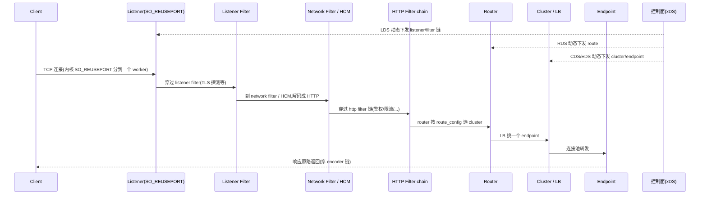

# 第 0 篇 · 第 1 章 · 第一性原理:为什么需要 Envoy

> **核心问题**:你已经很熟悉 Nginx——它是个优秀的反向代理。可一旦你的系统从"几个服务"变成"几百个微服务"、从"配置几个月改一次"变成"服务每天都在频繁上下线",Nginx 那种"配置写死、reload 才生效"的模式就力不从心了。Envoy 做的事,是把"处理每一条流量"做成一串可插拔的 filter(filter chain),把"配什么 filter、转发到哪"做成可动态下发的 xDS 配置——数据面和控制面分离。这套,撑起了整个 Service Mesh(服务网格)范式。它凭什么?

> **读完本章你会明白**:
> 1. Nginx 这类经典代理,在微服务场景下为什么力不从心——静态配置、reload 抖动、跨语言治理难统一,这三道墙不是"加机器"能解决的。
> 2. Envoy 的回答一:**filter chain(数据面)**——为什么把"处理流量"做成一串可插拔、可两向(decoder/encoder)的 filter,是这个时代代理的正确姿势。
> 3. Envoy 的回答二:**xDS(控制面)**——为什么把"配置"从静态文件变成动态下发 + resource version 协商,是微服务治理的关键。
> 4. **data plane / control plane 分离**——这套范式为什么成了 Service Mesh 的基石;Service Mesh 概念是怎么诞生的、Istio 为什么选 Envoy。
> 5. Envoy vs Nginx vs HAProxy 的根本差异——为什么在云原生时代,Envoy 成了数据面的事实标准。
> 6. 为什么 Envoy 用 C++ 写、为什么以 sidecar 形态部署(以及最新的 ambient mesh 趋势)——选型背后的道理。

> **如果一读觉得太难**:先只记住三件事——① Envoy 把处理每条流量做成一串可插拔的 **filter chain**(数据面);② 把配置做成 **xDS 动态下发**、不停机热更新(控制面);③ 全书一句话主线:**一条流量穿过一串 filter,filter 由 xDS 动态热更新——数据面与控制面分离,这就是 Envoy**。

---

## 〇、一句话点破

> **Envoy 把"处理每一条流量"做成一串可插拔的 filter(filter chain),把"配什么 filter、转发到哪"做成可动态下发的 xDS 配置——数据面(data plane)负责跑流量,控制面(control plane)负责动态给配置,两者分离,这就是 Service Mesh 的范式。**

这是结论,不是理由。本章倒过来拆:先讲 Nginx 在微服务场景下为什么力不从心,再讲 Envoy 用 filter chain + xDS 这两件套怎么破局,然后讲 Service Mesh 是怎么从这套范式诞生的、为什么是 sidecar 形态、为什么用 C++,最后把全书地图、架构演进一次铺开。

---

## 一、经典代理的痛:Nginx 在微服务场景下为什么力不从心

要理解 Envoy 为什么被造出来,先得看清它要替代的东西。Nginx 是个优秀的反向代理——高并发、低资源、稳定可靠,撑起了互联网的半壁江山。但当系统演化到"微服务 + 云原生",Nginx 开始撞上三道墙。

### 第一道墙:静态配置,reload 才生效

Nginx 的配置是**静态文件**:你写一份 `nginx.conf`,Nginx 启动时读进去。要改?改完文件,发个 `SIGHUP` 信号让它 **reload**(重新加载)。这在"配置几个月改一次"的传统架构里没问题。可微服务不是这样:

- 几百个服务,后端实例**每天都在频繁上下线**(扩容、缩容、滚动发布、故障重启)。每次实例变更,代理的 upstream 列表都得变。
- 如果靠改配置 + reload 来跟上,你一天要 reload 几百上千次。

而 reload 本身是有代价的,远没有想象中那么"平滑":Nginx 的 reload 会**新起一组 worker 进程**、**老 worker 进入优雅退出**(不再接新连接,但要把手头的请求处理完)。这个交接期里:

- 新老 worker 并存,**内存短时翻倍**;
- 老连接还在老 worker 上慢慢消化,**长连接(比如 gRPC 的长流)可能被中断或拖很久**;
- 高 QPS 下,reload 频繁会导致**连接抖动、尾延迟(p99)飙升**,甚至短暂 5xx。

> **不这样会怎样**:一个天天在变的后端池,如果代理靠静态配置 + reload,要么变更跟不上(reload 太慢、人工太慢)、要么 reload 太频繁导致服务抖动。一个真实案例:某团队用 Nginx 做微服务网关,因为后端频繁扩缩容,每天 reload 上千次,p99 延迟周期性飙到秒级,排查许久才发现是 reload 导致的 worker 交接抖动。**静态配置和动态现实,在这个场景里根本对不上。**

### 第二道墙:每个语言、每个应用自己造治理轮子

微服务里,流量治理不只是"转发"——还有**负载均衡、熔断、重试、超时、限流、可观测、追踪**。传统做法是:每个语言的每个服务,自己在应用代码里(用库)实现这些治理逻辑。

- Java 用 Netflix Hystrix/Feign/Spring Cloud,Go 用 go-kit/某个 resiliency 库,Python 用另一个,Node 又一个……**每个语言一套**,实现还不一致。同样是"熔断",不同库的策略、默认值、语义都不一样。
- 这些库**和业务代码深度耦合**——升级治理库要重新编译、重新发布所有应用。想象一下:你要修一个熔断库的 bug,得让全公司几百个服务都升级依赖、重新构建、滚动发布一遍。
- 治理逻辑分散在各个应用里,**没有统一的可观测**——出问题了,每个应用的监控口径、日志格式、trace 协议都不一样,跨服务排障像大海捞针。

> **不这样会怎样**:如果治理逻辑散在每个应用里,跨语言难统一、升级要重发所有应用、可观测口径不一。一个极端的比喻:这就像每家每户自己发电(库模式),而不是接入统一的电网(网格模式)——重复造轮子,还难以统一管理。

### 第三道墙:网络的八条谬误(再提一次)

和《gRPC》《TiKV》那两本里讲过的一样——分布式系统里,人们总在假设"网络可靠、延迟为零、拓扑不变、管理员只有一个……",这八条**全错**。微服务尤其严重:服务会挂、网络会抖、实例会漂移、异构语言混战。一个合格的代理,必须**把这些不确定性当一等公民来治理**——而 Nginx 当初的设计目标(2002 年诞生的静态反向代理)里,并没有为"持续动态变化的微服务拓扑"留足位置。

### Envoy 要填的坑,正是这三道墙

Envoy(Lyft 工程师 Matt Klein 主导,2016 年开源,2018 年成为 CNCF 继 Kubernetes、Prometheus 后第三个毕业项目)就是冲着这三道墙去的。它的回答,是两个相互配合的核心设计——**filter chain** 和 **xDS**。

> **钉死这件事**:理解 Envoy 的起点,不是"它有哪些配置项",而是**它要用"可动态热更新"的方式,替代"静态配置 + reload"这套旧范式,让代理能跟上微服务的动态现实**。filter chain 和 xDS,就是它的两件套。

---

## 二、Envoy 的回答一:filter chain(数据面)——把处理流量做成一串可插拔的 filter

Envoy 处理每一条流量,不是写死的"一坨逻辑",而是让这条流量**穿过一条可插拔的 filter 链**。这是 Envoy 数据面的灵魂。

### 一条流量,穿过一串 filter

一条 HTTP 请求进 Envoy,大致是这么个旅程:

```
   请求进来
     │
     ▼
   Listener(监听端口,接连接)
     │
     ▼
   Listener Filter 链 (TCP 层:TLS 探测 / proxy_protocol / 原目的地址)
     │
     ▼
   Network Filter 链 (字节流层:tcp_proxy / ratelimit / ...)
     │  ── 其中一个是 HCM(HTTP Connection Manager)──
     ▼
   HTTP Filter 链 (decoder 向:鉴权 → 限流 → fault → router)
     │
     ▼   router 选定 cluster,负载均衡挑 endpoint
   Upstream(连接池 → 后端 endpoint)
     │
     ▼
   HTTP Filter 链 (encoder 向:... → compressor → 响应出去)
```

注意这条链的精妙之处:**每一层、每一个环节都是一个独立的 filter,各干一件事,串起来就成了完整的处理流程**。鉴权是一个 filter,限流是另一个,故障注入又一个……你可以像搭积木一样,在配置里把需要的 filter 拼成一条链。

### 几个真实的 filter,感受"链"的力量

Envoy 内置了几十上百个 filter,每个都极其专注地干一件事:

- **HTTP 层**: `router`(按路由转发)、`ratelimit`(限流)、`fault`(故障注入:故意延迟/abort,测试韧性)、`compressor`(响应压缩)、`jwt_authn`(JWT 鉴权)、`ext_proc`(外接处理:把请求旁路给外部进程加工)、`wasm`(运行 Wasm 扩展)……
- **Network 层**(TCP 字节流):`tcp_proxy`(纯 TCP 转发,代理非 HTTP 协议)、`ratelimit`、`echo`……
- **Listener 层**(TCP 建连前):`tls_inspector`(探测是否 TLS,据此分流)、`proxy_protocol`(解析 PROXY protocol 还原真实客户端 IP)、`original_dst`(还原原始目的地址)……

要做"给所有请求加 JWT 鉴权"?把 `jwt_authn` filter 插进 http filter 链。要"对 10% 流量注入 500ms 延迟做混沌测试"?配 `fault` filter。**行为 = filter 的组合,而不是改代理代码**。

### 洋葱模型:为什么 filter 链是"两向"的

更有意思的是,HTTP filter 链是**两向**的,这就是经典的**"洋葱模型"**:

```
   请求 →  [鉴权 → 限流 → fault → router]  → 后端
   响应 ←  [鉴权 ← 限流 ← fault ← router] ← 后端
           (encoder 向:响应按请求的逆序穿回)
```

请求从外到内穿 decoder 链(鉴权→限流→...→router),响应从内到外穿 encoder 链(按逆序)。这样一个 filter 可以同时、或分别干预"进来的请求"和"出去的响应":压缩 filter 只管 encoder(响应),鉴权 filter 只管 decoder(请求),stats filter 两个方向都记。**两向分离,让每个 filter 只注册自己关心的方向,响应自动按请求逆序穿过**——语义干净,和几乎所有现代中间件框架(各种语言的"中间件"概念)完全吻合。

> **对照 Nginx 的"模块"**:Nginx 也有模块机制,但 Nginx 的模块是**编译期**固定的——你 `./configure` 时选哪些模块,编译进二进制就不能动了。Envoy 的 filter 是**配置期/运行期**拼装的——同一个二进制,换个配置(filter 链)就是另一个代理,还能运行时加载新 filter(Wasm / dynamic_modules)。**这是 Envoy 区别于 Nginx 的第一个根本:可插拔从"编译期"挪到了"配置期/运行期"。**

### filter 怎么决定链的推进:continue / stop / 直接响应

filter chain 不只是"流水线每个 filter 跑一遍"。每个 filter 都有权决定**这条流量接下来怎么走**,这是 filter chain 作为治理载体的运行机制核心:

- **Continue(继续)**:filter 处理完自己的事,把流量交给下一个 filter。最常见的情形。
- **Stop / 拦截**:filter 决定**不再往下传**——比如鉴权 filter 发现请求没带合法 token,它直接在这里停住,自己生成一个 401 响应返回,**根本不让流量走到 router**。这就是"在链里中途拦截并接管"的能力。
- **直接响应**:某个 filter 负责真正把请求发出去(router filter,选好 cluster 转发),或就地构造响应(健康检查 filter 返回 200)。

这套 continue/stop 语义,让 filter 之间有了**控制流**——不是机械地依次执行,而是每个 filter 都能"截断并接管"。限流、鉴权、故障注入这些 filter 能优雅地织进链里,靠的就是"该拦时拦、不该拦时放行"。**这是 filter chain 能承载复杂治理的根本运行机制**(本书 P3-10 会拆到源码)。

> **钉死这件事**:filter chain 是 Envoy 数据面的灵魂——它把"处理流量"从"一坨写死的逻辑",变成了"一条可拼装、可扩展、两向、还能中途拦截的链"。**这是 Envoy 能当"通用数据面"的根**。

---

## 三、Envoy 的回答二:xDS(控制面)——把配置做成动态下发

如果 filter chain 解决了"怎么处理流量",那"配哪些 filter、转发到哪个后端"这些配置,怎么来?这就是 Envoy 的第二个核心设计——**xDS**。

### 配置不是静态文件,是控制面动态下发的

Envoy 的配置,可以不全写在文件里,而是由一个**控制面(control plane)**通过 **xDS 协议**动态下发。xDS 有五类,各管一块:

| xDS | 管什么 | 例子 | 动态价值 |
|-----|--------|------|---------|
| **LDS**(Listener) | 监听器:端口 + filter 链 | 新增对外端口 | 不重启起 listener |
| **RDS**(Route) | 路由:请求转发规则 | 灰度切流 10% | 热更新路由 |
| **CDS**(Cluster) | 集群:上游服务 | 新增上游集群 | 动态加集群 |
| **EDS**(Endpoint) | 端点:后端实例 | 实例上下线 | **秒级感知,核心** |
| **SDS**(Secret) | 密钥:TLS 证书 | 证书轮换 | 不重启换证书 |

### 动态性:微服务的现实,需要动态配置

xDS 的核心价值是**动态**——尤其 EDS,是微服务"频繁上下线"的解药:

- **EDS**:后端扩容了一个新 Pod,控制面通过 EDS 把新 endpoint 推给 Envoy,**秒级生效**,不用 reload;实例挂了,EDS 秒级摘除。
- **RDS**:要做灰度发布(10% 流量切新版)?控制面推一份新 route_config,Envoy 热更新,**不停机**。
- **LDS**:新开一个对外服务?LDS 推一个新 listener,Envoy 运行中就监听上了新端口。
- **SDS**:TLS 证书到期?SDS 推新证书,Envoy 换上,**不重启**(传统要重启或 reload)。

### resource version 协商:配置一致性的保证

xDS 不是"控制面说什么 Envoy 就马上变成什么"那么简单。分布式系统里,单向推送有**一致性陷阱**:控制面发了 v2,网络抖了 Envoy 没收到;或 Envoy 正用 v1 处理流量,控制面又推了 v3。怎么保证"Envoy 当前到底生效到哪个版本,控制面也清楚"?

Envoy 的解法是 **resource version 协商 + ACK/NACK**:

- 控制面每份配置带 `version_info`(版本号)和 `nonce`(防重放)。
- Envoy 收到后,**若接受**回 **ACK**(带上这个版本号);**若不接受**(配置非法)回 **NACK**(带拒绝原因,**保持旧版本**)。
- 控制面据此知道"每个 Envoy 到底生效到哪个版本了"。

这套显式握手,保证了控制面和数据面之间的**配置一致性**——这是 xDS 能可靠动态更新的根(技巧精解里拆透)。

### xDS 是 Envoy 定义的,承接《gRPC》那本

一个重要的历史事实:**xDS 协议最初就是 Envoy 设计的**(在 `api/` 目录,现在 envoyproxy/data-plane-api)。它太好用,以至于 **gRPC 客户端也内置了 xDS client**(《gRPC》那本的 P6-22)——gRPC 客户端可以不经过 Envoy sidecar,直接作为 xDS 客户端,从控制面(Istio)拿配置,自己做负载均衡和路由。**这是 Envoy 对整个云原生生态的贡献**:xDS 成了控制面与数据面之间的通用契约。

> **钉死这件事**:xDS 是 Envoy 控制面的灵魂——它把"配置"从静态文件,变成了控制面动态下发、版本协商、不停机热更新。**这是 Envoy 区别于 Nginx 的第二个根本,也是它能跟上微服务动态现实的钥匙。**

---

## 四、data plane / control plane:Service Mesh 范式与它的诞生史

filter chain + xDS 合在一起,催生了一个更大的范式——**数据面 / 控制面分离**。而这套范式,有个如雷贯耳的名字:**Service Mesh(服务网格)**。它的诞生史,本身就是理解 Envoy 价值的最好注脚。

### Service Mesh 这个词,是怎么诞生的

2016 年,做 Linkerd(另一个代理)的公司 Buoyant,发了一篇博客《What's a service mesh? And why do I need one?》,**首次提出"Service Mesh"这个词**。它的定义精准戳中了前面讲的痛点:

> Service Mesh 是一个**专门处理服务间通信的基础设施层**——它把"流量治理(LB/熔断/重试/可观测/安全)"从应用代码里抽出来,统一交给一层独立的代理网络。

2017 年,**Istio** 横空出世(Google + IBM + Lyft 联合)。Istio 做了一个关键选择:**数据面直接用 Envoy**(而不是自己写)。从此,Envoy 成了 Service Mesh 数据面的事实标准。

### 把"跑流量"和"决定怎么跑"分开

Service Mesh 的核心,是这个清晰的分层:

- **数据面(data plane)**:真正处理每一条流量的角色——在 Envoy 体系里,就是那个跑 filter chain 的 Envoy 进程。职责纯粹:**按收到的配置,处理流量**。
- **控制面(control plane)**:决定"配置应该是什么"的角色——比如 **Istio**。它收集整个集群信息(有哪些服务/实例、要什么路由、熔断策略),算出每份配置,通过 xDS 下发给各个 Envoy。

```
   控制面 (Istio)                         数据面 (一堆 Envoy sidecar)
   ┌─────────────────┐                   ┌──────────────┐
   │  收集集群信息    │  ──xDS 下发──▶   │ Envoy (sidecar)│ ← 服务 A 旁边
   │  算出配置        │                   ├──────────────┤
   │  (路由/LB/熔断) │  ◀──ACK/NACK──   │ Envoy (sidecar)│ ← 服务 B 旁边
   └─────────────────┘                   └──────────────┘
```

这种分离的美妙之处:**数据面通用、无状态、可替换;控制面聪明、有全局视图、可独立演进**。Istio 负责算策略,Envoy 忠实执行,两者通过 xDS 这个标准契约通信。**任何能说 xDS 的控制面,都能驱动 Envoy**——这就是为什么 Consul Connect、Open Service Mesh、Kuma 都能复用 Envoy。

> **钉死这件事**:filter chain + xDS,最终结晶成了 data plane / control plane 分离的 Service Mesh 范式。Envoy 是这个范式的数据面标杆,xDS 是控制面与数据面的通用语言。学 Envoy,等于学整个 Service Mesh 的底层。

---

## 五、Envoy vs Nginx vs HAProxy:云原生时代为什么是 Envoy

讲到这里,你可能想问:代理不止 Envoy 一个,经典的 Nginx、HAProxy 也都很强,为什么云原生时代 Envoy 成了宠儿?一张表说清三者的根本差异:

| 维度 | Nginx | HAProxy | **Envoy** |
|------|-------|---------|----------|
| 诞生年代/语言 | 2004 / C | 2001 / C | **2016 / C++** |
| 配置 | 静态文件,reload 生效 | 静态文件,reload 生效 | **xDS 动态下发、热更新** |
| 可插拔 | 编译期模块(改了要重编译) | 编译期 | **filter chain 配置期拼装 + Wasm/dynamic 运行时扩展** |
| HTTP/2、gRPC | 后期支持,不够一等 | 后期支持 | **原生一等(HTTP/2/3、gRPC、流)** |
| 可观测 | 基础 access log + 第三方 | 基础 stats | **stats(histogram)+ access log + tracing 原生统一** |
| Service Mesh 数据面 | 需魔改(如 OpenResty/Kong) | 不是为此设计 | **原生为此设计(Istio 选它)** |

这张表的关键不是"Envoy 处处碾压"——Nginx/HAProxy 作为经典反向代理/LB,性能、稳定性都是顶级,**在"静态、固定的入口流量"场景至今是最优解之一**。差异在于:**Envoy 从第一天起,就是为"动态、可编程、云原生"设计的**——动态配置(xDS)、可插拔(filter chain)、现代协议一等(HTTP/2/3/gRPC)、统一可观测,这四样,是经典代理后天补都补不全的基因。

> **钉死这件事**:Envoy 不是"更好的 Nginx",而是**为另一个时代(动态微服务)而生的另一种代理**。Nginx 解决"如何高效地把固定流量转发出去",Envoy 解决"如何在动态变化的拓扑里,可编程地治理流量"。

### 第四根支柱:统一可观测

除了动态配置(xDS)、可插拔(filter chain)、现代协议一等(HTTP/2/3/gRPC),Envoy 还有第四根区别于经典代理的支柱——**统一可观测**。所有穿过 Envoy 的流量,都被**同一套机制**观测,这是它"统一数据面"角色的另一半:

- **stats**:counter(计数)/ gauge(当前值)/ **histogram**(分桶延迟统计,p50/p95/p99 都从这里来)。为避免锁竞争,每个 worker 用 **thread-local 副本**自己攒,main 线程定期归并——**全程无锁**(本书 P1-02、P6-20 拆透)。
- **access log**:结构化访问日志,每个请求一条,字段齐全,可输出到文件 / gRPC / 多种 sink。
- **tracing**:分布式追踪(request_id 生成 + trace 上下文透传,对接 OpenTelemetry / Zipkin / Jaeger)。

这三者统一,意味着:不管你的微服务用什么语言写的,只要流量经过 Envoy,**可观测口径就完全一致**——同一个指标定义、同一份日志格式、同一条 trace 链。这是 Service Mesh 能做到"全链路统一监控 / 排障"的根,也是经典代理(各自接一套监控)做不到的。

---

## 六、为什么是 sidecar(以及最新的 ambient 趋势):Envoy 的部署形态

既然 Envoy 这么好,为什么不直接做成库嵌进每个应用,而要做成 **sidecar**(每个服务旁边一个独立 Envoy 进程)?

### 库模式 vs sidecar 模式

- **库模式**(治理逻辑做成库嵌进应用):省一个进程、省一跳网络。但:① **跨语言难统一**——每语言重造一遍库;② **升级要重编译发布所有应用**;③ **业务与治理耦合**——治理 bug 搞挂业务,反之亦然。
- **sidecar 模式**(每服务旁一个 Envoy):多一个进程、流量多一跳。但换来:① **语言无关**;② **独立升级**(只重启 sidecar);③ **业务治理解耦**(进程隔离)。

> **为什么 sidecar 胜出**:在微服务场景,"统一治理 + 独立升级 + 语言无关"的价值,远超"多一跳 localhost(loopback,延迟极低)"的代价。这就是为什么 Service Mesh 普遍选 sidecar、Envoy 普遍以 sidecar 部署。**代价是资源**(每个 Pod 多一个 sidecar 容器占 CPU/内存)——在大集群里这是不小的开销。

### 最新的趋势:ambient mesh(无 sidecar)

sidecar 的资源开销促使了新探索:2022 年起,Istio 推出 **ambient mesh**(无 sidecar 模式)——不再每个 Pod 注入 sidecar,而是用一层 **ztunnel**(一个用 Rust 写的轻量 Envoy 衍生品,只做 mTLS) + 按需的 **waypoint proxy**(Envoy,做七层治理)。这把"每个 Pod 一个 sidecar"的开销,摊薄成了"每个节点一个 ztunnel"。这是 Envoy 生态的最新演进,本书 P7-23 收束会讲。

---

## 七、一条流量的完整旅程(全书地图)

把前面讲的拼起来,一次请求从进 Envoy 到转给后端再回来,完整旅程是这样的。**这张图就是全书的地图**,每个箭头都是后面某一章的主角:



对应章节:
- **Listener + SO_REUSEPORT 分 worker**(`source/server/`、`source/common/listener_manager/`)→ P1-02(线程)+ P2-05(listener);
- **listener filter / network filter**(`source/extensions/filters/listener/`、`filters/network/`)→ P2-06 / P2-07;
- **HCM 把 TCP 解码成 HTTP**(`source/common/http/`)→ P3-08;
- **HTTP filter chain 两向**(`source/extensions/filters/http/`)→ P3-10;
- **router 路由匹配**(`source/common/router/`)→ P3-11;
- **cluster / LB / endpoint**(`source/common/upstream/`、`source/extensions/clusters/`、`load_balancing_policies/`)→ P4-12/13;
- **xDS 动态下发**(`source/common/config/`、`source/extensions/config_subscription/`)→ 第 5 篇四章。

> **钉死这件事**:读这本书,就是跟着这条旅程,一站一站走完。同时记住——这条旅程上的所有 filter 和路由表,都不是写死的,而是控制面通过 xDS 动态下发、热更新不停机的。

---

## 八、为什么是 C++:一个工程选型的深度

Envoy 用 **C++** 写,而 Nginx 用 C、Linkerd2-proxy 用 Rust。这个选型背后,折射了 Envoy 的设计取舍:

- **不用 C(Nginx 的选择)**:C 性能顶尖,但**缺乏抽象**(类、模板、RAII)。Envoy 的 filter chain 是高度插件化架构(几十上百个 filter、可拼装、可扩展),用纯 C 写这种复杂抽象非常痛苦。C++ 的类、模板、继承,让 filter chain 这种"可插拔插件"架构成为可能。
- **不用 Rust**:Envoy 诞生于 2015-2016。那时 Rust 还远没现在成熟(生态、async、crates 都在早期),而 C++ 已是工业级、生态庞大(abseil、protobuf、bazel 都现成)。Envoy 选了当时"性能 + 可抽象 + 生态成熟"都占的 C++。
- **不用 Go**:网络代理要极低延迟、极低尾延迟(p99),Go 的 GC 停顿在这种场景是痛点。C++ 手动内存管理(配合 arena/智能指针)能压榨到极致。

> 这也意味着:读 Envoy 源码,你会看到大量 C++ 的"硬核"技巧——模板 filter 注册、abseil 库、thread-local 无锁、libevent 封装。本书在涉及处会拆"它怎么做到的、为什么 sound"(对标《gRPC》C++ core 那套)。

---

## 九、一个绕不开的背景:Envoy 也在持续演进

最后,和《gRPC》《TiKV》一样,必须诚实交代——它不影响你理解"为什么",但**严重影响你读源码**:

> **Envoy 处于多处演进中。**

1. **HTTP/3**:`source/common/quic/`(基于 Google 的 quiche),HTTP/2 与 HTTP/3 并存。涉及处讲清"HTTP/3 为什么是 UDP/QUIC、连接迁移"。
2. **xDS 协议演进**:SotW(全量)→ **Delta xDS**(只发变更,省带宽)→ **ADS**(聚合订阅,一个流拉所有类型,保证顺序)。涉及处讲清演进动机。
3. **Wasm 扩展 vs dynamic_modules**:Wasm(沙箱字节码,早期动态扩展)vs dynamic_modules(动态 C++ 模块,较新高性能)。两者对照。
4. **事件引擎**:经典 libevent/epoll,新版探索 **io_uring**。
5. **hot restart**(`source/server/hot_restart_impl.cc`):Envoy 招牌——**零停机重启**(新进程通过 fd 传递接管 listener socket)。这是固有特性,但要讲清它和 listener drain 的区别。

> **本书的态度**:以当前 master(`df2c77d`,1.39.0-dev)为准,老博客大片过时,不能当唯一依据。

---

## 十、技巧精解:两个第一性洞察

本章是概念定调章。有两个最硬核的第一性洞察值得单独钉死。

### 洞察一:filter chain 为什么用"两向(decoder/encoder)"而不是单向

朴素想法:filter 链就一条,请求从前往后穿,响应也从前往后穿。但 Envoy 的 HTTP filter 链是**两向**的——请求穿 decoder 链,响应穿 encoder 链(逆序)。为什么?

因为**请求和响应的处理逻辑,天然不对称**:鉴权 filter 只关心"进来的请求"(decoder);压缩 filter 只关心"出去的响应"(encoder);stats filter 两个方向都记。单向链会让所有 filter 挤一条,顺序还乱(响应顺序应和请求相反)。**两向分离,让每个 filter 只注册关心的方向,响应自动按请求逆序穿过 encoder 链**——这就是"洋葱模型"(请求从外到内、响应从内到外),语义干净,几乎所有现代 HTTP 中间件框架的共同选择。

> **不这么设计会怎样**:单向链会让"只关心响应的 filter"被迫也出现在请求路径(哪怕它啥也不干),顺序还容易错乱。两向是洋葱模型的正确实现。

### 洞察二:xDS 的 resource version 协商,为什么能保证配置一致

xDS 动态下发,听起来简单——控制面推,Envoy 用。但分布式系统里有**一致性陷阱**:控制面发了 v2,网络抖了 Envoy 没收到;或控制面以为"所有 Envoy 都切到 v2 了",其实有的还在 v1。

Envoy 的解法是 **resource version 协商 + ACK/NACK**:控制面每份配置带 `version_info` + `nonce`;Envoy 收到若接受回 ACK(带版本号),若不接受回 NACK(保持旧版);控制面收到 ACK 才知道"Envoy 已生效到这个版本"。这套**显式一致性握手**,不是"best effort 推送",而是**带确认的可靠下发**。

> **不这么设计会怎样**:如果 xDS 只是单向推送,网络抖动会导致 Envoy 用的版本和控制面以为的不一致——比如控制面以为"所有 Envoy 都摘除了故障实例(EDS v2)",其实有的 Envoy 还在往故障实例发流量(v1)。这种不一致在故障摘除、灰度发布场景会引发严重事故。ACK/NACK 让配置下发**可观测、可确认**,这是生产级动态配置的底线。

---

## 十一、章末小结

### 回扣主线

本章是全书唯一的"纯概念章"。它立起了全书最重要的三个东西:

1. **主线**:**一条流量穿过一串 filter,filter 由 xDS 动态热更新——数据面与控制面分离,这就是 Envoy。**
2. **二分法**:**数据面**(filter chain / worker 事件循环)vs **控制面**(xDS 动态下发)。
3. **范式**:data plane / control plane 分离 = Service Mesh。

后续 22 章,都是这三个东西的展开。

### 五个为什么

1. **为什么 Nginx 在微服务下力不从心?**——静态配置 + reload 跟不上频繁变更(reload 本身有 worker 交接抖动)、跨语言治理难统一、可观测口径不一。
2. **为什么 Envoy 把处理流量做成 filter chain?**——可插拔 + 可组合 + 可扩展(filter 配置期拼装、还能 Wasm/dynamic 运行时扩展),两向洋葱模型语义干净;区别于 Nginx 编译期固定的模块。
3. **为什么 Envoy 用 xDS 动态下发配置?**——微服务后端频繁上下线,xDS(尤其 EDS)秒级感知、不停机热更新;resource version 协商 + ACK/NACK 保证一致性。
4. **为什么 Envoy 以 sidecar 部署?**——语言无关 + 独立升级 + 业务治理解耦,价值超过"多一跳 localhost"的代价(最新 ambient mesh 在优化这个开销)。
5. **为什么 data plane / control plane 分离成了 Service Mesh 范式?**——把治理统一抽到数据面(Envoy)、策略集中到控制面(Istio),xDS 成通用契约,实现跨语言统一治理与可观测。

### 想继续深入往哪钻

- 想看 Envoy 官方架构:读 Envoy 官方 docs(`source/docs/` 下有 `xds.md`、`listener.md`、`subset_load_balancer.md` 等架构文档)。
- 想理解 xDS:读 `source/docs/xds.md`,本书第 5 篇拆到 proto 级。
- 想理解 Service Mesh:读 Buoyant 2016 那篇开创性博客 + Istio 架构文档,本书 P7-23 收束。
- 想动手感受:部署一个 Istio,看 sidecar 注入后的 Envoy 配置(`istioctl proxy-config`),或读 envoy admin API。

### 引出下一章

我们搞清楚了"为什么需要 Envoy"和它的两件套(filter chain + xDS)。那么,谁来跑这条 filter chain?Envoy 怎么用少量线程扛住海量连接、还做到 thread-local 无锁?下一章 P1-02,我们从最基础的 **线程模型:MainThread + N worker,thread-local 无锁** 开始,拆 Envoy 并发模型的根。

> **下一章**:[P1-02 · 线程模型:MainThread + N worker,thread-local 无锁](P1-02-线程模型-MainThread-N-worker-thread-local无锁.md)
