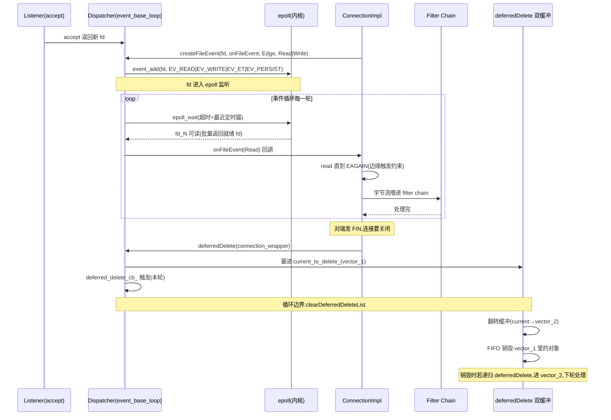

# 第 1 篇 · 第 3 章 · 事件引擎:libevent dispatcher

> **核心问题**:一个 worker 线程,要同时盯着几千甚至几万个 TCP 连接——这条连接刚到数据要 read,那条连接写缓冲空了要 write,还有几条在等超时定时器到期。一个线程怎么"同时"管住这几万个 fd,既不阻塞在某一个上、也不把 CPU 跑爆?Envoy 的答案,是把 Linux 内核的 epoll(以及跨平台的事件库 libevent)封装成一层 `Dispatcher`,用一个**事件循环 + 回调驱动**的模型,让单线程串行地处理源源不断就绪的事件。本章拆透这层 dispatcher。

> **读完本章你会明白**:
> 1. 为什么"一个连接一个线程"的朴素模型在几千连接时会撞墙(线程数爆炸、内存爆炸、上下文切换爆炸)——以及为什么**事件循环 + 回调驱动**是高并发代理的正确姿势。
> 2. Envoy 怎么把 epoll 封装成 `Dispatcher`:fd 事件、定时器、延迟任务、信号**全部走同一个事件循环**,为什么这种"统一抽象"是单线程无锁的前提。
> 3. **反转控制(好莱坞原则)**——不是"代码主动去 `read`",而是"我注册对这个 fd 可读感兴趣,dispatcher 在它就绪时回调我",为什么这样能用单线程扛海量连接。
> 4. **deferred delete(延迟删除)**——为什么不能在跑回调时直接 `delete` 一个对象,要用双缓冲把它延后到事件循环边界再销毁,以及 Envoy 的双 vector 翻转技巧。
> 5. Envoy 当前的真实架构:libevent 仍是默认事件引擎,**io_uring 作为可选实验特性已落地**(`source/common/io/`)——以源码为准,纠正"Envoy 还在纯 libevent"的老印象。

> **如果一读觉得太难**:先只记住三件事——① **dispatcher = epoll 的封装**,一个 worker 跑一个 dispatcher 事件循环;② **反转控制 = 注册回调而非主动 read**,这是单线程扛海量连接的关键;③ **定时器/延迟删除/信号都走同一个循环**,所以单线程串行执行、天然无竞争。后面遇到任何看不懂的细节,回到这三条。

---

## 〇、一句话点破

> **dispatcher 是 epoll 的封装:worker 线程在一个 `while` 循环里反复"问内核哪些 fd 就绪了、哪些定时器到期了",然后**对每一个就绪事件回调**它注册的处理函数——全程串行、单线程、无锁。一个 worker 因此能同时管住几万个连接。**

这是结论,不是理由。本章倒过来拆:先讲"一个连接一个线程"为什么会撞墙,再讲 epoll 批量事件 + 反转控制这套模型为什么是出路,然后讲 Envoy 怎么用 libevent 把 epoll 封装成 `Dispatcher`,接着拆透统一抽象(fd/timer/post/deferred delete/signal 全走一个循环)的设计动机,最后把 deferred delete 双缓冲这个最硬核的技巧单独钉死,并交代 io_uring 这个最新演进。

---

## 一、承接:P1-02 留下的那条尾巴

上一章 P1-02 讲了 Envoy 的线程模型:一个 MainThread + N 个 worker 线程,连接被 `SO_REUSEPORT` 内核负载均衡到某个 worker 后就**绑定**在这个 worker 上不跨线程,每个 worker 各自跑自己的事件循环,thread-local 数据无锁归并。那时我们说:"worker 是**谁**在跑 filter chain,dispatcher 是它**怎么**干活。"本章就来拆这个"怎么"。

先定位到 worker 线程真正进入事件循环的那一行。`WorkerImpl::threadRoutine` 是每个 worker 线程的入口,它做完启动杂事后,最后一脚踢开事件循环:

```cpp
// source/server/worker_impl.cc:166-177(简化,非源码原文)
void WorkerImpl::threadRoutine(OptRef<GuardDog> guard_dog, const std::function<void()>& cb) {
  ENVOY_LOG(debug, "worker entering dispatch loop");
  dispatcher_->post([this, &guard_dog, cb]() {
    cb();
    if (guard_dog.has_value()) {
      watch_dog_ = guard_dog->createWatchDog(...);
    }
  });
  dispatcher_->run(Event::Dispatcher::RunType::Block);   // <-- 这里一进去就不回来了
  ENVOY_LOG(debug, "worker exited dispatch loop");
  ...
}
```

[worker 进入 dispatch loop](../envoy/source/server/worker_impl.cc#L166-L182) 那行 `dispatcher_->run(Event::Dispatcher::RunType::Block)` 是关键——worker 线程的大部分生命周期,就耗在这个 `run()` 里。MainThread 也是同样的套路:`server.cc:1087 dispatcher_->run(Event::Dispatcher::RunType::Block)`([main thread dispatch loop](../envoy/source/server/server.cc#L1086-L1088))。所以**整个 Envoy 进程的 CPU 时间,几乎全在各个 dispatcher 的 `run()` 里转圈**。

这个 `run()` 内部到底在转什么?就是本章的主角——事件循环。

---

## 二、朴素方案的墙:为什么"一个连接一个线程"撑不住几千连接

在讲 dispatcher 之前,先讲清楚它**为什么必须存在**。一个最朴素的写代理思路是:**每来一个连接,起一个线程专门伺候它**。这个线程里就 `read` → 处理 → `write`,阻塞 I/O,代码写起来直观得像读教科书。教科书示例能跑,但生产环境的代理,几千上万连接是常态,这套会撞三道墙。

### 第一道墙:线程数 = 连接数,内存先爆

每个线程要分配独立的**栈空间**。Linux 默认线程栈是 8 MB(虽然实际是按需 commit,但虚拟地址空间先占住),即使实际只用几十 KB,系统对线程总数的上限也摆在那(`ulimit -u`、`kernel.pid_max` 之类)。

- 1000 个连接 = 1000 个线程,8 GB 虚拟地址空间没了。
- 10000 个连接?很多系统直接拒绝创建线程(`EAGAIN`),或者把进程的虚拟地址空间撑爆。
- 一个微服务网关,日常几万连接是家常便饭——这套根本起不来。

> **不这样会怎样**:某团队用"一个连接一个线程"的 Python/Java 阻塞模型做内网代理,连接数上千后 `pthread_create` 开始返回 `EAGAIN`,进程起不来;即便加内存勉强起来,GC/上下文切换也把延迟拉到不可用。"线程数随连接数线性增长"这个假设,在万级连接场景直接破产。

### 第二道墙:上下文切换把 CPU 吃光

就算内存够、线程能创建,**几千个线程在少量 CPU 核上跑,CPU 大量时间浪费在上下文切换上**。每次切换要保存/恢复寄存器、刷新 TLB、可能的 cache miss,一次切换几微秒。如果线程数远超核数,调度器光是在切线程上就耗掉大半 CPU,真正干活的时间反而少。

更糟的是,这些线程**绝大部分时间都在阻塞 `read` 上等数据**——它们不是在干活,而是在睡觉。让一个"睡觉的线程"占着调度槽,纯属浪费。

### 第三道墙:线程间共享数据要加锁,锁竞争又把延迟拉上去

如果这些线程还要共享一些状态(连接表、统计计数、路由表),就得加锁。几千个线程抢同一把锁,锁竞争会让尾延迟(p99)飙到不可控。这正是 P1-02 讲 thread-local 无锁要解决的——而 thread-local 无锁的前提,正是"每个 worker 用少量线程 + 事件循环",而不是"一个连接一个线程"。

> **钉死这件事**:"一个连接一个线程"的根本病,是**让"等待"这个动作占着线程不放**。一个连接 99% 的时间在等数据,却让一个线程整天地阻塞在 `read` 上陪它等——线程是稀缺资源(CPU 调度单位),拿来当"等待"的容器,是巨大浪费。**正确的姿势是:把"等待"这件事,从占用线程,变成让内核通知你。**

这就是事件循环的出发点:不让线程陪连接等,而是让内核告诉线程"这些 fd 现在就绪了,你一次性来处理"。

---

## 三、出路:epoll 批量事件 + 反转控制

那怎么让内核"通知"线程?这就是 `epoll`。关于 epoll 的内部数据结构(红黑树存监听 fd、就绪链表存就绪 fd、为什么是 O(1) 就绪),我们在《Linux 内核》那本的 IO 子系统篇拆透了;关于 Reactor 模式(事件循环 + 回调驱动)的完整形态,在《Tokio》那本的 `mio`/`Reactor` 章也拆透了。**本章不重讲 epoll 的内核原理,只讲 Envoy 怎么把它封装成 dispatcher**。没读过那两本的读者,先记住两个结论:

1. **`epoll_wait` 一次返回一批就绪的 fd**(而非 `select`/`poll` 那样线性扫描整个 fd 集合)。所以即便你监听 10 万个 fd,每次只需要处理真正就绪的那几十个,复杂度和"就绪 fd 数"相关,与"总 fd 数"无关。这就是高并发的根。
2. **Reactor 模式**:一个线程跑 `while (true) { events = epoll_wait(); for (e : events) handle(e); }`,对每个就绪事件调用预先注册的回调。这就是"事件循环"。

### 反转控制:不是"我去 read",是"你来叫我"

Reactor 模式最关键的一跳,是**反转控制(Inversion of Control,好莱坞原则——Don't call us, we'll call you)**:

- **朴素模型(阻塞 I/O)**:代码主动去 `read(fd)`,没数据就阻塞挂起,等数据来了内核把你唤醒,继续往下走。**控制流在"我"手里**,我决定何时读、读多少。
- **反转控制(事件驱动)**:我先告诉 dispatcher"我对这个 fd 的**可读**事件感兴趣,这是我的回调 `cb`",然后就**不管它了**,继续干别的(或回去转事件循环)。等这个 fd 真的有数据了,内核通知 dispatcher,dispatcher 在事件循环里**调用我的 `cb`**——此时 `read` 必定立刻有数据,不会阻塞。**控制流交给了 dispatcher**,它来决定何时叫我。

```
   朴素模型(阻塞 I/O,一个连接一个线程)        反转控制(事件驱动,单线程扛多连接)
   ┌──────────────────────┐                  ┌──────────────────────────────┐
   │ thread_1:            │                  │ worker thread(就一个):      │
   │   while (true) {     │                  │   while (true) {             │
   │     n = read(fd_1)   │ ← 阻塞,挂起     │     events = epoll_wait()    │ ← 一次性拿一批
   │     ...              │                  │     for (e : events) {       │
   │   }                  │                  │       e.callback(e.fd)       │ ← 回调预注册的处理
   │ thread_2: ...        │                  │     }                        │
   │ thread_3: ...        │                  │   }                          │
   │ (N 个线程 = N 个连接) │                  │ (1 个线程 = N 个连接)        │
   └──────────────────────┘                  └──────────────────────────────┘
```

> **不这样会怎样**:如果坚持"我去 read",那么"等数据"这个动作必须有个载体来扛着——要么是线程(阻塞,一个连接一个线程,撞前面的三道墙),要么你得自己造一套状态机把"等待中"的连接记下来(那就是在重新发明 epoll + Reactor)。**反转控制,本质上是把"等待"这个状态,从用户态线程,挪到了内核的 epoll 就绪队列里**——内核用一个高效的数据结构替你扛着几万个"正在等"的 fd,谁就绪了就把谁拎出来给你。线程因此只需少量(甚至一个),纯用来"处理就绪事件",不再用来"陪等"。

这就是为什么一个 worker 线程能扛几万连接:线程不陪等,内核替它等;线程只负责"事件来了就回调"。

### epoll 批量事件:为什么 O(1) 就绪是高并发的根

这里值得再强调一下 epoll 的"批量"特性对 dispatcher 设计的意义——它直接决定了 dispatcher 的吞吐模型。`select`/`poll` 的工作方式是:你把所有监听的 fd(可能 10 万个)塞进一个集合,内核**线性扫描**整个集合看哪些就绪,复杂度 O(总 fd 数)。10 万个 fd 里只有 10 个就绪,你也要扫 10 万次。而 epoll 维护一个**就绪链表**:fd 状态翻转时内核顺手把它挂进就绪链表,`epoll_wait` 只需把这个链表里的事件**搬出来**——复杂度 O(就绪 fd 数)。

这带来两个直接后果,塑造了 dispatcher 的形态:

1. **单次 `epoll_wait` 能拿一批**。一次调用返回 N 个就绪事件(N 可能几十、几百),dispatcher 在循环里**顺序处理这一批**,然后立刻进下一轮 `epoll_wait`。这就是为什么 dispatcher 的循环主体是 `while { events = epoll_wait(); for (e: events) handle(e); }`——它天然是"批量取、批量处理"。
2. **fd 总数不影响单次开销**。监听 10 万个 fd 和监听 1000 个 fd,只要就绪数相同,`epoll_wait` 的开销几乎一样。这就是为什么一个 worker 能扛几万连接——不是"几万连接每个都花一份 CPU",而是"几万连接里同一时刻就绪的就那么几十个,只花处理那几十个的 CPU"。

(epoll 内部红黑树存监听 fd、双链表存就绪 fd、`EPOLL_CTL_ADD/MOD/DEL` 怎么维护兴趣集合,这些内核原理见《Linux 内核》那本 IO 篇。本章只用到它的行为契约:O(1) 就绪、批量返回。)

### Envoy 选了 libevent 来封装 epoll

Envoy 没有直接裸调 `epoll_wait`、`epoll_ctl`,而是用了 **libevent** 这个跨平台的事件库。libevent 在 Linux 上底层就是 epoll(在 macOS 上是 kqueue,在 Windows 上是 wepoll——见 `libevent_scheduler.cc:19-30` 的平台分支),它把"注册 fd + 回调"、"添加定时器"、"处理信号"统一成了一套 C API(`event_add`、`event_base_loop`、`evtimer_assign`、`evsignal_assign` 等)。

> **为什么选 libevent 而非直接 epoll?**——三个理由:① **跨平台**。Envoy 要在 Linux/macOS/Windows 都能跑,直接 epoll 把它锁死在 Linux。libevent 一层抽象,上层代码统一。② **统一抽象**。libevent 把 fd 事件、定时器、信号**三种事件源**统一成 `event` 这个结构 + `event_base` 这个循环——这正好契合 Envoy "统一 dispatcher" 的设计(下一节讲)。③ **生态成熟**。libevent 是 2000 年诞生的老牌库,稳定、bug 少、API 文档齐全,Envoy 2015 年起步时它是合理选择。**代价**是多一层间接(libevent 内部又调 epoll),但相比它带来的统一抽象,这点开销可忽略。

> **为什么选 libevent 而非自研?**——自研一套跨平台事件库,等于把 libevent 重新造一遍。Envoy 的核心价值在 filter chain + xDS,不在事件库。把精力花在自研事件库上,是舍本逐末。所以 Envoy 专注做 dispatcher 这一层抽象(下一节),把跨平台事件源交给 libevent。

源码里能看到这个选择:`source/common/event/BUILD` 里 `dispatcher_lib` 直接依赖 `libevent_lib` 和 `libevent_scheduler_lib`([BUILD 依赖](../envoy/source/common/event/BUILD#L117-L119))。libevent 在进程启动时全局初始化一次(`libevent.cc` 里的 `Libevent::Global::initialize()`,在 POSIX 下调 `evthread_use_pthreads()` 让 libevent 内部线程安全、并 `signal(SIGPIPE, SIG_IGN)` 忽略 SIGPIPE——[libevent 全局初始化](../envoy/source/common/event/libevent.cc#L15-L25))。

---

## 四、Dispatcher 接口:把一切事件源统一成一套 API

Envoy 没有让上层代码直接摸 libevent 的 C API,而是在它之上包了一层 `Event::Dispatcher` 抽象(纯虚接口在 `envoy/event/dispatcher.h`)。这一层抽象是本章的真正主角。先看它对外暴露了哪些"造事件"的方法:

```cpp
// envoy/event/dispatcher.h(简化示意,非源码原文,挑核心方法)
class Dispatcher : public DispatcherBase, public ScopeTracker {
 public:
  // fd 事件:监听一个 fd 的可读/可写/关闭
  virtual FileEventPtr createFileEvent(os_fd_t fd, FileReadyCb cb,
                                       FileTriggerType trigger, uint32_t events) PURE;
  // 定时器:到点回调一次(可重设)
  virtual Event::TimerPtr createTimer(TimerCb cb) PURE;
  // 可调度回调:手动往事件循环里塞一个回调(立即或下一轮)
  virtual Event::SchedulableCallbackPtr createSchedulableCallback(std::function<void()> cb) PURE;
  // 延迟删除:把对象延后到循环边界销毁
  virtual void deferredDelete(DeferredDeletablePtr&& to_delete) PURE;
  // 跨线程投递:别的线程往这个 dispatcher 的循环里塞回调
  virtual void post(PostCb callback) PURE;
  // 信号:监听一个 POSIX 信号
  virtual SignalEventPtr listenForSignal(signal_t signal_num, SignalCb cb) PURE;
  // 跑事件循环
  virtual void run(RunType type) PURE;
  virtual void exit() PURE;
  ...
};
```

[Dispatcher 接口](../envoy/envoy/event/dispatcher.h#L103-L280) 看似方法很多,核心就一句话:**fd、定时器、可调度回调、延迟删除、跨线程 post、信号——全部走这一个 dispatcher 的事件循环**。这是 Envoy dispatcher 设计的灵魂。

### 为什么要把这么多东西统一进一个循环?

> **不这样会怎样**:设想如果 fd 事件走 epoll 一个循环、定时器走一个单独的定时器线程、信号靠一个专门的 signal handler 线程、跨线程任务靠一个任务队列线程——那就有**多套事件源、多个线程**,而它们要访问的共享状态(连接表、filter chain、stats)就得加锁,锁竞争又把延迟拉上去。而且不同事件源之间有**时序依赖**:比如"收到信号 → 触发延迟删除某个对象 → 然后跑某个 post 回调",如果它们在不同线程,时序根本无法保证。

所以 Envoy 的解法是:**一个 worker,一个 dispatcher,一个事件循环,单线程串行**。所有事件源(fd/timer/post/deferred delete/signal)都被 libevent 统一成 `event`,塞进同一个 `event_base`,由同一次 `event_base_loop` 驱动。回调在这个 worker 线程上**一个一个串行执行**——既然是串行,就没有两个回调同时在跑,自然**无数据竞争、无需加锁**。

> **钉死这件事**:dispatcher 把所有事件源统一进一个循环,不是为了"省几个线程",而是为了**用单线程串行执行换掉锁竞争**。这是 P1-02 讲的"thread-local 无锁"得以成立的运行时基础——每个 worker 内部就是一个无锁的单线程世界,worker 之间才靠 thread-local 攒批归并。**统一抽象 = 单线程串行 = 无竞争**,这三件事是一体的。

### 接口实现:DispatcherImpl 怎么把这些都串到 libevent

`DispatcherImpl`(在 `source/common/event/dispatcher_impl.h`)是 `Dispatcher` 接口的 libevent 实现。它的核心字段(看 [dispatcher_impl.h](../envoy/source/common/event/dispatcher_impl.h#L143-L176)):

```cpp
// source/common/event/dispatcher_impl.h(简化,挑核心字段)
class DispatcherImpl : ... {
 private:
  LibeventScheduler base_scheduler_;                 // 底层 libevent 封装(持有 event_base)
  SchedulerPtr scheduler_;                           // 上层 Scheduler(默认是 RealScheduler 透传)
  SchedulableCallbackPtr deferred_delete_cb_;         // 触发延迟删除的回调
  SchedulableCallbackPtr post_cb_;                    // 触发跨线程 post 的回调
  SchedulableCallbackPtr thread_local_delete_cb_;     // 触发 thread-local 删除的回调
  std::vector<DeferredDeletablePtr> to_delete_1_;     // 双缓冲之一
  std::vector<DeferredDeletablePtr> to_delete_2_;     // 双缓冲之二
  std::vector<DeferredDeletablePtr>* current_to_delete_;  // 当前往哪个缓冲写
  Thread::MutexBasicLockable post_lock_;
  std::list<PostCb> post_callbacks_;                  // 跨线程投递的回调队列
  ...
};
```

注意这里 `base_scheduler_` 是 `LibeventScheduler`(直接持有 libevent 的 `event_base`),而 `scheduler_` 是 `SchedulerPtr`——它是 `time_system.createScheduler(base_scheduler_, base_scheduler_)` 造出来的(见 [dispatcher_impl.cc:73](../envoy/source/common/event/dispatcher_impl.cc#L73))。生产环境用 `RealTimeSystem`,它的 `createScheduler` 返回一个薄薄的 `RealScheduler` 透传类([real_time_system.cc:12-27](../envoy/source/common/event/real_time_system.cc#L12-L27)),只是把 `createTimer` 转发给底层的 `LibeventScheduler`。这个分层存在的目的,是给**测试**用的——测试可以用 `SimulatedTimeSystem` 注入"可控的时间"(让定时器在模拟时间里到期),而生产走真实时间。**这是 Envoy 可测试性设计的一个细节:dispatcher 的时间维度被抽象成可替换的 Scheduler**。

---

## 五、fd 事件:字节怎么进 dispatcher 的

讲清楚抽象后,来看一个 worker 里最频繁的事件源——fd 事件。一个 TCP 连接的字节流,就是这样喂进 dispatcher 的。

### 一条连接注册自己对 fd 可读/可写感兴趣

当 Envoy 接受一个新的 TCP 连接(Listener 的 `accept` 返回一个新 fd),构造 `ConnectionImpl` 时,它做的第一件事就是给这个 fd 注册一个 `FileEvent`:

```cpp
// source/common/network/connection_impl.cc:94-104(简化,非源码原文)
Event::FileTriggerType trigger = Event::PlatformDefaultTriggerType;   // Linux 上是 Edge
socket_->ioHandle().initializeFileEvent(
    dispatcher_,
    [this](uint32_t events) {
      onFileEvent(events);
      return absl::OkStatus();
    },
    trigger, Event::FileReadyType::Read | Event::FileReadyType::Write);
```

`ioHandle().initializeFileEvent` 最终调到 `IoSocketHandleImpl::initializeFileEvent`(见 [io_socket_handle_impl.cc:599-604](../envoy/source/common/network/io_socket_handle_impl.cc#L599-L604)),里面就是 `file_event_ = dispatcher.createFileEvent(...)`——**这一行,把一个 fd + 一个回调,正式注册进了 dispatcher 的事件循环**。从此这个 fd 就被 epoll 盯着,只要有数据可读或缓冲可写,dispatcher 就会在事件循环里调那个 lambda,进而调 `ConnectionImpl::onFileEvent` 去读数据、推给 filter chain。

这就是反转控制的具体落地:**Connection 不主动 `read`,而是把"我对 fd 可读感兴趣"这件事告诉 dispatcher,然后干等回调**。当 `onFileEvent` 被调时,数据一定已经到了内核接收缓冲,`read` 必定立刻返回数据,绝不阻塞。

### FileEventImpl:libevent 的 event_assign + 边缘触发

`createFileEvent` 造的是 `FileEventImpl`(`source/common/event/file_event_impl.cc`)。它的构造函数干的事,就是把一个 libevent `event` 结构挂到 `event_base` 上:

```cpp
// source/common/event/file_event_impl.cc:13-33(简化,非源码原文)
FileEventImpl::FileEventImpl(DispatcherImpl& dispatcher, os_fd_t fd, FileReadyCb cb,
                             FileTriggerType trigger, uint32_t events)
    : dispatcher_(dispatcher), cb_(cb), fd_(fd), trigger_(trigger), ... {
  RELEASE_ASSERT(SOCKET_VALID(fd), "");
  assignEvents(events, &dispatcher.base());
  event_add(&raw_event_, nullptr);    // 把这个 event 注册进 event_base
}

void FileEventImpl::assignEvents(uint32_t events, event_base* base) {
  enabled_events_ = events;
  event_assign(                          // libevent API:初始化一个 event 结构
      &raw_event_, base, fd_,
      EV_PERSIST | (trigger_ == FileTriggerType::Edge ? EV_ET : 0) |
          (events & FileReadyType::Read ? EV_READ : 0) |
          (events & FileReadyType::Write ? EV_WRITE : 0) |
          (events & FileReadyType::Closed ? EV_CLOSED : 0),
      [](evutil_socket_t, short what, void* arg) -> void {   // C 风格回调
        auto* event = static_cast<FileEventImpl*>(arg);
        uint32_t events = 0;
        if (what & EV_READ)  events |= FileReadyType::Read;
        if (what & EV_WRITE) events |= FileReadyType::Write;
        if (what & EV_CLOSED) events |= FileReadyType::Closed;
        event->mergeInjectedEventsAndRunCb(events);
      },
      this);
}
```

[FileEventImpl 注册](../envoy/source/common/event/file_event_impl.cc#L55-L85) 这段有几个值得拆的细节:

- **`EV_PERSIST`**:让这个 event "持久"——触发一次后不自动摘除,继续监听下一次就绪。这是 Reactor 模式持续监听一个 fd 的标准做法。没有 `EV_PERSIST`,触发一次后 event 就失效了,得手动 `event_add` 再挂回去,啰嗦。
- **`EV_ET`(边缘触发 Edge Triggered)**:Linux 上 `PlatformDefaultTriggerType == FileTriggerType::Edge`(见 [file_event.h:46-54](../envoy/envoy/event/file_event.h#L46-L54)),所以默认带 `EV_ET`。边缘触发的语义是:**只有 fd 状态"发生变化"时才通知一次**(从无数据到有数据、从满缓冲到非满),而不是"只要有数据就一直通知"。这要求回调里必须把数据**读到 EAGAIN**(读到内核缓冲空)为止,否则下次状态不变化就不会再通知,数据就漏了。Envoy 的 `ConnectionImpl::onReadReady` 就是这么干的——一直 read 到 EAGAIN。边缘触发的好处是**通知次数少**,适合高吞吐;坏处是必须读到 EAGAIN,容易漏,对编程模型要求高。
- **回调是 C 风格函数指针 + `void* arg`**:libevent 是 C 库,不认 C++ 的 lambda/std::function。Envoy 的技巧是 `event_assign` 的回调写成一个 lambda(它捕获 `this`),然后把 `this` 作为 `arg` 传进去——libevent 触发时把这个 `arg` 传回 lambda,lambda 内 `static_cast<FileEventImpl*>(arg)` 拿回 `this`,再调真正的 C++ 处理。**这是 C 库 + C++ 包装的经典桥接手法**。
- **`event_add(&raw_event_, nullptr)`**:`event_add` 是 libevent 把一个已经 `event_assign` 初始化好的 event 正式挂到 `event_base` 的就绪监听里。第二个参数 `nullptr` 表示没有超时(纯 fd 事件)。

> **钉死这件事**:Envoy 在 Linux 上默认用**边缘触发**。这意味着每一个 fd 就绪回调,都必须把数据**读到 EAGAIN**——否则会漏数据(边缘触发只在状态翻转时通知一次)。这是 Envoy `ConnectionImpl` 读写循环的根本约束,也是为什么 `onReadReady` 是个 `do { read } while (!EAGAIN)` 的循环。如果你写自定义 filter 直接操作 fd,违反这个约束就会丢字节。

#### 为什么是边缘触发,不是电平触发

这是高频面试题,也值得一并讲清。两种触发模式的根本区别:

- **电平触发(Level)**:只要 fd 上**有未读数据**(缓冲非空),`epoll_wait` 就会一直返回它。你不读完,下一轮还会通知你——但代价是,**如果缓冲一直非空(比如对端持续发数据),每轮 `epoll_wait` 都会把这个 fd 塞进就绪队列**,通知次数等于轮次数,可能很密集。
- **边缘触发(Edge)**:只在 fd 状态**翻转**那一下通知一次(从空到非空)。通知后你必须在回调里读到 EAGAIN,否则数据就"卡"在内核缓冲里,下次不会通知——直到又有新数据到来再次翻转状态。

那 Envoy(以及 nginx、大多数现代高并发代理)为什么选边缘触发?**核心是减少通知次数、压榨每次 `read` 的批量**。边缘触发下,你一次回调把缓冲读空,下一次对端又发一波数据触发一次通知——通知频率≈"对端发送的波次",而不是"循环轮数"。对高吞吐场景(对端每次发一大块数据),边缘触发显著减少 epoll 的开销。

但边缘触发的代价是**编程模型更严苛**——必须读到 EAGAIN、必须正确处理 `EINTR`、读循环不能写得太保守。这是 Envoy `ConnectionImpl` 读写循环写得很谨慎的根。Nginx 也选边缘触发,理由相同。**选边缘触发 = 用更严的编程约束换更少的通知开销**,这是高并发代理的共同取舍。

### activate():跨线程"注入"合成事件

`FileEvent` 还有一个 `activate(uint32_t events)` 方法([file_event_impl.cc:35-53](../envoy/source/common/event/file_event_impl.cc#L35-L53)),它的妙处在于:**它能"假装"一个 fd 就绪**,而不依赖内核真的通知。实现是把要注入的事件位 `injected_activation_events_` 存起来,然后调 `activation_cb_->scheduleCallbackNextIteration()` 在下一轮循环把这个回调跑一遍——回调里把注入的事件位和真实事件位"合并"后一起交给用户回调。**这个机制是跨线程协作的关键**:别的线程不能直接调用户回调(那是数据竞争),但可以安全地"设个位 + 调度一个回调",让用户回调在 dispatcher 线程上串行执行。`ConnectionImpl::close` 在某些路径下就靠 `activate` 把关闭事件"投递"回自己的 dispatcher 线程。

---

## 六、定时器:也是 libevent event,只不过是 evtimer

dispatcher 的第二个事件源是**定时器**。Envoy 里大量地方用定时器:连接的 idle 超时、请求超时、健康检查间隔、xDS 重连退避、延时删除的延时……这些定时器,也统统走同一个 `event_base` 循环。

`createTimer` 造的是 `TimerImpl`(`source/common/event/timer_impl.cc`),它的构造和 fd 事件很像,只是用 `evtimer_assign`(libevent 专门给定时器的封装,底层就是 `event_assign` 一个不带 fd 的纯超时 event):

```cpp
// source/common/event/timer_impl.cc:12-28(简化,非源码原文)
TimerImpl::TimerImpl(Libevent::BasePtr& libevent, TimerCb cb, Dispatcher& dispatcher)
    : cb_(cb), dispatcher_(dispatcher) {
  ASSERT(cb_);
  evtimer_assign(
      &raw_event_, libevent.get(),
      [](evutil_socket_t, short, void* arg) -> void {
        TimerImpl* timer = static_cast<TimerImpl*>(arg);
        ...
        timer->cb_();
      },
      this);
}

void TimerImpl::enableTimer(const std::chrono::milliseconds d, ...) {
  timeval tv;
  TimerUtils::durationToTimeval(d, tv);
  ...
  event_add(&raw_event_, &tv);    // 带超时地注册:tv 之后到期
}

void TimerImpl::disableTimer() {
  event_del(&raw_event_);          // 摘除
}
```

[TimerImpl](../envoy/source/common/event/timer_impl.cc#L12-L58) 的关键:`enableTimer` 调 `event_add(&raw_event_, &tv)`,第二个参数 `&tv` 是超时——`tv` 时间后,libevent 会把这个 event 放进就绪队列,事件循环里就会调那个 lambda 进而调 `cb_`。fd 事件第二个参数是 `nullptr`(没超时),定时器第二个参数是时间值(没 fd)——**这就是 libevent 把两种事件源统一进同一个 `event` 结构的方式**。`event_base_loop` 在每一轮计算下一次 poll 的超时时,会取所有定时器里最早到期的那个作为 `epoll_wait` 的超时,这样 `epoll_wait` 一返回(要么有 fd 就绪、要么定时器到期),就能及时处理到期的定时器。

> **钉死这件事**:fd 事件和定时器在 libevent 里是**同一种东西**——都是 `event`,只是有的带 fd、有的带超时。这就是 Envoy 能把它们统一进一个 dispatcher 循环的底层支撑。你在 dispatcher 上 `createTimer`,和 `createFileEvent`,从 libevent 的视角看,没有任何本质区别,都是往 `event_base` 里挂一个 `event`。

### SchedulableCallback:手动塞个回调进循环

比定时器更轻的是 `SchedulableCallback`——它就是一个"我想让事件循环帮我跑一下这个回调"的轻量原语,没有 fd、也没有固定超时。`createSchedulableCallback` 造 `SchedulableCallbackImpl`([schedulable_cb_impl.cc:10-21](../envoy/source/common/event/schedulable_cb_impl.cc#L10-L21)),底层也是 `evtimer_assign`(一个不带 fd 的 event)。

它有两个关键方法,对应"现在这轮循环"和"下一轮循环":

```cpp
// source/common/event/schedulable_cb_impl.cc:23-41(简化,非源码原文)
void SchedulableCallbackImpl::scheduleCallbackCurrentIteration() {
  if (enabled()) return;
  // event_active 直接把 event 塞进当前轮的工作队列末尾,本轮就跑
  event_active(&raw_event_, EV_TIMEOUT, 0);
}

void SchedulableCallbackImpl::scheduleCallbackNextIteration() {
  if (enabled()) return;
  // 用一个 0 延时定时器:libevent 在检查到期定时器那一步把它放进工作队列,下一轮跑
  const timeval zero_tv{};
  event_add(&raw_event_, &zero_tv);
}
```

这两个方法的区别,源码注释解释得很清楚(`libevent_scheduler.h:35-49` 有完整的事件执行顺序说明):**`event_active` 直接进当前轮工作队列**,**`event_add` 带 0 超时进下一轮**。这是个微妙但重要的区分——deferred delete、post 都依赖这个区分来控制"我塞进去的回调,在当前轮就处理完、还是等下一轮"。技巧精解会再回来讲它。

---

## 七、跨线程 post:别的线程怎么往这个 dispatcher 投递任务

dispatcher 的核心约束是"单线程串行"——但 Envoy 是多线程的(MainThread + N worker),别的线程必然要和某个 worker 通信(比如 MainThread 通过 xDS 拿到新配置,要通知某个 worker 更新它的 listener)。怎么通信?**不能直接调那个 worker 上对象的函数**(数据竞争),而是用 `Dispatcher::post(callback)`。

`post` 的实现([dispatcher_impl.cc:263-274](../envoy/source/common/event/dispatcher_impl.cc#L263-L274)):

```cpp
// source/common/event/dispatcher_impl.cc(简化,非源码原文)
void DispatcherImpl::post(PostCb callback) {
  bool do_post;
  {
    Thread::LockGuard lock(post_lock_);            // 加锁:别的线程可能同时 post
    do_post = post_callbacks_.empty();
    post_callbacks_.push_back(std::move(callback));  // 把回调塞进队列
  }
  if (do_post) {
    post_cb_->scheduleCallbackCurrentIteration();   // 队列从空变非空,触发一次
  }
}
```

妙处:**`post` 是 dispatcher 上极少数可以跨线程安全调用的方法**(它带了 `post_lock_`)。它把回调塞进 `post_callbacks_` 队列,然后**只有队列从空变非空时才触发一次 `post_cb_`**——这是个优化,避免每次 post 都去打扰事件循环。`post_cb_` 是个 SchedulableCallback,被触发后,它会在 dispatcher 线程上调 `runPostCallbacks()`([dispatcher_impl.cc:355-383](../envoy/source/common/event/dispatcher_impl.cc#L355-L383)):

```cpp
// source/common/event/dispatcher_impl.cc(简化,非源码原文)
void DispatcherImpl::runPostCallbacks() {
  clearDeferredDeleteList();                 // 先清延迟删除(降低不确定性)
  std::list<PostCb> callbacks;
  {
    Thread::LockGuard lock(post_lock_);
    callbacks = std::move(post_callbacks_);  // 把队列整个搬出来,然后解锁
    ASSERT(post_callbacks_.empty());
  }
  // 关键:执行回调时不持锁——回调里可能再 post,死锁
  while (!callbacks.empty()) {
    touchWatchdog();
    callbacks.front()();                     // 在 dispatcher 线程上执行
    callbacks.pop_front();
  }
}
```

这里有三个值得钉死的细节:

1. **搬出再解锁**:`callbacks = std::move(post_callbacks_)` 把整个队列搬到本地变量后立刻解锁,然后**在不持锁的情况下执行回调**。为什么?因为回调内部可能再次 `post`(给自己或别的 dispatcher),如果还持着 `post_lock_`,就死锁了。**搬出来执行 = 锁的范围最小化**,这是无死锁的锁设计要点。
2. **先 clearDeferredDeleteList**:跑 post 回调前先清掉待延迟删除的对象。源码注释说这"降低回调处理的不确定性,更容易检测某个 post 回调是否引用了一个正在被延迟删除的对象"。**这是 Envoy 在多种事件源交错时,刻意规范执行顺序的一个细节**。
3. **touchWatchdog**:每个回调前都"摸一下看门狗"——避免一长串 post 回调把看门狗饿死(看门狗会误判线程卡死而触发崩溃)。这是个生产级的健壮性细节。

> **钉死这件事**:`post` 是 Envoy 跨线程通信的**唯一**正确方式(另一个是 `deleteInDispatcherThread`,原理类似)。它用一把锁保护一个队列,把"投递"和"执行"解耦——别的线程只负责投递(快,锁只持有几纳秒),dispatcher 线程负责在循环里串行执行。**这就是 Envoy 在多线程架构下,维持每个 dispatcher 内部"单线程串行无锁世界"的边界机制**:跨线程的脏活,在 `post` 这道闸口被规整成"串行回调"。

`WorkerImpl` 里大量的"从 MainThread 收到通知后转发给自己的 dispatcher"就是靠 post 实现的,比如 [worker_impl.cc:161-164](../envoy/source/server/worker_impl.cc#L161-L164) 的 `onListenerDrain`:`dispatcher_->post([this, listener_tag]() { handler_->onListenerDrain(listener_tag); });`——MainThread 让 worker drain 一个 listener,不是直接调,而是 post 一个回调让 worker 在自己的循环里慢慢处理。

---

## 八、信号:也走同一个循环

dispatcher 还能监听 POSIX 信号(`SIGTERM`、`SIGINT` 之类)。`listenForSignal` 造 `SignalEventImpl`(`source/common/event/posix/signal_impl.cc`):

```cpp
// source/common/event/posix/signal_impl.cc:10-17(简化,非源码原文)
SignalEventImpl::SignalEventImpl(DispatcherImpl& dispatcher, signal_t signal_num, SignalCb cb)
    : cb_(cb) {
  evsignal_assign(                          // libevent 的信号 API
      &raw_event_, &dispatcher.base(), signal_num,
      [](evutil_socket_t, short, void* arg) -> void {
        static_cast<SignalEventImpl*>(arg)->cb_();
      },
      this);
  evsignal_add(&raw_event_, nullptr);
}
```

[SignalEventImpl](../envoy/source/common/event/posix/signal_impl.cc#L10-L17) 还是熟悉的配方:`evsignal_assign` + `evsignal_add`,底层 libevent 用 `signalfd` 或它自己的信号管道,把信号事件也统一进 `event_base`。所以**信号到来时,也是在 dispatcher 的事件循环里被处理的**,不是异步中断某个回调。这是 libevent 帮 Envoy 做的——libevent 把信号"驯服"成普通事件,避免了信号处理函数里能干的事受限(信号处理函数里不能调大多数非可重入函数)的麻烦。dispatcher 接口注释也明确说:"Only a single dispatcher in the process can listen for signals"(整个进程只能有一个 dispatcher 监听信号,见 [dispatcher.h:233-240](../envoy/envoy/event/dispatcher.h#L233-L240))——Envoy 里这个职责通常归 MainThread 的 dispatcher。

至此,fd、定时器、SchedulableCallback、post、信号——**五种事件源,全部汇入同一个 `event_base_loop`**。这是 Envoy dispatcher 的完整图景。

### 对照:Nginx 的 worker 事件循环,和 Envoy 是同一个范式

讲到这里,熟悉 Nginx 的读者会有个"既视感"——Nginx 也是"每 worker 一个进程,worker 里跑事件循环(`ngx_epoll_process_events`),用 epoll + 非阻塞 I/O 扛海量连接"。没错,**Envoy 的 dispatcher 和 Nginx worker 的事件循环,是同一个范式(Reactor + epoll)**。差异在工程实现:

- **Nginx**:worker 是**独立进程**(fork 出来的),worker 之间靠 SO_REUSEPORT 或共享 listener fd 接连接;事件循环手写在 `ngx_event.c` 里,直接调 epoll(不经过 libevent 这层抽象)。
- **Envoy**:worker 是**同一进程里的独立线程**,SO_REUSEPORT 分发;事件循环包在 `Dispatcher` 抽象里,底层用 libevent 屏蔽平台差异。

范式相同,因为高并发代理的正确答案就这一个——单(或少量)执行体 + epoll 批量事件 + 非阻塞 I/O + 回调驱动。Envoy 的额外价值在 dispatcher 这层**统一的 C++ 抽象**(fd/timer/post/deferred delete/signal 一套 API),以及围绕它构建的 filter chain 生态。**范式不是 Envoy 独有,但 dispatcher 这层抽象是 Envoy 把范式工程化的方式**。

---

## 九、事件循环的内部:libevent 的一轮迭代到底干了什么

讲完所有事件源,来看它们在 `event_base_loop` 里是怎么被串起来调度的。`LibeventScheduler` 的头文件里有一段非常详尽的注释([libevent_scheduler.h:19-56](../envoy/source/common/event/libevent_scheduler.h#L19-L56)),把 libevent 一轮迭代(一次 event loop iteration)的步骤讲得清清楚楚。提炼成下面这张图:

```
   libevent 一轮 event loop iteration(dispatcher.run 内部的 while 在反复干这个)
   ┌─────────────────────────────────────────────────────────────────────┐
   │ 1. 算 poll 超时:取最近到期定时器(deadline)与当前时间的差        │
   │ 2. 跑 "prepare" 回调(Envoy 在这里更新 approximate_monotonic_time) │
   │ 3. epoll_wait(超时 = 第1步算出的值):就绪 fd 进工作队列          │
   │ 4. 跑 "check" 回调(Envoy 在这里算 poll_delay/loop_duration 统计) │
   │ 5. 检查定时器到期:把到期定时器挪进工作队列(顺序非确定)          │
   │ 6. 执行工作队列里的每一项,直到空(执行中可能再塞入新工作)        │
   │ 7. 没达到退出条件 → goto 1                                         │
   └─────────────────────────────────────────────────────────────────────┘
```

`LibeventScheduler::run` 就是把 `event_base_loop` 调起来([libevent_scheduler.cc:47-62](../envoy/source/common/event/libevent_scheduler.cc#L47-L62)),根据 `RunType` 传不同 flag:

```cpp
// source/common/event/libevent_scheduler.cc:47-62(简化,非源码原文)
void LibeventScheduler::run(Dispatcher::RunType mode) {
  int flag = 0;
  switch (mode) {
    case Dispatcher::RunType::NonBlock:
      flag = LibeventScheduler::flagsBasedOnEventType();   // EVLOOP_NONBLOCK
      break;
    case Dispatcher::RunType::Block:
      break;                                                 // 默认 flag,阻塞到没事件
    case Dispatcher::RunType::RunUntilExit:
      flag = EVLOOP_NO_EXIT_ON_EMPTY;                        // 即使没事件也不退出
      break;
  }
  event_base_loop(libevent_.get(), flag);
}
```

注意 `flagsBasedOnEventType` 那个 `constexpr`([libevent_scheduler.h:118-126](../envoy/source/common/event/libevent_scheduler.h#L118-L126)):**如果是 Level 触发(非默认),要额外加 `EVLOOP_ONCE`**——因为 level 触发下 `EVLOOP_NONBLOCK` 会让 write 回调每轮都触发,导致 `event_base_loop` 永远不返回。Envoy 默认 Edge 触发没这个问题。**这是一个"边缘触发 vs 电平触发"在事件循环层面表现不同的具体例证**,也是为什么 Envoy 默认选 Edge。

### 工作队列里的执行顺序(重要)

libevent 注释里强调,工作队列里事件的执行顺序是(由入队顺序决定):

```
0. 测试期 event_active 提前注入的事件
1. fd 事件(epoll_wait 拿回来的就绪 fd)
2. 定时器 + FileEvent::activate + SchedulableCallback::scheduleCallbackNextIteration
3. "当轮"工作项:post 回调、deferredDelete、SchedulableCallback::scheduleCallbackCurrentIteration
```

而且**注释明确警告**:不要假设不同机制之间的顺序。比如"先 `post` 再 `deferredDelete`",不能保证 post 回调先跑——如果当时已有 pending 的 deferredDelete,deferredDelete 反而先跑(因为它成组执行)。**这是 Envoy 编程的一条铁律:在 dispatcher 上写回调,不要依赖跨机制的顺序假设**。需要顺序,就用同一个机制串起来(比如都 post,post 队列 FIFO 有保证)。

### prepare/check 回调:Envoy 拿来更新时间和统计

libevent 的 `evwatch_prepare_new`/`evwatch_check_new` 让你在 poll 前后挂钩子。Envoy 用它们干两件事([libevent_scheduler.cc:66-87](../envoy/source/common/event/libevent_scheduler.cc#L66-L87),[89-143](../envoy/source/common/event/libevent_scheduler.cc#L89-L143)):

1. **更新 `approximate_monotonic_time`**:dispatcher 缓存一个"近似单调时间",避免每个回调都去问系统时钟(系统调用有开销)。在 check 阶段(刚 poll 完、还没跑回调)刷新一次,这一轮所有回调用这个缓存值——够精确(微秒级),又省系统调用。([dispatcher_impl.cc:83-84](../envoy/source/common/event/dispatcher_impl.cc#L83-L84) 注册)。**这个设计背后的取舍**:回调里频繁 `clock_gettime` 在万级 QPS 下是不可忽视的开销(每秒几十万次系统调用),但回调又需要"当前时间"(算超时、打日志时间戳、stats 时间桶)。dispatcher 的解法是"一轮循环刷新一次缓存值"——精度够(同一轮回调时间差在微秒级,业务能接受),开销近乎为零。**这是"近似"换"性能"的经典权衡**,体现 Envoy 对热路径的精打细算。
2. **统计 `loop_duration_us` 和 `poll_delay_us`**:用 prepare 时间和 check 时间算"一轮循环耗时"、用 poll 实际耗时和预期超时算"poll 延迟"。这两个直方图统计是诊断 dispatcher 健康度的关键(详见 P6-20 可观测)——如果 poll_delay 飙高,说明回调跑太久、循环被打满。

> **钉死这件事**:libevent 的 prepare/check 钩子,让 Envoy 在不侵入 libevent 内部的前提下,精确测量事件循环的每一轮耗时。这是 dispatcher 可观测性的根——你能知道"这个 worker 的循环是不是被某个回调拖死了"。

---

## 十、技巧精解

本章有两个最硬核的技巧,单独拆透。

### 技巧一:deferred delete 的双缓冲,为什么不能在回调里直接 delete

这个技巧是 Envoy dispatcher 最容易被忽视、却最关键的正确性机制。

#### 问题:在回调里 delete 自己正在用的对象,会 use-after-free

设想一个常见场景:某个回调 `A` 在跑,它处理一个连接对象 `conn`;处理过程中,某个条件触发(比如对端发来 FIN),需要销毁 `conn`。朴素做法是直接 `delete conn`。但这有个致命问题——**`conn` 此刻正在被回调 `A` 使用(回调链可能还持有 `conn` 的引用),直接 delete 后,回调 `A` 接下来访问 `conn` 的成员就是 use-after-free**。

更普遍的:dispatcher 的事件循环里,一个对象可能被多个回调间接引用(filter chain 里的某个 filter 持有 connection 的引用、connection 又持有 filter 的引用)。在任何一处 `delete` 它,都可能让另一处正在使用它的代码崩。

> **不这样会怎样**:Envoy 早期就有这类 bug——在回调里直接 delete 对象,导致后面访问野指针崩溃。一个具体场景:HTTP filter 在处理请求时发现错误,直接 delete 了 connection,但 filter chain 上层的代码还在持有这个 connection 的引用继续往下走,立刻 use-after-free。这种 bug 极难复现(依赖时序),却是高并发代理的典型陷阱。

#### 解法:延后到事件循环边界,双缓冲串行销毁

Envoy 的解法是 `deferredDelete`([dispatcher_impl.cc:244-254](../envoy/source/common/event/dispatcher_impl.cc#L244-L254)):

```cpp
// source/common/event/dispatcher_impl.cc(简化,非源码原文)
void DispatcherImpl::deferredDelete(DeferredDeletablePtr&& to_delete) {
  ASSERT(isThreadSafe());
  if (to_delete != nullptr) {
    to_delete->deleteIsPending();                       // 标记"待删除"
    current_to_delete_->emplace_back(std::move(to_delete));  // 塞进当前缓冲
    if (current_to_delete_->size() == 1) {              // 从空变非空
      deferred_delete_cb_->scheduleCallbackCurrentIteration();  // 触发本轮清理
    }
  }
}
```

机制:**`deferredDelete` 不立即销毁对象,而是把它(包成 `DeferredDeletable` 智能指针)塞进一个 vector,然后调度一个 `deferred_delete_cb_` 回调**。这个回调 `clearDeferredDeleteList` 会在**事件循环的某个安全点**(具体是每轮 post 回调前、以及循环边界)被调,届时把 vector 里所有对象**统一销毁**——而此时**没有任何用户回调正在跑**(我们在跑 deferred_delete_cb_ 这个回调,它不持有那些业务对象的引用),所以销毁是安全的。

更妙的是双缓冲([dispatcher_impl.cc:114-145](../envoy/source/common/event/dispatcher_impl.cc#L114-L145)):

```cpp
// source/common/event/dispatcher_impl.cc(简化,非源码原文)
void DispatcherImpl::clearDeferredDeleteList() {
  ASSERT(isThreadSafe());
  std::vector<DeferredDeletablePtr>* to_delete = current_to_delete_;
  size_t num_to_delete = to_delete->size();
  if (deferred_deleting_ || !num_to_delete) return;     // 正在删 or 空就跳过(防递归)

  // 关键:翻转缓冲——把 current 指向另一个空 vector
  if (current_to_delete_ == &to_delete_1_) current_to_delete_ = &to_delete_2_;
  else                                     current_to_delete_ = &to_delete_1_;

  touchWatchdog();
  deferred_deleting_ = true;                             // 标记"正在删"
  for (size_t i =0; i < num_to_delete; i++) {
    (*to_delete)[i].reset();                            // 手动 reset,FIFO 顺序销毁
  }
  to_delete->clear();
  deferred_deleting_ = false;
}
```

双缓冲的妙处:**在销毁 `to_delete_1_` 里的对象时,这些对象的析构函数可能再次调用 `deferredDelete`(析构里递归地塞新对象进来)**。如果只有一个 vector,往正在遍历的 vector 里塞东西是危险的(迭代器失效、死循环)。双缓冲让"正在删的那个 vector"和"新对象塞进去的那个 vector"**物理分开**——新来的对象进 `to_delete_2_`,而我们在安安稳稳地遍历 `to_delete_1_`。等这轮删完,下一轮 `clearDeferredDeleteList` 再处理 `to_delete_2_`。

> **钉死这件事**:deferred delete 双缓冲,解决的是"对象析构时可能递归触发更多 deferredDelete"这个递归问题。朴素单 vector 会让递归的插入破坏正在进行的遍历;双缓冲把"读"和"写"分到两个 vector,完美规避。**这是无锁单线程世界里处理"析构触发析构"的经典技巧**(类似 epoch-based reclamation 的思路,但更轻)。

#### 还有 FIFO 销毁顺序的细节

源码注释指出([dispatcher_impl.cc:136-141](../envoy/source/common/event/dispatcher_impl.cc#L136-L141)):`vector::clear()` 不保证析构顺序,而 Envoy 要**按插入顺序(FIFO)销毁**——因为对象的销毁可能有依赖(后插入的可能依赖先插入的还活着)。所以 Envoy 手写一个 for 循环 `(*to_delete)[i].reset()`,从 0 到 N 顺序 reset,保证 FIFO。代价是两次遍历(一次 reset、一次 clear),但正确性优先。

#### DeferredTaskUtil:把"延迟任务"搭便车

`deferred_task.h` 里有个聪明的复用:`DeferredTaskUtil::deferredRun` 把一个普通 `std::function` 包装成一个 `DeferredDeletable`,这个对象的**析构函数**会跑那个 function([deferred_task.h:16-31](../envoy/source/common/event/deferred_task.h#L16-L31))。于是"延迟跑一个任务" = "延迟删除一个析构会跑任务的对象"——**复用了 deferred delete 的整套机制**,一行代码不用多写。这是 Envoy 工程品味的体现:机制统一,新需求搭便车。

### 技巧二:SchedulableCallback 的 currentIteration vs nextIteration

第二个技巧虽小,却是 Envoy 控制回调时序的精密螺丝刀。

回顾前面:`SchedulableCallback` 有两个调度方法——`scheduleCallbackCurrentIteration` 用 `event_active`,`scheduleCallbackNextIteration` 用 `event_add` 带 0 超时。这两个 libevent API 行为不同:

- **`event_active`**:libevent 把 event **直接塞进当前轮的工作队列末尾**,本轮就会执行(在工作队列处理阶段)。
- **`event_add` 带 0 超时**:libevent 在**下一轮的"检查定时器到期"那一步**才把它放进工作队列,所以是**下一轮**执行。

> **不这样会怎样**:如果只有一个"调度回调"的方法,deferred delete 和 post 就没法精确控制时序。比如 `deferredDelete` 想让清理在**本轮**就发生(避免对象多活一轮,增加内存压力),就得用 currentIteration;而 `FileEvent::activate` 想"投递"一个事件让**下一轮**处理(避免在当前回调栈里重入),就得用 nextIteration。**Envoy 用这两个 API 的区分,精确编排了不同事件源在循环里的相对时序**——这是单线程串行世界里,替代锁/条件变量的"时序控制"工具。

一个具体应用:`FileEventImpl::activate`(跨线程注入合成事件)用 `scheduleCallbackNextIteration`([file_event_impl.cc:45-48](../envoy/source/common/event/file_event_impl.cc#L45-L48))——为什么是 next 而不是 current?因为 activate 可能在**别的线程**被调,如果用 currentIteration(`event_active`),libevent 文档不保证它在别的线程调时能正确插入当前轮;而 `event_add` 带 0 超时是线程安全的"下一轮触发",更安全。**这是跨线程协作场景下,选 nextIteration 的理由**。

---

## 十一、架构演进:libevent 仍是默认,但 io_uring 已经在敲门

讲完经典实现,必须诚实交代 Envoy 的最新演进——这正是本书区别于老博客的地方。

### 1.39.0-dev 的真实状态:libevent 仍是默认事件引擎

我 grep 了 `source/common/event/` 和 BUILD 文件,确认:**截至 commit `df2c77d`(1.39.0-dev),Envoy 的 dispatcher 默认仍是 libevent**。`DispatcherImpl` 的 `base_scheduler_` 就是 `LibeventScheduler`,所有 fd/timer/signal 都走 libevent 的 `event_base_loop`(底层在 Linux 是 epoll)。这是 2015 年至今没变的主干。

> **注:纠正一个可能的印象**:有些资料笼统说"Envoy 用 epoll"。严格讲,Envoy 用的是 libevent(它**在 Linux 上**用 epoll,在 macOS 用 kqueue,在 Windows 用 wepoll)。源码里你 grep 不到 `epoll_wait`/`epoll_ctl`——因为 Envoy 不直接调 epoll,libevent 才调。这个分层要讲清楚,否则会误以为 Envoy 锁死在 Linux。

### io_uring:实验特性已落地,但默认未启用

但 Envoy 并非"纯 libevent 一成不变"。在 `source/common/io/` 下,有一整套 **io_uring 实验 实现**:

- `io_uring_impl.cc/.h`:对 liburing 的封装(`io_uring_setup`、`io_uring_submit`、`io_uring_peek_cqe` 等)。
- `io_uring_socket_handle_impl.cc/.h`:`IoUringSocketHandleImpl`,实现和 `IoSocketHandleImpl` 同样的接口,但底层用 io_uring 的 SQE/CQE 异步提交读写。
- `io_uring_worker_impl.cc/.h`:`IoUringWorkerImpl`,每个 worker 一个 io_uring 实例。

**但要注意 io_uring 在 Envoy 里的定位**——它**没有替换 dispatcher**,而是和 dispatcher **并存**:

```cpp
// source/common/io/io_uring_worker_impl.h(简化,挑关键字段)
class IoUringWorkerImpl : public IoUringWorker, ... {
 protected:
  IoUringPtr io_uring_;             // io_uring 实例
  Event::Dispatcher& dispatcher_;   // 还是用 dispatcher!
  Event::FileEventPtr file_event_{nullptr};  // io_uring eventfd 的 FileEvent
  std::list<IoUringSocketEntryPtr> sockets_;
  ...
};
```

[IoUringWorkerImpl](../envoy/source/common/io/io_uring_worker_impl.h#L35-L115) 仍然持有一个 `Event::Dispatcher& dispatcher_` 和一个 `Event::FileEventPtr file_event_`——这个 file_event 监听的是 **io_uring 的 eventfd**(io_uring 完成队列有新 CQE 时会通知这个 eventfd)。**也就是说:io_uring 模式下,字节完成事件是通过 io_uring 的 eventfd 汇报到 dispatcher 的 event_base,dispatcher 的循环还是那个循环,只是"fd 可读"这个事件源,被换成了"io_uring eventfd 可读 + 去取 CQE"**。

所以 io_uring 在 Envoy 里是**渐进式集成**:它替换了"socket 读写怎么发起"(从同步 `read`/`write` + epoll 通知,换成异步 `io_uring_submit` + CQE 通知),但**保留了 dispatcher 作为事件循环主干**。这是务实的演进路径——不推倒重来,在现有 dispatcher 抽象下,把 I/O 后端从 epoll 逐步换成 io_uring。

> **启用方式**:io_uring 默认不启用。从 `socket_interface_integration_test.cc:21-37` 能看到,测试通过配置 `io_uring_options: {}` 显式打开。生产环境需要在 bootstrap 配置里启用 io_uring socket interface。这是"经典 libevent 默认、io_uring 可选"的格局,和总纲里"经典 libevent/epoll,新版探索 io_uring"的判断一致——以源码为准。

### 为什么探索 io_uring

io_uring(Linux 5.1+ 引入)相比 epoll 的核心优势,是**真正的异步 + 批量提交**:

- **epoll 的"异步"是半异步**:epoll 告诉你"fd 可读了",但你还得自己调 `read` 系统调用去取数据——那次 `read` 还是系统调用(上下文切换开销)。高 QPS 下,海量 read 系统调用是大头。
- **io_uring 是全异步**:你提交一个"读这个 fd 的 N 字节"的请求(SQE)到共享环形缓冲,内核完成后把结果放进完成环形(CQE),整个过程**可以零系统调用提交**(SQPOLL 模式下内核专门有个线程轮询提交队列)。批量提交多个 SQE、一次 `io_uring_enter` 收割,系统调用数大幅下降。

Envoy 这种高 QPS 代理,系统调用开销是性能瓶颈之一,io_uring 是合理的探索方向。但截至 1.39.0-dev,它仍是实验特性,生产默认仍走 libevent/epoll。**这是当前格局,后续版本可能变化**。

---

## 十二、一条连接的完整事件流转(mermaid 时序)

把前面讲的拼起来,看一条 TCP 连接从注册到销毁,在 dispatcher 上的完整事件流转:



这张图把"注册 → epoll 监听 → 批量就绪 → 回调读 → 喂 filter → 关闭走 deferred delete 双缓冲"一条龙串完。注意中间那个 `loop`——dispatcher 的主体就是这个循环反复转。

---

## 十三、章末小结

### 回扣主线

本章是第 1 篇"地基"的第二块砖(第一块是 P1-02 线程模型)。它回答了"一个 worker 怎么同时处理几千连接"——**dispatcher 把 epoll(经 libevent)封装成一个事件循环,worker 线程在 `run()` 里反复转这个循环,fd/timer/post/deferred delete/signal 五种事件源全部汇入同一个循环串行执行,单线程无锁**。

回到全书的二分法:本章服务**数据面**——dispatcher 是数据面的"心跳",filter chain 上的每个 filter 的执行,都是由 dispatcher 的某个事件回调驱动的(fd 可读 → 读字节 → 喂 filter chain → filter 决定 continue/stop)。没有 dispatcher 这个事件引擎,filter chain 就是堆没生命的代码。下一章 P1-04 讲 Buffer,那些在 filter 之间流转的字节,就是经 dispatcher 的 fd 事件喂进来的——**dispatcher 是字节进入 Envoy 的总入口**。

### 五个为什么

1. **为什么不能"一个连接一个线程"?**——线程数随连接数线性增长,万级连接下内存爆(每线程栈 8 MB)、上下文切换把 CPU 吃光、共享数据加锁又把延迟拉爆。根病是让"等待"占着线程不放。
2. **为什么用事件循环 + 回调驱动(反转控制)?**——把"等待"从用户态线程挪到内核 epoll 就绪队列,线程只负责处理就绪事件,不陪等。一个线程因此能扛几万连接,且串行无锁。
3. **为什么 Envoy 把 fd/timer/post/deferred delete/signal 全统一进一个 dispatcher 循环?**——用单线程串行执行换掉锁竞争,五种事件源汇入同一 `event_base`,回调串行跑、无数据竞争。这是 thread-local 无锁(P1-02)得以成立的运行时基础。
4. **为什么用 libevent 而非直接 epoll?**——跨平台(Linux/macOS/Windows 一套代码)、libevent 本身把 fd/timer/signal 统一成 `event`、生态成熟。Envoy 专注 dispatcher 抽象和 filter chain,跨平台事件源交给 libevent。
5. **为什么不能在回调里直接 delete 对象,要 deferred delete 双缓冲?**——回调里对象可能被多处引用,直接 delete 会 use-after-free;deferred delete 把销毁延后到循环边界(无用户回调在跑),双缓冲处理"析构递归触发更多 deferredDelete"。这是单线程串行世界里处理对象生命周期的关键正确性机制。

### 想继续深入往哪钻

- **dispatcher 源码**:`source/common/event/dispatcher_impl.{h,cc}`(本章主角)、`libevent_scheduler.{h,cc}`(libevent 封装 + 那段极详尽的事件循环注释)、`file_event_impl.{h,cc}`(fd 事件 + 边缘触发 + activate)、`timer_impl.{h,cc}`(定时器)、`schedulable_cb_impl.{h,cc}`(currentIteration vs nextIteration)。dispatcher 接口在 `envoy/event/dispatcher.h`。
- **epoll 内核原理**(本章没讲,指路):《Linux 内核》那本的 IO 子系统篇,讲透了 epoll 的红黑树 + 就绪链表 + 为什么 O(1) 就绪。
- **Reactor 模式完整形态**(指路):《Tokio》那本的 `mio`/`Reactor` 章,讲透了 Reactor 模式和异步任务的融合。
- **io_uring 实验**:`source/common/io/io_uring_impl.{h,cc}`、`io_uring_socket_handle_impl.{h,cc}`、`io_uring_worker_impl.{h,cc}`。这是 Envoy 探索 io_uring 的前沿,值得跟踪。
- **想动手感受**:用 Envoy admin API 的 `stats` 端点,看 `dispatcher.loop_duration_us` 和 `dispatcher.poll_delay_us` 直方图——这就是 prepare/check 钩子算出来的,能直观看到每个 worker 的循环健康度。

### 引出下一章

dispatcher 把字节从内核接进来,推给 filter chain。但 filter 之间怎么传这些字节?是 copy 还是传指针?Envoy 怎么做到"零拷贝"地让字节流穿过滤一条 filter chain?下一章 P1-04,我们拆 **Buffer 与零拷贝**——filter 之间传字节的机制。

> **下一章**:[P1-04 · Buffer 与零拷贝](P1-04-Buffer与零拷贝.md)
