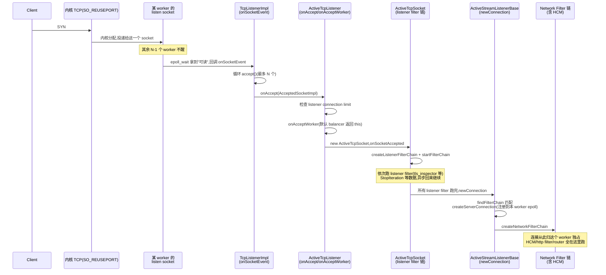

# 第 2 篇 · 第 5 章 · Listener:监听端口,接受连接

> **核心问题**:第 1 篇我们立起了"谁来跑 filter chain"——N 个 worker,每 worker 一个事件循环,连接一旦被某 worker accept 就永久绑定该 worker。但 P1-02 把最关键的第一步留到了本章:**新连接进来,到底怎么被某个 worker 接住?** 主线程干这事会成瓶颈吗?多个 worker 一起 `listen` 同一个端口会不会撞车?一个 listener 要下线(配置改了、要换 filter chain),正在处理的旧连接怎么办,会不会被掐断返回 503?这一章就是数据面 downstream 的真正第一站——listener:它把一个端口变成一条 filter chain 的入口,用 `SO_REUSEPORT` 让内核做连接负载均衡,用 drain 让旧连接优雅退出。

> **读完本章你会明白**:
> 1. **从端口到 worker 的整条 accept 路径**:内核怎么把 SYN 分给某个 worker 的 listen socket,worker 的 dispatcher 怎么把"fd 可读"回调成 `onAccept`,Envoy 怎么在这条路径上挂上 listener filter 链、再交给 network filter 链——以及这条路径上**哪一步把连接永久钉死在这个 worker 上**。
> 2. **`SO_REUSEPORT` 为什么是"让内核做负载均衡"的正确答案**:三种朴素方案(主线程 accept 再分发 / 所有 worker 抢同一个 listen fd / `SO_REUSEPORT`)各自的墙在哪,为什么第三种不惊群、不分发瓶颈、accept 完天然绑定 worker。本章把 P1-02 点过的结论**拆透机制**。
> 3. **connection balancer:罕见但值得懂的"用户态再均衡"**——`NopConnectionBalancerImpl`(默认)和 `ExactConnectionBalancerImpl`(显式配才开,Windows 强制开)的区别;为什么"用 accept 吞吐换连接数精确均衡"只适合 sidecar egress 那种少量长连接场景。
> 4. **listener drain 的完整生命周期**——旧 listener 怎么停止 accept 新连接、怎么通知在途连接开始 drain(HTTP/2 codec 会先发 GOAWAY)、drain 超时到了怎么强制收尾、所有 worker 都摘干净了怎么真正销毁;以及为什么**直接 `close` listen socket 是错的**(在途连接被掐断、客户端看到 503)。

> **如果一读觉得太难**:先只记住三件事——① 新连接被哪个 worker 的 listen socket accept,就**永远归这个 worker**(`SO_REUSEPORT` 让内核做分配,主线程不掺和);② 默认情况下连接**绝不跨 worker**,只有显式配 `connection_balance_config` 才会用户态再均衡;③ listener 要下线,先停 accept、让在途连接处理完再走,这叫 drain,细节在 P5-18。

---

## 〇、一句话点破

> **listener = 一个端口 + 一条 filter chain 的入口。每个 worker 用 `SO_REUSEPORT` 在同一个端口上各开一个独立的 listen socket,内核在它们之间做负载均衡;某 worker 的 epoll 上触发了可读,它 `accept()` 出这个连接,这个连接从此归它独占——后续所有 listener filter、network filter、HCM 都在这个 worker 的事件循环里单线程跑。listener 改了要下线,旧 listener 走 drain:停 accept、让在途连接处理完、超时兜底。**

这是结论,不是理由。本章倒过来拆:先讲从端口到 worker 这条 accept 路径上每一步的"为什么",再把 `SO_REUSEPORT` 三方案对比拆透(承接 P1-02 的结论),然后讲 connection balancer 这个罕见但值得懂的例外,最后讲 drain 的完整生命周期,以及 TCP listener 之外 UDP/QUIC 那两条不一样的路径。

---

## 一、listener 在数据面里的位置:从端口到 filter chain 的入口

P0-01 的全书地图里,一条流量的旅程是这样的:

```
   请求进来
     │
     ▼
   Listener(监听端口,接连接)          ← 本章
     │
     ▼
   Listener Filter 链 (TCP 层)          ← P2-06
     │
     ▼
   Network Filter 链 / HCM              ← P2-07 / P3-08
     │
     ▼
   ... (router → cluster → endpoint) ...
```

listener 是这条旅程的**第一站**。它的职责看起来朴素——"监听端口、接受连接"——但里头藏着两个非平凡的问题:

1. **谁来 accept?** 一个 Envoy 进程有 N 个 worker,每个 worker 都在跑自己的事件循环。客户端往 `IP:port` 发来一个 SYN,这个新连接该交给哪个 worker?这是**多 worker 的连接分发问题**。
2. **accept 完之后,这条连接怎么进入 filter chain?** accept 拿到的是一个原始 fd,Envoy 要在它上面先跑 listener filter 链(TCP 层,比如 TLS 探测),再交给 network filter 链(HCM 就在其中),最终把字节流变成结构化的 HTTP。这是**从端口到 filter chain 的衔接问题**。

本章主要回答第一个问题(分发),顺带把第二个问题的"入口"位置点出来——accept 完会先进 listener filter 链,这条链本身的细节(TLS inspect、proxy_protocol 等)是下一章 P2-06 的事,本章只标出它在路径上的位置。

> **钉死这件事**:listener 解决两件事——**① 把新连接分给某个 worker(`SO_REUSEPORT`);② accept 完挂上 filter chain 链头(先进 listener filter,再进 network filter)**。本章拆 ① 为主,② 只点到为止(细节 P2-06)。

---

## 二、从端口到 worker:accept 路径全景

我们先把"一个新连接从进端口到被某个 worker 接住"的完整路径走一遍。这是本章的主干,后面所有"为什么 `SO_REUSEPORT`""为什么绑定 worker"都挂在这条路径上。

### 第 0 步:N 个 worker,N 个 listen socket,都绑在同一端口

Envoy 启动时,MainThread 按 `concurrency()`(默认 = CPU 核数)创建 N 个 worker([`worker_impl.cc` 的 `ProdWorkerFactory`](../envoy/source/server/worker_impl.cc)),每个 worker 持一个 `ConnectionHandlerImpl`(每个 worker 一个,见 [`connection_handler_impl.cc:20`](../envoy/source/common/listener_manager/connection_handler_impl.cc#L20-L23))。当一个 listener 配置(LDS 下发或静态配置)到位,MainThread 会让**每个 worker 各自**给这个 listener 创建一个 `ActiveTcpListener`:

```cpp
// source/common/listener_manager/connection_handler_impl.cc (addListener,简化)
// connection_handler_impl.cc:40 ConnectionHandlerImpl::addListener(...)
//   每个 worker 的 handler 各跑一次,worker_index_ 是自己的编号
for (auto& socket_factory : config.listenSocketFactories()) {
  auto address = socket_factory->localAddress();
  details->addActiveListener(
      config, address, listener_reject_fraction_, disable_listeners_,
      std::make_unique<ActiveTcpListener>(
          *this, config, runtime, random,
          socket_factory->getListenSocket(worker_index_.has_value() ? *worker_index_ : 0),
          //                       ^^^^^^^^^^^^^^^^^^^^^^^^^^^^^^^^^^^^^^^^^^^^^^^^^^^^^
          //                       按 worker 编号拿"本 worker 自己的" listen socket
          address, config.connectionBalancer(*address), overload_state),
      ...);
}
```

[`socket_factory->getListenSocket(worker_index_ ...)`](../envoy/source/common/listener_manager/connection_handler_impl.cc#L98) 是关键中的关键——**每个 worker 拿到的是"自己编号对应的那个 listen socket"**,不是大家共享同一个 fd。这些 listen socket 都绑在同一个 `IP:port` 上(因为开了 `SO_REUSEPORT`,内核允许重复绑定),但它们是**互相独立的 fd**,各自的 epoll 只看自己的。

> **钉死这件事**:**N 个 worker 各有一个独立 listen socket,绑同一 `IP:port`(靠 `SO_REUSEPORT` 允许)**。这是后面"内核负载均衡""连接绑定 worker"的物理基础。

### 第 1 步:客户端 SYN 到达,内核做负载均衡

客户端给 `IP:port` 发 SYN。内核 TCP 协议栈收到这个 SYN,**它面前有 N 个 listen socket 都监听这个地址**(因为 `SO_REUSEPORT`)。内核在这里做负载均衡——把 SYN 分配给**某一个** listen socket。具体怎么分,我们留到第五节"技巧精解"拆透,这里先记住结论:**内核保证一个新连接只投递给一个 listen socket,不会惊动其他 N-1 个**。

这个被选中的 listen socket 的等待队列里多了一个连接,它的 epoll(在它的 owner worker 的事件循环里)上就会触发"可读"事件。

```
                   客户端 SYN (海量并发)
                         │
                         ▼
            ┌──────────────────────────────┐
            │     内核 TCP 协议栈           │
            │  N 个 listen socket 同址,    │
            │  内核做 SO_REUSEPORT 分发     │
            └──────────────────────────────┘
                         │  (只投给一个,其余 N-1 个不醒)
        ┌────────────────┼────────────────────┐
        ▼                ▼                    ▼
   worker 0 的       worker 1 的  ...    worker N-1 的
   listen socket     listen socket        listen socket
   (fd #10)          (fd #11)             (fd #N)
   epoll RDY         epoll RDY            epoll RDY
```

### 第 2 步:worker 的 dispatcher 把"fd 可读"回调成 onSocketEvent

被选中的那个 worker,它的事件循环(P1-03 详讲 dispatcher)在 `epoll_wait` 一批事件里拿到了"这个 listen socket 可读"。dispatcher 把这个事件派发给这个 fd 注册的回调——回调是 `TcpListenerImpl::onSocketEvent`,它是"socket 上有新连接待 accept"的入口:

```cpp
// source/common/network/tcp_listener_impl.cc (onSocketEvent,简化)
absl::Status TcpListenerImpl::onSocketEvent(short flags) {
  ASSERT(bind_to_port_);
  ASSERT(flags & (Event::FileReadyType::Read));   // 监听 socket 上的"可读"=有新连接

  uint32_t connections_accepted_from_kernel_count = 0;
  for (; connections_accepted_from_kernel_count < max_connections_to_accept_per_socket_event_;
       ++connections_accepted_from_kernel_count) {
    // ... accept 出一个新连接 fd ...
    IoHandlePtr io_handle =
        socket_->ioHandle().accept(reinterpret_cast<sockaddr*>(&remote_addr), &remote_addr_len);
    if (io_handle == nullptr) {
      break;   // 没有更多待 accept 的连接了
    }

    // ... 全局连接数上限 / overload 拒绝 ...
    if (rejectCxOverGlobalLimit()) {
      io_handle->close();
      cb_.onReject(TcpListenerCallbacks::RejectCause::GlobalCxLimit);
      continue;
    }

    // ... 算 local_address / remote_address ...

    cb_.onAccept(std::make_unique<AcceptedSocketImpl>(std::move(io_handle), local_address,
                                                      remote_address, ...));
  }
  cb_.recordConnectionsAcceptedOnSocketEvent(connections_accepted_from_kernel_count);
  return absl::OkStatus();
}
```

这里有几个值得点出来的细节(都在 [`tcp_listener_impl.cc:63`](../envoy/source/common/network/tcp_listener_impl.cc#L63-L145)):

- **一次 epoll 唤醒,循环 accept 多次**:看那个 `for` 循环——`max_connections_to_accept_per_socket_event_` 是"一次 socket 事件最多 accept 几个连接"(可配,默认值见 [`tcp_listener_impl.cc:67`](../envoy/source/common/network/tcp_listener_impl.cc#L67-L69))。这是为了避免"内核队列里堆了几十个连接,但每次事件只 accept 一个,事件要被唤醒几十次"。一次唤醒,把队列里的连接**尽量 batch accept 完**,减少事件循环的开销。这是承接 P1-03 dispatcher 思想的体现:**epoll 一次拿一批,处理也尽量 batch**。
- **accept 失败就 break**:`io_handle == nullptr`(accept 返回 EAGAIN 之类)就跳出循环,表示"内核等待队列里暂时没新连接了"。
- **全局上限和 overload 拒绝**:`rejectCxOverGlobalLimit()`(全局连接数超了)或 `listener_accept_->shouldShedLoad()`(load shed point 拒绝)或按 `reject_fraction_` 随机拒绝——这些被拒绝的连接直接 `io_handle->close()` 掉,记 `onReject` counter。这是 Envoy 过载保护的入口(过载保护本身 P4-15 详讲)。
- **`cb_.onAccept(...)`**:`cb_` 是注册到这个 `TcpListenerImpl` 上的回调对象,它就是**这个 worker 的 `ActiveTcpListener`**(构造时 `parent.createListener(...)` 把自己作为 callbacks 传进来,见 [`active_tcp_listener.cc:24`](../envoy/source/common/listener_manager/active_tcp_listener.cc#L22-L25))。`onAccept` 是这条路径上"内核世界"和"Envoy 世界"的**分界线**——跨过这一步,后续全在 Envoy 的对象模型里跑。

> **钉死这件事**:从 `epoll_wait` 到 `onAccept` 的路径是 **`epoll_wait` 拿事件 → dispatcher 派发 → `TcpListenerImpl::onSocketEvent` → 循环 `accept()` → `cb_.onAccept(AcceptedSocketImpl)`**。`onAccept` 之后,连接就从一个"内核 fd"变成了一个 Envoy 的 `ConnectionSocketPtr` 对象,接下来的所有处理都在 Envoy 的对象模型里。

### 第 3 步:onAccept → onAcceptWorker:listener connection limit + connection balancer

`ActiveTcpListener::onAccept`([`active_tcp_listener.cc:80`](../envoy/source/common/listener_manager/active_tcp_listener.cc#L80-L92))拿到这个 socket 后,先做两件事:

```cpp
// source/common/listener_manager/active_tcp_listener.cc
void ActiveTcpListener::onAccept(Network::ConnectionSocketPtr&& socket) {
  if (listenerConnectionLimitReached()) {       // ① 本 listener 的连接数上限
    socket->close();
    stats_.downstream_cx_overflow_.inc();
    return;
  }
  onAcceptWorker(std::move(socket), config_->handOffRestoredDestinationConnections(), false,
                 listen_address_->networkNamespace());  // ② 进 onAcceptWorker
}
```

① 是**本 listener 自己的连接数上限**(`listener_filters_timeout` 旁边那串 `per_listener` 配置,超了就关掉、记 `downstream_cx_overflow`)。注意这和"全局连接数上限"(在第 2 步的 `rejectCxOverGlobalLimit`)是两层不同的限流。

② 是真正的处理入口 `onAcceptWorker`,这里有一段**connection balancer 的逻辑**:

```cpp
// source/common/listener_manager/active_tcp_listener.cc (onAcceptWorker,简化)
void ActiveTcpListener::onAcceptWorker(Network::ConnectionSocketPtr&& socket,
                                       bool hand_off_restored_destination_connections,
                                       bool rebalanced, ...) {
  // ... 记 RTT ...

  if (!rebalanced) {                                    // 不是被别的 worker 转过来的
    Network::BalancedConnectionHandler& target_handler =
        connection_balancer_.pickTargetHandler(*this);  // 问 balancer:谁来接这条连接?
    if (&target_handler != this) {                      // balancer 说"给别人"
      target_handler.post(std::move(socket));           // 跨 worker 转交
      return;
    }
  }

  // balancer 说"就是你自己接",构造 ActiveTcpSocket 进 listener filter 链
  auto active_socket = std::make_unique<ActiveTcpSocket>(
      *this, std::move(socket), hand_off_restored_destination_connections, ...);
  onSocketAccepted(std::move(active_socket));
}
```

这一段(`active_tcp_listener.cc:119-131`)是**默认情况下的关键**:默认的 `connection_balancer_` 是 `NopConnectionBalancerImpl`,它的 `pickTargetHandler` 永远返回 `this`——也就是**永远不走"转交别人"那条路,永远自己接**。所以默认情况下,connection balancer 这一段逻辑形同虚设,连接被哪个 worker accept 就归哪个 worker。我们会在第四节专门讲"什么时候 balancer 不 NOP"以及 `ExactConnectionBalancerImpl`。

### 第 4 步:onSocketAccepted:进 listener filter 链

balancer 决定"自己接"之后,包了一个 `ActiveTcpSocket` 对象(它包含 socket + 后续要走的 listener filter 链),调 `onSocketAccepted`。这是**进 listener filter 链的入口**:

```cpp
// source/common/listener_manager/active_stream_listener_base.h (onSocketAccepted,简化)
void onSocketAccepted(std::unique_ptr<ActiveTcpSocket> active_socket) {
  // 用 filter_chain_factory 给这个 socket 创建 listener filter 链(accept_filters_)
  if (config_->filterChainFactory().createListenerFilterChain(*active_socket)) {
    active_socket->startFilterChain();   // 开始走 listener filter 链
  } else {
    active_socket->socket().close();     // 创建失败,直接关
  }

  // 如果 filter 链需要"以后再继续"(比如 TLS inspect 等更多字节),把 active_socket 挂到 sockets_ 链表
  if (!active_socket->isEndFilterIteration()) {
    active_socket->startTimer();         // 启动 listener filter 超时定时器
    LinkedList::moveIntoListBack(std::move(active_socket), sockets_);
  }
}
```

`createListenerFilterChain` 把配置里的 listener filter(`tls_inspector`、`proxy_protocol` 等)实例化到这个 socket 上,然后 `startFilterChain` 开始**依次跑**这些 filter。`ActiveTcpSocket::continueFilterChain` 是"跑下一个 filter"的驱动函数([`active_tcp_socket.cc:124`](../envoy/source/common/listener_manager/active_tcp_socket.cc#L124-L186)):

```cpp
// source/common/listener_manager/active_tcp_socket.cc (continueFilterChain,简化)
void ActiveTcpSocket::continueFilterChain(bool success) {
  if (success) {
    // ... 推进 iter_ 到下一个 accept_filter ...
    for (; iter_ != accept_filters_.end(); iter_++) {
      Network::FilterStatus status = (*iter_)->onAccept(*this);
      if (status == Network::FilterStatus::StopIteration) {
        // 这个 filter 要"等等"(比如 TLS inspect 还没读到足够字节)
        // 它会负责稍后回来调 continueFilterChain(true) 推进到下一个
        if (listener_filter_buffer_ == nullptr) {
          createListenerFilterBuffer();   // 注册一个读缓冲,等数据
        }
        return;
      }
    }
    // 所有 listener filter 跑完了,进 newConnection
    if (no_error) {
      newConnection();
    }
  }
  // ...
}
```

listener filter 链有两个状态:**Continue**(立刻进下一个)和 **StopIteration**(停下来,等异步事件——通常是等更多 socket 字节)。比如 `tls_inspector` 要读到 ClientHello 的前几字节才能判断是不是 TLS,所以它会 `StopIteration`,等 `ListenerFilterBuffer` 读够字节再 `continueFilterChain(true)` 推进。这套"filter 链 + StopIteration + 异步回来继续"的模式,和 P3-10 http filter chain 的 `StopIteration` 语义是**同源的**(本书所有 filter 链都遵循这套模式)。

所有 listener filter 跑完,调 `newConnection`([`active_tcp_socket.cc:196`](../envoy/source/common/listener_manager/active_tcp_socket.cc#L196-L239)),这里是"离开 listener filter 链、进 network filter 链"的转折点:

```cpp
// source/common/listener_manager/active_tcp_socket.cc (newConnection,简化)
void ActiveTcpSocket::newConnection() {
  connected_ = true;
  // 检查是否需要按"还原后的原始目的地址"把连接移交给另一个 listener(iptables 透明代理场景)
  if (hand_off_restored_destination_connections_ &&
      socket_->connectionInfoProvider().localAddressRestored()) {
    new_listener = listener_.getBalancedHandlerByAddress(
        *socket_->connectionInfoProvider().localAddress());
  }
  // ... 重置 listener filter 注册的 file events ...

  if (new_listener.has_value()) {
    // 移交给另一个 listener(原目的地址匹配到的那个)
    new_listener.value().get().onAcceptWorker(std::move(socket_), false, false, ...);
  } else {
    // 默认路径:本 listener 的 newConnection,进 network filter 链
    listener_.newConnection(std::move(socket_), std::move(stream_info_));
  }
}
```

注意那个 `hand_off_restored_destination_connections` 分支——这是**透明代理(iptables redirect)场景**:客户端的连接被 iptables 重定向到 Envoy,listener filter(`original_dst`)从 socket option 里还原出"客户端原本要去的地址",然后把这个连接**移交给那个地址对应的另一个 listener**(具体在 P2-06 讲 `original_dst` listener filter 时详讲)。这是个"listener 之间转发连接"的少见路径,大多数场景走 `else` 分支。

### 第 5 步:ActiveStreamListenerBase::newConnection:绑定 dispatcher,挂 network filter 链

最后一步,`ActiveStreamListenerBase::newConnection`([`active_stream_listener_base.cc:27`](../envoy/source/common/listener_manager/active_stream_listener_base.cc#L27-L67))是"**把这条连接的 fd 真正注册到本 worker 的 epoll 上,挂上 network filter 链**"的关键:

```cpp
// source/common/listener_manager/active_stream_listener_base.cc (newConnection,简化)
void ActiveStreamListenerBase::newConnection(Network::ConnectionSocketPtr&& socket, ...) {
  // ① 按 socket 匹配 filter chain(server_names / SNI / source_prefix 等 match)
  const auto filter_chain = config_->filterChainManager().findFilterChain(*socket, *stream_info);
  if (filter_chain == nullptr) {
    socket->close();                       // 没匹配上任何 filter chain,关掉
    stats_.no_filter_chain_match_.inc();
    return;
  }

  // ② 用 filter chain 指定的 transport socket(TLS / raw_buffer)创建传输层
  auto transport_socket = filter_chain->transportSocketFactory().createDownstreamTransportSocket();

  // ③ 关键!用本 worker 的 dispatcher 创建 server connection —— 这一步把 fd 注册到本 worker 的 epoll
  auto server_conn_ptr = dispatcher().createServerConnection(
      std::move(socket), std::move(transport_socket), *stream_info);

  // ④ 设置 buffer 上限 / 高水位超时等
  server_conn_ptr->setBufferLimits(config_->perConnectionBufferLimitBytes());
  // ...

  // ⑤ 给这条连接挂上 network filter 链(tcp_proxy / ratelimit / HCM 等)
  const bool empty_filter_chain = !config_->filterChainFactory().createNetworkFilterChain(
      *server_conn_ptr, filter_chain->networkFilterFactories());
  if (empty_filter_chain) {
    server_conn_ptr->close(...);           // 空 filter chain,关掉
  }

  // ⑥ 把这条连接加到 ActiveConnections 列表,跟踪生命周期
  newActiveConnection(*filter_chain, std::move(server_conn_ptr), std::move(stream_info));
}
```

**③ 是全章最重要的一行**——`dispatcher().createServerConnection(...)`,这个 `dispatcher()` 是**当前 worker 的 dispatcher**。这一步把这条连接的 fd **注册到这个 worker 的 epoll 上**,从此这个 fd 上的所有"可读/可写"事件,**只可能被这一个 worker 的 dispatcher 捕获并回调**。

> **钉死这件事(承接 P1-02 的不变式)**:一条连接从 `onAccept` → ... → `newConnection` → **`dispatcher().createServerConnection(...)`** 这一步起,它的 fd 就**钉死在了"accept 它的那个 worker"的 epoll 上**。这个 fd 的事件永远不会被别的 worker 看到。这就是 P1-02 那条"连接一旦被某 worker accept 就永久绑定该 worker"不变式的**源码落点**。

到这一步,listener 的职责就完成了。后续的 HCM、http filter、router、cluster 全部在这条连接的 worker 上单线程跑(详见 P3-08 起的各章)。listener 只是这条旅程的"大门"。

### 整条 accept 路径的 mermaid 时序

把上面五步串成一张时序图:



---

## 三、`SO_REUSEPORT`:为什么是"让内核做负载均衡"的正确答案

P1-02 第四节点过这个结论:**Envoy 用 `SO_REUSEPORT`,每 worker 一个独立 listen socket,内核做负载均衡**。但那里只点了结论,把"为什么 sound""三种朴素方案各撞什么墙"留到了本章。现在我们拆透。

### 方案 A:主线程(或专门一个 acceptor 线程)accept,再分发

朴素做法:某个专门的线程(`MainThread` 或独立的 acceptor)单独 `listen` + `accept`,accept 出一个连接后,挑一个 worker,把 fd 转交给它。fd 跨线程转交通常有两条路:

- `sendmsg` + `SCM_RIGHTS`:Unix domain socket 传 fd,内核帮你在目标进程的 fd 表里复制一份。
- 共享 epoll:把目标 worker 的 epoll fd 拿过来,`epoll_ctl` 把这个连接 fd 加到它的 epoll 上。

这套听起来"清楚明白",但有几个要命的墙:

1. **主线程是单点瓶颈**。所有新连接都要过它一遍。一个核 accept + sendmsg,在高连接速率(短连接、频繁建连)场景直接被压垮。这就是 nginx 在 1.9.1 之前 `SO_REUSEPORT` 之前的痛。
2. **fd 转交的内核开销**。`SCM_RIGHTS` 涉及内核里 fd 表的复制、引用计数、可能的安全 check;共享 epoll 也要 `epoll_CTL_ADD` 进内核。每个连接多两次内核往返。
3. **惊群(thundering herd)的隐患**。如果分发逻辑没设计好(比如"通知所有 worker,谁先抢到谁处理"),一个连接的到来会唤醒所有 worker,只有一个真正处理,其他 N-1 个白醒——上下文切换开销巨大。Linux 早期 `accept` 在多线程同时 `accept` 同一 fd 时确实有惊群问题,内核 3.9+ 才有 `SO_REUSEPORT` 把它从根上解决。

> **不这样会怎样**:主线程 accept 是**串行瓶颈**。想象一个 100 万 QPS 的网关,哪怕连接建立只占 1%,每秒 1 万次新连接全要过主线程一根线。`accept` + `sendmsg` 的内核往返每秒 1 万次,主线程的 CPU 跑满,连接积压在内核队列,客户端建连延迟飙升。更糟的是:主线程本来还要管 xDS 订阅、admin 接口、生命周期,被 accept 拖累会影响控制面。**这就是为什么 Envoy 绝不让主线程掺和 accept。**

### 方案 B:所有 worker 共享一个 listen fd,都来 epoll + accept

朴素做法 B:开一个 listen fd,所有 N 个 worker 都把它加进自己的 epoll,谁先 `epoll_wait` 到"可读"谁 `accept`。

这套比 A 好的地方是没有单点瓶颈——N 个 worker 都能 accept。但它有两个新问题:

1. **惊群**。一个新连接到达,内核要把"可读"事件通知给等待在这个 fd 上的 epoll。早期 Linux 这里是"唤醒所有 epoll",N 个 worker 全醒,只有一个 `accept` 成功,其余 N-1 个拿到 EAGAIN 白跑一趟——N-1 次无谓的上下文切换。
2. **内核锁竞争**。多个 worker 同时 `accept` 同一 listen fd,内核要保证 listen socket 等待队列的一致性,内部有锁。高连接速率下这个锁成为热点。

Linux 后来加了 `EPOLLEXCLUSIVE`(4.5+)缓解惊群——内核只唤醒"一个或少数几个"等待者,而不是全部。但 `EPOLLEXCLUSIVE` 的负载均衡**不保证均匀**,可能出现某些 worker 接的特别多、某些特别少的不均衡。

> **不这样会怎样**:共享 listen fd + EPOLLEXCLUSIVE 的方案,惊群虽缓解但不彻底,而且负载均衡**不均匀**——某些 worker 会被多分,某些少分,违背"连接数均衡"的目标。更要命的是,所有 worker 共享一个 fd,这个 fd 的内核等待队列是单一瓶颈,高连接速率下内核内部的锁竞争压不下去。

### 方案 C(Envoy 的选择):`SO_REUSEPORT`,每 worker 一个独立 listen socket

Envoy(以及 Nginx 1.9.1+、HAProxy 1.8+)走的是第三条路。每个 worker **各开一个独立的 listen socket**,用 `SO_REUSEPORT` 让内核允许这些 socket 绑同一个 `IP:port`。内核在连接到达时,**自己在这些 socket 间做负载均衡**。

`SO_REUSEPORT` 的设置在哪里?Envoy 把它做成一个 socket option,在 listener 配置预处理阶段加上去:

```cpp
// source/common/network/socket_option_factory.cc (buildReusePortOptions)
std::unique_ptr<Socket::Options> SocketOptionFactory::buildReusePortOptions() {
  std::unique_ptr<Socket::Options> options = std::make_unique<Socket::Options>();
  options->push_back(std::make_shared<Network::SocketOptionImpl>(
      envoy::config::core::v3::SocketOption::STATE_PREBIND, ENVOY_SOCKET_SO_REUSEPORT, 1));
  return options;
}
```

`STATE_PREBIND` 表示这个 option 在 `bind()` **之前**设置(`SO_REUSEPORT` 必须在 bind 前设,内核才会允许同址重复绑定)。`ENVOY_SOCKET_SO_REUSEPORT` 是 `SO_REUSEPORT` 的跨平台封装(在 Linux 上就是 `SOL_SOCKET` + `SO_REUSEPORT`)。

但这个 option 是不是加,取决于 listener 配置。`ListenerImpl::getReusePortOrDefault`([`listener_impl.cc:1166`](../envoy/source/common/listener_manager/listener_impl.cc#L1166-L1189))的逻辑是:

```cpp
// source/common/listener_manager/listener_impl.cc (getReusePortOrDefault,简化)
bool ListenerImpl::getReusePortOrDefault(Server::Instance& server,
                                         const envoy::config::listener::v3::Listener& config,
                                         Network::Socket::Type socket_type) {
  bool initial_reuse_port_value = [&server, &config]() {
    if (config.has_enable_reuse_port()) {        // ① 新字段 enable_reuse_port 优先
      return config.enable_reuse_port().value();
    }
    if (config.reuse_port()) {                   // ② 老字段 reuse_port=true
      return true;
    }
    return server.enableReusePortDefault();      // ③ 否则用 server 默认(Linux 默认 true)
  }();

#ifndef __linux__
  if (initial_reuse_port_value && socket_type == Network::Socket::Type::Stream) {
    // 非 Linux 平台 TCP 强制关掉 SO_REUSEPORT(内核不支持)
    ENVOY_LOG(warn, "reuse_port was configured for TCP listener '{}' and is being force disabled "
                    "because Envoy is not running on Linux.", config.name());
    initial_reuse_port_value = false;
  }
#endif
  // ...
  return initial_reuse_port_value;
}
```

关键结论:

- **Linux 上 TCP listener 默认开 `SO_REUSEPORT`**(走 ③ 分支,`enableReusePortDefault()` 在 Linux 返回 true)。
- **非 Linux 平台(macOS、Windows)TCP listener 强制关掉**——因为 `SO_REUSEPORT` 在 BSD/macOS 上的语义不同(负载均衡语义只在 Linux 3.9+ 有),Envoy 直接禁用。**这是为什么 Windows 上 Envoy 强制开 `ExactConnectionBalancer`——见第四节。**
- 用户可以用 `enable_reuse_port: false` 显式关掉(罕见)。

> **钉死这件事**:Envoy 在 **Linux 上默认开 `SO_REUSEPORT`**,每 worker 一个独立 listen socket;**非 Linux 平台 TCP 强制关**,因为 BSD/macOS 的 `SO_REUSEPORT` 没有内核负载均衡语义。这是为什么本书讲的"内核负载均衡"模型在 Linux 上才成立——其他平台 Envoy 走另一条路(用户态均衡,见下节)。

### 这套为什么 sound:三层理由

`SO_REUSEPORT` 方案为什么正确(无惊群、无瓶颈、负载均衡)?三层讲清:

**第一层(无单点瓶颈)**:N 个 worker 各自独立 `accept` 自己的 listen socket,没有任何"所有连接都要过一遍"的串行点。这是和方案 A 的根本区别。

**第二层(无惊群)**:`SO_REUSEPORT` 在 Linux 3.9+ 的内核实现里,**内核保证一个新连接只投递给一个 listen socket**——具体是在 `__inet_lookup_listener` 那段,用一个 hash(源 IP + 源端口 + 目的 IP + 目的端口的 hash)在所有 `SO_REUSEPORT` socket 里挑一个。所以 N 个 worker 中,只有"被挑中的那一个"的 epoll 会被唤醒,其他 N-1 个**根本不知道有新连接来**。这是和方案 B 的根本区别——方案 B 是共享一个 fd、内核要"通知多个等待者",`SO_REUSEPORT` 是多个独立 fd、内核"只通知一个"。

> **承接《Linux 内核》网络篇**:`SO_REUSEPORT` 在 Linux 内核里**怎么**实现"hash 挑一个"——`inet_csk_find_open_req` / `__inet_lookup_reuseport` / `reciprocal_scale` 那段——细节在《Linux 内核》网络篇里拆透,本书不重讲。你只需要记住:内核用一个 4-tuple hash 在同址的 `SO_REUSEPORT` socket 集合里挑一个,**同一连接的 SYN 永远 hash 到同一个 socket**(所以重传的 SYN 不会乱跑),不同连接均匀分散。

**第三层(负载均衡)**:Linux 的 `SO_REUSEPORT` 用 hash 分配,不是严格轮转,但在连接数大的时候**统计上均匀**。对 Envoy 这种"要扛海量连接"的场景,统计均匀已经足够。和方案 B 的"EPOLLEXCLUSIVE 不保证均匀"相比,`SO_REUSEPORT` 的 hash 分布更可控。

把三层拼起来:`SO_REUSEPORT` = **无单点 + 无惊群 + hash 均衡**。这正是"多 worker + 连接绑定 worker"模型需要的——内核负责把连接分给某 worker,worker accept 后连接天然归它,**全程零用户态分发开销**。

```
   方案 A (主线程 accept 分发)         方案 B (共享 listen fd)        方案 C (SO_REUSEPORT)
   ──────────────────────────         ─────────────────────         ──────────────────────
   Client                              Client                         Client
     │ SYN                                │ SYN                           │ SYN
     ▼                                    ▼                               ▼
   主线程 accept                         内核(共享队列)                 内核(hash 挑一个 socket)
     │                                    │                               │
     ▼ (sendmsg/epoll_ctl)                ├── 唤醒 worker 0 (抢到)         ├──→ worker 0 socket (独占)
   worker 0 / 1 / ... (转交)             ├── 唤醒 worker 1 (白醒!)        ├──→ worker 1 socket (没被选中,不醒)
                                          └── ... N-1 次惊群              └──→ worker N-1 (没被选中,不醒)
   
   单点瓶颈 + fd 转交开销                惊群 + 内核队列锁                无单点 + 无惊群 + hash 均衡
```

> **钉死这件事**:Envoy 选 `SO_REUSEPORT` 的理由是**三方案对比后的最优**——方案 A 单点瓶颈、方案 B 惊群 + 不均衡、方案 C 无单点 + 无惊群 + hash 均衡。这不是 Envoy 的发明(Nginx 1.9.1+、HAProxy 都在用),它是"多 worker + 连接绑定 worker"模型在 Linux 上的标准答案。

---

## 四、connection balancer:罕见但值得懂的"用户态再均衡"

第三节讲了 `SO_REUSEPORT` 让内核做负载均衡。但第三节结尾留了个口子:**非 Linux 平台(Windows / macOS)`SO_REUSEPORT` 不工作,Envoy 怎么办?** 还有:**即使 Linux 上 `SO_REUSEPORT` 工作了,内核的 hash 均衡是统计均匀,不保证"连接数严格相等"。有没有办法做用户态再均衡?**

这就是 **connection balancer** 的用武之地。它是一个"accept 之后,用户态再决定这条连接归谁"的可插拔机制。

### 两种 balancer:Nop 和 Exact

Envoy 的 connection balancer 接口很简单:`registerHandler`(注册一个 worker 的 handler 进 balancer)、`unregisterHandler`(摘掉)、`pickTargetHandler`(给定当前 handler,返回"应该归谁")。

**默认是 `NopConnectionBalancerImpl`**——`pickTargetHandler` 永远返回传入的 handler 自己,即"谁 accept 归谁,不转交"。这是绝大多数场景的默认。

**显式配 `connection_balance_config: { exact_balance: {} }` 才开 `ExactConnectionBalancerImpl`**。它的逻辑是:**遍历所有注册的 handler,挑连接数最少的那个**:

```cpp
// source/common/network/connection_balancer_impl.cc (ExactConnectionBalancerImpl)
void ExactConnectionBalancerImpl::registerHandler(BalancedConnectionHandler& handler) {
  absl::MutexLock lock(lock_);
  handlers_.push_back(&handler);                   // 注册时把自己加进列表
}

void ExactConnectionBalancerImpl::unregisterHandler(BalancedConnectionHandler& handler) {
  absl::MutexLock lock(lock_);
  handlers_.erase(std::find(handlers_.begin(), handlers_.end(), &handler));   // 摘掉
}

BalancedConnectionHandler&
ExactConnectionBalancerImpl::pickTargetHandler(BalancedConnectionHandler&) {
  BalancedConnectionHandler* min_connection_handler = nullptr;
  {
    absl::MutexLock lock(lock_);
    uint64_t min_connections = std::numeric_limits<uint64_t>::max();
    for (BalancedConnectionHandler* handler : handlers_) {
      const uint64_t connections = handler->numConnections();
      if (connections < min_connections) {
        min_connections = connections;
        min_connection_handler = handler;          // 找连接数最少的
      }
    }
    min_connection_handler->preIncNumConnections();  // 先把计数 +1(持锁)
  }
  min_connection_handler->postIncNumConnections();
  return *min_connection_handler;
}
```

注意几个细节:

- **`ExactConnectionBalancerImpl` 是有锁的**(`absl::MutexLock lock(lock_)`)。每次 accept 都要抢这把锁、遍历所有 handler——这和默认 `NopConnectionBalancerImpl` 的"零开销"形成鲜明对比。
- **`preIncNumConnections` 在持锁时做**:这是为了"乐观预订"——拿到锁的那一刻看到 min,马上把它的计数 +1,这样下一个并发 accept 进来看到的就不是同一个 min 了,避免"两个 accept 同时选中同一个 worker"。
- **选完后调用方(在 `onAcceptWorker`)会判断 `&target_handler != this`,如果是,调 `target_handler.post(socket)` 把连接转交**。看 `ActiveTcpListener::post`([`active_tcp_listener.cc:168`](../envoy/source/common/listener_manager/active_tcp_listener.cc#L168-L186)):

```cpp
// source/common/listener_manager/active_tcp_listener.cc (post,简化)
void ActiveTcpListener::post(Network::ConnectionSocketPtr&& socket) {
  // post 的 lambda 不能直接 capture unique_ptr,所以套一层 shared_ptr
  RebalancedSocketSharedPtr socket_to_rebalance = std::make_shared<RebalancedSocket>();
  socket_to_rebalance->socket = std::move(socket);

  dispatcher().post([socket_to_rebalance, address = listen_address_, tag = config_->listenerTag(),
                     &tcp_conn_handler = tcp_conn_handler_,
                     handoff = config_->handOffRestoredDestinationConnections()]() {
    auto balanced_handler = tcp_conn_handler.getBalancedHandlerByTag(tag, *address);
    if (balanced_handler.has_value()) {
      // 在目标 worker 的线程上,调它的 onAcceptWorker(rebalanced=true 表示"已被均衡过,别再均衡")
      balanced_handler->get().onAcceptWorker(std::move(socket_to_rebalance->socket), handoff, true,
                                             address->networkNamespace());
      return;
    }
  });
}
```

转交走的是 **`dispatcher().post(lambda)`**——把一个 lambda 投递到**目标 worker 的 dispatcher 队列**,目标 worker 在它的事件循环里跑这个 lambda,在自己的线程上 `onAcceptWorker` 接管这条连接。**这正是 P1-02 第五节讲过的"dispatcher.post 是跨线程投递任务的标准原语"在这里的应用**——不在源 worker 线程上碰目标 worker 的数据,而是把"接管"这件事投递过去。

注意 `onAcceptWorker` 的 `rebalanced=true` 参数——它告诉目标 worker **"你已经是被均衡过来的,别再走 balancer 选别人"**(看 [`active_tcp_listener.cc:119`](../envoy/source/common/listener_manager/active_tcp_listener.cc#L119-L126),`if (!rebalanced)` 才走 balancer)。这避免了"均衡 → 再均衡 → 再均衡"的死循环。

### 为什么 Exact 默认不开:用 accept 吞吐换连接数精确均衡

`ExactConnectionBalancerImpl` 的注释(`source/common/network/connection_balancer_impl.h`)说得很直白:

```
// This balancer sacrifices accept throughput for accuracy and should be used
// when there are a small number of connections that rarely cycle
// (e.g., service mesh gRPC egress).
```

翻译过来:**这个 balancer 用 accept 吞吐换连接数精确均衡,只适合"少量、长连接"的场景**(典型例子:sidecar egress 的 gRPC 长连接)。为什么?

- 每条新连接都要抢 balancer 的锁、遍历所有 handler——**accept 路径上加了锁竞争和遍历开销**。在海量连接场景,这把锁和遍历直接把 accept 吞吐压下去。
- 但如果场景是"少量长连接"(比如 sidecar 只跟少数几个上游 gRPC server 建立长流),**精确均衡的价值超过吞吐损失**——你希望 N 个 worker 的连接数尽量相等,而不是 hash 均衡带来的统计偏差。
- 海量短连接场景,默认 `Nop` + `SO_REUSEPORT` 的 hash 均衡已经足够均匀(大数定律),不值得为"再精确一点"付出锁开销。

`ExactConnectionBalancerImpl` 是什么时候建?看 `ListenerImpl::buildConnectionBalancer`([`listener_impl.cc:879`](../envoy/source/common/listener_manager/listener_impl.cc#L879-L932)):

```cpp
// source/common/listener_manager/listener_impl.cc (buildConnectionBalancer,简化)
absl::Status ListenerImpl::buildConnectionBalancer(const envoy::config::listener::v3::Listener& config,
                                                   const Network::Address::Instance& address) {
  auto iter = connection_balancers_.find(address.asString());
  if (iter == connection_balancers_.end() && socket_type_ == Network::Socket::Type::Stream) {
#ifdef WIN32
    // Windows: SO_REUSEPORT 不工作,强制 ExactBalancer 让 worker 1 分发到所有 worker
    ENVOY_LOG(warn, "ExactBalance was forced enabled for TCP listener '{}' because Envoy is "
                    "running on Windows.", config.name());
    connection_balancers_.emplace(address.asString(),
                                  std::make_shared<Network::ExactConnectionBalancerImpl>());
#else
    if (config.has_connection_balance_config()) {
      switch (config.connection_balance_config().balance_type_case()) {
      case ...kExactBalance:
        connection_balancers_.emplace(address.asString(),
                                      std::make_shared<Network::ExactConnectionBalancerImpl>());
        break;
      case ...kExtendBalance:
        // 自定义 balancer(扩展点,通过 typed_config 注册工厂)
        // ...
        break;
      }
    } else {
      // 默认:NopBalancer
      connection_balancers_.emplace(address.asString(),
                                    std::make_shared<Network::NopConnectionBalancerImpl>());
    }
#endif
  }
  return absl::OkStatus();
}
```

三个关键事实:

1. **Linux 默认 `NopConnectionBalancerImpl`**(L925-927)。
2. **Linux 上显式配 `connection_balance_config: { exact_balance: {} }` 才开 Exact**(L900-903)。
3. **Windows 强制 Exact**(L883-895)——因为 Windows 不支持 `SO_REUSEPORT` 的内核负载均衡语义,只能让一个 worker(worker 1)accept,再用户态分发到所有 worker。注释明说:"sacrifices accept throughput, only way to make all workers do work"。

> **钉死这件事**:connection balancer 是**"用户态再均衡"的旋钮**。Linux 默认 `Nop`(靠 `SO_REUSEPORT` 内核均衡,零用户态开销);显式配 `exact_balance` 或 Windows 平台才开 Exact(锁 + 遍历,牺牲 accept 吞吐换精确均衡)。**绝大多数 Linux 生产场景默认 Nop 就够**,只有 sidecar egress 那种"少量长连接要严格均衡"才会显式开 Exact。

### 一个常被讲错的细节:balancer 不是"worker 之间均衡",是"同 listener 的 handler 之间均衡"

澄清一个容易混的点:connection balancer **不是**"任意 worker 之间均衡",而是"**同一个 listener 的所有 handler(每 worker 一个 ActiveTcpListener)之间**"均衡。看 `ExactConnectionBalancerImpl::registerHandler` 是什么时候调的——是 `ActiveTcpListener` 构造时([`active_tcp_listener.cc:28`](../envoy/source/common/listener_manager/active_tcp_listener.cc#L26-L29)):

```cpp
ActiveTcpListener::ActiveTcpListener(...)
    : OwnedActiveStreamListenerBase(...), tcp_conn_handler_(parent),
      connection_balancer_(connection_balancer), listen_address_(listen_address) {
  connection_balancer_.registerHandler(*this);   // 把自己(这个 worker 的 handler)注册进 balancer
}
```

`connection_balancer_` 是从 listener config 拿来的(同一个 listener 的所有 worker 共享一个 balancer 实例),每个 worker 的 `ActiveTcpListener` 构造时把自己注册进去。所以 balancer 手里的 handler 列表,**就是"这个 listener 在 N 个 worker 上的 N 个 ActiveTcpListener"**。它在这 N 个里挑连接数最少的。

不同 listener(不同端口)有不同的 balancer,互不影响。

> **钉死这件事**:connection balancer 的作用域是**"同一个 listener、N 个 worker 上的 N 个 handler"之间**,不是跨 listener。理解了这一点,你就明白为什么 balancer 列表里只有 N 个(每 worker 一个),而不是 M × N(listener 数 × worker 数)。

---

## 五、listener 生命周期:从 add 到 drain 到 remove

到目前为止,我们讲的是"listener 已经在跑、accept 新连接"的稳态。但 listener 本身有生命周期——它会**被添加、被替换、被下线**。这一节讲清 listener 的生命周期,尤其是 drain(优雅下线),这是本章第二大的"为什么"。

### listener 怎么来:LDS 下发 → 所有 worker addListener

listener 配置怎么到 Envoy 的?有两条路:

1. **静态配置**:启动时从 YAML 读(`listeners:` 段),固定。
2. **LDS 动态下发**:控制面(Istio)通过 LDS(LDS 是 xDS 的一种,第 5 篇详讲)动态推送。这是 Service Mesh 的核心——listener 不写在配置文件里,运行时动态变。

不管哪条路,新 listener 配置到位后,MainThread 会让**每个 worker 各自**调 `WorkerImpl::addListener`:

```cpp
// source/server/worker_impl.cc (addListener)
void WorkerImpl::addListener(absl::optional<uint64_t> overridden_listener,
                             Network::ListenerConfig& listener, AddListenerCompletion completion,
                             Runtime::Loader& runtime, Random::RandomGenerator& random) {
  dispatcher_->post([this, overridden_listener, &listener, &runtime, &random, completion]() -> void {
    handler_->addListener(overridden_listener, listener, runtime, random);
    hooks_.onWorkerListenerAdded();
    completion();
  });
}
```

注意 **`dispatcher_->post(lambda)`** —— MainThread 不直接调 worker 的 `addListener`,而是 post 一个 lambda 到 worker 的 dispatcher 队列。这个 lambda 在**worker 自己的线程**上跑,这样 `ConnectionHandlerImpl::addListener` 里所有对 `handler_` 内部数据结构(`listener_map_by_tag_` 等)的修改,**都发生在 worker 线程上**,没有跨线程竞争。

> **钉死这件事(承接 P1-02 第五节)**:**MainThread 对 worker 的所有指挥,都走 `dispatcher.post(lambda)`**——添加 listener、移除 listener、drain、stop,无一例外。这是"跨线程通信 = 投递任务"这条不变式在 listener 子系统里的具体体现。MainThread 永远不直接碰 worker 的数据。

`overridden_listener` 参数是个细节:如果是同一个 listener tag 的更新(LDS 推了一份新配置覆盖现有 listener),走 [`connection_handler_impl.cc:43`](../envoy/source/common/listener_manager/connection_handler_impl.cc#L43-L52) 的"updateListenerConfig"路径——**直接替换现有 `ActiveTcpListener` 的 config 指针,而不是销毁重建**。这是个性能优化:对于"只改了 filter chain 配置"的小改动,不用拆 socket、不用重新 accept,原地替换 config 即可。

### listener 怎么走:drain(优雅下线)

listener 要下线,绝不能直接 `close(listen_fd)`。为什么?看 [`listener_manager_impl.cc:724`](../envoy/source/common/listener_manager/listener_manager_impl.cc#L724-L775) 的 `drainListener` 完整流程:

```cpp
// source/common/listener_manager/listener_manager_impl.cc (drainListener,简化)
void ListenerManagerImpl::drainListener(ListenerImplPtr&& listener) {
  // ① 加进 draining_listeners_ 列表
  std::list<DrainingListener>::iterator draining_it = draining_listeners_.emplace(
      draining_listeners_.begin(), std::move(listener), workers_.size());
  stats_.total_listeners_draining_.set(draining_listeners_.size());

  // ② 让所有 worker 停止 accept 新连接(但 listen socket 不立刻关)
  const uint64_t listener_tag = draining_it->listener_->listenerTag();
  stopListener(*draining_it->listener_, {}, [this, listener_tag]() {
    for (auto& listener : draining_listeners_) {
      if (listener.listener_->listenerTag() == listener_tag) {
        maybeCloseSocketsForListener(*listener.listener_);   // 等 stopListener 完成后才关 socket
      }
    }
  });

  // ③ 通知所有 worker 的现有连接:开始 drain(让 HTTP/2 codec 发 GOAWAY 等)
  for (const auto& worker : workers_) {
    worker->onListenerDrain(*draining_it->listener_);
  }

  // ④ 启动 drain 定时器,超时后强制收尾
  draining_it->listener_->localDrainManager().startDrainSequence(
      Network::DrainDirection::All, [this, draining_it]() -> void {
        // 超时后,让所有 worker 真正移除这个 listener
        for (const auto& worker : workers_) {
          worker->removeListener(*draining_it->listener_, [this, draining_it]() -> void {
            // 每个 worker 移除完回调,post 回主线程
            server_.dispatcher().post([this, draining_it]() -> void {
              if (--draining_it->workers_pending_removal_ == 0) {
                // 所有 worker 都移除完了,真正销毁
                draining_listeners_.erase(draining_it);
                stats_.total_listeners_draining_.set(draining_listeners_.size());
              }
            });
          });
        }
      });

  updateWarmingActiveGauges();
}
```

drain 的核心是**四个步骤**,每一步都对应一个"为什么不能更激进":

**① 加入 draining 列表 + 计数**——为了 stats 能看到"当前有几个 listener 在 drain",也为了后续跟踪"所有 worker 都摘干净没"。

**② 停止 accept 新连接,但不立刻 close socket**——这是关键。停 accept(`stopListener` → 每个 worker 的 `ConnectionHandlerImpl::stopListeners` → `listener_->shutdownListener(options)` → 最终 `TcpListenerImpl::disable()` 把 fd 从 epoll 摘掉)让新来的 SYN 不再被这个 listener 接住(它们要么走别的 listener,要么被内核拒)。但**不立刻 close listen fd**——因为 `maybeCloseSocketsForListener` 在 `stopListener` 的 completion 回调里才调,确保所有 worker 都已停止 accept。如果立刻 close,内核会在收到新 SYN 时直接回 RST,客户端看到连接被拒绝,体验差。

**③ 通知现有连接开始 drain**(`onListenerDrain`)——这是"为什么不能直接 close"的另一半理由。`worker->onListenerDrain` → `handler_->onListenerDrain(listener_tag)` → `ActiveTcpListener::onListenerDrainStart`([`active_stream_listener_base.cc:179`](../envoy/source/common/listener_manager/active_stream_listener_base.cc#L179-L192)):

```cpp
// source/common/listener_manager/active_stream_listener_base.cc (onListenerDrainStart)
void OwnedActiveStreamListenerBase::onListenerDrainStart() {
  const bool was_deleting = is_deleting_;
  is_deleting_ = true;                       // pin is_deleting_,避免迭代中 erase map
  for (auto& entry : connections_by_context_) {
    auto& connections = entry.second->connections_;
    for (auto it = connections.begin(); it != connections.end();) {
      auto next = std::next(it);             // 先存 next,因为 onDrain 可能同步关连接
      (*it)->connection_->onDrain();         // 通知每条连接:开始 drain
      it = next;
    }
  }
  is_deleting_ = was_deleting;
}
```

`connection_->onDrain()` 的效果**取决于这条连接跑的是什么 filter chain**:

- 如果是 HTTP/2 / HTTP/3(HCM + http2 codec),`onDrain` 让 codec 进入 drain 状态,**给客户端发 GOAWAY 帧**,告诉它"别再开新流了,现有流我会处理完"。客户端收到 GOAWAY 就知道该换连接了,而不是继续往这个连接上发请求然后被拒。
- 如果是 HTTP/1.1,`onDrain` 让 HCM 在当前请求处理完后**不再接新请求**(HTTP/1.1 是请求-响应模型,处理完一个就关连接)。
- 如果是 tcp_proxy(纯 TCP 代理),`onDrain` 的行为取决于配置(`tcp_proxy` 的 drain 系列 config),通常是半关连接、等对端发完。

这一步是 drain 的灵魂:**它给在途流量一个"过渡期"**,让客户端有序迁移到新连接(新 listener),而不是被 Envoy 突然掐断。

> **不这样会怎样(直接 close listen socket 会怎样)**:假设你直接 `close(listen_fd)`,会发生什么?① **新来的 SYN**:内核会回 RST,客户端看到 "connection refused",如果它没有重试逻辑,这个请求就 503 了。② **在途的旧连接**:它们的 fd 已经 accept 出来了,不在 listen socket 上,直接 close listen fd 不影响它们——但是,**如果你同时销毁了 listener 对象**(因为想"清理资源"),那些在途连接上挂的 filter chain、HCM、router 全引用着 listener 的 config/stats/cluster_manager,**对象一销毁,这些引用就悬空**,在途连接的下一步操作就会 crash 或乱写内存。所以 drain 不是"先 close socket 再说",而是**"停 accept → 通知在途 → 等它们处理完 → 再销毁对象"**的有序过程。

**④ drain 超时兜底**——`localDrainManager().startDrainSequence(...)` 启动一个定时器,超时时间由 server 的 drain 配置决定(`drain_time` 之类,默认几十秒)。超时后,即使还有在途连接没处理完,也强制走 `removeListener` 收尾(后续 `removeFilterChain` 会把残留连接 `close` 掉)。这是为了避免"某条卡死的连接永远卡着,listener 永远销毁不掉"——超时兜底。

> **钉死这件事**:listener drain 的完整生命周期是 **① 停 accept(不立刻 close socket)→ ② 通知在途连接 onDrain(发 GOAWAY / 不接新请求)→ ③ 等 drain 超时 → ④ removeListener(每个 worker post 回主线程,全部摘干净才销毁对象)**。每一步都对应一个"为什么不能更激进"——直接 close 会 RST 客户端、会销毁在途连接依赖的对象。drain 的设计目标:**让在途流量有序收尾,新流量平滑到新 listener,无 503、无 crash**。

### drain 和"热更新"的关系:衔接 P5-18

drain 本身是**控制面**概念——listener 什么时候 drain、用什么 drain 超时、和 hot restart 怎么配合,都是控制面决定的(P5-18 详讲)。本章只讲 drain 的**基本机制**(数据面这一侧:停 accept、通知连接、等超时、销毁),不讲"什么时候触发 drain"(那是 xDS / hot restart 的事)。

一个值得点出的区分:**listener drain 和 hot restart 是两件事**。listener drain 是"单个 listener 要下线"(LDS 推了一份新配置替换它,或者 listener 被移除);hot restart 是**整个 Envoy 进程要重启**(换二进制版本、换大配置),它通过 fd 传递让新进程接管 socket(P6-21 详讲)。两者都会触发 listener 的 drain 路径,但触发原因不同——一个是单个 listener 变更,一个是整个进程换班。

---

## 六、TCP 之外的 listener:UDP 和 QUIC

到目前为止讲的 `ActiveTcpListener` 是**面向连接的 TCP**。但 Envoy 也支持 UDP 和 QUIC,它们不走传统的 `listen + accept` 模型,有自己的 listener 类型。这一节点出它们的存在和差异(细节不在本章展开)。

### UDP listener

UDP 是无连接的,没有 `accept` 这一说——数据报(datagram)来了就是来了,没有"建立连接"的步骤。Envoy 的 UDP listener(`source/server/active_udp_listener.cc`)在 fd 可读时,**直接读数据报**,交给 UDP listener 的 callbacks(比如 UDP proxy)处理。每个 worker 还是有自己的 UDP socket(也走 `SO_REUSEPORT`,但 UDP 的 `SO_REUSEPORT` 语义比 TCP 更早就支持,所有平台都行)。

UDP listener 不走 `onAccept` 路径(没有"accept 出新连接"),而是走 `onData`(数据报直接到)。所以前面讲的 `onAccept → onAcceptWorker → ActiveTcpSocket → listener filter 链 → newConnection` 那条路径,**UDP listener 完全不走**——它没有"新连接"的概念,每个数据报独立处理。

### QUIC listener(面向连接,但不走 accept)

QUIC(HTTP/3 的传输层)有趣——它**是面向连接的**(有"会话"概念),但**走 UDP**,**不走传统的 `listen + accept` 模型**。Envoy 的 QUIC listener(`source/common/quic/active_quic_listener.cc`)处理 UDP 数据报,在数据报里识别 QUIC 包,然后:

- 第一个包(通常是 ClientHello)被**缓冲**(`HasChlosBuffered` / `ProcessBufferedChlos`,见 [`active_quic_listener.cc:209-216`](../envoy/source/common/quic/active_quic_listener.cc#L209-L216)),不是立刻创建会话。
- 在 `dispatcher` 上调度,**按 `max_sessions_per_event_loop_` 限制每个事件循环处理的会话数**(避免一个事件循环里建太多 QUIC 会话拖慢其他连接)。
- 会话建立后才走类似 TCP 的 filter chain 路径。

QUIC 这套"缓冲 CHLO + 限速建会话"是 QUIC 特有的——因为 QUIC 是 UDP,没有 TCP 那种"三次握手由内核完成、accept 出来就是个完整连接",QUIC 的握手要在用户态做,Envoy 用缓冲 + 限速避免"一个坏客户端打爆握手"。

> **钉死这件事**:TCP listener 走 `accept → onAccept → listener filter → network filter`;UDP listener 走 `onData`(无连接,每包独立);QUIC listener 走 `processPacket → 缓冲 CHLO → 限速建会话`(面向连接但走 UDP、握手在用户态)。**三种 listener 共享"每个 worker 一个独立 socket + connection handler"的框架**,但 accept 之后的路径完全不同。

---

## 七、技巧精解:`SO_REUSEPORT` 三方案对比与"为什么 sound"

本章最硬核的技巧是 **`SO_REUSEPORT` 让内核做连接负载均衡**。前面第三节已经把三方案对比讲了一遍,这里把它单独拎出来,配源码 + 反面对比,彻底钉死。

### 技巧一:`SO_REUSEPORT`——把"分连接"下沉到内核

**这个技巧要解决的问题**:N 个 worker 都要能接连接,但 ① 不能有单点瓶颈(方案 A 主线程 accept),② 不能惊群(方案 B 共享 fd),③ 负载要均衡(方案 B 的 EPOLLEXCLUSIVE 不保证均匀)。

**手段**:每个 worker 一个**独立**的 listen fd,都用 `SO_REUSEPORT` 绑同一 `IP:port`。内核在连接到达时,自己在这 N 个 fd 间做负载均衡(hash挑一个)。

**为什么 sound(三层)**:

1. **无单点**:N 个 fd 独立 `accept`,无串行瓶颈。
2. **无惊群**:Linux `SO_REUSEPORT` 内核实现保证**一个连接只投递一个 fd**(具体在 `__inet_lookup_reuseport` 用 4-tuple hash 挑一个,详见《Linux 内核》网络篇),其余 N-1 个 fd 的 epoll 根本不知道有新连接。
3. **hash 均衡**:不同连接的 4-tuple 不同,hash 后均匀分散到 N 个 fd。统计上均匀,大数定律下足够。

**源码佐证**:

- `SO_REUSEPORT` 的设置:[`socket_option_factory.cc:169 buildReusePortOptions`](../envoy/source/common/network/socket_option_factory.cc#L169-L174),作为 `STATE_PREBIND` socket option 在 `bind()` 前加上。
- 每个 worker 拿自己的 listen socket:[`connection_handler_impl.cc:98 socket_factory->getListenSocket(worker_index_ ...)`](../envoy/source/common/listener_manager/connection_handler_impl.cc#L98),按 worker 编号取。
- Linux 默认开 / 非 Linux 强制关:[`listener_impl.cc:1166 getReusePortOrDefault`](../envoy/source/common/listener_manager/listener_impl.cc#L1166-L1189)。

**反面对比(朴素加锁 / 主线程分发会撞什么墙)**:

| 方案 | 单点瓶颈 | 惊群 | 负载均衡 | 跨线程开销 |
|------|---------|------|---------|-----------|
| A. 主线程 accept + sendmsg 分发 | **有**(主线程串行) | 看分发逻辑 | 主线程决定 | 每连接 sendmsg / epoll_ctl 内核往返 |
| B. 共享 listen fd + EPOLLEXCLUSIVE | 无 | 缓解但不彻底 | **不保证均匀** | 无(但内核 listen 队列锁竞争) |
| **C. SO_REUSEPORT**(Envoy) | **无** | **无**(内核只投一个) | **hash 均匀** | **零**(内核做,用户态无感) |

**一个容易踩的坑**:`SO_REUSEPORT` 在 **Linux 3.9+** 才有"内核负载均衡"语义。BSD/macOS 也有 `SO_REUSEPORT` 但**语义不同**(只是允许多个 socket 绑同一地址,不做负载均衡,谁先 `accept` 谁拿到,仍可能惊群)。这就是 Envoy 在非 Linux 平台强制关 `SO_REUSEPORT` + 强制开 `ExactConnectionBalancer` 的根本原因——[`listener_impl.cc:1191`](../envoy/source/common/listener_manager/listener_impl.cc#L1191-L1199) 那段 `#ifndef __linux__` 的处理。

> **钉死这件事**:`SO_REUSEPORT` 是"**把分连接这件事下沉到内核**"的招牌技巧。它的妙处不在"允许多个 socket 绑同址"(那是表面),而在"**内核保证一个连接只投递一个 socket、且 hash 均匀**"——这才消灭了惊群和分发瓶颈。Linux 3.9+ 才有这个语义,BSD/macOS 没有,所以 Envoy 在非 Linux 走另一条路(ExactBalancer)。

### 技巧二:`max_connections_to_accept_per_socket_event`——一次唤醒 batch accept 多个

这个技巧藏在 `TcpListenerImpl::onSocketEvent` 那个 `for` 循环里([`tcp_listener_impl.cc:67`](../envoy/source/common/network/tcp_listener_impl.cc#L67-L69))。它看起来朴素,但背后是一个值得拆的优化。

**这个技巧要解决的问题**:epoll 唤醒一次,可能内核的 listen 队列里堆了好几个待 accept 的连接(高连接速率场景)。如果每次唤醒只 accept 一个,然后回去 `epoll_wait`,会怎样?

- 每次 `epoll_wait` 系统调用有开销(上下文切换、内核数据结构遍历)。
- 队列里剩下的连接要等下一次 epoll 唤醒——但它们已经"可读"了,理论上 epoll 边沿触发(ET)模式下不会再唤醒(因为没新事件),水平触发(LT)模式下会再唤醒但要再走一遍 epoll_wait。

**手段**:`onSocketEvent` 里**一个 for 循环,一次唤醒 batch accept 多个**(上限 `max_connections_to_accept_per_socket_event_`,可通过 listener 配置调),直到 accept 返回 nullptr(EAGAIN,队列空了)。

**为什么 sound**:**一次唤醒尽量把队列里积压的连接全部 accept 完**,减少 epoll_wait 的次数。这是承接 P1-03 dispatcher 思想的体现——epoll 一次拿一批事件、处理也尽量 batch,把系统调用开销摊薄。

**反面对比(每次只 accept 一个会撞什么墙)**:假设高连接速率(每秒 10 万新连接),每次唤醒只 accept 一个,那就要 10 万次 epoll_wait → accept → epoll_wait 循环,每次上下文切换 + 系统调用开销叠加,worker 的 CPU 大量花在"切换 + 调用"上而不是真正处理连接。batch accept 让一次唤醒处理掉队列里的几十个连接,系统调用次数降一两个数量级。

这个技巧也呼应了 `recordConnectionsAcceptedOnSocketEvent`(L143)——它**按"一次 socket 事件 accept 了多少连接"记 histogram**,这样运维可以看到"一次唤醒通常 accept 几个",据此调 `max_connections_to_accept_per_socket_event`。

---

## 八、章末小结

### 回扣主线

本章是**数据面 downstream 的第一站**。它回答了"**新连接从端口到 worker 这条路径上,每一步为什么这么设计**"——

- **数据面这一面**:listener 是 filter chain 的入口。每 worker 一个独立 listen socket(`SO_REUSEPORT`),内核做连接负载均衡,worker accept 后连接永久绑定。accept 完先进 listener filter 链(P2-06),再进 network filter 链(P2-07 / HCM P3-08)。
- **控制面这一面(衔接)**:listener 怎么来、怎么走、怎么 drain,**由 LDS 控制**(P5-16)——静态配置或动态下发;drain 的触发、drain 超时、和 hot restart 的关系,都在控制面那一侧(P5-18)。本章只讲 drain 的**数据面机制**。

这正好接上 P1-02 末尾的悬念:"新连接怎么分给某个 worker?"——答案是 **`SO_REUSEPORT` 让内核分,worker accept 后永久绑定,主线程不掺和**。listener 立起来之后,下一章(P2-06)我们钻进 listener filter 链,看 accept 之后、HTTP 解码之前,TCP 层能做哪些事(TLS 探测、proxy_protocol、原目的地址)。

### 五个为什么

1. **为什么每个 worker 一个独立 listen socket,而不是共享一个?**——共享会惊群(一个连接唤醒所有 worker)和内核锁竞争;独立 socket + `SO_REUSEPORT` 让内核只投递给一个 worker,无惊群、无锁竞争,且 hash 均衡。

2. **为什么用 `SO_REUSEPORT` 而不是主线程 accept 再分发?**——主线程是单点瓶颈(所有连接过一根线)、fd 转交有内核开销、还可能惊群;`SO_REUSEPORT` 把"分连接"下沉到内核,零用户态开销、accept 完天然绑定 worker。

3. **为什么连接被某 worker accept 后永久绑定该 worker?**——`ActiveStreamListenerBase::newConnection` 里 `dispatcher().createServerConnection(...)` 把 fd 注册到本 worker 的 epoll,从此这个 fd 的事件只被这一个 worker 捕获。这是 P1-02 那条"连接绑定 worker"不变式的源码落点,也是数据面无锁的物理基础。

4. **为什么默认 `NopConnectionBalancer`,Exact 要显式配才开?**——Exact 有锁 + 遍历,牺牲 accept 吞吐换连接数精确均衡,只适合"少量长连接"场景(sidecar egress gRPC);海量短连接场景,`SO_REUSEPORT` 的 hash 均衡已经足够,Nop 零开销最优。Windows 因不支持 `SO_REUSEPORT` 内核均衡语义,强制开 Exact。

5. **为什么 listener 下线要走 drain,而不是直接 close listen socket?**——直接 close 会让新 SYN 被内核 RST(客户端 503)、会让在途连接引用的 listener 对象悬空(crash);drain 有序收尾——停 accept(不立刻 close)→ 通知在途连接 onDrain(发 GOAWAY)→ 等 drain 超时 → 真正销毁。在途流量有序处理完,新流量平滑到新 listener,无 503、无 crash。

### 想继续深入往哪钻

- **想看 accept 路径源码**:`source/common/network/tcp_listener_impl.cc`(`onSocketEvent` 是 accept 循环)、`source/common/listener_manager/active_tcp_listener.cc`(`onAccept`/`onAcceptWorker`/`post`)、`source/common/listener_manager/active_stream_listener_base.cc`(`newConnection` 是绑定 dispatcher 的关键)、`source/common/listener_manager/active_tcp_socket.cc`(`continueFilterChain` 是 listener filter 链驱动)。
- **想看 `SO_REUSEPORT` 配置**:`source/common/network/socket_option_factory.cc`(`buildReusePortOptions`)、`source/common/listener_manager/listener_impl.cc`(`getReusePortOrDefault` 决定是否开)。
- **想看 connection balancer**:`source/common/network/connection_balancer_impl.cc`(`ExactConnectionBalancerImpl` 的 pickTargetHandler)、`source/common/listener_manager/listener_impl.cc:879`(`buildConnectionBalancer` 决定建哪种 balancer)、`source/common/listener_manager/active_tcp_listener.cc:168`(`post` 跨 worker 转交)。
- **想看 drain 流程**:`source/common/listener_manager/listener_manager_impl.cc:724`(`drainListener` 是总控)、`source/common/listener_manager/connection_handler_impl.cc`(`stopListeners`/`onListenerDrain`/`removeListeners`)、`source/common/listener_manager/active_stream_listener_base.cc:155`(`onFilterChainDrainStart`/`onListenerDrainStart` 通知连接)。
- **想看 UDP / QUIC listener**:`source/server/active_udp_listener.cc`(UDP)、`source/common/quic/active_quic_listener.cc`(QUIC,注意它的"缓冲 CHLO + 限速建会话"模型)。
- **想看 Linux 内核侧 `SO_REUSEPORT` 实现**:`__inet_lookup_reuseport` / `inet_reuseport_addsock` 等,见《Linux 内核》网络篇(本书承接、不重讲)。
- **Envoy 官方文档**:Envoy docs 的 "Listener" 和 "LDS" 章节、`source/docs/listener.md`(架构文档)。

### 引出下一章

我们搞清楚了"**端口到 worker**"这条路径——listener 用 `SO_REUSEPORT` 把连接分给 worker,worker accept 后绑定,再交给 filter chain。但 filter chain 有两层:**listener filter 链(TCP 层,accept 之后、HTTP 解码之前)** 和 **network filter 链(字节流层,HTTP 解码及之后)**。本章只点了"accept 完先进 listener filter 链"这个入口,没讲 listener filter 具体干什么。下一章 P2-06,我们钻进 listener filter 链,看 `tls_inspector`(探测 ClientHello 判断是否 TLS)、`proxy_protocol`(解析 PROXY protocol 还原真实客户端 IP)、`original_dst`(还原 iptables 重定向的原目的地址)这些 TCP 层的过滤器,看它们为什么必须在 HTTP 解码之前做、以及它们怎么用"StopIteration + 异步等数据"的 filter 链模式工作。

> **下一章**:[P2-06 · Listener Filter:TCP 层的过滤器](P2-06-Listener-Filter-TCP层的过滤器.md)
