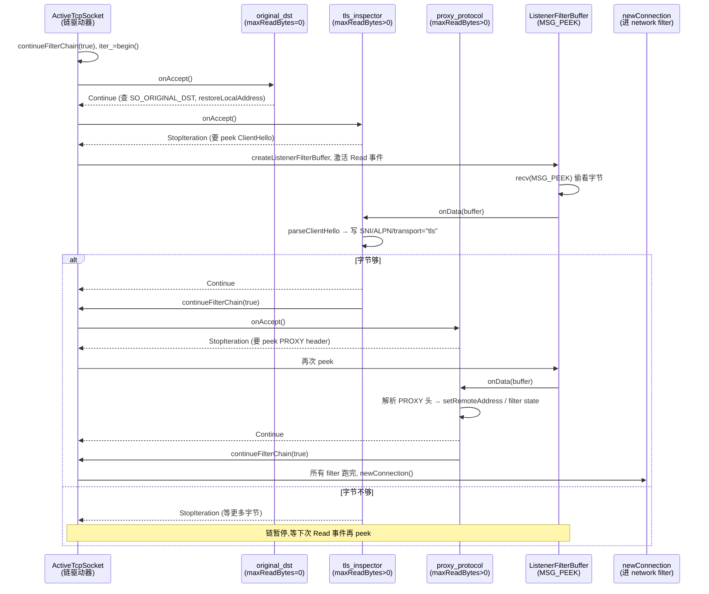

# 第 2 篇 · 第 6 章 · Listener Filter:TCP 层的过滤器

> **核心问题**:P2-05 讲清了"端口到 worker"——某 worker 的 `accept()` 出来一个 fd,`onAccept` → `onAcceptWorker` → 包成 `ActiveTcpSocket` → `startFilterChain`,然后停在了"进 listener filter 链"的入口。但这里有个根本问题:Envoy 此刻面对的是一个**刚 accept 出来的原始 TCP 连接**,它**还不知道这条连接里跑的是什么**——是 TLS?明文 HTTP/1?HTTP/2 preface?是带 PROXY protocol 头的转发流量?是被 iptables 重定向来的"本来想去别处"的流量?这些决策必须在"真正开始解码"之前完成,因为它们决定的是**根本走哪条 filter chain、用哪个证书、转给哪个 cluster**。可偏偏这些信息,又恰恰埋在 TCP 字节流最前面的几个字节里。这一章就是讲 Envoy 怎么在 HTTP 解码之前,用一个独立的"listener filter 链"把这些"前置判断"做完,以及为什么非得这么早。

> **读完本章你会明白**:
> 1. **为什么 listener filter 是独立的一层(而不是塞进 network filter / HTTP filter)**——四个非做不可的前置决策(SNI 选证书 / 选 filter chain、PROXY protocol 还原真实 client IP、original_dst 还原原目的地址、http_inspector 自动识别 H1/H2)为什么必须在 TLS 终止和 HTTP 解码之前完成,朴素地"全部塞进 HTTP filter"会撞什么墙。
> 2. **listener filter 链的运行机制**:`onAccept` 返回 `FilterStatus::Continue / StopIteration` 的二态机,`StopIteration` + `ListenerFilterBuffer`(`MSG_PEEK`)异步等数据回来再 `continueFilterChain(true)` 的模式;为什么这套和 P3-10 http filter chain 的 stop/continue 语义同源。
> 3. **`tls_inspector` 怎么嗅探 ClientHello 选 filter chain**:用 BoringSSL 的 `SSL_CTX_set_select_certificate_cb` 回调,**不手写字节解析**,让 BoringSSL 在 `SSL_do_handshake` 内部解析好 ClientHello 后回调 Envoy 取 SNI/ALPN;为什么这套"先窥探再决定 filter chain"必须发生在 TLS 终止之前——SNI 决定用哪条 filter chain(不同域名不同证书/不同处理),终止前才知道 SNI。
> 4. **`proxy_protocol` 还原真实 client IP / `original_dst` 还原原目的地址**这两件数据来源还原的事,各自的动机和数据通路(写入 `ProxyProtocolFilterState` filter state + `connectionInfoProvider().setRemoteAddress` / `restoreLocalAddress`,供后续 access log、路由、选 cluster 用)。

> **如果一读觉得太难**:先只记住三件事——① listener filter 链是 accept 之后、HTTP 解码之前的独立一层,只做"前置判断"(TLS 探测、PROXY protocol、原目的地址、H1/H2 探测);② 它的运行机制是"onAccept + StopIteration 等数据 + onData 用 MSG_PEEK 嗅探 + continueFilterChain 推进下一站",和后面所有 filter 链同源;③ 这一层最大的价值是"先窥探再决定走哪条 filter chain",尤其 SNI 决定证书、PROXY protocol 还原真实 IP 这些事,放到 TLS 终止/HTTP 解码之后就来不及了。

---

## 〇、一句话点破

> **listener filter 是 accept 之后、network/HTTP filter 之前的独立一层。它跑在一个"还不知道跑着什么协议的 TCP 连接"上,只做四件前置判断:TLS 探测(是不是 TLS、SNI/ALPN 是什么)、PROXY protocol 解析(真实 client IP 是谁)、original dst 还原(本来要去哪)、http_inspector(H1 还是 H2)。这些信息必须在 TLS 终止和 HTTP 解码之前就到手——因为它们决定的是"用哪条 filter chain、哪个证书、转给哪个 cluster",一旦终止/解码了就再也拿不回来(SNI 在终止前才在 ClientHello 里,PROXY protocol 头在 HTTP 之前,原目的地址在 socket option 里)。这一层用 `onAccept → StopIteration → onData(MSG_PEEK) → continueFilterChain` 的异步二态机驱动,和后面所有 filter 链同源。**

这是结论,不是理由。本章倒过来拆:先把"为什么必须有这一层"的四个前置决策逐个讲透(每个都配"不这样会撞什么墙"),再讲 listener filter 链的运行机制(为什么是 `StopIteration` 二态机、为什么用 `MSG_PEEK`),然后挑 `tls_inspector` 嗅探 ClientHello 选 filter chain 这个最硬核的技巧单独拆透,最后讲 `proxy_protocol` / `original_dst` / `http_inspector` 三个,以及 dynamic_modules 这条新增的扩展路径。

---

## 一、listener filter 在数据面里的位置:accept 之后、network filter 之前

P0-01 的全书地图里,一条流量的旅程是这样的:

```
   请求进来
     │
     ▼
   Listener(监听端口,接连接)          ← P2-05
     │
     ▼
   Listener Filter 链 (TCP 层)          ← 本章
     │   (tls_inspector / proxy_protocol / original_dst / http_inspector)
     ▼
   Network Filter 链 / HCM              ← P2-07 / P3-08
     │
     ▼
   ... (router → cluster → endpoint) ...
```

P2-05 的最后一节把 listener filter 链的入口标了出来——`onSocketAccepted` 里调 `createListenerFilterChain` 把配置里的 listener filter 实例化到这个 socket 上,然后 `startFilterChain` 开始依次跑。但 P2-05 没讲这些 filter **具体干什么、为什么必须有这一层**。本章就是补上这一段。

### 一个朴素却致命的问题:为什么不能把这些前置判断塞进 HTTP filter?

很多人第一次看 Envoy 的架构会问:"Envoy 已经有 http filter chain 了(P3-10),为什么还要单独搞一个 listener filter 层?把 TLS 探测、PROXY protocol、原目的地址这些逻辑塞进 http filter chain 开头几个 filter 不就行了?"

这是个好问题,正好戳中 listener filter 这一层存在的根本理由。我们一个一个看"塞进 HTTP filter"会撞什么墙。

**墙一:SNI 在 TLS 终止之前就在 ClientHello 里,终止之后就没机会拿了。** SNI(Server Name Indication)是 TLS 握手时客户端在 ClientHello 里告诉服务器"我想连的域名是哪个"。服务器**正是根据 SNI 决定用哪张证书**——你一个 listener 监听 443 端口,可能要同时服务 `a.com` 和 `b.com` 两个域名,各自有不同证书、不同 filter chain。问题是:**SNI 这条信息,在 TLS 握手开始(ClientHello 阶段)就在字节流里了,而 TLS 终止(在 Envoy 里完成 TLS 握手、解密成明文)是在 ClientHello 之后**。如果你把"SNI 探测"做成一个 HTTP filter,那它跑的时候 TLS 早就已经被 transport socket 终止完了——可 SNI 在终止的那一刻就要被用来挑证书和 filter chain,**根本轮不到 HTTP filter 这一步**。

> **钉死这件事**:SNI 的生命周期是 "ClientHello 里出现 → transport socket 握手时读取用于挑证书/filter chain → 握手完成 → 之后 HTTP filter 跑"。把 SNI 探测放进 HTTP filter 是**时序错位**——它需要的信息在它运行的"前两个阶段"就被消费掉了,根本到不了 HTTP filter。

**墙二:PROXY protocol 头在 HTTP 之前,塞进 HTTP filter 会被当 HTTP 解析报错。** 前置 LB(如 AWS NLB、AWS Classic ELB、HAProxy)做四层转发时,会把真实 client IP 通过 [HAProxy PROXY protocol](https://www.haproxy.org/download/2.8/doc/proxy-protocol.txt) 注入到 TCP 连接的最前面——一个文本(v1)或二进制(v2)的小头,然后才是真正的应用层流量(可能是 HTTP,也可能是 TLS)。这个头**不是 HTTP**,格式完全不同。如果你把它的解析做成一个 HTTP filter,那么 Envoy 的 HTTP codec 在解析第一个字节时,看到的是 PROXY protocol 头("PROXY TCP4 ..." 之类),而不是 `GET / HTTP/1.1`——codec 直接报"malformed request",连接被当坏流量拒掉。**PROXY protocol 必须在 HTTP codec 接管之前就被剥掉、解析完**。

**墙三:原目的地址(original_dst)的还原必须在 filter chain 选定之前完成,否则选不出 cluster。** 透明代理(sidecar 用 iptables 把流量重定向到 Envoy)场景下,Envoy 看到的连接 local address 是被 iptables 改写过的(改成了 Envoy 自己的地址),**客户端真正想去的目的地址**藏在 socket option(SO_ORIGINAL_DST)里。Envoy 要按"本来要去哪"选 cluster 转发(Istio sidecar 的核心机制)。这个还原必须在 filter chain 选定之前做——因为 filter chain 选择本身可能就依赖 local address(参见 P2-05 第五节 `findFilterChain` 的目的 IP/端口匹配),更别说后续路由了。这显然不能是 HTTP filter(HTTP filter 跑的时候 filter chain 早就选定了,connection 都建好了)。

**墙四:某些连接根本不是 HTTP。** listener 可能同时接 HTTPS、明文 HTTP、纯 TCP、gRPC、MongoDB、Redis……Envoy 不能假设"所有连接都是 HTTP"。如果把前置判断塞进 HTTP filter,等于强制所有连接都先过 HTTP codec——但纯 TCP 流量(比如 tcp_proxy 代理 MongoDB)根本不该走 HTTP 解码。listener filter 是"协议无关"的,它面对的是原始 TCP 字节,什么协议都能处理。

> **不这样会怎样(把前置判断塞进 HTTP filter 的四堵墙)**:① SNI 在 TLS 终止前就消费掉了,HTTP filter 跑的时候它早没了;② PROXY protocol 头会被 HTTP codec 当作坏请求拒掉;③ 原目的地址要在 filter chain 选定前还原,HTTP filter 来得太晚;④ 非 HTTP 流量被强行过 HTTP codec。**这四堵墙的共同点是:这些前置判断的时机,严格早于 HTTP filter 能跑的时机。** 所以必须有一层"在 HTTP 之前、在 TLS 终止之前"的独立 filter 链——这就是 listener filter 这一层存在的根本理由。

### 这一层的契约:协议无关、面向原始 TCP 字节

listener filter 的契约很纯粹:**它面对的是一个刚 accept 的 `ConnectionSocket`,上面除了原始 TCP 字节什么结构都没有**。它不能假设这是 HTTP、不能假设这是 TLS、不能假设这是 PROXY protocol——它只能"peek 几个字节,做判断,把判断结果写到 socket / filter state 上,然后让链继续"。这种"协议无关 + 嗅探式"的契约,正是它和后面 network filter / HTTP filter 的根本区别:

- **network filter**(`source/extensions/filters/network/`):面对的是字节流,但通常假定了一个具体的协议语义(`tcp_proxy` 假设是 TCP 字节流、HCM 假设是 HTTP、`mongo_proxy` 假设是 MongoDB 协议)。
- **HTTP filter**(`source/extensions/filters/http/`):面对的是结构化的 HTTP request/response,是 HCM 解码之后的产物。
- **listener filter**(`source/extensions/filters/listener/`):面对的是"还什么协议都不是"的原始字节,只做"嗅探 + 前置判断"。

三层各管一段,层与层之间靠 socket / filter state / connection info 传递信息。**listener filter 这一层写的所有判断结果,都通过 `socket().setRequestedServerName(...)`、`socket().setRequestedApplicationProtocols(...)`、`socket().setDetectedTransportProtocol(...)`、`connectionInfoProvider().setRemoteAddress(...)` / `restoreLocalAddress(...)`、`filterState().setData(...)` 这些"挂到连接对象上"的 API 传递下去**——后面 `findFilterChain` 选 filter chain、network filter 跑、access log 记、router 选 cluster,全都从这些挂载点读。

> **钉死这件事**:listener filter 是 accept 之后、HTTP 解码之前的独立一层。它的契约是"协议无关、嗅探式"——peek 原始 TCP 字节,做前置判断,把结果写到 socket / filter state / connection info 上,让链继续。**它存在的根本理由是四个前置决策(SNI / PROXY protocol / original_dst / 协议识别)的时机严格早于 HTTP filter 能跑的时机,塞不进去。** 这一节回答了"为什么必须有这一层",接下来讲这一层"怎么跑"。

---

## 二、listener filter 链的运行机制:StopIteration + MSG_PEEK 异步二态机

理解了"为什么必须有这一层",我们来看它"怎么跑"。这是本章的机制核心,也是后面所有 filter 链(listener filter、network filter、HTTP filter)共同的运行模式,拆透这一节,P3-10 的 http filter chain 会很好懂。

### 接口定义:三个核心抽象

listener filter 的接口定义在 [`envoy/network/filter.h`](../envoy/envoy/network/filter.h#L443-L501)。三个核心抽象:

```cpp
// envoy/network/filter.h (FilterStatus 枚举)
enum class FilterStatus {
  // Continue to further filters.
  Continue,
  // Stop executing further filters.
  StopIteration
};
```

```cpp
// envoy/network/filter.h (ListenerFilter 抽象类,简化)
class ListenerFilter {
public:
  virtual ~ListenerFilter() = default;

  // Called when a new connection is accepted, but before a Connection is created.
  virtual FilterStatus onAccept(ListenerFilterCallbacks& cb) PURE;

  // Called when data is available (peeked from socket).
  virtual FilterStatus onData(Network::ListenerFilterBuffer& buffer) PURE;

  virtual void onClose() {};

  // 最大要 peek 多少字节。0 表示这个 filter 不需要读数据(只看 socket 元信息)。
  virtual size_t maxReadBytes() const PURE;
};
using ListenerFilterPtr = std::unique_ptr<ListenerFilter>;
```

```cpp
// envoy/network/filter.h (ListenerFilterCallbacks 接口,简化)
class ListenerFilterCallbacks {
public:
  virtual ~ListenerFilterCallbacks() = default;
  virtual ConnectionSocket& socket() PURE;                                   // 拿到 socket,可写 SNI/ALPN/地址
  virtual Event::Dispatcher& dispatcher() PURE;
  virtual StreamInfo::FilterState& filterState() PURE;                       // 挂 filter state
  virtual void continueFilterChain(bool success) PURE;                       // 异步回来"推进下一站"
  virtual void useOriginalDst(bool use_original_dst) PURE;
  // ... 还有 setDynamicMetadata / streamInfo 等 ...
};
```

`FilterStatus` 是一个**二态**枚举:`Continue`(立刻进下一个 filter)或 `StopIteration`(停下来,等异步事件)。没有第三态。这就是 listener filter 链的"控制流原语"——每个 filter 在 `onAccept` 里决定"我现在能继续吗",能就 `Continue`,不能就 `StopIteration`,**自己负责稍后回来调 `cb.continueFilterChain(true)` 把链推进到下一个**。

> **注(此处源码印象纠正)**:在 `envoy/network/filter.h` 行 407/451/462/524 附近的注释里,出现了 `FilterStatus::ContinueIteration` 这个名字。**这是注释里的笔误**——真实枚举(`filter.h:42-47`)只有两个值:`Continue` 和 `StopIteration`。读源码时不要被注释误导。

### 链的驱动:`ActiveTcpSocket::continueFilterChain`

P2-05 提到,`onSocketAccepted` 里 `createListenerFilterChain` 把 listener filter 实例化到 socket 上,然后 `startFilterChain` 调 `continueFilterChain(true)` 开始驱动链。真正的链驱动逻辑在 [`ActiveTcpSocket::continueFilterChain`](../envoy/source/common/listener_manager/active_tcp_socket.cc#L124-L169):

```cpp
// source/common/listener_manager/active_tcp_socket.cc (continueFilterChain,简化)
void ActiveTcpSocket::continueFilterChain(bool success) {
  if (success) {
    bool no_error = true;
    if (iter_ == accept_filters_.end()) {
      iter_ = accept_filters_.begin();                 // 第一次进来,iter_ 指向第一个 filter
    } else {
      iter_ = std::next(iter_);                        // 异步回来推进,iter_ 走到下一个
    }

    for (; iter_ != accept_filters_.end(); iter_++) {
      Network::FilterStatus status = (*iter_)->onAccept(*this);
      if (status == Network::FilterStatus::StopIteration) {
        // 这个 filter 要"等等"——它负责稍后回来调 continueFilterChain(true) 推进到下一个
        if (!socket().ioHandle().isOpen()) {
          no_error = false;
          break;
        } else {
          // 如果这个 filter 需要读字节(maxReadBytes() > 0),挂上 listener filter buffer 去 peek
          if (listener_filter_buffer_ == nullptr) {
            createListenerFilterBuffer();
          }
          if ((*iter_)->maxReadBytes() > 0) {
            listener_filter_buffer_->disableOnDataCallback(false);
            // ... 设置要读多少字节、激活 Read 事件 ...
            listener_filter_buffer_->activateFileEvent(Event::FileReadyType::Read);
          } else {
            listener_filter_buffer_->disableOnDataCallback(true);  // 不读字节,纯异步
          }
          return;                                       // 关键:return 出去,链暂停在这里
        }
      }
      // status == Continue:循环继续,iter_++ 跑下一个
    }
    // 所有 listener filter 跑完了(没 StopIteration 或异步回来都跑完),进 newConnection
    if (no_error) {
      newConnection();
    }
  } else {
    // success == false:某一步失败了(比如 socket 被关了),直接收尾
    // ...
  }
}
```

这段代码是 listener filter 链驱动的心脏,有几个关键点要钉死:

1. **同步快进 + 异步暂停的混合驱动**:循环 `for (; iter_ != accept_filters_.end(); iter_++)` 调每个 filter 的 `onAccept`。如果 `onAccept` 返回 `Continue`,循环**同步继续**跑下一个 filter(`iter_++`)——这是"快进模式"。如果某个 filter 返回 `StopIteration`,循环**立刻 return 退出**,链暂停在这个 filter——这是"异步暂停"。**同一个链上,有些 filter 同步快进(比如 `original_dst`,只看 socket option 不需要读字节),有些异步暂停(比如 `tls_inspector`,要 peek ClientHello 字节)。**

2. **异步回来怎么继续**:`StopIteration` 的那个 filter,在自己内部异步事件读够字节后,**自己负责调用 `cb.continueFilterChain(true)`**。`continueFilterChain(true)` 进来看到 `iter_` 不在 `end()`,走 `else` 分支 `iter_ = std::next(iter_)` 推进到下一个,然后继续 `for` 循环。**这是"filter 链异步推进的契约"——谁 StopIteration,谁负责稍后调 continueFilterChain 把链往前推。**

3. **`maxReadBytes()` 决定要不要 peek 字节**:有些 filter(`tls_inspector`、`proxy_protocol`、`http_inspector`)需要读字节才能判断,它们的 `maxReadBytes()` 返回大于 0 的值;有些 filter(`original_dst`)只看 socket option(原目的地址在 SO_ORIGINAL_DST 里,不用读字节),`maxReadBytes()` 返回 0。链驱动器据此决定要不要挂 `ListenerFilterBuffer` 去 peek。

4. **`newConnection()` 是链的终点**:所有 filter 跑完,调 `newConnection()`——这是"离开 listener filter 链、进 network filter 链"的转折点(P2-05 第五节讲过)。到这一步,所有前置判断(SNI、ALPN、真实 client IP、原目的地址)都已挂到 socket 上,`newConnection` 里的 `findFilterChain` 就能用这些字段选 filter chain 了。

> **钉死这件事**:listener filter 链的运行机制是**"同步快进 + 异步暂停混合驱动"**:每个 filter 的 `onAccept` 返回 `Continue` 就同步跑下一个、返回 `StopIteration` 就立刻暂停;暂停的那个 filter **自己负责**稍后调 `cb.continueFilterChain(true)` 把链推进到下一个。`maxReadBytes()` 决定要不要 peek 字节。所有 filter 跑完调 `newConnection()` 进 network filter 链。

### MSG_PEEK:为什么是"偷看"而不是"消费"字节

那些需要读字节的 filter(`tls_inspector`、`proxy_protocol`、`http_inspector`),它们读字节的方式有一个非常关键的设计:**用 `MSG_PEEK` 偷看,而不是用 `recv` 消费**。

`MSG_PEEK` 是 `recv()` 系统调用的一个 flag,它的语义是:**把 socket 接收缓冲区里的字节复制一份给调用者,但不从缓冲区里移除**。下次再 `recv`(无论带不带 PEEK),这些字节还会被读到。

> **承接《Linux 内核》网络篇 / 《Tokio》**:`MSG_PEEK` 的内核实现细节(在 `tcp_recvmsg` 里通过 `MSG_PEEK` 分支保留 `copied` 不推进 `seq`)在《Linux 内核》网络篇拆过,这里只讲 Envoy 怎么用它。`recv` 的各种 flag、socket 接收缓冲区的管理,见那本书。

为什么 listener filter 必须用 `MSG_PEEK` 而不是普通 `recv`?因为**这些字节后面还要被 transport socket(TLS 握手)和 network filter / HCM(HTTP 解码)用到**。如果 listener filter 用普通 `recv` 把 ClientHello 的字节消费掉了,那 TLS transport socket 接下来握手时,接收缓冲区里就缺了 ClientHello 的开头那几个字节——握手会失败或解析出乱七八糟的东西。同理,如果 `proxy_protocol` 用普通 `recv` 把 PROXY protocol 头**之后**的应用层数据也读了一截走,后面 HCM 解码就会丢字节。

所以 listener filter 只能"偷看":**peek 出来一份字节做判断,判断完不动缓冲区,字节原封不动留给后面的 transport socket / network filter**。Envoy 把这个封装成 `ListenerFilterBuffer` 抽象,真正的 `MSG_PEEK` 调用在 [`source/common/network/listener_filter_buffer_impl.cc`](../envoy/source/common/network/listener_filter_buffer_impl.cc#L55-L81):

```cpp
// source/common/network/listener_filter_buffer_impl.cc (peekFromSocket,简化)
PeekState ListenerFilterBufferImpl::peekFromSocket() {
  // ... 重置 buffer base ...
  base_ = buffer_.get();
  const auto result = io_handle_.recv(base_, buffer_size_, MSG_PEEK);   // 关键:MSG_PEEK
  // ... 处理返回 ...
  data_size_ = result.return_value_;
  // ...
  return PeekState::Done;
}
```

`io_handle_.recv(base_, buffer_size_, MSG_PEEK)` 是核心——用 `MSG_PEEK` flag 调 `recv`,字节被复制到 `base_` 但不消费。`ListenerFilterBuffer::rawSlice()` 给 filter 拿到这份"偷看"到的字节,filter 在 `onData` 里处理它。

> **不这样会怎样(用普通 recv 而不是 MSG_PEEK 会撞什么墙)**:listener filter 用普通 `recv` 把字节消费掉,那 TLS transport socket 接下来握手时,接收缓冲区里就缺了 ClientHello 开头那几字节(`tls_inspector` peek 了多少就缺多少),握手直接失败。或者 `proxy_protocol` 把 PROXY protocol 头**之后**的应用层数据也读了一截走,后面 HCM 解码 HTTP 时丢字节、解析错乱。**所以 listener filter 必须 peek,不能消费——这是"前置判断层"和"真正解码层"共用同一份字节流的正确姿势。**

### 链的时序:把上面三段串成一张图



这张图把 listener filter 链的运行机制完整勾了出来:**同步快进(`original_dst` 立即 Continue)→ 异步暂停(`tls_inspector`/`proxy_protocol` StopIteration 等 peek)→ 异步回来 `continueFilterChain(true)` 推进 → 全部跑完 `newConnection()`**。每个 filter 在 `onData` 里拿到 peek 的字节做判断、写结果到 socket,链推进,最终 `newConnection` 用这些结果选 filter chain。

> **钉死这件事**:listener filter 链用 `MSG_PEEK` "偷看"字节而不是 `recv` 消费——因为同一份字节流后面还要给 transport socket(TLS 握手)和 network filter(HTTP 解码)用。Envoy 把这个封装成 `ListenerFilterBuffer`。这套"`StopIteration` + 异步 peek + `continueFilterChain` 推进"的二态机,是后面所有 filter 链(listener/network/HTTP)的共同祖先,P3-10 http filter chain 的 `StopIteration` 语义同源。

---

## 三、为什么是这四个:listener filter 链上的典型角色

理解了机制,我们来看这条链上典型跑的四个 filter,它们各自解决什么"必须在 HTTP 之前做"的问题。这一节是"动机全景",具体的源码技巧放到第四节(技巧精解)拆透。

### 3.1 `tls_inspector`:嗅探 ClientHello,判断是不是 TLS、提取 SNI/ALPN

**它解决的问题**:listener 收到一个 TCP 连接,Envoy **不知道这是不是 TLS、客户端想连哪个域名(SNI)、想协商什么应用层协议(ALPN)**。但这些信息恰恰是"选哪条 filter chain"的关键——

- **是不是 TLS**:`filter_chain_match` 里 `transport_protocol` 字段可以是 `"tls"` 或空。如果你同一个端口既接 TLS 又接明文(罕见但合法),需要先判断这是不是 TLS。
- **SNI 决定用哪条 filter chain、哪张证书**:一个 443 listener 可能同时服务 `a.com` 和 `b.com`,两条 filter chain,各自有不同证书。`filter_chain_match.server_names` 按 SNI 匹配。**这是最常见的场景**——所有 SNI-based 多域名共享一个端口的部署都靠它。
- **ALPN 决定跑什么应用层协议**:HTTP/1.1 over TLS、HTTP/2 over TLS、HTTP/3 over QUIC(虽然 QUIC 是 UDP)、gRPC over HTTP/2——客户端在 ALPN 扩展里告诉服务器想协商哪个。`filter_chain_match.application_protocols` 按 ALPN 匹配。

**`tls_inspector` 怎么做**:它 peek 出 ClientHello 的前若干字节(最多 16KB,见 [`tls_inspector.h`](../envoy/source/extensions/filters/listener/tls_inspector/tls_inspector.h#L72) 的 `TLS_MAX_CLIENT_HELLO = SSL3_RT_MAX_PLAIN_LENGTH`),用 BoringSSL 的 API 解析出 SNI/ALPN,然后写到 socket 上(`setRequestedServerName` / `setRequestedApplicationProtocols` / `setDetectedTransportProtocol("tls")`)。后面 `findFilterChain` 用这些字段匹配 `filter_chain_match`。具体怎么解析的,是本章技巧精解的主角,第四节拆透。

> **为什么不直接 TLS 终止再决定**:这是 `tls_inspector` 设计里最微妙的一点。朴素想法是"反正要 TLS 终止,终止的时候自然就知道 SNI 了,何必单独搞一个 inspector?" 答案是:**TLS 终止本身就需要知道用哪张证书**,而选哪张证书恰恰取决于 SNI——`a.com` 用 `a.com` 的证书、`b.com` 用 `b.com` 的证书。如果你不先 peek SNI,你连"用哪条 filter chain(进而用哪个 transport socket、哪张证书)终止 TLS"都不知道。**这是先有鸡还是先有蛋的循环:SNI 在 TLS 握手里,但终止 TLS 又需要 SNI 选证书。** `tls_inspector` 的价值就是**用 peek 打破这个循环**——先 peek 出 SNI,据此选好 filter chain 和证书,然后再让 transport socket 用这张证书正式握手。所以 `tls_inspector` 不是"重复造 TLS 终止",而是"为 TLS 终止做准备"。

> **钉死这件事**:`tls_inspector` 的本质是**"在 TLS 终止之前 peek SNI/ALPN,据此选 filter chain 和证书"**。它不是"另一次 TLS 终止",它**故意 abort 握手**(第四节看源码),只用 BoringSSL 解析 ClientHello 不真握手。它的存在是为了打破"SNI 在握手时要消费,但选证书又需要 SNI"的循环。

### 3.2 `proxy_protocol`:还原真实 client IP

**它解决的问题**:Envoy 前面挂了一层四层 LB(如 AWS NLB、AWS Classic ELB、自建 HAProxy),这个 LB 做 TCP 转发——客户端的 TCP 连接先到 LB,LB 再发起一条到 Envoy 的 TCP 连接转发字节流。这种四层转发下,**Envoy 看到的 TCP 连接源 IP 是 LB 的 IP**,不是真实客户端的 IP。这会导致:

- **access log 记的是 LB 的 IP**,不是真实客户端,排障困难。
- **基于源 IP 的限流、路由**(`source_ip` 路由、限流)失效,因为所有流量"看起来都来自 LB"。
- **可观测的地理分布、客户端分析**全错。

**[PROXY protocol](https://www.haproxy.org/download/2.8/doc/proxy-protocol.txt)** 是 HAProxy 定义的标准协议,用来解决这个问题:LB 在转发到 Envoy 的 TCP 连接**最前面**,插入一个小头(v1 是文本如 `PROXY TCP4 1.2.3.4 5.6.7.8 1234 80\r\n`,v2 是二进制更紧凑),里面带真实客户端 IP/端口和原始目的 IP/端口。然后才是真正的应用层流量(可能是 TLS,可能是明文 HTTP)。

**`proxy_protocol` filter 怎么做**:它 peek 连接最前面的字节,识别 v1/v2 头,解析出真实 client IP/port 和原目的 IP/port,然后:

- **写 filter state**(`ProxyProtocolFilterState`,key = `Network::ProxyProtocolFilterState::key()`):把还原的地址信息存进 filter state,供后续 filter / access log / 路由读。源码在 [`proxy_protocol.cc`](../envoy/source/extensions/filters/listener/proxy_protocol/proxy_protocol.cc#L307-L313)。
- **覆盖连接的真实地址**:`socket.connectionInfoProvider().setRemoteAddress(...)`(行 360)把 socket 的 remote address 从 LB 的 IP 改成真实 client IP。从此 Envoy 内部所有"看到的 remote address"都是真实客户端 IP——access log、限流、路由全部正常。

注意时序:**`proxy_protocol` 必须是 listener filter 链上的第一个或最靠前的 filter 之一**——因为它要剥 PROXY protocol 头,后面的 filter(`tls_inspector`)才能看到真正的应用层字节。如果 `tls_inspector` 先跑,它会 peek 到 "PROXY TCP4..." 文本,以为是某种畸形 ClientHello,判定不是 TLS,连接就走错路径了。**filter 顺序由配置里的 `listener_filters` 列表顺序决定**(`createListenerFilterChain` 按 FIFO 实例化,见 P2-05 第五节),PROXY protocol 通常配在最前面。

> **钉死这件事**:`proxy_protocol` 解决"四层 LB 转发后 Envoy 看不到真实 client IP"的问题。它 peek PROXY protocol 头,解析出真实 client IP/端口,通过 `setRemoteAddress` 覆盖连接 remote address + 写 `ProxyProtocolFilterState` filter state,让后续 access log/限流/路由都看到真实客户端。**它必须是链上靠前的 filter**,否则后面的 `tls_inspector` 会把 PROXY 头当畸形 ClientHello。

### 3.3 `original_dst`:还原"本来要去哪"(透明代理的核心)

**它解决的问题**:Istio sidecar 模式下,客户端 Pod 里的所有出站流量被 iptables 规则透明重定向到同 Pod 的 Envoy sidecar(redirect 到 15006 端口)。这种透明拦截下,**Envoy 看到的连接 local address 是被 iptables 改写过的(改成了 Envoy 的 15006),客户端真正要去的目的地址(比如 `10.0.0.5:8080`)藏在 socket option `SO_ORIGINAL_DST` 里**。Envoy 要按"本来要去哪"选 cluster 转发——这正是 Istio sidecar 能做"应用无感服务网格"的核心机制。

**`original_dst` filter 怎么做**:它不读字节(`maxReadBytes() == 0`),只查 socket option。核心一行在 [`original_dst.cc`](../envoy/source/extensions/filters/listener/original_dst/original_dst.cc#L17-L19):

```cpp
// source/extensions/filters/listener/original_dst/original_dst.cc
absl::optional<Address::InstanceConstSharedPtr>
OriginalDstFilter::getOriginalDst(Network::ConnectionSocket& socket) const {
  return Network::Utility::getOriginalDst(sock);     // 查 SO_ORIGINAL_DST
}
```

`Network::Utility::getOriginalDst` 封装 `getsockopt(fd, SOL_IP, SO_ORIGINAL_DST, ...)`,从内核拿到 iptables 改写前的原目的地址。拿到后,`original_dst` filter 调 `socket.connectionInfoProvider().restoreLocalAddress(original_local_address)`([`original_dst.cc:71`](../envoy/source/extensions/filters/listener/original_dst/original_dst.cc#L71)),**把 socket 的 local address "还原"成客户端本来要去的目的地址**。

**还原之后,Envoy 怎么用这个地址?** 两条路:

1. **`use_original_dst` listener 配置**:listener 配置了 `use_original_dst: true`,且 `original_dst` filter 把 local address 还原后,P2-05 第五节讲的 `ActiveTcpSocket::newConnection` 里会走 `hand_off_restored_destination_connections` 分支——**把这条连接移交给"按原目的地址匹配到的另一个 listener"**。比如客户端要去 `10.0.0.5:8080`,Envoy 用这个地址去 `getBalancedHandlerByAddress` 找另一个监听 `10.0.0.5:8080` 的 listener(可能是 "virtual listener",Istio 给每个服务起一个),把连接转给它处理。这是 Istio 的核心路由机制。
2. **`original_dst` cluster 类型**(P4-12 会讲):cluster 配置成 `ORIGINAL_DST` 类型,直接按"还原的原目的地址"作为 upstream endpoint 转发。这在某些"按 iptables 重定向目的地址直接转发"的网格配置里用。

> **为什么 original_dst 不读字节**:`SO_ORIGINAL_DST` 是 socket option,内核在 iptables REDIRECT/TPROXY 时记录下来,Envoy 通过 `getsockopt` 就能拿到,**不用 peek 任何字节**。所以 `original_dst` 的 `maxReadBytes()` 返回 0,它的 `onAccept` 是同步的(返回 `Continue`),不进 `ListenerFilterBuffer` 那套异步 peek 路径。这是它和 `tls_inspector`/`proxy_protocol`/`http_inspector` 的根本区别——它不嗅探字节,只查 socket 元信息。

> **钉死这件事**:`original_dst` 还原"客户端本来要去哪"(从 `SO_ORIGINAL_DST` 拿),通过 `restoreLocalAddress` 写回 socket 的 local address。然后配合 `use_original_dst` listener 配置,把连接移交给按原目的地址匹配的另一个 listener(Istio sidecar 透明拦截的核心)。它不读字节,所以是同步 filter,不进 peek 异步路径。

### 3.4 `http_inspector`:嗅探 HTTP/1 vs HTTP/2 preface

**它解决的问题**:某些场景下,同一个端口要同时接明文 HTTP/1.1 和明文 HTTP/2(`h2c`,HTTP/2 cleartext,即不经 TLS 直接发 HTTP/2 connection preface)。客户端连过来,Envoy **不知道这是 HTTP/1.1 还是 HTTP/2**——但它俩的 codec 完全不同(HTTP/1.1 是文本逐行解析,HTTP/2 是二进制帧)。如果 HCM 不知道用哪个 codec,就没法解码。`filter_chain_match.application_protocols` 可以按 `Http10`/`Http11`/`Http2c` 这些"检测出的应用协议"匹配不同 filter chain(各自用不同 codec)。

**`http_inspector` 怎么做**:它 peek 连接最前面的字节,比对 HTTP/2 connection preface([`http_inspector.cc`](../envoy/source/extensions/filters/listener/http_inspector/http_inspector.cc#L24)):

```cpp
// source/extensions/filters/listener/http_inspector/http_inspector.cc
const absl::string_view Filter::HTTP2_CONNECTION_PREFACE = "PRI * HTTP/2.0\r\n\r\nSM\r\n\r\n";
```

`PRI * HTTP/2.0\r\n\r\nSM\r\n\r\n` 是 [RFC 9113](https://datatracker.ietf.org/doc/html/rfc9113) 规定的 HTTP/2 connection preface,所有 HTTP/2 连接(包括 `h2c`)客户端都会先发这串字节。`http_inspector` peek 出来比对:

- 如果前 24 字节是这串 preface → HTTP/2 cleartext,写 `setRequestedApplicationProtocols({"Http2c"})`(行 171)。
- 否则用 HTTP/1 parser(balsa 或 legacy)试着解析请求行 → 是合法 HTTP/1 请求行(`GET / HTTP/1.1` 之类)就是 HTTP/1.1 或 HTTP/1.0,写 `Http11`/`Http10`。
- 都不是 → 不是明文 HTTP,后续走别的 filter chain(可能是 TLS,但更可能是 `tls_inspector` 在它之前已经处理了)。

注意:`http_inspector` 比 `tls_inspector` **新得多**(为支持 H1/H2 cleartext 自动识别加的),也较少用——因为大多数部署要么纯 HTTP/1(明文或 TLS),要么纯 HTTP/2 over TLS(TLS 一终止、ALPN 一协商,HCM 就知道用哪个 codec)。`http_inspector` 主要在"明文同端口混跑 H1/H2"这种特殊场景才需要。

> **钉死这件事**:`http_inspector` 解决"同端口混跑明文 HTTP/1 和 HTTP/2 cleartext"的识别问题。它 peek 前几字节,比对 HTTP/2 connection preface(`PRI * HTTP/2.0...`)判定 H2,否则试解析 HTTP/1 请求行。结果写到 `setRequestedApplicationProtocols`,后续 `findFilterChain` 按 `application_protocols` 匹配不同 codec 的 filter chain。

### 四个 filter 的一张总表

把四个 listener filter 的"动机 + 数据来源 + 写到哪 + 是否读字节"一张表钉死:

| filter | 解决什么问题 | 数据来源 | 写到哪 | 读字节? |
|--------|------------|---------|--------|---------|
| `tls_inspector` | TLS/SNI/ALPN 探测,选证书 + filter chain | peek ClientHello | `setRequestedServerName` / `setRequestedApplicationProtocols` / `setDetectedTransportProtocol("tls")` | 是(`MSG_PEEK`) |
| `proxy_protocol` | 还原真实 client IP(四层 LB 后) | peek PROXY protocol v1/v2 头 | `setRemoteAddress` + `ProxyProtocolFilterState` filter state | 是(`MSG_PEEK`) |
| `original_dst` | 还原原目的地址(透明代理) | `SO_ORIGINAL_DST` socket option | `restoreLocalAddress` | 否(同步 filter) |
| `http_inspector` | HTTP/1 vs HTTP/2 cleartext 识别 | peek 前几字节(HTTP/2 preface / HTTP/1 请求行) | `setRequestedApplicationProtocols({"Http2c"/"Http11"/"Http10"})` | 是(`MSG_PEEK`) |

四个 filter 写的"挂载点"(`setRequestedServerName`、`setRequestedApplicationProtocols`、`setDetectedTransportProtocol`、`setRemoteAddress`、`restoreLocalAddress`、`filterState().setData`)就是它们和后面 `findFilterChain`、network filter、access log、router 之间的"信息总线"。这一层只负责"判断 + 挂载",不负责"使用"——使用是后面的 filter 链和 `findFilterChain` 的事。

> **钉死这件事**:四个 listener filter 各管一件事——`tls_inspector` 探测 TLS/SNI/ALPN、`proxy_protocol` 还原真实 client IP、`original_dst` 还原原目的地址、`http_inspector` 识别 H1/H2。它们都把结果"挂"到 socket / filter state / connection info 上,**通过这些挂载点把信息传给后面的 `findFilterChain` 和 network filter**。这是 listener filter 层和后面所有层之间的信息总线。

### 3.5 对照:Nginx / HAProxy 怎么做这些前置判断

讲完四个 filter,值得对照一下 Nginx 和 HAProxy 怎么解决同样的"前置判断"问题。这不是为了踩 Nginx(它和 HAProxy 在静态入口流量场景至今是最优解之一,见 P0-01 第五节),而是为了点清 Envoy 把这些做成"可插拔 filter 链"得到了什么、付出了什么。

**Nginx 的做法是"配置项 + 模块硬编码阶段"**。Nginx 也有 TLS 终止、SNI 选证书、PROXY protocol 支持,但它们不是"filter 链上可插拔的 filter",而是分散在不同处理阶段的硬编码逻辑:

- SNI 选证书:Nginx 在 OpenSSL 握手回调里硬编码读取,按 `ssl_preread` 模块或 `ssl_certificate` 的 `server_name` 匹配 server block。要"先 peek SNI 再决定转发到哪"得用 `stream` 模块的 `ssl_preread`(且这个能力是较新加的,早期没有)。
- PROXY protocol:Nginx 的 `proxy_protocol` 是个 listener 级别的开关(`listen ... proxy_protocol`),开了之后所有连接都必须带 PROXY protocol 头,**不能"有些连接带、有些不带"**;而且它绑死在 listen 指令上,不是可拼装的 filter。
- 透明代理(原目的地址):Nginx 用 `transparent` 参数 + `proxy_bind $remote_addr transparent`,逻辑也是写死的。

**HAProxy 的做法类似**:PROXY protocol 本来就是 HAProxy 发明的,它内部解析是写死的;SNI 路由是 `use-server`/`use_backend` 规则里的 `req.ssl_sni` 匹配,逻辑也是配置项驱动的硬编码。

**Envoy 得到了什么**:把这些前置判断**统一抽象成"listener filter 链"上的可插拔 filter**——同一个 listener 可以配任意组合的 listener filter(只要 `tls_inspector`、不要 `proxy_protocol`、加一个 dynamic_modules 自定义嗅探),filter 之间靠 socket / filter state / connection info 这套"信息总线"通信,新场景(比如 H1/H2 cleartext 混跑)加一个新 filter 就行,不用改 Envoy 核心。**这是 P0-01 讲的"可插拔从编译期挪到配置期"在 listener 层的具体体现。**

**Envoy 付出了什么**:① 每个 filter 都要走 `onAccept → StopIteration → onData → continueFilterChain` 这套异步二态机,比 Nginx 的硬编码直调多一层间接(性能上这点开销极小,但确实存在);② 配置复杂度上升——用户要理解 filter 顺序(`proxy_protocol` 必须在 `tls_inspector` 之前)、要理解 `maxReadBytes` / 超时(`listener_filters_timeout`)等概念;③ filter 之间的"信息总线"(socket 上的字段、filter state 的 key)是个隐式契约,filter 写入和读取要约定好 key 和字段,出问题排查比 Nginx 的"看 listen 指令"要绕。

> **钉死这件事**:Nginx / HAProxy 把前置判断做成"配置项 + 硬编码阶段",Envoy 做成"可插拔 listener filter 链"。**得到的:可拼装、可扩展(dynamic_modules)、统一抽象;付出的:多一层间接、配置复杂度、隐式信息总线契约。** 这是 filter chain 范式在 listener 层的得失,和 P0-01 第五节讲的 Envoy vs Nginx 总得失一致——Envoy 用"配置复杂度"换"可编程性与可扩展性"。

---

## 四、技巧精解:`tls_inspector` 怎么嗅探 ClientHello 选 filter chain

这一节单独拆透本章最硬核的技巧——`tls_inspector` 嗅探 ClientHello。它涉及"先窥探再决定 filter chain"的整套机制,以及一个很巧妙的"借 BoringSSL 解析但不真握手"的设计。

### 4.1 技巧一:借 BoringSSL 解析 ClientHello,但不真握手

**这个技巧要解决的问题**:`tls_inspector` 要从 ClientHello 字节里提取 SNI 和 ALPN。ClientHello 的字节布局是 TLS 规范定的(RFC 8446 第 4.1.2 节),里面有 version、random、session_id、cipher_suites、compression_methods、extensions——SNI 和 ALPN 都是 extensions 里的子项。手写这个解析不简单(要处理各种长度前缀、扩展类型、可能的 GREASE 噪声、版本协商逻辑……),而且容易写错。

更关键的是:**BoringSSL 已经有这套解析代码了**,而且一直在演进、修 bug、跟标准。如果 Envoy 自己手写一份,既费事又会和 BoringSSL 的解析不一致(比如对畸形 ClientHello 的容忍度不同,导致 inspector 判定是 TLS 但 transport socket 握手时又不认,或反过来)。

**手段**:`tls_inspector` **不手写解析,而是借 BoringSSL**。它创建一个 `SSL_CTX` + `SSL` 对象,把 peek 出来的 ClientHello 字节塞进 SSL 对象的读 BIO(用一个内存 BIO),然后调 `SSL_do_handshake` 让 BoringSSL 自己解析。BoringSSL 解析 ClientHello 时会触发 Envoy 注册的 `SSL_CTX_set_select_certificate_cb` 回调——**SNI 和 ALPN 就是在这个回调里被 BoringSSL 解析好之后交给 Envoy 的**。

```cpp
// source/extensions/filters/listener/tls_inspector/tls_inspector.cc (Config 构造函数注册回调,行 78-94)
SSL_CTX_set_select_certificate_cb(
    ssl_ctx_.get(), [](const SSL_CLIENT_HELLO* client_hello) -> ssl_select_cert_result_t {
      Filter* filter = static_cast<Filter*>(SSL_get_app_data(client_hello->ssl));
      filter->createJA3Hash(client_hello);
      filter->createJA4Hash(client_hello);

      const uint8_t* data;
      size_t len;
      if (SSL_early_callback_ctx_extension_get(
              client_hello, TLSEXT_TYPE_application_layer_protocol_negotiation, &data, &len)) {
        filter->onALPN(data, len);           // ← ALPN 扩展已解析好,交给 onALPN
      }

      const char* servername = SSL_get_servername(client_hello->ssl, TLSEXT_NAMETYPE_host_name);
      filter->onServername(absl::NullSafeStringView(servername));   // ← SNI 已解析好,交给 onServername
      return ssl_select_cert_error;          // ← 关键:故意返回 error,abort 握手
    });
```

这段代码精妙在三个地方:

1. **`SSL_CTX_set_select_certificate_cb`**:这是 BoringSSL 的"选证书回调"——在 TLS 1.2 及以下的握手里,BoringSSL 解析完 ClientHello 但还没回应时,会调这个回调让应用"看着 ClientHello 选证书"。`select_certificate_cb` 是早期 client_hello callback(`SSL_CTX_set_client_hello_cb`)的现代版,语义略强(能拿到完整的 `SSL_CLIENT_HELLO` 结构)。**Envoy 借用它"ClientHello 已解析"的时机,在回调里直接取 SNI/ALPN。**

2. **`SSL_early_callback_ctx_extension_get(..., TLSEXT_TYPE_application_layer_protocol_negotiation, ...)`**:这是 BoringSSL 的辅助函数,从 ClientHello 里取指定类型的扩展。这里取的是 ALPN 扩展(`TLSEXT_TYPE_application_layer_protocol_negotiation`),返回原始字节给 `onALPN`。**Envoy 不用自己遍历 extensions 数组,BoringSSL 帮它定位好了。**

3. **`return ssl_select_cert_error`(故意 abort 握手)**:这是最妙的一笔。`tls_inspector` **不是要真握手**——它只想 peek SNI/ALPN 然后让真正的 transport socket(`source/extensions/transport_sockets/tls/`)用选好的证书去握手。所以回调取完信息,**故意返回 `ssl_select_cert_error` 让 BoringSSL 把这次 `SSL_do_handshake` 失败掉**。这样 `tls_inspector` 的 `SSL` 对象不会真的进入握手状态(不发 ServerHello、不分配会话密钥),只是"借 BoringSSL 解析 ClientHello 一下"。

> **钉死这件事**:`tls_inspector` 不手写 ClientHello 解析,**借 BoringSSL 的 `SSL_CTX_set_select_certificate_cb` 回调**,在 BoringSSL 解析好 ClientHello 后取 SNI/ALPN,然后**故意返回 `ssl_select_cert_error` abort 握手**——它只想"peek 信息",不想真握手。真握手是后面 transport socket 的事(用 `tls_inspector` 选好的证书)。这个设计的妙处是"复用 BoringSSL 的解析,避免手写解析的 bug 和不一致"。

### 4.2 驱动解析:`onData` → `parseClientHello` → `SSL_do_handshake`

回调注册好了,真正触发它的是 `onData`。整条调用链是:`onData`(拿到 peek 的字节)→ `parseClientHello`(塞 BIO + 调 `SSL_do_handshake`)→ BoringSSL 解析 ClientHello 触发回调 → 回调里取 SNI/ALPN 写 socket。逐段看。

**`onData` 拿到 peek 的字节**([`tls_inspector.cc:145-171`](../envoy/source/extensions/filters/listener/tls_inspector/tls_inspector.cc#L145-L171)):

```cpp
// source/extensions/filters/listener/tls_inspector/tls_inspector.cc (onData,简化)
Network::FilterStatus Filter::onData(Network::ListenerFilterBuffer& buffer) {
  auto raw_slice = buffer.rawSlice();          // ← 拿到 peek 出来的字节(MSG_PEEK,不消费)
  ENVOY_LOG(trace, "tls inspector: recv: {}", raw_slice.len_);

  // Because we're doing a MSG_PEEK, data we've seen before gets returned every time, so
  // skip over what we've already processed.
  if (static_cast<uint64_t>(raw_slice.len_) > read_) {
    const uint8_t* data = static_cast<const uint8_t*>(raw_slice.mem_) + read_;
    const size_t len = raw_slice.len_ - read_;
    const uint64_t bytes_already_processed = read_;
    read_ = raw_slice.len_;
    ParseState parse_state = parseClientHello(data, len, bytes_already_processed);
    switch (parse_state) {
    case ParseState::Error:
      cb_->socket().ioHandle().close();
      return Network::FilterStatus::StopIteration;
    case ParseState::Done:
      return Network::FilterStatus::Continue;             // ← 解析完成,链继续
    case ParseState::Continue:
      return Network::FilterStatus::StopIteration;        // ← 字节不够,等下次 peek
    }
    IS_ENVOY_BUG("unexpected tcp filter parse_state");
  }
  return Network::FilterStatus::StopIteration;
}
```

注释行 149 一针见血:"Because we're doing a MSG_PEEK, data we've seen before gets returned every time, so skip over what we've already processed."——因为 `MSG_PEEK` 不消费字节,每次 peek 都返回全部已读字节,所以用 `read_` 偏移跳过已处理部分,只把**增量**喂给 `parseClientHello`。这是 peek 模式的固有特性,filter 自己要处理"增量 vs 全量"。

**`parseClientHello` 塞 BIO + 调 `SSL_do_handshake`**([`tls_inspector.cc:249-274`](../envoy/source/extensions/filters/listener/tls_inspector/tls_inspector.cc#L249-L274)):

```cpp
// source/extensions/filters/listener/tls_inspector/tls_inspector.cc (parseClientHello,简化)
ParseState Filter::parseClientHello(const void* data, size_t len,
                                    uint64_t bytes_already_processed) {
  // Ownership remains here though we pass a reference to it in `SSL_set0_rbio()`.
  bssl::UniquePtr<BIO> bio(BIO_new_mem_buf(data, len));           // ← 把 peek 的字节塞进内存 BIO

  // Make the mem-BIO return that there is more data
  // available beyond it's end.
  BIO_set_mem_eof_return(bio.get(), -1);                          // ← EOF 时返回 -1(WANT_READ)

  // We only do reading as we abort the handshake early.
  SSL_set0_rbio(ssl_.get(), bssl::UpRef(bio).release());          // ← 设为 SSL 对象的读 BIO

  int ret = SSL_do_handshake(ssl_.get());                         // ← 驱动 BoringSSL 解析 ClientHello

  // This should never succeed because an error is always returned from the SNI callback.
  ASSERT(ret <= 0);                                               // ← 一定失败(因为回调故意 abort)
  ParseState state = getParserState(ret);

  if (state != ParseState::Continue) {
    // Record bytes analyzed as we're done processing.
    config_->stats().bytes_processed_.recordValue(
        computeClientHelloSize(bio.get(), bytes_already_processed, len));
  }

  return state;
}
```

三个细节:

1. **`BIO_new_mem_buf` + `SSL_set0_rbio`**:把 peek 出来的字节包成一个 BoringSSL 的"内存 BIO"(本质是个字节流抽象),设为 SSL 对象的**读 BIO**(`rbio` = read BIO)。这样 BoringSSL 后续从 SSL 对象"读"字节时,读的就是 Envoy peek 来的字节。注意只设了 `rbio`,**没设 `wbio`(写 BIO)**——因为 `tls_inspector` 不打算让 BoringSSL 真的发回应(不握手),不需要写。

2. **`BIO_set_mem_eof_return(bio.get(), -1)`**:这是个非常 BoringSSL 专用的细节。内存 BIO 读到底时,默认返回 0(EOF)。但 TLS 协议里,握手过程中 BoringSSL 可能需要"更多数据"(比如 ClientHello 跨多个 TCP 段),它期望 BIO 返回 -1 表示"暂时没数据可读,等下次"(`SSL_ERROR_WANT_READ`),而不是 0(表示"连接关了")。设成 -1 让 BoringSSL 在字节不够时正确返回 `SSL_ERROR_WANT_READ`,而不是把字节不够误判成"连接关闭"导致握手失败。

3. **`ASSERT(ret <= 0)`**:行 263 的注释明说——握手**永远不可能成功**,因为回调里故意返回 `ssl_select_cert_error`。所以 `SSL_do_handshake` 总返回 ≤ 0,真正的状态由 `SSL_get_error(ret)` 区分:`SSL_ERROR_WANT_READ`(字节不够)、`SSL_ERROR_SSL`(解析完了,可能是合法 ClientHello 也可能不合法)、其他(真错)。`getParserState`(行 190 起)据此返回 `Continue`(等字节)/ `Done`(完成)/ `Error`(关连接)。

**`getParserState` 区分三种状态**([`tls_inspector.cc:190-246`](../envoy/source/extensions/filters/listener/tls_inspector/tls_inspector.cc#L190-L246)):

```cpp
// source/extensions/filters/listener/tls_inspector/tls_inspector.cc (getParserState,关键分支简化)
switch (SSL_get_error(ssl_.get(), handshake_status)) {
case SSL_ERROR_WANT_READ:
  if (read_ >= maxConfigReadBytes()) {
    // ... ClientHello 太大,超过 16KB 上限 ...
    return ParseState::Error;
  }
  if (read_ >= requested_read_bytes_) {
    requested_read_bytes_ = std::min<uint32_t>(2 * read_, maxConfigReadBytes());   // ← 翻倍下次要读的字节数
  }
  return ParseState::Continue;            // ← 字节不够,等下次 peek

case SSL_ERROR_SSL:
  // ... 错误细节判断 ...
  if (clienthello_success_) {             // ← 走到过 select_certificate_cb 回调,说明 ClientHello 合法
    config_->stats().tls_found_.inc();
    if (alpn_found_) {
      config_->stats().alpn_found_.inc();
    } else {
      config_->stats().alpn_not_found_.inc();
    }
    cb_->socket().setDetectedTransportProtocol("tls");   // ← 标记 transport = "tls"
  } else {
    // ... 不是合法 ClientHello(明文或不合法)...
    if (config_->closeConnectionOnTlsHelloParsingErrors()) {
      // ... 关连接 ...
      return ParseState::Error;
    }
    config_->stats().tls_not_found_.inc();
    setDynamicMetadata(failureReasonClientHelloNotDetected());
    setDownstreamTransportFailureReason();
  }
  return ParseState::Done;

default:
  return ParseState::Error;
}
```

三个关键点:

1. **字节不够时(`SSL_ERROR_WANT_READ`)翻倍 `requested_read_bytes_`**:行 200-203,ClientHello 可能很大(各种扩展、证书压缩、GREASE……),第一次 peek 可能只读到 TLS record 头 5 字节,不够。Envoy **翻倍**下次要 peek 的字节数(`2 * read_`),直到达到上限 16KB(`SSL3_RT_MAX_PLAIN_LENGTH`)。这是"指数退避式增量 peek"——避免一次读太少浪费事件循环、也避免一次读太多浪费内存。

2. **`clienthello_success_` 区分"合法 ClientHello"和"不是 TLS"**:`clienthello_success_` 是 `onServername` 里设的(行 142),只要走到 `select_certificate_cb` 回调,说明 BoringSSL 觉得这是个合法 ClientHello(至少能解析到能调回调的程度)。**走到了就是 TLS**,无论 SNI 有没有(BoringSSL 解析失败前可能也已经调过回调)。所以 `clienthello_success_ == true` 走"是 TLS"分支(`setDetectedTransportProtocol("tls")`),`false` 走"不是 TLS / 不合法"分支(默认不关连接,让后续按 raw_buffer 处理)。

3. **`close_connection_on_client_hello_parsing_errors`** 配置决定"非 TLS 连接"怎么处理:默认 false(不关,按 raw_buffer 走),某些严格场景配 true(不是 TLS 就关掉)。

### 4.3 解析结果写到 socket:`onServername` 和 `onALPN`

BoringSSL 在 `select_certificate_cb` 回调里把 SNI/ALPN 解析好了,Envoy 在 `onServername` / `onALPN` 里把它们写到 socket 上。

**`onServername` 写 SNI**([`tls_inspector.cc:134-143`](../envoy/source/extensions/filters/listener/tls_inspector/tls_inspector.cc#L134-L143)):

```cpp
// source/extensions/filters/listener/tls_inspector/tls_inspector.cc (onServername)
void Filter::onServername(absl::string_view name) {
  if (!name.empty()) {
    config_->stats().sni_found_.inc();
    cb_->socket().setRequestedServerName(name);              // ← 写 SNI
    ENVOY_LOG(debug, "tls:onServerName(), requestedServerName: {}", name);
  } else {
    config_->stats().sni_not_found_.inc();
  }
  clienthello_success_ = true;                               // ← 标记"走到这了,是 TLS"
}
```

SNI 非空:`sni_found_++`、`setRequestedServerName` 写 socket。SNI 为空:`sni_not_found_++`,**不写**(socket 的 `requestedServerName()` 保持空)。无论哪种,`clienthello_success_ = true`——只要走到了 `onServername`,说明 BoringSSL 把这个连接当合法 ClientHello 解析过了,就是 TLS。

一个细节:`setRequestedServerName` 内部会**小写化** SNI([`connection_socket_impl.h:61-63`](../envoy/source/common/network/connection_socket_impl.h#L61-L63),`connectionInfoProvider().setRequestedServerName(absl::AsciiStrToLower(server_name))`)。这和后面 `findFilterChainForServerName` 里的断言 `ASSERT(absl::AsciiStrToLower(socket.requestedServerName()) == socket.requestedServerName())` 对应——SNI 全程小写,匹配时不用再 case-insensitive 比较。

**`onALPN` 解析 ALPN 线格式 + 写**([`tls_inspector.cc:113-132`](../envoy/source/extensions/filters/listener/tls_inspector/tls_inspector.cc#L113-L132)):

```cpp
// source/extensions/filters/listener/tls_inspector/tls_inspector.cc (onALPN)
void Filter::onALPN(const unsigned char* data, unsigned int len) {
  CBS wire, list;
  CBS_init(&wire, reinterpret_cast<const uint8_t*>(data), static_cast<size_t>(len));
  if (!CBS_get_u16_length_prefixed(&wire, &list) || CBS_len(&wire) != 0 || CBS_len(&list) < 2) {
    // Don't produce errors, let the real TLS stack do it.
    return;
  }
  CBS name;
  std::vector<absl::string_view> protocols;
  while (CBS_len(&list) > 0) {
    if (!CBS_get_u8_length_prefixed(&list, &name) || CBS_len(&name) == 0) {
      // Don't produce errors, let the real TLS stack do it.
      return;
    }
    protocols.emplace_back(reinterpret_cast<const char*>(CBS_data(&name)), CBS_len(&name));
  }
  ENVOY_LOG(trace, "tls:onALPN(), ALPN: {}", absl::StrJoin(protocols, ","));
  cb_->socket().setRequestedApplicationProtocols(protocols);   // ← 写 ALPN 列表
  alpn_found_ = true;
}
```

ALPN 扩展的线格式是 TLS 规范定的:`2 字节总长前缀 + (1 字节协议名长 + 协议名)* N`(RFC 7301)。`CBS_get_u16_length_prefixed` 读外层 2 字节前缀,`CBS_get_u8_length_prefixed` 循环读每个协议。这是 BoringSSL 的 CBS(Crypto Byte String)API——一套处理 TLS 线格式的辅助函数,**Envoy 这里要自己拆 ALPN 列表,因为 `SSL_early_callback_ctx_extension_get` 只返回 ALPN 扩展的原始字节,不替你拆成协议名数组**(它只取到"扩展存在 + 原始字节",语义层级的解析还是 Envoy 自己做)。最后 `setRequestedApplicationProtocols` 把协议名数组写到 socket。

注释 "Don't produce errors, let the real TLS stack do it" 很有讲究:ALPN 线格式畸形时,`tls_inspector` 不报错也不关连接——**让后面的真 TLS transport socket 在握手时报错**。这是因为 `tls_inspector` 的设计原则是"宽容嗅探、严格握手":它只负责 peek,不负责做协议合规性裁决,畸形 ALPN 让 transport socket 裁决。

### 4.4 写到 socket 之后:`findFilterChain` 用 SNI/ALPN/transport 选 filter chain

`tls_inspector` 把 SNI/ALPN/transport protocol 写到 socket 后,链继续推进,所有 listener filter 跑完调 `newConnection`,在 `newConnection` 里调 [`ActiveStreamListenerBase::newConnection`](../envoy/source/common/listener_manager/active_stream_listener_base.cc#L27-L41)(P2-05 第五节讲过):

```cpp
// source/common/listener_manager/active_stream_listener_base.cc (newConnection,简化)
void ActiveStreamListenerBase::newConnection(Network::ConnectionSocketPtr&& socket, ...) {
  const auto filter_chain = config_->filterChainManager().findFilterChain(*socket, *stream_info);
  if (filter_chain == nullptr) {
    // ... 没匹配上,关连接,no_filter_chain_match_++ ...
    socket->close();
    return;
  }
  // ... 用 filter_chain 的 transport socket factory 创建 TLS 终止 transport socket ...
  // ... createServerConnection, createNetworkFilterChain ...
}
```

`findFilterChain` 是 SNI/ALPN/transport protocol 真正被使用的地方。它的匹配逻辑在 [`filter_chain_manager_impl.cc`](../envoy/source/common/listener_manager/filter_chain_manager_impl.cc#L542-L575),是个多层嵌套的 match:目的 IP/端口 → SNI → transport protocol → ALPN → 源 IP/端口 → 源类型。其中三层用到 `tls_inspector` 写的字段。

**`findFilterChainForServerName` 用 SNI 匹配**([`filter_chain_manager_impl.cc:608-637`](../envoy/source/common/listener_manager/filter_chain_manager_impl.cc#L608-L637)):

```cpp
// source/common/listener_manager/filter_chain_manager_impl.cc (findFilterChainForServerName,简化)
const Network::FilterChain* FilterChainManagerImpl::findFilterChainForServerName(
    const ServerNamesMap& server_names_map, const Network::ConnectionSocket& socket) const {
  ASSERT(absl::AsciiStrToLower(socket.requestedServerName()) == socket.requestedServerName());
  const std::string server_name(socket.requestedServerName());        // ← 读 tls_inspector 写的 SNI

  // Match on exact server name, i.e. "www.example.com" for "www.example.com".
  const auto server_name_exact_match = server_names_map.find(server_name);
  if (server_name_exact_match != server_names_map.end()) {
    return findFilterChainForTransportProtocol(server_name_exact_match->second, socket);
  }

  // Match on all wildcard domains, i.e. ".example.com" and ".com" for "www.example.com".
  size_t pos = server_name.find('.', 1);
  while (pos < server_name.size() - 1 && pos != std::string::npos) {
    const std::string wildcard = server_name.substr(pos);
    const auto server_name_wildcard_match = server_names_map.find(wildcard);
    if (server_name_wildcard_match != server_names_map.end()) {
      return findFilterChainForTransportProtocol(server_name_wildcard_match->second, socket);
    }
    pos = server_name.find('.', pos + 1);
  }

  // Match on a filter chain without server name requirements.
  const auto server_name_catchall_match = server_names_map.find(EMPTY_STRING);
  if (server_name_catchall_match != server_names_map.end()) {
    return findFilterChainForTransportProtocol(server_name_catchall_match->second, socket);
  }

  return nullptr;
}
```

三层匹配:

1. **精确匹配**(行 614-617):`www.example.com` 配 `www.example.com`。
2. **通配符逐级匹配**(行 620-628):把 `www.example.com` 依次切成 `.example.com`、`.com` 去查。注意通配符的"切"方式——从第一个 `.` 之后开始(行 620 `server_name.find('.', 1)`,从位置 1 而不是 0 开始找,跳过开头的 `www`),逐级往左切。这是为了支持 `.example.com` 这种"匹配 example.com 及其所有子域"的语义。
3. **catch-all**(行 631-634):空 server_names 要求的 filter chain,匹配所有。

**`findFilterChainForTransportProtocol` 用 transport protocol("tls")匹配**([`filter_chain_manager_impl.cc:639-657`](../envoy/source/common/listener_manager/filter_chain_manager_impl.cc#L639-L657)):

```cpp
// source/common/listener_manager/filter_chain_manager_impl.cc (findFilterChainForTransportProtocol,简化)
const Network::FilterChain* FilterChainManagerImpl::findFilterChainForTransportProtocol(
    const TransportProtocolsMap& transport_protocols_map,
    const Network::ConnectionSocket& socket) const {
  const std::string transport_protocol(socket.detectedTransportProtocol());   // ← 读 "tls" 或空

  // Match on exact transport protocol, e.g. "tls".
  const auto transport_protocol_match = transport_protocols_map.find(transport_protocol);
  if (transport_protocol_match != transport_protocols_map.end()) {
    return findFilterChainForApplicationProtocols(transport_protocol_match->second, socket);
  }

  // Match on a filter chain without transport protocol requirements.
  const auto any_protocol_match = transport_protocols_map.find(EMPTY_STRING);
  if (any_protocol_match != transport_protocols_map.end()) {
    return findFilterChainForApplicationProtocols(any_protocol_match->second, socket);
  }

  return nullptr;
}
```

`socket.detectedTransportProtocol()` 就是 `tls_inspector` 行 221 写的 `"tls"`(或 `http_inspector` 不写、明文时为空)。filter chain 配置里的 `transport_protocol` 字段匹配它。`"tls"` 配 `"tls"`,空配空(不限)。

**`findFilterChainForApplicationProtocols` 用 ALPN 匹配**([`filter_chain_manager_impl.cc:659-677`](../envoy/source/common/listener_manager/filter_chain_manager_impl.cc#L659-L677)):类似,遍历 `socket.requestedApplicationProtocols()`(`tls_inspector` 写的 ALPN 列表),精确匹配 + catch-all。

把三层串起来:**`tls_inspector` peek SNI/ALPN → 写 socket → `findFilterChain` 按目的 IP → SNI → transport → ALPN → 源 多层匹配 → 选出 filter chain → 用该 filter chain 的 transport socket factory 创建 TLS transport socket(带选好的证书)→ createServerConnection → createNetworkFilterChain**。这就是"先 peek 再选 filter chain"的完整闭环。

> **钉死这件事**:`tls_inspector` 写到 socket 上的 SNI/ALPN/transport protocol,在 `newConnection` 里的 `findFilterChain` 多层匹配中被消费。`findFilterChainForServerName` 用 SNI 做精确/通配/catch-all 三级匹配,`findFilterChainForTransportProtocol` 用 "tls" 匹配,`findFilterChainForApplicationProtocols` 用 ALPN 匹配。选出的 filter chain 决定用哪个 transport socket(进而哪张证书)、哪些 network filter。**这就是"先 peek SNI 再决定用哪条 filter chain 哪张证书"的完整闭环——`tls_inspector` 的存在意义正在于此。**

### 4.5 一张 ClientHello 的字节布局图(辅助理解 peek)

Envoy 源码里没有 ClientHello 字节布局的现成注释(因为 BoringSSL 替它解析了),但理解 `tls_inspector` 为什么"借 BoringSSL"而不是手写,需要知道 ClientHello 的字节布局有多复杂。这是按 RFC 8446 第 4.1.2 节画的示意图(标注 Envoy 关心的字段):

```
   ClientHello 字节流(包在 TLS record 里,peek 出来的就是这一坨)
   ┌──────────────────────────────────────────────────────────────────────┐
   │ TLS Record Layer                                                     │
   │ ┌────────┬──────────┬────────────┐                                   │
   │ │ Type   │ Version  │ Length     │  Type=0x16(Handshake), Len=后续长度│
   │ │ 1 byte │ 2 bytes  │ 2 bytes    │                                   │
   │ └────────┴──────────┴────────────┘                                   │
   ├──────────────────────────────────────────────────────────────────────┤
   │ Handshake Layer                                                      │
   │ ┌───────────┬────────────┐                                           │
   │ │ HS Type   │ Length     │  HS Type=0x01(ClientHello)                │
   │ │ 1 byte    │ 3 bytes    │                                           │
   │ ├───────────┴────────────┴───────────────────────────────────────────┤
   │ │ Client Version  │ Random (32 bytes) │ Session ID (1+N bytes)       │
   │ │ 2 bytes         │                   │                              │
   │ ├─────────────────┴───────────────────┴──────────────────────────────┤
   │ │ Cipher Suites (2+N bytes) │ Compression Methods (1+N bytes)        │
   │ ├────────────────────────────┴───────────────────────────────────────┤
   │ │ Extensions (2+N bytes):                                             │
   │ │   ┌─────────────────┬──────────────┬───────────────────────────┐   │
   │ │   │ Extension Type  │ Length       │ Data                      │   │
   │ │   │ 2 bytes         │ 2 bytes      │ ...                       │   │
   │ │   └─────────────────┴──────────────┴───────────────────────────┘   │
   │ │   * SNI(0x0000): 客户端想连的域名                                  │
   │ │   * ALPN(0x0010): 想协商的协议列表(h2/http1.1 等)                │
   │ │   * Supported Versions(0x002b)、Key Share、GREASE...              │
   │ └────────────────────────────────────────────────────────────────────┘
   └──────────────────────────────────────────────────────────────────────┘
```

手写这个解析要处理:TLS record 头的长度可能跨段、Session ID 长度可变、Cipher Suites 长度可变、Extensions 里每个扩展长度可变且顺序不定、GREASE 扩展(随机噪声,得跳过)、Supported Versions 扩展可能影响版本判断……**任何一个长度前缀读错,后面全错位**。这就是 Envoy 选择"借 BoringSSL"而不是手写的根本原因——BoringSSL 把这套解析写了几十年,修过无数 bug,跟标准最严。

> **反面对比(朴素手写解析会撞什么墙)**:假设 Envoy 手写 ClientHello 解析,会撞:① **长度前缀错位**:各种变长字段(Session ID、Cipher Suites、Extensions)的长度前缀读错一个,后面全错;② **GREASE 处理**:现代 TLS 客户端会插入随机 GREASE 扩展(防中间盒 ossification),手写要正确跳过;③ **版本协商**:TLS 1.3 的版本信息在 Supported Versions 扩展里,不在 ClientHello 顶部的 Client Version 字段,手写容易判错版本;④ **和 transport socket 不一致**:手写的 inspector 判定是 TLS,但 transport socket(用 BoringSSL)握手时又不认这个 ClientHello,或反过来——两套解析逻辑必须一致。**借 BoringSSL 一次性解决所有问题**,还省了维护成本。

---

## 五、`proxy_protocol` 与 `original_dst` 的数据通路

`tls_inspector` 拆透了,本节把另外两个"数据来源还原"型 filter——`proxy_protocol` 和 `original_dst`——的数据通路钉死。它俩的共同点是"把外部携带的元信息(真实 client IP / 原目的地址)还原出来,挂到连接对象上供后续使用",但数据来源(peek 字节 vs socket option)和挂载方式不同。

### 5.1 `proxy_protocol`:解析 v1/v2 头 + 写 filter state + 覆盖 remote address

**v1/v2 头的字节布局**:[HAProxy PROXY protocol](https://www.haproxy.org/download/2.8/doc/proxy-protocol.txt) 定义了两个版本——

- **v1(文本)**:一行人类可读文本,以 `\r\n` 结尾。例:`PROXY TCP4 1.2.3.4 5.6.7.8 1234 80\r\n`。开头是固定签名 `PROXY `。
- **v2(二进制)**:更紧凑的二进制头,12 字节签名 + 1 字节 ver_cmd + 1 字节 family + 2 字节 length + 地址信息(IP+端口)。开头是 12 字节签名 `\r\n\r\n\0\r\nQUIT\n`。

Envoy 的常量定义在 [`proxy_protocol.cc:38-51`](../envoy/source/extensions/filters/listener/proxy_protocol/proxy_protocol.cc#L38-L51):

```cpp
// source/extensions/filters/listener/proxy_protocol/proxy_protocol.cc (常量,简化)
const std::string PROXY_PROTO_V1_SIGNATURE = "PROXY ";
const std::string PROXY_PROTO_V2_SIGNATURE =
    "\r\n\r\n\0\r\nQUIT\n";   // 12 字节 v2 签名
const size_t PROXY_PROTO_V2_HEADER_LEN = 16;   // v2 固定头 16 字节(签名 12 + ver_cmd 1 + family 1 + length 2)
// ... AF_INET/INET6、地址长度、LOCAL/ONBEHALF_OF、STREAM/DGRAM 等常量 ...
```

**`onAccept` + `onData` 流程**:`onAccept`([`proxy_protocol.cc:228-233`](../envoy/source/extensions/filters/listener/proxy_protocol/proxy_protocol.cc#L228-L233))保存 `cb_` 并返回 `StopIteration` 等 peek。`onData`(行 235-265)调 `parseBuffer` 解析头,分支 v1/v2:

```cpp
// source/extensions/filters/listener/proxy_protocol/proxy_protocol.cc (onData,简化)
Network::FilterStatus Filter::onData(Network::ListenerFilterBuffer& buffer) {
  // ... peek 字节,调 parseBuffer ...
  switch (line_number_by_version_) {
  case ProxyProtocolVersion::V1:
    // ... 解析 v1 文本头 ...
    break;
  case ProxyProtocolVersion::V2:
    // ... 解析 v2 二进制头 ...
    break;
  }
  // ...
}
```

**v2 头解析**([`proxy_protocol.cc:371-452`](../envoy/source/extensions/filters/listener/proxy_protocol/proxy_protocol.cc#L371-L452)):读签名、`ver_cmd`(决定 LOCAL 还是 PROXY)、`proto_family`(INET/INET6)、地址长度,然后读源/目的 IP/端口。LOCAL 命令表示"这是 LB 自己发起的连接(如健康检查),不携带真实 client IP",PROXY 命令才带真实 client IP。

**关键:写 filter state + 覆盖 remote address**。解析完后,proxy_protocol filter 做两件事——

1. **写 `ProxyProtocolFilterState` filter state**([`proxy_protocol.cc:307-313`](../envoy/source/extensions/filters/listener/proxy_protocol/proxy_protocol.cc#L307-L313)):

```cpp
// source/extensions/filters/listener/proxy_protocol/proxy_protocol.cc (写 filter state,简化)
cb_->filterState().setData(
    Network::ProxyProtocolFilterState::key(),
    std::make_unique<Network::ProxyProtocolFilterState>(Network::ProxyProtocolDataWithVersion{
        {socket.connectionInfoProvider().remoteAddress(),
         socket.connectionInfoProvider().localAddress(), parsed_tlvs_},
        absl::make_optional(header_version_)}),
    StreamInfo::FilterState::LifeSpan::Connection);     // ← 生命周期 = 整个连接
```

`ProxyProtocolFilterState` 存了 PROXY protocol 解析出的全部信息(源/目的地址、TLV、版本),生命周期是 `Connection`(整条连接期间可见)。后续 network filter / http filter / access log / upstream socket option 都可以从 filter state 读这个 key。**写 filter state 是"供 Envoy 内部任意环节读"的标准信息总线**(P6-20 可观测章会详讲 filter state)。

接着,**覆盖连接 remote address**([`proxy_protocol.cc:357-361`](../envoy/source/extensions/filters/listener/proxy_protocol/proxy_protocol.cc#L357-L361)):

```cpp
// source/extensions/filters/listener/proxy_protocol/proxy_protocol.cc (覆盖地址,简化)
socket.connectionInfoProvider().restoreLocalAddress(
    proxy_protocol_header_.value().local_address_);
// ...
socket.connectionInfoProvider().setRemoteAddress(
    proxy_protocol_header_.value().remote_address_);     // ← 把 remote 改成真实 client IP
```

`setRemoteAddress` 把 socket 的 remote address 从 LB 的 IP 改成 PROXY protocol 头里的真实 client IP。从此 Envoy 内部所有"看到的 remote address"(access log、限流、路由的 `source_ip` 匹配)都是真实客户端。`restoreLocalAddress` 也还原原目的地址(某些场景用)。

> **注(此处源码印象纠正)**:本章任务描述里提到"`ConnectionInfoSetter`"这个类型名——Grep `ConnectionInfoSetter` 在源码里**无结果**。真实的写入接口挂在 `ConnectionInfoProvider` 上(`setRemoteAddress` / `restoreLocalAddress` / `setRequestedServerName` / `setRequestedApplicationProtocols` / `setDetectedTransportProtocol` 都是 `ConnectionInfoProvider` 的方法,见 `envoy/network/connection_info.h`)。读源码时用 `ConnectionInfoProvider` 这个名字,不是 `ConnectionInfoSetter`。

> **钉死这件事**:`proxy_protocol` 解析 v1/v2 头后做两件事——① 写 `ProxyProtocolFilterState` filter state(供 Envoy 内部任意环节读);② `connectionInfoProvider().setRemoteAddress` 把 remote 改成真实 client IP。从此 access log、限流、`source_ip` 路由都看到真实客户端。**注意写入接口在 `ConnectionInfoProvider` 上,源码里没有 `ConnectionInfoSetter` 这个类型名。**

### 5.2 `original_dst`:查 SO_ORIGINAL_DST + restoreLocalAddress

`original_dst` 的核心已经讲过(3.3 节):查 `SO_ORIGINAL_DST` socket option、`restoreLocalAddress`。这里补两个细节。

**Windows 上的 WFP redirect 记录**:`original_dst` 有个 Windows 专属分支([`original_dst.cc:33-67`](../envoy/source/extensions/filters/listener/original_dst/original_dst.cc#L33-L67)),用 ioctl `SIO_QUERY_WFP_CONNECTION_REDIRECT_RECORDS` 查 Windows Filtering Platform 的重定向记录,写到 `UpstreamSocketOptionsFilterState` filter state(行 56-64)。这是 Windows 上做透明代理的等价机制(Windows 没有 iptables/SO_ORIGINAL_DST,用 WFP)。

**EnvoyInternal 流量的原目的地址**:`original_dst` 还有一个分支([`original_dst.cc:75-104`](../envoy/source/extensions/filters/listener/original_dst/original_dst.cc#L75-L104)),处理 Envoy 内部流量(EnvoyInternal listener,新引入的概念)。它从 metadata 或 filter state 的 `AddressObject`(key = `FilterNames::get().LocalFilterStateKey` / `RemoteFilterStateKey`)读地址,调 `restoreLocalAddress`(行 84/95)和 `setRemoteAddress`(行 103)。这是 Envoy 内部 listener 之间传递"原目的地址"的机制,和 IP 流量的 SO_ORIGINAL_DST 是两套并行的路径。

`original_dst` 的 `onAccept` 是同步的——它不读字节,只查 socket option/调用 ioctl,立刻 `Continue`。所以它不进 `ListenerFilterBuffer` 那套 peek 异步路径,是 listener filter 链里"最便宜"的 filter。

---

## 六、listener filter 的演进:dynamic_modules 新增的扩展路径

最后讲一个本书"架构演进"维度的事实:**listener filter 列表随版本在增长,而且 dynamic_modules 也加了 listener filter 的扩展路径**。

### 内置 listener filter 列表的演进

Envoy 早期的 listener filter 主要就是 `tls_inspector`、`proxy_protocol`、`original_dst` 三个。`http_inspector` 是后来为支持 H1/H2 cleartext 自动识别加的(相对较新)。除此之外还有:

- `source/extensions/filters/listener/local_ratelimit/`:listener 层的连接速率限流(在 accept 阶段就拒绝)。
- `source/extensions/filters/listener/local_tunnel/`、其他实验性 filter。

每次新增,通常是为了某个"必须在 HTTP 之前做的新场景"。`http_inspector` 是为了 H1/H2 cleartext 混跑,其他类似。读者读老博客时会发现只讲三个 filter(`tls_inspector`/`proxy_protocol`/`original_dst`),那是过时的——现在至少四个起步,而且还在长。

### dynamic_modules:用动态 C++ 模块写 listener filter

**dynamic_modules** 是 Envoy 较新的扩展机制(P6-22 详讲),允许用动态加载的 C++ 模块(甚至 Rust/Go 编译成 C ABI)扩展 Envoy,比 Wasm 沙箱高性能。listener filter 也支持 dynamic_modules——适配器代码在 [`source/extensions/filters/listener/dynamic_modules/`](../envoy/source/extensions/filters/listener/dynamic_modules/)。

工厂注册([`factory.cc:93`](../envoy/source/extensions/filters/listener/dynamic_modules/factory.cc#L93)):

```cpp
// source/extensions/filters/listener/dynamic_modules/factory.cc
REGISTER_FACTORY(DynamicModuleListenerFilterConfigFactory, NamedListenerFilterConfigFactory);
```

核心适配器 `SharedListenerFilterAdapter`([`filter.h:156-172`](../envoy/source/extensions/filters/listener/dynamic_modules/filter.h#L156-L172))——它把动态模块实现的 `DynamicModuleListenerFilter`(用 `shared_ptr` 管理,因为动态模块可能异步 HTTP callout / scheduler)适配成 listener filter 链要求的 `unique_ptr<ListenerFilter>` 语义,每个方法转发:

```cpp
// source/extensions/filters/listener/dynamic_modules/filter.h (SharedListenerFilterAdapter,简化)
// Adapts a shared_ptr-owned DynamicModuleListenerFilter to the unique_ptr that the listener
// filter manager requires. Shared ownership is needed because the async HTTP callout and
// scheduler paths call shared_from_this. Every ListenerFilter method forwards to the filter.
class SharedListenerFilterAdapter : public Network::ListenerFilter {
public:
  // ... 构造持有 shared_ptr<DynamicModuleListenerFilter> ...

  Network::FilterStatus onAccept(Network::ListenerFilterCallbacks& cb) override {
    return filter_->onAccept(cb);
  }
  Network::FilterStatus onData(Network::ListenerFilterBuffer& buffer) override {
    return filter_->onData(buffer);
  }
  void onClose() override { filter_->onClose(); }
  size_t maxReadBytes() const override { return filter_->maxReadBytes(); }

private:
  std::shared_ptr<DynamicModuleListenerFilter> filter_;
};
```

这意味着:**用户可以用动态加载的 C++ 模块实现自己的 listener filter**(比如自定义的协议嗅探、自定义的 client IP 还原逻辑),参与 SNI/协议识别这套机制,而不需要重新编译 Envoy 二进制。这是 Envoy "不被内置 filter 限死"在 listener 层的体现。和内置的 `tls_inspector` 是并列关系——配置里既可以用内置 filter,也可以混入 dynamic_modules filter。

> **钉死这件事**:listener filter 不是固定的四个。内置列表在长(`http_inspector` 是后加的),dynamic_modules 还提供了"用动态 C++ 模块写 listener filter"的扩展路径(`SharedListenerFilterAdapter` 适配 unique_ptr 语义)。读者读老博客看到的"三个 listener filter"是过时的。

---

## 七、章末小结

### 回扣主线

本章是**数据面 downstream 的第二站**——listener accept 出连接之后(P2-05)、network filter / HCM 之前(P2-07 / P3-08)的那一段。它回答了"**HTTP 解码之前、TCP 层能做什么、为什么必须有这一层**"——

- **数据面这一面**:listener filter 是 accept 之后、HTTP 解码之前的独立一层,只做"前置判断"(`tls_inspector` 嗅探 ClientHello 探 TLS/SNI/ALPN、`proxy_protocol` 还原真实 client IP、`original_dst` 还原原目的地址、`http_inspector` 识别 H1/H2)。运行机制是"onAccept + StopIteration + onData(MSG_PEEK) + continueFilterChain"的异步二态机,和后面所有 filter 链(listener/network/HTTP)同源。判断结果通过 socket / filter state / connection info 的"挂载点"传给后面的 `findFilterChain` 和 network filter。
- **控制面这一面(衔接)**:listener filter 链上跑哪些 filter、什么顺序,由 listener 配置(`listener_filters` 列表)决定,而 listener 配置可以是静态的或 LDS 动态下发的(P5-16)。本章只讲"filter 链跑起来之后做什么",不讲"怎么配、怎么动态下发"。

这正好接上 P2-05 末尾的悬念:"accept 完先进 listener filter 链,这条链具体干什么?"——答案是**做四个必须在 HTTP 解码之前完成的前置判断**,把结果挂到连接对象上,供后面 `findFilterChain` 选 filter chain、network filter 跑、access log 记、router 选 cluster 用。listener filter 立起来之后,下一章 P2-07 我们进入 network filter 链(字节流层的加工,`tcp_proxy` 在这里、HCM 也作为特殊的 network filter 在这里),看 listener filter 跑完之后、字节流怎么继续被处理。

### 五个为什么

1. **为什么 listener filter 是独立的一层,而不是塞进 HTTP filter?**——四个前置决策(SNI / PROXY protocol / original_dst / 协议识别)的时机严格早于 HTTP filter 能跑的时机:SNI 在 TLS 终止前就消费掉了、PROXY protocol 头会被 HTTP codec 当坏请求拒掉、原目的地址要在 filter chain 选定前还原、非 HTTP 流量不该被强行 HTTP 解码。塞进 HTTP filter 是时序错位,塞不进去。

2. **为什么 listener filter 用 `MSG_PEEK` 而不是普通 `recv`?**——peek 出来的字节后面还要给 transport socket(TLS 握手)和 network filter(HTTP 解码)用。普通 `recv` 会消费字节,导致 TLS 握手缺 ClientHello 开头字节、HTTP 解码丢字节。`MSG_PEEK` "偷看不消费"是"前置判断层"和"真正解码层"共用同一份字节流的正确姿势。

3. **为什么 `tls_inspector` 借 BoringSSL 解析 ClientHello,而不是手写?**——ClientHello 字节布局复杂(变长字段、GREASE、版本协商、扩展顺序不定),手写容易错且要和 BoringSSL 的解析保持一致。借 BoringSSL 的 `SSL_CTX_set_select_certificate_cb` 回调,在它解析好 ClientHello 后取 SNI/ALPN,然后故意 `ssl_select_cert_error` abort 握手——既复用 BoringSSL 的解析,又不真握手(真握手是后面 transport socket 用选好的证书做)。

4. **为什么 `tls_inspector` 不能用"直接 TLS 终止再决定 SNI"替代?**——SNI 在 TLS 握手时(ClientHello 阶段)就要用来挑证书和 filter chain,而 TLS 终止本身就需要 SNI 选证书。这是"先有鸡还是先有蛋"的循环:`tls_inspector` 用 peek 打破循环——先 peek 出 SNI,据此选好 filter chain 和证书,再让 transport socket 用这张证书正式握手。`tls_inspector` 不是"重复造 TLS 终止",是"为终止做准备"。

5. **为什么 `proxy_protocol` / `original_dst` 把信息写两处(filter state + connection info)?**——`filterState().setData` 是 Envoy 内部通用的"挂任意元信息"总线(P6-20 可观测详讲),生命周期可设,供任意环节读;`connectionInfoProvider().setRemoteAddress` / `restoreLocalAddress` 是专门的"覆盖连接地址"API,改了之后 Envoy 内部所有"看 remote/local address"的环节(access log、限流、路由、`findFilterChain` 的目的 IP 匹配)自动用新地址。两者互补——filter state 存结构化原始数据(供精确读),connection info 改"默认看到"的地址(供通用消费)。

### 想继续深入往哪钻

- **想看 listener filter 接口与链驱动**:`envoy/network/filter.h`(`ListenerFilter`/`ListenerFilterCallbacks`/`ListenerFilterManager`/`FilterStatus`)、`source/common/listener_manager/active_tcp_socket.cc`(`continueFilterChain` 是链驱动心脏、`createListenerFilterBuffer` 挂 peek)、`source/common/network/listener_filter_buffer_impl.cc`(`MSG_PEEK` 真身)。
- **想看 `tls_inspector` 嗅探**:`source/extensions/filters/listener/tls_inspector/tls_inspector.cc`(`onAccept`/`onData`/`parseClientHello`/`onServername`/`onALPN`/`getParserState`)、`tls_inspector.h`(`TLS_MAX_CLIENT_HELLO = SSL3_RT_MAX_PLAIN_LENGTH`)。**注意**:ClientHello 解析全在这个文件里,`source/extensions/transport_sockets/tls/` 下**没有** `tls_inspector`(Grep 过,不存在)。
- **想看 `proxy_protocol` 解析**:`source/extensions/filters/listener/proxy_protocol/proxy_protocol.cc`(v1/v2 头解析 + 写 filter state + setRemoteAddress)、`source/extensions/common/proxy_protocol/`(底层解析工具)。
- **想看 `original_dst` 还原**:`source/extensions/filters/listener/original_dst/original_dst.cc`(`getOriginalDst`/`restoreLocalAddress`/Windows WFP 分支/EnvoyInternal 分支)。
- **想看 filter chain 选择**:`source/common/listener_manager/filter_chain_manager_impl.cc`(`findFilterChain`/`findFilterChainForServerName`/`findFilterChainForTransportProtocol`/`findFilterChainForApplicationProtocols` 四层 match)、`source/common/listener_manager/active_stream_listener_base.cc:27`(`newConnection` 调 `findFilterChain`)。
- **想看 dynamic_modules listener filter**:`source/extensions/filters/listener/dynamic_modules/filter.h`(`SharedListenerFilterAdapter`)、`factory.cc`(`DynamicModuleListenerFilterConfigFactory` 注册)。
- **想看 PROXY protocol 规范**:HAProxy 官方 [proxy-protocol.txt](https://www.haproxy.org/download/2.8/doc/proxy-protocol.txt)。
- **想看 TLS ClientHello 规范**:RFC 8446 第 4.1.2 节。SNI 在 RFC 6066 第 3 节、ALPN 在 RFC 7301。
- **承接 P6-21 安全章**:TLS 终止、证书选择、mTLS 的细节(transport socket 那一侧)在 P6-21 讲,本章只讲 `tls_inspector` 的"窥探 + 选 filter chain"这一半,不讲"真握手"那一半。Istio sidecar 透明拦截对照一句话点过,细节在 Istio 文档。

### 引出下一章

我们搞清楚了"**HTTP 解码之前、TCP 层能做什么**"——listener filter 链上的四个前置判断,把 TLS/SNI/ALPN、真实 client IP、原目的地址、H1/H2 这些信息,在 TLS 终止和 HTTP 解码之前就还原出来挂到连接对象上,供 `findFilterChain` 选 filter chain、供后续 filter 用。listener filter 跑完调 `newConnection`,在 `newConnection` 里 `findFilterChain` 选出 filter chain、`createServerConnection` 把 fd 注册到 worker epoll、`createNetworkFilterChain` 挂上 network filter 链。**从下一章 P2-07 起,我们进入 network filter 链**——字节流层面的加工(`tcp_proxy` 纯 TCP 转发、ratelimit、echo 等),以及 HCM 作为特殊 network filter 怎么把 TCP 字节流变成结构化 HTTP(详 P3-08)。network filter 和 listener filter 的根本区别在于:listener filter 面对的是"协议未知"的原始字节(只嗅探、不消费、不结构化解码),network filter 面对的是"已知协议语义"的字节流(消费字节、按协议结构化解码、可两向处理)。

> **下一章**:[P2-07 · Network Filter 与 TCP 代理](P2-07-Network-Filter与TCP代理.md)
