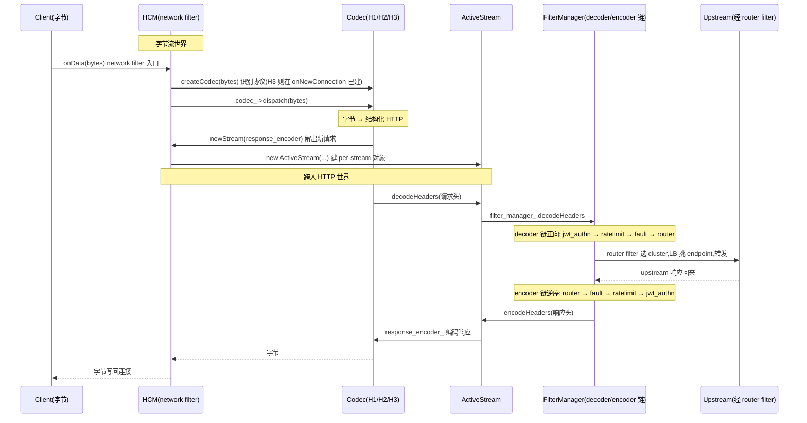

# 第 3 篇 · 第 8 章 · HTTP Connection Manager(HCM)

> **核心问题**:前面几章,流量进 listener、分到 worker、穿过 listener filter,字节流已经到了 network filter 链里。如果这条连接承载的是 HTTP(绝大多数微服务场景),谁来把这一串 TCP 字节"读懂"成结构化的 HTTP 请求,再驱动后续一整条 http filter 链?答案就是 **HTTP Connection Manager(HCM)**。但 HCM 在 Envoy 里有个反直觉的身份——它本身**就是一个 network filter**,和 `tcp_proxy`、`ratelimit` 平起平坐,用的是同一套 `addReadFilter` 注册接口。为什么把 HTTP 的入口做成一个 network filter,而不是独立模块?HCM 又是怎么在内部"桥接字节流世界与 HTTP 世界",还用一个统一的 codec 接口把 HTTP/1.1、HTTP/2、HTTP/3 三种协议收进同一个壳子?这一章就把 HCM 拆透。

> **读完本章你会明白**:
> 1. HCM 为什么是"一个特殊的 network filter"——它复用 network filter 的注册与组合机制,却在内部把字节流解码成 HTTP 并驱动一条独立的 http filter 链。这个"桥接"设计的代价与收益是什么。
> 2. codec 插件化怎么让 HTTP/1.1、HTTP/2、HTTP/3 三种协议**共用同一套上层处理逻辑**——`createCodec` 一个工厂方法返回不同 codec 实现,上层完全无感。朴素地"每种 HTTP 写一条独立处理路径"会撞什么墙。
> 3. 请求走 decoder 链、响应走 encoder 链的**两向语义**是怎么落地的——为什么 decoder 用正向 iterator、encoder 用 reverse_iterator。两向的细节(stop/continue、迭代推进)本章点到为止,细节留给 P3-10。
> 4. **ActiveStream**:为什么 HTTP 多路复用下,一条 TCP 连接能同时跑多个请求,而每个请求各自独立?答案是一条请求一个 `ActiveStream` 对象,串起它的 codec 状态、filter 链状态、上下文。

> **如果一读觉得太难**:先只记住四件事——① HCM 本质是一个 network filter(在字节流上工作),但内部把字节解码成 HTTP、再驱动一条独立的 http filter 链;② codec 插件化让 H1/H2/H3 三种协议统一在同一套上层逻辑里跑;③ 请求走 decoder 链、响应走 encoder 链(encoder 按请求逆序);④ 每条 HTTP 请求一个 `ActiveStream` 对象,多路复用下互不干扰。这四条抓住,本章就拿到了 80%。

---

## 〇、一句话点破

> **HCM 是一个"披着 network filter 外衣的 HTTP 引擎"——它对外是一个 read filter(和其他 network filter 用同一套注册机制、在字节流上被调用),对内却把字节流解码成结构化的 HTTP,为每条请求建一个 `ActiveStream`,驱动一条独立的 http filter 链;而 HTTP/1.1、HTTP/2、HTTP/3 三种协议的差异,被一个统一的 codec 接口封在 HCM 下层,HCM 只面对一个抽象的 Codec。**

这是结论,不是理由。本章倒过来拆:先讲 HCM 为什么选择"做 network filter"这条诡异路线(而不是独立模块),再讲 codec 插件化怎么把三种 HTTP 收进一个壳子,接着讲请求/响应的两向处理与 `ActiveStream` 这条 per-stream 状态机,最后把"一条字节流到一条 HTTP 响应"的全过程串成时序。

---

## 一、HCM 在整个旅程里的位置:从字节流世界跨进 HTTP 世界

回到全书那条旅程:

```
   请求进来(TCP 连接)
     │
     ▼
   Listener(监听端口,SO_REUSEPORT 分到 worker)            ── P2-05
     │
     ▼
   Listener Filter 链(TCP 层:TLS 探测 / proxy_protocol)    ── P2-06
     │
     ▼
   Network Filter 链(字节流层)                              ── P2-07
     │   ┌──────────────────────────────────────┐
     │   │ tcp_proxy ─ ratelimit ─ HCM ─ ...    │ ◀── HCM 就在这条链里!
     │   └──────────────────────────────────────┘
     │              │
     │              ▼  HCM 内部:字节解码成 HTTP
     ▼
   HTTP Filter 链(decoder 向:鉴权 → 限流 → fault → router)  ── P3-10
     │
     ▼   router 选 cluster,LB 挑 endpoint
   Upstream(连接池 → 后端 endpoint)                          ── 第 4 篇
     │
     ▼
   HTTP Filter 链(encoder 向:... → compressor → 响应出去)
```

P1 篇我们立了地基:字节经 Buffer(P1-04)进 filter,worker 的 dispatcher(P1-03)驱动回调。P2 篇(尚未写)讲 listener 和 network filter 在字节流层面工作——`tcp_proxy` 直接把字节流转发出去(代理非 HTTP 协议)。可如果这连接是 HTTP,事情就不一样了:**字节流要先被"读懂"成 HTTP 请求,然后才能交给鉴权、限流、router 这些只懂 HTTP 的 filter 处理**。HCM 就是那个"读懂 HTTP"的角色。

```
   HCM 在 filter 链中的位置(一条 TCP 连接的 network filter 链)
   ┌──────────────────────────────────────────────────────────┐
   │ 字节流世界(TCP 字节,Buffer 传递)                          │
   │   ┌──────────┐   ┌──────────┐   ┌──────────────────────┐ │
   │   │ tcp_proxy│   │ ratelimit│   │ HCM(HTTP 入口)        │ │
   │   │ (纯转发) │   │ (字节限流)│   │  ┌─────────────────┐ │ │
   │   └──────────┘   └──────────┘   │  │ codec 解码字节  │ │ │
   │                                  │  │   ↓            │ │ │
   │                                  │  │  HTTP 请求对象  │ │ │
   │                                  │  │   ↓            │ │ │
   │                                  │  │ 驱动 http 链    │ │ │ ◀── 桥接点
   │                                  │  └─────────────────┘ │ │
   │                                  └──────────────────────┘ │
   └──────────────────────────────────────────────────────────┘
                                                  │
                                                  ▼
                                     ┌──────────────────────────┐
                                     │ HTTP 世界(结构化请求/响应)│
                                     │  http filter 链(P3-10)   │
                                     └──────────────────────────┘
```

> **钉死这件事**:HCM 是那条 network filter 链上"最后一个字节流 filter、第一个 HTTP filter"的角色——它一只脚踩在字节流世界(作为 network filter 被字节调用),另一只脚踩在 HTTP 世界(向 http filter 链喂结构化请求)。这个"跨界"身份,是后面所有设计的根。

---

## 二、为什么 HCM 是 network filter,而不是独立模块?

这是本章最反直觉、也最值得拆的设计决策。先看源码事实。

### 源码事实:HCM 真的是个 network filter

HCM 的主类 `ConnectionManagerImpl`,**直接继承 `Network::ReadFilter`**:

```cpp
// source/common/http/conn_manager_impl.h
class ConnectionManagerImpl : Logger::Loggable<Logger::Id::http>,
                             public Network::ReadFilter,
                             public ServerConnectionCallbacks,
                             public Network::ConnectionCallbacks,
                             public Http::ApiListener {
  // ...
  // Network::ReadFilter
  Network::FilterStatus onData(Buffer::Instance& data, bool end_stream) override;
  Network::FilterStatus onNewConnection() override;
  void initializeReadFilterCallbacks(Network::ReadFilterCallbacks& callbacks) override;
  // ...
};
```

见 [ConnectionManagerImpl 继承 Network::ReadFilter](../envoy/source/common/http/conn_manager_impl.h#L60-L96)。注意它同时继承了多个角色:`Network::ReadFilter`(network filter)、`ServerConnectionCallbacks`(codec 的回调)、`Network::ConnectionCallbacks`(连接事件回调)、`Http::ApiListener`(给内部 API 客户端用的 listener)。一个类多重角色,这是 HCM 设计的第一个信号。

而它注册进 listener 的方式,和 `tcp_proxy`、`ratelimit` 这些 network filter **完全一样**——通过 `addReadFilter`:

```cpp
// source/extensions/filters/network/http_connection_manager/config.cc
return [singletons, filter_config, &context,
        clear_hop_by_hop_headers](Network::FilterManager& filter_manager) -> void {
  // ...
  auto hcm = std::make_shared<Http::ConnectionManagerImpl>(
      filter_config, context.drainDecision(), server_context.api().randomGenerator(),
      /* ... */);
  // ...
  filter_manager.addReadFilter(std::move(hcm));
};
```

见 [HCM 通过 addReadFilter 注册](../envoy/source/extensions/filters/network/http_connection_manager/config.cc#L316-L331)。`std::make_shared<Http::ConnectionManagerImpl>(...)` 然后 `filter_manager.addReadFilter(std::move(hcm))`——这和你写一个自定义 network filter 的注册代码一模一样。**HCM 在注册层面没有任何特权**,就是个 read filter。

> **注:此处为 HCM 主类文件名是 `conn_manager_impl.cc`/`.h`,非总纲里写的 `connection_manager_impl.cc`。Envoy 源码命名习惯是缩写(`conn` 而非 `connection`),以源码 Grep 为准。**

### 提问:为什么不把 HTTP 处理做成独立模块?

朴素想法会是这样:listener 接连接,network filter 处理 TCP 字节流,**HTTP 是个特殊的"高层协议",应该单独做一个 listener 级别的模块**,而不是混进 network filter 链。Nginx 就是这么做的——Nginx 的 HTTP 处理和 stream(TCP)处理是两套相对独立的框架,配置里 `http {}` 和 `stream {}` 是平级块。

### 不这样会怎样:如果 HCM 是独立模块

假设 Envoy 把 HTTP 做成独立模块,会撞三道墙:

1. **组合性丢失**:listener 的字节流进来,你想在 HTTP 解码**之前**先做点 TCP 层的事(比如 proxy_protocol 解析、TLS 终止、字节级 ratelimit),怎么办?如果 HTTP 是独立模块,这些前置逻辑要么塞进 HTTP 模块内部(职责混乱),要么做成另一套机制(不统一)。把 HCM 做成 network filter,前置逻辑就是 network filter 链上 HCM 之前的几个 filter——`proxy_protocol`、`ratelimit` 各自独立,自然组合。

2. **复用 network filter 的整套基础设施**:network filter 已经有了一套成熟的机制——`addReadFilter` 注册、`ReadFilterCallbacks` 提供连接和 dispatcher、`FilterStatus::StopIteration`/`Continue` 控制链推进、与 listener drain/连接事件对接。HCM 复用这套,等于"免费拿到"连接管理、事件回调、drain 协调。如果做成独立模块,这些全得重造一遍。

3. **HCM 可以和 `tcp_proxy` 互换**:同一个 listener 可以配 `tcp_proxy` 字节流转发(代理非 HTTP 协议如 Redis、MySQL),也可以配 HCM 处理 HTTP。**这套机制对称、统一**——配置里 `http_filters` 配什么协议就处理什么协议。如果 HTTP 独立,就得有"HTTP listener"和"TCP listener"两种 listener,复杂度翻倍。

> **不这样会怎样**:一个具体场景——你有个 listener 监听 443 端口,先做 TLS 终止(P2-06 listener filter 探测),然后想根据 SNI 分流:有的流量走 HTTP(进 HCM → router),有的流量是原始 TCP 透传(进 `tcp_proxy`)。如果 HCM 是独立模块,你得为这两种情况写两套 listener。把 HCM 做成 network filter,同一个 listener 的两条 filter chain 分支,一条配 HCM、一条配 `tcp_proxy`,统一在 listener 框架里。

### 所以这样设计:HCM 是"跨界 filter",复用 network filter 框架,内部桥接 HTTP

HCM 的设计精髓在于:**它对外是 network filter(享受 network filter 的所有基础设施),对内却是 HTTP 引擎(把字节解码成 HTTP、驱动 http filter 链)**。源码里 `ConnectionManagerImpl` 实现的 `onData`,就是这条"跨界桥"的入口:

```cpp
// source/common/http/conn_manager_impl.cc  (简化示意,非源码原文)
Network::FilterStatus ConnectionManagerImpl::onData(Buffer::Instance& data, bool) {
  // 1) 懒创建 codec:第一段字节来时,根据字节特征识别出 H1/H2,造对应 codec
  if (!codec_) {
    createCodec(data);   // ← 一个工厂方法,返回 H1/H2/H3 任意一种 codec
  }
  // 2) 把字节交给 codec 解码;codec 解出一条 HTTP 请求,回调 newStream
  bool redispatch;
  do {
    redispatch = false;
    const Status status = codec_->dispatch(data);  // ← 字节 → HTTP 结构化对象的转换
    // 处理各类错误(buffer flood / 协议错误 / overload)...
    // HTTP/1 在一条消息结束后会暂停 dispatch,若还有剩余字节则 redispatch
    if (codec_->protocol() < Protocol::Http2 &&
        data.length() > 0 && streams_.empty()) {
      redispatch = true;
    }
  } while (redispatch);

  return Network::FilterStatus::StopIteration;  // ← HTTP 处理接管,后续 network filter 不再跑
}
```

见 [ConnectionManagerImpl::onData](../envoy/source/common/http/conn_manager_impl.cc#L515-L582)。注意三个关键点:

- `onData` 是 network filter 的标准入口签名——字节进来。HCM 就是用这个入口接到字节的。
- `createCodec(data)` 一个工厂方法,根据字节识别 H1/H2/H3,**上层不关心是哪种**。
- `codec_->dispatch(data)` 把字节喂给 codec;codec 内部把字节解析成 HTTP 请求,然后**回调** HCM 的 `newStream`(下面第三节讲)。这就是"字节流世界 → HTTP 世界"的转换点。
- 最后返回 `Network::FilterStatus::StopIteration`——意思是"这条 network filter 链到这里为止,后面的 network filter 不再跑了"(字节已经被 HCM 消化成 HTTP,没有"剩余字节"再往后传的语义)。

> **钉死这件事**:HCM 之所以是 network filter 而非独立模块,核心动机是**组合性与复用**——它能和 `tcp_proxy`、`ratelimit` 这些 network filter 用同一套注册、回调、drain 机制,在字节流层面自然组合(前置 proxy_protocol、后置 HCM)。代价是它内部要"跨界"管理两个世界,这就是 `onData` → `createCodec` → `dispatch` → `newStream` 这条链的职责。

---

## 三、codec 插件化:三种 HTTP,一套上层逻辑

HCM 把字节解码成 HTTP,这一步由 **codec** 完成。但 HTTP 有三个主流版本——HTTP/1.1(文本协议)、HTTP/2(二进制帧 + HPACK)、HTTP/3(QUIC + QPACK)。如果每种版本写一条独立处理路径,代码会重复三遍、http filter 无法复用、协议升级要推倒重写。Envoy 的解法是 **codec 插件化**:一个统一的 Codec 接口,三个版本各自实现,HCM 只面对抽象的 Codec。

### 源码事实:一个 Codec 接口,三种实现

Codec 的抽象接口在 `envoy/http/codec.h`:

```cpp
// envoy/http/codec.h  (简化示意,非源码原文)
enum class CodecType { HTTP1, HTTP2, HTTP3 };

// 服务器侧连接(codec 把字节解码成请求,把响应编码成字节)
class ServerConnection : public virtual Connection {
  // ...
};

// codec 回调:每当 codec 解出一条新 HTTP 请求流,回调这个
class ServerConnectionCallbacks : public virtual ConnectionCallbacks {
 public:
  // codec 用这个把一个新的 RequestDecoder(代表新请求)交给 HCM
  virtual RequestDecoder& newStream(ResponseEncoder& response_encoder,
                                    bool is_internally_created = false) PURE;
};

// 请求解码器:codec 把解出的 headers/data/trailers 喂给这个
class RequestDecoder : public virtual StreamDecoder {
 public:
  virtual void decodeHeaders(RequestHeaderMapSharedPtr&& headers, bool end_stream) PURE;
  virtual void decodeData(Buffer::Instance& data, bool end_stream) PURE;
  virtual void decodeTrailers(RequestTrailerMapPtr&& trailers) PURE;
  // ...
};
```

见 [Codec 抽象接口](../envoy/envoy/http/codec.h#L273-L404) 与 [ServerConnectionCallbacks::newStream](../envoy/envoy/http/codec.h#L701-L719)。注意这套接口**对协议完全无感**——`decodeHeaders` 收到的是一个 `RequestHeaderMap`(结构化的请求头),不管它是从 H1 文本解析来的、还是从 H2 HPACK 解压来的、还是从 H3 QPACK 解压来的。

三个版本各自有 codec 实现:

| 协议 | codec 实现 | 解析方式 | 多路复用 |
|------|----------|---------|---------|
| HTTP/1.1 | `source/common/http/http1/`(`Http::Http1::ServerConnectionImpl`) | 文本,逐行(`\r\n` 分隔) | 无(一条连接一个请求,keep-alive 串行) |
| HTTP/2 | `source/common/http/http2/`(`Http::Http2::ServerConnectionImpl`,封装 nghttp2) | 二进制帧 + **HPACK 压缩 header**(承《gRPC》P2-07) | 有(一条连接多个 stream) |
| HTTP/3 | `source/common/quic/`(`Http::Http3::ServerConnectionImpl`,封装 quiche) | QUIC/UDP + 二进制帧 + QPACK | 有 |

### createCodec:一个工厂方法,三种 codec

HCM 怎么知道该用哪个 codec?答案在 `createCodec`:

```cpp
// source/common/http/conn_manager_impl.cc
void ConnectionManagerImpl::createCodec(Buffer::Instance& data) {
  ASSERT(!codec_);
  codec_ = config_->createCodec(read_callbacks_->connection(), data, *this, overload_manager_);

  switch (codec_->protocol()) {
  case Protocol::Http3:
    stats_.named_.downstream_cx_http3_total_.inc();
    stats_.named_.downstream_cx_http3_active_.inc();
    break;
  case Protocol::Http2:
    stats_.named_.downstream_cx_http2_total_.inc();
    stats_.named_.downstream_cx_http2_active_.inc();
    break;
  case Protocol::Http11:
  case Protocol::Http10:
    stats_.named_.downstream_cx_http1_total_.inc();
    stats_.named_.downstream_cx_http1_active_.inc();
    break;
  }
}
```

见 [ConnectionManagerImpl::createCodec](../envoy/source/common/http/conn_manager_impl.cc#L494-L513)。`createCodec` 本身只是个壳,真正的选择在 `config_->createCodec(...)`——这是 `ConnectionManagerConfig` 的一个虚方法:

```cpp
// source/common/http/conn_manager_config.h
virtual ServerConnectionPtr createCodec(Network::Connection& connection,
                                        const Buffer::Instance& data,
                                        ServerConnectionCallbacks& callbacks,
                                        Server::OverloadManager& overload_manager) PURE;
```

见 [createCodec 虚方法](../envoy/source/common/http/conn_manager_config.h#L244-L247)。它的具体实现(在 `ConnectionManagerImplConfig` 里,见 P3-09 详讲)做的事是:

- **HTTP/1.1 / HTTP/2**:看前面字节特征——H1 的请求行以 `GET`/`POST`/`PUT`... 开头(文本),H2 的连接前言是固定的 24 字节 magic(`PRI * HTTP/2.0\r\n\r\nSM\r\n\r\n`)。靠这个区分。
- **HTTP/3**:**走完全不同的入口**(见下一小节)。

无论返回哪种 codec,`codec_` 字段类型都是 `ServerConnectionPtr`(指向 `ServerConnection` 抽象基类的智能指针),**HCM 之后所有操作都只通过这个抽象接口**——`codec_->dispatch()`、`codec_->protocol()`、`codec_->shutdownNotice()`。HCM 永远不知道、也不需要知道底下跑的是 H1 还是 H2 还是 H3。

### 提问:为什么不让每种协议写一条独立路径?

朴素想法:HTTP/1.1 一条路径,HTTP/2 一条路径,HTTP/3 一条路径,各自处理。听起来清晰,实际是灾难。

### 不这样会怎样:三套重复的代码、http filter 无法复用

1. **http filter 链会写三遍**:鉴权、限流、router 这些 http filter,本该在 H1/H2/H3 三种协议下都生效。如果每种协议写一条独立路径,你要么把 filter 链复制三遍(维护地狱),要么在 filter 里写 `if (proto == H2)` 分支(filter 被协议细节污染)。**codec 插件化的最大价值,就是让 http filter 完全协议无关**——一个 `jwt_authn` filter,在 H1/H2/H3 下都是同一份代码,因为它操作的是 `RequestHeaderMap` 这个抽象,不是协议字节。

2. **协议升级要推倒重写**:HTTP/3 出来时,如果 HCM 写死成 H1/H2,要支持 H3 得改整个 HCM。有了 codec 插件化,**新增 H3 只需写一个新的 codec 实现**(实际就是 `source/common/quic/server_codec_impl.cc`),上层 HCM 和所有 http filter 一行不改。这是 Envoy 能快速跟进 H3 的根本原因。

3. **统一可观测**:stats、access log、tracing 这些,如果在三条路径里各写一套,口径就对不齐。codec 插件化让所有协议走同一套上层处理,stats 自然统一(`downstream_cx_http1_total`、`downstream_cx_http2_total`、`downstream_cx_http3_total` 是同一个 stats 框架下的三个 counter)。

> **不这样会怎样**:举个真实对比——早期不少代理(包括 Nginx)对 HTTP/2 的支持是"后期补"的,补的方式往往是在 HTTP 处理框架里打补丁,导致 H1 和 H2 的代码路径有微妙差异(filter 行为不一致、bug 修了一边忘了另一边)。Envoy 从一开始就把 codec 抽象出来,H2/H3 进来时上层零改动。**这是抽象层设计带来的红利**。

### 所以这样设计:codec 是"协议适配层",HCM 是协议无关的 HTTP 引擎

把这套设计画出来:

```
                 HCM(协议无关)
              ┌──────────────────┐
   字节 ────▶ │ onData           │
              │   createCodec() ─────┐
              │   codec_->dispatch() │ ◀── 只用抽象 Codec 接口
              │   newStream(回调) ◀──┘
              │   ↓               │
              │ ActiveStream      │
              │   ↓               │
              │ http filter 链    │ ◀── 完全协议无关
              └──────────────────┘
                       │
        ┌──────────────┼──────────────┐
        ▼              ▼              ▼
   ┌─────────┐    ┌─────────┐    ┌─────────┐
   │ H1 codec│    │ H2 codec│    │ H3 codec│
   │ http1/  │    │ http2/  │    │ quic/   │
   │ 文本解析 │    │nghttp2  │    │ quiche  │
   │ 无多路复用│   │HPACK+帧 │    │QPACK+QUIC│
   └─────────┘    └─────────┘    └─────────┘
```

- **上层(HCM + http filter)**:完全协议无关。一份代码,跑三种协议。
- **下层(codec)**:三种实现,各自处理协议细节。H2 的 HPACK、H3 的 QPACK,**细节承接《gRPC》P2-07 和 RFC 9114**,本章只讲"codec 插件化统一",不重讲。

> **钉死这件事**:codec 插件化的本质是**把协议差异封在适配层**——上层 HCM 只面对一个抽象 Codec,下层三种 codec 各自实现。这让 http filter 完全协议无关,也让 Envoy 能快速跟进新协议(H3 进来时上层零改动)。

---

## 四、HTTP/3 的特殊接入:QUIC 不走 onData

前面讲 `onData` 是字节进入 HCM 的入口。但 HTTP/3 是个例外——它走 QUIC(UDP),根本不是"字节流"模型。Envoy 怎么把 H3 也收进 HCM 这套框架?

### 源码事实:H3 在 onNewConnection 阶段就被识别

看 `onNewConnection`(network filter 的"新连接"回调):

```cpp
// source/common/http/conn_manager_impl.cc
Network::FilterStatus ConnectionManagerImpl::onNewConnection() {
  if (!read_callbacks_->connection().streamInfo().protocol()) {
    // For Non-QUIC traffic, continue passing data to filters.
    return Network::FilterStatus::Continue;
  }
  // Only QUIC connection's stream_info_ specifies protocol.
  Buffer::OwnedImpl dummy;
  createCodec(dummy);
  ASSERT(codec_->protocol() == Protocol::Http3);
  // Stop iterating through network filters for QUIC. Currently QUIC connections bypass the
  // onData() interface because QUICHE already handles de-multiplexing.
  return Network::FilterStatus::StopIteration;
}
```

见 [ConnectionManagerImpl::onNewConnection](../envoy/source/common/http/conn_manager_impl.cc#L584-L596)。这段代码做了件很巧妙的事:

- **非 QUIC 流量**(H1/H2 over TCP):`streamInfo().protocol()` 还没设(因为还没解码),返回 `Continue`,字节流继续往后走到 `onData`,在那里懒创建 codec。
- **QUIC 流量**(H3):QUIC listener(`source/common/quic/active_quic_listener.cc`)在接连接时就**已经在 stream_info 里设好了 `protocol = Http3`**(因为 QUIC 握手时就确定了协议)。所以 `onNewConnection` 一进来就能识别这是 H3,立刻 `createCodec(dummy)`(传一个空 buffer,因为 codec 类型已经知道),然后返回 `StopIteration`——**H3 不再走 `onData`**。

为什么 H3 能跳过 `onData`?因为 QUIC 用的是 quiche 库,quiche **自己已经处理了 UDP 包的多路复用**(一个 QUIC 连接里有多个 stream,quiche 自己 demultiplex),不需要 HCM 再"逐字节 dispatch"。HCM 对 H3 只是个"回调宿主"——quiche 解出一个新 stream,直接回调 HCM 的 `newStream`(和 H2 codec 解出新 stream 走同样的回调),后面流程完全一致。

代码注释说得很清楚:`QUIC connections bypass the onData() interface because QUICHE already handles de-multiplexing`。

### H3 的 codec 实现

H3 的 codec 在 `source/common/quic/server_codec_impl.h`:

```cpp
// source/common/quic/server_codec_impl.h  (简化示意,非源码原文)
class ServerConnectionImpl : public ServerConnection, /* ... */ {
 public:
  Http::Protocol protocol() override { return Http::Protocol::Http3; }
  // 实现 dispatch、shutdownNotice 等 ServerConnection 接口...
  // 内部把工作委托给 quiche 的 QUIC session
};
```

见 [H3 codec 的 protocol() 返回 Http3](../envoy/source/common/quic/server_codec_impl.h#L27)。这个类实现了和 H1/H2 codec 一样的 `ServerConnection` 接口,**所以 HCM 看不出它是 H3**——只是 `codec_->protocol()` 返回 `Http3`、stats 记到 H3 的 counter。

> **钉死这件事**:HTTP/3 原生接入 HCM,但路径不同——H3 在 `onNewConnection` 阶段(QUIC 握手时协议已确定)就创建 codec,跳过 `onData`(因为 quiche 自己做 UDP 多路复用)。这是 codec 插件化的极致体现:**同一种"新 stream → newStream 回调 → http filter 链"的模型,既能适配 TCP 字节流模型(H1/H2),也能适配 UDP/QUIC 包模型(H3)**。**注:老资料常说"HCM 只支持 H1/H2,H3 是另一套",这在当前 master(1.39.0-dev)是错的——H3 已经原生接入 HCM。**

---

## 五、ActiveStream:一条 HTTP 请求,一个流对象

讲到这里,关键问题来了:HTTP/2 和 HTTP/3 支持**多路复用**——一条 TCP/QUIC 连接上可以同时跑多个请求。HCM 怎么管理"一条连接上同时跑的多个请求",让它们互不干扰?

答案是:**HCM 为每条 HTTP 请求建一个 `ActiveStream` 对象**,每个 `ActiveStream` 自带这条请求的所有状态(codec 状态、filter 链状态、上下文、计时器),连接上跑多个请求就有多个独立的 `ActiveStream`。

### 源码事实:ActiveStream 是个"超级状态机"

`ActiveStream` 是 `ConnectionManagerImpl` 的内嵌 struct:

```cpp
// source/common/http/conn_manager_impl.h
struct ActiveStream final : LinkedObject<ActiveStream>,
                            public Event::DeferredDeletable,
                            public StreamCallbacks,
                            public CodecEventCallbacks,
                            public RequestDecoder,        // ← codec 把请求喂给它
                            public Tracing::Config,
                            public ScopeTrackedObject,
                            public FilterManagerCallbacks, // ← 它是 encoder 端回调
                            public DownstreamStreamFilterCallbacks,
                            public RouteCache {
  // ...
};
```

见 [ActiveStream 多重继承](../envoy/source/common/http/conn_manager_impl.h#L145-L154)。注意它继承了**一堆角色**——这正反映它"串起整条请求的方方面面":

- `RequestDecoder`:codec 解出 headers/data/trailers,回调 `ActiveStream::decodeHeaders`/`decodeData`。
- `FilterManagerCallbacks`:filter 链要发响应时,回调 `ActiveStream::encodeHeaders`/`encodeData`。
- `StreamCallbacks` / `CodecEventCallbacks`:codec 层的流重置、水位事件。
- `Tracing::Config`:这条请求的 tracing 配置。
- `RouteCache`:缓存的 route(避免每个 filter 都重算路由)。

它的字段几乎涵盖一条请求的所有状态——请求头、响应头、各种计时器、cached route、stream id 等(见 [ActiveStream 字段](../envoy/source/common/http/conn_manager_impl.h#L458-L561))。

### newStream:codec 每解出一条请求,就建一个 ActiveStream

codec 解出新请求时,回调 `ConnectionManagerImpl::newStream`:

```cpp
// source/common/http/conn_manager_impl.cc  (简化示意,非源码原文)
RequestDecoder& ConnectionManagerImpl::newStream(ResponseEncoder& response_encoder,
                                                 bool is_internally_created) {
  // ...
  auto new_stream = std::make_unique<ActiveStream>(
      *this, response_encoder.getStream().bufferLimit(), std::move(downstream_stream_account));

  // 一堆 per-stream 配置:计时器、route cache、是否内部创建等
  new_stream->state_.is_internally_created_ = is_internally_created;
  new_stream->response_encoder_ = &response_encoder;
  new_stream->response_encoder_->getStream().addCallbacks(*new_stream);
  // ...

  LinkedList::moveIntoList(std::move(new_stream), streams_);  // ← 加入连接的 stream 列表
  return **streams_.begin();
}
```

见 [ConnectionManagerImpl::newStream](../envoy/source/common/http/conn_manager_impl.cc#L410-L471)。关键点:

- 每条请求一个 `ActiveStream`,`std::make_unique<ActiveStream>(...)`。
- `response_encoder_` 指向 codec 的响应编码器——`ActiveStream` 通过它把响应写回字节流。
- `LinkedList::moveIntoList(..., streams_)` 把新 stream 加到连接的 `streams_` 列表——**一条连接的所有 ActiveStream 在 `streams_` 链表里**。drain、resetAllStreams、连接关闭时,HCM 遍历这个列表操作所有 stream。

### ActiveStream 串起 codec 与 filter 链

把 `ActiveStream` 在整条处理路径上的角色画出来:

```
              ┌─── 一条 TCP/QUIC 连接 ───────────────────────────────┐
              │                                                      │
              │   codec_ (一个,H1/H2/H3 之一)                        │
              │      │                                                │
              │      │ newStream (每解出一个请求)                      │
              │      ▼                                                │
              │   ┌──────────────── ActiveStream #1 ───────────────┐ │
              │   │ RequestDecoder 端:                              │ │
              │   │   decodeHeaders(请求头)──┐                       │ │
              │   │   decodeData(请求体) ───┼─▶ filter_manager_     │ │
              │   │   decodeTrailers(尾)───┘    (decoder 链)         │ │
              │   │                                │                │ │
   字节 ◀──编码 │   │ FilterManagerCallbacks 端:    ▼                │ │
   (response_  │   │   encodeHeaders(响应头)◀─ filter_manager_      │ │
   encoder)────│   │   encodeData(响应体) ◀─   (encoder 链)         │ │
              │   │                                │                │ │
              │   │ response_encoder_ ────────────▶ 字节            │ │
              │   │ cached_route_ / stream_id / 计时器 / 状态       │ │
              │   └────────────────────────────────────────────────┘ │
              │   ┌──────────────── ActiveStream #2 ───────────────┐ │
              │   │ (H2/H3 多路复用下,同连接的另一个请求,独立)    │ │
              │   └────────────────────────────────────────────────┘ │
              │   ... streams_ 链表 ...                                │
              └──────────────────────────────────────────────────────┘
```

这张图的核心:**一条连接一个 codec,但 N 条请求 N 个 ActiveStream**(H2/H3 多路复用)。每个 `ActiveStream` 自己持有 `filter_manager_`、`response_encoder_`、cached route、计时器——**互不干扰**。这就是 HTTP/2 多路复用下"一条连接跑多个请求"在 Envoy 里的实现方式。

### 提问:为什么不用"一个连接一个状态机"?

朴素想法:把请求状态放在连接对象上,一条连接一个状态机,简单。

### 不这样会怎样:多路复用下状态全乱套

HTTP/1.1 一条连接同时只有一个请求(keep-alive 是串行,前一个响应完才发下一个),用"一个连接一个状态机"勉强可以(但即使 H1,Envoy 也用 `ActiveStream` 抽象,保持代码统一)。**HTTP/2/HTTP/3 是多路复用的——一条连接同时跑几十上百个请求**,每个请求各自有自己的 headers、各自的 body chunk、各自的响应状态。如果状态放在连接上,几十个请求的状态挤成一团,根本分不清哪个 chunk 属于哪个请求。**per-stream 状态机是多路复用的必然选择**。

> **不这样会怎样**:具体一点——HTTP/2 一条连接上,stream id=1 的请求刚收到 header、stream id=3 的请求收到一半 body、stream id=5 的请求正在等上游响应,这三个请求的 headers/data/trailers 可能交错到达(H2 帧可以交错)。如果只有一个连接级状态机,你得维护"stream id → 状态"的映射,本质上就是在重造 per-stream 状态机。直接 per-stream 一个 `ActiveStream`,干净利落。

### 所以这样设计:per-stream 状态机,天然支持多路复用

`ActiveStream` 的设计动机就是**让多路复用成为一等公民**。即使 HTTP/1.1(没有多路复用),Envoy 也用同样的 `ActiveStream` 抽象——一份代码跑三种协议。这是 codec 插件化(协议无关)在"请求状态"层面的延续:不仅 codec 接口协议无关,**请求状态机的结构也协议无关**。

> **钉死这件事**:`ActiveStream` 是 HTTP 请求在 Envoy 里的"实体对象"——一条请求一个 `ActiveStream`,串起 codec 交互、filter 链、route、计时器、tracing 上下文。per-stream 状态机是多路复用(H2/H3)的必然选择,也是 H1/H2/H3 三种协议能共用同一套上层代码的关键。

---

## 六、请求走 decoder 链、响应走 encoder 链

到这一步,字节已经解码成结构化的请求(在 `ActiveStream` 里),要交给 http filter 链处理。http filter 链是**两向**的——请求穿 decoder 链,响应穿 encoder 链(逆序)。这是 P0-01 点过的"洋葱模型",这里讲它在 HCM 里怎么落地;stop/continue 的迭代细节留给 P3-10。

### 源码事实:decoder 用正向 iterator,encoder 用 reverse_iterator

filter 链在 `FilterManager` 里管理。`FilterManager` 维护两条独立的链:

```cpp
// source/common/http/filter_manager.h
// HTTP decoder filters. If filters are configured in the following order (assume all three
// filters are both decoder/encoder filters):
//   http_filters:
//     - A
//     - B
//     - C
// The decoder filter chain will iterate through filters A, B, C.
struct StreamDecoderFilters {
  using Element = ActiveStreamDecoderFilter;
  using Iterator = std::vector<ActiveStreamDecoderFilterPtr>::iterator;  // ← 正向
  Iterator begin() { return entries_.begin(); }
  Iterator end() { return entries_.end(); }
  std::vector<ActiveStreamDecoderFilterPtr> entries_;
};

// HTTP encoder filters. ...
// Unlike the decoder filter, the encoder filter chain will iterate with the
// reverse order of the configured filters, i.e., C, B, A. This is why we use reverse_iterator here.
struct StreamEncoderFilters {
  using Element = ActiveStreamEncoderFilter;
  using Iterator = std::vector<ActiveStreamEncoderFilterPtr>::reverse_iterator;  // ← 反向
  Iterator begin() { return entries_.rbegin(); }
  Iterator end() { return entries_.rend(); }
  std::vector<ActiveStreamEncoderFilterPtr> entries_;
};
```

见 [StreamDecoderFilters 用正向 iterator](../envoy/source/common/http/filter_manager.h#L77-L85) 和 [StreamEncoderFilters 用 reverse_iterator](../envoy/source/common/http/filter_manager.h#L96-L104)。源码注释本身就把"请求 A→B→C,响应 C→B→A"讲得明明白白。这是一个**用类型表达的语义**——两条链共享同一个 `entries_` 顺序,但 encoder 用 `rbegin()`/`rend()` 反着遍历,**响应自动按请求逆序穿过**。

### decoder 端:ActiveStream::decodeHeaders → FilterManager::decodeHeaders

codec 解出请求头,回调 `ActiveStream::decodeHeaders`:

```cpp
// source/common/http/conn_manager_impl.cc  (简化示意,非源码原文)
void ConnectionManagerImpl::ActiveStream::decodeHeaders(RequestHeaderMapSharedPtr&& headers,
                                                        bool end_stream) {
  // ... 一堆 per-request 准备:UHV 校验、snap route config、overload 检查 ...
  if (!connection_manager_.shouldDeferRequestProxyingToNextIoCycle()) {
    filter_manager_.decodeHeaders(*request_headers_, end_stream);  // ← 进 decoder 链
  }
  // ...
}
```

见 [ActiveStream::decodeHeaders](../envoy/source/common/http/conn_manager_impl.cc#L1354-L1608)。请求头先经过一堆准备(校验、snap route、overload 判断、tracing),然后交给 `filter_manager_.decodeHeaders`——这就是 decoder 链的起点。

`FilterManager::decodeHeaders` 内部遍历 decoder 链:

```cpp
// source/common/http/filter_manager.cc  (简化示意,非源码原文)
void FilterManager::decodeHeaders(ActiveStreamDecoderFilter* filter, RequestHeaderMap& headers,
                                  bool end_stream) {
  // ...
  StreamDecoderFilters::Iterator entry =
      commonDecodePrefix(filter, FilterIterationStartState::AlwaysStartFromNext);
  // ...
  for (; entry != decoder_filters_.end(); entry++) {  // ← 正向遍历 A → B → C
    // ...
    FilterHeadersStatus status = (*entry)->decodeHeaders(headers, (*entry)->end_stream_);
    // 根据 status 决定 continue / StopIteration / StopAll...
    const auto continue_iteration =
        (*entry)->commonHandleAfterHeadersCallback(status, end_stream);
    // ...
  }
}
```

见 [FilterManager::decodeHeaders 遍历 decoder 链](../envoy/source/common/http/filter_manager.cc#L592-L670)。每个 filter 的 `decodeHeaders` 返回一个 `FilterHeadersStatus`——`Continue`(往下传)、`StopIteration`(停在这)、`StopAllIterationAndBuffer`(停下并 buffer)。**这是 filter chain 作为治理载体的运行机制核心**——filter 可以选择放行或拦截(鉴权失败就 stop 并发 401,不让流量走到 router)。stop/continue 迭代的完整细节(stop 后如何恢复、buffer 满水位怎么处理)留给 P3-10。

### encoder 端:响应逆序穿回

当 upstream 响应回来(或 filter 自己生成 local reply),`ActiveStream` 的 `encodeHeaders` 被调用:

```cpp
// source/common/http/conn_manager_impl.cc  (简化示意,非源码原文)
void ConnectionManagerImpl::ActiveStream::encodeHeaders(ResponseHeaderMap& headers,
                                                        bool end_stream) {
  // ... 一堆响应头处理:date、server header、mutateResponseHeaders、drain 判断 ...
  filter_manager_.encodeHeaders(headers, end_stream, ...);  // ← 进 encoder 链
}
```

见 [ActiveStream::encodeHeaders](../envoy/source/common/http/conn_manager_impl.cc#L1917-L1955)。响应头先经过 Envoy 统一的"响应头加工"(加 date、加 server、清 hop-by-hop、drain 时加 `Connection: close`),然后交给 `filter_manager_.encodeHeaders`——encoder 链(逆序遍历,`compressor` 这种只关心响应的 filter 在这里生效)。encoder 链的最后一个"filter"实际上是 `ActiveStream` 自己——响应穿完 encoder 链,最终通过 `response_encoder_` 写回 codec,再写回字节流。

### 两向的顺序对比

```
   配置(顺序):
       http_filters:
         - jwt_authn      (A)
         - ratelimit      (B)
         - fault          (C)
         - router         (D, terminal,把请求发出去)

   请求(decoder 向,正向):
       A → B → C → D → upstream

   响应(encoder 向,逆序):
       upstream → D → C → B → A → 客户端
```

为什么响应要逆序?这是"洋葱模型"——请求从外到内穿,响应从内到外穿,语义对称。鉴权 filter 在请求进来时最先检查(外层),在响应出去时最后处理(比如记录响应状态);router 在请求时最后发出去(内层,terminal),在响应时最先收到 upstream 回包。

### 提问:为什么不用一条链、单向?

朴素想法:filter 链一条,请求和响应都从前往后穿。

### 不这样会怎样:filter 顺序错乱、职责无法分离

1. **顺序错乱**:如果单向链,响应也 A→B→C→D 穿,那"鉴权最先检查请求"和"鉴权最后处理响应"就矛盾了——鉴权要么最先要么最后,不能两全。两向链让 filter 在请求和响应两个方向上各占一个正确的相对位置。

2. **职责无法分离**:有些 filter 只关心请求(鉴权),有些只关心响应(压缩)。单向链里,只关心响应的 `compressor` 也得在请求路径上"走一遍"(哪怕啥也不干),浪费且混乱。两向分离,`compressor` 只注册 encoder 钩子,请求路径完全不经过它。

> **不这样会怎样**:单向链会让"只关心响应的 filter"被迫也出现在请求路径,顺序还容易错乱(响应顺序应和请求相反)。两向是洋葱模型的正确实现,几乎所有现代 HTTP 中间件框架(各种语言的"中间件")的共同选择。

### 所以这样设计:两向 + per-direction iterator

两向链的实现技巧很简洁:**decoder 和 encoder 共享同一个配置顺序的 `entries_`**,但 decoder 用正向 iterator、encoder 用 reverse_iterator。这一个类型差异,就把"请求顺序、响应逆序"的语义精确表达出来了——没有额外的排序逻辑、没有运行时判断方向,完全靠 C++ 的 iterator 类型在编译期决定。**这是 Envoy 用类型表达语义的一个典型技巧**。

> **钉死这件事**:请求穿 decoder 链(正向),响应穿 encoder 链(逆序),filter 各注册自己关心的方向。stop/continue 让 filter 能拦截流量(鉴权失败、限流超额)。两向迭代的细节留给 P3-10,本章你只要记住"两向是 HCM 驱动 http filter 链的方式,decoder/encoder 用不同 iterator 实现"。

---

## 七、一条请求的完整旅程:从字节到响应

把前面讲的拼起来,一条 HTTP 请求从字节进 HCM 到响应回去,完整流程是这样的:



这张时序图就是本章全部内容的浓缩。注意几个"世界切换"的点:

- `onData`(字节) → `dispatch`(解码) → `newStream`(HTTP 世界):**字节流世界跨入 HTTP 世界**。
- `decodeHeaders` → filter 链 → upstream → `encodeHeaders` → filter 链:**HTTP 请求在 filter 链里双向流动**。
- `response_encoder_` 编码 → 字节:**HTTP 世界跨回字节流世界**。

---

## 八、连接级 vs 流级:drain、idle timeout、overload

最后补一类机制——HCM 同时管**连接级**和**流级**两套生命周期。这一节简短带过,细节分散在 P5-18(listener drain)和 P4-15(overload)。

### 连接级:drain 与 idle timeout

HCM 持有连接级的 `drain_close_`(一个 `Network::DrainDecision` 引用,见 [drain_close_ 字段](../envoy/source/common/http/conn_manager_impl.cc#L119-L127))。drain 时(控制面要优雅下线这个 listener),HCM 在响应里加 `Connection: close`(H1)或发 GOAWAY(H2/H3),不再接新请求、等存量请求处理完。`startDrainSequence`:

```cpp
// source/common/http/conn_manager_impl.cc
void ConnectionManagerImpl::startDrainSequence() {
  ASSERT(drain_state_ == DrainState::NotDraining);
  drain_state_ = DrainState::Draining;
  codec_->shutdownNotice();  // H2/H3 发 GOAWAY,H1 只是置内部标志
  drain_timer_ = dispatcher_->createTimer([this]() -> void { onDrainTimeout(); });
  drain_timer_->enableTimer(config_->drainTimeout());  // 等存量流处理完的超时
}
```

见 [ConnectionManagerImpl::startDrainSequence](../envoy/source/common/http/conn_manager_impl.cc#L1699-L1705)。drain 协调是 HCM 作为 network filter 复用连接管理基础设施的一个体现——它通过 `drain_close_`(注入的 `DrainDecision`)感知控制面的 drain 决策,通过 codec 的 `shutdownNotice` 把 drain 信号翻译成协议对应的帧(GOAWAY / Connection: close)。drain 与热更新的细节在 P5-18。

### 流级:per-stream idle timeout 与 overload 拒绝

每条 `ActiveStream` 自己有 idle timeout、request timeout、max duration timer(见 [ActiveStream 的计时器字段](../envoy/source/common/http/conn_manager_impl.h#L487-L500))。HCM 还会在 `decodeHeaders` 时检查 overload manager——内存吃紧时直接拒绝新请求:

```cpp
// source/common/http/conn_manager_impl.cc  (简化示意,非源码原文)
const bool drop_request_due_to_overload =
    (connection_manager_.accept_new_http_stream_ != nullptr &&
     connection_manager_.accept_new_http_stream_->shouldShedLoad()) ||
    connection_manager_.random_generator_.bernoulli(
        connection_manager_.overload_stop_accepting_requests_ref_.value());

if (drop_request_due_to_overload) {
  filter_manager_.skipFilterChainCreation();  // 连 filter 链都不建,省内存
  connection_manager_.stats_.named_.downstream_rq_overload_close_.inc();
  sendLocalReply(Http::Code::ServiceUnavailable, "envoy overloaded", /* ... */);
  return;
}
```

见 [overload 时拒绝新请求](../envoy/source/common/http/conn_manager_impl.cc#L1407-L1429)。注意一个细节——overload 时连 filter 链都不创建(`skipFilterChainCreation()`),直接发 503。**这是性能优化**:overload 的本意是省内存,如果还建一整条 filter 链再发 503,反而加剧 overload。overload manager 的令牌桶机制在 P4-15 拆。

> **钉死这件事**:HCM 同时管理连接级(drain、连接 idle)和流级(per-stream timeout、overload 拒绝)两套生命周期。drain 通过注入的 `DrainDecision` 感知控制面、通过 codec 翻译成协议帧;overload 通过 `LoadShedPoint` 和 overload manager 的 action 在请求最早期(header 刚解出)就决定是否拒绝。这两套机制,连接级复用了 network filter 的基础设施,流级是 HCM 自己的 per-stream 状态机。

---

## 九、HCM vs Nginx 的 HTTP 处理:统一框架 vs 双框架

讲清 HCM 的设计,最好的对照是 Nginx。Nginx 的架构里,HTTP 处理(`http {}` 配置块)和 TCP stream 处理(`stream {}` 配置块)是**两套相对独立的框架**:各有自己的连接处理、filter 链、配置解析。这套设计在 Nginx 诞生时(2004)是合理的——那时候 HTTP 是绝对主流,TCP 代理是次要需求,两套分开更清晰。

但 Envoy 把 HCM 做成 network filter,是另一种取舍:

| 维度 | Nginx | Envoy |
|------|-------|-------|
| HTTP 与 TCP 的关系 | 两套独立框架(`http {}` / `stream {}`) | HTTP 是 network filter 的一种(`http_connection_manager`),和 `tcp_proxy` 平级 |
| 连接管理 | HTTP 框架自己管一套,stream 框架自己管一套 | 统一的 network filter 框架,HCM 复用同一套连接/事件/drain |
| filter 链 | HTTP server filter 链(`ngx_http_*_module`)、stream filter 链(`ngx_stream_*_module`)分开 | network filter 链(含 HCM)+ HCM 内部 http filter 链,两层 |
| 配置组合 | 两种 listener 不能混 | 同一个 listener 的不同 filter chain 分支,可一条配 HCM、一条配 `tcp_proxy` |

这张表的关键不是"Envoy 更好"——Nginx 的双框架在"纯 HTTP 入口"场景(传统 Web 反向代理)更直接、性能更优(少一层抽象)。**差异在于定位**:Nginx 是"HTTP 反向代理 + 后期补的 stream",Envoy 是"统一网络代理,HTTP 只是其中一种协议"。Envoy 这种统一框架的代价是 HCM 多一层 network filter 包装(多一次 `onData` 调用、多一层抽象),收益是**协议对称性**——你今天用 HCM 处理 HTTP,明天想代理 PostgreSQL(纯 TCP),只把 filter chain 换成 `tcp_proxy`,listener、worker、连接管理、drain、stats、access log 全不变。

> **钉死这件事**:HCM 作为 network filter 的设计,本质上是 Envoy "**统一网络代理框架**"定位的体现。HTTP 不享有特殊地位,它和 TCP、未来可能的其他协议,都是 network filter 链上的一种处理方式。这种对称性是 Envoy 能同时做"HTTP 网关 + TCP 代理 + 数据库代理"的根,也是它区别于 Nginx(HTTP 优先)的根本架构取舍。

## 十、codec dispatch 的"字节 → 请求"调度细节

第二节我们看了 `onData` 的骨架:`createCodec` → `codec_->dispatch(data)` → codec 回调 `newStream`。这里把 `dispatch` 内部的调度细节拆细一点——这是"字节流世界"真正变成"HTTP 世界"的地方。

### dispatch 的核心机制:codec 解析字节,回调上层

`codec_->dispatch(data)` 的契约是:**codec 从 `data` 里尽可能多地解析字节,每解出一个 HTTP 帧(header / data / trailer),就回调 HCM 提供的 decoder**。以 HTTP/2 为例:

```
   字节 data(可能含多个 H2 帧,或半个帧):
   ┌─────────────────────────────────────────────────────┐
   │ [HEADERS stream=1][DATA stream=1][HEADERS stream=3] │  ← 可能交错(H2 多路复用)
   └─────────────────────────────────────────────────────┘
              │
              ▼  codec_->dispatch(data)
   ┌─────────────────────────────────────────────────────┐
   │ nghttp2 解析每一帧:                                  │
   │   HEADERS(stream=1) → ActiveStream#1.decodeHeaders  │
   │   DATA(stream=1)    → ActiveStream#1.decodeData     │
   │   HEADERS(stream=3) → newStream → ActiveStream#3    │
   │                          .decodeHeaders              │
   └─────────────────────────────────────────────────────┘
```

关键点:**codec 内部根据 stream id 路由到正确的 `ActiveStream`**。H2/H3 的多路复用,在 codec 层就被 demultiplex 了——上层 HCM 看到的只是一系列"某个 stream 的 header/data/trailer"回调,不需要自己处理 stream id。这就是为什么 HCM 上层代码可以协议无关:多路复用的复杂性被 codec 吃掉了。

### HTTP/1 的特殊性:单请求 + redispatch

HTTP/1.1 不支持多路复用——一条连接同时只有一个请求(keep-alive 是串行)。所以 H1 codec 的 `dispatch` 行为不同:**解完一条完整的请求后,暂停 dispatch**(因为这条连接在响应回去之前不能接下一条请求)。`onData` 里的 `redispatch` 循环就是处理这个:

```cpp
// source/common/http/conn_manager_impl.cc  (简化示意,非源码原文)
bool redispatch;
do {
  redispatch = false;
  const Status status = codec_->dispatch(data);
  // ... 错误处理 ...

  // HTTP/1 codec will pause dispatch after a single message is complete.
  if (codec_->protocol() < Protocol::Http2 &&
      read_callbacks_->connection().state() == Network::Connection::State::Open &&
      data.length() > 0 && streams_.empty()) {
    redispatch = true;  // ← H1 特例:前一条处理完(streams_ 空)、还有剩余字节,继续解下一条
  }
} while (redispatch);
```

见 [onData 的 redispatch 循环](../envoy/source/common/http/conn_manager_impl.cc#L542-L575)。这段处理的场景是**HTTP/1 keep-alive pipeline**:客户端在一条 keep-alive 连接上**连续发了多个请求**(pipeline),字节流里可能有 `请求A\r\n请求B\r\n`。H1 codec 解完请求 A 会暂停(等响应),但如果请求 A 已经完整结束(响应也发了,`streams_` 空了),且字节里还有内容,就 `redispatch` 继续解请求 B。这是 H1 特有的复杂——H2/H3 因为多路复用,一次 dispatch 能处理所有交错帧,不需要 redispatch。

`codec_->protocol() < Protocol::Http2` 这个判断很巧妙:用**枚举值的大小**来表达"是否支持多路复用"——H1 在 H2 之前(`Http10`/`Http11` < `Http2` < `Http3`),所以 `< Http2` 就是 H1。这种用枚举顺序表达协议能力的技巧,在 Envoy 源码里不止一处出现。

### 提问:为什么 codec 要"解析 + 回调",而不是"返回结构化对象"?

朴素想法:codec `dispatch` 直接返回一个解析好的 `HttpRequest` 对象,HCM 拿到对象再处理。

### 不这样会怎样:流式语义丢失

HTTP 请求是**流式**的——header 可能先到,body chunk 可能分多次到,trailer 最后到。在 HTTP/2/HTTP/3 多路复用下,多个请求的 body chunk 还会交错到达。如果 codec "返回一个完整 `HttpRequest` 对象",它得**等整个请求收完**才能返回——这破坏了流式处理(filter 可以在 header 到达时就鉴权,不用等 body;响应可以边收边发)。

回调式契约让 HCM 能**逐帧处理**:header 一到就调 `decodeHeaders`(filter 链开始跑鉴权),body chunk 到就调 `decodeData`(filter 处理流式 body)。这是流式 HTTP 处理的正确模型,gRPC 的 streaming、WebSocket、HTTP/2 server push 都依赖这个。

> **不这样会怎样**:如果 codec 返回完整对象,流式语义全丢——filter 没法在 header 到达时就鉴权(得等整个请求),gRPC streaming 没法逐 chunk 处理,响应也没法边收边发(尾延迟飙升)。回调式契约是流式 HTTP 的基础,也是 Envoy 能高效处理长流(gRPC/WS)的根。

> **钉死这件事**:codec 用"解析字节 + 回调 decoder"的契约,把流式 HTTP 的逐帧处理模型固化下来。多路复用的复杂性在 codec 层就被 demultiplex,上层只看到"某个 stream 的 frame"回调。H1 的 keep-alive pipeline 用 `redispatch` 循环特例处理(因为 H1 不支持多路复用,一次只能处理一条)。

---

## 十一、技巧精解

本章挑两个最硬核的技巧单独拆透:**① codec 插件化统一三种 HTTP**;**② HCM 作为 network filter 的"跨界桥接"设计**。

### 技巧一:codec 插件化——一个工厂方法,三种 HTTP

**它解决什么问题**:让 H1/H2/H3 三种协议共用同一套上层处理逻辑(http filter 链、stats、access log、tracing、route),避免代码三套、filter 无法复用、协议升级推倒重写。

**用了什么手段**:一个抽象的 `ServerConnection` 接口,三个具体实现(H1/H2/H3 codec);HCM 持有 `ServerConnectionPtr codec_`,所有操作走抽象接口。协议识别在 `createCodec` 这个**单点工厂方法**里完成,之后上层完全不感知协议。

**反面对比——朴素写法会撞什么墙**:

假设不用 codec 插件化,H1/H2 各写一条处理路径。看看会出什么问题:

```cpp
// 朴素写法(伪代码,非 Envoy 源码)
Network::FilterStatus onH1Data(Buffer::Instance& data) {
  // 解析 H1 文本...
  auto req = parseHttp1(data);
  // 复制一份 http filter 链逻辑...
  runH1FilterChain(req);
}
Network::FilterStatus onH2Data(Buffer::Instance& data) {
  // 调 nghttp2...
  auto req = parseHttp2(data);
  // 又复制一份 http filter 链逻辑...
  runH2FilterChain(req);
}
```

问题:

1. `runH1FilterChain` 和 `runH2FilterChain` 是两份几乎相同的代码(filter 链迭代、stop/continue、buffer 管理)——维护噩梦,改一处忘另一处必出 bug。
2. **http filter 被协议污染**——`jwt_authn` filter 得在 H1 和 H2 两条路径上各注册一次,或者 filter 内部 `if (proto == H2)`。filter 应该协议无关,被这么一搞就脏了。
3. **H3 来了怎么办**?再来一条 `runH3FilterChain`,三份重复。Envoy 实际跟进 H3 时,只新写了 `source/common/quic/server_codec_impl.cc` 一个 codec 实现,上层零改动——这就是插件化的红利。

**为什么 sound**:`createCodec` 是**唯一的协议识别点**——它把"协议差异"封在一个工厂方法里,返回抽象 codec。之后所有上层逻辑(filter 链、stats、drain)都只通过抽象接口操作,**协议差异根本无法"渗透"到上层**。这是经典的依赖倒置——上层不依赖具体协议,具体协议依赖抽象接口。

**一个容易被忽视的妙处**:`createCodec` 是**懒创建**的——codec 在第一段字节到达时才建(不是连接建立时就建)。这有两个好处:① H3 在 `onNewConnection` 提前建(协议已知),H1/H2 在 `onData` 建(要从字节识别)——**两种时机用同一个 `createCodec` 方法**,只是调用点不同;② 连接建立时还不确定是 H1 还是 H2(都要看字节),懒创建避免了"建了又拆"。

### 技巧二:HCM 作为 network filter 的"跨界桥接"

**它解决什么问题**:既享受 network filter 的所有基础设施(注册、回调、drain、连接事件),又在内部把字节流解码成 HTTP、驱动独立的 http filter 链。一个对象,两个世界。

**用了什么手段**:`ConnectionManagerImpl` **多重继承**多个角色——`Network::ReadFilter`(对外是 network filter)、`ServerConnectionCallbacks`(对 codec 是回调宿主)、`Network::ConnectionCallbacks`(连接事件)、`Http::ApiListener`(内部 API 客户端用)。一个类同时扮演"字节流消费者"和"HTTP 引擎"两个角色。

**反面对比——朴素写法会撞什么墙**:

如果把 HCM 做成独立模块(不在 network filter 链里):

```cpp
// 朴素写法(伪代码,非 Envoy 源码)
class HttpListener {  // 独立的 HTTP listener
  void onAccept(Connection conn) { /* 自己管连接 */ }
  void onData(Connection conn, Buffer data) { /* 自己管字节 */ }
  // 得自己实现:drain 协调、idle timer、连接事件回调、与 listener drain 对接...
};
```

问题:

1. **所有连接管理得重造**——network filter 框架已经有的 `ReadFilterCallbacks`(提供 connection、dispatcher)、`Network::ConnectionCallbacks`(连接事件)、drain 协调,全得在 `HttpListener` 里重新实现。
2. **无法和 `tcp_proxy` 互换**——listener 得区分"HTTP listener"和"TCP listener",配置复杂度翻倍。实际 Envoy 里,同一个 listener 配 HCM 或 `tcp_proxy` 只是 filter chain 配置不同。
3. **字节流前置 filter 没法组合**——想在 HCM 前加个 proxy_protocol 解析?如果 HCM 是独立模块,前置逻辑得另造机制。把 HCM 做 network filter,前置逻辑就是链上 HCM 前面的几个 filter,自然组合。

**为什么 sound**:多重继承在这里是**正当的**——因为 HCM 在概念上**就是**同时是一个 network filter(被字节调用)和一个 HTTP 引擎(处理 HTTP)。这两个角色不是"为了复用代码硬凑的",而是 HCM 这个对象在架构上的固有双重身份。C++ 多重继承精准表达了这个"双重身份",没有强行抽象的扭曲。

**一个源码细节佐证这种"跨界"**:看 `onData` 的最后返回 `Network::FilterStatus::StopIteration`(见 [onData 末尾](../envoy/source/common/http/conn_manager_impl.cc#L581))。这告诉 network filter 框架"字节我消化了,后面的 network filter 不用跑了"——这是 HCM 对 network filter 框架的"交代"。同时,它内部又把字节解码成 HTTP,驱动 http filter 链——这是它对 HTTP 世界的"输出"。**一个返回值,同时完成了两个世界的交接**。

> **钉死这两个技巧**:codec 插件化用"一个工厂方法 + 抽象接口"把协议差异封在下层;HCM 作为 network filter 用"多重继承 + StopIteration 返回"在一个对象里桥接两个世界。这两个技巧合起来,就是 HCM"既是字节流消费者、又是 HTTP 引擎、还协议无关"的设计根基。

---

## 十、章末小结

### 回扣主线

本章服务**数据面**(每条流量怎么被 filter 链处理)。HCM 是数据面 HTTP 处理的**入口**——它是那条 network filter 链上"最后一个字节流 filter、第一个 HTTP filter"的角色,把字节流世界跨进 HTTP 世界,驱动后续一整条 http filter 链。它本身就是一个 network filter(和 `tcp_proxy` 平起平坐),却用 codec 插件化和 `ActiveStream` per-stream 状态机,把 HTTP/1.1、HTTP/2、HTTP/3 三种协议收进同一个壳子。**这是 Envoy 数据面"统一处理任意 HTTP 流量"的根基**,也是 P3-09(codec 细节)、P3-10(http filter 链)、P3-11(router)三章的入口。

### 五个为什么

1. **为什么 HCM 是 network filter 而不是独立模块?**——组合性与复用:它能和 `tcp_proxy`、`ratelimit` 用同一套 `addReadFilter` 注册、`ReadFilterCallbacks` 回调、drain 协调;在字节流层面自然组合(前置 proxy_protocol、后置 HCM)。代价是内部要"跨界"管理两个世界,但收益(统一机制、可组合、避免重造连接管理)远超代价。
2. **为什么 codec 插件化?**——让 H1/H2/H3 三种协议共用同一套上层逻辑(http filter 链、stats、access log),避免代码三套、filter 被协议污染、协议升级推倒重写。一个 `createCodec` 工厂方法是唯一协议识别点,之后上层零感知。
3. **为什么 HTTP/3 在 `onNewConnection` 就建 codec、跳过 `onData`?**——QUIC 握手时协议已确定(不像 TCP 上 H1/H2 要从字节识别),且 quiche 自己做 UDP 多路复用,不需要 HCM 逐字节 dispatch。H3 在 `onNewConnection` 提前建 codec 后返回 `StopIteration`,后续走同样的 `newStream → http filter 链` 模型。**注:这修正了老资料"H3 不走 HCM"的说法。**
4. **为什么每条请求一个 `ActiveStream`?**——HTTP/2/HTTP/3 多路复用,一条连接同时跑多个请求,各自有 headers/body/响应状态。per-stream 状态机让多路复用成为一等公民,也让 H1/H2/H3 三种协议共用同一套请求处理代码。
5. **为什么请求走 decoder 链(正向)、响应走 encoder 链(逆序)?**——洋葱模型:请求从外到内、响应从内到外,语义对称。decoder 用正向 iterator、encoder 用 reverse_iterator,一个类型差异精确表达"请求顺序、响应逆序",无需运行时判断方向。两向分离还让只关心响应的 filter(compressor)不必出现在请求路径。

### 想继续深入往哪钻

- **想看 codec 三种实现的细节**:读 `source/common/http/http1/`、`source/common/http/http2/`、`source/common/quic/server_codec_impl.cc`——下一章 P3-09 会拆透,尤其 HPACK(承《gRPC》P2-07)和 QPACK。
- **想看 http filter 链的 stop/continue 迭代细节**:读 `source/common/http/filter_manager.cc` 的 `decodeHeaders`/`encodeHeaders`/`commonHandleAfterHeadersCallback`——下一章 P3-10 会拆透。
- **想看 HCM 配置如何驱动**:读 `source/common/http/conn_manager_config.h`(配置接口)、`source/extensions/filters/network/http_connection_manager/config.cc`(network filter 注册工厂)。
- **想动手感受**:部署一个 Envoy,配置 `envoy.filters.network.http_connection_manager`,用 admin API 的 `/dump` 或 `/listeners` 看HCM 状态;或读 Envoy 官方 docs 的 `Configuration reference → HTTP connection manager`。

### 引出下一章

我们搞清楚了 HCM 怎么把字节解码成 HTTP、怎么驱动 http filter 链、为什么是 network filter、为什么 per-stream。但 HCM 内部那个"把字节解码成 HTTP"的 codec,我们只讲了它的抽象接口,没讲它的内部——HTTP/1.1 怎么逐行解析文本、HTTP/2 怎么处理二进制帧和 HPACK、HTTP/3 怎么在 QUIC 上跑、Envoy 怎么把这三种 codec 收进统一的 `ServerConnection` 接口。下一章 P3-09,**HTTP 编解码:HTTP/1.1、HTTP/2、HTTP/3**,把 codec 拆透(HPACK 承《gRPC》,不重复讲)。

> **下一章**:[P3-09 · HTTP 编解码:HTTP/1.1、HTTP/2、HTTP/3](P3-09-HTTP编解码-HTTP1-HTTP2-HTTP3.md)
