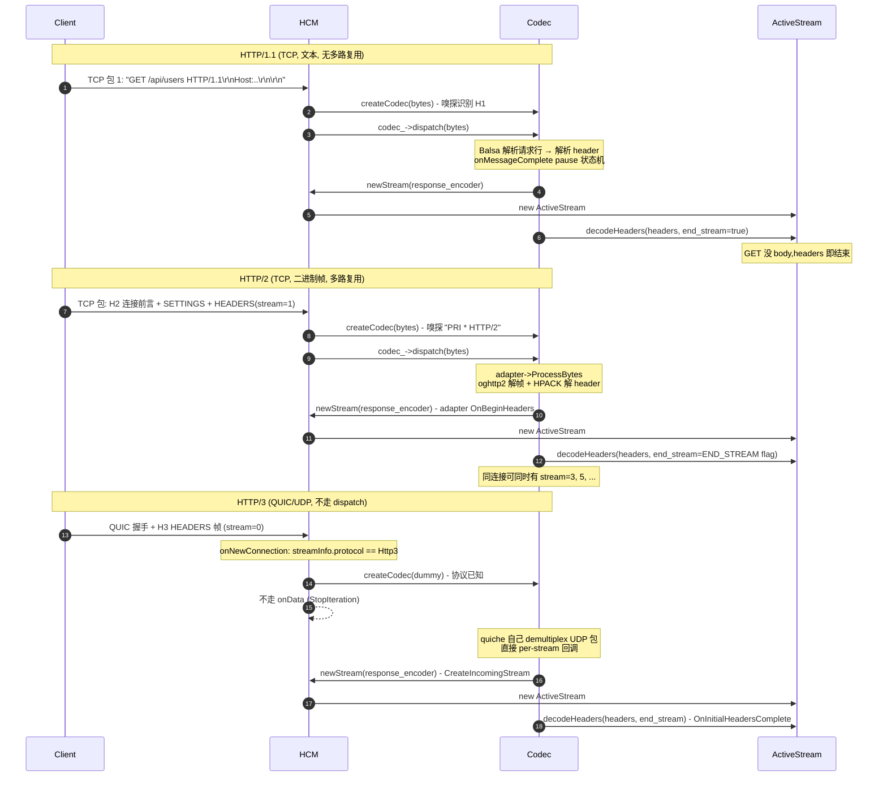

# 第 3 篇 · 第 9 章 · HTTP 编解码:HTTP/1.1、HTTP/2、HTTP/3

> **核心问题**:HTTP/1.1(文本协议)、HTTP/2(二进制帧 + HPACK)、HTTP/3(QUIC/UDP + QPACK)是三种差异巨大的协议——HTTP/1.1 逐行扫文本,HTTP/2 把字节切成带 stream id 的二进制帧做多路复用,HTTP/3 干脆跑在 UDP 上、靠 QUIC 自己做可靠性。可 Envoy 的 HCM 只认一个抽象的 `ServerConnection` 接口,把三种协议收进同一个壳子。这一章拆透:三种 codec 各自怎么把字节变成 HTTP 请求、共用哪些机制、又各自藏着什么协议独有的硬骨头?以及一个最重要的源码事实——Envoy 的 HTTP/2 codec 其实已经不再直接调 nghttp2 了,它的 HTTP/1.1 解析也不再是老 http_parser。

> **读完本章你会明白**:
> 1. **统一 codec 接口**怎么让三种协议共用一套上层逻辑——`ServerConnection`/`RequestDecoder`/`ResponseEncoder` 三个抽象接口,把协议差异封在适配层。朴素地"每种 HTTP 写一条独立处理路径"会撞什么墙(三套代码、filter 无法复用、协议升级推倒重写)。
> 2. **HTTP/1.1 文本协议的逐行状态机**——为什么必须用流式解析(请求可能跨多个 TCP 包)、为什么不能多路复用(队头阻塞)、为什么 keep-alive 复用连接。Envoy 1.39 已经用 QUICHE 的 **Balsa 解析器** 替掉了老的 http_parser(老资料大片过时)。
> 3. **HTTP/2 二进制帧 + 流多路复用**——一条 TCP 跑多个 stream、帧类型、流控(window update),HPACK 承接《gRPC》P2-07 不重讲。**重要源码事实**:Envoy 1.39 的 HTTP/2 codec 默认走 QUICHE 的 `http2::adapter::Http2Adapter`(oghttp2 后端),nghttp2 只在编译开关 `ENVOY_NGHTTP2` 下才用——把"Envoy 直接调 nghttp2"的老印象修正掉。
> 4. **HTTP/3 over QUIC**——为什么 HTTP/3 走 UDP(解决 TCP 队头阻塞、连接迁移、0-RTT),QUIC 自己在用户态做可靠性/拥塞控制/多路复用;QPACK 承接相关 RFC/《gRPC》指路。Envoy 的 H3 codec 基于 quiche,**dispatch 是个 PANIC**(因为 quiche 自己做 UDP 包 demultiplex,字节不经 codec)。
> 5. **三档 codec 在 HCM 里是怎么被选出来、怎么各自实现 `decodeHeaders`/`decodeData`/`encodeData` 的**,以及"为什么 HTTP/3 的 codec 在 `onNewConnection` 就建、跳过 `onData`"——这是 codec 插件化在 H3 上的极致体现。

> **如果一读觉得太难**:先只记住三件事——① 三种 HTTP 在 Envoy 里都实现同一个 `ServerConnection`/`RequestDecoder` 接口,上层 HCM 看不出区别;② HTTP/1.1 是文本逐行解析(不能多路复用,所以有队头阻塞)、HTTP/2 是二进制帧多路复用(解决 H1 应用层队头阻塞,但 TCP 层还有)、HTTP/3 跑在 QUIC/UDP 上(连 TCP 队头阻塞也解决);③ HTTP/2 的 HPACK 和 HTTP/3 的 QPACK 是别人的主场(《gRPC》P2-07、RFC 9114),本书只讲 Envoy 怎么把它们收进统一接口。

---

## 〇、一句话点破

> **HTTP/1.1、HTTP/2、HTTP/3 三种协议的解析方式天差地别——H1 是 `\r\n` 分隔的文本逐行扫、H2 是 9 字节帧头的二进制分帧、H3 是 QUIC/UDP 上每条 stream 独立;但 Envoy 把这三种都装进同一套 `ServerConnection`/`RequestDecoder`/`ResponseEncoder` 抽象接口,上层 HCM 永远只调 `codec_->dispatch(bytes)`,解出的 headers/data/trailers 通过回调回到 HCM。三种协议的差异——文本 vs 二进制、单流 vs 多路复用、TCP vs UDP——全部封在 codec 适配层里。**

这是结论,不是理由。本章倒过来拆:先把统一 codec 接口的形状讲清(为什么这样切接口、不这样切会怎样),然后逐一拆 HTTP/1.1、HTTP/2、HTTP/3 三个 codec 的内部——各自的解析模型、多路复用(或不能多路复用)的根因、Envoy 1.39 在它们底下到底用了什么库(这里有几个会颠覆老印象的源码事实)。最后讲清楚三种 codec 怎么被 HCM 选出来、HTTP/3 那条"不走 onData"的特殊路径是怎么落地的。

---

## 一、回到 HCM 的视角:codec 接口在上层长什么样

P3-08 已经立起 codec 插件化的骨架:`createCodec` 一个工厂方法根据字节识别协议、返回一个 `ServerConnectionPtr`,之后 HCM 只用这个抽象接口跑(`codec_->dispatch()`、`codec_->protocol()`、`codec_->shutdownNotice()`)。本章要拆的是这个抽象接口本身长什么样、它的形状是怎么"恰好装得下"三种协议的。

### 源码事实:统一 codec 接口的形状

统一的 codec 接口在 [`envoy/http/codec.h`](../envoy/envoy/http/codec.h),而 `Protocol` 枚举其实在 [`envoy/http/protocol.h`](../envoy/envoy/http/protocol.h#L13-L14):

```cpp
// envoy/http/protocol.h  (简化示意,非源码原文)
enum class Protocol : uint8_t { Http10, Http11, Http2, Http3 };
const size_t NumProtocols = 4;
```

注意这个枚举顺序是**载重的(load-bearing)**——`Http10`/`Http11` 排在 `Http2` 之前,所以 P3-08 见到的 `codec_->protocol() < Protocol::Http2` 判断恰好就是"HTTP/1.x"。一个枚举值的大小隐式表达了"是否支持多路复用",这是 Envoy 源码里不止一处出现的微妙设计。

codec 接口本身拆成几个角色(都在 `envoy/http/codec.h`):

```cpp
// envoy/http/codec.h  (简化示意,非源码原文)
// 连接级抽象:codec 的根。dispatch 把字节喂进去,protocol() 报版本
class Connection {
 public:
  virtual Http::Status dispatch(Buffer::Instance& data) PURE;
  virtual Http::Protocol protocol() PURE;
  virtual void goAway() PURE;
  virtual void shutdownNotice() PURE;
  // ...
};
// 服务器侧 codec:其实就是 Connection 的空 marker 子类
class ServerConnection : public virtual Connection {};
using ServerConnectionPtr = std::unique_ptr<ServerConnection>;

// HCM 实现这个:codec 每解出一条新 HTTP 请求流,就回调 newStream
class ServerConnectionCallbacks : public virtual ConnectionCallbacks {
 public:
  virtual RequestDecoder& newStream(ResponseEncoder& response_encoder,
                                    bool is_internally_created = false) PURE;
};

// 请求解码器:codec 把解出的 headers/data/trailers 喂给这个
class RequestDecoder : public virtual StreamDecoder {
 public:
  virtual void decodeHeaders(RequestHeaderMapSharedPtr&& headers, bool end_stream) PURE;
  virtual void decodeData(Buffer::Instance& data, bool end_stream) PURE;   // 继承自 StreamDecoder
  virtual void decodeTrailers(RequestTrailerMapPtr&& trailers) PURE;
  // ...
};

// 响应编码器:filter 链把响应头/体喂给这个,codec 再编码成字节
class ResponseEncoder : public virtual StreamEncoder {
 public:
  virtual void encodeHeaders(ResponseHeaderMap&& headers, bool end_stream) PURE;
  virtual void encodeData(Buffer::Instance& data, bool end_stream) PURE;
  // ...
};
```

见 [Connection 接口](../envoy/envoy/http/codec.h#L626-L671)、[ServerConnectionCallbacks::newStream](../envoy/envoy/http/codec.h#L701-L714)、[RequestDecoder](../envoy/envoy/http/codec.h#L273-L316)、[ResponseEncoder](../envoy/envoy/http/codec.h#L173-L226)。

这套接口里藏着两个关键设计:

1. **`dispatch(bytes)` 是连接级、一次吞一段字节**——不返回结构化对象,而是"内部解析、解析出东西就回调"。这是流式处理的契约(P3-08 已经讲过为什么不能"返回完整 `HttpRequest` 对象")。
2. **`newStream(ResponseEncoder&) -> RequestDecoder&` 是个反转**——codec 每解出一条请求,反过来回调 HCM:"我有一条新流,你给我一个 `RequestDecoder`,我把 headers/data 喂给它"。这把"上层主动拉数据"翻转成"下层推数据上来",是 streaming HTTP 的正确模型。

### 提问:为什么把接口切成"连接 + 解码器 + 编码器"三个角色?

朴素想法:codec 就一个类,把字节解析成请求、把响应编码成字节,搞定。

### 不这样会怎样:多路复用下没法表达"一个连接多个流"

HTTP/2 和 HTTP/3 是多路复用的——一条连接上同时跑 N 个请求,每个请求各自有自己的 header/body/响应状态。如果 codec 接口只有一个"连接"角色,这 N 个请求的状态挤在连接对象上一团乱。

切成三个角色后,关系清清楚楚:

- 一条 TCP/QUIC 连接 → 一个 `ServerConnection`(`codec_`),负责吃字节。
- 这条连接上每跑一个请求 → codec 回调一次 `newStream`,HCM 回送一个 `RequestDecoder`(实际上是 P3-08 讲的 `ActiveStream`),后续 codec 把这个请求的 headers/data 喂给它。
- 同一条请求的响应 → filter 链通过 `ResponseEncoder`(`ActiveStream` 持有的 `response_encoder_`)写回。

这样,**一条连接一个 codec,但 N 条请求 N 个 `RequestDecoder`**——多路复用在接口层面就天然支持。

> **不这样会怎样**:具体场景——HTTP/2 一条连接上 stream id=1 刚收到 header、stream id=3 收到一半 body、stream id=5 在等上游响应,三个请求的帧可能交错到达。如果只有一个连接级状态机,你得在它内部维护 "stream id → 状态" 的映射,本质上就是在重造 per-stream decoder。直接把"per-stream decoder"做成接口的一等公民,干净利落。

### 所以这样设计:连接级 + 流级两套角色,天然装得下多路复用

这套三角色接口(`ServerConnection` + `RequestDecoder` + `ResponseEncoder`)是 H1/H2/H3 能共用的根本——H1 没有多路复用,但它也照样每条请求建一个 `RequestDecoder`(就是 HCM 的 `ActiveStream`),代码和 H2/H3 完全一致。

> **钉死这件事**:统一 codec 接口的形状是"连接级 `ServerConnection::dispatch` 吃字节 + 流级 `RequestDecoder::decode*` 喂结构化数据 + 流级 `ResponseEncoder::encode*` 写响应"三件套。这个形状恰好装得下三种协议——多路复用的协议(H2/H3)有多条流,单流协议(H1)也走同样的"每请求一 decoder"路径。**这是抽象层设计的妙处:把协议差异封在 dispatch 内部,接口对上层稳定。**

---

## 二、三种协议的根本差异:为什么会有三种 HTTP?

在拆三个 codec 之前,先回答一个朴素问题:**为什么要造三种 HTTP?HTTP/1.1 不够用吗?** 这一段不讲 Envoy 实现,讲协议本身的演进动机——理解了演进,才能理解 Envoy 三个 codec 各自的硬骨头。

### HTTP/1.1:文本协议 + 队头阻塞

HTTP/1.1(1997 年定稿,RFC 2068 后被 7230/9112 替代)是**文本协议**:

```
GET /api/v1/users HTTP/1.1\r\n
Host: example.com\r\n
Accept: application/json\r\n
\r\n
```

每行以 `\r\n` 结尾,空行 `\r\n` 表示 header 结束、body 开始。请求和响应都是这种格式。解析就是"扫字符、遇 `\r\n` 切一行"。

HTTP/1.1 引入了 **keep-alive**(默认开启)——一条 TCP 连接可以复用,发完一个请求等响应回来再发下一个,不用每次重新建 TCP+TLS(那在 1990s 是大开销)。这是 H1 的进步。

但 H1 有两个根本痛点:

1. **不能多路复用**:一条连接同时只能有一个请求(keep-alive 是串行,前一个响应回来才能发下一个)。如果一个响应慢(比如大文件下载),后面排队的请求全被堵住——这叫 **HTTP/1.1 应用层队头阻塞(HoL blocking)**。
2. **头部冗余**:H1 的 header 是明文重复的。每条请求都带一坨几乎一样的 `User-Agent: ...`、`Cookie: ...`,纯文本不压缩,带宽浪费。

缓解方案是浏览器开多条 TCP 连接(域名分片 domain sharding),但每条连接都有自己的队头阻塞问题,而且 TCP/TLS 握手开销叠加。

### HTTP/2:二进制帧 + 多路复用 + HPACK

HTTP/2(2015,RFC 7540 → 9113)是 Google 的 SPDY 协议(`2012` 年发布,Google 内部用)被 IETF 标准化的产物。它冲着 H1 的两个痛点来:

1. **多路复用**:一条 TCP 连接上同时跑多个 stream,每个 stream 有唯一 id。请求 A 和请求 B 的字节可以**交错**到达(帧交错),不会互相堵。解决了 H1 的应用层队头阻塞。
2. **HPACK 头部压缩**:用静态表 + 动态表 + 哈夫曼编码,把 header 压得很短(RFC 7541,后续被 RFC 9130 替代)。
3. **二进制**:不再是文本。每个数据单元是个 9 字节帧头 + payload 的"帧"(frame),帧类型有 DATA/HEADERS/PRIORITY/RST_STREAM/SETTINGS/PUSH_PROMISE/PING/GOAWAY 等。二进制解析比文本快、出错检测更严格。

```
   HTTP/2 帧结构(9 字节帧头 + payload)
   ┌──────────────────────────────────────────────────┐
   │  Length(3 字节)   │ Type(1) │ Flags(1) │ Reserved(1 bit)│
   │                   │         │          │ Stream Identifier(31 bit)│
   ├──────────────────────────────────────────────────┤
   │              Frame Payload(Length 字节)            │
   └──────────────────────────────────────────────────┘
   一条 TCP 连接上可以交错跑多个 stream 的帧
```

但 HTTP/2 没解决一切:它跑在 TCP 上,**TCP 层还有队头阻塞**。TCP 保证字节有序到达,如果一个 TCP 包丢了,TCP 会重传,这期间这条连接上**所有 stream 的字节都得等**(即使别的 stream 的字节已经到了,也不能交给上层)。HTTP/2 多路复用把队头阻塞从应用层挪到了 TCP 层。

### HTTP/3:跑在 QUIC/UDP 上

HTTP/3(2022,RFC 9114)直接换底层——不再跑 TCP,跑 **QUIC**(RFC 9000),而 QUIC 跑在 **UDP** 上。为什么?

```
   TCP(HTTP/1.1、HTTP/2)              QUIC(HTTP/3)
   ┌──────────────────┐                ┌──────────────────┐
   │ 应用层(HTTP)    │                │ 应用层(HTTP/3)   │
   ├──────────────────┤                ├──────────────────┤
   │ TLS              │                │ HTTP/3 over QUIC │
   ├──────────────────┤                │ (TLS 1.3 内嵌)   │
   │ TCP              │                ├──────────────────┤
   └──────────────────┘                │ UDP              │
                                       └──────────────────┘
   TCP 层队头阻塞、握手慢              QUIC 自己做可靠性、多路复用独立、0-RTT
```

QUIC 把"可靠性、拥塞控制、多路复用、TLS 握手"全搬到用户态(UDP 之上),带来了几个 H2 做不到的:

1. **每个 stream 独立做可靠性**:一个 stream 的包丢了,只重传这个 stream 的,不影响别的 stream。**TCP 层队头阻塞被消灭了**(或者更准确说,被搬到了 stream 级别,但每个 stream 独立)。
2. **连接迁移**:你的手机从 WiFi 切到 4G,IP 变了,TCP 连接得重连;QUIC 用一个 connection id 标识连接,IP 变了连接还在。
3. **0-RTT 握手**:对连过的服务器,第一个包就能带数据(0-RTT),比 TCP+TLS 的 1-RTT/2-RTT 快得多。
4. **TLS 1.3 内嵌进 QUIC 握手**:QUIC 握手和 TLS 握手合并,不再有 TCP 和 TLS 的两次握手开销。

代价:QUIC 跑在 UDP 上,**中间设备(防火墙、NAT、LB)对 UDP 的优化和支持不如 TCP**,部署起来有坑(很多公司防火墙直接 drop UDP/443)。这是 HTTP/3 至今没全面替代 HTTP/2 的现实原因。

### 一张图:三种协议对照

```
   HTTP/1.1                 HTTP/2                     HTTP/3
   ──────────               ─────                      ─────
   文本, \r\n 分隔          二进制帧(9 字节帧头)         二进制帧 over QUIC
   不能多路复用              一条 TCP 多个 stream        一条 QUIC 多个 stream
   (keep-alive 串行)         (帧交错)                    (帧交错)
   header 明文不压缩        header HPACK 压缩           header QPACK 压缩
   应用层队头阻塞            应用层 HoL 解决              应用层 HoL 解决
   TCP 层 HoL               TCP 层 HoL 还在              TCP 层 HoL 消灭(QUIC)
   底层 TCP                 底层 TCP                    底层 UDP/QUIC
   (Envoy 直接解析文本)      (Envoy 用 http2::adapter)   (Envoy 用 quiche)
```

> **钉死这件事**:三种 HTTP 不是平行发明,是演进——H1(文本+串行) → H2(二进制+多路复用,解决应用层 HoL,但 TCP 层 HoL 还在) → H3(QUIC/UDP,连 TCP 层 HoL 也消灭,带来连接迁移和 0-RTT)。Envoy 的三个 codec 就是这条演进在代码里的镜像。

### 一张具体的时序图:同一个场景下三种协议的表现

为了把"队头阻塞"这个抽象概念讲清楚,设想一个具体场景:**客户端要请求 3 个资源——A(小,1KB)、B(大,10MB)、C(小,1KB),顺序发起 A、B、C 三个请求**。看三种协议表现:

```
   HTTP/1.1(一条 keep-alive 连接)
   ──────────────────────────────
   t0: 发 A 请求 → 等 A 响应
   t1: 收 A(快,1KB)
   t2: 发 B 请求 → 等 B 响应(10MB,慢)
   t3..t10: B 在传,这条连接堵死
   t10: B 完 → 发 C → 等 C
   t11: 收 C(快,但等了 B 整个传输时间)
   
   痛点:C 明明是个小请求,却要等 B 传完才能开始——应用层 HoL

   HTTP/2(一条 TCP 连接,3 个 stream)
   ──────────────────────────────
   t0: 同时发 A(stream=1)、B(stream=3)、C(stream=5)HEADERS 帧
   t1: 服务器响应,A/C/B 的 DATA 帧可以交错发回
   t2: A 完(快,小请求先回)
   t3: C 完(快,穿插在 B 的 DATA 帧之间)
   t10: B 完(慢,但不堵 A/C)
   
   痛点解决:应用层 HoL 消灭
   
   但:如果 t5 一个 TCP 包丢了,这个包里可能有 B 的 DATA,
   TCP 重传期间,A/C 的 DATA 即使已经到达 socket buffer,
   也得等这个包重传完——TCP 层 HoL

   HTTP/3(一条 QUIC 连接,3 个 stream)
   ──────────────────────────────
   t0: 0-RTT 握手的同时就发 A/B/C 的 HEADERS
   t1: 服务器响应,A/C/B 独立 stream
   t2: A 完、C 完(独立,不受 B 影响)
   t5: 如果 B 的一个 QUIC 包丢了,只重传 B 的这个包,
       A/C 的 stream 不受影响——TCP 层 HoL 消灭
   t6: 手机切网络,IP 变了,QUIC 连接还在(连接迁移),不必重连
```

这张时序图把三种协议的核心差异落到具体场景。Envoy 的三个 codec,处理的就是这三种协议的字节解码——但解码出来的 `RequestHeaderMap`,对 HCM 上层是完全一样的对象。

> **钉死这张图**:理解了这张图,就理解了为什么 HTTP/3 是未来(消灭了所有 HoL、连接迁移、0-RTT),为什么 HTTP/2 在现实里仍是主力(中间设备对 UDP 支持差、H3 部署有坑),以及为什么 Envoy 要把三种 codec 都收进统一接口——它要让用户**在同一个 HCM 配置里无缝切换**(或共存)三种协议。

---

## 三、HTTP/1.1 codec:文本协议的逐行状态机

现在拆第一个 codec——HTTP/1.1。这是最朴素、也是最容易让人以为"自己也能写一个"的 codec,但实际写起来处处是坑。

### 源码事实:H1 codec 的主类

H1 server codec 在 `source/common/http/http1/`:

```cpp
// source/common/http/http1/codec_impl.h
class ServerConnectionImpl : public ServerConnection, public ConnectionImpl {
 public:
  ServerConnectionImpl(Network::Connection& connection, CodecStats& stats,
                       ServerConnectionCallbacks& callbacks, Http1Settings settings,
                       uint32_t max_request_headers_kb, uint32_t max_request_headers_count,
                       HeadersWithUnderscoresAction headers_with_underscores_action,
                       Server::OverloadManager& overload_manager);
  // ...
  Http::Status dispatch(Buffer::Instance& data) override;
};
```

见 [ServerConnectionImpl 类声明](../envoy/source/common/http/http1/codec_impl.h#L455-L463)。它继承 `Http::ServerConnection`(统一接口的 marker)和 `ConnectionImpl`(H1 内部基类),dispatch 接口就是统一的那一个——把字节喂进去。

### 一个颠覆老印象的源码事实:解析器是 Balsa,不是 http_parser

这里有个**重要修正**:老资料常讲 Envoy 用 Node.js 的 http_parser(那个 C 库)。**这在当前 1.39 已经不准了**。

看 `ConnectionImpl` 构造函数:

```cpp
// source/common/http/http1/codec_impl.cc  (简化示意,非源码原文)
ConnectionImpl::ConnectionImpl(Network::Connection& connection, CodecStats& stats,
                               const Http1Settings& settings, MessageType type,
                               uint32_t max_headers_kb, const uint32_t max_headers_count)
    : connection_(connection), stats_(stats), codec_settings_(settings), /* ... */ {
  parser_ = std::make_unique<BalsaParser>(type, this, max_headers_kb_ * 1024,
                                          enableTrailers(), codec_settings_.allow_custom_methods_);
}
```

见 [ConnectionImpl 构造里 hardcode 用 BalsaParser](../envoy/source/common/http/http1/codec_impl.cc#L531-L539)。**`BalsaParser` 是唯一被实例化的解析器**。

而老的 `legacy_parser_impl.cc`(包 Node.js http_parser 的那个)虽然在 BUILD 里还链接着(`legacy_parser_lib`,`codec_impl.cc` 还 `#include "legacy_parser_impl.h"`),但**运行时不再被实例化**——它是死代码,留着只是历史包袱。我在 `source/common/http/http1` 全目录搜了 `LegacyHttpParserImpl`、`ParserType::Legacy`、`http1_use_*` 这些可能切换解析器的开关,**一个也没找到**。Balsa 是 hardcoded 唯一选择。

那 Balsa 是什么?它是 **QUICHE(Google 的 QUIC + HTTP/2 + HTTP/3 库)项目里的一个 HTTP/1 解析器**,本来是给 Google 内部用的(Balsa 是个 Google 内部命名,QUICHE 仓里 `quiche/balsa/`)。Envoy 把它接进来,等于"既然 quiche 已经成为 HTTP/2 和 HTTP/3 的依赖,HTTP/1 的解析器也跟着 quiche 走"——一个一致的 quiche 战略。

> **注:这是 Envoy 的源码事实修正点**。很多博客和教学资料讲 Envoy 的 H1 解析器时还停在 http_parser(Node.js 那个 C 库)。在 1.39(以及更早一些版本)上,Balsa 已经是唯一运行时解析器;legacy_parser 仅作死代码保留。本书以本地 commit `df2c77d` 的源码为准。

### Balsa 是怎么逐行解析的

Balsa 是**事件驱动的状态机**:你把字节喂给它(`balsa_parser.cc` 的 `execute` 调用 quiche 的 Balsa frame API),Balsa 在内部状态机里推进,每到一步(请求行解析完、一个 header 解析完、headers 结束、收到 body chunk、chunk length 到、消息结束),就回调 Envoy 提供的 callback。

请求行(`GET /path HTTP/1.1`)的解析,在 Balsa 侧(`balsa_parser.cc`):

```cpp
// source/common/http/http1/balsa_parser.cc  (简化示意,非源码原文)
void BalsaParser::OnRequestFirstLineInput(absl::string_view /*line_input*/,
                                          absl::string_view method_input,
                                          absl::string_view request_uri,
                                          absl::string_view version_input) {
  // ...
  if (!isMethodValid(method_input, allow_custom_methods_)) { /* 报错 */ }
  const bool is_connect = method_input == Headers::get().MethodValues.Connect;
  if (!isUrlValid(request_uri, is_connect)) { /* 报错 */ }
  if (!isVersionValid(version_input)) { /* 报错 */ }
  status_ = convertResult(connection_->onUrl(request_uri.data(), request_uri.size()));
}
```

见 [BalsaParser::OnRequestFirstLineInput](../envoy/source/common/http/http1/balsa_parser.cc#L302-L326)。这是 quiche Balsa 的回调,Balsa 把请求行拆成 method/url/version 三段,Envoy 在 `onUrl` 里把 url 收起来(后面在 `onHeadersCompleteBase` 里再把 method 塞进 HeaderMap)。

header 的解析,同样在 Balsa 侧:

```cpp
// source/common/http/http1/balsa_parser.cc  (简化示意,非源码原文)
// validateAndProcessHeadersOrTrailersImpl 里:
for (const auto& [key, value] : headers.lines()) {
  if (!isHeaderNameValid(key)) { /* 报错 */ }
  if (trailers && !enable_trailers_) { continue; }
  status_ = convertResult(connection_->onHeaderField(key.data(), key.length()));
  // ...
  status_ = convertResult(connection_->onHeaderValue(value.data(), value.length()));
}
```

见 [validateAndProcessHeadersOrTrailersImpl](../envoy/source/common/http/http1/balsa_parser.cc#L416-L455)。每个 header 一对 `onHeaderField` + `onHeaderValue` 回调,Envoy 在 `onHeaderFieldImpl`/`onHeaderValueImpl` 里把 header 攒进 `current_header_field_`/`current_header_value_`,完事再 `completeCurrentHeader` 把它加进 HeaderMap。

body chunk 的解析:

```cpp
// source/common/http/http1/balsa_parser.cc
void BalsaParser::OnBodyChunkInput(absl::string_view input) {
  if (status_ == ParserStatus::Error) { return; }
  connection_->bufferBody(input.data(), input.size());
}
```

见 [BalsaParser::OnBodyChunkInput](../envoy/source/common/http/http1/balsa_parser.cc#L284-L290)。body 来一段 buffer 一段,然后通过 `dispatchBufferedBody` 走到 `decodeData` 回调。

这就是"逐行扫状态机"的样子——**Envoy 自己不再写状态机了**,把字节流交给 Balsa,Balsa 推进状态、回调通知。

### 提问:为什么必须用流式状态机解析?

朴素想法:等收齐整个请求再一次性解析,简单。

### 不这样会怎样:请求可能跨多个 TCP 包、body 可能很大

HTTP/1.1 是文本协议,但传输介质是 TCP——**字节流**。一个请求可能跨好几个 TCP 包到达,反过来一个 TCP 包也可能装好几个请求(pipelining)。你不知道"一个请求"在哪个字节结束,只能边扫边推进状态机。

具体痛点:

1. **请求跨包**:header 部分一个包,刚到 `Host:` 这一行就断了,剩下的 `Accept:`、`\r\n`、body 在下一个包。如果不能流式解析,你得自己拼完整请求再处理——但你怎么知道请求"完整"了?要么等 body(但你不知道 body 多大),要么靠 Content-Length/Transfer-Encoding(那就得先解析 header,这就是流式解析)。这是个鸡生蛋问题,只有流式状态机能解。

2. **大 body**:上传一个 1GB 的文件,客户端分几千个 TCP 包发过来。等"收齐再解析"等于把整个 1GB 先攒到内存里——内存爆炸、尾延迟飙升。流式解析能"边收边吐",每个 chunk 到就回调 `decodeData`,filter 链(比如 router)可以边收边转发给 upstream。

3. **请求交错(pipelining)**:`GET /a\r\n...\r\nGET /b\r\n...\r\n` 一个 TCP 包里两个请求。状态机解析完一个就停在边界,等 HCM 走完一条请求再 redispatch 解下一条(P3-08 讲过 HCM 的 `redispatch` 循环)。

> **不这样会怎样**:朴素地 `recv()` 一整个请求再 `parse()`,你不知道 recv 到哪算"完整请求";大 body 直接 OOM;pipelining 全错乱。流式状态机是文本协议解析的唯一正确姿势,Node.js 早期的 http_parser、Nginx 的 http_parse、Envoy 用的 Balsa 全是这套。

### chunked transfer-encoding 的解析

HTTP/1.1 有个特例:响应或请求的 body 大小**事先不知道**(流式生成),这时用 `Transfer-Encoding: chunked`——body 被切成"一块一块",每块前面是一个十六进制的长度行:

```
POST /upload HTTP/1.1\r\n
Transfer-Encoding: chunked\r\n
\r\n
1a\r\n
<26 字节 body>\r\n
10\r\n
<16 字节 body>\r\n
0\r\n
\r\n
```

Balsa 处理 chunked 也是状态机推进,每收到一个 chunk length 就回调:

```cpp
// source/common/http/http1/balsa_parser.cc
void BalsaParser::OnChunkLength(size_t chunk_length) {
  if (status_ == ParserStatus::Error) { return; }
  const bool is_final_chunk = chunk_length == 0;
  connection_->onChunkHeader(is_final_chunk);
}
```

见 [BalsaParser::OnChunkLength](../envoy/source/common/http/http1/balsa_parser.cc#L343-L349)。`chunk_length == 0` 是结束块。Envoy 在 `onChunkHeader` 里([codec_impl.cc:770-776](../envoy/source/common/http/http1/codec_impl.cc#L770-L776))做最后一块的 flush,确保 chunk 后面的 trailer 不会丢失。

还有一个**协议冲突检测**——既带 `Content-Length` 又带 `Transfer-Encoding: chunked` 怎么办?RFC 7230 说 chunked 优先,但 Envoy 默认会拒绝这种含糊的请求(只在 `allow_chunked_length_` 配置打开时才容忍,移除 Content-Length):

```cpp
// source/common/http/http1/codec_impl.cc  (简化示意,非源码原文)
if (parser_->hasTransferEncoding() != 0 && request_or_response_headers.ContentLength()) {
  if (parser_->isChunked() && codec_settings_.allow_chunked_length_) {
    request_or_response_headers.removeContentLength();
  } else {
    error_code_ = Http::Code::BadRequest;
    // ... 发送协议错误响应
    return codecProtocolError("http/1.1 protocol error: both 'Content-Length' and "
                              "'Transfer-Encoding' are set.");
  }
}
```

见 [Transfer-Encoding/Content-Length 冲突检测](../envoy/source/common/http/http1/codec_impl.cc#L915-L924)。这个检测是 HTTP 请求走私(HTTP request smuggling)漏洞的核心防御——攻击者构造含糊的请求,让前端代理和后端服务器对请求边界判断不一致,从而注入恶意请求。Envoy 默认严格拒绝含糊请求。

### keep-alive 与"一条连接一次只跑一个请求"

HTTP/1.1 的 keep-alive 让一条 TCP 连接可以串行跑多个请求——前一个响应完,客户端才能发下一个。Envoy 在 H1 codec 里**通过"解析完一条就 pause 状态机"实现串行**:

```cpp
// source/common/http/http1/codec_impl.cc  (简化示意,非源码原文)
// onMessageCompleteBase,无论 server 还是 client:
// Always pause the parser so that the calling code can process 1 request at a time and apply
// back pressure. However this means that the calling code needs to detect if there is more data
// in the buffer and dispatch it again.
return parser_->pause();
```

见 [onMessageCompleteBase 永远 pause](../envoy/source/common/http/http1/codec_impl.cc#L1362-L1366)。这个 pause 是 H1 的核心机制——Balsa 解完一条请求主动停,等 HCM 走完这条(发响应)再 resume 解下一条。这就是"keep-alive 串行"在 codec 层的实现。

注意这个注释里的 "calling code needs to detect if there is more data in the buffer and dispatch it again"——这就是 P3-08 讲的 HCM `onData` 里 `redispatch` 循环的由来。H1 一次 dispatch 只解一条,如果字节里还有下一条(pipelining),HCM 的 `redispatch` 会再调一次 `dispatch`。

还有个**pipeline 防护**:Envoy 不喜欢 pipelining(它有各种溢出 bug),所以默认只允许每条连接最多挂 2 个 outbound 响应:

```cpp
// source/common/http/http1/codec_impl.cc
// Pipelining is generally not well supported on the internet and has a series of dangerous
// overflow bugs. As such Envoy disabled it.
static constexpr uint32_t kMaxOutboundResponses = 2;
```

见 [kMaxOutboundResponses 限制](../envoy/source/common/http/http1/codec_impl.cc#L60-L63)。超了就 read-disable 连接(暂时不再读 socket,等已挂的响应发完)。这相当于"承认 H1 可以 pipeline,但不让你滥用"。

### H1 codec 怎么把解析结果送回 HCM

Balsa 解析过程中,Envoy 在 callback 里把解析结果攒进一个 `RequestHeaderMapImpl`(Envoy 的 header map 实现)。最关键的时机是 **headers 解完**——这时候该把攒好的 header map 送回 HCM:

```cpp
// source/common/http/http1/codec_impl.cc  (简化示意,非源码原文)
// onHeadersCompleteBase:
// 如果有 body(chunked 或 Content-Length > 0),end_stream = false
if (parser_->isChunked() ||
    (parser_->contentLength().has_value() && parser_->contentLength().value() > 0) ||
    handling_upgrade_) {
  RequestDecoder* decoder = active_request_->request_decoder_handle_->get().ptr();
  // ...
  if (decoder) {
    decoder->decodeHeaders(std::move(headers), false);  // ← 调 HCM 的 RequestDecoder
  }
} else {
  deferred_end_stream_headers_ = true;  // ← 没 body,headers 就是流的结尾,但延迟到 message complete 再回调
}
```

见 [onHeadersCompleteBase](../envoy/source/common/http/http1/codec_impl.cc#L1246-L1262)。

这里有个**精巧的延迟技巧**:对于 GET 这种没 body 的请求,headers 本身就是整个请求(`end_stream` 应该是 true),但 Envoy 不在 headers 解完时立刻 `decodeHeaders(..., true)`,而是设 `deferred_end_stream_headers_ = true`,延迟到 `onMessageCompleteBase` 再回调。为什么?因为 Balsa 在"headers 结束"和"消息结束"之间可能还要触发别的事件(比如 trailer 解析),如果太早 `decodeHeaders(..., true)` 就把流关了,后续状态机会错乱。

到 `onMessageCompleteBase` 才真正送回:

```cpp
// source/common/http/http1/codec_impl.cc  (简化示意,非源码原文)
if (deferred_end_stream_headers_) {
  if (decoder) {
    decoder->decodeHeaders(std::move(absl::get<RequestHeaderMapPtr>(headers_or_trailers_)),
                           true);  // end_stream = true
  }
  deferred_end_stream_headers_ = false;
} else if (processing_trailers_) {
  if (decoder) { decoder->decodeTrailers(std::move(/* trailers */)); }
} else {
  // 有 body 的情况:发一个空 body + end_stream=true 收尾
  Buffer::OwnedImpl buffer;
  if (decoder) { decoder->decodeData(buffer, true); }
}
```

见 [onMessageCompleteBase 里的 end_stream 回调](../envoy/source/common/http/http1/codec_impl.cc#L1341-L1356)。

这段代码值得品:它**统一了"三种请求结束方式"**——纯 header 请求、有 body 请求、有 trailer 请求——都从 `onMessageCompleteBase` 这一个出口把 `end_stream = true` 的信号送回 HCM。这是把"HTTP/1 的文本协议结束信号"翻译成"H2/H3 那种 frame end_stream 语义"的桥。

### 提问:为什么 Envoy 不直接在 Balsa 的 OnHeadersComplete 就把请求送回 HCM?

朴素想法:headers 一解完就送,早送早处理。

### 不这样会怎样:end_stream 语义对不上

`RequestDecoder::decodeHeaders(headers, end_stream)` 的 `end_stream` 参数,语义是"这条请求流到此结束"。对 H2/H3,这是 HEADERS 帧带 END_STREAM flag 的语义——这条流没有 body,header 既是头也是尾。

对 H1,这种语义对应 GET 这种没 body 的请求——`GET /path HTTP/1.1\r\n\r\n` 一发完事,header 解完流就结束了。但如果在 Balsa 的 OnHeadersComplete 立刻 `decodeHeaders(..., true)`,后面 Balsa 还要触发 OnMessageComplete(因为它确实解完了消息),你又得发一个 `decodeData(empty, true)`——重复 end_stream。

延迟到 `onMessageCompleteBase` 统一发,既不重复、又能正确区分三种情况(纯 header / 有 body / 有 trailer)。**这是 H1 codec 把"文本协议状态"翻译成"H2/H3 frame 语义"的桥——表面看是个细节,实则是统一接口的关键**。

> **钉死这件事**:HTTP/1.1 codec 用 Balsa(QUICHE 的解析器,不再是老的 http_parser)做流式状态机解析,每解到关键点(请求行、header、body、chunk、消息结束)就回调 Envoy。解析完一条请求 Balsa 主动 pause,实现"keep-alive 串行";延迟 `decodeHeaders(end_stream=true)` 到 `onMessageCompleteBase` 统一发,正确桥接 H1 文本语义和 H2/H3 的 frame end_stream 语义。**它解决的"硬骨头"是:文本协议解析、chunked、HTTP 请求走私防御、pipelining 限制。**

---

## 四、HTTP/2 codec:二进制帧 + 流多路复用

HTTP/2 codec 是三种里最复杂的——多路复用、HPACK、流控、各种帧类型。本节重点讲 Envoy 怎么把 H2 收进 codec 接口,**HPACK 本身承接《gRPC》P2-07**(那里是 HPACK 的主场:静态表/动态表/哈夫曼编码逐字拆),本书绝不重讲。

### 源码事实:H2 codec 主类

```cpp
// source/common/http/http2/codec_impl.h
class ServerConnectionImpl : public ServerConnection, public ConnectionImpl {
 public:
  Http::Status dispatch(Buffer::Instance& data) override;
  // ...
};
```

见 [H2 ServerConnectionImpl 类](../envoy/source/common/http/http2/codec_impl.h#L862-L902)。和 H1 一样,继承 `ServerConnection` 和 `ConnectionImpl`——抽象接口一致。但**内部实现天差地别**。

### 一个更大的源码事实修正:Envoy 不再直接调 nghttp2

老资料常说"Envoy HTTP/2 codec 封装 nghttp2"——直接调 `nghttp2_session_server_new`、`nghttp2_session_mem_recv` 这些 C API。**这在 1.39 上已经不准了**。

实际在 1.39 上,Envoy 的 H2 codec 走 QUICHE 的 **`http2::adapter::Http2Adapter`** 抽象层,这个 adapter 有两个后端:

- **oghttp2**(默认,Google 用 C++ 重写的 nghttp2,只保留 HPACK 解码核心)——Envoy 默认用这个。
- **nghttp2**(原版 C 库)——只在编译开关 `ENVOY_NGHTTP2` 打开时才用,Envoy 默认不开。

证据是 `ConnectionImpl` 持有一个 adapter 指针(`std::unique_ptr<http2::adapter::Http2Adapter> adapter_`,见 [codec_impl.h:733](../envoy/source/common/http/http2/codec_impl.h#L733)),dispatch 把字节喂给 adapter:

```cpp
// source/common/http/http2/codec_impl.cc  (简化示意,非源码原文)
ssize_t rc;
rc = adapter_->ProcessBytes(absl::string_view(static_cast<char*>(slice.mem_), slice.len_));
```

见 [ConnectionImpl::dispatch 调 adapter_->ProcessBytes](../envoy/source/common/http/http2/codec_impl.cc#L1093-L1138)。adapter 在内部解析 H2 帧、跑 HPACK,然后通过一个 **visitor 接口**(`Http2VisitorInterface`)回调 Envoy——这取代了 nghttp2 的 `nghttp2_session_callbacks` 那套 C 风格回调。

nghttp2 真正的 C API 调用,只存在于 `ConnectionImpl::Http2Options` 里,而且全在 `#ifdef ENVOY_NGHTTP2` 守护下:

```cpp
// source/common/http/http2/codec_impl.cc  (简化示意,非源码原文)
#ifdef ENVOY_NGHTTP2
  nghttp2_option_new(&options_);
  nghttp2_option_set_no_closed_streams(options_, 1);
  nghttp2_option_set_no_auto_window_update(options_, 1);
  // ...
#endif
```

见 [nghttp2 仅在 ENVOY_NGHTTP2 下编译](../envoy/source/common/http/http2/codec_impl.cc#L2177-L2238)。Envoy 默认不开这个开关,所以这段代码根本不编译进二进制。

BUILD 文件也确认了 nghttp2 是**可选依赖**:

```python
# source/common/http/http2/BUILD
] + envoy_select_nghttp2([envoy_external_dep_path("nghttp2")]),
```

见 [envoy_select_nghttp2 选择性依赖](../envoy/source/common/http/http2/BUILD#L67)。`envoy_select_nghttp2` 只在开 `ENVOY_NGHTTP2` 时才链接 nghttp2。

所以**正确说法**是:Envoy HTTP/2 codec 默认走 QUICHE 的 `http2::adapter::Http2Adapter`,后端默认是 oghttp2(Google 自己用 C++ 重写的 HPACK/fame 解析,去掉 nghttp2 的多余依赖);如果想用原版 nghttp2,要开编译开关。Envoy 用 oghttp2 的动机:**oghttp2 比 nghttp2 更轻、更纯 C++、和 quiche 的 HPACK/QPACK 共享代码**——Envoy 全栈靠 quiche,这是战略选择。

而 `source/common/http/http2/nghttp2.cc` 这个文件,现在只剩一个 `initializeNghttp2Logging()` 函数,装 nghttp2 的 debug printf 回调(见 [nghttp2.cc 仅剩日志函数](../envoy/source/common/http/http2/nghttp2.cc#L16-L31)),**没有任何 session 操作**。

> **注:这是又一处老资料大面积过时点**。"Envoy 直接调 nghttp2 解析 H2 帧"在 1.39 上是错的——默认走 oghttp2 adapter,nghttp2 仅作可选后端。但说"Envoy 用 quiche 的 HPACK"是对的——oghttp2 就是 quiche 项目里的 H2 解析库,HPACK 算法是 quiche 实现的。

### visitor 模式:adapter 怎么回调 Envoy

adapter 不直接调 C 函数指针,而是通过 `Http2VisitorInterface` 这个 C++ 接口回调 Envoy。Envoy 的 `ConnectionImpl` 内嵌一个 `Http2Visitor` 实现这个接口:

```cpp
// source/common/http/http2/codec_impl.h  (简化示意,非源码原文)
class ConnectionImpl {
  // ...
  class Http2Visitor : public Http2VisitorInterface {
   public:
    // 帧到达的回调:
    bool OnBeginHeadersForStream(Http2StreamId stream_id) override;
    OnHeaderResult OnHeaderForStream(Http2StreamId stream_id,
                                     absl::string_view name, absl::string_view value) override;
    bool OnEndHeadersForStream(Http2StreamId stream_id) override;
    bool OnDataForStream(Http2StreamId stream_id, absl::string_view data) override;
    bool OnEndStream(Http2StreamId stream_id) override;
    void OnWindowUpdate(Http2StreamId stream_id, int window_increment) override {}  // no-op
    // ...
  };
};
```

见 [Http2Visitor 接口实现](../envoy/source/common/http/http2/codec_impl.h#L192-L259)。注意几点:

1. **`OnHeaderForStream` 收到的 name/value 已经是 HPACK 解压后的字符串**——HPACK 是 adapter 内部跑的,Envoy 不实现 HPACK。这是 Envoy 把 HPACK 完全交给 quiche 的证据。
2. **`OnWindowUpdate` 是 no-op**——Envoy 自己管流控,不用 adapter 的 window update 机制(下面流控小节展开)。

### 多路复用:一条 TCP 上多个 stream,codec 怎么管理?

HTTP/2 多路复用的核心:**一条 TCP 上同时跑多个 stream,每个 stream 有唯一 id**。客户端发的 stream id 是奇数(1, 3, 5, ...),服务端发的(主要是响应、push promise)是偶数(2, 4, 6, ...),stream id=0 是连接级控制流(SETTINGS、PING、GOAWAY 这些帧不带 stream id,或者 stream id=0)。adapter 收到带 stream id 的帧,Envoy 要能找到(或创建)对应的"per-stream 状态对象",把 frame 路由过去。

Envoy 不用 map 存 stream,而是用 adapter 的 `SetStreamUserData`/`GetStreamUserData`——把 Envoy 的 `StreamImpl*` 直接挂在 adapter 的 stream 对象上:

```cpp
// source/common/http/http2/codec_impl.cc
ConnectionImpl::StreamImpl* ConnectionImpl::getStreamUnchecked(int32_t stream_id) {
  return static_cast<StreamImpl*>(adapter_->GetStreamUserData(stream_id));
}
```

见 [getStreamUnchecked 用 adapter 的 user data](../envoy/source/common/http/http2/codec_impl.cc#L1156-L1158)。这是个**很妙的零开销技巧**——adapter 内部本来就有"stream id → stream 对象"的映射(它自己解析帧时要用),Envoy 不再维护一份,直接把指针挂上去。

新 stream 的创建,在 adapter 收到第一条 HEADERS 帧时回调:

```cpp
// source/common/http/http2/codec_impl.cc  (简化示意,非源码原文)
Status ServerConnectionImpl::onBeginHeaders(int32_t stream_id) {
  // ...
  ServerStreamImplPtr stream(new ServerStreamImpl(*this, per_stream_buffer_limit_));
  // ...
  stream->setRequestDecoder(callbacks_.newStream(*stream));   // ← 回调 HCM 的 newStream
  stream->stream_id_ = stream_id;
  LinkedList::moveIntoList(std::move(stream), active_streams_);
  adapter_->SetStreamUserData(stream_id, active_streams_.front().get());  // 挂上去
  protocol_constraints_.incrementOpenedStreamCount();
  return active_streams_.front()->onBeginHeaders();
}
```

见 [ServerConnectionImpl::onBeginHeaders 创建新 stream](../envoy/source/common/http/http2/codec_impl.cc#L2504-L2521)。`callbacks_.newStream(*stream)` 就是 P3-08 讲的 HCM 创建 `ActiveStream` 那一步——H2 codec 每解出一个新 stream,就回调一次 HCM 的 newStream。

注意这和 H1 的差别:H1 一条连接一个 stream,只有 `onMessageBegin` 时建一次;H2 一条连接 N 个 stream,每个新 stream id 都触发一次 newStream。

### 帧类型:adapter 怎么把不同帧路由

adapter 解析每一帧,根据帧类型调不同的 visitor 回调。Envoy 的处理:

- **HEADERS** → `OnBeginHeadersForStream` → `onBeginHeaders`(建新 stream)→ `OnHeaderForStream` 多次(每个 header)→ `OnEndHeadersForStream` → `onHeaders`(把 header map 送回 HCM,见下面)
- **DATA** → `OnBeginDataForStream` + `OnDataForStream` → `onData` 把 body chunk 送给 HCM 的 decodeData
- **RST_STREAM** → `OnRstStream` → `onRstStream` 关闭 stream
- **SETTINGS** → `OnSettingsStart`/`OnSetting`/`OnSettingsEnd` → 处理对端 SETTINGS
- **PING** → `OnPing` → 回 PING(keepalive 用)
- **GOAWAY** → `OnGoAway` → `onGoAway` 通知 HCM 对端要关连接
- **PRIORITY** → no-op(Envoy 不用 H2 priority)
- **PUSH_PROMISE** → no-op(push 默认禁用,通过 SETTINGS)
- **WINDOW_UPDATE** → no-op visitor,但 `trackInboundFrames` 计数防 WINDOW_UPDATE flood

`onHeaders` 把攒好的 header map 送回 HCM:

```cpp
// source/common/http/http2/codec_impl.cc  (简化示意,非源码原文)
Status ConnectionImpl::onHeaders(int32_t stream_id, size_t length, uint8_t flags) {
  StreamImpl* stream = getStreamUnchecked(stream_id);
  // ...
  stream->remote_end_stream_ = flags & FLAG_END_STREAM;  // ← H2 END_STREAM flag
  // ...
  StreamImpl::HeadersState headers_state = stream->headersState();
  switch (headers_state) {
  case StreamImpl::HeadersState::Request:
    stream->decodeHeaders();   // ← 第一组 HEADERS(请求头)
    break;
  case StreamImpl::HeadersState::Headers:
    // 第二组 HEADERS(trailers)
    if (!stream->deferred_reset_) {
      if (adapter_->IsServerSession() || stream->received_noninformational_headers_) {
        stream->decodeTrailers();
      }
    }
    break;
  // ...
  }
  // ...
}
```

见 [ConnectionImpl::onHeaders](../envoy/source/common/http/http2/codec_impl.cc#L1285-L1331)。注意 `flags & FLAG_END_STREAM`——H2 的 END_STREAM flag 直接翻译成 `remote_end_stream_`,这是 H2 比 H1 简洁的地方:**END_STREAM 是帧 flag,不是延迟到消息结束才推断**。

### HPACK:一句话指路,本书不重讲

HPACK(RFC 7541 → 9130)是 H2 头部压缩的算法:静态表(61 个常见 header 预定义)+ 动态表(连接级、按 encoded order 共享)+ 哈夫曼编码。

**HPACK 是《gRPC》P2-07 的主场**,那里把静态表/动态表/哈夫曼逐字拆透(因为 gRPC 跑在 H2 上,HPACK 是 gRPC 性能的核心)。本书只强调一点:**Envoy 不实现 HPACK**,完全交给 quiche(oghttp2 的 HPACK 解码器)。Envoy 在 `OnHeaderForStream` 收到的 name/value 已经是解压后的明文字符串。

Envoy 自己做的,只是在 HPACK 解出来的 header 上加**额外的限制检查**——header 大小、header 数量、奇怪的 header 名等。这是 Envoy 自己的"协议安全性"层,和 HPACK 本身无关:

```cpp
// source/common/http/http2/codec_impl.cc  (简化示意,非源码原文)
// saveHeader:对 adapter 解出来的每个 header 加 Envoy 自家的检查
if (headers_size > max_headers_kb_ * 1024) { /* 报 header 太大 */ }
if (headers_count > max_headers_count_) { /* 报 header 太多 */ }
```

见 [saveHeader 里的 header 限制检查](../envoy/source/common/http/http2/codec_impl.cc#L1695-L1747)。

> **钉死这件事**:HPACK 不在本书重讲,指路《gRPC》P2-07。Envoy 把 HPACK 完全交给 quiche,自己只加 header 大小/数量限制。这是 codec 插件化的体现——Envoy 关心的是"统一接口"和"协议安全",HPACK 这种算法细节交给专门库。

### 流控:Envoy 自己管,不让 adapter 自动发 WINDOW_UPDATE

HTTP/2 流控是 H2 多路复用的配套机制——防止一个慢 stream 把对端的发送窗口塞满,影响别的 stream。流控分两层:**连接级** + **stream 级**,对端发 DATA 帧消耗本地接收窗口,本地发 WINDOW_UPDATE 给对端"我已经消费了 N 字节,你可以再发"。

Envoy 选择**手动管流控**,不让 adapter 自动发 WINDOW_UPDATE:

```cpp
// source/common/http/http2/codec_impl.cc  (简化示意,非源码原文)
// onData(收到 DATA 帧):
if (stream->shouldAllowPeerAdditionalStreamWindow()) {
  adapter_->MarkDataConsumedForStream(stream_id, len);  // 告诉 adapter "我消费了"
} else {
  stream->unconsumed_bytes_ += len;  // 暂时记着,等流控放开再消费
}
```

见 [onData 手动流控](../envoy/source/common/http/http2/codec_impl.cc#L1160-L1174)。这是 `no_auto_window_update` 模式——Envoy 自己根据内存压力、overload 状态决定什么时候给对端流控窗口。

为什么 Envoy 要自己管?因为它要**配合 Envoy 自己的 overload manager 和 buffer 水位**——内存吃紧时不发 WINDOW_UPDATE(等于让对端 pause),内存充裕时再发。如果让 adapter 自动发,就失去了基于系统压力做背压的能力。这是**把流控从协议层挪到应用层**的设计,和 P4-15 讲的 overload manager 一脉相承。

### 流控洪水防护

H2 协议允许对端发各种帧,恶意/有 bug 的客户端可以**洪水**攻击——疯狂发 WINDOW_UPDATE、PRIORITY、空 DATA 帧把 CPU 打爆。Envoy 在 `ProtocolConstraints` 里做洪水检测:

```cpp
// source/common/http/http2/protocol_constraints.cc  (简化示意,非源码原文)
if (inbound_window_update_frames_ >
    5 + 2 * ((use_active_streams_for_limits_ ? active_streams_ : opened_streams_) +
             max_inbound_window_update_frames_per_data_frame_sent_ * outbound_data_frames_)) {
  stats_.inbound_window_update_frames_flood_.inc();
  return bufferFloodError("Too many WINDOW_UPDATE frames");
}
```

见 [WINDOW_UPDATE flood 检测](../envoy/source/common/http/http2/protocol_constraints.cc#L112-L117)。这是 Envoy 在 HPACK/帧解析(quiche 负责)之外,**自己加的协议安全层**。`ProtocolConstraints` 还管:outbound 帧数上限、outbound 控制帧上限、连续空 payload 帧上限、PRIORITY flood、WINDOW_UPDATE flood 等(详见 [protocol_constraints.h](../envoy/source/common/http/http2/protocol_constraints.h#L43-L168))。

### 连接前言(connection preface)

HTTP/2 客户端握手后发一个固定的 24 字节 magic:`PRI * HTTP/2.0\r\n\r\nSM\r\n\r\n`。这个前言谁验证?

**Envoy 不在 codec 里验证这个前言**——adapter(oghttp2/nghttp2)在内部消费并验证。但 Envoy 用这个前言的**前 11 字节**做**协议识别**(H1 vs H2):

```cpp
// source/common/http/http2/codec_impl.h
// This is not the full client magic, but it's the smallest size that should be able to
// differentiate between HTTP/1 and HTTP/2.
const std::string CLIENT_MAGIC_PREFIX = "PRI * HTTP/2";
```

见 [CLIENT_MAGIC_PREFIX = "PRI * HTTP/2"](../envoy/source/common/http/http2/codec_impl.h#L69-L72)。注意注释——它故意只取最小可区分的前缀(11 字节,而非完整 24 字节),因为只要看这 11 字节就足以区分 H1 和 H2(H1 的请求行以 `GET`/`POST` 开头,绝不会以 `PRI * HTTP/2` 开头)。这个前缀在 [`conn_manager_utility.cc`](../envoy/source/common/http/conn_manager_utility.cc#L81-L86) 用来做 AUTO 模式下的协议选择。

### shutdownNotice:drain 时发 GOAWAY

drain 时(控制面要优雅下线),HCM 调 codec 的 `shutdownNotice`,H2 codec 发 GOAWAY 帧:

```cpp
// source/common/http/http2/codec_impl.cc  (简化示意,非源码原文)
void ConnectionImpl::shutdownNotice() {
  adapter_->SubmitShutdownNotice();
  if (sendPendingFramesAndHandleError()) {
    // ...
  }
}
```

见 [shutdownNotice](../envoy/source/common/http/http2/codec_impl.cc#L1186-L1193)。GOAWAY 告诉客户端"我不再接新 stream,但已有的可以处理完"。这是 HCM drain 在 H2 上的实现。drain 的完整机制在 P5-18。

> **钉死这件事**:HTTP/2 codec 不直接调 nghttp2——它走 QUICHE 的 `http2::adapter::Http2Adapter`(默认 oghttp2 后端),这是又一处"老资料过时"。多路复用通过 `adapter->SetStreamUserData/GetStreamUserData` 零开销挂载 per-stream 状态;HPACK 完全交给 quiche(承接《gRPC》P2-07);流控 Envoy 自己管(配合 overload manager);额外有洪水防护。**它解决的"硬骨头"是:多路复用状态管理、HPACK 集成、流控与背压、洪水防御。**

---

## 五、HTTP/3 codec:QUIC/UDP 上跑 HTTP

HTTP/3 是三种里底层最不一样的——跑在 QUIC 上,QUIC 跑在 UDP 上。Envoy 的 H3 codec 基于 **Google 的 quiche**(同一个 quiche,既提供 HTTP/2 的 oghttp2 adapter,也提供 QUIC+HTTP/3+QPACK)。

### 源码事实:H3 codec 主类(名字和 H1/H2 不一样!)

注意一个**命名细节**:H3 codec 的主类不叫 `ServerConnectionImpl`(那会和 quiche namespace 冲突),而叫 **`QuicHttpServerConnectionImpl`**:

```cpp
// source/common/quic/server_codec_impl.h
class QuicHttpServerConnectionImpl : public QuicHttpConnectionImplBase,
                                     public Http::ServerConnection {
 public:
  // 实现 ServerConnection 的连接级方法
  void goAway() override;
  void shutdownNotice() override;
  // ...
};
```

见 [QuicHttpServerConnectionImpl](../envoy/source/common/quic/server_codec_impl.h#L16-L38)。它继承 `QuicHttpConnectionImplBase`(提供 `Http::Connection` 接口的 QUIC 实现)和 `Http::ServerConnection`。

`protocol()` 在基类里写死返回 Http3:

```cpp
// source/common/quic/codec_impl.h
class QuicHttpConnectionImplBase : public virtual Http::Connection,
                                   protected Logger::Loggable<Logger::Id::quic> {
 public:
  // Http::Connection
  Http::Status dispatch(Buffer::Instance& /*data*/) override {
    PANIC("not implemented"); // QUIC connection already hands all data to streams.
  }
  Http::Protocol protocol() override { return Http::Protocol::Http3; }
  // ...
};
```

见 [QuicHttpConnectionImplBase 的 dispatch 是 PANIC](../envoy/source/common/quic/codec_impl.h#L16-L27)。这两行代码极度反直觉,值得单独拎出来讲——下面专门一节。

### 颠覆性的源码事实:H3 codec 的 dispatch 是个 PANIC

回忆一下 H1 和 H2 codec:`dispatch(bytes)` 是吃字节的入口,HCM 在 `onData` 里循环调它。但 H3 codec 的 `dispatch` 直接 PANIC——**它永远不应该被调到**。

为什么?注释说得很清楚:`QUIC connection already hands all data to streams`。

HTTP/3 跑在 QUIC 上,QUIC 自己负责"UDP 包 → 多个独立 stream"的 demultiplex——quiche 收到 UDP 包,自己解出每个 stream 的数据,**直接回调** per-stream 的 `OnInitialHeadersComplete`/`OnBodyAvailable`/`OnTrailersComplete`。HCM 那种"把字节喂给 codec,codec 解析后回调"的模型,**对 H3 不适用**。

P3-08 已经讲过:H3 在 HCM 的 `onNewConnection` 阶段就被识别并建好 codec(`streamInfo().protocol()` 已经是 `Http3`),然后**HCM 不再走 `onData`**(返回 `StopIteration`)。所以 H3 codec 的 `dispatch` 永远不会被 HCM 调到,PANIC 是一个安全网——如果哪天代码改错了真调到,立刻爆掉而不是静默错。

> **钉死这件事**:H3 codec 的 dispatch 是 PANIC,因为 QUIC 把字节直接交给 per-stream 回调,不经 codec 的 dispatch 入口。这是 H3 和 H1/H2 在接入方式上的根本差异——H1/H2 是"字节流 → codec 解析",H3 是"UDP 包 → quiche demultiplex → per-stream 直接回调"。**统一的 `ServerConnection` 接口对 H3 来说,大部分方法都是 placeholder,真正干活的是 quiche 那套 per-stream 回调。**

### H3 codec 怎么"接入"HCM

既然不走 dispatch,H3 怎么把请求送到 HCM?答案在 **`EnvoyQuicServerSession::CreateIncomingStream`** 和 **`setUpRequestDecoder`**:

```cpp
// source/common/quic/envoy_quic_server_session.cc  (简化示意,非源码原文)
quic::QuicStream* EnvoyQuicServerSession::CreateIncomingStream(quic::QuicStreamId id) {
  // ...
  auto stream = new EnvoyQuicServerStream(id, this, /* ... */);
  ActivateStream(absl::WrapUnique(stream));
  // ...
  setUpRequestDecoder(*stream);
  return stream;
}

void EnvoyQuicServerSession::setUpRequestDecoder(EnvoyQuicServerStream& stream) {
  ASSERT(http_connection_callbacks_ != nullptr);
  Http::RequestDecoder& decoder = http_connection_callbacks_->newStream(stream);  // ← 回调 HCM
  stream.setRequestDecoder(decoder);
}
```

见 [CreateIncomingStream + setUpRequestDecoder](../envoy/source/common/quic/envoy_quic_server_session.cc#L116-L157)。`http_connection_callbacks_->newStream(stream)` 就是 HCM 的 `ServerConnectionCallbacks::newStream`——quiche 每解出一个新 QUIC stream,就回调 HCM,和 H2 codec 的 `callbacks_.newStream(*stream)` 一模一样。

**这就是统一接口的妙处**:虽然 H3 不走 dispatch,但"codec 解出新 stream 就回调 HCM 的 newStream"这个**契约**是一致的。HCM 不关心底层是 TCP 字节流还是 UDP QUIC stream,只要 newStream 被调到、有 `RequestDecoder` 可喂就行。

### per-stream:`EnvoyQuicServerStream`

H3 的 per-stream 对象是 `EnvoyQuicServerStream`,它**同时是 quiche 的 stream 和 Envoy 的 ResponseEncoder**:

```cpp
// source/common/quic/envoy_quic_server_stream.h
// This class is a quic stream and also a response encoder.
class EnvoyQuicServerStream : public quic::QuicSpdyServerStreamBase,
                              public EnvoyQuicStream,
                              public Http::ResponseEncoder,
                              // ...
```

见 [EnvoyQuicServerStream 三重身份](../envoy/source/common/quic/envoy_quic_server_stream.h#L18-L23)。多重继承精准表达"它既是 quiche 的 stream(被 quiche 驱动)、又是 Envoy 的 ResponseEncoder(filter 链通过它写响应)"——和 HCM 的多重继承(`ConnectionManagerImpl` 同时是 network filter 和 HTTP 引擎)是同一类技巧。

quiche 的回调(headers/body/trailers ready)进到 `EnvoyQuicServerStream`:

- **`OnInitialHeadersComplete`** —— 收到请求头(QPACK 解码后),转成 `RequestHeaderMapImpl`,调 `decoder->decodeHeaders`(见 [OnInitialHeadersComplete](../envoy/source/common/quic/envoy_quic_server_stream.cc#L155-L257))。
- **`OnBodyAvailable`** —— body 字节可读,从 quiche 的 readable regions 读出 buffer,调 `decoder->decodeData`(见 [OnBodyAvailable](../envoy/source/common/quic/envoy_quic_server_stream.cc#L268-L330))。
- **`OnTrailingHeadersComplete`** —— trailer 到达,调 `decoder->decodeTrailers`(见 [OnTrailingHeadersComplete](../envoy/source/common/quic/envoy_quic_server_stream.cc#L332-L345))。
- **`OnStopSending`** —— 对端发了 STOP_SENDING(意思是"我不再读了"),关闭写侧(见 [OnStopSending](../envoy/source/common/quic/envoy_quic_server_stream.cc#L384-L407))。

**QPACK 完全是 quiche 解的**(Envoy 不实现 QPACK)。`OnInitialHeadersComplete` 收到的是 quiche 用 QPACK 解出来的 `quic::QuicHeaderList`,Envoy 再转成自己的 HeaderMap:

```cpp
// source/common/quic/envoy_quic_server_stream.cc  (简化示意,非源码原文)
// OnInitialHeadersComplete:
auto server_session = static_cast<EnvoyQuicServerSession*>(session());
std::unique_ptr<Http::RequestHeaderMapImpl> headers =
    quicHeadersToEnvoyHeaders<Http::RequestHeaderMapImpl>(
        header_list, *this, server_session->max_inbound_header_list_size(), /* ... */);
// ...
if (decoder != nullptr) {
  decoder->decodeHeaders(std::move(headers), /*end_stream=*/end_stream);
}
```

见 [QPACK 解出来的 header_list 转 RequestHeaderMapImpl](../envoy/source/common/quic/envoy_quic_server_stream.cc#L198-L206)。QPACK(RFC 9204)是 H3 的头部压缩,和 H2 的 HPACK 是姊妹算法(动机类似,实现因为 H3 多路复用独立而略有差异)。**QPACK 也是 quiche 实现的,本书不重讲,指路 RFC 9204 + 《gRPC》那本对 HPACK 的拆解**(理解 HPACK 后看 QPACK 几乎零门槛)。

### 响应编码:H3 怎么把响应写回 QUIC

filter 链把响应头通过 `ResponseEncoder::encodeHeaders` 喂给 codec,H3 codec 转成 quiche 的 `HttpHeaderBlock` 写到 QUIC stream:

```cpp
// source/common/quic/envoy_quic_server_stream.cc  (简化示意,非源码原文)
void EnvoyQuicServerStream::encodeHeaders(const ResponseHeaderMap& header_map, bool end_stream) {
  // ...
  quiche::HttpHeaderBlock header_block = envoyHeadersToHttp2HeaderBlock(*header_map);
  addDecompressedHeaderBytesSent(header_block);
  size_t bytes_sent = WriteHeaders(std::move(header_block), end_stream, nullptr);
  // ...
}
```

见 [encodeHeaders 写 QUIC stream](../envoy/source/common/quic/envoy_quic_server_stream.cc#L60-L100)。`WriteHeaders` 是 quiche 的 API,它把 header block 用 QPACK 压缩、封成 H3 HEADERS 帧、写到 QUIC stream 上。Envoy 不直接接触 QPACK 编码。

### 连接迁移与 0-RTT:Envoy H3 codec 支持吗?

支持,主要靠 quiche 自己 + Envoy 加薄薄的钩子。

**连接迁移**:服务端 `EnvoyQuicServerConnection::OnEffectivePeerMigrationValidated` 在 quiche 验证迁移后通知 listener filter manager:

```cpp
// source/common/quic/envoy_quic_server_connection.cc  (简化示意,非源码原文)
void EnvoyQuicServerConnection::OnEffectivePeerMigrationValidated(bool is_migration_linkable) {
  quic::QuicConnection::OnEffectivePeerMigrationValidated(is_migration_linkable);
  if (listener_filter_manager_ != nullptr && networkConnection() != nullptr) {
    listener_filter_manager_->onPeerAddressChanged(effective_peer_address(), *networkConnection());
  }
}
```

见 [OnEffectivePeerMigrationValidated](../envoy/source/common/quic/envoy_quic_server_connection.cc#L95-L101)。客户端 IP 从 WiFi 切到 4G,QUIC 连接存活,Envoy 通知 listener filter 让它知道 peer 地址变了。

连接迁移可以禁用(`send_disable_active_migration` 配置,见 [active_quic_listener.cc:315-317](../envoy/source/common/quic/active_quic_listener.cc#L315-L317))。

**0-RTT**:服务端 `EnvoyQuicServerSession::GetSSLConfig` 里 `early_data_enabled` 默认 true(见 [GetSSLConfig](../envoy/source/common/quic/envoy_quic_server_session.cc#L260-L273))。客户端之前连过的服务器,第二个连接的第一个包就能带请求数据(0-RTT),延迟比 TCP+TLS 的 1-RTT 短一半。

### drain / GOAWAY

H3 的 GOAWAY 通过 quiche 的 `SendHttp3GoAway`:

```cpp
// source/common/quic/server_codec_impl.cc
void QuicHttpServerConnectionImpl::shutdownNotice() {
  quic_server_session_.SendHttp3GoAway(quic::QUIC_PEER_GOING_AWAY, "Server shutdown");
}

void QuicHttpServerConnectionImpl::goAway() {
  quic_server_session_.SendHttp3GoAway(quic::QUIC_PEER_GOING_AWAY, "server shutdown imminent");
}
```

见 [shutdownNotice / goAway](../envoy/source/common/quic/server_codec_impl.cc#L55-L61)。注意 H3 的 GOAWAY 帧**带 stream id**(可以选择性 GOAWAY 某个 stream 之前的),而 H2 的 GOAWAY 也带 last stream id——这是协议层细节,Envoy 只是把 GOAWAY 信号透传给 quiche。

> **钉死这件事**:HTTP/3 codec 基于 quiche,主类是 `QuicHttpServerConnectionImpl`(不是 `ServerConnectionImpl`)。它的 `dispatch` 是 PANIC——QUIC 不走字节流模型,quiche 自己做 UDP demultiplex,直接 per-stream 回调 Envoy。统一接口的妙处:虽然接入方式不同,但"codec 解出新 stream 就回调 HCM 的 newStream"契约一致,HCM 上层零感知。QPACK 完全交给 quiche(承 HPACK/《gRPC》指路)。Envoy 还支持连接迁移、0-RTT(主要靠 quiche)。**它解决的"硬骨头"是:UDP/QUIC 接入、绕过 dispatch 的回调模型、连接级与 stream 级生命周期、连接迁移/0-RTT 集成。**

---

## 六、三档 codec 怎么被 HCM 选出来

讲完三个 codec 内部,回到 HCM 的视角:**HCM 怎么决定用哪个 codec?** 这个决策分两条路径。

### 显式 codec_type:配置里写死

最简单的是配置里显式写 `codec_type: AUTO` / `HTTP1` / `HTTP2` / `HTTP3`。YAML 里:

```yaml
http_filters: ...
codec_type: AUTO
```

Envoy 解析这个字段成 `Http::CodecType`(`HTTP1`/`HTTP2`/`HTTP3`/`AUTO`):

```cpp
// source/extensions/filters/network/http_connection_manager/config.cc  (简化示意,非源码原文)
switch (config.codec_type()) {
case ...HttpConnectionManager::AUTO: codec_type_ = CodecType::AUTO; break;
case ...HttpConnectionManager::HTTP1: codec_type_ = CodecType::HTTP1; break;
case ...HttpConnectionManager::HTTP2: codec_type_ = CodecType::HTTP2; break;
case ...HttpConnectionManager::HTTP3:
#ifdef ENVOY_ENABLE_QUIC
  codec_type_ = CodecType::HTTP3;
  if (!context_.listenerInfo().isQuic()) { /* 报错:HTTP3 只能配在 QUIC listener */ }
#else
  // 报错:HTTP3 没编进二进制
#endif
  break;
}
// 反向约束:QUIC listener 只能配 HTTP3
if (codec_type_ != CodecType::HTTP3 && context_.listenerInfo().isQuic()) {
  // 报错:QUIC listener 不能配非 HTTP3 codec
}
```

见 [codec_type 解析 + QUIC/HTTP3 双向约束](../envoy/source/extensions/filters/network/http_connection_manager/config.cc#L704-L735)。注意两个**双向约束**——HTTP3 只能配在 QUIC listener 上,QUIC listener 只能配 HTTP3。这是协议和传输层绑定的硬性约束(QUIC listener 收的是 UDP 包,只有 H3 适配;H1/H2 是 TCP 字节流,不能跑 QUIC)。

### createCodec:工厂方法

HCM 的 `createCodec` 是个壳,真正选 codec 在 `HttpConnectionManagerConfig::createCodec`:

```cpp
// source/extensions/filters/network/http_connection_manager/config.cc  (简化示意,非源码原文)
Http::ServerConnectionPtr HttpConnectionManagerConfig::createCodec(
    Network::Connection& connection, const Buffer::Instance& data,
    Http::ServerConnectionCallbacks& callbacks, Server::OverloadManager& overload_manager) {
  switch (codec_type_) {
  case CodecType::HTTP1:
    return std::make_unique<Http::Http1::ServerConnectionImpl>(/* ... */);
  case CodecType::HTTP2:
    return std::make_unique<Http::Http2::ServerConnectionImpl>(/* ... */);
  case CodecType::HTTP3:
#ifdef ENVOY_ENABLE_QUIC
    return Config::Utility::getAndCheckFactoryByName<QuicHttpServerConnectionFactory>(/* ... */)
        .createQuicHttpServerConnectionImpl(/* ... */);
#else
    PANIC("unexpected");
#endif
  case CodecType::AUTO:
    return Http::ConnectionManagerUtility::autoCreateCodec(/* ... */);
  }
  PANIC_DUE_TO_CORRUPT_ENUM;
}
```

见 [HttpConnectionManagerConfig::createCodec 工厂分支](../envoy/source/extensions/filters/network/http_connection_manager/config.cc#L820-L859)。

注意 HTTP3 走的是**注册工厂**(`QuicHttpServerConnectionFactory`),不是直接 `make_unique`——因为 QUIC 涉及 listener/quic session/proof source 一整套东西,通过工厂注册的方式让 QUIC listener 和 codec 解耦。这是 quiche 集成的扩展点。

### AUTO 模式:ALPN 优先,然后字节嗅探

最常用的是 `codec_type: AUTO`。这时候 Envoy 要"看一眼"字节决定 H1 还是 H2(H3 走 onNewConnection 路径,不进 AUTO)。逻辑在 [`ConnectionManagerUtility::autoCreateCodec`](../envoy/source/common/http/conn_manager_utility.cc#L88-L109):

```cpp
// source/common/http/conn_manager_utility.cc  (简化示意,非源码原文)
ServerConnectionPtr ConnectionManagerUtility::autoCreateCodec(/* ... */) {
  if (determineNextProtocol(connection, data) == Utility::AlpnNames::get().Http2) {
    // H2
    return std::make_unique<Http2::ServerConnectionImpl>(/* ... */);
  } else {
    // 默认 H1
    return std::make_unique<Http1::ServerConnectionImpl>(/* ... */);
  }
}

std::string ConnectionManagerUtility::determineNextProtocol(Network::Connection& connection,
                                                            const Buffer::Instance& data) {
  std::string next_protocol = connection.nextProtocol();  // ALPN 协商结果
  if (!next_protocol.empty()) {
    return next_protocol;  // ALPN 优先
  }
  // 否则嗅探字节:
  if (data.startsWith(Http2::CLIENT_MAGIC_PREFIX)) {  // "PRI * HTTP/2"
    return Utility::AlpnNames::get().Http2;
  }
  return "";  // 默认 H1
}
```

见 [determineNextProtocol: ALPN 优先,再嗅探](../envoy/source/common/http/conn_manager_utility.cc#L71-L86)。

**两层检测**:

1. **ALPN 优先**:TLS 握手时通过 ALPN(Application-Layer Protocol Negotiation)协商出 `h2` 或 `http/1.1`,这是 TLS 层的标准协议协商。如果 ALPN 有结果(连的是 TLS),直接用。
2. **字节嗅探**:非 TLS 连接(明文 HTTP)或 ALPN 没结果,看头几个字节是不是 `PRI * HTTP/2`(H2 client preface 前缀)。是就 H2,否则默认 H1。

为什么 ALPN 优先?因为 TLS 握手时已经协商过了,这个信息最可靠;字节嗅探是 fallback(明文 HTTP 没法 ALPN)。明文 H2(h2c)就靠字节嗅探。

### 提问:为什么把协议识别放在一个工厂方法,而不是分散在 codec 里?

朴素想法:每个 codec 自己实现一个 `canParse(bytes)` 静态方法,HCM 遍历问每个 codec"你能处理这串字节吗"。

### 不这样会怎样:协议识别会污染 codec

如果协议识别分散在 codec 里:

1. **codec 被协议识别逻辑污染**——H1 codec 本来只管"怎么解析 H1 文本",现在还要管"怎么判断这是 H1"。职责混乱。
2. **识别失败时不好处理**——遍历 codec 问"能处理吗",要是有两个都"觉得"自己能,或者都"觉得"自己不能,怎么办?集中在一个工厂方法,逻辑清晰、唯一决策点。
3. **新增协议要改 HCM**——每加一个 codec,HCM 的遍历列表要改。集中工厂方法,只要在 switch 里加一个 case。

集中式工厂方法的好处:**协议识别是 codec 的"上层决策",不是 codec 的"内部职责"**。codec 只管"被选中后怎么解析",识别归工厂。这是关注点分离。

> **不这样会怎样**:具体地——假如 H1 codec 有个 `static bool canHandle(bytes)`、H2 codec 也有一个,HCM 遍历问。现在你想加个 H3 codec,H3 不走 TCP 字节(走 QUIC),它的 `canHandle` 怎么写?它根本不该参与这个遍历。H3 在 `onNewConnection` 阶段就被分流走了,根本不进 `createCodec` 的 AUTO 分支。集中式工厂用 `codec_type_` 区分(配置里显式 HTTP3 走 H3 工厂,H3 走 QUIC listener 根本不进 AUTO),优雅地把 H3 的特殊性处理掉。

### 所以这样设计:工厂方法是唯一的协议决策点

`HttpConnectionManagerConfig::createCodec` 这个工厂方法是**唯一**的协议决策点:

- **配置期**决定 `codec_type_`(显式 HTTP1/HTTP2/HTTP3 或 AUTO)。
- **运行时** `createCodec` 根据 `codec_type_` 分支:
  - 显式 HTTP1/HTTP2:直接 make 对应 codec。
  - 显式 HTTP3:走 QUIC 工厂。
  - AUTO:看 ALPN + 嗅探字节,选 H1 或 H2。

之后 `codec_` 持有抽象 `ServerConnectionPtr`,上层 HCM 完全协议无关。

> **钉死这件事**:协议识别是 `createCodec` 这个工厂方法的事——它在配置期解析 `codec_type_`,在运行时分发到具体 codec 构造。AUTO 模式下用 ALPN 优先 + 字节嗅探 fallback。H3 走 QUIC 工厂注册(因为 QUIC 涉及一整套 listener/session),不进 AUTO 字节嗅探。**这是 codec 插件化在"选 codec"这一步的体现:一个决策点,三条分支,返回抽象 codec。**

---

## 七、一条请求跨三种 codec 的解码对比

把前面讲的拼起来,同一条 `GET /api/users HTTP/1.1\r\nHost: ...\r\n\r\n` 在 H1/H2/H3 codec 下的解码路径完全不同:



这张图把三种 codec 的关键差异浓缩了:

- **H1**:HCM 主动调 dispatch → Balsa 解析 → onMessageComplete 时 pause → 回调。
- **H2**:HCM 主动调 dispatch → adapter ProcessBytes → adapter 回调 visitor → 回调。
- **H3**:HCM **不**调 dispatch → quiche 自己驱动 → 直接 per-stream 回调。

但**三条路径都汇聚到同一个 `newStream + decodeHeaders + decodeData + decodeTrailers` 的契约**——这就是统一接口的威力。HCM 上层代码(`ActiveStream`、filter 链、router)对协议完全无感。

> **钉死这件事**:三种 codec 的内部机制(Balsa 状态机 / oghttp2 adapter + HPACK / quiche + QPACK)天差地别,但对外都收敛到"newStream → decodeHeaders → decodeData → encodeHeaders → encodeData"这套回调契约。这是 Envoy 用抽象接口把协议差异封在适配层的根本证据——上层一行代码不改,跑三种协议。

---

## 七点五、三种 codec 的选型与共存:为什么 Envoy 三个都要

讲完三种 codec 的内部,自然会问:**现实里该用哪个?Envoy 为什么要同时支持三种?**

### 现实部署的取舍

实际部署中,三种协议各有适用场景,Envoy 作为通用数据面必须三个都支持:

| 协议 | 主要场景 | 现实痛点 |
|------|--------|--------|
| HTTP/1.1 | 浏览器对老旧站、gRPC-Web 转码、运维简单 API | 应用层 HoL、header 冗余 |
| HTTP/2 | gRPC(原生跑 H2)、现代浏览器、CDN 回源 | TCP 层 HoL 在差网络下明显 |
| HTTP/3 | 弱网移动端、低延迟要求场景、未来方向 | UDP 防火墙穿透、quiche 部署复杂 |

Envoy 的角色经常是**协议网关**——downstream 是 H1 的浏览器(或 H3 的最新客户端),upstream 是 H2 的 gRPC 服务。HCM 的 codec 插件化让 Envoy 能在 downstream 用一种 codec、upstream 用另一种 codec,中间做协议转换——这是 Envoy "统一数据面" 的核心价值之一。比如 gRPC-Web 场景:浏览器只能发 H1(早期)或 H2(现代),后端是 gRPC(必须 H2),Envoy 在中间做 H1↔H2 转换,filter 链(router、jwt_authn)在中间无缝运行。

### H3 在生产里的特殊注意

Envoy 接 H3 比接 H1/H2 复杂得多,因为 QUIC 走 UDP,涉及一整套 quiche 集成:

- **listener 不同**:H1/H2 走 TCP listener(P2-05 讲的 SO_REUSEPORT),H3 走 **UDP QUIC listener**(`source/common/quic/active_quic_listener.cc`)。LDS 要单独配 QUIC listener。
- **证书/proof source 不同**:QUIC 的 TLS 1.3 握手集成在 quiche 里,Envoy 要提供一个 `EnvoyQuicProofSource`(把 SDS/TLS 终止那一套接进 quiche)。
- **过载保护更复杂**:UDP 包不像 TCP 字节流那样可以简单地 buffer,quiche 自己有 congestion control。Envoy 的 overload manager 对 H3 有专门的 `LoadShedPoint`(如 `H3ServerGoAwayAndCloseOnDispatch`,见 [`envoy_quic_server_session.cc:282-294`](../envoy/source/common/quic/envoy_quic_server_session.cc#L282-L294))。

这就是为什么 H3 在 Envoy 里虽然原生接入 HCM,但部署门槛比 H1/H2 高——它不是"加个 codec"那么简单,而是"换一整套传输层"。但 codec 插件化让上层(filter 链、router、stats、access log)完全无感,这是这套抽象的红利。

### 共存的现实:Alt-Svc 与协议升级

实际部署里常见的是 H1/H2/H3 **共存**:同一个域名,TCP 上跑 H1/H2(默认),通过 `Alt-Svc` HTTP 响应头告诉客户端"我也支持 H3,QUIC 在 443/UDP",客户端下次直接用 H3。Envoy 支持这种共存——同一个 listener 可以同时接 TCP(H1/H2)和 UDP(H3),通过配置 `udp_listener_config` 让 QUIC listener 和 TCP listener 共享端口。这是现代 Envoy 部署 H3 的标准姿势。

> **钉死这件事**:三种 codec 共存不是浪费,是 Envoy 作为"通用数据面 + 协议网关"的必然——downstream 和 upstream 可以用不同协议,Envoy 在中间做转换,filter 链协议无关。H3 部署门槛高(UDP listener、proof source、quiche 集成),但 codec 插件化让上层零感知。这套设计是 Envoy 能跟上 HTTP 协议演进的根。

---

## 八、技巧精解

本章挑两个最硬核的技巧单独拆透:**① H1 codec 的 `deferred_end_stream_headers_` ——把文本协议状态翻译成 frame end_stream 语义的桥**;**② H3 codec 的 PANIC dispatch ——为什么"不实现"反而是正确设计**。

### 技巧一:H1 codec 的 `deferred_end_stream_headers_`:文本语义到 frame 语义的桥

**它解决什么问题**:HTTP/1.1 是文本协议,没有"END_STREAM flag"这种东西——请求是不是结束,得靠 Balsa 解析完整个消息(Content-Length 到、或 chunked 的 0 chunk、或 trailer 后的空行)才知道。但 HCM 上层期待的是 HTTP/2 那种"`decodeHeaders(end_stream=true/false)`" / "`decodeData(end_stream=true/false)`" 的 frame 语义。怎么把 H1 的文本语义翻译成 frame 语义?

**用了什么手段**:Envoy 用一个 `deferred_end_stream_headers_` 标志延迟回调,把"何时送 end_stream=true"统一到 `onMessageCompleteBase` 一个出口。

具体看代码:

```cpp
// source/common/http/http1/codec_impl.cc  (简化示意,非源码原文)
// 第一步:onHeadersCompleteBase 判断
if (parser_->isChunked() ||
    (parser_->contentLength().has_value() && parser_->contentLength().value() > 0) ||
    handling_upgrade_) {
  // 有 body:end_stream = false,立刻送 headers
  decoder->decodeHeaders(std::move(headers), false);
} else {
  // 没 body(GET 请求):不立刻送,延迟到 message complete
  deferred_end_stream_headers_ = true;
}

// 第二步:onMessageCompleteBase 统一收尾
if (deferred_end_stream_headers_) {
  // 纯 header 请求:headers + end_stream=true
  decoder->decodeHeaders(std::move(headers), true);
  deferred_end_stream_headers_ = false;
} else if (processing_trailers_) {
  // 有 trailer:先 headers(end_stream=false),再 trailers
  decoder->decodeTrailers(std::move(trailers));
} else {
  // 有 body:之前已 decodeHeaders(false),现在发空 body + end_stream=true 收尾
  Buffer::OwnedImpl buffer;
  decoder->decodeData(buffer, true);
}
```

见 [deferred_end_stream_headers_ 的两段处理](../envoy/source/common/http/http1/codec_impl.cc#L1246-L1262) 和 [onMessageCompleteBase 统一收尾](../envoy/source/common/http/http1/codec_impl.cc#L1341-L1356)。

**反面对比——朴素写法会撞什么墙**:

假设不延迟,在 `onHeadersComplete` 直接根据"有没有 body"决定 end_stream:

```cpp
// 朴素写法(伪代码,非 Envoy 源码)
void onHeadersComplete() {
  if (has_body) {
    decoder->decodeHeaders(headers, false);
  } else {
    decoder->decodeHeaders(headers, true);  // GET 请求,直接结束
  }
}

void onMessageComplete() {
  if (has_body) {
    decoder->decodeData(empty, true);  // 有 body 的,这里发空 body 收尾
  }
  // 没 body 的:onHeadersComplete 已经发了 end_stream,这里啥也不做
}
```

看起来也对?但有几个微妙问题:

1. **状态机时序混乱**:Balsa 在 OnHeadersComplete 后,可能还要触发 OnBody、OnChunkLength、OnTrailer 等事件。如果在 OnHeadersComplete 时已经送了 `end_stream=true`,上层 HCM 会以为这条流结束了、清理 `ActiveStream`、发响应——但 Balsa 还没解完,后面回调进来时 `ActiveStream` 已经不在,会 segfault 或错乱。
2. **trailer 处理乱**:有 trailer 的请求,headers 本身不是 end(后面还有 body 和 trailer)。如果统一在 OnHeadersComplete 用 `end_stream = !has_body` 判断,trailer 这种"headers 不结束 + 后面还有 trailer"的情况就要单独特判。
3. **重复信号**:GET 请求,Balsa 解完会触发 OnHeadersComplete + OnMessageComplete 两个事件,如果两处都送 end_stream,会送两遍,HCM 错乱。
4. **跨包 body 卡死**:GET 这种"无 body"判断简单,但 POST 带 `Content-Length: 1000000` 但当前只收到 500 字节怎么办?`has_body` 是 true,但 body 没收齐。如果在 onHeadersComplete 调用 `decodeData(empty, true)`,等于谎报"流结束"——上层 HCM 会立刻发响应(错误响应或乱序响应)。延迟到 onMessageComplete 就没这问题:Balsa 状态机不解完根本不触发 OnMessageComplete。

延迟到 `onMessageCompleteBase` 统一处理,把"何时送 end_stream"集中到一个出口——Balsa 把所有事件都触发完了、消息真的完整了,Envoy 才统一决定三种收尾方式之一。**这是把"文本协议的边界(消息结束)"和"frame 协议的语义(end_stream flag)"解耦的关键技巧。**

**为什么 sound**:延迟回调不会引入死锁或无限等待——Balsa 解析是同步的,`onHeadersCompleteBase` 和 `onMessageCompleteBase` 都在同一个 `dispatch()` 调用栈里,不会跨 dispatcher 回调。所以延迟只是"在同一次 dispatch 内把信号往后挪一步",没有时序风险。

**一个妙处**:这个延迟对**有 body 但 body 跨包**的情况也对——body 还没收齐,`onMessageCompleteBase` 不会被调(Balsa 状态机停在那里等更多字节),所以 end_stream=true 自然也不会被送;等所有 body 收齐了,Balsa 才触发 OnMessageComplete,这时才送 end_stream。**这个标志天然处理了跨包 body**——这是朴素写法做不到的。

### 技巧二:H3 codec 的 PANIC dispatch:为什么"不实现"是正确设计

**它解决什么问题**:`ServerConnection::dispatch(bytes)` 是 codec 抽象接口的核心方法——HCM 在 `onData` 里反复调它喂字节。但 H3 跑在 QUIC 上,字节根本不经 codec——quiche 直接把 UDP 包 demultiplex 到 per-stream。H3 codec 怎么实现这个方法?

**用了什么手段**:直接 PANIC——明确说"这个方法不应该被调到",一旦调到立刻爆掉。

```cpp
// source/common/quic/codec_impl.h
Http::Status dispatch(Buffer::Instance& /*data*/) override {
  PANIC("not implemented"); // QUIC connection already hands all data to streams.
}
```

见 [H3 codec 的 dispatch 是 PANIC](../envoy/source/common/quic/codec_impl.h#L24-L26)。

**反面对比——朴素写法会撞什么墙**:

朴素想法,要么"假装实现一个空函数",要么"尝试把字节塞回 quiche":

```cpp
// 朴素写法(伪代码)
Http::Status dispatch(Buffer::Instance& data) override {
  // 选项 1:啥也不做
  return okStatus();
  // 选项 2:尝试塞回 quiche(但 quiche 不接受这种接口)
}
```

选项 1(空函数)的问题:**它会掩盖 bug**。如果哪天 HCM 代码改错了,真的对 H3 codec 调用了 dispatch(比如 `codec_type_` 配错、或 H3 的 onNewConnection 路径有 bug 没走),空函数会静默通过——但字节没被处理,客户端请求石沉大海,排查半天才发现。PANIC 让这个 bug **立刻爆掉**,栈追踪直接定位到问题。

选项 2(尝试塞回 quiche)更糟——quiche 没有"喂字节"的接口,它走的是 UDP 包驱动的异步回调模型,和 dispatch 的同步字节流模型根本不兼容。强行包装只会造出一个语义混乱的怪物。

**为什么 PANIC 是正确的**:

PANIC 在 Envoy 里是"硬断言失败"——它打印诊断信息、abort 进程(在 debug build),让"不应该发生的事"立刻暴露。对 H3 codec 的 dispatch,PANIC 表达了一个**强契约**:

> "这个方法不应该被调到。HCM 必须保证对 H3 连接走 `onNewConnection` 路径、跳过 `onData`。如果你看到这个 PANIC,说明 HCM 或 codec 选择逻辑有 bug。"

这是个**防御性设计**——上层契约的违反立刻可见,而不是静默错。它和 P3-08 讲的 `ASSERT(!codec_)`(codec 只能创建一次)是同一类技巧:**用断言固化契约**。

**和 H1/H2 的对比凸显设计差异**:

| codec | dispatch 做什么 | 字节进入路径 |
|-------|---------------|------------|
| H1 | 调 Balsa 解析文本,回调 | HCM `onData` → `codec_->dispatch` |
| H2 | 调 adapter ProcessBytes 解帧,回调 | HCM `onData` → `codec_->dispatch` |
| H3 | **PANIC** | QUIC listener → quiche demultiplex → per-stream 直接回调 |

H1/H2 的字节是**字节流**,需要 codec 解析;H3 的字节是 **QUIC 包**,quiche 在更下层就已经 demultiplex 到 stream 了。这是 TCP 和 QUIC 的根本架构差异——TCP 是字节流(应用层负责分帧),QUIC 是消息/流导向(传输层就分好 stream)。H3 codec 的 PANIC dispatch,正是这个架构差异在代码里的精确表达。

**一个更深的洞察**:为什么 Envoy 不干脆给 H3 codec 一个"装样子"的 dispatch(比如直接 return okStatus()),而是 PANIC?因为 PANIC 传达了**两层信息**:

1. **设计意图**:"这个方法对 H3 没有意义,不是我们忘了实现,是它根本不该被调"。PANIC 注释明确写了 `QUIC connection already hands all data to streams`,这是给未来读源码的人的解释。
2. **不变量(invariant)**:"HCM 必须在 H3 路径下跳过 onData"。如果有人改 HCM、改 codec_type 解析逻辑、加新的协议路径,这个 PANIC 就是不变量的活文档——一旦违反立刻报错,而不是把字节默默丢掉、客户端等到超时。

这是**用代码做契约文档**的思路。如果换成注释 `// don't call this for H3`,人会忽略;PANIC 强制你读、强制你遵守。Envoy 源码里很多 `ASSERT`/`PANIC`/`ENVOY_BUG` 都是这个思路——**把不变量写进代码,违反时立刻爆**,而不是靠注释和文档约定。

> **钉死这两个技巧**:① H1 的 `deferred_end_stream_headers_` 把文本协议的"消息结束"延迟翻译成 frame 协议的"end_stream",用一个标志统一了三种请求结束方式,天然处理跨包 body;② H3 的 PANIC dispatch 是防御性设计——它明确"这个方法不该被调到",一旦上层契约被违反立刻爆掉,比静默错好得多。这两个技巧合起来,反映了 Envoy codec 设计的两面:一面把不同协议的语义"桥接"到统一接口,另一面对"接口不适用"的极端情况用断言明示。

---

## 九、章末小结

### 回扣主线

本章服务**数据面**(每条流量怎么被 codec 解码成 HTTP)。HCM 把"字节变成 HTTP 请求"这件事委托给 codec,而 codec 是协议差异的归属之地——三种 codec 各自吃透 HTTP/1.1(文本)、HTTP/2(二进制帧 + HPACK)、HTTP/3(QUIC/UDP + QPACK)的协议机制,但对外都收敛到同一套 `ServerConnection::dispatch` + `RequestDecoder::decode*` + `ResponseEncoder::encode*` 抽象接口。这让上层 HCM、`ActiveStream`、http filter 链、router 对协议完全无感——这是 Envoy "filter chain 招牌"在 codec 层的镜像:**把变化封在下层,让上层稳定**。

本章还修正了两个**老资料大面积过时点**:① HTTP/1.1 codec 用的是 QUICHE 的 **Balsa 解析器**,不是老的 Node.js http_parser;② HTTP/2 codec 不直接调 nghttp2,而是走 QUICHE 的 **`http2::adapter::Http2Adapter`**(默认 oghttp2 后端),nghttp2 只是可选编译开关。Envoy 全栈靠 quiche 走 HTTP 协议栈,这是个战略选择,老博客完全没追上。

### 五个为什么

1. **为什么三种 HTTP 在 Envoy 里用同一个 codec 接口?**——codec 插件化让 http filter 链、stats、access log、router 完全协议无关;新增 H3 只写一个新 codec 实现,上层零改动。一个 `createCodec` 工厂方法是唯一协议决策点。
2. **为什么 HTTP/1.1 不能多路复用?**——H1 是文本协议、按 `\r\n` 分隔的串行请求流,一条连接同时只能解析一个请求(keep-alive 串行、Balsa 解完主动 pause)。这是协议层决定的,codec 没法绕过,所以有应用层队头阻塞。
3. **为什么 HTTP/2 解决了应用层 HoL 却引入了 TCP 层 HoL?**——H2 多路复用让一条 TCP 跑多个 stream(应用层不再串行),但 TCP 保证字节有序,丢包重传时所有 stream 的字节都得等。HTTP/3 跑 QUIC,QUIC 每 stream 独立做可靠性,把 TCP 层 HoL 也消灭。
4. **为什么 H3 codec 的 dispatch 是 PANIC?**——QUIC 把 UDP 包在传输层(quiche)就 demultiplex 到 per-stream 了,字节不经 codec dispatch 入口。PANIC 是防御性设计,明示"这个方法不该被调到",一旦上层契约违反立刻爆掉,而不是静默错。
5. **为什么 Envoy 把 HPACK/QPACK 都交给 quiche?**——HPACK/QPACK 是协议算法细节(承《gRPC》P2-07、RFC 9204),Envoy 关心的是"统一接口 + 协议安全"(header 大小/数量限制、洪水防护、HTTP 请求走私防御),算法交给专门的 quiche 库,自己不重造。

### 想继续深入往哪钻

- **想看 Balsa 解析器的内部**:读 `source/common/http/http1/balsa_parser.cc`(Balsa 回调转 Envoy callback)、`legacy_parser_impl.cc`(老的 http_parser 包装,死代码但能看出迁移轨迹)、quiche 项目里的 `quiche/balsa/`(Balsa 状态机本体)。
- **想看 oghttp2 adapter**:读 `source/common/http/http2/codec_impl.cc` 的 `Http2Visitor` 类(L192-L259)、`ConnectionImpl::dispatch`(L1093-L1138)、`onBeginHeaders`/`onHeaders`/`onData`(L1285-L1331、L1160-L1174);adapter 本体在 quiche 项目的 `quiche/http2/adapter/`。
- **想看 H3/quiche 集成**:读 `source/common/quic/server_codec_impl.cc`、`envoy_quic_server_session.cc` 的 `CreateIncomingStream`/`setUpRequestDecoder`(L116-L157)、`envoy_quic_server_stream.cc` 的 `OnInitialHeadersComplete`/`OnBodyAvailable`(L155-L330);quiche 本体在 `quiche/quic/core/http/`。
- **想看 HPACK/QPACK 算法细节**:这不在本书——读《gRPC》P2-07(HPACK 主场)+ RFC 9204(QPACK)+ RFC 9130(HPACK 第二版)。
- **想看协议安全/洪水防护**:读 `source/common/http/http2/protocol_constraints.cc`(WINDOW_UPDATE flood、PRIORITY flood 检测)、`source/common/http/http1/codec_impl.cc` 的 chunked/Content-Length 冲突检测(L915-L938,HTTP 请求走私防御)。
- **想动手感受**:用 Envoy 配三个 listener(分别 HTTP1/HTTP2/HTTP3),用 `curl --http1.1`/`curl --http2`/`curl --http3` 各打一发请求,看 admin API 的 `/stats` 里 `downstream_cx_http1_total`/`http2_total`/`http3_total` 各自涨;或读 Envoy 官方 docs 的 HTTP/3 setup guide。

### 引出下一章

我们搞清楚了三种 codec 怎么把字节解码成结构化的 HTTP 请求、怎么统一在一个抽象接口下。但请求一旦被 codec 解出来、送到 HCM 的 `ActiveStream`,它接下来要去哪?——要穿过一条 http filter 链(鉴权、限流、fault、router),每个 filter 都能放行或拦截。P3-08 已经点过"请求走 decoder 链、响应走 encoder 链"的洋葱模型,下一章 P3-10 **HTTP Filter chain**,把 filter 链的 stop/continue 语义、迭代推进、buffer 水位、典型 filter(router、rate_limit、fault、compressor)逐字拆透。**filter chain 是 Envoy 数据面的招牌,本章是它的"原料准备",下一章是它的"组装现场"。**

> **下一章**:[P3-10 · HTTP Filter chain](P3-10-HTTP-Filter-chain.md)
