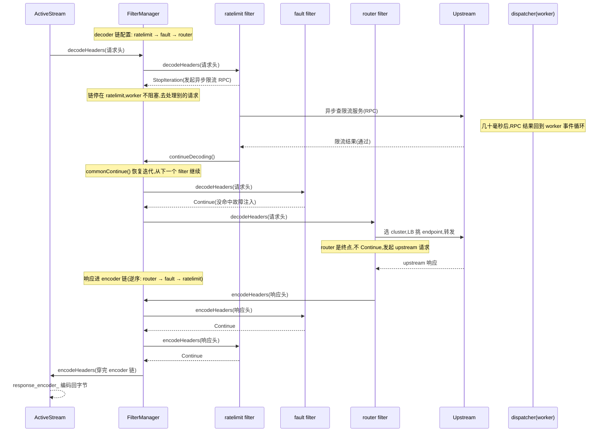

# 第 3 篇 · 第 10 章 · HTTP Filter chain

> **核心问题**:上一章 P3-09,codec 把 TCP 字节解码成了结构化的 HTTP 请求——一组 `RequestHeaderMap`、若干 `Buffer` body chunk、可选的 trailers。可一个"裸"的 HTTP 请求,Envoy 还什么都没干:它没鉴权、没限流、没故障注入、还没决定转发给谁。这些"加工"动作,在 Envoy 里**全部**不是写死在某个处理函数里的,而是由一串可插拔的 **http filter** 依次施加。问题就来了:一条请求怎么"穿过"这一串 filter?为什么是"链"而不是一个大函数?请求进来的方向(decoder)和响应出去的方向(encoder)为什么要分成两条、还要逆序?filter 凭什么能"暂停"整条链、等一个异步的限流查询结果回来再继续——而这一切还跑在单线程的 worker 事件循环上,没有任何 filter 被允许阻塞?这一章把 HTTP filter chain 这套**数据面招牌**拆到源码行号级。

> **读完本章你会明白**:
> 1. 为什么"处理一条 HTTP 请求"被做成一条**可插拔的 filter 链**,而不是写死在代码里的大函数——这是 Envoy 区别于"写死的代理"的根本,也是它能被 xDS 动态拼装(P5)的根。
> 2. **decoder 链和 encoder 链为什么是两条、还逆序**——洋葱模型的源码落地:`StreamDecoderFilters` 用正向 `iterator`、`StreamEncoderFilters` 用 `reverse_iterator`,一个类型差异就把"请求顺序、响应逆序"在编译期钉死。朴素地"请求和响应走同一条同向链"会撞什么墙。
> 3. **stop/continue 是怎样一种"协作式"链控制**——`FilterHeadersStatus` 不是"继续/停止"二态,而是 5 个值的精细状态机(`Continue`/`StopIteration`/`ContinueAndDontEndStream`/`StopAllIterationAndBuffer`/`StopAllIterationAndWatermark`);一个 filter 返回 `StopIteration` 就能 hold 住整条链,等异步结果回来再 `continueDecoding()` 恢复。这是 filter chain 天然支持异步 filter(限流、鉴权查外部服务)的根,朴素地"同步 for 循环遍历调用每个 filter"会把整个 worker 卡死。
> 4. **典型 filter 长什么样**:ratelimit(异步,StopIteration + continueDecoding)、buffer(同步攒数据,StopIteration)、fault(注入延迟/abort,StopIteration)、router(decoder 链的**终点**,它选 cluster 转发,通常不再 Continue)——四个 filter 把四种典型用法占全。
> 5. **filter 是怎么"挂"上链的**:filter 通过工厂注册(注册名是 legacy 短名 `envoy.rate_limit`/`envoy.router`/...),由 HCM 在建 stream 时按配置顺序实例化、塞进 `decoder_filters_`/`encoder_filters_` 两个 vector——挂哪些 filter 由 xDS/RDS 下发,细节第 5 篇。

> **如果一读觉得太难**:先只记住四件事——① 一条 HTTP 请求穿过一条 **decoder filter 链**(鉴权→限流→...→router),响应穿过 **encoder filter 链(逆序)**;② filter 靠返回 `Continue`/`StopIteration` 决定链是否往前走,这叫**协作式**链控制;③ 一个 filter 能 `StopIteration` 后去做异步操作(查限流服务),完了再 `continueDecoding()` 把链接上——所以链天然支持异步,不阻塞 worker;④ router 通常是 decoder 链**终点**,它选 cluster 转发。这四条抓住,本章就拿到了 80%。

---

## 〇、一句话点破

> **HTTP filter chain 是一条"协作式"的责任链:一条请求按配置顺序穿过 decoder 链(每个 filter 加工或拦截),响应按逆序穿过 encoder 链;每个 filter 用返回值(`Continue`/`StopIteration`/...)告诉链"放行"还是"暂停",暂停期间 filter 可以去做异步操作(查限流、查鉴权),完了再 `continueDecoding()` 把链接上——所以这条链既能承载同步 filter,也能天然容纳异步 filter,而这一切跑在单线程 worker 上、没有一个 filter 被允许阻塞。**

这是结论,不是理由。本章倒过来拆:先讲为什么把"处理请求"做成可插拔链而不是大函数(可插拔是数据面灵魂),再讲为什么请求和响应是两条逆序的链(洋葱模型),接着拆 stop/continue 这套协作式控制为什么是异步 filter 的命脉(招牌机制),然后串讲四个典型 filter 把四种用法占全,最后技巧精解把"两向逆序的 iterator 类型技巧"和"协作式异步链控制"两个最硬核的拆透。

---

## 一、从 P3-09 接过来:结构化的 HTTP 请求,接下来怎么被加工?

先把全旅程的位置摆清楚。P3-08 讲了 HCM 是个"披着 network filter 外衣的 HTTP 引擎",P3-09 讲了 codec 怎么把字节解码成结构化的 HTTP 请求/响应。这一章接力:结构化的请求**接下来怎么被加工**。

```
   字节进 HCM ──codec 解码──▶ 结构化 HTTP 请求(RequestHeaderMap + body + trailers)
                                       │
                                       ▼  这就是本章的起点
                                 ┌─────────────────────────────────┐
                                 │  HTTP Filter chain(decoder 向)  │
                                 │  鉴权 → 限流 → fault → ... → router │
                                 └─────────────────────────────────┘
                                       │  router 选 cluster,LB 挑 endpoint
                                       ▼
                                   Upstream(后端)
                                       │  响应回来
                                       ▼
                                 ┌─────────────────────────────────┐
                                 │  HTTP Filter chain(encoder 向)  │
                                 │  router → ... → fault → 限流 → 鉴权│  ← 逆序
                                 └─────────────────────────────────┘
                                       │
                                       ▼  response_encoder_ 编码回字节
                                   字节回客户端
```

P3-08 里我们看过,HCM 在 `ActiveStream::decodeHeaders` 里把请求头交给 `filter_manager_.decodeHeaders(...)`(见 [ActiveStream::decodeHeaders 调 filter_manager_](../envoy/source/common/http/conn_manager_impl.cc#L1354-L1608))。从那一刻起,请求就进入了 filter chain 的地盘。`FilterManager` 是 filter chain 的"驱动者"——它持有两条 filter 链(decoder 和 encoder),负责按规则遍历它们、根据 filter 的返回值决定继续还是暂停、在暂停后恢复迭代。本章就是要把 `FilterManager` 这个驱动者拆透。

> **钉死这件事**:从 P3-09 到本章的接力点是:`codec_->dispatch(data)` 解出结构化 HTTP → 回调 `ActiveStream::decodeHeaders` → `filter_manager_.decodeHeaders` 进 decoder 链。**codec 负责"把字节变成 HTTP",filter chain 负责"对这条 HTTP 做各种加工"**。两章职责严格切分。

---

## 二、为什么是"可插拔的链",而不是一个写死的大函数?

这是 filter chain 存在的**第一个**为什么。一个 HTTP 请求要经过鉴权、限流、故障注入(可选)、压缩(响应)、路由转发……这些动作。最朴素的写法是:

```cpp
// 朴素写法(伪代码,非 Envoy 源码)
void handleRequest(Request& req) {
  if (!authenticate(req)) return 401;        // 鉴权
  if (rateLimited(req)) return 429;          // 限流
  maybeInjectFault(req);                     // 故障注入
  Cluster* c = matchRoute(req);              // 路由
  forward(c, req);                           // 转发
}
```

听起来直接、性能也好(没有间接调用开销)。Nginx 早期(以及很多自研代理)大致就是这个路子——一个固定的处理流水线,模块在编译期钩进各个阶段。可这套在"动态、可编程、云原生"的 Envoy 目标场景下撞墙了。

### 提问:为什么不能写死成一个大函数?

### 不这样会怎样:写死的处理流水线撞三道墙

1. **改一个功能要改代码重新编译**。今天你想给所有请求加 JWT 鉴权,明天想对 10% 流量注入延迟做混沌测试,后天想接个外部授权服务(ext_authz)。如果鉴权/限流/fault 写死在 `handleRequest` 里,每加一个功能都得改代码、重新编译 Envoy、重新部署所有 sidecar。在几百个微服务、每个 Pod 一个 sidecar 的规模下,这是不可接受的。**功能必须能在不改代码的前提下增减**。

2. **顺序必须可配置**。同样是鉴权和限流,有的团队要"先鉴权再限流"(防止未授权流量消耗限流配额),有的要"先限流再鉴权"(防止大量鉴权请求打爆鉴权服务)。写死的流水线顺序是固定的,无法按需调整。Envoy 的做法是:filter 的**顺序由配置决定**,配置里 `http_filters:` 列表怎么排,filter chain 就怎么穿。

3. **第三方无法扩展**。如果处理逻辑写死,用户想加一个"把请求头里的 trace id 提取出来塞进 metadata"的自定义逻辑,得 fork Envoy 改源码。Envoy 的做法是:filter 是**插件**——内置 filter 是插件,第三方 filter(Wasm / dynamic_modules,P6-22)也是插件,统统通过同一个注册接口挂上链。

> **不这样会怎样**:一个具体场景——某团队用 Nginx 做网关,业务方提需求"给 /api/v2 路径的所有请求加一个外部授权检查(调一个内部的 auth 服务)"。在 Nginx,这要么找现成的模块(不一定有)、要么写 C 模块(重新编译 Nginx)、要么用 OpenResty/Lua(引入额外栈)。在 Envoy,这只需在 `http_filters:` 里加一行 `name: envoy.ext_authz` 并配好授权服务地址,**热更新生效,不重编译、不重启**(xDS 动态下发,P5)。**这就是"可插拔链"对"写死流水线"的根本优势**。

### 所以这样设计:filter 是可插拔插件,链由配置拼装

Envoy 的做法是把每种加工逻辑做成一个独立的 **filter**(一个实现了 `StreamDecoderFilter`/`StreamEncoderFilter` 接口的 C++ 类),然后由配置(xDS 下发的 `http_filters:` 列表)决定一条链上挂哪些 filter、按什么顺序挂。源码里,filter 通过工厂注册进 Envoy:

```cpp
// source/extensions/filters/http/fault/config.cc
LEGACY_REGISTER_FACTORY(FaultFilterFactory, Server::Configuration::NamedHttpFilterConfigFactory,
                        "envoy.fault");
```

见 [fault filter 注册名 envoy.fault](../envoy/source/extensions/filters/http/fault/config.cc#L46-L47)。`LEGACY_REGISTER_FACTORY` 这个宏把这个 filter 工厂注册到一个全局 registry 里,注册名是 `"envoy.fault"`。其他 filter 同理:

| filter | 注册名(legacy 短名) | 注册位置 |
|--------|---------------------|----------|
| fault(故障注入) | `envoy.fault` | [fault/config.cc#L46](../envoy/source/extensions/filters/http/fault/config.cc#L46-L47) |
| router(路由转发) | `envoy.router` | [router/config.cc#L34](../envoy/source/extensions/filters/http/router/config.cc#L34-L35) |
| rate_limit(限流) | `envoy.rate_limit` | [ratelimit/config.cc](../envoy/source/extensions/filters/http/ratelimit/config.cc) |
| buffer(请求缓冲) | `envoy.buffer` | [buffer/config.cc](../envoy/source/extensions/filters/http/buffer/config.cc) |
| cors(跨域) | `envoy.cors` | [cors/config.cc](../envoy/source/extensions/filters/http/cors/config.cc) |
| ext_authz(外部授权) | `envoy.ext_authz` | [ext_authz/config.cc](../envoy/source/extensions/filters/http/ext_authz/config.cc) |

> **⚠️ 源码事实校正**:很多文档和博客把 http filter 的注册名写成 `envoy.filters.http.ratelimit` 这种长名。**在当前 master(df2c77d,1.39.0-dev)的实际源码里,绝大多数 http filter 用的是 legacy 短名**(`envoy.fault`/`envoy.router`/`envoy.rate_limit`/`envoy.buffer`/...),见上面表格的 Grep 结果。Envoy 同时支持长名(`envoy.filters.http.X`)和 legacy 短名两种写法,配置里写哪个都认,但**源码里注册的绝大多数是短名**。这是历史遗留——Envoy 早期 filter 都用短名,后来命名空间规范化引入长名,但为兼容老配置,短名一直保留。读源码时看到 `envoy.fault` 不要意外,它就是 fault filter。

`source/extensions/filters/http/` 下有 **60 多个** filter 子目录(见目录列表:从 `a2a`、`adaptive_concurrency`、`admission_control` 到 `bandwidth_limit`、`cache`、`compressor`、`cors`、`csrf`、`ext_authz`、`ext_proc`、`fault`、`grpc_json_transcoder`、`health_check`、`ip_tagging`、`jwt_authn`、`lua`、`oauth2`、`rbac`、`router`、`tap`、`wasm`……)。这就是"可插拔插件"的规模证据——每个目录一个 filter,各自独立、各干一件事,通过工厂注册挂上。filter 数量随版本持续增长(`adaptive_concurrency`、`bandwidth_limit`、`bandwidth_share`、`api_key_auth`、`a2a` 等都是较新的 filter),但 **filter 的接口(`StreamDecoderFilter`/`StreamEncoderFilter`)本身极其稳定**——新 filter 只需实现这套老接口,无须改 filter chain 框架。

### filter 怎么挂上链:addStreamDecoderFilter

当一个新请求到来,HCM 的 `ActiveStream` 建好之后,会调用 `FilterManager::createFilterChain` 按 `http_filters:` 配置顺序实例化每个 filter,塞进链里。注册接口是 `Http::FilterChainFactoryCallbacks`:

```cpp
// source/common/http/filter_manager.h  (FilterChainFactoryCallbacksImpl 内嵌类)
void addStreamDecoderFilter(Http::StreamDecoderFilterSharedPtr filter) override {
  manager_.filters_.push_back(filter.get());
  manager_.decoder_filters_.entries_.emplace_back(std::make_unique<ActiveStreamDecoderFilter>(
      manager_, std::move(filter), filter_config_name_));
}

void addStreamEncoderFilter(Http::StreamEncoderFilterSharedPtr filter) override {
  manager_.filters_.push_back(filter.get());
  manager_.encoder_filters_.entries_.emplace_back(std::make_unique<ActiveStreamEncoderFilter>(
      manager_, std::move(filter), filter_config_name_));
}

void addStreamFilter(Http::StreamFilterSharedPtr filter) override {
  manager_.filters_.push_back(filter.get());
  manager_.decoder_filters_.entries_.emplace_back(
      std::make_unique<ActiveStreamDecoderFilter>(manager_, filter, filter_config_name_));
  manager_.encoder_filters_.entries_.emplace_back(std::make_unique<ActiveStreamEncoderFilter>(
      manager_, filter, filter_config_name_));
}
```

见 [addStreamDecoderFilter/addStreamEncoderFilter/addStreamFilter](../envoy/source/common/http/filter_manager.h#L1013-L1034)。注意三个关键点:

- **只关心 decoder 方向**的 filter(比如鉴权,只看请求)调 `addStreamDecoderFilter`,只进 `decoder_filters_`。
- **只关心 encoder 方向**的 filter(比如 compressor 压缩响应)调 `addStreamEncoderFilter`,只进 `encoder_filters_`。
- **两个方向都关心**的 filter(比如 stats,请求和响应都记)调 `addStreamFilter`,**同时**进 `decoder_filters_` 和 `encoder_filters_`——但底层是**同一个** filter 对象(`std::move` 之前先 `push_back` 到 `filters_`,decoder 和 encoder 各持一个 `ActiveStream*Filter` 包装,指向同一个底层 filter)。这就是"一个 filter 注册两个方向"的实现技巧。

每个 filter 被 `std::make_unique<ActiveStreamDecoderFilter>(...)` 包成一个 `ActiveStream*Filter` wrapper——这个 wrapper 持有 filter 的回调状态(iteration_state、end_stream_、processed_headers_ 等),是 filter chain 迭代的核心数据结构,下一节会反复见到它。

> **钉死这件事**:filter chain 的"可插拔"不是抽象口号,是源码里扎扎实实的:`addStreamDecoderFilter`/`addStreamEncoderFilter`/`addStreamFilter` 三个接口,让任何 filter(内置的、第三方的、Wasm 的)都用同一套方式挂上链。挂哪些、顺序如何,由 xDS 下发的 `http_filters:` 配置决定(P5 控制面)。**filter chain 是数据面灵魂,xDS 是控制面灵魂,两者在 `http_filters:` 配置上汇合**——这就是全书主线在本章的投影。

### 选型历史:可插拔责任链是现代中间件的共同选择

"把处理逻辑做成一串可插拔的 filter/interceptor/middleware"这套思路,不是 Envoy 发明的——它是现代中间件设计的共同范式:

- **Java Servlet Filter**:J2EE 时代就有 `javax.servlet.Filter` 链,请求和响应走同一条链(也是洋葱模型,`FilterChain.doFilter` 往里调,响应回来时逆序)。Tomcat、Spring 的 web stack 全基于此。
- **Spring Interceptor / Spring Cloud Gateway filter**:Spring 生态的拦截器、网关 filter 链,语义和 Servlet Filter 同源。
- **gRPC interceptor**:《gRPC》那本拆过,gRPC client/server 各有一串 interceptor,请求和响应分别走 unary/stream interceptor 链。
- **Dubbo Filter**:阿里 Dubbo RPC 的 filter 链,自定义 filter 实现监控、限流、 tracing。
- **Nginx module**:Nginx 的 HTTP 处理也是一条 filter 链(`ngx_http_top_header_filter`/`ngx_http_top_body_filter`),但 Nginx 的 filter 是**编译期**钩进链的——你 `./configure --add-module` 时哪些 module 进链就固定了,改要重编译。

Envoy 的 filter chain 继承了这套范式,但做了两个关键进化:**① 可插拔从编译期挪到配置期/运行期**(同一个二进制,换配置就是另一条链,还能 Wasm/dynamic_modules 运行时加载新 filter);**② 两向逆序用 iterator 类型在编译期固化**(下面第三节拆)。这两点让 Envoy 的 filter chain 既有 Java 那套生态的灵活,又有 C++ 的性能和类型安全。理解这个演进背景,就知道为什么 filter chain 是"现代代理/网关"的标配——它解决了"功能可组合 + 顺序可配置 + 第三方可扩展"这三个老问题,只是 Envoy 用 C++ + xDS 把它推到了"运行时可热更新"的新高度。

> **一个对照点**:为什么 Nginx 的 module 机制没演化成 Envoy 这种动态 filter chain?因为 Nginx 诞生于 2004 年,那时的部署模式是"固定配置、几个月改一次",编译期固定的 module 完全够用。Envoy 诞生于 2015-2016 年,直接面对"微服务每天频繁变更"的现实,可插拔必须挪到配置期/运行期。**技术选型是被时代需求逼出来的**——这不是"谁更先进"的问题,而是"为不同时代而生"。

---

## 三、为什么请求和响应是两条逆序的链?(洋葱模型)

这是 filter chain 的**第二个**为什么,也是最容易讲错的一个。先看源码事实。

### 源码事实:decoder 用正向 iterator,encoder 用 reverse_iterator

`FilterManager` 维护两条独立的 filter 链(`decoder_filters_` 和 `encoder_filters_`),它们的容器类型分别叫 `StreamDecoderFilters` 和 `StreamEncoderFilters`。这两个 struct 的定义极具巧思——**它们共享同一个底层 `std::vector`,但暴露的 iterator 类型不同**:

```cpp
// source/common/http/filter_manager.h
// HTTP decoder filters. If filters are configured in the following order (assume all three
// filters are both decoder/encoder filters):
//   http_filters:
//     - A
//     - B
//     - C
// The decoder filter chain will iterate through filters A, B, C.
struct StreamDecoderFilters {
  using Element = ActiveStreamDecoderFilter;
  using Iterator = std::vector<ActiveStreamDecoderFilterPtr>::iterator;  // ← 正向

  Iterator begin() { return entries_.begin(); }
  Iterator end() { return entries_.end(); }

  std::vector<ActiveStreamDecoderFilterPtr> entries_;
};

// HTTP encoder filters. If filters are configured in the following order (assume all three
// filters are both decoder/encoder filters):
//   http_filters:
//     - A
//     - B
//     - C
// Unlike the decoder, the encoder filter chain will iterate with the
// reverse order of the configured filters, i.e., C, B, A. This is why we use reverse_iterator
// here.
struct StreamEncoderFilters {
  using Element = ActiveStreamEncoderFilter;
  using Iterator = std::vector<ActiveStreamEncoderFilterPtr>::reverse_iterator;  // ← 反向

  Iterator begin() { return entries_.rbegin(); }
  Iterator end() { return entries_.rend(); }

  std::vector<ActiveStreamEncoderFilterPtr> entries_;
};
```

见 [StreamDecoderFilters 用正向 iterator](../envoy/source/common/http/filter_manager.h#L77-L85) 和 [StreamEncoderFilters 用 reverse_iterator](../envoy/source/common/http/filter_manager.h#L96-L104)。**源码注释本身就把语义讲得明明白白**——配置顺序 A、B、C,decoder 链遍历 A→B→C,encoder 链遍历 C→B→A。这是一个**用类型(`iterator` vs `reverse_iterator`)在编译期表达"方向"语义**的典型技巧:两条链共享同一个配置顺序的 `entries_`,但 decoder 用 `begin()`/`end()`(正向)、encoder 用 `rbegin()`/`rend()`(反向)。一个 iterator 类型差异,就把"请求顺序、响应逆序"精确表达出来了——没有额外的运行时判断方向的 `if`,没有运行时排序,完全靠 C++ 的 iterator 适配器在编译期决定。

P3-08 里我们见过这张图,这里精确化(标出 iterator 方向):

```
   配置顺序(http_filters:,同时进 decoder_filters_ 和 encoder_filters_):
       A(jwt_authn)  →  B(ratelimit)  →  C(fault)  →  D(router)

   decoder_filters_.entries_ =  [ A, B, C, D ]      iterator:  begin() → end()   (正向)
   encoder_filters_.entries_ =  [ A, B, C, D ]      iterator:  rbegin() → rend() (反向)

   请求(decoder 向,正向遍历):
       A → B → C → D → upstream

   响应(encoder 向,反向遍历):
       upstream → D → C → B → A → 客户端
```

### 提问:为什么响应要逆序?请求和响应走同一条同向链不行吗?

### 不这样会怎样:同一条同向链撞三道墙

朴素想法:filter 链就一条,请求从前往后穿,响应也从前往后穿,多简单。但仔细想会发现这套行不通:

1. **顺序对不齐**。鉴权 filter(A)在请求进来时应该**最先**检查(把没权限的请求挡在最外层,省得后续 filter 白干活)。可响应出去时,鉴权 filter 应该**最后**再处理一下(比如根据响应状态码记一条鉴权日志)。如果请求和响应都 A→B→C→D 同向,A 在请求路径上排第一、在响应路径上也排第一——那它响应处理就**不是最后**,而是最先,这和"最后再扫一眼"的语义对不上。**请求和响应对同一个 filter 的"相对位置"需求是相反的**——这是问题的根。

2. **职责无法分离**。有些 filter 只关心请求(鉴权 jwt_authn),有些只关心响应(压缩 compressor)。如果只有一条同向链,只关心响应的 `compressor` 也得出现在请求路径上"走一遍"(哪怕它的 `decodeHeaders` 直接 return Continue 啥也不干)——这既浪费(多一次虚函数调用),又混乱(配置里看到 `compressor` 在请求路径,容易误以为它改请求)。两向分离后,`compressor` 只调 `addStreamEncoderFilter`,只注册 encoder 钩子,**请求路径完全不经过它**。

3. **语义不对称**。请求是"从外到内"层层深入的(外层鉴权→中层限流→内层路由),响应是"从内到外"层层返回的(内层 router 收到 upstream 回包→中层 fault→外层鉴权)。这是天然的**洋葱模型**(onion model)——请求从洋葱外层穿到内层,响应从内层穿回外层,每一层 filter 在两个方向上各有一个位置。同向链破坏这个对称性。

> **不这样会怎样**:举个具体例子。你配了 `compressor`(压缩响应)和 `ratelimit`(限流请求),顺序是 `ratelimit → compressor`。如果请求和响应同向:请求走 `ratelimit → compressor`(compressor 的 decodeHeaders 啥也不干,白跑一趟),响应也走 `ratelimit → compressor`——可这意味着 ratelimit 在响应路径上**先于** compressor 看到 429 响应,而 compressor 后看到。但语义上,ratelimit 只关心请求、compressor 只关心响应,它们在响应路径上**不该有先后关系**(ratelimit 根本不该出现在响应路径)。两向分离 + 逆序后:请求 `ratelimit → compressor` 里 compressor 不参与(只注册了 encoder),响应 `compressor → ratelimit` 里 ratelimit 不参与(只注册了 decoder)——**每个 filter 只出现在它该出现的方向**。

### 所以这样设计:两向链,decoder 正向、encoder 逆序,语义对称

两向链的精妙在于:**它让"请求从外到内、响应从内到外"的洋葱模型自然落地**。配置顺序定义了"洋葱的层"(A 最外、D 最内),decoder 正向遍历就是"从外到内",encoder 逆向遍历就是"从内到外"。同一个 filter(A)在请求时是第一层(最外)、在响应时也是第一层(最外,因为逆序遍历 encoder 链时它在 `rend()` 那端,最后被访问)——**它的"洋葱层"位置在两个方向上一致**。这才是关键:filter 在请求和响应两个方向上的"相对深度"一致,只是遍历方向相反。

```
                   洋葱模型(两向链)
              ┌──────────────────────────────┐
              │  A(jwt_authn)   ← 最外层      │
              │  ┌────────────────────────┐  │
              │  │  B(ratelimit)          │  │
              │  │  ┌──────────────────┐  │  │
   请求 ────▶ │  │  │  C(fault)        │  │  │ ────▶ upstream
              │  │  │  ┌────────────┐  │  │  │
              │  │  │  │ D(router)  │  │  │  │
              │  │  │  └────────────┘  │  │  │
              │  │  └──────────────────┘  │  │
              │  └────────────────────────┘  │
              └──────────────────────────────┘
   响应 ◀────  A ◀ B ◀ C ◀ D ◀────────────────  ◀──── upstream
              (响应从内到外,逆序穿 encoder 链)
```

这套设计让每个 filter 可以**只注册自己关心的方向**:
- 鉴权(jwt_authn):只 decoder(`addStreamDecoderFilter`)——只看进来的请求。
- 压缩(compressor):只 encoder(`addStreamEncoderFilter`)——只看出去的响应。
- 故障注入(fault):通常只 decoder(注入请求延迟/abort);有的版本也看 encoder。
- stats / access_log:两向都注册(`addStreamFilter`)——请求和响应都要记。

> **钉死这件事**:两向链不是"多一条链"的复杂,而是"语义对称"的简洁——请求从外到内、响应从内到外,filter 在两个方向上的"洋葱层"位置一致。decoder 正向 iterator、encoder 逆向 iterator,一个类型差异就把方向在编译期钉死。**这是 Envoy 用 C++ 类型系统表达"方向语义"的典型技巧,后面技巧精解会再拆一层**。

---

## 四、stop/continue:filter 凭什么能"暂停"整条链?(招牌机制)

这是 filter chain 的**第三个**为什么,也是**最核心**的一个——它是 filter chain 能承载异步 filter(限流、鉴权查外部服务)的命脉。先把"为什么需要 stop/continue"讲透,再拆源码。

### 提问:为什么不能就是"for 循环依次调用每个 filter"?

朴素想法:filter chain 不就是个 for 循环吗?依次调 `filter.decodeHeaders()`,前一个处理完调下一个:

```cpp
// 朴素写法(伪代码,非 Envoy 源码)
for (auto& filter : decoder_filters_) {
  filter->decodeHeaders(headers);  // 每个 filter 处理完,自动进下一个
}
```

听起来简单,但一碰到**异步 filter**就崩了。

### 不这样会怎样:异步 filter 会卡死整个 worker

考虑限流 filter(ratelimit)。它的工作是:收到请求头 → 查一下外部的限流服务(rate limit service)→ 等结果回来 → 通过就放行、超额就回 429。这个"查限流服务"是**异步**的——发个 gRPC 请求,几十毫秒后才回来。如果用上面的 for 循环:

```cpp
for (auto& filter : decoder_filters_) {
  filter->decodeHeaders(headers);  // ratelimit filter 在这里"等"限流结果
}
```

`ratelimit->decodeHeaders` 要"等"几十毫秒的异步结果,那这个 for 循环就**阻塞在这里几十毫秒**。可 Envoy 的 worker 是**单线程事件循环**(P1-03)——一个 worker 同时处理几千个连接、几万个并发请求,**任何一个请求都不许阻塞 worker 线程**。一个请求阻塞 worker 50ms,这 50ms 里这个 worker 上其他几千个连接全部停滞——这在高 QPS 下是灾难。

> **背景**:Envoy 的 worker 是单线程 reactor 模型(P1-03 拆透的 libevent dispatcher)。一个 worker 线程跑一个事件循环,非阻塞地处理所有挂在这个 worker 上的连接。**阻塞 worker 线程 = 阻塞这个 worker 上所有流量**,这是 Envoy 性能模型的头号禁忌。任何"需要等"的操作(异步 RPC、定时器、等连接池)都必须用**回调 / 协程式**的异步方式,绝不能同步阻塞。这个原则承接《Tokio》那本的 async 思想,只是 Envoy 用的是 C++ + libevent 回调,不是 Rust async/await。

所以 filter chain **不能**是"同步 for 循环依次调用"。它必须是**协作式**的——每个 filter 有权告诉链"我要暂停一下去做异步操作,你先别往后跑,等我做完叫你"。这就是 stop/continue 的根本动机。

### 所以这样设计:协作式链控制,filter 用返回值决定链的推进

Envoy 的解法是:每个 filter 的回调(`decodeHeaders`/`decodeData`/...)返回一个**状态码**,这个状态码告诉 `FilterManager`"接下来链怎么走"。这是"协作式"控制——filter 不是被动地被调用,而是主动用返回值**控制链的推进**。

状态码定义在 `envoy/http/filter.h`。先看 headers 的状态码(`FilterHeadersStatus`):

```cpp
// envoy/http/filter.h
enum class FilterHeadersStatus {
  // Continue filter chain iteration.
  Continue,
  // Do not iterate for headers on any of the remaining filters in the chain.
  // (filter 要停下,等异步结果;之后调 continueDecoding() 恢复)
  StopIteration,
  // Continue headers iteration to remaining filters, but delay ending the stream.
  // (filter 想给 headers-only 请求补一个 body,但 body 还没准备好)
  ContinueAndDontEndStream,
  // Do not iterate for headers as well as data and trailers ... and buffer body data.
  // (停下 headers + 攒住后续 body data,比如 buffer filter)
  StopAllIterationAndBuffer,
  // Do not iterate for headers as well as data and trailers ... until continueDecoding().
  // (停下一切,触发反压水位,后续 data 流进来会被挡住)
  StopAllIterationAndWatermark,
};
```

见 [FilterHeadersStatus 枚举](../envoy/envoy/http/filter.h#L38-L110)。**注意它不是"Continue / StopIteration 二态",而是 5 个值的精细状态机**——很多资料只提 Continue/StopIteration,这是不准确的。这 5 个值的区别在于"停的范围"和"停了之后怎么处理后续 data":

| 状态 | headers 是否继续往后 | 后续 data 是否继续 | 后续 data 是否 buffer | 典型用法 |
|------|---------------------|-------------------|----------------------|---------|
| `Continue` | 是 | 是 | — | filter 加工完,放行 |
| `StopIteration` | 否(停在当前 filter) | 否(但已到的 data 不特殊处理) | 否 | 异步 filter 等结果(ratelimit) |
| `ContinueAndDontEndStream` | 是(但 end_stream 改 false) | — | — | filter 要给 headers-only 请求补 body |
| `StopAllIterationAndBuffer` | 否 | 否 | **是(攒进 buffer)** | buffer filter 攒完整请求 |
| `StopAllIterationAndWatermark` | 否 | 否 | 触发**反压水位**(挡住上游不再发) | 故障注入延迟、router 等连接池 |

data 的状态码(`FilterDataStatus`)是另一套 4 个值,语义类似但针对流式 body:

```cpp
// envoy/http/filter.h
enum class FilterDataStatus {
  Continue,                // 继续往后传 body
  StopIterationAndBuffer,  // 停,把 body 攒进 buffer(buffer filter)
  StopIterationAndWatermark, // 停,触发反压(fault 延迟、router 等连接)
  StopIterationNoBuffer,   // 停,但不攒(直接丢弃后续,用于某些场景)
};
```

见 [FilterDataStatus 枚举](../envoy/envoy/http/filter.h#L129-L165)。这两套状态码(headers 5 个、data 4 个)的精细程度,是 filter chain 能正确承载各种 filter(同步、异步、buffer、流式、反压)的根。**朴素地"Continue/Stop 二态"根本表达不出"停下但继续 buffer"和"停下并触发反压"的区别**,而这两种行为对 buffer filter 和 router filter 是必需的。

### 迭代主循环:decodeHeaders 怎么根据返回值决定继续还是停

现在看 `FilterManager` 怎么用这些状态码。以 decoder 链的 headers 迭代为例:

```cpp
// source/common/http/filter_manager.cc  (简化示意,非源码原文)
void FilterManager::decodeHeaders(ActiveStreamDecoderFilter* filter, RequestHeaderMap& headers,
                                  bool end_stream) {
  if (stopDecoderFilterChain()) {
    return;  // 流已 reset 或 local reply,不再处理
  }

  // Headers 总是从下一个 filter 开始(headers 不能从当前 filter 重入)
  StreamDecoderFilters::Iterator entry =
      commonDecodePrefix(filter, FilterIterationStartState::AlwaysStartFromNext);

  for (; entry != decoder_filters_.end(); entry++) {  // ← 正向遍历 A → B → C → D
    // ...
    FilterHeadersStatus status = (*entry)->decodeHeaders(headers, (*entry)->end_stream_);
    // ... 处理 local reply 等边界 ...

    const auto continue_iteration =
        (*entry)->commonHandleAfterHeadersCallback(status, end_stream);  // ← 状态码 → 是否继续

    // ...
    if (!continue_iteration && std::next(entry) != decoder_filters_.end()) {
      // 当前 filter 让链停了,且后面还有 filter → 直接 return,不再往后遍历
      return;
    }
    // continue_iteration == true → for 循环 entry++ 进下一个 filter
  }
  // 遍历完所有 filter
}
```

见 [FilterManager::decodeHeaders 迭代主循环](../envoy/source/common/http/filter_manager.cc#L592-L696)。关键在两步:

1. **L615**:`(*entry)->decodeHeaders(headers, end_stream_)` 调用当前 filter 的 `decodeHeaders`,拿回一个 `FilterHeadersStatus`。
2. **L637**:`commonHandleAfterHeadersCallback(status, end_stream)` 把状态码翻译成"是否继续迭代"的 bool。

`commonHandleAfterHeadersCallback` 是状态机的核心,看它怎么把 5 个 status 映射成内部 `IterationState`:

```cpp
// source/common/http/filter_manager.cc
bool ActiveStreamFilterBase::commonHandleAfterHeadersCallback(FilterHeadersStatus status,
                                                              bool& end_stream) {
  ASSERT(!headers_continued_);
  ASSERT(canIterate());

  switch (status) {
  case FilterHeadersStatus::StopIteration:
    iteration_state_ = IterationState::StopSingleIteration;
    break;
  case FilterHeadersStatus::StopAllIterationAndBuffer:
    iteration_state_ = IterationState::StopAllBuffer;
    break;
  case FilterHeadersStatus::StopAllIterationAndWatermark:
    iteration_state_ = IterationState::StopAllWatermark;
    break;
  case FilterHeadersStatus::ContinueAndDontEndStream:
    end_stream = false;
    headers_continued_ = true;
    break;
  case FilterHeadersStatus::Continue:
    headers_continued_ = true;
    break;
  }

  handleMetadataAfterHeadersCallback();

  if (stoppedAll() || status == FilterHeadersStatus::StopIteration) {
    return false;  // ← 停了,告诉上层不要继续迭代
  } else {
    return true;   // ← 继续,for 循环 entry++ 进下一个 filter
  }
}
```

见 [commonHandleAfterHeadersCallback 状态映射](../envoy/source/common/http/filter_manager.cc#L165-L197)。这套映射把 5 个外部 status 翻译成 4 个内部 `IterationState`(`Continue`/`StopSingleIteration`/`StopAllBuffer`/`StopAllWatermark`,见 [IterationState 定义](../envoy/source/common/http/filter_manager.h#L218-L225)),然后:
- `StopIteration`/`StopAll*` 返回 `false` → 主循环 `return`,链停在当前 filter。
- `Continue`/`ContinueAndDontEndStream` 返回 `true` → 主循环 `entry++`,进下一个 filter。

**这就是协作式链控制的全部精髓**:filter 用返回值"投票",`FilterManager` 根据投票决定是否推进。一个 filter 返回 `StopIteration`,整条链就停在它这里——后面所有 filter 暂时都不跑,直到这个 filter 主动调 `continueDecoding()` 把链接上。

### 暂停后怎么恢复:continueDecoding 与 commonContinue

filter 返回 `StopIteration` 后,链停了。filter 去做异步操作(查限流服务),结果回来后,filter 调 `callbacks_->continueDecoding()` 恢复链。`continueDecoding` 内部最终走到 `ActiveStreamFilterBase::commonContinue`:

```cpp
// source/common/http/filter_manager.cc  (简化示意,非源码原文)
void ActiveStreamFilterBase::commonContinue() {
  if (!canContinue()) {
    return;
  }

  // 如果之前是 StopAll 恢复,要从当前 filter 重跑(因为当前 filter 还没处理过 data/trailers)
  if (stoppedAll()) {
    iterate_from_current_filter_ = true;
  }
  allowIteration();  // 把 iteration_state_ 重置为 Continue

  // 恢复时,按顺序重放当前 filter 还没处理过的帧:
  if (has1xxHeaders()) {
    do1xxHeaders();  // 1xx 信息头
  }
  if (!headers_continued_) {
    headers_continued_ = true;
    doHeaders(...);  // headers
  }
  doMetadata();  // metadata
  if (bufferedData()) {
    doData(...);  // 攒住的 data
  }
  if (had_trailers_before_data) {
    doTrailers();  // trailers
  }

  iterate_from_current_filter_ = false;
}
```

见 [commonContinue 恢复迭代](../envoy/source/common/http/filter_manager.cc#L61-L146)。注意三个细节:

1. **`stoppedAll()` 恢复时要 `iterate_from_current_filter_ = true`**——因为 `StopAll` 停下时,当前 filter 的 `decodeHeaders` 已经返回了,但它的 `decodeData`/`decodeTrailers` 还没被调用(data/trailers 是 StopAll 期间到达的)。所以恢复时,迭代要从**当前 filter** 重入(让它处理 data/trailers),而不是从下一个 filter。这个标志位会被 `commonDecodePrefix` 读到:

```cpp
// source/common/http/filter_manager.cc
StreamDecoderFilters::Iterator
FilterManager::commonDecodePrefix(ActiveStreamDecoderFilter* filter,
                                  FilterIterationStartState filter_iteration_start_state) {
  if (!filter) {
    return decoder_filters_.begin();  // 链的起点
  }
  if (filter_iteration_start_state == FilterIterationStartState::CanStartFromCurrent &&
      (*(filter->entry()))->iterate_from_current_filter_) {
    // StopAll 恢复:从当前 filter 重入(它还没处理 data/trailers)
    return filter->entry();
  }
  return std::next(filter->entry());  // 正常情况:从下一个 filter 开始
}
```

见 [commonDecodePrefix 决定从哪个 filter 开始](../envoy/source/common/http/filter_manager.cc#L1000-L1012)。注意 headers 迭代用 `AlwaysStartFromNext`(headers 不能从当前 filter 重入,因为当前 filter 的 decodeHeaders 已经跑过),data 迭代用 `CanStartFromCurrent`(data 可以从当前 filter 重入,这就是 StopAll 恢复的关键)。

2. **恢复时按 1xx → headers → metadata → data → trailers 的顺序重放**——HTTP 消息的帧有严格顺序,恢复必须按序补齐当前 filter 错过的帧。

3. **`canContinue()` 多次检查**——因为每个 `doXxx()`(doHeaders/doData/...)都可能让链再次停下游某个 filter(那个 filter 也返回 StopIteration),所以每步之后都要检查 `canContinue()`,停了就 return,等那个 filter 的 continueDecoding 再恢复。这是**链式恢复**——恢复过程本身也可能触发新的暂停。

> **钉死这件事**:stop/continue 是 filter chain 的招牌机制——它让 filter chain **既能跑同步 filter(返回 Continue 立即放行),又能天然容纳异步 filter(返回 StopIteration 去做异步操作,完了 continueDecoding 恢复)**,而这一切跑在单线程 worker 上、没有任何 filter 阻塞 worker 线程。这是 filter chain 区别于"同步 for 循环"的根本,也是 Envoy 能在单线程 reactor 上承载需要异步查外部服务的 filter(限流、鉴权、ext_authz)的命脉。朴素地"同步 for 循环遍历 filter"会把整个 worker 卡死——这是反面对比的核心。

### 与 Tokio async/await 的精神对照(承接《Tokio》)

如果你读过《Tokio》那本,会发现 Envoy 的 stop/continue 和 Tokio 的 async/await 在**精神上同源**——都是"等待的时候让出执行权,不占着线程"。但两者在**表达方式**上有显著差异,这个差异折射了 C++(Envoy)和 Rust(Tokio)的语言演化背景:

| 维度 | Envoy stop/continue(C++ + libevent) | Tokio async/await(Rust) |
|------|--------------------------------------|--------------------------|
| 让出执行权的方式 | filter 显式 `return StopIteration`,框架 `return` 退出迭代 | 函数显式 `.await`,编译器生成状态机挂起 |
| 恢复的方式 | filter 显式调 `callbacks_->continueDecoding()` | future 被 waker 唤醒,poll 恢复 |
| 状态存在哪 | 堆上的 `ActiveStream*Filter` 对象(iteration_state_ 等字段) | 编译器生成的 `Future` 状态机(栈/堆混合) |
| 对 filter 作者的负担 | 显式管理状态码 + 显式调恢复 + 显式处理重入 | `.await` 一行,编译器透明处理挂起/恢复 |
| 出错的可能性 | 容易忘调 continueDecoding(链永久卡死)、状态码用错 | 编译器保证,不易错 |

这张表的关键洞察:**Envoy 的显式回调模型更显式、更繁琐、也更容易出错**(忘调 continueDecoding 是真实 bug),但它在 C++ 没 async/await 的年代(Envoy 2015 起步,C++20 coroutine 才标准化,Envoy 至今没全面用 coroutine)是务实选择。Tokio 的 async/await 让"暂停-恢复"对业务代码几乎透明(编译器生成状态机),但要求语言层面支持(Rust 的 async/await 是语言特性)。**两者解决同一个问题(单线程上的异步并发),只是抽象层次不同**——Envoy 是手写的状态机(状态在对象的字段里),Tokio 是编译器生成的状态机(状态在 Future 里)。

> **承接指路**:epoll/事件循环的机制本身,承接《Tokio》P3 那几章和《Linux 内核》的 IO 章节——本书不重讲 epoll 怎么工作,只讲 Envoy 怎么在 epoll 之上封装出 dispatcher、怎么在 dispatcher 之上跑 filter chain 的协作式控制。Envoy 的 dispatcher(P1-03)就是 libevent/epoll 的封装,filter chain 的 stop/continue 是在 dispatcher 之上的应用层"协程"——只不过这个协程是手写的(返回值 + 对象状态),不是语言级的。

### 反压:StopAllIterationAndWatermark 与流控

`FilterHeadersStatus` 里的 `StopAllIterationAndWatermark` 和 `FilterDataStatus` 里的 `StopIterationAndWatermark` 是专门为**反压**(backpressure)设计的——这是 filter chain 流控的精细之处。

考虑 router filter:它要把请求转发给 upstream,但 upstream 连接池可能暂时没有可用连接(连接都在用、或正在建)。这时 router 不能立即转发,但也不能无脑 buffer 请求 body(可能 OOM)。正确的做法是:**让 downstream 别再发 body 了**——告诉 client"我先处理不过来,你慢点发"。这就是反压。router 返回 `StopIterationAndWatermark`,filter chain 触发下游连接(对 client 的 TCP 连接)的读停止(socket 层面不再 read,内核 buffer 满了 TCP 收发窗口收缩,client 自然慢发)。等 upstream 连接就绪,router 再 `continueDecoding` 恢复,同时恢复下游读。

这套反压机制和 buffer filter 的 `StopAllIterationAndBuffer`(无脑攒进应用层 buffer)形成对比:**Watermark 是"挡住上游不再发",Buffer 是"自己攒着"**。前者靠 socket/连接层的流控(TCP 滑动窗口,承接《Linux 内核》网络栈章节),零内存开销;后者靠应用层 buffer,简单但吃内存。router 用前者(它面对大流量,不能 OOM),buffer filter 用后者(它要的就是完整请求,本来就要存)。**精细的状态码让 filter 选对反压策略**,这是朴素"Continue/Stop 二态"做不到的。

---

## 五、四个典型 filter:把四种用法占全

讲清了机制,看几个真实 filter 怎么用它。挑四个典型,正好覆盖四种典型用法:**异步**、**同步 buffer**、**延迟注入**、**终点转发**。

### ① ratelimit:异步 filter 的招牌(StopIteration + continueDecoding)

ratelimit filter 收到请求头,发一个异步 gRPC 给限流服务,等结果。这是异步 filter 的教科书实现:

```cpp
// source/extensions/filters/http/ratelimit/ratelimit.cc
Http::FilterHeadersStatus Filter::decodeHeaders(Http::RequestHeaderMap& headers, bool) {
  request_headers_ = &headers;
  if (!config_->enabled()) {
    return Http::FilterHeadersStatus::Continue;  // 没启用,直接放行
  }

  initiateCall(headers);  // ← 发起异步限流查询
  return (state_ == State::Calling || state_ == State::Responded)
             ? Http::FilterHeadersStatus::StopIteration  // ← 还在等结果,暂停链
             : Http::FilterHeadersStatus::Continue;       // 同步就出结果了(比如没有 descriptor),放行
}
```

见 [ratelimit decodeHeaders](../envoy/source/extensions/filters/http/ratelimit/ratelimit.cc#L137-L147)。`initiateCall` 发起异步 RPC:

```cpp
// source/extensions/filters/http/ratelimit/ratelimit.cc
void Filter::initiateCall(const Http::RequestHeaderMap& headers) {
  // ...
  descriptors_.clear();
  populateRateLimitDescriptors(descriptors_, headers, false);
  if (!descriptors_.empty()) {
    state_ = State::Calling;
    initiating_call_ = true;
    client_->limit(*this, getDomain(), descriptors_, callbacks_->activeSpan(),
                   callbacks_->streamInfo(), getHitAddend());  // ← 异步 RPC,this 作为回调
    initiating_call_ = false;
  }
}
```

见 [initiateCall 发起异步 RPC](../envoy/source/extensions/filters/http/ratelimit/ratelimit.cc#L52-L67)。`client_->limit(*this, ...)` 把 `this`(filter 自己,实现了 RateLimitService 回调接口)作为回调宿主传进去,RPC 结果回来时回调 filter 的 `completeCall`:

```cpp
// source/extensions/filters/http/ratelimit/ratelimit.cc  (简化示意,非源码原文)
// 在 completeCall 里(限流服务结果回来):
if (/* 限流通过 */) {
  appendRequestHeaders(req_headers_to_add);
  callbacks_->continueDecoding();  // ← 恢复 filter chain!
} else {
  // 限流超额,发 429
  callbacks_->sendLocalReply(config_->statusOnError(), ...);
}
```

见 [completeCall 里 continueDecoding 恢复链](../envoy/source/extensions/filters/http/ratelimit/ratelimit.cc#L290-L301)。这就是异步 filter 的完整闭环:
1. `decodeHeaders` 返回 `StopIteration` → 链停在 ratelimit。
2. worker 线程**不阻塞**,继续跑事件循环处理其他请求。
3. 限流服务结果回来(几十毫秒后),libevent dispatcher 回调 ratelimit 的 `completeCall`。
4. `completeCall` 调 `continueDecoding()` → `commonContinue()` → 链从下一个 filter 继续跑。

**整个过程中,worker 线程一毫秒都没阻塞**。这就是协作式链控制对异步 filter 的支撑——filter chain 天然是异步友好的。

### ② buffer:同步攒数据的招牌(StopAllIterationAndBuffer)

buffer filter 要把整个请求 body 攒齐了再往后传(有些后端要求完整请求)。它用 `StopIteration`(headers 阶段)和后续的 buffer 语义:

```cpp
// source/extensions/filters/http/buffer/buffer_filter.cc
Http::FilterHeadersStatus BufferFilter::decodeHeaders(Http::RequestHeaderMap& headers,
                                                      bool end_stream) {
  if (end_stream) {
    // header-only 请求,没 body 要攒,直接放行
    return Http::FilterHeadersStatus::Continue;
  }
  initConfig();
  if (settings_->disabled()) {
    return Http::FilterHeadersStatus::Continue;
  }
  callbacks_->setBufferLimit(settings_->maxRequestBytes());
  request_headers_ = &headers;
  return Http::FilterHeadersStatus::StopIteration;  // ← 停下,等 body 攒齐
}
```

见 [buffer decodeHeaders 返回 StopIteration](../envoy/source/extensions/filters/http/buffer/buffer_filter.cc#L50-L67)。它返回 `StopIteration` 让 headers 暂停,然后后续 `decodeData` 调用时把 body chunk 攒进内部 buffer,等 `end_stream` 到了(整个 body 收齐)再把攒齐的 body 一次性往后传。如果 body 超过 `maxRequestBytes`,直接回 413。这是"同步攒数据"的典型——和 ratelimit 的"异步等结果"不同,buffer 是"同步等数据到齐"。

### ③ fault:故障注入的招牌(延迟/abort)

fault filter 按配置概率注入故障:给请求加个延迟(测试超时韧性)、或直接 abort(返回错误码测重试)。延迟注入会让 filter 暂停:

```cpp
// source/extensions/filters/http/fault/fault_filter.cc  (简化示意,非源码原文)
Http::FilterHeadersStatus FaultFilter::decodeHeaders(Http::RequestHeaderMap& headers, bool) {
  // ... 解析 per-route 配置、匹配 upstream cluster、匹配 downstream nodes ...
  if (!matchesTargetUpstreamCluster()) {
    return Http::FilterHeadersStatus::Continue;  // 不匹配,放行
  }
  // ...
  if (/* 配置了延迟且这次命中 */) {
    // 起一个定时器,延迟时间到了再 continueDecoding
    return Http::FilterHeadersStatus::StopIteration;  // ← 停下,等定时器
  }
  if (maybeDoAbort(headers)) {
    return Http::FilterHeadersStatus::StopIteration;  // ← abort,直接发错误响应
  }
  return Http::FilterHeadersStatus::Continue;
}
```

见 [fault decodeHeaders 的 StopIteration 分支](../envoy/source/extensions/filters/http/fault/fault_filter.cc#L111-L164)。fault 的延迟注入和 ratelimit 异步查服务**机制上是一样的**——都是 StopIteration 暂停链、都是 worker 不阻塞、都是定时器/异步回调回来后 continueDecoding 恢复。区别只是"等什么":ratelimit 等外部 RPC,fault 等 dispatcher 定时器(P1-03 讲过 dispatcher 的定时器)。这印证了 stop/continue 的通用性——不管 filter 等的是什么(异步 RPC、定时器、连接池、body 攒齐),都用同一套机制。

### ④ router:decoder 链的终点

router filter 是 decoder 链的**终点**——它按 route_config(P3-11)选 cluster、LB 挑 endpoint、通过连接池把请求转发出去。它通常**不返回 Continue**(不往后传,因为后面也没有别的 filter 了),而是发起 upstream 请求:

```cpp
// source/common/router/router.cc
Http::FilterHeadersStatus Filter::decodeHeaders(Http::RequestHeaderMap& headers, bool end_stream) {
  downstream_headers_ = &headers;
  // ... 初始化 modify_headers_ lambda、判断 grpc、配置 retry 等 ...
  // ... 后续:匹配 route,选 cluster,通过连接池发起 upstream 请求 ...
}
```

见 [router decodeHeaders](../envoy/source/common/router/router.cc#L477-L502)。router 的特殊性在于它是**链的终点**——`isTerminalDecoderFilter` 会把它标记为终点(见 [isTerminalDecoderFilter 声明](../envoy/source/common/http/filter_manager.h#L1135))。终点的语义是:它不调 Continue 往后传(没东西可传了),而是开始"反向"——它发起 upstream 请求,等响应回来后,响应进 encoder 链(逆序)。

> **一个容易混淆的点**:router filter 的源码不在 `source/extensions/filters/http/router/`(那里只有 config.cc,负责工厂注册),而在 **`source/common/router/router.cc`**。`source/extensions/filters/http/router/config.cc` 只是工厂,实例化的是 `Router::Filter`(在 common/router)。这种"工厂在 extensions、实现在 common"的拆分在 Envoy 里常见——工厂负责"怎么从配置造 filter",实现在 common 里是因为 router 的核心逻辑(upstream 请求、重试、超时)和 cluster/连接池深度耦合,放 common 更合理。**读源码时找 router filter 的 decodeHeaders,要去 `source/common/router/router.cc`,不是 extensions 目录**。

### 四个 filter 把四种用法占全

```
   decoder 链(配置顺序):
   ┌──────────────────────────────────────────────────────────────┐
   │  ratelimit(异步) → buffer(同步攒) → fault(延迟) → router(终点)│
   └──────────────────────────────────────────────────────────────┘
        │                  │                │              │
        │ StopIteration    │ StopIteration  │ StopIteration│ 不 Continue
        │ 等限流 RPC        │ 等 body 齐      │ 等定时器      │ 发起 upstream
        │ → continueDecoding│ → data 攒齐放行 │ → 定时器回调  │ → 响应进 encoder 链
        ▼                  ▼                ▼              ▼
   ┌─────────┐        ┌─────────┐      ┌─────────┐    ┌──────────┐
   │ 异步 RPC │        │ 同步攒数据│     │ 定时器延迟│   │ 转发+响应 │
   └─────────┘        └─────────┘      └─────────┘    └──────────┘
   四种典型用法全占
```

> **钉死这件事**:四个 filter 把 filter chain 的四种典型用法占全——异步等 RPC(ratelimit)、同步攒数据(buffer)、定时器延迟(fault)、终点转发(router)。**它们用的都是同一套 stop/continue 机制**(StopIteration 暂停 + continueDecoding 恢复),只是"等什么"不同。这套机制的通用性,就是 filter chain 能承载形形色色 filter 的根。

---

## 六、filter 接口:StreamDecoderFilter / StreamEncoderFilter / StreamFilter

把 filter 的接口定义看清,有助于理解 filter 怎么写。filter 接口在 `envoy/http/filter.h`:

```cpp
// envoy/http/filter.h  (简化示意,非源码原文)
class StreamFilterBase {
public:
  virtual void onStreamComplete() {}   // 流结束前回调(记日志用)
  virtual void onDestroy() {}          // filter 销毁前回调
  // ...
};

class StreamDecoderFilter : public virtual StreamFilterBase {
public:
  virtual FilterHeadersStatus decodeHeaders(RequestHeaderMap& headers, bool end_stream) PURE;
  virtual FilterDataStatus decodeData(Buffer::Instance& data, bool end_stream) PURE;
  virtual FilterTrailersStatus decodeTrailers(RequestTrailerMap& trailers) PURE;
  virtual FilterMetadataStatus decodeMetadata(MetadataMap& metadata_map) PURE;
  virtual void setDecoderFilterCallbacks(StreamDecoderFilterCallbacks& callbacks) PURE;
  // ...
};

class StreamEncoderFilter : public virtual StreamFilterBase {
public:
  virtual Filter1xxHeadersStatus encode1xxHeaders(ResponseHeaderMap& headers) PURE;
  virtual FilterHeadersStatus encodeHeaders(ResponseHeaderMap& headers, bool end_stream) PURE;
  virtual FilterDataStatus encodeData(Buffer::Instance& data, bool end_stream) PURE;
  virtual FilterTrailersStatus encodeTrailers(ResponseTrailerMap& trailers) PURE;
  // ...
};

// StreamFilter = decoder + encoder 都实现(两向 filter)
class StreamFilter : public virtual StreamDecoderFilter, public virtual StreamEncoderFilter {};
```

见 [StreamDecoderFilter 接口](../envoy/envoy/http/filter.h#L985-L1043)、[StreamEncoderFilter 接口](../envoy/envoy/http/filter.h#L1189-L1258)、[StreamFilter = decoder + encoder](../envoy/envoy/http/filter.h#L1259-L1261)。注意几个设计点:

- **decoder 和 encoder 是两套独立接口**(`StreamDecoderFilter` / `StreamEncoderFilter`),各自有 `decode*` / `encode*` 回调。这呼应第三节"两向分离"——只关心 decoder 的 filter 只实现 `StreamDecoderFilter`,只关心 encoder 的只实现 `StreamEncoderFilter`。
- **`StreamFilter` 多继承 decoder + encoder**——一个 filter 想两个方向都干预,就继承 `StreamFilter`(它就是 decoder + encoder 的组合)。这就是第四节里 `addStreamFilter` 把同一个 filter 同时塞进两条链的接口依据。
- **每种帧类型一个回调**:headers、data、trailers、metadata 各有专门的 `decode*`/`encode*`。这是因为 HTTP 消息是**流式**的(P3-09 讲过),header 先到、body chunk 分多次到、trailer 最后到——filter 要能在每种帧到达时分别干预。比如鉴权 filter 只需实现 `decodeHeaders`(只看 header 就够),其他三个 `decode*` 可以不实现(默认放行)。
- **回调对象 `StreamDecoderFilterCallbacks` / `StreamEncoderFilterCallbacks`**——filter 通过它和框架交互:`continueDecoding()`(恢复链)、`sendLocalReply()`(直接发响应)、`addDecodedData()`(往解码流里插数据)、`streamInfo()`(访问 stream 信息)、`route()`(访问匹配的路由)等。这是 filter 的"工具箱"。

> **钉死这件事**:filter 接口的分两向(decoder/encoder)+ 每向多帧(headers/data/trailers/metadata)+ callbacks 工具箱,是 filter 能精细干预 HTTP 处理各个阶段的基础。一个新 filter 只需实现自己关心的几个回调(大多数 filter 只实现 `decodeHeaders` 就够),其他留默认——这套接口让"写一个 filter"门槛极低,这也是 filter 数量能增长到 60+ 的根。

### filter 的生命周期:onDestroy、onStreamComplete、decodeComplete

除了 `decode*`/`encode*` 这些"处理帧"的回调,filter 还有几个**生命周期**回调,搞清楚它们的触发时机对写正确的 filter 很关键:

- **`decodeComplete()` / `encodeComplete()`**:当这条请求(decoder)/响应(encoder)的所有帧都处理完、end_stream 到达时触发。filter 在这里做"收尾"——比如统计这条请求的总耗时、把攒的 trace span 收掉。注意它和 `decodeData(end_stream=true)` 的区别:`decodeComplete` 是**所有帧处理完**才触发(包括 trailers、metadata),而 `decodeData(_, true)` 只是"data 帧的最后一个"。一个 headers-only 请求,`decodeData` 根本不会被调用,但 `decodeComplete` 会(在 `decodeHeaders(_, end_stream=true)` 之后)。见 [decodeHeaders 主循环里调 decodeComplete](../envoy/source/common/http/filter_manager.cc#L643-L646)——`if ((*entry)->end_stream_) { (*entry)->handle_->decodeComplete(); }`。

- **`onStreamComplete()`**:整条流结束(无论正常结束还是 reset)前触发,filter 在这里做"流级清理"——比如 access log filter 在这里把这条请求的统计写到日志。见 [FilterManager::onStreamComplete 遍历所有 filter](../envoy/source/common/http/filter_manager.h#L746-L750),它遍历 `filters_`(所有 filter,不分 decoder/encoder)各调一次 `onStreamComplete`。

- **`onDestroy()`**:filter 即将销毁前触发。这是 filter 释放资源的最后机会——关掉异步 RPC 的回调、释放外部资源。见 [FilterManager::destroyFilters 遍历调 onDestroy](../envoy/source/common/http/filter_manager.h#L752-L758)。注意 `onDestroy` 可能在正常结束后触发,也可能在 stream 被 reset(客户端断连、超时)时触发——filter 必须能处理"中途被打断"的情况,不能假设流一定正常结束。

- **`onStreamComplete` vs `onDestroy` 的区别**:`onStreamComplete` 是"流逻辑上结束"(所有处理完了,准备写 access log),`onDestroy` 是"filter 对象物理销毁"(释放内存)。两者之间可能还有 access log 写入等收尾动作。filter 在 `onStreamComplete` 里还能访问 stream info(用于 log),在 `onDestroy` 里 stream 状态可能已部分释放,只能做纯资源释放。

这套生命周期的存在,是因为 filter chain 是**有状态的、跨多个异步事件**的——一个 filter 从被创建(建 stream 时)、到处理若干帧(分散在不同 dispatcher 回调里)、到流结束、到销毁,可能跨越几毫秒到几秒(gRPC 长流甚至几分钟)。filter 要在这整段时间里正确管理自己的状态(异步 RPC 的回调句柄、攒的 buffer、定时器),生命周期回调就是框架给 filter 的"各阶段钩子"。

> **一个写 filter 的常见坑**:filter 发起异步操作(比如 ratelimit 的 RPC),在回调里访问 filter 自己的成员。但 filter 可能在 RPC 还没回来时就被销毁了(stream 被 reset)。这时 RPC 回调如果还持有 filter 的 `this` 指针,访问就是 use-after-free。Envoy 的解法是:异步操作持有 filter 的 `weak_ptr` 或通过 `callbacks_`(StreamDecoderFilterCallbacks,生命周期比 filter 长)中转,回调进来先检查 filter 是否还活着。这是 C++ 异步编程的经典痛点,也是为什么"写一个正确的异步 filter"并不简单——`StopIteration + continueDecoding` 的机制很简单,但围绕它的生命周期管理是真功夫。

### filter 的异常路径:local reply 与链中止

前面讲的都是"正常路径"——filter 返回 Continue 或 StopIteration,链正常推进或暂停。但还有**异常路径**:filter 发现请求不合法(鉴权失败、限流超额、请求超大),要**直接发一个响应回去**(401/429/413),不让流量继续往后走。这叫 **local reply**。

filter 通过 `callbacks_->sendLocalReply(code, body, ...)` 发 local reply。这个调用会让 filter chain **中止**——后续 filter 不再跑。源码里靠 `state_.decoder_filter_chain_aborted_` 标志:

```cpp
// source/common/http/filter_manager.cc  (简化示意,非源码原文)
// 在 decodeHeaders 主循环里:
if (state_.decoder_filter_chain_aborted_) {
  executeLocalReplyIfPrepared();
  status = FilterHeadersStatus::StopIteration;  // ← 链中止,强制 StopIteration
}
```

见 [decodeHeaders 检测 decoder_filter_chain_aborted](../envoy/source/common/http/filter_manager.cc#L620-L626)。`sendLocalReply` 内部会置 `decoder_filter_chain_aborted_ = true`,然后主循环检测到这个标志就把 status 强制改成 `StopIteration`,链停。同时,local reply 构造的响应会**进 encoder 链**(响应路径),让 encoder filter(compressor 等)也能处理这个错误响应——这是"即使是错误响应,也要经过响应处理"的语义。

这里有个微妙之处:local reply 走 encoder 链时,是从**哪个 filter** 开始的?答案是从头开始(encoder 链的 `rbegin()`),因为 local reply 是"全新的响应",没经过任何 encoder filter。所以 encoder 链的所有 filter 都会处理这个错误响应——比如 compressor 会压缩 401 响应体、stats 会记 401 的 counter。这保证了错误响应和正常响应的**处理一致性**(都过完整的 encoder 链)。

> **钉死这件事**:filter 的异常路径(local reply)和正常路径(Continue/StopIteration)共享同一套机制——local reply 本质就是"filter 强制 StopIteration + 自己构造响应进 encoder 链"。`decoder_filter_chain_aborted_` 标志确保 decoder 链停住,encoder 链正常遍历处理这个错误响应。**filter chain 的优雅在于:正常和异常用同一套两向链模型处理,无须特殊路径**。

---

## 七、一条请求穿过 filter chain 的完整时序(含异步暂停)

把前几节拼起来,看一条请求穿过 filter chain 的完整旅程,重点看 **ratelimit 异步暂停再 continue** 这一段:



这张时序图浓缩了本章全部内容。重点看中间那段"链停在 ratelimit,worker 不阻塞"——这就是协作式链控制对异步 filter 的支撑。如果用同步 for 循环,这一段就会变成"worker 阻塞几十毫秒等限流结果",灾难性的。

---

## 八、架构演进:filter 的"新类型"(Wasm / dynamic_modules)

本章讲的是**原生 C++ filter**——用 C++ 写、编译进 Envoy 二进制、通过工厂注册挂上链的 filter。这是 Envoy filter 的"经典形态",也是绝大多数生产部署用的形态(Istio 默认全用原生 filter)。

但 Envoy 还支持另两种 filter,用于"不改 Envoy 源码、运行时加载"的场景:

1. **Wasm filter**(`source/extensions/filters/http/wasm/`):filter 逻辑用任意语言(C/Rust/Go/...)写成 Wasm 字节码,运行时通过 Wasm runtime 加载。好处是**沙箱隔离**(Wasm 崩了不拖垮 Envoy)+ **语言无关**。代价是性能开销(Wasm 调用比原生 C++ 慢)。P6-22 拆透。
2. **dynamic_modules**(`source/extensions/dynamic_modules/`):较新的扩展方式,动态加载 C++ 共享库(.so),性能接近原生 filter,但牺牲了 Wasm 的沙箱隔离。这是为了"既要运行时加载、又要原生性能"的折中。P6-22 对照。

这两种 filter,**底层都跑在同一套 filter chain 框架上**——它们都实现 `StreamDecoderFilter`/`StreamEncoderFilter` 接口(或通过适配器包装),都用 `addStreamDecoderFilter` 挂上链,都遵守 stop/continue 语义。**filter chain 框架本身是协议/扩展方式无关的**——这正是这套设计的力量:framework 稳定,plugin 可换。

> **钉死这件事**:本章的 filter chain 机制(两向逆序、stop/continue、FilterManager 驱动)适用于**所有** http filter——原生 C++ 的、Wasm 的、dynamic_modules 的。filter 用什么语言/方式实现,是 filter 自己的事;filter chain 怎么驱动它们,是 FilterManager 的事,两者解耦。这让 filter chain 框架极其稳定(接口多年不变),而 filter 生态持续演进(新 filter、新扩展方式层出不穷)。

---

## 九、技巧精解

本章挑两个最硬核的技巧单独拆透:**① 两向逆序的 iterator 类型技巧**;**② 协作式异步链控制(stop/continue + continueDecoding)**。

### 技巧一:两向逆序用 iterator 类型在编译期表达(不是运行时判断方向)

**它解决什么问题**:请求穿 decoder 链(顺序 A→B→C→D)、响应穿 encoder 链(逆序 D→C→B→A),且两条链共享同一个配置顺序。怎么实现"同一个 `entries_` 顺序、两个方向遍历"?

**用了什么手段**:`StreamDecoderFilters` 和 `StreamEncoderFilters` 两个 struct,**底层都是 `std::vector<...Ptr> entries_`**(同样的存储),但暴露的 `Iterator` 类型不同:
- decoder 用 `std::vector<...>::iterator`,`begin()` 返回 `entries_.begin()`。
- encoder 用 `std::vector<...>::reverse_iterator`,`begin()` 返回 `entries_.rbegin()`。

这一个 `iterator` vs `reverse_iterator` 的类型差异,就让 decoder 遍历正向、encoder 遍历反向。**没有任何运行时的 `if (direction == DECODER)` 判断**,没有运行时排序,完全靠 C++ 标准库的 iterator 适配器(`reverse_iterator` 是 C++ 内置的反向迭代器适配器)在编译期决定方向。

**反面对比——朴素写法会撞什么墙**:

```cpp
// 朴素写法 1:运行时判断方向(伪代码,非 Envoy 源码)
void iterateFilters(Direction dir) {
  if (dir == DECODER) {
    for (auto it = entries_.begin(); it != entries_.end(); ++it) { (*it)->decode(); }
  } else {
    for (auto it = entries_.rbegin(); it != entries_.rend(); ++it) { (*it)->encode(); }
  }
}
```

问题:每次迭代都要判断方向(虽然分支预测会优化,但语义上是"运行时决策");而且 decoder 和 encoder 的 filter 类型不同(`ActiveStreamDecoderFilter` vs `ActiveStreamEncoderFilter`),强行塞一个 `entries_` 里要类型擦除或 union,复杂且不安全。

```cpp
// 朴素写法 2:维护两条物理链(伪代码,非 Envoy 源码)
std::vector<DecoderFilter*> decoder_chain_;  // 顺序 A B C D
std::vector<EncoderFilter*> encoder_chain_;  // 逆序 D C B A(手动逆序填)
```

问题:配置顺序是 A B C D,encoder_chain_ 要手动逆序填成 D C B A——这个"逆序填"的逻辑是个额外的坑(填错顺序就 bug),而且两条物理链要保持同步(filter 增减要改两处)。

Envoy 的做法:**一条物理存储(`entries_` 按配置顺序),两个 iterator 类型(正向/反向)暴露**。这是对 C++ 标准库 `reverse_iterator` 的精妙运用——`reverse_iterator` 本来就是为"反向遍历容器"设计的,Envoy 把它用在了"表达 encoder 链的逆序语义"上,天衣无缝。

**为什么 sound**:`reverse_iterator` 是 C++ 标准库的一等公民,它的语义(`rbegin()` 指向最后一个元素、`rend()` 指向第一个元素之前)精确匹配"encoder 链从最后一个 filter 开始逆序遍历"。用类型(`Iterator` 的 typedef)表达方向,意味着**方向在编译期就钉死**——decoder 链的迭代永远正向、encoder 链的迭代永远反向,不存在"运行时方向搞错"的可能。类型系统帮你检查了正确性。这是 C++ 强类型带来的红利,用 C(Python/JS 这种动态类型)就享受不到——只能靠运行时判断和人为保证顺序。

**一个容易被忽视的妙处**:decoder 用 `iterator`、encoder 用 `reverse_iterator`,还天然支持"`addStreamFilter` 把同一个 filter 同时塞进两条链"——因为两条链的 `entries_` 共享同一个填充过程(`FilterChainFactoryCallbacksImpl::addStreamFilter` 里,decoder_filters_ 和 encoder_filters_ 各 `emplace_back` 一次),底层是同一个 filter 对象,只是从不同方向被遍历。如果用朴素写法 2(两条物理链),要保持"同一个 filter 对象在两条链里"就得额外维护映射关系,复杂度上升。

> **钉死这个技巧**:两向逆序用 iterator 类型(`iterator` vs `reverse_iterator`)在编译期表达,是 Envoy 用 C++ 类型系统固化语义的典范——**没有运行时判断、没有手动逆序、没有双物理链同步问题**。一个 `using Iterator = ...reverse_iterator` 的 typedef,就把"洋葱模型"的逆序语义钉死了。学 Envoy 源码,这种"用类型表达语义"的技巧随处可见(thread-local 的类型级隔离、`absl::StatusOr` 的错误处理、filter 注册的工厂模式),都是 C++ 强类型的红利。

### 技巧二:协作式异步链控制(StopIteration + continueDecoding)

**它解决什么问题**:filter chain 既要跑同步 filter(鉴权、压缩、stats,立即处理完放行),又要天然容纳异步 filter(ratelimit 查外部服务、ext_authz 查授权、router 等连接池),而这一切跑在**单线程 worker** 上,不允许任何 filter 阻塞 worker 线程。

**用了什么手段**:

1. **filter 用返回值"投票"**:`decodeHeaders`/`decodeData` 返回 `FilterHeadersStatus`/`FilterDataStatus`,告诉 `FilterManager` "放行"(`Continue`)还是"暂停"(`StopIteration`/`StopAll*`)。这不是"filter 被动被调用",而是"filter 主动控制链推进"——所以叫**协作式**(cooperative,类比操作系统的协作式调度:任务主动让出 CPU,而不是被抢占)。

2. **暂停时 worker 不阻塞**:filter 返回 `StopIteration` 后,`FilterManager::decodeHeaders` 的 for 循环 `return`(见 [decodeHeaders L667-L673](../envoy/source/common/http/filter_manager.cc#L667-L673)),控制权回到 worker 的事件循环(dispatcher)。worker 立刻去处理其他请求的其他连接——**暂停期间 worker 一毫秒都不闲着**。

3. **异步操作完成后 `continueDecoding()` 恢复**:filter 的异步操作(限流 RPC、定时器、连接池)完成时,libevent dispatcher 回调 filter,filter 调 `callbacks_->continueDecoding()`,这触发 `commonContinue()`(见 [commonContinue L61-L146](../envoy/source/common/http/filter_manager.cc#L61-L146)),它把 `iteration_state_` 重置为 `Continue`,然后按序重放当前 filter 错过的帧(headers → data → trailers),从下一个 filter 继续迭代。

4. **`iterate_from_current_filter_` 处理 StopAll 恢复**:如果暂停是 `StopAll*`(停了所有帧类型),恢复时当前 filter 还没处理 data/trailers,所以要从**当前 filter** 重入(不是下一个)。这个标志位由 `commonDecodePrefix` 在 `CanStartFromCurrent` 模式下读取(见 [commonDecodePrefix L1000-L1012](../envoy/source/common/http/filter_manager.cc#L1000-L1012))。注意 headers 迭代用 `AlwaysStartFromNext`(headers 不能重入),data 迭代用 `CanStartFromCurrent`(data 可以从当前 filter 重入)——这个区分是 StopAll 恢复正确性的关键。

**反面对比——朴素写法会撞什么墙**:

```cpp
// 朴素写法:同步 for 循环(伪代码,非 Envoy 源码)
void decodeHeaders(RequestHeaderMap& headers) {
  for (auto& filter : decoder_filters_) {
    filter->decodeHeaders(headers);  // ratelimit 在这里"等"限流 RPC
  }
}
```

问题:ratelimit filter 的 `decodeHeaders` 要等异步限流 RPC(几十毫秒)。如果用同步 for 循环,worker 线程**阻塞在这里几十毫秒**。一个 worker 同时处理几千连接,这一阻塞,这几千连接全部停滞——p99 延迟飙升、吞吐崩塌。**这是 Envoy 性能模型的头号禁忌**。

另一种"改进"朴素写法:

```cpp
// 朴素写法 2:每个异步 filter 自己起线程等(伪代码,非 Envoy 源码)
void ratelimit::decodeHeaders(headers) {
  std::thread([this, headers]() {
    auto result = rpc_call();  // 异步 RPC
    // 结果回来后,怎么恢复链???
  }).detach();
  return;  // 但返回后,for 循环就进下一个 filter 了——链没停!
}
```

问题:filter 起线程等 RPC,但返回后 for 循环继续进下一个 filter——链根本没停,后面的 filter(router)在限流结果还没回来时就开始转发请求了!这违反了"限流要先于转发"的语义。而且每个请求起线程,线程开销巨大,违背了 Envoy 单线程 reactor 模型。

Envoy 的协作式做法**同时解决两个问题**:
- filter 返回 `StopIteration` 让 for 循环 `return`——链停了,后面的 filter(router)暂时不跑,**语义正确**(限流先于转发)。
- 暂停期间 worker 不阻塞(去处理别的请求),异步结果回来时 dispatcher 回调 filter 的 `completeCall`,filter 调 `continueDecoding` 恢复链——**性能正确**(worker 高效复用)。

**为什么 sound**:这套机制的正确性依赖于一个关键不变量——**filter chain 的状态(filter 迭代到哪、哪些 filter 处理过 headers/data)保存在 `FilterManager` 和每个 `ActiveStream*Filter` wrapper 里,不依赖调用栈**。所以"暂停"(for 循环 return)和"恢复"(continueDecoding 重新进入迭代)可以跨越不同的调用栈、不同的 dispatcher 回调——状态都在对象里,栈可以断开重连。这是 reactor/回调模型的核心:状态在堆上、控制流在栈上断续。这套机制和《Tokio》那本的 async/await 在精神上是一致的(都是"等的时候让出执行权"),只是 Envoy 用 C++ 回调,Tokio 用 Rust async 语法糖——底层都是"状态机 + 不阻塞线程"。区别是:Tokio 的 async/await 让"暂停-恢复"对业务代码几乎透明(编译器生成状态机),Envoy 的回调模型要求 filter 显式返回 StopIteration + 显式调 continueDecoding——更显式,但也更繁琐。这是 C++ 没 async/await(到 C++20 coroutine 才有,Envoy 还没用)背景下的务实选择。

**一个容易被忽视的妙处**:`FilterHeadersStatus` 不是"Continue/StopIteration 二态",而是 5 个值;`FilterDataStatus` 是 4 个值。这种精细程度,让 filter 能精确表达"停的范围":
- 只停 headers、data 继续流(`StopIteration`)——异步 filter 等结果时,后续 body 可以先攒着但不特殊处理。
- 停 headers + 攒住 data(`StopAllIterationAndBuffer`)——buffer filter 要完整请求。
- 停 headers + 触发反压(`StopAllIterationAndWatermark`)——router 等连接池时,挡住上游不再发 body,防止 OOM。

如果只有二态(Continue/Stop),buffer filter 和 router filter 的"停 + 攒/挡"语义根本表达不出来。**精细的状态码是 filter chain 能承载各种流控场景的根**。

> **钉死这个技巧**:协作式异步链控制(StopIteration + continueDecoding)是 filter chain 的招牌——它让单线程 reactor 上的 filter chain 既能跑同步 filter、又能天然容纳异步 filter,且 filter 的异步操作不影响 worker 复用。这套机制和 Tokio 的 async/await 在精神上同源(都是"等的时候让出执行权"),只是 Envoy 用显式回调 + 显式状态码。精细的 `FilterHeadersStatus`(5 值)/ `FilterDataStatus`(4 值)状态机,让 filter 能精确控制"停的范围",承载 buffer/反压/异步等流控场景。**这是 filter chain 区别于"同步 for 循环"的根本,也是 Envoy 能在单线程上承载需要异步查外部服务的 filter 的命脉**。

---

## 十、章末小结

### 回扣主线

本章服务**数据面**(每条流量怎么被 filter 链处理)。HTTP filter chain 是数据面两大招牌之一(另一个是 P4-13 负载均衡),是"把处理每条流量做成一串可插拔 filter"这条全书主线在 HTTP 层的完整落地。从 P3-09 接过来:codec 把字节解码成结构化 HTTP 请求,这个请求接下来怎么被加工——答案就是穿过一条 **decoder filter 链**(鉴权→限流→...→router),响应穿过 **encoder filter 链(逆序)**。filter 用返回值(`Continue`/`StopIteration`/...)做**协作式**链控制,既能跑同步 filter,又能天然容纳异步 filter(ratelimit 查外部服务、router 等连接池),而这一切跑在单线程 worker 上、没有一个 filter 阻塞线程。**filter 链挂哪些 filter、按什么顺序,由 xDS/RDS 下发**(P5 控制面)——这就是"数据面 filter chain + 控制面 xDS"两大招牌在本章的汇合点。

### 五个为什么

1. **为什么把处理 HTTP 请求做成可插拔 filter 链,而不是写死的大函数?**——可插拔让功能能不改代码地增减(配置期拼装)、顺序可配置、第三方可扩展(Wasm/dynamic_modules)。写死的流水线改一个功能要改代码重编译、重部署所有 sidecar,在动态微服务场景不可接受。filter chain 是 Envoy 区别于"写死的代理"的根本,也是它能被 xDS 动态拼装的根。

2. **为什么请求和响应是两条逆序的链(洋葱模型)?**——请求从外到内、响应从内到外,语义对称。同一个 filter 在请求和响应两个方向上的"洋葱层"位置一致,只是遍历方向相反。这让只关心请求的 filter(鉴权)只注册 decoder、只关心响应的 filter(压缩)只注册 encoder,职责分离。朴素地"请求响应走同一条同向链"会让顺序对不齐、职责无法分离。

3. **为什么用 iterator 类型(iterator vs reverse_iterator)表达两向?**——这是用 C++ 类型系统在编译期固化"方向"语义,没有运行时判断、没有手动逆序、没有双物理链同步问题。一个 `using Iterator = ...::reverse_iterator` 的 typedef,就把 encoder 链的逆序钉死了。这是 Envoy 用类型表达语义的典范。

4. **为什么 filter 用返回值(Continue/StopIteration)控制链推进(协作式),而不是同步 for 循环?**——单线程 worker 不允许任何 filter 阻塞线程。同步 for 循环碰到异步 filter(ratelimit 等限流 RPC)会卡死 worker。协作式控制让 filter 返回 `StopIteration` 暂停链、worker 去处理别的请求、异步结果回来再 `continueDecoding()` 恢复——既语义正确(异步 filter 先于后续 filter)、又性能正确(worker 高效复用)。

5. **为什么 `FilterHeadersStatus` 是 5 个值、`FilterDataStatus` 是 4 个值,而不是 Continue/Stop 二态?**——精细状态码让 filter 精确表达"停的范围":只停 headers(`StopIteration`)、停 + 攒 data(`StopAllIterationAndBuffer`,buffer filter)、停 + 触发反压(`StopAllIterationAndWatermark`,router 等连接池)。二态根本表达不出这些流控语义,而它们对 buffer/router/fault 等 filter 是必需的。

### 想继续深入往哪钻

- **想看 filter chain 迭代的完整源码**:读 [filter_manager.cc 的 decodeHeaders/encodeHeaders/commonHandleAfterHeadersCallback/commonContinue](../envoy/source/common/http/filter_manager.cc#L165-L197) 全文,配合 [filter_manager.h 的 StreamDecoderFilters/StreamEncoderFilters/IterationState](../envoy/source/common/http/filter_manager.h#L77-L104)。这是本章全部机制的源码所在。
- **想看 filter 接口的完整定义**:读 [envoy/http/filter.h](../envoy/envoy/http/filter.h) 的 `StreamDecoderFilter`/`StreamEncoderFilter`/`StreamFilter`/`StreamDecoderFilterCallbacks` —— 写自定义 filter 的 API 全在这。
- **想看更多 filter 实现**:`source/extensions/filters/http/` 下 60+ 个 filter 各看一个 `decodeHeaders`,体会不同 filter 怎么用 stop/continue。推荐 ratelimit(异步)、buffer(同步攒)、fault(延迟)、ext_authz(异步授权)、compressor(只 encoder)、cors(预检)。
- **想动手感受**:部署一个 Envoy,配置几个 http filter(比如 fault + ratelimit + router),用 admin API 的 `/listeners` 或 `istioctl proxy-config` 看 filter chain;故意触发限流(超额请求)观察 ratelimit 的异步暂停;配 fault 注入延迟观察 StopIteration 行为。
- **想看 filter 怎么由 xDS 配置下发**:本章只讲了 filter chain 怎么驱动 filter,**挂哪些 filter** 由 HCM 配置的 `http_filters:` 列表决定,这个列表由 RDS/xDS 下发——细节第 5 篇(P5-16 xDS 协议总览)拆透。

### 引出下一章

我们搞清楚了 HTTP 请求怎么穿 filter chain、两向逆序、stop/continue 协作式控制。但 decoder 链上通常有一个**终点 filter**——router。它不 Continue 往后传,而是按 route_config 选 cluster、LB 挑 endpoint、通过连接池把请求转发出去。这个"选 cluster"的过程——按什么规则匹配路由(path/header/query 匹配)、virtual host 怎么组织、加权路由、redirect/direct_response 怎么做——就是下一章 P3-11 **Router 与路由匹配**的主角。router 是 decoder 链的终点,也是数据面从"downstream 加工"跨向"upstream 转发"的桥。

> **下一章**:[P3-11 · Router 与路由匹配](P3-11-Router与路由匹配.md)
