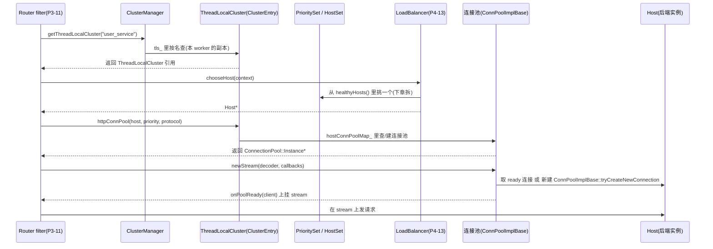

# 第 4 篇 · 第 12 章 · Cluster 与 Endpoint:后端集群与连接池

> **核心问题**:上一章 P3-11 讲了 `router` filter 拿着 route_config 匹配出**一个 cluster 名字**。可"一个 cluster 名字"只是个字符串,真正要把请求发出去,Envoy 还得回答三件事:① 这个 cluster 到底是个什么对象?里面有哪些后端实例(endpoint / host),这些实例的地址是从哪儿来的(写死、DNS 解析、还是控制面下发)?② 这堆实例怎么组织、怎么按优先级分组(主集群挂了能降级到 backup)?③ 选定一个实例之后,Envoy 到那个实例的连接怎么管——是每条请求新建一条 TCP+TLS,还是复用?如果是复用,HTTP/1、HTTP/2、HTTP/3 的复用方式有什么不一样?本章就把这三件事一次拆透:cluster 是什么、endpoint 怎么来、连接怎么复用。
>
> 本章属于数据面(upstream 这一侧),但 endpoint 的来源(尤其 EDS)是控制面的事——本章只讲 cluster 怎么**消费** endpoint 列表,不讲 EDS 这套 xDS 协议本身怎么传(那是第 5 篇 P5-19 的活)。一句话指路:**EDS endpoint 怎么动态发现 → P5-19**,HTTP/2 多路复用底层细节 → P3-09(承接《gRPC》)。

> **读完本章你会明白**:
> 1. **cluster 的本质**——它不是"一组 IP",而是一个带 `ClusterInfo`(超时、断路器、传输层、LB 策略等元数据)+ `PrioritySet`(按优先级分组的若干 `HostSet`,每个 HostSet 是一堆 `Host`)的对象;router 拿到的"cluster 名"通过 `ClusterManager` 这个目录服务查到这个对象,真正能拿到 host 列表、能取连接池。
> 2. **cluster 类型为什么这么多(static / strict_dns / logical_dns / eds / original_dst / aggregate / composite …)**——它们对应的是**不同的服务发现方式**(配置写死 / 主动并发解析 DNS / 单点 DNS 当 LB 用 / 控制面下发 / 透明拦截还原 / 多 cluster 聚合),不是 Envoy 故意复杂,而是部署形态千差万别。尤其是 **strict_dns vs logical_dns 的精妙区别**(并发解析所有 A/AAAA 记录 vs 每次只取第一个 IP 当一个逻辑 Host)——同样叫 "DNS cluster",语义截然相反。
> 3. **连接池是 upstream 的招牌**——对每个 upstream host,Envoy 维护连接池,复用连接而非每请求新建。**朴素地"每请求新建 TCP+TLS"会撞三堵墙**:握手开销、慢启动、fd 耗尽;连接池省在哪、HTTP/1(请求-响应串行,需要按需开多连接)与 HTTP/2/HTTP/3(一条连接跑多 stream 的多路复用)各自的连接池策略为什么不一样。
> 4. **连接池的两层基类**——Envoy 在 1.39 里把连接池拆成了两层:一个**协议无关的基类 `ConnPoolImplBase`**(`source/common/conn_pool/conn_pool_base.cc`,管 ready/busy/connecting 三条队列、pending stream、preconnect 公式),一个**HTTP 专用基类 `HttpConnPoolImplBase`**(`source/common/http/conn_pool_base.cc`,把 codec client 的创建接进来),HTTP/1、HTTP/2、HTTP/3 各自再做小特化。这套"基类 + 三兄弟子类"是 upstream 复用机制的代码骨架。

> **如果一读觉得太难**:先只记住三件事——① router 给你一个 cluster 名,`ClusterManager` 按这个名查到一个 `ThreadLocalCluster`,里面有 `PrioritySet`(按优先级分组的一堆 host)和连接池;② host(后端实例)的来源由 cluster **类型**决定:static 写死、strict_dns 并发 DNS、logical_dns 单点 DNS、eds 控制面下发、original_dst 透明代理还原;③ 每条请求不会新建 TCP+TLS,而是从该 host 的连接池里**取一条现成连接复用**(HTTP/2 一条连接跑上百个 stream,HTTP/1 一条连接只跑一个 in-flight 请求所以池里会有多条连接)。

---

## 〇、一句话点破

> **Cluster 是"一组后端实例 + 怎么管它们的元数据"的对象:实例(Host)按优先级分桶装在 `PrioritySet` 里,实例的来源由 cluster 类型(static / strict_dns / logical_dns / eds / original_dst)决定;选定一个 Host 之后,Envoy 不每请求新建 TCP+TLS,而是从这个 Host 的连接池里取一条现成连接复用——HTTP/1 一条连接跑一个 in-flight 请求(池里多条),HTTP/2/3 一条连接多路复用上百个 stream(池里一两条就够)。**

这是结论,不是理由。本章倒过来拆:先讲"cluster 名"到"能发请求的连接"这条链路上都有哪些对象(`ClusterManager` → `ThreadLocalCluster` → `PrioritySet`/`HostSet` → `Host` → 连接池),再讲 host 的来源(cluster 类型那一摞),然后讲连接池怎么把"每请求新建连接"变成"复用现成连接"、为什么 HTTP/1 和 HTTP/2 的池策略不一样、Envoy 怎么用两层基类把这套抽象出来,最后讲 HostSet/PrioritySet 为什么按优先级分组(故障转移),以及 cluster_manager 作为目录服务的角色。

---

## 一、承接:router 给出的 cluster 名,接下来交给谁

P3-11 末尾留的钩子是:`router` filter 拿着 route_config 匹配出一个 cluster 名字(或 `weighted_clusters` 一组带权重的 cluster),然后**它不自己知道这个 cluster 里有哪些后端**——它得找一个"按名查 cluster"的角色。这个角色就是 **`ClusterManager`**。

先把 cluster 名到一条 upstream 连接的整条链路在脑子里搭起来:



注意几个关键点:

- **`ClusterManager` 不是数据结构,是目录服务**:所有 cluster(不管是配置里写死的、还是 CDS 动态加进来的)都注册在它这里,router 拿 cluster 名来,它按名查到一个**线程本地的** `ThreadLocalCluster`(`ClusterManagerImpl::getThreadLocalCluster`,[cluster_manager_impl.cc#L984-L993](../envoy/source/common/upstream/cluster_manager_impl.cc#L984-L993))。
- **拿到 `ThreadLocalCluster` 后,先选 host 再取连接池**:router 不直接拿连接池,它先让 LB 在这个 cluster 的 `PrioritySet` 里挑一个 host(P4-13 拆 LB),拿到 host 之后,再回到 `ThreadLocalCluster` 取这个 host 对应的连接池(`httpConnPool` / `tcpConnPool`,[cluster_manager_impl.cc#L1028-L1048](../envoy/source/common/upstream/cluster_manager_impl.cc#L1028-L1048))。
- **连接池是 per-host 的,不是 per-cluster 的**:每个后端实例(host)都有自己的连接池。这点很容易看错——很多人以为"cluster 有一个连接池",其实不是,是"cluster 里**每个 host** 一个连接池",路由 + LB 挑出具体 host 后,才进它的池。这是因为连接复用必须建立在"连到同一个 IP:port"上(你不可能复用一条到 10.0.0.1 的连接去发到 10.0.0.2)。

> **钉死这件事**:router 出来的一句"cluster 名",经过 `ClusterManager → ThreadLocalCluster → PrioritySet → LB 选 Host → Host 的连接池 → newStream` 这条链,才真正变成一条挂到 upstream 的 stream。本章就是这条链上"cluster 是什么 / host 怎么来 / 连接怎么复用"那几站的拆解。

---

## 二、cluster 的解剖:`ClusterInfo` + `PrioritySet` 两件套

一个 cluster 对象在 Envoy 里到底是什么?最直观的拆法是:它有两部分——一部分是**和具体后端实例无关的元数据**(叫 `ClusterInfo`),一部分是**这堆后端实例本身 + 怎么组织它们**(叫 `PrioritySet`)。

### 2.1 朴素想法:cluster 就是一组 IP

最朴素的想象:cluster 就是个 IP 列表。但仔细一想,围绕这组 IP 还有大量元数据得放哪儿:

- 转发到这些 IP 用什么协议(HTTP/1、HTTP/2、HTTP/3)、TLS 怎么配(mTLS 用哪个证书、SNI 是什么)、connect 超时多久、idle 超时多久;
- 这组 IP 上挂什么 LB 策略(round_robin / least_request / ring_hash)、断路器上限(最多多少连接、多少 pending 请求);
- 这组 IP 要不要做主动健康检查、要不要做 outlier detection、要不要 EDS 主动下发。

这些元数据如果直接散在"每个 IP 上"会乱套(同一个 cluster 的 100 个 IP,得把 connect_timeout 重复 100 遍?)——它们是**cluster 级**的属性,不是 host 级的。

> **所以这样设计**:Envoy 把 cluster 拆成两半——
>
> - **`ClusterInfo`**(`upstream_impl.h` 里的 `ClusterInfoImpl`,[upstream_impl.h#L822-L940](../envoy/source/common/upstream/upstream_impl.h#L822-L940)):cluster 级元数据,包括 `connectTimeout()`、`name()`、`type()`(static/strict_dns/…/eds)、`features()`、`resourceManager()`(断路器,见 P4-15)、`transportSocketMatcher()`(TLS 选择)、`loadBalancerFactory()`(LB 策略,见 P4-13)、`perUpstreamPreconnectRatio()`(预连接比例,后文拆)等。
> - **`PrioritySet`**([upstream_impl.h#L703-L712](../envoy/source/common/upstream/upstream_impl.h#L703-L712)):实际的一堆 host,按**优先级**分桶(P0、P1、…)。

一个 cluster,`ClusterInfo` 一份,`PrioritySet` 一份,就够了。

### 2.2 `PrioritySet` / `HostSet`:为什么 host 要按优先级分桶

`PrioritySet` 内部是若干个 `HostSet`,每个 `HostSet` 对应一个优先级(P0、P1、…):

```
   ClusterInfoImpl "user_service"(connect_timeout=5s, LB=round_robin, type=EDS, ...)
     │
     ▼
   PrioritySet
     ├─ HostSet[priority=0]   ← 主集群,常态流量全打这里
     │    hosts_:      [10.0.0.1, 10.0.0.2, 10.0.0.3]
     │    healthyHosts:[10.0.0.1, 10.0.0.2, 10.0.0.3]   (都健康)
     │    degradedHosts: []
     │    excludedHosts: []
     ├─ HostSet[priority=1]   ← 备份集群,P0 全挂才降级过来
     │    hosts_:      [20.0.0.1, 20.0.0.2]
     │    healthyHosts:[20.0.0.1, 20.0.0.2]
     └─ HostSet[priority=2]   ← 兜底
          hosts_:      [30.0.0.1]
```

每个 `HostSet`(`HostSetImpl`,[upstream_impl.h#L598-L696](../envoy/source/common/upstream/upstream_impl.h#L598-L696))内部又把 host 分了**四种视图**:`hosts()`(全体)、`healthyHosts()`(健康的)、`degradedHosts()`(降级的)、`excludedHosts()`(被排除的)。LB 默认只在 `healthyHosts()` 里挑。

> **不这样会怎样**:如果 cluster 只是一个扁平的 host 列表,没有优先级,那想做"主集群挂了降级到 backup"这种**故障转移(failover)**就得在别处另起一套机制:每个请求来,LB 先看主集群有没有健康 host,没有的话再换 backup——但"主集群"和"backup"在扁平表里根本无法表达。优先级就是为这个存在的:`PrioritySet` 把 host 按 priority 分桶,LB 默认从 P0 挑,只有当 P0 的健康 host 占比掉到阈值(由 `overprovisioning_factor` 控制,默认 1.4)以下时,才会按比例溢出到 P1、再不行 P2……**这就是 Envoy 的故障转移机制**——所有 host 在一个 cluster 里,靠优先级表达"主力 / 备份 / 兜底"的层次,而不是让用户去配一堆 cluster 之间手动 failover。

源码里这个层次在 `PrioritySetImpl`([upstream_impl.h#L703](../envoy/source/common/upstream/upstream_impl.h#L703)),它的 `hostSetsPerPriority()` 返回一个按 priority 索引的 `HostSet` 数组。`HostSet` 内部用 `addPriorityUpdateCb` 暴露回调——host 列表一变(EDS 推了新实例、健康检查把某个 host 标记 unhealthy),就触发注册过的回调,LB 会重建它的 host 列表(这是 P4-13 的 LB 怎么响应 host 变更的入口)。

### 2.3 `Host`:一个后端实例的全部信息

`Host` 是 cluster 里最小的一个单位——一个后端实例(IP:port + 元数据)。它的接口在 `HostImplBase`([upstream_impl.h#L363-L389](../envoy/source/common/upstream/upstream_impl.h#L363-L389)),关键字段和方法:

- **地址**:`address()`(目标 IP:port)、`hostname()`、可能还有 `addressListOrNull()`(HTTP/3 等场景一个 host 名对应多个 IP);
- **权重**:`weight()`,LB 算 host 被选中的概率时用(加权 round robin);
- **健康状态**:`coarseHealth()` 返回 Healthy/Degraded/Unhealthy,内部用一个位图 `health_flags_` 同时存多种健康来源(主动健康检查失败 `FAILED_ACTIVE_HC`、被动 outlier 检测踢出 `FAILED_OUTLIER_CHECK`、EDS 健康状态 `FAILED_EDS_HEALTH` / `EDS_STATUS_DRAINING`、降级 `DEGRADED_*` 几类),这些位**组合决定**最终状态(`HostImplBase::coarseHealth`,[upstream_impl.h#L442-L461](../envoy/source/common/upstream/upstream_impl.h#L442-L461));
- **`createConnection()`**:真正去建一条到这个 host 的 TCP(或 QUIC)连接,返回 `CreateConnectionData`(里面是连接对象 + host 描述),这是连接池"开新连接"时的最底层入口([upstream_impl.cc#L554-L568](../envoy/source/common/upstream/upstream_impl.cc#L554-L568))。

> **钉死这件事**:Host 不只是个 IP:port,它是一团**带状态**的对象——健康位图、权重、统计(到这个 host 的连接数、请求数、失败率都在 host 级 stats 里)。outlier detection(被动健康检查,P4-14)就是把某个 host 的 `FAILED_OUTLIER_CHECK` 位置上,然后 `coarseHealth()` 返回 Unhealthy,LB 自然就不挑它了——host 的健康是多源(主动 + 被动 + EDS 下发)合成的,这是它内部那位图的用意。

---

## 三、cluster 类型:host(后端实例)从哪儿来

到这一步,cluster = `ClusterInfo` + `PrioritySet`(里面一堆 Host)。那么**这堆 Host 是怎么填进去的**?这就是 cluster **类型**要回答的问题——也是本章最容易看花眼的地方。Envoy 源码里 `source/extensions/clusters/` 下有一长串子目录:`static`、`strict_dns`、`logical_dns`、`eds`、`original_dst`、`aggregate`、`composite`、`dynamic_forward_proxy`、`dynamic_modules`、`mcp_multicluster`、`redis`、`reverse_connection`、`dns`(公共父类)。它们每个对应一种"host 来源"。

这一摞看着吓人,但只要抓住**它们是在回答"host 从哪儿来"这一个问题**,就能很快分清。下面把最核心的五种(static / strict_dns / logical_dns / eds / original_dst)拆透,其余(aggregate / composite 等组合型)是后搭的扩展,理解了前五个,后面就是套娃。

### 3.1 static:配置写死的固定后端

最朴素的 cluster 类型——你把后端 IP:port 直接写在配置里,Envoy 启动时读进去,这一组 host 就**永远不变**(除非改配置或 CDS 推一份新的)。

```yaml
clusters:
- name: user_service
  type: STATIC                          # 或者 cluster_type: 静态
  load_assignment:
    endpoints:
    - lb_endpoints:
      - endpoint: { address: { socket_address: { address: 10.0.0.1, port_value: 8080 } } }
      - endpoint: { address: { socket_address: { address: 10.0.0.2, port_value: 8080 } } }
```

源码:`StaticClusterImpl`([static/static_cluster.h#L17-L36](../envoy/source/extensions/clusters/static/static_cluster.h#L17-L36)),继承 `ClusterImplBase`,`startPreInit()` 里把 `load_assignment` 里的 endpoint 解析成 `Host`,塞进 `PrioritySet`。

适用场景:后端 IP **真的不会变**——比如 Envoy 前面挡的就是一组固定 IP 的物理机、或者自家的某个 daemon。微服务里**反而很少用**(实例天天在变),但在静态网关、测试、Envoy 自身的 admin 端口这种场景下很常见。

> **不这样会怎样**:如果你想代理一组后端、又不想要服务发现那套复杂度(DNS、xDS),`static` 就是直接把 IP 写死的方案。它的痛点是**改 IP 必须重启或 CDS 推**——所以微服务场景基本被 EDS 取代了,但作为最简单的 cluster 类型,理解它是理解其他类型的基础。

### 3.2 strict_dns:并发解析所有 A/AAAA 记录

`strict_dns` 是为"用 DNS 做服务发现"的场景设计的:你给一个域名(比如 `user-service.prod.svc.cluster.local`),Envoy **周期性地**对这个域名做 DNS 查询,**把返回的所有 A(IPv4)/AAAA(IPv6)记录都当成独立的 host** 加进 cluster。

```
   cluster: user_service, type: STRICT_DNS, dns_address: user-svc.prod.svc
     │
     ▼  周期性 DNS 查询(默认按 dns_refresh_rate,如 5s)
   DNS 返回: [10.0.0.1, 10.0.0.2, 10.0.0.3]   ← 三个 A 记录
     │
     ▼  strict_dns 把它们都当独立 host
   HostSet:
     10.0.0.1 (host_a)  ┐
     10.0.0.2 (host_b)  ├─ 都进 cluster,各自有连接池,LB 在三个里挑
     10.0.0.3 (host_c)  ┘
```

源码:`StrictDnsClusterImpl`([strict_dns/strict_dns_cluster.h#L18-L83](../envoy/source/extensions/clusters/strict_dns/strict_dns_cluster.h#L18-L83))。关键是它内部对**每一个 DNS 解析目标**(`ResolveTarget`,`strict_dns_cluster.h#L34-L59`)维护一个定时器(`resolve_timer_`),周期性 `startResolve()`。解析回调里把所有返回的 IP 都建成 host,然后 `updateAllHosts()`——这就是"严格(strict)"的含义:**严格地反映 DNS 返回的全部记录**。

> **钉死这件事**:strict_dns 的语义是"DNS 返回什么,cluster 里就有什么"。它把每个 IP 当**独立的 host**——每个 host 独立的连接池、独立的健康检查、独立的 outlier 统计。这正是和 `logical_dns` 的根本区别,马上讲。

适用场景:后端通过 DNS 暴露(比如 K8s 的 headless Service,`ClusterIP: None`,DNS 返回所有 Pod IP)、且你希望 Envoy 把每个 IP 都当独立的负载均衡目标。

### 3.3 logical_dns:把 DNS 当 LB 用,只取一个 IP(★ 最反直觉的一个)

`logical_dns` 是最容易和 `strict_dns` 混的类型,它们俩都"用 DNS",但**语义截然相反**。

看 Envoy 源码里这个类的注释,作者自己把意图写得清清楚楚([logical_dns/logical_dns_cluster.h#L26-L38](../envoy/source/extensions/clusters/logical_dns/logical_dns_cluster.h#L26-L38)):

> The LogicalDnsCluster is a type of cluster that creates a **single logical host** that wraps an async DNS resolver. The DNS resolver will continuously resolve, and **swap in the first IP address** in the resolution set. However **the logical owning host will not change**. Any created connections against this host will use the currently resolved IP. **This means that a connection pool using the logical host may end up with connections to many different real IPs.**
>
> This cluster type is useful for large web services that use DNS in a round robin fashion… **A single connection pool can be created that will internally have connections to different backends, while still allowing long connection lengths and keep alive.**

翻译过来就是:`logical_dns` 把整个 cluster 当**一个**逻辑 host——每次 DNS 解析返回一堆 IP,它**只取第一个**,塞进这同一个逻辑 host。后端的"真实 IP"在不断换,但 cluster 里 host 的"身份"不变。

```
   cluster: external_api, type: LOGICAL_DNS, dns_address: api.example.com
     │
     ▼  周期性 DNS 查询
   第 1 次解析:[10.0.0.1, 10.0.0.2, 10.0.0.3]  → 取第 1 个:logical_host.current_ip = 10.0.0.1
   第 2 次解析:[10.0.0.2, 10.0.0.3, 10.0.0.4]  → 取第 1 个:logical_host.current_ip = 10.0.0.2
   第 3 次解析:[10.0.0.5, ...]                  → 取第 1 个:logical_host.current_ip = 10.0.0.5
     │
     ▼  cluster 里始终只有一个 logical_host(身份不变)
   HostSet:
     logical_host (hostname=api.example.com)   ← 这一个 host
        │   它内部维护 current_resolved_address_,每次解析换
        │   它的连接池里可能有:
        │     连接 1 → 10.0.0.1  (上次解析时建的)
        │     连接 2 → 10.0.0.2  (再上次解析时建的)
        │     连接 3 → 10.0.0.5  (本次解析后建的)
```

关键点:这个逻辑 host **对应一个连接池**,但因为它的 current IP 在变,连接池里**可能同时有连到不同真实 IP 的连接**——这恰恰是想要的!

> **不这样会怎样(为什么要有 logical_dns)**:想象你要代理 `google.com` 这种大型外部服务——它的 DNS 是 round-robin 的,每次解析返回的 IP 不一样(全球几百个 IP)。如果你用 `strict_dns`,每次 DNS 刷新都把一堆 IP 当独立 host,cluster 里 host 列表天天大变,连接池频繁重建,根本稳不下来。更糟的是,你**根本不关心是哪个 IP**——你只想"连 google.com,只要能连上就行"。
>
> `logical_dns` 的精妙就在这里:它把"一个域名"压缩成"一个 host",**对外暴露的 host 身份恒定**(连接池稳定、stats 稳定),**对内的真实 IP 在解析后悄悄换**——每次建新连接用最新解析的 IP,旧连接继续用建连时那个 IP 直到它被关。**一个连接池,内部却连着多个真实后端**——这正好对应"DNS 当 LB 用"的现实:把负载均衡交给 DNS 服务商,Envoy 只负责"无脑连第一个 IP、复用连接"。

这就是 strict_dns 和 logical_dns 的本质区别:

| 维度 | strict_dns | logical_dns |
|------|-----------|-------------|
| 每个 DNS 记录 | 一个独立 host | 只取第一个,塞进同一个逻辑 host |
| cluster 里 host 数 | = DNS 返回的 IP 数 | 永远是 1(逻辑 host) |
| 连接池 | 每个 IP 独立一个 | 一个池,内部可能连多个真实 IP |
| 适用 | DNS 返回的是"我自己的后端",每个 IP 都要单独 LB | DNS 当 LB 用(大外部服务),不关心具体 IP |
| host 列表稳定性 | DNS 一变就跟着变 | host 身份不变,只内部 IP 换 |

> **钉死这件事**:别把 logical_dns 当成 strict_dns 的"简化版"。它们是**两种截然不同的服务发现哲学**:strict_dns 是"DNS 反映后端拓扑,我严格照搬";logical_dns 是"DNS 就是个 LB,我只关心第一个 IP、host 身份保持稳定"。配错了(该用 strict_dns 用了 logical_dns,会丢掉大量 IP 导致流量集中在第一个;该用 logical_dns 用了 strict_dns,host 列表天天大变,连接池抖动),后果都是流量分布错乱。

### 3.4 eds:控制面动态下发 endpoint(★ 核心场景)

微服务里最常见的 cluster 类型。`eds` 的 host 不来自 DNS、不写死,**完全由控制面通过 EDS(Endpoint Discovery Service,xDS 之一)下发**。

```yaml
clusters:
- name: user_service
  type: EDS
  eds_cluster_config:
    service_name: user-service.prod
    eds_config: { ads: {} }     # 走 ADS 聚合订阅,见 P5-17
```

控制面(Istio、自研控制面)持续把"这个 cluster 现在有哪些 endpoint"推给 Envoy——新 Pod 上线秒级推一个新 endpoint,Pod 挂了秒级摘除。EDS 推的内容包括:

- 每个 endpoint 的地址(IP:port);
- **每个 endpoint 的健康状态**(HEALTHY / UNHEALTHY / DRAINING / DEGRADED——控制面能直接告诉 Envoy"这个 endpoint 在 draining,别再发");
- **每个 endpoint 的 locality**(region/zone/zone_name, locality-aware LB 用,见 P4-13);
- **每个 endpoint 的权重**;
- endpoint 按 priority 分桶(EDS 直接在 endpoint 上带 priority 字段,对应前面 PrioritySet 的层级)。

源码:`EdsClusterImpl`([eds/eds.h#L31-L60](../envoy/source/extensions/clusters/eds/eds.h#L31-L60)),它实现了 `Config::SubscriptionCallbacks`——也就是它**订阅了 EDS 资源**。EDS 推过来时,`onConfigUpdate()` 被调用([eds/eds.cc#L198](../envoy/source/extensions/clusters/eds/eds.cc#L198)),里面把新 endpoint 解析成 Host,塞进 PrioritySet,触发 `HostSet` 的 update 回调,LB 据此重建 host 列表。

> **为什么不展开讲 EDS 怎么传**:EDS 是 xDS 协议之一,它怎么订阅、怎么版本协商、ACK/NACK 怎么走、ADS 怎么聚合——这些都是第 5 篇的事,**EDS 协议本身 → P5-19 拆透**。本章只讲:从 cluster 的角度,EDS 就是"host 来源",`EdsClusterImpl` 是 EDS 资源的**消费端**,把推来的 endpoint 翻译成 `Host` 塞进 PrioritySet。控制面那一侧(怎么决定推哪些 endpoint)不在本章范围。

> **钉死这件事**:EDS 是微服务场景的**默认选择**,因为微服务的后端拓扑天天在变(K8s Pod 扩缩容、滚动发布、故障重启),只有 EDS 这种"控制面主动推、秒级生效、不停机"的机制能跟上。static 太死、DNS 太慢且语义粗(DNS 缓存、不能精确表达 health/drain),EDS 把这些都解决了——这也是为什么 Istio 默认把所有服务都配成 EDS cluster。

### 3.5 original_dst:透明代理还原真实目的地址

`original_dst` 是为**透明代理**场景设计的。一般的反向代理,Envoy 自己决定后端是哪个 cluster;但透明代理场景(比如 iptables 把流量重定向到 Envoy),**真实的目的地址是被拦截的原始流量里带的**(比如客户端本来要去 10.0.0.99:8080,被 iptables 劫持到 Envoy),Envoy 得"还原"这个原始目的地址,作为 host 加进 cluster。

源码:`OriginalDstCluster`([original_dst/](../envoy/source/extensions/clusters/original_dst/))。它不像前几个那样"启动时就知道有哪些 host",而是**按需添加**:每来一条流量,listener filter 里的 `original_dst` filter 把真实目的地址解析出来,如果 cluster 里还没有这个 host,就动态创建一个加进去。

适用场景:Istio ambient mesh 的 ztunnel、四层透明代理、对客户端透明的服务网格入口。

> **钉死这件事**:五种 cluster 类型,本质是**五种服务发现方式**:① static——配置写死;② strict_dns——并发 DNS,反映全部记录;③ logical_dns——单点 DNS 当 LB,host 身份恒定;④ eds——控制面下发,微服务默认;⑤ original_dst——透明代理还原。它们不是 Envoy 故意复杂,而是部署形态千差万别,有人靠 DNS、有人靠 K8s 控制面、有人做透明拦截。理解 cluster 类型,就是理解"Envoy 怎么知道后端有哪些"。

### 3.6 组合型:aggregate / composite / dynamic_forward_proxy(一句话带过)

除了上面五种基础类型,1.39 里还有几个"组合型":

- **aggregate**(`source/extensions/clusters/aggregate/`):把多个已有 cluster 聚合成一个**虚拟 cluster**,流量按一定规则分散到子 cluster(比如按权重大-cluster 间 LB);
- **composite**:在配置里组合多个 cluster 行为;
- **dynamic_forward_proxy**:运行时根据请求的 host 动态解析 DNS 再发(类似正向代理,FQDN 不预知);
- **redis**:Redis 专用 cluster(给 Envoy 的 Redis proxy 用);
- **reverse_connection**:反向连接(后端主动连过来,边车场景);

这些是后搭的扩展,核心机制(static/dns/eds/original_dst)理解了,它们都是组合或特化。本书不展开,后续涉及处再点。

---

## 四、招牌:连接池——为什么不能每请求新建 TCP+TLS

到这一步,cluster 有了 host,host 是一个具体的 IP:port。**但每来一条请求,Envoy 是不是直接 `connect()` 到这个 host、发请求、收响应、关连接?** 这听起来最简单。**但生产环境绝对不能这么干**。这一节是本章的重头戏——连接池是 upstream 的招牌,讲清它省在哪、HTTP/1 和 HTTP/2 的池策略为什么不一样。

### 4.1 朴素方案:每请求一条 TCP+TLS,会撞三堵墙

想象一个最朴素的代理实现:

```
   每来一条 HTTP 请求:
     1. socket() + connect() 到后端        ← TCP 三次握手(RTT)
     2. 如果是 HTTPS:TLS 握手              ← 1~2 个 RTT,非对称加密很贵
     3. 如果是 HTTP/2:还有 SETTINGS 协商
     4. 发请求,收响应
     5. close() 连接
```

在高 QPS 下,这套会撞上**三堵墙**:

**墙一:握手开销。** TCP 三次握手至少 1 个 RTT,TLS 握手(1.2 是 2 个 RTT,1.3 是 1 个 RTT,还要算 0-RTT early data),HTTP/2 SETTINGS 协商——这些"建连开销"在每条请求上**重复发生**。一条 p99 才 50ms 的请求,建连可能就吃掉 100ms+,完全本末倒置。

**墙二:慢启动(TCP slow start)。** TCP 连接刚建好时,拥塞窗口(cwnd)很小(初始几包),之后每个 RTT 才加倍增长——这是 TCP 自己的拥塞控制(承接《Linux 内核》那本)。如果你每请求新建连接,**这条连接永远在慢启动阶段就发完数据关掉了**——根本用不到大窗口的高吞吐。一条复用了几百次的长连接,窗口早撑开了,带宽利用率天差地别。

**墙三:fd 耗尽 + TIME_WAIT 堆积。** 每条请求一个 socket,几千 QPS 下:① 文件描述符(fd)很快耗尽(默认 ulimit 1024,调高也只是治标);② 主动 close 的一方进入 TIME_WAIT(2MSL,约 60s),高 QPS 下 TIME_WAIT 几万几十万地堆积,**端口耗尽**(可用端口就 65535 个,TIME_WAIT 占满了新连接就没源端口)——这是经典的"LAMP 时代"故障。

> **不这样会怎样**:每请求新建 TCP+TLS 在生产环境**根本撑不住**——握手开销吃掉响应时间的大头、慢启动让吞吐上不去、fd/端口耗尽直接打挂代理。这就是为什么所有正经的反向代理(Nginx、HAProxy、Envoy)都有连接池。**连接池的核心价值就三个字:复用**——一条建好的连接,反复发很多请求,把建连开销摊薄、让 TCP 窗口撑开、避免 fd/端口爆炸。

### 4.2 连接池的本质:per-host,ready/busy/connecting 三态队列

Envoy 的连接池是 **per-host** 的(不是 per-cluster,前面讲过——因为复用必须建立在同一个 IP:port 上)。每个 host 一个连接池,池里维护若干到这个 host 的连接,这些连接按状态分三条队列。

源码骨架在 **`ConnPoolImplBase`**([conn_pool_base.h#L183-L427](../envoy/source/common/conn_pool/conn_pool_base.h#L183-L427)),这是**协议无关**的基类(HTTP/TCP/Redis 各种协议的连接池都继承它)。关键成员(见头文件注释):

```cpp
// source/common/conn_pool/conn_pool_base.h:378-412(简化示意,保留真实字段名)
class ConnPoolImplBase {
protected:
  // Clients that are ready to handle additional streams. All entries are in state Ready.
  std::list<ActiveClientPtr> ready_clients_;
  // Clients that are not ready to handle additional streams due to being Busy or Draining.
  std::list<ActiveClientPtr> busy_clients_;
  // Clients that are not ready to handle additional streams because they are Connecting.
  std::list<ActiveClientPtr> connecting_clients_;
  // ... 早数据流(HTTP/3 0-RTT)专用
  std::list<ActiveClientPtr> early_data_clients_;
private:
  // 等待连接的请求(pending stream)——所有连接都忙 / 都在 connect 时的排队
  std::list<PendingStreamPtr> pending_streams_;
};
```

(注:Envoy 里把一条到后端的连接叫 `ActiveClient`——从后端视角看 Envoy 是个 client,所以叫 client。别和下游 client 混。)

每条 `ActiveClient` 有一个**状态机**(`ActiveClient::State`,[conn_pool_base.h#L91-L100](../envoy/source/common/conn_pool/conn_pool_base.h#L91-L100)):

```
   ActiveClient::State:
     Connecting         ← 刚 socket()+connect(),TCP/TLS 握手中
       │ 握手完成
       ▼
     ReadyForEarlyData  ← (仅 HTTP/3 0-RTT)能立刻发早数据
     Ready              ← 能立刻接新 stream(空闲)
       │ 用满并发流上限
       ▼
     Busy               ← 这条连接并发流到上限,不能再接新 stream
       │ 流结束,腾出并发位
       ▼  (回 Ready)
     Draining           ← 不再接新 stream,在途 stream 完了就关
       │
       ▼
     Closed             ← 关闭,等 deferred delete
```

一条请求 `newStream()` 进连接池,逻辑大致是([conn_pool_base.cc::newStreamImpl](../envoy/source/common/conn_pool/conn_pool_base.cc)):

1. **`ready_clients_` 有空闲连接?** → 直接在它上面开 stream(对 HTTP/1 是这条连接只能跑一个 in-flight,所以"开 stream"就等于占用这条连接;对 HTTP/2 是这条连接上再开一个 stream id)。
2. **没有 ready,但有 connecting?** → 把请求挂到 `pending_streams_`,等连接握手完(`onUpstreamReady` 时按顺序消费 pending)。
3. **既没 ready 也没 connecting?** → `tryCreateNewConnection()`,建一条新连接。
4. **建新连接被拒**(断路器到了、过载了)?→ 也进 `pending_streams_` 等着,或者直接 fail。

> **钉死这件事**:连接池的核心抽象是 `ConnPoolImplBase` 的**三态队列**(ready / busy / connecting)+ pending streams。这个抽象**和协议无关**——HTTP/1、HTTP/2、HTTP/3、TCP、Redis 都用同一套骨架,只在"一条连接能跑几个 stream""什么状态能算 ready"上特化。这是 Envoy 把"连接复用"这件事抽象成可复用代码骨架的招牌设计。

### 4.3 HTTP/1 的池:一条连接只跑一个 in-flight,所以池里多条

HTTP/1.1 的请求-响应是**串行**的——一条连接上,必须等上一个请求的响应回来,才能发下一个(没有多路复用)。所以对 HTTP/1,**一条连接同一时刻只能有 1 个 in-flight 请求**。

这意味着 HTTP/1 的连接池里,**如果同时有 N 条 in-flight 请求,就得有 N 条连接**——池子是"按需开多连接"的:

```
   HTTP/1 连接池(per host):
   ┌─────────────────────────────────────────────────────────────┐
   │ 第 1 条请求来:开连接 1,挂请求 1                              │
   │ 第 2 条请求来(连接 1 还忙):开连接 2,挂请求 2                │
   │ 第 3 条请求来(连接 1、2 都忙):开连接 3,挂请求 3            │
   │ ...                                                          │
   │ 第 N 条请求来:开连接 N(或到断路器上限就排队 pending)       │
   │                                                              │
   │ 空闲下来的连接进 ready_clients_,下条请求复用,不再开新的    │
   └─────────────────────────────────────────────────────────────┘
```

关键在源码里 `Http1::ActiveClient::numActiveStreams()`([http1/conn_pool.h#L28-L34](../envoy/source/common/http/http1/conn_pool.h#L28-L34))的覆写:

```cpp
uint32_t numActiveStreams() const override {
  // Override the parent class using the codec for numActiveStreams.
  // Unfortunately for the HTTP/1 codec, the stream is destroyed before decode
  // is complete, and we must make sure the connection pool does not observe available
  // capacity and assign a new stream before decode is complete.
  return stream_wrapper_.get() ? 1 : 0;
}
```

返回 0 或 1——这就是"一条连接只能跑一个 in-flight"的代码体现。`tryCreateNewConnection` 看到所有连接都 `numActiveStreams() == 1`(busy),就会再开新连接,直到断路器(`max_connections`)。

> **不这样会怎样(为什么 HTTP/1 池里要开多条)**:如果 HTTP/1 池里只有一条连接,那同时来了 100 条请求,99 条得排队等——并发度被一条连接的串行性卡死。所以 HTTP/1 的池**必然是多连接**的(按并发需求开)。但开多少是个权衡——太多了 fd 耗尽、连接建连开销;太少了并发度不够。这就是为什么 HTTP/1 cluster 要配 `max_requests_per_connection`(一条连接发多少请求后关掉重开,避免长连接内存泄漏)和断路器 `max_connections`(P4-15)。

### 4.4 HTTP/2 的池:一条连接跑上百个 stream,池里一两条就够

HTTP/2 的杀手锏是**多路复用**(承接《gRPC》P2-07):一条连接上**同时**可以跑很多 stream(每个请求一个 stream,默认上限 100,可协商到更高),stream 之间帧交错,共用一条 TCP 连接。

这彻底改变了连接池的策略——一条连接就能扛几百个并发请求,所以 HTTP/2 的池里**通常一两条连接就够**:

```
   HTTP/2 连接池(per host):
   ┌─────────────────────────────────────────────────────────────────┐
   │ 第 1 条请求来:开连接 1,开 stream id=1                          │
   │ 第 2 条请求来:连接 1 还能并发(没到 max_concurrent_streams),     │
   │              在连接 1 上开 stream id=3                            │
   │ 第 3 条请求来:连接 1 上开 stream id=5                            │
   │ ...                                                              │
   │ 第 100 条请求来:连接 1 到 max_concurrent_streams,                │
   │                 这才考虑开连接 2(或者排队 pending)              │
   │                                                                  │
   │ 绝大多数情况:整个池就 1 条连接,跑满几百个 stream               │
   └─────────────────────────────────────────────────────────────────┘
```

源码里 HTTP/2 的 ActiveClient 是 `MultiplexedActiveClientBase`([conn_pool_base.h#L224-L239](../envoy/source/common/http/conn_pool_base.h#L224-L239)),它维护 `concurrent_stream_limit_` 和 `remaining_streams_`(在 `ConnPoolImplBase::ActiveClient` 里,见 [conn_pool_base.h#L127-L140](../envoy/source/common/conn_pool/conn_pool_base.h#L127-L140))——`remaining_streams_` 表示这条连接还能再开多少 stream,根据对端 SETTINGS frame 的 `MAX_CONCURRENT_STREAMS` 和配置的 `max_requests_per_connection` 取小。

> **钉死这件事**:HTTP/2 的连接池**不需要像 HTTP/1 那样按并发开多连接**——一条连接多路复用就够。这带来三个好处:① fd 占用大降(几百请求只占 1 个 fd);② TCP 拥塞窗口充分利用(一条连接慢慢撑开窗口,几百个 stream 共享,吞吐高);③ TLS 握手只发生一次(几百请求摊一次握手开销)。**HTTP/2 的多路复用,本质上把"连接复用"从'连接池多连接'升级成了'单连接多 stream'**——这是 HTTP/2 在性能上碾压 HTTP/1 的根(承接《gRPC》P2-07)。

### 4.5 HTTP/3 的池:多路复用 + 连接迁移 + 0-RTT

HTTP/3 基于 QUIC(UDP,承接 P3-09),连接抽象和 HTTP/2 类似(也是多路复用,一条连接多个 stream),但有几个 HTTP/2 没有的特性影响连接池:

- **连接迁移(connection migration)**:QUIC 用 connection ID 而不是"四元组"标识连接,客户端 IP 切换(比如 WiFi 切 4G)连接不断。这让 HTTP/3 连接比 TCP 更"长寿",池里连接稳定性更高;
- **0-RTT early data**:QUIC 支持会话恢复时第一个 RTT 就发数据(连握手都省了),连接池里有专门的状态 `ReadyForEarlyData` 来标记"这条连接还能立刻接早数据请求"——`early_data_clients_` 队列就是干这个的;
- **UDP 没有"慢启动 cwnd"的 TCP 概念,但有 QUIC 自己的拥塞控制**,语义上仍需要复用来撑开窗口。

源码:`Http3ConnPoolImpl`([http3/conn_pool.h#L152-L217](../envoy/source/common/http/http3/conn_pool.h#L152-L217)),继承 `FixedHttpConnPoolImpl`,在 ready 逻辑上多了 early data 的判断(`ActiveClient::supportsEarlyData()` 覆写为 true,见 [conn_pool_base.h#L152-L153](../envoy/source/common/conn_pool/conn_pool_base.h#L152-L153))。

> **架构演进**:HTTP/3 是 Envoy 较新的能力(基于 Google quiche),与 HTTP/2 并存。Envoy 还有一个特殊的 `ConnPoolGrid`(`source/common/http/conn_pool_grid.cc`)——当 cluster 支持 HTTP/3 但要先试 HTTP/2(alt-svc 协商)时,grid 池同时维护 HTTP/2 和 HTTP/3 两个池,根据 alt-svc cache 决定用哪个,做平滑升级。这是 HTTP/3 渐进部署的招牌机制,涉及处讲清,本书不深挖。

---

## 五、连接池的两层基类:`ConnPoolImplBase` + `HttpConnPoolImplBase`

前面 4.2 节提到了 `ConnPoolImplBase` 是协议无关的基类。但 Envoy 的 HTTP 连接池还有第二层抽象——`HttpConnPoolImplBase`,这两层是干嘛的、为什么分两层,值得专门拆。

### 5.1 第一层:`ConnPoolImplBase`(协议无关,管队列和 preconnect)

`source/common/conn_pool/conn_pool_base.{h,cc}` 里的 `ConnPoolImplBase` 是**所有连接池的公共骨架**。它**和具体协议无关**——不知道是 HTTP 还是 TCP 还是 Redis,只管:

- 三态队列(ready / busy / connecting)+ pending streams;
- 状态机 `ActiveClient::State` 的转换(`transitionActiveClientState`);
- "要不要建新连接"的决策(`tryCreateNewConnection` / `tryCreateNewConnections`);
- 预连接(preconnect)的判断公式 `shouldConnect`;
- 连接事件回调(`onConnectionEvent`,连上 / 连失败 / 远端关闭);
- drain、idle 检查、capacity 计数(`connecting_and_connected_stream_capacity_`)。

具体怎么建一条连接(`instantiateActiveClient`)、怎么在连接上开 stream、什么算"满了"——这些是**子类**(`PURE` 虚函数)负责的。`ConnPoolImplBase` 只提供骨架,把"复用逻辑"和"具体协议"解耦。

### 5.2 第二层:`HttpConnPoolImplBase`(HTTP 专用,接 codec client)

`source/common/http/conn_pool_base.{h,cc}` 里的 `HttpConnPoolImplBase` 继承 `ConnPoolImplBase`,在它之上专门为 HTTP 协议做的事:

- 实现了 `ConnectionPool::Instance` 的 HTTP 接口(`newStream`、`drainConnections` 等);
- 引入 **`CodecClient`**——一条 upstream 连接 = 一个 codec client(HTTP/1 的 codec 是文本流,HTTP/2 的 codec 是 nghttp2,HTTP/3 是 quiche,见 P3-09)。`HttpConnPoolImplBase::ActiveClient`([conn_pool_base.h#L116-L172](../envoy/source/common/http/conn_pool_base.h#L116-L172))就持有一个 `codec_client_`;
- `createCodecClient` 是 `PURE`,**由 HTTP/1、HTTP/2、HTTP/3 各自的子类提供**——这就是 Envoy 让"同一个连接池骨架"适配三种 HTTP 版本的方式。

第三层(具体协议)就是 `FixedHttpConnPoolImpl`([conn_pool_base.h#L176-L219](../envoy/source/common/http/conn_pool_base.h#L176-L219))——它把 `createCodecClient` 和 `instantiateActiveClient` 用 lambda 注入,HTTP/1、HTTP/2、HTTP/3 各传自己的 codec 创建函数。具体看 `source/common/http/http{1,2,3}/conn_pool.cc`,每个文件就几十到两百行,只是把自己特有的 codec client 接进来。

### 5.3 为什么分两层(三层)而不是一个胖类

> **不这样会怎样**:如果只有一个胖类把 HTTP/1、HTTP/2、HTTP/3、TCP、Redis 全塞进去,这个类会臃肿到无法维护——每个协议的"怎么建连接""一条连接跑几个 stream""ready 条件"都不一样,if-else 满天飞。两层抽象让职责清晰:
>
> - `ConnPoolImplBase` 管"连接复用的通用逻辑"(队列、状态机、preconnect、drain),这些**任何协议都要**;
> - `HttpConnPoolImplBase` 管"HTTP 协议特有的逻辑"(codec、newStream 的 HTTP 语义);
> - `FixedHttpConnPoolImpl` + `http{1,2,3}/conn_pool.cc` 管"具体 HTTP 版本的小差异"(H1 一连接一 stream、H2/H3 多路复用)。
>
> 这是经典的**模板方法 + 策略注入**:骨架在基类钉死,差异点留虚函数或 lambda 让子类填。和 LevelDB 的 `SkipList` 把"比较器"参数化、Tokio 的 `Spawn` 把 future 参数化是同一种工程哲学(承接系列其他几本)。

---

## 六、技巧精解

本章最硬核的两个技巧,单独拆透。

### 技巧一:连接池的 preconnect 公式——怎么决定"现在要不要预先建下一条连接"

朴素连接池的逻辑是"有请求来了,池里没 ready 连接,才建新连接"。但这有个问题:第一条请求来了,得**等连接建好**才能发(TCP+TLS 握手几十毫秒甚至上百毫秒),这条请求的延迟就被建连开销吃掉。能不能**预测**到马上要有请求来,**提前**把连接建好等在那儿?这就是 **preconnect(预连接)**。

Envoy 的连接池把 preconnect 做成了一套**基于比例的决策公式**,核心在 `ConnPoolImplBase::shouldConnect`([conn_pool_base.cc#L94-L114](../envoy/source/common/conn_pool/conn_pool_base.cc#L94-L114)):

```cpp
bool ConnPoolImplBase::shouldConnect(size_t pending_streams, size_t active_streams,
                                     int64_t connecting_and_connected_capacity,
                                     float preconnect_ratio, bool anticipate_incoming_stream) {
  // 全局 preconnect 时为 true(ClusterManagerImpl::maybePreconnect 在 newStream 之前调用)
  int anticipated_streams = anticipate_incoming_stream ? 1 : 0;

  // 想被 provisioned 的 stream 数 = (pending + active + anticipated) * preconnect_ratio
  // 已经被 provisioned 的 stream 数 = connecting_and_connected_capacity + active
  // preconnect_ratio 没配时默认 1,化简成经典的 pending_streams > connecting_capacity
  return (pending_streams + active_streams + anticipated_streams) * preconnect_ratio >
         connecting_and_connected_capacity + active_streams;
}
```

这个公式说的是:

- **左边的"需求"**:`(在排队的 + 正在跑的 + 预期马上来的) × 预连接比例`;
- **右边的"供给"**:`已经在建的连接能扛的 stream 数 + 正在跑的连接能扛的 stream 数`;
- 左 > 右,就**建一条新连接**。

精妙点:

1. **`preconnect_ratio > 1` 才会发生预连接**。比如 ratio = 1.5,意思是"我希望 ready 的容量是当前 load 的 1.5 倍"——当前有 100 个 active stream,池里就预备能扛 150 个的连接容量。当前有 1 条 HTTP/2 连接(假设 max concurrent streams=100)跑满了 100 个 stream,`shouldConnect` 会判断"该再开一条连接预备着"。
2. **`anticipate_incoming_stream` 这个标志**特别巧妙。`ClusterManagerImpl::maybePreconnect`([cluster_manager_impl.cc#L995-L1025](../envoy/source/common/upstream/cluster_manager_impl.cc#L995-L1025))在 `newStream` 之前被调用——它知道"接下来马上要发一条新 stream",所以传 `anticipate_incoming_stream=true`,这样**即使是池里第一条连接、active 和 pending 都是 0**,公式也会判断"该建"(因为左边是 1×ratio,右边是 0)。注释里([conn_pool_base.cc#L100-L103](../envoy/source/common/conn_pool/conn_pool_base.cc#L100-L103))说得很直白:"without this, we would never pre-establish a connection as the first connection in a pool because pending/active streams could both be 0."
3. **tryCreateNewConnections 一次最多建 3 条**([conn_pool_base.cc#L166-L183](../envoy/source/common/conn_pool/conn_pool_base.cc#L166-L183))。这是为了避免 host 刚恢复健康时(之前 unhealthy 期间积压了需求)一窝蜂建一堆连接打挂后端——所以单次决策上限 3,慢慢追上目标容量。
4. **健康状态过滤**:`shouldCreateNewConnection` 里([conn_pool_base.cc#L116-L123](../envoy/source/common/conn_pool/conn_pool_base.cc#L116-L123))——host 不健康时,**不做 preconnect**(只有真有 pending 才建),避免给正在挂的后端加压。

> **不这样会怎样(朴素写法撞什么墙)**:
>
> - **不预连接**:每条新请求如果撞上池里没 ready 连接,得现场等握手——首字节延迟(TTFB)被握手开销吃掉几十到几百毫秒,在高 QPS 场景尾延迟(p99)会被显著拉高。
> - **预连接公式写死成"建 N 条固定"**:无法适应变化——QPS 低时建一堆连接纯属浪费 fd 和后端资源;QPS 高时建的不够,还是得等。比例公式让连接数**跟着 load 自适应**,这是工程化的精髓。
> - **没单次 3 条上限**:host 恢复瞬间打一堆连接,后端可能直接被压垮(雪崩)。
>
> Envoy 的这套 preconnect,是连接池"既要复用、又要快"的关键工程化——把建连开销从请求路径上挪走。

### 技巧二:strict_dns vs logical_dns,同一个"DNS cluster"语义截然相反

前面 3.2/3.3 已经分别讲了。这里再单独钉死这个区别——因为它是最容易翻车的地方,源码级再印证一次。

**strict_dns**(`StrictDnsClusterImpl`,[strict_dns/strict_dns_cluster.h#L18-L83](../envoy/source/extensions/clusters/strict_dns/strict_dns_cluster.h#L18-L83)):每个 DNS 解析目标 `ResolveTarget` 维护自己的 `HostVector hosts_`,解析回调里**把返回的每个 IP 都建一个 Host**,然后 `updateAllHosts()`——IP 数等于 host 数,每个 host 独立。

**logical_dns**(`LogicalDnsCluster`,[logical_dns/logical_dns_cluster.h#L26-L94](../envoy/source/extensions/clusters/logical_dns/logical_dns_cluster.h#L26-L94)):整个 cluster 只有**一个** `LogicalHostSharedPtr logical_host_`,解析回调里**只取第一个 IP**,塞进这个逻辑 host 的 `current_resolved_address_`(字段名直接暴露了意图:[logical_dns_cluster.h#L89](../envoy/source/extensions/clusters/logical_dns/logical_dns_cluster.h#L89))。这个逻辑 host 持有一个连接池,但每次 `createConnection()` 用的是当前 `current_resolved_address_`——所以**池里可能同时有连到不同真实 IP 的连接**。

> **关键洞察(再强调一次)**:这两个类型对应**两种服务发现哲学**。
>
> - **strict_dns**:"DNS 反映后端拓扑,我严格照搬,每个 IP 都是我要 LB 的目标"——适合 K8s headless Service、内部服务的 DNS 服务发现。
> - **logical_dns**:"DNS 就是个 LB,我只关心第一个 IP、对外暴露恒定身份"——适合代理大型外部服务(google.com、AWS S3),不关心具体哪个 IP。
>
> 配错的后果都严重:该用 strict_dns 的用了 logical_dns → DNS 返回 10 个 IP,只用了第一个,流量集中在单一后端,负载完全不均;该用 logical_dns 的用了 strict_dns → 每次 DNS 刷新 IP 列表变,host 列表天天大变,连接池频繁重建,长连接稳不下来。这是 Envoy 配置里最容易踩的语义坑之一。

---

## 七、章末小结

### 回扣主线

本章是**数据面 upstream 入口**。它承接 P3-11(router 给出 cluster 名),拆解了"cluster 名 → 能发请求的 stream"这条链上 cluster 这一侧的所有角色:`ClusterManager`(目录服务)→ `ThreadLocalCluster`(`ClusterEntry`)→ `PrioritySet`/`HostSet`(按优先级分桶的 host)→ `Host`(单个后端实例)→ **连接池**(`ConnPoolImplBase` 三态队列)。

host 的来源由 cluster 类型决定——五种基础类型(static / strict_dns / logical_dns / eds / original_dst)+ 若干组合型,对应五种服务发现方式。其中 **EDS 是控制面那一侧的事(P5-19)**,本章只讲 cluster 怎么消费 endpoint,这是数据面与控制面的衔接处。

连接池是本章招牌——它把"每请求新建 TCP+TLS"换成"复用现成连接",省了握手开销、避了慢启动、防了 fd 耗尽。HTTP/1(一连接一 stream,池里多连接)和 HTTP/2/3(多路复用,池里一两条够)的策略截然不同,这是 HTTP 协议本身决定的,Envoy 用两层基类(`ConnPoolImplBase` + `HttpConnPoolImplBase`)把骨架抽出来、差异留子类。

### 五个为什么

1. **为什么 cluster 不只是"一组 IP",而要有 `ClusterInfo` + `PrioritySet` 两件套?** —— 因为围绕这组 IP 还有大量 cluster 级元数据(超时、TLS、LB、断路器…),散在 host 上会乱;host 还要按优先级分桶表达"主力/备份/兜底"的故障转移层次。
2. **为什么有这么多 cluster 类型?** —— 它们对应不同的服务发现方式:static 写死、strict_dns 并发解析全部记录、logical_dns 单点 DNS 当 LB、eds 控制面下发、original_dst 透明代理还原。不是 Envoy 故意复杂,而是部署形态千差万别。
3. **为什么 strict_dns 和 logical_dns 都叫 "DNS cluster" 但语义截然相反?** —— strict_dns 把每个 DNS 返回的 IP 当独立 host(反映后端拓扑);logical_dns 把整个 cluster 当一个逻辑 host、只取第一个 IP(把 DNS 当 LB,host 身份恒定、池里可能连多 IP)。
4. **为什么不能每请求新建 TCP+TLS,必须有连接池?** —— 三堵墙:握手开销(吃延迟)、慢启动(吞吐上不去)、fd/端口耗尽(系统打挂)。连接池的核心价值是"复用"——把建连开销摊薄、让 TCP 窗口撑开、避免资源耗尽。
5. **为什么 HTTP/1 池里有多条连接、HTTP/2 池里一两条就够?** —— HTTP/1 一条连接只能跑一个 in-flight 请求(串行),并发多少请求就要多少连接;HTTP/2 多路复用,一条连接跑上百 stream,所以池里一两条就够(少 fd、少握手、TCP 窗口充分利用)。

### 想继续深入往哪钻

- 想看 cluster 的接口定义:读 `envoy/upstream/upstream.h`、`envoy/upstream/cluster_manager.h`(接口),以及实现 `source/common/upstream/upstream_impl.{h,cc}`、`source/common/upstream/cluster_manager_impl.{h,cc}`。
- 想理解各种 cluster 类型:挨个读 `source/extensions/clusters/{static,strict_dns,logical_dns,eds,original_dst}/`,每个目录就一两百行,把"host 来源"看清楚。
- 想看连接池:从 `source/common/conn_pool/conn_pool_base.{h,cc}`(协议无关骨架)读起,再看 `source/common/http/conn_pool_base.{h,cc}`(HTTP 专用),最后 `source/common/http/http{1,2,3}/conn_pool.cc` 看具体协议差异。
- 想理解 preconnect:看 `ConnPoolImplBase::shouldConnect`、`ClusterManagerImpl::maybePreconnect`,以及官方文档 "preconnect" 一节。
- 想理解 EDS(控制面那一侧):读 `source/common/upstream/eds/`、`source/extensions/config_subscription/`,以及本书 P5-19。

### 引出下一章

本章讲清了"cluster 是什么、host 怎么来、连接怎么复用"。但还差关键一步——cluster 里有**多个** host(几十上百个),一条请求来,**挑哪一个**发?这就是负载均衡(Load Balancing)。Envoy 内置了多种 LB 策略(round_robin / least_request / random / **ring_hash** 一致性哈希 / **maglev** / **subset** 子集),以及 locality-aware(就近选择)。下一章 P4-13,我们从最基础的 round robin 开始,拆 Envoy 负载均衡的策略矩阵,重点是一致性哈希(ring hash / maglev)为什么能做"会话粘性",以及 subset LB 怎么做"按 label 分组挑后端"。

> **下一章**:[P4-13 · 负载均衡:挑哪个后端](P4-13-负载均衡-挑哪个后端.md)
