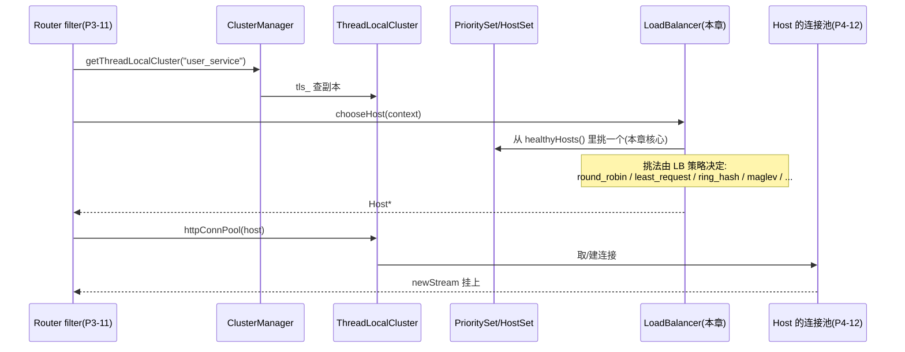

# 第 4 篇 · 第 13 章 · 负载均衡:挑哪个后端

> **核心问题**:上一章 P4-12 把 cluster 拆到了 `PrioritySet` 里的一堆 `Host`(后端实例),并把"到一个 host 的连接怎么复用"讲透了。可还有一道关键的题没答——**cluster 里有多个健康 host(几十上百个),一条请求来,挑哪一个**?这就是负载均衡(Load Balancing)。朴素的 `hash(key) % N` 在 N 变化时会几乎全错;朴素的轮询在权重不均/机房分布/灰度版本下完全失配。Envoy 内置了一长串 LB 策略(round_robin / least_request / random / ring_hash / maglev / subset / wrr_locality / override_host / client_side_weighted_round_robin / cluster_provided),它们各自在解决什么本质问题、源码里怎么实现的?本章把这条 LB 链一次拆透,重点砸开两块硬骨头:**ring_hash 一致性哈希环**(粘性),以及 **maglev 一致性哈希查找表**(谷歌的招牌算法,Envoy 在生产里用得最广的一致性哈希)。

> 本章属于数据面(upstream 这一侧),承接 P4-12(cluster 提供 `HostSet`)、P3-11(weighted_clusters 与 subset 概念)。LB 只在**健康 host** 里挑——谁健康是 P4-14 健康检查/outlier detection 的活,本章只讲"假定已知健康集合,怎么选"。

> **读完本章你会明白**:
> 1. **新版 LB 架构的全貌**——1.39 里所有 LB 策略已经全部迁到 `source/extensions/load_balancing_policies/` 下(12 个策略目录 + 一个 `common/` 共享基类),老的 `source/common/upstream/load_balancer_impl.cc` **已经不存在**,只剩 proto 那个 `LbPolicy` 枚举当**向后兼容的翻译层**(`upstream_impl.cc::LegacyLbPolicyConfigHelper`),把你写的旧 `ROUND_ROBIN / RING_HASH / MAGLEV / CLUSTER_PROVIDED` 翻成对应的新工厂。**老资料讲 LB 架构的大片过时**,本章以源码为准。
> 2. **每个 LB 策略在解决什么**——round_robin(默认均衡)/ least_request(P2C 减少长尾)/ random(最简单)/ ring_hash(粘性 + 节点增删迁移小)/ maglev(更均衡 + O(1) 查找)/ subset(按 metadata 灰度子集)/ wrr_locality(按机房加权)/ override_host(filter 显式指定)/ client_side_weighted_round_robin(根据后端 ORCA 上报动态调权)。每个都不是 Envoy 故意复杂,而是**生产中确实存在的那种问题**。
> 3. **ring_hash 一致性哈希为什么 sound**——朴素 `hash % N` 在节点增删时会几乎全错(全局重哈希);一致性哈希把节点映射到环上,请求 key 哈希后顺时针找最近节点,**节点增删只迁移自己负责的那段 key**。Envoy 用 xxHash64 + `<host>_<index>` 造节点副本,二分查找定位。
> 4. **maglev 为什么比 ring_hash 更"均衡"+ 查找更快**——谷歌的 Maglev 算法用一张固定大小的查找表(M,默认 65537,必须素数),按"permutation + 抢占式填充"把每个 host 尽量均匀地铺进表里;查找是 `hash % M` 然后 O(1) 索引。比起 ring_hash 的"环 + 二分查找",maglev 的**分布方差更小**(更均衡)、**查找更快**(O(1) vs O(log N))。

> **如果一读觉得太难**:先只记住三件事——① LB 在 `source/extensions/load_balancing_policies/` 下,11 个策略各有自己的 config 工厂 + LB 实现;② **不要写 `hash % N`**——节点增删时几乎全错;正确做法是**一致性哈希**(ring_hash 环 或 maglev 查找表),节点增删只迁移局部 key;③ round_robin 用 **EDF 调度器**实现加权轮询(权重 1:2:1 的三台,EDF 按 deadline 出队);least_request 用 **P2C(Power of Two Choices)**:随机抽两个,挑活跃请求少的。

---

## 〇、一句话点破

> **LB 的本质是"在多个健康 host 里挑一个"。朴素 `hash % N` 错在 N 变化时全局重映射;朴素轮询错在权重/机房/灰度全失配。Envoy 的 LB 矩阵按"我要解决哪种问题"分:round_robin/least_request/random 处理"普通均衡";ring_hash/maglev 处理"粘性 + 节点增删迁移最小"(一致性哈希);subset 处理"灰度子集";wrr_locality 处理"机房加权";override_host 处理"filter 显式指定";client_side_weighted_round_robin 处理"按后端负载动态调权"。**

这是结论,不是理由。本章倒过来拆:先把 P4-12 留的钩子接上(LB 的输入是什么),再讲新版 LB 架构为什么全部迁到 `load_balancing_policies/`,然后挨个策略讲"它解决什么、不这样会怎样、源码怎么实现",最后两节砸开一致性哈希(ring_hash 和 maglev)的硬核技巧。

---

## 一、承接:LB 的输入是 PrioritySet 里的健康 host

P4-12 末尾的钩子是:`router` filter 拿 cluster 名,经 `ClusterManager → ThreadLocalCluster → PrioritySet`,拿到一组按优先级分桶的 `HostSet`,每个 `HostSet` 里有四种视图(`hosts()` / `healthyHosts()` / `degradedHosts()` / `excludedHosts()`)。**LB 的输入就是这堆 `HostSet`**,它默认只在 `healthyHosts()` 里挑。



LB 是这条链上独立的一站——它**输入**是 `HostSet`(健康 host 列表)+ 一个 `LoadBalancerContext`(下面讲),**输出**是一个 `Host*`(`HostSelectionResponse` 包装,见 [load_balancer.h#L202-L260](../envoy/envoy/upstream/load_balancer.h#L202-L260))。

### 1.1 LB 的接口:`LoadBalancer::chooseHost`

`envoy/upstream/load_balancer.h` 里的核心接口:

```cpp
// envoy/upstream/load_balancer.h:202-260(简化示意,保留真实方法签名)
class LoadBalancer {
public:
  virtual ~LoadBalancer() = default;
  // 主入口:挑一个 host。HostSelectionResponse 里包 Host* 或 nullptr。
  virtual HostSelectionResponse chooseHost(LoadBalancerContext* context) PURE;
  // 预演挑一个不同 host(用于 preconnect,不算正式选定)
  virtual HostConstSharedPtr peekAnotherHost(LoadBalancerContext* context) PURE;
  // 复用现存连接(某些 LB/连接池会用,如 hash 亲和)
  virtual absl::optional<SelectedPoolAndConnection>
  selectExistingConnection(LoadBalancerContext* context, const Host& host,
                           std::vector<uint8_t>& hash_key) PURE;
  ...
};
```

`LoadBalancerContext`(同文件 L79-L189)是 LB 的"上下文",关键方法:

- `computeHashKey()`(L89):返回这次请求要 hash 的 key(`absl::optional<uint64_t>`),供 ring_hash/maglev 用——通常来自 router 配置的 hash_policy(source IP / cookie / header / query parameter)。
- `metadataMatchCriteria()`(L95):返回 subset LB 要匹配的 metadata(来自 router 的 `metadata_match`),subset LB 据此把流量打到一个子集。
- `determinePriorityLoad(...)`(L126-L128):返回各优先级的负载分布,决定"主要打 P0 还是溢出到 P1"。
- `overrideHostToSelect()`(L173):返回 filter 显式指定的 host(override_host LB 用)。
- `shouldSelectAnotherHost(const Host&)`(L135)+ `hostSelectionRetryCount()`(L141):让 LB 知道"这个 host 不行,换一个",用于 retry 和 host filter。

> **钉死这件事**:LB 不是"无脑挑一个",它是**带上下文的挑选**——同一个 cluster、同一个健康 host 列表,不同请求过来,根据 hash policy / metadata / override / retry 状态,可以挑出不同的 host。这套 `LoadBalancerContext` 把"这次请求的所有挑选维度"封装好交给 LB,是 Envoy 把"挑 host"做成可扩展策略矩阵的接口地基。

### 1.2 LB 的"挑"是一种策略,不是写死的

朴素代理里,"挑哪个后端"是写死的——通常就是个轮询计数器。但生产里这一句"挑哪个"会被十几种需求撕扯:

- 想要**粘性**(同一个 client 的请求总打同一个后端,缓存命中)?要 hash。
- 想要**权重**(8C16G 的机器扛 2 倍流量,4C8G 扛 1 倍)?要加权轮询。
- 想要**避免长尾**(机器慢一点就少给它流量)?要 least_request。
- 想要**灰度**(只把 10% 流量打到 v2)?要 subset。
- 想要**就近**(同机房优先,跨机房延迟高)?要 locality-aware。
- 想要**显式指定**(某个 filter 算出该走哪个后端)?要 override_host。

每一种"想要",就是一种 LB 策略。Envoy 把它们都做成独立扩展(在 `source/extensions/load_balancing_policies/` 下),通过工厂(`TypedLoadBalancerFactory`)注册,运行时根据 cluster 配置挑一个工厂实例化出对应的 LB。**"挑哪个后端"被做成了一等公民的可插拔策略,而不是写死的轮询**。

---

## 二、新版 LB 架构:全部迁到 `load_balancing_policies/`(★ 老资料大片过时)

这是本章最容易和资料打架的地方。**1.39(本书所本,commit `df2c77d`)里 LB 已经全部迁到了 `source/extensions/load_balancing_policies/`**——这是个独立的大重构,从 1.27 起逐步把所有 LB 从 `source/common/upstream/` 搬出来做成扩展。

### 2.1 老的 `load_balancer_impl.cc` 已经不存在

> **钉死这件事**(诚实标注,本书独有):本书动手前 grep 了源码——`source/common/upstream/load_balancer_impl.cc` 和 `source/common/upstream/load_balancer_impl.h` **已经不存在**。所有讲解 `LoadBalancerImpl` 在 `common/upstream/` 的博客、文档、源码导览(写于 1.26 及之前),**对应文件已删,讲解已过时**。新位置:

| 老位置(已删) | 新位置(本书所本) |
|------------|-----------------|
| `source/common/upstream/load_balancer_impl.{h,cc}` | `source/extensions/load_balancing_policies/common/load_balancer_impl.h`(共享基类 `LoadBalancerBase`/`ZoneAwareLoadBalancerBase`/`EdfLoadBalancerBase`) |
| `source/common/upstream/thread_aware_lb.h` | `source/extensions/load_balancing_policies/common/thread_aware_lb_impl.{h,cc}`(基类 `ThreadAwareLoadBalancerBase`) |
| 各 LB 实现(如 `ring_hash_lb.cc`)在 `common/upstream/` | 在 `source/extensions/load_balancing_policies/{策略名}/` |

唯一还留在 `source/common/upstream/` 的是个**翻译层**——`LegacyLbPolicyConfigHelper::getTypedLbConfigFromLegacyProtoWithoutSubset`([upstream_impl.cc#L1047-L1080](../envoy/source/common/upstream/upstream_impl.cc#L1047-L1080))。它的活是:你写的旧 proto 字段 `lb_policy: ROUND_ROBIN`(枚举),它翻译成新工厂名 `"envoy.load_balancing_policies.round_robin"`,然后按工厂拿对应扩展:

```cpp
// source/common/upstream/upstream_impl.cc:1047-1080(简化示意,保留真实分支)
case ClusterProto::ROUND_ROBIN:
  lb_factory = Config::Utility::getFactoryByName<TypedLoadBalancerFactory>(
      "envoy.load_balancing_policies.round_robin");
  break;
case ClusterProto::LEAST_REQUEST:
  lb_factory = Config::Utility::getFactoryByName<TypedLoadBalancerFactory>(
      "envoy.load_balancing_policies.least_request");
  break;
case ClusterProto::RING_HASH:  ... "envoy.load_balancing_policies.ring_hash";
case ClusterProto::RANDOM:     ... "envoy.load_balancing_policies.random";
case ClusterProto::MAGLEV:     ... "envoy.load_balancing_policies.maglev";
case ClusterProto::CLUSTER_PROVIDED: ... "envoy.load_balancing_policies.cluster_provided";
```

所以 `LbPolicy` 这个 proto 枚举(定义在 `api/envoy/config/cluster/v3/cluster.proto:82-121`)现在只是个**向后兼容的 selector**,底下全部走新工厂。**没有 C++ 的 `LoadBalancerType` 枚举**——有的只是 proto 枚举 + 12 个 `TypedLoadBalancerFactory` 扩展。

### 2.2 12 个 LB 策略工厂,都注册在 `load_balancing_policies/`

`source/extensions/load_balancing_policies/` 下的目录(共 13 个,除 `common/` 是共享基类外,12 个是策略):

```
  source/extensions/load_balancing_policies/
    common/                              ← 共享基类(LoadBalancerBase/ThreadAwareLoadBalancerBase/...)
    round_robin/                         ← 默认,加权轮询(EDF)
    least_request/                       ← P2C,挑活跃请求少的
    random/                              ← 纯随机
    ring_hash/                           ← 一致性哈希环(粘性)
    maglev/                              ← 一致性哈希查找表(谷歌)
    subset/                              ← 按 metadata 子集(灰度)
    wrr_locality/                        ← 按 locality 加权
    client_side_weighted_round_robin/    ← 按后端 ORCA 上报动态调权
    override_host/                       ← filter 显式指定 host
    cluster_provided/                    ← 占位符,cluster 自带 LB
    load_aware_locality/                 ← 未实现(create() 返回 nullptr)
    dynamic_modules/                     ← 动态 C++ 模块扩展(对应 P6-22)
```

每个策略目录下都有一个 `config.cc`,里面一行 `REGISTER_FACTORY(Factory, Upstream::TypedLoadBalancerFactory)`——把工厂注册进 Envoy 通用工厂注册表 `Registry::FactoryRegistry<Upstream::TypedLoadBalancerFactory>`,工厂名形如 `"envoy.load_balancing_policies.round_robin"`(round_robin/config.cc#L29)。

> **钉死这件事**:本章开列的"12 个 LB 策略"——其中 **`load_aware_locality` 在 df2c77d 是 stub**(`config.cc` 里 `create()` 直接 `return nullptr`,`loadConfig` 返回 `UnimplementedError`),**不是可用策略**;`dynamic_modules` 是给 P6-22 的扩展框架,不是经典算法;`cluster_provided` 是个**占位符**(工厂返回 nullptr,告诉 cluster_manager "用 cluster 自己提供的 LB",比如 logical_dns 的逻辑 host 走 round_robin)。所以**真正能用的 LB 算法是 9 个**:round_robin / least_request / random / ring_hash / maglev / subset / wrr_locality / client_side_weighted_round_robin / override_host。本章重点拆前 5 个 + subset + wrr_locality,后两个(client_side_weighted / override_host)一笔带过。

### 2.3 工厂两层模板:基类钉死骨架,策略只填差异

所有 LB 工厂的注册走的是同一个模式(两层模板):

- **第一层**:`source/common/upstream/load_balancer_factory_base.h` 里的 `TypedLoadBalancerFactoryBase<Proto>`——通用模板,提供 `name()`、`createEmptyConfigProto()` 等。
- **第二层**:`source/extensions/load_balancing_policies/common/factory_base.h` 里的 `FactoryBase<ProtoType, Impl>`——继承第一层,把"创建 thread-aware LB(主线程,共享环/表)"和"创建 worker-local LB(每个 worker 一个)"两件事做成模板方法,具体策略只填 `Impl` functor。

每个具体策略的 `config.h` 里,Factory 类继承 `Common::FactoryBase`,只填自己的 proto 类型和 creator。例如 round_robin([round_robin/config.h#L28-L46](../envoy/source/extensions/load_balancing_policies/round_robin/config.h#L28-L46)):

```cpp
class Factory : public Common::FactoryBase<RoundRobinLbProto, RoundRobinCreator> {
public:
  Factory() : FactoryBase("envoy.load_balancing_policies.round_robin") {}
  absl::StatusOr<Upstream::LoadBalancerConfigPtr>
  loadConfig(Server::Configuration::ServerFactoryContext&,
             const Protobuf::Message& config) override { /* 解析 proto */ }
  absl::StatusOr<Upstream::LoadBalancerConfigPtr>
  loadLegacy(Server::Configuration::ServerFactoryContext&, const ClusterProto& cluster) override {
    /* 从旧 lb_policy 枚举兼容 */
  }
};
```

> **不这样会怎样**:如果每个 LB 策略都各自实现一遍"工厂注册 + proto 解析 + thread-aware/worker-local 创建"这套样板,12 个策略就有 12 套重复代码,改一处得改 12 处。两层模板把骨架钉死,具体策略只填"我的 proto 类型 + 我的 LB 类怎么 new"——这是 Envoy 把"策略矩阵"做成可维护扩展的关键工程化。承接系列其他几本(LevelDB 把"比较器"参数化、Tokio 把 future 参数化、gRPC 的 filter fusion 组合子),这是同一种"基类钉骨架、子类填差异"的工程哲学。

### 2.4 thread-aware vs worker-local:LB 的两种生命周期

LB 在 Envoy 里的生命周期分两种(`envoy/upstream/load_balancer.h`):

- **`ThreadAwareLoadBalancer`**(L328-L345):**全局唯一**(主线程持有)。用于需要在主线程预先构建大型共享数据结构(如 ring_hash 的环、maglev 的查找表)的 LB——主线程构建好不可变结构,通过 `factory()` 把它**共享**给所有 worker。**用 `shared_ptr` 共享不可变结构,worker 只读不改,无锁**。
- **`LoadBalancer`**(L202-L260):**每个 worker 一个**(通过 `LoadBalancerFactory::create(LoadBalancerParams)` 在 worker 线程上 new 出来)。用于状态轻、每个 worker 自己维护状态的 LB(如 round_robin 的 `rr_index_`、least_request 的 active 计数都是 per-worker 的,不需要全局共享)。

源码骨架在 `source/extensions/load_balancing_policies/common/thread_aware_lb_impl.h#L26` 的 `ThreadAwareLoadBalancerBase`:

```cpp
// source/extensions/load_balancing_policies/common/thread_aware_lb_impl.h:26-195(简化示意)
class ThreadAwareLoadBalancerBase : public LoadBalancerBase, public ThreadAwareLoadBalancer {
  // 主线程:健康集合变化时被调用,重建共享结构(ring/table),通过 shared_ptr 发布
  void refresh() {
    ...
    auto per_priority_state = std::make_shared<std::vector<PerPriorityStatePtr>>();
    // virtual,子类(ring_hash/maglev)各自实现:重新构造环/表
    per_priority_state->at(p)->current_lb_ = createLoadBalancer(...);
    {
      absl::WriterMutexLock lock(&factory_->mutex_);
      factory_->per_priority_state_ = per_priority_state;   // 发布新快照
    }
  }
  // 工厂:create() 给每个 worker 生产一个 LoadBalancerImpl
  class LoadBalancerFactoryImpl : public LoadBalancerFactory {
    LoadBalancerPtr create(LoadBalancerParams) {
      return std::make_unique<LoadBalancerImpl>(shared_from_this());   // 持有 factory_ 弱引用
    }
  };
  // worker 侧:每次 chooseHost 读 shared_ptr 快照,无锁读
  class LoadBalancerImpl : public LoadBalancer {
    HostSelectionResponse chooseHost(LoadBalancerContext* context) {
      auto* lb = (*per_priority_state_)[priority]->current_lb_.get();   // 共享不可变结构
      return lb->chooseHost(hash, attempt);
    }
  };
};
```

> **钉死这件事**:ring_hash 和 maglev 的"环/表"是**主线程构建、worker 共享**——因为环和表都很大(环默认 1024~8M 条目,表默认 65537 项),每个 worker 都建一份太浪费;而且节点增删时要全表重建,worker 各自重建还会出现"短暂不一致"。所以**主线程统一重建一份不可变的快照,通过 `shared_ptr` 发布给所有 worker**,worker 持有快照只读不改。**这就是为什么 ring_hash/maglev 在节点增删时只重建一次、所有 worker 立刻看到新版本**——快照替换是原子的 `shared_ptr` 赋值(在主线程加写锁,worker 读时用读锁拷贝 shared_ptr 副本,这是 thread-local 无锁归并之外的另一种 LB 专属无锁共享机制)。

而 round_robin/least_request/random 走 worker-local——它们的状态轻(`rr_index_` 一个 uint64、active 计数读 host stats),每个 worker 自己维护自己的就行,不需要共享。这种策略直接由 `EdfLoadBalancerBase` / `ZoneAwareLoadBalancerBase` 派生(`common/load_balancer_impl.h`),**没有 thread-aware 那一层**,factory 直接每个 worker new 一个实例。

---

## 三、round_robin:默认均衡,EDF 调度做加权

round_robin 是最朴素的 LB——按顺序轮流挑。但 Envoy 的 round_robin 不是简单的"下一个",它有**加权**(weight 大的多挑)和**peekahead**(预演挑下一个,供 preconnect)两个加分项。

### 3.1 朴素轮询 + 加权:EDF 调度器

朴素的 round_robin 是:维护一个索引 `i`,每次 `hosts[i++ % size]`。问题来了——**如果三个 host 权重是 1:2:1**,你怎么轮询?

朴素做法是"复制"——把权重大的 host 复制成多份塞进数组(权重 1:2:1 → `[a, b, b, c]`),然后轮询。但这种复制在权重是小数(1.5:1:0.7)或者权重很大(1000:1)时,要么不准要么数组爆。

Envoy 的解法是 **EDF(Earliest Deadline First)调度器**(`source/common/upstream/edf_scheduler.h`):

```
   EDF 调度器的核心思想:每个 host 有一个 deadline,deadline 最近的先出队。
   入队时 deadline = 当前时间 + 1/weight。
   权重 1:2:1 的三台:
     入队时:deadline_a = 1.0, deadline_b = 0.5, deadline_c = 1.0
     第一次出队:b(deadline 最近);重新入队 deadline_b = 0.5 + 1/2 = 1.0
     第二次出队:a/c 同 deadline 0.5+0.5=1.0,按入队序拿 a;重新入队 deadline_a = 1 + 1/1 = 2.0
     第三次出队:c(deadline 1.0);重新入队 deadline_c = 1 + 1 = 2.0
     第四次出队:b(deadline 1.0)
     ...
   出队序列:b, a, c, b, a, c, b, ...  ← b 占一半, a 和 c 各占四分之一
```

EDF 的精髓:**权重大的 host deadline 增长得慢(1/weight 小),所以频繁出队**;权重小的 deadline 增长快,所以出队少。这样不复制任何东西,就能用 O(log N)(堆)实现任意浮点数权重的加权轮询——而且**分布均匀**(权重 1:2:1 真的就是 1/4 : 1/2 : 1/4,不是粗暴复制那种近似)。

源码骨架在 `EdfScheduler::pickAndAdd`([edf_scheduler.h#L42-L56](../envoy/source/common/upstream/edf_scheduler.h#L42-L56)):

```cpp
// source/common/upstream/edf_scheduler.h:42-56(简化示意,保留真实逻辑)
std::shared_ptr<C> pickAndAdd(std::function<double(const C&)> calculate_weight) override {
  // 先看 prepick 缓存(peekAgain 时存进去的)
  while (!prepick_list_.empty()) {
    auto ret = prepick_list_.front().lock();
    prepick_list_.pop_front();
    if (ret) return ret;
  }
  // 弹出堆顶(deadline 最近的)
  std::shared_ptr<C> ret = popEntry();
  if (ret) {
    add(calculate_weight(*ret), ret);   // 重新入队:新 deadline = current_time + 1/weight
  }
  return ret;
}

void add(double weight, std::shared_ptr<C> entry) override {
  ASSERT(weight > 0);
  const double deadline = current_time_ + 1.0 / weight;
  queue_.push({deadline, order_offset_++, entry});   // order_offset 是同 deadline 时的入队序(打破平手)
}
```

> **不这样会怎样**:
> - **朴素轮询(不分权重)**:权重 1:2:1 时,三台平均分,实际扛不住"2 倍"那台的真实能力,要么 2 倍那台闲死、要么其它两台挂死。
> - **复制法(数组里复制)**:权重 1000:1 时数组爆;权重 1.5:1 这种小数表达不了。EDF 用浮点 deadline 表达任意权重,无复制,堆操作 O(log N),对生产规模(N 几百到几千)足够快。
> - **不加 `order_offset_`**:同 deadline 的两个 host(同权重)出队顺序会随机,导致**抖动**。`order_offset_++` 是个单调递增的"入队序",让同 deadline 的按先入先出,保证**确定性**(同一组 host 多次运行结果一致,可重放可调试)。

### 3.1.5 EDF 的"为什么 sound"(数学小证)

EDF 为什么严格按权重分布?简单证一下。设 N 个 host,权重 `w_1, w_2, ..., w_N`。EDF 出队序列里,host `i` 出现的频率 `f_i` 应该正比于 `w_i`。证明思路:

- 每次出队后,host `i` 重新入队的 deadline 增量是 `1/w_i`(权重越大,增量越小)。
- 长时间运行后,host `i` 的 deadline 序列 `d_i, d_i + 1/w_i, d_i + 2/w_i, ...` 是个等差数列,公差 `1/w_i`。
- 整个堆是所有 host 的 deadline 序列合并;某 host 出现频率正比于它"出队密度"——公差越小(权重越大),序列越密,出队越频繁。
- 数学上可证:稳态下 host `i` 的出队比例严格等于 `w_i / sum(w_j)`——**就是权重比例**。

这就是 EDF 的精髓——**用"deadline 增量 = 1/weight"这个不变量,自动把权重换算成出队频率**。无需复制、无需近似、对任意浮点权重都精确。这种"用单调时间表自然表达加权"的思路,在操作系统调度(实时任务的 EDF)、网络包调度(QoS 加权)里都用,Envoy 把它借过来做 LB,是跨领域技巧的迁移。

### 3.1.6 peekahead:为 preconnect 预演

round_robin 还有个 `peekahead_index_`(round_robin_lb.h#L70-L72)和 `peekAnotherHost` 接口——它的作用是"**预测下一条请求会挑哪个 host**"。为什么要预测?回到 P4-12 讲的 preconnect:ClusterManager 在 `newStream` 之前调用 `maybePreconnect`,想知道"接下来会挑哪个 host"以便**预先建连接**。

`peekAnotherHost` 返回"下一个会被 `unweightedHostPick` 选中的 host"——通过 `peekahead_index_` 临时推进索引但不影响真正的 `rr_indexes_`(实现见 `LoadBalancerBase::random(peek=true)` 和 stashed_random_ 机制)。这是把 LB 的"挑"和 preconnect 的"预先建连接"配合起来的细节:LB 知道下一个会选谁,提前告诉连接池去建连接,第一条请求来的时候握手已经完成。承接 P4-12 §4.2 preconnect 公式中的 `anticipate_incoming_stream` 标志,这两个机制是配对的。

### 3.2 rr_index_ 是 per-worker 的,不是原子

Envoy 的 round_robin 在每个 worker 线程上有一个独立的 `RoundRobinLoadBalancer` 实例(见 §2.4),所以它的索引**不是原子**,就是个普通 `uint64_t`([round_robin_lb.h#L69-L82](../envoy/source/extensions/load_balancing_policies/round_robin/round_robin_lb.h#L69-L82)):

```cpp
// source/extensions/load_balancing_policies/round_robin/round_robin_lb.h:69-82(简化示意,保留真实字段)
HostConstSharedPtr unweightedHostPick(const HostVector& hosts_to_use, const HostsSource& source) override {
  if (peekahead_index_ > 0) { --peekahead_index_; }
  ASSERT(rr_indexes_.find(source) != rr_indexes_.end());
  return hosts_to_use[rr_indexes_[source]++ % hosts_to_use.size()];   // 普通 ++,无原子
}

uint64_t peekahead_index_{};
absl::flat_hash_map<HostsSource, uint64_t, HostsSourceHash> rr_indexes_;
```

> **钉死这件事**(承接 P1-02 线程模型):round_robin 的 `rr_indexes_` 不是 `std::atomic<uint64_t>`,因为**每个 worker 持有自己的 LB 实例**——N 个 worker 各自轮各自的,没有共享状态就没有竞争,不需要原子。这是 Envoy thread-local 无锁思想在 LB 上的体现。代价是:**整体流量分布不是严格轮询的**(worker A 可能在 index 5,worker B 在 index 2),但只要请求数够多、负载够均,**统计上**还是按权重分布的——这就是"统计上的均衡,而非每个请求严格轮询"的取舍。

注意还有个 `seed_` 字段(`load_balancer_impl.h#L548-L551`):每个 worker 启动时用随机值初始化 `seed_`,`refreshHostSource` 用它给 `rr_indexes_` 赋初值。**这是为了"打散"——同一个 cluster 部署在多台 Envoy(比如 K8s 里 100 个 sidecar),如果都从 0 开始轮询,会一起挑同一个 host**;随机 seed 让不同 Envoy 的轮询起点错开,避免"羊群效应"。

### 3.3 加权的快慢道:同权重走快路径,异权重才用 EDF

Envoy 还有个优化——**所有 host 权重相同时,走 unweighted 快路径(直接 `i++ % size`);只有权重不同时才启用 EDF**(`common/load_balancer_impl.cc:1052` 的 `hostWeightsAreEqual(hosts)` 判断)。这是 1.20+ 加的优化:EDF 的堆操作 O(log N) 在大 cluster 下不是免费的,大部分 cluster 默认所有 host 权重相同(都是 1),走快路径 O(1) 更省 CPU。

> **钉死这件事**:round_robin 是 Envoy 的**默认 LB**(不配 `load_balancing_policy` 时就是它)。它给你"按权重均衡",通过 EDF 实现,且在所有权重相同时退化成纯轮询快路径。**生产里 80% 的场景默认 round_robin 就够**——除非你有粘性 / 长尾 / 灰度 / 就近需求,那才换下面这些更专门的策略。

---

## 四、least_request:P2C 减少长尾

round_robin 是"按权重均衡",但它**只看权重,不看后端实际负载**。问题:权重 1:1 的两台后端,一台 CPU 90%(慢),一台 CPU 10%(快)——round_robin 还是 50/50 分,慢的那台会被压垮。least_request 的目标是**挑当前活跃请求最少的**——它通过 P2C(Power of Two Choices)实现。

### 4.1 P2C:随机抽两个,挑活跃少的

朴素 least_request 是"扫所有 host,挑活跃请求最少的"。这在 cluster 几百上千台时,每次请求都全扫一遍 O(N) 太贵。**P2C 的精髓**:随机抽 2 个候选,挑活跃少的——比 round_robin 好得多,比全扫描便宜得多(只算 2 次)。

P2C 出自 Michael Mitzenmacher 的经典论文(*The Power of Two Choices in Randomized Load Balancing*),Envoy 直接在源码注释里引用了([least_request_lb.h#L9-L25](../envoy/source/extensions/load_balancing_policies/least_request/least_request_lb.h#L9-L25)):

```cpp
// source/extensions/load_balancing_policies/least_request/least_request_lb.cc:126-148(简化示意)
HostSharedPtr LeastRequestLoadBalancer::unweightedHostPickNChoices(const HostVector& hosts_to_use) {
  HostSharedPtr candidate_host = nullptr;
  for (uint32_t choice_idx = 0; choice_idx < choice_count_; ++choice_idx) {   // 默认 choice_count_ = 2
    const int rand_idx = random_.random() % hosts_to_use.size();
    const HostSharedPtr& sampled_host = hosts_to_use[rand_idx];
    if (candidate_host == nullptr) { candidate_host = sampled_host; continue; }
    const auto candidate_active_rq = effectiveActiveRequests(*candidate_host);
    const auto sampled_active_rq = effectiveActiveRequests(*sampled_host);
    if (sampled_active_rq < candidate_active_rq) { candidate_host = sampled_host; }
  }
  return candidate_host;
}
```

`effectiveActiveRequests` 读的是 `host.stats().rq_active_`([least_request_lb.cc#L6-L12](../envoy/source/extensions/load_balancing_policies/least_request/least_request_lb.cc#L6-L12)):

```cpp
uint64_t LeastRequestLoadBalancer::effectiveActiveRequests(const Host& host) const {
  uint64_t active = host.stats().rq_active_.value();
  if (count_pending_requests_) {
    active += host.stats().rq_pending_active_.value();
  }
  return active;
}
```

> **钉死这件事**:least_request 的"少"是基于 **`rq_active_`(该 host 当前在途请求数)** 判断的——这是 Envoy 自己维护的统计(承接 P1-02 thread-local stats 攒批归并,P6-20 拆透),不依赖后端上报。每次请求出来时 `rq_active_++`,响应回来时 `rq_active_--`。**LB 在挑 host 时读这个计数,活跃少的就是"目前闲的"**。

### 4.2 P2C 为什么 sound(数学直觉)

为什么 P2C 随机抽 2 个就够,不需要全扫?直觉是这样的:

- **抽 1 个(纯随机)**:负载分布是指数尾部——最闲的那台和最忙的那台可能差几十倍。
- **抽 2 个,挑活跃少的**:这是"两个里挑小"——统计学上,**两个独立均匀分布的最小值期望,远小于单个的期望**(具体地,均匀 [0,1] 的最小值期望是 1/3,远小于单值的 1/2)。每次挑只要看 2 个,选出来的就已经是"较闲"的。
- **抽 k 个,k 越大分布越偏闲**——但 k=2 已经把大部分收益拿到了,k=3、4 收益递减,而且每多抽一个就多 O(1) 计算成本。Mitzenmacher 论文证明 **k=2 是"成本/收益"的最优解**。

> **不这样会怎样**:
> - **朴素轮询(不读活跃数)**:慢的那台(高 active)继续被均匀打,雪崩——它越慢,请求积压越多,`rq_active_` 越高,但 round_robin 还是一直往里塞。这是经典的长尾雪崩。
> - **全扫描(每次扫所有 host 找活跃最少)**:O(N),几百台 host 时每次请求都扫一遍,CPU 在大 QPS 下会爆。P2C 把它降到 O(1)(2 次随机 + 1 次比较),收益近全扫。
> - **抽 1 个(纯随机)**:分布差,没把"闲"挑出来。P2C 抽 2 个是甜蜜点。

least_request 还支持 `FULL_SCAN` 模式(`selection_method_` 可配),适合 host 数很少(< 10)时全扫挑最少——默认是 `N_CHOICES`(P2C)。

### 4.3 加权 least_request:活跃数反向影响权重

least_request 也支持加权,而且**权重会动态地被活跃数反向影响**([least_request_lb.cc#L33-L47](../envoy/source/extensions/load_balancing_policies/least_request/least_request_lb.cc#L33-L47))——host 越忙,有效权重越小:

```
  effective_weight = weight / (active_requests + 1) ^ active_request_bias
```

`active_request_bias_` 默认 0(纯 RR),配成 1.0 时,active=10 的 host 有效权重变成 weight/11,几乎被边缘化。这套让 least_request 在加权模式下也能动态地避开慢节点。

> **钉死这件事**:least_request 不是"必选"——它有额外开销(读 `rq_active_`、随机抽 2 个)和**注意事项**:`rq_active_` 反映的是 Envoy 自己看到的在途请求数,**不反映后端真实 CPU/内存**。如果你有更准的后端负载信息(后端通过 ORCA 上报),那应该用 `client_side_weighted_round_robin`(§7.2)。**least_request 是"没有后端上报时的最简反长尾方案"**。

---

## 五、random:最朴素,有时恰恰是最优解

`random` 的逻辑最简单——`random_hash % hosts.size()`([random_lb.cc#L17-L30](../envoy/source/extensions/load_balancing_policies/random/random_lb.cc#L17-L30)):

```cpp
HostConstSharedPtr RandomLoadBalancer::peekOrChoose(LoadBalancerContext* context, bool peek) {
  uint64_t random_hash = random(peek);
  const absl::optional<HostsSource> hosts_source = hostSourceToUse(context, random_hash);
  if (!hosts_source) return nullptr;
  const HostVector& hosts_to_use = hostSourceToHosts(*hosts_source);
  if (hosts_to_use.empty()) return nullptr;
  return hosts_to_use[random_hash % hosts_to_use.size()];   // 纯随机
}
```

看着"低端",但在某些场景反而最优:

- **健康检查后的小集群**:cluster 就 5~10 台,均匀随机分布已经够好,引入 EDF/P2C 的额外计算反而浪费 CPU。
- **测试 / 调试**:想知道"是不是 LB 在搞鬼"——换成 random 把策略变量排除掉,看是不是别的地方(连接池、健康检查)的问题。
- **配合一致性哈希做 fallback**:某些场景一致性哈希找不到匹配(比如 hash policy 取不到值),退化为 random 保证流量不挂。

> **钉死这件事**:random 不加权(权重不同时 random 不准),也不读 active——**它的"无脑随机"在所有 host 同质(权重相同、性能相同)时,统计上和 round_robin 一样均匀,且无状态、无锁、无计数**。简单到极致,有时候就是最好的选择。

---

## 六、subset LB:按 metadata 灰度子集(承 P3-11)

subset LB 是个**元策略**——它不自己挑 host,而是**先用 metadata 把 cluster 分成若干子集,再在每个子集里跑子 LB**。这是 Envoy 做灰度发布、按标签路由的招牌。

### 6.1 朴素想法:灰度怎么做?

场景:同一个 `user_service` cluster 里,有 v1 和 v2 两版 endpoint(灰度发布)。你想让 90% 流量打 v1、10% 打 v2。朴素做法:

- 方案 A:配两个 cluster(`user_v1`、`user_v2`),router 用 `weighted_clusters` 按 90:10 分流。**痛点**:cluster 数翻倍,EDS 要分别给两个 cluster 推 endpoint,维护成本高。
- 方案 B:cluster 里所有 endpoint 混在一起,加个 metadata 字段(`version: v1` 或 `v2`),LB 根据 metadata 挑。**这就是 subset LB**——按 metadata 把 cluster 内部分成 `[v1 子集, v2 子集]`,请求按 metadata match 走对应子集。

subset LB 的配置大概长这样:

```yaml
common_lb_config:
  healthy_panic_threshold: ...
load_balancing_policy:
  policies:
    subset:
      subset_selectors:
      - keys: [ "version" ]            # 按 version 这个 key 分子集
        fallback_policy: DEFAULT_SUBSET  # 没匹配时的兜底
      fallback_policy_subset:
        version: v1                     # 默认子集
      # 子集内部用什么 LB
      subset_lb_policy:
        round_robin: {}
```

请求过来时,router 通过 `LoadBalancerContext::metadataMatchCriteria()` 告诉 subset LB "我要 `version=v2` 的子集",subset LB 在自己预先构建的子集 trie 里找到 v2 子集,**把挑 host 的活委托给子集内部的 round_robin**(或其它配置的子 LB)。

### 6.2 子集 trie + 三种 fallback

源码:`SubsetLoadBalancer`(`source/extensions/load_balancing_policies/subset/subset_lb.{h,cc}`)。它在 cluster 初始化时把所有 host 按 `envoy.lb` 这个 metadata filter 的 key/value 组合**预构建成 trie**(`LbSubsetMap`,`subset_lb.h#L148-L149`),查找时 O(子集 key 数)。

三种 fallback 策略(配在 `fallback_policy`,见 [subset_lb.cc#L67-L78](../envoy/source/extensions/load_balancing_policies/subset/subset_lb.cc#L67-L78)):

| Fallback | 行为 | 适用 |
|----------|------|------|
| `NO_FALLBACK` | 没匹配子集就返回 nullptr(请求 503) | 强制 metadata match,不容错 |
| `ANY_ENDPOINT` | 没匹配就在全部 host 里挑 | 宽松兜底 |
| `DEFAULT_SUBSET` | 没匹配就落到 `fallback_policy_subset` 指定的默认子集 | 灰度场景常用(默认走 v1) |

> **不这样会怎样**:
> - **不用 subset,搞两个 cluster 配 weighted_clusters**:EDS 双推、维护双份;subset 把它压成一个 cluster + 一个 metadata 字段,简化运维。承 P3-11 weighted_clusters 那一节,subset 是它的"cluster 内版"。
> - **没 fallback(NO_FALLBACK)**:metadata 取不到值的请求直接 503——线上灰度场景里这种死板不可接受;DEFAULT_SUBSET 保证"取不到值时回落到稳定版"。
>
> **钉死这件事**:subset 是个**包装器**——它内部再嵌套一个子 LB(round_robin / least_request / ring_hash 都行,配在 `subset_lb_policy`),subset 只负责"找子集",找到后委托给子 LB 挑 host。这是组合式的 LB 设计,让"灰度"和"均衡算法"两件事正交,不互相干扰。源码 `PrioritySubsetImpl` 构造时([subset_lb.cc#L709-L726](../envoy/source/extensions/load_balancing_policies/subset/subset_lb.cc#L709-L726))会调用 `lb_config_.createLoadBalancer(...)` 创建子 LB,然后 `thread_aware_lb_->factory()->create({*this, ...})` 创建 worker-local 子 LB。

### 6.3 subset 选型的真实场景:金丝雀、A/B、按租户隔离

subset LB 不只是"灰度",在生产里它的形态更丰富:

- **金丝雀(canary)**:新版本先部署 1~2 台,通过 metadata `version: canary` 标记。router 配置让特定 header(如 `x-canary: true`)的请求 metadata_match `version=canary`,走 canary 子集;其它请求走 `version=stable` 子集。这是"按请求属性灰度"。
- **A/B 测试**:同一个 cluster 里有 `variant=A` 和 `variant=B` 两组 endpoint,通过 metadata 分流。和 weighted_clusters(P3-11)的区别是:weighted_clusters 在 router 层按权重分到**多个 cluster**,subset 在 cluster 内按 metadata 分到**多个子集**——少了一层 cluster 维护。
- **按租户隔离**:多租户 SaaS,某些大客户独占一组 endpoint(`tenant=acme`),普通客户共享一组(`tenant=shared`)。subset + metadata_match 实现"租户级隔离",不需要为每个大客户单独建 cluster。
- **按地域分组**:endpoint 的 metadata 带 `region=us-east`,subset 按 region 选——这和 locality-aware 的区别是:locality-aware 用 EDS 自带的 locality 字段(region/zone/sub_zone),subset 用任意 metadata key,更灵活但要应用层配。

**注意一个坑**:`metadata_match` 在 router 的 route_config 里配,**subset_selectors** 在 cluster 的 `common_lb_config` 里配——两边的 key 必须对得上。subset LB 在 cluster 初始化时按 `subset_selectors` 的 keys 预构建子集 trie,router 请求时按 route 的 `metadata_match` 走 trie。如果 router 配的 key 不在 cluster 的 `subset_selectors` 里,**subset 找不到对应子集,走 fallback**——这是线上常见的"subset 不生效"原因。

### 6.4 KEYS_SUBSET fallback:渐进式 metadata 降级

subset 还有个高级 fallback——`KEYS_SUBSET`(per-selector 的 fallback,见 `SubsetSelectorFallbackParams`,subset_lb.h#L212-L216)。它的语义是:"**匹配不上时,丢掉部分 key 再试**"。

场景:subset selector 配的是 `[region, version, tier]`(三维),请求 metadata 给的是 `{region: us-east, version: v2, tier: gold}`——但这个三维组合的子集为空(没 endpoint 同时满足)。`KEYS_SUBSET` 配的 `fallback_keys_subset` 是 `[region, version]`,subset LB 会**丢掉 tier** 重新匹配 `{region: us-east, version: v2}`——把请求降级到"同 region 同 version 但不挑 tier"的更大子集。

源码 `chooseHostForSelectorFallbackPolicy`([subset_lb.cc#L335-L358](../envoy/source/extensions/load_balancing_policies/subset/subset_lb.cc#L335-L358))处理这个降级;校验在 `subset_lb_config.cc#L18-L48`——`fallback_keys_subset` 必须是 selector keys 的**真子集**(防无限递归)且更小。这是把"严格的 metadata 匹配"做成**渐进式降级**——尽量精确匹配,匹配不上就逐步放宽,比直接 fallback 到全部 host 更精细。

---

## 七、locality-aware:wrr_locality + locality_weights

到这一步,前面所有策略都没考虑**机房分布**。生产里同 cluster 经常跨机房(K8s 多 zone),跨机房延迟高(几十 ms)、同机房延迟低(亚 ms)。**应该优先挑同机房的 host**——这就是 locality-aware LB。

### 7.1 locality-aware 不是"独立 LB",是 LB 的一个维度

Envoy 的 locality-aware 不是一个单独的 LB 策略,而是 **EDS 给每个 endpoint 附带 locality(region/zone/sub_zone)+ locality_weights**(权重),然后 LB(尤其是 round_robin / wrr_locality)在挑 host 时**先按 locality_weights 挑一个机房,再在那个机房里挑 host**。

源码实现是 `LocalityWrr`(`source/extensions/load_balancing_policies/common/locality_wrr.{h,cc}`)——一个**对 locality 加权轮询的 EDF 调度器**:

```cpp
// source/extensions/load_balancing_policies/common/locality_wrr.cc:84-105(简化示意)
double effectiveLocalityWeight(uint32_t index) const {
  // 健康比例 = 这个 locality 的健康 host 数 / 总 host 数
  const double locality_availability_ratio =
      1.0 * locality_eligible_hosts.size() / host_count;
  // 过供给因子(默认 1.4):某机房挂了一部分 host 时,把它的有效权重按比例放大,
  // 避免一个机房挂掉时整个 locality 流量雪崩
  const double effective_locality_availability_ratio =
      std::min(1.0, (overprovisioning_factor / 100.0) * locality_availability_ratio);
  return weight * effective_locality_availability_ratio;   // EDS 权重 × 健康可用比例
}
```

> **钉死这件事**:locality-aware 的核心是 `weight × availability`——EDS 给机房权重(weight),Envoy 根据该机房健康 host 比例(availability)动态调整有效权重。**机房 A 有 100 host 全健康、机房 B 有 100 host 但 50 个挂了——A 的有效权重比 B 高一倍**(B 的 availability 是 0.5,A 是 1.0)。这是"过供给因子"的精髓:**不要让某机房部分故障时,流量还按原 weight 死板打过去**——按健康比例缩放,自动避开故障机房。

### 7.2 wrr_locality:专门为 locality 加权设计的策略

`wrr_locality`(Weighted Round Robin over Locality)是个**薄包装**——它把 `endpoint_picking_policy` 强制指定为 `client_side_weighted_round_robin`,然后**强制开启 locality weights**([wrr_locality_lb.cc#L22-L34](../envoy/source/extensions/load_balancing_policies/wrr_locality/wrr_locality_lb.cc#L22-L34)):

```cpp
// source/extensions/load_balancing_policies/wrr_locality/wrr_locality_lb.cc:22-34(简化示意)
Upstream::LoadBalancerPtr WrrLocalityLoadBalancer::WorkerLocalLbFactory::create(Upstream::LoadBalancerParams params) {
  auto* cswrr_factory = dynamic_cast<
      ClientSideWeightedRoundRobinLoadBalancer::WorkerLocalLbFactory*>(
      endpoint_picking_policy_factory_.get());
  if (cswrr_factory == nullptr) return nullptr;
  auto lb_config = cluster_info_.lbConfig();
  lb_config.mutable_locality_weighted_lb_config();   // 强制开 locality weights
  return cswrr_factory->createWithCommonLbConfig(lb_config, params);
}
```

> **诚实标注**:`wrr_locality` 在 1.39 是个**约束很死的策略**——它只接受 `client_side_weighted_round_robin` 作为 endpoint picker(`config.h:50-59` 显式校验),其它 picker 直接拒绝。这是因为 `client_side_weighted_round_robin` 是新加的(承接 §7.3),`wrr_locality` 是为了"既要 locality 加权、又要客户端基于负载调权"的场景组合出来的——单独的 `round_robin` 也能通过 `locality_weighted_lb_config` 开 locality,所以 wrr_locality 不是必选。

### 7.3 client_side_weighted_round_robin:按后端 ORCA 上报动态调权

`client_side_weighted_round_robin`(简称 CSWR)是个**根据后端实时负载动态调权**的策略——它接 ORCA(Open Request Cost Aggregation)报告,后端通过 HTTP header 或 OOB(out-of-band)周期性上报自己的 utilization / rps / eps / error_rate,CSWR 据此算出每个 host 的动态权重,**喂给底层的 EDF 调度器**。

源码:`ClientSideWeightedRoundBalancer`(`source/extensions/load_balancing_policies/client_side_weighted_round_robin/client_side_weighted_round_robin_lb.{h,cc}`)持有 `OrcaWeightManager`(`common/orca_weight_manager.{h,cc}`),后者 `calculateWeightFromOrcaReport`(`orca_weight_manager.h:59-64`)把 ORCA 报告换算成权重。权重有 `blackout_period`(默认 10s,刚连上的 host 不算权重,避免毛刺)和 `weight_expiration_period`(默认 180s,180s 没新报告就过期)。

> **钉死这件事**:CSWR 是 least_request 的"升级版"——least_request 只看 Envoy 自己的 `rq_active_`(Envoy 视角的忙闲),CSWR 看后端自己上报的 utilization(后端视角的忙闲)。**后端最知道自己忙不忙**——CPU 90% 的后端主动告诉 Envoy "我权重低点",这比 Envoy 数在途请求准得多。但代价是后端必须支持 ORCA 上报(不是所有后端都支持),所以 **CSWR 是有要求的"高级策略",least_request 是无要求的"普适策略"**。

---

## 八、override_host:filter 显式指定 host

`override_host` 是个**很新**的策略(1.30+),专为 AI 网关、外部 endpoint picker 场景设计:某个 filter(ext_proc / 自定义 filter)算出"这次请求该走哪个后端",通过 HTTP header 或 dynamic metadata **显式告诉 LB**,LB 就直接挑那个 host,不走算法。

源码:`OverrideHostLoadBalancer`(`source/extensions/load_balancing_policies/override_host/load_balancer.{h,cc}`)。它内部有个 fallback LB(也是可配的子策略),当 filter 没指定 host 或指定的 host 找不到时,回落到 fallback LB([load_balancer.cc#L153-L190](../envoy/source/extensions/load_balancing_policies/override_host/load_balancer.cc#L153-L190)):

```cpp
// source/extensions/load_balancing_policies/override_host/load_balancer.cc:153-190(简化示意)
HostSelectionResponse LoadBalancerImpl::chooseHostInternal(LoadBalancerContext* context) {
  if (!context || !context->requestStreamInfo()) {
    return fallback_picker_lb_->chooseHost(context);   // 没上下文,直接 fallback
  }
  // 从 header 或 dynamic metadata 读 override host 列表
  auto selected_hosts = getSelectedHosts(stream_info);
  if (selected_hosts.empty()) return fallback_picker_lb_->chooseHost(context);
  // consumeNextHost:按顺序逐个尝试(支持 retry)
  auto host = getEndpoint(selected_hosts);
  if (!host) return fallback_picker_lb_->chooseHost(context);
  return {host};
}
```

> **钉死这件事**:override_host 不是 LB 算法,是**绕过 LB 算法的口子**——把"挑哪个后端"的决策权交给 filter(filter 算法可以是任意自定义逻辑,如基于请求内容的智能路由)。**这是 Envoy 把 LB 也做成可扩展的体现**:既支持一堆经典算法(round_robin / ring_hash / maglev / ...),也支持"我自己来挑"。fallback 子策略保证 filter 没指定时不挂。

---

## 九、技巧精解一:ring_hash 一致性哈希环(粘性的根)

终于到本章的招牌技巧了。前面 round_robin / least_request / random 都不保证"同一个 client 总打到同一个后端"——但**粘性**(session affinity)是大量场景的硬需求:

- **缓存命中率**:用户 A 的请求总打同一台后端,后端把 A 的资料缓存在本地内存里,命中;如果打散到所有后端,每个后端都得从 DB 取,缓存命中率崩溃。
- **会话状态**:有状态服务(session 在内存里),必须把同一用户的请求固定到同一台。
- **分片**:某些业务按 user_id 分片,每片后端只管一部分用户。

怎么实现粘性?朴素做法:**`hash(key) % N`**(key 是 client IP / cookie / user_id,N 是 host 数)。但这个朴素做法有个致命缺陷——下面拆透。

### 9.1 不这样会怎样:朴素 hash % N 撞什么墙

想象 3 台 host(`N=3`),用 `hash(user_id) % 3` 分配。某用户 hash=10,`10 % 3 = 1` → 分到 host 1。一切正常。

**现在加一台 host,N 变成 4**。同一个用户 hash=10,`10 % 4 = 2` → 分到 host 2。

**问题**:用户从 host 1 飘到了 host 2——而**几乎每个用户都会飘**。算一下:hash 模从 3 变 4,有多少比例的 key 重映射?

```
  hash(key) = 0,1,2,3,4,5,6,7,8,9,10,11,...
  hash % 3:  0,1,2,0,1,2,0,1,2,0, 1, 2, ...
  hash % 4:  0,1,2,3,0,1,2,3,0,1, 2, 3, ...
             同 同 同 异 同 同 同 异 同 同 同 异 ...
  大约 3/4 的 key 被重映射(只有 1/4 巧合落在同一个 host)
```

**N 从 3 变 4,几乎 75% 的 key 全错**!这意味着:

- 加一台 host,75% 用户的缓存全部失效(都飘到新 host,新 host 缓存空),瞬间缓存命中率塌方,后端 DB 被打爆——经典"加机器反而更慢"。
- 反过来,挂一台 host,75% 用户飘到别的 host,挂掉那台的会话状态全丢(因为负责它的 host 换了)。

> **钉死这件事**:**朴素 `hash % N` 在节点增删时几乎全错**,这是它根本性的缺陷——它对 N 极度敏感,N 一变就全局重哈希。而生产里 N **就是会变**(扩容、缩容、故障重启)。所以朴素 hash 根本不能用于粘性场景。

### 9.2 一致性哈希的精髓:节点增删只迁移局部 key

一致性哈希(consistent hashing)是 1997 年 David Karger 等人在 MIT 提出的算法,专门解决"节点增删时 key 迁移最小"。它的精髓是:

**把 hash 空间弯成一个环(0 ~ 2^64-1),把节点和 key 都映射到环上,key 顺时针找最近的节点。**

```
   哈希环(0 ~ 2^64-1 弯成圆):
                  H(host_a) ← host_a 在环上的位置
                ╱             ╲
               ╱               ╲
              ╱                 ╲
        H(key1)                  H(key2)
              ╲                 ╱
               ╲   H(host_b)   ╱   ← host_b 在环上的位置
                ╲     │       ╱
                 ╲    │      ╱
                  ╲   │     ╱
                   ╲  │    ╱
                    ╲ │   ╱
                     ╲│  ╱
                      ╲│╱
                       ●H(host_c)   ← host_c 在环上的位置

   key1 顺时针最近的 host:host_a       → host_a
   key2 顺时针最近的 host:host_c       → host_c
```

**节点增删时,只影响"相邻段"的 key**:

- 加一个 host_d(放在 host_a 和 host_b 之间),只把"原来属于 host_b 的、但 key 落在 host_d 和 host_b 之间的"这段 key 迁移到 host_d——**其它的 key 一个不动**。
- 删一个 host(host_b),原来属于 host_b 的 key 顺时针飘到 host_c——**其它的 key 一个不动**。

数学上,朴素 hash 加一台 host 影响 ~75% 的 key,**一致性哈希加一台 host 只影响 ~1/N 的 key**(1/4 的 key,如果总共 4 台)——这是数量级的改进。

> **钉死这件事**:一致性哈希的核心是"**节点增删只迁移自己负责的那段 key,不全局重哈希**"。代价是分布不那么绝对均匀(节点在环上位置随机,会出现"有些段节点密、有些段节点稀"——这是 ring_hash 的方差问题,正是 maglev 要解决的)。但"节点增删只迁移局部"这点决定了它**是粘性场景的正确解**,朴素 hash 在生产里根本不能用。

### 9.3 ring_hash 在 Envoy 里的实现

源码:`RingHashLoadBalancer`([ring_hash/ring_hash_lb.h#L62-L120](../envoy/source/extensions/load_balancing_policies/ring_hash/ring_hash_lb.h#L62-L120))。核心数据结构是 `Ring`(ring_hash_lb.h#L79-L90):

```cpp
// source/extensions/load_balancing_policies/ring_hash/ring_hash_lb.h:74-90(简化示意)
struct RingEntry {
  uint64_t hash_;                  // 节点在环上的位置
  HostConstSharedPtr host_;        // 指向哪个 host
};

struct Ring : public HashingLoadBalancer {
  std::vector<RingEntry> ring_;    // 按 hash_ 排好序的环(扁平数组)
  HostSelectionResponse chooseHost(uint64_t hash, uint32_t attempt) const override;
};
```

环的构建(`Ring::Ring`,[ring_hash_lb.cc#L128-L223](../envoy/source/extensions/load_balancing_policies/ring_hash/ring_hash_lb.cc#L128-L223)):

1. **按权重放大**——每个 host 在环上不是只有 1 个点,而是**多个点**(virtual nodes / replicas),点的数量按权重比例分(`scale * entry.second`,ring_hash_lb.cc#L182)。默认 `minimum_ring_size = 1024`(全 host 加起来至少 1024 个点,分散度够)。最大 `maximum_ring_size = 8388608`(8M)。
2. **生成副本**——每个副本的 hash key 是 `<host-key>_<index>`(index 递增),用 xxHash64(或 MurmurHash2,可配)算出环上的位置(ring_hash_lb.cc#L187-L200):

```cpp
// source/extensions/load_balancing_policies/ring_hash/ring_hash_lb.cc:187-205(简化示意)
hash_key_buffer.assign(key_to_hash.begin(), key_to_hash.end());   // host 的 key(IP:port 或 hostname)
hash_key_buffer.emplace_back('_');                                // 分隔符
auto offset_start = hash_key_buffer.end();
target_hashes += scale * entry.second;                            // 该 host 应该有的副本数
uint64_t i = 0;
while (current_hashes < target_hashes) {
  const std::string i_str = absl::StrCat("", i);
  hash_key_buffer.insert(offset_start, i_str.begin(), i_str.end());   // 拼 "host_0", "host_1", ...
  const uint64_t hash = HashUtil::xxHash64(hash_key_buffer);          // xxHash64 算位置
  ring_.push_back({hash, host});
  ++i; ++current_hashes;
}
std::sort(ring_.begin(), ring_.end(), [](a, b) { return a.hash_ < b.hash_; });  // 按 hash 排序
```

3. **查找**——`chooseHost(hash)` 用**手写二分查找**找环上第一个 `hash >= key_hash` 的 entry(找不到就回环到 index 0,即"环"的体现),([ring_hash_lb.cc#L83-L124](../envoy/source/extensions/load_balancing_policies/ring_hash/ring_hash_lb.cc#L83-L124)):

```cpp
// source/extensions/load_balancing_policies/ring_hash/ring_hash_lb.cc:83-124(简化示意,保留真实逻辑)
// Ported from ketama.c (ketama_get_server). Uses signed ints on purpose.
int64_t lowp = 0;
int64_t highp = ring_.size();
int64_t midp = 0;
while (true) {
  midp = (lowp + highp) / 2;
  if (midp == static_cast<int64_t>(ring_.size())) { midp = 0; break; }   // 超过最大 hash,回环
  uint64_t midval = ring_[midp].hash_;
  uint64_t midval1 = midp == 0 ? 0 : ring_[midp - 1].hash_;
  if (h <= midval && h > midval1) break;                                 // 找到了
  if (midval < h) lowp = midp + 1; else highp = midp - 1;
  if (lowp > highp) { midp = 0; break; }
}
if (attempt > 0) midp = (midp + attempt) % ring_.size();   // retry:顺时针下几个
return ring_[midp].host_;
```

注释 "Ported from ketama.c"——ketama 是一致性哈希最经典的开源实现(memcached 用的),Envoy 直接移植了它的查找算法(没用 `std::lower_bound` 而是手写,因为要处理"回环"边界)。

> **钉死这件事**(技巧三层):
> 1. **虚拟节点**:`<host>_<index>` 拼 N 个副本而非单点,是为了**打散**——一个 host 在环上只有 1 个点时,它负责的"段"完全由那个点的位置决定,极端不均;有 1024 个点分散在环上,该 host 负责的段就均匀得多。
> 2. **环是排序数组,不是链表**:看似"环"该用循环链表,其实用排序数组 + 二分查找——查找 O(log N),比链表 O(N) 快得多;"环"的语义通过"超过最大 hash 回 index 0"实现。
> 3. **节点增删只重建环**:health set 一变,P4-12 那套 `addPriorityUpdateCb` 触发 `ThreadAwareLoadBalancerBase::refresh()`,**主线程重建一份新 Ring,通过 `shared_ptr` 发布给所有 worker**——worker 持有旧快照继续读,新请求立刻看到新环。无锁、不停机。

### 9.4 ring_hash 的痛点:方差大

ring_hash 的痛点是**分布方差大**——虚拟节点虽然在环上"统计上"均匀,但局部仍可能"某段密、某段稀"。一个 host 在 1024 个虚拟节点里,实际拿到的 key 比例可能偏离它的权重 ±10~20%。在大 cluster(几百 host)下还能接受,在**小 cluster(5~10 host)下偏差显著**——某 host 可能扛了 30% 流量,但它权重只该 20%。

而且环查找是 O(log N),虽然够快,但**比纯数组索引慢**。这就是 maglev 要解决的两个问题:更均衡 + O(1) 查找。

---

## 十、技巧精解二:maglev 一致性哈希查找表(谷歌招牌)

maglev 是 Google 在 2016 年论文 *Maglev: A Fast and Reliable Software Network Load Balancer* 里提出的算法(论文 §3.4),专为 Google 的软负载均衡器设计——它需要**百万 QPS 下 O(1) 查找 + 极低方差**。Envoy 把它实现为 `MaglevTable`([maglev/maglev_lb.h#L60-L107](../envoy/source/extensions/load_balancing_policies/maglev/maglev_lb.h#L60-L107))。

### 10.1 maglev 的核心思想:固定大小的查找表

maglev 不用"环 + 二分",而是一张**固定大小 M 的查找表**:

```
  maglev:固定大小 M(默认 65537,必须素数)的查找表
  ┌─────────────────────────────────────────────┐
  │ index:  0     1     2     3    ...   65536   │
  │ host : [H_a,  H_c,  H_b,  H_a,  ...,  H_c ]  │ ← 每个 slot 指向一个 host
  └─────────────────────────────────────────────┘

  查找:host = table[hash(key) % 65537]   ← O(1) 数组索引!
```

查找极简:`hash % M`,然后直接索引——**O(1)**,比 ring_hash 的二分快得多。

但难点是:**怎么把每个 host 均匀地铺进这张表,且节点增删时表的变动尽量小**?这是 maglev 算法最精妙的地方。

### 10.1.5 小例子:M=7 三 host 填表过程

为了直观,用一个超小的表(M=7,素数)演示填充过程。三个 host A、B、C,假设它们的 offset 和 skip 是:

```
  Host A: offset=3, skip=4   permutation 序列:(3+0*4)%7, (3+1*4)%7, (3+2*4)%7, ...
                              = 3, 0, 4, 1, 5, 2, 6, (3, 0, ...)   ← 走完 7 步覆盖全表
  Host B: offset=0, skip=3   permutation: 0, 3, 6, 2, 5, 1, 4, ...
  Host C: offset=1, skip=2   permutation: 1, 3, 5, 0, 2, 4, 6, ...
```

填充过程(抢占式,轮流填):

```
  iteration 1:
    A 想填 3 → table[3] 空 → 占住,cursor 走到 (3+4)%7=0
    B 想填 0 → table[0] 空 → 占住,cursor 走到 (0+3)%7=3
    C 想填 1 → table[1] 空 → 占住,cursor 走到 (1+2)%7=3
  iteration 2:
    A 想填 0 → 已被 B 占 → 跳到 (0+4)%7=4 → 空 → 占住,cursor 到 (4+4)%7=1
    B 想填 3 → 已被 A 占 → 跳到 (3+3)%7=6 → 空 → 占住
    C 想填 3 → 已被 A 占 → 跳到 (3+2)%7=5 → 空 → 占住
  iteration 3:
    A 想填 1 → 已被 C 占 → 跳到 (1+4)%7=5 → 已被 C 占 → 跳到 (5+4)%7=2 → 空 → 占住
    (此时 7 个 slot 全填满)

  最终表:  index: 0   1   2   3   4   5   6
           host : [B,  C,  A,  A,  A,  C,  B]
                    B×2 C×2 A×3   ← 接近均匀(A 多 1 个是因为 7/3 不能整除)
```

最终 A 占 3 个 slot、B 和 C 各 2 个——分布**几乎完美均匀**(7/3 取整后差最多 1)。这就是 maglev 的精髓:**通过"轮流抢占式填空",自动让每个 host 占的 slot 数按权重比例(差最多 1)**。M=65537、host 数百级别时,这个差是 1 没意义,分布极其均匀。

> **钉死这件事**(用这个小例子回头理解为什么 skip 要和 M 互素):看 Host A 的 permutation 序列 `3, 0, 4, 1, 5, 2, 6`——它**遍历了 0~6 全部 7 个 slot**,没有重复。这是因为 skip=4 和 M=7 互素(7 是素数,任何 1~6 都和它互素)。如果 skip 和 M 不互素(比如 M=6、skip=2),permutation 会在 `3, 5, 1, 3, 5, 1, ...` 这种小循环里出不来,**永远访问不到 0/2/4**。这就是为什么 maglev 强制 M 必须是素数——素数 M 配任意 skip 都遍历全表,保证填充能完整进行。

### 10.2 permutation + 抢占式填充

maglev 给每个 host 算一个 **permutation(排列)**——`offset` 和 `skip` 两个值,按特定公式构造出一个"该 host 倾向于占据的 slot 序列":

```
  对每个 host h:
    offset = xxHash64(h.key, seed=0) % M
    skip   = (xxHash64(h.key, seed=1) % (M-1)) + 1
    permutation[i] = (offset + i * skip) % M    ← i 是步数
```

源码([maglev_lb.cc#L131-L141](../envoy/source/extensions/load_balancing_policies/maglev/maglev_lb.cc#L131-L141)):

```cpp
// source/extensions/load_balancing_policies/maglev/maglev_lb.cc:131-141(简化示意,保留真实公式)
for (const auto& sorted_host_weight : sorted_host_weights) {
  const auto& key_to_hash = std::get<0>(sorted_host_weight);
  table_build_entries.emplace_back(
      host,
      HashUtil::xxHash64(key_to_hash) % table_size_,                              // offset
      (HashUtil::xxHash64(key_to_hash, 1) % (table_size_ - 1)) + 1,               // skip
      weight);
}
```

`offset` 决定起点,`skip` 决定步长。**skip 必须和 M 互素**(M 是素数,所以任何 1 ≤ skip ≤ M-1 都自动互素)——这保证 permutation 走完 M 步会**遍历表的所有 slot**(覆盖完整),不会有 slot 永远不被访问。**这就是为什么 M 必须是素数**——素数保证任何 skip 都遍历全表;合数 M(比如 65536)配合某些 skip 会陷入小子集循环,部分 slot 永远填不到。Envoy 源码显式校验素数(maglev_lb.cc#L356-L369,`Primes::isPrime(table_size_)` 不素直接抛异常)。

然后是**抢占式填充**(伪代码对应论文 Listing 1,源码 [maglev_lb.cc#L160-L199](../envoy/source/extensions/load_balancing_policies/maglev/maglev_lb.cc#L160-L199)):

```cpp
// source/extensions/load_balancing_policies/maglev/maglev_lb.cc:160-199(简化示意)
table_.resize(table_size_);
uint64_t table_index = 0;                                    // 已填的 slot 数
for (uint32_t iteration = 1; table_index < table_size_; ++iteration) {
  for (uint64_t i = 0; i < table_build_entries.size() && table_index < table_size_; i++) {
    TableBuildEntry& entry = table_build_entries[i];
    // 加权扩展:权重小的 host 间隔几轮才填一次
    if (iteration * entry.weight_ < entry.target_weight_) continue;
    entry.target_weight_ += max_normalized_weight;

    uint64_t c = entry.current_permutation_;                 // 当前 cursor(初始 = offset)
    while (table_[c] != nullptr) {                           // 抢占式:已被占就跳到下一个
      entry.next_++;
      c += entry.skip_;
      if (c >= table_size_) c -= table_size_;
    }
    table_[c] = entry.host_;                                 // 占住这个 slot
    entry.next_++;
    entry.current_permutation_ = c + entry.skip_;            // 下次从这继续往后走
    if (entry.current_permutation_ >= table_size_) entry.current_permutation_ -= table_size_;
    entry.count_++;
    table_index++;
  }
}
```

算法的精髓:

1. **多轮迭代**:外层 `iteration` 循环,内层依次让每个 host "试着填一个 slot"。多轮直到填满 M 个 slot。
2. **抢占式**:每个 host 沿自己的 permutation 序列走,走到一个空 slot 就占住,继续下一个轮次。**这种"轮流填、谁先到谁占"的机制,保证每个 host 占的 slot 数大致相等**(因为每个 host 每轮都填一个,总共 M 个 slot 给 N 个 host,平均每个 host 占 M/N 个 slot,差最多 1 个)。
3. **加权扩展**:权重小的 host 通过 `iteration * weight < target_weight` 判断,**隔几轮才填一次**——权重 1:2 的两个 host,host_a 每轮都填,host_b 隔一轮才填,最终 host_a 占的 slot 是 host_b 的两倍。

> **钉死这件事**:maglev 的填充算法保证**每个 host 占的 slot 数严格按权重比例**(最多差 1)——这是它的"极低方差"。ring_hash 用虚拟节点是"统计上均匀,有方差",maglev 是"算法强制按比例填,几乎无方差"。这就是为什么 maglev 在小 cluster(5~10 host)下也分布均匀,而 ring_hash 在小 cluster 偏差明显。

### 10.3 maglev vs ring_hash:查找 O(1) + 方差更小

| 维度 | ring_hash | maglev |
|------|-----------|--------|
| 数据结构 | 排序数组(环) | 固定大小数组(查找表) |
| 查找复杂度 | O(log N)(二分) | **O(1)**(`hash % M` + 索引) |
| 默认大小 | min 1024,max 8M(虚拟节点) | 默认 65537(必须素数) |
| 分布方差 | 中等(虚拟节点统计均匀,有局部偏差) | **极低**(算法强制按比例填) |
| 节点增删迁移量 | ~1/N(只迁移相邻段) | 略大于 ring_hash(因为表小,变更可能影响多点,但实测仍很小) |
| 内存 | 环大(可能 M 条 16 字节 entry) | 表 65537 项 × 指针 8 字节 ≈ 512KB(host 多时换成 CompactMaglevTable) |
| 适用 | 大 cluster、对查找速度不敏感 | **大流量、小 cluster、对分布均匀度敏感**(谷歌场景) |

> **钉死这件事**:maglev 是 Envoy 一致性哈希的**默认推荐**——查找 O(1) 在百万 QPS 下省 CPU、方差小在小 cluster 下分布均匀。**ring_hash 是"经典实现"(承接 memcached ketama),maglev 是"现代最优"**(谷歌 2016 论文)。生产里选 maglev 多于 ring_hash,除非你需要严格控制 ring 大小或用 MurmurHash2 兼容旧系统。

### 10.4 maglev 的两种实现:Original 和 Compact

Envoy 实现了两版 maglev 表(`maglev_lb.h`):

- **`OriginalMaglevTable`**(L113-L134):表是 `std::vector<HostConstSharedPtr> table_`,每项 8 字节指针。M=65537 时表占 512KB。
- **`CompactMaglevTable`**(L142-L163):表是 `BitArray table_` + `std::vector<HostConstSharedPtr> host_table_`——`table_` 里存的是 host 在 `host_table_` 里的索引(不是指针),用位压缩(索引位数按 host 数算,host 少时一两位就够)。host 数 < 2^32 时启用(`MaxNumberOfHostsForCompactMaglev`,maglev_lb.h#L68),内存可以省到原来的 1/4 ~ 1/8。
- **`DegenerateMaglevTable`**(L166-L183):只有 1 个 host 的退化情况,直接 `single_host_` 返回。

> **钉死这件事**(技巧):CompactMaglevTable 是个**省内存的优化**——大 cluster(几千 host)配 maglev,Original 版本表占 512KB,如果每个 priority 一份、每个 worker 还可能持有多份快照,内存会爆。CompactMaglevTable 把指针换成位压缩索引,**只占 Original 的 1/(64/索引位数)**,在 host 数少(< 256)时索引只要 8 位,内存省到 1/8。这是把"算法 sound"和"工程省内存"结合的招牌——maglev 算法本身不变,只是表的物理表示换了。

---

## 十一、hash policy:hash 什么、怎么算

前面讲了 ring_hash / maglev 怎么查找,但**hash 的 key 从哪儿来**?这是另一个独立的设计——hash policy。

### 11.1 LB 默认拿不到 hash

`LoadBalancerContext::computeHashKey()`(L89)返回 `absl::optional<uint64_t>`——默认情况下 router 不配 hash_policy,这个返回 `nullopt`。此时 ring_hash / maglev 怎么办?**退化成 random**(看 `ThreadAwareLoadBalancerBase::LoadBalancerImpl::chooseHost`,[thread_aware_lb_impl.cc#L199-L215](../envoy/source/extensions/load_balancing_policies/common/thread_aware_lb_impl.cc#L199-L215)):

```cpp
// source/extensions/load_balancing_policies/common/thread_aware_lb_impl.cc:199-215(简化示意)
absl::optional<uint64_t> hash;
if (context) {
  if (hash_policy_ != nullptr) {
    // LB 自己配的 hash_policy(优先)
    hash = hash_policy_->generateHash(downstreamHeaders, requestStreamInfo, addCookieCb);
  } else {
    hash = context->computeHashKey();   // router 配的 hash_policy(回退)
  }
}
const uint64_t h = hash ? hash.value() : random_.random();   // 都没有 → 随机
```

> **钉死这件事**:ring_hash / maglev 配了但没配 hash_policy,**等于 random**——因为没 hash key 时 `h = random()`,每次请求都不同,完全失去粘性。这是新手最常踩的坑:**"我配了 ring_hash 怎么不粘?"——你没配 hash_policy**。

### 11.2 hash policy 的几种 source

hash_policy 在 `source/common/http/hash_policy.{h,cc}` 实现,支持几种 source:

- **source_ip**:client IP 做 hash。
- **header**:某个 HTTP header 的值做 hash(如 `x-user-id`)。
- **cookie**:某个 cookie 的值;cookie 不存在时,LB 会**自动生成一个**(通过 `addCookieCb`,值是 `xxHash64(随机)`,写回 Set-Cookie)——这是 Envoy 实现"会话粘性"的招牌手段。
- **query_parameter**:URL query 参数的值。
- **connection_properties**:连接属性(如 source port)。
- **filter_state**:从 filter state 取值(高级用法)。

源码:`Http::HashPolicyImpl::generateHash`(`source/common/http/hash_policy.cc`)按配置依次取每个 source 的值,组合(异或)成一个最终 hash。多个 hash_policy 是"任一存在就用,组合"的关系。

> **钉死这件事**:hash policy 决定了"按什么维度粘"。**source_ip 是最粗的(同 IP 同 host,但 NAT 后大量用户同 IP,粒度太粗)**;**cookie 是最细的(每个用户一个 cookie,精确粘到 host,LB 自动发 cookie 不用应用改)**;**header 适合业务自定义 key(如 user_id)**。生产里 cookie 最常见,因为它"零应用侵入"——LB 自己生成 cookie 自己识别,业务完全不用改。

---

## 十二、panic 阈值与健康感知

LB 在挑 host 时还有一道全局的"恐慌阈值"——`healthy_panic_threshold`(默认 50%)。当某个 priority 的健康 host 占比掉到阈值以下,**LB 进入 panic 模式**,把流量重新分散到**所有 host**(包括不健康的)。

源码:`LoadBalancerBase::isHostSetInPanic`([load_balancer_impl.h#L166](../envoy/source/extensions/load_balancing_policies/common/load_balancer_impl.h#L166))和 `recalculatePerPriorityPanic`(L213)。

> **不这样会怎样**:如果健康占比掉到 10% 时 LB 还**只从健康 host 里挑**,那剩下 10% 的 host 会被打死(全部流量压它们),死循环——它们也挂,健康占比掉到 5%,剩下的更扛不住。**panic 模式的精髓是"宁可不健康也别全死"**——健康占比太低时,把流量分散到所有 host(包括不健康的),让不健康的 host 也分担一点(虽然部分请求会失败,但避免了雪崩)。这是 Envoy 在"严格健康"和"可用性"之间选了**可用性优先**。承接 P4-14(健康检查)会拆透——panic 阈值、健康状态、outlier detection 三者怎么配合。

#### 12.1 panic 阈值的工作流

panic 不是"开关",是**按 priority 独立判断**的——每个 priority 的 HostSet 都有自己的 panic 标志(`per_priority_panic_`,load_balancer_impl.h#L245)。流程是:

1. 健康检查/outlier 改了某 host 的健康位图 → P4-12 `HostSet` 触发 update 回调。
2. `LoadBalancerBase::recalculatePerPriorityState`(load_balancer_impl.h#L208-L212)重算每个 priority 的健康占比。
3. 健康占比 < `healthy_panic_threshold`(默认 50%,可配 0~100)→ `per_priority_panic_[p] = true`。
4. `isHostSetInPanic` 返回 true 时,`hostSourceToUse` 切换数据源——从 `HealthyHosts` 切到 `AllHosts`(`ZoneAwareLoadBalancerBase::HostsSource::SourceType`,load_balancer_impl.h#L280-L291),即"包含不健康 host 一起挑"。

> **钉死这件事**:panic 阈值是个**反雪崩的安全阀**。它和 P4-14 的 outlier detection 配合——outlier 根据失败率踢 host(标 `FAILED_OUTLIER_CHECK`),踢多了某 priority 的健康占比掉到阈值以下,panic 触发,**反过来把 outlier 踢掉的 host 又加回挑选范围**。这看似矛盾(outlier 刚踢、panic 又加),实则是**两套机制的平衡**:outlier 防止"持续把流量打到坏 host",panic 防止"剩下好 host 被打死"。优先级是 panic > outlier——系统宁可给坏 host 一点流量也别雪崩。`fail_traffic_on_panic` 配置项决定 panic 时是"分散到所有 host"还是"直接拒绝"(默认 false,即分散)。

#### 12.2 全 panic 模式(`recalculateLoadInTotalPanic`)

还有个极端情况——**所有 priority 都 panic 了**(整个 cluster 健康占比全崩)。此时 `recalculateLoadInTotalPanic`(load_balancer_impl.h#L173)把流量按"各 priority 的 host 总数"重新分配——不再按优先级溢出(P0 优先),而是按 host 数比例分散。这避免了"所有 priority 都 panic 时流量还死板地堆在 P0"——既然都不健康了,就按容量分散,最大化存活率。

---

## 十二·五、选型历史:Envoy LB 矩阵的演进

Envoy 的 LB 策略不是一开始就这么全,它有个明显的演进史,理解这条线能帮你看清"为什么有这么多策略":

- **1.0 ~ 1.5(2016~2018)**:只有 round_robin / least_request / random / ring_hash。这是经典四件套,和 HAProxy/Nginx 同代。maglev 还没加。
- **1.4(2018)**:加入 **maglev**——Google 把论文公开后,Envoy 跟进实现,maglev 成为大流量一致性哈希的首选。
- **1.7 ~ 1.10(2018~2019)**:加入 **subset LB**(灰度需求起来)、locality-aware(locality_weights 字段进 EDS)。
- **1.20 ~ 1.25(2021~2022)**:**overprovisioning_factor** 细化、ring_hash 加 `hash_balance_factor`(bounded load hashing,防热点)。
- **1.27(2023)开始大重构**:把所有 LB 从 `source/common/upstream/` 迁到 `source/extensions/load_balancing_policies/`,做成独立的 typed factory 扩展。这是和 filter / health checker / transport socket 统一的"全面扩展化"方向。
- **1.30+(2024)**:加入 **override_host**(AI 网关需求)、**client_side_weighted_round_robin**(ORCA 标准化后的反长尾方案)、**wrr_locality**(组合 CSWR + locality)。
- **1.39(本书所本,2025 dev)**:**load_aware_locality** 占位(还没实现)、**dynamic_modules** 框架(P6-22)。

> **钉死这件事**:这个演进史说明一件事——**LB 策略的丰富,是真实生产需求倒推的**。每一项都有明确的"它解决的痛点":ring_hash 解决粘性,maglev 解决 ring_hash 的方差,subset 解决灰度,override_host 解决 AI 网关的智能路由,client_side_weighted 解决"Envoy 视角看不到后端真实负载"。**没有"为算法而算法"的策略**,每个都对应一种 Envoy 在生产中遇到的现实问题。这也是为什么本章按"解决什么问题"组织而不是按算法名字母序——理解痛点比记算法名更重要。

对照业界:HAProxy 的 `balance` 指令支持 roundrobin / leastconn / source / uri 几种,Nginx 支持 round_robin / ip_hash / least_conn / hash(一致性哈希)。Envoy 的策略矩阵**比它们都更丰富**(尤其 subset / override_host / client_side_weighted 是 HAProxy/Nginx 没有的),这反映了 Envoy 定位在"更复杂的 service mesh 场景"——sidecar 里要承载的治理需求远超传统反向代理。

---

## 十三、各 LB 策略对比总表

把本章拆的所有策略汇总(深度速查):

| 策略 | 解决的本质问题 | 算法 / 数据结构 | 查找复杂度 | 是否 thread-aware(共享结构) | 典型场景 |
|------|--------------|----------------|-----------|---------------------------|---------|
| **round_robin** | 默认均衡(默认 LB) | EDF 调度器(加权时) | O(log N) / O(1)(同权重快路径) | 否(worker-local `rr_index_`) | 80% 默认场景 |
| **least_request** | 避免长尾(挑活跃少的) | P2C(默认)/ 全扫 | O(1)(P2C) | 否(worker-local) | 后端有性能差异、无 ORCA |
| **random** | 最简单 | `rand % size` | O(1) | 否 | 小 cluster、测试、fallback |
| **ring_hash** | 粘性(一致性哈希环) | 排序数组(环)+ 二分 | O(log N) | **是**(主线程建环 shared_ptr 共享) | 需要粘性、大 cluster |
| **maglev** | 粘性 + 极低方差 + 快查找 | 固定大小表(默认 65537) | **O(1)** | **是**(主线程建表 shared_ptr 共享) | 需要粘性、大流量、小 cluster |
| **subset** | 按 metadata 灰度 | trie + 嵌套子 LB | O(子集 key 数) | 是(包装器) | 灰度发布、按标签路由 |
| **wrr_locality** | locality 加权 | EDF over locality(`LocalityWrr`) | O(log locality 数) | 是(包装 CSWR) | 跨机房、就近 |
| **client_side_weighted_round_robin** | 按后端 ORCA 动态调权 | ORCA + EDF | O(log N) | 是(主线程算权重) | 后端支持 ORCA、精确反长尾 |
| **override_host** | filter 显式指定 host | 读 header/metadata | O(1) | 是(包装 fallback LB) | AI 网关、自定义 picker |
| **cluster_provided** | 占位符(cluster 自带 LB) | 工厂返回 nullptr | — | — | logical_dns 等 |
| **load_aware_locality** | 未实现(stub) | — | — | — | df2c77d 不可用 |
| **dynamic_modules** | 动态 C++ 模块扩展 | 框架 | — | — | 对应 P6-22 |

**选型决策树**(生产速查):

```
   要粘性(session/cache 命中)?
     ├─ 是 → 要极低方差/大流量?
     │        ├─ 是 → maglev
     │        └─ 否 → ring_hash
     └─ 否 → 要灰度(按 metadata 子集)?
              ├─ 是 → subset(子 LB 用 round_robin)
              └─ 否 → 后端支持 ORCA?
                       ├─ 是 → client_side_weighted_round_robin
                       └─ 否 → 担心长尾?
                                ├─ 是 → least_request
                                └─ 否 → round_robin(默认)
```

---

## 十四、章末小结

### 回扣主线

本章是**数据面 upstream 的招牌章**。它承接 P4-12(cluster 提供 `PrioritySet` 里的一堆健康 `Host`),回答了"一堆 host 里挑哪一个"这个看似简单、实则被十几种需求撕扯的问题。Envoy 的答案是一个**策略矩阵**——12 个 LB 策略(其中 9 个真正可用)做成独立扩展,通过 `TypedLoadBalancerFactory` 注册、按 cluster 配置实例化。

本章最重的两个招牌技巧:**ring_hash 一致性哈希环**(节点增删只迁移局部 key,解决朴素 `hash % N` 全局重哈希的灾难)和 **maglev 一致性哈希查找表**(谷歌的算法,O(1) 查找 + 极低方差,生产里一致性哈希的首选)。两者都基于"主线程构建不可变结构、worker 通过 `shared_ptr` 共享读"的 thread-aware 模式,这是 thread-local 无锁之外的另一种 LB 专属无锁共享机制。

新版 LB 架构是本章的**诚实标注重点**——1.39 里所有 LB 全部迁到 `source/extensions/load_balancing_policies/`,老的 `source/common/upstream/load_balancer_impl.{cc,h}` **已删**;`LbPolicy` proto 枚举现在只是向后兼容的翻译层(`upstream_impl.cc::LegacyLbPolicyConfigHelper`),底下全部走新工厂。**老资料讲 LB 架构的大片过时**,以源码为准。

### 五个为什么

1. **为什么不能朴素 `hash % N` 做粘性?** —— 节点增删时几乎全错(N 从 3 变 4,75% key 重映射),缓存全失效、会话全丢。一致性哈希(环或表)让节点增删只迁移局部 key,是粘性场景的唯一正确解。
2. **为什么 round_robin 用 EDF 调度器而不是简单轮询?** —— 朴素轮询不能加权(或要复制数组爆);EDF 用浮点 deadline 表达任意权重,O(log N) 实现、分布严格按权重、同权重时退化 O(1) 快路径。
3. **为什么 least_request 用 P2C(随机抽 2 个)而不是全扫?** —— 全扫 O(N) 在大 cluster 下太贵;P2C O(1) 抽 2 个里挑活跃少的,统计学上"两个里挑小"的期望远小于单值,k=2 是成本/收益最优。
4. **为什么 maglev 比 ring_hash 更均衡 + 查找更快?** —— maglev 用固定大小查找表 + 抢占式填充,算法强制每个 host 占的 slot 数按权重比例(差最多 1),方差几乎为零;查找是 `hash % M` + 数组索引 O(1),比 ring_hash 的二分快。
5. **为什么新版 LB 全部迁到 `source/extensions/load_balancing_policies/`?** —— 让 LB 也成为可插拔扩展(像 filter 一样),通过 `TypedLoadBalancerFactory` 注册、proto 配置驱动、独立工厂实例化。老 `LoadBalancerImpl` 已删,`LbPolicy` 枚举变成向后兼容的翻译层。这是 Envoy 持续把所有"可策略化的东西"做成扩展的演进方向(承接 filter chain、health checker、transport socket 都是扩展)。

### 想继续深入往哪钻

- 想看 LB 接口:读 `envoy/upstream/load_balancer.h`(`LoadBalancer` L202-L260、`LoadBalancerContext` L79-L189、`ThreadAwareLoadBalancer` L328-L345、`TypedLoadBalancerFactory` L372-L422)。
- 想理解新版 LB 架构:读 `source/extensions/load_balancing_policies/common/factory_base.h`(两层工厂模板)+ `load_balancer_impl.h`(共享基类 `LoadBalancerBase`/`ZoneAwareLoadBalancerBase`/`EdfLoadBalancerBase`)+ `thread_aware_lb_impl.{h,cc}`(thread-aware 基类,主线程共享结构)。
- 想看 ring_hash / maglev 实现:读 `source/extensions/load_balancing_policies/ring_hash/ring_hash_lb.{h,cc}`(环构建 + ketama 二分)+ `maglev/maglev_lb.{h,cc}`(表构建 + permutation)。
- 想理解 EDF 调度器:读 `source/common/upstream/edf_scheduler.h`(加权轮询的核心)+ `scheduler.h`(接口)。
- 想理解一致性哈希原理:读 Maglev 论文(https://static.googleusercontent.com/media/research.google.com/en//pubs/archive/44824.pdf §3.4)、Karger 1997 一致性哈希原论文、ketama 实现(GitHub 上)。
- 想理解 hash policy:读 `source/common/http/hash_policy.{h,cc}`(source IP / header / cookie / query / filter_state 几种 source)+ `thread_aware_lb_impl.cc::generateCookie`(cookie 自动生成)。
- 想理解 locality-aware:读 `source/extensions/load_balancing_policies/common/locality_wrr.{h,cc}`(EDF over localities + `effectiveLocalityWeight` 含 overprovisioning factor)+ `source/common/upstream/locality_endpoint.h`。

### 引出下一章

本章讲清了"在多个健康 host 里挑哪一个"——但有个前提:**LB 只从健康 host 里挑**(`healthyHosts()`)。那"谁健康"是怎么知道的?这就是健康检查(health check)和异常点检测(outlier detection)的活——主动健康检查周期性 ping 后端探活、被动 outlier detection 根据失败率/延迟自动把后端踢出。下一章 P4-14,我们拆"Envoy 怎么知道一个后端能不能接活",以及 panic 阈值、outlier 把某个 host 的 `FAILED_OUTLIER_CHECK` 位置上后,LB 怎么自然就不挑它。

> **下一章**:[P4-14 · 健康检查与异常点检测](P4-14-健康检查与异常点检测.md)
