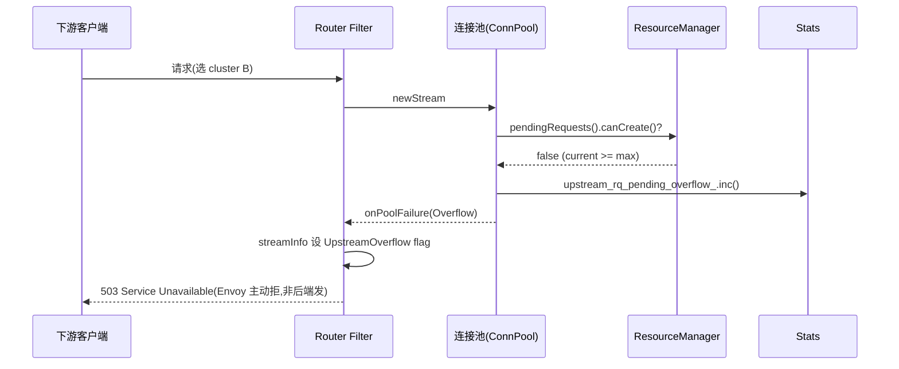
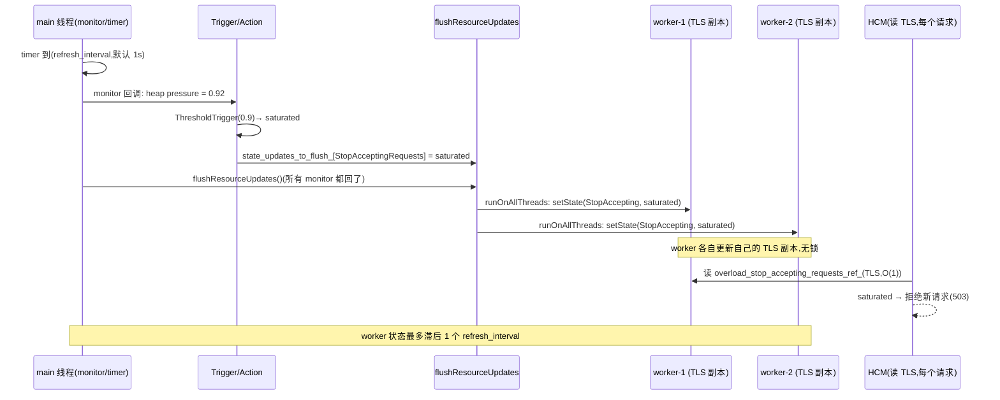

# 第 4 篇 · 第 15 章 · 断路器、重试、超时、过载保护

> **核心问题**:第 14 章讲的是"单个后端坏没坏、要不要把它从 LB 候选里踢掉"——那是**针对单个 host** 的健康治理。但生产里还有一种更可怕的"坏":不是哪一个 host 挂了,而是**整个 cluster 扛不住了**,或者更糟——**Envoy 自己**被流量压垮了。一个慢后端把 Envoy 的连接、并发请求、内存一点点占满,Envoy 拖慢、OOM、worker 阻塞,进而把所有路过的 cluster 一起拖下水,这就是**雪崩**(cascade failure)。Envoy 的回答是四件套,各自守一道闸:**circuit breaker(断路器)** 守 per-cluster 的连接/请求/重试上限,**overload manager(过载管理器)** 守 Envoy 进程级的内存/事件循环压力,**retry(重试预算)** 守重试不放大成风暴,**timeout(超时)** 守一个慢请求不无限占用资源。四者各管一段,合起来构成 upstream 的韧性治理。

> **读完本章你会明白**:
> 1. 为什么"不限制一个 cluster 能开多少连接、多少并发请求"会雪崩——一个慢后端能把 Envoy 的资源吃光,连累其他本来没事的 cluster。circuit breaker 用 per-cluster 的硬上限(连接/请求/重试)在"一个 cluster"和"整个 Envoy"之间筑墙。
> 2. 为什么需要两个层级的过载保护:circuit breaker 是 per-cluster(防"一个 cluster 拖垮 Envoy"),overload manager 是**进程级**(防"Envoy 自己被整体压垮,内存爆/事件循环卡")。两者分工、不可互相替代。
> 3. 为什么"无限重试"会放大成重试风暴——失败请求触发重试,重试又失败又触发重试,流量成倍膨胀。retry_budget 用"重试数占活跃请求数的百分比"动态封顶,从根上掐断风暴。
> 4. timeout 为什么有 per_try / stream_idle / global 三层——它们各自防的不是同一种"慢",一个都不会设等于裸奔。
> 5. overload manager 内部不是用一个"令牌桶"——它用的是 **resource monitor(资源探针)+ threshold/scaled trigger(阈值/渐变触发器)+ LoadShedPoint(按概率丢负载)** 这一套;真正的令牌桶在 **local rate limit filter** 那里,用来做"匀速平滑限流"。两者都是限流,但原理和适用场景完全不同——本章会把这层常见误解讲透。

> **如果一读觉得太难**:先只记住四件事——① **circuit breaker** 是 per-cluster 的连接/请求/重试上限,超了直接 503,防一个 cluster 拖垮 Envoy;② **overload manager** 是进程级的,监控内存/事件循环延迟等,过载时拒绝新请求或缩连接池;③ **retry_budget** 限"重试数占活跃请求数的比例"(默认 20%),防重试风暴;④ **timeout** 有 per_try(单次尝试)/ stream_idle(流空闲)/ global(整个请求)三层。本章就是"这四道闸各自守什么、源码里怎么实现"。

---

## 〇、一句话点破

> **circuit breaker 是"每个 cluster 一道闸,超了就 503",防一个慢后端把整个 Envoy 拖垮;overload manager 是"Envoy 进程一道总闸",监控内存/事件循环压力,过载时丢负载救自己;retry_budget 是"重试不能超过活跃请求的一个比例",防重试放大成风暴;timeout 是"每个慢操作都要有截止时间",防资源被无限占用——四者从 cluster 级、进程级、请求级、单次尝试级四个层次,把"扛不住"这件事围起来。**

这是结论,不是理由。本章倒过来拆:先讲"不限制会雪崩"的真实机理,引出 circuit breaker;再讲 per-cluster 的闸还不够,还需要进程级的 overload manager,并顺势澄清"令牌桶到底用在哪"的常见误解;然后拆 retry 为什么要有预算、host predicate 怎么避开刚失败的 host;最后把三层 timeout 各自防什么讲清;技巧精解会把 overload manager 的"线程局部过载状态 + 周期 flush"和 retry budget 的"滑动窗口式活跃请求计数"两个最硬核的实现单独拆透。

---

## 一、为什么需要"扛不住时的保护":雪崩是怎么发生的

第 14 章讲的 outlier detection 和 active health check,处理的是"某一个后端该不该被 LB 选中"。但还有一种更危险的故障形态:**不是单个 host 坏,而是整个 cluster 的吞吐跟不上,或者 Envoy 自己被压垮**。先看清这种故障是怎么发生、怎么放大的,才能理解本章四件套各守什么。

### 雪崩的起点:一个慢后端,如何拖垮整个 Envoy

设想一个常见场景:你有 3 个 cluster(A、B、C),分别服务三类业务,共用同一个 Envoy sidecar。某天 cluster B 的后端开始变慢——不是挂了(outlier detection 不会立刻踢它,因为成功率还没掉到阈值),而是**每个请求要 5 秒才返回**。

Envoy 处理 cluster B 的请求时,要为每个请求建一个 upstream 连接(HTTP/1.1)或占一个并发 stream(HTTP/2),还要占一个工作线程的事件回调槽位。请求慢,意味着这些资源被**长时间占用**——5 秒内,堆积的 cluster B 请求会持续消耗 Envoy 的:

- **并发连接数**:HTTP/1.1 下,一个慢请求独占一条连接,慢请求越多,连接越多。
- **并发请求数**:每个 in-flight 请求都占内存(Buffer、stream 状态机、回调对象)。
- **pending 请求数**:连接池打满后,新请求排队等待连接,pending 列表膨胀。
- **内存**:所有这些 in-flight 请求的 Buffer 都驻留在 Envoy 进程里。

如果对 cluster B 的资源占用**没有任何上限**,会发生什么?cluster B 的 QPS 假设是 1000,每个请求 5 秒,那么稳态下 Envoy 同时有 `1000 × 5 = 5000` 个 in-flight 的 cluster B 请求。这 5000 个请求占的内存、连接、回调槽位,Envoy 全得扛着。更糟的是,这些资源是**和 cluster A、C 共享的**——Envoy 的 worker 线程就那么几个,内存就那么大,fd 就那么多。cluster B 把资源吃光,cluster A 和 C 的请求就开始排队、超时、失败——**本来没问题的业务,被一个慢 cluster 连累了**。

这就是**雪崩**:一个故障点(慢后端)的资源消耗不受控,沿着共享的资源池(Envoy 进程)蔓延到本来健康的部分,最终整个系统垮掉。

```
   雪崩的传导:一个慢 cluster 怎么拖垮整个 Envoy
   ┌──────────────────────────────────────────────────────────┐
   │  cluster B 的后端变慢 (每个请求 5 秒)                      │
   │     │                                                     │
   │     ▼                                                     │
   │  Envoy 为 cluster B 累积 in-flight 请求 (连接/内存/fd)    │
   │     │  没有上限的话,持续增长                                │
   │     ▼                                                     │
   │  Envoy 的 worker 线程、内存、fd 被占满                    │
   │     │                                                     │
   │     ▼  共享资源池耗尽                                      │
   │  cluster A、C 的请求也排不上、超时、失败                   │
   │     │                                                     │
   │     ▼                                                     │
   │  上游客户端看到全链路超时,自己也重试,流量再放大           │
   │     │                                                     │
   │     ▼                                                     │
   │  整个服务网格瘫痪                                          │
   └──────────────────────────────────────────────────────────┘
```

> **不这样会怎样**:如果 Envoy 不对"一个 cluster 能用多少资源"设上限,那么任何一个慢后端都能把 Envoy 当成无限资源池,把共享的 worker、内存、fd 吃光,连累所有其他 cluster。这是分布式系统里最经典的**共享资源池耗尽**故障——一个故障点的消耗不受控,沿着共享池蔓延。circuit breaker 的存在,就是为了在"一个 cluster"和"整个 Envoy"之间筑墙:每个 cluster 只能用这么多,超了就**主动拒绝**(返回 503),绝不放任它吃光共享资源。

### 雪崩的放大器:重试,如何把故障变成风暴

雪崩还有个更阴险的放大器——**重试**。假设你配了"请求失败就重试",看起来很合理(单次偶发失败,换个 host 重发一次就成了)。但当 cluster B 整体变慢时,会发生什么?

- 客户端发请求,Envoy 转给 cluster B 的一个 host,5 秒后超时。
- Envoy 按重试策略,**再发一次**给另一个 host。
- 那个 host 也慢(整个 cluster 都慢),又 5 秒超时。
- Envoy 再重试……

一个原本一次的请求,现在变成 3 次、5 次。如果上游客户端自己也在重试(很多 HTTP client 默认重试),那么 **3 层重试叠加**:client 重试 × Envoy 重试 × 后端重试,流量以**指数级**膨胀。本来 cluster B 的 QPS 是 1000,重试放大后可能变成 3000、5000——而 cluster B 本来就是因为扛不住 1000 才慢的,现在给它 5000,它只会更慢,甚至彻底崩溃。这种"重试把故障放大成灾难"的现象,叫**重试风暴**(retry storm)或**重试风暴放大**(retry amplification)。

> **不这样会怎样**:无限重试会让"故障导致的失败"被当成"偶发失败"反复重试,流量被成倍放大,本来扛得住的后端被重试压垮,本来慢的变得更慢。这就是为什么 retry 必须有**预算**(retry_budget):重试数不能超过活跃请求的一个比例,从根上掐断风暴。本章第四节会拆透。

### 所以:四道闸,各守一段

理解了雪崩的机理(共享资源池耗尽)和放大器(重试),就知道 Envoy 的四件套为什么是这样划分的:

| 机制 | 守的层次 | 防的故障 | 触发动作 |
|------|---------|---------|---------|
| **circuit breaker** | per-cluster | 一个 cluster 用太多连接/请求/重试,拖垮 Envoy | 超上限 → 拒绝(503),不再分配资源 |
| **overload manager** | 进程级(整个 Envoy) | Envoy 自己内存爆/事件循环卡/heap 涨 | 过载 → 拒绝新请求/缩连接池/重置大流 |
| **retry_budget** | per-cluster 的重试数 | 重试数失控,放大成风暴 | 重试数超预算 → 不再重试(NoOverflow) |
| **timeout** | 单次请求/单次尝试 | 一个慢操作无限占用资源 | 到点 → 中断当前尝试,可能重试或失败 |

四道闸从 cluster 级、进程级、重试子集、单次尝试四个层次,把"扛不住"这件事围起来。注意它们**不是替代关系,而是互补**:circuit breaker 限 per-cluster 的连接,但管不了 Envoy 整体内存(那是 overload manager 的事);overload manager 管整体,但管不了"重试为什么会这么多"(那是 retry_budget 的事);retry_budget 管重试数,但管不了"一个慢请求要等多久"(那是 timeout 的事)。下面四节,逐一拆每一道闸的设计动机和实现。

> **钉死这件事**:本章四件套的核心动机,不是"让单个请求成功"(那是 retry 的副作用),而是**"防止局部故障沿着共享资源池蔓延成全局雪崩"**。理解了雪崩机理,每一道闸"为什么这么设、为什么这个阈值"就都有了解释的根。

---

## 二、circuit breaker:每个 cluster 一道闸,超了就 503

先拆最直接的防线——circuit breaker(断路器)。注意这个词在 Envoy 里和 Netflix Hystrix 那种"半开/熔断/恢复"状态机的"断路器"含义**不一样**:Envoy 的 circuit breaker 是**资源计数器 + 硬上限**,本质是"这个 cluster 能同时开多少连接、多少并发请求、多少并发重试",超了就**拒绝创建新资源**(返回 503 Overflow)。它没有"熔断一段时间再半开试探"的状态机——那个语义在 Envoy 里由 outlier detection(第 14 章)承担。这是第一件要钉死的事:**Envoy 的 circuit breaker ≠ Hystrix 式状态机熔断器**,它是资源上限计数器。

### 五个计数器:连接、pending 请求、并发请求、并发重试、连接池

circuit breaker 的实现核心是 [`ResourceManager`](../envoy/envoy/upstream/resource_manager.h),每个 cluster 持有一个,内部是几个独立的 [`ResourceLimit`](../envoy/envoy/common/resource.h) 计数器。看真实的 [`ResourceManagerImpl`](../envoy/source/common/upstream/resource_manager_impl.h#L85),它持有这五个计数器:

```cpp
// source/common/upstream/resource_manager_impl.h:85 (简化示意,非源码原文)
class ResourceManagerImpl : public ResourceManager {
public:
  ResourceManagerImpl(Runtime::Loader& runtime, const std::string& runtime_key,
                      uint64_t max_connections,        // 最大并发连接数
                      uint64_t max_pending_requests,   // 最大 pending 请求数(等待连接的)
                      uint64_t max_requests,           // 最大并发请求数(已分配连接的)
                      uint64_t max_retries,            // 最大并发重试数
                      uint64_t max_connection_pools,   // 最大连接池数
                      uint64_t max_connections_per_host,
                      ClusterCircuitBreakersStats cb_stats,
                      ...);
  // 五个 ResourceLimit 访问器
  ResourceLimit& connections() override { return connections_; }
  ResourceLimit& pendingRequests() override { return pending_requests_; }
  ResourceLimit& requests() override { return requests_; }
  ResourceLimit& retries() override { return retries_; }
  ResourceLimit& connectionPools() override { connection_pools_; }
private:
  ManagedResourceImpl connections_;
  ManagedResourceImpl pending_requests_;
  ManagedResourceImpl requests_;
  ManagedResourceImpl connection_pools_;
  RetryBudgetImpl retries_;   // retries_ 特殊,见第四节
};
```

这五个计数器,每个都是一个 [`ManagedResourceImpl`](../envoy/source/common/upstream/resource_manager_impl.h#L24),内部就是一个原子计数器加一个上限。看它继承的 [`BasicResourceLimitImpl`](../envoy/source/common/common/basic_resource_impl.h#L15),核心就两个方法:

```cpp
// source/common/common/basic_resource_impl.h:15 (简化示意,非源码原文)
class BasicResourceLimitImpl : public ResourceLimit {
  bool canCreate() override { return current_.load() < max(); }
  void inc() override { ++current_; }
  void dec() override { decBy(1); }
  void decBy(uint64_t amount) override { current_ -= amount; }
  uint64_t max() override {
    // max 可以被 runtime key 覆盖,运行时动态调整
    return runtime_->snapshot().getInteger(runtime_key_.value(), max_);
  }
protected:
  std::atomic<uint64_t> current_{0};
private:
  uint64_t max_;
};
```

整个 circuit breaker 的核心就这么简单:**一个原子计数器 `current_` 加一个上限 `max_`**,`canCreate()` 判断能不能再创建,`inc()/dec()` 增减。这正是它能在**每个请求的热路径**上检查的原因——一次 atomic load + 比较,纳秒级开销。

> **所以这样设计**:circuit breaker 的实现刻意保持极简——原子计数器 + 上限 + `canCreate()` 判定。因为这套检查发生在**每个请求建连接、建 stream 的热路径**上(`conn_pool_base.cc` 里,见下文),任何锁、任何复杂逻辑都会成为性能瓶颈。原子操作是这里能做到的最轻量同步。**不这么写会怎样**:如果用互斥锁保护计数器,worker 线程在每次建连接时都要竞争同一把锁,高 QPS 下锁竞争会成为瓶颈,把 Envoy 的并发模型(P1-02 讲的 worker 线程模型)的优势抵消掉。

注意源码里这个诚实的注释(`basic_resource_impl.h` 顶部):*"it is possible for resources to temporarily go above the supplied maximums"*——因为 `canCreate()` 和 `inc()` 是**两次独立的原子操作**(中间没有锁),多个线程可能同时通过 `canCreate()` 检查再各自 `inc()`,导致实际计数短暂超过 max。Envoy 接受这个轻微的"超限",换取无锁的高性能。这是典型的**精度换性能**的工程权衡——circuit breaker 是保护性的,短暂超一两个不影响大局,但锁竞争会拖垮所有请求。

### 四个检查点:在连接生命周期的哪里被拦

circuit breaker 不是在一个地方检查的,它在**连接池处理请求的四个关键点**各设一道关卡。看真实的检查点,都在 [`ConnPoolImplBase`](../envoy/source/common/conn_pool/conn_pool_base.cc) 里:

**检查点一:建新连接时(`max_connections`)**。当连接池要建一条新 upstream 连接时,先问"还能不能建":

```cpp
// source/common/conn_pool/conn_pool_base.cc:200 (简化示意,非源码原文)
const bool can_create_connection = host_->canCreateConnection(priority_);
if (!can_create_connection) {
  host_->cluster().trafficStats()->upstream_cx_overflow_.inc();  // 记一笔 overflow
}
// 注意:如果当前 cluster 一条连接都没有,即使超限也强行建一条,避免死锁
if (can_create_connection || (ready_clients_.empty() && busy_clients_.empty() && ...)) {
  // 建新连接
  return can_create_connection ? ConnectionResult::CreatedNewConnection
                               : ConnectionResult::CreatedButRateLimited;
} else {
  return ConnectionResult::NoConnectionRateLimited;
}
```

注意那个"如果没有连接则强行建一条"的逻辑——这是为了避免**死锁**:如果 cluster 已经达到连接上限,但所有现有连接又都不能用(busy/超 max streams),新请求会永远等不到连接。Envoy 在这种极端情况下**破例建一条**,宁可短暂超限,也不能让请求死锁。

**检查点二:把请求挂到已有连接上(`max_requests`)**。当连接池有一条 ready 的连接、要把新 stream 挂上去时:

```cpp
// source/common/conn_pool/conn_pool_base.cc:242 (简化示意,非源码原文)
if (enforceMaxRequests() && !host_->cluster().resourceManager(priority_).requests().canCreate()) {
  // 超过 max_requests 上限,直接 pool failure (Overflow)
  onPoolFailure(client.real_host_description_, absl::string_view(),
                ConnectionPool::PoolFailureReason::Overflow, context);
  traffic_stats().upstream_rq_active_overflow_.inc();
  return;
}
// 否则正常挂上去,并 inc 计数
host_->cluster().resourceManager(priority_).requests().inc();
```

**检查点三:请求排队等连接时(`max_pending_requests`)**。如果连接池暂时没有 ready 的连接(都在 busy/connecting),新请求要么排队等,要么直接拒绝:

```cpp
// source/common/conn_pool/conn_pool_base.cc:352 (简化示意,非源码原文)
if (!host_->cluster().resourceManager(priority_).pendingRequests().canCreate()) {
  // pending 队列也满了,直接 Overflow
  onPoolFailure(nullptr, absl::string_view(), ConnectionPool::PoolFailureReason::Overflow, context);
  host_->cluster().trafficStats()->upstream_rq_pending_overflow_.inc();
  return nullptr;
}
// 否则进 pending 队列,并 inc pending 计数
```

**检查点四:重试时(`max_retries` / retry_budget)**——这个留到第四节拆,因为它有专门的 `RetryBudgetImpl`,逻辑更复杂。

> **钉死这件事**:circuit breaker 的"断"不是一个开关,而是**连接生命周期四个点上的 `canCreate()` 检查**——建连接(查 `connections`)、挂 stream(查 `requests`)、排队等连接(查 `pendingRequests`)、重试(查 `retries`)。任何一个超上限,就在那个点直接返回 Overflow(pool failure → router filter 收到 → 返回下游 503)。**这正是"防雪崩"的落点**:每个 cluster 只能用这么多资源,超了就当场拒绝,不让它继续吃共享资源池。

### 上限怎么定:默认值与 ResourcePriority

这五个计数器的默认上限,定义在 [`circuit_breaker.proto`](../envoy/api/envoy/config/cluster/v3/circuit_breaker.proto#L75) 里:

- `max_connections`:默认 **1024**
- `max_pending_requests`:默认 **1024**
- `max_requests`:默认 **1024**
- `max_retries`:默认 **3**(注意这个特别小,见第四节)
- `max_connection_pools`:默认**无限**

而且,circuit breaker 是**按优先级(`RoutingPriority`)分开配的**。Envoy 的请求有两个优先级:`DEFAULT` 和 `HIGH`(P3-11 路由那章讲过,可以通过 route 的 `priority` 字段设)。每个优先级有**独立的一组计数器和上限**。这意味着你可以给 HIGH 优先级请求(比如关键业务)配更高的上限、DEFAULT 配更低,让 HIGH 在过载时更不容易被拒绝。看 [`ResourceManagerImpl` 的构造](../envoy/source/common/upstream/resource_manager_impl.h#L87),每个 cluster 其实为每个 priority 各建一个 `ResourceManagerImpl`,互不影响。

> **不这样会怎样**:如果不分优先级,所有请求共用一组计数器,那么一个低优先级业务的流量洪峰会把计数器占满,把高优先级业务也一起拒掉——这就是优先级倒置。按 `RoutingPriority` 分开计数器,让 HIGH 优先级有独立的"配额",是 Envoy 在过载时保持关键业务可用性的设计。

### runtime 覆盖:上限可以运行时动态调

注意 [`BasicResourceLimitImpl::max()`](../envoy/source/common/common/basic_resource_impl.h#L32) 那段:

```cpp
uint64_t max() override {
  return (runtime_ != nullptr && runtime_key_.has_value())
             ? runtime_->snapshot().getInteger(runtime_key_.value(), max_)
             : max_;
}
```

circuit breaker 的上限**不是写死的**,它可以被 runtime(运行时配置,可通过 admin API 或 xDS 动态更新)覆盖。每个计数器有自己的 runtime key(比如 `<cluster>.circuit_breakers.<priority>.max_connections`)。这意味着:线上发现某个 cluster 的 circuit breaker 拦得太狠(误拒正常请求),可以通过 runtime **不停机**地把上限调高;反之发现拦得不够(还有雪崩风险),也可以调低。

> **所以这样设计**:circuit breaker 的阈值没有一个"放之四海皆准"的值——它取决于后端的真实容量、流量模式、SLA 要求。Envoy 把上限做成 runtime 可覆盖,让运维可以在生产里**根据实际观察调参**,而不必改配置重启。这和第 14 章 outlier detection 的 `enforcing_*` 概率旋钮是同一种哲学——给运维渐进式调参的能力。

### 触发后返回什么:503 + Overflow 标记

当某个计数器超上限,连接池返回 `PoolFailureReason::Overflow`,router filter(第 11 章)收到后,会给下游返回 **503**(Service Unavailable),并在 stream info 里设 [`UpstreamOverflow`](../envoy/source/common/router/router.cc) 响应标志。这个标志很重要——它能和"后端真的返回 503"区分开,监控里可以分别统计。所以,如果你在 Envoy 的 stats 里看到 `upstream_rq_pending_overflow`、`upstream_cx_overflow` 这些计数器在涨,那就是 circuit breaker 在工作——它在主动拒绝请求,保护 Envoy 自己。



注意这条 503 的"身份"——它不是后端返回的,是 Envoy 在连接池阶段**主动拒绝**生成的。监控里通过 `UpstreamOverflow` 响应标志和 `upstream_*_overflow` 计数器能精确识别"circuit breaker 拦的"vs"后端真的 503",这是线上排障的关键区分。

> **钉死这件事**:circuit breaker 是 Envoy 数据面 upstream 的第一道闸——每个 cluster 五个计数器(连接/pending/请求/重试/连接池),在连接生命周期的四个点检查,超上限就返回 503 Overflow。它的核心是"原子计数器 + 上限 + canCreate()",刻意极简,因为要跑在每个请求的热路径上。它防的是"一个 cluster 用太多资源,拖垮整个 Envoy",是雪崩的第一道防线。下一节讲进程级的第二道闸——overload manager。

---

## 三、overload manager:Envoy 进程级的总闸,以及"令牌桶到底用在哪"的澄清

circuit breaker 防的是"一个 cluster 拖垮 Envoy",但还有一种故障它管不了:**Envoy 自己**被整体压垮——内存爆了、事件循环卡了、heap 涨不停。这种故障的信号不在某个 cluster 的计数器里,而在**进程级的资源指标**上(物理内存、事件循环延迟、fd 数)。这就是 overload manager 的职责:它是 Envoy 进程级的总闸。

但动手前,必须先澄清一个**到处流传的误解**,否则后面会讲错——这也是本章我刻意要"质疑总纲/样板印象"的地方。

### 澄清:overload manager 内部不是令牌桶

很多博客和文档(包括本书总纲早期的措辞)说"overload manager 用令牌桶控拒绝速率"。我去本地源码 grep 了 `TokenBucket` 的所有使用,核实如下:

```
   TokenBucket(令牌桶)在 Envoy 里真正用在哪(grep 核实)
   ──────────────────────────────────────────────────────────
   source/common/common/token_bucket_impl.h     ← 实现:TokenBucketImpl / AtomicTokenBucketImpl
   source/common/common/shared_token_bucket_impl ← 加锁的线程安全包装
   
   真正使用令牌桶的地方:
   source/extensions/filters/common/local_ratelimit/local_ratelimit_impl.h:130
       ← local rate limit filter (本地限流) 用 AtomicTokenBucketImpl
   source/extensions/filters/http/bandwidth_limit/        ← 带宽限流
   source/extensions/filters/network/redis_proxy/         ← redis 限流
   source/extensions/config_subscription/grpc/grpc_mux_impl.cc  ← xDS 流控 (HTTP/2 flow control 辅助)
   
   overload_manager_impl.cc / .h:  ← 一次都没出现 TokenBucket!
```

**overload manager 的实现里完全没有令牌桶**。它用的是另一套机制:**resource monitor(资源探针)+ trigger(阈值/渐变触发器)+ OverloadAction(过载动作)+ LoadShedPoint(按概率丢负载)**。这套机制和令牌桶是**两种完全不同的限流哲学**:

- **令牌桶**(token bucket):控制**速率**(每秒放过多少请求),桶里按 `fill_rate` 匀速攒令牌,请求消耗令牌,没令牌就拒。适合"匀速平滑限流",用在 local rate limit filter 那种"每秒最多 1000 个请求"的场景。
- **overload manager 的 trigger**:控制**压力**(资源利用率到没到阈值),它不数请求数,而是**监控某个资源指标**(内存利用率、事件循环延迟)有没有超过配置的阈值,超了就**激活动作**(拒绝/缩放),和"放过多少请求"无关。适合"压力到了就保护"的场景。

这两者的区别,打个直球的比方:令牌桶像**水龙头限流**(每分钟只放出 N 升水),overload manager 像**水位报警器**(水库水位到 90% 就开闸泄洪)。前者控制流速,后者响应水位。Envoy 在 upstream 过载治理上用的是后者(水位报警),在 per-route/per-filter 限流上才用前者(水龙头)。**这一层区分,是理解本章机制的关键,也是大量资料搞混的地方。**

> **钉死这件事(本章刻意纠正的误解)**:overload manager **不**用令牌桶。它用 resource monitor + threshold/scaled trigger + LoadShedPoint。令牌桶(`AtomicTokenBucketImpl`)真正大放异彩的地方是 **local rate limit filter**(匀速限流)。本章讲 overload manager 时讲前者,在技巧精解里讲后者(令牌桶),让读者看清两种限流哲学的分野。源码是唯一裁判——`grep TokenBucket source/server/overload_manager_impl.*` 零命中,这件事钉死。

### resource monitor:Envoy 怎么"感知"自己快扛不住了

overload manager 要做"水位报警",首先得能**测量水位**——也就是感知 Envoy 自己的资源压力。这通过 **resource monitor**(资源探针)实现。Envoy 内置几个 monitor,各自测量一种资源:

- **`envoy.resource_monitors.fixed_heap`**:监控 Envoy 进程能用的**最大堆内存**(预留的 reserved heap)还剩多少。这是最常用的——防 OOM。
- **`envoy.resource_monitors.injected_resource`**:测试用的,可以注入任意压力值。
- **`envoy.resource_monitors.cpu_utilization`**:CPU 利用率。
- 还有 fd 数、事件循环延迟等(通过不同 monitor)。

每个 monitor 实现 [`ResourceMonitor`](../envoy/envoy/server/resource_monitor.h) 接口,核心方法 `updateResourceUsage(callbacks)`——异步去测当前资源压力,测完回调一个 `ResourceUsage`(里面就一个 `resource_pressure_`,0.0 到 1.0 之间的 double,表示压力比例)。overload manager 周期性地(默认 1 秒,见 [`refresh_interval`](../envoy/source/server/overload_manager_impl.cc#L429) 默认 1000ms)调用所有 monitor 的 `updateResourceUsage`,收集每个资源的当前压力。

看 [`OverloadManagerImpl::start`](../envoy/source/server/overload_manager_impl.cc#L570),周期性刷新的核心循环:

```cpp
// source/server/overload_manager_impl.cc:583 (简化示意,非源码原文)
timer_ = dispatcher_.createTimer([this]() -> void {
  flushResourceUpdates();                 // 把上一轮的状态刷给 worker 线程
  ++flush_epoch_;
  flush_awaiting_updates_ = resources_.size() + proactive_resources_->size();
  for (auto& resource : resources_) {
    resource.second.update(flush_epoch_);   // 异步触发每个 monitor 测压力
  }
  // 记录这轮刷新的延迟(stats)
  ...
  timer_->enableTimer(refresh_interval_);   // 安排下一轮(默认 1 秒)
});
```

> **所以这样设计**:resource monitor 是**异步、插件化**的——每个资源监控方式不同(heap 要查 `/proc`、CPU 要读 cgroup),做成可扩展的 monitor 接口,各自异步测量,避免阻塞 main 线程的事件循环。**不这么设计会怎样**:如果在 main 线程同步测所有资源,一次测量可能阻塞几十毫秒(查 /proc、算 cgroup),期间 main 线程没法处理其他事件(归并 stats、调度 worker),反而加剧过载——monitor 自己成了过载源。异步 + 插件化是这里 sound 的根。

### trigger:压力怎么翻译成"过载动作"

monitor 只负责"测压力"(输出一个 0.0~1.0 的 double),但"压力到多少算过载、过载后做什么",是 **trigger** 的事。trigger 把"压力值"翻译成"过载动作的状态"。Envoy 有两种 trigger:

**ThresholdTrigger(阈值触发器)**——最简单:压力超阈值就 saturated(饱和),否则 inactive。看 [`ThresholdTriggerImpl::updateValue`](../envoy/source/server/overload_manager_impl.cc#L31):

```cpp
// source/server/overload_manager_impl.cc:31 (简化示意,非源码原文)
bool ThresholdTriggerImpl::updateValue(double value) {
  state_ = value >= threshold_ ? OverloadActionState::saturated()
                                : OverloadActionState::inactive();
  return state_.value() != actionState().value();
}
```

**ScaledTrigger(渐变触发器)**——更精细:在 `scaling_threshold` 和 `saturation_threshold` 之间**渐变**,而不是一刀切。看 [`ScaledTriggerImpl::updateValue`](../envoy/source/server/overload_manager_impl.cc#L57):

```cpp
// source/server/overload_manager_impl.cc:57 (简化示意,非源码原文)
bool ScaledTriggerImpl::updateValue(double value) {
  if (value <= scaling_threshold_) {
    state_ = OverloadActionState::inactive();          // 还没开始紧张
  } else if (value >= saturated_threshold_) {
    state_ = OverloadActionState::saturated();          // 彻底过载
  } else {
    // 在两个阈值之间:线性渐变,状态是个 0~1 的比例
    state_ = OverloadActionState(UnitFloat(
        (value - scaling_threshold_) / (saturated_threshold_ - scaling_threshold_)));
  }
  return state_.value() != old_state.value();
}
```

这个渐变设计很关键:它让动作可以**逐步生效**而不是"突然全开"。比如压力在 0.8~0.95 之间渐变,那么"拒绝新连接"的力度可以从"开始拒一点"到"全拒"平滑过渡。这正是 ScaledTrigger 存在的意义——避免过载响应的"抖动"(一会儿全开一会儿全关)。这种渐变思想,后面 ReduceTimeouts、LoadShedPoint 都用到。

每个 action 可以有**多个 trigger**(一个 action 由一个或多个 resource 触发),action 的最终状态是**所有 trigger 状态的最大值**——任何一个 trigger 饱和,action 就饱和。看 [`OverloadAction::updateResourcePressure`](../envoy/source/server/overload_manager_impl.cc#L314):

```cpp
// source/server/overload_manager_impl.cc:314 (简化示意,非源码原文)
bool OverloadAction::updateResourcePressure(const std::string& name, double pressure) {
  // 更新对应的 trigger
  it->second->updateValue(pressure);
  // 算新状态 = 所有 trigger 状态的最大值
  OverloadActionState new_state = OverloadActionState::inactive();
  for (auto& trigger : triggers_) {
    if (trigger.second->actionState().value() > new_state.value()) {
      new_state = trigger.second->actionState();
    }
  }
  state_ = new_state;
  return state_.value() != old_state.value();
}
```

> **所以这样设计**:trigger 把"测到的压力值"翻译成"动作状态",有阈值(一刀切)和渐变(平滑)两种。多 trigger 取 max,保证"任何一个资源吃紧就触发动作"。这套间接层(monitor → trigger → action)让 overload manager 极其灵活:**配什么资源监控、用什么阈值、触发什么动作,全在 YAML 里组合**,源码只提供机制。这正是 Envoy 一贯的"机制与策略分离"哲学(和 filter chain、和 xDS 一脉相承)。

### 八个 well-known action:过载后能干什么

trigger 激活一个 action 后,action 会去**做某件事**。Envoy 定义了八个 well-known action([`OverloadActionNameValues`](../envoy/envoy/server/overload/overload_manager.h#L21)),每一个都是"过载后的一种自救动作":

| action 名 | 过载时做什么 |
|----------|-------------|
| `envoy.overload_actions.stop_accepting_requests` | **拒绝新 HTTP 请求**(HCM 检查,直接 503) |
| `envoy.overload_actions.disable_http_keepalive` | 关闭 HTTP keepalive(强制每请求一连接,降内存) |
| `envoy.overload_actions.stop_accepting_connections` | 停止接受新连接 |
| `envoy.overload_actions.reject_incoming_connections` | accept 后立刻 close(更激进) |
| `envoy.overload_actions.shrink_heap` | 主动收缩 heap(malloc_trim,释放空闲内存) |
| `envoy.overload_actions.reduce_timeouts` | 缩短各类 timeout(让慢请求更快被砍,释放资源) |
| `envoy.overload_actions.reset_high_memory_stream` | 重置占内存最大的 stream(直接断开最耗内存的连接) |
| `envoy.overload_actions.close_idle_http_connections` | 关闭空闲的 downstream HTTP 连接 |

这套动作的设计逻辑是**从轻到重、层层加码**:先是温和的(关 keepalive、缩 timeout、收缩 heap),然后是中等的(关空闲连接、停接新连接),最后是激进的(拒绝请求、重置大流)。运维可以配多个 action,各自设不同阈值——内存到 80% 先缩 timeout,到 90% 拒请求,到 95% 重置大流。这种**渐进式降级**(progressive degradation)让 Envoy 在过载时**优雅地"萎缩"服务**,而不是一下子全崩。

> **不这样会怎样**:如果过载响应只有一个开关(要么全好要么全拒),Envoy 会在"完全正常"和"完全不可用"之间剧烈抖动,而且没有中间状态可用。八个 action 让 Envoy 能**按过载程度逐级响应**——轻度过载先省内存、缩 timeout,严重了再拒请求,这种渐进降级是"过载保护"区别于"粗暴熔断"的精髓。

### action 怎么生效:registerForAction 与 thread-local 状态

action 的状态(threshold 算出来是 inactive / scaling / saturated)要**传递给真正干活的地方**(HCM、连接池等),这通过两条路:

**路径一:回调(registerForAction)**。关心某个 action 的模块,在启动时 `registerForAction` 注册一个回调,当这个 action 的状态变化时,overload manager 把新状态 post 到该模块的 dispatcher 上执行。比如 [ReduceTimeouts](../envoy/source/server/overload_manager_impl.cc#L648) 注册了一个回调,把 `ScaledRangeTimerManager` 的 scale factor 调成 `(1 - action_state.value())`——action 越饱和,timer 被缩得越短。

**路径二:thread-local 过载状态(getThreadLocalOverloadState)**。这是更常用的——overload manager 把所有 action 的状态**flush 到每个 worker 线程的 thread-local 副本**,worker 检查时直接读 thread-local,**无锁**。看 HCM 怎么用这条路的([`ConnectionManagerImpl` 构造](../envoy/source/common/http/conn_manager_impl.cc#L140)):

```cpp
// source/common/http/conn_manager_impl.cc:140 (简化示意,非源码原文)
overload_stop_accepting_requests_ref_(
    overload_state_.getState(Server::OverloadActionNames::get().StopAcceptingRequests)),
overload_disable_keepalive_ref_(
    overload_state_.getState(Server::OverloadActionNames::get().DisableHttpKeepAlive)),
```

HCM 在构造时,就拿到 `StopAcceptingRequests` 和 `DisableHttpKeepAlive` 这两个 action 状态的**thread-local 引用**。处理每个请求时,检查这个引用——如果 `StopAcceptingRequests` 饱和了,直接拒绝。这条检查发生在 thread-local,无锁,不会成为热路径瓶颈。

还有第三条——**LoadShedPoint**,是较新的、更细粒度的机制,下一小节单独讲。

> **所以这样设计**:overload manager 把"测压力"(在 main 线程,周期性)和"用状态"(在 worker 线程,每个请求)解耦,中间用 **thread-local 状态副本 + runOnAllThreads flush** 桥接。worker 读 thread-local 是无锁的(O(1) 数组下标访问),只有 main 周期性地(默认 1 秒)通过 `runOnAllThreads` 把新状态刷给所有 worker。这是 Envoy 一贯的"thread-local 无锁"套路(P1-02 讲过 stats 的归并也是这套),把跨线程同步的开销**摊薄到每秒一次**。**不这么写会怎样**:如果 worker 每次检查都去读 main 线程的共享状态,要么加锁(热路径锁竞争)、要么用 atomic(高频率 cache line 弹跳),都会成为瓶颈。thread-local 是这里 sound 的根——技巧精解会拆透。

### LoadShedPoint:更细粒度、按概率丢负载

最新的 overload manager 还有一套更细的机制——**LoadShedPoint**(丢负载点)。它不是"action 饱和就全拒",而是在**请求生命周期的特定点**上,根据压力**按概率**丢一部分负载。看定义([`LoadShedPointImpl`](../envoy/source/server/overload_manager_impl.h#L69)):

```cpp
// source/server/overload_manager_impl.h:69 (简化示意,非源码原文)
class LoadShedPointImpl : public LoadShedPoint {
  bool shouldShedLoad() override;
  void updateResource(absl::string_view resource_name, double resource_utilization);
private:
  absl::flat_hash_map<std::string, TriggerPtr> triggers_;
  std::atomic<float> probability_shed_load_{0};   // 丢负载的概率, 0~1
};
```

它的核心是 [`shouldShedLoad`](../envoy/source/server/overload_manager_impl.cc#L394):

```cpp
// source/server/overload_manager_impl.cc:394 (简化示意,非源码原文)
bool LoadShedPointImpl::shouldShedLoad() {
  float p = probability_shed_load_.load();
  if (p == 1.0f) {              // 100% 丢
    shed_load_counter_.inc();
    return true;
  }
  // 按概率 p 丢:随机数 < p 就丢
  if (random_generator_.bernoulli(UnitFloat(p))) {
    shed_load_counter_.inc();
    return true;
  }
  return false;
}
```

LoadShedPoint 把"丢多少负载"做成一个**概率**——压力渐变时,`probability_shed_load_` 从 0 渐增到 1,那么每个请求有 p 的概率被丢。这比"action 一刀切全拒"更平滑:压力到 50% 时,丢一半请求(平均),而不是突然全拒或全放。Envoy 在请求生命周期的多个点埋了 LoadShedPoint,名字在 [`envoy/server/overload/load_shed_point.h`](../envoy/envoy/server/overload/load_shed_point.h#L16):

- `envoy.load_shed_points.tcp_listener_accept`:TCP listener 接连接时
- `envoy.load_shed_points.http_connection_manager_decode_headers`:HCM 解析请求头时
- `envoy.load_shed_points.hcm_ondata_creating_codec`:HCM 创建 codec 时
- `envoy.load_shed_points.connection_pool_new_connection`:连接池建新 upstream 连接时
- 还有 HTTP/2、HTTP/3 的各种 go_away 点

看连接池怎么用 [`connection_pool_new_connection`](../envoy/source/common/conn_pool/conn_pool_base.cc#L61) 这个 LoadShedPoint:

```cpp
// source/common/conn_pool/conn_pool_base.cc:194 (简化示意,非源码原文)
if (create_new_connection_load_shed_) {
  if (create_new_connection_load_shed_->shouldShedLoad()) {
    return ConnectionResult::LoadShed;   // 按概率丢这次建连接
  }
}
```

> **所以这样设计**:LoadShedPoint 把"过载保护"做到**请求生命周期的精确点位**,并用**概率**实现平滑降级。这比 action 的"全开/全关"更细腻——压力渐变时,丢负载的比例也渐变,避免抖动。**不这么设计会怎样**:如果过载时只能在"全接"和"全拒"之间二选一,Envoy 会在临界点反复横跳(压力刚到阈值就全拒 → 拒了压力降下来又全接 → 又到阈值……),这种振荡会让流量忽大忽小,比平滑降级糟得多。概率性丢负载让降级**连续可微**,这是控制论里"比例控制"优于"开关控制"的典型体现。

### overload manager vs circuit breaker:分工,不是替代

最后,把 overload manager 和 circuit breaker 的关系钉死,这是本章最容易混的地方:

| 维度 | circuit breaker | overload manager |
|------|----------------|-----------------|
| **作用域** | per-cluster(每个 cluster 一组) | 进程级(整个 Envoy 一个) |
| **监控对象** | 自己 cluster 的连接/请求/重试计数 | Envoy 进程的内存/事件循环/CPU |
| **触发** | 自己 cluster 的计数超上限 | 进程资源压力超阈值 |
| **实现** | 原子计数器 + canCreate() | resource monitor + trigger + action |
| **拒绝粒度** | 超限的那个 cluster 的请求 | 整个 Envoy 的新请求/连接 |
| **限流哲学** | 资源上限(硬墙) | 压力响应(水位报警) |

这两者**不可互相替代**:circuit breaker 防的是"一个 cluster 的局部失控蔓延",overload manager 防的是"Envoy 整体的资源耗尽"。一个具体的例子:cluster B 的连接打满,触发的是 cluster B 的 `max_connections` circuit breaker,**只拒 cluster B 的请求**,cluster A、C 不受影响;但如果 Envoy 整体内存爆了,触发的是 `stop_accepting_requests` 这个 overload action,**所有 cluster 的新请求都被拒**——因为 Envoy 自己都快挂了,顾不上区分哪个 cluster。

> **钉死这件事**:circuit breaker(per-cluster,计数器上限,防局部蔓延)和 overload manager(进程级,压力触发,防整体耗尽)是两道**互补**的闸,各自防不同的故障形态。理解这一层分工,你才不会被"为什么 Envoy 有两套过载保护"绕晕。下一节讲第三道闸——retry,以及为什么重试本身也需要被限制。

---

## 四、retry:为什么"重试"需要预算,以及如何避开刚失败的 host

讲完两道闸(circuit breaker、overload manager),这一节拆第三道——retry(重试)。retry 看起来最朴素:请求失败了,换一个 host 再试一次。但朴素的重试会撞"重试风暴"这堵墙(第一节讲过),所以 Envoy 给 retry 配了两层保护:**retry_budget(重试预算)** 和 **retry host predicate(重试选 host 的谓词)**。

### retry_on:失败按什么规则重试

先看 retry 的触发条件。不是所有失败都该重试——网络瞬断该重试,但 400 Bad Request(请求本身有问题)重试一万次还是 400。Envoy 用 `retry_on` 字段(或 `x-envoy-retry-on` 请求头)配置"哪些情况触发重试",常见值:

- `5xx`:后端返回 5xx(但 501 不重试——Not Implemented 重试也没用)
- `gateway-error`:只 502/503/504(更窄)
- `connect-failure`:TCP 连接失败
- `retriable-4xx`:可重试的 4xx(主要是 429 Too Many Requests)
- `refused-stream`:HTTP/2 REFUSED_STREAM
- `reset`:连接被重置
- `retriable-status-codes`:自定义一组可重试的状态码

这些条件由 [`RetryStateImpl`](../envoy/source/common/router/retry_state_impl.cc) 解析成 bitset,每个请求结束时,router 调 [`shouldRetryHeaders`](../envoy/source/common/router/retry_state_impl.cc#L306) 判断"这次的响应/重置符不符合 retry_on",符合才进入重试流程。除了 retry_on,还有 `num_retries`(最多重试几次,默认 1)、`retry_back_off`(重试间隔退避)等配套字段。

> **所以这样设计**:retry_on 是个**白名单**——只重试"可能因为偶发故障失败"的请求,不重试"注定失败"的请求(4xx 业务错误)。这是 retry 的第一道保护:控制"重试的面",避免对注定失败的请求做无谓重试。**不这样会怎样**:如果对所有失败都重试,一个 400 请求被重试 3 次,每次还是 400,白白浪费 3 倍后端资源——这种重试对成功率没贡献,纯增负担。

### 为什么不能"无限重试":重试风暴的数学

光有 retry_on 白名单还不够——即使只重试 5xx,当整个 cluster 都在 5xx 时,重试会**放大流量**。算笔账:

假设 cluster B 整体故障(100% 返回 500),客户端 QPS 是 1000,配了 retry_on=5xx, num_retries=3。

- 第 1 秒:1000 个原始请求,全失败 → 触发重试,变成 1000 个重试请求
- 重试请求也全失败 → 又触发(num_retries=3 允许再重试),变成更多
- 最多每个原始请求产生 3 次重试,即 1000 × 4 = 4000 个请求打向后端

后端本来就是因为扛不住才故障的(或者故障中正在重启),现在给它 4 倍流量,只会**更难恢复**,甚至直接被重试压垮。如果上游客户端也在重试(很多 SDK 默认重试),多层重试叠加,流量呈**指数级**爆炸。这就是 retry storm。

> **不这样会怎样**:无限重试会把"局部故障"放大成"全局灾难"。一个本来重启 30 秒就能恢复的后端,被重试流量持续打击,可能永远恢复不了。更糟的是,重试流量占用 Envoy 自己的资源(连接、内存),和第一节讲的雪崩机理叠加,Envoy 自己也可能被重试流量压垮。所以 retry **必须**有数量限制,而且这个限制不能是"每个请求最多重试 N 次"那么简单——因为 N 次重试在集群健康时够用,在集群故障时会成倍放大。

### retry_budget:按活跃请求比例动态封顶

这就是 **retry_budget** 的用武之地。它的核心思想:**并发重试数不能超过"当前活跃请求数的一个比例"**。看 [`RetryBudgetImpl::max`](../envoy/source/common/upstream/resource_manager_impl.h#L184) 的真实实现:

```cpp
// source/common/upstream/resource_manager_impl.h:184 (简化示意,非源码原文)
uint64_t max() override {
  if (!useRetryBudget()) {
    return max_retry_resource_.max();   // 没配 budget,退回固定 max_retries
  }
  const double budget_percent = runtime_.snapshot().getDouble(
      budget_percent_key_, budget_percent_ ? *budget_percent_ : 20.0);   // 默认 20%
  const uint32_t min_retry_concurrency = runtime_.snapshot().getInteger(
      min_retry_concurrency_key_, min_retry_concurrency_ ? *min_retry_concurrency_ : 3); // 默认 3

  // 活跃请求数 = 已分配的 + pending 的
  uint64_t requests_for_budget = requests_.count() + pending_requests_.count();
  // 重试上限 = max(活跃请求 × 20%, 最小并发 3)
  return std::max<uint64_t>(budget_percent / 100.0 * requests_for_budget,
                            min_retry_concurrency);
}
```

这个 `max()` 是**动态的**——它不是固定值,而是 `活跃请求数 × 20%`(默认)。这意味着:

- 集群健康、QPS 低(比如 100 活跃请求)时,重试上限是 20,够正常重试用。
- 集群故障、QPS 暴涨(比如 10000 活跃请求堆积)时,重试上限涨到 2000——但**比例始终是 20%**,重试不会比正常流量涨得更快。

关键在于**比例是固定的**(20%),所以无论活跃请求怎么涨,**重试占总流量的比例永远不超过 20% /(100% + 20%) ≈ 16.7%**。重试流量的膨胀被"比例"这根绳子拴住了,不会失控放大。

注意那个 `min_retry_concurrency`(默认 3):即使活跃请求数很少(比如 5 个),`5 × 20% = 1`,如果上限是 1,正常重试都可能被卡。所以 retry_budget 保证**重试上限至少是 3**,让低流量场景下重试依然能工作。

> **钉死这件事**:retry_budget 用"活跃请求 × 固定比例"动态算重试上限,从根上掐断了重试风暴——无论故障多严重、活跃请求涨多少,重试占总流量的比例恒定(默认 ~20%)。这比"固定 max_retries"高明得多:固定值要么太大(风暴)、要么太小(低流量下没法重试)。比例式上限**自适应流量规模**,这是 retry 治理的核心技巧。技巧精解会拆它的"滑动窗口式活跃请求计数"实现。

### budget_interval:更精细的滑动窗口预算

上面那个 `requests_.count() + pending_requests_.count()` 是"in-flight 请求数"(当前正在处理的)。但 Envoy 还支持一个更精细的模式:用 `budget_interval`(比如 100ms)配一个**滑动窗口**——统计过去 100ms 内**所有**请求(包括已完成的),而不只是 in-flight。看 [`RetryBudgetImpl::max`](../envoy/source/common/upstream/resource_manager_impl.h#L199) 里这段:

```cpp
// source/common/upstream/resource_manager_impl.h:199 (简化示意,非源码原文)
if (interval_state_ != nullptr) {
  const uint64_t configured_interval = runtime_.snapshot().getInteger(
      budget_interval_key_, budget_interval_ ? *budget_interval_ : 0);
  if (configured_interval > 0) {
    // 滑动窗口实现,灵感来自 tower.rs:
    // https://github.com/tower-rs/tower/blob/master/tower/src/retry/budget/tps_budget.rs
    requests_for_budget = interval_state_->req_in_interval.load(std::memory_order_seq_cst);
  }
}
```

源码注释明确写了"灵感来自 tower.rs"——这是 Rust 生态里 tower 中间件框架的重试预算实现。它的核心思想:把 `budget_interval`(比如 100ms)分成 10 个 slot(每个 10ms),每个 slot 记录那 10ms 内的请求数,10 个 slot 组成一个**滑动窗口**。新请求来,记到当前 slot;每过一个 slot 时间,窗口滑动,最老的 slot 过期。`req_in_interval` 就是当前窗口内(过去 100ms)的总请求数。

为什么用滑动窗口而不是"in-flight"?因为 in-flight 在请求**很快完成**的场景下会偏低——比如请求都 5ms 完成,in-flight 可能只有几个,但实际 QPS 很高。滑动窗口统计"过去一段时间的吞吐",更能反映真实流量规模,预算算得更准。技巧精解会拆透这个滑动窗口的实现。

### retry host predicate:重试时避开刚失败的 host

retry_budget 管"重试多少次",retry host predicate 管"重试时选哪个 host"。朴素地重试,会选 LB 给的下一个 host——但下一个 host 可能就是刚才失败的那个(LB 不知道你刚试过)。Envoy 提供 retry host predicate,让重试**避开刚尝试过的 host**:

- **`previous_hosts`**([`source/extensions/retry/host/previous_hosts/`](../envoy/source/extensions/retry/host/previous_hosts/previous_hosts.h)):记录本次请求已经尝试过的所有 host,重试时跳过它们。看实现,极简:

```cpp
// source/extensions/retry/host/previous_hosts/previous_hosts.h (简化示意,非源码原文)
class PreviousHostsRetryPredicate : public Upstream::RetryHostPredicate {
  bool shouldSelectAnotherHost(const Upstream::Host& candidate_host) override {
    // 如果这个 host 在已尝试列表里,换一个
    return std::find(attempted_hosts_.begin(), attempted_hosts_.end(),
                     &candidate_host) != attempted_hosts_.end();
  }
  void onHostAttempted(Upstream::HostDescriptionConstSharedPtr attempted_host) override {
    attempted_hosts_.emplace_back(attempted_host.get());   // 每次尝试后记一笔
  }
  std::vector<Upstream::HostDescription const*> attempted_hosts_;
};
```

- **`omit_canary_hosts`**:重试时避开 canary(金丝雀)host——canary 通常是新版本,出问题概率高,重试回到稳定版本。
- **`omit_host_metadata`**:按 metadata(比如版本号、区域)避开特定 host。

配合 retry host predicate,还有 **retry priority**(`previous_priorities`):重试时**排除已尝试过的优先级**——比如第一次试 DEFAULT 优先级失败了,重试切到 HIGH 优先级。看 [`PreviousPrioritiesRetryPriority`](../envoy/source/extensions/retry/priority/previous_priorities/previous_priorities.cc#L17),它维护一个 `excluded_priorities_` 数组,记录哪些优先级已经试过,重试时把负载全部分配到没试过的优先级。

> **所以这样设计**:重试不仅要"再试一次",还要"换个地方试"。retry host predicate 和 retry priority 让重试**绕开已知有问题的 host / 优先级**,提高重试成功率——如果还选刚失败的 host,重试大概率还失败,白费预算。**不这样会怎样**:朴素重试(无脑选 LB 下一个)可能反复选到同一个坏 host,重试次数用完还是失败,既浪费预算又没救活请求。

### retry 的三重保险:retry_on + budget + retry_remaining

把 retry 的保护机制串起来,一次失败后能不能重试,要过**三道关**:

1. **retry_on 白名单**:这次的失败类型在不在 retry_on 里?(不在 → 不重试)
2. **`retries_remaining_` 计数**:这个请求的剩余重试次数(由 num_retries 配置)用完了没?(用完 → 不重试)—— 看 [`RetryStateImpl::shouldRetry`](../envoy/source/common/router/retry_state_impl.cc#L269):

```cpp
// source/common/router/retry_state_impl.cc:278 (简化示意,非源码原文)
if (retries_remaining_ == 0) {
  return RetryStatus::NoRetryLimitExceeded;
}
retries_remaining_--;
// 第三关: retry budget (cluster 级的并发重试数)
if (!cluster_.resourceManager(priority_).retries().canCreate()) {
  return RetryStatus::NoOverflow;   // 重试预算满了
}
cluster_.resourceManager(priority_).retries().inc();
```

3. **retry_budget(cluster 级)**:整个 cluster 当前的并发重试数超预算了吗?(超 → NoOverflow)

前两关是"**这个请求**还能重试吗",第三关是"**整个 cluster** 还能承受更多重试吗"。三者叠加,既限制了单请求的重试次数,又限制了集群级的重试总量。看完整的 [`shouldRetry`](../envoy/source/common/router/retry_state_impl.cc#L269) 逻辑,三关顺序检查,任一不过就返回不同的 No 状态(NoRetryLimitExceeded / NoOverflow),router 据此决定是真重试还是把失败返回给下游。

> **钉死这件事**:retry 的保护是**三重**的——retry_on(失败类型白名单)→ retries_remaining(单请求剩余次数)→ retry_budget(cluster 级并发重试比例)。三关从"该不该重试""这个请求还能重试几次""整个集群还能承受多少重试"三个层次,把重试的死死框住。这是 retry 既能救活偶发失败、又不会放大成风暴的根本设计。

---

## 五、timeout:per_try / stream_idle / global 三层,各自防不同的"慢"

第四道闸是 timeout(超时)。timeout 看起来最简单("设个时间,到点就断"),但 Envoy 把它分成三层,各自防的是**不同种类的"慢"**,理解这个区分是正确配置 timeout 的前提。

### global timeout:整个请求的总时限

最外层是 **global timeout**(请求总超时),由 route 的 `timeout` 字段配置(默认 15 秒)。它管的是"从请求开始到响应完全返回,最多多久"。看 router 怎么解析的([`Filter::decodeHeaders` 里的 timeout 解析](../envoy/source/common/router/router.cc#L213)):

```cpp
// source/common/router/router.cc:213 (简化示意,非源码原文)
timeout.global_timeout_ = route.timeout();          // route 配置的总超时
...
timeout.per_try_timeout_ = route.retryPolicy()->perTryTimeout();   // 单次尝试超时
```

global timeout 防的是"请求整体卡死"——不管中间重试几次、后端多慢,到 global timeout 就给客户端返回失败。这是兜底:即使 per_try_timeout 没生效(比如配错了),global timeout 也能保证请求不会无限挂起。

> **不这样会怎样**:如果没有 global timeout,一个慢后端能让请求**永远挂起**(或者挂到 TCP keepalive 才断,可能几十分钟),占用 Envoy 的资源(连接、stream、内存)。这正是第一节雪崩机理里"资源被慢请求长期占用"的根。global timeout 是"一个请求最多占资源这么久"的硬保证。

### per_try_timeout:单次尝试的时限

第二层是 **per_try_timeout**(单次尝试超时),由 retry policy 的 `per_try_timeout` 字段配置。它管的是"**单次**发给后端的请求,最多等多久"。如果配了重试,一次请求可能有多次尝试,每次尝试独立受 per_try_timeout 约束。看触发逻辑([`Filter::onPerTryTimeout`](../envoy/source/common/router/router.cc#L1442)):

```cpp
// source/common/router/router.cc:1442 (简化示意,非源码原文)
void Filter::onPerTryTimeout(UpstreamRequest& upstream_request) {
  if (hedging_params_.hedge_on_per_try_timeout_) {
    onSoftPerTryTimeout(upstream_request);   // 对冲模式,不取消,另发一个
    return;
  }
  // 普通模式:取消当前尝试,记一笔超时,看能不能重试
  upstream_request.resetStream();
  updateOutlierDetection(Upstream::Outlier::Result::LocalOriginTimeout, upstream_request, ...);
  if (maybeRetryReset(Http::StreamResetReason::LocalReset, upstream_request, TimeoutRetry::Yes)) {
    return;   // 重试了,换一个 host 再试
  }
  // 重试不了,给下游返回超时
  chargeUpstreamAbort(timeout_response_code_, false, upstream_request);
}
```

per_try_timeout 和 global timeout 的关键区别:per_try_timeout 触发后,Envoy **取消当前这次尝试**,然后**看能不能重试**(换 host 再试);而 global timeout 触发后,**整个请求结束**,不再重试。所以 per_try_timeout 是"这次尝试太慢,换一个试试",global timeout 是"整个请求太久了,放弃"。

注意一个细节:per_try_timeout 必须**小于** global timeout,否则没意义。源码里有一段处理([`router.cc:258`](../envoy/source/common/router/router.cc#L258)):如果 per_try_timeout >= global_timeout,就把 per_try_timeout 设成 0(禁用)——因为总超时都到了单次超时还没到,单次超时形同虚设。

> **所以这样设计**:两层 timeout 分工——per_try_timeout 管"单次尝试",触发后倾向于重试(给请求一次换 host 的机会);global timeout 管"整个请求",触发后放弃(兜底)。**不这样会怎样**:如果只有一层 timeout,要么"太宽松"(单次慢但整体没超时,资源被占),要么"太严格"(整体超时直接放弃,本可以重试一次救活的请求被误杀)。两层让 Envoy 既能在单次失败时灵活重试,又能在整体超时时果断止损。

### hedge_on_per_try_timeout:对冲,而不是取消

per_try_timeout 还有个高级模式——**hedge_on_per_try_timeout**(对冲)。普通模式下,per_try_timeout 触发就**取消**当前尝试;但对冲模式下,Envoy **不取消**当前尝试,而是**额外再发一个**请求(到另一个 host),哪个先返回就用哪个。看 [`onPerTryTimeout` 开头](../envoy/source/common/router/router.cc#L1449):

```cpp
// source/common/router/router.cc:1449 (简化示意,非源码原文)
if (hedging_params_.hedge_on_per_try_timeout_) {
  onSoftPerTryTimeout(upstream_request);   // 软超时:不取消,另发一个
  return;
}
```

对冲的动机:per_try_timeout 触发,说明这个 host 慢,但**慢不等于一定失败**——也许它只是排队久,再等会儿就返回了。对冲模式不取消它(给它机会),同时另发一个到别的 host(赌别的更快),哪个先回就用哪个。这把"单次超时"从"二选一(取消 or 等)"变成了"两边下注",在尾延迟(p99)敏感的场景能显著改善——代价是后端多承受一份流量(对冲的那个请求)。

> **不这样会怎样**:普通 per_try_timeout(取消 + 重试)在"慢但最终会成功"的后端上会浪费——取消了一个马上要返回的请求,重试又从零开始。对冲保留两边,用一份额外流量换更低的尾延迟。这是 latency-sensitive 场景(比如搜索、推荐)的常用技巧,但要配合 retry_budget 防止对冲流量失控。

### stream_idle_timeout:流空闲超时

第三层 timeout 有点特殊——**stream_idle_timeout**。它不是"请求总时长",而是"流**空闲**(没有数据流动)多久"。它由 HCM 的 `stream_idle_timeout` 配置(默认 5 分钟,见 HCM proto 注释),在 [`connection_manager_impl.cc`](../envoy/source/common/http/connection_manager_impl.cc#L969) 里处理:

```cpp
// source/common/http/connection_manager_impl.cc:969 (简化示意,非源码原文)
idle_timeout_ms_ = connection_manager_.config_->streamIdleTimeout();
...
stream_idle_timer_->enableTimer(idle_timeout_ms_);   // 每次有 IO 活动就重置
// 到点(期间无 IO):
connection_manager_.stats_.named_.downstream_rq_idle_timeout_.inc();
filter_manager_.streamInfo().setResponseFlag(StreamInfo::CoreResponseFlag::StreamIdleTimeout);
// 发送 408 Request Timeout
```

stream_idle_timeout 的关键是"**每次有数据流动就重置**"——它不是从请求开始计时,而是从**最后一次 IO** 计时。这让它能处理一种 global/per_try timeout 处理不了的场景:**慢速流式攻击**(slowloris)。攻击者建立连接,然后极其缓慢地发数据(每分钟一个字节),既不超 global timeout(总时长没到),也不超 per_try timeout(请求没发完),但长期占用连接。stream_idle_timeout 只要一段时间没数据就断,专治这种。

同理还有 `idle_timeout`(连接级空闲,downstream 连接多久没用就断)和 `per_try_idle_timeout`(单次尝试的空闲超时)。它们都基于"空闲"而非"总时长",是 timeout 体系针对**不同攻击/故障模式**的精细化分工。

> **钉死这件事**:三层 timeout 各防不同的"慢"——global timeout(总时长)防"请求整体卡死",per_try_timeout(单次尝试)防"某次后端太慢"并触发重试,stream_idle_timeout(空闲)防"慢速流式攻击/卡死无 IO"。理解这个区分,你才不会把所有 timeout 配成一个值(那是浪费了分层的设计)。timeout 是本章四件套里最"朴素"的一道闸,但它和 retry、circuit breaker 紧密配合:per_try_timeout 触发重试,retry_budget 限重试数,circuit breaker 限整体资源——四者织成一张网。

---

## 六、技巧精解:两个最硬核的实现

本章挑两个最值得钉死的技巧,配真实源码拆透。第一个是 overload manager 的"main 测压力 + thread-local 用状态 + 周期 flush"这套跨线程同步;第二个是 retry_budget 的滑动窗口式活跃请求计数。另外,把 local rate limit filter 用的令牌桶单独讲一下,作为对比——看清"令牌桶"和"压力触发"两种限流哲学的分野。

### 技巧一:overload manager 的 thread-local 过载状态 + runOnAllThreads flush

overload manager 有个核心的跨线程难题:**"测压力"在 main 线程**(resource monitor 是异步的,回调回到 main),但**"用状态"在 worker 线程**(HCM 检查 `StopAcceptingRequests`、连接池查 LoadShedPoint,都在 worker 上)。如果把状态放共享变量加锁,worker 每个请求都去读,锁竞争会成为热路径瓶颈。Envoy 的解法是 **thread-local 状态副本 + runOnAllThreads 批量 flush**,把跨线程同步摊薄到每秒一次。

看这套机制的三个角色:

**1. ThreadLocalOverloadStateImpl(worker 线程的本地副本)**。每个 worker 线程有一个 [`ThreadLocalOverloadStateImpl`](../envoy/source/server/overload_manager_impl.cc#L188),内部是一个 `vector<OverloadActionState>`——每个 action 一个槽位,worker 读它**无锁**:

```cpp
// source/server/overload_manager_impl.cc:188 (简化示意,非源码原文)
class ThreadLocalOverloadStateImpl : public ThreadLocalOverloadState {
  const OverloadActionState& getState(const std::string& action) override {
    if (auto symbol = action_symbol_table_.lookup(action); symbol.has_value()) {
      return actions_[symbol->index()];   // O(1) 数组下标,无锁
    }
    return always_inactive_;
  }
private:
  std::vector<OverloadActionState> actions_;   // 每个 action 一个槽
};
```

注意这里有个**符号表**(`NamedOverloadActionSymbolTable`):action 名(字符串,如 `envoy.overload_actions.stop_accepting_requests`)被映射成一个整数 `Symbol`(index),worker 查状态时用 index 直接定位数组槽位,避免字符串查找。这是一个**用空间换时间**的小优化——action 名字长(50+ 字符),每次都 hash + 比较很贵,映射成 index 后就是数组下标访问,纳秒级。

**2. main 线程算出新状态,攒起来**。当某个 resource 的压力更新,main 线程在 [`updateResourcePressure`](../envoy/source/server/overload_manager_impl.cc#L673) 里算出受影响 action 的新状态,放进 `state_updates_to_flush_` 这个待 flush 的 map:

```cpp
// source/server/overload_manager_impl.cc:697 (简化示意,非源码原文)
state_updates_to_flush_.insert_or_assign(action, state);   // 攒着,等 flush
```

**3. flushResourceUpdates:一次性刷给所有 worker**。当一轮 resource monitor 都更新完(`flush_awaiting_updates_` 归零),或定时器到点,main 调用 [`flushResourceUpdates`](../envoy/source/server/overload_manager_impl.cc#L721):

```cpp
// source/server/overload_manager_impl.cc:721 (简化示意,非源码原文)
void OverloadManagerImpl::flushResourceUpdates() {
  if (!state_updates_to_flush_.empty()) {
    auto shared_updates = std::make_shared<...>();
    std::swap(*shared_updates, state_updates_to_flush_);   // 移动到 shared_ptr
    tls_.runOnAllThreads(
        [updates = std::move(shared_updates)](OptRef<ThreadLocalOverloadStateImpl> state) {
          for (const auto& [action, state] : *updates) {
            state->setState(action, state);   // 在每个 worker 线程上更新本地副本
          }
        });
  }
}
```

`runOnAllThreads` 是 Envoy 的 thread-local 机制(P1-02 讲过):它给每个 worker 的 dispatcher 投递一个 lambda,worker 在自己的事件循环里执行这个 lambda,更新自己的 thread-local 副本。**整个过程没有任何锁**——每个 worker 只写自己的副本,main 只读自己的 `state_updates_to_flush_`,两者通过 `runOnAllThreads` 的消息传递解耦。

把这套"main 测压力 → 算状态 → flush 给 worker"的跨线程时序画出来:



> **不这么写会怎样**(反面对比):三种朴素方案都有问题。① **共享 atomic 变量**:worker 每个请求读 atomic,看起来无锁,但 atomic 在多核间会引起 cache line 弹跳(false sharing / true sharing),高 QPS 下成为隐性瓶颈。② **共享变量 + 互斥锁**:worker 每个请求加锁,锁竞争直接拖垮并发。③ **每个 worker 各自测压力**:monitor 是异步且重的(查 /proc、算 cgroup),N 个 worker 各测一份浪费 N 倍 CPU,且各 worker 测出的值不一致(它们看的是同一个进程,但时间点不同)。Envoy 的方案**只在 main 测一次**(单点测量,值权威),然后通过 `runOnAllThreads` 把结果**广播**给所有 worker 的 thread-local 副本——worker 用的是 main 测的快照,无锁读,跨线程同步摊薄到每秒一次 `runOnAllThreads`。这是 Envoy 一贯的 "thread-local 无锁" 套路,和 stats 的归并(P1-02)、outlier detection 的双桶轮替(第 14 章)是同一种思想:**用"时间错位 + 副本"换"空间隔离 + 无锁"**。

注意一个**一致性边界**:worker 读到的过载状态**最多滞后一个 refresh_interval(默认 1 秒)**。也就是说,过载发生到 worker 感知,有最多 1 秒延迟。Envoy 接受这个延迟——过载保护是粗粒度的,秒级延迟不影响大局,但每秒一次 flush 比"每次压力变化都同步"省几个数量级的跨线程开销。这是又一个"精度换性能"的权衡。

### 技巧二:retry_budget 的滑动窗口式活跃请求计数(NumSlots 双队列)

retry_budget 的 `max()` 要算"当前活跃请求数",用来乘以 budget_percent。简单做法是 `requests_.count() + pending_requests_.count()`(in-flight),但当配了 `budget_interval` 时,Envoy 用一个**滑动窗口**统计"过去 budget_interval 内的总请求数"(包括已完成的),更准确地反映流量规模。看这个窗口的实现,在 [`RetryBudgetImpl`](../envoy/source/common/upstream/resource_manager_impl.h#L123) 里,是个精巧的 `NumSlots` 双队列设计。

**核心数据结构**:`IntervalState`,一个原子计数器 + 一个 deque:

```cpp
// source/common/upstream/resource_manager_impl.h:266 (简化示意,非源码原文)
struct IntervalState {
  uint64_t expiration_interval{0};          // 每个 slot 的时长 = budget_interval / 10
  std::atomic<uint64_t> req_in_interval{0}; // 当前窗口(过去 budget_interval)的总请求数
  std::atomic<uint64_t> req_to_expire{0};   // 当前 slot 攒的请求数,待入队
  Event::TimerPtr main_timer;               // 每 slot 触发一次
  std::deque<uint64_t> expire_amounts;      // 每个 slot 的请求数,最老的在 front
};
static constexpr uint64_t NumSlots = 10;    // 窗口分 10 个 slot
```

**工作流程**:

**步骤一:每个新请求来,记一笔**。这通过 [`RetryBudgetImpl::writeRequest`](../envoy/source/common/upstream/resource_manager_impl.h#L177):

```cpp
// source/common/upstream/resource_manager_impl.h:177 (简化示意,非源码原文)
void writeRequest() {
  if (interval_state_ == nullptr) return;
  interval_state_->req_in_interval.fetch_add(1, std::memory_order_relaxed);  // 窗口总数 +1
  interval_state_->req_to_expire.fetch_add(1, std::memory_order_relaxed);    // 当前 slot +1
}
```

注意 `writeRequest` 不是在 retry 时调的,而是在**每个新请求创建时**调的。看 [`ResourceManagerImpl` 构造](../envoy/source/common/upstream/resource_manager_impl.h#L109)里挂的回调:

```cpp
// source/common/upstream/resource_manager_impl.h:109 (简化示意,非源码原文)
if (budget_percent.has_value() || min_retry_concurrency.has_value()) {
  requests_.on_inc_cb_ = [this]() { retries_.writeRequest(); };  // 每个 requests().inc() 触发
}
```

也就是说,**每次活跃请求 +1(`requests().inc()`,在连接池 attachStreamToClient 里调),就触发 `writeRequest`,把窗口计数 +1**。这是用回调把"活跃请求计数"和"retry budget 的窗口计数"联动起来。

**步骤二:每过一个 slot 时间(budget_interval / 10),滑动窗口**。定时器触发 [`expireRequests`](../envoy/source/common/upstream/resource_manager_impl.h#L232):

```cpp
// source/common/upstream/resource_manager_impl.h:232 (简化示意,非源码原文)
void expireRequests() {
  const uint64_t to_expire = interval_state_->req_to_expire.exchange(0, std::memory_order_seq_cst);
  // 把当前 slot 攒的请求数入队(成为窗口的一个槽)
  interval_state_->expire_amounts.push_back(to_expire);
  // 如果 deque 满 10 个(= NumSlots),最老的 slot 过期
  if (interval_state_->expire_amounts.size() >= NumSlots) {
    const uint64_t expired = interval_state_->expire_amounts.front();
    interval_state_->expire_amounts.pop_front();
    if (expired > 0) {
      interval_state_->req_in_interval.fetch_sub(expired, std::memory_order_seq_cst);  // 减掉最老的
    }
  }
}
```

精妙之处:**窗口的滑动是通过 deque 的 push_back + pop_front 实现的**。每个 slot 时间,把当前 slot 攒的请求数(`req_to_expire`)入队;当 deque 满了 10 个,最老的那个 slot 出队,它的请求数从 `req_in_interval` 减掉。这样 `req_in_interval` 始终是**最近 10 个 slot(= budget_interval)的总请求数**——这就是滑动窗口。

**步骤三:retry_budget 算 max 时,读 `req_in_interval`**。这就是前面 [`max()`](../envoy/source/common/upstream/resource_manager_impl.h#L205) 里 `requests_for_budget = interval_state_->req_in_interval.load(...)` 那行——budget 基于"过去 budget_interval 的总请求数",而不是 in-flight。

> **不这么写会怎样**(反面对比):朴素方案一是"in-flight 请求数"——但在请求很快完成的场景偏低(请求都 5ms 完成,in-flight 可能只有几个,但 QPS 几万),budget 算得太小,正常重试都被卡。朴素方案二是"维护一个时间戳链表,每次查窗口时遍历删过期的"——精确但每次 `writeRequest` 要操作链表(内存分配、指针调整),在高频请求的热路径上开销大。Envoy 的 `NumSlots` 双队列方案是个**漂亮的折中**:① `writeRequest` 只做两次 `atomic fetch_add`(无锁、纳秒级),适合热路径;② 窗口滑动由定时器在 main 线程做(每 slot 一次,频率低),不占热路径;③ deque 大小固定(10),内存稳定。这是经典的**计数器 + 定时过期**模式(time-windowed counter),和限流里的 sliding window 算法本质相同,但用"双计数器(req_in_interval 累计 + req_to_expire 攒 slot)+ deque 滑动"实现得极轻量。源码注释提到灵感来自 Rust 的 `tower` 库——这是工业界重试预算的事实标准实现。

注意一个**并发细节**:`req_in_interval` 和 `req_to_expire` 都是 `std::atomic<uint64_t>`,`writeRequest` 用 `memory_order_relaxed`(只求最终一致,不求顺序),`expireRequests` 用 `memory_order_seq_cst`(保证 exchange 和 fetch_sub 的全局顺序)。这套内存序的搭配是 sound 的:`writeRequest` 在 worker 线程高频调用,用 relaxed 避免昂贵的内存屏障;`expireRequests` 在 main 单线程跑,用 seq_cst 保证它对 `req_in_interval` 的修改对所有 worker 可见。这和第 14 章 outlier detection 双桶轮替的内存序设计是同一个套路。

### 技巧三(对比):local rate limit 的令牌桶——AtomicTokenBucketImpl

讲完 overload manager(retry_budget 的滑动窗口),有必要把**令牌桶**这个本章刻意澄清的机制单独拆一下,作为对比。令牌桶真正大放异彩在 [local rate limit filter](../envoy/source/extensions/filters/common/local_ratelimit/local_ratelimit_impl.h#L130),用的是 [`AtomicTokenBucketImpl`](../envoy/source/common/common/token_bucket_impl.h#L41)。看它的核心 `consume` 模板方法,这是个**无锁的 CAS 循环**:

```cpp
// source/common/common/token_bucket_impl.h:56 (简化示意,非源码原文)
template <class GetConsumedTokens> double consume(const GetConsumedTokens& cb) {
  const double time_now = timeNowInSeconds();
  double time_old = time_in_seconds_.load(std::memory_order_relaxed);
  double time_new{};
  double consumed{};
  do {
    // 当前可用令牌 = min(max_tokens, (现在 - 上次) × fill_rate)
    const double total_tokens = std::min(max_tokens_, (time_now - time_old) * fill_rate_);
    if (consumed = cb(total_tokens); consumed == 0) {
      return 0;   // 没令牌,不消费
    }
    // 把"时间指针"往前推 consumed 个令牌的距离
    const double total_tokens_new = total_tokens - consumed;
    time_new = time_now - (total_tokens_new / fill_rate_);
  } while (!time_in_seconds_.compare_exchange_weak(time_old, time_new, std::memory_order_relaxed));
  return consumed;
}
```

这个实现非常巧妙,它**不显式存"桶里有多少令牌"**,而是存一个 `time_in_seconds_`(一个"时间指针")。可用令牌数通过 `(现在 - time_in_seconds_) × fill_rate` 算出来——时间越往后走,攒的令牌越多(按 fill_rate 攒)。消费令牌就是把 `time_in_seconds_` 往后推(等价于"消耗了时间攒出来的令牌")。用 CAS 保证多线程并发消费时的原子性。

这个设计(灵感来自 Facebook 的 folly 库,源码注释里贴了 [folly/TokenBucket.h](https://github.com/facebook/folly/blob/main/folly/TokenBucket.h) 的链接)的精妙在于:**用一个 double 时间戳代替"令牌计数器 + 上次填充时间"两个字段**,省了一个原子变量的内存,且 CAS 只需操作一个变量(避免双变量的 CAS 困境)。匀速平滑限流(每秒 N 个令牌)在这里实现得极优雅。

> **令牌桶 vs overload trigger 的哲学分野**(本章核心澄清):令牌桶是**速率控制**——它数"每秒放过多少",桶按 fill_rate 匀速攒,请求消耗,适合"匀速限流"(local rate limit 的"每秒 1000 请求")。overload manager 的 trigger 是**压力控制**——它不数请求数,而是监控资源利用率(内存、CPU)到没到阈值,适合"压力响应"(overload 的"内存到 90% 就拒请求")。两者都是"限流",但原理、适用场景、实现完全不同。**这一层区分,是本章我刻意纠正的常见误解**——大量资料说"overload manager 用令牌桶",但源码 `grep TokenBucket source/server/overload_manager_impl.*` 零命中,它用的是 resource monitor + trigger。把这件事讲清,你才不会在配 overload manager 时去找"令牌桶的 fill_rate"那个不存在的字段。

---

## 七、章末小结

### 回扣主线

本章服务的是**数据面**这一面——具体说是 upstream 的**过载治理**。它回答的问题是:第 14 章讲"单个 host 坏没坏",但如果"整个 cluster 扛不住"或者"Envoy 自己被压垮"怎么办?答案是四件套:circuit breaker(per-cluster 资源上限,防一个 cluster 拖垮 Envoy)、overload manager(进程级压力响应,防 Envoy 整体耗尽)、retry_budget(重试比例上限,防重试风暴)、timeout(三层超时,防慢请求无限占资源)。这四道闸从 cluster 级、进程级、重试子集、单次尝试四个层次,把"扛不住"这件事围起来——和 filter chain(处理每条流量)、xDS(动态配置)、outlier detection(单 host 健康)一起,构成 Envoy "治理每一条流量"的完整画面。本章也是**第 4 篇(upstream)的末章**——至此,从 cluster 定义(P4-12)到 LB(P4-13)到健康检查(P4-14)到过载保护(P4-15),upstream 这一侧的机制讲完了。

### 五个为什么

1. **为什么 circuit breaker 用原子计数器 + canCreate(),而不是互斥锁?**——这套检查跑在每个请求建连接/挂 stream 的热路径上,锁竞争会拖垮 worker 并发模型。原子计数器 + 接受"短暂轻微超限",换无锁高性能。Envoy 在源码注释里诚实承认"resources may temporarily go above maximums"——这是精度换性能的明确取舍。

2. **为什么 overload manager 不用令牌桶?**——令牌桶控**速率**(每秒放过多少),overload manager 控**压力**(资源利用率到没到阈值)。两者是不同哲学:令牌桶适合匀速限流(用在 local rate limit filter),overload trigger 适合压力响应(内存到 90% 就拒请求)。源码里 overload_manager_impl 完全没有 TokenBucket——这是本章刻意纠正的常见误解。

3. **为什么 retry_budget 用"活跃请求 × 固定比例"而不是固定 max_retries?**——固定值要么太大(集群故障时重试风暴)、要么太小(低流量下没法重试)。比例式上限(`活跃请求 × 20%`)自适应流量规模——无论 QPS 多高,重试占总流量的比例恒定(~20%),从根上掐断风暴。配 budget_interval 时还用滑动窗口精确统计"过去一段时间的吞吐"。

4. **为什么 timeout 分 per_try / stream_idle / global 三层?**——它们防不同的"慢":global timeout(总时长)防请求整体卡死,per_try_timeout(单次尝试)防某次后端太慢并触发重试,stream_idle_timeout(空闲)防慢速流式攻击(慢速发数据占连接)。配成一个值会浪费分层设计——比如只用 global,挡不住 slowloris;只用 stream_idle,挡不住"持续慢速但有数据"的攻击。

5. **为什么 overload manager 的状态用 thread-local 副本 + runOnAllThreads flush,而不是共享 atomic?**——worker 每个请求读状态,共享 atomic 会引起多核 cache line 弹跳,高 QPS 下成隐性瓶颈。thread-local 副本让 worker 无锁读自己的副本,main 单点测压力后通过 runOnAllThreads 广播——跨线程同步摊薄到每秒一次。这是 Envoy 一贯的 thread-local 无锁套路,代价是 worker 状态最多滞后 1 秒(可接受)。

### 想继续深入往哪钻

- **源码**:
  - circuit breaker:[`source/common/upstream/resource_manager_impl.h`](../envoy/source/common/upstream/resource_manager_impl.h)(`ResourceManagerImpl`、`ManagedResourceImpl`、`RetryBudgetImpl`,单文件,~290 行,极推荐通读)、[`source/common/common/basic_resource_impl.h`](../envoy/source/common/common/basic_resource_impl.h)(`BasicResourceLimitImpl`,原子计数器的根)、检查点在 [`source/common/conn_pool/conn_pool_base.cc`](../envoy/source/common/conn_pool/conn_pool_base.cc)(四个 `canCreate` 调用)。
  - overload manager:[`source/server/overload_manager_impl.cc`](../envoy/source/server/overload_manager_impl.cc) / [`.h`](../envoy/source/server/overload_manager_impl.h)(`OverloadManagerImpl`、`OverloadAction`、`Trigger`、`LoadShedPointImpl`,~770 行,推荐通读)、resource monitor 在 `source/extensions/resource_monitors/`、HCM 检查点在 [`source/common/http/conn_manager_impl.cc`](../envoy/source/common/http/conn_manager_impl.cc)(`overload_stop_accepting_requests_ref_`)。
  - retry:[`source/common/router/retry_state_impl.cc`](../envoy/source/common/router/retry_state_impl.cc)(`shouldRetry` 三关检查)、retry host predicate 在 `source/extensions/retry/host/{previous_hosts,omit_canary_hosts,omit_host_metadata}/`、retry priority 在 `source/extensions/retry/priority/previous_priorities/`。
  - timeout:router 解析在 [`source/common/router/router.cc`](../envoy/source/common/router/router.cc)(`decodeHeaders` 的 timeout 解析、`onPerTryTimeout`),HCM stream idle 在 [`source/common/http/connection_manager_impl.cc`](../envoy/source/common/http/connection_manager_impl.cc)。
  - 令牌桶(对比):[`source/common/common/token_bucket_impl.h`](../envoy/source/common/common/token_bucket_impl.h)(`TokenBucketImpl`、`AtomicTokenBucketImpl`,带 folly 链接)、用例 [`source/extensions/filters/common/local_ratelimit/local_ratelimit_impl.h`](../envoy/source/extensions/filters/common/local_ratelimit/local_ratelimit_impl.h#L130)。
- **配置 proto**:`api/envoy/config/cluster/v3/circuit_breaker.proto`(circuit breaker + retry_budget 配置,默认值在注释)、`api/envoy/config/overload/v3/overload.proto`(overload manager 配置)、`api/envoy/config/route/v3/route_components.proto`(retry_policy、timeout)。
- **Envoy 官方 docs**:"Architectural overview → Circuit breaking"、"Overload manager"、"Configuring Envoy as an edge proxy → Timeouts" 三篇。特别是 overload manager 那篇,有完整的 resource monitor / trigger / action 配置示例。
- **Istio 集成**:Istio 的 `DestinationRule` 里 `trafficPolicy.connectionPool` 直接映射 circuit breaker(`tcp.maxConnections`、`http1MaxPendingRequests`、`http2MaxRequests`、`http.maxRetries`),`trafficPolicy.outlierDetection` 映射第 14 章的内容。`EnvoyFilter` 可以注入 overload manager 配置。`istioctl proxy-config cluster <pod>` 能看到下发给 Envoy 的实际 circuit breaker 值。
- **重试风暴的经典论文**:Google SRE Book 的"Handling Overload"一章,讲 graceful degradation 和 adaptive load shedding;还有 Twitter 的 "Dapper"、Buffer 的 retry budget 讨论。retry_budget 的滑动窗口实现灵感来自 Rust `tower` 库的 [tps_budget.rs](https://github.com/tower-rs/tower/blob/master/tower/src/retry/budget/tps_budget.rs)。

### 引出下一章

至此,第 4 篇(upstream 数据面)讲完了:cluster 怎么定义(P4-12)、LB 怎么挑 host(P4-13)、host 怎么探健康(P4-14)、扛不住怎么保护(P4-15)。但回顾整个第 2~4 篇,有一个贯穿的问题:**这些 listener、filter chain、cluster、circuit breaker 的配置,都是怎么来的?** 我们一直说"由 xDS 动态下发",但 xDS 到底是什么、有哪几类、怎么订阅、怎么热更新——这个**控制面**的真相,从下一章开始正式拆。第 5 篇是 Envoy 区别于 Nginx 的根本——配置不是静态文件,而是控制面通过 xDS 动态下发、热更新不停机。下一章 P5-16,**xDS 协议总览:LDS/RDS/CDS/EDS/SDS**,我们正式从数据面跨到控制面。

> **下一章**:[P5-16 · xDS 协议总览:LDS/RDS/CDS/EDS/SDS](P5-16-xDS协议总览-LDS-RDS-CDS-EDS-SDS.md)
