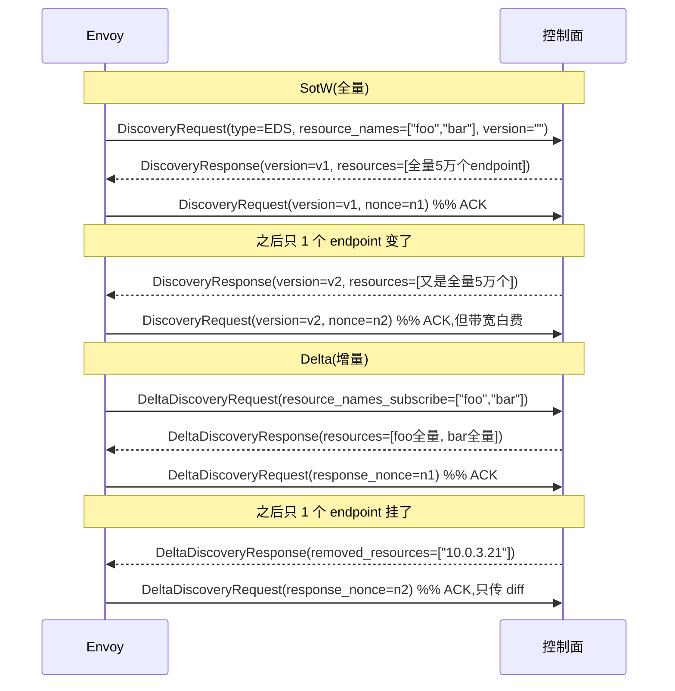

# 第 5 篇 · 第 17 章 · xDS 订阅与传输:grpc streaming / delta / ADS

> **核心问题**:上一章讲了 xDS 协议的"是什么"——五类资源(LDS/RDS/CDS/EDS/SDS)和 resource version 协商。但还有一个同样要命的问题悬着:**这些配置,到底怎么从控制面传到 Envoy?** 是控制面推、还是 Envoy 拉?一条流跑一个类型、还是一条流拉所有类型?每次推全量、还是只推增量?一个集群几万、几十万个 endpoint,控制面每次都把全部 endpoint 推一遍,带宽和 CPU 扛得住吗?LDS 引用 RDS、RDS 引用 CDS、CDS 引用 EDS,这四类必须**按顺序**到达,否则数据面引用了还没下发的资源——多个独立流怎么保证跨类型的顺序?Envoy 的答案有三层叠加的演进:**SotW(State of the World,全量)→ Delta xDS(增量)→ ADS(Aggregated Discovery Service,聚合订阅)**,底下再配 grpc/rest/filesystem 三种传输后端。这一章把这三层演进和三种后端一次拆透,配到源码行号。

> **读完本章你会明白**:
> 1. **SotW(全量订阅)**为什么是 xDS 的起点、又为什么在规模上一碰就碎——一个 10 万 endpoint 的集群,控制面每次推全部 endpoint 浪费多少带宽/CPU,朴素地"只用 SotW"会撞什么墙。
> 2. **Delta xDS(增量订阅)**怎么靠"只推 diff(added/removed)+ 每资源独立 version"解决规模问题,为什么它更复杂(客户端要维护"已知状态"、处理订阅增减/取消、重连后还要恢复 per-resource version),源码里 `DeltaSubscriptionState` 怎么维护那张 `requested_resource_state_` 表。
> 3. **ADS(聚合订阅)**为什么是招牌——用一个 gRPC 双向流拉所有类型、靠 type_url 轮转,保证 **LDS→RDS→CDS→EDS 的到达顺序**,多个独立流为什么做不到这点,源码里 `subscription_ordering_` 那个 list 怎么决定轮转顺序。
> 4. **grpc/rest/filesystem 三种传输后端**各自的代价与适用场景,为什么生产几乎都用 gRPC 双向流。
> 5. **ADS 的 SotW 与 Delta 两种形态**(`AGGREGATED_GRPC` vs `AGGREGATED_DELTA_GRPC`)在源码里是同一个 `GrpcMuxImpl` 模板的两个实例化——Delta 和 SotW 的差异被抽象到了 `SubscriptionState` 这一层。

> **如果一读觉得太难**:先只记住三件事——① **SotW** 是"每次推该类型全部资源",简单但规模一上来就浪费;② **Delta xDS** 是"只推变更(added/removed)",省带宽但客户端要自己维护"已知状态";③ **ADS** 是"一个 gRPC 流拉所有类型,靠 type_url 轮转保证 LDS→RDS→CDS→EDS 的顺序"。把这三句记牢,源码细节可以回头再翻。

---

## 〇、一句话点破

> **xDS 的传输做了三层叠加演进:SotW 解决"怎么传"(全量,简单),Delta xDS 解决"大规模怎么传"(只传 diff),ADS 解决"跨类型怎么保证顺序"(一条流 + type_url 轮转)。生产标配是 ADS over Delta gRPC——聚合 + 增量,两件一起上。**

这是结论,不是理由。本章倒过来拆:先讲为什么 xDS 需要一种"传输"而不只是协议,再讲 SotW(全量)的简单与它在规模上的墙,接着讲 Delta(增量)怎么破规模墙却带来了"维护已知状态"的复杂度,然后讲 ADS(聚合)为什么必须存在、它怎么用一条流 + type_url 轮转保证跨类型顺序,最后把 grpc/rest/filesystem 三种后端的选型一次摆清,并指出 Envoy 1.39 源码里 Delta 和 SotW 其实是同一个模板的两个实例化这件事。

> **承前(P5-16)**:上一章讲了"xDS 是什么、五类资源、resource version 协商 + ACK/NACK"。本章只讲"怎么传",不重复五类资源的定义。
> **承《gRPC》**:xDS over gRPC 走的是 **gRPC 双向流(bidirectional streaming)**——HTTP/2 之上的 streaming RPC。gRPC 双向流的机制(HTTP/2 帧、流多路复用、HPACK)是《gRPC》那本 P2-07 / P3-10 已讲透的内容,本书**不重复**,只讲"Envoy 作为 xDS 客户端怎么用这条双向流"。

---

## 一、先把"xDS 传输"和"xDS 协议"分清

上一章把 xDS 当协议讲:五类资源、`version_info` 协商、ACK/NACK。但协议只规定"消息长什么样",没规定"消息怎么送"。送这件事,有自己的设计空间,而且这套设计空间正是这一章的主角。

### 三个正交的维度

xDS 的"传输"实际上是三个**正交维度**的笛卡尔积(可独立选择):

```
   维度 1:增量性 —— SotW(全量) / Delta(增量)
   维度 2:聚合性 —— 独立流(每类型一条) / ADS 聚合(一条流拉所有类型)
   维度 3:后端   —— gRPC 双向流 / REST 轮询 / 文件系统监听
```

这三个维度在 Envoy 配置里都有对应字段。以 `ApiConfigSource.api_type` 为例(对应维度 1+2 的组合):

```
   REST                  = 1   // REST 轮询(只支持 SotW 语义)
   GRPC                  = 2   // gRPC,独立流,SotW
   DELTA_GRPC            = 3   // gRPC,独立流,Delta
   AGGREGATED_GRPC       = 5   // gRPC,ADS 聚合,SotW
   AGGREGATED_DELTA_GRPC = 6   // gRPC,ADS 聚合,Delta  ← 生产标配
```

(枚举值见 [`ApiConfigSource.ApiType`](../envoy/api/envoy/config/core/v3/config_source.proto#L47-L77)。)

维度 3 的"后端"则由 `ConfigSource` 的 `config_source_specifier` 决定(`path` / `api_config_source` / `ads`)。

> **钉死这件事**:理解本章的钥匙是认清这三个维度**正交**——你可以"ADS 聚合 + Delta 增量 + gRPC",也可以"SotW 全量 + 独立流 + REST"。生产最常见的组合是 **AGGREGATED_DELTA_GRPC**(聚合 + 增量 + gRPC),但每一步都是为解决某个具体问题加进来的。下面三节分别拆这三个维度,每一节都讲"它解决什么、不这样会撞什么墙"。

---

## 二、维度一·增量性:SotW(全量)的简单,与它在规模上的墙

### 提问:控制面该推什么?

Envoy 订阅了某 `type_url` 的一组资源(比如 EDS 订阅了 cluster `foo` 的所有 endpoint)。后端某个实例扩容了——控制面要把新 endpoint 通知 Envoy。这时一个最朴素的问题:**控制面这一推,是推"全部 endpoint",还是只推"新增的那个"?**

### 不这样会怎样:朴素地推全部——SotW

最朴素也最简单的方案:**每次推该 type_url 的全部资源**。这叫 **SotW(State of the World,全量)**。控制面永远把"当前世界状态"完整发给 Envoy,Envoy 用收到的全量替换旧状态。

SotW 的好处极其明显:

- **客户端状态极简**:Envoy 只需记住"上一次收到的全量是什么"(一个 `version_info` + 一份资源列表),下次收到新的全量,整个替换即可。不用记录"我之前订阅过哪些、各自到了哪个版本"。
- **服务端也简单**:控制面不需要跟踪每个 Envoy 的增量状态,直接把当前全量发出去。
- **幂等**:同一个全量发两遍,效果一样。

SotW 的协议长这样(见 [`DiscoveryRequest`](../envoy/api/envoy/service/discovery/v3/discovery.proto#L55-L107)):

```proto
message DiscoveryRequest {
  string version_info = 1;            // 客户端当前持有的版本(ACK 用)
  ...
  string type_url = 4;                // 订阅哪一类资源
  repeated string resource_names = 3; // 想要哪些资源(全量列出)
  string response_nonce = 5;          // 上一次响应的 nonce(ACK/NACK 用)
}
message DiscoveryResponse {
  string version_info = 1;
  string type_url = 4;
  repeated Any resources = 2;         // 全量资源
  string nonce = 3;
}
```

注意 `resource_names` 是"我想要的全集",`resources` 是"我推给你的全集"。两边都是**全量**。

### SotW 撞墙:规模

SotW 的简单,在规模上要付出代价。考虑一个真实的微服务场景:

- 一个大 cluster 有 **10 万个 endpoint**(Kubernetes 大集群、或全球级服务网格很常见)。
- 这 10 万个 endpoint **每天频繁变化**(扩容、缩容、滚动发布、健康检查摘除/恢复)。假设每秒都有几个 endpoint 变。
- 每次变化,SotW 都把**全部 10 万个 endpoint** 重新推一遍。

来算笔账:一个 endpoint 的 protobuf 表示(ClusterLoadAssignment 里的 LbEndpoint)大概几百字节到 1KB。10 万个就是 **几十 MB 到上百 MB 一次推送**。一秒变几次,就是**每秒几百 MB 到 GB 级**的控制面流量,仅仅是 EDS 一类。再加上 CPU:Envoy 每次收到全量,要把 10 万个 endpoint 全部反序列化、diff、重建负载均衡器内部数据结构(ring hash 环、maglev 表等)——哪怕只变了 1 个 endpoint,也要把 10 万个全过一遍。

> **不这样会怎样**:一个朴素的全 SotW 部署,在大集群下控制面流量、Envoy CPU 都会爆炸。某团队曾报告:用 SotW EDS 推一个 5 万 endpoint 的 cluster,每次推送 Envoy CPU 飙到 80% 以上(光是反序列化和重建 LB 结构),控制面下行带宽常驻几百 Mbps。这不是"加机器"能解决的——是**协议本身**把"只变 1 个"放大成了"重传全部"。

### 所以这样设计:Delta xDS(增量)

xDS 协议因此演进出 **Delta xDS**(增量)。Delta 的核心思想:**只推变更**——控制面告诉 Envoy "这次新增了哪些资源(added/updated)、删除了哪些(removed)",不再推全量。

Delta 协议长这样(见 [`DeltaDiscoveryRequest`](../envoy/api/envoy/service/discovery/v3/discovery.proto#L200-L320) / [`DeltaDiscoveryResponse`](../envoy/api/envoy/service/discovery/v3/discovery.proto#L295-L340)):

```proto
message DeltaDiscoveryRequest {
  string type_url = 2;
  repeated string resource_names_subscribe   = 3; // 本次新增订阅
  repeated string resource_names_unsubscribe = 4; // 本次取消订阅
  map<string,string> initial_resource_versions = 5; // 重连时告知"我已有哪些版本"
  string response_nonce = 6;
  ...
}
message DeltaDiscoveryResponse {
  string system_version_info = 1;
  repeated Resource resources = 2;       // 本次 added/updated 的资源
  repeated string removed_resources = 6; // 本次 removed 的资源名
  ...
}
```

对比 SotW 的关键差异:

| | SotW | Delta |
|---|------|-------|
| 客户端表达订阅 | `resource_names`:全量列出想要的 | `resource_names_subscribe` / `_unsubscribe`:只列本次增/减 |
| 服务端推送 | `resources`:全量 | `resources`(added/updated)+ `removed_resources`:只推 diff |
| version 粒度 | 一个 `version_info` 覆盖整个 type_url | 每个资源独立 version(`Resource.version`)+ 重连时 `initial_resource_versions` |
| 客户端状态 | 记一个 `last_good_version_info` | 记一张"每资源当前版本"的表 |

回到 10 万 endpoint 的例子:某个 endpoint 挂了,Delta 只推一条 `removed_resources: ["10.0.3.21:8080"]`,几十字节。CPU 上 Envoy 只需从 LB 结构里摘掉这一个 endpoint,不必把 10 万个重过一遍。**规模问题被协议本身解决了。**

### Delta 的代价:客户端要维护"已知状态"

Delta 用 diff 换全量,省了带宽,但把复杂度转移到了客户端:**Envoy 现在必须自己维护"我已经收到了哪些资源、各自到了哪个版本"这张表**。因为:

- 收到 `removed_resources: ["x"]`,Envoy 得知道"x"是不是真在自己已知的资源集里(否则乱删);
- 订阅增减(用户配的 cluster 列表变了),要把"新增订阅"和"取消订阅"分别填进 `resource_names_subscribe` / `_unsubscribe`;
- **gRPC 流重连**后,Envoy 不能假设服务端还记得自己上次的进度,得在重连后的第一个请求里用 `initial_resource_versions` 告诉服务端"我已经有这些资源、这些版本,你只需要把之后的变化推给我"——而不是从头全量重发。

这一切都压在客户端的状态管理上。Envoy 源码里负责这块的,正是 [`DeltaSubscriptionState`](../envoy/source/extensions/config_subscription/grpc/xds_mux/delta_subscription_state.h#L18-L109)。它的核心字段:

```cpp
// (摘自 delta_subscription_state.h,简化示意,保留字段语义)
class DeltaSubscriptionState {
  // 每个"我们正在订阅的资源"的当前 version。keys = 当前订阅的资源名。
  // 值为 nullopt(waitingForServer)表示"我们想要、但还没从服务端拿到任何版本"。
  absl::node_hash_map<std::string, ResourceState> requested_resource_state_;
  // 通配订阅(wildcard)收到的资源的 version。
  absl::node_hash_map<std::string, std::string> wildcard_resource_state_;
  // 介于"已取消显式订阅、但可能仍属 wildcard"之间的资源(模糊态)。
  absl::node_hash_map<std::string, std::string> ambiguous_resource_state_;

  // 自上次发请求以来,新增/取消的订阅(填进 resource_names_subscribe/_unsubscribe)。
  std::set<std::string> names_added_;
  std::set<std::string> names_removed_;
};
```

三张 map 看着吓人,其实是 Delta 协议"per-resource version + 订阅增减"的忠实实现:

- `requested_resource_state_` 就是"我已知的每资源版本"——重连时它被序列化进 `initial_resource_versions`(见 [`getNextRequestInternal`](../envoy/source/extensions/config_subscription/grpc/xds_mux/delta_subscription_state.cc#L250-L297));
- `names_added_` / `names_removed_` 就是"本次要告知服务端的订阅增减"。

> **钉死这件事**:Delta 不是"免费午餐"。它把"全量传输"的代价,换成了"客户端维护 per-resource 状态 + 处理订阅增减 + 重连恢复"的复杂度。源码里 `DeltaSubscriptionState` 的三张 map、`names_added_/_removed_`、`markStreamFresh` + `initial_resource_versions` 这套机制,正是为承载这份复杂度而存在。**这是 Delta 比 SotW 难写、但也比 SotW 能撑规模的根。**

### 反面对比:如果只用 SotW、不上 Delta

老资料(2018-2019 年的博客)很多只讲 SotW,因为那时 Delta 还没普及。但今天的现实是:**任何上规模的 service mesh,EDS 几乎一定走 Delta**——否则一个稍大的集群,控制面下行带宽和 Envoy CPU 就会先撞墙。Istio 默认就用 `AGGREGATED_DELTA_GRPC`(Delta ADS)。**老资料若没讲 Delta,是过时的。**

---

## 三、维度二·聚合性:ADS 为什么必须存在

增量性解决了"规模",但 xDS 还有一个更要命的问题:**跨类型的到达顺序**。这个问题 SotW/Delta 都没解决,它需要一个全新的机制——**ADS(Aggregated Discovery Service,聚合订阅)**。ADS 是 Envoy 控制面的招牌,理解它就理解了"为什么 service mesh 的控制面要这么设计"。

### 提问:LDS/RDS/CDS/EDS 的下发,有顺序要求吗?

有,而且**强顺序**。xDS 的五类资源,彼此引用:

```
   Listener (LDS)
     └─ 引用 RouteConfiguration (RDS)
          └─ 引用 Cluster (CDS)
               └─ 引用 ClusterLoadAssignment,即 Endpoint (EDS)
```

一个 listener 的 filter chain 里写"用 route_config `foo`";route_config `foo` 里写"匹配 /api 的转发到 cluster `bar`";cluster `bar` 需要 endpoint 列表。这是一个**引用链**。

这意味着:如果 Envoy 先收到 LDS(新 listener),但 RDS(route_config `foo`)还没到——这个 listener 引用了一个还不存在的 route_config;再比如先收到 CDS(cluster `bar`),但 EDS 还没到——cluster 没有任何 endpoint。**引用了未下发的资源**,会导致配置短暂不可用、请求 503、或 listener 起不来。

### 不这样会怎样:独立流保证不了跨类型顺序

朴素方案:每个 type_url 走**独立的 gRPC 流**——LDS 一条流、RDS 一条流、CDS 一条流、EDS 一条流。每条流各自和服务器通信,各自 ACK/NACK。

问题在于:**四条独立流之间,没有任何顺序保证**。控制面可能先在 LDS 流上推了新 listener,但 RDS 流的网络包因为拥塞晚到 50ms;或者 EDS 流先到了 endpoint、CDS 流还没到 cluster 定义。每条流的推送时机、网络延迟都独立,跨流顺序完全失控。

> **不这样会怎样**:一个 service mesh,新增一个 virtual service(Istio 的常见操作)。控制面要同时下发新的 LDS( listener)、RDS(route)、CDS(cluster)、EDS(endpoint)。如果走四条独立流,这四个下发到达 Envoy 的顺序是随机的——可能出现"listener 引用了还没到的 route"、"cluster 没有任何 endpoint"的中间态,这些中间态会导致**短时的 503、连接失败、健康检查误判**。在大规模滚动发布时,这种跨流乱序引发的抖动是真实生产事故的常见根因。

### 所以这样设计:ADS——一条流拉所有类型,靠 type_url 轮转

ADS(Aggregated Discovery Service)的解法干脆利落:**用一个 gRPC 双向流,拉所有类型**。所有类型的请求和响应,都走同一条流,靠每条消息里的 `type_url` 字段区分类型。

ADS 的 proto 见 [`ads.proto`](../envoy/api/envoy/service/discovery/v3/ads.proto#L29-L36),核心就两个 RPC:

```proto
service AggregatedDiscoveryService {
  // SotW 形态的 ADS
  rpc StreamAggregatedResources(stream DiscoveryRequest)
      returns (stream DiscoveryResponse) {}

  // Delta 形态的 ADS
  rpc DeltaAggregatedResources(stream DeltaDiscoveryRequest)
      returns (stream DeltaDiscoveryResponse) {}
}
```

注意两个 RPC 的消息体和独立流完全一样(`DiscoveryRequest`/`Response` 或 `DeltaDiscoveryRequest`/`Response`)——**ADS 没有发明新消息,只是把这些消息复用到同一条流上**。区分类型全靠 `type_url`。

**单流为什么能保证顺序?** 因为 gRPC 双向流在 HTTP/2 上是**单条流(stream)、有序收发**(《gRPC》P2-07 讲过 HTTP/2 的 stream 内有序)。控制面在**这一条流上**按 `LDS → RDS → CDS → EDS` 的顺序发送响应,Envoy 就**必然按这个顺序**收到——因为流内有序。控制面只要自己保证"先发 LDS 响应、再发 RDS、再发 CDS、再发 EDS",跨类型的顺序就**天然**得到了保证,不需要任何额外协调。

而客户端侧,Envoy 发请求时也按依赖顺序排队:**先请求 LDS,等 LDS 到了(收到引用的 route_config 名)再请求 RDS,以此类推**。这个"按依赖顺序排队"在源码里靠一个 list + 一个轮转函数实现(下一节技巧精解拆透)。

> **钉死这件事**:ADS 的本质是**用单流 + type_url 复用,把"跨类型顺序"问题降维成"流内顺序"问题**——而流内有序是 HTTP/2 天然保证的。这是 ADS 比独立流高明的地方:不是它推得更快,而是它**让顺序可控**。理解 service mesh 控制面,这一条是钥匙。

### ADS 的两种形态:AGGREGATED_GRPC 与 AGGREGATED_DELTA_GRPC

ADS 和增量性是正交的,所以 ADS 有两种形态:

- **AGGREGATED_GRPC**(SotW ADS):一条流,但每个 type_url 推全量(SotW)。
- **AGGREGATED_DELTA_GRPC**(Delta ADS):一条流,每个 type_url 推增量(Delta)。**生产标配。**

在源码里,Envoy 是怎么根据 `api_type` 选 ADS 形态的?见 [`XdsManagerImpl`](../envoy/source/common/config/xds_manager_impl.cc#L192-L282)。它在初始化 `ads_mux_` 时分支:

```cpp
// (摘自 xds_manager_impl.cc:212-278,简化示意,保留分支语义)
if (dyn_resources.ads_config().api_type() ==
    envoy::config::core::v3::ApiConfigSource::DELTA_GRPC) {
  // Delta 形态
  name = "envoy.config_mux.delta_grpc_mux_factory";   // unified_mux 开启时
  // 或 "envoy.config_mux.new_grpc_mux_factory";       // 关闭时(老 mux)
  ...
} else {
  // SotW 形态
  name = "envoy.config_mux.sotw_grpc_mux_factory";    // unified_mux 开启时
  // 或 "envoy.config_mux.grpc_mux_factory";           // 关闭时(老 mux)
  ...
}
ads_mux_ = factory->create(...);
```

注意那句注释:"This is the only point where distinction between delta ADS and state-of-the-world ADS is made. After here, we just have a GrpcMux interface held in `ads_mux_`, which hides whether the backing implementation is delta or SotW."([源码注释 xds_manager_impl.cc:193-195](../envoy/source/common/config/xds_manager_impl.cc#L193-L195))——**Delta 和 SotW 的差异,在 `ads_mux_` 这一抽象之后就隐藏了**,后面所有代码只看到一个 `GrpcMux` 接口。这是干净抽象的力量,也是下一节技巧精解的入口。

---

## 四、维度三·后端:grpc / rest / filesystem

讲完了增量性(Delta)和聚合性(ADS)这两个协议级维度,剩下第三个维度:**这条(或这些)流,物理上跑在什么后端上?** Envoy 提供三种:

### grpc 后端(双向流,生产主流)

最主流、生产几乎必选。xDS over gRPC 走 **gRPC 双向流(bidirectional streaming)**,底层是 HTTP/2 的 stream。控制面和 Envoy 各持一条长期存活的双向流,任何一方随时可以发消息。

gRPC 后端的好处:

- **双向、实时**:控制面可以随时推(push),Envoy 也可以随时表达订阅变化。不像 REST 要轮询。
- **低延迟、长连接**:一条 HTTP/2 连接复用,无需反复建连。
- **天然支持 ADS**:双向流一条拉所有类型,正是 ADS 的载体。
- **流内有序**:HTTP/2 stream 内消息有序(《gRPC》P2-07),这是 ADS 保证跨类型顺序的物理基础。

gRPC 后端是**唯一**能跑 ADS 的后端(REST/文件系统都做不到聚合),也是**唯一**能跑 Delta 独立流的后端。生产环境基本只用它。

> **承《gRPC》**:gRPC 双向流的 HTTP/2 帧、流多路复用、HPACK 头部压缩、流控,都是《gRPC》P2-07 / P3-10 已讲透的内容。本书只讲"Envoy 用这条流跑 xDS",不重复 gRPC 自身的机制。

### rest 后端(HTTP 长轮询)

REST 后端用普通 HTTP POST 轮询:Envoy 每隔 `refresh_delay` 向控制面 POST 一个 `DiscoveryRequest`(JSON),控制面回一个 `DiscoveryResponse`(JSON)。见 [`HttpSubscriptionImpl`](../envoy/source/extensions/config_subscription/rest/http_subscription_impl.cc#L22-L108)。

REST 的限制很多:

- **只能轮询,不能 push**:控制面有更新要等 Envoy 下次轮询才能送达,延迟受 `refresh_delay` 限制(通常几秒)。
- **只支持 SotW**:REST 协议里没有 Delta 的语义(`resource_names_subscribe`/`_unsubscribe`/`initial_resource_versions` 都没有对应),只有 `resource_names` 全量。
- **不支持 ADS**:每个 type_url 各自一条 HTTP 轮询,没法聚合,跨类型顺序不保证。
- **JSON 编解码开销大**:比 protobuf 慢、比 protobuf 大。

REST 后端主要存在于历史兼容——早期 xDS(Envoy v2 API 时代)REST 是选项之一。现在生产几乎不用,但配置上仍支持(某些简易控制面、或调试场景)。

### filesystem 后端(本地文件)

最简单的后端:配置写在本地文件里,Envoy 用 [`FilesystemWatcher`](../envoy/source/extensions/config_subscription/filesystem/filesystem_subscription_impl.cc#L21-L55) 监听文件变化,文件一更新就重新读。见 [`FilesystemSubscriptionImpl`](../envoy/source/extensions/config_subscription/filesystem/filesystem_subscription_impl.cc#L21-L110)。

filesystem 后端的特点:

- **没有控制面**:就是个本地文件,适合测试、开发、或"伪动态"(改文件触发 reload-equivalent 的更新)。
- **不算真"动态"**:但比静态配置强——不用重启进程,文件改了 Envoy 立刻重新读并应用。这在 CI 或简单部署里有用。
- **不支持 ADS,不支持 Delta**:只有 SotW 语义。

### 后端怎么选:工厂分发

源码里三种后端通过 `ConfigSubscriptionFactory` 的工厂名分发。见 [`SubscriptionFactoryImpl::subscriptionFromConfigSource`](../envoy/source/common/config/subscription_factory_impl.cc#L27-L112),核心是一个 switch:

```cpp
// (摘自 subscription_factory_impl.cc:52-101,简化示意,保留分支)
switch (config.config_source_specifier_case()) {
  case kPath: case kPathConfigSource:
    subscription_type = "envoy.config_subscription.filesystem";  break;
  case kApiConfigSource:
    switch (api_config_source.api_type()) {
      case REST:       subscription_type = "envoy.config_subscription.rest";       break;
      case GRPC:       subscription_type = "envoy.config_subscription.grpc";       break;
      case DELTA_GRPC: subscription_type = "envoy.config_subscription.delta_grpc"; break;
      case AGGREGATED_GRPC: case AGGREGATED_DELTA_GRPC:
        return InvalidArgumentError("...走 ads 而非 api_config_source...");
    }
    break;
  case kAds:
    subscription_type = "envoy.config_subscription.ads";  break;
}
factory = Registry::getFactory(subscription_type);
return factory->create(data);
```

(工厂名注册见 [filesystem](../envoy/source/extensions/config_subscription/filesystem/filesystem_subscription_impl.h#L75) / [rest](../envoy/source/extensions/config_subscription/rest/http_subscription_impl.h#L69) / [grpc/ads](../envoy/source/extensions/config_subscription/grpc/grpc_subscription_factory.h#L11-L23)。)

注意一个细节:**ADS 形态(`AGGREGATED_GRPC` / `AGGREGATED_DELTA_GRPC`)在 `api_config_source` 里是被拒绝的**——要走 ADS,必须用 `ConfigSource.ads` 字段(走 `kAds` 分支),而不是 `api_config_source`。这是因为 ADS 的 mux 是全局唯一的(整个 Envoy 共享一个 `ads_mux_`),不能像独立流那样每个订阅各自起。`kAds` 分支最终调用 [`subscriptionOverAdsGrpcMux`](../envoy/source/common/config/subscription_factory_impl.cc#L128-L160),把订阅挂到那个共享的 `ads_mux_` 上。

> **钉死这件事**:三种后端不是平级的——**grpc 是一等公民**(支持 Delta + ADS,生产主流),**rest 是历史兼容**(只 SotW、轮询),**filesystem 是测试/简单场景**(本地文件)。它们的分发靠工厂名 + `api_type` switch,ADS 走特殊的共享 `ads_mux_` 路径。

---

## 五、一条流怎么拉所有类型:ADS 的 type_url 轮转(源码精读)

讲完了三个维度,现在钻进源码,看 ADS 最招牌的一个机制——**一条 gRPC 流,怎么依次发送 LDS/RDS/CDS/EDS 的请求、保证顺序**。这是本章技巧精解的第一弹。

### 提问:多个 type_url 共享一条流,Envoy 怎么决定下一个该发谁?

一条 ADS 流上,Envoy 既要发 LDS 请求、又要发 RDS/CDS/EDS 请求(每条带不同 `type_url`)。这些请求不能同时发(gRPC 双向流的消息是串行发的),得**排队**。那排队顺序由谁决定?

朴素想法:哪个 type_url 有更新就发哪个。但这会乱序——可能 EDS 的更新先到、CDS 还没发。**正确顺序应该是依赖序:先 LDS、等 LDS 回来知道引用了哪些 route、再 RDS、再 CDS、再 EDS。**

### 源码:`subscription_ordering_` + `whoWantsToSendDiscoveryRequest()`

ADS mux 的核心类是 [`GrpcMuxImpl`](../envoy/source/extensions/config_subscription/grpc/xds_mux/grpc_mux_impl.h#L57-L259)(模板化,Delta 和 SotW 共用)。它维护两个关键结构:

```cpp
// (摘自 grpc_mux_impl.h:225-230,简化示意)
// 每个 type_url 一个 SubscriptionState(Delta 或 Sotw)
absl::flat_hash_map<std::string, std::unique_ptr<S>> subscriptions_;
// 决定初始 discovery 请求顺序的 list —— 按"Envoy 依赖序"插入
std::list<std::string> subscription_ordering_;
```

`subscription_ordering_` 是个 **list**,每当 `addWatch(type_url, ...)` 第一次为某 type_url 建订阅时,就把这个 type_url `emplace_back` 进去(见 [`addWatch`](../envoy/source/extensions/config_subscription/grpc/xds_mux/grpc_mux_impl.cc#L128-L159)):

```cpp
// (摘自 grpc_mux_impl.cc:143-153,简化示意)
if (watch_map == watch_maps_.end()) {
  // 第一次为这个 type_url 建订阅
  watch_map = watch_maps_.emplace(type_url, std::make_unique<WatchMap>(...)).first;
  subscriptions_.emplace(type_url, subscription_state_factory_->makeSubscriptionState(...));
  subscription_ordering_.emplace_back(type_url);  // ← 按加入顺序排队
}
```

**这里的精妙之处**:`subscription_ordering_` 的入队顺序,就是**调用 `addWatch` 的顺序**,而这个顺序是由 Envoy 的**依赖序**决定的——Envoy 启动时先订阅 LDS(LDS 先到才知道有哪些 listener、引用了哪些 route),LDS 回来后才订阅 RDS,RDS 回来才知道引用了哪些 cluster,于是订阅 CDS,CDS 回来才订阅 EDS。所以 `subscription_ordering_` 天然就是 `[LDS, RDS, CDS, EDS, ...]` 这个依赖序。

轮转逻辑在 [`whoWantsToSendDiscoveryRequest`](../envoy/source/extensions/config_subscription/grpc/xds_mux/grpc_mux_impl.cc#L437-L453):

```cpp
// (摘自 grpc_mux_impl.cc:437-453,逐字摘录)
absl::optional<std::string> GrpcMuxImpl<...>::whoWantsToSendDiscoveryRequest() {
  // 所有 ACK 优先于普通更新(trySendDiscoveryRequests 依赖这点)
  if (!pausable_ack_queue_.empty()) {
    return pausable_ack_queue_.front().type_url_;
  }
  // 多个非 ACK 请求,按订阅激活顺序发
  for (const auto& sub_type : subscription_ordering_) {
    auto& sub = subscriptionStateFor(sub_type);
    if (sub.subscriptionUpdatePending() && !pausable_ack_queue_.paused(sub_type)) {
      return sub_type;
    }
  }
  return absl::nullopt;
}
```

这段代码做的事:

1. **ACK 优先**:如果有待发的 ACK(对上次响应的确认),先发 ACK(`pausable_ack_queue_` 是 ACK 队列)。
2. **否则按依赖序找第一个"有更新待发"的 type_url**:遍历 `subscription_ordering_`(依赖序),找第一个 `subscriptionUpdatePending()` 且没被 pause 的。
3. 返回这个 type_url,由 [`trySendDiscoveryRequests`](../envoy/source/extensions/config_subscription/grpc/xds_mux/grpc_mux_impl.cc#L371-L409) 实际发送。

发送循环 `trySendDiscoveryRequests` 是个 `while(true)`:每次问 `whoWantsToSendDiscoveryRequest()` 拿一个 type_url,发一个请求,再问下一个,直到没有待发的为止。

### 这个设计的精妙:顺序自然从数据结构里长出来

注意这套机制**没有任何"if type_url == LDS then 先发"这种硬编码**。顺序完全来自两个东西:

1. `subscription_ordering_` 这个 **list 的入队顺序**(由 Envoy 依赖序决定)。
2. 一个**按 list 顺序遍历**的循环。

这是一种特别干净的设计:把"顺序约束"编码进数据结构(有序 list),而不是散落在控制流(if-else)里。要改顺序(比如某天加了新 xDS 类型),只要改它的 `addWatch` 调用时机,`subscription_ordering_` 自动反映。

### 反面对比:朴素地"哪个 ready 发哪个"

如果朴素地用一个无序 set 存订阅、哪个 ready 发哪个——那 EDS 的更新(后端实例变了)可能比 CDS(新 cluster 定义)先发,ADS 流上先跑 EDS 请求、再跑 CDS 请求,服务端就可能先回 EDS 响应。即使流内有序,顺序也是**错的**(EDS 在 CDS 之前)。`subscription_ordering_` 这个 list 强制了依赖序,把"顺序正确性"从"运行时凑巧"变成了"数据结构保证"。

> **钉死这件事**:ADS 的 type_url 轮转,不是靠协议规定的(type_url 本身没有顺序信息),而是靠**客户端用一个有序 list + 按序遍历**实现的。这套机制的源码就是 `subscription_ordering_` + `whoWantsToSendDiscoveryRequest()`。它是"用数据结构编码约束"这种设计哲学的一个漂亮例子——顺序从 list 里自然长出来,而不是堆 if-else。

---

## 六、Delta 和 SotW 的差异,被抽象到了哪里(源码精解·第二弹)

第二个技巧精解,看 Envoy 怎么把 SotW 和 Delta 的差异**干净地抽象掉**,让上层 `GrpcMuxImpl` 对两者透明。这是 C++ 模板设计的教科书级例子,也是读者最容易"读源码读晕"的地方——因为你会发现 Delta 和 SotW 的代码"长得几乎一样"。

### 提问:Delta 和 SotW 差异那么大,为什么不写两份 mux?

从协议看,Delta 和 SotW 差异巨大(全量 vs 增量、一个 version vs 每资源 version、订阅增减 vs 全量列出)。朴素地,会写两个 mux 类:`SotwGrpcMux` 和 `DeltaGrpcMux`,各几百行,大量重复(流管理、ACK 队列、pause/resume、watch map 都一样)。

但 Envoy 的实际做法是:**一个模板类 `GrpcMuxImpl<S, F, RQ, RS>`,把"Delta 还是 SotW"作为模板参数**。见 [`grpc_mux_impl.h:57-259`](../envoy/source/extensions/config_subscription/grpc/xds_mux/grpc_mux_impl.h#L57-L259):

```cpp
// (摘自 grpc_mux_impl.h:57-61,逐字摘录)
template <class S, class F, class RQ, class RS>
class GrpcMuxImpl : public GrpcStreamCallbacks<RS>,
                    public GrpcMux,
                    public ShutdownableMux,
                    Logger::Loggable<Logger::Id::config> {
```

四个模板参数:

- `S` = `SubscriptionState` 类型(`DeltaSubscriptionState` 或 `SotwSubscriptionState`)
- `F` = `SubscriptionStateFactory`(对应工厂)
- `RQ` = 请求消息类型(`DeltaDiscoveryRequest` 或 `DiscoveryRequest`)
- `RS` = 响应消息类型(`DeltaDiscoveryResponse` 或 `DiscoveryResponse`)

然后两个具体子类,只是把模板参数钉死 + 指定 gRPC 方法名([`grpc_mux_impl.h:261-292`](../envoy/source/extensions/config_subscription/grpc/xds_mux/grpc_mux_impl.h#L261-L292)):

```cpp
// (摘自 grpc_mux_impl.h:261-292,逐字摘录)
class GrpcMuxDelta : public GrpcMuxImpl<DeltaSubscriptionState, DeltaSubscriptionStateFactory,
                                        DeltaDiscoveryRequest, DeltaDiscoveryResponse> {
  absl::string_view methodName() const override {
    return "envoy.service.discovery.v3.AggregatedDiscoveryService.DeltaAggregatedResources";
  }
};
class GrpcMuxSotw : public GrpcMuxImpl<SotwSubscriptionState, SotwSubscriptionStateFactory,
                                       DiscoveryRequest, DiscoveryResponse> {
  absl::string_view methodName() const override {
    return "envoy.service.discovery.v3.AggregatedDiscoveryService.StreamAggregatedResources";
  }
};
```

`GrpcMuxDelta` 调 `DeltaAggregatedResources` RPC,`GrpcMuxSotw` 调 `StreamAggregatedResources` RPC——除此之外,流管理、ACK 队列、pause/resume、watch map、type_url 轮转,**全是模板基类 `GrpcMuxImpl` 共享的同一份代码**。

### 差异被压缩到了 `SubscriptionState` 这一层

那 Delta 和 SotW 的真正差异(全量 vs 增量、version 粒度)去哪了?**全压缩进了 `S` 这个模板参数——也就是 `DeltaSubscriptionState` 和 `SotwSubscriptionState` 两个类**。对比两者的核心字段:

| | `SotwSubscriptionState` | `DeltaSubscriptionState` |
|---|---|---|
| version | 一个 `last_good_version_info_` | 每资源一张表 `requested_resource_state_` |
| 订阅表达 | `names_tracked_` 集合(全量) | `names_added_` / `names_removed_`(增量) |
| 重连恢复 | 用 `last_good_nonce_` | 用 `initial_resource_versions` map + `markStreamFresh` |
| 响应处理 | `handleGoodResponse`:全量 `resources` | `handleGoodResponse`:`resources`(added)+ `removed_resources` |
| 生成请求 | [`getNextRequestInternal`](../envoy/source/extensions/config_subscription/grpc/xds_mux/sotw_subscription_state.cc#L158-L175):填全量 `resource_names` | [`getNextRequestInternal`](../envoy/source/extensions/config_subscription/grpc/xds_mux/delta_subscription_state.cc#L250-L297):填 `resource_names_subscribe`/`_unsubscribe` + `initial_resource_versions` |

这两个类都继承自 `BaseSubscriptionState`,实现相同的接口(`updateSubscriptionInterest` / `subscriptionUpdatePending` / `handleGoodResponse` / `getNextRequestInternal` / `markStreamFresh`)。模板基类 `GrpcMuxImpl` 只调这些接口,**不知道**底下是 Delta 还是 SotW。

> **钉死这件事**:Envoy 用 C++ 模板把"Delta vs SotW"这个差异压缩进了 `SubscriptionState` 这一层,让上层 `GrpcMuxImpl` 完全透明。这是**把可变点隔离到单一抽象边界**的典范——流管理、ACK、轮转这些和增量性无关的逻辑只写一遍;和增量性强相关的逻辑(version 管理、订阅增减、请求生成)隔离在 `SubscriptionState` 里。读源码时,先读 `GrpcMuxImpl` 理解骨架,再分别读两个 `SubscriptionState` 理解差异,就不会晕。

### 反面对比:写两份 mux 会怎样

如果朴素地写 `SotwGrpcMux` 和 `DeltaGrpcMux` 两份类,流管理、ACK 队列、pause/resume、watch map、type_url 轮转这些**和增量性无关的逻辑会被复制两遍**。复制=bug 的温床:修一个流管理的 bug,得记得两边都改;改 type_url 轮转的顺序,得两边同步。模板化把这些公共逻辑收敛成一份,差异点被模板参数隔离——**这是用抽象换可维护性的标准操作**,也是 Envoy 这种大型 C++ 项目能撑住复杂度的根。

---

## 七、新特性 / 演进交代(诚实标注)

Envoy 的 xDS 传输层在持续重构,本书以 master(`df2c77d`,1.39.0-dev)为准,几个值得点出的演进:

1. **`unified_mux` 特性开关**:源码里 ADS mux 的工厂选择受 `envoy.reloadable_features.unified_mux` 控制(见 [xds_manager_impl.cc:217-221](../envoy/source/common/config/xds_manager_impl.cc#L217-L221))。开启时用新的 `xds_mux/` 目录下的模板化 `GrpcMuxImpl`(本章讲的就是这套),关闭时回退到老的 `grpc/grpc_mux_impl.h`(非模板、Delta/SotW 分开实现)。**新版默认朝 unified_mux 走**,老博客讲的老 mux 实现会逐渐过时。

2. **xdstp 资源**(新 URI scheme `xdstp://`):Delta 协议里新增了 `resource_locators_subscribe` / `resource_locators_unsubscribe`(见 [discovery.proto:247-264](../envoy/api/envoy/service/discovery/v3/discovery.proto#L247-L264)),支持带动态参数的资源定位。`GrpcMuxImpl::updateWatch` 里能看到 `XdsResourceIdentifier::hasXdsTpScheme` 的处理([grpc_mux_impl.cc:176-192](../envoy/source/extensions/config_subscription/grpc/xds_mux/grpc_mux_impl.cc#L176-L192))。这是较新的特性,老资料没有。

3. **xDS failover**(`envoy.restart_features.xds_failover_support`):ADS mux 支持主/备双控制面,见 [`GrpcMuxFailover`](../envoy/source/extensions/config_subscription/grpc/grpc_mux_failover.h#L56-L209)。主控制面挂了自动切备。这也是较新特性。

4. **SotW 不会消失**:虽然 Delta 在规模上更优,但 SotW 因为简单,在简单部署、老控制面、REST 后端仍有市场。Envoy 同时维护两者,不打算废弃 SotW。

> **本书态度**:以 `df2c77d` 源码为准,涉及 unified_mux、xdstp、failover 这些新特性时明确标注。讲老 mux 的博客(2019-2022)大片过时,不能当唯一依据。

---

## 八、配图汇总

### 图 1:SotW vs Delta(推送量对比)

```
   场景:cluster foo 有 5 万 endpoint,某次只 1 个挂了

   SotW(全量):
   控制面 ──[5万个endpoint, 全量]──▶ Envoy   带宽:几十MB,CPU:重建全部LB结构

   Delta(增量):
   控制面 ──[removed: "10.0.3.21:8080", 几十字节]──▶ Envoy   带宽:几十B,CPU:摘1个
```

### 图 2:ADS 单流多 type 轮转 vs 独立多流

```
   独立多流(无 ADS):4条流,跨类型顺序不保证
   控制面 ═══LDS流═══▶ Envoy      ┐
          ═══RDS流═══▶ Envoy      │ 4条流各自收发,
          ═══CDS流═══▶ Envoy      │ 到达顺序随机,
          ═══EDS流═══▶ Envoy      ┘ 可能引用未下发资源 → 503

   ADS(单流聚合):1条流,type_url 轮转,流内有序
   控制面 ════════════════════════▶ Envoy
        LDS(t=LDS)→RDS(t=RDS)→CDS(t=CDS)→EDS(t=EDS)
        └── 同一条 gRPC 流,按依赖序发,流内天然有序 ──┘
```

### 图 3:三种后端

```
   grpc(生产主流):
   Envoy ⇄⇄⇄ gRPC 双向流 ⇄⇄⇄ 控制面   长连接,push,支持 Delta+ADS

   rest(历史兼容):
   Envoy ──POST──▶ 控制面 ──resp──▶ Envoy   每 refresh_delay 轮询,只 SotW

   filesystem(测试/简单):
   Envoy 监听 ──▶ /path/to/config.yaml (本地文件)   无控制面,文件改了重读
```

### 图 4:SotW 握手与 Delta 增量时序(mermaid)



---

## 九、章末小结

### 回扣主线

本章是**控制面**那一面——讲 xDS 的"怎么传"。它承接 P5-16(xDS 是什么),回答"配置怎么从控制面到 Envoy"。三个维度(增量性 / 聚合性 / 后端)的笛卡尔积,定义了 xDS 传输的全部设计空间。生产标配 **AGGREGATED_DELTA_GRPC**(Delta + ADS + gRPC)是三层演进叠加的产物:Delta 解决规模,ADS 解决跨类型顺序,gRPC 提供双向流的物理载体。

### 五个为什么

1. **为什么 xDS 需要 Delta,不能只用 SotW?**——SotW 每次推全量,大集群(10 万 endpoint)每次推送几十 MB、Envoy CPU 重建全部 LB 结构,带宽/CPU 爆炸。Delta 只推 diff(added/removed),规模问题被协议本身解决。
2. **为什么 Delta 比 SotW 复杂?**——Delta 把"全量传输"的代价换成了"客户端维护 per-resource 状态 + 处理订阅增减 + 重连恢复"。源码里 `DeltaSubscriptionState` 的三张 map + `initial_resource_versions` 就是这份复杂度的载体。
3. **为什么需要 ADS,独立流不行?**——LDS 引用 RDS 引用 CDS 引用 EDS,跨类型有强顺序。独立多流之间顺序不保证,会出现"引用未下发资源"的中间态导致 503。ADS 用一条 gRPC 流 + type_url 轮转,把"跨类型顺序"降维成 HTTP/2 "流内有序"。
4. **为什么 ADS 的 type_url 轮转能保证依赖序?**——因为源码用 `subscription_ordering_` 这个有序 list 存订阅,而 list 的入队顺序就是 Envoy 的依赖序(LDS 先 addWatch、LDS 回来才 RDS...)。`whoWantsToSendDiscoveryRequest()` 按 list 顺序遍历,顺序从数据结构里自然长出来。
5. **为什么 Envoy 把 Delta 和 SotW 写成同一个模板的两个实例化?**——流管理、ACK、轮转、watch map 这些和增量性无关的逻辑只写一遍(在 `GrpcMuxImpl` 模板基类),Delta/SotW 的真正差异(version 粒度、订阅表达)压缩进 `SubscriptionState` 这一层。这是"把可变点隔离到单一抽象边界"的典范。

### 想继续深入往哪钻

- **想看 ADS 的 type_url 轮转源码**:读 [`grpc_mux_impl.cc`](../envoy/source/extensions/config_subscription/grpc/xds_mux/grpc_mux_impl.cc) 的 `trySendDiscoveryRequests` / `whoWantsToSendDiscoveryRequest`(L371-L453)。
- **想看 Delta 的 per-resource 状态管理**:读 [`delta_subscription_state.cc`](../envoy/source/extensions/config_subscription/grpc/xds_mux/delta_subscription_state.cc) 的 `handleGoodResponse`(L158-L248)和 `getNextRequestInternal`(L250-L297)。
- **想看 SotW 的全量逻辑**:读 [`sotw_subscription_state.cc`](../envoy/source/extensions/config_subscription/grpc/xds_mux/sotw_subscription_state.cc) 的 `handleGoodResponse`(L46-L97)和 `getNextRequestInternal`(L158-L175)。
- **想看 ADS mux 的选择**:读 [`xds_manager_impl.cc:192-282`](../envoy/source/common/config/xds_manager_impl.cc#L192-L282),看 `api_type` 怎么决定 `delta_grpc_mux_factory` 还是 `sotw_grpc_mux_factory`。
- **想理解 xDS 协议规范**:读 Envoy 官方 [`source/docs/xds.md`](../envoy/source/docs/xds.md)(若有)和 [xDS 协议 draft](https://github.com/cncf/xds)。
- **想理解 Istio 怎么用 ADS**:读 Istio 的 istiod 控制面源码,看它怎么按 `LDS→RDS→CDS→EDS` 顺序在一条 ADS 流上推响应。

### 引出下一章

我们搞清楚了 xDS 的"是什么"(P5-16)和"怎么传"(本章 P5-17)。但还有一个落地问题:LDS 下发了一个新 listener(或改了 listener 的 filter chain),Envoy 怎么**不停机**生效?旧 listener 上还挂着正在处理的连接,直接换会断流。下一章 P5-18,讲 **Listener 热更新:drain 与不停机生效**——listener drain(旧 listener 停止接新连接、等旧连接处理完)+ 热更新替换 filter chain 的机制。

> **下一章**:[P5-18 · Listener 热更新:drain 与不停机生效](P5-18-Listener热更新-drain与不停机生效.md)
