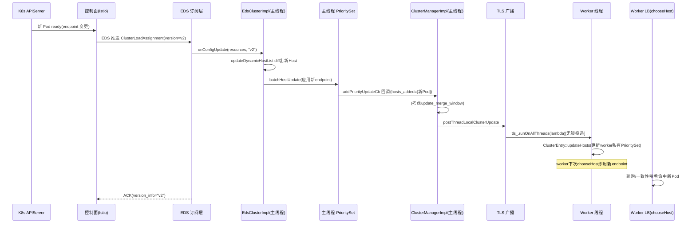

# 第 5 篇 · 第 19 章 · Cluster / Endpoint 动态发现:CDS / EDS

> **核心问题**:你的后端实例每分每秒都在变——扩容、缩容、滚动发布、节点故障、K8s 调度器把 Pod 漂到别的机器。Envoy 怎么在**不重启、不 reload** 的前提下,把这些后端拓扑的变化实时反映到负载均衡的选 host 决策里?更进一步:为什么 Envoy 要把"cluster 的定义"和"cluster 里的 endpoint 列表"分成两次下发(CDS 一次、EDS 持续),而不是一锅端?这一章,把控制面 xDS 的最后一块拼图——CDS / EDS——补齐,讲透"服务发现"为什么是 service mesh 的核心。

> **读完本章你会明白**:
> 1. 为什么朴素地"用 DNS 发现 endpoint"会撞墙——DNS 的 TTL 缓存延迟、轮询开销、无法反映下线、负载均衡信息缺失——以及为什么 EDS(实时推送)成了 service mesh 服务发现的核心。
> 2. **CDS(cluster 动态增减)** 干了什么、`addOrUpdateCluster` / `removeCluster` 在 cluster_manager 里的消费路径,以及为什么"cluster 定义"本身也需要动态。
> 3. **EDS(endpoint 动态发现)** 的核心:`ClusterLoadAssignment` 这份 proto 长什么样、`EdsClusterImpl::onConfigUpdate` 怎么把一串 `LbEndpoint` 解析成内部的 `Host` 对象并 diff 出 added / removed。
> 4. **为什么 CDS 下发定义、EDS 单独下发 endpoint 是招牌设计**——endpoint 变动频繁、cluster 定义变动稀疏,分离下发避免每次实例增减都重推整个 cluster 配置。
> 5. endpoint 更新后怎么经 **thread-local 同步到各 worker**(`postThreadLocalClusterUpdate` → `ClusterEntry::updateHosts`),worker 立即用新 endpoint LB——动态发现的"落地"为什么是无锁的。

> **如果一读觉得太难**:先只记住三件事——① **CDS 管集群的定义(类型/LB/熔断),EDS 管集群里的实例列表**;② **EDS 是控制面主动推,秒级感知,取代 DNS 的轮询缓存**;③ endpoint 一更新,主线程算好 diff,广播到每个 worker 的 thread-local `PrioritySet`,worker 无锁读到新 endpoint 立刻用于 LB。

---

## 〇、一句话点破

> **CDS 让 Envoy 运行中认识新集群,EDS 让 Envoy 秒级感知某个集群里实例的增减;两者的分离,是"定义稀疏变动、实例频繁变动"这一现实的直接映射——而 endpoint 的更新,经主线程 diff、广播、worker thread-local 落地,全程无锁。**

这是结论,不是理由。本章倒过来拆:先从 P4-12 留下的钩子("cluster 怎么动态拿到 endpoint?")讲起,看朴素 DNS 方案撞什么墙;再分别拆 CDS、EDS;然后讲透"为什么分离下发";最后落到 endpoint 怎么 thread-local 生效。

---

## 一、从 P4-12 的钩子说起:cluster 里的 endpoint,到底从哪儿来

### P4-12 留的钩子

第 12 章(《Cluster 与 Endpoint:后端集群与连接池》)讲过,cluster 是 Envoy 转发流量的"上游抽象":一个 cluster 代表一组后端实例(endpoint),router 选好 cluster 之后,负载均衡器在这个 cluster 里挑一个 endpoint,经连接池把请求发出去。

但 P4-12 当时埋了个钩子:**这些 endpoint 是怎么进到 cluster 里的?** 我们介绍了 cluster 的几种类型——

- **STATIC**:endpoint 写死在配置里。
- **STRICT_DNS** / **LOGICAL_DNS**:靠 DNS 解析得到 endpoint。
- **EDS**:靠 xDS 控制面动态下发 endpoint。
- **ORIGINAL_DST**:用连接的原始目的地址当 endpoint(透明代理场景)。

STATIC 太死,ORIGINAL_DST 太特殊,DNS 有它自己的墙(下一节拆),真正在 service mesh 里扛起"动态服务发现"大旗的,是 **EDS**。而 cluster 这个抽象本身的"增减"(新服务上线加一个 cluster、下线删一个),则是 **CDS** 管的。CDS 和 EDS,就是这一章的两个主角。

### 本章在第 5 篇里的位置

第 5 篇是控制面 xDS 的四章。我们已经走过:

- **P5-16**(xDS 协议总览):讲了五种 xDS(LDS/RDS/CDS/EDS/SDS)和 resource version 协商。
- **P5-17**(xDS 订阅与传输):讲了 SotW / Delta / ADS,以及 xDS 怎么经 gRPC stream 传过来。
- **P5-18**(Listener 热更新):讲了 LDS 怎么不停机生效、listener drain。

本章 P5-19 收尾,讲 **CDS / EDS 怎么动态生效**。承接 P5-16(CDS/EDS 是 xDS 之一)和 P5-17(订阅传输机制),也承接 P4-12(cluster 怎么消费 endpoint)。一句话:**前面几章讲完了"配置怎么传过来",本章讲"cluster 和 endpoint 的配置传过来之后,在 Envoy 内部怎么落地、怎么生效"。**

---

## 二、为什么不能朴素地用 DNS 发现 endpoint

讲 EDS 之前,先回答一个绕不开的问题:已经有 DNS 了,Kubernetes 里 Service 不就是靠 DNS 解析的吗?为什么 service mesh 要专门搞一个 EDS?

### DNS 这套机制,本意不是为"高频变更的后端拓扑"设计的

DNS 的核心契约是:**域名 → IP 的映射,有 TTL(Time To Live),客户端在 TTL 内缓存结果。** 这个契约在"几个固定的网站"场景下完美——`www.example.com` 解析到一个 IP,缓存一小时,没问题。但放到微服务的"后端实例频繁上下线"场景,这套契约就开始撞墙。

**第一道墙:TTL 缓存带来的延迟。** 假设你把 DNS TTL 设成 30 秒(这已经算很短了)。一个实例挂了,DNS 把它的 IP 摘掉,但 Envoy 这边的缓存还有最长 30 秒才会过期——这 30 秒里,Envoy 还在往那个已经挂掉的实例发流量,请求失败。TTL 越短,实时性越好,但 DNS 查询频率越高。这是个两难。

**第二道墙:DNS 的"轮询"模型。** DNS 是 pull 模型——客户端去问,DNS 服务器答。Envoy 想"知道实例变了",只能定期重新查。查得快(比如每秒一次),DNS 服务器压力陡增;查得慢,实时性差。没有一个"实例变了,DNS 主动告诉 Envoy"的机制(有 DNS PUSH 的实验性方案,但远未普及)。

**第三道墙:DNS 不携带丰富的负载均衡信息。** 一个 DNS A 记录,只能告诉你"这个域名对应这几个 IP"。但负载均衡需要的远不止 IP——

- 这个实例**健康吗**?(DNS 不告诉你,得另外探活)
- 这个实例的**权重**是多少?(加权 LB 需要,DNS 不直接支持,SRV 记录勉强)
- 这个实例在**哪个 locality / zone**?(locality-aware LB、跨 zone 流量调度需要,DNS 不支持)
- 这个实例的**优先级**?(failover 场景需要,DNS 不支持)

要承载这些信息,DNS 协议本身力不从心。

**第四道墙:DNS 的实际部署里,TTL 经常被中间层无视。** 很多 DNS resolver(尤其一些公共 DNS、容器内的 DNS 缓存)会无视短 TTL,自己缓存更久。你以为设了 5 秒 TTL,实际可能被缓存几分钟。这让"靠短 TTL 换实时性"的策略在真实环境里大打折扣。

> **不这样会怎样**:一个真实的痛点——某团队用 STRICT_DNS cluster 发现后端,实例故障摘除后,Envoy 仍然在最长 TTL 周期内往故障实例发流量,5xx 飙升;更糟的是,做金丝雀发布时,新版本实例上线了,但因为 DNS 缓存,流量迟迟切不过去,灰度窗口对不上。DNS 的 TTL 是"妥协",不是"实时"。

### EDS 的回答:控制面主动推送,秒级、富信息

EDS 把上面四道墙一次性拆掉:

- **不是 TTL 缓存,是推送**:控制面在实例变化的瞬间,主动把新的 endpoint 列表推给 Envoy,**秒级**(甚至亚秒级)生效,没有 TTL 等待。
- **不是 pull 轮询,是 push**:Envoy 和控制面之间是一条 gRPC 长连接(承接 P5-17),控制面有变化就推,没变化就静默。没有轮询开销。
- **携带完整的 LB 信息**:`ClusterLoadAssignment` 这份 proto(下一节拆)里,每个 endpoint 带 address、health_status、load_balancing_weight、locality、priority、metadata——一次推送,负载均衡需要的全有了。
- **不经过中间缓存层**:EDS 是点对点的 gRPC 流,控制面 → Envoy,中间没有 DNS resolver 这种会自作主张缓存的层。

> **钉死这件事**:EDS 不是"更好的 DNS",它是**为 service mesh 服务发现量身设计的实时推送协议**。DNS 的契约(域名→IP,TTL 缓存,pull)和微服务后端拓扑的动态性(频繁变更,需富信息,需实时)根本对不上——EDS 把这套契约整个换掉。

后面的章节,我们看 EDS 在源码里到底长什么样。

---

## 三、CDS:cluster 的动态增减

先讲 CDS——它管的是"cluster 这个抽象本身"的增减,比 EDS 简单,我们快进。

### cluster 的"定义"是什么

一个 cluster 的"定义",大致包括:

- **name**:集群名,router 用它引用。
- **type**:发现类型(STATIC / STRICT_DNS / EDS / ...)。
- **lb_policy**:负载均衡策略(ROUND_ROBIN / LEAST_REQUEST / RING_HASH / MAGLEV / ...)。
- **connect_timeout**:连接超时。
- **circuit_breakers**:断路器阈值(P4-15 拆)。
- **health_checks**:主动健康检查配置(P4-14 拆)。
- **outlier_detection**:异常点检测配置(P4-14 拆)。
- **load_assignment**:如果是 STATIC / STRICT_DNS 类型,endpoint 直接写在 cluster 里;如果是 EDS 类型,这里是 `eds_cluster_config`(指向 EDS 配置源)。

注意一个关键区别:**只有 EDS 类型的 cluster,它的 endpoint 才由 EDS 单独下发。STATIC 类型的 cluster,endpoint 写死在 cluster 定义里(算 CDS 的一部分)。STRICT_DNS 类型的,endpoint 由 DNS 解析得到。** 所以严格说,"endpoint 动态发现"这件事,只有 EDS 类型 cluster 才用 EDS;但"cluster 定义动态增减",所有类型都走 CDS。

### CDS 的消费路径:cds_api_impl → cds_api_helper → cluster_manager

CDS 的资源(Cluster proto)经 gRPC 流过来后,落地路径是这样的(承接 P5-17 讲过的订阅传输):

```
   控制面 ──gRPC stream──> CdsApiImpl(订阅端点)
                                │ onConfigUpdate(resources, version)
                                ▼
                          CdsApiHelper(拆 added/removed)
                                │ cm_.addOrUpdateCluster(cluster, version)  /  cm_.removeCluster(name)
                                ▼
                          ClusterManagerImpl
                                │ loadCluster() → factory 创建 ClusterImpl
                                ▼
                          新 Cluster 进入 warming_clusters_ 或 active_clusters_
```

`CdsApiImpl` 实现 `Config::SubscriptionCallbacks`(就是 P5-17 讲的订阅回调接口),收到 CDS 更新后转发给 `CdsApiHelper`。`CdsApiHelper::onConfigUpdate` 是真正消费 cluster 配置的地方,核心逻辑很短([cds_api_helper.cc:17-97](../envoy/source/common/upstream/cds_api_helper.cc#L17-L97)):

```cpp
// (简化示意,非源码原文,只保留主线)
std::pair<uint32_t, std::vector<std::string>>
CdsApiHelper::onConfigUpdate(added_resources, removed_resources, system_version_info) {
  // ① 先暂停 EDS / LEDS / SDS——下面解释为什么
  auto resume = xds_manager_.pause({ClusterLoadAssignment, LbEndpoint, Secret});

  for (const auto& resource : added_resources) {
    const Cluster& cluster = DynamicCastMessage<Cluster>(resource.resource());
    auto update_or_error = cm_.addOrUpdateCluster(cluster, resource.version());  // :55
    // ... 统计 added_or_updated / skipped
  }
  for (const auto& name : removed_resources) {
    cm_.removeCluster(name);                                                      // :81
  }
  return {added_or_updated, exception_msgs};
}
```

这里有个**精心设计的细节**:CDS 更新期间,会先 `xds_manager_.pause(...)` **暂停 EDS / LEDS / SDS 的下发**([cds_api_helper.cc:22-26](../envoy/source/common/upstream/cds_api_helper.cc#L22-L26))。为什么?

> **不这样会怎样**:想象一个时序——控制面先发 CDS 加了一个新的 EDS 类型 cluster "service_b",紧接着要发 EDS 推 "service_b" 的 endpoint。如果这两件事**不协调**(EDS 抢在 CDS 之前到达,或 CDS 还没建好 cluster 时 EDS 就到了),EDS 那份 endpoint 推送会"找不到归属"(对应的 cluster 还不存在)。CDS 处理期间暂停 EDS,就是为了让"先建 cluster、再推 endpoint"这个顺序不被打乱。CDS 处理完,resume 自动恢复 EDS。这是一个跨 xDS 类型协调的细节,体现了 xDS 不是五个孤立的协议,而是有依赖关系的整体(ADS 聚合订阅更是为了保证这种顺序,P5-17 拆过)。

### addOrUpdateCluster 在 cluster_manager 里干了什么

`ClusterManagerImpl::addOrUpdateCluster`([cluster_manager_impl.cc:727-800](../envoy/source/common/upstream/cluster_manager_impl.cc#L727-L800))是 cluster 真正"落地"的地方,核心流程:

1. **算 hash 判断是否真的变了**:把 cluster 配置算个 hash,和现有 `active_clusters_` / `warming_clusters_` 里的比。没变就 skip(返回 `false`),省一次重建——这是 CDS 高频推送下的性能保护。
2. **变了就重建**:通过 `loadCluster(...)` 让 `ClusterFactory` 根据 type(STATIC / EDS / STRICT_DNS...)创建一个新的 `ClusterImpl` 实体,先进 `warming_clusters_`(预热状态:做初始 endpoint 解析、健康检查启动等)。
3. **预热完成后转 active**:cluster 初始化完成(`onClusterInit` 回调,后面 TLS 落地那节会用到),从 warming 移到 active,正式开始接流量。

`removeCluster`([cluster_manager_impl.cc:814-](../envoy/source/common/upstream/cluster_manager_impl.cc#L814))反过来:从 active/warming 移除,`tls_.runOnAllThreads(...)` 通知各 worker 删掉对应的 thread-local cluster,连接池 drain。

> **钉死这件事**:CDS 的本质是"cluster 这个抽象的运行时增删"。cluster 定义变动稀疏(一个服务上线才加一个 cluster),所以 CDS 推送频率低;真正高频的是 cluster 里 endpoint 的增减——那交给 EDS。这就是 CDS / EDS 分离的第一层动机(下一节深入)。

---

## 四、EDS:endpoint 的动态发现

CDS 讲完了。现在进本章重头戏——EDS。它是 service mesh 服务发现的核心。

### ClusterLoadAssignment:EDS 推送的 proto 长什么样

EDS 推送的资源,叫 `ClusterLoadAssignment`(直译"集群负载分配"),定义在 [api/envoy/config/endpoint/v3/endpoint.proto#L34-L137](../envoy/api/envoy/config/endpoint/v3/endpoint.proto#L34-L137):

```protobuf
message ClusterLoadAssignment {
  string cluster_name = 1;                              // :126  归属哪个 cluster
  repeated LocalityLbEndpoints endpoints = 2;           // :129  按 locality 分组的 endpoint 列表
  map<string, Endpoint> named_endpoints = 5;            // :133  命名的 endpoint(按名引用)
  Policy policy = 4;                                     // :136  全局策略
}
```

注意 `endpoints` 不是直接一串 endpoint,而是**按 locality 分组**的——每个 `LocalityLbEndpoints` 是"同一个 locality(地区/zone)里的一组 endpoint + 一个 priority + 一个 weight"。这个结构本身就是为 locality-aware 负载均衡和 failover 设计的:`priority` 决定 failover 顺序(主 locality 挂了才切备用 locality),`load_balancing_weight` 决定跨 locality 的流量比例。

`LocalityLbEndpoints` 和 `LbEndpoint` 的定义在另一个文件 [endpoint_components.proto](../envoy/api/envoy/config/endpoint/v3/endpoint_components.proto)(注意,不在 `endpoint.proto`):

```protobuf
message LocalityLbEndpoints {                           // endpoint_components.proto#L179-L244
  Locality locality = 1;                                // :190  region/zone/sub_zone
  repeated LbEndpoint lb_endpoints = 2;                 // :198  这个 locality 下的 endpoint
  UInt32Value load_balancing_weight = 3;                // :224  整组 weight(locality 间 LB 用)
  uint32 priority = 5;                                  // :235  failover 优先级
  // ...
}

message LbEndpoint {                                    // endpoint_components.proto#L119-L152
  oneof host_identifier {
    Endpoint endpoint = 1;                              // :124  实际地址
    string endpoint_name = 5;                           // :127  或按名引用 named_endpoints
  }
  HealthStatus health_status = 2;                       // :131  健康/不健康/排空/...
  Metadata metadata = 3;                                // :140  subset LB / 可观测用
  UInt32Value load_balancing_weight = 4;                // :151  这个 endpoint 的权重
}

message Endpoint {                                      // endpoint_components.proto#L29-L115
  Address address = 1;                                  // :78   socket_address(host + port)
  HealthCheckConfig health_check_config = 2;            // :87
  string hostname = 3;                                  // :93
  repeated AdditionalAddress additional_addresses = 4;  // :100  多地址(happy eyeballs)
  // ...
}
```

这套结构比 DNS 的 A 记录丰富太多了:**health_status、weight、locality、priority、metadata、additional_addresses**——负载均衡需要的所有维度,一次推送全带上。

### EdsClusterImpl:EDS cluster 的实现

EDS 类型 cluster 的实现类叫 `EdsClusterImpl`,在 [source/extensions/clusters/eds/eds.cc](../envoy/source/extensions/clusters/eds/eds.cc) / [.h](../envoy/source/extensions/clusters/eds/eds.h)(注意,文件名是 `eds.cc` 不是 `eds_cluster.cc`,类名带 `Impl`)。它继承 `BaseDynamicClusterImpl`,同时实现 `Config::SubscriptionCallbacks`——也就是说,它**自己就是 EDS 订阅的回调接收者**。

构造函数([eds.cc:28-64](../envoy/source/extensions/clusters/eds/eds.cc#L28-L64))做两件事:

1. 解析 `eds_cluster_config().eds_config()`,拿到 EDS 配置源(通常是个 ADS / xDS 的 gRPC stream 配置)。
2. 据此创建 `subscription_`(一个 `Config::Subscription` 对象,承接 P5-17 讲的订阅层)。

cluster 启动时([eds.cc:73](../envoy/source/extensions/clusters/eds/eds.cc#L73) `startPreInit`),调 `subscription_->start({edsServiceName()})`——开始订阅这个 cluster 对应的 EDS 资源(`edsServiceName` 默认就是 cluster 名,也可在配置里指定别的)。

控制面推送过来后,`EdsClusterImpl::onConfigUpdate` 被调([eds.cc:197-268](../envoy/source/extensions/clusters/eds/eds.cc#L197-L268))。简化后的主线:

```cpp
// (简化示意,非源码原文)
absl::Status EdsClusterImpl::onConfigUpdate(resources, version_info) {
  // ① 资源校验:空 / 数量 != 1 / cluster_name 不匹配 → NACK
  // ② DynamicCastMessage<ClusterLoadAssignment> 拿到 assignment
  // ③ 校验 LEDS 与 lb_endpoints 互斥等
  // ④ 启动 endpoint_stale_after 定时器(超时认为 assignment 过期)
  // ⑤ update(std::move(assignment))  —— 真正应用
}
```

注意第三参 `version_info` **没有形参名**([eds.cc:199](../envoy/source/extensions/clusters/eds/eds.cc#L199) 签名是 `const std::string&`)——这意味着 **EdsClusterImpl 本身不存版本号**,版本/nonce/ACK 完全由订阅层(`sotw_subscription_state.cc` / `delta_subscription_state.cc`,P5-17 讲过)管理。eds cluster 只关心"endpoint 列表本身",不关心版本协商——这是职责分离。

### update():把 ClusterLoadAssignment 应用到 PrioritySet

`onConfigUpdate` 校验完后调 `update(...)`([eds.cc:270-331](../envoy/source/extensions/clusters/eds/eds.cc#L270-L331)),它做两件事:

1. **处理 LEDS**(Locality EDS,增量 endpoint 订阅,较新特性,可忽略)。
2. 调 `priority_set_.batchHostUpdate(helper)`([eds.cc:330](../envoy/source/extensions/clusters/eds/eds.cc#L330))——**把新的 endpoint 列表批量应用到 PrioritySet**。

`batchHostUpdate` 是个批量更新的"事务"语义:`BatchUpdateHelper::batchUpdate`([eds.cc:75-158](../envoy/source/extensions/clusters/eds/eds.cc#L75-L158))遍历 `cluster_load_assignment_.endpoints()`(每个 locality),对每个 locality 调 `updateHostsPerLocality`,在这个 locality 内部把每个 `LbEndpoint` 解析成 `Host`。整个过程在一个 batch scope 里,最后统一触发一次 `runUpdateCallbacks`(下面 TLS 生效那节会用到)。

把单个 `LbEndpoint` 解析成 `Host` 的核心在 `updateLocalityEndpoints`([eds.cc:160-195](../envoy/source/extensions/clusters/eds/eds.cc#L160-L195)):

```cpp
// (简化示意,非源码原文)
void updateLocalityEndpoints(const LbEndpoint& lb_endpoint,
                             const LocalityLbEndpoints& locality_lb_endpoint,
                             PriorityStateManager& psm, flat_hash_set<string>& all_new_hosts) {
  const auto address = resolveProtoAddress(lb_endpoint.endpoint().address());     // :164-166
  // 处理 additional_addresses(happy eyeballs 多地址)                          // :168-184
  // 去重:重复地址只保留第一个                                                   // :186-190
  if (all_new_hosts.contains(address->asString())) return;
  psm.registerHostForPriority(hostname, address, address_list,
                              locality_lb_endpoint, lb_endpoint);                  // :192-193
  all_new_hosts.emplace(address->asString());
}
```

这里有个细节:**重复地址去重**([eds.cc:186-190](../envoy/source/extensions/clusters/eds/eds.cc#L186-L190))。如果控制面不小心推了重复 endpoint(同一个 IP 出现两次),EDS 只保留第一个。这是个防御性设计——控制面可能有 bug,数据面不能因为重复 endpoint 就在负载均衡时给同一实例双倍权重。

### updateHostsPerLocality:diff 出 added / removed

应用 endpoint 不是一个"全量替换"那么简单。如果新 endpoint 列表和旧的只差一个实例(扩容了一个),最朴素的做法是把整个 HostVector 全换掉——但这会带来问题:**那些"没变的实例"对应的 `Host` 对象(以及它身上的连接池、stats、健康检查状态)如果被换掉,等于把这些状态都丢了**。所以 EDS 必须做 **diff**:算出哪些 host 是新增的、哪些被移除了、哪些没变(保持原对象)。

这个 diff 在 `updateHostsPerLocality`([eds.cc:410-450](../envoy/source/extensions/clusters/eds/eds.cc#L410-L450))里,核心是调 `updateDynamicHostList`:

```cpp
// (简化示意,非源码原文)
bool updateHostsPerLocality(...) {
  // new_hosts 是本轮解析出的 Host 列表
  updateDynamicHostList(new_hosts, *current_hosts_copy,
                        hosts_added, hosts_removed, ...);   // :432-433  diff 核心
  if (hosts_added.empty() && hosts_removed.empty()) return false;  // 没变化
  priority_state_manager.updateClusterPrioritySet(priority, ...);   // :444-446  应用到 PrioritySet
  return true;
}
```

`updateDynamicHostList`([upstream_impl.cc:2323](../envoy/source/common/upstream/upstream_impl.cc#L2323))做的事情:把新旧两个 HostVector 做集合 diff,**保留没变实例的同一个 `Host` 对象指针**(这样它的连接池、stats、健康状态都不丢),只把真正新增的加进来、真正移除的标记为 removed。这是 EDS 高频更新下的关键优化——每次只动真正变化的那一两个实例,绝大多数没变的实例的 `HostSharedPtr` 原封不动。

> **不这样会怎样**:如果每次 EDS 更新都全量重建 HostVector,每次扩缩容都会让所有实例的连接池被 drain 重建——一次扩容一个实例,导致整个集群所有连接重连,这是灾难性的连接抖动。diff 出 added/removed,只动变化的那部分,是 EDS 能高频更新的根。

### 演进:Delta EDS 与 LEDS,把"只发变更"做到极致

到此为止讲的 EDS 都是 **SotW(State of the World,全量)模式**——控制面每次推送,都把某个 cluster 的**完整** endpoint 列表发一遍,即使只变了一个实例。这在 cluster 实例数不多时没问题,但放到两个场景就开始疼:

**场景一:超大 cluster。** 一个 cluster 有上万个实例(大型互联网公司的核心服务常见),每次只扩容 1 个,SotW 模式要把全部上万个 endpoint 重发一遍。这在 endpoint 数巨大、变更频繁时,带宽和控制面 CPU 都吃不消。

**场景二:超多 cluster。** service mesh 里可能有几千上万个 cluster(Istio 里每个 Service + 每个 WorkloadEntry 都可能对应一个 cluster),每个 cluster 的 EDS 推送叠加起来,控制面到每个 Envoy 的推送量惊人。

针对这两个场景,xDS 演进出两个增量机制(承接 P5-17 讲的 Delta xDS):

1. **Delta EDS**:不再每次发完整列表,只发"本次新增 / 移除了哪些 endpoint"。proto 层面用 `DeltaDiscoveryResponse` 的 `added_resources`(带版本)和 `removed_resources`(只带名字),Envoy 侧维护一份本地状态,收到 delta 后增量合并。这对超大 cluster 的"小变更"场景省带宽效果显著——上万个实例只动一个,只发那一个的 delta。Envoy 侧 `EdsClusterImpl::onConfigUpdate` 的增量重载([eds.cc:333-337](../envoy/source/extensions/clusters/eds/eds.cc#L333-L337))会转发到全量重载,内部仍走 `updateDynamicHostList` 做 diff——Delta 和 SotW 在"应用到 PrioritySet"这一层殊途同归,差异只在传输层。

2. **LEDS(Locality EDS)**:这是更激进的演进——把 endpoint 列表按 locality 切片,每个 locality 单独订阅、单独增量。proto 里 `LocalityLbEndpoints` 有个 `leds_cluster_locality_config` 字段([endpoint_components.proto:210](../envoy/api/envoy/config/endpoint/v3/endpoint_components.proto#L210)),启用后这个 locality 的 endpoint 不在 ClusterLoadAssignment 里带着,而是单独走一条 LEDS 流。`EdsClusterImpl::update`([eds.cc:270-331](../envoy/source/extensions/clusters/eds/eds.cc#L270-L331))里有专门的 LEDS 配置 diff 逻辑——比较新旧 `leds_cluster_locality_config` 集合,新增的 locality 加订阅、移除的删订阅。这让"某个 locality 频繁变、其他 locality 稳定"的场景,只动那个 locality 的流,其他不动。

> **钉死这件事**:Delta EDS 和 LEDS 不是新协议,是"把 SotW 的全量推送换成增量推送"这一演进方向在 EDS 上的落地。动机始终是同一个:**endpoint 变更太频繁、cluster 太多、实例太大,SotW 的全量推送吃不消**。这与 xDS 整体的 SotW → Delta → ADS 演进(P5-17)一脉相承,是控制面在面对"海量动态资源"时的带宽与 CPU 自救。老博客里"EDS 就是 SotW 全量推"的说法,在大型 mesh 场景已经过时。

---

## 五、为什么 CDS 定义和 EDS endpoint 要分离下发(招牌设计)

讲完 CDS 和 EDS 各自怎么工作,现在回答本章最核心的设计问题:**为什么不一锅端?为什么不直接用 CDS 下发 cluster 的完整定义(包括 endpoint),而要专门拆一个 EDS 出来,持续单独下发 endpoint?**

### 朴素方案的诱惑

朴素想法:cluster 配置里本来就有 `load_assignment` 字段(STATIC 类型的 cluster 就是这么写的,endpoint 直接写在 cluster 定义里)。那为什么不所有 cluster 都这样——CDS 推一份 cluster 配置,里面把 endpoint 也带上,一锅端?这样还少一种 xDS,协议更简单。

这个想法在"endpoint 很少变"的场景下没问题(STATIC cluster 就是这么干的,适合后端固定的场景)。但放到微服务的现实,它撞墙了。

### 现实:cluster 定义稀疏变动,endpoint 频繁变动

微服务场景里,这两种"变动"的频率差着几个数量级:

- **cluster 定义**(name / type / lb_policy / circuit_breakers / health_checks):一个服务上线时定一次,之后几个月才可能改一次(比如调整熔断阈值、换 LB 策略)。**极低频**。
- **endpoint 列表**(实例 IP 集合):K8s 里 Pod 每天可能扩缩容几十次、滚动发布一波就全部换一遍 IP、节点故障导致 Pod 重调度。**极高频**。

如果用"一锅端"的朴素方案,每次实例增减(高频),都得重推整个 cluster 配置(CDS)。这带来三个问题:

**问题一:配置放大。** 一个 cluster 的完整定义可能几百行(LB 策略、熔断、健康检查、outlier detection、transport_socket……),而 endpoint 列表只占其中一小部分。每次只为一个实例增减,就重推几百行配置,带宽和解析开销浪费严重。1000 个实例的 cluster,加一个实例,要重推整个 cluster 定义——大部分内容根本没变。

**问题二:重建代价。** 我们前面讲过,`addOrUpdateCluster` 会算 hash 判断是否变了——如果 endpoint 写在 cluster 定义里,那 hash 每次都不一样,每次都要走 cluster 重建流程(loadCluster → factory → warming → init)。cluster 重建比 endpoint diff 贵得多(要重建 LB 策略对象、重挂健康检查、重置断路器),即使大部分配置没变。而 EDS 只更新 endpoint,cluster 定义不动,`addOrUpdateCluster` 直接 skip,代价小得多。

**问题三:一致性协调。** 如果 cluster 定义和 endpoint 混在一起,那"调整 LB 策略"和"加一个实例"这两件本该独立的事,被绑成一次原子更新。LB 策略变了要全集群协商版本,加个实例也得跟着协商——粒度太粗。分离之后,CDS 管 cluster 定义的版本,EDS 单独管 endpoint 的版本,各自独立协商,各自独立 ACK/NACK。

> **所以这样设计**:**CDS 下发 cluster 的"定义"(稀疏变动),EDS 单独持续下发该 cluster 的"endpoint 列表"(频繁变动)。** endpoint 增减只触发 EDS 推送(小、快、便宜),cluster 定义变了才触发 CDS 推送(大、慢、但低频)。这是把"变动频率截然不同的两部分"按频率分离,各自走最合适的下发通道——这是软件设计里"按变更频率分层"的普适智慧(类比:CPU 缓存 L1/L2/L3 按速度分层,数据库冷热数据分离存储)。

### proto 层面是怎么体现分离的

回到 proto。`Cluster`(CDS 资源)里有个 type 字段:

```protobuf
message Cluster {
  string name = 1;
  DiscoveryType type = 2;        // STATIC / STRICT_DNS / LOGICAL_DNS / EDS / ORIGINAL_DST
  // ...
  oneof cluster_discovery_type {
    EdsClusterConfig eds_cluster_config = 8;   // EDS 类型时,这里指向 EDS 配置源
    // ...
  }
  // 非其他类型时,load_assignment 字段直接写 endpoint(STATIC / STRICT_DNS 用)
}
```

当 `type == EDS` 时,cluster 定义里**不带 endpoint**,只有一个 `eds_cluster_config`(指向"去哪儿订阅这个 cluster 的 EDS")。endpoint 由单独的 EDS 流(`ClusterLoadAssignment`)持续下发。

```
   控制面
     │
     ├──CDS──>  Cluster { name="svc_b", type=EDS, lb_policy=ROUND_ROBIN,
     │                     eds_cluster_config={...指向 EDS 源...} }
     │           └─ 不含 endpoint,只含"去哪儿拿 endpoint"的指针
     │
     └──EDS──>  ClusterLoadAssignment { cluster_name="svc_b",
                                          endpoints=[ {locality, priority, lb_endpoints:[...]} ] }
                 └─ 只含 endpoint 列表,持续推送(实例增减就推)
```

CDS 是"建好 cluster 的骨架,告诉它去 EDS 拿 endpoint";EDS 是"持续把骨架填上 endpoint"。两者版本独立、频率不同、通道分离。

> **钉死这件事**:CDS / EDS 分离下发,不是协议设计的啰嗦,而是**"变动频率分层"这一工程智慧的精确落地**。它让 Envoy 能在"cluster 定义几个月不变、endpoint 每天变几十次"的现实下,用最经济的方式跟上变化——cluster 定义走低频大推送,endpoint 走高频小推送。

---

## 六、endpoint 更新怎么 thread-local 生效:动态发现的"落地"

前面讲的都是"配置怎么从控制面到 Envoy 主线程"。但 Envoy 是多线程的——一个 main 线程加 N 个 worker 线程(P1-02 拆过)。**真正跑流量、做 LB 决策的是 worker 线程**。所以 EDS 更新 endpoint 后,必须把这个更新"送到每个 worker 手里",worker 才能用新 endpoint LB。这一节,讲这套 thread-local 同步机制——它是动态发现"落地"的最后一公里,也是 P1-02 thread-local 无锁思想在本章的具体体现。

### 主线程算 diff,广播到 worker

把整套"endpoint 从控制面到 worker"的链路画成框图,看清楚谁在主线程、谁在 worker、哪里无锁:

```
                         主线程(MainThread)                          各 Worker 线程(独立 dispatcher)
 ┌──────────────────────────────────────────────────────┐         ┌──────────────────────────────────────┐
 │  EDS 订阅层(onConfigUpdate)                          │         │  Worker 0  ── LB(chooseHost)         │
 │      │                                                 │         │  ┌────────────────────────────┐      │
 │      ▼                                                 │         │  │ thread-local PrioritySet    │ ◀──┐ │
 │  EdsClusterImpl.update()                              │         │  │ (ClusterEntry::priority_set_)│    │ │
 │      │                                                 │         │  └────────────────────────────┘    │ │
 │      ▼                                                 │         │  LB 决策只读自己的副本,无锁 ◀──────┤ │
 │  priority_set_.batchHostUpdate()  ── 主线程权威源       │         │                                    │ │
 │      │                                                 │         │  Worker 1  ── LB(chooseHost)       │ │
 │      ▼  触发 addPriorityUpdateCb 回调                  │         │  ┌────────────────────────────┐    │ │
 │  postThreadLocalClusterUpdate(:1175)                  │  runOn  │  │ thread-local PrioritySet    │ ◀──┤ │
 │      │  准备 diff 参数(hosts_added/removed)            │  All    │  └────────────────────────────┘    │ │
 │      └───────────────────────────────────────────────▶│ Threads │                                    │ │
 │                              投递 lambda(异步,无锁)  │ ──────▶ │  Worker N  ── LB(chooseHost)       │ │
 │                                                        │         │  ┌────────────────────────────┐    │ │
 │                                                        │         │  │ thread-local PrioritySet    │ ◀──┘ │
 └──────────────────────────────────────────────────────┘         │  └────────────────────────────┘      │
                                                                   └──────────────────────────────────────┘
   写写在主线程(单线程,无竞争);读读在各 worker(各自独立副本,无竞争);
   主线程的广播 lambda 经各 worker 的 dispatcher 异步执行,执行时该 worker 不做 LB(单线程串行),故读写也不冲突。
   三层都不共享可变状态 —— 全程无锁。
```

EDS 在主线程的 `EdsClusterImpl` 里把 endpoint 应用到主线程的 `PrioritySet` 后(`priority_set_.batchHostUpdate(...)` 会触发 `runUpdateCallbacks`),会触发一个**在 cluster 初始化时注册的回调**。这个注册发生在 cluster_manager 的 `onClusterInit` 里([cluster_manager_impl.cc:595-631](../envoy/source/common/upstream/cluster_manager_impl.cc#L595-L631)):

```cpp
// (简化示意,非源码原文)
cluster_data->second->priority_update_cb_ =
    cluster.prioritySet().addPriorityUpdateCb(
        [&cm_cluster, this](uint32_t priority,
                            const HostVector& hosts_added,
                            const HostVector& hosts_removed) {
          // 主线程 PrioritySet 有更新(EDS 应用 endpoint 后)就触发这里
          // 考虑 update_merge_window 合并窗口(:614-622)
          bool scheduled = scheduleUpdate(cm_cluster, priority, is_mergeable, merge_timeout);
          if (!scheduled) {
            postThreadLocalClusterUpdate(                          // :628
                cm_cluster, ThreadLocalClusterUpdateParams(priority, hosts_added, hosts_removed));
          }
        });
```

注意几个细节:

1. **回调拿到的是 diff**(added/removed),不是全量。这承接了上一节讲的 `updateDynamicHostList` diff——主线程只把"变化的那部分"广播出去,worker 收到的也是 diff,不是全量重建。
2. **`update_merge_window`**(默认 1000ms,[cluster_manager_impl.cc:614-615](../envoy/source/common/upstream/cluster_manager_impl.cc#L614-L615))。这是一个"合并窗口":如果短时间内有多次 endpoint 更新(比如健康检查导致一批 host 状态变化),Envoy 会把它们合并成一次广播,而不是每次都广播。**但注意注释里的限制**([cluster_manager_impl.cc:602-612](../envoy/source/common/upstream/cluster_manager_impl.cc#L602-L612)):只有"没有 added/removed 的更新"(纯健康状态/权重/metadata 变化)才能安全合并;有实例增删的更新**不能合并**(因为下游用 HostSharedPtr 追踪,合并会漏掉 removal 导致内存泄漏)。这是个正确性约束——合并只对"状态变化"开放,不对"拓扑变化"开放。

`postThreadLocalClusterUpdate`([cluster_manager_impl.cc:1175-1302](../envoy/source/common/upstream/cluster_manager_impl.cc#L1175-L1302))是主→worker 广播的核心。它做两件事:

1. **从主线程 PrioritySet 拷贝出广播参数**(`update_hosts_params`、`locality_weights`、`crossPriorityHostMap`,[:1188-1197](../envoy/source/common/upstream/cluster_manager_impl.cc#L1188-L1197))。
2. **`tls_.runOnAllThreads([...])`**([:1209](../envoy/source/common/upstream/cluster_manager_impl.cc#L1209))——往每个 worker 的 dispatcher 投递一个 lambda。

`tls_.runOnAllThreads` 是 P1-02 讲过的 thread-local 机制:每个 worker 有一个独立的 dispatcher(事件循环),主线程往各 worker 的 dispatcher 队列里投递任务,worker 在自己的事件循环里异步执行。**整个过程没有任何锁**——主线程准备数据(在自己的 PrioritySet 上操作),worker 各自处理自己的那份(thread-local 副本),两者不共享可变状态。

### worker 侧:ClusterEntry::updateHosts 无锁落地

worker 在自己的 dispatcher 里执行那个 lambda,最终调到 `ClusterEntry::updateHosts`([cluster_manager_impl.cc:1510-1534](../envoy/source/common/upstream/cluster_manager_impl.cc#L1510-L1534)):

```cpp
// (简化示意,非源码原文)
void ClusterEntry::updateHosts(name, priority, update_hosts_params, locality_weights,
                               hosts_added, hosts_removed, ...) {
  // 把更新应用到 worker 自己的 thread-local PrioritySet
  priority_set_.updateHosts(priority, std::move(update_hosts_params),
                            std::move(locality_weights), hosts_added, hosts_removed, ...);  // :1519
  // 如果 LB 策略需要在 host 变化时重建(ring_hash/maglev 这类一致性哈希)
  if (lb_factory_ != nullptr && lb_factory_->recreateOnHostChangeDeprecated()) {
    lb_ = lb_factory_->create({priority_set_, parent_.local_priority_set_});              // :1532
  }
}
```

worker 的 `priority_set_` 是这个 worker 线程**独有**的(P1-02 thread-local slot 里)。它调 `updateHosts` 更新自己这份——而 `HostSetImpl::updateHosts`([upstream_impl.cc:788-811](../envoy/source/common/upstream/upstream_impl.cc#L788-L811))就是简单地移动赋值几个 HostVector(`hosts_`、`healthy_hosts_`、`hosts_per_locality_`...),最后 `runUpdateCallbacks`:

```cpp
// (简化示意,非源码原文,HostSetImpl::updateHosts,upstream_impl.cc#L788-L811)
void updateHosts(update_hosts_params, locality_weights, hosts_added, hosts_removed, ...) {
  hosts_ = std::move(update_hosts_params.hosts);                // 全部 std::move,无拷贝
  healthy_hosts_ = std::move(update_hosts_params.healthy_hosts);
  // ... 其他几个 vector 同理
  locality_weights_ = std::move(locality_weights);
  runUpdateCallbacks(hosts_added, hosts_removed);               // 通知本 worker 的 LB / outlier 等
}
```

整个 worker 侧更新**无锁**——因为每个 worker 操作的是自己的 thread-local PrioritySet,没有任何其他线程会碰它。worker 下次做 LB 决策(`chooseHost`)时,从自己的 `priority_set_` 拿到的就是最新 endpoint。

### 完整时序:实例上线 → EDS 推送 → HostSet 更新 → LB

把整个链路串起来,一次"K8s 里新 Pod 上线 → Envoy 用上它"的完整时序:



注意最后一步:**worker 用上新 endpoint,完全不需要任何同步原语**——主线程准备好 diff,广播一个 lambda,worker 在自己的事件循环里异步应用。这是 P1-02 thread-local 无锁思想在"动态配置生效"场景的完美落地:动态性(envpoint 秒级变)+ 无锁(每 worker 独立 PrioritySet)+ 一致性(广播保证所有 worker 最终都看到同一份更新)。

> **钉死这件事**:动态发现的"落地",不是控制面把 endpoint 推过来就完事,而是要**经主线程 diff、广播、worker thread-local 应用**这一整套链路,最终落到每个 worker 无锁的 PrioritySet 上。这套机制让 EDS 能在"高频更新 endpoint"的同时,不引入任何锁竞争——worker 的 LB 决策永远读自己的 thread-local 副本,主线程的更新异步广播过去。这是 Envoy 把"动态性"和"高性能"同时拿下的根。

---

## 七、技巧精解

本章最硬核的两个技巧,单独拆透。

### 技巧一:CDS 定义与 EDS endpoint 分离下发(承接第五节)

这个设计前面已经从"变动频率分层"角度讲过,这里从**反面**再钉一次,让妙处显形。

**朴素方案(一锅端)**:所有 cluster 都用 CDS 下发完整定义(含 endpoint),不搞 EDS。每次实例增减,控制面推一份完整 Cluster 配置。

**这个朴素方案会撞的墙,具体推演一遍**:

假设你有一个 1000 实例的 cluster `svc_b`,后端在 K8s 里。某次扩容,加了 1 个 Pod。

- **朴素方案**:控制面要把整个 `svc_b` 的 Cluster 配置重推——name、type、lb_policy、circuit_breakers、health_checks、outlier_detection、connect_timeout、transport_socket……加上 1001 个 endpoint。这是一份大配置。Envoy 收到后,`addOrUpdateCluster` 算 hash 发现变了(因为 endpoint 多了一个),走 cluster 重建:`loadCluster` → factory → 新 ClusterImpl → warming → init → 重建 LB 策略对象、重挂健康检查、重置断路器统计。**为了加一个实例,把整个 cluster 拆了重建**。1000 个实例的连接池可能因为 Host 对象重建而 drain(虽然 diff 机制能保住没变的,但 cluster 重建这一层是粗暴的)。
- **CDS/EDS 分离方案**:控制面只推 EDS,一份小小的 `ClusterLoadAssignment`,只含 1001 个 endpoint 的列表(比完整 Cluster 配置小一个数量级)。Envoy 的 `EdsClusterImpl::onConfigUpdate` 收到,`updateDynamicHostList` diff 出"只多了 1 个 Host",**cluster 定义完全不动**(CDS 不触发,`addOrUpdateCluster` 根本没被调),只把那 1 个新 Host 加到 PrioritySet,广播给 worker。worker 的 LB 下次轮询就命中新 Pod。1000 个老实例的 Host 对象、连接池、stats、健康状态**原封不动**。

对比下来,分离方案的代价是朴素方案的零头。而这只是"加 1 个实例"——微服务里这种事每天发生几十次,放大到整个集群,差距是灾难性的。

**为什么这个分离是 sound 的**:cluster 定义和 endpoint 的"变更频率"在统计上确实是分离的两个分布——cluster 定义近似阶梯函数(几个月一跳),endpoint 近似连续高频抖动。把它们绑在一个下发通道里,等于让低频的迁就高频的(每次高频变动都得重推低频部分),或者高频的迁就低频的(低频部分变了高频也跟着停)。分离之后,各走各的频率,各用各的版本协商,正交而独立。这是把"正交的关注点"分开的工程智慧,在 Envoy 里精确落地。

> **不这么设计会怎样**:一锅端会让"加一个实例"这种高频小事,变成"重推整个 cluster 大配置 + cluster 重建"这种重操作。微服务后端每天几百上千次实例变更,每次都重推重建,带宽、CPU、连接抖动全是浪费。分离下发把"定义"和"实例"解耦,让高频变更走轻量通道——这是 service mesh 能扛住"海量实例高频变更"的协议层根。

### 技巧二:endpoint 更新的 thread-local 无锁生效(承接第六节)

这个机制前面已经讲了链路,这里从**反面 + 为什么 sound**钉一次。

**朴素方案(共享 PrioritySet + 锁)**:所有 worker 共享一个 PrioritySet,EDS 更新时加锁改它,worker 读时加锁读。

**这个朴素方案会撞的墙**:

- Envoy 每个 worker 每秒做几万到几十万次 LB 决策(`chooseHost`),每次都要读 PrioritySet。如果共享 + 锁,这把锁是全 worker 的热路径瓶颈——N 个 worker 抢一把锁,LB 决策串行化,多核扩展性归零。
- 更糟的是,EDS 更新 PrioritySet 时要持有写锁,这期间所有 worker 的 LB 决策都得阻塞——一次 endpoint 更新(可能就改一个实例),卡住全集群的流量转发。
- 锁竞争还会带来尾延迟(p99)飙升——大多数请求快,但偶尔撞上锁竞争的请求慢,p99 就难看。代理最怕尾延迟。

**Envoy 的方案(thread-local 副本)**:每个 worker 有自己 thread-local 的 PrioritySet 副本(`ClusterEntry::priority_set_`)。worker 的 LB 决策只读自己的副本,**永远不碰别的线程的数据**,所以无锁。主线程的 PrioritySet 是"权威源",EDS 更新它之后,通过 `tls_.runOnAllThreads` 把更新异步广播到每个 worker 的副本。

**为什么 sound(无数据竞争的证明)**:

1. **写写不冲突**:只有主线程写主线程的 PrioritySet;只有 worker 写自己 thread-local 的 PrioritySet。主线程的 PrioritySet 和 worker 的 PrioritySet 是**不同的对象**,不共享可变状态。
2. **读写不冲突**:worker 读自己的 PrioritySet 副本,这个副本只有这个 worker 自己会写(在收到广播 lambda 时)。主线程广播的 lambda 被 worker 的 dispatcher 异步执行,执行时 worker 不会同时在 LB 决策里读(dispatcher 是单线程事件循环,任务串行执行)。所以 worker 对自己 PrioritySet 的读和写,天然串行,无竞争。
3. **最终一致**:所有 worker 最终都会收到同一个广播 lambda(广播是原子的——`runOnAllThreads` 保证要么所有 worker 都执行,要么都不执行),所以所有 worker 最终看到同一份 endpoint 更新。短暂期间(广播在途),不同 worker 可能看到不同版本(有的已更新、有的还没),但这对 LB 是可接受的——负载均衡本来就是统计性的,短暂不一致不影响正确性(最坏情况是某 worker 多发了几个请求给老 endpoint,健康检查 + outlier detection 会兜底)。

这套"主线程权威 + worker thread-local 副本 + 异步广播"的模式,是 Envoy 把"动态性"(配置秒级变)和"高性能"(LB 无锁读)同时拿下的招牌手法。P1-02 讲过它在 stats 上的应用(thread-local stats 攒批归并),本章是它在"动态 endpoint"上的应用——同一个思想,不同的载体。**这就是 thread-local 这件武器在 Envoy 里的复用**:凡是"读多写少 + 读路径在 worker 热点 + 写在主线程低频"的场景,都套这套模式。

> **不这么设计会怎样**:共享 PrioritySet + 锁会让 LB 决策的读路径(每个请求都要走)变成锁竞争热点,N 个 worker 的多核扩展性被一把锁抹平,尾延迟飙升。thread-local 副本让读路径完全无锁,写路径(主线程广播)异步、低频,两者正交——这是 Envoy 作为高性能代理能在"动态配置"和"低延迟"之间兼得的根。

---

## 八、章末小结

### 回扣主线

本章是第 5 篇(控制面 xDS)的收尾。它把"xDS 怎么动态下发、热更新"这根线,落到了最后一块拼图——**cluster 和 endpoint 的动态发现**上。

回到全书的二分法:**数据面 vs 控制面**。本章属于**控制面**这一面——它讲的是"cluster / endpoint 的配置怎么从控制面动态下发、怎么在 Envoy 内部生效"。但它和数据面有紧密的衔接:EDS 推过来的 endpoint,最终要落到 worker 的 PrioritySet 上(数据面的 LB 读它),所以本章的第六节(TLS 生效)其实是控制面→数据面的"接合部"。这正是第 5 篇作为"控制面枢纽"的体现——它一头接 xDS 协议(P5-16/17),一头接数据面的 cluster/LB(P4-12/13)。

把第 5 篇四章串起来看,控制面 xDS 的全貌是:

- **P5-16**:xDS 协议总览——五种 xDS 是什么、resource version 协商怎么保证一致性。
- **P5-17**:xDS 怎么传——SotW / Delta / ADS,gRPC stream 的订阅与传输。
- **P5-18**:LDS 怎么不停机生效——listener drain + filter chain 替换。
- **P5-19**(本章):CDS / EDS 怎么动态生效——cluster 增减、endpoint 发现、TLS 落地。

至此,**控制面通过 xDS 把 listener / route / cluster / endpoint / secret 全部动态下发、热更新不停机**这条主线,完整闭合。Envoy 之所以是 service mesh 的数据面标杆,正是因为它有这套完整的、生产级的动态配置体系——任何后端拓扑的变化,都能秒级、无锁、不停机地反映到数据面。

### 五个为什么

1. **为什么不能用 DNS 朴素地发现 endpoint?**——DNS 的 TTL 缓存带来变更延迟、pull 轮询模型开销大且不实时、A 记录不携带 health/weight/locality/priority 等 LB 信息、中间 resolver 会无视短 TTL。EDS 用推送 + 富信息 proto + 点对点 gRPC 流,把这四道墙全拆了。

2. **为什么 cluster 定义(CDS)和 endpoint(EDS)要分离下发?**——两者的变更频率差几个数量级(cluster 定义几个月一变,endpoint 每天几十变)。一锅端会让高频的 endpoint 变更触发低频的 cluster 重推 + 重建,带宽和 CPU 全浪费。分离下发让定义走低频大推送、endpoint 走高频小推送,各走各的版本协商,正交而独立——这是"按变更频率分层"的工程智慧。

3. **为什么 EDS 更新要做 diff 而不是全量替换?**——全量替换会让没变实例的 `Host` 对象(连同它的连接池、stats、健康状态)被换掉,等于每次扩缩容都让全集群连接重连。diff 出 added/removed,只动变化的那部分,绝大多数没变实例的 `HostSharedPtr` 原封不动——这是 EDS 能高频更新的关键优化。

4. **为什么 endpoint 更新能无锁生效?**——每个 worker 有自己 thread-local 的 PrioritySet 副本,LB 决策只读自己的副本,无竞争。主线程的 PrioritySet 是权威源,EDS 更新它之后,通过 `tls_.runOnAllThreads` 异步广播到每个 worker 的副本。写写在主线程(单线程),读读在 worker(各自独立),读写不共享可变状态——全程无锁,且最终一致。

5. **为什么 EDS 是 service mesh 服务发现的核心?**——service mesh 要治理海量微服务的流量,而后端拓扑是持续动态变化的(K8s 里 Pod 频繁扩缩容、滚动发布、故障重调度)。EDS 用"控制面主动推 + 富信息 + 秒级生效"取代了 DNS 的"TTL 缓存 + pull + 贫信息",让 service mesh 能实时跟上后端拓扑——这是 mesh 之所以能"动态治理"的协议层根。

### 想继续深入往哪钻

- **EDS 的 proto 细节**:读 [api/envoy/config/endpoint/v3/endpoint.proto](../envoy/api/envoy/config/endpoint/v3/endpoint.proto) 和 [endpoint_components.proto](../envoy/api/envoy/config/endpoint/v3/endpoint_components.proto),看 `ClusterLoadAssignment` / `LocalityLbEndpoints` / `LbEndpoint` / `Endpoint` 的完整字段,特别是 `Policy` 里的 `drop_overloads`(过载丢包)、`overprovisioning_factor`(过载因子,影响 failover)、`endpoint_stale_after`(assignment 过期)。
- **EDS 实现的源码主线**:从 [eds.cc](../envoy/source/extensions/clusters/eds/eds.cc) 的 `EdsClusterImpl::onConfigUpdate`(:197)开始,跟 `update`(:270)→ `batchHostUpdate` → `updateHostsPerLocality`(:410)→ `updateDynamicHostList`(upstream_impl.cc:2323)一路看 diff 怎么算。
- **TLS 生效的源码主线**:从 [cluster_manager_impl.cc](../envoy/source/common/upstream/cluster_manager_impl.cc) 的 `onClusterInit`(:595 注册回调)→ `postThreadLocalClusterUpdate`(:1175)→ `ClusterEntry::updateHosts`(:1510),看 endpoint 怎么从主线程广播到 worker。
- **CDS 消费路径**:[cds_api_impl.cc](../envoy/source/common/upstream/cds_api_impl.cc) + [cds_api_helper.cc](../envoy/source/common/upstream/cds_api_helper.cc) + [cluster_manager_impl.cc](../envoy/source/common/upstream/cluster_manager_impl.cc) 的 `addOrUpdateCluster`(:727)。
- **Istio 怎么用 EDS**:部署一个 Istio,用 `istioctl proxy-config endpoint <pod>` 看某个 Envoy sidecar 收到的 EDS 推送,直观感受 endpoint 列表;或读 Istio 的 istiod 源码,看它怎么把 K8s Endpoints / EndpointSlices 转成 EDS 推给 Envoy。
- **Delta xDS 在 EDS 上的应用**:读 [source/extensions/config_subscription/grpc/delta_subscription_state.cc](../envoy/source/extensions/config_subscription/grpc/delta_subscription_state.cc),看 delta 模式下 EDS 只推变更的 endpoint(省带宽),承接 P5-17。

### 引出下一章

第 5 篇控制面 xDS 至此全部讲完。配置(listener / route / cluster / endpoint)怎么动态来、怎么不停机生效,这条线闭合了。

但一个生产级的代理,光会"转发流量"和"动态配置"还不够——还得**看得见自己**:每条流量产生了多少延迟、多少错误,访问日志怎么记,跨服务怎么追踪。这就是**可观测**——它回到数据面,但不是"转发"这条主线,而是横切在每条流量上的"观测维度"。下一章 P6-20,我们进入第 6 篇,拆 **可观测:stats、access log、tracing**——看 Envoy 怎么用 thread-local 攒批的 stats、结构化的 access log、统一的 tracing,把"全链路可观测"做实。

> **下一章**:[P6-20 · 可观测:stats、access log、tracing](P6-20-可观测-stats-access-log-tracing.md)
