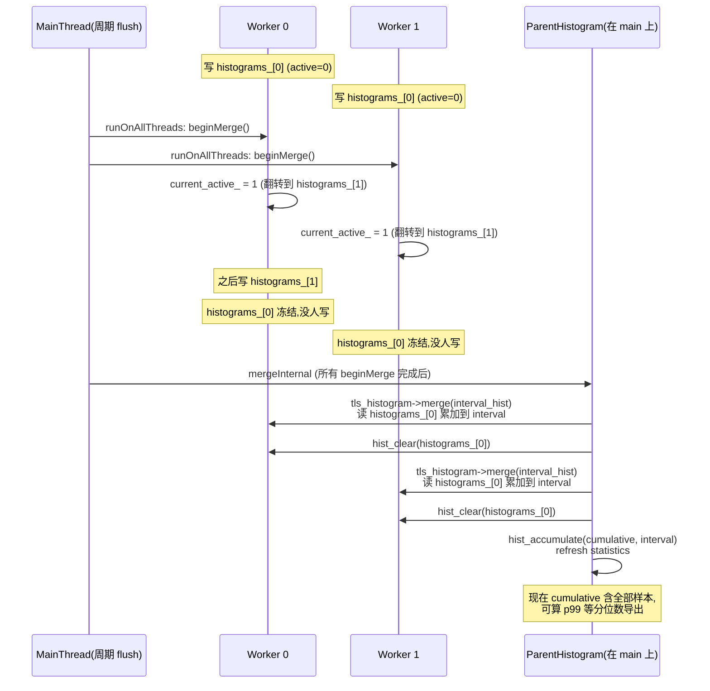
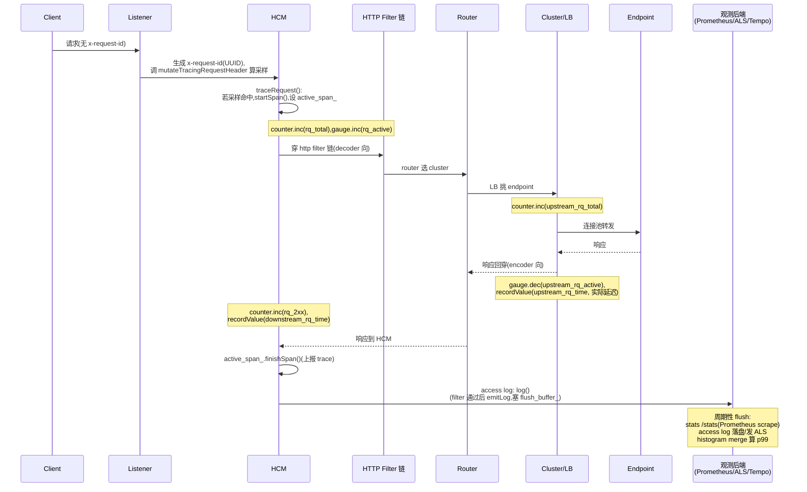

# 第 6 篇 · 第 20 章 · 可观测:stats、access log、tracing

> **核心问题**:前面十九章,我们看着一条流量从 listener 一路穿到 cluster、又看着 xDS 把配置动态推下去——可一旦这个庞然大物真的跑在线上,你怎么知道它**过得好不好**?哪些请求慢、慢在哪一跳、p99 是多少、有没有 5xx 飙升、某条异常请求到底走了哪条路径?这些问题的答案,全靠 Envoy 在数据面**自带的三个观测口子**:**stats**(指标:counter 累加计数、gauge 当前值、histogram 分桶延迟分布)、**access log**(结构化访问日志,每条请求一行)、**tracing**(分布式追踪上下文透传)。这一章拆这三根支柱各是什么、Envoy 怎么在"每条流量都产生观测数据"的高频场景下做到不拖慢热路径,以及承 P1-02 留下的那个悬念——histogram 凭什么非要用 thread-local 攒批归并、而 counter 用原子就够了。

> **读完本章你会明白**:
> 1. 为什么观测延迟分布要用 **histogram 分桶**而不是平均值——平均值会掩盖尾部,p99/p999 才暴露长尾问题;Envoy 用的是 **circllhist**(对数线性直方图),默认 19 个桶从 0.5ms 到 3600000ms,这套分桶为什么这么选。
> 2. **承 P1-02 的悬念兑现**:counter/gauge 为什么是 `std::atomic` 直接原子加,而 histogram 样本却要在每个 worker 上 thread-local 攒批、再周期性归并到 main——根源在于"高频小写"和"低频大写"对 cacheline 弹跳的承受度不同;histogram 用的是**双 buffer 互换**(beginMerge 交换 active 指针),worker 写一个、main 读另一个,全程零锁。
> 3. **symbol table 省 stat 名内存**的技巧:成千上万个形如 `cluster.outbound|8080||api.upstream_rq_2xx` 的 stat 名,如果每条都存字符串,内存会爆;Envoy 把重复的"."分隔 token 符号化(整数 id + refcount),并用类 UTF-8 变长字节编码。
> 4. **access log 为什么必须异步双 buffer 写**:写文件可能阻塞(`O_NONBLOCK` 也不保险,内核仍可能 block),所以 Envoy 给每个日志文件配一个独立的 flush 线程 + 双 buffer,worker 只往内存 buffer 里塞字符串,真正落盘由 flush 线程干——把 IO 阻挡在数据面之外。
> 5. **service mesh 为什么把 tracing 做在数据面**:每个 hop 自动插桩,应用无感;Envoy 生成 `x-request-id`、用 UUID 的字节做采样决策(client/random/overall 三档 FractionalPercent),span 上下文透传靠 `b3`/`traceparent` header;OpenTelemetry tracer 是新主流,替代老 zipkin/jaeger 直连。

> **如果一读觉得太难**:先只记住三件事——① stats 三种类型,counter/gauge 是原子(承 P1-02),**histogram 是高频写,用 thread-local 双 buffer 攒批归并**;② access log 异步写:worker 塞内存 buffer,flush 线程落盘;③ tracing 在数据面做:每跳自动插桩,采样靠 `x-request-id` 的字节模 10000 对比配置的百分比。一句话:**可观测数据是热路径的副产品,Envoy 的全部巧思都是"在不拖慢转发的前提下,把观测数据攒下来"**。

---

## 〇、一句话点破

> **Envoy 的三根可观测支柱里,stats 的 histogram 是唯一需要 thread-local 攒批的——因为它的写入频率最高(每个请求每个 bucket 都写),原子写的 cacheline 弹跳扛不住;counter/gauge 相对低频,原子就够;access log 靠异步双 buffer 把磁盘 IO 阻挡在数据面之外;tracing 靠数据面自动插桩 + header 透传,让 service mesh 里的每个 hop 无感地串成一条链。**

这是结论,不是理由。本章倒过来拆:先讲 stats 三种类型为什么这么分、histogram 分桶为什么是 circllhist,再兑现 P1-02 的悬念拆透 thread-local 攒批归并的双 buffer 机制,然后讲 symbol table 怎么省内存、access log 怎么异步落盘、tracing 怎么在数据面插桩透传,最后把"一条流量产生 stats/log/trace"的完整时序串一遍。

---

## 一、stats 三种类型:counter、gauge、histogram 各管什么

线上跑的 Envoy,内部有**几千到几万个**指标。统计的指标虽然多,但抽象下来就三类:

- **counter(计数器)**:单调递增的累计值。比如 `cluster.outbound|80||api.upstream_rq_total`(这个 cluster 已转发的请求总数)、`http.router.rq_total`。只能加不能减,reset 一般只在测试或 hot restart 继承时发生。
- **gauge(瞬时值)**:可增可减的当前值。比如 `cluster.outbound|80||api.upstream_rq_active`(当前活跃请求数)、`server.live`(1=活,0=死)、`listener.downstream_cx_active`(当前下游连接数)。它代表"此刻的状态",所以上下波动。
- **histogram(直方图)**:**分布**统计。主要用来观测延迟——比如 `cluster.outbound|80||api.upstream_rq_time` 是"转发到 api 这个 cluster 的请求耗时分布"。它**不存一个数,而是一组桶(bucket)**,记录有多少样本落在每个桶里,从而能算出 p50/p95/p99 这种分位数。

### 为什么不能只用平均值:尾部延迟的真相

最容易踩的坑:很多人观测延迟时,只看**平均延迟**(average latency)。但平均值在分布式系统里是**危险的不完整描述**。一个真实场景:

假设一个 cluster 有 100 个请求,99 个 50ms,1 个 5000ms(超时边缘)。
- 平均值:`(99 × 50 + 1 × 5000) / 100 = 99.5ms`。看着还行?
- 但实际上有 **1% 的请求是 5000ms**——这是会被用户骂"卡死了"的延迟。

平均值被大量快请求"稀释"了那一个慢请求,让你以为系统"还行",其实**有 1% 的用户体验极差**。这在微服务场景更严重:一个请求穿过 10 跳,每跳 1% 慢,链路上"至少一跳慢"的概率是 `1 - 0.99^10 ≈ 9.6%`——接近十分之一的用户撞上慢请求。

> **不这样会怎样**:只看平均值会让你**系统性错过长尾问题**。SLA 写"平均延迟 < 100ms"等于没写——99% 的用户可能很好,1% 的用户忍受 5 秒。Google 那篇《The Tail at Scale》专门讲这个:大规模分布式系统里,**尾延迟才是用户体验的真正决定因素**,必须观测 p99、p99.9 这种分位数。

所以 histogram 不是"counter 的升级版",而是**回答不同问题**的工具:counter 回答"总共有多少",histogram 回答"分布长什么样、有多少比例的请求慢"。Envoy 默认导出的分位数是 `[0, 0.25, 0.5, 0.75, 0.90, 0.95, 0.99, 0.995, 0.999, 1]`([`histogram_impl.cc:29-31`](../envoy/source/common/stats/histogram_impl.cc#L29-L31) 的 `supportedQuantiles()`),覆盖 p50/p95/p99/p99.9 这些线上排障最关心的分位数。

### histogram 分桶的学问:为什么 Envoy 用 circllhist

histogram 怎么"分桶"?最朴素的做法是**等宽分桶**:比如延迟从 0ms 到 60000ms,分成 60 个 1000ms 的桶。但这有问题——延迟分布通常是**长尾**的,99% 的请求在 100ms 以内,1% 散到几千几万 ms。等宽分桶会让"100ms 以内"只有一个桶(粒度太粗),而"几千 ms 以上"堆了一堆空桶(浪费)。所以更常用**对数分桶**:桶的边界按指数增长,密集覆盖低延迟区、稀疏覆盖高延迟区。

Envoy 走得更远——它直接用了 [circllhist](https://github.com/circonus-labs/libcirclhist)(Circonus 的 circullar log-linear histogram),代码里就是 [`#include "circllhist.h"`](../envoy/source/common/stats/histogram_impl.h#L15)。circllhist 是一种**对数线性(log-linear)**直方图,它把数值按数量级分桶,桶边界是 `10^(n/100)` 的形式——即每隔 1% 的数量级一个桶。这种结构有几个关键优势:

1. **可合并(mergeable)**:两个 circllhist 相加就是对应桶的计数相加,无损。这是 Envoy 在 worker 间归并 histogram 的前提(本章后面拆透)。
2. **跨数量级精度好**:既能精确分辨 1ms 和 2ms(低延迟区桶密),也能容纳 6000000ms 这种大数(高延迟区桶稀),不需要事先预估范围。
3. **算分位数快**:支持 `hist_approx_quantile` 直接从桶里近似算 p99 等分位数,误差可控。

但 circllhist 的桶是它内部自己的"自然桶"(基于 10 的幂),而**对外导出**(给 Prometheus、statsd 等格式)时,Envoy 需要把它重新映射到一组**用户可配置的固定桶边界**。默认 19 个桶,在 [`histogram_impl.cc:138-142`](../envoy/source/common/stats/histogram_impl.cc#L138-L142):

```cpp
const ConstSupportedBuckets& HistogramSettingsImpl::defaultBuckets() {
  CONSTRUCT_ON_FIRST_USE(ConstSupportedBuckets,
                         {0.5, 1, 5, 10, 25, 50, 100, 250, 500, 1000, 2500, 5000, 10000, 30000,
                          60000, 300000, 600000, 1800000, 3600000});
}
```

这 19 个边界(单位毫秒)的分布有讲究:**0.5、1、5、10、25、50、100** 是低延迟区(亚毫秒到 100ms),桶很密,因为这是绝大多数请求所在区,粒度要细;**250、500、1000、2500、5000** 是中延迟区(百毫秒到几秒);**10000、30000、60000**(10s、30s、60s)是慢请求区;**300000、600000、1800000、3600000**(5min、10min、30min、1h)是极端长尾(比如大文件上传、长流)。这套分桶覆盖了从"亚毫秒的内存级 RPC"到"小时级长流"的整个谱系,且低区密、高区稀,贴合真实延迟分布。

> **钉死这件事**:histogram 的桶**不是 Envoy 独创的存储结构**——存储用 circllhist(对数线性,可合并),桶边界只是"导出时如何切片"。这个区分很重要:合并发生在 circllhist 层(无损),分位数计算基于 circllhist(精确),只有导出给外部格式时才按用户配置的桶切片。

> **对照 Prometheus 的 histogram**:Prometheus 自己的 histogram 也是分桶 + 累加,但 Prometheus 的桶是**用户在配置里写死**的(`le=0.005`、`le=0.01`...),桶的选择直接决定精度,且一旦选定就不能改(改了历史数据不可比)。Envoy 用 circllhist 把"采集"和"导出"解耦——内部统一用对数线性采集(精度全),导出时按需切桶,这是更工程化的设计。

### 三种类型,三种写入特征

理解 stats 的关键是看到这三种类型的**写入特征完全不同**,而这直接决定了它们的实现策略:

| 类型 | 写入频率 | 写入特征 | Envoy 的实现 |
|------|---------|---------|------------|
| counter | 中(每请求 +1 几次) | 单调加,值小 | `std::atomic<uint64_t>` 原子加 |
| gauge | 中(状态变化时) | 加减,值小 | `std::atomic<uint64_t>` 原子加/减 |
| histogram | **高(每请求每个延迟点都要插一个样本)** | 插入一个值到桶里 | **thread-local 攒批 + 周期归并** |

histogram 的写入是三者里**最重的**——counter 一个请求也就 `inc()` 几次(总请求数 +1、2xx +1 等),但 histogram 要把延迟值"插"进桶里,涉及桶计数更新。如果每个 worker 都原子地写一个全局 histogram,几万 QPS 下,这个 histogram 的 cacheline 会在 N 个核之间疯狂弹跳(原子写在 CPU 层面会触发 cacheline invalidate 广播)。这是为什么 histogram 必须攒批,而 counter 可以直接原子——下一节拆透这个机制(兑现 P1-02 留的悬念)。

---

## 二、thread-local 攒批归并(兑现 P1-02 的悬念):histogram 凭什么要双 buffer

P1-02 我们讲过:counter/gauge 实际是 `std::atomic`,不是"每 worker 一个副本再归并";只有 **histogram 才真正用 thread-local 攒批**。当时留了悬念:为什么 histogram 要走这条路?这一节兑现。

### 先看 counter/gauge 为什么原子就够

counter 的 `add()` 在 [`allocator.cc:154-160`](../envoy/source/common/stats/allocator.cc#L154-L160):

```cpp
// source/common/stats/allocator.cc (CounterImpl,简化)
void add(uint64_t amount) override {
  value_ += amount;              // std::atomic<uint64_t> 的原子 +=
  pending_increment_ += amount;  // 也是原子,用于 latch() 导出"自上次导出以来的增量"
  flags_ |= Flags::Used;
}
```

`value_` 是 `std::atomic<uint64_t>`([`allocator.cc:167`](../envoy/source/common/stats/allocator.cc#L167))。所有 worker `fetch_add` 到**同一个**原子变量上。这在 x86 上编译成单条 `lock inc` 或 `lock xadd` 指令,无锁(lock-free)。

但"无锁"不等于"无开销"。多核同时 `lock inc` 同一个原子变量,会触发 cacheline 在核间 invalidate 传递——这就是 **cacheline bouncing**(缓存行弹跳)。形象点:CPU 0 写了 `value_`,它要广播"我改了这个 cacheline,你们其他核的缓存都失效",CPU 1 想写就得重新从内存/LLC 拉这个 cacheline。这个广播是内核态拦不住的硬件行为,核越多越严重。

那为什么 counter 能忍这个开销?因为**counter 的写入频率是"中等"**:一个 HTTP 请求大概会让 counter `inc()` 几次到十几次(总请求 +1、状态码分类 +1、cluster 级 +1...)。几万 QPS × N 个 worker,虽然原子写有 cacheline 弹跳,但**频率还在可承受范围**——现代 CPU 的 `lock inc` 也就几个纳秒,cacheline bouncing 在 N 个核上的开销是几十纳秒级,乘以"每请求十几次"的中等频率,总开销在数据面占几个百分点以内,可接受。

> **不这样会怎样**:如果 counter 也走"每 worker 一个副本 + 归并",会复杂化——counter 是单调计数,归并时要把 N 个副本加起来,但导出 `/stats` 时又要 latch(取出增量),要在 N 个 worker 之间协调"现在该读还是该归并",这套协调的复杂度远超原子操作带来的开销。所以 Envoy 选了简单的:counter 用原子,够快、够对、够简单。这是**工程取舍**:简单的方案足够快时,不要上复杂的方案。

### histogram 不一样:为什么原子扛不住

histogram 的写入是 `recordValue(value)`——把一个延迟值插入 circllhist 桶里。这有两个关键差异:

1. **写入更重**:插一个值要更新**多个**桶(circllhist 是累积结构,一个值落入某个桶,那个桶的计数 +1,但桶内部维护还有 bookkeeping),比 counter 的"原子 +1"操作量大。
2. **频率更高**:一个请求可能有多个延迟观测点(下游解码耗时、上游连接耗时、整体耗时等),每个点都 `recordValue` 一次。而且这些写入分布在**每个 worker** 上——N 个 worker 同时往同一个全局 histogram 写。

如果用"全局一个 histogram + 锁"——锁竞争会让多核优势蒸发,且 circllhist 内部数据结构在并发写下不安全,必须加锁。

如果用"全局一个 histogram + 原子操作每个桶的计数"——circllhist 的桶不是简单的原子计数,它内部是 `hist_bucket_t` 数组,要支持 `hist_insert_intscale`(插入)、`hist_accumulate`(合并)、`hist_approx_quantile`(算分位数),把这些都改成原子既不现实也丧失精度。

> **所以这样设计**:histogram 必须走"**每个 worker 一个本地副本,攒一批后周期性归并到 main**"。worker 写自己的本地副本(无锁、无 cacheline 弹跳,纯本地内存访问),main 周期性地把所有 worker 的副本合并成一份全局视图,导出给 Prometheus/statsd/ALS。

这就是 P1-02 提到的"thread-local 攒批归并"在 stats 里的真正落点——**counter/gauge 不用,只有 histogram 用**。

### 双 buffer 互换:worker 写一个、main 读另一个

histogram 攒批的核心机制是**双 buffer 互换**,实现在 [`ThreadLocalHistogramImpl`](../envoy/source/common/stats/thread_local_store.h#L36-L77):

```cpp
// source/common/stats/thread_local_store.h (ThreadLocalHistogramImpl,简化)
class ThreadLocalHistogramImpl : public HistogramImplHelper {
public:
  void beginMerge() {
    // 交换 active 指针:1 -> 0 或 0 -> 1
    ASSERT(std::this_thread::get_id() == created_thread_id_);
    current_active_ = otherHistogramIndex();   // current_active_ 在 0 和 1 之间翻转
  }

  void recordValue(uint64_t value) override;
  void merge(histogram_t* target);

private:
  const Histogram::Unit unit_;
  uint64_t otherHistogramIndex() const { return 1 - current_active_; }
  uint64_t current_active_{0};
  histogram_t* histograms_[2];                 // ← 两个 circllhist
  std::atomic<bool> used_;
  const std::thread::id created_thread_id_;    // ← 记录创建线程,断言只在那个线程写
  SymbolTable& symbol_table_;
};
```

每个 worker 上,每个 histogram 都有**两个 circllhist 实例**(`histograms_[0]` 和 `histograms_[1]`),`current_active_` 指向"当前正在被 worker 写的那个"。机制分三步:

**第一步:正常写入(数据面热路径)。** worker 上的 filter 在请求结束时调用 `recordValue`:

```cpp
// source/common/stats/thread_local_store.cc (ThreadLocalHistogramImpl::recordValue)
void ThreadLocalHistogramImpl::recordValue(uint64_t value) {
  ASSERT(std::this_thread::get_id() == created_thread_id_);   // ← 必须在创建它的那个 worker 上
  hist_insert_intscale(histograms_[current_active_], value, 0, 1);   // 写当前 active buffer
  used_ = true;
}
```

([`thread_local_store.cc:900-904`](../envoy/source/common/stats/thread_local_store.cc#L900-L904))注意那个 `ASSERT(std::this_thread::get_id() == created_thread_id_)`——它强保证"写这个 TLS histogram 的,只能是创建它的那个 worker"。这是无锁的前提:**同一个 buffer 只被一个线程写**,没有并发,不需要锁。`hist_insert_intscale` 直接操作 circllhist 内部结构,完全本地内存访问,零开销。

**第二步:触发归并(MainThread 周期性发起)。** 归并不是 worker 自己发起的,而是 MainThread 周期性触发(通常和 stats flush 周期一致,默认 5 秒)。MainThread 调 [`mergeHistograms`](../envoy/source/common/stats/thread_local_store.cc#L245-L261):

```cpp
// source/common/stats/thread_local_store.cc (mergeHistograms,简化)
void ThreadLocalStoreImpl::mergeHistograms(PostMergeCb merge_complete_cb) {
  if (!shutting_down_) {
    ASSERT(!merge_in_progress_);
    merge_in_progress_ = true;
    tls_cache_->runOnAllThreads(
        [](OptRef<TlsCache> tls_cache) {
          // ↓ 这个 lambda 在每个 worker 上跑
          for (const auto& id_hist : tls_cache->tls_histogram_cache_) {
            const TlsHistogramSharedPtr& tls_hist = id_hist.second;
            tls_hist->beginMerge();        // ← 关键:每个 worker 把自己的 active 指针翻转
          }
        },
        [this, merge_complete_cb]() -> void { mergeInternal(merge_complete_cb); });  // main 上跑
  }
}
```

这里用了 P1-02 讲过的 `runOnAllThreads`——MainThread 给每个 worker 的 dispatcher `post` 一个任务,任务在 worker 自己的线程上跑。这个任务做的事很微妙:**它只翻转 active 指针(`beginMerge`),不读数据**。翻转后,worker 后续的 `recordValue` 会写到**另一个** buffer,而刚被"换下来"的那个 buffer 此刻没人写(worker 已经不指向它了)。

**第三步:main 把换下来的 buffer 合并走。** `runOnAllThreads` 的第二个 lambda(`mergeInternal`)在 MainThread 上跑(它在所有 worker 都跑完 `beginMerge` 之后才执行),调 [`ParentHistogramImpl::merge`](../envoy/source/common/stats/thread_local_store.cc#L1003-L1021):

```cpp
// source/common/stats/thread_local_store.cc (ParentHistogramImpl::merge,简化)
void ParentHistogramImpl::merge() {
  Thread::ReleasableLockGuard lock(merge_lock_);
  if (merged_ || usedLockHeld()) {
    hist_clear(interval_histogram_);                    // 清空 interval 累积器
    for (const TlsHistogramSharedPtr& tls_histogram : tls_histograms_) {
      tls_histogram->merge(interval_histogram_);        // 把每个 worker 换下来的 buffer 合进来
    }
    lock.release();                                     // 合完释放锁
    hist_accumulate(cumulative_histogram_, &interval_histogram_, 1);  // interval 累加到 cumulative
    cumulative_statistics_.refresh(cumulative_histogram_);
    interval_statistics_.refresh(interval_histogram_);
    merged_ = true;
  }
}
```

每个 worker 的 [`ThreadLocalHistogramImpl::merge`](../envoy/source/common/stats/thread_local_store.cc#L906-L910) 做的是:

```cpp
// source/common/stats/thread_local_store.cc
void ThreadLocalHistogramImpl::merge(histogram_t* target) {
  histogram_t** other_histogram = &histograms_[otherHistogramIndex()];  // 指向"刚换下来"那个
  hist_accumulate(target, other_histogram, 1);   // 把它累加到 target(就是 interval_histogram_)
  hist_clear(*other_histogram);                  // 清空,等下一轮用作新的 active
}
```

`otherHistogramIndex()` 返回的是 `1 - current_active_`——即**刚被 beginMerge 翻转后,不再是 active 的那个 buffer**。这个 buffer 在 worker 上已经没人写了(因为 active 已经翻到另一个),所以 main 在 `merge` 里读它是安全的——**读和写发生在不同的 buffer 上,通过指针翻转隔离,这就是双 buffer 的精髓**。

把整个流程画成时序:



> **不这样会怎样**:如果不用双 buffer,worker 一边写、main 一边读,要么加锁(热路径加锁 = 性能塌陷)、要么读到撕裂数据(circllhist 内部状态不一致)。双 buffer 用"指针翻转"这个 O(1) 操作,把"读写并发"转成"读写隔离"——worker 永远写 active,main 永远读 inactive,两者物理上不碰同一个 buffer。这是**无锁化设计的经典套路**(Linux 内核的 seqlock、Java 的 Disruptor 都是同源思想)。

> **钉死这件事**:histogram 的 thread-local 攒批归并 = **双 buffer 互换 + runOnAllThreads 协调**。worker 写 active buffer(无锁本地写),周期性 beginMerge 翻转指针,main 读 inactive buffer 合并(读已冻结数据,无竞争),清空 inactive 等下一轮。这是 P1-02 留下悬念的兑现——**counter 用原子(中等频率可承受 cacheline 弹跳),histogram 用双 buffer 攒批(高频写不容 cacheline 弹跳)**。两者都不是"thread-local 副本简单相加",而是各自针对写入特征选的最优解。

### 一个易混点:histogram 的"interval"和"cumulative"

源码里有 `interval_histogram_` 和 `cumulative_histogram_` 两个累积器([`thread_local_store.h:146-147`](../envoy/source/common/stats/thread_local_store.h#L146-L147)),别混:

- **interval_histogram_**:每次 merge 前清空,只装"这次 flush 周期里"各 worker 攒下的样本。导出时叫 **interval statistics**(本周期内的 p99)。
- **cumulative_histogram_**:不清空,每次把 interval 累加到自己身上。导出时叫 **cumulative statistics**(进程启动以来的累计 p99)。

这两个对运维意义不同——interval 反映"现在这一刻的延迟分布"(适合实时告警),cumulative 反映"长期平均态"(适合容量规划)。Prometheus scrape 拿到的通常是 cumulative(单调),但 admin `/stats` 会同时显示两者。

---

## 三、symbol table:成千上万个 stat 名怎么省内存

讲完 histogram 的攒批,stats 还有一个"省内存"的硬核技巧:**symbol table**。

### 痛点:stat 名是字符串,而且巨多

一个生产 Envoy 的 stat 数量很容易到**几万到几十万**。比如一个 Istio sidecar,有:

- listener 级:`listener.0.0.0.0_15001.downstream_xx`
- cluster 级:`cluster.outbound|8080||api.upstream_rq_2xx`、`cluster.outbound|8080||api.upstream_rq_total`、`cluster.outbound|8080||api.upstream_cx_active`、`cluster.outbound|8080||api.upstream_rq_time`...(每个 cluster 几十个 stat)
- HTTP 级:`http.router.rq_total`、`http.router.downstream_rq_2xx`
- 还有几百个 cluster × 几十个 stat/cluster = 几万个 stat

每个 stat 都有一个**完整的字符串名**。如果每个名字都独立存字符串,内存开销惊人——`cluster.outbound|8080||api.upstream_rq_2xx` 这一个名字就 40 字节,几万个这样的名字就是几 MB,而且**大量重复**:同一个 cluster 的几十个 stat 名共享 `cluster.outbound|8080||api.` 这个前缀;几百个 cluster 的 stat 共享 `cluster.`、`upstream_rq_` 这些 token。

### symbol table 怎么省:把重复 token 符号化

Envoy 的做法是 [`SymbolTable`](../envoy/source/common/stats/symbol_table.h#L76):把 stat 名按 `.` 切成 token(比如 `cluster`、`outbound|8080||api`、`upstream_rq_2xx`),每个 token 映射到一个 **uint32_t 的 Symbol**(整数 id),stat 名就用"符号数组"表示。重复的 token 共享同一个 id,而不是各存一份字符串。

核心数据结构是**两张互相映射的表**(简化示意,非源码原文):

```
   encode_map_: string_view → { Symbol, refcount }     (查 token 找 id)
   decode_map_: Symbol      → InlineString             (查 id 还原 token)

   插入 token "cluster":
   toSymbol("cluster"):
     encode_map_.find("cluster") == end?
       是 → 新建 InlineString "cluster",decode_map_[next_symbol_]=它,
            encode_map_["cluster"]={next_symbol_, refcount=1},分配新 id
       否 → 已存在,refcount++,返回已有 id
```

真实代码在 [`symbol_table.cc:460-484`](../envoy/source/common/stats/symbol_table.cc#L460-L484) 的 `toSymbol`:

```cpp
Symbol SymbolTable::toSymbol(absl::string_view sv) {
  Symbol result;
  auto encode_find = encode_map_.find(sv);
  if (encode_find == encode_map_.end()) {
    // 新 token:建 InlineString,塞进两张表
    InlineStringPtr str = InlineString::create(sv);
    auto encode_insert = encode_map_.insert({str->toStringView(), SharedSymbol(next_symbol_)});
    auto decode_insert = decode_map_.insert({next_symbol_, std::move(str)});
    result = next_symbol_;
    newSymbol();                              // ← 注意:next_symbol_ 不一定单调+1,有回收池
  } else {
    // 已存在:refcount++,复用 id
    result = encode_find->second.symbol_;
    ++(encode_find->second.ref_count_);
  }
  return result;
}
```

**关键细节:refcount + 回收**。每个 token 维护引用计数(`SharedSymbol` 里带 `ref_count_`)。当一个 stat 被销毁(比如 cluster 删除、scope 析构),它持有的 token 引用要 `--ref_count_`;降到 0 时,这个 Symbol 从两张表里 erase 掉,id 回收到池子(`newSymbol()` 会优先复用回收的 id 而不是 `next_symbol_++`)。这保证了**不用的 token 不占内存**,长期运行的 Envoy 不会因为历史 stat 把内存吃光。

### 类 UTF-8 变长编码:stat 名的紧凑表示

但 symbol table 不止省"重复 token"——它还把 stat 名**编码成紧凑字节序列**。token 数组 `[Symbol(7), Symbol(230), Symbol(15)]` 怎么存?最朴素是直接 `uint32_t[3]` = 12 字节。但 Envoy 观察到:**绝大多数 token 的 id < 127**(常用 token 就那么几个,先创建的 id 小)。所以它用类 UTF-8 的变长编码——id < 128 用 1 字节,id >= 128 用 2 字节(继续类 UTF-8 规则),见 [`symbol_table.h:78-94`](../envoy/source/common/stats/symbol_table.h#L78-L94) 的注释:

> "The most common tokens are typically < 127, and are represented directly. tokens >= 128 spill into the next byte ... This scheme is similar to UTF-8."

这样,一个 stat 名 `[7, 230, 15]` 编码成 4 字节(7=1B, 230=2B, 15=1B),而不是 12 字节。几万个 stat 名 × 节省 2/3 = 节省几 MB 到十几 MB 内存。在大规模 sidecar 场景(每 Pod 一个 Envoy,几十万个 Pod),这个节省乘起来是 GB 级的。

[`encode`](../envoy/source/common/stats/symbol_table.cc#L557-L564) 把一个完整 stat 名编码成 `StoragePtr`(一个 `uint8_t[]`):

```cpp
SymbolTable::StoragePtr SymbolTable::encode(absl::string_view name) {
  name = StringUtil::removeTrailingCharacters(name, '.');   // 去掉尾部多余的 '.'
  Encoding encoding;
  addTokensToEncoding(name, encoding);                      // 切 token + toSymbol + 累积字节
  MemBlockBuilder<uint8_t> mem_block(Encoding::totalSizeBytes(encoding.bytesRequired()));
  encoding.moveToMemBlock(mem_block);                       // 一次性拷贝到紧凑数组
  return mem_block.release();
}
```

> **不这样会怎样**:如果不用 symbol table,几万个 stat 名各存一份完整字符串,内存浪费严重;更糟的是,stat 名在 worker 上**高频访问**(每次拿 counter 都要查名字对应的对象),如果每次都 `std::string` 比较 + 哈希,不仅内存大,缓存不友好。symbol table 把"名字比较"变成"uint32 比较",更省、更快。这是大规模 metric 系统的标配——Prometheus 自己也有 label 符号化,InfluxDB 也有 tag 字典,都是同源思路。

> **钉死这件事**:symbol table 用"**token → uint32 id + refcount + 变长字节编码**"三件套,把 stat 名从"昂贵的字符串"变成"紧凑的符号数组",省内存 + 加速查找。它不影响数据面的热路径(recordValue/inc 都是直接操作对象,不查名字),但极大降低了"几万个 stat 同时存在"的内存代价。

---

## 四、StatMerger:hot restart 时 counter 怎么继承

P1-02 提过,这里补完。counter 是单调递增的,hot restart 时新进程(子)从 0 开始,但运维希望 counter "无缝继承"——比如"今天总请求数"不应该因为一次重启归零。这就是 [`StatMerger`](../envoy/source/common/stats/stat_merger.cc) 干的事。

机制很简单:旧进程(父)在退出前,把它所有 counter 的**当前值**通过 hot restart 的 IPC 传给新进程(子);新进程启动后,用 `StatMerger::mergeCounters` 把这些值 `add()` 到自己的 counter 上。看 [`stat_merger.cc:77-85`](../envoy/source/common/stats/stat_merger.cc#L77-L85):

```cpp
void StatMerger::mergeCounters(const Protobuf::Map<std::string, uint64_t>& counter_deltas,
                               const DynamicsMap& dynamic_map) {
  for (const auto& counter : counter_deltas) {
    const std::string& name = counter.first;
    StatMerger::DynamicContext dynamic_context(temp_scope_->symbolTable());
    StatName stat_name = dynamic_context.makeDynamicStatName(name, dynamic_map);
    temp_scope_->counterFromStatName(stat_name).add(counter.second);   // 把父进程的存量加进来
  }
}
```

注意这是**进程间**的 merge(走 protobuf IPC),不是线程间——和本章的"worker→main"归并完全不同。gauge 的 merge 更微妙([`stat_merger.cc:87-143`](../envoy/source/common/stats/stat_merger.cc#L87-L143)):因为 gauge 有不同的 import mode(Accumulate / NeverImport),merge 时要区分对待,有的累加、有的丢弃,这块在 gauge 的实现里(见 [`allocator.cc:265`](../envoy/source/common/stats/allocator.cc#L265) 的 `setParentValue`)。这是 P1-02 讲 hot restart 的伏笔,本章不展开,但要知道:**counter/gauge 的 hot restart 继承走 StatMerger,不是 thread-local 攒批归并**。

---

## 五、access log:结构化日志的异步落盘

stats 是"聚合后的数字",但排障时你常需要"**这一条**请求到底怎么样"——这就靠 access log。

### 结构化:每条请求一行,字段齐全

Envoy 的 access log 是**结构化**的——每个完成的请求,按你配置的 format string 产生一行日志,字段包括时间戳、方法、路径、响应码、延迟、upstream cluster、upstream 地址、响应标志(失败原因)、request id......format 用 substitution formatter,比如默认的:

```
[%START_TIME%] "%REQ(:METHOD)% %REQ(X-ENVOY-ORIGINAL-PATH?:PATH)% %PROTOCOL%" %RESPONSE_CODE% %RESPONSE_FLAGS% %BYTES_RECEIVED% %BYTES_SENT% %DURATION% %RESP(X-ENVOY-UPSTREAM-SERVICE-TIME)% "%REQ(X-REQUEST-ID)%" "%REQ(USER-AGENT)%" "%REQ(X-FORWARDED-FOR)%" "%REQ(X-ENVOY-EXTERNAL-ADDRESS)%" "%REQ(X-ENVOY-ORIGINAL-PATH?:PATH)%" "%UPSTREAM_HOST%" "%UPSTREAM_CLUSTER%" "%UPSTREAM_LOCAL_ADDRESS%" "%DOWNSTREAM_LOCAL_ADDRESS%" "%DOWNSTREAM_REMOTE_ADDRESS%" "%REQ(:AUTHORITY)%" ...
```

每个 `%XXX%` 是一个 substitution 命令,由 [`Formatter`](../envoy/source/common/formatter/substitution_formatter.h) 解析。format string 是用户自由配的,你可以只记你关心的字段,也可以输出 JSON。

### access log filter:不是每条都记

记每条请求日志在高 QPS 下会很贵,而且很多请求(健康检查、跑测流量)你根本不关心。所以 access log 支持**过滤器(filter)**——只有满足条件的请求才记。filter 类型在 [`access_log_impl.h`](../envoy/source/common/access_log/access_log_impl.h#L43-L258):

- **StatusCodeFilter**:按响应码过滤(比如只记 5xx)。
- **DurationFilter**:按延迟过滤(比如只记 > 1s 的慢请求)。
- **NotHealthCheckFilter**:排除健康检查。
- **TraceableRequestFilter**:只记被采样的 trace 请求。
- **HeaderFilter**:按 header 匹配。
- **ResponseFlagFilter**:按响应标志(比如 `UF`=upstream failure、`UH`=no healthy upstream)过滤。
- **RuntimeFilter**:按 Runtime 百分比采样(比如只记 1% 的请求)。
- **AndFilter / OrFilter**:逻辑组合。

filter 的执行入口在 [`ImplBase::log`](../envoy/source/extensions/access_loggers/common/access_log_base.cc),逻辑极简:

```cpp
// source/extensions/access_loggers/common/access_log_base.cc
void ImplBase::log(const Formatter::Context& log_context,
                   const StreamInfo::StreamInfo& stream_info) {
  if (filter_ && !filter_->evaluate(log_context, stream_info)) {
    return;                          // 不满足条件,直接 return,不记
  }
  return emitLog(log_context, stream_info);   // 交给具体 sink(file/grpc/...) 写
}
```

每个具体 sink(file、grpc ALS、fluentd、stats、wasm、stream、open_telemetry)继承 `ImplBase`,只实现 `emitLog` 决定"写到哪"。比如 file sink 的 `emitLog`:

```cpp
// source/extensions/access_loggers/common/file_access_log_impl.cc
void FileAccessLog::emitLog(const Formatter::Context& context,
                            const StreamInfo::StreamInfo& stream_info) {
  log_file_->write(formatter_->format(context, stream_info));   // 格式化后交给 AccessLogFile 写
}
```

### 异步双 buffer 落盘:为什么不能直接 write

`log_file_->write()` 不能直接 `write(2)` 到磁盘——文件写可能阻塞(即便开了 `O_NONBLOCK`,内核在某些情况下仍会 block,比如磁盘满、NFS 卡顿)。worker 是数据面热路径,一旦阻塞就影响转发。所以 Envoy 给每个 access log 文件配了**独立的 flush 线程 + 双 buffer**,实现在 [`AccessLogFileImpl`](../envoy/source/common/access_log/access_log_manager_impl.h#L69-L136):

```
   worker 调 log_file_->write(data)
            │
            ▼
   ┌─────────────────────────────────────────────┐
   │ 持 write_lock_,把 data 追加到 flush_buffer_  │  ← 极短,只 memcpy 字符串
   └─────────────────────────────────────────────┘
            │
            ▼ (flush_buffer_ 满 / 定时到)
   ┌─────────────────────────────────────────────┐
   │ flush 线程被唤醒                              │
   │ 持 flush_lock_,把 flush_buffer_ 内容 move 到 │
   │ about_to_write_buffer_(双 buffer 互换)       │
   │ 释放 flush_lock_                              │  ← 让 worker 能继续往 flush_buffer_ 塞
   └─────────────────────────────────────────────┘
            │
            ▼
   ┌─────────────────────────────────────────────┐
   │ flush 线程持 file_lock_,write(2) 落盘        │  ← 真正的磁盘 IO,可能慢
   │ (file_lock_ 跨 hot restart 进程共享)         │
   └─────────────────────────────────────────────┘
```

关键设计点(注释在 [`access_log_manager_impl.h:62-68`](../envoy/source/common/access_log/access_log_manager_impl.h#L62-L68) 原文):

> "This is a file implementation geared for writing out access logs. It turn out that in certain cases even if a standard file is opened with `O_NONBLOCK`, the kernel can still block when writing. This implementation uses a flush thread per file..."

**三个锁的获取顺序**(注释在 [`access_log_manager_impl.h:95-98`](../envoy/source/common/access_log/access_log_manager_impl.h#L95-L98)):write_lock_ → flush_lock_ → file_lock_,严格有序避免死锁。

**触发 flush 的两种条件**:

1. **数据量达阈值**(默认 `min_flush_size_ = 64 * 1024` = 64KB,[`access_log_manager_impl.h:133`](../envoy/source/common/access_log/access_log_manager_impl.h#L133))——攒够 64KB 才 flush,避免频繁小写。
2. **定时器到**(`file_flush_interval_msec_`,默认 10 秒)——即便没攒够也 flush,保证日志不滞后太久。

**双 buffer 的作用**:flush 线程从 `flush_buffer_` move 数据到 `about_to_write_buffer_` 之后,就释放 `flush_lock_`,worker 能立刻继续往 `flush_buffer_` 塞新数据——flush 慢(磁盘卡)不会阻塞 worker 的写日志。这和 histogram 的双 buffer 思想一致:**用副本隔离读写,让慢操作不阻塞热路径**。

### 多种 sink:file 只是开始

除了 file,Envoy 还支持一堆 access log sink:

- **gRPC ALS**(Access Log Service):发到远端 gRPC server,有 HTTP ALS([`source/extensions/access_loggers/grpc/http_grpc_access_log_impl.cc`](../envoy/source/extensions/access_loggers/grpc/http_grpc_access_log_impl.cc))和 TCP ALS 两套,这是 Istio 默认用的(每个 sidecar 把 access log 发到 Istiod 或专门的 telemetry Pod)。
- **OpenTelemetry sink**:把 access log 作为 OTLP log record 发出去。
- **fluentd**:对接 fluentd。
- **stats sink**:把日志信息聚合成 stat(比如按 status code 计数)。
- **wasm / dynamic_modules**:用扩展自定义。

ALS 是较新的主流方式(比 file 更适合 service mesh 场景,集中收集)。无论哪种 sink,filter 机制都一样——只有"写去哪"不同。

> **不这样会怎样**:如果 access log 直接同步写文件,磁盘 IO 抖动会直接卡住数据面转发——一次 NFS 卡顿能让整个 sidecar 的所有请求阻塞。异步双 buffer 把"格式化塞 buffer"(快、本地)和"落盘"(慢、可能阻塞)解耦,worker 只做前者,IO 由专门的 flush 线程扛。这是高性能代理的标准做法(Nginx 也是异步写 access log,但 Nginx 是单线程多 worker 共享 buffer,Envoy 是每文件一个 flush 线程,各有取舍)。

---

## 六、tracing:数据面自动插桩,串起一条链

stats 给你"聚合态"(总请求数、p99 延迟),access log 给你"单条请求"(某一条请求的响应码、耗时),但它们都缺一个维度——**这条请求穿过的多个 hop 之间的关系**。这就是 distributed tracing 的事。

### 为什么 service mesh 要在数据面做 tracing

在传统微服务里,要做 trace,你得**在每个应用里手动埋点**——Java 应用引入 brave/zipkin 库,Go 应用引入 opentracing 库,在每次发起 RPC 时手动传 span 上下文,接收时手动接续。痛点:

1. **跨语言难统一**:每语言一套库,埋点逻辑散在各应用。
2. **应用感知**:每个应用都要改代码埋点,升级库要重发所有应用。
3. **漏埋**:某个应用忘了埋,trace 链就断了。

Service mesh 解决这个:Envoy 在**每个 hop** 自动插桩——A 服务的 Envoy 在请求出去时生成 span,B 服务的 Envoy 在请求进来时接续 span,完全不用应用感知。这就是"**数据面自动插桩**"——只要流量经过 Envoy,trace 上下文自动透传,应用无感。

### trace 上下文怎么透传:header

Envoy 之间(以及 Envoy 和应用之间)传 trace 上下文,靠 HTTP header:

- **`x-request-id`**:Envoy 自己的请求唯一标识。每个请求进来,如果没带 x-request-id,Envoy 用 `request_id_extension`(默认 UUID,[`source/extensions/request_id/uuid/`](../envoy/source/extensions/request_id/uuid/))生成一个。这个 id 不是 trace context 本身,但 Envoy 用它**做采样决策**(因为 UUID 是均匀随机的)。
- **`x-b3-traceid` / `x-b3-spanid` / `x-b3-parentspanid` / `x-b3-sampled`**:Zipkin 的 B3 header 协议,老 tracer(zipkin、jaeger)用。
- **`traceparent` / `tracestate`**:W3C Trace Context 标准(RFC 没正式号,但 de facto 标准),OpenTelemetry 主推。

Envoy 既支持透传 B3(老 tracer),也支持透传 traceparent(新 tracer),取决于配的 tracer。Istio 1.x 默认用 zipkin tracer + B3,新版逐步切到 OpenTelemetry + traceparent。

### 采样决策:x-request-id 的字节做随机源

线上流量巨大,不可能每条都 trace(trace 后端扛不住),所以必须**采样**。Envoy 的采样策略在 HCM 配置里有三档 FractionalPercent:

- **client_sampling**:当请求带 `x-client-trace-id` header(客户端主动要 trace)时,采样多少比例。
- **random_sampling**:**随机**采样多少比例的请求(主力)。
- **overall_sampling**:全局采样上限(避免极端配置导致 trace 过载)。

决策逻辑在 [`ConnectionManagerUtility::mutateTracingRequestHeader`](../envoy/source/common/http/conn_manager_utility.cc#L390-L430):

```cpp
// source/common/http/conn_manager_utility.cc (简化)
Tracing::Reason ConnectionManagerUtility::mutateTracingRequestHeader(
    RequestHeaderMap& request_headers, Runtime::Loader& runtime, ConnectionManagerConfig& config,
    const Router::Route* route) {
  Tracing::Reason final_reason = Tracing::Reason::NotTraceable;
  if (!config.tracingConfig()) return final_reason;

  auto rid_extension = config.requestIDExtension();
  if (!rid_extension->useRequestIdForTraceSampling()) {
    return Tracing::Reason::Sampling;        // 某些 rid extension 不用 request-id 采样,直接采样
  }
  const auto rid_to_integer = rid_extension->getInteger(request_headers);
  if (!rid_to_integer.has_value()) return final_reason;     // request-id 损坏/缺失,不采
  const uint64_t result = rid_to_integer.value() % 10000;   // ← 关键:UUID 取模 10000,得 0~9999

  // 取出三档 sampling 配置(route 级可覆盖)
  const envoy::type::v3::FractionalPercent* client_sampling = ...;
  const envoy::type::v3::FractionalPercent* random_sampling = ...;
  const envoy::type::v3::FractionalPercent* overall_sampling = ...;

  final_reason = rid_extension->getTraceReason(request_headers);
  if (Tracing::Reason::NotTraceable == final_reason) {
    if (request_headers.ClientTraceId() &&
        runtime.snapshot().featureEnabled("tracing.client_enabled", *client_sampling)) {
      final_reason = Tracing::Reason::ClientForced;       // 客户端带 trace id 且命中 client_sampling
    } else if (request_headers.EnvoyForceTrace()) {
      final_reason = Tracing::Reason::ClientForced;       // 强制 trace
    } else if (runtime.snapshot().featureEnabled("tracing.random_sampling", *random_sampling)) {
      final_reason = Tracing::Reason::Sampling;           // 命中随机采样
    }
  }
  // ... overall_sampling 上限 ...
  return final_reason;
}
```

**精妙之处:用 `x-request-id` 的字节做采样随机源**。UUID 是均匀分布的,`% 10000` 后 `result` 在 `[0, 9999]` 均匀分布。`featureEnabled` 拿配置的百分比(比如 1%)转成阈值(1% = 阈值 100),判断 `result < 阈值` 即采中。这样:

- 同一个请求,无论穿过多少跳 Envoy,只要 `x-request-id` 不变,**每跳的采样决策一致**(都采或都不采)——否则链路断了。
- 不需要额外的随机数生成,UUID 本身就是随机源。

这就是为什么 Envoy 强制每个请求都有 `x-request-id`(没带就生成),它不只是个"请求标识",更是 **trace 采样的随机种子**。

### HCM 怎么起 span

HCM 在请求解码时,调 [`ActiveStream::traceRequest`](../envoy/source/common/http/conn_manager_impl.cc#L1610-L1637):

```cpp
// source/common/http/conn_manager_impl.cc (traceRequest,简化)
void ConnectionManagerImpl::ActiveStream::traceRequest() {
  ASSERT(connection_manager_tracing_config_.has_value());

  const Tracing::Decision tracing_decision =
      Tracing::TracerUtility::shouldTraceRequest(filter_manager_.streamInfo());   // 查最终是否采

  // ... 统计各 reason 的 counter ...

  Tracing::HttpTraceContext trace_context(*request_headers_);
  active_span_ = connection_manager_.tracer().startSpan(                          // ← 起 span
      *this, trace_context, filter_manager_.streamInfo(), tracing_decision);

  if (!active_span_) return;        // 没采到,active_span_ 为 null,后续不记
  // ... 给 span 设 operation name、decorator ...
}
```

`shouldTraceRequest` 在 [`tracer_impl.cc:70-85`](../envoy/source/common/tracing/tracer_impl.cc#L70-L85),就是查 `traceReason` 是不是 `ClientForced`/`ServiceForced`/`Sampling` 之一。命中才真正 `startSpan`,否则返回 null span(后续 setTag/finishSpan 都是 no-op,不产生开销)。

### tracer 扩展:OpenTelemetry 是新主流

实际把 span 上报到 trace 后端的,是** tracer 扩展**。Envoy 内置的 tracer 在 [`source/extensions/tracers/`](../envoy/source/extensions/tracers/):

- **opentelemetry**([`source/extensions/tracers/opentelemetry/`](../envoy/source/extensions/tracers/opentelemetry/)):**新主流**。OpenTelemetry 是 CNCF 主推的可观测统一标准(合并了 OpenTracing 和 OpenCensus),通过 OTLP 协议把 span 发到 collector。Istio 新版默认切到这个。
- **zipkin**([`source/extensions/tracers/zipkin/`](../envoy/source/extensions/tracers/zipkin/)):老牌,用 B3 header + Zipkin v2 协议。Istio 早期默认。
- **datadog / skywalking / xray**:各家厂商的私有协议。
- **fluentd / dynamic_modules**:其他集成方式。

`TracerManagerImpl`([`tracer_manager_impl.cc`](../envoy/source/common/tracing/tracer_manager_impl.cc))按配置 hash 缓存 tracer 实例(多个 listener 配同样的 tracer 共享一个),避免重复创建。OpenTelemetry Driver 内部还用 thread-local slot 缓存 per-worker 的 tracer([`opentelemetry_tracer_impl.h:39-50`](../envoy/source/extensions/tracers/opentelemetry/opentelemetry_tracer_impl.h#L39-L50) 的 `TlsTracer`),因为 span 上报需要 per-worker 的 batch buffer。

> **架构演进**:OpenTelemetry tracer 是新主流,正在替代老的 zipkin/jaeger 直连。原因:① OTel 是跨语言、跨后端的标准,不会绑死某个 trace 后端;② OTLP 协议支持丰富的 resource、attribute 语义;③ Istio / Linkerd / Consul 等都在往 OTel 切。**老资料如果说"Istio 用 zipkin"——对,但那是 1.1~1.10 年代,新版默认是 OpenTelemetry**(可通过 `extensionProviders` 配置)。

> **钉死这件事**:tracing 在 Envoy 里是"**数据面自动插桩 + header 透传 + 配置采样**"三件套。每个 hop 的 Envoy 自动起 span、透传 trace context header,应用完全无感;采样靠 `x-request-id` 字节做随机种子,保证跨 hop 决策一致;tracer 扩展负责把 span 上报到后端,OpenTelemetry 是新主流。

---

## 七、一条流量产生 stats/log/trace 的完整时序

把三支柱串起来,一条 HTTP 请求穿过 Envoy 时,可观测数据是这样产生的:



注意几个关键点:

1. **counter/gauge 是原子写,立即生效**;**histogram 是 TLS 攒批,延迟归并**;**access log 是异步塞 buffer,延迟落盘**;**span 是同步起、异步 finish 上报**。
2. 每个请求触发一次"观测写入风暴":几十次 counter/gauge `inc`/`dec`、几次 histogram `recordValue`、一次 access log `log`、一次 span `startSpan`/`finishSpan`。这些都得**不拖慢转发**,所以才有前面那些无锁、攒批、异步的设计。
3. 三支柱是**独立**的——你可以只开 stats(最小可观测)、加 access log、再加 tracing,逐步上量。

---

## 八、技巧精解

本章最硬核的两个技巧,单独拆透。

### 技巧一:histogram 双 buffer 互换——读写隔离的无锁术

**问题**:histogram 高频写(每个 worker 每个请求都写),main 周期性读(merge 导出)。怎么让"高频写"和"周期读"不互相阻塞?

**朴素方案 A**:全局一个 histogram + 锁。worker 写时持锁、main 读时持锁。
- **撞墙**:几万 QPS × N worker 抢一把锁,cacheline 弹跳 + 上下文切换,性能塌陷。circlhlist 内部也不是并发安全的,锁必须重。

**朴素方案 B**:全局一个 histogram + 每 bucket 原子计数。
- **撞墙**:circllhist 的桶不是简单计数,它内部有 `hist_bucket_t` 结构(含 count 和 centroid),原子化整个结构不现实,且丧失精度。

**Envoy 的方案:双 buffer 互换**。每个 worker 上的 TLS histogram 有两个 circllhist 实例(`histograms_[0]`、`histograms_[1]`),`current_active_` 指向正在写的那个。

- **写**(recordValue):`hist_insert_intscale(histograms_[current_active_], value, 0, 1)`——只写 active,断言单线程。
- **翻转**(beginMerge):`current_active_ = 1 - current_active_`——O(1) 翻转指针,后续写指向另一个 buffer。
- **读**(merge):main 读 `histograms_[otherHistogramIndex()]`(刚被翻成 inactive 的那个),`hist_accumulate` 合并,然后 `hist_clear` 它。

**为什么 sound**:在任一时刻,**active buffer 只被 worker 写,inactive buffer 只被 main 读**,两者物理上不碰同一个 circllhist 实例。worker 和 main 通过"翻转指针"达成同步——翻转发生在 worker 线程上(由 `runOnAllThreads` post 的任务执行),翻转之后 worker 才"放手" inactive buffer 给 main 读;main 的 `mergeInternal` 在所有 worker 都翻转完之后才跑(由 `runOnAllThreads` 的 completion callback 保证)。

**反面对比**:如果只有一个 buffer,worker 边写、main 边读,要么加锁、要么撕裂。双 buffer 把"并发读写"转成"读写不同副本",**用 2 倍内存换零锁**。这是 Linux seqlock、Java Disruptor、RCU 的同源思想——**空间换时间,副本换无锁**。

**一个细节:hist_alloc 在构造时就分配两个**([`thread_local_store.cc:883-892`](../envoy/source/common/stats/thread_local_store.cc#L883-L892)):

```cpp
ThreadLocalHistogramImpl::ThreadLocalHistogramImpl(...)
    : ..., created_thread_id_(std::this_thread::get_id()), ... {
  histograms_[0] = bins ? hist_alloc_nbins(bins.value()) : hist_alloc();
  histograms_[1] = bins ? hist_alloc_nbins(bins.value()) : hist_alloc();
}
```

构造时一次性分配两个,后续翻转指针零分配。这避免了"翻转时 alloc"导致的毛刺。

### 技巧二:symbol table 的 refcount + 变长编码

**问题**:几万个 stat 名,每个都是 `cluster.outbound|8080||api.upstream_rq_2xx` 这种长字符串,内存怎么省?

**朴素方案**:每个 stat 存一份完整字符串。
- **撞墙**:几十字节 × 几万 = 几 MB 到几十 MB,且大量重复 token(`cluster.`、`upstream_rq_` 在几百个 stat 里重复)。worker 高频访问时缓存不友好(每个名字都独立内存)。

**Envoy 的方案**:token → uint32 Symbol + refcount + 变长字节编码,三件套。

1. **token 化 + refcount**:`toSymbol("cluster")` 第一次调用时分配 Symbol 7、存到两张表、refcount=1;第二次调用同一个 token 直接 refcount++ 返回 7。**重复 token 共享一个 id**,而不是各存一份字符串。`free()` 时 refcount--,到 0 才 erase + 回收 id(`newSymbol()` 复用回收的 id)。

2. **类 UTF-8 变长编码**:Symbol 7 编码成 1 字节(`0x07`),Symbol 230 编码成 2 字节(`0xE6 0x01`,类 UTF-8 规则:高位 1 表示有后续字节)。stat 名 `[7, 230, 15]` 编码成 4 字节而非朴素 `uint32[3]` 的 12 字节——**节省 2/3**。

3. **双表互查**:`encode_map_`(string_view → Symbol+refcount)用于编码,`decode_map_`(Symbol → InlineString)用于解码。`encode_map_` 的 key 是 `string_view`,指向 `decode_map_` 里 InlineString 的内存——**字符串只存一份**(在 decode_map_),`encode_map_` 只存指针。看 [`symbol_table.cc:460-484`](../envoy/source/common/stats/symbol_table.cc#L460-L484) 的 `toSymbol` 注释:

> "We create the actual string, place it in the decode_map_, and then insert a string_view pointing to it in the encode_map_. This allows us to only store the string once."

**反面对比**:如果不用 refcount,只 token 化(每个 token 永久占一个 id),长期运行的 Envoy 会累积大量"历史用过的 token"——某次滚动发布删了几百个 cluster,它们的 token `outbound|8080||api`、`outbound|8080||user`... 全留在 symbol table,内存只增不减。refcount + 回收让这些 token 在 stat 销毁时被回收,**长期运行内存稳定**。这是为什么 Envoy 能在线上跑几个月不重启——symbol table 不会泄漏。

> **钉死这件事**:symbol table = **token 化 + refcount + 变长字节编码**。它把"几万个长字符串"压缩成"几万个紧凑字节序列",重复 token 共享一份字符串,不用的 token 自动回收。这是大规模 metric 系统的内存优化标配,和 Prometheus 的 label 符号化、InfluxDB 的 tag 字典同源。

---

## 九、章末小结

### 回扣主线

本章讲的是"**可观测**"——横跨数据面、每条流量都会产生观测数据的三根支柱。回到全书的二分法:

- **数据面这一面**:stats 的 counter/gauge 用原子、histogram 用 thread-local 双 buffer 攒批归并(承 P1-02 的无锁热路径),access log 用异步双 buffer 落盘,都是"在不拖慢转发的前提下,把观测数据攒下来"。tracing 在每个 hop 的 Envoy 上自动插桩,应用无感。
- **控制面这一面**:可观测的**配置**(stats sink、access log format、tracer 配置)由 xDS 下发(第 5 篇),tracer 实例由 TracerManager 缓存管理。但这一章主要讲数据面。

可观测贯穿全书——前面所有数据面章节(listener、HCM、http filter、router、cluster、LB)里的每个 filter,都会更新一堆 stats(`listener.downstream_xx`、`http.router.rq_total`、`cluster.xxx.upstream_rq_2xx`...)、可能产生 access log、可能起 span。本章是把这些散落各处的观测点系统讲一遍。承 P1-02 那个"counter 是原子、histogram 是 TLS 攒批"的诚实修正,本章把 histogram 的双 buffer 互换机制拆透了。

### 五个为什么

1. **为什么观测延迟要用 histogram 而不是平均值?**——平均值会被大量快请求"稀释"少数慢请求,**系统性掩盖尾部延迟**;histogram 分桶才能算 p99/p999,而尾延迟才是用户体验的真正决定因素(Google《The Tail at Scale》)。Envoy 用 circllhist(对数线性、可合并、精度跨数量级)。

2. **为什么 counter 用原子、histogram 用 TLS 攒批?**(承 P1-02)——counter 写入频率中等(每请求几次),原子 `lock inc` 的 cacheline 弹跳可接受;histogram 写入频率高(每请求每延迟点都写),原子写的 cacheline 弹跳扛不住。所以 counter 用 `std::atomic` 共享变量,histogram 用每 worker 一个 TLS 双 buffer,周期性归并。

3. **为什么 histogram 用双 buffer 而不是单 buffer + 锁?**——单 buffer + 锁会让高频写的热路径抢锁,性能塌陷;双 buffer 用"翻转 active 指针"做读写隔离,worker 写 active、main 读 inactive,物理上不碰同一个 circllhist 实例。2 倍内存换零锁,是空间换时间的经典。

4. **为什么 access log 必须异步落盘?**——文件 `write(2)` 即使开 `O_NONBLOCK` 内核仍可能阻塞(磁盘满、NFS 卡),同步写会卡住数据面热路径。异步双 buffer(每文件一个 flush 线程)把"格式化塞 buffer"(快、worker 做)和"落盘"(慢、flush 线程做)解耦,磁盘 IO 抖动不影响转发。

5. **为什么 service mesh 把 tracing 做在数据面?**——跨语言难统一(每语言一套 trace 库)、应用感知(每应用改代码埋点)、容易漏埋(链路断)。数据面插桩:Envoy 在每个 hop 自动起 span、透传 trace context header,应用无感;采样靠 `x-request-id` 字节做随机种子,保证跨 hop 决策一致。

### 想继续深入往哪钻

- **stats 源码**:[`source/common/stats/thread_local_store.cc`](../envoy/source/common/stats/thread_local_store.cc)(histogram TLS 攒批归并的双 buffer,本章重点)、[`histogram_impl.cc`](../envoy/source/common/stats/histogram_impl.cc)(circllhist 桶 + quantile 计算)、[`allocator.cc`](../envoy/source/common/stats/allocator.cc)(CounterImpl/GaugeImpl 的 atomic 实现)、[`symbol_table.cc`](../envoy/source/common/stats/symbol_table.cc)(token 符号化)、[`stat_merger.cc`](../envoy/source/common/stats/stat_merger.cc)(hot restart merge)。
- **access log 源码**:[`source/common/access_log/`](../envoy/source/common/access_log/)(filter 体系)、[`source/extensions/access_loggers/`](../envoy/source/extensions/access_loggers/)(file/grpc ALS/fluentd/otel 等 sink)、[`access_log_manager_impl.h`](../envoy/source/common/access_log/access_log_manager_impl.h)(异步双 buffer 落盘)。
- **tracing 源码**:[`source/common/tracing/`](../envoy/source/common/tracing/)(HttpTracerUtility、TracerManager)、HCM 集成在 [`conn_manager_impl.cc`](../envoy/source/common/http/conn_manager_impl.cc)(`traceRequest`)、采样决策在 [`conn_manager_utility.cc:390`](../envoy/source/common/http/conn_manager_utility.cc#L390);tracer 扩展在 [`source/extensions/tracers/`](../envoy/source/extensions/tracers/)(opentelemetry 是新主流)。
- **官方文档**:Envoy docs 的 "Operations" → "Statistics"、"Access logging"、"Tracing";[`source/docs/stats.md`](../envoy/source/docs/stats.md)(stats 设计文档,thread_local_store.h 的注释也指向它)。
- **运维实战**:`istioctl proxy-config metrics <pod>` 看 sidecar 的 stats;`/stats/prometheus` 端点对接 Prometheus;ALS 对接集中日志;Tempo/Jaeger 对接 trace。

### 引出下一章

讲完可观测,生产特性的另一大块还没讲——**安全**。跨网络的微服务怎么加密?证书怎么轮换不重启?Envoy 进程怎么零停机重启(hot restart)?这些是 P6-21 的核心:mTLS(service mesh 的安全基石)、TLS 终止、SDS(Secret 动态下发,证书轮换不重启)、hot restart(新进程通过 fd 传递接管 socket,零停机)。其中 hot restart 会回扣本章的 StatMerger——新进程如何继承旧进程的 counter,这正是本章 `stat_merger.cc` 干的事。

> **下一章**:[P6-21 · 安全:mTLS、TLS 终止、SDS、hot restart](P6-21-安全-mTLS-TLS终止-SDS-hot-restart.md)
