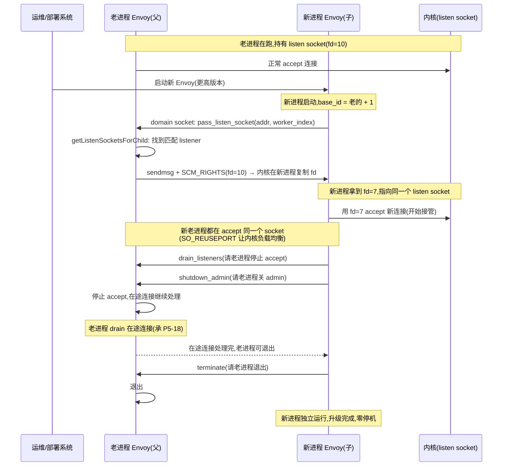

# 第 6 篇 · 第 21 章 · 安全:mTLS、TLS 终止、SDS、hot restart

> **核心问题**:前二十章我们看的流量,大多是**裸奔**的——明文 TCP、明文 HTTP。一旦系统从"机房里几个服务"变成"横跨不可信网络的几百个微服务",明文就站不住了:谁都能在链路上 sniff,谁都能冒充一个服务接入。这一章回答四个问题:① 跨网络(尤其 service mesh 里 sidecar 之间)怎么加密、为什么 mTLS(双向 TLS)是 mesh 安全的基石?② TLS 终止(在 Envoy 解密)和 TLS 透传怎么选?③ 证书会过期、要轮换,怎么做到**轮换不重启**——这是 SDS(Secret Discovery Service,承 P5-16 的五种 xDS 之一)的事;④ Envoy 自己要升级二进制,怎么做到**零停机重启**——这是 Envoy 招牌的 hot restart,靠 Unix domain socket + `SCM_RIGHTS` 把 listen socket 的 fd 从老进程传给新进程。前两件是数据面的事(在 transport socket 层加解密),后两件是控制面/进程级的事(SDS 是 xDS 之一、hot restart 是进程升级),正好横跨本书的二分法两面。

> **读完本章你会明白**:
> 1. 为什么 service mesh 普遍用 **mTLS**(而不是单向 TLS 或应用层自己加密),它的"零信任网络"语义是怎么靠 `require_client_certificate` + 证书里的 SPIFFE 身份落地的;朴素地"每个应用自己用库做 TLS"会撞上哪些墙(跨语言重造、密钥散乱、无法统一轮换)。
> 2. **TLS 终止 vs TLS 透传**怎么选:Envoy 作为 TLS 终端解密后再明文转给本地服务,和直接把 TLS 流量透传给后端,各自适用什么场景;以及为什么做 TLS 终止要先靠 `tls_inspector` listener filter(承 P2-06)嗅探 SNI。
> 3. **SDS 凭什么让证书轮换不重启**:证书/密钥被抽象成 Secret 资源,通过 SDS 动态下发(承 P5-16),`SdsApi::onConfigUpdate` 收到新证书后用 hash 比对去重、触发 `update_callback_manager_` 回调,Envoy 在线重建 SSL_CTX,**进程不动**;为什么朴素地"证书写死文件、轮换要重启"在 mesh 规模下不可行。
> 4. **★ hot restart 为什么能零停机重启**:新进程启动时,通过 Unix domain socket 向老进程发 `pass_listen_socket` 请求,老进程用 `sendmsg` + `SCM_RIGHTS` 辅助数据把 listen socket 的 fd **跨进程**传给新进程,新进程拿到的是一个**已经处于 LISTEN 状态、内核里挂着半连接队列**的 socket,接连接平滑过渡;以及 hot restart 和 P5-18 讲过的 listener drain 的根本区别(进程级升级 vs listener 级配置变更)。

> **如果一读觉得太难**:先只记住四件事——① service mesh 的安全基石是 **mTLS**:每个连接双向认证,身份来自证书里的 SPIFFE ID;② 证书轮换靠 **SDS**:控制面推新 Secret,Envoy 热加载,**不重启**;③ Envoy 升级二进制靠 **hot restart**:新进程通过 fd 传递接管 listen socket,**不丢连接**;④ 前两件是数据面(transport socket 加解密),后两件是控制面/进程级(SDS 是 xDS、hot restart 是进程协议)——**安全横跨本书二分法的两面**。

---

## 〇、一句话点破

> **Service mesh 的安全基石是 mTLS——每个连接双向认证、全程加密,身份来自证书里的 SPIFFE ID,应用完全无感;证书轮换不重启靠 SDS(控制面推 Secret、Envoy 在线重建 SSL_CTX);Envoy 自己升级二进制不丢连接靠 hot restart(新老进程通过 Unix domain socket + SCM_RIGHTS 传递 listen socket 的 fd)。前两件是数据面(transport socket),后两件是控制面/进程级(SDS 是 xDS、hot restart 是进程协议)——安全,横跨本书二分法的两面。**

这是结论,不是理由。本章倒过来拆:先讲为什么微服务里明文站不住、mTLS 凭什么成为 mesh 安全基石,再讲 TLS 终止与透传的取舍,然后讲 SDS 怎么把"证书轮换要重启"这道墙拆掉,最后拆透 Envoy 招牌的 hot restart——fd 怎么跨进程传递、新老进程怎么交接、为什么这套能做到零停机。

---

## 一、为什么明文站不住,以及为什么是 mTLS

要理解 Envoy 在安全上的设计,先看清它要解决的那个世界里,明文为什么站不住。

### 微服务网络的威胁模型:链路不可信

当一个系统从"机房里几个服务、内网全可信"变成"横跨多机房、多云、甚至公网的几百个微服务",网络这个介质就不再可信了:

- **sniff(嗅探)**:任何能接到链路的人(机房运维、云厂商网络、被攻破的相邻 Pod)都能抓包看明文。HTTP 的 Authorization header、gRPC 的 metadata、数据库连接的凭据,明文传输等于明信片。
- **spoof(冒充)**:没有认证,谁都能自称"我是支付服务"接入。一个被攻破的 Pod 可以冒充任意服务收发流量。
- **tamper(篡改)**:中间人可以改包,注入恶意响应。
- **lateral movement(横向移动)**:一旦攻破一个服务,如果内网全明文、无认证,攻击者可以横扫整个集群。

传统机房时代,人们靠"内网可信 + 边界防火墙"应对——把威胁挡在网络外面。但云原生时代,这个假设破了:**Pod 可能在任何节点上、网络可能跨云、边界根本划不清**。这就是"零信任网络(zero trust network)"的出发点——**不再有"内网可信"这个概念,每个连接都要认证、每段链路都要加密,把信任从"网络边界"下沉到"每个连接"**。

> **不这样会怎样**:一个真实案例:某团队把传统单体拆成微服务部署到 Kubernetes,服务间全明文 HTTP。一次某个 Pod 被攻破(依赖库漏洞),攻击者从那个 Pod 直接 sniff 同 namespace 里其他服务的流量,拿到了数据库凭据和用户 token,横向扩散到整个集群。如果服务间是 mTLS,攻击者就算 sniff 到的也只是密文,冒充别的服务也会因为没有合法证书被拒——**一个被攻破的 Pod,被限制在那个 Pod 的权限范围内**。这就是零信任的价值:把爆炸半径从"整个内网"缩到"单个被攻破的节点"。

### mTLS:双向认证,service mesh 的安全基石

TLS(Transport Layer Security,就是给 HTTPS 加密的那套)大家熟。但**普通 TLS 只认证服务端**——你访问 `https://bank.com`,服务器出示证书证明"我是 bank.com",但服务器不验证你(客户端),谁都能连。这在"服务对客户端"的场景(Web 网站对浏览器)是对的。

但微服务不是这个模型——**服务 A 调服务 B,双方都是服务,双方都该被认证**。这就需要 **mTLS(mutual TLS,双向 TLS)**:

```
   普通 TLS(单向):                  mTLS(双向):
   Client ──连接──> Server          Client ──连接──> Server
                       │                                │
   Client <──证书── Server          Client <──证书── Server(证明"我是 B")
   (Client 验证 Server)              (Client 验证 Server)
                                     Client ──证书──> Server(证明"我是 A")
                                     (Server 验证 Client)
                                     双向认证完成,加密通信
```

mTLS 的关键:**不仅服务端有证书,客户端也出示证书**。这样:

- **服务 B 能确认"调用我的确实是 A"**(不是冒充的)。
- **服务 A 能确认"我调的确实是 B"**(不是中间人)。
- 双方协商出对称密钥,**链路全程加密**,sniff 只能看到密文。

这就是 service mesh 安全的基石。在 mesh 里(Istio 为例),**每个 Pod 的 sidecar Envoy 之间,流量全部自动 mTLS**——A 的 Envoy 和 B 的 Envoy 建立一条 mTLS 连接,加密 + 双向认证,而 A 和 B 的应用进程本身完全不需要知道有 TLS 这回事(它们和各自的 sidecar 是 localhost 明文)。**安全从应用代码里抽出来,下沉到 mesh 的数据面,应用无感**——这和 P0-01 讲的"治理统一抽到数据面"是同一个逻辑。

> **钉死这件事**:mTLS 之所以是 service mesh 的安全基石,是因为它把"零信任网络"(每个连接都认证、每段链路都加密)变成了**应用无感**的默认行为——应用不用改一行代码,sidecar 之间的流量就自动加密 + 双向认证。这是 mesh 相比"应用自己用库做 TLS"的根本优势:**统一、无感、可轮换**。

### 身份来自哪里:SPIFFE

mTLS 的"双向认证"认证的是什么?是**证书**。但证书里写什么、怎么代表"服务 A 的身份",需要一个统一框架。这就是 **SPIFFE**(Secure Production Identity Framework for Everyone,人人可用的安全生产身份框架)。

SPIFFE 的核心是 **SPIFFE ID**——一个 URI 形式的身份标识,形如 `spiffe://example.org/ns/default/sa/payment/default`(域名/namespace/service account/工作负载)。它写在证书的 **SAN(Subject Alternative Name)** 扩展里。这样,服务 A 出示证书时,服务 B 从证书 SAN 里读出 `spiffe://...payment...`,就知道"这是 payment 服务的合法身份",据此做授权决策(放行 or 拒绝)。

Envoy 的 SPIFFE 证书校验有专门实现——`spiffe_validator`,在 `source/extensions/transport_sockets/tls/cert_validator/spiffe/spiffe_validator.cc`。它做的事是:从对端证书里提取 SPIFFE ID,对照一组 **trust domain**(信任域)和对应的 trust bundle(根证书集合)做校验。这是 mesh 里"基于工作负载身份做授权"的底层支撑——Istio 就是基于 SPIFFE ID 写授权策略(`AuthorizationPolicy`)的。

> **对照传统 PKI**:传统 PKI 里,证书绑定的是**域名**(CN=`api.example.com`)——服务对外、对客户端有意义。但 mesh 里服务间调用,域名往往没意义(服务发现给的是 IP,不是域名),真正有意义的是**工作负载身份**(namespace + service account)。SPIFFE 把身份从"域名"换成"工作负载",更贴合 mesh 的语义。这是 SPIFFE/SPIRE(它的实现)成为云原生身份标准的根。

### mTLS 的代价:握手开销与可观测收益

诚实地说,mTLS 不是免费的——它给每条连接增加了 TLS 握手开销(一个 RTT 多、CPU 计算)。但 service mesh 普遍接受这个代价,因为:

- **连接是长连接**:HTTP/2、gRPC、连接池(承 P4-12)都用长连接,握手开销被几千几万次请求摊薄到可忽略。
- **session resumption**:TLS 支持 session resumption(会话复用,基于 session ticket 或 session ID),复用已建立的会话状态,握手开销能降到 0-RTT 或 1-RTT。Envoy 的 `ContextImpl` 支持 session ticket( [`source/common/tls/server_context_impl.cc`](../envoy/source/common/tls/server_context_impl.cc) 有 `generateHashForSessionContextId` 逻辑)。
- **可观测收益巨大**:mTLS 让"谁能连谁"变成可审计的事实——每个连接都有对端的 SPIFFE ID,日志里能记下来(承 P6-20 的 access log),出问题了能精确定位"哪个工作负载调了哪个"。这是明文网络永远做不到的。

> **钉死这件事**:mTLS 的握手开销在长连接 + session resumption 下基本可忽略,换来的是"每个连接都加密 + 双向认证 + 可审计"——这笔账在 mesh 场景稳赚。这也是为什么 Istio 默认开启 mTLS(PeerAuthentication 的 STRICT 模式),而不是把它设成可选。

### 朴素地"应用层自己做 TLS"会撞什么墙

理解了 mTLS 的价值,再问:为什么不每个应用自己用库做 mTLS,而要 sidecar?

- **跨语言重造**:Java 用 JSSE、Go 用 crypto/tls、Python 用 ssl、Node 用 tls……**每个语言一套 TLS 库**,实现细节、默认值、bug 都不一样。一个公司几百个服务、五六个语言,要全部正确配 mTLS,等于每个语言踩一遍坑。
- **密钥管理散乱**:每个应用要安全地拿到自己的私钥(私钥不能落盘明文、不能打进镜像),这本身就是个大工程( vault、文件权限、轮换)。每个应用自己做,等于每个应用重新发明一遍密钥管理。
- **无法统一轮换**:证书过期了要换。如果每个应用自己持有证书,换证书要每个应用都重新加载——要么重启、要么每个应用都实现一套"证书热加载"。在 mesh 规模(几百个服务、每个证书 24h 轮换一次),这几乎不可能做到一致。
- **策略无法统一**:谁能连谁、要什么加密强度、用什么 cipher,散在每个应用的配置里,**没有统一视图**。出问题了排障困难。

sidecar 把这些全抽出来:**Envoy 统一持有证书、统一做 mTLS、统一从 SDS 拿证书、统一轮换**。应用只管和 sidecar 用 localhost 明文通信,安全的事 Envoy 全包。这和 P0-01 讲的"治理统一抽到数据面"完全一致——安全是治理的一类。

> **不这样会怎样**:一个反面是早期微服务的"应用层 TLS"实践——某团队用 Spring Cloud,每个 Java 服务自己配 JSSE 做 TLS,密钥打成 jks 文件随镜像分发。结果:① 密钥随镜像泄露过一次(私钥打进 Docker 镜像,镜像仓库被拉);② 证书过期时,要全公司几百个服务滚动重启一遍重新加载,每次轮换窗口运维通宵;③ 不同团队配的 cipher 不一样,偶发握手失败,排障困难。换成 Istio(sidecar Envoy + SDS 自动轮换)后,这些问题一次性消失——**应用不碰证书,Envoy 全权代理**。

---

## 二、TLS 在 Envoy 里:transport socket 抽象

讲完"为什么 mTLS",来看 Envoy 数据面怎么把 TLS 落地。关键是一个贯穿网络栈的抽象——**transport socket(传输套接字)**。

### transport socket:可插拔的"连接层加工"

Envoy 处理一条 TCP 连接,字节流的加解密(以及 ALPN 协商、证书校验这些 TLS 细节)在哪一层做?答案是:它被抽象成一个 **transport socket**,夹在"原始 TCP 字节流"和"上层 network filter/HCM 看到的应用层字节"之间。

这个抽象的接口在 [`envoy/network/transport_socket.h`](../envoy/envoy/network/transport_socket.h)——`TransportSocket` 类。它的核心方法就是:把上层要发的明文字节**加密**后交给底层 TCP(`doWrite`),把底层 TCP 收到的密文字节**解密**后交给上层(`doRead`),以及处理握手(`doHandshake`)。一个连接用的是 raw socket(不加密)还是 TLS socket,完全由配置决定——**上层 filter 链完全无感**,它看到的永远是"解密后的明文字节流"。

```
   ┌──────────────────────────────────────┐
   │  Network Filter / HCM(看明文字节)      │
   ├──────────────────────────────────────┤
   │  TransportSocket(可插拔)               │  ← TLS 加解密、握手在这层
   │    ├─ SslSocket(加解密)               │
   │    └─ RawTransportSocket(直通,不加密) │
   ├──────────────────────────────────────┤
   │  TCP 字节流(密文 or 明文)              │
   └──────────────────────────────────────┘
```

> **所以这样设计**:把加解密抽成可插拔的 transport socket,而不是写死在网络栈里,好处是:① **上层 filter 链完全复用**——不管连接有没有 TLS,HCM、router、限流这些 filter 都是同一套,不用为 TLS 单写一条链;② **TLS 可插拔**——同一个 Envoy,有的 listener 用 TLS、有的用 raw、有的用 starttls(先明文后升级),全靠配置拼;③ **扩展性**——除了 TLS,还能插 ALTS(GCP 的认证机制,在 `source/extensions/transport_sockets/alts/`)、proxy_protocol 这些"连接层加工"。

> **钉死这件事**:transport socket 抽象是 Envoy 数据面"可插拔"在连接层的体现——TLS 不是写死的特殊逻辑,而是和 raw socket 平起平坐的一个 socket 实现,上层 filter 无感。这和 filter chain 的"可插拔"哲学一脉相承(承 P3-10)。

### SslSocket:TLS 的具体实现

TLS 这个 transport socket 的具体实现是 **`SslSocket`**,在 [`source/common/tls/ssl_socket.h:46`](../envoy/source/common/tls/ssl_socket.h#L46)——它继承 `Network::TransportSocket`。Envoy 用的是 **BoringSSL**(Google 维护的 OpenSSL 分支,Golang 也在用),代码里大量 `bssl::UniquePtr<SSL>` 这种 BoringSSL 的 C++ 封装。

`SslSocket` 持有一个 BoringSSL 的 `SSL` 对象(代表一次 TLS 连接的状态机),核心是 `doHandshake()`([`source/common/tls/ssl_socket.h:98`](../envoy/source/common/tls/ssl_socket.h#L98))——驱动 TLS 握手状态机前进。握手期间,读到的字节喂给 BoringSSL 的 `SSL_do_handshake`,握手完成后,后续 `doRead`/`doWrite` 就调 `SSL_read`/`SSL_write` 做加解密。

一个关键的工程细节:Envoy 没有用 OpenSSL 默认的阻塞式 BIO,而是写了 **`IOHandleBio`**(`source/common/tls/io_handle_bio.cc`)——把 BoringSSL 的 BIO 接到 Envoy 自己的 `IOHandle`(非阻塞 fd 抽象)上。这样 TLS 握手和数据加解密,都能融入 Envoy 的 libevent dispatcher 事件循环(承 P1-03)——`SSL_do_handshake` 返回 `SSL_ERROR_WANT_READ` 时,Envoy 不阻塞,而是注册 epoll 事件等 fd 可读再继续。**TLS 完全异步、非阻塞,和 Envoy 的事件驱动模型严丝合缝**。

> **不这么写会怎样**:如果 TLS 用阻塞式 BIO,一个连接在握手/加解密时阻塞,会卡住整个 worker 线程——worker 是单线程事件循环(承 P1-02),一个阻塞就堵住几千个连接。写 `IOHandleBio` 把 BoringSSL 接到非阻塞 IOHandle 上,正是为了让 TLS 和 Envoy 的异步模型兼容。这是个容易被忽略但很关键的工程细节。

### ContextImpl:握手的"配置包"

除了 per-connection 的 `SslSocket`(代表一条 TLS 连接),还有一个 per-config 的 **`ContextImpl`**——代表"一组 TLS 配置生成的上下文",内部就是 BoringSSL 的 `SSL_CTX`。它存了:证书链、私钥、CA 信任库、ALPN 列表、cipher 列表、TLS 版本范围等。一个 listener 的下游 TLS 配置、一个 cluster 的上游 TLS 配置,各自对应一个 `ContextImpl`。

`ContextImpl` 在 [`source/common/tls/context_impl.h:82`](../envoy/source/common/tls/context_impl.h#L82)。每次新建一个 TLS 连接,`SslSocket` 就从对应的 `ContextImpl` 的 `SSL_CTX` 里 `SSL_new` 出一个 `SSL` 对象——**配置在 Context,状态在 Connection**,这是 BoringSSL/OpenSSL 的标准两层模型。

一个值得注意的字段:`tls_contexts_`(行 157)是**数组**——server 端可以配多个证书(比如一张 RSA、一张 ECDSA,或不同 SNI 对应不同证书),握手时根据 ClientHello 的 SNI 和支持的 cipher 选其中一张。注释写得很清楚(行 153-156):"This is always non-empty, with the first context used for all new SSL objects. For server contexts, once we have ClientHello, we potentially switch to a different CertificateContext based on certificate selection."——**默认用第一张,ClientHello 来了再按 SNI/cipher 切换**。

> **一个本书要诚实交代的源码位置偏差**:总纲和有些老资料把 TLS 实现位置写成 `source/extensions/transport_sockets/tls/`。但以 `df2c77d`(1.39.0-dev)源码为准,这个目录下只放 **cert_validator(SPIFFE 等)、cert_mappers、cert_selectors** 这些扩展,而 **TLS 的核心实现(`ContextImpl`、`SslSocket`、`IOHandleBio`、`ServerContextImpl`/`ClientContextImpl`)在 [`source/common/tls/`](../envoy/source/common/tls/)**,证书 config 类在 `source/common/ssl/`。本书引用一律以源码为准。这是 Envoy 演进中目录重组的结果——老博客的路径会指引错。

---

## 三、TLS 终止 vs TLS 透传

知道 TLS 怎么在 Envoy 里实现,来看一个常见的部署选择题:**TLS 在哪解密**。

### TLS 终止:Envoy 解密,后端收明文

**TLS 终止(TLS termination)**:客户端(或下游 sidecar)用 TLS 连 Envoy,Envoy 解密,**把明文转给后端**。后端服务自己不碰 TLS。

```
   Client ──TLS──> Envoy ──明文──> Backend
                   (解密在这里)
```

适用场景:

- **入口网关(ingress gateway)**:外部客户端 HTTPS 进来,Envoy 解密后,内部网络转明文给后端。内部网络如果可信(或者 mesh 内部另有 mTLS),这样可以省后端做 TLS 的开销。
- **mesh 边缘**:sidecar A 和 sidecar B 之间 mTLS(承上一节),但 sidecar B 到本地服务是 localhost 明文——这其实就是 sidecar B 做了 TLS 终止。
- **需要 L7 处理**:要在 Envoy 做 HTTP 路由、限流、JWT 校验这些 L7 filter(承 P3-10、P3-11),**必须先解密**——不解密 HTTP filter 看不到 HTTP 内容。所以"TLS 终止 + L7 filter 链"是入口网关的标准组合。

### TLS 透传:Envoy 不解密,原样转发

**TLS 透传(TLS passthrough)**:Envoy 不解密,把 TLS 流量当纯 TCP 字节流原样转发给后端,后端自己做 TLS 解密。

```
   Client ──TLS──> Envoy ──TLS(原样)──> Backend
                   (不解密,只看 TCP 层)        (自己解密)
```

适用场景:

- **后端自己要做客户端证书校验**:有些服务(比如带 mTLS 的数据库)要直接验客户端证书,如果 Envoy 终止了 TLS,后端看到的只是 Envoy 的身份,不是原始客户端的。透传能让后端拿到原始客户端证书。
- **合规/密钥隔离**:私钥不能给 Envoy(比如密钥必须在 HSM 或后端专用硬件里),那 Envoy 就不能解密,只能透传。
- **不需要 L7 处理**:只做 TCP 负载均衡,不需要看 HTTP 内容,透传更简单、开销更低。

### 关键:TLS 终止要先嗅探 SNI

这里有个承 P2-06 的关键点。如果 Envoy 要做 TLS 终止,且要根据**域名**(SNI,Server Name Indication)做路由(比如 `api.example.com` 走 A 集群、`admin.example.com` 走 B 集群),那它得先在**握手之前**知道客户端要连哪个域名——这就是 SNI。

但 SNI 在 TLS ClientHello 里(明文,在 TLS 握手的第一个包)。所以 Envoy 用一个 **listener filter:`tls_inspector`**([`source/extensions/filters/listener/tls_inspector/tls_inspector.cc`](../envoy/source/extensions/filters/listener/tls_inspector/tls_inspector.cc)),在 listener filter 阶段(承 P2-06,在 network filter/HCM 之前)嗅探 ClientHello,把 SNI 和 ALPN 解析出来,存到 connection 的 metadata 里。之后 HCM、router 就能根据 SNI 做路由。

> **承接 P2-06**:`tls_inspector` 是 listener filter 的典型,它做的事情是"在 TLS 握手前先偷看一眼 ClientHello"。这一步是"TLS 终止 + SNI 路由"能成立的前提。细节在 P2-06 讲过,这里不重复,只指路。

### starttls:明文先升级再加密

除了纯终止和纯透传,还有第三种——**starttls**。有些协议(SMTP、IMAP、FTP、旧版 memcached)的设计是:连接先以明文建立,客户端发一个 `STARTTLS` 命令,双方再升级成 TLS。Envoy 对此有专门的 `starttls` transport socket(在 `source/extensions/transport_sockets/starttls/`)——它在前半段用 raw socket,接到升级指令后切换成 TLS socket。这是 transport socket 可插拔的另一个体现:**同一个连接的不同阶段用不同的 socket 行为**,靠状态机切换。

> **钉死这件事**:starttls 这种"先明文后加密"的协议,是 transport socket 可插拔的极致场景——socket 的加密行为能随协议状态切换。这进一步说明为什么 Envoy 要把加解密抽象成可插拔的 transport socket,而不是写死:真实世界的协议太多样,写死就僵了。

### 选型小结

| 维度 | TLS 终止 | TLS 透传 |
|------|---------|---------|
| Envoy 角色 | 解密终端 | TCP 透传 |
| 后端看到 | 明文(或 Envoy 重新加密) | 原始 TLS |
| 能否 L7 处理 | **能**(解密后过 HTTP filter 链) | **不能**(看不到 HTTP 内容) |
| 私钥在哪 | Envoy 持有 | 后端持有 |
| 适用 | 入口网关、mesh 内 sidecar、需 L7 治理 | 后端自验客户端证书、密钥隔离、纯 TCP LB |

> **钉死这件事**:TLS 终止还是透传,本质是"TLS 在哪一层解密、私钥归谁管、要不要 L7 处理"的权衡。需要 L7 治理(filter 链)就必须终止;密钥不能给 Envoy 或后端要自验客户端证书就透传。Envoy 两种都支持,且能混合(比如入口终止、mesh 内 mTLS、到某些后端又透传)。

---

## 四、SDS:证书轮换不重启的秘密

讲完 TLS 加解密,来看控制面的事——证书怎么轮换。这是 SDS 的舞台。

### 朴素方案的墙:证书写死,轮换要重启

证书不是永生的——它有有效期(CA 签发时定,比如 24h、90 天、1 年)。过期了就得换。朴素的方案是:证书写在文件里,Envoy 启动时读进去,要轮换就改文件 + **重启 Envoy**。

这在 mesh 规模下完全不可行:

- **规模**:Istio 默认工作负载证书 24h 过期,一个集群几千个 Envoy,**每天每个 Envoy 都要轮换一次**。如果每次轮换都重启,等于每天全集群滚动重启一遍——连接全部中断重建,业务根本扛不住。
- **中断**:重启 Envoy(即使是 hot restart,后面讲)也有开销,而且不是所有场景都能 hot restart(比如单进程模式)。冷重启意味着在途连接全断、新连接短暂拒绝。
- **运维负担**:几千个 Envoy 的证书轮换时机、版本追踪、失败重试,人工或简单脚本根本管不过来。

所以需要一种机制:**证书能动态下发、热加载,进程不动**。这就是 SDS。

> **不这样会怎样**:某团队早期手写证书管理——每个 sidecar 用 sidecar 注入的初始化容器,从公司 CA 拉证书写文件,然后用 `inotify` 监听文件变化触发 Envoy reload。结果:① reload 是 listener 级的,每次 reload 有几百毫秒连接抖动;② 文件写入不是原子的(写到一半被读到会握手失败);③ 几千个 sidecar 的轮换状态没人追踪,有的轮换了有的没轮换,版本不一致引发偶发握手失败。换成 Istio SDS 后:控制面统一推证书、Envoy 原子热加载、进程完全不动、轮换状态控制面全知——这些问题全消失。

### SDS:Secret 是一种 xDS 资源(承 P5-16)

SDS(Secret Discovery Service)是 P5-16 讲的五种 xDS 之一。回忆一下那张表:

| xDS | 管什么 | 动态价值 |
|-----|--------|---------|
| LDS | Listener | 不重启起 listener |
| RDS | Route | 热更新路由 |
| CDS | Cluster | 动态加集群 |
| EDS | Endpoint | 秒级服务发现 |
| **SDS** | **Secret(证书/密钥)** | **不重启换证书** |

SDS 把"证书/密钥"抽象成一种 **Secret 资源**,像 LDS 推 listener、EDS 推 endpoint 一样,由控制面动态推给 Envoy。Envoy 收到新 Secret,热加载到对应的 `ContextImpl` 里,重建 `SSL_CTX`——**进程不动,新连接用新证书,老连接继续用老证书直到断开**。

> **承接 P5-16/P5-17**:SDS 的传输机制(grpc streaming / delta / ADS 聚合、resource version 协商、ACK/NACK)和其他 xDS 完全一样,在 P5-16、P5-17 拆透了,这里不重复。本章只讲 SDS 特有的部分——**Secret 收到之后,Envoy 怎么把它热加载进 TLS 上下文**。

### 静态证书 vs SDS:一张对照表

把"证书写死文件"和"SDS 动态下发"对照一下,差别一目了然:

| 维度 | 静态证书(文件) | SDS(动态下发) |
|------|----------------|-----------------|
| 证书来源 | 配置里写文件路径,Envoy 启动读 | 控制面通过 xDS 推 Secret 资源 |
| 轮换方式 | 改文件 + 重启 Envoy(或 listener reload) | 控制面推新 Secret,Envoy 热加载 |
| 进程是否动 | 重启或 reload(有抖动) | **完全不动** |
| 轮换状态 | 散在各 Envoy,无人统一追踪 | 控制面全知(ACK 回版本) |
| 密钥分发 | 文件挂载(k8s secret)、镜像打包(危险) | 控制面加密通道下发 |
| 失败恢复 | 文件没了就握手失败 | 控制面可重推、Envoy 保持旧证书 |

最后一行尤其重要——**SDS 失败时,Envoy 保持旧证书继续服务**,不会因为 SDS 断了就挂(`onConfigUpdateFailed` 在 [`source/common/secret/sds_api.cc:178`](../envoy/source/common/secret/sds_api.cc#L178) 就是这个语义:连接失败时允许启动继续、保持现状)。这是生产级容错的体现:**热更新机制必须能优雅降级,不能因为更新源故障就把现有服务也搞挂**。

SDS 相比其他 xDS 有个特别之处:**它特别适合独立传输**。LDS/RDS/CDS/EDS 通常走 ADS 聚合(一个流保证顺序),但 SDS 往往**单独一个流**——因为证书轮换频率和拓扑变更频率不同(证书 24h 一次,endpoint 几秒一次),分开流互不阻塞,且 SDS 可以指向一个专门的证书分发服务(比如 Istio 的 istiod,或 SPIRE)。这是 SDS 在工程上常被单独部署的原因。

### SdsApi:Secret 收到之后发生什么

Envoy 消费 SDS 的核心是 [`SdsApi`](../envoy/source/common/secret/sds_api.h#L49) 类(在 `source/common/secret/sds_api.cc`)。它实现 `Config::SubscriptionCallbacks`(就是 xDS 订阅的回调接口,承 P5-17),当控制面推新 Secret 时,`onConfigUpdate` 被调用。来看真实代码(摘自 [`source/common/secret/sds_api.cc:89`](../envoy/source/common/secret/sds_api.cc#L89)):

```cpp
absl::Status SdsApi::onConfigUpdate(const std::vector<Config::DecodedResourceRef>& resources,
                                    const std::string& version_info) {
  const absl::Status status = validateUpdateSize(resources.size(), 0);
  if (!status.ok()) {
    return status;
  }
  const auto& secret =
      Envoy::Protobuf::DynamicCastMessage<envoy::extensions::transport_sockets::tls::v3::Secret>(
          resources[0].get().resource());

  if (secret.name() != sds_config_name_) {
    // ...名字不匹配,拒绝
    return absl::InvalidArgumentError(msg);
  }

  const uint64_t new_hash = MessageUtil::hash(secret);   // 算新 Secret 的 hash

  if (new_hash != secret_hash_) {                        // hash 不同才处理(去重)
    validateConfig(secret);
    secret_hash_ = new_hash;
    setSecret(secret);                                   // 把新证书写进 Secret 对象
    // ...version_info 更新、FilesystemWatcher 设置(见下文)
    const auto files = loadFiles();                      // 如果 Secret 引用的是文件路径,读文件
    files_hash_ = getHashForFiles(files);
    resolveSecret(files);
    THROW_IF_NOT_OK(update_callback_manager_.runCallbacks());  // 触发热更新回调!
    secret_data_.last_updated_ = time_source_.systemTime();
  }
  init_target_.ready();
  return absl::OkStatus();
}
```

这段代码有几个值得拆的设计:

1. **hash 去重**:`new_hash != secret_hash_` 才往下走。控制面可能因为别的原因重推同一个 Secret(比如别的资源变了触发了全量推送),hash 不变就什么都不做——**避免无谓的 SSL_CTX 重建**。这是个朴素但重要的优化:重建 SSL_CTX 不便宜(要重新解析证书、设 cipher),不能因为重复推送就反复重建。
2. **setSecret + loadFiles + resolveSecret**:Secret 资源里证书内容可以**内联**(直接把证书 PEM 写在 Secret proto 里),也可以**引用文件路径**(Secret 里只写路径,Envoy 去读)。`loadFiles` 就是处理后者的——把路径对应的文件读进来。`resolveSecret` 最终合成出完整的证书数据结构。
3. **`update_callback_manager_.runCallbacks()`**:这是关键——**触发所有注册了"Secret 更新了"的回调**。谁注册了这些回调?是持有这个 Secret 的 `ContextImpl`(TLS 上下文)。回调里,`ContextImpl` 拿着新证书,**重建 `SSL_CTX`**(或更新内部状态),之后的新连接就用新证书了。

> **钉死这件事**:SDS 的热更新链路是:`控制面推 Secret → SdsApi::onConfigUpdate → hash 比对去重 → setSecret/loadFiles → update_callback_manager 触发回调 → ContextImpl 重建 SSL_CTX → 新连接用新证书`。**进程从头到尾不动,没有 listener reload、没有连接中断**。老连接继续用老 SSL_CTX(它们已经在握手时绑定了),自然老化断开;新连接用新 SSL_CTX。这就是"轮换不重启"的完整机制。

### FilesystemWatcher:目录原子重命名,绕过文件写入的坑

`onConfigUpdate` 里还有一段值得专门讲(行 119-136):

```cpp
if (getWatchedDirectory() == nullptr) {
  auto datasource_files = getDataSourceFilenames();
  if (!datasource_files.empty()) {
    watcher_ = dispatcher_.createFilesystemWatcher();
    for (auto const& filename : datasource_files) {
      // Watch for directory instead of file. This allows users to do atomic renames
      // on directory level (e.g. Kubernetes secret update).
      const auto result_or_error = api_.fileSystem().splitPathFromFilename(filename);
      RETURN_IF_NOT_OK_REF(result_or_error.status());
      RETURN_IF_NOT_OK(watcher_->addWatch(absl::StrCat(result_or_error.value().directory_, "/"),
                                          Filesystem::Watcher::Events::MovedTo,
                                          [this](uint32_t) {
                                            onWatchUpdate();
                                            return absl::OkStatus();
                                          }));
    }
  }
}
```

这段在做什么?它在**监听证书文件所在目录的 `MovedTo` 事件**。为什么?

因为 SDS Secret 可以引用文件路径(证书内容不内联在 proto 里,而是写在文件里,Envoy 读文件)。当证书轮换时,外部进程(比如 k8s 的 secret 挂载机制)会更新这个文件。但**直接覆写文件是不安全的**——写到一半被 Envoy 读到,会拿到半个证书导致握手失败。k8s 更新 secret 的标准做法是 **原子重命名**:写一个新文件到临时路径,然后 `rename` 成目标文件名——`rename` 是原子的,要么看到老的要么看到新的,绝不会看到半个。

Envoy 监听目录的 `MovedTo` 事件,正是为了捕捉这种 `rename`——文件被新内容替换时,触发 `onWatchUpdate`,重新读文件、热更新。这是 Envoy 和 k8s secret 机制配合的一个工程细节:**用 inotify 监听目录重命名,绕过文件非原子写入的坑**。

> **不这么写会怎样**:如果 Envoy 直接覆写证书文件、又用简单的"文件变更就重读"策略,在写入一半时被 inotify 触发重读,会读到半个证书——BoringSSL 解析失败,`SSL_CTX` 重建报错,新连接全挂。监听目录级 `MovedTo`(配合外部原子 rename)是这个问题的标准解。这是个生产环境里真会踩的坑,Envoy 在源码注释里专门标注了(`e.g. Kubernetes secret update`)。

### SecretProvider 与 ThreadLocal:证书怎么被 TLS 上下文拿到

上面讲的是 `SdsApi`(消费 SDS)。再往上一层,Envoy 还有 **`SecretProvider`** 抽象([`source/common/secret/sds_api.h:140`](../envoy/source/common/secret/sds_api.h#L140) 的 `DynamicSecretProvider`),它把"SdsApi 收到的 Secret 数据"和"使用者(ContextImpl)"解耦。`ContextImpl` 不直接订阅 SDS,而是持有一个 `SecretProvider`,`SecretProvider` 负责把最新 Secret 递给 `ContextImpl`。

对于非 SDS 的场景(证书写在静态文件里),用的是 `ThreadLocalGenericSecretProvider`([`source/common/secret/secret_provider_impl.cc`](../envoy/source/common/secret/secret_provider_impl.cc))——它把 secret 内容存进一个 **thread-local slot**(承 P1-02),每个 worker 线程有自己的副本,读取无锁。它的 `update()` 方法(行 39,在 main 线程被回调调用)做的是:

```cpp
absl::Status ThreadLocalGenericSecretProvider::update() {
  ASSERT_IS_MAIN_OR_TEST_THREAD();
  std::string value;
  // ...读新 secret 内容
  tls_->set([value = std::move(value)](Event::Dispatcher&) {
    return std::make_shared<ThreadLocalSecret>(value);   // 每个 worker 的 TLS slot 更新
  });
  return absl::OkStatus();
}
```

这里用 thread-local 是因为 secret 读取是热路径(TLS 握手时每个连接都要读证书),不能每次都加锁。**main 线程收到更新,`tls_->set` 让每个 worker 在下次访问时拿到新副本**——这是承 P1-02 的 thread-local 无锁模式在安全场景的应用。

> **承接 P1-02**:P1-02 讲的"thread-local 无锁"——main 写、worker 各自读自己的副本——这里兑现了:secret(包括 TLS 证书数据)通过 thread-local slot 分发给 worker,握手时 worker 读自己的副本,全程无锁。这和 stats(承 P6-20)是同一套机制的不同应用。

---

## 五、★ hot restart:零停机重启的招牌机制

讲完数据面的 TLS 和控制面的 SDS,来看本章的重头戏——**hot restart**。这是 Envoy 最招牌的机制之一,也是它"零停机"哲学的极致体现。

### 问题:升级 Envoy 二进制,怎么不丢连接

Envoy 自己也要升级——修 bug、加 feature、换版本。升级意味着**重启进程**。但 Envoy 是代理,手里攥着**几万条活跃连接**,一重启,这些连接全断,业务受影响。

Nginx 的做法(承 P0-01 讲过):`SIGHUP` 触发 reload,新起一组 worker、老 worker drain 后退出。但 Nginx 的 reload 是**同一个二进制**重新读配置——升级二进制本身,也得重启进程。

Envoy 要解决的是更狠的场景:**换二进制本身**(比如从 1.38 升到 1.39),怎么做到在途连接不丢、新连接不拒绝、对外完全无感?

答案就是 **hot restart**——新进程(子)启动时,从老进程(父)那里**继承 listen socket 的 fd**,新进程用这个 fd 继续 accept 新连接;老进程停止 accept、drain 在途连接、最后退出。整个过程,客户端看到的那个 IP:端口始终可达,连接不会因为重启而断。

> **不这样会怎样**:如果不做 hot restart,Envoy 升级就是"杀老进程、起新进程"——杀的瞬间,所有在途连接 RST,新连接在 listen socket 重新 bind 之前被拒绝(几十到几百毫秒)。对一个扛着几万 QPS、几万长连接的代理,每次升级都这样,业务根本受不了。hot restart 让升级变成新老进程短暂共存、平滑交接,对外零感知——这是 Envoy 能在 mesh 里当数据面、被频繁升级( Istio 经常升 sidecar)的关键。

### 核心技巧:fd 怎么跨进程传递——SCM_RIGHTS

hot restart 的核心,是**把老进程持有的 listen socket 的 fd,传给新进程**。但 fd 是 per-process 的——老进程的 fd 3,在新进程里完全不是同一个东西。怎么传?

Linux/Unix 提供了一个机制:**`SCM_RIGHTS`**(Send Control Message for RIGHTS)。它允许进程 A 通过 Unix domain socket,把一个**打开的文件描述符**(可以是文件、socket、pipe)传给进程 B。内核在进程 B 的 fd 表里**复制**一个指向同一个底层 file 对象的新 fd——B 拿到的 fd 数字可能不同,但指向内核里**同一个 socket 对象**。

关键点:这个 listen socket 在内核里是**同一个**——它的 LISTEN 状态、半连接队列、已绑定的端口,全部保留。新进程拿到这个 fd 后,直接 `accept` 就能接新连接,就像这个 socket 是它自己 `bind`+`listen` 的一样。**没有重新 bind 端口的窗口、没有 socket 状态丢失**。

```
   老进程 Envoy                      新进程 Envoy
   (持有 listen fd=10)               (刚启动,fd 表空)
        │                                  │
        │  Unix domain socket              │
        │  sendmsg + SCM_RIGHTS(fd=10)     │
        │ ────────────────────────────────>│
        │                                  │  recvmsg,内核在新进程
        │                                  │  fd 表里复制一个(fd=7)
        │                                  │  → 指向同一个 socket 对象
        │                                  │
        │  listen socket 在内核里是同一个  │
        │  (LISTEN 状态、端口绑定都保留)  │
        │                                  │  accept 新连接,平滑接管
```

Envoy 的实现就在 [`source/server/hot_restarting_base.cc`](../envoy/source/server/hot_restarting_base.cc)。来看真实代码——父进程发送 fd 的部分(行 103-115):

```cpp
// Control data stuff, only relevant for the fd passing done with PassListenSocketReply.
uint8_t control_buffer[CMSG_SPACE(sizeof(int))];
if (replyIsExpectedType(&proto, HotRestartMessage::Reply::kPassListenSocket) &&
    proto.reply().pass_listen_socket().fd() != -1) {
  memset(control_buffer, 0, CMSG_SPACE(sizeof(int)));
  message.msg_control = control_buffer;
  message.msg_controllen = CMSG_SPACE(sizeof(int));
  cmsghdr* control_message = CMSG_FIRSTHDR(&message);
  control_message->cmsg_level = SOL_SOCKET;
  control_message->cmsg_type = SCM_RIGHTS;                    // ← fd 传递的类型
  control_message->cmsg_len = CMSG_LEN(sizeof(int));
  *reinterpret_cast<int*>(CMSG_DATA(control_message)) = proto.reply().pass_listen_socket().fd();
  // ...
}
```

这就是 `SCM_RIGHTS` 的标准用法:在 `sendmsg` 的**辅助数据(control message, cmsg)**里,塞一个 `cmsg_type = SCM_RIGHTS` 的消息,辅助数据的内容就是那个 fd。子进程 `recvmsg` 时,内核自动在子进程的 fd 表里复制一个新 fd,通过辅助数据返回。

子进程解析这个 fd 的代码在 [`source/server/hot_restarting_base.cc:166`](../envoy/source/server/hot_restarting_base.cc#L166) 的 `getPassedFdIfPresent`:

```cpp
void RpcStream::getPassedFdIfPresent(HotRestartMessage* out, msghdr* message) {
  cmsghdr* cmsg = CMSG_FIRSTHDR(message);
  if (cmsg != nullptr) {
    RELEASE_ASSERT(cmsg->cmsg_level == SOL_SOCKET && cmsg->cmsg_type == SCM_RIGHTS &&
                       cmsg->cmsg_len == CMSG_LEN(sizeof(int)),
                   "recvmsg() came with control data when the message's purpose was not to pass a "
                   "listening fd.");
    out->mutable_reply()->mutable_pass_listen_socket()->set_fd(
        *reinterpret_cast<int*>(CMSG_DATA(cmsg)));
    RELEASE_ASSERT(CMSG_NXTHDR(message, cmsg) == nullptr,
                   "More than one control data on a single hot restart recvmsg().");
  }
}
```

注意那两个 `RELEASE_ASSERT`:① 必须是 `SOL_SOCKET` + `SCM_RIGHTS` 且长度正确(否则是协议错);② 一个 `recvmsg` 只能传一个 fd(`CMSG_NXTHDR` 必须为空)。这是协议的严格校验,防止误用。

> **钉死这件事**:hot restart 的物理基础是 `SCM_RIGHTS`——Unix domain socket 的辅助数据机制,允许进程间传递**打开的文件描述符**。内核在接收进程的 fd 表里复制一个新 fd,指向同一个底层 socket 对象。这个 socket 的 LISTEN 状态、端口绑定、半连接队列全部保留,新进程拿来就能 `accept`。**没有重新 bind、没有 socket 状态丢失,这就是零停机的物理保证**。

### 协议:父子进程通过 Unix domain socket 通信

fd 传递需要一个通信通道。Envoy 用的是 **Unix domain socket**(父子进程之间的双向通道)。协议在 [`source/server/hot_restarting_base.h:36-48`](../envoy/source/server/hot_restarting_base.h#L36-L48) 有详细注释,摘录:

> In each direction between parent<-->child, a series of pairs of:
> A uint64 'length' (bytes in network order), followed by 'length' bytes of a serialized `HotRestartMessage`.
> ... There is no mechanism to explicitly pair responses to requests. However, the child initiates all exchanges, and blocks until a reply is received, so there is implicit pairing.

也就是:**子进程发起所有请求,阻塞等回复**——这是一种隐式的请求-回复配对(没有显式的 request id,靠"子进程一次只发一个、等回复再发下一个"来保证顺序)。消息用 protobuf(`HotRestartMessage`)序列化,fd 通过 `SCM_RIGHTS` 顺带传。

每个进程有一个 **base_id**(标识它在 hot restart 链中的位置),domain socket 的名字包含 base_id,据此区分谁是父谁是子。`HotRestartImpl` 构造函数([`source/server/hot_restart_impl.cc:99`](../envoy/source/server/hot_restart_impl.cc#L99))同时把自己配成 child 和 parent——因为它既可能向更老的进程请求 socket(自己是 child),也可能被更新的进程请求(自己是 parent):

```cpp
HotRestartImpl::HotRestartImpl(uint32_t base_id, uint32_t restart_epoch, ...)
    : base_id_(base_id), scaled_base_id_(base_id * 10),
      as_child_(HotRestartingChild(...)),
      as_parent_(HotRestartingParent(...)),
      shmem_(attachSharedMemory(...)), ... {
  // If our parent ever goes away just terminate us ...
  int rc = prctl(PR_SET_PDEATHSIG, SIGTERM);    // ← 父死,内核给子发 SIGTERM
  RELEASE_ASSERT(rc != -1, "");
}
```

最后一行很关键:`prctl(PR_SET_PDEATHSIG, SIGTERM)` ——**如果父进程死了,内核自动给子进程发 SIGTERM**。这是为了防止"孤儿子进程"——子进程(新 Envoy)的存在依赖于父进程(老 Envoy)还在,父一死,子也该走,不依赖外部清理。这是 hot restart 链的健壮性保证。

> **钉死这件事**:父子进程通过 Unix domain socket + protobuf 消息通信,fd 通过 `SCM_RIGHTS` 顺带传。子进程发起所有请求、阻塞等回复(隐式配对)。`PR_SET_PDEATHSIG` 保证父死子殉,不产生孤儿。这是一套精心设计的进程协议,每个细节都有道理。

### 子进程:启动时请求 fd

子进程(新 Envoy)启动时,要为自己的每个 listener 向父进程请求 listen socket。这在 [`HotRestartingChild::duplicateParentListenSocket`](../envoy/source/server/hot_restarting_child.cc#L127) 里:

```cpp
int HotRestartingChild::duplicateParentListenSocket(const std::string& address,
                                                    uint32_t worker_index,
                                                    absl::string_view network_namespace) {
  if (parent_terminated_) {
    return -1;
  }

  HotRestartMessage wrapped_request;
  wrapped_request.mutable_request()->mutable_pass_listen_socket()->set_address(address);
  wrapped_request.mutable_request()->mutable_pass_listen_socket()->set_worker_index(worker_index);
  wrapped_request.mutable_request()->mutable_pass_listen_socket()->set_network_namespace(
      network_namespace);
  main_rpc_stream_.sendHotRestartMessage(parent_address_, wrapped_request);    // 发请求

  std::unique_ptr<HotRestartMessage> wrapped_reply =
      main_rpc_stream_.receiveHotRestartMessage(RpcStream::Blocking::Yes);      // 阻塞等回复
  if (!main_rpc_stream_.replyIsExpectedType(wrapped_reply.get(),
                                            HotRestartMessage::Reply::kPassListenSocket)) {
    return -1;
  }
  return wrapped_reply->reply().pass_listen_socket().fd();   // ← 拿到 fd!
}
```

子进程按 listener 地址逐个请求,每请求一个,父进程通过 `SCM_RIGHTS` 把对应 fd 传过来。子进程拿到 fd 后,把它当成"自己 bind 出来的 listen socket"用——绑到对应 worker 上开始 `accept`。

### 父进程:把 fd 传出去

父进程收到 `pass_listen_socket` 请求后,在自己的 listener 列表里找到匹配的 socket,把它的 fd 放进回复,通过 `SCM_RIGHTS` 传给子进程。这在 [`HotRestartingParent::Internal::getListenSocketsForChild`](../envoy/source/server/hot_restarting_parent.cc#L139) 里:

```cpp
HotRestartMessage
HotRestartingParent::Internal::getListenSocketsForChild(const HotRestartMessage::Request& request) {
  HotRestartMessage wrapped_reply;
  wrapped_reply.mutable_reply()->mutable_pass_listen_socket()->set_fd(-1);   // 默认 -1(没找到)
  Network::Address::InstanceConstSharedPtr addr =
      THROW_OR_RETURN_VALUE(Network::Utility::resolveUrl(request.pass_listen_socket().address()),
                            Network::Address::InstanceConstSharedPtr);
  // ...

  for (const auto& listener : server_->listenerManager().listeners()) {
    for (auto& socket_factory : listener.get().listenSocketFactories()) {
      if (*socket_factory->localAddress() == *addr && listener.get().bindToPort()) {
        // ... 类型匹配检查 ...
        if (request.pass_listen_socket().worker_index() < server_->options().concurrency()) {
          wrapped_reply.mutable_reply()->mutable_pass_listen_socket()->set_fd(
              socket_factory->getListenSocket(request.pass_listen_socket().worker_index())
                  ->ioHandle()
                  .fdDoNotUse());    // ← 取出 fd(方法名 fdDoNotUse 警示"别乱用")
        }
        break;
      }
    }
  }
  return wrapped_reply;
}
```

注意 `fdDoNotUse()` 这个方法名——Envoy 故意取这个"难听"的名字,警示调用者:**fd 是底层资源,轻易别直接碰**。但 hot restart 是少数必须直接碰 fd 的场景(要把它通过 `SCM_RIGHTS` 传走),所以这里用了。这是个代码层面的"危险品警示"设计,和《LevelDB》里 `Dest()` 之类命名风格类似——把"危险接口"的名字取得难听,减少误用。

> **一个有意思的命名细节**:`fdDoNotUse()` 这个名字是 Envoy 故意"丑化"的——它在表达"这个接口暴露了原始 fd,99% 的场景你不该用它,只有像 hot restart 这样必须操作 fd 的极少数场景才用"。通过命名把"危险"前置到调用点,这是大型 C++ 项目常用的防御性设计。

### 交接流程:新老共存,老进程 drain 后退出

整个 hot restart 的时序是这样的:



几个关键点:

1. **新老共存期**:新进程启动后、老进程退出前,有一段时间**两个进程都在**。它们都通过 `SO_REUSEPORT`(承 P2-05)监听同一个 socket,内核把新连接负载均衡到两个进程。这让"接管"平滑——没有"老的不接了、新的还没接上"的窗口。
2. **新进程主动驱动交接**:从时序看,**所有请求都是子进程(新)发起的**——请求 socket、请求 drain、请求 shutdown admin、请求 terminate。父进程(老)是"被指挥"的一方,被动响应。这个设计让新进程掌控交接节奏——它知道自己什么时候准备好了,可以精准触发老进程的逐步退出。
3. **drain 是渐进的**:新进程先让老进程 drain listener(停止接新连接,但处理完在途),再 shutdown admin,最后 terminate。每一步都等老进程到位,不会粗暴杀掉。这和 P5-18 讲的 listener drain 机制是同一套(老进程的 listener 进入 drain,在途连接继续处理,新连接不来)。
4. **stats 继承**:除了 socket,父进程还会把自己的 stats(counter 累计值、gauge 当前值)导出给子进程([`hot_restarting_parent.cc:179`](../envoy/source/server/hot_restarting_parent.cc#L179) 的 `exportStatsToChild`)。这样升级后,counter 不会从 0 重新数(否则监控会断),而是接着父进程的值继续。这是"零停机"的监控层面体现——不仅连接不丢,统计也不丢。

> **钉死这件事**:hot restart 的交接是**新进程驱动、老进程配合**的渐进过程:新进程请求 socket → 开始接管 → 让老进程 drain listener → shutdown admin → terminate。新老共存期靠 SO_REUSEPORT 让内核负载均衡新连接,没有"空窗期"。stats 也从父进程继承,监控不中断。**连接不丢、stats 不丢、对外零感知——这就是"零停机重启"的完整含义**。

### hot restart vs listener drain:别搞混

这里必须讲清一个容易混淆的点——hot restart 和 P5-18 讲的 listener drain 都涉及"drain",但它们是**完全不同层级的操作**:

| 维度 | listener drain(P5-18) | hot restart(本章) |
|------|------------------------|---------------------|
| 触发场景 | listener 配置变更(xDS 推新 listener) | Envoy 二进制升级 |
| 操作对象 | 单个 listener | 整个进程 |
| 是否换进程 | **否**,同一个进程内 | **是**,新老两个进程 |
| 是否传 fd | 不需要(同一个进程,fd 还在) | **需要**(`SCM_RIGHTS` 跨进程传) |
| 共存机制 | 新老 filter chain 在同一进程短暂共存 | 新老两个进程靠 SO_REUSEPORT 共存 |
| 目的 | 配置热更新不停机 | 二进制升级不停机 |

简单说:**listener drain 是"同一个进程里换配置",hot restart 是"换进程"**。两者都用到"drain 在途连接"的机制(因为都是"老的不接新的、等老的消化完"),所以名字里都有 drain,但操作的粒度完全不同。listener drain 是进程内的、轻量的、由 xDS 触发;hot restart 是进程间的、重的、由运维升级触发。

> **承接 P5-18**:P5-18 讲的 listener drain,是"配置变更不停机"——同一个 Envoy 进程里,新 listener 替换老 listener,老 listener drain 在途连接。本章的 hot restart 是"二进制升级不停机"——新老两个进程,fd 跨进程传递。两者都用 drain 机制消化在途连接,但粒度差一个数量级:listener drain 是 listener 级,hot restart 是进程级。**别因为名字里都有 drain 就搞混**。

### 共享内存:不止传 fd,还要传"日志锁"和 stats

fd 传递是 hot restart 最显眼的部分,但不是全部。新老进程之间还有一类东西要共享——**共享内存(shared memory)**。Envoy 的 `HotRestartImpl` 在构造时 `attachSharedMemory`([`source/server/hot_restart_impl.cc:26`](../envoy/source/server/hot_restart_impl.cc#L26)),用 `shm_open` + `mmap` 映射一块以 `/envoy_shared_memory_{base_id}` 命名的 POSIX 共享内存。这块内存里放了什么?

来看 `SharedMemory` 结构([`source/server/hot_restart_impl.h:33`](../envoy/source/server/hot_restart_impl.h#L33),简化示意):

```cpp
// (简化示意,非源码原文,只列关键字段)
struct SharedMemory {
  uint64_t size_;
  uint64_t version_;
  std::atomic<uint64_t> flags_;          // SHMEM_FLAGS_INITIALIZING 等
  pthread_mutex_t log_lock_;             // 日志锁
  pthread_mutex_t access_log_lock_;      // access log 锁
  // ...
};
```

两个 mutex 值得讲——**`log_lock_` 和 `access_log_lock_`**。为什么新老进程要共享这两个锁?

因为新老进程**写同一份日志文件**(升级期间不能换日志路径,否则日志断)。如果两个进程各自 `fopen` 同一个文件并发 `write`,日志会交错混乱。所以用**进程间共享的 pthread mutex**(放在共享内存里,`pthread_mutex_t` 的 `PROCESS_SHARED` 属性)做互斥——任一进程写日志前先拿这把锁,写完释放。新老进程共用一把锁,日志就串行写入,不交错。

这是 hot restart 里容易被忽略但很重要的细节:**零停机不止是 socket 不丢,还包括"日志不断、不乱"**。`log_lock_` 和 `access_log_lock_` 放共享内存,正是为此。

> **钉死这件事**:hot restart 的"零停机"是全方位的——socket 不丢(fd 传递)、stats 不丢(父进程导出给子进程)、日志不断不乱(共享内存里的进程间 mutex)。这三个维度都照顾到了,才是真正意义上的"对外零感知"。共享内存里的 `log_lock_` / `access_log_lock_` 是日志维度的保证,容易被忽略,但少了它升级期间日志就乱了。

### hot restart 的限制:不跨主机、配置要一致

诚实地说,hot restart 不是万能的,它有几个限制:

1. **同主机**:父子进程必须在**同一台主机**上(domain socket 是本机的)。跨主机的迁移(比如 Pod 从一个 node 漂到另一个 node)hot restart 帮不了,那得靠更高层的机制(比如连接重连、客户端重试)。
2. **配置兼容**:新老进程的 listener 配置(端口、地址)要能对上,父进程才能找到对应 socket 传给子进程。如果新版本改了 listener 配置(比如换了端口),那个端口父进程没有,子进程只能自己 bind(没有继承)。
3. **SO_REUSEPORT 依赖**:共存期靠 SO_REUSEPORT 让内核负载均衡,这要求内核和配置都支持(某些环境 SO_REUSEPORT 不可用,hot restart 退化)。
4. **资源翻倍**:新老共存期,内存、连接数等资源是**两个进程之和**,短暂翻倍。这在资源紧张的 Pod 里要注意(可能 OOM)。

Envoy 源码里对这些限制是诚实的——比如 `hot_restart_nop_impl.h` 就是一个"什么都不做"的实现,当 hot restart 不可用(比如 Windows、或配置关闭)时,`duplicateParentListenSocket` 直接返回 -1([`source/server/hot_restart_nop_impl.h:20`](../envoy/source/server/hot_restart_nop_impl.h#L20)),Envoy 退化成普通重启。这是工程的诚实:不强求所有环境都用招牌机制,该退化就退化。

> **钉死这件事**:hot restart 的零停机是有条件的——同主机、配置兼容、SO_REUSEPORT 可用、资源够共存。不满足时 Envoy 诚实退化(`hot_restart_nop_impl`),不强求。**了解一个机制的边界,和了解它的能力一样重要**。

---

## 六、技巧精解:hot restart 的 fd 传递 与 SDS 的热更新链路

本章最硬核的两个技巧,单独拆透。

### 技巧一:SCM_RIGHTS 的 fd 传递——为什么"传 fd"等于"传 socket"

朴素地问:hot restart 要让新进程接管老进程的 listen socket,为什么不直接"把端口号告诉新进程,让它自己重新 bind+listen"?

因为**重新 bind 有空窗、有竞争**:

- 老进程还没退出,端口还被它占着(bind 会失败,`EADDRINUSE`),除非用 SO_REUSEPORT,但即便如此;
- 从老进程停止 listen 到新进程 listen 起来,中间有一个**窗口**,这个窗口里新连接会被拒绝(没有进程在 accept);
- 老进程 listen socket 的**半连接队列**(SYN 收到但没完成握手)、**全连接队列**(握手完成等待 accept),全部丢失——那些"客户端以为连上了、其实还在握手"的连接,全断。

`SCM_RIGHTS` 传 fd 完美绕过这些:

- 内核里的 socket 对象**不变**——它还是那个处于 LISTEN 状态、挂着队列的 socket,只是新进程的 fd 表里多了一个指向它的引用。**没有空窗,没有队列丢失**。
- 新老进程可以同时 `accept` 这个 socket(SO_REUSEPORT 让内核负载均衡),平滑过渡。
- 新进程拿到的 fd,`accept` 出来的连接,和老进程 `accept` 出来的,在内核看来是同一个 socket 的连接,客户端完全无感。

> **不这么写会怎样**:如果 hot restart 靠"传端口号 + 新进程重新 bind+listen",每次升级都会有几百毫秒的连接拒绝窗口、半连接队列丢失导致的握手失败、甚至 bind 竞争(EADDRINUSE)。这对一个扛着几万长连接的代理是灾难。`SCM_RIGHTS` 传 fd 让"接管"变成"内核里 socket 对象多一个引用",物理上无损——**这是 hot restart 能零停机的物理根**。

`SCM_RIGHTS` 的精妙在于:它利用了 Unix "一切皆文件"的抽象——fd 是进程对内核对象的引用,而内核对象(socket)是跨进程共享的。传 fd 不是传"fd 这个数字",而是让内核在接收进程里**复制一个引用**,指向同一个底层对象。这是 Unix 进程间通信的高级机制,Envoy 把它用在了"代理零停机升级"这个场景,非常贴切。

一个配套的细节:协议规定**一个 `recvmsg` 只传一个 fd**(`getPassedFdIfPresent` 里 `CMSG_NXTHDR == nullptr` 的断言)。这看似限制,实则是工程上的简洁——hot restart 一次请求一个 listener socket,语义清晰,不需要批量传(批量传要处理部分失败、顺序,复杂度高)。**一次一个 fd,简单且足够**——这是协议设计的克制。

### 技巧二:SDS 热更新链路——为什么 hash 去重 + 回调链是正解

再看 SDS 的热更新链路。朴素地问:控制面推了新 Secret,Envoy 直接重建 SSL_CTX 不就行了,为什么要 hash 去重 + 回调链这套?

**hash 去重的必要**:xDS 推送不是"只有 Secret 变了才推"。控制面可能因为各种原因重推(别的资源变了触发全量、ADS 流里顺带、心跳)。如果每次推送都重建 SSL_CTX,会产生大量无谓重建——SSL_CTX 重建不便宜(解析证书、设 cipher、build 证书链),在高频推送场景会拖慢。`new_hash != secret_hash_` 这一行(行 108)用 O(1) 的 hash 比对挡掉了所有重复推送——**只有内容真变了才往下走**。这是把"幂等"做扎实的体现:xDS 应该是幂等的(推同样的内容,效果一样),hash 去重是实现幂等的最简手段。

**回调链(`update_callback_manager_`)的必要**:为什么 `SdsApi` 不直接调 `ContextImpl` 的方法,而是通过回调?因为 **`SdsApi` 和 `ContextImpl` 是解耦的**——`SdsApi` 只管"消费 SDS、提供最新 Secret 数据",谁用了这个 Secret(TLS context、session ticket key、validation context),它不直接知道。通过 `addUpdateCallback` 注册回调,使用者(`ContextImpl`)主动订阅更新,`SdsApi` 只负责"数据变了就通知所有订阅者"。这是观察者模式的标准应用,让 SDS 消费层和 TLS 使用层解耦——**一个 Secret 可以被多个使用者共享,更新时全部通知到,而 SdsApi 不需要知道有谁在用**。

> **不这么写会怎样**:如果 `SdsApi` 直接调 `ContextImpl::reload`,① 耦死——SdsApi 必须知道 ContextImpl 的存在和接口,无法复用到其他 Secret 使用者(比如 session ticket key 不走 ContextImpl);② 难扩展——以后加新的 Secret 使用者,得改 SdsApi 代码。回调链让 SdsApi 对使用者一无所知,使用者主动订阅,这是把"生产者-消费者"解耦的标准做法,Envoy 在 stats(承 P6-20 的 scope 归并)、xDS(承 P5-16 的订阅)等多处都用这个模式。

整个热更新链路的精妙在于它是**全异步、无阻塞、幂等**的:控制面推送 → SdsApi hash 比对(幂等)→ setSecret 更新数据 → 回调通知使用者 → 使用者(ContextImpl)在自己合适的时机重建 SSL_CTX → 新连接用新证书。**整个过程不阻塞、不影响在途流量、可重复(幂等)**。这是生产级热更新的三个必备特性,Envoy 一条不落。

### 一个对照:为什么 Envoy 不学 Nginx 的 SIGHUP reload

讲完 SDS 的热更新,顺手回答一个自然会冒出来的问题——Nginx 用 `SIGHUP` 触发配置 reload(不换进程、只重新读配置),Envoy 为什么不学这个,而是搞了 listener drain(P5-18)和 hot restart(本章)两套?

因为 **SIGHUP reload 有个根本缺陷:它不是原子的**。Nginx 收到 SIGHUP,会重新解析整个配置文件,如果配置有语法错误,要么老配置继续跑(但运维以为已经切了)、要么 Nginx 起不来。而且 reload 期间新老 worker 并存,内存翻倍、连接在两者间漂移,p99 会抖(承 P0-01 讲过)。

Envoy 的思路完全不同:**配置不是文件,是 xDS 资源**——每份配置带 version_info,Envoy 收到先校验、校验过了才 ACK 生效(承 P5-16 的 resource version 协商)。**校验失败就 NACK 保持旧配置,绝不让坏配置生效**。这比 SIGHUP reload 安全得多:坏配置不会让 Envoy 挂、也不会偷偷生效。

至于"换二进制"这件事,SIGHUP reload 根本做不到(它只是同进程重读配置,二进制还是老的)。hot restart 才是换二进制的正解。所以 Envoy 没学 SIGHUP,而是把"配置变更"和"二进制升级"拆成两个机制:listener drain / xDS 热更新管前者,hot restart 管后者。**这是更清晰、更安全的分层**。

> **钉死这件事**:Envoy 不用 SIGHUP reload,是因为 xDS 的 version 协商 + ACK/NACK 比"重读文件"安全得多(坏配置不会生效、不会挂);而换二进制是 SIGHUP 根本做不到的,hot restart 才是答案。把"配置变更"和"二进制升级"拆成两套机制,是 Envoy 的清晰分层,也是它对"零停机"做得比 Nginx 更彻底的体现。

---

## 七、章末小结

### 回扣主线

本章讲的安全,横跨本书二分法的两面:

- **数据面那一面**:TLS 加解密、mTLS 双向认证、TLS 终止——这些在 transport socket 层(`SslSocket` / `ContextImpl`),处理**每一条流量**。
- **控制面那一面**:SDS(Secret 动态下发,承 P5-16 的五种 xDS 之一)、hot restart(进程级零停机重启)——这些决定**配置/进程怎么动态来、怎么不停机生效**。

而 hot restart 虽然是进程级机制,但它和 listener drain(P5-18,控制面)是一脉相承的——都是"老的不接新的、等老的消化完"的 drain 语义,只是粒度不同。Envoy 的"零停机"哲学,从配置热更新(listener drain)到二进制升级(hot restart)是一以贯之的。

安全这一章,也补齐了 service mesh 的最后一块拼图——P0-01 讲 filter chain + xDS 是 mesh 的数据面/控制面,后面十几章拆了 filter chain 怎么处理流量、xDS 怎么动态下发,这一章讲清了"流量怎么加密认证(mTLS)、证书怎么轮换(SDS)、Envoy 自己怎么升级(hot restart)"——一个生产级 mesh,这些缺一不可。

### 五个为什么

1. **为什么 service mesh 用 mTLS 而不是单向 TLS 或应用层自己加密?**——mTLS 实现零信任网络(每个连接双向认证、全程加密),身份来自证书里的 SPIFFE ID;sidecar 模式让应用无感、统一加密、密钥统一管理、可统一轮换,远胜"每个应用自己用库做 TLS"的跨语言重造、密钥散乱、无法统一轮换。
2. **为什么 TLS 在 Envoy 里被抽象成 transport socket?**——可插拔(TLS / raw / starttls / ALTS 平起平坐)、上层 filter 链完全复用(不感知有没有 TLS)、扩展性强(各种"连接层加工"都能插)。
3. **为什么 SDS 能让证书轮换不重启?**——证书被抽象成 Secret 资源,xDS 之一;`SdsApi::onConfigUpdate` 收到新 Secret 后 hash 去重、触发回调、`ContextImpl` 在线重建 SSL_CTX;新连接用新证书、老连接自然老化,进程不动。
4. **为什么 hot restart 能零停机?**——新老进程通过 Unix domain socket + `SCM_RIGHTS` 传递 listen socket 的 fd;内核里的 socket 对象不变(LISTEN 状态、队列全保留),新进程拿来就能 accept;新老靠 SO_REUSEPORT 共存,平滑交接;stats 也从父继承,监控不中断。
5. **为什么 hot restart 和 listener drain 都叫 drain 但不是一回事?**——listener drain 是进程内、listener 级、由 xDS 触发的配置热更新;hot restart 是进程间、进程级、由升级触发的二进制替换。都用 drain 消化在途连接,但粒度差一个数量级。

### 想继续深入往哪钻

- 想看 mTLS 在 Istio 里怎么配:读 Istio 官方文档的 Security 部分(mTLS、AuthorizationPolicy、PeerAuthentication),本书讲的是 Envoy 数据面,Istio 是控制面。
- 想看 SPIFFE/SPIRE 全貌:读 SPIFFE 项目规范(spiffe.io),Envoy 的 `spiffe_validator`(`source/extensions/transport_sockets/tls/cert_validator/spiffe/`)是它的消费端。
- 想看 TLS 握手细节:读 BoringSSL 文档,Envoy 的 `IOHandleBio`(`source/common/tls/io_handle_bio.cc`)是把 BoringSSL 接到非阻塞 IO 的关键。
- 想看 SDS 协议:读 `envoy/service/secret/v3/`(SDS 的 proto),以及 `source/common/secret/sds_api.cc` 的订阅实现。
- 想看 hot restart 实操:读 Envoy 官方 docs 的 operations 部分(hot restart 章节),以及 `--restart-epoch` / `--base-id` 命令行参数;源码从 `source/server/hot_restart_impl.cc` 入手,跟着 `HotRestartingChild` / `HotRestartingParent` 读协议。

### 引出下一章

讲完安全(mTLS / TLS 终止 / SDS / hot restart),Envoy 内置的能力基本覆盖了——但生产里总有 Envoy 没内置的需求(自定义鉴权、特殊协议解析、公司内部治理逻辑)。Envoy 怎么不被内置 filter 限死?下一章 P6-22,讲 Envoy 的扩展机制:**Wasm filter**(沙箱字节码,运行时加载)和 **dynamic_modules**(动态 C++ 模块,较新高性能)——这是 Envoy "可插拔"在 filter 层的极致体现,也是本书数据面部分的收尾。

> **下一章**:[P6-22 · 扩展:Wasm filter 与 dynamic modules](P6-22-扩展-Wasm-filter-dynamic-modules.md)
