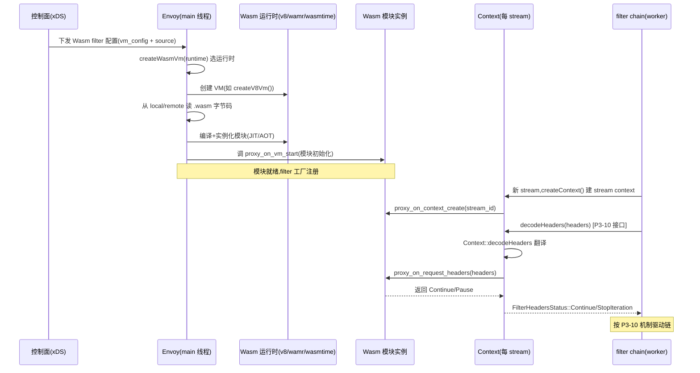

# 第 6 篇 · 第 22 章 · 扩展:Wasm filter 与 dynamic modules

> **核心问题**:Envoy 内置了几十个 filter(router、ratelimit、fault、jwt_authn、compressor……),覆盖了通用流量治理的绝大部分场景。可一旦你的业务需要的是 Envoy **没内置**的东西——一个私有的鉴权协议、一个公司内部的 trace 格式、一段和某个特殊后端约定的握手逻辑、一个只在你公司用的限流策略——内置 filter 就不够了。朴素做法是把这段逻辑写成 C++ filter 编进 Envoy 二进制,可这条路撞上一堵墙:**每改一次都要重新编译 Envoy 这个百万行级 C++ 巨兽、重新构建、重新部署所有 sidecar**。Envoy 的回答是两条**运行时**可加载的扩展路径:**Wasm filter**(把自定义逻辑编译成 Wasm 字节码,运行时加载、沙箱隔离)和 **dynamic modules**(把自定义逻辑编译成 `.so`/`.dylib`,运行时 dlopen、原生性能但无沙箱)。前者早期出现、强调安全隔离,后者较新、强调极致性能。这两条路径,是 Envoy "不被内置 filter 限死"的命脉,也是它从"通用代理"走向"可编程数据面"的最后一公里。

> **读完本章你会明白**:
> 1. 为什么"只能写 C++ filter 编进 Envoy"这条路在真实业务里撞墙——编译-部署-耦合三重痛点,以及为什么需要"运行时可加载"的扩展机制。
> 2. **Wasm filter** 怎么把自定义逻辑做成沙箱字节码——为什么 Wasm 是"沙箱 + 动态 + 跨语言"的天然载体;**四种运行时**(null/v8/wamr/wasmtime)各自定位、编译开关、性能取舍。
> 3. **dynamic modules** 怎么把自定义逻辑做成动态 `.so`——dlopen/dlsym 的机制、ABI 版本握手、为什么它比 Wasm 快、为什么它放弃沙箱;以及"静态模块"与"远程模块 fetch + SHA256 防篡改"两条增强路径。
> 4. **Wasm vs dynamic modules 对照表**——隔离(有 vs 无)、性能(字节码 vs 原生)、部署(都动态)、适用场景(不可信多租户 vs 可信内部),以及它们和内置 filter 共同接入同一条 filter chain 的源码事实。
> 5. 两条扩展路径各自的 **ABI/SDK** 长什么样——Wasm 的 `proxy_on_request_headers` 事件钩子、dynamic modules 的 `envoy_dynamic_module_on_http_filter_request_headers` 钩子,以及 Envoy 怎么把 filter 事件桥接到这两套 ABI。

> **如果一读觉得太难**:先只记住三件事——① Wasm filter 和 dynamic modules 都是 Envoy 的**运行时扩展**机制,自定义逻辑不用编进 Envoy 主二进制、运行时加载;② **Wasm 有沙箱(隔离、安全)、dynamic modules 无沙箱(原生速度)**,这是两者的根本取舍;③ 两者都和内置 filter 一样实现 `StreamDecoderFilter`/`StreamEncoderFilter`,挂到同一条 filter chain 上(P3-10),由 xDS 配置下发。这三条抓住,本章就拿到了主线。

---

## 〇、一句话点破

> **Envoy 的扩展有两条运行时路径:Wasm filter(沙箱字节码,安全隔离但带解释/JIT 开销)和 dynamic modules(动态 `.so`,原生性能但无沙箱)——两者都和内置 filter 一样挂上同一条 filter chain、由 xDS 下发;选哪条,是"安全隔离"和"极致性能"的取舍。**

这是结论,不是理由。本章倒过来拆:先讲"只能写 C++ filter 编进 Envoy"这条路为什么在真实业务里撞墙,再分别拆 Wasm(为什么 Wasm、四种运行时、ABI 怎么桥接 filter 事件)和 dynamic modules(dlopen 怎么加载、ABI 版本握手、为什么快、远程模块怎么防篡改),最后把两者摆到一张对照表上、讲清选型,技巧精解单独把"Wasm 四运行时的沙箱执行"和"性能-安全取舍的源码根"两个最硬核的拆透。

---

## 一、从内置 filter 到"自定义 filter 撞墙":为什么需要运行时扩展

### 内置 filter 覆盖了通用场景,但业务长尾接不住

P3-10 拆 HTTP filter chain 时讲过,Envoy 内置了几十个 http filter:router、ratelimit、fault、jwt_authn、compressor、ext_proc、ext_authz、cors、buffer、squash、grpc_web……这些 filter 覆盖了**通用流量治理**的绝大部分场景——路由、限流、故障注入、JWT 鉴权、压缩、外接鉴权、CORS、缓冲,几乎你能想到的"标准动作"都有现成的。这也是 Envoy 能当"通用数据面"的根:绝大多数团队不需要写一行自定义 filter,靠内置 filter 拼装就够。

可一旦业务需求**掉出**这个通用集合,内置 filter 就不够用了。举几个真实场景:

- **私有鉴权协议**:你公司的鉴权不是标准的 JWT,而是一套自定义的签名协议(header 里带一个公司私有的 `X-Company-Auth` 字段,要按一套复杂的算法校验签名、还要查一个内部的"会话服务")。jwt_authn 不认这种协议,ext_authz 要把请求旁路给外部服务又多一跳网络。
- **特殊协议适配**:你要代理的不是标准 HTTP,而是一个公司内部的二进制协议(比如基于 TCP 的私有 RPC)。HCM 之外的 network filter 层要写一段握手/拆包逻辑。
- **业务特定的限流策略**:标准 ratelimit filter 支持 per-second/per-minute 的令牌桶,但你的限流要按"用户等级 × 时间窗口 × 业务线"一套多维矩阵来,标准 filter 表达不了。
- **观测定制**:你想给每个请求打一个"业务 trace ID",这个 ID 要从请求体里某个字段解出来、再做哈希,标准 access log filter 表达不了。

这些场景的共同点:**逻辑是业务私有的、标准 filter 表达不了**。那怎么办?

### 朴素做法:写 C++ filter,编进 Envoy

最直接的做法:把这段逻辑写成一个 C++ filter(继承 `StreamDecoderFilter`/`StreamEncoderFilter`),编进 Envoy 二进制。这条路**理论上可行**(Envoy 的 filter 注册机制就是这么设计的——REGISTER_FACTORY 宏把 filter 注册进工厂表),但**实际撞墙**:

**第一堵墙:编译-部署周期**。改一行业务逻辑,要重新编译 Envoy。Envoy 是百万行级的 C++ 工程,Bazel 全量构建在好机器上也要几十分钟到一个小时。改完还得重新构建 Docker 镜像、滚动发布到所有 sidecar(几百几千个 Pod)。一个本该"改一行就生效"的业务逻辑,被放大成了**重新发布整个数据面**。在"业务天天在迭代"的现实里,这周期长得无法接受。

**第二堵墙:耦合**。业务逻辑(鉴权算法、私有协议、限流矩阵)被**编译进 Envoy 二进制**,意味着:① 业务团队写的代码进了数据面的二进制,**业务 bug 可能搞挂整个 Envoy**(一个解引用崩溃 = 整个 sidecar 死,所有走这个 sidecar 的流量全断);② 业务逻辑的升级和 Envoy 自身的升级**绑在一起**——你想升 Envoy 版本,得连业务 filter 一起重编;业务想改算法,得重编整个 Envoy。两套本该独立演进的代码,被 C++ 链接死死焊在了一起。

**第三堵墙:语言**。filter 必须用 C++ 写(Envoy 是 C++ 工程)。可很多业务团队的栈是 Go、Rust、Python、AssemblyScript——逼着业务团队学 C++ 来写 filter,门槛高、易错。

> **不这样会怎样**:假设一个 500 人的微服务团队,每个业务都有点私有逻辑要塞进数据面。如果都"写 C++ filter 编进 Envoy",那么:① 每个业务的每次逻辑修改 = 重编整个 Envoy + 全量滚动发布;② 业务代码进数据面二进制,业务 bug 直接搞挂数据面;③ 业务团队被迫学 C++。这套在真实工程里根本走不通——周期、耦合、语言三重痛点叠加,逼着业务要么放弃数据面定制(回到应用里写,丢掉统一治理)、要么忍受这套高代价流程。

所以 Envoy 必须提供一条**运行时可加载**的扩展路径:**业务逻辑不编进 Envoy 主二进制,运行时加载;业务逻辑的修改不影响 Envoy 二进制;最好还能用 C++ 以外的语言写**。这就是 Wasm filter 和 dynamic modules 的来历。

> **钉死这件事**:理解本章的起点,是认清"内置 filter 覆盖通用、业务长尾接不住",而"写 C++ filter 编进 Envoy"撞上编译-部署-耦合三重墙。Wasm 和 dynamic modules 是 Envoy 给出的两条**运行时扩展**路径——业务逻辑运行时加载、不编进主二进制。这是 Envoy 从"通用代理"走向"可编程数据面"的最后一公里。

---

## 二、Wasm filter:沙箱字节码,隔离 + 动态 + 跨语言

### 为什么是 Wasm

WebAssembly(Wasm)是浏览器里诞生的低层字节码格式(原本是为了在网页里跑高性能 C++/Rust 代码),但它有一组**恰好适配"在代理里跑自定义逻辑"**的特性:

1. **沙箱隔离**:Wasm 是一个**线性内存 + 受限指令集**的虚拟机模型。Wasm 模块只能访问自己那块线性内存(默认大小固定,越界访问 trap),调用宿主显式导出的函数(import),不能直接碰宿主进程的其他内存、不能直接 syscall、不能直接开 socket。**Wasm 模块崩溃(trap)只杀它自己,不杀宿主 Envoy 进程**。这是 Wasm 区别于"动态加载 `.so`"的根本——后者崩了直接带崩宿主(下一节讲)。
2. **跨语言**:Wasm 是个编译目标,Rust/C++/Go/AssemblyScript/Zig……都能编译成 Wasm 字节码。业务团队可以用**自己熟悉的语言**写 filter,不用被逼学 C++。
3. **动态加载**:Wasm 是个 `.wasm` 文件(字节码),运行时从本地文件或远程 HTTP 加载,不编进 Envoy 二进制。改逻辑 = 重新编 `.wasm` + 重新加载,不碰 Envoy 主二进制。

这三个特性加起来,正好解决上一节那三堵墙:沙箱解决耦合(Wasm 崩不坏 Envoy)、动态加载解决编译-部署周期(不重编 Envoy)、跨语言解决语言门槛(用业务熟悉的语言)。

> **不这样会怎样**:如果不用 Wasm 这种沙箱字节码,要同时拿到"隔离 + 动态 + 跨语言"三件套非常难。动态 `.so` 能拿"动态",但拿不到"隔离"(崩了带崩宿主)和"跨语言"(基本只能 C/C++/Rust with C ABI)。脚本语言(Lua/JS)能拿"动态 + 隔离",但跨语言弱(Lua 就是 Lua、JS 就是 JS),性能也差(解释执行)。Wasm 是这三者的"交集最优解"。

### Wasm 的代价:解释/JIT 开销,以及 ABI 跨界

Wasm 不是免费午餐。两个代价:

1. **执行开销**:Wasm 字节码要么解释执行(wamr 的 interp 模式、wasmtime 的 cranelift 之前的模式),要么 JIT 编译成机器码(v8、wamr 的 JIT、wasmtime 的 cranelift)。即便 JIT,Wasm 也要经过一道"字节码 → 机器码"的编译,且 Wasm 的安全检查(内存边界、间接调用签名检查)有运行时开销。**Wasm filter 的执行速度,慢于同等逻辑的原生 C++ filter**(动态 modules),差距视运行时和负载而定,一般在 10%~50% 这个量级(具体数字随场景波动,本书不展开 benchmark,关键是"有开销")。
2. **ABI 跨界**:Envoy 是 C++ 进程,Wasm 模块是另一个内存空间,两者不能直接传 C++ 对象。每次 filter 事件(headers 来了、body 来了),Envoy 要把数据**序列化/拷贝**进 Wasm 线性内存,调用 Wasm 函数;Wasm 里要调 Envoy 的能力(拿 header、发响应),要走宿主导出的(import)函数,同样要跨界。**每次跨界都有开销**(数据拷贝 + 调用约定转换)。

这两个开销,是 Wasm 拿"沙箱 + 跨语言"付出的代价。dynamic modules 就是为了消除这两个开销而生的(下一节)。

### Envoy 的四种 Wasm 运行时:null、v8、wamr、wasmtime

Envoy 支持**四种** Wasm 运行时,源码在 [source/extensions/wasm_runtime/](../envoy/source/extensions/wasm_runtime)。这四种是 Envoy 把"沙箱执行 Wasm 字节码"这件事**插件化**的结果——同一个 `.wasm` 文件,可以跑在不同的 Wasm 引擎上,各有取舍。

先看目录结构,这是铁的事实:

```
source/extensions/wasm_runtime/
├── null/      config.cc   (envoy.wasm.runtime.null)
├── v8/        config.cc   (envoy.wasm.runtime.v8)
├── wamr/      config.cc   (envoy.wasm.runtime.wamr)
└── wasmtime/  config.cc   (envoy.wasm.runtime.wasmtime)
```

四个目录,每个一个 `config.cc`。这四个 `config.cc` 长得**惊人地一致**——都是一个薄工厂类,实现 `WasmRuntimeFactory` 接口,真正的 Wasm VM 实现来自外部的 [proxy-wasm](https://github.com/proxy-wasm/proxy-wasm-cpp-host) 库。以 v8 为例([source/extensions/wasm_runtime/v8/config.cc](../envoy/source/extensions/wasm_runtime/v8/config.cc#L12-L21)):

```cpp
class V8RuntimeFactory : public WasmRuntimeFactory {
public:
  WasmVmPtr createWasmVm() override { return proxy_wasm::createV8Vm(); }
  std::string name() const override { return "envoy.wasm.runtime.v8"; }
};

#if defined(PROXY_WASM_HAS_RUNTIME_V8)
REGISTER_FACTORY(V8RuntimeFactory, WasmRuntimeFactory);
#endif
```

`createV8Vm()` 来自 `#include "include/proxy-wasm/v8.h"`,Envoy 自己不实现 Wasm 引擎,而是把这事外包给 proxy-wasm 库(v8、wamr、wasmtime 各有一个 `createXxxVm()`)。wamr 和 wasmtime 的 `config.cc` 几乎是 v8 的复制粘贴,只是换了 `createWamrVm()`/`createWasmtimeVm()` 和编译开关 `PROXY_WASM_HAS_RUNTIME_WAMR`/`PROXY_WASM_HAS_RUNTIME_WASMTIME`。

**这里有一个关键的编译期开关**:`#if defined(PROXY_WASM_HAS_RUNTIME_XXX)`。这意味着:**v8、wamr、wasmtime 三种运行时,是在编译 Envoy 时通过 Bazel 选项决定的**。你编译 Envoy 时选了 v8,那么 `envoy.wasm.runtime.v8` 这个 factory 才注册,wamr/wasmtime 的 factory 不会被注册(宏未定义)。**所以同一个 Envoy 二进制,通常只内置一种(或几种)Wasm 运行时**——这是为了让用户按需选,不在二进制里塞全部四种引擎(每个引擎都是几十 MB 的代码)。

唯一例外是 **null 运行时**([source/extensions/wasm_runtime/null/config.cc](../envoy/source/extensions/wasm_runtime/null/config.cc#L12-L19))——它**没有** `#if defined(...)` 编译开关,总是注册:

```cpp
class NullRuntimeFactory : public WasmRuntimeFactory {
public:
  WasmVmPtr createWasmVm() override { return proxy_wasm::createNullVm(); }
  std::string name() const override { return "envoy.wasm.runtime.null"; }
};
REGISTER_FACTORY(NullRuntimeFactory, WasmRuntimeFactory);   // 无条件注册
```

null 运行时(`envoy.wasm.runtime.null`)是**特殊**的——它**不是真正的 Wasm 字节码 VM**。它跑的是把 Wasm SDK **直接编译成原生机器码**(链接进 Envoy 或编进一个 C++ 库),然后通过一个"NullVM"适配层,让这段原生代码**伪装成** Wasm 模块的样子被调用。换句话说,NullVM 让你用 Wasm SDK 的 API 写代码,但**不经 Wasm 字节码、不沙箱、直接原生执行**。它的用途:**调试**(开发 Wasm filter 时,不用反复编译 `.wasm`,直接 C++ 编译跑,方便断点)和**性能压测**(看"同一段逻辑,跑 NullVM(原生)和跑 v8(Wasm)的差距")。

四种运行时的定位用一张表说清:

| 运行时 | 引擎类型 | 执行方式 | 沙箱 | 编译开关 | 典型用途 |
|--------|---------|---------|------|---------|---------|
| **v8** | Google V8 | JIT(高性能) | 有 | `PROXY_WASM_HAS_RUNTIME_V8` | 生产默认,性能最强 |
| **wasmtime** | wasmtime(Cranelift) | JIT/AOT | 有 | `PROXY_WASM_HAS_RUNTIME_WASMTIME` | 轻量,Bytecode Alliance 系 |
| **wamr** | WebAssembly Micro Runtime | 解释/JIT/AOT | 有 | `PROXY_WASM_HAS_RUNTIME_WAMR` | 嵌入式,低内存 |
| **null** | NullVM(非真 Wasm) | 原生直跑 | **无** | 总注册(无条件) | 调试、压测基线 |

> **钉死这件事**:Envoy 的 Wasm 支持**四种**运行时,源码在 `source/extensions/wasm_runtime/{null,v8,wamr,wasmtime}/config.cc`,每个都是一个薄工厂(真正 VM 来自 proxy-wasm 库)。v8/wamr/wasmtime 用编译期宏 `PROXY_WASM_HAS_RUNTIME_XXX` 选择性注册(同一二进制通常只内几种);null 总注册,但它是"伪 Wasm"——原生执行、无沙箱,用途是调试和压测基线。**老资料如果说"Envoy 只有 v8 运行时"是过时的,1.39 已有四种**。

### Wasm filter 怎么接入 filter chain:和内置 filter 完全一样

这里有一个**关键事实**初学者容易忽视:**Wasm filter 在 filter chain 眼里,和一个内置 filter 没有任何区别**。它同样实现 `StreamDecoderFilter`/`StreamEncoderFilter`(承 P3-10),同样由 HCM 在建 stream 时按配置顺序实例化、塞进 decoder/encoder 链,同样用 `Continue`/`StopIteration` 控制链推进。filter chain 这一层**根本不知道**某个 filter 是 C++ 写的内置 filter 还是 Wasm filter——它只看到一个个 `StreamFilter` 对象。

接入点在 [source/extensions/filters/http/wasm/config.h](../envoy/source/extensions/filters/http/wasm/config.h#L66-L73):

```cpp
auto filter_config = std::make_shared<FilterConfig>(proto_config, context);
return [filter_config](Http::FilterChainFactoryCallbacks& callbacks) -> void {
  auto filter = filter_config->createContext();
  if (!filter) { // Fail open
    return;
  }
  callbacks.addStreamFilter(filter);          // 和内置 filter 一样的接入!
  callbacks.addAccessLogHandler(filter);
};
```

`callbacks.addStreamFilter(filter)`——和 ratelimit、fault、compressor 接入用的是**同一个 API**。`filter` 是 `createContext()` 返回的对象,它是一个 `Context`,继承自 [proxy_wasm 的 ContextBase](../envoy/source/extensions/common/wasm/context.h),而 `Context` 同时**实现 Envoy 的 StreamFilter 接口**。filter chain 拿到这个 `Context` 对象,当普通 filter 用。

这个设计的妙处在于:**Wasm 是 filter chain 的一个透明扩展**——不需要为 Wasm 单独搞一套链机制,Wasm filter 就是 filter,直接挂上。这也意味着,P3-10 讲的 filter chain 全部机制(两向逆序、协作式 stop/continue、异步 filter 的 continueDecoding)对 Wasm filter **完全适用**。

### Wasm 怎么把 filter 事件桥接到字节码:proxy-wasm ABI

那 Wasm 字节码怎么知道"headers 来了"?这就是 Wasm filter 的核心机制——**proxy-wasm ABI**。

proxy-wasm 是一个**跨代理**的 Wasm 扩展标准(由 Envoy、Istio、proxy-wasm 团队推动)。它定义了一组**事件钩子**(由 Wasm 模块实现、Envoy 调入)和一组**宿主函数**(由 Envoy 实现、Wasm 模块调出)。事件钩子用 `proxy_on_*` 命名,典型几个:

- `proxy_on_context_create`:创建一个 context(stream 级或 root 级)。
- `proxy_on_vm_start`:VM 启动时调一次,模块做初始化。
- `proxy_on_configure`:配置变更时调(root context)。
- `proxy_on_request_headers`:**请求 headers 来了**(decoder)。
- `proxy_on_request_body`:请求 body 来了。
- `proxy_on_response_headers`:响应 headers 来了(encoder)。
- ……

Envoy 这边的桥接代码在 [source/extensions/common/wasm/context.cc](../envoy/source/extensions/common/wasm/context.cc)。当 filter chain 调 Wasm filter 的 `decodeHeaders`(P3-10 讲的 filter 接口),Envoy 的 `Context::decodeHeaders` 会把它翻译成对 Wasm 模块的 `onRequestHeaders` 调用([source/extensions/common/wasm/context.cc#L1661-L1670](../envoy/source/extensions/common/wasm/context.cc#L1661-L1670)):

```cpp
Http::FilterHeadersStatus Context::decodeHeaders(Http::RequestHeaderMap& headers, bool end_stream) {
  onCreate();
  request_headers_ = &headers;
  end_of_stream_ = end_stream;
  auto result = convertFilterHeadersStatus(onRequestHeaders(headerSize(&headers), end_stream));
  if (result == Http::FilterHeadersStatus::Continue) {
    request_headers_ = nullptr;
  }
  return result;
}
```

这里的 `onRequestHeaders(...)` 是 proxy-wasm 提供的 C++ 包装,它内部会**把 headers 拷贝进 Wasm 线性内存**、然后**调用 Wasm 模块导出的 `proxy_on_request_headers` 函数**。Wasm 模块处理完,返回一个 proxy-wasm 状态码(`Continue`/`Pause` 等),`convertFilterHeadersStatus` 把它转译回 Envoy 的 `FilterHeadersStatus`(`Continue`/`StopIteration` 等)。filter chain 拿到这个转译后的状态码,按 P3-10 的机制继续驱动链。

**这套 ABI 桥接是 Wasm filter 的命脉**——它让 Wasm 模块能用一套标准 API(不管跑在 v8 还是 wasmtime)接收 filter 事件、调 Envoy 能力。proxy-wasm 的存在,让"Wasm filter"成了**跨代理**的标准(Istio、Envoy、MOSN 都支持 proxy-wasm),你写一个 Wasm filter 可以在多个代理之间复用。

### 一段不该跳过的历史:proxy-wasm 怎么来的

proxy-wasm 不是 Envoy 一家的事。它的来历值得花几句讲,因为这段历史解释了为什么 Wasm filter 能跨代理复用、为什么 ABI 长成这个样子。

2018 年左右,Envoy 团队(Matt Klein、Piotr Sikora 等)开始探索在 Envoy 里跑 Wasm 扩展,最初是 Google 内部的一个项目。很快他们意识到:**如果每家代理都自己搞一套"Wasm filter ABI",生态会碎片化**——你给 Envoy 写的 Wasm filter 跑不了 MOSN、跑不了 HAProxy(如果它支持 Wasm)。于是 2019 年,**proxy-wasm** 作为独立的标准被抽出来,目标是定义一套**代理无关**的 Wasm 扩展 ABI:不管宿主是 Envoy、MOSN、还是别的代理,Wasm 模块只要实现 proxy-wasm 定义的 `proxy_on_*` 钩子、调 proxy-wasm 定义的宿主函数,就能跑。

这套标准化的成果,就是今天 Envoy 用的 `proxy_on_request_headers` 等钩子,以及 proxy-wasm 多语言 SDK([proxy-wasm-rust-sdk](https://github.com/proxy-wasm/proxy-wasm-rust-sdk)、[proxy-wasm-go-sdk](https://github.com/proxy-wasm/proxy-wasm-go-sdk)、[proxy-wasm-assemblyscript-sdk](https://github.com/solo-io/proxy-wasm-assemblyscript-sdk) 等)。一个用 Rust SDK 写的 Wasm filter,可以**不改一行代码**跑在 Envoy(v8/wasmtime/wamr 任一)和 MOSN 上——只要两边都实现了 proxy-wasm ABI。这是 Wasm filter 相对 dynamic modules 的**独有优势**:dynamic modules 的 ABI 是 Envoy 专属的(abi.h 是 Envoy 仓里的文件),dynamic module 的 `.so` 只能跑在 Envoy 上;Wasm filter 跨代理。

这段历史也解释了为什么 Envoy 的 Wasm 运行时层(`source/extensions/wasm_runtime/`)那么薄——因为真正"懂 Wasm"的逻辑(VM 抽象、ABI 桥接)都在外部 [proxy-wasm-cpp-host](https://github.com/proxy-wasm/proxy-wasm-cpp-host) 库里,Envoy 只是集成它。**把通用部分抽成共享库、让多家代理共建**,这是 proxy-wasm 设计的格局。

> **钉死这件事**:Wasm filter 在 filter chain 眼里和内置 filter **没区别**——同样实现 StreamFilter 接口、同样 `addStreamFilter` 挂链、同样 stop/continue 控制推进。区别只在 filter 内部:内置 filter 的逻辑直接是 C++,Wasm filter 的逻辑在 Wasm 字节码里,Envoy 用 proxy-wasm ABI(`proxy_on_request_headers` 等钩子)把 filter 事件**翻译**进 Wasm。这套 ABI 是**跨代理**标准,Wasm filter 可在 Envoy/Istio/MOSN 间复用。

### Wasm 加载流程:本地、远程、字节码配置

Wasm 模块从哪来?Envoy 支持几种来源(由 xDS 配置的 `vm_config.source`):

1. **本地文件**:`filename: /etc/envoy/my_filter.wasm`,直接从磁盘读。
2. **远程 HTTP**:`remote: <http_url>`,Envoy 启动时(或热更新时)从远程拉,带 SHA256 校验防篡改。
3. **内联字节码**:配置里直接嵌 base64 编码的 Wasm 字节码(适合小 filter)。

加载后,Envoy 用选定的运行时(v8/wamr/wasmtime)创建 VM、实例化模块、调 `proxy_on_vm_start` 让模块初始化。后续每个 stream 创建时,调 `proxy_on_context_create` 建一个 stream context;filter 事件来了,调对应的 `proxy_on_*` 钩子。

下面这张时序图把"Wasm filter 加载 → 执行 → 挂 filter chain"的全过程串起来:



---

## 三、dynamic modules:动态 `.so`,原生性能但无沙箱

### 为什么还要 dynamic modules:Wasm 的代价让人想回头

Wasm 解决了"隔离 + 动态 + 跨语言",但留下两个代价:**执行开销**(解释/JIT + 安全检查)和 **ABI 跨界开销**(数据序列化、调用约定转换)。对绝大多数场景,这两个开销可以接受(Wasm filter 的处理延迟增加通常在微秒级)。可对某些**极致性能**的场景——比如每秒几十万 QPS 的网关、对 p99 延迟极其敏感的交易系统——这两个开销就是真痛点。这些团队会说:"我**信任**我的 filter 代码(自己写的、内部审计过、不需要沙箱),但我**不能接受** Wasm 那 10%~50% 的性能损失。给我一个**原生 C++ 速度**但又能**运行时加载**的机制。"

这就是 dynamic modules 的定位:**用 dlopen 加载原生 `.so`,拿 Wasm 拿不到的极致性能,代价是放弃 Wasm 拿到的沙箱**。

> **不这样会怎样**:如果只有 Wasm 一条路径,那些"信任代码、要极致性能"的团队要么忍受 Wasm 的开销、要么回到"写 C++ filter 编进 Envoy"(撞第一节的墙)。dynamic modules 是 Envoy 给这批团队的第三条路——动态加载 `.so`,原生性能,但不沙箱。这是性能和安全之间的诚实权衡。

### dlopen/dlsym:动态模块的机制

dynamic modules 的核心机制是 **POSIX 的 dlopen/dlsym**——Unix 世界里加载动态链接库(`.so` on Linux、`.dylib` on macOS)的标准 API。这套 API 几十年了,libc/插件系统/各种动态加载都用它。Envoy 把它包了一层,定义了"动态模块"的生命周期和 ABI。

核心数据结构是 [DynamicModule 类](../envoy/source/extensions/dynamic_modules/dynamic_modules.h#L33-L74):

```cpp
class DynamicModule {
public:
  // 动态加载的模块(dlopen)
  explicit DynamicModule(void* handle) : handle_(handle) {}
  // 静态链接的模块(符号在主二进制里)
  explicit DynamicModule(absl::string_view static_module_name)
      : handle_(nullptr), static_module_name_(static_module_name) {}
  ~DynamicModule();   // 动态模块 dlclose,静态模块无操作

  template <typename T>
  absl::StatusOr<T> getFunctionPointer(const absl::string_view symbol_ref) const;  // dlsym 包装

private:
  void* getSymbol(const absl::string_view symbol_ref) const;
  void* handle_;                          // dlopen 返回的句柄
  const std::string static_module_name_;  // 静态模块的前缀
};
```

一个 `DynamicModule` 对象 = 一个 dlopen 句柄。`getFunctionPointer` 是 `dlsym` 的包装,从模块里查符号(函数指针)。加载一个模块的实现在 [source/extensions/dynamic_modules/dynamic_modules.cc#L31-L92](../envoy/source/extensions/dynamic_modules/dynamic_modules.cc#L31-L92):

```cpp
absl::StatusOr<DynamicModulePtr>
newDynamicModule(const std::filesystem::path& object_file_absolute_path,
                 const bool do_not_close, const bool load_globally) {
  // 用 RTLD_NOLOAD 探测:如果模块已加载,直接返回已有句柄,避免重复调 init
  void* handle = dlopen(object_file_absolute_path.c_str(), RTLD_NOLOAD | RTLD_LAZY);
  if (handle != nullptr) {
    return std::make_unique<DynamicModule>(handle);
  }
  int mode = RTLD_LAZY;
  mode |= load_globally ? RTLD_GLOBAL : RTLD_LOCAL;   // 默认 RTLD_LOCAL 避免符号冲突
  if (do_not_close) mode |= RTLD_NODELETE;            // Go 编的 .so 不支持 dlclose
  handle = dlopen(object_file_absolute_path.c_str(), mode);
  if (handle == nullptr) {
    return absl::InvalidArgumentError(...);
  }
  DynamicModulePtr dynamic_module = std::make_unique<DynamicModule>(handle);

  // 查模块的 init 函数,它返回 ABI 版本字符串
  const auto init_function =
      dynamic_module->getFunctionPointer<decltype(&envoy_dynamic_module_on_program_init)>(
          "envoy_dynamic_module_on_program_init");
  ...
  const char* abi_version = (*init_function.value())();
  // 比对 ABI 版本,不匹配则告警(但不拒绝)
  if (absl::string_view(abi_version) != ENVOY_DYNAMIC_MODULES_ABI_VERSION) {
    ENVOY_LOG_..._LOGGER(..., warn, "Dynamic module ABI version {} is deprecated. ...", abi_version);
  }
  return dynamic_module;
}
```

这段代码几个值得讲的细节:

**1. RTLD_NOLOAD 探测防重复加载**(第 41-46 行)。dlopen 一个**已经加载过**的 `.so`,默认会**返回已有句柄**(引用计数 +1),不重新加载。Envoy 用 `RTLD_NOLOAD | RTLD_LAZY` 先**探测**它是否已在内存——如果在,直接返回,**不调 init 函数**(`envoy_dynamic_module_on_program_init` 只调一次)。这避免了"同一个模块被多个 filter 引用时,init 被调多次"的陷阱。

**2. RTLD_LOCAL 默认**(第 53-55 行)。dlopen 的 mode 默认是 `RTLD_LOCAL`(模块的符号**不暴露**给主进程的全局符号表),只有 `load_globally=true` 才用 `RTLD_GLOBAL`。这是为了**避免多个模块之间的符号冲突**——模块 A 和模块 B 各自定义了同名符号,用 RTLD_LOCAL 它们互不干扰。朴素地"全部 RTLD_GLOBAL"会让后加载的模块覆盖先加载的符号,埋下踩雷隐患。

**3. RTLD_NODELETE 给 Go**(第 56-58 行)。`do_not_close=true` 时加 `RTLD_NODELETE`,意味着 `dlclose` 不真正卸载模块(保留在内存)。这是给 **Go 编译的 `.so`**(c-shared 模式)用的——Go runtime 不支持被反复加载/卸载([golang/go#11100](https://github.com/golang/go/issues/11100)),强制 RTLD_NODELETE 才能让 Go 模块工作。这体现了 Envoy 对多语言 SDK 的细致适配。

**4. ABI 版本握手**(第 67-90 行)。模块必须导出 `envoy_dynamic_module_on_program_init`,它返回一个 ABI 版本字符串。Envoy 比对这个字符串和当前 Envoy 的 `ENVOY_DYNAMIC_MODULES_ABI_VERSION`([abi.h:47](../envoy/source/extensions/dynamic_modules/abi/abi.h#L47) 定义为 `"v0.1.0"`):**匹配**记 info 日志、**不匹配**记 warn 日志(注意:**不拒绝**,只告警,因为 dynamic modules 假设模块可信、容许向前兼容)。这个版本握手的目的是:**模块和 Envoy 必须用兼容的 ABI 编译**——ABI 变了(函数签名、结构体布局),模块要么重编,要么运行时出未定义行为。

> **钉死这件事**:dynamic modules 用标准 POSIX dlopen/dlsym 加载 `.so`,核心是 `DynamicModule` 类 + `newDynamicModule`。几个非显然的技巧:① RTLD_NOLOAD 探测防重复 init;② 默认 RTLD_LOCAL 避免模块间符号冲突;③ RTLD_NODELETE 兼容 Go 的 c-shared(不支持反复加载卸载);④ `envoy_dynamic_module_on_program_init` 做 ABI 版本握手。这套机制拿的是原生 C++ 速度(直接机器码、无解释/JIT、无跨界序列化),代价是无沙箱(下文讲)。

### ABI:dynamic modules 和 Envoy 的契约

dynamic modules 也有自己的 ABI(和 proxy-wasm 的 ABI 是两套**独立**的东西)。这套 ABI 定义在 [source/extensions/dynamic_modules/abi/abi.h](../envoy/source/extensions/dynamic_modules/abi/abi.h),这是一个**纯 C 头文件**(便于非 C++ 语言 SDK 使用),定义了三类符号:

- **类型**(`envoy_dynamic_module_type_*`):buffer、http header、http filter 指针等。
- **事件钩子**(`envoy_dynamic_module_on_*`):模块必须实现、Envoy 调入。比如 `envoy_dynamic_module_on_program_init`(加载时)、`envoy_dynamic_module_on_http_filter_request_headers`(HTTP 请求 headers 来了)、`envoy_dynamic_module_on_http_filter_response_body`(响应 body)。
- **回调**(`envoy_dynamic_module_callback_*`):Envoy 实现、模块调出。比如 `envoy_dynamic_module_callback_log`(写日志)、`envoy_dynamic_module_callback_get_concurrency`(拿 worker 数)。

abi.h 头部的注释([abi.h:22-27](../envoy/source/extensions/dynamic_modules/abi/abi.h#L22-L27))有一段**至关重要**的诚实交代,直接点明 dynamic modules 的根本性质:

> Some functions are specified/defined under the assumptions that all dynamic modules are **trusted** and have the **same privilege level as the main Envoy program**. This is because they run inside the Envoy process, hence they can access all the memory and resources that the main Envoy process can, which makes it **impossible to enforce any security boundaries** between Envoy and the modules by nature.

翻译过来:**动态模块被假设为可信的、和 Envoy 同特权级。它们跑在 Envoy 进程内,能访问 Envoy 进程的全部内存和资源,因此从本质上无法在 Envoy 和模块之间强制任何安全边界**。

这是 dynamic modules 和 Wasm 的**根本区别**的源码根:Wasm 模块在自己的线性内存里、只能调 import 函数,**沙箱可强制**;dynamic modules 的 `.so` 一旦 dlopen,就在 Envoy 进程地址空间里,**和 Envoy 平起平坐**,崩了带崩 Envoy、能改 Envoy 内存、能开任意 socket——**没有任何隔离**。Envoy 源码诚实承认了这一点,所以 dynamic modules 只该用于**可信**代码(内部审计过的、自己写的),不该用于不可信/多租户场景(那是 Wasm 的领地)。

这套 ABI 的命名规约见 [STYLE.md](../envoy/source/extensions/dynamic_modules/STYLE.md):事件钩子前缀 `envoy_dynamic_module_on_`、回调前缀 `envoy_dynamic_module_callback_`、类型前缀 `envoy_dynamic_module_type_`。典型的 HTTP filter 生命周期钩子(节选自 abi.h):

```
envoy_dynamic_module_on_program_init            (加载时,返回 ABI 版本)
envoy_dynamic_module_on_http_filter_config_new  (配置创建)
envoy_dynamic_module_on_http_filter_new         (每个 stream 建一个 filter 实例)
envoy_dynamic_module_on_http_filter_request_headers
envoy_dynamic_module_on_http_filter_request_body
envoy_dynamic_module_on_http_filter_request_trailers
envoy_dynamic_module_on_http_filter_response_headers
envoy_dynamic_module_on_http_filter_response_body
envoy_dynamic_module_on_http_filter_response_trailers
envoy_dynamic_module_on_http_filter_destroy
```

这一组钩子和 Wasm 的 `proxy_on_request_headers` 等**功能对等**——都覆盖了 HTTP filter 的完整生命周期(headers/body/trailers,请求/响应)。区别只在调用机制:Wasm 跨线性内存调,dynamic modules 直接函数调用(同进程地址空间,指针直传)。

### 三种 SDK:C++、Rust、Go

dynamic modules 提供三种语言的 SDK([source/extensions/dynamic_modules/sdk/](../envoy/source/extensions/dynamic_modules/sdk)):

- **C++ SDK**([sdk/cpp/](../envoy/source/extensions/dynamic_modules/sdk/cpp)):把 C ABI 包成 C++ 类(`HttpFilter`、`HttpFilterFactory`、`BodyBuffer`、`HeaderMap` 等),提供 RAII、类型安全。
- **Rust SDK**([sdk/rust/](../envoy/source/extensions/dynamic_modules/sdk/rust)):把 C ABI 包成 Rust 的 trait/struct,用 Rust 的所有权模型管理内存。
- **Go SDK**([sdk/go/](../envoy/source/extensions/dynamic_modules/sdk/go)):用 Go 的 c-shared 模式编译成 `.so`,SDK 负责桥接 Go runtime 和 C ABI(注意要用 RTLD_NODELETE)。

值得注意的是 C++ SDK 还提供了一个**注册表机制**——模块在加载时(`envoy_dynamic_module_on_program_init` 阶段)把 filter factory 注册进一个进程级的注册表([sdk/cpp/sdk.cc 的 HttpFilterConfigFactoryRegistry](../envoy/source/extensions/dynamic_modules/sdk/cpp/sdk.cc#L85-L94)):

```cpp
std::map<std::string_view, HttpFilterConfigFactoryPtr>&
HttpFilterConfigFactoryRegistry::getMutableRegistry() {
  static std::map<std::string_view, HttpFilterConfigFactoryPtr> registry;
  return registry;
}
```

这是一个**进程级的静态 map**。模块加载时,把 filter factory 注册进去(filter_name → factory);Envoy 配置里引用这个 filter_name,就能实例化对应的 filter。这让"模块里定义多个 filter"成为可能——一个 `.so` 可以注册多个 filter factory,每个有不同的 filter_name。

### dynamic modules 的 filter 接入:和 Wasm 一样的"挂链"

和 Wasm filter 一样,dynamic module filter **同样实现 Envoy 的 StreamFilter 接口**,同样用 `addStreamFilter` 挂上 filter chain。接入点在 [source/extensions/filters/http/dynamic_modules/factory.cc#L61-L79](../envoy/source/extensions/filters/http/dynamic_modules/factory.cc#L61-L79):

```cpp
return [config = filter_config.value()](Http::FilterChainFactoryCallbacks& callbacks) -> void {
  const std::string& worker_name = callbacks.dispatcher().name();
  auto pos = worker_name.find_first_of('_');
  uint32_t worker_index;
  absl::SimpleAtoi(worker_name.substr(pos + 1), &worker_index);
  auto filter = std::make_shared<DynamicModuleHttpFilter>(
      config, config->stats_scope_->symbolTable(), worker_index);
  callbacks.addStreamFilter(filter);                // 和 Wasm、内置 filter 一样的挂链!
  filter->initializeInModuleFilter();               // 调模块的 on_http_filter_new
};
```

`DynamicModuleHttpFilter`([source/extensions/filters/http/dynamic_modules/filter.h#L20-L66](../envoy/source/extensions/filters/http/dynamic_modules/filter.h#L20-L66))继承自 `Http::StreamFilter`,实现 `decodeHeaders`/`decodeData`/`encodeHeaders` 等全套接口。它的 `decodeHeaders` 内部会把 headers 转成 ABI 格式,调模块的 `envoy_dynamic_module_on_http_filter_request_headers`,把返回值(continue/stop)翻译回 `FilterHeadersStatus`。

**注意这里有一个 worker_index 解析**(第 62-67 行):从 dispatcher 名字(`worker_<index>`)里 parse 出 worker 编号,传给 filter。这是因为 dynamic modules 可能要做"per-worker"的状态(避免跨 worker 锁),知道自己在哪个 worker 上很重要——这又呼应了 P1-02 的 worker 线程模型:每个 filter 实例跑在一个 worker 上,模块可以按 worker 分片状态。

network filter 和 listener filter 也支持 dynamic modules([source/extensions/filters/network/dynamic_modules/](../envoy/source/extensions/filters/network/dynamic_modules)、[source/extensions/filters/listener/dynamic_modules/](../envoy/source/extensions/filters/listener/dynamic_modules)),factory name 分别是 `envoy.filters.network.dynamic_modules` 和 `envoy.filters.listener.dynamic_modules`。三层 filter(http/network/listener)全覆盖,和内置 filter 的覆盖范围一致。

### 三种模块来源:本地、按名、远程(带 SHA256 防篡改)

dynamic modules 的加载入口是 `newDynamicModuleByConfig`([source/extensions/dynamic_modules/dynamic_modules.cc#L321-L476](../envoy/source/extensions/dynamic_modules/dynamic_modules.cc#L321-L476)),它支持三种模块来源:

**1. 本地文件路径**(`config.module().local().filename()`):直接 dlopen 指定路径的 `.so`。

**2. 按名查找**(`config.name()`):按模块名查,文件名约定 `lib<name>.so`,在 `ENVOY_DYNAMIC_MODULES_SEARCH_PATH`(环境变量,默认当前目录)或标准库路径(`LD_LIBRARY_PATH`、`/usr/lib`)里找。这个路径里还有一个**静态模块**优化([dynamic_modules.cc#L99-L103](../envoy/source/extensions/dynamic_modules/dynamic_modules.cc#L99-L103)):

```cpp
// 探测 "<module_name>_envoy_dynamic_module_on_program_init" 是否在主二进制里
const std::string static_init_symbol =
    absl::StrCat(module_name, "_envoy_dynamic_module_on_program_init");
if (dlsym(RTLD_DEFAULT, static_init_symbol.c_str()) != nullptr) {
  return newStaticModule(module_name);   // 静态模块:不 dlopen,符号已在主二进制
}
```

如果模块的 init 符号在 Envoy 主二进制里能找到(用 `dlsym(RTLD_DEFAULT, ...)` 全局查),说明这个模块**被静态链接进了 Envoy**——那就走"静态模块"路径,不 dlopen,符号通过 `<name>_<symbol>` 前缀查找([getSymbol, dynamic_modules.cc#L162-L172](../envoy/source/extensions/dynamic_modules/dynamic_modules.cc#L162-L172))。静态模块的意义:**开发期**(把模块编进 Envoy,方便调试,不用反复 dlopen)和**某些发布形态**(把审计过的关键模块编进主二进制,不依赖外部 `.so` 文件)。

**3. 远程 HTTP**(`config.module().remote()`):从远程 HTTP 拉字节,带 SHA256 校验。这条路径最复杂,也是安全最关键的部分——下文单独讲。

#### 远程模块 + SHA256 防篡改:缓存命中陷阱

远程模块的核心安全风险:**Envoy 把远程拉的 `.so` 缓存在 `/tmp/envoy_dynamic_module_<sha256>.so`,这个路径是确定性的(由期望的 SHA256 推出)。如果攻击者能写 `/tmp`(同节点另一个容器、共享主机),他可以预先在这个路径放一个恶意 `.so`,Envoy 缓存命中就直接 dlopen 了恶意代码——远程代码执行**。

Envoy 的防御在 [verifyFileSha256](../envoy/source/extensions/dynamic_modules/dynamic_modules.cc#L178-L219):每次缓存命中,**重新校验 `/tmp` 里那个文件的 SHA256** 是否等于配置里期望的 SHA256。不匹配就删掉缓存文件、走重新拉取路径。代码注释([dynamic_modules.cc#L381-L387](../envoy/source/extensions/dynamic_modules/dynamic_modules.cc#L381-L387))讲得很直白:

```cpp
// The cache path is in /tmp, which may be writable by other processes
// (co-tenant containers, shared hosts); without this check, an attacker who
// pre-populates ``/tmp/envoy_dynamic_module_<expected_sha>.so`` with a malicious
// shared object turns the cache-hit fast path into arbitrary code execution.
const auto verify_status = verifyFileSha256(cached_path, sha256);
```

注意 verifyFileSha256 的注释([dynamic_modules.cc#L207-L210](../envoy/source/extensions/dynamic_modules/dynamic_modules.cc#L207-L210))还说:这里**故意不用常量时间比较**——因为期望的 SHA256 是 operator 配的(不是秘密),实际摘要才是要保护的;提前退出只泄露"远程模块不对",不泄露秘密。这是一个细致的安全权衡:常量时间比较是为了防侧信道泄露秘密,这里没有秘密要泄露,所以普通比较够用,且更快。

> **钉死这个技巧**:dynamic modules 的远程模块加载有一个非显然的安全陷阱——缓存路径在 `/tmp` 是确定性的,可被同节点其他进程预填恶意 `.so`。Envoy 用 `verifyFileSha256` 在**每次缓存命中时**重算 SHA256 防篡改。**朴素地"只在校验写入时算一次 SHA256"是不够的**——文件可能在校验后被替换。这个"每次读都验"的设计,是 dynamic modules 安全的根(虽然 dynamic modules 整体无沙箱,但至少保证"加载的是 operator 指定的那份代码")。

#### NACK on cache miss + 后台 fetch:配置下发的优雅降级

远程模块还有一个工程难点:**首次下发时,`.so` 还没拉下来,配置怎么办**?如果直接拒绝配置(xDS NACK),控制面会重试,可重试时还是没拉下来(异步拉需要时间),陷入死循环。

Envoy 的解法是 **NACK on cache miss + 后台 fetch**([dynamic_modules.cc#L412-L420](../envoy/source/extensions/dynamic_modules/dynamic_modules.cc#L412-L420)):

```cpp
if (config.nack_on_cache_miss()) {
  BackgroundFetchManager::singleton(context->singletonManager())
      ->fetchIfNeeded(sha256, context->clusterManager(), config.module().remote());
  incrementLoadFailure(context, stat_name, RemoteFetchErrorStat);
  return absl::InvalidArgumentError(
      absl::StrCat("Remote module not cached; background fetch in progress. SHA256: ", sha256));
}
```

配置里 `nack_on_cache_miss=true` 时:**NACK 这份配置**(让控制面知道"暂时不接受"),同时**后台异步拉取**(`fetchIfNeeded` 注册一个单例的后台拉取任务)。后台拉完后,文件在 `/tmp` 缓存里了,控制面下次重试这份配置时,缓存命中、直接加载、ACK。这是一个优雅的"**首次拒绝、后台预热、重试成功**"模式——避免阻塞配置下发链路、又保证最终能加载。

---

## 四、Wasm vs dynamic modules:一张对照表讲清取舍

把前面拆的摆到一张表上,两者的取舍一目了然:

| 维度 | **Wasm filter** | **dynamic modules** |
|------|----------------|---------------------|
| **代码形态** | Wasm 字节码(`.wasm`) | 动态库(`.so`/`.dylib`) |
| **加载机制** | Wasm 运行时实例化 | dlopen/dlsym |
| **执行** | 解释/JIT(经字节码) | **原生机器码**(直接跑) |
| **沙箱** | **有**(线性内存隔离、trap 不杀宿主) | **无**(同进程地址空间,abi.h 明说) |
| **性能** | 有解释/JIT + 安全检查 + ABI 跨界开销 | **≈ 原生 C++ filter**(同进程直调) |
| **崩溃影响** | Wasm trap 只杀该模块的 context,**不杀 Envoy** | 模块 segfault **直接带崩 Envoy** |
| **跨语言** | Rust/C++/Go/AssemblyScript/Zig 都能编 Wasm | C++/Rust/Go(c-shared)+ C ABI |
| **运行时选择** | 4 种(null/v8/wamr/wasmtime) | 单一(dlopen) |
| **加载来源** | 本地/远程/内联字节码 | 本地/按名/远程(带 SHA256) |
| **首次远程加载** | 同步拉(配置下发阻塞) | NACK + 后台 fetch(优雅降级) |
| **ABI 标准** | proxy-wasm(**跨代理**:Envoy/Istio/MOSN) | Envoy 专属(abi.h `v0.1.0`) |
| **模块可信假设** | **不可信**(沙箱兜底) | **可信**(abi.h 明说同特权级) |
| **典型场景** | 不可信/多租户/需安全隔离/跨代理复用 | 可信/极致性能/内部使用/Envoy 专属 |
| **接入 filter chain** | `addStreamFilter`(同内置) | `addStreamFilter`(同内置) |
| **成熟度** | 早期(2018+),生产已用,生态广 | 较新(2023+),ABI 仍 v0.1.0,生态在长 |

这张表的核心是 **"安全 vs 性能"** 这一条根本取舍:

- **Wasm** 拿"安全"(沙箱)和"跨代理标准"(proxy-wasm),付出"性能"(开销)和"复杂度"(4 种运行时)。
- **dynamic modules** 拿"性能"(原生)和"简单"(一种加载机制),付出"安全"(无沙箱,崩了带崩 Envoy)。

**怎么选**:

- 如果你跑的是 **SaaS 平台、多租户、用户能上传 filter 代码** → **必须 Wasm**(沙箱兜底,不可信代码不能进 Envoy 进程)。
- 如果你写的是 **公司内部统一 filter、自己审计、追求极致性能**(网关、交易系统)→ **dynamic modules**(信任 + 性能)。
- 如果你的 filter 要在 **多个代理间复用**(Envoy + MOSN + 别的 proxy-wasm 实现)→ **Wasm**(proxy-wasm 跨代理)。
- 如果你**用 Go/Rust 写 filter 又要原生性能** → dynamic modules 有 Go/Rust SDK;但要权衡 Go runtime 的 c-shared 限制(RTLD_NODELETE)。
- **不确定** → 默认 **Wasm**(安全冗余),除非 benchmark 显示 Wasm 开销真的成了瓶颈。

> **钉死这件事**:Wasm 和 dynamic modules 是"安全 vs 性能"的取舍——Wasm 拿沙箱和跨代理标准,付性能开销;dynamic modules 拿原生性能,付"无沙箱、崩了带崩 Envoy"的代价。**老资料如果说"Envoy 的动态扩展只有 Wasm"是过时的,1.39 已有 dynamic_modules 作为高性能对照**。选哪条,看你的代码可信度和性能敏感度。

### 为什么两者并存(而不是一个取代另一个)

一个自然的问题:既然 dynamic modules 更快,为什么 Wasm 不被淘汰?或者既然 Wasm 更安全,为什么还要 dynamic modules?答案是:**它们解决不同问题,各有不可替代的场景**。

- **Wasm 不可替代的场景**:任何"不可信代码"的环境。比如一个 service mesh 平台让租户上传自己的 Wasm filter(这是 Istio、AWS App Mesh、Solo.io 等都在做的事),这些 filter 来自不同租户,**不可信**,必须沙箱。dynamic modules 在这种场景**根本不能用**——一个恶意 `.so` 能直接拿走整个 Envoy 进程的控制权。
- **dynamic modules 不可替代的场景**:任何"信任代码 + 极致性能"的环境。比如一个超大规模网关(单机几十万 QPS),Wasm 的开销被放大成显著的延迟和 CPU 成本;团队内部审计 filter 代码、不需要沙箱。dynamic modules 在这种场景让团队拿到接近内置 C++ filter 的性能,又保留运行时加载的灵活性。

这就是为什么 Envoy **同时**保留两条路径、且**不打算**用一条取代另一条——它们的定位**正交**,覆盖"不可信 + 安全"和"可信 + 性能"两个端点。这种"两条路径并存"的设计,是 Envoy 对真实世界多样化需求的诚实回应。

### 顺便提一句第三条路:ext_proc(进程外扩展)

严格说,Envoy 还有一条"扩展"路径不在本章对照表里,值得一句话点清:**ext_proc filter**(`source/extensions/filters/http/ext_proc/`)。它把请求/响应**旁路**给一个**外部进程**(独立的 gRPC 服务),外部进程加工完再传回来。

ext_proc 的定位是**第三种取舍**:既不要 Wasm 的沙箱复杂度、也不要 dynamic modules 的"代码进 Envoy 进程",而是把扩展逻辑**完全移出 Envoy 进程**,用 gRPC 通信。优势是**彻底隔离**(外部进程崩了 Envoy 不死、外部进程可用任意语言写、可独立部署)且**开发体验好**(外部进程就是个普通 gRPC 服务,正常 debug);代价是**每次 filter 事件要一次 gRPC 往返**(毫秒级延迟,远高于 Wasm/dynamic modules 的微秒级)。

ext_proc 不并入本章对照表的原因是:它的**延迟特性**完全不同(网络往返 vs 进程内调用),不在"Wasm vs dynamic modules"这个"进程内扩展"的维度上。但选型时要心里有数——如果你的扩展逻辑**不怕延迟**(比如只处理 headers、不处理 hot path 的 body)、又想要"任意语言 + 彻底隔离 + 简单开发",ext_proc 是比 Wasm/dynamic modules 都合适的选项。**三条路(Wasm/dynamic/ext_proc)覆盖了"安全隔离/性能/开发便捷"的完整三角**。

---

## 五、扩展 filter 怎么和 xDS / hot restart 配合

最后讲一个工程上重要的点:Wasm filter 和 dynamic modules filter,作为 filter chain 的一部分,怎么和 xDS 配置、hot restart 这些控制面机制配合。

**和 xDS 的配合**:Wasm filter 和 dynamic modules filter 的配置,和其他 filter 一样,由 **LDS/RDS 下发**——LDS 下发 listener 配置(里面有 filter chain),filter chain 里的某个 filter 是 Wasm 或 dynamic modules,它的配置(`vm_config`、`dynamic_module_config`)嵌在 filter 配置里。xDS 热更新时,filter chain 被重建(承 P5-18),新的 Wasm 模块/dynamic module 被加载(或旧的复用)。**Wasm 和 dynamic modules 完全融入 xDS 的版本协商和热更新机制**,不需要特殊处理。

**和 hot restart 的配合**(承 P6-21):hot restart 时,新 Envoy 进程起来,它会**重新加载**所有 Wasm 模块和 dynamic modules(从配置出发,重新实例化)。**Wasm 模块的字节码、`.so` 文件本身不需要"传递"**——它们在磁盘上,新进程读就是了;传递的是 listener socket fd(P6-21 讲的)。在途流量在老进程上处理完,新进程接管新连接、用新加载的 filter 处理。**这套机制对 Wasm/dynamic modules 是透明的**——它们只管被加载、跑 filter,hot restart 的复杂性在更底层。

**和线程模型的配合**(承 P1-02):Wasm filter 和 dynamic modules filter 的实例,**每个 worker 一个**(和其他 filter 一样)。每个 worker 上的 stream 走该 worker 上的 filter 实例。Wasm VM 实例和 dynamic module 的 filter 实例,默认**不跨 worker 共享状态**(避免锁);模块要做 per-worker 状态,SDK 提供 worker_index(dynamic modules 的 `worker_index_` 字段,Wasm 的 context 也有 worker 信息)。这呼应了 P1-02 的 thread-local 无锁:扩展 filter 也享受"per-worker 无锁"的好处。

---

## 六、技巧精解:四运行时沙箱执行,与性能-安全取舍的源码根

本章挑两个最硬核的技巧单独拆透:① Wasm 四运行时怎么"插件化"沙箱执行,以及为什么 nullVM 是"伪沙箱";② dynamic modules 放弃沙箱换性能的**源码根**——同进程地址空间里"无法强制安全边界"这件事,在源码里是怎么体现的。

### 技巧一:四运行时插件的统一抽象 + nullVM 的妙处

前面讲过,四种 Wasm 运行时(null/v8/wamr/wasmtime)各自一个薄工厂,实现 `WasmRuntimeFactory` 接口。这个设计的精妙在于:**它把"选哪种 Wasm 引擎"做成了 Envoy 的标准工厂模式**——和其他 filter/扩展用同一套注册机制(`REGISTER_FACTORY` + `Registry::FactoryRegistry`)。

来看 Envoy 怎么用这个抽象选运行时([source/extensions/common/wasm/wasm_vm.cc#L75-L109](../envoy/source/extensions/common/wasm/wasm_vm.cc#L75-L109)):

```cpp
bool isWasmEngineAvailable(absl::string_view runtime) {
  auto runtime_factory = Registry::FactoryRegistry<WasmRuntimeFactory>::getFactory(runtime);
  return runtime_factory != nullptr;
}

absl::string_view getFirstAvailableWasmEngineName() {
  constexpr absl::string_view wasm_engines[] = {
      "envoy.wasm.runtime.v8", "envoy.wasm.runtime.wasmtime", "envoy.wasm.runtime.wamr"};
  for (const auto wasm_engine : wasm_engines) {
    if (isWasmEngineAvailable(wasm_engine)) {
      return wasm_engine;
    }
  }
  return "";
}

WasmVmPtr createWasmVm(absl::string_view runtime) {
  if (runtime.empty()) {
    runtime = getFirstAvailableWasmEngineName();   // 配置没指定,按优先级选第一个可用的
  }
  auto runtime_factory = Registry::FactoryRegistry<WasmRuntimeFactory>::getFactory(runtime);
  if (runtime_factory == nullptr) {
    ENVOY_LOG_..._LOGGER(..., warn, "Failed to create Wasm VM using {} runtime. ...", runtime);
    return nullptr;
  }
  auto wasm = runtime_factory->createWasmVm();
  wasm->integration() = std::make_unique<EnvoyWasmVmIntegration>();
  return wasm;
}
```

几个值得注意的点:

**1. 统一抽象**。`createWasmVm(runtime)` 只认一个字符串(`envoy.wasm.runtime.v8` 之类),通过 `Registry::FactoryRegistry<WasmRuntimeFactory>::getFactory(runtime)` 查工厂、调 `createWasmVm()` 拿 VM。**v8、wamr、wasmtime 三种引擎,在这层抽象眼里完全等价**——都是一个返回 `WasmVmPtr`(`unique_ptr<proxy_wasm::WasmVm>`)的工厂。这让上层代码(`source/extensions/common/wasm/wasm.cc` 的 Wasm 类)完全不需要知道用的是哪种引擎,只对着 `proxy_wasm::WasmVm` 抽象基类编程。

**2. 优先级顺序**。`getFirstAvailableWasmEngineName` 的硬编码顺序是 **v8 > wasmtime > wamr**——配置没指定 runtime 时,按这个顺序选第一个**编译进 Envoy 的**引擎(注意:**null 不在这个列表里**,null 是调试用的,不作为生产默认)。这个优先级反映了社区共识:v8 性能最强(JIT 成熟)、生态最广,是生产默认;wasmtime 次之(Cranelift 在长进);wamr 偏嵌入式/低内存。

**3. 编译期开关的运行时表现**。前面讲过,v8/wamr/wasmtime 用 `#if defined(PROXY_WASM_HAS_RUNTIME_XXX)` 决定是否注册 factory。这里有个微妙点:**这个编译期选择,在运行时通过"isWasmEngineAvailable 查 factory 是否注册"来感知**。也就是说,运行时代码不直接看 `PROXY_WASM_HAS_RUNTIME_V8` 这个宏(那只在编译 config.cc 时可见),而是查 factory 在不在注册表里——**编译期决策被"翻译"成了运行时的 factory 注册与否**。这是 Envoy 用统一的工厂注册模式,优雅地隔离"编译期选择"和"运行时使用"。

**4. nullVM 的妙处**。null 不在 `getFirstAvailableWasmEngineName` 列表里,但它的 factory **无条件注册**。这意味着:null **可以被显式指定**(`envoy.wasm.runtime.null`),但不会**被自动选**。为什么这么设计?因为 null 是"伪 Wasm"——它跑的是原生机器码,没有沙箱(承 abi.h 的诚实交代,虽然那是 dynamic modules 的,但 nullVM 本质相同)。如果 null 被自动选,用户配 Wasm filter 本意是要沙箱,结果跑了个无沙箱的 null——**安全预期被悄悄破坏**。所以 null 必须**显式指定**,等于用户主动声明"我知道这没沙箱、我就是为了调试/压测"。

nullVM 的另一个妙处:**它让 Wasm SDK 的代码可以不经 Wasm 字节码跑**。开发 Wasm filter 时,反复 `cargo build --target wasm32-wasi` + 加载测试,周期长。用 nullVM,把 SDK 代码编成 C++ 库(链接进 Envoy 或单独编),直接跑——断点、gdb、valgrind 全套工具可用,开发效率高一个数量级。**这是 Envoy 对 filter 开发者体验的细致照顾**。

> **不这么设计会怎样**:① 如果不把运行时做成插件工厂(而是 if-else 硬编码),加一种引擎要改 createWasmVm 的代码,违反开闭原则;现在加引擎只需新加一个 config.cc + REGISTER_FACTORY。② 如果 nullVM 被自动选,用户的安全预期会被悄悄破坏(本要沙箱、结果无沙箱);显式指定是"知情同意"。③ 如果没有 nullVM,开发 Wasm filter 要反复编译 `.wasm`,周期长;nullVM 让 SDK 代码原生跑,调试体验拉满。

### 技巧二:dynamic modules 放弃沙箱的源码根——同进程地址空间

dynamic modules 没有 Wasm 的沙箱,这一点在 abi.h 头部注释已经诚实交代。但"为什么没法沙箱"这件事,值得在源码层面拆透——它不是"Envoy 偷懒不加沙箱",而是**从物理上不可能**。

先看 dynamic modules 怎么调模块函数([source/extensions/dynamic_modules/dynamic_modules.cc#L162-L172](../envoy/source/extensions/dynamic_modules/dynamic_modules.cc#L162-L172)):

```cpp
void* DynamicModule::getSymbol(const absl::string_view symbol_ref) const {
  if (!static_module_name_.empty()) {
    const std::string prefixed = absl::StrCat(static_module_name_, "_", symbol_ref);
    return dlsym(RTLD_DEFAULT, prefixed.c_str());   // 静态模块:全局查
  }
  return dlsym(handle_, std::string(symbol_ref).c_str());   // 动态模块:句柄查
}
```

`dlsym` 返回的是一个**函数指针**(`void*`,实际是函数地址)。Envoy 拿到这个指针,**直接 `reinterpret_cast` 成具体函数类型然后调用**(`getFunctionPointer` 模板,[dynamic_modules.h#L49-L59](../envoy/source/extensions/dynamic_modules/dynamic_modules.h#L49-L59)):

```cpp
template <typename T>
absl::StatusOr<T> getFunctionPointer(const absl::string_view symbol_ref) const {
  static_assert(std::is_pointer<T>::value && ...);
  auto symbol = getSymbol(symbol_ref);
  if (symbol == nullptr) {
    return absl::InvalidArgumentError(...);
  }
  return reinterpret_cast<T>(symbol);   // 直接 cast 成函数指针
}
```

`reinterpret_cast<T>(symbol)`——把一个内存地址解释成函数指针。调用时(`(*init_function.value())()`),CPU 直接跳转到那个地址执行代码。**这个跳转,和调用 Envoy 自己内部的函数,在 CPU 层面没有任何区别**——都是"压栈、跳转、执行"。模块的代码和 Envoy 的代码,**共享同一个进程地址空间、同一个栈、同一套寄存器、同一份内存**。

这就是"无法沙箱"的物理根:**沙箱的本质,是让"被沙箱的代码"和"宿主"处于不同的执行上下文**(不同的内存空间、不同的权限)。Wasm 用"线性内存 + 受限指令 + import 函数"做到了——Wasm 模块的代码跑在 Wasm VM 这个虚拟的执行上下文里,VM 是宿主和模块之间的边界。dynamic modules 的 `.so` 一旦 dlopen,就在宿主的地址空间里,**没有 VM 这个中间层**,CPU 直接跳进去执行——**没有边界可以画**。

这带来的具体后果:

1. **模块能访问 Envoy 的全部内存**。模块拿到一个指针(比如 ABI 里传过去的 `filter_envoy_ptr`),它**可以**偏移到任意地址(指针运算没有边界检查),读写 Envoy 进程的任意内存——改 stats、改路由表、改 cluster 配置、偷 TLS 私钥。abi.h 假设"模块不会故意传无效指针",但这是**君子协定**,不是强制。
2. **模块的崩溃直接带崩 Envoy**。模块里一个 NULL 解引用、一个 use-after-free、一个栈溢出——直接是 Envoy 进程的 segfault,整个 sidecar 死。
3. **模块能调任意 syscall**。dlopen 的 `.so` 可以直接调 libc、调 `open`/`socket`/`connect`/`exec`,Envoy 无法阻止——因为没有 VM 这个中间层去过滤 import。

**对比 Wasm**:Wasm 模块的代码跑在 VM 里,VM 是个 C++ 对象(`proxy_wasm::WasmVm`)。Wasm 模块要访问 Envoy 内存?**做不到**——它只能访问自己的线性内存(VM 给的一块),要拿 Envoy 数据必须调 import 函数(由 Envoy 实现、显式导出)。Wasm 模块要 syscall?**做不到**——Wasm 指令集没有 syscall,只能调 import。Wasm 模块 NULL 解引用?**trap**(Wasm 的 trap 机制),VM 抛异常,Envoy 的 `Context` 捕获、结束这个 stream,**Envoy 进程不死**。这就是沙箱——VM 是物理边界,Wasm 模块的所有外部交互都必须经过 Envoy 显式提供的 import 函数这个"检查站"。

> **不这么设计会怎样**:dynamic modules 想要沙箱,理论上只能:① 给每个 `.so` 套一个 VM(那就变成 Wasm 了,失去原生性能);② 用 OS 级隔离(每个模块一个独立进程,RPC 通信——那就是 ext_proc filter 的路子,延迟高);③ 用硬件隔离(SGX 之类,复杂且不支持通用 Linux)。这些方案都**代价巨大**,违背 dynamic modules"原生性能"的初衷。所以 Envoy 的诚实选择是:**承认 dynamic modules 无沙箱,把它定位为"可信代码"的扩展路径,把不可信代码推给 Wasm**。这是工程上最务实的取舍——不是"做不到沙箱就放弃",而是"沙箱的代价正是 dynamic modules 要消除的东西,所以接受无沙箱、用可信假设换性能"。

### 对照:Wasm 和 dynamic modules 调一次 filter 事件的开销差异

把"沙箱 vs 无沙箱"具体到一次 filter 事件的调用路径,开销差异看得最清楚:

**Wasm filter 处理 `decodeHeaders`**:
1. filter chain 调 `Context::decodeHeaders`(C++)。
2. `onRequestHeaders`:把 `RequestHeaderMap` 的所有 header **序列化拷贝**进 Wasm 线性内存(每个 header 的 key/value 都要 memcpy 一次)。
3. 跨界调用 Wasm 模块的 `proxy_on_request_headers`(VM 内部的调用约定转换,可能涉及栈切换)。
4. Wasm 字节码执行(经 JIT 或解释,带内存边界检查、间接调用签名检查)。
5. 返回状态码,跨界回来。
6. 翻译回 `FilterHeadersStatus`。

**dynamic modules filter 处理 `decodeHeaders`**:
1. filter chain 调 `DynamicModuleHttpFilter::decodeHeaders`(C++)。
2. 把 headers 转成 ABI 格式(`envoy_dynamic_module_type_envoy_http_header` 数组)——**指针直传**,header 数据不拷贝(Envoy 和模块共享地址空间,模块直接读 Envoy 的 header 内存)。
3. **直接函数调用**模块的 `envoy_dynamic_module_on_http_filter_request_headers`(`reinterpret_cast` 后的指针调用,CPU 跳转,无 VM 中间层)。
4. 模块代码原生执行(机器码,无边界检查、无签名检查)。
5. 返回状态码(直接整数返回)。
6. 翻译回 `FilterHeadersStatus`。

差异点:**Wasm 多了序列化拷贝(步骤 2)、VM 调用约定转换(步骤 3)、字节码执行的安全检查(步骤 4)**;dynamic modules 是**指针直传 + 原生调用 + 无检查**。对每个 header 几十字节的场景,这些开销单次在微秒级,但叠加到几十万 QPS、每请求几十个 header 的网关上,就是显著的 CPU 和延迟成本。这就是 dynamic modules 存在的根——**消除 Wasm 的这些开销,拿回原生 C++ filter 的性能**。

---

## 七、章末小结

### 回扣主线

本章服务**数据面/扩展**(filter 的扩展机制)。全书主线是"一条流量穿过一串 filter,filter 由 xDS 动态热更新"——前面 P3-10 讲了 filter chain 怎么驱动 filter,但那些 filter 都是**内置**的。本章回答的是最后一个问题:**filter 本身从哪来**?答案:Envoy 内置了几十个通用 filter(router/ratelimit/fault/...),覆盖标准场景;业务长尾的私有逻辑,通过 **Wasm filter**(沙箱字节码,安全隔离但带开销)或 **dynamic modules**(动态 `.so`,原生性能但无沙箱)运行时加载。两者都和内置 filter 一样实现 StreamFilter 接口、挂上同一条 filter chain、由 xDS 配置下发——**扩展 filter 是 filter chain 的透明增强,不是另起炉灶**。

这套扩展机制,让 Envoy 从"通用代理"(内置 filter 覆盖标准场景)走向"**可编程数据面**"(运行时加载自定义逻辑)。这是 Envoy 区别于 Nginx(编译期模块)的第三根支柱——前两根是 filter chain(配置期拼装)和 xDS(动态下发),第三根就是运行时扩展(Wasm/dynamic modules)。三根支柱合起来,Envoy 才是真正的"可编程、可动态演进的数据面"。

### 五个为什么

1. **为什么"写 C++ filter 编进 Envoy"这条路在真实业务里撞墙?**——编译-部署周期(改一行重编百万行 C++ + 全量滚动发布)、耦合(业务代码进数据面二进制,业务 bug 搞挂 Envoy)、语言(必须 C++)三重墙。业务天天迭代,这套周期不可接受。所以需要"运行时可加载"的扩展。

2. **为什么 Wasm 适合做 filter 扩展?**——Wasm 天然拿三件套:沙箱(线性内存 + trap 不杀宿主)、跨语言(Rust/C++/Go 都能编 Wasm)、动态(运行时加载字节码)。这三者恰好对应解决那三堵墙。代价是执行开销(JIT/解释 + 安全检查)和 ABI 跨界开销。

3. **为什么 Envoy 有四种 Wasm 运行时(null/v8/wamr/wasmtime),而不只一种?**——把"选哪种 Wasm 引擎"做成了标准工厂插件(每个一个薄工厂,真正 VM 来自 proxy-wasm 库)。v8 性能最强(生产默认)、wasmtime/wamr 轻量、null 是"伪 Wasm"(原生执行、无沙箱、调试/压测用,必须显式指定)。不同场景按需选,编译期用宏 `PROXY_WASM_HAS_RUNTIME_XXX` 决定注册哪些。

4. **为什么还要 dynamic modules,既然 Wasm 已经够用?**——Wasm 的开销(执行 + 跨界)对"信任代码 + 极致性能"的场景是痛点。dynamic modules 用 dlopen 加载 `.so`,原生机器码直跑、指针直传(无序列化),拿回接近内置 C++ filter 的性能。代价是从物理上无法沙箱(同进程地址空间,abi.h 诚实承认),所以只用于可信代码。两者并存,覆盖"安全 vs 性能"两个端点。

5. **为什么 Wasm filter 和 dynamic modules filter 在 filter chain 眼里和内置 filter 没区别?**——它们都实现 StreamFilter 接口,都用 `addStreamFilter` 挂链,都用 stop/continue 控制推进。filter chain 这一层只对着 StreamFilter 抽象编程,不关心 filter 内部是 C++ 还是 Wasm 还是动态模块。这是 Envoy 的优雅:**扩展是 filter chain 的透明增强**,P3-10 讲的全部机制(两向逆序、协作式异步、continueDecoding)对扩展 filter 完全适用。

### 想继续深入往哪钻

- **想看四种 Wasm 运行时的薄工厂**:读 [source/extensions/wasm_runtime/{null,v8,wamr,wasmtime}/config.cc](../envoy/source/extensions/wasm_runtime) 四个文件,体会"插件化 Wasm 引擎"的极简实现(每个就 20 多行)。
- **想看 Wasm filter 的桥接**:读 [source/extensions/common/wasm/context.cc](../envoy/source/extensions/common/wasm/context.cc) 的 `Context::decodeHeaders`/`decodeData` 等,看 Envoy 怎么把 filter 事件翻译成 proxy-wasm 的 `onRequestHeaders` 调用。配合 [proxy-wasm-cpp-host](https://github.com/proxy-wasm/proxy-wasm-cpp-host) 看 `proxy_on_*` 钩子的实现。
- **想看 dynamic modules 的加载和 ABI**:读 [source/extensions/dynamic_modules/dynamic_modules.cc](../envoy/source/extensions/dynamic_modules/dynamic_modules.cc) 的 `newDynamicModule`(dlopen + ABI 握手)、`newDynamicModuleByConfig`(三种来源)、`verifyFileSha256`(防篡改);ABI 定义在 [source/extensions/dynamic_modules/abi/abi.h](../envoy/source/extensions/dynamic_modules/abi/abi.h)(纯 C 头)。
- **想动手写一个扩展 filter**:
  - Wasm:用 [proxy-wasm-rust-sdk](https://github.com/proxy-wasm/proxy-wasm-rust-sdk) 或 [proxy-wasm-go-sdk](https://github.com/proxy-wasm/proxy-wasm-go-sdk) 写一个简单 filter(比如改 header),编译成 `.wasm`,用 v8 运行时配进 Envoy。
  - dynamic modules:用 C++/Rust/Go SDK(在 `source/extensions/dynamic_modules/sdk/`)写一个 `.so`,用 `envoy.filters.http.dynamic_modules` 配进 Envoy。
- **想理解 proxy-wasm 跨代理标准**:读 [proxy-wasm/spec](https://github.com/proxy-wasm/spec),看 ABI 的正式规范;体会"同一个 Wasm filter 跑在 Envoy/Istio/MOSN"的跨代理复用。
- **想看远程模块的安全防御**:读 `verifyFileSha256` 和 `newDynamicModuleByConfig` 的 remote 分支,体会"缓存命中陷阱 + 每次读都验 + NACK on miss + 后台 fetch"这套组合拳。

### 引出下一章

本章是第 6 篇(生产:可观测、安全、扩展)的末章,也是全书正文(第 0~6 篇)的最后一章。我们把 Envoy 的两大招牌(filter chain + xDS)、生产三特性(可观测 P6-20、安全 P6-21、扩展 P6-22)都拆完了。最后一章 P7-23 **全书收束**,会把这一切摆到一张总图上:filter chain + xDS 这套范式,得到了什么(动态、可编程、统一数据面)、付出了什么(filter 链开销、C++ 扩展门槛、配置复杂);Envoy vs Nginx vs HAProxy 的对照总表;以及 service mesh(Istio/Linkerd/ambient)怎么把 Envoy 当数据面、xDS 如何成为控制面与数据面的通用契约。读 P7-23,把全书在脑子里收成一张可放映的图。

> **下一章**:[P7-23 · 全书收束:Envoy 与服务网格的范式](P7-23-全书收束-Envoy与服务网格的范式.md)
