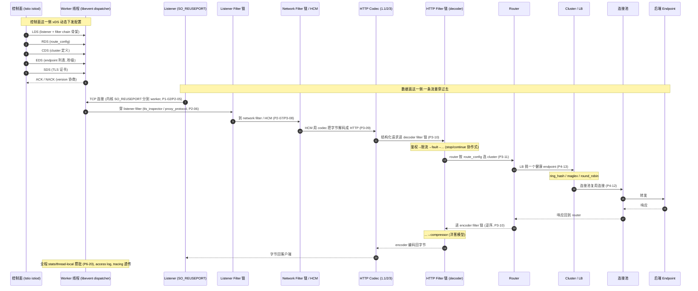

# 第 7 篇 · 第 23 章 · 全书收束:Envoy 与服务网格的范式

> **核心问题**:前 22 章,我们把 Envoy 拆到了源码行号级——线程模型、libevent dispatcher、listener、network filter、HCM、HTTP filter chain、router、cluster、负载均衡、xDS 协议、热更新、可观测、安全、扩展。可现在站远了看,要回答一个更大的问题:**Envoy 用 filter chain + xDS 这套,到底得到了什么、付出了什么?凭什么它能从一个 Lyft 内部代理,长成撑起整个 service mesh 范式的事实标准?Nginx、HAProxy 这两位老前辈,为什么在云原生时代被 Envoy 抢了风头?以及——下一个十年,当 sidecar 的资源开销被诟病、ambient mesh 和 sidecarless 兴起、eBPF 涌进数据面,Envoy 这套范式还站得住吗?** 这一章是全书的收束,我们不再钻源码(那些已经在前面 22 章钻透了),而是站到全局,把得失算清,把对照打明,把未来看清。

> **读完本章你会明白**:
> 1. **filter chain + xDS 双招牌的得与失**——filter chain 换来了可插拔、可组合、可编程、统一数据面处理任意协议;代价是 filter 链本身的开销、C++ 扩展的高门槛、配置与调试的复杂度。xDS 换来了动态、不停机、声明式、版本可协商;代价是控制面的复杂与高可用压力、版本协商的调试难度、整个系统的认知负担。这是全书的核心结论,本章要把它讲透——不止夸,更要讲清代价。
> 2. **Envoy vs Nginx vs HAProxy 的根本差异**——一张对照总表,从配置方式(静态 reload vs xDS 动态)、扩展机制(C 模块 vs filter chain/Wasm)、线程模型、可观测、service mesh 适配五个维度横向打明。讲清 Envoy 凭什么成为 service mesh 数据面的事实标准。
> 3. **service mesh(Istio/Linkerd)如何把 Envoy 当数据面**——Istio 的 istiod(控制面)通过 xDS 把配置推给 sidecar 里的 Envoy(数据面),应用无感,所有流量被 sidecar 截获治理。讲清 data plane / control plane 分离这套范式是怎么在 Envoy 上落地的。
> 4. **xDS 作为通用契约**——xDS 从 Envoy 的私有协议,长成了事实标准:gRPC 客户端内置 xDS client 对接任何兼容控制面。承接《gRPC》P6-22。
> 5. **未来:ambient mesh / sidecarless**——sidecar 每 pod 一个 Envoy 的资源开销问题;Istio ambient mesh(节点级 ztunnel + waypoint,2024 年 GA)、Cilium 用 eBPF/节点级代理替代 sidecar 的趋势。讲清这是演进方向,sidecar 模式与 sidecarless 并存,而不是谁替代谁。eBPF 一句话点回《Linux 内核》。
> 6. **回到全书主线**——呼应 P0-01:"从 Nginx 配置写死的经典代理,到 Envoy 每条流量穿一串可热更新 filter、配置由 xDS 动态下发的可编程数据面"这条旅程,完整闭环。

> **如果一读觉得太难**:这是综述章,没有新源码,全是回顾与洞察。如果只想抓一件事——记住:**Envoy 的全部价值,就是用"filter chain + xDS"把代理从"静态、写死、reload"的旧范式,推进到"动态、可编程、不停机"的新范式,并以此撑起了 service mesh 这个时代**。filter chain 是数据面的灵魂(可插拔),xDS 是控制面的灵魂(动态下发),两者分离 = data plane / control plane 分离 = service mesh。本章把这个结论拆透,并把代价、对照、未来一次讲清。

---

## 〇、一句话点破

> **Envoy 用 filter chain(数据面:可插拔的链)和 xDS(控制面:动态下发的配置)这两件套,把代理从"配置写死、reload 才生效"的旧范式,推进到"每条流量穿一串可热更新 filter、配置由 xDS 动态下发"的新范式。这套 data plane / control plane 分离,就是 service mesh 时代的通用语——它换来了动态、可编程、统一治理,代价是复杂度从"一个代理进程"转移到了"控制面 + xDS 协议 + 调试链路"的整条链上。复杂度不消灭,只转移,这是所有架构演进的铁律,Envoy 也不例外。**

这是结论,不是理由。本章倒过来拆:先把全书旅程用一条流量的完整放映串起来(第 23 章该有的"大图"),再算 filter chain + xDS 双招牌的得失账,然后打 Envoy vs Nginx/HAProxy 的对照总表,讲 service mesh 怎么把 Envoy 当数据面,讲 xDS 怎么从私有协议长成通用契约,最后展望 ambient mesh / sidecarless 的未来,并回扣 P0-01 闭环全书。

---

## 一、全书旅程回顾:一条流量在 Envoy 里的完整放映

收束之前,先把全书 22 章串成一张大图。这一节不是复习,是把散落在各章的零件**拼回成一台完整的机器**——让你在脑子里能完整放映出"一条流量从进 Envoy 到转给后端再回来"的全过程,以及"这条流量上的所有 filter 和路由表,是怎么由控制面动态下发的"。这是读完这本书该有的样子。

### 一条流量的完整旅程(大图)

下面这张图是全书的"全景放映"。每一个方框都是前面某一章的主角,每一根箭头都是数据的流转。请把它当成全书的地图来读:



### 把这张图对应回全书的 22 章

这张图上的每一个环节,都是前面某一章的主角。我们把它们一一对应回来,这就是全书的骨架:

**地基(第 1 篇,P1-02~04)——谁来跑这条 filter chain:**

- **Worker 线程 + thread-local 无锁**(P1-02):Envoy 用少量 worker 线程(通常等于 CPU 核数)扛海量连接。技巧是 `SO_REUSEPORT` 让内核把连接负载均衡到 worker、连接绑定到一个 worker 不跨线程、stats 等热数据用 thread-local 副本各自攒、main 线程定期归并——**全程无锁**。这是 Envoy 高并发的根。
- **libevent dispatcher**(P1-03):每个 worker 跑一个独立的 libevent/epoll 事件循环,把 fd 注册 + 回调封装成 dispatcher。一个 worker 同时处理几千个连接,靠的是 epoll 一次拿一批事件 + 回调驱动的反转控制。承《Tokio》《Linux 内核》讲的 epoll,Envoy 只讲怎么封装成 dispatcher。
- **Buffer 零拷贝**(P1-04):流量在 filter 之间怎么传字节?`Buffer::Instance` 是分片 slice 组成的字节流,filter 之间传 buffer 的指针/引用而非 copy,`LibcSlice` 把零拷贝做到极致。

**数据面 Downstream(第 2 篇,P2-05~07)——流量进来的第一站:**

- **Listener**(P2-05):监听端口,接连接。`SO_REUSEPORT` 让每个 worker 都 listen 同一端口、内核做负载均衡到 worker;listener drain 让旧 listener 优雅下线。
- **Listener Filter**(P2-06):HTTP 解码之前、TCP 层能做的事——`tls_inspector` 探测是否 TLS 据此分流、`proxy_protocol` 解析还原真实客户端 IP、`original_dst` 还原原始目的地址。
- **Network Filter**(P2-07):字节流层面的加工——`tcp_proxy` 直接转发(代理非 HTTP 协议)、`ratelimit`、`echo`。network filter 链是 TCP 层的 filter chain。

**数据面 HTTP(第 3 篇,P3-08~11)——Envoy 处理 HTTP 的核心,数据面招牌:**

- **HCM**(P3-08):HTTP Connection Manager 是个"披着 network filter 外衣的 HTTP 引擎",它把 TCP 字节交给 codec 解码成结构化的 HTTP 请求。
- **HTTP 编解码**(P3-09):HTTP/1.1(文本逐行解析)、HTTP/2(二进制帧 + HPACK,承《gRPC》P2-07)、HTTP/3(基于 quiche/QUIC,UDP)三种 codec 统一在 HCM 里。
- **HTTP Filter chain**(P3-10):**数据面招牌**。一条 HTTP 请求穿过 decoder filter 链(鉴权→限流→fault→...→router),响应穿过 encoder filter 链(逆序,洋葱模型)。filter 用返回值(`Continue`/`StopIteration`/...)做**协作式**链控制——既能跑同步 filter,又能天然容纳异步 filter(ratelimit 查外部服务、router 等连接池),这一切跑在单线程 worker 上、没有一个 filter 阻塞线程。`StreamDecoderFilters` 用正向 `iterator`、`StreamEncoderFilters` 用 `reverse_iterator`,一个类型差异把"请求顺序、响应逆序"在编译期钉死。
- **Router**(P3-11):decoder 链的终点 filter。它按 `route_config`(virtual host + route + cluster)做 header/path/query 匹配,选 cluster、加权路由、redirect/direct_response。`route_config` 由 RDS 动态下发。

**数据面 Upstream(第 4 篇,P4-12~15)——转发到后端:**

- **Cluster / Endpoint / 连接池**(P4-12):cluster 怎么定义(static/strict_dns/logical_dns/eds/original_dst)、endpoint 怎么发现、HTTP/1/2/3 各自的连接池怎么复用连接。
- **负载均衡**(P4-13):**数据面另一招牌**。一次请求在 cluster 里挑哪个 endpoint——round_robin(EDF 加权调度器)/ least_request(P2C 抽两个里挑小)/ random / **ring_hash**(一致性哈希环,节点增删只迁移局部 key)/ **maglev**(谷歌的查找表算法,O(1) 查找 + 极低方差)/ **subset**(按 metadata 子集,灰度)。一致性哈希的根是解决朴素 `hash % N` 全局重哈希的灾难。1.39 里所有 LB 全部迁到 `source/extensions/load_balancing_policies/` 做成可插拔扩展。
- **健康检查 / 异常点检测**(P4-14):active health check(主动 ping 探活)+ outlier detection(被动:根据失败率/延迟自动把后端踢出,过段时间再加回)。LB 只从 `healthyHosts()` 里挑,outlier 把 host 的 `FAILED_OUTLIER_CHECK` 位置上后 LB 自然不挑它。
- **断路器 / 重试 / 过载**(P4-15):circuit breaker(连接/请求上限熔断)、retry(重试预算)、overload manager(令牌桶,内存/压力过载时拒绝)、timeout。后端扛不住时怎么保护整个系统。

**控制面(第 5 篇,P5-16~19)——xDS 动态配置,Envoy 灵魂,控制面招牌:**

- **xDS 协议总览**(P5-16):**控制面招牌**。xDS 是一套跑在 gRPC 双向流上的、带版本握手的、分类型的配置下发契约。五类(LDS=Listener / RDS=Route / CDS=Cluster / EDS=Endpoint / SDS=Secret)按资源语义边界切,独立下发、独立版本、独立热更新。招牌机制是 **resource version 协商 + ACK/NACK**——控制面每份配置带 `version_info`,数据面应用成功回 ACK(带回新版本)、失败回 NACK(保持旧版本 + `error_detail`),控制面据此知道每个数据面到底生效到哪个版本。
- **xDS 订阅与传输**(P5-17):**控制面另一招牌**。三个维度的笛卡尔积定义了 xDS 传输的全部设计空间——增量性(SotW 全量 vs Delta 增量)、聚合性(独立流 vs ADS 聚合订阅)、后端(grpc / rest / filesystem)。生产标配是 **AGGREGATED_DELTA_GRPC**(Delta + ADS + gRPC):Delta 解决规模(只发 diff,避免大集群 EDS 全量推送几十 MB),ADS 解决跨类型顺序(LDS→RDS→CDS→EDS 依赖链,用一条流 + type_url 轮转把"跨类型顺序"降维成 HTTP/2"流内有序"),gRPC 提供双向流的物理载体。Envoy 把 Delta 和 SotW 写成同一个模板 `GrpcMuxImpl` 的两个实例化,把可变点隔离到 `SubscriptionState` 这一层。
- **Listener 热更新**(P5-18):LDS 下发新 listener 或改了 filter chain,Envoy 怎么不停机生效?listener drain(旧 listener 停止接新连接、等旧连接处理完)+ 热更新替换 filter chain,在途流量不受影响。
- **CDS / EDS 动态发现**(P5-19):后端实例增减怎么实时反映?EDS 是服务发现的核心——新实例上线 / 下线秒级感知,只改 endpoint vector,不牵动上层。

**生产(第 6 篇,P6-20~22)——可观测、安全、扩展:**

- **可观测**(P6-20):stats(counter/gauge/**histogram** 分桶延迟,thread-local 双 buffer 攒批归并)、access log(异步双 buffer 落盘)、tracing(每 hop 自动起 span + trace context 透传,采样靠 `x-request-id` 字节做随机种子保证跨 hop 一致)。三者统一,意味着不管微服务用什么语言,流量经过 Envoy 可观测口径完全一致。
- **安全**(P6-21):mTLS(双向 TLS,service mesh 的安全基石)、TLS 终止(在 Envoy 解密)、SDS(Secret 动态下发,证书轮换不重启)、hot restart(零停机重启,新进程通过 fd 传递接管 socket,StatMerger 继承旧进程 counter)。
- **扩展**(P6-22):Wasm filter(沙箱字节码,四种 runtime——null/v8/wamr/wasmtime)+ dynamic_modules(动态 C++ 模块,高性能)。Envoy 不被内置 filter 限死,运行时能加载新 filter。

> **钉死这件事**:这张图就是全书。读完这本书,你该能在脑子里放映出这条完整的旅程——一条流量从进 listener,穿过 listener filter / network filter / HCM / HTTP filter chain / router / cluster / LB / 连接池,到转给后端再原路返回;同时这条旅程上所有的 filter 链、路由表、cluster、endpoint、证书,都不是写死的,而是控制面通过 xDS 动态下发、版本协商、不停机热更新的。**数据面跑流量,控制面给配置,两者分离——这就是 Envoy**。

---

## 二、filter chain + xDS 双招牌的得与失

现在站远了看。Envoy 的全部设计,浓缩成两个词就是 **filter chain**(数据面灵魂)+ **xDS**(控制面灵魂)。它们各自换来了什么、付出了什么?这是全书核心结论,必须把账算清——不止夸,更要讲代价。因为**任何架构选择都是权衡**,只讲好处不讲代价的总结是鸡汤,不是工程。

### 2.1 filter chain(数据面):得到了什么

filter chain 是 Envoy 数据面的灵魂——它把"处理每一条流量"从"一坨写死的逻辑",变成了"一条可插拔、可组合、两向、还能中途拦截的链"。得到了什么?

**第一,可插拔——功能能不改代码地增减。** Nginx 加一个功能,要写 C 模块、`./configure` 选模块、重新编译整个 Nginx 二进制、重新部署所有实例。Envoy 加一个功能(比如给所有请求加 JWT 鉴权),只需要在 http filter 链里插一个 `jwt_authn` filter(配置期拼装),同一个二进制换个配置就是另一个代理。**可插拔从"编译期"挪到了"配置期"**,这是 Envoy 区别于 Nginx 的第一个根本。

**第二,可组合——行为 = filter 的组合。** 要做"给所有请求加 JWT 鉴权 + 对 10% 流量注入 500ms 延迟做混沌测试 + 响应压缩"?把 `jwt_authn` + `fault` + `compressor` 三个 filter 拼进链就行。每个 filter 极其专注地干一件事,组合起来就是完整的处理流程。这和 Unix 哲学"每个工具干一件事、用管道组合"一脉相承,也是几乎所有现代中间件框架(各种语言的"中间件"概念)的共同选择。

**第三,可编程——运行时能加载新 filter。** 内置 filter 不够用?Wasm filter(`source/extensions/wasm_runtime/`,四种 runtime: null/v8/wamr/wasmtime)能在运行时加载 Wasm 字节码扩展,沙箱隔离、动态加载;dynamic_modules(`source/extensions/dynamic_modules/`)能动态加载 C++ 模块,更高性能。**代理的行为不再被"出厂时的内置功能"限死**——这是 Envoy 作为"可编程数据面"的根。

**第四,统一数据面处理任意协议。** 同一套 filter chain 机制,既能处理 HTTP(listener filter → network filter → HCM → http filter → router),也能处理纯 TCP(listener filter → network filter / tcp_proxy,代理 Redis/MySQL/MongoDB 等非 HTTP 协议),还能处理 HTTP/1.1、HTTP/2、HTTP/3 三种 HTTP 版本(codec 插件化)。**一套机制,任意协议**——这是 Envoy 能当"通用数据面"的根。

**第五,两向洋葱模型 + 协作式链控制——语义干净 + 天然支持异步。** 请求穿 decoder 链、响应穿 encoder 链(逆序),让只关心请求的 filter(鉴权)只注册 decoder、只关心响应的 filter(压缩)只注册 encoder,职责分离。filter 用返回值(`Continue`/`StopIteration`/`StopAllIterationAndBuffer`/...)做**协作式**链控制,既能跑同步 filter,又能天然容纳异步 filter(ratelimit 查外部服务、router 等连接池),这一切跑在单线程 worker 上、没有一个 filter 阻塞线程。**这是 filter chain 能承载复杂治理(限流、鉴权、故障注入这些需要异步、需要中途拦截的场景)的根本运行机制**(P3-10 拆透)。

### 2.2 filter chain(数据面):付出了什么

讲完了好处,现在讲代价。这些代价是真实的,在大规模生产里会咬人。

**第一,filter 链本身的开销。** 一条 HTTP 请求要依次穿过 decoder 链上的每一个 filter,即使某个 filter 这次"啥也不干"(比如 `fault` filter 没匹配到注入规则),它至少要被调用一次 `decodeHeaders`、判断一下"要不要注入"、返回 `Continue`。一条链上 10 个 filter,就是 10 次虚函数调用 + 10 次判断。单看一次请求的开销很小(纳秒级),但在百万 QPS 下累积起来不可忽视。这是 filter chain "可插拔 + 可组合"换来的必然代价——**灵活性永远有性能税**。Envoy 用内联、模板、热路径优化尽量压低这个税,但税在。

**第二,C++ 扩展的高门槛。** 写一个自定义 filter(不用 Wasm,直接 C++),你要懂 Envoy 的 filter 接口(`StreamDecoderFilter`/`StreamEncoderFilter`)、懂 `FilterManager` 的 stop/continue 协作式语义、懂 thread-local、懂 dispatcher 回调模型、懂 abseil/protobuf/bazel……门槛远高于"Nginx 写个 C 模块"或"写段 lua"。这是 C++ 的天然代价——**强大的抽象能力换来了陡峭的学习曲线**。Wasm 降低了门槛(可以用 Rust/Go/AssemblyScript 写),但 Wasm 本身又有性能开销和调试难度;dynamic_modules 高性能但又回到 C++ 门槛。**没有银弹**:要么高门槛高性能(C++/dynamic_modules),要么低门槛有开销(Wasm)。

**第三,配置与调试的复杂度。** filter chain 是配置期拼装的——`http_filters:` 列表里 filter 的顺序、filter 之间的依赖(比如 `compressor` 要在 `router` 之前的 encoder 链上)、filter 之间的交互(比如一个 `StopIteration` 的 filter 会不会影响后面的 filter),都不是"一眼能看懂"的。线上排查"为什么这个请求被限流了",要顺着 filter 链一个一个查配置、查 stats、查 access log。**可组合性的另一面是组合爆炸的调试难度**。

> **钉死这件事(数据面得失)**:filter chain 换来了可插拔、可组合、可编程、统一数据面处理任意协议、两向洋葱 + 协作式异步——这是 Envoy 能当"通用数据面"的根。代价是 filter 链开销(灵活性有性能税)、C++ 扩展高门槛、配置与调试复杂度。**这套权衡在动态微服务场景是值得的**(可插拔 + 动态的价值远超 filter 链开销),但在"静态、固定、单一协议"的入口流量场景(比如一个纯静态资源的 CDN 前端),filter chain 的灵活性是过剩的,Nginx 反而更合适。**没有 universally 最优,只有场景最优**。

### 2.3 xDS(控制面):得到了什么

xDS 是 Envoy 控制面的灵魂——它把"配置"从静态文件,变成了控制面动态下发、版本协商、不停机热更新的东西。得到了什么?

**第一,动态——跟上微服务的现实。** 微服务后端每天都在频繁上下线(扩容、缩容、滚动发布、故障重启),EDS 秒级感知实例上下线、RDS 热更新路由做灰度、LDS 不重启起新 listener、SDS 不重启换证书。这一切**不用 reload、不用重启**。这是 xDS 最大的价值——它把"配置"和"动态现实"对上了。P0-01 讲过 Nginx reload 的 worker 交接抖动(新老 worker 并存、内存翻倍、长连接中断、p99 飙升),xDS 从根上消除了这个抖动。

**第二,不停机热更新——在途流量不受影响。** xDS 下发新配置,Envoy 不是"立刻把旧配置扔了换新的"——listener drain 让旧 listener 停止接新连接、等旧连接处理完(P5-18);filter chain 热更新替换时,正在处理的请求继续走旧 filter chain,新请求走新 filter chain。**在途流量不受影响,这是生产级动态配置的底线**。

**第三,声明式 + 版本协商——配置可观测、可确认、最终一致。** xDS 不是"控制面说什么 Envoy 就马上变成什么"的单向推送。控制面每份配置带 `version_info` + `nonce`,数据面应用成功回 ACK(带回新版本)、失败回 NACK(保持旧版本 + `error_detail`)。这套显式握手保证了**配置一致性**——控制面知道每个数据面到底生效到哪个版本,数据面报告的永远是"真实生效的版本"。P5-16 拆透了这套机制为什么 sound:朴素地"单向推送不管收没收到"会撞上"控制面以为所有 Envoy 都摘除了故障实例,其实有的还在往故障实例发流量"的一致性陷阱。

**第四,五类资源按语义边界切——独立下发、独立版本、独立热更新。** LDS / RDS / CDS / EDS / SDS 不是拍脑袋分的,而是按资源的语义边界切:高频变更的 EDS(实例上下线)和低频变更的 LDS(加新服务)解耦,EDS 变了不必重发 LDS;一处配置错误只影响那一类(NACK 那一类,其它类继续工作)。**这是控制面设计的通用模式**——把配置按变更频率和语义边界分层,独立生命周期。

**第五,Delta + ADS——为大规模做的演进。** SotW(State of the World,全量)在大集群(10 万 endpoint)下每次推送几十 MB、Envoy CPU 重建全部 LB 结构,带宽/CPU 爆炸。Delta xDS 只推 diff(added/removed),把规模问题在协议层解决。ADS(Aggregated Discovery Service)用一条 gRPC 流 + type_url 轮转,把"跨类型下发顺序"(LDS→RDS→CDS→EDS 依赖链)降维成 HTTP/2"流内有序",避免"RDS 引用了一个还没 CDS 推过来的 cluster"的中间态导致 503。**生产标配 AGGREGATED_DELTA_GRPC**(P5-17 拆透)。

### 2.4 xDS(控制面):付出了什么

xDS 换来了动态、不停机、声明式、版本可协商——这是它区别于"静态配置 + reload"的根本。但代价同样真实,而且在大规模生产里更咬人。

**第一,控制面的复杂与高可用压力。** xDS 把"算配置"的活从数据面挪到了控制面(Istio 的 istiod)。控制面要收集整个集群信息(有哪些服务/实例、要什么路由、熔断策略)、算出每份配置、按 xDS 协议推给每个数据面。这是一个**有状态、有全局视图、要高可用**的中心化组件。控制面挂了,数据面还能用旧配置继续跑(这是 data plane / control plane 分离的好处——控制面挂不致命),但所有动态变更(新实例上线、灰度切流、证书轮换)都停滞。所以生产里控制面必须高可用(istiod 多副本 + leader election),这又引入了控制面自身的一致性问题(多个 istiod 之间怎么协调推同一份配置)。**复杂度从"数据面各自 reload"转移到了"控制面集中算 + 高可用"**。

**第二,版本协商的调试难度。** xDS 有版本协商,这是好事(配置可观测、可确认)。但它也意味着:线上"某个 Envoy 的路由没切过去",你要查的是一整条链——控制面算出来的配置对不对?推没推过去?推的是哪个版本?Envoy ACK 了没?ACK 的是哪个版本?NACK 了的话 `error_detail` 是什么?Envoy 当前 `version_info` 是什么?这一串问题,每一个都可能是故障点。`istioctl proxy-config`、envoy admin API(`/config_dump`)是排查工具,但**调试链路本身变长了**——从"看一个 nginx.conf 文件"变成了"看控制面 → xDS 流 → 数据面 version 状态"一整条链。这是动态 + 版本协商的必然代价。

**第三,整个系统的认知负担。** xDS 不只是一个协议,它是一整套概念——五类资源、type_url、resource version、ACK/NACK、SotW/Delta、ADS、依赖顺序、listener drain、热更新……一个新手要理解"为什么我的 Envoy 配置没生效",得先理解这一整套概念。这比"Nginx 改 conf reload"的认知负担高一个数量级。**动态、可编程、版本协商的能力,换来了陡峭的学习曲线**——这是 service mesh 整个时代的认知税,不只是 Envoy 的。

> **钉死这件事(控制面得失)**:xDS 换来了动态、不停机热更新、声明式版本协商、五类资源独立生命周期、Delta+ADS 大规模演进——这是 Envoy 区别于 Nginx 的第二个根本,也是它能跟上微服务动态现实的钥匙。代价是控制面的复杂与高可用压力、版本协商的调试难度、整个系统的认知负担。**这套权衡在"几百个微服务天天变"的场景是值得的**(动态的价值远超控制面的复杂),但在"几个服务、配置几个月改一次"的场景,xDS 的动态是过剩的,静态配置反而更简单。**复杂度不消灭,只转移**——Nginx 的复杂度在"reload 抖动 + 跟不上变化",Envoy 的复杂度转移到了"控制面 + xDS 协议 + 调试链路"。

### 2.5 双招牌合在一起:data plane / control plane 分离

filter chain(数据面)+ xDS(控制面)合在一起,催生了那个更大的范式——**data plane / control plane 分离**:

- **数据面(Envoy)**:通用、无状态(配置来自控制面)、可替换(任何会说 xDS 的数据面都行)、忠实执行配置。
- **控制面(Istio/Consul/OSM/自研)**:聪明、有全局视图、可独立演进、算出配置通过 xDS 下发。
- **xDS**:两者之间的通用契约。

这种分离的美妙之处:**数据面和的控制面可以独立演进**。控制面从 Istio 换成自研的,数据面(Envoy)不用动;数据面从 Envoy 换成别的 xDS 兼容代理(比如 Cilium 的基于 eBPF 的代理),控制面不用动。**xDS 这个标准契约,解耦了数据面和控制面的演进**。这是 service mesh 范式的精髓,也是 Envoy 对整个云原生生态最大的贡献——它定义了这套契约。

---

## 三、Envoy vs Nginx vs HAProxy:云原生时代为什么是 Envoy

讲完了双招牌的得失,现在横向对照。代理不止 Envoy 一个,经典的 Nginx、HAProxy 都很强。为什么云原生时代 Envoy 成了数据面的事实标准?一张对照总表说清三者的根本差异。

### 3.1 对照总表

| 维度 | Nginx | HAProxy | **Envoy** |
|------|-------|---------|----------|
| **诞生年代 / 语言** | 2004 / C | 2001 / C | **2016 / C++** |
| **设计目标** | 高并发 Web 服务器 + 反向代理 | 高性能 L4/L7 负载均衡器 | **动态、可编程的 service mesh 数据面** |
| **配置方式** | 静态文件 `nginx.conf`,reload(SIGHUP)才生效 | 静态文件 `haproxy.cfg`,reload 才生效 | **xDS 动态下发(LDS/RDS/CDS/EDS/SDS),不停机热更新** |
| **配置变更代价** | reload 有 worker 交接抖动(新老并存、内存翻倍、长连接可能中断、p99 飙升) | reload 有类似抖动(老进程优雅退出) | **无 reload 抖动,listener drain + filter chain 热更新,在途流量不受影响** |
| **扩展机制** | 编译期 C 模块(`./configure` 选模块,改了要重编译整个二进制);或 OpenResty/lua hack | 编译期;或 lua(较少) | **filter chain 配置期拼装(同一二进制换配置即换代理)+ Wasm/dynamic_modules 运行时扩展** |
| **协议支持** | HTTP/1.1 一等,HTTP/2 后期支持(不够一等),gRPC 后期 | HTTP/1.1 一等,HTTP/2 后期 | **HTTP/1.1、HTTP/2、HTTP/3 原生一等(基于 quiche),gRPC 原生(承《gRPC》)** |
| **可观测** | 基础 access log + 第三方模块(stub_status);histogram 需外部 | 基础 stats(内置 counters);tracing 需外部 | **stats(counter/gauge/histogram 分桶,thread-local 攒批)+ access log(异步双 buffer)+ tracing(每 hop 自动 span,采样跨 hop 一致)原生统一** |
| **线程模型** | 多进程 master + N worker(每 worker 单线程事件循环),连接由内核 accept 分配 | 多进程(或单进程多线程),每 worker 事件循环 | **多线程 MainThread + N worker(每 worker 独立 libevent dispatcher),SO_REUSEPORT 让内核把连接负载均衡到 worker,连接绑定 worker 不跨线程,thread-local 无锁** |
| **动态 upstream** | nginx-plus API(商业版)/ OpenResty lua(只动态 endpoint,无版本协商) | runtime API(动态 server,有限) | **EDS 秒级服务发现 + 完整五类资源动态 + 版本协商 + ACK/NACK** |
| **service mesh 适配** | 需魔改(OpenResty/Kong 基于 Nginx,但不是原生为 mesh 设计) | 不是为此设计 | **原生为此设计(Istio 2017 年选它当数据面,从此成事实标准)** |
| **典型场景** | 静态 Web 服务器、CDN 前端、固定入口流量 | L4/L7 负载均衡、四层代理、固定入口 | **动态微服务网格、API gateway、ingress controller、sidecar/ambient 数据面** |

### 3.2 这张表的关键:不是"Envoy 处处碾压"

这张表的关键**不是**"Envoy 处处碾压"——Nginx 和 HAProxy 作为经典反向代理 / 负载均衡器,性能、稳定性、资源占用都是顶级,**在"静态、固定的入口流量"场景至今是最优解之一**:

- 一个纯静态资源的 CDN 前端,要的是极低资源占用 + 极高吞吐,Nginx 至今是首选;
- 一个四层(TCP)负载均衡器,要的是稳定 + 简单,HAProxy 至今广泛使用;
- 一个传统的 Web 应用入口(几个后端、配置几个月改一次),Nginx + reload 完全够用。

差异在于:**Envoy 从第一天起,就是为"动态、可编程、云原生"设计的**。它的四个根本——动态配置(xDS)、可插拔(filter chain)、现代协议一等(HTTP/2/3/gRPC)、统一可观测——是经典代理**后天补都补不全的基因**。Nginx 加动态 upstream(nginx-plus)、加 HTTP/3、加可观测模块,都是在"为静态设计的骨架"上打补丁;Envoy 是从骨架起就为动态而生。

> **钉死这件事**:Envoy 不是"更好的 Nginx",而是**为另一个时代(动态微服务)而生的另一种代理**。Nginx 解决"如何高效地把固定流量转发出去",Envoy 解决"如何在动态变化的拓扑里,可编程地治理流量"。两者不是替代关系,而是**不同场景的最优解**。把 Nginx 用在 service mesh 数据面,是"用静态工具解决动态问题"的错配;把 Envoy 用在静态 CDN 前端,是"用动态工具解决静态问题"的过剩。

### 3.3 Envoy 凭什么成为 service mesh 数据面的事实标准

2017 年,Istio(Google + IBM + Lyft 联合)横空出世时,做了一个关键选择:**数据面直接用 Envoy,而不是自己写**。从那一刻起,Envoy 成了 service mesh 数据面的事实标准。凭什么?

**第一,xDS 是现成的控制面契约。** Envoy 自己定义了 xDS 协议(proto 在 `api/envoy/service/discovery/v3/`),Istio 只要实现一个 xDS 服务端(istiod),就能驱动 Envoy。不用从头设计数据面和控制面之间的通信协议。**这是 Envoy 给 service mesh 生态的最大礼物**——一套现成的、带版本协商的、分类型的配置下发契约。

**第二,filter chain 让数据面行为完全可编程。** Istio 要做的所有治理(mTLS、鉴权、限流、重试、熔断、可观测),都可以通过配置 Envoy 的 filter chain 实现,不用改 Envoy 代码。Istio 的 VirtualService/DestinationRule/Gateway 这些 CRD,翻译到底下就是 Envoy 的 RDS/CDS/EDS 配置 + filter chain 拼装。

**第三,HTTP/2/gRPC 一等公民。** 微服务时代 HTTP/2 和 gRPC 是主流,Envoy 对它们原生一等支持(HTTP/2 多路复用、gRPC 帧解析、承《gRPC》)。Nginx 当初的 HTTP/2 支持不够一等,这是它在 service mesh 场景的短板。

**第四,统一可观测。** service mesh 要做"全链路统一监控 / 排障",Envoy 的 stats + access log + tracing 原生统一,不管后端服务用什么语言,流量经过 Envoy 可观测口径完全一致。这是经典代理(各自接一套监控)做不到的。

**第五,C++ 的性能 + 抽象。** service mesh 数据面要扛所有服务间流量,性能(延迟、吞吐、尾延迟)是硬指标。C++ 手动内存管理(配合 arena/智能指针)能压榨到极致,同时 C++ 的类/模板/继承让 filter chain 这种"可插拔插件"架构成为可能。Nginx 用 C(性能顶尖但缺抽象),Linkerd2-proxy 用 Rust(抽象好但 2016 年时 Rust 还不成熟)——Envoy 选了当时"性能 + 可抽象 + 生态成熟"都占的 C++。

> **钉死这件事**:Envoy 成了 service mesh 数据面事实标准,不是营销的结果,是**它从一开始的设计(filter chain + xDS + 现代协议一等 + 统一可观测 + C++ 性能)恰好匹配了 service mesh 这个时代的需求**。Istio 选它,是因为它已经把 service mesh 数据面该有的东西都造好了。

---

## 四、service mesh 如何把 Envoy 当数据面:Istio 与 Linkerd

讲清了 Envoy 凭什么被选中,现在讲它**怎么被用**——service mesh(以 Istio 为代表)是怎么把 Envoy 当数据面的。

### 4.1 Istio:istiod(控制面)+ sidecar Envoy(数据面)

Istio 是最主流的 service mesh 实现。它的架构清晰体现了 data plane / control plane 分离:

```
   ┌─────────────────────────────────────────────────────────────────┐
   │                    控制面:istiod (一个进程)                       │
   │                                                                 │
   │  ┌─────────────┐  ┌──────────────┐  ┌────────────────────────┐  │
   │  │ 监听 K8s API │  │ 翻译 CRD →    │  │ xDS 服务端              │  │
   │  │ (Service/   │  │ Envoy 配置    │  │ (go-control-plane 库)  │  │
   │  │  Pod/CRD)   │  │ (LDS/RDS/    │  │ 按依赖序在 ADS 流上推   │  │
   │  │             │  │  CDS/EDS)    │  │                         │  │
   │  └─────────────┘  └──────────────┘  └────────────────────────┘  │
   └────────────────────────────────┬────────────────────────────────┘
                                    │ ADS (一条 gRPC 双向流 / 每个 sidecar)
                                    │ 推 LDS → RDS → CDS → EDS (type_url 轮转)
                                    ▼
   ┌─────────────────────────────────────────────────────────────────┐
   │                数据面:一堆 sidecar Envoy (每 Pod 一个)            │
   │                                                                 │
   │   Pod A                          Pod B                          │
   │  ┌──────────┐                   ┌──────────┐                    │
   │  │  应用 A   │                   │  应用 B   │                    │
   │  │ (任意语言)│                   │ (任意语言)│                    │
   │  └────┬─────┘                   └────▲─────┘                    │
   │       │ iptables 劫持                 │ iptables 劫持             │
   │  ┌────▼─────┐                   ┌────┴─────┐                    │
   │  │ Envoy    │ ─── mTLS + 治理 ──▶│ Envoy    │                    │
   │  │ sidecar  │                   │ sidecar  │                    │
   │  └──────────┘                   └──────────┘                    │
   └─────────────────────────────────────────────────────────────────┘
```

**这套架构怎么工作:**

1. **istiod 监听 Kubernetes API**:它 watch Service、Pod、Endpoint 这些 K8s 原生资源(知道有哪些服务、哪些实例),还 watch Istio 自己的 CRD——VirtualService(路由规则)、DestinationRule(熔断/负载均衡策略)、Gateway(入口网关)、PeerAuthentication(mTLS 策略)。

2. **istiod 把 CRD 翻译成 Envoy 配置**:VirtualService 翻译成 RDS 的 route_config,DestinationRule 翻译成 CDS 的 cluster + LB 策略,Endpoint 翻译成 EDS 的 endpoint 列表,mTLS 策略翻译成 listener 上的 TLS context + SDS 证书。

3. **istiod 作为 xDS 服务端,通过 ADS 把配置推给每个 sidecar Envoy**:每个 sidecar 和 istiod 建一条 ADS gRPC 双向流,istiod 按依赖序(LDS→RDS→CDS→EDS,type_url 轮转,见 P5-17)推配置。Envoy 应用成功回 ACK、失败回 NACK,istiod 据此知道每个 sidecar 到底生效到哪个版本。

4. **应用无感,所有流量被 sidecar 截获治理**:Pod 启动时,Istio 用 init container(或现在的 CNI 插件)给 Pod 配 iptables 规则,把应用的所有出入流量重定向到旁边的 Envoy sidecar(localhost:15006/15008)。应用照常发请求,根本不知道流量被截获——所有 mTLS 加密、负载均衡、重试、熔断、可观测,都在 sidecar 里悄悄做了。**这是 service mesh "应用无感"的根**。

> **钉死这件事**:Istio = istiod(控制面,算配置)+ 一堆 sidecar Envoy(数据面,跑配置),两者通过 xDS 通信。应用完全无感——它不知道旁边有个 Envoy,不知道流量被劫持,不知道 mTLS/LB/重试/可观测都在 sidecar 里做了。**这就是 service mesh 的核心价值:把流量治理从应用代码里彻底抽出来,统一交给一层无感的基础设施**。

### 4.2 Linkerd:另一种选择(不用 Envoy)

值得一提的是,Linkerd(service mesh 这个词的发明者,Buoyant 出品)走的是另一条路——它的数据面**不用 Envoy**,而是用自己写的 **Linkerd2-proxy**(Rust 写的轻量代理)。为什么?

- Linkerd 的理念是"极简、极轻":一个 sidecar 应该极低资源占用(几 MB 内存)、极简配置。Envoy 功能强大但资源占用相对高(一个 sidecar 起步几十 MB 内存)、配置复杂。Linkerd 选择自己写一个"只做 service mesh 该做的事(mTLS、LB、重试、可观测)、不做别的"的轻量代理。
- Rust 的内存安全 + 零成本抽象,让 Linkerd2-proxy 在资源占用上比 Envoy 更省(尤其在大规模集群,每个 Pod 省几 MB 内存 × 几千 Pod = 几 GB)。

但 Linkerd 的代价是:**没有 Envoy 那么强的可编程性**(没有 filter chain 这种通用可插拔机制)、**没有 Envoy 那么广的协议支持**、**没有 Envoy 那么大的生态**。所以 service mesh 市场上,Istio(用 Envoy)是主流,Linkerd 是"更轻、更极简"的另选。这也印证了一个道理:**Envoy 不是唯一选择,但它是"功能最全、生态最大、可编程性最强"的那个**——这就是事实标准的含金量。

### 4.3 其它用 Envoy 当数据面的项目

除了 Istio,还有一批项目把 Envoy 当数据面:

- **Consul Connect**(HashiCorp):用 Envoy 做 sidecar,Consul server 当控制面。
- **Open Service Mesh (OSM)**(微软,CNFClab):用 Envoy,已 archived。
- **Kuma**:用 Envoy,基于 Envoy 的多 mesh。
- **AWS App Mesh**:用 Envoy。
- **各种自研 API gateway / ingress controller**:Contour(Kubernetes ingress,用 Envoy)、Emissary-ingress(Ambassador,API gateway,用 Envoy)、Gloo(Solo.io,用 Envoy)、Envoy Gateway(Envoy 项目的官方 gateway)。

**Envoy 成了云原生数据面的"通用底座"**——任何需要"动态、可编程、现代协议、统一可观测"的数据面场景,Envoy 都是首选。这是它从"一个 Lyft 内部代理"长成"云原生基础设施事实标准"的历程。

---

## 五、xDS 作为通用契约:从 Envoy 私有协议到事实标准

第 4 节讲的是"Istio 把 Envoy 当数据面"——但反过来,**xDS 本身从 Envoy 的私有协议,长成了控制面与数据面之间的通用契约**。这是 Envoy 对整个云原生生态最深远的贡献,承接《gRPC》P6-22。

### 5.1 xDS 最初是 Envoy 自己设计的

一个重要的历史事实:**xDS 协议最初就是 Envoy 自己设计的**(proto 在 envoyproxy/data-plane-api 仓库,即 Envoy 的 `api/` 目录)。它最初是 Envoy 控制面给 Envoy 数据面下发配置的私有协议。但它设计得太好用、太通用,以至于**超出了 Envoy 自己的范围**。

### 5.2 gRPC 客户端内置 xDS client(承接《gRPC》P6-22)

最关键的扩散:gRPC 客户端**内置了 xDS client**(《gRPC》那本的 P6-22 深入讲过)。这意味着:

- 一个 gRPC 客户端(用任何语言的 gRPC 库),可以**不经过 Envoy sidecar**,直接作为 xDS client,从控制面(Istio/traffic-director/自研)拿配置(LDS/RDS/CDS/EDS),自己做负载均衡、路由、mTLS。
- 这叫 **gRPC xDS**(或"proxyless service mesh" / "proxyless gRPC")——应用不用 sidecar,内置的 gRPC 库自己说 xDS,直接和控制器对话。

```
   传统 service mesh (sidecar):                proxyless gRPC (无 sidecar):
                                                
   应用 ──iptables──▶ Envoy sidecar ──▶ 后端     应用(内置 gRPC xDS client)──▶ 后端
                          ▲                              ▲
                          │ xDS                          │ xDS
                     控制面 (Istio)                   控制面 (Istio / TD)
```

proxyless gRPC 的好处:**省了 sidecar 这一跳**(延迟更低、资源更省),gRPC 客户端原生支持 HTTP/2 多路复用(不需要 Envoy 再做一次)。代价:**只有 gRPC 应用能用**(非 gRPC 应用还是得 sidecar)、gRPC xDS client 的功能是 Envoy 的子集(不是所有 Envoy filter 都能在 gRPC client 里实现)。

### 5.3 xDS 成了通用契约

gRPC 内置 xDS client 这件事,让 xDS 从"Envoy 私有协议"变成了**控制面与数据面之间的通用契约**:

- 控制面(Istio/traffic-director/自研)只管说 xDS,不用管数据面是 Envoy 还是 gRPC client。
- 数据面(Envoy / gRPC client / 其它 xDS 兼容代理)只管说 xDS,不用管控制面是谁。
- **xDS 解耦了控制面和数据面的演进**。

这催生了 **CNCF xDS 项目**(github.com/cncf/xds)——把 xDS 协议从 Envoy 仓里独立出来,作为跨项目的通用标准。envoyproxy/data-plane-api 仓库的 proto,现在被 gRPC、Envoy、和其它项目共同维护。

> **钉死这件事**:xDS 从 Envoy 的私有协议,长成了控制面与数据面之间的通用契约。任何会说 xDS 的控制面,能驱动任何会说 xDS 的数据面(Envoy、gRPC client、Cilium 代理...)。**这是 Envoy 给整个云原生生态留下的最深印记**——不止是一个代理,而是一套契约。学 xDS,等于学了 service mesh 时代的通用语。

---

## 六、未来:ambient mesh / sidecarless / eBPF

讲完了 Envoy 的辉煌,现在诚实面对它的局限和未来。Envoy 这套范式(尤其 sidecar 部署形态)在大规模生产里暴露了代价,催生了新一代的演进方向:**ambient mesh** 和 **sidecarless**。

### 6.1 sidecar 的资源开销问题

P0-01 讲过 sidecar 模式为什么胜出:语言无关、独立升级、业务治理解耦,价值超过"多一跳 localhost"的代价。但这个代价在大规模集群里**会累积成不可忽视的开销**:

- 每个 Pod 一个 Envoy sidecar,起步几十 MB 内存(Envoy 是功能全的 C++ 大进程)。
- 大集群(几千个 Pod)里,sidecar 的总内存开销 = 几千 × 几十 MB = 几十 GB 甚至上百 GB,**纯用于 sidecar,不跑业务**。
- CPU 也有开销:每个 sidecar 要跑事件循环、filter chain、stats 攒批,即使空闲也有 baseline CPU 占用。

这个开销在"每 Pod 一个 sidecar"的模型下是**线性增长的**——Pod 越多,sidecar 越多,开销越大。对于一个有几万个 Pod 的大集群,这是真金白银的机器成本。于是问题来了:**能不能不每 Pod 一个 sidecar?**

### 6.2 Istio ambient mesh:节点级 ztunnel + waypoint

Istio 的回答是 **ambient mesh**(无 sidecar 模式)。2022 年发布预览,**2024 年正式 GA(ztunnel、waypoints、APIs 标记为 Stable)**。它的核心思想是**把 sidecar 的功能拆成两层,分别用不同形态的代理承担**:

```
   sidecar 模式 (每 Pod 一个 Envoy):              ambient mesh 模式 (每节点一个 ztunnel + 按需 waypoint):

   Pod A                    Pod B                  Pod A        Pod B        Pod C
   ┌──────────┐             ┌──────────┐           ┌────────┐   ┌────────┐   ┌────────┐
   │ 应用 A    │             │ 应用 B    │           │ 应用 A  │   │ 应用 B  │   │ 应用 C  │
   │          │             │          │           └────────┘   └────────┘   └────────┘
   ┌──────────┐             ┌──────────┐              │  iptables  │  iptables  │
   │ Envoy    │             │ Envoy    │              ▼            ▼            ▼
   │ sidecar  │             │ sidecar  │           ┌──────────────────────────────────┐
   │(全功能) │             │(全功能) │           │ ztunnel (per-node DaemonSet)        │ ← L4 mTLS
   └──────────┘             └──────────┘           │ Rust 写的轻量 Envoy 衍生品          │   只做零信任 + L4 路由
      │                        │                   └──────────────────────────────────┘
      └──── mTLS + 全套治理 ────┘                                    │
                                                                    │ 需要七层治理时,流量先经过 waypoint
                                                                    ▼
                                                     ┌──────────────────────────────────┐
                                                     │ waypoint proxy (per-namespace/pod) │ ← L7 治理
                                                     │ Envoy (按需部署)                    │   限流/鉴权/重试/可观测
                                                     └──────────────────────────────────┘
```

**ambient mesh 的两层拆分:**

1. **L4 安全覆盖层:ztunnel**。每个节点一个 ztunnel(以 DaemonSet 形态部署),用 Rust 写的轻量代理(基于 Envoy 的部分代码,但只保留 mTLS + L4 透明转发)。所有 Pod 的流量被节点级 ztunnel 截获,做 mTLS 加密 + L4 路由。**这是"secure by default"的基础**——只要加入 ambient mesh,自动有 mTLS,不需要每 Pod 一个全功能 sidecar。

2. **L7 治理层:waypoint proxy**。**按需**部署——只有当某个 namespace / Pod 需要 L7 治理(限流、鉴权、重试、HTTP 级可观测)时,才部署一个 waypoint(基于 Envoy)。流量先经过 ztunnel(L4),如果目标是"启用了 L7 治理的服务",再被引到该服务的 waypoint(L7),由 waypoint 做 HTTP filter chain 治理,然后才转给后端。

**ambient mesh 换来了什么:**

- **资源开销大幅下降**:从"每 Pod 一个 Envoy sidecar"摊薄到"每节点一个 ztunnel + 按需 waypoint"。大集群里 ztunnel 总数 = 节点数(几百),远小于 Pod 数(几千到几万)。ztunnel 只做 L4,资源占用比全功能 Envoy 低一个数量级。
- **secure by default**:加入 ambient 自动有 mTLS,不用每 Pod 配 sidecar。
- **渐进式启用 L7**:大部分服务只需要 mTLS(走 ztunnel),少数需要 L7 治理的才部署 waypoint。**不是所有服务都付出全功能 sidecar 的代价**。

**ambient mesh 的代价:**

- **架构更复杂**:两层代理(ztunnel + waypoint)、流量要识别"哪些服务启用了 L7"、waypoint 的调度和伸缩都是新问题。
- **waypoint 还是 Envoy**:那些需要 L7 治理的服务,本质上还是用 Envoy(只是从 sidecar 挪到了 waypoint)。**Envoy 没有被替代,只是部署形态变了**。
- **ztunnel 是新组件**:Rust 写的新代理,虽然基于 Envoy 部分代码,但它是独立的项目,有独立的生命周期和 bug。

> **钉死这件事(ambient)**:ambient mesh 不是"Envoy 过时了",而是**Envoy 的部署形态在演进**——从"每 Pod 一个 sidecar(全功能)"演进到"每节点一个 ztunnel(L4)+ 按需 waypoint(L7,还是 Envoy)"。Envoy 仍是核心,只是更精准地用在需要它的地方(waypoint),L4 基础设施交给更轻的 ztunnel。这是"复杂度不消灭,只转移"的又一例:把 sidecar 的资源开销,转移成了两层架构的运维复杂度。

### 6.3 Cilium / eBPF:用内核态接管数据面

另一个 sidecarless 方向是 **Cilium**——用 **eBPF** 在内核态做 sidecar 的活。eBPF(extended Berkeley Packet Filter)允许在 Linux 内核里安全地运行沙箱程序,挂到网络栈的各个 hook 点(XDP、tc、cgroup、socket)。Cilium 用 eBPF 在内核态做:

- **L3/L4 的网络策略 + 路由 + LB**:内核态直接做,不用用户态代理,延迟极低(没有上下文切换)。
- **可观测**:内核态的 syscall / socket / packet 级观测,数据面无感(承《Linux 内核》eBPF 一章)。
- **部分 mTLS / L7**:通过 eBPF + 用户态的 Envoy/Cilium 代理组合做(完全在内核做 mTLS 和 HTTP 解析还有局限)。

```
   sidecar (用户态代理):                  eBPF (内核态):
   
   应用 ──▶ iptables ──▶ Envoy ──▶ 后端     应用 ──▶ socket ──▶ eBPF 程序 ──▶ 后端
                          (用户态)                       (内核态 hook)
```

eBPF 的优势:**完全在内核态、无用户态代理、无额外进程、延迟极低**。Cilium 用 eBPF 做 service mesh(Cilium Service Mesh),宣称"sidecarless、无资源开销"。

eBPF 的局限:**内核态做复杂的 L7 治理(HTTP filter chain、限流查外部服务、鉴权)很难**——eBPF 程序受限于内核的安全约束(指令数、不能阻塞、不能无限循环),不适合做复杂的协议解析和异步操作。所以 Cilium Service Mesh 在需要 L7 时,还是要回退到一个用户态代理(可以选 Envoy)。**eBPF 适合 L4,复杂 L7 还是得用户态代理**——这和 ambient mesh 的"ztunnel(L4)+ waypoint(L7)"分层异曲同工。

> 一句话点回《Linux 内核》eBPF 一章:eBPF 是内核态的可编程数据面,Envoy 是用户态的可编程数据面。两者不是替代,而是**不同层次的可编程性**——eBPF 在内核 hook(低延迟、L4),Envoy 在用户态(灵活、L7、复杂 filter chain)。未来的 service mesh,可能是"eBPF 做底层 L4 + Envoy 做上层 L7"的融合。

### 6.4 演进方向:sidecar 与 sidecarless 并存

把这些演进方向放一起,能看清 service mesh 数据面的下一个十年:

| 形态 | 数据面 | 适用场景 | 现状 |
|------|--------|---------|------|
| **sidecar**(经典) | 每 Pod 一个 Envoy(全功能) | 需要 L7 治理的所有服务;成熟稳定 | Istio 默认,广泛使用 |
| **ambient mesh**(Istio) | 每节点 ztunnel(L4)+ 按需 waypoint(L7,Envoy) | 大规模集群、大部分服务只需 mTLS | 2024 GA,逐步推广 |
| **Cilium / eBPF** | 内核态 eBPF + 可选用户态代理 | 极低延迟、L4 为主、内核态可观测 | 兴起中,适合特定场景 |
| **proxyless gRPC** | gRPC 客户端内置 xDS client(无代理) | 纯 gRPC 应用、省 sidecar | gRPC 原生支持,功能子集 |

**这些不是谁替代谁,而是并存:**

- 小规模 / 需要全功能 L7 → sidecar(Envoy)。
- 大规模 / 大部分服务只需 mTLS → ambient mesh(ztunnel + waypoint)。
- 极低延迟 / L4 为主 → Cilium / eBPF。
- 纯 gRPC / 省 sidecar → proxyless gRPC。

**Envoy 在所有这些形态里都还在**(sidecar 是 Envoy,waypoint 是 Envoy,proxyless gRPC 用 xDS 这个 Envoy 定义的协议,Cilium 做 L7 时也常配 Envoy)。**Envoy 不是被替代,而是它的部署形态在多样化**——这正是"事实标准"的含金量:无论数据面怎么演进,Envoy 都是绕不开的那个。

### 6.5 xDS 协议自身的演进

最后,xDS 协议本身也在持续演进(P5-17 讲过):

- **SotW → Delta**:从全量推送到增量推送,为大规模优化。
- **ADS**:聚合订阅,保证跨类型下发顺序。
- **xdstp**:新一代 xDS 协议草案(github.com/cncf/xds),引入更细粒度的资源引用、更规范的版本协商。这是 xDS 作为通用契约的进一步标准化。

这些演进都是"为了把动态配置做得更省、更快、更可靠"——xDS 这个契约本身,和 Envoy 一起,在持续迭代。

---

## 七、回到全书主线:从 Nginx 到 Envoy 的旅程闭环

讲完了得失、对照、service mesh、未来,现在回扣 P0-01,把全书闭环。

### 7.1 这本书的旅程

P0-01 开篇,我们讲了一个故事:**Nginx 这类经典代理,在微服务场景下撞上三道墙**——静态配置 + reload 跟不上频繁变更、跨语言治理难统一、可观测口径不一。Envoy 的回答是两件套:

> **filter chain(数据面)+ xDS(控制面)= data plane / control plane 分离 = service mesh 范式。**

22 章之后,我们把这两件套拆到了源码行号级:

- **filter chain 怎么把一条流量穿成链**——listener filter → network filter → HCM → http filter chain(decoder + encoder 两向,洋葱模型,协作式 stop/continue 控制异步 filter)→ router → cluster → LB(ring_hash/maglev 一致性哈希)→ 连接池 → 后端(P2~P4)。
- **xDS 怎么动态下发配置、不停机热更新**——五类资源(LDS/RDS/CDS/EDS/SDS)+ version 协商 + ACK/NACK + Delta + ADS(P5)。
- **生产特性**——stats(histogram thread-local 攒批)/ access log(异步双 buffer)/ tracing(每 hop 自动 span)+ mTLS + SDS + hot restart(fd 传递零停机)+ Wasm/dynamic_modules(P6)。

合起来,就是 P0-01 那句话的完整落地:

> **从 Nginx 那种"配置写死、reload 才生效"的经典代理,到 Envoy 这种"每条流量穿过一串可热更新的 filter、配置由 xDS 动态下发"的可编程数据面。**

这本书讲的不是"Envoy 的 YAML 配置怎么写",而是**它凭什么用 filter chain + xDS 撑起整个 service mesh,源码里那些 worker 线程模型、libevent dispatcher、filter chain 责任链、xDS 版本协商、hot restart 到底在干什么**。读完,你该能在脑子里放映出一条流量在 Envoy 里从进到出的全过程——以及每一步底下用了什么巧妙的手段。这就是这本书的全部。

### 7.2 全书的"为什么"清单(总收束)

把全书 22 章的核心"为什么"汇总,这是 Envoy 这套范式的全部理由:

1. **为什么 Nginx 在微服务下力不从心?**——静态配置 + reload 跟不上频繁变更(reload 有 worker 交接抖动)、跨语言治理难统一、可观测口径不一。
2. **为什么 Envoy 把处理流量做成 filter chain?**——可插拔(配置期拼装、运行时 Wasm/dynamic 扩展)+ 可组合 + 两向洋葱模型语义干净;区别于 Nginx 编译期固定的模块。
3. **为什么 Envoy 用 xDS 动态下发配置?**——微服务后端频繁上下线,xDS(尤其 EDS)秒级感知、不停机热更新;resource version 协商 + ACK/NACK 保证一致性。
4. **为什么数据面和控制面分离?**——数据面通用无状态、控制面聪明有全局视图、xDS 解耦两者演进;这就是 service mesh 范式。
5. **为什么 Envoy 以 sidecar 部署?**——语言无关 + 独立升级 + 业务治理解耦,价值超过"多一跳 localhost"的代价(最新 ambient mesh 在优化这个开销)。
6. **为什么 HTTP filter 链是两向逆序(洋葱模型)?**——请求和响应处理逻辑天然不对称,两向分离让 filter 只注册关心的方向,响应自动按请求逆序穿(P3-10)。
7. **为什么 filter 用 stop/continue 协作式控制?**——单线程 worker 不允许阻塞,协作式让 filter 能异步(查限流、等连接池)又不卡死 worker(P3-10)。
8. **为什么 xDS 有 version 协商 + ACK/NACK?**——单向推送不可靠(网络抖、配置非法、重连状态丢失),显式握手保证最终一致、不丢更新、可观测(P5-16)。
9. **为什么需要 Delta xDS + ADS?**——Delta 解决规模(只发 diff),ADS 解决跨类型顺序(LDS→RDS→CDS→EDS 依赖链,一条流 type_url 轮转)(P5-17)。
10. **为什么负载均衡要一致性哈希(ring_hash/maglev)?**——朴素 `hash % N` 节点增删几乎全错(缓存全失效、会话全丢),一致性哈希让节点增删只迁移局部 key(P4-13)。
11. **为什么 Envoy 用 C++?**——性能(手动内存管理压榨延迟)+ 可抽象(类/模板/继承让 filter chain 可插拔)+ 生态成熟(abseil/protobuf/bazel),2016 年时的最优选。
12. **为什么 ambient mesh / sidecarless 是演进方向?**——sidecar 每 Pod 一个的资源开销在大集群累积成真金白银,ambient(ztunnel + waypoint)、Cilium(eBPF)、proxyless gRPC 分别从不同角度优化。

这 12 个"为什么",就是 Envoy 这套范式的全部动机。任何一个"为什么 Envoy 这么设计"的疑问,都能回到这 12 条之一。

### 7.3 复杂度守恒:贯穿全书的隐性主线

最后,有一个隐性主线值得点出——**复杂度守恒**。这是所有架构演进的铁律,Envoy 也不例外。

- Nginx 的复杂度在"reload 抖动 + 跟不上动态变化"。
- Envoy 把这个复杂度转移到了"控制面 + xDS 协议 + 调试链路 + 认知负担"。
- sidecar 的复杂度在"每 Pod 一个的资源开销"。
- ambient mesh 把它转移到了"两层架构(ztunnel + waypoint)的运维复杂度"。
- 用户态代理的复杂度在"上下文切换开销"。
- eBPF 把它转移到了"内核态程序的安全约束 + 复杂 L7 难做"。

**复杂度不消灭,只转移**。每一次架构演进,都是把复杂度从一个地方挪到另一个地方,换来在某个维度上的优化(性能、规模、易用性、可维护性)。理解这一点,你才能在选型时问出正确的问题:**"这个方案把复杂度转移到了哪里?那个地方的复杂度我能消化吗?"** 这是架构思维的核心,也是这本书在所有源码细节之外,最想留给你的一种视角。

---

## 八、技巧精解:两个第一性洞察(收束版)

本章是综述,没有新源码精读。但有两个贯穿全书的第一性洞察,值得在收束时单独钉死。

### 洞察一:filter chain + xDS 为什么是"双招牌",不是单招牌

很多讲 Envoy 的资料,会把它简化成"Envoy = filter chain"。但这是片面的。filter chain 和 xDS 是**相互成就**的双招牌,缺一不可:

- **没有 xDS 的 filter chain,等于 Nginx 的模块**——可插拔,但配置静态、reload 才生效。filter chain 的"可插拔"如果只能配置期拼装、不能运行时动态下发,那它和 Nginx 编译期模块的区别只是"配置期 vs 编译期",没有质变。
- **没有 filter chain 的 xDS,等于一个动态配置的 Nginx-plus**——配置动态,但数据面行为写死、不可编程。xDS 下发的是"配置",但配置能改变的是"参数",不是"行为"(filter 链)。

**filter chain + xDS 合在一起,才有了质变**:xDS 动态下发的,不止是"参数"(route、endpoint、证书),还有"行为"(filter 链怎么拼)。filter chain 是配置期拼装的,xDS 让这个"拼装"能运行时动态改变。**这才是 Envoy 真正的革命性——可编程数据面 + 动态可编程配置**。

> **不这么看会怎样**:如果你只把 Envoy 当"filter chain"(忽略 xDS),你会以为它只是个更好的 Nginx,部署时还是写死配置 + reload;如果你只把 Envoy 当"xDS 动态配置"(忽略 filter chain),你会以为它只是个动态 upstream 的 Nginx-plus,用不上它的可编程性。**两者合起来,才是 service mesh 的 data plane**。

### 洞察二:为什么 xDS 能从私有协议长成通用契约

xDS 从 Envoy 私有协议长成事实标准,不是营销的结果,是**它恰好抓住了"控制面与数据面通信"这个场景的本质需求**:

1. **强类型 proto + type_url**:配置是结构化的、有类型的,不是裸 KV 或 JSON。这匹配"数据面要把配置结构化塞进各种 manager"的需求。
2. **显式 ACK/NACK**:配置要应用、可能失败,必须确认。这匹配"数据面要把配置立即应用到 filter chain / cluster manager"的需求(Kubernetes informer / etcd watch 都没有这一层,因为它们的客户端只是更新 cache,不立即应用)。
3. **五类资源按语义边界分层**:独立下发、独立版本、独立热更新,匹配"配置不同部分有不同变更频率和生命周期"的需求。
4. **Delta + ADS**:为大规模(只发 diff)+ 跨类型顺序(一条流 type_url 轮转)优化,匹配"大集群 + 强依赖链"的需求。
5. **跑在 gRPC 双向流上**:双向、有状态、多路复用、低延迟推送,匹配"服务发现要秒级感知 + ACK 回信"的需求。

这五条,是 xDS 抓住"控制面 ↔ 数据面通信"这个场景本质的体现。任何想做同类事情的系统(Kubernetes informer、etcd watch、ZooKeeper),都只抓住了其中一部分(版本、推送),没有像 xDS 这样**为"可编程数据面的配置下发"量身定做**。所以它成了通用契约——不是因为它最通用,而是因为它**最贴这个场景**。

> **钉死这件事**:xDS 能成为通用契约,是因为它**抓住了"控制面与数据面通信"这个场景的本质**——强类型 + 应用确认 + 语义分层 + 大规模优化 + gRPC 双向流。学 xDS,等于学了 service mesh 时代控制面与数据面通信的最佳实践。

---

## 九、章末小结

### 回扣主线

这是全书的终章。全书讲的是一件事:**Envoy 如何用 filter chain(数据面)+ xDS(控制面)这两件套,把代理从"配置写死、reload 才生效"的旧范式,推进到"每条流量穿一串可热更新 filter、配置由 xDS 动态下发"的新范式,并以此撑起 service mesh 这个时代**。

回顾全书二分法:

- **数据面这一面**(P1~P4 + P6):filter chain 是数据面的灵魂——可插拔、可组合、可编程、两向洋葱 + 协作式异步。worker 线程模型、libevent dispatcher、listener、network filter、HCM、http filter chain、router、cluster、LB、连接池——这些决定"一条流量怎么从进到出"。
- **控制面这一面**(P5):xDS 是控制面的灵魂——动态、不停机、声明式、版本协商。五类资源 + ACK/NACK + Delta + ADS——这些决定"配置怎么动态来、怎么不停机生效"。
- **两者分离** = data plane / control plane 分离 = service mesh 范式。xDS 是两者之间的通用契约。

本章的视角是**总览**——把这两件套的得失算清(filter chain 得到可插拔/可编程,代价是开销/门槛/复杂度;xDS 得到动态/不停机/版本协商,代价是控制面复杂/调试难/认知负担)、把对照打明(Envoy vs Nginx/HAProxy 五维对照)、把 service mesh 范式讲清(Istio istiod + sidecar/ambient Envoy)、把 xDS 作为通用契约讲透(gRPC 内置 xDS client)、把未来看清(ambient mesh + Cilium eBPF + proxyless gRPC 并存,Envoy 部署形态多样化但仍是核心)、把全书闭环(从 Nginx 到 Envoy 的旅程)。

### 五个为什么(终章版)

1. **为什么 Envoy 用 filter chain + xDS 这套撑起了 service mesh?**——filter chain 让数据面可插拔可编程(任意协议、任意 filter 组合),xDS 让控制面动态下发不停机(秒级服务发现、灰度切流、证书轮换),两者分离 + xDS 通用契约,匹配了动态微服务治理的全部本质需求。
2. **为什么 Envoy 成了 service mesh 数据面事实标准?**——xDS 现成契约(Istio 不用自己造)、filter chain 让治理完全可编程、HTTP/2/gRPC 一等、统一可观测、C++ 性能——这五个基因恰好匹配 service mesh 时代需求,2017 年 Istio 选它后成事实标准。
3. **为什么 sidecar 不是终点,ambient mesh / sidecarless 兴起?**——sidecar 每 Pod 一个的资源开销在大集群累积成真金白银;ambient mesh(ztunnel L4 + waypoint L7,2024 GA)、Cilium(eBPF)、proxyless gRPC 分别从不同角度优化。但 Envoy 没被替代,部署形态在多样化(waypoint 还是 Envoy)。
4. **为什么 xDS 能从私有协议长成通用契约?**——它抓住了"控制面 ↔ 数据面通信"场景的本质:强类型 proto + 显式 ACK/NACK + 五类资源语义分层 + Delta/ADS 大规模优化 + gRPC 双向流。比 Kubernetes informer / etcd watch 更贴这个场景,所以成了通用契约(gRPC 内置 xDS client)。
5. **为什么说"复杂度不消灭,只转移"是贯穿 Envoy 演进的铁律?**——Nginx 的复杂度(reload 抖动、跟不上变化)被 Envoy 转移到了控制面 + xDS 协议;sidecar 的复杂度(资源开销)被 ambient mesh 转移到两层架构运维;用户态代理的复杂度被 eBPF 转移到内核态约束。每次演进都是复杂度搬家,换来某维度的优化。理解这一点,才能在选型时问出"复杂度转移到哪里、我能不能消化"的正确问题。

### 想继续深入往哪钻

- **想理解 service mesh 全景**:读 Istio 官方文档(istio.io/latest/docs),尤其是架构、ambient、数据面模式对比;读 Buoyant 2016 那篇开创性博客《What's a service mesh?》;读《Service Mesh in Action》(若有)。
- **想理解 ambient mesh**:读 Istio ambient 官方文档(istio.io/latest/docs/ambient/overview)、ambient GA 博客(istio.io/latest/blog/2024/ambient-reaches-ga);ztunnel 源码在 github.com/istio/ztunnel(Rust)。
- **想理解 Cilium / eBPF 数据面**:读 Cilium 文档(cilium.io),eBPF 深入见《Linux 内核》eBPF 一本;Liz Rice《Linux Observability with BPF》。
- **想理解 xDS 通用契约**:读 CNCF xDS 项目(github.com/cncf/xds);gRPC xDS client 见《gRPC》P6-22;Envoy xDS 协议源码 `api/envoy/service/discovery/v3/`。
- **想理解 Envoy 生态项目**:Contour(Kubernetes ingress)、Envoy Gateway(官方 gateway)、Emissary-ingress(API gateway)、Gloo、AWS App Mesh——都是基于 Envoy 的上层项目,各看一个。
- **想动手感受**:部署一个 Istio(sidecar 模式),看 sidecar 注入后的 Envoy 配置(`istioctl proxy-config`);再切到 ambient 模式,对比 ztunnel + waypoint 的部署;用 `istioctl` / envoy admin API 排查"配置没生效"的全链路。

### 引出附录

全书 23 章正文到此结束。但还有两份附录值得带上:

- **附录 A · Envoy 源码全景路线图**:从 listener → listener filter → network filter → HCM → http filter → router → cluster → LB → endpoint → 连接池的全栈地图 + 阅读顺序建议。这是"想读 Envoy 源码"的导览。
- **附录 B · Envoy 工具链与实践**:envoy admin API、istioctl、配置调试(envoy --mode validate)、与 Istio/gRPC/Kubernetes 集成、hot restart 实操、常见线上问题排查清单(503/熔断/配置不生效)。这是"想运维 Envoy"的实战手册。

> **全书到此结束。** 从 P0-01 的"为什么需要 Envoy",到 P1 的线程模型与事件引擎,到 P2 的 listener 与 network filter,到 P3 的 HCM 与 HTTP filter chain(数据面招牌),到 P4 的 cluster 与负载均衡(数据面另一招牌),到 P5 的 xDS 协议与动态下发(控制面招牌),到 P6 的可观测、安全、扩展,再到本章的收束——这条旅程走完了。希望你现在能在脑子里放映出一条流量在 Envoy 里从进到出的全过程,以及每一步底下用了什么巧妙的手段;希望 filter chain + xDS 这两件套的得与失、Envoy 凭什么撑起 service mesh、未来的 ambient/sidecarless 演进,都成了你脑子里清晰的图景。Envoy 不只是一个代理,它是云原生时代数据面的范式——学它,等于学了整个 service mesh 的底层。

> **附录**:[附录 A · Envoy 源码全景路线图](附录A-源码全景路线图.md) · [附录 B · Envoy 工具链与实践](附录B-工具链与实践.md)
