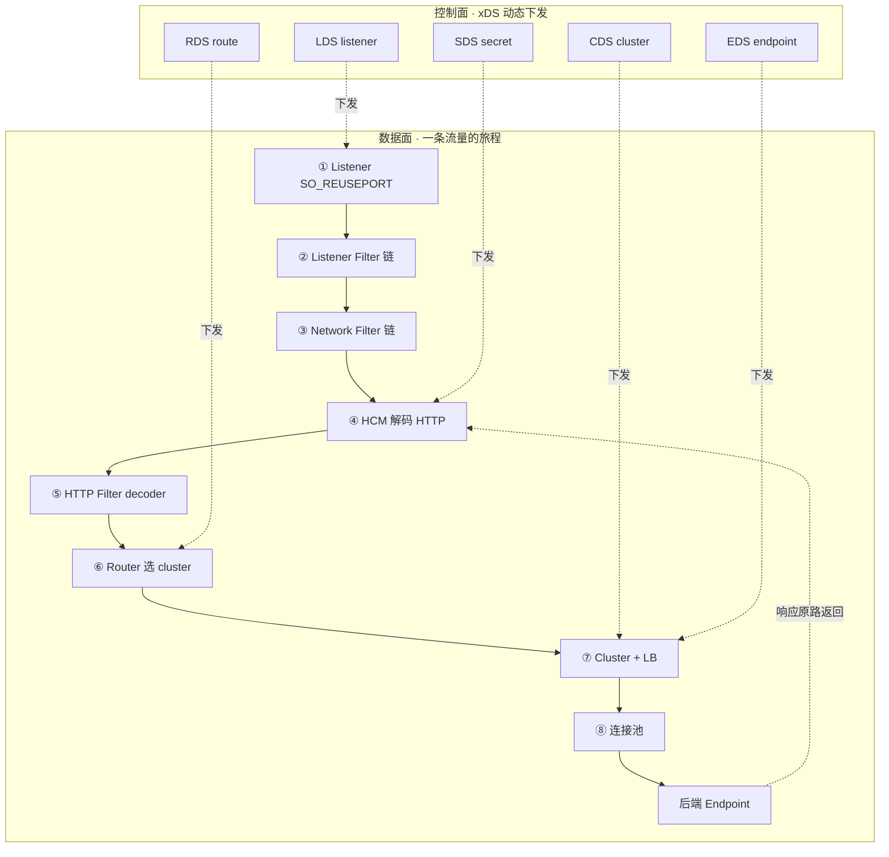

# 附录 A · Envoy 源码全景路线图

> 这是一份**参考材料**,给读完正文 23 章、想去 Envoy 源码里实地对照的读者一张地图。它回答一个问题:**一条 HTTP 请求在 Envoy 源码里从进到出,每一站对应哪些关键文件、关键类、关键函数?我想看某个机制(比如 filter chain 怎么实现)该从哪个文件入手?**
>
> 全部路径基于本地 `envoyproxy/envoy` 仓 @ commit `df2c77d`(版本 `1.39.0-dev`),已逐个 `ls`/`Grep` 核实真实存在。链接形如 [描述](../envoy/source/路径),VSCode 预览可点击跳转。

---

## 一、全栈路线图:一条 HTTP 请求在 Envoy 源码里的旅程

下面这张大图,横向是从 TCP 连接进来到响应返回的完整旅程(数据面,自左向右),纵向同时画出控制面(xDS)怎么把配置动态下发到旅程的每一站。每一层旁边标的就是该站的**关键源码路径**。

### 1.1 ASCII 横向流程图

```
                           控制面 (control plane, xDS 动态下发)
   ┌──────────────────────────────────────────────────────────────────────────┐
   │  LDS ──► listener + filter chain 配置      source/common/listener_manager/lds_api.cc
   │  RDS ──► route_config                     source/common/rds/, source/common/router/rds_impl.cc
   │  CDS ──► cluster                          source/common/upstream/cds_api_impl.cc
   │  EDS ──► endpoint                         source/extensions/clusters/eds/, source/common/upstream/
   │  SDS ──► secret / TLS 证书                source/common/secret/sds_api.cc
   │                                          source/extensions/config_subscription/  (订阅与传输)
   └──────────────────────────────────────────────────────────────────────────┘
                                          │ (动态下发 + ACK/NACK + 热更新)
                                          ▼
═══════════════════════ 数据面 (data plane) ═══════════════════════════════════
  Client ──TCP──► ① Listener (SO_REUSEPORT)        worker 分接连接
        source/server/worker_impl.cc
        source/server/active_listener_base.h
        source/common/listener_manager/connection_handler_impl.cc
        source/common/listener_manager/active_tcp_listener.cc
                  │
                  ▼
              ② Listener Filter 链 (TCP 层, 建连后/HTTP 解码前)
        source/extensions/filters/listener/tls_inspector/tls_inspector.cc
        source/extensions/filters/listener/proxy_protocol/proxy_protocol.cc
        source/extensions/filters/listener/original_dst/original_dst.cc
        source/extensions/filters/listener/http_inspector/http_inspector.cc
                  │
                  ▼
              ③ Network Filter 链 (字节流层)
        source/common/tcp_proxy/tcp_proxy.cc        (tcp_proxy: 纯 TCP 转发)
        source/extensions/filters/network/echo/echo.cc
        source/extensions/filters/network/ratelimit/ratelimit.cc
                  │  其中一个 network filter 是 ──
                  ▼
              ④ HTTP Connection Manager (HCM): TCP 字节 ──► 结构化 HTTP
        source/common/http/conn_manager_impl.cc
        source/common/http/conn_manager_impl.h
        source/common/http/filter_manager.cc       (filter chain 的真正宿主)
        source/common/http/http1/codec_impl.cc     (HTTP/1.1 codec)
        source/common/http/http2/codec_impl.cc     (HTTP/2 codec, HPACK)
        source/common/quic/server_codec_impl.cc    (HTTP/3 codec)
                  │
                  ▼
              ⑤ HTTP Filter 链 (decoder 向: 鉴权 → 限流 → fault → router)
        source/extensions/filters/http/router/      (router filter, 真正转发)
        source/extensions/filters/http/ratelimit/   (限流)
        source/extensions/filters/http/fault/       (故障注入)
        source/extensions/filters/http/jwt_authn/   (JWT 鉴权)
        source/extensions/filters/http/compressor/  (压缩)
                  │
                  ▼
              ⑥ Router: 按 route_config 选 cluster
        source/common/router/router.cc             (RouterFilter: 路由匹配 + 触发上游)
        source/common/router/config_impl.cc        (route_config 数据结构 + 匹配)
        source/common/matcher/matcher.h            (通用 matcher 引擎)
                  │
                  ▼
              ⑦ Cluster + 负载均衡: 挑一个 endpoint
        source/common/upstream/cluster_manager_impl.cc   (cluster 管理中枢)
        source/extensions/clusters/{static,strict_dns,logical_dns,eds,original_dst}/
        source/extensions/load_balancing_policies/{round_robin,least_request,ring_hash,maglev,subset,random}/
        source/common/upstream/edf_scheduler.h     (加权抽样的 EDF 调度器)
                  │
                  ▼
              ⑧ 连接池: 复用到后端的连接
        source/common/conn_pool/conn_pool_base.cc  (连接池基类)
        source/common/http/conn_pool_base.h
        source/common/http/http1/conn_pool.h       (HTTP/1 连接池)
        source/common/http/http2/                  (HTTP/2 连接池, 多路复用)
        source/common/http/http3/conn_pool.h       (HTTP/3 连接池)
                  │
                  ▼
              Upstream Endpoint (后端实例)
                  │
                  ▼   响应原路返回
              ⑨ HTTP Filter 链 (encoder 向: compressor → ... → 响应出去)
        source/common/http/filter_manager.cc       (encoder 链逆序穿过)
                  │
                  ▼
              Client ◄── 响应
```

### 1.2 mermaid 精简版(强调数据面/控制面分层)



> 一句话总览:**数据面**是一条从左到右的旅程(listener → listener filter → network filter → HCM → http filter → router → cluster/LB → 连接池 → 后端);**控制面**从上方把配置(LDS/RDS/CDS/EDS/SDS)动态下发到旅程的对应站点,做到不停机热更新。整张图覆盖 **9 个数据面站点 + 5 个控制面站点 = 14 站**。

---

## 二、数据面每一站的源码清单

按旅程顺序,每一站给一个表:层 | 关键源码文件 | 关键类/函数 | 一句话职责。所有路径已核实。

### 站 0 · 地基:线程模型 + 事件引擎 + Buffer

流量进 Envoy 之前,先看谁来跑这些 filter。这是第 1 篇(P1-02~04)的内容,但它是整条旅程的"地基",源码上独立成块。

| 层 | 关键源码文件 | 关键类/函数 | 一句话职责 |
|----|------|------|------|
| 线程模型 | [worker_impl](../envoy/source/server/worker_impl.cc) | `WorkerImpl` | 一个 worker 线程跑一个 dispatcher,持有自己的 listener/connection 集合 |
| 线程模型 | [thread_local_impl](../envoy/source/common/thread_local/thread_local_impl.cc) | `ThreadLocal::SlotImpl` | thread-local 无锁:每个 worker 一份副本,main 定期归并 |
| 主线程 | [server.cc](../envoy/source/server/server.cc) | `ServerImpl`、`run()` | Envoy 进程入口,起 MainThread + N worker |
| 事件引擎 | [dispatcher_impl](../envoy/source/common/event/dispatcher_impl.cc) | `DispatcherImpl`、`createFileEvent()`、`createTimer()` | libevent/epoll 封装,注册 fd + 回调,单线程事件循环 |
| 事件引擎 | [file_event_impl](../envoy/source/common/event/file_event_impl.cc) | `FileEventImpl` | 把一个 fd 的读写事件挂到 epoll,回调驱动 |
| 事件引擎 | [libevent_scheduler](../envoy/source/common/event/libevent_scheduler.cc) | `LibeventScheduler` | libevent 定时器后端 |
| Buffer | [buffer_impl](../envoy/source/common/buffer/buffer_impl.cc) | `Buffer::OwnedImpl`、`LibcSlice` | 字节流分片存储,filter 间传指针零拷贝 |
| Buffer | [watermark_buffer](../envoy/source/common/buffer/watermark_buffer.cc) | `WatermarkBuffer` | 带高/低水位的 buffer,反压用 |

### 站 1 · Listener:监听端口,接受连接

| 层 | 关键源码文件 | 关键类/函数 | 一句话职责 |
|----|------|------|------|
| worker 接 listener | [worker_impl](../envoy/source/server/worker_impl.cc) | `WorkerImpl::addListener()` | 把 listener 绑到一个 worker,SO_REUSEPORT 让内核分连接 |
| active listener 基类 | [active_listener_base](../envoy/source/server/active_listener_base.h) | `ActiveListenerImplBase` | listener 的抽象基类(TCP/UDP/QUIC 共用) |
| TCP listener | [active_tcp_listener](../envoy/source/common/listener_manager/active_tcp_listener.cc) | `ActiveTcpListener`、`onAcceptWorker()` | accept 一个 TCP 连接,交给 listener filter 链 |
| 连接处理器 | [connection_handler_impl](../envoy/source/common/listener_manager/connection_handler_impl.cc) | `ConnectionHandlerImpl`、`ActiveListener::onAccept()` | 一个 worker 持有的 connection handler,管所有 active listener |
| listener 定义 | [listener_impl](../envoy/source/common/listener_manager/listener_impl.cc) | `ListenerImpl` | 一个 listener 的配置形态(地址 + filter chain 等) |
| listener 管理 | [listener_manager_impl](../envoy/source/common/listener_manager/listener_manager_impl.cc) | `ListenerManagerImpl` | 管理所有 listener,负责 LDS 动态增删 + drain |
| filter chain 选择 | [filter_chain_manager_impl](../envoy/source/common/listener_manager/filter_chain_manager_impl.cc) | `FilterChainManagerImpl`、`FilterChainImpl` | 按 server name / 源 IP 匹配到一条 filter chain |
| socket | [socket_option_factory](../envoy/source/common/network/socket_option_factory.cc) | `Socket::Option::Factory` | 设置 SO_REUSEPORT、透明代理等 socket 选项 |

> 关键入口:`accept` 一个连接后,`ActiveTcpListener::onAcceptWorker()` 把它包成 `ActiveTcpSocket`,开始跑 listener filter 链 → network filter 链。这是整条旅程的起点。

### 站 2 · Listener Filter 链:TCP 层的过滤器

建连后、HTTP 解码前,在 TCP 层先做一轮处理(对应 P2-06)。

| 层 | 关键源码文件 | 关键类/函数 | 一句话职责 |
|----|------|------|------|
| 链宿主 | [active_tcp_socket](../envoy/source/common/listener_manager/active_tcp_socket.cc) | `ActiveTcpSocket`、`continueFilterChain()` | 一个被 accept 的 socket 穿过 listener filter 链 |
| TLS 探测 | [tls_inspector](../envoy/source/extensions/filters/listener/tls_inspector/tls_inspector.cc) | `Inspector`、`onRead()` | 探测是否 TLS、提取 SNI/ALPN,据此分流 filter chain |
| PROXY protocol | [proxy_protocol](../envoy/source/extensions/filters/listener/proxy_protocol/proxy_protocol.cc) | `Filter` | 解析 PROXY protocol v1/v2,还原真实客户端 IP |
| 原目的地址 | [original_dst](../envoy/source/extensions/filters/listener/original_dst/original_dst.cc) | `OriginalDstFilter` | 还原原始目的地址(透明代理用) |
| HTTP 探测 | [http_inspector](../envoy/source/extensions/filters/listener/http_inspector/http_inspector.cc) | `HttpInspector` | 探测是 HTTP/1.x 还是 HTTP/2,供 HCM 选 codec |

### 站 3 · Network Filter 链:字节流层的过滤器

TCP 字节流进来后,HCM 还没解码成 HTTP 之前,先在字节流上加工(对应 P2-07)。注意 **HCM 本身就是一个 network filter**,它是链上的特殊一员。

| 层 | 关键源码文件 | 关键类/函数 | 一句话职责 |
|----|------|------|------|
| network filter 链接口 | (envoy/network/filter.h) | `Network::ReadFilterCallbacks`、`Network::FilterManager` | network filter 的抽象接口 |
| filter manager | [filter_manager_impl](../envoy/source/common/network/filter_manager_impl.cc) | `FilterManagerImpl` | connection 上挂的 network filter 链宿主 |
| tcp_proxy | [tcp_proxy](../envoy/source/common/tcp_proxy/tcp_proxy.cc) | `Filter`、`Filter::onNewConnection()` | 纯 TCP 代理,把字节流转发到上游 cluster |
| tcp_proxy 上游 | [upstream](../envoy/source/common/tcp_proxy/upstream.cc) | `Upstream` | tcp_proxy 连到上游后转字节 |
| echo | [echo](../envoy/source/extensions/filters/network/echo/echo.cc) | `Filter` | 把收到的回显,最简示例 filter |
| ratelimit | [ratelimit](../envoy/source/extensions/filters/network/ratelimit/ratelimit.cc) | `Filter` | TCP 层限流 |
| HCM(特殊 network filter) | [config](../envoy/source/extensions/filters/network/http_connection_manager/config.cc) | `HttpConnectionManagerNetworkFilterConfig` | HCM 作为 network filter 的工厂,把字节流交给 HCM |

### 站 4 · HCM:把 TCP 字节解码成 HTTP(本书数据面招牌之一)

HCM 是 Envoy 处理 HTTP 的核心。它把字节流交给 codec 解码成 HTTP 请求,再驱动 http filter 链(对应 P3-08、P3-09)。

| 层 | 关键源码文件 | 关键类/函数 | 一句话职责 |
|----|------|------|------|
| HCM 主体 | [conn_manager_impl](../envoy/source/common/http/conn_manager_impl.cc) | `ConnectionManagerImpl`、`onData()`、`ActiveStream` | HCM 主类,接受字节流、调 codec 解码、起一个 ActiveStream 处理请求 |
| HCM 配置 | [conn_manager_config](../envoy/source/common/http/conn_manager_config.h) | `ConnectionManagerConfig` | HCM 的配置接口(codec、filter factory、超时等) |
| filter chain 宿主 | [filter_manager](../envoy/source/common/http/filter_manager.cc) | `FilterManager`、`decodeHeaders()`、`encodeData()` | HTTP filter 链的真正宿主,decoder/encoder 两向链 |
| HTTP/1.1 codec | [http1/codec_impl](../envoy/source/common/http/http1/codec_impl.cc) | `Http::Http1::ServerConnectionImpl`、`BalsaParser` | HTTP/1.1 文本协议解析(balsa parser) |
| HTTP/2 codec | [http2/codec_impl](../envoy/source/common/http/http2/codec_impl.cc) | `Http::Http2::ConnectionImpl` | HTTP/2 二进制帧 + HPACK(承接《gRPC》) |
| HTTP/2 协议约束 | [http2/protocol_constraints](../envoy/source/common/http/http2/protocol_constraints.cc) | `ProtocolConstraints` | HTTP/2 流控、并发上限 |
| HTTP/3 codec | [quic/server_codec_impl](../envoy/source/common/quic/server_codec_impl.cc) | `EnvoyQuicServerSession` | HTTP/3(QUIC/UDP)codec,基于 quiche |

> 关键入口:`ConnectionManagerImpl::onData()` 收到字节 → 调 codec 解码 → 解出请求头后 `newStream()` 创建 `ActiveStream` → 交给 `FilterManager::decodeHeaders()` 开始穿 http filter 链。

### 站 5 · HTTP Filter 链:decoder/encoder 两向(数据面招牌之二)

这是 Envoy 数据面的招牌。请求穿 decoder 链(鉴权→限流→...→router),响应穿 encoder 链(逆序)。对应 P3-10。

| 层 | 关键源码文件 | 关键类/函数 | 一句话职责 |
|----|------|------|------|
| filter 链接口 | (envoy/http/filter.h) | `StreamDecoderFilter`、`StreamEncoderFilter`、`StreamFilterBase` | http filter 的两向抽象接口 |
| filter manager | [filter_manager](../envoy/source/common/http/filter_manager.cc) | `FilterManager`、`DecoderFilterCallbacks` | 链的宿主,管 decoder/encoder 双向链,处理 continue/stop 语义 |
| router(必在链尾) | [config](../envoy/source/extensions/filters/http/router/config.cc) | `RouterFilterConfig` | router filter 工厂,真正把请求转发到上游 |
| 限流 | [ratelimit](../envoy/source/extensions/filters/http/ratelimit/ratelimit.cc) | `RateLimitFilter` | HTTP 层限流,调外部 ratelimit service |
| 故障注入 | [fault](../envoy/source/extensions/filters/http/fault/fault_filter.cc) | `FaultFilter` | 注入延迟/abort,做混沌测试 |
| 压缩 | [compressor](../envoy/source/extensions/filters/http/compressor/) | `CompressorFilter` | 响应压缩(encoder 向) |
| JWT 鉴权 | [jwt_authn](../envoy/source/extensions/filters/http/jwt_authn/) | `Filter` | JWT 校验鉴权 |
| CORS | [cors](../envoy/source/extensions/filters/http/cors/config.cc) | `CorsFilter` | CORS 头处理 |
| Lua 扩展 | [lua](../envoy/source/extensions/filters/http/lua/lua_filter.cc) | `Filter` | 内嵌 Lua 写自定义逻辑 |
| buffer | [buffer](../envoy/source/extensions/filters/http/buffer/buffer_filter.cc) | `BufferFilter` | 请求体缓冲 |

### 站 6 · Router:路由匹配(对应 P3-11)

router filter 按 route_config 把请求路由到 cluster。

| 层 | 关键源码文件 | 关键类/函数 | 一句话职责 |
|----|------|------|------|
| router filter | [router](../envoy/source/common/router/router.cc) | `Filter`、`Filter::decodeHeaders()` | router filter 实现:匹配路由 + 发起上游请求 |
| 上游请求 | [upstream_request](../envoy/source/common/router/upstream_request.cc) | `UpstreamRequest` | router 发起到上游的请求对象 |
| route_config 数据结构 | [config_impl](../envoy/source/common/router/config_impl.cc) | `RouteMatchImpl`、`VirtualHostImpl`、`ConfigImpl` | route_config 的解析与匹配(virtual host + route + cluster) |
| 加权 cluster | [weighted_cluster_specifier](../envoy/source/common/router/weighted_cluster_specifier.cc) | `WeightedClusterSpecifier` | 按权重在多个 cluster 间分流(灰度) |
| 重试 | [retry_state_impl](../envoy/source/common/router/retry_state_impl.cc) | `RetryStateImpl` | 重试状态机 |
| matcher 引擎 | [matcher](../envoy/source/common/matcher/matcher.h) | `Matcher`、`MatchTree` | 通用 matcher(header/path/metadata 匹配) |
| RDS 订阅 | [rds_impl](../envoy/source/common/router/rds_impl.cc) | `RdsRouteConfigSubscription` | route_config 的 RDS 动态订阅 |

### 站 7 · Cluster + 负载均衡:挑一个 endpoint(对应 P4-12、P4-13)

选好 cluster 后,在里面挑一个健康的 endpoint。

| 层 | 关键源码文件 | 关键类/函数 | 一句话职责 |
|----|------|------|------|
| cluster 管理中枢 | [cluster_manager_impl](../envoy/source/common/upstream/cluster_manager_impl.cc) | `ClusterManagerImpl` | 管所有 cluster,提供 LB + 连接池 |
| cluster 抽象 | [upstream_impl](../envoy/source/common/upstream/upstream_impl.cc) | `ClusterImplBase`、`HostImpl` | cluster 与 host(endpoint)的抽象 |
| CDS 动态发现 | [cds_api_impl](../envoy/source/common/upstream/cds_api_impl.cc) | `CdsApiImpl` | cluster 的 CDS 动态订阅 |
| static cluster | [static](../envoy/source/extensions/clusters/static/static_cluster.h) | `StaticClusterImpl` | 静态 endpoint 列表 |
| strict DNS | [strict_dns](../envoy/source/extensions/clusters/strict_dns/strict_dns_cluster.h) | `StrictDnsClusterImpl` | 严格 DNS 解析(每个 A 记录一个 endpoint) |
| logical DNS | [logical_dns](../envoy/source/extensions/clusters/logical_dns/logical_dns_cluster.h) | `LogicalDnsClusterImpl` | 逻辑 DNS(合并成一个逻辑 host) |
| EDS cluster | [eds](../envoy/source/extensions/clusters/eds/eds.cc) | `EdsClusterImpl` | endpoint 由 EDS 动态下发(服务发现核心) |
| original_dst | [original_dst](../envoy/source/extensions/clusters/original_dst/) | `OriginalDstCluster` | 按原目的地址建 cluster(透明代理) |
| LB 公共 | [common/load_balancer_impl](../envoy/source/extensions/load_balancing_policies/common/load_balancer_impl.h) | `LoadBalancerBase` | LB 策略公共基类 |
| round robin | [round_robin](../envoy/source/extensions/load_balancing_policies/round_robin/round_robin_lb.h) | `RoundRobinLoadBalancer` | 轮询 |
| least request | [least_request](../envoy/source/extensions/load_balancing_policies/least_request/least_request_lb.cc) | `LeastRequestLoadBalancer` | 最少活跃请求(P2C 抽样) |
| ring hash | [ring_hash](../envoy/source/extensions/load_balancing_policies/ring_hash/ring_hash_lb.cc) | `RingHashLoadBalancer` | 一致性哈希(粘性) |
| maglev | [maglev](../envoy/source/extensions/load_balancing_policies/maglev/maglev_lb.cc) | `MaglevLoadBalancer` | maglev 一致性哈希(更均衡) |
| subset | [subset](../envoy/source/extensions/load_balancing_policies/subset/subset_lb.cc) | `SubsetLoadBalancer` | 按 metadata 子集分流 |
| random | [random](../envoy/source/extensions/load_balancing_policies/random/random_lb.cc) | `RandomLoadBalancer` | 随机 |
| EDF 调度器 | [edf_scheduler](../envoy/source/common/upstream/edf_scheduler.h) | `EdfScheduler` | 加权抽样的 EDF 调度器(LB 内部用) |

### 站 7.5 · 健康检查与异常点检测(对应 P4-14、P4-15)

| 层 | 关键源码文件 | 关键类/函数 | 一句话职责 |
|----|------|------|------|
| active health check 基类 | [health_checker_impl](../envoy/source/common/upstream/health_checker_impl.cc) | `HealthCheckerImpl`、`HealthCheckSession` | 主动探活的基类 |
| HTTP 健康检查 | [health_checkers/http](../envoy/source/extensions/health_checkers/http/health_checker_impl.cc) | `HttpHealthCheckerImpl` | HTTP 主动探活 |
| TCP 健康检查 | [health_checkers/tcp](../envoy/source/extensions/health_checkers/tcp/health_checker_impl.cc) | `TcpHealthCheckerImpl` | TCP 主动探活 |
| 异常点检测 | [outlier_detection_impl](../envoy/source/common/upstream/outlier_detection_impl.cc) | `OutlierDetectorImpl`、`HostMonitor` | 被动:按失败率/延迟把后端踢出 |
| 资源管理(断路器) | [resource_manager_impl](../envoy/source/common/upstream/resource_manager_impl.h) | `ResourceManagerImpl` | 连接/请求上限熔断 |
| 过载管理 | [overload_manager_impl](../envoy/source/server/overload_manager_impl.cc) | `OverloadManagerImpl` | 令牌桶过载保护,压力高时拒绝/降级 |
| drain 管理 | [drain_manager_impl](../envoy/source/server/drain_manager_impl.cc) | `DrainManagerImpl` | 优雅 drain(连接排空) |

### 站 8 · 连接池:复用到后端的连接(对应 P4-12)

| 层 | 关键源码文件 | 关键类/函数 | 一句话职责 |
|----|------|------|------|
| 连接池基类 | [conn_pool_base](../envoy/source/common/conn_pool/conn_pool_base.cc) | `ConnPoolBase` | 连接池公共基类(建连/复用/健康检查) |
| HTTP 连接池基类 | [conn_pool_base](../envoy/source/common/http/conn_pool_base.h) | `HttpConnPoolBase` | HTTP 连接池基类 |
| HTTP/1 连接池 | [http1/conn_pool](../envoy/source/common/http/http1/conn_pool.h) | `Http1ConnPool` | HTTP/1 连接池(一请求一连接) |
| HTTP/3 连接池 | [http3/conn_pool](../envoy/source/common/http/http3/conn_pool.h) | `Http3ConnPool` | HTTP/3(QUIC)连接池 |

### 站 9 · 响应原路返回

响应从后端回来,沿 encoder 链逆序穿过 filter manager,经 HCM 编码回字节流,再过 network/listener filter(出向)回到 client。核心仍走 `FilterManager::encodeData()`/`encodeHeaders()`([filter_manager.cc](../envoy/source/common/http/filter_manager.cc)),与站 5 是同一套机制,只是方向相反。

---

## 三、控制面每一站的源码清单

控制面(xDS)把配置动态下发到数据面的对应站点。对应第 5 篇(P5-16~19)。

### proto 定义(控制面 ↔ 数据面契约)

| 层 | 关键源码文件 | 说明 |
|----|------|------|
| 发现服务 proto | [discovery.proto](../envoy/api/envoy/service/discovery/v3/discovery.proto) | xDS 通用 proto:`DiscoveryRequest`/`DiscoveryResponse`、`version_info`、`nonce` |
| 聚合发现 proto | [ads.proto](../envoy/api/envoy/service/discovery/v3/ads.proto) | ADS(Aggregated Discovery Service)聚合订阅 proto |
| 配置来源 | [config_source.proto](../envoy/api/envoy/config/core/v3/config_source.proto) | `ConfigSource`(grpc/file/rest + api_config_source) |
| cluster proto | [circuit_breaker.proto](../envoy/api/envoy/config/cluster/v3/circuit_breaker.proto) | cluster + 断路器 proto |
| endpoint proto | [endpoint.proto](../envoy/api/envoy/config/endpoint/v3/endpoint.proto) | EDS endpoint proto |

### xDS 核心(订阅、版本协商、热更新)

| 层 | 关键源码文件 | 关键类/函数 | 一句话职责 |
|----|------|------|------|
| subscription 抽象 | (envoy/config/subscription.h) | `Config::Subscription`、`SubscriptionCallbacks` | xDS 订阅的抽象接口 |
| xds_manager | [xds_manager_impl](../envoy/source/common/config/xds_manager_impl.cc) | `XdsManagerImpl` | 管理所有 xDS 订阅的中枢 |
| subscription 工厂 | [subscription_factory_impl](../envoy/source/common/config/subscription_factory_impl.cc) | `SubscriptionFactoryImpl` | 按 ConfigSource 类型造 subscription |
| 资源名解析 | [resource_name](../envoy/source/common/config/resource_name.h) | `ResourceName` | xDS resource name 解析 |
| 不透明解码 | [opaque_resource_decoder_impl](../envoy/source/common/config/opaque_resource_decoder_impl.h) | `OpaqueResourceDecoderImpl` | 资源解码抽象 |

### 订阅传输(grpc / file / rest)

xDS 的传输后端在 `source/extensions/config_subscription/` 下,分三类:grpc streaming、file、rest。对应 P5-17。

| 层 | 关键源码文件 | 关键类/函数 | 一句话职责 |
|----|------|------|------|
| gRPC mux(新版) | [grpc_mux_impl](../envoy/source/extensions/config_subscription/grpc/grpc_mux_impl.cc) | `GrpcMuxImpl` | gRPC 双向流多路复用,一个流拉多种 xDS |
| gRPC mux(重构中) | [new_grpc_mux_impl](../envoy/source/extensions/config_subscription/grpc/new_grpc_mux_impl.cc) | `NewGrpcMuxImpl` | 较新的 mux 实现(1.39 重构中,与上者并存) |
| xds_mux 子目录 | [xds_mux/grpc_mux_impl](../envoy/source/extensions/config_subscription/grpc/xds_mux/grpc_mux_impl.cc) | `XdsMux` | xds_mux 命名空间下的 mux 实现(演进中) |
| SotW 状态机 | [sotw_subscription_state](../envoy/source/extensions/config_subscription/grpc/xds_mux/sotw_subscription_state.cc) | `SotwSubscriptionState` | SotW(State of the World,全量)订阅状态 |
| Delta 状态机 | [delta_subscription_state](../envoy/source/extensions/config_subscription/grpc/xds_mux/delta_subscription_state.cc) | `DeltaSubscriptionState` | Delta(只发变更)订阅状态 |
| watch 映射 | [watch_map](../envoy/source/extensions/config_subscription/grpc/watch_map.cc) | `WatchMap` | resource 到 watch 的映射 |
| pausable ACK 队列 | [pausable_ack_queue](../envoy/source/extensions/config_subscription/grpc/pausable_ack_queue.cc) | `PausableAckQueue` | 可暂停的 ACK 队列(过载时攒 ACK) |
| file 订阅 | [filesystem_subscription_impl](../envoy/source/extensions/config_subscription/filesystem/filesystem_subscription_impl.cc) | `FilesystemSubscriptionImpl` | 从文件 watch 配置(file xDS) |
| rest 订阅 | [http_subscription_impl](../envoy/source/extensions/config_subscription/rest/http_subscription_impl.cc) | `HttpSubscriptionImpl` | 从 REST 拉配置(rest xDS) |

> 注:1.39-dev 里 `config_subscription/grpc/` 与 `config_subscription/grpc/xds_mux/` 两套 mux 实现并存,是控制面正在进行的重构(`GrpcMuxImpl` → `NewGrpcMuxImpl` / `XdsMux`)。读源码时若两边都有定义,以 BUILD 文件实际链接的为准。

### LDS / CDS / EDS / RDS / SDS 各类具体实现

| xDS 类型 | 关键源码文件 | 关键类/函数 | 一句话职责 |
|----|------|------|------|
| LDS | [lds_api](../envoy/source/common/listener_manager/lds_api.cc) | `LdsApi` | Listener 动态订阅,触发 listener 增删 + drain |
| RDS | [rds_route_config_subscription](../envoy/source/common/rds/rds_route_config_subscription.cc) | `RdsRouteConfigSubscription` | Route 动态订阅,热更新路由表 |
| CDS | [cds_api_impl](../envoy/source/common/upstream/cds_api_impl.cc) | `CdsApiImpl` | Cluster 动态订阅 |
| EDS | (走 [eds cluster](../envoy/source/extensions/clusters/eds/eds.cc) + cluster_discovery_manager) | `EdsClusterImpl`、`ClusterDiscoveryManager` | Endpoint 动态发现(秒级服务发现) |
| SDS | [sds_api](../envoy/source/common/secret/sds_api.cc) | `SdsApi` | Secret(TLS 证书)动态订阅 |

### Hot restart(零停机重启)

| 层 | 关键源码文件 | 关键类/函数 | 一句话职责 |
|----|------|------|------|
| hot restart 入口 | [hot_restart_impl](../envoy/source/server/hot_restart_impl.cc) | `HotRestartImpl` | 零停机重启:新进程通过 fd 传递接管 listener socket |
| 重启基类 | [hot_restarting_base](../envoy/source/server/hot_restarting_base.cc) | `HotRestartingBase` | 新老进程间通信基类 |
| 子进程侧 | [hot_restarting_child](../envoy/source/server/hot_restarting_child.cc) | `HotRestartingChild` | 新(子)进程侧逻辑 |
| 父进程侧 | [hot_restarting_parent](../envoy/source/server/hot_restarting_parent.cc) | `HotRestartingParent` | 旧(父)进程侧逻辑 |

---

## 四、可观测与安全(第 6 篇相关)

虽然不在"一条流量的主旅程"上,但贯穿全程。

| 层 | 关键源码文件 | 关键类/函数 | 一句话职责 |
|----|------|------|------|
| stats 存储 | [thread_local_store](../envoy/source/common/stats/thread_local_store.cc) | `ThreadLocalStoreImpl` | counter/gauge/histogram,thread-local 攒批归并 |
| histogram | [histogram_impl](../envoy/source/common/stats/histogram_impl.cc) | `HistogramImpl` | 分桶延迟统计(p50/p95/p99) |
| stat 归并 | [stat_merger](../envoy/source/common/stats/stat_merger.cc) | `StatMerger` | 把各 worker 的 thread-local stat 归并到 main |
| symbol table | [symbol_table](../envoy/source/common/stats/symbol_table.cc) | `SymbolTable` | stat name 去重(节省内存) |
| access log | [access_log_impl](../envoy/source/common/access_log/access_log_impl.cc) | `AccessLog`、`AccessLogManager` | 结构化访问日志 |
| tracing | [tracer_impl](../envoy/source/common/tracing/tracer_impl.cc) | `TracerImpl`、`HttpTracerImpl` | 分布式追踪(request_id + trace 上下文) |
| TLS 终止/mTLS | [ssl_socket](../envoy/source/common/tls/ssl_socket.cc) | `TlsSocket`(impl) | TLS 终止/mTLS |
| transport socket | (source/extensions/transport_sockets/tls/) | `TransportSocket` | 传输层抽象(TLS/raw_buffer/alts 等) |

---

## 五、目录结构速查:source/ 顶层组织

Envoy 源码顶层是 `source/`,下面四个一级目录:

```
source/
├── common/         核心库(与 server 无关的公共组件)
├── extensions/     所有可插拔扩展(filter / cluster / LB / xDS 传输 / transport socket / ...)
├── server/         Envoy 进程本身(入口、worker、hot restart、overload manager)
├── exe/            main() 入口
└── docs/           架构文档(stats.md, xds.md 等)
api/                (在 source/ 之外)proto 定义:控制面与数据面的契约
```

### `source/common/` 关键子目录(数据面核心几乎都在这里)

| 子目录 | 干什么 | 代表文件 |
|------|------|------|
| `http/` | HTTP 处理核心(HCM、filter manager、codec) | `conn_manager_impl.cc`、`filter_manager.cc`、`http1/`、`http2/` |
| `router/` | 路由匹配 | `router.cc`、`config_impl.cc`、`upstream_request.cc` |
| `upstream/` | cluster、LB 公共、health check、outlier | `cluster_manager_impl.cc`、`upstream_impl.cc`、`outlier_detection_impl.cc` |
| `listener_manager/` | listener、connection handler | `active_tcp_listener.cc`、`connection_handler_impl.cc` |
| `network/` | connection、socket、network filter manager | `connection_impl_base.cc`、`filter_manager_impl.cc` |
| `buffer/` | Buffer 字节流 | `buffer_impl.cc` |
| `event/` | libevent dispatcher | `dispatcher_impl.cc` |
| `thread_local/` | thread-local 无锁 | `thread_local_impl.cc` |
| `config/` | xDS 核心(subscription、xds_manager) | `xds_manager_impl.cc`、`subscription_factory_impl.cc` |
| `conn_pool/` | 连接池基类 | `conn_pool_base.cc` |
| `tcp_proxy/` | tcp_proxy filter 实现 | `tcp_proxy.cc` |
| `tls/` | TLS/mTLS 实现 | `ssl_socket.cc` |
| `stats/` | stats 存储 | `thread_local_store.cc` |
| `quic/` | HTTP/3 | `server_codec_impl.cc` |
| `matcher/` | 通用 matcher 引擎 | `matcher.h` |
| `rds/` | RDS 订阅 | `rds_route_config_subscription.cc` |

### `source/extensions/` 关键子目录(所有可插拔扩展)

| 子目录 | 干什么 | 代表 |
|------|------|------|
| `filters/listener/` | listener filter | `tls_inspector/`、`proxy_protocol/` |
| `filters/network/` | network filter(含 HCM 入口) | `http_connection_manager/config.cc`、各协议 proxy |
| `filters/http/` | http filter(几十个) | `router/`、`ratelimit/`、`fault/`、`jwt_authn/`、`compressor/` |
| `clusters/` | cluster 类型 | `static/`、`strict_dns/`、`eds/`、`original_dst/` |
| `load_balancing_policies/` | LB 策略 | `round_robin/`、`ring_hash/`、`maglev/`、`subset/` |
| `config_subscription/` | xDS 传输后端 | `grpc/`、`filesystem/`、`rest/` |
| `health_checkers/` | active health check | `http/`、`tcp/` |
| `transport_sockets/` | transport socket | `tls/`、`raw_buffer/`、`alts/` |
| `access_loggers/` | access log sink | `grpc/`、`file/` |
| `tracers/` | 分布式追踪 | `opentelemetry/`、`zipkin/` |
| `retry/` | 重试插件(host/priority) | `host/previous_hosts/`、`priority/previous_priorities/` |
| `wasm_runtime/` | Wasm 运行时 | `v8/`、`wamr/`、`wasmtime/` |
| `dynamic_modules/` | 动态 C++ 模块扩展 | (顶层有 abi/、sdk/) |

### `source/server/` 关键文件

| 文件 | 干什么 |
|------|------|
| `server.cc` | Envoy 进程入口与主循环 |
| `worker_impl.cc` | 一个 worker 线程的实现 |
| `active_listener_base.h` | listener 抽象基类 |
| `overload_manager_impl.cc` | 过载管理 |
| `hot_restart_impl.cc` | 零停机重启 |
| `drain_manager_impl.cc` | drain 管理 |
| `options_impl.cc` | 命令行参数解析 |
| `configuration_impl.cc` | 配置加载 |

---

## 六、阅读顺序建议

读者画像:读完正文 23 章,想去源码对照。建议按"由浅入深、由骨架到血肉"的顺序。

### 路线 1:先懂"谁来跑 filter chain"(线程/事件,半天)

先建立对 Envoy 运行时骨架的认识,再读流量路径就不慌。

1. [server.cc](../envoy/source/server/server.cc) — 看 `ServerImpl::run()`,理解 MainThread 起 N 个 worker 的过程。
2. [worker_impl.cc](../envoy/source/server/worker_impl.cc) — 看 `WorkerImpl` 持有一个 dispatcher、绑定 listener,理解"一个 worker 一个事件循环"。
3. [dispatcher_impl.cc](../envoy/source/common/event/dispatcher_impl.cc) + [file_event_impl.cc](../envoy/source/common/event/file_event_impl.cc) — 看 libevent/epoll 怎么封装成 dispatcher,理解回调驱动的事件循环。
4. [thread_local_impl.cc](../envoy/source/common/thread_local/thread_local_impl.cc) — 看 thread-local slot,理解无锁并发。

### 路线 2:跟一条 HTTP 流量走到底(数据面主干,1~2 天,最重要)

这是核心。从 accept 连接开始,一站一站往下追。

1. [connection_handler_impl.cc](../envoy/source/common/listener_manager/connection_handler_impl.cc) — 看 `ConnectionHandlerImpl`,理解 worker 怎么持 listener。
2. [active_tcp_listener.cc](../envoy/source/common/listener_manager/active_tcp_listener.cc) — 看 `ActiveTcpListener::onAcceptWorker()`,这是整条旅程的起点(accept → 包成 ActiveTcpSocket)。
3. [active_tcp_socket.cc](../envoy/source/common/listener_manager/active_tcp_socket.cc) — 看 listener filter 链怎么穿过。
4. (可选)选一个 listener filter 读:[tls_inspector.cc](../envoy/source/extensions/filters/listener/tls_inspector/tls_inspector.cc),感受 filter 长什么样。
5. [conn_manager_impl.cc](../envoy/source/common/http/conn_manager_impl.cc) — 这是重头戏。看 `ConnectionManagerImpl::onData()` → codec 解码 → `newStream()` 起 `ActiveStream`。这是 HCM 把字节变成 HTTP 的地方。
6. [filter_manager.cc](../envoy/source/common/http/filter_manager.cc) — 这是 Envoy 数据面的灵魂文件。看 `FilterManager` 的 decoder/encoder 两向链、continue/stop 语义怎么实现。**这个文件值得反复读。**
7. (选一个 http filter)[fault_filter.cc](../envoy/source/extensions/filters/http/fault/fault_filter.cc) — 感受一个 decoder filter 长什么样、怎么 stop。
8. [router.cc](../envoy/source/common/router/router.cc) — 看 router filter 怎么匹配路由、怎么发起上游请求。配合 [config_impl.cc](../envoy/source/common/router/config_impl.cc) 看 route_config 数据结构。
9. [cluster_manager_impl.cc](../envoy/source/common/upstream/cluster_manager_impl.cc) — 看 cluster 怎么管、LB 怎么拿。
10. (选一个 LB)[round_robin_lb.h](../envoy/source/extensions/load_balancing_policies/round_robin/round_robin_lb.h) 或 [ring_hash_lb.cc](../envoy/source/extensions/load_balancing_policies/ring_hash/ring_hash_lb.cc) — 感受一个 LB 策略。
11. [conn_pool_base.cc](../envoy/source/common/conn_pool/conn_pool_base.cc) — 看连接池怎么复用连接。

> 一条线串下来,你就在源码里"放映"了正文 P0-07 那张旅程图。

### 路线 3:tcp_proxy(非 HTTP 代理,半天)

如果你的兴趣是纯 TCP 代理(非 HTTP),走这条短路径:

1. [active_tcp_listener.cc](../envoy/source/common/listener_manager/active_tcp_listener.cc) — accept。
2. [tcp_proxy.cc](../envoy/source/common/tcp_proxy/tcp_proxy.cc) — tcp_proxy network filter,看 `Filter::onNewConnection()` 怎么把字节流转发到上游 cluster。
3. [upstream.cc](../envoy/source/common/tcp_proxy/upstream.cc) — tcp_proxy 的上游端。
4. (cluster/LB/连接池同路线 2 的 9~11)。

### 路线 4:xDS 控制面(1~2 天,推荐放在数据面之后)

控制面比数据面绕,建议在路线 2 之后读。

1. 先读 proto:[discovery.proto](../envoy/api/envoy/service/discovery/v3/discovery.proto) — 看懂 `DiscoveryRequest`/`DiscoveryResponse`、`version_info`、`nonce`。这是控制面与数据面的契约。
2. [xds_manager_impl.cc](../envoy/source/common/config/xds_manager_impl.cc) — xDS 中枢。
3. [grpc_mux_impl.cc](../envoy/source/extensions/config_subscription/grpc/grpc_mux_impl.cc) — gRPC 双向流多路复用。配合 [xds_mux/grpc_mux_impl.cc](../envoy/source/extensions/config_subscription/grpc/xds_mux/grpc_mux_impl.cc) 看新版。
4. [sotw_subscription_state.cc](../envoy/source/extensions/config_subscription/grpc/xds_mux/sotw_subscription_state.cc) 与 [delta_subscription_state.cc](../envoy/source/extensions/config_subscription/grpc/xds_mux/delta_subscription_state.cc) — SotW vs Delta 两套状态机。
5. 选一类具体订阅读:[lds_api.cc](../envoy/source/common/listener_manager/lds_api.cc)(LDS)或 [cds_api_impl.cc](../envoy/source/common/upstream/cds_api_impl.cc)(CDS),看一类 xDS 怎么落地成数据面组件。
6. (热更新)[listener_manager_impl.cc](../envoy/source/common/listener_manager/listener_manager_impl.cc) — 看 listener 收到 LDS 更新后怎么 drain 旧、起新。
7. (hot restart)[hot_restart_impl.cc](../envoy/source/server/hot_restart_impl.cc) — 零停机重启。

### 路线 5:可观测(按需)

- [thread_local_store.cc](../envoy/source/common/stats/thread_local_store.cc) — stats 无锁存储。
- [histogram_impl.cc](../envoy/source/common/stats/histogram_impl.cc) — 延迟分桶。
- [access_log_impl.cc](../envoy/source/common/access_log/access_log_impl.cc) — 访问日志。
- [tracer_impl.cc](../envoy/source/common/tracing/tracer_impl.cc) — 分布式追踪。

### 路线 6:扩展(按需)

- Wasm:[wasm_runtime/v8/](../envoy/source/extensions/wasm_runtime/v8/) 等。
- dynamic modules:[source/extensions/dynamic_modules/](../envoy/source/extensions/dynamic_modules/)。

### 一句话推荐顺序

> **server.cc → worker_impl.cc → dispatcher_impl.cc(骨架)→ active_tcp_listener.cc → conn_manager_impl.cc → filter_manager.cc(流量主干)→ router.cc → cluster_manager_impl.cc → conn_pool_base.cc(到后端)→ discovery.proto + xds_manager_impl.cc + grpc_mux_impl.cc(控制面)**。先骨架、再一条流量追到底、最后控制面。

---

## 七、几个容易踩的"路径坑"(读源码前必看)

1. **HCM 不在 `source/server/`,在 `source/common/http/`**。文件名是 `conn_manager_impl.cc`(不是 `connection_manager_impl.cc`,虽然早期代码里有这个旧名,1.39 以 `conn_manager_impl.cc` 为准)。
2. **active_tcp_listener 不在 `source/server/`,在 `source/common/listener_manager/`**。`source/server/active_listener_base.h` 是基类,具体 TCP 实现在 common。
3. **tcp_proxy 不在 `source/extensions/filters/network/tcp_proxy/`,在 `source/common/tcp_proxy/`**。这是历史遗留,实现放 common,工厂注册在 extensions。
4. **filter manager 有两个**:`source/common/network/filter_manager_impl.cc`(network filter 链)和 `source/common/http/filter_manager.cc`(http filter 链)。读 http filter chain 看后者。
5. **conn_pool_base 也有两个**:`source/common/conn_pool/conn_pool_base.cc`(泛型基类)和 `source/common/http/conn_pool_base.h`(HTTP 专用)。读 HTTP 连接池看后者。
6. **config_subscription 两套 mux 并存**:`grpc/grpc_mux_impl.cc` 与 `grpc/xds_mux/grpc_mux_impl.cc`(以及 `new_grpc_mux_impl.cc`)。1.39 正在重构控制面,读时以 BUILD 实际链接为准,不要假设哪个是"唯一真身"。
7. **filter 的"接口"在 `envoy/` 目录**(如 `envoy/http/filter.h`、`envoy/network/filter.h`),实现和具体 filter 在 `source/`。读 filter 接口去 `envoy/`,读实现去 `source/extensions/filters/`。
8. **proto 在 `api/` 目录**(仓库根,不在 `source/` 里)。`api/envoy/service/discovery/v3/` 是 xDS 服务定义。

---

## 八、附:关键文件一句话清单(速查)

按"想看 X 机制 → 读哪个文件"组织。

| 我想看 | 读这个文件 |
|------|------|
| Envoy 怎么起 worker | [server.cc](../envoy/source/server/server.cc) |
| worker 怎么绑 listener | [worker_impl.cc](../envoy/source/server/worker_impl.cc) |
| 事件循环 | [dispatcher_impl.cc](../envoy/source/common/event/dispatcher_impl.cc) |
| accept 一个连接 | [active_tcp_listener.cc](../envoy/source/common/listener_manager/active_tcp_listener.cc) |
| listener filter 链 | [active_tcp_socket.cc](../envoy/source/common/listener_manager/active_tcp_socket.cc) |
| TLS 探测 | [tls_inspector.cc](../envoy/source/extensions/filters/listener/tls_inspector/tls_inspector.cc) |
| network filter 链 | [filter_manager_impl.cc](../envoy/source/common/network/filter_manager_impl.cc)(network) |
| tcp_proxy | [tcp_proxy.cc](../envoy/source/common/tcp_proxy/tcp_proxy.cc) |
| HCM 解码 HTTP | [conn_manager_impl.cc](../envoy/source/common/http/conn_manager_impl.cc) |
| HTTP/1 codec | [http1/codec_impl.cc](../envoy/source/common/http/http1/codec_impl.cc) |
| HTTP/2 codec | [http2/codec_impl.cc](../envoy/source/common/http/http2/codec_impl.cc) |
| HTTP/3 codec | [quic/server_codec_impl.cc](../envoy/source/common/quic/server_codec_impl.cc) |
| **http filter 链(灵魂)** | **[filter_manager.cc](../envoy/source/common/http/filter_manager.cc)** |
| router filter | [router.cc](../envoy/source/common/router/router.cc) |
| route_config 匹配 | [config_impl.cc](../envoy/source/common/router/config_impl.cc) |
| matcher 引擎 | [matcher.h](../envoy/source/common/matcher/matcher.h) |
| cluster 管理 | [cluster_manager_impl.cc](../envoy/source/common/upstream/cluster_manager_impl.cc) |
| EDS cluster | [eds/eds.cc](../envoy/source/extensions/clusters/eds/eds.cc) |
| round robin LB | [round_robin_lb.h](../envoy/source/extensions/load_balancing_policies/round_robin/round_robin_lb.h) |
| ring hash LB | [ring_hash_lb.cc](../envoy/source/extensions/load_balancing_policies/ring_hash/ring_hash_lb.cc) |
| maglev LB | [maglev_lb.cc](../envoy/source/extensions/load_balancing_policies/maglev/maglev_lb.cc) |
| 连接池基类 | [conn_pool_base.cc](../envoy/source/common/conn_pool/conn_pool_base.cc) |
| 异常点检测 | [outlier_detection_impl.cc](../envoy/source/common/upstream/outlier_detection_impl.cc) |
| active health check | [health_checker_impl.cc](../envoy/source/common/upstream/health_checker_impl.cc) |
| 过载管理 | [overload_manager_impl.cc](../envoy/source/server/overload_manager_impl.cc) |
| drain | [drain_manager_impl.cc](../envoy/source/server/drain_manager_impl.cc) |
| Buffer 零拷贝 | [buffer_impl.cc](../envoy/source/common/buffer/buffer_impl.cc) |
| thread-local 无锁 | [thread_local_impl.cc](../envoy/source/common/thread_local/thread_local_impl.cc) |
| stats 存储 | [thread_local_store.cc](../envoy/source/common/stats/thread_local_store.cc) |
| histogram | [histogram_impl.cc](../envoy/source/common/stats/histogram_impl.cc) |
| access log | [access_log_impl.cc](../envoy/source/common/access_log/access_log_impl.cc) |
| tracing | [tracer_impl.cc](../envoy/source/common/tracing/tracer_impl.cc) |
| TLS 终止/mTLS | [ssl_socket.cc](../envoy/source/common/tls/ssl_socket.cc) |
| xDS proto 契约 | [discovery.proto](../envoy/api/envoy/service/discovery/v3/discovery.proto) |
| ADS proto | [ads.proto](../envoy/api/envoy/service/discovery/v3/ads.proto) |
| xDS 中枢 | [xds_manager_impl.cc](../envoy/source/common/config/xds_manager_impl.cc) |
| gRPC mux(订阅多路复用) | [grpc_mux_impl.cc](../envoy/source/extensions/config_subscription/grpc/grpc_mux_impl.cc) |
| SotW 状态机 | [sotw_subscription_state.cc](../envoy/source/extensions/config_subscription/grpc/xds_mux/sotw_subscription_state.cc) |
| Delta 状态机 | [delta_subscription_state.cc](../envoy/source/extensions/config_subscription/grpc/xds_mux/delta_subscription_state.cc) |
| LDS | [lds_api.cc](../envoy/source/common/listener_manager/lds_api.cc) |
| RDS | [rds_route_config_subscription.cc](../envoy/source/common/rds/rds_route_config_subscription.cc) |
| CDS | [cds_api_impl.cc](../envoy/source/common/upstream/cds_api_impl.cc) |
| SDS | [sds_api.cc](../envoy/source/common/secret/sds_api.cc) |
| listener 管理与 drain | [listener_manager_impl.cc](../envoy/source/common/listener_manager/listener_manager_impl.cc) |
| hot restart | [hot_restart_impl.cc](../envoy/source/server/hot_restart_impl.cc) |
| Wasm 运行时 | [wasm_runtime/](../envoy/source/extensions/wasm_runtime/) |
| dynamic modules | [dynamic_modules/](../envoy/source/extensions/dynamic_modules/) |
| 架构文档(xds/stats) | [docs/xds.md](../envoy/source/docs/xds.md)、[docs/stats.md](../envoy/source/docs/stats.md) |

---

## 九、小结

这张全景路线图,把正文 23 章里散落的源码引用,汇成一张"一条流量在 Envoy 源码里从进到出"的可查地图。用法:

- **想看某个机制**:查第八节速查表 → 跳到对应文件 → 配合正文对应章节读。
- **想跟一条流量**:按第二节 9 站顺序,从 `active_tcp_listener.cc` 一路追到 `conn_pool_base.cc`。
- **想看控制面**:按第三节,从 `discovery.proto` 到 `grpc_mux_impl.cc` 再到具体 `lds_api`/`cds_api`。
- **迷路了**:回到第一节的全栈大图,确认自己在哪一站、属于数据面还是控制面。

所有路径均经本地 `envoy @ df2c77d` 仓 `ls`/`Grep` 核实。若你 clone 的版本更新(1.40+),控制面 mux(`grpc_mux_impl` vs `new_grpc_mux_impl` vs `xds_mux/`)可能进一步合并,届时以 BUILD 文件实际链接为准。
