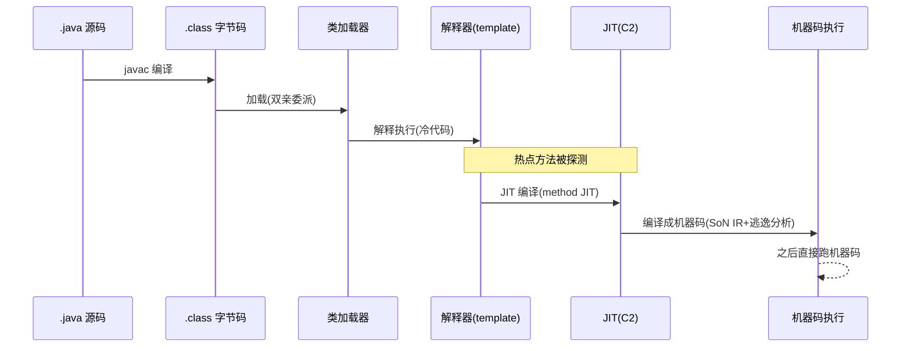
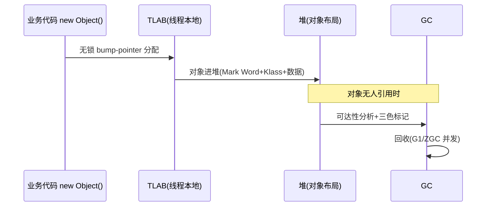

# 第 0 篇 · 第 1 章 · 第一性原理:为什么 Java 又跨平台又快

> **核心问题**:Java 有个矛盾的脸——一方面它"一次编写,处处运行",跨平台到几乎哪儿都能跑;另一方面它又"够快",快到 Hadoop、Cassandra、Elasticsearch、Kafka、你公司的整个后端都敢拿它扛海量流量。跨平台通常意味着抽象、抽象通常意味着慢。那么 Java 凭什么**又跨平台又快**?那个叫 JVM(更准确说是 HotSpot)的 C++ 运行时,到底在里面干了什么,把"跨平台的代价"赚了回来?

> **读完本章你会明白**:
> 1. Java 面对的根本矛盾是**跨平台抽象 vs 原生性能**,以及这个矛盾为什么"看起来无解"。
> 2. JVM 的"三件套"(字节码 / JIT / GC)各回答了哪个根本问题,为什么偏偏是这三件、缺一不可。
> 3. 为什么本书用"**执行子系统 vs 内存子系统**"二分法当骨架,23 章都是这两大子系统上的驿站。
> 4. 为什么 JVM 的 JIT 是 **method JIT**,这和《LuaJIT》那本的 **trace JIT** 是双璧对照(本书第 2 篇处处对照它)。
> 5. 为什么 JVM 的 GC 是**分代 + 多算法**,和《Go runtime》的非分代 GC 形成对照(本书第 4 篇对照它)。
> 6. JVM 在你已有的运行时网络里(Go runtime / LuaJIT / Tokio)处于什么位置,以及它为什么托底整个 Java 分布式线。

> **如果一读觉得太难**:先只记住三件事——① Java 的根本矛盾是跨平台抽象 vs 原生性能;② JVM 用"字节码(换跨平台)+ JIT(赚回性能)+ GC(赚回生产力)"三件套把代价赚回来;③ 全书一句话主线:**HotSpot 是那台把跨平台抽象代价赚回来的 C++ 运行时**,分执行子系统(代码怎么跑)和内存子系统(数据怎么存收)两面。

---

## 〇、一句话点破

> **跨平台是要付代价的——你离硬件越远,跑得越慢。Java 的本事不是"免单",而是让一个叫 JVM(本书记 HotSpot 实现)的 C++ 运行时,用"字节码 + JIT + GC"三件套,把这笔代价又赚了回来。**

这是结论,不是理由。本章倒过来拆:先讲跨平台到底要付什么代价,再讲这笔代价有多大,然后讲 JVM 三件套怎么一笔笔赚回来,最后讲这套"赚回来"的机器怎么分成执行和内存两大子系统。

---

## 一、跨平台的代价:Java 的根本矛盾

### 一个朴素的事实:抽象是要付钱的

学编译原理时有个常识:代码离硬件越近,跑得越快。C 代码编译成机器码,直接在 CPU 上跑,中间没有"翻译"——所以 C 快。Python 代码要先被解释器一行行翻译成字节码、再翻译成机器码执行,中间隔了两层翻译——所以 Python 慢。

跨平台,本质上就是**主动在代码和硬件之间,加一层抽象**。你写一份代码,想让它既能在 x86 的 Linux 上跑、又能在 ARM 的 Mac 上跑、还能在别的地方跑,你就不能把它直接编成某一种 CPU 的机器码——你得编成一种**中间形态**,然后在每个平台上放一个"翻译",把这个中间形态翻成当地 CPU 能懂的机器码。

这个"中间形态 + 每个平台的翻译",就是**跨平台的代价**:你多了一层翻译,这层翻译要花时间、要占内存、要管理运行时的种种琐事。

> **钉死这件事**:跨平台不是免费的午餐。任何跨平台的方案,本质都是在"代码"和"CPU"之间塞进一个运行时,这个运行时替你屏蔽了平台差异,代价是——它得在运行时干很多 C 程序员在编译期就干完的事(翻译、优化、内存管理)。

### Java 选了最重的抽象,然后发誓把它赚回来

Java 选的抽象,比大多数语言都重:

- **不直接编译成机器码**,而是编译成"字节码"(一种平台无关的中间指令),放到 `.class` 文件里。
- **每个平台放一个 JVM**,运行时把字节码翻成机器码执行。
- **不让程序员管内存**,对象自动分配、自动回收(GC)。

这三条每一条都"更慢":字节码要翻译、JVM 要占资源、GC 要暂停。所以 1995 年 Java 刚出来时,慢是出了名的——"跨平台"的代价赤裸裸地暴露在性能上。

> **不这样会怎样**:如果 Java 像早期那样,只靠"解释器逐条翻译字节码"运行,它永远快不起来——跨平台抽象的代价(翻译开销)会一直拖着它。Java 想真正进入性能敏感的服务端领域(后来它做到了,Hadoop/Cassandra/Kafka 全是 Java),就必须**把这笔代价赚回来**。这就是 HotSpot 存在的理由。

---

## 二、JVM 三件套:把代价一笔笔赚回来

那么 JVM 怎么赚回来?答案是三件套,每一件各对应一笔代价,把它赚回来。

### 第一件:字节码 —— 赚"跨平台"

跨平台要一份"平台无关的中间形态",Java 用**字节码(bytecode)**。你写 `int x = a + b;`,javac 把它编成一条 `iadd` 字节码指令(整数加),这个 `iadd` 在 x86 和 ARM 上都长一个样。运行时,每个平台的 JVM 把 `iadd` 翻成当地的加法机器码。

```
   Java 源码            字节码(平台无关)        各平台机器码
   int x=a+b;   ──javac──→  iadd           ──JVM翻译──→  x86: add eax,ebx
                                                    ARM: add r0,r1,r2
```

字节码是"世界语":一份 `.class` 到处跑。这笔"跨平台"的代价,字节码替你付了(你不用为每个平台重新编译)。

> **不这样会怎样**:如果没有字节码这个中间层,要么你为每个平台分别编译(C 的做法,不跨平台),要么你运行时逐行解析源码(Python 的做法,更慢)。字节码是"预编译到中间形态"的折中——比源码解析快(已经词法语法分析了),又保持了跨平台。

### 第二件:JIT —— 赚"性能"

字节码解决了跨平台,但带来新代价:**运行时还要翻译**。如果像早期 Java 那样靠解释器逐条翻译字节码,性能永远上不去。

JVM 的回答是 **JIT(Just-In-Time,即时编译)**:**运行时把"热点"字节码直接编译成机器码**,以后跑机器码,不再翻译。更狠的是,HotSpot 的 C2 编译器还能做**逃逸分析、锁消除、向量化**这些只有 C/Rust 编译器才做的优化——把 Java 编到接近 C 的性能。

> **不这样会怎样**:如果只靠解释器(不 JIT),Java 的 `iadd` 每次执行都要"取出字节码→查表→调用对应的解释例程",比 C 的直接机器指令慢一个数量级。JIT 把热点代码编成机器码后,执行 `iadd` 就是直接一条 CPU 加法指令——和 C 一样快。这就是"把翻译代价赚回来"。

字节码是"口译"(慢但即时),JIT 是"笔译成母语"(慢一次,之后直接读母语,快)。这一对比,就是 JVM JIT 的精髓,也是本书第 2 篇(C1/C2/Sea-of-Nodes)要拆透的招牌。

### 第三件:GC —— 赚"内存管理生产力"

C 程序员要手动 `malloc/free`,容易内存泄漏、悬垂指针,这些都是 bug 富矿。Java 让你 `new` 完不管释放,**JVM 的 GC(Garbage Collector,垃圾回收)自动找出没人用的对象回收掉**。这笔"内存管理"的开销(找垃圾 + 回收),GC 替你付了,换回来的是**程序员的生产力**——不用再为内存管理写一堆易错的代码。

但 GC 也不是免费的:它要遍历对象图找可达对象、要暂停程序(Stop-The-World)或并发回收、要占用 CPU 和内存。HotSpot 的本事是把这些开销压到很小——G1 做到可预测停顿、ZGC 做到 sub-ms 暂停。

> **钉死这件事**:三件套各赚一笔——**字节码赚跨平台、JIT 赚性能、GC 赚生产力**。它们是 JVM 把"跨平台抽象代价"赚回来的三个支柱,缺任何一个,Java 都不可能"又跨平台又快"。全书 23 章,本质上就是这三件套的展开:第 1~2 篇拆字节码与 JIT(执行子系统),第 3~4 篇拆对象与 GC(内存子系统)。

---

## 三、全书骨架:执行子系统 vs 内存子系统

三件套讲清了"赚回来",但还没讲"HotSpot 内部怎么组织"。这就要回到全书的骨架——**执行 vs 内存两大子系统**。

HotSpot 的一切机制,要么在**执行子系统**(让代码跑起来),要么在**内存子系统**(让数据存得住收得回),要么**横切**两面(锁、JMM、虚拟线程、safepoint)。

### 执行子系统:一段 Java 代码怎么跑起来



执行子系统回答"代码怎么跑、跑得多快"。第 1 篇(类加载/字节码/解释器)是执行地基,第 2 篇(C1/C2/Sea-of-Nodes)是执行性能招牌。

### 内存子系统:数据怎么存怎么收



内存子系统回答"对象怎么存、谁回收"。第 3 篇(对象布局/堆/TLAB)是内存地基,第 4 篇(G1/ZGC/Shenandoah)是内存灵魂招牌。

> **钉死这件事**:**全书一句话主线——HotSpot 是那台把跨平台抽象代价赚回来的 C++ 运行时。** 任何一处看不懂 HotSpot 的某个机制,回到这两大子系统问:"这是执行的(类加载/字节码/JIT)、内存的(对象/堆/GC)、还是横切的(锁/JMM/虚拟线程)?"这就是本书的**二分法**。

---

## 四、为什么本书处处对照:JVM 不是孤岛

这本书和《LuaJIT》《Go runtime》《内存分配器》《Linux 同步原语》不是各自为政的孤岛,它们是**一张运行时网络**。JVM 是这张网里承上启下的节点,本书处处对照,读者读一本复习深化多本。这是本书最大的特色——**承接成网**。

### 对照一:JIT —— method JIT vs trace JIT

本书第 2 篇处处对照《LuaJIT》。LuaJIT 是 **trace JIT**:它录制"热循环的某条路径"(trace),把这条路径编成机器码,路径外的分支靠 guard 处理。HotSpot C2 是 **method JIT**:它编译**整个方法**,用 Sea-of-Nodes IR 做全局优化(逃逸分析、向量化),路径外的少见情况靠 uncommon trap 逆优化。

两者是 JIT 的两大流派:trace JIT 轻量、适合动态语言(LuaJIT);method JIT 重量、优化深、适合静态类型语言(C2)。本书第 2 篇把这对双璧对照讲透,你会同时深化两本。

### 对照二:GC —— 分代 vs 非分代

本书第 4 篇处处对照《Go runtime》。Go 的 GC 是**并发三色标记、非分代**(简单、低延迟优先)。JVM 的 GC 是**分代 + 多算法**(分代假说 + G1/ZGC/Shenandoah 各有取舍)。为什么 JVM 分代、Go 不分代?这背后是两种语言、两种 workload 的取舍——本书第 4 篇对照讲,你会同时深化两本。

### 对照三:锁 —— JVM 锁 vs Linux futex

本书第 5 篇对照《Linux 同步原语》。JVM `synchronized` 的重量级锁底层是 `ObjectMonitor` + futex/park;AQS 是 CLH 队列锁的变种。这些机制在《Linux 同步原语》里(futex/自旋锁/percpu-rwsem)有底层拆解,本书把 JVM 这一层接上去。

### 对照四:虚拟线程 —— goroutine vs Tokio task

本书第 6 篇(虚拟线程)三栈对照:Java 21 virtual thread ↔ Go goroutine ↔ Tokio task,都是 M:N 用户态调度,但实现哲学不同。读完你会真正理解"用户态线程/协程"这一大类。

> **钉死这件事**:JVM 不是孤岛,它是运行时网络的**承重墙**——托底你整个 Java 分布式线(RocketMQ/Dubbo/Kafka 都跑在 JVM 上),又横连 JIT/GC/锁/并发四条线。读本书,等于把《LuaJIT》《Go runtime》《Linux 同步》《内存分配器》一起复习深化。

---

## 五、可观测性:JVM 为什么"好调"

讲完机制,补一个让 JVM 在工业界站稳脚的特点:**可观测性**。HotSpot 内置了大量诊断接口——JFR(Java Flight Recorder)持续记录运行时事件、`jstat`/`jmap`/`jstack` 看堆和线程、`-XX:+PrintCompilation` 看 JIT、GC log 看 GC 细节、async-profiler 出火焰图。

这不是题外话——它解释了为什么 JVM 适合跑在生产环境扛流量:**出了问题你能看得见**。C 程序崩了往往一团黑盒,JVM 出问题你能抓出是 GC 停顿、还是锁竞争、还是没被 JIT。本书附录 B 专门讲这套工具链与调优。

---

## 六、技巧精解:两个第一性洞察

本章是概念定调章。有两个最硬核的第一性洞察值得单独钉死。

### 洞察一:method JIT 为什么能编到接近 C——Sea-of-Nodes 与"激进优化 + 逆优化"

很多人以为"JIT 就是把字节码翻成机器码,顶多加点内联"。错。HotSpot C2 的杀手锏是 **Sea-of-Nodes IR**:它把一段方法建成一个"数据流 + 控制流"的图,在这个图上做**逃逸分析**(判断对象会不会逃出方法,不逃就不上堆)、**标量替换**(把对象拆成字段当局部变量)、**锁消除**(对象不逃,synchronized 直接删掉)、**向量化**(循环合并成 SIMD 指令)——这些是 C/Rust 编译器才有的优化。

但激进优化有个前提:**这些优化是基于假设的**(假设某个方法没被重写、假设某个对象不逃)。一旦运行时假设被打破(新加载了一个子类),C2 靠 **uncommon trap 逆优化**——把机器码扔掉,回退到解释器,再重新编译。这个"激进优化 + 必要时逆优化"的组合,是 C2 能编到接近 C 性能的根。

> **对照 LuaJIT**:LuaJIT 是 trace JIT,它对"录到的热路径"做深度优化,路径外靠 guard 跳回(见《LuaJIT》P-xx)。C2 是 method JIT,对"整个方法"做更深优化,少见路径靠 uncommon trap 逆优化。两种 JIT 的"优化 + 兜底"哲学殊途同归,本书第 2 篇逐章对照。

### 洞察二:为什么 JVM GC 分代,Go GC 不分代

GC 有个经典分歧:**分代还是不分代**。JVM 分代(Young/Old),Go 不分代。为什么?

分代基于**分代假说**:"绝大多数对象朝生夕死"。分代 GC 把新对象放 Young 区,Young 区用复制算法频繁回收(便宜);活下来的晋升 Old 区,Old 区很少回收。这对 Java workload(大量临时对象)有效——大部分对象在 Young 区就被收了,不用动 Old。

但分代要付出复杂度代价:跨代引用(Old 指向 Young)要靠 Card Table 记录,Young GC 要扫 Card。Go 选择不分代,用**并发三色标记 + 写屏障**,牺牲一点吞吐换实现简单和低延迟。

> **不这么选会怎样**:这不是谁对谁错,是 workload 取舍——Java 服务端产生大量短命对象(每次请求 new 一堆),分代收益巨大;Go 的设计哲学是"简单优先 + 低延迟",不分代。本书第 4 篇把这对取舍拆到源码级(G1 的 Region/SATB、ZGC 的染色指针),对照《Go runtime》的 GC。

---

## 七、章末小结

### 回扣主线

本章是全书唯一的"纯概念章"。它立起了全书最重要的三个东西:

1. **根本矛盾**:跨平台抽象 vs 原生性能——抽象要付代价。
2. **总开关**:JVM 三件套(字节码/JIT/GC)把代价赚回来——**HotSpot 是那台赚回代价的 C++ 运行时**。
3. **骨架**:全书用"**执行子系统 vs 内存子系统**"二分法,23 章都是这两大子系统上的驿站。

后续 22 章,都是这三个东西的展开。

### 五个为什么

1. **为什么 Java 又跨平台又快?**——跨平台靠字节码(平台无关中间形态 + 每个平台一个 JVM 翻译);快靠 JIT(运行时把热点编成机器码,优化到接近 C);生产力靠 GC(自动内存管理)。三件套把跨平台抽象的代价赚回来。
2. **为什么跨平台要付代价?**——因为要在代码和 CPU 间塞一个运行时,它得在运行时干编译期的事(翻译/优化/内存管理)。
3. **为什么 JIT 是 method JIT 而非 trace JIT?**——Java 是静态类型语言,整方法编译 + 深度优化(逃逸分析/向量化)收益大;trace JIT 适合动态语言(对照 LuaJIT)。本书第 2 篇对照。
4. **为什么 JVM GC 分代、Go 不分代?**——workload 取舍:Java 服务端大量短命对象,分代收益大;Go 重简单和低延迟。本书第 4 篇对照。
5. **为什么这本书处处对照其他运行时?**——JVM 是运行时网络的承重墙,横连 JIT/GC/锁/并发四线;对照读一本深化多本。

### 想继续深入往哪钻

- 想看 JVM 整体设计:读 Oracle 官方 "Java HotSpot Virtual Machine Performance" + OpenJDK wiki。
- 想理解 JIT 两大流派:本书第 2 篇 + 《LuaJIT》第 2~4 篇(trace JIT 对照)。
- 想理解 GC:本书第 4 篇 + 《Go runtime》GC 章 + 《内存分配器》。
- 想看 HotSpot 源码:本书《附录 A》(全书成稿后)。
- 想动手感受:写个小 Java 程序,用 `jstat -gc` 看堆、`-XX:+PrintCompilation` 看 JIT、开 JFR 看火焰图。

### 引出下一章

我们搞清楚了"为什么 Java 又跨平台又快"和"JVM 三件套怎么赚回代价",也明白了全书用执行/内存两大子系统当骨架。那么,执行子系统的第一站是什么?一段 Java 代码编成 `.class` 后,怎么被加载进 JVM?双亲委派为什么这么设计、又怎么被破坏?下一章 P1-02,我们从执行地基的第一站——**类加载与双亲委派**——开始,拆 HotSpot 怎么安全一致地把字节码加载进来。

> **下一章**:[P1-02 · 类加载与双亲委派](P1-02-类加载与双亲委派.md)
