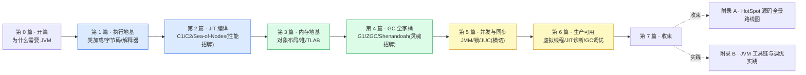

# 《JVM/HotSpot 设计与实现深入浅出:为什么 Java 又跨平台又快》—— 目录与导读

> 一本写给"天天写 Java、调过 JVM 参数、看过 GC/JIT 博客,却总觉得对 JVM 一知半解"的人的小书。
>
> **一句话主旨**:Java 用"字节码跨平台 + JIT 即时编译 + GC 自动内存"三件套,把跨平台抽象的代价赚回来——HotSpot 就是那台赚回代价的 C++ 运行时。
>
> **二分法**(迷路时回到它):**执行子系统**(类加载→字节码→解释器→JIT 编译) vs **内存子系统**(对象布局→堆分配→GC 回收);JMM / 锁 / 虚拟线程 / safepoint 是横切。
>
> **承接成网**:JIT←[[luajit-series-project]](trace JIT 对照 method JIT)、GC←[[alloc-series-project]]+[[go-runtime-series-project]]、锁←[[linux-sync-series-project]]、虚拟线程←[[go-runtime-series-project]]+[[tokio-series-project]];并托底整个 Java 分布式线(RocketMQ/Dubbo/Kafka 都跑在 JVM 上)。
>
> **主比喻**:直球为主、比喻点睛。开篇用"翻译官"做一次性点位睛——字节码是世界语,JVM 是随身翻译官,解释器是口译(慢即时)、JIT 是笔译成母语(慢一次后快)、GC 是保洁阿姨(自动收)。

每章一行:**一句话钩子** —— 技巧标签 —— 二分法归属(`执行` / `内存` / `横切` / `总览`)。

---

## 全书结构总览

旅程:从"一段 Java 代码",一路走到"它在 HotSpot 里怎么跑、对象怎么存怎么收、怎么并发"。读完你能在脑子里放映出:字节码被类加载→解释器执行→热点被 C2 编译成机器码;`new` 出的对象在堆里 Mark Word 布局、TLAB 无锁分配、GC 三色标记回收;`synchronized` 锁升级、虚拟线程 M:N 调度——以及每一步 Go runtime / LuaJIT 是怎么做的对照。

---

## 第 0 篇 · 开篇:为什么需要 JVM

- [P0-01 · 第一性原理:为什么 Java 又跨平台又快](P0-01-第一性原理-为什么Java又跨平台又快.md) —— 跨平台抽象 vs 原生性能的根本矛盾;JVM 三件套(字节码/JIT/GC)把抽象代价赚回来;承接运行时四栈。 —— 跨平台代价 + 三件套 + 成网 —— `总览`

## 第 1 篇 · 执行地基:类加载与字节码

> 代码进 JVM 第一关。**建议顺序读**。

- [P1-02 · 类加载与双亲委派](P1-02-类加载与双亲委派.md) —— .class 怎么被加载,双亲委派为什么这么设计(安全+一致性),怎么被破坏。 —— 双亲委派 + 命名空间 —— `执行`
- [P1-03 · 字节码格式与常量池](P1-03-字节码格式与常量池.md) —— .class 文件长什么样:字节码指令 + 常量池符号引用 + 栈式计算(对照 LuaJIT 编号栈槽)。 —— 字节码指令集 + 常量池 —— `执行`
- [P1-04 · 解释器与字节码执行](P1-04-解释器与字节码执行.md) —— 字节码怎么被执行:template interpreter 用汇编模板,每条字节码一段汇编。 —— template interpreter + 操作数栈 —— `执行`

## 第 2 篇 · JIT 编译:把字节码变机器码(性能招牌)

> JVM 性能核心,与 LuaJIT 双璧对照主战场。**建议顺序读**。

- [P2-05 · 分层编译 tiered](P2-05-分层编译tiered.md) —— 为什么要分层(解释器→C1→C2),热点怎么探测,method JIT vs LuaJIT trace JIT。 —— 分层编译 + 热点探测 + method vs trace —— `执行(招牌)`
- [P2-06 · C1 编译器](P2-06-C1编译器.md) —— client 编译器怎么快速出码:线性 IR + SSA,占位作用。 —— C1 线性 IR + SSA —— `执行`
- [P2-07 · C2 与 Sea-of-Nodes IR](P2-07-C2与Sea-of-Nodes-IR.md) —— C2 凭什么编到接近 C:Sea-of-Nodes IR + 逃逸分析标量替换 + 锁消除 + SuperWord 向量化。 —— SoN IR + 逃逸分析 + 向量化 —— `执行(招牌)`
- [P2-08 · 逆优化 deoptimization](P2-08-逆优化deoptimization.md) —— JIT 编译的假设失效怎么办:uncommon trap 回退解释器(对照 LuaJIT guard)。 —— uncommon trap + 去优化 —— `执行`

## 第 3 篇 · 内存地基:对象与堆

> 数据怎么存,GC 的地基。**建议顺序读**。

- [P3-09 · 对象内存布局](P3-09-对象内存布局.md) —— 一个对象在堆里:Mark Word + Klass Pointer + 实例数据,Mark Word 位复用,compressed oops。 —— 对象头 + 位复用 + 压缩指针 —— `内存`
- [P3-10 · 堆分配与 TLAB](P3-10-堆分配与TLAB.md) —— new 一个对象怎么进堆:TLAB 无锁 bump-pointer(对照 Go mcache)。 —— TLAB 无锁分配 —— `内存(招牌)`
- [P3-11 · Metaspace 与直接内存](P3-11-Metaspace与直接内存.md) —— 类元数据存哪(Metaspace 替代永久代),NIO 堆外内存怎么管。 —— Metaspace + 直接内存 Cleaner —— `内存`

## 第 4 篇 · GC:自动内存管理全家桶(灵魂招牌)

> 工业级自动内存管理标杆,与 Go GC 对照。**建议顺序读**。

- [P4-12 · GC 基础:可达性与三色标记](P4-12-GC基础-可达性与三色标记.md) —— 怎么判断回收:可达性分析 + 三色标记 + 漏标问题 + safepoint(对照 Go GC)。 —— 三色标记 + safepoint —— `内存`
- [P4-13 · 分代假说与 Minor GC](P4-13-分代假说与Minor-GC.md) —— 为什么分代:分代假说 + 复制算法 + 卡表跨代引用。 —— 分代 + 复制算法 + Card Table —— `内存`
- [P4-14 · G1 GC](P4-14-G1-GC.md) —— G1 凭什么可预测停顿:Region 化 + SATB + 混合回收 + Pause Prediction Model。 —— Region + SATB + 停顿预测 —— `内存(招牌)`
- [P4-15 · ZGC](P4-15-ZGC.md) —— ZGC 凭什么 sub-ms 暂停:染色指针 + 读屏障 + 并发转移 + generational ZGC。 —— 染色指针 + 读屏障 —— `内存(招牌)`
- [P4-16 · Shenandoah 与 GC 选型](P4-16-Shenandoah与GC选型.md) —— Shenandoah 转发指针并发压缩 + 各 GC 选型决策表。 —— Brooks pointer + GC 选型 —— `内存`

## 第 5 篇 · 并发与同步(横切)

- [P5-17 · Java 内存模型 JMM](P5-17-Java内存模型JMM.md) —— 多线程共享变量怎么保证可见有序:happens-before + volatile + final(对照 Linux 内存序)。 —— happens-before + volatile —— `横切`
- [P5-18 · synchronized 与锁升级](P5-18-synchronized与锁升级.md) —— synchronized 怎么实现:偏向→轻量→重量锁升级 + Mark Word 编码 + ObjectMonitor(接 futex)。 —— 锁升级 + Mark Word + ObjectMonitor —— `横切(招牌)`
- [P5-19 · JUC 与 AQS](P5-19-JUC与AQS.md) —— ReentrantLock/CountDownLatch 怎么实现:AQS CLH 变种队列 + CAS + park(接 Linux 原子/futex)。 —— AQS + CLH + CAS —— `横切`

## 第 6 篇 · 生产可用

- [P6-20 · 线程模型与虚拟线程](P6-20-线程模型与虚拟线程.md) —— Java 21 虚拟线程:平台线程→M:N 用户态调度,continuation + scheduler(对照 goroutine/Tokio task 三栈)。 —— virtual thread + continuation —— `横切(招牌)`
- [P6-21 · JIT 诊断](P6-21-JIT诊断.md) —— 怎么知道代码被 JIT、优化成啥:JFR + async-profiler + JITWatch + PrintCompilation。 —— JFR + 火焰图 + JITWatch —— `横切`
- [P6-22 · GC 调优与排查](P6-22-GC调优与排查.md) —— 各 GC 参数选型 + GC log 解读 + OOM 排查(heap dump/mat)。 —— GC 参数 + OOM 排查 —— `横切`

## 第 7 篇 · 收束

- [P7-23 · 全书收束:运行时四栈对照](P7-23-全书收束-运行时四栈对照.md) —— JVM/Go runtime/LuaJIT/Tokio 四栈对照(执行/GC/并发/内存)+ GraalVM Native Image AOT 展望 + Loom/Valhalla 演进。 —— 四栈对照 + GraalVM 展望 —— `总览`

## 附录

- [附录 A · HotSpot C++ 源码全景路线图](附录A-源码全景路线图.md) —— .class→classLoader→interpreter→C1/C2→对象/堆→GC→锁/Monitor 全栈地图 + src/hotspot/share/ 阅读顺序。
- [附录 B · JVM 工具链与调优实践](附录B-工具链与调优实践.md) —— jstat/jmap/jstack/jcmd、JFR/async-profiler/JITWatch、GC 调优方法论、OOM/卡顿排查清单、RocketMQ/Dubbo 的 JVM 常见坑。

---

## 推荐阅读路线

**主线(推荐)**:P0-01 → 第 1 篇全(P1-02~04)→ 第 2 篇全(P2-05~08,JIT 招牌)→ 第 3 篇 → 第 4 篇(GC 灵魂招牌)→ 第 5 篇 → 第 6 篇 → 第 7 篇 → 附录 A。这是"一段 Java 代码在 HotSpot 里跑完执行+内存两大子系统"的完整旅程,顺着读最省力。

按目标速查:

| 你的目标 | 读这几章 |
|------|------|
| 只想懂 JVM 整体(为什么又跨平台又快) | P0-01 → P2-05 → P7-23 |
| 只想懂 JIT(性能核心) | P1-04 → P2-05~08 |
| 只想懂 GC(灵魂招牌) | P3-09~11 → P4-12~16 |
| 只想懂锁与并发 | P3-09(Mark Word)→ P5-17~19 |
| 读过 LuaJIT 想看 method JIT 对照 | P2-05(method vs trace)→ P2-07(SoN vs 线性 IR)→ P2-08(uncommon trap vs guard) |
| 读过 Go runtime 想看 GC/虚拟线程对照 | P4-12(GC)→ P4-14~15(G1/ZGC)→ P6-20(虚拟线程) |
| 写 Java 服务想调 JVM | P6-21 → P6-22 → 附录 B |
| 想读 HotSpot 源码 | 附录 A(源码地图)+ 跟本书章节逐个啃 |

> 一个提醒:第 1、2 篇(执行地基→JIT)和第 3、4 篇(内存地基→GC)各有紧密顺序,**不要跳着读这四篇**;本书处处对照 Go runtime / LuaJIT,读过那两本收获翻倍。

---

## 配套文件

- [全书规划-总纲](全书规划-总纲.md) —— 主线、二分法、承接成网、比喻决策、分篇分章、源码策略、写作约定。
- [_章节写作提示词](_章节写作提示词.md) —— 写作执行手册(铁律、四段式、技巧精解、自检清单、承接铁律)。
- 源码(本地 clone):`../openjdk/`(openjdk/jdk,master @ `193de1b1`,版本 JDK 28 dev,HotSpot 在 `src/hotspot/`)。本书所有源码引用均经 Grep/Read 核实行号,钉死在该 commit。
- 承接:[[luajit-series-project]]/[[luajit-source-facts]](JIT)、[[alloc-series-project]]+[[go-runtime-source-facts]](GC)、[[linux-sync-source-facts]](锁)、[[go-runtime-series-project]]+[[tokio-series-project]](虚拟线程)。

---

> 这本书讲的不是"JVM 参数怎么调",而是"它凭什么又跨平台又快、HotSpot 源码里那些 template interpreter、C2 Sea-of-Nodes、G1 SATB、ZGC 染色指针、锁升级、虚拟线程到底在干什么"。读完,你该能在脑子里放映出一段 Java 代码在 HotSpot 里的一生——以及每一步 Go runtime / LuaJIT 是怎么做的对照。
