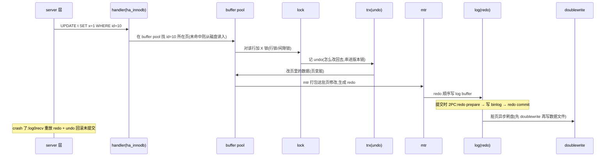

# 第 0 篇 · 第 1 章 · 第一性原理:为什么需要 InnoDB

> **核心问题**:你天天用 MySQL——建表、建索引、`UPDATE`、`SELECT`,背过"RR 解决幻读""InnoDB 支持事务"。可"InnoDB 到底是怎么把数据存下来的、一条 `UPDATE` 为什么 crash 了也不丢、并发改同一行为什么不乱",你能讲清吗?InnoDB 用"B+树聚簇索引 + WAL/redo/undo/2PC + MVCC + 锁"这四个灵魂,撑住了 OLTP(联机事务处理)的"数据多 + 并发高 + crash 不丢 + 事务 ACID"。它凭什么?

> **读完本章你会明白**:
> 1. OLTP 场景的核心矛盾——**既要数据量大、并发高,又要 crash 不丢、事务 ACID**,这几条怎么同时满足。
> 2. MySQL 的"server 层 + 可插拔存储引擎"架构,为什么 InnoDB 成了默认(从 MyISAM 到 InnoDB 的历史)。
> 3. InnoDB 的四个灵魂各解决什么:**B+树聚簇索引**(存)、**WAL/redo/undo/2PC**(不丢)、**MVCC**(并发读)、**锁/间隙锁**(隔离)——每个的动机、不这样会怎样、怎么做。
> 4. **四重承接**——聚簇索引↔《PG》堆表、B+树↔《LevelDB》LSM、buffer pool↔《Linux内存管理》page cache、单机 MVCC↔《TiKV》分布式 MVCC。
> 5. 一条 `UPDATE` 在 InnoDB 里的完整旅程、为什么用 C/C++、几处大演进(redo 8.0.30 重构/新 DD/instant DDL)。

> **如果一读觉得太难**:先只记住三件事——① InnoDB 表就是一棵 B+树(聚簇索引,数据在叶子页);② 写之前先记 redo 日志(WAL),crash 后靠日志重放不丢;③ 读用 MVCC(多版本)不加锁、写用锁。全书一句话主线:**一条写,InnoDB 用 B+树找到位置、redo 保 crash 不丢、undo/MVCC 保并发读、锁保隔离**。

---

## 〇、一句话点破

> **InnoDB 用"B+树聚簇索引存数据 + redo(WAL)保 crash 不丢 + undo(MVCC)保高并发读 + 锁保隔离"这四个灵魂,把一次写做到"既不丢又高并发"——这是它撑住 OLTP 的根本。**

这是结论,不是理由。本章倒过来拆:先讲 OLTP 的核心矛盾,再讲 MySQL 的引擎架构和 InnoDB 的来历,然后**把四个灵魂逐个拆透**(每个独立成节,这是本章重点),接着讲四重承接、完整旅程、选型与演进。

---

## 一、OLTP 的核心矛盾:数据多 + 并发高 + crash 不丢 + 事务 ACID

要理解 InnoDB,先看清它要解决的问题。OLTP(联机事务处理)——电商下单、银行转账、ERP 入库——这类场景有四个硬需求,而且**这四个需求互相打架**:

### 需求一:数据量大,还得查得动

一个电商的订单表,几十亿行、几个 TB。这要求存储引擎**能装得下**——但这只是最低要求,更难的是**还能查得动**。如果数据结构不好(比如全表扫),几个 TB 扫一遍要几小时,业务根本等不了。所以引擎必须给数据配上高效的"目录"(索引),让"按主键查一行"是毫秒级、而不是扫整张表。数据量越大,数据结构和索引的效率越关键。

### 需求二:并发高,且不能乱

双十一秒杀,同一时刻可能有几万个请求在读写同一批数据(同一件库存、同一个账户)。这要求引擎能扛住高并发,且并发之下**不乱**——不会 A 和 B 同时改一行、结果丢一个;不会 A 读到 B 改了一半的中间态。这需要精细的**并发控制**(锁 + MVCC),而不是简单粗暴的"改的时候全表锁住"(那样并发就废了)。

### 需求三:crash 不丢,且能恢复

机房断电、内核崩溃、进程被 kill——这些在生产环境**随时会发生**。crash 之后,有两个硬要求:① 已经"提交成功"的事务**绝不能丢**(用户钱扣了、订单却没了,是灾难);② 正在进行的(未提交的)事务**要能干净回滚**(不能留下半拉子数据)。这要求引擎有一套**crash 恢复机制**——重启后能把"该成的成、该回滚的回滚"。

### 需求四:事务 ACID,四条全要

一次转账(扣 A + 加 B)要么全成功、要么全失败(**原子性 A**);数据始终满足约束(余额不能为负)(**一致性 C**);多个事务并发互不干扰(A 转账时 B 查到的是一致的快照)(**隔离性 I**);提交了就永久,crash 也不丢(**持久性 D**)。ACID 是数据库区别于"能存数据的程序"的根本,每一性都要专门机制保证。

> **不这样会怎样**:如果只用一个朴素的存储(比如直接写文件),这四条**一条都稳不住**——数据大了查不动、并发改同一行会互相覆盖、crash 了已提交的数据可能丢、没有事务保证。OLTP 需要一个**专门为这四条矛盾设计的引擎**。

> **钉死这件事**:理解 InnoDB 的起点,不是"它有哪些参数",而是**它要同时打赢四场仗:数据多、并发高、crash 不丢、事务 ACID**。后面所有设计——B+树、buffer pool、redo/undo、MVCC、锁——都是这四场仗的产物。四个灵魂,一一对应。

---

## 二、MySQL 的引擎架构:server 层 + 可插拔引擎

MySQL 有个独特的设计:**它把"SQL 处理"(server 层)和"数据怎么存"(存储引擎)分开了**。

### 两层架构,各干什么

```
   客户端
     │
     ▼
   ┌─────────────────────────────────────┐
   │ server 层(所有引擎共用)             │
   │  连接器 → 解析 → 预处理 → 优化器 → 执行器 │
   └───────────────┬─────────────────────┘
                   │ handler 接口(标准 API)
   ┌───────────────▼─────────────────────┐
   │ 存储引擎(可插拔,挑一个)            │
   │  InnoDB(默认) / MyISAM / Memory / ... │
   └─────────────────────────────────────┘
```

- **server 层**负责接连接、解析 SQL、查询优化、执行调度——这一层**所有引擎共用**。SQL 从字符串变成执行计划,是在这里完成的(SQL 旅程承接《PG》那本,本书 P6-20 略带)。
- **存储引擎**负责"数据到底怎么存、怎么读、怎么保证不丢/并发"——这一层**可插拔**(MySQL 的招牌特性)。server 层通过一套叫 **handler** 的标准接口调用引擎(ha_innodb.cc 就是 InnoDB 实现的 handler)。

这意味着 InnoDB 是一个**相对独立的子系统**——这也是为什么本书能聚焦 `storage/innobase/`,server 层只在 P6-20 略带。

### 从 MyISAM 到 InnoDB:为什么 InnoDB 成了默认

MySQL 早期(5.5 以前)默认引擎是 **MyISAM**:简单、对只读场景快。但 MyISAM 在 OLTP 的四条需求面前**几乎全崩**:

- **不支持事务**:没有 redo/undo,改一半 crash 了,数据就坏了——需求三、四全废;
- **只有表锁**:改一行锁整张表,高并发下互相阻塞——需求二废;
- **crash 易损坏**:没有 crash recovery 机制——需求三废。

**InnoDB** 反过来:支持事务(redo/undo)、行锁(改一行只锁一行)、crash 安全(WAL + recovery)。随着 OLTP 场景占主导,**MySQL 5.5(2010)起 InnoDB 成为默认引擎**,从此 MyISAM 退居边缘。**今天说"MySQL",默认就是 InnoDB**。

> 一段历史:InnoDB 由 Heikki Tuuri 1995 年开发(独立公司 Innobase),2005 年 Oracle 收购 InnoDB,2008 年 SUN 收购 MySQL,2010 年 Oracle 收购 SUN——从此 MySQL 和 InnoDB 都归 Oracle,深度集成。**InnoDB 是独立起源、后被 MySQL 收编的引擎**,代码自成一体(`storage/innobase/`),有自己的"世界观"(自己的内存管理 `mem/`、同步原语 `sync/`、OS 抽象 `os/`)。这也是为什么读 InnoDB 源码,像在读一个"小型操作系统里的存储子系统"。

---

## 三、灵魂一:B+树聚簇索引——解决"数据怎么存、怎么找"

(对应需求一:数据多,要查得动。)

InnoDB 怎么存一张表?**把整张表的数据,存在一棵以主键为顺序的 B+树里**——这叫**聚簇索引(clustered index)**。B+树的叶子页,按主键顺序,直接存**整行数据**。

```
   InnoDB 聚簇索引(表 = 主键 B+树):
              [内部节点:导航用,只存 key]
              /        |        \
       [叶子页]     [叶子页]     [叶子页]    ← 叶子页按主键序,直接存整行数据
       id=1..N      id=N+1..2N    ...
       row row row  row row row
       ──── 叶子页之间用链表连起来(范围扫描顺序读)────▶
```

**关键洞察:在 InnoDB 里,"表"和"主键索引"是同一棵 B+树**——这就是"索引组织表(IOT)"。这和《PG》那本的**堆表(heap)**截然不同:PG 的表数据存成一个无序堆、索引是独立结构(指向堆里的行);InnoDB 的表本身就是一棵有序 B+树,数据就在树里。

**为什么这么设计?** 聚簇索引让"按主键查一行"极快——一次 B+树定位(几层内部节点 + 一个叶子页),叶子页里**直接就是整行数据**,不用再跳到别处。而且主键范围扫描是顺序的(叶子页之间有链表),`WHERE id BETWEEN 100 AND 200` 这种顺着链表读,极快。

**代价是什么?** 按非主键(比如按 `name`)查,要先查"name 索引"(二级索引)拿到主键值,再回到聚簇索引里用主键找整行——这叫**回表**,多一次 B+树查找。所以 InnoDB 强烈建议**自增整型主键**:插入顺序追加(叶子页顺序写,少页分裂)、主键小(二级索引存主键值,主键越小二级索引越省空间)。

> **不这样会怎样**:如果用堆表(PG 风格),主键查询要多一跳(先查主键索引拿位置、再去堆里找数据),OLTP 最高频的"主键点查"就慢一截。InnoDB 选聚簇索引,是为 OLTP"高频主键点查 + 范围扫"量身定做。**这是 InnoDB 区别于 PG 的根本存储决策**(本书 P1-02 对照拆透)。

---

## 四、灵魂二:WAL + redo/undo/2PC——解决"crash 不丢 + 事务 ACID"

(对应需求三、四:crash 不丢、事务 ACID。)

数据存在 B+树页里(在磁盘)。如果每次改数据都直接写磁盘的页,有两个致命问题:① **太慢**(随机写,而且每次改一行就刷一次盘,扛不住);② **crash 时可能写了一半**——一个 16KB 的页,写了一半机器断电,这个页就"撕裂"了,数据坏了。

InnoDB 的解法是 **WAL(Write-Ahead Logging,写前日志)**——**改数据页之前,先把"要怎么改"记到日志里**。三个组件配合:

**① redo log(重做日志)**:物理日志,记"哪个页哪个偏移改成什么字节"。它**顺序写**(顺序追加,极快,远快于随机写数据页),而且 crash 后能**重放**——把没落盘的修改,照着 redo 重新做一遍,数据就恢复了。于是 InnoDB 的写流程变成:**先顺序写 redo(快)→ 内存里改数据页(页变"脏")→ 脏页后台异步刷到磁盘(慢,但不阻塞事务)**。事务提交,只要等 redo 写完即可,不用等脏页刷盘——又快又 crash 安全。**MySQL 8.0.30 对 redo log 做了大重构**,老的单文件 `log0log.cc` 拆成了 `log0write.cc`(写)/`log0buf.cc`(buffer)/`log0files_*`(文件管理)等十几个文件(并发写、无锁优化)。

**② undo log(回滚日志)**:逻辑日志,记"怎么改回去"。两个用途:事务**回滚**(没提交的、或 crash 后未提交的,照着 undo 改回去)+ **MVCC 的旧版本**(让并发读能看到历史版本——见灵魂三)。undo 和 redo 配合:redo 保证"已提交的不丢",undo 保证"未提交的能回滚"。

**③ 两阶段提交(2PC)**:这是为了保证 InnoDB 的 redo 和 MySQL server 层的 binlog **一致**。crash 恢复时,redo 和 binlog 必须对得上,否则主从复制会错(从库照 binlog 复制,redo 和 binlog 矛盾就会数据不一致)。靠 2PC:redo prepare → 写 binlog → redo commit,把"两边都成功"做成一个原子点(技巧精解里拆透)。

> **不这样会怎样**:如果不写 redo 直接改页,crash 时已提交的修改可能没落盘(丢)、或页写一半(坏)。WAL 是数据库"crash 不丢"的标准答案——它把"随机写数据页"的负担,转成"顺序写日志"(快且可恢复)。这套思想,和《TiKV》那本的 Raft 日志、《LevelDB》的 WAL 是同源(都是"先记日志再动手")。

---

## 五、灵魂三:MVCC——解决"高并发下读不阻塞写"

(对应需求二:并发高,且不乱。)

高并发下,如果"读"和"写"同一行要互相加锁等待,性能会塌——OLTP 是"读多写也多",每个读都等写、每个写都等读,吞吐就废了。InnoDB 的解法是 **MVCC(多版本并发控制,Multi-Version Concurrency Control)**:**一行可以有多个版本,读操作看自己事务开始时的"快照版本",不加锁、不阻塞写**。

具体说,InnoDB 给每个事务(在 RR 隔离级别下)一个 **read view**(快照):这个快照记录了"事务开始时,哪些事务已提交、哪些还在跑"。读一行时,顺着 **undo 版本链**找到"对这个 read view 可见的那个版本"——已提交的、且版本号 ≤ 我的事务的,可见;还在跑的、或之后才提交的,不可见。于是:**读走 MVCC(无锁、看快照)、写走加锁改最新版——读写看的是不同版本,互不干扰、互不阻塞**。

```
   一行的版本链(undo 串起来):
   [最新版 v3] ←undo→ [v2] ←undo→ [v1]
      ↑ 写事务 C 正在改这个(加锁)
      │
      事务 A(read view 早)→ 看到 v1
      事务 B(read view 中)→ 看到 v2
   (A、B 读不加锁,C 写不被阻塞)
```

注意一个精妙点:undo log 不只是为了回滚,它还**把旧版本留着**,串成版本链给 MVCC 用。一条 undo 记录既是"怎么改回去"(回滚用),又是"上一个版本长什么样"(MVCC 用)。**一份 undo,两个用途**——这是 InnoDB 设计的经济性。

> **承接《TiKV》**:TiKV 也有 MVCC(分布式的),但实现不同——TiKV 的旧版本存在 RocksDB 里(key + 时间戳),InnoDB 的旧版本靠 undo 版本链。两者都是"多版本让读不阻塞写"的核心思想,本书 P4 篇对照拆。

---

## 六、灵魂四:锁 / 间隙锁——解决"写并发 + 隔离级别"

(对应需求二、四:写并发不乱、隔离级别。)

MVCC 解决了"读-写并发",但"**写-写并发**"(两个事务同时改同一行)还得靠**锁**——这个 MVCC 帮不了,必须串行化"对同一行的写"。InnoDB 的锁有几个精妙点:

- **行锁,不是表锁**(对照 MyISAM 的表锁):改哪行锁哪行,改 id=10 只锁 id=10 这一行,别的事务改 id=20 不受影响。这让高并发写不被一整张表拖累。
- **两阶段锁协议**:事务执行中**随时加锁**(改一行就锁一行),但**不是用完就放,而是 commit 时才统一释放**。所以:事务越长、持有的锁越多越久——这就是为什么 OLTP 强调"事务要短"。这个协议的代价是死锁更容易发生(见下)。
- **间隙锁(gap lock)/ 临键锁(next-key lock)**:这是 InnoDB 锁最复杂、也最容易被误解的地方。在 RR(可重复读)隔离级别下,为了解决"幻读"(同一事务里两次同样的查询,第二次多出来一行——因为别的事务插了进来),InnoDB 不仅锁**已有的记录**,还**锁住记录之间"不存在的间隙"**——别的事务插不进这个间隙,幻读就没了。这是 InnoDB 解决幻读的关键(本书 P5-17 拆透)。
- **死锁检测**:两阶段锁协议下,两个事务互相等对方的锁,就死锁了。InnoDB 用 **wait-for graph**(等锁图)检测环,发现环就挑一个事务(undo 量小的)回滚,解开死锁。

> **钉死这件事**:InnoDB 的四个灵魂——B+树聚簇索引(存)、WAL/redo/undo/2PC(不丢)、MVCC(并发读)、锁(并发写/隔离)——各管 OLTP 一个矛盾。**全书 23 章,本质就是这四个灵魂的展开**。MVCC + 锁合在一起,就是 InnoDB 的"并发控制"全套;redo + undo + 2PC 合在一起,就是它的"事务 + 崩溃恢复"全套。

---

## 七、四重承接:这本书站在四本书之上

读到这里你会发现:InnoDB 里的概念,你大多在前面的书里见过类似的东西。**本书是"集大成者"**,能复习并深化四本:

| 维度 | **InnoDB** | 承接前作 |
|------|-----------|----------|
| 表怎么存 | 聚簇索引(索引组织表) | ↔ 《PG》**堆表**(两种范式对照) |
| 存储数据结构 | B+树(就地更新) | ↔ 《LevelDB》**LSM**(追加+compaction),写放大/读放大三角 |
| 页面缓存 | buffer pool(改进 LRU) | ↔ 《Linux内存管理》**page cache** LRU |
| 并发事务 | undo 版本链 MVCC + 单机锁 | ↔ 《TiKV》**分布式 MVCC** + Percolator |
| SQL 旅程 | server 层解析优化 | ↔ 《PG》SQL 旅程(本书 P6-20 略带) |


- **聚簇索引 ↔ 《PG》堆表**:InnoDB 索引组织表 vs PG 堆表,两种"表怎么存"的根本范式;主键查询一跳 vs 两跳的差异根。
- **B+树 ↔ 《LevelDB》LSM**:就地更新的 B+树 vs 追加+compaction 的 LSM,两种存储引擎范式(写放大/读放大/空间放大三角),change buffer 对照 LevelDB 写缓冲。
- **buffer pool ↔ 《Linux内存管理》page cache**:InnoDB 自管 buffer pool(改进 LRU midpoint insertion),对照 kernel 的 page cache LRU。
- **MVCC/事务 ↔ 《TiKV》**:InnoDB 单机 undo 版本链 MVCC + 单机锁,对照 TiKV 分布式 MVCC + Percolator 跨 Region 事务。

> **钉死这件事**:读这本书,等于把《PG》《LevelDB》《Linux内存管理》《TiKV》**复习并深化一遍**——因为 InnoDB 把这几者的核心思想,组装成了一个扛住真实 OLTP 的成熟引擎。本书篇幅全留给 **InnoDB 独有部分**:聚簇索引、redo 8.0.30 重构、间隙锁、mtr、doublewrite 等。

---

## 八、一次写的完整旅程(全书地图)

把四个灵魂拼起来,一条 `UPDATE t SET x=1 WHERE id=10` 在 InnoDB 里的完整旅程(每个箭头都是后面某一章的主角):



对应章节:B+树找页(`btr/`)→ P1-02/04;buffer pool(`buf/buf0buf.cc`)→ P2-05;加锁(`lock/lock0lock.cc`)→ P5-16/17;undo+版本链(`trx/trx0undo.cc`)→ P3-10/P4;mtr 生成 redo(`mtr/mtr0mtr.cc`)→ P3-09;redo log(8.0.30 重构 `log/log0write.cc`)→ P3-08;2PC(`trx/trx0trx.cc`)→ P3-11;doublewrite(`buf/buf0dblwr.cc`)→ P3-12;crash recovery(`log/log0recv.cc`)→ P3-12。

> **钉死这件事**:读这本书,就是跟着这条旅程一站站走完。合上书你就能在脑子里放映出这条 UPDATE 的全过程——以及每一步底下用了什么巧妙的手段。

---

## 九、为什么是 C/C++,以及 InnoDB 的几处大演进

**为什么是 C/C++**:数据库引擎要**极致性能 + 精确控制内存/并发**(页的二进制布局、原子操作、自定义锁),C/C++ 给了这种控制力;Java 的 GC、Go 的运行时,在"微秒级延迟、GB 级内存管理"场景是负担。读 InnoDB 源码,你会看到大量 C/C++ 的"硬核"技巧——页的二进制布局、自定义互斥锁(`sync/`)、原子操作、`mtr` 临界区。本书在涉及处会拆"它怎么做到的、为什么 sound"(承接《Linux内核》的 C 技巧那套)。

**几处大演进(严重影响读源码,老资料大片过时)**:

1. **redo log 8.0.30 大重构**:老资料讲的 `log0log.cc` **单文件模型大片过时**——新版拆成 `log0write.cc`/`log0buf.cc`/`log0files_*` 等十几个文件(并发写、无锁优化);`log0pre_8_0_30.cc` 是兼容老格式的代码。
2. **数据字典 8.0 重构**:`.frm` 文件已废弃,8.0 起用新的 transactional data dictionary(`dict/`,存 InnoDB 表里)。
3. **instant DDL(8.0+)**:加列等只改数据字典、秒级完成,老资料"DDL 必重建表"过时。
4. **9.x 新特性**:向量类型(`VECTOR`,AI 场景)、JavaScript 存储过程等。
5. **本书以 master(9.7.0 LTS)源码为准**,生产主流 8.4 LTS 在涉及差异处(尤其 redo 8.0.30 重构)讲清。

---

## 十、技巧精解:两个第一性洞察

本章是概念定调章。有两个最硬核的第一性洞察值得单独钉死。

### 洞察一:为什么"表就是 B+树"(聚簇索引)是个天才设计

很多人第一次知道"InnoDB 表就是一棵 B+树"会困惑:为什么不学 PG 那样表(堆)和索引分开?InnoDB 的选择有深层道理:

- **主键查询是 OLTP 最高频操作**(查某个用户、订单),聚簇索引让"按主键查一行"只要一次 B+树定位、叶子页直接是数据,**省了"索引→堆"那一跳**(堆表要查索引拿位置、再去堆里找,两次 IO)。
- **主键范围扫描顺序读**(叶子页链表),"查 id 在 100-200 之间"极快。
- **代价**:按非主键查要回表;所以**自增整型主键**最优(顺序追加、少页分裂、二级索引存主键值也小)。

> **不这么设计会怎样**:堆表(PG 风格)主键查询多一跳,OLTP 高频主键点查慢一截。InnoDB 选聚簇索引,是为 OLTP 量身定做。**这是 InnoDB 区别于 PG 的根本存储决策**。

### 洞察二:两阶段提交凭什么保证 redo/binlog 一致

InnoDB 的 redo log 和 MySQL server 层的 binlog **必须一致**——否则 crash 恢复后,redo 有 binlog 没有(或反之),主从复制就会错。怎么保证?靠**两阶段提交(2PC)**:

```
   ① redo log: PREPARE(写 redo,标记 prepare)
   ② binlog: 写入 binlog(fsync)
   ③ redo log: COMMIT(写 redo,标记 commit)
```

crash 恢复时,InnoDB 检查每个事务的 redo 状态:
- redo 已 COMMIT → 事务一定成功(binlog 也一定写了)→ **重放 redo 提交**;
- redo 只 PREPARE(没到 COMMIT)→ 看 binlog 有没有:有 → 补提交;没有 → **回滚**(undo)。
- **于是 redo 和 binlog 永远一致**:crash 在任何时刻,恢复后两者都反映"同一批事务成功了"。

> **不这么设计会怎样**:如果先 redo commit 再写 binlog,crash 在中间,redo 说成功 binlog 没有——从库复制漏事务、主从不一致。2PC 用"binlog 写入"做原子裁决点——这是数据库"跨日志一致性"的标准答案(本书 P3-11 拆到源码)。

---

## 十一、章末小结

### 回扣主线

本章是全书唯一的"纯概念章"。它立起了全书最重要的三个东西:

1. **主线**:**一条写,InnoDB 用 B+树找到位置、redo 保 crash 不丢、undo/MVCC 保并发读、锁保隔离。**
2. **二分法**:**存储与索引**(B+树/buffer pool/doublewrite)vs **事务与并发**(WAL/redo/undo/2PC + MVCC + 锁)。
3. **四重承接**:聚簇索引↔《PG》、B+树↔《LevelDB》、buffer pool↔《Linux内存管理》、MVCC↔《TiKV》。

后续 22 章,都是这三个东西的展开。

### 五个为什么

1. **为什么 OLTP 需要 InnoDB?**——要同时满足数据多、并发高、crash 不丢、事务 ACID,朴素存储一条都稳不住。
2. **为什么 InnoDB 表是 B+树(聚簇索引)?**——OLTP 高频主键点查和范围扫,聚簇索引让这些最快(省堆表一跳);自增主键少页分裂。
3. **为什么写之前要先记 redo(WAL)?**——直接改页太慢且 crash 可能页撕裂;WAL 把随机写转顺序写、crash 后能重放,是"crash 不丢"的标准答案。
4. **为什么 MVCC 让读不阻塞写?**——一行多版本,读看自己事务快照(read view)不加锁;写加锁改最新版,读写看不同版本互不干扰。
5. **为什么 redo 和 binlog 要两阶段提交?**——保证两者一致,否则 crash 后主从复制会错;2PC 用"binlog 写入"做原子裁决点。

### 想继续深入往哪钻

- 想看官方架构:读 MySQL 官方文档 "InnoDB Architecture"。
- 想理解 B+树/聚簇索引:本书第 1 篇。
- 想理解 WAL/2PC:读 MySQL "Redo Log""Binary Log" 文档,本书第 3 篇拆到源码。
- 想动手感受:`SHOW ENGINE INNODB STATUS`、`explain`、`ibd2sdi` 看页、故意 kill 进程测 crash recovery。

### 引出下一章

我们搞清楚了"为什么需要 InnoDB"和它的四个灵魂。那么,InnoDB 到底怎么把一张表存成一棵 B+树、聚簇索引为什么"叶子页直接是数据"?下一章 P1-02,我们从最基础的 **聚簇索引:表的数据就在主键 B+树里** 开始,拆 InnoDB 存储的根。

> **下一章**:[P1-02 · 聚簇索引:表的数据就在主键 B+树里](P1-02-聚簇索引-表的数据就在主键B+树里.md)
