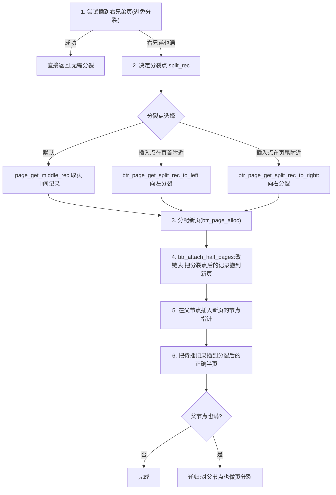

# 第 1 篇 · 第 4 章 · B+树页与记录:16KB 的页怎么组织

> **核心问题**:前两章我们说"InnoDB 表就是一棵 B+树,叶子页直接存整行数据"。可一个 16KB 的叶子页里**到底长什么样**?一堆记录怎么排?怎么往里塞、塞满了怎么办?一个 `TEXT` 大字段几十 KB,塞不进一个 16KB 的页又怎么办?这一章钻进**一个 B+树页的字节级内部**,把 InnoDB 存储这面的"微观收口"做掉。

> **读完本章你会明白**:
> 1. 一个 16KB 的 InnoDB 页,**字节级**是怎么划分的(File Header / Page Header / 用户记录 / Page Directory / File Trailer),每一块为什么这么排。
> 2. **记录格式**(Redundant / Compact / Dynamic 三种):一行数据在页里怎么编码,记录头那几个 bit 各管什么,为什么 Dynamic(5.7 起默认)让大字段"溢出"而不是把行撑爆。
> 3. **Page Directory**(页目录):为什么一个页内的查找是 O(log n) 而不是 O(n),槽(slot)和 `n_owned` 这套机制是怎么做到的——这是本章最硬核的技巧。
> 4. **页分裂与合并**:一个叶子页塞满了一行插不进怎么办,InnoDB 从中间劈开;删除多了页空了,两页合一——以及自增主键为什么"顺序追加少分裂"。
> 5. **行溢出(lob/off-page)**:大字段为什么溢出到独立的 LOB 页,页里只留 20 字节指针;新旧格式(`DICT_TF_HAS_ATOMIC_BLOBS`)在"本地前缀 768 字节 vs 0 字节"上的关键差异。

> **如果一读觉得太难**:先只记住四件事——① 一个页 = File Header(38B)+ Page Header(56B)+ 用户记录(按主键序)+ Page Directory(槽,二分查找)+ File Trailer(8B);② 记录按主键序用**单向链表**串起来(不是物理上排死),靠记录头的 `next` 指针;③ Page Directory 是一组槽,**每槽"拥有"约 4~8 条记录**,页内查找先二分定位槽、再在槽里线性扫,所以是 O(log n);④ 大字段溢出到 LOB 页,页里只留一个 20 字节的"指针"。

---

## 〇、一句话点破

> **InnoDB 的 B+树页是一个"自洽"的小宇宙:它把 File Header(我是谁、上下游是谁)、Page Header(我自己的统计)、用户记录(按主键序的链表 + 一个二分查找用的页目录)、File Trailer(校验和)塞进固定的 16KB 里——任何一块都有它要解决的"如果不用会怎样"。**

这是结论,不是理由。本章倒过来拆:先讲一个页的**字节布局**(为什么这么排),再讲一条记录在页里**长什么样**(三种格式),接着讲**页目录怎么让页内查找变 O(log n)**,然后讲**页满了怎么分裂、空了怎么合并**,最后讲**大字段怎么溢出**。这一章是"存储与索引"二分法那一面的**微观收口**——读完你就真正看清了"InnoDB 怎么存一行数据"的最后一层。

---

## 一、一个 16KB 的页:字节级布局

### 1.1 为什么先要搞清楚"页的字节布局"

P1-02 讲了"InnoDB 是索引组织表,表 = 一棵 B+树",P1-03 讲了"二级索引存主键值再回表"。但这两章都停在**树级**——"一个页里有什么"始终是个黑盒。本章就把这个黑盒打开:**B+树的"页(page)"是 InnoDB 在磁盘和内存之间搬运数据的基本单位**,默认 16KB([srv_page_size](../mysql-server/storage/innobase/srv/srv0srv.cc#L385) = `UNIV_PAGE_SIZE_DEF` = `1<<14` = 16384)。buffer pool 缓存的是页(P2-05),doublewrite 双写的是页(P3-12),redo log 重放的也是页(P3-08)——**页是 InnoDB 一切物理操作的"原子视角"**。所以搞清页的字节布局,是后面所有章节的地基。

一个 16KB 的页,从低地址到高地址,被切成五段:

```
   一个 B+树索引页(默认 16KB,这里示意,非比例):
   偏移 0 ────────────────────────────────────────────────► 高地址
   ┌────────────────────────────────────────────────────────┐
   │ File Header(38B,FIL_*)                                  │  ← 我是谁、上下游、LSN、页类型
   ├────────────────────────────────────────────────────────┤
   │ Page Header(56B,PAGE_*)                                 │  ← 页内统计:记录数、堆顶、槽位数…
   ├────────────────────────────────────────────────────────┤
   │ 两个系统记录:infimum(下界)+ supremum(上界)          │  ← 链表的头/尾哨兵
   ├────────────────────────────────────────────────────────┤
   │ 用户记录区(从中间向两边长…其实是向堆顶长,见下)        │  ← 真正的行数据,按主键序串成单向链表
   │        ▲ 新记录往这里堆(堆顶 PAGE_HEAP_TOP 上移)        │
   ├────────────────────────────────────────────────────────┤
   │ 空闲空间(free space,被吃掉的部分成"空洞" GARBAGE)      │
   ├────────────────────────────────────────────────────────┤
   │ Page Directory(槽位数组,从页尾向低地址长)              │  ← 每槽 2B,指向一条"owner"记录
   ├────────────────────────────────────────────────────────┤
   │ File Trailer(8B)                                         │  ← 校验和 + 尾部 LSN,防页撕裂
   └────────────────────────────────────────────────────────┘
   偏移 16384 ◄────────────────────────────────────────────
```

**关键洞察:用户记录和 Page Directory 是"对向生长"的**——新记录从中间的堆顶(`PAGE_HEAP_TOP`)向**高地址**长(每插一条,堆顶往上抬),而 Page Directory 的槽(slot)从**页尾向低地址**长(每多一个槽,目录就往低地址扩 2 字节)。当 free space 被两头吃光,页就满了、要分裂了。这个"对向生长"的设计让一个页**自洽**地管理自己的空间,不用外部记录"哪里有空闲"。

> **钉死这件事**:页的布局不是随手排的,它每一块都在回答一个具体问题。下面一段一段拆。

### 1.2 File Header(38B):这个页"是谁、上下游是谁、最后改到哪了"

File Header 是 InnoDB **所有页类型**(不止 B+树页)都有的 38 字节公共头,定义在 [include/fil0types.h](../mysql-server/storage/innobase/include/fil0types.h#L43-L111)。它回答的是页的"身份与位置"问题:

```
   File Header(38 字节),偏移从 0 开始:
   ┌──────────────────────────────┬──────┬───────────────────────────────────────┐
   │ 字段                          │ 偏移 │ 含义                                    │
   ├──────────────────────────────┼──────┼───────────────────────────────────────┤
   │ FIL_PAGE_SPACE_OR_CHKSUM      │  0   │ 校验和(老格式) / 空间 id 旧位          │
   │ FIL_PAGE_OFFSET               │  4   │ 本页在表空间里的页号(我是第几页)        │
   │ FIL_PAGE_PREV                 │  8   │ B+树同层**前一页**的页号(FIL_NULL 表示无)│
   │ FIL_PAGE_NEXT                 │ 12   │ B+树同层**后一页**的页号(同上)          │
   │ FIL_PAGE_LSN                  │ 16   │ 本页最后被修改到哪个 LSN(crash 恢复用)  │
   │ FIL_PAGE_TYPE                 │ 24   │ 页类型(B+树索引页 = 17855)              │
   │ FIL_PAGE_FILE_FLUSH_LSN       │ 26   │ 系统 flushing LSN(独立表空间首页用)     │
   │ FIL_PAGE_SPACE_ID             │ 34   │ 表空间 id(我属于哪个表空间)            │
   └──────────────────────────────┴──────┴───────────────────────────────────────┘
```

逐个看为什么:

- **`FIL_PAGE_OFFSET`(页号)**:B+树的定位靠"页号 + 页内记录偏移"。页号就是"我在表空间文件里的第几页"。注意——**InnoDB 不存"行号",而是存"行所在的页号 + 行在页里的偏移"**,这种"页号 + 偏移"的地址叫 [fil_addr_t](../mysql-server/storage/innobase/include/fil0fil.h#L1200)(6 字节:4 字节页号 + 2 字节偏移)。这是 InnoDB 的"行指针"。
- **`FIL_PAGE_PREV` / `FIL_PAGE_NEXT`(双向链表)**:这是 B+树**叶子页之间构成有序双向链表**的关键。`WHERE id BETWEEN 100 AND 200` 这种范围扫描,就是从某个叶子页顺着 `FIL_PAGE_NEXT` 一页页往后读。**内部节点之间、叶子页之间,同层都用这个链表连起来**——这是 B+树(区别于 B 树)能高效范围扫描的根。
- **`FIL_PAGE_LSN`**:这个页最后被改到哪个 LSN(log sequence number)。crash 恢复时(P3-12),InnoDB 比较页上的 LSN 和 redo log 的 LSN,决定要不要对这个页重放 redo——**页的 LSN 是 crash recovery 的"时间戳"**。
- **`FIL_PAGE_TYPE`**:页类型。B+树索引页是 [`FIL_PAGE_INDEX = 17855`](../mysql-server/storage/innobase/include/fil0fil.h#L1227);还有 undo log 页(2)、LOB 数据页([`FIL_PAGE_TYPE_LOB_DATA = 23`](../mysql-server/storage/innobase/include/fil0fil.h#L1307))、inode 页(3)等等几十种——**InnoDB 靠这个 2 字节区分页的用途**,读到一个页先看 type 决定怎么解析。

> **不这样会怎样**:如果 File Header 没有 `FIL_PAGE_PREV/NEXT`,B+树叶子页之间就是孤岛,范围扫描 `BETWEEN` 只能"回到父节点找下一个叶子页",每读一页都要回溯一层,范围扫变成 O(范围 × 树高)。有了同层链表,范围扫就是顺着 `NEXT` 顺序读,O(范围页数)。这是 B+树**为范围查询量身定做**的特征(P1-02 已点)。

### 1.3 Page Header(56B):这个页"自己的统计"

File Header 是所有页共有的,而 **Page Header 是 B+树索引页专有的**——它记录这个页"自己的内部状态",定义在 [include/page0types.h](../mysql-server/storage/innobase/include/page0types.h#L52-L105)。一共 56 字节(14 个 2~4 字节的字段 + 2 个 file segment header):

```
   Page Header(56 字节),紧跟 File Header 之后,偏移从 PAGE_HEADER 开始:
   ┌────────────────────────────┬──────┬───────────────────────────────────────────┐
   │ 字段                        │ 偏移 │ 含义                                        │
   ├────────────────────────────┼──────┼───────────────────────────────────────────┤
   │ PAGE_N_DIR_SLOTS            │  0   │ 页目录(Page Directory)有几个槽            │
   │ PAGE_HEAP_TOP               │  2   │ "堆顶"——已用空间的最高偏移(新记录往这上)  │
   │ PAGE_N_HEAP                 │  4   │ 堆里记录总数(含已删未清的),bit15=是否Compact│
   │ PAGE_FREE                   │  6   │ 已删记录空闲链表的表头(空洞复用)          │
   │ PAGE_GARBAGE                │  8   │ 已删记录占的字节数(空洞大小)              │
   │ PAGE_LAST_INSERT            │ 10   │ 最后插入的位置(优化顺序插入的快速定位)     │
   │ PAGE_DIRECTION              │ 12   │ 最后插入方向(LEFT/RIGHT)                   │
   │ PAGE_N_DIRECTION            │ 14   │ 连续同方向插入次数(>=4 时触发快速插入优化) │
   │ PAGE_N_RECS                 │ 16   │ 用户记录数(不含 infimum/supremum)          │
   │ PAGE_MAX_TRX_ID             │ 18   │ 改过本页的最大事务 id(二级索引 MVCC 用)    │
   │ PAGE_LEVEL                  │ 26   │ 本页在 B+树中的层号(叶子=0)                │
   │ PAGE_INDEX_ID               │ 28   │ 本页所属索引的 id                           │
   │ PAGE_BTR_SEG_LEAF           │ 36   │ 叶子页段的 file segment header(仅根页有)  │
   │ PAGE_BTR_SEG_TOP            │ 36+10│ 非叶页段的 file segment header(仅根页有)  │
   └────────────────────────────┴──────┴───────────────────────────────────────────┘
```

挑几个关键字段讲清楚:

- **`PAGE_HEAP_TOP`(堆顶)**:这是页空间管理的**核心指针**。InnoDB 把用户记录区当成一个"堆(heap)"——新记录从堆顶往**高地址**长,堆顶随之抬高。`page_cur_insert_rec_low` 在 [page0cur.cc:1316](../mysql-server/storage/innobase/page/page0cur.cc#L1316) 调 `page_mem_alloc_heap` 从堆顶分配空间,然后 `PAGE_HEAP_TOP` 被更新。**为什么用堆?** 因为记录变长(VARCHAR 行长短不一),不能像数组那样按下标定位,只能用堆式分配 + 链表串联(下面 1.5 讲)。
- **`PAGE_N_HEAP`(堆记录总数)的 bit 15**:这个 2 字节字段最高位标记**页是不是 Compact 系列(Compact/Dynamic/Compressed)格式**。老的 Redundant 格式 bit15=0,新格式 bit15=1。**InnoDB 看这一位就知道整个页是老还是新格式**——这是个向后兼容的精妙设计:5.0 以前的 Redundant 页和 5.0+ 的 Compact 页可以共存于同一个表空间。
- **`PAGE_FREE`(已删记录链表)+ `PAGE_GARBAGE`(空洞字节数)**:删掉的记录**不是立刻物理清除**,而是打上 delete-mark 标记、链到 `PAGE_FREE` 链表上(详见 P4-15 purge)。在它被 purge 真正清掉之前,这空间算"空洞(GARBAGE)"。**当插入新记录大小合适时,会优先从 `PAGE_FREE` 复用空洞**——[page0cur.cc:1278](../mysql-server/storage/innobase/page/page0cur.cc#L1278) 先 `page_header_get_ptr(page, PAGE_FREE)` 试着复用,不行才去堆顶分配。这避免了"删一条再插一条就要分裂页"的浪费。
- **`PAGE_LAST_INSERT` + `PAGE_DIRECTION` + `PAGE_N_DIRECTION`**:这三个字段是给**顺序插入优化**用的。如果连续往同一方向插入 ≥4 条(自增主键的典型场景),`page_cur_search_with_match` 在 [page0cur.cc:374-383](../mysql-server/storage/innobase/page/page0cur.cc#L374-L383) 会走一个**快速路径(page_cur_try_search_shortcut)**——直接拿 tuple 和 `PAGE_LAST_INSERT` 比,不走完整的二分查找。**这是自增主键插入快的微观原因之一**。
- **`PAGE_BTR_SEG_LEAF` / `PAGE_BTR_SEG_TOP`**:这两个 file segment header **只在 B+树的根页上有**——记录了这棵 B+树的"叶子页段"和"非叶页段"在表空间里的位置(段是 InnoDB 分配页的单位,P2-05 会讲)。**根页是整棵树的"出生证"**,从这里能找到这棵树所有页的归属。

> **钉死这件事**:Page Header 是这个页的"自描述":它知道自己的记录数、堆顶、空洞、最后插入方向、所在层。**有了这 56 字节,InnoDB 不需要任何外部元数据就能完整解析一个页**——这种"页自洽"是 InnoDB 能做 crash recovery 的前提(读一个页进来,光靠页内信息就能理解它)。

### 1.4 两个系统记录:infimum 和 supremum——链表的头尾哨兵

在 Page Header 之后、用户记录之前,有两条**系统记录(system records)**:**infimum**(下界,固定值 `"infimum\0"`)和 **supremum**(上界,固定值 `"supremum"`)。它们的字节定义就在 [include/page0page.h#L80-L104](../mysql-server/storage/innobase/include/page0page.h#L80-L104)。

这两个东西的用途是**给用户记录的单向链表当头尾哨兵**:

```
   infimum ──next──▶ [用户记录1] ──next──▶ [用户记录2] ──next──▶ ... ──next──▶ supremum
   (heap_no=0)                                                       (heap_no=1)
   "下界,比任何用户记录都小"                                  "上界,比任何用户记录都大"
```

- **infimum** 是"比所有用户记录都小"的虚拟记录,`heap_no=0`,它的 `next` 指针指向**第一条用户记录**(或 supremum,如果页是空的)。
- **supremum** 是"比所有用户记录都大"的虚拟记录,`heap_no=1`。

**为什么需要这两个哨兵?** 因为用户记录是**单向链表**(下面 1.5 详),没有头尾哨兵的话,空页就没法表达"链表头/尾",插入和查找的边界判断会很别扭。有了 infimum/supremum:

- **空页**:链表就是 `infimum → supremum`,一眼看出没用户记录;
- **插入第一条**:在 infimum 和 supremum 之间插,改 infimum 的 `next`;
- **查找时的边界**:`WHERE id < 5` 找到"第一条 ≥ 5 的记录"的前驱就是答案,infimum/supremum 让前驱永远存在(不会是 NULL)。

> **不这样会怎样**:如果没有 infimum/supremum,空页的"链表头"就是 NULL,每次插入/查找都要特判"页是不是空的、我是不是第一条/最后一条"——代码里到处是 `if (head == NULL)`。哨兵记录让**所有页、所有情况下的链表操作走同一条代码路径**,没有特例。这是数据结构里"哨兵(sentinel)"的经典用法,和 Linux 内核链表的"LIST_HEAD"是同一个思想。

### 1.5 用户记录:不是数组,是按主键序的单向链表

现在到最关键的部分了——**用户记录(真正的行数据)在页里怎么排**。

很多人的第一反应是:"按主键序,那不就是有序数组吗?用二分查找不就行了?"**错**。InnoDB 的用户记录**不是连续的有序数组,而是用单向链表串起来的**。每条记录的**记录头(record header)**里有一个 `next` 字段(2 字节,[REC_NEXT = 2](../mysql-server/storage/innobase/rem/rec.h#L92)),指向**按主键序的下一条记录**(注意:不是物理上的下一条,是逻辑序的下一条)。

```
   物理布局(堆式分配,新记录往高地址堆):
   低地址                                                  高地址
   ┌──────────┬──────────┬──────────┬──────────┬──────────┐
   │infimum   │ rec(id=5)│ rec(id=3)│ rec(id=8)│supremum  │  ← 物理顺序:5 先插,3 后插(复用或堆顶)
   └──────────┴──────────┴──────────┴──────────┴──────────┘

   逻辑顺序(按主键序,靠 next 指针串联):
   infimum ──next──▶ rec(id=3) ──next──▶ rec(id=5) ──next──▶ rec(id=8) ──next──▶ supremum
```

**关键洞察:物理顺序 ≠ 逻辑顺序**。一条记录物理上可能在堆里的任何位置(尤其删了再插、复用空洞之后),但它逻辑上的"下一条"靠记录头的 `next` 指针决定。这让 InnoDB 可以**在页的任何物理位置放新记录**(堆顶或空洞),只要改几个 `next` 指针就能维持主键序——**插入一条记录,物理上只需在某个空闲位置写,再改两个 next 指针(前驱的 next 指向我,我的 next 指向后继)**。

**那怎么查找?** 如果是纯链表,查找是 O(n)。这就是 Page Directory 存在的理由(本章技巧精解的核心)——它把"在链表里二分查找"变成了可能。先放着,1.6 讲完格式再回头讲。

> **不这样会怎样**:如果用户记录是"有序数组"(物理上连续排列),那**插一条记录到中间,后面所有记录都要往后挪**——一个页 200 条记录,插中间要挪 100 条,这是 O(n) 的内存拷贝,扛不住高并发写。链表 + 堆分配让**插入是 O(1) 的物理写 + 几个指针修改**,代价是查找要靠 Page Directory 补偿(从 O(n) 拉回 O(log n))。**这是 InnoDB 在"插入快"和"查找快"之间的精妙权衡**。

---

## 二、记录格式:一行在页里长什么样(三种格式)

上面说"用户记录是链表节点",那**一个节点(一条记录)内部**怎么编码?InnoDB 有三种记录格式,对应三种 `ROW_FORMAT`:

| `ROW_FORMAT` | 格式名 | 引入版本 | 大字段处理 | 现在还用吗 |
|---|---|---|---|---|
| **REDUNDANT** | 老格式 | 4.1 以前默认 | 本地存 768B 前缀 + 20B 指针溢出 | 仅老表兼容,不推荐 |
| **COMPACT** | 紧凑格式 | 5.0 引入 | 本地存 768B 前缀 + 20B 指针溢出 | 老表可能有 |
| **DYNAMIC** | 动态格式 | **5.7 起默认** | **本地 0 字节前缀,只存 20B 指针** | **今天默认** |
| COMPRESSED | 压缩格式 | 5.1 引入 | 同 DYNAMIC,但页本身 zlib 压缩 | 按需用 |

判断一张表用哪种格式,靠表 flags 的两个 bit:`DICT_TF_COMPACT`(是不是 5.0+ 紧凑系)和 [`DICT_TF_HAS_ATOMIC_BLOBS`](../mysql-server/storage/innobase/include/dict0dict.ic#L396)(大字段是否"原子化"——即 Dynamic/Compressed)。看 [dict_tf_get_rec_format](../mysql-server/storage/innobase/include/dict0dict.ic#L372-L390) 的逻辑:REDUNDANT → COMPACT → (有 zip_ssize)COMPRESSED → 否则 DYNAMIC。**默认 `innodb_default_row_format = DEFAULT_ROW_FORMAT_DYNAMIC`**,见 [ha_innodb.cc:457](../mysql-server/storage/innobase/handler/ha_innodb.cc#L457)。

下面重点讲 **Compact 系(Compact/Dynamic/Compressed 共享的记录头布局)**,因为这是今天默认的、也是你应该理解的;Redundant 老格式作为对照。

### 2.1 Compact 系列记录:记录头 5 字节 + 变长长度列表 + NULL 位图 + 数据

一条 Compact 记录(包括 Dynamic/Compressed)在页里的字节布局是:

```
   一条 Compact 记录(从低地址到高地址):
   ┌─────────────────────────────────────────────┬───────────────┐
   │ 变长部分(逆序)                              │ 固定记录头    │ ← 记录原点(origin)
   │                                              │  + 数据       │   rec 指针指向这里
   ├──────────────┬───────────────┬──────────────┼──────┬───────┤
   │ 变长字段长度  │ NULL 位图     │ 记录头信息    │ 记录头│ 列数据 │
   │ 列表(逆序)  │ (1 byte/8列) │ (5B 固定)     │(5B)  │       │
   └──────────────┴───────────────┴──────────────┴──────┴───────┘
   低地址                                                  高地址
   (这是从"记录原点"往**低地址**看的额外字节(extra bytes),数据在原点往**高地址**)
```

注意一个反直觉点:**InnoDB 的 `rec` 指针指向"记录原点(origin)"——那里是记录头的末尾,数据从这里往高地址排,而变长长度列表/NULL位图/记录头都在原点往**低地址**方向**。这种"原点居中、两边展开"的设计,让**从原点出发取记录头(固定偏移)和取列数据(正向偏移)都很快**,不用从头数。

**记录头(extra bytes)固定 5 字节**,字段含义(见 [rec.h](../mysql-server/storage/innobase/rem/rec.h#L83-L159)):

```
   Compact 记录头(5 字节,在原点往低地址方向):
   byte 5(byte 0 往低 5)  byte 4    byte 3    byte 2    byte 1
   ┌─────────────┬─────────────┬─────────────┬─────────────┐
   │ info_bits(4b)│ n_owned(4b) │ heap_no(13b)│ record_type(3b)│ next(2B)
   │              │             │             │              │ 指向逻辑下一条
   │ - min_rec    │ 此记录被某  │ 此记录在堆  │ 0=普通叶子记录 │ (相对自己的偏移)
   │ - deleted    │ 个 dir slot │ 里的序号    │ 1=节点指针(内部节点)
   │ - version    │ "拥有",     │ (heap_no)   │ 2=infimum     │
   │ - instant    │ 见 1.6/三   │             │ 3=supremum    │
   └─────────────┴─────────────┴─────────────┴─────────────┴───────┘
   对应宏:REC_NEW_INFO_BITS / REC_NEW_N_OWNED / REC_NEW_HEAP_NO / REC_NEW_STATUS / REC_NEXT
```

逐个看这 5 字节记录头里都装了什么:

1. **`record_type`(3 bit)**:这条记录是什么类型。`REC_STATUS_ORDINARY=0`(普通叶子记录,即一行数据)、`REC_STATUS_NODE_PTR=1`(B+树内部节点的"节点指针",见 P1-02)、`REC_STATUS_INFIMUM=2`、`REC_STATUS_SUPREMUM=3`([rec.h:179-182](../mysql-server/storage/innobase/rem/rec.h#L179-L182))。**InnoDB 靠这 3 bit 区分一条记录是"数据"还是"导航指针"**——这是 B+树叶子和内部节点用同一种页结构却能各司其职的关键。
2. **`heap_no`(13 bit)**:这条记录在堆里的"出生序号"。infimum 永远是 0、supremum 永远是 1、用户记录从 2 开始。**heap_no 是压缩页(`page_zip_t`)里定位记录的关键**——压缩页用一个 dense directory 按 heap_no 索引记录(本章不展开压缩页)。
3. **`n_owned`(4 bit)**:**这是 Page Directory 的核心字段**(1.6 详)。一个 dir slot(槽)"拥有"若干条记录,只有**每组的最后一条**记录的 `n_owned` 非零(4~8),其他记录 `n_owned=0`。靠这个字段,二分查找定位槽后,知道"这个槽管了几条记录"。
4. **`info_bits`(4 bit)**:几个状态标志。`REC_INFO_MIN_REC_FLAG=0x10`(B+树每层最左记录)、`REC_INFO_DELETED_FLAG=0x20`(**这条记录被 delete-mark 了,是 MVCC/purge 的关键标志**,P4-15 详)、`REC_INFO_VERSION_FLAG=0x40`(行版本,8.0+ instant DDL 相关)、`REC_INFO_INSTANT_FLAG=0x80`(instant ADD COLUMN 后插入的行,见 P6-22)。见 [rec.h:144-152](../mysql-server/storage/innobase/rem/rec.h#L144-L152)。
5. **`next`(2 字节)**:指向逻辑下一条记录的**相对偏移**(相对当前记录原点)。这就是 1.5 说的"单向链表的 next 指针"。注意是**相对偏移而非绝对偏移**,这让记录可以在页内"搬家"(页分裂时)而不用大改指针。

**变长字段长度列表(逆序)+ NULL 位图**:在记录头之前(再往低地址),InnoDB 还存了:① 每个变长字段(VARCHAR)的实际长度(1 或 2 字节,逆序排列);② 一个 NULL 位图,每个可为 NULL 的列占 1 bit(值为 NULL 的列在数据区不占空间,靠这个位图标记)。

### 2.1.1 一个具体例子:一行数据在页里到底多少字节

光讲结构不直观,走一个例子。建一张表:

```sql
CREATE TABLE t (
  id   INT NOT NULL,           -- 4B 定长
  name VARCHAR(20) NOT NULL,   -- 变长,假设存 'alice' = 5B
  age  TINYINT NULL            -- 1B 定长,假设存 NULL
) ROW_FORMAT=DYNAMIC;
```

插一行 `(id=1, name='alice', age=NULL)`。这条记录在 Compact 系页里的字节构成(简化示意):

```
   低地址 ◄──────────────────────────────────────────────► 高地址
   ┌───────────────┬──────────┬─────────────────┬────────────┬─────────────┐
   │ 变长长度列表   │ NULL 位图 │ 记录头(extra 5B)│            │             │
   │ (逆序)        │ (1B够)   │ info+n_owned+   │  ← origin→ │ 列数据       │
   │               │          │ heap_no+type+next│            │ id + name   │
   ├───────────────┼──────────┼─────────────────┼────────────┼─────────────┤
   │ 0x05(=5,'alice'长)│ 0x01(bit0=1,age 为 NULL)│ 0x00 0x00 ... │ 0x01 0x00...│ 01 00 00 00 'alice'│
   │  1B            │ 1B       │     5B          │            │ 4B  + 5B    │
   └───────────────┴──────────┴─────────────────┴────────────┴─────────────┘
   总计:1B(变长) + 1B(NULL位图) + 5B(记录头) + 4B(id) + 5B(name) = 16 字节
   (age 为 NULL,数据区不占字节,只在 NULL 位图标记)
```

几个要点:
- **变长字段长度逆序**:`name` 是唯一的变长字段,所以这里只有 1 字节 `0x05`。如果表有两个变长字段 `c1`、`c2`,长度列表是 `[c2 长][c1 长]`(逆序,因为从原点往低地址填)。
- **NULL 不占数据空间**:`age=NULL`,数据区没有 age 的字节,只在 NULL 位图的对应 bit 标 1。这让 NULL 列几乎零成本(就 1 bit),是 Compact 系对稀疏数据友好的设计。
- **记录头 5 字节固定**:`info_bits`+`n_owned`(1B)+`heap_no`(高 13 bit)+`record_type`(低 3 bit,共 2B)+`next`(2B)。
- **列数据正序**:从原点往高地址,按列定义顺序排。聚簇索引里前几列是主键(P1-02),还有隐藏的 `DB_TRX_ID`(6B,最近改我的事务)+ `DB_ROLL_PTR`(7B,指向 undo 版本链,P3-10/P4-13 详)。

这条记录一共 16 字节。一个 16KB 页(可用约 16KB)能放约 1000 条这样的小记录——**B+树扇出 ≈ 1000**,3 层就能管 10 亿行。这就是为什么"行越小、扇出越大、树越矮"是 B+树性能的关键,也是为什么主键要选小的(整型而非字符串)。

> **Compact 比老格式 Redundant 省在哪?** Redundant 格式每个字段都存一个"字段偏移"(1 或 2 字节),哪怕定长字段也存;Compact 把**定长字段的长度交给数据字典**(不在每条记录里重复存),只有变长字段才在记录里记长度,而且 NULL 字段不占数据空间。这就是"Compact(紧凑)"的名字来源——**同样一行数据,Compact 比 Redundant 省掉冗余的字段偏移信息**。源码里 [`REC_N_NEW_EXTRA_BYTES = 5`](../mysql-server/storage/innobase/rem/rec.h#L159)(Compact 头)、[`REC_N_OLD_EXTRA_BYTES = 6`](../mysql-server/storage/innobase/rem/rec.h#L156)(Redundant 头),且 Redundant 还额外每字段 1~2 字节偏移,可见 Compact 在每行都省。

### 2.2 Compact vs Redundant:一个真实差异速览

Redundant(老格式)的记录头是 6 字节(比 Compact 多 1 字节),且**每个字段都要存偏移**(1 或 2 字节,定长也存)。它的字段布局在 [rec.h:38-62](../mysql-server/storage/innobase/rem/rec.h#L38-L62) 的注释里有完整的 bit 图。Redundant 还有个 1 bit 的 `REC_OLD_SHORT` 标志,表示字段偏移是不是只用 1 字节(总记录短时)。

**今天基本不需要懂 Redundant 的细节**——它是 4.1 以前的格式,新表默认 Dynamic。但要知道:**InnoDB 仍然能读老表**(兼容),靠 `PAGE_N_HEAP` 的 bit15 区分页是新还是老格式。这是 InnoDB "几十年数据文件向后兼容"的根基。

---

## 三、Page Directory:把"链表里查找"从 O(n) 变 O(log n)

这是本章**最硬核的技巧**,值得单独一节。问题先抛出来:用户记录是单向链表(1.5 讲过),按主键序串着。**查一个主键,朴素地只能从头顺着 next 走,O(n)**——一个页几百条记录,每次查询都 O(n) 扛不住。InnoDB 的解法是 **Page Directory(页目录)**。

### 3.1 Page Directory 是什么:一组"槽",每槽拥有 4~8 条记录

Page Directory 是页尾(在 File Trailer 之前)的一个**槽(slot)数组**,每个槽 2 字节(`PAGE_DIR_SLOT_SIZE = 2`),定义见 [page0page.h:55-74](../mysql-server/storage/innobase/include/page0page.h#L55-L74)。槽的数量记录在 Page Header 的 [`PAGE_N_DIR_SLOTS`](../mysql-server/storage/innobase/include/page0types.h#L57)。

```
   一个页的 Page Directory 示意(假设页里有 20 条用户记录 + inf/sup = 22 条):
   页尾(File Trailer 之前)
   ┌────────┬────────┬────────┬────────┬────────┐
   │slot[0] │slot[1] │slot[2] │slot[3] │slot[4] │  ← 槽(每槽 2B),从高地址向低地址生长
   │→supremum│→rec[19]│→rec[14]│→rec[9] │→rec[4] │  ← 每槽存一个"它拥有的那组最后一条记录"的偏移
   └────────┴────────┴────────┴────────┴────────┘
   注意:slot 在内存里是"倒序"的——slot[0] 在高地址,指向 supremum;最后一个槽指向 infimum 附近。
   每槽拥有的记录数(由"owner 记录"的 n_owned 字段记录):
   - slot 拥有约 4~8 条(PAGE_DIR_SLOT_MIN_N_OWNED=4, MAX=8)
   - 第一槽(infimum 那组)和最后槽(supremum 那组)可以 <4
```

**关键设计**:

1. Page Directory 把链表上的记录**分组**,每组 4~8 条(由 [`PAGE_DIR_SLOT_MIN_N_OWNED=4`](../mysql-server/storage/innobase/include/page0page.h#L74) 和 [`PAGE_DIR_SLOT_MAX_N_OWNED=8`](../mysql-server/storage/innobase/include/page0page.h#L73) 约束)。
2. **每组的最后一条记录**(叫 owner)的记录头里,`n_owned` 字段记着"我这组有几条";组内其他记录 `n_owned=0`。
3. 每个槽存一个 2 字节的偏移,**指向它那组的 owner 记录**。

**于是页内查找就变成两步**:

```
   二分查找一个主键 key(比如 id=12):
   步骤 1:在 Page Directory 上二分查找(O(log 槽数))
           → 找到 key 应该落在哪两个槽之间(slot[k-1] 和 slot[k])
           → slot[k] 的 owner 记录是 key 的上界(key ≤ owner)
   步骤 2:从 slot[k-1] 的 owner 开始,顺着 next 指针线性扫(≤8 条)
           → 找到第一个 ≥ key 的记录
   总代价:O(log n) 二分 + O(4~8) 线性扫 ≈ O(log n)
```

这就是为什么"页内查找是 O(log n) 而不是 O(n)"——**Page Directory 让链表也能二分**。源码实现在 [page_cur_search_with_match](../mysql-server/storage/innobase/page/page0cur.cc#L328),核心就是 [page0cur.cc:424-425](../mysql-server/storage/innobase/page/page0cur.cc#L424-L425) 的 `low = 0; up = page_dir_get_n_slots(page) - 1;` 然后经典的二分循环。

> **不这样会怎样**:如果不要 Page Directory,页内查找只能 O(n) 顺着链表扫。一个 16KB 页塞 200 条记录(典型行 ~80 字节),每次点查都要扫平均 100 条记录的比较——B+树的总查询代价从 O(log N)(N 是总行数)退化成 O(log N × 页内记录数),**常数项翻几十倍**。Page Directory 把"页内"这一层的常数项从 O(n) 拉回 O(log n),是 B+树性能的根本组成。

### 3.2 插入时怎么维护 Page Directory:n_owned 涨到 8 就分裂槽

Page Directory 不是静态的,它随着插入/删除动态调整。**插入一条记录时**(见 [page_cur_insert_rec_low](../mysql-server/storage/innobase/page/page0cur.cc#L1229)):

1. 先二分定位插入位置;
2. 在链表里插入新记录,改 next 指针;
3. 找到新记录所属槽的 owner,**owner 的 `n_owned` 加 1**([page0cur.cc:1391-1399](../mysql-server/storage/innobase/page/page0cur.cc#L1391-L1399));
4. **如果 owner 的 `n_owned` 达到 8(`PAGE_DIR_SLOT_MAX_N_OWNED`),就把这个槽分裂成两个**——调用 [`page_dir_split_slot`](../mysql-server/storage/innobase/page/page0page.cc)([page0cur.cc:1405-1407](../mysql-server/storage/innobase/page/page0cur.cc#L1405-L1407)):

```
   插入到某槽,owner 的 n_owned 涨到 8:
   ... 组内 8 条:rec_a → rec_b → rec_c → rec_d → rec_e → rec_f → rec_g → rec_h(owner,n=8)
   ↓ page_dir_split_slot 把这组劈成两半,槽位也 +1
   ... 组1 4条:rec_a → rec_b → rec_c → rec_d(owner,n=4)
   ... 组2 4条:rec_e → rec_f → rec_g → rec_h(owner,n=4)
   Page Directory 多一个槽,PAGE_N_DIR_SLOTS += 1
```

**删除记录时反过来**:把记录从链表摘掉、`n_owned` 减 1、记录打 delete-mark 链到 `PAGE_FREE`;**如果某槽的 `n_owned` 掉到 4 以下(`PAGE_DIR_SLOT_MIN_N_OWNED`),就和邻居槽合并**(`page_dir_balance_slot`)。这保证槽密度始终在合理范围(每槽 4~8 条)——既不让槽太少(每组太大,线性扫长),也不让槽太多(浪费 2 字节/槽)。

> **钉死这件事**:Page Directory 是个**动态平衡的二分索引**——它不像 B+树那样有复杂的再平衡,而是用简单的"n_owned 涨到 8 分裂、掉到 4 合并"规则,把页内记录始终划成 4~8 条一组的桶。**一个 16KB 页大约有 20~60 个槽**(取决于记录数),二分查找 5~6 次比较就能定位槽,然后 ≤8 次线性扫——这就是 InnoDB 页内查找的实际代价。

### 3.3 一个细节:为什么 slot 从页尾向低地址生长

Page Directory 的槽存在页尾(File Trailer 前),**而且新槽往低地址方向加**([PAGE_DIR = FIL_PAGE_DATA_END](../mysql-server/storage/innobase/include/page0page.h#L61),槽位 `slot[0]` 在最高地址指向 supremum)。这和用户记录从堆顶向高地址生长**对向**——两头吃空闲空间。这种"对向生长"让一个页的空闲空间被记录(向上)和目录(向下)共享,**不需要预分配谁多少**,谁长得快谁就让出空间,直到相遇(页满)。

### 3.4 一个具体例子:查 id=12,Page Directory 怎么工作

光讲规则不直观,走一个具体例子。假设一个叶子页里按主键序存了 20 条记录(`id=1,3,5,...,39`,即奇数),Page Directory 把它们划成 5 组(每组 4 条 + supremum 组):

```
   链表(逻辑序):inf → id=1 → id=3 → id=5 → id=7 → id=9 → id=11 → id=13 → id=15
                          → id=17 → id=19 → id=21 → id=23 → ... → id=39 → sup

   Page Directory(5 个槽,slot[0] 在高地址指向 supremum,槽号从高到低排):
   slot[4] → inf      (n_owned=1)
   slot[3] → id=7     (n_owned=4: id=1,3,5,7)
   slot[2] → id=15    (n_owned=4: id=9,11,13,15)
   slot[1] → id=23    (n_owned=4: id=17,19,21,23)
   slot[0] → supremum (n_owned=8: id=25,27,...,39,sup —— 注意 supremum 组可超 4)

   现在查 id=12:
   步骤 1(二分 Page Directory):
     low=slot[4](inf), up=slot[0](sup)
     mid=slot[2](id=15): 12 < 15 → up=slot[2]
     mid=slot[3](id=7):  12 > 7  → low=slot[3]
     up - low = 1,二分结束。范围落在 slot[3](id=7) 和 slot[2](id=15) 之间。
   步骤 2(槽内线性扫):
     从 slot[3] 的 owner id=7 开始,顺着 next 扫:7 → 9 → 11 → 13
     在 id=13 处停下(13 是第一个 ≥ 12 的记录,这是 PAGE_CUR_GE 模式)。
   总代价:2 次槽二分 + 2 次链表扫 = 4 次比较。
   对比:纯链表扫要 6 次(从 id=1 扫到 id=13)。页大、记录多时差距更大。
```

这个例子把"二分 + 槽内线性扫"的两段式查找到了画面化。注意 `PAGE_CUR_GE`(找第一个 ≥ key 的记录)是 B+树等值/范围查询最常用的模式——`WHERE id = 12` 或 `WHERE id >= 12` 都靠它。

> **一个隐藏优化:`PAGE_DIRECTION` 快速路径**。前面 1.3 提过,如果检测到连续同方向插入(`PAGE_N_DIRECTION > 3` 且方向 RIGHT,典型自增主键),`page_cur_search_with_match` 会先尝试 [`page_cur_try_search_shortcut`](../mysql-server/storage/innobase/page/page0cur.cc#L379)——直接拿待查 tuple 和 `PAGE_LAST_INSERT` 比,如果比它大,就在它附近线性找,**完全跳过二分**。这是 InnoDB 对"自增主键的点查/范围查也集中在最大值附近"场景的微观优化。

---

## 四、页满了怎么办:页分裂(split);空了怎么办:页合并(merge)

讲了页的静态布局和查找,现在讲动态:一个页塞满了、新记录插不进,怎么办?——**页分裂(split)**。反过来,删除太多、页空了,两页合一,叫**页合并(merge)**。

### 4.1 什么时候触发页分裂

页分裂在 `btr_cur_pessimistic_insert` 路径里触发:当一次乐观插入([page_cur_insert_rec_low](../mysql-server/storage/innobase/page/page0cur.cc#L1229))发现页里 free space 不够(`page_mem_alloc_heap` 返回 NULL),就升级到悲观插入,调用 [`btr_page_split_and_insert`](../mysql-server/storage/innobase/btr/btr0btr.cc#L2305)。

注意 InnoDB 插入有**乐观/悲观两阶段**:
- **乐观插入**:假设页里有空间,直接在当前页插(加页 X-latch,不加树锁)。**绝大多数插入走这条**。
- **悲观插入**:乐观失败(页真满了),才升级到悲观——这时要**加树锁**(索引的 X-lock),分配新页、分裂、改父节点指针。悲观插入代价高(锁住整棵树),但发生频率低。

> **不这样会怎样**:如果每次插入都加树锁(悲观),高并发插入会被树锁卡死。乐观/悲观两阶段是 InnoDB 的经典优化——**绝大多数情况下只锁一个页**(乐观),真满页才升级(悲观),把树锁的代价摊到极少数分裂上。

### 4.2 页分裂的步骤:btr_page_split_and_insert

[`btr_page_split_and_insert`](../mysql-server/storage/innobase/btr/btr0btr.cc#L2305) 的核心逻辑:



几个关键设计点:

1. **先试插右兄弟页**(`btr_insert_into_right_sibling`,[btr0btr.cc:2374-2379](../mysql-server/storage/innobase/btr/btr0btr.cc#L2374-L2379)):如果当前页满了,但**右兄弟页(`FIL_PAGE_NEXT` 指向的页)有空且能容纳这条记录**,就直接插到右兄弟页,**不分裂**。这是为顺序自增主键的优化——新记录总比所有现存的大,如果右兄弟有空间,插过去就行,不用凭空造一个新页。
2. **分裂点的选择**(`btr_page_get_split_rec_*`,[btr0btr.cc:1665-1756](../mysql-server/storage/innobase/btr/btr0btr.cc#L1665)):默认**从中间劈开**(`page_get_middle_rec`),让两个半页空间均衡。但如果插入点在页首或页尾,会倾向向相应方向分裂([btr0btr.cc:2397-2404](../mysql-server/storage/innobase/btr/btr0btr.cc#L2397-L2404))——这是为了**减少后续分裂**。
3. **`btr_attach_half_pages`**([btr0btr.cc:2474](../mysql-server/storage/innobase/btr/btr0btr.cc#L2474)):这一步改同层链表(`FIL_PAGE_PREV/NEXT`),把分裂点之后的记录从原页搬到新页。**注意:分裂后两个半页的记录物理上可能要拷贝,但逻辑链表和 Page Directory 都重建**。
4. **父节点插入节点指针**:分裂出新页后,要在父节点(内部节点)插入一条**节点指针记录**(`record_type=NODE_PTR`),内容是"新页的最小 key + 新页号"。**如果父节点也满了,递归对父节点分裂**——这就是 B+树长高的原因(根分裂时树高 +1)。

### 4.2.1 三种分裂方向:左分裂 / 右分裂 / 中分裂,以及自增主键为什么占便宜

分裂"往哪边劈"不是随便选的,它对**后续插入的分裂频次**影响巨大。InnoDB 在 [`btr_page_get_split_rec_to_left/right`](../mysql-server/storage/innobase/btr/btr0btr.cc#L1665-L1756) 里根据插入点位置决定方向:

```
   假设页里现有 10 条:id=10..100(每 10 一个),现在要插入 id=5(在页首之前):
   ─ 中分裂(default):从 id=50 劈开
     左页:10..50  右页:60..100 → 新页是 60..100,5 插到左页 → 左页未来还会频繁分裂(在前面继续插小的)
   ─ 左分裂(btr_page_get_split_rec_to_left):插入点在页首附近,从"第一条记录"劈开
     左页:空(就放新插的 5)  右页:10..100 → 左页给新插入用,右页稳定
   ─ 右分裂(btr_page_get_split_rec_to_right):插入点在页尾附近,从"最后一条记录"劈开
     左页:10..100  右页:空 → 右页给新插入用(自增主键的典型!新记录最大,落进右页)

   自增主键:新记录 id=110(比所有都大),触发"右分裂"或"插右兄弟页"
     → 新记录单独进新页,老页原封不动 → 老页以后再也不会因为前面的插入而分裂!
   UUID 主键:新记录 id=随机(可能落在任意中间位置),触发"中分裂"
     → 老页被劈成两半,两半都半满 → 后续随便插哪都可能再分裂 → 写放大爆炸
```

**这就是自增主键 vs 随机主键在页分裂层面的根本差异**:自增主键让分裂**永远发生在最右端**(右分裂或插右兄弟),老页一次填满后就稳定不再动;随机主键让分裂**随机发生在任意页**,每个被劈过的页都半满,后续插入继续分裂。一张表写 1 亿行,自增主键的分裂次数 ≈ 行数 / 页容量(理论最少);UUID 主键的分裂次数可能是几倍甚至十几倍。

**一个数量感**:一个能放 200 条的叶子页,自增主键每 200 次插入触发 1 次分裂(且是右分裂,代价低);UUID 主键在 B+树长大后,每次插入都可能撞到一个半满的页,分裂概率远高于 1/200。这就是为什么 DBA 一致推荐"自增整型主键"——**不是经验主义,是 B+树页分裂的数学必然**。

### 4.2.2 分裂会"冒泡":递归到父节点,甚至长高整棵树

页分裂有个容易忽略的代价:**它会向父节点冒泡**。叶子页分裂 → 父节点要插一个节点指针 → 父节点可能也满 → 父节点分裂 → 祖父节点插指针 → ... 最坏情况下,分裂一路冒泡到根。

```
   叶子页 P 满 → 分裂出 P'
     → 父内部节点 I 要插一条 "(P' 最小key, P' 页号)" 的节点指针
     → I 也满 → I 分裂出 I'
        → 祖父 I_p 要插 "(I' 最小key, I' 页号)" 指针
        → I_p 也满 → ... → 一直到根 R
     → 根 R 也满 → R 分裂出 R'
        → 没有祖父了!于是**新建一个根 R_new**,R 和 R' 都做成 R_new 的子节点
        → 树高 +1(B+树长高的唯一方式)
```

**树长高是罕见但昂贵的**:根分裂要新建根页,而且根变了,意味着**整棵树的入口变了**。InnoDB 把根页号记在数据字典里(每个索引的 `dict_index_t` 里有根页号),根分裂时更新它。因为 B+树扇出大(200),4 层就能管 16 亿行,**树高增长极慢**——一棵 10 亿行的表通常只有 4 层,绝大多数插入的分裂都止于叶子层,不会冒泡到根。但理解"分裂会冒泡、根分裂会长高"是理解 B+树动态性的关键。

> **钉死这件事**:页分裂是 InnoDB 写路径上**最重的操作之一**(加树锁、分配新页、搬记录、改父节点,最坏时还要冒泡)。**自增整型主键的核心价值就在这里**:新记录永远是最大值,顺序追加到最右叶子页,触发的是"向右分裂"或"插右兄弟页",**不会在页中间频繁分裂**,更不会频繁冒泡。如果用 UUID 这种随机主键,每次插入都可能落在任意页中间,分裂频次暴涨,写放大严重。**这是为什么所有 OLTP 经验都强调"用自增整型主键"的微观根**。

### 4.3 页合并(merge):删除多了把两页合一

页合并是分裂的反操作:当一个页的用户记录数太少(删除太多),InnoDB 会尝试**把它和左/右兄弟页合并**。合并发生在 `btr_page_merge_and_free`(在 [btr0btr.cc](../mysql-server/storage/innobase/btr/btr0btr.cc) 里),当页的填充率低于阈值时触发。

合并的步骤:把当前页的剩余记录搬到兄弟页 → 改同层链表(摘掉当前页)→ **在父节点删除指向当前页的节点指针** → 当前页释放回表空间 free list。**如果父节点删指针后也空了,递归合并父节点**——这是 B+树变矮的原因。

页合并不是每次删除都触发——InnoDB 不会为了"省一点空间"频繁合并(合并也有代价)。它是在页确实很空时才做,避免 B+树膨胀太多空页。

---

## 五、大字段怎么办:行溢出与 LOB(off-page storage)

到现在我们都假设"一行数据能塞进一个页"。但如果一行有个 `TEXT` / `BLOB` / 长 `VARCHAR`,几十 KB,塞不进 16KB 的页呢?——**行溢出(row overflow)**:大字段不全部塞进数据页,而是**溢出到独立的 LOB(large object)页**,数据页里只留一个**指针**。

### 5.1 为什么必须行溢出:不然一行就把页撑爆

如果不溢出,一行 50KB 的数据要塞进 16KB 的页——**根本塞不下**。哪怕行只有 10KB,塞进一个 16KB 页,一页就只能放一行,空间利用率极低,而且**页目录、infimum/supremum、页头都占地方**,真正能放数据的空间约 16KB - 38(File Header) - 56(Page Header) - 几十(系统记录) - 槽 - 8(Trailer) ≈ 16KB 出头。**一行占大半页,扫描时一页没几行,IO 效率塌方**。

所以 InnoDB 的策略是:**让单条记录保持在"页容量的一半以内"**,超出的部分溢出。判断阈值在 [page_zip_rec_needs_ext](../mysql-server/storage/innobase/include/page0zip.ic#L136):对于未压缩页,`rec_size >= page_get_free_space_of_empty(comp) / 2` 时溢出([page0zip.ic:159](../mysql-server/storage/innobase/include/page0zip.ic#L159))——即**记录大小超过空页可用空间的一半就溢出**。这让一个页**至少能放 2 条记录**(保证 B+树不至于一页一行)。

> **钉死这件事**:行溢出的根本目的是**保证一个页能放多条记录**,而不是"塞不下才溢出"。InnoDB 主动让大字段溢出,换取"每页多放几条小记录",扫描和范围查询的 IO 效率才高。这是 OLTP 读放大的优化。

### 5.2 溢出的字节布局:页里留什么,LOB 页存什么

溢出的大字段在数据页里,留下一个**20 字节的 LOB 引用(lob::ref_t)**,定义在 [include/lob0lob.h](../mysql-server/storage/innobase/include/lob0lob.h#L99-L116):

```
   20 字节的 LOB 引用(BTR_EXTERN_FIELD_REF_SIZE = FIELD_REF_SIZE = 20):
   ┌──────────────────────────┬──────┬───────────────────────────────────────┐
   │ 字段                      │ 偏移 │ 含义                                    │
   ├──────────────────────────┼──────┼───────────────────────────────────────┤
   │ BTR_EXTERN_SPACE_ID       │  0   │ 大字段存在哪个表空间(4B)              │
   │ BTR_EXTERN_PAGE_NO        │  4   │ 大字段的第一个 LOB 页的页号(4B)       │
   │ BTR_EXTERN_OFFSET         │  8   │ 大字段在该页上的偏移(4B)              │
   │ BTR_EXTERN_LEN            │ 12   │ 大字段的总长度(8B,高 2 bit 是标志位)  │
   └──────────────────────────┴──────┴───────────────────────────────────────┘
   `FIELD_REF_SIZE = 20`,见 include/page0size.h:39
```

这 20 字节回答了"大字段在哪、多大":**表空间 + 页号 + 偏移**定位第一个 LOB 页,**长度**告诉读取方要读多少。

LOB 数据本身存在**独立的 LOB 页**里,页类型是 [`FIL_PAGE_TYPE_LOB_DATA = 23`](../mysql-server/storage/innobase/include/fil0fil.h#L1307)(未压缩)或 `FIL_PAGE_TYPE_ZLOB_DATA`(压缩)。一个大字段可能跨多个 LOB 页,这些页用 [LOB_HDR_NEXT_PAGE_NO](../mysql-server/storage/innobase/include/lob0lob.h#L145)(LOB 页头的 4 字节)串成**单向链表**:

```
   数据页(聚簇索引叶子页)里的一条记录,含一个大字段:
   ┌─────────────────────────────────────────────┐
   │ 普通列数据 │ 大字段的部分前缀(可能为0)│ 20B ref │
   └──────────────────────────────────┬──────────┘
                                       │ ref 指向
                                       ▼
   LOB 页链(单向):
   [LOB page 1] ──next──▶ [LOB page 2] ──next──▶ ... ──next──▶ FIL_NULL
   每页头 8B(LOB_HDR_PART_LEN + LOB_HDR_NEXT_PAGE_NO),剩余放数据
```

**关键标志 `REC_OFFS_EXTERNAL`**:当一个字段溢出时,[rec_get_offsets](../mysql-server/storage/innobase/rem/rec.cc) 返回的 offsets 数组里,该字段的 offset 会被或上 [`REC_OFFS_EXTERNAL = 1<<30`](../mysql-server/storage/innobase/rem/rec.h#L75)。**InnoDB 靠这个标志位知道"这个字段要看 LOB ref 去 off-page 读"**。

### 5.3 Compact 和 Dynamic 的关键差异:本地前缀 768 字节 vs 0 字节

这是初学者最容易翻车的地方,值得单独讲清楚。**同样是行溢出,Compact/Redundant 和 Dynamic/Compressed 在"页里留多少前缀"上有关键差异**:

| 格式 | 大字段在页里留多少 | 判断依据 |
|---|---|---|
| **REDUNDANT / COMPACT** | 本地存 **768 字节前缀** + 20B ref | `!DICT_TF_HAS_ATOMIC_BLOBS` |
| **DYNAMIC / COMPRESSED** | 本地 **0 字节前缀**,只存 20B ref | `DICT_TF_HAS_ATOMIC_BLOBS`(atomic blobs = "无本地前缀") |

源码依据:[dict_table_has_atomic_blobs](../mysql-server/storage/innobase/include/dict0dict.ic#L396) 的注释写得很直白——"**atomic BLOBs (no locally stored prefix)**"。判断逻辑在 [dict_tf_get_rec_format](../mysql-server/storage/innobase/include/dict0dict.ic#L381-L389):

- `DICT_TF_GET_COMPACT=0` → REDUNDANT
- `DICT_TF_GET_COMPACT=1` 但 `DICT_TF_HAS_ATOMIC_BLOBS=0` → COMPACT
- 有 zip_ssize → COMPRESSED
- 否则(`HAS_ATOMIC_BLOBS=1`,无压缩)→ **DYNAMIC**

**为什么 Dynamic 要去掉那 768 字节前缀?** 因为 Compact/Redundant 的 768 字节前缀有个问题:**索引的排序键需要能完整比较,但 768 字节往往不够**——比如一个长 VARCHAR 主键,前 768 字节相同、后面不同,Compact 的前缀不够区分顺序,还得跑去 LOB 页读剩下部分才能比较,反而慢。Dynamic 干脆**本地 0 字节**,排序时如果字段超过索引能容纳的最大长度,就要求建前缀索引([`REC_VERSION_56_MAX_INDEX_COL_LEN = 3072`](../mysql-server/storage/innobase/include/rem0types.h#L87),Dynamic 格式索引列最大 3072 字节;老格式 [`REC_ANTELOPE_MAX_INDEX_COL_LEN = 768`](../mysql-server/storage/innobase/include/rem0types.h#L82))。

> **钉死这件事**:**今天默认 Dynamic,大字段在数据页里只留 20 字节指针,不留前缀数据**。这意味着:
> - 一个 16KB 页可以塞**更多**条带大字段的行(每行省了 768 字节);
> - 读大字段需要一次额外的 LOB 页 IO(但 OLTP 大字段读不频繁,可接受);
> - 老博客常说"InnoDB 大字段本地存 768 字节前缀"——**这只对 Compact/Redundant 老格式对,Dynamic 是 0 字节**。这是个常见的版本演进误区。

### 5.4 9.x 的 LOB 重构:从"外部字段"到完整的 LOB 模块

InnoDB 的大字段存储在 8.0 后做了大重构,从老的"externally stored fields"(外部字段,简单链表)演进成一个完整的 **LOB 模块**(`storage/innobase/lob/`),见 [include/lob0lob.h](../mysql-server/storage/innobase/include/lob0lob.h#L44-L77) 的模块说明。新 LOB 模块的特点:

1. **LOB 也有索引**:对于"够大"的 LOB(`LOB_BIG_THRESHOLD_SIZE = 2` 个页),会建一个 LOB index(页类型 [`FIL_PAGE_TYPE_LOB_INDEX = 22`](../mysql-server/storage/innobase/include/fil0fil.h#L1304)),支持**部分更新(partial update)**——只改 LOB 的一段,不用整个 LOB 重写。这对大 `TEXT` 字段的 `UPDATE` 是巨大优化。
2. **压缩 LOB 分块**:压缩 LOB 按 [`Z_CHUNK_SIZE = 128KB`](../mysql-server/storage/innobase/include/lob0lob.h#L91) 分块独立压缩,而不是整体压缩——这样局部修改不用重压整个 LOB。
3. **Inserter/Reader/Deleter 三套类**:面向对象地封装 LOB 的增删查,见 [lob0lob.h:58-68](../mysql-server/storage/innobase/include/lob0lob.h#L58-L68)。

**这是新版相对老博客的又一处演进**——老资料讲大字段,常说"简单的单向链表页",9.x 实际上是有索引、可部分更新、可分块压缩的完整子系统。

---

## 六、技巧精解:Page Directory 二分查找 + 行溢出 20 字节指针

本章正文讲了页布局、记录格式、页分裂、行溢出。其中**两个最硬核的技巧**值得单独钉死,配源码和反面对比拆透。

### 技巧一:Page Directory——给单向链表装上"二分索引"

**问题**:用户记录是单向链表(1.5 讲过为什么——变长记录不能连续排列,否则插入要 O(n) 挪记录)。链表的天然缺陷是查找 O(n)。一个 16KB 页 200 条记录,每次点查扫 100 条,扛不住。

**朴素解法及其墙壁**:
- 朴素方案 A:**有序数组** + 二分查找。问题:插一条到中间要 O(n) 挪后面所有记录,写放大爆炸。
- 朴素方案 B:**纯链表**。问题:查找 O(n),读放大爆炸。

InnoDB 的解法:**链表 + Page Directory(页目录)**。链表保证插入 O(1)(堆式分配 + 改 next 指针),Page Directory 保证查找 O(log n)。两者各取所长。

**Page Directory 的精妙在三点**:

1. **稀疏索引**:不是每条记录一个槽,而是**每 4~8 条记录共享一个槽**。这让目录很省空间(200 条记录只需 ~30~50 个槽 × 2B = 60~100B),代价是槽内还要线性扫 ≤8 条——但这 ≤8 是常数,不影响 O(log n) 的渐近复杂度。**这是经典的"二级索引折中"思想**:目录越密查找越快但越占空间,InnoDB 选了"每槽 4~8 条"的甜点(由 [`PAGE_DIR_SLOT_MIN/MAX_N_OWNED = 4/8`](../mysql-server/storage/innobase/include/page0page.h#L73-L74) 约束)。

2. **`n_owned` 字段内嵌到记录头**:每组的 owner 记录在自己的记录头里记着"我这组几条"(`n_owned`,4 bit)。**没有为 Page Directory 单独存"每槽几条"的额外结构**——它复用了记录头的 4 bit。这是"信息复用"的精妙,每条记录的 5 字节头本来就存在,多装 4 bit 的 `n_owned` 不增加任何开销。

3. **动态分裂/合并**:`n_owned` 涨到 8 分裂槽、掉到 4 合并槽(见 [page_cur_insert_rec_low 的 page_dir_split_slot 调用](../mysql-server/storage/innobase/page/page0cur.cc#L1405-L1407))。这个规则**极其简单**——没有 B+树那种复杂的再平衡(旋转、级联分裂),就是"超 8 劈一刀、低于 4 并一个"。简单意味着实现 sound(不易出 bug)、并发友好(只动局部槽)。**InnoDB 把"页内再平衡"做到了极简**。

**真实源码**:二分查找的核心在 [page_cur_search_with_match](../mysql-server/storage/innobase/page/page0cur.cc#L328),关键段([page0cur.cc:420-425](../mysql-server/storage/innobase/page/page0cur.cc#L420-L425)):

```c
  /* Perform binary search. First the search is done through the page
  directory, after that as a linear search in the list of records
  owned by the upper limit directory slot. */

  low = 0;
  up = page_dir_get_n_slots(page) - 1;
```

随后是经典的 `while (up - low > 1) { mid = (up+low)/2; ... }` 二分循环,先在槽之间二分,再在槽内(`up_rec` 往前)线性扫。注意还有一个**顺序插入优化**([page0cur.cc:374-383](../mysql-server/storage/innobase/page/page0cur.cc#L374-L383)):如果检测到是连续同方向插入(`PAGE_N_DIRECTION > 3` 且方向是 RIGHT),直接走 `page_cur_try_search_shortcut`——拿 tuple 和 `PAGE_LAST_INSERT` 比,**跳过整个二分**。这是自增主键插入快的另一个微观来源。

**反面对比**:如果没有 Page Directory,InnoDB 的页内查找就是 O(n) 链表扫。考虑一个 10 亿行的表,B+树高 4 层(每层页内 200 条,扇出 200,200^4 ≈ 16 亿)。一次点查:`4 个内部页(各 O(log 200)≈8 比较)+ 1 个叶子页(O(n)= 100 比较)` = ~132 比较。有 Page Directory 后:`5 × 8 = 40 比较`。**常数项差 3 倍多**——这还没算链表扫带来的 cache miss 放大(线性扫顺着 next 指针跳,局部性差;二分 + 槽内扫的内存访问更紧凑)。**Page Directory 是 InnoDB 查询性能的微观根基之一**。

### 技巧二:行溢出的 20 字节指针——Dynamic 格式不留前缀的精妙

**问题**:大字段(TEXT/BLOB/长 VARCHAR)塞不进一个 16KB 页,必须溢出到 LOB 页。**数据页里留什么作为"指针"?**

**朴素解法及其墙壁**:
- 朴素方案 A:**完全存指针,本地 0 字节**(Dynamic 的选择)。优点:数据页最省空间,一页放最多行;缺点:排序比较时如果大字段是索引键,得跑去 LOB 页读——慢。
- 朴素方案 B:**本地存一定前缀**(Compact/Redundant 的选择,768 字节)。优点:大多数比较只看前缀就够,不用跑 LOB 页;缺点:每行多占 768 字节,一页放更少行;且 768 往往不够区分长键,还得跑 LOB。

**InnoDB 的演进答案**:从 Compact(768 前缀)演进到 **Dynamic(0 前缀,5.7 起默认)**。为什么反过来选了"0 前缀"?三个理由:

1. **OLTP 的大字段通常不是索引键**:`TEXT`/`BLOB` 一般不在 WHERE 里比较,排序时不需要它。本地前缀对"非索引键的大字段"毫无价值,纯属浪费空间。
2. **索引键有独立上限**:Dynamic 格式索引列最多 [`REC_VERSION_56_MAX_INDEX_COL_LEN = 3072`](../mysql-server/storage/innobase/include/rem0types.h#L87) 字节,要建索引的长字段要求建前缀索引。**真正要参与排序的字段,长度受 3072 约束,不会动辄几十 KB**。所以"前缀不够比较"的场景被 3072 上限规避了。
3. **空间 = IO**:OLTP 一次 IO 读一个 16KB 页,页里行越多、一次 IO 拿到的行越多。**省 768 字节 = 每页多放行 = IO 效率提升**。大字段反正要单独 LOB IO,前缀省下来的空间让"小字段的扫描"更快。

**20 字节指针的布局**(见 [lob0lob.h:99-116](../mysql-server/storage/innobase/include/lob0lob.h#L99-L116)):`4B space_id + 4B page_no + 4B offset + 8B length`,共 20 字节(`FIELD_REF_SIZE = 20`,[page0size.h:39](../mysql-server/storage/innobase/include/page0size.h#L39))。**这 20 字节就是 InnoDB 的"行到大字段的指针"**——注意它比很多教科书说的"行指针"丰富:不只是位置,还含长度和几个标志位(`BTR_EXTERN_OWNER_FLAG` 等,见 [lob0lob.h:119-136](../mysql-server/storage/innobase/include/lob0lob.h#L119-L136),用于 purge 时判断"谁有权释放这个 LOB")。

**判断溢出的阈值**:[page_zip_rec_needs_ext](../mysql-server/storage/innobase/include/page0zip.ic#L136-L160) ——对未压缩页,`rec_size >= page_get_free_space_of_empty(comp) / 2` 时溢出([page0zip.ic:159](../mysql-server/storage/innobase/include/page0zip.ic#L159))。**这是"半页阈值"**——记录超过空页可用空间的一半就溢出。为什么是一半?因为 InnoDB 要保证**一个页至少能放 2 条记录**(B+树的扇出至少为 2,否则退化成链表)。如果允许一行占满整页,B+树扇出 = 1,树高暴涨,查询灾难。"半页阈值"是这个不变式的守护。

**反面对比**:如果允许一行占满整页(不溢出),一张"每行 50KB"的表,B+树每个叶子页只能放... 等等,50KB > 16KB,根本放不下!那要么报错拒绝插入,要么强行放(改页大小到 64KB?但 16KB 是默认且扇出依赖它)。InnoDB 选择"溢出大字段、让数据页只放小字段"——**这是"让 B+树适配变长记录"的标准答案**,也是为什么 InnoDB 能优雅地存 `LONGTEXT`、`LONGBLOB` 这种最大 4GB 的类型([`MAX_SIZE = UINT32_MAX`](../mysql-server/storage/innobase/include/lob0lob.h#L84))。

---

## 七、章末小结

### 回扣主线

本章是全书二分法**"存储与索引"那一面的微观收口**。从 P1-02 的"表就是 B+树"、P1-03 的"二级索引回表",我们一路钻进了**一个 16KB 页的字节级内部**:

- **页的字节布局**(File Header / Page Header / 用户记录 / Page Directory / File Trailer)回答"数据怎么放";
- **记录格式**(Compact/Dynamic)回答"一行怎么编码";
- **Page Directory** 回答"页内怎么高效找";
- **页分裂/合并** 回答"满了/空了怎么动态平衡";
- **行溢出(LOB)** 回答"大字段怎么不撑爆页"。

这一章之后,InnoDB **"怎么把一行数据存下来、找出来"的微观全貌就完整了**。下一章 P2-05 起,我们转到**"这些页怎么缓存到内存"**——因为磁盘上的页每次读写都走磁盘太慢,buffer pool 把热页缓存到内存,这是承接《Linux 内存管理》page cache 的部分。

### 五个为什么

1. **为什么 InnoDB 页默认是 16KB?** —— 在"一次 IO 吊多条记录(扇出大、树矮)"和"页太大导致单页锁粒度粗、刷盘代价大"之间,16KB 是 OLTP 场景的甜点(也可配 4K/8K/32K/64K,`innodb_page_size`)。B+树扇出 = 页大小 / 行大小,16KB 配 ~80 字节的行,扇出 ~200,4 层能管 200^4 ≈ 16 亿行。
2. **为什么用户记录用单向链表而不是有序数组?** —— 变长记录若用连续数组,插一条到中间要 O(n) 挪记录;链表 + 堆分配让插入 O(1)(改 next 指针),查找靠 Page Directory 补偿到 O(log n)。这是"插入快"和"查找快"的权衡。
3. **为什么需要 Page Directory?** —— 链表天然 O(n) 查找,Page Directory 用稀疏槽(每槽 4~8 条)+ n_owned 字段,把页内查找拉回 O(log n)。n_owned 涨到 8 分裂槽、掉到 4 合并,极简的动态平衡。
4. **为什么自增整型主键这么重要?** —— 顺序追加到最右叶子页,触发"向右分裂"或"插右兄弟页",不在页中间频繁分裂,写放大小。UUID 随机主键每次插入都可能页中间分裂,代价爆炸。这是 OLTP 主键选型的微观根。
5. **为什么 Dynamic 格式大字段本地 0 字节前缀?** —— 大字段通常非索引键,前缀对排序无价值;留前缀每行多占 768B,一页少放行,IO 效率降。Dynamic 干脆 0 前缀 + 20B 指针,把空间让给小字段扫描。索引列长度有 3072 上限规避"前缀不够比较"。

### 想继续深入往哪钻

- **源码**:
  - 页布局与操作:`storage/innobase/page/page0page.cc`、`page/page0cur.cc`(插入、二分查找);
  - 记录格式:`storage/innobase/rem/rec.h`、`rem/rec.cc`(`rec_get_offsets` 等);
  - 页分裂/合并:`storage/innobase/btr/btr0btr.cc`(`btr_page_split_and_insert`、`btr_page_get_split_rec_*`);
  - 行溢出/LOB:`storage/innobase/lob/`(整个模块,`lob0lob.cc`/`lob0ins.cc`/`lob0read.cc` 等);
  - 页类型与 FIL 头:`include/fil0types.h`、`include/fil0fil.h`;
  - Page Header 与目录:`include/page0types.h`、`include/page0page.h`。
- **官方文档**:MySQL "InnoDB Page Structure"、"ROW_FORMAT"、"Externally Stored Fields"。
- **动手感受**:`ibd2sdi` 看表结构、`innodb_page_size` 配页大小、建一张 Dynamic 表塞一个大 `TEXT` 看 .ibd 文件增长(LOB 页会单独占页)。

### 引出下一章

至此,"存储与索引"这一面的微观——一个页里长什么样、记录怎么排、页内怎么找、满了怎么分裂、大字段怎么溢出——全部讲透了。但**所有这些页都存在磁盘上**,OLTP 每秒几万次读写,每次都走磁盘根本扛不住。下一章 P2-05,我们讲 **Buffer Pool:页面缓存**——InnoDB 怎么把热页缓存到内存,让绝大多数读写命中内存而非磁盘。这一章会承接《Linux 内存管理》的 page cache,讲清"InnoDB 为什么自管 buffer pool 而不依赖 OS page cache"。

> **下一章**:[P2-05 · Buffer Pool:页面缓存](P2-05-Buffer-Pool-页面缓存.md)
