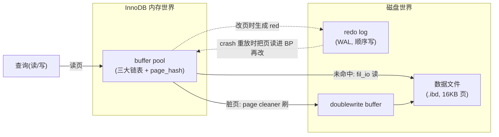

# 第 2 篇 · 第 5 章 · Buffer Pool:页面缓存

> **核心问题**:P1 篇讲清楚了——InnoDB 把一张表存成一棵 B+树,数据就在 16KB 的叶子页里,这些页躺在磁盘上。可一次磁盘随机读,机械盘要几毫秒,SSD 也要几十微秒,而内存读只要几十纳秒——**差了三到四个数量级**。OLTP 的每一个点查、每一次回表、每一次范围扫都要碰 B+树页,如果每次都真去磁盘读一个 16KB 页,数据库根本扛不住并发。InnoDB 怎么把它压到"绝大多数读写其实根本不碰磁盘"?答案是一个叫 **buffer pool** 的东西。可紧接着一个更深的问题来了:Linux 内核明明已经有一套 page cache(《Linux 内存管理》那本讲过),InnoDB 为什么还要自己搞一套 buffer pool、不直接把这事交给 OS?还有,buffer pool 内部那三个名字怪怪的链表(free list / LRU list / flush list)到底各管什么、一页从出生到死亡是怎么在它们之间流转的?这一章把这几个"为什么"和"怎么做到的"一次拆透。

> **读完本章你会明白**:
> 1. 为什么 OLTP 离不开 buffer pool,以及"命中"和"未命中"在 InnoDB 内部到底意味着什么(顺着 `buf_page_get_gen` 一路看到 `buf_read_page_low` 的 `fil_io`)。
> 2. 为什么 InnoDB **坚持自己管 buffer pool**,而不像很多引擎那样依赖 OS 的 page cache——这背后是对 LRU 策略、预读、脏页刷盘、doublewrite 的**精确控制权**,承接《Linux 内存管理》那本的 page cache LRU 思想,但 InnoDB 在它之上做了独有的改进。
> 3. **三大链表(free / LRU / flush)的职责分离**,以及一页的完整生命周期:从 free list 取出 → 读入磁盘页 → 挂 LRU → 被改 → 进 flush list → 刷盘 → 回 free。这套机制的精巧在于"职责单一、状态机清晰"。
> 4. InnoDB 怎么用 **page hash(按 space + page_no 定位)+ 多 buffer pool 实例** 把"在几百万个缓存页里找一个"压到 O(1),以及多实例怎么把一把全局锁拆成 64 把,扛住高并发。

> **如果一读觉得太难**:只记三件事就够——① buffer pool 是页的缓存池,绝大多数读写命中内存;② 三大链表各管一摊:free(空页池)、LRU(缓存页按访问排)、flush(脏页等刷盘);③ 一页从 free 取出来用,脏了进 flush,刷完盘回 free。InnoDB 自管是因为它要精确控制 LRU/预读/刷盘,OS page cache 给不了这种控制力。

---

## 〇、一句话点破

> **buffer pool 是一片"页的缓存池":InnoDB 把最热的 B+树页留在内存里,让绝大多数读写根本不碰磁盘;它用 free list(空页)、LRU list(缓存页)、flush list(脏页)三条链表,把一页从"空→在用→脏→回空"的生命周期管得清清楚楚,而自己管而不是交给 OS,是为了拿到 LRU 策略、预读、脏页刷盘的精确控制权。**

这是结论,不是理由。本章倒过来拆:先讲"没有 buffer pool 会怎样",再讲"为什么必须自己管、不能交给 OS",然后拆三大链表和一页的生命周期,接着讲"怎么在几百万页里 O(1) 找到一个",最后讲多实例怎么扛并发。承接《Linux 内存管理》page cache LRU 思想,但聚焦 InnoDB 在它之上做的独有的、被 OLTP 逼出来的设计。

---

## 一、先把矛盾摆出来:一次读,内存和磁盘差了四万倍

P1 篇我们讲清楚了 B+树、聚簇索引、16KB 页。现在把镜头拉到"读一行"这条路径上,看一个尖锐的数字矛盾。

一次"按主键查一行"(`SELECT * FROM t WHERE id = 10`),InnoDB 内部要做的最小动作是:**定位 id=10 所在的叶子页,把这个 16KB 页读到内存,在里面找那一行**。B+树通常三到四层,所以理论上要碰三到四个页(内部节点 + 叶子页)。这些页都在磁盘上。

现在看几个延迟数字(数量级,不同介质有差异):

| 操作 | 延迟(数量级) |
|------|-------------|
| 内存随机访问 | ~100 纳秒 |
| SSD 随机读 4KB | ~100 微秒 |
| 机械盘随机寻道 + 读 16KB | ~5~10 毫秒 |
| 千兆网往返 | ~0.5 毫秒 |

磁盘随机读比内存访问**慢了三到四个数量级**(机械盘甚至到十万倍)。如果每次查一行都真去磁盘读那个 16KB 页,一次主键点查要几毫秒,一台机器撑死几百 QPS,而真实的 OLTP 要的是几万、几十万 QPS。这中间的鸿沟,必须靠"把热页留在内存"来填——这就是 buffer pool 存在的根本理由。

> **不这样会怎样**:如果 InnoDB 不缓存页,每次读写都直接打磁盘,那 B+树再高效也没用——树形查找的"几次 IO"在磁盘上累加起来,延迟比内存访问高几个数量级,OLTP 的并发根本撑不住。buffer pool 的本质,是用内存把"磁盘 IO 这个数量级的延迟"从热路径上抹掉,只在"页不在内存"这种相对少见的 miss 情况下才付磁盘的代价。

但 buffer pool 撑住的不只是"读快",它还顺带撑住了两件关键的事,我们后面会一一看到:① **写不阻塞**——改页其实是改内存里的页(页变"脏"),脏页后台异步刷盘,事务不用等磁盘;② **WAL 的物理前提**——redo log 记的是"哪页哪偏移改成什么",这个"页"在 crash 之前是在 buffer pool 里被改的,redo 重放时也要把页读进 buffer pool 再改。buffer pool 是 InnoDB 内存世界和磁盘世界之间的**唯一界面**(读页必经它,改页必经它,刷页从它出发)。

### 一个容易被忽略的放大效应:B+树让"磁盘劣势"更尖锐

光看"内存 vs 磁盘差四万倍"还不够,要把 B+树的特性叠进去看,才会理解 buffer pool 为什么是生死攸关的。

B+树通常三到四层。一次主键点查,要顺着根→内部节点→...→叶子,理论上碰 `深度` 个页。如果这些页都不在内存,就要做 `深度` 次磁盘 IO——机械盘上一次点查可能就是 10~30 毫秒。但这里有个**树形的局部性**:根和上层内部节点是所有查询都要经过的"超级热点页",它们一旦被读进内存,几乎永远不淘汰(被几亿次查询反复命中)。所以真实开销主要是"那个叶子页"的 IO——而**叶子页有几十亿个**,绝大多数都是冷的、不在内存里的。

这就是 OLTP 的真相:**热路径上 99% 是"查某个具体的叶子页",这个叶子页可能在内存(命中,纳秒级)、也可能不在(未命中,微秒到毫秒级)**。buffer pool 的全部意义,就是让"在内存"的比例(命中率)尽可能接近 100%。一个调得好的 OLTP 实例,buffer pool 命中率通常在 99.9% 以上——也就是说,一万次读里只有不到一次真的打磁盘。这就是 buffer pool 把"磁盘四万倍劣势"压成"几乎不存在"的数学。

> **钉死这件事**:B+树的根/上层内部节点是天然热点(查询必经),它们稳稳待在 buffer pool;真正决定命中率的是那几十亿个叶子页的访问分布。OLTP 的工作集(working set)如果远小于 buffer pool,命中率就接近 100%;一旦工作集溢出 buffer pool(数据涨了但内存没涨),命中率会断崖式下跌,延迟立刻从亚毫秒跳到毫秒——这是线上"突然变慢"最常见的根因之一。

---

---

## 二、为什么必须自己管,不交给 OS page cache

这是本章最容易被一带而过、却最值得讲透的"为什么"。Linux 内核本来就有 page cache(《Linux 内存管理》那本拆过),文件 `read()`/`write()` 默认都会经过它,把热文件页缓在内核内存里。那 InnoDB 为什么不直接 `read()` 数据文件、让 OS 的 page cache 去缓存,反而要自己 `mmap`/`O_DIRECT` 一把抓,搞一套独立的 buffer pool?

答案的核心:**InnoDB 要的缓存控制粒度,OS page cache 给不了**。具体有四条,每条都是被 OLTP 逼出来的。

### 理由一:LRU 策略必须可定制——OS 的 LRU 会被全表扫描冲垮

OS page cache 的替换算法,本质上是按页的"最近访问"做近似 LRU(实际是 active/inactive 双链表,见《Linux 内存管理》LRU 章节)。这套算法对"普通文件"够用,但**对数据库有一个致命弱点:一次全表扫描,会把热数据全冲刷掉**。

数据库里"全表扫描"是家常便饭:某个后台统计、某条没建好索引的 SQL、某个 `mysqldump`。一次全表扫要把表的成千上万个页都读一遍。如果用朴素 LRU,这些页会被依次插到 LRU 头部,把原本的热点页(被频繁点查的那些)全部挤到尾部淘汰掉。扫完之后,热数据全没了,接下来的点查全部 miss、全部打磁盘——这叫 **cache pollution(缓存污染)**。

InnoDB 必须能精确控制这件事,所以它在自己的 buffer pool 里搞了 **改进的 LRU——midpoint insertion**:新读入的页不插到 LRU 头部,而是插到 LRU 中部(old 区的头部);只有在它被**第二次访问**时,才"晋升"到 young 区(头部)。这样一来,全表扫描那一大批只被访问一次的页,待在 old 区,很快被淘汰,根本碰不到 young 区的热数据。

这套策略的细节( young/old 区域的边界、`LRU_old` 指针、晋升条件)留到 P2-06 专门拆。本章只钉死一个结论:**这个"改进"必须由 InnoDB 自己来做**——OS page cache 是通用内核机制,你没法让内核为某一个进程单独换一套 LRU 策略。所以 InnoDB 必须自己持有缓存、自己排 LRU。

> **钉死这件事**:midpoint insertion 是 InnoDB 区别于"直接用 OS page cache"的招牌设计之一。它的存在本身就回答了"为什么 InnoDB 要自管 buffer pool"——因为 OS 的通用 LRU 满足不了 OLTP 的"防缓存污染"需求。详见 P2-06。

### 理由二:脏页刷盘策略必须可控制——和 redo/WAL 强耦合

OS 的 write() 改了 page cache 里的页,这个页在内核里变脏,内核按自己的策略(脏页比例、writeback 周期)决定什么时候刷盘。这套机制对普通文件够用,但**对数据库太粗糙**,因为:

1. **InnoDB 的脏页刷盘,必须和 redo log 的进度协调**。redo log 是顺序写的、有限的环形文件;如果脏页迟迟不刷盘,redo log 就不能被复用(老的 redo 还要留着 crash recovery 重放那些没落盘的脏页用),写吞吐就被卡住。InnoDB 有专门的 page cleaner 线程,根据"redo log 可用空间""flush list 长度""checkpoint 需求"动态决定刷盘节奏——这个协调 OS page cache 帮不上忙,内核刷不刷、刷哪个页,InnoDB 完全不可控。

2. **脏页刷盘要用 doublewrite 防页撕裂**(P3-12 拆)。一个 16KB 页写到磁盘,可能写一半断电(页撕裂/partial page write),页就坏了。InnoDB 的解法是先把页顺序写到 doublewrite buffer 一份,再写到数据文件——这个"先双写再单写"的流程,必须由 InnoDB 完全掌控"写哪个页、怎么写",OS 的通用 writeback 根本插不上手。

3. **flush list 要按 oldest_modification(LSN) 排序**,page cleaner 从最老的脏页刷起,保证 checkpoint 能稳定推进(细节见 P3 篇)。这个顺序是 InnoDB 的内部约定,OS 不可能知道。

> **不这样会怎样**:如果脏页交给 OS 的 page cache 管,刷盘时机不可控——可能突然刷一大批导致 IO 抖动,可能迟迟不刷导致 redo log 卡死,也可能在不合适的时机把页写到一半。InnoDB 自管 buffer pool + 自管刷盘,是为了把"刷什么、什么时候刷、怎么刷"三件事完全捏在自己手里,这是 WAL/redo/doublewrite 能正常运转的前提。

### 理由三:预读(read-ahead)必须基于"数据库语义",不是"文件访问模式"

OS 也有预读(顺序读检测到就多读几页),但它的预读基于"文件 offset 的访问模式",是**通用的、无语义的**。InnoDB 的预读可以做得更聪明,因为它知道这是 B+树:

- **线性预读**:发现一个 extent(64 页)里有连续 N 页被顺序访问,就把下一个 extent 预读进来。
- **随机预读**:发现一个 extent 里超过一定比例的页已经在 buffer pool 里,就把这个 extent 剩下的页也读进来。

这些预读策略(在 `buf/buf0rea.cc` 里)依赖"extent""页号连续性""B+树范围扫描"这些**数据库才知道的语义**。OS 的通用预读只能猜"文件接下来要顺序读",猜不准、预读量也不合适——该预读的不预读,不该预读的瞎预读(浪费 IO 和 buffer pool 空间)。

### 理由四:避免双重缓存(double buffering)浪费内存

如果 InnoDB 既自己缓存页,又让数据文件经过 OS page cache,那同一个 16KB 页很可能**既在 InnoDB buffer pool 里,又在 OS page cache 里**——内存白白浪费一份。一台 256GB 内存的服务器,buffer pool 设 200GB,如果再叠一份 OS page cache,可能浪费几十 GB。

所以 InnoDB 默认用 `O_DIRECT`(或 `O_DIRECTNOFOLLOW` 配合)打开数据文件——**直接 IO 绕过 OS page cache**,读写直接在 buffer pool 和磁盘之间搬,不经过内核缓存。`O_DIRECT` 在《Linux 内存管理》里也提过(它是绕过 page cache 的通道),InnoDB 用它正是为了"自己管缓存、不让 OS 插一脚"。

> **承接《Linux 内存管理》**:OS 的 page cache 思想——"把热文件页留在内核内存里"——和 InnoDB buffer pool 的思想是**同源的**:都是"热数据留内存"。区别在于:page cache 服务的是"通用文件读写"(对所有进程、所有文件一视同仁),buffer pool 服务的是"数据库这一种特定负载"(B+树页、有 redo/doublewrite 配合、要防缓存污染)。本书不重复 page cache 的内部机制(active/inactive 双链表、脏页 writeback),那只去翻《Linux 内存管理》LRU 章节;本章把篇幅全留给 **InnoDB 在 page cache 思想之上做的、被 OLTP 逼出来的独有设计**。

### 一个对照表:OS page cache vs InnoDB buffer pool

| 维度 | OS page cache | InnoDB buffer pool |
|------|---------------|-------------------|
| 缓存粒度 | 文件页(4KB) | B+树页(默认 16KB) |
| 替换算法 | 近似 LRU(active/inactive 双链表) | 改进 LRU(midpoint insertion,young/old 区) |
| 脏页刷盘 | 内核 writeback(按比例/周期) | page cleaner 线程,和 redo/doublewrite 协调 |
| 防缓存污染 | 较弱(全表扫会冲刷) | 强(midpoint insertion,只扫一次的页进 old 区) |
| 预读 | 基于 offset 顺序访问 | 基于 extent/B+树语义(线性 + 随机) |
| 谁来管 | 内核,进程不可控 | InnoDB 自己 |

这个表把"为什么自管"四条理由浓缩了。

### 一个反问:那为什么很多别的引擎(比如早期的 MyISAM)就靠 OS page cache?

这是个好问题,值得钉一下。MyISAM 确实重度依赖 OS page cache——它的索引缓存(key buffer)只缓存索引页,数据页完全交给 OS。MyISAM 这么做"够用"是有前提的:① 它**不支持事务**(没有 redo/undo/doublewrite 要协调),脏页刷盘交给 OS 的 writeback 完全没问题,反正 crash 了数据本来就可能坏;② 它是**表锁**,并发度本来就低,缓存层的锁竞争不是瓶颈。

InnoDB 不一样:它有事务、有 redo、有 doublewrite、要扛高并发行锁,这些"高级特性"全都需要对缓存层有精确控制——所以它**必须**自管 buffer pool。换句话说,**自管 buffer pool 是支持完整 ACID + 高并发的代价/前提**,不是锦上添花。这也解释了为什么 MyISAM 退场、InnoDB 成默认——不是因为 MyISAM 技术差,而是 OLTP 对事务和并发的需求,逼着引擎必须把缓存控制权握在自己手里。

> **钉死这件事**:"是否自管 buffer pool" 不只是个缓存策略选择,它背后是引擎的能力边界——靠 OS page cache 的引擎(MyISAM)注定扛不住事务+高并发;要扛住,就得像 InnoDB 这样自己把缓存、刷盘、LRU、预读全管起来。

### 顺带对照:InnoDB / PG / LevelDB 的缓存层各长啥样

把视野放大,对比三家数据库/存储引擎的缓存层,会发现"自管 vs 托管"是普遍的设计选择,各有道理:

| 引擎 | 缓存层 | 谁来管 | 为什么 |
|------|--------|--------|--------|
| **InnoDB** | buffer pool | 自己管(绕过 OS page cache) | 有 redo/doublewrite 要协调,要防缓存污染,要精确 LRU |
| **PostgreSQL** | shared_buffers + OS page cache **双层** | 部分自管(默认 shared_buffers 只占内存 25%,其余靠 OS page cache) | PG 的设计哲学是"信任 OS page cache",双层缓存换简单性(但会有一定 double buffering) |
| **LevelDB** | block cache + OS page cache | 自己管 block cache(可选)+ OS page cache | LSM 读放大高,block cache 装热 SST 块;但 LevelDB 是嵌入式库,不强求绕过 OS |

> **承接《PG》/《LevelDB》**:PG 的"双层缓存"和 InnoDB 的"自管 + 绕过 OS"是两种典型路线——PG 牺牲一点内存效率换架构简单,InnoDB 用复杂换极致控制。LevelDB 作为嵌入式库,缓存策略更依赖宿主进程(见《LevelDB》block cache 章节)。**本书聚焦 InnoDB 的"自管 + 绕过"路线为什么对 OLTP 最优**,不重复 PG/LevelDB 各自缓存层的细节。

这个对照再次说明:InnoDB 自管 buffer pool 不是孤例,而是**面向"完整 ACID + 高并发 OLTP"这一特定负载的合理选择**。负载越重、要求越严,越需要把缓存控制权握在自己手里。

下面进入 buffer pool 的内部——三大链表。

---

## 三、buffer pool 的物理样子:一片大内存 + 控制块

在讲三大链表之前,先把 buffer pool 在内存里的"物理样子"看清楚。一句话:**buffer pool 是一大片连续内存,被切成一个个 16KB 的"帧"(frame),每个帧配一个"控制块"(control block)**。

```
   buffer pool(一个实例,简化示意):
   ┌───────────────────────────────────────────────────────┐
   │  控制块数组(buf_block_t blocks[])    帧数组(frame)    │
   │  ┌──────┐ ┌──────┐ ┌──────┐         ┌──────────────┐ │
   │  │block0│ │block1│ │block2│ ...     │ frame0(16KB) │ │
   │  │      │ │      │ │      │         │ frame1(16KB) │ │
   │  │ page │ │ page │ │ page │         │ frame2(16KB) │ │
   │  │ info │ │ info │ │ info │         │ ...          │ │
   │  └──┬───┘ └──┬───┘ └──┬───┘         └──────┬───────┘ │
   │     │        │        │                     │         │
   │     └────────┴────────┴─────────────────────┘(一一对应)│
   └───────────────────────────────────────────────────────┘
```

控制块是 `buf_block_t`(对应一个未压缩的页),帧是 16KB 的纯数据区(就是 B+树页的二进制内容)。`buf_block_t` 里第一个字段是 `buf_page_t page`(页的公共信息),然后是 `byte *frame`(指向帧的指针)、`BPageLock lock`(这个页的读写锁)、AHI 相关字段等。

`buf_page_t` 是页的"身份证",不管是压缩页还是未压缩页都有它,关键字段有:`state`(页状态,见下)、`id`(space + page_no)、`newest_modification`/`oldest_modification`(两次 LSN,标记脏)、`buf_fix_count`(有多少人在用这个页)、`io_fix`(是否正在 IO)、链表节点指针(`list`/`LRU`)。

这块大内存怎么来的?InnoDB 启动时,按 `innodb_buffer_pool_size` 一次性申请一大块内存(`buf_chunk_init`),切成 `chunk`→`block`→`frame`。我们看真实代码。`buf_chunk_init` 把每个 block 初始化为 `BUF_BLOCK_NOT_USED`(空闲),然后**全部加到 free list**——这就是 free list 的初始来源:

```c
// storage/innobase/buf/buf0buf.cc (简化示意)
static buf_chunk_t *buf_chunk_init(buf_pool_t *buf_pool, buf_chunk_t *chunk,
                                   ulonglong mem_size, std::mutex *mutex) {
  // ... 分配一大块内存,前段放控制块,后段放帧 ...
  chunk->blocks = (buf_block_t *)chunk->mem;
  frame = (byte *)ut_align(chunk->mem, UNIV_PAGE_SIZE);
  // ... 计算 chunk->size ...

  block = chunk->blocks;
  for (i = chunk->size; i--;) {
    buf_block_init(buf_pool, block, frame);     // 初始化控制块
    UT_LIST_ADD_LAST(buf_pool->free, &block->page);  // 加到 free list 尾部
    block++;
    frame += UNIV_PAGE_SIZE;
  }
  return chunk;
}
```

> 源码:[buf_chunk_init](../mysql-server/storage/innobase/buf/buf0buf.cc#L1051-L1139)。注意 `buf_block_init` 把 block 的 `in_free_list` 等标志初始化好([buf0buf.cc#L805-L870](../mysql-server/storage/innobase/buf/buf0buf.cc#L805-L870))。

启动时,所有 block 都在 free list 上,LRU 和 flush list 都是空的。随着业务读写,block 从 free 流向 LRU,部分流向 flush,最后又流回 free——这就是下一节要讲的一页的生命周期。

---

## 四、三大链表:free / LRU / flush 的职责分离

buffer pool 内部有三条核心链表(都是 InnoDB 自己的侵入式双向链表 `UT_LIST`,带基数节点)。它们**职责严格分离**,每条只管一件事。先把分工钉死:

```
   ┌─────────────────────────────────────────────────────────────┐
   │ buffer pool 三大链表(职责分离)                              │
   ├──────────────┬──────────────────────────────────────────────┤
   │ free list    │ 空闲页池:state == BUF_BLOCK_NOT_USED 的页      │
   │              │ 内容是垃圾,等待被分配去读入磁盘页                  │
   ├──────────────┼──────────────────────────────────────────────┤
   │ LRU list     │ 缓存页:state == BUF_BLOCK_FILE_PAGE 的页        │
   │              │ 按"最近访问"排序(改进 LRU,头=热,尾=冷)         │
   │              │ 页满了从尾部淘汰,空位补回 free list              │
   ├──────────────┼──────────────────────────────────────────────┤
   │ flush list   │ 脏页池:被改过、但还没刷盘的页                    │
   │              │ 按 oldest_modification(LSN)升序排,头=最老的脏页  │
   │              │ page cleaner 从头刷,刷完从 flush list 摘除       │
   └──────────────┴──────────────────────────────────────────────┘
```

注意一个关键点:**这三条链表里的成员不是互斥的**。一个页可以**同时在 LRU list 和 flush list 上**(它是缓存页,同时又脏了);但一个页**不会同时在 free list 和 LRU list 上**(要么空闲要么在用)。源码里 `buf_pool_t` 的字段是这么定义的:

```c
// storage/innobase/include/buf0buf.h(简化,只看三大链表字段)
struct buf_pool_t {
  // ...
  UT_LIST_BASE_NODE_T(buf_page_t, list) flush_list;  // 脏页(按 LSN)
  UT_LIST_BASE_NODE_T(buf_page_t, list) free;        // 空闲页
  UT_LIST_BASE_NODE_T(buf_page_t, LRU) LRU;          // 缓存页(按访问)
  // ...
};
```

> 源码:[buf_pool_t 结构体定义](../mysql-server/storage/innobase/include/buf0buf.h#L2293-L2577),`free` 在 [buf0buf.h#L2449](../mysql-server/storage/innobase/include/buf0buf.h#L2449),`LRU` 在 [buf0buf.h#L2472](../mysql-server/storage/innobase/include/buf0buf.h#L2472),`flush_list` 在 [buf0buf.h#L2406](../mysql-server/storage/innobase/include/buf0buf.h#L2406)。注意 `list` 字段在 `buf_page_t` 里(L1664 附近),`in_free_list`、`in_flush_list`、`in_LRU_list` 是 debug 模式下的自检标志。

`buf_page_t` 里有个注释说得明明白白,每个 state 挂在哪个链表:

```c
// storage/innobase/include/buf0buf.h(注释原文)
/** Based on state, this is a list node ... in one of the following lists:
  - BUF_BLOCK_NOT_USED: free, withdraw
  - BUF_BLOCK_FILE_PAGE:        flush_list
  - BUF_BLOCK_ZIP_DIRTY:        flush_list
  - BUF_BLOCK_ZIP_PAGE: zip_clean */
UT_LIST_NODE_T(buf_page_t) list;
```

> 源码:[buf0buf.h#L1621-L1637](../mysql-server/storage/innobase/include/buf0buf.h#L1621-L1637)。

这告诉我们一个页的"在哪个链表"是由它的 **state** 决定的。下面看 state。

### 页的 8 个状态(buf_page_state)

InnoDB 给每个控制块定义了一个 `state` 字段,枚举出 8 个状态。本章只关心其中和三大链表流转最相关的几个(`FILE_PAGE`/`NOT_USED`),压缩相关的(`ZIP_PAGE`/`ZIP_DIRTY`)略带。

```c
// storage/innobase/include/buf0buf.h#L130-L153
enum buf_page_state : uint8_t {
  BUF_BLOCK_POOL_WATCH,    // 监视哨兵,不算真页
  BUF_BLOCK_ZIP_PAGE,      // 干净的压缩页
  BUF_BLOCK_ZIP_DIRTY,     // 脏的压缩页(在 flush_list)
  BUF_BLOCK_NOT_USED,      // 空闲,在 free list
  BUF_BLOCK_READY_FOR_USE, // 刚从 free 取出,还没填内容
  BUF_BLOCK_FILE_PAGE,     // 正经的文件页(在 LRU,可能也在 flush)
  BUF_BLOCK_MEMORY,        // 临时被 InnoDB 内部用作内存对象(如排序)
  BUF_BLOCK_REMOVE_HASH    // 正在从 page_hash 摘除(淘汰中)
};
```

> 源码:[buf_page_state 枚举](../mysql-server/storage/innobase/include/buf0buf.h#L130-L153)。

本章的核心流转链是:`NOT_USED` → `READY_FOR_USE` → `FILE_PAGE` →(脏了,进 flush_list)→(刷盘)→ `NOT_USED`(回 free)。`MEMORY` 是 InnoDB 内部偶尔把 buffer pool 当内存池用(比如某些大对象),不在缓存主路径上,本章略过。

> **钉死这件事**:三大链表 + 8 个 state,合在一起就是 buffer pool 的"状态机"。一页从出生到死亡,就是在这些 state 之间迁移、在这些链表之间流转。下一节用一个"一页的生命周期"把整个迁移过程串起来。

---

## 五、一页的生命周期:从 free 到 free 的完整旅程

这是本章的高潮。我们跟着一个具体的"读 id=10 所在的页"请求,看一个 16KB 页是怎么从磁盘进入 buffer pool、怎么在三大链表之间流转、最后又怎么被淘汰回 free 的。

### 阶段一:查 page hash,看页在不在内存

InnoDB 要读一个页,第一步不是去 free list 取空页,而是先**查这个页是不是已经在 buffer pool 里了**——用一个叫 **page hash** 的哈希表,key 是 `(space_id, page_no)`。如果命中,直接拿到控制块,根本不碰磁盘;如果未命中,才走"取空页 + 读磁盘"的流程。

```mermaid
flowchart TD
    A[要读 page (space,page_no)] --> B[buf_pool_get 按 hash 定位实例]
    B --> C[查 page_hash]
    C --> D{在池里?}
    D -- 命中 --> E[buf_block_fix 引用计数+1, 返回]
    D -- 未命中 --> F[从 free list 取空页]
    F --> G[fil_io 从磁盘读入帧]
    G --> H[挂 LRU midpoint, state=FILE_PAGE]
    H --> I[插入 page_hash]
    I --> E
```

这个"命中/未命中"判断的核心入口是 `buf_page_get_gen`,它现在(新版)委托给一个模板类 `Buf_fetch<>::single_page()`,真正的命中判断在 `Buf_fetch_normal::get`:

```c
// storage/innobase/buf/buf0buf.cc(简化示意)
dberr_t Buf_fetch_normal::get(buf_block_t *&block) noexcept {
  for (;;) {
    block = lookup();                    // 查 page_hash(S 锁)
    if (block != nullptr) {              // 命中!
      buf_block_fix(block);              // 引用计数 +1(防止被淘汰)
      rw_lock_s_unlock(m_hash_lock);     // 释放 page_hash S 锁
      break;                             // 直接返回,不读盘
    }
    read_page();                         // 未命中:从磁盘读
  }
  return DB_SUCCESS;
}
```

> 源码:[Buf_fetch_normal::get](../mysql-server/storage/innobase/buf/buf0buf.cc#L3703-L3739)。命中分支只是 `buf_block_fix`(引用计数 +1)+ 返回,**零磁盘 IO**;未命中才调 `read_page()`。这就是"命中 vs 未命中"在源码里的全部含义——一个 `if (block != nullptr)`。

### 阶段二:未命中——从 free list 取空页 + 读磁盘

未命中要走完整的"装入"流程,核心是 `buf_page_init_for_read`,它干三件事:① 从 free list 取一个空 block;② 初始化它(state 置 `FILE_PAGE`,填 page_id,插入 page_hash);③ 挂到 LRU 的 **midpoint**(old 区头部,不是 LRU 头!)。

```c
// storage/innobase/buf/buf0buf.cc(简化示意,关键四步)
buf_page_t *buf_page_init_for_read(ulint mode, const page_id_t &page_id, ...) {
  buf_pool_t *buf_pool = buf_pool_get(page_id);      // 定位实例
  block = buf_LRU_get_free_block(buf_pool);          // ① 从 free list 取空页

  mutex_enter(&buf_pool->LRU_list_mutex);
  hash_lock = buf_page_hash_lock_get(buf_pool, page_id);
  rw_lock_x_lock(hash_lock, ...);

  buf_page_init(buf_pool, page_id, page_size, block); // ② 初始化:state=FILE_PAGE
  block->mark_for_read_io();
  buf_page_set_io_fix(bpage, BUF_IO_READ);            // 标记"正在读"

  // ③ 挂到 LRU 的 old 区(midpoint!),不是 LRU 头
  buf_LRU_add_block(bpage, true /* to old blocks */);

  // ④ 插入 page_hash,这样后续查询能命中
  buf_page_hash_insert(buf_pool, bpage);
  // ... 然后由调用方发起 fil_io 读磁盘 ...
}
```

> 源码:[buf_page_init_for_read](../mysql-server/storage/innobase/buf/buf0buf.cc#L4870-L4969)。注意 [L4969](../mysql-server/storage/innobase/buf/buf0buf.cc#L4969) 那句 `buf_LRU_add_block(bpage, true /* to old blocks */)`——**新读入的页默认进 old 区**,这就是 midpoint insertion 的入口,细节在 P2-06。

然后 `buf_read_page_low` 发起真正的磁盘读,通过 `fil_io`(文件层 IO)把磁盘上的 16KB 页读进 block->frame:

```c
// storage/innobase/buf/buf0rea.cc(简化示意)
ulint buf_read_page_low(dberr_t *err, bool sync, ..., const page_id_t &page_id, ...) {
  bpage = buf_page_init_for_read(mode, page_id, page_size, unzip);  // 占位
  if (bpage == nullptr) return 0;  // 已被别人读了

  dst = ((buf_block_t *)bpage)->frame;       // 目标:控制块对应的帧
  *err = fil_io(request, sync, page_id, page_size, 0,
                page_size.physical(), dst, bpage);  // 真正的磁盘读
  // ... 同步读会等 IO 完成并调 buf_page_io_complete ...
  return 1;
}
```

> 源码:[buf_read_page_low](../mysql-server/storage/innobase/buf/buf0rea.cc#L66-L151),`fil_io` 在 [L127](../mysql-server/storage/innobase/buf/buf0rea.cc#L127)。这是 buffer pool 唯一碰磁盘的地方(读路径)。

### 阶段三:页被改——变脏,进 flush list

页读进来了,如果这是个写操作(`UPDATE`),事务会改这个页的内容。改完之后,这个页就"脏"了——内存里的内容和磁盘上的不一样。InnoDB 必须记住"这页脏了",以便后台刷盘。怎么记?给页设 `oldest_modification`(第一次变脏的 LSN),并把它**挂到 flush list**。

挂 flush list 的入口是 `buf_flush_insert_into_flush_list`:

```c
// storage/innobase/buf/buf0flu.cc(简化示意)
void buf_flush_insert_into_flush_list(buf_pool_t *buf_pool, buf_block_t *block, lsn_t lsn) {
  buf_flush_list_mutex_enter(buf_pool);
  // ... 校验 state == FILE_PAGE、不在 flush_list ...
  block->page.set_oldest_lsn(lsn);                    // 记"从哪个 LSN 开始脏"
  UT_LIST_ADD_FIRST(buf_pool->flush_list, &block->page);  // 挂 flush_list 头
  buf_flush_list_mutex_exit(buf_pool);
}
```

> 源码:[buf_flush_insert_into_flush_list](../mysql-server/storage/innobase/buf/buf0flu.cc#L375-L455)。注意 `UT_LIST_ADD_FIRST`([L434](../mysql-server/storage/innobase/buf/buf0flu.cc#L434))——**flush list 按 oldest_modification(LSN)升序排,最老的脏页在头部**。这是为了 page cleaner 能从头刷最老的页,保证 checkpoint 稳定推进(细节见 P3 篇 redo)。还有个 debug 校验 `buf_flush_list_order_validate`([L428-L430](../mysql-server/storage/innobase/buf/buf0flu.cc#L428-L430))保证 LSN 单调。

现在这个页同时挂在 **LRU list**(它是个缓存页)和 **flush list**(它脏了)。两条链表各管一面:LRU 管"该不该被淘汰"(访问热度),flush list 管"该不该被刷盘"(脏了没)。

### 阶段四:脏页被刷盘——从 flush list 摘除

后台的 page cleaner 线程定期从 flush list 头部取脏页刷盘。刷盘流程(细节见 P3-12 doublewrite):① 把页顺序写到 doublewrite buffer;② 把页随机写到数据文件;③ 刷完,把页的 `oldest_modification` 清零,从 flush list 摘除。

注意:**刷盘后,页还在 LRU list 上**,只是它不脏了(从 flush list 摘了)。它仍然是个缓存页,可以被后续查询命中。所以"刷盘"和"淘汰"是两件独立的事:刷盘是"把内存里的脏内容同步到磁盘",淘汰是"把这个页从内存里赶走、空出位置给别的页"。

> **钉死这件事(易混点)**:**脏页刷盘 ≠ 页被淘汰**。一个脏页可以先刷盘(变成干净页,留在 LRU),过一阵子因为 LRU 满了再被淘汰(从 LRU 摘、从 page_hash 摘、state 改回 NOT_USED、回 free)。两件事的触发条件、负责的线程都不同——刷盘看 flush list 长度和 redo log 压力(page cleaner 管),淘汰看 LRU 是否满(buf_LRU_get_free_block 管)。

### 阶段五:LRU 满了——淘汰尾部页,回 free list

当 buffer pool 满了(free list 空了),又有新页要读入,InnoDB 就得**淘汰** LRU 尾部(最冷)的页,腾位置。淘汰逻辑在 `buf_LRU_get_free_block`:

```c
// storage/innobase/buf/buf0lru.cc(简化示意)
buf_block_t *buf_LRU_get_free_block(buf_pool_t *buf_pool) {
loop:
  block = buf_LRU_get_free_only(buf_pool);    // 先试 free list
  if (block != nullptr) return block;         // 有空页,直接用

  // free list 空了:扫 LRU 尾部,找一个可淘汰的页
  freed = buf_LRU_scan_and_free_block(buf_pool, ...);
  if (freed) goto loop;                        // 淘汰出一个空位,重试

  // LRU 尾部都是脏页/被引用的:触发单页刷盘
  os_event_set(buf_flush_event);               // 唤醒 page cleaner
  std::this_thread::sleep_for(std::chrono::milliseconds(10));
  goto loop;
}
```

> 源码:[buf_LRU_get_free_block](../mysql-server/storage/innobase/buf/buf0lru.cc#L1311)。`buf_LRU_get_free_only` 在 [buf0lru.cc#L1205](../mysql-server/storage/innobase/buf/buf0lru.cc#L1205),它就是 `UT_LIST_GET_FIRST(buf_pool->free)` 取 free list 头。

淘汰一个页的动作是:① 如果它脏了,先刷盘(或跳过它找下一个干净的);② 把它从 page_hash 摘掉(state → `REMOVE_HASH` → `NOT_USED`);③ 从 LRU 摘掉;④ 加回 free list 尾部。于是这个控制块又变成空页,可以给下一个磁盘页用了——**生命周期闭环**。

### 把生命周期画成一张图

```
   一页的生命周期(buffer pool 内部状态流转):

       ┌─────────────────────────────────────────────────────────┐
       │                                                          │
       ▼                                                          │
   ┌──────────┐  buf_LRU_get_free_block    ┌──────────────┐       │
   │ NOT_USED │ ─────────────────────────▶ │ READY_FOR_USE│       │
   │ (free    │  (从 free list 取)          │ (刚取出,空)  │       │
   │  list)   │                             └──────┬───────┘       │
   └──────────┘                                    │              │
       ▲                                           │ buf_page_init│
       │                                           │ 填 page_id   │
       │                                           ▼              │
       │                                    ┌──────────────┐       │
       │  ┌──────────────────┐              │  FILE_PAGE   │       │
       │  │ 淘汰:从 page_hash│              │ (在 LRU,    │       │
       │  │ 摘、从 LRU 摘、  │ ◀──────────  │  在 page_hash)│       │
       │  │ state→NOT_USED、 │   LRU 满,    └──────┬───────┘       │
       │  │ 加回 free        │   淘汰尾部        被改(变脏)        │
       │  └──────────────────┘                      │              │
       │                                           ▼              │
       │  ┌──────────────────┐              ┌──────────────┐       │
       │  │ 刷盘后从 flush   │              │  FILE_PAGE   │       │
       │  │ 摘除(还在 LRU) │ ◀──────────  │  + 在 flush  │       │
       │  └──────────────────┘  page cleaner│ (脏页)       │       │
       │                        刷盘        └──────────────┘       │
       │                                                           │
       └───────────────────────────────────────────────────────────┘
```

> **钉死这件事**:一页的旅程是 `free → LRU →(脏了)LRU + flush →(刷盘)LRU →(淘汰)free`。三大链表的分工让"装内容""管热度""管脏度"三件事**正交**——一个页的"是否在 LRU"只取决于它是不是缓存页(state=FILE_PAGE),它的"是否在 flush list"只取决于它脏不脏,两件事互不影响。这种正交设计是 buffer pool 能在高并发下保持清晰的原因。

---

## 六、启动与 resize:几十 GB 内存怎么"瞬时"就绪

讲完生命周期,补一个工程上很重要的问题:buffer pool 几十甚至几百 GB,启动时要把它全部初始化吗?resize(改 `innodb_buffer_pool_size`)时要怎么办?这两个场景 InnoDB 都做了优化,值得钉一下。

### 启动:多实例并行初始化

`buf_pool_init` 启动时,不是串行地一个个初始化实例,而是**每批最多 8 个实例并行初始化**(用线程并发跑 `buf_pool_create`):

```c
// storage/innobase/buf/buf0buf.cc(简化示意)
dberr_t buf_pool_init(ulint total_size, ulint n_instances) {
  const ulint size = total_size / n_instances;
  buf_pool_ptr = ut::zalloc_withkey(..., n_instances * sizeof *buf_pool_ptr);
  // ...
#ifdef UNIV_LINUX
  ulint n_cores = sysconf(_SC_NPROCESSORS_ONLN);
  if (n_cores > 8) n_cores = 8;   // 每批最多 8 个实例并发
#else
  ulint n_cores = 4;
#endif
  for (i = 0; i < n_instances; ) {
    ulint n = std::min(i + n_cores, n_instances);
    // 并发启动 n-i 个 buf_pool_create 线程,各初始化一个实例
    for (ulint id = i; id < n; ++id) {
      threads.emplace_back(..., buf_pool_create, &buf_pool_ptr[id], size, id, ...);
    }
    // join 这一批,再启动下一批
    i = n;
  }
}
```

> 源码:[buf_pool_init](../mysql-server/storage/innobase/buf/buf0buf.cc#L1506-L1590)。注释里说这个并行化("Magic number 8")在 4 路 10 核超线程主机上,把 128G / 16 实例的初始化从 10 秒压到 4 秒([L1539-L1542](../mysql-server/storage/innobase/buf/buf0buf.cc#L1539-L1542))。

注意一个细节:启动时虽然分配了内存,但**页内容是空的**(没读磁盘)。InnoDB **不会**在启动时把数据文件预读进 buffer pool——页是按需(lazy)读入的。所以一个大实例启动后,前几分钟的命中率会从 0 慢慢爬升,这叫 **warmup(预热)**。这也是为什么有些 DBA 会在重启后跑一遍热点查询做"手动预热"。

### resize:在线改大小,不中断业务

`innodb_buffer_pool_size` 是**动态参数**,可以在线 resize(`buf_pool_resize`)。resize 流程大致是:① 冻结 AHI(因为 AHI 引用了 buffer pool 里的 block,要等 resize 完重建);② 申请新的 chunks(若变大)或回收尾部 chunks(若变小);③ 把要回收的 chunks 里的页(在 LRU 上的)淘汰/迁移;④ 重建 page_hash(因为大小变了,hash 桶数要变);⑤ 解冻 AHI。

> 源码:[buf_pool_resize](../mysql-server/storage/innobase/buf/buf0buf.cc#L2194),状态机由 `buf_pool_resize_status_code` 驱动([buf0buf.cc#L1775-L1822](../mysql-server/storage/innobase/buf/buf0buf.cc#L1775-L1822) 的状态枚举)。

这里钉一个反直觉的点:**resize 时 InnoDB 故意把要回收的页"挪到 withdraw list"而不是直接淘汰**([buf_pool_t::withdraw 字段](../mysql-server/storage/innobase/include/buf0buf.h#L2451-L2454))。withdraw list 是 free list 的一个"过渡区"——这些页不再被新读入使用,但如果它们脏了,还得等刷盘完才能真正释放。这是个**两阶段回收**:先标记"待回收"(进 withdraw),再等依赖(脏页刷盘)解除后真正释放。这种"标记-回收"两段式,避免了 resize 时一次性淘汰大量脏页造成的 IO 抖动。

> **钉死这件事**:buffer pool 的启动(并行 + lazy 装入)和 resize(在线 + withdraw 两段回收)都体现了 InnoDB 一个一贯的工程取向:**大内存操作要分摊、要可在线、不能阻塞业务**。这也是为什么生产环境敢在业务高峰期之外 resize buffer pool——它被设计成不中断服务。

---

## 七、技巧精解:两个最硬核的设计

本章挑两个最硬核的设计单独拆透:① **page hash + 按 page_id hash 分配实例**——怎么在几百万页里 O(1) 找到一个、且锁不成为瓶颈;② **free list 兜底 + LRU 淘汰**——buffer pool 满了怎么不卡死。两个都配反面对比。

### 技巧一:page hash + 多实例——O(1) 定位 + 锁分片

buffer pool 可能有几百万个缓存页(MySQL 实例 buffer pool 几十上百 GB 是常事)。每次读一个页,InnoDB 都要先"在这么多页里找到它",这个查找必须是 O(1),否则再快的 IO 也救不了。

InnoDB 的解法是一个**哈希表 page_hash**:key 是 `(space_id, page_no)`,value 是对应的 `buf_page_t`(或 `buf_block_t`)。`buf_pool_t` 里:

```c
// storage/innobase/include/buf0buf.h
hash_table_t *page_hash;  // 按 (space, page_no) 定位缓存页
```

> 源码:[page_hash 字段](../mysql-server/storage/innobase/include/buf0buf.h#L2362)。

但光有哈希表还不够——几百万页共用一个哈希表,这个哈希表的锁就成了**全局瓶颈**。每个读请求都要锁哈希表查一下,高并发下锁竞争会把吞吐压垮。InnoDB 的解法是 **buffer pool 分多个实例**(`srv_buf_pool_instances`),每个实例有自己独立的 page_hash、free list、LRU、flush list、各自的锁。

关键问题来了:**给定一个 page_id,该去哪个实例找?** InnoDB 的回答是一个确定的 hash 函数,让同一个 page 永远落在同一个实例:

```c
// storage/innobase/include/buf0buf.ic#L823-L832
static inline buf_pool_t *buf_pool_get(const page_id_t &page_id) {
  page_no_t ignored_page_no = page_id.page_no() >> 6;     // 先除以 64(一个 extent)
  page_id_t id(page_id.space(), ignored_page_no);
  ulint i = id.hash() % srv_buf_pool_instances;           // 再 hash 分实例
  return (&buf_pool_ptr[i]);
}
```

> 源码:[buf_pool_get](../mysql-server/storage/innobase/include/buf0buf.ic#L823-L832)。

注意一个精妙处:**先 `page_no >> 6`(除以 64,一个 extent 是 64 页),再 hash**。这不是随手写的。它保证了**同一个 extent 内的 64 个页,会落在同一个 buffer pool 实例里**。为什么重要?因为 InnoDB 的预读(线性/随机)是按 extent 来的——一次预读一个 extent 的多个页。如果这些页散落在不同实例,预读时要协调多个实例的锁,低效;让它们落在同一实例,预读在单实例内完成,锁竞争最小化。这个"extent 对齐的分片"是 InnoDB 把"预读语义"和"并发分片"协调起来的小巧思。

实例数怎么定?默认是 1(`srv_buf_pool_instances = 1`),但 InnoDB 会按 CPU 数和 buffer pool 大小自动推断,clamp 到 1~64:

```c
// storage/innobase/handler/ha_innodb.cc(简化,启动时自动调实例数)
srv_buf_pool_instances = 1;  // 默认
// ... 若 buffer_pool_size >= 1GB,按 CPU/buffer pool 推断 ...
srv_buf_pool_instances = std::clamp(std::min(bp_hint, cpu_hint), 1UL, 64UL);
```

> 源码:[ha_innodb.cc#L4561-L4570](../mysql-server/storage/innobase/handler/ha_innodb.cc#L4561-L4570)。上限 `MAX_BUFFER_POOLS = 64`([buf0buf.h#L105-L108](../mysql-server/storage/innobase/include/buf0buf.h#L105-L108))。

#### 锁分片的第二层:每个实例内部还有 6+ 把独立 mutex

多实例只是锁分片的第一层。即便在**单个实例内部**,InnoDB 也没有用一把"buffer pool mutex"管所有事,而是给不同字段配了**独立的 mutex**,各自加锁。看 `buf_pool_t` 创建 mutex 的代码:

```c
// storage/innobase/buf/buf0buf.cc(简化,每个实例创建时)
mutex_create(LATCH_ID_BUF_POOL_CHUNKS,       &buf_pool->chunks_mutex);
mutex_create(LATCH_ID_BUF_POOL_LRU_LIST,     &buf_pool->LRU_list_mutex);
mutex_create(LATCH_ID_BUF_POOL_FREE_LIST,    &buf_pool->free_list_mutex);
mutex_create(LATCH_ID_BUF_POOL_ZIP_FREE,     &buf_pool->zip_free_mutex);
mutex_create(LATCH_ID_BUF_POOL_ZIP_HASH,     &buf_pool->zip_hash_mutex);
mutex_create(LATCH_ID_BUF_POOL_ZIP,          &buf_pool->zip_mutex);
mutex_create(LATCH_ID_BUF_POOL_FLUSH_STATE,  &buf_pool->flush_state_mutex);
```

> 源码:[mutex_create 七连](../mysql-server/storage/innobase/buf/buf0buf.cc#L1281-L1287)。

这意味着:**改 free list 时不需要锁 LRU list,刷 flush list 时不需要锁 free list**。比如一个线程在 LRU 尾部淘汰页(持 `LRU_list_mutex`),另一个线程在 flush list 上推进 page cleaner(持 `flush_list_mutex`),两者完全不冲突。这是把"锁分片"从实例级进一步下推到**链表级**——每条链表一把锁,互不阻塞。

> **承接《Linux 同步原语》**:这种"把一把粗锁拆成多把细锁,按数据结构分片"的做法,和《Linux 同步原语》里 percpu-rwsem、seqlock、分桶 spinlock 是同源思想——都是"缩小临界区、降低冲突概率"。InnoDB 在 buffer pool 这里把它用到了极致:实例分片 + 链表分片 + page_hash 分桶(`hash_table_t` 内部按 hash 值分多个 rwlock),三层叠加,让高并发下对缓存结构的访问几乎不串行。

> **反面对比**:如果 InnoDB 像很多早期数据库那样,用一个全局 buffer pool mutex 管所有链表和 hash 表,那每次 `buf_page_get` 都要抢这一把锁,几百个并发连接会把它打成热点,吞吐随并发数先升后降(锁等待吞噬收益)。分片后,并发度几乎随实例数线性扩展(直到 IO 成为瓶颈)。这是为什么 `innodb_buffer_pool_instances` 在大内存 + 多核场景下能显著提升吞吐。

**反面对比**:如果 InnoDB 不分实例,所有页共用一个 page_hash、一把锁,高并发(几百个连接同时查)下,这把锁就是吞吐天花板——每次查页都要抢同一把锁,串行化。分实例后,N 个实例就是 N 把锁,并发度放大 N 倍。这是典型的**锁分片(sharding)技巧**:把一个热点数据结构拆成多个分片,每个分片独立加锁,用"分而治之"换并发。这个思想和《Linux 内核》那本里 per-cpu 数据结构、《Tokio》那本里 per-worker 队列是同源的——都是"把共享变专属,把锁变多份"。

> **承接《Linux 内核》/《Tokio》**:锁分片、per-instance/per-cpu/per-worker 这些"用复制换并发"的技巧,在《Linux 内核》的 per-cpu 变量、《Tokio》的工作窃取队列里都见过同源设计。buffer pool 多实例是这套思想在数据库缓存层的应用。

### 技巧二:free list 兜底 + LRU 淘汰 + 单页刷盘救急——满了怎么不卡死

buffer pool 会满(free list 空)。满了之后,如果再来一个"必须读入新页"的请求,InnoDB 不能简单阻塞等待——那会让所有后续请求卡死。它的解法是一个**三段式兜底**,看 `buf_LRU_get_free_block` 的完整逻辑:

```
   buffer pool 满了怎么办(三段式兜底):

   ① 先试 free list(几乎总是空的,因为满了)
        │ 没空页
        ▼
   ② 扫 LRU 尾部,找一个"干净且没人用"的页,直接淘汰
        │ 尾部都是脏页/被引用的(罕见但会发生)
        ▼
   ③ 唤醒 page cleaner 线程,让它刷一批脏页腾位置
        等一小会儿(10ms),重试 ①
        (循环,直到腾出空位)
```

```c
// storage/innobase/buf/buf0lru.cc(简化示意,关键三段)
buf_block_t *buf_LRU_get_free_block(buf_pool_t *buf_pool) {
loop:
  block = buf_LRU_get_free_only(buf_pool);          // ① 试 free list
  if (block != nullptr) return block;

  freed = buf_LRU_scan_and_free_block(buf_pool, ...); // ② 扫 LRU 尾部淘汰
  if (freed) goto loop;

  os_event_set(buf_flush_event);                      // ③ 唤醒 page cleaner
  if (n_iterations > 1)
    std::this_thread::sleep_for(std::chrono::milliseconds(10));
  goto loop;
}
```

> 源码:[buf_LRU_get_free_block](../mysql-server/storage/innobase/buf/buf0lru.cc#L1311-L1422)。

这个设计的精巧在于**逐级降级**:先走最快路径(free list 直接取,O(1)),不行才走慢路径(扫 LRU 尾部淘汰,O(扫描深度)),再不行才走最慢路径(触发刷盘 + 睡眠等)。绝大多数情况下,要么 free list 有空页,要么 LRU 尾部有干净可淘汰页,根本走不到第三段;只有 buffer pool 极度紧张(脏页堆积 + LRU 满负荷)时才会触发刷盘等待。这就是为什么 OLTP 在正常运行时几乎感觉不到"buffer pool 满"——兜底机制把这种异常情况兜住了。

还有个细节值得钉:`try_LRU_scan` 标志([buf_pool_t#L2427-L2431](../mysql-server/storage/innobase/include/buf0buf.h#L2427-L2431))。一旦某次扫 LRU 尾部发现没有可淘汰页(都是脏的/被引用的),就把它置 false,告诉其他线程"别再白扫了",直到 page cleaner 刷出一批脏页后才重新置 true。这是个**避免惊群/避免无效扫描**的小优化——多个线程同时来抢空页时,不会全都傻乎乎地扫一遍 LRU,节省 CPU。

**反面对比**:如果不用这个三段式,只有一种朴素做法——"free list 空了就阻塞等"。那会怎样?多个事务同时要读新页,全部阻塞在同一个等待点上,吞吐归零;更糟的是,可能死锁(某个持有 page cleaner 需要的资源的事务,自己也在等空页)。三段式兜底的核心是**主动腾位置**(淘汰/触发刷盘)而不是被动等,让 buffer pool 在压力下还能"自救"。

> **钉死这件事**:buffer pool 满了不卡死的秘密,是这个"free → LRU 淘汰 → 触发刷盘"的三段式主动兜底。它体现了 InnoDB 的一个一贯哲学:**内存世界的问题尽量在内存世界解决(LRU 淘汰),实在不行才动用 IO 世界(刷盘),而且动用时要主动、可控(唤醒专门的 cleaner 线程 + 限速睡眠)**。

---

## 八、命中的代价:buf_fix + io_fix——并发下的"占住一页"

讲完生命周期,补一个本章必须钉的并发细节。一个页被读出来后,可能同时被多个事务访问(B+树内部节点尤其热)。如果某个页正被淘汰(要刷盘、要从 page_hash 摘),而另一个事务正在用它,会乱套。InnoDB 用两个字段协调:`buf_fix_count`(引用计数)和 `io_fix`(IO 状态标记)。

- **`buf_fix_count`**:每次 `buf_block_fix` 让它 +1,用完 `buf_block_unfix` 让它 -1。**只要 buf_fix_count > 0,这个页就不能被淘汰**。淘汰路径扫 LRU 尾部时,会跳过 buf_fix_count != 0 的页。
- **`io_fix`**:标记这个页"正在读"(BUF_IO_READ)/"正在写"(BUF_IO_WRITE)/"无 IO"(BUF_IO_NONE)。**正在 IO 的页也不能淘汰**。

> 源码:`buf_fix_count` 是 `std::atomic`([buf0buf.h](../mysql-server/storage/innobase/include/buf0buf.h) `buf_page_t` 字段),`io_fix` 的设置入口 `set_io_fix`([buf0buf.h#L1542](../mysql-server/storage/innobase/include/buf0buf.h#L1542))。命中分支里的 `buf_block_fix` 就是给引用计数 +1。

这套"引用计数 + IO 标记"的机制,本质是**无锁的轻量占用**:不用给页加重量级锁(那样并发度低),而是用原子操作占住一个引用,占住期间页就安全。这是 InnoDB 在高并发下管理几百万页的关键技巧之一,和《Linux 内核》里 refcount、《Tokio》里 Arc 的引用计数思想同源。

### 为什么不用读写锁,而要用引用计数?

这里值得多问一句。`buf_block_t` 里其实**有**一把读写锁 `BPageLock lock`([buf0buf.h#L1774](../mysql-server/storage/innobase/include/buf0buf.h#L1774)),那为什么"防淘汰"还要单独搞 `buf_fix_count`?两者的职责不同:

- **`lock`(BPageLock)**:保护**页内容**的读写一致性。一个事务要改页内容,先 X-latch 这个 lock;要读页内容,S-latch。这把锁的持有时间通常是"一次 B+树操作的长度"(微秒级)。
- **`buf_fix_count`**:保护**页的控制块不被回收**(不被从 LRU 淘汰、不被刷盘后释放)。它持有时间可能更长(一次查询里可能跨多个操作),而且它的语义是"我在用这个页的壳子,你别拆了它",而不是"我在读页内容"。

如果把"防淘汰"也塞进 `lock`,那淘汰路径就得等所有 S-latch 释放——而 B+树内部节点可能被成百上千个查询同时 S-latch,淘汰路径会等到天荒地老。用独立的轻量 `buf_fix_count`(原子计数)解耦这两件事:淘汰只看"有没有人 fix",不看"有没有人 latch";latch 纷纷释放不影响 fix 计数,fix 计数为 0 才允许淘汰。这是**关注点分离**在并发原语层面的体现。

> **反面对比**:如果"防淘汰"用 `lock` 实现,淘汰路径要抢 X-latch 排在所有 S-latch 后面,高并发下永远抢不到,buffer pool 满了就死锁(等空页的事务持有锁,淘汰路径等它的锁,循环等)。独立的 `buf_fix_count` 让淘汰判断变成一个原子读,不参与 latch 队列,避免了这种死锁。这是 InnoDB 用"两个独立机制各管一面"换来的并发安全性。

---

## 九、和磁盘/redo 的交互:buffer pool 是枢纽

把前面的内容合起来,buffer pool 在 InnoDB 整体架构里的位置就很清楚了——它是**内存世界和磁盘世界之间的唯一枢纽**。一张 mermaid 图把交互画清楚:



几个关键箭头的含义(都是后面某章的主角,这里只点明和 buffer pool 的关系):

- **读页**:查询 → buffer pool(查 page_hash),命中直接返回,未命中 `fil_io` 从数据文件读。
- **写页**:查询改 buffer pool 里的页(页变脏)→ 进 flush list → page cleaner 异步刷盘(经 doublewrite 防撕裂)→ 数据文件。
- **redo**:改页的同时生成 redo(P3-08/09),redo 顺序写到 redo log。crash 后(P3-12),用 redo 重放——重放时也要把页读进 buffer pool 再改。
- **doublewrite**:脏页刷盘前先顺序写一份到 doublewrite buffer,再写数据文件(P3-12)。

buffer pool 处在所有这些路径的交汇点——读必经它,写必经它,刷盘从它出发,crash 重放也回到它。这就是为什么本章是"存储与索引"这一面的枢纽章:理解了 buffer pool,就理解了 InnoDB 内存世界的中心。

---

## 十一、从外面看 buffer pool:命中率和它告诉你的事

讲完内部机制,补一个"怎么从外面观察 buffer pool 健不健康"的实用视角。这是 DBA 排查"数据库突然变慢"时的第一手信号。

### 命中率:buffer pool 的生命体征

buffer pool 命中率 = `1 - 物理读次数 / 逻辑读次数`。逻辑读是"查一次 page_hash(不管命中没)",物理读是"未命中、真去磁盘读了"。`SHOW ENGINE INNODB STATUS` 里有几行直接给这个数:

```
   Buffer pool hit rate : 1000 / 1000      ← 命中率 100%(理想)
   Buffer pool hit rate : 998 / 1000       ← 99.8%(健康)
   Buffer pool hit rate : 950 / 1000       ← 95%(预警,该查了)
   Buffer pool hit rate : 800 / 1000       ← 80%(严重,延迟会暴涨)
```

一个调得好的 OLTP 实例,命中率应该在 99.9% 以上(1000 次逻辑读,物理读 < 1 次)。一旦掉到 99% 以下,通常意味着:**工作集(热数据总量)超过了 buffer pool 大小**——要么数据涨了内存没涨,要么有个大表扫描在污染缓存。这时延迟会从亚毫秒跳到毫秒级,因为更多请求要付磁盘的代价。

### 三个该盯的指标

1. **命中率**(上面那个):低于 99% 就该警惕。
2. **free list 长度**:`SHOW ENGINE INNODB STATUS` 里的 `Free buffers`。长期为 0 不一定坏(buffer pool 满是常态),但如果同时 LRU 淘汰速率(`Pages made young` / `not young`)飙升,说明内存压力很大。
3. **flush list 长度 + pending flushes**:脏页堆积过多,说明 page cleaner 刷盘跟不上写入,redo log 可能快满(会触发同步刷盘,延迟暴涨)。

> **钉死这件事**:buffer pool 的内部状态(free/LRU/flush 三大链表的长度)在 `information_schema.INNODB_BUFFER_POOL_STATS` 和 `SHOW ENGINE INNODB STATUS` 里都有暴露。**这些数字不是调参用的,是诊断用的**——当数据库变慢,先看命中率:如果命中率塌了,问题是"工作集 vs 内存大小";如果命中率正常但 pending flushes 高,问题是"刷盘跟不上写"。这两类问题的解法完全不同,buffer pool 的指标帮你第一时间分清。

> **提醒**:本书不写调参口诀(那是另一本书的事),只讲"这些指标对应 buffer pool 内部的什么机制"。命中率和 free list 对应"LRU 淘汰 vs 工作集",flush list 对应"脏页刷盘 vs redo log 进度"——理解了机制,指标的含义自然清楚。

---

## 十二、章末小结

### 回扣主线

本章服务"存储与索引"这一面,讲的是 InnoDB 怎么把热的 B+树页留在内存里,让绝大多数读写不碰磁盘。承接《Linux 内存管理》的 page cache LRU 思想(热页留内存),但 InnoDB 自管 buffer pool 是为了拿到四件 OS page cache 给不了的控制权:① **可定制的 LRU**(midpoint insertion 防缓存污染,P2-06 详);② **可控的脏页刷盘**(和 redo/doublewrite 协调,P3 篇详);③ **基于数据库语义的预读**(extent/B+树);④ **避免双重缓存**(`O_DIRECT` 绕过 OS page cache)。这四条里,前三条是"OLTP 逼出来的硬需求",第四条是顺带的工程收益——它们合在一起,解释了为什么 InnoDB 不能像 MyISAM 那样把缓存托付给 OS。

三大链表(free / LRU / flush)的职责分离,加上一页的完整生命周期(`free → LRU → 脏了加 flush → 刷盘回 LRU → 淘汰回 free`),是 buffer pool 能在高并发下保持清晰的根本。page_hash + 多实例(按 page_id hash 分片,extent 对齐)让"在几百万页里 O(1) 找一个"且锁不成为瓶颈。

### 五个为什么

1. **为什么 OLTP 离不开 buffer pool?**——磁盘随机读比内存慢三到四个数量级,buffer pool 用内存把磁盘 IO 从热路径上抹掉,只在 miss 时付磁盘代价;它还是写不阻塞(改内存脏页、异步刷)和 WAL 物理前提(页在内存被改)的基石。
2. **为什么 InnoDB 自管 buffer pool,不交给 OS page cache?**——OS 的通用 LRU 满足不了"防全表扫缓存污染",脏页刷盘没法和 redo/doublewrite 协调,预读没有数据库语义,还会双重缓存浪费内存。自管是为了拿到这四件控制权。
3. **三大链表为什么职责分离?**——free(空页)、LRU(缓存页按热度)、flush(脏页按 LSN)各管一面,正交:一页"是否在 LRU"取决于它是不是缓存页,"是否在 flush"取决于它脏不脏,互不影响。这让高并发下的状态管理清晰。
4. **flush list 为什么按 LSN(oldest_modification)排序?**——page cleaner 从最老的脏页刷起,保证 checkpoint 能稳定推进(P3-08 redo 详);这也让"redo log 能复用到哪"有明确依据。
5. **buffer pool 多实例为什么先 `page_no >> 6` 再 hash?**——64 是一个 extent 的页数,先除以 64 让同一个 extent 的页落在同一实例,预读(按 extent)在单实例内完成,锁竞争最小化;多实例本身是"锁分片"换并发的技巧。

### 想继续深入往哪钻

- **改进 LRU 的全部细节**(young/old 区边界、`LRU_old` 指针、晋升条件、为什么全表扫会冲刷朴素 LRU):下一章 P2-06。
- **AHI(自适应哈希)和 change buffer**(让热点更快、二级索引写更省):P2-07。
- **脏页刷盘和 redo/checkpoint 的耦合**(page cleaner 怎么决定刷盘节奏、checkpoint 怎么推进):P3-08(WAL/redo)。
- **doublewrite 怎么防页撕裂**:P3-12。
- **想动手感受**:`SHOW ENGINE INNODB STATUS` 看 buffer pool 命中率/free list/LRU/flush list 长度;`information_schema.INNODB_BUFFER_PAGE` 看每个缓存页是啥;`innodb_buffer_pool_size`/`innodb_buffer_pool_instances` 调参(注意别盲目调,先看命中率)。

### 引出下一章

本章钉死了 buffer pool 的本体——为什么自管、三大链表、页的生命周期、多实例。但有一个关键问题被我们刻意留了一手:**新读入的页为什么插到 LRU 中部(midpoint)而不是头部?** 这一个设计,直接决定了 InnoDB 能不能扛住"一次全表扫描"。下一章 P2-06,我们把改进的 LRU(midpoint insertion + young/old 区)拆透——看朴素 LRU 是怎么被一次 `SELECT * FROM big_table` 冲垮的,以及 InnoDB 用什么精巧的机制保住了热数据。

> **下一章**:[P2-06 · 改进的 LRU:midpoint insertion](P2-06-改进的LRU-midpoint-insertion.md)
