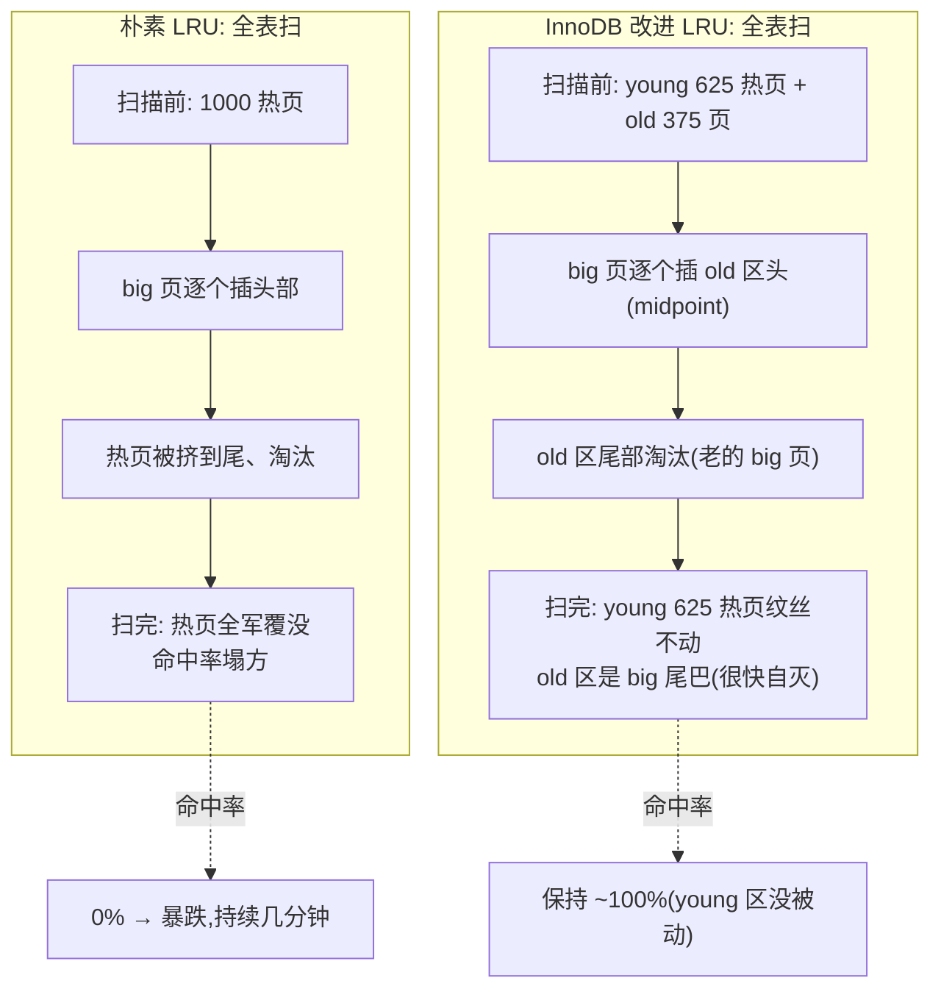

# 第 2 篇 · 第 6 章 · 改进的 LRU:midpoint insertion

> **核心问题**:上一章(P2-05)我们拆透了 buffer pool 的三大链表和一页的生命周期,但有一个关键细节被刻意留了一手——新读入的页为什么插到 LRU 的**中部**而不是**头部**?这看似只是一个"插入位置"的小选择,实则直接决定了 InnoDB 能不能扛住数据库世界最常见的一种灾难:**一次全表扫描把热数据冲刷得一干二净**。朴素的 LRU 在这个场景下会被打成筛子:一条 `SELECT * FROM big_table`,把成千上万个只扫一次的冷页塞进 LRU 头部,把原本被频繁点查的热点页全部挤到尾部淘汰掉,扫完之后整个 buffer pool 像被重置了一遍,接下来的所有点查全部 miss、全部打磁盘,延迟从亚毫秒暴涨到毫秒。InnoDB 用一个叫 **midpoint insertion(中点插入)** 的改进版 LRU 解决了它——LRU 被切成 **young(新)区和 old(老)区**两段,新读入的页只进 old 区的头部(也就是整个 LRU 的中点,叫 midpoint),只有在 old 区里被"再次访问"且"停留够久",才"晋升"(promote)到 young 区头部。全表扫描的那一大批只扫一次的页,在 old 区里自生自灭,根本碰不到 young 区的热数据。这一章把这套机制从头到尾拆透:朴素 LRU 怎样被冲垮、midpoint 凭什么护住热数据、young/old 的边界怎么维持、promote 的"停留时间门槛"为什么是必要的第二道闸。

> **读完本章你会明白**:
> 1. 朴素 LRU 在"一次全表扫描"面前为什么会**整条链子垮掉**,以及"缓存污染(cache pollution)"这个 OLTP 杀手的真实代价——扫完表之后命中率塌方、延迟暴涨。
> 2. InnoDB 的改进 LRU 怎么把一条链表切成 **young / old 两段**、新页插到 midpoint(`LRU_old` 指针)、全表扫的冷页只在 old 区流动而碰不到 young 区热数据;以及为什么 old 区默认占整条 LRU 的 **3/8**(约 37%),`BUF_LRU_OLD_MIN_LEN = 512` 是 LRU_old 指针被启用的门槛。
> 3. **promote(晋升)的两道闸**——"第二次访问"和"在 old 区停留够久(默认 1000ms)"——凭什么防住"扫两遍的全表扫"也冲进 young 区;`buf_page_peek_if_too_old` 怎么用 `access_time`(记的是**首次访问**时间,不是最近访问)判断一个 old 区页该不该 promote。
> 4. 为什么 InnoDB 必须自己搞这套改进 LRU,而不是交给 OS 的 page cache——承接《Linux 内存管理》page cache LRU 思想(同源),但 OLTP 的"防缓存污染"是通用内核机制给不了的;以及怎么从 `SHOW ENGINE INNODB STATUS` 的 `Pages made young / not young` 看出 LRU 在防污染。

> **如果一读觉得太难**:只记三件事就够——① LRU 被切成 young(头部热)和 old(尾部冷)两段,中间用 `LRU_old` 指针隔开;② 新读入的页默认进 **old 区头部(= midpoint)**,不是 LRU 头部,这样全表扫的冷页只在 old 区流动、很快被淘汰;③ old 区的页要被"再访问一次"且"待够 1 秒"才能 promote 到 young,只扫一遍或扫两遍太快的全表扫都进不了 young。这套机制让 InnoDB 在数据库这种"时不时来一次大表扫描"的负载下,保住真正热点。

---

## 〇、一句话点破

> **朴素 LRU 是"新页一律进头部",一次全表扫能把热数据全冲掉;InnoDB 的改进 LRU 把链表切成 young/old 两段,新页只进 old 区头部(midpoint),只有被再访问且待够 1 秒才 promote 到 young 区——这样全表扫的冷页只在 old 区流动,碰不到 young 区热数据,缓存污染被挡在 old 区这一层。**

这是结论,不是理由。本章倒过来拆:先讲朴素 LRU 在数据库负载下怎么被一次 `SELECT *` 打垮(把问题摊开),再讲 InnoDB 怎么用 young/old 两段 + midpoint 把这道防线立起来,然后拆两段之间的边界(`LRU_old` 指针和 3/8 比例)怎么维持,promote 的两道闸(再访问 + 停留时间)凭什么防住"扫两遍"的全表扫,最后讲这套改进为什么必须 InnoDB 自己做、承接《Linux 内存管理》page cache 的 LRU 思想但不重复它。

---

## 一、先把问题摊开:朴素 LRU 在一次全表扫描面前会死

要理解 InnoDB 为什么非得"改进"LRU,得先看清**朴素 LRU 在数据库负载下到底有多脆弱**。这是整个 midpoint insertion 设计的出发点。

### 朴素 LRU 长什么样,以及它对"常规负载"为什么够用

朴素 LRU(Least Recently Used,最近最少使用)的规则极其简单:**每访问一个页,就把它移到链表头部;链表满了,从尾部淘汰**。头部是最近访问的(热),尾部是最久没访问的(冷)。`《Linux 内存管理》`那本拆过 kernel 的 page cache LRU,本质就是这个思想的近似实现(active/inactive 双链表)。

```
   朴素 LRU(单链表,头=热,尾=冷):
   ┌──────────────────────────────────────────────────┐
   │ P_hot1 ⇄ P_hot2 ⇄ P_hot3 ⇄ ... ⇄ P_cold1 ⇄ P_cold2 │
   └──────────────────────────────────────────────────┘
   ▲ 头部                                    尾部 ▲
   │ 最近访问的(热)                       最久没访问(冷,先被淘汰)│
   │                                              │
   新访问的页移到这里                        满了从这里淘汰
```

这个算法对"常规负载"够用,因为常规负载有**时间局部性**:最近被访问的页,接下来大概率还会被访问(同一个热点行会被反复点查)。朴素 LRU 恰好把"最近访问"放在最不容易被淘汰的位置,命中率自然高。

### 数据库的致命负载:全表扫描

但数据库有一种极其常见的负载,**专门打朴素 LRU 的脸——全表扫描(table scan)**。

全表扫描在 OLTP 里几乎是家常便饭,而且常常是不知不觉发生的:① 某个后台报表跑一条 `SELECT COUNT(*) FROM big_table`(没走索引,扫全表);② 某个开发同学写了条没带 `WHERE` 的 `SELECT * FROM big_table`(或者 `WHERE` 上没索引);③ `mysqldump` 备份要扫整张表;④ 优化器在某些情况下选了全表扫而不是索引(统计信息过期)。这些场景的共同点是:**一次性要把一张大表的成千上万、上百万个页都读一遍,而且每个页通常只被访问这一次**。

把这种负载喂给朴素 LRU,会发生什么?我们把过程一步步摊开。

### 灾难推演:一次全表扫怎么冲垮朴素 LRU

假设 buffer pool 能装 1000 个页,当前 1000 个页都是热点(被业务频繁点查的订单页、用户页),朴素 LRU 长这样(左边热,右边冷,都是热数据):

```
   扫描前(buffer pool 全是热数据,命中率 ~100%):
   ┌─────────────────────────────────────────────────┐
   │ 热页1 ⇄ 热页2 ⇄ 热页3 ⇄ ... ⇄ 热页999 ⇄ 热页1000 │
   └─────────────────────────────────────────────────┘
   头(热)                                       尾(冷)
```

现在来了个全表扫,要读 `big_table` 的 5000 个页(表比内存大 5 倍)。朴素 LRU 把每个新读入的页插到头部。读第 1 个页:

```
   读入 big_table 页1(插头部):
   ┌─────────────────────────────────────────────────┐
   │ big1 ⇄ 热页1 ⇄ 热页2 ⇄ ... ⇄ 热页999            │  ← 热页1000 被挤到尾,还没淘汰
   └─────────────────────────────────────────────────┘
```

读第 2 个页:

```
   读入 big_table 页2(插头部):
   ┌─────────────────────────────────────────────────┐
   │ big2 ⇄ big1 ⇄ 热页1 ⇄ ... ⇄ 热页998             │  ← 热页999、1000 被往后挤
   └─────────────────────────────────────────────────┘
```

……读到第 1001 个页,buffer pool 满了(1000 个位置),尾部要淘汰。被淘汰的是谁?是 `热页1000`(原本的热数据)!它被一个只扫了一次的 `big_table` 冷页挤走了。

```
   读入 big_table 页1001(满,淘汰尾部):
   ┌─────────────────────────────────────────────────┐
   │ big1001 ⇄ big1000 ⇄ ... ⇄ big2 ⇄ big1           │  ← 热页全没了!整个 buffer pool 换成了 big_table 的页
   └─────────────────────────────────────────────────┘
   头(全是 big 冷页)                          尾(全是 big 冷页)
```

读到第 5000 个页时,buffer pool 里 1000 个页,全是 `big_table` 的最近 1000 个页,**原本的 1000 个热页被全军覆没**。更糟的是,`big_table` 的页也是"只扫一次"——扫到第 5000 个页时,第 1~4000 个 big 页早就被后续 big 页挤出去了,它们也没能留下。

### 扫完之后的余震:命中率塌方

全表扫结束,buffer pool 里现在是一堆 `big_table` 的尾巴页(都不再被业务访问)。可业务还在跑!下一个 `SELECT * FROM orders WHERE id = 12345`(原本的热点查询)来了:

- 这个订单页原本在 buffer pool 里(命中,纳秒级),现在被 big 页挤走了——**未命中**,真去磁盘读,毫秒级。
- 紧接着每一个点查都未命中——因为热数据**全被冲掉了**。

这就是 **cache pollution(缓存污染)** 的完整灾难:一次全表扫,把朴素 LRU 整条链子重置了一遍,把热点换成了只扫一次的冷页,业务后续的每一次点查都要付磁盘 IO 的代价,延迟从亚毫秒(命中)暴涨到毫秒(未命中),QPS 断崖式下跌。而且这个余震会持续到热数据被慢慢重新读回 buffer pool——可能几分钟,期间整个数据库像"卡住"了一样。

> **不这样会怎样(反面推演)**:如果 InnoDB 用朴素 LRU,那 DBA 根本不敢在业务高峰期跑任何一条慢 SQL、任何一次 `mysqldump`、任何一个统计报表——因为任何一次全表扫都会把 buffer pool 的热数据清零,业务瞬间变慢。可现实是,这些操作在生产环境天天发生(备份、报表、数据导出),数据库必须能扛住。朴素 LRU 扛不住,这就是 InnoDB 必须改进 LRU 的根本动因。

> **钉死这件事**:**缓存污染是朴素 LRU 在数据库负载下的死穴**。它的根因是朴素 LRU 把"新读入的页"和"被反复访问的热页"一视同仁——都往头部塞。可这两类页的"价值"天差地别:热页会被访问千百次,全表扫的页只被访问一次。朴素 LRU 没法区分它们,于是让低价值的冷页把高价值的热页挤走了。InnoDB 改进 LRU 的核心思想,就是**给新读入的页一个"试用期",在试用期内先不让它们碰热区**——这就是 midpoint insertion。

---

## 二、InnoDB 的解法:把 LRU 切成 young / old 两段,新页进 midpoint

现在看 InnoDB 怎么破这个局。核心思想一句话:**新读入的页不直接进 LRU 头部,而是进 LRU 中部(midpoint),先在"old 区"待着,只有被证明"真的热"(被再访问且待够久)才"晋升"到 young 区头部**。

### young 区和 old 区:一条 LRU 切两段

InnoDB 把一条 LRU 链表切成两段:

- **young 区(新区)**:LRU 的前半段(头部一侧),存的是"被证明热"的页——它们被反复访问过,是真正的热点。young 区的页不容易被淘汰(它们要先把后续所有页都挤一遍才会轮到)。
- **old 区(老区)**:LRU 的后半段(尾部一侧),存的是"刚读入、还没被证明热"的页。old 区的页位于 LRU 尾部附近,**比 young 区的页更早被淘汰**。

两段之间,用一个指针 `LRU_old` 隔开——它指向 old 区的**第一个页**(也就是 young 区的最后一个页的下一个,即整个 LRU 的"中点")。这个中点就叫 **midpoint**。

```
   InnoDB 改进的 LRU(切两段):
   ┌─────────────── young 区 ───────────────┬──── old 区 ────┐
   │ 热页1 ⇄ 热页2 ⇄ ... ⇄ 热页N(young尾)   │  old1 ⇄ old2 ⇄ ... ⇄ old_tail │
   └────────────────────────────────────────┴────────────────┘
   ▲ LRU 头(最热)              LRU_old 指针 ▲(= midpoint)        ▲ LRU 尾(最冷,先淘汰)
                                                  │
                                          新读入的页插到这里(old 区头)
```

关键设计有三个,我们一个个拆:

1. **新读入的页,插到 `LRU_old` 之后(old 区头部 = midpoint)**,不是 LRU 头部。这是"midpoint insertion"名字的由来。
2. **young 区的页,被访问时不会移到 LRU 头部**(它们已经在 young 区了,不必反复挪动,减少锁竞争);old 区的页被访问,且满足"停留够久"条件时,才 promote 到 LRU 头部(young 区头)。
3. **`LRU_old` 指针的位置不是固定的**,它会随 LRU 总长度按比例浮动——old 区默认占整条 LRU 的 3/8。

### 为什么"新页进 midpoint"能挡住全表扫描

把全表扫描的灾难推演,套到改进 LRU 上,看它怎么化险为夷。同样的场景:buffer pool 1000 个页,young 区 625 个(5/8)、old 区 375 个(3/8),扫描前 young 区全是热数据、old 区是相对次的页。

全表扫来了,读 `big_table` 的页。**每个 big 页都被插到 old 区头部(midpoint)**,不是 LRU 头部:

```
   读入 big1(插 old 区头 = midpoint):
   ┌──────── young 区(625 热页,不动!) ────────┬─── old 区 ───┐
   │ 热页1 ⇄ ... ⇄ 热页625                      │ big1 ⇄ old原1 ⇄ ... │
   └────────────────────────────────────────────┴──────────────┘
                                            LRU_old ▲
```

继续读 big 页,big2、big3... 都进 old 区头,把 old 区原本的页往后挤。当 old 区满了(375 个位置),尾部淘汰——**淘汰的是 old 区尾部最冷的页(可能是更早的 big 页,或原本就在 old 区的次冷页),young 区的 625 个热页纹丝不动**:

```
   全表扫进行中(old 区全是 big 冷页在流动,young 区热数据安全):
   ┌──────── young 区(625 热页,原封不动!) ────┬─── old 区(全是 big 页)───┐
   │ 热页1 ⇄ ... ⇄ 热页625                      │ big376 ⇄ ... ⇄ big1(被淘汰)│
   └────────────────────────────────────────────┴────────────────────────────┘
                                            LRU_old ▲(young/old 分界,热页被它挡住)
```

全表扫读完 5000 个 big 页后:**young 区的 625 个热页一个没丢**,old 区是一批 big 页的尾巴(它们很快也会因为不再被访问而沉到尾、被淘汰)。

扫完之后,业务点查来了:`SELECT * FROM orders WHERE id = 12345`——这个订单页**还在 young 区**(它没被冲掉),直接命中,纳秒级返回!缓存污染被挡在了 old 区这一层,根本没碰到 young 区热数据。

> **钉死这件事**:midpoint insertion 的核心,是在 LRU 里立一道**防线**——`LRU_old` 指针就是这道防线。新读入的页(包括全表扫的冷页)只能在 old 区这一侧流动,**它们要"渗透"进 young 区,必须先被证明"真的热"**。只扫一次的全表扫页,在 old 区里自生自灭,永远过不了这道防线。这就是为什么一次 `SELECT * FROM big_table` 再也冲不掉热数据——热数据被 `LRU_old` 挡在 young 区,全表扫的冷页被关在 old 区。

### 一张对照图:朴素 LRU vs 改进 LRU 在全表扫下的表现



这张图把"为什么必须改进 LRU"浓缩了——朴素 LRU 让全表扫的冷页长驱直入 young 区,改进 LRU 用 `LRU_old` 把它们挡在 old 区。

---

## 三、`LRU_old` 指针和 3/8 比例:防线立在哪

现在拆第一个关键设计:`LRU_old` 指针的位置怎么定、old 区占多少。这关系到"防线立在哪"——old 区太大,热数据位置被压缩;old 区太小,挡不住大规模全表扫。

### old 区默认占整条 LRU 的 3/8

InnoDB 的选择是:**old 区默认占整条 LRU 的 3/8(约 37%)**,young 区占 5/8(约 63%)。这个比例由参数 `innodb_old_blocks_pct` 控制,默认值 `37`,范围 5~95。

为什么是 3/8 而不是别的?这是经验值,背后的权衡是:

- **old 区不能太小**(比如 1/8):如果 old 区太小,一次大表扫读入的页数超过 old 区容量,冷页还是会溢出到 young 区把热数据冲掉。old 区要足够大,能"吞下"一次常规全表扫的页数。
- **old 区不能太大**(比如 1/2):old 区越大,young 区越小,能装的热数据越少——而热数据才是决定命中率的。young 区要足够大,装下工作集(working set)。

3/8 是个平衡点:old 区够大(能挡住常规全表扫),young 区也够大(装得下大部分 OLTP 的工作集)。当然这个值可调——如果你的工作集特别大、全表扫很少,可以调小 old 区(比如 25%);如果全表扫特别频繁、想更激进地保护热数据,可以调大 old 区(比如 50%)。但默认 3/8 对绝大多数 OLTP 负载够用,不建议盲目调。

### `LRU_old` 指针:源码里长什么样

`LRU_old` 是 `buf_pool_t` 结构体里的一个指针,指向 old 区的第一个页(midpoint)。相关的还有 `LRU_old_len`(old 区当前长度)、`LRU_old_ratio`(old 区的目标比例,内部用 / 1024 的整数表示)。

```c
// storage/innobase/include/buf0buf.h(关键字段)
struct buf_pool_t {
  // ...
  buf_page_t *LRU_old;     // 指向 old 区第一个页(midpoint),L2477
  ulint LRU_old_len;       // old 区当前长度,L2483
  uint LRU_old_ratio;      // old 区目标比例(/ BUF_LRU_OLD_RATIO_DIV),由 innodb_old_blocks_pct 控制
  // ...
};
```

> 源码:[buf_pool_t::LRU_old](../mysql-server/storage/innobase/include/buf0buf.h#L2477)、[LRU_old_len](../mysql-server/storage/innobase/include/buf0buf.h#L2483)。

每个页(`buf_page_t`)自己也有个 `old` 标志位,标记它在不在 old 区:

```c
// storage/innobase/include/buf0buf.h(简化)
struct buf_page_t {
  // ...
  std::chrono::steady_clock::time_point access_time;  // 首次访问时间(注意:首次,不是最近),L1688
  bool old;                                           // true = 在 old 区,L1697
  uint32_t freed_page_clock;                          // 上次进 LRU 头部时的淘汰时钟,L1679
  // ...
};
```

> 源码:[access_time 字段](../mysql-server/storage/innobase/include/buf0buf.h#L1686-L1688)、[old 字段](../mysql-server/storage/innobase/include/buf0buf.h#L1696-L1697)、[freed_page_clock 字段](../mysql-server/storage/innobase/include/buf0buf.h#L1676-L1679)。注意 `access_time` 的注释原文 "Time of first access, or 0 if the block was never accessed"——**记的是首次访问时间**,这个细节待会儿拆 promote 时是关键。

### old 区比例的内部表示:`BUF_LRU_OLD_RATIO_DIV = 1024`

参数 `innodb_old_blocks_pct` 是个百分比(5~95),但 InnoDB 内部不用百分比,而是用 `LRU_old_ratio`(整数,范围 51~1024)配合 `BUF_LRU_OLD_RATIO_DIV = 1024` 表示比例。这样设计是为了避免浮点运算(整数算 `len * ratio / 1024` 比 `len * 0.37` 快且精确):

```c
// storage/innobase/include/buf0lru.h(常量)
constexpr uint32_t BUF_LRU_OLD_RATIO_DIV = 1024;   // 分母,L217
constexpr uint32_t BUF_LRU_OLD_RATIO_MAX = 1024;   // 100%,L221
constexpr uint32_t BUF_LRU_OLD_RATIO_MIN = 51;     // 约 5%,L227
```

> 源码:[BUF_LRU_OLD_RATIO_DIV/MAX/MIN](../mysql-server/storage/innobase/include/buf0lru.h#L216-L227)。

`innodb_old_blocks_pct = 37` 对应的 `LRU_old_ratio` 是 `37 * 1024 / 100 ≈ 378`(约 37%)。范围 5~95 对应 `LRU_old_ratio` 51~972。注意 `BUF_LRU_OLD_RATIO_MIN = 51` 略大于 5%(51.2),这是为了满足一个不变式:即便 LRU 刚到最小长度,`LRU_old` 指针也不能指向 LRU 的两端(否则 young 或 old 区为空,分区没意义)。

### old 区目标长度的计算:`calculate_desired_LRU_old_size`

给定 LRU 总长度和 `LRU_old_ratio`,old 区的目标长度这样算:

```c
// storage/innobase/buf/buf0lru.cc(简化)
static size_t calculate_desired_LRU_old_size(const buf_pool_t *buf_pool) {
  return std::min(UT_LIST_GET_LEN(buf_pool->LRU) *
                      static_cast<size_t>(buf_pool->LRU_old_ratio) /
                      BUF_LRU_OLD_RATIO_DIV,                           // = len * ratio / 1024
                  UT_LIST_GET_LEN(buf_pool->LRU) -
                      (BUF_LRU_OLD_TOLERANCE + BUF_LRU_NON_OLD_MIN_LEN));  // 上限:留够 young 区
}
```

> 源码:[calculate_desired_LRU_old_size](../mysql-server/storage/innobase/buf/buf0lru.cc#L1438-L1444)。

两步:① 基本是 `len * ratio / 1024`(整数运算,比例);② 但不能超过 `len - (TOLERANCE + NON_OLD_MIN_LEN)`,保证 young 区至少有 `TOLERANCE(20) + NON_OLD_MIN_LEN(5) = 25` 个页(`BUF_LRU_NON_OLD_MIN_LEN = 5` 见 [buf0lru.cc#L72](../mysql-server/storage/innobase/buf/buf0lru.cc#L72),`BUF_LRU_OLD_TOLERANCE = 20` 见 [buf0lru.cc#L67](../mysql-server/storage/innobase/buf/buf0lru.cc#L67))。这是个**兜底**:old 区再大,也不能把 young 区挤空。

### `BUF_LRU_OLD_MIN_LEN = 512`:分区启用的门槛

一个关键细节:LRU 太短的时候,根本不分区——只有 LRU 长到一定长度,`LRU_old` 指针才被启用。这个门槛叫 `BUF_LRU_OLD_MIN_LEN`:

```c
// storage/innobase/include/buf0lru.h
constexpr uint32_t BUF_LRU_OLD_MIN_LEN = 8 * 1024 / 16;   // = 512,L59
```

> 源码:[BUF_LRU_OLD_MIN_LEN](../mysql-server/storage/innobase/include/buf0lru.h#L57-L59)。注释原文 "Minimum LRU list length for which the LRU_old pointer is defined, 8 megabytes of 16k pages"——**8MB 的 16KB 页 = 512 页**。

这个值的含义:buffer pool 的 LRU 少于 512 个页(即 buffer pool 小于 8MB)时,根本不切 young/old 区,所有页一视同仁(新页直接进头部)。为什么?因为 LRU 太短时,分区的开销(维护 `LRU_old` 指针、调 `buf_LRU_old_adjust_len`)不划算,而且小 buffer pool 本来就装不下多少热数据,谈"防全表扫污染"意义不大。8MB 是个经验门槛,生产环境 buffer pool 动辄几个 GB(几十万页),远超这个值,分区总是启用的。

> **修正一个常见误解**:有些老资料(和不少博客)把 `BUF_LRU_OLD_MIN_LEN` 写成 31 或 256,那是**很老的版本**的值。在 9.x(以及 5.6 以来)源码里,它是 `8 * 1024 / 16 = 512`,对应"8MB 的 16KB 页"。这是 InnoDB 多年前调大的——因为现代 buffer pool 动辄几十 GB,512 页的门槛几乎一启动就跨过,不影响实际行为,但读源码时别按老资料记。

### `LRU_old` 指针怎么随 LRU 增长而调整:`buf_LRU_old_adjust_len`

LRU 总长度在不断变化(读入新页增长、淘汰尾部缩短),`LRU_old` 指针不能钉死,得随长度按比例浮动。负责维持"old 区长度 ≈ 目标比例"的函数是 `buf_LRU_old_adjust_len`:

```c
// storage/innobase/buf/buf0lru.cc(简化,核心逻辑)
static inline void buf_LRU_old_adjust_len(buf_pool_t *buf_pool) {
  ut_a(buf_pool->LRU_old);                                    // LRU_old 必须已定义
  old_len = buf_pool->LRU_old_len;                            // 当前 old 区长度
  new_len = calculate_desired_LRU_old_size(buf_pool);         // 目标 old 区长度

  while (old_len != new_len) {
    buf_page_t *LRU_old = buf_pool->LRU_old;
    if (new_len < old_len) {
      // old 区太长:LRU_old 往前移一位(把 LRU_old 前一个页从 young 拉进 old)
      buf_pool->LRU_old = LRU_old = UT_LIST_GET_PREV(LRU, LRU_old);
      old_len = ++buf_pool->LRU_old_len;
      buf_page_set_old(LRU_old, true);                        // 标记为 old
    } else {
      // old 区太短:LRU_old 往后移一位(把 LRU_old 这个页从 old 推进 young)
      buf_pool->LRU_old = UT_LIST_GET_NEXT(LRU, LRU_old);
      old_len = --buf_pool->LRU_old_len;
      buf_page_set_old(LRU_old, false);                       // 标记为 young
    }
  }
}
```

> 源码:[buf_LRU_old_adjust_len](../mysql-server/storage/innobase/buf/buf0lru.cc#L1449-L1501)。

它的逻辑很直白:**不停把 `LRU_old` 指针往前或往后挪一位,同时改对应页的 `old` 标志,直到 old 区长度落到目标值(允许 ±20 的容差 `BUF_LRU_OLD_TOLERANCE`)**。每次有页加入或离开 LRU(读入、淘汰、promote),都会调一次这个函数,微调指针位置。注意它不是重排整个链表,只是**移动一个指针 + 改几个标志位**——O(容差) 的微调,几乎零开销。

> **钉死这件事**:`LRU_old` 指针的位置不是写死的,而是"按比例浮动 + 容差内微调"。这种设计让 old/young 的边界随 buffer pool 大小自适应——buffer pool 越大,old 区绝对长度越大(能挡更大的全表扫),但比例始终是 3/8。维护成本极低(挪指针 + 改标志,不挪页),这是改进 LRU 能高效运转的关键。

---

## 四、新页怎么进 midpoint:`buf_LRU_add_block_low`

现在看新读入的页是怎么"插到 midpoint"的。这是 midpoint insertion 的入口,接续 P2-05 讲的"未命中读页"路径。

P2-05 拆过:一个页未命中,InnoDB 调 `buf_page_init_for_read` 占位、初始化、挂 LRU。挂 LRU 那一步,调的是 `buf_LRU_add_block(bpage, true /* to old blocks */)`——第二个参数 `true` 就是"进 old 区"。我们看源码确认:

```c
// storage/innobase/buf/buf0buf.cc(buf_page_init_for_read 的关键片段)
buf_page_init(buf_pool, page_id, page_size, block);
block->mark_for_read_io();
buf_page_set_io_fix(bpage, BUF_IO_READ);

/* The block must be put to the LRU list, to the old blocks */
buf_LRU_add_block(bpage, true /* to old blocks */);   // ← 新页进 old 区(midpoint)
```

> 源码:[buf0buf.cc#L4959-L4969](../mysql-server/storage/innobase/buf/buf0buf.cc#L4959-L4969)。注释原文 "The block must be put to the LRU list, to the old blocks"——新读入的页**必须进 old 区**。

`buf_LRU_add_block` 是个薄包装,直接调 `buf_LRU_add_block_low`:

```c
// storage/innobase/buf/buf0lru.cc
void buf_LRU_add_block(buf_page_t *bpage, bool old) {
  buf_LRU_add_block_low(bpage, old);   // L1721
}
```

> 源码:[buf_LRU_add_block](../mysql-server/storage/innobase/buf/buf0lru.cc#L1714-L1722)。

真正的逻辑在 `buf_LRU_add_block_low`:

```c
// storage/innobase/buf/buf0lru.cc(简化,核心三分支)
static inline void buf_LRU_add_block_low(buf_page_t *bpage, bool old) {
  buf_pool_t *buf_pool = buf_pool_from_bpage(bpage);

  if (!old || (UT_LIST_GET_LEN(buf_pool->LRU) < BUF_LRU_OLD_MIN_LEN)) {
    // 分支①:调用方要进 young 区(old=false),或 LRU 还很短(< 512)
    UT_LIST_ADD_FIRST(buf_pool->LRU, bpage);              // 插 LRU 头部(young 区头)
    bpage->freed_page_clock = buf_pool->freed_page_clock;
  } else {
    // 分支②:要进 old 区,且 LRU 够长(>= 512)
    UT_LIST_INSERT_AFTER(buf_pool->LRU, buf_pool->LRU_old, bpage);  // 插到 LRU_old 之后(midpoint!)
    buf_pool->LRU_old_len++;
  }

  if (UT_LIST_GET_LEN(buf_pool->LRU) > BUF_LRU_OLD_MIN_LEN) {
    buf_page_set_old(bpage, old);                         // 设 old 标志
    buf_LRU_old_adjust_len(buf_pool);                     // 微调 LRU_old 指针
  } else if (UT_LIST_GET_LEN(buf_pool->LRU) == BUF_LRU_OLD_MIN_LEN) {
    buf_LRU_old_init(buf_pool);                           // LRU 刚到 512,初始化分区
  } else {
    buf_page_set_old(bpage, buf_pool->LRU_old != nullptr);
  }
}
```

> 源码:[buf_LRU_add_block_low](../mysql-server/storage/innobase/buf/buf0lru.cc#L1656-L1709)。

三个分支(对应 LRU 的三个生命周期阶段)值得逐个拆:

**分支①:`!old`(要进 young 区)或 LRU 太短(< 512)**。`UT_LIST_ADD_FIRST` 把页插到 LRU 头部。什么时候会"要进 young 区"?——只有 promote(`buf_LRU_make_block_young`)时,把一个被证明热的页直接挪到 young 区头。而 LRU 太短(< 512)时,不管 `old` 参数是什么,都进头部——因为此时根本没分区(`LRU_old` 还没启用),所有页一视同仁。

**分支②:`old && LRU >= 512`(要进 old 区,且分区已启用)**。`UT_LIST_INSERT_AFTER(LRU, LRU_old, bpage)` 把页插到 `LRU_old` 指针**之后**——这就是 midpoint!新读入的页(`buf_page_init_for_read` 调进来)走的就是这个分支,它们被插到 old 区头部,`LRU_old_len++`。全表扫的冷页也走这个分支,它们只能从 midpoint 进入,永远一进来就在 old 区。

**分支③(收尾):根据 LRU 长度设 `old` 标志 + 微调指针**。① LRU > 512:正常设标志 + 微调;② LRU == 512:调 `buf_LRU_old_init` 初始化分区(第一次启用 `LRU_old`);③ LRU < 512:`LRU_old` 还是 nullptr,不分区。

### 分区首次启用:`buf_LRU_old_init`

LRU 长到 512 那一刻,分区才第一次启用。`buf_LRU_old_init` 干的事有点反直觉:**先把 LRU 里所有 512 个页都标成 old,把 `LRU_old` 指向 LRU 头,然后调 `buf_LRU_old_adjust_len` 把指针挪到 3/8 处**:

```c
// storage/innobase/buf/buf0lru.cc(简化)
static void buf_LRU_old_init(buf_pool_t *buf_pool) {
  ut_a(UT_LIST_GET_LEN(buf_pool->LRU) == BUF_LRU_OLD_MIN_LEN);  // 必须正好 512

  // 先把所有页标 old(临时违反不变式)
  for (bpage = ...; bpage != nullptr; bpage = UT_LIST_GET_PREV(LRU, bpage)) {
    bpage->old = true;
  }
  buf_pool->LRU_old = UT_LIST_GET_FIRST(buf_pool->LRU);  // LRU_old 先指向头
  buf_pool->LRU_old_len = UT_LIST_GET_LEN(buf_pool->LRU);  // old_len = 512

  buf_LRU_old_adjust_len(buf_pool);   // 挪到 3/8 处(约 192),前面的自动变 young
}
```

> 源码:[buf_LRU_old_init](../mysql-server/storage/innobase/buf/buf0lru.cc#L1506-L1528)。

注释说"We first initialize all blocks in the LRU list as old and then use the adjust function to move the LRU_old pointer"——这是个偷懒但巧妙的初始化:与其精确算"哪 192 个该是 old",不如先全标 old,再让 `buf_LRU_old_adjust_len` 把指针挪到正确位置(挪的过程中,指针之前的页自动被标 young)。一次 O(目标长度) 的微调,完成分区初始化。

---

## 五、promote 的两道闸:"再访问" + "停留够久"

现在拆改进 LRU 最精妙的部分——**old 区的页怎么 promote 到 young 区**。这是整套机制的核心:midpoint 把新页挡在 old 区,但 old 区不能是"死牢"——真正热的页(被反复访问的)必须能升进 young 区,否则热点全堆在 old 区反而先被淘汰。promote 的规则,决定了改进 LRU 能不能精准识别"真热"。

### 只"再访问"还不够:得"停留够久"

最朴素的 promote 规则可能是:"old 区的页被访问了,就 promote 到 young 区"。但这有个漏洞——**"扫两遍的全表扫"**。

设想:某个统计任务跑 `SELECT * FROM big_table`,跑完紧接着又跑一遍(或者一个全表扫的 buffer 比较小,扫到尾部时头部的页还在 old 区,于是第二趟扫描命中了 old 区的页)。如果 promote 规则只是"再访问就升",那 big 表的页会被"第一遍扫进 old 区、第二遍扫命中 → promote 进 young 区",于是**扫两遍的全表扫照样冲进 young 区**,防线被绕过。

InnoDB 的解法是给 promote 加**第二道闸:停留时间**。规则变成:**old 区的页,只有在 old 区停留超过一个阈值(默认 1000ms)之后被访问,才 promote 到 young 区**。

这样,"扫两遍的全表扫"就绕不过去了:第一遍扫把 big 页读进 old 区(记下首次访问时间),紧接着第二遍扫命中 old 区——可这时距离首次访问才几十毫秒(没到 1000ms 阈值),**不 promote**,页继续待在 old 区。只有那些"读进来之后,过了至少 1 秒,又被访问到"的页,才有资格 promote——而一个页在 old 区待了 1 秒还被访问,说明它不是"连续扫两次"的冷页,而是"被业务间歇性反复访问"的热页,值得进 young 区。

这个停留时间阈值,由参数 `innodb_old_blocks_time` 控制,**默认 1000 毫秒(1 秒)**。

```c
// storage/innobase/handler/ha_innodb.cc(系统变量定义)
static MYSQL_SYSVAR_UINT(
    old_blocks_time, buf_LRU_old_threshold, PLUGIN_VAR_RQCMDARG,
    "Move blocks to the 'new' end of the buffer pool if the first access"
    " was at least this many milliseconds ago."
    " The timeout is disabled if 0.",
    nullptr, nullptr, 1000, 0, UINT32_MAX, 0);   // 默认 1000ms,范围 0~UINT32_MAX
```

> 源码:[ha_innodb.cc#L23107-L23112](../mysql-server/storage/innobase/handler/ha_innodb.cc#L23107-L23112)。`buf_LRU_old_threshold` 是个全局变量([buf0lru.cc#L132](../mysql-server/storage/innobase/buf/buf0lru.cc#L132))。

注意范围下限是 0——**设成 0 表示禁用这道闸**:此时只要 old 区页被再访问(且不在 young),就 promote。这在某些"我知道我的负载没有连续扫两遍、想让 promote 更激进"的场景用,但默认 1000ms 对绝大多数 OLTP 是安全的。

### promote 的判断逻辑:`buf_page_peek_if_too_old`

promote 的判断核心在一个叫 `buf_page_peek_if_too_old` 的内联函数里。它的语义是:"这个 old 区页该不该 promote(它是不是'too old',该变 young 了)"。看源码:

```c
// storage/innobase/include/buf0buf.ic(简化)
static inline bool buf_page_peek_if_too_old(const buf_page_t *bpage) {
  buf_pool_t *buf_pool = buf_pool_from_bpage(bpage);

  if (buf_pool->freed_page_clock == 0) {
    // 分支①:warmup 阶段(从未淘汰过页),不 promote
    return false;
  } else if (get_buf_LRU_old_threshold() != std::chrono::seconds::zero() && bpage->old) {
    // 分支②:old 区页,且设了停留阈值
    const auto access_time = buf_page_is_accessed(bpage);   // 首次访问时间
    if (access_time != std::chrono::steady_clock::time_point{} &&
        (std::chrono::steady_clock::now() - access_time) >=
            get_buf_LRU_old_threshold()) {                   // now - 首次访问 >= 1000ms?
      return true;                                           // 该 promote
    }
    buf_pool->stat.n_pages_not_made_young++;                 // 不够久,不 promote(计数)
    return false;
  } else {
    // 分支③:young 区页,或禁用了停留阈值 → 只要不在 young 头部就 promote
    return (!buf_page_peek_if_young(bpage));
  }
}
```

> 源码:[buf_page_peek_if_too_old](../mysql-server/storage/innobase/include/buf0buf.ic#L180-L203)。

三个分支,每个都值得钉:

**分支①:warmup 阶段不 promote**。`freed_page_clock` 是 buffer pool 累计淘汰过的页数。它为 0,意味着**从启动以来一页都没淘汰过**——这是 warmup(预热)阶段,buffer pool 还没满,页还在往里填。这阶段 InnoDB **不做任何 promote**(也不淘汰),让页先按读入顺序自然排好。为什么?warmup 时 buffer pool 远没满,谈不上"防污染",贸然 promote 反而打乱布局。注释原文 "If eviction has not started yet, do not update the statistics or move blocks in the LRU list. This is either the warm-up phase or an in-memory workload."——纯内存负载(数据全装得下)时,LRU 根本不淘汰,promote 没意义。

**分支②:old 区页 + 设了阈值(默认情况)**。这是核心。取出 `access_time`(**首次访问**时间,读入那一刻记的),算 `now - access_time`,和阈值(默认 1000ms)比。**够久才 promote,不够久就 `n_pages_not_made_young++` 并返回 false**。这个计数器后面会用到——`SHOW ENGINE INNODB STATUS` 里的 "not young" 就是它。

**分支③:young 区页,或禁用了阈值**。young 区页被访问时,`peek_if_too_old` 判断它是否需要挪到 young 区头部(其实 young 区页被访问默认不挪,见后)。禁用阈值(`innodb_old_blocks_time=0`)时,只要不在 young 头就 promote——退回到"再访问就升"的激进策略。

### 一个关键细节:`access_time` 记的是"首次访问",不是"最近访问"

这里有个极易翻车的点,值得单独钉。`access_time` 字段的语义,从源码注释到 `buf_page_set_accessed` 的实现,都明确是 **"首次访问时间"**:

```c
// storage/innobase/include/buf0buf.h(L1686-L1688)
/** Time of first access, or 0 if the block was never accessed
in the buffer pool. Protected by block mutex */
std::chrono::steady_clock::time_point access_time;
```

```c
// storage/innobase/include/buf0buf.ic(简化)
static inline void buf_page_set_accessed(buf_page_t *bpage) {
  if (bpage->access_time == std::chrono::steady_clock::time_point{}) {
    /* Make this the time of the first access. */
    bpage->access_time = std::chrono::steady_clock::now();   // 只在首次(空时)设!
  }
}
```

> 源码:[buf_page_set_accessed](../mysql-server/storage/innobase/include/buf0buf.ic#L570-L581)。注释 "Make this the time of the first access"——**只有 `access_time` 为空(从未访问)时才设**,一旦设了就不再更新。

这意味着:`access_time` 记的是**这个页第一次被读入并被 touch 的那一刻**,之后不管被访问多少次,它都不变(直到页被淘汰、重新读入,才会重置)。promote 判断 `now - access_time >= 1000ms`,本质是问:"**这个页从第一次进 buffer pool 到现在,过了多久?**"——而不是"这个页最近一次被访问是什么时候"。

这个语义至关重要。如果是"最近访问",那一个 old 区页只要被反复访问,`access_time` 不断刷新成"刚才",`now - access_time` 永远接近 0,永远 promote 不了——和设计意图相反。用"首次访问",才能正确度量"这个页在 old 区待了多久"——一个页进来 1 秒后被再访问,说明它不是连续扫的冷页(连续扫间隔远小于 1 秒),该 promote。

### promote 的执行:`buf_page_make_young` → `buf_LRU_make_block_young`

判断通过(该 promote)后,执行 promote 的是 `buf_page_make_young`(高层包装)→ `buf_LRU_make_block_young`(底层操作):

```c
// storage/innobase/buf/buf0buf.cc(L3174-L3184)
void buf_page_make_young(buf_page_t *bpage) {
  buf_pool_t *buf_pool = buf_pool_from_bpage(bpage);
  mutex_enter(&buf_pool->LRU_list_mutex);
  ut_a(buf_page_in_file(bpage));
  buf_LRU_make_block_young(bpage);          // 调底层
  mutex_exit(&buf_pool->LRU_list_mutex);
}
```

```c
// storage/innobase/buf/buf0lru.cc(L1726-L1737)
void buf_LRU_make_block_young(buf_page_t *bpage) {
  buf_pool_t *buf_pool = buf_pool_from_bpage(bpage);
  ut_ad(mutex_own(&buf_pool->LRU_list_mutex));
  if (bpage->old) {
    buf_pool->stat.n_pages_made_young++;    // 计数(made young)
  }
  buf_LRU_remove_block(bpage);              // 先从 LRU 摘掉
  buf_LRU_add_block_low(bpage, false);      // 再以 old=false 重新插入(走分支①,进 LRU 头部)
}
```

> 源码:[buf_page_make_young](../mysql-server/storage/innobase/buf/buf0buf.cc#L3174-L3184)、[buf_LRU_make_block_young](../mysql-server/storage/innobase/buf/buf0lru.cc#L1726-L1737)。

promote 的执行极其简单:**摘掉 → 以 `old=false` 重新插入**。重新插入走的是 `buf_LRU_add_block_low` 的分支①(`!old` → `UT_LIST_ADD_FIRST`),于是这个页被插到 LRU 头部(young 区头)。同时 `old` 标志被设成 false(变成 young 区页)。这就是"晋升到 young 区头部"的全部实现——**一次摘除 + 一次头部插入,O(1)**。

### promote 的触发时机:命中路径里的 `buf_page_make_young_if_needed`

promote 不是后台定时扫的,而是**懒触发**——每次访问一个页(命中),顺手判断它该不该 promote。这发生在 buffer pool 的命中路径里(`Buf_fetch_normal::get` 命中后):

```c
// storage/innobase/buf/buf0buf.cc(命中路径关键片段,简化)
/* Check if this is the first access to the page */
const auto access_time = buf_page_is_accessed(&block->page);

if (access_time == std::chrono::steady_clock::time_point{}) {
  // 首次访问(刚读入):记 access_time
  buf_page_mutex_enter(block);
  buf_page_set_accessed(&block->page);      // 设首次访问时间
  buf_page_mutex_exit(block);
}

/* Don't move the page to the head of the LRU list so that the
page can be discarded quickly if it is not accessed again. */
if (m_mode != Page_fetch::PEEK_IF_IN_POOL && m_mode != Page_fetch::SCAN) {
  buf_page_make_young_if_needed(&block->page);   // 判断并执行 promote
}
```

> 源码:[buf0buf.cc#L4379-L4394](../mysql-server/storage/innobase/buf/buf0buf.cc#L4379-L4394)。

两个关键点:

1. **首次访问才记 `access_time`**——刚读入的页,第一次被 touch,`access_time` 为空,调 `buf_page_set_accessed` 记下当前时间。这就是 promote 时间判断的起点。
2. **每次命中都调 `buf_page_make_young_if_needed`**——它内部就是 `if (buf_page_peek_if_too_old(bpage)) buf_page_make_young(bpage);`(见 [buf0buf.cc#L3202-L3210](../mysql-server/storage/innobase/buf/buf0buf.cc#L3202-L3210))。也就是说,**每次命中,都会判断"这个页该不该 promote",该 promote 就挪到 young 头**。注意它还排除了两种 `mode`:`PEEK_IF_IN_POOL`(只是瞄一眼在不在,不算真访问)和 `SCAN`(扫描访问,不触发 promote——这又是一道防扫描污染的保险)。

> **钉死这件事**:promote 是**懒触发**的——不扫整条 LRU,而是在每次命中时顺手判断。这让 promote 的开销分摊到了每次访问上,没有专门的"promote 线程"或"扫链表"的额外开销。同时,扫描类访问(`Page_fetch::SCAN`)被显式排除在 promote 之外,这是 InnoDB 在"页获取的 mode"层面给防污染上的又一道保险——即便 midpoint 漏了,扫描访问也不会触发 promote。

### promote 的完整流程图

把 promote 的完整流程画出来:

```
   一个 old 区页被访问(命中),promote 判断流程:

   ┌─────────────────────────────────────────────────────────────┐
   │ 命中一个页 bpage(在 buffer pool 里)                         │
   └──────────────────────────┬──────────────────────────────────┘
                              ▼
                   ┌──────────────────────┐
                   │ 是首次访问吗?        │
                   │ (access_time 为空?) │
                   └──────────┬───────────┘
              是 │            │ 否
                 ▼            ▼
        ┌──────────────┐  ┌──────────────────────────┐
        │ 记 access_   │  │ buf_page_make_young_     │
        │ time = now   │  │ if_needed(bpage)         │
        │ (首次访问时间)│  └────────────┬─────────────┘
        └──────────────┘               ▼
                              ┌──────────────────────┐
                              │ freed_page_clock==0? │ ← warmup?
                              └──────────┬───────────┘
                          是 │            │ 否
                             ▼            ▼
                       不 promote    ┌─────────────────────┐
                                    │ bpage->old && 阈值≠0?│
                                    └──────────┬──────────┘
                                          是 │(old 区页,默认情况)
                                             ▼
                                    ┌─────────────────────────┐
                                    │ now - access_time       │
                                    │   >= 1000ms(默认阈值)? │
                                    └─────┬────────────┬──────┘
                                      是  │         否 │
                                          ▼            ▼
                                    promote!      不 promote
                                    (移到 young   (n_pages_not_made_
                                     区头)        young++)
```

这张图把"两道闸"的位置标得清清楚楚:① warmup 闸(`freed_page_clock==0`);② 停留时间闸(`now - first_access >= 阈值`)。两道闸都过了,才 promote。

---

## 六、young 区页被访问:为什么不挪动

前面讲的都是 old 区页怎么 promote 到 young。那 young 区的页被访问呢?朴素 LRU 里,"被访问就移到头部"是铁律,可 InnoDB 的 young 区页被访问**默认不挪到头部**。为什么?

答案是为了**减少锁竞争**。B+树的内部节点、热点行所在页,会被成百上千个并发查询反复 S-latch。如果每次访问都把 young 区页挪到 LRU 头部,那每次挪动都要拿 `LRU_list_mutex`(改链表),高并发下这把锁就成了瓶颈——热页越热,锁竞争越凶。

InnoDB 的选择是:**young 区页被访问,不挪**。它们已经在 young 区了(最难被淘汰的位置),挪不挪对"防淘汰"没本质区别(只要不沉到 old 区就行)。只有当 young 区的页"慢慢沉到 young 区尾部、即将掉进 old 区"时,才会被 `buf_LRU_old_adjust_len` 的微调推到 old 区(此时它变成 old 页,后续被访问才有机会 promote 回来)。

这套"young 区页访问不挪"的策略,让热页的访问路径**完全不碰 LRU_list_mutex**(只碰 page_hash 锁和 block 的 rwlock),高并发下热路径零锁竞争。这是改进 LRU 的一个**附带收益**——不只是防污染,还顺手降低了锁开销。

> **钉死这件事**:改进 LRU 比朴素 LRU 多两个收益:① **防缓存污染**(midpoint 挡全表扫);② **热页访问不挪、少拿锁**(young 区页访问不触发链表修改)。第二个收益常被忽略,但它是 InnoDB 能在高并发下扛住几百万 QPS 的细节之一——热路径上的每一次"不必要的工作"(挪链表节点)都会被并发放大成锁竞争,去掉它就是去掉一个瓶颈。

---

## 七、淘汰从哪里发生:old 区尾部

讲完插入和 promote,补一下淘汰从哪里发生——这关系到"为什么 old 区页比 young 区页先被淘汰"。

buffer pool 满了要淘汰页(P2-05 拆过 `buf_LRU_get_free_block` 的三段式兜底),淘汰扫的是 LRU **尾部**。而 LRU 尾部是谁?**old 区的尾部**(old 区在 LRU 后半段,尾就是 LRU 尾)。

```
   LRU 淘汰从尾部发生(= old 区尾部):
   ┌──── young 区 ────┬──────── old 区 ────────┐
   │ 热页(难被淘汰)  │ ... ⇄ old_n ⇄ old_tail  │
   └──────────────────┴───────────┬────────────┘
                                  ▼
                          淘汰从这里开始(buf_LRU_scan_and_free_block)
```

所以淘汰的优先级是:**old 区尾部 > old 区中部 > old 区头(midpoint)> young 区尾 > young 区头**。一个新读入的页(在 midpoint)要被淘汰,得先把整个 old 区(它后面的所有页)都挤一遍——这给了它一个"在 old 区待一阵、看会不会被再访问"的窗口。如果它在这窗口里被再访问且待够久,就 promote 到 young,逃离淘汰区;否则就顺着 old 区往后沉,最终被淘汰。

这套"新页进 midpoint、往尾沉、被再访问就 promote、否则淘汰"的流动,正是改进 LRU 的生命力。全表扫的冷页进来后,因为不被再访问(或被再访问但不够久),顺着 old 区快速沉到尾、被淘汰,**整个生命周期都在 old 区,碰不到 young**。

### 一个对照:朴素 LRU vs 改进 LRU 的页流动

| 阶段 | 朴素 LRU | InnoDB 改进 LRU |
|------|----------|-----------------|
| 新页读入 | 插 LRU 头部(最热位置) | 插 old 区头(midpoint,old 区) |
| 全表扫页的命运 | 进头部,把热页挤到尾淘汰 | 进 old 区,在 old 区流动、快速淘汰 |
| 被再访问 | 移到 LRU 头部 | old 区页:待够 1 秒才 promote 到 young 头;young 区页:不挪 |
| 淘汰位置 | LRU 尾部 | LRU 尾部(= old 区尾) |
| 热数据安全性 | 无防护,全表扫冲垮 | young 区被 `LRU_old` 挡住,热数据安全 |

这张表把两种 LRU 的行为差异浓缩了。

---

## 八、承接《Linux 内存管理》:LRU 思想同源,InnoDB 做了什么独有的改进

现在把镜头拉远,看 InnoDB 的改进 LRU 和"通用 LRU"的关系——这是承接《Linux 内存管理》page cache LRU 的部分。

### 《Linux 内存管理》的 page cache LRU:朴素 LRU 的近似

`《Linux 内存管理》`那本拆过 kernel 的 page cache 替换策略:Linux 内核也用 LRU 思想缓存文件页,但因为它要管理**全系统所有进程**的文件页(不只数据库),所以用的是**近似 LRU**——active/inactive 双链表 + 二阶 LRU。页先进 inactive(inactive 头),被再访问才升到 active;active 满了把尾部的降回 inactive。这套机制和 InnoDB 的 young/old **思想同源**:都是"新页先待在次级区,被证明热才升主区"。

```
   对照:Linux page cache LRU vs InnoDB buffer pool LRU

   Linux page cache(双链表 + 二阶):
   ┌──── active list(热) ────┬──── inactive list(冷) ────┐
   │ 热文件页(被再访问过)    │ 新读入页 / 被降级的页       │
   └──────────────────────────┴────────────────────────────┘
        ▲ promote(被再访问)              │ demote(active 满了降级)
        └────────────────────────────────┘

   InnoDB buffer pool(改进 LRU,midpoint insertion):
   ┌──── young 区(热,5/8) ────┬──── old 区(冷,3/8) ────┐
   │ 热页(promote 来的)        │ 新读入页(midpoint)/ 待晋升 │
   └──────────────────────────┴────────────────────────────┘
        ▲ promote(再访问 + 待够 1 秒)   │ (old 区往尾沉,淘汰)
        └────────────────────────────────┘
```

两者都是"二阶 LRU"——新页先进次级区,被证明热才升主区。**思想同源**。

### InnoDB 比 Linux page cache 多做了什么

但 InnoDB 的改进 LRU,有几条 Linux page cache 没有或不那么强的设计,这些是 InnoDB 为 OLTP 量身定做的:

1. **"停留时间"这道闸(innodb_old_blocks_time)**。Linux 的 active/inactive 主要看"是否被再访问",对"再访问的时间间隔"没那么敏感(虽然 inactive 也有个扫描周期)。InnoDB 明确加了"在 old 区停留至少 1 秒"的硬阈值,**精准卡死"连续扫两遍的全表扫"**——这是数据库特有的攻击向量(kernel 的 page cache 不太怕"一个进程连续扫两遍文件",因为它本来就是为顺序读优化的)。

2. **精确的比例控制(innodb_old_blocks_pct)**。InnoDB 让 DBA 精确控制 old 区占多少(默认 3/8,可调 5%~95%)。Linux 的 active/inactive 比例是内核启发式调的,用户基本不可控。数据库要的是"我能根据我的工作集大小精确调防线位置",这是 OLTP 的硬需求。

3. **页级别的 `old` 标志 + `access_time` 字段**。InnoDB 给每个缓存页打了 `old` 标志和 `access_time` 时间戳,promote 判断是 O(1) 的字段读取。Linux 的 active/inactive 是链表级别的,判断一个页在哪个区要查链表。InnoDB 的设计让 promote 判断极轻量(一次原子读 + 一次时间比较),适合高并发。

4. **扫描 mode 的显式排除(`Page_fetch::SCAN`)**。InnoDB 在"获取页"的接口里区分了"普通访问"和"扫描访问",扫描访问根本不触发 promote。Linux page cache 没有这种"调用方声明访问语义"的机制(它只能从访问模式事后推断)。

> **钉死这件事**:InnoDB 的改进 LRU 和 Linux page cache LRU **思想同源**(都是二阶 LRU:新页进次级、热了升主级),但 InnoDB 为 OLTP 多做了四件事:停留时间闸、精确比例、页级标志、扫描 mode 排除。这些是"数据库负载"逼出来的——数据库怕全表扫污染、要精确控制、要扛高并发、能区分访问语义。本书不重复 Linux page cache 的内部机制(active/inactive 双链表、脏页 writeback、refault distance 等),那只去翻《Linux 内存管理》LRU 章节;本章把篇幅全留给 **InnoDB 在二阶 LRU 思想之上做的、被 OLTP 逼出来的独有改进**。

### 为什么 InnoDB 不能直接用 Linux page cache 当缓存

承接 P2-05 已经讲过的结论:**InnoDB 必须自己管 buffer pool,不能把缓存托付给 OS page cache**。本章从 LRU 角度再钉一次——OS page cache 的 LRU 是通用内核机制,它:

- **没法为数据库单独调 old 区比例**(内核 active/inactive 比例全局调,你没法让内核为 MySQL 进程单独设 3/8);
- **没有"停留时间"这道精细的闸**(内核 inactive 的 promote 看再访问,不看时间间隔,挡不住连续扫两遍);
- **没有"扫描 mode 排除"**(内核不知道这次 read 是业务点查还是全表扫)。

所以 InnoDB 用 `O_DIRECT` 绕过 OS page cache,自己搞 buffer pool + 改进 LRU——这套机制的存在本身,就是"为什么 InnoDB 要自管缓存"的最强证据。

---

## 九、技巧精解:两个最硬核的设计

本章挑两个最硬核的设计单独拆透,都配反面对比。

### 技巧一:midpoint insertion——用"试用期"挡住缓存污染

这是本章的招牌技巧。它的核心思想是:**给新读入的页一个"试用期"(old 区),在试用期内不让它们碰真正的热区(young 区)**。只有"熬过试用期且被再访问"的页,才转正(promote)进 young 区。

#### 这个技巧妙在哪

妙在它**用极低的代价,精准区分了"冷页"和"热页"**。回顾缓存污染的根因:朴素 LRU 区分不了"只扫一次的冷页"和"被反复访问的热页",都往头部塞。midpoint insertion 的解法不是去预测"这个页会不会热"(预测不了),而是**让所有新页都从 old 区这个"次级位置"起步,然后用时间+再访问来筛选**:

- 只扫一次的全表扫页:进 old 区 → 不被再访问 → 顺着 old 区沉到尾 → 淘汰。**全程在 old 区,碰不到 young**。
- 扫两遍但间隔太短的全表扫页:进 old 区(记首次访问)→ 第二遍命中 old 区 → 但 `now - first_access < 1000ms` → 不 promote → 继续在 old 区 → 淘汰。**还是碰不到 young**。
- 真正的热页:进 old 区 → 业务间歇性再访问 → 某次访问时 `now - first_access >= 1000ms` → promote 到 young → 留在热区。

这三类页, midpoint insertion 用"位置(old 区)+ 时间(1000ms)+ 再访问"三个维度组合判断,精准分流。而且这套判断全是 O(1) 的字段读取(查 `old` 标志、比 `access_time`),没有扫链表的开销。

#### 反面对比:如果不用 midpoint,朴素 LRU 会怎样

我们前面推演过,这里再钉一次反面对比。假设 buffer pool 1000 页全是热数据,来了个扫 5000 页的全表扫:

- **朴素 LRU**:每个 big 页进头部,1000 个 big 页把 1000 个热页全挤走。扫完 buffer pool 全是 big 冷页,业务点查全部 miss,延迟暴涨,持续几分钟直到热数据被慢慢读回。
- **改进 LRU(midpoint)**:每个 big 页进 old 区头(midpoint),young 区 625 个热页纹丝不动。old 区 375 个位置装 big 页,装满就淘汰 old 区尾(更早的 big 页)。扫完 young 区热数据完整,业务点查照常命中。

差异是**质的**——朴素 LRU 被一次全表扫清零,改进 LRU 热数据零损失。这个差异在生产环境意味着:用朴素 LRU 的数据库,DBA 不敢在高峰跑备份/报表;用改进 LRU 的 InnoDB,这些操作可以随时跑,业务无感。

#### 源码里"试用期"的三个支点

这个技巧在源码里靠三个支点落地:

1. **新页进 old 区**:`buf_page_init_for_read` 调 `buf_LRU_add_block(bpage, true)`([buf0buf.cc#L4969](../mysql-server/storage/innobase/buf/buf0buf.cc#L4969)),`true` 让它走 `buf_LRU_add_block_low` 的分支②,插到 `LRU_old` 之后(midpoint)。
2. **old 标志 + access_time**:`buf_page_set_old(bpage, true)` 标记页在 old 区;首次访问时 `buf_page_set_accessed` 记 `access_time`([buf0buf.ic#L570-L581](../mysql-server/storage/innobase/include/buf0buf.ic#L570-L581))。
3. **promote 判断**:`buf_page_peek_if_too_old`([buf0buf.ic#L180-L203](../mysql-server/storage/innobase/include/buf0buf.ic#L180-L203))综合 `old` 标志和 `now - access_time >= 阈值` 判断。

三个支点合起来,就是"试用期"机制的完整实现。

### 技巧二:promote 的"停留时间闸"——挡住"扫两遍"的全表扫

第二个硬核技巧,是 promote 的"停留时间闸"(`innodb_old_blocks_time`,默认 1000ms)。它解决的是一个更隐蔽的攻击向量:**扫两遍(或多遍)的全表扫**。

#### 这个技巧妙在哪

妙在它**用一个时间阈值,卡死了"连续扫描"这种伪装成"再访问"的攻击**。回顾:如果 promote 只看"再访问",那全表扫第二遍命中 old 区的页会被误判为"热页"而 promote。但"连续扫两遍"和"业务间歇性访问"在**时间间隔**上有本质区别:

- 连续扫两遍:第一遍扫完紧接着第二遍,间隔通常几十毫秒(B+树范围扫的速度)。
- 业务间歇性访问:一个页被业务读,过几秒甚至几分钟又被读(用户操作间隔)。

1000ms 这个阈值,正好卡在两者之间——**比"连续扫两遍的间隔"长,比"业务间歇性访问的间隔"短**。于是连续扫被挡住(间隔 < 1000ms 不 promote),真热页能过(业务访问间隔通常 > 1000ms,且页在 old 区待够 1 秒很正常)。

这个阈值不是拍脑袋的,是 InnoDB 工程师根据"B+树范围扫描的典型速度"和"OLTP 业务访问的典型间隔"调出来的经验值。当然它可调——如果你的业务访问间隔特别短(比如某些高频缓存式查询),可以调小;如果全表扫特别慢(大表),可以调大。但默认 1000ms 对绝大多数场景是最优。

#### 反面对比:如果只用"再访问",不要"停留时间"

假设我们把 `innodb_old_blocks_time` 设成 0(禁用停留闸),看会发生什么。场景:某个报表任务跑 `SELECT * FROM big_table`,跑完紧接着重跑一遍(常见——报表重试、或者多个报表扫同一张大表)。

- **禁用停留闸(`innodb_old_blocks_time=0`)**:第一遍扫把 big 页读进 old 区(记 `access_time`)。第二遍扫命中 old 区的 big 页,`peek_if_too_old` 走分支③(阈值=0),只要不在 young 头就 promote——于是 big 页被批量 promote 进 young 区!young 区热数据被冲掉,缓存污染发生。防线被绕过。
- **启用停留闸(默认 1000ms)**:第一遍扫把 big 页读进 old 区。第二遍扫命中,但 `now - access_time` 只有几十毫秒(< 1000ms),走分支②返回 false——**不 promote**。big 页继续待在 old 区,顺着往尾沉、被淘汰。young 区热数据安全。

差异同样是质的——禁用停留闸,扫两遍就破防;启用,扫多少遍都破不了(只要扫描间隔 < 1 秒)。

#### 一个边界:扫得特别慢的大表怎么办

这里有个值得钉的边界:如果全表扫特别慢(表特别大,扫一遍要几分钟),那第一遍扫的页在 old 区待的时间会**远超 1000ms**,第二遍扫命中时 `now - access_time > 1000ms` 会被 promote——防线失效?

答案是:**部分失效,但影响可控**。对于扫一遍要几分钟的超大表,第二遍扫确实可能把部分页 promote 进 young。但注意:① 这种"扫一遍要几分钟"的场景,buffer pool 通常远装不下整张表,扫的过程本来就在不断淘汰 old 区页,能撑到第二遍的页不多;② 即便部分页 promote 进 young,它们也会在后续被真正热的页 promote 时挤回 old(因为 young 区容量有限)。所以最坏情况是"Young 区被部分大表页暂时污染",但不会像朴素 LRU 那样"全军覆没"。这是 InnoDB 在"挡全表扫"和"不让真热页卡在 old"之间的折中——1000ms 阈值对绝大多数场景最优,极端场景(超大表慢扫)有轻微泄漏,可接受。

> **钉死这件事**:promote 的"停留时间闸"是改进 LRU 的第二道防线(第一道是 midpoint),专门挡"扫两遍"这种伪装攻击。它的设计哲学是:**用时间维度区分"连续扫描"和"间歇性业务访问"**——前者间隔短(<1秒),后者间隔长(>1秒)。这个阈值(1000ms)是经验值,卡在两类负载的典型间隔之间。配合 midpoint(挡"扫一遍"),两道闸合起来挡住了绝大多数缓存污染攻击向量。

---

## 十、从外面看 LRU:`Pages made young` 告诉你什么

讲完内部机制,补一个实用的"从外面观察 LRU 健不健康"的视角。这是 DBA 排查"数据库是不是在被全表扫污染"的第一手信号。

### `SHOW ENGINE INNODB STATUS` 里的 LRU 统计

`SHOW ENGINE INNODB STATUS` 的输出里,buffer pool 那段有两行直接反映 promote 活动:

```
Buffer pool hit rate : 1000 / 1000       ← 命中率
Pages made young 12345, not young 678    ← promote 统计
```

- **`Pages made young`**:累计有多少个页**成功 promote** 到 young 区(`buf_pool->stat.n_pages_made_young`,见 [buf0lru.cc#L1732](../mysql-server/storage/innobase/buf/buf0lru.cc#L1732))。这个数稳步增长,说明有页在被正常 promote(健康)。
- **`not young`**:累计有多少个页**尝试 promote 但被挡住**了(`buf_pool->stat.n_pages_not_made_young`,见 [buf0buf.ic#L198](../mysql-server/storage/innobase/include/buf0buf.ic#L198))——也就是"被再访问,但停留不够 1 秒"的页。**这个数飙升,通常意味着有大表在扫**——大量页被扫到、被再访问,但都是连续扫(间隔 <1 秒),全被挡在 old 区。

### 怎么用这两个数诊断

| 现象 | 含义 | 可能原因 |
|------|------|----------|
| `made young` 稳步增长,`not young` 低 | 健康,正常 promote | 工作集稳定,无大表扫 |
| `not young` 突然飙升 | 有大表在连续扫 | 某条慢 SQL/报表/mysqldump 在全表扫 |
| `made young` 也飙升 | 大量页在被 promote | 可能有"扫两遍"或工作集在变 |
| 命中率同时下降 | 缓存被污染(old 区在大量换血) | 全表扫规模超过 old 区容量 |

这套指标的核心价值:**`not young` 飙升是"全表扫正在进行"的早期信号**——即便命中率还没掉(因为 young 区没被动),`not young` 已经在报警了。DBA 看到这个信号,可以去查 `information_schema.INNODB_TRX` 或 slow log,揪出那条扫全表的 SQL,避免它进一步影响业务。

> **钉死这件事**:`Pages made young / not young` 不是调参用的,是**诊断用的**。`made young` 反映"有多少页被证明热、升进 young",`not young` 反映"有多少页被再访问但没过停留闸(=疑似扫描页)"。两者一对照,就能判断 buffer pool 是在"健康地缓存热数据"还是"在被全表扫骚扰"。理解了改进 LRU 的机制,这两个指标的含义自然清楚——它们就是 midpoint + 停留闸在工作时产生的副产物。

---

## 十一、几个调参的实话(不讲口诀,讲为什么)

虽然本书不写调参口诀,但有两个参数和本章机制强相关,值得把"为什么这么调"讲清。

### `innodb_old_blocks_pct`(old 区比例,默认 37)

控制 old 区占整条 LRU 的比例(5~95)。什么时候考虑调?

- **工作集很大、全表扫很少**:可以**调小**(比如 25%)。old 区小一点,young 区大一点,装更多热数据,命中率更高。前提是你确信没有大表扫(否则 old 区太小挡不住)。
- **全表扫频繁、想更激进保护热数据**:可以**调大**(比如 50%)。old 区大一点,能吞下更大的全表扫,热数据更安全。代价是 young 区小,装的热数据少。

但实话是:**默认 37% 对绝大多数 OLTP 是最优的,不建议盲目调**。调之前先用 `SHOW ENGINE INNODB STATUS` 看命中率和工作集大小,确认问题确实是"old/young 比例不合适"而不是别的(比如 buffer pool 本身太小)。

### `innodb_old_blocks_time`(停留闸阈值,默认 1000ms)

控制 promote 的停留时间门槛(0~UINT32_MAX 毫秒)。什么时候考虑调?

- **业务访问间隔特别短**(比如某些被当缓存用的表,查询间隔几十毫秒):可以**调小**(比如 100ms),让真热页更快 promote。代价是"扫两遍"更容易破防。
- **全表扫特别慢/特别大**:可以**调大**(比如 5000ms),更激进地挡扫描。代价是真热页 promote 变慢(要在 old 区待更久)。
- **设成 0**:禁用停留闸,退回"再访问就 promote"。除非你确信负载没有连续扫两遍(比如纯随机点查),否则别设 0。

同样实话:**默认 1000ms 是经验最优,绝大多数场景别动**。这两个参数的默认值,是 InnoDB 工程师几十年 OLTP 实战调出来的,比绝大多数 DBA 自己拍的值都靠谱。

> **提醒**:本书讲这两个参数,是为了让你**理解它们对应 LRU 的哪个机制**(`old_blocks_pct` → old 区大小,`old_blocks_time` → promote 停留闸),而不是鼓励你调。理解了机制,真遇到问题(比如确认是全表扫污染)时,才知道往哪个方向调、为什么。盲目调参是 DBA 大忌。

---

## 十二、章末小结

### 回扣主线

本章服务"**存储与索引**"这一面,讲的是 InnoDB 怎么保护 buffer pool 里的热数据不被全表扫描冲垮。承接《Linux 内存管理》page cache LRU 的二阶思想(新页进次级区、热了升主级),但 InnoDB 为 OLTP 多做了四件事:① **midpoint insertion**(新页进 old 区头,不进 young);② **停留时间闸**(promote 要在 old 区待够 1 秒);③ **精确比例控制**(old 区默认 3/8);④ **扫描 mode 排除**(`Page_fetch::SCAN` 不触发 promote)。这四条合起来,把"缓存污染"这个朴素 LRU 的死穴堵死了——一次 `SELECT * FROM big_table` 再也冲不掉 young 区热数据。

LRU 被切成 young / old 两段,`LRU_old` 指针(在 LRU 总长 3/8 处)是分界线也是防线。新读入的页进 midpoint(old 区头),只有被再访问且待够 1 秒才 promote 到 young 头;淘汰从 old 区尾发生。这套机制让全表扫的冷页只在 old 区流动,碰不到 young 区热数据。promote 是懒触发的(每次命中顺手判断),young 区页被访问不挪(减少锁竞争)——这是改进 LRU 的两个附带收益。

### 五个为什么

1. **为什么朴素 LRU 在数据库负载下会垮?**——朴素 LRU 把"新读入页"和"被反复访问的热页"一视同仁(都往头部塞),可全表扫的冷页只被访问一次、价值远低于热页。一次全表扫把冷页塞满 LRU,把热页挤到尾淘汰,造成缓存污染,扫完命中率塌方、延迟暴涨。

2. **为什么 InnoDB 把 LRU 切成 young/old 两段,新页进 midpoint?**——给新页一个"试用期"(old 区),在试用期内不让它们碰真正的热区(young 区)。全表扫的冷页进 old 区后,不被再访问就顺着往尾沉、被淘汰,全程碰不到 young;只有被再访问且待够久的页才 promote 进 young。`LRU_old` 指针就是这道防线。

3. **为什么 old 区默认占 3/8?**——经验值,平衡"old 区够大能挡常规全表扫"和"young 区够大能装工作集"。3/8 对绝大多数 OLTP 最优,可由 `innodb_old_blocks_pct`(5~95)调,但默认值通常别动。

4. **为什么 promote 要加"停留时间闸"(默认 1000ms)?**——只看"再访问"挡不住"扫两遍"的全表扫(第二遍命中 old 区会被误判为热页)。停留闸用时间维度区分"连续扫描"(间隔 <1 秒)和"业务间歇性访问"(间隔 >1 秒),卡死连续扫伪装。配合 midpoint(挡扫一遍),两道闸堵死绝大多数污染向量。

5. **为什么 young 区页被访问不挪到 LRU 头部?**——减少锁竞争。热页(B+树内部节点、热点行页)被成百上千并发查询反复访问,每次挪都要拿 `LRU_list_mutex` 改链表,高并发下这把锁是瓶颈。young 区页已经在最难淘汰的位置,挪不挪对防淘汰没区别,所以不挪——让热页访问路径完全不碰 LRU 锁。

### 想继续深入往哪钻

- **AHI(自适应哈希)和 change buffer**(让热点更快、二级索引写更省):下一章 P2-07。AHI 在 buffer pool 之上再加一层哈希索引,让"等值查询"绕过 B+树遍历直接定位;change buffer 把二级索引的写合并延迟,减少随机 IO。
- **预读(read-ahead)**:本章提到扫描访问(`Page_fetch::SCAN`),它和 InnoDB 的线性/随机预读(`buf/buf0rea.cc`)联动——预读的页也进 old 区,不会污染 young。可读 `buf0rea.cc` 深挖。
- **unzip_LRU**:压缩页(page compression)场景下,InnoDB 还有一条 unzip_LRU 链表管理解压后的页,和本章的 LRU 协同。可读 `buf0lru.cc` 里 `buf_unzip_LRU_*` 系列。
- **想动手感受**:`SHOW ENGINE INNODB STATUS` 看 `Pages made young / not young`;故意跑一条 `SELECT * FROM big_table`,观察 `not young` 飙升、young 区不动;调 `innodb_old_blocks_pct`/`innodb_old_blocks_time` 感受防线变化(生产别乱调)。
- **对照 Linux page cache LRU**:翻《Linux 内存管理》LRU 章节,看 kernel 的 active/inactive 双链表 + refault distance,对照 InnoDB 的 young/old——同源思想,不同优化侧重。

### 引出下一章

本章钉死了 InnoDB 怎么用改进 LRU 保护热数据——midpoint insertion + young/old 两段 + promote 两道闸。但 buffer pool 的故事还没完:有些查询**比"找到页"还快**,有些写**比"立刻改页"还省**。下一章 P2-07,我们看 InnoDB 的两个招牌优化——**自适应哈希索引(AHI)** 和 **change buffer**:AHI 在 buffer pool 之上自动给热点查询建哈希索引,让等值查询绕过 B+树遍历直接 O(1) 定位;change buffer 把二级索引的写先缓存、后台合并,把"写二级索引的随机 IO"摊平。这两个优化,一个让热点读更快,一个让二级索引写更省——都是 InnoDB 在 buffer pool 这层做的、被 OLTP 逼出来的精巧设计。

> **下一章**:[P2-07 · 自适应哈希索引(AHI)与 change buffer](P2-07-自适应哈希索引AHI与change-buffer.md)
