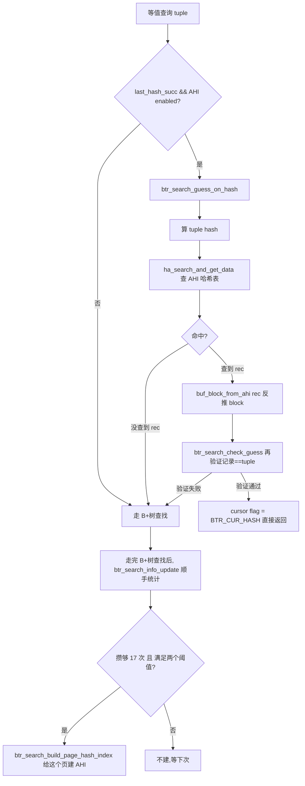
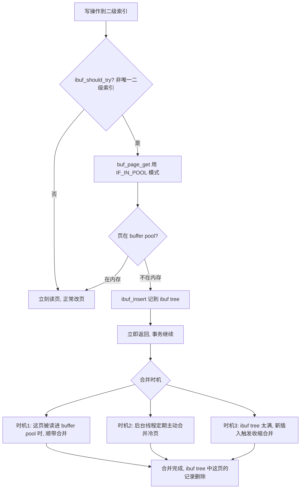

# 第 2 篇 · 第 7 章 · 自适应哈希索引(AHI)与 change buffer

> **核心问题**:P2-05 讲清楚了 buffer pool 怎么把热的 B+树页留在内存,P2-06 讲清楚了改进的 LRU 怎么在"一次全表扫描"面前保住热数据。这一章把镜头对准 buffer pool 之上的两个"加速器"。一个面向读:**哪怕一页已经在内存,B+树查找也得从根走到叶,跑几层二分定位——能不能把这最后一段路也省掉,直接一把哈希定位到记录?** 这就是**自适应哈希索引(Adaptive Hash Index,AHI)**。一个面向写:**二级索引的修改,要改的叶子页常常根本不在内存,朴素做法是"为改一条记录把整页读进来"——这一次随机读,往往就是为了塞进去一行。能不能先不读,把改动记到一个小本本上,等下次这页因为别的原因被读进来时再一起合并?** 这就是 **change buffer**(老名 insert buffer)。这两个东西各管一面,合起来是 InnoDB"在 buffer pool 之上,把读和写再榨一道油"的招牌。但马上两个更深的问题冒出来:为什么 AHI 是"自适应"而不是让用户像建普通索引那样自己建哈希索引?为什么 change buffer 只对**非唯一**二级索引生效,唯一索引凭什么就不能用?这一章把这几个"为什么"和"怎么做到的"一次拆透——也是第 2 篇(buffer pool)的收口章。

> **读完本章你会明白**:
> 1. AHI 为什么是"自适应"的——它**自动监控**哪些索引页被频繁按同样模式访问,自动给这些页建内存里的哈希索引,把 B+树的几层二分查找降成 O(1) 哈希查找;为什么不让用户手动建(热点难判断、会漂移、且哈希索引不存盘不能当真索引用)。
> 2. AHI 的"自适应"在源码里到底怎么落地——`btr_search_info_update_hash` 怎么统计"潜在命中",`BTR_SEARCH_BUILD_LIMIT = 100` / `BTR_SEARCH_PAGE_BUILD_LIMIT = 16` 这两个阈值怎么决定"给一个页建 AHI",`btr_search_guess_on_hash` 怎么在 B+树查找之前先试一把哈希。
> 3. change buffer 为什么只对非唯一二级索引——唯一索引必须立刻查重、不能把"待插入"先记在小本本上拖着;而二级索引的"按主键顺序"插入、删除标记、purge 删除都可以先缓存、后台批量合并,把"为改一行读一整页"的随机 IO 攒成一次。承接《LevelDB》的 MemTable 写缓冲思想(都是"先缓存写、后台批量落盘"省 IO),但 InnoDB 这里缓存的是**对别人页的增量修改**,不是自己的新数据。
> 4. change buffer 的物理形态:它本身是 system tablespace 里一棵 B+树(ibuf tree,根页在 `FSP_IBUF_TREE_ROOT_PAGE_NO`),缓存的修改按 `(space, page_no, counter)` 排序,保证合并时**同一个页的所有缓存修改连续**;还有一张遍布数据文件的 **bitmap** 标记"哪些页有待合并的修改"。

> **如果一读觉得太难**:只记四件事就够——① AHI 是 InnoDB 自动给热点页建的内存哈希索引,把 B+树查找降成 O(1),用户管不着也不用管;② change buffer 是给二级索引的写用的"小本本",改动先记这,不立刻读页,后台合并;③ 唯一索引**不能**用 change buffer,因为唯一性约束必须立刻查重;④ 这两个东西都是"在 buffer pool 之上再加一道优化",不替代 buffer pool,也不是事务机制(不影响 crash 不丢)。

---

## 〇、一句话点破

> **AHI 是 InnoDB 在 buffer pool 之上自动给"被频繁按同样模式访问的索引页"盖的一层内存哈希索引,把 B+树查找降成 O(1);change buffer 是给二级索引的写用的"记账本",改动先记这、不立刻读页、后台批量合并,把一次次"为改一行读一整页"的随机 IO 攒成一次。一个加读速,一个省写 IO,都不是事务机制,都是 buffer pool 之上的加速器。**

这是结论,不是理由。本章倒过来拆:先讲 AHI 解决什么、不这样会怎样、自适应到底怎么"自适",再讲 change buffer 解决什么、为什么只对非唯一索引、它的物理形态和合并时机。承接《LevelDB》写缓冲思想,但聚焦 InnoDB 把"二级索引随机写"转成"顺序记账 + 批量合并"的独到做法。

---

## 一、AHI:把 B+树查找的最后一段路也省掉

### 1.1 问题:B+树查找,哪怕页都在内存,也有"几层 + 二分"的开销

P2-05 我们钉死了一件事:buffer pool 把热页留在内存后,99.9% 的读不碰磁盘。但这不等于"读不要钱"——哪怕根、内部节点、叶子页全在内存,**一次按主键点查仍然要走一遍 B+树查找**:

```
   一次 point lookup(id = 10),页都在内存的开销:

       根页 ──二分──▶ 内部页 ──二分──▶ 内部页 ──二分──▶ 叶子页 ──二分──▶ 记录
       (3~4 次页内二分,每次二分是 O(log 页内记录数) 的比较)
```

B+树三到四层,意味着三到四次的"页内二分定位"。每一次二分是 `log2(页内记录数)` 量级的 key 比较——key 是变长的二进制,比较要按 collation 跳过变长字段长度、解 tuple、逐字节比。对 InnoDB 默认 16KB 页(一页能放几十到几百行),一次页内二分可能是 6~8 次比较,三到四层累加就是 20~30 次比较 + 几次指针解引用。这在内存里大概几百纳秒到一两个微秒——**对单次查询不算什么,但对一个跑几十万 QPS 的实例,这是热路径上反复执行的代码**。

OLTP 的真相是:**同一批热点行被反复点查**。电商的商品 SKU、用户中心的核心账户、秒杀的库存——这几张表里的少数热点行,一秒钟可能被点查上万次,每次都走同一棵 B+树的同一批内部节点 + 同一个叶子页。如果有一个机制能让"按主键查 id=10"从"三层 B+树查找"变成"一次哈希表 lookup 直接拿到记录指针",这热点查询就能再快一个数量级。

这就是 AHI 要解决的问题。注意它解决的**不是**"页不在内存"的问题(那是 buffer pool 的事),而是**"页都在内存,但每次还要跑一遍 B+树查找"**的问题——这是 buffer pool 之上、最后一层的优化。

> **不这样会怎样**:如果没有 AHI,即便 buffer pool 命中率 100%,热点查询每次仍要走一遍 B+树查找(20~30 次比较)。对几十万 QPS 的实例,这部分 CPU 开销累加起来相当可观——AHI 的存在,就是为了把热点的 B+树查找路径整体省掉,换成 O(1) 哈希查找。一个常见的实测数字是:在"主键等值查询为主"的负载下,AHI 能带来 10%~50% 的吞吐提升(具体看热点有多集中);关闭 AHI(`innodb_adaptive_hash_index=OFF`),有些纯等值点查的负载会明显变慢。

### 1.2 解法:给热点页盖一层内存哈希索引

AHI 的思路极其朴素:**在内存里维护一张哈希表,key 是"(索引前缀列,值)的哈希",value 是"记录在 buffer pool 页里的指针"**。一次等值查询来,先算 tuple 的哈希,去这张表里查,命中就直接拿到记录所在的 `buf_block_t *` + `rec_t *`——根本不用从 B+树根走下来。

```
   没有 AHI:                    有 AHI(命中):

   tuple                        tuple
     │ 算 hash                     │ 算 hash
     │                             ▼
   ┌─▼──────┐                   ┌────────────────┐
   │ B+树根 │ ◀── 三~四层       │ AHI 哈希表    │ ◀── O(1) lookup
   │  ...   │     二分查找      │ hash → rec*   │
   │ 叶子页 │                   └────────┬───────┘
   └───┬────┘                            │
       └─▶ rec                              ▼
                                        rec (直接拿到记录指针)
```

注意几个关键事实(都和"它是个内存哈希、不是真索引"有关):

1. **AHI 完全在内存里,不落盘**。它只覆盖那些**当前在 buffer pool 里**的索引页——页被淘汰出 buffer pool,它对应的 AHI 条目就得删。重启后 AHI 是空的,要重新积累。这和真索引(B+树,在磁盘)是两回事。
2. **AHI 不影响正确性**。它只是个缓存式的加速器:哈希查到指针后,InnoDB 还要 `btr_search_check_guess` **再验证一次**这个指针指的记录是不是真的等于要找的 tuple(因为哈希会碰撞、AHI 条目可能过期)。验证失败,就老老实实退回去走 B+树。所以 AHI 是**纯性能优化,错了大不了走老路**。
3. **AHI 只对"等值 + 用到唯一前缀"的查询加速**。范围扫描、排序、`!=` 这些用不上哈希——哈希天生只能精确匹配。所以 AHI 的目标场景很窄,就是 OLTP 里最高频的"等值点查"。

> **钉死这件事**:AHI 是一层"在 buffer pool 之上的、纯内存的、对热点索引页的哈希索引"。它把 B+树的几层二分查找降成一次哈希 lookup,但它的覆盖范围有限(只有热点页)、正确性靠事后验证(错了回退)、不落盘(重启清空)。它的存在让 InnoDB 的"热点等值查询"快得离谱——代价是占内存 + 维护开销。

### 1.3 为什么是"自适应",而不是让用户自己建

这是 AHI 最容易被误解、也最值得讲透的一点。很多数据库支持用户手动建哈希索引(`CREATE INDEX ... USING HASH`)。为什么 InnoDB 偏偏要做成"自适应"——不让用户管,自己监控热点、自己决定给哪些页建?

四条理由,每条都是被 OLTP 真实负载逼出来的:

**理由一:用户根本判断不了"哪些是热点"。** 一张表几十亿行、十几个索引,哪个索引的哪段范围在被频繁等值查询?今天可能是"按 user_id 查订单",明天业务变了,变成"按 sku_id 查库存"。热点会**漂移**。让用户来判断,要么建错(把冷的当热的,白费内存)、要么建晚(等发现热点时已经慢了几周)。InnoDB 让引擎自己监控——访问模式统计是实时的,热点变了 AHI 跟着重建,用户无感。

**理由二:哈希索引不存盘,本来就不能当"真索引"。** 用户建的索引是要持久化的(`.ibd` 文件里的 B+树),crash 不丢、重启还在。而哈希索引一旦放进磁盘就要面对"哈希怎么 crash 安全"的一堆麻烦(哈希表不是顺序写的、不是 WAL 友好的)。InnoDB 的选择很干净:**真索引永远是 B+树(在磁盘、crash 安全);哈希索引只做内存加速(AHI),不持久化**。既然不持久化,那就没必要让用户操心——它是引擎的内部优化,不是 schema 的一部分。

**理由三:哈希索引只擅长等值,用户一旦建了就会在范围查询上栽跟头。** 哈希天生不支持范围。如果允许 `USING HASH`,用户很可能把它建在某个"既要等值又要范围"的列上,范围查询直接退化成全表扫(哈希里根本没有顺序)。InnoDB 的 B+树天生既支持等值又支持范围——把哈希做成 AHI(只在引擎内部、对等值查询偷偷加速),就把"哈希只擅长等值"这个限制**封装在引擎内部**,用户永远不会踩坑。

**理由四:让用户建索引要 schema 变更(DDL),太重。** OLTP 的热点变化频繁,如果每次热点漂移都要 DDL(那怕是 online DDL),也太重了。AHI 的建立和丢弃是引擎在内存里悄悄做的,**不涉及 DDL、不锁表、不需要用户介入**——页被访问多了就建,页被淘汰或访问模式变了就删,完全是运行时的微调。

> **不这样会怎样**:如果让用户手动建哈希索引,会出现三种悲剧:① 建错列,热点没加速反而占内存;② 建在范围查询的列上,范围查询退化全表扫;③ 热点漂移了,旧的哈希索引成废纸,新的热点没加速。InnoDB 把这一切交给"自适应":引擎自己看访问模式、自己建、自己删,用户只管用。

### 1.4 源码:自适应到底怎么"自适"

光说"自适应"太空。我们顺着源码把"它怎么决定给一个页建 AHI"这条路径走一遍。AHI 的核心代码在 [`btr/btr0sea.cc`](../mysql-server/storage/innobase/btr/btr0sea.cc),哈希表本身在 [`ha/ha0ha.cc`](../mysql-server/storage/innobase/ha/ha0ha.cc)。

#### 第一步:每次 B+树查找完,顺手统计一下

每次走完 B+树查找(没走 AHI,或 AHI 没命中),InnoDB 会调 [`btr_search_info_update`](../mysql-server/storage/innobase/include/btr0sea.ic#L46-L67)。这是个 inline 的快路径——它先看一眼"这次查找是不是值得统计",不值得就立刻返回(不付任何代价):

```c
// storage/innobase/include/btr0sea.ic(简化示意)
static inline void btr_search_info_update(btr_cur_t *cursor) {
  const auto index = cursor->index;
  if (dict_index_is_spatial(index) || !btr_search_enabled) {
    return;
  }
  if (cursor->flag == BTR_CUR_HASH_NOT_ATTEMPTED) {
    return;   // 不是等值查询场景,不统计
  }
  const auto hash_analysis_value = ++index->search_info->hash_analysis;
  if (hash_analysis_value < BTR_SEARCH_HASH_ANALYSIS) {
    return;   // 还没攒够 BTR_SEARCH_HASH_ANALYSIS(=17) 次访问,先不分析
  }
  btr_search_info_update_slow(cursor);  // 攒够了,走慢路径分析
}
```

> 源码:[btr_search_info_update](../mysql-server/storage/innobase/include/btr0sea.ic#L46-L67)。注意 [`BTR_SEARCH_HASH_ANALYSIS = 17`](../mysql-server/storage/innobase/include/btr0sea.h#L335-L338)——攒够 17 次访问才启动分析,避免每次访问都付分析代价。

这个 `17` 的设计本身就体现了 InnoDB 一个一贯的取向:**热路径上的统计要"抽样",不能每次都做**。如果每次访问都跑一遍"该不该建 AHI"的分析,分析本身就成了开销。攒 17 次再分析,把分析代价摊薄到 17 次访问上,几乎为零。

#### 第二步:慢路径——更新"推荐前缀"和"潜在命中计数"

攒够 17 次后,走 [`btr_search_info_update_slow`](../mysql-server/storage/innobase/btr/btr0sea.cc#L649-L679)。这个函数干两件事:① [`btr_search_info_update_hash`](../mysql-server/storage/innobase/btr/btr0sea.cc#L406-L512) 更新"推荐用哪个索引前缀做哈希"+ "潜在命中数 `n_hash_potential`";② [`btr_search_update_block_hash_info`](../mysql-server/storage/innobase/btr/btr0sea.cc#L520-L575) 决定"要不要给当前这个页建 AHI"。

第一个函数的核心逻辑是:**看这次 B+树查找的 `up_match`/`low_match`(二分查找停在哪个位置,匹配了几个列),推断出一个"如果用这个前缀建哈希,下次能命中"的推荐**。它维护 `info->prefix_info`(推荐前缀:`n_fields` 列 + `n_bytes` 字节 + `left_side` 取左还是取右)和 `info->n_hash_potential`(连续多少次访问本可以用这个前缀命中):

```c
// storage/innobase/btr/btr0sea.cc(简化示意,关键判定)
static void btr_search_info_update_hash(btr_cur_t *cursor) {
  const auto info = index->search_info;
  if (info->n_hash_potential != 0) {
    // 已经有推荐前缀了:看这次访问是否仍能用这个前缀命中
    const auto prefix_info = info->prefix_info.load();
    if (prefix_info.n_fields == n_unique && ...) {
      info->n_hash_potential++;    // 还能用,潜在命中 +1
      return;
    }
    // ... 其它"前缀仍适用"的判定 ...
  }
  // 推荐前缀不适用了:重置,根据这次 up_match/low_match 重新推荐
  info->hash_analysis = 0;
  cmp = ut_pair_cmp(cursor->up_match, cursor->up_bytes,
                    cursor->low_match, cursor->low_bytes);
  if (cmp == 0) {
    info->n_hash_potential = 0;       // 二分没区分度,放弃
  } else if (cmp > 0) {
    info->n_hash_potential = 1;
    info->prefix_info = {...根据 low_match + 1 推荐...};
  } else {
    info->n_hash_potential = 1;
    info->prefix_info = {...根据 up_match + 1 推荐...};
  }
}
```

> 源码:[btr_search_info_update_hash](../mysql-server/storage/innobase/btr/btr0sea.cc#L406-L512)。注意 `n_unique = dict_index_get_n_unique_in_tree(index)`——AHI 推荐的前缀**最多用到索引的所有唯一列**,因为只有用到唯一列,哈希查找才能精确定位到一条记录(否则一个哈希值对应一组相邻记录,AHI 只能缓存"组的边界")。代码里有专门处理"用全部唯一列 vs 用更短前缀 + left_side"的分支([L436-L469](../mysql-server/storage/innobase/btr/btr0sea.cc#L436-L469))。

这段统计是无锁的——注释里反复强调 `info` 和 `block->ahi` 字段**不加任何 latch 保护**(为了省 CPU)。字段是 `std::atomic` 的,允许短暂不一致,真要建 AHI 时再加锁 double-check。这是个典型的"用近似统计换性能"的设计:统计稍微不准没关系,因为 AHI 建错了也会被 `btr_search_check_guess` 验证拦下来。

#### 第三步:决定给一个页建 AHI——两个阈值

第二个函数 [`btr_search_update_block_hash_info`](../mysql-server/storage/innobase/btr/btr0sea.cc#L520-L575) 决定"具体到当前这个 block,要不要给它建 AHI"。这里是 AHI 最核心的判定逻辑,两个阈值在这里出现:

```c
// storage/innobase/btr/btr0sea.cc(简化示意,核心判定)
static bool btr_search_update_block_hash_info(buf_block_t *block,
                                              const btr_cur_t *cursor) {
  const auto info = cursor->index->search_info;
  // ... 更新 block->n_hash_helps(这个页连续多少次"本可以命中") ...
  if (block->n_hash_helps > 0 && info->n_hash_potential > 0 &&
      block->ahi.recommended_prefix_info == info->prefix_info) {
    block->n_hash_helps++;
  } else {
    block->n_hash_helps = 1;
    block->ahi.recommended_prefix_info = info->prefix_info;
  }

  // ★ 两个阈值的核心判定:
  if (info->n_hash_potential >= BTR_SEARCH_BUILD_LIMIT &&
      block->n_hash_helps >
          page_get_n_recs(block->frame) / BTR_SEARCH_PAGE_BUILD_LIMIT) {
    if (!block->ahi.index ||                                       // 还没建
        block->n_hash_helps > 2 * page_get_n_recs(block->frame) || // 命中过多
        block->ahi.recommended_prefix_info != block->ahi.prefix_info) { // 前缀变了
      return true;   // 给这个页建 AHI
    }
  }
  return false;
}
```

> 源码:[btr_search_update_block_hash_info](../mysql-server/storage/innobase/btr/btr0sea.cc#L520-L575)。两个阈值是 [`BTR_SEARCH_BUILD_LIMIT = 100`](../mysql-server/storage/innobase/btr/btr0sea.cc#L94)(索引级的"潜在命中"次数)和 [`BTR_SEARCH_PAGE_BUILD_LIMIT = 16`](../mysql-server/storage/innobase/btr/btr0sea.cc#L90)(页级的"帮助次数 / 页内记录数"比例的除数)。

把这两个阈值翻译成人话:

- **索引级**:`n_hash_potential >= 100`——这个索引"连续 100 次访问本可以用某个前缀命中",说明这个索引确实有等值查询的热点模式。
- **页级**:`n_hash_helps > 页内记录数 / 16`——具体到这个页,它被"本可以命中"的次数超过了它记录数的 1/16。比如一个页有 100 条记录,那么它被帮助 7 次以上(100/16 ≈ 6.25)就触发建 AHI。

为什么页级用"记录数 / 16"这个比例?因为页内记录数越多,每条记录被点查到的概率越分散;记录数少(比如一个页只有几条记录),那这几条记录被反复点查的相对密度就高,更应该建 AHI。这个比例阈值让"该不该建 AHI"**自适应于页的稠密程度**——稀疏页更容易触发,稠密页要更频繁访问才触发。这是个非常 OLTP 化的精巧调参。

满足条件就调 [`btr_search_build_page_hash_index`](../mysql-server/storage/innobase/btr/btr0sea.cc#L1404-L1578),真正把这个页的所有记录(按推荐前缀算哈希)插进 AHI 哈希表。这一步是 X-latch 重操作(要改全局 AHI 哈希表),所以用 `btr_search_x_lock_nowait`——拿不到锁就**直接放弃这次建 AHI 的机会**(下次再说),绝不为建 AHI 阻塞查询:

```c
// storage/innobase/btr/btr0sea.cc(简化示意,AHI 建立是 nowait)
if (update) {
  btr_search_x_lock(index, UT_LOCATION_HERE);   // update 路径必须拿到
} else {
  if (!btr_search_x_lock_nowait(index, UT_LOCATION_HERE)) {
    return;   // ★ 拿不到锁就放弃,AHI 是加速器,不能阻塞业务
  }
}
// ... 把页内记录逐个 ha_insert_for_hash 进 AHI ...
```

> 源码:[btr_search_build_page_hash_index 拿锁部分](../mysql-server/storage/innobase/btr/btr0sea.cc#L1519-L1525),逐条插入在 [L1571-L1573](../mysql-server/storage/innobase/btr/btr0sea.cc#L1571-L1573)。注释明说"The AHI is supposed to be heuristic for speed-up. When adding a block to index, waiting here for the latch would defy the purpose."——AHI 是启发式加速器,为它等锁违背初衷。这是 InnoDB 一贯的哲学:**优化手段绝不能反过来拖慢主路径**。

#### 第四步:查找时,先试一把哈希

建好 AHI 后,等值查询来时怎么用?在 [`btr_cur_search_to_nth_level`](../mysql-server/storage/innobase/btr/btr0cur.cc#L134) 这个 B+树查找的主入口里,真正下到叶子层之前,会先试一把 [`btr_search_guess_on_hash`](../mysql-server/storage/innobase/btr/btr0sea.cc#L804-L1003):

```c
// storage/innobase/btr/btr0cur.cc(简化示意,查找主路径的 AHI 试探)
if (rw_lock_get_writer(btr_get_search_latch(index)) == RW_LOCK_NOT_LOCKED &&
    latch_mode <= BTR_MODIFY_LEAF && index->search_info->last_hash_succ &&
    !index->disable_ahi && !estimate
    && UNIV_LIKELY(btr_search_enabled) && ...
    && btr_search_guess_on_hash(tuple, mode, latch_mode, cursor,
                                has_search_latch, mtr)) {
  /* AHI 命中,直接返回,不走 B+树 */
  btr_cur_n_sea++;
  return;
}
btr_cur_n_non_sea++;   // AHI 没命中或没试,走 B+树
```

> 源码:[btr0cur.cc 的 AHI 试探入口](../mysql-server/storage/innobase/btr/btr0cur.cc#L775-L798)。注意几个前提条件:① `latch_mode <= BTR_MODIFY_LEAF`(只对叶子层的等值查询试,树结构修改不试);② `index->search_info->last_hash_succ`(上次 AHI 成功过,才值得再试);③ `!estimate`(不是统计信息估算场景)。这些条件保证"试 AHI"这件事本身不会成为开销——只有大概率能成功时才试。

`btr_search_guess_on_hash` 内部:`if (!btr_search_enabled) return false;` → `if (info->n_hash_potential == 0) return false;` → 算 tuple 的 hash → `ha_search_and_get_data` 拿到 `rec_t *` → `buf_block_from_ahi(rec)` 反推出 block → `btr_search_check_guess` **再验证一次**指针指的记录真的等于 tuple(防哈希碰撞、防过期)→ 验证通过,`cursor->flag = BTR_CUR_HASH`,返回 true。

> 源码:[btr_search_guess_on_hash](../mysql-server/storage/innobase/btr/btr0sea.cc#L804-L1003)。验证失败的情况:`cursor->flag = BTR_CUR_HASH_FAIL`([L879](../mysql-server/storage/innobase/btr/btr0sea.cc#L879)),回退到 B+树查找。`BTR_CUR_HASH` / `BTR_CUR_HASH_FAIL` / `BTR_CUR_HASH_NOT_ATTEMPTED` 是 cursor 的状态枚举([btr0cur.h#L653-L658](../mysql-server/storage/innobase/include/btr0cur.h#L653-L658))。

整个流程画成图:



> **钉死这件事**:AHI 的"自适应"是一套**抽样统计 + 阈值触发 + nowait 建立 + 事后验证**的组合拳。它用 17 / 100 / 16 三个阈值层层过滤,只给真正热的页建 AHI;建立时绝不阻塞(拿不到锁就放弃);查到指针后还要再验证一次(防哈希碰撞和过期)。这套设计让 AHI 既精准(只覆盖热点)又廉价(统计近似、建立不阻塞),是"自适应"三个字在源码里的全部含义。

### 1.5 AHI 的代价和维护:为什么默认开但有时要关

AHI 不是免费午餐。它的代价主要有四条,理解了这四条,才能理解"为什么有些场景要主动关掉 AHI":

1. **占内存**。AHI 哈希表的节点是从一个专门的 mem_heap 分配的(`mem_heap_for_btr_search`),里面每个节点是一个 `ha_node_t`(hash_value + data 指针 + 可能的 block 指针 + next 指针)。一个热点页有几百条记录,AHI 就要给它们各建一个节点。表多、热点多,AHI 占的内存可观。
2. **维护开销**。每次页被淘汰、页分裂、页合并、记录插入/删除,都要相应地更新 AHI(删旧条目、加新条目)。这是 `btr_search_drop_page_hash_index` / `btr_search_update_hash_on_insert` / `btr_search_update_hash_on_move` 这一族函数的工作。对**写密集**的负载,这些维护操作的开销可能超过 AHI 带来的读加速。
3. **锁竞争**。AHI 哈希表有自己的 latch(`btr_search_sys->parts[i].latch`,一个 rwlock 保护一个 partition)。高并发等值查询都会来抢这个 latch——虽然 S-latch 可以共享,但 X-latch(建 AHI、删 AHI 条目)会阻塞所有 S-latch。在"大量并发等值查询 + 频繁写"的混合负载下,这个 latch 是有名的瓶颈。
4. **partition 拆分**。为了缓解上一条的锁竞争,InnoDB 把 AHI 拆成多个 partition(每个 partition 独立的 hash table + latch),由 [`btr_ahi_parts`](../mysql-server/storage/innobase/btr/btr0sea.cc#L73)(默认 **8**)控制。可调到 512(`MYSQL_SYSVAR(adaptive_hash_index_parts)`,见 [ha_innodb.cc#L22484-L22488](../mysql-server/storage/innobase/handler/ha_innodb.cc#L22484-L22488))。partition 越多,锁分片越细,单 partition 的竞争越小——但 partition 间的查找要 hash 取模,过度拆分也会增加 cache miss。

> **钉死这件事**:AHI 默认开([`adaptive_hash_index`](../mysql-server/storage/innobase/handler/ha_innodb.cc#L22475-L22479),默认 true),因为它对"读多写少的等值查询"负载几乎稳赚。但**对写密集负载(尤其是大量并发写 + 等值读混合),AHI 的维护开销和 latch 竞争可能反过来拖慢系统**——这时关掉 AHI(`innodb_adaptive_hash_index=OFF`)反而能提升吞吐。这是个需要根据负载实测调的开关,不是无脑开。partition 数(`adaptive_hash_index_parts`)是只读参数,启动时定,大实例可以考虑调大。

---

## 二、change buffer:把"为改一行读一整页"的随机 IO 攒成一次

AHI 加速了读。现在看写这一面——更精妙,也更体现 InnoDB 把"二级索引的写"和"主键索引的写"区别对待的洞察。

### 2.1 问题:二级索引的写,经常要为改一行读一整页

考虑一个典型的 OLTP 写场景:订单表上有个二级索引 `idx_user_id`(按 user_id 建的二级索引)。每来一个新订单,要往这个二级索引里插一条 `(user_id, primary_key)`。问题来了——**这条记录要插到的叶子页,大概率不在 buffer pool 里**。

为什么?因为二级索引的叶子页**按 user_id 排序**,而新订单的 user_id 是**随机**的(哪个用户下单都有可能)。主键索引(聚簇索引)的叶子页按主键(自增 id)顺序排,新订单的主键是递增的,所以主键索引的插入总是落在"最右边的叶子页"(几乎必然在 buffer pool,因为是热点追加点)。但二级索引的插入是**随机散落**在 B+树的各个叶子页里——要插的叶子页可能是个几百页之外的、冷的、不在内存的页。

```
   主键索引插入:顺序追加              二级索引插入:随机散落

   [页1][页2][页3][页4 ◀──新行]      [页A]  [页M]  [页Q]  [页Z]
                                       ▲      ▲      ▲      ▲
                                       │      │      │      │
                                   新行的 user_id 落在哪个页完全随机
                                   这个页很可能不在 buffer pool
```

如果朴素地处理这次二级索引插入:

1. 发现目标页不在 buffer pool → 发起一次**随机磁盘读**,把整个 16KB 页读进内存;
2. 在页里插入一条记录(可能几十字节);
3. 页变脏,后台刷盘。

**这一次随机磁盘读,就是为了塞进去几十字节的一条记录**。机械盘上要 5~10 毫秒,SSD 也要几十微秒——而实际的数据修改只占几微秒。IO 的浪费比例极大:读了一整页(16KB),只为改其中几十字节。

更糟的是,这种浪费会**放大**。假设一个事务批量插 100 条订单,每条都要改二级索引,目标页各不相同——那就是 100 次随机读,每次都为了改一条记录。如果这 100 个目标页里,有些**很快就会被别的查询读到**(比如几分钟内有人查这些 user_id 的订单),那这些随机读还算"有连带收益"(顺便预热了页)。但如果这些页短期内不会被读——那这次随机读就**纯属浪费**,改完没多久页又被淘汰,下次要用还得再读。

这就是 change buffer 要解决的核心问题。

> **不这样会怎样**:如果没有 change buffer,二级索引的每次写(尤其是随机插入)都可能触发一次"为改一行读一整页"的随机 IO。在 IOPS 受限的机械盘上,这会让二级索引的写吞吐被磁盘随机读卡死;即便是 SSD,随机读的延迟也比顺序写高一个数量级。change buffer 的存在,让二级索引的写**不必立刻读页**,把随机读攒着、合并、批量处理。

### 2.2 解法:把改动先记在小本本上,后台合并

change buffer 的思路也很朴素:**目标页不在 buffer pool?那就不读,先把这个改动记到一个专门的小本本上**。这个小本本本身是一个 B+树(change buffer tree,又叫 ibuf tree),存在 system tablespace 里。等以后这个页**因为别的原因被读进 buffer pool** 时(比如有人查了这个 user_id 的订单),再把小本本上所有关于这个页的改动**一次性合并**到这个页里。

```
   没有 change buffer:                  有 change buffer:

   插入 (user_id=42, pk=1001)           插入 (user_id=42, pk=1001)
     │                                    │ 目标页不在内存?
     │ 目标页不在内存                     │ 是 ── 不读!
     ▼                                    ▼
   随机读整个页进内存 (5~10ms)         记到 change buffer 树里 (内存顺序写)
     │                                    │ (立即返回,事务继续)
     ▼                                    ▼
   改一条记录                           ... 后台 / 下次读这页时 ...
     │                                    │
     ▼                                    ▼
   页变脏                               把 change buffer 里这页的所有改动
                                        一次性合并到这页 (只读一次!)
```

关键的收益在于"合并"这一步:假设页 P 上累积了 10 条待合并的修改(change buffer 里记了 10 次针对 P 的写),那么合并时只读一次 P,把这 10 条全部应用——**把 10 次随机读合并成了 1 次**。如果这 10 次写里有相互抵消的(比如先插 user_id=42,又删 user_id=42),合并时甚至可以直接跳过(change buffer 在合并前会做这种简化)。这就是 change buffer 的本质收益:**把多次随机读合并成一次,把无意义的读完全省掉**。

> **承接《LevelDB》写缓冲**:这个"先缓存写、后台批量落盘"的思想,在《LevelDB》里见过——LevelDB 的写先记到内存的 MemTable(WAL 保 crash 不丢),攒够一批再批量落盘到 SSTable,把"每次写都同步落盘"的随机写转成批量顺序写。InnoDB 的 change buffer 是**同源思想在二级索引写上的应用**:把"每次写都立刻读页"的随机读,转成"批量记账 + 合并时一次读"。但两者有本质区别——LevelDB 的 MemTable 缓存的是**自己的新数据**(要落盘的),change buffer 缓存的是**对别人页的增量修改**(要合并到已有页里的)。本书不重讲 LevelDB MemTable,只承接"批量换吞吐"的核心思想,聚焦 InnoDB 把它用在二级索引写上的独到之处。

### 2.3 为什么只对非唯一二级索引——这一条最关键

这是 change buffer 最容易被问、也最容易讲错的一条。它有**两层**理由,分别从"可行性"和"正确性"出发:

**第一层(可行性):唯一索引必须立刻查重,不能拖。** 唯一索引(`UNIQUE`)的语义是"这个列的值不能重复"。插入一条 `user_id=42` 到唯一索引时,InnoDB **必须立刻确认**这个 user_id 是否已存在——这必须读目标页看一眼。如果用 change buffer 把这个插入先记着、不读页,那万一页里已经有一条 user_id=42,这个"重复"就要等到合并时才能发现——而那时事务可能早就提交了,根本没法回头报"唯一性冲突"。所以唯一索引的插入,**必须立刻读页查重,不能用 change buffer 缓存**。

非唯一索引没这个约束——二级索引允许重复,插入一条 `(user_id=42, pk=1001)` 不需要查重,直接记账即可,合并时按 user_id 顺序插到页里就行(页里本来就有 user_id=42 的别的行,这没问题)。所以**非唯一二级索引可以用 change buffer,唯一索引不行**——这是从"可行性"出发的根本区别。

**第二层(正确性):唯一索引的查重还要处理"待插入"的并发。** 即便不考虑"立刻报冲突",还有个更深的并发问题:如果事务 A 把"插入 user_id=42"记在 change buffer 里(没读页),事务 B 紧接着又插 user_id=42——B 怎么知道 A 已经插了?B 必须读页才能查重,但 A 的插入还没合并到页,B 读到的是旧页,会以为 user_id=42 不存在,于是 B 也记一条到 change buffer。两个事务都提交了,合并时才发现两条 user_id=42——**唯一性约束被破坏**。所以从并发正确性看,唯一索引也必须让每次插入都"读页确认",不能用 change buffer 把"待插入"状态藏起来。

源码里这两层理由被一个函数直接钉死——[`ibuf_should_try`](../mysql-server/storage/innobase/include/ibuf0ibuf.ic#L116-L130):

```c
// storage/innobase/include/ibuf0ibuf.ic(原文,判定一个索引是否可用 change buffer)
static inline bool ibuf_should_try(
    dict_index_t *index, ulint ignore_sec_unique) {
  return (innodb_change_buffering != IBUF_USE_NONE && ibuf->max_size != 0 &&
          index->space != dict_sys_t::s_dict_space_id &&
          !index->is_clustered() &&                // ★ 必须是二级索引(非聚簇)
          !dict_index_is_spatial(index) &&         // 不是空间索引
          !dict_index_has_desc(index) &&
          index->table->quiesce == QUIESCE_NONE &&
          (ignore_sec_unique || !dict_index_is_unique(index)) &&  // ★ 非唯一
          srv_force_recovery < SRV_FORCE_NO_IBUF_MERGE);
}
```

> 源码:[ibuf_should_try](../mysql-server/storage/innobase/include/ibuf0ibuf.ic#L116-L130)。两个关键判定:`!index->is_clustered()`(二级索引)和 `!dict_index_is_unique(index)`(非唯一)。`ignore_sec_unique` 参数有个微妙用法:在某些路径(如 purge 删除)里,即便是唯一索引,某些操作(比如已经知道记录存在的 delete)也可以暂时绕过唯一性检查去 buffer——但常规插入/更新必须走非唯一这条线。

注意这里有个有趣的细节:`ignore_sec_unique` 参数允许在某些情况下**忽略**唯一性约束去 buffer。但常规的 INSERT/UPDATE 路径里,这个参数是 false(要严格遵守非唯一约束)。这就是为什么"唯一索引插入必须立刻读页"的规则在源码里如此显眼。

> **钉死这件事**:change buffer 只对**非唯一二级索引**生效,根本原因是唯一索引的语义要求"插入时立刻查重"——无论是为了立刻报冲突(可行性),还是为了不让两个并发插入都绕过查重(正确性)。这条规则不是性能取舍,是**语义强制**。这也是为什么 DBA 常说"能用普通二级索引就别用唯一索引,二级索引写入快得多"——快的部分,就是 change buffer 省下的那一次次随机读。

### 2.4 change buffer 缓存哪些操作:不只是 INSERT

老资料常把 change buffer 叫 "insert buffer",让人以为它只缓存 INSERT。实际上从 5.5 起,它就缓存**三种**对二级索引的操作,源码里是 [`ibuf_op_t`](../mysql-server/storage/innobase/include/ibuf0ibuf.h#L51-L59) 枚举:

```c
// storage/innobase/include/ibuf0ibuf.h(原文)
typedef enum {
  IBUF_OP_INSERT = 0,       // 插入一条二级索引记录
  IBUF_OP_DELETE_MARK = 1,  // 给一条二级索引记录打删除标记(DELETE/UPDATE 触发)
  IBUF_OP_DELETE = 2,       // 物理删除一条二级索引记录(purge 触发)
  IBUF_OP_COUNT = 3
} ibuf_op_t;
```

> 源码:[ibuf_op_t 枚举](../mysql-server/storage/innobase/include/ibuf0ibuf.h#L51-L59)。三种操作分别对应:**INSERT**(普通插入)、**DELETE_MARK**(逻辑删除,打标,UPDATE 改二级索引列时也是先打删标再插新)、**DELETE**(purge 线程物理删除已被打标且不可见的旧记录)。

这三种操作都能 buffer,但默认 buffer 哪些由 `innodb_change_buffering` 控制([`ibuf_use_t`](../mysql-server/storage/innobase/include/ibuf0ibuf.h#L63-L70)),默认是 `IBUF_USE_ALL`(全 buffer):

```c
// storage/innobase/include/ibuf0ibuf.h(原文,buffer 策略枚举)
enum ibuf_use_t {
  IBUF_USE_NONE = 0,
  IBUF_USE_INSERT,               // 只 buffer INSERT
  IBUF_USE_DELETE_MARK,          // 只 buffer DELETE_MARK
  IBUF_USE_INSERT_DELETE_MARK,   // buffer INSERT + DELETE_MARK
  IBUF_USE_DELETE,               // buffer DELETE_MARK + DELETE
  IBUF_USE_ALL                   // 全部(默认)
};
```

> 源码:[ibuf_use_t](../mysql-server/storage/innobase/include/ibuf0ibuf.h#L63-L70)。默认 [`innodb_change_buffering = IBUF_USE_ALL`](../mysql-server/storage/innobase/ibuf/ibuf0ibuf.cc#L204)。用户可以通过 `SET GLOBAL innodb_change_buffering = none/inserts/changes/deletes/purges/all` 调整。

`ibuf_insert` 入口里,有专门的 switch 把"当前操作"和"buffer 策略"对照,策略不允许就直接 return false(走老路):

```c
// storage/innobase/ibuf/ibuf0ibuf.cc(简化示意,op 与 use 策略匹配)
bool ibuf_insert(ibuf_op_t op, const dtuple_t *entry, dict_index_t *index, ...) {
  ibuf_use_t use = static_cast<ibuf_use_t>(innodb_change_buffering);
  switch (op) {
    case IBUF_OP_INSERT:
      switch (use) {
        case IBUF_USE_NONE: case IBUF_USE_DELETE: case IBUF_USE_DELETE_MARK:
          return false;   // 策略不允许 buffer INSERT
        case IBUF_USE_INSERT: case IBUF_USE_INSERT_DELETE_MARK: case IBUF_USE_ALL:
          goto check_watch;
      }
      break;
    case IBUF_OP_DELETE_MARK: /* 类似 */ break;
    case IBUF_OP_DELETE:      /* 类似 */ break;
  }
  // ...
}
```

> 源码:[ibuf_insert 的策略匹配](../mysql-server/storage/innobase/ibuf/ibuf0ibuf.cc#L3284-L3351)。

### 2.5 change buffer 的物理形态:一棵 B+树 + 一张遍布文件的 bitmap

change buffer 不是个无结构的列表——它本身是**一棵 B+树**(叫 ibuf tree),存在 system tablespace 里,根页固定在 [`FSP_IBUF_TREE_ROOT_PAGE_NO`](../mysql-server/storage/innobase/ibuf/ibuf0ibuf.cc#L526)。这棵树里,每条记录代表一个"待合并的修改",key 是 `(space_id, page_no, counter)`,value 是操作类型 + 完整的索引项内容。启动时 InnoDB 会把这棵树"认领"为一个内部的 dict_index:

```c
// storage/innobase/ibuf/ibuf0ibuf.cc(简化示意,启动时认领 ibuf tree)
ibuf->index = dict_mem_index_create("innodb_change_buffer", "CLUST_IND",
                                    IBUF_SPACE_ID,
                                    DICT_CLUSTERED | DICT_IBUF, 1);
ibuf->index->id = DICT_IBUF_ID_MIN + IBUF_SPACE_ID;
ibuf->index->table = dict_mem_table_create("innodb_change_buffer", ...);
ibuf->index->n_uniq = REC_MAX_N_FIELDS;
```

> 源码:[ibuf_init_at_db_start 认领 ibuf tree](../mysql-server/storage/innobase/ibuf/ibuf0ibuf.cc#L516-L527)。注意 `n_uniq = REC_MAX_N_FIELDS`——这棵树的"唯一键"包括所有字段,排序完全按 `(space, page_no, counter)` 来,这样**同一个目标页的所有待合并修改在树里是连续的**,合并时一次范围扫描就能拿到一个页的全部待合并记录。

这个排序设计是 change buffer 高效合并的关键。合并一个页 P 时,InnoDB 在 ibuf tree 里按 `(P.space, P.page_no)` 范围扫,所有针对 P 的修改连续排在一起,一把全拿到。`counter` 是个序号(同一个页的多条修改按 counter 排),保证合并时**按原始顺序应用**(比如先 INSERT 再 DELETE_MARK,顺序反了语义就错了)。

除了 ibuf tree,change buffer 还有一个遍布数据文件的 **bitmap**——每 N 个数据页配一个 bitmap 页,bitmap 里用 2 bit(`IBUF_BITS_PER_PAGE = 4`,见 [ibuf0ibuf.cc#L50](../mysql-server/storage/innobase/ibuf/ibuf0ibuf.cc#L50))记录"这页有多少待合并的修改"。bitmap 的作用是**快速判断**:一个页被读进来时,先看 bitmap,如果 bitmap 说"这页没有待合并修改"——直接用,不用查 ibuf tree(省事);如果说"有待合并修改"——去 ibuf tree 里查这页的范围,合并。

```
   change buffer 的物理形态(简化):

   ┌─────────────────────────────────────────────────────────────┐
   │ system tablespace (ibdata1)                                  │
   │                                                               │
   │  ┌─────────────────────┐    ┌────────────────────────────┐  │
   │  │ ibuf tree (B+树)    │    │ bitmap (遍布文件)           │  │
   │  │                     │    │                              │  │
   │  │ 根页 (FSP_IBUF_     │    │ 每 N 个数据页一个 bitmap 页 │  │
   │  │   TREE_ROOT_PAGE_NO)│    │ 每个数据页 4 bit:           │  │
   │  │   ↓                 │    │   00=无待合并, 01/10/11=有  │  │
   │  │ 内部节点            │    │                              │  │
   │  │   ↓                 │    │ 作用: 读页时 O(1) 判断      │  │
   │  │ 叶子页 (按          │    │ "这页有没有待合并的修改"     │  │
   │  │  (space,page_no,    │    │                              │  │
   │  │   counter) 排序)    │    │                              │  │
   │  │  每条记录 = 一个    │    │                              │  │
   │  │  待合并的修改       │    │                              │  │
   │  └─────────────────────┘    └────────────────────────────┘  │
   └─────────────────────────────────────────────────────────────┘
```

> **钉死这件事**:change buffer 是"一棵 B+树 + 一张 bitmap"的组合。B+树按 `(space, page_no, counter)` 排序,让"同一个目标页的所有待合并修改连续",合并时一次范围扫描搞定;bitmap 用极少的 bit 标记"哪些页有待合并修改",让"读页时是否需要合并"的判断 O(1)。这两个数据结构配合,把 change buffer 的查询和合并开销压到最低。

### 2.6 什么时候合并:三个触发时机

change buffer 里记的修改不能永远堆着——总要合并到目标页。合并的时机有三个:

**时机一:目标页被读进 buffer pool 时(被动合并)。** 这是最常见的时机。某个查询要读页 P(比如有人查了 user_id=42 的订单,P 被读进内存),InnoDB 在 `buf_page_get` 把 P 读进来之后,会调 [`ibuf_merge_or_delete_for_page`](../mysql-server/storage/innobase/ibuf/ibuf0ibuf.cc#L3962-L4282),把 ibuf tree 里所有针对 P 的修改一次性合并到 P 里。这样这次磁盘读顺便就把待合并的事干了——**零额外 IO**(页都读了,合并是内存里改)。

**时机二:后台线程定期合并(主动合并)。** InnoDB 有个后台任务定期调 [`ibuf_merge_in_background`](../mysql-server/storage/innobase/ibuf/ibuf0ibuf.cc#L2399-L2447),主动读一些有待合并修改的页进来,合并,再淘汰。这是为了**防止 ibuf tree 无限增长**——如果某些页长期没人查(冷数据),它们的待合并修改会一直堆在 ibuf tree 里,占用空间;后台合并会主动把这些"陈年旧账"清掉。合并的节奏由 ibuf 当前大小决定:`ibuf->size` 超过 `max_size / 2` 就更激进([L2423-L2427](../mysql-server/storage/innobase/ibuf/ibuf0ibuf.cc#L2423-L2427))。

**时机三:插入新条目时 ibuf tree 太满,触发收缩。** 每次 `ibuf_insert_low` 时,会检查 ibuf tree 大小是否超过 `max_size + IBUF_CONTRACT_DO_NOT_INSERT`(超 10 页就同步合并且不插入,见 [L3017-L3021](../mysql-server/storage/innobase/ibuf/ibuf0ibuf.cc#L3017-L3021);超 5 页就同步合并但还允许插入,见 [IBUF_CONTRACT_ON_INSERT_SYNC = 5](../mysql-server/storage/innobase/ibuf/ibuf0ibuf.cc#L312-L315))。这是个"反压"机制——ibuf tree 太满时,新插入会被强制触发合并,防止 change buffer 占用过多 system tablespace 空间。

`ibuf->max_size` 是 change buffer 的容量上限,默认是 **buffer pool 大小的 5%**([`CHANGE_BUFFER_DEFAULT_SIZE = 5`](../mysql-server/storage/innobase/include/ibuf0ibuf.h#L47),见 [ibuf_init_at_db_start](../mysql-server/storage/innobase/ibuf/ibuf0ibuf.cc#L467-L474)):

```c
// storage/innobase/ibuf/ibuf0ibuf.cc(原文,启动时初始化 max_size)
ibuf->max_size = ((buf_pool_get_curr_size() / UNIV_PAGE_SIZE) *
                  CHANGE_BUFFER_DEFAULT_SIZE) / 100;
```

> 源码:[ibuf_max_size 计算](../mysql-server/storage/innobase/ibuf/ibuf0ibuf.cc#L467-L474)。可由 `innodb_change_buffer_max_size`(0~50,百分比)在线调整,见 [`ibuf_max_size_update`](../mysql-server/storage/innobase/ibuf/ibuf0ibuf.cc#L531-L539)。注意:9.x 默认 5% 老资料可能写 25% 或 1/16(那是更老版本或某些定制),以源码 `CHANGE_BUFFER_DEFAULT_SIZE = 5` 为准。



### 2.7 change buffer 的代价和反面对比

change buffer 也不是免费的。它的主要代价:

1. **合并是延迟的**。一条修改记到 change buffer 后,它要等"页被读"或"后台合并"才真正进入目标页。在合并前,这条记录**对二级索引查询不可见**——查询页 P 时,InnoDB 要先合并 change buffer 里 P 的所有修改,才能保证查询看到最新数据。这个"合并再查"的开销,在读密集负载下可能反而拖慢。
2. **占 system tablespace 空间**。ibuf tree 在 ibdata1 里,大量未合并的修改会占空间。
3. **崩溃恢复更复杂**。ibuf tree 本身是 B+树,有 redo 保护(改 ibuf tree 也要写 redo);crash 后恢复时,要重做 ibuf tree 的修改 + 处理未合并的条目。
4. **大量读密集负载下可能反向**。如果一个表"写完马上就要读",change buffer 的缓存根本攒不下来(写完就合并了,没省到 IO,反而多了记账开销)——这种场景关掉 change buffer 反而更快。

> **钉死这件事**:change buffer 的最佳场景是**"写多读少"且二级索引写入随机**的负载——典型如订单、日志、审计类表,写进来基本不怎么查,或者查的是热数据(冷数据的写攒着不读)。对"写完马上读"的负载,change buffer 几乎没用,反而增加记账开销。这也是为什么生产环境调优时,要结合负载特性决定 `innodb_change_buffering` 的策略。

---

## 三、技巧精解:两个最硬核的设计

本章挑两个最硬核的设计单独拆透:① AHI 的"自适应触发"——为什么用 17/100/16 这套阈值,以及"nowait 建立 + 事后验证"的哲学;② change buffer 的"按 page_no 排序的 B+树 + bitmap"——为什么这个数据结构能让合并高效。

### 技巧一:AHI 的"nowait 建立 + 事后验证"——加速器绝不能反过来拖慢主路径

AHI 最值得拆的设计,不是哈希表本身(那是常规数据结构),而是它处理"建立 AHI"和"使用 AHI"两个环节的**哲学**:**AHI 是加速器,任何让加速器反过来阻塞主路径的设计都是错的**。

这个哲学在源码里有两处体现:

**体现一:建 AHI 时用 `nowait` 锁,拿不到就放弃。** [`btr_search_build_page_hash_index`](../mysql-server/storage/innobase/btr/btr0sea.cc#L1404-L1578) 在拿全局 AHI latch 时,如果 `update` 参数是 false(常规路径),用 `btr_search_x_lock_nowait`——拿不到锁**立即返回**,放弃这次建 AHI 的机会:

```c
// storage/innobase/btr/btr0sea.cc(原文,nowait 建立的精髓)
/* The AHI is supposed to be heuristic for speed-up. When adding a block
to index, waiting here for the latch would defy the purpose. We will try
to add the block to index next time. However, for updates this must
succeed so the index doesn't contain wrong entries. */
if (update) {
  btr_search_x_lock(index, UT_LOCATION_HERE);
} else {
  if (!btr_search_x_lock_nowait(index, UT_LOCATION_HERE)) {
    return;   // ★ 拿不到锁就放弃,下次再说
  }
}
```

> 源码:[btr_search_build_page_hash_index 的 nowait 锁](../mysql-server/storage/innobase/btr/btr0sea.cc#L1519-L1525)。注释原文说得很清楚:"waiting here for the latch would defy the purpose"(在这里等锁违背 AHI 的初衷)。

这个设计的精妙在于:**AHI 的建立是"锦上添花"**——建成了能加速,没建成大不了走 B+树(慢一点但正确)。所以"建 AHI"这件事**绝对不能阻塞**当前的查询。如果为了建 AHI 去等一个全局 latch,那这个查询就被 AHI 自己拖慢了——这就违背了 AHI 作为加速器的初衷。`nowait` 让"建 AHI"变成 best-effort:能建就建,不能建就下次,主路径绝不停顿。

唯一例外是 `update == true` 路径(在页分裂/合并后重建 AHI)——这时必须拿到锁,因为不重建 AHI 会有**错误条目**(指向已经移走的记录),错误条目比没 AHI 更糟。所以这种情况下宁可等也要拿到锁。这是"正确性 vs 性能"的精确权衡:常规建立(性能优化)用 nowait,修正性重建(正确性必需)用 wait。

**体现二:用 AHI 查到指针后,还要 `btr_search_check_guess` 再验证一次。** [`btr_search_guess_on_hash`](../mysql-server/storage/innobase/btr/btr0sea.cc#L804-L1003) 查到 `rec_t *` 后,并不直接信任,而是调 [`btr_search_check_guess`](../mysql-server/storage/innobase/btr/btr0sea.cc#L695-L802) 验证指针指的记录**真的等于**要找的 tuple:

```c
// storage/innobase/btr/btr0sea.cc(简化示意,验证 AHI 命中)
rec = (rec_t *)ha_search_and_get_data(btr_get_search_table(index), hash_value);
cursor->flag = BTR_CUR_HASH_FAIL;   // 先假定失败
if (rec == nullptr) return false;   // 哈希表里没有

buf_block_t *block = buf_block_from_ahi(rec);   // 从指针反推 block
// ... 检查 block 状态 ...
btr_cur_position(index, (rec_t *)rec, block, cursor);

/* ★ 验证:指针指的记录,真的等于要找的 tuple 吗? */
if (!btr_search_check_guess(cursor, has_search_latch, tuple, mode, mtr)) {
  return false;   // 验证失败(哈希碰撞 / 条目过期),回退到 B+树
}
// 验证通过,真的命中
cursor->flag = BTR_CUR_HASH;
return true;
```

> 源码:[btr_search_guess_on_hash 的验证逻辑](../mysql-server/storage/innobase/btr/btr0sea.cc#L873-L938)。

为什么要验证?因为 AHI 可能出错——哈希会碰撞(两个不同的 tuple 算出同一个 hash_value),AHI 条目可能过期(页里的记录被改了、移走了,但 AHI 条目还没更新)。如果不验证,直接用 AHI 给的指针,可能返回错误的记录——这是正确性问题。验证一次,把"可能错的加速"变成"确定对的加速",代价是一次记录比较(远比走 B+树便宜)。

> **反面对比**:如果 AHI 不验证,哈希碰撞会让查询返回错误记录——这是数据正确性问题,不可接受。如果 AHI 建立时用 wait 锁(不 nowait),建 AHI 会阻塞查询——加速器反过来拖慢主路径,违背初衷。InnoDB 的设计是"宁可少建几个 AHI(nowait)、宁可查到后多验证一次(check_guess),也要保证正确性和不阻塞主路径"——这是"加速器哲学"在源码里的精确体现。

### 技巧二:change buffer 的"按 page_no 排序 + bitmap 标记"——让合并批量且廉价

change buffer 最值得拆的设计,是它**如何让"合并"这个操作既高效又廉价**。这个设计有两层:数据结构层(按 page_no 排序的 B+树)和索引层(遍布文件的 bitmap)。

**数据结构层:ibuf tree 按 `(space, page_no, counter)` 排序。**

这个排序是 change buffer 高效合并的根基。考虑合并页 P 时要做什么:从 ibuf tree 里找出所有针对 P 的修改,按原始顺序应用。如果 ibuf tree 是无序的,找 P 的所有修改要扫全树(O(树大小));如果只按 `(space, page_no)` 排(不排 counter),同一个 P 的修改顺序无法保证(INSERT/DELETE_MARK/DELETE 可能乱序应用,语义错乱)。

InnoDB 的选择是**按 `(space, page_no, counter)` 全排序**——这样同一个 P 的所有修改在树里**连续排列**,且按 counter 顺序。合并 P 时,在树里做一次**范围扫描**(`(P.space, P.page_no, MIN_COUNTER)` 到 `(P.space, P.page_no, MAX_COUNTER)`),一把拿到 P 的全部修改,且天然有序。这是把"合并一个页"从 O(树大小) 降到 O(这个页的修改数 + log 树高)。

`counter` 的设计还有个细节(见 [ibuf0ibuf.cc#L120-L131](../mysql-server/storage/innobase/ibuf/ibuf0ibuf.cc#L120-L131) 的注释):同一个页的多条修改,counter 是递增的序号。这保证"先 INSERT x, 再 DELETE_MARK x, 再 INSERT x"这种序列按正确顺序应用——如果顺序错了(先 DELETE_MARK 再 INSERT),结果完全不同。counter 让 ibuf tree 天然保持操作的原始顺序,合并时不用额外排序。

**索引层:遍布数据文件的 bitmap。**

光有 ibuf tree 还不够——还有个高频问题:**一个页 P 被读进 buffer pool 时,要不要去 ibuf tree 里查它有没有待合并修改?** 如果每次都查 ibuf tree,即便大多数页没有待合并修改,这个查询也是开销(范围扫描 ibuf tree)。

InnoDB 的解法是**遍布数据文件的 bitmap**:每 N 个数据页(精确说,每个页的 bitmap 占 4 bit,2 bit 用于 ibuf,2 bit 用于其它)配一个 bitmap 页,bitmap 里用 2 bit 标记"这个页有多少待合并修改"(0/1/2/3 四档,大致表示数量级)。读页 P 时,先读它的 bitmap bit:

```c
// storage/innobase/include/ibuf0ibuf.ic(原文,ibuf_should_try 的姊妹:读页前看 bitmap)
// 读页 P 进 buffer pool 后,决定是否合并的入口:
void ibuf_merge_or_delete_for_page(buf_block_t *block, const page_id_t &page_id,
                                   const page_size_t *page_size,
                                   bool update_ibuf_bitmap) {
  // ... 先看 bitmap ...
  bitmap_bits = ibuf_bitmap_page_get_bits(bitmap_page, page_id, *page_size,
                                          IBUF_BITMAP_IBUF, &mtr);
  if (bitmap_bits == 0) {
    return;   // ★ bitmap 说没待合并修改,直接返回,不查 ibuf tree
  }
  // bitmap 说有待合并,去 ibuf tree 范围扫描这个页的修改
  // ... 合并 ...
}
```

> 源码:[ibuf_merge_or_delete_for_page 的 bitmap 快速判断](../mysql-server/storage/innobase/ibuf/ibuf0ibuf.cc#L3962-L4282),bitmap 读取在 [L4028](../mysql-server/storage/innobase/ibuf/ibuf0ibuf.cc#L4028)。

bitmap 的精妙在于:**绝大多数页在大多数时刻没有待合并修改**——bitmap 一看是 0,立刻返回,根本不碰 ibuf tree。这把"读页时检查是否需要合并"从 O(扫 ibuf tree) 降到 O(1)(读 bitmap)。只有 bitmap 说"有待合并"时,才付出查 ibuf tree 的代价——而这种页是少数。

bitmap 的维护:每次往 ibuf tree 插入一条修改,相应页的 bitmap bit 加一档([`ibuf_set_free_bits_func`](../mysql-server/storage/innobase/ibuf/ibuf0ibuf.cc#L751-L823));合并完一批,bitmap bit 清零([L4246-L4256](../mysql-server/storage/innobase/ibuf/ibuf0ibuf.cc#L4246-L4256))。bitmap 是粗粒度的(2 bit 只能表示 4 档),所以"bitmap 说 0"也可能其实有 1 条修改(bitmap 粒度限制)——但这没关系,偶尔漏一条不影响正确性,合并会兜底。

> **反面对比**:如果 ibuf tree 不按 page_no 排(比如按插入时间排),合并一个页要扫全树找它的修改——O(树大小) 的扫描,合并代价可能比直接读页改还高,change buffer 就没意义了。如果没有 bitmap,每次读页都要查 ibuf tree 确认——大多数页没待合并修改,这个查询纯属浪费,读页延迟会被拖高。InnoDB 的"按 page_no 排序 + bitmap 标记"组合,把合并从 O(树大小) 降到 O(页修改数),把"读页时是否合并"的判断从 O(扫树) 降到 O(1)——这是 change buffer 能 net 收益(而不是反过来拖累)的数据结构根基。

> **承接《LevelDB》/《Linux 内存管理》**:这个"主结构 + 辅助索引"的设计在前面几本书里见过同源——LevelDB 的 SSTable + bloom filter(主结构是排序的 SSTable,辅助索引是 bloom filter 快速判断"key 可能不在")、Linux 内核的 radix tree + tag(主结构是页缓存 radix tree,tag 标记"哪些页脏/写回中")。InnoDB 的 ibuf tree + bitmap 是同一套思想:**主结构保证正确性,辅助索引降低"是否需要动用主结构"的判断开销**。

---

## 四、对照:change buffer vs LevelDB MemTable vs Linux writeback

把 change buffer 放到更大的视野里,和几个"先缓存再批量"的机制对照,看清它的独到之处:

| 维度 | **InnoDB change buffer** | **LevelDB MemTable** | **Linux page cache writeback** |
|------|--------------------------|----------------------|--------------------------------|
| 缓存什么 | 对**别人页**的增量修改(二级索引的 INS/DELMARK/DEL) | **自己的新数据**(待落盘的 KV) | 脏页(已改的文件页) |
| 物理形态 | ibuf tree(B+树,在 system tablespace) | 内存跳表 + WAL(顺序日志) | page cache 里的脏页 |
| 何时"落盘"/合并 | 目标页被读 / 后台合并 / ibuf 太满 | MemTable 满 → flush 成 SSTable | 脏页比例 / writeback 周期 |
| 顺序还是随机 | 合并到随机分布的目标页(本质是把随机读攒成一次) | flush 成顺序 SSTable(把随机写转顺序写) | writeback 到磁盘(随机或顺序,看调度) |
| crash 安全 | ibuf tree 自己有 redo 保护 | MemTable 有 WAL 保护 | page cache 里没 fsync 的脏页 crash 会丢 |
| 适用场景 | 二级索引写、写多读少 | 任何写(leveldb 是 LSM,所有写都先到 MemTable) | 通用文件写 |

> **钉死这件事**:三者都是"先缓存再批量"省 IO,但缓存的"对象"不同——change buffer 缓存的是**对别人页的修改**(合并时把这些修改应用到目标页),MemTable 缓存的是**自己的新数据**(flush 成新文件),page cache 缓存的是**已改的页**(直接刷盘)。change buffer 的独到之处是:**它把"修改"和"被修改的页"解耦**——修改可以先存在小本本上,页还在磁盘没动,等页被读进来时再"补上"这些修改。这种解耦让二级索引的随机写几乎变成"只写 ibuf tree"(顺序),把真正的随机读推迟到"页被读时"(那时反正都要读)。

---

## 五、两个加速器和主线的关系

AHI 和 change buffer 是 InnoDB 在 buffer pool 之上的两个"加速器"。把它们放回全书主线(**一条写,InnoDB 用 B+树聚簇索引找到位置、redo(WAL)保 crash 不丢、undo(MVCC)保并发读、锁保隔离**)看:

- **AHI 服务"找到位置"这一段**——它让"按主键/二级索引等值查找"从 B+树几层二分降成 O(1) 哈希,是"存储与索引"这一面的读加速器。
- **change buffer 服务"找到位置"的写路径**——它让二级索引的写不必立刻读页,把随机读攒成批量合并,是"存储与索引"这一面的写加速器。

注意一个关键的边界:**这两个东西都不是事务机制**。AHI 不落盘、不影响 crash 恢复(change buffer 有 redo 保护,但它服务的二级索引修改最终还是要合并到页里,合并后才"真正生效");它们都是**性能优化**,正确性从来不依赖它们。这就是为什么这一章是"存储与索引"这一面(第 2 篇)的收口——buffer pool(P2-05)、改进 LRU(P2-06)、AHI + change buffer(P2-07),这三层合起来是 InnoDB 的"内存 + 缓存 + 加速"全套。下一章(P3-08)开始,我们跨过"存储与索引"这一面,进入"事务与并发"——从 WAL/redo 开始,讲 InnoDB 怎么让一次写"crash 不丢"。

> **钉死这件事**:AHI 和 change buffer 是"存储与索引"这一面的最后一道优化。它们的共同特点是——**都是 best-effort 的性能优化,不参与正确性保证**。AHI 错了回退到 B+树,change buffer 没合并不影响数据正确性(只是延迟)。这种"性能优化和正确性解耦"的设计,让 InnoDB 可以放心地加各种加速器,而不让正确性逻辑变复杂。这也是为什么理解 InnoDB,要分清"哪些是正确性必需的(redo/undo/2PC/MVCC/锁),哪些是性能优化的(buffer pool/AHI/change buffer/doublewrite 的随机写优化)"——前者是骨架,后者是肌肉。

---

## 六、章末小结

### 回扣主线

本章服务"存储与索引"这一面,讲 InnoDB 在 buffer pool 之上的两个加速器。**AHI**(自适应哈希索引)解决"哪怕页都在内存,B+树查找仍有几层二分开销"——它自动监控热点访问模式,给被频繁等值查询的索引页盖一层内存哈希,把 B+树查找降成 O(1);"自适应"体现在源码的 17/100/16 三个阈值抽样统计 + nowait 建立 + 事后验证,让 AHI 既精准又不阻塞主路径。**change buffer**(老名 insert buffer)解决"二级索引的写经常要为改一行读一整页"——它把对非唯一二级索引的修改(INSERT/DELETE_MARK/DELETE)先记到 ibuf tree,后台或读页时批量合并,把多次随机读攒成一次;"只对非唯一二级索引"是唯一性约束的语义强制(必须立刻查重)。承接《LevelDB》MemTable 的"先缓存写、后台批量落盘"思想,但 change buffer 缓存的是对别人页的增量修改,不是自己的新数据。这两个加速器都是 best-effort 性能优化,不参与正确性保证——是第 2 篇(buffer pool)的收口。

### 五个为什么

1. **为什么 AHI 是"自适应"而不是让用户自己建?**——用户判断不了热点(且热点会漂移),哈希索引不落盘本来就不能当真索引用,哈希只擅长等值(用户建在范围列上会踩坑),建索引是 DDL 太重。InnoDB 让引擎自己监控、自己建、自己删,把这一切封装在内部。
2. **为什么 AHI 建立用 nowait 锁,查到指针后还要再验证?**——AHI 是加速器,等锁会反过来阻塞主路径(违背初衷),所以常规建立 nowait 拿不到锁就放弃;哈希会碰撞、条目会过期,不验证可能返回错误记录(正确性问题),所以查到后必须 `btr_search_check_guess` 再验证一次。
3. **为什么 change buffer 只对非唯一二级索引?**——唯一索引的语义要求插入时立刻查重(立刻报冲突),且并发插入不能都绕过查重(否则两个并发插入都以为不冲突,合并时才发现重复,破坏唯一性)。非唯一索引没这个约束,直接记账即可。
4. **为什么 change buffer 是一棵按 page_no 排序的 B+树 + bitmap?**——按 `(space, page_no, counter)` 排序让同一个目标页的待合并修改连续,合并时一次范围扫描搞定(从 O(树大小) 降到 O(页修改数));bitmap 用极少的 bit 标记"哪些页有待合并修改",让"读页时是否需要合并"的判断 O(1)(不查 ibuf tree)。
5. **为什么 AHI 和 change buffer 都是性能优化,不是事务机制?**——AHI 错了回退 B+树,change buffer 没合并不影响数据正确性(只是延迟);它们都是 best-effort,正确性从来不依赖它们。InnoDB 把"正确性必需(redo/undo/2PC/MVCC/锁)"和"性能优化(buffer pool/AHI/change buffer)"解耦,让加速器可以放心加,不让正确性逻辑变复杂。

### 想继续深入往哪钻

- **AHI 的内部并发**:partition 拆分([`btr_ahi_parts`](../mysql-server/storage/innobase/btr/btr0sea.cc#L73),默认 8)、每个 partition 的 rwlock、AHI latch 与 buffer pool latch 的协调。读 [`btr/btr0sea.cc`](../mysql-server/storage/innobase/btr/btr0sea.cc) 的 `btr_search_sys_t` 和 [`include/btr0sea.h`](../mysql-server/storage/innobase/include/btr0sea.h)。
- **change buffer 的完整生命周期**:bitmap 的 4 bit 各管什么([`IBUF_BITS_PER_PAGE`](../mysql-server/storage/innobase/ibuf/ibuf0ibuf.cc#L50))、ibuf tree 的 free list 管理、counter 字段的格式。读 [`ibuf/ibuf0ibuf.cc`](../mysql-server/storage/innobase/ibuf/ibuf0ibuf.cc) 文件头的注释(L40-L200)——InnoDB 团队在这里写了 change buffer 死锁预防的完整论述。
- **想动手感受**:`SHOW ENGINE INNODB STATUS` 的 `INSERT BUFFER AND ADAPTIVE HASH INDEX` 段落(看 AHI 的命中/失败统计、change buffer 的大小和合并速率);`information_schema.INNODB_METRICS` 里的 `adaptive_hash_*` 和 `change_buffer_*` 计数器;故意关掉 AHI(`innodb_adaptive_hash_index=OFF`)跑等值点查基准,对比吞吐。
- **承接深读**:AHI 的哈希表实现 [`ha/ha0ha.cc`](../mysql-server/storage/innobase/ha/ha0ha.cc)(外部链哈希)、change buffer 与 purge 的交互([P4-15 undo 版本链与 purge](P4-15-undo版本链与purge.md))。

### 引出下一章

第 2 篇(buffer pool)到此收口——P2-05(buffer pool)、P2-06(改进 LRU)、P2-07(AHI + change buffer),三层合起来是 InnoDB 的"内存 + 缓存 + 加速"全套。但有一个问题被我们刻意留到了现在:**buffer pool 里的脏页,crash 了怎么办?** 一次写改了内存里的页(页变脏),后台异步刷盘——如果刷盘前 crash,这些修改就丢了。InnoDB 凭什么说"提交了就不丢"?这就是下一章 P3-08 要拆的 **WAL(Write-Ahead Logging)与 redo log**——改页之前先把"要怎么改"记到顺序写的 redo log 里,crash 后靠 redo 重放,把没落盘的修改补回来。从这一章开始,我们正式跨入"事务与并发"这一面——InnoDB 的心脏。

> **下一章**:[P3-08 · WAL 与 redo log](P3-08-WAL与redo-log.md)
