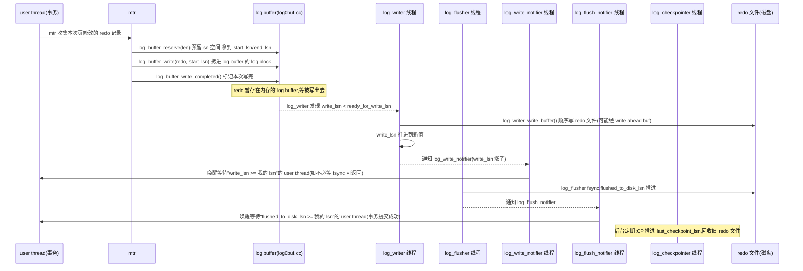

# 第 3 篇 · 第 8 章 · WAL 与 redo log

> **核心问题**:InnoDB 改一个数据页,为什么不是直接把页写回磁盘,而是先往日志里记一笔?这一笔凭什么 crash 断电了也能把数据救回来?而且 MySQL 8.0.30 把 redo log 整个推倒重写了——老资料里那个"单文件 `log0log.cc` 一把梭"的模型,现在到底变成了什么样?

> **读完本章你会明白**:
> 1. **WAL(Write-Ahead Logging)到底换来了什么**——为什么"先记日志再改页"比"直接改页"既快又 crash 安全,以及它把"随机写数据页"的负担转成了"顺序写日志"这背后的账怎么算。
> 2. **redo log 凭什么是"物理日志"就能 crash 后重放**——为什么记"哪页哪偏移改成什么字节"是**幂等**的,而记 SQL 这种"逻辑日志"在重放时会撞墙。
> 3. **LSN(log sequence number)这条贯穿全书的单调整数怎么流转**——从 mtr 写一条 redo,到 log buffer,到 log_writer 写文件,到 log_flusher 落盘,再到 checkpoint 推进,每一步都对应一个 LSN 水位。
> 4. **MySQL 8.0.30 那场 redo 大重构改了什么**——老的单文件串行模型为什么成了高并发写瓶颈,新版用 `log0write.cc`/`log0buf.cc`/`log0files_*` 等十几个文件拆出了 **6 个后台线程并发推进**,以及 cache line 对齐这种"无锁优化"小动作。

> **逃生阀**:这一章是全书"事务与并发"心脏篇(P3)的开篇,也是 redo 模块最重的一章。如果你只读一遍,先抓住三件事:① 写之前先记日志(WAL),日志顺序写所以快;② redo 记的是"物理变更"(哪页哪字节改成啥),所以重放幂等;③ 8.0.30 之后 redo 由 6 个后台线程接力干,老资料讲的单文件 `log0log.cc` 大片过时了。LSN 细分、log block 格式、cache line 对齐这些,第二遍再细抠。

---

## 〇、一句话点破

> **redo log 是一条只追加、顺序写的"变更流水账":每改一个字节,先在这里记下"哪个页哪个偏移,改成什么";事务提交只要等这条流水账落盘,数据页本身可以慢慢刷。crash 后照着流水账把没落盘的修改重新做一遍,数据就回来了——这就是 InnoDB"crash 不丢"的全部秘密。**

这是结论,不是理由。本章倒过来拆:先讲清楚不写日志直接改页会撞什么墙,再讲 WAL 这个思路怎么化解,接着拆 redo 凭什么"记物理变更就能重放"(幂等),然后落到源码——一条 redo 从 mtr 生成,经 log buffer,到 6 个后台线程接力写盘,LSN 这条线全程怎么推进,最后专门讲 MySQL 8.0.30 那场大重构(这是本章最容易和过时资料对不上的地方)。

---

## 一、不写日志直接改页,会撞什么墙

要理解 redo log 为什么必须存在,先看没有它会怎样。

InnoDB 的数据存在 B+树页里(默认 16KB 一页,见 P1-04),页平时驻留在 buffer pool(内存)。一次 `UPDATE t SET x=1 WHERE id=10` 改完之后,这个页在内存里变"脏"了(数据和磁盘上的不一样)。要把这次修改持久化,最朴素的做法是:**把这个脏页写回磁盘**。听起来天经地义,但这条路有两个致命问题。

### 墙一:随机写太慢,扛不住 OLTP

OLTP 的写是高度随机的——这一秒改 id=10,下一秒改 id=98765,这两个数据页在磁盘上八竿子打不着。一次 `UPDATE` 就要把所在页(16KB)整页写回,意味着**一次逻辑修改对应一次随机写 16KB**。机械盘随机 IOPS 就几百,NVMe 也不过几十万,扛不住"几千 TPS、每条事务改好几页"的真实负载。

更要命的是**写放大**:你只改了页里 1 个字节,却要把整个 16KB 页写一遍(因为页是磁盘 IO 的最小粒度)。1000 倍的写放大,吞吐直接塌。

而且如果追求"crash 不丢",每个事务提交时就得把这个脏页 fsync 落盘(否则 crash 时这个修改就没了)。fsync 是毫秒级的重操作——一秒能提交几百个事务就烧高香了,跟 OLTP"几万 TPS"的需求差着两个数量级。

### 墙二:crash 时可能写一半,页"撕裂"了

就算你愿意为每个提交 fsync 一次,还有更阴险的坑:一个 16KB 的页,磁盘写它是分多次扇区写(512B 或 4KB 一片)。如果机器写到一半断电了——比如页的前 8KB 写完了、后 8KB 没写——这个页就**撕裂(partial page write / torn page)**了。它在磁盘上是一个"前半新、后半旧"的怪物,页头里的校验和信息(file header/trailer)对不上,这个页本身就坏了。

页一旦撕裂,即使你有一份"变更日志"想重放,也没法重放——因为重放的前提是"这个页有个完整的旧版本,我把变更重新做一遍"。现在旧版本本身就是坏的,重放也救不回来。(这个"撕裂"问题,InnoDB 用另一个机制 **doublewrite buffer** 兜底,见 P3-12。本章先记下:直接改页,crash 时连"页本身完整"都保证不了。)

> **不这样会怎样**:朴素地"改完就整页写回",会同时撞上"随机写太慢"和"crash 页撕裂"两堵墙——既扛不住性能,又保不住数据。OLTP 需要一种"既快又 crash 安全"的写法。

---

## 二、WAL 的思路:把随机写转成顺序写,且可重放

InnoDB(以及几乎所有严肃数据库:PostgreSQL、Oracle、SQL Server,还有你读过的《LevelDB》WAL、《TiKV》Raft 日志)给出的标准答案叫 **WAL(Write-Ahead Logging,写前日志)**:

> **改数据页之前,先把"要怎么改"记到一份顺序写的日志(redo log)里。**

"ahead"是关键词——日志**先于**数据页落盘。事务提交时,只需要等 redo log 的这条记录 fsync 落盘(快,因为是顺序追加写),**数据页本身可以慢慢刷**。这样性能和 crash 安全就都兼顾了:

- **快**:redo log 是顺序追加写(只往后堆,不随机跳),顺序写在磁盘上快得多(机械盘顺序写能到几百 MB/s,随机写只有几 MB/s;SSD 上顺序写也明显优于随机写)。而且日志只记"变更的那几个字节"(物理日志,见下),不像整页 16KB——没有写放大。一次提交只 fsync 一段顺序写的日志,远快于 fsync 一个随机位置的 16KB 页。
- **crash 安全**:redo 落了盘,这次修改就"铁定不丢"了——哪怕数据页还没刷盘、crash 了,重启后照着 redo 把这次修改重新做一遍(重放),数据页就恢复到提交后的状态。

### WAL 把"谁先落盘"的顺序钉死了

WAL 的正确性靠一条铁律支撑:

> **数据页落盘之前,描述这次修改的 redo 忰须先落盘。**

换句话说:一个脏页可以刷盘(数据落盘)的前提,是它对应的 redo 已经落盘了。如果反过来——数据页先落盘、redo 后落盘——crash 发生在中间,数据页上有 redo 没记下的修改,重启后 redo 里没有这条,重放就漏了这次修改,数据就错了(或者说,这次修改成了"无法解释的脏数据")。

这条铁律在源码里靠 LSN 串起来:每个脏页记着自己"最近一次修改对应的 LSN"(`PAGE_LSN` 字段),刷盘时必须保证 `log.flushed_to_disk_lsn >= 页的 PAGE_LSN`。redo 先行,数据页后行——WAL 的"ahead"就这么落地。

```
   写流程(WAL):
                      ┌─ ① 事务提交前:redo 顺序追加写 + fsync(快)  ─┐
   UPDATE ──> 改内存页 ─┤                                            ├─> 事务提交成功
   (页变脏)            └─ ② 脏页?异步慢慢刷盘(不阻塞提交)──────────┘
                                  │
                                  ▼ crash 了?redo 已落盘 → 重放恢复
```

> **承接前作**:WAL 这个思想,和《LevelDB》的 WAL、《TiKV》的 Raft 日志是同源的——都是"先记日志再动手"。区别只在记的格式:LevelDB 记的是有序写操作的二进制流,SiKV Raft 日志记的是 propose 的命令,而 **InnoDB 的 redo 记的是"物理变更"**——这是下一节的重点。

---

## 三、redo 凭什么是"物理日志":幂等可重放

WAL 只是规定了"先记日志",但日志里到底记什么?有两种选法,InnoDB 选了**物理日志**,这一选择决定了 redo 能不能 crash 后安全重放。

### 两种日志格式:逻辑日志 vs 物理日志

- **逻辑日志(logical log)**:记"做了什么操作"。比如"对表 t 执行了 `UPDATE t SET x=1 WHERE id=10`",或者"在页 P 偏移 O 插入了一条记录"。 redo 重放时,把这条操作**重新执行一遍**。
- **物理日志(physical log)**:记"哪个物理位置,改成了什么字节"。比如"页号 P、偏移 O,改成值 V"——纯粹的"位置 + 新值"。redo 重放时,直接把那个字节写成 V,不管它现在是什么。

InnoDB 的 redo log 是**物理日志**。源码里 redo 记录的最小单元叫 **log record**,开头是一个类型字节(mlog_id_t),常见类型是"按字节数改"([`MLOG_1BYTE`/`MLOG_2BYTES`/`MLOG_4BYTES`/`MLOG_8BYTES`](../mysql-server/storage/innobase/include/mtr0types.h#L70-L79))——字面意思:N 个字节,改成给定的值。比如 `MLOG_1BYTE` 就是"在某个页某个偏移,把 1 个字节改成 X"。

```
   一条 MLOG_4BYTES redo 记录(简化示意):
   ┌──────┬────────────┬───────────┬──────────────┬───────┐
   │ type │ space_id   │ page_no   │ page_offset  │ value │
   │ (1B) │ (压缩)     │ (压缩)    │ (压缩 2B)    │ (4B)  │
   └──────┴────────────┴───────────┴──────────────┴───────┘
   type = MLOG_4BYTES:含义="把 (space,page) 这个页,偏移 page_offset 处,写成 value"
   space_id/page_no 用 mach 的变长压缩,小数省字节
```

物理日志也有更复杂的"组合记录"(比如 `MLOG_REC_INSERT` 记一次行插入的物理布局变化),但本质都是"物理层面,哪些字节变成什么样"。它们要么是简单的"改 N 字节",要么附带一段 redo,描述页的物理重组(这些由 mtr 在 P3-09 详讲)。

### 为什么物理日志能"幂等重放"

redo 重放(recovery 时,见 P3-12)的逻辑是:**从 checkpoint 的 LSN 开始,往后逐条读 redo,每读一条就把它描述的物理变更重新施加到数据页上**。

物理日志之所以安全,关键在于它是**幂等(idempotent)**的——重放一条 redo,等价于"把页里某个偏移写成给定值"。这个操作做多少遍结果都一样:第一遍把它写成 V,第二遍还是写成 V(已经是 V 了,再写一次无妨)。

这就化解了一个 crash 恢复里最棘手的问题:**怎么知道 redo 重放到哪条为止?** 如果 redo 重放不幂等(比如逻辑日志"把 x 加 1"重放两次 x 就加了 2),crash 发生在"redo 写了一半"或"redo 重放了一半"时,系统就不知道到底加了几次。而物理日志幂等——**重放多一遍也不会错**,所以可以"宁可多放也不少放":redo 里凡是落了盘的记录,统统重放一遍,反正幂等。

> **不这样会怎样**:如果 redo 是逻辑日志(记 SQL),重放会撞墙:① `UPDATE t SET x=x+1 WHERE id=10` 重放两次,x 就加了 2,不幂等;② SQL 执行依赖当时的表结构、其他行的状态(比如触发器、外键、唯一索引冲突),crash 后这些上下文可能已变,重放一个 SQL 远比"重放一个物理字节改写"复杂和易错;③ 逻辑日志遇到"redo 写了一半 crash"时,根本无法判断这条逻辑操作是不是完整的(可能只记了前半截)。

物理日志把这些坑全绕开了:**每条 redo 是自描述的"位置+新值",不依赖任何外部状态,施加多少遍都一样**。这是 InnoDB 选物理日志的根本理由。

> **钉死这件事**:redo log = 顺序写的物理变更流水账。物理 = 幂等 = crash 后可安全重放。理解了这一条,你就理解了 redo 的全部存在意义:它把"随机写数据页"的负担,转化成了"顺序写一份幂等的变更记录"——快且可恢复。

### 一句澄清:redo 不是 undo,undo 不是 redo

很多人第一次接触会把 redo 和 undo 搞混,这里钉死:

- **redo log**(本章):**物理**日志,记"页改成什么样",目的是 crash 后**重做**(forward recovery),保已提交的不丢。
- **undo log**(P3-10):**逻辑**日志,记"怎么改回去",目的是**回滚**未提交的事务,以及给 MVCC 提供旧版本。

redo 往前(把没落盘的修改补上),undo 往后(把没提交的修改撤掉)。一个保"提交的不丢",一个保"未提交的能回滚"。两者配合,才完整覆盖 ACID 的持久性(D)和原子性(A)。注意一个反直觉点:undo 是**逻辑**日志(记怎么改回去,因为回滚要知道"原来什么样"的语义),而 redo 是**物理**日志——选择不同,正是因为它们要解决的问题不同(redo 要幂等可重放,undo 要语义可回滚)。

---

## 四、LSN:一条贯穿 redo 全程的单调整数

redo log 的所有协调,都围绕一个单调递增的 64 位整数 **LSN(log sequence number)**展开。LSN 是 redo log 里"字节偏移"的近似——每写一个字节的 redo,LSN 就往前走。把 redo 全流程理解为"LSN 这条线在不同工位被推进",就抓到了主干。

### 几个关键 LSN 水位

log_t 结构体里(`include/log0sys.h`)挂着一串 LSN 字段,每个都是这条线在不同阶段的水位:

| LSN 字段 | 含义 | 由谁推进 |
|---------|------|---------|
| `current_lsn` / `sn` | 当前已分配(已 reserve)的 LSN,最新的 | mtr 提交时 reserve |
| `write_lsn` | 已写到 redo 文件(系统 page cache)的 LSN | log_writer 线程 |
| `flushed_to_disk_lsn` | 已 fsync 落盘的 LSN | log_flusher 线程 |
| `available_for_checkpoint_lsn` | 可以安全做 checkpoint 的 LSN(脏页都刷到这了) | 由刷脏进度决定 |
| `last_checkpoint_lsn` | 最近一次 checkpoint 点,crash 恢复从这里开始重放 | log_checkpointer 线程 |

它们天然有序:`last_checkpoint_lsn <= available_for_checkpoint_lsn <= flushed_to_disk_lsn <= write_lsn <= current_lsn`。

> 源码里这些字段都是 `atomic_lsn_t`(即 `std::atomic<lsn_t>`)——原子变量,不用加锁就能读写(无锁优化的基础,见第六节)。而且每个关键字段都 `alignas(ut::INNODB_CACHE_LINE_SIZE)`——**按 CPU 缓存行对齐**(64 字节),避免几个 LSN 挤在同一个 cache line 上被不同线程改来改去造成"伪共享"(false sharing)。这种小细节是 redo 高并发的基石。

### SN 与 LSN 的换算:为什么要分两个

你会注意到源码里还有个 `sn`(sequence number)概念,和 `lsn` 不完全一样。区别在于:**redo log 在 log buffer 里是按 512 字节的 log block 组织的**,每个 block 有 12 字节头 + 4 字节尾(见下节),这些头尾"不算 redo 数据"。所以:

- `sn` 数的是**纯 redo 数据字节数**(用户写的 redo 内容)。
- `lsn` 数的是**含 block 头尾的字节偏移**(在 redo 文件/log buffer 里的真实位置)。

两者的换算在 [`log_translate_sn_to_lsn`](../mysql-server/storage/innobase/include/log0log.h#L85) / [`log_translate_lsn_to_sn`](../mysql-server/storage/innobase/include/log0log.h#L94)(简化示意):

```c
// sn -> lsn:把纯数据字节数,换算成含 block 头尾的位置
lsn_t log_translate_sn_to_lsn(sn_t sn) {
  // 每 OS_FILE_LOG_BLOCK_SIZE(512B)里,数据区是 LOG_BLOCK_DATA_SIZE(512-12-4)
  return sn / LOG_BLOCK_DATA_SIZE * OS_FILE_LOG_BLOCK_SIZE
       + LOG_BLOCK_HDR_SIZE
       + sn % LOG_BLOCK_DATA_SIZE;
}
```

一句话:sn 是"逻辑数据量",lsn 是"物理位置"。mtr reserve 用 sn(我这次要写 N 字节 redo),写文件用 lsn(这条记录在文件第几个字节)。两个量各管一摊,靠换算衔接。

---

## 五、一条 redo 的旅程:从 mtr 到落盘

把前面几节拼起来,跟着一条 redo 从生成到落盘走一遍。这是 WAL 在源码里的完整流水线(八个工位,五个是后台线程):



逐个工位拆(对应源码):

**① mtr 收集 redo(用户线程)**:一次 B+树页的修改,在 mtr 里进行(P3-09 详讲)。mtr 是"mini-transaction",它把对一组页的物理修改,连同对应的 redo 记录,打包成一个原子单位。mtr 提交时([`mtr_t::commit`](../mysql-server/storage/innobase/mtr/mtr0mtr.cc#L662)),如果里面有 redo 记录,就进入下一步。

**② reserve 预留空间(用户线程)**:[`log_buffer_reserve(log, len)`](../mysql-server/storage/innobase/log/log0buf.cc#L884)——原子地把 `sn` 往前推 len 字节,拿到这段 redo 在 log buffer 里的"名额"(`start_lsn`/`end_lsn`)。这一步是**无锁**的(靠 sn 原子推进),所以多个 user thread 可以并发 reserve、互不阻塞。如果预留的 end_sn 超过了 buffer 容量上限(`buf_limit_sn`),就等 log_writer 把 buffer 写出去腾地方。

**③ 拷进 log buffer(用户线程)**:[`log_buffer_write(log, str, str_len, start_lsn)`](../mysql-server/storage/innobase/log/log0buf.cc#L944)——把 mtr 攒的 redo 字节流,拷到 log buffer 里 `start_lsn` 对应的位置。这里要处理 log block 的边界(每个 block 512B,12B 头 4B 尾):如果一条 redo 跨越 block 边界,要在第一个 block 的尾部和第二个 block 的头部正确拼接([log0buf.cc:944-1020](../mysql-server/storage/innobase/log/log0buf.cc#L944))。

**④ 标记完成(用户线程)**:[`log_buffer_write_completed`](../mysql-server/storage/innobase/log/log0buf.cc#L1083)——告诉系统"这段 lsn 区间的 redo 我写完了,可以被 log_writer 提出去"。这一步维护一个叫 `recent_written` 的无锁结构(linked buffer),记录"哪些 lsn 区间已经写完",让 log_writer 能判断"哪些连续的 lsn 可以推进 ready_for_write_lsn"。

**⑤ log_writer 写文件(后台线程)**:[`log_writer`](../mysql-server/storage/innobase/log/log0write.cc#L2230) 线程循环等待,发现 `write_lsn < ready_for_write_lsn`(有新写完的 redo 没落盘),就调 [`log_writer_write_buffer`](../mysql-server/storage/innobase/log/log0write.cc#L1714) 把这些已完成的 block 写到 redo 文件,推进 `write_lsn`。这里有个 **write-ahead 技巧**(见技巧精解):如果最后一段 redo 还没填满一个 block(写出去会浪费 IO),就用一个 `write_ahead_buf` 把它补齐再写,避免短写。

**⑥ log_flusher fsync(后台线程)**:[`log_flusher`](../mysql-server/storage/innobase/log/log0write.cc#L2495) 线程负责把已 write 的 redo fsync 到磁盘,推进 `flushed_to_disk_lsn`。write 和 fsync 分两个线程,是因为 fsync 慢(毫秒级),分开能让 write 不被 fsync 拖住,流水线并行。

**⑦ notifier 唤醒 user thread(后台线程)**:`log_write_notifier`([log0write.cc:2632](../mysql-server/storage/innobase/log/log0write.cc#L2632))发现 write_lsn 涨了,按 LSN 分槽(`write_events[slot]`)唤醒那些等"write_lsn >= 我 lsn"的 user thread;`log_flush_notifier`([log0write.cc:2754](../mysql-server/storage/innobase/log/log0write.cc#L2754))同理,等 flushed_to_disk_lsn 涨了唤醒等 fsync 的 user thread。事务提交(`innodb_flush_log_at_trx_commit=1` 时)就是等这个——flushed_to_disk_lsn 涨过我的 lsn,提交才返回。

**⑧ checkpointer 定期 checkpoint(后台线程)**:[`log_checkpointer`](../mysql-server/storage/innobase/log/log0chkp.cc#L904) 周期性地推进 `last_checkpoint_lsn`(见下节),让 crash 恢复的起点往前走,同时让旧的 redo 文件可以被回收。

> **钉死这件事**:一条 redo 从 mtr 生成,经过 log_buffer_reserve(无锁抢名额)→ log_buffer_write(拷进 buffer)→ log_buffer_write_completed(标记完成)→ log_writer(写文件)→ log_flusher(fsync)→ notifier(唤醒等的人)→ checkpointer(推进起点)。8 个工位里,5 个是后台线程,2 个是通知用的,真正阻塞 user thread 的只有"等 fsync"那一下。这就是 redo 高并发的全貌。

---

## 六、log block:512 字节的 redo 基本单位

redo 在 log buffer 和 redo 文件里,都是按 **log block** 组织的,这是 redo 的最小 IO 单位。一个 block 默认 **512 字节**([`OS_FILE_LOG_BLOCK_SIZE = 512`](../mysql-server/storage/innobase/include/os0file.h#L192))——和磁盘扇区大小对齐(传统扇区就是 512B),这样写一个 block 是原子的(写一半断电的概率极低,因为正好一个扇区)。

```
   一个 log block(512 字节)的布局:
   ┌─────────────────────────────────────────────────────────────┐
   │ Block Header(12B)                                          │
   │  ├ HDR_NO(4B):block 编号(由 lsn 算出),最高位是 flush 位 │
   │  ├ DATA_LEN(2B):本 block 写了多少字节(含头尾)          │
   │  └ FIRST_REC_GROUP(2B):本 block 第一个 mtr 记录组的偏移   │
   ├─────────────────────────────────────────────────────────────┤
   │ Data(496B):redo 记录(mlog_id_t + 变长内容)逐条堆叠      │
   ├─────────────────────────────────────────────────────────────┤
   │ Block Trailer(4B):本 block 的校验和(防撕裂)             │
   └─────────────────────────────────────────────────────────────┘
   常量在 include/log0constants.h:LOG_BLOCK_HDR_SIZE=12, LOG_BLOCK_TRL_SIZE=4
```

几个字段值得说:

- **HDR_NO(4B)**:这个 block 的编号,由它的 lsn 算出(`lsn / 512`)。最高位(`LOG_BLOCK_FLUSH_BIT_MASK = 0x80000000`)是个标志位,标记这个 block 是不是"已经为某次 flush 特殊处理过"。
- **DATA_LEN(2B)**:本 block 实际写了多少字节(含 12 头 4 尾)。一个写满的 block,DATA_LEN=512。如果 block 没写满(比如 log_writer 写到一半,后面的 block 是新的),DATA_LEN < 512——这告诉重放逻辑"到 DATA_LEN 为止,后面是空的"。
- **FIRST_REC_GROUP(2B)**:本 block 里**第一个 mtr 记录组**的起始偏移。因为一个 mtr 的 redo 可能横跨多个 block,而重放时必须从"一个完整 mtr 的起点"开始(不能从 mtr 中间开始,否则那条记录不完整)。这个字段帮 recovery 找到"本 block 里能开始重放的安全位置"。
- **Trailer 校验和(4B)**:本 block 的校验。crash 后读 redo 时,先验校验和——坏了的 block(撕裂)直接跳过。

### 为什么按 512 字节切

切 512 字节有三个好处:① **和扇区对齐**,写一个 block 等于写一个扇区,原子(不会写一半);② **IO 粒度合适**,太大(如 4KB)浪费(最后一块常常填不满),太小(如 64B)IO 开销占比高;③ **recovery 粒度合适**,crash 后能以 block 为单位判断"这块是完整的还是坏的",跳过坏的继续重放好的。这个 512 是历史沉淀,几十年来 redo 都这么切。

---

## 七、checkpoint:让重放的起点往前走

如果 redo log 是无限长的"流水账",crash 后就得从开天辟地重放——恢复时间越来越长,没尽头。**checkpoint** 就是解决这个的:定期记一个点 `last_checkpoint_lsn`,表示"这个 LSN 之前的所有修改,数据页都已经刷盘了,重放时从这里开始就行"。

checkpoint 由 [`log_checkpointer`](../mysql-server/storage/innobase/log/log0chkp.cc#L904) 后台线程周期性地做(默认每秒一次,或当 redo 积累到一定量强制做)。它的工作([`log_checkpoint`](../mysql-server/storage/innobase/log/log0chkp.cc#L444)):

1. **确定 checkpoint_lsn**:通常是 `available_for_checkpoint_lsn`——意思是"所有 PAGE_LSN <= 这个值的脏页,都已经刷盘了"。这个值由 buffer pool 刷脏页的进度决定:刷到哪个 LSN,checkpoint 就能推进到哪。
2. **fsync 脏页**:确保 checkpoint_lsn 之前的脏页真的落盘了(`buf_flush_fsync()`)。
3. **写 checkpoint 信息**:把 checkpoint_lsn 写到 redo 文件的固定位置——而且写**两份轮换**,在文件偏移 `LOG_CHECKPOINT_1`(512)和 `LOG_CHECKPOINT_2`(3*512)两个地方交替写([`log0constants.h`](../mysql-server/storage/innobase/include/log0constants.h#L167))。为什么写两份?因为写 checkpoint 本身也可能 crash——写第一份时断了,第二份还是上一个 checkpoint,系统至少能从上一个 checkpoint 恢复(不会因为 checkpoint 记录坏了而无法启动)。两份轮换是这个"自我容错"的代价。
4. **推进 `last_checkpoint_lsn`**,并通知 log_files_governor:checkpoint 之前的 redo 文件可以回收了。

crash 恢复时(P3-12),从 `last_checkpoint_lsn` 开始,往后重放 redo,直到 flushed_to_disk_lsn。checkpoint 推进得越靠后,重放量越少,恢复越快。但 checkpoint 又不能推得太激进(要保证它之前的脏页真都刷了,否则推过了等于丢数据)——这是个由刷脏速度制约的平衡。

> **钉死这件事**:checkpoint = redo 流水账上的"书签"。书签之前的修改已经稳稳落在数据页里了,crash 后不用重放;书签之后的,才需要重放。刷脏推进,书签就跟着往前挪。redo log 像一条传送带,checkpoint 是"已经稳了"的刻度。

---

## 八、MySQL 8.0.30 那场 redo 大重构

到这里,WAL 的基本原理就讲完了。但本章有一个必须专节讲的"架构演进"——MySQL 8.0.30 对 redo log 做了一场推倒重写式的大重构。**这是本章最容易和老资料、老博客对不上的地方,务必钉死。**

### 老模型(8.0.30 之前):单文件、串行、一把 mutex

8.0.30 之前,redo log 的核心逻辑挤在 `log0log.cc` 一个文件里(老资料讲 redo,基本都在讲这个)。它的写入模型是**串行**的:

- 一个全局 mutex(`log_sys->mutex`,俗称 log mutex)锁住整个 redo 系统。
- user thread 提交 mtr 时,先拿 log mutex,reserve lsn,写 log buffer,放 mutex——**串行**。
- 写文件、fsync 也是在同一个 mutex 保护下串行进行(或由一个后台线程串行做)。

这个模型在低并发下没问题,但**高并发写**时撞墙了:

- **log mutex 是全局热点**:几千个 user thread 抢一个 mutex,reserve lsn 这步(本可以无锁)成了瓶颈,CPU 大量耗在锁争用上。
- **写和 fsync 串行**:fsync 慢(毫秒级),串行意味着 fsync 期间不能写新数据,流水线断了。
- **单文件抽象僵化**:老的 redo 用固定数量(默认 2 个)`ib_logfile0/1` 文件循环写,大小运行时不能改,管理死板。

随着 NVMe、多核 CPU(128 核+)的普及,老模型把 redo 这条线的并发上限钉死在了"单 mutex"上,跟不上硬件。Oracle 在 8.0.30 把它整个推倒重写了。

### 新模型(8.0.30+,含 8.4 LTS / 9.x):拆文件、多线程、无锁 reserve

重构后,`log/` 目录从 1 个文件(`log0log.cc`)拆成了十几个文件,每个文件管一摊。本书源码(9.7.0 LTS)`log/` 目录的真实分工(我逐个核实过):

| 文件 | 行数 | 职责 |
|------|------|------|
| [`log0write.cc`](../mysql-server/storage/innobase/log/log0write.cc) | 2868 | **写入主控**:4 个后台线程(log_writer/log_flusher/log_write_notifier/log_flush_notifier)+ 用户等待逻辑 |
| [`log0buf.cc`](../mysql-server/storage/innobase/log/log0buf.cc) | 1315 | **log buffer**:reserve/write/write_completed + recent_written 无锁结构 |
| [`log0chkp.cc`](../mysql-server/storage/innobase/log/log0chkp.cc) | 1224 | **checkpoint**:log_checkpointer 线程 + checkpoint 读写 |
| [`log0log.cc`](../mysql-server/storage/innobase/log/log0log.cc) | 1919 | **系统维护**:log_t 的分配/释放、初始化/关闭、后台线程的 start/stop、运行时变量更新、buffer resize |
| [`log0files_governor.cc`](../mysql-server/storage/innobase/log/log0files_governor.cc) | 2056 | **文件管理**:log_files_governor 线程,redo 文件的消费/回收/recycle |
| `log0files_capacity.cc` | 558 | redo 文件容量计算 |
| `log0files_io.cc` | 1211 | redo 文件读写 IO 封装 |
| `log0files_finder.cc` | 398 | 查找 redo 文件 |
| `log0files_dict.cc` | 315 | redo 文件字典(新版 redo 文件元数据存 DD) |
| [`log0pre_8_0_30.cc`](../mysql-server/storage/innobase/log/log0pre_8_0_30.cc) | 121 | **兼容 8.0.30 之前老格式**(121 行,纯兼容代码) |
| `log0ddl.cc` | 2088 | redo DDL 相关(在线建 redo 文件等) |
| `log0recv.cc` | 4224 | crash recovery 重放(下章 P3-12 用) |
| `log0encryption.cc` | 230 | redo 加密 |
| `log0consumer.cc` | 111 | redo consumer 抽象(给 backup/clone 等用) |
| `log0meb.cc` | 2428 | MySQL Enterprise Backup 相关 |
| `log0test.cc` | 285 | 测试钩子 |
| `log0pfs.cc` | 423 | performance_schema 集成 |

> **修正一个常见误解**:很多老资料(包括一些讲 8.0.30 重构的文章)会说"重构后 `log0log.cc` 被废弃/只剩残留"。**这不准确**。核实源码后,[`log0log.cc`](../mysql-server/storage/innobase/log/log0log.cc#L913) 现在是 redo 系统的**维护中枢**——它负责 log_t 的创建/销毁、后台线程的启动([`log_start_background_threads`](../mysql-server/storage/innobase/log/log0log.cc#L913))/停止、运行时参数(如 buffer 大小)的更新、log position 的锁定(给复制用)。它不是"残留",而是"从老的全干,缩到只干系统级维护"——把真正的高频写入路径让给了 log0write.cc/log0buf.cc。另一个误解:有资料提到新模型有个 `log_closer` 线程——**9.x 源码里没有这个线程**,实际通知职责由 log_write_notifier 和 log_flush_notifier 承担(核实 log_start_background_threads 启动的线程清单)。

### 6 个后台线程的接力模型

重构的核心收益是**把写入流水线拆成多个后台线程并行推进**。本书源码(9.7.0)实际启动 **6 个** redo 后台线程(见 [`log_start_background_threads`](../mysql-server/storage/innobase/log/log0log.cc#L913-L955),我逐行核实):

```
   redo 后台线程(6 个,核实自 log0log.cc:913-955):
   ┌──────────────────────────────────────────────────────────────┐
   │ 1. log_checkpointer   (log0chkp.cc:904)  周期推进 checkpoint │
   │ 2. log_flush_notifier  (log0write.cc:2754) 唤醒等 fsync 的人  │
   │ 3. log_flusher         (log0write.cc:2495) fsync redo 文件    │
   │ 4. log_write_notifier  (log0write.cc:2632) 唤醒等 write 的人  │
   │ 5. log_writer          (log0write.cc:2230) 写 redo 到文件     │
   │ 6. log_files_governor  (log0files_governor.cc) 回收/重建文件  │
   └──────────────────────────────────────────────────────────────┘
   (老资料常说的 log_closer 线程在 9.x 不存在)
```

为什么是 6 个?核心洞察是:**写入流水线的不同阶段,瓶颈性质不同,拆开能并行**。

- **log_writer** 负责把 log buffer 的内容 write 到 redo 文件(进 OS page cache),这是 CPU+IO 的活,快。
- **log_flusher** 负责 fsync(把 OS page cache 刷到磁盘),这是**慢**的(毫秒级)。把 write 和 fsync 拆两个线程,fsync 期间 log_writer 可以继续 write 新数据,流水线不阻塞。
- **log_write_notifier / log_flush_notifier**:专门负责"唤醒等 redo 写完/fsync 完的 user thread"。为什么唤醒要单独线程?因为唤醒是"挨个 set event"的活(等的人可能成千上万),如果让 log_writer 自己唤醒,会拖慢它的写入;拆出去,log_writer 只管写、推进 write_lsn,notifier 看到 lsn 涨了就批量唤醒。
- **log_checkpointer / log_files_governor**:周期性的维护工作,独立线程,不掺和写入热路径。

对比老模型的"一个 mutex 串行干所有事",新模型让"写、fsync、唤醒、checkpoint、文件回收"五件事**并行推进**,互不阻塞。这是 8.0.30 重构最直接的收益。

### 无锁 reserve:log_buffer_reserve 的并发优化

新模型另一个杀手锏是 **reserve 的无锁化**。老模型里,user thread 提交 mtr 时抢 log mutex 才能 reserve lsn;新模型里,[`log_buffer_reserve`](../mysql-server/storage/innobase/log/log0buf.cc#L884) 靠 `sn` 字段的**原子 fetch_add** 来抢名额——每个 user thread 原子地"领取"自己那段 sn 区间,互不阻塞:

```c
// log_buffer_reserve 的核心(简化示意,真实见 log0buf.cc:884-920)
Log_handle log_buffer_reserve(log_t &log, size_t len) {
  // 这一步是无锁的:原子地把 sn 往前推 len,拿到自己的 start_sn
  const sn_t start_sn = log_buffer_s_lock_enter_reserve(log, len);
  const sn_t end_sn = start_sn + len;
  handle.start_lsn = log_translate_sn_to_lsn(start_sn);  // sn -> lsn
  handle.end_lsn   = log_translate_sn_to_lsn(end_sn);
  if (end_sn > log.buf_limit_sn.load()) {
    log_wait_for_space_after_reserving(log, handle);  // buffer 满了,等写出去
  }
  return handle;
}
```

这意味着**几千个 user thread 可以并发 reserve,互不加锁**——这是新模型高并发的根。代价是引入了 `recent_written`(linked buffer)这种无锁数据结构,来追踪"哪些 lsn 区间真的写完了"(因为 reserve 是无锁的,但实际写 buffer 有先后,要靠 recent_written 告诉 log_writer"哪些连续区间可以推进 ready_for_write_lsn")。

### 一个可关的开关:innodb_log_writer_threads

新模型这么好,但有个边缘情况:在**低并发**或**特殊硬件**(如某些存储的 fsync 极快)下,多线程切换的开销可能反而拖慢。所以 8.0.22+ 引入了参数 [`innodb_log_writer_threads`](../mysql-server/storage/innobase/handler/ha_innodb.cc#L22106)(默认 ON)。关掉它,redo 就回退到"user thread 自己写"的模式(类似老模型的简化版),在低并发场景可能更快。这是个"高并发优化在低并发退化"的经典权衡,源码里通过 `log_pause_writer_threads`/`log_resume_writer_threads`([log0log.cc:1056](../mysql-server/storage/innobase/log/log0log.cc#L1056))动态暂停/恢复后台线程。

---

## 九、技巧精解

正文讲完,这里把本章最硬核的两个技巧单独拆透,配真实源码和反面对比。

### 技巧一:write-ahead buffer——避免短写,一次写满整 block

**问题**:`log_writer` 把 log buffer 里的内容写到 redo 文件时,会面临一个尴尬——log buffer 里可能只有"半个 block"的新数据(比如最后那个 block 还没被填满,user thread 还在往里写)。如果直接把这半个 block 写出去,有两个坏处:① **IO 浪费**——磁盘写是按 block(512B)对齐的,写半个也得占一个 block 的 IO;② **下一次还得把这半个再写一遍**(因为后面 user thread 继续往这个 block 写,完整后还得再写一次),写放大。

**朴素做法(反面)**:不管三七二十一,每次有新数据就 write 当前 write_lsn 到 ready_for_write_lsn 之间的所有字节,包括没填满的尾部 block。结果:同一个 block 被写很多次,每次只多一点点数据,IO 浪费严重。

**InnoDB 的技巧**:用 **write-ahead buffer**([`log_writer_write_buffer`](../mysql-server/storage/innobase/log/log0write.cc#L1714))。逻辑是:

1. 先算"有多少**完整**的 block 可以直接写"(从 log buffer 直接写,这些 block 已经满了)。
2. 对于**不完整**的尾部 block,不直接从 log buffer 写——而是把它**拷贝到一个专门的 `write_ahead_buf`**,在 write_ahead_buf 里把它**补齐成一个完整的 block**(后面补零或补 padding),然后写出去。
3. 关键:`write_ahead_buf` 比"要写的范围"更大——它顺带**预写(write-ahead)**了后面一段还没用到的空间。这样下一次再有新数据落在已预写的范围里,就**不用再写**(因为已经写过这片区域了),直到超出 write_ahead_buf 的范围才需要再写一次。

源码片段(简化,见 [log0write.cc:1714-1800](../mysql-server/storage/innobase/log/log0write.cc#L1714)):

```c
if (write_from_log_buffer) {
  // 有完整的 block,直接从 log buffer 写
  write_buf = buffer;
} else {
  // 没有完整 block(或不值得直接写),用 write_ahead_buf
  write_buf = log.write_ahead_buf;
  copy_to_write_ahead_buffer(log, buffer, write_size, start_lsn);  // 拷贝+补齐
  if (!current_write_ahead_enough(log, real_offset, 1)) {
    written_ahead = prepare_for_write_ahead(log, real_offset, write_size);  // 顺便预写后面
  }
}
// 写出去(都是完整 block)
write_blocks(log, write_buf, write_size, real_offset);
```

**为什么妙**:它把"短写"变成了"长写"——宁可多写一些(padding + 预写),换来"下一次这片区域不用再写"。对于 redo 这种**顺序追加**的模式特别划算:新数据总是落在已写区域的紧后方,预写一段就把下一次的写提前做了。这是用"少量多余的写"换"写次数大幅减少"的典型权衡。

> **不这么写会怎样**:朴素地每次写 ready 区间(含不完整 block),在高 TPS 下,同一个 block 会被写几十次(每来一条 redo 写一次),IO 次数爆炸。write-ahead buffer 让一个 block 基本只写一次(满了再写,或预写一次覆盖后续几次)——这是 redo 写入性能的关键优化之一。

### 技巧二:cache line 对齐——消除 LSN 字段的伪共享

**问题**:`log_t` 结构体里有一堆 LSN 字段(`write_lsn`/`flushed_to_disk_lsn`/`last_checkpoint_lsn` 等),它们被**不同的后台线程**频繁改:`log_writer` 改 write_lsn,`log_flusher` 改 flushed_to_disk_lsn,`log_checkpointer` 改 last_checkpoint_lsn。这些字段都是 `std::atomic<lsn_t>`(8 字节)。

如果它们在内存里**挨得近**(挤在同一个 CPU cache line,通常 64 字节),就会发生**伪共享(false sharing)**:CPU 缓存以 cache line 为单位,线程 A 改 write_lsn 会让"包含 write_lsn 的那个 cache line"在 A 的核心里变脏;线程 B 在另一个核心要改 flushed_to_disk_lsn(碰巧同一个 cache line),得先把 A 的 cache line 同步过来——结果两个本不相干的字段,改来改去互相 invalidate 对方的缓存,CPU 大量耗在缓存同步上。

**朴素做法(反面)**:结构体字段自然排列,LSN 字段挤在一起。高并发下,几个后台线程改各自的 LSN,cache line 颠簸,性能塌。

**InnoDB 的技巧**:每个被高频改的 LSN 字段,单独 `alignas(ut::INNODB_CACHE_LINE_SIZE)`——**强制每个字段独占一个 cache line**(64 字节对齐)。源码(见 [`log0sys.h`](../mysql-server/storage/innobase/include/log0sys.h#L168)):

```c
class log_t {
  // ...
  alignas(ut::INNODB_CACHE_LINE_SIZE) atomic_lsn_t write_lsn;         // 独占一个 cache line
  // ... write_lsn 相关的通知字段 ...
  alignas(ut::INNODB_CACHE_LINE_SIZE) atomic_lsn_t flushed_to_disk_lsn; // 独占另一个 cache line
  // ...
  atomic_lsn_t last_checkpoint_lsn;   // 由 checkpointer 改
  atomic_lsn_t free_check_limit_lsn;  // 由 files_governor 改
};
```

`INNODB_CACHE_LINE_SIZE` 一般是 64(现代 x86/ARM 的 cache line 大小)。这一来,`log_writer` 改 write_lsn 不会影响 `log_flusher` 改 flushed_to_disk_lsn——它们在不同的 cache line 上,各自的 CPU 核心缓存互不干扰。

**为什么妙**:这是一个**零成本**的优化——不改变逻辑,只在结构体里加 `alignas`,让字段在内存布局上隔开。但它消除了后台线程之间最隐蔽的性能杀手(伪共享)。在"多核 + 高频原子操作"的场景下,这种对齐能带来可观的吞吐提升(工业界测试,hot field 伪共享能让性能掉 30%+)。

> **不这么写会怎样**:如果 LSN 字段挤在一起,6 个后台线程同时改各自的 LSN,cache line 在核心之间疯狂 invalidate(因为它们物理上挨着),CPU 利用率看着很高,实际大量耗在缓存一致性协议(MESI)上,有效吞吐反而不高。这是多线程编程里最经典的坑,InnoDB 用 `alignas` 一行代码堵住。承接你读过的《Linux 同步原语》那本——那里讲过 `____cacheline_aligned` 是内核数据结构标配,这里是同一个思想在 InnoDB 里的应用。

---

## 十、章末小结

### 回扣主线

本章是全书"事务与并发"心脏篇(P3)的开篇,服务二分法的**事务与并发**那一面。redo log(WAL)是 InnoDB"crash 不丢"的地基——它把"随机写数据页"的负担转成了"顺序写一份幂等的物理变更记录",又快又可恢复。后续 P3 四章都建立在 redo 之上:mtr 生成 redo(P3-09)、undo 配合 redo(P3-10)、2PC 协调 redo 与 binlog(P3-11)、crash recovery 重放 redo(P3-12)。

回到全书一句话主线:**一条写,InnoDB 用 B+树聚簇索引找到位置、redo(WAL)保 crash 不丢、undo(MVCC)保并发读、锁保隔离。** 本章拆透了其中的"redo 保 crash 不丢"——凭什么保(WAL + 物理日志幂等)、怎么落盘(6 个后台线程接力)、以及 8.0.30 之后长什么样(拆文件 + 多线程 + 无锁 reserve)。

### 五个为什么

1. **为什么写数据页之前要先记 redo(WAL)?**——直接改页会撞"随机写太慢"和"crash 页撕裂"两堵墙;WAL 把随机写转成顺序写(快),且 redo 先落盘就保证修改不丢(crash 后重放),是"既快又 crash 安全"的标准答案。
2. **为什么 redo 是物理日志(记字节改写),不是逻辑日志(记 SQL)?**——物理日志幂等:重放多少遍都是"把那个偏移写成 V",不会错;逻辑日志(如 `x=x+1`)重放两次结果就错,且依赖执行上下文。幂等是"crash 后放心重放"的前提。
3. **为什么 LSN 要单调递增,且分 sn/lsn 两个量?**——LSN 是 redo 字节偏移的单调计数,所有协调(谁写到了哪、checkpoint 在哪、重放从哪开始)都靠它。sn 数纯数据字节,lsn 含 block 头尾——分开是因为 reserve 算数据量、写文件算物理位置,各取所需。
4. **为什么 MySQL 8.0.30 要把 redo 推倒重写?**——老的单文件 + log mutex 串行模型,在高并发(几千 TPS、128 核)下 log mutex 成瓶颈,write/fsync 串行断流水线。新版拆成 6 个后台线程并行推进(write/fsync/notify/checkpoint/files-governor 各一线程),reserve 无锁化(原子 fetch_add),消除单 mutex 瓶颈。
5. **为什么 log_t 的 LSN 字段要 cache line 对齐?**——6 个后台线程各自频繁改不同的 LSN,若字段挤在一个 cache line 会伪共享,CPU 缓存颠簸。`alignas(64)` 让每个 LSN 独占一个 cache line,零成本消除伪共享——多线程高频原子操作的标准动作。

### 想继续深入往哪钻

- **源码**:本章引用的核心文件——`log/log0write.cc`(4 个写入线程)、`log/log0buf.cc`(buffer + 无锁 reserve)、`log/log0chkp.cc`(checkpoint)、`log/log0log.cc`(系统维护)、`log/log0files_governor.cc`(文件回收)、`log/log0pre_8_0_30.cc`(老格式兼容)。想看 redo 重放的,读 `log/log0recv.cc`(4224 行,P3-12 主角)。
- **官方文档**:MySQL Reference Manual 的 "InnoDB Architecture" 和 "Redo Log File" 一节;MySQL 8.0.30 Release Notes 里有 redo 重构的官方说明;`innodb_log_writer_threads`、`innodb_log_buffer_size`、`innodb_log_file_size` 等参数文档。
- **动手感受**:`SHOW ENGINE INNODB STATUS\G` 里的 `LOG` 段会列出 `Log sequence number`(current_lsn)、`Log flushed up to`(flushed_to_disk_lsn)、`Last checkpoint at`(last_checkpoint_lsn)——你能看到本章讲的那几个水位;跑高并发写,观察这几个 LSN 的差距(差距大说明刷盘/ checkpoint 跟不上);故意 kill mysqld 测 redo 重放(`service mysqld start` 后看 recovery log)。

### 引出下一章

本章讲了 redo log 这份"变更流水账"凭什么 crash 不丢、怎么落盘。但有一个关键问题没回答:**这一条条 redo 记录,是谁、怎么生成出来的?为什么改一组页的 redo 能保证"要么全写进日志、要么都不写"(原子性)?** 这就引出 **mini-transaction(mtr)**——redo 的生成单位,InnoDB 里保证"页修改原子性"的最小事务。下一章 P3-09,我们拆 mtr 怎么把一次 B+树页的修改打包成 redo,以及 mtr 与 buffer pool 脏页的关系。

> **下一章**:[P3-09 · mini-transaction(mtr):redo 的生成单位](P3-09-mini-transaction-mtr-redo的生成单位.md)
