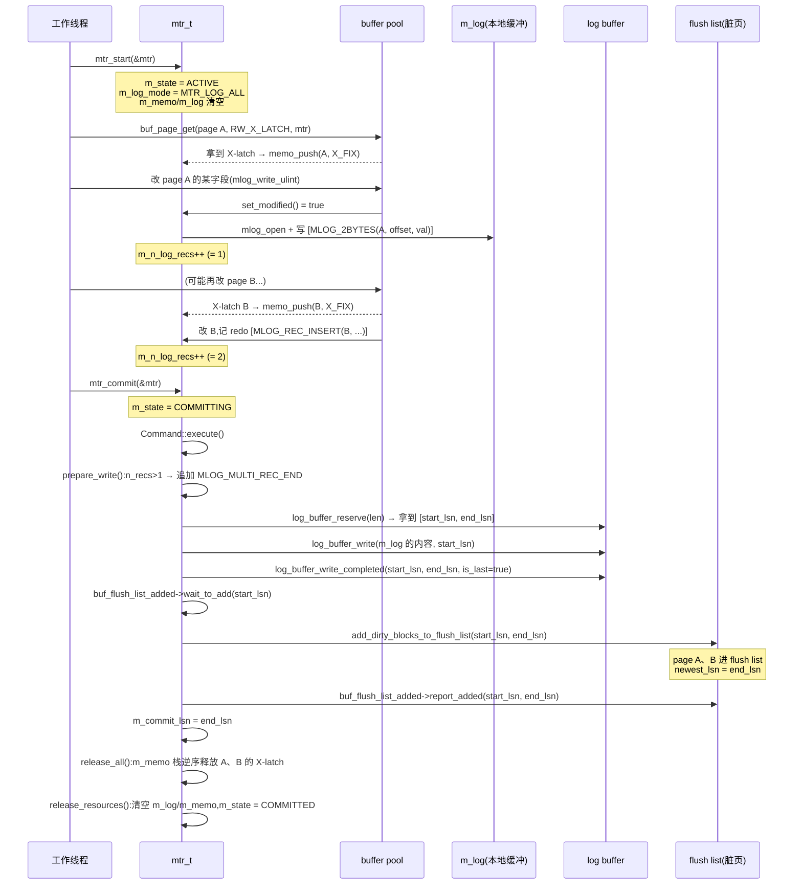

# 第 3 篇 · 第 9 章 · mini-transaction(mtr):redo 的生成单位

> **核心问题**:上一章讲了 redo 是什么、凭什么 crash 后能重放。但 redo 不是一条条散着写进日志的——一个事务可能改几十、几百个页,B+ 树页分裂一次就要动好几个页。如果这些页修改"记一半"机器就 crash 了,重放出来的就是一棵半裂不裂的坏树。InnoDB 怎么把"一组对页的修改"打包成一个不可再分的**mini-transaction(mtr)**,让它要么整组 redo 都进日志、要么一条都不进?mtr 又是怎么一边持有页锁、一边把脏页挂进 flush list、一边原子地把 redo 塞进 log buffer 的?

> **读完本章你会明白**:
> 1. 为什么需要 mtr 这一层——逻辑事务太大,装不进"一个原子单位";单条 redo 又太小,装不下"一次页分裂"。mtr 是夹在两者之间的**物理原子单位**,专为崩溃一致性而生。
> 2. mtr 的生命周期(`start → 改页 + 记 redo 到本地缓冲 → commit 写 log buffer + 挂脏页 + 放锁`)每一步为什么这么排,顺序错了会怎样。
> 3. mtr 怎么同时管**三件事**:页的 latch(memo 栈记录)、redo 日志(本地 `m_log` 动态缓冲)、脏页(挂 flush list)——它为什么是 buffer pool(存储层)通往 redo/事务层的**枢纽**。
> 4. mtr 凭什么"原子":单条 redo 用 `MLOG_SINGLE_REC_FLAG` 标志、多条用 `MLOG_MULTI_REC_END` 收尾,crash 重放时靠这个边界判断"一组是不是完整的";以及 commit 时"redo 先写完、脏页才挂 flush list"这条**铁律**为什么 sound。

> **如果一读觉得太难**:先死记三句话——① 一个 mtr 就是一组"要么全做、要么全不做"的页修改;② mtr 运行时把 redo 攒在自己的内存里,commit 时一整块塞进 log buffer;③ mtr 持有的页锁在 commit 末尾才释放。然后回头慢慢拆"为什么"。

---

## 〇、一句话点破

> **mtr 是逻辑事务内的物理原子单位:它把"一次必须原子完成的、对若干个页的修改"连同其 redo 打包,start 时只攒在本地,commit 时把整组 redo 一整块塞进 log buffer、把改过的页挂进 flush list、最后才放掉页锁。crash 时重放,要么这组 redo 完完整整在日志里(可重放)、要么一条都没有(当没发生过)——绝不会出现"改了一半的 B+ 树"。**

这是结论,不是理由。本章倒过来拆:先讲"为什么逻辑事务不能直接当 redo 的原子单位",再讲 mtr 怎么把三件事(页锁、redo、脏页)捏到一起,然后拆 mtr 的生命周期和 commit 的精确时序,最后在技巧精解里钉死"它凭什么原子"。

---

## 一、为什么需要 mtr 这一层:事务太大、单条 redo 太小

要理解 mtr,先回到上一章(P3-08)留下的那个坑:redo 是"哪个页、哪个偏移、改成什么字节"的物理日志,crash 后照着重放就能把没落盘的修改补回来。听起来顺理成章,但有一个被跳过的关键问题——**redo 到底以多大的"颗粒"写进日志,才能保证重放出来的状态是自洽的?**

### 候选一:以"整个逻辑事务"为原子单位?太大

第一个直觉:一个 SQL 事务(`BEGIN ... UPDATE ... UPDATE ... COMMIT`)就是一个原子单位,把整个事务的所有 redo 攒到一起,commit 时一次性写进日志。听起来很自然,但 InnoDB 拒绝这么干,原因有两个:

**① 锁会持有太久,并发全废。** 一个事务在执行过程中,要不断对 B+ 树页加 latch(页的读写锁,见 P1-04)。如果 redo 要等到事务 commit 才写、页的 latch 也要等到那时才放,那么一个跑 10 秒的长事务,会把它碰过的所有 B+ 树页**全锁 10 秒**——别的查询连这些页都读不了。OLTP 是高并发场景,这等于自杀。

**② 一个事务改的页太多,redo 太大,放不进内存缓冲。** 一个批量 `UPDATE` 可能改几万个页,对应的 redo 几十 MB。把这么多 redo 全攒在一个内存对象里等到事务结束才 flush,既费内存,又让"何时落盘"变得不可控(一旦攒着的 redo 还没落盘就 crash,整个事务全丢)。

所以"事务 = redo 原子单位"这条路堵死了。

### 候选二:以"每一条 redo 记录"为原子单位?太小

第二个直觉:那别攒了,改一个字节就写一条 redo 进日志。这也崩,而且崩得更隐蔽——**很多 B+ 树操作在物理上是跨多页的,这些页的修改是一个不可分割的整体**。

最典型的例子是 **B+ 树页分裂**(P1-04 详讲,这里先用它说事)。一个叶子页插满了,要分裂成两个,这次分裂物理上要动三个地方:

1. **分裂页自己**:把后半部分记录搬走、腾出空间;
2. **新分配的页**:接收搬过来的记录、接进页链表;
3. **父节点**:插入一条指向新页的"节点指针"(key + 新页号)。

这三步**必须一起成功**,否则 B+ 树就坏了——比如父节点指针已经指向新页了、但新页还没接进链表,这棵树就断了。如果 redo 是"改一条写一条"、写到第二步机器 crash,重启后重放会得到一棵"父节点指向一个空页/未链接页"的烂树。crash recovery 没法修这种结构性损坏——它只会傻乎乎地按 redo 重放,而 redo 本身就是残缺的。

> **不这样会怎样**:如果没有 mtr,B+ 树页分裂的 redo 散着写,crash 在分裂半途。重启重放时,要么把"搬走记录"重放了但"父节点指针"没重放(树缺一截),要么反过来(指针悬空)。**B+ 树的结构一致性一旦被破坏,整张表就废了**——这不是丢几行数据的问题,是索引本身打不开了。

### 所以这样设计:夹在中间的"物理原子单位"——mtr

事务太大、单条 redo 太小,InnoDB 的答案是:**在两者之间加一层,叫 mini-transaction(mtr)**。一个 mtr 把"逻辑上必须原子完成的一组对页的修改"——比如一次页分裂、一次记录插入、一次 undo 段分配——连同它对应的 redo,打包成一个不可分割的单位。mtr 运行时:

- 把这组 redo 先攒在自己的**本地内存缓冲**(`m_log`)里,不进 log buffer;
- 持有所改页的 latch(在 `m_memo` 栈里记账);
- 等这组修改完整了,`mtr_commit` 时**把整组 redo 一整块塞进 log buffer**,然后才挂脏页、放锁。

这样一个事务在执行过程中,会被切成**很多个 mtr**,每个 mtr 都是一个"小的原子提交点"。事务跑 10 秒,可能 commit 了几千个 mtr,每个 mtr 只持有页锁极短的时间(几微秒到几毫秒),redo 也随着 mtr 的 commit 源源不断地流进 log buffer——既保住了原子性,又不让锁卡住并发。

```
   一个逻辑事务(可能跑很久):
   ┌─────────────────────────────────────────────────────┐
   │ BEGIN                                                │
   │   [mtr_1: 改页 A] ──commit──▶ redo 进 log buffer     │  ← 第 1 个原子单位
   │   [mtr_2: 改页 B,C,D(页分裂)] ──commit──▶ redo 进    │  ← 第 2 个(跨多页,但原子)
   │   [mtr_3: 写 undo 段] ──commit──▶ redo 进            │  ← 第 3 个
   │   ...几千个 mtr...                                   │
   │ COMMIT(2PC, P3-11)                                  │
   └─────────────────────────────────────────────────────┘
```

> **钉死这件事**:mtr 不是事务的"缩小版",它是**不同层次的概念**。逻辑事务是给应用看的(ACID 的 A、I),mtr 是给存储引擎看的(崩溃一致性的物理原子单位)。一个事务 = 多个 mtr,每个 mtr 独立原子提交 redo。**这个"逻辑事务 vs 物理原子单位"的区分,是理解 InnoDB 内部结构的一把钥匙。**

---

## 二、mtr 同时管三件事:页锁、redo、脏页

mtr 之所以重要,是因为它一个人同时管着三件看似不相关的事。理解 mtr,就是理解这三件事怎么被捏到同一个对象里。先看 `mtr_t` 这个结构体的核心字段(`include/mtr0mtr.h`):

```c
/** Mini-transaction handle and buffer */
struct mtr_t {
  /** State variables of the mtr */
  struct Impl {
    /** memo stack for locks etc. */
    mtr_buf_t m_memo;          // ← 第一件事:记账本(持有谁、锁了谁)

    /** mini-transaction log */
    mtr_buf_t m_log;           // ← 第二件事:本地 redo 缓冲

    /** true if the mini-transaction might have modified buffer pool pages */
    bool m_modifications;      // ← 改过页吗?

    /** Count of how many page initial log records have been
    written to the mtr log */
    uint32_t m_n_log_recs;     // ← 攒了几条 redo?

    /** specifies which operations should be logged; default MTR_LOG_ALL */
    mtr_log_t m_log_mode;      // ← 日志模式

    /** State of the transaction */
    mtr_state_t m_state;       // ← INIT / ACTIVE / COMMITTING / COMMITTED

    /** Flush Observer */
    Flush_observer *m_flush_observer;
    ...
  };
  ...
};
```
(见 [`mtr_t::Impl`](../mysql-server/storage/innobase/include/mtr0mtr.h#L177-L223)。)

两个 `mtr_buf_t`(`m_memo` 和 `m_log`)是 mtr 的左右手。`mtr_buf_t` 本身是个动态增长的小缓冲区(底层是 `dyn0buf.h` 的块链表),mtr 往里 push 数据即可,不用关心分配。

### 第一件事:memo 栈——"我锁了谁、固定了谁"

mtr 运行期间,凡是它**持有的资源**(页的 latch、rw-lock 等),都往 `m_memo` 里 push 一条记录(`mtr_memo_slot_t`),记账:

```c
/** Mini-transaction memo stack slot. */
struct mtr_memo_slot_t {
  /** Pointer to the object - either buf_block_t or rw_lock_t */
  void *object;

  /** type of the stored object (MTR_MEMO_S_LOCK, ...) */
  ulint type;
  ...
};
```
(见 [`mtr_memo_slot_t`](../mysql-server/storage/innobase/include/mtr0mtr.h#L155-L170)。)

`type` 的取值在 `mtr0types.h` 里定义([`mtr_memo_type_t`](../mysql-server/storage/innobase/include/mtr0types.h#L289-L307)):

| type | 含义 |
|------|------|
| `MTR_MEMO_PAGE_S_FIX` | 页的 S-latch(共享,可读) |
| `MTR_MEMO_PAGE_X_FIX` | 页的 X-latch(独占,可写) |
| `MTR_MEMO_PAGE_SX_FIX` | 页的 SX-latch(共享独占,优化读写并发) |
| `MTR_MEMO_BUF_FIX` | 只 buffer-fix(固定页不让换出,不加读写锁) |
| `MTR_MEMO_MODIFY` | (debug 用)标记这页被改过 |
| `MTR_MEMO_S_LOCK` / `MTR_MEMO_X_LOCK` / `MTR_MEMO_SX_LOCK` | 普通 rw-lock 的 S/X/SX |

每次 mtr 要操作一个页(读、改、分裂),先 `mtr_memo_push` 把"(block 指针, latch 类型)"记一笔。**为什么非要记账?** 因为 commit 时要按"后进先出"的顺序把所有锁、所有 buf-fix 全部释放干净——memo 栈就是这张"借了什么、该还什么"的清单。没有它,commit 就没法保证"一个 mtr 持有的资源全部释放、一个不漏"。

push 的代码很简短([`mtr_t::memo_push`](../mysql-server/storage/innobase/include/mtr0mtr.ic#L38-L52)):

```c
void mtr_t::memo_push(void *object, mtr_memo_type_t type) {
  ut_ad(is_active());
  ...
  mtr_memo_slot_t *slot;
  slot = m_impl.m_memo.push<mtr_memo_slot_t *>(sizeof(*slot));
  slot->type = type;
  slot->object = object;
}
```

而 `mtr_x_lock` / `mtr_s_lock` / `mtr_sx_lock` 这些**便利宏**([`mtr0mtr.ic`](../mysql-server/storage/innobase/include/mtr0mtr.ic#L164-L186)),都是"先拿锁、再 memo_push"两步合体:

```c
void mtr_t::x_lock(rw_lock_t *lock, ut::Location location) {
  rw_lock_x_lock_gen(lock, 0, location);   // 1. 真去拿 X 锁
  memo_push(lock, MTR_MEMO_X_LOCK);        // 2. 记进 memo,commit 时好释放
}
```

> **不这样会怎样**:如果不记 memo,commit 时就不知道该放哪些锁。可能出现"一个 mtr 已经 commit 了、但它持有的页 latch 还锁着"——别的线程永远等不到这把锁,等于死锁。memo 栈把"借-还"做成机械的栈式清理,杜绝漏放。

### 第二件事:m_log——"本地攒着的 redo"

mtr 运行时,**每改一个页的字段,就顺手在 `m_log` 里追加一条 redo 记录**。注意:这些 redo 此刻还**没进 log buffer**,只是躺在 mtr 自己的 `m_log` 里。要到 commit 时,整块 `m_log` 才被搬进 log buffer。

写 redo 的入口是一组 `mlog_*` 函数([`mtr0log.ic`](../mysql-server/storage/innobase/include/mtr0log.ic))。最底层的是 `mlog_open`——它从 `m_log` 里挖一块连续空间给你写:

```c
static inline bool mlog_open(mtr_t *mtr, ulint size, byte *&buffer) {
  mtr->set_modified();                                  // 标记"我改过页了"
  return (mlog_open_metadata(mtr, size, buffer));
}

static inline bool mlog_open_metadata(mtr_t *mtr, ulint size, byte *&buffer) {
  if (mtr_get_log_mode(mtr) == MTR_LOG_NONE ||
      mtr_get_log_mode(mtr) == MTR_LOG_NO_REDO) {
    buffer = nullptr;                                    // 这个 mtr 不记 redo
    return (false);
  }
  buffer = mtr->get_log()->open(size);                   // 从 m_log 挖一块
  return (buffer != nullptr);
}
```
(见 [`mlog_open`](../mysql-server/storage/innobase/include/mtr0log.ic#L41-L55)。)

而每条 redo 记录的开头,都有一个**类型字节 + space_id + page_no**(变长压缩),告诉重放器"这条是改哪个页的什么操作":

```c
static inline byte *mlog_write_initial_log_record_low(
    mlog_id_t type, space_id_t space_id, page_no_t page_no,
    byte *log_ptr, mtr_t *mtr) {
  mach_write_to_1(log_ptr, type);  log_ptr++;            // 1 字节:操作类型(MLOG_*)
  log_ptr += mach_write_compressed(log_ptr, space_id);   // 变长:表空间号
  log_ptr += mach_write_compressed(log_ptr, page_no);    // 变长:页号
  mtr->added_rec();                                       // m_n_log_recs++
  return (log_ptr);
}
```
(见 [`mlog_write_initial_log_record_low`](../mysql-server/storage/innobase/include/mtr0log.ic#L169-L184)。)

`type` 就是 `mlog_id_t` 枚举里的 `MLOG_1BYTE`/`MLOG_2BYTES`/`MLOG_REC_INSERT`/`MLOG_UNDO_INSERT` 等([`mlog_id_t`](../mysql-server/storage/innobase/include/mtr0types.h#L63-L283))——这些是 redo 的"指令码",P3-08 详讲物理格式,本章只需要知道"每条 redo 都自带类型和页定位"。

`mtr->added_rec()` 把 `m_n_log_recs` 加一,这样 commit 时就知道这个 mtr 一共攒了几条 redo——这关系到后面"单条 vs 多条"的原子边界标志。

### 第三件事:脏页——"改过的页要进 flush list"

mtr 运行时改了页,这些页就成了**脏页**(内存里改了、磁盘上还是旧的)。这些脏页必须被记进 buffer pool 的 **flush list**(P2-05 详讲),后台的 page cleaner 才知道哪些页要刷盘。

但这里有个**关键的时序约束**:脏页进 flush list,必须**晚于**这批 redo 写进 log buffer。道理后面技巧精解详讲,这里先记住一句——**"redo 落盘必须先于脏页落盘"**(WAL 的铁律),所以"挂 flush list"(意味着这页随时可能被刷盘)必须排在"redo 进 log buffer"之后。mtr 的 commit 流程严格按这个顺序。

### 三件事一张图

```
                    ┌──────────────── mtr_t (一个 mtr) ─────────────────┐
                    │                                                    │
   改页 ──┬────────▶│  m_memo (栈):[page A:X, page B:X, rw_lock C:S, ...] │ ◀── 持有的锁/buf-fix
         │          │                                                    │
   记redo ─────────▶│  m_log  (缓冲):[MLOG_REC_INSERT(A), MLOG_1BYTE(B)]│ ◀── 本地攒的 redo
         │          │                                                    │
   改完 ──┴────────▶│  m_modifications = true                            │ ◀── 标记"改过页"
                    │  m_n_log_recs = 2                                  │
                    └────────────────────────────────────────────────────┘
                                        │
                              mtr_commit() 触发:
                                        │
                    ┌───────────────────▼───────────────────┐
                    │  1. m_log 整块 → log_buffer_reserve()  │ ◀── redo 进 log buffer
                    │  2. 脏页 → flush list (按 start_lsn)   │ ◀── 脏页挂 flush list
                    │  3. m_memo 栈逆序释放所有锁            │ ◀── 放锁
                    └───────────────────────────────────────┘
```

> **钉死这件事**:mtr 是 buffer pool(存储层)通往 redo/事务层的**枢纽**。它左手从 buffer pool 拿页、加 latch,右手把 redo 塞进 log buffer、把脏页挂进 flush list。读懂 mtr 的 commit 时序,就读懂了 InnoDB"存储层"和"事务层"是怎么咬合的。

---

## 三、mtr 的生命周期:start → 改页记 redo → commit

把三件事串起来,就是 mtr 的完整生命周期。下面用 mermaid 时序图画一次 B+ 树插入触发的 mtr 全程:



下面逐步拆。

### 3.1 start:初始化一个干净的 mtr

`mtr_start` 是个宏,展开就是 `(m)->start()`([`mtr0mtr.h#L50`](../mysql-server/storage/innobase/include/mtr0mtr.h#L50))。`start()` 把 mtr 重置成"干净的 ACTIVE 状态"([`mtr_t::start`](../mysql-server/storage/innobase/mtr/mtr0mtr.cc#L565-L602)):

```c
void mtr_t::start(bool sync) {
  ut_ad(m_impl.m_state == MTR_STATE_INIT ||
        m_impl.m_state == MTR_STATE_COMMITTED);   // 只能从 INIT 或 COMMITTED 来
  ...
  m_sync = sync;
  m_commit_lsn = 0;
  new (&m_impl.m_log) mtr_buf_t();                // 用 placement new 重建空缓冲
  new (&m_impl.m_memo) mtr_buf_t();
  m_impl.m_mtr = this;
  m_impl.m_log_mode = MTR_LOG_ALL;                // 默认全记 redo
  m_impl.m_inside_ibuf = false;
  m_impl.m_modifications = false;
  m_impl.m_n_log_recs = 0;
  m_impl.m_state = MTR_STATE_ACTIVE;
  m_impl.m_flush_observer = nullptr;
  m_impl.m_marked_nolog = false;
#ifndef UNIV_HOTBACKUP
  check_nolog_and_mark();                          // 检查全局 redo 是否被禁用
#endif
  ...
}
```

注意几个点:

- **`m_state` 状态机**:`INIT → ACTIVE → COMMITTING → COMMITTED`([`mtr_state_t`](../mysql-server/storage/innobase/include/mtr0types.h#L339-L344))。`start` 只能从 `INIT` 或 `COMMITTED` 进入——这意味着同一个 `mtr_t` 对象可以被**反复 start/commit 复用**(常见模式:循环里 `mtr_start`/`mtr_commit`),但绝不能从一个未 commit 的 ACTIVE mtr 再 start(那会 assert 失败)。
- **`placement new` 重建 `m_log`/`m_memo`**:不是分配新内存,而是在原地把字段重置成空 mtr_buf_t。这种写法是为了避免反复构造析构的开销——mtr 在热路径上,每条 INSERT/UPDATE 都要走过,省一点是一点。
- **`check_nolog_and_mark()`**:这是个新机制——MySQL 8.0.30+ 支持**全局禁用 redo 日志**(`ALTER INSTANCE DISABLE INNODB REDO_LOG`,为某些 bulk load 场景加速)。`start` 时检查全局开关,如果 redo 被禁用,这个 mtr 的 `m_log_mode` 会被改成 `MTR_LOG_NO_REDO`,并且全局计数器 `m_count_nologging_mtr` 加一(用 sharded atomic counter,见 [`mtr_t::Logging`](../mysql-server/storage/innobase/include/mtr0mtr.h#L226-L339))。这是个值得单说的演进,后面"版本形态"小节会回来。

### 3.2 改页 + 记 redo:边改边往 m_log 里追加

start 完了,mtr 进入 ACTIVE 态。这时工作线程开始干活:

1. **拿页 + latch**:`buf_page_get(..., RW_X_LATCH, ..., mtr)` 从 buffer pool 取页,顺带 X-latch。这个函数内部会把 latch 信息 `mtr_memo_push` 进 memo 栈(详见 P2-05)。
2. **改页字段**:`mlog_write_ulint(ptr, val, MLOG_2BYTES, mtr)` 之类的函数,**同时做两件事**——把值写进页内存、把 redo 追加进 `m_log`。
3. **可能改多个页**:一个 mtr 可以锁多个页、改多个页(比如页分裂)。每个改动都往 `m_log` 追加一条 redo,`m_n_log_recs` 累加。

这里有个**朴素但重要的约束**:`memo_release` 和 `release_page` 这两个函数里都有 assert([`mtr0mtr.cc#L725`](../mysql-server/storage/innobase/mtr/mtr0mtr.cc#L718-L733) / [`L744`](../mysql-server/storage/innobase/mtr/mtr0mtr.cc#L738-L756)):

```c
void mtr_t::memo_release(const void *object, ulint type) {
  ...
  /* We cannot release a page that has been written to in the
  middle of a mini-transaction. */
  ut_ad(!has_modifications() || type != MTR_MEMO_PAGE_X_FIX);
  ...
}
```

翻译:**一旦 mtr 已经改过任何页(`has_modifications()`),就不允许中途释放一个 X-latch 的页**。为什么?因为一旦你在 mtr 中途放了一个被改过的页的 X-latch,别的线程就能读到这个"改了一半"的页——而它的 redo 还在 m_log 里没进 log buffer 呢!如果别的线程把这个页读了去用(甚至基于它做下一步计算),crash 后这个"半成品"就回不来了。**X-latch 必须持到 mtr commit 末尾统一释放**,这是 mtr 原子性的直接体现。

### 3.3 commit:三件事按严格时序完成

`mtr_commit` 也是宏 `(m)->commit()`([`mtr0mtr.h#L59`](../mysql-server/storage/innobase/include/mtr0mtr.h#L59))。commit 是 mtr 最精彩的部分,代码在 [`mtr_t::commit`](../mysql-server/storage/innobase/mtr/mtr0mtr.cc#L662-L686) 和它委托给内部类 `Command` 的 [`execute`](../mysql-server/storage/innobase/mtr/mtr0mtr.cc#L840-L880):

```c
void mtr_t::commit() {
  ut_ad(is_active());
  ...
  m_impl.m_state = MTR_STATE_COMMITTING;          // 1. 进入 COMMITTING

  DBUG_EXECUTE_IF("mtr_commit_crash", DBUG_SUICIDE(););  // debug 注入点

  Command cmd(this);                              // 2. 构造 Command,接管 m_impl

  if (has_any_log_record() ||
      (has_modifications() && m_impl.m_log_mode == MTR_LOG_NO_REDO)) {
    cmd.execute();                                // 3a. 有 redo(或虽不记 redo 但改了页)→ 走完整 execute
  } else {
    cmd.release_all();                            // 3b. 啥也没记、啥也没改 → 只放锁、清资源
    cmd.release_resources();
  }
#ifndef UNIV_HOTBACKUP
  check_nolog_and_unmark();                       // 4. 如果之前 mark 了 nolog,现在 unmark
#endif
  ...
}
```

`Command` 是 mtr 的"一次性执行器"——构造时接管 `m_impl`,负责把 redo 写出去、把脏页挂上、把锁放掉。核心的 `execute()`:

```c
void mtr_t::Command::execute() {
  ut_ad(m_impl->m_log_mode != MTR_LOG_NONE);
#ifndef UNIV_HOTBACKUP
  ulint len = prepare_write();                    // ① 准备 redo(打原子边界标志)

  if (len > 0) {
    mtr_write_log_t write_log;
    write_log.m_left_to_write = len;

    auto handle = log_buffer_reserve(*log_sys, len);   // ② 在 log buffer 预留空间,拿到 [start_lsn, end_lsn]
    write_log.m_handle = handle;
    write_log.m_lsn = handle.start_lsn;

    m_impl->m_log.for_each_block(write_log);           // ③ 把 m_log 各块拷进 log buffer

    ut_ad(write_log.m_left_to_write == 0);
    ut_ad(write_log.m_lsn == handle.end_lsn);

    buf_flush_list_added->wait_to_add(handle.start_lsn);   // ④ 等待"挂 flush list 的窗口"可用

    DEBUG_SYNC_C("mtr_redo_before_add_dirty_blocks");

    add_dirty_blocks_to_flush_list(handle.start_lsn, handle.end_lsn);  // ⑤ 把脏页挂进 flush list

    buf_flush_list_added->report_added(handle.start_lsn, handle.end_lsn);  // ⑥ 汇报"已挂"

    m_impl->m_mtr->m_commit_lsn = handle.end_lsn;     // ⑦ 记下 commit LSN

  } else {
    /* MTR_LOG_NO_REDO:不写 redo,但仍要把脏页挂 flush list */
    DEBUG_SYNC_C("mtr_noredo_before_add_dirty_blocks");
    add_dirty_blocks_to_flush_list(0, 0);
  }
#endif /* !UNIV_HOTBACKUP */

  release_all();        // ⑧ 释放所有锁/buf-fix(m_memo 栈逆序)
  release_resources();  // ⑨ 清空 m_log/m_memo,m_state = COMMITTED
}
```
(见 [`Command::execute`](../mysql-server/storage/innobase/mtr/mtr0mtr.cc#L840-L880)。)

这九步的顺序**不能颠倒**,每一步都有道理:

- **① prepare_write**:给这组 redo 打"原子边界标志"(下节详讲),决定重放时怎么认出"这是一组完整的"。
- **② log_buffer_reserve**:在 log buffer 里**预留** `len` 字节空间,拿到这段的 `[start_lsn, end_lsn]`。注意是预留——这一步之后,这段 LSN 区间就归这个 mtr 独占了,但 log writer 现在还**不能**写这段(因为有"recent written buffer"的 link 没建好,见 P3-08)。
- **③ for_each_block 拷贝**:把 `m_log` 里攒的 redo(可能是多个动态块)逐块拷进 log buffer 的对应位置。
- **④ wait_to_add**:这是个**背压**机制(下节详讲)。如果挂 flush list 的"窗口"被别的 mtr 占满了(有太多 mtr 已经写了 redo、但还没把脏页挂上),当前 mtr 要等。
- **⑤ add_dirty_blocks_to_flush_list**:遍历 `m_memo`,凡是 `MTR_MEMO_PAGE_X_FIX`/`SX_FIX`(或无 latch 但标了 dirty)的页,调用 `buf_flush_note_modification` 把它挂进 flush list,并设上 `newest_lsn = end_lsn`(见 [`Add_dirty_blocks_to_flush_list`](../mysql-server/storage/innobase/mtr/mtr0mtr.cc#L318-L368))。
- **⑥ report_added**:告诉 `buf_flush_list_added` 这段 LSN 的脏页已经挂好了,推前进度。
- **⑧ release_all**:逆序遍历 `m_memo`,逐个 `memo_slot_release`——页的放 latch + unfix,rw-lock 的 unlock。**注意:锁是在 redo 写完、脏页挂完之后才放的**。这一步里有个 `m_locks_released = 1`,给 log writer 看(某些场景下 log writer 要等用户线程放完锁才能继续,见 P3-08)。
- **⑨ release_resources**:清空 `m_log`/`m_memo`,`m_state = COMMITTED`,把 `m_impl` 指针置空(防止 Command 析构时二次清理)。

> **钉死这件事**:commit 的时序里藏着三条铁律——**① redo 先于脏页挂 flush list**(WAL:日志先于数据落盘);**② 锁最后放**(改过的页在 redo 写完前不能让别人看见);**③ 整组 redo 一整块进 log buffer**(要么全进、要么都不进)。这三条共同保证:crash 在任何时刻,恢复出来的状态都是自洽的。

---

## 四、技巧精解:两件最硬核的事

正文把 mtr 的轮廓讲完了。下面挑两件最硬核、也最容易讲错的技巧,单独钉死。

### 技巧一:mtr 凭什么"原子"——`MLOG_SINGLE_REC_FLAG` 与 `MLOG_MULTI_REC_END`

mtr 号称"原子单位",但"原子"在物理 redo 里到底是怎么实现的?这是 mtr 设计最精妙的一笔。看 `prepare_write`([`Command::prepare_write`](../mysql-server/storage/innobase/mtr/mtr0mtr.cc#L760-L813)):

```c
ulint mtr_t::Command::prepare_write() {
  ...
  ulint len = m_impl->m_log.size();
  ut_ad(len > 0);

  const auto n_recs = m_impl->m_n_log_recs;
  ut_ad(n_recs > 0);
  ...

  if (n_recs <= 1) {
    ut_ad(n_recs == 1);
    /* Flag the single log record as the only record in this mini-transaction. */
    *m_impl->m_log.front()->begin() |= MLOG_SINGLE_REC_FLAG;   // ① 单条:打 SINGLE_REC 标志
  } else {
    /* Because this mini-transaction comprises multiple log records,
    append MLOG_MULTI_REC_END at the end. */
    mlog_catenate_ulint(&m_impl->m_log, MLOG_MULTI_REC_END, MLOG_1BYTE);  // ② 多条:追加 END 字节
    ++len;
  }
  ...
  return len;
}
```

读这段代码就读懂了 mtr 的"原子"是怎么落地的。两种情况:

**情况 A:这个 mtr 只产生了一条 redo 记录**(比如只改了某个页的一个字节)。prepare_write 把这条记录的**类型字节**和 `MLOG_SINGLE_REC_FLAG`(= 128,见 [`mtr0types.h#L67`](../mysql-server/storage/innobase/include/mtr0types.h#L63-L72))做**按位或**。这样这条 redo 的第一个字节就同时携带了"操作类型"和"我是这组里唯一一条"两个信息。重放时,看到一个带 `MLOG_SINGLE_REC_FLAG` 的记录,就知道:这条独立成组,重放它一个即可。

**情况 B:这个 mtr 产生了多条 redo 记录**(比如页分裂改了三个页,记了三条)。prepare_write 在整组 redo 的**末尾追加一个 `MLOG_MULTI_REC_END`(= 31)字节**。重放时,从一个起点开始往后扫,直到遇到 `MLOG_MULTI_REC_END`,才知道这一组完整了——把这组当作一个整体来重放。

**为什么这就保证了原子?** 关键在于:整组 redo 是被 `log_buffer_reserve` 一次性预留、`for_each_block` 一整块拷进 log buffer 的。也就是说,**这组 redo 在 log buffer 里是连续的一段**。crash 重放时,`log0recv.cc` 的 `recv_recover_page_func` 会按"组"为单位应用 redo:

- 如果一个组的头部标志(单条)或尾部 `MLOG_MULTI_REC_END`(多条)都在——这组完整,**重放**;
- 如果一个组只读到一半就到了日志末尾(crash 截断)——这组不完整,**丢弃**,当没发生过。

```
   log buffer 里 redo 的布局(crash 截断点假设在 ↓ 处):

   [组1:SINGLE_REC flag][组2:多条...MLOG_MULTI_REC_END][组3:多条...↓ 还没写完]
                                                              ↑ crash 在这
   重放:组1 ✓ 重放, 组2 ✓ 重放, 组3 ✗ 不完整,丢弃
```

这就是 mtr"要么全做、要么全不做"的物理实现——**不是靠锁、不是靠事务,而是靠"整组连续写 + 边界标志 + 重放时按组校验完整性"这三招**。

> **不这么写会怎样**:如果没有 `MLOG_MULTI_REC_END` 这类边界标志,重放器面对一堆 redo 字节,根本分不清"哪几条是一组、应该一起重放还是一起丢"。它只能一条一条重放——而一条一条重放页分裂的 redo,就会重放出"父节点指针已更新、但新页还没接进链表"的烂树。`MLOG_MULTI_REC_END` 这一个字节,是 InnoDB 崩溃一致性的物理基石之一。

源码里也直接点破了这一点。`btr0btr.cc` 在做页压缩相关操作时有一段注释,白纸黑字写着"单 mtr + mtr_commit 的原子性"是它的靠山([`btr0btr.cc#L3643-L3647`](../mysql-server/storage/innobase/btr/btr0btr.cc#L3643-L3647)):

> ```
> /* This will make page_zip_validate() fail on merge_page
> until btr_level_list_remove() completes.  This is harmless,
> because everything will take place within a single
> mini-transaction and because writing to the redo log
> is an atomic operation (performed by mtr_commit()). */
> ```

翻译:这里临时让 `page_zip_validate` 校验失败,没关系——因为这一连串改动都在**同一个 mtr**里,而写 redo 是 mtr_commit 做的**原子操作**。换句话说,mtr 的原子性让 InnoDB 的代码可以在 mtr 内部"临时不一致"(中间态可以很丑),只要 commit 时这一整组是自洽的就行。这是 mtr 给 B+ 树代码提供的**自由度**——没有它,每一步中间态都得是合法的,代码根本写不出来。

### 技巧二:"redo 先于脏页挂 flush list"为什么 sound——`buf_flush_list_added` 的链表式记账

上一节讲了"原子标志",但还有一条更隐蔽、也更精妙的铁律:**脏页进 flush list,必须严格晚于它对应的 redo 进 log buffer**;而且不仅晚于自己 mtr 的 redo,还要按全局 LSN 顺序排队。这条铁律靠 `buf_flush_list_added` 这套机制实现。

先讲为什么必须有这条铁律。WAL 的根本要求是:**数据页落盘之前,它对应的 redo 必须已经落盘**(否则 redo 还没落盘、数据页先落盘了,这时候 crash,数据页改对了、但没有 redo 可重放——如果这个页后来又被改、又被刷,就再也对不回来了)。flush list 上的页,随时可能被 page cleaner 拿去刷盘。所以"挂 flush list"等价于"授权这页可以刷盘了",它必须排在"redo 已进 log buffer"(授权 redo 可以落盘了)之后。

光这个时序还不够——InnoDB 在多线程下还要保证**全局 LSN 顺序**:如果 mtr_X(start_lsn=100) 还没把脏页挂上、mtr_Y(start_lsn=200) 的脏页先挂了,page cleaner 可能刷掉 lsn=200 的脏页,而 lsn=100 的脏页还没挂——这就乱套了。所以需要一个**"按 start_lsn 顺序挂 flush list"**的全局约束。

这就是 `buf_flush_list_added`(类型 `Buf_flush_list_added_lsns`,见 [`buf0flu.cc#L3594-L3641`](../mysql-server/storage/innobase/buf/buf0flu.cc#L3594-L3641))干的事。它内部是一个**有界的 LSN 链表缓冲**(类似 log 的 recent written/closed buffer,P3-08 详讲这种数据结构),只有当前 mtr 的 `start_lsn` 落在缓冲的"窗口"内,才允许挂 flush list:

```c
void Buf_flush_list_added_lsns::report_added(lsn_t oldest_modification,
                                             lsn_t newest_modification) {
  m_buf_added_lsns.add_link_advance_tail(oldest_modification,
                                         newest_modification);   // 把 [start,end] 标成"已挂"
}

void Buf_flush_list_added_lsns::wait_to_add(lsn_t oldest_modification) {
  ut_a(log_is_data_lsn(oldest_modification));
  ut_ad(m_buf_added_lsns.tail() <= oldest_modification);

  uint64_t wait_loops = 0;
  while (!m_buf_added_lsns.has_space(oldest_modification)) {    // 窗口满了?
    ++wait_loops;
    std::this_thread::sleep_for(std::chrono::microseconds(20)); // 等
  }
  ...
}
```
(见 [`wait_to_add`/`report_added`](../mysql-server/storage/innobase/buf/buf0flu.cc#L3610-L3641)。)

commit 流程里的对应两步(`execute()` 的 ④⑥)就是这样咬合的:

- **④ `wait_to_add(handle.start_lsn)`**:如果窗口被占满(有太多 mtr 写了 redo 但还没挂脏页),当前 mtr 自旋等。这把"写 redo 快、挂脏页慢"的不平衡**背压**住——挂不上就不让继续,避免 log buffer 越冲越前、flush list 越落越后。
- **⑥ `report_added(start_lsn, end_lsn)`**:挂完后,把这段 LSN 标成"已挂",推进 tail,让后面的 mtr 能进窗口。

这套机制是 MySQL 8.0.30 redo 大重构(P3-08)的伴生品。老版本(5.7 / 8.0 早期)用 `log_flush_list_mutex` 这种粗粒度锁来强制顺序,新版本换成了**有界 LSN 链表**——本质上和 log 的 recent written buffer 是同一种思路(无锁预留 + 链表 link 推进度),只是用在"flush list 排序"这个新用途上。

> **不这么写会怎样**:如果没有 `buf_flush_list_added` 的全局排序,并发 mtr 各自挂 flush list,LSN 顺序会乱。page cleaner 按"flush list 上最小的 oldest_modification"来决定"可以安全刷到哪个 LSN",一旦乱序,它要么保守地不敢刷(吞吐下降)、要么激进地刷了不该刷的(违反 WAL,crash 后丢数据)。8.0.30 这套无锁链表,把"全局顺序"用 O(1) 的链表 link 做出来,是并发优化的典范。

---

## 五、版本形态与一个值得说的演进:全局禁用 redo

mtr 的代码骨架从 1995 年 Heikki Tuuri 写到现在没大变(看文件头 `Created 11/26/1995`),但 8.0.30 之后叠加了一个很有意思的演进——**全局禁用 redo 日志**(`ALTER INSTANCE DISABLE INNODB REDO_LOG`)。这个特性主要服务于 bulk load(比如 `LOAD DATA`、clone 恢复),在这些场景下短暂关掉 redo 能大幅提速(不写 redo、不做 2PC、checkpoint 也不用追)。

mtr 怎么支持"全局禁用 redo"?看 `mtr_t::Logging` 这个内部类([`mtr0mtr.h#L227-L339`](../mysql-server/storage/innobase/include/mtr0mtr.h#L226-L339)):

```c
class Logging {
 public:
  enum State : uint32_t {
    ENABLED,           // redo 开着,crash 安全
    ENABLED_DBLWR,     // 正在从 DISABLED 恢复,已开 doublewrite
    ENABLED_RESTRICT,  // 正在切换,还有 mtr 在 no-log 模式跑
    DISABLED           // redo 全关,新 mtr 都不记 redo
  };
  ...
  bool mark_mtr(size_t index) {
    if (is_disabled()) {
      Counter::inc(m_count_nologging_mtr, index);    // sharded 计数器 +1
      if (is_disabled()) { return (true); }          // 仍 disabled → 这个 mtr 标记成 no-log
      Counter::dec(m_count_nologging_mtr, index);    // 一场空,减回去
    }
    return (false);
  }
  ...
 private:
  std::atomic<State> m_state;
  using Shards = Counter::Shards<128>;
  Shards m_count_nologging_mtr;                       // 128 路 sharded 计数器
};
```

机制是这样的:

- 全局有一个原子状态机 `m_state`(ENABLED/DISABLED 之间还有两个过渡态)。
- 每个 mtr 在 `start` 时调 `check_nolog_and_mark()`([`mtr0mtr.cc#L605-L620`](../mysql-server/storage/innobase/mtr/mtr0mtr.cc#L604-L635)),如果发现 `m_state == DISABLED`,就把自己的 `m_log_mode` 改成 `MTR_LOG_NO_REDO`,并把 sharded 计数器加一。
- `enable()` 想重新打开 redo 时,要先把状态置 `ENABLED_RESTRICT`,然后 `wait_no_log_mtr` **等所有标了 no-log 的 mtr 跑完**(看计数器归零),再强制 checkpoint 把脏页全刷盘,最后才置 `ENABLED`。

为什么用 **128 路 sharded 计数器**而不是一个原子 int?因为 mtr start/commit 是全库最热的操作之一(每条 INSERT 都走),一个共享原子变量会成为 cache line 争用热点。sharded(每 CPU 一个计数器)把读写分散到不同 cache line,读总数时再汇总——这是 Linux 内核 `percpu_counter` 的同款思路(承接《Linux 内存管理》的 per-CPU 计数器)。

`MTR_LOG_NO_REDO` 模式的 mtr commit 时,`execute()` 走 `len == 0` 那条分支(不调 `log_buffer_reserve`,不写 redo),但仍要把脏页挂 flush list——所以 `prepare_write` 对 `MTR_LOG_NO_REDO` 直接返回 0,`execute` 里 `else` 分支调 `add_dirty_blocks_to_flush_list(0, 0)`。这保证"虽然不记 redo,但脏页仍被追踪、仍会被刷盘"。

> **钉死这件事**:`ALTER INSTANCE DISABLE INNODB REDO_LOG` 不是"什么都不做",而是"mtr 仍跑、脏页仍追踪、只是不生成 redo"。代价是 crash 不安全(重启恢复时没有 redo 可重放,未刷盘的脏页会丢),所以只能用在"数据可以重新加载"的 bulk load 场景,且用完必须 `ENABLE` 回来(走完 checkpoint 才算恢复 crash 安全)。这套机制是 8.0.30 redo 重构的延伸——老版本(5.7)没有这个能力。

---

## 六、一个真实例子:B+ 树页分裂怎么用 mtr

讲这么多抽象的,看一个真实的 mtr 用法——B+ 树页分裂。`btr_page_split_and_insert`([`btr0btr.cc#L2298-L2314`](../mysql-server/storage/innobase/btr/btr0btr.cc#L2298-L2314))是页分裂的入口,它的签名里就**直接接收一个 `mtr_t *mtr`**——也就是说,页分裂的所有改动,都发生在调用者传进来的**同一个 mtr** 里:

```c
/** Splits an index page to halves and inserts the tuple. It is assumed
 that mtr holds an x-latch to the index tree. NOTE: the tree x-latch is
 released within this function! NOTE that the operation of this
 function must always succeed, we cannot reverse it: therefore enough
 free disk space (2 pages) must be guaranteed to be available before
 this function is called.
 @return inserted record */
rec_t *btr_page_split_and_insert(
    uint32_t flags, btr_cur_t *cursor, ulint **offsets,
    mem_heap_t **heap, const dtuple_t *tuple,
    mtr_t *mtr)            /* ← 所有改动都在这一个 mtr 里原子提交 */
{
  ...
}
```

注释里那句 "the operation of this function must always succeed, we cannot reverse it"(这个操作必须成功,不能回退)特别值得品——因为整个页分裂是一个 mtr,要么全做、要么全不做,**它根本不存在"做一半"这种状态**。所以 InnoDB 在调用页分裂之前,会先用 `fsp_reserve_free_extents` 预留足够的空闲 extent(保证 2 个页肯定分配得到),把"分配失败"这种风险掐死在 mtr 之外。这是 mtr 原子性反过来对调用者的**约束**——你不能让一个 mtr 在中途因为资源不足而失败回退(mtr 没有 rollback 机制,只有 commit)。

页分裂在这个 mtr 里干的事(简化):

1. `btr_page_alloc`:分配一个新页(也是在这个 mtr 里改 fsp 段头、改 free list);
2. `page_move_rec_list_end`:把分裂页后半部分记录搬到新页;
3. `btr_insert_on_family_level`:在父节点插一条指向新页的节点指针;
4. (可能)更新页链表的前后指针。

每一步都改一个或几个页,每改一个字段就 `mlog_*` 记一条 redo 进 `m_log`。这四步全做完,**调用者 `mtr_commit` 时,整组 redo(可能十几条)一整块进 log buffer**。如果 commit 之前 crash,这组 redo 一条都不在 log buffer(还在 m_log 本地),重启重放就是"没发生过分裂";如果 commit 之后 crash,这组 redo 全在,重放就把分裂完整地做出来。**B+ 树的结构一致性,就这样被 mtr 兜住了。**

> **承接 P3-08**:上一章讲 redo 是"哪个页哪个偏移改成什么字节",本章补充了它**怎么生成**:不是事务 commit 时一把生成、也不是改一个字节生成一条,而是以 **mtr 为单位**边改边攒、commit 时整组提交。P3-08 的 log buffer / log writer 在"下游",本章的 mtr 在"上游"——redo 从 mtr 流进 log buffer,再被 log writer 写到日志文件。

---

## 七、章末小结

### 回扣主线

本章服务二分法的**事务与并发**这一面。在第 3 篇(WAL/redo/undo/2PC)里,mtr 处在一个承上启下的位置:

- **承上**:逻辑事务(给应用的 ACID 单位)被切成多个 mtr,每个 mtr 是存储引擎内部的**物理原子单位**;
- **启下**:mtr 是 redo 的**生成单位**——它生成的 redo 流进 log buffer(P3-08),它的脏页进 flush list 等刷盘(P2-05),它持有/释放的页 latch 是 B+ 树并发控制的基础(P1-04)。

一句话:mtr 把"对页的物理修改"和"对应的 redo"绑成一个不可分割的整体,让 InnoDB 在 crash 的任何时刻都能恢复出**结构自洽**的 B+ 树。没有 mtr,B+ 树的页分裂/合并一旦 crash 在半途,整棵索引就废了。

### 五个为什么

1. **为什么需要 mtr 这一层?**——逻辑事务太大(锁持太久、redo 太大),单条 redo 太小(跨多页的 B+ 树操作不可分割)。mtr 是夹在中间的"物理原子单位",既保原子性又不卡并发。
2. **为什么 mtr 运行时要把 redo 攒在本地(`m_log`),不直接写 log buffer?**——因为"还没攒齐一整组"时不能让 redo 进 log buffer(否则 crash 重放会得到半截操作)。必须等整组修改完整、commit 时再一整块拷进去。
3. **为什么 mtr 持有的页 X-latch 要等到 commit 末尾才放?**——改过的页在 redo 写完之前不能让别人看见(否则别人基于"改一半"的页做计算,crash 后回不来)。assert `!has_modifications() || type != MTR_MEMO_PAGE_X_FIX` 就是这条铁律的守门员。
4. **为什么脏页进 flush list 要严格晚于 redo 进 log buffer,还要按 LSN 全局排序?**——WAL 要求"数据页落盘前 redo 必须已落盘";flush list 上的页随时可能被刷,所以挂 flush list 必须排在 redo 之后;多线程下用 `buf_flush_list_added` 的有界 LSN 链表保证全局顺序,避免 page cleaner 刷错页。
5. **为什么 mtr commit 时要给 redo 打 `MLOG_SINGLE_REC_FLAG` 或追加 `MLOG_MULTI_REC_END`?**——这是"原子边界标志",让 crash 重放器能识别"这一组 redo 是否完整"。完整才重放,不完整(被 crash 截断)就丢弃当没发生。这是 mtr 原子性的物理基石。

### 想继续深入往哪钻

- **mtr 的源码**:`storage/innobase/mtr/mtr0mtr.cc`(1242 行,mtr 主控)、`include/mtr0mtr.h`/`.ic`(`mtr_t` 结构和内联函数)、`include/mtr0types.h`(`mlog_id_t`、`mtr_memo_type_t`、`mtr_state_t` 枚举)、`include/mtr0log.h`/`.ic`(mlog_* 写 redo 的函数)。
- **mtr 怎么被 B+ 树代码用**:看 `btr/btr0btr.cc`(页分裂/合并,搜 `mtr_start`/`mtr_commit`)、`btr/btr0cur.cc`(游标插入/删除)、`trx/trx0undo.cc`(undo 段操作,每个 undo 操作也是一个 mtr)。
- **mtr 怎么和 log buffer 衔接**:看 `log/log0buf.cc` 的 `log_buffer_reserve`(`L884`)、`log_buffer_write`(`L944`)、`log_buffer_write_completed`(`L1083`)——这就是 mtr commit 时 redo 流进 log buffer 的真实路径。
- **flush list 排序机制**:`buf/buf0flu.cc` 的 `Buf_flush_list_added_lsns`(`L3594` 起),以及 `include/buf0flu.ic` 的 `buf_flush_note_modification`。
- **MySQL 官方文档**:搜 "mini-transaction" 在 Jeremy Cole 的博客 / Oracle 内部文档里有零星提及(官方文档对外讲得不多,mtr 是内部概念);`ALTER INSTANCE DISABLE INNODB REDO_LOG` 的语义在"InnoDB Redo Log"一章。

### 引出下一章

mtr 解决了"redo 怎么原子生成"。但 redo 只是事务的"前向"日志(已做的能重放),还有"后向"的日志——事务没提交、或 crash 后要回滚的,靠的是 **undo log**。而且 undo 不只是回滚,它还是 MVCC 旧版本的载体(一份 undo 两个用途)。下一章 P3-10,我们讲 **undo log:回滚 + MVCC 版本链**。

> **下一章**:[P3-10 · undo log:回滚 + MVCC 版本链](P3-10-undo-log-回滚与MVCC版本链.md)
