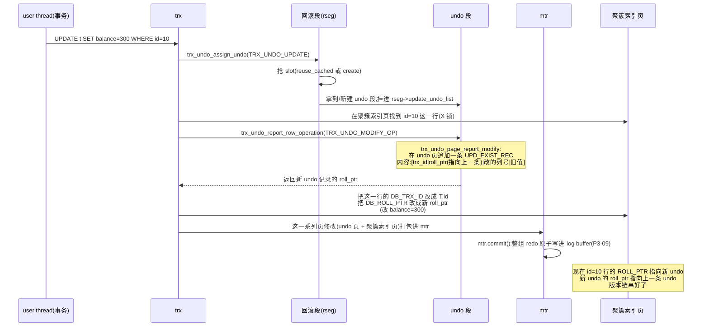

# 第 3 篇 · 第 10 章 · undo log:回滚 + MVCC 版本链

> **核心问题**:上一章讲了 mtr 是 redo 的生成单位。但一条 `UPDATE` 在改页之前,InnoDB 还会先记一笔"怎么改回去"的 undo log。这笔 undo 神奇在哪?它**既是事务回滚的依据,又是 MVCC 的旧版本载体——同一份 undo,服务两个完全不同的用途**。而且 undo 不像 redo 那样记"物理字节改写",它记的是"逻辑反向操作"。凭什么 undo 选逻辑,redo 选物理?同一份 undo 凭什么能一身二任?InnoDB 的 undo 段、回滚段、undo tablespace 三层结构又是怎么把这份"双用途日志"装进去的?

> **读完本章你会明白**:
> 1. **undo log 为什么是逻辑日志、redo 是物理日志**——不是随便选的,而是各自要解决的问题根本不同:redo 要"幂等可重放"(往前补),undo 要"按语义回滚 + 当历史看"(往后撤)。把日志格式和它要解决的问题绑死,你就理解了"InnoDB 为什么这么分工"。
> 2. **一份 undo 凭什么两个用途**——同一条 undo 记录既描述"怎么把这次改动静悄悄撤掉"(回滚),又描述"改之前这行长什么样"(MVCC 旧版本)。这不是巧合,是 undo 记录格式本身就把"反向操作"和"旧值"两种语义**写成了同一段字节**,谁读它谁按自己的用途解。
> 3. **undo 段、回滚段、undo tablespace 三层结构怎么协作**——一个回滚段(rollback segment)有 1024 个 undo 段 slot(`TRX_RSEG_N_SLOTS`),每个事务按"insert/update"分到不同的 undo 段,undo 段挂在回滚段上,回滚段再挂在 undo tablespace 里。9.x 默认 128 个回滚段(`FSP_MAX_ROLLBACK_SEGMENTS`)。
> 4. **7 字节 roll_ptr 怎么把一行和它的 undo 版本链串起来**——每行记录里藏 7 字节 `DB_ROLL_PTR`,64 位里塞了 is_insert/undo 号/页号/页内偏移,顺着它就能从一行最新版本跳到它的上一版 undo、再上一版……这就是 MVCC 版本链的物理实现。
> 5. **8.0/9.x 的 undo tablespace 独立化 + truncate 机制**——老版本 undo 全堆在系统表空间,旧版本越攒越多撑爆 ibdata;8.0 起 undo 独立成可配置的 tablespace,且支持后台 truncate 把"没人再需要的旧 undo"物理清掉,这让 undo 占用变得可控。

> **逃生阀**:这一章是 WAL 心脏篇的第三站(承接 P3-08 redo、P3-09 mtr)。如果只读一遍,先抓住三件事——① undo 是逻辑日志(记反向操作,与 redo 物理日志对偶);② 同一份 undo 既用于回滚又用于 MVCC 版本链,这是它最大的设计经济性;③ 行里的 7 字节 `DB_ROLL_PTR` 顺着 undo 段一路往前指,就是版本链。回滚段/undo 段/undo tablespace 三层结构、insert undo 与 update undo 的区分,第二遍再细抠。

---

## 〇、一句话点破

> **undo log 是 InnoDB 的"逆向日志":每改一行,先在 undo 里记下"改之前这行长什么样 + 怎么把这次改动撤掉"。这一条 undo 既是事务回滚的依据(事务没提交、或 crash 后未提交的,照着 undo 反向撤掉),又是 MVCC 的旧版本载体(别的并发事务读旧版本时,顺着 `DB_ROLL_PTR` 跳到这条 undo 重建出旧值)。一份 undo 两个用途,是 InnoDB 设计最经济的地方。而 undo 选"逻辑日志"而非 redo 的"物理日志",是因为它要解决"语义回滚 + 当历史看",而不是"幂等重放"。**

这是结论,不是理由。本章倒过来拆:先讲清"为什么需要 undo 这种逆向日志"(不这样会撞什么墙),再讲 undo 凭什么一身二任(双用途的格式根),接着拆 redo vs undo 的物理 vs 逻辑对偶,然后落到源码——一条 undo 从生成、挂在 undo 段、串进版本链的完整流程,以及 9.x 的 undo tablespace 独立化演进,最后在技巧精解里钉死"双用途"和"逻辑 vs 物理"这两个最硬核的设计选择。

---

## 一、不写 undo 直接改页,会撞什么墙

要理解 undo 为什么必须存在,先看没有它会怎样。这跟 P3-08 开篇讲 redo 是同一套思路——先看"朴素做法会塌在哪",再看 InnoDB 怎么化解。

InnoDB 改一行数据,本质是改一个 B+树页(P1-02/04 详讲)。假设没有任何"逆向日志",事务一上来就直接把页里的字节改了。听起来也行——可一旦下面三种情况之一发生,数据就坏了。

### 墙一:事务要回滚,可改回去的"原样"找不回来了

事务的原子性(Acid 的 A)要求:**一个事务要么全成功,要么全失败,绝不能留半拉子**。可事务"全失败"是常态——`ROLLBACK`、执行中撞了约束冲突、被死锁挑中牺牲(`InnoDB` 死锁会回滚 undo 量小的事务,P5-18 详讲)、被用户 kill 掉。这些情况下,事务已经改了的部分要**原样撤回**。

如果改页之前没有记下"原来什么样",要怎么撤回?你把 `id=10` 的 `balance` 从 100 改成了 200,现在要回滚——可数据库怎么知道它原来是 100?它可能本来就不是 100(可能你这次改之前,前一个未提交的事务刚把它从 50 改成 100)。没有 undo,**回滚就是无源之水**:要么回滚不了(事务卡死),要么回滚成"数据库瞎猜的原样"(数据错乱)。

> **不这样会怎样**:没有 undo,事务一旦开始改页,就没法干净地撤回。要么强行让事务"只能成功不能失败"(实际不可能),要么靠外部 redo 反推(但 redo 是物理日志,只记"改成什么",不记"原来是什么",反推不出)。**原子性是数据库区别于"能存数据的程序"的根本之一,而 undo 是原子性的物理基石。**

### 墙二:并发读看不到一致的旧版本,MVCC 无从谈起

OLTP 是"读多写也多"(P0-01 详讲)。如果"读"和"写"同一行要互相加锁等待——读等写完、写等读完——性能会塌。InnoDB 的解法是 MVCC(P4 篇详讲):**一行可以有多个版本,读操作看自己事务开始时的"快照版本",不加锁、不阻塞写**。

可这个"旧版本"从哪儿来?一行被改了 3 次,现在它在页里是最新版 v3。一个早开始的事务(它的快照是 v1 时刻)要读这行,得能"看到" v1——但 v1 早就被 v2、v3 覆盖了,不在页里了。**旧版本去哪儿了?在 undo 里**。每改一次,undo 里都记了一笔"改之前是什么样",顺着这条 undo 链往回走,就能重建出 v2、v1。

没有 undo,**MVCC 根本无版本可看**——读要么读到最新版(脏读),要么加锁等写完(性能塌)。MVCC 的高并发读不阻塞写,**靠的就是 undo 把旧版本留下来**。

### 墙三:crash 后没法把"没提交的"撤干净

crash 恢复(P3-12 详讲)有两件事要做:① 把已提交的、但数据页还没落盘的修改,**用 redo 重放**补回来(redo 保"提交不丢");② 把没提交的、但数据页可能已经(被异步刷盘)落了一部分的修改,**用 undo 回滚**撤掉(undo 保"未提交能回滚")。

第②步没有 undo 就没法做。crash 时内存里的事务状态全没了,数据库只能从磁盘上的页 + 日志推断"哪些是已提交的、哪些没提交"。已提交的靠 redo 补;没提交的——如果页上已经有了它的修改(因为刷脏是异步的,事务没提交它也可能被刷盘了)——只能靠 undo 撤。**没有 undo,crash 后数据库可能处于"半拉子状态":数据页上有未提交的修改,但没法撤掉。**

> **钉死这件事**:undo 解决三个问题——事务回滚(原子性 A)、MVCC 旧版本(高并发读)、crash 后清理未提交(崩溃恢复)。redo 解决"提交不丢",undo 解决"未提交能撤 + 旧版本能看",两者一前一后,才完整覆盖 ACID 的 A 和 D。P0-01 那句主线"redo 保 crash 不丢、undo/MVCC 保并发读",这里把 undo 的两半都钉死了。

---

## 二、undo 凭什么是"逻辑日志":记反向操作,而非物理字节

P3-08 讲 redo 时,反复强调 redo 是**物理日志**——记"哪个页哪个偏移改成什么字节",幂等,所以 crash 后能放心重放。那 undo 呢?

InnoDB 的 undo log 是**逻辑日志**(更准确地说,是"行级逻辑日志"):它不记"页 P 偏移 O 改成什么字节",而是记**"这次操作的反向操作是什么"**。比如:

- `INSERT` 一行的 undo 记:**"把这一行删掉"**(反向操作);
- `UPDATE` 一行的 undo 记:**"把这几列改回旧值"**(反向操作 + 旧值);
- `DELETE` 一行的 undo 记:**"把这一行插回去"**(反向操作 + 旧值)。

注意,undo 记的是"语义层"的反向操作,不是"物理层"的字节改写。源码里 undo 记录的类型常量([`trx0rec.h:299-318`](../mysql-server/storage/innobase/include/trx0rec.h#L299-L318))一眼能看出来:

```c
constexpr uint32_t TRX_UNDO_INSERT_REC = 11;       // 插入的反向(删除)
constexpr uint32_t TRX_UNDO_UPD_EXIST_REC = 12;    // 更新已存在记录的反向(改回旧值)
constexpr uint32_t TRX_UNDO_UPD_DEL_REC = 13;      // 更新已删记录的反向
constexpr uint32_t TRX_UNDO_DEL_MARK_REC = 14;     // 删除标记的反向(清标记)
constexpr uint32_t TRX_UNDO_UPD_EXTERN = 128;       // 涉及外部存储(大字段)的附加标志
```

这些是**语义类型**(插入/更新/删除标记),不是物理字节改写。一条 `TRX_UNDO_UPD_EXIST_REC`(更新已存在记录)的 undo 里,会存"被改的那几列的旧值",回滚时照着旧值改回去就行。

### 为什么 undo 选逻辑,redo 选物理?

这是本章最容易被讲糊的地方。两种日志各有适用场景,选错了就塌:

**redo 选物理,是为了幂等重放。** crash 后,数据页上可能已经有了 redo 描述的修改的一部分(异步刷盘刷了一半),redo 要"再多放一遍也不出错"——物理日志"把偏移 O 写成 V"幂等,放多少遍都是 V。如果 redo 用逻辑日志"把 balance 加 1",重放两次 balance 就加了 2,不幂等,数据就错了。

**undo 选逻辑,是为了语义回滚 + 当历史看。** undo 的用途跟 redo 完全不同——它不是"重放"(把已做的再做一遍),而是"**反向撤销**"(把已做的撤回去)和"**当历史版本**"(重建改之前的样子)。这两件事都要求 undo 携带**语义信息**:反向撤销要知道"反向操作是什么";当历史看要知道"改之前这行长什么样"。物理日志"偏移 O 原来是 V"这种信息,撤回去时你不知道 V 在哪个列、当历史看时你也不知道这一行原本长啥样(因为页里可能有别的列也变了)。**逻辑日志携带语义,正好满足 undo 两个用途的需要。**

> **不这样会怎样**:如果 undo 也用物理日志(像 redo 一样记"偏移 O 原来是 V"),会撞两个坑:① **回滚时知道字节的旧值,但不知道哪个列、什么类型**——回滚得做"猜谜",复杂且易错;② **MVCC 重建旧版本时,得把一堆物理改写反推回一行**,而行可能在多次改写中重组过(列顺序变、字段长度变),物理反推根本凑不齐一行。逻辑日志记"反向操作 + 旧值",回滚照着反向操作做、MVCC 顺着读旧值就行,语义清楚。
>
> 反过来,**如果 redo 用逻辑日志**(记 SQL),crash 重放会撞"幂等性"的墙(P3-08 第三节详讲过)。所以 redo 必须物理、undo 必须逻辑——**这不是设计者偏好,是各自要解决的问题硬性要求的**。

> **钉死这件事**:redo 是物理日志(幂等可重放,往前补)、undo 是逻辑日志(语义可回滚 + 当历史看,往后撤)。**物理 vs 逻辑的选择,绑死在"日志的用途"上**——同一个引擎里,两种日志格式并存,各司其职。这是 InnoDB 设计最深刻的一处分工。

---

## 三、一份 undo 两个用途:双用途的格式根

现在到了本章最精彩的部分——**为什么 undo 能一身二任**。同一条 undo 记录,既是"事务回滚的依据",又是"MVCC 的旧版本载体",凭什么?

答案藏在 undo 记录的格式里。看一条 `TRX_UNDO_UPD_EXIST_REC`(更新已存在记录)的 undo,它里面存了什么(简化):

```
   一条 TRX_UNDO_UPD_EXIST_REC undo 记录(简化布局):
   ┌─────────────────────────────────────────────────────────┐
   │ 1. 记录类型(TRX_UNDO_UPD_EXIST_REC = 12)                │
   ├─────────────────────────────────────────────────────────┤
   │ 2. 事务 id(trx_id,记下是谁改的,给 MVCC 判可见性用)     │
   │ 3. roll_ptr(指向上一条 undo,把版本链串起来)           │
   ├─────────────────────────────────────────────────────────┤
   │ 4. 改了哪几列(列号 bitmap)                             │
   │ 5. 这几列的旧值(真正的"改之前是什么样")                │
   └─────────────────────────────────────────────────────────┘
```

仔细看:这条 undo 同时携带了**两种语义信息**——

- **"怎么把这次改动撤掉"**(回滚用):知道类型是"更新已存在",知道改了哪几列,知道旧值——照着"把这几列改回旧值"做一次反向 `UPDATE`,这次改动就撤掉了。事务回滚(P3-12 crash recovery 或显式 `ROLLBACK`)走这条路。
- **"改之前这行长什么样"**(MVCC 用):同样那几列旧值,加上 roll_ptr 指向的更早版本,顺着链往前拼,就能重建出"这次改动之前,这行的完整样子"。MVCC 读旧版本(P4-13/14 详讲)走这条路。

**同一段字节,两种解法**。回滚事务时,InnoDB 把 undo 当"反向操作指令"读;MVCC 读旧版本时,InnoDB 把同一段 undo 当"旧值快照"读。这不是 undo 设计者刻意做了两份逻辑,而是**"反向操作"和"旧值快照"在语义上本就是同一份信息**——你撤回一次 `UPDATE balance=200`,等价于"balance 改回 100",而 100 就是旧值;MVCC 要看的"旧版本"也是 balance=100 的那版。**撤回 = 看旧值,本质是同一件事的两种表述。**

### 反面对比:如果回滚和 MVCC 各存一份会怎样?

假设 InnoDB 不是"一份 undo 两个用途",而是**回滚日志**和**MVCC 版本日志**分开存——每次改一行,写两条日志:一条记"怎么撤回"(给回滚),一条记"旧值快照"(给 MVCC)。这样设计会撞三个墙:

1. **空间翻倍**:每改一行写两份日志,undo 的磁盘/内存占用直接 ×2。OLTP 高频写,undo 是热点资源(回滚段 slot 数有限,见下节),翻倍代价巨大。
2. **一致性维护难**:两条日志必须时刻一致——如果回滚日志说"撤回到 balance=100"、但 MVCC 日志记的旧值是 balance=99(写两份有先后,crash 可能只写了一份),事务回滚和 MVCC 看到的就对不上。维护一致性又要引入额外的同步机制,复杂度暴涨。
3. **双用途是"自然涌现"的,不是"刻意设计"的**:从上面格式分析可以看出,"反向操作"和"旧值快照"在语义上就是同一份信息。InnoDB 只是把 undo 记录格式设计成"既包含反向操作所需的全部信息、又包含旧值",两个用途自然就都满足了。**一份日志天然覆盖两个用途,这是 undo 设计的经济性。**

> **钉死这件事**:undo 的双用途不是"额外做了个 MVCC 适配",而是"反向操作"和"旧值"在语义上重合的必然结果。InnoDB 把 undo 记录格式设计得既"可回滚"又"可当历史",一份字节、两种解法——这是它设计上最经济的一笔。技巧精解会专门把这一条拆透。

---

## 四、undo 的三层结构:undo tablespace → 回滚段 → undo 段

讲完 undo 的语义,落到物理存储。一份份 undo 记录不是散着堆的,它们被装进一个**三层结构**:undo tablespace → rollback segment → undo segment。

### 顶层:undo tablespace

undo log 存在哪?**老版本(5.7 及之前)的 undo 全堆在系统表空间(ibdata1)里**,这是个大坑——旧 undo 版本越攒越多(等 purge 清理,P4-15),ibdata1 越来越大,且**不可收缩**(系统表空间不能缩)。生产环境常遇到"undo 把磁盘吃光,还没法回收"的尴尬。

8.0 起这个坑被填了:undo log 独立成可配置的 **undo tablespace**。9.x 默认行为(我核实源码):

- undo tablespace 有**独立的 space_id 范围**,靠 [`fsp_is_undo_tablespace`](../mysql-server/storage/innobase/fsp/fsp0fsp.cc#L270-L278) 判断——`space_id` 落在 `dict_sys_t::s_min_undo_space_id` 到 `s_max_undo_space_id` 这个专门区间里,就是 undo tablespace。
- 启动时由 [`srv_undo_tablespaces_open`](../mysql-server/storage/innobase/srv/srv0start.cc#L644) 打开/创建,挂进全局的 `undo::spaces` 列表。
- undo tablespace **可配置数量、可 truncate**(下节专讲),解决了"undo 占用不可控"的痼疾。

这是 8.0/9.x 相对老版本的重大演进——**undo 从"挤在系统表空间"变成"独立可管理的 tablespace"**。老资料常把 undo 写成"在 ibdata 里",这在 9.x 已经过时(虽然 rseg 0 那个系统回滚段还在系统表空间,见下)。

### 中层:rollback segment(回滚段)

每个 undo tablespace 里挂若干个 **rollback segment(回滚段,rseg)**。回滚段是 undo 的"分配单位"——事务要写 undo 时,先得拿到一个回滚段。

回滚段的数量有上限:**`FSP_MAX_ROLLBACK_SEGMENTS = 128`**([`fsp0types.h:394`](../mysql-server/storage/innobase/include/fsp0types.h#L394))。这个 128 是源码里的硬上限——一个表空间最多容纳 128 个回滚段。系统启动时,InnoDB 会按 `innodb_rollback_segments` 参数(默认就是 `FSP_MAX_ROLLBACK_SEGMENTS`,即 128,见 [`srv0srv.cc:153`](../mysql-server/storage/innobase/srv/srv0srv.cc#L153))初始化回滚段。

回滚段在磁盘上的"指针"存在哪?在 **trx system 页**里——`TRX_SYS` 页偏移 `TRX_SYS_RSEGS` 处,有一个回滚段 slot 数组([`trx0sys.h:256`](../mysql-server/storage/innobase/include/trx0sys.h#L256)),每个 slot 存"某个回滚段头页的 (space_id, page_no)"。事务系统通过这个数组找到所有回滚段。注意:**slot 0(`TRX_SYS_SYSTEM_RSEG_ID = 0`)那个回滚段,永远在系统表空间**([`trx0sys.h:241`](../mysql-server/storage/innobase/include/trx0sys.h#L241)),这是历史遗留——所以 9.x 即使配了独立 undo tablespace,系统表空间里还是有一个"系统回滚段"。

> 一个小细节:`TRX_SYS_RSEGS` 数组老版本(5.x)是 256 个 slot 但只创建少数几个,9.x 是 128 个 slot(`FSP_MAX_ROLLBACK_SEGMENTS`),[`trx0sys.cc:439`](../mysql-server/storage/innobase/trx/trx0sys.cc#L439) 有段注释专门交代了这段历史。

### 底层:undo segment(undo 段)——slot

一个回滚段下面,挂着**最多 1024 个 undo segment slot**。源码常量([`trx0rseg.h:179`](../mysql-server/storage/innobase/include/trx0rseg.h#L179)):

```c
#define TRX_RSEG_N_SLOTS (UNIV_PAGE_SIZE / 16)
```

`UNIV_PAGE_SIZE` 默认 16384(16KB),除以 16——**一个回滚段有 1024 个 slot**。每个 slot 是 4 字节(`TRX_RSEG_SLOT_SIZE = 4`,见 [`trx0rseg.h:190`](../mysql-server/storage/innobase/include/trx0rseg.h#L190)),存"这个 slot 对应的 undo 段头页的 page_no"(或 `FIL_NULL` 表示空)。

> 为什么是 1024?这是个**容量上限**的计算:回滚段头页是 16KB,头页本身要存 1024 个 4 字节 slot(共 4KB),加上 segment header、history list base node 等(约 100 字节),剩下空间绰绰有余。1024 这个数意味着:**一个回滚段最多同时服务 1024 个事务**(每个事务占用一个 slot 写自己的 undo)。默认 128 个回滚段 × 1024 slot = **理论上 131072 个并发事务**——这就是 `innodb_flush_log_at_trx_commit` 之外,限制"同时能跑多少事务"的另一个硬上限(`DB_TOO_MANY_CONCURRENT_TRXS` 错误的根)。

每个事务开始写 undo 时,要**先抢一个 slot**。源码入口 [`trx_undo_assign_undo`](../mysql-server/storage/innobase/trx/trx0undo.cc#L1688)(我逐行核实过):

```c
dberr_t trx_undo_assign_undo(
    trx_t *trx,               // 事务
    trx_undo_ptr_t *undo_ptr, // 从哪个回滚段分配(事务有两个 undo_ptr:m_redo/m_noredo)
    ulint type) {             // TRX_UNDO_INSERT 或 TRX_UNDO_UPDATE
  trx_rseg_t *rseg;
  trx_undo_t *undo;
  mtr_t mtr;
  dberr_t err = DB_SUCCESS;
  ...
  rseg = undo_ptr->rseg;          // 事务绑定的回滚段
  ...
  mtr.start();
  ...
  rseg->latch();                  // 锁回滚段(分配 slot 要改回滚段头页)

  // 先试 reuse 缓存的 undo 段(commit 时如果段还小,会被 cache 复用,见下节)
  undo = trx_undo_reuse_cached(rseg, type, trx->id, trx->xid, gtid_storage, &mtr);

  if (undo == nullptr) {
    // 没有可复用的,新建一个 undo 段(从回滚段找一个空 slot)
    err = trx_undo_create(rseg, type, trx->id, trx->xid, gtid_storage, &undo, &mtr);
    if (err != DB_SUCCESS) {
      goto func_exit;             // slot 全满了 → DB_TOO_MANY_CONCURRENT_TRXS
    }
  }

  // 把 undo 段挂进回滚段的对应链表
  if (type == TRX_UNDO_INSERT) {
    UT_LIST_ADD_FIRST(rseg->insert_undo_list, undo);   // insert undo 挂这条链
    undo_ptr->insert_undo = undo;
  } else {
    UT_LIST_ADD_FIRST(rseg->update_undo_list, undo);   // update undo 挂这条链
    undo_ptr->update_undo = undo;
  }
  ...
  rseg->unlatch();
  mtr.commit();                   // 整个分配是一个 mtr(原子)
  return (err);
}
```

几个要点钉死:

- **分配 undo 段是一个 mtr**——回滚段头页的修改(slot 从 `FIL_NULL` 改成新页号)、undo 段头页的初始化,都打包在这个 mtr 里原子提交(承接 P3-09:mtr 是物理原子单位)。所以 undo 段分配本身也是 crash 安全的。
- **insert undo 和 update undo 分两条链**——一个事务的"插入"和"更新"用**不同的 undo 段**。为什么分开?因为它们的 undo 寿命完全不同:insert undo 在事务 commit 后**立即可丢**(插入的行事务提交了就生效,不需要 MVCC 旧版本);update undo 要**留到 purge 清理**(MVCC 可能还要看旧版本)。分开管理,能让 insert undo 的段被快速回收复用,update undo 的段按需保留——这是 undo 设计的另一个经济性。
- **优先 reuse 缓存**——`trx_undo_reuse_cached` 先从回滚段的 `insert_undo_cached`/`update_undo_cached` 链表里找可复用的段(commit 时如果段还小、值得复用,会被 cache 而不是释放,见 [`trx0undo.cc:1801`](../mysql-server/storage/innobase/trx/trx0undo.cc#L1801))。复用一个 undo 段,比"释放再分配"快得多——这是 undo 段的"对象池"模式。

### 三层结构一张图

```
   undo 三层结构(9.x,简化):

   ┌──── undo tablespace(独立 .ibu 文件,space_id 在专门范围)─────────────┐
   │                                                                        │
   │   rollback segment(rseg) × N(默认最多 128 个)                       │
   │   ┌──────────────────────────────────────────────────────────────┐   │
   │   │  rseg 头页(16KB):                                            │   │
   │   │    ├ TRX_RSEG_MAX_SIZE   最大页数                              │   │
   │   │    ├ TRX_RSEG_HISTORY_SIZE  history list 长度(待 purge 的)   │   │
   │   │    ├ TRX_RSEG_HISTORY    history list base node              │   │
   │   │    ├ TRX_RSEG_FSEG_HEADER 文件段头(管这个 rseg 占的页)       │   │
   │   │    └ TRX_RSEG_UNDO_SLOTS 1024 个 4 字节 slot                  │   │
   │   │       [slot0] → undo 段头页 page_no   (事务 A 的 update undo) │   │
   │   │       [slot1] → undo 段头页 page_no   (事务 B 的 insert undo) │   │
   │   │       [slot2] → FIL_NULL               (空,可分配)           │   │
   │   │       ...                                                      │   │
   │   │       [slot1023] → ...                                         │   │
   │   └──────────────────────────────────────────────────────────────┘   │
   │                                                                        │
   │   undo segment(每个 slot 一个):                                      │
   │   ┌──────────────────────────────────────────────────────────────┐   │
   │   │  undo 段头页(第一页):                                       │   │
   │   │    ├ TRX_UNDO_STATE    ACTIVE/CACHED/TO_PURGE/...(见下节)     │   │
   │   │    ├ TRX_UNDO_LAST_LOG 最后一个 undo log 头偏移               │   │
   │   │    ├ TRX_UNDO_PAGE_LIST 段内所有页的链表(段可跨多页)         │   │
   │   │    └ undo log 头:                                            │   │
   │   │        ├ TRX_UNDO_TRX_ID    事务 id                           │   │
   │   │        ├ TRX_UNDO_TRX_NO    事务号(history 里才有)           │   │
   │   │        ├ TRX_UNDO_LOG_START 第一条 undo 记录偏移              │   │
   │   │        ├ TRX_UNDO_NEXT_LOG / PREV_LOG  (一页多 log 用)        │   │
   │   │        └ undo 记录区:[type|trx_id|roll_ptr|列号|旧值]...      │   │
   │   └──────────────────────────────────────────────────────────────┘   │
   └────────────────────────────────────────────────────────────────────────┘

   另:rseg 0(系统回滚段)在系统表空间 ibdata1(历史遗留)
```

> **钉死这件事**:undo 的三层结构——undo tablespace(可配置、可 truncate)→ rollback segment(默认最多 128 个)→ undo segment(每个 rseg 1024 个 slot,事务按 insert/update 分到不同段)。这套结构让 undo 既**容量大**(128×1024 个并发事务)、又**可管理**(独立 tablespace、可 truncate)、又**高效**(段可 cache 复用)。9.x 相对老版本最大的进步,是 undo tablespace 独立化——老版本 undo 挤在系统表空间的痼疾终于被治了。

---

## 五、7 字节 roll_ptr:把一行和它的 undo 版本链串起来

现在到了 undo 最精妙的物理细节——**一行记录怎么找到它对应的 undo**。每行 InnoDB 数据记录里,除了用户列,还**藏了两个隐藏列**:

- `DB_TRX_ID`(6 字节):最近一次改这一行的事务 id;
- `DB_ROLL_PTR`(7 字节):**指向这一行对应的 undo 记录**——这就是版本链的"指针"。

`DB_ROLL_PTR` 是 7 字节(56 bit),但塞了四个信息(源码 [`trx_undo_build_roll_ptr`](../mysql-server/storage/innobase/include/trx0undo.ic#L45-L54),我逐位核实):

```c
inline roll_ptr_t trx_undo_build_roll_ptr(bool is_insert, space_id_t space_id,
                                          page_no_t page_no, ulint offset) {
  ut_ad(offset < 65536);
  ulint id = (fsp_is_undo_tablespace(space_id) ? undo::id2num(space_id) : 0);
  roll_ptr_t roll_ptr = (roll_ptr_t)is_insert << 55 |   // bit 55: 是 insert undo 吗
                        (roll_ptr_t)id << 48 |           // bit 48-54: undo 号(回滚段内)
                        (roll_ptr_t)page_no << 16 |      // bit 16-47: undo 页号(32 bit)
                        offset;                          // bit 0-15:  页内偏移(16 bit)
  return roll_ptr;
}
```

把这 56 bit 画出来:

```
   DB_ROLL_PTR(7 字节,56 bit)的位段布局:

   bit:  55        54......48   47................16   15..........0
        ┌────────┬───────────┬──────────────────────┬─────────────┐
        │is_insert│  undo号  │      page_no         │   offset    │
        │ (1 bit) │ (7 bit)  │      (32 bit)        │   (16 bit)  │
        └────────┴───────────┴──────────────────────┴─────────────┘
         ↑                    ↑                       ↑
         区分 insert undo     undo 段所在             undo 记录在页内
         还是 update undo     的页号                  的字节偏移
```

解码在 [`trx_undo_decode_roll_ptr`](../mysql-server/storage/innobase/include/trx0undo.ic#L62-L73):

```c
inline void trx_undo_decode_roll_ptr(roll_ptr_t roll_ptr, bool *is_insert,
                                     ulint *undo_num, page_no_t *page_no,
                                     ulint *offset) {
  ut_ad(roll_ptr < (1ULL << 56));
  *offset = (ulint)roll_ptr & 0xFFFF;          // 低 16 bit:offset
  roll_ptr >>= 16;
  *page_no = (ulint)roll_ptr & 0xFFFFFFFF;     // 接下来 32 bit:page_no
  roll_ptr >>= 32;
  *undo_num = (ulint)roll_ptr & 0x7F;          // 接下来 7 bit:undo 号
  roll_ptr >>= 7;
  *is_insert = roll_ptr;                        // 最高 1 bit:is_insert
}
```

几个值得品的点:

- **is_insert 这 1 bit**(`trx_undo_roll_ptr_is_insert`,见 [`trx0undo.ic#L77-L82`](../mysql-server/storage/innobase/include/trx0undo.ic#L77-L82)):区分这条 undo 是 insert undo 还是 update undo。为什么重要?因为 insert undo 在事务 commit 后会被立即丢弃(插入的行已生效,不需要旧版本),而 update undo 要留到 purge。MVCC 顺着 roll_ptr 找旧版本时,如果遇到 is_insert=1,说明"这是最早插入的那条 undo,再往前没有更老的版本了"——版本链到头。这 1 bit 是版本链的**终止标志**。
- **undo 号 7 bit**:最多 127 个 undo tablespace(`undo::id2num` 把 space_id 映射成 undo 号,源码注释见 [`fsp0fsp.cc:263-267`](../mysql-server/storage/innobase/fsp/fsp0fsp.cc#L263-L267))。
- **page_no 32 bit + offset 16 bit**:.undo 记录在 undo 段里某个页的某个偏移。offset 16 bit 意味着"undo 记录在页内的偏移最大 65535",但 undo 页是 16KB(16384),所以 offset 完全够装(还有 assert `offset < 65536` 兜底)。

### 版本链是怎么串起来的

有了 `DB_ROLL_PTR`,版本链就清楚了。看一行被改了三次的版本链(简化):

```
   聚簇索引页里(id=10 这一行):
   ┌──────────────────────────────────────────────────────────┐
   │ id=10 | name='Alice' | balance=300 | TRX_ID=T3 | ROLL_PTR─┼─→
   └──────────────────────────────────────────────────────────┘
                                              (最新版 v3,T3 改的)

       │ ROLL_PTR 指向 undo 段
       ▼
   undo 段里:
   ┌──────────────────────────────────────────────────────────┐
   │ undo_3:[type=UPD_EXIST, trx_id=T3, roll_ptr→undo_2,       │  ← v3 的 undo
   │         改了 balance,旧值=200]                            │     (改之前 balance=200)
   └──────────────────────────────────────────────────────────┘
       │ roll_ptr 指向上一条 undo
       ▼
   ┌──────────────────────────────────────────────────────────┐
   │ undo_2:[type=UPD_EXIST, trx_id=T2, roll_ptr→undo_1,       │  ← v2 的 undo
   │         改了 name,旧值='Bob']                             │     (改之前 name='Bob')
   └──────────────────────────────────────────────────────────┘
       │
       ▼
   ┌──────────────────────────────────────────────────────────┐
   │ undo_1:[type=INSERT, trx_id=T1, is_insert=1]              │  ← v1 的 undo
   │                                                            │     (终止!这是最初插入)
   └──────────────────────────────────────────────────────────┘
```

- 最新版 v3 在聚簇索引页里,它的 `ROLL_PTR` 指向 undo_3;
- undo_3 记着"这次改动改了 balance,旧值 200,上一条 undo 是 undo_2";
- undo_2 记着"这次改动改了 name,旧值 'Bob',上一条 undo 是 undo_1";
- undo_1 是 INSERT 类型(`is_insert=1`),版本链到此终止。

**MVCC 读旧版本时**:事务的 read view(P4-14)判断 v3 对它不可见(T3 比它晚),就顺着 ROLL_PTR 跳到 undo_3,从 undo_3 重建出 v2(用 v3 的列值 + undo_3 里记的旧值),再判断 v2 可不可见;不可见就继续往前。这就是版本链的遍历——P4-14 详讲可见性算法,本章只点出"链是怎么串起来的"。

**回滚时**:事务 T3 要回滚,InnoDB 找到 T3 的 undo 链(undo_3),照着"把 balance 改回 200"做一次反向操作,撤掉这次改动。如果 T3 还改了别的行,顺着 T3 的 undo 段把每条 undo 都反向执行一遍,事务就回滚干净了。

> **钉死这件事**:`DB_ROLL_PTR` 这 7 字节,是 InnoDB 把"一行数据"和"它的全部历史版本"串起来的物理纽带。56 bit 塞了 is_insert/undo 号/页号/偏移四样信息,顺着它就能从最新版一路跳到最初插入的版本。**MVCC 的版本链、事务回滚的 undo 链,物理上都是靠 `DB_ROLL_PTR` 串起来的**——这一个字段是 undo 双用途的物理锚点。

---

## 六、一条 undo 的旅程:从生成到挂进版本链

把前面几节拼起来,跟着一条 undo 从生成到挂进版本链走一遍。这是 undo 在源码里的完整流水线。



逐步拆:

**① assign undo 段**:事务第一次写 undo 时(还没分配过 update undo 段),调 [`trx_undo_assign_undo(trx, undo_ptr, TRX_UNDO_UPDATE)`](../mysql-server/storage/innobase/trx/trx0undo.cc#L1688)。这函数上面拆过——抢 slot、reuse 或 create undo 段、挂进 `rseg->update_undo_list`。

**② 报告这次行操作**:核心入口 [`trx_undo_report_row_operation`](../mysql-server/storage/innobase/trx/trx0rec.cc#L2116)(我逐行核实),它根据操作类型分派([trx0rec.cc:2205-2240](../mysql-server/storage/innobase/trx/trx0rec.cc#L2205-L2240)):

```c
switch (op_type) {
  case TRX_UNDO_INSERT_OP:
    undo = undo_ptr->insert_undo;
    if (undo == nullptr) {
      err = trx_undo_assign_undo(trx, undo_ptr, TRX_UNDO_INSERT);
      ...
    }
    break;
  default:  // TRX_UNDO_MODIFY_OP
    undo = undo_ptr->update_undo;
    if (undo == nullptr) {
      err = trx_undo_assign_undo(trx, undo_ptr, TRX_UNDO_UPDATE);
      ...
    }
    break;
}
```

然后调 [`trx_undo_page_report_insert`](../mysql-server/storage/innobase/trx/trx0rec.cc) 或 [`trx_undo_page_report_modify`](../mysql-server/storage/innobase/trx/trx0rec.cc) 在 undo 页里**追加一条 undo 记录**([trx0rec.cc:2256-2266](../mysql-server/storage/innobase/trx/trx0rec.cc#L2256-L2266)):

```c
switch (op_type) {
  case TRX_UNDO_INSERT_OP:
    offset = trx_undo_page_report_insert(undo_page, trx, index, clust_entry, &mtr);
    break;
  default:
    offset = trx_undo_page_report_modify(undo_page, trx, index, rec, offsets,
                                         update, cmpl_info, clust_entry, &mtr);
}
```

**③ 拿到 roll_ptr**:`trx_undo_page_report_modify` 返回新 undo 记录在页内的偏移 `offset`。InnoDB 用 `(is_insert, space_id, page_no, offset)` 调 `trx_undo_build_roll_ptr` 算出 7 字节 roll_ptr,返回给上层。

**④ 改聚簇索引页**:上层拿到 roll_ptr,把这一行的 `DB_TRX_ID` 改成事务 id、`DB_ROLL_PTR` 改成新 roll_ptr、用户列(balance)改成新值。这一步同时改了"数据"(用户列)和"指针"(DB_TRX_ID/ROLL_PTR)。

**⑤ mtr 原子提交**:①~④所有页修改(undo 页追加 + 聚簇索引页改写)都在**同一个 mtr** 里。mtr commit 时,整组 redo 原子写进 log buffer(承接 P3-09)。注意:undo 页的修改**也会生成 redo**——redo 不仅记数据页的改写,也记 undo 页的改写。这样 crash 后,undo 页本身也能靠 redo 恢复到一致状态,事务才能正确回滚或给 MVCC 用。

**⑥ 版本链串好**:commit 后,id=10 这行的 ROLL_PTR 指向新 undo 记录,新 undo 记录里的 roll_ptr 指向上一次改动的 undo——链就串好了。

> **钉死这件事**:一条 undo 的旅程——assign undo 段 → report row operation(在 undo 页追加记录)→ 算出 roll_ptr → 改聚簇索引页(写 DB_TRX_ID/ROLL_PTR/新值)→ mtr 原子提交。其中**undo 页的修改也走 redo**(否则 undo 页 crash 后回不来,版本链就断了)。mtr 是这条流水线的"原子打包器"——没有它,undo 写一半 crash 就会得到一条残缺的版本链。

---

## 七、事务 commit 时:undo 段的三种去向

事务 commit 时,它持有的 undo 段不是简单"释放",而是有**三种去向**,取决于 undo 段的类型和大小。这三种去向由 [`trx_undo_set_state_at_finish`](../mysql-server/storage/innobase/trx/trx0undo.cc#L1811) 决定,undo 段的状态枚举([`trx0undo.h:319-334`](../mysql-server/storage/innobase/include/trx0undo.h#L319-L334)):

```c
constexpr uint32_t TRX_UNDO_ACTIVE = 1;          // 还在用(事务没 commit)
constexpr uint32_t TRX_UNDO_CACHED = 2;          // commit 后缓存复用(段小,值得留)
constexpr uint32_t TRX_UNDO_TO_FREE = 3;         // commit 后直接释放(段大,不留)
constexpr uint32_t TRX_UNDO_TO_PURGE = 4;        // update undo:挂 history list 等 purge
constexpr uint32_t TRX_UNDO_PREPARED_80028 = 5;  // (历史)XA prepared
constexpr uint32_t TRX_UNDO_PREPARED = 6;        // XA prepared
constexpr uint32_t TRX_UNDO_PREPARED_IN_TC = 7;  // XA prepared in TC(2PC, P3-11)
```

commit 时三种去向:

**① CACHED(insert undo 或小的 update undo)**:如果 undo 段只占了 1 页、且空间用得少(< `TRX_UNDO_PAGE_REUSE_LIMIT = 3/4 页`,见 [`trx0undo.h:489`](../mysql-server/storage/innobase/include/trx0undo.h#L489) 和 [`trx_undo_reusable`](../mysql-server/storage/innobase/trx/trx0undo.cc#L1801-L1805)),commit 后**不释放,标成 CACHED 挂进 `rseg->insert_undo_cached`/`update_undo_cached` 链表**。下一个事务再来 assign undo 时,`trx_undo_reuse_cached` 优先从这条链拿——比"释放再新建"快得多。这是 undo 段的"对象池"模式,OLTP 高频短事务场景下复用率极高。

**② TO_FREE(insert undo 或大的 update undo)**:如果 undo 段占的页太多(不值得复用),commit 后标成 TO_FREE,直接释放——回滚段的 slot 置回 `FIL_NULL`,段占的页还给表空间。insert undo 通常走这条路(insert undo commit 后立即可丢,不需要进 history list)。

**③ TO_PURGE(update undo,要给 MVCC 用)**:这是**最关键的一种**。update undo 不能 commit 后立即释放——因为 MVCC 可能还要看它的旧版本!所以 update undo commit 后,被标成 TO_PURGE,**挂进回滚段的 history list**([`trx_purge_add_update_undo_to_history`](../mysql-server/storage/innobase/trx/trx0purge.cc#L352))。它要等到"没有任何 read view 还需要它的旧版本"时,才被后台 purge 线程清理(P4-15 详讲)。

> **承接**:insert undo "commit 即丢"、update undo "commit 后留 history 等 purge"——这个区分是 undo 双用途的延伸:**只有 update undo 服务 MVCC**(insert undo 的旧版本没人需要,因为插入的行 commit 前对别的事务不可见,不需要 MVCC 旧版本)。这是 undo 设计的又一个经济性——不同类型的 undo,生命周期被精确剪裁到"刚好够用"。

### history list:undo 版本链的全局目录

update undo 段挂进 history list,这个 history list 是 purge 的"待清理目录"。源码里,每个回滚段头页有一个 history list base node(`TRX_RSEG_HISTORY`,见 [`trx0rseg.h:202`](../mysql-server/storage/innobase/include/trx0rseg.h#L202)),所有 TO_PURGE 的 undo 段按"提交顺序"挂在上面。挂的入口 [`trx_purge_add_update_undo_to_history`](../mysql-server/storage/innobase/trx/trx0purge.cc#L352-L434):

```c
void trx_purge_add_update_undo_to_history(
    trx_t *trx, trx_undo_ptr_t *undo_ptr, page_t *undo_page,
    bool update_rseg_history_len, ulint n_added_logs, mtr_t *mtr) {
  ...
  undo = undo_ptr->update_undo;
  rseg = undo->rseg;
  rseg_header = trx_rsegf_get(undo->rseg->space_id, undo->rseg->page_no,
                              undo->rseg->page_size, mtr);
  undo_header = undo_page + undo->hdr_offset;

  if (undo->state != TRX_UNDO_CACHED) {
    // 不是 cached → 段要进 history list
    trx_rsegf_set_nth_undo(rseg_header, undo->id, FIL_NULL, mtr);  // slot 释放
    // history list 长度 +段大小(段可能多页)
    hist_size = mtr_read_ulint(rseg_header + TRX_RSEG_HISTORY_SIZE, MLOG_4BYTES, mtr);
    mlog_write_ulint(rseg_header + TRX_RSEG_HISTORY_SIZE,
                     hist_size + undo->size, MLOG_4BYTES, mtr);
  }

  // 把这个 undo 段插到 history list 头部(最新提交的在最前)
  flst_add_first(rseg_header + TRX_RSEG_HISTORY,
                 undo_header + TRX_UNDO_HISTORY_NODE, mtr);

  if (update_rseg_history_len) {
    trx_sys->rseg_history_len.fetch_add(n_added_logs);  // 全局 history 长度原子加
    if (trx_sys->rseg_history_len.load() >
        srv_n_purge_threads * srv_purge_batch_size) {
      srv_wake_purge_thread_if_not_active();  // 太多了,唤醒 purge 线程
    }
  }
  ...
}
```

几个点:

- **`flst_add_first`**:undo 段挂在 history list **头部**(最新提交的 undo 在最前)。purge 从尾部(最老的)开始清——这样旧版本先被清,符合"先提交先清理"的语义。
- **`trx_sys->rseg_history_len`**:全局的 history list 总长度,原子变量(`fetch_add`),所有回滚段共享。purge 线程根据它判断"有多少 undo 待清理",超过阈值(`srv_n_purge_threads * srv_purge_batch_size`)就唤醒 purge。
- **history list 是文件链表(`flst`),不是内存链表**——它持久化在回滚段头页里,crash 后还能读到。这样 purge 线程 crash 重启后能接着清。

`SHOW ENGINE INNODB STATUS\G` 里的 `History list length` 就是这个值——它是观察 undo 积压、purge 跟不跟得上的关键指标。生产环境如果这个值持续涨,purge 跟不上(长事务持有旧 read view 阻止 purge,或 purge 线程太慢),undo tablespace 会被撑大。

> **钉死这件事**:事务 commit 时,undo 段三种去向——CACHED(小段,复用)、TO_FREE(insert undo 或大段,直接释放)、TO_PURGE(update undo,挂 history list 等 purge)。**只有 update undo 进 history list**,因为它才服务 MVCC。history list 是 purge 的"待清理目录",持久化在回滚段头页,长度靠全局原子变量追踪。

---

## 八、9.x 的 undo tablespace 独立化 + truncate 机制

讲完 undo 的本体,这一节专讲 9.x 相对老版本的演进——**undo tablespace 独立化 + truncate**。这是本章最容易和老资料对不上的地方,务必钉死。

### 老版本(5.7 及之前)的痛点:undo 挤在系统表空间

5.7 及之前,undo log 默认存在**系统表空间(ibdata1)** 里。这意味着:

- **ibdata1 不可收缩**:系统表空间一旦分配了页,就不能还给 OS。undo 版本越攒越多(等 purge),ibdata1 越长越大,**即使 purge 清掉了旧 undo,空间也不释放**——只是内部标记可重用。生产环境常遇到"undo 把 ibdata1 撑到几十 GB,没法回收"。
- **truncate 不可能**:系统表空间不能 truncate(会丢数据字典等关键信息),所以 undo 占用只能"涨不能缩"。
- **IO 争用**:undo 和数据字典、change buffer 等挤在同一个 ibdata1 文件,IO 争用。

这个痛点在长事务 + 高频更新的 OLTP 场景尤其严重——一个大事务跑半小时,期间产生大量 update undo 挂在 history list,ibdata1 暴涨,purge 也跟不上。

### 8.0+ 的解法:undo tablespace 独立化

8.0 起这个坑被治了。核心变化:

1. **undo log 独立成 undo tablespace**:`CREATE UNDO TABLESPACE` 语句可以创建专门的 undo tablespace(`.ibu` 文件),space_id 在专门范围(由 `dict_sys_t::s_min_undo_space_id`/`s_max_undo_space_id` 界定,`fsp_is_undo_tablespace` 判断)。
2. **undo tablespace 可配置数量**:启动时 [`srv_undo_tablespaces_open`](../mysql-server/storage/innobase/srv/srv0start.cc#L644) 打开/创建,挂进 `undo::spaces` 全局列表。默认创建若干个,可按需增加。
3. **undo tablespace 可 truncate**:`ALTER UNDO TABLESPACE xxx SET INACTIVE` 触发 truncate——把整个 undo tablespace 清空重建(等所有事务都不再用它的回滚段后)。这是 undo 占用"可缩"的关键。
4. **回滚段动态分配**:回滚段可以分布在多个 undo tablespace 里(`trx0rseg.cc` 在初始化时把 128 个回滚段 slot 分散到各个 undo tablespace),负载均衡。

### truncate 机制:怎么把"涨"的 undo 收回来

truncate 是 8.0/9.x 的杀手锏。它的核心难点是:**undo tablespace 里可能还有正在被事务使用的回滚段、还有 history list 里没 purge 的旧 undo**——不能直接清空。所以 truncate 是个**两阶段的优雅过程**(简化,真实逻辑在 `trx0truncate.cc` 等):

1. **`SET INACTIVE`**:DBA 把某个 undo tablespace 标成 inactive。这告诉 InnoDB"这个 tablespace 准备 truncate"。
2. **等所有事务离开**:InnoDB 等所有正在用这个 tablespace 回滚段的事务 commit 或回滚。新事务不再分配这里的回滚段(`trx_assign_rseg` 跳过 inactive 的)。
3. **等 purge 清完它的 history**:这个 tablespace 里的 update undo 段,可能还挂在 history list 等 purge。InnoDB 等 purge 把它们都清掉。
4. **物理 truncate**:所有 undo 都清干净后,把这个 tablespace 文件**物理截断成初始大小**(或重建)。空间真的还给 OS。
5. **`SET ACTIVE`**:truncate 完,重新标成 active,回滚段重新可用。

这套机制让 undo 占用**第一次变得可控**——涨上去能收回来,这是 9.x 相对老版本的根本进步。`innodb_undo_log_truncate` 参数(默认 `false`,见 [`srv0srv.cc:174`](../mysql-server/storage/innobase/srv/srv0srv.cc#L174))控制是否启用自动 truncate(超过阈值自动 truncate inactive 的 undo tablespace)。

> 一个值得说的细节:**undo tablespace 不能像普通表空间那样用 `DROP TABLESPACE` 随便删**——它是 InnoDB 内部的关键资源,删除/ truncate 都要走专门的 `ALTER UNDO TABLESPACE` 语义。这也是为什么 undo tablespace 的 space_id 被限定在专门范围——`fsp_is_undo_tablespace` 靠这个范围识别,整个引擎对 undo tablespace 有特殊处理(比如 doublewrite 对 undo 页有专门逻辑,见 [`buf0dblwr.cc:2427`](../mysql-server/storage/innobase/buf/buf0dblwr.cc#L2427))。

> **钉死这件事**:9.x 的 undo tablespace 独立化 + truncate 机制,治了老版本"undo 挤系统表空间、涨不能缩"的痼疾。undo 现在是可配置、可管理的独立 tablespace,truncate 让占用可控。老资料讲"undo 在 ibdata 里、不可收缩"在 9.x 已经过时(虽然 rseg 0 那个系统回滚段还在系统表空间,这是历史遗留)。

---

## 九、技巧精解

正文讲完,这里把本章最硬核的两个设计选择单独拆透,配真实源码和反面对比。

### 技巧一:一份 undo 两个用途——"反向操作"和"旧值"的语义重合

这是 undo 设计最经济的一笔,本章已多次点到,这里钉死。

**问题**:undo 要服务两个完全不同的用途——① 事务回滚(知道"怎么撤回");② MVCC 旧版本(知道"改之前长什么样")。朴素地,这两件事似乎要两份不同的信息——回滚要"反向操作指令",MVCC 要"旧值快照"。

**朴素做法(反面)**:回滚日志和 MVCC 版本日志分开存。每次改一行写两条:一条记反向操作(给回滚),一条记旧值快照(给 MVCC)。撞三个墙:① 空间翻倍(OLTP undo 是热点资源);② 一致性难维护(两条要同步,crash 可能只写一份);③ "反向操作"和"旧值"在语义上本就是同一份信息,硬拆成两份是浪费。

**InnoDB 的洞察**:"反向操作"和"旧值快照"**语义重合**。看一次 `UPDATE balance=300` 的 undo:

- 回滚视角:反向操作是"把 balance 改回 200",200 就是旧值;
- MVCC 视角:旧版本是 balance=200 的那版,200 也是旧值。

**"撤回一次改动"和"看到改动前的样子",是同一件事的两种表述**。InnoDB 把 undo 记录格式设计成"既包含反向操作所需的全部信息(类型 + 列号 + 旧值),又包含旧值(MVCC 直接读)",一份字节、两种解法。

源码里,这条 undo 记录被两个完全不同的函数读([`trx0rec.h`](../mysql-server/storage/innobase/include/trx0rec.h)):

- **回滚时**:`trx_undo_update_rec_get_update`([trx0rec.h:127](../mysql-server/storage/innobase/include/trx0rec.h#L127))——把 undo 解析成一个 **update vector**(`upd_t`),里面是"把这几列改成这些值"(回滚时就是反向应用这个 update vector)。
- **MVCC 时**:`trx_undo_prev_version_build`([trx0rec.h:228](../mysql-server/storage/innobase/include/trx0rec.h#L228))——顺着 roll_ptr 读这条 undo,重建出**上一版本的整行**(用当前行 + undo 里的旧值拼出来)。

同一个 undo 字节流,被 `trx_undo_update_rec_get_update` 当"反向操作指令"读、被 `trx_undo_prev_version_build` 当"旧值快照"读——**同一段字节,两种解法**。这就是双用途的格式根。

> **不这么写会怎样**:如果 undo 只为回滚设计(只记"反向操作类型"不记旧值),MVCC 就凑不出旧版本——它得反推"balance 原来是什么",而反推需要额外的历史信息,做不到。如果 undo 只为 MVCC 设计(只记"旧值"不记"操作类型"),回滚时就不知道"怎么撤回"(是删掉还是改回?delete-mark 还是真删?)——得猜,易错。**InnoDB 把两种语义都揉进同一条 undo,一份字节覆盖两个用途,这是设计上最经济的一笔。**

### 技巧二:redo 物理、undo 逻辑——日志格式绑死在"用途"上

这是本章第二个最硬核的设计选择,容易讲糊,这里钉死。

**问题**:redo 和 undo 都是"日志",为什么 redo 选物理(记字节改写)、undo 选逻辑(记反向操作)?能不能统一?

**朴素想法(反面)**:统一成一种格式,代码简洁。但选哪种都会塌:

- **都用物理**:如果 undo 也用物理日志(记"偏移 O 原来是 V"),会撞两个墙——① 回滚时知道字节的旧值 V,但不知道 V 属于哪个列、什么类型(回滚要做"猜谜");② MVCC 重建旧版本时,得把一堆物理改写反推回一行,而行可能重组过(列序变、字段长变),物理反推凑不齐一行。
- **都用逻辑**:如果 redo 也用逻辑日志(记 SQL),会撞 P3-08 讲过的墙——逻辑日志不幂等(`x=x+1` 重放两次就 +2),crash 重放会错。

**InnoDB 的洞察**:**日志格式绑死在"用途"上**。

- redo 的用途是"crash 后重放"(把已做的再做一遍),要求**幂等**——所以记物理字节改写,放多少遍都是"把偏移 O 写成 V"。
- undo 的用途是"回滚"(反向撤)和"当历史看"(重建旧版本),要求**携带语义**——所以记逻辑反向操作 + 旧值,回滚照着反向操作做、MVCC 顺着读旧值。

源码里这种分工一目了然:

- redo 的类型常量是 `MLOG_1BYTE`/`MLOG_2BYTES`/`MLOG_REC_INSERT` 等([`mtr0types.h`](../mysql-server/storage/innobase/include/mtr0types.h)),都是**物理操作**(改几个字节、插入一条记录的物理布局)。
- undo 的类型常量是 `TRX_UNDO_INSERT_REC`/`TRX_UNDO_UPD_EXIST_REC`/`TRX_UNDO_DEL_MARK_REC` 等([`trx0rec.h:299-318`](../mysql-server/storage/innobase/include/trx0rec.h#L299-L318)),都是**语义操作**(插入/更新/删除标记的反向)。

**为什么妙**:同一个引擎里,两种日志格式并存,各司其职——这不是设计者偏好,是"重放要幂等、回滚要语义"硬性要求的。这种"格式绑死用途"的设计,是数据库日志系统的通用智慧(《TiKV》Raft 日志记 propose 命令、LevelDB WAL 记有序写操作,都是按各自用途选格式)。

> **不这么写会怎样**:如果强行统一,要么 redo 失去幂等性(crash 重放出错数据),要么 undo 失去语义(回滚靠猜、MVCC 凑不出旧版本)。两种塌法都会让数据库不 sound。**redo 物理 + undo 逻辑,是 InnoDB(以及几乎所有成熟数据库)在日志格式上的必然选择。**

---

## 十、章末小结

### 回扣主线

本章服务二分法的**事务与并发**这一面。在第 3 篇(WAL/redo/undo/2PC)里,undo 是 redo 的"对偶"——redo 往前(把没落盘的修改补上,保已提交不丢),undo 往后(把没提交的撤掉 + 留旧版本给 MVCC 看,保原子性 + 高并发读)。一句话主线:**一条写,InnoDB 用 B+树找到位置、redo 保 crash 不丢、undo/MVCC 保并发读、锁保隔离**——本章拆透了其中的"undo"那一半:它是逻辑日志(对偶 redo 的物理)、一份两用(回滚 + MVCC 版本链)、装在 undo tablespace→回滚段→undo 段三层结构里、靠 7 字节 DB_ROLL_PTR 串版本链、9.x 独立化 + 可 truncate。

注意本章的边界:**讲的是 undo 本体**(逻辑日志/格式/三层结构/roll_ptr/双用途"点出"版本链),**不讲**版本链怎么被 MVCC 遍历判断可见(那是 P4-14)、**不讲**purge 怎么清理旧版本(那是 P4-15)。MVCC 怎么顺着 roll_ptr 找可见版本、purge 怎么按 history list 清旧 undo,留给第 4 篇。

### 五个为什么

1. **为什么 undo 是逻辑日志、redo 是物理日志?**——redo 要"crash 后幂等重放"(把已做的再做一遍,放多少遍都对),物理字节改写幂等;undo 要"反向撤回 + 当历史看",必须携带语义(反向操作类型 + 旧值)。**格式绑死在用途上**,这是数据库日志系统的通用智慧。
2. **为什么一份 undo 能服务"回滚"和"MVCC"两个用途?**——"反向操作"和"旧值"在语义上重合:撤回一次 `UPDATE balance=300` 等价于"balance 改回 200",200 就是旧值;MVCC 看的旧版本也是 balance=200。InnoDB 把 undo 记录格式设计成既"可回滚"又"可当历史",一份字节、两种解法(`trx_undo_update_rec_get_update` 当反向指令读、`trx_undo_prev_version_build` 当旧值快照读)。
3. **为什么 undo 段要分 insert undo 和 update undo?**——寿命不同:insert undo commit 后立即可丢(插入的行已生效,无 MVCC 旧版本需求);update undo 要留 history list 等 purge(MVCC 可能还要看旧版本)。分开管理,让 insert undo 快速复用、update undo 按需保留。
4. **为什么 7 字节 DB_ROLL_PTR 能塞下 undo 定位 + is_insert 标志?**——56 bit 分四段:is_insert(1 bit,版本链终止标志)/undo 号(7 bit)/page_no(32 bit)/offset(16 bit)。顺着它能从一行最新版跳到任意历史版本,is_insert=1 标记链到头。这一个字段是 undo 双用途的物理锚点。
5. **为什么 8.0/9.x 要把 undo 独立成 tablespace + 支持 truncate?**——老版本 undo 挤系统表空间 ibdata1,涨不能缩(undo 版本越多 ibdata1 越大,purge 清了也不还给 OS)。8.0 起 undo 独立成可配置 tablespace,`SET INACTIVE` 触发 truncate 把空间物理收回——undo 占用第一次变得可控。

### 想继续深入往哪钻

- **undo 源码**:`storage/innobase/trx/trx0undo.cc`(2207 行,undo 段管理,assign_undo/create/reuse/truncate)、`storage/innobase/trx/trx0rec.cc`(93K,undo 记录格式,report_insert/report_modify/prev_version_build)、`storage/innobase/trx/trx0rseg.cc`(回滚段管理)、`storage/innobase/trx/trx0purge.cc`(history list 添加 + purge 主逻辑,P4-15 主角)。
- **undo 头文件常量**:`include/trx0undo.h`(undo 段/页/记录的偏移常量,如 `TRX_UNDO_STATE`/`TRX_UNDO_LOG_START`)、`include/trx0rec.h`(undo 记录类型常量 `TRX_UNDO_*_REC`)、`include/trx0undo.ic`(`trx_undo_build_roll_ptr`/`decode_roll_ptr`,roll_ptr 编解码)、`include/trx0rseg.h`(`TRX_RSEG_N_SLOTS`/`TRX_RSEG_HISTORY`)。
- **undo tablespace / truncate**:`srv/srv0start.cc` 的 `srv_undo_tablespaces_open`、`fsp/fsp0fsp.cc` 的 `fsp_is_undo_tablespace`、`trx/trx0truncate.cc`(truncate 主逻辑)、`include/trx0types.h` 的 `trx_rseg_t` 结构(4 条 undo 链表 + history 指针)。
- **MVCC 怎么用 undo**:读 `trx0rec.cc` 的 `trx_undo_prev_version_build`([L228 声明](../mysql-server/storage/innobase/include/trx0rec.h#L228))——这是顺着 roll_ptr 重建旧版本的入口,P4-14 详讲可见性判断。
- **MySQL 官方文档**:"Undo Tablespaces""Truncating Undo Tablespaces""InnoDB Undo Logs" 几节;`innodb_undo_log_truncate`、`innodb_undo_tablespaces`、`innodb_rollback_segments` 参数文档;`SHOW ENGINE INNODB STATUS\G` 的 `History list length`(本节讲的那个全局原子变量)是观察 undo 积压的关键指标。
- **动手感受**:`SET GLOBAL innodb_undo_log_truncate=ON` + 观察 `information_schema.INNODB_TABLESPACES` 里 undo tablespace 的大小变化;跑一个长事务产生大量 update undo,看 `History list length` 涨上去、commit 后 purge 慢慢清掉的过程。

### 引出下一章

本章讲了 undo log——它是 redo 的"对偶",一份两用(回滚 + MVCC 版本链),靠 7 字节 roll_ptr 串版本链,装在 undo tablespace→回滚段→undo 段三层结构里,9.x 独立化 + 可 truncate。但还有一个关键问题没回答:**redo 和 MySQL server 层的 binlog,怎么保证一致?**——crash 恢复后,redo 有 binlog 没有(或反之),主从复制就会错。靠 **两阶段提交(2PC)**:redo prepare → 写 binlog → redo commit。下一章 P3-11,我们拆 2PC 凭什么保证 redo/binlog 一致,以及它和 undo 的关系(crash 恢复时,只 prepare 没 commit 的事务要用 undo 回滚)。

> **下一章**:[P3-11 · 两阶段提交(2PC):redo 与 binlog 一致](P3-11-两阶段提交2PC-redo与binlog一致.md)
