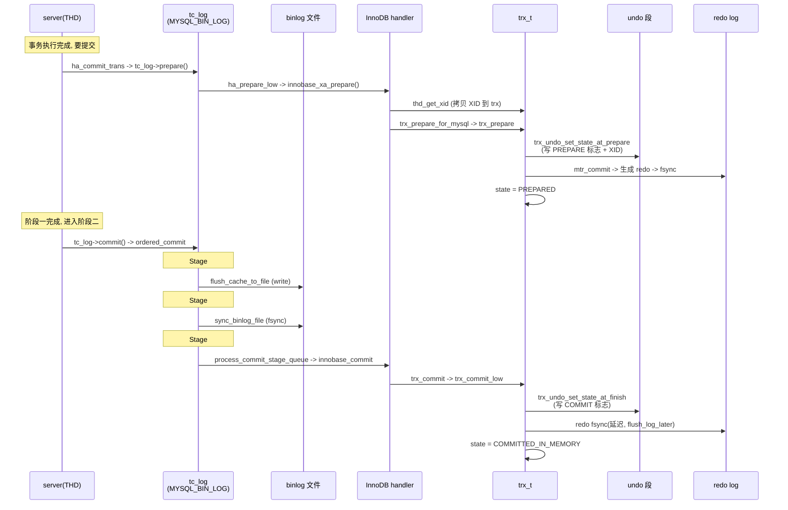
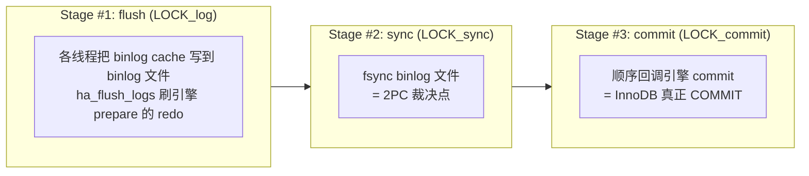

# 第 3 篇 · 第 11 章 · 两阶段提交(2PC):redo 与 binlog 一致

> **核心问题**:InnoDB 有自己的 redo log,MySQL server 层又有一份 binlog——两份独立的"事务日志"。一次 `UPDATE` 落盘时,如果 crash 发生在"redo 写了、binlog 没写"或反过来的中间时刻,重启后两份日志对不上,主从复制就会漏事务、数据就错了。InnoDB 怎么保证这两份日志**永远一致**?答案是一个看起来笨拙、实则精妙到极点的协议:**两阶段提交(Two-Phase Commit, 2PC)**——`redo prepare → 写 binlog → redo commit`,把"两边都成功"做成一个不可分割的裁决点。

> **读完本章你会明白**:
> 1. **为什么 InnoDB 的 redo 和 server 层的 binlog 非得对齐**——binlog 是主从复制的源头,redo 和 binlog 矛盾,从库就会和主库数据分叉;这不是"理想",是"必须"。
> 2. **为什么不能用"先 redo commit 再写 binlog"这种朴素方案**——每个朴素顺序都有一道"crash 时刻的不一致裂缝",2PC 是唯一能把所有裂缝堵上的顺序,本章逐个反驳。
> 3. **2PC 三步在源码里到底干了什么**:prepare 阶段往 undo 段写什么、`TRX_STATE_PREPARED` 状态怎么落盘;binlog 阶段 `ordered_commit` 的 flush/sync/commit 三级流水线怎么把成百上千个事务的提交聚成一次 fsync;commit 阶段 redo flush 的"延迟刷盘"技巧(`flush_log_later`)凭什么让 group commit 成立。
> 4. **2PC 凭什么"sound"(正确性证明)**:crash 发生在 prepare 后、binlog 前、binlog 后、commit 后——四个时刻恢复后会发生什么,以及为什么**无论 crash 在哪一刻,redo 和 binlog 始终反映"同一批事务成功"**——这是数据库"跨日志一致性"的标准答案。

> **逃生阀**:这章是 P3 心脏篇的招牌章,概念密度高。如果一遍读不完,先抓三件事:① redo 和 binlog 必须一致,否则主从复制错;② 2PC = redo prepare → 写 binlog → redo commit 三步,把"binlog 写入"当裁决点;③ crash 恢复时,InnoDB 扫自己的 prepared 事务清单,和 binlog 里的 XID 集合一比对——在 binlog 里的提交,不在的回滚,redo 和 binlog 就对齐了。group commit 的三段流水线、`flush_log_later` 的延迟技巧,第二遍再抠。

---

## 〇、一句话点破

> **InnoDB 把"提交"拆成两段:先让 redo 进入 PREPARE(把"我想提交"写到 undo 段),再让 server 层把 binlog 写盘,最后让 redo 进入 COMMIT。崩在 prepare 后/binlog 前——binlog 没有, redo 回滚;崩在 binlog 后/commit 前——binlog 有, redo 补提交。于是 redo 和 binlog 永远咬合:binlog 里有的, redo 一定提交;redo 提交的, binlog 一定有。**

这是结论,不是理由。本章倒过来拆:先讲清楚为什么 redo 和 binlog 必须一致(否则主从复制就错)、为什么"朴素顺序"堵不住所有裂缝,再落到源码——prepare/binlog/commit 三步各自做了什么、`ordered_commit` 三段流水线怎么把提交聚成 group、`flush_log_later` 凭什么让 group commit 成立;然后是本章的灵魂——**2PC 的正确性证明**(crash 在任何时刻都一致);最后两个技巧精解:一是"binlog 写入点做原子裁决"为什么 sound,二是 group commit 怎么把"成百上千个事务的提交"压成"一次 fsync"。

---

## 一、为什么 redo 和 binlog 必须一致

要理解为什么需要 2PC,先理解它要解决的问题有多大:**两份独立的事务日志,凭什么必须对齐**。

### 两份日志,各管一摊

InnoDB 这台机器里同时跑着**两份独立的"事务日志"**,它们记的东西不一样、服务对象也不一样:

- **redo log**(本书 P3-08 拆过):InnoDB 自己的物理日志,记"哪个页哪个偏移改成什么字节",顺序写、crash 后重放。它服务的是 **InnoDB 自己的 crash recovery**——重启后照 redo 把没落盘的修改重新做一遍。
- **binlog**(binary log):**MySQL server 层**的逻辑日志,记"做了什么 SQL 操作"(statement 格式)或"行怎么变了"(row 格式)或两者混合(mixed)。它服务的是 **主从复制** 和 **数据回放**(PITR, point-in-time recovery)——从库照 binlog 重放,就跟着主库走;备份恢复时按 binlog 重新跑一遍,就能恢复到任意时间点。

这里有个关键事实:**binlog 不在 InnoDB 里**。它是 server 层(`sql/binlog.cc`)的东西,在 InnoDB 之上。InnoDB 通过 handler 接口被 server 层调用,binlog 是 server 层自己写的另一份流水。从 InnoDB 的视角,binlog 是"上面那个调用方自己记的账",它根本管不着。

### 为什么这两份日志会"打架"

两份独立日志本身不是问题,问题是:**一次事务提交,这两份日志都涉及到,而它们落盘的时机不一定一致**。crash 可能发生在两者中间。

举个具体的例子。假设没有 2PC,我们朴素地按这个顺序提交:

```
① 事务执行,改了数据页,写了 redo(redo 在内存,还没 fsync)
② 把 redo fsync 到磁盘(redo 提交)
③ 写 binlog 到磁盘
```

现在 crash 发生在 ② 和 ③ 之间——redo 已经落盘说"这个事务成功了",binlog 还没写。

- **重启后**:InnoDB 看 redo,这个事务已提交,数据保留。
- **从库复制**:从库照主库的 binlog 重放。binlog 里**没有**这个事务,所以从库**根本不会执行这个事务**。
- **结果**:主库有这行数据,从库没有。**主从数据分叉**。

反过来也成立:如果顺序是"先 binlog 后 redo",crash 在中间,binlog 有、redo 没有,从库照 binlog 执行了,主库 redo 重放没有,结果主库没有、从库有——照样分叉。

> **不这样会怎样**:如果 redo 和 binlog 落盘时机不一致、且中间可能 crash,主从复制就会漏事务或多事务,主从数据分叉——对银行、电商这种场景,这是**灾难**。MySQL 主从复制是它的核心卖点之一,这个一致性绝对不能破。

### 谁在依赖这个一致性

不仅主从复制,还有几个地方依赖 redo/binlog 一致:

- **数据备份 + PITR**(如 xtrabackup + binlog 回放):先用 xtrabackup 抓一致性快照(里面是 InnoDB 数据 + redo),再用 binlog 回放到任意时间点。如果 redo 和 binlog 对不上,回放就漏或多。
- **高可用切换**:主库挂了,从库提升为新主。新主的数据"正确性"完全依赖它和旧主在 binlog 层面是一致的——而旧主的 binlog 和 redo 必须一致,这个一致性才能传到从库。
- **clone 插件**(8.0+):原生克隆也涉及 redo/binlog 的协调。

> **钉死这件事**:redo 是 InnoDB 引擎层的 crash recovery 日志,binlog 是 server 层的复制/回放日志,两份独立日志在事务提交点必须原子地"对齐",否则主从复制、备份恢复、HA 切换全都会错。**2PC 存在的全部理由,就是堵这个对齐的裂缝。**

---

## 二、为什么朴素方案堵不住:逐个反驳

既然 redo 和 binlog 必须一致,那"按某个顺序写两份日志"行不行?本节把所有"朴素顺序"逐个试一遍,看每一种都有一道 crash 时刻的裂缝。这是本章最关键的推理——**2PC 不是拍脑袋,是排除法逼出来的唯一解**。

### 朴素方案 A:先 redo commit,后写 binlog

```
① redo 写 PREPARE(其实这种朴素方案没有 PREPARE,直接 commit)
② redo 写 COMMIT + fsync(redo 说事务成功)
③ 写 binlog + fsync
```

**裂缝在哪**:crash 在 ② 和 ③ 之间。

- 重启:redo 里事务已 commit → InnoDB 数据保留,事务成功。
- binlog 里**没有**这个事务。
- **从库复制漏事务**。主从分叉。

### 朴素方案 B:先写 binlog,后 redo commit

```
① 写 binlog + fsync
② redo 写 COMMIT + fsync
```

**裂缝在哪**:crash 在 ① 和 ② 之间。

- 重启:redo 里事务**没有** commit(连 PREPARE 都没有),InnoDB 视角这个事务没成功 → 数据回滚(走 undo)。
- binlog 里**有**这个事务 → 从库执行了。
- **主库没有,从库有**。照样分叉。

### 朴素方案 C:两份日志一起写、一起 fsync(原子写)

理论上,如果 redo 和 binlog 能"原子地"同时落盘(一个 fsync 同时刷两份日志),那就没裂缝。但现实是:**它们是两个不同的文件**(甚至在不同磁盘),不可能用一个原子操作同时刷。fsync 一个文件不等同于 fsync 另一个,而且 OS 也不提供"两个文件一起原子 fsync"的系统调用。所以这条路在工程上走不通。

### 朴素方案 D:加全局锁串行化

加一把全局锁,提交时锁住,redo 写完、binlog 写完才放锁——保证没人看到"中间态"。但这只解决"并发看到中间态",**解决不了 crash 的中间态**:crash 还是在中间发生,重启后该不一致还是不一致。而且全局锁把所有提交串行了,完全废掉了高并发(后面讲 group commit 时会看到,2PC 恰恰是反着来——把多个提交聚成一个组)。

### 排除法逼出来的结论

把上面四个朴素方案全试过,**每一种都有 crash 时刻的裂缝**。问题的本质是:**两份日志,任何一份先落盘、另一份后落盘,中间就有 crash 缝隙**。要堵住所有缝隙,只有一个办法——**让其中一份日志的"成功落盘"成为另一份日志"成功落盘"的判据**,而这份"判据日志"本身必须先确定。

2PC 的思路就是:**让 binlog 成判据**。具体说:

1. **先让 redo 进入一个"中间态"——PREPARE**:意思是"我准备好提交了,但还没最后定"。这时 redo 写了一段"prepare 记录"到磁盘(其实是在 undo 段写 prepare 标志,详见后),fsync。如果 crash 在这之后,redo 里这个事务是"prepared 未 commit"——可提交也可回滚,留待裁决。
2. **再写 binlog 并 fsync**:binlog 落盘的那一刻,就是**裁决点**——这一刻之后,这个事务就算最终成功(binlog 是判据,binlog 在就是成功);这一刻之前,事务还可能被回滚。
3. **最后让 redo 进入 COMMIT**:这只是"把已经裁决为成功的事务在 redo 侧也标完成",让 InnoDB 自己知道这个事务结束了。这一步即使 crash 中断也没事——因为 binlog 已经在(判据成立),恢复时 redo 看到 prepared 状态,只要查 binlog 有没有这个事务,有就补提交。

```
   2PC 三步:
   ① redo: PREPARE(写 undo 段 prepare 标志, redo fsync)
   ② binlog: 写入 + fsync            ← 裁决点:binlog 在 = 事务成功
   ③ redo: COMMIT(写 undo 段 commit 标志, redo fsync)

   crash 在任何时刻, 恢复裁决:
   - ①之前/①中: redo 没有 prepared → 事务未生效 → 回滚(undo), binlog 也不会有
   - ①之后、②之前: redo prepared 但 binlog 没有 → 回滚
   - ②之后、③之前: redo prepared 且 binlog 有 → 补提交(走 commit_by_xid)
   - ③之后: redo 已 commit → 直接提交成功
```

> **所以这样设计**:2PC 是排除法逼出来的——所有"两份日志按某顺序串行写"的朴素方案都有 crash 缝隙,只有"先 prepare、再 binlog(判据)、再 commit"这种让 binlog 当裁决点的顺序,能堵住所有缝隙。**这不是 InnoDB 的发明,是分布式事务的标准协议**(数据库里的 2PC 跟分布式系统里的 2PC 同源——一个协调者 + 多个参与者,prepare/commit 两阶段);InnoDB 把它用在了"同一台机器上的两份日志"这种特殊场景。

> **钉死这件事**:理解 2PC 的关键,不是"它分两阶段"(这是表象),而是**"它把 binlog 写入那一刻当作事务成功的裁决点"**——这一刻之前的所有 crash,事务都还能回滚;这一刻之后的所有 crash,事务都铁定成功(只是 redo 侧可能要补提交)。**binlog 是判据,这是 2PC 一致性的灵魂**。

---

## 三、源码总览:2PC 三步在 MySQL 里怎么走

讲清了 why,现在落到 how。本节把 2PC 三步在 MySQL 9.7 源码里走过哪些函数、各自干什么,串成一张全景图;后面小节再逐段拆。

### 谁在协调:server 层的 `tc_log`

2PC 有一个**协调者(coordinator)**和若干**参与者(participant)**。在 MySQL 里:

- **协调者**是 server 层的 **`tc_log`**(Transaction Coordinator Log)接口。当 binlog 开启时,**binlog 自己就是 `tc_log`**——[`MYSQL_BIN_LOG`](../mysql-server/sql/binlog.cc#L7107) 这个类同时实现了 TC_LOG 接口的 `prepare`/`commit`/`rollback`。换句话说,**binlog 既是日志,又是协调者**。binlog 没开时,`tc_log` 是 [`TC_LOG_DUMMY`](../mysql-server/sql/tc_log.h#L224)(空操作,因为单引擎不需要 2PC)。
- **参与者**是各个存储引擎(InnoDB,以及可能的其他引擎)。它们通过 handlerton 的 `prepare`/`commit`/`rollback` 回调参与 2PC。

整个提交流程的入口在 [`ha_commit_trans`](../mysql-server/sql/handler.cc#L1686)。它负责把一次提交按 2PC 协议调度:

```c
// sql/handler.cc (简化示意, 非源码原文)
int ha_commit_trans(THD *thd, bool all, ...) {
  ...
  // 多引擎(或开了 binlog)才走完整 2PC; 单引擎且不开 binlog 不需要
  if (!trn_ctx->no_2pc(trx_scope) && (trn_ctx->rw_ha_count(trx_scope) > 1))
    error = tc_log->prepare(thd, all);          // 阶段一: 调每个引擎的 prepare
  ...
  if (error || (error = tc_log->commit(thd, all))) {  // 阶段二: 协调者提交(binlog + 引擎 commit)
    ha_rollback_trans(thd, all);
  }
}
```

注意那个判断:`rw_ha_count > 1`。只有**多于一个读写引擎参与**(或者 binlog 算作"第二个参与者",因为开了 binlog 即使只一个引擎也走 2PC),才需要 2PC——单引擎不开 binlog 的话,直接 commit 即可,没有"两份日志要对齐"的问题。`tc_log->prepare` 和 `tc_log->commit` 是 2PC 的两个阶段。

### 阶段一:`tc_log->prepare` → 各引擎 prepare

[`tc_log->prepare`](../mysql-server/sql/handler.cc#L1845) 调到底层 [`ha_prepare_low`](../mysql-server/sql/handler.cc#L2373),它遍历每个参与引擎,调 handlerton 的 `prepare` 回调:

```c
// sql/handler.cc (简化示意)
int ha_prepare_low(THD *thd, bool all) {
  ...
  for (每个参与引擎 ht) {
    err = ht->prepare(ht, thd, all);   // InnoDB 这就是 innobase_xa_prepare
  }
  DBUG_EXECUTE_IF("crash_commit_after_prepare", DBUG_SUICIDE(););  // 调试用: 可注入 crash
}
```

InnoDB 侧,`ht->prepare` 注册成 [`innobase_xa_prepare`](../mysql-server/storage/innobase/handler/ha_innodb.cc#L20270)([ha_innodb.cc 第 5377 行](../mysql-server/storage/innobase/handler/ha_innodb.cc#L5377) 注册)。它做两件事:① 把 server 层的 XID 拷到 InnoDB 的 `trx_t` 里(`thd_get_xid`);② 调 [`trx_prepare_for_mysql`](../mysql-server/storage/innobase/trx/trx0trx.cc#L3090) → [`trx_prepare`](../mysql-server/storage/innobase/trx/trx0trx.cc#L2961) → [`trx_prepare_low`](../mysql-server/storage/innobase/trx/trx0trx.cc#L2899),真正把"prepare"这件事落到 InnoDB 内部。

### 阶段二:`tc_log->commit` → `ordered_commit` 三段流水线

`tc_log->commit` 在 binlog 开启时就是 [`MYSQL_BIN_LOG::commit`](../mysql-server/sql/binlog.cc#L7107)。它做 `before_commit` 钩子,然后调本章另一个主角:[`ordered_commit`](../mysql-server/sql/binlog.cc#L7886)。`ordered_commit` 是 group commit 的核心,把提交拆成 **flush / sync / commit** 三级流水线(下面专门讲),最后一步才会回调 InnoDB 的 `commit`([`innobase_commit`](../mysql-server/storage/innobase/handler/ha_innodb.cc#L5948))。

### 全景时序

把上面三步串起来,从 server 层视角看一次提交:



下面三节,逐段拆这三步各自的源码细节。

---

## 四、阶段一·prepare:InnoDB 在 undo 段里写"准备好提交"的标志

第一阶段的本质,是 InnoDB 在自己的持久化结构里,给这个事务打上"我已经准备好提交,但还没最终定"的标记。这个标记不是写在 redo 里(老资料常讲错),而是写在 **undo log 的 segment header** 里——这是 prepare 的真正落盘点。

### `trx_prepare`:把事务状态翻成 PREPARED

入口 [`trx_prepare`](../mysql-server/storage/innobase/trx/trx0trx.cc#L2961) 在 `trx0trx.cc`。关键几行:

```c
// storage/innobase/trx/trx0trx.cc:2961 (简化示意, 省略 assert/debug)
static void trx_prepare(trx_t *trx) {
  lsn_t lsn = 0;

  // 1. 对 redo undo 段(普通事务)和 noredo undo 段(临时表)分别 prepare
  if (trx->rsegs.m_redo.rseg != nullptr && trx_is_redo_rseg_updated(trx)) {
    lsn = trx_prepare_low(trx, &trx->rsegs.m_redo, false);  // 写 undo 段 PREPARE 标志
  }
  if (trx->rsegs.m_noredo.rseg != nullptr && trx_is_temp_rseg_updated(trx)) {
    trx_prepare_low(trx, &trx->rsegs.m_noredo, true);
  }

  // 2. 翻转 in-memory 事务状态
  trx_sys_mutex_enter();
  trx->state.store(TRX_STATE_PREPARED, std::memory_order_relaxed);  // ACTIVE -> PREPARED
  trx_sys->n_prepared_trx++;
  trx_sys_mutex_exit();

  ...
  // 3. flush redo 到 prepare 对应的 lsn(redo fsync, 把 prepare 落盘)
  if (lsn > 0) {
    trx_flush_logs(trx, lsn);
  }
}
```

(完整代码见 [`trx0trx.cc:2961-3009`](../mysql-server/storage/innobase/trx/trx0trx.cc#L2961-L3009)。)

这里有个**容易踩坑的点**:`trx->state` 这个 `TRX_STATE_PREPARED` 是**内存里的状态**,不是落盘的状态。crash 之后这个 in-memory 状态没了。真正"持久化的 prepare 标志"在 undo 段里——下一小节。

### `trx_prepare_low` + `trx_undo_set_state_at_prepare`:真正的落盘点

[`trx_prepare_low`](../mysql-server/storage/innobase/trx/trx0trx.cc#L2899) 干两件事:① 拿到这个事务的 insert undo 段和 update undo 段;② 对它们分别调 [`trx_undo_set_state_at_prepare`](../mysql-server/storage/innobase/trx/trx0undo.cc#L1842)。后者才是真正在**磁盘的 undo 段 header**里写"PREPARED"标志的地方:

```c
// storage/innobase/trx/trx0undo.cc:1842 (简化示意)
page_t *trx_undo_set_state_at_prepare(trx_t *trx, trx_undo_t *undo,
                                      bool rollback, mtr_t *mtr) {
  ...
  undo->set_prepared(trx->xid);   // in-memory: undo 段标 prepared, 记下 XID

  // 在磁盘的 undo 段 header 里写状态字段: TRX_UNDO_PREPARED
  mlog_write_ulint(seg_hdr + TRX_UNDO_STATE, undo->state, MLOG_2BYTES, mtr);

  mlog_write_ulint(undo_header + TRX_UNDO_FLAGS, undo->flag, MLOG_1BYTE, mtr);

  // 把 XID(gtrid + bqual)写进 undo 段 header —— 这是 crash 后裁决的凭据
  trx_undo_write_xid(undo_header, &undo->xid, mtr);

  return undo_page;
}
```

(完整代码见 [`trx0undo.cc:1842-1882`](../mysql-server/storage/innobase/trx/trx0undo.cc#L1842-L1882)。)

注意这几个细节:

1. **`mlog_write_ulint(...TRX_UNDO_STATE..., TRX_UNDO_PREPARED...)`**:这就是物理 redo 的写法——`mlog_*` 函数都是 P3-09 讲过的 mtr 接口,生成"把这个字节改成 X"的 redo。这里把 undo 段 header 里的状态字段改成 `TRX_UNDO_PREPARED`。这段 redo 会随 mtr commit 进 redo log,fsync 后就持久化了。
2. **`trx_undo_write_xid`**:[`trx0undo.cc:564`](../mysql-server/storage/innobase/trx/trx0undo.cc#L564) 这个函数把 XID(format_id + gtrid_len + bqual_len + 原始字节)写到 undo 段 header 的 `TRX_UNDO_XA_XID` 位置。**XID 是后面 crash recovery 时用来在 binlog 里查这个事务的钥匙**——prepare 时把钥匙和事务一起钉进磁盘。
3. **这一段 mtr commit 之后**:[`trx_prepare_low` 的 mtr_commit](../mysql-server/storage/innobase/trx/trx0trx.cc#L2941) 让"undo 段状态改写"这条 redo 落盘(注释原话:"This mtr commit makes the transaction prepared in file-based world")——从此 crash 也抹不掉这个"PREPARED"标志了。

### flush redo:把 prepare 真正固化到磁盘

[`trx_prepare`](../mysql-server/storage/innobase/trx/trx0trx.cc#L2961) 的最后一步 `trx_flush_logs(trx, lsn)` 会调 [`log_write_up_to`](../mysql-server/storage/innobase/log/log0write.cc)(P3-08 讲过这个函数),把 redo 一直 flush 到 prepare 对应的 lsn。这步走完,prepare 才真正"铁定不丢"——后面 crash 也救不回去这个 prepared 状态。

注意这里和 P3-08 的衔接:P3-08 讲了 redo 是怎么落盘的(log_writer / log_flusher / log_write_up_to 等 6 个后台线程协作)。本章关心的是:**prepare 这步必须确保 redo fsync 完成**——只有 prepared 标志持久化了,binlog 才有"裁决的资格"。这是 2PC 一致性的第一道保险。

> **承接 P3-10(undo)**:prepare 写在 undo 段 header 里,不是写在 redo 里——这是常被讲错的地方。undo 段在 P3-10 拆过(回滚段 / undo tablespace),它同时承担"回滚信息"+"MVCC 版本链"+"XA prepare 标志"三个职责。本章关心的是第三个:undo 段 header 里的 `TRX_UNDO_STATE` 字段,值从 `TRX_UNDO_ACTIVE` 变成 `TRX_UNDO_PREPARED`,就是 prepare 完成的标志。

> **钉死这件事**:prepare 的本质,是 InnoDB 在 undo 段 header 里写"PREPARED + XID",并保证这段 redo 落盘。crash 后只要 undo 段还在、redo 重放能到 prepare 这一刀,这个事务就**在持久化层面留下了"我曾准备好提交"的痕迹**——这是后面裁决的基础。状态机从 `ACTIVE` 走到 `PREPARED`,是单向门,不能回退到 ACTIVE。

---

## 五、阶段二·binlog:`ordered_commit` 三段流水线

prepare 完了,回到 server 层,进入 2PC 的第二阶段——写 binlog。但这里不是"一个事务写一次 binlog fsync"那么简单,而是用了一套**三段流水线 + group commit**,把成百上千个并发提交的事务,聚成"一次 fsync"。这是 MySQL 高并发提交性能的关键。

### 为什么需要 group commit

先看不用 group commit 会怎样。假设 1000 个事务同时提交,每个事务都要把 binlog fsync 一次——fsync 是毫秒级操作(机械盘 5-10ms,SSD 0.1-1ms),1000 次 fsync 串起来就是秒级,**TPS 直接被 fsync 卡死在几百**。

解法是 **group commit**:**把一段时间窗内到达的多个事务的 binlog,攒到一起,用一次 fsync 全部落盘**。1000 个事务的 binlog 攒一次 fsync,吞吐能提升一两个数量级。这个思想 PostgreSQL、Oracle 都在用,不是 MySQL 独有。

### `ordered_commit`:三段流水线

MySQL 的 group commit 实现是 [`MYSQL_BIN_LOG::ordered_commit`](../mysql-server/sql/binlog.cc#L7886),把提交拆成 **flush / sync / commit** 三个阶段,每阶段用一把独立的 mutex,多个事务在每个阶段排队,leader 干活、follower 等着:



代码里这三个阶段都有显式注释:[`binlog.cc:7930`](../mysql-server/sql/binlog.cc#L7930) "Stage #1: flushing transactions to binary log"、[`binlog.cc:8003`](../mysql-server/sql/binlog.cc#L8003) "Stage #2: Syncing binary log file to disk"、[`binlog.cc:8056`](../mysql-server/sql/binlog.cc#L8056) "Stage #3: Commit all transactions in order"。下面逐段拆。

### Stage #1:flush —— 攒一批 binlog cache,write 到文件

每个事务在执行期间,SQL 产生的 binlog 事件先存在**线程私有的 binlog cache** 里(`binlog_cache_mngr`,有 stmt_cache 和 trx_cache 两个)。提交时进 flush stage:

```c
// sql/binlog.cc (简化示意)
// Stage #1
if (change_stage(thd, BINLOG_FLUSH_STAGE, thd, nullptr, &LOCK_log)) {
  return finish_commit(thd);  // 我是 follower, 已被 leader 处理
}
// 我是 leader, 拿到 LOCK_log, 来干活
flush_error = process_flush_stage_queue(&total_bytes, &wait_queue);
if (flush_error == 0 && total_bytes > 0)
  flush_error = flush_cache_to_file(&flush_end_pos);  // write(2) 到 binlog 文件(不 fsync)
```

[`process_flush_stage_queue`](../mysql-server/sql/binlog.cc#L7490) 里 leader 做两件事:

1. **`ha_flush_logs(true)`**([`binlog.cc:7478`](../mysql-server/sql/binlog.cc#L7478)):**回调各个引擎,让它们把 prepare 阶段产生的 redo 先 flush 到磁盘**。这一步是 2PC 一致性的关键——**binlog write 之前,引擎侧的 prepare redo 必须先落盘**。否则 crash 在 binlog 写完、redo prepare 还没落盘之间,会出现"binlog 有事务、引擎侧 prepare 都没了"的不一致。
2. **`flush_thread_caches`**:把每个等待事务的 binlog cache 内容,挨个 write 到 binlog 文件。注意是 **write(2) 不是 fsync**——数据进了 OS page cache,还没真正到磁盘。

[`flush_thread_caches`](../mysql-server/sql/binlog.cc#L7396) 里还有个细节:`thd->set_trans_pos(log_file_name, m_binlog_file->position())`——**记录下这个事务在 binlog 里的位置(文件名 + 偏移)**。这个位置后面会传给 InnoDB(`trx->mysql_log_file_name` / `mysql_log_offset`),虽然本章不深入,但知道这是"InnoDB 知道自己在 binlog 哪里"的桥梁。

> **不这样会怎样**:如果 flush stage 不先 `ha_flush_logs(true)` 刷引擎 redo,直接写 binlog,crash 在"binlog 已写、引擎 prepare redo 未落盘"之间——恢复时引擎找不到 prepare 标志(redo 没到),事务被回滚,但 binlog 里却有事务的记录,从库会执行——**主从分叉**。所以这一行 `ha_flush_logs(true)` 是 2PC 一致性的隐形支柱。

### Stage #2:sync —— fsync binlog(裁决点)

```c
// Stage #2
if (change_stage(thd, SYNC_STAGE, wait_queue, &LOCK_log, &LOCK_sync)) {
  return finish_commit(thd);  // follower
}
// leader
result = sync_binlog_file(false);  // fsync(2) binlog 文件
```

这一步 [`sync_binlog_file`](../mysql-server/sql/binlog.cc#L8031) 就是 fsync binlog。**fsync 返回的那一刻,就是 2PC 的裁决点**——binlog 真正到了磁盘,这个事务"成功"就被钉死了。后面不管 crash 怎么发生,这个事务都"算数"。

`sync_binlog_file` 的 fsync 频率由 `sync_binlog` 参数控制:

- `sync_binlog=1`:每次提交都 fsync(最安全,性能最差,但保证 binlog 不丢)。
- `sync_binlog=0`:不主动 fsync,交给 OS(性能好,但 crash 可能丢 binlog,2PC 一致性就破了——生产环境**绝对不能**这么设)。
- `sync_binlog=N`:每 N 次提交 fsync 一次(折中)。

注意,group commit 让"成百上千个事务"共享这一次 fsync——`sync_binlog=1` 也能有不错的吞吐,这就是 group commit 的价值。

### Stage #3:commit —— 顺序回调引擎 commit

```c
// Stage #3
if (change_stage(thd, COMMIT_STAGE, final_queue, leave_mutex_before_commit_stage, &LOCK_commit)) {
  return finish_commit(thd);  // follower
}
commit_queue = fetch_queue_acquire_lock(COMMIT_STAGE);
process_commit_stage_queue(thd, commit_queue);  // 回调每个引擎的 commit
```

[`process_commit_stage_queue`](../mysql-server/sql/binlog.cc#L7546) 遍历这一批事务,逐个调 [`finish_transaction_in_engines`](../mysql-server/sql/binlog.cc#L10740) → [`trx_coordinator::commit_in_engines`](../mysql-server/sql/tc_log.cc#L137) → [`ha_commit_low`](../mysql-server/sql/handler.cc#L1959),最终调到 InnoDB 的 [`innobase_commit`](../mysql-server/storage/innobase/handler/ha_innodb.cc#L5948)。

注意:**Stage #3 的回调是有顺序的**——同一批事务,按它们进 flush stage 的顺序,挨个被引擎 commit。这个顺序保证:**binlog 写入顺序 = 引擎 commit 顺序**。这个一致性后面 GTID 顺序、从库回放顺序都依赖。

至此,2PC 的第二阶段(binlog write + sync)和第三步(引擎 commit)虽然在 `ordered_commit` 里串行执行,但它们都属于"阶段二"——`tc_log->commit` 这一次调用里完成的事情。从 2PC 协议视角:阶段一是 prepare(各引擎各自落盘 PREPARED),阶段二是 commit(binlog 落盘 + 引擎落盘 COMMIT)。

---

## 六、阶段三·commit:InnoDB 翻状态 + 延迟刷 redo

`process_commit_stage_queue` 回调到 [`innobase_commit`](../mysql-server/storage/innobase/handler/ha_innodb.cc#L5948),InnoDB 这边做几件事:

```c
// storage/innobase/handler/ha_innodb.cc:5948 (简化示意, 关键片段)
static int innobase_commit(handlerton *hton, THD *thd, bool commit_trx) {
  ...
  if (will_commit) {
    ...
    // 1. 记录 binlog 位置(server 层算好的, 拿过来)
    ulonglong pos;
    thd_binlog_pos(thd, &trx->mysql_log_file_name, &pos);
    trx->mysql_log_offset = static_cast<uint64_t>(pos);

    // 2. 关键: 标记"稍后延迟刷 redo" —— 为了 group commit
    trx->flush_log_later = true;

    // 3. 引擎 commit: 翻状态 + 写 undo commit 标志
    innobase_commit_low(trx);     // -> trx_commit_for_mysql -> trx_commit -> trx_commit_low

    trx->flush_log_later = false;
    ...
    // 4. 现在才真正刷 redo(延迟的 flush 在这里执行)
    trx_commit_complete_for_mysql(trx);
  }
}
```

(完整代码见 [`ha_innodb.cc:5948-6102`](../mysql-server/storage/innobase/handler/ha_innodb.cc#L5948-L6102),关键片段在 [`6035-6073`](../mysql-server/storage/innobase/handler/ha_innodb.cc#L6035-L6073)。)

### `trx_commit_low`:翻状态 + 写 commit 标志

[`innobase_commit_low`](../mysql-server/storage/innobase/handler/ha_innodb.cc#L5881) 调 [`trx_commit_for_mysql`](../mysql-server/storage/innobase/trx/trx0trx.cc#L2415) → [`trx_commit`](../mysql-server/storage/innobase/trx/trx0trx.cc#L2229) → [`trx_commit_low`](../mysql-server/storage/innobase/trx/trx0trx.cc#L2137)。后者做几件事:

1. **`trx_write_serialisation_history`**([`trx0trx.cc:1571+`](../mysql-server/storage/innobase/trx/trx0trx.cc#L1571)):写 undo 段的 commit 标志。这里调 [`trx_undo_set_state_at_finish`](../mysql-server/storage/innobase/trx/trx0undo.cc#L1811)(注意:9.x 里这个函数叫 `..._at_finish`,老资料讲的 `trx_undo_set_state_at_commit` 在新版已不存在,这是和过时资料对不上的一个点)。它把 undo 段状态从 `TRX_UNDO_PREPARED` 改成 `TRX_UNDO_CACHED` / `TRX_UNDO_TO_FREE` / `TRX_UNDO_TO_PURGE`(根据 undo 段是否可复用)——**undo 段状态离开 PREPARED,标志着这个事务在持久化层面不再是"prepared 待裁决",而是"已提交"**。
2. **`mtr_commit`**([`trx0trx.cc:2197`](../mysql-server/storage/innobase/trx/trx0trx.cc#L2197)):让上面这次 undo 段改写(连同 redo)落盘。源码注释原话:"makes the whole transaction committed in the file-based world"。
3. **`trx_commit_in_memory`**([`trx0trx.cc:2225`](../mysql-server/storage/innobase/trx/trx0trx.cc#L2225)):翻 in-memory 状态。在 [`trx_release_impl_and_expl_locks`](../mysql-server/storage/innobase/trx/trx0trx.cc#L1862) 里(具体 store 在第 1881 行),`trx->state` 从 PREPARED 翻成 `TRX_STATE_COMMITTED_IN_MEMORY`。注意这同样是内存状态,持久化层的状态在第 1 步 undo 段改写时就定了。

### `flush_log_later`:延迟刷 redo 的精妙技巧

这是 InnoDB 参与 binlog group commit 的关键技巧,值得单独说。

正常情况下,`trx_commit_in_memory` 里会做 redo flush(把 commit 这一刀对应的 redo 落盘)。看 [`trx0trx.cc:2046-2065`](../mysql-server/storage/innobase/trx/trx0trx.cc#L2046-L2065):

```c
// storage/innobase/trx/trx0trx.cc:2046 (简化示意)
lsn_t lsn = mtr->commit_lsn();

if (lsn == 0) {
  /* Nothing to be done. */
} else if (trx->flush_log_later) {       // 2PC 路径会置这个标志
  /* Do nothing yet */                    // 关键: 这里不刷!
  trx->must_flush_log_later = true;
  ...
} else {
  trx_flush_log_if_needed(lsn, trx);     // 非 2PC 路径: 直接刷
}
```

源码注释([`trx0trx.cc:2038-2044`](../mysql-server/storage/innobase/trx/trx0trx.cc#L2038-L2044))原话讲清了动机:"If we are calling trx_commit() under prepare_commit_mutex, we will delay possible log write and flush to a separate function trx_commit_complete_for_mysql()... This is to make the group commit algorithm to work. Otherwise, the prepare_commit mutex would serialize all commits and prevent a group of transactions from gathering."

翻译过来就是:**如果在 innobase_commit 里立刻刷 redo,这把锁(早期版本是 prepare_commit_mutex,9.x 已重构但思想相同)会把所有事务串行化,后面的 transaction 没法"攒"到一起 group commit redo**。所以 InnoDB 把 redo flush 延迟到 [`trx_commit_complete_for_mysql`](../mysql-server/storage/innobase/trx/trx0trx.cc#L2470),这个函数在 `innobase_commit` 的最后([`ha_innodb.cc:6072`](../mysql-server/storage/innobase/handler/ha_innodb.cc#L6072))才调,这时已经放开了持有期间能聚合一组事务的锁。

```c
// storage/innobase/trx/trx0trx.cc:2470 (简化示意)
void trx_commit_complete_for_mysql(trx_t *trx) {
  ...
  // 延迟到这里的 redo flush —— 让一组事务的 redo flush 能合并
  trx_flush_log_if_needed(trx->commit_lsn, trx);
  trx->must_flush_log_later = false;
  ...
}
```

`trx_flush_log_if_needed` 内部([`trx0trx.cc:1724`](../mysql-server/storage/innobase/trx/trx0trx.cc#L1724) 的 `trx_flush_log_if_needed_low`)根据 `innodb_flush_log_at_trx_commit` 决定刷盘强度:

```c
// storage/innobase/trx/trx0trx.cc:1735 (简化示意)
switch (srv_flush_log_at_trx_commit) {
  case 2: flush = false; [[fallthrough]];   // 只 write, 不 fsync(每秒一次 fsync)
  case 1:                                    // write + fsync(最安全)
    wait_stats = log_write_up_to(*log_sys, lsn, flush);
    return;
  case 0: return;                            // 啥也不做
}
```

- `innodb_flush_log_at_trx_commit=1`:每次提交都 write + fsync redo(最安全,2PC 完整正确性需要这个)。
- `=2`:每次 write,每秒 fsync 一次(性能好,但 crash 可能丢一秒的 redo)。
- `=0`:每秒 write + fsync 一次(最快,最不安全)。

`innodb_flush_log_at_trx_commit=1` + `sync_binlog=1` 是 2PC 完整一致性的双保险配置——生产环境强一致场景必这么设。设成 2 或 0 是拿一致性换性能,只有"丢点数据没关系"的场景才能用。

> **钉死这件事**:InnoDB 的 commit 阶段做三件事——① 写 undo 段 commit 标志(持久化层"已提交");② 翻 in-memory `COMMITTED_IN_MEMORY` 状态;③ flush redo 到 commit 这一刀。其中 ③ 用了 `flush_log_later` 这个延迟技巧:不在 `trx_commit_low` 里立即刷,而是延迟到 `trx_commit_complete_for_mysql`,让一组事务的 redo flush 能合并——这是 InnoDB 参与 binlog group commit 的关键。**源码注释自己写明了动机**:不延迟会把提交串行化,group commit 失效。

---

## 七、2PC 一致性证明:四个 crash 时刻的裁决

前面拆了三步源码,这一节是本章的灵魂——**凭什么这套三步能保证 redo 和 binlog 一致**。本节把 crash 发生在四个不同时刻的恢复流程都推一遍,证明每种情况下 redo 和 binlog 都对得上。这是 2PC "sound"的完整论证。

### 恢复时的裁决逻辑(预告,P3-12 详细拆)

恢复时怎么裁决?这里先给结论(本章只点出逻辑证明一致,P3-12 拆完整重放流程):

1. **InnoDB 侧重放 redo**:`log0recv.cc` 重放 redo 到最后一个 checkpoint 之后的 LSN,所有 redo 重放完毕,buffer pool 里恢复到 crash 前的状态。
2. **重建事务清单**:扫描 undo 段,凡是 header 状态是 `TRX_UNDO_PREPARED` 的,重建为 `TRX_STATE_PREPARED` 的事务,挂在 `trx_sys->rw_trx_list` 上([`trx_lists_init_at_db_start`](../mysql-server/storage/innobase/trx/trx0trx.cc#L1102)、[`trx_resurrect_insert` 第 866 行](../mysql-server/storage/innobase/trx/trx0trx.cc#L866))。状态是 `TRX_UNDO_TO_PURGE` 等的,按已提交处理。
3. **server 层扫 binlog,收集 XID 集合**:[`Binlog_recovery::recover`](../mysql-server/sql/binlog/recovery.cc#L53) 扫 binlog,把所有"已提交事务"的 XID 收进 `m_internal_xids` 集合([`log_sanitizer.cc:108`](../mysql-server/sql/binlog/log_sanitizer.cc#L108))。
4. **裁决**:[`ha_recover`](../mysql-server/sql/xa.cc#L270) 调 InnoDB 的 [`innobase_xa_recover`](../mysql-server/storage/innobase/handler/ha_innodb.cc#L20353) → [`trx_recover_for_mysql`](../mysql-server/storage/innobase/trx/trx0trx.cc#L3168),拿到 InnoDB 所有 prepared 事务的清单。然后对每个 prepared 事务,看它的 XID 在不在 binlog 的 XID 集合里——**在就 commit_by_xid,不在就 rollback_by_xid**。

这第 4 步的裁决,**就是 2PC 一致性的最终落地点**。代码在 [`sql/xa/recovery.cc:242`](../mysql-server/sql/xa/recovery.cc#L242) 的 `recover_one_internal_trx`:

```c
// sql/xa/recovery.cc:245 (这就是裁决的那一行)
if (info.commit_list ? info.commit_list->count(xid) != 0
                     : tc_heuristic_recover == TC_HEURISTIC_RECOVER_COMMIT) {
  exec_status = ht.commit_by_xid(&ht, const_cast<XID *>(&xa_trx.id));   // 在 binlog 里 -> 提交
} else {
  exec_status = ht.rollback_by_xid(&ht, const_cast<XID *>(&xa_trx.id)); // 不在 -> 回滚
}
```

**这一行 `commit_list->count(xid)` 就是 2PC 一致性的源码具象**:binlog 的 XID 集合(`commit_list`)是判据,InnoDB 的 prepared 事务清单是被告,这一行的判断就是裁决。下面用四个 crash 时刻验证它的正确性。

### 时刻一:crash 在 prepare 之前(或 prepare 进行中)

```
事务执行中/redo 未 fsync prepare → crash
```

- InnoDB 侧:prepare 的 undo 段改写虽然生成了 redo,但 redo 没 fsync 成功(redo 没到磁盘)。重启时 redo 重放可能不到这一刀(取决于 redo flush 到哪了),即使到了,事务的 undo 段状态也还是 `TRX_UNDO_ACTIVE`(因为 prepare 的 mtr 没真正 commit 成功)。
- binlog 侧:Stage #1 还没开始,binlog 里**没有**这个事务的任何记录。
- **裁决**:扫描时,要么事务没出现在 prepared 清单里(根本没 prepare 成功),要么出现但 binlog 集合没有它的 XID → **rollback_by_xid(或根本就当未提交事务,用 undo 回滚)**。
- **一致性**:InnoDB 回滚,binlog 没有 → 两边都说"这个事务没成"。**一致**。

### 时刻二:crash 在 prepare 之后、binlog write 之前

```
redo prepare 已 fsync → crash → binlog 未 write
```

- InnoDB 侧:prepare 的 redo 已落盘,undo 段状态是 `TRX_UNDO_PREPARED`。重启重放 redo 后,这个事务出现在 prepared 清单里。
- binlog 侧:Stage #1 没走到 `flush_cache_to_file`,binlog 里**没有**这个事务。
- **裁决**:`recover_one_internal_trx` 看 commit_list,XID 不在 → **rollback_by_xid**。InnoDB 用 undo 把这个事务的修改全部改回去。
- **一致性**:InnoDB 回滚(没成),binlog 没有(没成)→ **一致**。**主从都不会有这个事务**。

### 时刻三:crash 在 binlog fsync 之后、引擎 commit 之前

```
redo prepare → binlog fsync → crash → InnoDB 未写 commit 标志
```

- InnoDB 侧:prepare 标志还在(undo 段还是 `TRX_UNDO_PREPARED`),因为 commit 阶段的 `trx_undo_set_state_at_finish` 还没执行。重启后事务在 prepared 清单里。
- binlog 侧:**binlog 已 fsync,事务的 XID 在 binlog 集合里**。
- **裁决**:`recover_one_internal_trx` 看 commit_list,XID 在 → **commit_by_xid**。InnoDB 把这个事务补提交(写 commit 标志、翻状态)。
- **一致性**:InnoDB 补提交(成了),binlog 有(成了)→ **一致**。**主从都有这个事务**。
- **关键点**:这就是为什么 binlog 是裁决点——binlog 在,即使 InnoDB 自己还没来得及 commit,恢复时也会补提交。**binlog fsync 那一刻,事务就"事实上"成功了**,后面 crash 只是让 InnoDB 侧的状态滞后,恢复时会追上。

### 时刻四:crash 在引擎 commit 之后

```
redo prepare → binlog fsync → 引擎 commit → crash
```

- InnoDB 侧:`trx_undo_set_state_at_finish` 已执行,undo 段状态变成 `TRX_UNDO_TO_PURGE` 等(非 PREPARED)。重启重放 redo 后,这个事务**不在 prepared 清单里**(它已经是"已提交"状态)。
- binlog 侧:binlog 有这个事务。
- **裁决**:这个事务根本不进入裁决流程(它不是 prepared),InnoDB 重放 redo 后数据就是提交后的状态。
- **一致性**:InnoDB 已提交,binlog 有 → **一致**。

### 一致性证明的总结

把四个时刻列成一张表:

| crash 时刻 | InnoDB undo 段状态 | binlog 有 XID? | 裁决 | 主从一致? |
|---|---|---|---|---|
| ① prepare 前 | ACTIVE/无 | 无 | 回滚 | 一致(都没) |
| ② prepare 后 / binlog 前 | PREPARED | 无 | rollback_by_xid | 一致(都没) |
| ③ binlog 后 / commit 前 | PREPARED | **有** | **commit_by_xid** | 一致(都有) |
| ④ commit 后 | TO_PURGE 等 | 有 | 已提交,不裁决 | 一致(都有) |

**关键洞察**:时刻 ② 和 ③ 的分界线,就是 binlog fsync 那一刻。crash 在那一刻**之前**(时刻 ②),binlog 没有,InnoDB 回滚;crash 在那一刻**之后**(时刻 ③),binlog 有,InnoDB 补提交。**binlog 是单一裁决点**——它的有无,唯一决定了事务的命运。无论 crash 在哪,InnoDB 的最终状态(提交或回滚)都和 binlog(有或没有)咬合。

> **钉死这件事**:2PC 一致性的核心,是**"binlog 写入"这个动作是不可逆的裁决点**——binlog fsync 之前的事务都能回滚(包括 prepare 完了的),binlog fsync 之后的事务都铁定成功(即使 InnoDB 还没 commit,恢复时也会补提交)。**redo 和 binlog 永远反映同一批事务成功**,这就是 2PC sound 的完整证明。代码层面就一行:[`xa/recovery.cc:245`](../mysql-server/sql/xa/recovery.cc#L245) 的 `commit_list->count(xid) != 0`——这行判断就是 2PC 一致性的具象。

---

## 八、技巧精解

本章挑两个最硬核的技巧单独拆透。

### 技巧一:binlog 写入点做原子裁决——为什么 sound

2PC 一致性的核心技巧,是**让 binlog 写入作为单一裁决点**。本技巧精解拆透"为什么这个设计 sound(逻辑自洽、不可能产生不一致)"。

#### 朴素设计的根本病灶

回到第二节的四个朴素方案,它们的共同病灶是:**两份日志各自落盘,中间有"窗口",crash 落在窗口里就矛盾**。无论先 redo 后 binlog、还是先 binlog 后 redo,窗口都存在。这个病灶的本质是"两份独立日志的落盘点没有逻辑关联"——它们只是先后,没有"谁决定谁"。

#### 2PC 的核心招式:让 binlog 当判据

2PC 的招式是:不是让两份日志"先后落盘",而是**让其中一份(binlog)的落盘,逻辑上决定另一份(redo)的最终状态**。

具体怎么"决定"?靠两个机制咬合:

1. **redo 的 prepare 是"中间态"**:prepare 不是终态,它表示"可提交可回滚,留待裁决"。这个中间态的存在,让 redo 在"裁决点之前"保留了灵活性——它可以根据 binlog 的有无来决定最终走向。
2. **恢复时的裁决逻辑**:`recover_one_internal_trx` 那一行——redo 看到 prepared,就去查 binlog 有没有,有就 commit、没就 rollback。

这两个机制合起来,**让 binlog 的有无成了 redo 终态的决定者**——redo 不再"自己决定自己",而是"听 binlog 的"。这就是为什么叫"裁决点"——binlog 是判官,redo 是被告,判官说了算。

#### 为什么 sound:反证法

假设 2PC 不 sound,即存在某个 crash 时刻,使得恢复后 redo 和 binlog 矛盾。我们推一遍:

- **情形 A:binlog 没有事务 X,但 redo 提交了 X**。
  - redo 提交 X,意味着 `trx_undo_set_state_at_finish` 执行过,即引擎 commit 阶段跑完了。
  - 引擎 commit 阶段在 Stage #3,前面必须有 Stage #2(binlog fsync)完成。
  - binlog fsync 完成了,事务 X 的 XID 必然在 binlog 集合里。
  - 矛盾。所以情形 A 不可能。

- **情形 B:binlog 有事务 X,但 redo 回滚了 X**。
  - redo 回滚 X,意味着裁决时 `commit_list->count(X) == 0`,即 X 不在 binlog 集合里。
  - 但前提是 binlog 有 X。矛盾。
  - 唯一的例外是"binlog fsync 失败但 redo prepare 成功后 crash"——但这种情况 binlog fsync 没成功,X 不会进 binlog 集合(Stage #2 失败,Stage #3 不执行,binlog write 都没成功),所以裁决时 X 确实不在集合里,redo 回滚 X,**和"binlog 没有 X"一致**。不矛盾。

所以,在 `innodb_flush_log_at_trx_commit=1` + `sync_binlog=1` 的前提下(prepredo 和 binlog 都保证 fsync 成功),**2PC 不可能产生 redo/binlog 不一致**。这就是 sound。

#### 关键的"前提":两个 fsync 都不能省

注意 sound 的前提:**prepare 的 redo 必须 fsync**(确保 prepared 状态持久化),**binlog 必须 fsync**(确保 binlog 不丢)。这两个 fsync 任何一个失败/被跳过,2PC 的 sound 就破了。

- `innodb_flush_log_at_trx_commit != 1`:prepare 的 redo 可能没真落盘,crash 后 prepared 状态丢失,但 binlog 可能已 fsync → 出现"binlog 有、redo 没 prepare"的情形,从库执行、主库没有 → 不一致。
- `sync_binlog != 1`:binlog 可能没真落盘,crash 后 binlog 丢失,但 redo 已 commit → 出现"redo 提交、binlog 没"的情形 → 不一致。

所以**生产强一致场景必须 `innodb_flush_log_at_trx_commit=1` AND `sync_binlog=1`**。这是 2PC sound 的工程前提,任何放松都是拿一致性换性能。双 1 配置是 OLTP 强一致的标配。

> **不这么设计会怎样**:如果不用"binlog 当裁决点",而是让 redo 自己决定(比如"redo commit 成功就算成功,不管 binlog"),那 crash 在 redo commit 后、binlog 写前,redo 说成功、binlog 没有——主从分叉。2PC 的精妙,就在于它把"事务成功"的定义权交给了 binlog 这份"上面那层"的日志,让引擎层(redo)听它的——这是一种**跨层一致性协议**,把 server 层的 binlog 和引擎层的 redo 用一个简单的"查表"动作咬合起来。

### 技巧二:group commit 把"N 次 fsync"压成"1 次 fsync"

2PC 的正确性靠三步顺序,但 2PC 的**性能**靠 group commit。这个技巧让"MySQL 高并发提交"成为可能——本技巧精解拆 group commit 的精妙。

#### 不用 group commit 会怎样

朴素实现:每个事务提交时,自己 fsync 一次 binlog(Stage #2)、自己 fsync 一次 redo(commit 阶段)。1000 TPS 就是 1000 次 binlog fsync + 1000 次 redo fsync。fsync 是毫秒级,加起来吞吐卡死在几百 TPS,扛不住 OLTP。

#### group commit 的核心:三个 stage,三个队列,leader 干活

`ordered_commit` 的招式是**流水线 + 队列**:

1. **每个 stage 一把 mutex**:`LOCK_log`(flush)、`LOCK_sync`(sync)、`LOCK_commit`(commit)。一把 mutex 对应一个队列。
2. **第一个进队列的是 leader,后面的是 follower**:leader 拿到 mutex,负责干这个 stage 的活(写 binlog、fsync、回调引擎 commit);follower 挂在队列里等 leader 完成。
3. **leader 把整批 follower 的活一起干**:flush stage 里 leader 把所有 follower 的 binlog cache 一起 write;sync stage 里 leader 一次 fsync 整批事务的 binlog;commit stage 里 leader 顺序回调整批事务的引擎 commit。

这样,一段时间窗内到达的所有事务,共享一次 binlog fsync 和一次 redo flush——**N 个事务,1 次 fsync**。

#### 流水线的妙处:三段并行

更妙的是,三个 stage 用三把不同的 mutex,意味着它们可以**并行**:

- 当 leader 在 sync stage 给一批事务 fsync binlog 时,新的提交可以进入 flush stage,在另一把 mutex(`LOCK_log`)下攒下一批。
- 当 sync stage 完成、leader 进入 commit stage 时,flush stage 的下一批已经攒好,可以立刻接上。

这是一个**三段流水线**,每一段都在并发地处理不同批次的事务。源码里 `change_stage(thd, ..., &LOCK_X, ..., &LOCK_Y)` 这种调用,就是事务从 X stage 流到 Y stage,放开 X 锁、拿 Y 锁——流水线的"接力棒"。

```
   时间 →
   flush stage:  [批 1 flush][批 2 flush][批 3 flush]...
   sync  stage:              [批 1 sync ][批 2 sync ]...
   commit stage:                        [批 1 commit]...
   
   三段流水并行:批 1 在 sync 时, 批 2 在 flush; 批 1 在 commit 时, 批 2 在 sync, 批 3 在 flush
```

#### 延迟 redo flush(`flush_log_later`)的配合

group commit 不仅 group binlog 的 fsync,也 group redo 的 fsync。怎么 group?就是第六节讲的 `flush_log_later`:

- 引擎 commit 阶段(`trx_commit_low`),**不立即刷 redo**,只置 `must_flush_log_later = true`。
- 同一批事务在 `process_commit_stage_queue` 里挨个走 `innobase_commit` → `trx_commit_low`,**每个都不立即刷 redo**。
- 直到 `innobase_commit` 最后调 `trx_commit_complete_for_mysql`,才刷 redo。

这一延迟,让"同批 redo flush"成为可能——一批事务的 commit_lsn 取最大值,一次 `log_write_up_to` 把整批 redo 都落盘。源码注释自己说清了动机(第六节引过):不延迟的话,prepare_commit 锁会串行化所有 commit,group 就攒不起来。

#### 反面对比:如果不用 group commit

如果 `ordered_commit` 改成"每个事务自己走三 stage、自己 fsync",1000 TPS 的负载,binlog fsync 1000 次,每次 5ms(机械盘),光 binlog fsync 就 5 秒——TPS 卡在 200。group commit 把 1000 次 fsync 压成"按 sync_binlog 频率"几次(极端情况 1 次),TPS 能上到几千甚至几万。

> **钉死这件事**:group commit 是 2PC 的性能救星。它的招式是"流水线 + 队列"——三 stage 三 mutex,leader 干活 follower 等,把一批事务的 binlog/redo fsync 合并。加上 `flush_log_later` 让 redo flush 也能合并,group commit 把 2PC 这个"看起来很慢"的协议,变得在 OLTP 高并发下也能扛住几万 TPS。**2PC 的正确性和性能,是两个独立的技巧合在一起——正确性靠 binlog 当裁决点,性能靠 group commit**。

---

## 九、XA PREPARE:外部 XA 的额外维度

本章主要讲的是"内部 2PC"——server 层协调 binlog 和 InnoDB 两个参与者。MySQL 还支持**外部 XA**(`XA START ... XA END ... XA PREPARE ... XA COMMIT/ROLLBACK`),这是用户显式发起的分布式事务,涉及多个数据源。

外部 XA 在 prepare 阶段做的事情和内部 2PC 几乎一样——`innobase_xa_prepare` 调 `trx_prepare_for_mysql` 写 prepare 标志。区别在于:

- **内部 2PC**:binlog 是协调者,binlog 写入就是裁决点。InnoDB 的 prepare 和 commit 都被 binlog 协调。
- **外部 XA**:用户(应用层)是协调者。`XA PREPARE` 让 InnoDB 进入 prepared 状态(持久化),然后用户决定 `XA COMMIT` 或 `XA ROLLBACK`。期间 crash,重启后 InnoDB 保留这个 prepared 事务,等用户重新连接来 commit/rollback。

外部 XA 的恢复路径稍微不同(走 `recover_one_external_trx` 而不是 `recover_one_internal_trx`,查 `Xa_state_list` 而不是 `commit_list`),但底层引擎机制(undo 段 prepared 标志、XID 持久化)是同一套。本章不深入外部 XA,知道它复用了同一套 prepare/commit 机制即可。

```
   binlog XID event(MLOG_2BYTES 写入 undo 段)和 XID 持久化:

   undo 段 header 布局(简化):
   ┌──────────────────────────────────────────────────┐
   │ TRX_UNDO_STATE (2 bytes)                          │
   │   = TRX_UNDO_ACTIVE / PREPARED / TO_PURGE / ...   │ ← prepare/commit 改这个字段
   │ TRX_UNDO_FLAGS (1 byte)                           │
   │ TRX_UNDO_XA_FORMAT (4 bytes) ┐                    │
   │ TRX_UNDO_XA_TRID_LEN (4 bytes)│ XID 三段长度       │ ← prepare 时写入
   │ TRX_UNDO_XA_BQUAL_LEN (4 bytes)┘                    │
   │ TRX_UNDO_XA_XID (XIDDATASIZE=128 bytes)           │ ← XID 原始字节, prepare 时写
   │ ... undo 记录(回滚 + MVCC 版本链用) ...            │
   └──────────────────────────────────────────────────┘
```

([`trx_undo_write_xid`](../mysql-server/storage/innobase/trx/trx0undo.cc#L564) 把 XID 三段长度 + 原始字节写进 undo 段 header;crash 后 [`trx_undo_read_xid`](../mysql-server/storage/innobase/trx/trx0undo.cc#L758) 读回来,作为裁决钥匙。)

---

## 十、章末小结

### 回扣主线

本章是 P3 心脏篇的招牌章,服务二分法的**事务与并发**那一面。全书一句话主线:"一条写,InnoDB 用 B+树聚簇索引找到位置、redo(WAL)保 crash 不丢、undo(MVCC)保并发读、锁保隔离"——本章拆的是其中**"redo 保 crash 不丢"在多日志场景下的延伸**:**redo 自己 crash 不丢还不够,它还得和 server 层的 binlog 咬合一致,否则主从复制、备份恢复、HA 切换全错**。2PC 就是这个"咬合"的协议。

承接:P3-08(redo log 的 WAL 与物理日志)、P3-09(mtr 生成 redo 的原子单位)、P3-10(undo 段——本章 prepare/commit 标志就写在 undo 段 header 里)。引出:P3-12(crash recovery 重放 redo 的完整流程,本章只点出裁决逻辑证明一致)。

### 五个为什么

1. **为什么 redo 和 binlog 必须一致?**——binlog 是主从复制、PITR、HA 切换的源头;redo 是 InnoDB 自己的 crash recovery 日志。两者矛盾,主从数据分叉——对银行/电商是灾难。
2. **为什么不能用"先 redo commit 后 binlog"等朴素顺序?**——每个朴素顺序都有"crash 落在两份日志落盘之间"的窗口,窗口里 crash 就矛盾。排除法逼出唯一解:让 binlog 当裁决点。
3. **为什么 2PC 是"redo prepare → binlog → redo commit"三步,不是别的顺序?**——prepare 让 redo 进入"中间态"(可提交可回滚),给 binlog 留裁决空间;binlog fsync 是裁决点(在=成功);redo commit 是"把裁决为成功的事务在 redo 侧也标完"。这个顺序让 binlog 的有无唯一决定 redo 的终态。
4. **为什么 crash 恢复时用"binlog 的 XID 集合"裁决 InnoDB 的 prepared 事务?**——因为 binlog 是判据。InnoDB 扫自己的 prepared 清单,和 binlog 集合一比对:在的 commit、不在的 rollback。一行 `commit_list->count(xid)` 就是裁决的具象。
5. **为什么 group commit 不破坏 2PC 一致性,反而提升性能?**——group commit group 的是"多个事务的 binlog/redo fsync"(性能优化),不改三步顺序(正确性保证)。N 个事务的 fsync 合并成 1 次,前提是这 N 个事务都已经走完 prepare(redo prepare 落盘),只是 binlog 和引擎 commit 阶段合并——一致性不破。

### 想继续深入往哪钻

- **源码**:
  - InnoDB prepare/commit:[`storage/innobase/trx/trx0trx.cc`](../mysql-server/storage/innobase/trx/trx0trx.cc)(`trx_prepare` L2961、`trx_commit_low` L2137、`trx_commit_in_memory` L1935、`trx_commit_complete_for_mysql` L2470)、[`storage/innobase/trx/trx0undo.cc`](../mysql-server/storage/innobase/trx/trx0undo.cc)(`trx_undo_set_state_at_prepare` L1842、`trx_undo_set_state_at_finish` L1811、`trx_undo_write_xid` L564)。
  - InnoDB handler 侧:[`storage/innobase/handler/ha_innodb.cc`](../mysql-server/storage/innobase/handler/ha_innodb.cc)(`innobase_xa_prepare` L20270、`innobase_commit` L5948、`innobase_xa_recover` L20353、`innobase_commit_by_xid` L20378)。
  - server 层协调:[`sql/handler.cc`](../mysql-server/sql/handler.cc)(`ha_commit_trans` L1686、`ha_prepare_low` L2373)、[`sql/tc_log.cc`](../mysql-server/sql/tc_log.cc)(`trx_coordinator::commit_in_engines` L137)。
  - binlog group commit:[`sql/binlog.cc`](../mysql-server/sql/binlog.cc)(`MYSQL_BIN_LOG::commit` L7107、`ordered_commit` L7886、`process_commit_stage_queue` L7546、`flush_thread_caches` L7396)。
  - crash recovery 裁决:[`sql/xa.cc`](../mysql-server/sql/xa.cc)(`ha_recover` L270)、[`sql/xa/recovery.cc`](../mysql-server/sql/xa/recovery.cc)(`recover_one_internal_trx` L242,**裁决行 L245**)、[`sql/binlog/recovery.cc`](../mysql-server/sql/binlog/recovery.cc)(`Binlog_recovery::recover` L53)、[`sql/binlog/log_sanitizer.cc`](../mysql-server/sql/binlog/log_sanitizer.cc)(XID 收集 L108)。
  - InnoDB 重启重建:[`storage/innobase/trx/trx0trx.cc`](../mysql-server/storage/innobase/trx/trx0trx.cc)(`trx_lists_init_at_db_start` L1102、`trx_recover_for_mysql` L3168)。
- **官方文档**:MySQL Reference Manual 的 "Binary Log Group Commit"、"XA Transactions"、"Binary Log Option/Variable Reference"(`sync_binlog`、`binlog_order_commits`)、"Internal XA" 相关章节;Jeremy Cole 的博客 "How innodb's group commit works" 等经典文章(注意版本,以 8.0+/9.x 源码为准)。
- **动手感受**:`SHOW VARIABLES LIKE 'sync_binlog'`、`SHOW VARIABLES LIKE 'innodb_flush_log_at_trx_commit'` 看双 1 配置;`SHOW ENGINE INNODB STATUS` 里看 prepared 事务数(`trx_sys->n_prepared_trx`);开 `general_log` 配合 `binlog_format=ROW` 看 binlog 事件;用 `mysqlbinlog` 解析 binlog 文件,看一组事务的 binlog event 怎么挨着;`SET GLOBAL sync_binlog=N` 调 fsync 频率,跑高并发 sysbench,观察 TPS 变化(group commit 的威力)。

### 引出下一章

本章拆透了 2PC 协议——redo prepare → binlog → redo commit 三步,以及凭什么这三步能堵住所有 crash 时刻的不一致。但本章只**点出**了恢复时的裁决逻辑(用 binlog XID 集合裁决 InnoDB prepared 事务),没有详细拆恢复流程本身。**crash 之后,InnoDB 到底怎么把数据库恢复到一致状态**——重放 redo 的完整流程、用 undo 回滚未提交事务、doublewrite 怎么防页撕裂——这是下一章 P3-12 的主题。P3-12 会把 `log0recv.cc` 的重放逻辑、`buf0dblwr.cc` 的双写缓冲,完整拆透,和本章的 2PC 裁决逻辑一起,凑成 InnoDB "crash 不丢"的完整画卷。

> **下一章**:[P3-12 · crash recovery 与 doublewrite](P3-12-crash-recovery与doublewrite.md)
