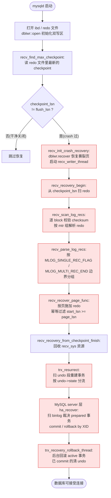

# 第 3 篇 · 第 12 章 · crash recovery 与 doublewrite

> **核心问题**:前四章(P3-08~P3-11)讲完了 redo/undo/mtr/2PC 各自怎么生成、凭什么保证。但这些都是"正常跑起来"时的家底——一旦机器断电、进程被 kill,内存里的脏页、log buffer 里没落盘的 redo、跑了一半的事务,全都没了。重启的时候,InnoDB 怎么把这堆"半拉子状态"恢复成一致?具体说三件事:① 怎么从 `last_checkpoint_lsn` 开始重放 redo(P3-08/09 攒下的那本"流水账",现在要拿来用);② 怎么靠 P3-10 的 undo + P3-11 的 2PC 状态裁决每个事务"重放提交"还是"回滚";③ 一个 16KB 的页写到一半断电"撕裂"了,redo 重放都救不回来——靠什么兜底?答案就是 **doublewrite buffer**。本章是 WAL 篇的收口:把前四章攒的"原料"在恢复流程里全部用起来。

> **读完本章你会明白**:
> 1. **崩溃恢复的全流程**——从启动入口 `srv0start.cc` 进来,顺序是 `doublewrite 恢复 → redo 重放 → 2PC 状态裁决 → undo 回滚未提交`,每一步为什么这么排,谁先谁后错了会怎样。
> 2. **redo 重放凭什么 sound**——`recv_recover_page_func` 怎么用 `recv->start_lsn >= page_lsn` 这个判断做"幂等过滤",为什么"宁可多放也不少放"是对的,而 `MLOG_SINGLE_REC_FLAG`/`MLOG_MULTI_REC_END` 这套 mtr 边界(P3-09)是重放的语义边界。
> 3. **2PC 裁决在恢复里到底怎么落地**——`trx_resurrect` 从 undo 段头读出事务的 `TRX_STATE_PREPARED`/`COMMITTED_IN_MEMORY`/`ACTIVE`,然后 MySQL server 层的 `ha_recover` 扫 binlog 决定 prepared 事务是补提交还是回滚。这是把 P3-11 的"binlog 写入做原子裁决点"在恢复流程里兑现。
> 4. **doublewrite 凭什么防"页撕裂"**——9.x 的 doublewrite 已经不是老资料讲的"共享表空间里的双写区",而是独立的 `#ib_*.dblwr` 文件 + `Double_write` class + 三种模式(ON / DETECT_ONLY / OFF),写时序严格"先批量顺序写双写区 + fsync,再写数据文件",恢复时数据文件页校验错就从双写区拿完整副本。这是 InnoDB 唯一一个"不是为快、而是为对"的兜底机制。

> **逃生阀**:这是全书"事务与并发"招牌篇的收口章,信息密度大。第一遍只抓三件事:① 恢复 = 重放 redo(已提交/进行中的页修改补回来)+ 用 2PC 状态裁决 prepared 事务 + 用 undo 回滚未提交;② redo 重放幂等(P3-08/09 的物理日志 + mtr 边界在这里兑现);③ doublewrite 是 redo 重放的前提——没有完整页,重放无从施加。第二遍再细抠 `recv_recovery_from_checkpoint_start` 的 8 个工位、`dblwr::recv::recover` 的副本恢复、`trx_resurrect` 的状态机。

---

## 〇、一句话点破

> **崩溃恢复 = 先用 doublewrite 把撕裂页补完整,再从 checkpoint LSN 往后重放 redo(幂等,把没落盘的页修改补回来),然后从 undo 段 resurrect 事务、按 2PC 状态裁决(已 commit 的清掉、prepared 的等 MySQL 扫 binlog 决定、active 的回滚)。四件事——dblwr 兜底页完整、redo 往前补、2PC 裁决、undo 往回撤——把崩溃时的"半拉子状态"恢复成一致。**

这是结论,不是理由。本章倒过来拆:先讲不恢复会怎样(已提交的丢、未提交的留在数据里——两条都违反 ACID);再讲重放 redo 为什么 sound(P3-08/09 的物理日志幂等 + mtr 边界在这里兑现);然后讲恢复的完整流程,把 doublewrite、redo、2PC、undo 这四件事按真实启动顺序串起来;接着专节拆 2PC 状态裁决(把 P3-11 的理论在恢复里落地);再讲 doublewrite 这个"防页撕裂"的兜底机制(本章第二个招牌);最后是技巧精解——redo 重放的幂等过滤 + doublewrite 的"先双写区后数据文件"时序,挑这两个最硬核的钉死。

---

## 一、不恢复会怎样:ACID 的 D 和 A 都废了

要理解崩溃恢复,先看清不恢复有多糟。

InnoDB 正常跑起来时,数据页在 buffer pool(内存)、redo 在 log buffer(内存)、undo 也在 undo 页(内存),都还没全落盘。一个事务 `COMMIT` 成功返回给客户端,只是它对应的 redo 已经 fsync 到 redo 文件了——**脏页本身大概率还在 buffer pool 里没刷盘**(P3-08 的 WAL:提交只等 redo 落盘,脏页异步刷)。这时候机器断电,内存全丢。磁盘上留下的是一个"半拉子"状态:

- **已经 commit 的事务,它的修改大概率还没刷到数据文件**——如果不管,客户端收到的"提交成功"就是个谎,数据其实没了。这违反 ACID 的 **D(持久性)**。
- **跑了一半的(active)事务,它的修改可能已经被 mtr 写进 redo 了**(P3-09:mtr 在事务中途就 commit,redo 一条条流进 log buffer 落盘)——如果不管,这些"没提交但 redo 已落盘"的修改会被当成已提交,留在数据里。这违反 ACID 的 **A(原子性)**。
- **更阴险的:数据页可能撕裂**——一个 16KB 的页,刷盘时是分多个扇区写的(扇区 512B 或 4KB),如果写到一半断电,这个页就"前半新后半旧",校验和对不上,页本身坏了(P3-08 的"墙二"详讲过)。

> **不这样会怎样**:不做崩溃恢复,ACID 直接断两条——D(已提交的丢)和 A(未提交的留)。而且数据页撕裂这种结构性损坏,可能让整个 B+树索引打不开,整张表废掉。这不是"丢几行"的问题,是"数据完整性塌方"。

所以恢复要做四件事,严格按顺序:

1. **修复撕裂页**(doublewrite):重放 redo 的前提是页本身完整,先把撕裂的页从 doublewrite 副本里还原。
2. **重放 redo**(已提交的补回来):从 checkpoint LSN 往后扫 redo,把"redo 已落盘但脏页没落盘"的修改施加到数据页上——这是"往前补"。
3. **2PC 裁决**(prepared 的定生死):从 undo 段 resurrect 出事务,看它的 2PC 状态——已 commit 的清理 undo、prepared 的等 MySQL 扫 binlog 决定、active 的进回滚队列。
4. **undo 回滚**(未提交的撤回去):对 active(以及 prepared 被判回滚的)事务,顺 undo 版本链把修改一条条撤回——这是"往后撤"。

> **钉死这件事**:恢复 = **往前补(redo)+ 往后撤(undo)+ 中间靠 2PC 裁决定生死 + 最前面靠 doublewrite 兜底页完整**。前四章攒的四样原料——redo(P3-08/09)、undo(P3-10)、2PC(P3-11)、再加本章主角 doublewrite——在恢复流程里全部用上。这就是为什么本章是 WAL 篇的收口。

---

## 二、恢复流程总览:启动入口到四件事的顺序

先把恢复的全流程用一张图立起来,然后逐段拆。InnoDB 的崩溃恢复入口在 `srv/srv0start.cc`(InnoDB 启动主控),它协调 server 层(`sql/`)、redo 重放(`log/log0recv.cc`)、doublewrite(`buf/buf0dblwr.cc`)、事务 resurrect(`trx/trx0trx.cc`/`trx0roll.cc`)四个子系统。



逐段拆这八步(对应源码):

**① 找 checkpoint**:`recv_find_max_checkpoint`([log0recv.cc 内部函数,由 `recv_recovery_from_checkpoint_start` 调用](../mysql-server/storage/innobase/log/log0recv.cc#L3766))。checkpoint 信息在 redo 文件里写两份轮换(P3-08 第七节讲过 `LOG_CHECKPOINT_1`/`LOG_CHECKPOINT_2`),这里挑最新的那份,拿到 `checkpoint_lsn`——这是"重放的起点"。

**② 判断要不要恢复**:看 `checkpoint_lsn != flush_lsn` 不([srv0start.cc:1764](../mysql-server/storage/innobase/srv/srv0start.cc#L1764) 调 `recv_recovery_from_checkpoint_start(log, flush_lsn)`)。`flush_lsn` 是 redo 文件头记的"上次干净关闭时刷到的 LSN",如果 `checkpoint_lsn == flush_lsn`,说明上次是干净关闭的,没有"半拉子",跳过恢复;否则就是 crash 过,进 `recv_init_crash_recovery`。

**③ init crash recovery(关键!doublewrite 在这里)**:`recv_init_crash_recovery`([log0recv.cc:3744](../mysql-server/storage/innobase/log/log0recv.cc#L3744))干两件事:

```c
static void recv_init_crash_recovery() {
  ut_ad(!srv_read_only_mode);
  ut_a(!recv_needed_recovery);

  recv_needed_recovery = true;

  ib::info(ER_IB_MSG_726);
  ib::info(ER_IB_MSG_727);

  recv_sys->dblwr->recover();    // ← 先恢复撕裂页!

  if (srv_force_recovery < SRV_FORCE_NO_LOG_REDO) {
    srv_threads.m_recv_writer =
        os_thread_create(recv_writer_thread_key, 0, recv_writer_thread);
    srv_threads.m_recv_writer.start();   // 启动后台刷盘线程
  }
}
```

注意 **`recv_sys->dblwr->recover()` 在 redo 重放之前**——这是 doublewrite 的位置:先把数据文件里撕裂的页从双写区副本还原,然后才开始重放 redo。为什么必须这么排?因为重放 redo 是"对完整的旧页施加变更",页本身撕裂了,重放施加到一个坏页上,只会得到更坏的页。先修页,再重放——这是 doublewrite 唯一的使命(本章后面专节拆)。

同时这里启动了 `recv_writer_thread`([log0recv.cc:706](../mysql-server/storage/innobase/log/log0recv.cc#L706))——一个后台线程,专门把恢复过程中变脏的页异步刷盘。重放 redo 会让大量页变脏(下面 ④⑤⑥ 详讲),这些脏页最终要落盘,`recv_writer_thread` 就是干这活的。

**④ 扫 redo(`recv_recovery_begin`)**:[log0recv.cc:3622](../mysql-server/storage/innobase/log/log0recv.cc#L3622)。从 `checkpoint_lsn` 对齐到 512B block 边界开始,每次读 `RECV_SCAN_SIZE` 字节的 redo 段进 `log.buf`,交给 `recv_scan_log_recs` 处理。这一步是"读"——把 redo 文件的内容读进内存缓冲。

**⑤ scan + parse(扫 + 解析)**:[`recv_scan_log_recs`](../mysql-server/storage/innobase/log/log0recv.cc#L3289) + [`recv_parse_log_recs`](../mysql-server/storage/innobase/log/log0recv.cc#L3135)。这两个是 redo 重放的核心预处理。scan 阶段逐 block 做 checksum 校验、读 `first_rec_group` 找 mtr 组边界;parse 阶段按 `MLOG_SINGLE_REC_FLAG`(单条)或 `MLOG_MULTI_REC_END`(多条,P3-09 讲过的 mtr 原子边界)把 redo 字节流切成一个个完整的 mtr 组,丢进一个 hash 表 `recv_sys->addr_hash`——key 是 `(space_id, page_no)`,value 是这个页上所有待施加的 redo 记录链表。**注意:parse 阶段不施加修改,只是把 redo 解析、归类好**。

**⑥ apply(按页施加 redo)**:这是真正"重放"的地方——[`recv_recover_page_func`](../mysql-server/storage/innobase/log/log0recv.cc#L2430)。它不是被 redo 流主动驱动,而是**页被读进 buffer pool 时被动触发**:恢复过程中,InnoDB 会按 hash 表里"哪些页有 redo 要施加",把这些页读进 buffer pool;每读进一个页,就调 `recv_recover_page_func` 把它对应的 redo 链表施加上去(下面技巧精解详讲)。这种"按需读页 + 被动重放"的设计,避免了"把所有页都读一遍"的巨大 IO。

**⑦ finish**:[`recv_recovery_from_checkpoint_finish`](../mysql-server/storage/innobase/log/log0recv.cc#L3950)。回收 `recv_sys` 的资源(hash 表、缓冲),关掉 `recv_writer_thread`,做一些收尾。

**⑧ resurrect + ha_recover + rollback**:这三步是事务级恢复(下面第三、四节详讲)。从 undo 段 resurrect 出事务(`trx_resurrect`),按 2PC 状态分流;MySQL server 层调 `ha_recover` 扫 binlog 裁决 prepared 事务;最后后台线程 `trx_recovery_rollback_thread` 回滚 active 事务、清理 committed 事务的 undo。

> **钉死这件事**:恢复的顺序是钉死的——**doublewrite 在前(修页)→ redo 重放(往前补)→ 2PC 裁决(定生死)→ undo 回滚(往后撤)**。每一步都依赖前一步:不修撕裂页,redo 没法施加;不重放 redo,数据页没有"已提交的修改";不裁决 2PC 状态,prepared 事务不知道该提交还是回滚;不回滚 active,未提交的修改留在数据里。这个顺序错了,任何一步都会出错。

---

## 三、redo 重放:从 checkpoint 往后,按页幂等施加

第二步"重放 redo"是恢复的主干。这一节拆两个关键问题:**重放从哪开始、到哪结束?** 和 **重放凭什么不出错(幂等)?**

### 3.1 起点:checkpoint_lsn,可能落在 mtr 中间

重放的起点是 `checkpoint_lsn`(由 `recv_find_max_checkpoint` 从 redo 文件读出来,P3-08 第七节讲过 checkpointer 周期写它)。按 P3-08 的定义,`checkpoint_lsn` 之前的所有修改,脏页都已经刷盘了,不用重放;之后的才需要重放。

但这里有个微妙点:`checkpoint_lsn` 可能**落在一个 mtr 记录组的中间**(因为 checkpoint 是按 LSN 切的,不管 mtr 边界)。所以 scan 阶段要从 `checkpoint_lsn` 所在 block 的开头扫,用 block 头里的 `first_rec_group` 字段(P3-08 第六节讲过)找到"这个 block 里第一个 mtr 组的起点",从那个完整的 mtr 组开始 parse。源码里 `recv_scan_log_recs` 是这么处理的([log0recv.cc:3357-3405](../mysql-server/storage/innobase/log/log0recv.cc#L3357)):

```c
if (!recv_sys->parse_start_lsn && block_header.m_first_rec_group > 0) {
  /* We found a point from which to start the parsing of log records */
  recv_sys->parse_start_lsn = scanned_lsn + block_header.m_first_rec_group;
  ...
  if (recv_sys->parse_start_lsn < recv_sys->checkpoint_lsn) {
    /* checkpoint_lsn 落在 mtr 中间,要忽略 checkpoint_lsn 之前的那些字节 */
    recv_sys->bytes_to_ignore_before_checkpoint =
        recv_sys->checkpoint_lsn - recv_sys->parse_start_lsn;
    ...
  }
  ...
}
```

注释里直白说了:`checkpoint_lsn could potentially point to the middle of some log record`(checkpoint 可能指向某条记录的中间)。处理办法是从它所在 block 的第一个完整 mtr 组开始 parse,但把 `checkpoint_lsn` 之前那几个字节"忽略掉"(不计入待重放)。这样既不漏掉该重放的(checkpoint 之后的全有),也不会把 checkpoint 之前的半截 mtr 当成完整的重放。

### 3.2 终点:扫到 checksum 失败或日志尾

重放的终点不像起点那么明确——crash 时 redo 可能写到一半(最后一个 block 没写满,或 checksum 没算完)。`recv_scan_log_recs` 处理这个的办法是:**逐 block 校验 checksum,坏了就当 redo 到此为止**([log0recv.cc:3313-3341](../mysql-server/storage/innobase/log/log0recv.cc#L3313)):

```c
if (block_header.m_hdr_no != expected_hdr_no) {
  /* Garbage or an incompletely written log block.
     We will not report any error, because this can
     happen when InnoDB was killed while it was writing redo log. */
  finished = true;
  break;
}

if (!log_block_checksum_is_ok(log_block)) {
  /* Garbage or an incompletely written log block.
     This could be the result of killing the server
     while it was writing this log block. */
  ...
  finished = true;
  break;
}
```

注意这两段处理都是 **`finished = true` 然后 break,不报错**——这是 P3-08 讲过的"redo 写到一半 crash 是正常的"。log block 是 512B 对齐扇区的(P3-08 第六节),正常写完整 block 不会撕裂,但如果 crash 在写 block 的中途,这个 block 的 hdr_no 或 checksum 就对不上。重放逻辑发现这种情况,就当 redo 到此为止,前面的有效记录已经全部 parse 进 hash 表了。

> **承接 P3-08/09**:起点用 `first_rec_group` 找 mtr 边界、终点用 checksum 判日志尾、中间靠 `MLOG_SINGLE_REC_FLAG`/`MLOG_MULTI_REC_END` 切 mtr 组——这三件事全是 P3-08/09 攒下的"原料"。P3-08 讲 redo 的物理格式(block/mtr 组/checkpoint),P3-09 讲 mtr 的原子边界标志,本章把它们用在恢复的"扫 + parse"阶段。**没有前两章的格式定义,本章的 scan/parse 根本无从下手**。

### 3.3 apply:按页施加,幂等过滤——重放 sound 的核心

scan/parse 阶段只是把 redo 解析归类进 hash 表(`recv_sys->addr_hash`,key 是页号),真正施加修改是在 `recv_recover_page_func`([log0recv.cc:2430](../mysql-server/storage/innobase/log/log0recv.cc#L2430))。这个函数的精髓就一句话——**"redo 记录的 start_lsn >= 页当前的 page_lsn,才施加"**:

```c
lsn_t page_lsn = mach_read_from_8(page + FIL_PAGE_LSN);   // 页头记的"最近修改 LSN"

/* 读页的 newest_modification(buffer pool 里可能还有更新的) */
lsn_t page_newest_lsn = buf_page_get_newest_modification(&block->page);
if (page_newest_lsn) {
  page_lsn = page_newest_lsn;
}

...
for (auto recv : recv_addr->rec_list) {                    // 这个页的所有 redo 记录
  ...
  if (recv->start_lsn >= page_lsn                          // ← 幂等过滤!
      && undo::is_active(recv_addr->space)) {

    if (!modification_to_page) {
      modification_to_page = true;
      start_lsn = recv->start_lsn;
    }
    ...
    recv_parse_or_apply_log_rec_body(recv->type, buf, buf_end,
                                     recv_addr->space, recv_addr->page_no,
                                     block, &mtr, ULINT_UNDEFINED, LSN_MAX);
  }
  ...
}

if (modification_to_page) {
  ut_a(page_lsn < end_lsn);
  buf_flush_note_modification(block, start_lsn, end_lsn, nullptr);   // 标脏,挂 flush list
}
```

这一行 `if (recv->start_lsn >= page_lsn)` 是整个 redo 重放的命脉。理解它要回到 P3-08/09:`PAGE_LSN` 是每个页头里记的"这个页最近一次修改对应的 LSN"(P3-08 第四节),mtr commit 时会把它对应的页的 `PAGE_LSN` 更新到 mtr 的 `end_lsn`(P3-09 commit 流程)。所以 `page_lsn` 就是"这个页当前已经反映到了哪个 LSN"。

- 如果 `recv->start_lsn < page_lsn`,说明这条 redo 描述的修改,**页已经包含了**(它的 page_lsn 已经 >= 这条 redo 的 start_lsn,即这条 redo 已经被施加过了)。**跳过,不重放**。
- 如果 `recv->start_lsn >= page_lsn`,说明这条 redo 描述的修改,页还没包含。**施加**。

这就是 redo 重放的"幂等过滤"。它解决了两个问题:

**问题一:怎么知道哪些 redo 已经在数据页里了?** 因为 checkpoint_lsn 之前的修改,脏页已经刷盘了——这些页的 `PAGE_LSN` 已经 >= 那些 redo 的 start_lsn,重放时会被这个判断跳过。checkpoint_lsn 之后的修改,脏页可能没刷盘,这些页的 `PAGE_LSN` 还是老值(< 对应 redo 的 start_lsn),重放时就会施加。**靠 `PAGE_LSN` 和 redo 的 `start_lsn` 比较,自动区分"该重放的"和"不该重放的"**。

**问题二:重放重复了怎么办?** 比如恢复时施加了一条 redo,把页改了、`PAGE_LSN` 推到了 `end_lsn`;然后机器又 crash,第二次恢复又遇到这条 redo——这时 `recv->start_lsn < page_lsn`(页已经被改过了),跳过。**这就是"幂等"——重放多少遍结果一致**。P3-08 第三节讲过物理日志幂等的理论,这里看到它在源码里就一行 `if`。

> **不这样会怎样**:如果没有 `page_lsn` 过滤,重放逻辑就不知道哪些 redo 是"新的、要施加",哪些是"旧的、已经包含了"。它会傻乎乎地把 checkpoint 之后的 redo 全施加一遍——但其中一部分脏页在 crash 前可能已经被 page cleaner 刷盘了(`PAGE_LSN` 已经更新),再施加就把页改回去了(数据错乱),或者把已经施加过的修改再施加一遍(逻辑日志会出错,比如"加 1"施加两次就加了 2)。物理日志虽然幂等(改成固定值,多施加一次也对),但效率上也是浪费。`page_lsn` 过滤让重放只施加"确实需要的"那部分 redo——既 sound 又高效。

### 3.4 apply 完后:页变脏,挂 flush list,后台异步刷盘

`recv_recover_page_func` 施加完 redo 后,如果页确实被改了(`modification_to_page == true`),调 `buf_flush_note_modification` 把页标脏、挂进 flush list([log0recv.cc:2693](../mysql-server/storage/innobase/log/log0recv.cc#L2693))——和正常 mtr commit 时挂脏页走同一条路(P3-09 commit 第 ⑤ 步)。然后 `recv_writer_thread` 后台异步把这些恢复出来的脏页刷盘。

> **钉死这件事**:redo 重放不是"一次性把 redo 全施加完",而是"按需读页 + 被动重放"——`recv_sys->addr_hash` 记着"哪些页有 redo 要施加",恢复时把这些页读进 buffer pool,每读进一个就调 `recv_recover_page_func` 施加它的 redo。这种设计避免了"把整个数据库的页都读一遍"——只读有 redo 待施加的页,恢复快得多。重放 sound 的核心是 `recv->start_lsn >= page_lsn` 的幂等过滤,把"该施加"和"不该施加"的 redo 自动分开。

---

## 四、2PC 裁决在恢复里落地:trx_resurrect + ha_recover

redo 重放完了,数据页里已经有了"所有 redo 已落盘的修改"——但这里有个问题:**redo 是 mtr 级的,不是事务级的**。一个事务的多个 mtr 都重放了,不代表这个事务该"提交"——它可能根本没 commit(crash 在 commit 之前)。怎么知道每个事务该提交还是回滚?靠 **undo 段头记录的 2PC 状态**(P3-11 的理论,这里落地)。

### 4.1 trx_resurrect:从 undo 段重建事务,按状态分流

P3-10 讲过,每个事务在 undo 表空间里有自己的 undo log(回滚段里),undo 段头记着这个事务的状态。`trx_resurrect`([trx0trx.cc:1036](../mysql-server/storage/innobase/trx/trx0trx.cc#L1036))扫所有 rollback segment 的 undo 段,把每个 undo 段对应的"事务对象"重建出来。核心是 `trx_resurrect_insert`([trx0trx.cc:839](../mysql-server/storage/innobase/trx/trx0trx.cc#L839)):

```c
static trx_t *trx_resurrect_insert(trx_undo_t *undo, trx_rseg_t *rseg,
                                   ut::vector<trx_t *> &trxs_committed) {
  trx_t *trx;
  trx = trx_allocate_for_background();
  ...
  trx->id = undo->trx_id;
  trx->is_recovered = true;

  if (undo->state != TRX_UNDO_ACTIVE) {
    /* Prepared transactions are left in the prepared state
       waiting for a commit or abort decision from MySQL */
    if (undo->is_prepared()) {
      ib::info(ER_IB_MSG_1204) << "Transaction " << trx_get_id_for_print(trx)
                               << " was in the XA prepared state.";
      trx->state.store(TRX_STATE_PREPARED, std::memory_order_relaxed);
      ++trx_sys->n_prepared_trx;                      // ← prepared 计数 +1
    } else {
      trx->state.store(TRX_STATE_COMMITTED_IN_MEMORY,
                       std::memory_order_relaxed);    // ← commit 状态
    }
    ...
  } else {
    trx->state.store(TRX_STATE_ACTIVE, std::memory_order_relaxed);  // ← active(未提交)
    trx->no = TRX_ID_MAX;
  }
  ...
}
```

这段代码就是 P3-11 2PC 状态机的恢复侧落地。每个事务的 undo 段头记着它的 2PC 状态(`undo->state`),resurrect 时按状态分三类:

| undo 状态 | resurrect 后 trx->state | 含义 | 后续处理 |
|-----------|------------------------|------|---------|
| `TRX_UNDO_ACTIVE` | `TRX_STATE_ACTIVE` | 事务还在跑(crash 在 commit 之前) | **回滚**(进 `trx_recovery_rollback_thread`) |
| prepared(`undo->is_prepared()`) | `TRX_STATE_PREPARED` | redo 已 prepare,但没到 commit(P3-11 2PC 第一阶段完成、第二阶段未完成) | **等 MySQL `ha_recover` 扫 binlog 裁决** |
| committed(`!is_prepared && !active`) | `TRX_STATE_COMMITTED_IN_MEMORY` | redo 已 commit(P3-11 2PC 全部完成) | **清理 undo**(事务已成功,只需回收 undo 段) |

注意 prepared 的计数 `++trx_sys->n_prepared_trx`——这个计数会被 MySQL server 层查到,触发 `ha_recover` 来裁决。

> **承接 P3-11**:P3-11 讲 2PC 是"redo prepare → 写 binlog → redo commit",用"binlog 写入"做原子裁决点。本章看到它在恢复里怎么兑现:
> - 已 commit 的(redo 里有 COMMIT 记录)——一定成功(binlog 也一定写了),清 undo 即可;
> - 只 prepare 的(redo 里只有 PREPARE 没 COMMIT)——crash 在 2PC 中间,**这时候 binlog 写没写就是裁决点**:写了 binlog 说明 2PC 实际上完成了(只是 crash 在写 COMMIT 记录之前),补提交;没写 binlog 说明 2PC 没完成,回滚。
> - active 的(crash 在 prepare 之前)——根本没进 2PC,直接回滚。

### 4.2 ha_recover:MySQL server 层扫 binlog 裁决 prepared

prepared 事务的最终裁决由 MySQL server 层做,不是 InnoDB 自己。流程是([srv0start.cc:2150 注释](../mysql-server/storage/innobase/srv/srv0start.cc#L2150) 点明了这条链路):

```
binlog_recover → ha_recover → xarecover_handlerton → innobase_rollback_by_xid → innobase_rollback_trx
```

具体说,MySQL server 层在 InnoDB redo 重放完后,会:

1. **扫 binlog**:从上次 crash 时的 binlog 位置往后扫,看每个 prepared 事务的 XID 在 binlog 里有没有对应的 commit 记录。
2. **裁决**:binlog 里有这个 XID 的 commit → 这个 prepared 事务实际成功了,补提交(InnoDB 走 commit 路径,清 undo);binlog 里没有 → 这个 prepared 事务没成功,回滚(InnoDB 走 rollback 路径,顺 undo 撤回)。
3. **通知 InnoDB**:通过 `innobase_commit_by_xid` / `innobase_rollback_by_xid`([handler/ha_innodb.cc](../mysql-server/storage/innobase/handler/ha_innodb.cc))这两个 handler 接口告诉 InnoDB 每个 prepared 事务的裁决结果。

这一步在 `sql/binlog.cc` 触发(`ha_recover()` 调用,见 [sql/binlog.cc:6915](../mysql-server/sql/binlog.cc#L6915)),它扫 binlog、维护 XID 到状态的映射(`enum_ha_recover_xa_state`:`PREPARED_IN_SE`/`PREPARED_IN_TC`/`COMMITTED`/`ROLLEDBACK` 等,见 [sql/binlog/log_sanitizer.cc](../mysql-server/sql/binlog/log_sanitizer.cc))。

> **钉死这件事**:2PC 裁决不是 InnoDB 单方面能定的——它需要 MySQL server 层的 binlog 信息。InnoDB 只能告诉 server 层"我有 N 个 prepared 事务",server 层扫 binlog 决定每个的生死,再回调 InnoDB 执行。这个 server 层 + 引擎层的协作,正是 P3-11 讲的"2PC 是跨 InnoDB/binlog 一致性保证"在恢复侧的真实落地。**没有 2PC,InnoDB 自己根本不知道 prepared 事务该提交还是回滚——binlog 是唯一的裁决依据**。

### 4.3 trx_recovery_rollback_thread:后台回滚 active 事务

最后一步是回滚。裁决完 prepared 后,还有两类事务要处理:

- **active 事务**:crash 时还在跑,根本没进 2PC——必须回滚。
- **被 `ha_recover` 判回滚的 prepared 事务**:binlog 里没找到——也回滚。

回滚在后台线程 `trx_recovery_rollback_thread`([trx0roll.cc:851](../mysql-server/storage/innobase/trx/trx0roll.cc#L851))里做。这个线程在 [`srv_start_threads_after_ddl_recovery`](../mysql-server/storage/innobase/srv/srv0start.cc#L2260)(启动后期)被创建,**数据库可以接受连接的同时,后台异步回滚**——所以大事务回滚不会阻塞数据库恢复可用。

核心循环是 `trx_rollback_or_clean_recovered`([trx0roll.cc:712](../mysql-server/storage/innobase/trx/trx0roll.cc#L712)),对每个 resurrected trx 按状态分流([trx0roll.cc:679-705](../mysql-server/storage/innobase/trx/trx0roll.cc#L679)):

```c
switch (state) {
  case TRX_STATE_COMMITTED_IN_MEMORY:
    /* 已 commit:清理 undo,释放资源 */
    trx_cleanup_at_db_startup(trx);
    trx_free_resurrected(trx);
    return true;
  case TRX_STATE_ACTIVE:
    if (all || trx->ddl_operation) {
      trx_rollback_active(trx);        // ← 回滚!
      trx_free_for_background(trx);
      return true;
    }
    return false;
  case TRX_STATE_PREPARED:
    return false;                      // prepared 不在这里处理,等 ha_recover 裁决
  ...
}
```

`trx_rollback_active`([trx0roll.cc:575](../mysql-server/storage/innobase/trx/trx0roll.cc#L575))就是顺 undo 版本链(P3-10 讲的)一条条撤回修改——这是 undo 的"回滚"用途;MVCC 的"旧版本"用途在 P4 篇详讲。

> **钉死这件事**:恢复的最后一步是"往后撤"——active 事务和被判回滚的 prepared,顺 undo 撤回。这一步是 **ACID 的 A(原子性)** 兑现:未提交的事务,在恢复后必须看不见(都回滚掉)。配合前面的 redo 重放(D:已提交的补回来),恢复把 ACID 的 A 和 D 都保证了。回滚在后台异步进行,大事务回滚不阻塞数据库可用——这是 InnoDB 恢复"快速可用"的关键。

---

## 五、doublewrite:防页撕裂的兜底机制

前面四节讲完了 redo + 2PC + undo 的事务级恢复。但有一个底层问题前面一直绕过——**如果数据页本身就撕裂了,redo 重放从何施加?** 这一节讲 doublewrite buffer 怎么解决这个问题。这是 InnoDB 唯一一个"不为快、而为对"的兜底机制。

### 5.1 页撕裂: redo 重放的前提崩了

回到 P3-08 讲过的"墙二":InnoDB 的页是 16KB,磁盘扇区是 512B 或 4KB。刷一个 16KB 的页到磁盘,底层是分多个扇区写的——如果机器写到一半断电(比如前 8KB 写完、后 8KB 没写),这个页就**撕裂(torn page / partial page write)**了。

撕裂为什么致命?因为 **redo 重放的前提是"页有个完整的旧版本,我在它上面施加变更"**(本章第三节 `recv_recover_page_func` 就是这么干的)。现在旧版本本身就撕裂了——页头校验和对不上,页结构损坏,重放施加到一个坏页上,只会得到更坏的页。重放救不回撕裂页。

```
   一个 16KB 的页,正常刷盘(4 个 4KB 块):
   ┌────────┬────────┬────────┬────────┐
   │ 块 0   │ 块 1   │ 块 2   │ 块 3   │   ← 全写完,页完整
   └────────┴────────┴────────┴────────┘

   crash 在写块 2 的时候:
   ┌────────┬────────┬────────┬────────┐
   │ 块 0新 │ 块 1新 │ 块 2半 │ 块 3旧 │   ← 页撕裂!校验和对不上
   └────────┴────────┴────────┴────────┘
                       ↑
                  crash 在这,块 2 写了一半,块 3 还是上次的旧值
                  → 页头 LSN/checksum 对不上,页坏了
                  → redo 重放施加不上去(前提崩了)
```

> **不这样会怎样**:没有 doublewrite,一旦页撕裂,这个页就彻底坏了——redo 重放救不回,B+树索引打不开,整张表的数据可能全废。这是 InnoDB 最不能容忍的故障(比丢几条事务严重得多),所以必须有兜底机制。

### 5.2 doublewrite 的思路: 先写一份到双写区, 再写数据文件

InnoDB 的解法是 **doublewrite buffer**——刷页时,**先把这个页顺序写一份到独立的 doublewrite 文件,再写数据文件**。这样数据文件页撕裂了,可以从 doublewrite 文件里拿完整副本恢复。

```
   正常刷一个页 P(双写流程):
                      ┌─── ① 顺序写一份 P 到 doublewrite 文件 ───┐
   脏页 P ───────────▶│                                            │
                      └─── ② fsync doublewrite 文件 ────────────────┘
                                      │
                                      ▼
                      ┌─── ③ 随机写 P 到数据文件 ─────────────────┐
                      │     (这里撕裂也不怕,双写区有完整副本)      │
                      └────────────────────────────────────────────┘
```

写完双写区 + fsync(①②)之后,再写数据文件(③)。如果 ③ 写到一半 crash,数据文件页撕裂了,恢复时从双写区拿完整副本覆盖回去。如果 ①② 还没完成就 crash,数据文件的页还是完整的(没动),双写区那部分丢了也无所谓。

为什么双写区本身不会撕裂?因为 **双写区是顺序写的**(批量顺序追加),顺序写在磁盘上比随机写更不容易撕裂(机械盘磁头连续扫,SSD 顺序写也更稳)。而且即使双写区某个页撕裂了,数据文件页是好的(双写区写完才写数据文件),恢复时用数据文件的页就行——总有一个是好的。

> **钉死这件事**:doublewrite 的精髓是"两份副本,至少一份是好的"。先写双写区(顺序写,稳),再写数据文件(随机写,可能撕裂)——总有一个完整。crash 后,数据文件页校验错就用双写区副本,双写区页校验错就用数据文件页。这是用"双倍写"换"页必完整"的兜底设计。

### 5.3 9.x 的新形态:独立 dblwr 文件 + Double_write class + 三种模式

老资料讲的 doublewrite 是"系统表空间(ibdata1)里的固定双写区"(两段 64 页的 extent)。**这在 9.x 已经彻底过时**。核实源码,9.x 的 doublewrite 完全重写了,变成了:

**① 独立的 doublewrite 文件**:不再是共享表空间里的双写区,而是独立的 `#ib_*.dblwr` 文件(`dblwr::File` 类,见 [buf0dblwr.cc:141](../mysql-server/storage/innobase/buf/buf0dblwr.cc#L141))。`Double_write::s_files`([buf0dblwr.cc:926](../mysql-server/storage/innobase/buf/buf0dblwr.cc#L926))是这些文件的 vector。

**② `Double_write` class + `Segment`/`Batch_segment`**:整个 doublewrite 被封装成 `Double_write` 类([buf0dblwr.cc:430](../mysql-server/storage/innobase/buf/buf0dblwr.cc#L430)),下面挂两种段:`Batch_segment`(批量段,处理 flush list 的批量刷页)和 `Segment`(单页段,处理 sync 单页刷,见 `s_single_segments`)。

**③ 三种模式(`innodb_doublewrite`)**:`Mode` 枚举([buf0dblwr.h:297](../mysql-server/storage/innobase/include/buf0dblwr.h#L297)):

| 模式 | 别名 | 含义 |
|------|------|------|
| `ON` | `DETECT_AND_RECOVER` / `TRUEE` | 完整双写(默认):双写区写完整页内容,数据文件撕裂可恢复 |
| `DETECT_ONLY` | (reduced 模式) | 只检测撕裂不恢复:双写区只写 `(space_id, page_no, lsn)` 元数据(`Reduced_entry`),不写页内容;发现撕裂页直接 fatal(适合底层存储保证原子写的场景,省 IO) |
| `OFF` | `FALSEE` | 完全关闭 doublewrite |

模式的切换由 `g_mode`([buf0dblwr.cc:85](../mysql-server/storage/innobase/buf/buf0dblwr.cc#L85))控制,可在运行时 `SET GLOBAL innodb_doublewrite=...` 切换。`Mode::is_atomic()`([buf0dblwr.h:369](../mysql-server/storage/innobase/include/buf0dblwr.h#L369))判断当前模式是否提供原子写保证(只有 ON/TRUEE/DETECT_AND_RECOVER 是)。

> **修正一个常见误解**:很多老资料(包括讲 8.0 早期的文章)说 doublewrite 是"ibdata1 里的固定区域,两段 64 页 extent"。**这在 9.x 完全过时**。核实源码,9.x 的 doublewrite 是独立文件 + 独立类 + 多段 + 三模式。还有个老概念 `DBLWR_V1`([buf0dblwr.cc:67](../mysql-server/storage/innobase/buf/buf0dblwr.cc#L67))和 `FIL_PAGE_TYPE_LEGACY_DBLWR`([buf0dblwr.cc:1589](../mysql-server/storage/innobase/buf/buf0dblwr.cc#L1589))——这些是**兼容老版本(8.0 之前共享表空间双写区)的代码**,`dblwr::v1::init()` / `dblwr::v1::is_inside()` 等就是处理遗留双写区的。新版默认走独立文件路径,遗留代码只在升级时迁移用。

### 5.4 写时序: write_dblwr_pages 先, write_data_pages 后

doublewrite 的"先双写区后数据文件"在源码里是怎么落地的?核心是 `Double_write::write_pages`([buf0dblwr.cc:2249](../mysql-server/storage/innobase/buf/buf0dblwr.cc#L2249)),它严格按两步走:

```c
void Double_write::write_pages(buf_flush_t flush_type) noexcept {
  ut_ad(mutex_own(&m_mutex));
  ut_a(!m_buffer.empty());

  const uint16_t batch_id = write_dblwr_pages(flush_type);   // ① 先写双写区
  write_data_pages(flush_type, batch_id);                    // ② 再写数据文件
}
```

**① `write_dblwr_pages`**([buf0dblwr.cc:2163](../mysql-server/storage/innobase/buf/buf0dblwr.cc#L2163)):从批量段队列里 dequeue 一个 `Batch_segment`,把 `m_buffer` 里攒的一批页**顺序写**到这个 segment 对应的 dblwr 文件区域,然后(在非 Windows 上)如果需要就 `flush`(fsync)。这一步把"一批页的完整内容"稳稳落进双写区。

**② `write_data_pages`**([buf0dblwr.cc:2195](../mysql-server/storage/innobase/buf/buf0dblwr.cc#L2195)):遍历这批页,逐个 `write_to_datafile` 把页**随机写**到数据文件对应的页位置。这一步是真正的"刷数据页"。

**这个顺序不能颠倒**——必须先写双写区(并且 fsync),再写数据文件。为什么?如果反过来(先写数据文件,再写双写区),crash 在中间:数据文件页改了但还没写双写区,如果数据文件页撕裂了,双写区里又是旧的(没写),就没法恢复了。先双写区后数据文件,保证"数据文件页被改之前,双写区一定有完整副本"。

> **承接 P3-08**:doublewrite 是 P3-08 提到的"页撕裂"问题的答案。P3-08 第二节说"直接改页会撞随机写太慢和页撕裂两堵墙",WAL 解决了"随机写太慢"(转顺序写 redo),但**页撕裂这堵墙 WAL 解决不了**——因为脏页最终还是要随机写到数据文件,这次随机写还是可能撕裂。doublewrite 是这堵墙的专门解。两者配合:WAL 保"修改不丢",doublewrite 保"页不坏"。

### 5.5 恢复时:数据文件页校验错, 从双写区拿副本

恢复时的逻辑在 `dblwr::recv::Pages::dblwr_recover_page`([buf0dblwr.cc:3022](../mysql-server/storage/innobase/buf/buf0dblwr.cc#L3022))。它对每个双写区里的页,做这么几件事:

```c
bool dblwr::recv::Pages::dblwr_recover_page(page_no_t dblwr_page_no,
                                            fil_space_t *space,
                                            page_no_t page_no, byte *page) {
  ...
  Buffer buffer{1};
  ...
  /* Read in the page from the data file to compare. */
  auto err = fil_io(request, true, page_id, page_size, 0, page_size.physical(),
                    buffer.begin(), nullptr);                  // ① 读数据文件的页

  BlockReporter data_file_page(true, buffer.begin(), page_size,
                               fsp_is_checksum_disabled(space->id));

  if (data_file_page.is_corrupted()) {                        // ② 数据文件页撕裂了?
    ib::info(ER_IB_MSG_DBLWR_1315) << "... Trying to recover it from the"
                                   << " doublewrite file.";

    const bool dblwr_corrupted =
        is_dblwr_page_corrupted(page, space, page_no, &dblwr_err);  // ③ 双写区页也坏?

    if (dblwr_corrupted) {
      /* 双写区页也坏 → fatal,真救不回了 */
      ...
      ib::fatal(UT_LOCATION_HERE, ER_IB_MSG_DBLWR_1306);
    }

    /* 双写区页完整 → 用双写区副本覆盖回数据文件(由调用者 dblwr_recover_page 完成实际写) */
  } else {
    ...
    /* Database page is fine.  No need to restore from dblwr. */
    return false;                                              // ④ 数据文件页好的,不用恢复
  }
  ...
}
```

逻辑清晰:对双写区里的每个页,先读数据文件对应的页,校验它坏没坏。坏了就从双写区拿完整副本恢复(覆盖回数据文件);双写区页也坏(两个都坏,极小概率)就 fatal;数据文件页好的就跳过。这个函数由 [`recv::Pages::recover`](../mysql-server/storage/innobase/buf/buf0dblwr.cc#L3162) 遍历双写区所有页调用,而 `recover` 又由 `recv_sys->dblwr->recover()` 触发——就是本章第二节说的"init crash recovery 第一步"。

> **钉死这件事**:doublewrite 的恢复是"按需恢复"——只有数据文件页校验错的,才从双写区恢复;校验对的页,不动。正常情况下(没撕裂),恢复时双写区根本用不上,只是个保险。这也是为什么 `innodb_doublewrite=ON` 的性能开销不像想象中那么大——多写的那份双写区 IO 是顺序写(快),而且恢复时绝大多数页都不会撕裂(双写区只是兜底)。

---

## 六、技巧精解

正文把恢复流程和 doublewrite 讲完了。下面挑两个最硬核的技巧,单独钉死,配真实源码和反面对比。

### 技巧一: redo 重放的幂等过滤——`recv->start_lsn >= page_lsn`

redo 重放凭什么 sound?这个问题在 P3-08 讲过理论(物理日志幂等),在 P3-09 讲过 mtr 边界(`MLOG_SINGLE_REC_FLAG`/`MLOG_MULTI_REC_END`),本章把它们在恢复里兑现。但还有一个更微妙的点:即使每条 redo 都是幂等的物理日志,**重放逻辑怎么知道"哪些 redo 该施加、哪些不该施加"?** 这就是 `recv_recover_page_func` 里那一行 `if (recv->start_lsn >= page_lsn)` 的使命。

**问题**:重放时,redo 流里有从 `checkpoint_lsn` 到 `recovered_lsn` 的所有记录。但其中一部分,对应的脏页在 crash 前可能已经被 page cleaner 刷盘了(`PAGE_LSN` 已经更新到那条 redo 之后);另一部分,脏页没刷盘(`PAGE_LSN` 还是老值)。重放逻辑怎么区分?

**朴素做法(反面)**:不区分,把所有 redo 全施加一遍。这有两个问题:① **效率差**——很多 redo 施加了等于没施加(页已经包含了),白做功;② **逻辑日志会出错**——如果 redo 是逻辑日志(比如"加 1"),施加两次就加了 2。物理日志虽然幂等(改成固定值,多施加也对),但白白浪费 IO 和 CPU。

**InnoDB 的技巧**:用 `PAGE_LSN` 做幂等过滤。每个页头里有 `PAGE_LSN` 字段(P3-08 第四节),记着"这个页当前已经反映到了哪个 LSN"。重放时,对每条 redo,比较 `recv->start_lsn`(这条 redo 的起始 LSN)和 `page_lsn`(页当前的 `PAGE_LSN`):

- `recv->start_lsn >= page_lsn`:这条 redo 描述的修改,页还没包含 → **施加**,施加后把 `page_lsn` 推到 `end_lsn`。
- `recv->start_lsn < page_lsn`:这条 redo 描述的修改,页已经包含了 → **跳过**。

这一行 `if` 同时解决了"哪些该施加"和"重复重放怎么办"两个问题:

- **哪些该施加**:靠 `page_lsn` 自动区分——checkpoint_lsn 之前的脏页已刷盘,`page_lsn` >= 那些 redo 的 start_lsn,跳过;checkpoint_lsn 之后的脏页没刷盘,`page_lsn` < 那些 redo 的 start_lsn,施加。
- **重复重放**:恢复过程中,施加一条 redo 后 `page_lsn` 推到 `end_lsn`。如果机器又 crash,第二次恢复再遇到这条 redo,这时 `recv->start_lsn < page_lsn`(页已经改过了),跳过。**重放多少遍结果一致**——这就是"幂等"在源码里的落地。

源码([log0recv.cc:2632-2660](../mysql-server/storage/innobase/log/log0recv.cc#L2632)):

```c
if (recv->start_lsn >= page_lsn
#ifndef UNIV_HOTBACKUP
    && undo::is_active(recv_addr->space)
#endif /* !UNIV_HOTBACKUP */
) {

  if (!modification_to_page) {
    modification_to_page = true;
    start_lsn = recv->start_lsn;
  }
  ...
  recv_parse_or_apply_log_rec_body(recv->type, buf, buf_end,
                                   recv_addr->space, recv_addr->page_no,
                                   block, &mtr, ULINT_UNDEFINED, LSN_MAX);
}
```

注意 `modification_to_page` 标志——只有真的施加了至少一条 redo,才把页标脏挂 flush list(本章第三节讲过)。这避免了"页读进来重放,但所有 redo 都被过滤掉了"时,误把页标脏。

**为什么妙**:这个技巧把"幂等性"从"理论上物理日志幂等"落到了"工程上怎么实现"。它不依赖任何外部状态(不需要单独记"哪些 redo 已施加"),只靠页头一个 8 字节的 `PAGE_LSN` 字段——这个字段本来就在那儿(P3-08 讲 LSN 流转时每个页都有)。零额外开销,自动区分新旧 redo,重复重放无副作用。这是 InnoDB 把 LSN 这条"单调线"用到了极致——`PAGE_LSN`、`start_lsn`、`checkpoint_lsn`、`recovered_lsn` 全是同一条 LSN 线上的点,比较它们的大小关系就能判断一切。

> **不这么写会怎样**:没有 `page_lsn` 过滤,要么全施加(浪费且逻辑日志会错),要么得额外维护一份"已施加 redo 清单"(恢复重启时这份清单也得持久化,复杂且慢)。`PAGE_LSN` 一字段多用——既是 WAL 铁律"页落盘前 redo 先落盘"的判断依据(P3-08),又是重放幂等过滤的判断依据(本章)——一字段两用,设计经济。

### 技巧二: doublewrite 的"先双写区后数据文件"时序——为什么这个顺序不能颠倒

doublewrite 的"先双写区后数据文件"听起来简单,但为什么必须是这个顺序?反过来(先数据文件后双写区)行不行?这是本章第二个招牌技巧。

**问题**:刷一个脏页 P。朴素做法是直接写 P 到数据文件——但写到一半 crash,数据文件的 P 撕裂了,没有完整副本,redo 重放施加不上去,数据丢。

**朴素做法(反面)**:先写数据文件,再写双写区。crash 在中间:数据文件页改了但撕裂了,双写区里还是旧的(没写)——两个都没有可用的完整副本,数据丢。这个顺序完全没起到"兜底"作用。

**InnoDB 的技巧**:`write_dblwr_pages`(顺序写双写区 + fsync)→ `write_data_pages`(随机写数据文件)。源码([buf0dblwr.cc:2249-2255](../mysql-server/storage/innobase/buf/buf0dblwr.cc#L2249)):

```c
void Double_write::write_pages(buf_flush_t flush_type) noexcept {
  ut_ad(mutex_own(&m_mutex));
  ut_a(!m_buffer.empty());

  const uint16_t batch_id = write_dblwr_pages(flush_type);   // ① 先双写区(顺序写 + fsync)
  write_data_pages(flush_type, batch_id);                    // ② 再数据文件(随机写)
}
```

这个顺序保证了:**数据文件页被改之前,双写区一定有完整副本**。具体分析 crash 在哪个阶段:

- **crash 在 ① 之前**:数据文件页没动(还是完整的旧版本),双写区也没写——什么都没改,数据完整。
- **crash 在 ① 中间**:双写区写了一半(某个页撕裂),但数据文件页没动(还是完整的旧版本)——恢复时数据文件页是好的,用数据文件的页就行,双写区那个撕裂的页无视。
- **crash 在 ① 之后、② 之前**:双写区完整写完(fsync 了),数据文件页没动——和数据文件旧页对比,数据文件页没撕裂(没改),不用恢复。
- **crash 在 ② 中间**:双写区完整(fsync 了),数据文件页撕裂了——恢复时数据文件页校验错,从双写区拿完整副本覆盖回去。**这正是 doublewrite 救命的场景**。
- **crash 在 ② 之后**:双写区和数据文件都完整,没事。

**为什么双写区写完必须 fsync(① 的 flush)?** 因为如果双写区只 write 进 OS page cache 没 fsync,crash 时 OS page cache 也丢了——双写区其实没真正落盘。这时候 crash 在 ② 中间,数据文件页撕裂,双写区也没真落盘(在 OS page cache 里丢了),还是救不回。所以 ① 必须 fsync(`batch_segment->flush()`,[buf0dblwr.cc:2186](../mysql-server/storage/innobase/buf/buf0dblwr.cc#L2186))。

```
   写时序(crash 在不同阶段的影响):
   时间 ──────────────────────────────────────────────────▶
        │ ① write 双写区    │ flush  │ ② write 数据文件 │
        ▼                   ▼       ▼                   ▼
   crash 在 A(①中):双写区半拉,数据文件没动 → 用数据文件页,OK
   crash 在 B(①后flush前):双写区在OS cache没落盘,数据文件没动 → 用数据文件页,OK
   crash 在 C(flush后②前):双写区完整落盘,数据文件没动 → 用数据文件页,OK
   crash 在 D(②中):双写区完整,数据文件撕裂 → ★从双写区恢复★ (doublewrite 救命)
   crash 在 E(②后):都完整 → OK
```

**为什么双写区本身顺序写就更稳?** 双写区是 `Batch_segment` 内连续的页区域,刷盘时一次顺序写多个页(`m_buffer` 攒的一批)。顺序写在磁盘上:机械盘磁头连续扫,不会中途寻道中断;SSD 顺序写也比随机写更不容易出现部分写失败。这是 doublewrite 把"双写区副本"放在顺序写区域的根本理由——它要让"双写区本身不撕裂"的概率尽可能高(虽然不能 100% 保证,但概率上远低于随机写)。

> **不这么写会怎样**:顺序颠倒(先数据文件后双写区),crash 在数据文件写完、双写区没写时,数据文件页撕裂了双写区还是旧的——doublewrite 完全失效。或者 ① 不 fsync,crash 在 OS page cache 丢失时,双写区其实没落盘——也失效。`write_dblwr_pages` 在前、且必须 fsync,这是 doublewrite 兜底的物理基石。

---

## 七、innodb_force_recovery: 恢复出错时的应急开关

讲完了正常恢复流程,提一个生产环境会用到的应急开关——`innodb_force_recovery`。恢复不是 100% 成功的:如果数据文件严重损坏(比如双写区和数据文件两个都坏了)、或者 redo 日志损坏超出 checksum 能处理的范围,正常恢复会失败,数据库起不来。这时候需要强制启动抢救数据。

`innodb_force_recovery` 有 6 个等级([srv0srv.h:911](../mysql-server/storage/innobase/include/srv0srv.h#L911)),从轻到重:

| 等级 | 名称 | 跳过什么 | 用途 |
|------|------|---------|------|
| 1 | `SRV_FORCE_IGNORE_CORRUPT` | 跳过损坏页 | 检测到损坏页继续起(不 fatal) |
| 2 | `SRV_FORCE_NO_BACKGROUND` | 不起主线程 | 防主线程后台操作引发 crash |
| 3 | `SRV_FORCE_NO_TRX_UNDO` | 不回滚 active 事务 | 把未提交事务当提交(可能丢一致性换可用) |
| 4 | `SRV_FORCE_NO_IBUF_MERGE` | 不做 ibuf 合并 | 防 ibuf 合并引发问题 |
| 5 | `SRV_FORCE_NO_UNDO_LOG_SCAN` | 不扫 undo | 完全当未提交事务不存在 |
| 6 | `SRV_FORCE_NO_LOG_REDO` | 不重放 redo | 最重:跳过整个 redo 重放 |

恢复代码里到处是 `if (srv_force_recovery < SRV_FORCE_NO_LOG_REDO)` 这类判断——比如本章第二节 `recv_init_crash_recovery` 里启动 `recv_writer_thread` 的条件([log0recv.cc:3755](../mysql-server/storage/innobase/log/log0recv.cc#L3755)),`recv_recovery_from_checkpoint_start` 开头的 early return([log0recv.cc:3767](../mysql-server/storage/innobase/log/log0recv.cc#L3767)),`srv_start_threads_after_ddl_recovery` 里启不启回滚线程([srv0start.cc:2261](../mysql-server/storage/innobase/srv/srv0start.cc#L2261))。

> **钉死这件事**:`innodb_force_recovery` 是"放弃一致性换可用性"的应急开关——等级越高,跳过的恢复步骤越多,数据库越可能起来,但数据一致性越没保证。生产实践:等级 >= 3 已经是"承认丢数据"了,起来后应立即 `mysqldump` 抢救数据,然后重建数据库。这是恢复流程的"逃生舱",不是正常操作。

---

## 八、章末小结

### 回扣主线

本章是全书"事务与并发"招牌篇(P3)的收口章,服务二分法的**事务与并发**那一面。它把前四章攒的四样原料——redo(P3-08/09)、undo(P3-10)、2PC(P3-11)、再加本章主角 doublewrite——在崩溃恢复流程里全部用起来:

- **redo 重放**(往前补):从 checkpoint_lsn 往后扫,按 mtr 边界 parse,按页施加,幂等过滤(`recv->start_lsn >= page_lsn`)。把"已提交但脏页没刷盘"的修改补回来——ACID 的 D。
- **2PC 裁决**(定生死):从 undo 段 resurrect 事务,按 `TRX_STATE_PREPARED`/`COMMITTED_IN_MEMORY`/`ACTIVE` 分流。prepared 的由 MySQL server 层 `ha_recover` 扫 binlog 决定——P3-11 的"binlog 写入做原子裁决点"在恢复侧兑现。
- **undo 回滚**(往后撤):active 事务和被判回滚的 prepared,顺 undo 版本链撤回——ACID 的 A。
- **doublewrite**(兜底页完整):写页时先顺序写双写区 + fsync,再随机写数据文件。数据文件页撕裂了从双写区拿完整副本。这是 redo 重放的前提(页必须完整才能重放)。

回到全书一句话主线:**一条写,InnoDB 用 B+树聚簇索引找到位置、redo(WAL)保 crash 不丢、undo(MVCC)保并发读、锁保隔离。** 本章拆透了其中的"redo 保 crash 不丢"——不是 P3-08 那种"redo 怎么生成"的角度,而是"crash 后怎么用 redo 恢复"的角度。 redo 重放 + 2PC 裁决 + undo 回滚 + doublewrite 兜底,这四件事共同把崩溃时的"半拉子状态"恢复成一致——这就是 InnoDB "crash 不丢"的完整答案。

P3 篇到此收口。回顾这一篇五章:WAL 与 redo(P3-08,redo 是什么、凭什么重放)、mtr(P3-09,redo 怎么原子生成)、undo(P3-10,回滚 + MVCC 版本链)、2PC(P3-11,redo/binlog 一致)、crash recovery + doublewrite(P3-12,把它们用在恢复)。五章合起来,讲清了 InnoDB "一次写怎么做到既不丢又一致"。

### 五个为什么

1. **为什么崩溃恢复的顺序是 doublewrite → redo 重放 → 2PC 裁决 → undo 回滚?**——doublewrite 修撕裂页(redo 重放的前提);redo 重放补"已提交但没刷盘"的修改(D);2PC 裁决定 prepared 事务生死(靠 binlog);undo 回滚未提交的(A)。每步依赖前一步,顺序不能乱。
2. **为什么 redo 重放是 sound(不出错)的?**——三层保证:① 物理日志幂等(P3-08),施加多次结果一致;② mtr 边界(`MLOG_SINGLE_REC_FLAG`/`MLOG_MULTI_REC_END`,P3-09)保证按完整 mtr 组重放,不会重放半截;③ `recv->start_lsn >= page_lsn` 过滤(本章),只施加"页还没包含"的 redo,自动区分新旧、重复重放无副作用。
3. **为什么 2PC 裁决要 MySQL server 层的 `ha_recover` 参与?**——InnoDB 自己只知道事务是 prepared(undo 段头记的),不知道 2PC 第二阶段(写 COMMIT)到底完成了没。这个信息在 binlog 里(P3-11:binlog 写入是 2PC 的原子裁决点)。所以必须 server 层扫 binlog,告诉 InnoDB 每个 prepared 该提交还是回滚。
4. **为什么 doublewrite 要"先双写区后数据文件",且双写区必须 fsync?**——保证"数据文件页被改之前,双写区一定有完整副本"。crash 在数据文件写一半(撕裂),双写区有完整副本可恢复。如果反过来或双写区没 fsync,crash 时双写区副本不可用,doublewrite 失效。
5. **为什么 9.x 的 doublewrite 用独立文件而不是共享表空间双写区?**——独立文件解耦了 doublewrite 和系统表空间(可独立管理大小、独立 fsync、支持多文件并发);而且 9.x 引入了 `DETECT_ONLY`(reduced)模式,只记元数据不写页内容,适合底层存储已保证原子写的场景(省 IO)。这是 doublewrite 从"固定区域"演进到"可配置多模式独立子系统"。

### 想继续深入往哪钻

- **源码**:
  - redo 重放:`log/log0recv.cc`(4224 行,本章主战场)。重点函数:`recv_recovery_from_checkpoint_start`(`L3766`)、`recv_init_crash_recovery`(`L3744`)、`recv_recovery_begin`(`L3622`)、`recv_scan_log_recs`(`L3289`)、`recv_parse_log_recs`(`L3135`)、`recv_recover_page_func`(`L2430`)。
  - doublewrite:`buf/buf0dblwr.cc`(3654 行)+ `include/buf0dblwr.h`。重点:`Double_write::write_pages`(`L2249`)、`write_dblwr_pages`(`L2163`)、`write_data_pages`(`L2195`)、`dblwr::recv::Pages::recover`(`L3162`)、`dblwr_recover_page`(`L3022`)。
  - 事务 resurrect + 回滚:`trx/trx0trx.cc`(`trx_resurrect_insert` `L839`、`trx_resurrect_update` `L962`)、`trx/trx0roll.cc`(`trx_rollback_or_clean_recovered` `L712`、`trx_recovery_rollback_thread` `L851`)。
  - 启动主控:`srv/srv0start.cc`(`recv_recovery_from_checkpoint_start` 调用 `L1764`、`srv_start_threads_after_ddl_recovery` `L2260`)。
  - server 层 binlog 裁决:`sql/binlog.cc`(`ha_recover()` `L6915`)、`sql/binlog/log_sanitizer.cc`、`handler/ha_innodb.cc`(`innobase_xa_recover_prepared_in_tc` `L20368`、`innobase_rollback_by_xid`)。
- **官方文档**:MySQL Reference Manual 的 "InnoDB Recovery""Binary Log Recovery""Doublewrite Buffer" 章节;`innodb_force_recovery` 的 6 个等级说明;`innodb_doublewrite` 的三种模式(ON/DETECT_ONLY/OFF)。
- **动手感受**:`SHOW ENGINE INNODB STATUS\G` 里有 `Log sequence number`(current_lsn)、`Log flushed up to`(flushed_lsn)、`Last checkpoint at`(checkpoint_lsn)——你能看到本章讲的水位;故意 `kill -9 mysqld` 测 crash recovery(重启看 error log 里的 recovery 输出,会打印重放了多少 redo、resurrect 了几个事务、回滚了几个);`innodb_doublewrite=OFF` 跑一下,对比 IO 性能(关掉省 IO 但失去撕裂保护,生产别关)。

### 引出下一篇

P3 篇(WAL/redo/undo/2PC/crash recovery)到此完结。这一篇讲清了 InnoDB "一次写怎么做到既不丢又一致"——靠 WAL 把随机写转顺序写(redo)、靠 mtr 保证 redo 原子生成、靠 undo 提供回滚和旧版本、靠 2PC 保证 redo/binlog 一致、靠 crash recovery + doublewrite 在崩溃后恢复一致。

但 OLTP 还有另一半硬需求:**高并发**。redo/undo 这些保证了"写不丢",但"几千个事务并发读写"怎么不乱?MVCC 解决"读-写并发"(读不加锁、看快照),锁解决"写-写并发"(改同一行串行化)。而 undo 不只是回滚用——它还是 MVCC 旧版本的载体(P3-10 埋的伏笔)。下一篇 P4,我们从 MVCC 全貌开始,讲 InnoDB 怎么让"读不阻塞写、且读到一致快照"。

> **下一章**:[P4-13 · MVCC 全貌:多版本并发控制](P4-13-MVCC全貌-多版本并发控制.md)
