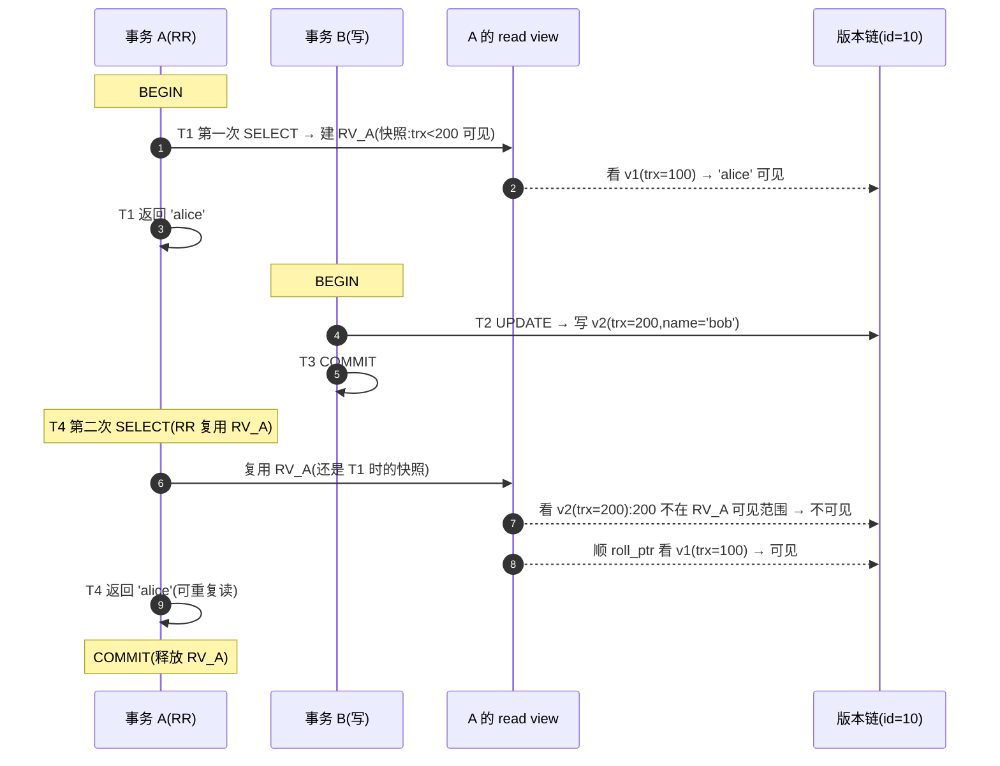
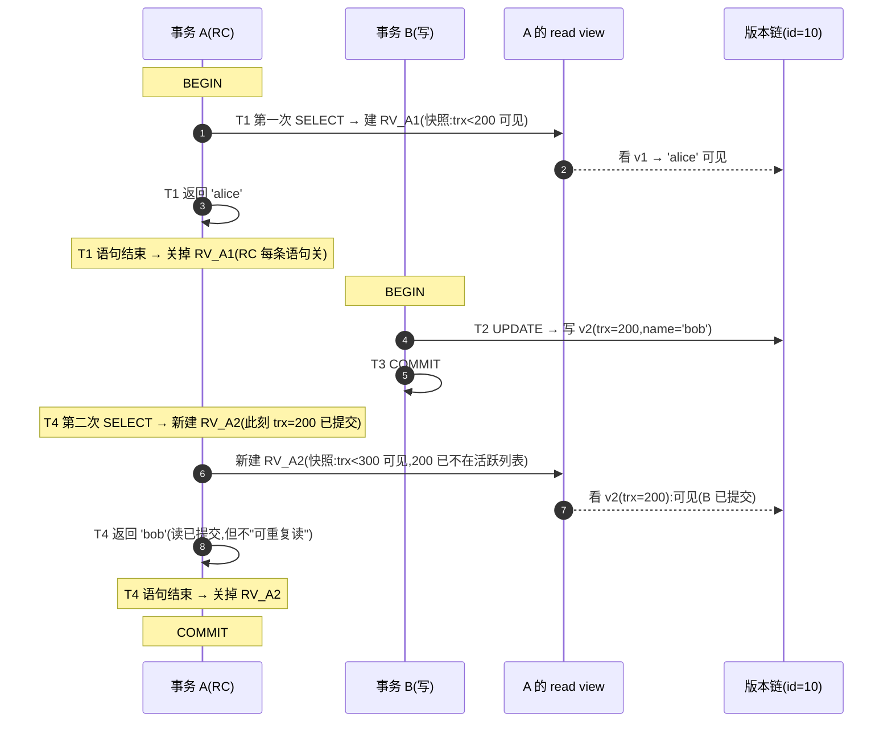

# 第 4 篇 · 第 13 章 · MVCC 全貌:多版本并发控制

> **核心问题**:你背过"InnoDB 默认 RR""MVCC 解决读写冲突",可这三件事能讲清吗——**为什么"读不加锁、读不阻塞写"?一行凭什么能有"多个版本"?RR 和 RC 两个隔离级别,差在"read view 何时建"这一处,这一处又怎么决定了你每次 SELECT 看到的是同一个快照、还是每条语句一个新快照?**这一章把 MVCC 这套机制从动机到 read view 时机一次性钉死,并对照《TiKV》讲清"单机 undo 版本链 MVCC"和"分布式 MVCC"为什么是同一种思想、却长成了两副完全不同的骨架。

> **读完本章你会明白**:
> 1. 为什么"读写互相加锁"会让 OLTP 吞吐塌掉,而 MVCC 用"一行多版本、读写看不同版本"让读彻底不阻塞写。
> 2. 一行怎么有"多个版本"——`DB_TRX_ID` + `DB_ROLL_PTR` 两个隐藏列把"最新版"和"历史版本链"串起来,这条链就是 P3-10 讲的 undo log 的第二个用途。
> 3. **RR 和 RC 两个隔离级别,差别只在"read view 何时建"**:RR 一个事务级 read view、RC 每条快照读新建——这一个时机差异,决定了"可重复读"还是"读已提交"。这是理解四个隔离级别最锋利的钩子。
> 4. InnoDB 单机 undo 版本链 MVCC ↔ TiKV key+timestamp 分布式 MVCC,为什么是"同一种思想、两种长法",各自付出什么代价。

> **如果一读觉得太难**:先只记三件事——① MVCC = 一行多版本,读走历史版本不加锁、写走最新版加锁,读写看不同版本天然不冲突;② read view 是"快照",记录"我开快照这一刻,哪些事务还在跑";③ RR 一个事务一个 read view(整事务看同一快照)、RC 每条语句新建一个 read view(每条 SELECT 看当下最新已提交)。本书主线里这一章服务"事务与并发"那一面,承接《TiKV》分布式 MVCC,接 P3-10 undo 版本链,引出 P4-14 read view 可见性算法。

---

## 〇、一句话点破

> **MVCC 让"读"和"写"看一行里的不同版本——读沿 undo 版本链找到自己 read view 对应的那个历史版本(不加锁),写加锁改最新版——两个操作看的是不同的物理数据,所以天然不冲突。而 RR 和 RC 的全部区别,只在"read view 什么时候建":RR 事务级一个,RC 每条语句一个。**

这是结论,不是理由。本章倒过来拆:先讲"读写都锁同一行"会撞什么墙,再讲 MVCC 怎么用"一行多版本"绕开这堵墙,然后讲版本链和 read view 这两块积木怎么搭,接着把 RR vs RC 的时机差异钉死在源码上,最后对照《TiKV》看"单机版"和"分布式版"的同与异。

---

## 一、为什么"读写都锁同一行"会撞墙

### 不这样会怎样:朴素加锁下的 OLTP 灾难

在 P0-01 我们讲过,OLTP(电商下单、银行转账)是**读多写也多**——一个商品详情页一秒可能被读几万次,同时库存又在被下单请求疯狂地改。如果"读"和"写"同一行,必须**互相加锁等待**(读要等写完、写要等读完),会发生什么?

```
   假设规矩:"读 id=10" 和 "写 id=10" 必须互斥(行锁)
   ─────────────────────────────────────────────
   时刻 T1: 事务 C 拿到 id=10 的 X 锁,开始改(写)
   时刻 T2: 事务 A、B、D、E、F ... 1000 个读请求都要读 id=10
            → 全部阻塞在 X 锁上,排队等 C 写完
   时刻 T3: C 写完释放锁 → 1000 个读请求被唤醒,抢锁
            → 这 1 秒内,读 id=10 的吞吐被这一个写拖到 1
   ─────────────────────────────────────────────
   实际生产:每秒有大量写 + 海量读,如果都互斥,
            读请求被写请求拖死,响应时间从 1ms 涨到 100ms,
            数据库直接被拖垮。
```

这不是理论推演,是真实发生的灾难。早期的数据库(包括 MySQL 早期的 MyISAM)在"读写并发"上吃过这个大亏——MyISAM 用表锁,一个写锁住整张表,所有读全堵,OLTP 场景根本扛不住。MyISAM 被淘汰、InnoDB 上位,根本原因之一就是 **InnoDB 用 MVCC 让"读"绕开了"写"的锁**。

### 一段历史:从"悲观锁"到"MVCC"的范式跃迁

理解 MVCC 的分量,得知道它是怎么演化来的。早期的数据库(1970s 的 System R、早期的 DB2)用**悲观锁(pessimistic locking)**——"读"拿 S 锁(共享锁)、"写"拿 X 锁(排他锁),读写互斥、写写也互斥。这套在低并发场景没问题,但 OLTP 高并发读写一来,锁争用就崩了——一个写堵死一片读。

转折点是 1981 年,IBM 的 **Paul Bernstein** 等人在研究多版本数据库时系统化提出了 MVCC 的思想,后来 Oracle(1980s)第一个把 MVCC 做成产品级的并发控制机制(PostgreSQL 前身 POSTGRES 1985 年也用了)。**MVCC 不再让读写抢同一份数据**——它给每行保留历史版本,让读操作看快照、写操作改最新版,读写看不同物理数据,根本不抢锁。这是数据库并发控制的一次范式跃迁:**从"锁竞争"思维,跳到"快照隔离"思维**。

InnoDB 从一开始(1995 年 Heikki Tuuri 设计)就内置了 MVCC——这跟它诞生于 OLTP 时代、对标 Oracle 的定位一致。今天,**几乎所有现代关系数据库都用 MVCC**:InnoDB、PostgreSQL、Oracle、SQL Server(2015 起加了 read committed snapshot)、CockroachDB、TiKV……MVCC 已经是高并发数据库的"标配",不再是可选项。

### MVCC 不是万灵药:它解决了什么、解决不了什么

MVCC 把"读-写并发"从"锁竞争"里解放出来,但要清楚它的边界:

- **MVCC 能解决的**:**快照读(plain SELECT)和写并发**。一个普通 `SELECT` 走 MVCC,完全不阻塞、也不被写阻塞——这是它最大的价值。
- **MVCC 解决不了的**:**写-写并发**(两个事务同时改同一行)——这个 MVCC 帮不了,必须靠**行锁串行化**(P5-16)。还有**"当前读"(locking read)**——`SELECT ... FOR UPDATE`、`SELECT ... LOCK IN SHARE MODE`、`UPDATE`、`DELETE` 这种"我要看最新版并加锁"的读,不走 MVCC,直接加锁(因为它们要看最新数据,不能看快照)。MVCC 和锁合起来,才是 InnoDB 的"并发控制全套":MVCC 管快照读、锁管写和当前读。

> **钉死这件事**:"读阻塞写、写阻塞读"在 OLTP 高并发读写场景是**致命的**。MVCC 的全部价值,就是**让快照读操作根本不去碰那个"被写锁住的最新版",而是去看一个不需要加锁的历史版本**——读写看不同的物理数据,自然不需要互斥。但 MVCC **只**解决了"快照读"的并发问题,"写-写并发"还得靠锁(下一章 P4-14 讲可见性算法、第 5 篇讲锁)。

---

## 二、MVCC 的核心思想:一行多版本,读写看不同版本

### 提问:怎么让读绕开写的锁?

朴素思路是"读和写看同一份数据,所以必须互斥"。MVCC(Multi-Version Concurrency Control,多版本并发控制)反过来:**让一行同时存在多个版本,读看自己事务开始时的那个"历史版本",写改的是"最新版"——两个版本是不同的物理数据,读根本不去碰写的锁**。

```
   一行 id=10 在不同时刻被改了三次,产生多个版本:

   时刻 T0:  INSERT id=10, name='alice'           (版本 v1, trx_id=100)
   时刻 T1:  UPDATE id=10 SET name='bob'           (版本 v2, trx_id=200)
   时刻 T2:  UPDATE id=10 SET name='carol'         (版本 v3, trx_id=300)
   时刻 T3:  UPDATE id=10 SET name='dave'(进行中)  (版本 v4, trx_id=400, 正在写,加锁)

   一行的版本链(最新版 + 历史版本串成链):
   ┌────────────────┐
   │ v4 name='dave' │ ← 聚簇索引叶子页里的"最新版",写事务 trx=400 正在改它(加 X 锁)
   │ trx_id=400     │
   │ roll_ptr ──────┼─┐
   └────────────────┘ │
       ▲              │
       │              ▼
       │         ┌────────────────┐
       │         │ v3 name='carol'│ ← undo log 里的旧版本(由 undo 记录重建)
       │         │ trx_id=300     │
       │         │ roll_ptr ──────┼─┐
       │         └────────────────┘ │
       │              ▲             │
       │              │             ▼
       │              │        ┌────────────────┐
       │              │        │ v2 name='bob'  │
       │              │        │ trx_id=200     │
       │              │        │ roll_ptr ──────┼─┐
       │              │        └────────────────┘ │
       │              │             ▲             │
       │              │             │             ▼
       │              │             │        ┌────────────────┐
       │              │             │        │ v1 name='alice'│
       │              │             │        │ trx_id=100     │
       │              │             │        │ roll_ptr=NULL  │ (链尾,最初插入)
       │              │             │        └────────────────┘
       │              │             │
   事务 A(read view 早,只认 trx<200)→ 看 v1 'alice'
   事务 B(read view 中,只认 trx<300)→ 看 v2 'bob'
   事务 C(read view 晚,只认 trx<400)→ 看 v3 'carol'
   事务 trx=400(写)→ 锁住 v4 'dave' 改

   读 A/B/C 各自走版本链找到自己可见的版本,不加锁;
   写 trx=400 只锁 v4 最新版,和读互不干扰。
```

关键洞察:**读操作顺着 `roll_ptr` 走版本链,找到一个"对自己可见"的版本就停下来返回——整个过程不拿任何行锁**。写操作锁住的是叶子页里的"最新版",版本链上的历史版本是只读的(在 undo log 里,由 undo log 机制保护)。所以读和写在物理上接触的是不同的数据(读 undo 重建的旧版本、写叶子页里的最新版),天然不需要互斥。

> **所以这样设计**:让一行有多个版本,读走历史版本链(无锁)、写走最新版(加锁)——读写看不同的物理数据,这就是 MVCC 让"读不阻塞写"的根本机制。

---

## 三、版本链的两块积木:`DB_TRX_ID` + `DB_ROLL_PTR`

要把"一行多版本"做出来,InnoDB 需要两个东西:**① 每个版本得标"我是谁改的"(事务 id);② 每个版本得能"找到上一个版本"**。这两件事,InnoDB 给**聚簇索引(主键 B+树)里的每一行**,加了三个隐藏列(只看聚簇索引,二级索引没有这些隐藏列,所以二级索引的 MVCC 要回表,见 P1-03):

```
   聚簇索引叶子页里的一行(隐藏列 + 用户列):
   ┌──────────────────────────────────────────────────────────┐
   │ DB_ROW_ID(6 字节)  │ DB_TRX_ID(6 字节) │ DB_ROLL_PTR(7 字节) │ 用户列... │
   │ (隐式主键才用)     │ 最后一次改我的是谁  │ 指向 undo 里的上一版 │ name=...  │
   └──────────────────────────────────────────────────────────┘
```

这三个隐藏列的大小,在 InnoDB 源码里钉死:

```c
/* storage/innobase/include/data0type.h:177-191 (简化示意,非源码原文) */
constexpr uint32_t DATA_ROW_ID = 0;          // 隐式主键(无主键/唯一索引时才用)
constexpr uint32_t DATA_ROW_ID_LEN = 6;

constexpr size_t DATA_TRX_ID = 1;            // 最后修改本行的事务 id
constexpr size_t DATA_TRX_ID_LEN = 6;        // 固定 6 字节

constexpr size_t DATA_ROLL_PTR = 2;          // 指向 undo log 里上一版本的指针
constexpr size_t DATA_ROLL_PTR_LEN = 7;      // 固定 7 字节
```

三个隐藏列各自的角色:

- **`DB_ROW_ID`(6 字节)**:只有当表**既没主键、又没有非空唯一索引**时,InnoDB 才会自动生成这个隐式主键(否则用主键/唯一索引代替,这一列就不存在)。这是 P1-02 聚簇索引那章的事——InnoDB 是索引组织表,必须有主键来组织 B+树。我们这里不展开。
- **`DB_TRX_ID`(6 字节)**:**最后一次修改(INSERT/UPDATE/DELETE)这一行的事务 id**。这是 MVCC 可见性判断的核心——读操作拿到一个版本的 `DB_TRX_ID`,跟自己的 read view 比,就能判断"这个版本对我可见吗"。
- **`DB_ROLL_PTR`(7 字节)**:**指向 undo log 里"上一版本"的指针**。顺着它,读操作可以从聚簇索引里的最新版,一步步回溯出旧版本(每个 undo 记录里也存了更早版本的 roll_ptr,于是串成一条链)。

> **承接 P3-10**:这条版本链,本质上就是 P3-10 讲的 **undo log**。P3-10 我们讲过 undo 有两个用途:**① 事务回滚**(没提交的事务,照着 undo 改回去),**② MVCC 的旧版本**(让并发读看到历史版本)。本章和 P4-14/P4-15,讲的全是 undo 的**第二个用途**——undo 记录不仅"记着怎么改回去",还"记着上一版本长什么样",两者是同一份数据的两种用法。**一份 undo,两个用途**,这是 InnoDB 设计的经济性。

### `DB_TRX_ID` 和 `DB_ROLL_PTR` 长什么样:拆解 6+7 字节

要把这两个隐藏列吃透,得看它们 6 字节和 7 字节里都编码了什么。

**`DB_TRX_ID`(6 字节,48 位)**:就是"最后改这一行的事务 id"。InnoDB 内部有个全局单调递增的事务 id 计数器(`trx_sys->next_trx_id_or_no`,见 read view 的 `m_low_limit_id` 就是取这个值),每个读写事务开始时分配一个唯一 id。6 字节最大能表示 `2^48 ≈ 2.8 × 10^14`——即便每秒分配 100 万个事务,也要用 9000 年才溢出,所以实际永远跑不满。

**`DB_ROLL_PTR`(7 字节,56 位)**:这是一个**复合指针**,指向 undo log 里"上一版本"的 undo 记录。这 7 字节编码了三个信息:**① undo log 在哪个回滚段(rollback segment)、② 在那个 rseg 的哪个 undo log、③ 在那条 undo log 里的字节偏移**。P3-10 讲过 undo log 存在 undo tablespace 里、按回滚段组织——`DB_ROLL_PTR` 就是这个三层定位的压缩编码。读到这个指针,InnoDB 能直接定位到 undo log 里那条具体的 undo 记录,把它解析出来,重建出"上一版本"。

```
   DB_ROLL_PTR(7 字节,56 位)的内部编码(简化示意,精确位宽见 trx0types.h):
   ┌────────────┬──────────────┬───────────────────────────┐
   │ rseg_id    │ undo_log_no  │ offset within undo log     │
   │ (哪个rseg) │ (rseg里哪条) │ (那条 undo log 里第几个字节)│
   └────────────┴──────────────┴───────────────────────────┘
   → 三层定位,直接找到 undo log 里"上一版本"的 undo 记录
```

这条指针是 MVCC 版本链的"灵魂"——它把"聚簇索引叶子页里的最新版"和"undo log 里的一串历史版本"用 O(1) 的方式连起来。没有它,MVCC 读就得扫整个 undo log 找历史版本,效率塌方;有了它,顺着指针一个个跳,每个跳转就是一次 undo 记录解析。

### 版本链怎么"长"出来:一次 UPDATE 的视角

理解 MVCC,必须先理解"这条版本链是怎么一步步长出来的"。看一次 `UPDATE t SET name='carol' WHERE id=10`(假设 id=10 当前 `name='bob'`,`trx_id=200`):

```
   UPDATE 之前(叶子页里最新版是 v2):
   ┌──────────────────────────────────────────┐
   │ id=10, name='bob', trx_id=200, roll_ptr→ undo(指向 v1) │  ← 最新版 v2
   └──────────────────────────────────────────┘

   事务 trx=300 执行 UPDATE,InnoDB 做两件事(承接 P3-10 undo 流程):

   步骤 1:把"当前最新版 v2 怎么改回去"写进 undo log(这就是一条 undo 记录)
           undo 记录里存:  v2 长什么样(name='bob', trx_id=200) + roll_ptr→ undo(v1)

   步骤 2:在叶子页里"就地"把最新版改成 v3(覆盖 v2):
   ┌──────────────────────────────────────────┐
   │ id=10, name='carol', trx_id=300, roll_ptr→ undo(指向 v2) │  ← 新的最新版 v3
   └──────────────────────────────────────────┘

   于是版本链变成:
   [叶子页:v3 trx=300] --roll_ptr→ [undo:v2 trx=200] --roll_ptr→ [undo:v1 trx=100]
```

注意两个关键点:

1. **最新版永远在聚簇索引叶子页里**(就地更新,B+树特性),历史版本在 **undo log** 里。
2. **每次 UPDATE,版本链"长一头"**——新 undo 记录的 roll_ptr 指向上一个 undo 记录,串成链。最早插入的版本是链尾。

> **钉死这件事**:MVCC 的"多版本"不是凭空存的——最新版在聚簇索引叶子页(B+树就地更新),旧版本串在 undo log 里(由 `DB_ROLL_PTR` 串联)。读操作要找一个历史版本,**顺着叶子页最新版的 `DB_ROLL_PTR` 进 undo log,沿着链一个个看 `DB_TRX_ID`,直到找到一个"对自己 read view 可见"的版本为止**。这条机制,就是 P4-14 可见性算法的核心;本章只讲"链存在、链怎么用",算法细节下一章拆。

---

## 四、read view:事务的"快照"

### 提问:版本链上一堆版本,读操作怎么知道看哪个?

版本链有了,但读操作面对一条链,得回答一个问题:**这条链上哪个版本"对我可见"?** 不能简单地"看最新版"——最新版可能是个还没提交的事务改的(脏数据);也不能"看链尾"——链尾是最早的版本,太老。

MVCC 的解法:给每个事务发一个**read view(读视图)**,可以理解成"这个事务的快照"。read view 记录了**"我开快照这一刻,数据库里有哪些事务还在跑(没提交)"**。拿着这张快照,事务去走版本链时,每个版本上都标了 `DB_TRX_ID`(改它的是哪个事务),拿这个 id 跟 read view 一比,就知道:

- 改这个版本的事务,**在我开快照之前就提交了** → 可见(我能看到一个"已提交"的版本);
- 改这个版本的事务,**在我开快照时还没提交(还在跑)** → 不可见(我不该看到"未提交"的数据,顺着 roll_ptr 找更老的版本);
- 改这个版本的事务,**在我开快照之后才开始的** → 不可见(更老的版本)。

read view 在 InnoDB 源码里是 [`ReadView`](../mysql-server/storage/innobase/include/read0types.h#L48-L297) 这个类,核心是四个字段:

```c
/* storage/innobase/include/read0types.h:266-296 (字段定义,简化) */
class ReadView {
 private:
  trx_id_t m_low_limit_id;    // 高水位:trx_id >= 这个值的版本,一律不可见
  trx_id_t m_up_limit_id;     // 低水位:trx_id < 这个值的版本,一律可见
  trx_id_t m_creator_trx_id;  // 创建这个 read view 的事务自己的 id(看自己的修改)
  ids_t    m_ids;             // 开快照时"还在跑的"读写事务 id 列表(有序)
  trx_id_t m_low_limit_no;    // 给 purge 用(本章不展开,见 P4-15)
  std::atomic_bool m_closed;  // 这个 view 是否已关闭(给 AC-NL-RO 优化用)
  ...
};
```

四个字段各自的来历(`ReadView::prepare()` 里填的,[read0read.cc:446-469](../mysql-server/storage/innobase/read/read0read.cc#L446-L469)):

```c
/* storage/innobase/read/read0read.cc:446-469 ReadView::prepare()(简化示意,非源码原文) */
void ReadView::prepare(trx_id_t id) {
  ut_ad(trx_sys_mutex_own());

  m_creator_trx_id = id;                              // 我自己的 trx id

  m_low_limit_no = trx_get_serialisation_min_trx_no();// 给 purge 用

  m_low_limit_id = trx_sys_get_next_trx_id_or_no();   // 高水位 = 系统"下一个要分配的 trx id"

  if (!trx_sys->rw_trx_ids.empty()) {
    copy_trx_ids(trx_sys->rw_trx_ids);                // 把"当前还在跑的 rw 事务 id"拷进来
  } else {
    m_ids.clear();
  }

  m_up_limit_id = !m_ids.empty() ? m_ids.front() : m_low_limit_id;  // 低水位 = 最小的活跃 trx id
  ...
  m_closed.store(false);
}
```

字段含义拆透(这是 P4-14 可见性算法的输入,本章先建立直觉):

- **`m_creator_trx_id`**:创建这个 read view 的事务自己的 id。一个事务当然能看见自己的修改(我改了 id=10,我立刻能读到)——这个字段就是为这个特例准备的。
- **`m_low_limit_id`(高水位)**:开快照这一刻,系统**下一个要分配的 trx id**(单调递增的计数器)。任何 `DB_TRX_ID >= m_low_limit_id` 的版本,都是"在我开快照之后才开始的事务改的",一律不可见。
- **`m_up_limit_id`(低水位)**:开快照这一刻,**还在跑的事务里最小的那个 trx id**(如果没人在跑,就等于 `m_low_limit_id`)。任何 `DB_TRX_ID < m_up_limit_id` 的版本,都是"在我开快照之前就已提交的事务改的",一律可见。
- **`m_ids`(活跃事务列表)**:开快照这一刻,**所有还在跑(未提交)的读写事务 id**,有序排列。`m_up_limit_id <= id < m_low_limit_id` 区间内的版本,如果在 `m_ids` 里 → 不可见(改它的事务那时还没提交);不在 `m_ids` 里 → 可见(改它的事务那时已提交)。

可见性判断的核心逻辑(就是这几行的组合,P4-14 拆透):

```c
/* storage/innobase/include/read0types.h:163-183 ReadView::changes_visible()(简化示意) */
bool changes_visible(trx_id_t id, const table_name_t &name) const {
  if (id < m_up_limit_id || id == m_creator_trx_id) {
    return true;                              // 比低水位还小,或是我自己改的 → 可见
  }
  if (id >= m_low_limit_id) {
    return false;                             // 达到或超过高水位 → 不可见
  } else if (m_ids.empty()) {
    return true;                              // 高低水位之间但无活跃事务 → 可见
  }
  return !std::binary_search(p, p + m_ids.size(), id);  // 在活跃列表里 → 不可见
}
```

本章不展开算法的边界 case(P4-14 拆透),只要建立这个直觉:**read view 是"开快照那一刻,数据库活跃事务的名单",拿着名单就能判断每个版本可见与否**。

> **所以这样设计**:read view 把"快照"这个抽象概念,落成"四个数字 + 一个有序列表"。版本链上每个版本都有 `DB_TRX_ID`,read view 也有"哪些事务在跑"的名单——拿 id 比名单,O(log n) 二分查找就能判断可见性。这是 MVCC 把"无锁快照读"做到极致高效的关键。

---

## 五、RR vs RC:差在 read view 何时建(本章灵魂)

### 提问:RR(可重复读)和 RC(读已提交),到底差在哪?

这是数据库面试的经典题,标准答案通常是"RR 解决可重复读和幻读,RC 不能"。但这个答案没戳到根上——**RR 和 RC 在 InnoDB 里的实现差别,就一行:read view 何时建**。

- **RR(REPEATABLE_READ,可重复读,InnoDB 默认)**:事务**第一次快照读时建一个 read view,之后整个事务复用这一个**——所以整个事务里所有快照读都看同一个快照,当然"可重复读"。
- **RC(READ_COMMITTED,读已提交)**:事务里**每条快照读语句都新建一个 read view**——所以每条 SELECT 看到的是"当时最新的已提交数据",自然"读已提交"但不"可重复读"。

这一个时机差异,就解释了两个隔离级别的全部行为差异(除了间隙锁——RC 不加间隙锁、RR 加,见 P5-17/P5-19)。下面用一个具体场景拆透。

### 一个场景:RR vs RC 看到的东西不同

```
   初始:id=10, name='alice'(已提交,trx_id=100)

   时间轴:
   T0:  事务 A(BEGIN)         -- A 开始
   T1:  事务 A: SELECT name FROM t WHERE id=10   → 'alice'
   T2:  事务 B(BEGIN, UPDATE): UPDATE t SET name='bob' WHERE id=10
   T3:  事务 B: COMMIT          -- B 提交了,name='bob' 落库
   T4:  事务 A: SELECT name FROM t WHERE id=10   → ?
   T5:  事务 A: COMMIT

   关键问题:T4 这条 SELECT,A 看到的是 'alice' 还是 'bob'?

   ── RR(默认)──
   T1 第一次快照读 → 建 read view(RV_A),此时只有 trx=100 提交,B 还没开始
   T4 第二次快照读 → 复用 RV_A(同一个 read view)
   用 RV_A 看 v2(trx=200,B 改的):B 不在 RV_A 的"已提交"范围(B 那时还没开始)
                    → 不可见,顺 roll_ptr 找 v1(trx=100)
                    → v1 可见,返回 'alice'
   结果:T4 看到 'alice' —— "可重复读"(两次读结果一致)

   ── RC ──
   T1 快照读 → 建 read view(RV_A1),返回 'alice'
   T4 快照读 → 新建 read view(RV_A2),此刻 B(trx=200) 已提交
   用 RV_A2 看 v2(trx=200):B 已提交,在 RV_A2 的"已提交"范围
                    → 可见,返回 'bob'
   结果:T4 看到 'bob' —— "读已提交"(能读到新提交的)但不"可重复读"
```

同一个时间轴、同样的 SQL,RR 和 RC 在 T4 看到不同的结果——**唯一的差别,就是 T4 那条 SELECT 用的是 T1 时的 read view(RR),还是新建了一个 read view(RC)**。这一个差别,决定了两个隔离级别的语义。

### 源码佐证:RR 复用,RC 每条语句关了重建

这个"时机差异"在 InnoDB 源码里是怎么落地的?核心是**两个函数**:

**① `trx_assign_read_view()`——读操作拿 read view 的入口**

```c
/* storage/innobase/trx/trx0trx.cc:2287-2305(源码原文) */
/** Assigns a read view for a consistent read query. All the consistent reads
 within the same transaction will get the same read view, which is created
 when this function is first called for a new started transaction.
 @return consistent read view */
ReadView *trx_assign_read_view(trx_t *trx) /*!< in/out: active transaction */
{
  ut_ad(trx_can_be_handled_by_current_thread_or_is_hp_victim(trx));
  ut_ad(trx->state.load(std::memory_order_relaxed) == TRX_STATE_ACTIVE);

  if (srv_read_only_mode) {
    ut_ad(trx->read_view == nullptr);
    return (nullptr);

  } else if (!MVCC::is_view_active(trx->read_view)) {   // 只有"当前没有活动的 view"时
    trx_sys->mvcc->view_open(trx->read_view, trx);      // 才新建一个
  }

  return (trx->read_view);                               // 否则复用已有的
}
```

注意函数头注释的那句:**"All the consistent reads within the same transaction will get the same read view, which is created when this function is first called for a new started transaction"**——这就是 RR 的行为:**事务里第一次调用建,之后复用,直到事务结束**。`trx_assign_read_view` 这个函数本身**不区分隔离级别**——它对 RR 和 RC 都一样"没有活动的 view 才新建"。那 RC"每条语句一个新 read view"是怎么做到的?靠**第二个机制**。

**② RC 在每条语句结束时"关掉" read view**

RC 的每条快照读语句结束时,handler 层(`ha_innodb.cc`)会**主动把当前 read view 关掉**,这样下一条快照读调 `trx_assign_read_view` 时,发现"没有活动的 view",就会新建——这就实现了"每条语句一个新快照"。

```c
/* storage/innobase/handler/ha_innodb.cc:19156-19163(源码原文,external_lock 末尾) */
} else if (trx->isolation_level <= TRX_ISO_READ_COMMITTED &&
           MVCC::is_view_active(trx->read_view)) {
  mutex_enter(&trx_sys->mutex);

  trx_sys->mvcc->view_close(trx->read_view, true);    // RC:语句结束关掉 view

  mutex_exit(&trx_sys->mutex);
}
```

`ha_innodb.cc` 里还有一处几乎一样的逻辑([ha_innodb.cc:19749-19758](../mysql-server/storage/innobase/handler/ha_innodb.cc#L19749-L19758),在 `store_lock` 里),源码注释直接写明了这个动机:

```c
/* storage/innobase/handler/ha_innodb.cc:19749-19758(源码原文,store_lock 里) */
if (trx->isolation_level <= TRX_ISO_READ_COMMITTED &&
    MVCC::is_view_active(trx->read_view)) {
  /* At low transaction isolation levels we let
  each consistent read set its own snapshot */      // ← 注释明说:RC 让每条快照读自己开快照

  mutex_enter(&trx_sys->mutex);

  trx_sys->mvcc->view_close(trx->read_view, true);

  mutex_exit(&trx_sys->mutex);
}
```

> **钉死这件事**:RR vs RC 在 read view 时机上的差异,**不是 `trx_assign_read_view` 分叉,而是 RC 在每条语句末尾"关掉"view**。RR 不关(整个事务复用)、RC 每条语句结束关一次。这一个动作,让 RC 的下一条快照读不得不重建 view,从而看到"当下最新已提交"。理解了这一点,你才算真正理解了 InnoDB 的隔离级别——它不是"两套完全不同的代码",而是"同一套 MVCC 框架,只调一处时机"。

### 为什么 RR 是 InnoDB 的默认(而不是 RC)

很多人困惑:SQL 标准定义的四个隔离级别里,RR 严格说**不保证**解决"幻读"(SQL 标准里 RR 只防"不可重复读",幻读是更高一级 Serializable 才防)。但 InnoDB 把默认设成 RR,而且**它的 RR 还额外用间隙锁防了幻读**(P5-17),严格说比 SQL 标准的 RR 更强。为什么这么选?

InnoDB 的考虑是工程实用:

- **复制兼容性**:MySQL 早期基于 statement 的 binlog 复制,要求"主库和从库执行同样 SQL 得到同样结果"。RC 下事务里多条语句的可见性会变(每条 SELECT 看到的快照不同),可能导致主从执行结果不一致;RR 下事务用一个快照,statement 复制更安全。所以早期 MySQL 把默认设 RR,**为了 statement-based replication 的正确性**。
- **OLTP 业务直觉**:业务开发常把"一个事务"想成一个原子的操作单元——"我这次事务里看到的数据应该是稳定的"。RR 的"整事务一个快照"更符合这个直觉,RC 的"每条语句看当下"反而容易让人困惑(为什么同事务里两次 SELECT 结果不一样?)。

但行业趋势有意思:**很多大型互联网公司(包括阿里、Google、Facebook)在内部 MySQL 里把默认改成 RC**。理由是:

- RC 不加间隙锁,**写并发更高**(间隙锁是 RR 写吞吐的主要拖累);
- 现代 row-based replication 已经不依赖"事务内一致性快照",RC 也能正确复制;
- RC 下死锁更少(不加间隙锁,锁的范围小)。

所以"RR 还是 RC 更好"没有绝对答案——InnoDB 默认 RR 是历史 + 工程稳妥的折中,大型生产环境按需切 RC 也是合理选择。这个选择背后就是本章讲的"read view 时机"那一处差异 + 第 5 篇要讲的"间隙锁"那一处差异。

### 朴素直觉陷阱:"RR 一定比 RC 慢"是错的

一个常见的误解:"RR 一个事务一个 read view,RC 每条语句建一个,那 RR 不是更省(建的 view 少)?"——这其实不算错,但反过来"RC 比 RR 快"的直觉也不全对。真实的开销对比要分两面:

- **read view 建设开销**:RR 一个事务建一次(省)、RC 每条语句建一次(费)。这点 RR 确实省。
- **锁开销**:这是大头。RR 加间隙锁(锁的范围大、锁的久),RC 不加间隙锁(锁的范围小、释放早)。在写密集场景,**RC 的锁开销远小于 RR**,这是大型业务切 RC 的主因。

所以"哪个快"取决于读写比例和并发模式——读多写少且对快照一致性敏感的场景,RR 的 view 复用优势明显;写多且要高并发的场景,RC 的间隙锁省略优势更大。这也是为什么 InnoDB 把它做成可配置(`SET TRANSACTION ISOLATION LEVEL ...`),让业务按需选。

### 时序图:RR vs RC 的 read view 生命周期





> **承接 P5-19 隔离级别**:RR 和 RC 还有一个差别——**间隙锁**:RR 加间隙锁(解决幻读)、RC 不加。但那个差别和 read view 时机是**两件事**——read view 时机管"快照读看哪个版本",间隙锁管"当前读/写怎么防别的事务插进来"。本章只讲 read view 这一面,间隙锁留给 P5-17/P5-19 拆透。四个隔离级别(RU/RC/RR/Serializable)在 P5-19 统一对照。

---

## 六、技巧精解:两个最硬核的设计

本章最硬核的两个技巧,单独拆透。在拆技巧之前,先把一个容易混淆的概念钉死——**快照读 vs 当前读**,因为本章讲的 MVCC 只管"快照读",而"当前读"走的是另一条完全不同的路。

### 先钉死:快照读 vs 当前读,两条不同的读路径

InnoDB 里的"读"分两种,走得是两条完全不同的路,这是 MVCC 章最容易混淆的点:

| 读类型 | 触发场景 | 走不走 MVCC | 加不加锁 |
|--------|----------|-------------|----------|
| **快照读(snapshot read)** | 普通 `SELECT` | **走 MVCC**(看 read view 对应的历史版本) | **不加锁**(无锁读 undo 旧版本) |
| **当前读(current read / locking read)** | `SELECT ... FOR UPDATE`、`SELECT ... LOCK IN SHARE MODE`、`UPDATE`、`DELETE`、`INSERT` | **不走 MVCC**(直接读最新版) | **加锁**(X 锁或 S 锁,RR 下加 next-key 锁) |

```
   普通 SELECT(快照读)              UPDATE / SELECT FOR UPDATE(当前读)
   ─────────────────────             ─────────────────────────────────
   走 MVCC:                          不走 MVCC,直接读最新版:
   1. 拿 read view                    1. 加锁(X 锁 / next-key 锁)
   2. 找最新版                        2. 读叶子页里的最新版
   3. 比 trx_id 不可见?              3. 操作(改/删/锁定)
      → 顺 roll_ptr 找旧版本         4. 释放锁(commit 时,两阶段锁协议)
   4. 返回可见版本
   全程不加锁                         走锁协议(可能阻塞、可能死锁)
```

为什么要有这两条路?因为业务需求不同:

- **快照读**适合"统计、展示、查询"——这些场景**能容忍看到稍早的数据**(一致性快照),换来的是**完全不阻塞、不被写阻塞**。电商详情页、报表查询,走快照读。
- **当前读**适合"要先看准再改"的场景——`UPDATE balance SET balance = balance - 100 WHERE id = 10` 这里 `balance = balance - 100` 必须**读到当下最新的余额**(不能看快照,否则基于旧值算就错了),而且**必须加锁防止别的事务同时改**。这就是当前读。

`SELECT ... FOR UPDATE` 显式要求"锁定这行给我用",也是当前读。注意一个微妙点:**`UPDATE`/`DELETE` 内部隐含一次"当前读"**——它要先读到最新行才能改,这一步走的是加锁的当前读,不是 MVCC 快照读。很多新手以为"MVCC 让所有读都不加锁",这是错的——MVCC 只让**快照读**不加锁,**写操作里的读是当前读,该加锁还是加锁**。这个区分清楚了,你才能理解 P5 篇为什么要单独讲锁——MVCC 管不了当前读和写-写并发。

> **钉死这件事**:**MVCC 只让"快照读"无锁,当前读和写都走锁**。所以 InnoDB 的并发控制是"MVCC(管快照读)+ 锁(管当前读和写-写)"两套机制合起来。本章讲 MVCC,第 5 篇讲锁,两套合起来才是完整答案。

---

本章最硬核的两个技巧,单独拆透。

### 技巧一:多版本让读写看不同物理数据,彻底解耦读写并发

**这个技巧解决什么问题**:让"读"完全不被"写"阻塞——这是 OLTP 高并发读写场景的命脉。

**朴素方案为什么不灵**:如果"读"和"写"必须锁同一行(读 S 锁 / 写 X 锁互斥),那一个写事务持有 X 锁的期间,所有读请求都得排队。OLTP 场景写多读也多,一个写能堵住几百上千个读,吞吐塌方。

**MVCC 的巧妙手段**:**让读写看不同的物理数据**。写锁住聚簇索引叶子页里的"最新版",读沿 `DB_ROLL_PTR` 走 undo log 里的"历史版本"——两者物理上是不同的字节(一个在 B+树叶子页、一个在 undo 段),读根本不需要去碰写的锁。版本链是这个机制的载体:每次写都把"上一版"挪进 undo,叶子页只留最新版——于是历史版本永远只读、不需要加锁。

**源码佐证**:在 `row0sel.cc` 的快照读路径里,读操作遇到一个"对自己 read view 不可见"的版本,就调 [`row_vers_build_for_consistent_read()`](../mysql-server/storage/innobase/row/row0vers.cc#L1249-L1342) 沿 undo 链往前找:

```c
/* storage/innobase/row/row0vers.cc:1249-1342 row_vers_build_for_consistent_read()(简化示意) */
dberr_t row_vers_build_for_consistent_read(rec, mtr, index, offsets, view, ..., old_vers, ...) {
  trx_id = row_get_rec_trx_id(rec, index, *offsets);   // 拿最新版的 trx_id
  ut_ad(!view->changes_visible(trx_id, ...));           // 调用方已确认这版不可见

  version = rec;                                        // 从最新版开始
  for (;;) {                                            // 沿 roll_ptr 走链
    trx_undo_prev_version_build(..., version, ..., &prev_version, ...);  // 重建上一版

    if (prev_version == nullptr) {                      // 链尾了(最初插入的版本之后)
      *old_vers = nullptr;                              // 这行对我不可见(刚插入的)
      break;
    }

    trx_id = row_get_rec_trx_id(prev_version, index, *offsets);  // 上一版的 trx_id
    if (view->changes_visible(trx_id, ...)) {           // 这版对我可见?
      *old_vers = prev_version;                         // 找到了,返回这版
      break;
    }
    version = prev_version;                             // 还不可见,继续往前找
  }
  ...
}
```

注意这条 for 循环的精髓:**它顺着 undo 链一个个找,直到遇到一个可见版本为止——全程不拿任何行锁**。叶子页里的最新版可能正被某个写事务锁着(它有 X 锁),但读操作根本不去碰最新版,直接顺着 `roll_ptr` 跳到 undo log 里,在 undo log 里找可见的旧版本。这就是 MVCC 让"读不阻塞写"的实现根。

**反面对比**:如果不用 MVCC(回到朴素加锁),`SELECT` 一行就得拿 S 锁、`UPDATE` 一行得拿 X 锁,读写互斥——一个写堵死一堆读。MVCC 把"读"从"锁"里彻底解放出来,代价是**每个事务得多存几个历史版本**(undo log 占空间、purge 后台清理),但换来的"读写互不阻塞"对 OLTP 是无价的。

> **不这样会怎样**:朴素的"读写都锁同一行"在 OLTP 高并发场景下吞吐会塌方——一个慢写能堵死成百上千个快读。MVCC 用"读写看不同版本"把读写彻底解耦,这是 InnoDB(以及 PostgreSQL、Oracle、TiKV 等几乎所有现代数据库)选择 MVCC 的根本原因。

### 技巧二:read view 的复用优化——AC-NL-RO 不重建 view

**这个技巧解决什么问题**:`view_open` 每次新建一个 ReadView 要拷贝活跃事务列表、要操作全局 `trx_sys->mutex`,是热路径。InnoDB 在 `view_open` 里做了一层**"能复用就复用"的优化**,避免无谓的重建。

**巧妙手段**:`MVCC::view_open()` 开头有一段"如果当前 view 还能代表最新状态,就不重建"的快路径。核心思路:**如果一个事务是"自动提交的非锁定只读事务"(AC-NL-RO,Autocommit Non-Locking Read-Only),并且上次建的 view 还没过时(系统没有新事务产生),就直接复用上次的 view**——避免重新拷一遍活跃事务列表。

```c
/* storage/innobase/read/read0read.cc:499-637 MVCC::view_open()(节选,简化示意) */
void MVCC::view_open(ReadView *&view, trx_t *trx) {
  /** If no new RW transaction has been started since the last view
  was created then reuse the existing view. */
  if (view != nullptr) {
    ...
    if (trx_is_autocommit_non_locking(trx) && view->empty()) {
      view->m_closed.store(false);
      if (view->m_low_limit_id == trx_sys_get_next_trx_id_or_no()) {
        return;                                  // 快路径:系统没新事务,直接复用
      } else {
        view->m_closed.store(true);
      }
    }
  }
  // 慢路径:持有 trx_sys->mutex,重新 prepare 一个 view
  trx_sys_mutex_enter();
  if (view != nullptr) {
    UT_LIST_REMOVE(m_views, view);
  } else {
    view = get_view();
  }
  if (view != nullptr) {
    view->prepare(trx->id);                      // 真正填四个字段
    UT_LIST_ADD_FIRST(m_views, view);
    ...
  }
  trx_sys_mutex_exit();
}
```

注意那条**快路径**:对 AC-NL-RO 事务(最常见的"短只读 SELECT"),如果系统从上次到现在没有新事务产生(`m_low_limit_id == trx_sys_get_next_trx_id_or_no()`),直接把 view 标记为"重新打开"返回,**完全绕开 `trx_sys->mutex`**——这一招对短查询高并发的场景省下了大量全局锁争用。

源码里这段的注释极长(从 510 行到 604 行),证明了一个**正确性难题**:这个"复用"优化看似简单,但 purge 线程可能正在用 view 决定"哪些 undo 可以清理",如果复用错了,可能让 purge 把还在用的 undo 清掉导致崩溃。注释用 happens-before / S-order 这些内存模型术语证明了这个优化是 sound 的——核心是 purge 协调器拒绝降级到 `m_low_limit_no` 更小的 view,于是复用不会破坏 purge 的不变量。这种"用形式化推理证明一个性能优化 sound"的做法,是 InnoDB 源码里"硬核"的典型体现(读这段需要内存模型基础,本书不展开,标个点留给读者日后细品)。

### 技巧三:ReadView 对象池 + view_list 全局有序

除了上面那个"快路径复用",InnoDB 在 ReadView 的生命周期管理上还有一个容易被忽略的精妙设计——**ReadView 对象池 + 全局有序的 view_list**。

先看对象池。如果每次 `view_open` 都 `new ReadView`、`view_close` 都 `delete`,在高并发短事务场景下,频繁分配回收是性能负担。InnoDB 的 [`MVCC` 类](../mysql-server/storage/innobase/include/read0read.h#L50-L130) 维护了两条链表:**`m_free`(空闲 view 池)和 `m_views`(活跃 view 列表)**:

```c
/* storage/innobase/read/read0read.cc:476-493 MVCC::get_view()(简化示意) */
ReadView *MVCC::get_view() {
  ut_ad(trx_sys_mutex_own());
  ReadView *view;
  if (UT_LIST_GET_LEN(m_free) > 0) {
    view = UT_LIST_GET_FIRST(m_free);          // 先从空闲池拿
    UT_LIST_REMOVE(m_free, view);
  } else {
    view = ut::new_withkey<ReadView>(...);     // 池空才 new
    if (view == nullptr) {
      ib::error(ER_IB_MSG_918) << "Failed to allocate MVCC view";
    }
  }
  return view;
}
```

`view_close` 时([read0read.cc:746-774](../mysql-server/storage/innobase/read/read0read.cc#L746-L774))不是 delete,而是把 view 从 `m_views` 摘下来、挂回 `m_free` 池——下次 `view_open` 直接复用,零分配。这是经典的**对象池模式**,在 MySQL 的并发模型下省下大量内存分配开销。

再看 view_list 的全局有序。活跃 view 列表 `m_views` **按 `m_low_limit_no` 降序排列**(最新的 view 在前,最老的在后)。这个有序性不是装饰——它让 purge 能 O(1) 找到"最老的活跃 view"(链表尾),从而判断"哪些 undo 可以安全清理"。源码里 [`MVCC::clone_oldest_view()`](../mysql-server/storage/innobase/read/read0read.cc#L685-L720) 就是 purge 线程用来克隆最老 view 的入口——它从链表尾取最老的 view,克隆给 purge 当判据。

```c
/* storage/innobase/read/read0read.cc:685-720 MVCC::clone_oldest_view()(简化示意) */
void MVCC::clone_oldest_view(ReadView *view) {
  trx_sys_mutex_enter();
  ReadView *oldest_view;
  // 从链表尾(最老的)往前找第一个未关闭的 view
  for (oldest_view = UT_LIST_GET_LAST(m_views); oldest_view != nullptr;
       oldest_view = UT_LIST_GET_PREV(m_view_list, oldest_view)) {
    if (!oldest_view->is_closed()) {
      ...
      break;
    }
  }
  if (oldest_view == nullptr) {
    view->prepare(0);                 // 没有活跃 view,克隆一个"当前状态"
    trx_sys_mutex_exit();
  } else {
    view->copy_prepare(*oldest_view); // 把最老 view 的四个字段拷过来
    trx_sys_mutex_exit();
    view->copy_complete();
  }
}
```

这个设计的精妙处:**view_list 的全局有序 + 对象池 + 复用快路径**,三件套合起来,让 InnoDB 的 MVCC 在"每秒几万次快照读"的高并发下,view 的创建/销毁/查找都极快。这是 MVCC 性能能撑住 OLTP 的工程细节,读源码时容易扫过去,但它才是"InnoDB MVCC 高性能"的真正底座。

> **不这样会怎样**:如果每次 view_open 都 new、view_close 都 delete,在高并发短事务场景下,内存分配开销会主导(MVCC 的 view 操作频率远高于事务提交);如果 view_list 不有序,purge 每次要扫整个链表找最老 view,在几百个并发事务下也是负担。这套"对象池 + 有序链表"是 InnoDB 把 MVCC 工程化到极致的体现。

> **不这样会怎样**:如果每次快照读都无脑新建 view(拷活跃事务列表 + 抢全局 mutex),在高并发只读场景下,`trx_sys->mutex` 会成为严重瓶颈(所有事务抢一把全局锁)。这个复用优化让绝大多数短只读事务绕开全局锁,把 MVCC 的开销降到最低。

---

## 七、对照《TiKV》:单机 undo 版本链 vs 分布式 key+timestamp

> **承接《TiKV》分布式 MVCC**。这一节只做对照,不重讲 TiKV。

MVCC 不是 InnoDB 独有——《TiKV》那本讲的分布式事务,核心也是 MVCC(用 timestamp 给每个 key 打版本)。但 InnoDB 和 TiKV 的 MVCC 实现差异巨大——**同一个思想,长成了两副完全不同的骨架**,因为一个面对单机、一个面对跨 Region 分布式。这一节对照讲清,把两本书串起来。

### 同一个思想:多版本让读写不冲突

两边都是 MVCC,核心思想完全一样:**让一行(一个 key)有多个版本,读看自己快照对应的版本、写改最新版,读写不互斥**。这个思想在数据库领域是普适的(PostgreSQL、Oracle、SQL Server、TiKV、InnoDB 全都用 MVCC),因为"读写并发"是所有数据库都要解决的根本问题——MVCC 是目前公认最优的答案。

### 三种"读异常":MVCC 是怎么天然防住的

理解 MVCC 的价值,还得看它防住了哪些"读异常"。SQL 标准定义了三种经典的读异常,这些异常在朴素"读写互斥"模型里要么靠强锁防、要么防不住:

1. **脏读(dirty read)**:事务 A 读到了事务 B **还没提交**的修改。这是最严重的——B 万一回滚,A 读到的就是"从没存在过的数据"。SQL 标准里只有 Read Uncommitted 这个最低级别允许脏读。
2. **不可重复读(non-repeatable read)**:事务 A 里两次读同一行,结果**不一样**(因为中间事务 B 改了并提交了)。Read Committed 允许这个,Repeatable Read 防住。
3. **幻读(phantom read)**:事务 A 里两次执行同样的范围查询,第二次**多出来行**(因为中间事务 B 在范围内插了新行并提交)。Repeatable Read 严格说不防幻读(SQL 标准),但 InnoDB 的 RR **额外用间隙锁防住**了(P5-17)。

MVCC 怎么天然防住前两个?靠 read view:

- **防脏读**:read view 记录了"开快照时哪些事务还在跑"。改这一行的事务如果那时还没提交(在 m_ids 活跃列表里),它的版本对 read view **不可见**——读操作会顺着版本链找更老的、已提交的版本。所以**未提交事务的修改,MVCC 读根本看不到**——脏读天然防住。
- **防不可重复读**:RR 下事务整段用一个 read view,两次读同一行用的是同一个快照,看到的当然是同一个版本——不可重复读防住。RC 下每条语句新建 view,所以**故意**允许不可重复读(每次读看到最新已提交)。

注意"防幻读"不是 MVCC 单独能做到的——MVCC 让"已存在的行"的多次读结果一致,但"新插入的行"不在版本链上(它是全新的),光靠 read view 看不到。InnoDB 的 RR 靠**间隙锁**锁住"不存在的间隙",让别的事务插不进来,才防住幻读。这是 MVCC + 锁配合的典型场景,也是为什么 P5 篇要单开一章讲间隙锁。

### 两副骨架:undo 版本链 vs key+timestamp

| 维度 | **InnoDB(单机)** | **TiKV(分布式)** |
|------|------------------|-------------------|
| 版本怎么标 | `DB_TRX_ID`(递增的事务 id,6 字节) | `timestamp`(TSO 发的全局时间戳,PD 分配) |
| 历史版本存哪 | **undo log 里**(就地更新的 B+树,旧版本挪进 undo) | **直接存在 RocksDB**(每个版本是一个独立 key,key 里编码 timestamp) |
| 版本怎么串 | `DB_ROLL_PTR` 指向 undo 里的上一版(链表) | RocksDB 按 key 排序,同一逻辑 key 的多版本天然相邻 |
| 读怎么找版本 | 顺着 roll_ptr 走 undo 链,直到可见 | RocksDB 里用 `scan key_ts < read_ts` 找最大的可见 ts |
| 快照怎么定 | read view(活跃事务列表) | `read_ts`(从 PD 拿一个全局时间戳) |
| 快照何时建 | RR 一个事务一个、RC 每条语句一个 | 每个事务开始时从 PD 拿一个 start_ts |
| 旧版本怎么清 | **purge** 后台线程,看最老的活跃 read view(承 P4-15) | **GC** 后台清理,看 `safe_point`(承《TiKV》GC 章) |
| 写怎么并发 | 单机行锁 + 间隙锁(P5-16/P5-17) | Percolator 两阶段锁(承《TiKV》事务章) |

```
   InnoDB(就地更新 + undo 版本链):           TiKV(append-only key+timestamp):

   聚簇索引叶子页:                              RocksDB(按 key 序):
   ┌─────────────┐                              key@ts5 ─→ v5  ← 最新版
   │ v4(最新)    │ ← 就地覆盖                    key@ts3 ─→ v3
   └──┬──────────┘                              key@ts1 ─→ v1
      │ roll_ptr                                  (多版本天然按 ts 倒排,
      ▼                                            scan 时拿最大的 < read_ts)
   undo log:
   ┌─────────────┐
   │ v3          │
   └──┬──────────┘
      │ roll_ptr
      ▼
   ┌─────────────┐
   │ v1          │
   └─────────────┘
   (旧版本挪进 undo,串成链)
```

### 为什么长成了两副骨架:单机 vs 分布式的约束

两边的设计差异,根源是**单机和分布式的约束不同**:

- **InnoDB 是单机**:**共享内存 + 共享磁盘**,事务可以靠"全局的事务 id 计数器 + 单机行锁"协调;B+树就地更新对单机随机写友好;undo 版本链让旧版本"挂在"最新版旁边,读时现算现找,空间省。所以 InnoDB 选了"就地更新 + undo 链 + read view 名单"这条路。
- **TiKV 是分布式跨 Region**:数据分布在多个节点,**没有真正的全局事务 id 计数器**(只能靠 PD 的 TSO 近似全局时间);节点间不能共享内存、跨网络协调代价高;就地更新跨节点同步极难(要协调多个 Region)。所以 TiKV 选了"key+timestamp append-only + TSO 全局时间戳 + Percolator 两阶段锁"这条路——**用空间换简单性**(每个版本都是一个独立 key,空间占用更大,但分布式协调简单)。

这两个选择的代价:

- **InnoDB 的代价**:undo 链可能很长(读一个被反复改的行,可能要走十几个 undo 节点才找到可见版本);purge 逻辑复杂(要看所有活跃 read view);就地写在 B+树上要做"页分裂/合并"等复杂操作。但单机下这些都可控。
- **TiKV 的代价**:空间放大严重(每次写都生成新 key,旧版本要 GC);依赖 TSO(PD 是单点,故障影响全局事务);跨 Region 事务要 Percolator 协调,延迟高。但分布式扩展性强。

> **钉死这件事**:InnoDB 和 TiKV 的 MVCC 是"同一种思想、两种长法"——单机用 undo 版本链(就地更新 + roll_ptr 串链 + read view 名单),分布式用 key+timestamp(append-only + TSO + Percolator)。**这正好对应主线里的"单机 MVCC + 锁 vs 分布式 MVCC + Percolator"这一重承接**。读这两本书时,把它们的 MVCC 对照看,你会对"MVCC 这个思想的本质"有更深的理解——本质就是"多版本让读写解耦",实现因约束而异。

---

## 八、章末小结

### 回扣主线

本章是第 4 篇(MVCC)的开篇,服务二分法的**事务与并发**那一面。具体说,它承接了 P3-10(undo log 的第二个用途——MVCC 版本链),把"读不阻塞写"这套机制的全貌钉死:一行多版本(版本链)、read view(快照)、RR vs RC 的时机差异。MVCC 和 P5 篇的锁合在一起,就是 InnoDB 的"并发控制"全套——MVCC 管读写并发(读不阻塞写)、锁管写写并发(写串行化)。

主线回扣:**一条写,InnoDB 用四个保证让它"既不丢又高并发"——B+树聚簇索引找到位置、redo(WAL)保 crash 不丢、undo(MVCC)保并发读、锁保隔离。** 本章讲的是第三个保证(MVCC 保并发读)的实现根:让读走 undo 版本链上的历史版本(不加锁),写走最新版(加锁),读写看不同版本天然不冲突。

### 五个为什么

1. **为什么 MVCC 能让读不阻塞写?**——一行多版本,读沿 `DB_ROLL_PTR` 走 undo 链找自己 read view 对应的历史版本(全程不加锁),写只锁聚簇索引叶子页里的最新版——读写看的是不同的物理数据,自然不互斥。
2. **为什么一行有多个版本?**——每次 UPDATE,InnoDB 把"上一版"挪进 undo log(由 `DB_ROLL_PTR` 串成链),叶子页只留最新版(就地更新)。最新版在叶子页、历史版本在 undo log,这就是"多版本"的物理形态。
3. **为什么 read view 能判断版本可见性?**——read view 记录了"开快照时哪些事务还在跑"(活跃列表)+ 高低水位,版本上有 `DB_TRX_ID`(谁改的),拿 id 比名单就能判断(已提交的可见、未提交的或之后的不可见)。
4. **为什么 RR 和 RC 差在 read view 时机?**——RR 一个事务一个 read view(第一次快照读时建、复用到事务结束),所以"可重复读";RC 每条快照读语句结束就关掉 view、下一条重建,所以"读已提交"但不"可重复读"。这一个时机差异,决定了两个隔离级别的核心行为。
5. **为什么 InnoDB 用 undo 版本链、TiKV 用 key+timestamp?**——单机(InnoDB)用就地更新 + undo 链(空间省、读时现算);分布式(TiKV)用 append-only key+timestamp(协调简单,但空间放大)。同一个 MVCC 思想,因单机 vs 分布式约束不同长成两副骨架。

### 想继续深入往哪钻

- **可见性算法细节**:本章只建立了"read view 是名单、版本链上拿 id 比名单"的直觉,没拆 `changes_visible()` 的边界 case(高低水位之间、空活跃列表、自己改的、刚插入的)。下一章 P4-14 把这套算法拆到源码层。
- **undo 版本链怎么清理**:版本链上的旧版本,等所有活跃事务都不再需要时,得清掉(否则 undo log 无限膨胀)。这是 P4-15 purge 的事——它和 read view 关系密切(最老的活跃 read view 决定了 purge 能清到哪)。
- **锁与 MVCC 的配合**:MVCC 只管"快照读"(`SELECT`),`SELECT ... FOR UPDATE` / `UPDATE` / `DELETE` 这种"当前读"还是要加锁。这俩怎么配合、RR 为什么靠间隙锁解决幻读,P5-16/P5-17 拆透。
- **源码阅读入口**:
  - `read/read0read.cc` —— `ReadView::prepare()`(填四个字段)、`MVCC::view_open()` / `view_close()`(view 生命周期)、`clone_oldest_view()`(给 purge 用)。
  - `include/read0types.h` —— `ReadView` 类定义、`changes_visible()`(可见性判断,下一章主角)。
  - `trx/trx0trx.cc:2291` —— `trx_assign_read_view()`(读操作拿 view 的入口)。
  - `handler/ha_innodb.cc:19156` 和 `:19749` —— RC 每条语句关 view 的两处。
  - `row/row0vers.cc:1249` —— `row_vers_build_for_consistent_read()`(沿 undo 链找可见版本)。

### 引出下一章

我们搞清楚了 MVCC 的全貌:多版本让读写看不同数据、read view 是快照、RR vs RC 差在时机。但还差一步——**一个具体的版本,read view 怎么精确判断它"看得见看不见"?** 这涉及 `changes_visible()` 的边界 case(`DB_TRX_ID` 落在高水位之上、低水位之下、高低之间但不在活跃列表、正好是自己改的、链尾新插入的)、以及"找不到可见版本时怎么办"。这些细节,下一章 P4-14 把 read view 可见性算法拆到源码层。

> **下一章**:[P4-14 · Read View 与可见性判断](P4-14-Read-View与可见性判断.md)
