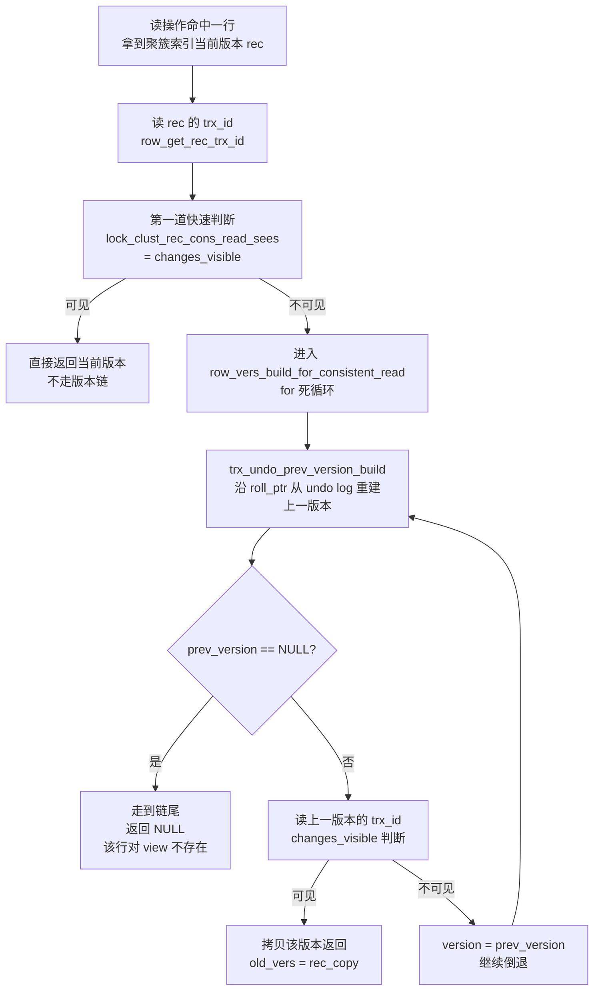

# 第 4 篇 · 第 14 章 · Read View 与可见性判断

> **核心问题**:上一章(P4-13)讲清了"什么时候建 read view"——RR 在事务第一次读时建一个、RC 每条语句建一个。可建好 read view 之后,**一个事务拿着这个 read view,面对一行数据的某个版本,到底凭什么判断"这个版本我看得见、还是看不见"?沿着 undo 版本链又怎么一路倒退、找到那个"对我可见的"对的版本?** 这两个问题,是 MVCC 真正落地成"一次具体读操作"的核心。本章把这两个问题拆到源码行。

> **读完本章你会明白**:
> 1. read view 这个结构体在内存里到底装了哪几个字段(`m_low_limit_id` / `m_up_limit_id` / `m_creator_trx_id` / `m_ids`),每个字段建 view 时怎么填出来、为什么这么填。
> 2. **可见性三段判断算法**(真实源码是"四段",含一个对自己事务的特判):拿记录上的 `trx_id` 对着 read view 的几个水位做判断,`trx_id < m_up_limit_id` 就可见、`trx_id >= m_low_limit_id` 就不可见、落在活跃列表里就不可见——以及为什么这三段能覆盖所有情况、不重不漏。
> 3. 当前版本不可见时,怎么沿 `DB_ROLL_PTR`(roll_ptr)一路倒退 undo 版本链,直到撞见一个可见的版本——这是 MVCC 读的"走路"过程,源码里是一个 `for(;;)` 循环。
> 4. 两个工程上的精妙:**第一道快速判断**(当前版本可见就根本不进版本链,省掉 undo 构造)、**read view 复用**(没有新 RW 事务启动就复用旧 view,连内存分配都省)。

> **如果一读觉得太难**:先记住一件事——读一行时,InnoDB 先看这行当前版本上的 `trx_id`(最后一次改它的事务号),拿这个号对着自己事务的 read view 问三个问题:这个事务在我之前就提交了?在我之后才启动?还是和我同时还在跑?三个问题答完,可见不可见就定了。不可见就顺着 undo 链往前找一个旧版本再问。整章就是把这"三问 + 一路找"拆到源码。

---

## 〇、一句话点破

> **可见性判断的本质,是给每个版本的 `trx_id`(改它的事务号)在时间轴上定位:这个事务是在"我的快照点"之前提交的、之后才出现的、还是和我同时在跑的——前一种看得见,后两种看不见。read view 就是用三个水位(`m_up_limit_id` / `m_low_limit_id` / `m_ids` 活跃列表)把时间轴切成了三段,记录的 `trx_id` 落在哪段,可见性就定了。**

这是结论。本章倒过来拆:先把 read view 这个结构体逐字段拆开(它装了什么、怎么填出来),再把可见性三段判断逐段拆透(为什么是这三段、为什么够用、边界等号怎么定的),然后讲沿 undo 版本链"走路"的循环,最后单开技巧精解拆两个工程优化。

承接:P4-13 讲了 read view **何时建**(RR 事务级 / RC 语句级),本章讲 read view **怎么用**(可见性算法 + 版本链查找);P4-15 会讲这些旧版本**谁来清理**(purge)。三章合起来是 MVCC 的完整闭环:**建 view(P4-13)→ 用 view 判断 + 找版本(本章)→ 清理没人要的旧版本(P4-15)**。

---

## 一、前置:每条聚簇索引记录上都刻着"谁改的我、上一版在哪"

在拆 read view 之前,先把"被判断的对象"讲清楚——read view 判断的不是抽象的"版本",而是**一条条具体记录上刻着的事务号和回滚指针**。

InnoDB 的聚簇索引(主键 B+树)叶子页里,每条用户记录除了你建表时定义的字段,还**强制带三个隐藏字段**(P1-04 拆页结构时讲过,这里只重述和可见性相关的):

```
   一条聚簇索引记录(物理布局):
   ┌─────────────────────────────────────────────────────────┐
   │ ... 用户字段(name=张三, balance=100) ...                 │
   │ ┌──────────────┬──────────────┬───────────────────────┐ │
   │ │ DB_TRX_ID    │ DB_ROLL_PTR  │ (行记录头/NULL 标志等) │ │
   │ │ 6 字节        │ 7 字节        │                       │ │
   │ │ 改我的事务号  │ 指向上一版本  │                       │ │
   │ └──────────────┴──────────────┴───────────────────────┘ │
   └─────────────────────────────────────────────────────────┘
```

- **`DB_TRX_ID`(6 字节)**:**最后一次修改(INSERT/UPDATE/DELETE)这条记录的事务号**。这是可见性判断的主角——read view 拿这个号去判断。
- **`DB_ROLL_PTR`(7 字节,roll pointer / rollback pointer)**:**指向这条记录的上一版本**(存在 undo log 里)。当前版本不可见时,InnoDB 顺着这个指针去 undo log 里把上一版本"重建"出来,再判断。版本链就是靠它一节节串起来的。

源码里读这两个字段的函数极其直白——直接从记录的固定偏移读字节([`row_get_rec_trx_id`](../mysql-server/storage/innobase/include/row0row.ic#L59-L74) / [`row_get_rec_roll_ptr`](../mysql-server/storage/innobase/include/row0row.ic#L76-L91)):

```cpp
// include/row0row.ic:59
static inline trx_id_t row_get_rec_trx_id(const rec_t *rec,
                                          const dict_index_t *index,
                                          const ulint *offsets) {
  ulint offset;
  ut_ad(index->is_clustered());          // 只有聚簇索引记录上有 trx_id
  ut_ad(rec_offs_validate(rec, index, offsets));

  offset = index->trx_id_offset;         // trx_id 在记录里的固定偏移
  if (!offset) {
    offset = row_get_trx_id_offset(index, offsets);
  }
  return (trx_read_trx_id(rec + offset));  // 从那个偏移读 6 字节,解析成 trx_id_t
}

// include/row0row.ic:76  roll_ptr 同理,偏移再往后挪 DATA_TRX_ID_LEN(6 字节)
static inline roll_ptr_t row_get_rec_roll_ptr(const rec_t *rec,
                                              const dict_index_t *index,
                                              const ulint *offsets) {
  ulint offset;
  ut_ad(index->is_clustered());
  ...
  return (trx_read_roll_ptr(rec + offset + DATA_TRX_ID_LEN));  // trx_id 后面紧跟 7 字节 roll_ptr
}
```

> **钉死一件事**:`DB_TRX_ID` 和 `DB_ROLL_PTR` 是**聚簇索引记录独有**的(二级索引记录上没有,所以二级索引的可见性判断要回表到聚簇索引——这个坑后面"二级索引怎么判断"会专门讲)。每改一次这条记录,`DB_TRX_ID` 就被新事务号覆盖、`DB_ROLL_PTR` 就指向新的 undo 旧版本。版本链的"链"是 roll_ptr 一节节连起来的,"链上每节标的生产者"就是 trx_id。

---

## 二、Read View 的结构:四个字段,把"建 view 那一刻的世界"拍了一张快照

### 2.1 为什么需要这几个字段(动机先行)

可见性判断要回答的问题是:"这条记录上的 `trx_id`(改它的事务),在我这个 read view 看来,算已提交、还是未提交?"

一个事务的 trx_id 是一个**单调递增的整数**(全局分配,见 `trx_sys->next_trx_id_or_no`)。理论上,判断"改这条记录的事务 T 提交了没",最朴素的想法是:**去查一下 T 现在的状态**。但这个想法有两个致命问题:

1. **竞态**:你查的时候 T 还在跑,查完它就提交了——你拿到的状态是过时的。MVCC 要求"快照一致性",不能用"查实时状态"这种会变的结果。
2. **性能**:每读一条记录都去查一次事务状态(要加 trx_sys 锁、遍历事务链表),高并发下扛不住。

所以 InnoDB 换了个思路:**在建 read view 的那一瞬间,把"此刻世界上还有哪些 RW 事务在跑"整个拍成一张静态快照**。以后判断任何记录的可见性,**只对着这张静态快照查,绝不再去问实时状态**。这张快照就是 read view。

那这张快照要装哪些信息,才够判断任意 `trx_id` 的可见性?顺着这个动机推,read view 需要四个字段:

```
   ReadView 结构体(内存布局,简化示意):
   ┌──────────────────────────────────────────────────────────────┐
   │ trx_id_t  m_low_limit_id;    // 高水位:下一个将分配的 trx_id      │
   │                              // "trx_id >= 它" → 一定不可见       │
   │ trx_id_t  m_up_limit_id;     // 低水位:活跃事务里的最小 trx_id    │
   │                              // "trx_id < 它" → 一定可见           │
   │ trx_id_t  m_creator_trx_id;  // 建 view 的事务自己的 trx_id        │
   │                              // "trx_id == 它" → 自己改的,可见     │
   │ ids_t     m_ids;             // 建 view 时活跃的 RW 事务号集合(有序)│
   │                              // "trx_id 在里面" → 不可见            │
   │ trx_id_t  m_low_limit_no;    // (purge 用,见 P4-15,本章不讲判断)  │
   └──────────────────────────────────────────────────────────────┘
```

这四个字段是 [`class ReadView`](../mysql-server/storage/innobase/include/read0types.h#L48-L297) 的核心(源码里还有 `m_closed`、链表节点等管理字段,和可见性判断无关)。下面逐个讲它**怎么填出来**、**为什么这么填**。

### 2.2 字段怎么填出来:prepare 函数

建 read view 的核心是 [`ReadView::prepare(trx_id_t id)`](../mysql-server/storage/innobase/read/read0read.cc#L446-L469)(在持 `trx_sys` 互斥锁的临界区里执行,保证拍快照那瞬间世界不变):

```cpp
// read/read0read.cc:446
void ReadView::prepare(trx_id_t id) {
  ut_ad(trx_sys_mutex_own());              // 必须持 trx_sys 锁,快照才一致

  m_creator_trx_id = id;                   // 记下:谁建的这个 view

  m_low_limit_no = trx_get_serialisation_min_trx_no();  // purge 用,本章略

  m_low_limit_id = trx_sys_get_next_trx_id_or_no();     // 高水位 = 下一个将分配的 trx_id

  ut_a(m_low_limit_no <= m_low_limit_id);

  if (!trx_sys->rw_trx_ids.empty()) {
    copy_trx_ids(trx_sys->rw_trx_ids);     // 拷贝活跃 RW 事务列表(剔除自己)
  } else {
    m_ids.clear();
  }

  /* The first active transaction has the smallest id. */
  m_up_limit_id = !m_ids.empty() ? m_ids.front() : m_low_limit_id;  // 低水位
  ut_a(m_up_limit_id <= m_low_limit_id);

  m_closed.store(false);
}
```

逐字段拆:

**① `m_low_limit_id`(高水位)= `trx_sys_get_next_trx_id_or_no()`**——这一刻**下一个将分配的 trx_id**。这是个单调递增的计数器(`trx_sys->next_trx_id_or_no`),每启动一个 RW 事务就加一。语义是:"所有 `trx_id >= m_low_limit_id` 的事务,**一定是在我建完 view 之后才启动的**——我绝对看不见它们。" 所以它叫"低可见性边界"(low limit,再大就 low 不下去了=看不见),是"不可见"的起点。

> **为什么用"下一个将分配的"而不是"当前最大的"**:因为建 view 这一刻,**正在进行中的事务里最大的那个 trx_id 也可能正好提交了**(事务提交和建 view 是并发的)。用"下一个将分配的"能确保:任何 `>= m_low_limit_id` 的 trx_id 一定是**严格在我之后**才被分配出去的,绝不可能"在我建 view 时就已经在跑"——这个性质让"高水位判断"无懈可击,没有边界竞态。

**② `m_ids`(活跃列表)= 拷贝 `trx_sys->rw_trx_ids`**——这一刻**所有还在跑的 RW 事务的 trx_id 集合**。注意 [`copy_trx_ids`](../mysql-server/storage/innobase/read/read0read.cc#L353-L439) 做了一件关键的事:**把建 view 的事务自己(`m_creator_trx_id`)从列表里剔除**(一个事务看自己改的数据当然是可见的,不能把自己列进"不可见"集合)。剔除用的是 `std::lower_bound` 二分定位 + 两段 `memmove` 拼接(`read0read.cc:384-405`),O(log n) 定位 + O(n) 一次拷贝,避免逐个比较。

> **`rw_trx_ids` 怎么维护**:一个 RW 事务启动时把自己的 trx_id `push_back` 进去并保持有序([`trx0trx.cc:1137`](../mysql-server/storage/innobase/trx/trx0trx.cc#L1137) 等多处);提交时 [`trx_erase_lists`](../mysql-server/storage/innobase/trx/trx0trx.cc#L1800-L1819) 用 `std::lower_bound` 定位再 `erase`(`trx0trx.cc:1804-1808`)。所以 `rw_trx_ids` 始终是有序的、严格反映"此刻还在跑的 RW 事务"。建 view 时把它整个拷贝出来,就是"冻结此刻的活跃集"。

**③ `m_up_limit_id`(低水位)= `m_ids.front()`(活跃列表最小值),列表为空时等于 `m_low_limit_id`**——这一刻**活跃事务里最小的 trx_id**。语义是:"所有 `trx_id < m_up_limit_id` 的事务,**在我建 view 之前就已经提交了**(否则它会在活跃列表里、它的 id 会 >= `m_up_limit_id`)——我一定看得见。" 所以它叫"高可见性边界"(up limit,比它小就 up=可见)。

> **列表为空时为什么等于 `m_low_limit_id`**:如果建 view 时没有任何活跃 RW 事务,说明此刻所有已启动的事务都提交了——那"已提交的边界"就是"下一个将分配的",两者重合。这时 `m_up_limit_id == m_low_limit_id`,可见性判断退化成"trx_id < m_low_limit_id 全可见、>= 全不可见"的二分。

**④ `m_creator_trx_id` = 建 view 的事务自己的 trx_id**——后面可见性判断会特判:"trx_id 等于我自己的,可见"(自己改的自己看得见,即便还没提交)。

> **钉死这件事**:这四个字段在建 view 的那一瞬(持 `trx_sys` 锁)被填好,**之后再也不变**。读操作判断可见性时,只对着这四个静态字段查,绝不回去问"现在这个事务提交没"——这就是 MVCC 快照一致性的根。代价是 read view 要存一份活跃事务号的拷贝(`m_ids`),事务越多内存占用越大,但换来了 O(log n) 的判断和免锁的读。

---

## 三、可见性三段判断算法(真实源码是"四段")

### 3.1 算法本体:changes_visible

判断一个 `trx_id` 对某 read view 可见不可见的全部逻辑,就一个函数 [`ReadView::changes_visible`](../mysql-server/storage/innobase/include/read0types.h#L163-L183),全部代码 20 行:

```cpp
// include/read0types.h:163
[[nodiscard]] bool changes_visible(trx_id_t id,
                                   const table_name_t &name) const {
  ut_ad(id > 0);

  if (id < m_up_limit_id || id == m_creator_trx_id) {   // 段①:低水位以下,或自己改的
    return (true);
  }

  check_trx_id_sanity(id, name);

  if (id >= m_low_limit_id) {                            // 段②:高水位及以上
    return (false);
  } else if (m_ids.empty()) {                            // 活跃列表空 → 段②之后全可见
    return (true);
  }

  const ids_t::value_type *p = m_ids.data();             // 段③:在活跃列表里?
  return (!std::binary_search(p, p + m_ids.size(), id)); // 二分查找;在 → 不可见,不在 → 可见
}
```

很多老资料把这套判断讲成"三段"(`trx_id < min_trx` 可见 / `trx_id >= max_trx` 不可见 / 在活跃列表里不可见),但**真实源码是"四段"**:多了一个 `id == m_creator_trx_id` 的特判(段①的一部分)。下面逐段拆,把每段的"为什么"讲透。

### 3.2 段①:低水位以下,或自己改的——可见

```cpp
if (id < m_up_limit_id || id == m_creator_trx_id) {
  return (true);
}
```

两个条件,任一成立就**直接返回可见**:

- **`id < m_up_limit_id`**:这个 `trx_id` 比活跃事务里最小的还小。回想 `m_up_limit_id` 的来历(活跃列表的最小值):能比它还小,说明这个事务**在建 view 之前就已经提交了**(否则它当时还在跑、会被收进活跃列表、它的 id 就不会小于 `m_up_limit_id`)。已提交的,当然可见。这是 MVCC 读最常见的命中路径——绝大多数读到的记录,都是历史提交事务留下的,直接走这条短路返回。

  > **等号边界**:`id < m_up_limit_id` 是**严格小于**,不含等号。为什么?因为 `m_up_limit_id` 本身就是活跃列表里的某个事务号——`id == m_up_limit_id` 意味着这个事务当时还在跑(它就是活跃列表里最小的那个),**不可见**。所以等号必须留给后面"在活跃列表里"的判断去处理。这是边界最容易讲错的地方,务必钉死。

- **`id == m_creator_trx_id`**:这个 `trx_id` 就是建 view 的事务自己。**自己改的数据,自己当然看得见**——即便这个事务此刻还没提交。这条特判很关键:一个事务在 `BEGIN; UPDATE t SET x=1 WHERE id=10; SELECT * FROM t WHERE id=10;` 里,那个 SELECT 要能看到自己刚 UPDATE 的 x=1,就靠这条。如果不特判,自己的 trx_id 会出现在活跃列表里(建 view 时自己还在跑),会被段③判成"不可见"——那事务就读不到自己改的数据了,荒谬。

  > 注意 [`copy_trx_ids`](../mysql-server/storage/innobase/read/read0read.cc#L358-L361) 在拷贝活跃列表时已经把 `m_creator_trx_id` 剔除了,所以段③的 `binary_search` 不会命中自己。但源码仍把 `id == m_creator_trx_id` 放在段①的最前面做短路——既是防御性的(双重保险),也是性能优化(对自己改的记录走最快路径)。

### 3.3 段②:高水位及以上——不可见

```cpp
if (id >= m_low_limit_id) {
  return (false);
}
```

这个 `trx_id >= m_low_limit_id`。回想 `m_low_limit_id` 的来历(下一个将分配的 trx_id):能 `>=` 它,说明这个事务**是在我建完 view 之后才启动的**。一个晚于我快照点才出现的事务,它的一切修改我都不该看见——这是 MVCC 快照隔离的本意。直接不可见。

> **等号边界**:`id >= m_low_limit_id` 是**含等号**的。因为 `m_low_limit_id` 是"下一个将分配的",它本身还没分配给任何事务——任何 `id == m_low_limit_id` 的事务,一定是建 view **之后**才拿到这个号的。所以等号归"不可见"。和段①的严格小于正好咬合:可见边界用 `<`(不含),不可见边界用 `>=`(含),两者把数轴切得严丝合缝。

### 3.4 段③:在中间——查活跃列表

```cpp
} else if (m_ids.empty()) {
  return (true);
}
const ids_t::value_type *p = m_ids.data();
return (!std::binary_search(p, p + m_ids.size(), id));
```

走到这一步,说明 `id` 满足 `m_up_limit_id <= id < m_low_limit_id`——既不在"肯定已提交"的低水位以下,也不在"肯定晚于我"的高水位及以上,而是**落在中间的灰色地带**。这个区间里的事务,有的当时已提交(可见)、有的当时还在跑(不可见)——**光靠两个水位判不出来,必须查活跃列表**。

- **`m_ids.empty()`**:活跃列表空。建 view 时一个活跃 RW 事务都没有,说明中间这个区间里所有的事务当时都已提交(`m_up_limit_id == m_low_limit_id`,中间区间其实为空,但防御性代码仍处理)——全可见。
- **`std::binary_search(p, p + m_ids.size(), id)`**:`m_ids` 是有序的,二分查找 O(log n)。`id` 在列表里 → 这个事务建 view 时还在跑 → 不可见;不在 → 当时已提交 → 可见。注意返回值取反:`binary_search` 返回"找到了",`changes_visible` 返回"!找到了"=不可见。

> **为什么活跃列表是有序的**:`rw_trx_ids` 维护时就是按 trx_id 有序插入/删除的(`lower_bound` 定位),`copy_trx_ids` 是顺序拷贝,所以 `m_ids` 天然有序,能直接用 `binary_search`。这是 InnoDB 为可见性判断做的性能铺垫——O(log n) 而不是 O(n) 线性扫。

### 3.5 三段为什么够用、不重不漏

把三段在数轴上画出来,就明白为什么这三段覆盖了 `trx_id` 所有可能的取值、且互不重叠:

```
   trx_id 数轴(箭头方向是增大):

   ←─ 段① ─→←────── 段③ ──────→←─ 段② ─→
   0        up_limit_id        low_limit_id        ∞
   ↑        ↑                  ↑                  ↑
   全可见    活跃列表里          全不可见
   (已提交)  min(灰色地带,       (晚于我快照)
            查列表定)
            ↑
            注意:up_limit_id 自己在活跃列表里,等号归段③(不可见)
                  low_limit_id 是"下一个",还没分配,等号归段②(不可见)
```

- `id < m_up_limit_id` → 段①,可见。
- `m_up_limit_id <= id < m_low_limit_id` → 段③,查列表。
- `id >= m_low_limit_id` → 段②,不可见。

三段首尾相接、区间端点归属明确(低水位等号归段③、高水位等号归段②),覆盖 `[0, ∞)` 全域,无重叠、无遗漏。**这就是"为什么三段够用"的数学根**——任何 trx_id 必落且仅落其中一段。

> **钉死这件事**:可见性判断的正确性,根在"建 view 那一瞬持 trx_sys 锁拍的快照是自洽的"——那一瞬,`m_low_limit_id` 是下一个将分配的、`m_ids` 是此刻活跃的全集、`m_up_limit_id` 是 `m_ids` 的最小值。这三个值在同一把锁里、同一瞬间读出来,逻辑上严密刻画了"建 view 那一刻世界由哪些已提交/未提交事务组成"。之后只对着这三个静态值判断,自然不会出竞态。

---

## 四、多个并发事务的具体例子(把三段判断跑一遍)

光讲算法不够,得拿几个并发场景把三段判断跑一遍,读者才真懂。下面用一个贯穿的例子:账户表 `account(id PK, balance)`,id=10 这行被多个事务改来改去,看不同 read view 怎么判断每个版本。

### 4.1 场景设定

假设事务号已经发到 100,此刻有三个 RW 事务在跑:`T101`、`T103`、`T105`(注意 id 不连续,因为只读事务不占 RW 号)。它们都在改 id=10 这行,版本链长这样:

```
   id=10 这行的版本链(roll_ptr 串起来,最新版在聚簇索引页里,旧版在 undo log 里):

   [最新版 v4] --roll_ptr--> [v3] --roll_ptr--> [v2] --roll_ptr--> [v1] --roll_ptr--> NULL
   balance=400              balance=300        balance=200       balance=100
   trx_id=105               trx_id=103         trx_id=101        trx_id=50
   (T105 改的,在跑)          (T103 改的,在跑)   (T101 改的,在跑)  (T50 早就提交了)
```

现在事务 `T200` 启动(RR 隔离级别),它建 read view 的那一瞬间,`trx_sys->rw_trx_ids = {101, 103, 105}`(这三个还在跑),下一个将分配的 trx_id 是 106。于是 `T200` 的 read view:

```
   T200 的 read view:
   m_creator_trx_id = 200
   m_low_limit_id   = 106   (下一个将分配)
   m_ids            = {101, 103, 105}  (建 view 时活跃的,已剔除自己)
   m_up_limit_id    = 101   (m_ids 最小值)
```

`T200` 执行 `SELECT balance FROM account WHERE id=10`,顺着版本链从最新版 v4 开始判断:

### 4.2 逐版本判断

**版本 v4:`trx_id=105`**(T105 改的,建 view 时在跑)

```
段①: 105 < m_up_limit_id(101)? 否。
     105 == m_creator_trx_id(200)? 否。
段②: 105 >= m_low_limit_id(106)? 否。
段③: m_ids 非空。binary_search({101,103,105}, 105)? 找到了 → 返回 !true = false。
→ v4 不可见。沿 roll_ptr 找 v3。
```

为什么不可见?T105 建 view 时还在跑(它的 id 在活跃列表里),它改的 v4 对 T200 不可见。合理。

**版本 v3:`trx_id=103`**(T103 改的,也在跑)

```
段①: 103 < 101? 否。103 == 200? 否。
段②: 103 >= 106? 否。
段③: binary_search({101,103,105}, 103)? 找到 → 不可见。
→ v3 不可见。沿 roll_ptr 找 v2。
```

T103 也在跑,v3 不可见。

**版本 v2:`trx_id=101`**(T101 改的,活跃列表里最小的那个)

```
段①: 101 < 101? 否(严格小于,等号不成立)。101 == 200? 否。
段②: 101 >= 106? 否。
段③: binary_search({101,103,105}, 101)? 找到(就是 m_up_limit_id 自己)→ 不可见。
→ v2 不可见。沿 roll_ptr 找 v1。
```

这里恰好演示了"`m_up_limit_id` 的等号归段③"——T101 是活跃列表里最小的,它的版本 v2 不可见。如果段①误写成 `id <= m_up_limit_id`,这里就会错判成可见,逻辑就破了。

**版本 v1:`trx_id=50`**(T50,早就提交了)

```
段①: 50 < 101? 是!
→ v1 可见。返回 balance=100。
```

T200 看到的是 balance=100——也就是"建 view 那一刻的已提交状态"(T50 提交了,T101/T103/T105 都还没)。这正是 RR 快照读该有的语义。

### 4.3 两个对比场景

**场景 B**:如果 `T200` 建 view 的时机晚一点,等到 T101、T103 都提交了、只有 T105 还在跑呢?那 `rw_trx_ids = {105}`,read view 变成:

```
m_low_limit_id = 106, m_ids = {105}, m_up_limit_id = 105
```

同样从 v4 开始判断:
- v4 `trx_id=105`:段③ `binary_search({105}, 105)` 找到 → 不可见,找 v3。
- v3 `trx_id=103`:段① `103 < 105`?是 → 可见。返回 balance=300。

T200 看到 balance=300——T101、T103 提交的修改都纳入了快照,T105 还没提交的不纳入。快照点不同,看到的不同,但各自一致。这就是"同一行不同事务看到不同版本"的 MVCC 魔法。

**场景 C**:如果 `T200` 自己改了这行(`UPDATE account SET balance=999 WHERE id=10`),那最新版的 `trx_id=200`:

```
段①: 200 < 101? 否。200 == m_creator_trx_id(200)? 是!
→ 可见。T200 看到自己改的 balance=999,即便它还没 commit。
```

这就是 `m_creator_trx_id` 特判的作用——事务总看得见自己未提交的修改。

### 4.4 边界等号:为什么低水位用 `<`、高水位用 `>=`

把可见性判断的等号边界单独拎出来钉死,因为它是最容易被讲错、也最容易在面试/博客里翻车的细节。两张表对照:

| 判断 | 算符 | 边界值含义 | 等号归谁 |
|------|------|-----------|----------|
| 段① 低水位 `id < m_up_limit_id` | 严格小于,不含等号 | `m_up_limit_id` = 活跃列表最小事务号(该事务当时还在跑) | 等号(`id == m_up_limit_id`)归段③——该事务在活跃列表里,**不可见** |
| 段② 高水位 `id >= m_low_limit_id` | 含等号 | `m_low_limit_id` = 下一个将分配的 trx_id(还没发给任何事务) | 等号天然归段②——`id == m_low_limit_id` 的事务是建 view **之后**才拿到号的,**不可见** |

为什么两个边界的等号处理不对称(一个排除、一个包含)?根因在于两个水位值的**语义来源不同**:

- **`m_up_limit_id` 是"已分配给某个活跃事务"的号**——它指向一个**真实存在、当时还在跑**的事务(活跃列表里最小的那个)。所以 `id == m_up_limit_id` 这个事务本身就该不可见,等号必须导向"不可见"的判断(段③的 `binary_search` 会命中它)。
- **`m_low_limit_id` 是"还没分配出去"的号**——它是计数器的下一个值,不指向任何已存在的事务。任何 `id == m_low_limit_id` 的事务,只能是建 view 之后才被分配到这个号的——天然晚于快照点,等号归"不可见"(段②)。

两个等号都导向"不可见",但导向的段不同。这样切分后,trx_id 数轴上**没有任何一个整数会落空或被两段同时认领**:

```
   ... 99, 100, 101=m_up_limit_id, 102, ... 105, 106=m_low_limit_id, 107 ...
                ↑                                   ↑
                段③ binary_search 判断              段② 不可见
   段①        ←─ 段③ 灰色地带 ─→                  段②
   可见                                        全不可见
```

> **钉死这件事**:很多老资料/博客讲成"`trx_id < min_trx_id 可见、trx_id >= max_trx_id 不可见`",把 `m_up_limit_id`/`m_low_limit_id` 含糊地说成"最小/最大活跃事务 id",等号边界一笔带过。真实源码里 `m_low_limit_id` 是"下一个将分配的"、不是"当前最大活跃的";`m_up_limit_id` 是"活跃列表最小值"、等号归段③。这两个细节决定了边界事务的可见性,讲错了会在并发场景下推出矛盾结论(比如把活跃列表里最小的那个事务错判成可见)。务必以源码为准。

### 4.5 RC vs RR:可见性算法完全一样,差别只在"建 view 时机"

承接 P4-13 的一个关键结论,这里再钉死一次:**RC(读已提交)和 RR(可重复读)在可见性判断算法上完全一样——用的都是同一个 `changes_visible`、同一个三段判断、同一条版本链查找逻辑**。两者的唯一差别,在于**建 read view 的时机**:

| 隔离级别 | 建 read view 的时机 | 效果 |
|----------|---------------------|------|
| **RR(可重复读)** | 事务第一次读时建一个,**整个事务复用同一个 view** | 事务内多次读同一行,看到同一个版本(可重复读) |
| **RC(读已提交)** | **每条 SELECT 语句**都(可能)建一个新 view | 事务内多次读同一行,可能看到不同版本(已提交的变化能看到) |

```
   同一个事务里两次读 id=10,中间别的事务 UPDATE 并 commit 了:

   RR(一个 read view 用到底):
     BEGIN
     SELECT balance FROM t WHERE id=10;  → 建 view V1,看到 balance=100
     -- 别的事务 UPDATE id=10 SET balance=200 并 commit --
     SELECT balance FROM t WHERE id=10;  → 复用 V1,V1 的快照看不到 200,仍返回 100  ← 可重复读

   RC(每条语句新 view):
     BEGIN
     SELECT balance FROM t WHERE id=10;  → 建 view V1,看到 balance=100
     -- 别的事务 UPDATE id=10 SET balance=200 并 commit --
     SELECT balance FROM t WHERE id=10;  → 建 view V2,V2 的快照能看到 200,返回 200  ← 已提交可见
```

> **算法不变,只换 view**:`changes_visible` 函数对 RC 和 RR 是同一份代码。差别只在于"调用 `changes_visible` 时,传进去的那个 read view 是哪个"。RC 传的是"这条语句开始时新建的",RR 传的是"事务第一次读时建的、一直复用的"。所以本章讲的全部可见性逻辑,RC 和 RR **一字不差地适用**——这极大地简化了实现:InnoDB 不需要为两个隔离级别写两套判断,只需控制 view 的生命周期。这是 InnoDB MVCC 设计的经济性——"隔离级别的差别"被压缩到了"view 何时建"这一个点上。

> 一个细节:RC 下"每条语句建新 view"也不是无脑每条都建——前面技巧二讲的 `view_open` 复用优化会判断"自上次建 view 以来有没有新 RW 事务启动",没有就复用。所以 RC 下连续两条 SELECT 间若无新事务,实际复用同一个 view(等价于 RR 的行为)。只有新事务启动了(世界变了),才真建新 view。这让 RC 在低并发时和 RR 几乎一样快,在高并发时才频繁换 view。

---

## 五、沿 undo 版本链"走路":当前版本不可见时怎么办

### 5.1 为什么需要"走路"

段②/段③判不可见,只回答了"这个版本看不见",但**读操作要的是"那我看见什么"**。MVCC 的承诺是:读一行,要返回一个**对当前 read view 可见的具体版本**。所以当前版本不可见时,必须顺着 `DB_ROLL_PTR` 倒退到上一版本,再判断;再不可见,再倒退……直到撞见一个可见的版本,或者链走到头(说明这行在建 view 之后才被 INSERT 进来,对该 view 不存在)。

这个"倒退 + 判断"的循环,就是 [`row_vers_build_for_consistent_read`](../mysql-server/storage/innobase/row/row0vers.cc#L1249-L1342):

```cpp
// row/row0vers.cc:1249
dberr_t row_vers_build_for_consistent_read(
    const rec_t *rec, mtr_t *mtr, dict_index_t *index, ulint **offsets,
    ReadView *view, mem_heap_t **offset_heap, mem_heap_t *in_heap,
    rec_t **old_vers, const dtuple_t **vrow, lob::undo_vers_t *lob_undo) {
  ...
  trx_id = row_get_rec_trx_id(rec, index, *offsets);   // 拿当前版本的 trx_id
  ut_ad(!view->changes_visible(trx_id, index->table->name));  // 调用方保证:当前版本已判过不可见
  version = rec;                                         // 从当前版本开始

  for (;;) {                                             // 一路倒退
    mem_heap_t *prev_heap = heap;
    heap = mem_heap_create(1024, UT_LOCATION_HERE);
    ...

    /* 沿 roll_ptr 把上一版本从 undo log 里"重建"出来 */
    bool purge_sees =
        trx_undo_prev_version_build(rec, mtr, version, index, *offsets, heap,
                                    &prev_version, nullptr, vrow, 0, lob_undo);
    err = (purge_sees) ? DB_SUCCESS : DB_MISSING_HISTORY;

    if (prev_version == nullptr) {
      /* 走到链尾了——这行是建 view 之后才 INSERT 的,对该 view 不存在 */
      *old_vers = nullptr;
      break;
    }

    *offsets = rec_get_offsets(prev_version, index, *offsets, ...);
    trx_id = row_get_rec_trx_id(prev_version, index, *offsets);  // 上一版本的 trx_id

    if (view->changes_visible(trx_id, index->table->name)) {     // 再判一次
      /* 这个版本可见!拷贝出来返回 */
      buf = static_cast<byte *>(mem_heap_alloc(in_heap, rec_offs_size(*offsets)));
      *old_vers = rec_copy(buf, prev_version, *offsets);
      rec_offs_make_valid(*old_vers, index, *offsets);
      ...
      break;
    }

    version = prev_version;                              // 还不可见,继续往前倒退
  }
  ...
  return err;
}
```

整个"走路"过程的流程图:



几个关键点拆透:

### 5.2 第一道快速判断:能省则省

注意流程图里有个**第一道快速判断** `lock_clust_rec_cons_read_sees`(在 [`row0sel.cc:1393`](../mysql-server/storage/innobase/row/row0sel.cc#L1393) 调用,实现在 [`lock0lock.cc:259-261`](../mysql-server/storage/innobase/lock/lock0lock.cc#L259-L261))。它的实现就是直接调 `changes_visible`:

```cpp
// lock/lock0lock.cc:259
trx_id_t trx_id = row_get_rec_trx_id(rec, index, offsets);
return (view->changes_visible(trx_id, index->table->name));
```

为什么先判一次?因为**绝大多数读命中的是当前版本**——历史提交事务留下的记录,trx_id 远小于 read view 的低水位,段①直接返回可见。这种情况下根本不用进版本链、不用构造 undo 旧版本(那是开销活:要从 undo log 页里解析、拼装)。先做一次 O(log n) 的 `changes_visible`,可见就直接返回,**省掉整个 undo 构造**。只有不可见时才调 `row_sel_build_prev_vers` → `row_vers_build_for_consistent_read` 进版本链。这是 MVCC 读性能的关键优化:常见路径走快道,只有冲突时才走慢道。

### 5.3 上一版本是"重建"出来的,不是直接读出来的

`trx_undo_prev_version_build` 这个函数名里的 "build"(构造)很关键:**undo log 里存的不是"上一版本长什么样",而是"怎么从当前版本改回上一版本"**(undo 是逻辑/物理日志,记的是反向操作,P3-10 拆过)。所以"上一版本"得**用当前版本 + undo 记录,反着应用一次,临时拼装出来**,放在一个临时内存堆(`heap`)里。每次倒退一个版本,就 `mem_heap_create` 一个新堆、构造一次、判断一次;不可见就丢掉、再往前构造。

> **不这么设计会怎样**:如果 undo 里直接存"上一版本的完整行镜像",那每改一次行就得把整行抄一份进 undo——行越大、undo 越膨胀,而且大量信息冗余(两次相邻 UPDATE 可能只改了一个字段,却抄了两份整行)。InnoDB 的做法是 undo 只记"差异/反向操作",要旧版本时按需 `build` 出来——空间省、构造时有成本但只在需要时付。这是"空间换时间"的反向:**存差异(省空间)、用时构造(付 CPU)**,适合"绝大多数版本永远不会被读到"的真实负载。

### 5.4 走到链尾:`old_vers = NULL` 的含义

如果一路倒退到链尾(`prev_version == nullptr`),说明什么?说明这行**是建 view 之后才被 INSERT 进来的**——它的所有版本 trx_id 都 >= read view 的高水位或在活跃列表里,一个都不可见。这种情况下函数返回 `*old_vers = nullptr`,语义是"这行对你这个 read view 不存在"。对应场景:`T200` 建 view 之后,别的事务 INSERT 了一行新数据,T200 的 SELECT 看不到这行——这就是 RR 防幻读的一半(另一半靠间隙锁,P5-17 讲)。

### 5.5 中途 undo 被清理了:`DB_MISSING_HISTORY`

注意 `err = (purge_sees) ? DB_SUCCESS : DB_MISSING_HISTORY;` 这行。如果倒退到某个版本时,对应的 undo log 记录已经被 purge 线程清理掉了(P4-15 讲),`trx_undo_prev_version_build` 会返回 false(`purge_sees=false`),err 置成 `DB_MISSING_HISTORY`。正常情况下不会发生——purge 只清理"所有活跃 read view 都不再需要"的旧版本(见 P4-15 purge 与 read view 的关系)。如果真发生了,说明 read view 太老(比如一个长事务跑了好几天,undo 都被回收了),读操作会报错。这是 MVCC 和 purge 协作的边界条件。

---

## 六、二级索引的可见性:为什么得回表

前面讲的都是聚簇索引(主键 B+树)记录的可见性——因为 `DB_TRX_ID` / `DB_ROLL_PTR` **只刻在聚簇索引记录上**。那走二级索引(比如 `name` 索引)查询时,二级索引记录上没有 trx_id,怎么判断可见性?

InnoDB 的做法是个**乐观捷径**([`lock_sec_rec_cons_read_sees`](../mysql-server/storage/innobase/lock/lock0lock.cc#L273),在 [`row0sel.cc:1398`](../mysql-server/storage/innobase/row/row0sel.cc#L1398) 调用):二级索引页的页头有一个"修改这个页的最大 trx_id"(page max trx id),拿 read view 的 `m_up_limit_id` 跟它比——

- **页 max trx_id < `m_up_limit_id`**:这一页最后一次被修改,发生在我建 view 之前的所有已提交事务。这页上所有二级索引记录,对我都可见。**直接返回,不用回表**。
- **页 max trx_id >= `m_up_limit_id`**:这页在我建 view 之后或前后被改过,页里某些记录可能不可见。这时**回表到聚簇索引**,用聚簇索引记录上的 trx_id + 版本链做精确判断——也就是前面那一套流程。

> **钉死这件事**:二级索引的可见性判断是**页级的乐观判断 + 必要时回表精确判断**。绝大多数情况下,二级索引页的 max trx_id 都小于 read view 低水位(页是历史稳定数据),二级索引直接命中、免回表——这是 InnoDB 二级索引查询快的重要原因。只有页被并发修改过才回表精判。这个设计把"二级索引无 trx_id"的劣势,用"页级 max trx_id"巧妙化解了。

---

## 七、技巧精解:两个工程上的精妙

本章最硬核的两个工程技巧,单独拆透。

### 技巧一:可见性判断的"快道 + 慢道"双层设计

朴素地实现 MVCC 读,会是这样一个函数:**对每条读到的记录,无脑调 `row_vers_build_for_consistent_read` 走版本链,直到找到可见版本**。听起来直白,但性能灾难:

```
   朴素版(慢):
   每条记录 → 无脑进版本链循环 → 构造 undo 旧版本 → 判断 → ...
   问题:绝大多数记录的当前版本就可见(历史提交数据),根本不用走链!
        但朴素版对每条都构造至少一次 undo,白白付 CPU + 内存。
```

InnoDB 的真实设计是**双层**:

```
   真实版(快):
   每条记录 → 先 lock_*_cons_read_sees(changes_visible) O(log n) 快判
            ├─ 可见 → 直接返回当前版本,不走链(快道,绝大多数命中)
            └─ 不可见 → 才进 row_vers_build_for_consistent_read 走链(慢道,少数命中)
```

> **妙在哪里**:把"判断可见性"和"构造旧版本"解耦成两层。第一层 `changes_visible` 是**纯内存的 O(log n) 二分查找**,没有任何 undo IO、没有任何内存分配——极快。绝大多数记录(历史提交数据,trx_id 远小于低水位)在这一层就走段①短路返回了,根本碰不到 undo。只有当前版本不可见的少数记录(并发修改的热点行),才付出进版本链、构造 undo 的代价。这是**把常见情形和罕见情形分开定价**的经典工程手法:常见情形走快道几乎免费,罕见情形才付全价。

> **反面对比**:如果只用一层(朴素版),每条记录都要 `mem_heap_create` + `trx_undo_prev_version_build` 一次——即便最后发现"当前版本就可见",这次构造的 CPU 和内存已经白花了。在 OLTP 高并发读场景(`SELECT` 每秒几十万次),这个浪费会放大成性能塌方。InnoDB 的双层设计,让 99% 的读路径只付一次二分查找的代价。

源码对应:第一层 [`lock_clust_rec_cons_read_sees`](../mysql-server/storage/innobase/lock/lock0lock.cc#L259-L261) 在 [`row0sel.cc:1393`](../mysql-server/storage/innobase/row/row0sel.cc#L1393) 调用;可见就跳过版本链、直接用当前记录;不可见才 [`row_sel_build_prev_vers`](../mysql-server/storage/innobase/row/row0sel.cc#L691-L718) → [`row_vers_build_for_consistent_read`](../mysql-server/storage/innobase/row/row0vers.cc#L1249-L1342)。两层分工明确。

### 技巧二:read view 的"无新事务则复用"优化

另一个精妙在 [`MVCC::view_open`](../mysql-server/storage/innobase/read/read0read.cc#L499-) 里。RC 隔离级别下,每条语句都要"建一个新 read view"。但如果连续两条 SELECT 之间,**没有任何新的 RW 事务启动**,那这两条 SELECT 看到的"快照"其实是一样的——第二条没必要真建新 view,复用第一条的就行。

源码就是这么做的([`read0read.cc:504-507`](../mysql-server/storage/innobase/read/read0read.cc#L504-L507) 起的整段注释,这是 InnoDB 最详细的并发正确性论证之一):

```cpp
// read/read0read.cc:499
void MVCC::view_open(ReadView *&view, trx_t *trx) {
  ut_ad(!srv_read_only_mode);

  /** If no new RW transaction has been started since the last view
  was created then reuse the the existing view. */
  if (view != nullptr) {
    ...
    // 检查:自上次建 view 以来,有没有新的 RW 事务启动?
    // 没有 → 复用旧 view(连内存分配都省)
    // 有   → 重新 prepare 一个新 view
```

判断"有没有新 RW 事务"的依据是 `trx_sys->next_trx_id_or_no` 是否变化——如果它没涨,说明这段时间没分配新的 trx_id,世界状态没变,旧 view 仍然精确反映当前快照,直接复用。

> **妙在哪里**:RC 下每条语句建 view,听起来开销大(每次都要持 trx_sys 锁、拷贝活跃列表)。但真实负载里,一个事务里的多条 SELECT 之间,往往没有别的事务启动(尤其是短事务、低并发场景)。复用旧 view,**省掉一次锁竞争 + 一次活跃列表拷贝 + 一次内存分配**。这在低并发时是纯收益,在高并发时(新事务频繁启动)退化为正常建 view,不会有错——只是优化命中概率降低。

> **这个优化的正确性极不显然**:源码注释用了 80 多行([`read0read.cc:511-595`](../mysql-server/storage/innobase/read/read0read.cc#L511-L595))论证两个性质(P1、P2),核心是保证"复用旧 view 不会让 purge 误清掉还需要的 undo 旧版本"。论证依赖一长串不变式:purge 协调器持 trx_sys 锁时才更新 `purge_sys->view`、`serialisation_min_trx_no` 单调、添加 view 到 m_views 在 trx_sys 临界区里……这些不变式合起来,才保证了"复用旧 view 看到的快照"和"建新 view 看到的快照"在可见性判断上完全等价。这是 InnoDB 工程师对并发正确性的极致把控——一个看似简单的"复用",底下是严密的 happens-before 论证。这个优化也直接和 P4-15 的 purge 耦合,读 P4-15 时会再回扣这里。

---

## 八、可见性判断的完整时序(把全流程串起来)

把建 view → 判断 → 走链的全过程,用一条具体的 SELECT 跑一遍时序:

```mermaid
sequenceDiagram
    participant T as 事务 T(RR)
    participant RV as ReadView
    participant SEL as row0sel
    participant VERS as row0vers
    participant UND as undo log

    Note over T: BEGIN
    T->>SEL: SELECT ... WHERE id=10(第一次读)
    Note over T: 此时才 lazily 建 read view(trx_assign_read_view)
    T->>RV: MVCC::view_open → prepare
    RV->>RV: 持 trx_sys 锁<br/>m_low_limit_id = next_trx_id_or_no<br/>m_ids = 拷贝 rw_trx_ids(剔除自己)<br/>m_up_limit_id = m_ids.front()
    RV-->>T: read view 就绪

    T->>SEL: 在聚簇索引定位 id=10 的当前版本 rec
    SEL->>SEL: 读 rec 的 trx_id(row_get_rec_trx_id)
    SEL->>RV: lock_clust_rec_cons_read_sees → changes_visible(trx_id)
    alt 段① trx_id < m_up_limit_id(或 == 自己)
        RV-->>SEL: true(可见)
        Note over SEL: 直接返回当前版本,不走链
    else 段②/段③ 不可见
        RV-->>SEL: false
        SEL->>VERS: row_sel_build_prev_vers → row_vers_build_for_consistent_read
        loop for(;;) 一路倒退
            VERS->>UND: trx_undo_prev_version_build 沿 roll_ptr 重建上一版本
            UND-->>VERS: prev_version
            VERS->>RV: changes_visible(prev_version 的 trx_id)
            alt 可见
                RV-->>VERS: true
                VERS-->>SEL: 返回该版本(rec_copy)
            else 不可见
                RV-->>VERS: false
                Note over VERS: version = prev_version,继续倒退
            end
        end
    end
    SEL-->>T: 返回对 read view 可见的那个版本
```

---

## 九、章末小结

### 回扣主线

本章服务二分法的**事务与并发**这一面,是 MVCC 落地成"一次具体读操作"的核心环节。承接 P4-13(何时建 read view)→ 本章(read view 怎么用:可见性算法 + 版本链查找)→ 引出 P4-15(purge 清理没人要的旧版本)。三章合起来,MVCC 的完整闭环就闭上了:**建快照 → 用快照判断每个版本 → 清理不再被任何快照需要的旧版本**。

可见性判断的本质,是给每个版本的 `trx_id` 在时间轴上定位:"改我的那个事务,在 read view 的快照点看来,是已提交、晚于快照、还是同时在跑?" read view 用三个水位(`m_up_limit_id` / `m_low_limit_id` / `m_ids`)把时间轴切成三段,记录的 trx_id 落在哪段,可见性就定了。当前版本不可见时,沿 `DB_ROLL_PTR` 倒退 undo 版本链,直到可见或链尾。这套机制让读操作**不加锁、看自己快照、不阻塞写**——这正是 MVCC 让"高并发读不拖累写"的根。

### 五个为什么

1. **为什么 read view 要装 `m_low_limit_id` / `m_up_limit_id` / `m_ids` 这几个字段?**——建 view 那一瞬持 trx_sys 锁拍的静态快照,这三个值(加上 `m_creator_trx_id`)足以刻画"此刻世界由哪些已提交/未提交事务组成",之后只对静态值判断,免锁、O(log n)、无竞态。
2. **为什么可见性判断是"三段"(低水位以下可见 / 高水位以上不可见 / 中间查列表)?**——三段把 trx_id 数轴切成不重不漏的三段,覆盖全域;端点等号归属明确(低水位等号归"查列表"段、高水位等号归"不可见"段),逻辑严密。
3. **为什么段①要多一个 `id == m_creator_trx_id` 特判?**——事务要看得见自己未提交的修改;不特判的话,自己的 trx_id 会出现在活跃列表里被误判不可见。
4. **为什么读版本链是"倒退 + 逐版本判断"的循环,而不是一次定位?**——版本链是按修改时间倒序串的链表,没有"按 trx_id 索引"的结构;只能从最新版顺着 roll_ptr 逐个倒退、逐个判断,直到可见。这是链表数据结构决定的 O(版本数) 复杂度。
5. **为什么有"第一道快速判断"和"read view 复用"两个优化?**——绝大多数读命中的是当前版本可见(历史提交数据),快判 O(log n) 直接返回,省掉整个 undo 构造;RC 下连续 SELECT 间若无新事务,复用旧 view 省掉锁竞争和内存分配。两个优化都把"常见情形"和"罕见情形"分开定价。

### 想继续深入往哪钻

- **源码**:[`include/read0types.h`](../mysql-server/storage/innobase/include/read0types.h)(ReadView 类定义、`changes_visible` 全文)、[`read/read0read.cc`](../mysql-server/storage/innobase/read/read0read.cc)(`prepare` / `copy_trx_ids` / `view_open` 复用优化)、[`row/row0vers.cc`](../mysql-server/storage/innobase/row/row0vers.cc)(`row_vers_build_for_consistent_read` 版本链查找)、[`lock/lock0lock.cc`](../mysql-server/storage/innobase/lock/lock0lock.cc#L259-L261)(`lock_clust_rec_cons_read_sees` / `lock_sec_rec_cons_read_sees` 快速判断)、[`row/row0sel.cc`](../mysql-server/storage/innobase/row/row0sel.cc)(MVCC 读的调用入口)。
- **MySQL 官方文档**:"InnoDB Multi-Versioning" 一节讲了 DB_TRX_ID/DB_ROLL_PTR 隐藏字段和可见性的概念层面描述。
- **想看 read view 复用优化的正确性论证**:精读 [`read0read.cc:511-595`](../mysql-server/storage/innobase/read/read0read.cc#L511-L595) 那段 80 行注释,这是 InnoDB 最硬核的 happens-before 论证之一。
- **想动手感受**:`SHOW ENGINE INNODB STATUS` 里能看到当前活跃事务列表;用一个长 RR 事务 + 另一个事务改数据,能复现"长事务看到旧版本"的效果;配合 `information_schema.innodb_trx` 看事务的 trx_id 和状态。

### 引出下一章

可见性判断顺着 roll_ptr 一路倒退 undo 版本链,依赖一个隐含前提:**那些旧版本 undo log 还在,没被清掉**。可旧版本越堆越多,undo tablespace 会爆;那谁来判断"某个旧版本已经没有任何活跃 read view 需要它了,可以清掉"?清掉了会不会影响还在跑的快照读?这就是 P4-15 要讲的 **purge:后台清理"没人再需要"的旧版本**——purge 协调器自己也有一个 view,它和事务的 read view 协作,决定 undo 链能回收到哪一节。

> **下一章**:[P4-15 · undo 版本链与 purge](P4-15-undo版本链与purge.md)
