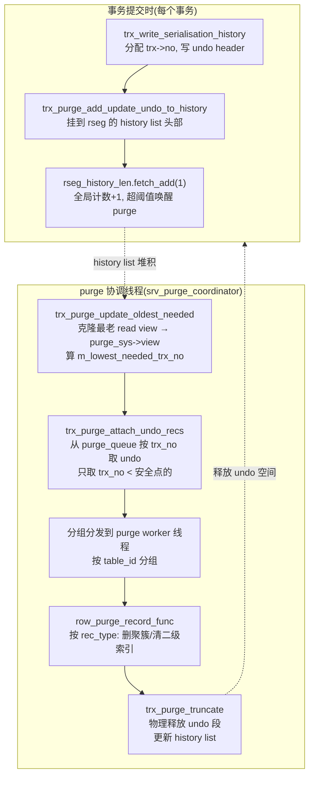
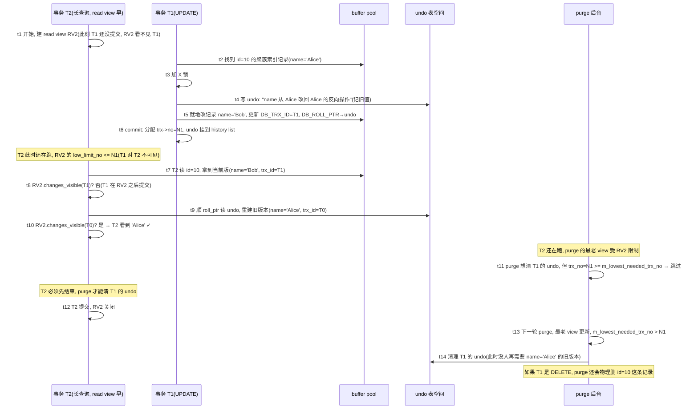

# 第 4 篇 · 第 15 章 · undo 版本链与 purge

> **核心问题**:MVCC 让一行可以有多个版本,读顺着 undo 版本链往回找看得见的那个版本。可旧版本越堆越多怎么办?InnoDB 后台的 purge(清理)机制,凭什么知道"哪些旧版本再没人需要了,可以删了"?purge 删的不只是 undo 日志——它还是 DELETE 操作"真正落地"的地方。

> **读完本章你会明白**:
> 1. **undo 版本链怎么串起来**:一条 `DB_ROLL_PTR`(roll pointer)把一行的新旧版本链成一条链,purge 要清理的就是链上"没人再需要"的旧版本。
> 2. **purge 凭什么知道能删到哪**:purge 系统维护一个"最老 read view"(clone 系统里最早还开着的那个 read view),只能清理比它还老的版本——这保证了清理不影响任何活跃事务的可见性。
> 3. **DELETE 在 InnoDB 里是两步**:事务提交时先在聚簇索引记录上打 delete mark(删除标记),purge 后台才把这条记录真正从 B+树里物理删除;UPDATE 是写新版本、留旧版本在 undo,purge 清理旧版本对应的二级索引冗余条目。
> 4. **purge 和 read view 是什么关系**:read view 是"读"的可见性标尺,purge view 是"删"的安全边界——两者用同一套可见性算法,但方向相反(read view 决定"看得到哪",purge view 决定"删得到哪")。

> **如果一读觉得太难**:先记住三件事——① 一行的新版本通过 `DB_ROLL_PTR` 指向 undo 里的旧版本,串成版本链;② purge 后台线程只删"比最老活跃 read view 还老"的旧版本,保证不破坏正在跑的事务的可见性;③ DELETE 是"先打标记、purge 真删",所以提交快、清理慢是常态。

---

## 〇、一句话点破

> **purge 是 MVCC 的"垃圾回收":它顺着 undo 版本链,把"没有任何活跃事务还需要"的旧版本清掉,同时把 DELETE 打过标记的记录真正从 B+树里删掉。它清理到哪,由"系统里最老的那个 read view"说了算——只要还有一个事务可能要看某个旧版本,purge 就不能动它。**

这是结论,不是理由。本章倒过来拆:先讲版本链是怎么串起来的(承接 P4-13/14 的可见性判断,这里补版本链的物理结构),再讲"旧版本越堆越多"这个必然问题,然后拆 purge 怎么界定安全清理点、怎么真正落地删除,最后讲 purge 后台的协调机制和它跟《TiKV》GC 的同源关系。

---

## 一、回顾:版本链是怎么串起来的(物理结构)

P4-13/14 讲了 MVCC 的可见性判断:一个事务给一行某个版本,用 read view 判断"这个版本我看得见吗";看不见就顺着版本链往回找,直到找到看得见的版本。但版本链**物理上怎么串起来**,是本章的地基,得先讲清。

### 1.1 每行多了两个隐藏列:`DB_TRX_ID` 和 `DB_ROLL_PTR`

InnoDB 的聚簇索引(主键 B+树,见 P1-02)里,每条记录除了你建表时定义的字段,还藏着三个系统列(在《PG》那本里叫系统列 `xmin`/`xmax`/`cmin`,InnoDB 用的是自己的名字):

- **`DB_TRX_ID`(6 字节)**:最后一次修改(或插入)这条记录的事务 ID。
- **`DB_ROLL_PTR`(7 字节,roll pointer)**:**回滚指针**,指向这条记录对应的 undo 日志记录——也就是"上一个版本长什么样"。
- `DB_ROW_ID`(6 字节):没有主键时 InnoDB 造的隐式行 ID(有主键就不存在,见 P1-02),和版本链无关,本章不展开。

```
   聚簇索引叶子页里的一条记录(简化布局):
   ┌──────────────────────────────────────────────────────┐
   │ DB_TRX_ID(6B) │ DB_ROLL_PTR(7B) │ 用户字段...          │
   │  最后修改的trx  │ → undo 里的旧版本 │  你 INSERT/UPDATE 的数据 │
   └──────────────────────────────────────────────────────┘
```

**`DB_ROLL_PTR` 就是版本链的"链表指针"**——它指向 undo 表空间里的一条 undo 记录,那条 undo 记录里又存了"再上一个版本"的 `DB_ROLL_PTR`。于是,一行的新旧版本,被 roll pointer 串成了一条链。

### 1.2 roll pointer 的位结构:56 位塞进 7 字节

`DB_ROLL_PTR` 是个 56 位的整数(塞在 7 字节里),分四段,见 [`trx_undo_build_roll_ptr`](../mysql-server/storage/innobase/include/trx0undo.ic#L45-L54):

```
   roll_ptr_t (56 bits):
   ┌──────┬─────────┬───────────────────┬──────────────────────┐
   │ bit55│ bits 48-54│  bits 16-47       │  bits 0-15           │
   │ insert│ undo num │  page_no (32 bit) │  offset (16 bit)     │
   │ flag  │(回滚段号)│  undo 日志所在页号 │  undo 记录在页内的偏移 │
   └──────┴─────────┴───────────────────┴──────────────────────┘
```

- **最高 1 位(insert flag)**:这条 undo 是 INSERT undo 还是 UPDATE undo。INSERT undo 在事务结束后就可丢弃(插入的行回滚就是删掉,不需要 MVCC),UPDATE undo 才是版本链的成员。
- **7 位 undo num**:回滚段编号(对应哪个 undo 表空间)。
- **32 位 page_no + 16 位 offset**:精确定位到 undo 表空间里某页某偏移的那条 undo 记录。

这个设计很经济——7 字节就够把"我的旧版本在 undo 表空间的哪一页哪个偏移"表达清楚。解码见 [`trx_undo_decode_roll_ptr`](../mysql-server/storage/innobase/include/trx0undo.ic#L62-L73)。

> **钉死这件事**:`DB_ROLL_PTR` 是版本链的物理载体。读旧版本时,InnoDB 拿到当前记录的 roll_ptr,顺着它去 undo 表空间把那条 undo 记录读出来,从中重建出"上一个版本长什么样",再看这个版本的事务 ID(`DB_TRX_ID`)用 read view 判断可见性;不可见就继续顺着这条 undo 记录里存的更老的 roll_ptr 往回找。

### 1.3 版本链的形态:新版本在 B+树里,旧版本在 undo 里

这里有个容易误解的点:**版本链不是"每条记录都物理存在 B+树里"**。真实形态是:

- **最新版本**:就在聚簇索引 B+树的叶子页里(UPDATE 是**就地更新**这条记录,见 P1-02/P3-10,这是 InnoDB 区别于 LevelDB LSM"追加写"的根本)。
- **旧版本**:不存在 B+树里,而是**靠 undo 日志记录"反推"出来**。undo 记录的是"怎么改回去"(逻辑日志),读旧版本时,InnoDB 拿最新版本 + undo 记录,在内存里**重建**出旧版本的样貌。

```
   版本链(最新版在 B+树,旧版本靠 undo 重建):

   聚簇索引 B+树叶子页                undo 表空间
   ┌─────────────────────┐
   │ 最新版 v3            │
   │ DB_TRX_ID = T3       │──roll_ptr──▶ undo 记录 u3(记录 v3 怎么改回 v2)
   │ data = ...           │              ├ DB_TRX_ID = T2
   └─────────────────────┘              ├ roll_ptr ─────▶ undo 记录 u2(v2 改回 v1)
                                        │                 ├ DB_TRX_ID = T1
                                        │                 └ roll_ptr = NULL(初版)
                                        └ (u3 描述的"改回去"应用在 v3 上 → 重建出 v2)
```

重建旧版本的函数是 [`trx_undo_prev_version_build`](../mysql-server/storage/innobase/trx/trx0rec.cc#L2446-L2451):它接收当前版本(在 B+树里),读出 roll_ptr 指向的 undo 记录,把 undo 里记录的"反向修改"应用上去,在内存 heap 里造出一个 `old_vers`(旧版本),返回给读操作。注意它在 L2479 有个早退:`if (trx_undo_roll_ptr_is_insert(roll_ptr))`,意思是如果 roll_ptr 标记这是 INSERT undo(这条记录是 freshly inserted 的),那就没有更老的版本了,直接返回 `true` 表示"这是第一个版本"。

> **不这样设计会怎样**:如果像 LevelDB 的 LSM 那样,每次 UPDATE 都把新版本追加成一个独立 key(同 key 多版本),B+树结构就崩了——B+树是"一个主键对应一条记录"的有序结构,同主键多条记录没法维护。InnoDB 选"最新版就地更新 + 旧版本靠 undo 反推",既保住了 B+树的有序性,又实现了多版本。**这是 InnoDB 的 B+树范式决定 MVCC 实现形态的根**,也呼应了 P0-01 讲的"B+树就地更新 vs LSM 追加"的根本区别(承接《LevelDB》)。

---

## 二、问题:版本链不能无限长

MVCC 解决了"读不阻塞写"(P4-13),代价是**每条 UPDATE 都留一条 undo 记录**串在版本链上,DELETE 还要在记录上打 delete mark。这些 undo 记录和打标记的记录,会**一直占着 undo 表空间和数据页**,直到没人再需要它们。

### 2.1 三种"垃圾"会堆积

随着事务不断提交,有三类东西会越堆越多:

1. **UPDATE undo 记录**(版本链上的旧版本):每次 UPDATE 一行,就往 undo 表空间写一条"怎么改回去"。事务提交后,这条 undo 不再用于回滚,但**只要还有活跃事务的 read view 可能要看它**(为了读这行的旧版本),就不能删。
2. **DELETE 标记的记录**:DELETE 一行,InnoDB 不是立刻从 B+树里物理删掉,而是给这条记录打个 delete mark(`REC_INFO_DELETED_FLAG`)。为什么?因为别的事务可能正拿着这行的旧版本在读,也可能有并发事务在用这行做锁判断(间隙锁,见 P5-17)。物理删除要等"安全"了再做。
3. **二级索引的冗余条目**:UPDATE 改了某个建了二级索引的字段(比如 `name`),聚簇索引就地更新,但二级索引里旧的 `name` 条目得清掉、新的得加上。这个清理也是 purge 的事。

### 2.2 不清理会怎样

如果完全没有 purge:

- **undo 表空间无限膨胀**:每次 UPDATE 都写 undo,这些 undo 永远不释放,undo 表空间会被撑爆。生产上表现为 `SHOW ENGINE INNODB STATUS` 里的 history list length(历史链表长度)只增不减,几亿、几十亿。
- **数据页里堆满删除标记的"墓碑"**:DELETE 过的行物理上还在 B+树叶子页里,占着空间,扫描时还要跳过,空间放大和读放大都涨。
- **DML 被拖慢**:InnoDB 有个保护机制(`innodb_max_purge_lag`),当 history list 太长,purge 跟不上,DML 会被强制延迟(见 [`trx_purge_dml_delay`](../mysql-server/storage/innobase/trx/trx0purge.cc#L2321-L2351)),防止 undo 涨得比 purge 清得还快导致系统失控。

所以 purge 是 MVCC 的"另一半"——MVCC 制造了多版本,purge 回收多版本。**没有 purge 的 MVCC 是不可持续的**。

> **不这样会怎样**:可以想象成一个只增不减的版本链——系统跑几天,undo 表空间几百 GB,全是没用的旧版本,但谁也不敢删(怕删早了,活跃事务读不到要的版本)。purge 机制就是**精确地、安全地**回答"到底哪些旧版本可以删了"。

### 2.3 这个问题的本质:界定"安全清理点"

purge 要解决的核心问题,可以归结成一句话:

> **怎么确定一个 undo 记录(旧版本)"再也不会被任何活跃事务读到"了,可以安全删除?**

这个问题的答案,就是 purge 系统最精妙的地方——它维护一个"最老 read view"作为安全边界。下一节拆透。

---

## 三、purge 的安全边界:最老 read view

### 3.1 关键洞察:旧版本能不能删,取决于"还有没有 read view 需要它"

回顾 P4-14 的可见性判断:一个事务 T 读一行时,顺着版本链往回找,直到找到一个版本,其 `DB_TRX_ID` 对 T 的 read view 可见。这意味着:

- 如果系统里**还有一个活跃事务 T_old**,它的 read view 很"老"(建得早),那么 T_old 就可能需要顺着版本链读到很老的版本。
- 所以,**比 T_old 的 read view 还老的版本,才是真没用的**——因为没有任何 read view 会再去读它们(最老的 read view 都比它们新)。

反过来:

- 如果某个旧版本比 T_old 的 read view **还新**(或者说,产生它的那个事务在 T_old 的 read view 看来"已经提交"),那这个版本可能正是 T_old 当前在读的,**绝对不能删**。

> **所以这样设计**:purge 系统维护一个**最老活跃 read view**(oldest active read view),作为"能清理到哪"的安全上限。purge 只清理那些"产生它们的事务,在最老 read view 看来已经提交"的 undo——也就是事务序列号(`trx->no`,见下)小于最老 read view 下限的版本。

### 3.2 `trx->no` vs `trx->id`:两个容易混淆的号

这里要分清两个概念,这是理解 purge 的关键:

- **`trx->id`(事务 ID)**:事务**开始**时就分配的 ID,用于给每条记录盖"谁改的我"的章(`DB_TRX_ID`)。read view 的可见性判断用的是这个。
- **`trx->no`(事务序列号)**:事务**提交**时才分配的序列号。它标志"这个事务在哪个时刻提交了"。**purge 用的是这个**——因为 purge 关心的是"这个事务已经提交了,它的 undo 还有没有人需要",而"提交时刻"才决定了"有没有 read view 在它之前建立"。

分配 `trx->no` 的地方在 commit 流程里:见 [`trx_commit_low`](../mysql-server/storage/innobase/trx/trx0purge.cc) 调用的 `trx_write_serialisation_history`(`trx0trx.cc:2171`),它负责把事务的 update undo 挂到回滚段的 history list(历史链表)上,并给事务分配 `trx->no`。

> **钉死这件事**:read view 里也有两个对应的字段,容易看混——
> - `m_low_limit_id`(`low_limit_id`):**事务 ID 视角**的下限,等于"建这个 read view 时,系统将要分配的下一个 trx_id"。可见性判断用它(`changes_visible`:id >= low_limit_id → 不可见)。
> - `m_low_limit_no`(`low_limit_no`):**事务序列号视角**的下限,等于"建这个 read view 时,已经提交的事务里最大的那个 `trx->no` 加一"(或者说,此刻最小的未提交 `trx->no`)。**purge 用这个**——它能清理的最大 `trx->no` 就是 `low_limit_no`。
>
> 见 [`ReadView::prepare`](../mysql-server/storage/innobase/read/read0read.cc#L446-L469):`m_low_limit_no = trx_get_serialisation_min_trx_no()`(已经提交的最小序列号),`m_low_limit_id = trx_sys_get_next_trx_id_or_no()`(下一个事务 ID)。两者都是"建 view 那一刻的快照",但一个看序列号、一个看事务 ID。

### 3.3 purge view:把系统最老的 read view 克隆过来

purge 系统自己也有一个 read view,叫 `purge_sys->view`。它的来历是:**周期性地,把系统里当前最老的那个活跃 read view,克隆过来**。

这个克隆操作在 [`trx_purge_update_oldest_needed`](../mysql-server/storage/innobase/trx/trx0purge.cc#L252-L273):

```c
static void trx_purge_update_oldest_needed() {
  rw_lock_x_lock(&purge_sys->latch, UT_LOCATION_HERE);
  trx_sys->mvcc->clone_oldest_view(&purge_sys->view);           // 克隆最老 view
  const auto needed_by_purge_view = purge_sys->view.low_limit_no();
  // GTID 持久化器也可能需要一个更老的边界,取两者最小
  const auto needed_by_persistor =
      clone_sys->get_gtid_persistor().get_oldest_trx_no();
  purge_sys->m_lowest_needed_trx_no =
      std::min(needed_by_purge_view, needed_by_persistor);
  rw_lock_x_unlock(&purge_sys->latch);
}
```

`clone_oldest_view` 的实现在 [`read0read.cc:685`](../mysql-server/storage/innobase/read/read0read.cc#L685-L720):它遍历 `m_views`(所有打开的 read view)链表,找到最老的那个(最后一个还开着的),把它的内容复制到 purge 的 view 里。如果系统里没有任何活跃 read view(所有事务都提交了、view 都关了),那就 `view->prepare(0)`——建一个"看得到所有已提交事务"的 view,意思是 purge 可以大胆往前清。

### 3.4 安全清理点:`m_lowest_needed_trx_no`

`trx_purge_update_oldest_needed` 算出来的 `purge_sys->m_lowest_needed_trx_no`,就是 purge 这一轮的**安全清理上限**:

- 它是"最老 read view 的 `low_limit_no`"和"GTID 持久化需要的 oldest trx no"两者的**最小值**。
- GTID 持久化器(`Clone_persist_gtid`)也要看 undo 日志(它要从 undo header 里读 GTID 持久化),所以 purge 不能清掉 GTID 持久化还没处理的 undo——这是 9.x 的一个细节,老资料常漏掉。

purge 在取下一条要清的 undo 记录时,严格检查不能越过这个界限,见 [`trx_purge_fetch_next_rec`](../mysql-server/storage/innobase/trx/trx0purge.cc#L2203-L2237):

```c
  if (purge_sys->iter.trx_no >= purge_sys->m_lowest_needed_trx_no) {
    return nullptr;                       // 超过安全点,本轮停手
  }
  ...
  return (trx_purge_get_next_rec(n_pages_handled, heap));
```

> **钉死这件事**:`m_lowest_needed_trx_no` 是 purge 的安全带。它由"系统里最老的活跃 read view"决定——只要还有一个长事务开着 read view(比如一个跑了好几小时的报表查询),purge 就被它卡住,不能清理这个 read view 之后产生的 undo。**这就是为什么长事务会拖慢 purge、撑大 undo 表空间**——不是 purge 慢,是 purge 不敢清(怕清了那个长事务就读不到了)。

### 3.5 反面对比:如果 purge 不管 read view,乱删会怎样

假设 purge 不看最老 read view,事务一提交就把它的 undo 清了:

```
   场景:事务 A(TA, read view 早)正在读 row X 的旧版本
         事务 B(TB)刚提交,row X 被它改过,新版本 v_new,旧版本 v_old 在 undo

   时间线:
   t1: TA 开始,建 read view(此时 TB 还没提交,TA 的 view 看不见 TB)
   t2: TB 改 row X,写新版本,留旧版本在 undo
   t3: TB 提交
   t4: 【如果 purge 立刻清掉 TB 的 undo】← TA 还在跑!
   t5: TA 读 row X → 顺着 roll_ptr 找旧版本 → undo 没了 → 读到错的(或崩)
```

TA 在 t1 建的 read view 看不见 TB(t3 才提交),所以 TA 应该读 row X 的旧版本 `v_old`。但 purge 在 t4 把 TB 的 undo 清了,TA 在 t5 就找不到 `v_old` 了——**要么读到错误的新版本(破坏隔离),要么直接报错(事务失败)**。这就是 purge 必须看最老 read view 的根本原因。

有了"最老 read view"这个边界,purge 只清"比 TA 的 read view 还老"的 undo,TA 需要的 `v_old`(对应的 `trx->no` >= TA view 的 low_limit_no)绝对不在清理范围内,TA 永远读得到。**这就是 purge 的 soundness(正确性)所在。**

---

## 四、purge 的清理对象:DELETE 真删 + UPDATE 清旧版

界定了安全点(只清 `trx->no < m_lowest_needed_trx_no` 的 undo),接下来看 purge **具体清什么**。这要回到 P3-10 讲的 undo 两种记录类型,以及 InnoDB 对 DELETE/UPDATE 的不同处理。

### 4.1 DELETE 的两步走:先打标记,purge 真删

**InnoDB 的 DELETE 不是提交时立刻物理删除**,而是:

1. **事务执行 DELETE 时**:在聚簇索引的这条记录上打 **delete mark**(`REC_INFO_DELETED_FLAG`),同时写一条 undo 记录(`TRX_UNDO_DEL_MARK_REC` 类型)。这条 undo 记录了"被删的是哪条记录"(主键值等),用于回滚(回滚就把 mark 去掉)和 MVCC(别的事务读这条记录的旧版本时,知道它在某个事务里被标记删除了)。
2. **事务提交时**:undo 挂到 history list,等 purge。
3. **purge 后台**:等到这条 undo"没人再需要"(它的 `trx->no` 小于最老 read view 的下限),purge 才**真正把这条记录从聚簇索引 B+树里物理删除**,同时清理它在所有二级索引里的条目。

为什么不在提交时就物理删?两个原因:

- **回滚需要**:如果事务后来回滚了(或 crash 后被回滚),物理删掉的记录得重新插回来,代价大;打标记只需去掉标记。
- **并发可见性需要**:别的事务可能正读着这条记录的旧版本,或正拿着它的锁(行锁、间隙锁),物理删了会破坏它们的判断。

真正的物理删除在 [`row_purge_del_mark`](../mysql-server/storage/innobase/row/row0purge.cc#L656-L691):

```c
[[nodiscard]] static bool row_purge_del_mark(purge_node_t *node) {
  ...
  while (node->index != nullptr) {
    // 先清理所有二级索引里这条记录的条目
    ...
    row_purge_remove_sec_if_poss(node, node->index, entry);  // 删二级索引条目
    node->index = node->index->next();
  }
  ...
  return (row_purge_remove_clust_if_poss(node));  // 最后从聚簇索引物理删除
}
```

注意顺序:**先删二级索引条目,最后删聚簇索引记录**。这是为了避免"先删了聚簇索引,二级索引还指向它"的不一致窗口——聚簇索引是"根",二级索引指向聚簇索引(P1-03 讲回表),所以要从叶子(二级索引)往根(聚簇索引)删。

### 4.2 UPDATE:purge 清理二级索引的冗余条目

UPDATE 的处理稍微复杂。聚簇索引是就地更新(P3-10),所以聚簇索引里只有最新版,**purge 不需要在聚簇索引里清旧版本**(旧版本只存在于 undo,被版本链反推)。

但**二级索引不一样**:UPDATE 改了某个建了二级索引的字段(比如 `name`),二级索引里的旧 `name` 条目就得删掉、新 `name` 条目得加上。InnoDB 的做法是:

- **更新二级索引时,先打 delete mark + 插入新条目**(类似 DELETE + INSERT),产生一条 `TRX_UNDO_UPD_EXIST_REC` 类型的 undo。
- purge 在清理这条 undo 时,把二级索引里那个旧的、已经没用的 delete-marked 条目真正删掉。

见 [`row_purge_upd_exist_or_extern_func`](../mysql-server/storage/innobase/row/row0purge.cc#L698-L745):它遍历所有二级索引,如果这次 UPDATE 改变了某个二级索引的排序字段(`row_upd_changes_ord_field_binary`),就把那个二级索引里的旧条目删掉。

```c
    if (row_upd_changes_ord_field_binary(node->index, node->update, ...)) {
      dtuple_t *entry = row_build_index_entry_low(...);   // 重建旧索引条目
      row_purge_remove_sec_if_poss(node, node->index, entry);  // 删旧条目
    }
```

> **钉死这件事**:purge 清理的对象,本质是"已经被新版本取代、且再没人需要"的东西——对聚簇索引,是 DELETE 标记的记录(物理删除);对二级索引,是 UPDATE/DELETE 留下的冗余条目(物理删除)。**purge 把"逻辑上的删除"变成"物理上的回收"**,这是 InnoDB"提交快、清理慢"的根——提交只打标记(快),purge 后台慢慢真删(慢但不阻塞业务)。

### 4.3 主分发:按 undo 记录类型决定清什么

purge 取到一条 undo 记录后,根据它的类型分发,见 [`row_purge_record_func`](../mysql-server/storage/innobase/row/row0purge.cc#L1074-L1107):

```c
  switch (node->rec_type) {
    case TRX_UNDO_DEL_MARK_REC:              // DELETE 标记
      purged = row_purge_del_mark(node);     // → 真删聚簇+二级索引
      break;
    default:
      if (!updated_extern) break;
      [[fallthrough]];
    case TRX_UNDO_UPD_EXIST_REC:             // UPDATE 已有记录
      row_purge_upd_exist_or_extern_func(... node, undo_rec);  // → 清二级索引旧条目 + 释放外部存储
      break;
  }
```

三种主类型:`DEL_MARK_REC`(删除标记)、`UPD_EXIST_REC`(更新已有记录)、以及涉及外部存储(LOB 大字段)的特殊情况。purge 把它们分别派给对应的清理函数。

---

## 五、purge 的数据结构:history list 与优先队列

讲完了"清什么"和"清到哪",现在看 purge **怎么组织和遍历**那些待清的 undo。这涉及 InnoDB undo 表空间里的一个核心结构——**history list(历史链表)**。

### 5.1 history list:回滚段里挂着的"已提交事务的 undo"

每个回滚段(rollback segment, rseg)里,有一条 history list。事务提交时,它的 update undo log(可能是一个 undo 段,或多页组成的 undo log)被**挂到所属回滚段的 history list 头部**。

挂载的入口在 [`trx_purge_add_update_undo_to_history`](../mysql-server/storage/innobase/trx/trx0purge.cc#L352-L434),它在事务提交流程(`trx_write_serialisation_history`)里被调用:

```c
  /* Add the log as the first in the history list */
  flst_add_first(rseg_header + TRX_RSEG_HISTORY,
                 undo_header + TRX_UNDO_HISTORY_NODE, mtr);   // 挂到链表头

  if (update_rseg_history_len) {
    trx_sys->rseg_history_len.fetch_add(n_added_logs);        // 全局计数 +1
    if (trx_sys->rseg_history_len.load() >
        srv_n_purge_threads * srv_purge_batch_size) {
      srv_wake_purge_thread_if_not_active();                  // 唤醒 purge
    }
  }
```

关键点:

- `flst_add_first`:InnoDB 的文件链表(file list, `flst`),把 undo log 节点挂到回滚段 history list 头部。**新的挂在头部,所以 history list 是按提交逆序排的**。
- `trx_sys->rseg_history_len`:一个**全局原子计数器**,记录所有回滚段 history list 的总长度。这就是 `SHOW ENGINE INNODB STATUS` 里看到的 "history list length"。
- 当 history list 长度超过 `purge_threads * purge_batch_size`,唤醒 purge 线程——这是个反馈机制,undo 堆多了赶紧让 purge 干活。

### 5.2 purge queue:按 `trx->no` 排序的优先队列

history list 是按"挂载顺序"(提交逆序)排的,但 purge 要按 `trx->no`(提交序列号)从小到大清——这样才能配合"最老 read view"这个安全点(从最老的开始清)。

所以 purge 系统还有一个**优先队列 purge_queue**,把各个回滚段的"最老待清 undo log"按 `trx->no` 排序。purge 每次从队列顶取 `trx->no` 最小的那个回滚段,清它的下一条 undo,见 [`TrxUndoRsegsIterator::set_next`](../mysql-server/storage/innobase/trx/trx0purge.cc#L109-L189):

```c
  } else if (!m_purge_sys->purge_queue->empty()) {
    /* Read the next element from the queue.
    Combine elements if they have same transaction number. */
    m_trx_undo_rsegs = NullElement;
    while (!m_purge_sys->purge_queue->empty()) {
      if (m_trx_undo_rsegs.get_trx_no() == UINT64_UNDEFINED) {
        m_trx_undo_rsegs = purge_sys->purge_queue->top();      // 取 trx_no 最小的
      } else if (purge_sys->purge_queue->top().get_trx_no() ==
                 m_trx_undo_rsegs.get_trx_no()) {
        m_trx_undo_rsegs.insert(purge_sys->purge_queue->top()); // 同 trx_no 合并
      } else {
        break;
      }
      m_purge_sys->purge_queue->pop();
    }
```

注意"同 `trx_no` 合并"的小技巧:一个事务可能用了多个回滚段(分布式场景),它的 undo 散落在多个回滚段的 history list 里,purge 把同 `trx_no` 的合并成一组一起处理。

### 5.3 整体流程图

把版本链、history list、purge queue、purge view 串起来,purge 一轮的流程:



---

## 六、purge 后台协调:动态线程池

purge 是**后台异步**执行的,由专门的 purge 协调线程(coordinator)和若干 purge worker 线程组成。

### 6.1 协调线程的主循环

purge 协调线程的入口是 [`srv_purge_coordinator_thread`](../mysql-server/storage/innobase/srv/srv0srv.cc#L3032),它把状态置为 `PURGE_STATE_RUN`,然后循环调用 [`srv_do_purge`](../mysql-server/storage/innobase/srv/srv0srv.cc#L2845-L2920):

```c
static ulint srv_do_purge(ulint *n_total_purged) {
  ...
  do {
    // 根据 history list 长度,动态决定用几个 purge 线程
    if (trx_sys->rseg_history_len.load() > rseg_history_len ||
        (srv_max_purge_lag > 0 && rseg_history_len > srv_max_purge_lag)) {
      if (n_use_threads < n_threads) ++n_use_threads;        // undo 涨了, 加线程
    } else if (srv_check_activity(old_activity_count) && n_use_threads > 1) {
      --n_use_threads;                                       // undo 少了, 减线程
    }
    if ((rseg_history_len = trx_sys->rseg_history_len.load()) == 0) break;

    n_pages_purged = trx_purge(n_use_threads, srv_purge_batch_size, do_truncate);
    ...
  } while (purge_sys->state == PURGE_STATE_RUN &&
           (n_pages_purged > 0 || need_explicit_truncate) &&
           !srv_purge_should_exit(n_pages_purged));
```

这个循环体现了 purge 的**自适应**:

- **history list 涨了** → 多派几个 worker 线程(`n_use_threads` 增加),加快清理。
- **history list 平稳或降了** → 减少线程,省 CPU。
- **history list 空了**(`rseg_history_len == 0`)→ 跳出循环,协调线程挂起,等下次有 undo 提交再被唤醒。
- **没东西可清了**(`n_pages_purged == 0`)→ 也跳出,避免空转。

### 6.2 `trx_purge`:一轮清理的入口

每轮实际清理的入口是 [`trx_purge`](../mysql-server/storage/innobase/trx/trx0purge.cc#L2396-L2479):

```c
ulint trx_purge(ulint n_purge_threads, ulint batch_size, bool truncate) {
  ...
  srv_dml_needed_delay = trx_purge_dml_delay();              // 算 DML 该不该延迟
  ...
  trx_purge_update_oldest_needed();                          // ① 重算安全点
  n_pages_handled = trx_purge_attach_undo_recs(n_purge_threads, batch_size);  // ② 取 undo
  // ③ 分发到 worker
  for (ulint i = 0; i < n_purge_threads - 1; ++i) {
    thr = que_fork_scheduler_round_robin(purge_sys->query, thr);
    srv_que_task_enqueue_low(thr);                           // 入工作队列
  }
  ...
  que_run_threads(thr);                                      // ④ 跑(主线程也干活)
  trx_purge_wait_for_workers_to_complete();                  // ⑤ 等 worker 完成
  ...
  if (truncate) trx_purge_truncate();                        // ⑥ 物理释放 undo 段
  return (n_pages_handled);
}
```

六步:① 重算最老 read view 安全点;② 按 table_id 分组取 undo 记录(`trx_purge_attach_undo_recs` 内部用 `Purge_groups_t` 按 table_id 分组,保证同一表的记录由同一 worker 处理,避免并发改同一 B+树页);③④ 分发并执行;⑤ 等待;⑥ 物理释放 undo 段空间。

### 6.3 按 table_id 分组:避免 worker 抢同一页

`trx_purge_attach_undo_recs` 里有个细节值得注意:它不是简单地把 undo 记录平均分给 worker,而是**按 `table_id` 分组**,见 [`Purge_groups_t::add`](../mysql-server/storage/innobase/trx/trx0purge.cc#L2052-L2067):

```c
  void add(purge_node_t::rec_t &rec) {
    const table_id_t id = trx_undo_rec_get_table_id(rec.undo_rec);
    GroupBy::iterator lb = m_grpid_umap.find(id);
    if (lb != m_grpid_umap.end()) {
      grpid = lb->second;                                     // 同表 → 同组
    } else {
      grpid = find_smallest_group();                          // 新表 → 分给最闲的组
      m_grpid_umap.insert(std::make_pair(id, grpid));
    }
    m_groups[grpid]->push_back(rec);
  }
```

> **技巧点睛**:同一个表的 undo 记录(可能对应同一棵 B+树的页)分给同一个 worker,这样多个 worker 不会同时去改同一棵 B+树的同一批页,减少锁冲突。这是个典型的"按 key 分区并行"思想,和 gRPC 的 worker 按连接绑定、Tokio 的 task 调度有异曲同工之妙。

---

## 七、技巧精解

本章挑两个最硬核的技巧单独拆透。

### 技巧一:purge 靠"最老 read view"界定安全清理点

这是 purge 整个机制的灵魂。把它单独钉死:

**问题**:undo 版本链上的旧版本,什么时候算"没人再需要了"可以删?

**朴素但错误的想法**:"事务提交了,它的 undo 就可以删"。错在哪?前面 3.5 的反例说过——别的事务可能正读着它的旧版本(MVCC 快照读),提交了不代表没人读。

**正确思路**:"有没有人还需要"这件事,只有 read view 知道。一个 read view 代表一个事务"能看到哪些版本"的快照。系统里最老的那个 read view,就是"最保守的读者"——它可能需要读的版本范围最大。所以:

> **purge 的安全清理点 = 系统里最老活跃 read view 的 `low_limit_no`**(再和 GTID 持久化器的需求取 min)。

这个判断在 [`trx_purge_fetch_next_rec`](../mysql-server/storage/innobase/trx/trx0purge.cc#L2221-L2223) 一行代码钉死:

```c
  if (purge_sys->iter.trx_no >= purge_sys->m_lowest_needed_trx_no) {
    return nullptr;    // 越过安全点, 停手
  }
```

**为什么 sound(正确)**:

- `m_lowest_needed_trx_no` 取自最老 read view 的 `low_limit_no`,而 `low_limit_no` 是"建这个 read view 时,所有已提交事务的 `trx->no` 上界 + 1"(见 [`ReadView::prepare`](../mysql-server/storage/innobase/read/read0read.cc#L446-L469))。
- 也就是说,任何 `trx->no < low_limit_no` 的事务,在**最老那个 read view 看来都是已提交的**——它的修改对所有 read view 都可见,对应的"旧版本"没人需要顺着版本链往回找(大家都能看到它的最新版)。
- 反过来,任何 `trx->no >= low_limit_no` 的事务,在最老 read view 看来"提交时刻在建 view 之后",它的修改可能对最老 read view 不可见,undo 不能删。
- 所以 purge 只清 `trx->no < m_lowest_needed_trx_no` 的 undo,**绝对不破坏任何活跃 read view 的可见性**。

**一个微妙点**:`clone_oldest_view` 里有个看似多余的保护(见 [`read0read.cc:692`](../mysql-server/storage/innobase/read/read0read.cc#L685-L720)):

```c
      if (oldest_view->low_limit_no() <= view->low_limit_no()) {
        // 新的最老 view 不比 purge 已有的 view 更老, 不更新, 直接返回
        trx_sys_mutex_exit();
        return;
      }
```

它防止一种竞态:purge 已经在用一个 view 清理了,这时系统最老 view 变了(比如某个长事务结束了),但新的最老 view 的 `low_limit_no` **不比** purge 现有的小——这种情况下不更新 purge view。注释里给了一段证明,核心是:**`low_limit_no` 只会单调增长**(已提交事务越来越多),所以"更新到更老的 view"在数学上不可能让 purge 错误地多清——它要么不变,要么往前推进。这个单调性保证了 purge 在并发更新 view 时的正确性。

> **反面对比**:如果 purge 用"平均 read view"或"最新 read view"做边界,会发生什么?用"最新"会过度保守(purge 几乎不动,undo 涨爆);用"平均"会过度激进(清掉了某些老 read view 还需要的版本,读到错)。**只有"最老 read view"是那个精确的边界**——它代表了"系统里对旧版本需求最强烈的那一个读者",满足它就满足了所有读者。这是 purge 设计的数学之美。

### 技巧二:DELETE 的"打标记 + 异步真删"两阶段

DELETE 在 InnoDB 里是两步:提交时打 delete mark,purge 后台真删。这个设计看似啰嗦,实则精妙。

**问题**:为什么不在事务提交时就物理删除?

**直接删的三个坑**:

1. **回滚代价**:事务可能回滚(crash recovery 或显式 ROLLBACK)。物理删掉的记录要重新插回 B+树(可能触发页分裂、更新所有二级索引),代价远大于"去掉一个 delete mark 标志位"。
2. **并发可见性**:DELETE 事务提交的瞬间,别的事务 T 可能正读着这条记录的旧版本(T 的 read view 在 DELETE 事务之前建)。物理删了,T 顺版本链找旧版本时就找不到载体了(旧版本是靠"当前记录 + undo"重建的,当前记录没了就没法重建)。
3. **锁的连续性**:InnoDB 的行锁、间隙锁(P5-16/17)是挂在记录上的。物理删了记录,挂在它上面的锁就没了着落,锁系统会乱。DELETE 打标记时,记录还在,锁还挂着,等 purge 真删时,锁早就释放了(commit 时释放,见 P5-16 两阶段锁协议)。

**两阶段的好处**:

- **提交快**:DELETE 只写 undo + 打 mark,不碰 B+树结构(不真删,不触发页合并),提交极快。OLTP 高并发删除的吞吐有保障。
- **清理异步**:purge 后台慢慢真删,不阻塞业务事务。purge 可以批量处理(一轮 `batch_size` 条),摊薄单条删除的代价。
- **正确性清晰**:mark 期间,记录"逻辑上已删、物理上还在",所有并发判断(可见性、锁)都基于"物理上还在"的记录,简单一致;purge 真删时,记录"没人需要"(过了安全点),删了也不影响任何人。

**真删的顺序**(见 [`row_purge_del_mark`](../mysql-server/storage/innobase/row/row0purge.cc#L656-L691)):**先删二级索引条目,最后删聚簇索引记录**。这个顺序是为了避免不一致——聚簇索引是二级索引的"根"(二级索引存主键值指向聚簇索引,P1-03),如果先删聚簇索引,二级索引就指向了不存在的记录(悬空指针),这期间有查询走二级索引回表就会出错。从叶子(二级索引)往根(聚簇索引)删,保证任何时刻二级索引指向的聚簇索引记录都存在。

> **反面对比**:对比 LevelDB/LSM 的 DELETE——LSM 里 DELETE 也是写一条 tombstone(墓碑)记录,等 compaction 时才真正物理删除(承接《LevelDB》)。**思想完全同源**:都是"先标记、后清理",把删除的代价从关键路径(用户事务)转移到后台。InnoDB 的 B+树打 delete mark,和 LSM 的 tombstone,是两种存储引擎范式殊途同归的优雅。

---

## 八、承接《TiKV》:purge 就是 InnoDB 的 GC

讲到这里,你可能觉得 purge 这个机制眼熟——没错,它就是 InnoDB 版的"垃圾回收(Garbage Collection)"。

### 8.1 和《TiKV》GC 的同源

《TiKV》那本讲过,TiKV 的 MVCC 也会堆积旧版本(key + 多个时间戳的版本),需要一个 GC 机制定期清理"没人再需要的旧版本"回收空间。TiKV 的 GC 和 InnoDB 的 purge,**核心思想完全一致**:

| 维度 | **InnoDB purge** | **TiKV GC** |
|------|------------------|-------------|
| 多版本载体 | undo 版本链(roll_ptr 串联) | RocksDB key + 时间戳多版本 |
| 旧版本在哪 | undo 表空间(靠 undo 反推) | RocksDB 里(同 key 多版本) |
| 安全清理点 | 最老活跃 read view 的 `low_limit_no` | `safe_point`(最老活跃事务的 `start_ts` 之前) |
| 谁来定边界 | 活跃 read view | 全局 `pd_tso` 算出的 safe_point |
| 清理对象 | undo 旧版本 + DELETE 标记记录 + 二级索引冗余 | RocksDB 里 `commit_ts > safe_point` 之前的旧版本 |
| 清理方式 | 后台 purge 线程,按 undo log 物理删 | GC worker + RocksDB compaction |
| 触发 | history list 超阈值唤醒 | 定期(默认每 10 分钟) |
| 不清的后果 | undo 表空间涨爆 | RocksDB key 膨胀,读放大 |

两者的根本共性:**都是 MVCC 的"配套回收机制",都靠"最老活跃事务的视图"界定安全点,都把删除代价从用户事务转移到后台**。这是所有 MVCC 实现的共同模式——多版本让读不阻塞写,purge/GC 让多版本不无限膨胀。

### 8.2 差异点

差异来自两者的存储范式不同:

- **InnoDB purge 清的是 undo**(B+树就地更新,旧版本只在 undo 里),TiKV GC 清的是 RocksDB 里的多版本 key(LSM 追加,旧版本是独立的 key)。
- **InnoDB purge 还要物理删 DELETE 标记的记录**(因为 B+树里记录就地存在),TiKV 不需要(RocksDB 的 tombstone 本身就是个 key,compaction 自然清理)。
- **InnoDB purge 还要清二级索引冗余**,TiKV 的二级索引也是 MVCC key,GC 一并清。

> **钉死这件事**:读《TiKV》GC 那章再回来读本章,你会发现"MVCC + GC"是个普适模式。InnoDB 用 undo 版本链 + purge,TiKV 用 LSM 多版本 + compaction GC,殊途同归。理解了其中一个,另一个就是"换个存储载体的同思想变体"。**这是承接《TiKV》的真正价值——它给了你一把理解所有 MVCC 系统的钥匙。**

---

## 九、一个完整的例子:从 UPDATE 到 purge

把全流程串一遍。假设:

```
  事务 T1: UPDATE t SET name='Bob' WHERE id=10;   (原 name='Alice')
  事务 T2: 一个长查询,在 T1 之前开始,read view 看不见 T1
```

时间线:



这个例子完整展示了:**read view 决定读得到哪**(T2 读到 'Alice'),**purge view 决定删得到哪**(T2 没结束前 purge 不敢动 T1 的 undo),两者用同一套 `trx->no`/`low_limit_no` 逻辑,方向相反却严丝合缝。

---

## 十、版本演进与老资料坑

讲几处版本演进,避免被老资料带偏:

1. **8.0 undo 表空间可独立 truncate**:8.0 起 undo 表空间可以独立(`*.ibu` 文件),purge 不仅清 undo 记录,还能在 undo 表空间太大时**整个 truncate**(`trx_purge_truncate_marked_undo`,见 [`trx0purge.cc:1533`](../mysql-server/storage/innobase/trx/trx0purge.cc#L1533-L1610))。老资料讲的 undo 只在系统表空间、不能单独 truncate 已过时。
2. **8.0.14 undo 表空间数量可配**:`innodb_undo_tablespaces`(8.0.14 起动态),至少 2 个,支持滚动 truncate。
3. **GTID 持久化影响 purge 安全点**:9.x 里 `m_lowest_needed_trx_no` 还要考虑 GTID 持久化器(`Clone_persist_gtid::get_oldest_trx_no`),这是为了支持 clone 插件和 GTID 持久化,老资料常漏掉这一层。
4. **多 purge 线程**:现代 InnoDB 默认有 1 个协调线程 + 3 个 worker(`innodb_purge_threads`,默认 4),协调线程会根据 history list 长度动态调度 worker 数量。老资料讲的"单 purge 线程"已过时。

---

## 十一、章末小结

### 回扣主线

本章是 MVCC 篇(P4)的收口,服务**事务与并发**这一面。它回答了 MVCC 的最后一问:**版本链上的旧版本越堆越多怎么办?**

- **承接 P4-13/14**:P4-13 讲了 MVCC 让一行有多个版本、读不阻塞写;P4-14 讲了 read view 怎么判断可见性、怎么顺版本链找。本章接:版本链不能无限长,**purge 后台清理回收**。三者合起来,才是 MVCC 的完整图景——制造多版本(P4-13)→ 判断看哪个版本(P4-14)→ 回收没人要的版本(本章)。
- **回扣主线**:一条写,InnoDB 用 B+树找到位置、redo 保 crash 不丢、**undo/MVCC 保并发读**、锁保隔离。本章讲的 purge,是"undo/MVCC 保并发读"的**收尾**——MVCC 制造了多版本,purge 回收多版本,两者合起来才让"高并发读不阻塞写"可持续。

### 五个为什么

1. **为什么 undo 版本链用 roll_ptr 串联,而不是把旧版本也存进 B+树?** —— B+树是"一主键一记录"的有序结构,多版本没法存;旧版本靠 undo 反推,既保住 B+树有序,又实现多版本。这是 B+树范式决定 MVCC 实现形态的根。
2. **为什么 purge 只清"比最老 read view 还老"的版本?** —— 最老 read view 代表"对旧版本需求最强烈的读者";满足它就满足所有读者。清更老的版本是安全的(没任何 read view 会去读),清更新的会破坏活跃事务的可见性。
3. **为什么 DELETE 是"打标记 + purge 真删"两步?** —— 提交时打 mark 快(不碰 B+树结构)、且支持回滚和并发可见性;purge 后台异步真删,不阻塞业务。两阶段把删除代价从关键路径转移到后台。
4. **为什么 purge 真删时先删二级索引、最后删聚簇索引?** —— 聚簇索引是二级索引的根(二级索引指向聚簇索引);从叶子往根删,保证任何时刻二级索引指向的聚簇索引记录都存在,避免悬空指针。
5. **为什么长事务会拖慢 purge、撑大 undo 表空间?** —— 长事务的 read view 很老,把 purge 的安全点卡在很早的位置,purge 不敢清它之后的 undo。长事务一结束,purge 才能大步往前清。

### 想继续深入往哪钻

- **源码**:
  - purge 主体:[`trx/trx0purge.cc`](../mysql-server/storage/innobase/trx/trx0purge.cc) —— purge 系统初始化、history list 管理、purge 主循环、undo 表空间 truncate。
  - 行级清理:[`row/row0purge.cc`](../mysql-server/storage/innobase/row/row0purge.cc) —— `row_purge_del_mark`(删标记记录)、`row_purge_upd_exist_or_extern_func`(清二级索引)。
  - 版本链构建:[`trx/trx0rec.cc`](../mysql-server/storage/innobase/trx/trx0rec.cc) 的 `trx_undo_prev_version_build`(重建旧版本)。
  - read view:[`read/read0read.cc`](../mysql-server/storage/innobase/read/read0read.cc) 的 `clone_oldest_view`、[`include/read0types.h`](../mysql-server/storage/innobase/include/read0types.h) 的 `changes_visible`。
  - purge 协调线程:[`srv/srv0srv.cc`](../mysql-server/storage/innobase/srv/srv0srv.cc) 的 `srv_do_purge`、`srv_purge_coordinator_thread`。
  - roll pointer 位结构:[`include/trx0undo.ic`](../mysql-server/storage/innobase/include/trx0undo.ic) 的 `trx_undo_build_roll_ptr`/`trx_undo_decode_roll_ptr`。
- **官方文档**:MySQL "InnoDB Multi-Versioning"(讲 undo、purge 概念)、"Internal Details of InnoDB"(讲 history list)。
- **动手感受**:`SHOW ENGINE INNODB STATUS` 看 "Transaction history list length"(就是 `rseg_history_len`);开一个长事务不提交,看 history list 涨不涨;`information_schema.innodb_metrics` 里的 `purge_*` 系列计数器。

### 引出下一章

MVCC 篇到此收口。我们讲清了:**读**怎么不阻塞写(MVCC 多版本 + read view 可见性 + purge 回收)。但**写-写并发**——两个事务同时改同一行——MVCC 帮不了,必须靠**锁**串行化。InnoDB 的锁精妙且复杂(行锁、两阶段锁协议、间隙锁、临键锁、死锁检测),是 InnoDB 并发控制的另一半。

下一章 P5-16,我们从**锁全貌:行锁 + 表锁,两阶段锁协议**开始,拆 InnoDB 锁的招牌。

> **下一章**:[P5-16 · 锁全貌:行锁 + 表锁,两阶段锁协议](P5-16-锁全貌-行锁加表锁-两阶段锁协议.md)
