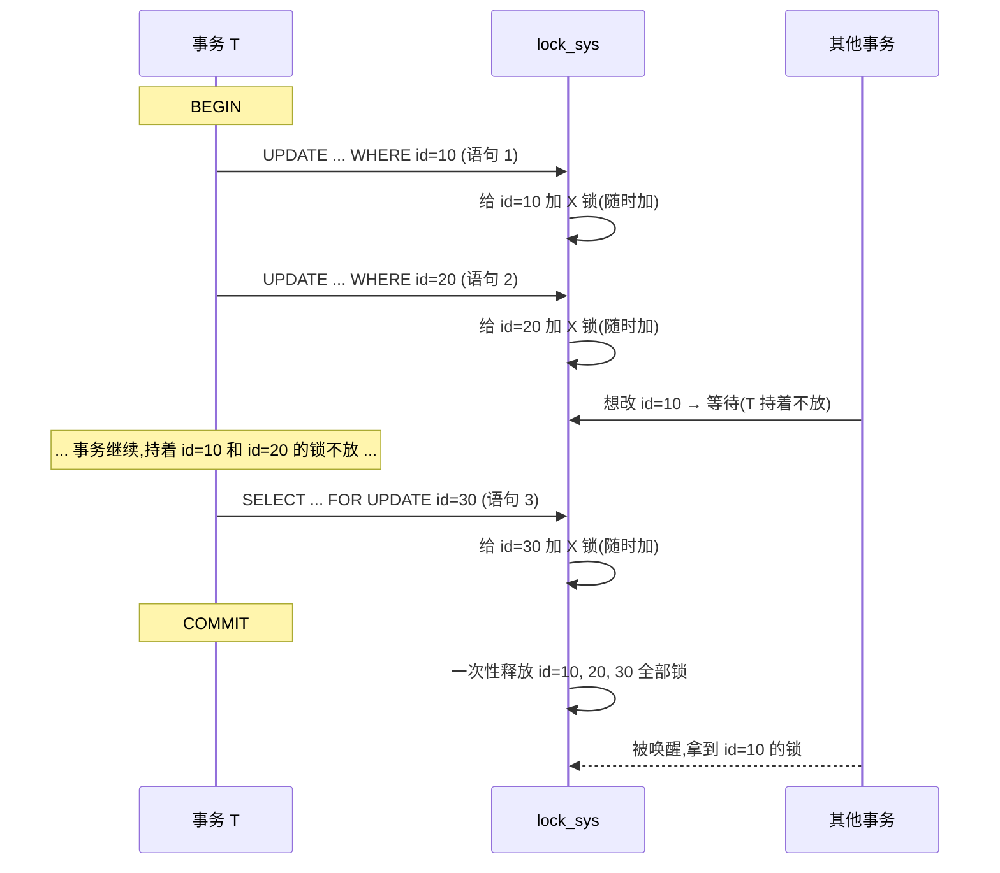

# 第 5 篇 · 第 16 章 · 锁全貌:行锁 + 表锁,两阶段锁协议

> **核心问题**:P4 篇讲完 MVCC,你知道"读不加锁、读不阻塞写"——但两个事务**同时改同一行**,MVCC 帮不了你,这一仗必须靠**锁**串行化。可 InnoDB 的锁远不止"一把锁"那么简单:它有**行锁**(记录锁)也有**表锁**,记录锁又分 S/X 两种模式,表上还有 IS/IX 意向锁;加锁在语句执行时随时发生,释放却要等到 `commit`——凭什么要拖到最后?为什么 InnoDB 不学 MyISAM 整张表锁死?一个页上几百条记录,InnoDB 怎么记录"哪些行被谁锁了"还又不爆内存?这一章把 InnoDB 锁的**全貌**摊开:行锁/表锁的分级、S/X 兼容矩阵、意向锁的用途、两阶段锁协议,以及"按页位图"这个让行锁又省又快的招牌技巧。

> **读完本章你会明白**:
> 1. 为什么 InnoDB 是**行锁**不是表锁(对照 MyISAM),行锁为什么不是"每行一个锁对象"而是**按页用位图**——这套设计省了多少钱、怎么做到判断快。
> 2. 记录锁的 **S/X 两种模式**凭什么这样定义,S/X 兼容矩阵的每一格在源码里长什么样,以及表上的 **IS/IX 意向锁**解决了什么问题(为什么行 X 锁之前必须先给表上 IX)。
> 3. **两阶段锁协议**(随时加锁、`commit` 才放)的真正含义、为什么这么设计(保证可串行化/隔离)、代价是什么(事务越长持锁越久、死锁风险)、为什么 OLTP 死强调"事务要短"。
> 4. 一条 `UPDATE` 加 X 锁、一条 `SELECT ... FOR UPDATE` 加 S/X 锁,在源码里走的是哪条路(`lock_rec_lock` 快路径 → `lock_rec_lock_slow` 慢路径 → 等待队列),以及"隐式锁"这个让纯插入事务几乎零开销的优化。

> **如果一读觉得太难**:先记住三件事——① InnoDB 锁分**行锁(记录锁)**和**表锁**两层,行锁只在**记录**上(S 共享/X 排他),表锁大多是**意向锁**(IS/IX,只是"我要下去行锁了"的声明);② **两阶段锁**:加锁在语句时,释放在 `commit`,所以**事务越短越好**;③ 一个页上的锁共用一个**位图**(bit 数组,一比特代表一条记录被锁),不是每记录一个锁对象。锁篇接下来三章(间隙锁/死锁/隔离级别)都建立在这套全貌之上。

---

## 〇、一句话点破

> **InnoDB 的锁是分两层的:表上加意向锁(IS/IX)声明意图,行上加记录锁(S/X)真正串行化写写并发;加锁在语句执行时随时发生,但全部锁都拖到 `commit` 才一次性释放——这是"两阶段锁协议",它保证了隔离性,代价是事务越长持锁越久、越容易死锁。一个页上几百条记录的锁,InnoDB 用一个 bit 数组(位图)就记住了,而不是每行一个锁对象。**

这是结论,不是理由。本章倒过来拆:先讲 MVCC 解决不了的"写-写并发"为什么必须有锁,再拆锁的分级(行锁/表锁)和 S/X 兼容矩阵,接着讲意向锁的用途,然后是两阶段锁协议("为什么拖到 commit 才放"),最后把"按页位图"这个招牌技巧单独拆透。

---

## 一、为什么 MVCC 解决不了写-写并发

(承接 P4 篇)

P4 篇讲了 MVCC:一行可以有多个版本,读操作看自己事务开始时的快照(read view),顺着 undo 版本链找到可见版本,**不加锁、不阻塞写**。这套机制让"读-写并发"几乎零成本——读的人看旧版本,写的人改最新版,各看各的,互不干扰。

但有一类并发,MVCC 完全无能为力:**两个事务同时改同一行**。

```
   时刻    事务 A                          事务 B
   t1     BEGIN
   t2                                     BEGIN
   t3     UPDATE account SET bal=bal-100   -- 想扣 100
              WHERE id=10
   t4                                     UPDATE account SET bal=bal+50
                                            WHERE id=10    -- 想加 50
   t5     COMMIT
   t6                                     COMMIT
```

A 想扣 100,B 想加 50。这两次写**改的是同一行的同一个版本**(都基于最新版),最终的 `bal` 应该是多少?如果两个都直接改、互不知道,很可能其中一个改覆盖另一个("丢失更新")。MVCC 在这里帮不上忙——MVCC 是"保留旧版本给读用",但它不阻止两个写都拿"当前版本"当起点。

> **不这样会怎样**:如果纯靠 MVCC 放任两个写同时进行,要么一个写丢了("丢失更新"),要么读到一个"半 A 半 B"的脏中间态。这不是性能问题,是**正确性问题**——钱的账绝对不能算错。所以"写-写"对同一行,**必须串行化**:一个先改完、另一个再改,不允许同时。

这就是锁的活。InnoDB 的做法朴素而坚定:**要改一行,先给它加排他锁(X 锁);如果别人已经加了排他锁,你就等着,等他 commit 释放了你再改。** 于是"两个写同一行"被天然串行化,A 改完(并 commit)B 才能动,B 看到的就是 A 改后的版本,绝不会丢更新。

> **钉死这件事**:MVCC 管"读-写"(读看旧版、写改新版,互不阻塞),锁管"写-写"(改同一行的,排队串行化)。两套机制各管一头,合起来才是 InnoDB 的并发控制全套。这一章,我们正式进入锁的世界。

---

## 二、锁分两层:行锁(记录锁)与表锁

InnoDB 的锁,首先按**锁住的粒度**分两类:**记录锁(record lock,常称行锁)**和**表锁(table lock)**。这是 InnoDB 区别于 MyISAM 的第一道分水岭。

### 行锁:锁的是"一条记录"

InnoDB 最常用、也最招牌的锁,是**记录锁**——锁住的是 B+树里的一条**记录**(record)。注意,InnoDB 里"行"和"记录"几乎同义:一张表的数据存在聚簇索引(主键 B+树)的叶子页里,一条记录就是一行数据(P1-02 讲过);一条 `UPDATE t SET x=1 WHERE id=10`,改的就是聚簇索引里 `id=10` 那条记录,InnoDB 只锁那一条。

```
   聚簇索引的一个叶子页(简化):
   ┌─────────────────────────────────────────────┐
   │  infimum │ rec(id=8) │ rec(id=10) │ rec(id=15) │ ... │ supremum │
   │          │           │  [被 X 锁] │            │     │          │
   └─────────────────────────────────────────────┘
   事务 A 改 id=10 → 只锁 rec(id=10) 这一条记录。
   事务 B 改 id=15 → 锁 rec(id=15),与 A 互不影响。
```

对照 MyISAM:MyISAM 只有**表锁**——任何写操作(哪怕只改 id=10 一行)都锁整张表,期间任何其他事务(改 id=10 也好、改 id=15 也好)全得等。MyISAM 这么做,并发写几乎废掉;InnoDB 用记录锁,改 id=10 和改 id=15 互不阻塞,这才是 OLTP 高并发写的根基。

> **不这样会怎样**:如果 InnoDB 也学 MyISAM 用表锁,一个转账事务锁整张 `account` 表,期间全表所有账户的转账都得排队——双十一秒杀根本扛不住。记录锁把"互不干扰的行"彻底解耦,是 OLTP 高并发的命根子。

### 表锁:锁的是"整张表",但大多只是"意向"

但 InnoDB 也有表锁。表锁有几种来源:

1. **意向锁(IS/IX)**:这是最常见、也是最重要的一种。事务在给行上 S/X 锁之前,必须先在表上"声明意图"——上 IS(意向共享)或 IX(意向排他)。它本身**不真正阻塞行操作**,只是一个"声明",用来让别的想给整张表上加 S/X 锁的事务(比如 `LOCK TABLES`)能快速判断"这张表上是不是已经有人在行级加锁了"。下一节单独拆。
2. **`LOCK TABLES` 语句**:用户显式锁表,会给表加真正的 S/X 表锁。
3. **AUTO-INC 锁**:自增列分配用的特殊表锁(给 `INSERT` 用,防止并发插入抢同一个自增值)。
4. **DDL 相关锁**:在线 DDL、`DROP TABLE` 等操作期间,会用表锁做协调(详见 P6-22)。

本章重点讲前两种(意向锁、`LOCK TABLES` 的 S/X 表锁);AUTO-INC 和 DDL 锁涉及处略带。日常 OLTP 里你遇到的 InnoDB 表锁,绝大多数是**意向锁**。

### 行锁 vs 表锁:源码里怎么区分

InnoDB 在源码里用一个 `type_mode` 字段的某几个 bit 来区分"这是行锁还是表锁"。看 `include/lock0lock.h` 的常量定义:

```c
/* mask used to extract mode from the  type_mode field in a lock */
constexpr uint32_t LOCK_MODE_MASK = 0xF;       // lock0lock.h:949
/** table lock */
constexpr uint32_t LOCK_TABLE = 16;            // lock0lock.h:952
/** record lock */
constexpr uint32_t LOCK_REC = 32;              // lock0lock.h:954
/** mask used to extract lock type from the type_mode field in a lock */
constexpr uint32_t LOCK_TYPE_MASK = 0xF0UL;    // lock0lock.h:956
```

—— 见 [LOCK_TABLE/LOCK_REC 定义](../mysql-server/storage/innobase/include/lock0lock.h#L949-L956)。一个 `lock_t` 对象的 `type_mode` 字段里:`LOCK_REC`(32)表示这是个记录锁,`LOCK_TABLE`(16)表示这是个表锁;低 4 位(bit 0~3)是**模式**(LOCK_IS/IX/S/X/AUTO_INC),中间几位是**类型**(REC/TABLE),更高位是各种**精细标志**(LOCK_GAP、LOCK_REC_NOT_GAP、LOCK_INSERT_INTENTION、LOCK_WAIT 等)。

```c
/* Basic lock modes */                         // lock0types.h:54-64
enum lock_mode {
  LOCK_IS = 0,          /* intention shared */
  LOCK_IX,              /* intention exclusive */
  LOCK_S,               /* shared */
  LOCK_X,               /* exclusive */
  LOCK_AUTO_INC,        /* locks the auto-inc counter */
  LOCK_NONE,            /* used elsewhere to note consistent read */
  LOCK_NUM = LOCK_NONE,
  LOCK_NONE_UNSET = 255
};
```

—— 见 [lock_mode 枚举](../mysql-server/storage/innobase/include/lock0types.h#L54-L64)。

这里有个关键事实,很多老资料没讲清:**行锁只可能是 LOCK_S 或 LOCK_X**(对应记录上的共享/排他);**表锁**可以是 IS/IX/S/X/AUTO_INC。源码注释甚至直说了:

```
/* LOCK COMPATIBILITY MATRIX               (lock0priv.h:578-592)
    IS IX S  X  AI
 IS +  +  +  -  +
 IX +  +  -  -  +
 S  +  -  +  -  -
 X  -  -  -  -  -
 AI +  +  -  -  -
 *
 Note that for rows, InnoDB only acquires S or X locks.
 For tables, InnoDB normally acquires IS or IX locks.
 S or X table locks are only acquired for LOCK TABLES.
 */
```

> **钉死这件事**:InnoDB 的锁分两层——**行锁只取 S/X 两种模式**(读加 S、写加 X),**表锁多为 IS/IX 意向锁**(声明意图),真正的 S/X 表锁只在 `LOCK TABLES` 时出现。这个分工,是理解后面所有锁行为(包括间隙锁、死锁)的地基。

---

## 三、记录锁的 S/X:共享与排他,以及那张兼容矩阵

行锁(记录锁)只有两种模式:**S(Shared,共享)** 和 **X(eXclusive,排他)**。这一节讲清它们各自什么时候加、相互之间什么时候冲突。

### S 锁和 X 锁各是什么

- **X 锁(排他锁)**:**写**操作加的锁。`UPDATE`、`DELETE`、`INSERT`、`SELECT ... FOR UPDATE` 等会改数据(或意图改)的操作,在被影响的记录上加 X 锁。X 锁是"独占"的——一条记录同一时刻只能有一个事务持有 X 锁(其他事务想加 X 或 S 都得等)。
- **S 锁(共享锁)**:**读**操作在某些场景加的锁。普通的 `SELECT` 走 MVCC **不加锁**(P4 篇讲过);但 `SELECT ... LOCK IN SHARE MODE`、Serializable 隔离级别下的读、或 DDL 期间的一致性读会加 S 锁。S 锁之间是"共享"的——多个事务可以同时持有同一条记录的 S 锁(大家一起读,互不干扰),但 S 和 X 互斥。

一句话:**X 排斥一切(X 和 X、X 和 S 都冲突),S 只和 X 冲突、S 之间共享。** 这正是"共享"和"排他"的字面含义。

### 为什么是这两种、不是三种或一种

> **不这样会怎样**:如果只有一种锁(任何操作都加同一种),那么"两个读"也得互斥——一个 `SELECT` 锁住记录时,另一个 `SELECT` 也得等。但两个纯读操作根本不冲突(读不改数据),强行串行化是白白损失并发。所以必须分两种:让"读"之间能共享(S+S 兼容),让"写"独占(X 排斥一切)。两种刚好覆盖所有需求,多了没必要(三种里必有一种用不上)。

这是数据库锁设计的经典结论:**读写锁(read-write lock)**,S 是读锁、X 是写锁。Linux 内核的 `rwlock_t`、Java 的 `ReentrantReadWriteLock` 都是同一思想——读读共享、读写互斥、写写互斥。

### S/X 兼容矩阵:源码里那张 5×5 表

InnoDB 把所有锁模式的兼容关系写在一张 5×5 的矩阵里(因为模式有 IS/IX/S/X/AUTO_INC 五种),就在 `lock0priv.h`:

```c
/* LOCK COMPATIBILITY MATRIX                   (lock0priv.h:593-599)
    IS IX S  X  AI
 IS +  +  +  -  +
 IX +  +  -  -  +
 S  +  -  +  -  -
 X  -  -  -  -  -
 AI +  +  -  -  -
 */
static const byte lock_compatibility_matrix[5][5] = {
    /**         IS     IX       S     X       AI */
    /* IS */ {true,  true,  true,  false, true},
    /* IX */ {true,  true,  false, false, true},
    /* S  */ {true,  false, true,  false, false},
    /* X  */ {false, false, false, false, false},
    /* AI */ {true,  true,  false, false, false}};
```

—— 见 [lock_compatibility_matrix](../mysql-server/storage/innobase/include/lock0priv.h#L593-L599)。`true` 表示兼容(可同时授予),`false` 表示冲突(后请求的得等)。

行锁只看 S/X 两行两列的小子集:

```
   行锁 S/X 兼容矩阵(行锁只用 S、X 两种模式):
   ┌─────────┬───────────┬───────────┐
   │ 已持 \\ 请求 │     S      │     X      │
   ├─────────┼───────────┼───────────┤
   │   S     │    兼容    │    冲突    │
   │   X     │    冲突    │    冲突    │
   └─────────┴───────────┴───────────┘
```

判冲突的逻辑,就是查表(`lock_mode_compatible`):

```c
static inline ulint lock_mode_compatible(              // lock0priv.ic:103
    enum lock_mode mode1, enum lock_mode mode2) {
  ut_ad((ulint)mode1 < lock_types);
  ut_ad((ulint)mode2 < lock_types);
  return (lock_compatibility_matrix[mode1][mode2]);
}
```

—— 见 [lock_mode_compatible](../mysql-server/storage/innobase/include/lock0priv.ic#L103-L111)。没有花哨的判断,就是一次数组下标访问,O(1),这是 OLTP 高频路径必须有的效率。

> **钉死这件事**:InnoDB 行锁只有 S/X 两种,它们的冲突关系就一张 2×2 小表(S+S 兼容,其余冲突)。判冲突是查一次数组——这种"用查表代替条件判断"的写法,在锁的高频路径上随处可见。

---

## 四、意向锁(IS/IX):"我要下去行锁了"的声明

现在问一个看似多余的问题:**事务给记录加 X 锁之前,为什么非要先给表加一个 IX(意向排他)锁?** 这个动作在源码里被严格断言检查:

```c
ut_ad((LOCK_MODE_MASK & mode) != LOCK_X ||            // lock0lock.cc:1871-1872
      lock_table_has(thr_get_trx(thr), index->table, LOCK_IX));
```

—— 见 [lock_rec_lock 的断言](../mysql-server/storage/innobase/lock/lock0lock.cc#L1869-L1877)。给记录加 X 锁(`mode == LOCK_X`)时,源码断言"这个事务**必须已经**在这张表上持有 LOCK_IX"。同样,加 S 锁要求先持有 LOCK_IS。这不是多余的仪式,它解决了一个真问题。

### 问题:表锁怎么知道有没有人在行级加锁?

想象没有意向锁的世界:事务 A 给 `account` 表里 `id=10` 那条记录加了行 X 锁(在改这条记录)。这时事务 B 想执行 `LOCK TABLES account WRITE`(给整张表加 X 表锁)。B 怎么判断"这张表里是不是已经有行级锁了"?

如果没有意向锁,B **只能扫遍整张表的每一页、检查每条记录**——这等于把全表扫一遍,代价不可接受。而且就算扫到了 A 的行锁,B 也不容易快速决定要不要等。

### 意向锁的解法:声明意图,让判断变 O(1)

意向锁的思路是:**事务在给任何行加锁之前,先在表上加一个"意向锁",声明"我马上要在这张表的某些行上加 S(或 X)锁"。** 这样:

- 想加**行 S 锁** → 先加**表 IS**;
- 想加**行 X 锁** → 先加**表 IX**。

于是"判断表上有没有行级锁"变成"判断表上有没有 IS/IX"——查一下表锁队列就行,O(1),不用扫表。

回到兼容矩阵,看 IS/IX 那几行几列:

```
   表锁(意向锁)兼容关系(从 5x5 矩阵摘出):
   ┌──────────┬──────┬──────┬──────┬──────┐
   │ 已持 \\请求│  IS  │  IX  │  S   │  X   │
   ├──────────┼──────┼──────┼──────┼──────┤
   │   IS     │  +   │  +   │  +   │  -   │
   │   IX     │  +   │  +   │  -   │  -   │
   │   S(表) │  +   │  -   │  +   │  -   │
   │   X(表) │  -   │  -   │  -   │  -   │
   └──────────┴──────┴──────┴──────┴──────┘
```

关键观察:**IS 和 IX 之间永远兼容**(都是 +)。为什么?因为意向锁只是"我要下去行锁了"的声明,两个事务都声明"我要在这张表的某些行加 X 锁",并不一定冲突——只要它们下到行级锁的不是**同一条记录**,完全可以并行。意向锁之间不冲突,真正的冲突在行级(两个 X 锁同一条记录)才暴露。这正是"分层锁"的精髓:**上层只做粗粒度协调,真正判冲突下放到下层**。

只有"表 X 锁"(`LOCK TABLES WRITE`)和意向锁冲突——因为表 X 锁意味着"整张表都是我的",任何行级锁都得让位。兼容矩阵里 `X` 行全是 `-` 正好反映了这点。

### 意向锁的代价:几乎为零

意向锁是**自动加**的,你不需要写 SQL 触发;而且意向锁之间永远兼容,所以**意向锁永远不会引起等待**(只有它和真正的表 S/X 锁冲突时才等,而表 S/X 锁很少见)。换句话说:意向锁几乎不增加任何开销,却换来了"表锁判断 O(1)"这个大便宜。

> **不这样会怎样**:如果不要意向锁,要么表锁判断得全表扫(慢),要么干脆不允许表锁(但 `LOCK TABLES`、DDL 等又需要)。意向锁用一行声明换 O(1) 判断,是分层锁的标准设计。Linux 内核、PostgreSQL 的多粒度锁都用类似思路。

> **钉死这件事**:行 X 锁之前必加表 IX,行 S 锁之前必加表 IS。意向锁之间永远兼容(意向只是声明),真正的冲突下放到行级判。源码在 `lock_rec_lock` 入口处用 `ut_ad` 严格断言这一点。

---

## 五、两阶段锁协议:加锁随时、释放等 commit

前面讲的都是"加什么锁",这一节讲一个更关键的"什么时候放锁"——这是 InnoDB 锁行为最重要的协议,**也是 OLTP 性能调优的核心**。

### 什么是两阶段锁协议

InnoDB 遵循**两阶段锁协议(Two-Phase Locking, 2PL)**的一个变体(严格 2PL):

- **加锁阶段(growing phase)**:事务执行过程中,**随时**可以加锁——每改一行就给那一行加 X 锁,每读一条 `FOR UPDATE` 的记录就加 X 锁,需要时还可能加 S 锁、意向锁。加锁发生在**每条 SQL 语句执行时**,不是事务一开始就全加好。
- **解锁阶段(shrinking phase)**:**只在事务结束(commit 或 rollback)时,一次性释放所有锁**。事务执行中间,**绝不提前释放**任何锁。



源码里,释放发生在一个明确的地方——事务提交时:

```c
/* trx0trx.cc:1931 */
lock_trx_release_locks(trx);
```

—— 见 [trx_commit 中调用 lock_trx_release_locks](../mysql-server/storage/innobase/trx/trx0trx.cc#L1925-L1932)。这一行在事务状态置为 `TRX_STATE_COMMITTED_IN_MEMORY`(`trx0trx.cc:1881`)之后调用——也就是说,**只有事务真正提交了,才开始释放锁**。释放本身是批量做的:

```c
void lock_trx_release_locks(trx_t *trx) {           // lock0lock.cc:5815
  ...
  /* We don't free the locks one by one for efficiency reasons.
  We simply empty the heap one go. Similarly we reset n_rec_locks count to 0. */
  while (!locksys::try_release_all_locks(trx)) {    // 释放所有锁
    std::this_thread::yield();
  }
  ...
  trx->lock.n_rec_locks.store(0);                    // 计数清零
  ...
  mem_heap_empty(trx->lock.lock_heap);               // 直接清空整个堆
}
```

—— 见 [lock_trx_release_locks](../mysql-server/storage/innobase/lock/lock0lock.cc#L5815-L5866)。注意注释:"我们不一个一个释放锁,直接一次性清空堆"——`try_release_all_locks` 会逐个 dequeue 唤醒等待者,但 lock 对象本身是通过**清空整个内存堆**(`mem_heap_empty`)一次性回收的,这是性能优化(避免一个一个 free)。

### 为什么不在语句结束就放锁

> **不这样会怎样**:假设我们改成"语句结束就放锁"(像某些数据库的"语句级锁"),会发生什么?看这个反例:

```
   时刻    事务 T
   t1     BEGIN
   t2     UPDATE account SET bal=bal-100 WHERE id=10;  -- 改 id=10,加 X 锁
   t3     -- (如果语句结束就放锁,这里 id=10 的 X 锁就被释放了!)
   t4     SELECT bal FROM account WHERE id=10;          -- 读 id=10,想看到自己刚改的值
   t5     COMMIT
```

t2 改了 id=10,t4 再读 id=10——按"事务内语句应看到一致视图"的隔离性要求,T 的 t4 应该看到自己 t2 改后的值(自己改的当然可见)。但如果 t3 把 id=10 的 X 锁放了,期间事务 U 完全可能插进来改 id=10 并 commit,那 T 的 t4 读到的就不是"自己改的版本",而是 U 改的版本——隔离性被破坏。

更严重的是,两阶段锁保证了**可串行化(serializability)**的正确性。理论证明(经典 2PL 定理):如果一个事务"先全部加锁、再全部解锁"(严格遵守加锁在解锁之前),那么这些事务并发执行的结果,**一定等价于某个串行执行顺序**——也就是说,看起来是并发的,但效果像一个个排队跑,数据一致性不会乱。这个保证的代价就是:**锁必须持有到 commit**,中间不能放。

### 代价:事务越长,持锁越久,死锁越容易

两阶段锁是正确性的保证,但它有实实在在的代价:

1. **持锁时间长**:事务里第一条语句加的锁,要一直攥到最后一条语句之后 commit 才放。事务越长,攥的时间越长,期间挡住的其他事务越多。
2. **死锁风险升高**:T 持着 A 的锁等 B 的锁,U 持着 B 的锁等 A 的锁——两边都不放(因为都还没 commit),就死锁了。事务越长、加的锁越多,死锁概率越高。死锁怎么检测、怎么解开,P5-18 专门讲。

> **钉死这件事**:这就是为什么 OLTP 几乎所有性能建议都会强调"**事务要尽量短**"。短事务 = 持锁时间短 = 高并发 + 少死锁。一个写了 10 秒的长事务,可能攥着几百把锁不放,把后续事务全堵住;同样的逻辑拆成 10 个 100 毫秒的短事务,系统吞吐立刻好很多。这不是空话,是两阶段锁协议的直接推论。

### 对照 MyISAM:表锁的"两阶段"

顺带对比 MyISAM。MyISAM 是表锁,它的行为是:**写操作给整张表加表锁,持有到语句或事务结束**。MyISAM 没有两阶段锁协议的精细之处——它锁的粒度太粗(整张表),所以"放锁时机"的影响反而没那么大(反正一锁就是整张表,早放晚放都是堵一片)。InnoDB 的两阶段锁,意义在于"行锁这么细的粒度下,怎么保证正确性"——这才是有技术含量的问题。

> **承接**:`LOCK TABLES` 显式锁表是会话级的(直到 `UNLOCK TABLES`),属于 MySQL server 层的表锁,和 InnoDB 内部的行级两阶段锁是两套机制(本章不展开,见 P6-22 在线 DDL)。

---

## 六、加锁的源码路径:从 `lock_rec_lock` 到等待队列

理论讲完,看一条 `UPDATE` 在源码里到底怎么加锁。入口函数是 `lock_rec_lock`:

### 快路径:`lock_rec_lock_fast`

绝大多数加锁请求,走的是"快路径"——页面上要么还没有任何锁,要么只有一个锁且就是本事务自己的、模式也对。这种情况直接成功,不用进慢路径:

```c
static inline lock_rec_req_status lock_rec_lock_fast(    // lock0lock.cc:1617
    bool impl, ulint mode, const buf_block_t *block,
    ulint heap_no, dict_index_t *index, que_thr_t *thr) {
  ...
  /* 在该页的锁哈希桶里找第一个锁对象 */
  lock_t *other_lock =
      lock_sys->rec_hash.find_on_block(block, [&](lock_t *seen) {
        if (lock != nullptr) return true;
        lock = seen;
        return false;
      });
  ...
  if (lock == nullptr) {                       // 页上还没有任何锁
    if (!impl) {
      RecLock rec_lock(index, block, heap_no, mode);
      trx_mutex_enter(trx);
      rec_lock.create(trx);                    // 直接创建新锁对象
      trx_mutex_exit(trx);
      status = LOCK_REC_SUCCESS_CREATED;
    }
  } else {
    trx_mutex_enter(trx);
    /* 页上只有本事务一个锁、模式一致、位图够长 → 直接置位图即可 */
    if (other_lock != nullptr || lock->trx != trx ||
        lock->type_mode != (mode | LOCK_REC) ||
        lock_rec_get_n_bits(lock) <= heap_no) {
      status = LOCK_REC_FAIL;                  // 走慢路径
    } else if (!impl) {
      if (!lock_rec_get_nth_bit(lock, heap_no)) {
        lock_rec_set_nth_bit(lock, heap_no);   // 复用已有锁对象,只置一个 bit
        status = LOCK_REC_SUCCESS_CREATED;
      }
    }
    trx_mutex_exit(trx);
  }
  return status;
}
```

—— 见 [lock_rec_lock_fast](../mysql-server/storage/innobase/lock/lock0lock.cc#L1617-L1693)。

注意 `lock_rec_set_nth_bit(lock, heap_no)` 这一行——**本事务已经在这一页上有锁对象了,这次只是再锁一条新记录,那就只把位图里对应的 bit 置 1**,不用再分配新锁对象。这是"按页位图"技巧的核心红利,技巧精解会专门拆。

### 慢路径:`lock_rec_lock_slow`

快路径搞不定(页上有别人的锁、模式不一致等),走 `lock_rec_lock` 的慢路径分支,调用 `lock_rec_lock_slow`:

```c
static dberr_t lock_rec_lock_slow(bool impl, select_mode sel_mode,    // lock0lock.cc:1749
                                  ulint mode, const buf_block_t *block,
                                  ulint heap_no, dict_index_t *index,
                                  que_thr_t *thr) {
  ...
  /* 1. 先看本事务是不是已经持有足够强的锁 */
  const auto *held_lock = lock_rec_has_expl(checked_mode, block, heap_no, trx);
  if (held_lock != nullptr) {
    ...  /* 已有足够锁,直接成功 */
    return (DB_SUCCESS);
  }
  /* 2. 看别人是不是持有冲突的锁 */
  const auto conflicting = lock_rec_other_has_conflicting(mode, block, heap_no, trx);
  if (conflicting.wait_for != nullptr) {
    /* 3. 别人持着冲突锁 → 创建等待锁,加入等待队列 */
    RecLock rec_lock(thr, index, block, heap_no, mode);
    trx_mutex_enter(trx);
    dberr_t err = rec_lock.add_to_waitq(conflicting.wait_for);
    trx_mutex_exit(trx);
    return (err);   // DB_LOCK_WAIT 或 DB_DEADLOCK
  }
  /* 4. 没有冲突 → 直接加锁(往页锁队列里加一个 lock 对象) */
  if (!impl || conflicting.bypassed) {
    lock_rec_add_to_queue(LOCK_REC | mode, block, heap_no, index, trx);
    return (DB_SUCCESS_LOCKED_REC);
  }
  return (DB_SUCCESS);
}
```

—— 见 [lock_rec_lock_slow](../mysql-server/storage/innobase/lock/lock0lock.cc#L1749-L1844)。慢路径的逻辑就是经典的四步:**①已有更强的锁?②别人有冲突锁?③有冲突→入等待队列;④无冲突→直接加锁**。

### 等待队列:Granted 在前、Waiting 在后

一旦要等,锁请求就被加入该记录(其实是该页)的**锁队列**。InnoDB 的队列结构很讲究,源码注释(`lock0lock.h:55-200`)描述得清楚:队列分两组,**已授予(Granted)在前、等待中(Waiting)在后**:

```
   一个页的锁队列(简化):
                                            |
   ←── [HEAD] [G7 -- G3 -- G2 -- G1] ──────│── [W4 -- W5 -- W6] [TAIL] ──→
                          Grant Group       │       Wait Group
                                            |
   G = Granted(已授予)  W = Waiting(等待中)
   Granted 组按"后到在前"排(逆序);Waiting 组按"先到在前"排
```

新请求来了,先和队列里**所有**锁(Granted + Waiting)查兼容矩阵:

- **和谁都兼容** → Granted,插到 HEAD(队首);
- **和某个冲突** → Waiting,插到 TAIL(队尾),记录是哪个事务的锁挡着我(`blocking_trx`)。

当某个事务释放锁时,InnoDB 扫 Waiting 组,看哪些等待者现在可以授予了——授予顺序不是简单 FIFO,而是用 **CATS(Contention-Aware Transaction Scheduling)算法**按"权重"排:挡住的事务越多(传递性地阻塞越多事务),权重越高,越优先授予。这套调度是 8.x 引入的优化(老版本是 FIFO),源码注释(`lock0lock.h:128-138`)直说来自论文 "Contention-Aware Lock Scheduling for Transactional Databases"。本章不展开死锁检测和调度细节(P5-18 拆)。

> **钉死这件事**:一条 `UPDATE` 加锁的源码路径是 `lock_rec_lock` → 快路径(`lock_rec_lock_fast`,大多数在此直接成功) → 慢路径(`lock_rec_lock_slow`,处理冲突) → 需要等待就入队列。队列结构:Granted 在前、Waiting 在后,授予用 CATS 权重排序。

---

## 七、隐式锁:让纯插入事务几乎零锁开销

这一节讲一个 InnoDB 锁的招牌优化——**隐式锁(implicit lock)**。它不是一种新模式,而是一种"省去显式 lock 对象"的技巧。

### 问题:插入也要加 X 锁,但每条都建 lock 对象太贵

`INSERT` 一条新记录,逻辑上事务 T 对这条记录持有 X 锁(防止别人立刻来改这条还没 commit 的记录)。但如果**每插一条就建一个 lock 对象**,大批量插入(比如 `INSERT INTO t SELECT ...` 插几万行)会建几万个 lock 对象——内存和 CPU 都吃不消。

### 隐式锁的解法:用记录里的 trx_id 代替 lock 对象

InnoDB 的洞察:**聚簇索引的每条记录里都存了"最后修改它的事务 id"(`DB_TRX_ID`,见 P3-10 undo 篇、P4 MVCC 篇)**。所以,一条刚被事务 T 插入的记录,它的 `DB_TRX_ID` 就是 T 的 id——T 是不是还活跃、是不是持有 X 锁,**不用单独存 lock 对象,查这条记录的 `DB_TRX_ID` 就知道了**。

这就是**隐式锁**:插入操作**不显式建 lock 对象**,只在记录里留 `DB_TRX_ID`;别人想来锁这条记录时,先看 `DB_TRX_ID` 对应的事务是不是还活跃——活跃的话,这个隐式锁挡着你,你得等(或触发"隐式锁转显式")。

```c
void lock_rec_convert_impl_to_expl(const buf_block_t *block,    // lock0lock.cc:5212
                                   const rec_t *rec, dict_index_t *index,
                                   const ulint *offsets) {
  trx_t *trx;
  ...
  if (index->is_clustered()) {
    trx_id_t trx_id;
    trx_id = lock_clust_rec_some_has_impl(rec, index, offsets);  // 读记录里的 trx_id
    trx = trx_rw_is_active(trx_id, true);                        // 看这事务还活跃不
  } else {
    trx = lock_sec_rec_some_has_impl(rec, index, offsets);
    ...
  }
  if (trx != nullptr) {
    /* 事务还活跃 → 隐式锁确实存在,给它转成显式 lock 对象 */
    lock_rec_convert_impl_to_expl_for_trx(block, rec, index, offsets, trx, heap_no);
  }
}
```

—— 见 [lock_rec_convert_impl_to_expl](../mysql-server/storage/innobase/lock/lock0lock.cc#L5212-L5252)。`lock_clust_rec_some_has_impl` 就是从记录里取 `DB_TRX_ID`(`lock0priv.ic:52-59`):

```c
static inline trx_id_t lock_clust_rec_some_has_impl(    // lock0priv.ic:52
    const rec_t *rec, const dict_index_t *index, const ulint *offsets) {
  ...
  return (row_get_rec_trx_id(rec, index, offsets));
}
```

—— 见 [lock_clust_rec_some_has_impl](../mysql-server/storage/innobase/include/lock0priv.ic#L52-L59)。

### 隐式锁的妙处:常见路径零开销

关键在于:**只有当真的有人来抢这条记录的锁时,隐式锁才会被"唤醒"成显式 lock 对象**(所谓"conflict-on-demand")。纯插入、没人来抢的常见路径上,**一个 lock 对象都不用建**——记录里的 `DB_TRX_ID` 就足以表示"这条记录被事务 T 锁着"。这是一个把"锁信息"和"数据本身"合并的巧妙设计,承自 P3-10 undo/P4 MVCC 里讲过的"`DB_TRX_ID` 字段"。

> **不这样会怎样**:如果插入也每条建显式 lock,大批量插入的锁开销会从 0 变成 O(行数),`INSERT INTO t SELECT 10000 行` 要建 10000 个 lock 对象——内存暴涨、CPU 全花在锁管理上。隐式锁让"没人抢就不建对象",常见路径几乎零开销。

> **钉死这件事**:插入的 X 锁是**隐式的**——不建 lock 对象,靠记录里的 `DB_TRX_ID` 表示。只有真冲突时才 `lock_rec_convert_impl_to_expl` 转成显式 lock。`UPDATE`/`DELETE` 改已有记录才走显式 lock 路径(`lock_rec_lock`)。这个区分是 InnoDB 锁性能的关键之一。

---

## 八、技巧精解:按页位图——一个页的锁共用一张 bit 数组

(正文后、小结前的固定位置)

本章最硬核的技巧,是 InnoDB 怎么**高效地记录"一个页上哪些记录被谁锁了"**。朴素做法会撞墙,InnoDB 的解法是**按页用位图**。

### 朴素做法的墙:每条记录一个 lock 对象

假设朴素地做:每锁一条记录,就分配一个 lock 对象,记录"谁锁的、什么模式、哪条记录"。一个 16KB 的 InnoDB 页,默认能塞 **几百条记录**(P1-04 讲过页结构)。如果一页上几百条记录被同一事务锁了(比如一次范围 `UPDATE`),那就是几百个 lock 对象——每个对象光结构体就几十字节,几百个就是几 KB 的锁元数据,**比数据本身还大**。而且判冲突时要遍历这几百个对象,慢。

更糟的是,锁对象之间还要串成队列、挂进哈希表,内存分配(`malloc`)本身就很贵。OLTP 每秒几万次加锁,这种开销扛不住。

### InnoDB 的解法:一个页一张位图,一比特代表一条记录

InnoDB 的洞察:**一个页里的记录,InnoDB 已经用 `heap_no`(记录在页内的槽位号,见 P1-04)编号了**——infimum 是 0、supremum 是 1、用户记录从 2 开始(`PAGE_HEAP_NO_USER_LOW`,见 `page0types.h:131-137`)。那么,"这一页上哪些记录被锁了",完全可以用一个 **bit 数组(位图)**表示:**第 i 个 bit 为 1,表示 heap_no=i 的记录被锁了**。

```
   一个 lock_t 记录锁对象的内存布局(简化):
   ┌──────────────────────────────────────────────────────┐
   │ lock_t 结构体头部:                                    │
   │   trx(谁锁的)、index、hash 链、type_mode(模式/标志)  │
   ├──────────────────────────────────────────────────────┤
   │ lock_rec_t: page_id(哪一页)、n_bits(位图多少 bit)    │
   ├──────────────────────────────────────────────────────┤
   │ 位图(bit 数组,紧跟在结构体后面):                     │
   │   bit[0] bit[1] bit[2] bit[3] bit[4] ...              │
   │     ↑     ↑     ↑     ↑     ↑                         │
   │   inf  sup  rec1  rec2  rec3   ← 每比特代表一条记录    │
   │    0    0    1     0     1      ← rec1、rec3 被锁了    │
   └──────────────────────────────────────────────────────┘
   一个 lock_t 对象 = 一页上(同一事务、同一模式的)若干记录的锁,共用一张位图。
```

源码里,`lock_rec_t` 结构体只有两个字段(`page_id` 和 `n_bits`),位图紧跟在 lock 对象后面:

```c
/** Record lock for a page */                       // lock0priv.h:83
struct lock_rec_t {
  page_id_t page_id;        // 这把锁锁的是哪一页
  uint32_t n_bits;          // 位图有多少 bit(必须 8 的倍数)
  /* 位图就紧跟在这个结构体后面(in-place,不另分配) */
};
```

访问位图的代码(`lock0priv.h:257-270`):

```c
Bitset<const byte> bitset() const {
  ut_ad(is_record_lock());
  const byte *bitmap = (const byte *)&this[1];   // 位图在 lock_t 后面
  ...
  return {bitmap, rec_lock.n_bits / 8};
}
```

—— 见 [lock_t::bitset()](../mysql-server/storage/innobase/include/lock0priv.h#L257-L270)。注意 `&this[1]`——位图就放在 lock_t 对象**紧后面**(同一块内存),不单独 malloc。这是 InnoDB 常见的"变长结构体尾部数组"技巧(类似 C99 的 flexible array member)。

置位、读位的操作极其简单(`lock0priv.ic`):

```c
static inline void lock_rec_set_nth_bit(lock_t *lock, ulint i) {    // lock0priv.ic:66
  auto bitset = lock->bitset();
  ut_ad(!bitset.test(i));
  bitset.set(i);                                  // 就是一次 bit set
  lock->trx->lock.n_rec_locks.fetch_add(1, std::memory_order_relaxed);
}

static inline bool lock_rec_get_nth_bit(const lock_t *lock, ulint i) {  // lock0priv.ic:80
  ...
  if (i >= lock->rec_lock.n_bits) return (false); // 超出位图范围算 0
  return lock->bitset().test(i);                  // 就是一次 bit test
}
```

—— 见 [lock_rec_set_nth_bit / lock_rec_get_nth_bit](../mysql-server/storage/innobase/include/lock0priv.ic#L65-L90)。

### 这套设计省了多少钱

算一笔账。假设一页 200 条记录,事务 T 给其中 100 条加 X 锁:

- **朴素做法(每记录一 lock 对象)**:100 个 lock 对象,每个假设 64 字节(结构体 + 链表指针 + 哈希链),就是 **6400 字节**,外加 100 次 malloc、100 次挂哈希链表。
- **按页位图**:1 个 lock_t 对象 + 一张位图。位图 = 200 bit ÷ 8 = **25 字节**。lock_t 结构体大约 40~50 字节。总共不到 **100 字节**,1 次 malloc。

**差了 60 倍以上**。而且判冲突时:朴素做法要遍历这 100 个对象;按页位图只需 `lock_rec_get_nth_bit(lock, heap_no)` 一次 bit test,O(1)。这是 OLTP 高频路径必须的效率。

更妙的是,**同一事务在同一页上再加一条记录的锁**,源码直接复用已有的 lock_t,只置一个 bit——前面 `lock_rec_lock_fast` 里看到的 `lock_rec_set_nth_bit(lock, heap_no)` 就是这步:

```c
} else if (!impl) {
  if (!lock_rec_get_nth_bit(lock, heap_no)) {
    lock_rec_set_nth_bit(lock, heap_no);          // 复用,只置位
    status = LOCK_REC_SUCCESS_CREATED;
  }
}
```

—— 见 [lock_rec_lock_fast 复用位图](../mysql-server/storage/innobase/lock/lock0lock.cc#L1678-L1686)。同一个事务、同一个页、同一模式的若干记录锁,共用一个 lock_t + 一张位图——这就是 InnoDB 行锁内存开销小的根本原因。

### 位图大小怎么定:页里记录数 + 64 的余量

位图要多大?显然得够装下这一页上所有记录的 heap_no。但页会动态增删记录(heap_no 会变),位图建小了不够用。源码的处理是:**建锁时,按页当前的记录数,再加 64 的安全余量**:

```c
/* Safety margin when creating a new record lock: this many extra records    (lock0priv.h:342)
can be inserted to the page without need to create a lock with a bigger bitmap */
static const ulint LOCK_PAGE_BITMAP_MARGIN = 64;

static size_t lock_size(const page_t *page) {     // lock0priv.h:870
  ulint n_recs = page_dir_get_n_heap(page);
  return (1 + ((n_recs + LOCK_PAGE_BITMAP_MARGIN) / 8));   // (记录数+64)/8 字节
}
```

—— 见 [LOCK_PAGE_BITMAP_MARGIN 与 lock_size](../mysql-server/storage/innobase/include/lock0priv.h#L340-L343) 和 [lock_size 计算](../mysql-server/storage/innobase/include/lock0priv.h#L870-L876)。预留 64 个 bit 的余量,意味着这页之后还能再插 64 条记录而不必重建位图——大多数情况下够用了(一页也就几百条记录,插 64 条新记录才触发重建是很罕见的)。这是"宁可多分配一点,换罕见路径的简单"的典型权衡。

### 反面对比:如果不用位图

> **不这样会怎样**:朴素地每记录一个 lock 对象,除了内存爆炸(算过 60 倍),还有两个隐性代价:① 每次 `UPDATE ... WHERE` 涉及多条记录,要 N 次 malloc + N 次哈希表插入,慢且碎片化;② 判冲突要遍历队列里所有 lock 对象、每个对象还要解析"它锁的是哪条记录",复杂度从 O(1) bit test 退化成 O(队列长度)。OLTP 每秒几万次锁操作,这点常数差足以让吞吐掉一大截。按页位图把"一页同事务同模式的若干锁"压成一个对象 + 一张 bit 数组,是 InnoDB 行锁又省又快的根。

> **钉死这件事**:InnoDB 的记录锁不是"一条记录一个锁对象",而是"一页同事务同模式共用一个 lock_t + 一张位图",一比特代表一条记录(heap_no)。判冲突是 O(1) bit test,内存开销比朴素做法小 60 倍以上。这是 InnoDB 锁最硬核的技巧之一,也是它能在 OLTP 高并发下行锁不掉性能的关键。

---

## 九、技巧精解补遗:锁系统的分片——512 个 shard 让加锁并行

(第二个技巧,顺带补一个现代 8.x 的优化)

行锁的位图解决了"一个页内部的效率",但还有个全局问题:**全数据库所有页的锁队列,谁来保护?** 朴素做法是一个全局 mutex 保护所有锁队列——但 OLTP 每秒几万次加锁,一个 mutex 成了单点瓶颈,几百个线程全堵在这。InnoDB 的解法是**分片(sharding)**:把锁队列按"页"哈希到 **512 个 shard**,每个 shard 一把 mutex,不同页的加锁操作可以**完全并行**。

```c
namespace locksys {
class Latches {
  ...
  static constexpr size_t SHARDS_COUNT = 512;    // lock0latches.h:165
  ...
  Padded_mutex mutexes[SHARDS_COUNT];            // 每个 shard 一把 mutex
  ...
};
}
```

—— 见 [SHARDS_COUNT = 512](../mysql-server/storage/innobase/include/lock0latches.h#L163-L179)。每个 shard 的 mutex 还做了**缓存行对齐**(`Padded_mutex`),避免 false sharing(两个 shard 的 mutex 挤在同一缓存行,互相 invalidate)。加锁时,`lock_rec_lock` 只需要 latch 这条记录所在页对应的那个 shard(`owns_page_shard`),不影响其他 511 个 shard 上的并发加锁。

这套分片是 8.0 引入的(老版本是单个全局 latch),源码注释(`lock0latches.h:42-72`)明确说从单 latch 演进到分片,是为了多核扩展性。加上前面讲的位图,InnoDB 的锁系统在"页内高效(位图)"和"全局并行(分片)"两层都做了优化——这正是它能扛 OLTP 高并发的工程功底。

> **钉死这件事**:锁系统全局结构是 `lock_sys_t`(`lock0lock.h:1069`),核心是 `rec_hash`(按页哈希的记录锁哈希表)和 `latches`(512 个分片 mutex)。加一条记录的锁,只 latch 对应页所在的那一个 shard,其他 511 个 shard 不受影响——这是 8.x 多核扩展性的关键优化。

---

## 十、章末小结

### 回扣主线

本章是第 5 篇(锁)的开篇,服务二分法的**"事务与并发"**这一面——具体是其中"写-写并发"的部分。MVCC(P4 篇)解决了"读-写并发"(读看旧版、不阻塞写),但"两个写同一行"必须靠锁串行化。InnoDB 的锁全貌可以浓缩成三层:

1. **分层**:表锁(多为 IS/IX 意向锁,声明意图)+ 行锁(记录锁 S/X,真正串行化)。
2. **两阶段**:加锁在语句执行时随时发生,释放统一拖到 `commit`(保证可串行化的正确性,代价是事务越长持锁越久、死锁越易)。
3. **高效实现**:记录锁按页用位图(一比特一记录,省内存 + O(1) 判冲突),锁系统全局分 512 shard(多核并行)。

这三层,是后面三章(间隙锁/临键锁 P5-17、死锁检测 P5-18、隔离级别 P5-19)的地基——间隙锁是记录锁的扩展(锁"不存在的间隙")、死锁是两阶段锁的副产品、隔离级别是 MVCC + 锁的组合用法。本章把它们共用的"锁的基本语汇"讲透了,后面才能专心讲每种锁机制独有的精妙。

### 五个为什么

1. **为什么 MVCC 解决不了写-写并发?**——MVCC 是"保留旧版本给读用",但两个写都基于当前版本,纯 MVCC 会丢更新。写-写必须靠锁串行化。
2. **为什么行锁只分 S/X 两种?**——读读共享(S+S 兼容)、写排他(X 排斥一切),两种刚好覆盖所有需求;多了有一种用不上,少了一种没法表达"读读共享"。
3. **为什么行 X 锁之前要给表加 IX?**——意向锁是"我要下去行锁了"的声明,让表锁判断变 O(1)(不用扫全表)。意向锁之间永远兼容,真正的冲突下放到行级判。
4. **为什么锁要拖到 commit 才放(两阶段锁)?**——保证可串行化(2PL 定理:加锁在解锁之前,并发等价于某串行顺序)。代价是事务越长持锁越久、死锁越易,所以 OLTP 强调"事务要短"。
5. **为什么记录锁用按页位图?**——一页同事务同模式的若干锁共用一个 lock_t + 一张 bit 数组,内存比"每记录一 lock 对象"省 60 倍,判冲突是 O(1) bit test。这是行锁又省又快的根。

### 想继续深入往哪钻

- **看锁的运行时状态**:`SHOW ENGINE INNODB STATUS` 里的 `TRANSACTIONS` 段会列出当前的事务和它们持有的锁、等待的锁;`information_schema.INNODB_TRX`、`INNODB_LOCKS`、`INNODB_LOCK_WAITS`(8.0 起改名 `performance_schema.data_locks`、`data_lock_waits`)能查到具体的锁对象。
- **看源码**:核心就一个文件 [`lock/lock0lock.cc`](../mysql-server/storage/innobase/lock/lock0lock.cc)(本章引用最多的)、结构体定义在 [`include/lock0priv.h`](../mysql-server/storage/innobase/include/lock0priv.h)、锁系统分片在 [`include/lock0latches.h`](../mysql-server/storage/innobase/include/lock0latches.h)。从 `lock_rec_lock`(快/慢路径)读起,再到 `lock_rec_add_to_queue`、`lock_table`、`lock_trx_release_locks`。
- **看官方文档**:MySQL 官方手册 "InnoDB Locking" 一节讲清了记录锁/间隙锁/临键锁/意向锁/插入意向锁/自增锁的分类(本章是源码版的深化);"The InnoDB Transaction Model and Locking" 讲两阶段锁和死锁。
- **看论文**:两阶段锁协议的经典是 Gray 1976 的 "Granularity of Locks and Degrees of Consistency";CATS 调度算法看 Tian 等人 2023 的 "Contention-Aware Lock Scheduling"。

### 引出下一章

本章讲的都是"锁已有的记录"(记录锁)。但还有一个问题没回答:**RR(可重复读)隔离级别下,怎么防止"幻读"——同一事务里两次同样的查询,第二次多出来一行(因为别的事务插了进来)?** 只锁已有记录挡不住插入,InnoDB 的解法是**间隙锁(gap lock)**——锁住"记录之间不存在的间隙",让别的事务插不进来。这就是下一章 P5-17 的主角:间隙锁与临键锁。

> **下一章**:[P5-17 · 间隙锁与临键锁:解决幻读](P5-17-间隙锁与临键锁-解决幻读.md)
