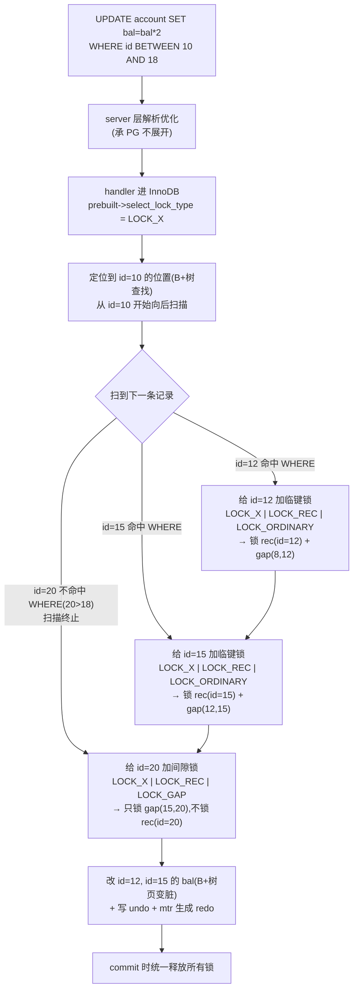

# 第 5 篇 · 第 17 章 · 间隙锁与临键锁:解决幻读

> **核心问题**:P5-16 讲完记录锁,你以为"改哪行锁哪行"就齐活了——可 RR(可重复读)隔离级别下还有一个坑:同一事务里两次同样的 `SELECT`,**第二次平白多出一行**(因为别的事务在两次查询之间 `INSERT` 了一条满足条件的新记录)。这叫**幻读(phantom read)**。光锁已有的记录挡不住"还没插进来的新行"——你总不能锁一条不存在的记录吧?InnoDB 的解法听起来像玄学:**锁住"记录之间不存在的间隙"**。一把锁,锁的不是一个东西,而是"两条记录之间那段空"。这凭什么能防住幻读?RR 用它、RC(读已提交)偏偏不用它,又是为什么?这一章把 InnoDB 锁最容易被误解、也最招牌的三个概念——**间隙锁(gap lock)、临键锁(next-key lock)、插入意向锁(insert intention lock)**——拆透。

> **读完本章你会明白**:
> 1. **幻读**到底是什么(它和"不可重复读"差在哪)、为什么记录锁(MVCC 解决不了的部分)防不住它,以及为什么"锁住不存在的间隙"能治这个病——这套设计听起来反直觉,实则严丝合缝。
> 2. InnoDB 源码里 `LOCK_GAP`/`LOCK_ORDINARY`/`LOCK_REC_NOT_GAP`/`LOCK_INSERT_INTENTION` 这四个精确模式(precise mode)常量**到底各代表什么、值是多少、怎么用 bit 标志复用同一个 `type_mode` 字段**(很多老资料把 `LOCK_ORDINARY=0` 当成"没这个锁",其实 0 是 next-key)。
> 3. **间隙锁之间互相兼容**(gap+gap 不冲突)、**间隙锁只挡插入意向锁**(gap 只和 insert intention 冲突)——这两条反直觉的冲突规则,源码里就在 `rec_lock_check_conflict` 一个函数里说清,以及它们为什么这么定(为了让多个事务能同时给同一段间隙加 gap 锁而不死锁)。
> 4. **为什么 RR 用间隙锁、RC 不用**:源码里就一行 `trx->skip_gap_locks()`,RC/RU 返回 `true` 直接跳过所有间隙锁——RC 每条语句建新 read view、允许幻读,所以根本不需要间隙锁;RR 事务级 read view,必须靠间隙锁把"两次查询之间别让人插进来"堵住。

> **如果一读觉得太难**:先记住三件事——① **幻读** = 同一事务两次查询,第二次多出一行(别人插的);② **临键锁(next-key lock) = 记录锁 + 前面那段间隙**,RR 下默认用它,把"记录"和"记录前面的空"一起锁;③ **RC 不用间隙锁**(源码 `skip_gap_locks()` 直接跳过),所以 RC 允许幻读——这不是 bug 是设计。本章三件套(gap/next-key/insert intention)是 InnoDB 锁里最绕的部分,撑过去,死锁检测(P5-18)和隔离级别(P5-19)就豁然开朗。

---

## 〇、一句话点破

> **RR 下,InnoDB 默认用"临键锁"——锁住一条记录**和**它前面那段间隙**。记录本身防"被改",前面的间隙防"被插",合起来就同时挡住了"修改"和"插入"两类幻影来源。但单独的"间隙锁"之间是互相兼容的(谁都能给同一段间隙加 gap 锁,不冲突),它唯一真正挡住的是别人的**插入意向锁**(INSERT 时申请、专门和 gap 锁冲突)。RC 不来这一套——它每条语句建新快照、允许幻读,所以源码里 `trx->skip_gap_locks()` 对 RC 直接返回 `true`,把所有 gap 锁路径全跳过。**

这是结论,不是理由。本章倒过来拆:先讲幻读到底是什么、记录锁为什么治不了它;再讲"锁不存在的间隙"这个反直觉的解法凭什么成立;然后拆临键锁(记录锁 + 间隙)、插入意向锁(INSERT 的对偶),以及源码里那套反直觉的冲突矩阵;最后讲清 RR 用/RC 不用的根因,以及"为什么这套东西容易死锁"(引出 P5-18)。

---

## 一、幻读:记录锁治不了的"幽灵"

(承接 P5-16,P5-16 讲的是"锁已有的记录")

P5-16 讲清楚了:**两个事务改同一行,靠记录锁(行锁 S/X)串行化**。`UPDATE account SET bal=bal-100 WHERE id=10`,只锁 `id=10` 那一条记录,别人改 `id=10` 得等,别人改 `id=15` 不受影响。这套机制保护了**写-写并发**的正确性。

但有一种问题,记录锁天然治不了。看这个场景:

```
   时刻    事务 T (RR)                         事务 U
   t1     BEGIN
   t2     SELECT * FROM account WHERE bal > 100;
          -- 返回 3 行: id=5, id=8, id=12 (假设这三个余额都>100)
   t3                                         BEGIN
   t4                                         INSERT INTO account(id, bal) VALUES (20, 500);
                                              -- 插了一条 bal=500 的新行
   t5                                         COMMIT
   t6     SELECT * FROM account WHERE bal > 100;
          -- 返回 4 行: id=5, id=8, id=12, id=20  ← 多出了 id=20!
   t7     COMMIT
```

事务 T 在 t2 查到 3 行,在 t6 用**完全相同的 SQL**再查一次,却查到了 4 行——多出来的 `id=20` 是 T 自己没碰过、由别的事务 U 在 t4 插进来的。这就是**幻读(phantom read)**:同一事务里,两次相同的范围查询,结果集的**行数**变了(多了或少了"幽灵行")。

> **为什么不叫"不可重复读"**:严格定义里,**"不可重复读(non-repeatable read)"**指同一事务两次读**同一行**,值被改了或删了(针对**已有的行**被 UPDATE/DELETE);**"幻读"**特指**新的行被插进来**(针对**原本不存在的行**被 INSERT),结果集"长出"了新成员。SQL 标准把这两个分开:解决不可重复读只需要锁住被读的行(记录锁就够了),但解决幻读需要锁住"还没出现的行"——这才是记录锁做不到的事。RR 隔离级别按 SQL 标准要求**同时解决**这两个(记录锁解决前者、间隙锁解决后者);RC 则两个都不解决。

### 记录锁为什么治不了幻读

记录锁只能锁**已经存在的记录**。T 在 t2 查到 `id=5, 8, 12` 这三条,锁住这三条记录——可 `id=20` 这条**当时还不存在**,你怎么锁它?U 在 t4 插 `id=20`,这条新记录没被任何锁保护(它在 t2 还不在表里),U 顺顺当当插了进去、commit 了。等 T 在 t6 再查,就看见了这个新冒出来的幽灵。

> **不这样会怎样**:假设我们想用记录锁治幻读,只能做一件事——把表里**所有可能满足条件的记录**全锁了。可"可能满足 `bal > 100`"是个无穷集(任何未来的新行都可能满足),锁不完。或者干脆锁全表——但那又退化成 MyISAM 的表锁了,高并发写就废了。记录锁的**粒度是"已有记录"**,对"还没插进来的行"无能为力。

这就是 MVCC(P4 篇)和记录锁(P5-16)合起来仍然留下的最后一块拼图:**防止"插入"造成幻读**。InnoDB 的解法,听起来像绕口令——**锁住"记录之间的间隙"**。

> **钉死这件事**:幻读 = 范围查询两次结果集行数变了(别人插的)。记录锁只能锁已有记录,挡不住"还没插进来的新行"。要治幻读,必须有一种锁,能"锁不存在的东西"——这就是间隙锁。

---

## 二、间隙锁:锁住"记录之间的空"

### 什么是"间隙"

先定义清楚"间隙(gap)"。在一个 B+树索引页里,记录是按索引键顺序排的(P1-04 讲过页结构)。每条记录前面,都有一个"空间"——也就是"这条记录的键值"和"前一条记录的键值"之间的那段**键值区间**。InnoDB 把这个区间叫 gap。

```
   聚簇索引的一个叶子页(简化,按主键 id 排序):
   ┌──────────────────────────────────────────────────────────────────┐
   │  infimum │ rec(id=5) │ rec(id=8) │ rec(id=12) │ ... │ supremum   │
   └──────────────────────────────────────────────────────────────────┘

   间隙(gap)定义:
   ┌─── gap 1 ───┬── gap 2 ──┬── gap 3 ──┬─ ... ─┬── gap N ──┐
   │  (-∞, 5)   │  (5, 8)  │  (8, 12) │       │ (..., +∞) │
   └────────────┴──────────┴──────────┴───────┴────────────┘
        ↑           ↑          ↑                  ↑
   infimum→id=5  id=5→id=8  id=8→id=12     最后一条→supremum

   每条记录"前面"对应一个 gap:
   - rec(id=5)  前面的 gap = (-∞, 5)   (从 infimum 到 id=5)
   - rec(id=8)  前面的 gap = (5, 8)
   - rec(id=12) 前面的 gap = (8, 12)
   - supremum   前面的 gap = (..., +∞)  (最后一条记录到正无穷)
```

注意几个关键点:

1. **每个 gap 都"挂"在一条记录上**——具体说,挂在它**后面**那条记录上(也就是这条记录"前面的间隙")。`rec(id=8)` 挂的 gap 是 `(5, 8)`。所以"给 `rec(id=8)` 加间隙锁",锁的不是 `id=8` 这条记录本身,而是 `(5, 8)` 这段区间——**任何 `id ∈ (5, 8)` 的 INSERT 都会被挡住**。
2. **supremum 是个特殊记录**(`PAGE_HEAP_NO_SUPREMUM = 1`,见 [`PAGE_HEAP_NO_SUPREMUM`](../mysql-server/storage/innobase/include/page0types.h#L131-L137)),它代表"页里所有记录之后"那个虚拟位置。给 supremum 加锁,**语义上一定是 gap 锁**(锁的是"最后一条记录到正无穷"那整段尾部间隙)——因为 supremum 本身不是真数据,锁它没意义,锁它代表的"后面的无限空间"才有意义。源码注释直说了这点(见后文 `lock_rec_lock_slow` 的注释:"在 supremum 记录上,设置的是 gap type lock")。
3. **gap 是开区间**。锁 `(5, 8)` 这个 gap,既不锁 `id=5`、也不锁 `id=8`,只挡 `5 < id < 8` 的新插入。这就是为什么它叫"间隙锁"——锁的是缝儿,不是缝儿两边的钉子。

### 间隙锁锁的不是记录,是"插不进来"

现在看间隙锁怎么治幻读。回到第一节那个例子,这次让 T 在 RR 下,用"临键锁"查询( locking read,比如 `SELECT ... FOR UPDATE`,或 Serializable 下的纯 SELECT):

```
   时刻    事务 T (RR, 用临键锁)               事务 U
   t1     BEGIN
   t2     SELECT * FROM account WHERE bal > 100 FOR UPDATE;
          -- 返回 id=5, id=8, id=12
          -- 对每条返回的记录加【临键锁】(= 记录锁 + 前面的 gap 锁)
          --  → 锁了 id=5 这条 + gap(-∞,5)
          --  → 锁了 id=8 这条 + gap(5,8)
          --  → 锁了 id=12 这条 + gap(8,12)
          --  → 还锁了 supremum + gap(12,+∞)  ← 关键!
   t3                                         BEGIN
   t4                                         INSERT INTO account(id,bal) VALUES(20,500);
                                              -- 想 INSERT id=20(20 > 12,落在 gap(12,+∞))
                                              --  → 被 T 的 gap(12,+∞) 间隙锁挡住!等待
   t5     (T 持着 gap(12,+∞) 不放)
          ...
   t6     SELECT * FROM account WHERE bal > 100 FOR UPDATE;
          -- 还是 3 行: id=5, id=8, id=12  ← 幻读消失!
   t7     COMMIT  ← T 释放所有 gap 锁
                                                  U 被唤醒,id=20 插入成功
```

T 在 t2 的 `FOR UPDATE` 查询,不仅锁了 `id=5, 8, 12` 三条记录(记录锁),还锁了它们前面的 gap、以及"最后一条记录到正无穷"那个 gap(`supremum + gap`)。U 在 t4 想插 `id=20`,而 `20` 落在 `gap(12, +∞)` 里——这个 gap 被 T 锁了,U 的 INSERT 被阻塞,等到 T commit 释放才能继续。于是 T 的 t6 再查,看不到 `id=20`——幻读被治好了。

> **不这样会怎样**:如果不锁 `gap(12, +∞)` 这个"最后一条记录之后的无限区间",U 的 `INSERT id=20` 就能畅通无阻地插进来,T 的 t6 再查就多了一行——幻读复现。所以**给 supremum 加 gap 锁**(锁住"最大键之后"的无限区间)是治幻读的关键一环,这条特别容易被忽略,很多人以为 gap 锁只锁"记录之间",忘了"最后一条之后"也是 gap。

### 为什么"锁不存在的东西"能防幻读

这就是初学者最困惑的地方:**间隙不存在(里面没有记录),怎么锁?**

答案是——**间隙锁锁的不是"记录",是"插入动作"**。或者更准确地说,间隙锁是一个**约定**:任何事务想往这段 gap 里 INSERT 新记录,必须先申请一个**插入意向锁(insert intention lock)**;而插入意向锁和 gap 锁冲突——于是 gap 锁的存在,就让"想插进这个 gap 的 INSERT"必须等待,从而挡住了插入。

```
   间隙锁的"防插入"机制(逻辑链):
   ┌────────────────────────────────────────────────────────────────┐
   │ 1. 事务 T 给 gap(8,12) 加了 gap 锁(假设是 LOCK_S|LOCK_GAP)    │
   │                                                                │
   │ 2. 事务 U 想 INSERT id=10(10 ∈ (8,12))                       │
   │    INSERT 在源码里会走 lock_rec_insert_check_and_lock:          │
   │    → 在 next_rec(id=12,因为 10<12 落在它前面的 gap) 上          │
   │    → 申请一个 LOCK_X|LOCK_GAP|LOCK_INSERT_INTENTION           │
   │                                                                │
   │ 3. 这个"插入意向锁"和 T 已有的"gap 锁"冲突(下一节细拆冲突矩阵) │
   │    → U 的 INSERT 进入等待队列                                    │
   │                                                                │
   │ 4. T 不释放 gap 锁(直到 commit),U 一直等                     │
   │ 5. T commit → 释放 gap 锁 → U 唤醒,插入成功                    │
   └────────────────────────────────────────────────────────────────┘
   gap 锁本身没有"锁住任何记录",它通过"挡住插入意向锁"间接挡住了插入。
```

这套机制,本质上是把"防止未来插入"这件事,**翻译成了"现在就和某个插入意向锁冲突"**——gap 锁是"现在"的锁,挡的是"将来某个时刻发生的 INSERT"的意向。这是 InnoDB 锁设计最巧的一笔:**用现有的锁机制(锁冲突 + 等待队列),表达"防止未来事件"这个看似无法用锁表达的需求**。

> **钉死这件事**:间隙锁锁的不是记录,是"插入动作"。它的逻辑是——INSERT 必须先申请插入意向锁,插入意向锁和 gap 锁冲突,所以 gap 锁的存在让 INSERT 必须等。这是把"防止未来插入"翻译成"现在就和某个意向锁冲突"的巧妙设计。

---

## 三、源码里的四个精确模式:bit 标志复用 type_mode

理论讲完,看源码。InnoDB 怎么用一个 `type_mode` 字段,同时表示"记录锁/表锁"、"S/X 模式"、以及"是不是 gap / not-gap / insert-intention / 普通 next-key"?答案是用**不同 bit 位**拼起来(P5-16 讲过 `LOCK_TABLE=16`、`LOCK_REC=32`)。这一节看**精确模式(precise mode)**那几个 bit。

### 四个常量:LOCK_ORDINARY / LOCK_GAP / LOCK_REC_NOT_GAP / LOCK_INSERT_INTENTION

全部定义在 [`include/lock0lock.h`](../mysql-server/storage/innobase/include/lock0lock.h#L960-L987):

```c
/** Waiting lock flag; when set, it means that the lock has not yet been
 granted, it is just waiting for its turn in the wait queue */
constexpr uint32_t LOCK_WAIT = 256;                        // lock0lock.h:962
/* Precise modes */
/** this flag denotes an ordinary next-key lock in contrast to LOCK_GAP or
 LOCK_REC_NOT_GAP */
constexpr uint32_t LOCK_ORDINARY = 0;                      // lock0lock.h:966
/** when this bit is set, it means that the lock holds only on the gap before
  the record; for instance, an x-lock on the gap does not give permission to
  modify the record on which the bit is set; locks of this type are created
  when records are removed from the index chain of records */
constexpr uint32_t LOCK_GAP = 512;                         // lock0lock.h:971
/** this bit means that the lock is only on the index record and does NOT
   block inserts to the gap before the index record; this is used in the case
   when we retrieve a record with a unique key, and is also used in locking
   plain SELECTs (not part of UPDATE or DELETE) when the user has set the READ
   COMMITTED isolation level */
constexpr uint32_t LOCK_REC_NOT_GAP = 1024;                // lock0lock.h:977
/** this bit is set when we place a waiting gap type record lock request in
   order to let an insert of an index record to wait until there are no
   conflicting locks by other transactions on the gap; note that this flag
   remains set when the waiting lock is granted, or if the lock is inherited
   to a neighboring record */
constexpr uint32_t LOCK_INSERT_INTENTION = 2048;           // lock0lock.h:983
```

逐个翻译注释,这是本章最关键的一组常量:

| 常量 | 值 | 含义 | 何时用 |
|------|----|----|-------|
| `LOCK_ORDINARY` | **0** | 普通 next-key lock(临键锁)= 记录 + 前面 gap | RR 下默认的行锁(注释明说"ordinary next-key lock") |
| `LOCK_GAP` | **512** | 只锁前面 gap,不锁记录本身 | 范围扫描时给"边界记录"加、给 supremum 加、记录被删除时继承出来 |
| `LOCK_REC_NOT_GAP` | **1024** | 只锁记录,不锁前面 gap(明确不要 gap) | 唯一索引等值命中、RC 下的所有行锁 |
| `LOCK_INSERT_INTENTION` | **2048** | 插入意向锁(本质是 gap 类型的等待锁) | INSERT 时申请,等 gap 锁放行 |

> **钉死这件事**(老资料最容易讲错的点):**`LOCK_ORDINARY = 0`,不是"没有这个锁",而是"临键锁(next-key lock)"**。因为 next-key 是默认、最常见的精确模式,所以它的值是 0——`type_mode` 里这一组 bit 全是 0,就表示 next-key。这一点 90% 的博客都没讲清,有人甚至误以为"LOCK_ORDINARY 是 0,所以它不存在"。源码注释白纸黑字:"denotes an ordinary **next-key** lock"。值是 0 是因为它是默认值,不是因为它不存在。

### 怎么用一个 type_mode 表达"哪种锁"

回忆 P5-16 讲的 `type_mode` 布局(低 4 位是模式 LOCK_S/X、bit 4 是 LOCK_TABLE、bit 5 是 LOCK_REC)。加上本章的 bit 8/9/10/11(bit 8 是 LOCK_WAIT=256、bit 9 是 LOCK_GAP=512、bit 10 是 LOCK_REC_NOT_GAP=1024、bit 11 是 LOCK_INSERT_INTENTION=2048),`type_mode` 一个 32 位整数就把"这是记录锁还是表锁、S 还是 X、是不是 gap、是不是 not-gap、是不是 insert intention、是不是在等待"全表达出来了:

```
   type_mode 的 bit 布局(简化):
   ┌─────────────────────────────────────────────────────────────────┐
   │ bit:   ...  11    10     9     8    7  6  5    4   3  2  1  0   │
   │        ┌──────────────────────────────────┬──────┬───┬────────┐ │
   │        │ INSERT_  │ REC_  │ GAP  │ WAIT │ (保留)│REC│TBL│ MODE  │ │
   │        │ INTENTION│NOT_GAP│      │      │       │   │   │       │ │
   │        │  2048    │ 1024  │ 512  │ 256  │       │32 │16 │0~15   │ │
   │        └──────────────────────────────────┴──────┴───┴────────┘ │
   │        ←── 精确模式(precise mode)几位 ──→         ←类型→ ←模式→ │
   └─────────────────────────────────────────────────────────────────┘

   例:
   - LOCK_X | LOCK_REC | LOCK_ORDINARY          = 0+32+4 = 36
     → 记录锁 X + next-key(RR 下默认)
   - LOCK_S | LOCK_REC | LOCK_GAP               = 1+32+512 = 545
     → 记录锁 S + 只锁 gap(不锁记录)
   - LOCK_X | LOCK_REC | LOCK_REC_NOT_GAP       = 4+32+1024 = 1060
     → 记录锁 X + 只锁记录(RC 下或唯一索引等值命中)
   - LOCK_X | LOCK_REC | LOCK_GAP | LOCK_INSERT_INTENTION | LOCK_WAIT = 4+32+512+2048+256 = 2852
     → 插入意向锁,等待中(INSERT 等待 gap 锁时)
```

这种"用 bit 标志拼一个字段"的写法,C 程序员很熟(类似 Linux 内核的 `GFP_KERNEL` flag 拼接)。好处是**判冲突时一次位与 + 一次查表就够了**(下一节看 `rec_lock_check_conflict`),不用解析复杂结构。代价是可读性差——`type_mode = 2852` 你得自己拆 bit 才知道是啥,所以源码里到处有 `lock_rec_get_gap(lock)`、`lock_rec_get_insert_intention(lock)` 这种 inline 小函数帮你拆(P5-16 见过 `lock_rec_get_rec_not_gap`):

```c
static inline ulint lock_rec_get_rec_not_gap(const lock_t *lock) {     // lock0lock.cc:507
  ut_ad(lock_get_type_low(lock) == LOCK_REC);
  return (lock->type_mode & LOCK_REC_NOT_GAP);
}

static inline ulint lock_rec_get_insert_intention(const lock_t *lock) { // lock0lock.cc:517
  ut_ad(lock_get_type_low(lock) == LOCK_REC);
  return (lock->type_mode & LOCK_INSERT_INTENTION);
}
```

—— 见 [`lock_rec_get_rec_not_gap` / `lock_rec_get_insert_intention`](../mysql-server/storage/innobase/lock/lock0lock.cc#L507-L523)。就是个位与(`&`),O(1)。

> **钉死这件事**:InnoDB 用一个 32 位 `type_mode` 字段,bit 拼接表达"记录锁/表锁 + S/X + gap/not-gap/insert-intention + waiting"。`LOCK_ORDINARY=0`(next-key)是默认值,`LOCK_GAP=512`、`LOCK_REC_NOT_GAP=1024`、`LOCK_INSERT_INTENTION=2048`。判锁类型都是一次位与。

---

## 四、临键锁:记录锁 + 前间隙,一套组合拳

### next-key = rec + gap

现在正式定义**临键锁(next-key lock)**:它锁的是**一条记录 + 这条记录前面的 gap**。从源码角度,next-key 就是 `LOCK_ORDINARY`(值 0)——也就是 `type_mode` 里既没有 `LOCK_GAP` 也没有 `LOCK_REC_NOT_GAP` 标志的"裸"记录锁,默认行为就是"既锁记录又锁前 gap"。

```
   临键锁 vs 记录锁 vs 间隙锁(同一条 rec(id=8)):
   ┌──────────────────────────────────────────────────────────────┐
   │ rec(id=8) 上三种精确模式的锁(都画在 id=8 这条记录的"位置"上)│
   ├──────────────────────────────────────────────────────────────┤
   │ 1. 记录锁(LOCK_REC_NOT_GAP):                                 │
   │    锁 [id=8] 这条记录                                       │
   │    挡:别人改/删 id=8;  不挡:别人插 id∈(5,8) 或插任何新行  │
   │                                                              │
   │ 2. 间隙锁(LOCK_GAP):                                        │
   │    锁 gap(5,8) 这段区间                                    │
   │    挡:别人插 id∈(5,8);  不挡:别人改/删 id=8               │
   │                                                              │
   │ 3. 临键锁(LOCK_ORDINARY = next-key):                        │
   │    锁 [id=8] 这条记录 + gap(5,8) 这段区间                  │
   │    挡:别人改/删 id=8,也挡别人插 id∈(5,8)                │
   └──────────────────────────────────────────────────────────────┘
   next-key = 记录锁(挡修改)+ 间隙锁(挡插入),一套组合拳同时防修改和插入。
```

注意:**临键锁"锁的是哪段 gap"取决于它挂在哪条记录上**。`next-key lock` 挂在 `rec(id=8)` 上,锁的 gap 是 `(5, 8)`(id=8 前面那个 gap)。也就是说,next-key 的"key"是记录,"next"隐含的是"它前面的 gap"。命名上 InnoDB 沿用了经典数据库术语(Gray 等人提出的"next-key locking"),指的是"锁住这条记录**和**它前面到下一条记录之间的间隙"。

### RR 下默认就是 next-key

RR 隔离级别下,InnoDB 的**行锁默认都是 next-key**(除非命中唯一索引的等值查询,见下一节例外)。这意味着:在 RR 下,一条 `UPDATE account SET bal=bal*2 WHERE id BETWEEN 5 AND 12`,会给 `id=5, 8, 12` 这几条记录各加一个 next-key 锁——每个锁既挡修改又挡插入。

为什么 RR 默认 next-key 而不是只用记录锁?因为 RR 要求**可重复读 + 防幻读**。记录锁只能保证"已有的记录不被改"(可重复读针对已有行),防不住"新行被插进来"(幻读)。next-key 额外锁住 gap,把"插入"也堵死了,这才是 RR 完整的并发控制。

源码里,"RR 默认 next-key"这条规则体现在 [`row/row0sel.cc`](../mysql-server/storage/innobase/row/row0sel.cc#L864) 这一行:

```c
lock_type = trx->skip_gap_locks() ? LOCK_REC_NOT_GAP : LOCK_ORDINARY;   // row0sel.cc:864
```

—— 见 [`row0sel.cc` 的 lock_type 选择](../mysql-server/storage/innobase/row/row0sel.cc#L860-L869)。这一行是 InnoDB 加锁时决定"用 next-key 还是 rec-not-gap"的核心:`trx->skip_gap_locks()` 返回 `true`(RC/RU)就用 `LOCK_REC_NOT_GAP`(纯记录锁、不要 gap),返回 `false`(RR/Serializable)就用 `LOCK_ORDINARY`(next-key、带 gap)。一行代码,RR 和 RC 的间隙锁差异就在这里分流。

### 唯一索引等值命中:降级成记录锁(LOCK_REC_NOT_GAP)

但有个**重要例外**:如果查询是**唯一索引(unique index)的等值(equality)查询,且命中了一条记录**,那么这条记录上加的是**纯记录锁(`LOCK_REC_NOT_GAP`),不是 next-key**。为什么?因为唯一索引保证了"这个键值上不可能有第二条记录"——既然不可能再插一条相同键值的记录,gap 锁就多余了,纯记录锁就够了。

源码注释在 `LOCK_REC_NOT_GAP` 那条直说了:"this is used in the case when we retrieve a record with a **unique key**"。具体路径在 [`row0sel.cc` 唯一索引等值命中分支](../mysql-server/storage/innobase/row/row0sel.cc#L3280-L3289):

```c
if (prebuilt->select_lock_type != LOCK_NONE) {
    /* Try to place a lock on the index record; we are searching
    the clust rec with a unique condition, hence
    we set a LOCK_REC_NOT_GAP type lock */

    err = lock_clust_rec_read_check_and_lock(
        lock_duration_t::REGULAR, prebuilt->clust_pcur->get_block(), clust_rec,
        clust_index, *offsets, prebuilt->select_mode,
        static_cast<lock_mode>(prebuilt->select_lock_type), LOCK_REC_NOT_GAP,
        thr);
```

—— 见 [`row0sel.cc:3280-3289`](../mysql-server/storage/innobase/row/row0sel.cc#L3280-L3289)。注释明说"we are searching the clust rec with a **unique condition**, hence we set a `LOCK_REC_NOT_GAP` type lock"。

> **钉死这件事**:RR 默认 next-key,但**唯一索引等值命中**会降级成 `LOCK_REC_NOT_GAP`(纯记录锁)——因为唯一性保证不会再插相同键值的记录,gap 锁多余。这是 InnoDB 的一个**优化**(少加 gap 锁,少挡插入,提高并发),也是为什么"按主键等值查询"几乎不会触发间隙锁死锁的根因。

---

## 五、插入意向锁:INSERT 的对偶

### INSERT 时申请什么锁

讲完 gap 锁挡 INSERT,现在反过来看 INSERT 这一头。事务 U 执行 `INSERT INTO account(id, bal) VALUES(20, 500)`,在源码里走的是 [`lock_rec_insert_check_and_lock`](../mysql-server/storage/innobase/lock/lock0lock.cc#L5050):

```c
dberr_t lock_rec_insert_check_and_lock(            // lock0lock.cc:5050
    ulint flags, const rec_t *rec, buf_block_t *block,
    dict_index_t *index, que_thr_t *thr, mtr_t *mtr, bool *inherit) {
  ...
  const rec_t *next_rec = page_rec_get_next_const(rec);
  ulint heap_no = page_rec_get_heap_no(next_rec);  // 新记录将插在 next_rec 前面
  ...
  if (!lock_rec_has_any(lock_sys->rec_hash, block->get_page_id(), heap_no)) {
    *inherit = false;                              // next_rec 上没任何锁 → 直接插
  } else {
    *inherit = true;
    /* 如果别的 transaction 在 next_rec 上有 gap 锁(等待或授予),INSERT 要等 */
    const ulint type_mode = LOCK_X | LOCK_GAP | LOCK_INSERT_INTENTION;  // lock0lock.cc:5106

    const auto conflicting =
        lock_rec_other_has_conflicting(type_mode, block, heap_no, trx);

    if (conflicting.wait_for != nullptr) {
      RecLock rec_lock(thr, index, block, heap_no, type_mode);
      trx_mutex_enter(trx);
      err = rec_lock.add_to_waitq(conflicting.wait_for);  // 排进等待队列
      trx_mutex_exit(trx);
    }
  }
  ...
}
```

—— 见 [`lock_rec_insert_check_and_lock`](../mysql-server/storage/innobase/lock/lock0lock.cc#L5050-L5150)。注意三个细节:

1. **新记录插在哪**:INSERT 把新记录插在 `rec`(光标当前位置)和 `next_rec`(下一条记录)之间。所以新记录"落进的 gap"就是 `next_rec` 前面的 gap。源码取 `next_rec` 的 `heap_no`,在它上面判冲突。
2. **申请什么锁**:`LOCK_X | LOCK_GAP | LOCK_INSERT_INTENTION`——一个 gap 类型的、带插入意向标志的 X 锁。这就是**插入意向锁**(insert intention lock)的真身:不是一种新模式,而是 `LOCK_GAP` 类型的锁 + `LOCK_INSERT_INTENTION` 标志。
3. **怎么判冲突**:`lock_rec_other_has_conflicting(type_mode, ...)` 拿着这个插入意向锁去问"页上有没有别的 transaction 的锁和它冲突"——下一节看冲突规则。

### 插入意向锁 vs 间隙锁:谁挡谁

关键来了:**插入意向锁和什么冲突?** 答案是——**只和 gap 锁(next-key 也算,因为 next-key 含 gap)冲突**。而且,插入意向锁**互相之间不冲突**(两个 INSERT 想插同一个 gap 也不互相挡,只要它们没真插到同一个键值上)。这两条规则都写在源码里,在 [`rec_lock_check_conflict`](../mysql-server/storage/innobase/lock/lock0lock.cc#L554-L645):

```c
static inline Conflict rec_lock_check_conflict(         // lock0lock.cc:554
    const trx_t *trx, ulint type_mode, const lock_t *lock2,
    bool lock_is_on_supremum, Trx_locks_cache &trx_locks_cache) {

  if (trx == lock2->trx ||
      lock_mode_compatible(static_cast<lock_mode>(LOCK_MODE_MASK & type_mode),
                           lock_get_mode(lock2))) {
    return Conflict::NO_CONFLICT;                       // 同事务或 S/X 兼容
  }
  ...

  /* 关键规则 1:gap 类型的锁(不含 INSERT_INTENTION)不挡任何东西 */
  if ((lock_is_on_supremum || (type_mode & LOCK_GAP)) &&
      !(type_mode & LOCK_INSERT_INTENTION)) {
    /* Gap type locks without LOCK_INSERT_INTENTION flag
    do not need to wait for anything. ... */
    return Conflict::NO_CONFLICT;                       // ← gap 锁之间互相兼容!
  }

  /* 关键规则 2:非插入意向的记录锁(next-key 或 not-gap)不挡别人的 gap 锁 */
  if (!(type_mode & LOCK_INSERT_INTENTION) && lock_rec_get_gap(lock2)) {
    /* Record lock (LOCK_ORDINARY or LOCK_REC_NOT_GAP does not need to
    wait for a gap type lock */
    return Conflict::NO_CONFLICT;
  }

  /* 关键规则 3:gap 锁不挡别人的 not-gap 记录锁 */
  if ((type_mode & LOCK_GAP) && lock_rec_get_rec_not_gap(lock2)) {
    return Conflict::NO_CONFLICT;
  }

  /* 关键规则 4:任何锁都不挡插入意向锁 */
  if (lock_rec_get_insert_intention(lock2)) {
    /* No lock request needs to wait for an insert intention lock to be
    removed. ... Also, insert intention locks do not disturb each other. */
    return Conflict::NO_CONFLICT;                       // ← 插入意向锁互相不挡!
  }

  ...
  return Conflict::HAS_TO_WAIT;
}
```

—— 见 [`rec_lock_check_conflict`](../mysql-server/storage/innobase/lock/lock0lock.cc#L554-L645)。这个函数是 InnoDB 锁冲突判定的核心,读它就读懂了 gap/next-key/insert-intention 的全部交互。

### 把规则总结成一张冲突矩阵

把上面四条规则 + P5-16 讲过的 S/X 兼容矩阵,综合成一张"gap 类型的锁怎么相互冲突"的表:

```
   间隙锁 / 插入意向锁 冲突矩阵(同一记录的同一 gap 上):
   ┌────────────────────────┬──────────────┬──────────────┬──────────────┐
   │ 已持 \ 请求            │   gap 锁     │ next-key 锁  │ 插入意向锁   │
   │                        │ (LOCK_GAP)   │(LOCK_ORDINARY)│(INSERT_INT.)│
   ├────────────────────────┼──────────────┼──────────────┼──────────────┤
   │ gap 锁 (LOCK_GAP)      │   兼容(!)   │  兼容(!)     │  冲突        │
   │ next-key (LOCK_ORDINARY│   兼容(!)   │  冲突(S/X)   │  冲突        │
   │  = rec+gap)            │              │              │              │
   │ 插入意向锁             │   兼容       │  兼容        │  兼容(!)     │
   │ (INSERT_INTENTION)     │              │              │              │
   └────────────────────────┴──────────────┴──────────────┴──────────────┘

   注:这张表忽略 S/X 的区别,假设都是 X 锁(行锁最常见情况)。
       next-key 之间的"冲突"是因为它们含记录锁部分(记录锁 X 互相冲突),
       gap 部分本身不冲突。

   三条反直觉的规则(源码 rec_lock_check_conflict 体现):
   ① gap 锁之间互相兼容:多个事务可以同时给同一段 gap 加 gap 锁,不冲突。
   ② gap 锁只挡插入意向锁:gap 锁唯一真正"挡住"的,是别人的 INSERT。
   ③ 插入意向锁互相不挡:两个 INSERT 想插同一个 gap,只要不插同一键值,可并行。
```

这三条规则,**每一条都反直觉**(很多人以为"两个锁同一段 gap 必然冲突"),但每一条都**有其道理**:

- **gap 锁之间兼容**:gap 锁的目的是"挡插入"。两个事务都给同一段 gap 加 gap 锁,目的都是"防止别人插进来"——它们目标一致(都是来挡的,不是来插的),互相不冲突。如果 gap 锁之间冲突,那两个范围查询就互相挡死,OLTP 高并发范围扫描根本没法跑。
- **gap 锁只挡插入意向锁**:gap 锁防的是"插入",而插入意向锁就是"插入"的标识。所以 gap 锁只和插入意向锁冲突——精确地挡住"想插的人",不挡"来读的人"、也不挡"来给 gap 加锁的人"。
- **插入意向锁互相不挡**:两个 INSERT 想插同一个 gap(比如一个插 id=10、一个插 id=11,都落在 gap(8,12) 里),只要它们最终插的键值不同,可以并行——因为 INSERT 物理上是往不同位置插,不会真的撞。如果插入意向锁互相挡,两个 INSERT 排队跑,插入并发就废了。

> **钉死这件事**:间隙锁的三条反直觉冲突规则——① gap 锁之间互相兼容(都来挡插入,不互挡);② gap 锁只挡插入意向锁(精确挡"想插的人");③ 插入意向锁之间互相不挡(只要不同键值,可并行)。这三条规则全在 `rec_lock_check_conflict` 一个函数里,是 InnoDB 锁设计的精髓。

---

## 六、为什么 RR 用间隙锁、RC 不用

现在回答本章标题的第二半:**RC 为什么不用间隙锁?**

### 源码里的一行答案:skip_gap_locks()

源码里,RR 和 RC 的间隙锁差异,就藏在一个 inline 函数 [`trx_t::skip_gap_locks()`](../mysql-server/storage/innobase/include/trx0trx.h#L1113-L1124) 里:

```c
bool skip_gap_locks() const {                         // trx0trx.h:1113
  switch (isolation_level) {
    case READ_UNCOMMITTED:
    case READ_COMMITTED:
      return (true);                                  // ← RC/RU:跳过所有 gap 锁
    case REPEATABLE_READ:
    case SERIALIZABLE:
      return (false);                                 // ← RR/Serializable:用 gap 锁
  }
  ut_d(ut_error);
  ut_o(return (false));
}
```

—— 见 [`trx_t::skip_gap_locks`](../mysql-server/storage/innobase/include/trx0trx.h#L1113-L1124)。这个函数被全代码库几十处调用(`row0sel.cc`、`lock0lock.cc`、`lock0priv.cc` 等),每一处加 gap 锁前都先问一句"这个事务的隔离级别要不要跳过 gap 锁"。RC/RU 直接返回 `true`——所有这些地方全部跳过,gap 锁根本不会被创建。

注意源码注释在 [`trx0trx.h:684-689`](../mysql-server/storage/innobase/include/trx0trx.h#L684-L689) 里,把每个隔离级别的语义讲得清清楚楚(这是老资料大片讲错的源头):

```c
/** somewhat Oracle-like isolation, except that in range UPDATE
and DELETE we must block phantom rows with next-key locks;
SELECT ... FOR UPDATE and ... LOCK IN SHARE MODE only lock
the index records, NOT the gaps before them, and thus allow
free inserting; each consistent read reads its own snapshot */
READ_COMMITTED,

/** this is the default; all consistent reads in the same trx
read the same snapshot; full next-key locking used in locking
reads to block insertions into gaps */
REPEATABLE_READ,
```

注意 RC 的注释有个**很多人不知道的细节**(也是本书要钉死的一个易错点):**RC 下,"范围 UPDATE/DELETE"仍然会用 next-key 锁防幻影**!源码原话:"in range UPDATE and DELETE we **must** block phantom rows with next-key locks"。也就是说,RC 不是"完全不用 gap 锁",而是:

- **RC 的纯 `SELECT ... FOR UPDATE` / `LOCK IN SHARE MODE`**:只锁记录(`LOCK_REC_NOT_GAP`),不锁 gap;
- **RC 的范围 `UPDATE` / `DELETE`**:仍然会用 next-key(因为有"被更新/删除的行集合"必须一致的问题——UPDATE 改了一片行,改的中间不能让新行插进来扰乱这一片)。

> **钉死这件事**(老资料大片讲错):RC 不是"完全不用 gap 锁"。源码注释明说——RC 下纯 locking SELECT 不锁 gap,但范围 UPDATE/DELETE 仍用 next-key。`skip_gap_locks()` 返回 `true` 影响的是 locking read 的加锁路径,UPDATE/DELETE 的加锁路径另有一套。这种"RC 完全没有 gap 锁"的说法,在 MySQL 官方文档和大量博客里都见过,但源码里不是这么简单。

### 为什么 RC 不要 gap 锁(设计动机)

回到设计动机。为什么 RC 不用 gap 锁?**因为 RC 本来就允许幻读**——RC 每条语句建一个新 read view(P4 篇讲过),所以同一事务里两次 `SELECT` 本来就可能看到不同的快照(第二次能看到别人 commit 的新行)。既然 RC 在隔离语义上**允许**幻读,那"用 gap 锁防幻读"就是**多余的代价**——白白锁住 gap、白白挡住插入、白白增加死锁概率,但 RC 根本不承诺防幻读,这笔钱白花。

所以 RC 干脆放弃 gap 锁:范围查询只锁记录,让别人能自由插入(反正 RC 允许看到新插入的行)。这换来了**更高的插入并发**——RC 下 INSERT 几乎不受范围查询的阻碍。

RR 则相反——RR 承诺"事务级快照、可重复读 + 防幻读",所以必须用 gap 锁把"两次查询之间的插入"堵死。这是承诺带来的必然代价:**RR 的范围查询会挡住别人的 INSERT**(因为加了 gap 锁),这是 RR 比 RC 死锁更多、插入并发更低的根因。

```
   RR vs RC:要不要 gap 锁的根本对比:
   ┌──────────────────────────────────────────────────────────────────┐
   │                    │  RR(REPEATABLE_READ)       │  RC(READ_COMMITTED)│
   ├────────────────────┼────────────────────────────┼────────────────────┤
   │ read view          │ 事务级(整个事务一个)      │ 语句级(每条一个)  │
   │ 防幻读承诺         │ 是                          │ 否(允许幻读)      │
   │ 用 gap 锁?        │ 是(默认 next-key)         │ 否(纯记录锁)      │
   │ 范围查询挡 INSERT? │ 是                          │ 否                  │
   │ skip_gap_locks()   │ false                       │ true                │
   │ 死锁概率           │ 高(gap 锁挡插入)          │ 低                  │
   │ 插入并发           │ 低                          │ 高                  │
   └──────────────────────────────────────────────────────────────────┘

   根因:RC 不承诺防幻读 → gap 锁是多余代价 → 源码 skip_gap_locks() 返回 true 跳过。
        RR 承诺防幻读 → 必须 gap 锁 → skip_gap_locks() 返回 false。
```

> **不这样会怎样**:假设 RC 也用 gap 锁,会发生什么?RC 的 read view 是语句级的——每次 `SELECT` 都看最新快照,gap 锁挡住了插入,但挡住的"插入"下次语句一执行又能看到(因为新 read view)。结果就是:gap 锁付出了"挡插入"的代价(降低并发、增加死锁),却得不到"防幻读"的收益(因为 RC 本来就允许幻读)。纯粹的负收益。所以 RC 必须放弃 gap 锁。

> **钉死这件事**:RC 不用 gap 锁,是因为 RC 不承诺防幻读——gap 锁是纯负收益(付出挡插入的代价,得不到防幻读的收益)。源码 `skip_gap_locks()` 一行分流,RC 直接跳过所有 gap 锁路径。这是设计上的"承诺决定代价":RR 多承诺一项(防幻读),就多付一份代价(gap 锁挡插入)。

---

## 七、加锁过程实例:一条范围 UPDATE 的完整加锁流程

把前面讲的串起来,看一条 RR 下的范围 `UPDATE`,从 SQL 到锁的全过程。假设表 `account(id PK, bal)`,现有数据 `id=5,8,12,15,20,30`,执行:

```sql
-- 事务 T (RR)
UPDATE account SET bal = bal * 2 WHERE id BETWEEN 10 AND 18;
-- 命中 id=12, 15 两条
```

加锁过程(简化,真实路径在 `row0sel.cc` + `row0upd.cc`):



几个关键观察:

1. **命中的记录加 next-key**:`id=12`、`id=15` 加的是临键锁(`LOCK_ORDINARY`),既锁记录(防改)又锁前 gap(防插)。
2. **第一条不命中记录加纯 gap 锁**:扫描到 `id=20`(第一个不满足 `WHERE` 的记录)时,给它加的是**纯间隙锁**(`LOCK_GAP`,不是 next-key),**不锁 `id=20` 这条记录本身**(因为这条不命中、不需要改),只锁它前面的 gap`(15,20)`——防止别人插 `id ∈ (15,20)` 的新记录进来,变成"命中 WHERE 的幻影"。这就是 [`row0sel.cc:4925-4927`](../mysql-server/storage/innobase/row/row0sel.cc#L4916-L4927) 那段逻辑("place a gap lock on the next index record to prevent phantoms")。
3. **没有锁"最后一条之后"的无限 gap**:这个例子因为 `WHERE id BETWEEN 10 AND 18` 有上界,扫到 `id=20` 就停了,不需要锁 `gap(20, +∞)`。但如果是 `WHERE id > 10`(无上界),扫描会一直扫到 supremum,**给 supremum 加 gap 锁**,锁住"最大记录之后"的无限区间——这正是第一节那个例子里的关键。

> **钉死这件事**:范围扫描加锁的规律——**命中的记录加 next-key,第一条不命中的记录加纯 gap 锁**(不锁它本身,只锁它前面的 gap 防插)。这条规律是 RR 下范围 UPDATE/SELECT 死锁高发的根源:你以为只锁了命中的几行,其实还锁了一段 gap,挡住了别人往这段 gap 里 INSERT。

---

## 八、技巧精解:间隙锁如何"继承"——记录被删除时的锁迁移

(正文后、小结前的固定位置)

本章最硬核的技巧,是 InnoDB 怎么处理**"锁着 gap 的记录被删除"**这种边界情况。朴素做法会撞墙,InnoDB 的解法是**间隙锁继承(lock inheritance)**。

### 朴素做法的墙:记录删了,gap 锁怎么办

考虑这个场景:

```
   聚簇索引页(简化):  infimum | rec(id=5) | rec(id=8) | rec(id=12) | ... | supremum
                                         ↑
                          事务 T 给 rec(id=8) 加了 gap 锁 → 锁 gap(5,8)

   现在 T(或别的 transaction)DELETE 了 rec(id=8):
   ┌────────────────────────────────────────────────────┐
   │ infimum | rec(id=5) | rec(id=12) | ... | supremum │  ← rec(id=8) 没了!
   └────────────────────────────────────────────────────┘
   
   问题:T 的 gap 锁挂在 rec(id=8) 上,锁的是 gap(5,8)。
        现在 rec(id=8) 被删了,这个 gap(5,8) 和 gap(8,12) 合并成了 gap(5,12)。
        T 原本想挡"插 id∈(5,8)",现在 rec(id=8) 没了,
        新的 INSERT id=7 会落在 gap(5,12) 里——T 的 gap 锁还能挡住它吗?
```

如果朴素地做:**记录删了,挂在它上面的锁就一起释放**。但这会导致漏洞——T 本来锁了 `gap(5,8)` 防 `INSERT id=7`,结果因为别人删了 `id=8`,T 的锁凭空消失了,`INSERT id=7` 畅通无阻,T 的"防幻读"承诺被破坏。这是正确性问题。

### InnoDB 的解法:间隙锁继承到邻居记录

InnoDB 的洞察:**gap 锁的语义是"挡住某段键值区间的插入",这个语义不该因为"挂着它的记录被删了"而消失**。所以,当一条记录被删除时,挂在它上面的 gap 锁会**继承(inherit)**到它的邻居记录(通常是前一条或后一条)上,继续保持对原 gap 的保护。

源码核心是 [`lock_rec_inherit_to_gap`](../mysql-server/storage/innobase/lock/lock0lock.cc#L2444-L2495):

```c
/** Makes a record to inherit the locks (except LOCK_INSERT_INTENTION type)
 of another record as gap type locks, but does not reset the lock bits of
 the other record. Also waiting lock requests on rec are inherited as
 GRANTED gap locks. */
static void lock_rec_inherit_to_gap(                                   // lock0lock.cc:2444
    const buf_block_t *heir_block, const buf_block_t *block,
    ulint heir_heap_no, ulint heap_no) {
  ...
  lock_sys->rec_hash.find_on_record(RecID{block, heap_no}, [&](lock_t *lock) {
    if (!lock->trx->skip_lock_inheritance &&
        !lock_rec_get_insert_intention(lock) &&
        !lock->index->table->skip_gap_locks() &&
        (!lock->trx->skip_gap_locks() || lock->trx->lock.inherit_all.load())) {
      lock_rec_add_to_queue(LOCK_REC | LOCK_GAP | lock_get_mode(lock),
                            heir_block, heir_heap_no, lock->index, lock->trx);
    }
    return false;
  });
}
```

—— 见 [`lock_rec_inherit_to_gap`](../mysql-server/storage/innobase/lock/lock0lock.cc#L2444-L2495)。逐行看这个函数干了什么:

1. **遍历被删记录(heap_no)上的所有锁**:`find_on_record` 遍历那条要被删的记录上的每一个 lock 对象。
2. **三个跳过条件**:
   - `!lock->trx->skip_lock_inheritance`:某些特殊事务(如 DD 表操作)不继承;
   - `!lock_rec_get_insert_intention(lock)`:**插入意向锁不继承**(下面单说);
   - `!lock->index->table->skip_gap_locks()` 且 `(!lock->trx->skip_gap_locks() || inherit_all)`:RC 下通常不继承 gap 锁(RC 不需要 gap),除非是约束检查需要的(`inherit_all` 标志)。
3. **继承动作**:`lock_rec_add_to_queue(LOCK_REC | LOCK_GAP | lock_get_mode(lock), heir_block, heir_heap_no, ...)`——把原锁的模式(S/X)拿来,加上 `LOCK_GAP` 标志(注意:继承出来的**一律是纯 gap 锁**,即使原来是 next-key,继承后也降级成纯 gap——因为继承的目标是"保护 gap",不需要保护记录),挂到邻居记录(`heir_heap_no`)上。

回到刚才的例子:`rec(id=8)` 被删,挂在它上面的 `gap(5,8)` 锁,继承到 `rec(id=12)` 上,变成挂在 `rec(id=12)` 上的 `gap(5,12)` 锁(因为 `rec(id=12)` 的前一条现在是 `rec(id=5)`,它的前 gap 变成了 `(5,12)`)。于是 `INSERT id=7` 仍然被挡——T 的防幻读承诺保住了。

### 为什么插入意向锁不继承

注意源码里的 `!lock_rec_get_insert_intention(lock)` 这个条件——**插入意向锁不参与继承**。为什么?

因为插入意向锁的语义是"我想插进这个 gap,正在等 gap 锁放行"。如果记录被删、gap 重构,插入意向锁等待的那个 gap 已经变了(merged 到邻居 gap 了),原插入意向锁的"想插的位置"可能已经不合法。所以插入意向锁**不继承**,而是直接作废——INSERT 操作本身会因为 gap 重构而重新走一遍 `lock_rec_insert_check_and_lock`,在新 gap 上重新申请插入意向锁。这是"语义不匹配就重来"的设计,比强行继承更干净。

### 这套继承被调用的几个时机

`lock_rec_inherit_to_gap` 不是只在 DELETE 时调用。源码里它在多处被调用(见 `lock0lock.cc:2934, 2952, 3012, 3029, 3054, 3093, 3125, 3137, 3194`),覆盖了 B+树页的各种结构变化:

- **记录被 purge 物理删除**(对应 `lock0lock.cc:3093` 附近):这是最常见的——事务删除记录后,后台 purge 线程(P4-15 讲过)真正物理清除这条记录时,gap 锁继承到邻居。
- **页分裂(`btr_page_split`)**:B+树页满了要分裂(P1-04 讲过),记录被搬到新页,gap 锁需要继承到分裂后的新位置(`lock0lock.cc:3012` 附近)。
- **页合并(`btr_page_merge`)**:页里记录太少要和邻居合并,gap 锁继承到合并后的位置(`lock0lock.cc:2934, 2952`)。
- **记录在页内重排**:变长记录长度变化导致页内重排,gap 锁跟着继承。

这些场景的共同点是——**B+树的物理结构变了,但 gap 锁的"保护某段键值区间"的语义不能丢**。InnoDB 用"继承"这个机制,把 gap 锁的语义和 B+树的物理结构解耦:物理结构怎么变,gap 锁都能正确地"迁移"到新的物理位置,继续保护它原本该保护的那段键值区间。

### 反面对比:如果不继承

> **不这样会怎样**:如果记录删除时不继承 gap 锁,会发生两件坏事:
>
> 1. **防幻读漏洞**:T 锁了 `gap(5,8)`,别人删了 `id=8`,T 的锁凭空消失,`INSERT id=7` 畅通无阻——T 的 RR 承诺被破坏(正确性问题)。
> 2. **页分裂/合并时锁丢失**:B+树页分裂是高频操作(写入多了就分裂),如果分裂时 gap 锁不继承,锁会"卡在已不存在的物理位置"上,要么丢失(漏洞),要么变成野指针(崩溃)。
>
> 继承机制把"gap 锁的语义"(保护键值区间)和"B+树的物理结构"(记录在哪个页哪个 heap_no)解耦,让 gap 锁能穿越 B+树的结构变化而保持语义不变。这是 InnoDB 把"逻辑锁"建立在"物理 B+树"之上的关键工程,也是为什么 InnoDB 能在 B+树这种动态结构上正确实现 gap locking 的根。

> **钉死这件事**:记录被删除/页分裂/页合并时,挂在上面的 gap 锁会**继承**到邻居记录(`lock_rec_inherit_to_gap`),继续保护原本的键值区间。插入意向锁不继承(语义已变,作废重来)。这套继承机制让 gap 锁的语义和 B+树的物理结构解耦——物理结构怎么变,锁的语义不变。这是 InnoDB 在 B+树上实现 gap locking 的工程功底。

---

## 九、技巧精解补遗:supremum 的特殊地位——"页尾的无限 gap"

(第二个技巧,补一个容易踩坑的边界情况)

本章第二个值得一提的技巧/陷阱,是 **supremum 记录在 gap 锁里的特殊地位**。前面提过,但这里单开一节拆透,因为它是 RR 死锁高发的隐藏诱因。

### supremum 是什么

回忆 P1-04(页结构),每个 InnoDB B+树页里有两条**虚拟记录**:`infimum`(`heap_no=0`,代表"页里所有记录之前")和 `supremum`(`heap_no=1`,代表"页里所有记录之后")。它们不是真数据,是页结构的边界标记,见 [`PAGE_HEAP_NO_INFIMUM` / `PAGE_HEAP_NO_SUPREMUM`](../mysql-server/storage/innobase/include/page0types.h#L131-L137):

```c
constexpr ulint PAGE_HEAP_NO_INFIMUM = 0;    // page0types.h:131
constexpr ulint PAGE_HEAP_NO_SUPREMUM = 1;   // page0types.h:133
constexpr ulint PAGE_HEAP_NO_USER_LOW = 2;   // page0types.h:137  ← 用户记录从 heap_no=2 开始
```

### supremum 上的锁永远是 gap 锁

supremum 不是真数据,锁它本身没意义(没人会 UPDATE supremum)。但**锁它"代表的语义"——"页里所有记录之后的那段无限 gap"——意义重大**。所以 InnoDB 规定:**给 supremum 加锁,语义自动是 gap 锁**(不管你请求的是 next-key 还是别的)。

源码里这条规则体现在 `lock_rec_lock_slow` 的注释和实现上([`lock0lock.cc:1734-1735`](../mysql-server/storage/innobase/lock/lock0lock.cc#L1732-L1735)):

```c
/** This is the general, and slower, routine for locking a record. This is a
low-level function which does NOT look at implicit locks! Checks lock
compatibility within explicit locks. This function sets a normal next-key
lock, or in the case of a page supremum record, a gap type lock. */
static dberr_t lock_rec_lock_slow(...) {     // lock0lock.cc:1749
```

注释明说:"sets a normal next-key lock, **or in the case of a page supremum record, a gap type lock**"。在 `rec_lock_check_conflict` 里也有对应处理([`lock0lock.cc:541-544`](../mysql-server/storage/innobase/lock/lock0lock.cc#L541-L544)):

```c
@param[in]  lock_is_on_supremum   true if we are setting the lock on the
                                  'supremum' record of an index page: we know
                                  then that the lock request is really for a
                                  'gap' type lock
```

—— "lock_is_on_supremum 为 true 时,我们知道这个锁请求其实是 gap 类型的锁"。

### 为什么这件事重要:无界范围查询会锁住"页尾无限 gap"

回到第一节的例子——`SELECT ... WHERE id > 10` 这种**无上界**的范围查询,会扫到 supremum,**给 supremum 加 gap 锁**,锁住"页里最大记录之后到正无穷"的整段区间。这意味着:

```
   表 account 现有 id=5,8,12,15,20,30(都在一个页里,简化)
   
   事务 T (RR): SELECT * FROM account WHERE id > 10 FOR UPDATE;
   → 命中 id=12,15,20,30,加 next-key
   → 扫到 supremum,给 supremum 加 gap 锁
   → 锁住 gap(30, +∞)  ← "页里最大记录之后"的无限区间

   事务 U: INSERT INTO account(id) VALUES(100);
   → id=100 落在 gap(30, +∞) 里
   → 被 T 的 supremum gap 锁挡住,等待!

   (即使 id=100 看起来"离 30 很远",也照样被挡——因为 gap(30,+∞) 是个无限区间)
```

这就是为什么 RR 下"一个大范围查询"会卡住后续所有的 INSERT(只要 INSERT 的键值落在查询范围之后的无限区间里)。很多人栽过这个坑:`SELECT ... WHERE create_time > '2024-01-01' FOR UPDATE` 把整张表的后续 INSERT 全堵死了,因为 `create_time > 某个值` 是个无界范围,supremum gap 锁挡住了一切未来的插入。

> **不这样会怎样**:如果 supremum 上不能加 gap 锁(或者说,不锁"页尾无限 gap"),那 `WHERE id > 10` 这种无界范围查询就防不住"插 id=100"这种幻影——T 的 t6 再查会多出 id=100。所以 supremum gap 锁是"防无界范围幻读"的必需品。但它的代价是:**RR 下无界范围查询会严重阻碍插入并发**,这是 RR 比 RC 在写密集场景下吞吐低的隐藏原因之一。

> **钉死这件事**:supremum(`heap_no=1`)上的锁自动是 gap 锁,锁的是"页里最大记录之后的无限区间"。无界范围查询(`WHERE x > v`、`WHERE x BETWEEN a AND 上界不存在`)会给 supremum 加 gap 锁,挡住所有键值更大的 INSERT——这是 RR 下大范围查询卡插入的根因,也是为什么 RR 写密集场景吞吐低于 RC。

---

## 十、章末小结

### 回扣主线

本章是第 5 篇(锁)的第二章,服务二分法的**"事务与并发"**这一面——具体是其中"防止幻读"的部分。P5-16 讲了记录锁(锁已有记录、防修改),本章接:RR 下光锁已有记录不够(防不住"插入"造成的幻读),还要**锁间隙**。InnoDB 的并发控制,到这里补齐了最后一块拼图:

1. **MVCC**(P4 篇):读-写并发,读看旧版、不阻塞写;
2. **记录锁**(P5-16):写-写并发,改同一行的串行化;
3. **间隙锁/临键锁/插入意向锁**(本章):防止"插入"造成的幻读,让 RR 真正实现"可重复读 + 防幻读"。

三套机制合起来,就是 InnoDB 在四种隔离级别(P5-19)下的全部并发控制武器库。本章讲的三件套(gap / next-key / insert intention),是其中最绕、也最招牌的部分。

### 五个为什么

1. **为什么记录锁治不了幻读?**——记录锁只能锁已有记录,挡不住"还没插进来的新行"。幻读是"范围查询两次结果集行数变了(别人插的)",要治它必须锁"还没出现的行"——也就是间隙。
2. **为什么 LOCK_ORDINARY 的值是 0?**——`LOCK_ORDINARY` 就是 next-key(临键锁),它是默认的、最常见的精确模式,所以 `type_mode` 里这组 bit 全 0 表示它。0 是"默认值"的意思,不是"不存在"。这是老资料最容易讲错的点。
3. **为什么 gap 锁之间互相兼容(不冲突)?**——gap 锁的目的是"挡插入",两个事务都给同一段 gap 加 gap 锁,目标一致(都是来挡的),互不冲突。如果 gap 锁之间冲突,范围查询就互相挡死,OLTP 高并发范围扫描没法跑。
4. **为什么 RC 不用 gap 锁,RR 用?**——RC 每条语句建新 read view、允许幻读,gap 锁是纯负收益(付挡插入的代价,得不到防幻读的收益),所以源码 `skip_gap_locks()` 对 RC 返回 `true` 跳过。RR 承诺防幻读,必须用 gap 锁。承诺决定代价。
5. **为什么 supremum 上的锁自动是 gap 锁?**——supremum 是页尾的虚拟记录,不是真数据,锁它本身没意义。但它"代表"页里最大记录之后的无限区间,锁这段无限 gap(防"插更大的键值")才是治无界范围查询幻读的关键。这是 RR 下大范围查询卡插入的根因。

### 想继续深入往哪钻

- **看锁的运行时状态**:`SHOW ENGINE INNODB STATUS` 的 `TRANSACTIONS` 段会列出持有和等待的锁,注意看 `LOCK_GAP`、`LOCK_INSERT_INTENTION` 这些标志;`performance_schema.data_locks`(8.0 起,替代老 `INNODB_LOCKS`)的 `LOCK_TYPE`、`LOCK_MODE`、`LOCK_STATUS`、`LOCK_DATA` 字段能查到具体的 gap 锁(看 `LOCK_DATA` 是不是 `supremum pseudo-record`,就知道是不是页尾 gap 锁)。
- **看源码**:
  - 精确模式常量:[`include/lock0lock.h`](../mysql-server/storage/innobase/include/lock0lock.h#L960-L987)(`LOCK_GAP`/`LOCK_ORDINARY`/`LOCK_REC_NOT_GAP`/`LOCK_INSERT_INTENTION`)。
  - 冲突判定核心:[`lock_rec_check_conflict` in `lock/lock0lock.cc`](../mysql-server/storage/innobase/lock/lock0lock.cc#L554-L645)——本章引用最多、最该反复读的函数。
  - INSERT 加锁路径:[`lock_rec_insert_check_and_lock` in `lock/lock0lock.cc`](../mysql-server/storage/innobase/lock/lock0lock.cc#L5050-L5150)。
  - gap 锁继承:[`lock_rec_inherit_to_gap` in `lock/lock0lock.cc`](../mysql-server/storage/innobase/lock/lock0lock.cc#L2444-L2495)。
  - RC/RR 分流:[`trx_t::skip_gap_locks` in `include/trx0trx.h`](../mysql-server/storage/innobase/include/trx0trx.h#L1113-L1124)、行锁选 next-key 还是 not-gap 在 [`row/row0sel.cc`](../mysql-server/storage/innobase/row/row0sel.cc#L864)。
- **看官方文档**:MySQL 官方手册 "InnoDB Locking" 一节,把 gap lock / next-key lock / insert intention lock 三种锁画了图、给了例子(本章是源码版的深化);"Avoiding the Phantom Problem Using Next-Key Lock" 一节专门讲 RR 怎么用 next-key 防幻读。
- **看论文**:next-key locking 的经典是 Gray 等人 1976 "Granularity of Locks and Degrees of Consistency";InnoDB 的 gap locking 实现细节,可以对照 Berenson 等人 1995 "A Critique of ANSI SQL Isolation Levels"(讲清了"幻读"在 SQL 标准和实现里的微妙差异,InnoDB 的 RR 实际比 SQL 标准的 RR 更强)。

### 引出下一章

本章讲的都是 gap 锁怎么挡插入、怎么防幻读。但 gap 锁有一个**致命的副作用**:**它让死锁变得非常容易**。想想——T 给 `gap(5,8)` 加了 gap 锁(挡插入),U 给 `gap(8,12)` 加了 gap 锁(挡插入);T 想 INSERT id=7(落进 U 的 gap 吗?不,落进 T 自己的 gap,不冲突——但换个场景);真正容易死锁的是:T 持着 `gap(A,B)` 等 `gap(B,C)` 的插入意向锁,U 持着 `gap(B,C)` 等 `gap(A,B)` 的插入意向锁——两边都持 gap、都等对方的插入意向,死锁。这种"gap 锁 + 插入意向锁"的循环等待,是 RR 死锁最常见的形态。InnoDB 怎么检测这种环、怎么解开?这就是下一章 P5-18 的主角:**死锁检测与锁等待**。

> **下一章**:[P5-18 · 死锁检测与锁等待](P5-18-死锁检测与锁等待.md)
