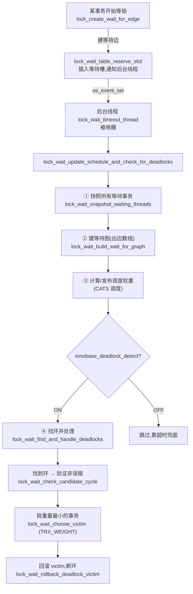

# 第 5 篇 · 第 18 章 · 死锁检测与锁等待

> **核心问题**:P5-16 讲了两阶段锁协议——事务执行中随时加锁,commit 才统一释放。这个保证正确性的协议有个甩不掉的副作用:两个事务各自攥着一把锁、又去抢对方的锁,谁都不肯松手,就**死锁**了。事务攥着锁睡觉可以,可整个系统里几百个事务互相等成一圈,谁也动不了,这是不可接受的。InnoDB 怎么发现这个"循环等待"?它把"谁在等谁"画成一张**等待图(wait-for graph)**,在图里找**环**——找到环就是死锁,挑一个事务回滚,环就断了。可问题接踵而至:什么时候去找这个环?挑谁回滚(回滚代价怎么衡量)?环检测会不会被事务线程频繁触发、把 CPU 拖垮?如果检测关掉(`innodb_deadlock_detect=OFF`),又怎么兜底?这一章把死锁检测的**触发时机**、**环检测算法**、**回滚挑事务的经济决策**、以及和它形影不离的**锁等待超时**,逐层拆透,全部对到 9.x 真实源码。

> **读完本章你会明白**:
> 1. 为什么两阶段锁协议必然带来死锁风险,死锁又为什么不能靠"超时硬等"了事(超时靠猜、慢、伤无辜),而必须**主动找环**——wait-for graph 这个模型的动机与能力。
> 2. InnoDB 的死锁检测**不在事务线程里跑**,而是在一个**后台线程**(`lock_wait_timeout_thread`)里**周期性**地拍快照、建等待图、DFS 找环——为什么这么设计,以及这个"后台快照式"检测相比"每次加锁触发"避免了哪些灾难性的 CPU 放大。
> 3. 找到死锁环之后,InnoDB 挑谁回滚?**挑"重量"最小的**——而"重量"=`undo_no`(改过的行数)+ 持锁数(`trx_locks` 链表长度),这是把回滚代价和经济损失降到最低的决策,源码里就是 `TRX_WEIGHT` 和 `trx_weight_ge`。
> 4. 锁**等待**是怎么把一个事务线程挂起、到时间或被授予锁再唤醒的——`lock_wait_suspend_thread` / 等待槽(srv_slot_t)/ `innodb_lock_wait_timeout`(默认 50 秒),以及它和死锁检测的协作(检测关掉时,超时是唯一兜底)。

> **如果一读觉得太难**:先记住四件事——① 死锁 = 事务之间互相等锁,形成**环**;② InnoDB 把"谁等谁"画成**等待图**,有**环**就是死锁;③ 死锁了挑**重量最小**(undo 改的行最少 + 持锁最少)的事务**回滚**;④ 检测可以关掉(`innodb_deadlock_detect=OFF`),关了就靠**锁等待超时**(`innodb_lock_wait_timeout`,默认 50 秒)兜底——但超时是"等够时间才发现",又慢又可能误伤。本章就是把这四件事拆到源码。

---

## 〇、一句话点破

> **死锁就是事务之间互相等锁、形成一个环。InnoDB 在一个后台线程里周期性地把所有正在等锁的事务拍个快照,建一张"谁等谁"的等待图,用 DFS 在图里找环;找到环,就从环里挑一个"重量最小"(改的行少 + 持锁少)的事务回滚,把环断开。这套机制默认开着(`innodb_deadlock_detect=ON`),关掉就只能靠锁等待超时(`innodb_lock_wait_timeout`,默认 50 秒)兜底——超时是被动等、慢且可能伤无辜,主动找环是快速且精确。**

这是结论,不是理由。本章倒过来拆:先讲死锁是怎么从两阶段锁里"长"出来的(动机),再讲为什么靠超时硬等不行(反面),接着拆 wait-for graph 这个模型怎么把"循环等待"变成"找环"问题,然后钻进 9.x 源码看 InnoDB **怎么在后台线程里**周期性建图、找环、挑事务回滚,最后讲锁等待本身的挂起/唤醒/超时机制,以及它和死锁检测的协作。

---

## 一、死锁:两阶段锁协议甩不掉的副作用

(承接 P5-16)

P5-16 讲了一个保证正确性的协议——**两阶段锁(2PL)**:事务执行中随时加锁(growing phase),但所有锁都拖到 `commit` 才统一释放(shrinking phase)。这个协议是隔离性/可串行化的根基(2PL 定理:加锁在解锁之前,并发结果等价于某个串行顺序),但它有个**不可消除的副作用**:死锁。

### 死锁是怎么长出来的

死锁的诞生需要两个条件,而两阶段锁协议**亲手满足了第一个**:

1. **锁持有期间不释放**(两阶段锁的 shrinking phase 必须等到 commit)——这正是 2PL 的要求;
2. **事务之间请求锁的顺序不一致**——这在 OLTP 里几乎是常态(用户操作顺序千变万化)。

来看一个最经典的两事务死锁。两个账户事务,各自先锁 A 再锁 B,但**顺序相反**:

```
   时刻    事务 T1                              事务 T2
   t1     BEGIN;
   t2                                          BEGIN;
   t3     UPDATE acct SET bal=bal-100
              WHERE id=A;   -- 给 id=A 加 X 锁,持有
   t4                                          UPDATE acct SET bal=bal-100
                                                 WHERE id=B;  -- 给 id=B 加 X 锁,持有
   t5     UPDATE acct SET bal=bal+100
              WHERE id=B;   -- 想给 id=B 加 X 锁 → T2 持着,等!
   t6                                          UPDATE acct SET bal=bal+100
                                                 WHERE id=A;  -- 想给 id=A 加 X 锁 → T1 持着,等!
   ─────────────────────────────────────────────────────────────────────
   t5/t6 之后:T1 等 T2 放 B 锁,T2 等 T1 放 A 锁。
   两边都还没 commit(两阶段锁,锁不放),谁也不会先松手 → 死锁!
```

把"谁等谁"画出来,就是一个**环**:

```
   等待图(wait-for graph):
        ┌─── T1 ───waits for───▶ T2 ───┐
        │                              │
        └────── waits for ◀────────────┘

   T1 等 T2 释放 id=B,T2 等 T1 释放 id=A。
   箭头从"等待者"指向"被等待者",两条箭头首尾相接 → 环 → 死锁。
```

> **不这样会怎样**:如果两阶段锁改成"语句结束就放锁"(放弃 2PL),t3 改完 id=A 立刻释放,那 T2 在 t6 想锁 id=A 就能拿到,死锁不会发生——但代价是隔离性破坏(P5-16 的反例:T 自己刚改的值,可能在下一条语句读到别人改过的版本)。所以死锁**不是 bug,是 2PL 的必要代价**。要保住隔离性,就得接受死锁可能发生,然后用**另一套机制(死锁检测)**去发现它、解开它。

### 间隙锁让死锁更容易发生

承接 P5-17:RR 隔离级别下,InnoDB 还会加**间隙锁**(锁"不存在的间隙",防幻读)。间隙锁把死锁概率推高了一截——因为两个事务可以对**同一个间隙**互相持锁/请求,而间隙锁之间的冲突比记录锁更隐蔽。最典型的例子:两个事务各自 `INSERT` 同一个区间里不同位置的行,各自持有的插入意向锁和对方的间隙锁互相挡,瞬间死锁。本章不展开间隙锁细节(那是 P5-17 的事),但要记住:**死锁检测机制对记录锁和间隙锁一视同仁**,只要形成等待环,就回滚解开。

> **钉死这件事**:死锁是两阶段锁协议 + 锁请求顺序不一致的**必然产物**——前者是隔离性的要求(不能放),后者是 OLTP 的常态(用户操作乱序)。InnoDB 不试图"避免"死锁(那要么牺牲隔离性,要么全局排序所有锁请求——都不现实),而是**主动检测 + 解开**。这就引出本章的核心问题:怎么检测?

---

## 二、为什么不能靠"超时硬等"

在讲 wait-for graph 之前,先回答一个自然的疑问:**为什么不干脆给每次锁等待设个超时,等够了就当死锁、回滚?** 这是最朴素的思路,很多系统也确实这么做。但 InnoDB 默认**不**依赖它,而是主动找环。来看为什么超时硬等不行。

### 朴素方案:每个等锁的事务设个超时,超时回滚

```
   朴素超时方案:
   事务 T 想加锁 → 被挡 → 等 N 秒 → 还没拿到 → 当作(疑似)死锁,回滚 T
```

这个方案有三个致命问题:

**① 慢——发现死锁要等够整个超时周期。** 假设 N=5 秒,两个事务在第一毫秒就死锁了,可它们要傻等 5 秒,其中一个才超时回滚。这 5 秒里,客户端在等、连接占着、行还锁着,后面排队的事务全被堵。死锁本该在**毫秒级**解开,超时方案拖到秒级,体验和吞吐都崩。

**② 伤无辜——超时的未必是死锁里的那个。** 设想事务 T1 在等一个**很慢但不是死锁**的锁(比如某个长事务持着不放),T1 等了 N 秒超时被回滚——可它根本没参与任何死锁,只是"运气不好"被慢事务挡住了。超时方案分不清"被死锁挡住"和"被正常慢操作挡住",一刀切回滚,白白牺牲了本来等一下就能成功的事务。

**③ 漏报——真死锁可能正好都不超时。** 如果超时设得很长(N=50 秒,InnoDB 的默认锁等待超时就是这个量级),两个死锁的事务要各等 50 秒才有一个被回滚——这 50 秒里它们攥着的锁堵住一大片,雪崩。如果超时设得很短,又会误伤大量正常的锁等待(OLTP 里 100 毫秒的锁等待很常见)。**没有一个超时值能两头讨好**。

### InnoDB 的回答:主动找环

InnoDB 的思路完全不同:**不等,主动找**。把全系统"谁在等谁"画成图,在图里找环——有环就是死锁,瞬间发现,精确解开;没环就不是死锁,让它继续等(等真正的锁释放,或等锁等待超时兜底)。

```
   wait-for graph 检测(秒杀超时方案):
   事务 T1 想加锁 → 被挡 → 建一条"T1 等 T2"的边 → 后台线程周期性找环
                                                              │
                                            ┌─────────────────┼─────────────────┐
                                            ▼                 ▼                 ▼
                                        找到环              没环              没环
                                   = 死锁!立刻挑一个      = 正常等待,继续等   = 正常等待,继续等
                                     事务回滚,断环         (等锁释放或超时)
```

**为什么比超时强**:

- **快**:找环是图算法,微秒级就能跑完(事务数量有限),死锁几乎在被检测到的下一拍就被解开;
- **精确**:只有真正成环(互相循环等待)才算死锁,正常的长锁等待不会被误判;
- **可解**:找到环,挑一个事务回滚,环就断了——不会"两边都白等"。

> **不这样会怎样**:纯靠超时,死锁发现延迟到秒级(慢)、误伤正常的锁等待(伤无辜)、且不管超时设多少都有漏报。wait-for graph 用"主动找环"把死锁发现从"被动等够时间"变成"主动精确判定",这是数据库并发控制的标准做法(PostgreSQL、SQL Server 的锁管理器也是这套思路)。

> **钉死这件事**:死锁检测有两种思路——**被动超时**(慢、不精确)vs **主动找环**(快、精确)。InnoDB 默认用后者(`innodb_deadlock_detect=ON`),把前者(`innodb_lock_wait_timeout=50`)作为兜底/关掉检测时的退路。后面三节拆的就是"主动找环"的实现。

---

## 三、wait-for graph:把"循环等待"变成"找环"问题

现在正式引入 wait-for graph 这个模型。它是死锁检测的数学基础,理解了它,后面所有源码都顺理成章。

### 什么是 wait-for graph

**wait-for graph(等待图)** 是一张**有向图**:

- **节点**:每个**正在等待锁**的事务,是一个节点。(注意:只有"正在等"的事务才是节点;持锁但不等锁的事务不是节点的主体——它只是被某个等待者指向。)
- **边**:事务 T1 正在等事务 T2 持有的锁,就画一条 **T1 → T2** 的有向边。这条边的含义是"T1 的进展依赖 T2 释放锁"。

关键定理(图论经典结论):**wait-for graph 里有环 ⟺ 存在死锁。** 证明很直白:

- **环 → 死锁**:T1 → T2 → T3 → T1,意思是 T1 等 T2、T2 等 T3、T3 等 T1。三个事务谁也动不了(都要等对方先放锁),两阶段锁保证谁也不会先 commit 放锁,所以死锁。
- **死锁 → 环**:死锁的定义就是"一组事务互相等待",这必然在 wait-for graph 里形成一个环——否则就有一条边指向环外,顺着边走总能走到一个"不在等"的事务(它会进展并释放锁),死锁就不成立。

于是**死锁检测 = 在 wait-for graph 里找环**。这是一个干净的归约:把"分布式系统里的循环等待"这个并发问题,变成"有向图找环"这个经典图论问题,后者有成熟的 O(V+E) 算法。

### 一个三事务死锁的等待图

来看一个三事务死锁,理解等待图怎么画。三个事务各持一把锁,又去抢另一个的:

```
   时刻    T1                       T2                       T3
   t1     持 X(id=10)
   t2                              持 X(id=20)
   t3                                                       持 X(id=30)
   t4     等 X(id=20) ←被T2挡
   t5                              等 X(id=30) ←被T3挡
   t6                                                       等 X(id=10) ←被T1挡

   等待图(只有正在等锁的 T1,T2,T3 是节点):
   ┌─────────────────────────────────────────────────────────┐
   │                                                         │
   │      ┌── waits for ──▶  T2  ── waits for ──▶  T3        │
   │      │                                            │      │
   │     T1                                            │      │
   │      ▲                                            │      │
   │      └────── waits for ◀────── waits for ─────────┘      │
   │                                                         │
   └─────────────────────────────────────────────────────────┘
   T1 → T2 → T3 → T1:三条边首尾相接 = 环 = 死锁。
   挑一个(比如重量最小的)回滚,环断,其余两个能继续。
```

注意一个细节:**InnoDB 的 wait-for graph 里,每个节点最多一条出边**。为什么?因为一个事务同一时刻**只能等一把锁**——它要么在跑(不等),要么卡在某一个锁请求上(等一个特定的阻塞者)。源码里这体现为每个等待事务有一个 `blocking_trx` 字段(`trx->lock.blocking_trx`),指向它当前等的那个事务。这让等待图变成一个"每个节点出度 ≤ 1"的特殊图,**找环变得极其简单**(后面源码会看到,DFS 顺着唯一的出边走,走到已访问的节点就是环)。这是 InnoDB 死锁检测算法又快又简单的根。

> **钉死这件事**:wait-for graph = "事务等谁"的有向图,有环 = 死锁。InnoDB 的图有个宝贵性质:**每个节点出度 ≤ 1**(一个事务只能等一把锁),所以找环是顺着唯一出边走、撞到已访问节点即环——O(V) 时间。这个性质是 InnoDB 检测算法又快又简单的根。

---

## 四、源码全景:谁触发检测,在哪建图,在哪找环

理论讲完,进源码。本章最关键的认知修正(很多人凭老资料写错):**InnoDB 9.x 的死锁检测不在事务线程里跑,而是在一个后台线程里周期性地批量做。** 这个设计选择非常关键,先看全景,再逐个钻。

### 全景:一次检测的完整流程

死锁检测由**一个后台线程** `lock_wait_timeout_thread` 驱动(`lock0wait.cc:1432`)。每当有新事务开始等锁(或被唤醒),锁系统通过 `lock_set_timeout_event()` 敲一下这个线程的事件,线程就醒来跑一轮 `lock_wait_update_schedule_and_check_for_deadlocks`:



这条链路就是本章的骨架。下面逐节拆。

### 为什么是后台线程批量做,而不是事务线程触发

这是认知修正的重点。**很多老资料/博客**(基于 5.x / 早期 8.0)描述的死锁检测是"事务 T 加锁被挡时,就地递归检测一次,看 T 等待链里有没有环"——即 `lock_deadlock_recursive` 那套老接口。**9.x 已经不是这样了。** 来看现在的源码,事务加锁被挡时(`RecLock::add_to_waitq`,`lock0lock.cc:1445`)只做一件事:

```c
dberr_t RecLock::add_to_waitq(const lock_t *wait_for, const lock_prdt_t *prdt) {
  ...
  if (m_trx->in_innodb & TRX_FORCE_ROLLBACK) {
    return (DB_DEADLOCK);
  }
  m_mode |= LOCK_WAIT;
  prepare();                                       /* 设事务等待状态 */
  lock_t *lock = create(m_trx, prdt);              /* 创建等待锁对象 */
  lock_create_wait_for_edge(lock, wait_for);       /* 只建一条等待边 */
  ...
  set_wait_state(lock);
  MONITOR_INC(MONITOR_LOCKREC_WAIT);
  return (DB_LOCK_WAIT);                           /* 返回"去等吧",不检测 */
}
```

—— 见 [RecLock::add_to_waitq](../mysql-server/storage/innobase/lock/lock0lock.cc#L1445-L1478)。注意它**只建等待边**(`lock_create_wait_for_edge`),然后返回 `DB_LOCK_WAIT`——**完全不检测环**。检测留给了后台线程。

> **不这样会怎样**(为什么不在事务线程就地检测):如果每个事务每次加锁被挡都就地递归检测,在高并发下是一场灾难。设想 200 个事务同时等锁,每个事务线程都试图遍历整张等待图——200 个线程抢同一份数据结构、重复同样的遍历工作,锁系统的 latch 会被打成热点,CPU 大量浪费在重复检测上。9.x 的设计是**集中检测**:把检测职责交给一个后台线程,周期性批量做一次,所有事务共享一份检测结果。这是从"O(事务数²) 的重复劳动"变成"O(事务数) 的一次扫描",在几百并发的 OLTP 上,这是吞吐能不能扛住的关键。

这条等待边怎么建的?`lock_create_wait_for_edge`(`lock0lock.cc:1406`)极其轻量——就是记下"我(blocking_trx)等谁":

```c
static void lock_create_wait_for_edge(const lock_t *waiting_lock,
                                      const lock_t *blocking_lock) {
  trx_t *waiter = waiting_lock->trx;
  trx_t *blocker = blocking_lock->trx;
  ...
  /* 注意:这里故意不调用 lock_wait_request_check_for_cycles(),
  因为此时事务还没插入 waiting_threads 槽,后台线程看不到它。
  真正的"通知后台线程"留到 lock_wait_table_reserve_slot() 里做。*/
  waiter->lock.blocking_trx.store(blocker);        /* 记下我等谁 */
  lock_report_wait_for_edge_to_server(waiting_lock, blocking_lock);
}
```

—— 见 [lock_create_wait_for_edge](../mysql-server/storage/innobase/lock/lock0lock.cc#L1406-L1423)。建边 = 写一个原子变量 `blocking_trx`,O(1),极轻。事务线程的活到此为止,剩下的交给后台线程。

> **钉死这件事**:9.x 的死锁检测是**后台线程周期性批量**做,不是事务线程就地递归。事务加锁被挡只做两件事:① 建一条等待边(`blocking_trx = 阻塞者`,O(1));② 把自己插进等待槽,敲后台线程的事件。检测、找环、回滚,全在 `lock_wait_timeout_thread` 里集中完成。这是高并发下避免 CPU 放大的关键设计。

---

## 五、后台线程:快照、建图、找环

现在钻进后台线程的核心函数 `lock_wait_update_schedule_and_check_for_deadlocks`(`lock0wait.cc:1377`)。它分四步:快照 → 建图 → 算权重 → 找环。

### 第一步:快照所有等待事务

后台线程先拿一份"当前所有正在等锁的事务"的快照(`lock_wait_snapshot_waiting_threads`,`lock0wait.cc:562`)。它遍历等待槽表 `lock_sys->waiting_threads`,把每个在用的槽里的事务记下来:

```c
static uint64_t lock_wait_snapshot_waiting_threads(
    ut::vector<waiting_trx_info_t> &infos) {
  infos.clear();
  lock_wait_mutex_enter();
  const auto table_reservations = lock_wait_table_reservations;
  for (auto slot = lock_sys->waiting_threads; slot < lock_sys->last_slot; ++slot) {
    if (slot->in_use) {
      auto from = thr_get_trx(slot->thr);
      auto to = from->lock.blocking_trx.load();    /* 读出"等谁" */
      if (to != nullptr) {
        infos.push_back({from, to, slot, slot->reservation_no});
      }
    }
  }
  lock_wait_mutex_exit();
  return table_reservations;
}
```

—— 见 [lock_wait_snapshot_waiting_threads](../mysql-server/storage/innobase/lock/lock0wait.cc#L562-L597)。每个等待事务记四个字段(`waiting_trx_info_t`,`lock0wait.cc:521`):

```c
struct waiting_trx_info_t {
  trx_t *trx;            /* 我(等待者) */
  trx_t *waits_for;      /* 我等谁(阻塞者) */
  srv_slot_t *slot;      /* 我在哪个等待槽 */
  uint64_t reservation_no; /* 槽的预约号(用于检测 ABA,见后) */
};
```

注意一个关键设计:**快照只持 `lock_wait_mutex` 极短时间**(遍历完就放),后续的建图、找环都在 mutex 外做。这是为了避免阻塞所有正在尝试加锁的事务线程(它们也要拿 `lock_wait_mutex` 来占用/释放等待槽)。源码注释(`lock0wait.cc:570-583`)甚至讨论了"如果将来快照成瓶颈,可以分段快照再拼起来"——因为算法**不要求一致快照**,拼出来的也能用。这是一个对性能极度敏感的设计。

### 第二步:建等待图的出边数组

有了快照,接下来建等待图的"出边数组" `outgoing`(`lock_wait_build_wait_for_graph`,`lock0wait.cc:650`)。对每个等待事务 `infos[from]`,找它的阻塞者 `infos[from].waits_for` 在 `infos` 里的下标 `to`,记 `outgoing[from] = to`:

```c
static void lock_wait_build_wait_for_graph(
    ut::vector<waiting_trx_info_t> &infos, ut::vector<int> &outgoing) {
  const auto n = static_cast<uint>(infos.size());
  outgoing.clear();
  outgoing.resize(n, -1);                          /* -1 表示没有出边 */
  /* 用排序 + 二分查找,避免哈希表的内存分配开销
     (源码注释 lock0wait.cc:657-670 说实测 sort 比 unordered_map 快) */
  sort(infos.begin(), infos.end());
  waiting_trx_info_t needle{};
  for (uint from = 0; from < n; ++from) {
    needle.trx = infos[from].waits_for;
    auto it = std::lower_bound(infos.begin(), infos.end(), needle);
    if (it == infos.end() || it->trx != needle.trx) {
      continue;                                    /* 阻塞者不在快照里(没在等锁),无边 */
    }
    auto to = static_cast<uint>(it - infos.begin());
    ut_ad(from != to);
    outgoing[from] = static_cast<int>(to);         /* from → to 的边 */
  }
}
```

—— 见 [lock_wait_build_wait_for_graph](../mysql-server/storage/innobase/lock/lock0wait.cc#L650-L688)。

这里有个巧思:阻塞者(`waits_for`)可能**本身不在快照里**——因为它没在等锁(它正持锁跑着)。这种情况 `outgoing[from]` 保持 `-1`,表示这条等待链到此为止(阻塞者会进展并释放锁,不会形成环)。只有阻塞者**也在等锁**(也在快照里),边才连得上,环才可能形成。这正是"只有互相等待才死锁"的图论体现。

一个性能细节:源码注释(`lock0wait.cc:657-670`)直说,这里用 `sort + lower_bound`(O(n log n))而不用 `unordered_map`(O(n) 理论更快),是因为**实测 sort 更快**——`unordered_map` 的桶链表是链表,内存分配太多。InnoDB 工程师实测了多种方案才定的,这是"理论复杂度和实测性能打架时,信实测"的典型。

### 第三步:找环——DFS 顺唯一出边走

建好出边数组,就到了核心——找环。函数 `lock_wait_find_and_handle_deadlocks`(`lock0wait.cc:1265`)用 DFS。**因为每个节点出度 ≤ 1,DFS 退化成"顺着唯一的出边一路走"**,极其简单:

```c
static void lock_wait_find_and_handle_deadlocks(
    const ut::vector<waiting_trx_info_t> &infos,
    const ut::vector<int> &outgoing,
    ut::vector<trx_schedule_weight_t> &new_weights) {
  const auto n = static_cast<uint>(infos.size());
  ut::vector<uint> cycle_ids;
  ut::vector<uint> colors;
  colors.resize(n, 0);                             /* 0=未访问 */
  uint current_color = 0;
  for (uint start = 0; start < n; ++start) {
    if (colors[start] != 0) continue;              /* 已处理过的节点跳过 */
    ++current_color;
    /* 顺着 start 的出边一路走(每个节点最多一条出边,所以是直线走) */
    for (int id = start; 0 <= id; id = outgoing[id]) {
      ut_ad(id != outgoing[id]);                   /* 不处理自环 */
      if (colors[id] == 0) {
        colors[id] = current_color;                /* 第一次访问,涂色 */
        continue;
      }
      /* 撞到已访问节点: */
      if (colors[id] == current_color) {
        /* 当前 DFS 涂的色 → 这次 DFS 内撞到自己 → 找到环! */
        lock_wait_extract_cycle_ids(cycle_ids, id, outgoing);
        if (lock_wait_check_candidate_cycle(cycle_ids, infos, new_weights)) {
          MONITOR_INC(MONITOR_DEADLOCK);           /* 真死锁 */
        } else {
          MONITOR_INC(MONITOR_DEADLOCK_FALSE_POSITIVES); /* 误报 */
        }
      }
      /* 否则:撞到的是之前 DFS 涂的色 → 当前路径并入了已处理部分,无环,停止 */
      break;
    }
  }
  MONITOR_INC(MONITOR_DEADLOCK_ROUNDS);
}
```

—— 见 [lock_wait_find_and_handle_deadlocks](../mysql-server/storage/innobase/lock/lock0wait.cc#L1265-L1316)。

这个算法的精髓在于"涂色"(colors 数组):

- 每开始一个新 DFS,`current_color++`,给这条路径上的节点都涂上当前色;
- 顺出边走,撞到一个节点,看它的色:
  - **色 == 0**(从没访问过):涂上当前色,继续走;
  - **色 == 当前色**:**这次 DFS 走了一圈回到自己** → 找到环(从撞到的那个节点开始,顺出边绕一圈就是环上的事务);
  - **色 == 之前某次 DFS 的色**:当前路径并入了之前已处理的部分(那部分确定无环,否则之前就报了),无环,停止。

因为每节点出度 ≤ 1,这个 DFS 实际上是**线性扫描**——每个节点最多被访问一次,总复杂度 O(V)(V 是等待事务数)。这是出度 ≤ 1 这个性质带来的巨大简化:通用有向图找环要 O(V+E) 的 Tarjan 或三色 DFS,这里退化成顺链走。

环上的事务怎么提取出来?`lock_wait_extract_cycle_ids`(`lock0wait.cc:1238`)就是从撞回的节点开始,顺出边绕一圈收集:

```c
static void lock_wait_extract_cycle_ids(ut::vector<uint> &cycle_ids,
                                        const uint start,
                                        const ut::vector<int> &outgoing) {
  cycle_ids.clear();
  uint id = start;
  do {
    cycle_ids.push_back(id);
    id = outgoing[id];
  } while (id != start);                           /* 绕回起点停止 */
}
```

—— 见 [lock_wait_extract_cycle_ids](../mysql-server/storage/innobase/lock/lock0wait.cc#L1238-L1247)。到此,死锁环上有哪些事务,已经清清楚楚。

> **钉死这件事**:9.x 的找环算法是"涂色 + 顺唯一出边走"的线性 DFS。每节点出度 ≤ 1 让它退化成 O(V) 的链式扫描——撞到当前 DFS 涂过色的节点就是环。算法本身极其简单,简单到漂亮,这正是出度 ≤ 1 这个性质的红利。

---

## 六、挑谁回滚:TRX_WEIGHT 的经济决策

找到死锁环,接下来回答一个看似简单实则关键的问题:**环上有 N 个事务,挑哪一个回滚?** 都回滚太浪费(只需断环就能解开),挑错了一个会回滚掉一笔"重"事务(改了很多行、持了很多锁),白费大量工作。InnoDB 的决策原则是:**挑"重量"最小的回滚**。

### 什么是"重量":undo 改的行数 + 持锁数

InnoDB 给每个事务定义了一个"重量" `TRX_WEIGHT`(`include/trx0trx.h:1252`):

```c
/** Calculates the "weight" of a transaction. The weight of one transaction
 is estimated as the number of altered rows + the number of locked rows.
 @param t transaction
 @return transaction weight */
static inline uint64_t TRX_WEIGHT(const trx_t *t) {
  return t->undo_no + UT_LIST_GET_LEN(t->lock.trx_locks);
}
```

—— 见 [TRX_WEIGHT](../mysql-server/storage/innobase/include/trx0trx.h#L1248-L1254)。

两个分量:

- **`undo_no`**:这个事务**已经改了多少行**(每改一行 undo 记录编号 +1,见 P3-10 undo 篇)。它直接反映**回滚这个事务要做多少 undo 工作**——改了 100 行的事务回滚要逆操作 100 次,改了 2 行的只要逆操作 2 次。
- **`UT_LIST_GET_LEN(t->lock.trx_locks)`**:这个事务**当前持有多少把锁**(P5-16 讲过的 `trx_locks` 链表长度)。回滚一个事务要释放它所有的锁,持锁越多,释放时越要唤醒越多等待者、更新越多调度状态,代价越大;而且持锁多的事务往往是"大事务",回滚它对系统的连锁影响也大。

注意一个**对老资料的修正**:很多博客把 InnoDB 的回滚挑选标准说成"挑 undo 量小(undo log 占用空间小)的事务"——这个说法**不够精确**。源码清楚地表明,重量 = `undo_no`(改的行数,不是 undo 日志字节数) **+ 持锁数**,两个分量都要。持锁数这一项经常被忽略,但它真实存在于 `TRX_WEIGHT` 里——一个改了几行却持了几千把间隙锁的长事务,它的重量比一个改了上百行但只持几把锁的事务可能还大。

### 怎么比:`trx_weight_ge` 和 victim 挑选

挑 victim 的函数 `lock_wait_choose_victim`(`lock0wait.cc:917`)遍历环上事务,用 `trx_weight_ge` 比重量,留最轻的当 victim:

```c
static trx_t *lock_wait_choose_victim(
    const ut::vector<uint> &cycle_ids,
    const ut::vector<waiting_trx_info_t> &infos) {
  ut_ad(locksys::owns_exclusive_global_latch());
  trx_t *chosen_victim = nullptr;
  auto sorted_trxs = lock_wait_order_for_choosing_victim(cycle_ids, infos); /* 旋转环,最后到的排最后 */

  for (auto *trx : sorted_trxs) {
    if (chosen_victim == nullptr) {
      chosen_victim = trx;
      continue;
    }
    /* 高优先级事务(thr_priority)特殊处理:让低优先级的当 victim */
    if (trx_is_high_priority(chosen_victim) || trx_is_high_priority(trx)) {
      auto victim = trx_arbitrate(trx, chosen_victim);
      if (victim != nullptr) {
        if (victim == trx) {
          chosen_victim = trx;
        } else {
          ut_a(victim == chosen_victim);
        }
        continue;
      }
    }
    /* 关键比较:chosen_victim 比 trx 重?那就改选 trx(更轻的)当 victim */
    if (trx_weight_ge(chosen_victim, trx)) {
      chosen_victim = trx;
    }
  }
  ut_a(chosen_victim);
  return chosen_victim;
}
```

—— 见 [lock_wait_choose_victim](../mysql-server/storage/innobase/lock/lock0wait.cc#L917-L958)。

比较函数 `trx_weight_ge`(`trx0trx.cc:2871`)有个前置判断——**改过非事务表(MyISAM 表)的事务,权重直接判为更重**,因为非事务表的改动**不可回滚**,绝不能挑它当 victim(挑了也回滚不掉,反而更乱):

```c
bool trx_weight_ge(const trx_t *a, const trx_t *b) {
  ut_ad(locksys::owns_exclusive_global_latch());
  /* 改过非事务表的事务,认为更重(不让它当 victim) */
  auto a_notrans_edit =
      a->mysql_thd != nullptr && thd_has_edited_nontrans_tables(a->mysql_thd);
  auto b_notrans_edit =
      b->mysql_thd != nullptr && thd_has_edited_nontrans_tables(b->mysql_thd);
  if (a_notrans_edit != b_notrans_edit) {
    return (a_notrans_edit);                        /* 改非事务表的"更重" */
  }
  /* 都改过/都没改过非事务表,才比 TRX_WEIGHT */
  return (TRX_WEIGHT(a) >= TRX_WEIGHT(b));
}
```

—— 见 [trx_weight_ge](../mysql-server/storage/innobase/trx/trx0trx.cc#L2867-L2895)。

还有一个"平局打破"规则(`lock_wait_order_for_choosing_victim`,`lock0wait.cc:776`):如果环上多个事务重量相等(比如都是新开始的事务,undo_no=0,持锁数也差不多),InnoDB 倾向于挑**最后加入环的那个**(即"最后开始等锁的"那个,`reservation_no` 最大的)。直觉是:**最后到的、破坏了平衡的那个,代价通常最小**——它加入时间最短,可能做的工作最少;而且让"老事务"继续跑下去,对系统公平。源码注释(`lock0wait.cc:756-770`)说这是为了和老的 victim 选择行为向后兼容(老版本只在两个候选里挑:闭环的那个和它等的那个)。

### 这套决策的经济含义

挑重量最小的事务回滚,是一个**经济决策**:

- **回滚代价最小**:重量 = 改的行数 + 持锁数,直接对应回滚要做的 undo 工作量和锁清理工作量。挑轻的,回滚花的时间最短,系统恢复最快。
- **浪费的工作最少**:被回滚事务做的所有改动都白费了。挑改得少的(undo_no 小),白费的工作最少;挑持锁少的,被它阻塞的下游事务也少,连锁影响小。
- **公平**:新来的、做得少的、最后打破平衡的那个先牺牲,让做得多的老事务继续——符合"尊重已投入工作"的直觉。

```
   死锁环上三个事务(示例):
   ┌──────────┬───────────┬────────────┬────────────┬──────────────┐
   │ 事务     │ undo_no   │ trx_locks  │ TRX_WEIGHT │ 谁当 victim? │
   ├──────────┼───────────┼────────────┼────────────┼──────────────┤
   │ T1       │   3       │    5       │    8       │              │
   │ T2       │  50       │   20       │   70       │              │
   │ T3       │   1       │    2       │    3   ★   │ 挑 T3 回滚! │
   └──────────┴───────────┴────────────┴────────────┴──────────────┘
   T3 重量最小(改 1 行,持 2 锁)→ 回滚它代价最低,白费工作最少。
   回滚 T3 后,环断,T1、T2 能继续。
```

> **不这样会怎样**:如果挑最重的回滚(反向决策),会白白浪费一个改了几十行、持了一堆锁的大事务的所有工作,而且回滚它本身要做几十次逆操作,期间它持有的锁还在(回滚过程不放锁,直到回滚完),继续堵着别人。挑最轻的,是把"必须牺牲一个"的损失降到最低——这是数据库在死锁面前唯一理性的经济选择。

> **钉死这件事**:死锁环上挑 victim 的标准是**重量最小**=`undo_no`(改的行数)+ `trx_locks`(持锁数)。这个标准把"回滚代价"量化成两个可测的量,挑最轻的回滚,损失最小。源码在 `TRX_WEIGHT`(include/trx0trx.h:1252)和 `trx_weight_ge`(trx0trx.cc:2871),额外规则:改过非事务表的不当 victim、平局挑最后到的。

---

## 七、回滚 victim:断环、通知、唤醒

挑出 victim,接下来真的把它回滚,把环断开。这一步在 `lock_wait_handle_deadlock` → `lock_wait_rollback_deadlock_victim`(`lock0wait.cc:692`):

```c
static void lock_wait_rollback_deadlock_victim(trx_t *chosen_victim) {
  ut_ad(!trx_mutex_own(chosen_victim));
  ut_ad(locksys::owns_exclusive_global_latch());
  trx_mutex_enter(chosen_victim);
  chosen_victim->lock.was_chosen_as_deadlock_victim = true;  /* 标记:我是 victim */
  ut_a(chosen_victim->lock.wait_lock != nullptr);
  ut_a(chosen_victim->lock.que_state == TRX_QUE_LOCK_WAIT);
  lock_cancel_waiting_and_release(chosen_victim);  /* 取消它的等待锁,唤醒它的线程 */
  trx_mutex_exit(chosen_victim);
}
```

—— 见 [lock_wait_rollback_deadlock_victim](../mysql-server/storage/innobase/lock/lock0wait.cc#L690-L703)。

注意一个关键点:**这里只是"取消 victim 的锁等待并唤醒它的线程",真正的事务回滚(undo 逆操作)是由 victim 自己的线程被唤醒后做的。** `was_chosen_as_deadlock_victim = true` 是个标记,victim 线程从 `lock_wait_suspend_thread` 醒来后(`lock0wait.cc:232-236`),看到这个标记,知道自己是死锁 victim:

```c
  /* 在 lock_wait_suspend_thread 里: */
  if (trx->lock.was_chosen_as_deadlock_victim) {
    ...
    trx->lock.was_chosen_as_deadlock_victim = false;
    /* 返回 DB_DEADLOCK,上层会回滚整个事务 */
  }
```

—— 见 [lock_wait_suspend_thread 的 victim 检查](../mysql-server/storage/innobase/lock/lock0wait.cc#L232-L236) 和 [第二次检查](../mysql-server/storage/innobase/lock/lock0wait.cc#L409-L412)。victim 线程拿到 `DB_DEADLOCK` 错误码,层层返回到 MySQL server 层,server 层触发 `ROLLBACK`——这才是完整的事务回滚(顺着 undo 把改过的行逆操作回去,释放所有锁)。所以"后台线程挑 victim"和"victim 自己回滚自己"是分工的:后台线程负责检测和决策,victim 线程负责执行回滚。

`lock_cancel_waiting_and_release`(`lock0lock.cc:5742`)做的事是:把 victim 的等待锁从队列里摘掉(`lock_rec_dequeue_from_page`),然后唤醒 victim 线程(`lock_reset_wait_and_release_thread_if_suspended`)。环上其他事务因为 victim 不再等它们(边断了),它们的等待可能就能继续推进——环解开了。

### 死锁通知:打印那串著名的 deadlock 日志

死锁被解开前后,InnoDB 还会打印一串详细的死锁信息到错误日志——就是大家排查死锁时看到的 `*** (1) TRANSACTION`、`*** (2) HOLDS THE LOCK(S)`、`*** WE ROLL BACK TRANSACTION (2)` 那串。这由 `Deadlock_notifier::notify`(`lock0lock.cc:6069`)生成:

```c
void Deadlock_notifier::notify(const ut::vector<const trx_t *> &trxs_on_cycle,
                               const trx_t *victim_trx) {
  ut_ad(locksys::owns_exclusive_global_latch());
  start_print();
  const auto n = trxs_on_cycle.size();
  for (size_t i = 0; i < n; ++i) {
    const trx_t *trx = trxs_on_cycle[i];
    ...
    print_title(i, "TRANSACTION");
    print(trx, 3000);                               /* 打印事务信息(最多 3000 字节) */
    print_title(i, "HOLDS THE LOCK(S)");           /* 它持着什么锁 */
    print(blocking_lock);
    print_title(i, "WAITING FOR THIS LOCK TO BE GRANTED");  /* 它在等什么锁 */
    print(trx->lock.wait_lock);
  }
  ...
  buff << "*** WE ROLL BACK TRANSACTION (" << (victim_pos + 1) << ")\n";
  ...
  lock_deadlock_found = true;
}
```

—— 见 [Deadlock_notifier::notify](../mysql-server/storage/innobase/lock/lock0lock.cc#L6069-L6109)。这串日志是排查 InnoDB 死锁的第一手材料,告诉你:有哪些事务参与、各自持什么锁、等什么锁、谁被回滚。线上遇到 `ERROR 1213 (40001): Deadlock found when trying to get lock; try restarting transaction`,就去翻这串日志。本书附录 B 讲怎么读它。

---

## 八、误报防护:快照期间的 ABA 问题

到现在为止,算法看起来很顺:快照 → 建图 → 找环 → 挑 victim → 回滚。但有个并发陷阱必须处理:**快照和回滚之间有时间差**,这期间事务状态可能已经变了。一个"看起来像环"的快照,可能其实是假的——某些事务已经醒了、走了,或者槽被别的事务复用了。InnoDB 必须在回滚前**验证这个环还真的存在**,否则会误杀无辜事务。

### ABA 问题:槽被复用

每个等待槽 `srv_slot_t` 有个 `reservation_no`(预约号),每次槽被重新占用,号就 +1(`lock0wait.cc:153`)。考虑这个场景:

```
   t1  快照: 槽[3] 装着事务 A(reservation_no=100),A 等 B
   t2  A 醒了、走了;槽[3] 被释放
   t3  事务 C 开始等锁,占用了槽[3](reservation_no=101)
   t4  后台线程处理快照,以为槽[3] 还是 A,去回滚"A"
```

如果后台线程在 t4 直接按快照回滚,它会操作槽[3],但里面已经是 C 了——**误杀 C**。这就是经典的 ABA 问题(值从 A 变 B 又变回看起来像 A)。

InnoDB 的解法是 `reservation_no`:快照时记下每个槽的 `reservation_no`,回滚前重新读槽的 `reservation_no`,**号变了就认为快照过期,放弃这次环**(`lock_wait_trxs_are_still_in_slots`,`lock0wait.cc:971`):

```c
static bool lock_wait_trxs_are_still_in_slots(
    const ut::vector<uint> &cycle_ids,
    const ut::vector<waiting_trx_info_t> &infos) {
  ut_ad(lock_wait_mutex_own());
  for (auto id : cycle_ids) {
    const auto slot = lock_wait_get_slot_if_still_reserved(infos, id);
    if (!slot) {
      return false;                                 /* 任何一个槽的号变了,放弃 */
    }
    ut_ad(thr_get_trx(slot->thr) == infos[id].trx);
  }
  return true;
}

static const srv_slot_t *lock_wait_get_slot_if_still_reserved(
    const ut::vector<waiting_trx_info_t> &infos, const size_t id) {
  ut_ad(lock_wait_mutex_own());
  const auto slot = infos[id].slot;
  if (slot->in_use && slot->reservation_no == infos[id].reservation_no) {
    return slot;                                    /* 号没变,槽还是那个事务 */
  }
  return nullptr;                                   /* 号变了,ABA 发生 */
}
```

—— 见 [lock_wait_trxs_are_still_in_slots](../mysql-server/storage/innobase/lock/lock0wait.cc#L971-L983) 和 [lock_wait_get_slot_if_still_reserved](../mysql-server/storage/innobase/lock/lock0wait.cc#L867-L875)。

### 还要验证:事务真的还在等

即使槽号没变(事务还在槽里),也不代表它真的还在等——它可能已经被决定唤醒(被授予锁、或超时),只是还没来得及清理槽。`lock_wait_trxs_are_still_waiting`(`lock0wait.cc:995`)进一步验证 `trx->lock.wait_lock` 不为空:

```c
static bool lock_wait_trxs_are_still_waiting(
    const ut::vector<uint> &cycle_ids,
    const ut::vector<waiting_trx_info_t> &infos) {
  ut_ad(locksys::owns_exclusive_global_latch());
  for (auto id : cycle_ids) {
    const auto trx = infos[id].trx;
    if (trx->lock.wait_lock == nullptr) {
      /* 这个事务已经在被唤醒的路上,环会自己解开,忽略 */
      return false;
    }
    ut_a(trx->lock.que_state == TRX_QUE_LOCK_WAIT);
  }
  return true;
}
```

—— 见 [lock_wait_trxs_are_still_waiting](../mysql-server/storage/innobase/lock/lock0wait.cc#L995-L1015)。

这套"双验证"(槽号没变 + 还在等)由 `lock_wait_check_candidate_cycle`(`lock0wait.cc:1164`)统一执行。只有两次验证都通过,环才被认定为真死锁,才会挑 victim 回滚;否则记一笔 `MONITOR_DEADLOCK_FALSE_POSITIVES`(误报计数)放过:

```c
static bool lock_wait_check_candidate_cycle(...) {
  lock_wait_mutex_enter();
  if (!lock_wait_trxs_are_still_in_slots(cycle_ids, infos)) {     /* 验证 1:槽号 */
    lock_wait_mutex_exit();
    return false;                                  /* 快照过期,误报 */
  }
  locksys::Global_exclusive_latch_guard guard{UT_LOCATION_HERE};
  if (!lock_wait_trxs_are_still_waiting(cycle_ids, infos)) {      /* 验证 2:还在等 */
    lock_wait_mutex_exit();
    return false;                                  /* 已唤醒,误报 */
  }
  lock_wait_mutex_exit();
  trx_t *const chosen_victim = lock_wait_choose_victim(cycle_ids, infos);  /* 挑 victim */
  lock_wait_handle_deadlock(chosen_victim, cycle_ids, infos, new_weights);  /* 回滚 */
  return true;
}
```

—— 见 [lock_wait_check_candidate_cycle](../mysql-server/storage/innobase/lock/lock0wait.cc#L1164-L1231)。

> **不这样会怎样**:如果没有这套验证,后台线程会按"陈旧快照"回滚事务——回滚一个已经醒了、正在跑的事务,或者因为 ABA 回滚了一个无辜的新事务。并发系统里的"基于快照决策"都必须处理快照过期问题,这里用单调递增的 `reservation_no` 是标准做法(和 Linux 内核的 `seqcount`、RCV 的 generation counter 同源思想)。

> **钉死这件事**:后台线程基于快照决策,快照和回滚之间有并发窗口。InnoDB 用**两道验证**防误杀:① 槽的 `reservation_no` 没变(防 ABA,槽被复用);② 事务的 `wait_lock` 还在(防已唤醒)。验证不过就当误报放过(记 `MONITOR_DEADLOCK_FALSE_POSITIVES`),下一轮再说。

---

## 九、锁等待:把线程挂起,到点或被授予再唤醒

死锁检测讲完,本章还有一块紧密相关的机制——**锁等待本身**。一个事务加锁被挡,它的线程怎么"睡觉"?睡多久?谁来叫醒它?这套机制既是死锁检测的对象(检测的就是"正在等"的事务),又是检测关掉时的兜底(靠超时)。

### 挂起:占用一个等待槽,线程睡觉

事务线程加锁被挡,返回 `DB_LOCK_WAIT`,一路回到 `lock_wait_suspend_thread`(`lock0wait.cc:206`)。这个函数做的事:① 占一个等待槽(`lock_wait_table_reserve_slot`);② 在槽的 event 上睡觉(`os_event_wait_time_low`);③ 醒来后检查是被授予锁、超时、还是被选为死锁 victim,分别处理。

```c
void lock_wait_suspend_thread(que_thr_t *thr) {
  trx_t *trx = thr_get_trx(thr);
  ...
  const auto lock_wait_timeout = trx_lock_wait_timeout_get(trx);  /* 读 innodb_lock_wait_timeout */
  ...
  /* 如果已经被选为 victim(并发窗口),不用睡了,直接返回 DB_DEADLOCK */
  if (trx->lock.was_chosen_as_deadlock_victim) {
    ...
    trx->lock.was_chosen_as_deadlock_victim = false;
    return;                                        /* 上层会拿到 DB_DEADLOCK 回滚 */
  }
  slot = lock_wait_table_reserve_slot(thr, lock_wait_timeout);  /* 占槽 */
  ...
  /* 真正睡觉:在 slot->event 上等,最长 lock_wait_timeout 秒 */
  ...
}
```

—— 见 [lock_wait_suspend_thread](../mysql-server/storage/innobase/lock/lock0wait.cc#L206-L340)。占槽时(`lock_wait_table_reserve_slot`,`lock0wait.cc:138`),事务把自己挂进 `lock_sys->waiting_threads` 数组,这正是后台死锁检测线程快照遍历的那个表——**事务一占槽,就立刻"可见"于死锁检测**(源码注释 `lock0wait.cc:179-188` 解释了为什么在这里、而不是在 `lock_create_wait_for_edge` 里通知后台线程:因为只有占槽后,事务节点才在等待表里可见)。占槽的最后一步是 `lock_wait_request_check_for_cycles()`,它就是 `lock_set_timeout_event()`(`lock0wait.cc:204`),敲后台线程的事件,让它跑一轮检测。

### 唤醒的三种情形

事务线程在槽 event 上睡觉,被叫醒有三种原因,醒来后要分辨:

1. **被授予锁**:持锁者 commit 释放锁,锁系统授予等待者,调用 `lock_wait_release_thread_if_suspended`(`lock0wait.cc:359`)敲槽 event。等待线程醒来,拿到锁,继续执行。
2. **锁等待超时**:睡了超过 `innodb_lock_wait_timeout`(默认 50 秒,`ha_innodb.cc:1106` 定义),后台线程的超时检查 `lock_wait_check_and_cancel`(`lock0wait.cc:501`)发现并取消它的等待,设 `error_state = DB_LOCK_WAIT_TIMEOUT`(`lock0wait.cc:485`)。等待线程醒来,返回超时错误——**默认只回滚当前这条语句,不回滚整个事务**(除非应用显式 ROLLBACK)。这是死锁检测关掉时的唯一兜底。
3. **被选为死锁 victim**:后台死锁检测线程挑中它,设 `was_chosen_as_deadlock_victim = true`,`lock_cancel_waiting_and_release` 取消它的等待。等待线程醒来,返回 `DB_DEADLOCK`——**回滚整个事务**(undo 逆操作所有改动)。

注意超时和死锁 victim 的区别:**超时回滚语句级,victim 回滚事务级**。源码注释(`lock0wait.cc:478-484`)明确:设 `DB_LOCK_WAIT_TIMEOUT` 前要断言 `error_state != DB_DEADLOCK`,因为 `DB_DEADLOCK` 更重要(它要回滚整个事务),不能被超时覆盖。

### `innodb_lock_wait_timeout`:默认 50 秒,可关

`innodb_lock_wait_timeout` 是个会话级变量(`ha_innodb.cc:1106`),默认 50 秒,范围 1 到 1024×1024×1024(设到 100000000 以上等于禁用,`lock0wait.cc:507`)。它管的是"一个事务等一把锁等多久"——和死锁检测是两个独立的机制:

- 死锁检测管的是"**互相等的环**"——必须成环才算;
- 锁等待超时管的是"**单方面等一把锁等多久**"——不管是不是死锁,等够时间就超时。

两者的关系:`innodb_deadlock_detect=ON`(默认)时,死锁会被快速发现并解开(毫秒级),锁等待超时几乎只在"等一个正常但很慢的锁"时触发(比如某个长事务持锁不放);`innodb_deadlock_detect=OFF` 时,死锁检测被跳过(`lock0wait.cc:1423`),锁等待超时成为**死锁的唯一兜底**——两个死锁的事务会各等 50 秒,其中一个才超时回滚。这正是参数描述里那句"if set to OFF, deadlock detection is skipped, and we rely on innodb_lock_wait_timeout in case of deadlock"(`ha_innodb.cc:22715-22717`)的含义。

### 为什么提供关掉死锁检测的开关

既然主动检测比超时强那么多,为什么还要提供 `innodb_deadlock_detect=OFF`?这是一个**高并发场景的性能权衡**。死锁检测的后台线程每次跑要拿全局 `lock_sys` 独占 latch(挑 victim 时要遍历事务的锁,`lock0wait.cc:925` 的 `ut_ad(locksys::owns_exclusive_global_latch())`),在**极高并发**(几百上千事务同时等锁)、且死锁**极少发生**的场景(比如所有事务都走精心设计的、不会死锁的加锁顺序),检测本身的 latch 开销可能比它解决的问题还大。这时关掉检测,把发现死锁的职责交给超时(调小 `innodb_lock_wait_timeout`),反而总体更快。MySQL 5.7.8 才引入这个开关,就是为了应对这种极端场景。但**绝大多数 OLTP 场景,默认 ON 是对的**——死锁常见,主动检测的收益远大于开销。

> **钉死这件事**:锁等待 = 事务占一个等待槽 + 线程在槽 event 上睡觉。醒来的三种原因:被授予锁(继续)、锁等待超时(回滚语句)、被选为死锁 victim(回滚事务)。`innodb_lock_wait_timeout` 默认 50 秒,和死锁检测是两套独立机制——检测关掉时,超时是死锁的唯一兜底(慢 50 秒)。

---

## 十、技巧精解:后台线程批量检测——把 CPU 放大变成线性扫描

(正文后、小结前的固定位置)

本章最硬核的工程技巧,不是找环算法本身(那只是出度 ≤ 1 的退化 DFS,简单),而是**把死锁检测从"事务线程就地触发"改成"后台线程批量快照"**这个架构决策。这个决策把高并发下的 CPU 放大问题化解了。

### 朴素做法的墙:每次加锁被挡就就地检测

先看朴素做法会撞什么墙。假设(很多老资料描述的)死锁检测是这样:事务 T 加锁被挡,就在 T 的线程里**就地**递归检测一次——顺着 T 等的链往上找,看能不能绕回 T 自己。

```
   朴素就地检测(每个事务线程自己做):
   事务 T 加锁被挡 → 在 T 的线程里 DFS 遍历等待链 → 找到 T 自己 = 死锁
```

这个做法在低并发没问题,但在 OLTP 高并发下是灾难。设想 200 个事务同时等锁:

1. **重复劳动**:每个事务线程都遍历(几乎)同一份等待图。200 个线程做 200 次几乎一样的 DFS,绝大多数是浪费——因为等待图变化没那么快,一拍之内检测一次就够,不需要 200 次。
2. **latch 风暴**:遍历等待图要拿锁系统的 latch(保护数据结构一致性)。200 个线程同时抢全局 latch, latch 成了单点瓶颈,绝大多数线程在等 latch 而不是干活。
3. **难防误报**:就地检测时,T 持有的是局部视角(它看到的等待图可能正在被别的事务修改),要做正确的并发控制反而更复杂。

复杂度上,朴素做法是 **O(事务数 × 等待链长度)**,在 N 个事务全等锁时退化为 **O(N²)**——200 个事务就是 40000 次操作,而且全抢同一把 latch。

### InnoDB 的解法:一个后台线程,周期性批量做

InnoDB 把检测职责**完全**交给一个后台线程 `lock_wait_timeout_thread`(`lock0wait.cc:1432`)。事务线程加锁被挡,只做 O(1) 的两件事(建等待边 + 占槽),然后立刻睡觉,完全不检测。后台线程被事件唤醒后,跑一轮 `lock_wait_update_schedule_and_check_for_deadlocks`(`lock0wait.cc:1377`):

```c
static void lock_wait_update_schedule_and_check_for_deadlocks() {
  ut::vector<waiting_trx_info_t> infos;
  ut::vector<int> outgoing;
  ut::vector<trx_schedule_weight_t> new_weights;

  auto table_reservations = lock_wait_snapshot_waiting_threads(infos);  /* ① 快照 */
  lock_wait_build_wait_for_graph(infos, outgoing);                       /* ② 建图 */
  lock_wait_compute_and_publish_weights_except_cycles(...);              /* ③ 算调度权重 */
  if (innobase_deadlock_detect) {
    lock_wait_find_and_handle_deadlocks(infos, outgoing, new_weights);   /* ④ 找环+处理 */
  }
}
```

—— 见 [lock_wait_update_schedule_and_check_for_deadlocks](../mysql-server/storage/innobase/lock/lock0wait.cc#L1377-L1427)。一轮检测对**所有**等待事务做一次:快照 O(N)、建图 O(N log N)(sort)、找环 O(N)(出度 ≤ 1 的退化 DFS)。**总复杂度 O(N log N),且只跑一次**(一拍之内),由一个线程独占完成,没有 latch 风暴。

对比朴素做法的 O(N²) 且 N 个线程抢 latch,这里 O(N log N) 且单线程:**事务越多,差距越大**。200 个事务,朴素做法 40000 次操作 × latch 争用,InnoDB 做法 ~1600 次操作 × 无争用——差了一两个数量级。这是 9.x 能扛高并发的关键之一。

### 这套设计的工程细节:快照要短,检测要稳

这个架构有三个工程细节值得单独钉死:

**① 快照持 mutex 极短。** `lock_wait_snapshot_waiting_threads`(`lock0wait.cc:562`)只持 `lock_wait_mutex` 遍历一遍槽表就放,后续建图、找环都在 mutex 外做。这是因为所有事务线程占用/释放等待槽都要拿 `lock_wait_mutex`,后台线程持锁久了会堵住它们。源码注释(`lock0wait.cc:570-583`)甚至说快照**不要求一致**(可以分段快照再拼),就是为了将来能进一步缩短持锁时间。

**② 用单调 reservation_no 防 ABA。** 快照后到回滚前有时间差,槽可能被复用。`reservation_no` 单调递增(`lock0wait.cc:153`),快照记下号,回滚前比对,号变了就放弃(第八节详述)。这是"基于快照决策"的标准并发防护。

**③ 检测和调度权重计算合一。** 注意 `lock_wait_update_schedule_and_check_for_deadlocks` 里第三步——它不只是找环,还顺便算了 CATS(Contention-Aware Transaction Scheduling)调度权重(`lock_wait_compute_and_publish_weights_except_cycles`)。CATS 是 P5-16 提过的、决定等待者授予顺序的权重算法。后台线程一轮扫描同时干两件事:更新所有等待者的调度权重 + 检测死锁。**复用同一次快照和遍历**,不重复劳动。这种"一次扫描多用途"的设计,是性能敏感代码的常见智慧。

### 反面对比:如果回到就地检测

> **不这样会怎样**:如果回到"事务线程就地递归检测"的老路,在高并发下会同时撞三堵墙——O(N²) 的重复劳动、全局 latch 的单点争用、复杂的就地并发控制。实测上,几百事务并发等锁时,老方案的 CPU 大量耗在重复检测和 latch 等待上,吞吐反而比"检测慢一点但开销小"更低。后台线程批量检测用"单线程 O(N log N) 一次扫描"换掉了"N 线程 O(N²) 重复 + latch 风暴",在 OLTP 高并发下是净赚。这个架构演进(从就地到后台)是 InnoDB 锁系统这些年最重要的工程改进之一。

> **钉死这件事**:9.x 死锁检测的精髓是**后台线程批量快照式检测**,不是事务线程就地递归。事务线程加锁被挡只做 O(1) 的建边 + 占槽,检测全在 `lock_wait_timeout_thread` 里 O(N log N) 一次完成。这让高并发下的检测开销从 O(N²) + latch 风暴降到 O(N log N) + 无争用——这是 InnoDB 能扛几百并发等锁的关键。

---

## 十一、章末小结

### 回扣主线

本章服务二分法的**"事务与并发"**这一面——具体是其中"死锁的检测与解开"。P5-16 讲了两阶段锁协议保证了隔离性,代价是事务持锁久、死锁易发;P5-17 讲了间隙锁让死锁概率更高;本章接上:死锁发生了,InnoDB 怎么**快速发现**、**精确判定**、**经济解开**。三件事的核心可以浓缩成:

1. **检测模型**:wait-for graph(事务等谁的有向图)+ 找环 = 死锁。InnoDB 的图有个宝贵性质——每个节点出度 ≤ 1(一个事务只能等一把锁),所以找环是 O(V) 的链式 DFS。
2. **架构选择**:检测在**一个后台线程**里**周期性批量**做(快照→建图→找环→挑 victim→回滚),不在事务线程就地触发。这是为了在高并发下避免 O(N²) 重复检测和 latch 风暴,把开销降到 O(N log N) 一次扫描。
3. **解开决策**:挑**重量最小**(`undo_no` 改的行数 + `trx_locks` 持锁数)的事务回滚,把回滚代价和白费工作降到最低;平局挑最后到的;改过非事务表的不当 victim。
4. **兜底机制**:锁等待超时(`innodb_lock_wait_timeout`,默认 50 秒)和死锁检测是两套独立机制。检测默认开(`innodb_deadlock_detect=ON`),关掉时超时是死锁的唯一兜底(慢 50 秒)。

这套机制是两阶段锁协议的"善后"——协议保证了正确性(可能死锁),检测保证了活性(死锁能解开)。两者合起来,InnoDB 的锁才既保隔离、又不至于卡死。

### 五个为什么

1. **为什么两阶段锁必然带来死锁风险?**——锁持有到 commit 才释放(shrinking phase 必须等 commit),加上锁请求顺序不一致(OLTP 常态),事务互相等就成环。死锁是 2PL 的必要代价,不是 bug。
2. **为什么靠超时硬等不行?**——慢(发现延迟到秒级)、伤无辜(误判正常长锁等待为死锁)、漏报(超时设多长都有死锁不被发现)。wait-for graph 主动找环,毫秒级、精确(只有真环才算)、可解(挑一个断环)。
3. **为什么死锁检测在后台线程做,不在事务线程就地做?**——高并发下,事务线程就地检测是 O(N²) 重复 + 全局 latch 风暴;后台线程批量快照式检测是单线程 O(N log N) 一次扫描,无争用。事务越多,差距越大。
4. **为什么挑重量最小的事务回滚?**——重量 = undo_no(改的行数)+ trx_locks(持锁数),直接对应回滚代价。挑最轻的,回滚花的时间最短、白费的工作最少、连锁影响最小。这是死锁面前唯一理性的经济决策。
5. **为什么提供 `innodb_deadlock_detect=OFF` 开关?**——极高并发且死锁极少的场景,检测的全局 latch 开销可能比收益大;这时关掉检测、靠调小的 `innodb_lock_wait_timeout` 兜底,总体更快。但绝大多数 OLTP 场景默认 ON 是对的。

### 想继续深入往哪钻

- **看死锁运行时状态**:`SHOW ENGINE INNODB STATUS` 里的 `LATEST DETECTED DEADLOCK` 段会打印最近一次死锁的详细信息(就是 `Deadlock_notifier::notify` 生成的);`information_schema.INNODB_TRX` / `performance_schema.data_locks` / `data_lock_waits` 查当前事务和锁等待;`SHOW STATUS LIKE 'Innodb_deadlocks'`(对应 `MONITOR_DEADLOCK`)看累计死锁次数。
- **看源码**:核心文件是 [`lock/lock0wait.cc`](../mysql-server/storage/innobase/lock/lock0wait.cc)(后台线程、快照、建图、找环、挑 victim、回滚全在这)和 [`lock/lock0lock.cc`](../mysql-server/storage/innobase/lock/lock0lock.cc)(事务线程侧的 `RecLock::add_to_waitq`、`lock_create_wait_for_edge`、`Deadlock_notifier::notify`)。挑 victim 的 `TRX_WEIGHT` 在 [`include/trx0trx.h`](../mysql-server/storage/innobase/include/trx0trx.h#L1248-L1254),比较函数 `trx_weight_ge` 在 [`trx/trx0trx.cc`](../mysql-server/storage/innobase/trx/trx0trx.cc#L2867-L2895)。从 `lock_wait_timeout_thread`(`lock0wait.cc:1432`)读起,顺着 `lock_wait_update_schedule_and_check_for_deadlocks` → `lock_wait_find_and_handle_deadlocks` → `lock_wait_choose_victim` 一路下来。
- **看官方文档**:MySQL 官方手册 "InnoDB Deadlock Detection" 一节讲 `innodb_deadlock_detect` 开关和 `innodb_lock_wait_timeout`;"How to Minimize and Handle Deadlocks" 给避免死锁的工程实践(固定加锁顺序、事务要短、用 RC 降低间隙锁)。
- **看论文**:wait-for graph 的经典是 Gray 1979 "Notes on Data Base Operating Systems";CATS 调度算法(和死锁检测复用同一轮扫描的那个)看 Tian 等人 2023 "Contention-Aware Lock Scheduling for Transactional Databases"。
- **动手感受**:用两个会话构造本章第一节的转账死锁,看 `SHOW ENGINE INNODB STATUS` 的死锁日志;试着 `SET SESSION innodb_lock_wait_timeout=1` 再造一个长锁等待,看超时报错;`SET GLOBAL innodb_deadlock_detect=OFF` 后再造死锁,观察是不是要等 50 秒才解开(慢但最终解开)。

### 引出下一章

本章讲的是"死锁这种异常怎么处理"。但死锁只是并发问题的一种——更根本的问题是:**不同隔离级别下,事务该加什么锁、读到什么版本?** P5-16/17/18 讲的都是 RR(可重复读)下的锁行为(记录锁、间隙锁、死锁),可 MySQL 还支持 RU(读未提交)、RC(读已提交)、Serializable(可串行化)——它们的锁和 read view 策略各不相同,RC 下甚至不加间隙锁(于是死锁概率大降)。这些隔离级别怎么用"P4 篇的 MVCC + P5 篇的锁"组合实现?各自解决什么问题、付出什么代价?这就是下一章 P5-19 的主角:隔离级别。

> **下一章**:[P5-19 · 隔离级别:RR/RC/RU/Serializable](P5-19-隔离级别-RR-RC-RU-Serializable.md)
