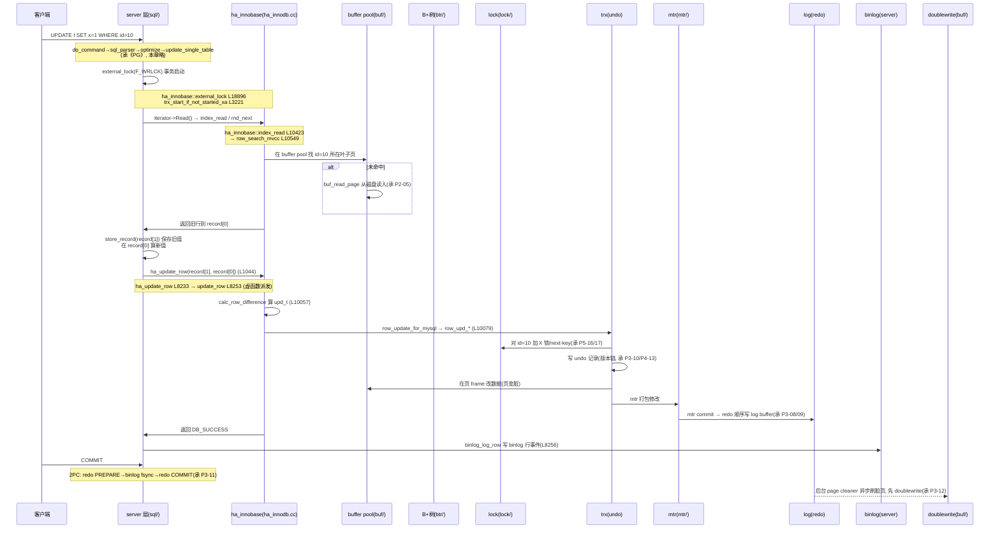

# 第 6 篇 · 第 20 章 · 一条 SQL 的完整旅程

> **核心问题**:前 5 篇我们把 InnoDB 拆成了一堆零件——B+树聚簇索引、buffer pool、redo、undo、mtr、2PC、MVCC、间隙锁。可一条 `UPDATE` 真正跑起来的时候,这些零件是怎么被**串成一条流水线**的?更根本的:SQL 进的是 **server 层**(连接、解析、优化、执行),数据存在 **InnoDB 引擎**里,这两层是两套代码、两个团队写的——一条 `UPDATE` 怎么从 server 层"流"到 InnoDB?中间那道桥叫 **handler 接口**,它是 MySQL "可插拔存储引擎"架构的根。

> **读完本章你会明白**:
> 1. **server 层 ↔ InnoDB 是怎么接起来的**:server 层定义了一个 `handler` 抽象基类,InnoDB 用 `ha_innobase` 继承它、override 一组虚函数(`update_row`/`index_read`/`external_lock` 等)——这就是两层的标准 API。这条"虚函数桥"让引擎可插拔(server 一行代码不改,换个 `.so` 就换引擎)。
> 2. **一条 `UPDATE` 的完整调用栈**:从 `do_command` 接连接,到 `Sql_cmd_update::update_single_table` 循环 `iterator->Read()` → `table->file->ha_update_row()`,再到 InnoDB 的 `ha_innobase::update_row` → `row_update_for_mysql` → B+树找页 → 加锁 → 改 + 写 undo → mtr 生成 redo。前 5 篇每个零件,都挂在这条栈的某一行上。
> 3. **handler 虚函数解耦的精妙**:为什么用 C++ 虚函数做接口、不用函数指针表?为什么 `ha_update_row` 要包一层(不是直接调 `update_row`)?反面对比——如果两层耦合,会怎样。
> 4. **9.x 几处老资料过时点**:`mysql_parse`/`JOIN::exec` 在 iterator 执行器重构后已不存在(改为 `THD::sql_parser`/`ExecuteIteratorQuery`);InnoDB 的 `row_search_for_mysql` 在 9.x 已拆成 `row_search_mvcc` 和 `row_search_no_mvcc` 两个函数。讲老资料会写错。

> **逃生阀(觉得太难)**:只记一件事——**server 层执行器在循环里反复调 `table->file->ha_update_row(old, new)`(就是第 1044 行那句),`file` 指向 InnoDB 的 handler,于是控制权交到 InnoDB**。前 5 篇所有魔法(B+树找页、buffer pool、加锁、redo/undo),全在这一个虚函数调用之后、在 InnoDB 内部发生。本章就是把这个"之后"展开。

---

## 〇、一句话点破

> **一条 `UPDATE` 在 MySQL 里,先在 server 层走完"连接→解析→优化→执行"(这半段承《PostgreSQL 数据库内核》),到执行器循环里,经 `handler` 这组虚函数桥跨进 InnoDB;在 InnoDB 内部,B+树找页、buffer pool 命中、加锁、改数据、写 undo、mtr 生成 redo、提交时 2PC——前 5 篇的每个零件,都挂在 `ha_innobase::update_row` 这一个调用的下游。**

这是结论。本章倒过来拆:先讲 server 层和 InnoDB 为什么是两层(动机),再讲 handler 这座桥怎么搭的(技巧),然后跟着一条 `UPDATE` 从头走到尾、把前 5 篇零件一个个接上,最后专门拆"虚函数解耦"这个最硬的技巧。

---

## 一、为什么是两层:server + 可插拔引擎

在动笔拆调用栈之前,先回答一个更根本的问题:**为什么 MySQL 要把 SQL 处理和数据存储分成两层,而不是像 PostgreSQL 那样一个整体?** 这不是历史偶然,是个深思熟虑的架构决策,直接决定了本章的主角——handler 接口——为什么存在。

### 两层各干什么

```
   客户端(你的应用 / mysql client)
     │  TCP / 本地 socket
     ▼
   ┌──────────────────────────────────────────────┐
   │ server 层(所有引擎共用,在 sql/ 目录)        │
   │  连接器 · 解析器 · 预处理 · 优化器 · 执行器      │
   │  + binlog(这是 server 层的,不是引擎的)       │
   └──────────────────┬───────────────────────────┘
                      │  handler 接口(一组虚函数,本章主角)
   ┌──────────────────▼───────────────────────────┐
   │ 存储引擎(可插拔,挑一个;在 storage/ 下)        │
   │  InnoDB(默认) / MyISAM / Memory /           │
   │  RocksDB / NDB / 自研引擎(.so)               │
   └──────────────────────────────────────────────┘
```

- **server 层**(`sql/` 目录,所有引擎共用)负责"把 SQL 字符串变成要干什么":接网络连接、按 MySQL 协议读字节、解析 SQL 语法树、预处理(解析表名列名列类型)、优化器选索引和 JOIN 顺序、执行器调引擎读写。这一层**完全不知道数据存在哪个文件、用什么数据结构**——它只对着一个抽象的 `handler` 基类说话。
- **存储引擎**(`storage/` 下,每个引擎一个目录)负责"数据到底怎么存、怎么读、怎么保证不丢/并发":InnoDB 在 `storage/innobase/`,有自己的 B+树、buffer pool、redo/undo、锁;MyISAM 在 `storage/myisam/`,只有表锁和索引文件。**每个引擎都把 server 层那个抽象 `handler` 接口实现一遍**(InnoDB 的实现是 `ha_innobase`),server 层调 `handler->update_row()`,到底走哪个引擎、改的是 B+树还是别的,由运行时挂在 `TABLE::file` 上的那个 handler 对象决定。

> **承接《PostgreSQL 数据库内核》**:PG 不分层——它的 parser/optimizer/executor 和存储(built-in heap 表)是一体的,只有**表访问方法(Table Access Method)**这个抽象,而且远不如 MySQL 的 handler 接口粒度细。MySQL 的"server + 可插拔引擎"是它独有的招牌架构。本章不讲 server 层内部(parser/optimizer 怎么工作)——那是《PG》那本的主题,本书只讲**这条桥怎么跨过去**。

### 为什么这么设计:引擎可插拔是头等公民

> **不这样会怎样**:如果 server 层和存储引擎写死在一起(像很多早期数据库那样),会发生什么?

1. **每加一个引擎,要改 server 层**。MySQL 历史上涌现过 MyISAM、InnoDB、Memory、NDB Cluster、TokuDB、MyRocks(RocksDB)、ColumnStore……如果每来一个引擎都要动 server 层的执行器、解析器,集成成本会高到没人愿意做引擎。**分层之后,新引擎只要实现 `handler` 这组虚函数,server 层一行代码不改**——这就是为什么 MySQL 的引擎生态历史上最丰富。
2. **引擎和 server 版本可以独立演进**。InnoDB 重构 redo log(8.0.30)、加 instant DDL(8.0)、加向量类型(9.x),全是 `storage/innobase/` 内部的事,server 层无感。反过来,server 层把执行器从老的 `JOIN::exec` 重构成 iterator 模型(8.0 起),InnoDB 也不用改——只要 handler 接口那组虚函数签名不变。
3. **用户可换引擎**。`ALTER TABLE t ENGINE = MyISAM` 一句话换引擎,因为 server 层对两张表调的是同一个 `handler->update_row()`,只是底下挂的对象不同。

> **钉死这件事**:**handler 接口不是一个"实现细节",是 MySQL 的招牌架构**。理解它,你才理解为什么"换引擎"在 MySQL 里是合法操作、为什么 InnoDB 能从一个独立公司(Innobase,1995)被收编成 MySQL 默认引擎而 server 层几乎不用动。本章剩下所有内容,都是围绕这座桥展开的。

---

## 二、handler 这座桥:一组虚函数 + 一个工厂

server 层和 InnoDB 是两套代码,它们之间唯一的契约,是 `sql/handler.h` 里定义的那个 `handler` 抽象基类。这一节拆它怎么搭起来。

### 引擎的注册:handlerton 和 create 回调

server 层启动时,每个存储引擎要把自己"注册"上去。注册的载体是一个叫 **handlerton(handler singleton,handler 单例)**的结构体(`sql/handler.h:2851`),里面存了这个引擎的各种能力位(支不支持事务、支不支持XA、默认索引算法……)和一个最关键的回调:**`create`**——"给我创建一个 handler 对象"。

InnoDB 在自己的初始化函数 `innobase_init` 里,把 handlerton 填好,这一行是关键:

```cpp
// storage/innobase/handler/ha_innodb.cc:5384
innobase_hton->create = innobase_create_handler;
```

`innobase_create_handler` 是 InnoDB 提供的工厂函数(`ha_innodb.cc:1431`),它的活儿就一件:为新打开的表 new 一个 `ha_innobase` 对象返回。

server 层每次打开一张表,会调 `get_new_handler`(`sql/handler.cc:614`),用 handlerton 里那个 `create` 回调拿到 handler 对象:

```cpp
// sql/handler.cc:614(简化示意)
handler *get_new_handler(TABLE_SHARE *share, bool partitioned,
                         MEM_ROOT *alloc, handlerton *db_type) {
  handler *file;
  ...
  if (db_type && db_type->state == SHOW_OPTION_YES && db_type->create) {
    if ((file = db_type->create(db_type, share, partitioned, alloc)))
      file->init();
    return file;
  }
  ...
}
```

第 621 行 `db_type->create(...)` 就是间接调 InnoDB 的 `innobase_create_handler`,产出一个 `ha_innobase`。这个对象被挂在 `TABLE::file` 指针上(挂载点之一:`sql/table.cc:2973`)。从这一刻起,server 层所有对该表的读写,都通过 `table->file->某虚函数()` 走,实际落到 InnoDB 的 `ha_innobase` 实现上。

> **技巧点睛(为什么这么搭)**:注意 `create` 是 handlerton 里的**回调指针**,不是写死的。server 层的 `get_new_handler` 不认识 InnoDB,它只认识一个抽象的 `handlerton`——谁注册了谁提供 create。这是**依赖反转**:server 层(高层)依赖抽象(handlerton + handler 基类),引擎(低层)实现抽象,两者通过抽象解耦,谁也不直接认识谁。这就是"可插拔"的代码骨架。

### handler 基类:一组虚函数契约

`sql/handler.h` 里那个 `handler` 基类定义了几十个虚函数,server 层会通过它们和引擎交互。和一条 `UPDATE` 最相关的有这几组:

| server 层想干的事 | handler 基类里的虚函数 | 行号 |
|---|---|---|
| 顺序扫下一行(全表扫) | `virtual int rnd_next(uchar *buf) = 0;` | `sql/handler.h:5982` |
| 按索引定位一行 | `virtual int index_read_map(uchar *buf, ...)` | `sql/handler.h:5906` |
| 按索引取下一行 | `virtual int index_next(uchar *)` | `sql/handler.h:5927` |
| 取索引第一行 | `virtual int index_first(uchar *)` | `sql/handler.h:5933` |
| 插一行 | `virtual int write_row(uchar *buf)` | `sql/handler.h:6991` |
| **改一行(UPDATE 用)** | `virtual int update_row(const uchar *old, uchar *new)` | `sql/handler.h:7003` |
| 删一行(DELETE 用) | `virtual int delete_row(const uchar *buf)` | `sql/handler.h:7008` |
| 表级锁/事务开始结束 | `virtual int external_lock(THD *, int lock_type)` | `sql/handler.h:7052` |

注意几个细节,它们后面会反复用到:

1. `rnd_next` 是**纯虚函数**(`= 0`)——任何引擎都必须实现它(否则 server 一调就链接不过)。`index_next`/`index_first`/`write_row`/`update_row` 等是**带默认实现**的虚函数,默认返回 `HA_ERR_WRONG_COMMAND`(意思是"我这个引擎不支持这个操作")。MyISAM 不支持事务,它的某些事务相关虚函数就走默认实现报错;InnoDB 全都 override 了。
2. `update_row` 的签名是 `(old_data, new_data)`——旧值和新值都传进来。这是个关键设计(下一节细讲为什么)。
3. `external_lock` 名字里有 "lock",但它**不只是加锁**,它在事务开始和结束(`F_UNLCK`)时被调用,InnoDB 借这个时机**启动事务**(分配/复用 trx、建 read view)。

### ha_update_row:为什么基类还包一层

到这里有个微妙处:server 层执行器调的不是 `update_row`,而是 `ha_update_row`(带个 `ha_` 前缀)。原因是基类在虚函数外面又**包了一层 public 方法**:

```cpp
// sql/handler.h:5115
int ha_update_row(const uchar *old_data, uchar *new_data);
```

这层包装的实现(`sql/handler.cc:8233`)干了三件事:

```cpp
// sql/handler.cc:8233(逐字摘录, ... 省略)
int handler::ha_update_row(const uchar *old_data, uchar *new_data) {
  int error;
  assert(table_share->tmp_table != NO_TMP_TABLE || m_lock_type == F_WRLCK);
  Log_func *log_func = Update_rows_log_event::binlog_row_logging_function;
  ...
  assert(new_data == table->record[0]);
  assert(old_data == table->record[1]);

  mark_trx_read_write();
  ...
  MYSQL_TABLE_IO_WAIT(PSI_table_io, PSI_TABLE_UPDATE_ROW, active_index, error,
                      { error = update_row(old_data, new_data); })

  if (unlikely(error)) return error;
  if (unlikely((error = binlog_log_row(table, old_data, new_data, log_func))))
    return error;
  return 0;
}
```

第 8253 行 `{ error = update_row(old_data, new_data); }`——**这才是真正调虚函数、派发到 InnoDB 实现的地方**(因为 `update_row` 是虚函数,运行时根据 `table->file` 指向的真实对象,调到 `ha_innobase::update_row`)。

> **不这么包一层会怎样**:注意 `ha_update_row` 在调 `update_row` 前后,还干了两件**和具体引擎无关**的事——`mark_trx_read_write()`(标记这个事务有写,影响 read-only 事务的优化判断)和 `binlog_log_row()`(成功后写 binlog,第 8256 行)。如果让 server 执行器直接调 `update_row`,那这两件事就得在执行器里每个调用点重复写一遍——而执行器里有几十处调 `ha_update_row`/`ha_write_row`/`ha_delete_row`。包在 `ha_` 前缀方法里,**横切关注点(binlog、性能统计、断言)集中收口**,这就是这层包装的全部价值。这是个朴素但典型的"模板方法"——基类固定骨架(统计→调引擎→binlog),引擎只填 `update_row` 那一个虚函数。

> **钉死这件事**:`ha_*` 前缀的方法 = server 层调的入口(含 binlog/统计等横切逻辑);`update_row`/`write_row` 等无前缀的虚函数 = 引擎要实现的纯业务逻辑。本章下文凡是说"server 调 InnoDB",严格说都是 server 调 `ha_update_row`,它内部再派发到 InnoDB 的 `update_row`。

---

## 三、server 层这半段:从连接到执行器

现在跟着一条 `UPDATE t SET x=1 WHERE id=10` 走完 server 层这半段。这一段**承《PostgreSQL 数据库内核》那本**,所以这里只给一张函数名清单 + 关键行号,不展开 parser/optimizer 内部(那是《PG》的主题)。

### server 层主线函数清单(9.7.0 LTS 真实行号)

| 阶段 | 函数 | 文件:行号 | 一句话 |
|---|---|---|---|
| 接连接、读命令 | `do_command` | `sql/sql_parse.cc:1347` | 从网络读一个 command |
| 分发命令 | `dispatch_command` | `sql/sql_parse.cc:1752` | 按 command type 分派 |
| 解析 SQL | `THD::sql_parser` | `sql/sql_class.cc:3179` | 调 YACC 生成 AST |
| 执行总入口 | `mysql_execute_command` | `sql/sql_parse.cc:3031` | 按 SQL 类型走分支 |
| DML prepare+exec | `Sql_cmd_dml::execute` | `sql/sql_select.cc:685` | DML 公共预处理 |
| UPDATE 预处理 | `Sql_cmd_update::prepare_inner` | `sql/sql_update.cc:1533` | 准备 UPDATE 字段映射 |
| 优化 | `JOIN::optimize` | `sql/sql_optimizer.cc:344` | 选索引/JOIN 序 |
| 执行(iterator) | `Query_expression::ExecuteIteratorQuery` | `sql/sql_union.cc:1036` | iterator 模型驱动 |
| UPDATE 单表执行 | `Sql_cmd_update::update_single_table` | `sql/sql_update.cc:369` | **跨进 InnoDB 的入口** |

> **★ 修正一处老资料过时**(本书惯例,每章钉死真实源码):很多老博客写 server 层解析入口是 `mysql_parse`、执行入口是 `JOIN::exec`——**这两个函数在 9.7 都已不存在**。MySQL 8.0 重构了执行器为 iterator(迭代器)模型,老的 `JOIN::exec` 被拆掉,顶层执行入口改名 `Query_expression::ExecuteIteratorQuery`(`sql/sql_union.cc:1036`);解析入口也改成 `THD::sql_parser()`(`sql/sql_class.cc:3179`,内部调 YACC 生成的 `my_sql_parser_parse`)。`mysql_parse` 在源码里只作为局部变量名(`mysql_parse_status`)残留。**读老博客会写错**。

### UPDATE 的"读旧值→写新值"循环

到了 `Sql_cmd_update::update_single_table`(`sql/sql_update.cc:369`),优化器已经决定好扫描路径(全表扫还是走索引),执行器开始驱动。核心是个循环,我逐行摘出来(这是本章最重要的一段 server 层代码):

```cpp
// sql/sql_update.cc:890(读行循环)
while (true) {
  error = iterator->Read();       // ← 读一行,底层最终调 handler 的 rnd_next/index_next
  if (error || thd->killed) break;
  ...
```

```cpp
// sql/sql_update.cc:927(把刚读到的行挪到 record[1] 当旧值)
store_record(table, record[1]);
```

```cpp
// sql/sql_update.cc:1044(写回——这是跨进 InnoDB 的那一行)
error =
    table->file->ha_update_row(table->record[1], table->record[0]);
```

三个动作读出来:

1. **`iterator->Read()`**:执行器 iterator 模型,`Read()` 底层最终调 handler 的 `ha_rnd_next`(全表扫)或 `ha_index_next`(走索引)。读到的行落在 `table->record[0]`。
2. **`store_record(table, record[1])`**:把刚读到的这一行(`record[0]`)整个拷到 `record[1]`——**`record[1]` 现在是"旧值"**。
3. **在 `record[0]` 上算出新值**:server 层按 `SET x=1` 把 `record[0]` 里的 `x` 字段改成 1——**`record[0]` 现在是"新值"**。
4. **`ha_update_row(record[1], record[0])`**:把旧值、新值一起交给引擎——**这一行就是跨进 InnoDB 的桥**。`table->file` 指向 InnoDB 的 `ha_innobase`,于是控制权进入 InnoDB。

> **为什么 update_row 签名是 (old, new)**:这下看明白了。server 层手里有"旧值"和"新值"两份(它不能在原行上直接改,因为 InnoDB undo 需要"改之前长什么样"——对应 undo log 的"怎么改回去")。把两份都传给引擎,引擎就有能力:① 算出到底哪些字段变了(用 `calc_row_difference` 逐字段比对,生成 InnoDB 的 `upd_t` 更新向量,只改变了的字段);② 记 undo(用旧值构造回滚记录)。**这个 (old, new) 双值签名,是 InnoDB undo/MVCC 在接口层面的伏笔**——下一节你会看到 InnoDB 怎么用它。

> **承接《PostgreSQL》**:这条 `连接→解析→预处理→优化→执行` 主线,PG 也有(parser→analyzer→rewriter→planner→executor)。两边的优化器都是基于成本的(cost-based),都做"选索引、定 JOIN 序、决定走全表扫还是索引"。**这一段本书不讲**,详《PG》那本。**本章重点从 `update_single_table` 那一句 `ha_update_row` 往下**——PG 没有这层"可插拔引擎"抽象(它的表访问方法粒度粗得多),所以这一段桥,是 MySQL/InnoDB 独有的故事。

---

## 四、跨过桥:InnoDB 的 handler 实现

控制权交到 InnoDB 了。现在我们站在 `ha_innobase::update_row`(`ha_innodb.cc:10003`)这一行。这是 InnoDB 接收一条 UPDATE 的入口。这一节,把它的实现拆透——前 5 篇的每个零件,都要在这里接上。

### update_row 第一步:拿到 trx、算出"改了哪些字段"

```cpp
// storage/innobase/handler/ha_innodb.cc:10003(逐字摘录, ... 省略)
int ha_innobase::update_row(const uchar *old_row, uchar *new_row) {
  int err;
  dberr_t error;
  trx_t *trx = thd_to_trx(m_user_thd);        // ← 把 server 的 THD 映射到 InnoDB 的 trx
  ...
  ut_a(m_prebuilt->trx == trx);
  ...
  if (!trx_is_started(trx)) {
    ++trx->will_lock;                           // ← 预告:这条语句要加锁
  }

  upd_t *uvect;
  if (m_prebuilt->upd_node) {
    uvect = m_prebuilt->upd_node->update;
  } else {
    uvect = row_get_prebuilt_update_vector(m_prebuilt);
  }
  uvect->table = m_prebuilt->table;
  uvect->mysql_table = table;

  /* Build an update vector from the modified fields in the rows */
  error = calc_row_difference(uvect, old_row, new_row, table, m_upd_buf,
                              m_upd_buf_size, m_prebuilt, m_user_thd);
  ...
  error = row_update_for_mysql((byte *)old_row, m_prebuilt);
  ...
}
```

几个关键点:

1. **`thd_to_trx(m_user_thd)`**(行 10007):server 层的连接对象 `THD` 和 InnoDB 的事务对象 `trx_t` 是两套,要做一个映射。映射藏在 `thd_to_trx`(`ha_innodb.cc:2047`):

   ```cpp
   // storage/innobase/handler/ha_innodb.cc:2047
   [[nodiscard]] trx_t *&thd_to_trx(THD *thd) {
     innodb_session_t *&innodb_session = thd_to_innodb_session(thd);
     ut_ad(innodb_session != nullptr);
     return (innodb_session->m_trx);
   }
   ```

   每个 server 连接(THD)里挂着一个 `innodb_session_t`,里面缓存着这个连接**当前用的那个 trx**。一个连接跨多条语句,可能复用同一个 trx(同一个显式事务里),也可能每条语句换一个(autocommit)。这就是 server 层 THD ↔ InnoDB trx 的桥。

2. **`calc_row_difference`**(行 10057):server 传进来 `old_row` 和 `new_row` 两份 MySQL 格式的行,InnoDB 不能直接用——它有自己的内部行格式(dtuple)。`calc_row_difference` 逐字段比对两份行,**只挑出真正变了值的字段**,组装成一个 `upd_t`(更新向量)。这是个重要优化:如果一条 `UPDATE t SET name='x' WHERE id=10` 只改了 name 字段,`upd_t` 里就只有 name 一项——InnoDB 只 redo/undo 这一个字段,不动其他列。

3. **`row_update_for_mysql`**(行 10079):这是 InnoDB row 层的入口(`row/row0mysql.cc:2436`),从这往下就完全脱离 handler、进入 InnoDB 内核了。

### row_update_for_mysql:进入 InnoDB 内核

`row_update_for_mysql`(`row/row0mysql.cc:2436`)是个很薄的分派函数,它根据是不是 intrinsic 表(临时表)走两条路:

```cpp
// storage/innobase/row/row0mysql.cc:2436
dberr_t row_update_for_mysql(const byte *mysql_rec, row_prebuilt_t *prebuilt) {
  if (prebuilt->table->is_intrinsic()) {
    return (row_del_upd_for_mysql_using_cursor(prebuilt));   // 临时表,走 cursor
  } else {
    ...
    return (row_update_for_mysql_using_upd_graph(mysql_rec, prebuilt));  // 普通表,走 que graph
  }
}
```

普通表走 `row_update_for_mysql_using_upd_graph`(`row0mysql.cc:2259`)——这个名字里的 "upd_graph" 指 InnoDB 用一个**查询图(que graph)**来执行更新。InnoDB 内部有一套迷你的"图执行器",把 SQL 操作编译成一个操作图(update node、select node 等),然后 `que_thr` 驱动这个图执行。这是个老设计(InnoDB 自己的 mini-VM,有点像 SQLite 的 VDBE),本章不深入(那会冲淡主线)。

这条图执行路径,最终会调到 `row0upd.cc` 里的 `row_upd_*` 系列函数,真正动手改数据。**从这一刻起,前 5 篇的零件一个个上场**。

### 零件一上:B+树找页(承第 1 篇)

UPDATE 改的是聚簇索引里的那一行(因为 InnoDB 是聚簇索引,数据就在主键 B+树叶子页)。`row_upd_*` 第一步是**定位这一行所在的叶子页**——经 `btr_cur_*`(`btr/btr0cur.cc`)从 B+树根页一路二分下来到叶子页。如果叶子页不在内存(buffer pool 未命中),触发一次磁盘 IO 把页读进 buffer pool(承第 2 篇 P2-05)。

```
   ha_innobase::update_row
        │
        ▼
   row_update_for_mysql
        │
        ▼
   row_update_for_mysql_using_upd_graph (row0mysql.cc:2259)
        │
        ▼
   row_upd_* 系列 (row0upd.cc)
        │
        ▼
   btr_cur_* 定位叶子页 (btr/btr0cur.cc)   ← 第 1 篇 B+树, 第 2 篇 buffer pool
        │
        ├──→ (未命中) buf_read_page 从磁盘读入 buffer pool
        │
        ▼
   找到 id=10 这一行所在的页 frame 地址
```

> **承接前 5 篇**:这一步是第 1 篇(P1-02 聚簇索引)和第 2 篇(P2-05 buffer pool)的现场。B+树怎么从根页二分到叶子页、buffer pool 三大链表怎么管理热页、改进 LRU 怎么防全表扫冲刷——全是前 5 篇讲过的,本章只把它们挂到这条调用栈上。

### 零件二上:加锁(承第 5 篇)

定位到行之前(或同时),InnoDB 要对这一行加锁——UPDATE 是写,加的是 X 锁(记录锁/临键锁)。加锁经 `lock/lock0lock.cc` 的 `lock_rec_*` 系列。RR 隔离级别下,如果 WHERE 条件是个范围,还会加**间隙锁/临键锁**(`next-key lock`,承 P5-17)防幻读。

```
   定位到叶子页
        │
        ▼
   lock_rec_clust_by_info / lock_rec_lock (lock/lock0lock.cc)   ← 第 5 篇锁
        │
        ├──→ 锁等待?进等待队列,挂起当前 trx(承 P5-18)
        │
        ▼
   拿到 id=10 这一行的 X 锁
```

注意 update_row 一开头有个伏笔:`if (!trx_is_started(trx)) ++trx->will_lock;`(行 10017-10018)——预告这条语句要加锁,影响事务是否真的启动。锁的真正加,在 row 层定位页之后。

### 零件三上:写 undo(承第 3 篇 + 第 4 篇)

拿到锁、准备改之前,InnoDB **先把"这一行改之前长什么样"记到 undo log**——这是 P3-10(undo)和 P4(MVCC)的现场。undo 有两个用途:① 事务回滚时改回去;② 给并发的 MVCC 读当历史版本(承 P4-13)。

```
   拿到 X 锁
        │
        ▼
   trx_undo_report_row_modify (trx/trx0rec.cc)   ← 生成一条 undo 记录
        │
        ├──→ undo 记录串进这一行的 undo 版本链(承 P4-13/P4-15)
        │
        ▼
   undo 记录写入 undo log buffer(承 P3-10)
```

### 零件四上:改数据 + mtr 生成 redo(承第 3 篇)

undo 写好之后,InnoDB 在 buffer pool 里**直接改那个叶子页的内存 frame**(页变"脏")。改的同时,把这次修改打包进一个 **mini-transaction(mtr)**——mtr 是 redo 的生成单位(P3-09),它把"对这页这个偏移做了什么改动"记成物理 redo 日志,放进 mtr 的私有 buffer。

```
   undo 写好
        │
        ▼
   rec_set / mach_write 在页 frame 里改字段值 (rem/rem0rec.cc)
        │  (页变脏, 进 buffer pool flush list)
        │
        ▼
   mtr_t::commit (mtr/mtr0mtr.cc)   ← 提交 mtr, 生成 redo
        │
        ├──→ redo 日志顺序写进 log buffer (log/log0write.cc, 8.0.30 重构)
        │
        ▼
   返回 DB_SUCCESS 给 row_update_for_mysql
```

mtr 是 P3-09 的主角。mtr commit 时,它私有的那批 redo 被顺序写进 log buffer(`log/log0write.cc`,承 P3-08 redo 8.0.30 重构)。**redo 进了 log buffer,这一条 UPDATE 的核心动作就完成了**——WAL 已写,数据页是脏的(在 buffer pool 等异步刷盘)。

### 零件五上:提交时的 2PC(承第 3 篇)

update_row 返回 DB_SUCCESS 后,控制权回到 server 层的 `update_single_table` 循环,继续处理下一行。所有行都处理完、用户 `COMMIT` 时,**两阶段提交**(P3-11)上场,保证 InnoDB redo 和 server 层 binlog 一致:

```
   用户 COMMIT
        │
        ▼
   TC_LOG_MMAP::commit (sql/tc_log.cc, server 层协调)
        │
        ▼
   ha_commit_trans (sql/handler.cc)
        │
        ▼
   innobase_xa_prepare (ha_innodb.cc) → redo PREPARE   ← ①
        │
        ▼
   MYSQL_BIN_LOG::ordered_commit (sql/binlog.cc) → 写 binlog + fsync   ← ②
        │
        ▼
   innobase_commit_by_xid → redo COMMIT   ← ③
```

这三步就是 P0-01 第八节旅程图里那个"2PC:redo prepare → 写 binlog → redo commit"。崩在任何一步,crash recovery(`log0recv.cc`)都能靠 redo 的 prepare/commit 标记 + binlog 有无,判断这个事务到底成没成,该提交补提交、该回滚用 undo 回滚。

### 零件六上:脏页异步刷盘 + doublewrite(承第 3 篇)

至此 UPDATE 对用户已经返回"成功"了——但数据其实还没落盘,只是 redo 写了、页在内存里是脏的。后台的 page cleaner 线程会**异步**把这些脏页刷到磁盘。刷盘时先经 **doublewrite buffer**(`buf/buf0dblwr.cc`,承 P3-12)写一份到双写区,再写到数据文件——防 partial page write 导致的页撕裂。

---

## 五、完整时序:把六个零件串成一条 UPDATE

把第四节那六个零件拼成一张完整的时序图。**这张图就是 P0-01 第八节那张旅程图的展开版**——P0-01 给的是概念图,这里每个箭头都对应到一个真实函数和行号。



> **钉死这件事**:这张图上**每一个箭头,都是前 5 篇某一篇的主角**。读完前 5 篇你可能觉得 B+树、buffer pool、redo、undo、锁是五座孤岛——本章的价值,就是让你看清它们**挂在同一条 `ha_update_row` 调用的下游**,是一个流水线上前后衔接的工位,不是五个独立模块。这就是本书用"一条写的旅程"当骨架的意义:P0-01 给概念图,前 5 篇拆零件,本章把零件装回流水线。

---

## 六、技巧精解

本章有两个最硬核的技巧值得单独钉死。一个讲 handler 虚函数怎么做到解耦,一个讲 (old, new) 双值签名怎么埋下 undo/MVCC 的伏笔。

### 技巧一:handler 虚函数解耦——为什么是 C++ 虚函数,不是函数指针表

MySQL 的 handler 接口有几十个虚函数(`rnd_next`/`index_read`/`update_row`/`external_lock`/`store_lock`/...)。一个自然的疑问:为什么用 C++ 虚函数表做接口,而不是像 Linux 内核 VFS 那样用**结构体里塞函数指针**(`struct file_operations`)?两者看起来都能解耦,选哪个不是 taste 问题吗?

**不是**。这个选择有真实的工程理由。

#### 不这样会怎样:函数指针表的三个坑

假设 MySQL 当年选了"结构体 + 函数指针表"(像 Linux `struct file_operations`):

```c
// 假想的反面设计(非源码, 用于对比)
struct handler_ops {
  int (*update_row)(handler*, const uchar*, uchar*);
  int (*index_read)(handler*, ...);
  ...
};
```

那会撞上三个坑:

1. **每个 handler 对象都要带一个 ops 指针,内存浪费**。MySQL 一个连接打开几十张表,每张表一个 handler 对象,几十个虚函数表重复存——C++ 虚函数表是**每个类一份**存在只读段,对象里只存一个 vptr;函数指针表如果不共享就得每对象一份,共享就得每个引擎一个全局 ops 加一层间接,啰嗦。
2. **继承复用差**。Linux VFS 那套能用函数指针表,是因为内核里 `file_operations` 的"继承"靠的是"复制一份再改几个指针"——但 MySQL 的引擎体系里有 MyISAM、InnoDB、Memory、Partition(分区表包一层)、临时表包装器等**多层 handler 子类**,真正用 C++ 继承(`class ha_innobase : public handler`)一行 `override` 就复用了基类全部默认实现,函数指针表做不到这种"部分覆盖、部分继承"。
3. **类型安全**。C++ 虚函数签名错了,编译期就报错;函数指针表如果类型对不上,C 在某些场景下只给个警告(甚至靠 `void*` 强转绕过),bug 要等到运行时调错函数才暴露。引擎是数据库正确性的命脉,编译期强校验比运行时崩溃值钱得多。

#### 所以这样设计:C++ 虚函数 + override

`ha_innobase`(`ha_innodb.h:88`)继承 `handler`,override 它需要的虚函数:

```cpp
// storage/innobase/handler/ha_innodb.h:88
class ha_innobase : public handler {
 public:
  ha_innobase(handlerton *hton, TABLE_SHARE *table_arg);
  ~ha_innobase() override = default;
  ...
};
```

对应实现:`ha_innobase::update_row`(`ha_innodb.cc:10003`)、`ha_innobase::index_read`(`ha_innodb.cc:10423`)、`ha_innobase::external_lock`(`ha_innodb.cc:18896`)等。server 层执行器手里拿的是基类指针 `TABLE::file`(类型 `handler*`),调 `file->ha_update_row()` —— 因为 `update_row` 是虚函数,**运行时根据 file 指向的真实对象**(`ha_innobase` / `ha_myisam` / ...)**派发到对应引擎的实现**。这就是 C++ 多态的标准用法,MySQL 拿它做了引擎可插拔的根。

#### 钉死这件事:三层契约

handler 接口的真正精妙,在于它形成了**三层契约**,缺一不可:

| 层 | 内容 | 谁负责 |
|---|---|---|
| **抽象契约** | `handler` 基类声明 `update_row` 等虚函数 + 默认实现 | server 层(`sql/handler.h`) |
| **横切契约** | `ha_update_row` 等包装方法,固定"统计→调引擎→binlog"骨架 | server 层(`sql/handler.cc`) |
| **实现契约** | `ha_innobase` override 虚函数,真正干活 | InnoDB(`storage/innobase/handler/`) |

这三层任何一层动了,另两层基本不动:InnoDB 重构 redo(8.0.30)只动实现契约;server 层执行器重构为 iterator 模型(8.0)只动调用方;handler 基类加新虚函数(比如 instant DDL 加的几个),老引擎走默认实现不报错。**这就是"可插拔"在代码层面的实现**——三层契约、各管各的、通过抽象解耦。

> **对照《Linux内核》VFS**:Linux `struct file_operations` 是 C 语言版本的同样思想(用函数指针表做"可插拔文件系统"),MySQL handler 是 C++ 版本(用虚函数做"可插拔存储引擎")。两者都解决"高层依赖抽象、低层实现抽象"这件事,只是语言工具不同。读到这里你应该有"原来如此"——这就是为什么 InnoDB 能从一个独立公司被收编成默认引擎、server 层几乎不用动:**因为两层的契约从第一天就是抽象的**。

### 技巧二:(old, new) 双值签名——undo/MVCC 在接口层的伏笔

回头看 `update_row` 的签名:`int update_row(const uchar *old_data, uchar *new_data)`(`handler.h:7003`)。一个朴素的设计者可能会问:为什么传两份?server 层直接把"改成什么"传给引擎不就行了吗?引擎自己知道当前行是什么、自己读出来当 old 不就好了?

#### 不这样会怎样:只传 new 的三个坑

假设只传 `new_data`:

1. **引擎要自己读一遍旧值**。InnoDB 要记 undo("这一行改之前长什么样"),如果 server 不给 old,InnoDB 就得在 B+树里再读一次这行(虽然页可能已经在 buffer pool,但多一次 rec 解析)。server 层手里明明就有 old(它刚 `iterator->Read()` 读出来,存在 `record[1]`),白扔了让引擎重读,浪费。
2. **server 层已经算好了字段映射**。server 层预处理时已经知道每个字段的列号、类型、在哪,它把 old 和 new 都按 MySQL 行格式准备好;引擎拿这两份做 `calc_row_difference`(逐字段比对),**直接算出哪些字段变了**,只 redo/undo 这些字段。如果只传 new,引擎要么 redo/undo 全行(放大),要么自己再做一次"读旧值 + 比对"(重复劳动)。
3. **binlog 也需要 old 和 new**。看 `ha_update_row`(`handler.cc:8256`):**成功后调 `binlog_log_row(table, old_data, new_data, ...)`**——binlog 的 Rows 事件(`Update_rows_log_event`)需要 BEFORE image 和 AFTER image 两份(用于主从复制的幂等性、某些冲突检测)。如果引擎只拿 new,binlog 这一层也没法写——除非 server 层自己再读一遍。

#### 所以这样设计:server 层手里有两份,一次传给引擎 + binlog

server 层执行器在循环里把"刚读到的这一行"挪到 `record[1]`(旧值),在 `record[0]` 上算出新值,然后**一份 old + 一份 new 同时给**:

- 给 InnoDB 的 `update_row(old, new)`——引擎用 old 算 undo、用 (old,new) 算 upd_t、用 new 改数据;
- 给 binlog 的 `binlog_log_row(table, old, new)`——server 层自己拿这两份写 binlog Rows 事件。

**一次 server 层循环,old/new 两份数据,喂给两个下游**(引擎 undo/redo + binlog),谁都不用重读。这个签名设计,是 undo、MVCC、binlog 行格式在 handler 接口层的伏笔——一个签名把三个下游的输入都钉死了。

> **钉死这件事**:`update_row(old, new)` 这个签名,不是随手写的。它反映了 InnoDB 事务体系的一个根本事实:**改一行,必须同时知道"之前是什么"(old, 喂 undo/MVCC)和"之后是什么"(new, 喂 redo/数据页)**。handler 接口把这个事实在两层边界上明文化了。下一节你看 `calc_row_difference`(`ha_innodb.cc:10057`)用这两份比对出 upd_t,就是这个签名设计的下游兑现。

---

## 七、几个常被问到的边界问题

### external_lock 不是加锁,是事务开关

很多人被 `external_lock` 这个名字误导,以为它是 InnoDB 加行锁的入口。**不是**。行锁的加,是 InnoDB 在 row 层定位到页之后、内部经 `lock_rec_*` 加的(`lock/lock0lock.cc`),和 `external_lock` 无关。

`external_lock`(`ha_innodb.cc:18896`)是 server 层在**语句开始和结束时**对每张表调一次的钩子。它的真实职责:

1. **语句开始**(`lock_type != F_UNLCK`):server 层通知引擎"这张表要被读/写了"。InnoDB 借这个时机干两件大事:① **注册 trx**(`innobase_register_trx`,行 19020,把当前 trx 和 server 的 THD 关联、注册进 2PC);② 后续会调 `trx_start_if_not_started_xa`(行 3221,**真正启动事务**)、`trx_assign_read_view`(行 3227,**分配 read view**,承 P4-14)。
2. **语句结束**(`lock_type == F_UNLCK`):server 层通知"这张表这次用完了"。InnoDB 借这个时机做事务收尾判断(是否该提交、是否该释放某些资源)。

看真实的 transaction 启动代码(在另一个上下文,行 3219-3229):

```cpp
// storage/innobase/handler/ha_innodb.cc:3219(简化摘录)
/* If the transaction is not started yet, start it */
trx_start_if_not_started_xa(m_prebuilt->trx, false, UT_LOCATION_HERE);

TrxInInnoDB trx_in_innodb(m_prebuilt->trx);

/* Assign a read view if the transaction does not have it yet */
trx_assign_read_view(m_prebuilt->trx);

innobase_register_trx(ht, m_user_thd, m_prebuilt->trx);
```

三行各对应一件大事:**启动事务**(`trx_start_if_not_started_xa`,承 P3)、**建 read view**(`trx_assign_read_view`,承 P4-14 MVCC)、**注册 2PC**(`innobase_register_trx`,承 P3-11)。`external_lock` 这个名字是 MySQL 历史遗留(server 早期把表锁也经这层传),InnoDB 拿它当了事务生命周期钩子。**别被名字骗了**。

### index_read 9.x 走 row_search_mvcc,不是 row_search_for_mysql

另一个老资料过时点。很多博客写 InnoDB 查询入口是 `row_search_for_mysql`——**这个函数在 9.x 已经被拆成 `row_search_mvcc` 和 `row_search_no_mvcc` 两个**:

- `row_search_mvcc`(`row/row0sel.cc:4431`):普通表走,带 MVCC 一致性读(承 P4-13);
- `row_search_no_mvcc`:intrinsic(临时)表走,无 MVCC(临时表不需要并发版本)。

ha_innodb.cc 里 `ha_innobase::index_read`(`ha_innodb.cc:10423`)的派发在 10549 行:

```cpp
// storage/innobase/handler/ha_innodb.cc:10549(简化)
if (!m_prebuilt->table->is_intrinsic()) {
  ...
  ret = row_search_mvcc(buf, mode, m_prebuilt, match_mode, 0);   // 普通表
} else {
  ...
  ret = row_search_no_mvcc(buf, mode, m_prebuilt, match_mode, 0);  // 临时表
}
```

注意源码注释里还到处有 `row_search_for_mysql` 的字样(`ha_innodb.cc:10392`、`10413`、`10731` 等)——那是**注释没跟上代码重构**,真实调用是 `row_search_mvcc`/`row_search_no_mvcc`。**老博客照抄老注释会写错**。

### 一条 UPDATE 涉及多少次 handler 调用

把本章的 handler 调用按时间顺序列出来(假设 `UPDATE t SET x=1 WHERE id=10` 命中一行):

1. **`external_lock(F_WRLCK)`**(语句开始)——启动事务、建 read view。
2. **`index_read(id=10)`** 或 **`rnd_next` × N**(定位行)——经 `row_search_mvcc` 在 B+树找页、找行。
3. **`update_row(old, new)`**——改这一行(内部加锁、写 undo、改数据、生成 redo)。
4. **`external_lock(F_UNLCK)`**(语句结束)——事务收尾判断。
5. (用户 COMMIT 时)`ha_prepare` → `ha_commit_trans` —— 2PC。

**注意第 2 步和第 3 步是分开的**:server 层先用 `index_read`/`rnd_next` 把行读出来(此时只是定位 + 可能加读锁),再用 `update_row` 把行写回去(此时才加 X 锁、改数据)。这就是 `update_single_table` 那个 `while(true)` 循环里"读→挪旧值→算新值→写回"的对应。前 5 篇讲的 B+树/锁/redo/undo,全部挂在第 3 步那一个 `update_row` 调用的下游。

---

## 八、章末小结

### 回扣主线

本章是全书**第 6 篇(实践篇)的开篇**,也是全书唯一服务二分法**"衔接"**那一面的章节。它的使命不是讲新机制,而是**把前 5 篇的零件装回流水线**:

- **存储与索引这一面**(B+树聚簇索引、buffer pool、doublewrite):挂在 `ha_update_row` 下游的"找页 + 改页 + 异步刷盘"三步;
- **事务与并发这一面**(redo/undo/mtr/2PC/MVCC/锁):挂在 `ha_update_row` 下游的"加锁 + 写 undo + 改数据 + mtr 生成 redo + 提交 2PC"五步;
- **衔接这一面**(handler 接口):就是 `ha_update_row` 那一个虚函数调用本身——server 层执行器经它跨进 InnoDB。

读完前 5 篇你可能觉得这些零件是孤岛;读完本章,你该能在脑子里放映出一条 `UPDATE` 从客户端字节到落盘的全过程,**每一步都对应到具体源码文件和行号**。这就是 P0-01 承诺的"全书地图",这里兑现。

### 五个为什么

1. **为什么 MySQL 要分 server 层和存储引擎两层?**——引擎可插拔是 MySQL 招牌;分层后新引擎只实现 handler 这组虚函数,server 层一行不改。这是依赖反转:server 层依赖抽象(handler 基类 + handlerton),引擎实现抽象。
2. **为什么 handler 用 C++ 虚函数,不用函数指针表?**——虚函数表每类一份(省内存)、支持继承复用(handler 子类链)、编译期类型安全(签名错就报错);函数指针表这三条都差。
3. **为什么 `update_row` 签名是 (old, new) 双值?**——undo 需要"改之前是什么"(old)、redo/数据需要"改成什么"(new)、binlog 行格式需要 BEFORE+AFTER 两份;server 层手里一次有两份,喂给三个下游,谁都不重读。
4. **为什么 `ha_update_row` 要包一层,不直接调 `update_row`?**——横切关注点(binlog 写入、PSI 性能统计、mark_trx_read_write、断言)集中收口在基类,执行器几十处调用不用各写一遍;这是模板方法。
5. **为什么 `external_lock` 名字叫 lock 却管事务开关?**——历史遗留,server 早期经这层传表锁;InnoDB 拿它当事务生命周期钩子(启动 trx、建 read view、注册 2PC)。行锁其实是 row 层定位页之后内部加的,和 external_lock 无关。

### 想继续深入往哪钻

- **handler 基类全貌**:读 `sql/handler.h`(从 line 2851 的 `struct handlerton` 开始,再看 handler 类),几十个虚函数是引擎可插拔的全部契约。
- **InnoDB handler 实现**:`storage/innobase/handler/ha_innodb.cc`(8000 多行,是 server 和 InnoDB 之间最大的桥),重点看 `update_row`(10003)、`index_read`(10423)、`write_row`(9249)、`external_lock`(18896)、`store_lock`(19720)。
- **MySQL 官方文档**:读 "MySQL Source Code: Internal Storage Engine API"、"How MySQL Uses Different Storage Engines"。
- **想看其他引擎怎么实现同一组虚函数**:对照 `storage/myisam/ha_myisam.cc`(简单引擎,没事务)、`storage/heap/ha_heap.cc`(内存表)——看它们 override 了哪些、哪些走默认实现报错,能反过来加深对 handler 契约的理解。
- **动手感受**:`SHOW ENGINE INNODB STATUS` 看 InnoDB 内部状态;`performance_schema` 的 `events_waits_current` 看 handler 调用等待;`explain` 看执行计划(下一章 P6-21 主题)。

### 引出下一章

本章把前 5 篇零件装回了"一条 UPDATE 的流水线",但有个问题没展开:**优化器怎么决定走哪条流水线?**——具体说,`UPDATE t SET x=1 WHERE name='张三'`,优化器是走 `name` 的二级索引(要回表),还是全表扫聚簇索引?它根据什么选?选错了怎么调?这就是第 21 章的主题:**索引调优与 explain**。本章这条 UPDATE 的旅程,到下一章会从"优化器选索引"那一站再展开一层——B+树怎么走、type/key/rows/Extra 各代表什么、为什么有时该建索引它却不走。

> **下一章**:[P6-21 · 索引调优与 explain](P6-21-索引调优与explain.md)

---

> **本章源码引用清单**(均经 Grep/Read 在 `mysql-server @ 845d525 (9.7.0 LTS)` 核实):
>
> - server 层执行器:[Sql_cmd_update::update_single_table](../mysql-server/sql/sql_update.cc#L369)、[update 循环 L890](../mysql-server/sql/sql_update.cc#L890-L892)、[ha_update_row 调用 L1044](../mysql-server/sql/sql_update.cc#L1041-L1044)
> - handler 基类:[rnd_next 纯虚 L5982](../mysql-server/sql/handler.h#L5982)、[update_row 虚函数 L7003](../mysql-server/sql/handler.h#L7003-L7006)、[external_lock L7052](../mysql-server/sql/handler.h#L7052-L7055)、[ha_update_row 声明 L5115](../mysql-server/sql/handler.h#L5115)、[ha_update_row 实现 L8233](../mysql-server/sql/handler.cc#L8233)
> - handler 工厂:[get_new_handler L614](../mysql-server/sql/handler.cc#L614)、[struct handlerton L2851](../mysql-server/sql/handler.h#L2851)
> - server 主线:[do_command L1347](../mysql-server/sql/sql_parse.cc#L1347)、[THD::sql_parser L3179](../mysql-server/sql/sql_class.cc#L3179)、[ExecuteIteratorQuery L1036](../mysql-server/sql/sql_union.cc#L1036)
> - InnoDB handler:[class ha_innobase L88](../mysql-server/storage/innobase/handler/ha_innodb.h#L88)、[update_row L10003](../mysql-server/storage/innobase/handler/ha_innodb.cc#L10003)、[index_read L10423](../mysql-server/storage/innobase/handler/ha_innodb.cc#L10423)、[external_lock L18896](../mysql-server/storage/innobase/handler/ha_innodb.cc#L18896)、[store_lock L19720](../mysql-server/storage/innobase/handler/ha_innodb.cc#L19720)、[innobase_create_handler L1431](../mysql-server/storage/innobase/handler/ha_innodb.cc#L1431)、[hton->create 注册 L5384](../mysql-server/storage/innobase/handler/ha_innodb.cc#L5384)、[thd_to_trx L2047](../mysql-server/storage/innobase/handler/ha_innodb.cc#L2047)、[innobase_register_trx L3039](../mysql-server/storage/innobase/handler/ha_innodb.cc#L3039)、[trx 启动 + read view L3219-L3229](../mysql-server/storage/innobase/handler/ha_innodb.cc#L3219-L3229)
> - InnoDB row 层:[row_update_for_mysql L2436](../mysql-server/storage/innobase/row/row0mysql.cc#L2436)、[row_update_for_mysql_using_upd_graph L2259](../mysql-server/storage/innobase/row/row0mysql.cc#L2259)、[row_search_mvcc L4431](../mysql-server/storage/innobase/row/row0sel.cc#L4431)
