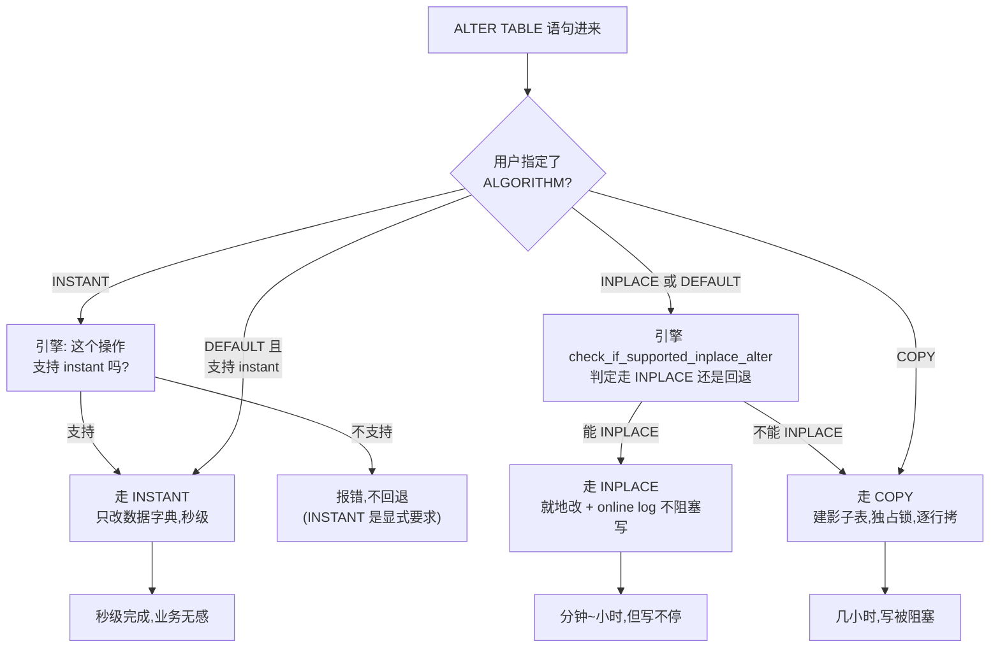

# 第 6 篇 · 第 22 章 · 在线 DDL:加字段 / 索引怎么不锁表

> **核心问题**:线上跑着一张几亿行、几个 TB 的大表,业务突然要加一个字段、加一个索引、或者删一个不再用的列。在过去(老 MySQL),"加字段"几乎等于"停业务"——把整张表锁住、拷贝几亿行,可能几小时甚至几天,这期间所有写都被堵死。可你今天在 MySQL 8.0+ 上敲一句 `ALTER TABLE t ADD COLUMN c INT`,居然**秒级返回**,业务一行都没被阻塞。InnoDB 凭什么做到"改表结构不锁表"?它凭什么让"加一个字段"从"几小时"变成"零点几秒"?这一章,把 InnoDB 的**在线 DDL**——从最老的"重建表拷贝"(COPY),到"就地改"(INPLACE),再到 8.0 的"只改数据字典"(INSTANT)——三档代价阶梯、每一档凭什么更快,拆到源码。

> **读完本章你会明白**:
> 1. **为什么 DDL 历史上那么慢**:老的 COPY 算法,为什么"加个字段"要重建整张表、锁住整张表(几亿行拷一遍的代价根在哪)。
> 2. **三档 DDL 算法的代价阶梯**:COPY(重建表 + 独占锁)→ INPLACE(就地改 + 大多不锁表,但脏活照干)→ INSTANT(只改数据字典,秒级无锁)——每一档凭什么更快、又各自付出了什么。
> 3. **instant DDL 凭什么秒级**:加列只改"表有 N+1 列"这条元数据,一行数据都不动——老行读到新列,取数据字典里记的**默认值**。这个设计的精妙在哪、又有什么边界(为什么不是所有 DDL 都能 instant)。
> 4. **INPLACE 重建时怎么不阻塞写**:**online log**(in-place alter 期间,把并发写先记一份日志,重建完再把日志重放进去),和 P3-08 的 WAL 是同源思想,却用在了完全不同的地方。
> 5. **8.0 新数据字典**(替掉 `.frm`)是在线 DDL 的地基——instant 能秒级,前提是"表的元数据"是一份可以事务性修改的数据。

> **如果一读觉得太难**:先记住三档阶梯——**COPY 是重建整张表(最慢,锁表)、INPLACE 是就地改(中等,大多不锁表但要扫数据)、INSTANT 是只改元数据(最快,秒级无锁)**。MySQL 8.0+ 的 `ALTER TABLE ... ALGORITHM=INSTANT` 加列,只动数据字典、不碰任何数据页,所以几亿行的表也秒级完成。这是本章的核心,其余是这三档的展开和源码佐证。

---

## 〇、一句话点破

> **InnoDB 的在线 DDL 有三档代价阶梯:COPY(重建整张表,独占锁)最慢;INPLACE(就地改,大多不锁表但重建数据)居中;INSTANT(只改数据字典,不碰任何数据页)最快、秒级无锁。MySQL 8.0+ 的 `ALGORITHM=INSTANT` 加列,几亿行的表也秒级返回——因为它把"加字段"这件事,从"改几十亿行数据"降级成了"改一条元数据"。**

这是结论,不是理由。本章倒过来拆:先讲 DDL 为什么天生慢(老的 COPY 算法,加个字段为什么要重建整张表),再讲 InnoDB 怎么一步步把代价降下来——INPLACE 让大多数 DDL 不锁表、INSTANT 让一部分 DDL 连数据都不碰。然后进源码,看 `check_if_supported_inplace_alter` 怎么决定走哪一档、`Instant_Type` 枚举怎么标记 instant 能力、`commit_instant_ddl` 怎么只改数据字典就让加列生效。最后钉死两个最硬核的洞察:instant 凭什么秒级(行版本号 + 列的可见性)、INPLACE 重建凭什么不阻塞写(online log)。

---

## 一、DDL 为什么天生慢:老的 COPY 算法,加个字段为什么要重建整张表

要理解 InnoDB 的在线 DDL 演进,先得看清"DDL 为什么天生难"。这得从最老的算法说起。

### 朴素 DDL(COPY):加字段 = 建新表 + 拷数据 + 删旧表

在 MySQL 5.5 之前(以及之后作为兜底的 COPY 算法),一条 `ALTER TABLE t ADD COLUMN c INT` 在引擎层是这样的:

1. **建一张新表**:按新的表结构(多了一列 `c`),创建一张全新的、空的 InnoDB 表。这张新表叫"影子表"。
2. **锁住旧表**(独占锁,或至少是阻塞写的锁):拷贝期间,旧表不能被改。
3. **逐行拷贝**:把旧表里的每一行,读出来、补上新列 `c` 的默认值、插入新表。几亿行就拷几亿次"读 + 写"。
4. **原子切换**:拷完后,把旧表改名成临时表、新表改名成旧表的名字(用一次 rename 原子完成)。
5. **删旧表**:释放旧表的空间。

```text
   COPY 算法(老的"重建表"):
   ┌─────────────┐   独占锁      ┌─────────────┐
   │ 旧表(几亿行) │ ──拷贝──▶   │ 新表(空)    │
   │ 加 c 列     │   几小时      │ 多一个 c 列  │
   └─────────────┘  期间写全堵   └─────────────┘
                    读旧表 + 写新表,几十亿行 IO
```

这套流程,在"加字段"这个操作上,代价是**灾难性**的:

- **锁表**:拷贝期间,业务的所有写(`INSERT`/`UPDATE`/`DELETE`)全被阻塞。一张几亿行的表,拷贝可能几小时,这几小时里业务就是停的。
- **海量 IO**:把整张表读一遍、再写一遍。几 TB 的表,这是几十 GB 的磁盘读写,占满 IO 带宽,拖累其他查询。
- **空间翻倍**:拷贝期间,新旧两张表都在,磁盘占用瞬间翻倍。
- **结果**:DBA 在生产环境做 DDL,得挑凌晨、得停服、得提心吊胆。这就是为什么过去"在线 DDL"几乎等于"停业务 DDL"。

### 为什么朴素 DDL 必须这么干?

你会问:**加一个字段,凭什么要重建整张表?** 答案藏在 P1-04(页与记录)和 P1-02(聚簇索引)里。

InnoDB 是**索引组织表(IOT)**——整张表的数据,存在主键 B+树的叶子页里。每条记录,是一个**二进制布局**——按表定义的列,一个挨一个排,用 Compact/Dynamic 格式编码(详见 P1-04)。这个二进制布局里,有几个字节是哪个列、几个字节是哪个列,是**写死在每一条记录里的**。

```text
   一条记录的二进制布局(P1-04 讲过):
   ┌────┬────┬────────┬────┬────┬─────────────┐
   │ id │ name│ DB_TRX │...│ 列N│ 变长长度列表  │
   └────┴────┴────────┴────┴────┴─────────────┘
   ←──── 这些列的位置,在每条记录里都是固定的 ────→
```

现在你要加一个列 `c`。问题来了:**已经存在磁盘上的那几十亿条记录,里面没有 `c` 这个列的空间**。它们的二进制布局是按旧表结构排的,你没法"凭空"在每条记录里塞进一个新列——那意味着所有记录的字节布局都要重排。

所以,老的 COPY 算法只能**建一张新表(新表结构带 `c` 列)、把旧记录拷过来时给 `c` 填默认值**。这是一次彻底的"数据迁移"。

> **不这样会怎样**:如果不重建表、只改表定义就声称"加了一个列",那旧记录读出来时,引擎按新结构去解析,会把旧记录的字节按错误的方式切——`name` 的字节被当成 `c`,数据全错。所以朴素 DDL 必须重建表,这是"记录的二进制布局写死"这个物理事实逼出来的。

> **钉死这件事**:DDL 慢的根,不在 DDL 本身,而在**"每条记录的二进制布局,是按表结构写死的"**。加列要改布局,改布局要动每条记录,动每条记录就是重建整张表。这个物理事实,是 InnoDB 后两档算法(INPLACE / INSTANT)要挑战和绕开的。

### COPY 的代价到底有多重:几个真实维度

光说"几小时"还不够具体。一张 5 亿行、200 GB 的订单表,`ALTER TABLE ADD COLUMN` 走 COPY 算法,代价可以从四个维度量化:

- **时间**:读 5 亿行(随机 + 顺序混合 IO)+ 写 5 亿行到新表 + 建新索引。即使磁盘吞吐 200 MB/s 级别,200 GB 也至少要 1000 秒起步,实际加上索引重建、页分裂、缓冲池抖动,几小时是常态,大表可能跑一天。
- **锁**:`LOCK=EXCLUSIVE`,整个 COPY 期间表对业务写完全关闭。这期间所有 `INSERT`/`UPDATE`/`DELETE` 排队等待,前端请求超时雪崩。这是 DBA 怕 DDL 的根本——不是怕慢,是怕"慢的同时还锁死"。
- **空间**:新旧两表同时在磁盘上,瞬间多占 200 GB。生产环境磁盘往往是规划好的,这一瞬间的翻倍可能撑爆磁盘。
- **IO 带宽**:拷贝把磁盘带宽占满,旁边其他正常业务查询的 IO 被挤兑,整台机器性能塌方。这是"DDL 风暴"——一个 DDL 拖垮一台实例上所有库。

更隐蔽的代价是**崩溃恢复**:COPY 进行到一半实例 crash,你得清理半成品的新表(影子表),重新来过。老版本(.frm 时代)甚至有".frm 文件和 InnoDB 内部 dict 缓存不一致"的坑——`ALTER` 改了 `.frm`,但 InnoDB 内部缓存的表定义没同步,导致表定义自相矛盾,得手动修。8.0 新数据字典是事务性的,改表定义要么全成要么全回滚,这个坑被填了——这也是 instant 能成立的前提之一(下面会讲)。

### .frm 时代 vs 8.0 新数据字典:为什么这个对照重要

这里埋一个贯穿全章的对照:8.0 之前,MySQL 的表定义存在两个地方——① server 层的 `.frm` 文件(二进制,描述列、索引、字符集);② InnoDB 内部自己的 `dict_table_t` 缓存(内存对象,从系统表 + `.frm` 重建)。两份定义必须时刻一致,否则 chaos。`.frm` 是文件、不是事务,改它没法原子化——这就给"在线改表结构"留下了根本障碍。

8.0 把 `.frm` 废了,引入**事务性数据字典**(`dd::` 命名空间,表定义存在 InnoDB 表里,如 `mysql.tables`、`mysql.columns`、`mysql.indexes`)。改表结构,变成"在一个事务里改这几张数据字典表的几行"。这个事务要么 commit(新结构生效),要么 rollback(回到旧结构),原子且 crash 安全。

这个变化是 instant DDL 的**地基**。instant 秒级的前提,是"改表结构 = 提交一个改数据字典的事务"。`.frm` 时代做不到事务性改表定义,所以 instant(只改元数据)在 8.0 之前不可能存在。换句话说:**instant DDL 不只是 InnoDB 引擎的功劳,更是 8.0 数据字典架构重构的红利**——P0-01 提的"8.0 数据字典重构替 .frm",在本章兑现成 instant 这个杀手特性。

---

## 二、三档 DDL 的代价阶梯:COPY → INPLACE → INSTANT

知道了朴素 DDL 为什么慢,InnoDB 的演进就清楚了:它围绕"能不能不动数据 / 能不能少动数据 / 动数据时不阻塞写"这三件事,一步步把 DDL 的代价降下来。最终形成了三档代价阶梯。

### 三档总览

| 维度 | **COPY**(最老,5.5 前默认) | **INPLACE**(5.6+,在线 DDL) | **INSTANT**(8.0.12+,秒级) |
|------|----------------------------|-----------------------------|---------------------------|
| 怎么干 | 建新表 + 逐行拷贝 + 切换 | 就地改(必要时重建表,但**并发写不阻塞**) | **只改数据字典**,不碰数据 |
| 改数据吗 | 改(整表拷一遍) | 大多要改(重建索引 / 重建表) | **完全不改** |
| 锁表吗 | **独占锁**,写全堵 | **大多不锁**(允许并发 DML,见 online log) | **只拿元数据锁,无数据锁** |
| 耗时(几亿行表) | 几小时 ~ 几天 | 几分钟 ~ 几小时 | **零点几秒** |
| 磁盘空间 | 翻倍(新旧两表) | 重建的索引 / 表临时占空间 | 几乎不占 |
| 适用操作 | 兜底,任何 DDL 都能 COPY | 加索引 / 改 ROW_FORMAT / 大多改列等 | 加列 / 删列(8.0.29+) / 改列默认值 / 重命名列 / 改列顺序等 |
| InnoDB 偏好 | **能不用就不用** | 默认选(当 INSTANT 不支持时) | **优先选**(条件满足时) |

这个阶梯的核心是:**每往右一档,DDL "动的数据"就更少**。COPY 动整张表,INPLACE 动一部分(且让并发写不停),INSTANT 一点都不动。代价的根,在"动多少数据"。

### MySQL 怎么选档:ALGORITHM=COPY/INPLACE/INSTANT

MySQL 给了用户一个显式选择档位的语法:`ALTER TABLE t ADD COLUMN c INT, ALGORITHM=INSTANT`。三个值对应三档:

- `ALGORITHM=COPY`:强制走最老的重建表算法。
- `ALGORITHM=INPLACE`:走就地改(5.6+ 引入的在线 DDL)。注意:INPLACE 名字叫"就地",但**有些操作在 INPLACE 下仍需重建表**(比如改主键),只是它重建时允许并发写。
- `ALGORITHM=INSTANT`:只走 instant(8.0.12+)。如果这个操作不支持 instant,直接报错(不回退)。
- 不指定(`ALGORITHM=DEFAULT`,也是默认):InnoDB 自动选**能用的最快那一档**——优先 INSTANT,不行就 INPLACE,再不行 COPY。

这个"自动选最快档"的逻辑,体现在 server 层。server 层拿到 ALTER 语句后,会调引擎的 `check_if_supported_inplace_alter` 问一句:"这个改动能就地做吗?能做的话要多重的锁?"引擎回答一个 `enum_alter_inplace_result` 值(下面拆)。如果引擎说"不能就地",server 层就回退到 COPY(建影子表逐行拷)。



这里有一个精妙的设计:`ALGORITHM=INSTANT` 是"显式拒绝回退"——你明确要 instant,它不支持就报错,而不是偷偷回退到更慢的 INPLACE/COPY。这让 DBA 能确切知道"这个 DDL 到底是不是秒级的"。而 `ALGORITHM=DEFAULT`(省略)是"让引擎自己选最快能用的",生产环境大多用这个。

### 四个返回值:锁开销的阶梯

server 层问引擎"能就地做吗",引擎回答的 `enum_alter_inplace_result`(在 [sql/handler.h#L206-L215](../mysql-server/sql/handler.h#L206-L215))有 8 个值,但真正构成"锁开销阶梯"的是这 4 个主要的:

```cpp
// sql/handler.h,第 206-215 行
enum enum_alter_inplace_result {
  HA_ALTER_ERROR,
  HA_ALTER_INPLACE_NOT_SUPPORTED,           // 不能就地做 → server 回退 COPY
  HA_ALTER_INPLACE_EXCLUSIVE_LOCK,          // 能做,但要独占锁(等价 COPY 的锁)
  HA_ALTER_INPLACE_SHARED_LOCK_AFTER_PREPARE,
  HA_ALTER_INPLACE_SHARED_LOCK,             // 能做,共享锁(允许读,阻塞写)
  HA_ALTER_INPLACE_NO_LOCK_AFTER_PREPARE,
  HA_ALTER_INPLACE_NO_LOCK,                 // 能做,完全不锁(允许并发读写)
  HA_ALTER_INPLACE_INSTANT                  // instant,只拿元数据锁
};
```

从 `HA_ALTER_INPLACE_INSTANT`(最轻,只动元数据)到 `HA_ALTER_INPLACE_NOT_SUPPORTED`(回退 COPY,最重),这就是锁开销从轻到重的阶梯。InnoDB 的 `check_if_supported_inplace_alter` 就是回答这其中一个值。

> **钉死这件事**:三档 DDL 的本质,是"DDL 期间允许多少并发 DML"。COPY 阶段独占锁、写全堵;INPLACE 大多 `NO_LOCK`(允许并发读写)或 `SHARED_LOCK`(允许读阻塞写);INSTANT 只拿元数据锁、对数据零干扰。**"在线 DDL"这个词,精确含义就是"DDL 期间允许业务继续读写",档位越高越"在线"。**

---

## 三、源码:check_if_supported_inplace_alter 怎么决定走哪一档

讲了三档阶梯,现在进源码,看 InnoDB 怎么为一个具体的 ALTER 决定走哪一档。这一节是本章的源码重头戏之一。

### 总入口:check_if_supported_inplace_alter

InnoDB 对 server 层"能就地做吗"这个问题的回答,在 [`ha_innobase::check_if_supported_inplace_alter`](../mysql-server/storage/innobase/handler/handler0alter.cc#L966)(handler0alter.cc:966)。这个函数做三件事:

1. **排错**:只读模式、强制恢复、加密属性变更等,直接返回不支持。
2. **判定 instant**:调 `innobase_support_instant`(下面拆)看这个 ALTER 能不能 instant。能,返回 `HA_ALTER_INPLACE_INSTANT`。
3. **判定 INPLACE**:不能 instant,就判能不能就地改。能,根据是否需要重建表、是否允许并发写,返回 `NO_LOCK_AFTER_PREPARE`(在线,不锁)或 `SHARED_LOCK_AFTER_PREPARE`(在线但共享锁)。

我们重点看它怎么判 instant。先看函数开头(真实源码,简化注释):

```cpp
// storage/innobase/handler/handler0alter.cc,第 966 行起(简化示意)
enum_alter_inplace_result ha_innobase::check_if_supported_inplace_alter(
    TABLE *altered_table, Alter_inplace_info *ha_alter_info) {
  ...
  if (srv_sys_space.created_new_raw()) {
    return HA_ALTER_INPLACE_NOT_SUPPORTED;          // raw 磁盘,不支持就地
  }

  if (high_level_read_only || srv_force_recovery) {
    ... return HA_ALTER_ERROR;                       // 只读/强制恢复,报错
  }

  if (altered_table->s->fields > REC_MAX_N_USER_FIELDS) {
    ... return HA_ALTER_INPLACE_NOT_SUPPORTED;       // 列数超上限
  }
  ...
  /* 关键:先问"能 instant 吗" */
  Instant_Type instant_type = innobase_support_instant(
      ha_alter_info, m_prebuilt->table, this->table, altered_table);
  ...
  switch (instant_type) {
    case Instant_Type::INSTANT_ADD_DROP_COLUMN:
      /* 一堆条件检查:列数没超、行版本没超 max、行大小合法... */
      ... [[fallthrough]];
    case Instant_Type::INSTANT_NO_CHANGE:
    case Instant_Type::INSTANT_VIRTUAL_ONLY:
    case Instant_Type::INSTANT_COLUMN_RENAME:
      ha_alter_info->handler_trivial_ctx = instant_type_to_int(instant_type);
      return HA_ALTER_INPLACE_INSTANT;               // 能 instant!
    case Instant_Type::INSTANT_IMPOSSIBLE:
      break;                                         // 不能 instant,往下走 INPLACE
  }
  ...
  /* INPLACE 判定 */
  return online ? HA_ALTER_INPLACE_NO_LOCK_AFTER_PREPARE
                : HA_ALTER_INPLACE_SHARED_LOCK_AFTER_PREPARE;
}
```

注意第 1038-1108 行(我读了真实源码):判 instant 是第一优先级。`innobase_support_instant` 返回的 `Instant_Type` 枚举,决定了能不能 instant。能,直接返回 `HA_ALTER_INPLACE_INSTANT`(最轻档);不能,才往下判 INPLACE。

### instant 能力判定:innobase_support_instant

instant 能不能做,核心在 [`innobase_support_instant`](../mysql-server/storage/innobase/handler/handler0alter.cc#L829)(handler0alter.cc:829)。这个函数的逻辑很清晰:

```cpp
// storage/innobase/handler/handler0alter.cc,第 829-915 行(简化示意)
static inline Instant_Type innobase_support_instant(
    const Alter_inplace_info *ha_alter_info, const dict_table_t *table,
    const TABLE *old_table, const TABLE *altered_table) {

  if (!(ha_alter_info->handler_flags & ~INNOBASE_INPLACE_IGNORE)) {
    return Instant_Type::INSTANT_NO_CHANGE;          // 啥都没改(空操作)
  }

  Alter_inplace_info::HA_ALTER_FLAGS alter_inplace_flags =
      ha_alter_info->handler_flags & ~INNOBASE_INPLACE_IGNORE;

  /* 第一道关:这个操作在 instant 允许的操作集里吗? */
  if (alter_inplace_flags & ~INNOBASE_INSTANT_ALLOWED) {
    return Instant_Type::INSTANT_IMPOSSIBLE;         // 有 instant 不支持的操作 → 没戏
  }
  ...
  /* 分类:纯重命名列 / 纯虚拟列增删 / 加列 / 删列 */
  enum INSTANT_OPERATION op = ...;
  ...
  switch (op) {
    case INSTANT_ADD:
    case INSTANT_DROP:
      /* 第二道关:这张表本身支持 instant add/drop 吗?(压缩表/FTS表/临时表不行) */
      if (table->support_instant_add_drop()) {
        return Instant_Type::INSTANT_ADD_DROP_COLUMN;  // 支持!
      }
      break;
    ...
  }
  return Instant_Type::INSTANT_IMPOSSIBLE;
}
```

这里有**两道关**,构成了 instant 的能力边界:

**第一道关:操作本身在不在 `INNOBASE_INSTANT_ALLOWED` 集合里。** 这个集合定义在 [handler0alter.cc#L157-L164](../mysql-server/storage/innobase/handler/handler0alter.cc#L157-L164):

```cpp
// storage/innobase/handler/handler0alter.cc,第 157-164 行
/** Operation allowed with ALGORITHM=INSTANT */
static const Alter_inplace_info::HA_ALTER_FLAGS INNOBASE_INSTANT_ALLOWED =
    Alter_inplace_info::ALTER_COLUMN_NAME |              // 重命名列
    Alter_inplace_info::ADD_VIRTUAL_COLUMN |             // 加虚拟列
    Alter_inplace_info::DROP_VIRTUAL_COLUMN |            // 删虚拟列
    Alter_inplace_info::ALTER_VIRTUAL_COLUMN_ORDER |     // 改虚拟列顺序
    Alter_inplace_info::ADD_STORED_BASE_COLUMN |         // 加存储列
    Alter_inplace_info::ALTER_STORED_COLUMN_ORDER |      // 改存储列顺序
    Alter_inplace_info::DROP_STORED_COLUMN;              // 删存储列
```

这就是 instant 当前支持的全部操作。注意一个**容易踩坑的点**:很多老资料(讲 8.0.12 刚引入 instant 时)会说"instant 只支持加列在末尾"。这在当时是对的,但**已经过时了**——现在的源码里,`INNOBASE_INSTANT_ALLOWED` 已经包含了 `DROP_STORED_COLUMN`(删列,8.0.29 引入)、`ALTER_STORED_COLUMN_ORDER`(改列顺序)。所以"instant 只能加列"是老黄历,新版本能加、能删、能改序。

> **⚠️ 一处老资料大片过时**:8.0.12 时 instant 确实只能"在末尾加列"。但 8.0.29 起支持 instant DROP 列,后续版本又支持了改列顺序。讲 instant 时务必以新版源码的 `INNOBASE_INSTANT_ALLOWED` 为准,别照搬 8.0.12 的博客。这是 InnoDB 演进的典型——某个特性刚出来时能力有限,后续版本悄悄扩了范围,老资料却没跟上。

**第二道关:这张表本身支不支持 instant add/drop。** 这个判定在 [`dict_table_t::support_instant_add_drop()`](../mysql-server/storage/innobase/include/dict0dict.ic#L1248)(dict0dict.ic:1248):

```cpp
// storage/innobase/include/dict0dict.ic,第 1248-1253 行
inline bool dict_table_t::support_instant_add_drop() const {
  return (
      !DICT_TF_GET_ZIP_SSIZE(flags) &&                 // 不是压缩表(ROW_FORMAT=COMPRESSED)
      space != dict_sys_t::s_dict_space_id &&          // 不是数据字典表
      !DICT_TF2_FLAG_IS_SET(this, DICT_TF2_FTS_HAS_DOC_ID) &&  // 没有全文索引的 doc_id
      !is_temporary() &&                               // 不是临时表
      !DICT_TF2_FLAG_IS_SET(this, DICT_TF2_FTS) &&     // 没有全文索引
      !is_system_table);                               // 不是系统表
}
```

这些限制都有道理:

- **压缩表不行**:压缩表的页布局特殊(见 P1-04),instant 改列会破坏压缩格式。
- **全文索引(FTS)表不行**:FTS 表有辅助索引结构,改列会和 FTS 的内部列(如 `FTS_DOC_ID`)冲突。
- **临时表 / 系统表不行**:这些表语义特殊,不走 instant。

所以,一张"普通的、非压缩、无全文索引的持久表",加列、删列、改序才可能 instant。

### 两道关之后的额外检查

过了 `innobase_support_instant` 的两道关,回到 `check_if_supported_inplace_alter`(第 1052-1100 行),还有几个额外检查才能最终返回 instant:

1. **行版本号没超上限**:`is_valid_row_version(m_prebuilt->table->current_row_version + 1)`。每次 instant add/drop 都会让表的"行版本号"加 1,这个版本号最多 255(下面技巧精解拆透)。超了就不能 instant。
2. **列数没超上限**:`n_def + 新增列数 <= REC_MAX_N_USER_FIELDS`。一张表最多 1017 个用户列(rem0types.h 里的 `REC_MAX_N_USER_FIELDS`)。
3. **行大小合法**:`Instant_ddl_impl::is_instant_add_drop_possible` 检查加列后行不超过最大行大小(约半个页,8KB)。
4. **表非空时的优化**:如果表是空的(`btr_is_index_empty`),反而**不走 instant**(走 INPLACE),避免"无谓地 bump 行版本号"(handler0alter.cc:1060-1062)。这是个有意思的细节——空表 instant 没意义(反正要重建也是空的,INPLACE 更干净),InnoDB 选了更省元数据的路。

> **钉死这件事**:instant 的能力边界,是源码里两个集合 + 一堆条件钉死的:① 操作在 `INNOBASE_INSTANT_ALLOWED` 里(8.0.29+ 含 add/drop/改序);② 表本身 `support_instant_add_drop()`(非压缩、无 FTS、非临时);③ 行版本号没超 255、列数没超 1017、行大小合法。这些条件全过,才返回 `HA_ALTER_INPLACE_INSTANT`。**instant 不是"任何 DDL 都能秒级",是有严格边界的——边界之内秒级,边界之外老老实实走 INPLACE/COPY。**

---

## 四、INPLACE:就地改,但重建时怎么不阻塞写(online log)

讲完最轻的 INSTANT,回头看中间档 INPLACE。INPLACE 比 COPY 快,核心不是"少动数据"(很多 INPLACE 操作还是要重建索引甚至重建表),而是"**动数据的时候,允许并发写不停**"。这靠的是 InnoDB 的 **online log**(在线日志)。

### INPLACE 的两种子情况

INPLACE 其实分两种:

**① 纯就地改(不重建表)**:比如加一个二级索引。这种不用动聚簇索引的数据,只是新建一棵 B+树(二级索引树)。InnoDB 扫描聚簇索引、把每行的索引列抽出来、插入新建的二级索引 B+树。这个过程,聚簇索引本身没动,业务对聚簇索引的读写照常。

**② 在线重建表(online rebuild)**:比如改主键、改行格式、改列类型(8.0 里这些走 INPLACE 但要重建表)。这种情况,InnoDB 要建一棵新的聚簇索引 B+树(新结构),把旧数据拷过去。但关键在于:**拷的过程中,业务对旧表的写不停,这些写被记进 online log,拷完再重放进去**。

### online log:重建期间的"写暂存区"

online rebuild 的难点是:我要重建一棵 B+树,但这棵树还在被业务并发改。怎么保证重建完的数据是一致的、不丢业务在重建期间的写?

InnoDB 的解法是 **online log**(row0log.cc 实现)——**重建期间,所有对旧表的并发写,除了正常改旧表,还额外记一份到 online log 里**。重建拷贝用的是"某个时刻的快照",拷完后,把 online log 里积攒的写操作,重放到新表上。

```text
   online rebuild + online log:
                    旧表(聚簇索引)
                       │
            ┌──────────┼──────────┐
            ▼          ▼          ▼
        业务写1     业务写2     业务写3   ← 重建期间,写不停
            │          │          │
            └────┬─────┴─────┬────┘
                 ▼           ▼
            改旧表(正常)  记进 online log(额外)
                              │
   重建拷贝(读旧表快照)─▶ 新表(新结构)
                              │
              拷完后,把 online log 重放到新表 ◀┘
```

这个 online log 的数据结构 [`row_log_t`](../mysql-server/storage/innobase/row/row0log.cc#L185)(row0log.cc:185)是一个**追加写的日志文件**:

```cpp
// storage/innobase/row/row0log.cc,第 185 行起(简化示意)
struct row_log_t {
  ddl::Unique_os_file_descriptor file;   // 日志文件
  ib_mutex_t mutex;                      // 保护 tail(写位置)
  page_no_map *blobs;                    // off-page 列的跟踪
  dict_table_t *table;                   // 被重建的表
  bool same_pk;                          // 主键定义是否没变
  dtuple_t *add_cols;                    // 新增列的默认值
  ...
  struct {
    row_log_buf_t *block;                // 当前写块
    ulonglong total;                     // 总写入字节
  } tail;                                // 写端(业务写追加)
  struct {
    ...
  } head;                                // 读端(重建完重放)
};
```

业务写进来时,调 [`row_log_online_op`](../mysql-server/storage/innobase/row/row0log.cc#L279)(row0log.cc:279)把这次写序列化后追加到 `tail`。重建拷贝读的是 head 端的快照。拷完后,从 head 重放到 tail,把积攒的写全部 apply 到新表。

> **承接 P3-08(WAL)**:online log 的思想,和 P3-08 讲的 WAL **同源**——都是"先记日志,再慢慢处理"。WAL 是"先记 redo 再改页,crash 后重放";online log 是"先记并发写,再重建后重放"。两者都是用"顺序写日志"解耦"快的并发写"和"慢的批量处理"。区别是:WAL 重放是为了 crash recovery,online log 重放是为了 DDL 期间的数据一致性。**WAL 是 InnoDB 的命脉思想,它在很多地方以不同形式复现。**

> **不这样会怎样**:如果没有 online log,INPLACE 重建就只能像 COPY 一样锁表——拷贝期间禁止任何写,否则拷出来的数据和业务改的不一致。online log 把"重建期间的写"暂存起来,让拷贝和业务写并行,这是 INPLACE 比 COPY 快、且不阻塞业务的根本。代价是多了一份日志文件 IO + 重建完的重放,但远比"锁表几小时"划算。

### INPLACE 的锁档位

INPLACE 完成后,server 层根据 InnoDB 返回的值决定锁:

- `HA_ALTER_INPLACE_NO_LOCK_AFTER_PREPARE`:大多数 INPLACE 操作返回这个——**prepare 阶段需要独占锁**(很短,只做表结构切换的准备),**主阶段(重建)完全不锁,允许并发读写**。这是"真·在线 DDL"。
- `HA_ALTER_INPLACE_SHARED_LOCK_AFTER_PREPARE`:少数操作(比如加全文索引)返回这个——主阶段要共享锁(允许读,阻塞写)。

这就是为什么 INPLACE 比 COPY"在线":它的独占锁只在极短的 prepare/commit 瞬间,主阶段(耗时的重建)是允许业务并发的。

### 在线建二级索引:为什么它是最"干净"的 INPLACE

在 INPLACE 的两种子情况里,**在线建二级索引**(加一个普通索引、唯一索引)是最干净的——它压根不用动聚簇索引的数据,只是新建一棵二级索引 B+树。这是 5.6 引入在线 DDL 时最先做好的场景,也是日常最常用的 DDL(`加个索引`几乎是 DBA 高频操作)。

它为什么干净?承接 P1-02、P1-03:InnoDB 是索引组织表,聚簇索引(主键 B+树)的叶子页存整行;二级索引的叶子页只存(索引列, 主键值)。**建一个二级索引,等于扫一遍聚簇索引、把每行的索引列和主键值抽出来、按索引列顺序插入一棵新 B+树**。聚簇索引本身一行没动,业务对聚簇索引的读写完全照常。

这期间业务在改聚簇索引(插入新行、删除旧行、更新索引列),这些改动会**同时反映到正在建的新二级索引上**——靠的还是 online log(`row_log_online_op`)。新二级索引构建分两段:① 先扫聚簇索引的存量数据,建出 B+树骨架;② 再 apply online log 里积攒的并发写,把骨架补全。两段合起来,新二级索引就是"和聚簇索引此刻状态一致"的完整索引。

这里有个和 P2-07(change buffer)的呼应:二级索引的写入本来就有 change buffer 做合并优化(承《LevelDB》写缓冲思想),在线建索引时的 online log,可以看成"建索引这个特殊窗口里,临时接管 change buffer 的角色"——都是"把零散的二级索引写攒起来,后台批量合并"。InnoDB 的写合并思想,在不同模块以不同形态出现。

> **钉死这件事**:在线建二级索引是 INPLACE 最干净的场景——只新建一棵 B+树,不动聚簇索引数据。它和"在线重建表"的区别在于:前者是"加挂件"(新索引树),后者是"换主体"(新聚簇索引树)。前者业务几乎无感,后者要拷整表数据(虽然也不锁,但有 IO 开销)。所以同样是 `ALTER ... ALGORITHM=INPLACE`,加索引比改主键轻得多——选档时 `check_if_supported_inplace_alter` 会据操作类型返回不同锁级别。

---

## 五、instant DDL 凭什么秒级:只改数据字典,行版本号 + 列可见性

现在到本章最硬核的部分:**instant DDL 凭什么秒级?** 加一个列,几亿行的表,凭什么零点几秒就完成了?答案就一句话——**它根本没动那几亿行,它只改了数据字典**。但这一句话背后,有一个极精妙的设计:InnoDB 怎么让"老记录读到新列"时取到正确的值?

### 数据字典是什么:P1-02 的承接

承接 P1-02:InnoDB 的表,在内存里由 `dict_table_t` 描述(表名、列定义、表空间、索引链表)。**8.0 起,这份表定义不再存在 `.frm` 文件里,而是存在一套事务性的新数据字典(`dd::` 命名空间,存 InnoDB 表里)**。表的元数据(有哪些列、每列什么类型、有没有索引),是一份**可以像普通数据一样事务性修改**的数据。

这是 instant DDL 的地基。instant 能秒级,前提是"改表结构"就是"改一份元数据"——而 8.0 的新数据字典,让元数据修改成了一次普通的事务提交(原子、可回滚、crash 安全)。老版本(.frm 时代)做不到这点(.frm 是文件,改它不是事务性的,且 InnoDB 内部还得同步自己的 dict 缓存,复杂),所以 instant 是 8.0 数据字典重构的红利之一。

### instant 加列只改了什么

现在看 instant 加一个列 `c INT DEFAULT 0`,到底改了什么。答案:**只改了数据字典,没动任何数据页**。具体说:

1. 在 `dd::Table`(数据字典里的表对象)的列列表里,新增一个列定义 `c, type=INT, default=0`。
2. 给这个新列标记一个"它是在哪个行版本加进来的"(`version_added`)。
3. 把表的"当前行版本号"加 1(`current_row_version++`)。
4. 提交这个数据字典事务。

**没有一行数据被读、被写、被改**。几十亿行,一行都没碰。所以它秒级——它的耗时和表大小**完全无关**,只和数据字典事务的提交时间有关(毫秒级)。

这个全流程在 [`Instant_ddl_impl::commit_instant_ddl`](../mysql-server/storage/innobase/dict/dict0inst.cc#L197)(dict0inst.cc:197):

```cpp
// storage/innobase/dict/dict0inst.cc,第 197-275 行(简化示意)
template <typename Table>
bool Instant_ddl_impl<Table>::commit_instant_ddl() {
  Instant_Type type =
      static_cast<Instant_Type>(m_ha_alter_info->handler_trivial_ctx);

  switch (type) {
    ...
    case Instant_Type::INSTANT_ADD_DROP_COLUMN:
      trx_start_if_not_started(m_trx, true, UT_LOCATION_HERE);
      dd_copy_private(*m_new_dd_tab, *m_old_dd_tab);

      /* 找出要加/删的列 */
      populate_to_be_instant_columns();

      if (!m_cols_to_drop.empty()) {
        if (commit_instant_drop_col()) return true;   // instant 删列:只改 DD
      }
      if (!m_cols_to_add.empty()) {
        if (commit_instant_add_col()) return true;    // instant 加列:只改 DD
      }

      /* 关键:行版本号 +1 */
      m_dict_table->current_row_version++;

      ...
      break;
    ...
  }
}
```

注意第 258 行那句 `m_dict_table->current_row_version++;`——这就是 instant 加列/删列在内存字典里的核心动作:把表的行版本号加 1。加列的具体动作(`commit_instant_add_col_low`,dict0inst.cc:123)只是调 `dd_add_instant_columns` 把新列的元数据写进数据字典,加列的默认值也存进数据字典(`dict_col_t::instant_default`,dict0mem.h:493)。

### 老记录怎么读到新列:行版本号 + 列可见性

instant 加列最精妙的问题来了:**老记录里根本没有这个新列的字节,读老记录的时候,引擎怎么处理这个新列?**

答案是:**老记录读到新列,取数据字典里记的默认值**。但这里有个根本困难——一条记录的布局是按"它被插入时的表结构"编码的。表结构在 instant 加列后会变,那引擎怎么知道"这条老记录是按哪个版本的表结构编码的"?

InnoDB 的解法是**行版本号(row version)**:

- **表的 `current_row_version`**:一个单调递增的计数器,每次 instant add/drop 加 1。
- **每条记录的头部,盖了一个"行版本"戳**:这条记录是按哪个版本的表结构插入的。新插入的行,盖当前的 `current_row_version`。
- **每列的 `version_added` / `version_dropped`**:这一列是哪个行版本加进来的、哪个行版本删掉的。

读一条记录时,引擎这么做:

1. 读出这条记录的"行版本"戳(它被插入时表的版本)。
2. 对当前表结构的每一列,用 [`dict_col_t::is_visible_in_version`](../mysql-server/storage/innobase/include/dict0mem.h#L762)(dict0mem.h:762)判定:这一列,在这条记录的行版本下,可见吗?

```cpp
// storage/innobase/include/dict0mem.h,第 762-765 行
bool is_visible_in_version(row_version_t version) const {
  ut_ad(is_valid_row_version(version));
  return (!is_added_after(version) && !is_dropped_in_or_before(version));
}
```

判定逻辑是:**这一列,在记录的行版本时,既不是"还没加进来"(`is_added_after`),也不是"已经删掉了"(`is_dropped_in_or_before`)**——那就可见,从记录的字节里读。否则:

- **这一列在记录的行版本之后才加进来**(instant 加的列):记录里没这个列的字节,引擎**取数据字典里存的 `instant_default` 默认值**。
- **这一列在记录的行版本之前已经删掉了**(instant 删的列,但老记录里还有):引擎跳过这些字节(但为了能读老记录,删掉的列的元数据还留着,只是标记 `version_dropped`)。

```text
   instant 加列后,读一条老记录:
   ┌─────────────────────────────────────┐
   │ 老记录(行版本=0,插入时表只有 id,name)│
   │ 字节: [id=1][name=张三][trx][roll]   │  ← 没有 c 的字节
   └─────────────────────────────────────┘
              │ 读时,表结构是 [id, name, c](c 是 v1 加的)
              ▼
   引擎判定:
     id   → 在 v0 可见 → 从字节读 = 1
     name → 在 v0 可见 → 从字节读 = 张三
     c    → is_added_after(v0)? c 的 version_added=1 > 0,是
            → 老记录没有 c 的字节
            → 取数据字典里 c 的 instant_default = 0(默认值)
   返回:(id=1, name=张三, c=0)
```

这就是 instant 加列的精髓:**老记录不重新写,读到新列时,引擎知道"这列是你加给我的",自动取数据字典里的默认值**。从用户视角看,`SELECT *` 出来 `c` 列就是默认值 0,和"真把所有行都填了 0"效果完全一样,但**一行都没动**。

### 行版本号的上限:255

这个行版本号机制有个上限——它存在记录头里,只有 1 字节,所以最多 255:

```cpp
// storage/innobase/include/rem0types.h,第 43-53 行
/* Maximum number of rows version allowed when columns are added/dropped
INSTANTly. After this limit is reached, any attempt to do ADD/DROP INSTANT
column will result in error. */
const uint8_t MAX_ROW_VERSION = 255;

/* Type of Row version which is stamped on rows inserted/updated after an
INSTANT ADD/DROP column is done. Maximum allowed row version is MAX_ROW_VERSION
which is 255. This is stamped on rows header on disk in 1 byte. But in-memory,
we use uint16_t to accommodate invalid row versions. */
using row_version_t = uint16_t;
```

注释说得很清楚:**行版本号盖在磁盘上的记录头里,占 1 字节,所以最多 255**。内存里用 `uint16_t`(2 字节)是为了能表示"无效版本"这个哨兵值。一张表 instant add/drop 累计做了 255 次后,再做 instant 就会失败,回退到 INPLACE(由 `check_if_supported_inplace_alter` 第 1073-1083 行的 `is_valid_row_version(current_row_version + 1)` 检查兜住)。

> **钉死这件事**:instant 秒级的根,是"加列 = 改元数据 + 行版本号 +1",不动任何数据页。老记录读到新列,靠"行版本号 + 列的 version_added/version_dropped"判定可见性,不可见的列取数据字典里的默认值。这个机制的上限是行版本号 255(盖在记录头 1 字节),超了回退 INPLACE。**instant 不是"魔法",是用"行版本号 + 默认值代填"把"改几十亿行"降级成了"改一条元数据"——这是 8.0 在线 DDL 最亮的架构演进。**

### instant 删列:比加列更精妙(也更费元数据)

instant 加列讲透了,instant **删列**(8.0.29+ 引入)更值得一拆,因为它比加列更绕。

加列是"老记录没有新列字节,读时取默认值"——单向的"补"。删列则是"老记录里**还有**这一列的字节,但新表结构里**没有**这一列"——这时,引擎读到老记录,要**跳过这一列的字节**(因为按新结构这一列不存在了),但又**不能真的丢掉这些字节**(因为别的事务可能用的还是旧结构、还要读这一列)。

InnoDB 的解法是:**删掉的列,元数据不真删,只标记 `version_dropped`,并给它改个"墓碑"名字**。这样:

- **新事务**(用新结构):读到这一列时,`is_dropped_in_or_before` 判定它已删,跳过字节。
- **老事务**(如果还拿着旧表定义):仍能读到这一列——因为元数据还在,只是标记了删除版本。

这就要求:**instant 删掉的列,数据字典里要永久保留它的元数据**(列名改成墓碑格式,记录 version_dropped),直到这张表被重建(COPY/INPLACE-rebuild)才真正物理清除。源码里能看到痕迹——`dict_col_t` 有 `is_instant_dropped_name` 判定墓碑名(dict0mem.h:787),识别 `INSTANT_DROP_SUFFIX_8_0_29` / `INSTANT_DROP_PREFIX_8_0_32` 两种命名格式(对应不同版本引入的删列)。

代价是什么?**instant 删列不释放磁盘空间**——老记录里那一列的字节还在,只是被跳过读了。要真正回收空间,还得 `ALTER TABLE ... FORCE`(强制重建)或 `OPTIMIZE TABLE`。这是 instant 删列的"隐藏账单":快是真快(秒级),但空间得后续重建才回收。生产环境用 instant 删大列后,要记得安排一次低峰期的重建。

```text
   instant 删列后,老记录的字节还在(只是被跳过):
   ┌──────────────────────────────────────────┐
   │ 老记录(v0): [id][name][要删的列X][trx][roll] │  ← X 的字节没动
   └──────────────────────────────────────────┘
        新结构(v1): [id, name]  ← X 标记 version_dropped=1
        读老记录: 读到 X 的字节,判定 is_dropped_in_or_before(v0)? 
                  version_dropped=1 <= 0? 否(X 是 v1 删的,v0 时还在)
                  → v0 的事务仍可见 X(旧视图)
                  → v1 的事务跳过 X 字节,返回 (id, name)
   空间:X 的字节一直占着,直到表被重建
```

### instant 改列顺序:不动数据,只改"逻辑序"

除了加/删列,instant 还支持**改列顺序**(`ALTER_STORED_COLUMN_ORDER`,即 `ALTER TABLE ... MODIFY ... AFTER ...` 调整列的显示顺序)。这个操作更微妙:它既不增加也不减少列,只是改"列在表里的逻辑顺序"。

InnoDB 的处理是:**只改数据字典里列的逻辑序号,不动任何记录**。读记录时,引擎按新的逻辑序号去切字节——但这里有个前提:改顺序的列,物理字节布局没变(否则切错)。所以 instant 改序仅限于"不改变字节物理布局"的重排(比如把两个定长列换位置,字节总长不变)。涉及变长列、改变物理布局的重排,还是要走 INPLACE 重建。

这三个 instant 操作(加列、删列、改序)合在一起,覆盖了日常 DDL 的大头——"加个字段"是最常见,"删个废弃字段"次之,"调整字段顺序"较少。这意味着**绝大多数线上 DDL,在 8.0+ 上都能秒级完成**,这是相对 5.x 时代的巨大进步。

> **钉死这件事**:instant 三操作(加列/删列/改序)各有精妙——加列是"补默认值",删列是"留墓碑字节",改序是"改逻辑序号"。共同点都是"不改数据页"。删列的隐藏账单是空间不释放(要后续重建),这是 instant 换"秒级"付出的代价。理解这个代价,才能在生产环境正确使用 instant——它快,但不是免费的。

---

## 六、INPLACE rebuild 的提交路径:commit_inplace_alter_table

讲完三档的核心机制,补一个源码细节:三档在 `commit_inplace_alter_table` 里的分流。这能帮你看清"instant 真的什么都没干、INPLACE 才进重建流程"。

[`ha_innobase::commit_inplace_alter_table_impl`](../mysql-server/storage/innobase/handler/handler0alter.cc#L7429)(handler0alter.cc:7429)是提交阶段的入口。它的开头有一个关键分流(第 7467-7473 行):

```cpp
// storage/innobase/handler/handler0alter.cc,第 7467-7473 行(简化示意)
if (!(ha_alter_info->handler_flags & ~INNOBASE_INPLACE_IGNORE) ||
    is_instant(ha_alter_info)) {
  assert(!ctx0);
  MONITOR_ATOMIC_DEC(MONITOR_PENDING_ALTER_TABLE);
  ha_alter_info->group_commit_ctx = nullptr;
  return false;                                      // instant / 空操作:直接返回,啥都不干
}
```

注意这个判断:**如果是 instant(或空操作),直接 `return false`,根本不进入后面的重建流程**。这里 `assert(!ctx0)`——instant 连 `ha_innobase_inplace_ctx`(那个装着新表、列映射、online log 的上下文)都没创建。这就是"instant 连重建的脚手架都不用搭"的铁证。

只有非 instant 的 INPLACE/COPY-rebuild,才会往下走:进入 `prepare_inplace_alter_table_dict`(handler0alter.cc:4401,建新聚簇索引 B+树、启动 online log)、拷贝数据、apply online log、最后原子切换表名。这条重路径,和 instant 的"改字典就完事"形成鲜明对比。

---

## 七、技巧精解:两个最硬核的洞察

本章正文讲完了三档 DDL 的代价阶梯和 instant 的机制。最后,挑两个最硬核的洞察单独钉死,配真实源码和反面对比,彻底讲透。

### 洞察一:instant 凭什么秒级——"行版本号 + 默认值代填"把改数据降级成改元数据

第一个洞察,是 instant 加列的核心技巧。我们已经知道 instant 只改数据字典,但这个"只改"凭什么 sound(凭什么正确)?凭什么"不写老记录,读出来却是对的"?

朴素的设计有两种,都有问题:

**朴素设计 A:加列时,把所有老记录都补上新列的字节**。这就是 COPY/INPLACE 重建干的事——扫一遍表,给每行补默认值。正确,但慢(几亿行几小时)。instant 要回避的就是这个。

**朴素设计 B:加列时,只改表定义,老记录保持原样,读的时候"假装它有这一列"**。快,但有个致命问题:引擎怎么知道"这条老记录到底有没有这一列的字节"?如果不知道,读的时候要么读错(把后面的字节当成新列)、要么得每次扫描全表判断。

InnoDB 的实际设计,是"朴素设计 B + 行版本号"——给每条记录盖一个"行版本"戳,给每列记 `version_added`/`version_dropped`,读时用 `is_visible_in_version` 判定。我们再看一遍这个判定的精妙:

```cpp
// storage/innobase/include/dict0mem.h,第 762-765 行
bool is_visible_in_version(row_version_t version) const {
  ut_ad(is_valid_row_version(version));
  return (!is_added_after(version) && !is_dropped_in_or_before(version));
}

// 第 749-757 行
bool is_added_after(row_version_t version) const {
  ut_ad(is_valid_row_version(version));
  if (!is_instant_added()) {
    return false;                                    // 不是 instant 加的列,无所谓 added_after
  }
  return (get_version_added() > version);            // instant 加的列,version_added > 记录版本?
}

// 第 736-744 行
bool is_dropped_in_or_before(row_version_t version) const {
  ut_ad(is_valid_row_version(version));
  if (!is_instant_dropped()) {
    return false;                                    // 不是 instant 删的列
  }
  return (get_version_dropped() <= version);         // instant 删的列,version_dropped <= 记录版本?
}
```

这个判定的妙处在于:

1. **O(1) 判定**:读每条记录的每个列,判定可见性只需要比较两个版本号(`version_added`/`version_dropped` 和记录的行版本),没有扫描开销。
2. **正确性完备**:覆盖了所有情况——列一直存在(可见)、列是 instant 加的且记录比它早(不可见,取默认值)、列是 instant 加的且记录不比它早(可见)、列是 instant 删的且记录比删除早(可见,要读出来再跳过)、列是 instant 删的且记录不比删除早(不可见)。
3. **空间零开销**:行版本号盖在记录头已有字段里(记录头本来就有信息位),`version_added`/`version_dropped` 存在数据字典里(每列一份,不是每行一份)。所以 instant 加列,对老记录**零空间开销**。

> **不这么设计会怎样**:
>
> - 用朴素设计 A(全表补字节),instant 就不是 instant 了——退化成 INPLACE 重建,几亿行几小时。instant 的全部价值就在于"不动数据"。
> - 用朴素设计 B 但没有行版本号,引擎没法区分"这条记录有没有新列",读时只能全表扫描判断或者读错。行版本号给每条记录盖了"出生时间",让判定变成 O(1) 比较。
> - 行版本号放 2 字节(能存 65535)而不是 1 字节(255)?会让每条记录头多 1 字节——几十亿行就是几十 GB 的额外空间。1 字节 255 次够用(一张表 instant add/drop 255 次很少见,超了回退 INPLACE 即可),是空间和次数上限的精妙权衡。

这是 instant DDL 的天才之处:**它把"加列"从一个"数据迁移"问题,重新定义成一个"元数据 + 版本控制"问题**。一旦想清楚"列的可见性可以用版本号判定",加列就再也不用动数据了。这是数据库"把物理和逻辑解耦"的典范——逻辑上表多了一列,物理上记录没变,中间靠版本号翻译。

### 洞察二:online log 凭什么让 INPLACE 重建不阻塞写——"快路径记日志,慢路径重放"

第二个洞察,是 INPLACE 重建时的 online log。INPLACE 重建表要拷几亿行,这期间业务还在写,怎么保证不丢、不乱?

朴素的设计有两种:

**朴素设计 A:重建期间锁表**(就是 COPY 干的)。正确,但业务停几小时。

**朴素设计 B:重建期间不记并发写,重建完直接用新表**。快,但丢写——重建期间业务改的旧表数据,新表里没有。

InnoDB 的实际设计,是"**重建期间,并发写双写——既改旧表(业务正常),又记进 online log(额外一份)**。重建拷贝读旧表快照,拷完把 online log 重放到新表":

```cpp
// storage/innobase/row/row0log.cc,第 279 行起(简化示意)
void row_log_online_op(
    dict_index_t *index,    // 被重建的索引
    const dtuple_t *tuple,  // 这次写的内容
    trx_id_t trx_id) {      // 写事务的 ID
  ...
  log = index->online_log;
  mutex_enter(&log->mutex);                           // 保护 tail(写位置)
  ...
  /* 把这次写序列化,追加到 log 的 tail */
  ... 序列化 tuple,写入 log->tail.block ...
  if (trx_id > log->max_trx) {
    log->max_trx = trx_id;                            // 记录最大的 trx_id
  }
  ...
}
```

业务的每次写(INSERT/UPDATE/DELETE),在正常改旧表的同时,额外调一次 `row_log_online_op`,把这次写追加到 online log。重建拷贝完成后,从 head 到 tail 把这些写依次重放到新表。

这个设计的精妙之处:

1. **快路径(业务写)轻量**:业务写只多了一次"序列化 + 追加到日志文件"(顺序写,快),不会阻塞。mutex 只保护 tail 的写位置,临界区极短。
2. **慢路径(重建)独立**:重建拷贝读旧表快照,和业务写并行,互不干扰。
3. **重放保证一致**:重建完的重放,把快照之后的写全部 apply,新表就和"一直被业务写"的旧表状态一致了。

这个模式,和 P3-08 的 WAL、和 P1-02 技巧精解里的"`DB_ROW_ID` CAS 快路径 + margin 慢路径",是**同一种并发设计哲学**:**把快的操作(业务写)走无阻塞快路径,把慢的处理(重建拷贝)异步做,中间用日志桥接**。

> **不这么设计会怎样**:
>
> - 锁表(朴素 A),INPLACE 就没意义了,退化成 COPY。
> - 不记日志(朴素 B),重建期间丢写,数据不一致。
> - online log 的代价是多一份日志 IO + 重放时间,但这是"几小时锁表"换"几小时不锁但多占点 IO"的划算交易——OLTP 业务宁可多花点磁盘带宽,也不能停。

> **钉死这件事**:在线 DDL 两个硬核洞察——① instant 用"行版本号 + 默认值代填"把改数据降级成改元数据(O(1) 可见性判定,空间零开销);② INPLACE 用"online log 快路径记 + 慢路径重放"让重建不阻塞写(WAL 思想的复现)。这两个洞察,一个是"把物理和逻辑解耦"的典范,一个是"用日志桥接快慢路径"的典范——都是 InnoDB 设计哲学的集中体现。

---

## 七之补、三档的工程视角:失败回滚、代价实测、怎么选

技巧精解拆透了原理,这一节补几个工程视角的硬问题——这些是 DBA 在生产真正关心、但容易被原理介绍跳过的。

### DDL 失败了怎么办:三档的回滚代价天差地别

DDL 不是总成功的——磁盘满了、行大小超限、唯一约束冲突(加唯一索引时发现重复值)、被 kill,都可能让 DDL 中途失败。三档的**回滚代价**天差地别,这是选档时要算的账:

- **INSTANT 失败**:几乎不可能中途失败(它就改个数据字典事务),即便失败,回滚 = 回滚那个数据字典事务,代价和成功一样小(毫秒级)。这是 instant 最让人安心的地方——**它要么秒级成功,要么秒级失败回滚,没有"卡在中间"的风险**。
- **INPLACE 失败**:可能发生在任意阶段——prepare 阶段(建新索引树、启动 online log)失败,要清理半成品的新 B+树 + 删 online log 文件;拷贝阶段(扫了几亿行)失败,前面扫的全白干,要回滚已建的部分。`commit_inplace_alter_table_impl` 第 7457-7464 行能看到:`if (!commit)` 分支调 `rollback_inplace_alter_table`,清理掉 prepare 阶段建的东西。回滚本身也要时间(删几十 GB 的半成品索引),但比成功跑完快。
- **COPY 失败**:最痛。影子表已经建了、拷了几亿行,失败要删影子表(几十 GB)、释放空间。如果失败发生在最后的 rename 切换瞬间(rename 是原子的,不会卡中间),那还算干净;但如果发生在拷贝中途,DBA 要等很久的回滚。

这个回滚代价差异,是为什么生产环境**优先用 `ALGORITHM=INSTANT`**(显式要求,不支持就报错,绝不偷偷回退到 INPLACE/COPY)——它把"DDL 卡死"的风险降到最低。`ALGORITHM=INPLACE` 次之(允许回退 COPY,但要监控)。最忌讳的是在大表上无脑 `ALGORITHM=COPY`,一旦失败回滚时间可能比正向还长。

### 三档代价的实测视角:一张表的 DDL 耗时对照

把三档的代价落到一张具体表上,差异就直观了。假设一张 5 亿行、200 GB、有 2 个二级索引的订单表,做 `ADD COLUMN remark VARCHAR(100) DEFAULT ''`:

| 档位 | 耗时(量级) | 期间业务写 | 额外磁盘 | 失败回滚 |
|------|-----------|-----------|---------|---------|
| COPY | 2-6 小时 | 全阻塞 | +200 GB | 几十分钟~几小时 |
| INPLACE-rebuild | 1-3 小时 | 不阻塞(online log) | +200 GB(新表)+ online log | 几十分钟 |
| INSTANT | **< 1 秒** | 不阻塞 | 几乎为 0 | 毫秒级 |

注意 INSTANT 的耗时和表大小**完全无关**——5 亿行和 5 行,都是改一次数据字典事务,都是毫秒级。这就是"只改元数据"的威力:它把 DDL 的复杂度从 O(行数) 降到了 O(1)。COPY/INPLACE 的耗时则和行数线性相关(要扫要拷)。

### 选档的实战建议:让引擎选,但要知道它选了哪档

生产环境的实战建议:

1. **日常 DDL,用 `ALGORITHM=DEFAULT`**(省略),让 InnoDB 自动选最快能用的档。绝大多数加列/删列会自动走 instant,加索引走 INPLACE。
2. **大表加列/删列,显式 `ALGORITHM=INSTANT`**。这样如果引擎判断不能 instant(比如行版本号超了),会直接报错而不是偷偷回退到 INPLACE——你能立刻知道"这个 DDL 会跑几小时",从而决定是否改在低峰期做。
3. **避免 `ALGORITHM=COPY`**,除非没别的办法(比如某些不支持 INPLACE/INSTANT 的操作)。COPY 是最后的兜底,不是首选。
4. **配合 `LOCK` 子句**:`ALGORITHM=INPLACE, LOCK=NONE` 明确要求"不锁表",如果引擎做不到(要共享锁),会报错而不是偷偷锁——保护业务不被意外阻塞。
5. **instant 删大列后,安排一次低峰重建**。instant 删列不释放空间(上面讲过),要 `OPTIMIZE TABLE` 或 `ALTER ... FORCE` 走 INPLACE-rebuild 真正回收。

> **钉死这件事**:三档 DDL 不只是"快慢"差异,是**失败回滚代价、业务影响、磁盘占用**的全面差异。instant 在所有维度都最优(秒级、不阻塞、不占空间、回滚毫秒级),所以 8.0+ 的 DDL 策略核心是"**能 instant 就 instant,不能的再考虑 INPLACE,COPY 只作兜底**"。知道引擎最终走了哪档(用 `ALGORITHM=INSTANT` 显式要求或看执行计划),才能对 DDL 的业务影响有准确预期。

### 一个容易混淆的点:instant 行版本 vs MVCC 事务版本

讲完 instant 的行版本号,有一个容易和 MVCC 混淆的点值得澄清——instant 的"行版本"和 P4 篇讲的 MVCC"事务版本",是**两个完全不同的版本概念**,别搞混:

- **MVCC 的版本**(P4 篇):同一行数据,有多个历史副本,靠 undo 版本链串起来(P3-10/P4-15)。每个事务根据自己的 read view 看到不同的历史副本。这是为了"读写并发不阻塞"。
- **instant 的行版本**(本章):同一张表,表结构演变的不同阶段(每次 instant add/drop 一个版本)。每条记录盖的是"它被插入时表结构是第几版"。这是为了"不改老数据就能改表结构"。

两者正交——一张表可以同时有 instant 行版本(表结构变过)和 MVCC 事务版本(行数据有多份历史)。读一条记录时,引擎先用记录的 instant 行版本判定"哪些列可见、哪些取默认值"(本章机制),再在可见的列里,顺着 undo 版本链找"对这个事务 read view 可见的那个数据版本"(P4 机制)。两套版本判定叠加,但各自独立、互不干扰。

这个澄清重要,因为"版本"这个词在数据库里被重载了——行版本(MVCC)、表结构版本(instant)、隔离级别(有时也叫版本可见性)。理解 InnoDB,要把这些"版本"分清楚,它们解决的是不同维度的问题。

### 为什么行版本号盖在记录头:1 字节的精打细算

最后一个设计细节:为什么 instant 的行版本号盖在**每条记录的头部**(占 1 字节,上限 255),而不是存在别处(比如单独的页、或数据字典)?

朴素想法是"放数据字典里就行,记录不用存"。但这有个问题:读每条记录都要判定它的版本,如果版本号在数据字典里(而不是记录自己身上),引擎就**没法从记录本身知道它属于哪个版本**——得额外维护"这页里的记录都是哪个版本"的映射,复杂且易错。盖在记录头,是"让记录自带版本信息",读时 O(1) 自取,无需查别处。

而 1 字节(上限 255)是空间和次数的权衡:记录头每多 1 字节,几十亿行就是几十 GB。255 次 instant add/drop 对单张表几乎够用一辈子(谁会一张表改 255 次结构?),超了就回退 INPLACE 重建一次、版本号归零,重新开始。这是"用极小的空间(1 字节)换极大的便利(O(1) 自描述版本)",是 InnoDB 在"每字节都要算计"的记录格式里做的典型精打细算——和 P1-04 讲记录头那些位域(flags、heap_no、n_owned)是同一种节俭哲学。

---

## 八、章末小结

### 回扣主线

本章服务二分法的**"存储与索引"**这一面——在线 DDL 讲的是"怎么在不阻塞业务的前提下,改变数据怎么放、怎么组织(表结构)"。

> **二分法提醒**:全书主线是"一条写,InnoDB 用 B+树聚簇索引找到位置、redo 保 crash 不丢、undo/MVCC 保并发读、锁保隔离"。本章讲的 DDL,落在第一句"B+树聚簇索引找到位置"的延伸——**表结构(列、索引)怎么变,且变得不阻塞业务**。instant 改的是"表有哪些列"(元数据),INPLACE 改的是"数据怎么重新组织"(B+树重建),它们都是"存储与索引"这一面的运维问题:数据放着不动它最好(instant),非要动也得让业务不停(INPLACE online log)。

本章也兑现了 P0-01 和 P1-02 埋下的两处伏笔:① 8.0 新数据字典(替 `.frm`)——它是 instant 秒级的地基;② "记录的二进制布局写死"(P1-04)——它是 DDL 慢的根,也是 instant 用版本号绕开的对象。

### 五个为什么清单

1. **为什么 DDL 历史上那么慢(COPY)?** —— 每条记录的二进制布局按表结构写死(P1-04),加列要改所有记录的布局,只能建新表逐行拷贝,期间独占锁阻塞写。DDL 慢的根在"记录布局是物理的、写死的"。

2. **为什么三档 DDL(COPY/INPLACE/INSTANT)代价差这么多?** —— 核心是"动多少数据":COPY 动整张表(重建+锁)、INPLACE 动一部分且并发写不停(online log)、INSTANT 一点都不动(只改数据字典)。代价阶梯 = 动数据量的阶梯。源码:`check_if_supported_inplace_alter`(handler0alter.cc:966)选档,`enum_alter_inplace_result`(handler.h:206)是锁开销阶梯。

3. **为什么 instant 加列能秒级?** —— 加列只改数据字典(新增列定义 + 默认值 + `current_row_version++`),不动任何数据页。老记录读到新列,引擎用"行版本号 + 列的 version_added"判定不可见,取数据字典里的默认值。源码:`commit_instant_ddl`(dict0inst.cc:197)、`is_visible_in_version`(dict0mem.h:762)。耗时和表大小无关,只和数据字典事务提交有关(毫秒级)。

4. **为什么 instant 不是所有 DDL 都能做?** —— 两道边界:① 操作在 `INNOBASE_INSTANT_ALLOWED` 里(8.0.29+ 含 add/drop/改序,但不含改列类型、改主键);② 表本身 `support_instant_add_drop()`(非压缩、无 FTS、非临时)。再加行版本号没超 255、列数没超 1017、行大小合法。条件全过才 instant。源码:handler0alter.cc:157、dict0dict.ic:1248。

5. **为什么 INPLACE 重建时不阻塞业务写?** —— online log:重建期间,业务的每次写除了正常改旧表,还额外记一份到 online log(顺序追加,快)。重建拷贝读旧表快照,拷完把 online log 重放到新表。这是 WAL 思想(P3-08)的复现——"快路径记日志,慢路径重放"。源码:`row_log_online_op`(row0log.cc:279)、`row_log_t`(row0log.cc:185)。

### 想继续深入往哪钻

- **源码**:
  - `storage/innobase/handler/handler0alter.cc` —— 在线 DDL 的总控:`check_if_supported_inplace_alter`(966,选档)、`innobase_support_instant`(829,instant 判定)、`prepare_inplace_alter_table_dict`(4401,INPLACE 重建准备)、`commit_inplace_alter_table_impl`(7429,提交分流)。`INNOBASE_INSTANT_ALLOWED`(157)、`INNOBASE_ALTER_REBUILD`(128)两个标志集是能力边界。
  - `storage/innobase/include/dict0inst.h` + `storage/innobase/dict/dict0inst.cc` —— instant DDL 的核心类 `Instant_ddl_impl`、`Instant_Type` 枚举(40)、`commit_instant_ddl`(197)、`commit_instant_add_col_low`(123)。
  - `storage/innobase/include/dict0mem.h` —— `dict_col_t` 的 `version_added`/`version_dropped`/`is_visible_in_version`(762)、`instant_default`(493);`is_valid_row_version`(423)。
  - `storage/innobase/include/rem0types.h` —— `MAX_ROW_VERSION = 255`(46)、`row_version_t = uint16_t`(53)、`REC_MAX_N_USER_FIELDS`(70)。
  - `storage/innobase/include/dict0dict.ic` —— `support_instant_add_drop()`(1248,表级 instant 能力)。
  - `storage/innobase/row/row0log.cc` —— online log:`row_log_t`(185)、`row_log_online_op`(279)、`row_log_table_apply_*`(1533+,重放)。
  - `sql/handler.h` —— `enum_alter_inplace_result`(206,锁开销阶梯 8 个值)。
  - `sql/sql_table.cc` —— server 层三档调度(18450+,根据引擎返回值选 COPY/INPLACE/INSTANT)。
- **MySQL 官方文档**:"Online DDL Operations"、"InnoDB Online DDL Overview"、"ALGORITHM and LOCK clauses"、`INSTANT ADD/DROP COLUMN` 相关。
- **动手感受**:`ALTER TABLE ... ALGORITHM=INSTANT, ADD COLUMN ...` 看耗时(秒级);`SHOW CREATE TABLE` 看 instant 列的默认值;`ALTER TABLE ... ALGORITHM=INPLACE, ADD INDEX` 看在线建索引;用 `performance_schema` 的 `events_stages_current` 观察 DDL 进度(`stage/innodb/alter table (read PK and internal sort)` 等)。
- **对照阅读**:P1-02(聚簇索引/数据字典)、P1-04(记录二进制布局,DDL 慢的物理根)、P3-08(WAL,online log 思想同源)。

### 引出下一章

我们走完了全书主线上的最后一站——在线 DDL,讲清了 InnoDB 怎么在不阻塞业务的前提下改表结构。从 P0-01 的"为什么需要 InnoDB",到 P1 的"表就是 B+树"、P2 的"buffer pool"、P3 的"WAL 不丢"、P4 的"MVCC 并发读"、P5 的"锁隔离"、P6 的"实践与进阶",我们一站站拆完了 InnoDB 的四个灵魂。最后一章 P7-23,我们把所有这些收束起来,做一个总对照——**InnoDB(B+树)vs PostgreSQL(heap)vs LevelDB(LSM)**,看这三种存储引擎范式各自得到了什么、付出了什么,以及 OLTP 引擎的演进方向。全书到此收口。

> **下一章**:[P7-23 · 全书收束:InnoDB 与 OLTP 引擎的演进](P7-23-全书收束-InnoDB与OLTP引擎的演进.md)
