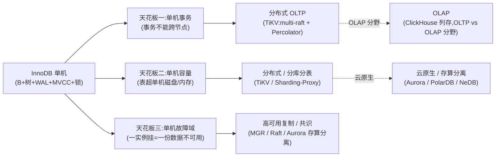
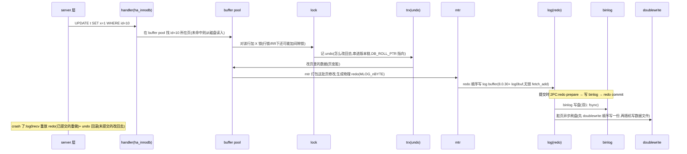

# 第 7 篇 · 第 23 章 · 全书收束:InnoDB 与 OLTP 引擎的演进

> **核心问题**:走到这里,你已经在源码层走完了一条 `UPDATE`——server 层、handler、buffer pool、B+树、行锁、undo 版本链、mtr、redo、两阶段提交、doublewrite、crash recovery,每一站都拆到了源码文件和行号。最后这一章,我们要从 InnoDB 内部跳出来,站到 OLTP 引擎演进的尺度上回头问一句:**B+树 + WAL + MVCC + 锁这套,InnoDB 到底得到了什么、付出了什么?它在 OLTP 引擎谱系里站在哪、它的天花板在哪、再往后它该往哪去?**

> **读完本章你会明白**:
> 1. **四灵魂各自的得失**——B+树聚簇索引、WAL/redo/undo/2PC、MVCC、锁,每一个的"得"和"失"不是模糊印象,而是可以用写放大/读放大/空间放大、吞吐/延迟/一致性的具体数字和机制讲清楚的取舍。
> 2. **三种存储引擎范式的总对照**——InnoDB 的聚簇索引 IOT、PostgreSQL 的堆表、LevelDB/RocksDB 的 LSM 追加 compaction,在"写放大/读放大/空间放大/点查/范围扫/写吞吐/事务"七个维度上的取舍三角,以及为什么"没有谁更先进,只有谁更适合某种负载"。
> 3. **OLTP 引擎的演进展望**——单机 InnoDB 撞到的天花板(单机事务、单机容量、单机故障域),怎么一步步走向分布式(TiKV 的 multi-raft + Percolator)、走向 OLAP 分野(ClickHouse 列存)、走向云原生(存算分离、Aurora/PolarDB/NeDB 这一脉)。
> 4. **合上书该留下的东西**——一句话主线、一条 UPDATE 在脑子里能放映的全旅程、以及这套思想怎么迁移到"读其他存储引擎""自己写一个引擎"上。

> **如果只想抓重点**:整章就一句话——**InnoDB 用四个灵魂打赢了"单机 OLTP"这场仗,它的天花板是"单机"二字;往后走的所有故事(分布式 TiKV、OLAP ClickHouse、云原生 Aurora),都是怎么把这套四灵魂搬过那道单机的墙。**

---

## 〇、一句话点破

> **InnoDB 用 B+树聚簇索引找到位置、redo(WAL)保 crash 不丢、undo(MVCC)保并发读、锁保隔离——这四个灵魂,每一个都是"用某种代价换某种收益"的精明交易;把它们合起来,换来了单机 OLTP 的成熟、事务完整、高并发。它赢在"单机",天花板也在"单机";OLTP 引擎的下一步,是把这套四灵魂搬过单机的墙。**

这是结论。本章不再引新源码、不再拆新机制——前面 22 章已经把每一站都拆到源码行了。本章只做四件事:① 把四灵魂的"得/失"摊在桌面上做成对照表;② 把 InnoDB、PG 堆表、LevelDB LSM 三种范式放进一张总对照表;③ 顺着演进展望这条路,讲清楚 InnoDB 的天花板和后面几条岔路(分布式/OLAP/云原生);④ 收口全书,让你合上书时脑子里放映得出那条 UPDATE 的全过程,以及知道下一本该读什么。

---

## 一、回头点一遍:四灵魂各自的得与失

全书 23 章,本质就是四个灵魂的展开。但前面每一章只聚焦一个灵魂的"为什么这么设计、源码里怎么实现",很少把"这个灵魂付出了什么代价"和"另一个灵魂付出的代价"放在一起对比。本章是收束章,正好把它们做成一张表。

先一句话概括四灵魂各自的主线(和 P0-01 的提法完全一致):

| 灵魂 | 解决的矛盾 | 核心机制 | 对应章节 |
|------|----------|---------|---------|
| **B+树聚簇索引** | 数据多、要查得动(存储与索引) | 表 = 主键 B+树,叶子页直接存整行 | P1-02~P1-04 |
| **WAL/redo/undo/2PC** | crash 不丢、事务 ACID(事务与并发) | 先记顺序写的物理 redo、改完内存页异步刷盘、binlog 当裁决点 | P3-08~P3-12 |
| **MVCC** | 高并发下读不阻塞写(事务与并发) | 一行多版本,读走 undo 版本链找快照、写加锁改最新 | P4-13~P4-15 |
| **锁/间隙锁** | 写写并发不乱、隔离级别(事务与并发) | 行锁 + 两阶段锁协议、按页位图、RR 加间隙锁防幻读 | P5-16~P5-19 |

下面逐个摊"得/失"。注意一个方法上的提醒:**每一个"得"都对应一个具体的机制,每一个"失"也都对应一个具体的机制——不是"它有缺点",而是"它为了拿到那个好处,具体付出了什么"。** 这是第一性原理的收束。

### 1.1 灵魂一:B+树聚簇索引——得与失

```
   得:IOT 主键查询是"一跳",省了堆表"索引→堆"那一跳
       叶子页之间双向链表,主键范围扫描顺序读极快
       热的主键索引页 = 热的数据页,一份 buffer pool 同时装下索引+数据
       二级索引存主键值(而非行指针),页分裂时二级索引零维护
   ────────────────────────────────────────────────
   失:非主键查询必须回表(二级索引→聚簇索引,多一次 B+树查找)
       随机/UUID 主键 → 写入疯狂页分裂 + 二级索引膨胀(实测空间多 30%-50%)
       表的物理重排难(整棵 B+树都要动),DDL 重 Cost 高
       写放大:改一行常常引发页分裂,触发整页重写
```

**得,是 OLTP 高频主键点查 + 范围扫变快**。OLTP 最高频的操作是"按主键查一行"(`SELECT ... WHERE id=?`)和"按主键范围扫"(`WHERE id BETWEEN ? AND ?`)。聚簇索引让这两件事都是最优:点查从根走到叶子,叶子页里直接就是数据,**省掉了堆表里"先查主键索引拿 TID、再回堆里取行"的第二跳**(P1-02 拆透)。这一跳听着不起眼,在 OLTP 每秒几万次点查的负载下,等于把每次查询的 IO 从两次降到一次,buffer pool 命中率、CPU 缓存命中率全跟着受益。

**失,是非主键查询的回表 + 写放大**。InnoDB 把整行数据绑死在主键 B+树里,意味着任何按非主键查的路径,都只能从二级索引拿到主键值,再回到聚簇索引走第二遍——这叫**回表**(P1-03)。回表是 IOT 的根本代价,P1-02 里我们原话讲过:"IOT 的根本代价是'非主键查询要回表'。"这是 InnoDB 用一个天才设计(二级索引存主键值而非行指针,把页分裂时二级索引的维护成本降到零)换来的——零维护的代价,就是回表时多一次 B+树查找。

更隐蔽的失是**写放大**。B+树是就地更新的数据结构,改一行要把整个 16KB 页读进内存、改完再(异步)整页写回磁盘。你只改了页里 1 个字节,却要把整个 16KB 页写一遍——P3-08 里我们把这个朴素直写页的写放大量化成"1000 倍"。WAL/redo 的整套设计,本质上就是 InnoDB 为了对付 B+树这堵"随机写 + 写放大"墙,而不得不引入的——见灵魂二。换言之:**B+树的写放大,是 InnoDB 不得不引入 WAL 这套复杂机制的根本动因之一**。这是灵魂一(存储)对灵魂二(事务)的因果链。

> **钉死这件事**:聚簇索引不是"更先进",堆表也不是"过时"。P1-02 里我们讲过:"它们是同一个问题——'一张关系表怎么存'——的两个解。"InnoDB 选 IOT,是因为它服务的 OLTP 负载里,主键点查和范围扫压倒性地多。如果你的负载是"几乎全是二级索引查询、几乎不按主键查"(比如某些日志型宽表),IOT 的回表代价会反过来咬你——这正是某些场景下人们更愿意用堆表(PG)或 LSM(见 1.2)的原因。

### 1.2 灵魂一的对手:LSM——为什么 LevelDB/RocksDB 不用 B+树

聚簇索引的"写放大"墙,在另一种存储引擎范式里被换了个解法——这就是承接《LevelDB》那本讲的 **LSM-Tree(Log-Structured Merge Tree)**。LSM 的核心思路是:**把所有的写都变成追加**(只追加不就地改),用一批后台 compaction 把旧版本合并掉。

承接《LevelDB》一句话带过(那本书已拆透):LevelDB 写一个 key,先追加到 WAL(对,和 InnoDB 的 redo 同源的 WAL 思想),再追加到内存的 MemTable,到此写就返回了——**没有页分裂、没有就地改、没有随机写**。后台 compaction 把多层 SSTable 合并、丢弃旧版本。这个设计把"随机写"问题彻底消灭了。

但 LSM 的代价在另一头:**读放大和空间放大**。

- **读放大**:读一个 key,要查 MemTable(没找到)→ Immutable MemTable(没找到)→ Level 0 的多个 SSTable → Level 1 → Level 2……一路查下去,每层可能都要做一次 IO。B+树查一个 key 是从根走几层到叶子,路径短;LSM 要在多个重叠的文件里找。所以 LSM 都配 Bloom filter 加速点查,把"这个 key 不在这个文件里"快速否决掉——但即便如此,读放大仍比 B+树重。
- **空间放大**:同一份数据,在 LSM 里可能有多个版本散布在不同层级,直到被 compaction 合并才回收。临时占用的空间可能是逻辑数据量的 1.5~3 倍。
- **写放大(另一面的)**:compaction 本身要把数据反复读出、合并、写回,这一笔"后台写放大"是 LSM 的隐藏代价。LSM 用"前台写极快(只追加)、后台 compaction 兜底"换吞吐。

这正好和 B+树相反。B+树是:**前台写有放大(整页写)、但读路径短(一棵树)、空间紧凑(就地改无冗余)**。**所以 B+树和 LSM 是"读优化 vs 写优化"的两种范式取舍**——没有谁更先进。我们在 1.3 节会做一张总对照表。

> **承接点**:change buffer(P2-07 讲过)其实是 InnoDB 借鉴了 LSM"写缓冲"思想的一处——对二级索引的修改先攒在 change buffer 里、后台再合并,本质是把"二级索引的随机写"暂时变成"缓冲追加",和 LSM 的 MemTable 是同一种思路。这是 InnoDB 这个 B+树引擎向 LSM 借的一招。

### 1.3 灵魂二:WAL/redo/undo/2PC——得与失

```
   得:crash 不丢(已提交的事务一定恢复)
       事务 ACID(原子性靠 undo 回滚、持久性靠 redo 重放、一致性靠 2PC redo/binlog 咬合)
       把"随机写数据页"的负担转成了"顺序写 redo"(顺序写快一个量级)
       提交只要等 redo 落盘,脏页后台异步刷——事务延迟低
   ────────────────────────────────────────────────
   失:写放大(redo + 数据页都写一遍,虽然 redo 顺序写但毕竟多一份)
       2PC 协调开销(每事务多一轮 prepare/commit 状态翻转 + XID)
       双 1 配置的 fsync 是延迟硬下限(每事务至少一次 fsync,~ms 级)
       doublewrite 多一倍页写(防页撕裂)
       undo 版本链堆积、purge 后台开销(灵魂三用得上)
```

**得,是"crash 不丢 + ACID"这件几乎不可能的事,被做成了既快又安全**。P3-08 里我们讲过,WAL 是数据库"crash 不丢"的标准答案——它把"随机改数据页"的负担,转化成"顺序写一份幂等的物理变更记录":redo 是物理日志(记"哪页哪偏移改成什么字节"),所以幂等、crash 后可安全重放;undo 是逻辑日志(记"怎么改回去"),所以未提交的事务能干净回滚。两者配合:redo 保"已提交的不丢",undo 保"未提交的能回滚"。再加上 2PC 让 redo 和 binlog 咬合(P3-11),InnoDB 拿到了完整的 ACID。

而这一切,**事务提交只要等 redo 落盘即可**——redo 是顺序追加写,远快于随机写数据页。脏页可以慢慢后台刷,不阻塞事务。所以 InnoDB 的写事务延迟,被压到了"一次顺序 fsync"的量级(在双 1 配置下,~毫秒级),而不是"改完所有相关页并刷盘"的量级。这是 OLTP 高 TPS 的根本。

**失,是写放大 + 2PC 协调开销 + fsync 是延迟地板**。失之一,**写放大**:一次逻辑上"改一行"的写,物理上要写 redo(改这行的物理变更)+ undo(改回去的逻辑记录)+ 数据页本身(异步刷)+ doublewrite 的一份冗余页。相比"直接改一行就完事",这是数倍的写。当然,redo 是顺序写、数据页是异步刷、doublewrite 也是顺序写,这些"放大"被 WAL 的设计聪明地分散掉了——但放大客观存在。

失之二,**2PC 协调开销**:为了让 InnoDB 的 redo 和 server 层的 binlog 一致(P3-11 拆透),每个事务提交都要走"redo prepare → 写 binlog → redo commit"三阶段,事务的 undo 段要写 XID,提交时要翻转 undo 段状态。这些状态翻转和 fsync 是 2PC 的协调成本。P3-11 里我们原话讲:"2PC 的正确性和性能,是两个独立的技巧合在一起——正确性靠 binlog 当裁决点,性能靠 group commit。"

失之三,也是最硬的失:**`innodb_flush_log_at_trx_commit=1` + `sync_binlog=1`(双 1 配置)下,每个事务提交至少要等一次 fsync**。fsync 是磁盘的物理同步动作,在 NVMe 上 ~百微秒、在机械盘上 ~毫秒——这是单机 OLTP 写事务延迟的**硬地板**。P3-11 里我们强调:"生产强一致场景必须双 1 配置……任何放松都是拿一致性换性能。"group commit(P3-11)能把一批事务的多次 fsync 压成一次,但 fsync 本身的延迟地板挪不走。这就是为什么单机 OLTP 的 TPS 上限,说到底是磁盘 fsync 的吞吐——这是单机的天花板之一(详见第三节)。

失之四,**doublewrite 多一倍页写**:为了防 partial page write(页撕裂),InnoDB 把脏页刷盘前先顺序写一份到 doublewrite buffer(P3-12),再随机写到数据文件——多一次顺序写,换"页撕裂后能用 doublewrite 的副本恢复"。这是 InnoDB 为了 B+树就地更新这件事,不得不付的保险费。

> **钉死这件事**:WAL/redo/undo/2PC 这套,不是为了"显得高级",而是 InnoDB 为了同时打赢"crash 不丢"和"高 TPS"这两件互相打架的事,逼出来的一套精妙交易。它的代价(写放大、2PC 开销、fsync 地板、doublewrite 保险费)不是设计缺陷,而是这套交易里"付的那一头"。一个不要 ACID 的引擎(比如早期 MyISAM、某些 KV 存储)可以省掉这些,但代价是 crash 了就丢数据——OLTP 不能接受。

### 1.4 灵魂三:MVCC——得与失

```
   得:读不加锁、读不阻塞写(读写看不同版本,天然不冲突)
       快照读在 RR 下可重复、在 RC 下总是最新已提交
       隐式锁让常见路径(无冲突的写)零开销
       一份 undo 两个用途(回滚 + MVCC 旧版本)——经济性
   ────────────────────────────────────────────────
   失:undo 版本链堆积(反复改的行,链可能要走十几个节点)
       purge 后台清理(要看所有活跃 read view 才能决定哪些版本能删)
       读旧版本有 CPU + IO 成本(版本链遍历)
       MVCC 解决不了写-写并发,仍要靠锁(灵魂四)
       长事务会卡住 purge(它的 read view 太老,旧版本都不能删)
```

**得,是"读"从"锁"里彻底解放出来**。这是 MVCC 对 OLTP 最关键的贡献。P4-13 里我们讲过,朴素加锁下,"读 id=10"和"写 id=10"互斥——一个写堵死一堆读,OLTP 高并发读写场景吞吐会塌。MVCC 让一行有多个版本:读走 undo 版本链找到自己 read view 对应的历史版本(不加锁),写加锁改最新版——读写看的是不同物理数据,天然不冲突。P4-13 里我们原话:"MVCC 把'读'从'锁'里彻底解放出来……换来的'读写互不阻塞'对 OLTP 是无价的。"

精妙之处在于,**一份 undo,两个用途**:undo 既是"怎么改回去"(事务回滚用),又是"上一个版本长什么样"(MVCC 用)。这是 InnoDB 设计的经济性——P3-10 拆 undo 时我们强调过这一点。同一份物理记录,服务两个灵魂(灵魂二的回滚 + 灵魂三的快照),是 InnoDB 把复杂度藏得很深的优雅。

**失,是版本链堆积 + purge 开销 + 解决不了写-写并发**。失之一,**undo 版本链可能很长**:一行被反复改,版本链上会堆十几个旧版本。读这行时,如果 read view 早,要顺着链走很远才能找到可见版本——这是 MVCC 读的隐藏 CPU/IO 成本。P4-13 里我们讲过,InnoDB 的代价之一就是"undo 链可能很长(读一个被反复改的行,可能要走十几个 undo 节点才找到可见版本)"。

失之二,**purge 后台清理的复杂度**:旧版本不能立刻删,因为可能还有活跃的 read view 要看它们。purge 线程要遍历所有活跃 read view,找到"最老的还活着的 read view",才能删掉比它更老的版本(P4-15 拆透)。这套 purge 逻辑复杂,而且如果有个长事务攥着一个很老的 read view 不放,会卡住整个 purge——旧版本越堆越多,undo 表空间膨胀,这正是生产环境一个经典的"InnoDB 毛病"(P4-15 讲过)。承接《TiKV》:这和 TiKV 的 GC(TiKV 也要看所有活跃事务的 timestamp 才能安全 GC)是同一种"老 read view 卡 GC"的问题。

失之三,**MVCC 解决不了写-写并发**:两个事务同时改同一行,MVCC 帮不了——必须靠锁串行化(P5-16)。MVCC 只解决了"读-写"并发,"写-写"并发是锁的地盘。两套机制各管一头,合起来才是 InnoDB 的并发控制全套。

> **承接《TiKV》一句话**:TiKV 的 MVCC 是分布式的,实现完全不同——key + timestamp append-only 存在 RocksDB 里,旧版本靠 GC 清理。InnoDB 是单机的 undo 版本链 + 就地更新。两者是"同一种思想、两副骨架":单机(InnoDB)用就地更新 + undo 链(空间省、读时现算);分布式(TiKV)用 append-only key+timestamp(协调简单,但空间放大)。P4-13 里我们做过这个对照。

### 1.5 灵魂四:锁/间隙锁——得与失

```
   得:写写隔离(同一行的并发写被串行化,不丢更新)
       行锁而非表锁(改 id=10 不阻塞改 id=15)——OLTP 高并发写的根基
       按页位图(一个 lock_t + 一张 bit 数组记一页的锁)——内存省 60 倍,O(1) 判冲突
       隐式锁(INSERT 不分配 lock 对象,用 DB_TRX_ID 当锁)——常见路径零开销
       间隙锁(RR 下锁住"不存在的间隙")——解决幻读
   ────────────────────────────────────────────────
   失:两阶段锁协议 → 事务越长持锁越久,死锁越容易
       死锁检测有开销(wait-for graph 检测环)
       间隙锁 + 临键锁让 RR 下范围查询容易锁住一片,并发写受影响
       锁等待靠超时或回滚,长锁等待会拖垮业务
```

**得,是写写隔离 + 高并发写的根基**。锁是 MVCC 之外的另一半并发控制。InnoDB 用**行锁**(改 id=10 只锁 id=10 这一行,不锁整表)——这是它区别于 MyISAM 表锁的根本,也是 OLTP 高并发写的根基。P5-16 里我们讲过:"改 id=10 和改 id=15 互不阻塞,这才是 OLTP 高并发写的根基。"

锁系统的两个招牌技巧,把"行锁"这件事做得又省又快:

- **按页位图**(P5-16 拆透):一个页上几百条记录的锁,InnoDB 不用"每行一个 lock 对象",而是用一个 `lock_t` + 一张 bit 数组(一比特代表一条记录的 heap_no)。P5-16 里我们量化过:朴素每记录一个 lock 对象,100 行要 6400 字节;按页位图不到 100 字节——**差了 60 倍以上**,而且冲突判断是 O(1) 的 bit test。
- **隐式锁**(P5-16):INSERT 时不分配 lock 对象,记录里的 `DB_TRX_ID` 本身就是锁——只有发生冲突时才"现转"成显式 lock 对象。常见路径(无冲突的写)零开销。

间隙锁和临键锁(P5-17 拆透)是 RR 隔离级别下解决幻读的关键:不仅锁已有的记录,还锁记录之间"不存在的间隙",别的事务插不进来,幻读就没了。这是 InnoDB 锁最复杂、最容易被误解的地方。

**失,是两阶段锁 + 间隙锁的副作用**。失之一,**两阶段锁协议**让"事务越长持锁越久,死锁越容易"。P5-16 里我们讲过:"加锁随时、释放等 commit"——事务里第一条语句加的锁,要攥到最后一条语句之后 commit 才放。所以事务越长、加的锁越多,死锁概率越高。这正是为什么 OLTP 几乎所有性能建议都强调"事务要尽量短"——一个写了 10 秒的长事务,可能攥着几百把锁不放,把后续事务全堵住。

失之二,**死锁检测有开销**:两个事务互相等对方的锁,就死锁了。InnoDB 用 wait-for graph 检测环,发现环就挑 undo 量小的事务回滚(P5-18)。这个检测在高并发下本身有 CPU 开销,而且被回滚的事务要重做,是代价。

失之三,**间隙锁让 RR 下范围查询容易锁住一大片**:RR 为了防幻读,`SELECT ... WHERE id BETWEEN 10 AND 20 FOR UPDATE` 会锁住 10 到 20 之间所有的记录**和间隙**——别的事务想插 id=15 也插不进来。这是 RR 解决幻读的代价,也是为什么很多大型互联网公司(阿里、Google、Facebook)在内部把 MySQL 默认隔离级别从 RR 改成 RC(P4-13 讲过)——RC 没有间隙锁,写并发更高、死锁更少。

> **钉死这件事**:MVCC + 锁,合起来是 InnoDB 的"并发控制"全套。MVCC 管"读-写"并发(读不加锁),锁管"写-写"并发(写串行化)。两套机制各管一头,缺一不可。它们的代价——版本链堆积、两阶段锁久持锁、死锁——都是这套分工的副作用。

### 1.6 四灵魂得失对照表(收束章的招牌表)

把上面四节摊成一张表,这是本章第一张招牌表:

| 灵魂 | 得(换来了什么) | 失(付出了什么) | 代价的具象 |
|------|---------------|---------------|----------|
| **B+树聚簇索引** | 主键点查一跳、范围扫顺序读、索引即数据 | 非主键回表、UUID 页分裂、写放大 | 改 1 字节写 16KB 页;UUID 主键空间多 30%-50% |
| **WAL/redo/undo/2PC** | crash 不丢、ACID、提交只等 redo 顺序写 | 写放大、2PC 协调、fsync 延迟地板、doublewrite 保险费 | 双 1 下每事务至少一次 fsync(~ms);doublewrite 多一倍页写 |
| **MVCC** | 读不阻塞写、快照一致性、一份 undo 两用途 | undo 链堆积、purge 复杂、长事务卡 purge、解决不了写写并发 | 反复改的行版本链走十几节点;长事务卡 purge |
| **锁/间隙锁** | 写写隔离、行锁非表锁、按页位图省 60 倍、间隙锁防幻读 | 两阶段锁久持锁、死锁检测开销、RR 范围查询锁一大片 | 长事务攥几百把锁;RR 死锁比 RC 多 |

> **钉死这件事**:这四个灵魂,没有一个"只有得没有失"。InnoDB 的成熟,不是因为它"更先进",而是因为它把这几个交易做得精明——每个代价都被某种技巧压缩或分散(写放大被 WAL 转成顺序写、锁开销被按页位图压成 1/60、undo 双用途省一份)。理解 InnoDB,就是理解这四笔交易的账本。

---

## 二、InnoDB vs PG vs LevelDB(LSM):存储引擎范式总对照

四灵魂的得失是从 InnoDB 内部看。但 InnoDB 不是唯一的存储引擎——这一节我们把视角拉到"存储引擎范式"的高度,把 InnoDB 的聚簇索引 IOT、PostgreSQL 的堆表、LevelDB/RocksDB 的 LSM 追加 compaction 放进一张总对照表。

为什么要做这张表?因为**"表怎么存"这件事,世界上本来就有三种主流范式,InnoDB 的 IOT 只是其中之一**。理解 InnoDB 在这张谱系里的位置,你才能判断:什么场景该用 InnoDB、什么场景该用 PG、什么场景该用 LSM 的引擎(RocksDB/TiKV/ClickHouse 的 MergeTree)。这正是 OLTP 引擎选型的根。

### 2.1 三种范式的一句话本质

- **InnoDB(聚簇索引 IOT,索引组织表)**:**表 = 主键 B+树**,叶子页直接存整行;二级索引存主键值,要回表。就地更新,改一行要重写整页。
- **PostgreSQL(堆表 heap)**:**表 = 无序堆 + 独立索引**,索引指向堆里的行(TID)。改一行就地改堆,索引看情况维护。
- **LevelDB/RocksDB(LSM-Tree)**:**表 = 多层 SSTable + MemTable**,所有写都追加(MemTable + WAL),后台 compaction 合并、丢旧版本。读要查多层。

三种范式的本质区别,可以用"数据怎么放、怎么改、怎么读"三问概括:

| | InnoDB(IOT) | PG(heap) | LevelDB/RocksDB(LSM) |
|---|---|---|---|
| **数据怎么放** | 主键 B+树,叶子页存整行 | 无序堆 + 独立 B-tree 索引 | 多层 SSTable + MemTable,每层有序 |
| **怎么改一行** | 找到页,就地改,整页(异步)重写 | 找到堆里的行,就地改;索引按需维护 | 追加新版本到 MemTable,旧版本后台 compaction 删 |
| **怎么读一行** | B+树从根到叶子(短路径) | 索引 → TID → 堆取行(两跳) | MemTable → Level 0..N(Bloom filter 加速) |

### 2.2 七维度对照总表(本章招牌表)

下面这张表,是本书承接四本前作的总收口——《PG》《LevelDB》《Linux 内存管理》《TiKV》——把它们和 InnoDB 的对照一次性钉死。表里的每个"高/中/低"都不是拍脑袋,而是对应到具体机制(在"为什么"列注明)。

| 维度 | **InnoDB**(IOT + WAL + MVCC + 锁) | **PostgreSQL**(heap + WAL + MVCC + 锁) | **LevelDB/RocksDB**(LSM) | 关键差异的"为什么" |
|------|------|------|------|------|
| **写放大** | 中高:改 1 字节重写 16KB 页 + redo + undo + doublewrite | 中高:同 InnoDB 量级,改一行重写整页 + WAL | 前台低(只追加 MemTable),后台高(compaction 反复读写) | InnoDB/PG 就地改整页;LSM 前台追加后台 compaction |
| **读放大** | 低:B+树 3~4 层,点查路径短;AHI 进一步加速 | 中:主键查两跳(索引→堆);堆表无聚簇 | 高:多层 SSTable 逐层查,Bloom filter 否决;未必命中要多次 IO | IOT 主键点查最优;LSM 层数多读放大重 |
| **空间放大** | 低:就地改无冗余(除 doublewrite) | 低:同 InnoDB(MVCC 旧版本在堆里) | 高:多版本散布在多层,临时 1.5~3x 逻辑数据 | LSM 在 compaction 前空间放大明显 |
| **主键点查** | **极快**:一跳,叶子页即数据 | 中:两跳(索引→堆) | 中:Bloom filter + 多层查 | IOT 主键点查是 OLTP 最高频,InnoDB 最优 |
| **范围扫描** | **极快**:叶子页链表顺序读 | 快:索引范围扫 + 回堆 | 中:Level 0 重叠文件要合并查,大范围扫还行 | InnoDB/PG 范围扫都强,LSM 大范围扫也不错但读放大重 |
| **写吞吐** | 中:每事务至少一次 fsync(双 1) | 中:同 InnoDB 量级 | **极高**:前台只追加,写吞吐是 LSM 的招牌 | LSM 把随机写变顺序追加,写吞吐碾压 B+树 |
| **随机写(主键乱)** | 差:页分裂频繁,性能塌 | 差:同 InnoDB 量级 | 好:只追加,无页分裂 | 这是 LSM vs B+树最显著的分水岭 |
| **事务 ACID** | 完整(redo/undo/2PC + 隔离级别 + 间隙锁) | 完整(WAL + MVCC + 锁) | 弱:LevelDB 只有 KV 事务;RocksDB 有 WriteBatch 但非跨节点 | InnoDB/PG 是完整 OLTP 引擎;LSM 是存储底座,事务靠上层(TiKV 加 Percolator) |
| **crash 不丢** | WAL + redo 重放 + doublewrite | WAL + redo 重放(full page image) | WAL(顺序日志)+ SSTable 不可变 | 三者都有 WAL,这是"crash 不丢"的通用答案 |
| **MVCC 实现** | undo 版本链(就地改 + undo 链) | 堆里多版本(不改旧 tuple,插入新 tuple)+ VACUUM 清理 | key + seq 多版本(同一 key 多个版本) | InnoDB 就地改省空间但链长;PG/LSM 不改旧值但空间放大 |
| **并发控制** | 行锁 + 间隙锁(按页位图)+ MVCC | 行锁(MVCC 为主,锁为辅)+ 隔离级别 | 无(单机 LSM 通常单写线程或多 writer 协调) | InnoDB/PG 有完整锁系统;LSM 锁靠上层 |
| **适用负载** | OLTP(高频主键点查 + 范围扫 + 事务) | OLTP/HTAP(混合负载,堆表灵活) | 写密集 KV、日志、宽表、做分布式存储底座 | InnoDB 为 OLTP 量身定做;LSM 为写密集和分布式底座 |

### 2.3 怎么读这张表

这张表信息量很大,几个关键读法:

**读法一:InnoDB 和 PG 的差距,远小于 InnoDB 和 LSM 的差距。** InnoDB 和 PG 都是"B+树 + WAL + MVCC + 锁"的传统 OLTP 引擎,差别只在"表怎么存"(IOT vs heap)。IOT 让 InnoDB 的主键点查比 PG 快一跳,代价是非主键回表——这是 InnoDB/PG 那一列几乎全部差异的根。除此之外,两者在写放大、ACID、crash 不丢、并发控制上都是同量级。所以**把 InnoDB 和 PG 当成"同一种范式的两个变体",把 LSM 当成"另一种范式"**——这是读这张表的第一个心智模型。

**读法二:LSM 的优势全在"写",劣势全在"读和空间"。** LSM 的招牌是写吞吐——前台只追加,没有页分裂、没有就地改。它的代价是读放大(多层查)和空间放大(多版本散布)。所以 LSM 适合"写远多于读"或"读可以靠 Bloom filter/缓存兜住"的负载:日志、监控数据、宽表、做分布式存储的底座。这也是为什么 TiKV 选 RocksDB 做底座(写密集的分布式 KV)、为什么 ClickHouse 的 MergeTree 是 LSM 的变体(日志型海量写)。

**读法三:为什么 InnoDB 没用 LSM?** 因为 OLTP 的读模式是"高频点查 + 范围扫",LSM 的读放大在这两种读上都是劣势;OLTP 的写虽然也多,但单事务写量小(几行到几十行),B+树的写放大在 buffer pool + WAL + change buffer 的组合下被压住,不是瓶颈。所以**InnoDB 选 B+树是为了"读最优",LSM 选追加是为了"写最优"——它们各自服务不同的负载**。P1-02 里我们讲过:"IOT 不是'更先进',heap 也不是'过时'。"同样地,**B+树不是"更先进",LSM 也不是"过时"——它们是'读优化 vs 写优化'的两个解**。

**读法四:为什么 TiKV 在 RocksDB 上加那么多东西?** 表里 LSM 那一列"事务 ACID"是"弱",但 TiKV 提供了完整的分布式事务。这是因为 RocksDB 只是个存储底座,事务、MVCC、跨节点一致性这些,是 TiKV 在它之上用 multi-raft + Percolator + TSO 加的(承接《TiKV》)。同样地,InnoDB 的 B+树本身也不提供 ACID——是 WAL/redo/undo/2PC/MVCC/锁这套加在 B+树上,才让 InnoDB 有了 ACID。所以**"数据结构(B+树/LSM)"和"事务/并发机制"是两层**——理解这一点,你就能理解为什么会有"用 LSM 做 OLTP 引擎"(RocksDB + 上层事务 = TiKV/MyRocks)这种组合。

> **钉死这件事**:这张总对照表,是本书承接四本前作的总收口。《PG》讲了堆表和 SQL 旅程,本书 P1-02 用 IOT 和它分道;《LevelDB》讲了 LSM 和写缓冲,本书 1.2 节和这张表把 LSM vs B+树钉死;《Linux 内存管理》讲了 page cache,本书 P2-05 用 buffer pool 自管页面缓存和它对照;《TiKV》讲了分布式 MVCC + Percolator,本书 P4-13 用单机 undo 链 MVCC 和它对照。读完这张表,你应该能在脑子里放映出"三种范式各自为什么这么设计、各自付出什么代价"——这是站在 OLTP 引擎演进高度看 InnoDB 的根。

---

## 三、OLTP 引擎的演进展望:InnoDB 的天花板和下一步

四灵魂 + 三范式对照,讲清楚了 InnoDB 在单机 OLTP 这块做到了什么。但 InnoDB 不是终点——这一节我们站在 OLTP 引擎演进的尺度,讲清楚 InnoDB 的天花板在哪,以及业界是怎么一步步把这套四灵魂搬过单机的墙的。

### 3.1 InnoDB 的天花板:三个"单机"

InnoDB 把单机 OLTP 做到极致,但"单机"二字本身就是天花板。具体有三个:

**天花板一:单机事务的天花板——一个事务不能跨节点。** InnoDB 的事务是单机的:一个事务的所有锁、所有 undo、所有 redo,都在一个 MySQL 实例里。如果一个业务要"跨多个 MySQL 实例做事务"(比如分库分表后跨库转账),InnoDB 自己帮不了你——要么上应用层分布式事务(两阶段提交,慢且复杂),要么上 xa(性能差),要么干脆放弃强一致(最终一致)。这是单机事务的根本限制。承接《TiKV》:TiKV 用 Percolator + multi-raft 把事务做到了跨节点,InnoDB 做不到。

**天花板二:单机容量的天花板——一张表不能超过单机磁盘/内存。** InnoDB 的 B+树、buffer pool 都在单机。数据量超过单机磁盘,就要分库分表(中间件如 Sharding-Proxy、MyCAT);热数据超过单机内存,buffer pool 命中率掉,性能塌。分库分表把"一个逻辑表"拆成"多个物理表",跨分片的查询和事务都极难。这是单机存储的根本限制。

**天花板三:单机故障域的天花板——一个实例挂了,这个实例上的数据就不可用(直到恢复)。** InnoDB 单机实例本身不提供高可用——要靠主从复制(binlog 复制到一个或多个从库)。但主从复制是异步或半同步的,主库挂了的瞬间,已提交的事务可能还没复制到从库(数据丢失窗口)。要强一致的高可用,得用 MGR(MySQL Group Replication,基于 Paxos 变种)或外部共识——但这又引入复杂度。这是单机故障域的根本限制。

这三个天花板,是单机 InnoDB 撞到的墙。业界对每一堵墙,都给出了对应的演进方向:



下面三节,我们顺着这三个方向,加上 OLAP 分野,讲清楚每条路的"把四灵魂搬过墙"是怎么做的。注意:**这些方向不是替代 InnoDB,而是在 InnoDB 的四灵魂思想之上,针对单机的三个天花板,做的针对性扩展**。InnoDB 的 B+树 + WAL + MVCC + 锁这套思想,在每一种演进里都还活着,只是被重新组合、重新分布了。

### 3.2 演进方向一:分布式 OLTP——TiKV 的 multi-raft + Percolator

承接《TiKV》那本——这是把 InnoDB 的四灵魂搬到分布式最完整的一个工程。

**怎么搬过"单机事务"这堵墙?** TiKV 的答案有两块:

- **multi-raft**:把数据切成一个个 **Region**(默认 256MB,9.x),每个 Region 是一段连续的 key 区间,用 Raft 在多个节点间复制。一个 Region 的写,要经过这个 Region 的 Raft 多数派共识。这样**单机故障域被解决了**——一个节点挂了,只要多数派还在,Region 仍可用。这是天花板三的分布式解法。
- **Percolator**:跨 Region 的事务,用 Percolator 模型——一个事务要写的所有 key,先在 prewrite 阶段加锁(锁存在 lock CF 里),commit 阶段统一清锁写数据。这是天花板一(单机事务)的分布式解法:事务可以跨多个 Region(多个节点),Percolator 协调它们。

**四灵魂在 TiKV 里的对应**(这是承接《TiKV》的核心):

| InnoDB 的灵魂 | TiKV 的对应 |
|------|------|
| B+树聚簇索引 | RocksDB(LSM,key+timestamp)——存储底座换成 LSM,因为写密集 |
| WAL/redo | Raft log——每个 Region 的写先记 Raft 日志(共识 + 持久化),Raft log 本质就是分布式的 WAL |
| MVCC | key + timestamp 多版本——和 InnoDB 同思想(多版本让读不阻塞写),但用 append-only 而非 undo 链 |
| 锁 | Percolator 的两阶段锁(prewrite 加锁、commit 清锁),分布式的"行锁" |

注意一个关键对照:**InnoDB 的 undo 版本链 MVCC(就地改 + undo 链)↔ TiKV 的 append-only MVCC(key+timestamp)**。P4-13 里我们讲过:InnoDB 选 undo 链是因为单机(空间省、读时现算);TiKV 选 append-only 是因为分布式(跨节点不能共享内存做就地改,append-only 协调简单,但空间放大)。**同一个 MVCC 思想,因单机 vs 分布式约束,长成两副骨架**——这是本书四重承接里最深刻的一条。

**TiKV 的代价**:Percolator 跨 Region 事务延迟高(两阶段 + 跨网络)、依赖 TSO(PD 是单点,虽然 PD 自己也高可用)、空间放大严重(每个版本一个 key,要 GC)。这些代价是分布式的代价——换来了跨节点事务和水平扩展。所以**TiKV 不是"更先进的 InnoDB",而是"为分布式场景重新组装的四灵魂"**。

### 3.3 演进方向二:OLAP 分野——ClickHouse 列存,OLTP vs OLAP 的根本分野

OLTP(联机事务处理)和 OLAP(联机分析处理)是两种根本不同的负载:

- **OLTP**:高频、短事务、点查 + 小范围扫、强一致、高并发。InnoDB 是为它生的。
- **OLAP**:海量数据、复杂聚合(GROUP BY、JOIN)、全表扫或大范围扫、批写、对单事务延迟不敏感但对查询吞吐极敏感。InnoDB 在这块**严重不适配**——行存的 B+树做"扫几亿行做聚合",要逐行解析,慢得不可接受。

**OLAP 的解法是列存**。ClickHouse 是代表,它的 MergeTree 引擎本质是 LSM 的变体,但数据按列存而非按行存:

- **列存**:同一列的数据连续存放。做 `SUM(price)` 这种聚合,只读 price 这一列,不用把整行都读出来。IO 量从"行数 × 列数"降到"行数 × 1"。
- **向量化执行**:一批数据一次性处理(SIMD),不是一行一行。CPU 利用率极高。
- **压缩**:列内数据类型一致,压缩比远高于行存(行存一行里有多种类型,压缩难)。

为什么 InnoDB 不能做 OLAP?**行存的 B+树 + 强事务开销,在"扫几亿行做聚合"这种负载下是纯负担**——事务、MVCC、锁、行存解析,每一个都是成本但没有收益(OLAP 不需要高并发写、不需要点查)。所以 ClickHouse 几乎砍掉了 InnoDB 的所有 OLTP 机制:没有完整事务(只有批量写)、没有行锁、没有 MVCC(批量替换)、列存不是 B+树。它换来的是**OLAP 聚合的极致吞吐——ClickHouse 在 OLAP 上的查询速度,比 InnoDB 快一到两个量级**。

**这就是 OLTP vs OLAP 的根本分野**:同一个数据库市场需求,被两种完全不同的引擎范式分别最优。InnoDB 死守 OLTP,ClickHouse 死守 OLAP,**HTAP**(混合负载,AI4DB 的一个方向)试图在一个系统里两者都做(TiDB 的 TiKV + TiFlash、PG 的行存 + 列存扩展),但工程上极难。**这个分野告诉我们:没有"万能引擎",InnoDB 的四灵魂是为 OLTP 量身定做的,搬到 OLAP 上反而不合适**。

> **承接点**:ClickHouse 的 MergeTree 是 LSM 的变体(数据按列分片,后台 merge 合并)——这又一次印证了"LSM 适合写密集/批写场景"。OLAP 的批写和 LSM 的"追加 + compaction"是绝配。

### 3.4 演进方向三:云原生 / 存算分离——Aurora / PolarDB / NeDB 这一脉

第三堵墙(单机故障域)和第二堵墙(单机容量),在云原生时代有另一种解法:**存算分离**。

传统 InnoDB 的"计算"(SQL 解析、事务、锁、buffer pool)和"存储"(数据页、redo log)在同一个实例。如果实例挂了,虽然数据在磁盘上,但要重新拉起实例、做 crash recovery,期间不可用。云原生的思路是:**把存储层独立出来,做成分布式共享存储(基于共识/Paxos/Raft),计算层(多个 MySQL/PG 实例)共享这一份存储**。

- **Aurora(AWS)**:把 InnoDB 的 redo log 这一层抽出来,写到分布式存储层(6 副本 3 AZ,Paxos 共识)。计算层的多个实例共享同一份存储,主库写 redo、从库读 redo apply。**"日志即数据库"**——只有 redo 流到存储层,数据页由存储层按 redo 自己 apply 出来。这大幅降低了写放大(不再传整页)。
- **PolarDB(阿里)**:类似思路,计算存储分离,存储层用 PolarFS(基于共识)。多个计算节点(读写节点 + 只读节点)共享一份存储。
- **NeDB(网易等)**:同属这一脉。

**这套思路怎么动了 InnoDB 的四灵魂?** 非常有意思:

- **B+树聚簇索引**:基本不变,页还是在共享存储上,buffer pool 还在计算层。但 buffer pool 的脏页刷盘,刷到的是分布式共享存储而非本地盘。
- **WAL/redo**:被改造。Aurora 把 redo 流独立出来作为存储层的输入,PolarDB 把 redo 写到分布式存储。**redo 不再写本地盘,而是流到共享存储**——这降低了单机故障域(redo 在多副本)和写放大(不再整页刷)。
- **MVCC/锁**:基本不变,还是计算层(InnoDB 实例)做。但多个计算节点(读写 + 只读)的 MVCC 要协调——这是云原生数据库的一个难点。

**云原生的代价**:网络延迟(计算层和存储层之间多一跳网络)、共享存储的实现复杂度、多计算节点一致性协调。换来的是**高可用(实例挂了,另一个实例立即接管,因为存储共享)、弹性扩容(只读节点快速拉起)、存储成本(共享存储按需付费)**。

**这套思路的深刻之处**:它没有推翻 InnoDB 的四灵魂,而是**把四灵魂里"和存储强耦合"的部分(redo、数据页)抽到分布式存储,把"和计算强耦合"的部分(SQL、事务、锁、MVCC)留在计算层**。这是"用分布式存储解决单机故障域 + 单机容量,同时保留 InnoDB 的 OLTP 成熟度"的工程权衡。它不像 TiKV 那样重新设计一个分布式 OLTP 引擎,而是**把 InnoDB 嫁接到分布式存储上**——这是工业界一个很务实的路径。

### 3.5 演进总结:四灵魂不死,只是被重新分布

回看这三个演进方向,你会发现一个共同点:**InnoDB 的四灵魂没有死,只是被重新分布了**。

- TiKV 把四灵魂重新组装成分布式的(Raft log 替 redo、Percolator 替锁、append-only MVCC 替 undo 链、RocksDB 替 B+树)。
- ClickHouse 在 OLAP 这块砍掉了 OLTP 的灵魂(事务、锁、MVCC),换上列存 + 向量化的新灵魂——但 WAL 思想(MergeTree 的 part + merge)还在。
- Aurora/PolarDB 把四灵魂里和存储耦合的部分(redo、数据页)分布化,保留计算层的事务/锁/MVCC。

所以**站在 OLTP 引擎演进的尺度看,InnoDB 不是被淘汰,而是被"分解 + 重组"**——它的四灵魂(B+树/聚簇索引、WAL、MVCC、锁)是 OLTP 的基本组件,后面的每一种演进都在重新组合它们。理解 InnoDB 的四灵魂,就是理解了 OLTP 引擎的"原子"——再去看 TiKV、ClickHouse、Aurora,你会发现它们都在用这些原子(或这些原子的变体)搭建。

> **钉死这件事**:InnoDB 的天花板是"单机"二字。但 InnoDB 的四灵魂没有天花板——它们是 OLTP 引擎的基本组件,在分布式、OLAP、云原生里都被重新组合使用。读完这本书,你掌握的不只是"InnoDB 怎么工作",而是"OLTP 引擎的四块基本积木怎么搭"——这套积木,够你看懂后面所有的演进。

---

## 四、全书主线最后一次回扣

到这里,本章的三个核心(四灵魂得失、三范式对照、演进展望)都讲完了。最后这一节,是全书的收口。

### 4.1 一句话主线,再点一次

全书的一句话主线,从 P0-01 立起来,在每一章的章末小结里反复回扣,本章是最后一次:

> **一条写,InnoDB 用 B+树聚簇索引找到位置、redo(WAL)保 crash 不丢、undo(MVCC)保并发读、锁保隔离。**

这句话,把 InnoDB 的四个灵魂、它们各自管的矛盾、以及一条写的旅程,全部浓缩进去了。如果你合上书只能记住一句话,就是这一句。

把这句话拆开,对应到全书每一篇:

| 主线片段 | 灵魂 | 解决的矛盾 | 全书篇章 |
|---------|------|----------|---------|
| "B+树聚簇索引找到位置" | 灵魂一 | 数据多要查得动 | 第 1 篇(P1-02~04)+ 第 2 篇 buffer pool(P2-05~07) |
| "redo(WAL)保 crash 不丢" | 灵魂二 | crash 不丢、ACID | 第 3 篇(P3-08~12,WAL/redo/undo/2PC/crash recovery) |
| "undo(MVCC)保并发读" | 灵魂三 | 高并发读不阻塞写 | 第 4 篇(P4-13~15,MVCC/read view/purge) |
| "锁保隔离" | 灵魂四 | 写写并发、隔离级别 | 第 5 篇(P5-16~19,锁/间隙锁/死锁/隔离级别) |

第 6 篇(P6-20~22)是把这四个灵魂串成一条 SQL 的完整旅程,加实践;第 7 篇(本章)是收束。**全书 23 章,就是这句话的展开。**

### 4.2 合上书,你该能在脑子里放映出一条 UPDATE 的全过程

这是全书对读者的最终要求——也是检验"读懂没有"的试金石。给你一条 `UPDATE t SET x=1 WHERE id=10`,合上书,你应该能放映出这条 UPDATE 在 InnoDB 里的全过程:



放映这条旅程时,每一站你都应该能讲清楚:

1. **server 层**:UPDATE 进来,解析、预处理、优化(选索引)、执行(承接《PG》那本的 SQL 旅程,本书 P6-20 略带)。执行器调 handler 接口进 InnoDB。
2. **buffer pool 找页**:在 buffer pool 的 LRU 链表里找 id=10 所在的 B+树页(P2-05);命中直接用,未命中从磁盘读入(P2-05 的 free list / flush list)。新读入的页插到 LRU midpoint(P2-06 的 midpoint insertion,防全表扫冲刷热数据)。
3. **加锁**:对 id=10 这行加 X 锁(P5-16 的行锁,按页位图);RR 隔离级别下,如果是范围查询或唯一性检查,还可能加间隙锁/临键锁(P5-17)。隐式锁:如果只是 INSERT,可能不分配 lock 对象,用 DB_TRX_ID 当锁(P5-16)。
4. **记 undo**:改之前,先记一条 undo("怎么改回去")。这条 undo 既是回滚用,也是 MVCC 的旧版本(P3-10 的一份 undo 两用途)。undo 通过 DB_ROLL_PTR 串成版本链(P4-13)。
5. **改页**:在 buffer pool 里改这一行,页变脏。
6. **mtr 生成 redo**:这批页修改被打包成一个 mini-transaction(P3-09),生成物理 redo(MLOG_nBYTE,记"哪页哪偏移改成什么")。
7. **redo 顺序写 log buffer**:redo 顺序写进 log buffer(8.0.30+ 重构的 log0buf,无锁 fetch_add 预留空间,P3-08)。
8. **提交时 2PC**:redo prepare(写 redo 标记 prepare,fsync)→ 写 binlog(fsync)→ redo commit(写 redo 标记 commit)。binlog 写入是原子裁决点(P3-11)。group commit 把一批事务的 fsync 压成一次。
9. **脏页异步刷盘**:后台刷脏页,先顺序写到 doublewrite buffer(P3-12,防页撕裂),再随机写到数据文件。
10. **crash 恢复**(如果 crash 了):log0recv 重放 redo(已提交的重做、未提交的不做),用 undo 回滚未提交的事务(P3-12)。

这条旅程放映得出来,你就真的读懂了 InnoDB。每一站对应全书某一章的主角——你能指到具体是哪一章、源码里大概是哪个文件。

### 4.3 这套思想怎么迁移:看其他存储引擎 / 自己写一个

最后,讲讲这套思想的迁移。读懂 InnoDB 不是终点——这套四灵魂的思想,可以迁移到:

**迁移一:看其他存储引擎,你有了参照系。** 任何一个 OLTP/OLAP 引擎,你都可以问四个问题:① 它怎么存数据(B+树?LSM?列存?)——对应灵魂一;② 它怎么保 crash 不丢(WAL?别的?)——对应灵魂二;③ 它怎么让读不阻塞写(MVCC?别的?)——对应灵魂三;④ 它怎么做写写隔离和隔离级别(锁?别的方式?)——对应灵魂四。这四个问题,是审视任何存储引擎的通用框架。带着这个框架去读《PG》《LevelDB》《TiKV》《ClickHouse》,你会发现它们都是这四个问题的不同回答。

**迁移二:承接前作的总收口。** 本书承接了四本前作,这里是总收口:

- **承接《PostgreSQL 数据库内核》**:InnoDB 的聚簇索引 IOT vs PG 的堆表,是"表怎么存"的两种范式。本书 P1-02 拆透。PG 的 SQL 旅程(server 层解析优化执行)承接 PG 那本,本书 P6-20 略带。
- **承接《LevelDB》**:InnoDB 的 B+树(就地更新)vs LevelDB 的 LSM(追加 compaction),是"写优化 vs 读优化"的两种范式。本章 1.2 + 2.2 做了总对照。change buffer 是 InnoDB 向 LSM 借的一招(P2-07)。
- **承接《Linux 内存管理》**:InnoDB 自管 buffer pool(改进 LRU midpoint insertion)vs Linux kernel 的 page cache LRU,是"页面缓存"的两种实现。本书 P2-05~06 对照。
- **承接《TiKV》**:InnoDB 单机 undo 链 MVCC + 单机锁 vs TiKV 分布式 key+timestamp MVCC + Percolator,是"MVCC/事务"在单机 vs 分布式下的两种长法。本书 P4-13 对照,本章 3.2 又收口。

读完本书 + 这四本前作,你应该能看出**"OLTP/存储引擎"这个领域,基本概念就这么多,不同的系统是这些概念的不同组合**。

**迁移三:自己写一个存储引擎(或读懂公司里的自研引擎)。** 如果你的公司有自研存储引擎(很多大厂都有),或者你想自己写一个,InnoDB 的四灵魂是模板:

- **要存数据?** 选 B+树(IOT,OLTP 最优)、LSM(写密集)、列存(OLAP)——按你的负载选。
- **要 crash 不丢?** WAL 是标准答案——先记顺序写的物理/逻辑日志,再改内存页,异步刷盘。redolog 选物理(幂等可重放)还是逻辑(紧凑但要小心幂等性),按需选。
- **要高并发读?** MVCC——多版本让读不阻塞写。版本怎么存(undo 链?append-only key?别的?)按单机/分布式选。
- **要写写隔离?** 锁——行锁、按页位图(省内存)、隐式锁(常见路径零开销)、间隙锁(防幻读,看隔离级别)。

这些组件,InnoDB 都给了你一份工业级的参考实现。读 InnoDB 源码,等于读了一份"怎么造 OLTP 引擎"的教科书。

---

## 五、技巧精解:四灵魂的两个第一性洞察(收束版)

本章是收束章,不引新源码,但要把全书最硬核的两个第一性洞察再钉一次——这两个洞察贯穿四灵魂,是"InnoDB 凭什么这么设计"的根。

### 洞察一:就地更新(B+树) vs 追加(LSM)——一个根本分野,决定了后面一切

全书最大的对照,是 InnoDB 的 B+树(就地更新)vs LevelDB 的 LSM(追加)。这个分野,决定了两种引擎后面几乎所有的差异:

- **就地更新(B+树)**:改一行要找到页、改页、(异步)重写整页。**前台写放大,但读路径短、空间紧凑**。InnoDB 选这条,因为 OLTP 读多写也多、读要最优。
- **追加(LSM)**:改一行只追加新版本,旧版本后台 compaction 删。**前台写极快,但读要查多层、空间放大**。LevelDB 选这条,因为写密集场景写要最优。

这个分野的根,在于"磁盘的随机写 vs 顺序写"这对手生矛盾。B+树就地改,本质是随机写(改哪个页就写哪个页,页的位置随机);LSM 追加,本质是顺序写(一直往后写)。顺序写远快于随机写(机械盘差 100 倍,SSD 差几倍到几十倍),所以 LSM 在写吞吐上碾压 B+树。但 LSM 的代价是读要查多层(读放大),B+树没有这个问题。

**InnoDB 用 WAL 把 B+树的随机写问题"绕开"了**——这是洞察一的关键收口。B+树就地改有随机写问题(redo 也是顺序写,数据页的随机写被 WAL 的顺序写兜底,事务提交只等 redo)。所以 InnoDB 实际上是"用 WAL 让 B+树也能高 TPS"。**这是 InnoDB 选 B+树而不是 LSM 的工程底气——WAL 让 B+树的随机写不再是写吞吐的瓶颈**。

但如果写密集到一定程度(比如每秒几十万写、写的又是随机 key),B+树的页分裂 + WAL 也扛不住——这时 LSM 就有优势。这是为什么 RocksDB 在写密集 KV 场景取代 InnoDB(MyRocks 是 Facebook 把 RocksDB 做成 MySQL 引擎的尝试)。

> **钉死这件事**:就地更新 vs 追加,是存储引擎最根本的分野。InnoDB 选就地更新(B+树)+ WAL 兜底随机写,服务 OLTP 读最优;LevelDB 选追加(LSM),服务写密集。这个分野,比"B+树 vs LSM"或"IOT vs heap"都更根本——它是"随机写 vs 顺序写"这对磁盘物理矛盾的两种回答。

### 洞察二:WAL + 2PC——把"不可能同时打赢的仗"变成精明交易

第二个洞察,是 WAL + 2PC 这套,怎么把"crash 不丢、ACID、高 TPS"这三件本来互相打架的事,变成一笔精明交易。

朴素地看,这三件是矛盾的:

- **crash 不丢**:要每事务 fsync 等落盘——慢。
- **ACID**:要原子性(undo 回滚)、一致性(约束)、隔离性(锁/MVCC)、持久性(redo)——每一性都有开销。
- **高 TPS**:要尽量少 fsync、少加锁、少维护版本——快。

InnoDB 的解法,是把这三件拆成几个"独立的技巧",每个技巧单独优化一件事:

- **WAL + 物理 redo**:把"crash 不丢"和"随机写慢"拆开——redo 顺序写(快)、物理日志幂等可重放(crash 不丢)。一个技巧同时打两件。
- **2PC + binlog 裁决点**:把"redo/binlog 一致"和"主从复制正确"绑死——binlog 写入是原子裁决点,crash 后看 binlog 决定 redo 提交还是回滚。
- **group commit**:把"每事务 fsync"的延迟地板打破——一批事务共享一次 fsync。
- **MVCC + 一份 undo 两用途**:把"读不阻塞写"和"undo 占空间"调和——undo 既是回滚用又是 MVCC 用,一份物理记录服务两个灵魂。
- **按页位图 + 隐式锁**:把"行锁开销"压到极致——按页位图省 60 倍内存,隐式锁让常见路径零开销。

每个技巧单独看,都是"用某种代价换某种收益"的精明交易。**合起来,InnoDB 把"crash 不丢 + ACID + 高 TPS"这三件本来不可能同时打赢的仗,打赢了**。这是 InnoDB 设计的总智慧——不是某一个技巧多神,而是这些技巧组合起来,把矛盾分解、各各击破。

> **钉死这件事**:读懂 InnoDB,不是读懂"B+树怎么转""redo 怎么写"这些局部,而是读懂"它怎么把 crash 不丢、ACID、高 TPS 这三件互相打架的事,分解成几个独立的技巧,各各击破"。这套分解 + 交易的智慧,比任何一个具体技巧都更值得带走——它是工程设计的通用方法。

---

## 六、章末小结(也是全书小结)

### 回扣主线

本章是全书最后一章,服务"总览"——不引新机制,只做四件事:四灵魂得失、三范式对照、演进展望、全书收口。

回扣全书主线:**一条写,InnoDB 用 B+树聚簇索引找到位置、redo(WAL)保 crash 不丢、undo(MVCC)保并发读、锁保隔离。** 这句话,从 P0-01 立起来,在 22 章里展开,在本章收束。读完本书,这句话在你脑子里应该是有血有肉的——每一个片段都对应到具体的源码模块(btr/buf/lock/log/trx/mtr)、具体的章节、具体的技巧。

回扣全书二分法:**存储与索引(B+树聚簇索引/buffer pool/doublewrite/change buffer/AHI) vs 事务与并发(WAL/redo/undo/2PC/MVCC/锁)**。InnoDB 每个模块都落在这两面之一(或两者衔接处:buffer pool + mtr 是存储通往事务的枢纽)。任何时候看 InnoDB 的某个机制,先问"它服务哪一面"。

### 全书五个为什么(收束版)

把全书最核心的五个"为什么"再钉一次:

1. **为什么 InnoDB 是 B+树聚簇索引(IOT)而不是堆表?**——OLTP 高频主键点查 + 范围扫,IOT 让这些最优(主键查一跳、范围扫叶子链表顺序读)。代价是非主键回表、写放大。详见 P1-02。
2. **为什么写之前要先记 redo(WAL),而且是物理日志?**——直接改页太慢(随机写)且 crash 可能页撕裂;WAL 把随机写转成顺序写(快)、物理日志幂等可重放(crash 不丢)。详见 P3-08。
3. **为什么 redo 和 binlog 要两阶段提交(2PC)?**——保证两者一致,否则 crash 后主从复制会错(漏事务或多事务);2PC 用 binlog 写入做原子裁决点。详见 P3-11。
4. **为什么 MVCC 让读不阻塞写,但解决不了写写并发?**——MVCC 让一行多版本,读走 undo 链找快照(不加锁)、写加锁改最新;读写看不同版本天然不冲突。但两个写同一行还是冲突,要靠锁串行化。详见 P4-13 + P5-16。
5. **为什么 OLTP 强调"事务要短"?**——两阶段锁协议下,事务越长持锁越久、死锁越容易;长事务还卡住 purge(它的老 read view 让旧版本都不能删)。详见 P5-16 + P4-15。

### 想继续深入往哪钻(全书版)

读完本书,如果你想继续深入:

- **想看 InnoDB 源码全貌**:读附录 A(源码全景路线图),从 server(sql/)→ handler(ha_innodb.cc)→ innobase(btr/buf/lock/log/trx/mtr/ibuf/read/row)的全栈地图 + 阅读顺序。
- **想动手实践**:读附录 B(工具链与实践),explain、performance_schema、ibd2sdi 看页、xtrabackup/clone 备份、线上问题排查(死锁/慢查询/锁等待)。
- **想看官方文档**:MySQL 官方文档 "InnoDB Architecture""Redo Log""Binary Log""Transaction Isolation"。
- **想横向对照**:回去读或重读四本前作——《PG》《LevelDB》《Linux 内存管理》《TiKV》,带着本书的四灵魂框架,你会发现它们都是这四个问题的不同回答。
- **想看分布式 OLTP**:读《TiKV》,看 multi-raft + Percolator 怎么把四灵魂搬到分布式。
- **想看 OLAP 列存**:可以读 ClickHouse 的 MergeTree 设计,看 LSM 变体 + 列存怎么为 OLAP 优化。

### 全书收口的一句话

最后,用一句话收口全书:

> **InnoDB 用 B+树聚簇索引 + WAL/redo/undo/2PC + MVCC + 锁这四个灵魂,把一条写做到了"既不丢又高并发"。这四个灵魂,每一个都是"用某种代价换某种收益"的精明交易;合起来,换来了单机 OLTP 的成熟、事务完整、高并发。它的天花板是"单机"二字,而 OLTP 引擎的下一步——分布式(TiKV)、OLAP 分野(ClickHouse)、云原生(Aurora)——都是在重新组合这四灵魂,把它们搬过单机的墙。**

合上这本书,你应该能在脑子里放映出一条 `UPDATE` 在 InnoDB 里的全过程,以及每一步底下用了什么巧妙的手段。你应该能站在 OLTP 引擎演进的高度,看清 InnoDB 在谱系里的位置、它的得与失、它的天花板和下一步。你掌握的不再是"几个调优口诀",而是"OLTP 引擎的四块基本积木怎么搭"——这套积木,够你看懂后面所有的演进,也够你在需要时,自己搭一个适合你场景的引擎。

这是这本书想给你的全部。

---

> **全书完。** 下一站,是附录 A(InnoDB 源码全景路线图)和附录 B(工具链与实践)——前者是源码地图,后者是实践手册。或者,带着本书的四灵魂框架,去读下一本《TiKV》,看这套思想怎么被搬到分布式。
