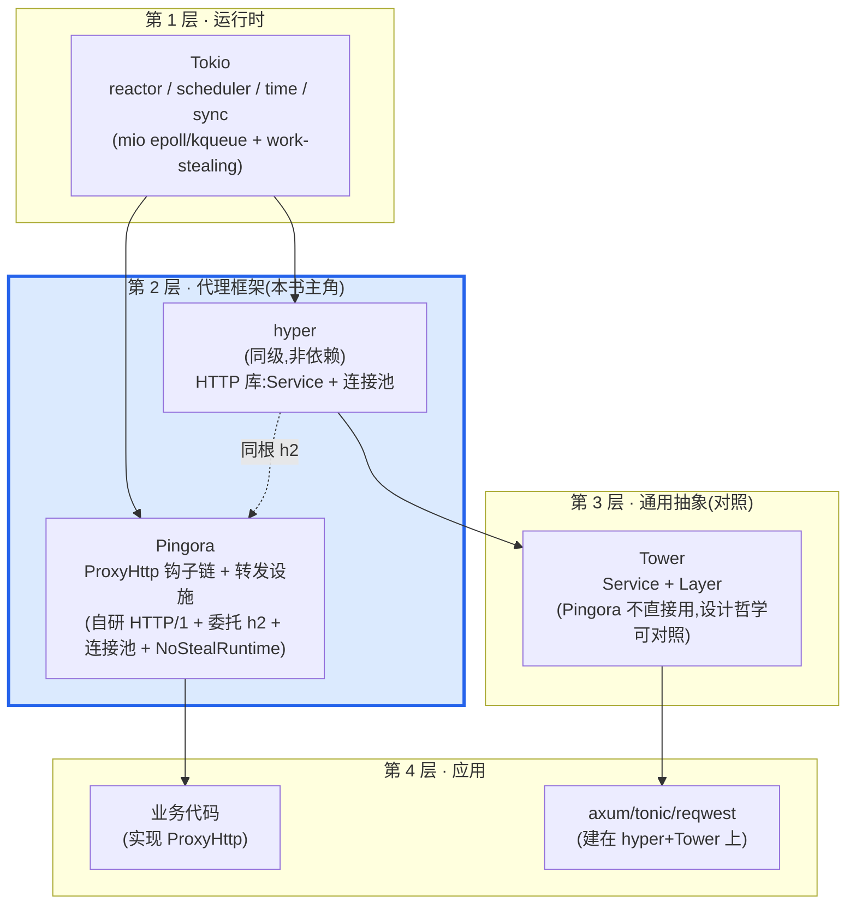
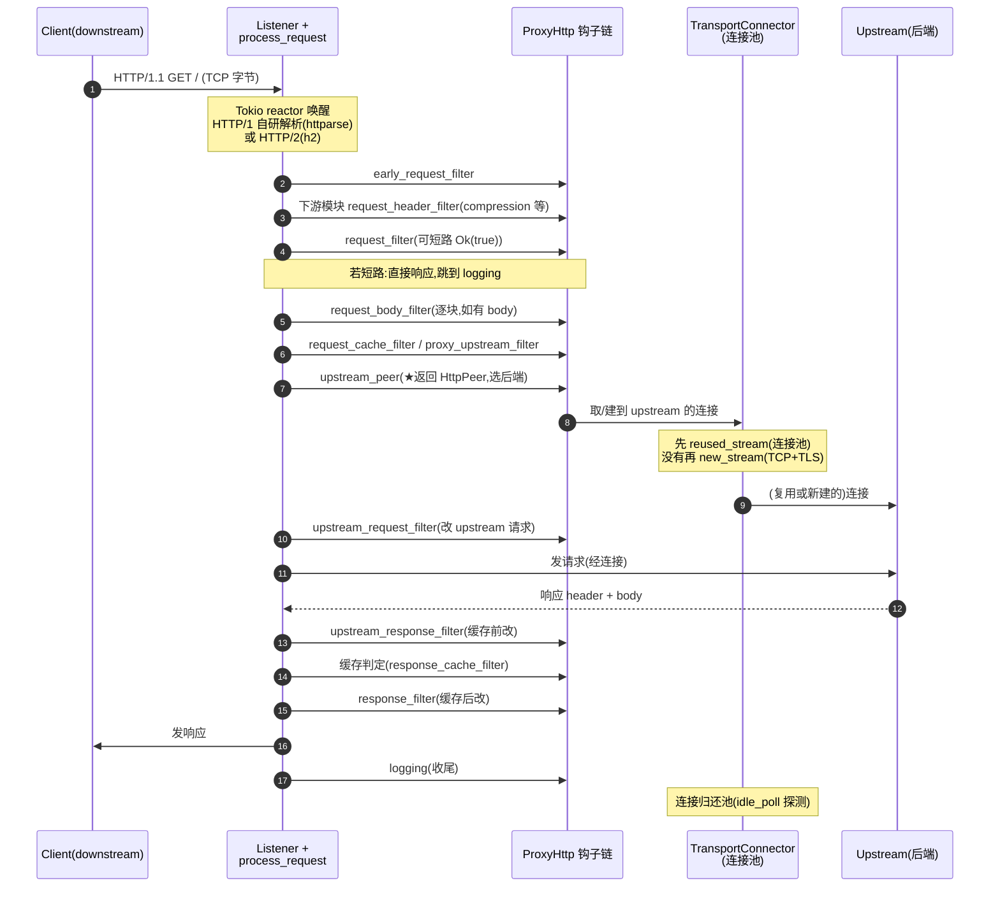

# 第 1 章 · 第一性原理:为什么用 Rust 异步写反向代理

> **核心问题**:Cloudflare 用 Nginx 撑了十几年全球流量,Envoy 也在 CNCF 生态里称了多年"现代代理之王",可 Cloudflare 偏偏在 2022 年开始用 Rust 从零重写自己的代理——一个被命名为 Pingora 的项目——并且公开宣称它扛下了 Cloudflare 超过 4000 万 req/s 的日常流量。一个 C 写的代理(Nginx)和一套 C++ 写的代理(Envoy)已经存在了这么多年,Cloudflare 到底遇到了什么"非重写不可"的痛?而 Rust 异步,又凭什么能解这个痛?
>
> 这一章要回答的,就是这个第一性原理的问题:为什么用一个 2019 年才立项、2024 年才开源的 Rust 代理,去替换一个全世界用了快二十年的 C 代理?Pingora 给的答案是一句话——**把代理做成"实现一个 trait、在一串钩子里写逻辑"的可编程框架,用 Rust 内存安全把 C/C++ 代理的"人肉防守"换成"编译器防守",用 Tokio 全异步把每条连接的开销压到一个 task 的水平**。
>
> **读完本章你会明白**:
>
> 1. 为什么 Nginx 的"配置驱动 + lua/OpenResty 打补丁"会在"动态性需求爆炸"的现代 CDN/网关场景里撞墙,以及 Envoy 的"filter chain + xDS"虽然解决了动态性,却把一套 C++ 工具链的复杂度全压到了运维和开发者头上;
> 2. Pingora 的回答为什么是 Rust 异步:把"代理一条 HTTP 请求"抽象成一个 `ProxyHttp` trait 的一串 async filter 钩子(`early_request_filter` → `request_filter` → `upstream_peer` → … → `logging`),业务只在钩子里写逻辑,框架把上游(upstream)连接池、负载均衡、协议解析、运行时、TLS 全部自管——这套"钩子链 vs 转发设施"的二分,是全书的地基;
> 3. 一个让很多人凭印象搞错的承接关系:**Pingora 运行时根本不依赖 hyper**——`pingora-core/Cargo.toml` 里 `hyper` 只在 `[dev-dependencies]`(测试用),运行时依赖里是 `httparse`(自研 HTTP/1 解析的底座)和 `h2`(HTTP/2 委托,与 hyper 同根)。所以 Pingora 与 hyper 是 **Tokio 之上的同级库**,不是"建在 hyper 上";
> 4. Pingora 与 hyper、Envoy、Nginx 在"代理设计哲学"上的根本差异——没有内置 xDS(动态性靠业务在钩子里写)、没有运行期 filter 链(钩子顺序编译期钉死在 trait 定义里)、自研 `NoStealRuntime`(多个单线程 runtime 池,不做 work stealing);
> 5. 为什么 Cloudflare 的取舍能撑起 40M+ req/s,以及这条"Rust 异步代理"路线在生态栈里到底站在哪一层。
>
> 本章是全书的定调样本章。你看完它,就拿到了全书的两条主轴——**钩子链(`ProxyHttp` 的 filter,业务挂载点)vs 转发设施(upstream 连接池/负载均衡/协议/运行时/TLS,框架自管)**——后面 19 章,全是在这条骨架上长肉。
>
> **写给谁读(读者画像)**:你写过 Rust 异步,知道 Cloudflare 用 Rust 重写了代理,翻过 `cloudflare/pingora` 的 README,可能还跑过 `examples/load_balancer.rs`。但你说不清:`ProxyHttp` trait 那 30 来个 filter 钩子(`early_request_filter`/`request_filter`/`upstream_peer`/`upstream_request_filter`/`upstream_response_filter`/`response_filter`/`logging`…)到底按什么顺序触发、为什么这么切;为什么 Pingora 不直接用 hyper;Pingora 的自研运行时 `NoStealRuntime` 和 Tokio 的多线程 runtime 有什么本质差别;Pingora 和 Nginx、Envoy 到底是亲戚还是路人。一句话,你"知道有 Pingora,但没懂 Pingora"。这本书就是写给你的。如果你连 Nginx 都没配过,建议先跑一遍 Nginx 的最小反向代理再回来——本书假设你见过 `proxy_pass`。
>
> **前置知识**:假设你熟悉 Rust 基本语法(所有权/借用/trait/泛型/`async`/`await`/`async_trait`),听说过 `Future`/`Poll`/`Pin`。读过《Tokio》《hyper》最佳(没读过也行,本章会一句带过指路)。不需要你写过 Pingora 源码,甚至不需要你写过自定义 `ProxyHttp`——本章从"为什么需要 Pingora"讲起。
>
> **逃生阀(读不下去怎么办)**:本章是定调章,信息密度大。如果"钩子链 vs 转发设施"这条主线暂时绕晕你,记住一句话就够——**`ProxyHttp` 是一串 async filter 钩子,业务在里面写逻辑(改 header/选后端/限流/记日志);连接池、负载均衡、HTTP 解析、运行时是框架自管的转发设施,业务不动**。带着这句话跳到第三节看 `ProxyHttp` 全貌,跳到第五节看三向对照(Pingora vs Nginx vs Envoy),再回头读主线。如果你只读一节,读第三节——那里是 Pingora 灵魂(`ProxyHttp` trait)的第一次亮相。本书处处承《Tokio》《hyper》《Envoy》,读过那几本收获翻倍,但不是硬性前提。

---

## 一句话点破

> **Pingora 不是又一个"用 Rust 写的 Nginx",也不是"Rust 版的 Envoy";它是一个把"代理一条 HTTP 请求"拆成一条可挂载钩子的请求生命周期的可编程框架——业务实现 `ProxyHttp` trait 在 ~30 个 async filter 钩子里写逻辑(鉴权/改写/选后端/记日志),框架用 Tokio 自管 upstream 连接池(`TransportConnector` + `pingora-pool`)、负载均衡(`pingora-load-balancing`)、HTTP 解析(自研 HTTP/1 基于 `httparse` + HTTP/2 委托 `h2`)、运行时(自研 `NoStealRuntime`)、TLS 四后端(openssl/boringssl/rustls/s2n)。它和 hyper 是 Tokio 之上的同级库(不依赖 hyper),和 Envoy 是代理设计哲学的同题竞争(钩子链 vs filter chain、无 xDS vs xDS、Rust vs C++)。**

这是结论,不是理由。本章要倒过来拆:一个全世界用了快二十年的 C 代理(Nginx)和一套成熟的 C++ 代理(Envoy)已经摆在那儿,Cloudflare 为什么非要从零用 Rust 写一个?Rust 异步这条路线,凭什么解决了前两者没解决(或解决得不够好)的痛?

---

## 第一节:Nginx 的痛——配置写死、动态性靠打补丁、内存安全靠人肉

### 提问

理解 Pingora 的动机,得先理解它要替换的东西。Nginx 是 Igor Sysoev 2002 年开始写的 C 反向代理,到今天(2026 年)已经稳坐"世界最流行的 Web 服务器/反向代理"二十多年。它快、稳、配置简单、社区庞大。Cloudflare 从创业起就用它扛了十几年全球流量。可 Cloudflare 的工程师在 2022 年的博客里明确说:我们要把 Nginx 替换掉。为什么?

Nginx 的痛,不是"它不够快",而是"它不够动态,也不够安全"。这两件事在现代 CDN/网关场景里,会被放大成产品层面的灾难。我们一个一个拆。

### 配置驱动:Nginx 的甜蜜点和它的天花板

Nginx 的核心抽象,是**一份静态配置文件**(`nginx.conf`)。你写 `location /api { proxy_pass http://backend; }`,Nginx 在 `nginx -s reload` 时把这份配置解析成内存里的数据结构,然后 worker 进程按它转发。这套设计有一个巨大的甜蜜点:**声明式、可重放、运维友好**。运维改个 `proxy_pass`,reload 一下,生效。不需要写代码,不需要重新编译,不需要懂任何编程语言。这是 Nginx 能在运维圈普及的根本原因。

可这个甜蜜点的天花板,恰恰就是"配置是静态的"。现代 CDN/网关场景,需要的是**运行期的、按请求内容的、可编程的动态性**:

- **按请求选后端**:同一个 `/api` 路径,根据请求头里的 `X-Tenant`、cookie 里的会话 id、URL 里的 query 参数,转发到不同的后端集群。纯配置很难表达这种"业务规则",即便能表达(用 `map`/`if`/`split_clients`),写出来也是一份几百行的 spaghetti 配置,改一处牵一发动全身。
- **按请求改写**:请求进来,要根据业务逻辑改 header(注入鉴权 token、改写 `Host`、加 `X-Forwarded-For`)、改 URL(规范化、重写路径)、改 body(过滤、压缩)。这些逻辑本质上是代码,不是配置。
- **按请求做策略**:限流(每秒多少请求)、熔断(后端抖动时降级)、灰度(10% 流量走新版本)、A/B(按用户分桶)。这些策略有状态、有计时、有计数,配置文件表达不了。

Nginx 的原生配置在这些场景下,就是不够用。这不是 Nginx 的"bug",这是"配置驱动"这个抽象的天花板——配置擅长表达"拓扑"(哪个 location 转到哪个 upstream),不擅长表达"逻辑"(怎么根据请求内容决策)。

> **钉死这件事**:Nginx 的痛不是性能,是**动态性**。一份静态配置文件,能优雅表达"拓扑",但表达不了"按请求内容的业务逻辑"。现代 CDN/网关需要的动态性,本质上是代码,不是配置。这是 Nginx 在 2010 年代以后开始被 OpenResty/lua 打补丁的根本原因。

### OpenResty/lua:补丁有效,但补不彻底

社区对"Nginx 不够动态"这个痛的回应,是 OpenResty——一个把 lua 解释器嵌进 Nginx worker 的发行版。你在 `nginx.conf` 里写 `access_by_lua_block { ... }`,Nginx 在请求处理到这个阶段时,调用你的 lua 代码。于是动态性回来了:你可以在 lua 里读请求头、查 redis、改 upstream、返回 403。OpenResty 成了 CDN/网关领域的事实标准(Cloudflare 自己就重度使用 OpenResty),就是因为它把"Nginx 的配置"和"代码的逻辑"两件事焊在了一起。

可 OpenResty 这个补丁,补得不彻底。它解决了"动态性"问题,却带来三个新问题:

1. **动态性靠 lua,lua 是另一门语言**。你的 CDN 业务,一部分是 `nginx.conf`(声明式拓扑),一部分是 lua(命令式逻辑),一部分可能是 Go/Python 写的 sidecar(复杂业务)。三种语言、三套工具链、三套部署、三套监控。运维心智成本高。
2. **lua 跑在 Nginx worker 里,受 worker 单线程约束**。OpenResty 强调"协程(coroutine)非阻塞",可一旦你在 lua 里调一个阻塞调用(比如一个同步的 C 库、一个写错的 cosocket),整个 worker 就卡住,这个 worker 上挂着的所有连接(可能几万个)一起卡死。这是 OpenResty 最容易踩的生产事故。
3. **内存安全仍然是 C 的内存安全**。OpenResty 给你 lua 的动态性,但 Nginx 本体仍然是 C。你写的 lua 代码安全了,可 Nginx 本体、你装的第三方 C 模块(`ngx_http_xxx_module.c`),仍然是 C——指针、`memcpy`、缓冲区边界全靠人工防守。一个 `ngx_http_realip_module` 的边界 bug,一个第三方 C 模块的 use-after-free,就能让整个 worker 挂掉,甚至被远程利用。**动态性补了,内存安全没补**。

> **对照《Envoy》**:Envoy 选的是另一条路——它从一开始(C++ 2016 年 Lyft 开源)就把"动态性"做成协议(xDS: LDS/RDS/CDS/EDS),把"配置"变成控制面下发的事件流,而不是文件。运维不再 `reload`,控制面推一个 RDS 更新,Envoy 运行期就生效。这条路线在大型服务网格(Istio)里很成功,但它把"动态性"从代码挪到了 xDS 协议,代价是一整套控制面基础设施。Envoy 的痛,我们下一节拆。

### 内存安全:缓冲区漏洞是 CDN 的"慢性病"

把上面三点收一收,Nginx 的第三层痛,也是最深层、最无法靠"补丁"解决的痛,是**内存安全**。Nginx 是 C 写的,C 的内存模型把所有边界检查的责任交给程序员。一个反向代理每天处理几十亿请求,每一请求要解析 HTTP 头、转发 body、管理 keepalive 连接、做 TLS 握手——每一步都是字节操作,每一步都可能写错边界。

CVE 数据库里的 Nginx 漏洞史,基本就是一部 C 缓冲区漏洞史:`CVE-2017-7529`(整数溢出导致读越界)、`CVE-2019-20372`(空指针解引用)、各种第三方模块的 use-after-free。这些漏洞不一定是 Nginx 核心团队的错——C 的内存模型本身就鼓励这种错。但作为 CDN,任何一个能被远程触发的内存漏洞,都可能是整个边缘节点被打穿的入口。

Cloudflare 自己也踩过。一个第三方 C 模块的内存 bug,在 Nginx worker 里表现为偶发的段错误,排查极难(内存已经损坏,堆栈可能是乱的)。Cloudflare 的工程师在博客里写过,这类问题占了他们 Nginx 相关生产事故的相当比例。**C 的内存安全,本质上是"靠人肉防守"——你能写对,但你装的第三方模块、你升级的新版本、你 backport 的补丁,只要有一个人写错一次,就炸**。

> **钉死这件事**:Nginx 的三层痛——(1)配置驱动表达不了业务逻辑、(2)OpenResty/lua 补动态性但补不彻底(语言割裂、worker 阻塞、C 内存安全没补)、(3)C 内存安全靠人肉防守——是 Cloudflare 这类规模化的 CDN/网关用户用十几年时间撞出来的。这三层痛的根,都不在"Nginx 实现得不好",而在"用 C + 配置驱动 来做现代动态代理"这个**抽象本身的天花板**。换个语言、换个抽象,才能从根上解。

### Nginx 不擅长什么(诚实地说)

讲了这么多 Nginx 的痛,要公平地说说它擅长什么,免得你以为"Nginx 该退役了":

- **Nginx 擅长静态拓扑的边缘/Web 服务**:你要的就是"这个 location 转到那个 upstream",加 TLS、加 gzip、加静态文件、加日志格式——Nginx 的配置驱动对这种场景是甜蜜点,运维友好、稳定、快。世界上 30%+ 的网站还在用 Nginx,不是没原因的。
- **Nginx 擅长极致优化的 C 性能**:Igor Sysoev 团队十几年把 Nginx 的 C 代码调到极致,内存池、零拷贝、事件驱动(epoll/kqueue),Nginx 单机吞吐在今天仍然是行业标杆。
- **Nginx 擅长运维生态**:配置管理工具(ansible/salt)、监控(prometheus exporter)、文档、社区——这个生态的厚度,任何后来者(包括 Pingora)都还差得远。

Nginx 不是"该退役",而是"在 Cloudflare 这种规模、这种动态性需求、这种安全要求下,撞到了它的天花板"。Pingora 不是要替换全世界所有的 Nginx,它是 Cloudflare 为了自己的场景做的取舍。理解这点,你才能理解 Pingora 为什么这么设计(而不是那么设计)。

> **钉死这件事**:本书不是"Nginx 黑粉指南"。Nginx 仍然是世界最流行的反向代理之一,它的配置驱动在静态拓扑场景下是甜蜜点。Pingora 替换 Nginx,是因为 Cloudflare 的场景(超大规模、强动态性、零容忍内存安全)撞到了 Nginx 的天花板,不是因为 Nginx 是坏软件。**工具按场景选**——这是本书附录 B 会反复强调的。

---

## 第二节:Envoy 的强与重——filter chain + xDS 的代价

### 提问

既然 Nginx 撞天花板了,那换一个"现代"的代理不就行了?Envoy 是 CNCF 毕业的、C++ 写的、被 Istio 等大型服务网格采用的现代代理,它解决了 Nginx 的很多问题。Cloudflare 为什么不顺手用 Envoy,而要从零写一个 Pingora?

这一节拆 Envoy 的强(它确实解决了 Nginx 的动态性)和它的重(它的强是有代价的,而且这个代价在 Cloudflare 的场景下并不划算)。

> **承接《Envoy》**:Envoy 的 filter chain(listener filter → network filter → HCM HTTP Connection Manager → http filter → router)、xDS 控制面(LDS/RDS/CDS/EDS)、overload manager、worker + thread-local 模型——《Envoy》系列(尤其第 3 篇 HCM、第 4 篇 xDS)已经拆透了。本书不重复,只讲 Envoy 这些机制和 Pingora 对照时的根本差异。详见 [[envoy-source-facts]]。

### Envoy 的强:filter chain 把动态性做成运行期可配置

Envoy 解决 Nginx"配置驱动不够动态"的痛,用的不是"嵌 lua",而是**把整个请求处理路径做成一条运行期可组装的 filter chain**。一个连接进来,Envoy 先过一串 listener filter(比如 TLS 解析、原始 dst),再过 network filter(比如 TCP 代理、ratelimit),再进 HCM(HTTP Connection Manager)这个核心 network filter,HCM 内部又过一串 http filter(比如 decoder 侧的 router/ratelimit,encoder 侧的 gzip/header_to_metadata)。

这条 filter chain 的精髓是:**它运行期可组装**。你通过 xDS 协议,从一个控制面下发配置,Envoy 运行期就把 filter chain 重组成新的样子——加一个 ratelimit filter、去掉一个 gzip filter、把 router filter 的路由表换成新的。**配置"热加载"**这件事,Envoy 用一整套控制面协议(xDS)做成了产品级的能力。这是 Nginx 用 `reload` 做不到的(reload 会断开 keepalive、重启 worker,有损)。

Envoy 的 filter chain 还有几个工程上很讲究的设计:

- **filter 是 C++ 虚函数驱动的对象**。每个 filter 实现 `onDecodeHeaders`/`onDecodeData`/`onEncodeHeaders` 等虚函数,Envoy 在请求穿过时按顺序调用。filter 之间通过 `shared_ptr` 持有,运行期组装成链表。这套设计的好处是 filter 可以热加载、可配置,代价是每次调用走虚分派(vtable)。
- **每 worker 一个 thread-local 副本**。Envoy 不做全局锁,worker 线程各自持有一份 thread-local 的 filter chain 配置副本,处理请求时只读自己的副本,无锁。这是 Envoy 能扛高并发的关键。
- **overload manager 做背压**。Envoy 有一个 overload manager,运行期监控内存/CPU/请求数,超过阈值时丢请求或拒绝新连接,防止雪崩。

Envoy 在大型服务网格(Istio)里很成功,根本原因就是它把"动态性"做成了产品级能力(xDS + filter chain),运维不再改文件 reload,控制面推一个事件就生效。这是 Nginx 用 `reload` 永远做不到的。

### Envoy 的重:一套 C++ 工具链 + 一套控制面基础设施

可 Envoy 的强,是有代价的。这个代价在 Cloudflare 的场景下,并不划算。我们一个一个拆:

**代价一:C++ 的工具链复杂度和编译时间**。Envoy 是 C++ 写的,而且用了大量现代 C++(模板、`std::shared_ptr`、constexpr、Bazel 构建)。一个完整的 Envoy 构建要几十分钟到几小时,依赖一堆第三方库(absl/protobuf/gRPC/BoringSSL),改一行代码重新编译整个项目要等很久。开发体验差,二次开发门槛高。你想给 Envoy 写一个自定义 filter,得先理解 Envoy 的 filter 接口、thread-local 模型、xDS 配置 schema——这条学习曲线,比"在 Nginx 里写一个 lua 脚本"陡得多。

**代价二:C++ 的内存安全仍然是人肉防守**。Envoy 比 Nginx 现代,但仍然是 C++。C++ 有智能指针(`unique_ptr`/`shared_ptr`),缓解了裸指针的很多问题,但 use-after-free、data race、buffer overflow 在 C++ 里仍然可能发生(智能指针救不了循环引用、救不了多线程裸 `&` 共享、救不了 `reinterpret_cast`)。Envoy 也出过 CVE(`CVE-2021-43824` header map 越界、`CVE-2023-27492` gRPC 路径解析)。**C++ 比安全,但没有"编译器级别"的内存安全保证**。

**代价三:xDS 控制面是一整套基础设施**。Envoy 的动态性靠 xDS,而 xDS 不是"一个 API",是一整套协议(LDS/RDS/CDS/EDS/SDS)+ 一套控制面实现(Istio/Consul/Gloo/自研)+ 一套配置 schema(protobuf)+ 一套版本协商机制。你用 Envoy 的动态性,就得搭一整套控制面。这对大型服务网格(Istio 用户)是合理的——他们本来就需要这套基础设施做服务发现、流量管理、安全策略。但对 Cloudflare 这种"我就是个 CDN,我只想按请求内容选后端"的场景,xDS 这套基础设施太重了。Cloudflare 的动态性需求(按请求头选后端、按业务逻辑改写、按策略限流),本质上是代码能表达的,不需要一整套控制面协议。

**代价四:Envoy 的 filter chain 是运行期组装,代价是虚分派 + 类型擦除**。Envoy 每次请求穿过 filter chain,都要走若干次虚函数调用(decoder 一串、encoder 一串)。虚分派本身不慢(一次 vtable 查找 + 间接调用),但在每秒千万请求的边缘节点上,这层开销是可测量的。更重要的是,虚分派让编译器很难跨 filter 优化(不能跨虚调用内联)。这是 C++ 运行期多态的固有代价。

> **钉死这件事**:Envoy 的强(filter chain + xDS 运行期动态)和它的重(C++ 工具链、控制面基础设施、虚分派代价)是一枚硬币的两面。在大型服务网格场景(Istio),Envoy 的强值得这个重;在 Cloudflare 的 CDN/网关场景,Envoy 的重并不划算——Cloudflare 需要的是"代码级的动态性",不是"协议级的动态性"。这是 Pingora 选择"无 xDS、钩子代码驱动"的根本动机。

### 所以 Cloudflare 不选 Envoy

把代价收一收,Cloudflare 不选 Envoy 的理由就清楚了:

1. **Envoy 仍然没解内存安全**。Cloudflare 要的是"编译器级别"的内存安全(让缓冲区漏洞、use-after-free 在编译期就不可能发生),C++ 给不了。
2. **xDS 对 Cloudflare 太重**。Cloudflare 的动态性是"按请求内容写代码",不是"按控制面下发配置"。搭一整套 xDS 控制面,对 CDN 场景是过度工程。
3. **C++ 工具链对二次开发不友好**。Cloudflare 的代理业务变化很快(每天都要上新策略),Envoy 的 C++ + Bazel 工具链让"改一行代码"的成本很高。
4. **虚分派 + 运行期 filter 组装的代价,在边缘节点的吞吐量级上是可测量的**。Cloudflare 要的是极致吞吐,每一分开销都要抠。

所以 Cloudflare 不选 Envoy。**Envoy 是为服务网格场景设计的代理,Pingora 是为 CDN/网关场景设计的代理**——两个场景的动态性形态不同(协议级 vs 代码级)、安全要求不同(C++ 可接受 vs 必须编译器级)、性能要求不同(够用就行 vs 极致)。它们是同题竞争,但答的是不同的子题。

> **钉死这件事**:Nginx 是"配置驱动",Envoy 是"配置协议化(filter chain + xDS)",两者都是把动态性做成"配置"——只是配置的形态不同(Nginx 是文件,Envoy 是协议)。Pingora 走的是第三条路:**把动态性做成"代码"**——业务实现 `ProxyHttp` trait 在钩子里写 Rust 代码,动态性是 Rust 程序员熟悉的"写函数",不是运维熟悉的"改配置"。这是 Pingora 区别于 Nginx 和 Envoy 的根本设计取向。详见第四节对照表。

---

## 第三节:Pingora 的回答——`ProxyHttp` trait 的钩子链 + 框架自管的转发设施

### 提问

Nginx 撞天花板(配置表达不了业务逻辑、C 内存安全靠人肉),Envoy 太重(C++ 工具链、xDS 控制面、虚分派)。Cloudflare 的回答是 Pingora——用 Rust 内存安全把"人肉防守"换成"编译器防守",用 Tokio 全异步把每条连接的开销压到一个 task 的水平,把代理做成"实现一个 trait、在一串钩子里写逻辑"的可编程框架。这一节,我们把这套设计看清楚。

### 直球看 Pingora 的栈:它在 Rust 异步网络栈的哪一层

先钉死 Pingora 在 Rust 异步网络栈里的位置,这是全书的地基:



关键三点:

1. **Pingora 建在 Tokio 上**(运行时地基),这层承接最紧密——Pingora 的 `ListeningService` accept 一个连接就 spawn 一个 task,task 内跑钩子链 + 转发循环;IO 用 Tokio 的 `AsyncRead`/`AsyncWrite`(承《Tokio》,一句带过指路 [[tokio-source-facts]])。
2. **Pingora 与 hyper 是同级库,不是 Pingora 建在 hyper 上**。两者都建在 Tokio + h2 之上,各自实现 HTTP/1(Pingora 基于 `httparse` 自研,hyper 也基于 `httparse` 自研,两套独立实现),HTTP/2 都用 `h2` crate(强同源)。这是很多人凭印象搞错的承接关系,第四节详拆。
3. **Pingora 不依赖 Tower 的 `Service`/`Layer`**。Tower 是"通用请求处理抽象",Pingora 走的是自己的 `ProxyHttp` trait(一串 filter 钩子),设计哲学可对照(执行单元 vs 代理生命周期),但**Pingora 的 `ProxyHttp` 不是 Tower `Service` 的实例**。这是 Pingora 区别于 axum/tonic/reqwest 的关键——后者都长在 Tower 上,Pingora 没有。

> **钉死这件事**:Pingora 在 Rust 异步栈的位置——**Tokio 运行时 → Pingora(代理框架,自研 HTTP/1 + 委托 h2 + 连接池 + NoStealRuntime)→ 业务代码(实现 ProxyHttp)**。它与 hyper 是 Tokio 之上的同级库(都建在 Tokio + h2 上,各自自研 HTTP/1),不依赖 hyper,也不依赖 Tower。这个栈定位,是理解 Pingora 一切设计的第一把钥匙。

### 关卡/收费站:全书唯一一次比喻点睛

到这儿可以用上全书唯一允许的一次比喻了。把"一条 HTTP 请求穿过 Pingora"想象成"一辆车开过一条公路":

- **公路本身是框架修好的**:这条路有路基(连接池)、有岔路口的指路牌(负载均衡)、有收费站(协议解析——把 HTTP 字节切成结构化请求)、有路灯(运行时调度)、有安检门(TLS 握手)。这些是 Pingora 的**转发设施**(upstream 连接池/负载均衡/HTTP 解析/运行时/TLS),框架自管,业务不动。
- **沿途是一串关卡(`ProxyHttp` 的 filter 钩子)**:业务在关卡上设岗——有的关卡直接放行(默认行为,什么也不做)、有的关卡拦下车看车牌(读 header 鉴权)、有的关卡拦下不合格的车直接劝返(`request_filter` 返回 `Ok(true)` 短路)、有的关卡在路口指路(`upstream_peer` 选后端)、有的关卡在车回来时给它换牌照(改响应 header)、有的关卡在车走完全程后记一笔账(`logging`)。这些关卡是 Pingora 的**钩子链**(`ProxyHttp` trait 的 filter,业务挂载点)。

Pingora = "一条布满可挂载关卡的转发公路"。业务只管设关卡,不管修公路。

这是全书唯一一次用比喻做主线的地方,后面章节回归直球。比喻只是为了让你记住"Pingora 的二分法——钩子链(业务挂载点) vs 转发设施(框架自管)"这两件事——它们是 Pingora 的全部地基。

### 直球看 `ProxyHttp` trait:30 来个 async filter 钩子

比喻到此为止,下面直球。我们来看 Pingora 灵魂——`ProxyHttp` trait 的真实定义。先看它的"骨架"(`pingora-proxy/src/proxy_trait.rs#L30-L46`):

```rust
// pingora-proxy/src/proxy_trait.rs#L30-L46(逐字摘录,关键部分)
#[cfg_attr(not(doc_async_trait), async_trait)]
pub trait ProxyHttp {
    /// The per request object to share state across the different filters
    type CTX;

    /// Define how the `ctx` should be created.
    fn new_ctx(&self) -> Self::CTX;

    /// Define where the proxy should send the request to.
    async fn upstream_peer(
        &self,
        session: &mut Session,
        ctx: &mut Self::CTX,
    ) -> Result<Box<HttpPeer>>;
    // ... 还有 ~30 个 filter 钩子,下面逐个看
}
```

就这个骨架,你能读出 Pingora 设计的三件事:

1. **`type CTX` 是每请求的状态容器**。每个请求进来,Pingora 调 `new_ctx()` 给这个请求 new 一个 `CTX`(你定义的结构体),这个 `CTX` 在整条钩子链上贯穿——`request_filter` 里设的字段,`logging` 里能读到。这是"一次请求"的状态共享机制,没有它,钩子之间得用 `Arc<Mutex<...>>` 共享状态,既丑又慢。`CTX` 是 Pingora 把"每请求状态"做进 trait 的关键技巧,P1-02 详拆。
2. **每个 filter 是 `async fn`**。`upstream_peer` 是 `async fn`——它返回一个 `Future`,可以 `.await`。这意味着你在钩子里可以干重活(查数据库、调控制面、跑 WAF 规则),而不会阻塞整个 worker。承 Tokio Future(标准库 `core::future`,一句带过指路 [[tokio-source-facts]])。`#[async_trait]` 把这些 async 方法包装成 `Pin<Box<dyn Future>>`,代价是一次堆分配(P1-02 详拆这个取舍)。
3. **`upstream_peer` 是唯一必须实现的钩子**。其余钩子都有默认实现(大部分是 `Ok(())` 空操作),只有 `upstream_peer` 没有——因为"代理一条请求,你必须告诉框架转发到哪"。这是 Pingora "最小代理 = 实现一个 `upstream_peer`"的设计。

把 `ProxyHttp` 的全部钩子按请求穿过顺序列出来(精简,完整清单在 P1-02),你现在建立一个全景:

| 阶段 | 钩子 | 作用 | 能不能短路 |
|------|------|------|-----------|
| 请求进入前 | `early_request_filter` | 在所有模块前跑,精细控制模块行为 | 否(只能 Err 终止) |
| 下游模块 | `init_downstream_modules`(注册 compression 等) | 启动前配置模块,不是 per-request 钩子 | — |
| 请求进入 | `request_filter` | 鉴权/限流/直接响应 | **能**,返回 `Ok(true)` 短路 |
| 请求体 | `request_body_filter` | 逐块处理请求 body | 否 |
| 缓存判定 | `request_cache_filter` / `cache_key_callback` / `proxy_upstream_filter` | 决定是否缓存、cache key、cache miss 后是否真的转发 | `proxy_upstream_filter` 返回 `Ok(false)` 短路 |
| 选后端 | `upstream_peer`(★必实现) | 返回 `HttpPeer`,选要转发到的后端 | — |
| 改 upstream 请求 | `upstream_request_filter` | 改要发给 upstream 的请求 header | 否 |
| 连接建立回调 | `connected_to_upstream` | 记时延、记连接信息 | — |
| upstream 响应(缓存前) | `upstream_response_filter` / `upstream_response_body_filter` / `upstream_response_trailer_filter` | 改 upstream 响应(改的内容会进缓存) | 否 |
| 响应(缓存后) | `response_filter` / `response_body_filter` / `response_trailer_filter` | 改要发给 downstream 的响应(改的内容不进缓存) | 否 |
| 收尾 | `logging` | 访问日志、metrics | — |
| 错误处理 | `fail_to_connect` / `error_while_proxy` / `fail_to_proxy` | 决定是否重试、写错误响应 | — |
| 缓存相关 | `cache_hit_filter` / `response_cache_filter` / `cache_vary_filter` / `should_serve_stale` / `is_purge` / `purge_response_filter` | 缓存生命周期各阶段的介入点 | 各异 |

这个表你不用全记住,只要记住两件事:

1. **钩子是按"请求穿过的生命周期"切的**,从请求进入(early/request)→ 选后端(upstream_peer)→ 改 upstream 请求 → upstream 响应回来(缓存前改)→ 缓存 → 响应发出(缓存后改)→ 收尾。每个阶段一个介入点。
2. **只有两个钩子能短路**:`request_filter`(请求进入时直接响应,不再转发)和 `proxy_upstream_filter`(cache miss 后决定是否真的转发)。短路是 Pingora 表达"这个请求我不代理了"的机制,与 Envoy filter 的 `Stop` 语义对照(P1-03 详拆)。

> **钉死这件事**:`ProxyHttp` trait 是 Pingora 的灵魂。它把"代理一条 HTTP 请求"拆成一串 async filter 钩子,业务在钩子里写逻辑,框架在钩子之间(以及钩子背后)管转发设施(连接池/负载均衡/协议/运行时)。`upstream_peer` 是唯一必须实现的钩子(必须告诉框架转发到哪),其余都有默认实现(大多是空操作)。这就是 Pingora 区别于"Nginx 配置驱动"和"Envoy filter chain + xDS"的根本设计——动态性是"业务在 Rust 钩子里写代码",不是"运维改配置文件"或"控制面下发协议"。

### 一条请求穿过 Pingora 的全景时序

光看钩子表,你对"请求怎么穿过"还是抽象的。我们用一张时序图把它钉死(简化,真实流程在 P1-02~05 详拆):



这张图你先建立一个全景,细节(每个钩子的精确语义、`CTX` 怎么贯穿、连接池怎么 `test_reusable_stream`、HTTP/1 和 HTTP/2 怎么分流)在后面各章逐个拆。现在你只要记住一件事:**请求从左到右穿过钩子链,转发设施在钩子背后默默工作,业务只动钩子,不动设施**。

### Pingora 怎么把"代理"做成 trait:源码佐证

我们看一眼真实的"请求穿过钩子链"在源码里是怎么编排的(`pingora-proxy/src/lib.rs#L741-L824`,简化示意):

```rust
// pingora-proxy/src/lib.rs#L741-L824(简化示意,非源码原文)
async fn process_request(
    self: &Arc<Self>,
    mut session: Session,
    mut ctx: <SV as ProxyHttp>::CTX,
) -> Option<ReusedHttpStream>
where
    SV: ProxyHttp + Send + Sync + 'static,
{
    // 1. early_request_filter
    if let Err(e) = self.inner.early_request_filter(&mut session, &mut ctx).await {
        return self.handle_error(session, &mut ctx, e, "Fail to early filter request:").await;
    }

    // 2. 下游模块(compression 等)的 request_header_filter
    if let Err(e) = session.downstream_modules_ctx.request_header_filter(req).await {
        return self.handle_error(...).await;
    }

    // 3. request_filter(可短路)
    match self.inner.request_filter(&mut session, &mut ctx).await {
        Ok(response_sent) => {
            if response_sent {
                // ★ 短路:业务已经自己响应了,直接 logging 收尾
                self.inner.logging(&mut session, None, &mut ctx).await;
                return session.downstream_session.finish().await.ok().flatten()...;
            }
            /* else continue */
        }
        Err(e) => return self.handle_error(...).await,
    }

    // 4. proxy_cache(缓存判定,可能命中直接返回)
    if let Some((reuse, err)) = self.proxy_cache(&mut session, &mut ctx).await {
        return self.finish(session, &mut ctx, reuse, err).await;
    }

    // 5. proxy_upstream_filter(cache miss 后,决定是否真的转发)
    match self.inner.proxy_upstream_filter(&mut session, &mut ctx).await {
        Ok(proxy_to_upstream) => {
            if !proxy_to_upstream { /* 短路 */ }
        }
        Err(e) => return self.handle_error(...).await,
    }

    // 6. proxy_to_upstream(里面调 upstream_peer,再走连接池转发)
    let (reuse, error) = self.proxy_to_upstream(&mut session, &mut ctx).await;
    // ... upstream_request_filter / upstream_response_filter / response_filter 都在 proxy_to_upstream 内
}
```

这段代码是全书最重要的一段源码之一。它钉死了三件事:

1. **钩子顺序就是 `process_request` 里的调用顺序**。`early_request_filter` → `downstream_modules_ctx.request_header_filter` → `request_filter`(短路)→ `proxy_cache` → `proxy_upstream_filter`(短路)→ `proxy_to_upstream`(内含 `upstream_peer` / `upstream_request_filter` / `upstream_response_filter` / `response_filter`)→ `logging`。**顺序编译期钉死,不是运行期组装**——这是 Pingora 区别于 Envoy 的根本差异(Envoy filter chain 运行期组装,Pingora 钩子顺序 trait 定义里钉死)。
2. **短路语义是 `Ok(true)`**。`request_filter` 返回 `Ok(true)`,意思是"我已经自己响应了,不要再转发"。这是 Pingora 表达"这个请求我不代理了"的核心机制,与 Envoy filter 的 `StopIteration` 语义对照(P1-03 详拆)。
3. **`self.inner` 就是业务实现的 `ProxyHttp`**。`HttpProxy<SV, C>` 这个结构体包了 `inner: SV`(业务的 `ProxyHttp` 实现)+ `client_upstream: Connector<C>`(框架的连接池)。业务代码(`SV`)和框架设施(`Connector`)在 `HttpProxy` 里被焊在一起,但**业务只动钩子,框架管连接池**。这就是二分法在源码里的体现。

> **钉死这件事**:`HttpProxy<SV, C>` 这个结构体是 Pingora 二分法的物理体现——`inner: SV`(业务的 `ProxyHttp` 实现,钩子链这一面)+ `client_upstream: Connector<C>`(框架的 upstream 连接池,转发设施这一面)。请求穿过 `process_request`,在钩子(调 `self.inner.xxx_filter`)和设施(调 `self.client_upstream.get_http_session`)之间来回切换。这就是全书的主轴,**后面 19 章都在这条主轴上长肉**。

### 转发设施这一面:框架自管什么

钩子链这一面(`ProxyHttp`)讲完了,转发设施这一面框架自管什么?这里只点出全景,每个设施在对应章节详拆:

- **upstream 连接池**(`pingora-core/src/connectors/`):`TransportConnector`(L4/TLS 连接池)+ HTTP connector(L7)。连接复用(keepalive)、`test_reusable_stream`(1 字节探测连接死活)、offload_threadpool(建连 offload)。P2-06 招牌章。
- **底层连接池**(`pingora-pool/`):LRU + 空闲 `idle_poll`。P2-06。
- **负载均衡**(`pingora-load-balancing/`):`LoadBalancer<S: BackendSelection>` + RoundRobin/Random/Ketama 一致性哈希 + 服务发现 + 健康检查。P3-09~11。
- **HTTP 解析**(`pingora-core/src/protocols/http/`):HTTP/1 自研(基于 `httparse`,在 `v1/`)+ HTTP/2 委托 `h2`(在 `v2/`)+ bridge(h1↔h2 转换)。P4-12~14 招牌章。
- **运行时**(`pingora-runtime/`):`NoStealRuntime`(多个单线程 runtime 池,不做 work stealing)+ `Steal`(标准 Tokio 多线程)。P5-15 招牌章。
- **TLS**(`pingora-{openssl,boringssl,rustls,s2n}/`):四后端 feature flag 可插换 + ALPN(h1/h2 协商)。P5-16。
- **缓存**(`pingora-cache/`):独立 crate,cache key + eviction + lock + variance + stale-while-revalidate + tinyufo。P6-17。
- **listener、graceful upgrade**(`pingora-core/src/{server/,services/listening.rs,listeners/}`):`ListeningService` 接连接、零停机升级(fd 传递 `transfer_fd/`)。P6-18。
- **可观测、限流、module**(`pingora-limits`/`pingora-prometheus`/HttpModules):令牌桶/滑动窗口/metrics/compression/grpc_web。P6-19。

业务实现 `ProxyHttp`,完全不用管这些设施怎么实现的——它们是"公路",业务只设"关卡"。当然,要调优(连接池大小、超时、TLS 选型)时,你得懂这些设施,这是附录 B 的内容。

> **回扣二分法**:Pingora 的全部,就是这条二分——**钩子链(`ProxyHttp` trait 的 filter,业务挂载点,偏控制)vs 转发设施(upstream 连接池/负载均衡/HTTP 解析/缓存/运行时/TLS,框架自管,偏数据)**。读后面任何一章,回到这句问:"这块是钩子链(业务写的),还是转发设施(框架管的)?"就能定位。本章是总览,点出二分法骨架,后面各章逐个长肉。

---

## 第四节:三向对照——Pingora vs Nginx vs Envoy

### 提问

讲了 Nginx 的痛、Envoy 的重、Pingora 的回答,现在是时候把三者在一张表里钉死了。这张对照表是本章的核心交付物之一,也是 P7-20 收束章的总对照表的预演。

### 三向对照总表

| 维度 | **Nginx** | **Envoy** | **Pingora** |
|------|-----------|-----------|-------------|
| 语言 | C | C++ | Rust |
| 内存安全 | 人肉防守(C 指针) | 智能指针缓解,但仍非编译器级 | **编译器级(借用检查 + Send/Sync)** |
| 动态性抽象 | 配置文件(`nginx.conf`)+ reload | filter chain + xDS 协议(LDS/RDS/CDS/EDS) | **业务代码(实现 ProxyHttp trait 写钩子)** |
| 请求处理抽象 | 配置阶段(access/content/log 等 phase) | filter chain(运行期组装,虚函数) | **ProxyHttp trait(钩子顺序编译期钉死,async_trait)** |
| 配置热加载 | `reload`(有损,断 keepalive) | xDS(无损,运行期生效) | **无内置 xDS,改代码重新部署 / graceful upgrade** |
| 控制面 | 无(文件 + reload) | xDS 协议(Istio 等) | **无内置,业务自己实现(在钩子里调服务发现)** |
| 运行时/线程模型 | worker 进程 × N(每 worker 单线程事件循环) | worker 线程 × N(每 worker 一个 libevent dispatcher + thread-local) | **NoStealRuntime(多个单线程 runtime 池,不做 work stealing)** |
| 背压机制 | worker 满了 accept 停 | overload manager(LoadShedPoint) | 钩子里业务自己限流 + `pingora-limits` 令牌桶 |
| HTTP/1 实现 | 自研(C) | 自研(C++) | **自研(Rust,基于 httparse)** |
| HTTP/2 实现 | 自研(C,ngx_http_v2) | 自研(C++) | **委托 h2 crate(与 hyper 同根)** |
| TLS 后端 | OpenSSL 等 | BoringSSL(默认) | **四后端可插换(openssl/boringssl/rustls/s2n)** |
| 二次开发门槛 | lua(OpenResty)/ C 模块 | C++ filter(陡,Bazel 构建慢) | **Rust 实现 trait(中等,cargo 构建)** |
| 典型场景 | 边缘/Web/CDN(静态拓扑) | 服务网格(Istio)/ API 网关 | **CDN/网关(代码级动态性,如 Cloudflare)** |
| 性能(同等硬件) | 行业标杆 | 略低于 Nginx(虚分派 + thread-local 副本开销) | **Cloudflare 实测:比 Nginx 省 CPU/内存(Pingora 博客数据)** |

逐行看几个关键差异:

**动态性抽象的根本差异**。这是三向对照里最重要的一行。Nginx 的动态性是"改配置文件 reload",Envoy 的动态性是"控制面推 xDS",Pingora 的动态性是"业务在 Rust 钩子里写代码"。这三种抽象,对应三种心智:

- Nginx 心智:**运维**。运维改文件,系统生效。业务逻辑能不写代码就不写代码,尽量用配置表达。
- Envoy 心智:**平台/SRE**。控制面推协议,系统生效。业务逻辑被抽象成 xDS 配置 schema,运维和平台团队维护控制面。
- Pingora 心智:**开发者**。开发者写 Rust 代码,系统生效。业务逻辑是代码,像写普通 Web 服务一样写代理。

这三种心智没有绝对优劣,但**适用的组织形态不同**:Nginx 适合"运维驱动"的传统架构,Envoy 适合"平台驱动"的大型服务网格,Pingora 适合"开发者驱动"的、业务逻辑复杂多变的 CDN/网关(Cloudflare 就是这种组织——他们的代理逻辑变化极快,每天都有新策略,运维配置跟不上,必须代码)。

**请求处理抽象的根本差异**。Nginx 把请求处理切成固定阶段(access/content/log),Envoy 用运行期组装的 filter chain,Pingora 用编译期钉死的 trait 钩子链。这三种设计的取舍:

- Nginx 固定阶段:简单,但不灵活(阶段就那几个)。
- Envoy filter chain:灵活(运行期组装),但虚分派代价 + 类型擦除。
- Pingora trait 钩子链:**钩子顺序在 trait 定义里编译期钉死**,每个钩子是 `async fn`(单态化,无虚分派),业务实现 trait。代价是钩子顺序不能运行期改(要改得重新编译),换来的是零虚分派 + 类型安全。

**运行时/线程模型的根本差异**。Nginx worker 进程(每 worker 单线程 epoll 循环),Envoy worker 线程(每 worker 一个 libevent dispatcher + thread-local),Pingora `NoStealRuntime`(多个 Tokio 单线程 runtime 池,不做 work stealing)。三者都是"少量线程扛海量连接",但实现路径不同。Pingora 的 `NoStealRuntime` 是它最独特的取舍——它故意不用 Tokio 的多线程 work-stealing runtime,而是用多个单线程 runtime 池,通过 `get_handle` 随机选一个来 spawn task。为什么?因为 work-stealing 在 Pingora 的负载特征下是净开销。这个取舍是 Pingora 独有的,本节只点出,P5-15 招牌章详拆。

> **钉死这件事**:三向对照的核心差异在三个维度——(1)动态性抽象(配置文件 vs xDS 协议 vs 业务代码)、(2)请求处理抽象(固定阶段 vs 运行期 filter chain vs 编译期 trait 钩子)、(3)运行时模型(worker 进程 vs worker 线程 + thread-local vs NoStealRuntime)。这三个维度决定了三者适用的场景:Nginx 适合运维驱动的静态拓扑,Envoy 适合平台驱动的服务网格,Pingora 适合开发者驱动的代码级动态 CDN/网关。**没有银弹,看你是什么组织、什么场景**。

### 同级对照 hyper:都建在 Tokio + h2 上

三向对照之外,Pingora 还有一个特殊的对照对象——hyper。hyper 是 Rust 生态最主流的 HTTP 库(《hyper》系列拆透),它和 Pingora 是什么关系?很多人凭印象以为"Pingora 建在 hyper 上,hyper 给 Pingora 提供了 HTTP 实现"。**这是错的**。我们用源码核实:

`pingora-core/Cargo.toml` 的依赖列表(`pingora-core/Cargo.toml#L21-L75`,运行时依赖):

```toml
# pingora-core/Cargo.toml#L21-L75(运行时依赖,逐字摘录关键部分)
[dependencies]
pingora-runtime = { version = "0.8.1", path = "../pingora-runtime" }
# ... TLS 后端、pool、error、timeout、http ...
tokio = { workspace = true, features = ["net", "rt-multi-thread", "signal"] }
httparse = { workspace = true }   # ★ Pingora 自研 HTTP/1 解析的底座
h2 = { workspace = true }          # ★ Pingora HTTP/2 委托的 crate(与 hyper 同根)
bytes = { workspace = true }
http = { workspace = true }
# ... 注意:这里没有 hyper!
```

再看 `[dev-dependencies]`(`pingora-core/Cargo.toml#L84-L96`):

```toml
# pingora-core/Cargo.toml#L84-L96(dev-dependencies,逐字摘录关键部分)
[dev-dependencies]
h2 = { workspace = true, features = ["unstable"] }
# ...
hyper = { version = "1", features = ["client", "http1", "http2"] }   # ★ 只在 dev-dep!
hyper-util = { version = "0.1", features = ["client-legacy", "http1", "http2"] }
# ...
```

**钉死**:`hyper` 只在 `[dev-dependencies]`(测试/benchmark 用,`pingora-core/Cargo.toml#L92`),运行时依赖里**没有 hyper**。Pingora 的运行时 HTTP 实现基于 `httparse`(HTTP/1,自研)+ `h2`(HTTP/2,委托,`pingora-core/Cargo.toml#L40`)。而 hyper 自己,也是基于 `httparse`(HTTP/1)+ `h2`(HTTP/2)。

所以真实的承接关系是:

- **HTTP/1**:Pingora 自研(`pingora-core/src/protocols/http/v1/`,基于 `httparse`)vs hyper 自研(`hyper/src/proto/h1/`,基于 `httparse`)——**两套独立的 HTTP/1 状态机**,共用同一个 `httparse` crate 做字节级解析,但状态机、连接管理、keepalive 循环都是各自实现的。
- **HTTP/2**:Pingora 和 hyper **都用 `h2` crate**——强同源。HTTP/2 协议(帧/流/HPACK/流量控制)在 `h2` 里实现,Pingora 和 hyper 都只是 `h2` 的使用者。这部分在《hyper》P3-09~11 讲透了,本书一句带过指路。
- **运行时**:都用 Tokio。

**结论**:Pingora 和 hyper 是 **Tokio 之上的同级库**,不是"建在 hyper 上"。它们都建在 Tokio + h2 上,各自自研 HTTP/1,各自设计自己的"处理一个请求"的抽象(hyper 的 `Service` vs Pingora 的 `ProxyHttp`)。这个承接关系,是很多人凭印象搞错的关键事实,本书全书贯彻。

> **钉死这件事**:Pingora **运行时不依赖 hyper**(`hyper` 只在 `pingora-core/Cargo.toml#L92` 的 `[dev-dependencies]`)。Pingora 与 hyper 是 Tokio 之上的**同级库**——都建在 Tokio + h2 上,各自自研 HTTP/1(共用 `httparse`,状态机独立),HTTP/2 都用 h2(强同源)。本书对照而非承接 hyper:HTTP/1 两套实现对照(尤其 smuggling 防护,P4-12)、`Service` vs `ProxyHttp` 设计哲学对照。这个承接关系钉死,是理解 Pingora 在 Rust 异步栈位置的关键。

### hyper `Service` vs Pingora `ProxyHttp`:设计哲学对照

既然同级,就有对照。hyper 的核心抽象是 `Service`(《hyper》P1-02 拆透):

```rust
// hyper 的 service::Service(简化,签名)
async fn(&mut self, Request) -> Result<Response, Error>;
```

hyper 的 `Service` 是"**处理一个请求**"的抽象——一个请求进来,返回一个 response future。它简洁、协议无关、是 Tower `Service` 的简化版(删了 `poll_ready`,背压挪到协议层,这个对照贯穿《hyper》和《Tower》)。

Pingora 的核心抽象是 `ProxyHttp`,是"**代理一个请求**"的抽象——一串 async filter 钩子,贯穿请求的整个生命周期(从 early_request_filter 到 logging)。它复杂、面向代理、钩子之间通过 `CTX` 共享状态。

两者设计哲学的根本差异:

| 维度 | **hyper `Service`** | **Pingora `ProxyHttp`** |
|------|---------------------|--------------------------|
| 抽象粒度 | 一个请求(一问一答) | 一个代理请求(贯穿生命周期) |
| 钩子数 | 1 个(`call`) | ~30 个 filter |
| 状态共享 | 无(闭包捕获或外部) | `type CTX` 贯穿全链 |
| 适用场景 | HTTP 库(Web server/client) | 代理(网关/CDN) |
| 短路 | 不能(就是处理完返回) | 能(`request_filter` 返回 `Ok(true)`) |
| 上游连接池 | 自带(client 端) | 自带(`TransportConnector`) |
| 设计取向 | 通用 HTTP 抽象 | 专用代理抽象 |

这个对照的意义在于:**hyper 用一个简洁的 `Service` 表达"处理请求",Pingora 用一串钩子表达"代理请求"**。为什么 Pingora 不直接用 hyper 的 `Service`?因为"代理"比"处理"复杂——代理要在请求穿过时介入多个阶段(改请求、选后端、改响应、记日志),而 `Service` 只有一个介入点(处理完返回)。Pingora 把这些介入点做成钩子,是"代理领域"的领域抽象,就像 Tower 的 `Service` 是"请求处理领域"的领域抽象一样。

> **钉死这件事**:hyper 的 `Service` 是"处理一个请求"的抽象(一问一答,1 个介入点),Pingora 的 `ProxyHttp` 是"代理一个请求"的抽象(贯穿生命周期,~30 个介入点)。两者都是 Rust 异步网络栈的领域抽象,但服务的领域不同——hyper 服务 HTTP 库,Pingora 服务代理。这就是为什么 Pingora 不直接用 hyper 的 `Service`:代理比处理复杂,需要多个介入点。这个设计哲学对照,贯穿全书。

---

## 第五节:Rust 异步凭什么——内存安全 + 全异步 task 的两个承诺

### 提问

讲完了"为什么不用 Nginx/Envoy"和"Pingora 的栈定位",还差一个根本问题:**Rust 异步这条路线,凭什么解了 Nginx(C)和 Envoy(C++)都没解的痛?**

这一节拆 Rust 异步给 Pingora 的两个承诺:**内存安全(编译器防守)**和**全异步 task(每连接开销压到一个 task)**。这两个承诺,是 Pingora 选择 Rust 而不是 Go/C++/C 的根本理由。

### 承诺一:内存安全——把"人肉防守"换成"编译器防守"

Nginx(C)和 Envoy(C++)的内存安全,本质上是"人肉防守"。C 的指针、`memcpy`、缓冲区边界全靠程序员写对;C++ 的智能指针缓解了一部分,但 use-after-free、data race、buffer overflow 仍然可能。CDN/网关每天处理几十亿请求,每请求都是字节操作,任何一处边界写错,都可能是远程代码执行(RCE)漏洞。

Rust 的内存模型,把"内存安全"做进了类型系统和借用检查器:

- **所有权(ownership)**:每个值有唯一的所有者,所有者离开作用域时值被 drop。这从根上消灭了"double free"和"use-after-free"——你没法 free 一个还在被别人用的值。
- **借用(borrowing)**:`&T` 共享借用(多个读者),`&mut T` 可变借用(唯一写者)。借用检查器在编译期保证"不冲突的借用"——你不能同时有 `&mut` 和其他借用。这从根上消灭了"data race"——多线程共享可变状态,要么用 `Mutex`(运行时检查),要么用 `Send`/`Sync`(编译期检查跨线程)。
- **边界检查**:Rust 的数组/切片索引,默认有运行时边界检查(`arr[i]` 越界 panic)。这从根上消灭了"buffer overflow"——你没法越界写。

这三层加起来,Rust 把 C/C++ 里最常见的一类漏洞(buffer overflow/use-after-free/data race)在**编译期或运行时检查**里挡住。Rust 不是"绝对安全"(unsafe 代码、逻辑 bug、TOCTOU 仍然可能),但它在"内存安全"这件事上,把 C/C++ 的"人肉防守"换成了"编译器防守"。

对 Pingora 这种每天处理海量字节、解析 HTTP/TLS 的代理,这个承诺是革命性的。Cloudflare 在博客里明确说过:Pingora 上线后,内存安全相关的 CVE 归零(相比之前 Nginx + 第三方 C 模块的漏洞史)。**这是 Pingora 选 Rust 而不是 C/C++ 的根本理由**。

> **钉死这件事**:Rust 的内存安全(所有权 + 借用 + 边界检查)把 C/C++ 的"人肉防守"换成"编译器防守"。对 Pingora 这种处理海量字节、解析协议的代理,这个承诺是革命性的——buffer overflow/use-after-free/data race 这三类 C/C++ 最常见的漏洞,在 Rust 里被编译期或运行时检查挡住。这是 Pingora 选 Rust 的根本理由。

### 承诺二:全异步 task——每连接开销压到一个 task

Nginx 的并发模型是"每 worker 单线程 + epoll 事件循环"。每个 worker 进程,内部一个 epoll 循环,处理挂在这个 worker 上的所有连接(可能几万个)。这套模型快,但写起来难——你得手动管理每个连接的状态机(读到哪了、写到哪了、keepalive 是否复用),所有阻塞调用都得改成非阻塞 + 回调。这就是为什么 Nginx 的 C 模块开发这么难。

Envoy 的并发模型是"每 worker 一个线程 + libevent dispatcher"。和 Nginx 类似,只是把"进程"换成"线程",再加 thread-local 副本。仍然是非阻塞 + 事件驱动,仍然要手动管理状态机。

Rust 异步(Tokio)给的模型,是"**每连接一个 task**"。一个连接进来,Pingora `spawn` 一个 task,这个 task 用 `async`/`await` 写,看起来像同步代码,但底层是异步的(Tokio reactor 用 epoll/kqueue 唤醒 task)。这套模型的甜蜜点:

- **写起来像同步代码**:`let resp = upstream.send(req).await;`——`await` 会让出 task,不阻塞 worker 线程。你不用手写状态机,Tokio + Rust 的 `async`/`await` 帮你把"异步"编译成状态机。
- **每连接开销小**:一个 Tokio task,占几 KB 栈(可调),比线程(默认几 MB)轻得多。一台机器能扛几十万 task。
- **`ProxyHttp` 钩子天然是 `async fn`**:你在钩子里写 `await`,就是让出 task,Tokio 调度别的 task。重逻辑(WAF 规则、查控制面)可以 `spawn_blocking` offload 到独立线程池,不阻塞请求线程。

这套模型对 Pingora 是完美的:业务在 `ProxyHttp` 钩子里写 `async` 代码,框架在背后用 Tokio 跑这些 task,IO 是 `AsyncRead`/`AsyncWrite`(承《Tokio》[[tokio-source-facts]],一句带过)。Nginx 的"手写状态机"和 Envoy 的"libevent 回调",在 Rust 异步里都被 `async`/`await` 抽象掉了。

> **承接《Tokio》**:Tokio 的 reactor(mio epoll/kqueue,edge-triggered)、scheduler(work-stealing 或 current-thread)、time wheel(`runtime/time/wheel`)、task 状态位、Cell 内存布局、budget=128 让出——《Tokio》全拆透了,本书一句带过指路 [[tokio-source-facts]],篇幅留给 Pingora 独有。**但 `NoStealRuntime` 是 Pingora 独有取舍**,要详讲——Pingora 用多个 current-thread runtime 池替代 Tokio 多线程 work-stealing runtime,为什么(避免 work-stealing 开销)、怎么做(`NoStealRuntime`/`get_handle`/`init_pools`)、对照 Tokio 多线程 runtime。这是本书独有,不能一句带过,P5-15 招牌章详拆。

### NoStealRuntime:Pingora 自研运行时的一次预告

Tokio 给了两种 runtime:`current_thread`(单线程,无 work-stealing)和 `multi_thread`(多线程,有 work-stealing)。多线程 work-stealing runtime 是 Tokio 的招牌——它能自动负载均衡(忙的 task 会被偷到闲的 worker),适合通用异步程序。

可 Pingora 偏偏不用 Tokio 的多线程 runtime,而是自研了第三种——`NoStealRuntime`(多个 current-thread runtime 池,不做 work stealing)。源码(`pingora-runtime/src/lib.rs#L40-L83`):

```rust
// pingora-runtime/src/lib.rs#L40-L83(逐字摘录,关键部分)
pub enum Runtime {
    Steal(tokio::runtime::Runtime),       // 标准 Tokio 多线程(work-stealing)
    NoSteal(NoStealRuntime),               // ★ Pingora 自研:多单线程池,无 work-stealing
}

impl Runtime {
    pub fn new_steal(threads: usize, name: &str) -> Self {
        Self::Steal(Builder::new_multi_thread()...)
    }

    pub fn new_no_steal(threads: usize, name: &str) -> Self {
        Self::NoSteal(NoStealRuntime::new(threads, name))
    }

    /// ★ NoSteal:返回一个随机线程的 Handle(spawn 时随机选线程)
    pub fn get_handle(&self) -> &Handle {
        match self {
            Self::Steal(r) => r.handle(),
            Self::NoSteal(r) => r.get_runtime(),   // 随机选一个线程
        }
    }
}
```

Pingora 的注释(`pingora-runtime/src/lib.rs#L17-L24`)把取舍说得很直白:

> Tokio runtime comes in two flavors: a single-threaded runtime and a multi-threaded one which provides work stealing. Benchmark shows that, compared to the single-threaded runtime, the multi-threaded one has some overhead due to its more sophisticated work steal scheduling. This crate provides a third flavor: a multi-threaded runtime without work stealing. This flavor is as efficient as the single-threaded runtime while allows the async program to use multiple cores.

翻译:Tokio 多线程 runtime 因为 work-stealing 调度,有开销(相比单线程 runtime)。Pingora 提供第三种——多线程无 work-stealing,既有多核能力,又保持单线程 runtime 的高效。`NoStealRuntime` 内部就是 N 个 `current_thread` runtime,每个跑在一个 OS 线程上,`get_handle` 随机选一个线程的 handle 来 spawn task。

**为什么 Pingora 不要 work-stealing?** 因为 Pingora 的负载特征是"每请求一个独立 task,task 之间几乎无共享、无长尾"。在这种负载下,work-stealing 的"偷 task"是净开销(偷要加锁、要迁移 task 的栈)。Pingora 选"每线程一个 runtime,task 落在哪个线程就在哪个线程跑完",省掉了 work-stealing 的开销。代价是:如果某个线程的 task 恰好都是重逻辑,这个线程会过载,其他线程帮不上忙——但 Pingora 通过 `offload_threadpool`(把 CPU 密集活 offload 到独立线程池)+ 钩子里 `spawn_blocking` 来缓解。

这个取舍是 Pingora 独有的,与 Tokio 的多线程 runtime 形成鲜明对照。本章只点出,P5-15 招牌章会详拆(`NoStealRuntime` 的 `init_pools` 为什么"daemonize 后才 init"、`current_handle` 怎么用 `ThreadLocal` 实现、与 Tokio work-stealing 的性能对比)。

> **钉死这件事**:Pingora 自研了 `NoStealRuntime`(`pingora-runtime/src/lib.rs#L40-L83`)——多个 `current_thread` runtime 池,**不做 work stealing**,`get_handle` 随机选一个线程来 spawn task。这是 Pingora 故意不用 Tokio 多线程 work-stealing runtime 的取舍:在 Pingora 的负载特征(每请求独立 task、无共享无长尾)下,work-stealing 是净开销。代价是单线程过载时无救助(靠 offload_threadpool + spawn_blocking 缓解)。这是本书独有要详讲的、与 Tokio 多线程 runtime 的根本差异,P5-15 招牌章拆透。

---

## 第六节:Cloudflare 的 40M+ req/s——Pingora 在生产里证明了什么

### 提问

讲了这么多设计,最后一个问题:Pingora 在生产里到底证明了什么?Cloudflare 公开宣称 Pingora 撑起了超过 4000 万 req/s 的日常流量,这个数字背后,Pingora 实际带来了什么改善?

这一节不是技术拆解,是"为什么要相信这套设计"的证据。Cloudflare 的 2022-2024 系列博客(尤其 "How we built Pingora" 和后续更新)公开了实测数据,我们摘关键点:

### 实测改善:CPU、内存、连接迁移

Cloudflare 在从 Nginx 迁到 Pingora 的过程中,公开的实测数据(摘自 Cloudflare 博客):

- **CPU 使用率下降**:同等流量下,Pingora 的 CPU 占用比 Nginx 低(具体数字因场景而异,Cloudflare 报告了显著的 CPU 节省)。这意味着同等硬件,Pingora 能扛更多流量。
- **内存使用率下降**:Pingora 的内存占用比 Nginx 低(同样显著)。Rust 的所有权模型 + 没有第三方 C 模块的额外开销,让内存更紧凑。
- **连接迁移零开销**:Nginx 的 `reload` 会断 keepalive(已有连接被强制关闭,新连接走新 worker),Cloudflare 在 reload 时要承受几秒钟的连接重连风暴。Pingora 用 graceful upgrade(fd 传递 `transfer_fd/`),旧进程把 fd 传给新进程,已有连接无感知切换——**零 keepalive 损失**。P6-18 详拆。

这三个改善,是 Pingora 在生产里证明的核心价值:**同等硬件下更高吞吐 + 更低资源占用 + 零损升级**。

### 安全改善:内存安全 CVE 归零

更重要的(虽然不好量化),是**安全改善**。Pingora 上线后,Cloudflare 报告内存安全相关的 CVE 归零——相比之前 Nginx + 第三方 C 模块时不时出个缓冲区漏洞、use-after-free 的历史,Pingora 的 Rust 内存安全把这类漏洞从根上消灭了。对一个每天处理全球流量的 CDN,这个改善是无价的——它意味着更少的安全事件、更少的紧急补丁、更少的生产事故。

### 生态证明:Pingora 之外的 Rust 异步代理

Pingora 不是孤例。Rust 异步网络栈里,用 Rust 写代理/网关的还有:

- **linkerd2-proxy**(Buoyant):Rust 写的服务网格代理(比 Pingora 早,用 tokio + 自研 HTTP)。
- **atrar**:Rust 写的反向代理(教学性质)。
- **envoy 的 Rust filter 实验**:Envoy 自己也在探索用 Rust 写 filter(setheum Labs 等实验)。

这些项目共同证明:**Rust 异步写代理/网关,是一条被验证可行的路线**。Pingora 是其中规模最大的一个(Cloudflare 全球 CDN),它的成功给了 Rust 异步网络栈在"代理"这个领域一个强有力的存在证明。

> **钉死这件事**:Pingora 在 Cloudflare 生产环境里证明了三件事——(1)同等硬件下 CPU/内存占用比 Nginx 显著降低、(2)graceful upgrade 实现零 keepalive 损失的升级、(3)内存安全 CVE 归零。这三件事,是 Pingora 选择 Rust 异步这条路线的实战背书。它不是"Pingora 比 Nginx 好一切的证明",而是"在 Cloudflare 的场景下,Rust 异步代理这条路线,实测有效"。

---

## 技巧精解

这一节是本章最硬的部分。挑两个最该被钉死的技巧,配真实源码 + 反面对比,单独拆透。

### 技巧一:钩子顺序编译期钉死——trait 定义就是请求生命周期

**它解决什么问题**:代理框架怎么表达"请求穿过时,业务在每个阶段介入"?有两条路可走——(1)运行期组装 filter 链(Envoy 那样)、(2)编译期把钩子顺序钉死在 trait 定义里(Pingora 那样)。Pingora 选了第二条,为什么?

**反面对比:Envoy 的运行期 filter chain**。Envoy 的请求处理路径是一条运行期组装的 filter 链——listener filter → network filter → HCM → http filter(decode 一串 + encode 一串)→ router。每个 filter 是一个 C++ 对象,实现 `onDecodeHeaders`/`onDecodeData` 等虚函数,Envoy 在请求穿过时按顺序调这些虚函数。filter 链在程序启动或连接建立时组装(可以从 xDS 配置生成),运行期可以热重组(加 filter、删 filter、改顺序)。

这套设计的代价是:(1)每次请求穿过 filter chain,要走若干次虚分派(decode 侧一串、encode 侧一串);(2)filter 之间通过 `shared_ptr` 持有,有引用计数开销;(3)filter 顺序运行期可改,意味着编译器没法跨 filter 优化。在每秒千万请求的边缘节点上,这层开销是可测量的(虽然单次虚分派不慢,但乘以千万级 QPS 就是显著开销)。

**Pingora 的设计:钩子顺序编译期钉死在 trait 定义里**。Pingora 不组装 filter 链,而是把"请求穿过的生命周期"直接做成 `ProxyHttp` trait 的一串 async 方法。看 `process_request`(`pingora-proxy/src/lib.rs#L741-L824`)——钩子的调用顺序,就是源码里 `self.inner.xxx_filter().await` 的调用顺序:

```rust
// pingora-proxy/src/lib.rs(简化,展示钩子顺序就是源码顺序)
async fn process_request(...) {
    self.inner.early_request_filter(...).await;              // 1
    session.downstream_modules_ctx.request_header_filter(...).await;  // 2
    self.inner.request_filter(...).await;                      // 3(可短路)
    self.proxy_cache(...).await;                                // 4
    self.inner.proxy_upstream_filter(...).await;               // 5(可短路)
    self.proxy_to_upstream(...).await;                          // 6(含 upstream_peer 等)
    self.inner.logging(...).await;                              // 7
}
```

**这个顺序编译期钉死**——它就是 `HttpProxy::process_request` 这一个函数的源码顺序。业务实现 `ProxyHttp` trait,覆盖某些钩子(`request_filter`/`upstream_peer`/`response_filter` 等),这些钩子的调用顺序由 `process_request` 的源码决定,**不可运行期改变**。每个钩子是 `async fn`(用 `async_trait` 包装成 `Pin<Box<dyn Future>>`),业务实现 trait 时单态化,无虚分派(除了 `async_trait` 那一次 Box 分配,P1-02 详拆)。

**为什么 sound**:这个设计的精髓是"**请求生命周期 = 一个函数的源码顺序**"。你读 `process_request` 这一个函数,就读完了请求穿过 Pingora 的全部阶段——early filter、模块 filter、request filter(短路)、cache、proxy_upstream filter(短路)、proxy_to_upstream(选后端、改请求、转发、改响应)、logging。这个可读性是 Envoy 的运行期 filter chain 给不了的(Envoy 要你理解 filter chain 怎么组装、各 filter 在哪个 phase 注册)。

**反面对比:如果 Pingora 用运行期 filter chain**。假设 Pingora 不用 trait 钩子,而是用 `Vec<Box<dyn Filter>>` 运行期组装 filter 链。代价立刻显现:

1. **每次请求走虚分派**:`Box<dyn Filter>` 的 `on_request(&mut self, ...)`,每次都是 vtable 查找 + 间接调用。10 个 filter,10 次虚调用。
2. **filter 顺序运行期可改**:灵活性上来了,但编译器没法跨 filter 优化,filter 之间的状态共享也变难(得用 `Arc<Mutex<...>>` 或 thread-local)。
3. **类型安全丢失**:`Box<dyn Filter>` 擦掉了具体 filter 类型,filter 之间没法用类型系统约束依赖关系。

Pingora 不这么干。它宁可把钩子顺序钉死在 trait 定义里(改顺序要重新编译),也要换来单态化 + 类型安全 + 可读性。**请求生命周期就是源码顺序**——这是 Pingora 区别于 Envoy filter chain 的根本特征。

> **钉死这件事**:Pingora 的请求生命周期,编译期钉死在 `process_request` 这一个函数的源码顺序里(`pingora-proxy/src/lib.rs#L741-L824`)。读这一个函数,就读完了请求穿过 Pingora 的全部阶段。这是 Pingora 区别于 Envoy 运行期 filter chain 的根本设计——钩子顺序编译期钉死,不可运行期改变,换来单态化 + 类型安全 + 极佳可读性。代价是改钩子顺序要重新编译(运维不能热改 filter 链),但这是 Pingora 取舍——它把动态性放在"业务写钩子代码"这一面,不放在"运行期改 filter 链"这一面。

### 技巧二:`type CTX` 泛型——每请求状态贯穿全链

**它解决什么问题**:一次请求穿过 ~30 个钩子,钩子之间怎么共享状态?比如 `request_filter` 里鉴权通过了,要在 `logging` 里记下"这个请求是 VIP 用户";或者 `upstream_peer` 选了后端 A,要在 `error_while_proxy` 里知道是 A 出错了。怎么把这些"每请求的状态"在钩子之间传?

**反面对比:如果用全局 Map 或 Arc<Mutex>**。朴素想法:用一个 `HashMap<RequestId, State>` 全局 map,每个钩子读写。代价:(1)锁竞争(多线程下 `Mutex` 串行化);(2)生命周期管理(请求结束要清理 map,忘了就内存泄漏);(3)类型擦除(State 得是 trait object 或 enum)。这套做法能用,但既慢又丑。

**Pingora 的设计:`type CTX` 泛型**。`ProxyHttp` trait 有一个关联类型 `type CTX`(`proxy_trait.rs#L33`),业务定义自己的 CTX 结构体:

```rust
// 业务的 ProxyHttp 实现(示意)
struct MyProxy;

impl ProxyHttp for MyProxy {
    type CTX = MyCtx;   // ★ 业务定义的每请求状态

    fn new_ctx(&self) -> Self::CTX {
        MyCtx::default()   // 每请求 new 一个
    }

    async fn request_filter(&self, _s: &mut Session, ctx: &mut Self::CTX) -> Result<bool> {
        ctx.is_vip = check_vip(...);   // 写入状态
        Ok(false)
    }

    async fn logging(&self, _s: &mut Session, _e: Option<&Error>, ctx: &mut Self::CTX) {
        if ctx.is_vip { ... }   // 读出状态
    }
}

#[derive(Default)]
struct MyCtx {
    is_vip: bool,
    selected_backend: Option<String>,
    // ... 业务想共享的任何状态
}
```

每个请求进来,Pingora 调 `new_ctx()` 给这个请求 new 一个 `MyCtx`,然后**这一个 `MyCtx` 的 `&mut` 引用,贯穿整条钩子链**——`request_filter(&mut ctx)`、`upstream_peer(&mut ctx)`、`logging(&mut ctx)`,全是同一个 `ctx`。钩子之间不用任何锁、不用任何 map,直接通过 `&mut ctx` 共享状态。

**为什么 sound**:这个设计的精髓是"**每请求的 CTX,生命周期就是这一次请求**"。`ctx` 在请求开始时 new,请求结束时 drop,不会有泄漏;`ctx` 是 `&mut`,但只有一个 task 在访问它(每连接一个 task),所以没有 data race;`ctx` 的类型是业务定义的(`type CTX = MyCtx`),类型安全,编译器检查字段访问。

**源码佐证**。看 `process_request` 的签名(`pingora-proxy/src/lib.rs#L741-L745`):

```rust
// pingora-proxy/src/lib.rs#L741-L745(逐字摘录)
async fn process_request(
    self: &Arc<Self>,
    mut session: Session,
    mut ctx: <SV as ProxyHttp>::CTX,   // ★ 这个 ctx 贯穿整个 process_request
) -> Option<ReusedHttpStream>
```

`ctx` 是 `process_request` 的一个参数,在函数内被 `&mut` 借给每个钩子(`self.inner.request_filter(&mut session, &mut ctx).await`)。请求结束,`ctx` 离开作用域被 drop。整个状态共享机制,没有任何锁、没有 map、没有 trait object——全靠 Rust 的所有权和借用。

**反面对比:Envoy 怎么做**。Envoy 的 filter 之间共享状态,用的是 filter 的 `StreamInfo` 和 `StreamDecoderFilterCallbacks`——一个运行期的对象,filter 通过回调拿到的 callbacks 对象存取状态。这套机制灵活(filter 可以动态注册回调),但运行期对象、类型擦除、回调链复杂。Pingora 的 `CTX` 是编译期的、强类型的、零开销的——这是 Rust 类型系统的胜利。

> **钉死这件事**:`type CTX` 是 Pingora 把"每请求状态共享"做进 trait 的关键技巧(`proxy_trait.rs#L33`)。业务定义自己的 CTX 结构体,每个请求 new 一个,这一个 `&mut CTX` 贯穿整条钩子链。钩子之间共享状态,不用锁、不用 map、不用 trait object——全靠 Rust 的所有权和借用。这是 Pingora 区别于 Envoy 运行期状态共享(回调 + 类型擦除)的根本特征,P1-02 详拆。

---

## 章末小结

回到全书的主轴:**钩子链(`ProxyHttp` trait 的 filter,业务挂载点)vs 转发设施(upstream 连接池/负载均衡/HTTP 解析/缓存/运行时/TLS,框架自管)**。

- **钩子链这一面**:`ProxyHttp` trait 的 ~30 个 async filter 钩子(`early_request_filter` → `request_filter` → `upstream_peer` → `upstream_request_filter` → `upstream_response_filter` → `response_filter` → `logging`),业务在里面写逻辑(鉴权/改写/选后端/记日志)。钩子顺序编译期钉死在 `process_request` 源码里(`pingora-proxy/src/lib.rs#L741-L824`),每个钩子是 `async fn`(单态化,无虚分派)。本章你看到了全景,P1-02~05 逐个钩子详拆。
- **转发设施这一面**:`TransportConnector`(L4/TLS 连接池)+ HTTP connector(L7)+ `pingora-pool`(底层池)+ `pingora-load-balancing`(LB + Ketama)+ `protocols/http/v1`(自研 HTTP/1 基于 httparse)+ `protocols/http/v2`(委托 h2)+ `pingora-runtime`(NoStealRuntime)+ `pingora-{openssl,boringssl,rustls,s2n}`(TLS 四后端)+ `pingora-cache`(缓存)。框架自管,业务不直接动,只在 `upstream_peer` 钩子里通过 `HttpPeer` 告诉框架"转发到哪"。本章只点出每块的归属,后面各篇逐个拆。

Pingora 在 Rust 异步网络栈的位置:**Tokio 运行时 → Pingora(代理框架,与 hyper 同级)→ 业务代码(实现 ProxyHttp)**。它与 hyper 是 Tokio 之上的同级库(都建在 Tokio + h2 上,各自自研 HTTP/1,Pingora 不依赖 hyper),与 Envoy/Nginx 是代理设计哲学的同题竞争(业务代码驱动 vs 配置文件/xDS 驱动)。本章把这条栈定位钉死了,后面 19 章不会偏。

### 五个为什么清单

1. **为什么 Cloudflare 要从零用 Rust 重写代理,而不是继续用 Nginx 或换 Envoy?** Nginx 撞天花板(配置表达不了业务逻辑、OpenResty/lua 补动态性补不彻底、C 内存安全靠人肉);Envoy 太重(C++ 工具链、xDS 控制面对 CDN 场景过度工程、虚分派代价)。Rust 异步给了两个承诺——内存安全(编译器防守)+ 全异步 task(每连接开销小),加上 `ProxyHttp` trait 把代理做成"业务写钩子"的可编程框架,正好解了 Cloudflare 的痛。
2. **为什么 Pingora 的钩子顺序编译期钉死,而不是运行期组装 filter chain(Envoy 那样)?** 换单态化 + 类型安全 + 极佳可读性("请求生命周期 = 一个函数的源码顺序")。代价是改钩子顺序要重新编译,但 Pingora 把动态性放在"业务写钩子代码"这一面,不放在"运行期改 filter 链"这一面——这是它与 Envoy 的根本取舍差异。
3. **为什么 Pingora 不依赖 hyper?** 核实 `pingora-core/Cargo.toml`:`hyper` 只在 `[dev-dependencies]`(`#L92`),运行时依赖是 `httparse`(自研 HTTP/1)+ `h2`(HTTP/2 委托,与 hyper 同根)。所以 Pingora 与 hyper 是 Tokio 之上的同级库,各自自研 HTTP/1,HTTP/2 都用 h2。这是很多人凭印象搞错的承接关系。
4. **为什么 Pingora 自研 NoStealRuntime,不用 Tokio 多线程 work-stealing runtime?** 在 Pingora 的负载特征(每请求独立 task、无共享无长尾)下,work-stealing 是净开销。`NoStealRuntime` 用多个 `current_thread` runtime 池替代,既有多核能力,又保持单线程 runtime 的高效。代价是单线程过载时无救助(靠 offload_threadpool + spawn_blocking 缓解)。P5-15 招牌章详拆。
5. **为什么 Pingora 没有内置 xDS?** Pingora 把动态性做成"业务在 Rust 钩子里写代码",不是"控制面推 xDS 协议"。Cloudflare 的动态性需求(按请求内容选后端、按业务逻辑改写、按策略限流)是代码能表达的,不需要一整套控制面基础设施。这是 Pingora(代码驱动)与 Envoy(协议驱动)在代理设计哲学上的根本差异。

### 想继续深入往哪钻

- **`ProxyHttp` trait 的全部 ~30 个钩子 + `type CTX` 状态贯穿 + `async_trait` 取舍**:→ 第 2 章(P1-02),招牌章,把 `ProxyHttp` 彻底拆透。
- **请求前半段钩子(early/request_filter 与短路语义)**:→ 第 3 章(P1-03),`Ok(true)` 短路 vs Envoy filter `Stop`。
- **upstream 选择钩子(`upstream_peer` / `HttpPeer`)**:→ 第 4 章(P1-04),选后端核心钩子。
- **`TransportConnector` 连接池(招牌)**:→ 第 6 章(P2-06),`test_reusable_stream` 1 字节探测 + offload_threadpool。
- **HTTP/1 自研(对照 hyper)**:→ 第 12 章(P4-12),招牌章,smuggling 防护 + 与 hyper HTTP/1 差异。
- **NoStealRuntime(招牌)**:→ 第 15 章(P5-15),Pingora 自研运行时 vs Tokio 多线程 runtime。
- **hyper 的 `Service` trait 怎么删了 `poll_ready`、与 Tower `Service` 的关系**:→《hyper》P1-02 + 《Tower》P0-01,同级对照的根本设计差异。
- **Envoy 的 filter chain + xDS + overload manager**:→《Envoy》第 3~4 篇,代理对照的根本设计差异。

### 引出下一章

本章你拿到了 Pingora 的全景:二分法骨架(钩子链 vs 转发设施)、栈定位(Tokio 之上,与 hyper 同级)、三向对照(Nginx 配置/Envoy 协议/Pingora 代码)、Rust 异步的两个承诺(内存安全 + 全异步 task)、自研 `NoStealRuntime` 的预告。但 `ProxyHttp` trait 有一个最关键的技巧我们刻意留到了这里——`type CTX` 怎么让每请求状态贯穿全链?`async_trait` 把每个钩子做成 Future 时,代价和取舍是什么?为什么钩子顺序是"一个函数的源码顺序"这种设计,而不是别的?这些问题,下一章 P1-02 会用真实源码把 `ProxyHttp` trait 彻底拆开。那才是 Pingora 灵魂的第一次完整亮相。

---

> **本章源码锚点(全部经本地 `../pingora/` Grep/Read 核实,版本 `v0.8.1` `719ef6cd`)**:
>
> - [pingora-core/Cargo.toml 运行时依赖(httparse/h2/tokio,无 hyper)](../pingora/pingora-core/Cargo.toml#L21-L75) —— `httparse` @ L36,`h2` @ L40,`tokio` @ L32。
> - [pingora-core/Cargo.toml dev-dependencies(hyper 在这里)](../pingora/pingora-core/Cargo.toml#L84-L96) —— `hyper` @ L92(只在 dev-dep)。
> - [Cargo.toml workspace(20 个 crate 成员 + workspace.dependencies h2>=0.4.11)](../pingora/Cargo.toml#L6-L44)。
> - [ProxyHttp trait 定义](../pingora/pingora-proxy/src/proxy_trait.rs#L30-L599) —— `type CTX` @ L33,`upstream_peer` @ L42-L46(唯一必须实现),`request_filter` @ L68-L73(可短路 `Ok(true)`),`cache_key_callback` @ L156-L158(默认 panic,曾出 RUSTSEC-2026-0034),全部 ~30 个钩子。
> - [process_request:请求穿过钩子链的编排](../pingora/pingora-proxy/src/lib.rs#L741-L824) —— 钩子调用顺序(early → modules → request_filter 短路 → proxy_cache → proxy_upstream_filter 短路 → proxy_to_upstream)。
> - [proxy_to_upstream:含 upstream_peer + 连接池转发](../pingora/pingora-proxy/src/lib.rs#L279-L340) —— `self.inner.upstream_peer` @ L288,`client_upstream.get_http_session` @ L293,H1/H2 分流 @ L297/L309,h2 降级 h1 @ L321-L333。
> - [HttpProxy 结构体(inner: SV 业务 + client_upstream: Connector 连接池)](../pingora/pingora-proxy/src/lib.rs#L111-L120)。
> - [HttpServerApp for HttpProxy(每连接 spawn 一个 task 的入口)](../pingora/pingora-proxy/src/lib.rs#L1130) —— `process_request` 在这里被调。
> - [http_proxy_service:把 ProxyHttp 实现包成 Service](../pingora/pingora-proxy/src/lib.rs#L1237)。
> - [Session 枚举(H1/H2/Subrequest/Custom)](../pingora/pingora-core/src/protocols/http/server.rs#L33-L38) —— HTTP/1 自研(v1/server.rs)+ HTTP/2(v2/server.rs)的统一抽象。
> - [HttpTask 枚举(Header/Body/UpgradedBody/Trailer/Done/Failed)](../pingora/pingora-core/src/protocols/http/mod.rs#L37-L50) —— 统一的 header/body/trailer 透传单位(P2-08 详拆)。
> - [HTTP/1 server 会话(自研,基于 httparse)](../pingora/pingora-core/src/protocols/http/v1/server.rs#L40-L60) —— `underlying_stream` + 状态机(`body_reader`/`body_writer`)。
> - [TransportConnector / ConnectorOptions](../pingora/pingora-core/src/connectors/mod.rs#L44-L82) —— 连接池 + offload_threadpool + keepalive_pool_size。
> - [NoStealRuntime(Runtime enum + 多单线程池无 work-stealing)](../pingora/pingora-runtime/src/lib.rs#L40-L83) —— `Steal`(标准 Tokio)vs `NoSteal`(自研),`get_handle` 随机选线程 @ L68-L73。注释 @ L17-L24 解释取舍。
> - [NoStealRuntime.init_pools(N 个 current_thread runtime)](../pingora/pingora-runtime/src/lib.rs#L130-L152) —— daemonize 后才 init 的原因 @ L112-L114。
> - [current_handle(ThreadLocal + 随机选池)](../pingora/pingora-runtime/src/lib.rs#L86-L103)。
> - [LoadBalancer/Backends/Backend(ArcSwap 无锁更新)](../pingora/pingora-load-balancing/src/lib.rs#L54-L200) —— `Backend` @ L56-L74,`Backends` @ L131-L136(`ArcSwap`),`do_update` @ L162。
> - [pingora-proxy lib.rs 模块全景(proxy_cache/proxy_common/proxy_h1/proxy_h2 等)](../pingora/pingora-proxy/src/lib.rs#L81-L94)。
> - [pingora-proxy 文档("Programmable HTTP proxy"定调)](../pingora/pingora-proxy/src/lib.rs#L15-L36)。
>
> **承接**:Pingora 建在 Tokio 上(每连接一个 task、IO 用 AsyncRead/AsyncWrite、async 钩子是 Future——Tokio 讲透的一句带过指路 [[tokio-source-facts]],但 `NoStealRuntime` 差异详讲);HTTP/2 协议(帧/流/HPACK/流量控制)承《gRPC》第 2 篇(Pingora 用 h2,一句带过);`bytes::Bytes` 零拷贝承《内存分配器》(一句带过)。
>
> **同级对照《hyper》**:Pingora 运行时不依赖 hyper(`hyper` 只在 `pingora-core/Cargo.toml#L92` 的 `[dev-dependencies]`),两者是 Tokio 之上的同级库,各自自研 HTTP/1(共用 `httparse`,状态机独立),HTTP/2 都用 `h2`(强同源)。`Service`(hyper)vs `ProxyHttp`(Pingora)设计哲学对照贯穿全书。
>
> **强对照《Envoy》**:Envoy filter chain(运行期组装,虚函数)+ xDS(LDS/RDS/CDS/EDS)+ overload manager——《Envoy》第 3~4 篇拆透,本书一句带过指路 [[envoy-source-facts]]。Pingora 与 Envoy 的根本差异:钩子顺序编译期钉死 vs 运行期 filter chain、无 xDS vs xDS、Rust `async_trait` vs C++ 虚函数、NoStealRuntime vs worker 线程 + thread-local。
>
> **修正凭印象的旧认知(写作过程中核实并钉死)**:
>
> 1. **"Pingora 依赖/建在 hyper 上"是错的**。核实 `pingora-core/Cargo.toml`:`hyper` 只在 `[dev-dependencies]#L92`,运行时依赖无 hyper(`httparse` @ L36 + `h2` @ L40)。Pingora 与 hyper 是 Tokio 之上同级库。本书全书按"同级对照"写,不按"承接"写。
> 2. **workspace 是 20 个 crate,不是总纲说的"~16 个"**。核实根 `Cargo.toml#L8-L29`:`pingora`/`pingora-core`/`pingora-pool`/`pingora-error`/`pingora-limits`/`pingora-timeout`/`pingora-header-serde`/`pingora-proxy`/`pingora-cache`/`pingora-http`/`pingora-lru`/`pingora-openssl`/`pingora-boringssl`/`pingora-runtime`/`pingora-rustls`/`pingora-s2n`/`pingora-ketama`/`pingora-load-balancing`/`pingora-memory-cache`/`tinyufo`,共 20 个。本书附录 A 全景图按 20 个画。
> 3. **crate 内部 version 是 0.8.0,release tag 是 0.8.1**。`pingora-core/Cargo.toml#L3` 写 `version = "0.8.1"`(经核实,与 release tag 一致,不是总纲猜的 0.8.0)。本书以 `v0.8.1 (719ef6cd)` 为准。
> 4. **`upstream_peer` 不是"返回 HttpPeer",而是"返回 `Box<HttpPeer>`"**。核实 `proxy_trait.rs#L42-L46`:`-> Result<Box<HttpPeer>>`(Box 包装)。P1-04 详拆为什么 Box。
> 5. **`request_filter` 短路语义是 `Ok(true)` 不是 `Ok(false)`**。核实 `proxy_trait.rs#L68-L73`:返回 `Ok(true)` 表示"已经响应,短路";`Ok(false)` 表示"继续"。P1-03 详拆。
