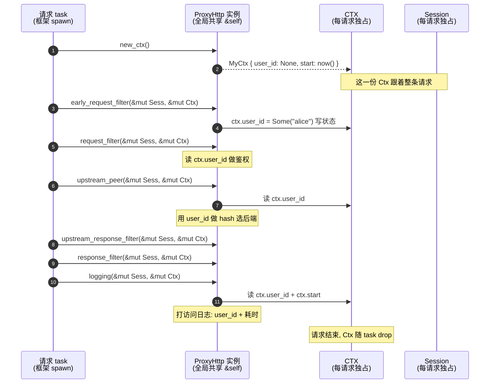
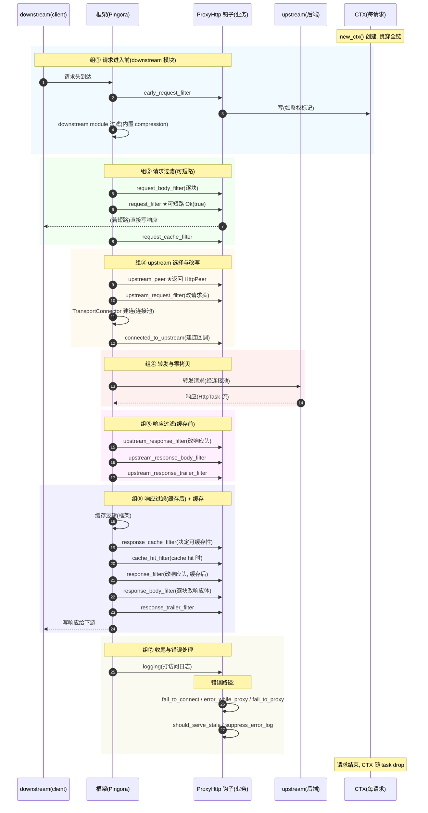

# 第 2 章 · ProxyHttp trait:一串 async filter 钩子

> 第 1 篇 · 钩子链:`ProxyHttp` trait 的请求生命周期(Pingora 灵魂)

---

## 核心问题

前一章(P0-01)已经把 Pingora 的整体形状立起来了:它是一个用 Rust 异步写的反向代理,把"代理一条 HTTP 请求"做成一条可挂载钩子的请求生命周期,业务实现一个 trait,在一串 filter 钩子里写逻辑,框架管 upstream 连接池/负载均衡/协议解析/缓存/运行时。这一章要把那个 trait 钉死——它叫 `ProxyHttp`,是 Pingora 区别于"写死的代理"的根本,也是 Pingora 灵魂所在。

具体地说,如果你打开 `pingora-proxy/src/proxy_trait.rs`,你会看到这样一个 trait 的开头:

```rust
#[cfg_attr(not(doc_async_trait), async_trait)]
pub trait ProxyHttp {
    /// The per request object to share state across the different filters
    type CTX;

    /// Define how the `ctx` should be created.
    fn new_ctx(&self) -> Self::CTX;

    async fn upstream_peer(
        &self,
        session: &mut Session,
        ctx: &mut Self::CTX,
    ) -> Result<Box<HttpPeer>>;
    // ... 还有大约三十个 async 方法
}
```

这一个 trait 文件足足六百行,定义了大约三十个方法(filter 钩子),几乎每一个都有默认实现,业务按需覆写。读完本章你会明白:

1. 为什么 Pingora 把"代理一条请求"抽象成**一个 trait 的一串 async 方法**(~30 个 filter 钩子),而不是像 hyper 那样只有一个 `call(req) -> Future`——因为代理不是"处理一个请求就完事",而是"在请求穿越的每一站都要能插一手",钩子链就是把这一串"插手点"做成显式契约。
2. `type CTX` 这个泛型到底在干什么——它让**每个请求自带一份贯穿全链的状态对象**,从 `early_request_filter` 一路传到 `logging`,业务不用全局变量、不用 thread-local、不用把状态塞进 Session,CTX 泛型把"每请求状态"做成了类型层面的一等公民。
3. `#[cfg_attr(not(doc_async_trait), async_trait)]` 这一行表面看古怪,实际上回答了一个尖锐问题:`&self` 的 async 方法在 trait 里没法直接写(Rust 历史包袱),`async_trait` 把每个 async 方法编译成一个返回 `BoxFuture` 的普通方法——业务写的"async 钩子",最终都是 Future,承 Tokio 调度。
4. 为什么钩子是 **async** 的,而 Envoy 的 filter 是同步 C++ 虚函数——因为 Rust 异步的 await 让"在钩子里做重活(查数据库、跑 WAF 规则、做 TLS 握手)可以 offload 到 blocking 线程不卡请求线程",而 Envoy 必须靠"线程局部 + 异步回调"另一套机制绕开阻塞。
5. 钩子的**顺序为什么这么排**——`early_request_filter` 在 module 前、`request_filter` 可短路、`upstream_peer` 选后端、`upstream_request_filter` 改发出去的请求、`upstream_response_filter`(缓存前)与 `response_filter`(缓存后)分两段、`logging` 收尾——这串顺序不是随便排的,它对应一条请求穿越代理的真实时序,每一站的语义都跟"此刻框架手里有什么"对齐。

> **逃生阀(本章有点长)**:如果你只想懂"`ProxyHttp` 到底是个什么东西",直接读第三节"`type CTX`:每请求一个贯穿全链的状态"和第五节"钩子全貌与生命周期分组",其余几节是把这两个结论拆细、配源码佐证。如果你完全没接触过 Rust 的 `Future`/`async`/`async_trait`,建议先回 P0-01 或翻一眼《Tokio》前几章,本章默认你见过 `async fn` 和 `.await`。

---

## 一句话点破

> **`ProxyHttp` 是一个"代理一条 HTTP 请求"的契约:框架替你管请求的整个生命周期(读请求、选 upstream、建连接、转发、收响应、回下游、收尾),在生命周期的每一站都开一个 async 钩子(filter),业务按需覆写这些钩子插入自己的逻辑;`type CTX` 是这条链上每个钩子共享的"每请求工作台",由 `new_ctx` 在请求进来时 new 一个,一路 `&mut` 传到 `logging`;`async_trait` 把每个 async 钩子做成一个 `BoxFuture`,承 Tokio 的 Future/Poll 调度。这是 Pingora 把"反向代理"做成可编程框架的全部基础——业务不是写代理,业务是"在框架替你修好的转发公路上,沿途设关卡"。**

这是结论,不是理由。本章倒过来拆:先把 trait 的形状钉死 → 再看 `type CTX` 为什么这么设计 → 再看 `async_trait` 这一行解决了什么 → 再把全部钩子按生命周期分组讲清 → 最后跟 Tower 的 `Service`、Envoy 的 filter chain 做正面对照,印证"代理一串钩子"这个抽象为什么是代理特有的。

---

## 第一节:先把 `ProxyHttp` trait 的形状钉死

### 1.1 真身就在 `proxy_trait.rs` 这一个文件

`ProxyHttp` trait 的全部定义,在 `pingora-proxy/src/proxy_trait.rs` 第 30 到 599 行——整个文件就这一个 trait 加一个收尾的 `FailToProxy` 结构体。trait 本体大约五百七十行,其中绝大部分是方法文档注释,真正的方法签名加起来也就一两百行。这是刻意的:`ProxyHttp` 是 Pingora 唯一的"业务接入点",所有业务逻辑都通过实现这一个 trait 进来,所以它必须**自给自足**——把代理一条请求需要的所有钩子全列出来,业务不用再去实现别的 trait。

trait 的开头几行:

```rust
// pingora-proxy/src/proxy_trait.rs#L30-L36
#[cfg_attr(not(doc_async_trait), async_trait)]
pub trait ProxyHttp {
    /// The per request object to share state across the different filters
    type CTX;

    /// Define how the `ctx` should be created.
    fn new_ctx(&self) -> Self::CTX;
```

三件事:

1. **`#[cfg_attr(not(doc_async_trait), async_trait)]`**——这一行 attribute 是整个 trait 的"async 开关"。它的含义是:在普通编译条件下(没有 `doc_async_trait` cfg)用 `async_trait` 宏展开 trait;在 `cargo doc` 时(设置了 `doc_async_trait` cfg)跳过宏、用 Rust 1.75+ 的原生 trait-level async fn。这个精妙的设计留到本章技巧精解专门拆,这里先记住"它是让 trait 里能写 async fn 的关键"。
2. **`type CTX`**——一个关联类型,表示"每请求的状态对象"。这个类型由业务自己决定(比如业务可以定义一个 `struct MyCtx { user_id: Option<String>, start_time: Instant, ... }`,把 `type CTX = MyCtx`)。它的全部秘密在第三节展开。
3. **`fn new_ctx(&self) -> Self::CTX`**——唯一一个**非 async** 的核心方法:创建一个 CTX 实例。框架在每条请求进来时调一次它,new 出一份 CTX,然后这份 CTX 跟着这条请求一路传到最后。

把这三件事和 Tower 的 `Service` 摆在一起对比,差异立刻显形:Tower 的 `Service<Request>` 是**一个**泛型 trait,核心就两个方法 `poll_ready` + `call`,语义是"处理一个请求,给我一个 Future";Pingora 的 `ProxyHttp` 是**一个**trait(不泛型),核心是**三十来个** async 方法,语义是"代理一条请求,在每一站介入"。一个是"一问一答",一个是"沿途设岗"。这个对照后面单开一节细讲,先继续钉形状。

### 1.2 三十来个方法的签名长什么样

`ProxyHttp` 的方法可以粗分成两类:**带默认实现的 filter 钩子**(业务按需覆写),和**少数必须实现的"基础"方法**。先看哪几个是"必须实现"的——其实只有两个:

```rust
// pingora-proxy/src/proxy_trait.rs#L33-L36
type CTX;
fn new_ctx(&self) -> Self::CTX;

// pingora-proxy/src/proxy_trait.rs#L42-L46
async fn upstream_peer(
    &self,
    session: &mut Session,
    ctx: &mut Self::CTX,
) -> Result<Box<HttpPeer>>;
```

`type CTX` 和 `new_ctx` 必须实现(没有默认),`upstream_peer` 也必须实现(它没有默认实现体)——因为"决定请求发去哪个 upstream"是代理的核心动作,无可回避。除了这三个,其余方法全部有默认实现,默认行为大多是"什么都不做"或"返回 Ok 默认值"。这意味着一个最小的 `ProxyHttp` 实现长这样:

```rust
#[async_trait]
impl ProxyHttp for MyProxy {
    type CTX = ();              // 不需要每请求状态,用 unit
    fn new_ctx(&self) -> Self::CTX { () }

    async fn upstream_peer(
        &self,
        session: &mut Session,
        ctx: &mut Self::CTX,
    ) -> Result<Box<HttpPeer>> {
        // 业务决定发去哪
        Ok(Box::new(HttpPeer::new("127.0.0.1:8080", false, "".to_string())))
    }
}
```

这就是一个能跑的反向代理了——把所有请求转发到 `127.0.0.1:8080`。其余二十多个钩子全走默认实现(什么都不改),请求照样能进、能转发、能回。业务的复杂度全部体现在"我覆写了哪些钩子、覆写里干了什么"。

> **钉死这件事**:`ProxyHttp` 的"最小实现"只需要 `type CTX` + `new_ctx` + `upstream_peer` 三件,其余全部有默认实现。这跟 hyper 的 `Service` 必须实现 `call` 一个方法、Tower 的 `Service` 必须实现 `poll_ready` + `call` 两个方法形成对照——Pingora 因为是"代理"而不是"处理",`upstream_peer`(选后端)是不可省的核心动作。其余钩子都是"可选的介入点"。

### 1.3 钩子的统一签名:两个参数 + 返回 Result

把那三十来个方法抽出来,绝大多数 filter 钩子签名长这样(以 `request_filter` 为例):

```rust
// pingora-proxy/src/proxy_trait.rs#L68-L73
async fn request_filter(&self, _session: &mut Session, _ctx: &mut Self::CTX) -> Result<bool>
where
    Self::CTX: Send + Sync,
{
    Ok(false)
}
```

四个固定部件:

1. **`async fn`**——钩子是异步的(理由留到第四节展开)。
2. **`&self`**——不是 `&mut self`!这是和 Tower `Service::call(&mut self)` 的根本区别。`ProxyHttp` 实例是**全局共享的只读配置**,被无数并发请求同时 `&` 借用,所以 `&self`。请求级状态全部走 `ctx`,不走 self。这一条非常重要,下面专门讲。
3. **`session: &mut Session`**——下游(downstream,即 client)的会话对象,业务可以读请求头、写响应、控制连接。`&mut` 因为业务可能改它(比如 `request_filter` 里直接写一个 403 响应短路掉)。
4. **`ctx: &mut Self::CTX`**——那个贯穿全链的"每请求工作台"。`&mut` 因为业务要往里写状态(比如 `early_request_filter` 里鉴权后把 `user_id` 塞进 ctx,后面的 `upstream_peer` 用这个 user_id 做 hash 选后端)。

加上一个 `where Self::CTX: Send + Sync` 的约束——这是 `async_trait` 展开 `BoxFuture` 必须的(`Box<dyn Future + Send>` 要求 Future 跨线程,内部捕获的 CTX 必须 Send + Sync)。这个约束只出现在 async 钩子上,非 async 钩子(如 `request_cache_filter`、`is_purge`)没有它——又一个 `async_trait` 编译产物的痕迹。

> **钉死这件事**:`ProxyHttp` 的钩子是 `&self`(全局只读配置)+ `&mut Session`(下游会话)+ `&mut CTX`(每请求工作台)。请求级状态走 ctx,**不走 self**。这跟 Tower `Service::call(&mut self)` 的"持资源的有状态执行单元"模型完全相反——Tower 的状态在 Service 实例里,Pingora 的状态在 CTX 里。这个差异的根因是:Service 是"被一个请求消费一次"的执行单元,而 ProxyHttp 是"被无数请求同时共享"的配置。下面 1.4 节展开。

### 1.4 为什么是 `&self` 不是 `&mut self`:全局配置 vs 每请求状态

这是初看 `ProxyHttp` 最容易困惑的点,也是它和 Tower `Service` 的**第一个根本分野**。先把对照做出来:

| 维度 | Tower `Service::call` | Pingora `ProxyHttp::xxx_filter` |
|------|----------------------|--------------------------------|
| self 借用 | `&mut self` | `&self` |
| 实例数量 | 每请求(或每连接)一个,clone 出来 | 全局一个,被无数请求共享 |
| 请求状态存哪 | 存 Service 实例的字段里 | 存 `ctx: &mut CTX` 里 |
| 并发模型 | 一个实例同时只能服务一个请求(`&mut`) | 一个实例被无数请求并发 `&` 借用 |

Tower 的 `Service::call(&mut self)` 在《Tower》P1-02 已讲透:每次 call 消费一份资源(permit/连接槽),所以必须可变借用,一个实例同时只能服务一个请求,要并发就 Clone 出多个实例。Pingora 的 `ProxyHttp` 反过来:`&self`,一个实例被海量并发请求**同时**借用。为什么能这么干?因为请求级状态全在 `ctx` 里,不在 self 里。

具体到 Pingora:启动时业务构造一个 `MyProxy` 实例(比如里面装着"upstream 后端列表"、"限流配额"、"TLS 证书"),这个实例被 `Arc` 包起来,塞进 `HttpProxy`(`pingora-proxy/src/lib.rs` 第 111 行 `pub struct HttpProxy<SV, C>`,字段 `inner: SV` 就是业务的 ProxyHttp 实例)。每来一条请求,框架 spawn 一个 task,这个 task 调 `self.inner.new_ctx()` 创建一份**只属于这条请求的** CTX,然后沿着钩子链一路调 `self.inner.xxx_filter(&session, &mut ctx).await`,所有钩子都 `&self`(共享那个全局实例)+ `&mut ctx`(独占这份每请求状态)。

这意味着:**`ProxyHttp` 实例是只读的全局配置**——它持有的字段(后端列表、配额、证书)要么是不变的,要么内部用原子/锁保护(`ArcSwap`/`AtomicU64`/`Mutex`),业务的钩子不能直接 `&mut self` 改它们。要变,得走"内部可变性"(原子/锁)。

> **不这样会怎样**:如果 `ProxyHttp` 的钩子是 `&mut self`,那一个实例同时只能被一个请求借用——为了扛海量并发,你得给每条请求 clone 一个 ProxyHttp 实例。但 ProxyHttp 实例里装的是"全局配置"(后端列表、证书),clone 这些是大开销(后端列表可能上百个 entry,证书可能几 KB)。更糟的是,clone 出来的多个实例之间状态怎么同步?业务在请求 A 里改了"限流计数",请求 B 的实例看不见。Tower 用 `&mut self` + Clone 是因为 Tower 的 Service 是"持资源的执行单元"(连接、permit),Clone 是 Clone 独立句柄;Pingora 的 ProxyHttp 是"全局代理规则",Clone 它没意义。所以 Pingora 用 `&self`(全局共享)+ `&mut ctx`(每请求独占状态),把"全局只读"和"每请求可变"两层分开。

```mermaid
classDiagram
    class HttpProxy~SV, C~ {
        inner: SV  -- 全局唯一, 被 Arc 共享
        client_upstream: Connector
        downstream_modules: HttpModules
    }
    class ProxyHttp {
        <<trait 业务实现>>
        +type CTX
        +new_ctx() CTX
        +upstream_filter(session, ctx)*
        +request_filter(&self, session, ctx)
        +early_request_filter(&self, session, ctx)
        +upstream_peer(&self, session, ctx)*
        +response_filter(&self, session, ctx)
        +...~30 个 async 钩子
    }
    class Session {
        +downstream_session: Box~HttpSession~
        +cache: HttpCache
        +downstream_modules_ctx
    }
    class CTX {
        <<业务自定义>>
        每请求独占
        user_id / start_time / ...
    }
    HttpProxy~SV, C~ o--> ProxyHttp : inner: SV (&self 共享)
    ProxyHttp ..> Session : 钩子收 &mut session
    ProxyHttp ..> CTX : 钩子收 &mut ctx
    note for HttpProxy~SV, C~ "一个 HttpProxy 实例<br/>被 Arc 包, 海量 task 共享"
    note for CTX "new_ctx() 每请求 new 一个<br/>独占, &mut 传递"
```

图里两个关键点:① `HttpProxy.inner: SV`(业务 ProxyHttp)是**全局共享**的,无数 task `&self` 借用;② 每条请求有自己的 `CTX` 和 `Session`,`&mut` 独占。这就是"`&self` + `&mut ctx`"分工的全部形状。

到这里 `ProxyHttp` 的骨架就钉死了:一个 trait,三十来个 async 方法(几乎全有默认实现),统一签名 `&self + &mut Session + &mut CTX`,必须实现 `type CTX`/`new_ctx`/`upstream_peer`。下面每一节,都是回答"某个设计为什么是这样"。

---

## 第二节:为什么是一串 filter 钩子,而不是一个 `call`

这一节回答最根本的问题:**代理这个事,为什么不能像 hyper 那样一个 `call(req) -> Future<Response>` 搞定,非得拆成一串钩子?** 答案藏在"处理一个请求"和"代理一个请求"的本质差异里。

### 2.1 提出问题:hyper 的 `call` 够用吗

设想你用 hyper 写一个 Web 服务。核心就是实现 `Service`:

```rust
// hyper 的 Service(简化,详见《hyper》P1-02)
impl Service<Request<Body>> for MyHandler {
    type Response = Response<Body>;
    type Error = BoxError;
    type Future = BoxFuture<'static, Result<Self::Response, Self::Error>>;

    fn call(&mut self, req: Request<Body>) -> Self::Future {
        // 处理请求,生成响应
        Box::pin(async move { Ok(Response::new("hello".into())) })
    }
}
```

一问一答,干净利落。请求进来,call 生成响应,完事。hyper 不管你"是不是代理",它只负责把 Request 喂给你,你吐一个 Response。

现在你想用这个模型写一个**反向代理**。最朴素的做法:

```rust
fn call(&mut self, req: Request<Body>) -> Self::Future {
    Box::pin(async move {
        // 1. 鉴权(可能拒绝)
        // 2. 改请求头
        // 3. 选 upstream
        // 4. 通过连接池发请求(可能重试)
        // 5. 收响应
        // 6. 改响应头
        // 7. 返回
        let resp = self.upstream_client.send(modified_req).await?;
        Ok(modify_response(resp))
    })
}
```

看起来也能工作。问题在哪?

**问题在于,这七步全都挤在 `call` 的一个 Future 里,业务和框架没有清晰的边界。** 你这个 call 既是"业务逻辑"(鉴权、改头),又是"框架机制"(连接池、重试)——它们混在一个 async fn 里,谁也分不开谁。这会撞上一连串墙:

1. **业务没法复用框架的连接池/重试/缓存**。因为这些机制藏在你的 call 里,下一条请求要复用同样的连接池,你得自己手动管——等于重新发明 Pingora。
2. **错误处理碎片化**。鉴权失败该返回 403、连接 upstream 失败该返回 502、改响应头出错该返回 500——这些错误语义完全不同,但在一个 call 里它们都成了"call 的 Future 返回 Err",你得自己 enum 区分。
3. **缓存插不进去**。如果你想加缓存(命中就直接返回缓存,不查 upstream),你发现这个"命中"的逻辑应该插在"选 upstream 之前"——但 call 已经是"选 upstream 之后"的整个流程了,你没法精细控制"在哪一站插"。
4. **观测性差**。你想知道"鉴权花了多久、选 upstream 花了多久、upstream 响应花了多久"——这些时延分布在 call 的不同阶段,但 call 是个黑盒,框架没法在阶段之间插桩。

根本问题在于:**代理不是"处理一个请求",代理是"让一个请求穿越一系列关卡"**。每一站(鉴权、改请求、选后端、转发、收响应、改响应、收尾)都有独立的语义、独立的错误处理、独立的观测需求。把它们全塞进一个 call,就丢失了"站点"这个维度。

### 2.2 Envoy 的回答:filter chain(C++ 虚函数)

Envoy 是怎么解决这个问题的?它发明了 **filter chain**——一系列 filter 对象,每个 filter 实现一组 C++ 虚函数,请求穿越时按顺序调每个 filter 的虚函数。《Envoy》第 3 篇已拆透,这里只点核心结构:

```cpp
// Envoy 的 decoder filter(简化,详见《Envoy》)
class Http::StreamDecoderFilter {
public:
    virtual FilterHeadersStatus decodeHeaders(RequestHeaderMap&, bool) = 0;
    virtual FilterDataStatus decodeData(Buffer::Instance&, bool) = 0;
    virtual FilterTrailersStatus decodeTrailers(RequestTrailerMap&) = 0;
    // ...
};
```

每个 filter 是一个对象,实现 `decodeHeaders`/`decodeData` 等虚函数。请求头到了调所有 filter 的 `decodeHeaders`,请求体到了调 `decodeData`,每个 filter 可以返回 `Continue`(继续往下一个 filter)/`StopIteration`(停下来等我异步完成)/`StopIterationNoBuffer`(停下来但不缓存)——控制流通过返回值精细管理。

Envoy 的这套设计很强大(listener filter → network filter → HCM → http decoder filter → router → http encoder filter),但它有几个固有代价:

1. **C++ 虚函数是同步的**。一个 filter 想做异步操作(比如查外部鉴权服务),不能在虚函数里 `await`——C++ 没有 Rust 那种零成本 async。Envoy 的做法是返回 `StopIteration`,然后异步操作完成后调 `continueDecoding()` 恢复。这套"暂停-恢复"机制需要 filter 自己管状态机,复杂。
2. **filter 链是多段链 + decoder/encoder 两向**。filter 既要处理"解码(请求进来)"又要处理"编码(响应出去)",每个 filter 要实现两套虚函数。链的组装靠运行期配置(xDS 动态下发),复杂度极高。
3. **状态共享靠 filter 自己存字段**。每个 filter 实例有自己的状态,filter 之间共享状态要靠 `StreamFilterCallbacks` 提供的 `streamInfo()`/`metadata()` 间接传递,不如显式参数清晰。

Envoy 这套是 C++ 生态的成熟方案,《Envoy》系列已拆透,一句带过指路。Pingora 没有照搬它,而是用 Rust 的方式重新回答了同一个问题。

### 2.3 Pingora 的回答:一个 trait 的一串 async 方法

Pingora 的选择是:**把代理的"每一站"做成 trait 的一个 async 方法,业务覆写需要的那几个,框架管调用顺序、管连接池、管重试、管缓存,业务只写"在这一站干什么"。**

具体地说,Pingora 把一条请求穿越代理的完整生命周期,切成下面这些站(每站一个钩子,详见第五节分组):

```
请求进来
  → early_request_filter       (在 module 之前, 最早期介入)
  → [downstream module 过滤]   (框架内置, 如 compression)
  → request_filter             (鉴权/限流, 可短路 Ok(true))
  → request_body_filter        (逐块处理请求体)
  → request_cache_filter       (决定是否缓存)
  → proxy_upstream_filter      (cache miss 后决定是否真转发)
  → upstream_peer              (选后端, 返回 HttpPeer)  ★核心
  → upstream_request_filter    (改发出去的请求头)
  → [TransportConnector 建连]  (框架管, 连接池)
  → connected_to_upstream      (连接建立回调, 记时延)
  → [转发请求体/收响应]
  → upstream_response_filter   (改响应头, 缓存前)
  → upstream_response_body_filter (逐块改响应体)
  → response_filter            (改响应头, 缓存后)
  → response_body_filter       (逐块改响应体, 发给下游)
  → response_trailer_filter    (改 trailer)
  → logging                    (收尾, 打访问日志)
请求结束
```

每一站都是一个 `ProxyHttp` 的 async 方法,业务按需覆写。**框架保证按这个顺序调**,业务不用管"什么时候调我的钩子"——框架在 `process_request`(`pingora-proxy/src/lib.rs` 第 741 行)这个主干函数里,逐个 `await` 调过去。

为什么这个设计比 hyper 的 `call` 更适合代理?因为它**把代理的"站点"做成了显式契约**:

1. **每一站有独立的语义和错误处理**。`request_filter` 返回 `Err` 表示"鉴权失败,整条请求失败";返回 `Ok(true)` 表示"我已经直接写响应短路了,别再往下走";返回 `Ok(false)` 表示"继续下一站"。`upstream_peer` 返回 `Err` 表示"选不出后端,请求失败"。`upstream_response_filter` 返回 `Err` 表示"改响应头出错"。每个钩子的返回值语义和它所在的站点对齐,框架按站点决定怎么处理这个返回值。
2. **框架可以在站点之间插机制**。比如 `request_filter` 之后、`upstream_peer` 之前,框架插了缓存逻辑(`proxy_cache`,见 lib.rs 第 806 行)——cache hit 就直接返回,根本不走 `upstream_peer`;cache miss 才继续。这个"在哪插缓存"的位置,是 filter chain 模型天然给出的。
3. **观测性自然有了**。框架在每一站前后可以记时延(`connected_to_upstream` 钩子就是给业务记"建连耗时"的),业务不用自己埋点,框架按站点分桶。
4. **业务只写需要的站**。你要做鉴权?覆写 `request_filter`。要改请求头?覆写 `upstream_request_filter`。要记访问日志?覆写 `logging`。其余站走默认实现(什么都不做),你的代理照样跑。

> **不这样会怎样**:如果 Pingora 像 hyper 那样只给一个 `call`,业务要在 call 里手写"先鉴权、再选后端、再用连接池转发、再改响应"——等于把 Pingora 内部机制重新实现一遍。更糟的是,业务的 call 里没法接 Pingora 的连接池/重试/缓存(那些是框架的内部状态),业务只能用裸 `hyper::Client` 自己发请求——那 Pingora 就退化成一个" Tokio 之上的 HTTP 客户端库",失去了"反向代理框架"的价值。filter chain 钩子模型,正是让 Pingora "是代理框架"而不是"是 HTTP 客户端"的关键。

### 2.4 为什么用 trait 一串方法,而不是 Envoy 那种"多段链 + 多对象"

接下来一个更细的问题:既然要"一串站点",为什么是**一个 trait 的一串方法**(Pingora 的选择),而不是**一串 filter 对象**(Envoy 的选择)?这两个都能表达"链"。

答案在 Rust 的类型系统特征和 Pingora 的工程取舍里:

1. **Rust trait 的 async 方法天然带 `&self` 共享**。一个 `ProxyHttp` 实例被无数请求并发 `&self` 借用,Rust 的别名规则保证不会有数据竞争。Envoy 的 filter 对象是 C++ 的,要靠"每请求 clone 一份 filter 链"或"filter 无状态 + 状态存 StreamInfo"来避免共享冲突——C++ 没有所有权系统,共享状态全靠人工保证线程安全。
2. **一个 trait 让业务的实现是一个整体**。业务定义一个 `struct MyProxy`,impl `ProxyHttp for MyProxy`,所有钩子都在这一个 impl 块里——业务的心智模型是"我在写一个代理",所有逻辑集中。Envoy 的 filter chain 鼓励"每个 filter 一个独立的类",业务要把鉴权、改头、限流拆成三个 filter 类,装配靠 xDS 配置——心智模型是"我在组装一条链"。前者适合"我清楚我要做什么代理"的场景(一个团队掌控全链),后者适合"我要可插拔地组合不同来源的 filter"(生态化的 filter 市场)。Cloudflare 选前者,因为它一个团队掌控整个代理栈;Envoy 选后者,因为它要支撑社区贡献的 filter 生态。
3. **CTX 泛型让每请求状态有类型**。Pingora 的 `type CTX` 让每请求状态有具体类型(业务的 struct),钩子之间传 `&mut CTX` 编译期就知道字段。Envoy 的状态存在 `StreamInfo` 的 `metadata`(运行期 `ProtobufWkt::Struct`),类型擦除,访问靠字符串 key——灵活但易错。
4. **顺序固定 vs 顺序可配**。Pingora 的钩子顺序是**编译期固定**的(框架代码里 `process_request` 按固定顺序调),业务没法改顺序。Envoy 的 filter 顺序是**运行期配置**(xDS 下发 filter 链顺序)。固定顺序的好处是"业务永远知道 `request_filter` 在 `upstream_peer` 之前",心智简单;可配顺序的好处是"同一个 filter 可以插在不同位置"。Pingora 牺牲了灵活性换确定性,Envoy 牺牲了确定性换灵活性。

> **钉死这件事**:Pingora 选择"一个 trait 一串 async 方法",本质是用 Rust 的所有权系统(`&self` 共享 + `&mut CTX` 独占)替代 Envoy 的"对象链 + 运行期装配"。这换来了:① 业务心智简单(一个 impl 块写完整个代理);② 顺序固定(编译期就知道钩子顺序);③ 状态有类型(CTX 泛型)。代价是:① 顺序不可配(没法运行期改钩子顺序);② 不适合"多来源 filter 拼装"的场景。Cloudflare 的场景(一个团队掌控全代理栈)正好匹配前者,所以选 trait 模型。

---

## 第三节:`type CTX`:每请求一个贯穿全链的状态

这一节讲 `ProxyHttp` 最精妙的设计:`type CTX` 关联类型 + `new_ctx` 方法,让"每请求状态"成为类型层面的一等公民。这是 Pingora 区别于 Envoy filter / Nginx config 的关键技巧,也是本章技巧精解的主角之一。

### 3.1 问题:每请求状态该放哪

设想你在写一个有状态的反向代理。你想要:① `early_request_filter` 里鉴权,把 `user_id` 存起来;② `upstream_peer` 里根据 `user_id` 做一致性哈希选后端(同一用户的请求粘到同一后端);③ `logging` 里把 `user_id` 和这次请求的耗时打进访问日志。

`user_id` 和 `start_time` 这种"每请求的状态",该存在哪?四个候选:

**候选 A:全局变量 / 静态变量**。比如 `static USER_IDS: Mutex<HashMap<RequestId, String>>`。问题:① 要给每条请求分配一个 RequestId,框架没这个概念;② 并发访问要锁,锁竞争在高并发下是性能杀手;③ 请求结束要清理 HashMap,容易内存泄漏。这条路在 Rust 异步网络服务里基本是禁区。

**候选 B:thread-local**。比如 `thread_local! { static CURRENT_USER: RefCell<Option<String>> }`。问题:① Rust 异步 task 会被调度器在不同线程之间搬(work-stealing,虽然 Pingora 用 NoSteal 但理论上 task 仍可能跨 yield),thread-local 在 `.await` 之后可能"换了一个线程的 thread-local",读到的是别的请求的状态——这是 thread-local 在异步里最阴险的 bug。② Pingora 的 NoStealRuntime(第 5 篇讲)虽然是单线程 runtime,但一条请求 task 里 yield 后,同一线程可能跑去跑别的请求 task,thread-local 仍然会被污染。thread-local 在异步里基本不可用。

**候选 C:把状态塞进 Session**。Session 是 Pingora 的下游会话对象(`pub struct Session`,`lib.rs` 第 447 行),它有 `downstream_session`、`cache`、`downstream_modules_ctx` 等字段。能不能给它加一个 `user_data: Any` 字段,业务往里塞自己的状态?问题:① 类型擦除(`Any`),业务访问要 `downcast`,运行期 panic 风险;② Session 是框架的类型,业务往里塞字段破坏封装;③ 多个业务模块都往里塞,类型不唯一,冲突。这条路 Envoy 走了(`StreamInfo::metadata`),Pingora 不走。

**候选 D:每请求一个独立的 CTX 对象,显式 `&mut` 传递**。这就是 Pingora 的选择。框架在每条请求进来时调 `new_ctx()` new 一个 CTX,这个 CTX 的类型由业务通过 `type CTX = MyCtx` 指定,然后这个 CTX 沿着钩子链一路 `&mut` 传到最后一个钩子 `logging`。业务的每个钩子都能 `ctx.user_id` 直接访问(类型已知,编译期检查),写状态 `ctx.user_id = Some(...)` 也只是 `&mut` 解引用。



这张图把"CTX 贯穿全链"画透了:① 框架调一次 `new_ctx` 创建;② 每个钩子收 `&mut CTX`,读写都行;③ 请求结束 CTX 随 task drop,自动清理。没有任何全局状态、没有锁、没有类型擦除。

### 3.2 CTX 的创建:`new_ctx` 每请求调一次

CTX 的创建点在 `process_new_http`(`pingora-proxy/src/lib.rs` 第 1136 行),这是框架处理每条新请求的入口:

```rust
// pingora-proxy/src/lib.rs#L1136-L1160
async fn process_new_http(
    self: &Arc<Self>,
    session: HttpSession,
    shutdown: &ShutdownWatch,
) -> Option<ReusedHttpStream> {
    let session = Box::new(session);
    // ... handle_new_request 读请求头 ...
    let mut session = match self.handle_new_request(session).await {
        Some(downstream_session) => Session::new(
            downstream_session,
            &self.downstream_modules,
            self.shutdown_flag.clone(),
        ),
        None => return None,
    };
    // ...
    let ctx = self.inner.new_ctx();   // ← 每请求 new 一个 CTX
    self.process_request(session, ctx).await
}
```

关键就是第 1158 行:`let ctx = self.inner.new_ctx();`。注意 `self.inner` 是业务的 `ProxyHttp` 实例(全局共享),`new_ctx(&self)` 是 `&self` 方法——它不改 self,只读全局配置(可能从全局配额里取一个时间戳),new 出一个 CTX。这个 CTX 然后作为第二个参数传给 `process_request`(`lib.rs` 第 741 行),`process_request` 再把它 `&mut` 传给每一个钩子。

`new_ctx` 是**非 async** 的——这是刻意的。为什么?因为 CTX 创建是"轻量初始化"(分配一个结构体、记一个开始时间),不需要 IO。如果它是 async,业务可能忍不住在里面干重活(查数据库初始化),那会卡住请求线程。强制同步 + 返回 `Self::CTX`,把"创建成本"限定在"分配 + 简单初始化",重活留到 `early_request_filter`(那是 async 的)。

> **钉死这件事**:`new_ctx(&self) -> Self::CTX` 是**非 async** 的,每请求调一次,只做轻量初始化。这跟 Rust 标准库的 `Default::default()` / `new()` 惯例一致——构造函数同步。重活(查外部服务、跑 WAF)留到 async 钩子里。这个设计避免了"创建 CTX 卡住请求线程"。

### 3.3 CTX 的类型:业务自定义,编译期检查

CTX 的类型由业务通过 `type CTX = MyCtx` 指定。比如:

```rust
struct MyProxy {
    backends: Arc<LoadBalancer>,
}

struct MyCtx {
    user_id: Option<String>,
    start: Instant,
    bytes_processed: u64,
}

#[async_trait]
impl ProxyHttp for MyProxy {
    type CTX = MyCtx;
    fn new_ctx(&self) -> Self::CTX {
        MyCtx { user_id: None, start: Instant::now(), bytes_processed: 0 }
    }

    async fn early_request_filter(&self, session: &mut Session, ctx: &mut Self::CTX) -> Result<()> {
        // 鉴权,把 user_id 存进 ctx
        if let Some(token) = session.req_header().headers.get("authorization") {
            ctx.user_id = Some(verify_token(token.to_str()?)?);
        }
        Ok(())
    }

    async fn upstream_peer(&self, session: &mut Session, ctx: &mut Self::CTX) -> Result<Box<HttpPeer>> {
        // 用 user_id 做 hash 选后端
        let key = ctx.user_id.as_deref().unwrap_or("default");
        let backend = self.backends.select(bkcr_hash(key)).unwrap();
        Ok(Box::new(HttpPeer::new(backend, false, "".to_string())))
    }

    async fn logging(&self, session: &mut Session, e: Option<&Error>, ctx: &mut Self::CTX) {
        let elapsed = ctx.start.elapsed();
        info!("user={} elapsed={:?} bytes={}", ctx.user_id.as_deref().unwrap_or("-"), elapsed, ctx.bytes_processed);
    }
}
```

注意几个点:

1. **`ctx.user_id` 是强类型**(`Option<String>`),编译期检查。`upstream_peer` 里 `ctx.user_id.as_deref()` 编译器知道是 `Option<&str>`,没有运行期 downcast。如果业务写错字段名,编译期报错。这是 Envoy 的 `metadata: Any` 给不了的保证。
2. **CTX 的字段可以是任意类型**——`String`、`Instant`、`u64`、`Arc<T>`、甚至闭包、`Option<oneshot::Sender>`。只要 `Send + Sync`(因为可能跨线程,见 `where Self::CTX: Send + Sync` 约束)。
3. **CTX 不需要业务实现任何 trait**。它就是业务的普通 struct,`ProxyHttp` 对它没有任何约束(除了 `Send + Sync`),不需要 `Default`、不需要 `Clone`、不需要 `'static`。这让 CTX 可以装任何东西,包括持有 `Arc` 句柄、持有 `mpsc::Sender` 等非 `Clone` 的资源。
4. **CTX 默认可以是 `()`**。如果业务不需要每请求状态,`type CTX = (); fn new_ctx(&self) { () }`,所有钩子里 `ctx: &mut ()` 就是个空占位。这是为什么最小 `ProxyHttp` 实现能用 `()`——CTX 是可选的,不需要状态就 unit。

### 3.4 为什么不用别的方案:三个对照

把 CTX 方案和三个对照方案并排放,妙处立刻显形:

| 方案 | 类型安全 | 并发开销 | 心智负担 | 异步友好 |
|------|---------|---------|---------|---------|
| 全局 `Mutex<HashMap>` | 差(运行期 key) | 锁竞争 | 高(要清理) | 一般 |
| thread-local | 好 | 无锁 | 中 | **差**(await 跨线程) |
| Session `Any` 字段 | 差(downcast) | 无锁 | 中(类型擦除) | 好 |
| **`type CTX` + `&mut CTX`** | **好(编译期)** | **无锁** | **低(显式参数)** | **好** |

CTX 方案在所有维度上都胜出。它的秘密在于:**把"每请求状态"从"全局共享可变状态"重构为"每请求独占的栈上对象"**。全局可变状态是并发的敌人,Rust 异步尤其怕它(锁阻塞 reactor、thread-local 跨 yield 失效);每请求独占的栈上对象,天生没有共享,天生没有竞争——这就是 `&mut CTX` 的全部秘密。

> **承接《Tokio》**:这个"每 task 独占状态,不共享"的思想,跟 Tokio 的"每 task 独占 budget"(task local,见 [[tokio-source-facts]])是同一个哲学——把状态从全局拉到 task 局部,避免共享。Tokio 用 task-local budget,Pingora 用 CTX。底层都是 Tokio 的 task 模型(每请求一个 task)在支撑,一句带过指路 [[tokio-source-facts]]。

### 3.5 CTX 的"贯穿"语义:从 new_ctx 到 logging 同一个对象

CTX 贯穿全链的"同一个对象"这件事,值得再强调一次。看 `process_request` 主干(`lib.rs` 第 741 行),它收到 `mut ctx: <SV as ProxyHttp>::CTX`,然后:

```rust
// pingora-proxy/src/lib.rs#L741-L946(简化, 只看 ctx 流向)
async fn process_request(
    self: &Arc<Self>,
    mut session: Session,
    mut ctx: <SV as ProxyHttp>::CTX,
) -> Option<ReusedHttpStream>
{
    // 1. early_request_filter: ctx 第一次被 &mut
    self.inner.early_request_filter(&mut session, &mut ctx).await?;
    // 2. request_filter: 同一个 ctx 再次被 &mut
    match self.inner.request_filter(&mut session, &mut ctx).await { ... }
    // 3. proxy_cache(框架逻辑)
    // 4. proxy_upstream_filter: 同一个 ctx
    self.inner.proxy_upstream_filter(&mut session, &mut ctx).await?;
    // 5. proxy_to_upstream(内部会调 upstream_peer/upstream_request_filter/
    //    connected_to_upstream/upstream_response_filter/response_filter,
    //    全部 &mut ctx)
    self.proxy_to_upstream(&mut session, &mut ctx).await;
    // 6. finish(内部调 logging): 同一个 ctx 最后一次被 &mut
    self.finish(session, &mut ctx, ...).await;
}
```

`ctx` 这个局部变量,从函数开头收到,到 `finish` 里最后一次被借用,**从头到尾是同一个对象**。业务在 `early_request_filter` 写的 `ctx.user_id`,到 `logging` 里读出来还是同一个 `user_id`——中间没有任何序列化/反序列化、没有任何拷贝(就是同一个 `&mut` 引用一路传)。

这个"贯穿"语义,是 CTX 区别于"每钩子独立状态"的关键。如果每个钩子各自创建独立的状态(像 Envoy 那样每个 filter 实例独立),钩子之间共享状态就要靠"框架的 StreamInfo metadata"间接传;Pingora 把状态做成一个显式的 `&mut CTX` 参数,钩子之间天然共享——业务的心智模型是"我有一份工作台,所有钩子都在同一份工作台上干活"。

> **钉死这件事**:`type CTX` 的全部秘密,是把"每请求状态"从"全局可变共享状态"(锁/thread-local/Any)重构为"每请求独占的栈上对象"(`&mut CTX`)。`new_ctx` 在请求进来时 new 一个,沿钩子链一路 `&mut` 传到 `logging`,请求结束随 task drop。业务的每个钩子都拿到同一份 CTX,强类型读写,无锁、无线程切换、无类型擦除。这是 Pingora 在异步高并发下管理每请求状态的零成本方案。

---

## 第四节:`async_trait`:为什么钩子是 async 的

这一节回答两个问题:① 为什么 `ProxyHttp` 的钩子是 async 的(而不是像 Envoy 那样同步虚函数);② 那个古怪的 `#[cfg_attr(not(doc_async_trait), async_trait)]` 到底在干什么。第二个问题是本章技巧精解的主角,这里先建立直觉。

### 4.1 为什么钩子要 async:重活不能卡请求线程

设想你在 `request_filter` 里要做 WAF(Web Application Firewall)规则匹配——把请求体跑过几千条正则,判断是不是攻击。这是个 CPU 密集活,可能花几毫秒到几十毫秒。

如果 `request_filter` 是**同步**的(像 Envoy 的虚函数),你只有一个选择:在虚函数里直接跑这几千条正则。这会**阻塞请求线程**——在这几毫秒到几十毫秒里,这个线程不能处理别的请求。一个线程的并发度被同步重活直接打下来。Envoy 怎么绕?它的做法是:filter 返回 `StopIteration`,把 WAF 任务扔到线程池,异步完成后调 `continueDecoding()`——但这个"扔线程池 + 回调恢复"的状态机,要 filter 自己写,复杂。

如果 `request_filter` 是 **async** 的(Pingora 的选择),你可以这样:

```rust
async fn request_filter(&self, session: &mut Session, ctx: &mut Self::CTX) -> Result<bool> {
    // 读取请求体
    let body = session.read_request_body().await?;
    // 把 WAF 匹配 offload 到 blocking 线程池
    let is_attack = tokio::task::spawn_blocking(move || {
        run_waf_rules(&body)
    }).await.unwrap();
    if is_attack {
        session.respond_error(403).await?;
        return Ok(true);  // 短路
    }
    Ok(false)
}
```

两处 `.await`:读请求体(异步 IO,不阻塞线程)、`spawn_blocking`(把 CPU 密集活扔到 blocking 线程池)。请求线程在 `await` 处让出,跑去处理别的请求;WAF 在 blocking 线程跑完后,唤醒这个 task 继续。整个流程里,**请求线程从不被 CPU 密集活卡住**——这就是 async 钩子的价值。

Pingora 文档在 `request_body_filter` 的注释里直接点出了这个动机(`proxy_trait.rs` 第 111-113 行):

```rust
// pingora-proxy/src/proxy_trait.rs#L111-L113
/// The async nature of this function allows to throttle the upload speed and/or executing
/// heavy computation logic such as WAF rules on offloaded threads without blocking the threads
/// who process the requests themselves.
```

翻译:这个函数的 async 特性,允许你做"限速上传"或"在 offloaded 线程跑 WAF 这种重活",而不阻塞处理请求本身的线程。这是 async 钩子的根本动机——**让重活能 offload,让请求线程永远是轻量调度器**。

> **承接《Tokio》**:这个"重活 spawn_blocking,轻活留 task 里"的思想,是 Tokio 模型的核心([[tokio-source-facts]] budget=128 让出 + blocking 线程池)。Pingora 的 async 钩子天然承这套——钩子是 Future,Future 跑在 Tokio runtime 上,内部可以 `spawn_blocking` 扔 CPU 密集活。Tokio 的 reactor/scheduler/blocking 池机制一句带过指路,Pingora 这边只关心"钩子是 async 所以能 offload"。

### 4.2 async 钩子的代价:每个钩子都是一个 Future

async 不是没代价。`async fn` 在 Rust 里编译成一个状态机 Future,这个 Future 是 `Sized` 的、可能捕获 `self` 和参数。但 `ProxyHttp` 是 trait,trait 方法的 Future 类型不能直接表达——这是 Rust 历史包袱:**trait 里直接写 `async fn` 在很长一段时期内是不稳定的**(直到 Rust 1.75 才稳定 native async fn in trait,但仍然有限制,比如难以表达 `Send` Future bound)。

Pingora 必须支持稳定 Rust(为了生产部署),所以选了 `async_trait` 这个 crate。`async_trait` 是一个过程宏,它把:

```rust
#[async_trait]
trait Foo {
    async fn bar(&self, x: i32) -> Result<()>;
}
```

展开成:

```rust
// 简化展开
trait Foo {
    fn bar<'a>(&'a self, x: i32) -> Pin<Box<dyn Future<Output = Result<()>> + Send + 'a>>;
}
```

把 `async fn` 变成一个返回 `Pin<Box<dyn Future + Send>>` 的普通 fn。这样 trait 方法就没有"async"了,普通 Rust 编译器能处理。代价是:**每次调钩子都要 Box::pin 一次**(堆分配一个 Future 对象)。对于一条请求要调十几个钩子的场景,这是十几次小对象堆分配——在高并发下是真开销,但相对网络 IO(毫秒级),堆分配(纳秒级)可以忽略。Pingora 团队认为这个代价换"稳定 Rust + Send Future bound"是值得的。

`async_trait` 还带来一个连锁约束:因为 Future 是 `Box<dyn Future + Send>`,Future 内部捕获的所有变量(包括 `&self`、`&mut session`、`&mut ctx`)都必须 `Send`。这就是为什么 `ProxyHttp` 的 async 钩子都有 `where Self::CTX: Send + Sync` 约束——CTX 必须能跨线程(`Send`),且 `&CTX` 能跨线程共享(`Sync`,因为有 `&mut CTX` 实际上是 `&` + 内部可变,需要 `Sync`)。非 async 钩子(如 `request_cache_filter`、`is_purge`)没有这个约束,因为它们不返回 Future。

> **钉死这件事**:`async_trait` 把每个 async 钩子展开成"返回 `Pin<Box<dyn Future + Send>>` 的普通 fn"。代价是每次调钩子一次 Box::pin 堆分配(纳秒级,相对 IO 可忽略),收益是"稳定 Rust + Send Future bound + 能在 trait 里写 async fn"。`where Self::CTX: Send + Sync` 约束就是这个展开的产物——Future 内部捕获 `&mut CTX`,CTX 必须 `Send + Sync`。

### 4.3 那个 `#[cfg_attr(not(doc_async_trait), async_trait)]` 是干什么的

trait 定义那一行是:

```rust
// pingora-proxy/src/proxy_trait.rs#L30
#[cfg_attr(not(doc_async_trait), async_trait)]
pub trait ProxyHttp {
```

`#[cfg_attr(cond, attr)]` 是 Rust 的条件属性语法:当 `cond` 为真时,加上 `attr` 属性;否则不加。这一行的含义是:**当 `doc_async_trait` cfg 没有被设置时(即普通编译),加上 `#[async_trait]` 属性;当 `doc_async_trait` 被设置时(即 cargo doc),不加 `#[async_trait]`,trait 保持原生 async fn 形式**。

为什么要这么搞?因为 **Rust 1.75+ 支持 native async fn in trait,但 `async_trait` 宏和 native async fn 在 rustdoc 渲染上不一样**:

- 用 `async_trait` 宏展开后,rustdoc 显示的方法签名是 `fn bar(&self, ...) -> Pin<Box<dyn Future<Output = ...> + Send + '_>>`(展开后的丑陋形式),业务读文档时看不懂。
- 用 native async fn(不展开),rustdoc 显示 `async fn bar(&self, ...) -> Result<()>`(原始形式),清晰。

`doc_async_trait` 这个 cfg 在 `pingora-proxy/Cargo.toml` 第 82-87 行配置:

```toml
# pingora-proxy/Cargo.toml#L82-L87
# or locally cargo doc --config "build.rustdocflags='--cfg doc_async_trait'"
[package.metadata.rust-analyzer]
rust-analyzer.cargo.cfgs = ["doc_async_trait"]

[lints.rust]
unexpected_cfgs = { level = "warn", check-cfg = ['cfg(doc_async_trait)'] }
```

注释说明:跑 `cargo doc` 时,可以通过 `--cfg doc_async_trait` 让 rustdoc 看到原生 async fn 形式,渲染出干净的文档;普通 `cargo build`/`cargo test` 不设这个 cfg,trait 被 `async_trait` 展开,正常编译成 `BoxFuture` 形式。

这是一个非常细腻的工程取舍:

1. **生产编译用 `async_trait`**:因为 `async_trait` 给你 `Send` Future bound(高并发必需)、给你稳定 Rust 支持(生产部署必需)。
2. **文档渲染用 native async fn**:因为业务读文档时要看的是"async 钩子"这个清晰的语义,不是展开后的丑陋 `Pin<Box<...>>`。
3. **rust-analyzer 也设这个 cfg**:因为 IDE 提示要显示原始 async fn 形式,方便业务写代码。

同一个 trait,编译时一种形态(展开),文档时另一种形态(原始),靠 `cfg_attr` 在两种形态间切换。这是 Pingora 在"Rust 异步生态过渡期"的一个务实工程技巧——既享受 `async_trait` 的稳定性和 Send 约束,又给业务最好的文档体验。

> **钉死这件事**:`#[cfg_attr(not(doc_async_trait), async_trait)]` 是"编译展开 / 文档原始"的双形态开关。普通编译用 `async_trait`(展开成 BoxFuture,稳定 Rust + Send bound);cargo doc 用 native async fn(渲染干净签名)。`doc_async_trait` cfg 在 Cargo.toml 配置,跑 rustdoc 时设。这个技巧本身不复杂,但它体现了 Pingora 团队对"开发者体验"的细腻照顾——同一个 trait,两种读者(编译器 vs 业务),两种形态。

---

## 第五节:钩子全貌与生命周期分组

前四节讲了 `ProxyHttp` 的形状、CTX、async_trait 这三个设计维度。这一节把三十来个钩子按请求生命周期分组,给全貌。**本章只给全貌和分组,具体每个钩子的细节(短路语义、HttpPeer 结构、缓存前后区分)留到 P1-03/04/05 详拆**——这是第 1 篇四章节的分工。

### 5.1 把三十来个钩子分成七组

按请求穿越代理的时序,把 `ProxyHttp` 的全部方法分成七组(用 mermaid 画时序,下面文字解释每组):



这张时序图把"一条请求穿越代理的全过程"画透了。CTX(最右)从顶到底贯穿,业务在每一站读写它。下面逐组讲清每组的角色和关键钩子。

### 5.2 组①:请求进入前(early_request_filter + downstream module)

请求头一到,框架先调:

```rust
// pingora-proxy/src/proxy_trait.rs#L84-L89
async fn early_request_filter(&self, _session: &mut Session, _ctx: &mut Self::CTX) -> Result<()>
where Self::CTX: Send + Sync,
{ Ok(()) }
```

这个钩子的特点:**在所有 downstream module(框架内置模块,如 compression)之前**执行。文档(`proxy_trait.rs` 第 76-83 行)明确:它和 `request_filter` 类似,但执行得更早,目的是给业务"在 module 之前介入"的能力——比如你想根据某个请求头决定要不要启用 compression module,就在 `early_request_filter` 里设标记。

注意文档也警告:**能放 `request_filter` 的逻辑就别放 `early_request_filter`**,因为后者在 rate limit / access control module 之前执行,不受保护。`early_request_filter` 是给"必须抢在 module 前"的精细控制用的(比如根据 header 关 module),常规逻辑放 `request_filter` 更安全。

框架调它的位置在 `process_request`(`lib.rs` 第 752 行):

```rust
// pingora-proxy/src/lib.rs#L750-L758
if let Err(e) = self.inner.early_request_filter(&mut session, &mut ctx).await {
    return self.handle_error(session, &mut ctx, e, "Fail to early filter request:").await;
}
```

之后才是 downstream module 的内置过滤(`lib.rs` 第 767-780 行,`session.downstream_modules_ctx.request_header_filter(req)`)。顺序很明确:early → module → request_filter。

### 5.3 组②:请求过滤与短路(request_filter 是明星)

这一组的明星是 `request_filter`,它是业务做鉴权、限流、直接响应的主战场:

```rust
// pingora-proxy/src/proxy_trait.rs#L59-L73
/// Handle the incoming request.
///
/// In this phase, users can parse, validate, rate limit, perform access control and/or
/// return a response for this request.
///
/// If the user already sent a response to this request, an `Ok(true)` should be returned so that
/// the proxy would exit. The proxy continues to the next phases when `Ok(false)` is returned.
async fn request_filter(&self, _session: &mut Session, _ctx: &mut Self::CTX) -> Result<bool>
where Self::CTX: Send + Sync,
{ Ok(false) }
```

返回值 `Result<bool>` 的语义是这一组的灵魂:

- `Ok(false)`——继续下一站(默认)。
- `Ok(true)`——**短路**:业务已经直接给 downstream 写了响应(比如鉴权失败写了 403),框架不再往下走(不选 upstream、不转发),直接进收尾。
- `Err(e)`——请求失败,进错误处理路径。

框架怎么处理这个返回值(`lib.rs` 第 782-804 行):

```rust
// pingora-proxy/src/lib.rs#L782-L804
match self.inner.request_filter(&mut session, &mut ctx).await {
    Ok(response_sent) => {
        if response_sent {
            // TODO: log error
            self.inner.logging(&mut session, None, &mut ctx).await;
            self.cleanup_sub_req(&mut session);
            // ... 直接进 finish, 不走 upstream
            return session.downstream_session.finish().await...;
        }
        /* else continue */
    }
    Err(e) => {
        return self.handle_error(session, &mut ctx, e, "Fail to filter request:").await;
    }
}
```

注意 `Ok(true)` 之后:**框架直接调 `logging` 然后 `finish`,跳过所有 upstream 相关逻辑**。这就是"短路"——业务在 `request_filter` 里写完响应,框架识趣地不再往下走。

这个短路语义是 Pingora 的"直接响应"机制(鉴权拒绝、限流拒绝、cache hit 直接返回)。它对应 Envoy 的 decoder filter 返回 `StopIteration` + 直接 `sendLocalReply`,但 Pingora 的 `Ok(true)` boolean 比 Envoy 的枚举更简洁。

> **对照 Envoy**:Envoy 的 filter 用 `FilterHeadersStatus::StopIteration`(停下来等异步)/`StopAllIterationAndBuffer`(停下来缓存)/`Continue`(继续)精细控制。Pingora 的 `request_filter` 只有 `Ok(true)/Ok(false)/Err` 三态,粒度粗但够用——业务要么"放行",要么"我自己响应了短路",要么"出错"。这种粗粒度换来心智简单,是 trait 钩子模型相对 filter chain 模型的取舍。短路语义的细节(怎么写响应、什么场景用)留 P1-03 详拆。

这组还有 `request_body_filter`(逐块处理请求体,`proxy_trait.rs` 第 114 行)、`request_cache_filter`(决定是否缓存,第 133 行)、`cache_key_callback`(生成 cache key,第 156 行,**默认 panic,必须覆写**)。`cache_key_callback` 的"默认 panic"是 RUSTSEC-2026-0034 的修复(P0-01 已点过),业务启用缓存必须自己实现,框架不替你猜 key——这是 Pingora 在安全演进上的一个标志。具体留 P1-03 和 P6-17。

### 5.4 组③:upstream 选择与请求改写(upstream_peer 是核心)

cache miss 后,框架决定真的转发。这一组的核心是 `upstream_peer`:

```rust
// pingora-proxy/src/proxy_trait.rs#L38-L46
/// Define where the proxy should send the request to.
///
/// The returned [HttpPeer] contains the information regarding where and how this request should
/// be forwarded to.
async fn upstream_peer(
    &self,
    session: &mut Session,
    ctx: &mut Self::CTX,
) -> Result<Box<HttpPeer>>;
```

业务在这个钩子里返回一个 `Box<HttpPeer>`,告诉框架"这条请求发去哪"。`HttpPeer`(`pingora-core/src/upstreams/peer.rs` 第 578 行)的字段:

```rust
// pingora-core/src/upstreams/peer.rs#L578-L588
pub struct HttpPeer {
    pub _address: SocketAddr,
    pub scheme: Scheme,
    pub sni: String,
    pub proxy: Option<Proxy>,
    pub client_cert_key: Option<Arc<CertKey>>,
    /// a custom field to isolate connection reuse. Requests with different group keys
    /// cannot share connections with each other.
    pub group_key: u64,
    pub options: PeerOptions,
}
```

`HttpPeer` 决定了"发去哪个地址(`_address`)"+"用 HTTP 还是 HTTPS(`scheme`)"+"TLS 的 SNI(`sni`)"+"客户端证书(`client_cert_key`)"+"连接复用分组(`group_key`,不同 group_key 的请求不复用同一连接)"+"一堆连接选项(`options`,含 ALPN、TLS 后端、tracing 等)"。

`upstream_peer` 之所以是**必须实现**的核心钩子(没有默认实现),因为"代理去哪"是代理的核心动作,无可回避。业务通常在这里:`LoadBalancer::select` 选后端(第 3 篇讲),根据请求做一致性哈希(`ctx.user_id` 做 key,P1-04 详),返回 `Box::new(HttpPeer::new(addr, tls, sni))`。

`upstream_peer` 之外,这组还有:

- **`upstream_request_filter`**(`proxy_trait.rs` 第 283 行)——改要发出去的请求头。业务可以在这里加 `X-Forwarded-For`、改 `Host` 头、删 hop-by-hop header(`Connection`/`Transfer-Encoding` 等)。注意它和 `request_filter` 的区别:`request_filter` 改的是 downstream 看到的请求(还没决定发去哪),`upstream_request_filter` 改的是发给 upstream 的请求(已经选了后端)。框架调它的位置在 `proxy_h1.rs` 第 75 行。
- **`connected_to_upstream`**(`proxy_trait.rs` 第 553 行)——连接建立(或复用)成功的回调。业务在这里记"建连耗时"(参数 `reused: bool` 告诉你是新连还是复用)、记 `fd`(Unix)/`sock`(Windows)、记 `digest`(连接统计)。框架调它在 `proxy_h1.rs` 第 157 行。这是观测建连性能的关键钩子。

这组的细节(HttpPeer 怎么填、ALPN 怎么协商、连接复用怎么 group)留 P1-04 详拆。

### 5.5 组④:转发(框架自管,业务不介入)

这组是**框架的地盘**,业务基本不介入。框架拿到 `HttpPeer` 后:

1. **`TransportConnector`** 经连接池取/建到 upstream 的 TCP/TLS 连接(P2-06 招牌章);
2. **HTTP connector** 在 L4 连接上建 HTTP 会话(h1 keepalive 循环 / h2 多 stream,P2-07);
3. **转发请求体 + 收响应**——用 `HttpTask` 枚举(`pingora-core/src/protocols/http/mod.rs` 第 37 行,变体 `Header`/`Body`/`UpgradedBody`/`Trailer`/`Done`/`Failed`)统一 header/body/trailer 的透传单位,`Bytes` 引用计数零拷贝(P2-08 招牌章)。

业务在这一组基本没有钩子介入(除了 `connected_to_upstream` 那个建连回调已经在组③)。这是刻意的——转发是框架的核心机制(连接池、协议、零拷贝),业务不应该介入字节级转发,那样会破坏框架的优化。业务的"介入点"全在过滤钩子里(组②③⑤⑥),转发本身交给框架。

这一组是第 2-4 篇(连接池/负载均衡/协议)的主战场,本章一句带过指路。

### 5.6 组⑤:响应过滤(缓存前)

upstream 响应回来了,框架先调"缓存前"的过滤钩子:

```rust
// pingora-proxy/src/proxy_trait.rs#L295-L312
/// Modify the response header from the upstream
///
/// The modification is before caching, so any change here will be stored in the cache if enabled.
///
/// Responses served from cache won't trigger this filter. ...
async fn upstream_response_filter(
    &self,
    _session: &mut Session,
    _upstream_response: &mut ResponseHeader,
    _ctx: &mut Self::CTX,
) -> Result<()>
where Self::CTX: Send + Sync,
{ Ok(()) }
```

注意文档第二段(`proxy_trait.rs` 第 297 行):**这里的修改会进缓存**(如果启用缓存)。也就是说,你在 `upstream_response_filter` 里删掉一个 `Set-Cookie` 头,缓存里存的就是删掉后的版本,后续 cache hit 直接返回删掉后的——不会每次 cache hit 都重删一遍。反之,cache hit 不触发这个钩子(因为它只对"刚从 upstream 收到的响应"触发)。

这组还有 `upstream_response_body_filter`(逐块改响应体,第 379 行,**非 async**)、`upstream_response_trailer_filter`(改 trailer,第 390 行,非 async)。注意 body/trailer filter 是**非 async** 的——因为它们在零拷贝转发的热路径上(每块 body 都调),async 的 Box::pin 开销在逐块场景累积,所以这俩同步。这是性能取舍。

> **钉死这件事**:`upstream_response_filter`(async,缓存前)vs `response_filter`(async,缓存后)的分野,是 Pingora 钩子顺序的灵魂:缓存前的修改进缓存(对后续 cache hit 生效),缓存后的修改只对当前请求生效(每次都跑)。业务要根据"想不想让修改进缓存"选钩子。这个区分的细节留 P1-05 详拆。

### 5.7 组⑥:响应过滤(缓存后)+ 缓存逻辑

框架在"缓存前过滤"和"缓存后过滤"之间,插入了**缓存逻辑**(框架自管):

- `response_cache_filter`(第 210 行,非 async)——决定这个响应可不可缓存,返回 `RespCacheable`;
- `cache_vary_filter`(第 222 行)——决定 cache variance key;
- `cache_hit_filter`(第 174 行,async)——cache hit 时调,可强制 invalidate;
- `cache_not_modified_filter`(第 241 行)——条件请求(If-None-Match)对 cached response 的 304 判定。

然后是"缓存后"的过滤:

```rust
// pingora-proxy/src/proxy_trait.rs#L314-L328
/// Modify the response header before it is send to the downstream
///
/// The modification is after caching. This filter is called for all responses including
/// responses served from cache.
async fn response_filter(
    &self,
    _session: &mut Session,
    _upstream_response: &mut ResponseHeader,
    _ctx: &mut Self::CTX,
) -> Result<()>
where Self::CTX: Send + Sync,
{ Ok(()) }
```

文档第 316 行:**这里的修改在缓存之后**,对每个响应(包括 cache hit)都触发,但不进缓存。业务通常在这里加"只对 downstream 看到的、不进缓存的头"——比如加个 `X-Cache: HIT/MISS` 标记(每个请求独立,不进缓存)。

`response_body_filter`(第 400 行,非 async,逐块改响应体)、`response_trailer_filter`(第 418 行,async,改 trailer)同组。这组钩子的细节(为什么 body_filter 同步、cache 前后顺序)留 P1-05。

### 5.8 组⑦:收尾与错误处理

请求结束时,框架调:

```rust
// pingora-proxy/src/proxy_trait.rs#L430-L439
/// This filter is called when the entire response is sent to the downstream successfully or
/// there is a fatal error that terminate the request.
///
/// An error log is already emitted if there is any error. This phase is used for collecting
/// metrics and sending access logs.
async fn logging(&self, _session: &mut Session, _e: Option<&Error>, _ctx: &mut Self::CTX)
where Self::CTX: Send + Sync,
{ }
```

`logging` 是收尾钩子,无论成功(`e: None`)还是失败(`e: Some(&err)`)都调。业务在这里打访问日志、记 metrics。框架调它的位置在 `finish`(`lib.rs` 第 399-411 行):

```rust
// pingora-proxy/src/lib.rs#L399-L411
async fn finish(
    &self,
    mut session: Session,
    ctx: &mut SV::CTX,
    reuse: bool,
    error: Option<Box<Error>>,
) -> Option<ReusedHttpStream>
{
    // ... reuse 逻辑 ...
    self.inner.logging(&mut session, error.as_deref(), ctx).await;
    // ...
}
```

这组还有错误处理钩子:

- **`fail_to_connect`**(第 471 行,非 async)——连接 upstream 失败时调,业务可以决定错误是否可重试;
- **`error_while_proxy`**(第 448 行,非 async)——连接建立后(或复用)转发过程出错时调,业务标记 `e.retry` 决定重试;
- **`fail_to_proxy`**(第 489 行,async)——请求遇到致命错误时调,业务可以写错误响应给 downstream,返回 `FailToProxy { error_code, can_reuse_downstream }`;
- **`should_serve_stale`**(第 537 行,非 async)——出错时或 revalidation 时,是否用 stale 缓存响应;
- **`suppress_error_log`**(第 442 行,非 async)——是否抑制错误日志(默认 false,即打日志);
- **`request_summary`**(第 572 行,非 async)——生成请求摘要字符串,用于错误日志。

这组钩子的细节(重试机制、错误码映射、stale while revalidate)留 P1-05 和后续章节。

### 5.9 全貌表:三十来个钩子速查

把全部钩子按组列成速查表,方便后续章节回查:

| 组 | 钩子 | async? | 默认行为 | 行号 | 何时调 |
|----|------|--------|---------|------|--------|
| ① | `early_request_filter` | async | Ok(()) | L84 | module 前 |
| ① | `init_downstream_modules` | 同步 | 加 disabled compression | L54 | 服务启动 |
| ② | `request_filter` | async | Ok(false) | L68 | module 后, **可短路** |
| ② | `request_body_filter` | async | Ok(()) | L114 | 逐块请求体 |
| ② | `request_cache_filter` | 同步 | Ok(()) | L133 | 决定是否缓存 |
| ② | `cache_key_callback` | 同步 | **panic** | L156 | 缓存启用时必实现 |
| ② | `proxy_upstream_filter` | async | Ok(true) | L198 | cache miss 后决定转发 |
| ③ | `upstream_peer` ★ | async | **必实现** | L42 | 选后端 |
| ③ | `upstream_request_filter` | async | Ok(()) | L283 | 改发出去的请求头 |
| ③ | `connected_to_upstream` | async | Ok(()) | L553 | 建连/复用回调 |
| ⑤ | `upstream_response_filter` | async | Ok(()) | L302 | 改响应头, **缓存前** |
| ⑤ | `upstream_response_body_filter` | 同步 | Ok(None) | L379 | 逐块改响应体(缓存前) |
| ⑤ | `upstream_response_trailer_filter` | 同步 | Ok(()) | L390 | 改 trailer(缓存前) |
| ⑥ | `response_cache_filter` | 同步 | Uncacheable | L210 | 决定可缓存性 |
| ⑥ | `cache_vary_filter` | 同步 | None | L222 | cache variance key |
| ⑥ | `cache_hit_filter` | async | Ok(None) | L174 | cache hit 时 |
| ⑥ | `range_header_filter` | 同步 | 单 range | L265 | range 请求 |
| ⑥ | `cache_not_modified_filter` | 同步 | 自动 304 | L241 | 条件请求 |
| ⑥ | `response_filter` | async | Ok(()) | L318 | 改响应头, **缓存后** |
| ⑥ | `response_body_filter` | 同步 | Ok(None) | L400 | 逐块改响应体(缓存后) |
| ⑥ | `response_trailer_filter` | async | Ok(None) | L418 | 改 trailer(缓存后) |
| ⑦ | `logging` | async | 空 | L435 | 收尾, 打访问日志 |
| ⑦ | `fail_to_connect` | 同步 | 透传 e | L471 | 连接失败 |
| ⑦ | `error_while_proxy` | 同步 | 标 retry | L448 | 转发出错 |
| ⑦ | `fail_to_proxy` | async | 写错误响应 | L489 | 致命错误 |
| ⑦ | `should_serve_stale` | 同步 | upstream 错才 serve | L537 | 出错/revalidate |
| ⑦ | `suppress_error_log` | 同步 | false | L442 | 抑制错误日志 |
| ⑦ | `request_summary` | 同步 | 默认摘要 | L572 | 错误日志用 |
| - | `allow_spawning_subrequest` | 同步 | false | L99 | 是否允许 subrequest |
| - | `cache_miss` | 同步 | 标 cache_miss | L161 | cacheable 响应就绪 |
| - | `is_purge` | 同步 | false | L580 | 是否 purge 请求 |
| - | `purge_response_filter` | 同步 | Ok(()) | L590 | purge 响应过滤 |
| - | `custom_forwarding` 等 | async | Ok(()) | L332 等 | custom 协议(hidden) |

注意几个规律:

1. **`upstream_peer` 是唯一必实现的业务钩子**(除 `type CTX`/`new_ctx`)。其余全有默认。
2. **`cache_key_callback` 默认 panic**——启用缓存就必须覆写,这是 RUSTSEC 修复。
3. **body/trailer filter 大多同步**(`upstream_response_body_filter`/`response_body_filter`/`upstream_response_trailer_filter`),因为它们在零拷贝热路径,async 开销累积。但 `response_trailer_filter` 是 async( inconsistency,可能因为它需要写 body 的能力,见文档 TODO)。
4. **几乎一半钩子是同步的**——同步钩子不返回 Future,没有 Box::pin 开销,适合"轻量过滤"。async 钩子留给"要做 IO 或重活"的场景。

这就是 `ProxyHttp` 的全貌。本章只给这张地图,具体每组的钩子细节(短路怎么写、HttpPeer 怎么填、缓存前后顺序、重试机制)分给 P1-03/04/05 三章详拆。

---

## 第六节:对照 Tower `Service` 与 Envoy filter

这一节把 `ProxyHttp` 和两个对照方摆在一起,正面对照,印证"代理一串钩子"这个抽象的特质。这是本章的总结性对照,也是后续章节(尤其 P7-20 三向对照总表)的基础。

### 6.1 ProxyHttp vs Tower `Service`:一串钩子 vs 一问一答

Tower 的 `Service<Request>`(《Tower》P1-02 已拆透)是"处理一个请求"的抽象:

```rust
// Tower Service(简化)
pub trait Service<Request> {
    type Response;
    type Error;
    type Future: Future<Output = Result<Self::Response, Self::Error>>;
    fn poll_ready(&mut self, cx: &mut Context<'_>) -> Poll<Result<(), Self::Error>>;
    fn call(&mut self, req: Request) -> Self::Future;
}
```

`poll_ready` + `call` 两个方法,语义是"我准备好了,处理这个请求,给我一个 Future"。这是一问一答——请求进,响应出,完事。

Pingora 的 `ProxyHttp` 是"代理一个请求"的抽象:

```rust
// ProxyHttp(简化)
#[async_trait]
pub trait ProxyHttp {
    type CTX;
    fn new_ctx(&self) -> Self::CTX;
    async fn upstream_peer(&self, session: &mut Session, ctx: &mut Self::CTX) -> Result<Box<HttpPeer>>;
    // + ~30 个 async 钩子
}
```

`new_ctx` + `upstream_peer` + 三十来个钩子,语义是"这条请求穿越代理,在每一站介入"。

两者最根本的差异在**抽象层次**:

- `Service` 抽象的是"处理一个请求的执行单元"——它可以是 HTTP handler(处理请求生成响应)、数据库 client(发查询等结果)、负载均衡器(选后端转发)。它是**通用的请求-响应抽象**,不预设你下面跑什么协议。
- `ProxyHttp` 抽象的是"代理一个 HTTP 请求的钩子链"——它预设你在做 HTTP 反向代理,预设请求有"读请求头→选 upstream→转发→收响应→改响应→收尾"这个生命周期。它是**专门的代理抽象**,不是通用请求-响应。

| 维度 | Tower `Service` | Pingora `ProxyHttp` |
|------|----------------|--------------------|
| 抽象 | 处理一个请求 | 代理一个请求(钩子链) |
| 方法数 | 2(poll_ready + call) | ~30(filter 钩子) |
| self | `&mut self` | `&self` |
| 实例 | 每请求一个(Clone) | 全局一个(Arc 共享) |
| 状态 | 在 self 字段 | 在 `type CTX` |
| Future | `type Future`(关联) | `BoxFuture`(async_trait 展开) |
| 协议假设 | 无(HTTP/gRPC/Redis/...) | HTTP(h1/h2) |
| 适用 | 通用中间件栈 | 反向代理业务 |

这个对照的关键洞察:**Tower 是通用抽象层,Pingora 是专用代理层**。Tower 不能假设你跑 HTTP,所以它不能给你"upstream_peer 钩子"(Redis 没有 upstream 概念);Pingora 假设你跑 HTTP 代理,所以它能给你一整套代理生命周期钩子。两者的抽象层次不同,不是替代关系——事实上 Pingora 内部很多组件(比如 `LoadBalancer`)就建立在类似 Service 的抽象上(详见第 3 篇)。

> **承接《Tower》**:本章对照的 Tower `Service`(poll_ready + call)已在《Tower》P1-02 拆透。Tower 的 `&mut self` + poll_ready 背压机制、`mem::replace` 取走就绪 clone 的惯用法,都是 Tower 通用抽象的精华。Pingora 不复用这些(因为 Pingora 是 `&self` + 钩子链,不是 `&mut self` + call),但两者都建立 Rust 异步 Future 模型上。详见 [[tower 系列项目]]。

### 6.2 ProxyHttp vs Envoy filter:trait 钩子 vs C++ filter chain

Envoy 的 filter chain(《Envoy》第 3 篇已拆透)是"代理一条请求"的另一套抽象:

- 多段链(listener filter → network filter → HCM → http decoder filter → router → http encoder filter);
- 每个 filter 是一个 C++ 对象,实现 `decodeHeaders`/`decodeData`/`encodeHeaders` 等虚函数;
- 控制流靠返回值(`Continue`/`StopIteration`);
- 链装配靠 xDS 运行期下发。

Pingora 的 `ProxyHttp` 是"代理一条请求"的 Rust 抽象:

- 一个 trait,~30 个 async 方法;
- 业务 impl 整个 trait,所有钩子在一个 impl 块;
- 控制流靠返回值(`Ok(true)` 短路 / `Ok(false)` 继续 / `Err` 失败);
- 顺序编译期固定。

两者最根本的差异在**机制选择**:

| 维度 | Envoy filter chain | Pingora `ProxyHttp` |
|------|-------------------|--------------------|
| 语言 | C++(虚函数) | Rust(async_trait) |
| 单位 | filter 对象(多段链) | trait 方法(一个 trait) |
| 异步 | 同步虚函数 + 回调恢复 | 原生 async fn(.await) |
| 装配 | xDS 运行期下发 | 编译期固定顺序 |
| 状态 | StreamInfo metadata(类型擦除) | `type CTX`(强类型) |
| 控制面 | xDS(LDS/RDS/CDS/EDS) | 无内置,业务自己实现 |
| 生态 | 多来源 filter 拼装 | 一个团队掌控全栈 |

这个对照的关键洞察:**Envoy 是"配置驱动的可插拔代理",Pingora 是"代码驱动的可编程代理"**。Envoy 的精髓在 xDS——你不用改代码,改配置就能改变代理行为;Pingora 没有 xDS,你要改代理行为就改你的 `ProxyHttp` impl 重新编译。Envoy 适合"运维团队管理大量不同配置的代理",Pingora 适合"开发团队掌控一个高性能代理"。

Cloudflare 选 Pingora(代码驱动),因为它一个团队掌控整个代理栈,代码驱动更直接、性能更好(Rust 内存安全 + async)、心智更简单(编译期就知道钩子顺序);Envoy 用户(大公司运维、服务网格)选 Envoy(配置驱动),因为它们要管理多租户、多配置的代理,xDS 的动态性是刚需。这不是谁优谁劣,是不同场景的不同选择。

> **承接《Envoy》**:本章对照的 Envoy filter chain、xDS 已在《Envoy》系列拆透。Envoy 的 HCM(http connection manager)、decoder/encoder filter、overload manager、thread-local 无锁等,都是 C++ 代理的成熟方案。Pingora 用 Rust 重新回答了同样的问题(filter chain 怎么做、控制面怎么做、并发怎么做),详见 [[envoy-source-facts]]。本章只对照"trait 钩子 vs filter chain"这一个点,不重复 Envoy 已讲的。

### 6.3 为什么 Pingora 没有 xDS

这是 P0-01 已经点过、这里再强调的根本差异。Envoy 有 xDS(LDS/RDS/CDS/EDS),让你不重启就改 listener/filter/cluster/endpoint 配置;Pingora 没有内置 xDS,你要改代理行为(比如加个新 upstream、改路由规则),就改你的 `ProxyHttp` impl 重新编译部署。

为什么 Pingora 不做 xDS?三个原因:

1. **动态性留给业务代码**。Pingora 的哲学是:动态配置由业务在 `ProxyHttp` 钩子里自己实现。比如你想动态加 upstream,就在 `upstream_peer` 里读一个外部的服务发现(第 3 篇讲 `ServiceDiscovery`),返回不同的 `HttpPeer`。你想动态改路由,就在 `request_filter` 里读外部配置决定怎么走。Pingora 给你钩子,动态性你自己造,不替你做。
2. **代码驱动的性能优势**。代码驱动的代理,所有逻辑编译进二进制,没有运行期配置解析开销,没有 xDS gRPC 连接维护,心智简单。Envoy 的 xDS 是强大的,但它也是 Envoy 复杂度的很大一部分(gRPC stream、版本协商、缓存、回滚)。Pingora 把这部分复杂度甩给业务(或业务用的服务发现库),换自己的简洁。
3. **Cloudflare 的场景匹配**。Cloudflare 是一个开发团队掌控全代理栈,代码驱动够用;如果 Cloudflare 要做多租户配置(每个客户不同代理规则),它会自己在 `ProxyHttp` 里实现一套配置加载(可能基于它们内部的 KV),而不是依赖框架的 xDS。

这个差异贯穿全书——后续章节讲到 listener(P6-18)、load balancing(P3-09~11)、cache(P6-17),都会回扣"动态性靠业务代码,不靠框架 xDS"。

---

## 技巧精解

正文把 `ProxyHttp` 的设计动机和全貌讲完了。这一节单独拆透两个最硬核的技巧:**`type CTX` + `new_ctx` 怎么把每请求状态做成零成本贯穿**,以及 **`#[cfg_attr(not(doc_async_trait), async_trait)]` 双形态开关的工程取舍**。两者都配反面对比——朴素写法会撞什么墙。

### 技巧一:`type CTX` + `new_ctx`——每请求状态的零成本贯穿

这个技巧的精妙在:它用 Rust 的关联类型 + 栈上局部变量,把"每请求状态"做成**零成本**(无锁、无堆分配、无线程切换、无类型擦除)。前面第三节已经讲了"为什么不用全局/thread-local/Any",这里拆透 CTX 机制本身,以及它和反面对比的差距。

#### 1.1 CTX 的真实数据流:从 new_ctx 到 logging 同一个引用

回看 `process_new_http`(`lib.rs` 第 1158 行):

```rust
// pingora-proxy/src/lib.rs#L1158-L1159
let ctx = self.inner.new_ctx();
self.process_request(session, ctx).await
```

`ctx` 是一个**栈上局部变量**,类型是 `SV::CTX`(业务指定的具体类型)。它被 move 进 `process_request`(因为 `process_request` 签名是 `mut ctx: <SV as ProxyHttp>::CTX`,by value)。在 `process_request` 内部,它被 `&mut` 借用给每个钩子:

```rust
// pingora-proxy/src/lib.rs#L741-L746(签名)
async fn process_request(
    self: &Arc<Self>,
    mut session: Session,
    mut ctx: <SV as ProxyHttp>::CTX,  // ← ctx 在栈上
) -> Option<ReusedHttpStream>
```

然后钩子调用:

```rust
// pingora-proxy/src/lib.rs#L752(early_request_filter)
self.inner.early_request_filter(&mut session, &mut ctx).await
// pingora-proxy/src/lib.rs#L782(request_filter)
self.inner.request_filter(&mut session, &mut ctx).await
// pingora-proxy/src/lib.rs#L818(proxy_upstream_filter)
self.inner.proxy_upstream_filter(&mut session, &mut ctx).await
// ... 一路到 finish 里的 logging
```

注意:**所有这些 `&mut ctx` 借用,借的是同一个栈上对象**。Rust 的借用检查器保证它们不会别名(同时只有一份数据被 `&mut`,因为都是 await 完一个再借下一个,顺序的)。所以业务的每个钩子拿到的 `&mut CTX`,物理上指向同一块栈内存——`early_request_filter` 写的 `ctx.user_id = "alice"`,`logging` 读出来的 `ctx.user_id` 就是同一个内存位置的同一个值。

这个"同一个引用贯穿全链"是 CTX 的核心。没有任何拷贝、没有任何序列化、没有任何哈希查找——就是栈上一个 struct,被 `&mut` 传十几次。

#### 1.2 CTX 的"零成本"体现在哪

把 CTX 方案和三个反面对比,看"零成本"体现在哪:

**反面 A:全局 `Mutex<HashMap<RequestId, State>>`**。每条请求分配一个 RequestId,状态存 HashMap。每钩子访问要:① 锁 Mutex(原子操作 + 可能阻塞);② 哈希查找(计算哈希 + 桶查找);③ 读/写 State;④ 解锁。请求结束要清理 HashMap entry(否则泄漏)。这套开销在高并发下是灾难——锁竞争让多线程退化成串行,哈希查找吃 CPU。

CTX 方案:**栈上局部变量,`&mut` 直接访问,编译期就知道偏移量**。一次访问就是一次指针解引用(`ctx.user_id` 编译成 `*(ctx_base + offset)`),纳秒级,无锁、无哈希、无清理(栈上对象随函数返回自动 drop)。

**反面 B:thread-local**。每线程一个 thread-local slot,存当前请求的状态。每钩子访问 thread-local。问题:① Rust 异步 task 在 `.await` 后可能被调度到别的线程(尤其 work-stealing runtime),thread-local 读到的可能是别的请求的状态;② 即使 NoStealRuntime(单线程),`.await` 后同线程可能跑别的请求 task,thread-local 仍被污染;③ thread-local 访问本身有运行期开销(读 TLS slot)。

CTX 方案:**栈上局部变量,跟着 task 走**。task 在哪个线程跑,ctx 就在哪个线程的栈上——物理绑定,不会错。`.await` 让出后,ctx 跟着 task 一起被挂起(存在 task 的 Future 状态机里),恢复时继续用——不会读到别的请求的状态。这是异步安全的根本保证。

**反面 C:Session `Any` 字段**。Session 加一个 `user_data: Box<dyn Any>` 字段,业务往里塞状态。每钩子访问要 `downcast_ref` / `downcast_mut`,运行期类型检查 + 可能 panic。多个业务模块都塞,类型不唯一,要 `Any + 标记类型` 区分。

CTX 方案:**强类型,编译期检查**。`ctx.user_id` 编译器知道是 `Option<String>`,写错字段名编译期报错。多个业务用同一个 CTX(因为 CTX 是业务的 struct),没有冲突。

> **钉死这件事**:CTX 的"零成本"= 栈上局部变量 + 编译期类型 + `&mut` 直接访问。无锁、无哈希、无运行期类型检查、无线程切换风险。这是 Rust 所有权系统给的免费午餐——`&mut` 的别名保证(noalias 优化)让编译器能激进优化 CTX 访问。

#### 1.3 CTX 的边界:它不能做什么

CTX 不是万能的。它有几个边界,业务要知道:

1. **CTX 不能跨请求共享状态**。CTX 是每请求独占的,如果你想"统计全局请求数"(跨请求共享),不能放 CTX 里——那是全局状态,要用 `Arc<AtomicU64>` 放在 `ProxyHttp` 实例的字段里(`&self` 访问,原子操作)。CTX 只管"这条请求的状态"。
2. **CTX 必须 `Send + Sync`**。因为 async 钩子的 `BoxFuture` 要求内部捕获的 `&mut CTX` 跨线程(`Send`),且 `&mut CTX` 实际上是 `&` + 内部可变(所以也要 `Sync`)。如果你的 CTX 装了 `Rc<T>`(非 Send)或 `Cell<T>`(非 Sync),编译期报错。这强制业务用 `Arc`/`Mutex`/原子,而不是 `Rc`/`Cell`。
3. **CTX 不能在钩子之间"漏 borrow"**。每个钩子收 `&mut CTX`,借用完(钩子返回)就释放。业务不能在钩子 A 里把 `&mut ctx` 存起来,在钩子 B 里用——生命周期不允许。这是 Rust 借用检查器的保护,防止悬垂引用。
4. **CTX 的 `new_ctx` 必须轻量**。`new_ctx` 同步,每请求调一次。如果它干重活(查数据库初始化),会卡请求线程。重活留到 `early_request_filter`(async)。

这四个边界都是 CTX 设计的代价,但都是合理的——它们保证了 CTX 的"零成本贯穿"不被滥用破坏。

#### 1.4 反面对比:Go 的中间件怎么做

对照 Go 的 HTTP 中端件:

```go
func MyMiddleware(next http.Handler) http.Handler {
    return http.HandlerFunc(func(w http.ResponseWriter, r *http.Request) {
        start := time.Now()
        ctx := r.Context()  // Go 用 context.Context 传请求状态
        ctx = context.WithValue(ctx, "userID", "alice")  // 但 value 是 interface{}, 类型擦除

        next.ServeHTTP(w, r.WithContext(ctx))

        log.Printf("user=%v elapsed=%v", ctx.Value("userID"), time.Since(start))
    })
}
```

Go 用 `context.Context` 传请求状态,看起来和 CTX 类似。但有几个关键差异:

1. **类型擦除**。`context.WithValue(ctx, key, value)` 的 value 是 `interface{}`,类型擦除。读要 `ctx.Value(key).(string)` 类型断言,运行期 panic 风险。CTX 是强类型,编译期检查。
2. **string key 冲突**。Go 的 context value 用 `interface{}` key(通常是 string),多个中间件用同一个 key 会冲突。CTX 是业务的 struct,字段名唯一,无冲突。
3. **嵌套拷贝**。`context.WithValue` 每次生成新 context,链式嵌套,查找要遍历链。CTX 是原地修改(`&mut`),无嵌套。

Go 的 context 是"运行期动态、类型擦除",Pingora 的 CTX 是"编译期静态、强类型"。后者更安全(编译期捕获错误)、更快(无类型断言、无嵌套遍历)。代价是 CTX 的结构在编译期固定(业务定义 struct),不如 context 灵活(运行期随时加 key)——但这个"不灵活"是优点,它强制业务想清楚每请求状态的形状。

> **钉死这件事**:CTX 的强类型 + 编译期字段,换来:① 无运行期类型断言(无 panic 风险);② 无 key 冲突;③ 编译器优化(noalias);④ 业务心智清晰(状态形状写在 struct 里)。代价是 CTX 结构编译期固定,不如 Go context 灵活——但这个不灵活是优点,它让每请求状态的形状显式、可审计。这是 Rust 类型系统给的安全保证,Go 的 interface{} 给不了。

### 技巧二:`#[cfg_attr(not(doc_async_trait), async_trait)]` 双形态开关

这个技巧看起来只是个古怪的 attribute,实际上体现了 Pingora 团队在"Rust 异步生态过渡期"的细腻工程取舍。前面第四节讲了动机,这里拆透机制。

#### 2.1 `async_trait` 宏到底做了什么

`async_trait`(crate 版本 0.1.42,见 workspace `Cargo.toml`)是一个过程宏。它把:

```rust
#[async_trait]
pub trait ProxyHttp {
    type CTX;
    fn new_ctx(&self) -> Self::CTX;

    async fn upstream_peer(
        &self,
        session: &mut Session,
        ctx: &mut Self::CTX,
    ) -> Result<Box<HttpPeer>>;
}
```

展开成(简化):

```rust
pub trait ProxyHttp {
    type CTX;
    fn new_ctx(&self) -> Self::CTX;

    fn upstream_peer<'a>(
        &'a self,
        session: &'a mut Session,
        ctx: &'a mut Self::CTX,
    ) -> Pin<Box<dyn Future<Output = Result<Box<HttpPeer>>> + Send + 'a>>;
}
```

注意几个变化:

1. `async fn` 变成普通 `fn`;
2. 返回类型变成 `Pin<Box<dyn Future<Output = ...> + Send + 'a>>`;
3. 参数加上生命周期 `'a`,绑定 self 和参数的生命周期到 Future;
4. 加了 `+ Send` bound(`async_trait` 默认要求 Future Send,除非用 `#[async_trait(?Send)]`)。

业务的 impl 也被展开。业务的:

```rust
#[async_trait]
impl ProxyHttp for MyProxy {
    type CTX = MyCtx;
    fn new_ctx(&self) -> Self::CTX { MyCtx::new() }

    async fn upstream_peer(&self, session: &mut Session, ctx: &mut Self::CTX) -> Result<Box<HttpPeer>> {
        let backend = self.backends.select(...);
        Ok(Box::new(HttpPeer::new(backend.addr, ...)))
    }
}
```

被展开成:

```rust
impl ProxyHttp for MyProxy {
    type CTX = MyCtx;
    fn new_ctx(&self) -> Self::CTX { MyCtx::new() }

    fn upstream_peer<'a>(
        &'a self,
        session: &'a mut Session,
        ctx: &'a mut Self::CTX,
    ) -> Pin<Box<dyn Future<Output = Result<Box<HttpPeer>>> + Send + 'a>> {
        Box::pin(async move {
            let backend = self.backends.select(...);
            Ok(Box::new(HttpPeer::new(backend.addr, ...)))
        })
    }
}
```

业务写的 `async fn` 体,被包进 `Box::pin(async move { ... })`,变成一个堆分配的 Future。每次框架调 `upstream_peer`,就触发一次 `Box::pin`——堆分配一个 Future 对象,纳秒级开销。

#### 2.2 为什么用 `async_trait` 而不是 native async fn in trait

Rust 1.75(2023 年 12 月)稳定了 native async fn in trait,可以直接写:

```rust
pub trait Foo {
    async fn bar(&self) -> Result<()>;
}
```

不用 `async_trait` 宏。那 Pingora 为什么还用 `async_trait`?三个原因:

1. **`Send` bound**。native async fn in trait 默认不保证 Future 是 `Send`——但 Pingora 跑在多线程 runtime 上(NoStealRuntime 是多线程,只是不 steal),Future 必须 `Send` 才能跨线程。native async fn in trait 表达 `Send` bound 需要 `trait_upcasting` / `return position impl trait in trait` 等高级特性,稳定性和工具新支持参差不齐。`async_trait` 默认 `Send`,简单可靠。
2. **稳定 Rust**。Pingora 要支持稳定 Rust(生产部署),native async fn in trait 虽然稳定了,但相关工具链(rustdoc 渲染、rust-analyzer 提示)在过渡期可能有瑕疵。`async_trait` 是经过多年生产验证的成熟方案。
3. **dyn dispatch**。`async_trait` 展开成 `Pin<Box<dyn Future>>`,天然支持 trait object(`dyn ProxyHttp`)。native async fn in trait 在 dyn dispatch 上有限制(需要 `dyn*` 或手动展开)。Pingora 内部有些地方用 trait object(虽然 `ProxyHttp` 本身不用 dyn,但相关抽象用),`async_trait` 的统一展开更方便。

所以 `async_trait` 是务实选择——在 Rust 异步生态完全过渡到 native async fn in trait 之前,`async_trait` 提供稳定、Send、dyn 友好的方案。

#### 2.3 `doc_async_trait` 这个 cfg 的用意

那为什么 trait 定义是:

```rust
// pingora-proxy/src/proxy_trait.rs#L30
#[cfg_attr(not(doc_async_trait), async_trait)]
pub trait ProxyHttp {
```

而不是直接 `#[async_trait]`?答案在 **rustdoc 渲染**。

`async_trait` 展开后,rustdoc 显示的方法签名是:

```rust
fn upstream_peer<'a>(
    &'a self,
    session: &'a mut Session,
    ctx: &'a mut Self::CTX,
) -> Pin<Box<dyn Future<Output = Result<Box<HttpPeer>>> + Send + 'a>>
```

业务读 docs.rs 时看到这个签名,要愣一下——"这是个 async 方法?怎么返回 `Pin<Box<dyn Future>>`?"这个展开形式虽然准确,但不是业务的心智模型(业务想的是 `async fn`)。

`doc_async_trait` cfg 让 rustdoc 看到原生形式。机制是:`cargo doc` 时通过 `--cfg doc_async_trait`(配置在 `Cargo.toml` 第 82-87 行),让 `cfg_attr(not(doc_async_trait), async_trait)` 失效(因为 `doc_async_trait` 为真,`not(doc_async_trait)` 为假,不加 `async_trait` 属性)。trait 定义保持原始的 `async fn` 形式,rustdoc 渲染成:

```rust
async fn upstream_peer(&self, session: &mut Session, ctx: &mut Self::CTX) -> Result<Box<HttpPeer>>
```

干净、清晰、符合业务心智。

但普通编译(`cargo build`/`cargo test`)不设 `doc_async_trait` cfg,trait 被 `async_trait` 展开,编译成 `BoxFuture` 形式——这是生产跑的形式。

所以同一个 trait,有两种形态:

| 形态 | 何时用 | trait 长什么样 | 为什么 |
|------|--------|--------------|--------|
| 展开(BoxFuture) | 普通编译/测试/生产 | `fn xxx() -> Pin<Box<dyn Future + Send>>` | 稳定 Rust + Send bound + dyn 友好 |
| 原生(async fn) | cargo doc / rust-analyzer | `async fn xxx() -> Result<()>` | 干净文档,符合业务心智 |

`cfg_attr(not(doc_async_trait), async_trait)` 是这个双形态的开关。它体现的工程取舍:**编译时一种形态(展开,生产可用),文档时另一种形态(原始,业务易读)**。同一个 trait 服务两种读者(编译器要展开形式,业务要原始形式),用 cfg 切换。

`Cargo.toml` 第 82-87 行的配置:

```toml
# pingora-proxy/Cargo.toml#L82-L87
# or locally cargo doc --config "build.rustdocflags='--cfg doc_async_trait'"
[package.metadata.rust-analyzer]
rust-analyzer.cargo.cfgs = ["doc_async_trait"]

[lints.rust]
unexpected_cfgs = { level = "warn", check-cfg = ['cfg(doc_async_trait)'] }
```

注意三点:

1. 注释说明手动跑 `cargo doc` 时要加 `--cfg doc_async_trait`。
2. `[package.metadata.rust-analyzer]` 让 rust-analyzer(IDE)也设这个 cfg,IDE 提示显示原生 async fn 形式。
3. `[lints.rust] unexpected_cfgs` 告诉编译器"`doc_async_trait` 是已知的自定义 cfg,不要警告",这是 Rust 1.80+ 的 check-cfg 机制,避免编译警告。

这套配置是"开发者体验"的细腻照顾——同一个 trait,业务在 IDE/docs 看到的是干净的 `async fn`,编译器在生产编译的是展开的 `BoxFuture`,两边都满意。

#### 2.4 反面对比:Envoy 的同步虚函数 + 回调恢复

对照 Envoy 的 filter(同步 C++ 虚函数):

```cpp
class Http::StreamDecoderFilter {
public:
    virtual FilterHeadersStatus decodeHeaders(RequestHeaderMap&, bool) = 0;
    // ...
};
```

Envoy 的 filter 虚函数是同步的。filter 想做异步操作(查外部鉴权),不能在虚函数里 await(C++ 没有零成本 async)。Envoy 的做法是:

1. filter 在 `decodeHeaders` 里发起异步操作(比如 HTTP async client 调用外部鉴权服务);
2. 返回 `FilterHeadersStatus::StopIteration`(停下来等);
3. 异步操作完成后,filter 调 `callbacks_->continueDecoding()` 恢复 filter chain;
4. filter 自己管"我现在在等什么、等完了干什么"的状态机。

这套"暂停-恢复"机制需要 filter 自己写状态机,复杂。而且 C++ 虚函数调用本身有 vtable 开销(虽然小),filter chain 多段调用累积。

Pingora 的 async 钩子(`async_trait` 展开)是:

1. 钩子是 async fn,内部 `.await`(查外部鉴权服务);
2. `.await` 让出 task,请求线程跑别的请求;
3. 异步操作完成,唤醒 task,钩子继续;
4. 状态机由 Rust async 自动生成(状态机 Future),业务不用手写。

这个差异的根是 **Rust 的 async/await 是零成本的**(编译成状态机,无运行期开销),C++ 的"虚函数 + 回调"是手动的。Pingora 用 async_trait 让业务的 async 钩子自动享受 Rust async 的零成本状态机,业务写 `async fn` 就行,不用管状态机。这是 Rust 相对 C++ 在异步代理场景的关键优势。

> **钉死这件事**:`async_trait` + `doc_async_trait` 双形态开关,是 Pingora 在 Rust 异步生态过渡期的务实工程方案。生产编译用 `async_trait`(展开成 BoxFuture,稳定 Rust + Send bound + 零成本状态机);文档/IDE 用 native async fn(渲染干净签名,业务易读)。这个技巧本身不复杂,但它体现了 Pingora 团队对"编译期 soundness + 开发者体验"的双重照顾——同一个 trait,两种形态,各取所长。

---

## 附:`ProxyHttp` 的最小实现示例

把本章讲的全部串起来,看一个最小的 `ProxyHttp` 实现(完整可跑的简化版):

```rust
use async_trait::async_trait;
use pingora::prelude::*;
use pingora::proxy::{ProxyHttp, Session};
use pingora::upstreams::peer::HttpPeer;

// 1. 业务结构(全局配置, 被 Arc 共享)
struct MyProxy {
    upstream_addr: String,
}

// 2. 每请求状态(CTX)
struct MyCtx {
    start: std::time::Instant,
}

// 3. 实现 ProxyHttp
#[async_trait]
impl ProxyHttp for MyProxy {
    type CTX = MyCtx;
    fn new_ctx(&self) -> Self::CTX {
        MyCtx { start: std::time::Instant::now() }  // 每请求 new 一个
    }

    // 必须实现: 选后端
    async fn upstream_peer(
        &self,
        _session: &mut Session,
        _ctx: &mut Self::CTX,
    ) -> Result<Box<HttpPeer>> {
        Ok(Box::new(HttpPeer::new(&self.upstream_addr, false, "".to_string())))
    }

    // 可选: 收尾打日志
    async fn logging(
        &self,
        _session: &mut Session,
        _e: Option<&Error>,
        ctx: &mut Self::CTX,
    ) {
        let elapsed = ctx.start.elapsed();
        log::info!("request elapsed: {:?}", elapsed);
    }
}
```

这个实现做的事:① 全局配置 `MyProxy { upstream_addr }`(`&self` 共享);② 每请求 CTX `MyCtx { start }`(`new_ctx` 创建,`logging` 读);③ `upstream_peer` 把所有请求转发到 `upstream_addr`;④ `logging` 打请求耗时。

加鉴权:

```rust
async fn request_filter(&self, session: &mut Session, ctx: &mut Self::CTX) -> Result<bool> {
    if let Some(auth) = session.req_header().headers.get("authorization") {
        // 鉴权逻辑(可 spawn_blocking offload 重活)
        if !verify(auth)? {
            session.respond_error(403).await?;
            return Ok(true);  // 短路: 已写 403, 不走 upstream
        }
    }
    Ok(false)  // 继续
}
```

加响应改写:

```rust
async fn response_filter(
    &self,
    _session: &mut Session,
    upstream_response: &mut ResponseHeader,
    _ctx: &mut Self::CTX,
) -> Result<()> {
    upstream_response.insert_header("X-Proxy", "Pingora")?;  // 加个标记头(缓存后, 不进缓存)
    Ok(())
}
```

这就是 `ProxyHttp` 的全部用法——业务定义结构,实现需要的钩子,框架管剩下的。这个示例覆盖了本章讲的全部设计:全局共享(`&self`)、每请求 CTX(`type CTX` + `new_ctx`)、async 钩子(`async_trait`)、短路(`Ok(true)`)、钩子顺序(`request_filter` → `upstream_peer` → `response_filter` → `logging`)。

---

## 章末小结

### 回扣二分法主线

这一章服务的是 **钩子链** 这一面——`ProxyHttp` trait 怎么把"代理一条请求"抽象成一串 async filter 钩子 + `type CTX` 贯穿状态。把整章收束成一句:

> **`ProxyHttp` 是"代理一条 HTTP 请求"的契约:框架管请求的整个生命周期(读请求、选 upstream、建连、转发、收响应、回下游、收尾),在生命周期的每一站开一个 async 钩子,业务按需覆写。`type CTX` 是每请求独占的工作台,由 `new_ctx` 创建,沿钩子链 `&mut` 贯穿到 `logging`,无锁、强类型、栈上零成本。`async_trait` 把每个 async 钩子做成 `BoxFuture`,承 Tokio 调度,让重活能 offload 不卡请求线程。**

这是 Pingora 钩子链的全部内核。后面 P1-03(请求前半段钩子)、P1-04(upstream 选择与请求改写)、P1-05(响应与收尾钩子)每一章,都是这个内核的某个生命阶段的实例化:P1-03 拆 `early_request_filter`/`request_filter`(短路)/`request_body_filter`,P1-04 拆 `upstream_peer`/`upstream_request_filter`/`HttpPeer`/ALPN,P1-05 拆 `upstream_response_filter`(缓存前)/`response_filter`(缓存后)/`logging`/错误处理。每一章,都建立在"`ProxyHttp` trait 一串 async 钩子 + CTX 贯穿"这个地基上。

而转发设施那一面(连接池/负载均衡/协议/运行时/缓存)是第 2-5 篇的事——它们决定"框架怎么把请求从 downstream 转到 upstream 再转回来的字节级机制"。本章先把钩子链钉死,第 2 篇开始讲转发设施。

### 五个"为什么"清单

1. **为什么 `ProxyHttp` 的钩子是 `&self` 不是 `&mut self`?**
   因为 `ProxyHttp` 实例是全局共享的只读配置(被 `Arc` 包,海量请求并发 `&` 借用),请求级状态走 `ctx: &mut CTX`,不走 self。这跟 Tower `Service::call(&mut self)` 的"持资源执行单元"模型相反——Pingora 的状态在 CTX,不在 self。

2. **为什么 `type CTX` 用关联类型,而不是泛型参数 `ProxyHttp<CTX>`?**
   因为 CTX 由业务实现决定(业务 `type CTX = MyCtx`),不是调用方决定。关联类型表达"由实现方唯一决定",比泛型参数更准确(避免 `ProxyHttp<MyCtx1>` 和 `ProxyHttp<MyCtx2>` 的歧义),签名也更简洁。这跟 Tower `Service<Request>` 把 Request 做泛型(调用方决定)是相反的选择——因为 Service 的 Request 是"输入类型",CTX 是"实现内部状态"。

3. **为什么用 `async_trait` 而不是 native async fn in trait?**
   三个原因:① `async_trait` 默认 `Send` bound(高并发必需);② 稳定 Rust 长期支持(生产部署);③ dyn 友好(展开成 `BoxFuture`)。native async fn in trait 虽然在 Rust 1.75 稳定,但 Send bound 表达、dyn dispatch 在过渡期有瑕疵。`async_trait` 是务实选择。

4. **为什么钩子顺序是编译期固定,不像 Envoy 那样运行期可配?**
   因为 Pingora 是"代码驱动的可编程代理"(业务 impl ProxyHttp,改行为重新编译),Envoy 是"配置驱动的可插拔代理"(xDS 运行期改配置)。固定顺序换来心智简单(业务永远知道 `request_filter` 在 `upstream_peer` 之前)和编译期确定性;可配顺序换来灵活性(同一 filter 插不同位置)。Cloudflare 一个团队掌控全栈选前者。

5. **为什么 `request_filter` 返回 `Result<bool>`,`Ok(true)` 表示短路?**
   因为业务在 `request_filter` 里可能直接给 downstream 写响应(鉴权拒绝写 403、cache hit 写缓存),写完就不该再走 upstream。`Ok(true)` 告诉框架"我已经响应了,别往下走",框架跳过 upstream 逻辑直接进 `finish`/`logging`。这比 Envoy 的 `StopIteration` 枚举简洁,粗粒度但够用。

### 想继续深入往哪钻

- **源码**:`pingora-proxy/src/proxy_trait.rs`(本章主角,全文 599 行,建议通读,每个钩子的文档注释都讲清了语义);`pingora-proxy/src/lib.rs`(`HttpProxy` 结构第 111 行、`process_request` 钩子链主干第 741-946 行、`process_new_http` CTX 创建第 1136 行、`Session` 结构第 447 行);`pingora-proxy/src/proxy_h1.rs`(`upstream_request_filter` 第 75 行、`connected_to_upstream` 第 157 行、`response_filter` 第 699 行);`pingora-core/src/upstreams/peer.rs`(`HttpPeer` 第 578 行、`Peer` trait 第 90 行);`pingora-core/src/protocols/http/mod.rs`(`HttpTask` 第 37 行);`pingora-proxy/Cargo.toml`(`doc_async_trait` cfg 第 82-87 行)。
- **承接《Tokio》**:Future/Poll/Waker 协作机制、async/await 编译成状态机、`spawn_blocking` offload 重活、每连接一个 task、task-local budget——这些都是本章 async 钩子 + CTX 的底层支撑,详见 [[tokio-source-facts]]。Tokio 讲透的一句带过,本章只讲 Pingora 怎么用。
- **对照《Tower》**:Tower 的 `Service<Request>`(poll_ready + call)是"通用请求-响应抽象",Pingora 的 `ProxyHttp` 是"专用代理抽象"。两者抽象层次不同,不是替代。Tower 的 `&mut self` + Clone + poll_ready 背压机制,详见《Tower》P1-02。Pingora 的 `&self` + CTX 是不同的取舍。
- **对照《Envoy》**:Envoy 的 filter chain(C++ 虚函数)、xDS(LDS/RDS/CDS/EDS)、thread-local 无锁,详见《Envoy》第 3 篇。Pingora 用 Rust async 钩子 + 编译期固定顺序替代,代码驱动 vs 配置驱动的根本差异。
- **下一章 P1-03 请求前半段钩子**:本章把钩子全貌钉死了,下一章拆"请求前半段"的细节——`early_request_filter`(在 module 前)、`request_filter` 的短路语义(`Ok(true)` 怎么写响应)、`request_body_filter`(逐块处理请求体)、`init_downstream_modules`(注册 compression 等 module)。这些是业务做鉴权、限流、直接响应的主战场。

### 一句话引出下一章

> 本章把 `ProxyHttp` 的形状、CTX、async_trait、钩子全貌钉死了,但每个钩子的细节(短路怎么写、HttpPeer 怎么填、缓存前后怎么分、错误怎么处理)还没展开。下一章 **P1-03 请求前半段钩子** 拆请求进入后的第一组钩子:业务在 `request_filter` 里做鉴权、限流、直接响应,返回 `Ok(true)` 短路——这是 Pingora"在请求穿越代理的早期介入"的核心机制,也是业务最常用的钩子。
