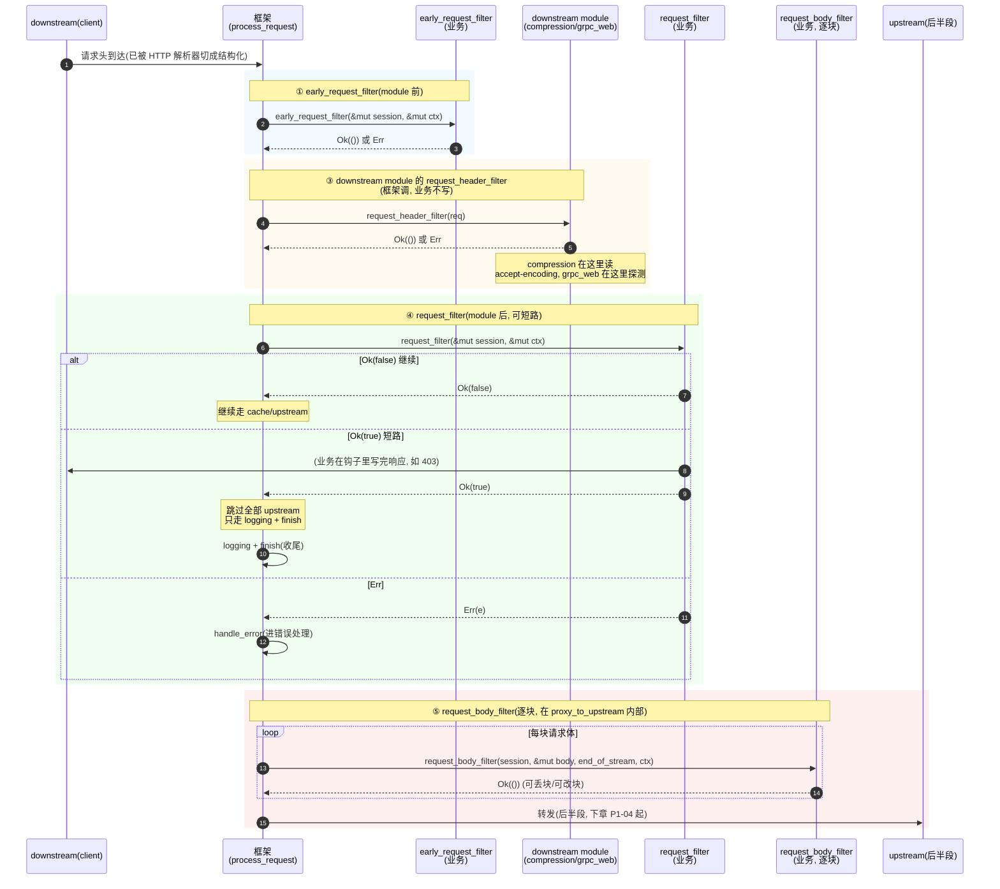
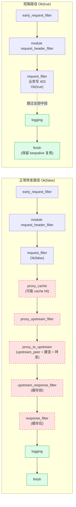

# 第 3 章 · 请求前半段钩子:early/request_filter 与短路响应

> 第 1 篇 · 钩子链:`ProxyHttp` trait 的请求生命周期(Pingora 灵魂)

---

## 核心问题

上一章(P1-02)把 `ProxyHttp` trait 的形状、`type CTX` 贯穿状态、`async_trait` 双形态开关、三十来个钩子的全貌都钉死了。这一章开始拆具体的钩子,先从请求穿越代理时最早触发的几个看起——**请求前半段钩子**:请求字节刚被 HTTP 解析器切成结构化请求头、还没决定发去哪个 upstream 之前,业务能干点什么?

这一段是业务最常介入的生命阶段。鉴权(token 对不对)、限流(这个 IP 一秒打了多少次)、访问控制(这个路径能不能进)、直接响应(给 cache hit 或给 robots.txt 这种静态内容直接回)、WAF(请求体是不是攻击)、协议改写(gRPC-web 转 gRPC)……几乎全部"进来就拍板"的逻辑,都挂在这几个钩子上。一句话:它们是 Pingora 在"请求还没出门"时给业务开的关卡。

具体地说,这一章要拆四个钩子,看它们各自的角色、彼此的顺序、以及最关键的——**短路语义**:

- [`early_request_filter`](../pingora/pingora-proxy/src/proxy_trait.rs#L84-L89) —— 在任何 downstream module 之前最早介入。
- [`init_downstream_modules`](../pingora/pingora-proxy/src/proxy_trait.rs#L48-L57) —— 服务启动时注册内置模块(compression 等),决定请求前半段的 module 过滤。
- [`request_filter`](../pingora/pingora-proxy/src/proxy_trait.rs#L68-L73) —— module 之后的鉴权/限流/直接响应主战场,**返回 `Ok(true)` 就短路**。
- [`request_body_filter`](../pingora/pingora-proxy/src/proxy_trait.rs#L114-L125) —— 逐块处理请求体(WAF/限速)。

读完本章你会明白:

1. **`early_request_filter` 和 `request_filter` 长得一模一样(都是 `&self + &mut Session + &mut CTX -> Result<...>`),为什么非得分两个?** 因为它们一个在 downstream module **之前**、一个在 **之后**,语义边界完全不同——前者抢在所有内置过滤前介入(精细控制 module 行为),后者在 module 保护下做主鉴权。文档专门警告"能放 `request_filter` 的逻辑就别放 `early_request_filter`",因为后者不受 rate limit/access control module 保护。这个顺序差异是 Pingora 把 module 和业务钩子分层的关键。
2. **`request_filter` 的 `Ok(true)` 短路到底短路了什么、跳过了什么、保留了什么。** 框架拿到 `Ok(true)` 后,会跳过 `upstream_peer`/`upstream_request_filter`/连接池/转发/`upstream_response_filter`/`response_filter` 的**全部后半段**,只保留 `logging` + `finish` 这条收尾路径(包括 keepalive 复用下游连接)。这个"跳过中段、保留收尾"的语义,和 Envoy 的 `sendLocalReply` + `StopIteration`、Tower 的 `Service::call` 直接返回 `Response` 都不一样——三者都是"提前结束",但短路后的清理路径(Pingora 保留 logging/keepalive、Envoy 继续 encoder filter、Tower 直接 drop)各不相同。
3. **`request_filter` 里"写响应"到底怎么写** —— `session.respond_error(403).await` / `session.respond_error_with_body(403, body)` / `session.write_response_header(resp, true)` 三种姿势,各自的语义(普通错误页、带 body 的错误页、完全自定义响应),以及 `respond_error` 内部强制关 keepalive(`set_keepalive(None)`)这个细节。
4. **`request_body_filter` 为什么是 async 的、为什么 body 是 `&mut Option<Bytes>`、为什么有一个 `end_of_stream` 参数。** 它在零拷贝转发的热路径上(每块 body 都调),却是 async——这跟同步的 `response_body_filter` 形成鲜明对比,根因是"请求体侧重活(WAF/限速)需要 offload,响应体侧重活相对少"。
5. **`init_downstream_modules` 注册的 HttpModules 是什么、为什么 compression/grpc_web 这种功能做成"模块"而不是做成钩子。** 因为它们是"框架自带的、可叠加的、按顺序跑的通用过滤",而钩子是"业务定制的、单点的介入"。两者在请求前半段都跑——module 的 `request_header_filter` 在 `request_filter` 之前(框架调,lib.rs#L767),module 的 `request_body_filter` 在业务 `request_body_filter` 之前(proxy_h1.rs#L776)。这个"module 在前、业务钩子在后"的顺序是 Pingora 把"通用过滤"和"业务介入"分层的方式,和 Envoy 把 filter 分成"内置 filter"和"用户 filter"是同一个思路。

> **逃生阀(本章有点长)**:如果你只想懂"短路到底怎么短路",直接读第三节"`request_filter` 的 `Ok(true)` 短路"和技巧精解第一节"短路的三向对照",其余是把这几个钩子的顺序、写响应姿势、module 机制拆细。如果你跳着读,记得一个事实:**`early_request_filter` 在 module 前、`request_filter` 在 module 后**,这是本章反复回扣的顺序锚点。

---

## 一句话点破

> **请求前半段钩子是 Pingora 在"请求还没选 upstream"时给业务开的关卡。它们的顺序是 `early_request_filter`(module 前)→ downstream module 的 `request_header_filter`(框架调)→ `request_filter`(module 后,可短路)→ `request_body_filter`(逐块)。其中 `request_filter` 是短路明星:业务在里面直接写完响应(403、cache hit),返回 `Ok(true)`,框架跳过全部 upstream 逻辑,只走 `logging` + `finish` 收尾。这套"提前结束"的语义和 Envoy 的 `sendLocalReply`、Tower 的直接返回 `Response` 是同一种需求的三种实现,差异在短路后保留哪些清理路径。**

这是结论,不是理由。本章倒过来拆:先把四个钩子的真实顺序钉死(读 `process_request` 源码)→ 再拆 `early_request_filter` 为什么抢在 module 前 → 再拆 `request_filter` 的短路机制(配源码)→ 再拆 `request_body_filter` 为什么 async → 再讲 HttpModules 这套"框架内置过滤"机制 → 技巧精解把短路做三向对照 → 收尾。

---

## 第一节:把请求前半段钩子的真实顺序钉死

### 1.1 别凭印象,直接读 `process_request`

讨论钩子顺序最容易踩的坑,就是凭印象说"`early_request_filter` 在 `request_filter` 之前所以一定先跑"。真实顺序得看框架主干函数怎么调。请求前半段的全部调用,都在 `pingora-proxy/src/lib.rs` 的 `process_request` 里(整个函数从第 741 行到第 946 行)。把请求前半段那一段抽出来,顺序是这样:

```rust
// pingora-proxy/src/lib.rs#L750-L804(简化, 只看前半段顺序)
async fn process_request(
    self: &Arc<Self>,
    mut session: Session,
    mut ctx: <SV as ProxyHttp>::CTX,
) -> Option<ReusedHttpStream>
where
    SV: ProxyHttp + Send + Sync + 'static,
    <SV as ProxyHttp>::CTX: Send + Sync,
{
    // ① early_request_filter: 最早期介入, 在 module 之前
    if let Err(e) = self
        .inner
        .early_request_filter(&mut session, &mut ctx)
        .await
    {
        return self
            .handle_error(session, &mut ctx, e, "Fail to early filter request:")
            .await;
    }

    // ② (中间) allow_spawning_subrequest: 决定是否允许 subrequest
    if self.inner.allow_spawning_subrequest(&session, &ctx) {
        session.subrequest_spawner = Some(SubrequestSpawner::new(self.clone()));
    }

    let req = session.downstream_session.req_header_mut();

    // ③ downstream module 的 request_header_filter: 框架内置过滤(compression 等)
    if let Err(e) = session
        .downstream_modules_ctx
        .request_header_filter(req)
        .await
    {
        return self
            .handle_error(session, &mut ctx, e, "Failed in downstream modules request filter:")
            .await;
    }

    // ④ request_filter: 鉴权/限流/直接响应主战场, 可短路
    match self.inner.request_filter(&mut session, &mut ctx).await {
        Ok(response_sent) => {
            if response_sent {
                // 短路! 跳过全部 upstream 逻辑
                self.inner.logging(&mut session, None, &mut ctx).await;
                self.cleanup_sub_req(&mut session);
                let persistent_settings = HttpPersistentSettings::for_session(&session);
                return session
                    .downstream_session
                    .finish()
                    .await
                    .ok()
                    .flatten()
                    .map(|s| ReusedHttpStream::new(s, Some(persistent_settings)));
            }
            /* else continue */
        }
        Err(e) => {
            return self
                .handle_error(session, &mut ctx, e, "Fail to filter request:")
                .await;
        }
    }

    // ⑤ (后续) proxy_cache: cache hit 直接返回
    if let Some((reuse, err)) = self.proxy_cache(&mut session, &mut ctx).await {
        return self.finish(session, &mut ctx, reuse, err).await;
    }

    // ⑥ proxy_upstream_filter: cache miss 后决定是否真的转发
    // ⑦ proxy_to_upstream: upstream_peer + 连接池 + 转发 (后半段, 本章不展开)
    // ...
}
```

这段源码把请求前半段的顺序钉死了。把顺序画成时序图:



这张图把本章要讲的全部顺序锚点钉死了。下面每一节,都是放大这张图的某一段。

### 1.2 顺序速查表:四个钩子 + module

把请求前半段涉及的全部"介入点"(业务钩子 + 框架内置过滤)按顺序列成速查表,方便后面回查:

| 序 | 介入点 | 谁实现 | async? | 触发位置 | 返回值语义 |
|----|------|------|--------|---------|---------|
| ① | `early_request_filter` | 业务 | async | lib.rs#L752 | `Ok(())` 继续 / `Err` 失败 |
| ② | `allow_spawning_subrequest` | 业务 | 同步 | lib.rs#L760 | `bool`,默认 false |
| ③ | downstream module `request_header_filter` | 模块 | async | lib.rs#L767 | `Ok(())` / `Err`(可短路) |
| ④ | `request_filter` | 业务 | async | lib.rs#L782 | `Ok(true)` **短路** / `Ok(false)` 继续 / `Err` 失败 |
| ⑤ | `proxy_cache`(框架) | 框架 | async | lib.rs#L806 | cache hit 直接 finish |
| ⑥ | `proxy_upstream_filter` | 业务 | async | lib.rs#L816 | `Ok(false)` 不转发(写自己的响应)/ `Ok(true)` 转发 / `Err` |
| ⑦ | `request_body_filter` | 业务 | async | proxy_h1.rs#L784 | `Ok(())` / `Err`(逐块) |
| - | downstream module `request_body_filter` | 模块 | async | proxy_h1.rs#L776(module 在业务前) | `Ok(())` / `Err` |

几个值得立刻注意的点:

1. **`request_filter`(④)是业务层唯一能"短路响应"的钩子**,返回 `Ok(true)`。`proxy_upstream_filter`(⑥)返回 `Ok(false)` 也能"不转发",但语义是"我在别的地方写了响应",不如 `request_filter` 的 `Ok(true)` 那么直白。
2. **module 的 `request_header_filter`(③)在业务的 `request_filter`(④)之前**。所以 compression 模块读 `accept-encoding`、grpc_web 探测协议,都在业务的鉴权之前。这个顺序意味着:业务在 `request_filter` 里看到的请求头,可能已经被 module 改过(比如 grpc_web 转换了 content-type)。
3. **module 的 `request_body_filter` 在业务的 `request_body_filter` 之前**(proxy_h1.rs#L776 vs L784)。所以 module 先处理 body,业务后处理。
4. **`request_body_filter`(⑦)在 `proxy_to_upstream` 内部**,也就是在 `upstream_peer`/连接池/转发那一大段里。所以严格说,请求前半段的 body 过滤,是嵌在"转发"这个动作里的——选完后端、建好连接、开始 pump body 时,才逐块触发 `request_body_filter`。本章把它归到"请求前半段"是因为它处理的是请求体(发给 upstream 的字节),但触发时机比 `request_filter` 晚得多。

> **钉死这件事**:请求前半段的顺序是 `early_request_filter`(业务,module 前)→ downstream module `request_header_filter`(框架)→ `request_filter`(业务,module 后,可短路)→ [cache/upstream 决策] → `request_body_filter`(业务,逐块,在转发内部)。这个顺序不是随便排的,每一站对应"此刻框架手里有什么":early 时只有裸请求头,module 过滤时能调整请求头,request_filter 时请求头已稳定可做鉴权,body_filter 时开始有真实 body 字节可做 WAF。

---

## 第二节:`early_request_filter`:抢在 module 之前

### 2.1 提问:为什么要"抢在 module 之前"

设想你用 Pingora 搭一个代理,启用了 compression 模块(响应压缩,默认注册,见 [`init_downstream_modules` 的默认实现](../pingora/pingora-proxy/src/proxy_trait.rs#L48-L57))。现在你想做一个精细控制:**根据某个请求头(比如 `X-No-Compress: 1`),关掉这次响应的压缩**。

问题来了:compression 模块在 `request_header_filter`(框架在 lib.rs#L767 调)里读 `accept-encoding` 决定要不要压缩。如果你在 `request_filter`(lib.rs#L782)里才去关 compression,那就晚了——compression 的 `request_header_filter` 已经跑过了,它已经按 `accept-encoding` 决定了压缩策略。

你需要一个**在 compression 之前**就能介入的钩子,去告诉 compression"这次别压"。这就是 `early_request_filter` 的角色——它在所有 downstream module 之前执行,业务能在这里调整 module 的行为(或者改请求头影响 module 的判断)。

### 2.2 承接方怎么做:Envoy 的 filter priority / Tower 的 layer

Envoy 怎么解决"我想在内置 filter 之前介入"?Envoy 的 filter chain 有顺序概念,内置 filter(比如 router、HCM 自带的 decoder filter)和用户 filter 都按配置顺序跑,你可以把自己的 filter 配在内置 filter 之前。但这个"顺序"是**运行期 xDS 配置**决定的,不是编译期固定的——《Envoy》第 3 篇已拆透,一句带过。

Tower 怎么解决?Tower 的 `Service` 通过 `layer` 嵌套,`Layer::layer(inner)` 把一个 Service 包成另一个 Service,层层套娃。你想"在某层之前介入",就把你的 layer 套在它外面。《Tower》已拆透,一句带过。

两种方案的共同点:**它们都靠"运行期组装顺序"决定 filter 谁先跑**。Pingora 不一样——它把"业务介入点"做成 trait 上的**编译期固定方法**,顺序由框架代码(`process_request`)决定,业务不能改顺序。但 Pingora 给了两个"在不同阶段介入"的钩子:`early_request_filter`(module 前)和 `request_filter`(module 后),让业务至少能在"module 之前"和"module 之后"两个点介入。

### 2.3 所以 Pingora 这么设计:`early_request_filter` 的真实用途

[`early_request_filter` 的文档](../pingora/pingora-proxy/src/proxy_trait.rs#L75-L83)讲得很明确:

```rust
/// Handle the incoming request before any downstream module is executed.
///
/// This function is similar to [Self::request_filter()] but executes before any other logic,
/// including downstream module logic. The main purpose of this function is to provide finer
/// grained control of the behavior of the modules.
///
/// Note that because this function is executed before any module that might provide access
/// control or rate limiting, logic should stay in request_filter() if it can in order to be
/// protected by said modules.
async fn early_request_filter(&self, _session: &mut Session, _ctx: &mut Self::CTX) -> Result<()>
where
    Self::CTX: Send + Sync,
{
    Ok(())
}
```

文档把 `early_request_filter` 的定位讲透了:

1. **"before any downstream module is executed"**——在所有 downstream module 之前。
2. **"The main purpose ... is to provide finer grained control of the behavior of the modules"**——主要用途是精细控制 module 行为(不是做主鉴权)。
3. **"logic should stay in request_filter() if it can in order to be protected by said modules"**——能放 `request_filter` 的逻辑就别放 `early_request_filter`,因为后者在 rate limit/access control module 之前执行,**不受保护**。

第三点是个安全提醒,值得展开。设想你在 `early_request_filter` 里写了一个查数据库的鉴权逻辑。这条逻辑在 rate limit module 之前执行,意味着**每个进来的请求都会触发一次数据库查询**,哪怕这个请求是被 rate limit 模块打算拒绝的(比如一个恶意 IP 一秒打一万次)。你的数据库会被打爆。正确做法是把鉴权放 `request_filter`(在 rate limit module 之后),让 rate limit 先把恶意流量挡掉,剩下的才进鉴权。

所以 `early_request_filter` 的真实用途很窄:**它只用于"必须抢在 module 前才能生效"的精细控制**,比如:

- 根据 `X-No-Compress: 1` 关掉 compression module。
- 根据请求头预判要不要启用 grpc_web 转换。
- 在请求头被 module 改之前,记录原始请求头(观测用)。

这些用例的共同点是:**它们要影响 module 的行为**,而不是做"业务主逻辑"。业务主逻辑(鉴权、限流、直接响应)放 `request_filter` 更安全。

### 2.4 源码佐证:`early_request_filter` 怎么和 module 协作

看一个典型用例——根据请求头关 compression。compression 模块的字段是 `ResponseCompressionCtx`,它有 `adjust_level` 方法([`compression/mod.rs#L118-L128`](../pingora/pingora-core/src/protocols/http/compression/mod.rs#L118-L128))能把压缩级别调成 0(即关闭)。但业务怎么拿到这个 ctx?

业务在 `early_request_filter` 里,通过 `session.downstream_modules_ctx.get_mut::<ResponseCompression>()` 拿到 compression 模块的可变引用,然后调 `adjust_level(0)`:

```rust
// 业务代码(简化示意, 非源码原文)
use pingora_core::modules::http::compression::ResponseCompression;

async fn early_request_filter(&self, session: &mut Session, _ctx: &mut Self::CTX) -> Result<()> {
    if let Some(no_compress) = session.req_header().headers.get("x-no-compress") {
        if no_compress.to_str()? == "1" {
            // 拿到 compression 模块, 关掉
            if let Some(comp) = session.downstream_modules_ctx.get_mut::<ResponseCompression>() {
                comp.adjust_level(0);
            }
        }
    }
    Ok(())
}
```

这段代码能在 compression 的 `request_header_filter` 跑之前(因为 `early_request_filter` 在 module 前)调整 compression 的级别,效果是"这次响应不压缩"。如果同样的逻辑放 `request_filter`(module 后),compression 已经按 `accept-encoding` 决定了策略,再调 `adjust_level` 就来不及了(或者要看 compression ctx 的具体状态机)。

[`HttpModuleCtx::get_mut`](../pingora/pingora-core/src/modules/http/mod.rs#L191-L199) 的实现:

```rust
// pingora-core/src/modules/http/mod.rs#L191-L199
/// Get a mut ref to [HttpModule] if any.
pub fn get_mut<T: 'static>(&mut self) -> Option<&mut T> {
    let idx = self.module_index.get(&TypeId::of::<T>())?;
    let ctx = &mut self.module_ctx[*idx];
    Some(
        ctx.as_any_mut()
            .downcast_mut::<T>()
            .expect("type should always match"),
    )
}
```

注意 `module_index` 是 `HashMap<TypeId, usize>`,用类型 ID 索引模块。所以 `get_mut::<ResponseCompression>()` 是按类型查找,编译期就知道要找哪个模块,运行期一次哈希查找 + `downcast_mut`。这套机制让业务能类型安全地访问模块状态,不用 `Any` + 字符串 key。

> **钉死这件事**:`early_request_filter` 的真实用途是"精细控制 module 行为",不是做主鉴权。业务通过 `session.downstream_modules_ctx.get_mut::<ModuleType>()` 拿到模块的可变引用,调整模块配置(如 compression 级别)。文档明确警告"能放 `request_filter` 的逻辑就别放 `early_request_filter`",因为后者不受 rate limit/access control module 保护。这是 Pingora 把"module 前介入"和"module 后介入"分成两个钩子的根本原因——业务要根据"我要不要受 module 保护"选钩子。

---

## 第三节:`request_filter` 的 `Ok(true)` 短路

这一节是本章的重头戏。`request_filter` 是业务做鉴权、限流、直接响应的主战场,它的返回值 `Result<bool>` 里藏着一个精心设计的"短路"语义。

### 3.1 提问:为什么需要"短路"

设想你写一个需要 token 鉴权的代理。请求进来,业务要检查 `Authorization` 头,token 不对就回 403。这个 403 响应**不需要发给 upstream**——upstream 是真正的业务后端,让一个没鉴权的请求打到后端是浪费(后端还得自己鉴权一遍)甚至危险(后端可能没鉴权,默认信任代理)。

所以你需要一个机制:**在请求发给 upstream 之前,业务能直接给 downstream 写响应,然后告诉框架"我已经响应完了,别再往后走"**。这就是短路。

短路的使用场景远不止鉴权:

- **限流拒绝**:超过配额,直接回 429 Too Many Requests。
- **访问控制**:这个路径禁止访问,直接回 403。
- **cache hit**:虽然 Pingora 有专门的 cache 机制(`proxy_cache`),但业务也能在 `request_filter` 里自己实现一个简易缓存(比如对 robots.txt 这种静态内容,直接回缓存)。
- **协议校验**:请求格式不对(比如缺必要头),直接回 400 Bad Request。
- **地理封锁**:根据 IP 地理位置直接回 451 Unavailable For Legal Reasons。
- **维护模式**:整个服务在维护,直接回 503 Service Unavailable。

这些场景的共同点:**业务已经决定了响应内容,不需要(也不应该)走完整的代理流程**。短路机制让框架识趣地跳过后半段,只走必要的收尾(logging + finish)。

### 3.2 承接方怎么做:Envoy、Tower、Nginx 三种短路

短路不是 Pingora 独有的需求,Envoy、Tower、Nginx 都要解决"请求还没走完整流程就提前结束"。三种方案的差异,正是后续技巧精解三向对照的主角,这里先建立直觉。

**Envoy 的 `sendLocalReply` + filter 返回值**。Envoy 的 decoder filter 在 `decodeHeaders` 里如果想直接回响应,调 `callbacks_->sendLocalReply(403, "forbidden", ...)` 发响应给 downstream,然后返回 `FilterHeadersStatus::StopIteration`(停下来)或 `Continue`(继续,但响应已经发了,后续 filter 看到的是一个"已经被回复"的流)。Envoy 的 filter chain 是多段的,短路后**encoder filter 还会跑**(响应要经过 encoder filter 才能发出去),只是 decoder filter 不再往下走。《Envoy》第 3 篇已拆透,一句带过指路。

**Tower 的 `Service::call` 直接返回 `Response`**。Tower 的模型是"一问一答"——`call(req) -> Future<Response>`,业务在 Future 里直接构造 `Response` 返回,没有"后半段"概念。所谓"短路"在 Tower 里就是"我的 layer 不调 `inner.call(req)`,直接返回自己的 Response"。Tower 的短路是**通过 layer 嵌套 + 不调 inner 实现的**,没有专门的"短路返回值"。《Tower》已拆透,一句带过。

**Nginx 的 `return` 指令 + `error_page`**。Nginx 的配置驱动模型里,`return 403;` 直接结束请求,Nginx 不往后端转发。这是配置级别的短路,粒度粗(只能在配置里写死),但语义清晰。

三种方案的共同点:**它们都让业务在"请求还没到后端"时提前结束**,但短路的"边界"不一样:

- Envoy:短路后 encoder filter 还跑(响应侧的过滤保留)。
- Tower:没有"后半段",短路就是整个 layer 不调 inner。
- Nginx:`return` 直接终止,后续 location 块不跑。

Pingora 的短路是哪一种?往下看。

### 3.3 所以 Pingora 这么设计:`Ok(true)` 的精确语义

[`request_filter` 的文档和签名](../pingora/pingora-proxy/src/proxy_trait.rs#L59-L73):

```rust
/// Handle the incoming request.
///
/// In this phase, users can parse, validate, rate limit, perform access control and/or
/// return a response for this request.
///
/// If the user already sent a response to this request, an `Ok(true)` should be returned so that
/// the proxy would exit. The proxy continues to the next phases when `Ok(false)` is returned.
///
/// By default this filter does nothing and returns `Ok(false)`.
async fn request_filter(&self, _session: &mut Session, _ctx: &mut Self::CTX) -> Result<bool>
where
    Self::CTX: Send + Sync,
{
    Ok(false)
}
```

返回值 `Result<bool>` 有三态:

- **`Ok(false)`**(默认)——继续下一站。业务没短路,框架继续走 `proxy_cache`/`proxy_upstream_filter`/`proxy_to_upstream`。
- **`Ok(true)`**——**短路**。业务已经直接给 downstream 写了响应(比如调了 `session.respond_error(403).await`),框架不再往下走(不选 upstream、不转发、不收响应),直接进收尾。
- **`Err(e)`**——请求失败,进错误处理路径(`handle_error` → `fail_to_proxy`)。

注意 `Ok(true)` 的语义比"返回 false"复杂得多——它隐含了一个契约:**业务在返回 `Ok(true)` 之前,必须已经把响应写给 downstream 了**。如果业务返回 `Ok(true)` 但没写响应,downstream 会收到一个空响应(连接被 finish 掉),这通常是个 bug。

#### 框架怎么处理 `Ok(true)`:跳过中段,保留收尾

[`process_request` 里处理 `Ok(true)` 的那段](../pingora/pingora-proxy/src/lib.rs#L782-L804):

```rust
// pingora-proxy/src/lib.rs#L782-L804
match self.inner.request_filter(&mut session, &mut ctx).await {
    Ok(response_sent) => {
        if response_sent {
            // TODO: log error
            self.inner.logging(&mut session, None, &mut ctx).await;
            self.cleanup_sub_req(&mut session);
            let persistent_settings = HttpPersistentSettings::for_session(&session);
            return session
                .downstream_session
                .finish()
                .await
                .ok()
                .flatten()
                .map(|s| ReusedHttpStream::new(s, Some(persistent_settings)));
        }
        /* else continue */
    }
    Err(e) => {
        return self
            .handle_error(session, &mut ctx, e, "Fail to filter request:")
            .await;
    }
}
```

这段源码把 Pingora 的短路语义钉死了。`Ok(true)` 之后框架做了四件事:

1. **`self.inner.logging(&mut session, None, &mut ctx).await`**——调业务的 `logging` 钩子,打访问日志。注意第二个参数是 `None`(没有错误),所以 logging 看到的是"成功完成"的请求。这很关键:短路不是错误,是业务主动决定的响应,所以从 logging 角度看是成功的。业务可以在 `logging` 里通过 `session.response_written()` 拿到实际写的响应状态码(比如 403),区分"短路响应"和"正常 upstream 响应"。
2. **`self.cleanup_sub_req(&mut session)`**——清理 subrequest 相关资源(如果业务启用了 subrequest)。
3. **`HttpPersistentSettings::for_session(&session)`**——提取"会话持久设置"(keepalive 相关,如 negotiated HTTP 版本),用于后续复用下游连接。这个细节很重要:**短路后下游连接是可以复用的**(keepalive),不是直接断掉。业务写了 403 响应,响应写完,下游 TCP 连接可以被下一个请求复用(如果客户端支持 keepalive)。
4. **`session.downstream_session.finish().await`**——finish 下游会话。`finish` 返回 `Option<ReusedHttpStream>`,如果下游连接可复用,返回一个 `ReusedHttpStream`(可复用的流),框架把它包成 `ReusedHttpStream::new(s, Some(persistent_settings))` 返回出去,供连接管理逻辑复用。

这四件事合起来,就是"跳过中段、保留收尾"的精确语义:

- **跳过的**(中段):`proxy_cache`、`proxy_upstream_filter`、`upstream_peer`、`upstream_request_filter`、`connected_to_upstream`、`TransportConnector` 建连、`proxy_to_upstream` 转发、`upstream_response_filter`、`upstream_response_body_filter`、`response_filter`、`response_body_filter`、`response_trailer_filter`——全部后半段都不跑。这很合理:既然没转发,就没有 upstream 响应可过滤。
- **保留的**(收尾):`logging`(打日志)+ `finish`(收尾 + keepalive 复用)。

注意一个细节:`fail_to_proxy`(错误处理钩子)**不会**被调,因为短路不是错误(`Ok(true)`)。这跟 `Err(e)` 路径不同——`Err` 会走 `handle_error` → `fail_to_proxy` 写错误响应 + 打错误日志;`Ok(true)` 直接 `logging`(成功日志)+ `finish`。

#### 短路 vs 正常转发:对比图

把短路路径和正常转发路径并排画出来,差异立刻显形:



红色虚线框 = 短路跳过的部分(全部 upstream 相关);绿色框 = 两条路径都跑的收尾(logging + finish)。这张图是本章最核心的对照——**Pingora 的短路 = 跳过中段、保留收尾**,这是它区别于 Envoy(保留 encoder filter)、Tower(没有后半段)的关键。

### 3.4 源码佐证:在 `request_filter` 里写响应的三种姿势

业务在 `request_filter` 里要短路,必须先写响应。写响应有三种姿势,对应三种场景:

#### 姿势一:`respond_error(code)` —— 标准错误页

最常见,用于鉴权失败、限流、访问控制等"标准 HTTP 错误":

```rust
async fn request_filter(&self, session: &mut Session, _ctx: &mut Self::CTX) -> Result<bool> {
    // 鉴权
    if !self.is_authorized(session).await? {
        session.respond_error(403).await?;
        return Ok(true);  // 短路
    }
    Ok(false)
}
```

[`Session::respond_error`](../pingora/pingora-proxy/src/lib.rs#L529-L531) 的实现:

```rust
// pingora-proxy/src/lib.rs#L529-L531
/// Write HTTP response with the given error code to the downstream.
pub async fn respond_error(&mut self, error: u16) -> Result<()> {
    self.as_downstream_mut().respond_error(error).await
}
```

它转调 `HttpSession::respond_error`,真身在 [`pingora-core/src/protocols/http/server.rs#L517-L519`](../pingora/pingora-core/src/protocols/http/server.rs#L517-L519):

```rust
// pingora-core/src/protocols/http/server.rs#L517-L529
pub async fn respond_error(&mut self, error: u16) -> Result<()> {
    self.respond_error_with_body(error, Bytes::default()).await
}

pub async fn respond_error_with_body(&mut self, error: u16, body: Bytes) -> Result<()> {
    let mut resp = Self::generate_error(error);
    if !body.is_empty() {
        resp.set_content_length(body.len())?
    }
    self.write_error_response(resp, body).await
}
```

`generate_error(error)` 生成一个标准错误响应(`ResponseHeader` + 默认错误页 body),`write_error_response` 把它写给 downstream。注意 `write_error_response` 里有几个关键细节(看 [server.rs#L532-L555](../pingora/pingora-core/src/protocols/http/server.rs#L532-L555)):

1. **`self.set_keepalive(None)`**——**强制关 keepalive**。这是个容易忽略的细节:`respond_error` 写的错误响应,会关掉下游连接的 keepalive,即这个连接处理完这个错误响应后就会被断开,不会复用给下一个请求。注释解释了原因:"we shouldn't be closing downstream connections on internally generated errors and possibly other upstream connect() errors... This change is only here because we DO NOT re-use downstream connections today on these errors"。也就是说,目前 Pingora 对内部生成的错误响应不复用连接(避免把错误状态泄露给下一个请求),这是个保守策略。
2. **检查 `response_written()`**——如果响应已经写过(非 1xx 信息响应),直接返回 Ok,不重复写。这保护了"业务在别处已经写了响应,又调 respond_error"的情况。
3. **写 header + 写 body**——标准流程。

所以用 `respond_error(403)` 短路时,虽然 `Ok(true)` 路径的 `finish` 想保留 keepalive 复用,但 `respond_error` 内部已经 `set_keepalive(None)`,实际下游连接不会被复用。这是一个微妙的事实:**短路路径代码想保留 keepalive,但 respond_error 实现关掉了 keepalive**。业务如果想让短路响应也复用连接,应该用姿势三(`write_response_header`)自己写响应,不调 `respond_error`。

#### 姿势二:`respond_error_with_body(code, body)` —— 带自定义 body 的错误

用于需要自定义错误页(比如 HTML 错误页、JSON 错误体):

```rust
async fn request_filter(&self, session: &mut Session, _ctx: &mut Self::CTX) -> Result<bool> {
    if !self.is_authorized(session).await? {
        let body = Bytes::from_static(b"{\"error\":\"forbidden\"}");
        session.respond_error_with_body(403, body).await?;
        return Ok(true);
    }
    Ok(false)
}
```

[`Session::respond_error_with_body`](../pingora/pingora-proxy/src/lib.rs#L534-L538):

```rust
// pingora-proxy/src/lib.rs#L534-L538
pub async fn respond_error_with_body(&mut self, error: u16, body: Bytes) -> Result<()> {
    self.as_downstream_mut()
        .respond_error_with_body(error, body)
        .await
}
```

它和 `respond_error` 走同一条路径(`write_error_response`),只是 body 不是默认错误页,是业务给的。同样会 `set_keepalive(None)`。

#### 姿势三:`write_response_header(resp, end_of_stream)` —— 完全自定义响应

用于"短路但不是错误"的场景,比如 cache hit 直接返回缓存内容、静态文件直接回:

```rust
async fn request_filter(&self, session: &mut Session, _ctx: &mut Self::CTX) -> Result<bool> {
    // 简易缓存: robots.txt 直接回
    if session.req_header().uri.path() == "/robots.txt" {
        let mut resp = ResponseHeader::build(200, None)?;
        resp.insert_header("content-type", "text/plain")?;
        resp.insert_header("content-length", "10")?;
        session.write_response_header(Box::new(resp), true).await?;
        // (如果要写 body, 用 write_response_body)
        return Ok(true);
    }
    Ok(false)
}
```

[`Session::write_response_header`](../pingora/pingora-proxy/src/lib.rs#L544-L553) 的实现有个关键点:

```rust
// pingora-proxy/src/lib.rs#L544-L553(简化)
/// Write the given HTTP response header to the downstream
///
/// Different from directly calling [HttpSession::write_response_header], this function also
/// invokes the filter modules.
pub async fn write_response_header(
    &mut self,
    mut resp: Box<ResponseHeader>,
    end_of_stream: bool,
) -> Result<()> {
    self.downstream_modules_ctx
        .response_header_filter(/* resp */ ...).await?;
    self.downstream_session.write_response_header(resp).await
    // ...
}
```

注意注释:**"Different from directly calling HttpSession::write_response_header, this function also invokes the filter modules"**。也就是说,`Session::write_response_header` 会**先跑 downstream module 的 `response_header_filter`**(比如 compression 会读响应头的 content-type 决定要不要压),再写给 downstream。这意味着业务用 `write_response_header` 写的响应,也会经过 compression 模块压缩——这是合理的,业务写的响应和 upstream 来的响应,在 downstream module 看来应该一视同仁。

> **钉死这件事**:`request_filter` 短路的三种姿势——`respond_error(code)`(标准错误,强制关 keepalive)、`respond_error_with_body(code, body)`(自定义错误体,同样关 keepalive)、`write_response_header(resp, end_of_stream)`(完全自定义,经过 downstream module 过滤,不强制关 keepalive)。业务要根据"是不是错误响应"+"要不要复用连接"+"要不要 module 过滤"选姿势。最常被忽视的细节:`respond_error` 内部 `set_keepalive(None)`,短路响应默认不复用下游连接。

### 3.5 错误路径:`Err(e)` 不是短路

容易混淆的一点:`request_filter` 返回 `Err(e)` 和返回 `Ok(true)` 都会"提前结束",但语义完全不同。

- `Ok(true)`——**业务主动短路**,已经写了响应,是"成功完成"。走 `logging(None)` + `finish`,不打错误日志,不调 `fail_to_proxy`。
- `Err(e)`——**业务出错**,可能没写响应(或者写了半个响应)。走 [`handle_error`](../pingora/pingora-proxy/src/lib.rs#L948-L959) → `fail_to_proxy`(写错误响应) + 打错误日志。

`Err(e)` 路径([lib.rs#L799-L803](../pingora/pingora-proxy/src/lib.rs#L799-L803)):

```rust
// pingora-proxy/src/lib.rs#L799-L803
Err(e) => {
    return self
        .handle_error(session, &mut ctx, e, "Fail to filter request:")
        .await;
}
```

`handle_error` 内部会调 `fail_to_proxy`(`proxy_trait.rs#L489`)让业务生成错误响应 + 错误码,框架再打错误日志(`error!`)。所以 `Err` 路径有完整的错误处理链,和 `Ok(true)` 的"干净短路"是两条不同的路。

业务怎么选?简单:**如果你已经写了响应(或打算写),用 `Ok(true)`;如果你遇到意外错误(没写响应或写了一半),用 `Err(e)` 让框架兜底**。比如鉴权失败你已经写了 403,返回 `Ok(true)`;查数据库超时了(没写响应),返回 `Err(e)` 让框架写 502 或别的。

---

## 第四节:`request_body_filter`:逐块处理请求体

### 4.1 提问:为什么要逐块,不能一次拿全 body

设想你要在请求体上跑 WAF(Web Application Firewall)规则——把 POST body 跑过几千条正则,判断是不是 SQL 注入或 XSS 攻击。这需要请求体的内容。

最朴素的设计是给业务一个 `read_request_body() -> Bytes`,一次拿全 body。但这个设计在高并发下撞墙:

1. **大 body 占内存**。如果客户端上传一个 1GB 的文件,`read_request_body()` 要把 1GB 全读进内存才能返回。一千个并发上传就是 1TB 内存,不可行。
2. **慢客户端拖死服务**。如果客户端每秒发 1KB(慢速攻击),`read_request_body()` 要等几分钟才能返回,期间这个 task 占着内存,不能服务别的请求。
3. **没法提前拒绝**。鉴权失败的请求,如果先读完整个 body 再拒绝,白白浪费带宽和 CPU。

所以代理框架几乎都用"流式处理":body 分块到达,每块触发一个回调,业务在回调里处理这一块。Pingora 的 `request_body_filter` 就是这个设计。

### 4.2 承接方怎么做:Envoy 的 `decodeData` / Tower 的 `Body` stream

Envoy 的 `StreamDecoderFilter::decodeData(Buffer::Instance&, bool)` 是逐块处理请求体的虚函数,`bool end_stream` 标记是不是最后一块。返回 `FilterDataStatus::Continue`(继续往下一个 filter)/`StopIterationAndBuffer`(停下来缓存)/`StopIterationNoBuffer`(停下来不缓存)。Envoy 的粒度更细,允许 filter 决定"这一块要不要缓存、要不要继续"。《Envoy》已拆透,一句带过。

Tower 的模型是 `Service<Request<Body>>`,其中 `Body` 是一个 `Stream` —— 业务 `req.into_body()` 拿到 body stream,自己 `.next().await` 逐块读。Tower 没有专门的"body filter",body 处理是业务在 call 里自己做的事(读 body、改 body、转发 body)。Tower 的 body 处理是"业务自己管 stream",粒度由业务决定。

Pingora 走的是 Envoy 那条路(逐块 filter),但用 async 实现,不用虚函数。

### 4.3 所以 Pingora 这么设计:`request_body_filter` 的签名

[`request_body_filter` 的签名和文档](../pingora/pingora-proxy/src/proxy_trait.rs#L106-L125):

```rust
/// Handle the incoming request body.
///
/// This function will be called every time a piece of request body is received. The `body` is
/// **not the entire request body**.
///
/// The async nature of this function allows to throttle the upload speed and/or executing
/// heavy computation logic such as WAF rules on offloaded threads without blocking the threads
/// who process the requests themselves.
async fn request_body_filter(
    &self,
    _session: &mut Session,
    _body: &mut Option<Bytes>,
    _end_of_stream: bool,
    _ctx: &mut Self::CTX,
) -> Result<()>
where
    Self::CTX: Send + Sync,
{
    Ok(())
}
```

四个关键点:

1. **`body: &mut Option<Bytes>`**——这一块 body 字节。`Option<Bytes>` 而不是 `Bytes`,因为 body 可能是"空的但标记流结束"(比如 `Content-Length: 0` 的请求,end_of_stream=true 但 body=None)。`&mut` 让业务能**改这一块**——比如把 body 改成 `None`(丢弃这一块,不下发给 upstream)、或者替换成别的 `Bytes`(改写 body)。这是"逐块过滤"的核心能力。
2. **`end_of_stream: bool`**——是不是最后一块。`true` 表示这是请求体的结尾(客户端发完了),`false` 表示后面还有。业务可以用这个标志做"收尾统计"(比如 `ctx.bytes_uploaded += body.len()`,到 end_of_stream 时打日志)。
3. **async**——这个钩子是 async 的。文档明确说("The async nature of this function allows to throttle the upload speed and/or executing heavy computation logic such as WAF rules on offloaded threads")。这是它和 `response_body_filter`(同步)的根本区别——请求体侧常见 WAF/限速这种重活,需要能 offload;响应体侧重活少,同步够用。这个 async 选择是有代价的(每块 body 一次 Box::pin 堆分配),但 Pingora 团队认为"能 offload WAF"比"省堆分配"重要。
4. **`Result<()>`**——返回 `Ok(())` 继续,`Err(e)` 整条请求失败。注意它**没有短路返回值**——`request_body_filter` 不能"中途短路",如果 body 阶段发现攻击,要拒绝只能返回 `Err`(走错误路径)或者在 body 开始之前(在 `request_filter` 里)就拒绝。这是个限制:一旦开始读 body,就没法用 `Ok(true)` 干净短路了。

#### 源码佐证:`request_body_filter` 的调用链

`request_body_filter` 在哪被调?它不在 `process_request` 里,而在 `proxy_to_upstream` 内部的 body 转发逻辑里。具体在 [`pingora-proxy/src/proxy_h1.rs` 的 `send_body_to_pipe`](../pingora/pingora-proxy/src/proxy_h1.rs#L758-L811):

```rust
// pingora-proxy/src/proxy_h1.rs#L776-L785(简化)
async fn send_body_to_pipe(
    &self,
    session: &mut Session,
    mut data: Option<Bytes>,
    end_of_body: bool,
    tx: mpsc::Permit<'_, HttpTask>,
    ctx: &mut SV::CTX,
) -> Result<bool>
where
    SV: ProxyHttp + Send + Sync,
    SV::CTX: Send + Sync,
{
    let end_of_body = end_of_body || data.is_none();

    // 先跑 downstream module 的 request_body_filter
    session
        .downstream_modules_ctx
        .request_body_filter(&mut data, end_of_body)
        .await?;

    // 再跑业务的 request_body_filter
    self.inner
        .request_body_filter(session, &mut data, end_of_body, ctx)
        .await?;

    // ... 把 data 包成 HttpTask::Body 发给 upstream ...
}
```

注意顺序:**module 的 `request_body_filter` 在业务的 `request_body_filter` 之前**。所以如果 compression 模块(虽然 compression 是响应侧的,但假设有别的请求侧 module)要改 body,它先改,业务看到的是改过的 body。这个顺序和请求头侧一致(module 在前、业务在后)。

另一个细节:`end_of_body` 的计算是 `end_of_body || data.is_none()`。也就是说,"数据是 None"等价于"流结束"。这是 HTTP body 流的常见约定(None 作为哨兵值表示结束)。业务在 `request_body_filter` 里看到 `data.is_none()` 就知道流结束了,即使 `end_of_stream` 参数因为某种原因没设。

#### 典型用例:上传限速

`request_body_filter` 的一个经典用例是**上传限速**——限制客户端的上传速度,防止慢速攻击:

```rust
// 业务代码(简化示意, 非源码原文)
async fn request_body_filter(
    &self,
    _session: &mut Session,
    body: &mut Option<Bytes>,
    end_of_stream: bool,
    ctx: &mut Self::CTX,
) -> Result<()> {
    if let Some(b) = body {
        ctx.bytes_uploaded += b.len() as u64;
        // 每收到一块, sleep 一下限速(假设每块 16KB, 限速 1MB/s)
        // 实际用 pingora-timeout 的 fast_timeout
        tokio::time::sleep(Duration::from_micros(100)).await;
    }
    if end_of_stream {
        log::info!("upload done, {} bytes", ctx.bytes_uploaded);
    }
    Ok(())
}
```

因为是 async,`tokio::time::sleep(...).await` 会让出 task,请求线程跑去服务别的请求,sleep 完了再回来处理下一块。这就是文档说的"async allows to throttle the upload speed"——限速靠"每块之间 sleep",sleep 期间不占线程。如果 `request_body_filter` 是同步的,根本没法 sleep(会阻塞 reactor)。

#### 典型用例:WAF 在 offloaded 线程跑

另一个经典用例是 WAF——把 body 跑过正则,判断攻击:

```rust
// 业务代码(简化示意, 非源码原文)
async fn request_body_filter(
    &self,
    _session: &mut Session,
    body: &mut Option<Bytes>,
    end_of_stream: bool,
    ctx: &mut Self::CTX,
) -> Result<()> {
    if let Some(b) = body {
        // 把 body copy 一份, spawn_blocking 跑 WAF
        let b_clone = b.clone();
        let is_attack = tokio::task::spawn_blocking(move || {
            run_waf_rules(&b_clone)
        }).await.map_err(|e| Error::explain(HTTPStatus(500), e))?;
        if is_attack {
            // 不能 Ok(true) 短路, 只能 Err
            return Err(Error::explain(HTTPStatus(403), "WAF: attack detected"));
        }
    }
    Ok(())
}
```

注意这里 WAF 检测到攻击,返回 `Err`(403),走错误路径(`fail_to_proxy` 写 403 响应)。这是 `request_body_filter` 的局限——一旦进入 body 阶段,没法用 `Ok(true)` 干净短路(因为 `request_body_filter` 返回 `Result<()>`,没有 bool)。如果业务想在 body 阶段也能短路,只能用 `Err` 让框架兜底写响应,或者自己设计"在 body 阶段写响应然后返回 Err"的 hack(不推荐,语义混乱)。

> **钉死这件事**:`request_body_filter` 是逐块处理请求体的 async 钩子,签名 `(session, &mut Option<Bytes>, end_of_stream, ctx) -> Result<()>`。它和 `response_body_filter`(同步)的 async 差异,根因是请求体侧常见 WAF/限速重活需要 offload。调用顺序:module 的 body_filter 在业务的 body_filter 之前。它**不能 `Ok(true)` 短路**(返回值是 `Result<()>`),body 阶段发现问题只能 `Err`。这是它和 `request_filter` 的关键区别——`request_filter` 能短路因为它在 body 开始之前。

---

## 第五节:HttpModules:框架内置的可叠加过滤

这一节讲 `init_downstream_modules` 注册的 HttpModules 是什么、为什么 compression/grpc_web 这种功能做成"模块"而不是做成钩子。这是 Pingora 把"通用过滤"和"业务介入"分层的方式。

### 5.1 提问:为什么 compression 不做成一个钩子

设想你是 Pingora 的设计者。你想给框架加一个"响应压缩"功能——根据请求的 `accept-encoding`,对响应做 gzip/brotli 压缩。这个功能怎么暴露给用户?

方案 A:**做成一个钩子**。在 `ProxyHttp` trait 上加一个 `response_compression_filter`,用户覆写它来控制压缩。问题:压缩是通用功能,几乎所有用户都想要,但每个用户都得自己覆写一遍钩子,写一堆 `if accept-encoding contains gzip { ... }` 的样板代码,重复劳动。

方案 B:**做成一个内置模块**。框架提供一个 `ResponseCompression` 模块,用户在 `init_downstream_modules` 里注册它(或用默认注册),模块自己实现压缩逻辑,用户只需要配置参数(压缩级别)。用户不写压缩代码,只配置。

Pingora 选了方案 B。compression、grpc_web 这些"通用、可叠加、按顺序跑"的功能,做成 HttpModules;而鉴权、限流、路由这些"业务定制、单点介入"的逻辑,做成 `ProxyHttp` 钩子。这个分层的关键在于:**模块是"框架提供的通用过滤",钩子是"业务定制的介入"**。

### 5.2 HttpModule trait:模块的契约

[`HttpModule` trait](../pingora/pingora-core/src/modules/http/mod.rs#L38-L81) 定义了模块的契约:

```rust
// pingora-core/src/modules/http/mod.rs#L38-L81
/// The trait an HTTP traffic module needs to implement
#[async_trait]
pub trait HttpModule {
    async fn request_header_filter(&mut self, _req: &mut RequestHeader) -> Result<()> {
        Ok(())
    }

    async fn request_body_filter(
        &mut self,
        _body: &mut Option<Bytes>,
        _end_of_stream: bool,
    ) -> Result<()> {
        Ok(())
    }

    async fn response_header_filter(
        &mut self,
        _resp: &mut ResponseHeader,
        _end_of_stream: bool,
    ) -> Result<()> {
        Ok(())
    }

    fn response_body_filter(
        &mut self,
        _body: &mut Option<Bytes>,
        _end_of_stream: bool,
    ) -> Result<()> {
        Ok(())
    }

    fn response_trailer_filter(
        &mut self,
        _trailers: &mut Option<Box<HeaderMap>>,
    ) -> Result<Option<Bytes>> {
        Ok(None)
    }

    fn response_done_filter(&mut self) -> Result<Option<Bytes>> {
        Ok(None)
    }

    fn as_any(&self) -> &dyn Any;
    fn as_any_mut(&mut self) -> &mut dyn Any;
}
```

注意几个点:

1. **模块的钩子和 `ProxyHttp` 的钩子名字对应**——`request_header_filter`/`request_body_filter`/`response_header_filter`/`response_body_filter`/`response_trailer_filter`。模块有"请求侧"(request_header_filter, request_body_filter)和"响应侧"(response_header_filter, response_body_filter, response_trailer_filter, response_done_filter),覆盖整个请求生命周期。
2. **模块的钩子是 `&mut self`**(`&mut self`!),不是 `ProxyHttp` 的 `&self`。因为每个请求有自己的模块实例(每请求 new 一个,见 `HttpModuleBuilder::init`),模块状态在模块实例里,不需要 `&self` 共享。这跟 `ProxyHttp` 的"全局共享 &self + 每请求 CTX"是不同的取舍——模块用"每请求一个实例",因为模块状态小(就几个压缩级别字段),clone 代价低。
3. **`as_any` / `as_any_mut`**——类型擦除接口,让业务能通过 `TypeId` 找到具体模块类型(用 `HttpModuleCtx::get_mut::<T>()`)。这是模块状态访问的机制(见第二节 `early_request_filter` 里访问 compression 的例子)。
4. **`response_trailer_filter` 和 `response_done_filter` 返回 `Option<Bytes>`**——这两个钩子能返回额外的 body 字节(trailer 编码后写入 body,或响应结束时 flush 剩余字节)。compression 的 `response_done_filter` 就是用这个来 flush 压缩器的尾部字节。

### 5.3 HttpModules 和 HttpModuleCtx:注册和实例化

[`HttpModules` 结构](../pingora/pingora-core/src/modules/http/mod.rs#L102-L155) 是"模块注册表",在服务启动时构建:

```rust
// pingora-core/src/modules/http/mod.rs#L102-L155(简化)
/// The object to hold multiple http modules
pub struct HttpModules {
    modules: Vec<ModuleBuilder>,
    module_index: OnceCell<Arc<HashMap<TypeId, usize>>>,
}

impl HttpModules {
    pub fn new() -> Self { ... }

    /// Add a new [ModuleBuilder] to [HttpModules]
    pub fn add_module(&mut self, builder: ModuleBuilder) {
        // ...
        self.modules.push(builder);
        // largest order first: 按 order 降序排
        self.modules.sort_by_key(|m| -m.order());
    }

    /// Build the contexts of all the modules
    pub fn build_ctx(&self) -> HttpModuleCtx {
        let module_ctx: Vec<_> = self.modules.iter().map(|b| b.init()).collect();
        // 建立 TypeId -> index 的索引
        let module_index = self.module_index.get_or_init(...).clone();
        HttpModuleCtx { module_ctx, module_index }
    }
}
```

`HttpModules` 持有 `Vec<ModuleBuilder>`,`add_module` 加一个 builder 进去并按 `order()` 降序排(大的 order 先跑)。`build_ctx` 给每个请求实例化所有模块(`b.init()` 调 builder 的 init,返回一个 `Box<dyn HttpModule>`),并建立 `TypeId -> index` 的索引。

[`HttpModuleCtx`](../pingora/pingora-core/src/modules/http/mod.rs#L161-L283) 是"每请求的模块上下文",在 `Session::new` 时([lib.rs#L488](../pingora/pingora-proxy/src/lib.rs#L488))从 `HttpModules` build 出来:

```rust
// pingora-core/src/modules/http/mod.rs#L161-L166
pub struct HttpModuleCtx {
    module_ctx: Vec<Module>,  // 每请求实例化的模块
    module_index: Arc<HashMap<TypeId, usize>>,  // 类型索引(全局共享)
}
```

`HttpModuleCtx` 的 `request_header_filter`/`request_body_filter` 等方法,就是按顺序调所有模块的对应钩子([mod.rs#L201-L219](../pingora/pingora-core/src/modules/http/mod.rs#L201-L219)):

```rust
// pingora-core/src/modules/http/mod.rs#L201-L207
pub async fn request_header_filter(&mut self, req: &mut RequestHeader) -> Result<()> {
    for filter in self.module_ctx.iter_mut() {
        filter.request_header_filter(req).await?;
    }
    Ok(())
}
```

就是个 for 循环,按顺序调每个模块的 `request_header_filter`。任何一个模块返回 `Err`,整个过滤失败(框架在 lib.rs#L767-780 处理,短路进错误路径)。

### 5.4 默认注册:compression

[`init_downstream_modules` 的默认实现](../pingora/pingora-proxy/src/proxy_trait.rs#L48-L57):

```rust
// pingora-proxy/src/proxy_trait.rs#L48-L57
/// Set up downstream modules.
///
/// In this phase, users can add or configure [HttpModules] before the server starts up.
///
/// In the default implementation of this method, [ResponseCompressionBuilder] is added
/// and disabled.
fn init_downstream_modules(&self, modules: &mut HttpModules) {
    // Add disabled downstream compression module by default
    modules.add_module(ResponseCompressionBuilder::enable(0));
}
```

默认注册了 `ResponseCompressionBuilder::enable(0)`——compression 模块,但**级别是 0(禁用)**。也就是说,默认情况下 compression 模块存在(每请求都会实例化),但不实际压缩。业务要启用压缩,覆写 `init_downstream_modules`,改成 `enable(level)` 或 `enable_with_quality_value`:

```rust
// 业务代码(简化示意, 非源码原文)
fn init_downstream_modules(&self, modules: &mut HttpModules) {
    modules.add_module(ResponseCompressionBuilder::enable(4));  // 级别 4
    // 可以加更多模块:
    // modules.add_module(GrpcWebBridgeBuilder::default());
}
```

注意 `init_downstream_modules` 是**非 async** 的,在**服务启动时**调用一次(不是每请求),由 [`HttpProxy::handle_init_modules`](../pingora/pingora-proxy/src/lib.rs#L201-L207) 触发:

```rust
// pingora-proxy/src/lib.rs#L201-L207
pub fn handle_init_modules(&mut self)
where
    SV: ProxyHttp,
{
    self.inner
        .init_downstream_modules(&mut self.downstream_modules);
}
```

`handle_init_modules` 由 [`http_proxy_service`](../pingora/pingora-proxy/src/lib.rs#L1237-L1241) 自动调用([lib.rs#L1256](../pingora/pingora-proxy/src/lib.rs#L1256)),所以用 `http_proxy_service` 创建服务的业务,不用手动调 `handle_init_modules`。

为什么默认注册一个"禁用的 compression"?因为这样业务覆写时,如果想启用 compression,只要调 `adjust_level` 改级别,不用重新加模块。这是一个"默认存在、按需启用"的便利设计。

### 5.5 两个内置模块:compression 和 grpc_web

Pingora 自带两个模块,在 [`pingora-core/src/modules/http/`](../pingora/pingora-core/src/modules/http/):

#### compression:响应压缩

[`ResponseCompression` 模块](../pingora/pingora-core/src/modules/http/compression.rs#L22-L84)包装了 [`ResponseCompressionCtx`](../pingora/pingora-core/src/protocols/http/compression/mod.rs#L65-L104),实现 gzip/brotli/zstd 压缩:

```rust
// pingora-core/src/modules/http/compression.rs#L38-L84(简化)
#[async_trait]
impl HttpModule for ResponseCompression {
    async fn request_header_filter(&mut self, req: &mut RequestHeader) -> Result<()> {
        self.0.request_filter(req);  // 读 accept-encoding, 决定压缩策略
        Ok(())
    }

    async fn response_header_filter(
        &mut self,
        resp: &mut ResponseHeader,
        end_of_stream: bool,
    ) -> Result<()> {
        self.0.response_header_filter(resp, end_of_stream);  // 改 content-encoding
        Ok(())
    }

    fn response_body_filter(
        &mut self,
        body: &mut Option<Bytes>,
        end_of_stream: bool,
    ) -> Result<()> {
        if !self.0.is_enabled() {
            return Ok(());
        }
        let compressed = self.0.response_body_filter(body.as_ref(), end_of_stream);
        if compressed.is_some() {
            *body = compressed;  // 替换 body 为压缩后的
        }
        Ok(())
    }

    fn response_done_filter(&mut self) -> Result<Option<Bytes>> {
        if !self.0.is_enabled() {
            return Ok(None);
        }
        // flush 压缩器尾部字节
        Ok(self.0.response_body_filter(None, true))
    }
}
```

compression 的逻辑:① `request_header_filter` 读请求的 `accept-encoding`,决定要不要压、用什么算法。② `response_header_filter` 改响应头的 `content-encoding`(加 `gzip` 等)、改 `content-length`(压缩后长度变了,或者删掉用 chunked)。③ `response_body_filter` 把每块 body 压缩后替换。④ `response_done_filter` flush 压缩器的尾部字节(压缩算法通常有"结尾块")。

注意 [`ResponseCompressionBuilder::order`](../pingora/pingora-core/src/modules/http/compression.rs#L105-L108):

```rust
// pingora-core/src/modules/http/compression.rs#L105-L108
fn order(&self) -> i16 {
    // run the response filter later than most others filters
    i16::MIN / 2
}
```

`order` 是 `i16::MIN / 2`(极小值),根据 `add_module` 的"largest order first"排序,**order 越小越晚跑**。所以 compression 在所有模块里**最后跑**(响应侧),确保它看到的是其他模块改过的最终响应,再做压缩。这是合理的——压缩应该是响应离开 downstream 前的最后一步。

#### grpc_web:gRPC-web 转 gRPC

[`GrpcWebBridge` 模块](../pingora/pingora-core/src/modules/http/grpc_web.rs#L19-L60)把 HTTP/1.1 的 gRPC-web 请求转成 HTTP/2 的 gRPC 请求:

```rust
// pingora-core/src/modules/http/grpc_web.rs#L19-L60(简化)
/// gRPC-web bridge module, this will convert
/// HTTP/1.1 gRPC-web requests to H2 gRPC requests
pub struct GrpcWebBridge(GrpcWebCtx);

#[async_trait]
impl HttpModule for GrpcWebBridge {
    async fn request_header_filter(&mut self, req: &mut RequestHeader) -> Result<()> {
        self.0.request_header_filter(req);  // 改 content-type, 探测 grpc-web
        Ok(())
    }

    async fn response_header_filter(
        &mut self,
        resp: &mut ResponseHeader,
        _end_of_stream: bool,
    ) -> Result<()> {
        self.0.response_header_filter(resp);  // 改响应头转回 grpc-web
        Ok(())
    }
}
```

grpc_web 的细节(协议转换的具体逻辑)留 P4-14(协议转换)详拆,这里只点出它是一个 downstream 模块,在请求前半段(请求头到达时)探测 grpc-web 请求并改 content-type。

> **钉死这件事**:HttpModules 是"框架内置的可叠加通用过滤",和 `ProxyHttp` 钩子的"业务定制介入"分层。模块通过 `init_downstream_modules`(服务启动时调一次)注册,每请求实例化(`HttpModuleCtx`)。模块的钩子和 `ProxyHttp` 的钩子名字对应(request_header_filter/request_body_filter/...),但模块是 `&mut self`(每请求一个实例),`ProxyHttp` 是 `&self`(全局共享)。两个内置模块:compression(默认禁用注册,order=i16::MIN/2 最后跑响应侧)、grpc_web(gRPC-web 转 gRPC)。模块在请求前半段的 `request_header_filter` 在业务的 `request_filter` 之前(lib.rs#L767 vs L782),所以业务在 `request_filter` 里看到的请求头可能已被 module 改过。

---

## 第六节:请求前半段钩子的设计动机总结

把前面五节的设计动机收束成一张对照表,讲清每个钩子"为什么这样设计":

| 钩子 | 设计动机 | 为什么不是别的 | 关键约束 |
|------|---------|--------------|---------|
| `early_request_filter` | 提供"module 前介入"的精细控制(如关 compression) | 不能用 `request_filter` 替代,因为后者在 module 后 | 在 rate limit/access control module 前,**不受保护**,逻辑要尽量轻 |
| downstream module `request_header_filter` | 让通用过滤(compression/grpc_web)在业务介入前跑 | 不能用钩子替代,因为通用功能不该让每个业务重写 | 顺序在业务 `request_filter` 前,业务看到的请求头可能被改 |
| `request_filter` | 业务主鉴权/限流/直接响应主战场 | 不能用 `early_request_filter` 替代,因为后者不受 module 保护 | 返回 `Ok(true)` 短路,必须先写响应 |
| `request_body_filter` | 逐块处理请求体(WAF/限速),流式不占内存 | 不能一次拿全 body,大 body 会撑爆内存 | async(可 offload 重活),不能 `Ok(true)` 短路(body 阶段只能 Err) |
| `init_downstream_modules` | 服务启动时配置通用过滤(compression 等) | 不能每请求注册,模块注册是全局配置 | 非 async,启动时调一次,默认注册禁用的 compression |

这张表回扣了本章的全部设计动机。每个钩子都有它独特的"为什么这样设计",对应"此刻框架手里有什么"和"业务要做什么"的精确匹配。

---

## 技巧精解

正文把请求前半段钩子的设计动机和机制讲完了。这一节单独拆透两个最硬核的技巧:**`request_filter` 的 `Ok(true)` 短路语义三向对照**,以及 **`early_request_filter` vs `request_filter` 的顺序边界为什么必须分开**。两者都配反面对比——朴素写法会撞什么墙。

### 技巧一:`Ok(true)` 短路的三向对照——Pingora vs Envoy vs Tower

这个技巧拆透"请求提前结束"这个共同需求,在 Pingora、Envoy、Tower 三家是怎么实现的,以及短路后的清理路径为什么不一样。

#### 1.1 三家的短路机制

**Pingora**:`request_filter` 返回 `Ok(true)`,框架跳过全部 upstream 逻辑,只走 `logging` + `finish`(保留 keepalive 复用)。

**Envoy**:decoder filter 调 `callbacks_->sendLocalReply(403, "forbidden", ...)`,框架发响应给 downstream,后续 decoder filter 不再跑,但 **encoder filter 还会跑**(响应要经过 encoder filter 链才能发出去)。

**Tower**:某个 layer 的 `Service::call` 不调 `inner.call(req)`,直接构造 `Response` 返回。没有"后半段"概念,短路就是"我这个 layer 不往下传"。

三家的共同点:**业务在请求还没到后端时提前结束,直接给 downstream 写响应**。但短路的"边界"——也就是短路后还保留哪些处理——各不相同。这个差异是本技巧的核心。

#### 1.2 短路后的清理路径对照

把三家短路后的清理路径列出来:

| 路径 | Pingora `Ok(true)` | Envoy `sendLocalReply` | Tower layer 不调 inner |
|------|-------------------|----------------------|----------------------|
| downstream encoder filter(响应侧过滤) | **跑 downstream module 的 `response_header_filter`**(`Session::write_response_header` 内部调) | **跑全部 encoder filter**(响应链) | 取决于业务怎么写 Response(没有强制的 encoder filter 链) |
| upstream 逻辑(选后端/建连/转发) | **跳过** | **跳过** | **不调 inner 即不跑** |
| logging / access log | **跑**(调 `logging` 钩子) | **跑**(Envoy 的 access log 在 stream destroy 时记) | **取决于业务**(Tower 没有强制的 logging) |
| keepalive 连接复用 | **理论上保留**(finish 返回 ReusedHttpStream),但 `respond_error` 内部关 keepalive | **保留**(除非显式关) | **取决于业务** |
| 错误日志 | **不打**(短路不是错误,logging 收到 None) | **不打**(sendLocalReply 不是错误) | **取决于业务** |

这张表把三家短路的边界差异显形了。关键洞察:

1. **Pingora 的短路保留 logging + downstream module 响应过滤,跳过 upstream 全部**。这是个精心选择的边界——logging 必须保留(否则短路的请求没法观测,安全审计漏掉 403 拒绝),downstream module 响应过滤必须保留(否则业务用 `write_response_header` 写的响应不经过 compression 压缩,行为不一致),upstream 必须跳过(没转发就没 upstream)。
2. **Envoy 的短路保留 encoder filter 全链**。因为 Envoy 的 filter chain 是 decoder + encoder 两向的,响应出来要经过 encoder filter 链才能发出去,短路只跳过 decoder 侧的后续 filter,encoder 侧照跑。这比 Pingora 的"只跑 downstream module 响应过滤"更重——Envoy 的 encoder filter 可能有一大堆(ratelimit、header mutation、router 等),都要跑一遍。
3. **Tower 的短路没有强制边界**。Tower 的 `Service` 模型没有内置的 logging/encoder filter,短路就是 layer 不调 inner,后续全靠业务自己管。这最灵活,但也最容易遗漏(比如忘了打 access log)。

#### 1.3 为什么 Pingora 选这个边界

Pingora 的短路边界(保留 logging + downstream module 响应过滤)是精心选择的,不是随便定的。背后的动机:

1. **logging 必须保留**:短路的请求(鉴权拒绝、限流)往往是安全敏感的,必须能在 access log 里看到。如果短路跳过 logging,业务就没法统计"今天拒绝了多少次鉴权",安全运营会瞎。Pingora 强制短路也走 logging,保证可观测性。
2. **downstream module 响应过滤必须保留**:业务用 `Session::write_response_header` 写的响应,和 upstream 来的响应,在 downstream 看来应该一视同仁(都要经过 compression 等模块)。如果短路跳过 module 响应过滤,业务写的 403 响应不会被压缩,而 upstream 来的 403 会被压缩,行为不一致。Pingora 通过 `Session::write_response_header` 内部调 `downstream_modules_ctx.response_header_filter`,保证一致性。
3. **upstream 必须跳过**:这是短路的本意——既然不转发,就不该有任何 upstream 相关的开销(选后端、建连、转发)。跳过全部 upstream 钩子(`upstream_peer`/`upstream_request_filter`/`connected_to_upstream`/`upstream_response_filter`/...)。

> **不这样会怎样**:如果 Pingora 的短路像 Envoy 那样保留 encoder filter 全链,那 short-circuit 路径会变重(要跑一堆响应侧钩子),而短路本来是为了"快"(鉴权拒绝不该慢)。如果像 Tower 那样没有强制 logging,业务容易遗漏 access log,可观测性差。Pingora 的选择是"保留必要的(logging + module 响应过滤),跳过昂贵的(upstream)",在"完整性"和"性能"之间取平衡。

#### 1.4 反面对比:如果短路语义用 `Err` 表达会怎样

设想一个替代设计:`request_filter` 不返回 `Result<bool>`,而是返回 `Result<()>`,短路靠返回 `Err(ShortCircuit { response_already_written: true })`。这看起来更统一(都是 Result),但有问题:

1. **错误路径会打错误日志**。框架的 `handle_error` 路径会 `error!` 一条日志,但短路不是错误(鉴权拒绝是正常的业务流程)。你得给 `Error` 加一个 `is_short_circuit` 标志,让 `handle_error` 区分,复杂。
2. **错误路径会调 `fail_to_proxy`**。`fail_to_proxy` 是给"意外错误"准备的业务钩子(生成错误响应),短路不该触发它(短路已经写了响应,不该再写)。你又得加标志区分。
3. **错误路径不保留 keepalive 复用**。错误通常关连接,短路通常想保留连接。语义冲突。

所以 Pingora 用 `Ok(true)` 显式表达"成功短路",和 `Err` 的"出错"语义分开。这是个小的类型设计技巧——**用 bool 区分"正常完成但短路"和"出错",避免把它们塞进同一个 Err**。Tower 的 `Service::call -> Result<Response>` 没有这个问题(因为没有"后半段"),Envoy 用 `FilterHeadersStatus` 枚举(Continue/StopIteration/...)区分,Pingora 用 `Result<bool>`,都是给"提前结束"一个独立的表达通道。

> **钉死这件事**:Pingora 的 `Ok(true)` 短路语义,边界是"保留 logging + downstream module 响应过滤,跳过 upstream 全部"。这个边界比 Envoy 的"保留 encoder filter 全链"轻(短路要快),比 Tower 的"没有强制边界"重(保证可观测性和一致性)。用 `Ok(true)` 而不是 `Err` 表达短路,避免了错误路径的副作用(打错误日志、调 fail_to_proxy、关 keepalive)。这是个精心的类型设计——把"正常短路"和"出错"分开。

### 技巧二:`early_request_filter` vs `request_filter` 的顺序边界

这个技巧拆透为什么必须把"module 前"和"module 后"分成两个钩子,而不是合一个。

#### 2.1 问题:合一个钩子会怎样

设想 Pingora 没有 `early_request_filter`,只有 `request_filter`(在 module 后)。业务想根据 `X-No-Compress: 1` 关掉 compression,但 compression 的 `request_header_filter` 在 `request_filter` 之前已经跑了,业务在 `request_filter` 里调 `adjust_level(0)` 已经晚了——compression 已经按 `accept-encoding` 决定了策略。

业务怎么办?只能:① 不用 compression 模块,自己实现一套压缩(重复劳动)。② 在 module 之后强行覆盖 compression 的状态(看 compression ctx 的状态机,可能来不及)。③ 接受"没法精细控制 compression"的现实。

这三个方案都不好。所以 Pingora 给了一个"module 前介入"的钩子——`early_request_filter`,让业务能在 compression 决定策略之前调整它。

#### 2.2 但为什么不把 `request_filter` 放到 module 前

反过来,设想 Pingora 把 `request_filter` 放到 module 前(合并 `early_request_filter`)。业务在 `request_filter` 里做鉴权(查数据库),这个鉴权在 rate limit module 之前执行。问题:

1. **每个请求都触发鉴权**,哪怕是被 rate limit 模块打算拒绝的恶意流量。鉴权查数据库,数据库被打爆。
2. **业务主逻辑失去 module 保护**。rate limit、access control 这些 module 是框架提供的通用保护,业务主逻辑(鉴权)应该在保护之下执行。把 `request_filter` 放 module 前,业务主逻辑就裸奔了。

所以 `request_filter` 必须在 module 后(受保护),而 `early_request_filter` 在 module 前(精细控制)。这两个需求不可调和——一个要"前",一个要"后",只能分两个钩子。

#### 2.3 顺序边界的精确语义

把 `early_request_filter` 和 `request_filter` 的边界精确画出来:

```
请求头到达
  │
  ├─ early_request_filter   (module 前, 精细控制 module)
  │   用途: 调整 module 行为(如关 compression)
  │   风险: 不受 rate limit/access control module 保护, 逻辑要轻
  │
  ├─ (allow_spawning_subrequest)
  │
  ├─ downstream module request_header_filter   (框架调)
  │   compression 读 accept-encoding, grpc_web 探测协议
  │
  ├─ request_filter   (module 后, 业务主鉴权)
  │   用途: 鉴权/限流/直接响应(可短路)
  │   优势: 受 rate limit/access control module 保护
  │
  ├─ (proxy_cache, proxy_upstream_filter)
  │
  └─ request_body_filter   (逐块, 在 proxy_to_upstream 内部)
```

这个边界的设计动机是:**业务有两种不同的介入需求**——"我要影响 module"和"我要做主逻辑",前者必须 module 前,后者必须 module 后。Pingora 用两个钩子分别承接,而不是强迫业务选一边。

#### 2.4 反面对比:Envoy 怎么处理这个边界

Envoy 怎么解决"module 前 vs module 后"?Envoy 的 filter chain 是多段的,顺序由 xDS 配置决定。你想"在内置 filter 前"介入,就把你的 filter 配在内置 filter 之前(配置 order);你想"在内置 filter 后"介入,就配在之后。Envoy 没有"专门的 early hook",顺序完全靠配置。

这比 Pingora 灵活(任意位置插 filter),但也更复杂(要理解 filter 链的顺序语义、要在配置里维护顺序)。Pingora 的选择是"编译期固定两个点(module 前/module 后)",牺牲灵活性换确定性——业务永远知道 `early_request_filter` 在 module 前、`request_filter` 在 module 后,不用查配置。

> **钉死这件事**:`early_request_filter` 和 `request_filter` 必须分开,因为业务有两种不可调和的介入需求——"影响 module"(必须 module 前)和"做主逻辑"(必须 module 后,受保护)。Pingora 用编译期固定的两个钩子承接,而不是 Envoy 那样靠 xDS 配置顺序。这是"代码驱动"(固定钩子)vs"配置驱动"(可配顺序)的取舍,贯穿 Pingora vs Envoy 的根本差异。

---

## 附:请求前半段钩子的完整示例

把本章讲的全部串起来,看一个完整的请求前半段钩子实现(简化示意,非源码原文):

```rust
use async_trait::async_trait;
use pingora::prelude::*;
use pingora::proxy::{ProxyHttp, Session};
use pingora::upstreams::peer::HttpPeer;
use pingora_core::modules::http::compression::ResponseCompression;
use pingora_core::modules::http::HttpModules;

struct MyProxy {
    upstream_addr: String,
}

struct MyCtx {
    bytes_uploaded: u64,
    user_id: Option<String>,
}

#[async_trait]
impl ProxyHttp for MyProxy {
    type CTX = MyCtx;
    fn new_ctx(&self) -> Self::CTX {
        MyCtx { bytes_uploaded: 0, user_id: None }
    }

    // ① init_downstream_modules: 启用 compression(级别 4)
    fn init_downstream_modules(&self, modules: &mut HttpModules) {
        modules.add_module(ResponseCompressionBuilder::enable(4));
    }

    // ② early_request_filter: 根据 X-No-Compress 关 compression(module 前)
    async fn early_request_filter(&self, session: &mut Session, _ctx: &mut Self::CTX) -> Result<()> {
        if let Some(hdr) = session.req_header().headers.get("x-no-compress") {
            if hdr.to_str()? == "1" {
                if let Some(comp) = session.downstream_modules_ctx.get_mut::<ResponseCompression>() {
                    comp.adjust_level(0);
                }
            }
        }
        Ok(())
    }

    // ③ request_filter: 鉴权, 失败短路 403(module 后)
    async fn request_filter(&self, session: &mut Session, ctx: &mut Self::CTX) -> Result<bool> {
        if let Some(auth) = session.req_header().headers.get("authorization") {
            let token = auth.to_str()?;
            if let Some(user) = self.verify_token(token).await? {
                ctx.user_id = Some(user);
            } else {
                session.respond_error(403).await?;
                return Ok(true);  // 短路
            }
        }
        Ok(false)  // 继续
    }

    // ④ request_body_filter: 统计上传字节(逐块)
    async fn request_body_filter(
        &self,
        _session: &mut Session,
        body: &mut Option<Bytes>,
        end_of_stream: bool,
        ctx: &mut Self::CTX,
    ) -> Result<()> {
        if let Some(b) = body {
            ctx.bytes_uploaded += b.len() as u64;
        }
        if end_of_stream {
            log::info!("user={:?} uploaded {} bytes", ctx.user_id, ctx.bytes_uploaded);
        }
        Ok(())
    }

    async fn upstream_peer(&self, _session: &mut Session, _ctx: &mut Self::CTX) -> Result<Box<HttpPeer>> {
        Ok(Box::new(HttpPeer::new(&self.upstream_addr, false, "".to_string())))
    }
}
```

这个示例覆盖了本章讲的全部钩子:① `init_downstream_modules` 注册 compression;② `early_request_filter` 精细控制 compression(module 前);③ `request_filter` 鉴权短路(module 后);④ `request_body_filter` 统计上传(逐块)。注意 `request_filter` 在 `early_request_filter` 之后(module 在中间隔开),`request_body_filter` 在 `proxy_to_upstream` 内部触发(比 `request_filter` 晚得多)。

---

## 章末小结

### 回扣二分法主线

这一章服务的是 **钩子链** 这一面——请求前半段的 `ProxyHttp` 钩子怎么承接"请求还没出门"时的业务介入。把整章收束成一句:

> **请求前半段钩子是 Pingora 在请求还没选 upstream 时给业务开的关卡,顺序是 `early_request_filter`(module 前)→ downstream module `request_header_filter`(框架调)→ `request_filter`(module 后,可短路 `Ok(true)`)→ `request_body_filter`(逐块)。`early_request_filter` 用于精细控制 module 行为(如关 compression),不受 module 保护,逻辑要轻;`request_filter` 是业务主鉴权/限流/直接响应主战场,受 module 保护,返回 `Ok(true)` 短路(跳过全部 upstream,保留 logging + finish + keepalive 复用);`request_body_filter` 逐块处理请求体(WAF/限速),async 可 offload 重活,但不能 `Ok(true)` 短路(body 阶段只能 Err)。HttpModules 是框架内置的可叠加通用过滤(compression/grpc_web),通过 `init_downstream_modules` 注册,和业务钩子分层。**

这是请求前半段的全部内核。下一章 P1-04 拆请求的后半段——选后端(`upstream_peer`)、改发出去的请求(`upstream_request_filter`)、`HttpPeer` 结构、ALPN 协商。再下一章 P1-05 拆响应与收尾(`upstream_response_filter` 缓存前/`response_filter` 缓存后/`logging`/错误处理)。

而转发设施那一面(连接池/负载均衡/协议/运行时/缓存)是第 2-5 篇的事——本章只点了 `proxy_to_upstream` 内部会调 `request_body_filter`,但连接池/协议的细节留给 P2-06 起。

### 五个"为什么"清单

1. **为什么 `early_request_filter` 和 `request_filter` 长得一模一样却要分两个?**
   因为它们的顺序边界不同——前者在 downstream module **之前**、后者在 **之后**。业务有两种不可调和的介入需求:"影响 module 行为"(必须 module 前,如关 compression)和"做主鉴权"(必须 module 后,受 rate limit/access control module 保护)。合一个钩子没法同时满足,只能分两个。

2. **为什么 `request_filter` 的短路是 `Ok(true)` 而不是 `Err`?**
   因为短路是"业务主动决定、已写响应"的成功路径,不是错误。用 `Err` 表达会触发错误路径的副作用(打错误日志、调 `fail_to_proxy`、关 keepalive),语义混乱。`Ok(true)` 把"正常短路"和"出错"显式分开,短路走 `logging(None)` + `finish`(保留 keepalive),出错走 `handle_error` + `fail_to_proxy`。

3. **为什么 `request_body_filter` 是 async 的,而 `response_body_filter` 是同步的?**
   因为请求体侧常见 WAF/限速这种 CPU 密集重活,需要能 `spawn_blocking` offload 到 blocking 线程池不卡请求线程;响应体侧重活相对少,同步够用。async 的代价是每块 body 一次 Box::pin 堆分配,但"能 offload WAF"比"省堆分配"重要。文档明确说"The async nature of this function allows to throttle the upload speed and/or executing heavy computation logic such as WAF rules on offloaded threads"。

4. **为什么 compression 做成 HttpModule 而不是 `ProxyHttp` 钩子?**
   因为 compression 是"通用、可叠加、按顺序跑"的框架功能,几乎所有用户都想要,不该让每个业务重写。做成模块后,业务只需在 `init_downstream_modules` 里配置级别,模块自己实现压缩逻辑。而鉴权/限流是"业务定制、单点介入"的逻辑,做成钩子。两者分层——模块是"框架提供的通用过滤",钩子是"业务定制的介入"。

5. **为什么短路后还要走 `logging` 和 `finish`?能不能直接 return?**
   不能。① logging 必须保留:短路的请求(鉴权拒绝)往往是安全敏感的,必须能在 access log 里看到,否则安全运营没法统计"今天拒绝了多少次"。② finish 必须保留:finish 负责收尾 + keepalive 复用(返回 ReusedHttpStream),直接 return 会泄漏下游连接(不复用就等于浪费)。短路跳过的是"昂贵的 upstream 中段",保留的是"必要的收尾(logging + finish)",这是在"完整性"和"性能"之间的精心平衡。

### 想继续深入往哪钻

- **源码**:`pingora-proxy/src/proxy_trait.rs`(`early_request_filter` 第 84 行、`request_filter` 第 68 行、`request_body_filter` 第 114 行、`init_downstream_modules` 第 54 行、`proxy_upstream_filter` 第 198 行);`pingora-proxy/src/lib.rs`(`process_request` 钩子链主干第 741-946 行、`Ok(true)` 短路处理第 782-804 行、`Session` 结构第 447 行、`respond_error` 第 529 行、`write_response_header` 第 544 行、`handle_init_modules` 第 201 行、`http_proxy_service` 第 1237 行);`pingora-proxy/src/proxy_h1.rs`(`request_body_filter` 调用第 776-785 行,先 module 后业务);`pingora-core/src/modules/http/mod.rs`(`HttpModule` trait 第 38 行、`HttpModules` 第 102 行、`HttpModuleCtx` 第 161 行、`request_header_filter` 循环第 202 行);`pingora-core/src/modules/http/compression.rs`(`ResponseCompression` 第 22 行、`HttpModule` impl 第 38 行、`order=i16::MIN/2` 第 105 行);`pingora-core/src/modules/http/grpc_web.rs`(`GrpcWebBridge` 第 22 行);`pingora-core/src/protocols/http/server.rs`(`respond_error` 第 517 行、`set_keepalive(None)` 第 539 行);`pingora-core/src/protocols/http/compression/mod.rs`(`ResponseCompressionCtx` 第 65 行、`adjust_level` 第 118 行)。
- **承接《Tokio》**:钩子的 async 本质是 Future,`spawn_blocking` offload WAF、`tokio::time::sleep` 限速都是 Tokio 模型——这些都是请求前半段钩子的底层支撑,详见 [[tokio-source-facts]]。Tokio 讲透的一句带过,本章只讲 Pingora 怎么用。
- **对照《Tower》**:Tower 的 `Service::call -> Future<Response>` 没有"后半段",短路靠 layer 不调 inner。Pingora 的 `request_filter` 短路跳过中段但保留收尾,边界不同。详见《Tower》P1-02。
- **对照《Envoy》**:Envoy 的 decoder filter `sendLocalReply` + encoder filter 全链保留,Pingora 的 `Ok(true)` 只保留 logging + downstream module 响应过滤。Envoy 的 filter chain 顺序靠 xDS 配置,Pingora 的钩子顺序编译期固定。详见《Envoy》第 3 篇。
- **下一章 P1-04 upstream 选择与请求改写钩子**:本章讲完请求前半段(还没选 upstream),下一章拆选后端——`upstream_peer`(返回 `HttpPeer`,核心选后端钩子)、`upstream_request_filter`(改发出去的请求头)、`HttpPeer` 结构(sni/alpn/tls/path)、ALPN 协商。这些是请求穿越代理时"决定发去哪 + 改发什么"的关键钩子。

### 一句话引出下一章

> 本章把请求前半段(还没选 upstream)的钩子钉死了——`early_request_filter`(module 前)、`request_filter`(短路明星)、`request_body_filter`(逐块)、`init_downstream_modules`(注册 module)。下一章 **P1-04 upstream 选择与请求改写钩子** 拆选后端的核心:`upstream_peer` 返回 `HttpPeer` 告诉框架发去哪、`upstream_request_filter` 改发出去的请求头、`HttpPeer` 的 sni/alpn/tls 怎么填。这是请求穿越代理时"决定去哪 + 改发什么"的关键一站,也是负载均衡(第 3 篇)挂上来的接口。
