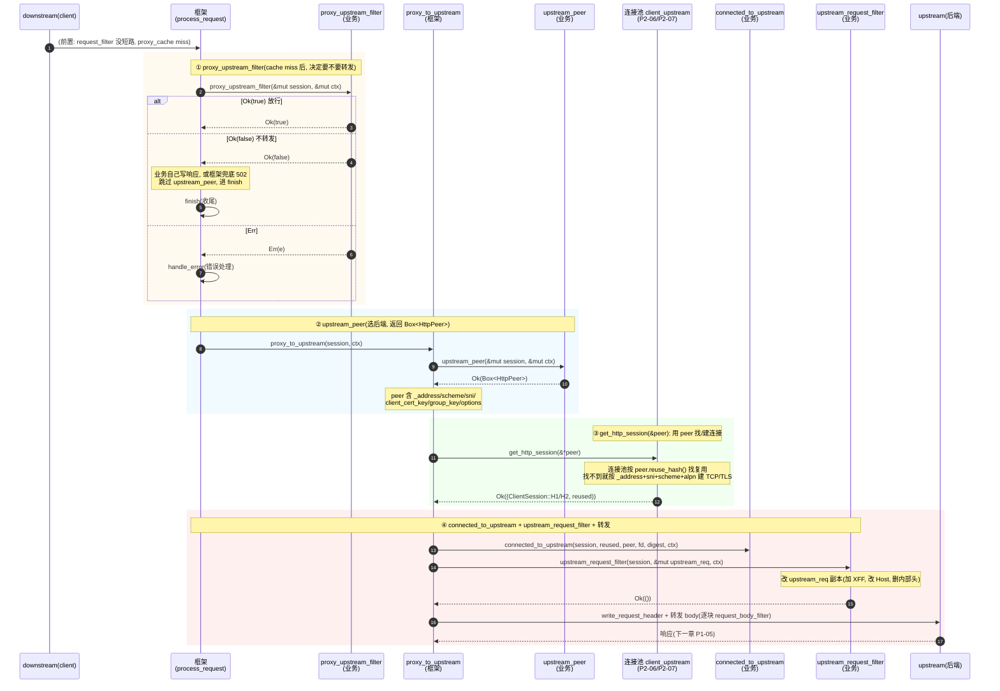
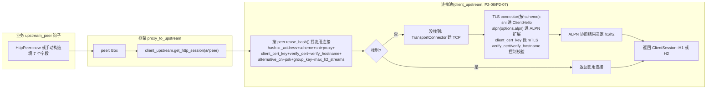

# 第 4 章 · upstream 选择与请求改写钩子

> 第 1 篇 · 钩子链:`ProxyHttp` trait 的请求生命周期(Pingora 灵魂)

---

## 核心问题

上一章(P1-03)把请求前半段钉死了——`request_filter` 的 `Ok(true)` 短路,业务在请求"出门前"就把响应写完,框架跳过全部 upstream 逻辑。但绝大多数请求不是被短路的,它们要**真的转发到后端**。请求一旦确定要出门,业务得回答两件事——**发去哪?发什么?**

- **发去哪?** 一条请求要落到几千台后端里的哪一台,框架不能写死,得业务决定。可能是简单的"永远发 127.0.0.1:8080",也可能复杂到"按 URL 路由到不同集群,集群内部负载均衡挑一台,挑出来的还得带 SNI、带 mTLS 客户端证书、带 ALPN 协商 h2 还是 h1"。这个关卡叫 [`upstream_peer`](../pingora/pingora-proxy/src/proxy_trait.rs#L38-L46),`ProxyHttp` trait 里**必须实现**。
- **发什么?** 后端期待收到的请求,和客户端发来的往往不一样:加 `X-Forwarded-For`、改 `Host`、删内部头。这个"改发出去的请求头"的关卡叫 [`upstream_request_filter`](../pingora/pingora-proxy/src/proxy_trait.rs#L279-L293)。

这两个钩子之外,还要拆一个常被忽略但语义微妙的关卡——[`proxy_upstream_filter`](../pingora/pingora-proxy/src/proxy_trait.rs#L188-L207)。它夹在 cache miss 之后、`upstream_peer` 之前,是个"延迟决策"的钩子——把一些检查(比如"只有 cache miss 时才需要的限流")推迟到确认要 miss 之后才跑,避免在 cache hit 上浪费。

本章要拆的四个主角:

- [`upstream_peer`](../pingora/pingora-proxy/src/proxy_trait.rs#L38-L46) —— 核心选后端钩子,返回 `Box<HttpPeer>`(注意是 `Box`,不是裸 `HttpPeer`),必须实现。
- [`proxy_upstream_filter`](../pingora/pingora-proxy/src/proxy_trait.rs#L188-L207) —— cache miss 后决定是否真的转发,`Ok(false)` = 不转发(业务自己写响应)。
- [`upstream_request_filter`](../pingora/pingora-proxy/src/proxy_trait.rs#L279-L293) —— 改发出去的请求头,在连接建立之后、字节真正发出去之前。
- [`HttpPeer` 结构](../pingora/pingora-core/src/upstreams/peer.rs#L576-L588) —— 选后端的"载体",七字段会被原样交给第 2 篇(P2-06)的连接池和 P2-07 的 HTTP connector 去建连、协商 ALPN。

读完本章你会明白:

1. **为什么 `upstream_peer` 返回 `Box<HttpPeer>` 而不是裸 `HttpPeer` 或 `&HttpPeer`?** 这个看似随手的 `Box` 背后藏着 async trait 的对象安全约束、retry 时每次调用要能产出新 `HttpPeer` 的契约,以及 Rust 借用规则的所有权分工——三方约束下只有 `Box<HttpPeer>` 行得通。
2. **`HttpPeer` 七字段怎么从"业务钩子返回的一个值"流到"连接池/ALPN 协商"的执行点。** `_address` 变 TCP 目标、`sni` 进 TLS 握手的 SNI 扩展、`scheme` 决定走 TLS 还是明文、`options.alpn` 决定握手时 ALPN 列表报 `h2`+`http/1.1` 还是只报 `http/1.1`、`group_key` 隔离连接复用。
3. **`upstream_request_filter` 改的请求头和 `request_filter`(P1-03)改的根本不是同一个对象。** 前者改 upstream 请求头**副本**(连接建立后、改完直接发,不能短路),后者改 downstream 请求头(可能影响 cache key/module)。两者职责泾渭分明。
4. **`proxy_upstream_filter` 的"延迟决策"语义,为什么它返回 `Ok(false)` 和 `request_filter` 的 `Ok(true)` 方向相反。** 同样是 `Ok(bool)`,前者 bool 回答"要不要转发"(`true`=放行),后者回答"响应写没写"(`true`=短路)。这是个 API 瑕疵,读源码要小心。
5. **`upstream_peer` 钩子和第 3 篇的 `LoadBalancer` 怎么挂上的。** 业务在钩子里调 `load_balancer.select(key, max_iterations)` 拿 `Backend`,再用 `Backend.addr` 构造 `HttpPeer`——这是钩子链(业务选)和转发设施(框架管连接池/健康检查)的衔接接口。

> **逃生阀(本章有点长)**:如果你只想懂"`upstream_peer` 到底怎么选后端、`HttpPeer` 那 7 个字段干嘛用的",直接读第三节"`upstream_peer`:选后端的核心关卡"和技巧精解第一节"为什么是 `Box<HttpPeer>`"。`upstream_request_filter` 的"改副本"语义在第四节,`proxy_upstream_filter` 的"延迟决策"在第五节。如果跳着读,请记住一个事实锚点:**`upstream_peer` 返回的 `HttpPeer` 是"业务给连接池的一份说明书",真正的 TCP 建连和 ALPN 协商在第 2 篇(P2-06/P2-07),本章只讲说明书怎么填、怎么传。**

---

## 一句话点破

> **upstream 选择与请求改写钩子,是请求穿越 Pingora 时"决定去哪 + 改发什么"的关键三连关卡。`upstream_peer`(必选实现)返回 `Box<HttpPeer>` 告诉框架"发去哪个地址、用什么 scheme、TLS 的 SNI 是什么、ALPN 协商 h2 还是 h1、mTLS 带不带客户端证书";`upstream_request_filter`(可选)在连接已经建好之后、字节真发出去之前,改"要发给上游的请求头副本"(加 XFF、改 Host、删内部头);`proxy_upstream_filter`(可选,在 cache miss 后)是"延迟决策"关卡,`Ok(false)` 表示"不真转发,我自己处理"。这三个钩子把业务对后端的所有认知(路由、负载均衡选择、协议协商参数、请求改写)压进一个 `HttpPeer` 和一份改写后的请求头,交给第 2 篇的连接池去执行。**

这是结论,不是理由。本章按真实执行顺序拆:先把 cache miss 之后的钩子顺序钉死(读 `process_request` 源码)→ 拆 `proxy_upstream_filter` 的延迟决策语义 → 拆 `upstream_peer` 和 `HttpPeer` 七字段 → 拆 `upstream_request_filter` 的"改副本"语义 → 技巧精解把"`Box<HttpPeer>` 的所有权设计"和"ALPN 协商的链路"单独拆透 → 收尾。

---

## 第一节:把 cache miss 之后的钩子顺序钉死

### 1.1 别凭印象,直接读 `process_request`

讨论这一段的钩子顺序,最容易踩的坑就是凭印象说"`proxy_upstream_filter` 在 `upstream_peer` 之前还是之后?"。真相只有一个——读源码。

上一章已经把 `process_request`([lib.rs#L741-L946](../pingora/pingora-proxy/src/lib.rs#L741-L946))的请求前半段读过了,这里继续从 cache miss 之后往下读。请求经过 `early_request_filter` → module `request_header_filter` → `request_filter`(没短路)→ `proxy_cache`(没命中)之后,剩下的链路在 [`process_request` 第 806 行到第 946 行](../pingora/pingora-proxy/src/lib.rs#L806-L946):

```rust
// pingora-proxy/src/lib.rs#L806-L863(简化, 只看 cache miss 后到 upstream 之前)
if let Some((reuse, err)) = self.proxy_cache(&mut session, &mut ctx).await {
    return self.finish(session, &mut ctx, reuse, err).await;  // cache hit
}
// cache miss
self.cleanup_sub_req(&mut session);

// ① proxy_upstream_filter: 决定要不要往 upstream 走
match self.inner.proxy_upstream_filter(&mut session, &mut ctx).await {
    Ok(proxy_to_upstream) => {
        if !proxy_to_upstream {
            // 业务说不转发: 释放 cache 锁, 兜底 502(如果业务没写响应), 进 finish
            if session.cache.enabled() {
                session.cache.disable(NoCacheReason::DeclinedToUpstream);
            }
            if session.response_written().is_none() {
                session.write_response_header_ref(&BAD_GATEWAY, true).await?;
            }
            return self.finish(session, &mut ctx, true, None).await;
        }
        /* else continue */
    }
    Err(e) => { /* ... 进错误处理 ... */ }
}

// ② retry 循环里调 proxy_to_upstream
while retries < self.max_retries {
    retries += 1;
    let (reuse, e) = self.proxy_to_upstream(&mut session, &mut ctx).await;
    /* ... retry / serve stale / fail_to_proxy ... */
}
self.finish(session, &mut ctx, server_reuse, final_error).await
```

这段源码把 cache miss 之后的顺序钉死了。第一站是 `proxy_upstream_filter`(①),在 cache miss 之后、`upstream_peer` 之前——"决定要不要往 upstream 走"的最后闸门。业务返回 `Ok(false)`,框架不再调 `upstream_peer`(根本不选后端),直接进收尾。`Ok(true)` 放行,进 retry 循环调 `proxy_to_upstream`(②)。`proxy_to_upstream` 内部藏着真正的链路:

```rust
// pingora-proxy/src/lib.rs#L279-L348(简化)
async fn proxy_to_upstream(&self, session: &mut Session, ctx: &mut SV::CTX)
    -> (bool, Option<Box<Error>>)
{
    // ③ upstream_peer: 业务返回选定的 HttpPeer
    let peer = match self.inner.upstream_peer(session, ctx).await {
        Ok(p) => p,
        Err(e) => return (false, Some(e)),
    };

    // ④ get_http_session: 用 peer 找/建到 upstream 的连接(P2-06/P2-07 的连接池)
    let client_session = self.client_upstream.get_http_session(&*peer).await;
    match client_session {
        Ok((client_session, client_reused)) => {
            let (server_reused, error) = match client_session {
                ClientSession::H1(mut h1) => {
                    // ⑤ proxy_to_h1_upstream 内部调 connected_to_upstream
                    //    + upstream_request_filter + 转发
                    let (server_reused, client_reuse, error) = self
                        .proxy_to_h1_upstream(session, &mut h1, client_reused, &peer, ctx).await;
                    if client_reuse {
                        self.client_upstream.release_http_session(
                            ClientSession::H1(h1), &*peer, peer.idle_timeout()).await;
                    }
                    (server_reused, error)
                }
                ClientSession::H2(mut h2) => {
                    // ⑤' H2 分支, 同样内部调 upstream_request_filter; 失败时 prefer_h1 降级
                    let (server_reused, error) = self
                        .proxy_to_h2_upstream(session, &mut h2, client_reused, &peer, ctx).await;
                    /* ... */
                    (server_reused, error)
                }
                ClientSession::Custom(mut c) => { /* ... */ }
            };
            /* ... error_while_proxy ... */
        }
        Err(e) => { /* ... fail_to_connect ... */ }
    }
}
```

`upstream_peer` 在 `proxy_to_upstream` 第一行(③),业务返回的 `Box<HttpPeer>` 立刻解引用成 `&*peer` 传给 `get_http_session`(④)。`get_http_session` 是第 2 篇 P2-07 的 L7 connector(先去连接池找复用,找不到用 P2-06 的 `TransportConnector` 建 TCP/TLS 协商 h1/h2),返回 `ClientSession::H1`/`H2`/`Custom`,框架据此分发(⑤)。

`upstream_request_filter` 在 `proxy_to_h1_upstream`/`proxy_to_h2_upstream` **内部**调用,在 `connected_to_upstream` 之后(连接已建)、`write_request_header` 之前(字节还没真发)——这正是它"改发出去的请求头"的精确位置。第四节展开。

把整段顺序画成时序图:



这张图把本章的全部顺序锚点钉死了。下面每一节都是放大这张图的某一段。

### 1.2 顺序速查表:cache miss 之后到字节出门

把这一段涉及的全部介入点按顺序列成速查表:

| 序 | 介入点 | 谁实现 | async? | 触发位置 | 返回值语义 |
|----|------|------|--------|---------|---------|
| ① | `proxy_cache`(框架) | 框架 | async | [lib.rs#L806](../pingora/pingora-proxy/src/lib.rs#L806) | cache hit 直接 finish, miss 继续 |
| ② | `proxy_upstream_filter` | 业务 | async | [lib.rs#L816-L819](../pingora/pingora-proxy/src/lib.rs#L816) | `Ok(true)` 转发 / `Ok(false)` 不转发(自己写响应)/ `Err` |
| ③ | `upstream_peer` | 业务(**必选**) | async | [lib.rs#L288](../pingora/pingora-proxy/src/lib.rs#L288) | `Ok(Box<HttpPeer>)` 选定后端 / `Err` |
| ④ | `get_http_session`(连接池) | 框架 | async | [lib.rs#L293](../pingora/pingora-proxy/src/lib.rs#L293) | 返回 `ClientSession::H1/H2/Custom` + reused 标志 |
| ⑤ | `connected_to_upstream` | 业务 | async | [proxy_h1.rs#L155-L168](../pingora/pingora-proxy/src/proxy_h1.rs#L155) | `Ok(())` 继续 / `Err` 失败(连接已建但业务拒绝) |
| ⑥ | `upstream_request_filter` | 业务 | async | [proxy_h1.rs#L73-L82](../pingora/pingora-proxy/src/proxy_h1.rs#L73) / [proxy_h2.rs#L113-L122](../pingora/pingora-proxy/src/proxy_h2.rs#L113) | `Ok(())` / `Err`(改副本) |
| ⑦ | `write_request_header` + 转发 body | 框架 | async | [proxy_h1.rs#L88](../pingora/pingora-proxy/src/proxy_h1.rs#L88) | 真正发字节 |
| ⑧ | `request_body_filter`(逐块) | 业务 | async | [proxy_h1.rs#L776-L785](../pingora/pingora-proxy/src/proxy_h1.rs#L776) | 上一章 P1-03 已讲, 这里嵌在转发里 |

几个值得立刻注意的点:

1. **`proxy_upstream_filter`(②)是 cache miss 之后的闸门,`upstream_peer`(③)是闸门之后的选后端**。顺序是先决定"要不要转发",再决定"转发给谁"。如果业务在 `proxy_upstream_filter` 返回 `Ok(false)`,`upstream_peer` 根本不会被调——框架没机会、也没必要选后端。
2. **`upstream_peer`(③)和 `get_http_session`(④)是分开的两步**。`upstream_peer` 只返回一个"说明书"`HttpPeer`,真正建连/复用是 `get_http_session` 干的。这个分离是关键——业务只负责"我要发去哪、用什么协议参数",框架负责"按这个说明书找连接/建连接"。这就是钩子链(业务)和转发设施(框架)的精确分工。
3. **`connected_to_upstream`(⑤)在 `upstream_request_filter`(⑥)之前**。也就是说,连接已经建好(或复用上了)之后,先回调业务"连上了"(业务可记时延、记 fd),再让业务改请求头。这个顺序是合理的——改请求头是个轻活,建连是个重活,业务可能想根据"这次连接是不是复用的"来决定改不改某些头(比如只在新连接上加 `Connection: warm-up`)。
4. **`upstream_request_filter`(⑥)在 `request_body_filter`(⑧)之前**。请求头先发(`write_request_header`),然后才逐块转发 body,每块触发 `request_body_filter`。这个顺序和 HTTP 协议本身的"先 header 后 body"一致。
5. **`upstream_peer` 在 retry 循环里**。注意 [lib.rs#L870-L897](../pingora/pingora-proxy/src/lib.rs#L870) 的 `while retries < self.max_retries` 循环——每次重试都会**重新调一次** `upstream_peer`。这就是为什么 `upstream_peer` 返回的是值(`Box<HttpPeer>`),而不是引用——业务每次调用都要能产出一份新的 `HttpPeer`(可能选另一台后端重试),不能返回一个共享引用。这一点到技巧精解再展开。

> **钉死这件事**:cache miss 之后的顺序是 `proxy_upstream_filter`(决定要不要转发)→ [`Ok(true)`] → `proxy_to_upstream` 内部:`upstream_peer`(选后端,返回 `Box<HttpPeer>`)→ `get_http_session`(连接池按 peer 找/建连接)→ `connected_to_upstream`(连上回调)→ `upstream_request_filter`(改发出去的请求头副本)→ `write_request_header` + 逐块 `request_body_filter`(真发字节)。每一站对应"此刻框架手里有什么":proxy_upstream_filter 时知道 cache miss 了、upstream_peer 时知道要转发、get_http_session 时有了 peer 这个说明书、connected_to_upstream 时连接在手、upstream_request_filter 时请求头副本在手准备改。

---

## 第二节:`proxy_upstream_filter`:cache miss 后的延迟决策闸门

先把顺序上最早出现的 `proxy_upstream_filter` 讲清楚。它常被忽略,但语义微妙——它是"延迟决策"的关卡。

### 2.1 提问:为什么 cache miss 之后还要再问一次"要不要转发"

上一章的 `request_filter` 已经能短路了,cache 也已经查过了。乍一看,走到这里请求铁定要转发——为什么框架还要再开一个 `proxy_upstream_filter` 让业务拦一次?

考虑这个场景:你搭了一个代理,后端是个慢且贵的 API(每次请求后端要查大数据库),所以你启用了 cache。现在你想做"对每个客户端 IP 限流,但只在 cache miss 时限"——因为 cache hit 不打后端,不该算进配额。

如果你把限流放 `request_filter`(cache 之前),问题来了:**cache hit 的请求也会被限流逻辑挡掉**。客户端 A 第一次请求 `/expensive`,cache miss,转发后端,缓存;A 第二次请求同一个 URL,cache hit,本来该直接返回缓存,但 `request_filter` 的限流逻辑先跑了,发现 A 这秒已经打过一次,直接 429。这是错的——cache hit 不打后端,不该算进"打后端的配额"。

正确的做法是:**限流逻辑只在 cache miss 之后跑**。这就是 `proxy_upstream_filter` 的位置——它在 `proxy_cache`(①)之后,在 `upstream_peer`(③)之前。业务在这里跑限流,cache hit 的请求根本走不到这一步(在 ① 就 finish 了),所以限流逻辑只对真正要打后端的请求生效。

这就是"延迟决策"的语义——把"只有 cache miss 时才需要的检查"推迟到确认 miss 之后,避免在 cache hit 上浪费,也避免错误地拦截缓存命中的请求。

### 2.2 承接方怎么做:Envoy 的 filter 顺序 / Tower 的 layer

Envoy 怎么解决"cache miss 后再限流"?Envoy 的 filter chain 里,cache filter 和限流 filter 都是 http filter,顺序由 xDS 配置决定——把限流 filter 配在 cache filter **之后**即可。灵活在顺序任意,代价是要在配置里维护顺序。《Envoy》第 3 篇已拆透,一句带过。

Tower 怎么解决?Tower 没有"内置 cache 阶段",cache 和限流都是独立 Service(layer 嵌套),"cache miss 后限流"靠把限流 layer 套在 cache 的 fallback 路径上。《Tower》已拆透,一句带过。

两种方案的共同点:**都靠"组装顺序"决定 filter 谁先跑**。Pingora 不一样——它把 cache miss 这个事件做成**编译期固定的阶段分界**,给业务一个专门的钩子在这个分界点介入,业务不需要配顺序。

### 2.3 所以 Pingora 这么设计:`proxy_upstream_filter` 的精确语义

[`proxy_upstream_filter` 的文档和签名](../pingora/pingora-proxy/src/proxy_trait.rs#L188-L207):

```rust
/// Decide if a request should continue to upstream after not being served from cache.
///
/// returns: Ok(true) if the request should continue, Ok(false) if a response was written by the
/// callback and the session should be finished, or an error
///
/// This filter can be used for deferring checks like rate limiting or access control to when they
/// actually needed after cache miss.
///
/// By default the session will attempt to be reused after returning Ok(false). It is the
/// caller's responsibility to disable keepalive or drain the request body if needed.
async fn proxy_upstream_filter(
    &self,
    _session: &mut Session,
    _ctx: &mut Self::CTX,
) -> Result<bool>
where
    Self::CTX: Send + Sync,
{
    Ok(true)
}
```

四个关键点:

1. **"after not being served from cache"**——只在 cache 没命中(或没启用 cache)之后触发。cache hit 走不到这里。
2. **`Ok(true)` 放行,`Ok(false)` 不转发**——注意和 `request_filter` 的 `Ok(true)` **方向相反**:`request_filter` 的 `true` 表示"已写响应,**短路**";`proxy_upstream_filter` 的 `true` 表示"**放行**继续转发"。同样是 `Ok(bool)`,两个钩子的 bool 含义反过来,读源码要小心。
3. **`Ok(false)` 时文档假设业务自己写响应**——但和 `request_filter` 不同,如果业务返回 `Ok(false)` 却没写响应,框架会兜底写一个 502 Bad Gateway(见下文源码)。
4. **`Ok(false)` 后 keepalive 默认保留**——文档明确说"the session will attempt to be reused...It is the caller's responsibility to disable keepalive or drain the request body"。这是个责任转移:业务得自己决定要不要禁 keepalive、要不要 drain 请求体(请求体可能还在路上,直接断会留字节在连接里)。

#### 框架怎么处理 `Ok(false)`:兜底 502 + 清 cache 锁

[`process_request` 里处理 `Ok(false)` 的那段](../pingora/pingora-proxy/src/lib.rs#L821-L862):

```rust
// pingora-proxy/src/lib.rs#L821-L862(简化)
Ok(proxy_to_upstream) => {
    if !proxy_to_upstream {
        if session.cache.enabled() {
            // 释放 cache 锁(防止 request coalescing 卡住别的相同请求)
            session.cache.disable(NoCacheReason::DeclinedToUpstream);
        }
        if session.response_written().is_none() {
            // 业务没写响应, 框架兜底 502
            session.write_response_header_ref(&BAD_GATEWAY, true).await?;
        }
        return self.finish(session, &mut ctx, true, None).await;
    }
    /* else continue */
}
```

三个细节:

1. **`session.cache.disable(DeclinedToUpstream)`**——释放 cache 锁。cache miss 时框架可能已为这次请求持有 cache 锁(防止多个相同请求同时打后端——request coalescing,详见 P6-17)。业务决定不转发了,锁得释放,否则别的相同请求被锁挡住。
2. **`response_written().is_none()` 兜底 502**——和 `request_filter` 不同(`Ok(true)` 假设业务一定写了响应,框架不兜底);`proxy_upstream_filter` 的 `Ok(false)` 框架会兜底,因为它的语义是"我不让转发",不等于"我写了响应"。
3. **`finish(session, ctx, true, None)`**——`true` 表示尝试 keepalive 复用,`None` 表示没错误(不调 `fail_to_proxy`)。和 `request_filter` 的 `Ok(true)` 走的是不同 `finish` 重载,但都会跑 `logging`(短路的请求要打 access log)。

#### 典型用例:cache miss 后的限流

`proxy_upstream_filter` 的经典用例就是"cache miss 后才限流"——同样写 429,放 `request_filter` 会误伤 cache hit(限流逻辑先于 cache 跑),放 `proxy_upstream_filter` 只挡 cache miss。这就是"延迟决策"的价值:把检查放到它真正需要的时间点。具体代码见章末附录示例。

> **钉死这件事**:`proxy_upstream_filter` 是 cache miss 之后、`upstream_peer` 之前的延迟决策闸门。语义:`Ok(true)` 放行继续转发(注意 bool 方向和 `request_filter` 相反,那里 `Ok(true)` 是短路)、`Ok(false)` 不转发(业务自己写响应,否则框架兜底 502)、`Err` 进错误处理。经典用例是"cache miss 后才需要的限流/访问控制",避免在 cache hit 上误伤或浪费。返回 `Ok(false)` 时框架自动释放 cache 锁(`DeclinedToUpstream`),但 keepalive 复用默认保留,业务得自己决定要不要禁用。

---

## 第三节:`upstream_peer`:选后端的核心关卡

这一节是本章的重头戏。`upstream_peer` 是 `ProxyHttp` trait 里**必须实现**的方法之一(另一个是 `new_ctx`),没有默认实现,业务不实现就编译不过。它是业务"决定发去哪"的唯一接口。

### 3.1 提问:为什么选后端要做成一个钩子,而不是框架写死

设想你用 Pingora 搭一个网关。后端有几千台,分布在不同集群,不同请求路由到不同集群,集群内部还要做负载均衡。这个"选后端"的逻辑,框架能写死吗?

显然不能。选后端涉及的业务知识太多了:

- **路由**:按 URL path 路由(`/api/*` 去 A 集群,`/static/*` 去 B 集群)。
- **负载均衡**:集群内部按 RoundRobin/一致性哈希挑一台。
- **协议参数**:这台后端是 HTTPS 还是 HTTP?TLS 的 SNI 填什么?要不要 mTLS 带客户端证书?ALPN 协商 h2 还是 h1?
- **连接隔离**:某些请求(比如管理员请求)不能和普通请求共享连接(防止信息泄漏),要给一个独立的 group_key。
- **重试策略**:重试时选另一台后端,还是同一台?

这些全是业务逻辑,框架没法预知。所以 Pingora 把"选后端"做成一个钩子——业务在 `upstream_peer` 里决定一切,返回一个 `HttpPeer` 把决定结果告诉框架。框架只负责"拿着这个 HttpPeer 去建连/复用/转发",不掺和业务怎么选的。

这个分工是钩子链和转发设施二分法的精髓——**业务管决策(选谁、什么协议),框架管执行(建连、协商、转发)**。

### 3.2 承接方怎么做:Envoy 的 router filter / Nginx 的 upstream / Tower 的无

Envoy 怎么选后端?Envoy 有专门的 router filter,根据 `:authority`/`Host` 匹配 RDS 下发的路由,路由指定 cluster(CDS),cluster 内部按 load balancing policy 挑 endpoint(EDS)。整个过程**配置驱动**——业务写 YAML,Envoy 按 xDS 下发应用。《Envoy》已拆透,一句带过。

Nginx 怎么选?`upstream` 块配置一组后端,`proxy_pass` 转发给某块,块内按 `least_conn`/`ip_hash`/默认轮询挑一台。**配置写死**,要动态得靠 lua/OpenResty。

Tower 本身不解决"选后端"——`Service<Request>` 只管"处理一个请求",选后端是业务在 `call` 里自己做的事(维护 `Vec<Service>` 自己实现 RoundRobin)。

三种方案的对比:

| 方面 | Envoy(router filter) | Nginx(upstream 块) | Tower(业务自己) | **Pingora(`upstream_peer`)** |
|------|------|------|------|------|
| 选后端逻辑在哪 | 内置 filter, 配置驱动 | 配置写死, lua 补丁 | 业务 Service::call 里自己写 | **业务钩子, 代码驱动** |
| 动态性 | xDS 运行期下发 | 配置重载/lua | 业务任意动态 | **业务任意动态** |
| 协议参数(sni/alpn/mTLS) | cluster 配置 | proxy_ssl_* 指令 | 业务自己管 | **HttpPeer 字段** |
| 连接隔离 | 连接池按 cluster 分 | 连接池按 upstream 分 | 业务自己管 | **HttpPeer.group_key** |

Pingora 选**代码驱动**——业务在钩子里写 Rust 代码决定一切,返回 `HttpPeer`。好处是任意动态(可读文件/查数据库/调服务发现),坏处是没有标准化的配置协议(不像 xDS 跨厂商互通)。这是 Pingora 和 Envoy 的根本差异之一(P0-01 已点出)。

### 3.3 所以 Pingora 这么设计:`upstream_peer` 返回 `Box<HttpPeer>`

[`upstream_peer` 的文档和签名](../pingora/pingora-proxy/src/proxy_trait.rs#L38-L46):

```rust
/// Define where the proxy should send the request to.
///
/// The returned [HttpPeer] contains the information regarding where and how this request should
/// be forwarded to.
async fn upstream_peer(
    &self,
    session: &mut Session,
    ctx: &mut Self::CTX,
) -> Result<Box<HttpPeer>>;
```

三个关键点:① **没有默认实现**(必须实现,业务不实现编译不过)——这和 `request_filter`/`early_request_filter`(有默认体)形成对比,Pingora 认为"选后端"是业务不可推卸的责任。② **返回 `Result<Box<HttpPeer>>`**——`Box` 不是随手写的,是 async trait 对象安全 + retry 复用 + 所有权转移三方约束下的唯一选择(技巧精解第一节拆透)。③ 参数 `&mut session, &mut ctx` 让业务能读请求头、能写 ctx(存选中后端信息给后续钩子用)。

#### `HttpPeer`:选后端的载体

业务返回的 `HttpPeer` 是个 struct,定义在 [`pingora-core/src/upstreams/peer.rs#L576-L588`](../pingora/pingora-core/src/upstreams/peer.rs#L576):

```rust
// pingora-core/src/upstreams/peer.rs#L576-L588
/// A peer representing the remote HTTP server to connect to
#[derive(Debug, Clone)]
pub struct HttpPeer {
    pub _address: SocketAddr,
    pub scheme: Scheme,
    pub sni: String,
    pub proxy: Option<Proxy>,
    pub client_cert_key: Option<Arc<CertKey>>,
    /// a custom field to isolate connection reuse. Requests with different group keys
    /// cannot share connections with each other.
    pub group_key: u64,
    pub options: PeerOptions,
}
```

七个字段,逐个拆它们"干嘛的、怎么填、流去哪":

| 字段 | 类型 | 干嘛的 | 怎么填 | 流去哪 |
|------|------|------|------|------|
| `_address` | `SocketAddr` | 后端的 TCP/Unix 地址(IP:port 或 UDS path) | `HttpPeer::new(addr, tls, sni)` 或构造时填 | `Peer::address()` 返回它, 连接池用它做 TCP connect 目标 |
| `scheme` | `Scheme` | `HTTP`(明文)或 `HTTPS`(TLS) | `HttpPeer::new(addr, tls, sni)` 的 `tls: bool` 决定 | `Peer::tls()` 返回 `scheme == HTTPS`, 决定走 TLS 还是明文 |
| `sni` | `String` | TLS 握手的 SNI(Server Name Indication) | `HttpPeer::new` 第三参, 一般填后端域名 | `Peer::sni()` 返回它, TLS connector 把它塞进 ClientHello 的 SNI 扩展 |
| `proxy` | `Option<Proxy>` | 是否经 forward proxy 转发 | `HttpPeer::new_proxy(...)` 或手动设 | `Peer::get_proxy()`, 有值时连接先建到 proxy 再 CONNECT 到目标 |
| `client_cert_key` | `Option<Arc<CertKey>>` | mTLS 客户端证书+私钥 | `HttpPeer::new_mtls(...)` 或手动设 | `Peer::get_client_cert_key()`, TLS connector 加载它做客户端认证 |
| `group_key` | `u64` | 连接复用隔离键 | 默认 0, 业务手动设 | `HttpPeer::reuse_hash()`(经 `peer_hash()`)把它混进 hash, 不同 group_key 的请求不共享连接 |
| `options` | `PeerOptions` | 协议参数(ALPN/超时/证书校验/h2 流数等) | 默认 `PeerOptions::new()`, 业务调方法改 | `Peer::get_peer_options()` 返回它, 连接池/TLS connector 各取所需 |

这七个字段是业务给连接池的"完整说明书"。把它们怎么流到执行点画成图:



这张图把"业务返回的 HttpPeer 怎么流到连接池/ALPN 协商"画清楚了。有几个关键细节:

**reuse_hash 决定连接复用**。HttpPeer 实现 `Peer` trait,它的 [`reuse_hash`](../pingora/pingora-core/src/upstreams/peer.rs#L721-L723) 返回 `self.peer_hash()`,而 [`peer_hash`](../pingora/pingora-core/src/upstreams/peer.rs#L664-L688) 把这些字段混进哈希:

```rust
// pingora-core/src/upstreams/peer.rs#L671-L688(简化)
impl Hash for HttpPeer {
    fn hash<H: Hasher>(&self, state: &mut H) {
        self._address.hash(state);
        self.scheme.hash(state);
        self.proxy.hash(state);
        self.sni.hash(state);
        // client cert serial
        self.client_cert_key.hash(state);
        // origin server cert verification
        self.verify_cert().hash(state);
        self.verify_hostname().hash(state);
        self.alternative_cn().hash(state);
        #[cfg(feature = "s2n")]
        self.get_psk().hash(state);
        self.group_key.hash(state);
        // max h2 stream settings
        self.options.max_h2_streams.hash(state);
    }
}
```

**两个请求的 HttpPeer 只有在这些字段都相同时,才会共享连接**。任何一个不同(`group_key` 不同、`sni` 不同、`verify_cert` 不同),连接池就当成独立池子管。这是"协议参数全相同的请求才能复用同一个 TCP/TLS 连接"的精确语义,防止参数错配(mTLS 证书不同的请求共享了连接导致认证混乱)。

**`options.alpn` 决定 TLS 握手的 ALPN 列表**。`PeerOptions.alpn` 字段([peer.rs#L422](../pingora/pingora-core/src/upstreams/peer.rs#L422)),**默认 `ALPN::H1`**([peer.rs#L484](../pingora/pingora-core/src/upstreams/peer.rs#L484),不是 `H2H1`,保守默认)。`ALPN` 枚举在 [`protocols/tls/mod.rs#L52`](../pingora/pingora-core/src/protocols/tls/mod.rs#L52):

```rust
// pingora-core/src/protocols/tls/mod.rs#L52-L60(简化)
pub enum ALPN {
    H1,    // 只报 http/1.1
    H2,    // 只报 h2
    H2H1,  // 报 h2 + http/1.1(优先 h2)
    Custom(CustomALPN),
}
```

`ALPN::H2H1` 的 wire 是 `b"\x02h2\x08http/1.1"`([mod.rs#L163](../pingora/pingora-core/src/protocols/tls/mod.rs#L163))——长度前缀 + 协议字符串的标准 ALPN 编码。业务调 [`PeerOptions::set_http_version(max, min)`](../pingora/pingora-core/src/upstreams/peer.rs#L512-L514) 改 alpn:`set_http_version(2, 1)` = `H2H1`(h2 优先回退 h1),`(1,1)` = `H1`(只 h1),`(2,2)` = `H2`(只 h2,gRPC 必用)。

**其余字段简述**:`sni` 进 TLS ClientHello 的 SNI 扩展(填域名不填 IP);`scheme`(`HttpPeer::is_tls()` = `scheme == HTTPS`,[peer.rs#L592](../pingora/pingora-core/src/upstreams/peer.rs#L592))决定走 TLS 还是明文;`client_cert_key`(`HttpPeer::new_mtls`)做 mTLS 客户端证书;`group_key`(默认 0)隔离连接池——给管理员请求设 `group_key = 1`,连接池就把它和普通请求分开,防止复用 mTLS 连接导致权限提升。

#### 业务怎么填:三个递进用例

**用例一:固定后端**——`HttpPeer::new("127.0.0.1:8080", false, "".to_string())`,明文 HTTP,sni 空。最基础用法。

**用例二:HTTPS + ALPN 协商 h2/h1**——`HttpPeer::new(addr, true, "api.example.com".to_string())` 后 `peer.options.set_http_version(2, 1)`(`ALPN::H2H1`,h2 优先回退 h1)。

**用例三:负载均衡挑后端(承 P3-09 LoadBalancer)**——这是钩子链和转发设施的衔接接口:

```rust
async fn upstream_peer(&self, _session: &mut Session, _ctx: &mut Self::CTX) -> Result<Box<HttpPeer>> {
    // select(key, max_iterations): key 用于哈希(轮询忽略), max_iterations 限界
    let backend = self.lb
        .select(b"", 100)
        .ok_or_else(|| Error::explain(HTTPStatus(503), "no healthy backend"))?;
    let peer = HttpPeer::new(backend.addr, false, "".to_string());
    Ok(Box::new(peer))
}
```

业务调 [`load_balancer.select(key, max_iterations)`](../pingora/pingora-load-balancing/src/lib.rs#L408-L410) 拿 `Backend`(`Backend.addr: SocketAddr`),再构造 `HttpPeer`。`select` 签名带两参:`key` 用于哈希选择(轮询/随机忽略,一致性哈希用它),`max_iterations` 限界(防 Ketama 线性搜索跑太久,文档有 TODO 考虑移除)。具体算法留 P3-09~P3-11。

#### retry 时 `upstream_peer` 会被重新调

注意 [lib.rs#L870-L897](../pingora/pingora-proxy/src/lib.rs#L870) 的 retry 循环:

```rust
// pingora-proxy/src/lib.rs#L870-L897(简化)
while retries < self.max_retries {
    retries += 1;
    // 每次重试都重新调 proxy_to_upstream, 内部重新调 upstream_peer
    let (reuse, e) = self.proxy_to_upstream(&mut session, &mut ctx).await;
    match e {
        Some(error) => {
            let retry = error.retry();
            if !retry { break; }
            // 可重试, 进下一轮, 重新调 upstream_peer
        }
        None => { break; }
    }
}
```

每次重试,框架**重新调一次** `upstream_peer`。这就是为什么 `upstream_peer` 返回值(`Box<HttpPeer>`)而不是引用——业务每次调用要能产出一份新的 `HttpPeer`(可能选另一台后端重试,`LoadBalancer::select` 会轮到下一台)。如果返回 `&HttpPeer`,业务就得提前存一个,但 retry 时该换后端了,旧的引用不对了。

retry 的决策不在 `upstream_peer` 里,在 `error_while_proxy`/`fail_to_connect` 钩子([proxy_trait.rs#L448-L479](../pingora/pingora-proxy/src/proxy_trait.rs#L448))里——业务在那两个钩子里标记错误是否可重试(`e.retry.decide_reuse(...)`),框架据此决定要不要进下一轮重调 `upstream_peer`。这个错误处理链路留 P1-05 收尾钩子详拆,本章只点出"`upstream_peer` 会被重调"这个事实,它解释了为什么返回类型必须是值而不是引用。

> **钉死这件事**:`upstream_peer` 是 `ProxyHttp` trait 必须实现的方法,返回 `Result<Box<HttpPeer>>`,业务在这里决定"发去哪、用什么协议参数"。`HttpPeer` 七字段(`_address`/`scheme`/`sni`/`proxy`/`client_cert_key`/`group_key`/`options`)是给连接池的完整说明书,业务填好后框架拿去建连/复用/协商。`reuse_hash` 把这些字段(除 `options` 大部分外,只取 `max_h2_streams`)混进哈希,决定连接复用边界——"协议参数全相同的请求才能共享连接"。`upstream_peer` 在 retry 循环里会被重新调,这是返回值(不是引用)的根本原因。承 P3-09:业务常在钩子里调 `load_balancer.select(key, max)` 拿 Backend 再建 HttpPeer。

---

## 第四节:`upstream_request_filter`:改发出去的请求头副本

选完后端(`upstream_peer`)、建好连接(`get_http_session`)、连上回调(`connected_to_upstream`)之后,字节真正发出去之前,业务还有一次改请求头的机会——`upstream_request_filter`。

### 4.1 提问:为什么改请求头要单独一个钩子,不能在 `request_filter` 里改

上一章的 `request_filter` 已经能拿到请求头了,为什么改请求头不直接在那改,非得再开一个 `upstream_request_filter`?

根因是**改的对象不一样**:

- `request_filter`(P1-03)改的是 **downstream 请求头**(客户端发来的那个)。但这个请求头是用来给业务做鉴权/限流的**读取对象**,不是"要发给 upstream 的那个请求头"。如果业务在 `request_filter` 里改了 downstream 请求头,会影响后续的 cache key 计算(基于 downstream 请求头)、影响 downstream module 的行为(compression 基于 downstream 响应,但别的 module 可能读 downstream 请求头)。
- `upstream_request_filter` 改的是 **upstream 请求头副本**——框架把 downstream 请求头 clone 一份,经过一些协议转换(h2 → h1 的版本降级、加 chunked、加 Host 等),交给业务改,改完直接发给 upstream。这个副本和 downstream 请求头是**两个独立的对象**,改副本不影响 downstream 状态。

举个例子:你想给后端加 `X-Forwarded-For`(记原始客户端 IP,后端做地理统计)。这个头是给**后端**看的,downstream(客户端)不该看到它(发了也没用,客户端不知道自己是几)。如果你在 `request_filter` 里改 downstream 请求头加 XFF,万一这个请求被 cache 命中(cache key 可能基于请求头),XFF 进了 cache key,不同 IP 的客户端请求同一个 URL 会有不同 cache key,缓存命中率暴跌。正确做法是在 `upstream_request_filter` 里改 **upstream 请求头副本**——XFF 只出现在发给后端的请求里,不影响 downstream、不影响 cache key。

所以 `upstream_request_filter` 的存在理由是:**给业务一个"只改发出去的请求、不影响 downstream 状态"的清洁接口**。它和 `request_filter` 改的根本不是同一个对象。

### 4.2 承接方怎么做:Envoy 的 decoder filter / Tower 的 layer

Envoy 和 Tower 都**只有一个请求头对象**,filter/layer 依次改:Envoy 的 decoder filter 链里任何 filter 都能 `headers.add()`/`remove()`,最后 router filter 发出去;Tower 的 `Service<Request>` 里业务 `req.headers_mut().insert(...` 改完传给 inner。想保留原始头都得自己 clone。《Envoy》《Tower》已拆透,一句带过。

Pingora 不一样——它把"downstream 请求头"(给业务读、做鉴权/cache key)和"upstream 请求头副本"(给业务改、发给后端)**显式分成两个对象**,用两个钩子分别操作。好处是职责清晰:业务不会误把"给后端的头"加到 downstream 上污染 cache key,反之亦然。

### 4.3 所以 Pingora 这么设计:`upstream_request_filter` 改的是副本

[`upstream_request_filter` 的文档和签名](../pingora/pingora-proxy/src/proxy_trait.rs#L279-L293):

```rust
/// Modify the request before it is sent to the upstream
///
/// Unlike [Self::request_filter()], this filter allows to change the request headers to send
/// to the upstream.
async fn upstream_request_filter(
    &self,
    _session: &mut Session,
    _upstream_request: &mut RequestHeader,
    _ctx: &mut Self::CTX,
) -> Result<()>
where
    Self::CTX: Send + Sync,
{
    Ok(())
}
```

注意三点:

1. **`_upstream_request: &mut RequestHeader`**——这是要发给 upstream 的请求头**副本**,不是 downstream 请求头。业务拿 `&mut` 改它,改完框架直接发。
2. **文档明确说 "Unlike request_filter(), this filter allows to change the request headers to send to the upstream"**——和 `request_filter` 区分,后者不改 upstream 请求头(改的是 downstream)。
3. **返回 `Result<()>`**——`Ok(())` 继续(发出去),`Err(e)` 失败(整个转发失败)。注意它**没有 bool**,不能短路——因为这时候已经决定要转发(过了 `proxy_upstream_filter`),连接也建了(`get_http_session` 成功),改请求头出问题只能 `Err` 让整个请求失败。

#### 源码佐证:upstream 请求头副本怎么来的

[`proxy_to_h1_upstream` 里调 `upstream_request_filter` 的那段](../pingora/pingora-proxy/src/proxy_h1.rs#L44-L93):

```rust
// pingora-proxy/src/proxy_h1.rs#L44-L93(简化)
// ① 从 downstream 请求头 clone 一份副本
let mut req = session.req_header().clone();

// ② 协议转换: downstream h2 -> upstream h1
if req.version == Version::HTTP_2 {
    req.set_version(Version::HTTP_11);
    if !session.is_body_empty() && session.get_header(header::CONTENT_LENGTH).is_none() {
        req.insert_header(header::TRANSFER_ENCODING, "chunked").unwrap();
    }
    if session.get_header(header::HOST).is_none() {
        // h2 用 :authority, h1 用 Host, 转换
        let host = req.uri.authority().map_or("", |a| a.as_str()).to_owned();
        req.insert_header(header::HOST, host).unwrap();
    }
}

// ③ cache filter 改请求(加条件化头 If-None-Match 等做 revalidation)
if session.cache.enabled() {
    pingora_cache::filters::upstream::request_filter(&mut req, session.cache.maybe_cache_meta());
    session.mark_upstream_headers_mutated_for_cache();
}

// ④ 业务 upstream_request_filter: 改这个副本
match self.inner.upstream_request_filter(session, &mut req, ctx).await {
    Ok(_) => { /* continue */ }
    Err(e) => { return (false, true, Some(e)); }
}

// ⑤ upstream_compression module 读改过的请求头(决定要不要让上游返回压缩响应)
session.upstream_compression.request_filter(&req);

// ⑥ 真发: write_request_header
client_session.write_request_header(Box::new(req)).await?;
```

六步流程:① clone downstream 请求头(副本独立,改它不影响 downstream);② 协议转换(downstream h2 → upstream h1 时降版本、加 chunked、加 Host,把 h2 的 `:authority`/流式 body 语义转成 h1 的);③ cache filter 改请求(加 `If-None-Match` 等条件化头做 revalidation,这是 P6-17 和 upstream 改写的衔接点);④ 业务 `upstream_request_filter`(加 XFF、改 Host、删内部头);⑤ upstream_compression module 读改过的副本(决定要不要让上游返回压缩响应——如果业务加了 `accept-encoding: gzip` 它能看到);⑥ 真发(`write_request_header`)。

注意 H2 分支([proxy_h2.rs#L92-L122](../pingora/pingora-proxy/src/proxy_h2.rs#L92))有个额外步骤——调 `upstream_request_filter` **之前**,框架先去掉 h1 的 hop header(`connection`/`transfer-encoding`/`upgrade`/`keep-alive`/`proxy-connection`),因为 h2 不该有这些头:

```rust
// pingora-proxy/src/proxy_h2.rs#L92-L122(简化)
if req.version == Version::HTTP_11 {
    // h1 -> h2: 去 hop header
    req.remove_header(&http::header::TRANSFER_ENCODING);
    req.remove_header(&http::header::CONNECTION);
    req.remove_header(&http::header::UPGRADE);
    req.remove_header("keep-alive");
    req.remove_header("proxy-connection");
}
req.set_version(Version::HTTP_2);
/* cache filter ... */
self.inner.upstream_request_filter(session, &mut req, ctx).await?;
// Host 头转 :authority(在 upstream_request_filter 之后)
let host = req.remove_header(&http::header::HOST);
```

H2 分支有个微妙顺序——**`Host` 头转 `:authority` 发生在 `upstream_request_filter` 之后**([proxy_h2.rs#L129](../pingora/pingora-proxy/src/proxy_h2.rs#L129))。注释解释:"there is no API to change the :authority header"(没法直接改 `:authority`,只能先让业务改 `Host`,框架再转换)。所以业务想在 h2 upstream 改主机名,改的是 `Host` 头,框架自动转 `:authority`——业务不用关心 downstream/upstream 是 h1 还是 h2。

#### 典型用例

`upstream_request_filter` 的三大典型职责:加转发元信息(`X-Forwarded-For` 记原始客户端 IP)、改目标主机(`Host` 让后端虚拟主机生效)、清理不该透传的头(`X-Internal-Token` 等内部头)。具体代码见章末附录示例。注意业务操作的是 `upstream_request: &mut RequestHeader`(副本),改它不影响 downstream(`session.req_header()` 还是原始的)。

> **钉死这件事**:`upstream_request_filter` 改的是 **upstream 请求头副本**(从 downstream 请求头 clone 出来,经过协议转换/hop header 清理/cache filter 改写后交给业务),不是 downstream 请求头。它和 `request_filter` 改的根本不是同一个对象——前者只影响发给后端的请求,后者影响 downstream 状态(可能影响 cache key/module 行为)。在连接建立之后(`connected_to_upstream` 之后)、字节真发之前(`write_request_header` 之前)触发。返回 `Result<()>` 不能短路(已决定转发),出错只能 `Err`。H2 分支有个微妙顺序:Host → :authority 的转换在 `upstream_request_filter` 之后(因为业务可能改 Host)。

---

## 第五节:`upstream_peer` + `upstream_request_filter` + `proxy_upstream_filter` 的设计动机总结

把前三节的设计动机收束成一张对照表:

| 钩子 | 设计动机 | 为什么不是别的 | 关键约束 |
|------|---------|--------------|---------|
| `proxy_upstream_filter` | "cache miss 后才介入"的延迟决策关卡 | 不能用 `request_filter` 替代(后者在 cache 前会误伤 hit) | `Ok(true)` 放行(方向和 `request_filter` 相反),`Ok(false)` 兜底 502 |
| `upstream_peer` | 业务决定"发去哪、用什么协议参数"的唯一接口 | 不能框架写死(选后端业务知识太多) | **必须实现**,返回 `Box<HttpPeer>`,retry 时重调 |
| `get_http_session`(框架) | 用 HttpPeer 找/建连接,钩子链与转发设施分开 | 不能业务自己建连(连接池没法统一管) | 按 `reuse_hash` 找复用,找不到按字段建 |
| `connected_to_upstream` | 连接建立/复用后回调业务(记时延/fd) | 不能在 `upstream_peer` 里做(那时连接没建) | 在 `upstream_request_filter` 之前 |
| `upstream_request_filter` | "只改发出去的请求、不影响 downstream"的清洁接口 | 不能在 `request_filter` 里改(污染 downstream/cache key) | 改副本,不能短路,出错只能 `Err` |

每个钩子对应"此刻框架手里有什么"的精确匹配:`proxy_upstream_filter` 时框架知道 cache miss 了;`upstream_peer` 时框架知道要转发;`connected_to_upstream` 时框架手里有建好的连接;`upstream_request_filter` 时框架手里有 upstream 请求头副本。

---

## 技巧精解

正文把三个钩子的设计动机和机制讲完了。这一节单独拆透两个最硬核的技巧:**`Box<HttpPeer>` 的所有权设计为什么是唯一选择**,以及 **`HttpPeer.options.alpn` 怎么流到 TLS 握手的 ALPN 协商**。两者都配反面对比——朴素写法会撞什么墙。

### 技巧一:为什么 `upstream_peer` 返回 `Box<HttpPeer>` 而不是裸 HttpPeer / &HttpPeer

#### 1.1 三个候选

`upstream_peer` 的返回类型有三个候选:**A `Result<HttpPeer>`**(裸,栈)、**B `Result<&HttpPeer>`**(引用)、**C `Result<Box<HttpPeer>>`**(堆,Pingora 实际选择)。逐个拆 A 和 B 撞的墙。

#### 1.2 候选 A(裸 HttpPeer):async trait 的 Future 尺寸

Rust 的 `async fn` 返回匿名 `Future`,Future 尺寸编译期确定,取决于捕获的局部变量。`HttpPeer` 粗算几百字节(`SocketAddr` + `Scheme` + `String` + `Option<Proxy>` + `PeerOptions` 一大堆字段)。

Pingora 用 `#[cfg_attr(not(doc_async_trait), async_trait)]`([proxy_trait.rs#L30](../pingora/pingora-proxy/src/proxy_trait.rs#L30)),async 方法被重写成 `fn upstream_peer(...) -> Pin<Box<dyn Future<Output = ...> + Send>>`——返回 `Box<dyn Future>`,Future 本身被堆分配。所以候选 A 和 C 都有 Box,差异在 **Future 持有 `HttpPeer` vs 方法直接返回 `Box<HttpPeer>`**:

- 候选 A:Future 内部捕获 `HttpPeer`(几百字节),整个 Future 被 Box,await 时在堆上搬动大 Future。
- 候选 C:Future 内部只捕获 `Box<HttpPeer>`(8 字节指针),HttpPeer 在堆上但独立于 Future,Future 尺寸小,搬动便宜。

候选 C 的优势是 **Future 尺寸小**——异步代码里 Future 尺寸是性能指标(大 Future 在 await 点搬动慢、占内存)。把大结构藏进 `Box`,只让 Future 持有 8 字节指针,是标准的 Rust 异步优化技巧。

#### 1.3 候选 B(&HttpPeer):retry 重调 + 所有权 + 并发

候选 B(返回引用)撞的墙更根本。设想 `async fn upstream_peer(&self, ...) -> Result<&HttpPeer>`,业务得提前存一个 `HttpPeer` 在 `self` 里,返回引用。三个问题:

1. **retry 怎么办?** `upstream_peer` 在 retry 循环里会被重新调([lib.rs#L870](../pingora/pingora-proxy/src/lib.rs#L870)),retry 往往要选**另一台**后端。但 `&HttpPeer` 是固定引用,业务没法在钩子里产出新值。要么在 `self` 里存 `Vec<HttpPeer>` 轮一个(把 retry 状态外置,丑陋且非线程安全),要么放弃 retry 换后端。
2. **生命周期复杂**。`&HttpPeer` 绑定 `self`,框架拿到后要传给 `get_http_session`/`proxy_to_h1_upstream` 等多个函数,生命周期一长串标注;HttpPeer 里还有 `String`(sni)、`Arc<CertKey>`,引用暴露内部字段生命周期。
3. **并发安全**。`ProxyHttp` 的 `&self` 是共享引用(多并发请求共享一个 `MyProxy`),业务在 `self` 存可变 `HttpPeer`/`Vec` 得加锁,性能差。

候选 C(`Box<HttpPeer>`)三问题全解:retry 友好(每次产出新值)、生命周期 `'static`(拥有)、并发无锁(每次新值不在 self 存)。

#### 1.4 反面对比:Envoy 的 C++ shared_ptr

Envoy 的 router filter 选后端时返回 `HostConstSharedPtr`(shared_ptr<const Host>),C++ 引用计数共享——集群管理器拥有 Host,filter 拿引用。Envoy 不撞候选 B 的墙,因为 C++ shared_ptr 天生支持多地方共享,不像 Rust 借用规则严格。但代价是引用计数的运行期开销(原子操作)和生命周期静态保证难。Pingora 用 Rust 借用规则严格,选 `Box`(值语义拥有)规避,代价一次 `Box::new` 堆分配——但这是三方约束下的最优解。

> **钉死这件事**:`Box<HttpPeer>` 是三方约束(① async trait Future 尺寸要小、② retry 重调要产出新值、③ Rust 借用生命周期要简单)下的最优解。对比 Envoy 用 C++ shared_ptr 共享,Pingora 用 Rust 值语义拥有,各有利弊。这是个典型的"Rust 异步 + 对象安全 + 所有权"三方约束下的类型设计技巧。

### 技巧二:`HttpPeer.options.alpn` 怎么流到 TLS 握手的 ALPN 协商

拆透"业务在 `upstream_peer` 里设的 `options.alpn`,怎么一路流到 ClientHello ALPN 扩展,协商结果怎么决定 h1/h2"。

ALPN(Application-Layer Protocol Negotiation,RFC 7301)是 TLS 握手扩展——客户端 ClientHello 报"我支持这些协议"(如 `h2`+`http/1.1`),服务器选一个返回。这是 HTTPS 上 h2 协商的标准机制(明文 HTTP 没 ALPN)。HTTP/2 协议本身《gRPC》第 2 篇拆透,一句带过。

#### 2.1 业务设 alpn 的入口

业务调 [`peer.options.set_http_version(max, min)`](../pingora/pingora-core/src/upstreams/peer.rs#L512-L514),`ALPN::new(max, min)` 据 max/min 返回枚举([mod.rs#L128-L138](../pingora/pingora-core/src/protocols/tls/mod.rs#L128)):`(2,2)`→`H2`(只 h2,gRPC 必用)、`(1,1)`→`H1`(只 h1)、`(2,1)`→`H2H1`(h2 优先回退 h1)。**默认 `ALPN::H1`**([peer.rs#L484](../pingora/pingora-core/src/upstreams/peer.rs#L484),不是 `H2H1`,保守——避免业务不懂 ALPN 意外协商 h2)。要支持 h2 得显式 `set_http_version(2, 1)`。

#### 2.2 alpn 流到 TLS 握手的链路

`HttpPeer.options.alpn` → `Peer::get_alpn()`(trait 默认实现从 `get_peer_options` 取,[peer.rs#L175-L178](../pingora/pingora-core/src/upstreams/peer.rs#L175))→ TLS connector 读取 → 塞进 ClientHello。

以 boringssl/openssl 后端为例([`connectors/tls/boringssl_openssl/mod.rs#L244`](../pingora/pingora-core/src/connectors/tls/boringssl_openssl/mod.rs#L244)):

```rust
// pingora-core/src/connectors/tls/boringssl_openssl/mod.rs#L244(简化)
if let Some(alpn) = alpn_override.as_ref().or(peer.get_alpn()) {
    ssl_ctx.set_alpn_protos(alpn.to_wire_preference()).unwrap();
}
```

注意 `alpn_override.as_ref().or(peer.get_alpn())`——**优先 `alpn_override`**(连接池覆盖),没有才用 peer 自带。`alpn_override` 来自 `prefer_h1` 机制(见下文)。`to_wire_preference()` 返回 TLS 协议格式:`H2H1` 是 `b"\x02h2\x08http/1.1"`(长度前缀 + 协议字符串,RFC 7301 标准编码)。

握手完成后,connector 据协商结果建 `ClientSession::H1` 或 `H2`([`connectors/http/v2.rs#L262-L281`](../pingora/pingora-core/src/connectors/http/v2.rs#L262)):成 h2 建 h2 session(单连接多 stream),成 h1 或没协商(老服务器不支持 ALPN)建 h1 session。

#### 2.3 prefer_h1:失败学习机制

`prefer_h1` 是**失败自适应**——h2 连接失败(后端 h2 有 bug,或返回 h2 不该有的响应),框架把这个 peer 标记"以后只用 h1"。触发在 `proxy_to_upstream` 的 H2 失败分支([lib.rs#L318-L336](../pingora/pingora-proxy/src/lib.rs#L318)):

```rust
// pingora-proxy/src/lib.rs#L318-L336(简化)
if let Some(e) = error.as_mut() {
    if matches!(e.etype, H2Downgrade | InvalidH2) {
        if peer.get_alpn().is_none_or(|alpn| alpn.get_min_http_version() == 1) {
            // peer 允许降级(min=1): 标记以后用 h1
            self.client_upstream.prefer_h1(&*peer);
        } else {
            // peer 不允许降级(比如 gRPC 必须 h2): 不重试
            e.retry = false.into();
        }
    }
}
```

`prefer_h1` 用 `PreferredHttpVersion` 表([`connectors/mod.rs#L346-L371`](../pingora/pingora-core/src/connectors/mod.rs#L346))记录"这个 peer 以后用 h1",下次建连 `alpn_override` 就是 `Some(ALPN::H1)` 覆盖业务设的 `H2H1`。**安全阀**:`peer.get_alpn().is_none_or(|alpn| alpn.get_min_http_version() == 1)`——只对允许 h1 的 peer 降级。业务设 `set_http_version(2, 2)`(只 h2,gRPC)时 `min=2`,不降级,直接 `retry = false`(降级会破坏 gRPC)。

#### 2.4 反面对比:Envoy 配置驱动不学习

Envoy 决定 upstream h2/h1 靠 cluster 配置(`http2_protocol_options` 等),显式声明,不会运行期学习——配成 h2 失败了就失败,得人工改配置。Pingora 的 `prefer_h1` 是运行期自适应,产品化特性(线上 h2 后端 bug 不少见,自动降级避免大面积故障),代价是跨请求共享的可变状态(`PreferredHttpVersion` 表)。

> **钉死这件事**:`options.alpn` 流到 TLS 的链路是 `set_http_version` → `Peer::get_alpn()` → TLS connector 读(或 `alpn_override` 覆盖)→ `set_alpn_protos(to_wire_preference())` → 服务器选一个 → 决定建 `H1` 还是 `H2` session。`prefer_h1` 失败学习自动降级(但 min=h2 的 gRPC 不降级),对比 Envoy 配置驱动不学习。这是钩子链(业务设 alpn)和转发设施(TLS connector 协商)的衔接点。

---

## 附:upstream 选择与请求改写钩子的完整示例

把本章讲的全部串起来,看一个完整的实现(简化示意,非源码原文):

```rust
use async_trait::async_trait;
use pingora::prelude::*;
use pingora::proxy::{ProxyHttp, Session};
use pingora::upstreams::peer::HttpPeer;
use pingora_load_balancing::{LoadBalancer, selection::RoundRobin};

struct MyGateway {
    lb: LoadBalancer<RoundRobin>,  // 承 P3-09
}
struct MyCtx { selected_backend_addr: Option<String> }

#[async_trait]
impl ProxyHttp for MyGateway {
    type CTX = MyCtx;
    fn new_ctx(&self) -> Self::CTX { MyCtx { selected_backend_addr: None } }

    // ① proxy_upstream_filter: cache miss 后限流(只挡 miss, 不误伤 hit)
    async fn proxy_upstream_filter(&self, session: &mut Session, _ctx: &mut Self::CTX) -> Result<bool> {
        let client_ip = session.client_ip().ok_or_else(|| Error::explain(HTTPStatus(400), "no ip"))?;
        if !self.rate_limiter.allow(client_ip).await? {
            let mut resp = ResponseHeader::build(429, None)?;
            resp.insert_header("content-type", "text/plain")?;
            session.write_response_header(Box::new(resp), true).await?;
            return Ok(false);  // 不转发(bool 方向和 request_filter 相反)
        }
        Ok(true)  // 放行
    }

    // ② upstream_peer: 选后端(必选)
    async fn upstream_peer(&self, _session: &mut Session, ctx: &mut Self::CTX) -> Result<Box<HttpPeer>> {
        let backend = self.lb.select(b"", 100)
            .ok_or_else(|| Error::explain(HTTPStatus(503), "no healthy backend"))?;
        ctx.selected_backend_addr = Some(backend.addr.to_string());
        let mut peer = HttpPeer::new(backend.addr, true, "backend.example.com".to_string());
        peer.options.set_http_version(2, 1);  // H2H1
        Ok(Box::new(peer))
    }

    // ③ connected_to_upstream: 记时延
    async fn connected_to_upstream(&self, _session: &mut Session, reused: bool,
        peer: &HttpPeer, #[cfg(unix)] _fd: std::os::unix::io::RawFd,
        _digest: Option<&Digest>, ctx: &mut Self::CTX) -> Result<()> {
        log::info!("connected to {:?} (reused={}, selected={:?})",
            peer._address, reused, ctx.selected_backend_addr);
        Ok(())
    }

    // ④ upstream_request_filter: 改请求头副本
    async fn upstream_request_filter(&self, session: &mut Session,
        upstream_request: &mut RequestHeader, _ctx: &mut Self::CTX) -> Result<()> {
        if let Some(ip) = session.client_ip() {
            upstream_request.insert_header("X-Forwarded-For", ip.to_string())?;
        }
        upstream_request.insert_header("Host", "backend.internal.example.com")?;
        upstream_request.remove_header("X-Internal-Token");
        Ok(())
    }
}
```

覆盖本章全部钩子:① `proxy_upstream_filter` cache miss 后限流;② `upstream_peer` 用 LoadBalancer 选后端 + 设 ALPN;③ `connected_to_upstream` 记时延;④ `upstream_request_filter` 改请求头副本。顺序:`proxy_upstream_filter`(cache miss 后)→ `upstream_peer`(选后端)→ `connected_to_upstream`(连上)→ `upstream_request_filter`(改副本)→ 真发。

---

## 章末小结

### 回扣二分法主线

这一章服务的是 **钩子链** 这一面——请求穿越 Pingora 时"决定去哪 + 改发什么"的三个关键关卡。把整章收束成一句:

> **upstream 选择与请求改写钩子是请求穿越 Pingora 时"决定去哪 + 改发什么"的关键三连关卡。`proxy_upstream_filter`(cache miss 后)是延迟决策闸门,`Ok(true)` 放行(bool 方向和 `request_filter` 相反)/`Ok(false)` 不转发(业务自己写响应,否则框架兜底 502),用于"只有 cache miss 才需要的检查"(如 miss 后限流),自动释放 cache 锁。`upstream_peer`(必选实现)是选后端核心,返回 `Box<HttpPeer>`——HttpPeer 七字段(`_address`/`scheme`/`sni`/`proxy`/`client_cert_key`/`group_key`/`options`)是给连接池的完整说明书,`reuse_hash` 决定连接复用边界(协议参数全相同才共享),`options.alpn` 决定 TLS 握手协商 h2/h1,`group_key` 隔离连接池;retry 时重调,这是返回值(不是引用)的根本原因。`upstream_request_filter`(在连接建立后、字节真发前)改的是 upstream 请求头**副本**(从 downstream clone + 协议转换 + cache filter 改写后),不影响 downstream 状态/cache key,加 XFF/改 Host/删内部头是典型用例。**

这是请求"出门段"的全部内核。下一章 P1-05 拆响应与收尾——`upstream_response_filter`(缓存前改响应)/`response_filter`(缓存后)/`body_filter`/`trailer_filter`/`logging`/`connected_to_upstream` 的时延记录/错误处理(`fail_to_proxy`/`error_while_proxy`/`fail_to_connect`)。

而转发设施那一面(连接池/负载均衡/协议/运行时/TLS/缓存)是第 2-5 篇的事——本章只点了 `client_upstream.get_http_session(&*peer)` 把 HttpPeer 交给连接池,连接池怎么找复用、怎么建 TCP/TLS、怎么协商 ALPN 留 P2-06/P2-07;`LoadBalancer::select` 怎么挑后端留 P3-09~P3-11;TLS 四后端怎么把 sni/alpn 塞进 ClientHello 留 P5-16;cache 的细节留 P6-17。

### 五个"为什么"清单

1. **为什么 `proxy_upstream_filter` 的 `Ok(true)` 是"放行",而 `request_filter` 的 `Ok(true)` 是"短路",同样是 `Ok(bool)` 方向相反?**
   因为两个钩子的语义焦点不同。`request_filter` 的 bool 回答"**响应写没写**"——`true` = 已写响应,短路(不继续)。`proxy_upstream_filter` 的 bool 回答"**要不要转发**"——`true` = 要转发,继续。这是个 API 一致性瑕疵(同样是 `Ok(bool)` 含义反过来),读源码时要小心。但文档写得很清楚,业务按文档填就行。

2. **为什么 `upstream_peer` 返回 `Box<HttpPeer>` 而不是裸 `HttpPeer` 或 `&HttpPeer`?**
   三方约束:① async trait 要求 Future 可 Box(`dyn Future`),把大 HttpPeer(几百字节,含 PeerOptions)藏进 Box 让 Future 尺寸小(异步优化,Future 只持 8 字节指针);② retry 重调要能产出新值(重试选另一台后端),`&HttpPeer` 做不到(得在 self 里存可变状态,非线程安全);③ Rust 借用规则严格,`&HttpPeer` 生命周期复杂(要绑定 self),`Box`(拥有,`'static`)规避。对比 Envoy 用 C++ shared_ptr 共享 Host,Pingora 用 Rust 值语义拥有。

3. **为什么 `upstream_request_filter` 改的是"副本",不能在 `request_filter` 里直接改 downstream 请求头?**
   因为 downstream 请求头和 upstream 请求头是**两个不同的对象**,改的对象错了会污染状态。在 `request_filter` 里改 downstream 请求头,会影响 cache key 计算(基于 downstream 请求头)、影响 downstream module 行为(compression 等读 downstream)。`upstream_request_filter` 改的是"downstream 请求头 clone 一份 + 协议转换 + cache filter 改写后"的副本,改它只影响发给后端的请求,downstream 状态零污染。典型用例:加 XFF(只给后端看)、改 Host(让后端虚拟主机生效)、删内部头(不该透传)。

4. **为什么 `HttpPeer.options.alpn` 默认是 `ALPN::H1` 而不是 `ALPN::H2H1`?**
   保守默认。如果默认 `H2H1`,业务不懂 ALPN 时会意外协商到 h2,而 h2 后端可能有 bug(线上不少见)。默认 `H1` 保证"业务不显式设就不会走 h2",避免意外。业务要支持 h2,显式 `peer.options.set_http_version(2, 1)`。这跟 Pingora 的整体保守风格一致(默认禁用 compression、默认 cache key panic 强制 user 实现)。

5. **为什么 `upstream_peer` 在 retry 循环里会被重新调,而不是只调一次?**
   因为 retry 往往要选**另一台**后端重试,不是重试同一台。如果只调一次,框架拿到固定 HttpPeer,retry 只能连同一台(那台刚失败了,重试大概率还失败)。重新调 `upstream_peer` 让业务有机会换后端——`LoadBalancer::select` 会轮到下一台健康后端。这就是为什么 `upstream_peer` 返回值(`Box<HttpPeer>`,每次新产出)而不是引用(固定的)——retry 友好。retry 的决策(是否重试)在 `error_while_proxy`/`fail_to_connect` 钩子里(业务标记 `e.retry`),框架据此决定进下一轮。

### 想继续深入往哪钻

- **源码**:`pingora-proxy/src/proxy_trait.rs`(`upstream_peer` L38、`proxy_upstream_filter` L188、`upstream_request_filter` L279、`connected_to_upstream` L550、`error_while_proxy`/`fail_to_connect` L448/L471);`pingora-proxy/src/lib.rs`(`proxy_upstream_filter` 调用 L816、`proxy_to_upstream` L279、`upstream_peer` 调用 L288、`get_http_session` L293、retry 循环 L870、`prefer_h1` 降级 L318);`pingora-proxy/src/proxy_h1.rs`(`upstream_request_filter` L73、`connected_to_upstream` L155、`write_request_header` L88);`pingora-proxy/src/proxy_h2.rs`(去 hop header L92、`upstream_request_filter` L113、Host→:authority L129);`pingora-core/src/upstreams/peer.rs`(`HttpPeer` L576、`Peer` impl L707、`peer_hash` L664、`PeerOptions.alpn` L422、`set_http_version` L512、默认 alpn=H1 L484);`pingora-core/src/protocols/tls/mod.rs`(`ALPN` L52、`ALPN::new` L128、wire L163);`pingora-core/src/connectors/mod.rs`(`prefer_h1` L301、`PreferredHttpVersion` L346);`pingora-core/src/connectors/tls/boringssl_openssl/mod.rs`(读 `peer.get_alpn()` L244);`pingora-core/src/connectors/http/v2.rs`(协商分支 L262);`pingora-load-balancing/src/lib.rs`(`select` L408、`Backend` L56)。
- **承 P2-06/P2-07(连接池)**:本章只点了 `get_http_session(&*peer)` 把 HttpPeer 交给连接池,连接池怎么按 `reuse_hash` 找复用、`test_reusable_stream` 用 1 字节探测死活、ALPN 协商结果怎么建 `H1`/`H2` session,详见 P2-06/P2-07。
- **承 P3-09~P3-11(LoadBalancer)**:`lb.select(key, max)` 拿 Backend 后,内部怎么用 `ArcSwap` 无锁更新 selector、Ketama 怎么与 Nginx 字节兼容、服务发现与健康检查怎么跑,详见 P3-09~P3-11。
- **承 P5-16(TLS 多后端)**:`sni`/`alpn`/`client_cert_key` 流到 TLS connector 后,四后端(openssl/boringssl/rustls/s2n)怎么把 SNI 塞进 ClientHello、怎么做 mTLS,详见 P5-16。
- **承 P6-17(cache)**:`proxy_upstream_filter` 在 cache miss 后触发、`Ok(false)` 自动释放 cache 锁,cache key 为什么必须 user 实现(曾出 RUSTSEC-2026-0034)、stale-while-revalidate、cache lock 的 request coalescing,详见 P6-17。
- **对照《Envoy》**:Envoy router filter(配置驱动)vs Pingora `upstream_peer`(代码驱动);Envoy filter chain 依次改单一请求头 vs Pingora downstream/upstream 副本分离;Envoy 不学习 h2 失败 vs Pingora `prefer_h1` 自适应降级。详见《Envoy》第 3 篇。
- **对照《Tower》**:Tower `Service<Request>` 没有 downstream/upstream 区分,业务在 layer 里改 Request;Pingora 显式分两钩子职责更清晰。详见《Tower》。

### 一句话引出下一章

> 本章把请求"出门段"的钩子钉死了——`proxy_upstream_filter`(cache miss 后延迟决策)、`upstream_peer`(选后端,返回 Box<HttpPeer>)、`upstream_request_filter`(改发出去的请求头副本)。下一章 **P1-05 响应与收尾钩子** 拆响应回来这一段:`upstream_response_filter`(缓存前改响应)/`response_filter`(缓存后改响应,为什么分缓存前后)/`upstream_response_body_filter`/`response_body_filter`(逐块改响应体)/`response_trailer_filter`/`logging`(收尾打访问日志)/`connected_to_upstream`(连接建立的时延记录)/错误处理链(`fail_to_proxy`/`error_while_proxy`/`fail_to_connect`)。这是请求穿越代理后"响应原路返回 + 收尾"的最后一程。
