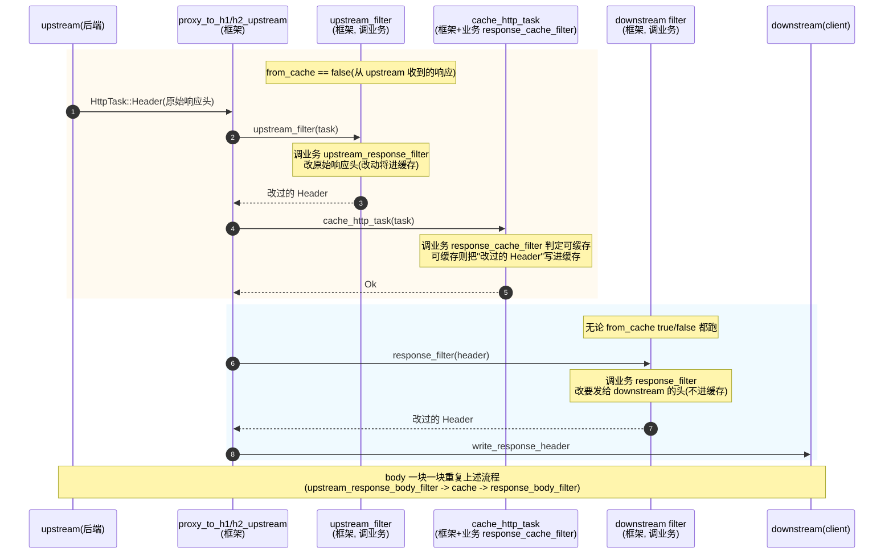
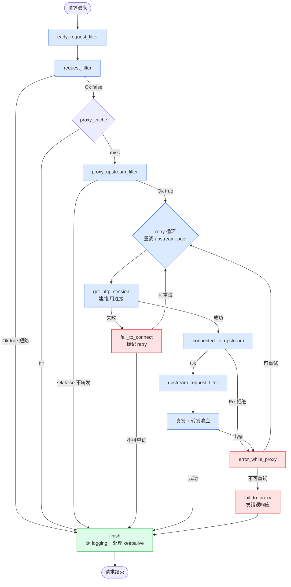
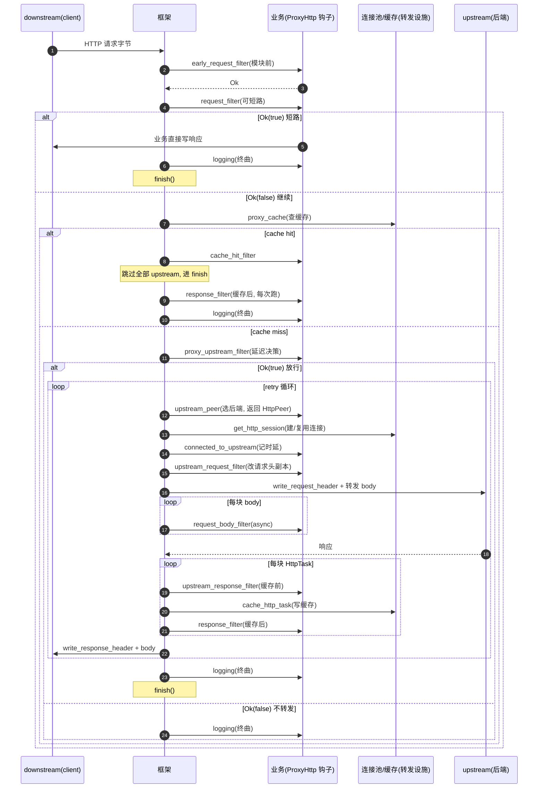

# 第 5 章 · 响应与收尾钩子

> 第 1 篇 · 钩子链:`ProxyHttp` trait 的请求生命周期(Pingora 灵魂)

---

## 核心问题

上一章(P1-04)把请求"出门段"钉死了——`proxy_upstream_filter`(cache miss 后延迟决策)、`upstream_peer`(选后端,返回 `Box<HttpPeer>`)、`upstream_request_filter`(改发出去的请求头副本)。请求的字节真正出门之后,后端会回响应。这一章要拆的就是**响应回来这一段**,以及请求结束的收尾——这是钩子链第 1 篇的最后一程。

请求回来,业务至少要回答四个问题:

- **响应头要不要改?** 后端回来的响应头往往"原样不能给客户端":有内部调试头要删、有安全头(`Strict-Transport-Security`)要加、有 hop-by-hop 头(`Connection`/`Transfer-Encoding`)要清。更要命的是——**改的响应头进不进缓存?** 同样是改响应头,有的改动该被缓存(下次 hit 直接拿到改后的),有的改动只针对当前客户端(每次都跑、不进缓存)。这一个差异,逼出了 `upstream_response_filter` 和 `response_filter` 两个钩子。
- **响应体要不要逐块改?** 响应体可能很大(几 GB 的视频),不能等全部收完再改——得**流式**地一块一块处理。这块过滤逻辑要不要 async?是放缓存前还是缓存后?
- **请求结束(无论成功/失败/短路)要做什么收尾?** 打访问日志(access log)、记 metrics、清状态。这个收尾动作必须**无论请求怎么结束都跑**——正常转发完、`request_filter` 短路、`proxy_upstream_filter` 拒绝、转发失败、甚至 panic 兜底,都得打 log。
- **连接刚建立(或刚复用)的那一刻,业务要不要被通知?** 这个时刻业务能拿到 fd、能拿到连接 digest、能算"建连花了多久"——这是观测代理性能的关键埋点。

本章要拆的六个主角:

- [`upstream_response_filter`](../pingora/pingora-proxy/src/proxy_trait.rs#L295-L312) —— 改 upstream 回来的响应头,**改动进缓存**(cache miss 时才跑)。
- [`response_filter`](../pingora/pingora-proxy/src/proxy_trait.rs#L314-L328) —— 改要发给 downstream 的响应头,**改动不进缓存**(每次都跑,cache hit 也跑)。
- [`upstream_response_body_filter`](../pingora/pingora-proxy/src/proxy_trait.rs#L379-L387) / [`response_body_filter`](../pingora/pingora-proxy/src/proxy_trait.rs#L400-L411) —— 逐块改响应体(缓存前 vs 缓存后)。
- [`response_trailer_filter`](../pingora/pingora-proxy/src/proxy_trait.rs#L418-L428) / [`upstream_response_trailer_filter`](../pingora/pingora-proxy/src/proxy_trait.rs#L390-L397) —— 改 trailer(h2/trailer 专用)。
- [`logging`](../pingora/pingora-proxy/src/proxy_trait.rs#L435-L439) —— 收尾打访问日志,无论请求怎么结束都跑。
- [`connected_to_upstream`](../pingora/pingora-proxy/src/proxy_trait.rs#L553-L567) —— 连接建立/复用回调,记时延与 fd。

读完本章你会明白:

1. **为什么改响应头要分 `upstream_response_filter` 和 `response_filter` 两个钩子,而改请求头(P1-04 的 `upstream_request_filter`)只有一个?** 这不是 API 冗余,是缓存语义的硬约束——"改动进缓存"和"改动不进缓存"必须分开,否则要么缓存被污染(改的安全头进了缓存,下次 hit 给错的客户端)、要么缓存没起作用(本该进缓存的改动每次重算)。本章会从 `h1_response_filter` 的源码逐行证明这个顺序:`upstream_response_filter`(缓存前)→ `cache_http_task`(写缓存)→ `response_filter`(缓存后),缓存逻辑**精确地插在两个 filter 之间**。
2. **cache hit 时哪些钩子不跑、哪些钩子照跑。** cache hit 时 `upstream_response_filter`/`upstream_response_body_filter`/`upstream_response_trailer_filter` **全部不跑**(没碰 upstream),但 `response_filter`/`response_body_filter`/`response_trailer_filter` **照跑**(每次给 downstream 都要过滤)。这个区分是为什么"缓存前/后"要分开的真正原因。
3. **为什么 `response_body_filter`/`upstream_response_body_filter` 是同步的(`fn` 不是 `async fn`),而请求侧的 `request_body_filter`(P1-03)是 async?** 热路径——响应体一块一块到达,每块都过一遍 filter,async 的状态机开销在大流量下不可接受。返回 `Option<Duration>` 让业务能"延迟"响应(限速),这是个巧妙的同步限速接口。
4. **`logging` 为什么是钩子链的"终曲",它在框架里到底在哪被调、被调几次。** 真相是:`logging` 在框架的**所有终态路径**上都被调——主干 `finish()`([lib.rs#L411](../pingora/pingora-proxy/src/lib.rs#L411))、`request_filter` 短路分支([lib.rs#L786](../pingora/pingora-proxy/src/lib.rs#L786))、早期致命错误的 `handle_error`([lib.rs#L968](../pingora/pingora-proxy/src/lib.rs#L968))。这三处是请求生命周期所有退出点的覆盖,每条请求**恰好命中其中一条**,所以 `logging` 一定且只跑一次。这就是它的"终曲"语义——无论请求怎么结束,收尾打日志的最后一动作都跑。
5. **`connected_to_upstream` 为什么排在 `upstream_request_filter` 之前、它能观测到什么。** 它在连接**刚建立或刚复用**之后、`upstream_request_filter` 之前触发,业务拿到 `reused: bool`(这次连接是新建还是复用)、`fd`(文件描述符,可算连接级统计)、`digest`(连接的协议/版本等摘要),是记"TTFB""建连时延"等性能指标的标准埋点。

> **逃生阀(本章有点长)**:如果你只想懂"为什么改响应头要分两个钩子",直接读第三节"`upstream_response_filter` vs `response_filter`:缓存前 vs 缓存后的精确分界"和技巧精解第一节。`logging` 的"终曲"语义在第五节,body filter 的"同步限速"在第四节,`connected_to_upstream` 的时延埋点在第六节。如果跳着读,请记住一个事实锚点:**响应过滤的顺序在 `h1_response_filter`/`h2_response_filter` 里钉死——`upstream_filter`(调 upstream_response_filter/body/trailer)→ `cache_http_task`(写缓存)→ `response_filter`/`response_body_filter`/`response_trailer_filter`(发给 downstream 前的最后一改)。缓存逻辑精确插在两组 filter 之间,这是整个第 1 篇钩子链的"最关键一刀"。**

---

## 一句话点破

> **响应与收尾钩子,是请求穿越 Pingora 后"响应原路返回 + 收尾"的最后一程。响应过滤的顺序是钩子链设计最精妙的一刀:`upstream_response_filter`/`upstream_response_body_filter`/`upstream_response_trailer_filter`(缓存**前**,改动进缓存,cache miss 才跑)→ [`cache_http_task`](../pingora/pingora-proxy/src/proxy_h1.rs#L625-L644)(写缓存)→ `response_filter`/`response_body_filter`/`response_trailer_filter`(缓存**后**,改动不进缓存,每次都跑、cache hit 也跑)。缓存逻辑精确地插在两组 filter 之间——这一刀保证"进缓存的响应是改过 upstream 头的原始版本,给 downstream 的响应是每次现改的定制版本"。`logging` 是钩子链的终曲,在三条终态路径(`finish()` 主干 / `request_filter` 短路 / `handle_error` 早期错误)上都被调,每条请求恰好命中一条,所以一定且只跑一次,无论正常/短路/错误都跑。`connected_to_upstream` 是连接建立/复用的观测埋点,排在 `upstream_request_filter` 之前。**

这是结论,不是理由。本章按真实执行顺序拆:先把响应段的钩子顺序钉死(读 `h1_response_filter`/`h2_response_filter` 源码)→ 拆 `upstream_response_filter` vs `response_filter` 的缓存前/后分界 → 拆 body filter 的同步限速 → 拆 trailer filter 的微妙语义 → 拆 `logging` 的终曲语义 → 拆 `connected_to_upstream` 的时延埋点 → 技巧精解把"缓存前/后分界"和"`logging` 作为终态收尾"单独拆透 → 收尾整个第 1 篇钩子链。

---

## 第一节:把响应段的钩子顺序钉死

### 1.1 别凭印象,直接读 `h1_response_filter`

讨论响应过滤的顺序,最容易踩的坑就是凭印象说"`upstream_response_filter` 在 `response_filter` 之前还是之后,中间有没有缓存?"。真相只有一个——读源码。

上一章已经把请求出门段读完了,这里接着读响应回来段。upstream 的字节流被切成 `HttpTask`(Header/Body/Trailer/Done/Failed,详见 P2-08),逐块送到 `h1_response_filter`。这个函数是整个响应过滤链的**总调度**,定义在 [`pingora-proxy/src/proxy_h1.rs#L603-L611`](../pingora/pingora-proxy/src/proxy_h1.rs#L603):

```rust
// pingora-proxy/src/proxy_h1.rs#L603-L611
async fn h1_response_filter(
    &self,
    session: &mut Session,
    mut task: HttpTask,
    ctx: &mut SV::CTX,
    serve_from_cache: &mut ServeFromCache,
    range_body_filter: &mut RangeBodyFilter,
    from_cache: bool, // 这个 task 是不是从缓存里来的
) -> Result<HttpTask>
```

注意最后一个参数 `from_cache: bool`——它标记"当前这块 HttpTask 是从 upstream 收到的(`false`),还是从缓存里读出来的(`true`)"。这个布尔值是理解整个分界的关键。函数体拆成三段([proxy_h1.rs#L616-L744](../pingora/pingora-proxy/src/proxy_h1.rs#L616)):

```rust
// pingora-proxy/src/proxy_h1.rs#L616-L744(简化, 三段式)
async fn h1_response_filter(...) -> Result<HttpTask> {
    // ===== 第一段: from_cache == false 才跑(upstream 来的响应) =====
    if !from_cache {
        // ① upstream_filter: 调 upstream_response_filter/body/trailer
        if let Some(duration) = self.upstream_filter(session, &mut task, ctx).await? {
            time::sleep(duration).await;  // 业务可让响应延迟(限速)
        }

        // ② cache_http_task: 写缓存(改动进缓存)
        if session.cache.enabled() || session.cache.bypassing() {
            if let Err(e) = self.cache_http_task(session, &task, ctx, serve_from_cache).await {
                session.cache.disable(NoCacheReason::StorageError);
                /* ... 容错 ... */
            }
        }

        if !serve_from_cache.should_send_to_downstream() {
            return Ok(task);  // 只为缓存准入, 不发 downstream
        }
    } // else: from_cache == true(缓存来的响应), 跳过 ①②

    // ===== 第二段: 协议转换 + downstream 准备(无论 from_cache) =====
    let track_max_cache_size = /* ... */;

    // ===== 第三段: 按 task 类型分发, 调 response_filter/body/trailer =====
    let res = match task {
        HttpTask::Header(mut header, end) => {
            /* conditional / range / chunked 处理 */
            self.inner.response_filter(session, &mut header, ctx).await?;  // ③ 缓存后
            Ok(HttpTask::Header(header, end))
        }
        HttpTask::Body(data, end) => {
            self.inner.response_filter /* 同步 */
            // 实际是 response_body_filter(session, &mut data, end, ctx)?  // ③ 缓存后
            Ok(HttpTask::Body(data, end))
        }
        HttpTask::Trailer(h) => /* h1 不支持 trailer, 直接透传 */,
        /* ... */
    };
    res
}
```

这三段把响应过滤的顺序钉死了。核心是**两个分界**:

1. **`from_cache` 分界**:第一段(① upstream filter + ② cache)只在 `from_cache == false` 时跑——也就是只有**从 upstream 真正收到的响应**才过 upstream filter 并写缓存。缓存命中时(`from_cache == true`),直接跳到第三段,跑 downstream filter。这就是"cache hit 时 `upstream_response_filter` 不跑、`response_filter` 照跑"的源码根源。
2. **缓存插在两组 filter 之间**:第一段的 ① `upstream_filter`(调 `upstream_response_filter`)在 ② `cache_http_task`(写缓存)**之前**;第三段的 ③ `response_filter` 在 ② 之后。所以顺序是 `upstream_response_filter`(改原始响应头)→ 写缓存(改过的进缓存)→ `response_filter`(再改一次,这次不进缓存,直接发 downstream)。

把这个顺序画成时序图:



这张图把响应过滤的全部顺序钉死了。每一块 HttpTask(Header/Body/Trailer)都走一遍这个流程。

### 1.2 H2 分支的顺序完全一致

H2 的响应过滤在 [`h2_response_filter`](../pingora/pingora-proxy/src/proxy_h2.rs#L549),结构和 h1 一模一样——同样三段式,同样 `from_cache` 分界,同样缓存插在两组 filter 之间:

```rust
// pingora-proxy/src/proxy_h2.rs#L562-L623(简化)
if !from_cache {
    // ① upstream_filter(调 upstream_response_filter/body/trailer)
    if let Some(duration) = self.upstream_filter(session, &mut task, ctx).await? {
        time::sleep(duration).await;
    }
    // ② cache_http_task
    if session.cache.enabled() || session.cache.bypassing() {
        self.cache_http_task(session, &task, ctx, serve_from_cache).await?;
    }
    if !serve_from_cache.should_send_to_downstream() {
        return Ok(task);
    }
}

// ③ downstream filter
let res = match task {
    HttpTask::Header(mut header, eos) => {
        /* conditional / range / chunked */
        self.inner.response_filter(session, &mut header, ctx).await?;
        header.set_version(Version::HTTP_11);  // h2->h1 降版本
        /* ... */
    }
    HttpTask::Body(data, eos) => {
        self.inner.response_body_filter(session, &mut data, eos, ctx)?;
        /* ... */
    }
    HttpTask::Trailer(mut trailers) => {
        // h2 trailer: 调 response_trailer_filter(微妙的 Option<Bytes> 语义)
        self.inner.response_trailer_filter(session, trailers, ctx).await?;
        /* ... */
    }
    /* ... */
};
```

H1 和 H2 的响应过滤逻辑几乎逐行对应,这不是巧合——`h1_response_filter`/`h2_response_filter` 共享同一个"缓存前/后分界"的设计契约。差异只在协议相关的细节(h2 的 trailer 真有内容,h1 的 trailer 是 TODO;h2 → h1 要降版本、加 chunked)。

### 1.3 顺序速查表:响应段全部介入点

把响应段涉及的全部介入点按顺序列成速查表:

| 序 | 介入点 | 谁实现 | async? | cache hit 跑吗 | 触发位置 | 干嘛 |
|----|------|------|--------|------|---------|------|
| ① | `connected_to_upstream` | 业务 | async | 不跑(没碰 upstream) | [proxy_h1.rs#L155-L168](../pingora/pingora-proxy/src/proxy_h1.rs#L155) / [proxy_h2.rs#L244-L250](../pingora/pingora-proxy/src/proxy_h2.rs#L244) | 连接建立/复用回调, 记时延/fd |
| ② | `upstream_response_filter` | 业务 | async | **不跑** | [lib.rs#L376-L381](../pingora/pingora-proxy/src/lib.rs#L376)(经 `upstream_filter`) | 改 upstream 响应头, **改动进缓存** |
| ③ | `response_cache_filter` | 业务 | 同步 | 不跑 | [proxy_cache.rs#L568](../pingora/pingora-proxy/src/proxy_cache.rs#L568)(经 `cache_http_task`) | 判定响应是否可缓存 |
| ④ | `cache_http_task`(写缓存) | 框架 | async | 不跑 | [proxy_h1.rs#L625-L644](../pingora/pingora-proxy/src/proxy_h1.rs#L625) | 把改过的响应写进缓存 |
| ⑤ | `upstream_response_body_filter` | 业务 | **同步** | **不跑** | [lib.rs#L382-L384](../pingora/pingora-proxy/src/lib.rs#L382) | 逐块改 upstream 响应体, 改动进缓存 |
| ⑥ | `response_filter` | 业务 | async | **跑** | [proxy_h1.rs#L699-L702](../pingora/pingora-proxy/src/proxy_h1.rs#L699) / [proxy_h2.rs#L621-L623](../pingora/pingora-proxy/src/proxy_h2.rs#L621) | 改要发给 downstream 的响应头, **改动不进缓存** |
| ⑦ | `response_body_filter` | 业务 | **同步** | **跑** | [proxy_h1.rs#L713-L719](../pingora/pingora-proxy/src/proxy_h1.rs#L713) / [proxy_h2.rs#L649-L655](../pingora/pingora-proxy/src/proxy_h2.rs#L649) | 逐块改发给 downstream 的响应体 |
| ⑧ | `upstream_response_trailer_filter` | 业务 | 同步 | 不跑 | [lib.rs#L385-L388](../pingora/pingora-proxy/src/lib.rs#L385) | 改 upstream trailer(进缓存) |
| ⑨ | `response_trailer_filter` | 业务 | async | 跑 | [proxy_h2.rs#L667-L680](../pingora/pingora-proxy/src/proxy_h2.rs#L667) | 改发给 downstream 的 trailer |
| ⑩ | `logging` | 业务 | async | **跑** | [lib.rs#L410-L412](../pingora/pingora-proxy/src/lib.rs#L410)(在 `finish()` 里) | 收尾打访问日志, 无论怎么结束都跑 |

几个值得立刻注意的点:

1. **"cache hit 跑吗"这一列是理解整个分界的钥匙**。凡是名字带 `upstream_` 前缀的(`upstream_response_filter`/`upstream_response_body_filter`/`upstream_response_trailer_filter`),cache hit 时**全部不跑**(没碰 upstream);凡是不带 `upstream_` 前缀的(`response_filter`/`response_body_filter`/`response_trailer_filter`),cache hit 时**照跑**(每次给 downstream 都要过滤)。这就是"缓存前/后"分界的真正含义——`upstream_` 前缀 = 缓存前(且只在 cache miss 跑),无前缀 = 缓存后(每次都跑)。
2. **`upstream_response_filter`(②)在 `cache_http_task`(④)之前,`response_filter`(⑥)在之后**。这正是"缓存插在两组 filter 之间"的精确顺序。`upstream_response_filter` 改的是"原始 upstream 响应头",改完写进缓存;`response_filter` 改的是"要发给 downstream 的响应头"(可能就是缓存里读出来的),改完直接发,不回写缓存。
3. **`response_cache_filter`(③)在 `upstream_response_filter`(②)之后、`cache_http_task` 写缓存时**。这个钩子不"改"响应头,它**判定**响应是否可缓存(返回 `RespCacheable` 枚举),决策写不写缓存。它和 `upstream_response_filter` 的关系是:先让业务改响应头,再让业务判定改过的响应头能不能缓存。
4. **body filter(⑤⑦)是同步的**。注意 `upstream_response_body_filter` 和 `response_body_filter` 都是 `fn` 不是 `async fn`(签名见 [proxy_trait.rs#L379-L387](../pingora/pingora-proxy/src/proxy_trait.rs#L379) 和 [L400-L411](../pingora/pingora-proxy/src/proxy_trait.rs#L400)),返回 `Result<Option<Duration>>`。这个"同步 + Option<Duration>"是热路径的限速技巧,第四节展开。
5. **`logging`(⑩)在 `finish()` 里调,不在响应过滤链里**。它是请求的最终收尾,无论请求怎么结束(正常/短路/错误)都汇到 `finish()` 再调一次 `logging`。这是"终曲"语义,第五节展开。
6. **`connected_to_upstream`(①)严格说不算"响应钩子"**,它排在 `upstream_request_filter` 之前(连接刚建立那一刻),但它在时间线上属于"请求出门后、响应回来前"的衔接点,且业务常在这里记建连时延(给 `logging` 用),所以本章一起讲。第六节展开。

> **钉死这件事**:响应段的顺序是 `connected_to_upstream`(连接建立/复用回调,记时延)→ [upstream 真发,字节出去] → upstream 回响应 → **对每块 HttpTask**:`upstream_response_filter`/`upstream_response_body_filter`/`upstream_response_trailer_filter`(缓存前,改原始响应,cache hit 不跑)→ `response_cache_filter`(判定可缓存)→ `cache_http_task`(写缓存)→ `response_filter`/`response_body_filter`/`response_trailer_filter`(缓存后,改发给 downstream 的,每次都跑)→ 全部发完 → `logging`(在 `finish()` 里,无论怎么结束都跑)。缓存逻辑精确插在两组 filter 之间——这是整个第 1 篇钩子链最关键的一刀。

---

## 第二节:`upstream_filter` 总调度:upstream 侧三类 filter 的统一入口

在展开单个钩子之前,先讲清楚它们的统一入口 `upstream_filter`。这个函数定义在 [`pingora-proxy/src/lib.rs#L365-L397`](../pingora/pingora-proxy/src/lib.rs#L365),是 h1/h2 共用的:

```rust
// pingora-proxy/src/lib.rs#L365-L397
async fn upstream_filter(
    &self,
    session: &mut Session,
    task: &mut HttpTask,
    ctx: &mut SV::CTX,
) -> Result<Option<Duration>>
where
    SV: ProxyHttp + Send + Sync,
    SV::CTX: Send + Sync,
{
    let duration = match task {
        HttpTask::Header(header, _eos) => {
            // 响应头: 调 upstream_response_filter(async)
            self.inner
                .upstream_response_filter(session, header, ctx)
                .await?;
            None
        }
        HttpTask::Body(data, eos) | HttpTask::UpgradedBody(data, eos) => {
            // 响应体: 调 upstream_response_body_filter(同步!)
            self.inner
                .upstream_response_body_filter(session, data, *eos, ctx)?
        }
        HttpTask::Trailer(Some(trailers)) => {
            // trailer: 调 upstream_response_trailer_filter(同步)
            self.inner
                .upstream_response_trailer_filter(session, trailers, ctx)?;
            None
        }
        _ => {
            // Done / Failed / Trailer(None): 无 filter
            None
        }
    };
    Ok(duration)
}
```

这个函数把"upstream 侧的三个 filter"按 HttpTask 类型分发:Header 调 `upstream_response_filter`(async)、Body 调 `upstream_response_body_filter`(**同步**)、Trailer 调 `upstream_response_trailer_filter`(同步)。注意三个 filter 的 async 性质**不一致**——只有改响应头的 `upstream_response_filter` 是 async,改 body/trailer 的都是同步。这个不一致不是疏忽,是性能取舍(第四节展开)。

`upstream_filter` 的返回值 `Option<Duration>` 是个限速接口:body filter 返回 `Some(duration)` 时,框架会 `time::sleep(duration).await`(见 [proxy_h1.rs#L618-L621](../pingora/pingora-proxy/src/proxy_h1.rs#L618)),让响应延迟一段时间再继续——业务用这个做响应限速(给慢客户端降速)。这是个"同步 filter 返回值驱动 async sleep"的巧妙设计,技巧精解展开。

`upstream_filter` 在 h1/h2 的 `h1_response_filter`/`h2_response_filter` 里被调([proxy_h1.rs#L618](../pingora/pingora-proxy/src/proxy_h1.rs#L618) / [proxy_h2.rs#L563](../pingora/pingora-proxy/src/proxy_h2.rs#L563)),**只在 `from_cache == false` 时跑**。这就是为什么 cache hit 时 `upstream_response_filter` 系列全部不跑——根本没进 `upstream_filter`。

downstream 侧的 `response_filter`/`response_body_filter`/`response_trailer_filter` 没有类似的"总调度"函数,它们在 `h1_response_filter`/`h2_response_filter` 的第三段 match 里**直接**调(没有中间层)。这是因为 downstream 侧的过滤逻辑和协议转换(降版本、加 chunked、conditional、range)耦合在一起,不好抽成独立函数。

> **钉死这件事**:`upstream_filter`([lib.rs#L365](../pingora/pingora-proxy/src/lib.rs#L365))是 upstream 侧三类 filter(`upstream_response_filter`/`upstream_response_body_filter`/`upstream_response_trailer_filter`)的统一入口,按 HttpTask 类型分发。它只在 `from_cache == false` 时被调(cache hit 不跑)。三个 filter 的 async 性质不一致:header 是 async,body/trailer 是同步(热路径取舍)。返回 `Option<Duration>` 是限速接口。

---

## 第三节:`upstream_response_filter` vs `response_filter`:缓存前 vs 缓存后的精确分界

这一节是本章的重头戏。理解了 `upstream_response_filter` 和 `response_filter` 为什么是两个钩子,就理解了 Pingora 响应过滤设计的全部精髓。

### 3.1 提问:为什么改响应头要分两个钩子

设想你用 Pingora 搭一个 CDN 边缘节点。后端回来的响应头乱七八糟:有内部调试头 `X-Debug-Trace`(要删,不能给客户端)、缺安全头 `Strict-Transport-Security`(要加,每次都加)、有 hop-by-hop 头 `Connection: keep-alive`(要清,这是 upstream 连接的、不该透传给 downstream)。

你作为业务开发者,想"改响应头"。问题来了:**这个改动该不该进缓存?**

分两类:

- **该进缓存的改动**:删 `X-Debug-Trace`、清 `Connection`、规范化 `Cache-Control`。这些改动是" universally correct"——对任何客户端都成立。你想让这些改动**只算一次**(第一次 cache miss 时改),改完进缓存,以后 cache hit 直接拿到改过的,不用重算。
- **不该进缓存的改动**:加 `Strict-Transport-Security`(HSTS)、加 `Set-Cookie`(会话)、加按客户端定制的头(比如 `X-Edge-Location: <根据客户端 IP 算>`)。这些改动是" per-client"——每个客户端的值可能不同,或者每次都要刷新。你想让这些改动**每次都跑**(cache hit 也要跑),不能固化进缓存(否则一个客户端的 HSTS 进了缓存,被另一个无 HSTS 配置的客户端拿到——虽然 HSTS 例子不严重,但 `Set-Cookie` 会串会话)。

如果只有一个"改响应头"钩子,你撞墙了:

- **放缓存前(改动进缓存)**:HSTS、Set-Cookie 这些 per-client 改动会被固化进缓存,串会话/串配置。
- **放缓存后(改动不进缓存)**:删 `X-Debug-Trace` 这种 universal 改动每次 cache hit 都要重算,浪费;更糟的是,如果缓存是共享的(多个边缘节点),有的节点改了有的没改,缓存内容不一致。

正确的设计是**两个钩子,缓存插在中间**:universal 改动放缓存前(进缓存,算一次),per-client 改动放缓存后(不进缓存,每次跑)。这就是 `upstream_response_filter`(缓存前)和 `response_filter`(缓存后)的存在理由。

### 3.2 承接方怎么做:Envoy 的 encoder filter / Tower 的 map_response

Envoy 怎么解决"缓存前/后分界"?Envoy 的 filter chain 里,cache filter 和 encoder filter 都是 http filter,顺序由 xDS 配置决定。Encoder filter(发响应给 downstream 前)默认配在 cache filter **之后**——也就是说 Envoy 的 encoder filter 天然就是"缓存后"。要在"缓存前"改,得把 decoder/encoder filter 配在 cache filter 之前。灵活在顺序任意,代价是要在配置里维护顺序,且业务得自己理解"我这个改动该放 cache 前还是后"。Envoy 的 filter chain 在《Envoy》第 3 篇已拆透,一句带过。

Tower 怎么解决?Tower 的 `Service<Request>` 返回 `Future<Response>`,响应是**整体**回来的(不是流式 filter)。要在响应上做改动,业务在 `map_response` 里整体改,没有"缓存前/后"的概念(Tower 本身不内置 cache)。如果业务自己套了 cache layer,cache layer 之后的 `map_response` 天然是"缓存后"。《Tower》已拆透,一句带过。

两种方案的共同点:**它们都不强制区分"缓存前/后",靠业务/配置自己摆顺序**。Pingora 不一样——它把"缓存前"和"缓存后"做成**两个有不同名字的钩子**,业务一看名字就知道"这个改动进不进缓存",不用理解 cache filter 在 filter chain 里的位置。这是 API 设计上的强约束——把"缓存语义"编码进钩子名,业务不容易犯错。

### 3.3 所以 Pingora 这么设计:两个钩子,缓存插在中间

先看两个钩子的签名和文档。

[`upstream_response_filter`](../pingora/pingora-proxy/src/proxy_trait.rs#L295-L312):

```rust
/// Modify the response header from the upstream
///
/// The modification is before caching, so any change here will be stored in the cache if enabled.
///
/// Responses served from cache won't trigger this filter. If the cache needed revalidation,
/// only the 304 from upstream will trigger the filter (though it will be merged into the
/// cached header, not served directly to downstream).
async fn upstream_response_filter(
    &self,
    _session: &mut Session,
    _upstream_response: &mut ResponseHeader,
    _ctx: &mut Self::CTX,
) -> Result<()>
where
    Self::CTX: Send + Sync,
{
    Ok(())
}
```

文档把语义说得很清楚:**"The modification is before caching, so any change here will be stored in the cache if enabled."**——改动在缓存前,会被存进缓存。**"Responses served from cache won't trigger this filter."**——cache hit 不跑这个 filter。

[`response_filter`](../pingora/pingora-proxy/src/proxy_trait.rs#L314-L328):

```rust
/// Modify the response header before it is send to the downstream
///
/// The modification is after caching. This filter is called for all responses including
/// responses served from cache.
async fn response_filter(
    &self,
    _session: &mut Session,
    _upstream_response: &mut ResponseHeader,
    _ctx: &mut Self::CTX,
) -> Result<()>
where
    Self::CTX: Send + Sync,
{
    Ok(())
}
```

文档同样清楚:**"The modification is after caching. This filter is called for all responses including responses served from cache."**——改动在缓存后,所有响应(包括 cache hit)都跑。

两个钩子的参数完全一样(`&mut Session, &mut ResponseHeader, &mut CTX`),返回值一样(`Result<()>`)。**唯一的区别是触发时机相对缓存的位置**——一个在缓存前(进缓存),一个在缓存后(不进缓存,每次跑)。

### 3.4 源码佐证:缓存逻辑确实插在中间

光看文档不够,得读源码证明缓存逻辑真的插在两个 filter 之间。回到 [`h1_response_filter`](../pingora/pingora-proxy/src/proxy_h1.rs#L603-L744),把三段式精确定位:

```rust
// pingora-proxy/src/proxy_h1.rs#L616-L702(精简, 只看 Header 分支)
if !from_cache {
    // ========== 缓存前: upstream_response_filter ==========
    if let Some(duration) = self.upstream_filter(session, &mut task, ctx).await? {
        // self.upstream_filter 内部对 HttpTask::Header 调:
        //   self.inner.upstream_response_filter(session, header, ctx)
        time::sleep(duration).await;
    }

    // ========== 写缓存: cache_http_task ==========
    if session.cache.enabled() || session.cache.bypassing() {
        if let Err(e) = self.cache_http_task(session, &task, ctx, serve_from_cache).await {
            session.cache.disable(NoCacheReason::StorageError);
            /* ... */
        }
    }
    /* ... */
} // else: from_cache, 跳过上面两段

// ========== 缓存后: response_filter(无论 from_cache) ==========
let res = match task {
    HttpTask::Header(mut header, end) => {
        /* conditional / range / chunked 协议处理 */
        match self.inner.response_filter(session, &mut header, ctx).await {
            Ok(_) => Ok(HttpTask::Header(header, end)),
            Err(e) => Err(e),
        }
    }
    /* ... Body/Trailer 分支 ... */
};
```

证据链完整:

1. **`upstream_filter`(内含 `upstream_response_filter`)在第一段,`if !from_cache` 块内**——cache miss 才跑,且在写缓存之前。
2. **`cache_http_task` 在第一段,`upstream_filter` 之后**——写缓存,且写的是"已经被 `upstream_response_filter` 改过的"响应。
3. **`response_filter` 在第三段,`if !from_cache` 块外**——无论 cache hit/miss 都跑,且在写缓存之后(改的不回写缓存)。

这个顺序在 `h2_response_filter` 里逐行对应([proxy_h2.rs#L562-L623](../pingora/pingora-proxy/src/proxy_h2.rs#L562))。H1 和 H2 共享同一个"缓存前/后分界"契约。

### 3.5 关键洞察:cache hit 时 `upstream_response_filter` 不跑意味着什么

这是理解整个设计的最后一个关键。设想同一个 URL 的两次请求:

- **第一次请求**(cache miss):upstream 回响应 → `upstream_response_filter`(改原始头,比如删 `X-Debug-Trace`)→ 写缓存(改过的进缓存)→ `response_filter`(再加 HSTS)→ 发 downstream。**缓存里存的是"删了 `X-Debug-Trace` 但没加 HSTS"的版本**。
- **第二次请求**(cache hit):缓存命中 → **跳过 `upstream_response_filter`**(不跑,因为 `from_cache == true`)→ 直接 `response_filter`(加 HSTS)→ 发 downstream。**downstream 收到的是"缓存里的版本(已删 `X-Debug-Trace`)+ 现加的 HSTS"**。

这个行为完全符合预期:删 `X-Debug-Trace`(universal,进缓存)只在第一次算,以后 hit 直接复用;加 HSTS(per-client,不进缓存)每次都算。如果只有一个 filter,要么 HSTS 进缓存(错),要么删 `X-Debug-Trace` 每次重算(浪费)。

更微妙的是**响应头改写与 cache key 的关系**。`upstream_response_filter` 改的是**响应头**,不是请求头,所以**不影响 cache key**(cache key 基于请求,见 P6-17)。但改的响应头会进缓存——如果业务在 `upstream_response_filter` 里改了 `Vary` 头(影响 variance key),会改变缓存的 variance 分桶。这是高级用法,一般业务不碰,但要知道"改响应头进缓存"的边界不止"内容进缓存",还包括 `Vary`/`Cache-Control` 等影响缓存行为的头。

#### 典型用例对照

把两个钩子的典型职责列成对照表:

| 改动类型 | 该放哪个钩子 | 为什么 |
|------|------|------|
| 删内部调试头(`X-Debug-Trace`) | `upstream_response_filter`(缓存前) | universal, 进缓存算一次 |
| 清 hop-by-hop 头(`Connection`/`Transfer-Encoding`) | `upstream_response_filter` | universal |
| 规范化 `Cache-Control` | `upstream_response_filter` | 影响缓存行为, 要进缓存 |
| 加 `Strict-Transport-Security`(HSTS) | `response_filter`(缓存后) | per-client 配置可能不同, 不进缓存 |
| 加 `Set-Cookie`(会话) | `response_filter` | 绝对不能进共享缓存(串会话) |
| 加按客户端 IP 定制的头(`X-Edge-Location`) | `response_filter` | per-client |
| 改 `Server` 头(隐藏真实后端) | `upstream_response_filter` | universal |

一个简单的判断规则:**"这个改动对所有客户端都一样吗?"** 是 → `upstream_response_filter`(进缓存);否 → `response_filter`(不进缓存)。

> **钉死这件事**:`upstream_response_filter`(缓存前,改原始 upstream 响应头,改动进缓存,cache miss 才跑)和 `response_filter`(缓存后,改发给 downstream 的响应头,改动不进缓存,每次都跑)是缓存语义硬约束下的必然设计。源码证明缓存逻辑(`cache_http_task`)精确插在两个 filter 之间([proxy_h1.rs#L618 upstream_filter → L627 cache_http_task → L699 response_filter](../pingora/pingora-proxy/src/proxy_h1.rs#L618))。cache hit 时 `upstream_response_filter` 不跑(没碰 upstream),`response_filter` 照跑。判断规则:universal 改动放缓存前(进缓存算一次),per-client 改动放缓存后(每次跑)。对照 Envoy encoder filter(配置驱动摆顺序)和 Tower map_response(无缓存概念),Pingora 把缓存语义编码进钩子名,业务不容易犯错。

---

## 第四节:`response_body_filter` 与 `upstream_response_body_filter`:同步 + 限速

响应头讲完了,讲响应体。响应体的过滤和响应头有三点关键差异——这些差异都源于"响应体是流式的、可能很大"。

### 4.1 提问:为什么 body filter 要同步,而 request_body_filter(P1-03)是 async

回想 P1-03:`request_body_filter` 是 `async fn`([proxy_trait.rs#L114-L125](../pingora/pingora-proxy/src/proxy_trait.rs#L114)),文档明确说"The async nature of this function allows to throttle the upload speed and/or executing heavy computation logic such as WAF rules on offloaded threads"。请求体 filter 是 async,因为可能要做重计算(WAF 规则匹配),需要能 offload 到 blocking 线程。

那为什么响应体 filter(`upstream_response_body_filter`/`response_body_filter`)是同步的?看签名:

```rust
// pingora-proxy/src/proxy_trait.rs#L375-L387
/// Similar to [Self::upstream_response_filter()] but for response body
///
/// This function will be called every time a piece of response body is received. The `body` is
/// **not the entire response body**.
fn upstream_response_body_filter(
    &self,
    _session: &mut Session,
    _body: &mut Option<Bytes>,
    _end_of_stream: bool,
    _ctx: &mut Self::CTX,
) -> Result<Option<Duration>> {
    Ok(None)
}

// pingora-proxy/src/proxy_trait.rs#L399-L411
/// Similar to [Self::response_filter()] but for response body chunks
fn response_body_filter(
    &self,
    _session: &mut Session,
    _body: &mut Option<Bytes>,
    _end_of_stream: bool,
    _ctx: &mut Self::CTX,
) -> Result<Option<Duration>>
where
    Self::CTX: Send + Sync,
{
    Ok(None)
}
```

注意三点:

1. **都是 `fn` 不是 `async fn`**。这意味着 body filter 不能直接 `.await`,不能做异步 IO,不能 offload 到 blocking 线程。
2. **`_body: &mut Option<Bytes>`**——和 `request_body_filter` 一样的"逐块"语义。`Option<Bytes>` 允许业务把 body 设成 `None`(吞掉这一块,不发给 downstream),或者替换成新的 `Bytes`(改写)。`end_of_stream` 标记这是不是最后一块。
3. **返回 `Result<Option<Duration>>`**——这是个限速接口。`Ok(None)` = 正常继续,`Ok(Some(duration))` = 让框架 `sleep(duration)` 再继续(限速)。

为什么响应侧选同步?根因是**热路径性能**。响应体在大流量下是性能关键路径——一个 CDN 节点每秒转发几十 GB 响应体,每块(默认 16KB 左右)都要过两遍 body filter(upstream 侧 + downstream 侧)。如果 body filter 是 async,每块都要:

- 构造 Future 状态机(即使不做异步 IO,async fn 也会被编译成状态机,有开销);
- 走一次调度器 poll(就算立即就绪,也有 task queue 操作);
- 状态机内部的局部变量要存进 Future(增大 Future 尺寸)。

对一个每秒被调几百万次的 filter,这些开销累积起来很可观。Pingora 选**同步**——body filter 就是个普通函数调用,没有状态机、没有调度、没有 Future 分配。函数调用的开销远低于 async。

代价是 body filter **不能做异步 IO、不能 offload 重计算**。如果业务真要在响应体上做重计算(比如实时转码视频),得自己用 `tokio::task::spawn_blocking` 把计算扔到 blocking 池,再用 channel 把结果传回来——框架不直接支持。这是个有意识的取舍:**绝大多数响应体 filter 是轻量改写(改几个字节、删几块、统计字节数),用同步最快;少数重计算场景业务自己异步化**。

### 4.2 承接方怎么做:Envoy 的 encoder/decoder filter / Tower 的 stream

Envoy 的 http filter 既能改 header 也能改 body,都是虚函数(同步),body 以 `Buffer::Instance` 传进来。Envoy 的 filter chain 整体是同步的,异步操作靠回调或 coroutine。Envoy 的设计哲学和 Pingora 这里的同步 body filter 接近——热路径同步。《Envoy》已拆透,一句带过。

Tower 的 `Service<Request>` 返回 `Future<Response>`,响应体是 `Body: Stream<Item = Bytes>`。要在响应体流上做改动,业务用 `map_stream` 之类的组合子,这是 async 的(因为 Stream 是 async)。Tower 没有专门的"body filter 钩子",业务自己组合 Stream。《Tower》已拆透,一句带过。

Pingora 的选择(同步 body filter)更接近 Envoy 的虚函数模型——热路径同步,简单高效。对比 Tower 的全 async Stream,Pingora 在大流量响应体转发上更省。

### 4.3 限速接口:`Option<Duration>` 的巧妙

body filter 返回 `Option<Duration>` 是个值得单独说的设计。看 [`upstream_filter`](../pingora/pingora-proxy/src/lib.rs#L382-L384) 怎么用它:

```rust
// pingora-proxy/src/lib.rs#L382-L384
HttpTask::Body(data, eos) | HttpTask::UpgradedBody(data, eos) => self
    .inner
    .upstream_response_body_filter(session, data, *eos, ctx)?,
// 返回 Option<Duration>
```

然后在 `h1_response_filter`([proxy_h1.rs#L618-L621](../pingora/pingora-proxy/src/proxy_h1.rs#L618)):

```rust
// pingora-proxy/src/proxy_h1.rs#L618-L621
if let Some(duration) = self.upstream_filter(session, &mut task, ctx).await? {
    trace!("delaying upstream response for {duration:?}");
    time::sleep(duration).await;
}
```

`downstream` 侧 `response_body_filter` 的返回值同样驱动 sleep([proxy_h1.rs#L713-L719](../pingora/pingora-proxy/src/proxy_h1.rs#L713)):

```rust
// pingora-proxy/src/proxy_h1.rs#L713-L719
if let Some(duration) = self
    .inner
    .response_body_filter(session, &mut data, end, ctx)?
{
    trace!("delaying downstream response for {:?}", duration);
    time::sleep(duration).await;
}
```

业务在 body filter 里返回 `Some(duration)`,框架就在这块 body 发出去之前 `sleep(duration)`。这是个**同步 filter 控制异步 sleep** 的巧妙设计——filter 本身是同步的(没有 async 开销),但通过返回值让框架(异步)执行 sleep。业务用这个做响应限速:每个客户端配一个速率,每收到一块 body 算一下"按这个速率,这块该延迟多久发出",返回 `Some(delay)`。

为什么不用 async?因为限速只需要"告诉框架等多久",不需要在 filter 内部做异步 IO。返回一个 Duration,框架统一 sleep,既保持了 filter 的同步性,又实现了限速。如果用 async,每块 body 都要 await 一个 timer,状态机开销大。这个设计把"决策(同步,算多久)"和"执行(异步,sleep)"分开,各取所长。

### 4.4 body filter 的缓存前/后分界

和响应头一样,响应体也有缓存前/后分界:

- `upstream_response_body_filter`(缓存前):改的是 upstream 回来的原始 body 块,**改动的进缓存**。典型用途:统计 upstream 响应体字节数(给缓存大小限制用)、过滤敏感内容(把 body 里的关键字打码,打码后的进缓存)。
- `response_body_filter`(缓存后):改的是要发给 downstream 的 body 块,**改动不进缓存**。典型用途:实时压缩(已经缓存的不能再压)、按客户端定制 body(插入用户名)、限速。

源码里两者都在 `h1_response_filter` 里调,位置和响应头对应:`upstream_response_body_filter` 在第一段(经 `upstream_filter`,`from_cache == false` 才跑),`response_body_filter` 在第三段(无论 `from_cache` 都跑)。所以 cache hit 时:

- `upstream_response_body_filter` **不跑**(缓存里的 body 已经是 miss 时改过的);
- `response_body_filter` **照跑**(每次给 downstream 都要现改)。

这个分界和响应头的分界完全对称——`upstream_` 前缀 = 缓存前(进缓存,miss 才跑),无前缀 = 缓存后(不进缓存,每次跑)。

#### `body: &mut Option<Bytes>` 的三种行为

业务拿到 `&mut Option<Bytes>`,有三种操作:

1. **不改**(`*body` 保持原样):body 原样透传。最常见,默认行为。
2. **改内容**(`*body = Some(new_bytes)`):替换这一块。比如把 body 里的 `secret` 替换成 `***`。
3. **吞掉**(`*body = None`):这一块不发给 downstream。比如过滤掉某些块。

注意 `end_of_stream` 参数——它是"这块是不是最后一块"的标记。业务可以用它在最后一块时做收尾(比如 flush 统计)。但吞掉最后一块要小心——downstream 会以为 body 没结束,卡住等。

> **钉死这件事**:`upstream_response_body_filter`(缓存前,进缓存,miss 才跑)和 `response_body_filter`(缓存后,不进缓存,每次跑)都是**同步**的(`fn` 不是 `async fn`),热路径性能取舍——大流量下每块 body 过两遍 filter,async 的状态机开销不可接受。返回 `Option<Duration>` 是限速接口:filter 同步算"该延迟多久",框架异步 sleep,决策与执行分离。`&mut Option<Bytes>` 支持不改/改写/吞掉三种操作。对照 request_body_filter(async,可 offload 重计算),响应侧选同步因为绝大多数响应体 filter 是轻量改写。

---

## 第五节:`logging`:钩子链的终曲

前面四节讲的都是"响应回来怎么改"。这一节讲请求的最终收尾——`logging`。它不是改响应的,是请求结束时打访问日志、记 metrics 的。

### 5.1 提问:为什么"打日志"要做成一个钩子,而不是框架自己打

乍一看,访问日志是框架该干的事——记录"这个请求什么时候来、什么状态走、耗时多少、命中缓存没有"。为什么 Pingora 把它做成一个钩子(`logging`),让业务实现?

根因是**业务才知道"什么是有意义的日志"**。框架能记的只有通用字段(时间戳、状态码、字节数、耗时),但业务关心的往往更多:

- 业务在 `ctx` 里存了"选中的后端地址""鉴权的用户 ID""cache miss 的原因"——这些框架不知道,只有业务能写进日志。
- 业务可能要把日志发到不同的地方(stdout/文件/远程日志服务/metrics 系统),格式不同。
- 业务可能要做采样(只记 1% 的请求)或脱敏(去掉 URL 里的 token)。

这些全是业务逻辑,框架没法预知。所以 Pingora 把"打日志"做成钩子——框架保证**在正确的时机调一次**(请求结束时),业务决定**打什么、怎么打、打去哪**。

### 5.2 承接方怎么做:Envoy 的 access log / Nginx 的 log_format

Envoy 有专门的 access log filter 和 access log 配置(`access_log` 字段),格式由配置(`json_format`/`text_format`)定义,可以发到文件/grpc/stdout。Envoy 的 access log 是**配置驱动**的,业务写 format string,Envoy 填字段。《Envoy》已拆透,一句带过。

Nginx 用 `log_format` 指令定义访问日志格式,`access_log` 指令指定文件和格式。**配置写死**,要动态得靠 lua/第三方模块。

Pingora 选**代码驱动**——业务在 `logging` 钩子里写 Rust 代码,任意读 `session`/`ctx`,任意打日志。和 `upstream_peer`(代码驱动选后端)一脉相承,是 Pingora 的整体风格:把动态性留给业务代码。

### 5.3 所以 Pingora 这么设计:`logging` 在终态路径上被调,一定且只跑一次

[`logging` 的文档和签名](../pingora/pingora-proxy/src/proxy_trait.rs#L430-L439):

```rust
/// This filter is called when the entire response is sent to the downstream successfully or
/// there is a fatal error that terminate the request.
///
/// An error log is already emitted if there is any error. This phase is used for collecting
/// metrics and sending access logs.
async fn logging(&self, _session: &mut Session, _e: Option<&Error>, _ctx: &mut Self::CTX)
where
    Self::CTX: Send + Sync,
{
}
```

三个关键点:

1. **"when the entire response is sent ... or there is a fatal error"**——无论请求成功(整个响应发完)还是失败(致命错误终止),都调 `logging`。这是"终曲"语义。
2. **`_e: Option<&Error>`**——错误对象(如果有)。业务可以据此区分成功/失败日志,记录错误码、错误类型。文档说"An error log is already emitted if there is any error"——框架已经打过 error log 了,`logging` 是给业务做 access log/metrics 的,不重复打 error。
3. **返回 `()` 不返回 `Result`**——`logging` 不能失败(就算失败也没意义,请求都结束了)。这是个"最终副作用"钩子。

`logging` 在哪里被调?答案是**在所有终态路径上**——主干 `finish()`、`request_filter` 短路分支、早期致命错误的 `handle_error`。先看主干 [`finish`](../pingora/pingora-proxy/src/lib.rs#L399-L431):

```rust
// pingora-proxy/src/lib.rs#L399-L431
async fn finish(
    &self,
    mut session: Session,
    ctx: &mut SV::CTX,
    reuse: bool,
    error: Option<Box<Error>>,
) -> Option<ReusedHttpStream>
where
    SV: ProxyHttp + Send + Sync,
    SV::CTX: Send + Sync,
{
    // ① 调 logging(无论 reuse/error 如何)
    self.inner
        .logging(&mut session, error.as_deref(), ctx)
        .await;

    if let Some(e) = error {
        session.downstream_session.on_proxy_failure(e);
    }

    // ② 处理 keepalive 复用
    if reuse {
        let persistent_settings = HttpPersistentSettings::for_session(&session);
        session
            .downstream_session
            .finish()
            .await
            .ok()
            .flatten()
            .map(|s| ReusedHttpStream::new(s, Some(persistent_settings)))
    } else {
        None
    }
}
```

`finish()` 第一行就是 `logging`(①)。关键问题是——**`logging` 是不是每条请求都跑、且只跑一次?** 读 `process_request` 全文,所有退出点都调 `logging`:

- **主干 `finish()`** 处理大多数路径——**cache hit**([lib.rs#L806-L809](../pingora/pingora-proxy/src/lib.rs#L806) `return self.finish(...).await`)、**`proxy_upstream_filter` 返回 `Ok(false)` 不转发**([lib.rs#L845](../pingora/pingora-proxy/src/lib.rs#L845) `return self.finish(...).await`)、**正常转发完 / retry 耗尽**([lib.rs#L944](../pingora/pingora-proxy/src/lib.rs#L944) `self.finish(...).await`),全部汇到 `finish()` 再调 `logging`。
- **`request_filter` 短路分支**走的是独立路径——[lib.rs#L786](../pingora/pingora-proxy/src/lib.rs#L786) 直接调 `self.inner.logging(&mut session, None, &mut ctx).await`,然后自己处理 session 结束(短路时业务已写响应,不需要走 `finish()` 的 keepalive 复用逻辑)。
- **早期致命错误**走 `handle_error`——[lib.rs#L968](../pingora/pingora-proxy/src/lib.rs#L968) 直接调 `self.inner.logging(&mut session, Some(&e), ctx).await`。

所以三条终态路径(`finish()` 主干 / `request_filter` 短路 / `handle_error` 早期错误)**覆盖请求生命周期的所有退出点**,每条请求**恰好命中其中一条**。**`logging` 一定且只跑一次**——这就是"终曲"的精确语义:它是钩子链的最后一站,是请求生命周期的终点。三条路径的差异只在收尾细节(短路不调 `finish` 的 keepalive 逻辑,早期错误要发错误响应),但都保证调 `logging`。

### 5.4 `logging` 能拿到什么

业务在 `logging` 里能拿到三样东西:

1. **`&mut Session`**——整个会话对象。业务能读请求头(`session.req_header()`)、响应状态、字节数(`session.upstream_body_bytes_received`,由 [proxy_h1.rs#L174-L175](../pingora/pingora-proxy/src/proxy_h1.rs#L174) 设置)、耗时等。
2. **`Option<&Error>`**——错误对象(如果有)。业务据此区分成功/失败,记录错误码、错误类型、错误来源(`ErrorSource::Upstream`/`Downstream`/`Internal`)。
3. **`&mut CTX`**——业务自己的上下文。业务在前面的钩子里(`upstream_peer` 选的后端、`request_filter` 鉴权的用户)存进 ctx 的东西,这里都能读出来写进日志。

注意 `logging` 拿到的是 `&mut Session`,但这时候响应已经发完了(downstream 收到了完整响应或错误),所以业务**不该**再改 session 状态(改了也没用,响应已经走了)。`&mut` 是为了能调一些 `&mut self` 的方法(比如读 cache 统计),不是为了改。

### 5.5 典型用例:访问日志 + metrics

`logging` 的典型职责:打访问日志(一行 JSON,含时间/方法/路径/状态/耗时/后端/cache 状态)、更新 metrics 计数器(prometheus counter)、采样(只记部分请求)、脱敏(去掉 URL 里的 token)。具体代码见章末附录示例。

一个重要的设计点:**`logging` 是 async 的**。这意味着业务可以在 `logging` 里做异步操作——比如异步写日志文件、异步发 metrics 到远程服务。但要注意 `logging` 阻塞会让请求的收尾变慢(虽然响应已经发给客户端了,但 keepalive 复用要等 `finish` 完)。所以重 IO 的日志操作应该用 fire-and-forget(`tokio::spawn` 把日志任务扔出去,不等),不要在 `logging` 里同步等远程日志服务。

> **钉死这件事**:`logging`([proxy_trait.rs#L435-L439](../pingora/pingora-proxy/src/proxy_trait.rs#L435))是钩子链的终曲,在三条终态路径上都被调——主干 `finish()`([lib.rs#L411](../pingora/pingora-proxy/src/lib.rs#L411))、`request_filter` 短路([lib.rs#L786](../pingora/pingora-proxy/src/lib.rs#L786))、早期错误 `handle_error`([lib.rs#L968](../pingora/pingora-proxy/src/lib.rs#L968))。三条路径覆盖所有退出点,每条请求恰好命中一条,所以 `logging` 一定且只跑一次。它拿到 `&mut Session`/`Option<&Error>`/`&mut CTX`,业务据此打访问日志/记 metrics/采样/脱敏。框架已打过 error log,`logging` 不重复打。`logging` 是 async,允许异步日志操作,但重 IO 应 fire-and-forget 避免阻塞 keepalive 复用。对照 Envoy access log(配置驱动 format)、Nginx log_format(配置写死),Pingora 选代码驱动(业务任意读写 session/ctx)。

---

## 第六节:`connected_to_upstream`:连接建立/复用的观测埋点

最后一个钩子 `connected_to_upstream`。它严格说不算"响应钩子"(排在 `upstream_request_filter` 之前,响应还没回来),但它在时间线上是"请求出门后、响应回来前"的衔接点,且业务常在这里记建连时延给 `logging` 用,所以本章一起讲。

### 6.1 提问:为什么连接建立后要回调业务

设想你搭了个代理,要监控"建连慢不慢"。TCP 建连(+ TLS 握手)是个重活,可能花几十到几百毫秒(跨大洋的连接尤其慢)。你想知道:

- 这次连接是新建的还是复用的?(复用的快,新建的慢)
- 新建连接花了多久?(TCP handshake + TLS handshake)
- 连接建立失败了吗?(超时/拒绝)

这些信息,业务怎么拿到?框架在 `get_http_session` 里建连,但它不知道业务想记什么、记去哪。所以 Pingora 给一个回调——连接刚建立(或刚复用)的那一刻,通知业务,业务自己决定记什么。

### 6.2 所以 Pingora 这么设计:`connected_to_upstream` 在 `upstream_request_filter` 之前

[`connected_to_upstream` 的文档和签名](../pingora/pingora-proxy/src/proxy_trait.rs#L550-L567):

```rust
/// This filter is called when the request just established or reused a connection to the upstream
///
/// This filter allows user to log timing and connection related info.
async fn connected_to_upstream(
    &self,
    _session: &mut Session,
    _reused: bool,
    _peer: &HttpPeer,
    #[cfg(unix)] _fd: std::os::unix::io::RawFd,
    #[cfg(windows)] _sock: std::os::windows::io::RawSocket,
    _digest: Option<&Digest>,
    _ctx: &mut Self::CTX,
) -> Result<()>
where
    Self::CTX: Send + Sync,
{
    Ok(())
}
```

七个参数,逐个拆:

1. **`_session: &mut Session`**——会话对象,业务能读请求头、写 ctx。
2. **`_reused: bool`**——**关键**:这次连接是新建(`false`)还是复用(`true`)。复用意味着 keepalive 命中了连接池里的空闲连接(详见 P2-06),不用建 TCP/TLS,直接发请求。
3. **`_peer: &HttpPeer`**——选定的后端(就是 `upstream_peer` 返回的那个)。业务能读 `peer._address`(发去哪)、`peer.sni`(TLS SNI)等。
4. **`_fd: RawFd`(unix)/ `_sock: RawSocket`(windows)**——底层连接的文件描述符/socket 句柄。业务可以用它做连接级统计(比如 `getsockopt` 读 TCP 信息),或者关联到外部监控(比如 eBPF 追踪)。
5. **`_digest: Option<&Digest>`**——连接的摘要信息(协议版本、SSL 信息等)。新建连接有 digest,复用连接也有(从池子里带出来的)。
6. **`_ctx: &mut Self::CTX`**——上下文,业务常在这里存"建连时刻的时间戳",给后面 `logging` 算总耗时用。

调用位置在 `proxy_to_h1_upstream`([proxy_h1.rs#L155-L168](../pingora/pingora-proxy/src/proxy_h1.rs#L155))和 `proxy_to_h2_upstream`([proxy_h2.rs#L244-L250](../pingora/pingora-proxy/src/proxy_h2.rs#L244)),**在 `upstream_request_filter` 之前**。看 h1 的代码:

```rust
// pingora-proxy/src/proxy_h1.rs#L135-L171(简化)
pub(crate) async fn proxy_to_h1_upstream(
    &self,
    session: &mut Session,
    client_session: &mut HttpSessionV1,
    reused: bool,  // 连接是否复用(get_http_session 返回)
    peer: &HttpPeer,
    ctx: &mut SV::CTX,
) -> (bool, bool, Option<Box<Error>>) {
    let raw = client_session.id();  // fd
    let initial_write_pending = client_session.stream().get_write_pending_time();

    // ① connected_to_upstream(连接已建/已复用, 回调业务)
    if let Err(e) = self
        .inner
        .connected_to_upstream(session, reused, peer, raw,
            Some(client_session.digest()), ctx)
        .await
    {
        return (false, false, Some(e));  // 业务拒绝, 整个失败
    }

    // ② 之后才进 proxy_1to1(里面调 upstream_request_filter + 转发)
    let (server_session_reuse, client_session_reuse, error) =
        self.proxy_1to1(session, client_session, peer, ctx).await;
    /* ... 记 upstream_body_bytes_received ... */
}
```

注意顺序:**`connected_to_upstream`(①)在 `proxy_1to1`(②)之前**,而 `proxy_1to1` 内部才调 `upstream_request_filter`(改请求头副本)。所以顺序是 `get_http_session`(建连)→ `connected_to_upstream`(回调)→ `upstream_request_filter`(改请求头)→ `write_request_header`(真发)。

为什么 `connected_to_upstream` 排在 `upstream_request_filter` 之前?因为业务可能想根据"这次连接是不是复用的"来决定怎么改请求头。比如:

- 新连接(`reused == false`):加 `Connection: warm-up`(暖连,告诉后端预热)。
- 复用连接(`reused == true`):不加(已经暖过了)。

这种"按连接状态改请求头"的逻辑,需要先知道连接状态(`connected_to_upstream`),再改请求头(`upstream_request_filter`)。所以 `connected_to_upstream` 排在前面。

### 6.3 返回 `Result<()>`:业务能拒绝已建立的连接

注意 `connected_to_upstream` 返回 `Result<()>`,`Err` 会让整个转发失败(见 [proxy_h1.rs#L166-L168](../pingora/pingora-proxy/src/proxy_h1.rs#L166) `return (false, false, Some(e))`)。这是个不太常见但有用的语义——**业务可以在连接建立后、请求发出前拒绝这个连接**。比如:

- 业务检查 `digest` 发现 SSL 协议是 TLS 1.0(不安全),拒绝。
- 业务检查 `reused` 发现是复用连接,但这个请求要求新连接(比如要重新鉴权),拒绝。

拒绝后,框架把这个连接当失败处理(走 `error_while_proxy`/retry 链路,见 P1-04 的错误处理)。这是个"最后一刻反悔"的机制。

### 6.4 典型用例:记建连时延

`connected_to_upstream` 最经典的用例是记建连时延。业务在 `upstream_peer` 之后(或者 `request_filter` 里)记一个开始时间戳,在 `connected_to_upstream` 里算"从开始到连上的耗时",存进 ctx,最后在 `logging` 里写进访问日志。这样每条请求的 access log 都有"建连耗时"字段,用于监控后端健康状况。

注意"建连耗时"和"总耗时"不一样——建连耗时是 `get_http_session` 建连那一段(可能 0,如果复用),总耗时是整个请求从进来到 `logging` 的全程。业务常分开记:`connected_to_upstream` 记建连,`logging` 算总耗时(用 `request_filter` 里记的开始时间戳)。

> **钉死这件事**:`connected_to_upstream`([proxy_trait.rs#L553-L567](../pingora/pingora-proxy/src/proxy_trait.rs#L553))在连接刚建立/刚复用之后、`upstream_request_filter` 之前触发([proxy_h1.rs#L155-L168](../pingora/pingora-proxy/src/proxy_h1.rs#L155) / [proxy_h2.rs#L244-L250](../pingora/pingora-proxy/src/proxy_h2.rs#L244))。业务拿到 `reused`(新建/复用)、`fd`(文件描述符,连接级统计)、`peer`(选定后端)、`digest`(连接摘要),常记建连时延存进 ctx 给 `logging` 用。返回 `Result<()>`,`Err` 可拒绝已建立的连接(最后一刻反悔,走 retry 链路)。排在 `upstream_request_filter` 之前,因为业务可能按"是否复用连接"决定怎么改请求头。

---

## 第七节:错误处理与请求生命周期终点

讲完六个主角,补一个常被忽略但重要的环节——请求出错时怎么收尾。这个环节涉及三个错误处理钩子(`fail_to_proxy`/`error_while_proxy`/`fail_to_connect`)和它们与 `logging` 的关系。

### 7.1 三个错误钩子:谁在什么时候被调

`ProxyHttp` 有三个错误处理钩子,触发时机不同:

- **[`fail_to_connect`](../pingora/pingora-proxy/src/proxy_trait.rs#L463-L479)**:连接**建立失败**时调(在 `get_http_session` 返回 `Err` 之后)。业务能标记错误是否可重试(`e.retry`)。如果可重试,框架重新调 `upstream_peer`(可能选另一台后端)。
- **[`error_while_proxy`](../pingora/pingora-proxy/src/proxy_trait.rs#L446-L461)**:连接**建立成功后**,转发过程中出错时调(在 `proxy_to_h1_upstream`/`proxy_to_h2_upstream` 返回错误之后)。业务也能标记是否可重试。默认实现有个精妙细节:`e.retry.decide_reuse(client_reused && !session.as_ref().retry_buffer_truncated())`——只在"客户端连接复用且 retry buffer 没截断"时才允许重试(避免不可重试的请求被重试,详见 P2-08 retry buffer)。
- **[`fail_to_proxy`](../pingora/pingora-proxy/src/proxy_trait.rs#L481-L527)**:请求**最终失败**(所有 retry 都试过了)时调。业务在这里给 downstream 发错误响应(`session.respond_error(code)`)。返回 `FailToProxy { error_code, can_reuse_downstream }`,框架据此记日志、决定 keepalive。

这三个钩子的共同点是:**它们都不直接调 `logging`**。`logging` 永远在 `finish()` 里调(第五节),而这些错误钩子是在 `finish()` **之前**——它们处理错误(标记重试、发错误响应),然后控制流汇到 `finish()`,`finish()` 再调 `logging`。所以即使请求出错了,`logging` 照样跑一次,业务在 `logging` 里能通过 `Option<&Error>` 参数知道出错了、错在哪。

### 7.2 retry 与 `upstream_peer` 重调

P1-04 已经点过:retry 循环里会重新调 `upstream_peer`(选另一台后端重试)。retry 的决策在 `error_while_proxy`/`fail_to_connect` 里(业务标记 `e.retry`),框架据 `e.retry` 决定进下一轮。

这里补充一个细节:**retry 重新调 `upstream_peer` 时,前面那些已经跑过的钩子(early_request_filter/request_filter/proxy_upstream_filter)不重跑**。只有 `upstream_peer` 之后的链路(`get_http_session` → `connected_to_upstream` → `upstream_request_filter` → 转发 → 响应 filter)重跑一遍。这是因为前面的钩子是"一次性"的(请求预处理,不依赖具体后端),retry 只重试"选后端 + 转发"那一段。

但 `CTX` 是贯穿的——前面钩子存进 ctx 的状态,retry 时还在,后面的钩子(包括重跑的)能读到。这就是 `type CTX` 泛型贯穿全链的价值(P1-02 拆过)——状态在 retry/错误处理之间保持。

### 7.3 请求生命周期的真正终点

把整个请求生命周期画成图,标出所有退出点都汇到 `finish()`:



这张图把请求结束的所有路径都标到 `logging`——`logging` 是请求生命周期的**终点动作**。三条终态路径(`finish()` 主干 / `request_filter` 短路 / `handle_error` 早期错误)覆盖所有退出点,每条请求恰好命中一条,都调一次 `logging`。这就是"终曲"的图示版——observability 的统一收尾。

> **钉死这件事**:三个错误钩子(`fail_to_connect`/`error_while_proxy`/`fail_to_proxy`)在 `finish()` 之前处理错误(标记重试、发错误响应),都不直接调 `logging`。`logging` 永远在 `finish()` 里调一次。retry 重新调 `upstream_peer`(选另一台后端),但前面 early/request/proxy_upstream_filter 钩子不重跑(只重试选后端+转发段),CTX 贯穿保持状态。请求生命周期的唯一终点是 `finish()`,`logging` 是终点最后一动作。

---

## 技巧精解

正文把响应与收尾钩子的设计动机和机制讲完了。这一节单独拆透两个最硬核的技巧:**缓存前/后分界的精确语义和源码证据**,以及 **`logging` 作为终态收尾的"终曲"设计**。两者都配反面对比——朴素写法会撞什么墙。

### 技巧一:缓存前/后分界——为什么是两个钩子而不是一个

#### 1.1 朴素方案撞的墙

设想 Pingora 只有一个"改响应头"钩子(叫 `response_filter`),没有 `upstream_response_filter`。业务想"删内部头(进缓存)+ 加 HSTS(不进缓存)",撞墙:

- **方案 A:把 `response_filter` 放缓存前(改动进缓存)**。删内部头 OK(进缓存,算一次)。但加 HSTS 也进缓存了——下次 cache hit,HSTS 是缓存里固化的值,不能按客户端定制。更糟的是 `Set-Cookie`:一个用户的会话 cookie 进了共享缓存,下一个用户拿到前一个用户的会话,**安全灾难**。
- **方案 B:把 `response_filter` 放缓存后(改动不进缓存)**。加 HSTS OK(每次跑,不进缓存)。但删内部头每次 cache hit 都要重算,浪费 CPU。更糟的是——缓存里存的是"没删内部头的原始响应",如果有别的客户端(或者别的边缘节点)直接读缓存绕过这个 filter,内部头就泄漏了。

两个方案都不行。根因是**"进缓存"和"不进缓存"是两种语义不同的操作,不能用一个钩子混在一起**。

#### 1.2 Pingora 的解:两个钩子,缓存插中间

Pingora 的解是开两个钩子——`upstream_response_filter`(缓存前,改动进缓存)和 `response_filter`(缓存后,改动不进缓存),缓存逻辑(`cache_http_task`)精确插在两者之间。源码证据(精确定位):

```rust
// pingora-proxy/src/proxy_h1.rs#L616-L702(关键三段)
if !from_cache {
    // ========== 缓存前 ==========
    // L618-L621: upstream_filter 内部调 upstream_response_filter
    if let Some(duration) = self.upstream_filter(session, &mut task, ctx).await? {
        time::sleep(duration).await;
    }

    // ========== 写缓存(夹在中间!) ==========
    // L625-L644: cache_http_task
    if session.cache.enabled() || session.cache.bypassing() {
        if let Err(e) = self.cache_http_task(session, &task, ctx, serve_from_cache).await {
            session.cache.disable(NoCacheReason::StorageError);
            /* ... */
        }
    }
    /* ... */
}

// ========== 缓存后 ==========
// L699-L702: response_filter(无论 from_cache)
match self.inner.response_filter(session, &mut header, ctx).await {
    Ok(_) => Ok(HttpTask::Header(header, end)),
    Err(e) => Err(e),
}
```

这三段的位置关系是**整个响应过滤设计的核心**:

- **`upstream_response_filter`(L618)改的是"原始 upstream 响应头"**——改完的版本会被 `cache_http_task`(L627)写进缓存。所以缓存里存的是"业务在 upstream 侧改过的"响应。
- **`cache_http_task`(L627)写缓存**——写的是上游 filter 刚改完的版本。这一步夹在两组 filter 之间,是"分界"的物理体现。
- **`response_filter`(L699)改的是"要发给 downstream 的响应头"**——这个响应可能来自缓存(`from_cache == true`,跳过前两段)或来自 upstream(经过前两段)。改完直接发 downstream,**不回写缓存**。

cache hit 时的行为(`from_cache == true`):跳过第一段(不调 `upstream_response_filter`,不写缓存),直接进第三段调 `response_filter`。所以 cache hit 时 `upstream_response_filter` 不跑(没碰 upstream),`response_filter` 照跑(每次给 downstream 都要改)。这就是"缓存前/后"分界的运行期体现。

#### 1.3 反面对比:Envoy 的 filter chain 配置驱动

Envoy 怎么做"缓存前/后分界"?Envoy 的 http filter chain 里,cache filter 是其中一个 filter,业务要"缓存前改"就把自己的 filter 配在 cache filter 之前,要"缓存后改"就配在之后。灵活(顺序任意),但代价是:

1. **业务得自己理解 cache filter 在 chain 里的位置**——配置文件里 cache filter 在第 N 个,业务 filter 配第 N-1 个就是"缓存前",配第 N+1 个就是"缓存后"。业务必须读懂整个 chain 才能定位。
2. **容易配错**——业务把本该"缓存前"的 filter 配在了 cache 之后,改动不进缓存,每次重算(性能问题);或者把本该"缓存后"的 filter 配在了 cache 之前,改动进缓存,串会话(安全问题)。Envoy 不阻止这种错误配置。
3. **filter 之间没有"缓存语义"的显式区分**——都叫 http filter,功能上没区别,只是位置不同。

Pingora 用**两个有不同名字的钩子**把缓存语义编码进 API:

- `upstream_response_filter`(名字带 `upstream_`)——业务一看就知道"这是改 upstream 回来的,改动进缓存"。
- `response_filter`(名字不带 `upstream_`)——业务一看就知道"这是改发给 downstream 的,改动不进缓存"。

业务不需要理解 cache filter 在哪,看钩子名就知道语义。这是**把语义编码进命名**的 API 设计,比 Envoy 的"位置决定语义"更不容易犯错。代价是**不够灵活**——业务不能自定义"缓存前/后"以外的位置(比如"缓存判定之后、写入之前"),但绝大多数场景两个位置够了。

#### 1.4 这个设计的另一个体现:`response_cache_filter` 的位置

还有一个相关钩子 [`response_cache_filter`](../pingora/pingora-proxy/src/proxy_trait.rs#L209-L217),它不"改"响应头,而是**判定**响应是否可缓存(返回 `RespCacheable` 枚举)。它的位置在 `upstream_response_filter` 之后、`cache_http_task` 写缓存时(经 [proxy_cache.rs#L568](../pingora/pingora-proxy/src/proxy_cache.rs#L568) 调用):

```rust
// pingora-proxy/src/proxy_cache.rs#L568(经 cache_http_task)
match self.inner.response_cache_filter(session, header, ctx)? {
    Cacheable(meta) => { /* 写缓存 */ }
    Uncacheable(reason) => { /* 不写 */ }
}
```

三个钩子的协作:

1. `upstream_response_filter`——改响应头(改动准备进缓存)。
2. `response_cache_filter`——判定改过的响应头能不能缓存(返回 `Cacheable`/`Uncacheable`)。
3. `cache_http_task`——据判定结果,写或不写缓存。

这个三连击让业务对"响应进不进缓存"有完整控制:先改(改完的版本是候选),再判定(改过的能不能缓存),再写。顺序合理——先改再判,因为判定的是改过的版本(业务可能把不可缓存的响应改成可缓存的,比如删掉 `Set-Cookie` 后变可缓存)。

> **钉死这件事**:缓存前/后分界是 Pingora 响应过滤设计的核心。两个钩子(`upstream_response_filter` 缓存前 vs `response_filter` 缓存后)把"进缓存"和"不进缓存"的语义编码进命名,业务看名字就知道改动进不进缓存,不用理解 cache filter 在 chain 里的位置。源码证明缓存逻辑(`cache_http_task` [proxy_h1.rs#L627](../pingora/pingora-proxy/src/proxy_h1.rs#L627))精确插在两组 filter 之间。cache hit 时 `upstream_response_filter` 不跑(没碰 upstream),`response_filter` 照跑。对照 Envoy(filter chain 配置驱动,位置决定语义,易配错),Pingora 的命名编码语义更不容易犯错,代价是灵活性低(但绝大多数场景两个位置够)。`response_cache_filter`(判定可缓存)在两者之间协作——先改、再判、再写。

### 技巧二:`logging` 作为终态收尾——为什么是"终曲"而不是普通钩子

#### 2.1 朴素方案撞的墙

设想 Pingora 在每个退出点单独打日志,不用统一钩子。比如:

- cache hit 时,框架自己打一行"cache hit for URL X";
- `request_filter` 短路时,框架打"short-circuited by request_filter";
- 转发成功时,框架打"proxied to Y, status Z";
- 转发失败时,框架打"failed: E"。

撞墙:

1. **业务拿不到完整上下文**。框架打的日志只有通用字段(URL/status/耗时),业务在 ctx 里存的"选中后端""鉴权用户""cache miss 原因"写不进去。业务想补充只能自己再加一层日志,和框架日志割裂。
2. **日志逻辑分散**。每个退出点都有一段日志代码,维护时容易漏改(新增一个退出点忘了打日志)。
3. **错误日志和访问日志混淆**。框架在错误时已经打了 error log,如果退出点再打访问日志,会重复或冲突。

#### 2.2 Pingora 的解:终态路径全覆盖 + 统一钩子

Pingora 的解是**在所有终态路径上都调一次 `logging` 钩子,业务在钩子里写完整访问日志**。源码证据——`logging` 在三处被调,覆盖全部退出点:

```rust
// pingora-proxy/src/lib.rs#L399-L431(简化, 主干 finish)
async fn finish(
    &self,
    mut session: Session,
    ctx: &mut SV::CTX,
    reuse: bool,
    error: Option<Box<Error>>,
) -> Option<ReusedHttpStream> {
    // 主干路径第一行就是 logging
    self.inner
        .logging(&mut session, error.as_deref(), ctx)
        .await;
    /* ... 处理 keepalive 复用 ... */
}
```

主干 `finish()` 处理 cache hit / `proxy_upstream_filter` 拒绝 / 正常转发完 / retry 耗尽。另外两条终态路径各自调 `logging`:

- **`request_filter` 短路**([lib.rs#L786](../pingora/pingora-proxy/src/lib.rs#L786)):`self.inner.logging(&mut session, None, &mut ctx).await`——短路时业务已写响应,走独立的 session 结束逻辑(不需要 `finish()` 的 keepalive 复用)。
- **早期致命错误 `handle_error`**([lib.rs#L968](../pingora/pingora-proxy/src/lib.rs#L968)):`self.inner.logging(&mut session, Some(&e), ctx).await`——错误响应已发,这里收尾。

三条路径覆盖请求生命周期的**所有退出点**,每条请求**恰好命中一条**,所以 `logging` 一定且只跑一次。业务在 `logging` 里拿到完整上下文(`session`/`Option<&Error>`/`ctx`),一次写完整的访问日志。这个"终态全覆盖"保证了无论请求怎么结束,observability 都不丢。

#### 2.3 反面对比:Envoy 的 access log 配置驱动

Envoy 的 access log 是配置驱动的——业务写 format string(`json_format`/`text_format`),Envoy 在请求结束时填字段打日志。Envoy 也保证 access log 一定跑(无论成功/失败),但:

1. **字段是预定义的**——业务只能用 Envoy 提供的 format variables(`%START_TIME%`/`%RESPONSE_CODE%`/...),不能任意读 ctx(Envoy 没有 ctx 概念,filter 之间共享状态靠动态 metadata)。
2. **要自定义字段得用 dynamic metadata**——业务 filter 把数据塞进 dynamic metadata,access log format 里用 `%DYNAMIC_METADATA(...)%` 读。链路绕,且字段类型受限(基本是字符串)。
3. **多个 access log 配置可以并存**——一条请求可能匹配多个 `access_log` 配置(不同文件/格式),每个都打一遍。灵活但容易冗余。

Pingora 选**代码驱动**——业务在 `logging` 里写 Rust 代码,任意读 session/ctx,任意打日志(任意格式/任意目的地)。代价是没有标准化的日志格式(不像 Envoy 的 json format 跨厂商互通),但灵活性高(业务能算任意字段,比如"按客户端 IP 分组的 QPS",Envoy 的 format variables 做不到)。

#### 2.4 这个设计的价值:observability 的统一接口

`logging` 作为终态收尾的价值不只是"打日志",而是给了业务一个**统一的 observability 接口**。业务在 `logging` 里能做:

- **打访问日志**(stdout/文件,任意格式)
- **更新 metrics**(prometheus counter/histogram)
- **发 trace span**(OpenTelemetry/Jaeger)
- **采样**(只记 1% 请求,或只记慢请求)
- **脱敏**(去掉 URL 里的 token/cookie)

所有 observability 操作集中在一个钩子,业务不用分散在多个钩子里维护。且因为一定跑一次,业务不用担心"漏了某个退出点没记日志"。这是 Pingora 把"observability"当成钩子链一等公民的设计——和"选后端""改请求""改响应"并列,都是钩子。

> **钉死这件事**:`logging` 在三条终态路径上都被调——主干 `finish()`([lib.rs#L411](../pingora/pingora-proxy/src/lib.rs#L411))、`request_filter` 短路([lib.rs#L786](../pingora/pingora-proxy/src/lib.rs#L786))、早期错误 `handle_error`([lib.rs#L968](../pingora/pingora-proxy/src/lib.rs#L968))。三条路径覆盖所有退出点,每条请求恰好命中一条,所以 `logging` 一定且只跑一次。这是"终曲"语义——保证 observability 不丢。业务在 `logging` 里拿到完整上下文(`session`/`Option<&Error>`/`ctx`),统一做访问日志/metrics/trace/采样/脱敏。对照 Envoy access log(配置驱动 format string + dynamic metadata),Pingora 选代码驱动(任意读 session/ctx,任意格式/目的地),灵活性高但无标准化格式。这是 observability 作为钩子链一等公民的设计。

---

## 附:响应与收尾钩子的完整示例

把本章讲的全部串起来,看一个完整的实现(简化示意,非源码原文):

```rust
use async_trait::async_trait;
use std::time::{Duration, Instant};
use pingora::prelude::*;
use pingora::proxy::{ProxyHttp, Session};
use pingora::upstreams::peer::HttpPeer;
use pingora::http::ResponseHeader;

struct MyProxy {
    // 业务自己的状态(如 metrics collector)
}

struct MyCtx {
    // 贯穿全链的状态
    request_start: Option<Instant>,     // 请求开始时间(logging 算总耗时)
    connect_start: Option<Instant>,     // 建连开始时间(connected_to_upstream 算建连耗时)
    selected_backend: Option<String>,   // 选中的后端(logging 写进访问日志)
    connect_latency: Option<Duration>,  // 建连耗时(logging 写进访问日志)
}

#[async_trait]
impl ProxyHttp for MyProxy {
    type CTX = MyCtx;
    fn new_ctx(&self) -> Self::CTX {
        MyCTX {
            request_start: None,
            connect_start: None,
            selected_backend: None,
            connect_latency: None,
        }
    }

    // (upstream_peer / request_filter 等见前几章, 这里略)

    async fn request_filter(&self, _session: &mut Session, ctx: &mut Self::CTX) -> Result<bool> {
        ctx.request_start = Some(Instant::now());  // 记请求开始时间
        Ok(false)
    }

    async fn upstream_peer(&self, _session: &mut Session, ctx: &mut Self::CTX) -> Result<Box<HttpPeer>> {
        ctx.connect_start = Some(Instant::now());  // 建连即将开始
        let peer = HttpPeer::new("127.0.0.1:8080", false, "".to_string());
        ctx.selected_backend = Some(peer._address.to_string());
        Ok(Box::new(peer))
    }

    // ① connected_to_upstream: 记建连时延
    async fn connected_to_upstream(&self, _session: &mut Session, reused: bool,
        peer: &HttpPeer, #[cfg(unix)] _fd: std::os::unix::io::RawFd,
        _digest: Option<&Digest>, ctx: &mut Self::CTX) -> Result<()> {
        if let Some(start) = ctx.connect_start {
            ctx.connect_latency = Some(start.elapsed());
        }
        log::debug!("connected to {:?} (reused={}, latency={:?})",
            peer._address, reused, ctx.connect_latency);
        Ok(())
    }

    // ② upstream_response_filter: 缓存前, 改动进缓存
    // 删内部调试头(universal, 该进缓存)
    async fn upstream_response_filter(&self, _session: &mut Session,
        upstream_response: &mut ResponseHeader, _ctx: &mut Self::CTX) -> Result<()> {
        upstream_response.remove_header("X-Debug-Trace");  // 内部头, 删, 进缓存
        upstream_response.remove_header("X-Internal-Id");
        Ok(())
    }

    // ③ response_filter: 缓存后, 改动不进缓存, 每次都跑
    // 加安全头(per-client 配置可能不同, 不进缓存)
    async fn response_filter(&self, _session: &mut Session,
        upstream_response: &mut ResponseHeader, _ctx: &mut Self::CTX) -> Result<()> {
        upstream_response.insert_header("Strict-Transport-Security", "max-age=31536000")?;
        upstream_response.insert_header("X-Frame-Options", "DENY")?;
        // 不进缓存, 每次 cache hit 都重加
        Ok(())
    }

    // ④ upstream_response_body_filter: 缓存前同步, 统计字节数(进缓存逻辑可用)
    fn upstream_response_body_filter(&self, _session: &mut Session,
        body: &mut Option<Bytes>, end_of_stream: bool, ctx: &mut Self::CTX)
        -> Result<Option<Duration>> {
        // 这里可以统计 upstream 响应体字节数(框架已记 session.upstream_body_bytes_received)
        // 返回 Some(Duration) 可限速
        Ok(None)
    }

    // ⑤ response_body_filter: 缓存后同步, 可限速
    fn response_body_filter(&self, _session: &mut Session,
        body: &mut Option<Bytes>, end_of_stream: bool, _ctx: &mut Self::CTX)
        -> Result<Option<Duration>> {
        // 可按客户端限速: 算 delay 返回 Some(Duration)
        Ok(None)
    }

    // ⑥ logging: 终曲, 打访问日志
    async fn logging(&self, session: &mut Session, e: Option<&Error>, ctx: &mut Self::CTX) {
        let status = e.map(|_| "error").unwrap_or("ok");
        let total_latency = ctx.request_start.map(|s| s.elapsed());
        let connect_latency = ctx.connect_latency;
        let backend = ctx.selected_backend.as_deref().unwrap_or("?");
        let bytes = session.upstream_body_bytes_received();

        // 打访问日志(简化, 实际常用 JSON 格式 + 异步写)
        log::info!(
            "access: status={}, backend={}, bytes={}, connect={:?}, total={:?}",
            status, backend, bytes, connect_latency, total_latency
        );

        // 更新 metrics(异步 fire-and-forget, 不阻塞 keepalive 复用)
        // self.metrics.record(status, total_latency);
    }
}
```

这个示例覆盖本章全部钩子:① `connected_to_upstream` 记建连时延;② `upstream_response_filter` 缓存前删内部头(进缓存);③ `response_filter` 缓存后加安全头(不进缓存);④⑤ body filter 同步(可限速);⑥ `logging` 终曲打访问日志。顺序:`upstream_peer` → `connected_to_upstream` → [upstream 真发] → `upstream_response_filter`(缓存前)→ [写缓存] → `response_filter`(缓存后)→ body filter(逐块,缓存前/后)→ `logging`(在 `finish()` 里)。

---

## 章末小结

### 回扣二分法主线

这一章服务的是 **钩子链** 这一面——请求穿越 Pingora 后"响应原路返回 + 收尾"的最后一程。把整章收束成一句:

> **响应与收尾钩子是请求穿越 Pingora 后"响应原路返回 + 收尾"的最后一程。响应过滤的顺序是钩子链设计最精妙的一刀:`upstream_response_filter`/`upstream_response_body_filter`/`upstream_response_trailer_filter`(缓存前,改动进缓存,cache miss 才跑)→ `response_cache_filter`(判定可缓存)→ `cache_http_task`(写缓存)→ `response_filter`/`response_body_filter`/`response_trailer_filter`(缓存后,改动不进缓存,每次都跑、cache hit 也跑)。缓存逻辑精确插在两组 filter 之间——`upstream_` 前缀 = 缓存前(进缓存),无前缀 = 缓存后(不进缓存),业务看名字就知道改动进不进缓存。body filter 是同步的(热路径性能取舍,大流量下每块过两遍 filter,async 状态机开销不可接受),返回 `Option<Duration>` 是"同步决策 + 异步 sleep"的限速接口。`logging` 是钩子链的终曲,在三条终态路径(`finish()` 主干 / `request_filter` 短路 / `handle_error` 早期错误)上都被调,每条请求恰好命中一条,所以一定且只跑一次,业务统一做访问日志/metrics/trace/采样。`connected_to_upstream` 在连接刚建立/复用后、`upstream_request_filter` 之前触发,是记建连时延的观测埋点,返回 `Err` 可拒绝已建立的连接。三个错误钩子(`fail_to_connect`/`error_while_proxy`/`fail_to_proxy`)在终态之前处理错误,retry 重新调 `upstream_peer`(选另一台后端)但前面预处理钩子不重跑,CTX 贯穿保持状态。**

### 第 1 篇(钩子链 P1-02~05)收尾

这一章是第 1 篇(钩子链)的最后一章。把整个第 1 篇的钩子链全貌收束成一张图:



这张图是整个第 1 篇(P1-02~05)的总结。钩子链全貌:`early_request_filter` → `request_filter`(可短路)→ [cache hit 分支] / [cache miss 分支:`proxy_upstream_filter` → `upstream_peer` → `connected_to_upstream` → `upstream_request_filter` → 转发 → `upstream_response_filter`(缓存前)→ 写缓存 → `response_filter`(缓存后)] → `logging`(终曲,在 `finish()` 里)。CTX 贯穿全链,P1-02 拆过。

第 1 篇到此结束。回扣二分法:整个第 1 篇讲的是 **钩子链** 这一面(`ProxyHttp` trait 的 ~30 个 filter 钩子,业务在此挂载),而 **转发设施** 那一面(upstream 连接池/负载均衡/HTTP 解析/缓存/运行时/TLS)是第 2-5 篇的事。第 1 篇里多次点到 `client_upstream.get_http_session(&*peer)` 把 HttpPeer 交给连接池、`proxy_cache` 查缓存、`cache_http_task` 写缓存——这些都是转发设施,钩子链只是"调用点",实现细节留后面篇章。

### 五个"为什么"清单

1. **为什么改响应头要分 `upstream_response_filter`(缓存前)和 `response_filter`(缓存后)两个钩子,而改请求头(P1-04 的 `upstream_request_filter`)只有一个?**
   因为响应会被缓存,请求不会(请求头进 cache key,不是缓存内容)。响应改动有"进缓存"和"不进缓存"两种语义,必须分开——`upstream_response_filter` 改的进缓存(universal 改动,如删内部头),`response_filter` 改的不进缓存(per-client 改动,如加 HSTS/Set-Cookie)。源码证明缓存逻辑(`cache_http_task` [proxy_h1.rs#L627](../pingora/pingora-proxy/src/proxy_h1.rs#L627))精确插在两者之间。请求头只有一份(发给 upstream 的副本),没有"缓存前/后"问题,所以一个钩子够。cache hit 时 `upstream_response_filter` 不跑(没碰 upstream),`response_filter` 照跑——这是分两个钩子的运行期体现。

2. **为什么 `response_body_filter`/`upstream_response_body_filter` 是同步的,而 `request_body_filter`(P1-03)是 async?**
   热路径性能。响应体在大流量下(每秒几十 GB)每块过两遍 filter,async 的状态机/调度/Future 分配开销不可接受。同步 fn 是普通函数调用,开销最低。绝大多数响应体 filter 是轻量改写(改字节/统计/限速),不需要异步。返回 `Option<Duration>` 是"同步决策 + 异步 sleep"的限速接口——filter 同步算延迟,框架异步 sleep,各取所长。请求侧选 async 是因为可能要做重计算(WAF 规则),需要 offload 到 blocking 线程;响应侧的重计算场景业务自己用 `spawn_blocking` 异步化,框架不直接支持。

3. **为什么 `logging` 在三条终态路径(`finish()`/短路/`handle_error`)上都调,而不是只在一条主干上调?**
   保证"一定且只跑一次"。请求有三种结束方式:主干完成(cache hit/不转发/正常/retry 耗尽,汇到 `finish()`)、`request_filter` 短路(业务已写响应,走独立收尾)、早期致命错误(走 `handle_error`)。这三条路径互斥(每条请求恰好命中一条),每条都调 `logging`,合起来覆盖所有退出点。如果只在主干 `finish()` 调,短路和早期错误的请求就漏了日志;如果业务自己每个退出点单独打日志,容易漏/重复/上下文不一致。Pingora 把 `logging` 做成框架强制调的钩子(三处都由框架调,不是业务调),保证 observability 不丢。对照 Envoy access log(配置驱动 format + dynamic metadata),Pingora 选代码驱动(任意读 session/ctx)。

4. **为什么 `upstream_response_body_filter` 返回 `Option<Duration>`,而不是用 async sleep?**
   同步 filter 不能直接 `.await` sleep,但限速需要"延迟"。Pingora 的解是 filter 返回 `Option<Duration>`,框架(异步)据返回值 `time::sleep(duration).await`([proxy_h1.rs#L618-L621](../pingora/pingora-proxy/src/proxy_h1.rs#L618))。这把"决策(同步,算多久)"和"执行(异步,sleep)"分开——filter 保持同步(无 async 开销),限速仍可实现(框架统一 sleep)。如果用 async,每块 body 都 await timer,状态机开销大。这是"同步接口驱动异步行为"的巧妙设计。

5. **为什么 `connected_to_upstream` 排在 `upstream_request_filter` 之前,而不是之后?**
   因为业务可能根据"这次连接是不是复用的"决定怎么改请求头。比如新连接(`reused == false`)加暖连头,复用连接(`reused == true`)不加。这需要先知道连接状态(`connected_to_upstream` 拿到 `reused`),再改请求头(`upstream_request_filter`)。所以顺序是 `get_http_session`(建连)→ `connected_to_upstream`(回调,业务可记时延/拒绝连接)→ `upstream_request_filter`(改请求头)→ `write_request_header`(真发)。`connected_to_upstream` 返回 `Err` 可拒绝已建立的连接(最后一刻反悔,走 retry 链路)。

### 想继续深入往哪钻

- **源码**:`pingora-proxy/src/proxy_trait.rs`(`upstream_response_filter` L295、`response_filter` L314、`upstream_response_body_filter` L379、`response_body_filter` L400、`upstream_response_trailer_filter` L390、`response_trailer_filter` L418、`logging` L435、`connected_to_upstream` L553、`fail_to_connect` L471、`error_while_proxy` L448、`fail_to_proxy` L489、`response_cache_filter` L209、`should_serve_stale` L537);`pingora-proxy/src/lib.rs`(`upstream_filter` L365、`finish` L399、`proxy_to_upstream` L279、所有 `finish` 调用点 L808/L845/L944/L959);`pingora-proxy/src/proxy_h1.rs`(`proxy_to_h1_upstream` L135、`connected_to_upstream` 调用 L155、`h1_response_filter` L603、缓存插中间 L618-L627-L699);`pingora-proxy/src/proxy_h2.rs`(`proxy_to_h2_upstream` L227、`connected_to_upstream` 调用 L244、`h2_response_filter` L549、trailer filter L667);`pingora-proxy/src/proxy_cache.rs`(`cache_http_task` L543、`response_cache_filter` 调用 L568、`cache_hit_filter` L125)。
- **承 P2-06~P2-08(连接池/转发)**:本章点到 `get_http_session` 建连、`HttpTask` 逐块透传、retry buffer,这些细节(连接池 `test_reusable_stream` 1 字节探测、HttpTask 枚举、retry buffer 64KB)详见 P2-06~P2-08。
- **承 P6-17(cache)**:本章讲清了 filter 顺序的缓存前/后分界,cache 本身的细节(cache key 必须 user 实现、RUSTSEC-2026-0034、stale-while-revalidate、cache lock 的 request coalescing、`response_cache_filter` 判定逻辑)详见 P6-17。
- **承 P5-15(NoStealRuntime)**:本章点到 body filter 是热路径同步,这与 Pingora 的运行时设计(NoStealRuntime 多单线程池不做 work stealing)一脉相承——热路径在单线程内同步跑最快。详见 P5-15。
- **对照《Envoy》**:Envoy encoder/decoder filter(配置驱动顺序,位置决定缓存语义)vs Pingora `upstream_response_filter`/`response_filter`(命名编码语义);Envoy access log(format string + dynamic metadata)vs Pingora `logging`(代码驱动)。详见《Envoy》第 3 篇。
- **对照《Tower》**:Tower `Service<Request>` 返回 `Future<Response>`,响应体是 Stream(全 async),没有"缓存前/后"和"终曲 logging"概念;Pingora 的钩子链设计为代理场景做了专门抽象。详见《Tower》。
- **对照《hyper》**:hyper 的 `Service`(Fn(Request)->Future<Response>)是"处理一个请求",Pingora 的 `ProxyHttp`(一串 filter 钩子)是"代理一个请求",两者设计哲学对照。详见《hyper》。

### 一句话引出下一章(第 2 篇开始)

> 第 1 篇(钩子链)到此结束。从 P1-02(`ProxyHttp` trait 全貌 + CTX 贯穿)到 P1-03(请求前半段:early/request_filter 短路)到 P1-04(upstream 选择:upstream_peer + upstream_request_filter)到本章 P1-05(响应与收尾:缓存前/后分界 + logging 终曲),我们把"一条 HTTP 请求穿越 Pingora 时业务能挂载的全部钩子"钉死了。但钩子链只是"调用点",钩子里调的 `client_upstream.get_http_session(&*peer)`、`proxy_cache`、`cache_http_task` 这些**转发设施**的实现还没拆。第 2 篇 **P2-06 TransportConnector:L4/TLS 连接与复用** 开始拆转发设施招牌——到 upstream 的 TCP/TLS 连接怎么建、怎么复用、`test_reusable_stream` 怎么用 1 字节非阻塞读探测连接死活、`offload_threadpool` 怎么把建连 offload 到独立线程池。这是"框架自管的字节流转发"的第一层,钩子链选完后端后,真正建连的就是它。
