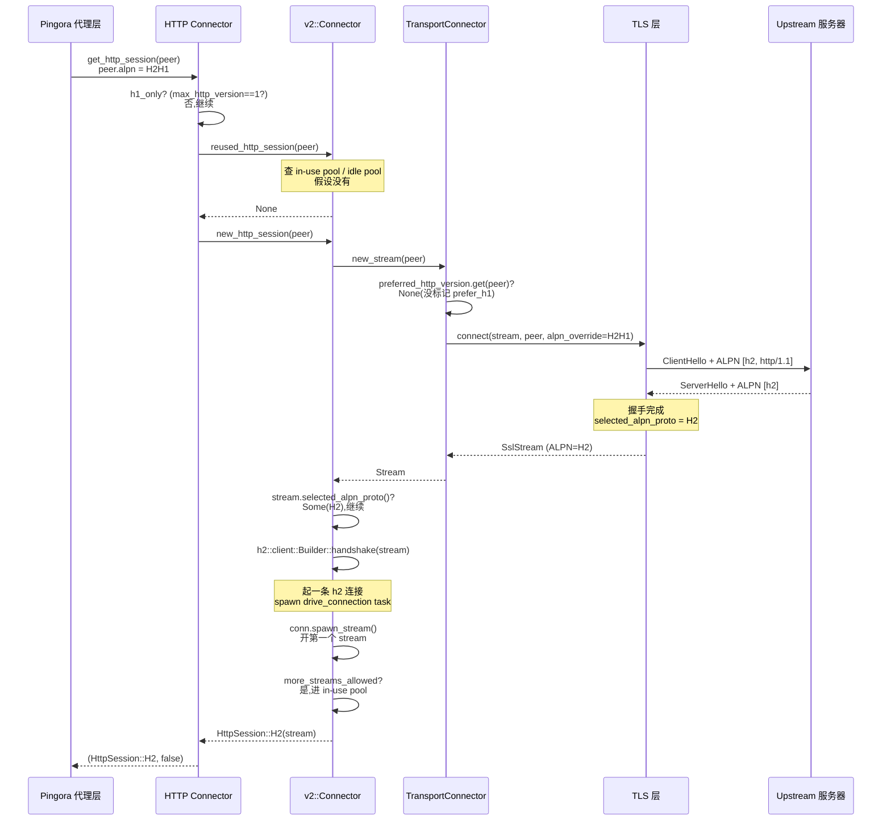
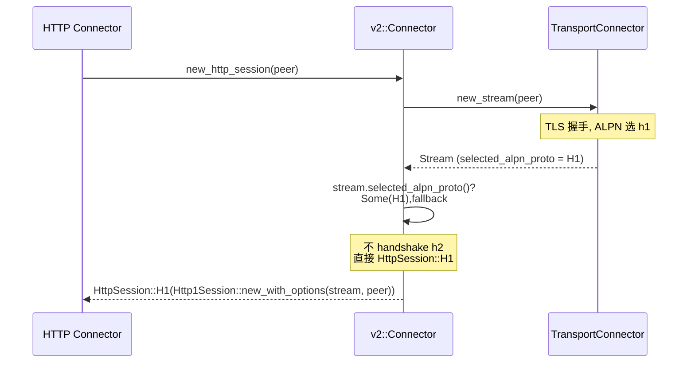

# 第 7 章 · HTTP connector:L7 连接与 h1/h2 会话

> 第 2 篇 · 转发设施·upstream 连接池

## 章首 · 核心问题

这一章只回答一个问题:

> **拿到了一条 L4 stream,怎么在它之上建一条 HTTP 会话,并且这条会话要能按对端说的协议(h1 还是 h2)走,还要能在 keepalive 期间被反复借用?**

上一章 P2-06 讲完了 `TransportConnector`:它给你一条 `Stream`——`Box<dyn AsyncRead + AsyncWrite + ...>`,一条已经握过 TCP/TLS 手的字节流。可 HTTP 代理要的不是"一条字节流",而是"一条 HTTP 会话"。字节流和 HTTP 会话之间隔着什么?隔着**协议语义**:HTTP/1 要把请求格式化成 `GET / HTTP/1.1\r\nHost: ...\r\n\r\n` 发出去、把响应当作一行行 header + body 解析回来、还要靠 `Connection: keep-alive` 决定下个请求能不能接着用同一条连接;HTTP/2 更复杂——要在一条连接上开多个并发的 stream、每个 stream 跑一个请求、有流控、有 HPACK 压缩的 header。代理层(`ProxyHttp` 钩子链)只想做一件事:给我一个能 `write_request_header`/`read_response_header`/`read_response_body` 的对象,底层是 h1 还是 h2 我不关心。这个"把字节流包成 HTTP 会话"的活,就是本章要讲的 HTTP connector。

可这一步一旦做起来,立刻冒出一堆只有代理才会遇到的问题:

1. **怎么知道这条 stream 该跑 h1 还是 h2?** TLS 连接在握手时通过 ALPN 协商了协议(对端在 ServerHello 里回了 `h2` 或 `http/1.1`),可明文 TCP 没有协商机制——服务器开口说的可能是 h1(`GET / HTTP/1.1`),也可能是 h2C(h2 over cleartext,先发一个 `PRI * HTTP/2.0` 预告帧)。怎么判定?
2. **h1 和 h2 的复用粒度完全不同——同一个池子能装吗?** h1 复用的是**整条连接**:用完不关,放回池子,下个请求接着用同一条连接发下一个请求(串行);h2 复用的是**一条连接上的一个 stream**:一条 h2 连接可以并发开几十上百个 stream,每个 stream 跑一个请求(并行)。这意味着 h1 的"会话 = 连接",h2 的"会话 = stream",两者根本不是同一种资源。怎么用一套 API 统一它们?
3. **h2 的多 stream 复用怎么管?** 一条 h2 连接上同时跑 N 个 stream,每个 stream 用完要归还"容量",整条连接 idle 了要放进 idle pool 等下个请求来开新 stream。这就要同时维护两个池:**in-use pool**(有活跃 stream 的连接,还能再开 stream)+ **idle pool**(完全 idle 的连接,等被借)。这两个池怎么协作?
4. **h2 连接什么时候算"死了"?** h1 连接死掉靠 `test_reusable_stream`(P2-06 讲过的 1 字节非阻塞 read)。可 h2 一条连接上跑着多个 stream,你不能因为一个 stream 完了就去戳连接——其他 stream 还在跑。h2 有自己的死活信号:GOAWAY、ping 超时、连接级错误。怎么把这些信号接进来?
5. **协议协商失败怎么办?** ALPN 协商出 h2,可这个对端的 h2 实现不靠谱(发坏帧、流控不正常),业务尝过一次坑,以后能不能记住"对这家永远走 h1"?——上一章的 `PreferredHttpVersion` 是答案,但它在 HTTP connector 这一层怎么落地?
6. **downstream 侧的 HTTP 会话和 upstream 侧是同一个对象吗?** 代理一头接 downstream(客户端发来的请求),一头接 upstream(后端服务器)。两头都要有 HTTP 会话对象,可它们结构一样吗?为什么 upstream 那头要分 H1/H2/Custom,downstream 这头也是?

这一章就把 `pingora-core/src/connectors/http/` 下的 `mod.rs`/`v1.rs`/`v2.rs`/`custom/` 怎么回答这六个问题拆透。HTTP connector 是 L4 连接池(`TransportConnector`,P2-06)和协议层(`protocols/http/{v1,v2}`,第 4 篇)之间的桥梁——L4 管字节流,L7 管 HTTP 语义,HTTP connector 把字节流缝成 HTTP 会话,塞给钩子链。

读完本章你会明白:

1. **HTTP connector 的真实结构是三层 `Connector`**——外层 `http::Connector<C>`(总调度,决定走 h1/h2/custom)、内层 `v1::Connector`(包 `TransportConnector`,把 stream 包成 h1 会话)、内层 `v2::Connector`(包 `TransportConnector`,但内部自己管 h2 连接池 + stream 池)。`v1::Connector` 是个瘦壳(几十行),`v2::Connector` 才是大头(管 in-use pool + idle pool 两套池)。
2. **`HttpSession` 是个 enum,统一 h1 会话和 h2 stream**——`HttpSession::H1(Http1Session)` / `HttpSession::H2(Http2Session)` / `HttpSession::Custom(S)`。代理层的 `proxy_to_h1_upstream`/`proxy_to_h2_upstream` 拿到这个 enum 后按分支处理,API(读 header/读 body/写 body)在 `HttpSession` 上统一,底层 h1 还是 h2 由 enum 分派。这是"用 enum 屏蔽底层协议差异"的典型 Rust 手法。
3. **ALPN 协商的真实流程**——TLS 握手时 ClientHello 带上 `alpn_override` 或 `peer.get_alpn()`(override 优先,承 P2-06),握手完 `stream.selected_alpn_proto()` 返回对端选的协议。HTTP connector 根据这个返回值决定:选了 h2 → 起 h2 会话;选了 h1 或没选 → 起 h1 会话。明文 TCP 没 ALPN,默认走 h1(除非业务显式声明对端是 h2C)。
4. **h2 的双池(in-use + idle)复用机制**——一条 h2 连接进 `in_use_pool`(还能开 stream),所有 stream 用完且还能再开 → 移到 `idle_pool`(等下个请求来开新 stream);如果不能再开 stream(`max_streams` 到顶)就只留在 in-use。`reused_http_session` 先查 in-use(优先复用已有连接,减少总连接数),再查 idle。这是 h2 多路复用在代理层的落地。
5. **`prefer_h1` 的学习闭环**——代理尝过一次 h2 响应异常(`H2Downgrade`/`InvalidH2` 错误),会调 `client_upstream.prefer_h1(peer)`,把这个 peer 标记进 `TransportConnector` 的 `PreferredHttpVersion`(承 P2-06)。以后这个 peer 的所有连接,TLS 握手时只宣告 h1,对端被迫选 h1。这是"代理从失败中学习"的完整闭环。

> **逃生阀**(这章 h2 的双池细节密集,先读这一段)
>
> 如果你对 HTTP/1 的 keep-alive 循环、HTTP/2 的 stream/帧/流控完全陌生,这一章的 h2 部分会吃力。本章假设你读过上一章 P2-06(`TransportConnector` 的 L4 池、`test_reusable_stream`、`PreferredHttpVersion`),以及本书第 4 篇会详讲 h1 自研/P2-13 会详讲 h2 适配。涉及 HTTP/2 协议本身(帧格式、HPACK、流控)的,一律一句带过指路《gRPC》第 2 篇,本章只讲 Pingora 怎么把 h2 crate 接到代理里。如果你只想抓住一句话:**HTTP connector = 把 L4 stream 包成 HTTP 会话,h1 的"会话=连接"和 h2 的"会话=stream"用一个 enum 统一,h2 因为多路复用要额外管一个 in-use pool(活跃 stream 的连接)和 idle pool(全 idle 的连接)两套池**。

## 章首 · 一句话点破

> **HTTP connector 的全部秘密:L4 stream 握完手,先看 ALPN 选了什么协议;选了 h1,把 stream 直接包成 `Http1Session`(一条连接 = 一个会话,keepalive 循环);选了 h2,先 handshake 起一条 h2 连接,再在上面 spawn 一个 stream 当会话——h2 连接进 in-use pool(还能开 stream)或 idle pool(全 idle),复用时优先从 in-use pool 抢已有连接开新 stream,抢不到再去 idle pool。所有这些被 `HttpSession` 这个 enum 统一对外,代理钩子链不关心底层是 h1 还是 h2。**

这是结论。本章倒过来拆:先看为什么 h1 和 h2 不能用同一个池子,再看 ALPN 协商的真实分支,然后是 h1 的 keepalive(瘦壳)、h2 的双池(大头)、`HttpSession` 的统一、`prefer_h1` 的学习闭环,最后是 downstream 侧会话对象的全景。

---

## 正文

### 7.1 痛点:为什么 HTTP 会话不能简单地"包一层"

#### 7.1.1 L4 池给的是 stream,可代理要的是会话

回顾上一章。`TransportConnector` 给上层一个简单 API:

```rust
pub async fn get_stream<P: Peer + Send + Sync + 'static>(
    &self,
    peer: &P,
) -> Result<(Stream, bool)> // bool = 是否复用
```

返回的 `Stream` 是 `Box<dyn IO>`,本质是一条已经握过 TCP/TLS 手的字节流(如果走 TLS,ALPN 也在 TLS 握手里协商完了,结果存在 stream 的 ssl digest 里)。这个 API 对"管字节流"完全够用——池子按 `reuse_hash` 分桶,`test_reusable_stream` 探活,offload 把 TLS 握手挪到专用线程,所有 L4 的复杂度都被它包了。

可代理层(`ProxyHttp` 钩子链、零拷贝转发 P2-08)拿到这条 stream,要做的不是 `write_all(b"GET / HTTP/1.1\r\n...")` 这种字节级操作——它要的是 `write_request_header(req)`、`read_response_body()`、`is_body_done()` 这种 HTTP 语义级操作。所以 stream 和代理之间,必须有一层把"字节流"翻译成"HTTP 会话"。

这一层最朴素的写法:

```rust
// (示意,朴素写法,反例)
async fn get_http_session(peer: &P) -> (HttpSession, bool) {
    let (stream, reused) = transport.get_stream(peer).await?;
    let session = HttpSession::new(stream); // 包成会话
    (session, reused)
}
```

这能跑——但只对 h1 够用。对 h2,这个朴素写法立刻撞墙。

#### 7.1.2 h2 的根本不同:会话不是连接,是 stream

HTTP/1 的会话语义和连接是一一对应的:一条 TCP 连接上,你发一个请求,等一个响应,然后(如果 `Connection: keep-alive`)接着发下一个请求。所以 h1 的"会话"就是"一条连接在某段时间内的状态机",用完归还,下个请求捞出来接着用同一条连接发下一个请求。h1 的复用 = 复用连接。

HTTP/2 完全不同。一条 h2 连接上可以**并发**开多个 stream,每个 stream 跑一个完整的请求-响应对(stream 是 h2 的逻辑双向通道,承《gRPC》一句带过指路)。这意味着:

- 一条 h2 连接可以同时承载 N 个并发请求(N 由 `max_concurrent_streams` 决定,客户端通常配几十到几百)。
- 每个请求结束(stream 关闭),连接本身不关——连接上的其他 stream 可能还在跑,或者连接空闲下来等下一个请求开新 stream。
- h2 的"会话"应该是 **stream**,不是连接。一个 `HttpSession` 对应一个 h2 stream,一条 h2 连接上可以同时存在多个 `HttpSession`。

朴素写法的 `HttpSession::new(stream)` 把 stream 当成会话,对 h1 对,对 h2 错——h2 的 stream 是个逻辑概念,不存在"一条 stream 字节流";你要的是先有一条 h2 连接,再在这条连接上 spawn 一个 stream 当会话。

更关键的是**复用粒度**不同:

| 维度 | HTTP/1 | HTTP/2 |
|------|--------|--------|
| 一个会话对应 | 一条连接 | 一条连接上的一个 stream |
| 一条连接同时承载 | 一个会话(串行) | N 个并发会话(并行) |
| 复用单位 | 复用连接 | 复用连接(再开新 stream) |
| 连接 idle 时机 | 响应发完、还没发下一个请求 | 所有 stream 都关闭 |
| 池子要装什么 | idle 的连接 | 还能开 stream 的连接(活跃)+ 全 idle 的连接 |

最后一行最致命。h1 池子只需要一种:用完放回的 idle 连接。h2 池子要两种:**in-use pool**(连接上还有活跃 stream,但还能再开,这种连接既可以"再借一个 stream"也可以"等着");**idle pool**(连接上完全没有活跃 stream,纯等)。一个 h2 请求来,要先去 in-use pool 找"已经有 stream 在跑的连接"——这样能用更少的连接扛更多请求(多路复用的红利);in-use 没合适的,再去 idle pool 找"完全闲着的连接"。这两个池都不能省。

#### 7.1.3 ALPN 协商:协议不是你说了算

就算你解决了 h1/h2 的池子结构,还有一个根本问题:**你不知道这条 stream 该跑什么协议**。

最朴素的设想:业务在 `upstream_peer` 钩子里返回 `HttpPeer` 时,显式声明"我要用 h2"。可这有两个坑:

- **坑一:对端可能不支持 h2。** 你说 h2,服务器说"我只懂 h1",你发 `PRI * HTTP/2.0`,服务器当成乱码拒了,你拿到一个连接错误。所以 h2 是**协商**出来的,不是你单方面决定的。
- **坑二:对端可能"声称"支持 h2 但实际不靠谱。** ALPN 协商出 h2(对端回了 `h2`),握手也成功,可跑起来服务器发坏帧、流控不正常——这时候你只能 fallback 到 h1,还要记住"这家以后别走 h2 了"。

ALPN(Application-Layer Protocol Negotiation)是 TLS 的扩展(RFC 7301),在 TLS 握手时让客户端在 ClientHello 里带上"我支持哪些应用层协议"(比如 `h2`、`http/1.1`),服务器在 ServerHello 里回一个它选的协议。这个协商在 TLS 握手时一次完成,握手完 stream 的 ssl digest 里就记下了对端选的协议,通过 `stream.selected_alpn_proto()` 读出来。

HTTP connector 的活就是:**握手完,看 `selected_alpn_proto()` 选了什么;选了 h2 起 h2 会话,选了 h1(或没选)起 h1 会话**。这就是协议的真实来源——不是业务说了算,是 ALPN 协商说了算。业务最多在 `HttpPeer` 里配"我允许 h2 还是只允许 h1",但最终协议是握手时定的。

明文 TCP(没 TLS)没有 ALPN,默认走 h1(除非业务用 h2C 显式声明对端开口就是 h2)。

> **钉死这件事**:HTTP connector 面对的三个根本痛点——① **h1/h2 的会话语义不同**(h1 会话=连接,h2 会话=stream),不能用同一套池;② **h2 要双池**(in-use pool 装活跃 stream 的连接,idle pool 装全 idle 的连接);③ **协议靠 ALPN 协商**,不是业务单方面决定,握手完才知道。这三个痛点决定了 HTTP connector 不是"包一层"那么简单——它要把 ALPN 结果分流,把 h1 和 h2 用不同的池子结构管起来,再用一个 enum 统一对外。

### 7.2 承接方怎么做:hyper、Nginx、Envoy

Pingora 不是第一个解决这些问题的。先看承接方/对照方怎么做,这能让 Pingora 的取舍显形。

#### 7.2.1 hyper:h2 也是多 stream,池子也分两套

hyper(更确切说是 `hyper-util` 的连接池)面对的是同样的问题——h1 复用连接,h2 复用 stream。hyper 的池子结构(承《hyper》一句带过指路):

- **per-host 分桶**,每个 host 一个连接池。
- **h1 连接**:idle 时进 pool,下个请求来捞出来接着用(类似 Pingora 的 `v1::Connector`)。
- **h2 连接**:一条 h2 连接可以同时跑多个请求(hyper 的 `SendRequest`),所以同一个 host 的多个请求会优先复用同一条 h2 连接开新 stream,只有这条连接的 `max_concurrent_streams` 到顶了才新建连接。这和 Pingora 的 in-use pool 思路同源。
- **Service 模型驱动**:hyper 的 `SendRequest::poll_ready` 管"还能不能再发一个请求",这是 h2 多 stream 复用的天然背压(Service trait 是 hyper 的核心抽象,Pingora 的 `ProxyHttp` 不在 Service 框架里)。

差异:

- **hyper 是 HTTP client 库**,它的连接池服务的是"发请求的 client";**Pingora 是代理框架**,它的池子服务的是"代理到 upstream",要考虑 proxy 链路、TLS 多后端、SNI 多变、`reuse_hash` 把 TLS 字段都算进去(承 P2-06)。
- **hyper 的池在 hyper-util**,Pingora 的池在 pingora-core/pingora-pool(自家仓)。
- **hyper 没有"协议学习"机制**——hyper 不会因为某次 h2 失败就记住"这家以后别走 h2";Pingora 的 `prefer_h1` 是个学习闭环(7.5 详讲)。

#### 7.2.2 Nginx:upstream 的 `proxy_http_version` 全局配置

Nginx 的 upstream 复用(P2-06 讲过它的 `proxy_next_upstream` 兜底)在协议选择上很简单:

- **Nginx 的 upstream 协议是全局配置**——`proxy_http_version 1.1;` 全局声明到 upstream 用 h1.1,`proxy_http_version 2;` 全局声明用 h2。**不能 per-peer**。
- **没有 ALPN 学习**——Nginx 不会因为某个 upstream 的 h2 不靠谱就降级,只能靠管理员手动改全局配置重启。
- **h2 upstream 在 Nginx 里是较新特性**(1.9.5 之后),且不少生产环境仍主要用 h1 upstream(h2 upstream 的部署相对少)。

对照 Pingora:Pingora 的 per-peer 协议选择(每个 `HttpPeer` 可以独立配 `set_http_version(max, min)`)+ `prefer_h1` 学习闭环,灵活度远高于 Nginx 的全局配置。代价是 Pingora 要自己管 `PreferredHttpVersion` 的 `RwLock<HashMap>`(P2-06 讲过它的 TODO 要分片)。

#### 7.2.3 Envoy:upstream 连接池 per-cluster + ALPN 自动协商

Envoy 的 upstream 连接池更复杂(承《Envoy》一句带过指路):

- **per-cluster pool**,每个 cluster(一组 upstream)独立连接池,thread-local 无锁(Envoy 的 worker 模型决定)。
- **协议靠 ALPN 自动协商**,Envoy 的 `http_protocol_options` 配 ALPN,握手后自动分流 h1/h2。
- **h2 连接池也是多 stream 复用**,思路和 Pingora 的 in-use pool 同源。
- **Envoy 有 xDS 动态下发 cluster 配置**(LDS/CDS/EDS),协议选择可以动态变;Pingora 没有内置 xDS,协议选择是 Rust 代码静态配 + `prefer_h1` 运行时学习。

Pingora 和 Envoy 在"ALPN 自动协商 + h2 多 stream 复用"上思路同源,差异在动态性(Envoy xDS vs Pingora 代码 + 学习)和线程模型(Envoy worker thread-local vs Pingora NoStealRuntime + 全局 RwLock HashMap)。

### 7.3 所以 Pingora 这么设计:HTTP connector 全貌

现在看 HTTP connector 的真实结构。先看外层 `Connector`(`pingora-core/src/connectors/http/mod.rs#L30-L37`):

```rust
pub struct Connector<C = ()>
where
    C: custom::Connector,
{
    h1: v1::Connector,
    h2: v2::Connector,
    custom: C,
}
```

三个字段,每个是一个内层 connector:

- **`h1: v1::Connector`**——h1 专用 connector(瘦壳,内部包一个 `TransportConnector`)。
- **`h2: v2::Connector`**——h2 专用 connector(大头,内部除了 `TransportConnector`,还有自己的 `idle_pool` 和 `in_use_pool`)。
- **`custom: C`**——自定义协议 connector(默认 `()`,业务可注入自己的协议,如 gRPC-over-自定义-TLS)。

`C = ()` 是个默认参数——不配 custom 协议时,`custom` 字段是个 unit `()`,所有 `custom::*` 方法走 `unreachable!()`(占位)。业务要支持自定义协议时,实现 `custom::Connector` trait,把 `C` 替换成自己的类型。

构造函数 `new`(`mod.rs#L39-L47`):

```rust
impl Connector<()> {
    pub fn new(options: Option<ConnectorOptions>) -> Self {
        Connector {
            h1: v1::Connector::new(options.clone()),
            h2: v2::Connector::new(options.clone()),
            custom: Default::default(),
        }
    }
}
```

注意:`h1` 和 `h2` 各自**独立**调 `v1::Connector::new(options.clone())` 和 `v2::Connector::new(options.clone())`,这意味着 h1 和 h2 **各自有一个 `TransportConnector`**(各自独立的 L4 池)!这个细节后面 7.4 会展开讲为什么。

#### 7.3.1 总调度 `get_http_session`:ALPN 决定走哪条路

外层 connector 的核心 API 是 `get_http_session`(`mod.rs#L64-L131`),这是"给我 peer,还我 HTTP 会话"的入口。整个函数体是个大 if-else,按 ALPN 和协议偏好分流。简化后的核心分支(去掉 custom 协议分支,简化示意,非源码原文):

```rust
pub async fn get_http_session<P: Peer + Send + Sync + 'static>(
    &self,
    peer: &P,
) -> Result<(HttpSession<C::Session>, bool)> {
    // (custom 协议分支:略)

    // h1_only 判定:peer 配置的 alpn 的 max_http_version == 1
    let h1_only = peer
        .get_peer_options()
        .is_none_or(|o| o.alpn.get_max_http_version() == 1);
    if h1_only {
        // peer 只允许 h1,直接走 h1 connector
        let (h1, reused) = self.h1.get_http_session(peer).await?;
        Ok((HttpSession::H1(h1), reused))
    } else {
        // peer 允许 h2,先查 h2 reuse pool
        let reused_h2 = self.h2.reused_http_session(peer).await?;
        if let Some(h2) = reused_h2 {
            return Ok((HttpSession::H2(h2), true));
        }
        // h2 池没有,看是否 h2_only
        let h2_only = peer
            .get_peer_options()
            .is_some_and(|o| o.alpn.get_min_http_version() == 2)
            && !self.h2.h1_is_preferred(peer);
        if !h2_only {
            // 不是 h2_only,顺便查一下 h1 reuse pool(服务器可能只支持 h1)
            if let Some(h1) = self.h1.reused_http_session(peer).await {
                return Ok((HttpSession::H1(h1), true));
            }
        }
        // 都没有复用,新建 h2 会话(会触发 ALPN 协商)
        let session = self.h2.new_http_session(peer).await?;
        Ok((session, false))
    }
}
```

注意几个关键决策:

1. **`h1_only` 判定靠 `alpn.get_max_http_version() == 1`**——peer 的 `PeerOptions::alpn`(通过 `set_http_version(max, min)` 设置)决定了 max。如果 `set_http_version(1, 1)`,max=1,这个 peer 永远走 h1;如果 `set_http_version(2, 1)`,max=2 min=1,允许 h2 也允许 h1;`set_http_version(2, 2)` 是 h2 only。`ALPN::new(max, min)` 在 `tls/mod.rs#L128-L136` 里把 max/min 转成 enum(`H1`/`H2`/`H2H1`)。
2. **允许 h2 时,先查 h2 reuse pool**——优先复用 h2 stream(多路复用红利),没有再考虑别的。
3. **不是 h2_only 时,顺便查 h1 reuse pool**——这是个**关键的健壮性设计**。注释解释:"the server may not support h2 at all, connections to the server could all be h1"。也就是说,即使 peer 允许 h2,服务器可能根本不支持——之前所有的连接都 fallback 到 h1 了,这些 h1 连接在 h1 池子里,要查出来复用。否则你会反复新建连接(每次都试 h2 → 服务器选 h1 → 进 h1 池子,下次又试 h2 又新建)。
4. **都没复用,新建 h2 会话**——`h2.new_http_session` 会触发 `transport.new_stream`,握手完看 ALPN 选了什么;选了 h2 起会话,选了 h1 把 stream 包成 `Http1Session` 返回(`HttpSession::H1`)。

`h2_only` 还有个 `&& !self.h2.h1_is_preferred(peer)` 条件——即使 peer 配的是 h2 only,如果业务之前调过 `prefer_h1(peer)` 把它标记成"永远走 h1",这里也会 fallback 到查 h1 池子。这是 `prefer_h1` 学习闭环的入口(7.5 详讲)。

#### 7.3.2 `release_http_session`:会话用完归还

`release_http_session`(`mod.rs#L133-L148`)是对称的归还 API:

```rust
pub async fn release_http_session<P: Peer + Send + Sync + 'static>(
    &self,
    session: HttpSession<C::Session>,
    peer: &P,
    idle_timeout: Option<Duration>,
) {
    match session {
        HttpSession::H1(h1) => self.h1.release_http_session(h1, peer, idle_timeout).await,
        HttpSession::H2(h2) => self.h2.release_http_session(h2, peer, idle_timeout),
        HttpSession::Custom(c) => {
            self.custom
                .release_http_session(c, peer, idle_timeout)
                .await;
        }
    }
}
```

按 `HttpSession` 的 variant 分派给对应的内层 connector。注意 h1 是 `async`,h2 不是(h2 的归还逻辑同步,因为只是更新计数和池子归属,不需要 await)。

代理层(`pingora-proxy/src/lib.rs#L293-L347`)的真实用法:

```rust
// (简化示意,非源码原文,基于 lib.rs#L293-L347)
let client_session = self.client_upstream.get_http_session(&*peer).await;
match client_session {
    Ok((ClientSession::H1(mut h1), client_reused)) => {
        let (server_reused, client_reuse, error) = self
            .proxy_to_h1_upstream(session, &mut h1, client_reused, &peer, ctx)
            .await;
        if client_reuse {
            // 请求成功且连接可复用,归还
            self.client_upstream
                .release_http_session(ClientSession::H1(h1), &*peer, peer.idle_timeout())
                .await;
        }
        // ...
    }
    Ok((ClientSession::H2(mut h2), client_reused)) => {
        let (server_reused, mut error) = self
            .proxy_to_h2_upstream(session, &mut h2, client_reused, &peer, ctx)
            .await;
        // h2 总是归还(stream 关了连接还在,进 idle/in-use pool)
        self.client_upstream
            .release_http_session(ClientSession::H2(h2), &*peer, peer.idle_timeout())
            .await;
        // 如果是 h2 不靠谱错误,标记 prefer_h1
        if let Some(e) = error.as_mut() {
            if matches!(e.etype, H2Downgrade | InvalidH2) {
                if peer.get_alpn().is_none_or(|a| a.get_min_http_version() == 1) {
                    self.client_upstream.prefer_h1(&*peer); // 学习闭环
                } else {
                    e.retry = false.into(); // 不允许 h1 fallback(如 gRPC),不重试
                }
            }
        }
        // ...
    }
    // ...
}
```

注意几个细节:

- **h1 的归还取决于 `client_reuse`**——只有请求成功且连接 keepalive 时才归还(否则连接被 drop 关掉)。`proxy_to_h1_upstream` 返回的 `client_reuse` 反映了"这条连接还能不能用"。
- **h2 总是归还**——h2 的 stream 关闭不影响连接,归还的逻辑是把连接从 in-use pool 移到 idle pool(如果全 idle),或者留在 in-use(如果还有别的活跃 stream)。`release_http_session` 内部处理。
- **`prefer_h1` 触发点**——h2 upstream 报 `H2Downgrade` 或 `InvalidH2` 错误(服务器说 h2 不行、或者发了无效 h2 帧),业务允许 h1 fallback(`alpn.get_min_http_version() == 1`),就调 `prefer_h1(peer)` 标记。这是学习闭环的关键时刻,7.5 详讲。

### 7.4 h1 connector:瘦壳,把 stream 包成会话

`v1::Connector` 是三个内层 connector 里最简单的(`connectors/http/v1.rs#L22-L63`):

```rust
pub struct Connector {
    transport: TransportConnector,
}

impl Connector {
    pub fn new(options: Option<ConnectorOptions>) -> Self {
        Connector {
            transport: TransportConnector::new(options),
        }
    }

    pub async fn get_http_session<P: Peer + Send + Sync + 'static>(
        &self,
        peer: &P,
    ) -> Result<(HttpSession, bool)> {
        let (stream, reused) = self.transport.get_stream(peer).await?;
        let http = HttpSession::new_with_options(stream, peer);
        Ok((http, reused))
    }

    pub async fn reused_http_session<P: Peer + Send + Sync + 'static>(
        &self,
        peer: &P,
    ) -> Option<HttpSession> {
        let stream = self.transport.reused_stream(peer).await?;
        let http = HttpSession::new_with_options(stream, peer);
        Some(http)
    }

    pub async fn release_http_session<P: Peer + Send + Sync + 'static>(
        &self,
        mut session: HttpSession,
        peer: &P,
        idle_timeout: Option<Duration>,
    ) {
        session.respect_keepalive();
        if let Some(stream) = session.reuse().await {
            self.transport
                .release_stream(stream, peer.reuse_hash(), idle_timeout);
        }
    }
}
```

整个 `v1::Connector` 就是个**瘦壳**——它内部包一个 `TransportConnector`(P2-06),所有 L4 的活(池子、探活、offload)都委托给它。h1 connector 自己做的事只有两件:

1. **`HttpSession::new_with_options(stream, peer)`**——把 L4 stream 包成 h1 会话(就是 `protocols/http/v1/client.rs` 的 `HttpSession`,第 4 篇 P4-12 详讲)。这一步是同步的,只是初始化一个状态机对象(`body_reader`/`body_writer`/`keepalive_timeout` 等字段),不读写 stream。
2. **`release_http_session` 的 keepalive 处理**——`session.respect_keepalive()` 根据响应头设置 keepalive 状态(`Connection: keep-alive`/`Connection: close`/`Keep-Alive: timeout=N`),然后 `session.reuse().await` 把底层 stream 取出来(如果可复用)还给 `transport`。

#### 7.4.1 `respect_keepalive`:从响应头学 keepalive

`respect_keepalive`(`protocols/http/v1/client.rs#L501-L549`)是 h1 keepalive 循环的灵魂。它的逻辑基于 RFC 9112(HTTP/1.1)和 RFC 7230:

```rust
// (简化示意,非源码原文,基于 client.rs#L501-L549)
pub fn respect_keepalive(&mut self) {
    // 几种短路 case:升级请求/websocket/204/304 等,详见源码
    // ...

    if let Some(keepalive) = self.is_connection_keepalive() {
        if keepalive {
            // 服务器允许 keepalive,解析 timeout
            let (timeout, _max_use) = self.get_keepalive_values();
            match timeout {
                Some(d) => self.set_keepalive(Some(d)),
                None => self.set_keepalive(Some(0)), // infinite
            }
        } else {
            // 服务器明确 Connection: close
            self.set_keepalive(None);
        }
    } else {
        // 没有 Connection header,按协议默认
        // HTTP/1.1 默认 keepalive,HTTP/1.0 默认 close
        self.set_keepalive(Some(0)); // on by default for http 1.1
        self.set_keepalive(None);    // off by default for http 1.0
    }
}
```

`respect_keepalive` 干三件事:

1. **`is_connection_keepalive`**——综合请求和响应的 `Connection` header 判定。请求如果显式 `Connection: close`,无视服务器怎么回(请求都让关了);否则看响应的 `Connection` header(`keep-alive`/`close`/无)。
2. **`get_keepalive_values`**——解析 `Keep-Alive: timeout=N, max=M` header(RFC 7230,虽然实践中少见),拿服务器建议的 idle timeout。
3. **`set_keepalive`**——把结果存进 `keepalive_timeout` 字段(`KeepaliveStatus` enum:Off/Timeout/Infinite)。

为什么这个逻辑必须在 h1 connector 层做?因为 keepalive 是 **h1 协议语义**——h2 没有这个概念(h2 的连接生命周期由 GOAWAY 和 stream 管理,不是 header 控制)。所以 `respect_keepalive` 是 h1 特有的,只在 `v1::Connector::release_http_session` 里调。

#### 7.4.2 `reuse`:把 stream 还回去

`reuse`(`protocols/http/v1/client.rs#L610-L621`)是把 stream 从会话里取出来的 API:

```rust
pub async fn reuse(mut self) -> Option<Stream> {
    // TODO: this function is unnecessarily slow for keepalive case
    // because that case does not need async
    match self.keepalive_timeout {
        KeepaliveStatus::Off => {
            debug!("HTTP shutdown connection");
            self.shutdown().await;
            None
        }
        _ => Some(self.underlying_stream),
    }
}
```

逻辑直白:keepalive 关着(Off)→ shutdown 连接,返回 None;开着 → 把 `underlying_stream` 返回。`self` 被 consume(`mut self`),会话对象本身被 drop,只留下 stream。

注意 TODO:"this function is unnecessarily slow for keepalive case because that case does not need async"——keepalive 开着时只是返回 stream,不需要 await,但函数签名是 async,会引入一次 poll 开销。这是个已知的微小性能优化点。

#### 7.4.3 为什么 h1 connector 是瘦壳

为什么 h1 connector 这么薄?因为 h1 的复杂度全在协议层(`protocols/http/v1/`,第 4 篇详讲)和 L4 层(`TransportConnector`,P2-06)。h1 connector 自己只负责"在合适的时候把 stream 包成会话/把会话拆回 stream",这两个操作都是轻量的。h1 的 keepalive 循环本质就是:

```text
建连接 → 发请求 → 收响应 → (keepalive?) → [是] 放回池子 → [下个请求] 捞出来 → 发请求 → ...
                                  → [否] 关连接
```

这个循环的"发请求/收响应"是协议层的事(`protocols/http/v1/`),"放回池子/捞出来"是 L4 层的事(`TransportConnector`),h1 connector 只负责中间的"keepalive 判定 + 拆/包"。所以它是瘦壳。

> **钉死这件事**:h1 connector 是瘦壳——它包一个 `TransportConnector`,自己只做 `respect_keepalive`(从响应头学 keepalive)+ `reuse`(把 stream 还回 L4 池)。h1 的协议复杂度(请求行/状态行/header 解析/chunked/body)在 `protocols/http/v1/`(第 4 篇),L4 复杂度(池子/探活/offload)在 `TransportConnector`(P2-06)。h1 connector 是这两层之间的薄薄的胶水。

### 7.5 h2 connector:大头,双池 + 多 stream 复用

`v2::Connector` 是三个内层 connector 里最复杂的(`connectors/http/v2.rs#L216-L223`):

```rust
/// Http2 connector
pub struct Connector {
    // just for creating connections, the Stream of h2 should be reused
    transport: TransportConnector,
    // the h2 connection idle pool
    idle_pool: Arc<ConnectionPool<ConnectionRef>>,
    // the pool of h2 connections that have ongoing streams
    in_use_pool: InUsePool,
}
```

三个字段:

- **`transport: TransportConnector`**——和 h1 一样,委托 L4。但注释明确:"just for creating connections, the Stream of h2 should be reused"——h2 的 `transport` 只用来**新建连接**,不复用 L4 stream(h2 的复用在自己的 idle_pool/in_use_pool 这两层,不下沉到 L4 池)。这是个关键设计,h2 的 stream 不进 `TransportConnector` 的池子,因为 h2 的复用粒度是 stream 不是连接,L4 池子理解不了 stream。
- **`idle_pool: Arc<ConnectionPool<ConnectionRef>>`**——h2 连接的 idle pool。`ConnectionPool` 就是 P2-06 讲的那套(按 `reuse_hash` 分桶 + 每 `PoolNode` 无锁 hot_queue + thread-local LRU),但这里泛型参数 `S` 是 `ConnectionRef`(h2 连接的引用),不是 `Arc<Mutex<Stream>>`。idle pool 装的是**完全 idle 的 h2 连接**(没有任何活跃 stream)。
- **`in_use_pool: InUsePool`**——h2 连接的 in-use pool,装**还有活跃 stream 的连接**(可能还能再开 stream)。

注意:`h2::Connector` 也独立有一个 `TransportConnector`(和 h1 connector 的那个不是同一个),构造时 `Connector::new` 各自 `TransportConnector::new(options)`。这意味着 h1 和 h2 的 L4 池子是**完全独立**的——h1 连接和 h2 连接不混在一个 L4 池子里。这是合理的,因为 h1 连接和 h2 连接的生命周期管理完全不同(h1 复用 stream 在 L4 层,h2 复用在 L7 层),混在一起会让 L4 池子的探活逻辑复杂化(h2 连接的"死活"由 h2 协议信号决定,不能靠 L4 的 1 字节 read)。

#### 7.5.1 `ConnectionRef`:一条 h2 连接的共享句柄

h2 连接的核心抽象是 `ConnectionRef`(`v2.rs#L47-L164`),它是一条 h2 连接的**共享句柄**——多个 stream 共享同一条连接,这条连接的状态(还能不能开 stream、ping 是否超时、是否正在 graceful shutdown)由 `ConnectionRef` 统一管。

```rust
pub(crate) struct ConnectionRefInner {
    connection_stub: Stub, // 封装 h2::client::SendRequest<Bytes>
    closed: watch::Receiver<bool>,
    ping_timeout_occurred: Arc<AtomicBool>,
    id: UniqueIDType,
    // max concurrent streams this connection is allowed to create
    max_streams: usize,
    // how many concurrent streams already active
    current_streams: AtomicUsize,
    // The connection is gracefully shutting down, no more stream is allowed
    shutting_down: AtomicBool,
    pub(crate) digest: Digest,
    pub(crate) release_lock: Arc<Mutex<()>>,
}

#[derive(Clone)]
pub struct ConnectionRef(Arc<ConnectionRefInner>);
```

每个字段的作用:

- **`connection_stub: Stub`**——封装 h2 crate 的 `SendRequest<Bytes>`(h2 连接的 client 端句柄,用来 `ready` + `send_request` 开新 stream)。`Stub::new_stream`(`v2.rs#L37-L45`)调 `send_req.ready().await` 等连接 ready,然后返回一个可用的 `SendRequest`。
- **`closed: watch::Receiver<bool>`**——连接关闭信号。`drive_connection` task(`v2.rs#L538-L585`)在 h2 连接结束(对端发 GOAWAY、连接错误、ping 超时)时通过 `watch::Sender` 发 `true`,`closed` 这个 receiver 能读到。`is_closed()`(`v2.rs#L121-L123`)就是 `*self.0.closed.borrow()`。
- **`ping_timeout_occurred: Arc<AtomicBool>`**——ping 超时标记。h2 的 ping/pong 心跳超时(默认 5 秒),`drive_connection` 检测到后设这个标记。`ping_timedout()` 读它,业务能据此判断"这个 h2 错误是不是 ping 超时引起的"。
- **`max_streams: usize`**——这条连接最多能开多少个并发 stream(`min(配置的 max_h2_streams, 服务器通告的 max_concurrent_send_streams)`,`v2.rs#L465`)。
- **`current_streams: AtomicUsize`**——当前活跃 stream 数。原子计数,`spawn_stream` 时 +1,stream drop 时 -1。
- **`shutting_down: AtomicBool`**——graceful shutdown 标记。对端发 GOAWAY(NO_ERROR)时设为 true(`v2.rs#L156`),表示"这条连接不再接受新 stream"(已存在的 stream 还能跑完)。
- **`digest: Digest`**——连接的诊断信息(SSL/timing/proxy/socket,用于日志和 metrics)。
- **`release_lock: Arc<Mutex<()>>`**——归还时的串行化锁。注释解释(`v2.rs#L375`):"make sure that in_use_pool.insert() below cannot be called after in_use_pool.release(), which would have put the conn entry in both pools"。这是归还逻辑的并发保护,7.5.4 详讲。

最关键的方法是 `spawn_stream`(`v2.rs#L132-L163`):

```rust
pub async fn spawn_stream(&self) -> Result<Option<Http2Session>> {
    // Atomically check if the current_stream is over the limit
    // load(), compare and then fetch_add() cannot guarantee the same
    let current_streams = self.0.current_streams.fetch_add(1, Ordering::SeqCst);
    if current_streams >= self.0.max_streams {
        // already over the limit, reset the counter to the previous value
        self.0.current_streams.fetch_sub(1, Ordering::SeqCst);
        return Ok(None);
    }

    match self.0.connection_stub.new_stream().await {
        Ok(send_req) => Ok(Some(Http2Session::new(send_req, self.clone()))),
        Err(e) => {
            // fail to create the stream, reset the counter
            self.0.current_streams.fetch_sub(1, Ordering::SeqCst);
            // ... GOAWAY(NO_ERROR) 处理,标记 shutting_down
            Err(e)
        }
    }
}
```

`spawn_stream` 干两件事:

1. **原子检查 + 自增**——`fetch_add(1)` 自增 `current_streams`,然后看自增前的值是不是已经 >= `max_streams`。如果是,回退(`fetch_sub(1)`),返回 `Ok(None)`(不能再开 stream)。注意注释:"load(), compare and then fetch_add() cannot guarantee the same"——为什么不用 `load` + 比较 + `fetch_add` 三步?因为这三步之间别的线程可能改 `current_streams`,产生 TOCTOU(race condition)。直接 `fetch_add` 是原子的,保证不会两个线程同时通过限额检查。
2. **`connection_stub.new_stream()`**——调 h2 crate 的 `send_req.ready().await` 等连接 ready,然后开一个新 stream(`Http2Session`)。如果失败(GOAWAY/连接错误),回退计数器,返回错误。特别地,如果错误是 GOAWAY(NO_ERROR),标记 `shutting_down`(对端让这条连接优雅关闭),返回 `Ok(None)`(让上层去建新连接)。

`more_streams_allowed`(`v2.rs#L90-L95`)是判断"还能不能再开 stream":

```rust
pub fn more_streams_allowed(&self) -> bool {
    let current = self.0.current_streams.load(Ordering::Relaxed);
    !self.is_shutting_down()
        && self.0.max_streams > current
        && self.0.connection_stub.0.current_max_send_streams() > current
}
```

三个条件:① 没在 graceful shutdown;② `max_streams > current`(本地配的限额);③ `current_max_send_streams() > current`(h2 crate 报告的实际限额,反映服务器通告的 `max_concurrent_streams` 动态变化)。三个都满足才能再开 stream。

#### 7.5.2 InUsePool:idle 池的孪生兄弟

`InUsePool`(`v2.rs#L166-L211`)是个比 `ConnectionPool` 简单的池子,因为它不需要 idle watcher(在用的连接不需要探活,它正在干活):

```rust
pub struct InUsePool {
    // TODO: use pingora hashmap to shard the lock contention
    pools: RwLock<HashMap<u64, PoolNode<ConnectionRef>>>,
}

impl InUsePool {
    pub fn insert(&self, reuse_hash: u64, conn: ConnectionRef) {
        {
            let pools = self.pools.read();
            if let Some(pool) = pools.get(&reuse_hash) {
                pool.insert(conn.id(), conn);
                return;
            }
        } // drop read lock

        let pool = PoolNode::new();
        pool.insert(conn.id(), conn);
        let mut pools = self.pools.write();
        pools.insert(reuse_hash, pool);
    }

    pub fn get(&self, reuse_hash: u64) -> Option<ConnectionRef> {
        let pools = self.pools.read();
        pools.get(&reuse_hash)?.get_any().map(|v| v.1)
    }

    pub fn release(&self, reuse_hash: u64, id: UniqueIDType) -> Option<ConnectionRef> {
        let pools = self.pools.read();
        if let Some(pool) = pools.get(&reuse_hash) {
            pool.remove(id)
        } else {
            None
        }
    }
}
```

注意几个细节:

- **`pools: RwLock<HashMap<u64, PoolNode<ConnectionRef>>>`**——和 `ConnectionPool` 一样,按 `reuse_hash` 分桶,每桶一个 `PoolNode`(P2-06 讲过的无锁 hot_queue + 兜底 HashMap)。但**没有全局 LRU**——in-use pool 不淘汰(连接在用,不能淘汰)。注释 TODO:"use pingora hashmap to shard the lock contention"——和 `PreferredHttpVersion` 一样,这把 `RwLock<HashMap>` 在极高并发下是热点,未来要分片。
- **`insert` 是 read-then-write**——先 read lock 查桶存不存在,存在直接 insert(读锁就够,因为 `PoolNode::insert` 自己同步);不存在才 write lock 新建桶。这是个常见的"读多写少"优化(大部分 insert 都是命中已有桶)。
- **`get` 直接 `get_any`**——从对应桶随便取一条连接(`PoolNode::get_any`),`ConnectionRef` 是 `Clone`(`Arc` 内部),所以 get 出来的是 clone 的句柄,原句柄还在池子里。这点和 idle pool 不同——idle pool 的 get 是把连接**取走**(不再在池子里),in-use pool 的 get 是**共享句柄**(连接还在池子里,因为别的 stream 也能用)。
- **`release` 是按 id 移除**——某个 stream 关了,要把连接从 in-use pool 移除(如果它没别的活跃 stream 了,要挪到 idle pool)。

#### 7.5.3 `new_http_session`:建新连接 + spawn stream

`new_http_session`(`v2.rs#L254-L295`)是建新 h2 会话的入口:

```rust
pub async fn new_http_session<P: Peer + Send + Sync + 'static, C: Session>(
    &self,
    peer: &P,
) -> Result<HttpSession<C>> {
    let stream = self.transport.new_stream(peer).await?;

    // check alpn
    match stream.selected_alpn_proto() {
        Some(ALPN::H2) => { /* continue */ }
        Some(_) => {
            // H2 not supported
            return Ok(HttpSession::H1(Http1Session::new_with_options(
                stream, peer,
            )));
        }
        None => {
            // if tls but no ALPN, default to h1
            // else if plaintext and min http version is 1, this is most likely h1
            if peer.tls()
                || peer
                    .get_peer_options()
                    .is_none_or(|o| o.alpn.get_min_http_version() == 1)
            {
                return Ok(HttpSession::H1(Http1Session::new_with_options(
                    stream, peer,
                )));
            }
            // else: min http version=H2 over plaintext, there is no ALPN anyways, we trust
            // the caller that the server speaks h2c
        }
    }
    let max_h2_stream = peer.get_peer_options().map_or(1, |o| o.max_h2_streams);
    let conn = handshake(stream, max_h2_stream, peer.h2_ping_interval()).await?;
    let h2_stream = conn
        .spawn_stream()
        .await?
        .expect("newly created connections should have at least one free stream");
    if conn.more_streams_allowed() {
        self.in_use_pool.insert(peer.reuse_hash(), conn);
    }
    Ok(HttpSession::H2(h2_stream))
}
```

`new_http_session` 干五件事:

1. **`transport.new_stream(peer)`**——新建一条 L4 stream(包括 TCP connect + TLS 握手 + ALPN 协商)。注意是 `new_stream` 不是 `get_stream`——h2 connector 建新连接时**不复用 L4 池**(`h2::Connector::transport` 注释:"just for creating connections"),因为 h2 的复用在自己的池子里。
2. **ALPN 分流**:
   - `Some(ALPN::H2)`——对端选了 h2,继续。
   - `Some(_)`(其他,即 H1 或 Custom)——对端选了 h1(或别的),fallback 成 `HttpSession::H1`(把 stream 包成 h1 会话)。
   - `None`(没 ALPN 结果)——分两种:① TLS 但没协商出协议 → 默认 h1;② 明文 TCP → 看 peer 配置,如果允许 h1 就 h1,如果 `min_http_version == 2`(业务显式声明对端是 h2C)就继续当 h2(h2C,客户端信任对端开口就是 h2)。
3. **`handshake(stream, max_h2_stream, h2_ping_interval)`**——h2 握手。调 `h2::client::Builder::handshake` 起一条 h2 client 连接,返回 `ConnectionRef`(封装了 `SendRequest`)。`max_h2_stream` 来自 `peer.get_peer_options().max_h2_streams`(默认 1,业务可配)。`h2_ping_interval` 是 ping 心跳间隔(可选,业务配)。
4. **`conn.spawn_stream()`**——在新建的连接上开第一个 stream。`.expect("newly created connections should have at least one free stream")`——刚建的连接必然至少能开一个 stream(`max_streams >= 1`,`handshake` 里有保护),否则就是配置错误。
5. **如果连接还能再开 stream,进 in-use pool**——`conn.more_streams_allowed()` 为 true 时,`self.in_use_pool.insert(peer.reuse_hash(), conn)`。这样下个请求来,`reused_http_session` 能从 in-use pool 找到这条连接,再开一个 stream(多路复用)。

注意第 2 步的 ALPN 分流是 h2 connector **最重要**的健壮性设计——即使你声明 peer 允许 h2,如果对端握手时选了 h1,这里立刻 fallback 成 h1 会话返回(`HttpSession::H1`)。这避免了"peer 声称 h2 但实际不支持"的硬故障——握手层面就分流,不等到发请求失败。

#### 7.5.4 `handshake`:h2 client 连接的诞生

`handshake`(`v2.rs#L426-L493`)是 h2 连接的初始化:

```rust
const H2_WINDOW_SIZE: u32 = 1 << 23; // 8 MB

pub async fn handshake(
    stream: Stream,
    max_streams: usize,
    h2_ping_interval: Option<Duration>,
) -> Result<ConnectionRef> {
    // Safe guard: new_http_session() assumes there should be at least one free stream
    if max_streams == 0 {
        return Error::e_explain(H2Error, "zero max_stream configured");
    }

    let id = stream.id();
    let digest = Digest {
        ssl_digest: stream.get_ssl_digest(),
        timing_digest: stream.get_timing_digest(),
        proxy_digest: stream.get_proxy_digest(),
        socket_digest: stream.get_socket_digest(),
    };
    let (send_req, connection) = Builder::new()
        .enable_push(false)
        .initial_max_send_streams(max_streams)
        .max_concurrent_streams(1) // Server push is not allowed, so this value doesn't matter
        .max_frame_size(64 * 1024) // advise server to send larger frames
        .initial_window_size(H2_WINDOW_SIZE)
        .initial_connection_window_size(H2_WINDOW_SIZE)
        .handshake(stream)
        .await
        .or_err(HandshakeError, "during H2 handshake")?;
    debug!("H2 handshake to server done.");
    let ping_timeout_occurred = Arc::new(AtomicBool::new(false));
    let ping_timeout_clone = ping_timeout_occurred.clone();
    let max_allowed_streams = std::cmp::min(max_streams, connection.max_concurrent_send_streams());

    if max_allowed_streams == 0 {
        return Error::e_explain(H2Error, "zero max_concurrent_send_streams received");
    }

    let (closed_tx, closed_rx) = watch::channel(false);

    current_handle().spawn(async move {
        drive_connection(
            connection,
            id,
            closed_tx,
            h2_ping_interval,
            ping_timeout_clone,
        )
        .await;
    });
    Ok(ConnectionRef::new(
        send_req,
        closed_rx,
        ping_timeout_occurred,
        id,
        max_allowed_streams,
        digest,
    ))
}
```

`handshake` 干几件事:

1. **`max_streams == 0` 保护**——业务配 `max_h2_streams = 0` 是错的(`new_http_session` 假设至少能开一个 stream),直接报错。
2. **构造 `Digest`**——从 stream 拿 SSL/timing/proxy/socket 诊断信息,存进 `Digest`(日志用)。注意 `ssl_digest` 字段是 `Option`,明文 TCP 的 stream 没有 SSL digest。注释:"this field is always false because the digest is shared across all streams"——digest 是连接级的,被这条连接上的所有 stream 共享,所以单 stream 的日志要看自己的 reuse 标记,不能直接用连接 digest。
3. **`h2::client::Builder` 配置**——这是 Pingora 用 h2 crate 的关键配置点:
   - **`enable_push(false)`**——禁用 server push(代理场景不需要,Pingora 不接受服务器主动 push 的 stream)。
   - **`initial_max_send_streams(max_streams)`**——告知 h2 crate 客户端最多会开 `max_streams` 个 stream(影响 h2 crate 内部资源分配)。
   - **`max_concurrent_streams(1)`**——注释:"Server push is not allowed, so this value doesn't matter"。这是**服务器到客户端方向**的并发 stream 限制(客户端允许服务器同时开几个 stream),因为禁了 push,服务器不会主动开 stream,这个值无所谓。
   - **`max_frame_size(64 * 1024)`**——建议服务器发大 frame(64KB,默认是 16KB)。大 frame 减少帧头开销,提高吞吐。
   - **`initial_window_size(H2_WINDOW_SIZE)`** 和 **`initial_connection_window_size(H2_WINDOW_SIZE)`**——`H2_WINDOW_SIZE = 1 << 23 = 8 MB`。这是 h2 流控的初始窗口大小(承《gRPC》一句带过指路)。注释(`v2.rs#L418-L423`)解释得很清楚:
   
     > "The h2 library we use has unbounded internal buffering, which will cause excessive memory consumption when the downstream is slower than upstream. This window size caps the buffering by limiting how much data can be inflight. However, setting this value will also cap the max download speed by limiting the bandwidth-delay product of a link. Long term, we should advertising large window but shrink it when a small buffer is full. 8 Mbytes = 80 Mbytes X 100ms, which should be enough for most links."
     
     翻译:h2 crate 内部缓冲是无界的,如果 downstream(客户端到 Pingora)比 upstream(Pingora 到后端)慢,数据会堆积在 Pingora 内存里——窗口大小限制 inflight 数据量,防止 OOM。代价是限制带宽-延迟积,可能限速。8MB 对应 80Mbps × 100ms 链路,够用。这是个有意识的取舍。
4. **`max_allowed_streams = min(max_streams, connection.max_concurrent_send_streams())`**——实际允许的并发 stream 数 = min(业务配的 max, 服务器通告的 max)。如果服务器通告的 max 比业务配的小,以服务器为准。
5. **`max_allowed_streams == 0` 保护**——服务器通告 0(罕见但可能),报错。
6. **spawn `drive_connection`**——在当前 runtime 上 spawn 一个后台 task 跑 `drive_connection`,它驱动 h2 连接(处理帧、流控、ping/pong)。`closed_tx` 是关闭信号,`ping_timeout_clone` 是 ping 超时标记。这两个被 `ConnectionRef` 持有(`closed`/`ping_timeout_occurred`)。
7. **返回 `ConnectionRef`**——封装 `send_req`(开 stream 的句柄)、`closed_rx`(关闭信号)、`ping_timeout_occurred`、`id`、`max_allowed_streams`、`digest`。

注意 `current_handle().spawn(...)`——和 P2-06 的 `release_stream` 一样,用 `pingora_runtime::current_handle()` 拿当前 runtime 的 handle(NoStealRuntime,P5-15),在当前 runtime 上 spawn `drive_connection` task。这个 task 和请求跑在同一个 runtime 上,但不阻塞请求(它是异步的,只在 h2 连接有事件时被 poll)。

#### 7.5.5 `drive_connection`:h2 连接的后台驱动

`drive_connection`(`v2.rs#L538-L585`)是 h2 连接的生命周期管理 task:

```rust
pub async fn drive_connection<S>(
    mut c: client::Connection<S>,
    id: UniqueIDType,
    closed: watch::Sender<bool>,
    ping_interval: Option<Duration>,
    ping_timeout_occurred: Arc<AtomicBool>,
) where
    S: AsyncRead + AsyncWrite + Send + Unpin,
{
    let interval = ping_interval.unwrap_or(Duration::ZERO);
    if !interval.is_zero() {
        // for ping to inform this fn to drop the connection
        let (tx, rx) = oneshot::channel::<()>();
        let dropped = Arc::new(AtomicBool::new(false));
        let dropped2 = dropped.clone();

        if let Some(ping_pong) = c.ping_pong() {
            pingora_runtime::current_handle().spawn(async move {
                do_ping_pong(ping_pong, interval, tx, dropped2, id).await;
            });
        } else {
            warn!("Cannot get ping-pong handler from h2 connection");
        }

        tokio::select! {
            r = c => match r {
                Ok(_) => debug!("H2 connection finished fd: {id}"),
                Err(e) => debug!("H2 connection fd: {id} errored: {e:?}"),
            },
            r = rx => match r {
                Ok(_) => {
                    ping_timeout_occurred.store(true, Ordering::Relaxed);
                    warn!("H2 connection Ping timeout/Error fd: {id}, closing conn");
                },
                Err(e) => warn!("H2 connection Ping Rx error {e:?}"),
            },
        };

        dropped.store(true, Ordering::Relaxed);
    } else {
        match c.await {
            Ok(_) => debug!("H2 connection finished fd: {id}"),
            Err(e) => debug!("H2 connection fd: {id} errored: {e:?}"),
        }
    }
    let _ = closed.send(true);
}
```

`drive_connection` 做两件事:

1. **如果配了 ping 心跳**(`ping_interval` 非零):spawn 一个 `do_ping_pong` task 周期发 ping,然后用 `tokio::select!` 同时等:① h2 连接本身结束(`c.await`,对端关了或出错);② `do_ping_pong` 的 ping 超时信号(`rx`)。哪个先触发都说明连接该关了。
2. **没配 ping**:`c.await` 等连接结束。
3. **最后 `closed.send(true)`**——无论哪种情况,连接结束时通过 `watch::Sender` 发 `true`,通知所有持 `closed` receiver 的 `ConnectionRef`:"这条连接死了"。这是 `is_closed()` 的来源。

`do_ping_pong`(`v2.rs#L589-L627`)是 ping 心跳:

```rust
const PING_TIMEOUT: Duration = Duration::from_secs(5);

async fn do_ping_pong(
    mut ping_pong: h2::PingPong,
    interval: Duration,
    tx: oneshot::Sender<()>,
    dropped: Arc<AtomicBool>,
    id: UniqueIDType,
) {
    // delay before sending the first ping, no need to race with the first request
    tokio::time::sleep(interval).await;
    loop {
        if dropped.load(Ordering::Relaxed) {
            break;
        }
        let ping_fut = ping_pong.ping(h2::Ping::opaque());
        match tokio::time::timeout(PING_TIMEOUT, ping_fut).await {
            Err(_) => {
                error!("H2 fd: {id} ping timeout");
                let _ = tx.send(()); // 通知 drive_connection ping 超时
                break;
            }
            Ok(r) => match r {
                Ok(_) => {
                    tokio::time::sleep(interval).await; // 等 interval 再发下一个
                }
                Err(e) => {
                    // ...
                    let _ = tx.send(());
                    break;
                }
            },
        }
    }
}
```

ping 心跳逻辑:① 首次 sleep `interval`(不抢第一个请求);② 循环发 ping,等 pong,`PING_TIMEOUT = 5s` 超时就报错;③ pong 收到后 sleep `interval` 再发下一个;④ 任何错误(超时/连接错误)都通过 `tx.send(())` 通知 `drive_connection`。

ping 心跳的意义:h2 连接是长连接,如果对端崩溃或链路中断,TCP 层可能很久才知道(承 P2-06 的"TCP 沉默")。ping/pong 是 h2 协议级的活性探测——定期发 ping,5 秒收不到 pong 就认为连接死了,主动关掉。这比 `test_reusable_stream` 的 1 字节 read 更适合 h2(因为 h2 一条连接上跑多个 stream,不能像 h1 那样在 stream 上 read 干扰)。

注意 `do_ping_pong` 用 `c.ping_pong()`——h2 crate 提供的 ping/pong 句柄。如果 h2 连接不支持 ping_pong(理论上 h2 都支持,但极端情况可能没有),warn 一下不跑心跳,连接靠 `c.await` 自然结束来发现死亡(慢但不会错)。

#### 7.5.6 `reused_http_session`:复用优先 in-use,再 idle

`reused_http_session`(`v2.rs#L300-L352`)是 h2 复用的入口:

```rust
pub async fn reused_http_session<P: Peer + Send + Sync + 'static>(
    &self,
    peer: &P,
) -> Result<Option<Http2Session>> {
    let reuse_hash = peer.reuse_hash();

    let maybe_conn = self
        .in_use_pool
        .get(reuse_hash)
        .filter(|c| !c.is_closed()) // 过滤掉已关闭的(in-use pool 没 idle watcher 自动清理)
        .or_else(|| self.idle_pool.get(&reuse_hash));
    if let Some(conn) = maybe_conn {
        // (fd/sock 匹配检查,防 fd 复用误判,承 P2-06)
        #[cfg(unix)]
        if !peer.matches_fd(conn.id()) {
            return Ok(None);
        }
        // ...
        let h2_stream = conn.spawn_stream().await?;
        if conn.more_streams_allowed() {
            self.in_use_pool.insert(reuse_hash, conn);
        }
        Ok(h2_stream)
    } else {
        Ok(None)
    }
}
```

`reused_http_session` 干三件事:

1. **优先 in-use pool,再 idle pool**——`in_use_pool.get(reuse_hash).filter(!closed).or_else(idle_pool.get)`。注释解释为什么 in-use 优先:"use fewer total connections"——优先复用已有活跃 stream 的连接(开新 stream),而不是从 idle pool 拿一条全 idle 的连接。这样总连接数更少(多路复用的红利)。
   
   注意 `filter(|c| !c.is_closed())`——in-use pool 没有 idle watcher(它不是 `ConnectionPool`,是简单的 `InUsePool`),不会自动清理已关闭的连接。所以 get 出来要手动 filter 掉 closed 的。idle pool 有 idle watcher(它用的是 `ConnectionPool`,承 P2-06 的 `idle_poll`),自动清理已关闭的。
   
2. **fd/sock 匹配检查**——和 P2-06 的 `reused_stream` 一样,防 fd/socket 复用造成的误判。`peer.matches_fd(conn.id())`(Unix)/`peer.matches_sock(...)`(Windows)。
   
3. **`conn.spawn_stream()` + 决定归还**——在找到的连接上开一个新 stream。如果连接还能再开 stream(`more_streams_allowed`),insert 回 in-use pool(让下个请求还能复用);如果不能(max_streams 到顶),不 insert(连接只被这个 stream 独占持有,stream 关了连接也该被释放)。

注释里(`v2.rs#L308-L318`)讨论了几个备选设计的取舍,值得贴出来:

> "We grab a conn from the pools, create a new stream and put the conn back if the conn has more free streams. During this process another caller could arrive but is not able to find the conn even the conn has free stream to use. We accept this false negative to keep the implementation simple."
> 
> "Alternative design 1. given each free stream a conn object: a lot of Arc<>"
> "Alternative design 2. mutex the pool, which creates lock contention when concurrency is high"
> "Alternative design 3. do not pop conn from the pool so that multiple callers can grab it which will cause issue where spawn_stream() could return None because others call it first. Thus a caller might have to retry or give up. This issue is more likely to happen when concurrency is high."

翻译:Pingora 的设计是"从池子取出连接 → 开 stream → 如果还能开就放回去"。这期间别的 caller 可能找不到这条连接(即使它还能开 stream),产生**假阴性**(false negative)——本可以复用却新建了连接。Pingora 接受这个假阴性(代价是多建一条连接,不影响正确性),换实现简单。

三个备选:
- **设计 1**:每个空闲 stream 给一个 conn 对象(连接预留 N 个"空闲 stream 句柄"放池子里)——`Arc<>` 太多,内存开销。
- **设计 2**:mutex 池子——高并发下锁争用。
- **设计 3**:不 pop 连接,让多个 caller 同时 grab——`spawn_stream` 可能返回 None(别人先开了),caller 要 retry/give up,高并发下更严重。

Pingora 选了"接受假阴性换简单"——这是典型的工程取舍:正确性不变(假阴性只是多建连接),实现简单(无锁、无 retry、无预留),代价是连接数略高(假阴性时)。在高并发场景,这个代价是可接受的(连接建一次复用多次,多建一条不是大事)。

#### 7.5.7 `release_http_session`:stream 归还,连接可能在两池间迁移

`release_http_session`(`v2.rs#L360-L403`)是 h2 stream 归还的入口,逻辑比 h1 复杂(因为要处理连接在 in-use/idle 两池间的迁移):

```rust
pub fn release_http_session<P: Peer + Send + Sync + 'static>(
    &self,
    session: Http2Session,
    peer: &P,
    idle_timeout: Option<Duration>,
) {
    let id = session.conn.id();
    let reuse_hash = peer.reuse_hash();
    let conn = session.conn(); // 拿一份 ConnectionRef 的 clone

    // 串行化锁:防止 in_use_pool.insert() 在 in_use_pool.release() 之后被调,
    // 导致同一条连接同时进两个池子
    let locked = conn.0.release_lock.lock_arc();
    // drop session:同时 drop h2 stream 和调 conn.release_stream()(current_streams -1)
    drop(session);
    // 从 in-use pool 找并移除这条连接(如果它在的话)
    let conn = self.in_use_pool.release(reuse_hash, id).unwrap_or(conn);
    if conn.is_closed() || conn.is_shutting_down() {
        // 已死/正在 graceful shutdown,不进任何池子
        return;
    }
    if conn.is_idle() {
        // 全 idle 了(这个 stream 是最后一个活跃的),进 idle pool
        drop(locked);
        let meta = ConnectionMeta { key: reuse_hash, id };
        let closed = conn.0.closed.clone();
        let (notify_evicted, watch_use) = self.idle_pool.put(&meta, conn);
        let pool = self.idle_pool.clone();
        let rt = pingora_runtime::current_handle();
        rt.spawn(async move {
            pool.idle_timeout(&meta, idle_timeout, notify_evicted, closed, watch_use).await;
        });
    } else {
        // 还有别的活跃 stream,放回 in-use pool
        self.in_use_pool.insert(reuse_hash, conn);
        drop(locked);
    }
}
```

`release_http_session` 干几件事,顺序非常讲究:

1. **`conn.0.release_lock.lock_arc()`**——拿串行化锁。注释解释(`v2.rs#L371-L374`):"make sure that in_use_pool.insert() below cannot be called after in_use_pool.release(), which would have put the conn entry in both pools. It also makes sure that only one conn will trigger the conn.is_idle() condition, which avoids putting the same conn into the idle_pool more than once."
   
   翻译:如果不加锁,可能有这样的 race:
   - stream A 关了,`release_http_session` 调 `in_use_pool.release`(连接从 in-use 取出),发现 `is_idle`(stream B 也刚关),准备进 idle_pool。
   - 同时 stream B 的 `release_http_session` 也在跑,也调 `in_use_pool.release`(取不到,已被 A 取走),`unwrap_or(conn)` 拿到 conn,发现 `is_idle`,**也**准备进 idle_pool。
   - 结果同一条连接进了 idle_pool 两次!
   
   `release_lock` 强制串行化:同一个连接的多个 stream 同时 release,只有一个能进入"判定 is_idle + 进 idle_pool"的临界区,其他排在后面。后面的拿不到锁等,等第一个放完锁,它再进,但此时 `in_use_pool.release` 已经返回 None(连接已被取走),`unwrap_or(conn)` 拿到的是自己的 conn clone,但 `is_idle` 判定可能已不成立(如果别的 stream 又开了),不会重复进 idle_pool。
   
2. **`drop(session)`**——drop h2 stream 会触发 `Http2Session::Drop`(`v2.rs#L62-L66`),它调 `self.conn.release_stream()`,即 `current_streams.fetch_sub(1)`。这是 stream 计数 -1。**必须先 drop session 再判定 is_idle**,否则 `current_streams` 还没减,is_idle 永远 false。
   
3. **`in_use_pool.release(reuse_hash, id)`**——从 in-use pool 按 id 移除这条连接(如果它在 in-use pool 里)。返回 `Option<ConnectionRef>`——Some 说明它在 in-use pool(我们刚把它取出来);None 说明它不在 in-use pool(可能已经全 idle 在 idle pool,或者刚建还没进任何 pool)。`unwrap_or(conn)` 用之前 `session.conn()` clone 的那份兜底。
   
4. **`is_closed() || is_shutting_down()` 检查**——死连接或正在 graceful shutdown 的连接,不进任何池子(dropped 时关闭)。
   
5. **`is_idle()` 分流**:
   - **idle**(`current_streams == 0`,这个 stream 是最后一个):进 idle_pool。调 `idle_pool.put` 返回 `notify_evicted`(被 LRU 淘汰通知)+ `watch_use`(被借走通知),然后 spawn `idle_timeout` task(和 P2-06 的 `idle_poll` 类似,但 h2 的 idle 用 `watch::Receiver<bool>` 监听连接关闭信号,不 read 字节——h2 连接的死亡由 `drive_connection` 的 `closed.send(true)` 通知,不能像 h1 那样 read)。
   - **不 idle**(还有别的活跃 stream):放回 in-use pool(`in_use_pool.insert`)。

注意 `idle_pool.put` 用的 `ConnectionPool::put`(承 P2-06),它进 thread-local LRU、按 `reuse_hash` 分桶、insert 进 `PoolNode`、返回 `notify_evicted`/`watch_use`。和 L4 的 `release_stream` 走同一套机制,只是泛型参数从 `Arc<Mutex<Stream>>` 变成 `ConnectionRef`。

`idle_timeout`(`pingora-pool/src/connection.rs#L316-L344`)是 h2 的 idle 监视(和 L4 的 `idle_poll` 对应但不同):

```rust
pub async fn idle_timeout(
    &self,
    meta: &ConnectionMeta,
    timeout: Option<Duration>,
    notify_evicted: Arc<Notify>,
    mut notify_closed: watch::Receiver<bool>,
    watch_use: oneshot::Receiver<bool>,
) {
    tokio::select! {
        biased;
        _ = watch_use => {
            debug!("idle connection is being picked up");
        }
        _ = notify_evicted.notified() => {
            debug!("idle connection is being evicted");
        }
        _ = notify_closed.changed() => {
            // assume always changed from false to true
            debug!("idle connection is being closed");
            self.pop_closed(meta);
        }
        _ = sleep(timeout.unwrap_or(Duration::MAX)), if timeout.is_some() => {
            debug!("idle connection is being evicted");
            self.pop_closed(meta);
        }
    };
}
```

四个分支(和 L4 的 `idle_poll` 三个分支对比):

1. **`watch_use`**——被借走(`reused_http_session` 取走连接),退出。
2. **`notify_evicted`**——被 LRU 淘汰,退出 + pop_closed。
3. **`notify_closed.changed()`**——h2 连接死了(`drive_connection` 的 `closed.send(true)`),退出 + pop_closed。**这是 h2 特有的**(L4 的 `idle_poll` 用 read 探活,h2 用 watch 信号)。
4. **`sleep(timeout)`**——idle 超时(配的 `idle_timeout`),退出 + pop_closed。

注意第 3 分支是 h2 idle 监视的核心——h2 连接的死亡信号来自 `drive_connection`(对端 GOAWAY/连接错误/ping 超时),通过 `watch::Sender` 广播。`idle_timeout` 监听这个信号,一旦连接死了立刻从 idle pool 移除。这比 L4 的 1 字节 read 探活更精确(不消费字节,不干扰 h2 帧),也更及时(`drive_connection` 一发现死亡就通知,不用等下次复用时探)。

#### 7.5.8 为什么 h2 connector 这么重

对比 h1 connector 的瘦壳(几十行),h2 connector 有几百行。重在哪?

1. **双池结构**——in-use pool(简单 `RwLock<HashMap>`,无 LRU)+ idle pool(完整 `ConnectionPool`,有 LRU + idle watcher)。h1 只需要委托 L4 池。
2. **`ConnectionRef` 共享句柄**——一条 h2 连接被多个 stream 共享,需要 `Arc<ConnectionRefInner>` 统一管状态(max_streams/current_streams/shutting_down/closed/ping_timeout)。h1 的连接是独占的,不需要这个。
3. **`drive_connection` 后台 task**——h2 连接需要持续驱动(处理帧、流控、ping/pong),spawn 一个独立 task。h1 的协议状态机嵌在 `HttpSession` 里,不需要单独 task。
4. **`spawn_stream` 的原子计数**——`fetch_add`/`fetch_sub` 管 `current_streams`,处理 GOAWAY 等边界 case。h1 不需要。
5. **归还时的串行化锁 + 双池迁移**——`release_lock` 防 race,`is_idle` 判定迁移到哪个池。h1 归还只是 `reuse().await` 把 stream 还给 L4 池。

这些复杂度的根本来源是 **h2 的多路复用**——一条连接上多个并发 stream,连接的生命周期跨越多个 stream,必须用共享状态 + 双池 + 后台驱动来管。h1 的"一会话一连接"模型简单得多,瘦壳就够。

> **钉死这件事**:h2 connector 的大头来自 h2 多路复用——一条连接被多个 stream 共享,需要 `ConnectionRef`(共享句柄,管 max/current_streams、closed、ping_timeout、shutting_down)+ 双池(in-use pool 装活跃 stream 的连接,idle pool 装全 idle 的连接)+ `drive_connection` 后台 task(驱动 h2 帧/流控/ping)+ 归还时的 `release_lock` 串行化(防同连接多 stream 并发 release 把连接重复放池子)。h2 复用的核心是"优先 in-use pool 开新 stream(多路复用红利),再 idle pool(全 idle 的连接)",idle 监视靠 `drive_connection` 的 `closed` 信号(不靠 read 字节,因为 h2 不能在连接上 read 干扰帧)。

### 7.6 `HttpSession`:enum 统一 h1/h2/custom

前面看到,代理层(`pingora-proxy/src/lib.rs`)从 connector 拿到的是 `HttpSession`(`protocols/http/client.rs#L25-L29`):

```rust
/// A type for Http client session. It can be either an Http1 connection or an Http2 stream.
pub enum HttpSession<S = ()> {
    H1(Http1Session),
    H2(Http2Session),
    Custom(S),
}
```

三个 variant:`H1`(`protocols/http/v1/client.rs` 的 `HttpSession`)、`H2`(`protocols/http/v2/client.rs` 的 `Http2Session`)、`Custom<S>`(业务注入的自定义会话,默认 `()`)。

`HttpSession` 是个 enum,所有 API 都通过 `match self` 分派到底层:

```rust
// (简化示意,非源码原文,基于 client.rs#L67-L231)
pub async fn write_request_header(&mut self, req: Box<RequestHeader>) -> Result<()> {
    match self {
        HttpSession::H1(h1) => {
            h1.write_request_header(req).await?;
            Ok(())
        }
        HttpSession::H2(h2) => h2.write_request_header(req, false),
        HttpSession::Custom(c) => c.write_request_header(req, false).await,
    }
}

pub async fn read_response_body(&mut self) -> Result<Option<Bytes>> {
    match self {
        HttpSession::H1(h1) => h1.read_body_bytes().await,
        HttpSession::H2(h2) => h2.read_response_body().await,
        HttpSession::Custom(c) => c.read_response_body().await,
    }
}
```

注意几个 API 的微妙差异:

- **`write_request_header`**:h1 是 async(实际写 stream,要 await);h2 不是 async(h2 的 `send_request` 是同步的,数据被 h2 crate 内部缓冲,实际写发生在异步的 `drive_connection`)。这是个重要细节——h2 的"写"基本是即时的(塞进 h2 crate 的缓冲),`drive_connection` task 在后台批量发帧。
- **`finish_request_body`**:h1 async,h2 同步(同理)。
- **`shutdown`**:h1 `shutdown().await`(关 TCP 连接);h2 `shutdown()`(发 RST_STREAM 帧结束 stream,不关连接)。

这种 enum 统一的设计好处是**代理层不关心底层协议**——`proxy_to_h1_upstream`/`proxy_to_h2_upstream` 拿到 `HttpSession` 后,统一调 `write_request_header`/`read_response_body`,enum 内部分派。代价是每次 API 调用有一次 match(可被编译器优化,基本无开销)。

#### 7.6.1 downstream 侧的 `Session`:对称的设计

`HttpSession` 是 upstream 侧(代理到后端的会话)。downstream 侧(客户端到代理的会话)也有个对称的对象 `Session`(`protocols/http/server.rs#L33-L38`):

```rust
/// HTTP server session object for both HTTP/1.x and HTTP/2
pub enum Session {
    H1(SessionV1),
    H2(SessionV2),
    Subrequest(SessionSubrequest),
    Custom(Box<dyn SessionCustom>),
}
```

也是 enum,四个 variant:`H1`(`protocols/http/v1/server.rs` 的 `SessionV1`)、`H2`(`protocols/http/v2/server.rs` 的 `SessionV2`)、`Subrequest`(子请求,Pingora 内部用)、`Custom`(自定义协议)。

`Session::new_http1(stream)`(`server.rs#L42-L44`)/`new_http2(session)`(`server.rs#L46-L49`)是构造函数。downstream 侧的协议判定靠 listener(P6-18 详讲)——TLS listener 在握手时 ALPN 协商 h1/h2,明文 listener 默认 h1。listener accept 一条连接后,根据协商结果构造对应的 `Session`。

downstream `Session` 和 upstream `HttpSession` 对称——都是 enum 统一协议 variant,API(`read_request`/`write_response_header`/`write_response_body` 等)通过 match 分派。代理的核心循环就是:从 downstream `Session` 读请求 → 经过 `ProxyHttp` 钩子链 → 写到 upstream `HttpSession` → 从 upstream 读响应 → 经过钩子链 → 写回 downstream `Session`。两个 enum 在两头屏蔽协议差异,钩子链在中间处理业务逻辑。

#### 7.6.2 为什么用 enum 而不是 trait object

一个自然的疑问:为什么 `HttpSession` 是 enum 而不是 `Box<dyn HttpSessionTrait>`?

Rust 里抽象有两种主流方式:① enum + match(ADT,代数数据类型);② trait object(`Box<dyn Trait>`)。两者都能"屏蔽底层差异"。

Pingora 选 enum 的理由:

1. **性能**——enum 的 match 是静态分派,编译器能内联;trait object 是动态分派(虚函数表),每次调用有一次间接跳转。对每个请求都调几十次的 `write_request_header`/`read_response_body`,这点开销累积可观。
2. **variant 数量固定且少**——只有 H1/H2/Custom 三个(plus downstream 多 Subrequest),enum 完美匹配。如果是几十个 variant,trait 更合适。
3. **API 集中**——所有协议的 API 都在 `HttpSession` 的 impl 块里(一个文件),对照看很清楚。trait 要在多处定义(每个实现一个 impl),分散。
4. **匹配确定性**——enum 让"这个会话是 h1 还是 h2"在类型上明确,业务可以 `as_http1()`/`as_http2()`(`client.rs#L31-L46`)拿到具体类型做协议特化操作(比如 h1 才有的 `respect_keepalive`)。trait object 做不到(除非 downcast,丑且慢)。

代价:加新协议要改 enum 加 variant(而不是只 impl trait)。但 Pingora 的协议扩展点是 Custom variant(业务注入),不是加新 enum variant——`Custom<S>` 用泛型让业务自己的会话类型塞进来,不需要改 Pingora 源码。这是 enum + 泛型的灵活扩展点。

> **钉死这件事**:`HttpSession` 是 enum(H1/H2/Custom),所有 API 通过 match 分派——这是"用 enum 屏蔽协议差异"的典型 Rust 手法。选 enum 而不是 trait object 的理由:性能(静态分派)、variant 少且固定、API 集中、可 `as_http1`/`as_http2` 做协议特化。downstream 侧的 `Session` 对称设计(也是 enum),代理核心循环就是"downstream Session ↔ upstream HttpSession"两个 enum 之间的字节流转。

### 7.7 ALPN 协商全景:从 ClientHello 到会话建立

把前面散落的 ALPN 环节串起来,看一次完整的 h1/h2 协商:



几个关键点:

1. **`preferred_http_version.get(peer)` 在 `new_stream` 里调**(承 P2-06)——如果业务之前调过 `prefer_h1(peer)`,这里返回 `Some(ALPN::H1)`,作为 `alpn_override` 传给 TLS 层,TLS 层的 ClientHello 只宣告 `http/1.1`,对端被迫选 h1。这是 `prefer_h1` 学习闭环的执行点。
2. **`selected_alpn_proto()` 在 `new_http_session` 里查**——握手完,从 stream 的 ssl digest 里读 ALPN 结果。选了 h2 继续,选了别的 fallback 成 h1。
3. **h2 handshake 在 connector 层做**——`h2::client::Builder::handshake` 是 h2 协议握手(不是 TLS 握手),在 TLS stream 之上起 h2 连接(发 h2 的 magic preface + SETTINGS 帧)。这是 Pingora 用 h2 crate 的入口。

如果对端不支持 h2(ServerHello 回 `http/1.1`),流程是:



这就是 7.3.1 说的健壮性设计——即使 peer 允许 h2,对端握手时选了 h1,立刻 fallback。这条 stream 进 h1 会话,用完归还时走 `v1::Connector` 的 `release_http_session`(如果走的是 `http::Connector` 的统一 API,会按 variant 分派;但注意这里 `new_http_session` 是 `v2::Connector` 的方法,返回 `HttpSession` enum,后续 release 会走外层 `http::Connector::release_http_session` 的 H1 分支,调 `h1.release_http_session`,归还到 `h1::Connector` 的 `transport` 池)。

#### 7.7.1 ALPN enum 的真实结构

ALPN 类型在 `protocols/tls/mod.rs#L51-L62`:

```rust
/// The protocol for Application-Layer Protocol Negotiation
#[derive(Hash, Clone, Debug, PartialEq, PartialOrd)]
pub enum ALPN {
    /// Prefer HTTP/1.1 only
    H1,
    /// Prefer HTTP/2 only
    H2,
    /// Prefer HTTP/2 over HTTP/1.1
    H2H1,
    /// Custom Protocol is stored in wire format (length-prefixed)
    Custom(CustomALPN),
}
```

四个 variant:`H1`(只 h1)、`H2`(只 h2)、`H2H1`(h2 优先,允许 h1)、`Custom`(自定义协议)。

`ALPN::new(max, min)`(`tls/mod.rs#L128-L136`)把 max/min 转成 enum:

```rust
pub fn new(max: u8, min: u8) -> Self {
    if max == 1 {
        ALPN::H1
    } else if min == 2 {
        ALPN::H2
    } else {
        ALPN::H2H1
    }
}
```

逻辑:max=1 → H1;min=2 → H2;否则 → H2H1。所以:

- `set_http_version(1, 1)` → `ALPN::H1`(只 h1)。
- `set_http_version(2, 2)` → `ALPN::H2`(只 h2)。
- `set_http_version(2, 1)` → `ALPN::H2H1`(h2 优先 h1)。

`to_wire_preference`(`tls/mod.rs#L157-L166`,openssl/boringssl 后端)是 ClientHello 里带的 ALPN 列表(长度前缀的协议名):

```rust
pub(crate) fn to_wire_preference(&self) -> &[u8] {
    match self {
        Self::H1 => b"\x08http/1.1",
        Self::H2 => b"\x02h2",
        Self::H2H1 => b"\x02h2\x08http/1.1", // h2 优先,h1 兜底
        Self::Custom(custom) => custom.as_wire(),
    }
}
```

注意 `H2H1` 是 `\x02h2\x08http/1.1`——h2 在前(优先),h1 在后(兜底)。客户端宣告顺序表达偏好,服务器按自己的支持选一个。

`from_wire_selected`(`tls/mod.rs#L169-L175`)把服务器选的协议字符串转回 enum:

```rust
pub(crate) fn from_wire_selected(raw: &[u8]) -> Option<Self> {
    match raw {
        b"http/1.1" => Some(Self::H1),
        b"h2" => Some(Self::H2),
        _ => Some(Self::Custom(CustomALPN::new(raw.to_vec()))),
    }
}
```

服务器选 `http/1.1` → H1;选 `h2` → H2;选别的 → Custom(把服务器选的协议名包成 `CustomALPN`)。`CustomALPN`(`tls/mod.rs#L65-L107`)是个长度前缀的字节串,符合 RFC 7301 的 ALPN 协议名格式。

这就是 ALPN 协商的完整数据流:业务 `set_http_version` → `ALPN::new` 生成 enum → `to_wire_preference` 编码进 ClientHello → 服务器选 → `from_wire_selected` 解码 → `stream.selected_alpn_proto()` 读出 → HTTP connector 分流。

### 7.8 `prefer_h1` 学习闭环:从失败到记忆

`prefer_h1` 是 Pingora 在协议协商上的"学习"机制——业务尝过一次 h2 不靠谱,标记这个 peer 以后永远走 h1。完整闭环:

1. **触发点**(代理层 `lib.rs#L321-L333`):h2 upstream 报 `H2Downgrade` 或 `InvalidH2` 错误(服务器说 h2 不行、或发了无效 h2 帧),业务允许 h1 fallback(`alpn.get_min_http_version() == 1`),调 `self.client_upstream.prefer_h1(&*peer)`。
2. **传递**(外层 `http::Connector::prefer_h1`,`mod.rs#L151-L153`):`self.h2.prefer_h1(peer)`——只调 h2 connector 的 prefer_h1(因为 prefer_h1 是针对"本来想走 h2 但实际不行"的场景)。
3. **存储**(h2 connector `prefer_h1`,`v2.rs#L405-L408`):`self.transport.prefer_h1(peer)`——委托给 `TransportConnector::prefer_h1`(P2-06 讲过的 `PreferredHttpVersion::add(peer, 1)`,把 peer 的 reuse_hash → 1 存进 `RwLock<HashMap>`)。
4. **执行**(下次建连):`TransportConnector::new_stream` 调 `preferred_http_version.get(peer)` 返回 `Some(ALPN::H1)`,作为 `alpn_override` 传给 TLS connect。TLS 层 ClientHello 只宣告 `http/1.1`,对端被迫选 h1。

注意第 4 步的 `alpn_override` 在 TLS connect 里**优先于** `peer.get_alpn()`(`boringssl_openssl/mod.rs#L244`,承 P2-06):`alpn_override.as_ref().or(peer.get_alpn())`。所以即使 peer 配的是 `H2H1`(允许 h2),`prefer_h1` 标记后,实际 ClientHello 只发 h1,服务器没法选 h2。

还有一个细节:外层 `http::Connector::get_http_session` 的 `h2_only` 判定里有 `&& !self.h2.h1_is_preferred(peer)`(`mod.rs#L116-L119`)。`h1_is_preferred`(`v2.rs#L410-L415`):

```rust
pub(crate) fn h1_is_preferred(&self, peer: &impl Peer) -> bool {
    self.transport
        .preferred_http_version
        .get(peer)
        .is_some_and(|v| matches!(v, ALPN::H1))
}
```

如果 peer 被标记了 prefer_h1,即使 peer 配的是 h2 only(`set_http_version(2, 2)`),`h2_only` 判定也是 false——会 fallback 到查 h1 reuse pool。这是 `prefer_h1` 的"覆盖"语义:一旦标记,所有 h2 only 的强制都失效,永远走 h1。

这是个工程上很务实的设计:**协议协商不是一锤子买卖,而是动态学习的**。第一次踩坑(h2 不靠谱)→ 标记 → 以后永远避开。对照 Nginx 的全局 `proxy_http_version`,Pingora 的 per-peer 学习更精细(只标记出问题的 peer,不影响别的)。

但有个隐含的代价:`PreferredHttpVersion` 是把 `RwLock<HashMap<u64, u8>>`(承 P2-06),所有 peer 共享一把锁。在极高并发下(几十万不同的 peer),这把锁是热点。注释里的 TODO("shard to avoid the global lock")暗示这是个待优化的点。当前版本是简单可用,生产规模下如果成为瓶颈,要分片(类似 `PoolNode` 的 hot_queue 思路)。

> **钉死这件事**:`prefer_h1` 是 Pingora 的协议学习闭环——h2 报错(`H2Downgrade`/`InvalidH2`)→ 标记 `PreferredHttpVersion`(reuse_hash → H1)→ 下次建连 ALPN override 只发 h1 → 服务器被迫选 h1。`alpn_override` 优先于 `peer.get_alpn()`,且 `h2_only` 判定里 `!h1_is_preferred` 让"即使配 h2 only 也 fallback h1"。对照 Nginx 的全局 `proxy_http_version`(不能 per-peer),Pingora 的 per-peer 学习更精细,代价是一把全局 `RwLock<HashMap>`(TODO 分片)。

---

## 技巧精解

这一节挑两个最硬核的技巧单独拆透:**(一) h2 双池(in-use + idle)的多 stream 复用机制**;**(二) `idle_timeout` 用 watch 信号替代 read 探活(h2 vs h1 的 idle 监视差异)**。每个技巧配真实源码 + 反面对比。

### 技巧一:h2 双池的多 stream 复用机制

这是 h2 connector 最核心的设计。理解它,等于理解"Pingora 怎么把 h2 多路复用在代理层落地"。

#### 7.8.1 问题:h2 复用不是"复用连接"那么简单

回到 7.1.2 的根本差异:h1 复用 = 复用连接(一条连接串行跑多个请求);h2 复用 = 复用连接 + 开新 stream(一条连接并行跑多个请求)。

对 h2,代理层面临的状态空间是:

- 一条 h2 连接上可能有 0 到 N 个活跃 stream(N <= max_streams)。
- 一个请求来,要决定:① 复用已有连接开新 stream;② 新建一条连接。
- 复用策略:优先复用"已经有活跃 stream 的连接"(in-use),因为这样总连接数最少(多路复用红利);其次复用"全 idle 的连接"(idle);都没有才新建。

这就要求**两个池子**:in-use pool(活跃 stream 的连接,还能再开)+ idle pool(全 idle 的连接,等被借)。

#### 7.8.2 朴素方案:为什么都不够好

**朴素方案一:只用一个池子(idle pool),不复用 in-use 连接。**

每次请求来,先查 idle pool 有没有全 idle 的连接;有就拿出来开 stream;没有就新建。问题:一条连接跑完一个 stream 就进 idle pool,下个请求来捞出来再开 stream——这退化成了 h1 的串行模式(同一时刻一条连接只跑一个 stream),**完全没用上 h2 的多路复用**。h2 的红利就是一条连接并发跑多个 stream,你这个方案把它废了。

**朴素方案二:只用一个池子(in-use pool),所有连接都在 in-use pool。**

每次请求来,从 in-use pool 找一条还能开 stream 的连接;没有就新建。问题:idle 的连接(0 活跃 stream)也在 in-use pool 里,永远不淘汰——内存泄漏(死连接、对端关了的连接堆积)。而且 in-use pool 没有 idle watcher,不能自动清理已关闭的连接(7.5.6 讲过,get 出来要手动 filter closed)。

**朴素方案三:用 trait object 抽象"连接状态",一个统一池子。**

把"in-use"和"idle"抽象成 trait,一个池子装所有连接,每个连接记自己的状态。问题:trait object 是动态分派(每次判定状态一次虚函数调用),而且状态判定要加锁(防 race),在高并发下锁争用严重。还引入了抽象层的复杂度。

#### 7.8.3 Pingora 的解法:双池 + `ConnectionRef` 共享句柄

Pingora 的设计(7.5 详讲过)是**物理分离两个池子**:

- **`in_use_pool: InUsePool`**——简单 `RwLock<HashMap<u64, PoolNode<ConnectionRef>>>`,无 LRU,不淘汰。装"还有活跃 stream 的连接"。共享句柄(`ConnectionRef` 是 `Arc`),get 出来是 clone,原句柄还在池子。
- **`idle_pool: Arc<ConnectionPool<ConnectionRef>>`**——完整 `ConnectionPool`(承 P2-06 的结构:按 `reuse_hash` 分桶 + `PoolNode` 无锁 hot_queue + thread-local LRU + idle watcher)。装"全 idle 的连接"。get 是取走(不再在池子)。

连接在两池间的迁移时机(`release_http_session`,`v2.rs#L385-L402`):

- 一个 stream 关了:`drop(session)` 让 `current_streams -1`。
- 从 in-use pool 取出连接(`in_use_pool.release`)。
- `is_idle()`(`current_streams == 0`):
  - **是**:进 idle pool(可能被 LRU 淘汰,spawn `idle_timeout` 监视)。
  - **否**:放回 in-use pool(还有别的活跃 stream)。

`reused_http_session`(`v2.rs#L319-L325`)的取连接顺序:

```rust
let maybe_conn = self
    .in_use_pool
    .get(reuse_hash)
    .filter(|c| !c.is_closed()) // in-use 没 idle watcher,手动 filter closed
    .or_else(|| self.idle_pool.get(&reuse_hash)); // idle 有 idle watcher,自动清理
```

in-use 优先(多路复用红利),idle 兜底。

#### 7.8.4 反面对比:hyper 和 Envoy 怎么做

**hyper**:hyper-util 的 h2 连接池思路同源——一条 h2 连接的 `SendRequest` 可以多次 `send_request` 开新 stream,hyper 优先复用已有连接(它的 `poll_ready` 就是检查"还能不能再发一个请求")。差异:hyper 的池是 per-host,用 `Key` (host 字符串)分桶;Pingora 用 `reuse_hash`(u64,把 address + scheme + sni + ... 都哈希进去,承 P2-06)。hyper 没有显式的"in-use pool vs idle pool"分离,而是用一个池子 + 连接状态机(`Idle`/`Active` 状态)统一管。Pingora 物理分离两池,实现更直白(各自的数据结构,各自的语义)。

**Envoy**:Envoy 的 upstream 连接池(per-cluster)也是 h2 多 stream 复用,有 `active_streams_` 和 idle 连接的概念。Envoy 的池是 thread-local(每个 worker 一份,无锁),Pingora 是全局 `RwLock<HashMap>`(锁但简单)。Envoy 的设计更复杂但更高性能(无锁),Pingora 的设计更简单但锁争用是潜在瓶颈(注释 TODO 暗示未来要分片)。

对照表:

| 维度 | Pingora h2 双池 | hyper-util | Envoy upstream 池 |
|------|----------------|------------|-------------------|
| 池结构 | in-use(无 LRU)+ idle(完整 ConnectionPool) | 单池 + 连接状态机 | 单池 + thread-local |
| 分桶 | reuse_hash(u64) | host 字符串 | cluster + host |
| 锁模型 | RwLock<HashMap> | per-key Mutex | thread-local 无锁 |
| idle 监视 | watch 信号(closed)+ timeout | 类似 | conn 银行家 |
| 协议学习 | prefer_h1(per-peer) | 无 | xDS 动态 |

Pingora 的双池设计是个**工程化的取舍**:物理分离两池让语义清晰(in-use 不淘汰/idle 有 LRU),代价是两套数据结构 + 归还时的双池迁移逻辑(含 `release_lock` 防 race)。这比 hyper 的单池+状态机更直白,比 Envoy 的 thread-local 简单(但锁争用是潜在瓶颈)。

> **钉死这件事(h2 双池的精髓)**:h2 多路复用在代理层落地的关键是**物理分离 in-use pool(活跃 stream 的连接,不淘汰,共享句柄)和 idle pool(全 idle 的连接,完整 ConnectionPool 含 LRU + idle watcher)**。复用优先 in-use(开新 stream,多路复用红利),idle 兜底。归还时按 `is_idle` 在两池间迁移,`release_lock` 串行化防同连接多 stream 并发 release 把连接重复放池子。这是"用两个数据结构换语义清晰 + 多路复用红利"的取舍,对照 hyper 的单池+状态机、Envoy 的 thread-local,Pingora 选了更直白但锁争用是潜在瓶颈(未来分片)的方案。

### 技巧二:`idle_timeout` 用 watch 信号替代 read 探活

第二个硬核技巧是 h2 idle 监视的"信号驱动"——和 h1 的 read 探活完全不同的死连接检测机制。

#### 7.8.5 问题:h2 连接不能像 h1 那样 read 探活

回顾 P2-06 的 `test_reusable_stream`:h1 连接复用前用 1 字节非阻塞 read 探活,因为 h1 的"服务器不会主动发数据"假设成立(idle h1 连接上 read 应该 Pending,EOF/数据 = 死/异常)。

可 h2 完全不同:

- **h2 是帧协议**——连接上随时可能有意料之中的帧(PING、SETTINGS、WINDOW_UPDATE、server push 即使禁了也可能有别的控制帧)。read 出数据不能简单判定"异常"。
- **一条 h2 连接跑多个 stream**——你 read 出的字节可能属于别的 stream(虽然 h2 client 通常不主动 read 连接层,但这破坏了 h2 crate 的内部状态)。
- **h2 crate 内部驱动 read**——`drive_connection` task 持有 `client::Connection`,它在后台 poll h2 连接,处理帧。你在连接上 read 字节会干扰 h2 crate(它以为自己独占连接的读端)。

所以 h2 不能用 read 探活。必须换一种机制检测连接死活。

#### 7.8.6 Pingora 的解法:`drive_connection` 的 watch 信号

Pingora 的解法是**让 h2 crate 自己告诉你连接什么时候死**。机制:

1. **`drive_connection` task**(`v2.rs#L538-L585`)持 `client::Connection`,在后台 `c.await` 等连接结束。h2 crate 内部 poll 连接,处理帧/流控/ping,连接正常时 `c.await` 不返回;对端 GOAWAY/连接错误/ping 超时时 `c.await` 返回。
2. **连接结束时 `closed.send(true)`**——`drive_connection` 在 `c.await` 返回后,通过 `watch::Sender<bool>` 发 true,广播给所有持 `closed: watch::Receiver<bool>` 的 `ConnectionRef`。
3. **`ConnectionRef::is_closed()`** = `*self.0.closed.borrow()`——读 watch 的当前值。true = 连接已死。
4. **`idle_timeout` 的 `notify_closed.changed()` 分支**(`connection.rs#L333-L337`)——idle pool 里的连接,`idle_timeout` task 监听 `closed.changed()`,连接死时退出 + pop_closed(从池子移除)。

这套机制是**信号驱动**而不是 read 驱动:

- **h1**:连接死活靠 read 探活(`test_reusable_stream` + `idle_poll` 的 read)——主动戳,看有没有 EOF/数据/error。
- **h2**:连接死活靠 `drive_connection` 的 watch 信号——被动收,h2 crate 发现死亡时通知。

为什么 h2 能这么做?因为 h2 协议本身有活性信号:

- **GOAWAY 帧**——对端要关连接时发 GOAWAY,h2 crate 收到后让 `c.await` 返回。
- **连接错误**——任何 h2 协议错误(流控违规、无效帧)让 `c.await` 返回 Err。
- **ping 超时**——`do_ping_pong` 主动探,5 秒收不到 pong 就报错(通过 `tx.send(())` 让 `drive_connection` 的 select! 退出)。

这三个信号覆盖了 h2 连接死亡的主要场景,不需要 read 探活。

#### 7.8.7 `idle_timeout` 的四分支 select!

再看 `idle_timeout`(`connection.rs#L316-L344`)的完整 select!:

```rust
tokio::select! {
    biased;
    _ = watch_use => {
        debug!("idle connection is being picked up");
    }
    _ = notify_evicted.notified() => {
        debug!("idle connection is being evicted");
    }
    _ = notify_closed.changed() => {
        debug!("idle connection is being closed");
        self.pop_closed(meta);
    }
    _ = sleep(timeout.unwrap_or(Duration::MAX)), if timeout.is_some() => {
        debug!("idle connection is being evicted");
        self.pop_closed(meta);
    }
};
```

四个分支,`biased` 按顺序优先:

1. **`watch_use`**——被借走(`reused_http_session` 取走连接,触发 `PoolConnection::release` 的 `notify_use.send(true)`,即 watch_use 收到)。退出(连接不再 idle,被用了)。
2. **`notify_evicted.notified()`**——被 LRU 淘汰(全局容量满,这条是最久没用的)。退出 + (隐含)连接被 drop 关闭。
3. **`notify_closed.changed()`**——连接死了(`drive_connection` 发了 `closed.send(true)`)。退出 + `pop_closed`(从池子移除)。
4. **`sleep(timeout)`**——idle 超时(配的 `idle_timeout` 到了)。退出 + `pop_closed`(从池子移除)。注意 `if timeout.is_some()`——没配 timeout 时这个分支不参与 select!(用 `Duration::MAX` 占位但不生效)。

对比 L4 的 `idle_poll`(P2-06)三分支:`watch_use` / `notify_evicted` / `read_with_timeout`(read 1 字节 + timeout)。差异在第三个分支——L4 用 read 探活,h2 用 watch 信号。这是因为底层连接的性质不同(L4 是字节流,h2 是 h2 crate 管理的帧协议)。

#### 7.8.8 反面对比:hyper 和 h2 crate 自己怎么做

**hyper**:hyper 的 h2 idle 连接监视也靠 h2 crate 的信号——hyper 持有 `h2::client::Connection` 的 future,它结束时通知池子。思路和 Pingora 同源(都是"h2 crate 告诉我连接死了"),实现细节不同(hyper 的池状态机 vs Pingora 的 watch 信号)。

**h2 crate 自己**:h2 crate 的 `client::Connection` 实现 `Future`,连接正常时 Pending,结束时 Ready(Ok/Err)。Pingora 的 `drive_connection` 就是 `c.await`——把这个 Future 跑完,跑完就是连接结束。Pingora 在这之上加了 watch 广播(通知多个 `ConnectionRef`)+ ping 心跳(主动探)。

**Envoy**:Envoy 的 h2 连接监视更复杂——它有自己的 h2 实现(不是用 h2 crate),内置活跃度检测 + 周期性 drain。Envoy 的设计更重(自实现 h2),Pingora 用 h2 crate 更轻(委托)。

对照表:

| 维度 | Pingora `idle_timeout` | L4 `idle_poll` | hyper h2 idle | h2 crate 原生 |
|------|------------------------|----------------|---------------|---------------|
| 死连接检测 | watch 信号(closed) | read 1 字节探活 | h2 Connection Future | Connection Future |
| 主动探活 | ping/pong(可选) | read | 类似 | 内置 |
| idle 超时 | sleep(timeout) | sleep(timeout) | 配置 | 无(靠应用) |
| 被借走通知 | watch_use oneshot | watch_use oneshot | 类似 | 无 |
| LRU 淘汰 | notify_evicted | notify_evicted | 类似 | 无 |

Pingora 的 `idle_timeout` 是"在 h2 crate 的 Connection Future 之上加 watch 广播 + ping + idle 超时 + LRU 淘汰"——把 h2 crate 的死连接信号接到自家的 `ConnectionPool` 池子机制里。这是个干净的适配层:h2 crate 管 h2 协议(帧/流控/ping),Pingora 管池子(LRU/借还/超时),两者通过 watch 信号解耦。

> **钉死这件事(idle_timeout 的精髓)**:h2 连接的 idle 监视用 watch 信号替代 read 探活——`drive_connection` task 持 `h2::client::Connection`,`c.await` 结束时 `closed.send(true)` 广播,`idle_timeout` 监听 `notify_closed.changed()` 检测死连接。这避开了 h2 不能 read 干扰帧的问题(h2 是帧协议 + 多 stream,read 字节破坏 h2 crate 内部状态)。idle 监视四分支(被借走/被淘汰/连接死/idle 超时)是 `idle_poll` 三分支(被借走/被淘汰/read+timeout)的 h2 适配版——把 read 探活换成 watch 信号,其他结构对称。这是"L4 用字节流探活,h2 用协议信号探活"的本质差异在 idle 监视层的体现。

---

## 章末小结

### 回扣主线

本章属于**转发设施**这一面(数据面),是第 2 篇(转发·连接池)的第二章。HTTP connector 做的事,本质是把 L4 stream 翻译成 HTTP 会话:

- **ALPN 分流**:`new_http_session` 握手完看 `selected_alpn_proto()`,选了 h2 起会话,选了 h1/没选 fallback 成 h1。
- **h1 connector**:瘦壳,包 `TransportConnector`,做 `respect_keepalive` + `reuse`(把 stream 还回 L4 池)。
- **h2 connector**:大头,自己管 `idle_pool`(全 idle 连接)+ `in_use_pool`(活跃 stream 连接)双池,`ConnectionRef` 共享句柄管 max/current_streams、closed、ping_timeout,`drive_connection` 后台驱动 h2 连接 + ping 心跳。
- **`HttpSession` enum**:统一 H1/H2/Custom,代理层不关心底层协议,API 通过 match 分派。
- **`prefer_h1` 学习闭环**:h2 报错 → 标记 `PreferredHttpVersion` → 下次 ALPN override 只发 h1。

这一层是 L4(`TransportConnector`,P2-06)和协议层(`protocols/http/{v1,v2}`,第 4 篇)之间的桥梁——L4 管"字节流怎么建/复用/探活",协议层管"HTTP 帧怎么解析",HTTP connector 管"在 stream 之上建 HTTP 会话,按 ALPN 结果分流 h1/h2,按各自的复用模型(h1 复用连接/h2 复用 stream)管池子"。代理层(`ProxyHttp` 钩子链)拿到 `HttpSession` 后,只做 HTTP 语义级操作(`write_request_header`/`read_response_body`),不碰底层字节流。

承接方面:本章强承接《Tokio》——`AsyncRead`/`AsyncWrite` 是 stream 的基础(reactor/mio/edge-triggered 一句带过指路 `[[tokio-source-facts]]`),`tokio::select!`/`tokio::sync::watch`/`oneshot` 实现 idle 监视和信号传递,`current_handle().spawn` 在 NoStealRuntime 上 spawn `drive_connection`。承接《gRPC》——HTTP/2 帧/流/HPACK/流控在第 2 篇拆透,本章一句带过指路,只讲 Pingora 怎么用 h2 crate。同级对照《hyper》——hyper-util 的 h2 连接池思路同源(多 stream 复用、信号驱动 idle 监视),但 hyper 是 HTTP client 层的池,Pingora 是代理层的池(per-peer `reuse_hash` 把 TLS 字段都算进去、`prefer_h1` 学习闭环 hyper 没有)。强对照《Envoy》——Envoy 的 upstream 连接池(per-cluster, thread-local)更复杂,Pingora 的更简洁(全局 `RwLock<HashMap>`,TODO 分片)。对照 Nginx——Nginx 的 upstream 协议是全局配(`proxy_http_version`),Pingora 是 per-peer 配 + 运行时学习。

### 五个为什么

1. **为什么 h1 connector 是瘦壳,而 h2 connector 那么重?** h1 的"一会话一连接"模型简单——复用就是复用连接,委托 `TransportConnector` 即可,自己只做 `respect_keepalive` + `reuse`。h2 的多路复用让一条连接上跑多个 stream,必须 `ConnectionRef` 共享句柄管 max/current_streams/closed/ping_timeout,必须双池(in-use 装 active stream 连接不淘汰,idle 装全 idle 连接含 LRU + watcher),必须 `drive_connection` 后台 task 驱动 h2 帧 + ping 心跳,归还时必须 `release_lock` 串行化防双池 race。这些复杂度的根源是 h2 的多路复用。

2. **为什么 h2 复用要优先 in-use pool 而不是 idle pool?** in-use pool 装的是"已经有活跃 stream 的连接",优先在这些连接上开新 stream,能用更少的总连接数扛更多请求(h2 多路复用的红利)。idle pool 装的是"全 idle 的连接",优先级低(它们没在干活,从它们开 stream 不减少总连接数)。注释原话:"use fewer total connections"。

3. **为什么 h2 的 idle 监视用 watch 信号而不是 read 探活?** h2 是帧协议 + 多 stream,read 字节会破坏 h2 crate 内部状态(h2 crate 以为自己独占连接读端)。h2 的死连接信号来自协议本身(GOAWAY/连接错误/ping 超时),`drive_connection` task 持 `h2::client::Connection`,`c.await` 结束时 `closed.send(true)` 广播,`idle_timeout` 监听这个信号。这是"协议有信号就用信号,没信号才 read 探活"——h1 没协议级死连接信号只能 read,h2 有就不用。

4. **为什么 `HttpSession` 是 enum 而不是 trait object?** enum 的 match 是静态分派(编译器可内联),trait object 是动态分派(虚函数表);variant 少且固定(H1/H2/Custom),enum 完美匹配;API 集中在一个 impl 块;可 `as_http1`/`as_http2` 做协议特化(trait object 要 downcast,丑且慢)。代价是加新协议要改 enum,但 Custom variant 用泛型让业务注入自定义会话,不需要改 Pingora 源码。

5. **为什么 `prefer_h1` 能形成"学习闭环",而 Nginx 做不到?** Pingora 的 `PreferredHttpVersion` 是 per-peer 的 `RwLock<HashMap<u64, u8>>`(reuse_hash → version),业务 h2 报错后调 `prefer_h1(peer)` 标记,以后这个 peer 的所有连接 ALPN override 只发 h1。Nginx 的 `proxy_http_version` 是全局配置(所有 upstream 共享),不能 per-peer 标记,改了要重启。Pingora 的 per-peer 学习更精细(只标出问题的 peer),代价是一把全局锁(TODO 分片)。这是 Pingora 在协议协商上比 Nginx 灵活的根本点。

### 想继续深入往哪钻

- **源码**:把 `pingora-core/src/connectors/http/` 四个文件(`mod.rs`/`v1.rs`/`v2.rs`/`custom/mod.rs`)和 `pingora-core/src/protocols/http/client.rs`(HttpSession enum)逐个对照本章读一遍。重点看 `mod.rs` 的 `get_http_session`(ALPN 分流总调度)、`v1.rs`(h1 瘦壳)、`v2.rs` 的 `Connector`/`ConnectionRef`/`InUsePool`/`new_http_session`/`handshake`/`drive_connection`/`reused_http_session`/`release_http_session`(h2 双池核心)。
- **`protocols/http/v1/client.rs`**(h1 会话状态机):本章只讲了 `respect_keepalive`/`reuse` 两个 API,完整的 h1 协议状态机(请求行/header 解析/chunked/body reader)在第 4 篇 P4-12 详讲。读完 P4-12 再回看本章的 h1 connector,会发现它是协议层和 L4 层之间的薄薄胶水。
- **`protocols/http/v2/client.rs`**(h2 会话状态机):本章只讲了 `Http2Session` 的结构和 `drive_connection`,完整的 h2 适配(`sanitize_request_header`/`write_request_body`/`read_response_body`/`handle_err`)在第 4 篇 P4-13 详讲。
- **h2 crate**:`h2::client::Builder`/`SendRequest`/`Connection`/`PingPong` 是 Pingora 用 h2 的入口。读 h2 crate 的源码(`carllerche/h2`),理解它的 `handshake`/`send_request`/`ready`/`ping_pong` API,Pingora 的 `v2.rs` 是对这些 API 的封装。
- **hyper-util 连接池**:hyper 的连接池在 `hyper-util` crate,思路和 Pingora 同源(h2 多 stream 复用、信号驱动 idle 监视)。读它的 `pool.rs`/`client/Pool`,对比 Pingora 的 `v2::Connector`,看两个库怎么落地同一套思想(hyper 单池+状态机,Pingora 双池)。
- **HTTP/2 协议本身**:本章一句带过的帧/流/HPACK/流控,在《gRPC》第 2 篇拆透。理解了 h2 协议,再回看 Pingora 的 `handshake` 配置(`initial_window_size`/`max_frame_size`/`max_concurrent_streams`),会理解每个配置对应的协议字段和取舍。

### 引出下一章

HTTP connector 解决了"在 L4 stream 之上建 HTTP 会话",返回一个 `HttpSession`(H1/H2/Custom 统一)。可代理要的不是"建一条会话",而是"把 downstream 的请求字节**透传**到 upstream,把 upstream 的响应字节透传回 downstream"——这是**零拷贝转发**。

这就是下一章 **P2-08 零拷贝转发:`HttpTask` 与 body 流** 要讲的。代理层从 downstream `Session` 读请求(逐块),写到 upstream `HttpSession`;从 upstream 读响应(逐块),写回 downstream。每个"块"是个 `HttpTask` 枚举(Header/Body/Trailer/UpgradedBody/Done/Failed),统一 header/body/trailer 的透传单位。body 用 `bytes::Bytes`(引用计数零拷贝,承《内存分配器》),downstream 和 upstream 之间用 `response_duplex_vec` 双向 pump。请求体可能要缓存进 `FixedBuffer`(retry buffer,64KB 上限)以便失败重试。P2-08 是钩子链(`ProxyHttp`)和转发设施(HTTP connector)汇合的地方——钩子决定"要不要改字节",转发设施决定"字节怎么不复制地流过去"。

---

> **本章源码引用**(pingora @ v0.8.1, commit `719ef6cd`):
> - `pingora-core/src/connectors/http/mod.rs#L30-L37`(`Connector` 结构)、`#L39-L47`(`new`)、`#L64-L131`(`get_http_session`,ALPN 分流总调度)、`#L133-L148`(`release_http_session`)、`#L151-L153`(`prefer_h1`)
> - `pingora-core/src/connectors/http/v1.rs#L22-L63`(`v1::Connector`,h1 瘦壳,`get_http_session`/`reused_http_session`/`release_http_session`)
> - `pingora-core/src/connectors/http/v2.rs#L47-L164`(`ConnectionRef`/`ConnectionRefInner`,`spawn_stream`/`more_streams_allowed`/`is_idle`/`is_closed`)、`#L166-L211`(`InUsePool`)、`#L213`(`DEFAULT_POOL_SIZE=128`)、`#L216-L223`(`v2::Connector` 结构)、`#L254-L295`(`new_http_session`,ALPN 检查 + fallback h1)、`#L300-L352`(`reused_http_session`,in-use 优先 idle)、`#L360-L403`(`release_http_session`,`release_lock` 串行化 + 双池迁移)、`#L405-L415`(`prefer_h1`/`h1_is_preferred`)、`#L418-L424`(`H2_WINDOW_SIZE=8MB` 注释)、`#L426-L493`(`handshake`,`h2::client::Builder` 配置)、`#L538-L585`(`drive_connection`)、`#L587-L627`(`do_ping_pong`,`PING_TIMEOUT=5s`)
> - `pingora-core/src/connectors/http/custom/mod.rs#L26-L51`(`Connection` enum、`Connector` trait)
> - `pingora-core/src/protocols/http/client.rs#L25-L29`(`HttpSession` enum)、`#L31-L231`(全 API,`write_request_header`/`read_response_body`/`shutdown` 等,match 分派)
> - `pingora-core/src/protocols/http/server.rs#L33-L74`(`Session` enum downstream 侧,`new_http1`/`new_http2`/`new_custom`)
> - `pingora-core/src/protocols/http/v1/client.rs#L40-L68`(h1 `HttpSession` 结构)、`#L104-L112`(`new_with_options`)、`#L501-L549`(`respect_keepalive`)、`#L601-L621`(`shutdown`/`reuse`)
> - `pingora-core/src/protocols/http/v2/client.rs#L40-L83`(`Http2Session` 结构 + `Drop` 调 `release_stream`)、`#L389-L395`(`shutdown`,发 RST_STREAM)、`#L538-L585`(`drive_connection`)
> - `pingora-core/src/protocols/tls/mod.rs#L51-L62`(`ALPN` enum)、`#L65-L107`(`CustomALPN`)、`#L128-L136`(`ALPN::new(max, min)`)、`#L139-L153`(`get_max_http_version`/`get_min_http_version`)、`#L157-L166`(`to_wire_preference`)、`#L168-L175`(`from_wire_selected`)
> - `pingora-core/src/protocols/mod.rs#L48-L71`(`UniqueID`/`Ssl` trait,`selected_alpn_proto`)
> - `pingora-core/src/upstreams/peer.rs#L422`(PeerOptions `alpn` 字段)、`#L435`(`max_h2_streams`)、`#L496`(默认 `max_h2_streams=1`)、`#L512-L514`(`set_http_version`)、`#L176`(`get_alpn`)、`#L236-L237`(`h2_ping_interval`)
> - `pingora-pool/src/connection.rs#L316-L344`(`idle_timeout`,select! 四分支,`notify_closed.changed()` 是 h2 信号驱动核心)、`#L347-L366`(`read_with_timeout`,L4 的 h1 探活)
> - `pingora-proxy/src/lib.rs#L293-L347`(代理层 `get_http_session`/`release_http_session` 真实用法,`prefer_h1` 触发点)
>
> **承接**:
> - 《Tokio》`AsyncRead`/`AsyncWrite`/reactor/`tokio::select!`/`tokio::sync::watch`/`oneshot`/`current_handle().spawn`——一句带过指路 `[[tokio-source-facts]]`,本章只用其 API;
> - 《gRPC》HTTP/2 帧/流/HPACK/流控——第 2 篇拆透,一句带过指路,本章只讲 Pingora 怎么用 h2 crate;
> - 《hyper》hyper-util 连接池——同级对照(h2 多 stream 复用、信号驱动 idle 监视),一句带过指路;
> - 《Envoy》upstream 连接池(per-cluster, thread-local)——强对照,filter chain 一句带过指路;
> - P2-06 `TransportConnector`(L4 池、`test_reusable_stream`、`PreferredHttpVersion`)——本章承接,一句带过指路;
> - P4-12(HTTP/1 自研)/P4-13(HTTP/2 委托 h2)——第 4 篇详讲协议层,本章只讲 connector 怎么用协议层;
> - P2-08(`HttpTask` 零拷贝)——下一章,字节怎么在 downstream/upstream 间透传。
>
> **本章源码印象修正**(写时核实并明确的、易被老资料带偏的事实):
> - **HTTP connector 的真实结构是三层 `Connector`**(`http::Connector<C>` 外层 + `v1::Connector`/`v2::Connector`/custom 内层),不是凭记忆的"一个 Connector"。外层总调度按 ALPN 分流,内层各自管池子。
> - **h1 connector 是瘦壳**(`v1.rs` 才 60 多行),只做 `respect_keepalive` + `reuse`,所有 L4 复杂度委托 `TransportConnector`。h1 的协议复杂度在 `protocols/http/v1/`(第 4 篇)。
> - **h2 connector 有两个独立的池**——`idle_pool: Arc<ConnectionPool<ConnectionRef>>`(完整 ConnectionPool,含 LRU + idle watcher)+ `in_use_pool: InUsePool`(简单 `RwLock<HashMap>`,无 LRU,不淘汰)。in-use 优先复用(多路复用红利),idle 兜底。这是 h2 多 stream 复用在代理层落地的关键设计。
> - **`ConnectionRef` 是 h2 连接的共享句柄**(`Arc<ConnectionRefInner>`),管 `max_streams`/`current_streams`(AtomicUsize)/`shutting_down`/`closed`(watch::Receiver)/`ping_timeout_occurred`/`release_lock`。多个 stream 共享同一条连接,`spawn_stream` 用 `fetch_add` 原子检查限额。
> - **h2 的 idle 监视用 watch 信号**(`drive_connection` 的 `closed.send(true)` → `idle_timeout` 的 `notify_closed.changed()`),不用 read 探活。因为 h2 是帧协议 + 多 stream,read 字节破坏 h2 crate 内部状态。这是 h2(`idle_timeout` 四分支)和 h1(`idle_poll` 三分支 + read)在 idle 监视上的本质差异。
> - **`H2_WINDOW_SIZE = 1 << 23 = 8MB`**(注释解释:h2 crate 无界缓冲,窗口限制 inflight 防 OOM,代价是限带宽-延迟积,8MB 对应 80Mbps × 100ms)。`handshake` 还配 `enable_push(false)`/`max_frame_size(64KB)`/`max_concurrent_streams(1)`(server push 禁了所以这个无所谓)。
> - **`prefer_h1` 的执行点是 `new_stream` 里的 `preferred_http_version.get(peer)` → `alpn_override`**(承 P2-06),`alpn_override` 在 TLS connect 里优先于 `peer.get_alpn()`。`h2_only` 判定里 `!h1_is_preferred` 让"即使配 h2 only 也 fallback h1"。
> - **h2 的 ALPN 分流在 `new_http_session` 里**:握手完 `stream.selected_alpn_proto()` 返回 `Some(H2)` 继续 h2 handshake;返回 `Some(_)`(H1/Custom)或 `None`(TLS 但无 ALPN / 明文且允许 h1)fallback 成 `HttpSession::H1`;只有明文且 `min_http_version==2`(h2C)才信任对端是 h2。
> - **`HttpSession` 是 enum**(H1/H2/Custom),不是 trait object。所有 API 通过 match 分派,h1 多 async(h2 多同步,因为 h2 写塞进 h2 crate 缓冲)。downstream 侧 `Session` 对称(H1/H2/Subrequest/Custom)。
> - **`release_http_session`(h2)的 `release_lock` 串行化**防同连接多 stream 并发 release 把连接重复放池子(in_use_pool.insert 在 in_use_pool.release 之后被调)。这是 h2 双池的并发保护。
