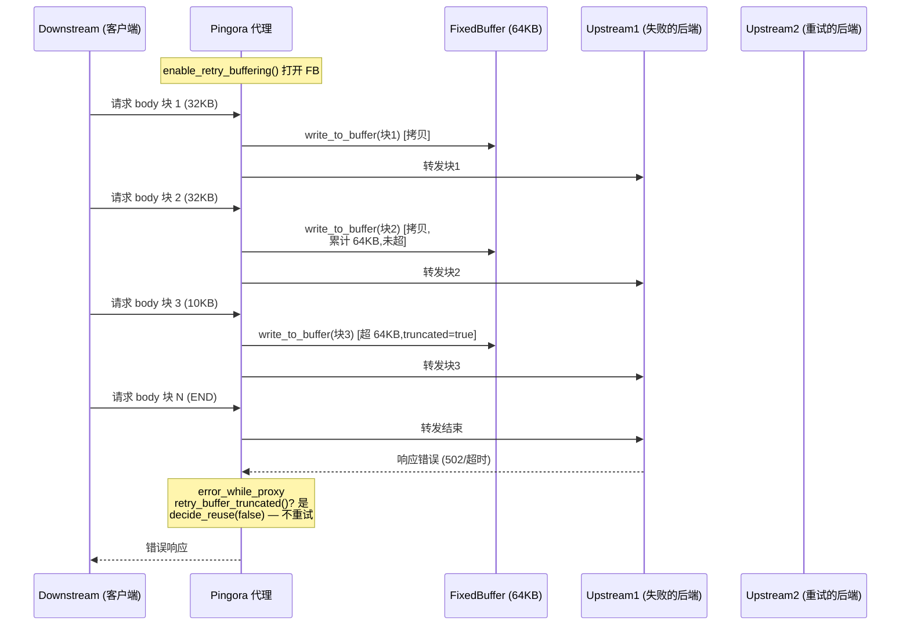
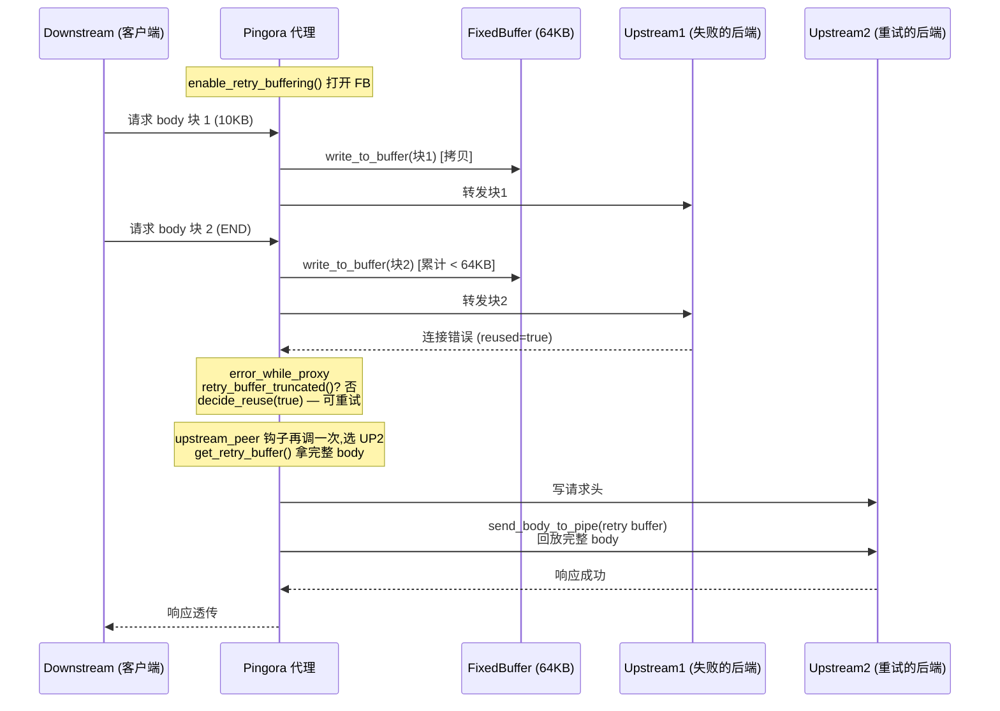
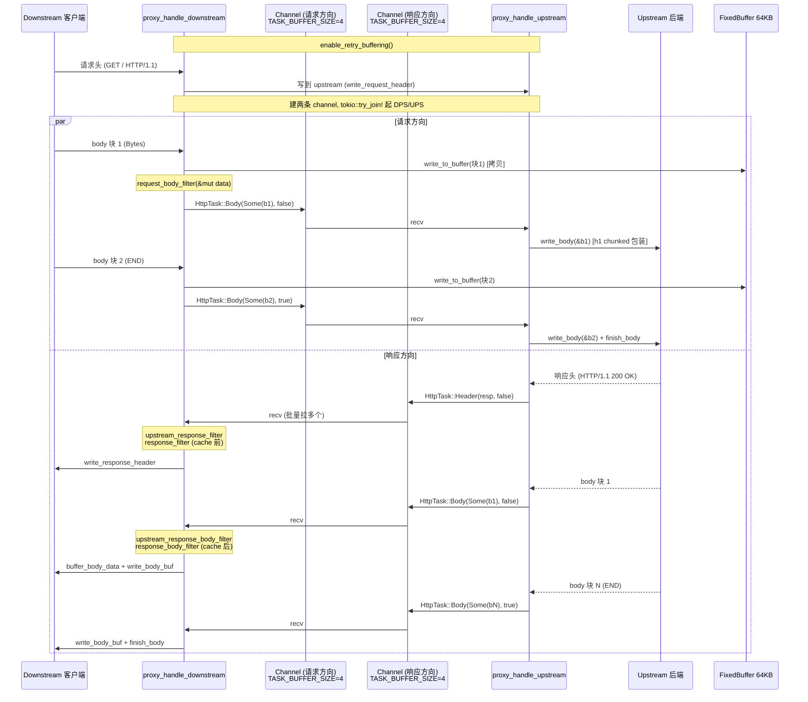

# 第 8 章 · 零拷贝转发:`HttpTask` 与 body 流

> 第 2 篇 · 转发设施·upstream 连接池

## 章首 · 核心问题

这一章只回答一个问题:

> **会话建好之后,请求/响应的字节,到底是怎么在 downstream(客户端)和 upstream(后端)之间一格一格地透传过去的?又凭什么"零拷贝"?**

上一章 P2-07 讲完 HTTP connector:它给你一个 `HttpSession`(枚举,`H1`/`H2`/`Custom` 统一),告诉你"这是一条 HTTP 会话,可以 `write_request_header`/`read_response_body`"。可这离"代理"还差关键一步——代理要的不是"在 downstream 这条会话上处理请求"或者"在 upstream 这条会话上处理请求",而是**把 downstream 收到的请求字节原样(或被 filter 改过后)送到 upstream,把 upstream 回的响应字节原样(或被 filter 改过后)送回 downstream**。这件事的核心难点不在"读和写"——`AsyncRead`/`AsyncWrite` 已经会了(承《Tokio》一句带过指路),难点在于:

1. **请求体可能比内存大得多。** 一个上传 1GB 文件的 POST,你不能把它整个读进内存再转发,那样几个并发请求就把代理打爆了。必须**流式**——读一块、转一块、写一块,代理内存占用恒定。
2. **请求和响应是两条独立的字节流,且要并发。** 你不能"先读完整个请求体再开始读响应"(客户端可能慢慢传,服务器等不及),也不能"先读完整个响应再开始写回客户端"(服务器慢慢回,客户端等不及)。**downstream 读请求体** 和 **upstream 读响应** 必须**并发推进**,谁先来数据谁先走。
3. **业务要在字节流经的路上插钩子。** `request_body_filter`/`upstream_response_body_filter`/`response_body_filter`(P1-03/P1-05 讲过)要逐块看到 body,改完再放行。钩子是同步的还是异步的?异步钩子在热路径上有多贵?(P1-02 已经剧透:body/trailer filter 大多**非 async**,本章讲为什么。)
4. **请求可能要重试。** 后端连不上、响应超时,要把请求换一个后端重发。可请求体已经从 downstream 读出来转发走了,**downstream 不会重发**——你怎么把它再发一次?**必须缓存请求体**。可请求体可能 1GB,缓存不下。怎么取舍?
5. **协议可能不对称。** downstream 是 h2,upstream 是 h1(或反过来),两者的 header 表达(`:authority` vs `Host:`)、body 分帧(DATA 帧带流控 vs chunked)、trailer(h2 原生支持 vs h1 实践罕见)都不同。"零拷贝"不能傻到把 h2 的 DATA 帧字节直接搬到 h1 的 chunked 流上,得在协议语义层对齐。
6. **升级请求(websocket、CONNECT)。** 一个 `Connection: Upgrade` 把 HTTP 流变成裸 TCP 隧道,之后的字节不再是 HTTP 帧,得当成不透明的双向字节流透传。这又是什么数据结构?

这一章就把 `pingora-proxy/src/{proxy_h1.rs,proxy_h2.rs,proxy_common.rs,lib.rs}` + `pingora-core/src/protocols/http/mod.rs`(`HttpTask` 枚举)+ `body_buffer.rs`(`FixedBuffer` retry 缓冲)怎么回答这六个问题拆透。这是钩子链(`ProxyHttp` trait)和转发设施(HTTP connector)真正**汇合**的一章——钩子决定"要不要改字节",转发设施决定"字节怎么不复制地流过去"。

读完本章你会明白:

1. **`HttpTask` 枚举(六变体)是 header/body/trailer 的统一透传单位**——`Header(Box<ResponseHeader>, bool)`/`Body(Option<Bytes>, bool)`/`UpgradedBody(Option<Bytes>, bool)`/`Trailer(Option<Box<HeaderMap>>)`/`Done`/`Failed(BError)`,每个变体带一个 `bool` 表示"是不是这条流的最后一块"。一个枚举装下"请求/响应生命周期里所有可能的字节事件",比 hyper 那样用独立的 `Request`/`Body`/`Trailers` 三个类型更紧凑,在 `mpsc::channel` 里传一个值就够。
2. **代理核心是"两条 `mpsc::channel<HttpTask>` + `tokio::try_join!` 的双向 pump"**——`proxy_1to1`/`proxy_down_to_up` 里建两个 channel(`tx_downstream`/`rx_downstream` 和 `tx_upstream`/`rx_upstream`,容量都是 `TASK_BUFFER_SIZE = 4`),起两个 task:`proxy_handle_upstream`(从 upstream 读 `HttpTask` 发到 upstream channel,从 downstream channel 收 `HttpTask` 写回 upstream 的请求体)+ `proxy_handle_downstream`(对称)。两个 task 在 `tokio::try_join!` 里**并发**跑,谁先来数据谁先动。这是"流式 + 并发 + 背压"三件套的落地。
3. **body 用 `bytes::Bytes`,引用计数零拷贝**——从 h2 的 `RecvStream::data()` 拿到的就是 `Bytes`,经过 `request_body_filter`/`upstream_response_body_filter`(可改 `&mut Option<Bytes>`)、塞进 `mpsc::channel`、被另一端 `recv` 出来、`write_body(&d)` 写到对端,**全程不拷贝**(`Bytes::clone` 是 O(1) 的 Arc 引用计数,承《内存分配器》一句带过)。仅在两个地方有一次不可避免的拷贝:① h2 server 读 downstream body 时(`Bytes::copy_from_slice`,因为 h2 crate 不暴露底层 buffer 的所有权);② h1 server 写 downstream body 时 `buffer_body_data` 把 `Bytes` 拷进 `body_write_buf`(为了批量 vectored write,源码里有 TODO)。
4. **retry buffer 是个 64KB 的 `FixedBuffer`,超了就 `truncated`,该请求不再可重试**——`BODY_BUF_LIMIT = 1024 * 64 = 64KB`(`v1/common.rs#L32`/`v2/server.rs#L39`)。`enable_retry_buffering()` 之后,每读一块 downstream body,顺手 `write_to_buffer(&bytes)` 拷一份进 `FixedBuffer`;请求体累计 <= 64KB 时 `get_retry_buffer()` 返回完整的 `Bytes`,失败重试时拿这份再发一次;一旦超过 64KB,`FixedBuffer::truncated = true`,`get_retry_buffer()` 返回 `None`,`error_while_proxy` 钩子里 `e.retry.decide_reuse(client_reused && !session.retry_buffer_truncated())` 把 retry 标志关掉——**body 太大的请求,出错就出错,不重试**(重试就要重新传 1GB,对 downstream 和网络都不公平)。这是个干净的工程取舍:小请求白嫖重试,大请求认命。
5. **升级请求用 `HttpTask::UpgradedBody` 单独标记**——`Session::was_upgraded()` 一旦为真,之后的 body 块都包成 `UpgradedBody(Option<Bytes>, bool)` 而不是 `Body(...)`,接收端(无论 h1 client 还是 h2 client)会切到"裸字节"模式(`maybe_upgrade_body_writer`),不再做 chunked 包装/不再发 DATA 帧的 END_STREAM,直到任一方关闭。一个枚举变体把"HTTP 帧模式"和"裸字节隧道模式"优雅地切开了。

> **逃生阀**(这章的 channel + select! 细节密集,先读这一段)
>
> 如果你对 `tokio::mpsc`/`tokio::select!`/`tokio::try_join!` 完全陌生,这一章会吃力。本章假设你读过 P1-02~05(`ProxyHttp` 的 filter 钩子链)、P2-06(`TransportConnector`)、P2-07(HTTP connector)。涉及 Tokio 异步原语(channel/select/Future)的,一律一句带过指路《Tokio》系列。如果你只想抓一句话:**代理转发 = 两个 task 通过两条 `mpsc::channel<HttpTask>` 双向 pump `Bytes`,body 用引用计数零拷贝,请求体额外缓存进 64KB 的 `FixedBuffer` 供失败重试(超 64KB 自动放弃重试),升级请求切到 `UpgradedBody` 裸字节模式**。

## 章首 · 一句话点破

> **`HttpTask` 是 header/body/trailer/升级/终止/失败的统一信封,`Bytes` 是里面 body 的引用计数零拷贝载荷,两条 `mpsc::channel<HttpTask>` 在两个并发 task 之间把请求从 downstream pump 到 upstream、把响应从 upstream pump 到 downstream,谁先来数据谁先走(背压靠 channel 容量 = 4)。请求体在每读一块时顺手 clone 一份进 64KB 的 `FixedBuffer`,失败重试时回放;超过 64KB 就 `truncated`,该请求不再可重试。这就是 Pingora 在钩子链和 HTTP connector 之间的字节流转发引擎。**

这是结论。本章倒过来拆:先看为什么代理必须"流式 + 双向 pump",再看承接方(hyper 的 `Service`+`Body`、Nginx 的 `proxy_pass` buffer、Envoy 的 filter chain)怎么做,然后是 `HttpTask` 枚举的设计、双向 pump 的源码、`Bytes` 零拷贝的真实边界、retry buffer 的工作图,最后是升级请求的 `UpgradedBody` 处理。

---

## 正文

### 8.1 痛点:为什么代理转发不是"读一个请求,写一个请求"那么简单

很多人第一次想"代理怎么转发"时,脑子里浮现的是这个朴素模型:

```rust
// (示意,朴素写法,反例)
async fn proxy(downstream: &mut Session, upstream: &mut HttpSession) -> Result<()> {
    let req = downstream.read_request().await?;          // 读完整请求
    upstream.write_request(req).await?;                   // 整个发给 upstream
    let resp = upstream.read_response().await?;           // 读完整响应
    downstream.write_response(resp).await?;               // 整个写回 downstream
    Ok(())
}
```

四步,清晰。可这个模型在生产代理场景下**全错**。一个一个看:

#### 8.1.1 错一:请求体可能比内存大

一个 1GB 的文件上传 POST,`downstream.read_request().await?` 要把它整个读进内存——一个并发请求 1GB,十个并发 10GB,代理直接 OOM。即便不考虑 OOM,把整个请求体读出来再"整个写出去",意味着代理的网络栈在客户端传完之前**完全不联系 upstream**,upstream 一直空等。延迟被放大成"客户端上传时间 + upstream 处理时间 + 响应回传时间"三段串行,而正确的代理应该让"客户端上传"和"upstream 接收"**同时进行**(流水线),把延迟压到接近 max(上传时间, upstream 接收时间)。

所以朴素模型必须改成**流式**:读一块 body,转一块,写一块,代理内存里同时只握几块。这块"几块"的多大、几块,就是后面要讲的 `TASK_BUFFER_SIZE = 4`。

#### 8.1.2 错二:请求和响应必须并发推进

朴素模型是**严格串行**——先发完整个请求,再开始读响应。这在 HTTP/1.1 的简单请求-响应里看起来没问题(客户端发完才能等服务器回),但有几种场景立刻穿帮:

- **大请求体的延迟。** 客户端传 1GB 上传,upstream 服务器在收到全部 1GB 之前是不会回响应的,这是 HTTP 协议本质(请求先于响应)。所以"读响应"必然在"发完请求"之后开始,朴素模型在这点上其实没错。可问题是,**upstream 可能在客户端传到一半时就已经决定拒绝了**(比如鉴权失败、body 太大、限流)——这时候 upstream 在请求体还没传完时就回了响应(通常是错误响应),代理应该**立刻**把这个响应转回 downstream,让客户端停手,而不是傻等客户端把剩下 900MB 传完。
- **响应早于请求结束的"100-continue"和提前响应。** `Expect: 100-continue` 协议下,客户端先发 header 等服务器说"传吧"(`100 Continue`)再传 body。upstream 可能回 `100 Continue` 也可能直接回 `417 Expectation Failed`。代理要在请求体还没开始传时就转发 upstream 的响应。朴素模型做不到。
- **websocket/升级。** `Connection: Upgrade` 握手成功后,upstream 和 downstream 之间变成**对等**的裸字节隧道——upstream 发来的字节要立刻转回 downstream,downstream 发来的字节要立刻转给 upstream,两个方向完全独立并发。朴素模型的"先请求后响应"彻底崩溃。

所以正确的模型是**双向并发**:一个 task 读 downstream body → 写 upstream;另一个 task 读 upstream response → 写 downstream。两个 task 谁先有数据谁先动,通过 channel 解耦。

#### 8.1.3 错三:钩子要在路上

朴素模型把"读请求"和"写请求"合并成一次 `write_request(req)`,可 Pingora 的灵魂是钩子链——业务要实现 `request_body_filter` 逐块改请求体、`upstream_response_body_filter` 逐块改响应体、`response_body_filter` 逐块改回 downstream 的响应体(P1-03/P1-05)。这些 filter 是**逐块调用**的,不是一次性拿到整个 body 再改。所以代理转发的真实流程是:

```text
读 downstream body 一块
  → request_body_filter(改这块)
  → 写 upstream body 一块
读 upstream response 一块
  → upstream_response_filter(改响应头)
  → upstream_response_body_filter(改这块)
  → response_body_filter(改这块)
  → 写 downstream 一块
```

每一块 body 都要经过这一串 filter,而不是"读完整个 body 调一次 filter"。这意味着"块"得有一个统一的数据结构,filter 能拿到 `&mut Option<Bytes>` 改它,改完塞进 channel 让另一端发出去。

#### 8.1.4 错四:请求体要缓存以供重试

Pingora 支持请求失败重试——后端连不上、读超时,可以换一个后端重新发一次(P3-09 LoadBalancer 提供候选)。可请求体是 downstream **一次**传过来的,你转发出去之后 downstream 不会再传一遍。要重试,你得自己**留一份**请求体。

留多少?全留的话,1GB 上传直接撑爆内存。所以必须设上限。Pingora 的取舍是 **64KB**——`BODY_BUF_LIMIT = 1024 * 64 = 64KB`。请求体累计 <= 64KB,缓存住,失败可重试;一旦超过 64KB,缓存标记 `truncated`,这个请求不再可重试(出错就出错)。

这个数字背后是个清晰的判断:**绝大多数 HTTP 请求的 body 都很小**(GET/DELETE 没 body,POST 表单几 KB,JSON 几十 KB),64KB 覆盖了几乎所有"想重试的请求";body 超过 64KB 的请求(文件上传、视频流),本来就不该盲目重试(重试一次就要重传 1GB,对客户端和网络是惩罚),宁可失败让上层处理。这是"白嫖小请求的重试红利,放弃大请求的重试"的工程取舍。

#### 8.1.5 错五:协议可能不对称

downstream 是 h2,upstream 是 h1(或反过来),是代理场景的常态。两者的 body 表达完全不同:

| 维度 | HTTP/1.1 | HTTP/2 |
|------|----------|--------|
| body 分帧 | chunked(`5\r\nhello\r\n`)或 Content-Length | DATA 帧(带流控) |
| trailer | 实践罕见(协议支持 `Trailer:` header) | 原生支持(HEADERS 帧带 END_STREAM+END_HEADERS) |
| 升级 | `Connection: Upgrade` + `101 Switching` | 不支持(用 CONNECT 或 extended CONNECT) |
| body 拥塞控制 | TCP 层(写阻塞就是背压) | h2 流控(每 stream 窗口 + 连接窗口) |

"零拷贝"在这里要小心:你不能把 h2 的 DATA 帧字节直接搬到 h1 的 chunked 流上(h1 要加 `5\r\n` 前缀和 `\r\n` 后缀),也不能把 h1 的 chunked 解码后的字节当 h2 DATA 帧发(h2 要套 DATA 帧头)。**协议层的转换是不可避免的拷贝**,零拷贝只发生在"已经从协议层解码出来的 application 字节"这一层——也就是 `Bytes`。

#### 8.1.6 错六:升级请求

`Connection: Upgrade`(websocket、`CONNECT irc.example.com:6667`)握手成功后,之后的字节不再是 HTTP——是裸 TCP 隧道。代理要把 upstream 和 downstream 之间当成对等的字节管道,任何一方来字节就转给另一方,没有 header/body/trailer 之分。这件事在数据结构上要表达出来——`HttpTask::UpgradedBody` 就是这个角色,它和 `HttpTask::Body` 是分开的变体,告诉接收端"这是裸字节,别再当 HTTP 帧处理"。

> **钉死这件事**:朴素模型"读一个请求,写一个请求"在生产代理里有六个硬伤——① 大请求体 OOM(必须流式);② 请求和响应不能串行(必须双向并发,尤其提前响应和升级);③ 钩子要逐块调用(filter 拿 `&mut Option<Bytes>`);④ 请求体要缓存以供重试(但有上限,超了放弃重试);⑤ 协议不对称(h1 chunked vs h2 DATA,协议层转换不可避免);⑥ 升级请求要切到裸字节隧道。这六个硬伤共同决定了 Pingora 的转发引擎长这样:`HttpTask` 枚举统一信封 + `Bytes` 引用计数零拷贝载荷 + 两条 `mpsc::channel` 双向 pump + `FixedBuffer` 64KB retry 缓冲 + `UpgradedBody` 变体表达升级。

### 8.2 承接方怎么做:hyper、Nginx、Envoy

Pingora 不是第一个解决这些问题的。先看承接方/对照方怎么做,这能让 Pingora 的取舍显形。

#### 8.2.1 hyper:`Service<Request<Body>>` + `Body` stream

hyper 是同级库(承 P2-07,Pingora 不依赖 hyper 但与之同级)。hyper 处理一个 HTTP 请求的抽象是 `Service`:

```rust
// (示意,hyper 的 Service trait,简化)
trait Service<Request> {
    type Response;
    type Future: Future<Output = Self::Response>;
    fn call(&self, req: Request) -> Self::Future;
}
```

业务实现 `Service`,拿到一个 `Request<Body>`。`Body` 是个 stream(`http_body` crate 的 `Body` trait,`poll_frame` 返回 `Frame<Data>` / `Frame<Trailers>` / `Frame<Data>` 的最后一帧带 `is_data_end`)。业务自己决定怎么消费这个 stream——可以 `while let Some(chunk) = body.frame().await { ... }` 逐块处理,也可以把整个 body 收集起来。

hyper 自己**不做代理**——它是 HTTP 库,不是代理框架。所以 hyper 不操心"双向 pump"、"重试缓冲"这些代理特有问题。hyper 的 `Body`/`Frame` 抽象对应 Pingora 的 `HttpTask`:都是"统一信封",但 hyper 的 `Frame<Data>`/`Frame<Trailers>` 是两个独立类型,靠 `Frame` enum 包装;Pingora 把 Header/Body/Trailer/UpgradedBody/Done/Failed **塞进同一个 enum**,更适合"代理要把这些事件都通过一条 channel 发出去"的场景。对照表:

| 维度 | hyper `Body`/`Frame` | Pingora `HttpTask` |
|------|----------------------|---------------------|
| 抽象层级 | HTTP 库(给业务的请求体 stream) | 代理框架(downstream/upstream 之间的转发信封) |
| 信封类型 | `Frame<D>` enum(Data/Trailers/...) | 单一 `HttpTask` enum(Header/Body/UpgradedBody/Trailer/Done/Failed) |
| Header 在哪 | `Request`/`Response` 持有,不进 Body stream | `HttpTask::Header` 变体,和 body 一起进 channel |
| 错误表达 | `Body::poll_frame` 返 `Result`,Err 表示 stream 结束 | `HttpTask::Failed(BError)` 显式变体 |
| 终止信号 | `poll_frame` 返回 `None` | `HttpTask::Done` 显式变体 |
| 谁用 | 业务自己消费(或 axum/tonic 包一层) | 代理内部,业务只在 filter 里看到 |

差异的根源:hyper 的 `Body` 服务"一条 HTTP 消息"(请求或响应),Pingora 的 `HttpTask` 服务"代理把一条消息从这头搬到那头"。代理场景需要把 header(也走 channel)、body、trailer、终止、错误**都塞进同一条 channel**,因为两个 task 之间只有这一条 channel 通信,所以一个 enum 装下所有事件是最直接的。

#### 8.2.2 Nginx:`proxy_pass` + buffer(内存 + 临时文件)

Nginx 的 `proxy_pass` 转发模型(承 P2-06/P2-07 一句带过)是**双 buffer**:

- **`proxy_request_buffering on`(默认)**:Nginx 先把整个请求体读进内存 buffer(`proxy_buffers`),不够用就写临时文件(`proxy_temp_path`),**整个**收完才开始发给 upstream。好处:可以重试(整个 body 在手)、可以改 body;坏处:大文件上传延迟被放大(先存盘再发),且磁盘 IO 是瓶颈。
- **`proxy_request_buffering off`**:流式转发,读一块发一块,但不能重试(body 已转发走)。
- **`proxy_buffering on`(默认,响应侧)**:upstream 回的响应先全收进 buffer,再慢慢发给 downstream。Nginx 的 `proxy_buffer_size`/`proxy_buffers`/`proxy_busy_buffers_size` 一堆配置就是为了调这个。
- **`proxy_buffering off`**:响应也流式(streaming)。

Nginx 的设计哲学是 **buffer 默认开**(更稳,可以重试/改写/复用连接),代价是大文件场景要靠临时文件兜底。Pingora 的设计哲学相反——**默认流式**(更省内存,延迟更低),代价是 retry buffer 只有 64KB(小请求能重试,大请求不能)。这是两代代理的根本取向差异:Nginx(C,2000s,带宽贵内存相对便宜)选 buffer,Pingora(Rust,2020s,延迟敏感 + 内存敏感)选流式。

#### 8.2.3 Envoy:filter chain + 流式

Envoy 的转发(承《Envoy》一句带过)是 filter chain——decoder filter(请求方向)→ encoder filter(响应方向),每个 filter 既能看请求也能看响应。Envoy 默认流式(`StreamDecoderFilter::decodeData` 逐块拿到 body buffer),buffer 不是默认行为,要显式配(`BufferFilter` 或自己实现 filter 缓存)。

Envoy 的 filter chain 是 C++ 虚函数驱动,filter 同步返回(不能直接 await);Pingora 的 `ProxyHttp` 钩子是 Rust async(可以 await,但 body/trailer filter 大多非 async——P1-02 讲过,本章解释为什么:热路径)。Envoy 的 buffer 在 filter 之间传递用 `Buffer::Instance`(类似 `Bytes`),引用计数;Pingora 用 `Bytes`。两者在"流式 + 引用计数 buffer"上思路同源,差异在抽象形态(filter chain vs hook chain)和语言(C++ 虚函数 vs Rust async trait)。

#### 8.2.4 对照总表

| 维度 | Pingora | hyper | Nginx | Envoy |
|------|---------|-------|-------|-------|
| 默认转发模式 | 流式 | stream(Body trait) | buffer(可关) | 流式(filter chain) |
| 转发信封 | `HttpTask` enum | `Frame<D>` enum | 内部 buffer(`ngx_buf_t`) | `Buffer::Instance` |
| body 零拷贝 | `Bytes`(引用计数) | `Bytes` | `ngx_buf_t`(可指向内存或文件) | `Buffer::Instance`(引用计数) |
| 双向并发 | 两个 task + 两条 channel | 不适用(库不代理) | 两个 connection 各自 event | worker 单线程协程 |
| 重试缓冲 | 64KB `FixedBuffer`,超了放弃 | 无 | 默认全 buffer(可写盘) | 显式配 BufferFilter |
| 升级请求 | `HttpTask::UpgradedBody` | `Upgraded` 连接 | `proxy_pass` 透传 | `TcpProxy` filter |
| 钩子模型 | async trait(`ProxyHttp`) | `Service<Request>` | 配置 + lua | C++ 虚函数 filter chain |

### 8.3 所以 Pingora 这么设计:`HttpTask` 枚举 + 双向 pump

现在看 Pingora 转发引擎的真实结构。先看转发信封 `HttpTask`(`pingora-core/src/protocols/http/mod.rs#L35-L50`):

```rust
/// An enum to hold all possible HTTP response events.
#[derive(Debug)]
pub enum HttpTask {
    /// the response header and the boolean end of response flag
    Header(Box<pingora_http::ResponseHeader>, bool),
    /// A piece of request or response body and the end of request/response boolean flag.
    Body(Option<bytes::Bytes>, bool),
    /// Request or response body bytes that have been upgraded on H1.1, and EOF bool flag.
    UpgradedBody(Option<bytes::Bytes>, bool),
    /// HTTP response trailer
    Trailer(Option<Box<http::HeaderMap>>),
    /// Signal that the response is already finished
    Done,
    /// Signal that the reading of the response encountered errors.
    Failed(pingora_error::BError),
}
```

六个变体,逐个看:

- **`Header(Box<ResponseHeader>, bool)`**——响应头(注意:这里叫 `ResponseHeader`,但实际复用为请求头也行,字段是 `version`/`method`/`uri`/`headers`/`status` 等通用 HTTP 头部)。`Box` 避免大 header 拷贝。`bool` 是"end of response"标志——HEAD 请求、204/304 响应、`Content-Length: 0` 等 header 自带终止信号时为 `true`,后续不会再有 body task。
- **`Body(Option<Bytes>, bool)`**——body 一块。`Option<Bytes>`:`Some(bytes)` 是实际数据,`None` 通常表示"空的终止帧"(比如 h2 的空 DATA 带 END_STREAM,或 chunked 的 `0\r\n\r\n`)。`bool` 是"end of body"——这是最后一块,后续不会再有 body。
- **`UpgradedBody(Option<Bytes>, bool)`**——升级请求的 body 块。和 `Body` 结构对称,但语义不同:这是 websocket/CONNECT 之后的裸字节,**不**经过 chunked 包装、**不**带协议层分帧。接收端看到 `UpgradedBody` 就切到裸字节模式。
- **`Trailer(Option<Box<HeaderMap>>)`**——HTTP trailer。`Some` 是实际 trailer,`None` 表示"trailer 阶段结束但没数据"(罕见)。`is_end()` 对 trailer 永远返回 `true`(trailer 之后不会再有任何 task)。
- **`Done`**——显式的"响应已经结束"信号。在某些路径(比如 cache hit 直接发本地响应)用,标记结束但不带任何数据。
- **`Failed(BError)`**——读响应/写请求过程中遇到错误。注意是 `BError`(`Box<Error>`),把错误本身塞进 channel 发给另一端——这是"错误也走 channel"的设计,让接收端统一处理(发错误响应、清理资源),而不是用 `Result` 在 `try_join!` 里短路。

这个枚举有两个关键设计点:

1. **一个 enum 装下整个生命周期事件**——header/body/trailer/升级/终止/错误全在这里。这意味着两个 task 之间用**一条** `mpsc::channel<HttpTask>` 就能传递整个请求或响应的所有事件,不用为 header/body/trailer 各开一条 channel,也不用 `enum { Header, Body, Trailer }` + `Result<_, Error>` 嵌套。这是给"代理内部通信"量身定做的紧凑信封。
2. **每个变体自带"end of stream"标志**——`Header(_, bool)`/`Body(_, bool)`/`UpgradedBody(_, bool)` 都带 `bool`,加上 `Trailer`/`Done`/`Failed` 本身就隐含结束。`is_end()` 方法(`mod.rs#L54-L63`)集中判定:

```rust
impl HttpTask {
    /// Whether this [`HttpTask`] means the end of the response.
    pub fn is_end(&self) -> bool {
        match self {
            HttpTask::Header(_, end) => *end,
            HttpTask::Body(_, end) => *end,
            HttpTask::UpgradedBody(_, end) => *end,
            HttpTask::Trailer(_) => true,
            HttpTask::Done => true,
            HttpTask::Failed(_) => true,
        }
    }
}
```

接收端拿到一个 `HttpTask`,`task.is_end()` 一眼就知道"这条流是不是结束了",不用维护额外的状态机(虽然实际代理层还是有 `DownstreamStateMachine`/`ResponseStateMachine` 处理更复杂的状态,见后)。

#### 8.3.1 双向 pump:`proxy_1to1` 的真实结构

现在看代理转发的核心循环。以 downstream h1 + upstream h1 为例(`pingora-proxy/src/proxy_h1.rs#L28-L133`,函数名 `proxy_1to1`,意"h1 downstream to h1 upstream"):

```rust
pub(crate) async fn proxy_1to1(
    &self,
    session: &mut Session,            // downstream 侧会话
    client_session: &mut HttpSessionV1, // upstream 侧 h1 会话
    peer: &HttpPeer,
    ctx: &mut SV::CTX,
) -> (bool, bool, Option<Box<Error>>) {
    // ... (请求头处理 + write_request_header,略,见 P1-04)

    let (tx_upstream, rx_upstream) = mpsc::channel::<HttpTask>(TASK_BUFFER_SIZE);
    let (tx_downstream, rx_downstream) = mpsc::channel::<HttpTask>(TASK_BUFFER_SIZE);

    session.as_mut().enable_retry_buffering(); // 打开 64KB retry buffer

    // start bi-directional streaming
    let ret = tokio::try_join!(
        self.proxy_handle_downstream(
            session, tx_downstream, rx_upstream, ctx,
            &mut downstream_custom_message_writer
        ),
        self.proxy_handle_upstream(client_session, tx_upstream, rx_downstream),
    );
    // ...
}
```

核心就这四行(简化示意,基于 `proxy_h1.rs#L100-L115`):

1. 建两条 channel:`(tx_upstream, rx_upstream)` 和 `(tx_downstream, rx_downstream)`,容量都是 `TASK_BUFFER_SIZE = 4`(`pingora-proxy/src/lib.rs#L79`)。
2. `enable_retry_buffering()`——告诉 downstream session"从现在起每读一块 body,顺手拷一份进 `FixedBuffer`"。
3. `tokio::try_join!(proxy_handle_downstream(...), proxy_handle_upstream(...))`——起两个 task 并发跑,哪个先返回(或出错)`try_join!` 短路,另一个被 drop(取消)。

注意 channel 的连接方式(这是关键):

- `proxy_handle_downstream` 持有 `tx_downstream`(往这条 channel 写)+ `rx_upstream`(从这条 channel 读)。
- `proxy_handle_upstream` 持有 `tx_upstream` + `rx_downstream`。

也就是说:

- **downstream 端读 body → 写到 `tx_downstream` → upstream 端从 `rx_downstream` 读出来 → 写到 upstream**(请求方向)。
- **upstream 端读响应 → 写到 `tx_upstream` → downstream 端从 `rx_upstream` 读出来 → 写到 downstream**(响应方向)。

两条 channel 分别承载请求方向和响应方向的 `HttpTask`,两个 task 各自从一端读、写另一端。这就是"双向 pump"。

为什么是两条 channel 而不是一条?因为请求方向和响应方向的 `HttpTask` 要被各自的 task 消费——`proxy_handle_downstream` 同时干两件事(读 downstream body 写出去、读回来响应写 downstream),它要发的(请求 body)和要收的(响应 task)是两条独立流,自然要两条 channel。如果用一条 channel,两个 task 抢同一个 `rx`,谁拿到 `HttpTask` 不确定,语义乱套。

为什么 channel 容量是 4?这是**背压**。`TASK_BUFFER_SIZE = 4` 意味着每个方向最多有 4 个 `HttpTask` 在飞(in-flight)。upstream 端读响应读得快,塞满了 `tx_upstream`(4 个没被 downstream 端消费),`tx_upstream.send()` 就会 await 阻塞——这就是背压,告诉 upstream 端"downstream 端消费不过来,你慢点读"。同理,downstream 端读 body 太快塞满 `tx_downstream`,也会阻塞,告诉 downstream"upstream 端接收不过来"。这个 4 是个调参,太小(比如 1)让两个 task 频繁互相等,太大(比如 1000)让代理内存里堆太多 in-flight 数据(失去流式的内存优势)。4 是个务实的中间值。

`tokio::try_join!` 是 Tokio 的并发原语(承《Tokio》一句带过),让两个 future 并发跑,都成功才返回 `Ok((a, b))`,任一出错就短路(另一个被 drop)。这正合代理语义:正常情况下两个 task 都要跑完(请求体发完 + 响应收完),任一端出错(读 downstream 失败、写 upstream 失败、upstream 响应错误等)就立刻终止整个转发。

#### 8.3.2 `proxy_handle_upstream`:upstream 侧的双向 select!

`proxy_handle_upstream`(`proxy_h1.rs#L185-L268`)是 upstream 端的 task,干两件事:① 从 upstream 读响应(`HttpTask`)塞进 `tx`(发给 downstream 端);② 从 `rx` 收 body task 写给 upstream。两件事在 `tokio::select!` 里并发:

```rust
async fn proxy_handle_upstream(
    &self,
    client_session: &mut HttpSessionV1, // upstream h1 会话
    tx: mpsc::Sender<HttpTask>,          // 发给 downstream 端(响应方向)
    mut rx: mpsc::Receiver<HttpTask>,    // 收来自 downstream 端(请求 body 方向)
) -> Result<()> {
    let mut request_done = false;
    let mut response_done = false;
    // ...

    /* duplex mode, wait for either to complete */
    while !request_done || !response_done {
        tokio::select! {
            res = client_session.read_response_task(), if !response_done => {
                // 从 upstream 读一个 HttpTask(可能是 Header/Body/Trailer/Done)
                match res {
                    Ok(task) => {
                        response_done = task.is_end();
                        // ... 升级处理
                        let result = tx.send(task).await.or_err_with(
                            InternalError,
                            || format!("Failed to send upstream task ... to pipe")
                        );
                        // ...
                    },
                    Err(e) => {
                        // 把错误推给 downstream 端,然后退出
                        let _ = tx.send(HttpTask::Failed(send_error.unwrap_or(e).into_up())).await;
                        return Ok(())
                    }
                }
            },

            body = rx.recv(), if !request_done => {
                // 从 downstream 端收一个 body HttpTask
                match send_body_to1(client_session, body).await {
                    Ok(send_done) => {
                        request_done = send_done;
                        // ...
                    },
                    Err(e) => {
                        // ...
                    }
                }
            },

            else => { break; }
        }
    }
    Ok(())
}
```

`tokio::select!`(承《Tokio》一句带过)同时 poll 多个 future,谁先 ready 走谁分支。这里两个分支:

- **`client_session.read_response_task()`**——从 upstream 读一个 `HttpTask`。这个 API(`pingora-core/src/protocols/http/v1/client.rs#L753-L783`)是 h1 client 的统一读接口,内部判定"该读 header 还是该读 body 还是已经结束":

```rust
pub async fn read_response_task(&mut self) -> Result<HttpTask> {
    if self.should_read_resp_header() {
        let resp_header = self.read_resp_header_parts().await?;
        let end_of_body = self.is_body_done();
        Ok(HttpTask::Header(resp_header, end_of_body))
    } else if self.is_body_done() {
        Ok(HttpTask::Done)
    } else {
        let body = self.read_body_bytes().await?;
        let end_of_body = self.is_body_done();
        if self.upgraded {
            Ok(HttpTask::UpgradedBody(body, end_of_body))
        } else {
            Ok(HttpTask::Body(body, end_of_body))
        }
    }
}
```

读 header 阶段 → `HttpTask::Header`(带 `end_of_body` 标志,如果响应自带终止比如 HEAD/204/304 就是 `true`);body 已读完 → `HttpTask::Done`;否则读 body → `HttpTask::Body` 或 `HttpTask::UpgradedBody`(取决于是否已升级)。一个 API 把"读响应生命周期里的任意一个事件"都包成 `HttpTask`,塞进 channel 就够——这就是 `HttpTask` 枚举的设计意图。

- **`rx.recv()`**——从 downstream 端发来的 body task(`HttpTask::Body`/`UpgradedBody`)。调 `send_body_to1(client_session, body)`(`proxy_h1.rs#L814-L897`)写给 upstream:

```rust
pub(crate) async fn send_body_to1(
    client_session: &mut HttpSessionV1,
    recv_task: Option<HttpTask>,
) -> Result<bool> {
    if let Some(task) = recv_task {
        match task {
            HttpTask::Body(data, end) => {
                // ...
                if let Some(d) = data {
                    let m = client_session.write_body(&d).await; // 写给 upstream
                    // ...
                }
            }
            HttpTask::UpgradedBody(data, end) => {
                client_session.maybe_upgrade_body_writer(); // 切到升级模式
                // ...
            }
            _ => { /* should never happen */ }
        }
    }
    // ...
}
```

注意 `client_session.write_body(&d).await`——这是 h1 client 写请求体(承 P4-12 详讲 h1 协议层)。`&d` 是 `&Bytes`,`write_body` 内部 `do_write_body(buf: &[u8])` 会把字节交给 `body_writer`(chunked 或 Content-Length 模式),最终 `underlying_stream.write_all(buf)` 发出去。这里有一次从 `Bytes` 到 `&[u8]` 的"借用"(不是拷贝,只是引用),底层 `AsyncWrite` 把字节发到 TCP/TLS。

`if !response_done`/`if !request_done` 是 `select!` 的**条件分支**——只有条件为真时这个分支才参与 select。请求方向完成了(`request_done = true`)就不再 poll `rx.recv()`,只继续读响应;响应完成了就只继续读请求体。两边都完成才退出 while 循环。

#### 8.3.3 `proxy_handle_downstream`:downstream 侧的双向 select! + 钩子链

`proxy_handle_downstream`(`proxy_h1.rs#L272-L601`)是对称的,但更复杂——因为 **downstream 侧要跑钩子链**(业务的 `request_body_filter`/`upstream_response_filter`/`response_body_filter`/cache filter 都在这里)。简化结构:

```rust
async fn proxy_handle_downstream(
    &self,
    session: &mut Session,
    tx: mpsc::Sender<HttpTask>,          // 发给 upstream 端(请求 body 方向)
    mut rx: mpsc::Receiver<HttpTask>,    // 收来自 upstream 端(响应方向)
    ctx: &mut SV::CTX,
    downstream_custom_message_writer: &mut Option<Box<dyn CustomMessageWrite>>,
) -> Result<bool> {
    // ...

    let mut downstream_state = DownstreamStateMachine::new(session.as_mut().is_body_done());
    let buffer = session.as_ref().get_retry_buffer(); // 拿 retry buffer 里的请求体(如果有)

    // retry, send buffer if it exists or body empty
    if buffer.is_some() || session.as_mut().is_body_empty() {
        let send_permit = tx.reserve().await?;
        self.send_body_to_pipe(session, buffer, downstream_state.is_done(), send_permit, ctx).await?;
    }

    let mut response_state = ResponseStateMachine::new();
    // ...

    while !downstream_state.is_done() || !response_state.is_done() /* || ... */ {
        let send_permit = tx.try_reserve();
        // ...
        tokio::select! {
            body = session.downstream_session.read_body_or_idle(downstream_state.is_done()),
                if downstream_state.can_poll() && send_permit.is_ok() => {
                // 从 downstream 读一块请求 body
                let is_body_done = session.is_body_done();
                let request_done = self.send_body_to_pipe(
                    session, body, is_body_done, send_permit.unwrap(), ctx
                ).await?;
                downstream_state.maybe_finished(request_done);
            },

            _ = tx.reserve(), if downstream_state.is_reading() && send_permit.is_err() => {
                // 没有 permit,等下一轮(背压)
                downstream_state.maybe_finished(tx.is_closed());
            },

            task = rx.recv(), if !response_state.upstream_done() => {
                // 从 upstream 端收一个响应 HttpTask
                // ... 拉多个 task 进 Vec
                let mut tasks = Vec::with_capacity(TASK_BUFFER_SIZE);
                tasks.push(task.unwrap());
                while let Some(maybe_task) = tokio::task::unconstrained(rx.recv()).now_or_never() {
                    if let Some(t) = maybe_task { tasks.push(t); } else { break; }
                }
                // 跑 filter 链(upstream_response_filter / response_filter / body filter / cache)
                let mut filtered_tasks = Vec::with_capacity(TASK_BUFFER_SIZE);
                for mut t in tasks {
                    // ... revalidate_or_stale / upstream_compression / h1_response_filter
                    let task = self.h1_response_filter(session, t, ctx, &mut serve_from_cache, ...).await?;
                    filtered_tasks.push(task);
                }
                // 一次性写多个 task 给 downstream
                let response_done = session.write_response_tasks(filtered_tasks).await?;
                response_state.maybe_set_upstream_done(response_done);
            },

            // ... (cache 分支 / custom message 分支,略)

            else => { break; }
        }
    }
    // ... finish_body
    Ok(reuse_downstream)
}
```

这个 task 比 upstream 侧复杂,几个关键点:

1. **retry buffer 先发**——`get_retry_buffer()` 拿之前缓存的请求体(如果是重试的请求,这里有上次读到的 body),直接发给 upstream。这就是"重试时回放 body"的入口。
2. **三个 select! 分支**(简化后):
   - **`read_body_or_idle`**:从 downstream 读一块请求 body,经过 `send_body_to_pipe`(里面跑 `request_body_filter`)塞进 `tx`。注意 `if send_permit.is_ok()`——只有拿到了 channel 的 permit(有容量)才读 body,**避免读了一块 body 但 channel 满了塞不进去**(读出来不消费会丢数据,这是流式背压的关键)。
   - **`tx.reserve()`**:在 `send_permit.is_err()`(channel 满)时,这个分支参与 select!,等 channel 有容量。这是上面那个分支的"补救"——读 body 分支条件不满足时,在这里等容量。
   - **`rx.recv()`**:从 upstream 端收响应 task,批量拉多个(`while let Some(...) = rx.recv().now_or_never()`),跑 filter 链,然后 `write_response_tasks(filtered_tasks)` **批量**写 downstream。批量是为了减少 downstream 写次数(后面 8.4 详讲 vectored write)。
3. **`DownstreamStateMachine` / `ResponseStateMachine`**(`proxy_common.rs#L1-L99`)——分别追踪请求方向和响应方向的进度。`DownstreamStateMachine` 三态:`Reading`(还能读 body)/`ReadingFinished`(body 读完了)/`Errored`(出错了)。`ResponseStateMachine` 追踪 upstream 响应和 cache 响应两个独立的完成状态(因为 cache miss 时 upstream 响应完成不等于给 downstream 的响应完成,中间还有 cache 写)。

`send_body_to_pipe`(`proxy_h1.rs#L759-L811`)是请求 body 经过钩子链的入口:

```rust
async fn send_body_to_pipe(
    &self,
    session: &mut Session,
    mut data: Option<Bytes>,
    end_of_body: bool,
    tx: mpsc::Permit<'_, HttpTask>,
    ctx: &mut SV::CTX,
) -> Result<bool> {
    let end_of_body = end_of_body || data.is_none();

    // module 的 body filter(compression 等)
    session.downstream_modules_ctx.request_body_filter(&mut data, end_of_body).await?;

    // 业务的 body filter(P1-03 讲过)
    self.inner.request_body_filter(session, &mut data, end_of_body, ctx).await?;

    let upstream_end_of_body = end_of_body || data.is_none();

    // 空块不写(避免被当成终止帧)
    if !upstream_end_of_body && data.as_ref().is_some_and(|d| d.is_empty()) {
        return Ok(false);
    }

    // 升级请求用 UpgradedBody,否则用 Body
    if session.was_upgraded() {
        tx.send(HttpTask::UpgradedBody(data, upstream_end_of_body));
    } else {
        tx.send(HttpTask::Body(data, upstream_end_of_body));
    }

    Ok(end_of_body)
}
```

注意几个细节:

- **filter 拿 `&mut Option<Bytes>`**——业务可以改这块 body(替换 `Bytes`、清空、加数据),也可以原样放行。`Bytes` 的 `clone` 是 O(1)(引用计数,承《内存分配器》),所以业务要"保留一份"也几乎免费;要"替换"就是 `*data = Some(new_bytes)`,旧的 `Bytes` 引用计数减一,可能释放。
- **空块跳过**——`if !upstream_end_of_body && data.is_empty()` 时返回 `Ok(false)` 不发,因为发一个空的 `HttpTask::Body` 会让 h1 chunked 把它当成终止帧(`0\r\n\r\n`),或者让 h2 当成空 DATA 帧(可能带 END_STREAM)。所以空且非结束的块直接吞掉,这是协议层的坑。
- **升级判断**——`was_upgraded()` 为真就用 `UpgradedBody`,否则 `Body`。这就是升级请求在数据结构上的切换点。
- **`tx.send()` 不 await**——因为已经 `reserve()` 拿了 permit,`send` 是同步的(有 permit 就一定有容量)。这是 channel 的 reserve/send 两步模式,避免在 select! 里 await send(会和 select! 的 poll 模型冲突)。

#### 8.3.4 h2 上下游的变体:`pipe_up_to_down_response` + `bidirection_down_to_up`

downstream h2 或 upstream h2 时,结构略变(因为 h2 的 body writer 是 `h2::SendStream<Bytes>`,要单独 take 出来),但骨架一样。upstream h2 时(`proxy_h2.rs#L757-L847` 的 `pipe_up_to_down_response`):

```rust
pub(crate) async fn pipe_up_to_down_response(
    client: &mut Http2Session, // upstream h2 stream
    tx: mpsc::Sender<HttpTask>,
) -> Result<()> {
    client.read_response_header().await?;
    let resp_header = Box::new(client.response_header().expect("just read").clone());

    // 检查 END_STREAM on HEADERS 的边界 case(content-length 校验)
    match client.check_response_end_or_error() {
        Ok(eos) => {
            // ... content-length 校验
            tx.send(HttpTask::Header(resp_header, eos)).await?;
        }
        Err(e) => {
            let _ = tx.send(HttpTask::Header(resp_header, false)).await;
            let _ = tx.send(HttpTask::Failed(e.into_up())).await;
            return Ok(());
        }
    }

    while let Some(chunk) = client.read_response_body().await.transpose() {
        let data = match chunk {
            Ok(d) => d,
            Err(e) => {
                let _ = tx.send(HttpTask::Failed(e.into_up())).await;
                return Ok(());
            }
        };
        match client.check_response_end_or_error() {
            Ok(eos) => {
                let empty = data.is_empty();
                if empty && !eos { continue; } // 空 DATA 且非结束,跳过
                let sent = tx.send(HttpTask::Body(Some(data), eos)).await;
                // ...
                sent?;
            }
            // ...
        }
    }
    Ok(())
}
```

`pipe_up_to_down_response` 是"从 h2 upstream 读响应 → 发 HttpTask 到 channel"的 half-pipe,它和 `bidirection_down_to_up`(对称的 downstream 侧)用 `tokio::try_join!` 并发(`proxy_h2.rs#L189-L199`):

```rust
let ret = tokio::try_join!(
    self.bidirection_down_to_up(session, &mut client_body, rx, ctx, write_timeout, ...),
    pipe_up_to_down_response(client_session, tx)
);
```

注意 h2 路径只有**一条** channel(`tx`/`rx`),不像 h1 路径有两条。为什么?因为 h2 upstream 的请求 body 写通过 `h2::SendStream<Bytes>`(从 `client_session.take_request_body_writer()` 取出),它是**同步的**(`send_data` 不阻塞,数据塞进 h2 crate 内部缓冲),不需要单独一个 task 来管;而 h1 upstream 的请求 body 写是异步的(要 await `write_body`),所以要 `proxy_handle_upstream` 这个 task 同时管"读响应 + 写请求 body"。h2 路径里 `bidirection_down_to_up` 一个 task 同时管"读 downstream body 写 h2 SendStream + 收响应 task 写 downstream",`pipe_up_to_down_response` 只管"读 h2 响应塞 channel"。两个 task 共享一条 channel(`tx`/`rx`),各持一端。

注释里有个关键点(`proxy_h2.rs#L345-L347`):

> "Similar logic in h1 need to reserve capacity first to avoid deadlock. But we don't need to do the same because the h2 client_body pipe is unbounded (never block)"

h1 路径里 `proxy_handle_downstream` 要 `tx.try_reserve()` 拿 permit 才读 body(背压);h2 路径里 `bidirection_down_to_up` 不用 reserve,因为 h2 的 `SendStream::send_data` 是 unbounded 的(h2 crate 内部缓冲,不阻塞)。但**整体背压还是有的**——h2 有自己的流控(window),`send_data` 数据塞进 h2 缓冲后,h2 协议层会通过 WINDOW_UPDATE 机制对端到端背压(承《gRPC》第 2 篇一句带过)。

#### 8.3.5 `write_response_tasks`:批量写 downstream 的入口

downstream 侧收到 upstream 来的一批 `HttpTask` 后,经过 filter 链,调 `session.write_response_tasks(filtered_tasks)`(`lib.rs#L587-L640`)批量写 downstream:

```rust
pub async fn write_response_tasks(&mut self, mut tasks: Vec<HttpTask>) -> Result<bool> {
    let mut seen_upgraded = self.was_upgraded();
    for task in tasks.iter_mut() {
        match task {
            HttpTask::Header(resp, end) => {
                self.downstream_modules_ctx.response_header_filter(resp, *end).await?;
            }
            HttpTask::Body(data, end) => {
                self.downstream_modules_ctx.response_body_filter(data, *end)?;
            }
            HttpTask::UpgradedBody(data, end) => {
                seen_upgraded = true;
                self.downstream_modules_ctx.response_body_filter(data, *end)?;
            }
            HttpTask::Trailer(trailers) => {
                if let Some(buf) = self.downstream_modules_ctx.response_trailer_filter(trailers)? {
                    // trailer filter 返回 Bytes 时,改成 Body 写进去
                    *task = HttpTask::Body(Some(buf), true);
                }
            }
            HttpTask::Done => {
                if let Some(buf) = self.downstream_modules_ctx.response_done_filter()? {
                    if seen_upgraded {
                        *task = HttpTask::UpgradedBody(Some(buf), true);
                    } else {
                        *task = HttpTask::Body(Some(buf), true);
                    }
                }
            }
            _ => { /* Failed */ }
        }
    }
    self.downstream_session.response_duplex_vec(tasks).await
}
```

这里干两件事:

1. **跑 module 的 response filter**(compression 等 `HttpModuleCtx`)——注意这里**不**直接调业务的 `response_filter`/`response_body_filter`(那些在 `h1_response_filter` 里调过了,见 8.3.3),这里只跑 module 层的 filter。
2. **委托 `downstream_session.response_duplex_vec(tasks)` 批量写**——这是 downstream `Session` 枚举(`H1`/`H2`/`Subrequest`/`Custom`)的统一写接口,内部 match 分派。

`response_duplex_vec`(`protocols/http/server.rs#L270-L277`)枚举分派:

```rust
pub async fn response_duplex_vec(&mut self, tasks: Vec<HttpTask>) -> Result<bool> {
    match self {
        Self::H1(s) => s.response_duplex_vec(tasks).await,
        Self::H2(s) => s.response_duplex_vec(tasks).await,
        Self::Subrequest(s) => s.response_duplex_vec(tasks).await,
        Self::Custom(s) => s.response_duplex_vec(tasks).await,
    }
}
```

各协议 variant 自己实现 `response_duplex_vec`,把 task 列表翻译成协议层写操作。这部分下一节(8.4)展开。

> **钉死这件事**:Pingora 转发引擎的核心结构是"两个 task + 两条 `mpsc::channel<HttpTask>(容量 4)` + `tokio::try_join!`/`tokio::select!`"的双向 pump。`proxy_handle_upstream`(upstream 侧)在 select! 里同时"从 upstream 读响应 task 塞 channel"+"从 channel 收 body task 写 upstream";`proxy_handle_downstream`(downstream 侧)对称,且额外跑钩子链(`request_body_filter`/`response_filter`/cache filter)。h2 路径变体:`pipe_up_to_down_response`(只读 h2 响应塞 channel)+ `bidirection_down_to_up`(对称),共享一条 channel(因为 h2 写 unbounded 不需要单独背压)。channel 容量 4 是背压——upstream 读得快塞满了就阻塞,告诉它慢点;downstream 读得慢就让 upstream 端 await send。retry buffer 先发(`get_retry_buffer()`),升级请求靠 `was_upgraded()` 切到 `UpgradedBody` 变体。

### 8.4 `Bytes` 零拷贝:真实边界与不可避免的拷贝

讲了那么多 `HttpTask` 在 channel 里飞,你可能会问:body 数据到底有没有被拷贝?答案是**绝大部分路径零拷贝,有两个地方有不可避免的单次拷贝**。一个一个看。

#### 8.4.1 `Bytes` 是什么:引用计数的不可变字节切片

`bytes::Bytes` 是 bytes crate 的核心类型(承《内存分配器》一句带过),本质是 `Arc<[u8]>`——一片不可变的字节 + 引用计数。关键性质:

- **`Bytes::clone()` 是 O(1)**——只增加引用计数,不拷贝字节。两个 `Bytes` 共享同一片底层内存。
- **`Bytes` 不可变**——不能原地改字节。要改就 `let mut vec: Vec<u8> = bytes.into()` 转成 `Vec<u8>`(消耗 `Bytes`,如果引用计数 > 1 这里有一次拷贝),改完 `Bytes::from(vec)` 转回去。
- **`Bytes::split_to(n)`/`Bytes::split_off(n)` 是 O(1)**——把 `Bytes` 切成两段,各自独立的 `Bytes`,但底层还是同一片内存(引用计数共享)。这是流式处理的利器——拿到一大块 `Bytes`,切几段分发,零拷贝。

代理场景里,`Bytes` 的引用计数零拷贝完美匹配:从 upstream 读到一块 `Bytes`,塞进 channel(`Bytes` move,引用计数不变,零拷贝),另一端 `recv` 出来,filter 拿 `&mut Option<Bytes>` 改(大多数情况原样放行,零拷贝),最终 `write_body(&bytes)` 发出去。**整条路径 body 字节只被拷贝一次**(从内核 TCP buffer 到 `Bytes` 的底层内存那一次,这是任何用户态代理都不可避免的),之后所有操作都是引用计数。

#### 8.4.2 h2 upstream 读响应:零拷贝(从 h2 crate 拿到的就是 `Bytes`)

`Http2Session::read_response_body`(`v2/client.rs`)底层调 h2 crate 的 `RecvStream::data()`,h2 crate 返回 `Bytes`(h2 crate 内部用 `Bytes` 管理 buffer)。这块 `Bytes` 直接塞进 `HttpTask::Body(Some(bytes), eos)`,move 进 channel,零拷贝。

#### 8.4.3 h1 upstream 读响应:零拷贝(`Bytes::copy_from_slice` 看起来像拷贝,但实际是从内部 buffer freeze)

`Http1Session::read_body_bytes`(`v1/client.rs`)底层读 h1 body 到内部 `BytesMut` buffer,然后 `Bytes::copy_from_slice(self.get_body(&b))`——这里看起来是拷贝。但实际 h1 的 body reader(`v1/body.rs`)是从 `body_buf`(预分配的 `BytesMut`)读,h1 协议层在解析 chunked/Content-Length 时已经把字节放进 `body_buf`,这里只是从 `body_buf` 切出来包成 `Bytes`。严格说有一次拷贝(从 `body_buf` 到 `Bytes` 的底层),但这是 h1 协议层的设计(h1 body reader 用 `BytesMut` 工作缓冲,承 P4-12 详讲)。

#### 8.4.4 h2 downstream 读请求体:有一次拷贝(`Bytes::copy_from_slice`)

`SessionV2::read_body_bytes`(`v2/server.rs#L190-L207`)读 downstream(客户端)发来的 h2 body:

```rust
pub async fn read_body_bytes(&mut self) -> Result<Option<Bytes>> {
    let data = self.request_body_reader.data().await.transpose().or_err(...)?;
    if let Some(data) = data.as_ref() {
        self.body_read += data.len();
        if let Some(buffer) = self.retry_buffer.as_mut() {
            buffer.write_to_buffer(data); // 顺手缓存到 retry buffer
        }
        let _ = self.request_body_reader.flow_control().release_capacity(data.len());
    }
    Ok(data)
}
```

注意这里 `data` 是 h2 crate 返回的 `Bytes`,直接返回,**没有 copy**(`v2/server.rs#L196` 的 `data` 就是 `Bytes`,move 出去)。但 h2 crate 的 `data()` 返回的 `Bytes` 实际上是 h2 内部 buffer 的引用,release_capacity 之后这块 buffer 可能被 h2 复用——所以严格说,h2 crate 保证 `Bytes` 在 release_capacity 之前是有效的,业务用完才能 release。Pingora 这里在 `release_capacity` 之前把 `data` 返回给上层,上层负责在 channel 里传递时 `Bytes` 仍是有效引用(h2 crate 内部用引用计数,release_capacity 只是还容量配额,不释放 `Bytes` 的底层内存)。所以这条路径**零拷贝**。

#### 8.4.5 h1 downstream 读请求体:有一次拷贝(`Bytes::copy_from_slice`)

`SessionV1::read_body_bytes`(`v1/server.rs#L426-L436`)读 downstream(客户端)发来的 h1 body:

```rust
pub async fn read_body_bytes(&mut self) -> Result<Option<Bytes>> {
    let read = self.read_body().await?;
    Ok(read.map(|b| {
        let bytes = Bytes::copy_from_slice(self.get_body(&b)); // 显式拷贝
        self.body_bytes_read += bytes.len();
        if let Some(buffer) = self.retry_buffer.as_mut() {
            buffer.write_to_buffer(&bytes); // 顺手缓存到 retry buffer
        }
        bytes
    }))
}
```

**这里有一次 `Bytes::copy_from_slice`**——从内部 `body_buf`(h1 body reader 的工作缓冲)拷贝出来成新的 `Bytes`。为什么不能像 h2 那样直接返回引用?因为 h1 的 `body_buf` 是 `BytesMut`,会被后续读操作覆盖,必须拷贝出来给上层一个独立的 `Bytes`。这是 h1 协议层的固有代价(承 P4-12 详讲)。

#### 8.4.6 h1 downstream 写响应:`buffer_body_data` 拷进 `body_write_buf`,为了 vectored write

downstream 是 h1 时,`response_duplex_vec`(`v1/server.rs#L1193-L1236`)不直接写每个 `Bytes`,而是先 `buffer_body_data` 拷进 `body_write_buf`(`BytesMut`),最后统一 `write_body_buf()` 一次写出去:

```rust
pub async fn response_duplex_vec(&mut self, mut tasks: Vec<HttpTask>) -> Result<bool> {
    let n_tasks = tasks.len();
    if n_tasks == 1 {
        // fallback to single operation to avoid copy
        return self.response_duplex(tasks.pop().unwrap()).await;
    }

    let mut end_stream = false;
    for task in tasks.into_iter() {
        end_stream = match task {
            HttpTask::Header(header, end_stream) => {
                self.write_response_header(header).await.map_err(|e| e.into_down())?;
                end_stream
            }
            HttpTask::Body(data, end_stream) => {
                self.buffer_body_data(data, false); // 拷进 body_write_buf
                end_stream
            }
            // ...
        };
    }
    self.write_body_buf().await.map_err(|e| e.into_down())?; // 一次写出
    // ...
}
```

`buffer_body_data`(`v1/server.rs#L1175-L1190`):

```rust
fn buffer_body_data(&mut self, data: Option<Bytes>, upgraded: bool) {
    // ...
    let Some(d) = data else { return; };
    if !d.is_empty() && !self.body_writer.finished() {
        self.body_write_buf.put_slice(&d); // 拷贝
    }
}
```

**这里有一次拷贝**——`body_write_buf.put_slice(&d)` 把 `Bytes` 的字节拷进 `body_write_buf`(`BytesMut`)。这是个有意识的取舍:**用一次拷贝换一次 vectored write**。源码注释(`v1/server.rs#L1192`)明确写了 TODO:"use vectored write to avoid copying"——理想情况是用 `writev` 系统调用(把多个 `Bytes` 的 `iovec` 一次写出去,零拷贝),但当前实现是先拷进一个连续 buffer 再一次 `write`。

为什么要批量?因为 `write_response_tasks` 一次给多个 task(`Vec<HttpTask>`),每个 task 可能是一块 body。如果每个 body 一次 `write`,多次系统调用开销大(尤其小 body 块);拷进一个连续 buffer 再一次 `write`,系统调用次数减少。代价是那次拷贝。在 body 块大的时候拷贝开销不可忽略(100MB body 拷一次是毫秒级),但在典型场景(body 块几 KB 到几十 KB)系统调用节省的开销 > 拷贝开销,批量是净赢。

注意 `n_tasks == 1` 的特判——只有一个 task 时直接走 `response_duplex`(单 task 路径,不拷贝),避免无谓拷贝。这是性能优化的细节:批量只在多个 task 时才划算。

#### 8.4.7 h2 downstream 写响应:零拷贝(`write_body(Bytes)`)

downstream 是 h2 时,`response_duplex_vec`(`v2/server.rs#L421-L467`)直接 `write_body(d, end)`:

```rust
HttpTask::Body(data, end) => match data {
    Some(d) => {
        if !d.is_empty() {
            self.write_body(d, end).await.map_err(|e| e.into_down())?; // d: Bytes,直接发
        }
        end
    }
    None => end,
},
```

h2 的 `write_body(Bytes, bool)` 底层 `send_data(data, end_stream)`——`Bytes` 直接 move 进 h2 crate,h2 crate 把它包进 DATA 帧。这里**零拷贝**(h2 crate 也用 `Bytes`,move 是零成本)。注释(`proxy_h2.rs#L348` 附近)有一句"NOTE: cannot avoid this copy since h2 owns the buf"——指的是 h2 crate 持有 `Bytes` 后,底层内存由 h2 管理直到发送完成,但 move 本身不拷贝字节。

#### 8.4.8 h1 upstream 写请求体:零拷贝(`write_body(&[u8])` 借用)

upstream 是 h1 时,`send_body_to1` 调 `client_session.write_body(&d)`(`v1/client.rs#L165-L174`),`&d` 是 `&Bytes` 解引用成 `&[u8]`(借用,不拷贝),`do_write_body(buf: &[u8])` 交给 h1 body writer(chunked 加 `5\r\n` 前缀和 `\r\n` 后缀——这里**有一次协议层拷贝**,把 application 字节拷进 chunked 帧的字节流)。这是 h1 chunked 协议的固有代价:application 字节必须嵌入 `5\r\n...\r\n` 这种帧格式,不可能零拷贝。

#### 8.4.9 h2 upstream 写请求体:零拷贝(`write_request_body(Bytes)`)

upstream 是 h2 时,`send_body_to2`(`proxy_h2.rs#L710-L753`)调 `write_body(client_body, data, end, write_timeout)`,这里 `data: Bytes` 直接 move 给 `h2::SendStream::send_data(data, end)`——零拷贝(h2 crate 接管 `Bytes`)。

#### 8.4.10 真实零拷贝边界总结

把上面的零拷贝/拷贝点整理成表:

| 路径 | 拷贝点 | 次数 | 原因 |
|------|--------|------|------|
| h2 upstream → channel | 无 | 0 | h2 crate 返回 `Bytes`,直接 move |
| h1 upstream → channel | `Bytes::copy_from_slice` 从 body_buf | 1 | h1 body reader 用 BytesMut 工作缓冲 |
| channel → h1 downstream | `buffer_body_data` 拷进 body_write_buf | 1 | vectored write 取舍(批量写出) |
| channel → h2 downstream | 无 | 0 | h2 `write_body(Bytes)` 直接 move |
| channel → h1 upstream | 协议层 chunked 包装 | 1 | h1 chunked 帧格式固有 |
| channel → h2 upstream | 无 | 0 | h2 `send_data(Bytes)` 直接 move |
| retry buffer | `FixedBuffer::write_to_buffer` | 1 | 64KB 内拷贝供重试 |

**结论**:h2 全程零拷贝(从 h2 crate 来,到 h2 crate 去,中间 `Bytes` 引用计数);h1 因为协议层(chunked 包装/工作缓冲)有 1-2 次拷贝,但这是 h1 协议的固有代价,不是 Pingora 设计缺陷。retry buffer 是额外的 1 拷贝(只在 <= 64KB 时),换"小请求可重试"的红利。整体上,Pingora 的"零拷贝"是指 **`Bytes` 在 channel 和 filter 之间传递零拷贝**(引用计数),不包括协议层不可避免的字节包装。

> **钉死这件事**:`Bytes` 引用计数零拷贝覆盖"channel 传递 + filter 处理"这条主路径——`HttpTask::Body` 在两条 channel 里 move,filter 拿 `&mut Option<Bytes>` 改(大多数原样放行),都是零拷贝(引用计数)。不可避免的拷贝在协议层:h1 读 body 有一次从 body_buf 的拷贝,h1 写 body 有 chunked 包装拷贝,h1 downstream 批量写有 buffer_body_data 拷贝(换 vectored write)。h2 路径全程零拷贝(h2 crate 用 `Bytes`)。retry buffer 是额外的 1 拷贝(64KB 内),换重试能力。整体上 Pingora 在"字节流过代理"这件事做到了 Rust 异步 + bytes crate 能给的最佳:h2 全程零拷贝,h1 受协议层限制有少量拷贝但已最小化。

### 8.5 retry buffer:`FixedBuffer` 的 64KB 取舍

现在专门拆 retry buffer。这是个看似简单但设计精巧的小机制。

#### 8.5.1 问题:请求体要重试,但不能全缓存

回顾痛点(8.1.4):请求失败要重试,可请求体 downstream 已经发完了,不会重发。代理要自己留一份。可全留的话,1GB 上传撑爆内存。怎么取舍?

Pingora 的解法:**留前 64KB,超过就放弃重试**。

#### 8.5.2 `FixedBuffer`:有上限的缓冲,超了标记 truncated

`FixedBuffer`(`pingora-core/src/protocols/http/body_buffer.rs#L19-L61`)是个极简的结构:

```rust
/// A buffer with size limit. When the total amount of data written to the buffer is below the limit
/// all the data will be held in the buffer. Otherwise, the buffer will report to be truncated.
pub struct FixedBuffer {
    buffer: BytesMut,
    capacity: usize,
    truncated: bool,
}

impl FixedBuffer {
    pub fn new(capacity: usize) -> Self {
        FixedBuffer {
            buffer: BytesMut::new(),
            capacity,
            truncated: false,
        }
    }

    pub fn write_to_buffer(&mut self, data: &Bytes) {
        if !self.truncated && (self.buffer.len() + data.len() <= self.capacity) {
            self.buffer.extend_from_slice(data); // 还装得下,拷贝进来
        } else {
            // TODO: clear data because the data held here is useless anyway?
            self.truncated = true; // 装不下了,标记 truncated
        }
    }

    pub fn is_empty(&self) -> bool { self.buffer.len() == 0 }
    pub fn is_truncated(&self) -> bool { self.truncated }

    pub fn get_buffer(&self) -> Option<Bytes> {
        if !self.is_empty() {
            Some(self.buffer.clone().freeze()) // 拷贝出来成 Bytes
        } else {
            None
        }
    }
}
```

逻辑直白:

- **`write_to_buffer(&Bytes)`**:每次写一块 data。如果当前 buffer + data 还在 capacity 内,`extend_from_slice` 拷贝进来;否则(超出 capacity,或已经 truncated)标记 `truncated = true`。
- **`is_truncated()`**:返回是否已超出。
- **`get_buffer()`**:返回当前 buffer 的 `Bytes`(只有 `is_empty()` 为 false 才返回)。

注意几个设计细节:

1. **一旦 truncated,就不再写入**——`if !self.truncated && ...`。超了之后后续的 data 直接丢弃,不再拷贝(省 CPU)。注释 TODO:"clear data because the data held here is useless anyway?"——甚至建议 truncated 时把已经缓存的数据也清掉(因为反正不能重试了,缓存的数据没用),但当前实现留着没清。
2. **`get_buffer()` 不论 truncated 状态**——只要非空就返回。但实际调用方 `get_retry_buffer`(`v1/server.rs#L911` 等)会先判 truncated:

```rust
pub fn get_retry_buffer(&self) -> Option<Bytes> {
    self.retry_buffer.as_ref().and_then(|b| {
        if b.is_truncated() { None } else { b.get_buffer() }
    })
}
```

truncated 时直接返回 `None`(不能重试,所以不返回部分数据);非 truncated 时返回完整缓存的 `Bytes`。这就是"超 64KB 放弃重试"的执行点。

3. **`extend_from_slice` 是拷贝**——每次 `write_to_buffer` 都把 `Bytes` 拷进 `BytesMut`。这是 retry buffer 的代价:64KB 内每块 body 都拷一次。源码注释 TODO(`body_buffer.rs#L34`):"maybe store a Vec of Bytes for zero-copy"——理想是存 `Vec<Bytes>`(引用计数,零拷贝),但当前实现是 `BytesMut`(拷贝)。64KB 内的拷贝开销很小(微秒级),不是瓶颈,所以这个 TODO 一直没做。

#### 8.5.3 `enable_retry_buffering`:打开 retry buffer

retry buffer 默认不开。`enable_retry_buffering`(`v1/server.rs#L905-L909` / `v2/server.rs#L539-L543`)创建 `FixedBuffer`:

```rust
pub fn enable_retry_buffering(&mut self) {
    if self.retry_buffer.is_none() {
        self.retry_buffer = Some(FixedBuffer::new(BODY_BUF_LIMIT))
    }
}
```

`BODY_BUF_LIMIT` 在两个地方定义(值一样):

- `pingora-core/src/protocols/http/v1/common.rs#L32`:`pub(crate) const BODY_BUF_LIMIT: usize = 1024 * 64;`
- `pingora-core/src/protocols/http/v2/server.rs#L39`:`const BODY_BUF_LIMIT: usize = 1024 * 64;`

**64KB**。

代理层在 `proxy_1to1`/`proxy_down_to_up` 一开始就调(`proxy_h1.rs#L103` / `proxy_h2.rs#L185`):

```rust
session.as_mut().enable_retry_buffering();
```

这之后,每次 downstream 侧读 body(`read_body_bytes`,`v1/server.rs#L431`/`v2/server.rs#L198`)都会顺手 `buffer.write_to_buffer(&bytes)` 把这块拷一份进 retry buffer。

#### 8.5.4 重试时的回放:`get_retry_buffer`

请求失败要重试时,`proxy_handle_downstream` 在循环开始前(`proxy_h1.rs#L307-L323`/`proxy_h2.rs#L303-L313`)拿 retry buffer:

```rust
let buffer = session.as_ref().get_retry_buffer();

// retry, send buffer if it exists or body empty
if buffer.is_some() || session.as_mut().is_body_empty() {
    let send_permit = tx.reserve().await?;
    self.send_body_to_pipe(session, buffer, downstream_state.is_done(), send_permit, ctx).await?;
}
```

`get_retry_buffer()` 返回 `Some(bytes)` 时(完整缓存的请求体),直接 `send_body_to_pipe` 把它发给 upstream——这就是"重试时回放 body"。注意这时 `session.downstream_session.read_body_or_idle` 还没开始读新的 body(因为重试时 downstream 已经发完了原来的请求,我们用的是缓存的副本)。`is_body_empty()` 的特判是为了处理"原请求没有 body"(GET 等)的情况——没 body 也要发个空帧告诉 upstream"请求体结束"。

#### 8.5.5 retry 资格判定:`retry_buffer_truncated`

重试不是无条件的。`error_while_proxy`(`proxy_trait.rs#L448-L461`)在出错时决定这个错误能不能重试:

```rust
fn error_while_proxy(
    &self,
    peer: &HttpPeer,
    session: &mut Session,
    e: Box<Error>,
    _ctx: &mut Self::CTX,
    client_reused: bool,
) -> Box<Error> {
    let mut e = e.more_context(format!("Peer: {}", peer));
    // only reused client connections where retry buffer is not truncated
    e.retry
        .decide_reuse(client_reused && !session.as_ref().retry_buffer_truncated());
    e
}
```

关键这行:`e.retry.decide_reuse(client_reused && !session.retry_buffer_truncated())`。

两个条件都满足才允许重试:

1. **`client_reused`**——upstream 连接是复用的(不是新建的)。注释解释:如果是新建连接失败,可能是连接本身就建立不起来(网络问题),换个 upstream 也许能成;如果是复用连接失败,可能是这条连接死了(对端关了/超时),换个 upstream 重试有意义。这里 `client_reused` 的语义是"复用的连接出错了更值得重试"。这个条件由 `proxy_to_h1_upstream`/`proxy_to_h2_upstream` 的 `reused` 参数传进来。
2. **`!session.retry_buffer_truncated()`**——retry buffer 没超 64KB。超了的话,缓存的请求体不完整,重试也没法重发完整 body,所以不重试。

`retry_buffer_truncated`(`v1/server.rs#L899-L902`/`v2/server.rs#L533-L537`):

```rust
pub fn retry_buffer_truncated(&self) -> bool {
    self.retry_buffer
        .as_ref()
        .map_or(false, |b| b.is_truncated())
}
```

如果 retry buffer 没开(`None`),返回 false(不 truncated,允许重试——但实际没缓存 body,重试时回放的是空);开了且 truncated,返回 true(不允许重试)。

#### 8.5.6 retry buffer 工作图

把整个 retry 流程画出来:



这是大请求(body > 64KB)的场景:retry buffer 在第三块时 truncated,出错不重试。



这是小请求(body <= 64KB)的场景:retry buffer 完整缓存,出错可重试,回放 body。

#### 8.5.7 64KB 这个数字的取舍

为什么是 64KB?这是个经验值,背后几个考虑:

1. **覆盖典型请求**。绝大多数 HTTP 请求的 body 都在 64KB 以内(GET/DELETE 没 body,POST 表单几 KB,JSON API 几十 KB)。64KB 覆盖了几乎所有"想重试的请求"。
2. **内存可控**。每个并发请求最多 64KB retry buffer,10000 并发请求 = 640MB,可接受。如果是 1MB 上限,10000 并发 = 10GB,生产环境撑不住。
3. **h2 的 max_frame_size 默认 16KB,典型 body 块几 KB-几十 KB**。64KB 大约对应 4-16 个 h2 frame,缓存几个 frame 的请求体足够覆盖小请求场景。
4. **和 h1 body reader 的 BODY_BUFFER_SIZE 一致**(`v1/body.rs#L29`,`const BODY_BUFFER_SIZE: usize = 1024 * 64`)。h1 body reader 的工作缓冲也是 64KB,retry buffer 用同样的值,语义一致。

对照 Nginx 的 `client_body_buffer_size`(默认 8KB/16KB,超了写临时文件)——Nginx 选了"小内存 + 磁盘兜底",Pingora 选了"中等内存 + 放弃重试"。两种取向:Nginx 兜底所有请求(包括大的),代价是磁盘 IO;Pingora 只覆盖小请求,代价是大请求不能重试。在延迟敏感的反向代理场景(Cloudflare 的 CDN),Pingora 的取向更合理(避免磁盘 IO 抖动)。

> **钉死这件事**:retry buffer 是个 64KB 的 `FixedBuffer`,在 downstream 读 body 时顺手 `write_to_buffer` 拷贝一份(只在 <= 64KB 时)。重试时 `get_retry_buffer()` 返回完整缓存的 `Bytes` 回放;超过 64KB 时 `truncated = true`,`get_retry_buffer()` 返回 `None`,`error_while_proxy` 钩子里 `decide_reuse(!retry_buffer_truncated())` 关闭重试资格——大请求出错不重试。这是"白嫖小请求重试红利,放弃大请求重试"的工程取舍,对照 Nginx 的 `client_body_buffer_size` + 临时文件,Pingora 选了内存敏感 + 不写盘的取向。64KB 覆盖典型请求,内存可控(10000 并发 = 640MB),和 h1 body reader 的 BODY_BUFFER_SIZE 语义一致。

### 8.6 双向 pump 的全景:一次完整转发的字节流

把前面散落的环节串起来,看一次完整的"downstream h1 + upstream h1"代理转发(最对称的场景)的字节流:



几个关键点:

1. **两个方向并发**——`par` 块里请求方向和响应方向同时推进。downstream 还在传 body 时,upstream 可能已经开始回响应(尤其提前响应、错误响应)。
2. **背压**——channel 容量 4。upstream 端响应读得快塞满 CH2,DPS 消费不过来,UPS 的 `tx.send()` await 阻塞,自然限速。
3. **批量拉取**——DPS 在 `rx.recv()` 后用 `while let Some(...) = rx.recv().now_or_never()` 批量拉多个 task(`proxy_h1.rs#L444-L452`),减少 select! 循环次数,且批量过 filter 链、批量写 downstream。
4. **filter 链顺序**——请求方向:`request_body_filter`(改 body)→ 发 channel。响应方向:`upstream_response_filter`(改响应头,cache 前)→ `upstream_response_body_filter`(改 body,cache 前)→ cache 写(如果 cache miss)→ `response_filter`(改响应头,cache 后)→ `response_body_filter`(改 body,cache 后)→ 写 downstream。这个顺序 P1-05 详讲,本章只点"filter 在 channel 两端跑"。
5. **retry buffer 同步写**——每次 DPS 读 body,顺手 `write_to_buffer` 拷进 FB。FB 在 downstream session 里,不在 channel 里——它是个旁路缓存。

如果 upstream 是 h2,`pipe_up_to_down_response` 替代 `proxy_handle_upstream` 的"读响应"部分(只读 h2 响应塞 channel),`bidirection_down_to_up` 替代 DPS(管 downstream body 写 h2 + 收响应 task 写 downstream),共享一条 channel。字节流图类似,只是 channel 数减一(h2 写 unbounded 不需要单独背压)。

### 8.7 升级请求:`UpgradedBody` 切到裸字节隧道

最后讲升级请求(`Connection: Upgrade`、websocket、CONNECT)。这是 `HttpTask::UpgradedBody` 变体的角色。

#### 8.7.1 升级的语义:HTTP 之后是裸字节

HTTP/1.1 的 `Connection: Upgrade` 机制(RFC 9110 第 7.8):客户端发请求带 `Upgrade: websocket`(或别的协议),服务器回 `101 Switching Protocols`,之后这条 TCP 连接上**不再是 HTTP**——是双方约定的新协议(websocket 帧等)的裸字节。代理要做的是:握手阶段正常 HTTP 转发,握手成功后**双方对等的裸字节隧道**,upstream 发什么 downstream 就收什么(反过来也是),不再分 header/body/trailer。

#### 8.7.2 `was_upgraded`:状态切换点

downstream 侧 `Session::was_upgraded()` 和 upstream 侧 `HttpSession::was_upgraded()` 都标记"是否已升级"。这个状态在收到 `101 Switching Protocols`(upstream 侧)或发给 downstream `101`(downstream 侧)时翻转。

#### 8.7.3 `HttpTask::UpgradedBody`:数据结构上的切换

升级之后,body task 不再是 `HttpTask::Body`,而是 `HttpTask::UpgradedBody`(`mod.rs#L41-L42`):

```rust
/// Request or response body bytes that have been upgraded on H1.1, and EOF bool flag.
UpgradedBody(Option<bytes::Bytes>, bool),
```

`send_body_to_pipe`(`proxy_h1.rs#L804-L808`)在 `was_upgraded()` 为真时发 `UpgradedBody`:

```rust
if session.was_upgraded() {
    tx.send(HttpTask::UpgradedBody(data, upstream_end_of_body));
} else {
    tx.send(HttpTask::Body(data, upstream_end_of_body));
}
```

`send_body_to1`(`proxy_h1.rs#L841-L862`)收到 `UpgradedBody` 时切到升级模式:

```rust
HttpTask::UpgradedBody(data, end) => {
    client_session.maybe_upgrade_body_writer(); // h1 client 切到升级 body writer
    body_done = end;
    if let Some(d) = data {
        let m = client_session.write_body(&d).await; // 写裸字节(不再 chunked 包装)
        // ...
    }
}
```

`maybe_upgrade_body_writer`(`v1/client.rs`)把 h1 body writer 从 chunked/Content-Length 模式切到"raw write"模式——直接 `underlying_stream.write_all(buf)`,不加任何 HTTP 帧。这就是"裸字节隧道"。

#### 8.7.4 升级后的双向裸字节 pump

升级之后,双向 pump 的逻辑不变(还是两个 task + channel),只是 task 类型从 `Body` 切到 `UpgradedBody`。`proxy_handle_upstream`(`proxy_h1.rs#L207-L214`)在升级时有个细节:

```rust
if !upgraded && client_session.was_upgraded() {
    // upgrade can only happen once
    upgraded = true;
    if send_error.is_none() {
        // continue receiving from downstream after body mode change
        request_done = false;
    }
}
```

收到 upstream 的 `101` 后,`upgraded` 标记翻转,**`request_done` 重置为 false**——因为升级前 downstream 可能已经发完请求体(POST 的 body),但升级后 downstream 还会继续发裸字节(websocket 帧),所以要重新打开请求方向的接收。这是升级请求特有的"双向持续直到任一方关闭"语义。

#### 8.7.5 h2 不支持升级(用 extended CONNECT)

注意 HTTP/2 不支持 `Connection: Upgrade`(h2 的 stream 天然是双向的,不需要升级)。h2 用 extended CONNECT(`:method = CONNECT` + `:protocol` 伪 header)实现类似语义(websocket over h2,RFC 8441)。Pingora 的 h2 路径里,`UpgradedBody` 在 downstream h2 server 上会报错(`v2/server.rs#L439-L450`):

```rust
HttpTask::UpgradedBody(..) => {
    // Seeing an Upgraded body means that the upstream session was H1.1 that upgraded.
    // While the downstream H2 session may encapsulate the opaque body bytes,
    // this represents an undefined discrepancy...
    return Error::e_explain(
        ErrorType::InternalError,
        "upgraded body on h2 server session",
    );
}
```

h2 downstream 收到 `UpgradedBody` 是个内部错误(upstream h1 升级了,但 downstream 是 h2,协议不对称,无法表达裸字节)。实际部署中,升级请求通常 downstream 也是 h1(websocket over h1),所以这个边界 case 罕见。

> **钉死这件事**:升级请求(websocket/CONNECT)通过 `HttpTask::UpgradedBody` 变体在数据结构上和普通 body 区分。`was_upgraded()` 翻转后,`send_body_to_pipe` 发 `UpgradedBody`,接收端 `maybe_upgrade_body_writer` 切到 raw write 模式(不再 chunked 包装),变成裸字节隧道。`proxy_handle_upstream` 在升级时重置 `request_done = false`,让请求方向继续接收(websocket 帧持续到来)。h2 不支持升级(用 extended CONNECT),h2 downstream 收到 `UpgradedBody` 报错。这是 `HttpTask` 枚举把"HTTP 帧模式"和"裸字节隧道模式"用变体切开的优雅设计。

---

## 技巧精解

这一节挑两个最硬核的技巧单独拆透:**(一) `HttpTask` 枚举统一 header/body/trailer/升级/终止/失败的透传单位**;**(二) 双 channel + `tokio::try_join!` + `tokio::select!` 的双向 pump 背压模型**。每个技巧配真实源码 + 反面对比。

### 技巧一:`HttpTask` 枚举——一个 enum 装下整个请求/响应生命周期

这是本章最核心的设计。理解它,等于理解"代理怎么把一次 HTTP 消息的所有事件统一搬运"。

#### 8.8.1 问题:代理要在两个 task 之间搬运"整个 HTTP 消息"

回顾 8.3 的双向 pump:两个 task(`proxy_handle_upstream`/`proxy_handle_downstream`)通过 channel 通信。一个 task 从 upstream 读,另一个 task 写 downstream;反过来也是。channel 要传递的不只是 body——是**整个 HTTP 消息的所有事件**:

- 响应头(`HttpTask::Header`,带 end 标志)
- body 块(`HttpTask::Body`,带 end 标志)
- trailer(`HttpTask::Trailer`)
- 升级 body(`HttpTask::UpgradedBody`)
- 终止信号(`HttpTask::Done`)
- 错误(`HttpTask::Failed`)

为什么所有事件都要走同一条 channel?因为两个 task 之间**只有这一条 channel 通信**——upstream 端读到响应头/读到 body/读到 trailer/读到错误,都要通过 channel 告诉 downstream 端。如果为每种事件开一条 channel(响应头 channel、body channel、trailer channel、错误 channel),task 要 select! 多条 channel,且要协调"响应头先于 body"这种顺序约束,复杂度爆炸。一条 channel + 一个能装下所有事件的 enum,是最直接的。

#### 8.8.2 朴素方案:为什么都不够好

**朴素方案一:用 `Result<Event, Error>` 嵌套。**

```rust
// (示意,朴素写法,反例)
enum Event {
    Header(ResponseHeader, bool),
    Body(Bytes, bool),
    Trailer(HeaderMap),
    Done,
}

// channel 传 Result<Event, Error>
```

问题:升级 body 没地方放。要加就得加 variant,和 `Body` 区分(因为接收端处理逻辑不同)。而且 `Result` 包装让 channel 里的值多一层嵌套,接收端要 `match task { Ok(Event::Body(...)) | Err(e) => ... }`,啰嗦。

**朴素方案二:用 trait object(`Box<dyn HttpEvent>`)。**

问题:动态分派(虚函数表),每次 `match` 一次间接跳转;`Box<dyn>` 不能 `Clone`(如果需要);事件类型不固定(业务要加自定义事件怎么办)。trait object 适合"行为多态"(不同类型有相同方法),不适合"数据多态"(不同变体带不同数据)。这里是数据多态,enum 完美匹配。

**朴素方案三:header 不走 channel,单独传递。**

```rust
// (示意,朴素写法,反例)
async fn proxy_handle_upstream(...) {
    let header = client.read_response_header().await?;
    tx_header.send(header).await?; // 单独的 header channel
    while let Some(body) = client.read_response_body().await? {
        tx_body.send(body).await?; // body channel
    }
}
```

问题:downstream 端要 select! 两条 channel(header 和 body),且要协调顺序(先 header 后 body)。更糟的是错误:出错要发到哪条 channel?要再加一条 error channel?三条 channel select!,复杂度爆炸。而且 trailer、Done、UpgradedBody 都没地方放。这条路走不通。

#### 8.8.3 Pingora 的解法:一个 enum 装下所有

`HttpTask`(`mod.rs#L37-50`)就是答案——六个 variant,覆盖整个生命周期的所有事件:

```rust
pub enum HttpTask {
    Header(Box<ResponseHeader>, bool),
    Body(Option<Bytes>, bool),
    UpgradedBody(Option<Bytes>, bool),
    Trailer(Option<Box<HeaderMap>>),
    Done,
    Failed(BError),
}
```

接收端 `match task { ... }` 一次分派,所有事件统一处理。这个设计的精妙之处:

1. **`Option<Bytes>` 表达"空的终止帧"**——`Body(None, true)` 表示"没有数据但 body 结束"(h2 的空 DATA + END_STREAM,或 chunked 的 `0\r\n\r\n`)。这避免了"零字节 body 块"和"终止信号"的歧义。
2. **`bool` 自带 end 标志**——`Header(_, bool)`/`Body(_, bool)`/`UpgradedBody(_, bool)` 都带 `bool`,加上 `Trailer`/`Done`/`Failed` 本身就是终止。`is_end()` 集中判定,接收端一眼看出"这条流是不是结束了"。这避免了"再发一个 Done task 才知道结束"的冗余(虽然 `Done` variant 存在,主要用于显式终止,比如 cache hit 直接发本地响应)。
3. **`Failed(BError)` 把错误塞进 channel**——错误也走 channel,接收端统一处理。这比"用 `try_join!` 短路返回错误"更灵活——因为接收端可能要在收到错误后做清理(发错误响应给 downstream、关连接、记日志),把错误塞 channel 让接收端在它自己的上下文里处理,而不是在 `try_join!` 的合并点处理。
4. **`Header(Box<ResponseHeader>, ...)` 用 Box 避免拷贝**——`ResponseHeader` 可能很大(几十个 header),`Box` 让 enum 本身固定大小(否则 enum 大小 = 最大 variant 大小,浪费),且 move 时只 move 一个指针。
5. **`UpgradedBody` 独立 variant**——升级请求的裸字节和普通 HTTP body 在数据结构上区分,接收端切到 raw write 模式。这比"用一个 `is_upgraded` 标志 + 同一个 Body variant"更清晰(类型上就分开了,不会漏判)。

#### 8.8.4 反面对比:hyper、Nginx、Envoy 怎么做

**hyper**:hyper 的 `Body`(`http_body` crate 的 `Body` trait)用 `Frame<Data>` enum(`Frame::Data`/`Frame::Trailers`/`Frame::Map`),加上 `poll_frame` 返回 `Result<Option<Frame>>`。这是"给业务的请求体 stream"的抽象,header 不在里面(`Request`/`Response` 持有 header,`Body` 只管 body)。hyper 不做代理,不需要"把 header 也塞进 stream"。Pingora 做代理,header 要走 channel,所以 `HttpTask::Header` 单独 variant。这是代理场景和 HTTP 库场景的抽象差异。

**Nginx**:Nginx 内部用 `ngx_buf_t` 表示一块 buffer,带 `last_buf`(是否最后一块)、`flush`、`sync` 等标志。多个 `ngx_buf_t` 组成 `ngx_chain_t` 链表,filter 之间传递 chain。Nginx 没有一个统一的"事件 enum"——header/body/trailer 是不同阶段的 buffer,filter 链上各 phase 处理。Pingora 用一个 enum 把所有阶段统一,是因为 Rust 的 enum 比 C 的 struct + 标志位更适合"事件多态"。

**Envoy**:Envoy 的 filter chain 用 `Buffer::Instance` 传 body,header 用 `Http::RequestHeaderMap`/`ResponseHeaderMap` 单独传(filter 的 `decodeHeaders`/`decodeData`/`encodeHeaders`/`encodeData` 不同回调)。Envoy 没有"统一事件"——不同事件走不同 filter 回调。Pingora 用 enum 统一,是因为 Rust async + channel 模型下,一条 channel 传所有事件最直接。

对照表:

| 维度 | Pingora `HttpTask` | hyper `Frame<D>` | Nginx `ngx_buf_t` | Envoy filter 回调 |
|------|---------------------|-------------------|---------------------|---------------------|
| 抽象层级 | 代理内部信封 | HTTP 库 body stream | C buffer | filter chain 回调 |
| header 在哪 | `Header` variant | 不在(Request/Response) | 不同 phase buffer | `decodeHeaders` 回调 |
| 错误表达 | `Failed` variant | `Result` | 返回码 | `decodeHeaders` 错误码 |
| 升级表达 | `UpgradedBody` variant | 不适用 | 特殊 buffer | `TcpProxy` filter |
| 终止信号 | `bool` + `Done` | `None` 或 `is_data_end` | `last_buf` 标志 | 回调结束 |
| 一条 channel 传所有? | 是 | 不(header 在外) | 不(不同 phase) | 不(不同回调) |

Pingora 的 `HttpTask` 是"代理场景下,header/body/trailer/升级/终止/错误都要走同一条 channel"这个特定需求的最佳抽象——一个 enum 装下所有,Rust 的 ADT 完美匹配。这不是通用最优(在 HTTP 库场景 hyper 的 `Body`+`Request` 分离更好),而是代理场景最优。

> **钉死这件事(HttpTask 的精髓)**:`HttpTask` 枚举是"代理内部一条 channel 传整个请求/响应生命周期所有事件"这个特定需求的最佳抽象。六个 variant(Header/Body/UpgradedBody/Trailer/Done/Failed)覆盖所有事件类型,每个带 `bool` 自带 end 标志(`is_end()` 集中判定),`Failed` 把错误也塞进 channel 让接收端统一清理,`UpgradedBody` 在数据结构上切开裸字节隧道。这是 Rust ADT 在"事件多态"场景的完美匹配——比朴素方案(Result 嵌套/trait object/多 channel)都简洁,比 hyper(`Body`+`Request` 分离)/Envoy(不同 filter 回调)更适合代理的"一条 channel 传所有"语义。

### 技巧二:双 channel + try_join! + select! 的双向 pump 背压模型

第二个硬核技巧是双向 pump 的并发模型——两个 task、两条 channel、`try_join!` 并发、`select!` 双向、channel 容量做背压。

#### 8.8.5 问题:请求和响应要双向并发,且要背压

回顾 8.1.2:请求方向(读 downstream body 写 upstream)和响应方向(读 upstream 响应写 downstream)必须**并发推进**——不能"先发完请求再读响应"(大请求延迟爆炸、提前响应无法处理、升级请求彻底崩溃)。同时要**背压**——upstream 读得快、downstream 消费慢,不能让代理内存里堆满 in-flight 数据。

#### 8.8.6 朴素方案:为什么都不够好

**朴素方案一:单 task 顺序读。**

```rust
// (示意,朴素写法,反例)
async fn proxy(...) {
    let req_body = downstream.read_body().await?; // 读请求
    upstream.write_body(req_body).await?;          // 写 upstream
    let resp = upstream.read_response().await?;    // 读响应
    downstream.write_response(resp).await?;        // 写 downstream
}
```

这是 8.1 的朴素模型,串行,大请求延迟爆炸,提前响应/升级请求彻底不工作。

**朴素方案二:两个 task,无 channel,直接互操作。**

两个 task 怎么"直接互操作"?它们各自持有一端的 `Session`/`HttpSession`,但要交换 body task……不通过 channel 没法跨 task 传数据(除非共享 `Arc<Mutex<...>>`,但那样每次读写都要锁,且要轮询)。channel 是跨 task 传数据的天然原语。

**朴素方案三:两个 task + 无界 channel。**

```rust
// (示意,朴素写法,反例)
let (tx, rx) = mpsc::unbounded_channel::<HttpTask>();
```

无界 channel 没有背压——upstream 读得快塞满 channel,downstream 消费慢,channel 里堆成千上万个 `HttpTask`,代理内存爆炸。这是 Nginx buffer 全开模式的问题(虽然 Nginx 有磁盘兜底,但代理框架不该假设磁盘)。

#### 8.8.7 Pingora 的解法:有界 channel(容量 4)+ try_join! + select!

`TASK_BUFFER_SIZE = 4`(`lib.rs#L79`)。两个 task 通过容量 4 的 channel 通信,自然限速。模型:

```rust
// (简化示意,基于 proxy_h1.rs#L100-L115)
let (tx_upstream, rx_upstream) = mpsc::channel::<HttpTask>(TASK_BUFFER_SIZE);
let (tx_downstream, rx_downstream) = mpsc::channel::<HttpTask>(TASK_BUFFER_SIZE);

let ret = tokio::try_join!(
    self.proxy_handle_downstream(session, tx_downstream, rx_upstream, ctx, ...),
    self.proxy_handle_upstream(client_session, tx_upstream, rx_downstream),
);
```

两个 task 在 `try_join!` 里并发。每个 task 内部用 `select!` 同时管"读一端"和"写另一端":

```rust
// proxy_handle_upstream 简化
while !request_done || !response_done {
    tokio::select! {
        res = client_session.read_response_task(), if !response_done => {
            // 读 upstream 响应,塞 channel(响应方向)
            tx.send(res.unwrap()).await?; // channel 满了 await 阻塞 = 背压
        },
        body = rx.recv(), if !request_done => {
            // 从 channel 收 body task(请求方向),写 upstream
            send_body_to1(client_session, body).await?;
        },
    }
}
```

背压机制:

- **channel 容量 4** = 每个 direction 最多 4 个 in-flight task。
- **`tx.send(task).await`**——channel 满(4 个没被消费)时,`send` await 阻塞,task 在这里等。
- **等待时另一个 select! 分支仍可推进**——比如 upstream 端的 `tx.send` 阻塞了(响应方向 channel 满,downstream 端消费慢),但 `rx.recv` 分支仍可读 downstream 端发来的请求 body task,继续写 upstream。这就是"双向并发 + 各自背压"。

`try_join!` 的语义:两个 future 并发,任一出错短路(另一个被 drop 取消)。这正合代理:任一端出错(读 downstream 失败、写 upstream 失败、upstream 响应错误)立刻终止整个转发,不浪费资源继续跑。

#### 8.8.8 reserve/permit 模式:避免 select! 里 await send

`proxy_handle_downstream` 里有个细节——读 body 前先 `tx.try_reserve()` 拿 permit,有 permit 才读 body(`proxy_h1.rs#L356-L358`):

```rust
let send_permit = tx.try_reserve().or_err(InternalError, "try_reserve() body pipe for upstream");
// ...
tokio::select! {
    body = session.downstream_session.read_body_or_idle(...),
        if downstream_state.can_poll() && send_permit.is_ok() => {
        // 有 permit 才读 body
        let request_done = self.send_body_to_pipe(
            session, body, ..., send_permit.unwrap(), ctx
        ).await?;
    },
    _ = tx.reserve(), if downstream_state.is_reading() && send_permit.is_err() => {
        // 没 permit,等下一轮
    },
    // ...
}
```

为什么这么绕?直接 `tx.send(body).await` 在 select! 里不行吗?

问题在于 `select!` 的语义:select! 里的 future 在每轮 poll 时被取消(如果没被选中)。如果 `tx.send(body).await` 在 select! 里被 drop(因为另一个分支先 ready),已发送的 task 可能丢失(channel 状态不确定)。`reserve()` 先拿一个 permit(`mpsc::Permit`,这是个同步的"容量凭证"),permit 是个独立的对象,可以安全地在 select! 外持有。拿到 permit 表示"channel 一定有容量,后续 send 不会阻塞"。然后 `send_body_to_pipe` 里 `tx.send_via_permit(permit)` 同步发送(不 await)。

这是 Tokio mpsc 在 select! 里的标准用法——避免在 select! 分支里直接 await send。代价是多写几行 reserve 逻辑,但保证了正确性(不丢 task)和性能(select! 不阻塞)。

#### 8.8.9 反面对比:hyper、Nginx、Envoy 怎么做

**hyper**:hyper 不做代理,没有"双向 pump"。hyper 的 `Service` 是"处理一个请求",业务自己决定怎么读 body/写 response。如果业务要代理,得自己起 task + channel(类似 Pingora 但业务层)。hyper-util 的 `client::Client` 有连接池,但不做代理转发。所以这里没直接对照——Pingora 的双 channel pump 是代理框架特有的。

**Nginx**:Nginx 是事件驱动(C 的 epoll),每个 connection 一个 `ngx_connection_t`,读写事件触发 callback。Nginx 的代理(`ngx_http_upstream_module`)在 callback 里读 connection buffer、转发,没有显式的"task + channel"结构——它是 callback chain。背压靠 `ngx_buf_t` 的标志位和 buffer 大小配置。这种模型在 C 里高效,但要小心 buffer 生命周期(指针跨 callback 容易悬空)。Pingora 用 Rust async + channel,生命周期由所有权系统保证,更安全。

**Envoy**:Envoy 是 C++ + 协程(filter chain),filter 之间通过 `Buffer::Instance` 传数据。Envoy 的 worker 是单线程,filter chain 同步推进(不能直接 await,要 `return Failure` 或继续)。背压靠 h2 流控(窗口)和 buffer high watermark。Envoy 的模型更复杂(filter chain 状态机)但更细粒度(每个 filter 可以独立 backpressure)。Pingora 的双 channel 更简单(两个 task,channel 容量做背压),代价是背压粒度粗(整个 direction,不能 per-filter)。

对照表:

| 维度 | Pingora 双 channel | hyper(无代理) | Nginx callback | Envoy filter chain |
|------|---------------------|----------------|-----------------|---------------------|
| 并发模型 | 两 task + channel + try_join!/select! | 不适用 | 单线程 callback | 单线程协程 filter chain |
| 背压机制 | channel 容量 4 | 不适用 | buffer 大小配置 | h2 流控 + watermark |
| 数据传递 | `HttpTask` in channel | 不适用 | `ngx_chain_t` 指针 | `Buffer::Instance` |
| 错误传播 | `Failed` variant + try_join! 短路 | 不适用 | 返回码 | filter 状态码 |
| 生命周期 | Rust 所有权 | N/A | 手动(易错) | RAII(C++) |

Pingora 的双 channel pump 是"Rust async + 代理场景"的最佳实践——比 Nginx 的 callback 安全(所有权),比 Envoy 的 filter chain 简单(两个 task + channel),代价是背压粒度粗(channel 级,不是 filter 级)。在 Pingora 的定位(反向代理,延迟敏感)下,这个取舍合理。

> **钉死这件事(双 channel pump 的精髓)**:代理转发的并发模型是"两个 task + 两条有界 channel(容量 4)+ `try_join!` 并发 + `select!` 双向"——请求方向和响应方向各自一条 channel,容量 4 做背压(channel 满了 send await 阻塞)。`try_join!` 让任一 task 出错就短路取消另一个。`reserve`/`permit` 模式避免在 select! 里直接 await send(防丢 task)。这是 Rust async + 代理场景的最佳实践——比 Nginx 的 callback 安全(所有权保证生命周期),比 Envoy 的 filter chain 简单(两 task + channel),代价是背压粒度粗(channel 级,不是 filter 级)。

---

## 章末小结

### 回扣主线

本章属于**转发设施**这一面(数据面),是第 2 篇(转发·连接池)的第三章,也是钩子链(`ProxyHttp`)和转发设施(HTTP connector)真正汇合的一章。转发引擎做的事,本质是把 downstream 收到的字节流式、并发、零拷贝地送到 upstream,把 upstream 回的字节流式、并发、零拷贝地送回 downstream,期间让业务的 filter 钩子逐块介入:

- **`HttpTask` 枚举**(`mod.rs#L37-50`):统一 header/body/trailer/升级/终止/失败的透传信封,六个 variant,一个 enum 装下整个请求/响应生命周期。
- **双 channel 双向 pump**:两个 task(`proxy_handle_upstream`/`proxy_handle_downstream`)通过两条 `mpsc::channel<HttpTask>(容量 4)` 在 `tokio::try_join!`/`tokio::select!` 里并发 pump,请求方向和响应方向各自一条 channel,channel 容量做背压。
- **`Bytes` 引用计数零拷贝**:body 用 `bytes::Bytes`,channel 传递、filter 处理零拷贝(引用计数)。不可避免的拷贝在协议层(h1 chunked 包装、h1 body reader 工作缓冲、h1 downstream vectored write 取舍),h2 全程零拷贝。
- **retry buffer**:64KB 的 `FixedBuffer`,`enable_retry_buffering` 后每读一块 body 顺手拷一份。失败重试时 `get_retry_buffer` 回放完整 body;超 64KB `truncated`,`error_while_proxy` 关闭重试资格。
- **升级请求**:`HttpTask::UpgradedBody` variant 在数据结构上切开裸字节隧道,`was_upgraded()` 翻转后切到 raw write 模式。

这一层是钩子链(`ProxyHttp` trait,第 1 篇)和 HTTP connector(P2-07)之间的字节流引擎——钩子决定"要不要改字节"(filter 在 channel 两端跑),转发设施决定"字节怎么不复制地流过去"(双 channel pump + Bytes 零拷贝)。读完本章,你该能在脑子里放映出:downstream 读一块 body → request_body_filter 改 → 塞 channel → upstream 端收 → 写 upstream(请求方向);同时 upstream 读一块响应 → upstream_response_filter 改 → 塞 channel → downstream 端收 → response_filter 改 → buffer_body_data + write_body_buf → 写 downstream(响应方向)。两个方向并发,channel 容量限速,任一端出错 try_join! 短路。

承接方面:本章强承接《Tokio》——`mpsc::channel`/`tokio::select!`/`tokio::try_join!`/`reserve`/`permit` 是异步原语(reactor/scheduler/time wheel 一句带过指路 `[[tokio-source-facts]]`),`AsyncRead`/`AsyncWrite` 是 stream 的基础。承接《内存分配器》——`bytes::Bytes` 引用计数零拷贝(一章带过指路)。承接《gRPC》——h2 的 DATA 帧/流控在《gRPC》第 2 篇拆透,本章只讲 Pingora 怎么把 h2 的 `Bytes` 接到 channel。同级对照《hyper》——hyper 的 `Body`/`Frame` 是 HTTP 库场景的抽象(不在 channel 里传 header),Pingora 的 `HttpTask` 是代理场景的抽象(header 也走 channel),两者服务于不同需求。强对照《Envoy》——Envoy 的 filter chain 用不同回调传不同事件,Pingora 用一个 enum 统一;Envoy 单线程协程 vs Pingora 双 task + channel;Envoy 的 buffer watermark 背压 vs Pingora 的 channel 容量背压。对照 Nginx——Nginx 默认 buffer(可关),Pingora 默认流式(64KB retry buffer 覆盖重试),这是两代代理的取向差异(C/2000s buffer 优先 vs Rust/2020s 流式优先)。

### 五个为什么

1. **为什么用 `HttpTask` 枚举而不是 trait object 或多个 channel?** 代理要在两个 task 之间通过 channel 搬运"整个 HTTP 消息的所有事件"(header/body/trailer/升级/终止/错误),一条 channel + 一个能装下所有事件的 enum 最直接。trait object 是动态分派(虚函数表),不适合数据多态;多个 channel 要 select! 多条且协调顺序,复杂度爆炸。Rust 的 ADT(enum)完美匹配"事件多态"——六个 variant 覆盖所有事件,`match` 一次分派,`is_end()` 集中判定结束。

2. **为什么 channel 容量是 4 而不是 1 或无界?** 容量 1 让两个 task 频繁互相等(每发一个 task 要等对端消费),吞吐低;无界让代理内存里堆满 in-flight 数据(失去流式优势),且没有背压(upstream 读得快撑爆 downstream)。4 是务实的中间值——允许一点 pipeline(对端消费时本端可以继续读/写几块),又有背压(堆不过 4 块)。这个值是经验调参,不是协议要求。

3. **为什么 retry buffer 是 64KB,超过就放弃重试,而不是全缓存或写盘?** 全缓存撑爆内存(1GB 上传 × 10000 并发);写盘引入磁盘 IO 抖动(延迟敏感的反向代理不能容忍)。64KB 覆盖绝大多数典型请求(GET/DELETE 没 body,POST 表单几 KB,JSON 几十 KB),白嫖这些小请求的重试红利;超过 64KB 的大请求(文件上传)本来就不该盲目重试(重试要重传 1GB,对客户端不公平),宁可失败让上层处理。这是"小请求白嫖重试,大请求认命"的工程取舍,对照 Nginx 的 `client_body_buffer_size` + 临时文件,Pingora 选了不写盘的取向。

4. **为什么 h1 downstream 写响应要先 `buffer_body_data` 拷进 body_write_buf 再批量 write,而不是每个 Bytes 直接 write?** 批量 write 减少系统调用次数(多个小 Bytes 一次 write 出去,而不是每个 write 一次 syscall)。代价是一次拷贝(Bytes → body_write_buf)。在典型场景(body 块几 KB-几十 KB)系统调用节省 > 拷贝开销,批量是净赢。源码 TODO 写了"用 vectored write(writev)避免拷贝"——理想是用 `writev` 把多个 Bytes 的 iovec 一次写出(零拷贝),但当前实现是先拷贝再 write,这是个待优化点。注意 `n_tasks == 1` 特判直接走单 task 路径避免无谓拷贝。

5. **为什么 `HttpTask::UpgradedBody` 要单独一个 variant 而不是用 `Body` + `is_upgraded` 标志?** 类型上分开比运行时标志更安全——接收端 `match` 时不会漏判升级状态(`Body` 分支和 `UpgradedBody` 分支编译时强制都写)。升级后的处理逻辑(`maybe_upgrade_body_writer` 切到 raw write)和普通 body 不同,用独立 variant 让"切换处理"在类型层显式。这是 Rust ADT "把状态编码进类型"的典型用法,比"标志位 + 运行时判定"更不易错。代价是 enum 多一个 variant,但 `HttpTask` variant 数固定(6 个),不是问题。

### 想继续深入往哪钻

- **源码**:把 `pingora-proxy/src/proxy_h1.rs`(`proxy_1to1`/`proxy_handle_upstream`/`proxy_handle_downstream`/`send_body_to_pipe`/`send_body_to1`/`pipe_up_to_down_response`)+ `proxy_h2.rs`(`proxy_down_to_up`/`bidirection_down_to_up`/`pipe_up_to_down_response`/`send_body_to2`)+ `proxy_common.rs`(`DownstreamStateMachine`/`ResponseStateMachine`)+ `lib.rs`(`write_response_tasks`/`TASK_BUFFER_SIZE`)逐个对照本章读一遍。重点看 h1 和 h2 路径的对称差异(h1 两 channel,h2 一 channel + unbounded SendStream)。
- **`protocols/http/mod.rs`**(`HttpTask` enum + `is_end`):本章核心信封,30 行代码,反复看。
- **`protocols/http/body_buffer.rs`**(`FixedBuffer`):60 行代码,看 retry buffer 的 truncated 机制。
- **`protocols/http/v1/server.rs` 的 `response_duplex_vec`/`buffer_body_data`/`write_body_buf`**:h1 downstream 批量写的真实实现,看 vectored write 的 TODO(未来优化点)。
- **`protocols/http/v1/server.rs#L426-L436`(`read_body_bytes`)+ `v2/server.rs#L190-L207`**:看 h1 和 h2 读 downstream body 时 retry buffer 的同步写入(`buffer.write_to_buffer`)。
- **`proxy_trait.rs#L448-L461`(`error_while_proxy`)**:看 `decide_reuse(client_reused && !retry_buffer_truncated())` 的 retry 资格判定,这是 retry buffer 和重试机制的接合点。
- **bytes crate**:`bytes::Bytes` 的 `clone`/`split_to`/`split_off` 是零拷贝的底层支撑。读 bytes crate 源码,理解 `Arc` 引用计数 + `split_to` 的实现(同一片底层内存,不同 `Bytes` 共享),会理解 Pingora 零拷贝的根基。
- **Tokio mpsc**:`tokio::sync::mpsc` 的 channel 实现(无锁 + permit 模式),承《Tokio》系列。理解 `reserve`/`Permit`/`send` 的语义,会理解 Pingora 为什么在 select! 里用 reserve 而不是直接 send。
- **http-body crate**(hyper 用的):`Body` trait + `Frame<D>` enum,对照 Pingora 的 `HttpTask`,看 HTTP 库场景和代理场景的抽象差异。

### 引出下一章

第 2 篇(转发·连接池)的三章到此收束:P2-06 讲 L4 连接池(`TransportConnector`,字节流怎么建/复用/探活),P2-07 讲 HTTP connector(L4 stream 之上怎么建 h1/h2 会话),P2-08 讲零拷贝转发(会话建好后字节怎么在 downstream/upstream 间透传)。完整的一条请求从"TCP 字节被 Tokio 唤醒"到"被钩子链处理 + 经连接池转发 + 字节流回 downstream"的全过程,在这三章里落地。

但有个关键问题一直被搁置:**upstream 是谁?** `upstream_peer` 钩子(P1-04 讲过)返回一个 `HttpPeer`,可这个 `HttpPeer` 哪来?如果有多个后端,选哪个?某个后端挂了,怎么知道?后端列表哪来?这就是第 3 篇要讲的——**负载均衡与服务发现**。

下一章 **P3-09 `LoadBalancer` 与 Backend 选择**:`upstream_peer` 里怎么从一堆后端挑一个。`LoadBalancer<S: BackendSelection>`(`pingora-load-balancing/src/lib.rs`)、`select`/`select_with`(按 key 选,带 `max_iterations` 限界)、`UniqueIterator`(去重 + 限步)、`Backend`(addr + weight + ext)、`ArcSwap` 无锁更新 selector。第 3 篇把"选后端"这件事拆透:第 9 章讲 `LoadBalancer` 框架,第 10 章讲具体算法(RoundRobin/Random/Ketama 一致性哈希),第 11 章讲服务发现(ServiceDiscovery/HealthCheck,后端列表哪来、怎么知道活没活)。第 3 篇是转发设施的下一层——连接池(P2)知道"怎么到某个后端",负载均衡(P3)知道"选哪个后端"。

---

> **本章源码引用**(pingora @ v0.8.1, commit `719ef6cd`):
> - `pingora-core/src/protocols/http/mod.rs#L35-L50`(`HttpTask` enum 六变体)、`#L52-L75`(`is_end`/`type_str`)
> - `pingora-core/src/protocols/http/body_buffer.rs#L19-L61`(`FixedBuffer` retry 缓冲,`write_to_buffer`/`is_truncated`/`get_buffer`)
> - `pingora-core/src/protocols/http/v1/common.rs#L32`(`BODY_BUF_LIMIT = 1024 * 64 = 64KB`)
> - `pingora-core/src/protocols/http/v2/server.rs#L39`(`BODY_BUF_LIMIT = 1024 * 64`,h2 同值)
> - `pingora-proxy/src/lib.rs#L79`(`TASK_BUFFER_SIZE = 4`)、`#L587-L640`(`write_response_tasks` 批量写 + module filter)
> - `pingora-proxy/src/proxy_h1.rs#L28-L133`(`proxy_1to1`,建两 channel + try_join! 双 task)、`#L100-L115`(建 channel + enable_retry_buffering)、`#L185-L268`(`proxy_handle_upstream`,select! 读响应 + 写请求 body)、`#L272-L601`(`proxy_handle_downstream`,select! 读请求 body + 收响应 task + filter 链 + reserve/permit 背压)、`#L759-L811`(`send_body_to_pipe`,request_body_filter + 发 HttpTask)、`#L814-L897`(`send_body_to1`,写 h1 upstream body)
> - `pingora-proxy/src/proxy_h2.rs#L150-L225`(`proxy_down_to_up` 建一 channel + try_join! pipe_up_to_down_response + bidirection_down_to_up)、`#L185`(`enable_retry_buffering`)、`#L266-L450`(`bidirection_down_to_up`,select! 读 downstream body 写 h2 SendStream + 收响应 task)、`#L710-L753`(`send_body_to2`,写 h2 upstream body)、`#L757-L847`(`pipe_up_to_down_response`,读 h2 响应塞 channel)
> - `pingora-proxy/src/proxy_common.rs#L1-L99`(`DownstreamStateMachine`/`ResponseStateMachine`)
> - `pingora-core/src/protocols/http/server.rs#L270-L277`(`response_duplex_vec` enum 分派)、`#L573-L596`(`retry_buffer_truncated`/`enable_retry_buffering`/`get_retry_buffer` downstream Session 统一接口)
> - `pingora-core/src/protocols/http/v1/server.rs#L426-L436`(`read_body_bytes` h1 + retry buffer 同步写)、`#L784-L813`(`do_write_body_buf`/`write_body_buf`)、`#L940-L959`(`read_body_or_idle`)、`#L1175-L1190`(`buffer_body_data`)、`#L1193-L1236`(`response_duplex_vec` h1 批量写 + vectored write TODO)、`#L899-L913`(`retry_buffer_truncated`/`enable_retry_buffering`/`get_retry_buffer` h1)
> - `pingora-core/src/protocols/http/v2/server.rs#L190-L207`(`read_body_bytes` h2 + retry buffer)、`#L421-L467`(`response_duplex_vec` h2)、`#L533-L549`(h2 retry buffer API)
> - `pingora-core/src/protocols/http/v1/client.rs#L165-L174`(`write_body` h1 upstream)、`#L691`(`was_upgraded`)、`#L753-L783`(`read_response_task` h1 upstream,统一读 Header/Body/Done/UpgradedBody)
> - `pingora-core/src/protocols/http/v2/client.rs#L135-L151`(`write_request_body` h2 upstream)
> - `pingora-proxy/src/proxy_trait.rs#L448-L461`(`error_while_proxy`,`decide_reuse(client_reused && !retry_buffer_truncated())`)
>
> **承接**:
> - 《Tokio》`mpsc::channel`/`tokio::select!`/`tokio::try_join!`/`reserve`/`Permit`/`AsyncRead`/`AsyncWrite`——一句带过指路 `[[tokio-source-facts]]`,本章只用其 API;
> - 《内存分配器》`bytes::Bytes` 引用计数零拷贝——一句带过指路,本章讲 Pingora 怎么用 Bytes;
> - 《gRPC》HTTP/2 DATA 帧/流控——第 2 篇拆透,一句带过指路,本章只讲 Pingora 怎么把 h2 的 Bytes 接到 channel;
> - 《hyper》`Body`/`Frame`——同级对照(HTTP 库场景的抽象 vs 代理场景的抽象),一句带过指路;
> - 《Envoy》filter chain + Buffer::Instance——强对照(不同回调传不同事件 vs 一个 enum 统一),filter chain 一句带过指路;
> - P1-02~05(`ProxyHttp` 钩子链)——本章承接,filter 在 channel 两端跑;
> - P2-06(`TransportConnector`)/P2-07(HTTP connector)——本章承接,会话建好后字节怎么透传;
> - P3-09(`LoadBalancer`)——下一章,upstream_peer 怎么选后端。
>
> **本章源码印象修正**(写时核实并明确的、易被老资料带偏的事实):
> - **`HttpTask` 是六个 variant**(Header/Body/UpgradedBody/Trailer/Done/Failed),不是凭记忆的"五个"或"Header/Body/Trailer 三个"。`Failed(BError)` 把错误也塞进 channel,这是"错误也走 channel"的设计。
> - **`TASK_BUFFER_SIZE = 4`**(`lib.rs#L79`),不是凭记忆的"8"或"无界"。4 是经验值,做背压。
> - **retry buffer 是 `BODY_BUF_LIMIT = 1024 * 64 = 64KB`**(`v1/common.rs#L32`/`v2/server.rs#L39` 两处定义同值),不是凭记忆的"128KB"或"1MB"。`FixedBuffer` 超了标记 `truncated`,不是"写盘"或"全缓存"。
> - **双 channel 是 h1 路径**(`proxy_1to1` 建两条),h2 路径只有**一条** channel(`pipe_up_to_down_response` + `bidirection_down_to_up` 共享),因为 h2 的 `SendStream` 写是 unbounded 不需要单独背压。这个差异老资料常混淆。
> - **h1 downstream 写响应有 vectored write 的 TODO**(`v1/server.rs#L1192` "use vectored write to avoid copying"),当前实现是先拷进 `body_write_buf` 再一次 write,不是真正的 writev。`n_tasks == 1` 特判走单 task 路径避免拷贝。
> - **`error_while_proxy` 的 retry 资格判定是 `client_reused && !retry_buffer_truncated()`**(`proxy_trait.rs#L459`),不是单纯的"出错就重试"。两个条件:复用连接 + retry buffer 没 truncated。
> - **h2 不支持 `Connection: Upgrade`**(用 extended CONNECT),h2 downstream 收到 `UpgradedBody` 报错(`v2/server.rs#L439-L450`)。升级请求通常 downstream 也是 h1(websocket over h1)。
> - **`FixedBuffer::write_to_buffer` 是拷贝**(`extend_from_slice`),不是零拷贝。源码 TODO(`body_buffer.rs#L34`):"maybe store a Vec of Bytes for zero-copy"——理想是存 `Vec<Bytes>` 引用计数零拷贝,当前实现是 `BytesMut` 拷贝。64KB 内的拷贝开销很小,不是瓶颈。
> - **`reserve`/`Permit` 模式**是 Pingora 在 select! 里避免直接 await send 的标准用法(`proxy_h1.rs#L356-L358`)。这是 Tokio mpsc 在 select! 里的正确用法,老资料常直接 `tx.send().await` 在 select! 里(会丢 task)。
