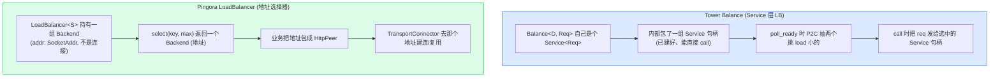

# 第 9 章 · LoadBalancer 与 Backend 选择

> 第 3 篇 · 转发设施·负载均衡与服务发现:从一堆后端挑一个(招牌章)

---

## 核心问题

上一章(P2-08)我们把"请求/响应字节怎么在 downstream 和 upstream 之间零拷贝透传"这件事钉死了:业务在 `upstream_peer` 钩子里返回一个 `Box<HttpPeer>`,框架拿到这个 `HttpPeer`,经 `TransportConnector` 的连接池取/建一条到那个 `HttpPeer._address` 的连接,然后把请求字节泵(pump)过去。一句话——**`upstream_peer` 决定"请求往哪发",框架负责"怎么把字节发过去"**。

可问题立刻就来了:**`upstream_peer` 钩子里那一个 `HttpPeer`,到底是哪来的?**

如果你只有一个固定的上游(比如一个内部 API 网关,地址写死),那 `upstream_peer` 就 `Box::new(HttpPeer::new("10.0.0.5:443", true, sni))` 完事——一个后端,没什么好选的。但真实生产里,你面对的几乎永远不是"一个后端",而是**一坨后端**:

- 你的上游是 10 台跑同一个微服务的机器(为了容量、为了容错),你得把流量在它们之间摊开;
- 你的上游是一个 DNS 名(比如 `one.one.one.one`),解析出来 2 个 IP(1.1.1.1 和 1.0.0.1),你得在两个 IP 之间挑;
- 你的上游是一组按 session 粘性的缓存节点,来自同一个用户的请求要尽量打到同一台机器(否则缓存命中率崩),你得按某个 key(比如 user_id)做一致性哈希。

**这就是 `LoadBalancer` 要解决的问题**:它把"一坨后端 + 一套选择算法 + 一份健康状态"封装成一个对象,业务在 `upstream_peer` 里调一下 `load_balancer.select(key, max_iterations)`,拿回一个 `Backend`,把它包成 `HttpPeer` 返回。选谁、怎么选、选出来的后端活没活、后端列表怎么动态更新——这些事 `LoadBalancer` 全包了。

读完本章你会明白:

1. `LoadBalancer<S: BackendSelection>` 这个**泛型**怎么把"后端列表 + 选择算法 + 健康检查 + 服务发现"四件东西拼成一个"业务在 `upstream_peer` 里一行调用的 Backend 选择器",以及为什么选择算法要做成 trait `BackendSelection` 而不是 enum 或 boxed trait object——这是 Rust 零成本抽象在负载均衡上的具体落地,**算法在编译期单态化,热路径上零虚分派**;
2. `select` / `select_with` 的两段式语义("迭代器按算法给候选 → `accept` 回调按健康/自定义策略筛掉不行的")为什么这么设计,以及 `UniqueIterator`(去重 + `max_iterations` 限步)凭什么能挡住 Ketama 算法可能"无限吐同一个后端"和"线性扫描 N 步"两堵墙;
3. `Backend`(addr + weight + ext)为什么把 `ext: Extensions` 用 `derivative(PartialEq="ignore")` 排除在相等性比较之外——两个同地址同权重但 `ext` 不同的后端被认为是"同一个",这是"后端列表 `BTreeSet<Backend>` 去重"和"业务挂附加元数据"两件事解耦的关键;
4. `ArcSwap` 这个来自 `arc-swap` crate 的无锁原语怎么让"后端列表更新 / 选择器重建"在多线程并发 `select` 的热路径上**完全不阻塞读**——这是 Pingora 负载均衡热路径(每秒几十万次 `select`)能扛住的关键,对照 Nginx 的 `RwLock` upstream、Envoy 的 thread-local LB,看清无锁更新为什么是"读多写少"场景的最优解;
5. Pingora 的 `LoadBalancer` 和 Tower 的 `Balance`(承《Tower》P5-15,P2C least-loaded)、Envoy 的 LB policy(ROUND_ROBIN/LEAST_REQUEST/RING_HASH)、Nginx 的 upstream(ip_hash/least_conn)在抽象层次上的根本差异——**Tower 是 Service 抽象(把多个 Service 实例包成一个),Pingora 是给 `upstream_peer` 钩子用的 Backend 选择器(返回一个地址),Envoy 是配置驱动的 LB policy,三者都叫"负载均衡"但定位完全不同**。

> **逃生阀(本章信息密度大)**:如果你只想要一句话——**`LoadBalancer<S>` 是个泛型容器,泛型参数 `S: BackendSelection` 是选择算法(默认 `RoundRobin`,可换 `Random`/`FNVHash`/`Consistent=KetamaHashing`)。`upstream_peer` 里调 `lb.select(key, max_iterations)`,它内部用 `S::iter(key)` 产出一个候选 Backend 的迭代器,用 `UniqueIterator` 去重并限步,逐个调 `accept(backend, healthy)` 筛,返回第一个通过的 `Backend`。后端列表和选择器都装在 `ArcSwap` 里,后台线程跑服务发现和健康检查,更新时无锁替换 `Arc`,读热路径零等待。** 如果你只想看一处源码,看 `select_with`([`pingora-load-balancing/src/lib.rs#L419-L431`](../pingora/pingora-load-balancing/src/lib.rs#L419-L431))——23 行,把整章机制浓缩了。
>
> **前置衔接**:本章紧接 P2-08(零拷贝转发)。P2-08 讲的是"选好后端,字节怎么发过去",本章讲"后端怎么选"。本章假设你读过 P1-04(`upstream_peer` 返回 `HttpPeer` 的语义、`HttpPeer` 的 sni/alpn/tls)、P1-02(async 钩子是 Future)。本章是 P3 篇(负载均衡与服务发现)的第一章,讲框架;下一章 P3-10 讲具体的算法(RoundRobin/Random/Ketama 一致性哈希),再下一章 P3-11 讲服务发现与健康检查。本章只给选择机制的**框架**,具体算法一句带过指路 P3-10。

---

## 一句话点破

> **`LoadBalancer<S: BackendSelection>` 是一个把"后端集合 + 选择算法 + 健康状态"三件事封装起来的泛型容器,业务在 `upstream_peer` 里调 `select(key, max_iterations)` 拿一个 `Backend`。它的核心设计有三:(一)选择算法做成 `BackendSelection` trait,泛型参数 `S` 在编译期单态化,热路径零虚分派,承 Tower 的零成本抽象思想;(二)`select_with` 是"算法迭代器产候选 + `accept` 回调筛"的两段式,既能用默认的健康检查筛,也能让业务自定义(比如"这个请求刚才在那个后端 503 过,跳过它");(三)后端列表和选择器都装在 `ArcSwap` 里(读多写少场景的无锁原语),后台线程发现后端变了/健康状态变了,无锁替换整个 `Arc<Selector>`,正在 `select` 的并发读线程看到的永远是某个一致快照,零等待、零阻塞。**

这是结论,不是理由。本章倒过来拆:先看负载均衡在"反向代理"这个场景下到底是个什么问题(以及和 Tower 的 Service 层负载均衡、Envoy 的 LB policy、Nginx 的 upstream block 有什么定位差异),再看 Pingora 的 `LoadBalancer<S>` 结构怎么把三件事拼起来(为什么选择算法是泛型、为什么后端列表是 `BTreeSet`、为什么 `ext` 字段排除在相等性外),然后逐层拆 `select` / `select_with` / `UniqueIterator` 的源码(为什么迭代器要自己定义 `BackendIter` trait 而不用 std Iterator,为什么 `max_iterations` 限步是必须的),之后横向对照 Tower `Balance` / Envoy LB / Nginx upstream 的抽象层次差异(三者都叫负载均衡,但 Tower 是 Service 抽象,Pingora 是地址选择器,Envoy 是 xDS 驱动的 policy),最后落到技巧精解,把 `ArcSwap` 无锁更新和泛型单态化两件最硬核的技巧拆透,讲清为什么这套机制 sound(读不阻塞、写不撕裂、选不饿死)。

---

## 第一节:负载均衡在反向代理里到底是个什么问题

### 1.1 提出问题:从"一坨后端"里挑一个,且要挑得稳

负载均衡这个名字听起来很大,但在反向代理这个具体场景里,它的形式化出奇地干净:

> **有 N 个等价的后端(都跑同一个服务),来一个请求,挑一个后端把请求转发过去。要求:(1)流量尽量均匀地摊;(2)某个后端挂了要能避开;(3)后端列表会动态变(扩容、缩容、上下线),变化要平滑过渡不丢请求。**

把它画成图:

```text
                      ┌──────────────┐
   请求 ─────────────▶│  LoadBalancer │
                      │   选哪一个?   │
                      └──────┬───────┘
              ┌──────────────┼──────────────┐
              ▼              ▼              ▼
         ┌────────┐     ┌────────┐     ┌────────┐
         │Backend1│     │Backend2│     │Backend3│
         │1.1.1.1 │     │1.0.0.1 │     │ DOWN   │  ← 挂了,要避开
         └────────┘     └────────┘     └────────┘
```

看起来简单——挑一个嘛。可一旦你把"流量均匀 / 避开挂的 / 平滑过渡动态变化"三件事叠在一起,就会发现每个都有自己的坑:

**坑一:流量均匀**。最朴素是轮询(轮流发)或随机(随便发)。轮询在同质后端下最优,但只要某台后端变慢(磁盘抖、GC),轮询照样往它身上塞,堆积雪崩;随机有方差聚集(高 QPS 下连续打到同一台)。这俩都不看后端忙不忙。最少连接(挑 in-flight 最少的)精确,但要全局扫描 O(N) 且需要精确的 in-flight 计数。**没有"完美算法",只有"在你的场景下权衡"。** 这就是为什么 Pingora 把选择算法做成可插拔的 `BackendSelection` trait——不同场景用不同算法。

**坑二:避开挂的**。后端不会永远健康。如果 LoadBalancer 闭着眼把请求发给一个挂了的后端,客户端就要等超时(或者收到一个 502),体验差。所以 LoadBalancer 必须知道哪些后端当前能用(健康),挑的时候只从健康的里挑。这就是为什么 `LoadBalancer` 里有 `Backends`(管后端列表 + 健康状态)——选之前先过滤掉不健康的。

**坑三:平滑过渡动态变化**。生产环境后端列表几乎不会一成不变——你会扩容(加机器)、缩容(下机器)、滚动升级(逐台重启)、某台突然挂掉(进程 crash、网络断)。如果 LoadBalancer 把后端列表写死,每次变化都要重启进程,这不能接受。所以后端列表必须**可变**,且变化时要平滑:加一台不能立刻打满它(让它慢慢预热),下一台不能让正在它身上飞的请求中断(优雅摘流)。这就是为什么 `Backends` 把后端列表装在 `ArcSwap` 里(可变 + 无锁替换)、为什么有健康检查的"连续 N 次失败才标为不健康"的阈值翻转(避免一次抖动就摘流)。

> **钉死这件事**:反向代理的负载均衡,本质上是个"在不精确的后端状态信息下,把流量尽量均匀地摊到一堆等价后端上,同时避开挂的,且能平滑应对后端列表动态变化"的问题。这三个目标互相牵制(均匀 vs 避开挂的、避开挂的 vs 平滑过渡),Pingora 的 `LoadBalancer` 用"可插拔算法 + 健康过滤 + 无锁更新"三件东西分别应对。本章讲框架,具体算法(RoundRobin/Random/Ketama)留 P3-10,服务发现与健康检查留 P3-11。

### 1.2 反向代理的 LB 和 Tower 的 Service LB 不是一回事

这是最容易混的一点。**都叫"负载均衡",但 Tower 的 `Balance`(承《Tower》P5-15)和 Pingora 的 `LoadBalancer` 在抽象层次上根本不同**,必须先讲清,否则后面会一路拧巴。

**Tower 的 `Balance<D, Req>` 是 Service 抽象的负载均衡**。它包了一组 `Service`(每个 Service 是个 `Fn(Request) -> Future<Response>`),对外**自己也是个 `Service<Req>`**——它的 `poll_ready` 在内部从就绪 Service 里 P2C 抽两个挑 load 小的,它的 `call` 把请求发给那个选中的 Service。也就是说,Tower 的 `Balance` 拿的是**已经建好的、活的、能直接 call 的 Service 句柄**,负载均衡发生在"调用谁"这一层。它关心的是 Service 的 load(用 `PeakEwma`/`PendingRequests` 估),不是 Service 的网络地址。

**Pingora 的 `LoadBalancer<S>` 是地址选择器**。它持有一组 `Backend`(每个 Backend 就是 `addr: SocketAddr + weight + ext`——一个**地址**,不是一个活的连接句柄),对外暴露 `select(key, max) -> Option<Backend>`——返回一个**地址**。业务拿到这个地址,自己包成 `HttpPeer`,交给 `upstream_peer`,框架的 `TransportConnector` 去那个地址建连/复用连接、转发请求。也就是说,Pingora 的 `LoadBalancer` **不持有连接,不调用 Service,只挑地址**。负载均衡发生在"选地址"这一层,连接管理是 `TransportConnector`(P2-06)的事。



为什么会有这个层次差异?因为两者服务的场景不同:

- **Tower 是通用 RPC 中间件库**:它的 `Service<Request>` 抽象是"任何能处理请求并返回响应 Future 的东西"。一个 Service 可能是一个 HTTP client(背后是连接池)、一个本地函数、一个带重试/超时/负载均衡的组合。Tower 的 `Balance` 假设你已经有一堆"能直接调用的 Service",它负责在它们之间挑——至于这些 Service 怎么建连、怎么管池,是 Service 自己的事(通常 `Balance` 内层套一个 `MakeService`/Discover,Discover 吐 Service 句柄,但 Service 句柄背后仍是一个完整的请求处理单元)。这种抽象适合"客户端侧 RPC 负载均衡"——你是个客户端,你有一堆上游服务句柄,你在它们之间挑。
- **Pingora 是反向代理框架**:它的核心动作是"接 downstream 连接 → 选 upstream 地址 → 把字节从 downstream 转到 upstream"。在这个动作链里,"选地址"和"管连接"是**两件完全独立的事**(选地址是策略,管连接是机制,见 P2-06 二分法)。如果把它们耦合(像 Tower 那样 Balance 直接持有 Service 句柄并 call),就会丢掉反向代理的两个核心能力:① 连接复用(同一个 upstream 地址的多个请求要复用同一条 TCP/TLS 连接,这是 `TransportConnector` 连接池的事);② 协议无关(LoadBalancer 不该关心 upstream 是 HTTP/1 还是 HTTP/2,这是 L7 connector 的事,P2-07)。所以 Pingora 把"选地址"从"管连接"里剥出来,LoadBalancer 只挑地址,连接交给 TransportConnector。

> **钉死这件事(Pingora LB vs Tower LB 的层次差异)**:Tower `Balance` 是 Service 层 LB(持有 Service 句柄,直接 call),Pingora `LoadBalancer` 是地址选择器(持有地址,返回 `Backend`,连接交给 TransportConnector)。这个差异不是设计偏好,是场景必然——反向代理必须把"选地址"和"管连接"解耦(为了连接复用 + 协议无关),客户端侧 RPC 才能把它们耦合(Tower 的 Service 句柄背后自带连接管理)。读本章时随时记住:**Pingora 的 LoadBalancer 不知道"连接"为何物,它只挑地址。** 这也是为什么本章大量对照《Tower》P5-15——两者机制像(都在多个等价目标间挑),定位根本不同。

### 1.3 Envoy 和 Nginx 的 LB,定位上和 Pingora 像不像?

像,但又有微妙差异。把三者(Envoy/Nginx/Pingora)放一起看,能更清楚 Pingora 的 LoadBalancer 在生态里处在什么位置。

**Envoy 的 LB 是 LB policy(配置驱动)**。Envoy 的 upstream 叫 Cluster,Cluster 里有一组 endpoints(LB 后端列表),Cluster 配一个 `load_assignment` 和一个 `load_balancing_policy`。policy 是个枚举(ROUND_ROBIN/LEAST_REQUEST/RING_HASH/MAGLEV/RANDOM/SUBSET/CLUSTER_PROVIDED),通过 xDS(CDS/EDS)运行期动态下发,Envoy 收到配置后实例化对应的 LB policy 对象。Envoy 的 LB policy 是 C++ 抽象类(`LoadBalancer` 基类,每个算法一个子类),运行期多态(虚函数)。重点是**配置驱动 + 运行期可换**:运维改 xDS,Envoy 热加载,从 ROUND_ROBIN 切到 RING_HASH 不重启。这适合服务网格(运维动态调参)。Envoy 的 LB 细节(12 个 policy 子目录、LEAST_REQUEST 默认也是 P2C)详见《Envoy》[[envoy-source-facts]],本书一句带过。

**Nginx 的 LB 是 upstream block(配置驱动 + 编译期选项)**。Nginx 的 upstream 是一组 server 指令,每条指令一个地址 + 可选 weight,配上一个 LB 模块指令(默认 round-robin,可换 `ip_hash`、`least_conn`、`hash $key consistent`)。Nginx 的 LB 模块是编译期选的(每个 LB 算法是个 nginx 模块,像 `ngx_http_upstream_ip_hash_module`),配置 reload 时生效(`nginx -s reload`)。Nginx 没有 xDS 那种细粒度的运行期控制,但 worker 之间共享 upstream 配置(共享内存),每个 worker 在自己的连接处理路径上读配置挑后端。重点:**配置驱动,但换算法要么 reload 要么编译时选模块。** Pingora 的 LB 不靠配置文件,靠 Rust 代码(类型参数 `S`),换算法 = 改代码重编译——和 Nginx 的"编译期选模块"在"换算法要重新构建"这一点上像,但 Pingora 的"重新构建"是 cargo build(快),Nginx 的是重编 nginx 二进制(慢)或 reload(运行期但限定算法清单)。

**Pingora 的 LB 是代码驱动(泛型 + 编译期单态化)**。`LoadBalancer<S: BackendSelection>` 的 `S` 是泛型参数,业务在 Rust 代码里写 `LoadBalancer::<RoundRobin>::from_backends(...)` 或 `LoadBalancer::<Consistent>::from_backends(...)`,编译期单态化——选 RoundRobin 就生成 RoundRobin 的 `select`,选 Consistent 就生成 Consistent 的 `select`,**热路径上零虚分派**(没有 vtable 查找)。换算法 = 改类型参数重编译,不能运行期热加载。这适合"把负载均衡嵌进自己的 Rust 应用"的场景(开发者编译期定死,运维不介入)。

把三者收束成一张对照表:

| 维度 | Pingora `LoadBalancer` | Envoy LB policy | Nginx upstream |
|------|----------------------|-----------------|----------------|
| **驱动方式** | 代码(泛型类型参数 `S`) | 配置(xDS 下发 `load_balancing_policy`) | 配置(upstream block 指令) |
| **换算法** | 改代码重编译 | 改 xDS 热加载,不重启 | `nginx -s reload` 或重编译模块 |
| **算法清单** | RoundRobin/Random/FNVHash/Consistent(4 种 + 用户自定义) | ROUND_ROBIN/LEAST_REQUEST/RING_HASH/MAGLEV/RANDOM/SUBSET 等(12 种) | round-robin/ip_hash/least_conn/hash consistent(4 种 + 第三方模块) |
| **分派机制** | 编译期单态化(零虚分派) | C++ 虚函数(运行期多态) | C 函数指针(每个 LB 模块一组 hook) |
| **定位** | 给 `upstream_peer` 钩子用的地址选择器 | Cluster 内的 LB policy(配 xDS) | upstream block 的 LB(配 server 指令) |
| **抽象层次** | 地址选择器(不管连接) | 完整 LB(管 host set + LB + 健康检查) | 完整 LB(管 peer + LB + 被动健康检查) |

这张表的关键洞察:**三者在"做什么"(选后端)上一致,在"怎么定制"(代码 vs xDS vs 配置文件)和"分派机制"(单态化 vs 虚函数 vs 函数指针)上分道。** Pingora 选代码驱动 + 编译期单态化,代价是不能运行期换算法,收益是热路径零开销 + Rust 类型安全(算法的 `Config` 是强类型,不是字符串配置)。

> **钉死这件事**:Envoy/Nginx/Pingora 的 LB 都在"选后端",但定制方式不同——Envoy 是 xDS 配置驱动(C++ 虚函数,运行期可换),Nginx 是 upstream 配置 + 编译期模块(C 函数指针,reload 换),Pingora 是代码泛型(编译期单态化,改代码换)。Pingora 的选择站在"开发者编译期定死"这一端,和它的整体定位("可编程的反向代理框架,不是配置驱动的成品网格")一致。

### 1.4 把三个问题收束成本章地图

回到 1.1 节的三个问题(均匀、避开挂的、平滑过渡),把它们和本章要拆的源码对应起来:

| 问题 | 对应的 `LoadBalancer` 机制 | 本章小节 |
|------|---------------------------|---------|
| 流量均匀 | `BackendSelection` trait(可插拔算法) | 第二节 |
| 避开挂的 | `Backends.ready()` 健康过滤 + `select_with` 的 `accept` 回调 | 第三节 |
| 平滑过渡动态变化 | `ArcSwap` 无锁替换 selector + `do_update` 的健康状态延续 | 第四节 |

第二节讲 `LoadBalancer<S>` 的结构(泛型、`BTreeSet<Backend>`、`ext` 排除相等性),第三节讲 `select`/`select_with`/`UniqueIterator` 的两段式选择,第四节讲 `Backends` 的 `ArcSwap` 无锁更新,第五节是技巧精解(ArcSwap + 单态化两件),第六节小结。

---

## 第二节:`LoadBalancer<S>` 的结构,以及为什么选择算法是泛型

### 2.1 提出问题:怎么把"后端集合 + 选择算法 + 健康状态"拼成一个对象

我们要的 `LoadBalancer` 得满足:

1. 持有一坨 `Backend`(每个 Backend = 一个地址 + 权重 + 附加元数据);
2. 持有一个选择算法(RoundRobin? Random? Ketama 一致性哈希?);
3. 知道每个 Backend 健康不健康(以便挑的时候过滤);
4. 业务能 `select(key, max)` 拿一个 Backend;
5. 后端列表能动态更新(后台服务发现 + 健康检查),更新时不能阻塞正在 `select` 的并发读。

把这五条翻译成 Rust 类型,就是 `LoadBalancer<S>` 的结构。在 [`pingora-load-balancing/src/lib.rs#L311-L330`](../pingora/pingora-load-balancing/src/lib.rs#L311-L330):

```rust
// pingora-load-balancing/src/lib.rs#L311-L330
/// A [LoadBalancer] instance contains the service discovery, health check and backend selection
/// all together.
///
/// In order to run service discovery and health check at the designated frequencies, the [LoadBalancer]
/// needs to be run as a [pingora_core::services::background::BackgroundService].
pub struct LoadBalancer<S>
where
    S: BackendSelection,
{
    backends: Backends,
    selector: ArcSwap<S>,

    config: Option<S::Config>,

    /// How frequent the health check logic (if set) should run.
    pub health_check_frequency: Option<Duration>,
    /// How frequent the service discovery should run.
    pub update_frequency: Option<Duration>,
    /// Whether to run health check to all backends in parallel. Default is false.
    pub parallel_health_check: bool,
}
```

六个字段,逐个看:

- `backends: Backends`——后端集合 + 服务发现 + 健康检查三件东西的全权管理者(下一节详拆)。`LoadBalancer` 把"动态变化的部分"全委派给 `Backends`,自己只持有它;
- `selector: ArcSwap<S>`——选择算法的状态,装在 `ArcSwap` 里(无锁可替换)。`S` 就是泛型参数,表示选择算法。`ArcSwap<S>` = "一个可以被无锁替换的 `Arc<S>`";
- `config: Option<S::Config>`——选择算法的配置(关联类型,比如 Ketama 的 `point_multiple`)。后端列表更新时,要用这个 config 重建 selector;
- `health_check_frequency: Option<Duration>`——健康检查跑多频繁;
- `update_frequency: Option<Duration>`——服务发现跑多频繁;
- `parallel_health_check: bool`——健康检查是并行还是串行。

注意一个关键设计:**`selector` 和 `backends` 是分开的两个字段,不是一个。** 这是因为它们更新的时机不同——`backends` 在每次服务发现(`update`)或健康检查(`run_health_check`)后更新,`selector` 只在后端**集合**变化时重建(后端集合变了,Ketama 的环要重建,RoundRobin 的 weighted 索引表要重建)。把它们分开,可以避免"健康状态变了但后端集合没变"时无谓地重建 selector(重建 selector 对 Ketama 是 O(N × point_multiple) 的开销,不能频繁做)。这个分工是 `do_update` 的精髓,第三节详拆。

把 `LoadBalancer<S>` 的结构画成图:

```text
┌─────────────────────────────────────────────────────────────────┐
│  LoadBalancer<S: BackendSelection>                              │
│                                                                 │
│  backends: Backends ─────────────────────────────────┐          │
│      │                                                │          │
│      │  ┌─────────────────────────────────────────┐  │          │
│      │  │ Backends {                              │  │          │
│      │  │   discovery: Box<dyn ServiceDiscovery>, │  │          │
│      │  │   health_check: Option<Arc<...>>,       │  │          │
│      │  │   backends: ArcSwap<BTreeSet<Backend>>, │  │ ← 后端集合│
│      │  │   health: ArcSwap<HashMap<u64, Health>>,│  │ ← 健康状态│
│      │  │ }                                      │  │          │
│      │  └─────────────────────────────────────────┘  │          │
│      │                                                │          │
│      ▼                                                │          │
│  selector: ArcSwap<S>  ← 选择算法状态(无锁可替换)    │          │
│      │                                                │          │
│      ▼                                                │          │
│  config: Option<S::Config>  ← 算法配置(重建 selector 用)        │
│                                                                 │
│  health_check_frequency / update_frequency / parallel_hc        │
└─────────────────────────────────────────────────────────────────┘
```

### 2.2 承接方怎么做:为什么 Pingora 不用 enum 不用 boxed trait object

`LoadBalancer<S>` 的 `S: BackendSelection` 是泛型。可选的设计有三:

**方案一:enum**。把选择算法做成 enum:`enum Selection { RoundRobin(...), Random(...), Consistent(...), FnvHash(...) }`。`select` 里 `match self.selection { RoundRobin => ..., Consistent => ... }`。

**方案二:boxed trait object**。`selector: Box<dyn BackendSelection>`。`select` 调 `self.selector.iter(key)`,虚分派。

**方案三:泛型(单态化)**。`LoadBalancer<S: BackendSelection>`,`selector: ArcSwap<S>`。`select` 调 `self.selector.load().iter(key)`,编译期单态化。

Pingora 选了方案三。为什么?

**先看方案一(enum)的坑**。enum 的 `match` 在每次 `select` 时都要分支判断("是 RoundRobin 还是 Consistent?"),编译器可能优化成跳表,但仍有分支预测开销(虽然小)。更糟的是,enum 把所有算法的数据塞进同一个 enum 体,每个变体(viant)的字段类型不同,enum 的大小 = 最大变体的大小 + tag,**内存浪费**(RoundRobin 状态很小,Ketama 状态很大,enum 的大小被 Ketama 撑大,用 RoundRobin 时浪费内存)。最致命的是,**enum 的算法清单是封闭的**——用户想加一个自定义算法(比如"按请求来源 IP 的地理位置路由"),改不了 enum,得 fork Pingora。这违反了 Pingora "可编程框架"的定位。

**再看方案二(boxed trait object)的坑**。`dyn BackendSelection` 是运行期多态,每次 `iter` 调用都要查 vtable,有间接跳转开销。在负载均衡热路径上(每秒几十万次 `select`),这个开销虽小但累积。更重要的是,**`iter` 返回的 `Self::Iter` 是关联类型**,trait object 的关联类型处理起来很别扭(需要 `dyn BackendSelection<Iter = Box<dyn BackendIter>>`,把迭代器也 erasure 掉,损失类型信息,迭代器的 `next` 也变虚分派)。这套"trait object + 关联类型迭代器"的组合在 Rust 里能写但很难看,且性能损失叠加(算法的 `iter` 虚分派 + 迭代器的 `next` 虚分派)。

**方案三(泛型)的好处**。编译期单态化:你写 `LoadBalancer<RoundRobin>`,编译器生成一份专门给 RoundRobin 的 `LoadBalancer` 代码,`select` 里的 `iter` 调用是直接函数调用(甚至内联),零虚分派;`WeightedIterator<H>` 的 `next` 也是直接函数调用,零虚分派。**整条热路径从 `select` 进到 `iter.next()` 到 `accept` 到返回 `Backend`,一个虚分派都没有。** 而且 `S: BackendSelection` 是 open trait,用户可以实现自己的算法(`impl BackendSelection for MyAlgo`),泛型参数写 `MyAlgo`,编译期单态化,和内置算法一样高效。这是 Rust 零成本抽象在负载均衡上的具体落地——**抽象不收税**。

> **钉死这件事(为什么是泛型不是 enum 不是 trait object)**:Pingora 把选择算法做成泛型 `S: BackendSelection`,编译期单态化,热路径零虚分派。enum 的坑:分支开销 + 内存浪费 + 算法清单封闭(用户加不了自定义算法)。trait object 的坑:`iter` 虚分派 + 关联类型迭代器也得 erasure 损失类型 + 双重虚分派。泛型的好处:零开销 + open trait(用户可自定义算法)+ 类型安全(`S::Config` 是强类型)。承 Tower 的零成本抽象思想——Service trait 也是泛型单态化(`Service<Req>` 的 `Req` 泛型),Tower 的 `Balance<D, Req>` 也是泛型,同一种取舍。

### 2.3 `Backend` 结构:addr + weight + ext,以及 `ext` 为什么排除在相等性外

`S` 是选择算法,算法操作的对象是 `Backend`。`Backend` 的定义在 [`pingora-load-balancing/src/lib.rs#L54-L74`](../pingora/pingora-load-balancing/src/lib.rs#L54-L74):

```rust
// pingora-load-balancing/src/lib.rs#L54-L74
/// [Backend] represents a server to proxy or connect to.
#[derive(Derivative)]
#[derivative(Clone, Hash, PartialEq, PartialOrd, Eq, Ord, Debug)]
pub struct Backend {
    /// The address to the backend server.
    pub addr: SocketAddr,
    /// The relative weight of the server. Load balancing algorithms will
    /// proportionally distributed traffic according to this value.
    pub weight: usize,

    /// The extension field to put arbitrary data to annotate the Backend.
    /// The data added here is opaque to this crate hence the data is ignored by
    /// functionalities of this crate. For example, two backends with the same
    /// [SocketAddr] and the same weight but different `ext` data are considered
    /// identical.
    /// See [Extensions] for how to add and read the data.
    #[derivative(PartialEq = "ignore")]
    #[derivative(PartialOrd = "ignore")]
    #[derivative(Hash = "ignore")]
    #[derivative(Ord = "ignore")]
    pub ext: Extensions,
}
```

三个字段:

- `addr: SocketAddr`——后端的网络地址(IP:port 或 UDS 路径);
- `weight: usize`——权重。负载均衡算法按权重比例分配流量(weight=10 的后端拿到的流量是 weight=1 的 10 倍);
- `ext: Extensions`——附加元数据(`http::Extensions` 类型,一个 type-map,可以塞任意 `Send + Sync + 'static` 的数据)。

这里最巧妙的是 `ext` 字段的 derive 注解:`#[derivative(PartialEq = "ignore")]`、`PartialOrd = "ignore"`、`Hash = "ignore"`、`Ord = "ignore"`。这四个 `ignore` 的意思是:**在判等、比较、哈希时,`ext` 字段被忽略。** 注释 L62-67 说得很清楚:"two backends with the same SocketAddr and the same weight but different ext data are considered identical"——两个同地址同权重但 `ext` 不同的 Backend,**被认为是同一个 Backend**。

为什么这么设计?因为 `ext` 是业务挂的"附加注释",不是后端的"身份"。比如你想给每个 Backend 挂一个"机房"标签(`ext.insert("us-east-1")`),或者挂一个"上次故障时间",或者挂一个自定义的连接选项——这些是你的业务元数据,**不应该影响 Backend 的相等性**。如果 `ext` 参与判等,那两个地址相同但 `ext` 不同的 Backend 会被认为是两个不同的后端,`BTreeSet<Backend>` 就不会去重——后端列表里会出现"同一个 IP 出现两次但 ext 不同"的诡异情况,流量会在两个"虚拟的" Backend 之间分。

更关键的是,**后端集合是 `BTreeSet<Backend>`(有序集合,自动去重)**。`BTreeSet` 的去重靠的就是 `Ord`(以及 `PartialEq`/`Hash`)。把 `ext` 排除在 `Ord` 外,意味着"判等只看 addr + weight",`BTreeSet` 能正确去重(同一个 addr + weight 只存一份)。同时 `BTreeSet` 的 `Ord` 给 Backend 一个确定的全序(按 addr 排序),这让选择算法的"第一个候选"是确定的(对 Ketama 这种基于 key 的算法,确定的全序很重要——同一种后端集合在所有 worker 上排出的 `BTreeSet` 顺序一致,Ketama 的环就一致,一致性哈希的"所有节点看到同一个 key 选到同一个后端"才成立)。

> **钉死这件事(`ext` 排除相等性外)**:`Backend` 的 `ext: Extensions` 用 `derivative(ignore)` 排除在 PartialEq/PartialOrd/Hash/Ord 外。两个同 addr + 同 weight 但不同 ext 的 Backend 被认为是同一个。这让 `BTreeSet<Backend>` 能正确去重(同一个 IP 不重复),且 `Ord` 给出确定的全序(对 Ketama 一致性哈希的"所有节点一致"至关重要)。`ext` 是业务的注释,不是后端的身份——把"后端身份"和"业务元数据"解耦,这是 `derivative` 这个 crate 的妙用(std 的 `#[derive]` 做不到字段级 ignore)。

`Backend` 还有几个便利方法([`lib.rs#L76-L102`](../pingora/pingora-load-balancing/src/lib.rs#L76-L102)):`Backend::new(addr)` 创建一个 weight=1 的 Backend,`Backend::new_with_weight(addr, weight)` 带权重,`hash_key(&self) -> u64` 用 `DefaultHasher` 算 Backend 的哈希(用作 `health` 表的 key)。还有一个 `Deref<Target = SocketAddr>`([L104-L110](../pingora/pingora-load-balancing/src/lib.rs#L104-L110))——`Backend` 可以直接当 `SocketAddr` 用(`backend.port()`,因为 deref 到 SocketAddr),便利语法。

### 2.4 `BTreeSet<Backend>`:为什么是有序集合不是 Vec

`Backends.backends` 的类型是 `ArcSwap<BTreeSet<Backend>>`(下一节详拆 `Backends`)。为什么是 `BTreeSet` 不是 `Vec`?

**原因一:自动去重**。同一个地址进两次,`BTreeSet` 只留一份。服务发现可能重复返回同一个后端(比如 DNS 解析返回的列表里有重复 IP),`BTreeSet` 自动去重,不用业务手动 `dedup`。

**原因二:确定的全序**。`BTreeSet` 按 `Ord` 排序,Backend 的 `Ord` 是按 `addr + weight` 排(因为 `ext` 被 ignore 了)。这意味着同一个后端集合,无论以什么顺序插入 `BTreeSet`,排出来的顺序都一样。这一点对 Ketama 一致性哈希至关重要——Ketama 建环时要遍历所有后端,如果遍历顺序不同,建出来的环不同,不同节点对同一个 key 会选到不同后端,一致性哈希就失效了。`BTreeSet` 的确定全序保证了"所有节点建出的环一致"。(`BTreeSet` 还有一个细节:它的 `Ord` 基于 `BTreeMap` 的键比较,而 `Backend` 的 `Ord` 是 `derive(Ord)`,先比 `addr` 再比 `weight`——`SocketAddr` 是 `Inet(SocketAddr)` 或 `Unix(...)` 的枚举,`Inet` 的 `Ord` 按 IP 再按 port 排,所以 Backend 全序大致是按 IP 升序、IP 相同按 port 升序。)

**原因三:diff 友好**。服务发现返回新的 `BTreeSet<Backend>`,要和旧的对比"加了谁、删了谁"。两个 `BTreeSet` 的 diff 是 O(N)(双指针线性扫描),而 `Vec` 的 diff 要么排序后扫(O(N log N)),要么用 HashSet(O(N) 但无序)。`BTreeSet` 天生有序,diff 直接双指针,这是 `do_update` 判断"是否真的变了"的依据(下面详拆)。

> **不这样会怎样**:如果用 `Vec<Backend>`,① 重复后端要去重得手动 `dedup`(容易忘);② Ketama 建环时遍历顺序不确定(取决于 push 顺序),不同节点环不同,一致性哈希失效;③ 服务发现 diff 要额外排序或 hash,性能差。`BTreeSet` 一举解决三个问题,代价是插入/删除 O(log N)(但后端列表通常几十到几千,log N 很小,可忽略)。这是"用对的数据结构省一堆代码"的典型例子。

### 2.5 `S::Config`:算法的配置怎么传

`LoadBalancer<S>` 还有个 `config: Option<S::Config>` 字段。`S::Config` 是 `BackendSelection` trait 的关联类型(在 [`selection/mod.rs#L27-L50`](../pingora/pingora-load-balancing/src/selection/mod.rs#L27-L50) 定义):

```rust
// pingora-load-balancing/src/selection/mod.rs#L27-L50
/// [BackendSelection] is the interface to implement backend selection mechanisms.
pub trait BackendSelection: Sized {
    /// The [BackendIter] returned from iter() below.
    type Iter;

    /// The configuration type constructing [BackendSelection]
    type Config: Send + Sync;

    /// Create a [BackendSelection] from a set of backends and the given configuration. The
    /// default implementation ignores the configuration and simply calls [Self::build]
    fn build_with_config(backends: &BTreeSet<Backend>, _config: &Self::Config) -> Self {
        Self::build(backends)
    }

    /// The function to create a [BackendSelection] implementation.
    fn build(backends: &BTreeSet<Backend>) -> Self;
    /// Select backends for a given key.
    ///
    /// An [BackendIter] should be returned. The first item in the iter is the first
    /// choice backend. The user should continue to iterate over it if the first backend
    /// cannot be used due to its health or other reasons.
    fn iter(self: &Arc<Self>, key: &[u8]) -> Self::Iter
    where
        Self::Iter: BackendIter;
}
```

四个东西:

- `type Iter`——`iter` 返回的迭代器类型(关联类型,每个算法自己定。RoundRobin 的 Iter 是 `WeightedIterator<RoundRobin>`,Ketama 的 Iter 是 `OwnedNodeIterator`);
- `type Config: Send + Sync`——算法的配置类型。RoundRobin/Random/FNVHash 的 Config 是 `()`,Ketama 的 Config 是 `KetamaConfig { point_multiple: Option<u32> }`;
- `build(backends)`——从后端集合构建一个算法实例(无配置);
- `build_with_config(backends, config)`——从后端集合 + 配置构建。默认实现忽略 config 直接调 `build`(RoundRobin/Random 覆盖默认实现没意义,所以用默认;Ketama 重写了这个方法用 `point_multiple`);
- `iter(&self, key) -> Self::Iter`——按 key 产一个候选 Backend 的迭代器。第一个是首选,后续是备选(首选不可用时往下走)。

注意 `iter` 的签名:`self: &Arc<Self>`。它要求调用方持有 `Arc<Self>`,这是因为 `WeightedIterator` / `OwnedNodeIterator` 内部要持有 `Arc<Weighted<H>>` / `Arc<KetamaHashing>`(迭代器持有算法的引用,以便 `next` 时查算法的内部数据)。这个 `&Arc<Self>` 的签名有点特殊——它是"接收 `Arc<Self>` 的引用",在 trait method 里用 `self: &Arc<Self>` 是 Rust 的"接收一个 Arc 引用"模式,允许方法返回的迭代器借用 `Arc` 持有的数据。

`Config` 的设计哲学:**算法的可调参数用关联类型表达,编译期类型安全,不是运行期字符串配置。** 这和 Envoy 的"typed_config 用 protobuf"不同——Envoy 的 LB policy 配置是 protobuf 消息(运行期解析),Pingora 的 Config 是 Rust 类型(编译期检查)。比如你想给 Ketama 设 `point_multiple: 200`,代码写 `LoadBalancer::<Consistent>::from_backends_with_config(backends, Some(KetamaConfig { point_multiple: Some(200) }))`,编译器检查 `KetamaConfig` 的字段类型,拼错字段名编译失败。Envoy 的等价配置是 YAML 里写 `typed_config: { point_multiple: 200 }`,拼错了运行期才发现。这是"代码驱动 vs 配置驱动"在类型安全上的具体差异。

### 2.6 `LoadBalancer::from_backends`:构建一个 LoadBalancer

把上面几节串起来,看 `LoadBalancer` 怎么构建。`from_backends` 和 `from_backends_with_config` 在 [`lib.rs#L356-L378`](../pingora/pingora-load-balancing/src/lib.rs#L356-L378):

```rust
// pingora-load-balancing/src/lib.rs#L356-L378
/// Build a [LoadBalancer] with the given [Backends] and the config.
pub fn from_backends_with_config(backends: Backends, config_opt: Option<S::Config>) -> Self {
    let selector_raw = if let Some(config) = config_opt.as_ref() {
        S::build_with_config(&backends.get_backend(), config)
    } else {
        S::build(&backends.get_backend())
    };

    let selector = ArcSwap::new(Arc::new(selector_raw));

    LoadBalancer {
        backends,
        selector,
        config: config_opt,
        health_check_frequency: None,
        update_frequency: None,
        parallel_health_check: false,
    }
}

/// Build a [LoadBalancer] with the given [Backends].
pub fn from_backends(backends: Backends) -> Self {
    Self::from_backends_with_config(backends, None)
}
```

构建过程:① 用 `S::build` 或 `S::build_with_config` 从 `backends.get_backend()`(当前的 `Arc<BTreeSet<Backend>>`)构建一个算法实例;② 把它装进 `ArcSwap::new(Arc::new(...))`(可无锁替换的 Arc);③ 填好其他字段,默认频率都是 None(不周期跑发现/检查)。`try_from_iter`([L341-L353](../pingora/pingora-load-balancing/src/lib.rs#L341-L353))是个便利方法,从一组地址字符串构建(`["1.1.1.1:443", "1.0.0.1:443"]`),内部用 `Static` discovery + 立刻 `update` 一次,适合静态后端。

> **本节小结**:`LoadBalancer<S: BackendSelection>` 是个泛型容器,六个字段:`backends`(后端集合 + 发现 + 健康检查)、`selector: ArcSwap<S>`(选择算法状态,无锁可替换)、`config`(算法配置)、三个频率/并发参数。选择算法做成泛型是为了编译期单态化(热路径零虚分派),`S::Config` 关联类型提供类型安全的算法参数。`Backend`(addr + weight + ext)用 `derivative(ignore)` 把 `ext` 排除在相等性外,让 `BTreeSet<Backend>` 正确去重 + 给出确定全序(Ketama 一致性的基石)。下一节拆 `select` / `select_with` 怎么用这些结构选一个 Backend。

---

## 第三节:`select` / `select_with` / `UniqueIterator`:两段式选择

### 3.1 提出问题:怎么把"算法选首选"和"健康过滤"分开

业务在 `upstream_peer` 里要的是一个**能用的** Backend——既要按算法选,又要健康。怎么把这两件事组合?

**朴素方案一:算法直接返回健康的后端**。让算法知道健康状态,选的时候只从健康的里选。问题:算法(尤其 RoundRobin/Ketama)的状态是"按顺序遍历后端",如果让它跳过不健康的,它得知道哪些不健康——这把"健康状态"耦合进了算法。更糟的是,跳过不健康的会破坏算法的不变量(比如 RoundRobin 的"轮流"语义——如果第 3 个不健康,跳过它给第 4 个,那"轮流"就乱了,某些后端会拿更多请求)。

**朴素方案二:算法选一个,不健康就重选**。算法选首选,如果不健康,业务自己再调一次 `select`。问题:算法可能再次选到同一个不健康的(RoundRobin 的 `fetch_add` 已经推进,但 Ketama 对同一个 key 永远选同一个首选)——死循环。需要一个"算法给出一系列候选,业务逐个试"的机制。

**Pingora 的方案:两段式**。算法产一个**候选迭代器**(首选 + 备选们),业务用 `accept` 回调逐个筛选(默认筛健康,可自定义),返回第一个通过的。这就是 `select_with` 的语义:

```rust
// pingora-load-balancing/src/lib.rs#L419-L431
pub fn select_with<F>(&self, key: &[u8], max_iterations: usize, accept: F) -> Option<Backend>
where
    F: Fn(&Backend, bool) -> bool,
{
    let selection = self.selector.load();
    let mut iter = UniqueIterator::new(selection.iter(key), max_iterations);
    while let Some(b) = iter.get_next() {
        if accept(&b, self.backends.ready(&b)) {
            return Some(b);
        }
    }
    None
}
```

23 行,浓缩了整章机制。逐行拆:

**第一行:`let selection = self.selector.load();`**。从 `ArcSwap<S>` 加载一个 `Guard<S>`(arc-swap 的轻量引用,类似 `Arc` 但更便宜)。这是无锁读——下面第五节详拆 `ArcSwap`,这里先记住它**不阻塞、不等待**。

**第二行:`let mut iter = UniqueIterator::new(selection.iter(key), max_iterations);`**。两件事:① `selection.iter(key)` 调 `BackendSelection::iter`,产一个 `S::Iter`(候选 Backend 迭代器,首选 + 备选);② 把它包进 `UniqueIterator`,传 `max_iterations`(最多迭代多少步)。`UniqueIterator` 做两件事:去重(同一个 Backend 不重复返回)和限步(最多走 max_iterations 步)。下面 3.3 详拆。

**第三到七行:`while let Some(b) = iter.get_next()` 循环**。逐个拿候选 Backend,调 `accept(&b, self.backends.ready(&b))`——`accept` 是业务传进来的回调,参数是(候选 Backend, 它的健康状态),返回 bool(true = 用它,false = 继续找下一个)。第一个 `accept` 返回 true 的 Backend 被返回。

`select`(不带 `_with`)是 `select_with` 的便利包装,用默认的 `accept` = "只要健康就接受"([`lib.rs#L408-L410`](../pingora/pingora-load-balancing/src/lib.rs#L408-L410)):

```rust
// pingora-load-balancing/src/lib.rs#L408-L410
pub fn select(&self, key: &[u8], max_iterations: usize) -> Option<Backend> {
    self.select_with(key, max_iterations, |_, health| health)
}
```

`|_, health| health`——忽略第一个参数(Backend 本身),只看健康。健康就 true。

### 3.2 两段式的好处:算法和健康解耦,业务能自定义筛选

这个"算法产候选 + accept 筛"的两段式,有三个好处:

**好处一:算法不用知道健康**。算法(RoundRobin/Ketama)只管"按算法产候选",健康状态是 `Backends` 的事,`select_with` 在调 `accept` 时查 `self.backends.ready(&b)`。算法和健康完全解耦——算法的状态不会被"跳过不健康的"污染,RoundRobin 的轮转计数器照常 `fetch_add`,Ketama 的环照常按 key 查。

**好处二:业务能自定义筛选**。`accept` 是个闭包,业务可以传任意逻辑。最常用的自定义是"这个请求刚才在那个后端 503 过,跳过它"——重试时排除掉刚失败的后端。比如:

```rust
// 业务自定义 accept(简化示意,非源码原文)
let failed_backend: Option<Backend> = ctx.last_failed.clone();
let backend = lb.select_with(key, 256, |b, health| {
    health && Some(b) != failed_backend.as_ref()  // 健康 且 不是刚失败的那个
}).unwrap();
```

这个"排除刚失败的"在重试场景下很有用——P1-04 讲过 `fail_to_connect` 钩子返回的错误会触发 `upstream_peer` 再调一次,业务可以在重试时把上次失败的后端排除掉。`select_with` 的 `accept` 让这件事一行代码搞定,不用业务自己维护"已试过的后端集合"。

**好处三:候选迭代器 + accept 让"算法不知道哪些后端健康"也能选到健康的**。这是关键——健康状态可能随时变(刚查完健康,下一个请求来时它挂了),算法不可能实时知道。两段式让"算法给候选,业务实时查健康"这件事自然——算法给首选,首选不健康就问算法要下一个(候选迭代器的 `next`),下一个不健康继续要,直到找到健康的或候选耗尽。

> **钉死这件事(两段式选择)**:`select_with` 是"算法产候选迭代器 + accept 回调逐个筛"的两段式。好处:① 算法和健康解耦(算法状态不被"跳过不健康"污染);② 业务能自定义筛选(排除刚失败的、按 ext 字段筛、等等);③ 候选迭代器让算法不需要实时知道健康(算法给首选,不健康就 next)。这比"算法直接返回健康后端"或"算法选一个不健康就重调"都 sound——前者耦合,后者可能死循环。承 Tower `Balance` 的对照:Tower 的 P2C 是"算法在 poll_ready 里直接选 load 小的",没有"健康过滤"这一段(因为 Tower 的 Discover 已经在源头过滤了不 ready 的),而 Pingora 的健康检查是异步的(后台周期跑),所以需要 `accept` 这一段在选的时候实时查健康。

### 3.3 `UniqueIterator`:去重 + 限步,挡住 Ketama 的两堵墙

`UniqueIterator` 是 `select_with` 里的关键包装器。它在 [`selection/mod.rs#L89-L129`](../pingora/pingora-load-balancing/src/selection/mod.rs#L89-L129):

```rust
// pingora-load-balancing/src/selection/mod.rs#L87-L129
/// An iterator which wraps another iterator and yields unique items. It optionally takes a max
/// number of iterations if the wrapped iterator never returns.
pub struct UniqueIterator<I>
where
    I: BackendIter,
{
    iter: I,
    seen: HashSet<u64>,
    max_iterations: usize,
    steps: usize,
}

impl<I> UniqueIterator<I>
where
    I: BackendIter,
{
    /// Wrap a new iterator and specify the maximum number of times we want to iterate.
    pub fn new(iter: I, max_iterations: usize) -> Self {
        Self {
            iter,
            max_iterations,
            seen: HashSet::new(),
            steps: 0,
        }
    }

    pub fn get_next(&mut self) -> Option<Backend> {
        while let Some(item) = self.iter.next() {
            if self.steps >= self.max_iterations {
                return None;
            }
            self.steps += 1;

            let hash_key = item.hash_key();
            if !self.seen.contains(&hash_key) {
                self.seen.insert(hash_key);
                return Some(item.clone());
            }
        }

        None
    }
}
```

四个字段:`iter`(被包装的候选迭代器)、`seen: HashSet<u64>`(已经返回过的 Backend 的 hash_key 集合)、`max_iterations`(最多迭代多少步)、`steps`(已经迭代了多少步)。

`get_next` 干三件事:

1. **限步检查**:`if self.steps >= self.max_iterations { return None; }`。每调一次底层 `iter.next()`,steps 加 1,超过 max_iterations 就停(返回 None,表示"找不到")。这是"限步"——挡住算法可能无限迭代的情况。
2. **去重检查**:算 `item.hash_key()`(用 `DefaultHasher` 对 Backend 哈希),如果 `seen` 里已经有了,跳过(继续 while 循环要下一个);如果没有,插入 `seen`,返回这个 Backend 的 clone。
3. **耗尽**:底层 `iter.next()` 返回 None(候选耗尽),返回 None。

为什么要这个包装器?它挡住两堵墙:

**墙一:Ketama 算法的候选迭代器可能无限吐同一个后端**。Ketama(`Consistent`)的 `OwnedNodeIterator::next`([`consistent.rs#L94-L101`](../pingora/pingora-load-balancing/src/selection/consistent.rs#L94-L101))是:环上从 `node_idx(key)` 开始,`get_addr(&mut idx)` 拿当前 idx 的地址,idx 自增,绕环一圈。如果一个 Ketama 环上**只有一个后端**(所有 point 都指向同一个后端),那 `OwnedNodeIterator::next` 永远返回那个后端——无限吐同一个。没有去重的话,`select_with` 的 while 循环会无限循环(算法一直吐同一个不健康的后端,accept 一直 false,循环不退出)。`UniqueIterator` 的 `seen` 集合挡住这堵墙——同一个 Backend 只返回一次,第二次 `seen.contains` 为真,跳过,底层迭代器继续吐但都被跳过,最终底层 `next` 返回 None(绕环一圈 idx 回到起点,Ketama 的 `get_addr` 会返回 None 表示绕完),`get_next` 返回 None,`select_with` 返回 None。

**墙二:Ketama 算法找下一个"不同"的后端是线性扫描**。Ketama 环上一个后端有 `weight × point_multiple` 个 point(point_multiple 默认 160),相邻的 point 大概率是同一个后端(权重高的后端 point 多,连续多个 point 都是它)。要找到"下一个不同的后端",得在环上线性跳过所有相同的 point——这个跳过步数可能很大(weight=1000 的后端,跳过它要跳 1000 × 160 = 16 万步)。如果健康后端在环上的下一个位置很远,`select_with` 要迭代很多步才能找到它。`max_iterations` 限步,挡住这堵墙——超过 max_iterations 步还找不到健康的,返回 None(让业务处理"找不到后端"的情况,而不是无限扫描)。注释 `lib.rs#L404-L407` 明说:

> the `max_iterations` is there to bound the search time for the next Backend. In certain algorithm like Ketama hashing, the search for the next backend is linear and could take a lot steps.

源码里甚至有个 `TODO: consider remove max_iterations as users have no idea how to set it`(L407)——作者也承认这个参数对用户不友好(用户不知道该设多少),但暂时得保留,因为没有它 Ketama 在极端情况下会卡。

**`WeightedIterator` 也需要 `UniqueIterator`**。`Weighted<H>::iter` 的 `next`([`weighted.rs#L82-L103`](../pingora/pingora-load-balancing/src/selection/weighted.rs#L82-L103))分两段:第一次调(first=true)从 weighted 索引表选(weighted 表按权重膨胀,weight=8 的后端占 8 个槽位);后续调(first=false)从 `backends`(去重的数组)按 `algorithm.next` 选。fallback 段可能出现"算法的 hash 又落回已经选过的后端"——`UniqueIterator` 的去重保证每个后端只返回一次。看 weighted 的 fallback:`self.index = self.backend.algorithm.next(&self.index.to_le_bytes())`,这是对"上次的 index"再 hash 一次,可能撞回之前选过的(尤其后端少时),去重挡住它。

### 3.4 `BackendIter` trait:为什么不用 std `Iterator`

注意 `UniqueIterator<I>` 的 `I: BackendIter`,不是 `I: Iterator`。`BackendIter` 是个自定义 trait([`selection/mod.rs#L52-L58`](../pingora/pingora-load-balancing/src/selection/mod.rs#L52-L58)):

```rust
// pingora-load-balancing/src/selection/mod.rs#L52-L58
/// An iterator to find the suitable backend
///
/// Similar to [Iterator] but allow self referencing.
pub trait BackendIter {
    /// Return `Some(&Backend)` when there are more backends left to choose from.
    fn next(&mut self) -> Option<&Backend>;
}
```

就一个方法 `next(&mut self) -> Option<&Backend>`。注意返回的是 `&Backend`(借用),不是 `Backend`(拥有)。注释说"Similar to Iterator but allow self referencing"——允许自引用。

为什么不用 std `Iterator`(它的 `next` 返回 `Option<Self::Item>`,Item 通常是拥有值)?因为算法的迭代器(`WeightedIterator`、`OwnedNodeIterator`)内部持有 `Arc<算法>`,`next` 返回的是对算法内部 `backends: Box<[Backend]>` 数组的借用——`&self.backend.backends[index]`。如果用 std Iterator,Item 得是 `Backend`(拥有),每次 `next` 都要 `clone` 一个 Backend(Backend 有 `ext: Extensions`,clone 不便宜)。用 `BackendIter` 返回 `&Backend`,零 clone——`UniqueIterator::get_next` 才在"决定返回这个后端"时 clone 一次(`return Some(item.clone())`),前面被跳过的(不健康的、重复的)一个都不 clone。这是热路径优化——每秒几十万次 select,省下 N 次 clone(每次跳过一个不健康后端就省一次)。

> **钉死这件事(`BackendIter` 自定义 trait)**:`BackendIter::next` 返回 `&Backend`(借用)而不是 `Backend`(拥有),让算法迭代器零 clone 地返回候选(算法内部的 `backends` 数组直接借出引用)。只有 `UniqueIterator::get_next` 在"决定返回这个后端"时 clone 一次,被跳过的候选(clone 掉的)一个都不 clone。注释"allow self referencing"指迭代器持有 `Arc<算法>`,`next` 返回对算法内部数据的借用——这是自引用(迭代器的字段 `backend: Arc<Weighted<H>>` 和返回值 `&self.backend.backends[...]` 有借用关系),std Iterator 的 GATs 能表达但很啰嗦,自定义 trait 更直接。这是热路径的微优化,但能省下每秒几十万次 clone 的开销。

### 3.5 `select` 的完整时序

把 `select_with` 的全流程画成时序图:

```mermaid
sequenceDiagram
    autonumber
    participant Biz as 业务 upstream_peer
    participant LB as LoadBalancer&lt;S&gt;
    participant AS as ArcSwap&lt;S&gt;
    participant Alg as S (选择算法)
    participant UI as UniqueIterator
    participant BE as Backends (健康表)

    Biz->>LB: select(key, max_iter) / select_with(key, max_iter, accept)
    LB->>AS: selector.load()
    AS-->>LB: Guard&lt;S&gt; (无锁读)
    LB->>Alg: selection.iter(key)
    Alg-->>LB: S::Iter (候选迭代器)
    LB->>UI: UniqueIterator::new(iter, max_iter)
    loop 找第一个 accept 的
        LB->>UI: get_next()
        UI->>UI: 检查 steps &lt; max_iter
        UI->>Alg: iter.next() → &Backend
        UI->>UI: 检查 hash_key 不在 seen
        alt 新的 Backend
            UI-->>LB: Some(Backend.clone())
            LB->>BE: ready(&Backend) → bool
            BE-->>LB: healthy
            LB->>LB: accept(&Backend, healthy)
            alt accept = true
                LB-->>Biz: Some(Backend) ✓
            else accept = false
                Note over LB: 继续 loop
            end
        else 重复 / 超步
            UI-->>LB: None(继续或终止)
        end
    end
    LB-->>Biz: None (没找到)
```

这张图把 `select_with` 的全部工作机制画清楚了:无锁加载 selector → 产候选迭代器 → `UniqueIterator` 去重限步 → 逐个查健康 → `accept` 筛 → 返回第一个通过的。整条热路径:一次 `ArcSwap::load`(无锁)+ 若干次 `iter.next`(直接函数调用,单态化)+ 若干次 `Backends::ready`(一次 `ArcSwap::load` + HashMap 查)+ 一次 `accept`。**零虚分派、零锁、零等待。** 这是负载均衡热路径能扛每秒几十万次 select 的根本。

### 3.6 业务的典型用法:在 `upstream_peer` 里调 `select`

回到 P1-04 的 `upstream_peer` 钩子。业务怎么用 `LoadBalancer`?看官方示例 [`pingora-proxy/examples/load_balancer.rs#L29-L57`](../pingora/pingora-proxy/examples/load_balancer.rs#L29-L57):

```rust
// pingora-proxy/examples/load_balancer.rs#L29-L57
pub struct LB(Arc<LoadBalancer<RoundRobin>>);

#[async_trait]
impl ProxyHttp for LB {
    type CTX = ();
    fn new_ctx(&self) -> Self::CTX {}

    async fn upstream_peer(&self, _session: &mut Session, _ctx: &mut ()) -> Result<Box<HttpPeer>> {
        let upstream = self
            .0
            .select(b"", 256) // hash doesn't matter
            .unwrap();

        info!("upstream peer is: {:?}", upstream);

        let peer = Box::new(HttpPeer::new(upstream, true, "one.one.one.one".to_string()));
        Ok(peer)
    }
    // ... upstream_request_filter 改 Host header
}
```

整个 `upstream_peer` 就三步:① `self.0.select(b"", 256)`——key 传空(RoundRobin 不看 key),max_iterations 传 256;② `HttpPeer::new(upstream, true, sni)`——把选中的 Backend(地址)包成 HttpPeer(`true` = 用 TLS,sni = "one.one.one.one");③ 返回 `Box<HttpPeer>`。`HttpPeer::new` 在 [`pingora-core/src/upstreams/peer.rs#L612-L616`](../pingora/pingora-core/src/upstreams/peer.rs#L612-L616):

```rust
// pingora-core/src/upstreams/peer.rs#L612-L616
pub fn new<A: ToInetSocketAddrs>(address: A, tls: bool, sni: String) -> Self {
    let mut addrs_iter = address.to_socket_addrs().unwrap(); //TODO: handle error
    let addr = addrs_iter.next().unwrap();
    Self::new_from_sockaddr(SocketAddr::Inet(addr), tls, sni)
}
```

`HttpPeer::new` 接收 `address: A`(这里 A 是 Backend,Backend 实现了 `ToSocketAddrs`([`lib.rs#L118-L124`](../pingora/pingora-load-balancing/src/lib.rs#L118-L124))),解析出 `SocketAddr`,配上 tls 和 sni,构造一个 HttpPeer。**注意:这里 Backend 被"用完即弃"——select 返回 Backend,业务包成 HttpPeer,HttpPeer 持有地址,LoadBalancer 不再介入。** 连接管理是 `TransportConnector`(P2-06)的事——它拿到 HttpPeer 的地址,去连接池取/建连接,转发请求。

这就是为什么 P1-04 说"`upstream_peer` 决定往哪发,框架决定怎么发"——`upstream_peer` 返回 HttpPeer(地址),框架的 TransportConnector 去建/复用连接。LoadBalancer 只是帮 `upstream_peer` 在一堆地址里挑一个的工具。

> **钉死这件事(业务用法)**:`upstream_peer` 里三步——`lb.select(key, max)` 拿 Backend → `HttpPeer::new(backend, tls, sni)` 包成 HttpPeer → 返回 `Box<HttpPeer>`。Backend 在这里被"用完即弃"(它只是个地址),LoadBalancer 不持有连接。连接是 TransportConnector 按 HttpPeer 的地址去建/复用的。承 P1-04(upstream_peer 返回 HttpPeer)+ P2-06(TransportConnector 管连接),本章填的是"upstream_peer 里 HttpPeer 的地址哪来"——从 LoadBalancer 选。

---

## 第四节:`Backends` 与 `ArcSwap`:无锁更新,读不阻塞

### 4.1 提出问题:后端列表动态变,怎么不阻塞正在 select 的并发读

后端列表会动态变(服务发现加机器、健康检查摘机器)。变的时候,要更新 LoadBalancer 内部的后端集合 + 重建 selector(Ketama 环要重建,RoundRobin weighted 表要重建)。问题是:**更新的时候,正好有几十个请求在并发调 `select`,怎么办?**

**朴素方案一:`RwLock<Selector>`**。读用读锁,写用写锁。问题:① 写的时候所有读阻塞(写锁排他)——后端列表更新可能涉及重建 Ketama 环(O(N × point_multiple),几百毫秒),这期间所有 select 卡死,请求堆积;② 读锁虽然不互斥,但有原子操作开销(RwLock 的读者计数),在每秒几十万次 select 的热路径上累积;③ RwLock 是 std 的,有 poison 风险(写线程 panic,锁毒化,所有读失败)。

**朴素方案二:`Mutex<Selector>`**。更糟——读也要互斥,select 完全串行化,并发性归零。

**Pingora 的方案:`ArcSwap<Selector>`**。`ArcSwap` 是 arc-swap crate 提供的原语,核心性质:**读(load)是完全无锁的(基于原子读一个 `Arc` 指针),写(store)是原子替换整个 `Arc`(基于 CAS 循环)。** 读和写互不阻塞——读者拿到的是某个时刻的快照(某个 `Arc<Selector>`),写者替换时新建一个 `Arc<Selector>`,原子地把指针换掉,正在读的读者持有的旧 `Arc` 引用计数不为 0 就不会被释放,自然衰减。这是"读多写少"场景的最优解——读零开销,写一次 O(重建 selector) 但不阻塞任何读。

`Backends` 的结构在 [`lib.rs#L131-L136`](../pingora/pingora-load-balancing/src/lib.rs#L131-L136):

```rust
// pingora-load-balancing/src/lib.rs#L131-L136
pub struct Backends {
    discovery: Box<dyn ServiceDiscovery + Send + Sync + 'static>,
    health_check: Option<Arc<dyn health_check::HealthCheck + Send + Sync + 'static>>,
    backends: ArcSwap<BTreeSet<Backend>>,
    health: ArcSwap<HashMap<u64, Health>>,
}
```

四个字段:

- `discovery: Box<dyn ServiceDiscovery>`——服务发现的 trait object。`Static`(静态列表)/用户自定义(DNS 等)。P3-11 详拆;
- `health_check: Option<Arc<dyn HealthCheck>>`——健康检查的 trait object。`TcpHealthCheck`/`HttpHealthCheck`/用户自定义。P3-11 详拆;
- `backends: ArcSwap<BTreeSet<Backend>>`——后端集合(无锁可替换);
- `health: ArcSwap<HashMap<u64, Health>>`——健康状态表(key 是 Backend 的 hash_key,value 是 `Health`)。

**注意:`backends` 和 `health` 是两个分开的 `ArcSwap`,不是 一个。** 这是 `do_update` 里那个 `TODO: put this all under 1 ArcSwap so the update is atomic`(L185)的来源——分开有"撕裂"风险(读线程可能在 `backends` 已更新但 `health` 还没更新的瞬间,看到新 backend 但查不到它的 health)。Pingora 的注释承认这个 TODO,但目前的实现通过"先 callback(更新 selector)再 store backends 再 store health"的顺序缓解(L186-192 的注释解释了为什么 callback 要先执行——避免"backends 已更新但 selector 还没重建"的假阳性)。第五节技巧精解详拆这个。

### 4.2 `do_update`:更新后端集合,健康状态延续,重建 selector

`do_update` 是 `Backends` 的核心方法,在 [`lib.rs#L162-L203`](../pingora/pingora-load-balancing/src/lib.rs#L162-L203):

```rust
// pingora-load-balancing/src/lib.rs#L159-L203
/// Updates backends when the new is different from the current set,
/// the callback will be invoked when the new set of backend is different
/// from the current one so that the caller can update the selector accordingly.
fn do_update<F>(
    &self,
    new_backends: BTreeSet<Backend>,
    enablement: HashMap<u64, bool>,
    callback: F,
) where
    F: Fn(Arc<BTreeSet<Backend>>),
{
    if (**self.backends.load()) != new_backends {
        let old_health = self.health.load();
        let mut health = HashMap::with_capacity(new_backends.len());
        for backend in new_backends.iter() {
            let hash_key = backend.hash_key();
            // use the default health if the backend is new
            let backend_health = old_health.get(&hash_key).cloned().unwrap_or_default();

            // override enablement
            if let Some(backend_enabled) = enablement.get(&hash_key) {
                backend_health.enable(*backend_enabled);
            }
            health.insert(hash_key, backend_health);
        }

        // TODO: put this all under 1 ArcSwap so the update is atomic
        // It's important the `callback()` executes first since computing selector backends might
        // be expensive. For example, if a caller checks `backends` to see if any are available
        // they may encounter false positives if the selector isn't ready yet.
        let new_backends = Arc::new(new_backends);
        callback(new_backends.clone());
        self.backends.store(new_backends);
        self.health.store(Arc::new(health));
    } else {
        // no backend change, just check enablement
        for (hash_key, backend_enabled) in enablement.iter() {
            // override enablement if set
            // this get should always be Some(_) because we already populate `health`` for all known backends
            if let Some(backend_health) = self.health.load().get(hash_key) {
                backend_health.enable(*backend_enabled)
            }
        }
    }
}
```

这个函数干三件事,分两种情况:

**情况一:新后端集合和旧的不一样**(`(**self.backends.load()) != new_backends`,L170)。三步:

1. **健康状态延续**(L171-183):从旧的 `health` 表里,把每个仍在新集合里的后端的健康状态搬过来(新旧都有的后端,健康状态保留;新加的后端,用默认 `Health::default()` = healthy + enabled)。这避免了"后端列表更新后,所有后端都被重置为健康"的陷阱——如果每次更新都重置,那刚被健康检查标记为不健康的后端,更新后又变健康了,摘流失效。延续旧健康状态,让健康检查的结果在列表更新后仍然有效。
2. **enablement 覆盖**(L179-181):`enablement` 是服务发现返回的"这个后端启不启用"的 map,覆盖健康状态里的 enabled 标志。服务发现可以主动告诉 LoadBalancer"这个后端虽然存在但我先摘流"(比如滚动升级时,旧实例先标记 disabled 再下线)。
3. **三步原子替换**(L189-192):先 `callback(new_backends)`(callback 通常是用新 backends 重建 selector 并 `self.selector.store(Arc::new(selector))`),再 `self.backends.store(new_backends)`(替换后端集合),再 `self.health.store(Arc::new(health))`(替换健康表)。三步是三个独立的 `ArcSwap::store`,不是原子的(因此有"撕裂"风险,TODO 承认了)。注释解释顺序:"callback 先执行,因为重建 selector 可能很贵;如果有调用方在 callback 期间检查 backends,可能看到假阳性(backends 还是旧的,但 selector 马上要变成新的)"。

**情况二:新后端集合和旧的一样**(`else`,L193-202)。后端集合没变,只处理 enablement——遍历 enablement,对每个 backend 调 `health.enable(backend_enabled)`。这是"后端列表没变但启用状态变了"的情况(比如服务发现说"1.1.1.1 先摘流"但 1.1.1.1 还在后端列表里)。这种情况不重建 selector(没必要,后端集合没变),只更新 health 表里的 enabled 标志。

> **钉死这件事(`do_update` 的两个关键设计)**:① **健康状态延续**——新后端集合里仍然存在的后端,健康状态从旧表搬过来(避免每次更新重置健康);新加的后端用默认 Health(healthy + enabled)。这让健康检查的结果在列表动态变化下持续有效。② **后端集合变了才重建 selector**——`if (**self.backends.load()) != new_backends` 判断"是否真的变了",变了才 callback(重建 selector + 替换 ArcSwap);没变只更新 enablement。这避免了"健康状态变了但后端集合没变"时无谓地重建 selector(Ketama 重建是 O(N × 160) 的开销)。承 2.1 节"`selector` 和 `backends` 分开字段"的设计——正是为了这个"只在必要时重建 selector"。

### 4.3 `Backends::ready`:健康过滤的实际查询

`select_with` 里 `accept` 调 `self.backends.ready(&b)`。`ready` 在 [`lib.rs#L205-L218`](../pingora/pingora-load-balancing/src/lib.rs#L205-L218):

```rust
// pingora-load-balancing/src/lib.rs#L205-L218
/// Whether a certain [Backend] is ready to serve traffic.
///
/// This function returns true when the backend is both healthy and enabled.
/// This function returns true when the health check is unset but the backend is enabled.
/// When the health check is set, this function will return false for the `backend` it
/// doesn't know.
pub fn ready(&self, backend: &Backend) -> bool {
    self.health
        .load()
        .get(&backend.hash_key())
        // Racing: return `None` when this function is called between the
        // backend store and the health store
        .map_or(self.health_check.is_none(), |h| h.ready())
}
```

注释把三种情况说清了:

- **健康检查设置了 + 后端在 health 表里**:返回 `h.ready()`(healthy && enabled);
- **健康检查设置了 + 后端不在 health 表里**:返回 false("doesn't know" 的后端视为不健康)。这种情况出现在"do_update 刚 store backends 但还没 store health"的撕裂瞬间——注释 L215-217 明说"Racing: return None when this function is called between the backend store and the health store",诚实标注了撕裂窗口;
- **健康检查没设置**:返回 true(没健康检查,所有后端都视为可用)。

`Health::ready` 在 [`health_check.rs#L377-L381`](../pingora/pingora-load-balancing/src/health_check.rs#L377-L381):

```rust
// pingora-load-balancing/src/health_check.rs#L377-L381
impl Health {
    pub fn ready(&self) -> bool {
        let h = self.0.load();
        h.healthy && h.enabled
    }
}
```

`Health` 内部也是个 `ArcSwap<HealthInner>`(L358),`ready()` 无锁加载,返回 `healthy && enabled`。`HealthInner` 有三个字段(`health_check.rs#L345-L355`):`healthy`(健康检查结果)、`enabled`(启用状态,可被 `set_enable` / 服务发现 enablement 覆盖)、`consecutive_counter`(连续计数,用于阈值翻转)。健康和启用是两个独立的维度——一个后端可能健康但被 disabled(手动摘流),也可能不健康但被 enabled(等健康检查摘流)。

### 4.4 `LoadBalancer::update`:服务发现 → do_update → 重建 selector

`do_update` 是 `Backends` 的方法,LoadBalancer 怎么调它?通过 `LoadBalancer::update`([`lib.rs#L384-L396`](../pingora/pingora-load-balancing/src/lib.rs#L384-L396)):

```rust
// pingora-load-balancing/src/lib.rs#L380-L396
/// Run the service discovery and update the selection algorithm.
///
/// This function will be called every `update_frequency` if this [LoadBalancer] instance
/// is running as a background service.
pub async fn update(&self) -> Result<()> {
    self.backends
        .update(|backends| {
            let selector = if let Some(config) = &self.config {
                S::build_with_config(&backends, config)
            } else {
                S::build(&backends)
            };

            self.selector.store(Arc::new(selector))
        })
        .await
}
```

`LoadBalancer::update` 做两件事:① 调 `self.backends.update(callback)`(下一行);② callback 是"用新 backends 重建 selector,然后 `self.selector.store(Arc::new(selector))`"。`Backends::update`([`lib.rs#L242-L249`](../pingora/pingora-load-balancing/src/lib.rs#L242-L249))是 `do_update` 的 async 包装:

```rust
// pingora-load-balancing/src/lib.rs#L238-L249
/// Call the service discovery method to update the collection of backends.
///
/// The callback will be invoked when the new set of backend is different
/// from the current one so that the caller can update the selector accordingly.
pub async fn update<F>(&self, callback: F) -> Result<()>
where
    F: Fn(Arc<BTreeSet<Backend>>),
{
    let (new_backends, enablement) = self.discovery.discover().await?;
    self.do_update(new_backends, enablement, callback);
    Ok(())
}
```

调 `self.discovery.discover().await`(服务发现,返回新的 `BTreeSet<Backend>` 和 enablement),然后 `do_update`(传 callback)。`do_update` 在后端集合变了时调 callback,LoadBalancer 的 callback 是"重建 selector + store"。**整条链路:服务发现 discover → do_update 判断是否变了 → 变了则重建 selector + store + store backends + store health。** 所有 store 都是 `ArcSwap::store`(原子替换 Arc),不阻塞并发读。

### 4.5 `BackgroundService`:周期跑发现和健康检查

`update` 是一次性的(调一次发现一次)。生产环境要周期跑(比如每 10 秒发现一次,每 1 秒健康检查一次)。这就是 `LoadBalancer` 实现 `BackgroundService` trait 的作用——后台服务,周期被框架调度。在 [`background.rs#L23-L71`](../pingora/pingora-load-balancing/src/background.rs#L23-L71):

```rust
// pingora-load-balancing/src/background.rs#L23-L71
impl<S: Send + Sync + BackendSelection + 'static> LoadBalancer<S>
where
    S::Iter: BackendIter,
{
    pub async fn run(
        &self,
        shutdown: pingora_core::server::ShutdownWatch,
        mut ready_opt: Option<ServiceReadyNotifier>,
    ) -> () {
        // 136 years
        const NEVER: Duration = Duration::from_secs(u32::MAX as u64);
        let mut now = Instant::now();
        // run update and health check once
        let mut next_update = now;
        let mut next_health_check = now;

        loop {
            if *shutdown.borrow() {
                return;
            }

            if next_update <= now {
                // TODO: log err
                let _ = self.update().await;
                next_update = now + self.update_frequency.unwrap_or(NEVER);
            }

            // After the first update, discovery and selection setup will be
            // done, so we will notify dependents
            if let Some(ready) = ready_opt.take() {
                ServiceReadyNotifier::notify_ready(ready)
            }

            if next_health_check <= now {
                self.backends
                    .run_health_check(self.parallel_health_check)
                    .await;
                next_health_check = now + self.health_check_frequency.unwrap_or(NEVER);
            }

            if self.update_frequency.is_none() && self.health_check_frequency.is_none() {
                return;
            }
            let to_wake = std::cmp::min(next_update, next_health_check);
            tokio::time::sleep_until(to_wake.into()).await;
            now = Instant::now();
        }
    }
}
```

`run` 是个 loop:① 检查 shutdown;② 到点了就 `update()`(服务发现);③ 第一次 update 后通知 ready(告诉依赖"我的 discovery 和 selector 都就绪了,可以开始 select 了");④ 到点了就 `run_health_check()`(健康检查);⑤ 算下一个最近的唤醒时间(update 或 health_check 哪个先到),`tokio::time::sleep_until`。这个 loop 跑在一个独立的 Tokio task 上(由 `BackgroundService` 的 `start` 方法驱动,见下),和业务的 `upstream_peer`(跑在 proxy 的 task 上)并发。

注意一个细节:`update_frequency` 和 `health_check_frequency` 是 `Option<Duration>`,None 表示"只跑一次"。L63-65:`if self.update_frequency.is_none() && self.health_check_frequency.is_none() { return; }`——两个都 None 时,跑完一次 update + 一次 health check 就退出(静态后端,不需要周期跑)。这是 `try_from_iter`(静态后端)的路径——它不跑 background service,只在构建时 `update` 一次。

`BackgroundService` 的实现在 `background.rs#L76-L92`:

```rust
// pingora-load-balancing/src/background.rs#L73-L92
/// Implement [BackgroundService] for [LoadBalancer]. For backward-compatibility
/// reasons, we implement both the `start` and `start_with_ready_notifier`
/// methods.
#[async_trait]
impl<S: Send + Sync + BackendSelection + 'static> BackgroundService for LoadBalancer<S>
where
    S::Iter: BackendIter,
{
    async fn start_with_ready_notifier(
        &self,
        shutdown: pingora_core::server::ShutdownWatch,
        ready: ServiceReadyNotifier,
    ) -> () {
        self.run(shutdown, Some(ready)).await
    }

    async fn start(&self, shutdown: pingora_core::server::ShutdownWatch) -> () {
        self.run(shutdown, None).await
    }
}
```

`BackgroundService` 是 Pingora 的后台服务 trait(P6-18 详拆),框架启动时给它 spawn 一个 task,跑 `start`/`start_with_ready_notifier`。LoadBalancer 实现它,框架启动时它的 `run` loop 就跑起来了,周期更新 selector 和 health。业务侧,LoadBalancer 通常这样用(承 [`examples/load_balancer.rs#L69-L81`](../pingora/pingora-proxy/examples/load_balancer.rs#L69-L81)):

```rust
// 简化示意,非源码原文(综合自 load_balancer.rs 示例)
let mut upstreams = LoadBalancer::try_from_iter(["1.1.1.1:443", "1.0.0.1:443", "127.0.0.1:343"])?;
upstreams.set_health_check(TcpHealthCheck::new());
upstreams.health_check_frequency = Some(Duration::from_secs(1));

let background = background_service("health check", upstreams);  // 包成 BackgroundService
let upstreams = background.task();  // 拿一个 Arc<LoadBalancer> 给业务用

let mut lb = http_proxy_service(&config, LB(upstreams));  // LB 持有 Arc<LoadBalancer>
my_server.add_service(lb);
my_server.add_service(background);  // 后台 service 跑健康检查
```

`background_service(...)` 把 LoadBalancer 包成 BackgroundService,`background.task()` 返回一个 `Arc<LoadBalancer>` 的克隆给业务(在 `upstream_peer` 里调 `select`)。**同一个 LoadBalancer,后台 task 跑 update/health_check 写,业务 task 跑 select 读——通过 `ArcSwap` 无锁共享。** 这是 ArcSwap 的核心价值——读写并发不阻塞。

> **钉死这段时序**:LoadBalancer 作为 BackgroundService 跑在一个 Tokio task 上,周期 `update`(服务发现,触发 do_update → 重建 selector → `ArcSwap::store`)和 `run_health_check`(更新 health 表的 `ArcSwap`)。业务的 `upstream_peer` 跑在 proxy task 上,调 `select`(`ArcSwap::load` 读 selector + health)。两个 task 通过 ArcSwap 无锁共享 selector 和 health——读不阻塞写,写不阻塞读,读到的总是某个一致快照。这是 Pingora 负载均衡热路径的核心。

---

## 第五节:横向对照——Tower Balance / Envoy LB / Nginx upstream 的抽象差异

讲完 Pingora 的机制,横向对照 Tower / Envoy / Nginx,看清四者在"负载均衡"这件事上的抽象层次和取舍差异。这一节密度高但篇幅短——四者的细节在各自的书里讲透,本书只做定位对照。

### 5.1 抽象层次对照表

| 维度 | Pingora `LoadBalancer` | Tower `Balance` | Envoy LB policy | Nginx upstream |
|------|----------------------|----------------|-----------------|----------------|
| **抽象单位** | `Backend`(地址 + 权重 + ext) | `Service<Req>`(活的请求处理单元) | `Host`(地址 + 权重 + 健康状态) | `peer`(地址 + 权重) |
| **返回什么** | `Option<Backend>`(地址) | 直接 `call(req)`(发给选中的 Service) | 直接建立连接转发 | 直接建立连接转发 |
| **谁管连接** | `TransportConnector`(P2-06,独立) | Service 句柄自带(耦合) | Envoy host conn pool(耦合) | Nginx peer connection(耦合) |
| **LB 算法** | RoundRobin/Random/FNV/Consistent(泛型) | P2C(least-loaded,泛型 Load 度量) | ROUND_ROBIN/LEAST_REQUEST/RING_HASH/MAGLEV 等(12 种,虚函数) | round-robin/ip_hash/least_conn/hash consistent(4 种 + 模块) |
| **算法怎么换** | 改泛型参数重编译 | 改 Balance 的泛型/包装层重编译 | xDS 下发,运行期热加载 | nginx reload 或编译模块 |
| **健康过滤** | `select_with` 的 `accept` 回调(实时查 health) | Discover 源头过滤(ready 集合) | 健康检查 + 主动摘流 | 被动健康检查(max_fails) |
| **负载度量** | 无(只看健康 + 算法) | `PeakEwma`/`PendingRequests`/`Constant` | LEAST_REQUEST 的 in-flight | least_conn 的连接数 |
| **动态更新** | ArcSwap 无锁 | Discover 流 + ReadyCache | xDS + thread-local 共享 | 共享内存 + reload |
| **分派机制** | 编译期单态化(零虚分派) | 编译期单态化(零虚分派) | C++ 虚函数 | C 函数指针 |

这张表的关键洞察有四:

**洞察一:Pingora 和 Tower 都是"零虚分派",Envoy 和 Nginx 是"虚分派"**。Pingora 用泛型单态化,Tower 也用泛型单态化(`Balance<D, Req>` 的 `D` 和 `Req` 都是泛型),两者都站在"编译期定死算法"这一端,热路径零开销。Envoy 用 C++ 虚函数(`LoadBalancer` 基类,每个算法子类),Nginx 用 C 函数指针(每个 LB 模块一组 hook),两者都站在"运行期可换算法"这一端,代价是虚分派开销(虽然小)。这是"代码驱动(Pingora/Tower)" vs "配置驱动(Envoy/Nginx)"在分派机制上的必然——配置驱动要求算法可运行期实例化,运行期实例化在静态类型语言里就是虚函数/函数指针。

**洞察二:Pingora 是"地址选择器",Tower/Envoy/Nginx 都耦合了连接管理**。Pingora 的 `LoadBalancer` 只返回地址,连接是 `TransportConnector` 的事(独立模块,承 P2-06 二分)。Tower 的 `Balance` 持有 Service 句柄并直接 call(Service 句柄背后是连接池)。Envoy 的 LB policy 直接选 Host 并从 Host 的连接池取连接。Nginx 的 LB 直接选 peer 并建连。**只有 Pingora 把"选地址"从"管连接"里剥出来**——这是反向代理的独特需求(连接复用 + 协议无关),客户端 RPC(Tower)和服务网格(Envoy)不需要这么剥。

**洞察三:健康过滤的位置不同**。Pingora 在 select 时实时查 health(`accept` 回调,因为健康检查是异步后台跑的,select 时实时查);Tower 在 Discover 源头过滤(ReadyCache 只放 ready 的 Service,LB 从 ready 集合里选,选的时候不需要再查健康);Envoy 类似 Tower(健康检查更新 Host set,LB 从健康 Host 里选);Nginx 是被动健康检查(请求失败累计 max_fails,达到阈值摘流,选的时候查 peer 的失败计数)。**Tower/Envoy 是"源头过滤",Pingora/Nginx 是"选时查"**——前者更干净(选的时候不用关心健康),后者更灵活(可以临时摘流/恢复)。

**洞察四:负载度量只有 Tower 真正用**。Pingora 的算法不看负载(只看健康 + 算法 RoundRobin/Random/Ketama)。Tower 的 P2C 看 `PeakEwma`(历史延迟 × in-flight)。Envoy 的 LEAST_REQUEST 看 in-flight(也是 P2C)。Nginx 的 least_conn 看连接数。**只有 Tower 把"负载度量"做成 first-class(可插拔的 `Load` trait),其他都是"算法钉死一个度量"或"不看负载"。** 这是 Tower 的独特定位(通用中间件库,负载度量要灵活),Pingora/Envoy/Nginx 的负载均衡更"务实"(用固定算法 + 固定度量够用)。

### 5.2 为什么 Pingora 不用 P2C(对照 Tower)

Tower 的招牌是 P2C(承《Tower》P5-15,随机抽两个挑 load 小的,数学上双对数收敛)。Pingora 不用 P2C,默认是 RoundRobin。为什么?

**原因一:Pingora 没有实时负载度量**。P2C 需要每个后端的 load 度量(in-flight 或 PEWMA)。Pingora 的 `Backend` 只是地址,没有 in-flight 计数器(连接在 TransportConnector,LoadBalancer 不知道);PEWMA 需要每个请求的 RTT,Pingora 的 LoadBalancer 也不跟踪 RTT(响应时间在 proxy 层测,不回传给 LoadBalancer)。要做 P2C,得给 LoadBalancer 加 in-flight 计数或 RTT 跟踪——这要么让 LoadBalancer 和 TransportConnector 耦合(破坏"选地址 vs 管连接"的二分),要么加一套独立的负载反馈机制(复杂)。Pingora 选了"不做 P2C,只做 RoundRobin/Random/Ketama",源码里那个 `// TODO: least conn`([`selection/mod.rs#L85`](../pingora/pingora-load-balancing/src/selection/mod.rs#L85))诚实标注了"最少连接还没做"。

**原因二:反向代理场景的负载度量难做准**。P2C 的威力在 load 度量准(PEWMA 的 RTT × in-flight)。但反向代理的 RTT 受很多因素影响(客户端网络、请求大小、后端 GC),单纯按 RTT 调度可能误判。而且反向代理的后端通常是对等的(一组跑同一个服务的机器),RoundRobin 在对等后端下表现足够好(同质后端下 RoundRobin 是最优的)。P2C 的优势在异质后端(处理速度差异大),反向代理的后端通常尽量保持同质(同样的硬件、同样的代码),所以 RoundRobin 够用。

**原因三:Cloudflare 的实践**。Pingora 是 Cloudflare 的代理框架,Cloudflare 的后端规模巨大(全球几十万台机器)。Cloudflare 的经验是:RoundRobin + 健康检查 + 一致性哈希(粘性会话)够用,P2C 的额外复杂度不值得。这是实践取舍——不是 P2C 不好(它数学上很美),是 Pingora 的场景不需要它。

> **钉死这件事(Pingora vs Tower 的算法选型)**:Pingora 默认 RoundRobin 不用 P2C,因为:① 没有实时负载度量(LoadBalancer 不跟踪 in-flight / RTT);② 反向代理的后端通常对等,RoundRobin 够用;③ Cloudflare 的工程实践。Tower 默认 P2C 因为:① 它是客户端 RPC 库,后端可能异质(不同机器跑不同实现);② 它有 Discover + Load trait 提供 in-flight / RTT;③ P2C 数学上更鲁棒。两者选型差异源于场景差异,不是谁对谁错。

### 5.3 Envoy 的 LEAST_REQUEST 也是 P2C,但 Pingora 没抄

承《Tower》P5-15 的发现:**Envoy 的 LEAST_REQUEST 默认就是 P2C**(choice_count=2,随机抽两个挑 in-flight 少的)。也就是说,Tower 的 P2C 和 Envoy 的 LEAST_REQUEST 是同一个算法。Pingora 没抄——它没有 LEAST_REQUEST policy,只有 RoundRobin/Random/FNV/Consistent。这印证了 5.2 的结论:Pingora 的场景不需要 P2C(没有 in-flight 度量 + 后端对等 + RoundRobin 够用)。

如果 Pingora 用户真想要 P2C,可以自己实现(`impl BackendSelection for MyP2C`),但要做两件 Pingora 没现成提供的事:① 跟踪每个 Backend 的 in-flight(自己维护一个 `ArcSwap<HashMap<u64, AtomicUsize>>`);② 在 iter 里抽两个、比 in-flight、挑小的。可行但要写代码,不是开箱即用。这是 Pingora "代码驱动 + open trait" 的灵活性代价——能做,但得自己写。

---

## 第六节:技巧精解

正文拆完了,这一节单独拆本章最硬核的两个技巧:**`ArcSwap` 无锁更新** 和 **泛型单态化**。两个技巧合起来,就是 Pingora 负载均衡热路径能扛每秒几十万次 select 的根本。

### 技巧一:`ArcSwap` 无锁更新——读零等待,写原子替换,旧值自然衰减

`LoadBalancer` 用 `ArcSwap<S>` 装 selector,`Backends` 用 `ArcSwap<BTreeSet<Backend>>` 装 backends,用 `ArcSwap<HashMap<u64, Health>>` 装 health,`Health` 内部也是 `ArcSwap<HealthInner>`。**整个 LoadBalancer 的可变状态,全部用 ArcSwap 装。** 为什么?

#### 动机:读多写少的无锁原语

负载均衡的状态访问模式是极端的"读多写少":

- **读**(`select`):每个请求来,调一次 `select`,读 selector + 读 health。每秒几十万次(高 QPS 代理);
- **写**(`update` / `run_health_check`):后台 task 周期跑,每秒几次(update_frequency 通常几秒一次,health_check_frequency 通常 1 秒)。

读写比可能是 100000:1。这种场景下,锁(RwLock/Mutex)的问题被放大:

**RwLock 的问题**:① 写锁排他——`update` 重建 selector 时,所有并发 `select` 阻塞。重建 Ketama 环可能几百毫秒(O(N × 160)),这期间所有请求堆积;② RwLock 的读有原子开销(读者计数 +1/-1),热路径上累积;③ RwLock 有 poison 风险(写 panic 锁毒化)。

**Mutex 的问题**:读也要互斥,select 完全串行化,并发性归零。不可接受。

**ArcSwap 的方案**:读(load)是纯原子读一个 `Arc` 指针(`std::sync::atomic` 的 `AtomicPtr::load`),**完全无锁、无等待**——N 个读者可以并发读,互不干扰,没有原子操作开销(就是一个普通的指针读,可能加一个 memory barrier)。写(store)是 CAS 循环:① 新建一个 `Arc<T>`(在锁外);② 原子地把内部指针换成新的(`AtomicPtr::compare_exchange` 循环);③ 旧 Arc 的引用计数减 1,如果还有读者持有(引用计数 > 0),旧 Arc 不释放,等最后一个读者 drop 时释放。

核心性质:**读不阻塞写,写不阻塞读。** 读拿到的是某个时刻的快照(某个 `Arc<T>`),写原子替换整个 Arc,读和写看到的都是一致的状态(要么旧的完整 selector,要么新的完整 selector,不会是半个)。这是无锁数据结构的标准套路——"不可变数据 + 原子换指针",和 Rust 的 `Arc` 所有权模型天生契合。

#### arc-swap crate 的实现要点(诚实标注:本书不深拆 arc-swap 内部)

`ArcSwap` 来自 [arc-swap crate](https://crates.io/crates/arc-swap)(`Cargo.toml` 里 `arc-swap = "1"`,见 [`pingora-load-balancing/Cargo.toml#L26`](../pingora/pingora-load-balancing/Cargo.toml#L26))。它的核心是:

- **`load()` 返回 `Guard`**:`Guard` 是个轻量引用(类似 `Arc` 的 borrow),持有一个 `Arc` 的引用计数副本。`Guard` 的 lifetime 内,被指向的 `T` 不会被释放;
- **`store(new: Arc<T>)`**:原子替换内部指针。旧指针的 Arc 引用计数减 1(如果 Guard 还持有,不归零,等 Guard drop 时归零);
- **无锁**:load 和 store 都不用 mutex,基于 `AtomicPtr` 和 `Ordering::Acquire/Release`。

arc-swap 内部有个精巧的"hybrid strategy"(在多个线程并发 load 时,会切换到基于锁的快速路径以减少 CAS 竞争),细节见 arc-swap 的文档和论文。本书不深拆——重点是它的**对外语义**(无锁读 + 原子写 + 旧值自然衰减),这个语义让 Pingora 的负载均衡热路径零等待。

#### Pingora 怎么用 ArcSwap

LoadBalancer 里的四处 ArcSwap 用法:

```rust
// LoadBalancer.selector (lib.rs#L316)
selector: ArcSwap<S>,                          // 选择算法状态

// Backends (lib.rs#L134-L135)
backends: ArcSwap<BTreeSet<Backend>>,          // 后端集合
health: ArcSwap<HashMap<u64, Health>>,         // 健康状态表

// Health 内部 (health_check.rs#L358)
Health(ArcSwap<HealthInner>),                   // 单个后端的健康状态
```

读热路径(`select` → `selector.load()` + `health.load()`):

```rust
// select_with (lib.rs#L423-L424)
let selection = self.selector.load();                    // ArcSwap<S>::load,无锁
// ...
if accept(&b, self.backends.ready(&b)) {                 // ready 里 health.load(),无锁
```

写路径(`update` → `selector.store`;`do_update` → `backends.store` + `health.store`):

```rust
// LoadBalancer::update (lib.rs#L392-L393)
self.selector.store(Arc::new(selector))                  // ArcSwap::store,原子替换

// do_update (lib.rs#L191-L192)
self.backends.store(new_backends);                       // 原子替换
self.health.store(Arc::new(health));                     // 原子替换

// Health::observe_health (health_check.rs#L407)
self.0.store(Arc::new(new_health));                      // 原子替换单个后端的健康
```

读和写完全解耦——读拿到 Guard(指向某个 Arc 的快照),写在另一个线程原子换指针,读的 Guard 在 drop 时如果旧 Arc 引用计数归零就释放。**正在 select 的请求持有的 selector 快照,不会被并发的 update 干扰——它看到的始终是一致的全套后端 + 算法状态。**

#### 反面对比:Nginx 和 Envoy 怎么做

**Nginx 的 upstream 共享**。Nginx 多 worker 进程,upstream 配置在 worker 间共享(通过共享内存或每个 worker 自己读配置)。每个 worker 在自己的连接处理路径上读 upstream 配置(只读,不需要锁),挑后端。健康检查是被动健康检查(请求失败累计,记录在共享内存的 peer 状态里),worker 读 peer 状态时用原子操作。Nginx 不用 ArcSwap(它是 C,没有 Arc),它用"共享内存 + 原子计数器"实现类似效果——读无锁,写原子。但 Nginx 的"写"主要是被动健康检查(失败计数 +1),不是"重建整个 upstream 配置"——配置 reload 时,worker 优雅地切换到新配置(老的连接用老配置跑完,新连接用新配置)。Nginx 的"reload 切换"和 Pingora 的"ArcSwap 替换"在语义上类似(不可变快照 + 原子切换),但实现不同。

**Envoy 的 thread-local**。Envoy 多 worker 线程(每 worker 一个 dispatcher),Cluster 配置在主线程更新,然后通过 "TLH(thread-local handle)" 机制广播到每个 worker 线程的 thread-local 存储。worker 读 Cluster 配置时,读自己的 thread-local(无锁,因为每个线程独有一份)。这是"写时广播 + 读 thread-local"的模式——读完全无锁(读 thread-local),写要广播到所有线程(O(线程数),但只在配置变更时)。Envoy 的 LB policy 状态(比如 RoundRobin 的计数器)是 thread-local 的——每个 worker 自己的计数器,不共享,避免原子竞争。这和 Pingora 不同——Pingora 的 selector 是跨线程共享的 Arc(所有 proxy task 共享一个 selector),RoundRobin 的 `AtomicUsize` 计数器是跨线程 fetch_add(原子操作,但所有线程竞争同一个原子)。

**Pingora 选 ArcSwap 的理由**:① 简单(一个 crate,API 就 load/store);② Rust 原生(和 Arc 天然契合);③ 读无锁(热路径零等待);④ 写原子(不撕裂单个 selector,虽然 backends 和 health 分两个 ArcSwap 有撕裂,TODO 承认)。代价是:① 写要重建整个 selector(Ketama 重建 O(N × 160),虽然后台线程跑不阻塞读);② selector 跨线程共享,RoundRobin 的 `AtomicUsize` 计数器有原子竞争(但 fetch_add 很快,且 Relaxed ordering 没屏障,实测影响小)。

> **钉死这件事(ArcSwap 技巧)**:ArcSwap 是"不可变数据 + 原子换指针"的无锁原语,读(load)纯原子读指针(无锁、无等待),写(store)原子换指针(CAS 循环),旧 Arc 自然衰减(引用计数)。Pingora 用它装 selector + backends + health + 单个 Health,整个 LoadBalancer 的可变状态全无锁。对照:Nginx 用"共享内存 + 原子计数器"(类似语义,C 实现),Envoy 用"thread-local 广播"(写时广播到每线程,读 thread-local 无锁)。Pingora 选 ArcSwap 是因为它简单、Rust 原生、读零开销——读多写少场景的最优解。

### 技巧二:泛型单态化——`LoadBalancer<S: BackendSelection>` 的零虚分派

第二个技巧是 `LoadBalancer<S: BackendSelection>` 的泛型设计。这个技巧在 2.2 节已经讲了动机(为什么不用 enum / trait object),这里拆它的实现细节。

#### 动机:热路径零虚分派

`select` 是热路径(每秒几十万次)。`select` 内部调 `selection.iter(key)`(`BackendSelection::iter`)和 `iter.next()`(`BackendIter::next`)。如果这俩是虚分派(trait object),每次调用查 vtable,有间接跳转开销(虽然现代 CPU 分支预测好,但仍是非零开销,且 icache 不友好)。

泛型单态化:你写 `LoadBalancer::<RoundRobin>`,编译器生成一份专门给 RoundRobin 的 `LoadBalancer` 代码,`select` 里的 `iter` 调用是直接函数调用(编译器看到具体类型 `Weighted<RoundRobin>`,`iter` 调 `Weighted::<RoundRobin>::iter`),`iter.next()` 调 `WeightedIterator::<RoundRobin>::next`,**全是直接调用,编译器甚至能内联**。零虚分派。

#### 单态化的具体效果

看 `WeightedIterator<RoundRobin>::next`([`weighted.rs#L82-L103`](../pingora/pingora-load-balancing/src/selection/weighted.rs#L82-L103)):

```rust
// pingora-load-balancing/src/selection/weighted.rs#L82-L103
impl<H: SelectionAlgorithm> BackendIter for WeightedIterator<H> {
    fn next(&mut self) -> Option<&Backend> {
        if self.backend.backends.is_empty() {
            return None;
        }

        if self.first {
            self.first = false;
            let len = self.backend.weighted.len();
            let index = self.backend.weighted[self.index as usize % len];
            Some(&self.backend.backends[index as usize])
        } else {
            self.index = self.backend.algorithm.next(&self.index.to_le_bytes());
            let len = self.backend.backends.len();
            Some(&self.backend.backends[self.index as usize % len])
        }
    }
}
```

当 `H = RoundRobin` 时,`self.backend.algorithm.next(...)` 调的是 `RoundRobin::next`([`algorithms.rs#L40-L47`](../pingora/pingora-load-balancing/src/selection/algorithms.rs#L40-L47)):

```rust
// pingora-load-balancing/src/selection/algorithms.rs#L37-L47
/// Round Robin selection
pub struct RoundRobin(AtomicUsize);

impl SelectionAlgorithm for RoundRobin {
    fn new() -> Self {
        Self(AtomicUsize::new(0))
    }
    fn next(&self, _key: &[u8]) -> u64 {
        self.0.fetch_add(1, Ordering::Relaxed) as u64
    }
}
```

单态化后,`WeightedIterator::<RoundRobin>::next` 里的 `self.backend.algorithm.next(...)` 被编译器替换成 `self.backend.algorithm.0.fetch_add(1, Ordering::Relaxed)`,**直接原子操作,无虚分派**。如果 `H = Random`,`next` 调 `Random::next`(调 `rand::thread_rng().gen()`),也是直接调用。

更进一步,`UniqueIterator::get_next` 里 `self.iter.next()`(调 `WeightedIterator::<H>::next`)也是单态化的直接调用。整条 `select_with` → `UniqueIterator::get_next` → `WeightedIterator::next` → `RoundRobin::next` 的调用链,**一个虚分派都没有**,编译器能看到全貌,内联优化空间大。

#### 关联类型 `type Iter` 的妙处

`BackendSelection` trait 的 `type Iter;` 是关联类型(不是泛型)。这意味着每个 `S` 有一个固定的 `Iter` 类型——`Weighted<RoundRobin>` 的 Iter 是 `WeightedIterator<RoundRobin>`,`KetamaHashing` 的 Iter 是 `OwnedNodeIterator`。单态化时,`S::Iter` 被替换成具体类型,`iter.next()` 是具体类型的方法调用,零虚分派。

如果 `Iter` 用泛型(比如 `fn iter<I: BackendIter>(...)`)或 trait object(`Box<dyn BackendIter>`),就不是单态化了——泛型要传类型参数(啰嗦),trait object 要虚分派(`Box<dyn BackendIter>::next` 查 vtable)。关联类型是"每个 S 一个固定 Iter 类型"的正确表达,既类型安全又单态化友好。

#### 反面对比:Envoy 的 C++ 虚函数

Envoy 的 LB policy 是 C++ 抽象类:

```cpp
// (简化示意,非源码原文,综合自 Envoy 的 LoadBalancer 基类)
class LoadBalancer {
public:
    virtual HostConstSharedPtr chooseHost(LoadBalancerContext* context) = 0;
};
class RoundRobinLb : public LoadBalancer {
    HostConstSharedPtr chooseHost(...) override { /* ... */ }
};
class LeastRequestLb : public LoadBalancer {
    HostConstSharedPtr chooseHost(...) override { /* P2C ... */ }
};
```

`lb->chooseHost(...)` 是虚函数调用,运行期查 vtable,间接跳转。Envoy 的 LB policy 是运行期可换的(配置驱动),所以必须用虚函数——C++ 没有泛型单态化那么强的零成本抽象(模板能做,但 LB policy 是运行期实例化的,不能用模板)。这是 C++ 配置驱动的代价。

#### 反面对比:Tower 的泛型(同样的取舍)

Tower 的 `Balance<D, Req>` 也是泛型(`D: Discover`,`Req`)。Tower 的 `p2c_ready_index` 调用也是单态化的直接调用。**Tower 和 Pingora 在这一点上选了同一条路**——都是 Rust 库,都是代码驱动(算法编译期定死),都用泛型单态化,热路径零虚分派。这是 Rust 零成本抽象思想在负载均衡上的共同体现。

> **钉死这件事(泛型单态化技巧)**:`LoadBalancer<S: BackendSelection>` 的泛型设计让选择算法在编译期单态化——`S::iter` 是具体算法的 `iter`,`S::Iter` 是关联类型(固定迭代器类型),整条 select → iter.next → algorithm.next 调用链全是直接函数调用(可内联),零虚分派。承 Tower 的零成本抽象思想(`Balance<D, Req>` 也单态化)。对照 Envoy 的 C++ 虚函数(配置驱动,必须虚分派),Nginx 的 C 函数指针(模块制,函数指针分派)。泛型单态化是"代码驱动 + 编译期定算法"的最优分派机制——零开销 + 类型安全 + open trait(用户可自定义算法)。

### 两个技巧的合力

ArcSwap(无锁更新)和泛型单态化(零虚分派)合起来,就是 Pingora 负载均衡热路径的全部秘密:

- **无锁更新**:后端列表/健康状态动态变,后台 task 无锁替换 Arc,正在 select 的并发读零等待;
- **零虚分派**:select → iter → next 全是单态化的直接调用,可内联,无 vtable 开销。

加上两段式选择(算法产候选 + accept 筛,解耦算法和健康)和 `UniqueIterator`(去重限步,挡住 Ketama 的两堵墙),整套机制在"读多写少 + 高 QPS + 后端动态变化"的场景下,做到:① 读不阻塞(无锁);② 写不撕裂单个 selector(原子替换);③ 选不饿死(max_iterations 限步 + 健康过滤);④ 算法可插拔(泛型 + open trait)。这是 Pingora 负载均衡的完整 sound 性。

---

## 第七节:章末小结

### 回扣二分法

本章服务**转发设施**这一面。在第 0 章 P0-01 的"关卡/收费站"比喻里,`LoadBalancer` 是公路本身的设施——它不在关卡上(关卡是 `ProxyHttp` 的 filter 钩子,业务挂载点),而是给 `upstream_peer` 这个关卡用的工具(业务在 `upstream_peer` 里调 `select` 拿一个后端地址)。本章在主线上的位置:P1-04 讲了 `upstream_peer` 返回 `HttpPeer`(地址 + TLS 配置),P2-06~08 讲了框架拿到 HttpPeer 怎么建连/复用/零拷贝转发——但**那个 HttpPeer 的地址哪来的?** 本章回答:从 `LoadBalancer.select` 来。一章填一个坑,承上启下——上接 P1-04(upstream_peer 钩子)、P2-06(TransportConnector 管连接),下启 P3-10(具体选择算法)、P3-11(服务发现与健康检查)。

### 五个为什么清单

1. **为什么 `LoadBalancer<S>` 的 `S` 是泛型,不是 enum 不是 trait object?**
   泛型编译期单态化,热路径零虚分派(承 Tower 的零成本抽象)。enum 的坑:分支开销 + 内存浪费(变体大小不一)+ 算法清单封闭(用户加不了自定义)。trait object 的坑:`iter` 虚分派 + 关联类型迭代器要 erasure 损失类型 + 双重虚分派。泛型的好处:零开销 + open trait(用户可自定义算法)+ 类型安全(`S::Config` 强类型)。

2. **为什么 `Backend` 的 `ext` 字段用 `derivative(ignore)` 排除在 PartialEq/Hash/Ord 外?**
   `ext` 是业务挂的"附加注释"(机房标签、自定义连接选项等),不是后端的"身份"。把它排除在相等性外,让两个同 addr + 同 weight 但不同 ext 的 Backend 被认为是同一个——`BTreeSet<Backend>` 能正确去重(同一个 IP 不重复),且 `Ord` 给出确定的全序(对 Ketama 一致性哈希"所有节点环一致"至关重要)。`ext` 是注释,不是身份。

3. **为什么 `select_with` 是"算法产候选 + accept 筛"的两段式,而不是"算法直接返回健康后端"?**
   两段式解耦了算法和健康——算法只管按算法产候选(状态不被"跳过不健康"污染),健康状态是 Backends 的事(select 时实时查)。这让:① 算法的状态不变量不被破坏(RoundRobin 照常轮转,Ketama 照常按 key 查);② 业务能自定义筛选(排除刚失败的后端);③ 算法不需要实时知道健康(给首选,不健康就 next)。比"算法直接返回健康后端"(耦合)或"选不到健康的重调"(可能死循环)sound。

4. **为什么用 `ArcSwap` 不用 `RwLock`?**
   负载均衡是极端"读多写少"(每秒几十万次 select 读,每秒几次 update/health_check 写)。RwLock 的写锁排他——重建 selector(可能几百毫秒)期间所有读阻塞,请求堆积;读锁有原子开销,热路径累积;有 poison 风险。ArcSwap 的读是纯原子读指针(无锁、无等待),写是 CAS 循环原子替换整个 Arc,旧 Arc 自然衰减(引用计数)。读不阻塞写,写不阻塞读——读多写少的最优解。

5. **为什么 Pingora 默认 RoundRobin 不用 P2C(对照 Tower)?**
   Pingora 没有实时负载度量(LoadBalancer 不跟踪 in-flight / RTT,这些在 TransportConnector / proxy 层),反向代理的后端通常对等(同样硬件同样代码,RoundRobin 够用),Cloudflare 的工程实践证明 RoundRobin + 健康检查 + 一致性哈希够用。Tower 默认 P2C 因为它是客户端 RPC 库(后端可能异质 + 有 Load trait 提供 in-flight/RTT)。两者场景不同,选型不同,源码里 `// TODO: least conn` 诚实标注了"最少连接还没做"。

### 想深入往哪钻

- **Tower 的 P2C 和 Load 度量**:承《Tower》P5-15,P2C 的数学(ln(ln(N)) 双对数收敛)、PEWMA 的峰值优先 + 衰减、为什么 Tower 把负载度量做成 first-class。本书对照用,不重复。
- **具体选择算法**:下一章 P3-10 拆 RoundRobin/Random/FNVHash(都基于 `Weighted<H>` 包装)和 Ketama 一致性哈希(与 Nginx `hash consistent` 字节级兼容,`pingora-ketama` crate)。
- **服务发现与健康检查**:P3-11 拆 `ServiceDiscovery` trait(Static/DNS)、`HealthCheck` trait(TcpHealthCheck/HttpHealthCheck)、`do_update` 的健康状态延续、`run_health_check` 的并行/串行、`observe_health` 的阈值翻转。
- **arc-swap crate 的内部**:arc-swap 的 hybrid strategy(并发读多时切锁)、`Guard` 的 lifetime 管理、与 epoch-based reclamation 的关系。看 arc-swap 的文档和源码。
- **Envoy 的 LB policy 细节**:12 个 policy 子目录、LEAST_REQUEST 默认 P2C(choice_count=2)、RING_HASH/MAGLEV 的一致性哈希、thread-local 广播机制。承《Envoy》[[envoy-source-facts]]。

### 引出下一章

本章讲完了 `LoadBalancer<S>` 的**框架**——泛型容器、两段式 select、ArcSwap 无锁更新。但 `S` 这个泛型参数具体填什么,本章只是提了几个名字(RoundRobin/Random/FNVHash/Consistent)。**下一章 P3-10 拆这些算法的具体实现**:`Weighted<H>` 怎么把 weight 摊到索引表(为什么用 `u16` 省内存)、RoundRobin 的 `AtomicUsize::fetch_add` 为什么是 Relaxed ordering、Ketama 一致性哈希怎么和 Nginx `hash consistent` 字节级兼容(为什么 160 个 point、为什么按 weight 膨胀)、一致性哈希凭什么能粘性会话。本章是"框架",下一章是"算法",框架套算法,完整的负载均衡。

---

> 本章源码锚点(已用 Grep/Read 核实,版本 pingora @ v0.8.1, commit `719ef6cd`):
>
> - `Backend` 结构 + `derivative(ignore) ext`:[`pingora-load-balancing/src/lib.rs#L54-L74`](../pingora/pingora-load-balancing/src/lib.rs#L54-L74)
> - `Backends` 结构(ArcSwap backends + health):[`#L131-L136`](../pingora/pingora-load-balancing/src/lib.rs#L131-L136)
> - `Backends::do_update`(健康延续 + 重建 selector 顺序 + TODO 撕裂):[`#L162-L203`](../pingora/pingora-load-balancing/src/lib.rs#L162-L203)
> - `Backends::ready`(健康过滤 + Racing 注释):[`#L205-L218`](../pingora/pingora-load-balancing/src/lib.rs#L205-L218)
> - `Backends::update`: [`#L242-L249`](../pingora/pingora-load-balancing/src/lib.rs#L242-L249)
> - `LoadBalancer<S>` 结构(ArcSwap selector + config + 频率):[`#L311-L330`](../pingora/pingora-load-balancing/src/lib.rs#L311-L330)
> - `from_backends_with_config` / `from_backends`:[`#L356-L378`](../pingora/pingora-load-balancing/src/lib.rs#L356-L378)
> - `LoadBalancer::update`(callback 重建 selector):[`#L384-L396`](../pingora/pingora-load-balancing/src/lib.rs#L384-L396)
> - `select` / `select_with`(两段式 + max_iterations TODO):[`#L408-L431`](../pingora/pingora-load-balancing/src/lib.rs#L408-L431)
> - `BackendSelection` trait(type Iter + Config + build + iter):[`selection/mod.rs#L27-L50`](../pingora/pingora-load-balancing/src/selection/mod.rs#L27-L50)
> - `BackendIter`(返回 &Backend,自引用):[`#L52-L58`](../pingora/pingora-load-balancing/src/selection/mod.rs#L52-L58)
> - `SelectionAlgorithm` trait + TODO least conn:[`#L60-L69`](../pingora/pingora-load-balancing/src/selection/mod.rs#L60-L69), [`#L85`](../pingora/pingora-load-balancing/src/selection/mod.rs#L85)
> - 类型别名(FNVHash/Random/RoundRobin/Consistent):[`#L73-L83`](../pingora/pingora-load-balancing/src/selection/mod.rs#L73-L83)
> - `UniqueIterator`(去重 + 限步):[`#L87-L129`](../pingora/pingora-load-balancing/src/selection/mod.rs#L87-L129)
> - `Weighted<H>`(weighted 索引表,u16 省内存):[`selection/weighted.rs#L25-L59`](../pingora/pingora-load-balancing/src/selection/weighted.rs#L25-L59)
> - `WeightedIterator`(first/fallback 两段):[`#L64-L103`](../pingora/pingora-load-balancing/src/selection/weighted.rs#L64-L103)
> - `RoundRobin`(AtomicUsize fetch_add Relaxed)/ `Random`(rand thread_rng):[`selection/algorithms.rs#L37-L61`](../pingora/pingora-load-balancing/src/selection/algorithms.rs#L37-L61)
> - `KetamaHashing`(Continuum + KetamaConfig):[`selection/consistent.rs#L22-L86`](../pingora/pingora-load-balancing/src/selection/consistent.rs#L22-L86)
> - `Health`(ArcSwap<HealthInner>):[`health_check.rs#L345-L417`](../pingora/pingora-load-balancing/src/health_check.rs#L345-L417)
> - `BackgroundService` impl(`run` loop + ready notify):[`background.rs#L23-L92`](../pingora/pingora-load-balancing/src/background.rs#L23-L92)
> - `upstream_peer` 钩子签名:`pingora-proxy/src/proxy_trait.rs#L42-L46`
> - `HttpPeer` 结构 + `new`:`pingora-core/src/upstreams/peer.rs#L578-L616`
> - 业务用法示例:`pingora-proxy/examples/load_balancer.rs#L29-L57`,`multi_lb.rs#L36-L53`
> - `arc-swap = "1"` 依赖:[`pingora-load-balancing/Cargo.toml#L26`](../pingora/pingora-load-balancing/Cargo.toml#L26)
>
> 修正的旧认知:① `BackendSelection` trait 的 `iter` 签名是 `self: &Arc<Self>`(不是 `&self`),因为迭代器要持有 `Arc<算法>`;② `UniqueIterator` 同时做去重和限步两件事(不只是去重);③ `do_update` 有个未修复的 TODO——`backends` 和 `health` 分两个 ArcSwap,store 之间有撕裂窗口(注释诚实标注);④ `select` 返回 `Backend`(地址),不持有连接——连接是 TransportConnector 的事,这是 Pingora 把"选地址"和"管连接"解耦的体现;⑤ Pingora 没有 P2C(源码 `// TODO: least conn` 诚实标注),默认 RoundRobin,和 Tower 默认 P2C 形成对照。
