# 第 10 章 · 选择算法:RoundRobin / Random / Ketama 一致性哈希

> 第 3 篇 · 转发设施·负载均衡与服务发现:具体怎么挑后端(招牌章)

---

## 核心问题

上一章(P3-09)我们把 `LoadBalancer<S: BackendSelection>` 这个**框架**钉死了:它是个泛型容器,把"后端集合 + 选择算法 + 健康状态"三件事封装起来,业务在 `upstream_peer` 里调 `select(key, max_iterations)` 拿一个 `Backend`。那章的核心结论有两条——(一)`select_with` 是"算法产候选迭代器 + `accept` 回调筛"的两段式,算法和健康过滤解耦;(二)`LoadBalancer<S>` 的泛型 `S` 在编译期单态化,热路径零虚分派。**那一章只把 `S` 这个泛型参数当占位符用,提了几个名字(RoundRobin / Random / FNVHash / Consistent)就一句带过指路本章。**

这一章就是来填那个坑的:**`S` 这个泛型参数,具体填什么?四个真实存在的算法长什么样?**

具体讲,本章要回答:① `BackendSelection` trait(P3-09 已讲签名,本章讲它怎么落地)对四个算法各自意味着什么;② `RoundRobin` 凭一个 `AtomicUsize::fetch_add(1, Ordering::Relaxed)` 就能轮询,为什么 Relaxed ordering 够用(偶尔重复或跳过真的无所谓吗?);③ `Random` 和 `FNVHash` 为什么都是 `Weighted<H>` 的包装,`Weighted` 怎么把 weight 摊到一个 `Box<[u16]>` 索引表里(为什么是 u16 不是 usize?省内存);④ ★**`Consistent` = `KetamaHashing` 这个一致性哈希到底是什么,凭什么能粘性会话 + 加减节点时最少迁移,以及它和 Nginx 的 `hash $key consistent` 究竟是不是字节级兼容**——本章招牌技巧,要拆透到 hash 函数、point 数、hash 输入格式每一层。

读完本章你会明白:

1. **`BackendSelection` trait 的四件套**(`type Iter` / `type Config` / `build` / `iter`)对四个算法分别落地成什么样——RoundRobin/Random/FNVHash 的 `Iter` 都是 `WeightedIterator<H>`,`Config` 都是 `()`(无可调参数);Ketama 的 `Iter` 是 `OwnedNodeIterator`,`Config` 是 `KetamaConfig { point_multiple: Option<u32> }`(可调每权重 point 数)。以及为什么 RoundRobin/Random/FNVHash 三个长得这么像(都是 `Weighted<H>` 包装),Ketama 单独一个长相(自建环)——这背后是两类算法本质不同(顺序型 vs 哈希环型);
2. **`Weighted<H>` 这个"加权索引表"的精妙**:它把 weight 摊平成一个 `Box<[u16]>`(weight=8 的后端占 8 个槽位),`WeightedIterator::next` 分两段——第一次从 weighted 索引表选(按权重分配首选),后续从去重的 `backends` 数组按 `algorithm.next` 选(fallback 不再看权重)。为什么 weighted 表用 `u16`(支持最多 2^16=65536 个后端,够用且省一半内存)、为什么 fallback 不再看权重(避免权重高的后端在重试时也一直抢,让 fallback 真正轮一遍所有后端),以及 `algorithm.next` 是个什么样的接口(`SelectionAlgorithm` trait,只有 `new` + `next(&self, key) -> u64` 两个方法);
3. **★ Ketama 一致性哈希到底怎么工作**:`pingora-ketama` crate 的 `Continuum` 怎么建环(每个后端按 `weight × point_multiple`(默认 160)个虚拟节点铺到环上),怎么查环(`crc32fast::hash(key)` 二分查找最近的 point),怎么 fallback(`get_addr(&mut idx)` 顺序绕环),以及为什么这套机制能粘性(同一个 key 永远落到同一个后端,只要后端列表不变)和最小迁移(加减一个节点只动那个节点占的那段环,其他段不变);
4. **★ Ketama 与 Nginx `hash consistent` 的真实关系**:不是"字节级兼容 Nginx"(Nginx 不开放这个语义),而是"**结果级兼容**"——用同一套 hash 函数(crc32fast,即 Nginx `ngx_crc32_short`/`ngx_crc32_long` 的等价物)、同一套 point 数(160 per weight)、同一套 hash 输入格式(`ip NULLBYTE port` + 4 字节 little-endian prev_hash),**对同一组后端 + 同一组 key,Pingora 选出的后端和 Nginx 选出的后端一模一样**(`matches_nginx_sample_data` 测试用真实 Nginx trace 验证)。这是"兼容 Nginx 的结果"而不是"复用 Nginx 的代码"。澄清一个常见误解:Memcached 原版 Ketama 用 **MD5**,Nginx `hash consistent` 改用 **CRC32**(更轻),Pingora 跟 Nginx(CRC32)不跟 Memcached(MD5);
5. **横向对照三套一致性哈希**(Pingora Ketama / Memcached 原版 Ketama / Envoy RING_HASH)在 hash 函数、point 数、是否与 Nginx 兼容上的差异,看清 Pingora Ketama 在生态里的定位(它是 Nginx `hash consistent` 的 Rust 移植,目标是让从 Nginx 迁到 Pingora 的用户对齐 hash 分布,不破坏缓存命中率)。

> **逃生阀(本章信息密度大,Ketama 那段尤其硬)**:如果你只想要一句话——**`BackendSelection` 的四个算法分两类:① RoundRobin/Random/FNVHash 三个是 `Weighted<H>` 的包装(`H: SelectionAlgorithm`),`Weighted` 把 weight 摊到 `Box<[u16]>` 索引表,`WeightedIterator` 第一次按权重选、后续按 `H::next` 选(不看权重),三个算法的差别只在 `H::next`(RoundRobin 是 `fetch_add(1, Relaxed)`,Random 是 `rand::thread_rng().gen()`,FNVHash 是 `fnv::FnvHasher`);② Ketama 单独一个 `KetamaHashing`(自建 `Continuum` 环,每个后端 `weight × 160` 个 point,hash 函数是 crc32fast,与 Nginx `hash consistent` 结果级兼容,不是字节级)。** 一致性哈希只看 Ketama 那段(第四节)。
>
> **前置衔接**:本章紧接 P3-09(LoadBalancer 框架)。P3-09 讲框架(`LoadBalancer<S>` 怎么 select、`ArcSwap` 怎么无锁更新、`UniqueIterator` 怎么去重限步),本章讲算法(`S` 填什么)。本章假设你读过 P3-09(`BackendSelection` trait 签名、`select_with` 两段式、泛型单态化)。本章是 P3 篇(负载均衡与服务发现)的第二章,讲算法;下一章 P3-11 讲服务发现与健康检查(后端列表哪来、怎么知道活没活)。本章只填 P3-09 留的"具体算法"坑,服务发现与健康检查一句带过指路 P3-11。

---

## 一句话点破

> **`BackendSelection` 的四个算法分两类:RoundRobin/Random/FNVHash 三个是 `Weighted<H>` 的包装(共享加权索引表机制,差别只在 `H::next` 怎么算下一个 index),Ketama 单独一个 `KetamaHashing`(自建一致性哈希环,与 Nginx `hash consistent` 结果级兼容,hash 函数是 crc32fast 不是 MD5,每权重 160 个 point)。前三个解决"流量按权重均匀摊",后一个额外解决"粘性会话 + 加减节点最少迁移"——所以 Ketama 自建环不挂 `Weighted`,因为它不是"按 index 摊"而是"按 hash 环映射"。**

这是结论,不是理由。本章倒过来拆:先看 `BackendSelection` trait 对四个算法的落地(`type Iter`/`Config` 在四个算法上分别填什么,以及为什么 RoundRobin/Random/FNVHash 共享 `Weighted` 而 Ketama 单独走),再拆 `Weighted<H>` 的加权索引表(为什么 u16、为什么 fallback 不看权重、`SelectionAlgorithm` trait 的 `next` 三种实现),然后逐层拆 Ketama 的 `Continuum` 环(怎么建环、怎么查、怎么 fallback、为什么粘性、为什么最少迁移),之后单独一节核实 Ketama 与 Nginx `hash consistent` 的真实关系(澄清"字节级兼容"这个常见夸大,实际是"结果级兼容",hash 函数都用 CRC32 而非 Memcached 的 MD5),最后落到技巧精解,把"Ketama 与 Nginx 结果兼容的设计动机 + 实现细节"和"RoundRobin 的 `fetch_add(Relaxed)` 为什么够用"两个技巧拆透,讲清为什么这套算法清单 sound(均匀、粘性、最小迁移、低开销都满足)。

---

## 第一节:`BackendSelection` trait 对四个算法的落地

### 1.1 提出问题:`S` 填什么,P3-09 留的坑

P3-09 讲 `LoadBalancer<S: BackendSelection>` 的框架时,反复说"`S` 是选择算法,填 RoundRobin / Random / FNVHash / Consistent"。那章只贴了 `BackendSelection` trait 的签名([`selection/mod.rs#L27-L50`](../pingora/pingora-load-balancing/src/selection/mod.rs#L27-L50)),没讲四个算法具体怎么实现:

```rust
// pingora-load-balancing/src/selection/mod.rs#L27-L50
/// [BackendSelection] is the interface to implement backend selection mechanisms.
pub trait BackendSelection: Sized {
    /// The [BackendIter] returned from iter() below.
    type Iter;

    /// The configuration type constructing [BackendSelection]
    type Config: Send + Sync;

    /// Create a [BackendSelection] from a set of backends and the given configuration. The
    /// default implementation ignores the configuration and simply calls [Self::build]
    fn build_with_config(backends: &BTreeSet<Backend>, _config: &Self::Config) -> Self {
        Self::build(backends)
    }

    /// The function to create a [BackendSelection] implementation.
    fn build(backends: &BTreeSet<Backend>) -> Self;
    /// Select backends for a given key.
    ///
    /// An [BackendIter] should be returned. The first item in the iter is the first
    /// choice backend. The user should continue to iterate over it if the first backend
    /// cannot be used due to its health or other reasons.
    fn iter(self: &Arc<Self>, key: &[u8]) -> Self::Iter
    where
        Self::Iter: BackendIter;
}
```

四件套:`type Iter`(候选迭代器类型)、`type Config`(配置类型)、`build`(从后端集合构建实例)、`iter`(按 key 产候选)。这一节就看这四件套在四个算法上分别填什么。

### 1.2 四个算法的类型别名

Pingora 在 [`selection/mod.rs#L71-L83`](../pingora/pingora-load-balancing/src/selection/mod.rs#L71-L83) 用四个 `type` 别名把四个算法钉死:

```rust
// pingora-load-balancing/src/selection/mod.rs#L71-L83
/// [FNV](https://en.wikipedia.org/wiki/Fowler%E2%80%93Noll%E2%80%93Vo_hash_function) hashing
/// on weighted backends
pub type FNVHash = Weighted<fnv::FnvHasher>;

/// Alias of [`FNVHash`] for backwards compatibility until the next breaking change
#[doc(hidden)]
pub type FVNHash = Weighted<fnv::FnvHasher>;
/// Random selection on weighted backends
pub type Random = Weighted<algorithms::Random>;
/// Round robin selection on weighted backends
pub type RoundRobin = Weighted<algorithms::RoundRobin>;
/// Consistent Ketama hashing on weighted backends
pub type Consistent = consistent::KetamaHashing;

// TODO: least conn
```

四个别名一行解开:`FNVHash = Weighted<fnv::FnvHasher>`、`Random = Weighted<algorithms::Random>`、`RoundRobin = Weighted<algorithms::RoundRobin>`、`Consistent = consistent::KetamaHashing`。**前三个全是 `Weighted<H>` 的包装,只是 `H` 填不同的 `SelectionAlgorithm`;第四个单独是 `KetamaHashing`,不走 `Weighted`。** 这是本章最重要的一个观察——**Pingora 的四个选择算法分两类:`Weighted<H>`(三个)和 `KetamaHashing`(一个)**。

那个 `// TODO: least conn`([`#L85`](../pingora/pingora-load-balancing/src/selection/mod.rs#L85))诚实标注了"最少连接还没做"——Pingora 没有 P2C,默认 RoundRobin。这是 P3-09 第五节对照 Tower 时讲过的结论,这里源码注释再次印证。

### 1.3 为什么前三个共享 `Weighted<H>`,Ketama 单独走

为什么 `RoundRobin`/`Random`/`FNVHash` 三个都是 `Weighted<H>`?因为这三个算法的**共同骨架**是"按 weight 加权 + 按 `H::next` 顺序选",差别只在"`H::next` 怎么算下一个 index"——RoundRobin 是 `fetch_add(1)` 轮转,Random 是随机数,FNVHash 是 FNV 哈希。**加权逻辑、候选迭代器逻辑(`WeightedIterator`)三个算法完全一样**,差别只在"选哪个 index"这一个点上,所以抽出一个 `Weighted<H>` 把共同的加权 + 迭代器逻辑封装,`H` 作为"怎么算下一个 index"的策略注入。

`KetamaHashing` 不走 `Weighted`,因为它不是"按 index 顺序选"的模式,而是"按 hash 环映射"的模式——key 算 hash,二分查找环上最近的 point,那个 point 属于哪个后端就选谁。它的"加权"是靠"权重高的后端在环上 point 多"(weight=8 占 8 × 160 = 1280 个 point,weight=1 占 160 个 point,概率上 8:1),不是靠 `Weighted` 那种"索引表里占 8 个槽位"。它需要的数据结构是个**有序的 hash 环**(`Continuum`,二分查找),不是个"加权索引表"。所以它单独实现 `BackendSelection`,自建环。

把两类算法的差别画成对照表:

| 维度 | `Weighted<H>`(RoundRobin/Random/FNVHash) | `KetamaHashing`(Consistent) |
|------|------------------------------------------|------------------------------|
| **核心数据结构** | `backends: Box<[Backend]>` + `weighted: Box<[u16]>`(加权索引表) | `ring: Continuum`(有序 hash 环) + `backends: HashMap<SocketAddr, Backend>` |
| **加权方式** | weight=8 的后端在 `weighted` 表占 8 个槽位,首选按 `weighted[index]` 选 | weight=8 的后端在环上占 8 × 160 = 1280 个 point,概率上 8:1 |
| **选首选** | `weighted[algorithm.next(key) % weighted.len()]`(索引表查) | `ring.node_idx(key)`(crc32 hash + 二分查找环上 point) |
| **选 fallback** | `backends[algorithm.next(prev_index) % backends.len()]`(去重数组 + algorithm.next) | `ring.get_addr(&mut idx)`(环上顺序往下走,idx 自增绕环) |
| **同一个 key 是否粘性** | 否(algorithm.next 推进 index,RoundRobin 每次都不一样;FNVHash 的 key 是首次 seed,fallback 用 prev_index 当 key,不粘用户 key) | **是**(同一个 key 的 crc32 一样,二分查到同一个 point,只要后端列表不变就一直选同一个) |
| **加减节点迁移量** | 大(后端列表变了,weighted 索引表重建,所有 key 的分配都可能变) | **小**(加减一个节点只动那个节点占的那段环,其他段不变,只有原来映射到那段环的 key 迁移) |
| **`type Iter`** | `WeightedIterator<H>` | `OwnedNodeIterator` |
| **`type Config`** | `()` | `KetamaConfig { point_multiple: Option<u32> }` |

这张表的关键洞察:**两类算法解决不同的问题**。`Weighted<H>` 解决"流量按权重均匀摊"(同质后端下足够),`KetamaHashing` 额外解决"粘性会话 + 加减节点最少迁移"(缓存场景必须)。如果你的上游是一组无状态微服务,RoundRobin 够用;如果你的上游是一组带本地缓存的节点(比如 Redis 集群、session 存本地内存的实例),不用一致性哈希会让缓存命中率雪崩——同一个用户的请求被均匀打到所有节点,每个节点都要重新缓存。这是为什么 Pingora 同时提供两类算法:选哪个,看场景。

> **钉死这件事(两类算法)**:Pingora 的四个选择算法分两类——`Weighted<H>`(RoundRobin/Random/FNVHash,解决"按权重均匀摊")和 `KetamaHashing`(Consistent,额外解决"粘性 + 最少迁移")。前三个共享 `Weighted<H>` 包装,差别只在 `H::next`;Ketama 自建 hash 环,不挂 `Weighted`。选哪个看场景:无状态后端用 RoundRobin,带本地缓存/session 的后端用 Consistent。承 P3-09 第五节——Pingora 默认 RoundRobin 不用 P2C,因为后端通常对等 + 没有实时负载度量;有粘性需求时切 Consistent。

---

## 第二节:`Weighted<H>`——加权索引表,三个算法共享的骨架

### 2.1 提出问题:怎么把 weight 摊到选后端这件事上

`Weighted<H>` 要解决的核心问题:**怎么让 weight=8 的后端拿到 8 倍于 weight=1 的流量?**

最朴素的方案是"概率加权":每次选,按 weight 比例生成一个随机数,落到哪个后端的区间就选谁。比如三个后端 weight=[1, 8, 1],总 weight=10,生成 0-9 的随机数,0 选第一个、1-8 选第二个、9 选第三个。这个方案 sound,但有个坑:**每次选都要算一次"总 weight + 区间查找"**,且区间查找要么线性扫(O(N))要么用前缀和 + 二分(O(log N)),都有开销。

Pingora 的 `Weighted<H>` 用了个更巧的办法——**预计算一个加权索引表**。构建时把 weight 摊平成一个数组,weight=8 的后端的 index 在数组里出现 8 次,weight=1 的出现 1 次。选的时候,`algorithm.next` 算一个 index,直接 `weighted[index % len]` 查表拿到后端 index。**查表是 O(1),且加权已经"烘焙"进数组结构里,运行时不用再算 weight。** 这是典型的"空间换时间 + 预计算"——构建时 O(总 weight) 一次性摊好,运行时 O(1) 查表。

源码在 [`selection/weighted.rs#L25-L59`](../pingora/pingora-load-balancing/src/selection/weighted.rs#L25-L59):

```rust
// pingora-load-balancing/src/selection/weighted.rs#L25-L59
/// Weighted selection with a given selection algorithm
///
/// The default algorithm is [FnvHasher]. See [super::algorithms] for more choices.
pub struct Weighted<H = FnvHasher> {
    backends: Box<[Backend]>,
    // each item is an index to the `backends`, use u16 to save memory, support up to 2^16 backends
    weighted: Box<[u16]>,
    algorithm: H,
}

impl<H: SelectionAlgorithm> BackendSelection for Weighted<H> {
    type Iter = WeightedIterator<H>;

    type Config = ();

    fn build(backends: &BTreeSet<Backend>) -> Self {
        assert!(
            backends.len() <= u16::MAX as usize,
            "support up to 2^16 backends"
        );
        let backends = Vec::from_iter(backends.iter().cloned()).into_boxed_slice();
        let mut weighted = Vec::with_capacity(backends.len());
        for (index, b) in backends.iter().enumerate() {
            for _ in 0..b.weight {
                weighted.push(index as u16);
            }
        }
        Weighted {
            backends,
            weighted: weighted.into_boxed_slice(),
            algorithm: H::new(),
        }
    }

    fn iter(self: &Arc<Self>, key: &[u8]) -> Self::Iter {
        WeightedIterator::new(key, self.clone())
    }
}
```

三个字段:`backends: Box<[Backend]>`(去重的后端数组,从 `BTreeSet` clone 来)、`weighted: Box<[u16]>`(加权索引表,每个元素是 `backends` 数组的 index)、`algorithm: H`(选择算法,决定 `next` 怎么算)。

`build` 干两件事:① 把 `BTreeSet<Backend>` 转成 `Box<[Backend]>`(去重数组);② 遍历每个后端,按 weight 把它的 index push 到 `weighted` 表里 weight 次。比如三个后端 weight=[1, 8, 1](BTreeSet 排序后),`weighted = [0, 1, 1, 1, 1, 1, 1, 1, 1, 2]`(index 0 出现 1 次,index 1 出现 8 次,index 2 出现 1 次)。**weight 已经烘焙进数组结构。**

`type Iter = WeightedIterator<H>`(迭代器类型,带算法泛型 `H`)、`type Config = ()`(无可调参数,前三个算法都没有可调旋钮,只有 Ketama 有 `point_multiple`)。`iter` 调 `WeightedIterator::new(key, self.clone())`,把 key 和 `Arc<Weighted<H>>` 传给迭代器。

### 2.2 为什么 `weighted` 表用 `u16` 不是 `usize`

注释 `weighted.rs#L27` 明说:"use u16 to save memory, support up to 2^16 backends"。

`weighted` 表存的是 `backends` 数组的 index。如果用 `usize`(64 位系统 8 字节),weight 总和大的场景(比如 100 个后端每个 weight=100,总 weight=10000,weighted 表 10000 个元素)占 80KB;用 `u16`(2 字节)只占 20KB,**省 75% 内存**。代价是后端数不能超过 2^16=65536——`build` 里有 `assert!(backends.len() <= u16::MAX as usize, "support up to 2^16 backends")` 兜底。65536 个后端对反向代理足够(实际生产环境一个 upstream 几十到几千个后端),这个限制不疼。

这是个很典型的"用对的数据宽度省内存"的微优化。`usize` 是个"啥都能装"的宽度,但在"我知道这里装的是个不超过 65536 的 index"的场景下,`u16` 才是正确的宽度。源码注释把这个决策显式标了出来——作者知道这里能用 `u16`,也知道限制是 2^16,诚实写在 assert 里。

> **钉死这件事(`u16` 省内存)**:`weighted: Box<[u16]>` 而不是 `Box<[usize]>`,因为后端 index 不会超过 65536,用 u16 省 75% 内存(weighted 表在 weight 总和大的场景可能上万元素)。这是"用对的数据宽度"的微优化,源码注释和 assert 都显式标注了这个决策。

---

### 2.3 `WeightedIterator::next`:第一次按权重选,后续不看权重

`WeightedIterator` 是 `Weighted<H>` 的候选迭代器,实现 `BackendIter`。它在 [`weighted.rs#L64-L103`](../pingora/pingora-load-balancing/src/selection/weighted.rs#L64-L103):

```rust
// pingora-load-balancing/src/selection/weighted.rs#L64-L103
/// An iterator over the backends of a [Weighted] selection.
///
/// See [super::BackendSelection] for more information.
pub struct WeightedIterator<H> {
    // the unbounded index seed
    index: u64,
    backend: Arc<Weighted<H>>,
    first: bool,
}

impl<H: SelectionAlgorithm> WeightedIterator<H> {
    /// Constructs a new [WeightedIterator].
    fn new(input: &[u8], backend: Arc<Weighted<H>>) -> Self {
        Self {
            index: backend.algorithm.next(input),
            backend,
            first: true,
        }
    }
}

impl<H: SelectionAlgorithm> BackendIter for WeightedIterator<H> {
    fn next(&mut self) -> Option<&Backend> {
        if self.backend.backends.is_empty() {
            // short circuit if empty
            return None;
        }

        if self.first {
            // initial hash, select from the weighted list
            self.first = false;
            let len = self.backend.weighted.len();
            let index = self.backend.weighted[self.index as usize % len];
            Some(&self.backend.backends[index as usize])
        } else {
            // fallback, select from the unique list
            // deterministically select the next item
            self.index = self.backend.algorithm.next(&self.index.to_le_bytes());
            let len = self.backend.backends.len();
            Some(&self.backend.backends[self.index as usize % len])
        }
    }
}
```

三个字段:`index: u64`(算法的 seed,首次是 `algorithm.next(input_key)`,后续每次 `next` 都用上次的 index 当 key 再 hash 一次)、`backend: Arc<Weighted<H>>`(持有算法 + 加权表 + 后端数组)、`first: bool`(是否第一次调)。

`next` 分两段:

**第一段(首次调,`first == true`)**:从 `weighted` 索引表选。`let index = self.backend.weighted[self.index as usize % len]`——用初始 seed(`algorithm.next(key)`)对 weighted 表长度取模,查到 `backends` 数组的 index,返回那个后端。**这一段看权重**——因为 weighted 表是按 weight 摊平的,weight=8 的后端的 index 在表里占 8 个槽位,被命中的概率是 8/总 weight。

**第二段(后续调,`first == false`)**:从 `backends` 去重数组选。`self.index = self.backend.algorithm.next(&self.index.to_le_bytes())`——用上次的 index(转 little-endian bytes 当 key)再调一次 `algorithm.next`,得到新 index,对 `backends.len()`(去重后端数,不包含 weight 重复)取模,返回那个后端。**这一段不看权重**——直接在去重数组里按 algorithm.next 选。

为什么 fallback 不看权重?这是个反直觉但正确的设计。想象 RoundRobin 场景:首选按权重选了 weight=8 的后端(假设它挂了),fallback 应该试别的。如果 fallback 还按权重选,weight=8 的后端在 weighted 表里占 8 个槽位,大概率下一个选到的还是它(它刚挂了,选它白选)。所以 fallback 切到去重的 `backends` 数组(每个后端只出现一次),`algorithm.next` 在这个数组上均匀轮转,能真正试一遍所有后端。源码注释 `// fallback, select from the unique list` 和 `// deterministically select the next item` 点明了这个设计。

`WeightedIterator` 的测试 [`test_round_robin`](../pingora/pingora-load-balancing/src/selection/weighted.rs#L154-L195) 把这个两段行为演示得很清楚。三个后端 `[b2, b3, b1]`(BTreeSet 排序后,b2 的 addr 最小)weight 分别 [8, 1, 1],weighted 表是 `[0, 0, 0, 0, 0, 0, 0, 0, 1, 2]`(index 0 = b2 出现 8 次,index 1 = b3 一次,index 2 = b1 一次):

```rust
// weighted.rs#L165-L195(测试用例,演示 first/fallback 两段)
let mut iter = hash.iter(b"test");
// first, should be weighted
// weighted: [0, 0, 0, 0, 0, 0, 0, 0, 1, 2]
//            ^
assert_eq!(iter.next(), Some(&b2));     // 首选,weighted 表,index=0 -> b2
// fallbacks, should be round robin
assert_eq!(iter.next(), Some(&b3));      // fallback,backends 数组,index 推进到 1 -> b3
assert_eq!(iter.next(), Some(&b1));      // -> b1
assert_eq!(iter.next(), Some(&b2));      // -> b2(rounded)
assert_eq!(iter.next(), Some(&b3));      // -> b3
```

看 fallback 段:b3, b1, b2, b3——是 `backends` 数组 [b2, b3, b1] 的轮转(RoundRobin 的 `fetch_add` 在 backends.len()=3 上取模),**不再看 weight**(b2 的 weight=8 但 fallback 时和 weight=1 的 b3、b1 轮着来)。这就是 fallback 不看权重的实际效果。

---
### 2.4 `SelectionAlgorithm` trait:三个算法的差别只在 `next`

前三个算法的差别,全在 `SelectionAlgorithm` trait 的 `next` 实现里。trait 在 [`selection/mod.rs#L60-L69`](../pingora/pingora-load-balancing/src/selection/mod.rs#L60-L69):

```rust
// pingora-load-balancing/src/selection/mod.rs#L60-L69
/// [SelectionAlgorithm] is the interface to implement selection algorithms.
///
/// All [std::hash::Hasher] + [Default] can be used directly as a selection algorithm.
pub trait SelectionAlgorithm {
    /// Create a new implementation
    fn new() -> Self;
    /// Return the next index of backend. The caller should perform modulo to get
    /// the valid index of the backend.
    fn next(&self, key: &[u8]) -> u64;
}
```

就两个方法:`new()`(建实例)和 `next(&self, key: &[u8]) -> u64`(返回一个 u64 index,调用方负责取模)。注释点出一个重要事实:**任何实现了 `std::hash::Hasher + Default` 的类型都能直接当 `SelectionAlgorithm`**——这是 [`algorithms.rs#L23-L35`](../pingora/pingora-load-balancing/src/selection/algorithms.rs#L23-L35) 的 blanket impl 干的事:

```rust
// pingora-load-balancing/src/selection/algorithms.rs#L23-L35
impl<H> SelectionAlgorithm for H
where
    H: Default + Hasher,
{
    fn new() -> Self {
        H::default()
    }
    fn next(&self, key: &[u8]) -> u64 {
        let mut hasher = H::default();
        hasher.write(key);
        hasher.finish()
    }
}
```

这个 blanket impl 让 `FNVHash = Weighted<fnv::FnvHasher>` 直接 work——`fnv::FnvHasher` 实现了 `Default + Hasher`,所以自动获得 `SelectionAlgorithm` 的实现:`next` 就是"new 一个 hasher,write(key),finish 出 u64"。任何 hasher 都能这样用(比如想换 xxHash,只要它实现 `Hasher + Default`,就能 `Weighted<XXHasher>`)。

三个内置算法在 [`algorithms.rs#L37-L61`](../pingora/pingora-load-balancing/src/selection/algorithms.rs#L37-L61):

```rust
// pingora-load-balancing/src/selection/algorithms.rs#L37-L61
/// Round Robin selection
pub struct RoundRobin(AtomicUsize);

impl SelectionAlgorithm for RoundRobin {
    fn new() -> Self {
        Self(AtomicUsize::new(0))
    }
    fn next(&self, _key: &[u8]) -> u64 {
        self.0.fetch_add(1, Ordering::Relaxed) as u64
    }
}

/// Random selection
pub struct Random;

impl SelectionAlgorithm for Random {
    fn new() -> Self {
        Self
    }
    fn next(&self, _key: &[u8]) -> u64 {
        use rand::Rng;
        let mut rng = rand::thread_rng();
        rng.gen()
    }
}
```

**RoundRobin**:`pub struct RoundRobin(AtomicUsize)`——一个原子计数器。`next` 是 `self.0.fetch_add(1, Ordering::Relaxed) as u64`——原子加 1,返回加之前的值,转 u64。**完全不看 key**(参数 `_key` 下划线忽略),纯轮转。每次 `next` 调用,计数器 +1,返回值用于取模选后端。多线程并发调,`fetch_add` 是原子的,保证每个调用拿到唯一的递增值(没有两个线程拿到同一个值),所以"轮询"语义在多线程下也成立——只不过"轮到的具体后端"不严格(round-robin 的严格顺序在并发下会乱,但每个后端拿到的总请求数比例仍然接近 weight 比)。

**Random**:`pub struct Random`——无字段(单元结构体)。`next` 是 `rand::thread_rng().gen()`——thread-local RNG 生成一个随机 u64。也不看 key,纯随机。每次 `next` 都 new 一个 thread_rng(Tokio task 跑在线程上,thread_rng 是 thread-local 的,无锁),`gen()` 生成 u64。多线程并发调,每个线程自己的 RNG,无竞争。

**FNVHash**:走 blanket impl(`H: Default + Hasher`),`next` 是 `FnvHasher::default().write(key).finish()`——FNV 哈希。**看 key**——不同的 key 算出不同的 u64,所以同一个 key 永远选到同一个首选(只要 weighted 表不变)。这是个轻量的"伪粘性"——比 Ketama 弱(加减后端时 weighted 表重建,所有 key 的分配都变),但在"不需要加减后端 + 想按 key 分流"的场景够用(比如按 user_id 分流到固定后端,后端列表静态)。

三个算法的核心差别总结:

| 算法 | `next` 实现 | 看 key? | 多线程行为 | 适用场景 |
|------|------------|---------|-----------|---------|
| **RoundRobin** | `AtomicUsize::fetch_add(1, Relaxed)` | 否 | 原子轮转,每调用拿唯一递增值 | 同质后端,纯均匀摊(默认) |
| **Random** | `rand::thread_rng().gen()` | 否 | 每线程独立 RNG,无锁随机 | 同质后端,想避免 RoundRobin 的严格顺序(某些 LB 器具检测) |
| **FNVHash** | `FnvHasher::default().write(key).finish()` | **是** | 同 key 同结果(无状态 hasher) | 按 key 分流,轻量粘性(不需加减后端) |

### 2.5 RoundRobin 的 `fetch_add(1, Ordering::Relaxed)` 为什么够用

这是本章技巧精解的第二个技巧(第一节先点出,技巧精解详拆)。`Ordering::Relaxed` 是最弱的内存序——只保证原子操作本身 atomic,不保证任何 happens-before 关系,没有 memory barrier。用在 `fetch_add` 上,意味着:**这次原子加不会被重排消失,但和其它读写没有同步关系。**

为什么 RoundRobin 用 Relaxed 够?因为 RoundRobin 的 `fetch_add` 只关心一件事——**拿到一个唯一的递增值**。它不需要和其它任何操作同步(不需要"先看到 selector 更新再 fetch_add"这种顺序),也不依赖 happens-before(取模选后端用的是 fetch_add 返回的值本身,不依赖别的线程的写)。Relaxed 完全满足:① 原子性(fetch_add 不会被拆成两半,不会丢更新);② 唯一性(每次调用拿不同的值);③ 无屏障开销(不用 mfence/seq_cst,性能最高)。

代价是:Relaxed 不保证"严格轮询顺序"。多线程并发 fetch_add,线程 A 拿到 5、线程 B 拿到 6、线程 A 先用 5 选后端、线程 B 后用 6 选后端——这个顺序(B 后调但先到后端)在 Relaxed 下可能"乱",因为 fetch_add 返回值的顺序虽然确定(A=5 B=6),但"选到后端"这件事发生在 fetch_add 之后,各线程的后续步骤无同步。实际效果:每个后端拿到的总请求数比例仍然接近 weight 比(大数定律),但微观上"第 N 个请求打到第几个后端"不严格 round-robin。**对负载均衡来说,这个不严格无所谓**——我们关心的是"长时间窗口的流量分布",不是"每个请求的严格顺序"。

如果用 `Ordering::SeqCst`(最强序),会加 mfence 屏障,每次 fetch_add 多几十纳秒。在每秒几十万次 select 的热路径上,这个开销累积显著。Relaxed 是"够用就好"的正确选择——**用最弱的序满足需求,不付多余的屏障税**。

> **钉死这件事(Relaxed 够用)**:RoundRobin 的 `fetch_add(1, Relaxed)` 只关心"拿到唯一递增值",不需要和其它操作同步,Relaxed 足够。代价是"严格轮询顺序"在多线程下不保证(但流量分布比例仍然对),对负载均衡无所谓。用 SeqCst 会加屏障,热路径上不划算。承 Tokio 的原子用序——[[tokio-source-facts]] budget 用 AtomicUsize 也是 Relaxed,同一种"用最弱序满足需求"的取舍。

---

## 第三节:Ketama 一致性哈希——`Continuum` 环怎么建、怎么查、怎么 fallback

### 3.1 提出问题:为什么需要一致性哈希

第二节讲的 `Weighted<H>` 三个算法,有个共同的问题:**加减后端时,所有 key 的分配都可能变**。想象 RoundRobin 三个后端 [A, B, C],每个后端拿 1/3 流量。现在加一个 D,变成 [A, B, C, D],`fetch_add` 取模的除数从 3 变 4,几乎所有请求的取模结果都变了(A 原本拿的请求现在可能给 B/C/D)。**这对无状态后端无所谓(请求给谁都一样处理),但对有状态后端是灾难。**

有状态后端的典型场景:

- **缓存集群**:每个节点缓存一部分 key(比如 Redis 集群,user_id % N 分片)。加减节点时,如果用 RoundRobin/取模分配,几乎所有 key 都要重新分配到新节点,新节点缓存是空的(缓存雪崩),旧节点缓存被废弃(命中率崩)。理想情况是:加一个节点,只动 1/N 的 key(新节点接管的那段),其他 N-1 个节点的缓存不受影响。
- **粘性会话**:同一个 user 的请求要打到同一个后端(后端存了这个 user 的 session 在本地内存)。如果用 RoundRobin,同一个 user 的下一个请求可能打到别的后端,session 丢了,用户被登出。理想情况是:同一个 user_id 永远打到同一个后端,只要后端列表不变。

**一致性哈希(consistent hashing)就是解决这两个问题的**。它的核心思想是:**把后端和 key 都映射到同一个 hash 环上,key 选"环上顺时针方向最近的"后端**。这样加减一个后端,只影响"那个后端在环上位置附近"的 key(新节点接管它前面那段,其他段不变),迁移量最小;同一个 key 的 hash 不变,只要环上它附近的后端不变,就一直选同一个后端(粘性)。

Pingora 的 `Consistent`(`KetamaHashing`)就是这套机制的实现,底层是独立的 `pingora-ketama` crate。这一节拆 `Continuum`(环)怎么建、怎么查、怎么 fallback。

### 3.2 `Continuum` 的结构:环 + 地址表

`pingora-ketama` 的核心类型是 `Continuum`(连续体,即 hash 环)。在 [`pingora-ketama/src/lib.rs#L297-L304`](../pingora/pingora-ketama/src/lib.rs#L297-L304):

```rust
// pingora-ketama/src/lib.rs#L297-L304
/// The consistent hashing ring
///
/// A [Continuum] represents a ring of buckets where a node is associated with various points on
/// the ring.
pub struct Continuum {
    ring: VersionedRing,
    addrs: Box<[SocketAddr]>,
}
```

两个字段:`ring: VersionedRing`(有序的 point 数组,每个 point = (hash, node_index),按 hash 排序)、`addrs: Box<[SocketAddr]>`(后端地址数组,node_index 指向这里)。

`VersionedRing` 是个 enum,分 V1 和 V2 两个版本([`#L249-L253`](../pingora/pingora-ketama/src/lib.rs#L249-L253)):

```rust
// pingora-ketama/src/lib.rs#L249-L253
enum VersionedRing {
    V1(Box<[PointV1]>),
    #[cfg(feature = "v2")]
    V2(Box<[PointV2]>),
}
```

V1 是默认版本(与 Nginx 兼容),V2 是可选的新版本(用 `feature = "v2"` 开启,V2 用更紧凑的 6 字节 point 表示 + 可调 point_multiple)。本书主要讲 V1(因为它是与 Nginx 兼容的默认路径,V2 还在演进)。

`PointV1` 在 [`#L101-L126`](../pingora/pingora-ketama/src/lib.rs#L101-L126):

```rust
// pingora-ketama/src/lib.rs#L101-L126
// A point on the continuum.
#[derive(Clone, Debug, Eq, PartialEq)]
struct PointV1 {
    // the index to the actual address
    node: u32,
    hash: u32,
}

// We only want to compare the hash when sorting, so we implement these traits by hand.
impl Ord for PointV1 {
    fn cmp(&self, other: &Self) -> Ordering {
        self.hash.cmp(&other.hash)
    }
}

impl PartialOrd for PointV1 {
    fn partial_cmp(&self, other: &Self) -> Option<Ordering> {
        Some(self.cmp(other))
    }
}

impl PointV1 {
    fn new(node: u32, hash: u32) -> Self {
        PointV1 { node, hash }
    }
}
```

每个 PointV1 是 `(node: u32, hash: u32)`——`node` 是 `addrs` 数组的 index(指向哪个后端),`hash` 是这个 point 在环上的位置(u32,0 到 2^32-1)。**手写 `Ord` 只比 `hash`**(注释明说 "We only want to compare the hash when sorting")——这样环排序时按 hash 排,node 不参与排序(同一个 node 有多个 point,它们 hash 不同)。

把 Continuum 画成图:

```text
                    Continuum 环(V1)

        hash 空间 0 ───────────────────────────── 2^32-1

        ┌─────┬─────┬─────┬─────┬─────┬─────┬─────┐
  ring: │ P0  │ P1  │ P2  │ P3  │ ... │ Pn  │ ... │  (按 hash 排序的 PointV1 数组)
        └─────┴─────┴─────┴─────┴─────┴─────┴─────┘
           │     │     │     │           │
           ▼     ▼     ▼     ▼           ▼
        node=0 node=1 node=0 node=2 ... node=1
           │     │     │     │           │
           ▼     ▼     ▼     ▼           ▼
        ┌─────────────────────────────────────┐
  addrs:│ addr0  addr1  addr2  (去重的后端)    │
        └─────────────────────────────────────┘

   查询: key -> crc32(key) -> 二分找 ring 里第一个 hash >= crc32(key) 的 point
         -> 取它的 node -> addrs[node] 就是选中的后端
```

每个后端在环上有 `weight × point_multiple`(默认 160)个 point——weight=1 占 160 个 point,weight=8 占 1280 个 point。环上 point 总数 = `总 weight × 160`。point 数越多,hash 分布越均匀(权重比越精确),但内存和建环开销越大。

---
### 3.3 `Continuum::new_with_version`:怎么建环

建环的核心在 [`pingora-ketama/src/lib.rs#L312-L368`](../pingora/pingora-ketama/src/lib.rs#L312-L368):

```rust
// pingora-ketama/src/lib.rs#L312-L368
/// Create a new [Continuum] with the given list of buckets.
pub fn new_with_version(buckets: &[Bucket], version: Version) -> Self {
    if buckets.is_empty() {
        return Continuum {
            ring: VersionedRing::V1(Box::new([])),
            addrs: Box::new([]),
        };
    }

    // The total weight is multiplied by the factor of points to create many points per node.
    let total_weight: u32 = buckets.iter().fold(0, |sum, b| sum + b.weight);
    let mut ring = RingBuilder::new(version, total_weight);
    let mut addrs = Vec::with_capacity(buckets.len());

    for bucket in buckets {
        let mut hasher = Hasher::new();

        // We only do the following for backwards compatibility with nginx/memcache:
        // - Convert SocketAddr to string
        // - The hash input is as follows "HOST EMPTY PORT PREVIOUS_HASH". Spaces are only added
        //   for readability.
        // TODO: remove this logic and hash the literal SocketAddr once we no longer
        // need backwards compatibility

        // with_capacity = max_len(ipv6)(39) + len(null)(1) + max_len(port)(5)
        let mut hash_bytes = Vec::with_capacity(39 + 1 + 5);
        write!(&mut hash_bytes, "{}", bucket.node.ip()).unwrap();
        write!(&mut hash_bytes, "\0").unwrap();
        write!(&mut hash_bytes, "{}", bucket.node.port()).unwrap();
        hasher.update(hash_bytes.as_ref());

        // A higher weight will add more points for this node.
        let num_points = bucket.weight * version.point_multiple();

        // This is appended to the crc32 hash for each point.
        let mut prev_hash: u32 = 0;
        addrs.push(bucket.node);
        let node = addrs.len() - 1;
        for _ in 0..num_points {
            let mut hasher = hasher.clone();
            hasher.update(&prev_hash.to_le_bytes());

            let hash = hasher.finalize();
            ring.push(node as u16, hash);
            prev_hash = hash;
        }
    }

    let addrs = addrs.into_boxed_slice();

    // Sort and remove any duplicates.
    ring.sort(&addrs);

    Continuum {
        ring: ring.into(),
        addrs,
    }
}
```

这段是 Ketama 的心脏,逐段拆:

**第一,算总 weight + 建 RingBuilder + 准备 addrs 数组**([L321-L323](../pingora/pingora-ketama/src/lib.rs#L321-L323))。`total_weight` 是所有 bucket 的 weight 之和(用于预分配 ring 容量),`RingBuilder::new(version, total_weight)` 预分配 `total_weight × point_multiple` 个 point 的 Vec(避免反复 realloc),`addrs` 准备存去重的后端地址。

**第二,每个 bucket 建一个"基础 hasher"**([L326-L340](../pingora/pingora-ketama/src/lib.rs#L326-L340))。这是兼容 Nginx/memcached 的关键一步,注释 L328-333 明说:"We only do the following for backwards compatibility with nginx/memcache: Convert SocketAddr to string, The hash input is as follows 'HOST EMPTY PORT PREVIOUS_HASH'"。

具体格式:`ip \0 port`——IP 字符串 + 一个 null 字节(`\0`)+ port 字符串。比如 `1.2.3.4:443` 的 hash 输入是字节序列 `31 2e 32 2e 33 2e 34 00 34 34 33`(`"1.2.3.4" \0 "443"`)。注意 IP 是用 `Display` 格式(IPv4 是 `1.2.3.4`,IPv6 是 `::1` 这种),port 是十进制字符串。这个格式**完全照搬 Nginx**(`ngx_http_upstream_hash_module.c` 里 `ngx_http_upstream_init_hash` 系列函数就是 `host:port` 这种格式拼字符串)。

这个"基础 hasher"用 crc32fast 建,update 了 `ip \0 port` 这些字节,但还没 finalize——它会被 clone 给每个 point(每个 point 在基础 hash 上再追加 prev_hash)。

> **★ 关键事实(Ketama hash 输入格式)**:每个 point 的 hash 输入是 `crc32("ip\0port" || prev_hash_le32)`。其中 `ip\0port` 是这个后端的基础 hash(所有 point 共享,clone 出来),`prev_hash_le32` 是上一个 point 的 hash 的 little-endian 4 字节(第一个 point 的 prev_hash = 0)。这个格式**完全照搬 Nginx 的 `ngx_http_upstream_hash`**,是"结果级兼容 Nginx"的核心。下一节详拆。

**第三,每个 bucket 生成 `weight × point_multiple` 个 point**([L343-L356](../pingora/pingora-ketama/src/lib.rs#L343-L356))。`num_points = bucket.weight * version.point_multiple()`(默认 point_multiple=160,所以 weight=1 的后端 160 个 point,weight=8 的 1280 个)。每个 point:

1. clone 基础 hasher(`let mut hasher = hasher.clone()`——crc32fast 的 Hasher 是 Clone 的,clone 出来带上 `ip\0port` 的中间状态);
2. update prev_hash 的 little-endian 4 字节(`hasher.update(&prev_hash.to_le_bytes())`——prev_hash 是上一个 point 的 hash,第一个 point 的 prev_hash=0);
3. finalize 得到这个 point 的 hash(`let hash = hasher.finalize()`);
4. push 到 ring(`ring.push(node as u16, hash)`——node 是这个后端在 addrs 数组的 index,hash 是 point 在环上的位置);
5. 更新 prev_hash(`prev_hash = hash`——下一个 point 用这个 hash 当 prev_hash)。

这个"prev_hash 链"是 Ketama 的精髓——每个后端的 point 不是独立 hash 出来的,而是**链式 hash**:第 N 个 point 的 hash 依赖第 N-1 个 point 的 hash。这样这个后端的所有 point 在 hash 空间上"散得开"(不是聚集在一处),且不可预测(攻击者没法构造 hash 碰撞)。prev_hash 从 0 开始(第一个 point),链式往下。

**第四,排序 + 去重**([L362](../pingora/pingora-ketama/src/lib.rs#L362))。`ring.sort(&addrs)` 调 `RingBuilder::sort`,对 V1 是 `sort_unstable` + `dedup_by(|a, b| a.hash == b.hash)`——按 hash 排序,删掉 hash 相同的(虽然 crc32 碰撞概率低,但显式 dedup 保证环上每个 hash 唯一)。排序是为了后面查询能二分查找。

**第五,组装 Continuum**([L364-L367](../pingora/pingora-ketama/src/lib.rs#L364-L367))。`ring` 从 RingBuilder 转成 `VersionedRing`(V1 路径转 `Box<[PointV1]>`),`addrs` 转 `Box<[SocketAddr]>`,组装成 Continuum。

建完后,环上每个后端占 `weight × 160` 个 point(默认),point 按 hash 排序,每个 point 指向 addrs 数组的某个后端。环总大小 = `总 weight × 160`。

---
### 3.4 `Continuum::node_idx` + `get_addr`:怎么查环、怎么 fallback

查环的核心在 [`pingora-ketama/src/lib.rs#L370-L401`](../pingora/pingora-ketama/src/lib.rs#L370-L401):

```rust
// pingora-ketama/src/lib.rs#L370-L401
/// Find the associated index for the given input.
pub fn node_idx(&self, input: &[u8]) -> usize {
    let hash = crc32fast::hash(input);
    self.ring.node_idx(hash)
}

/// Hash the given `hash_key` to the server address.
pub fn node(&self, hash_key: &[u8]) -> Option<SocketAddr> {
    self.ring
        .get(self.node_idx(hash_key)) // should we unwrap here?
        .map(|n| self.addrs[n])
}

/// Get an iterator of nodes starting at the original hashed node of the `hash_key`.
///
/// This function is useful to find failover servers if the original ones are offline, which is
/// cheaper than rebuilding the entire hash ring.
pub fn node_iter(&self, hash_key: &[u8]) -> NodeIterator<'_> {
    NodeIterator {
        idx: self.node_idx(hash_key),
        continuum: self,
    }
}

pub fn get_addr(&self, idx: &mut usize) -> Option<&SocketAddr> {
    let point = self.ring.get(*idx);
    if point.is_some() {
        // only update idx for non-empty ring otherwise we will panic on modulo 0
        *idx = (*idx + 1) % self.ring.len();
    }
    point.map(|n| &self.addrs[n])
}
```

查环分两步:

**第一步:算 key 的 crc32**。`node_idx(input)` 先 `crc32fast::hash(input)` 算出 key 的 crc32(u32),然后 `self.ring.node_idx(hash)` 二分查找。**注意:这里 key 用的 hash 函数是 crc32,和建环时每个 point 用的 hash 函数(crc32fast)是同一个**——这是"key 和 point 在同一个 hash 空间"的保证(否则二分查找没意义)。

**第二步:二分查找环上最近的 point**。`VersionedRing::node_idx(hash)`([L257-L278](../pingora/pingora-ketama/src/lib.rs#L257-L278))用 `binary_search_by(|p| p.hash.cmp(&hash))`:

```rust
// pingora-ketama/src/lib.rs#L257-L278
pub fn node_idx(&self, hash: u32) -> usize {
    // The `Result` returned here is either a match or the error variant
    // returns where the value would be inserted.
    let search_result = match self {
        VersionedRing::V1(ring) => ring.binary_search_by(|p| p.hash.cmp(&hash)),
        #[cfg(feature = "v2")]
        VersionedRing::V2(ring) => ring.binary_search_by(|p| p.hash().cmp(&hash)),
    };

    match search_result {
        Ok(i) => i,
        Err(i) => {
            // We wrap around to the front if this value would be
            // inserted at the end.
            if i == self.len() {
                0
            } else {
                i
            }
        }
    }
}
```

`binary_search_by` 返回 `Result<usize, usize>`:Ok(i) = 找到 hash 等于 key 的 point(返回它的 index);Err(i) = 没找到,i 是"如果插入会插在哪"。Err 的情况:如果 i == ring.len()(key 的 hash 比所有 point 都大,**绕回环首**,返回 0),否则返回 i(第一个 hash >= key 的 point 的 index)。**这个"绕回环首"是 hash 环的核心**——环是环形的,不是线性的,key 的 hash 比最大 point 大时,顺时针绕回 0 号 point。

二分查找是 O(log N)(N = ring 总 point 数),极快。建环是 O(N log N)(排序),但建环只在后端列表变时做一次(P3-09 讲过 `do_update` 在后端集合变了时重建 selector)。

**第三步:取 point 的 node -> addrs[node]**。`get(idx)` 返回 `ring[idx].node`(point 的 node 字段,指向 addrs 数组的 index),然后 `addrs[node]` 就是选中的后端地址。

**fallback 怎么做**:`get_addr(&mut idx)`([L394-L401](../pingora/pingora-ketama/src/lib.rs#L394-L401))——传一个可变的 idx,取当前 idx 的 point,然后 `*idx = (*idx + 1) % self.ring.len()`(idx 自增,绕环)。下次调 `get_addr`,从新的 idx 取(环上下一个 point)。这就是 fallback——首选不可用时(P3-09 的 `accept` 返回 false),`OwnedNodeIterator::next` 调 `get_addr(&mut self.idx)`,顺时针在环上往下走,取下一个 point 对应的后端。

把建环和查环画成完整流程:

```mermaid
flowchart TB
    subgraph BUILD["建环(后端列表变时一次)"]
        B1["每个 bucket:<br/>基础 hasher = crc32(ip + null + port)"]
        B2["num_points = weight × 160"]
        B3["prev_hash = 0"]
        B4["循环 num_points 次:<br/>clone 基础 hasher<br/>update(prev_hash.to_le_bytes())<br/>finalize -> point.hash<br/>prev_hash = point.hash"]
        B5["ring.sort + dedup<br/>(按 hash 排序)"]
        B1 --> B2 --> B3 --> B4 --> B5
    end
    subgraph QUERY["查环(每个 select 一次)"]
        Q1["key -> crc32(key) = h"]
        Q2["binary_search 环<br/>找第一个 hash >= h 的 point"]
        Q3["找不到(都 < h) -> 绕回环首 idx=0"]
        Q4["point.node -> addrs[node] = 选中后端"]
        Q1 --> Q2 --> Q3 --> Q4
    end
    subgraph FALLBACK["fallback(首选不可用时)"]
        F1["idx = node_idx(key)"]
        F2["get_addr(&mut idx)<br/>取当前 idx,idx = (idx+1) % len"]
        F3["下一个 point 的 node -> addrs[node]"]
        F1 --> F2 --> F3
    end
    style BUILD fill:#dbeafe,stroke:#2563eb
    style QUERY fill:#dcfce7,stroke:#16a34a
    style FALLBACK fill:#fef9c3,stroke:#ca8a04
```



### 3.5 为什么一致性哈希能粘性 + 最少迁移

把 3.3 和 3.4 串起来,就能看清 Ketama 凭什么解决 3.1 的两个问题:

**粘性**:同一个 key,`crc32(key)` 不变(只要 key 字节一样),二分查找找到的 point 不变(只要环不变),那个 point 的 node 不变,选中的后端不变。**所以同一个 key 永远选到同一个后端,只要后端列表不变。** 这就是粘性——业务在 `upstream_peer` 里传一个稳定的 key(比如 user_id、session_id、request URI),同一个 key 的请求永远打到同一个后端,后端的本地缓存/session 就命中了。

`KetamaHashing::iter`([`consistent.rs#L80-L85`](../pingora/pingora-load-balancing/src/selection/consistent.rs#L80-L85))的初始 idx 就是 `self.ring.node_idx(key)`:

```rust
// pingora-load-balancing/src/selection/consistent.rs#L80-L85
fn iter(self: &Arc<Self>, key: &[u8]) -> Self::Iter {
    OwnedNodeIterator {
        idx: self.ring.node_idx(key),
        ring: self.clone(),
    }
}
```

`node_idx(key)` 算 crc32 + 二分查找,返回环上的起始 idx。同一个 key,同一个 idx,同一个首选后端。

**最少迁移**:加减一个后端,只有那个后端在环上占的那段 point 变了(加:多一段 point;减:少一段 point),其他 point 不变。原来映射到"未变 point"的 key,选中的后端不变;原来映射到"变了 point 那段"的 key,顺时针找到的下一个 point 变了(可能是新加的后端,或绕过被删的后端找到下一个),选中后端变了。**只有原来映射到变化段的 key 迁移,其他 key 不动。**

用 `test_ketama` 测试 [`consistent.rs#L107-L159`](../pingora/pingora-load-balancing/src/selection/consistent.rs#L107-L159) 验证。三个后端 [b1, b2, b3](1.1.1.1, 1.0.0.1, 1.0.0.255),10 个 key(test0..test9):

```rust
// 三个后端时:
// test0 -> b2, test1 -> b1, test2 -> b1, test3 -> b1, test4 -> b1
// test5 -> b3, test6 -> b1, test7 -> b3, test8 -> b1, test9 -> b2

// 删掉 b3,只剩 [b1, b2]:
// test0 -> b2, test1 -> b1, test2 -> b1, test3 -> b1, test4 -> b1
// test5 -> b2 (changed,原来是 b3), test6 -> b1, test7 -> b1 (changed,原来是 b3)
// test8 -> b1, test9 -> b2
```

对比:删掉 b3 后,test1/2/3/4/6/8/9/0 的结果**完全没变**(8 个 key 不迁移),只有 test5 和 test7 变了(原来映射到 b3 的 key,顺时针找到下一个 b1 或 b2)。**这就是最少迁移——删一个节点,只动原来映射到它的 key**。如果用 RoundRobin,删一个后端后,几乎所有 key 的取模结果都变,所有 key 都迁移。

把迁移量画成图:

```text
   删 b3 前(三个后端,环上 b3 占一段):

   ─────[b1 points]─────[b2 points]─────[b3 points]──────>>
                                            ^
                          test5, test7 的 hash 落在这段 -> 选 b3

   删 b3 后(b3 段消失,test5/test7 顺时针找到下一个):

   ─────[b1 points]─────[b2 points]──────────────────────>>
                                            ^
                          test5, test7 落点不变,顺时针找到 b2/b1
                          (其他 key 落点不变 -> 选中的后端不变)
```

这就是一致性哈希的"最少迁移"——加减一个节点只动那个节点占的那段,其他段不变。数学上,Ketama 加减一个节点,迁移量约 `1/N`(N 是节点数);而非一致性 hash(取模)加减一个节点,迁移量接近 `100%`(几乎所有 key 重新分配)。

> **钉死这件事(粘性 + 最少迁移)**:一致性哈希把后端和 key 都映射到同一个 hash 环,选"顺时针最近的"。粘性:同一个 key 的 crc32 不变,选中的 point 不变(环不变时),后端不变。最少迁移:加减一个节点只动那个节点占的那段环,其他段不变,只有原来映射到变化段的 key 迁移。承 Memcached Ketama 的原始设计(lastfm 的 ketama lib,2009),Pingora 的实现是与 Nginx `hash consistent` 结果级兼容的 Rust 移植。

---
## 第四节:★ Ketama 与 Nginx `hash consistent` 的真实关系——结果级兼容,不是字节级兼容

这一节单独拆本章最硬的技巧:**Pingora Ketama 和 Nginx 的 `hash $request_uri consistent` 究竟是不是"字节级兼容"?** 这是个常被夸大的说法,要核实清楚。

### 4.1 常见说法:"Pingora Ketama 与 Nginx 字节级兼容"

很多 Pingora 介绍会写"Pingora 的 Ketama 与 Nginx `hash consistent` 字节级兼容"。这个说法**需要精确化**——它不是"复用 Nginx 的 C 代码"或"二进制层面共享 hash 表",而是**"用同一套 hash 算法 + 同一套 point 数 + 同一套 hash 输入格式,对同一组后端 + 同一组 key,选出的后端一模一样"**。准确说法是**"结果级兼容"**(result-level compatibility)或"行为一致"(behavioral identical)。

源码注释把这个定位说得很精确。`pingora-ketama` 的 crate 文档([`lib.rs#L15-L19`](../pingora/pingora-ketama/src/lib.rs#L15-L19)):

```rust
// pingora-ketama/src/lib.rs#L15-L19
//! # pingora-ketama
//! A Rust port of the nginx consistent hashing algorithm.
//!
//! This crate provides a consistent hashing algorithm which is identical in
//! behavior to [nginx consistent hashing](https://www.nginx.com/resources/wiki/modules/consistent_hash/).
```

"**A Rust port of the nginx consistent hashing algorithm**"(Nginx 一致性哈希算法的 Rust 移植)+"**identical in behavior to nginx consistent hashing**"(行为上与 Nginx 一致)。这两个表述是精确的:**算法是 Nginx 的移植,行为上结果一致**。不是"字节级兼容"(那个说法容易让人误以为是"用 Nginx 的二进制"或"共享内存布局")。

`DEFAULT_POINT_MULTIPLE` 常量注释 [`#L68-L70`](../pingora/pingora-ketama/src/lib.rs#L68-L70) 更直白:

```rust
// pingora-ketama/src/lib.rs#L68-L70
/// This constant is copied from nginx. It will create 160 points per weight
/// unit. For example, a weight of 2 will create 320 points on the ring.
pub const DEFAULT_POINT_MULTIPLE: u32 = 160;
```

"This constant is **copied from nginx**"——从 Nginx 抄来的常量。Nginx 的 `ngx_http_upstream_hash_module.c` 里这个值就是 160(`NGX_HTTP_UPSTREAM_DEFAULT_KETAMA_POINTS = 160`),Pingora 照搬。

### 4.2 三个层次的兼容性核实

要核实"结果级兼容",得看三个层次:**hash 函数**、**point 数**、**hash 输入格式**。这三层都对得上,结果才一致。

**层次一:hash 函数——都是 CRC32,不是 MD5**。

这是最容易搞错的一层。很多人以为"Ketama"就是"MD5 哈希环"(因为 Memcached 原版 Ketama 用 MD5),所以 Pingora Ketama 也用 MD5。**这是错的。**

Memcached 原版 Ketama(lastfm 的 libketama,2009)确实用 MD5——每个虚拟节点用 MD5(`md5("server:port-replica")`),一个 MD5 出 16 字节,拆成 4 个 32 位 point,所以 Memcached Ketama 是"4 point per MD5 call"。这是 Ketama 的"原始"形态。

但 **Nginx 的 `hash consistent` 不用 MD5,用 CRC32**。Nginx 的 `ngx_http_upstream_hash_module.c`(具体是 `ngx_http_upstream_init_chash` 系列函数)用 `ngx_crc32_long`(Nginx 自带的 CRC32 实现)给每个虚拟节点算 hash。CRC32 比 MD5 快得多(MD5 是加密 hash,有混淆轮次;CRC32 是非加密 hash,几条指令),Nginx 选 CRC32 是为了性能(建环和查环都轻)。

**Pingora 跟 Nginx(CRC32),不跟 Memcached(MD5)**。Pingora 用 `crc32fast` crate([`Cargo.toml#L13`](../pingora/pingora-ketama/Cargo.toml) `crc32fast = "1.3"`),`Continuum::node_idx`([L372](../pingora/pingora-ketama/src/lib.rs#L372))算 key 的 hash 是 `crc32fast::hash(input)`,建环时每个 point 的 hash 是 `crc32fast::Hasher::finalize()`(也是 crc32)。**和 Nginx 一样是 CRC32**。

这就澄清了一个常见误解:**"Pingora Ketama 用 MD5"是错的,它用 CRC32,跟 Nginx 一样**。如果你从 Memcached 集群迁过来,hash 分布会变(因为 MD5 和 CRC32 是不同的函数);如果你从 Nginx `hash consistent` 迁过来,hash 分布不变(同一个 hash 函数)。

> **★ 核实结论(Ketama 的 hash 函数)**:Memcached 原版 Ketama 用 MD5,Nginx `hash consistent` 用 CRC32(更快),Pingora 跟 Nginx——用 CRC32(`crc32fast` crate)。**不存在"Pingora 用 MD5"这回事**。`node_idx` 算 key 的 hash 用 `crc32fast::hash`,建环时每个 point 的 hash 用 `Hasher::finalize()`(也是 crc32)。这是"结果级兼容 Nginx"的第一层。

**层次二:point 数——都是 160 per weight**。

Nginx 默认每个权重单元 160 个 point(`ngx_http_upstream_hash_module.c` 的常量),Pingora `DEFAULT_POINT_MULTIPLE = 160`([L70](../pingora/pingora-ketama/src/lib.rs#L70),copied from nginx)。`num_points = bucket.weight * 160`([L343](../pingora/pingora-ketama/src/lib.rs#L343))——weight=1 占 160 point,weight=8 占 1280 point。**和 Nginx 完全一样**。

Pingora 的 V2 版本(可选 `feature = "v2"`)支持 `point_multiple` 可调([`Version::V2 { point_multiple }`](../pingora/pingora-ketama/src/lib.rs#L168-L173)),但 V1(默认,与 Nginx 兼容)固定 160。所以默认情况下,point 数和 Nginx 一致;只有用户显式开 V2 + 改 point_multiple,才会和 Nginx 不兼容(这时是有意为之,V2 是给"想自定义 point 数"的用户的逃生阀)。

**层次三:hash 输入格式——`ip \0 port` + prev_hash_le32**。

这是最关键的一层,3.3 节已经拆过。建环时每个 point 的 hash 输入是 `crc32("ip\0port" || prev_hash.to_le_bytes())`。其中:

- `"ip\0port"` 是后端地址的字符串拼接:IP 的 Display 字符串 + 一个 null 字节 + port 的十进制字符串。比如 `1.2.3.4:443` 是 `"1.2.3.4" \0 "443"`。这个格式**完全照搬 Nginx**——Nginx 的 `ngx_http_upstream_hash` 里 `ngx_sprintf(buf, "%V:%d", ...)` 拼出来的就是这种 `host:port`(Nginx 在 host 和 port 之间用 `:` 还是 `\0` 取决于具体路径,Pingora 用 `\0`,这与 Nginx 的 ketama 路径一致,注释 L328 明说"backwards compatibility with nginx/memcache");
- `prev_hash.to_le_bytes()` 是上一个 point 的 hash 的 little-endian 4 字节。第一个 point 的 prev_hash = 0([L346](../pingora/pingora-ketama/src/lib.rs#L346))。这个"prev_hash 链"也照搬 Nginx——Nginx 建环时每个 replica 的 hash 也是基于上一个 hash 链式算出来的。

注释 L328-333 把这个"刻意兼容"的设计意图说得很清楚:

```rust
// pingora-ketama/src/lib.rs#L328-L333
// We only do the following for backwards compatibility with nginx/memcache:
// - Convert SocketAddr to string
// - The hash input is as follows "HOST EMPTY PORT PREVIOUS_HASH". Spaces are only added
//   for readability.
// TODO: remove this logic and hash the literal SocketAddr once we no longer
// need backwards compatibility
```

"**We only do the following for backwards compatibility with nginx/memcache**"——我们这么做**只是为了**向后兼容 Nginx/memcached。`// TODO: remove this logic and hash the literal SocketAddr once we no longer need backwards compatibility`——作者甚至标了 TODO:一旦不再需要向后兼容,就改成直接 hash SocketAddr 的二进制表示(不用字符串拼接)。**这个 TODO 反过来说明:现在的字符串拼接 + prev_hash 链是刻意为了兼容 Nginx 而保留的"技术债"**——理想情况下 hash 一个结构化的二进制地址更干净,但那样就选出的后端和 Nginx 不一致了(破坏迁移兼容性)。

三层都对得上,所以**对同一组后端 + 同一组 key,Pingora 选出的后端和 Nginx `hash consistent` 选出的后端一模一样**。

---
### 4.3 `matches_nginx_sample_data` 测试:用真实 Nginx trace 验证

光说"三层对得上"不够,得有测试验证。`pingora-ketama` 有个 `matches_nginx_sample_data` 测试([`lib.rs#L483-L522`](../pingora/pingora-ketama/src/lib.rs#L483-L522)),用**真实 Nginx 跑出来的 trace** 验证 Pingora 的环选出的后端和 Nginx 一致:

```rust
// pingora-ketama/src/lib.rs#L483-L522
#[test]
fn matches_nginx_sample_data() {
    let upstream_hosts = [
        "10.0.0.1:443", "10.0.0.2:443", "10.0.0.3:443", "10.0.0.4:443",
        "10.0.0.5:443", "10.0.0.6:443", "10.0.0.7:443", "10.0.0.8:443",
        "10.0.0.9:443",
    ];
    let upstream_hosts = upstream_hosts.iter().map(|i| get_sockaddr(i));

    let mut buckets = Vec::new();
    for upstream in upstream_hosts {
        buckets.push(Bucket::new(upstream, 100));   // 每个 weight=100
    }

    let c = Continuum::new(&buckets);

    let path = Path::new(env!("CARGO_MANIFEST_DIR"))
        .join("test-data")
        .join("sample-nginx-upstream.csv");

    let mut rdr = csv::ReaderBuilder::new()
        .has_headers(false)
        .from_path(path)
        .unwrap();

    for pair in rdr.records() {
        let pair = pair.unwrap();
        let uri = pair.get(0).unwrap();
        let upstream = pair.get(1).unwrap();

        let got = c.node(uri.as_bytes()).unwrap();
        assert_eq!(got, get_sockaddr(upstream));
    }
}
```

测试流程:① 9 个后端 `10.0.0.1-9:443`,每个 weight=100;② 用 Pingora 的 `Continuum::new` 建环;③ 读 `test-data/sample-nginx-upstream.csv`(这个 CSV 是**用真实 Nginx 跑出来的 trace**——见 `test-data/README.md` 和 `test-data/nginx.conf`,用 `hash $request_uri consistent` 配置的 Nginx,发请求,记录每个 URI 被分到哪个后端);④ 对 CSV 里每一行(URI, upstream),用 Pingora 的 `c.node(uri)` 算选中的后端,`assert_eq!` 比对真实 Nginx 选的。

`test-data/nginx.conf`([`test-data/nginx.conf`](../pingora/pingora-ketama/test-data/nginx.conf))的配置:

```nginx
# pingora-ketama/test-data/nginx.conf
events {}
http {
    log_format upper '$request_uri,$upstream_addr';

    upstream uppers {
        hash $request_uri consistent;     # ★ Nginx 的 hash consistent

        server 10.0.0.1:443 weight=100 max_fails=0;
        server 10.0.0.2:443 weight=100 max_fails=0;
        # ... 9 个后端,每个 weight=100
    }

    server {
        listen 127.0.0.1:8080;
        location / {
            access_log /tmp/nginx-ketama/logs/access.log upper;
            proxy_pass http://uppers;
        }
    }
}
```

`hash $request_uri consistent`——这就是 Nginx 的一致性哈希,key 是 `$request_uri`(请求 URI)。trace 出来的 CSV 每行是 `URI,选中的后端`(比如 `/81fa1d251d605775d647b5b55565e71526d4cef6,10.0.0.7:443`)。Pingora 的测试对这个 CSV 逐行验证,每一行都得对得上。

**这就是"结果级兼容"的实证**——不是纸上谈兵,是用真实 Nginx 跑出来的 trace 验证 Pingora 选的后端和 Nginx 一模一样。Cloudflare 迁移到 Pingora 时,缓存集群的 hash 分布不变(同样的后端 + 同样的 URI,选中的缓存节点不变),缓存命中率不掉。这是这个兼容性的实际价值——**让从 Nginx 迁到 Pingora 的用户对齐 hash 分布,不破坏缓存**。

> **★ 核实结论(Ketama 与 Nginx 的真实关系)**:**结果级兼容,不是字节级兼容**。三层对得上:① hash 函数都是 CRC32(Nginx `ngx_crc32_long` vs Pingora `crc32fast`,同一个算法);② point 数都是 160 per weight(Nginx 常量 vs Pingora `DEFAULT_POINT_MULTIPLE = 160`,copied from nginx);③ hash 输入格式都是 `crc32("ip\0port" || prev_hash_le32)`(Pingora 注释明说 backwards compatibility with nginx/memcache)。`matches_nginx_sample_data` 测试用真实 Nginx trace 验证每一行都对得上。**常见夸大"字节级兼容"应精确为"结果级兼容"**——Pingora 不复用 Nginx 代码,不共享内存布局,只是算法和行为一致。**常见误解"Pingora Ketama 用 MD5"是错的**——Memcached 原版 Ketama 用 MD5,Nginx 和 Pingora 都用 CRC32。

### 4.4 横向对照:Pingora Ketama vs Memcached Ketama vs Envoy RING_HASH

把三套一致性哈希放一起,看清 Pingora Ketama 在生态里的定位:

| 维度 | Pingora Ketama(`pingora-ketama`) | Memcached 原版 Ketama(libketama) | Envoy RING_HASH | Envoy MAGLEV |
|------|-----------------------------------|-----------------------------------|-----------------|--------------|
| **hash 函数** | CRC32(`crc32fast`) | **MD5** | 可配(默认 xxHash) | 可配(默认 xxHash) |
| **point 数(per weight)** | 160(V1 固定,V2 可配) | 160(4 point per MD5 × 40 replica) | 可配(`minimum_ring_size`,默认 1024 起,按 weight 摊) | 固定(`maglev_table_size`,默认 65537,每后端填表) |
| **hash 输入格式(建环)** | `crc32("ip\0port" \|\| prev_hash_le32)` | `md5("server:port-replica")` | `hash(node_name \|\| replica_index)` | `hash(node_name \|\| permutation[c])` |
| **与 Nginx 兼容?** | **结果级兼容**(三层对得上) | 不兼容(MD5 vs CRC32) | 不兼容(不同 hash + 不同 point 策略) | 不兼容(Maglev 不是 ring,是 lookup table) |
| **算法类型** | Hash ring(二分查找) | Hash ring(二分查找) | Hash ring(二分查找) | Maglev lookup table(直接数组索引) |
| **最少迁移保证** | 加减节点约 1/N key 迁移 | 约 1/N | 约 1/N | 更优(Maglev 设计目标就是最少迁移 + 更均匀) |
| **均匀性** | 中(point 数够多时均匀) | 中 | 好(ring_size 可调大) | 最好(Maglev 算法保证) |
| **建环开销** | O(weight × 160) + 排序 | O(weight × 160) + 排序 | O(ring_size) + 排序 | O(table_size × N)(更大,但查表 O(1)) |
| **查环开销** | O(log N)(二分) | O(log N)(二分) | O(log N)(二分) | **O(1)**(数组直接索引) |

这张表的关键洞察:

**洞察一:Pingora Ketama 是 Nginx `hash consistent` 的 Rust 移植,不是 Memcached Ketama 的移植**。虽然名字叫 Ketama(沿用历史叫法),但 hash 函数跟 Nginx(CRC32)不跟 Memcached(MD5)。这是迁移兼容性的核心——从 Nginx 迁过来 hash 分布不变,从 Memcached 迁过来会变。

**洞察二:Envoy 的 RING_HASH 和 MAGLEV 都不与 Nginx 兼容**。Envoy 用 xxHash(默认),point 数策略不同(ring_size 而非 per-weight),所以从 Nginx 迁到 Envoy hash 分布会变。Envoy 的目标是通用性(可配 hash 函数 + 可配 ring size),不是和谁兼容。Pingora Ketama 的目标是和 Nginx 兼容(为了 Cloudflare 从 Nginx 迁移),这是定位差异。

**洞察三:Maglev 是更"先进"的一致性哈希(Google 2016 论文),Pingora 没采用**。Maglev 用 lookup table(数组直接索引,O(1) 查询)+ 更好的均匀性 + 更少迁移,但建表开销大(table_size × N)。Pingora 没采用 Maglev,推测原因:① 兼容 Nginx(Ketama ring)优先级高于 Maglev 的先进性;② Maglev 建表开销大,后端列表频繁变(健康检查摘流)时重建成本高;③ Cloudflare 的规模下,Ketama 的均匀性够用(后端数 × point 数够多,统计上均匀)。这是个工程取舍——选"够用 + 兼容"而非"理论最优"。

> **钉死这件事(Pingora Ketama 在生态里的定位)**:Pingora Ketama 是 Nginx `hash consistent` 的 Rust 移植(hash=CRC32,point=160/weight,输入=`ip\0port`+prev_hash),目标是让从 Nginx 迁移的用户 hash 分布不变(缓存命中率不崩)。它**不是** Memcached Ketama(MD5)的移植,**不是** Envoy RING_HASH(xxHash,不兼容 Nginx),**不是** Maglev(更先进但不兼容 Nginx)。Cloudflare 选 Ketama 兼容 Nginx 是务实——迁移兼容性 > 理论最优。

---
## 第五节:`KetamaHashing` 怎么包装 `Continuum`

清楚了 `Continuum` 的机制(第三节)和与 Nginx 的关系(第四节),这一节回到 `pingora-load-balancing` 这一层,看 `KetamaHashing` 怎么把 `Continuum` 包装成 `BackendSelection`。这一节短,但补全 `selection/consistent.rs` 的细节。

### 5.1 `KetamaHashing` 结构 + `KetamaConfig`

`KetamaHashing` 在 [`consistent.rs#L22-L32`](../pingora/pingora-load-balancing/src/selection/consistent.rs#L22-L32):

```rust
// pingora-load-balancing/src/selection/consistent.rs#L22-L32
/// Weighted Ketama consistent hashing
pub struct KetamaHashing {
    ring: Continuum,
    // TODO: update Ketama to just store this
    backends: HashMap<SocketAddr, Backend>,
}

#[derive(Clone, Debug, Copy, Default)]
pub struct KetamaConfig {
    pub point_multiple: Option<u32>,
}
```

两个字段:`ring: Continuum`(底层 hash 环,来自 pingora-ketama crate)、`backends: HashMap<SocketAddr, Backend>`(地址 -> Backend 的映射)。`ring` 只存 SocketAddr(地址),但 `BackendSelection::iter` 要返回 `Backend`(带 weight + ext),所以 KetamaHashing 自己维护一个 `addr -> Backend` 的 HashMap,查环拿到 addr 后再查这个 map 拿到完整 Backend。注释 `// TODO: update Ketama to just store this`——作者承认这个"两层存储"(ring 存 addr,KetamaHashing 存 addr->Backend)是技术债,理想情况 pingora-ketama 直接存 Backend,但目前没做。

`KetamaConfig`([L29-L32](../pingora/pingora-load-balancing/src/selection/consistent.rs#L29-L32))只有一个字段:`point_multiple: Option<u32>`(None = 默认 160,Some(n) = 每权重 n 个 point,但**只在开 `feature = "v2"` 时生效**)。这是 Ketama 的可调旋钮(前三个算法 `Config = ()` 没旋钮)。

### 5.2 `KetamaHashing::build_with_config`:怎么建环

`build_with_config` 在 [`consistent.rs#L34-L74`](../pingora/pingora-load-balancing/src/selection/consistent.rs#L34-L74):

```rust
// pingora-load-balancing/src/selection/consistent.rs#L34-L74
impl BackendSelection for KetamaHashing {
    type Iter = OwnedNodeIterator;

    type Config = KetamaConfig;

    fn build_with_config(backends: &BTreeSet<Backend>, config: &Self::Config) -> Self {
        let KetamaConfig { point_multiple } = *config;

        let buckets: Vec<_> = backends
            .iter()
            .filter_map(|b| {
                // FIXME: ketama only supports Inet addr, UDS addrs are ignored here
                if let SocketAddr::Inet(addr) = b.addr {
                    Some(Bucket::new(addr, b.weight as u32))
                } else {
                    None
                }
            })
            .collect();
        let new_backends = backends
            .iter()
            .map(|b| (b.addr.clone(), b.clone()))
            .collect();

        #[allow(unused)]
        let version = if let Some(point_multiple) = point_multiple {
            match () {
                #[cfg(feature = "v2")]
                () => Version::V2 { point_multiple },
                #[cfg(not(feature = "v2"))]
                () => Version::V1,
            }
        } else {
            Version::V1
        };

        KetamaHashing {
            ring: Continuum::new_with_version(&buckets, version),
            backends: new_backends,
        }
    }
```

`build_with_config` 干三件事:

**第一,BTreeSet<Backend> -> Vec<Bucket>**。`filter_map` 遍历每个 Backend,只取 `SocketAddr::Inet`(IP 地址)的,UDS(Unix Domain Socket)地址的 Backend 被**忽略**(注释 L45 FIXME:"ketama only supports Inet addr, UDS addrs are ignored here"——这是个已知的局限性,pingora-ketama 暂不支持 UDS)。每个 Inet Backend 转成 `Bucket::new(addr, weight as u32)`(weight 从 usize 转 u32,pingora-ketama 的 Bucket 用 u32 存 weight)。

**第二,BTreeSet<Backend> -> HashMap<SocketAddr, Backend>**。这是给查环后 addr->Backend 用的。每个 Backend clone 一份,以 addr 为 key 存 HashMap。

**第三,确定 version + 建环**。如果 config 指定了 `point_multiple`(Some)且开了 `feature = "v2"`,用 `Version::V2 { point_multiple }`;否则(V1 默认,或 V2 没开)用 `Version::V1`。然后 `Continuum::new_with_version(&buckets, version)` 建环。**注意:不开 V2 feature 时,即使 config 指了 point_multiple,也是 V1(160 固定)**——`#[cfg(not(feature = "v2"))] () => Version::V1`(L62-63)。这是个诚实的"feature gate":想调 point_multiple,得开 V2 feature。

`type Iter = OwnedNodeIterator`、`type Config = KetamaConfig`,符合 `BackendSelection` trait。

### 5.3 `OwnedNodeIterator`:Ketama 的候选迭代器

`OwnedNodeIterator` 在 [`consistent.rs#L88-L101`](../pingora/pingora-load-balancing/src/selection/consistent.rs#L88-L101):

```rust
// pingora-load-balancing/src/selection/consistent.rs#L88-L101
/// Iterator over a Continuum
pub struct OwnedNodeIterator {
    idx: usize,
    ring: Arc<KetamaHashing>,
}

impl BackendIter for OwnedNodeIterator {
    fn next(&mut self) -> Option<&Backend> {
        self.ring.ring.get_addr(&mut self.idx).and_then(|addr| {
            let addr = SocketAddr::Inet(*addr);
            self.ring.backends.get(&addr)
        })
    }
}
```

两个字段:`idx: usize`(环上当前位置,初始化为 `node_idx(key)`)、`ring: Arc<KetamaHashing>`(持有 KetamaHashing 的 Arc)。`next` 调 `self.ring.ring.get_addr(&mut self.idx)`(pingora-ketama 的 `Continuum::get_addr`,取当前 idx 的 addr 然后 idx 自增绕环),拿到 `&SocketAddr`,转 `SocketAddr::Inet`,然后查 `self.ring.backends` HashMap 拿到完整 `&Backend`。

`get_addr` 返回的是 `&SocketAddr`(pingora-ketama 层只有地址),`OwnedNodeIterator` 再用这个 addr 查 HashMap 拿 Backend——这就是 5.1 说的"两层存储"在迭代器层的体现。`and_then` 把两个步骤串起来:环查 addr -> HashMap 查 Backend。如果环返回 None(空环或绕完一圈),整个返回 None。

**为什么 P3-09 说 Ketama 的候选迭代器可能"无限吐同一个后端"**:如果环上只有一个后端(所有 point 都指向它),`get_addr` 每次都返回那个后端的 addr,`next` 每次返回那个 Backend——无限吐同一个。这就是 P3-09 的 `UniqueIterator` 要去重的原因(`seen` 集合挡住重复)。`test_ketama` 的 `node_iter` 测试([`lib.rs#L566-L575`](../pingora/pingora-ketama/src/lib.rs#L566-L575))专门验证了"单后端环绕一圈回到起点"的行为。

### 5.4 Ketama 的 `iter` 签名:`node_idx(key)` 决定起点

`iter` 在 [`consistent.rs#L80-L85`](../pingora/pingora-load-balancing/src/selection/consistent.rs#L80-L85)(5.3 贴过):

```rust
fn iter(self: &Arc<Self>, key: &[u8]) -> Self::Iter {
    OwnedNodeIterator {
        idx: self.ring.node_idx(key),
        ring: self.clone(),
    }
}
```

`idx` 的初始值是 `self.ring.node_idx(key)`——key 的 crc32 二分查找环的位置。**这就是 Ketama 粘性的来源**——同一个 key 的 crc32 一样,`node_idx` 一样,`OwnedNodeIterator` 的起点一样,首选后端一样。

注意 `iter` 的签名是 `self: &Arc<Self>`(P3-09 讲过)——返回的 `OwnedNodeIterator` 要持有 `Arc<KetamaHashing>`(字段 `ring: Arc<KetamaHashing>`),所以方法接收 `&Arc<Self>`。这是 P3-09 讲的"接收 Arc 引用"模式——让迭代器持有算法的 Arc,`next` 时能查算法内部数据。

---
## 第六节:技巧精解

正文拆完了,这一节单独拆本章最硬核的两个技巧:**Ketama 与 Nginx 结果兼容的设计动机 + 实现细节**(招牌技巧)和 **RoundRobin 的 `fetch_add(Relaxed)` 为什么够用**(微技巧)。两个技巧合起来,就是 Pingora 选择算法清单的精髓——"兼容 Nginx + 够用就好"。

### 技巧一:Ketama 与 Nginx 结果级兼容——刻意的算法移植,不是巧合

这个技巧的核心是:**Pingora Ketama 之所以和 Nginx `hash consistent` 选出的后端一模一样,不是巧合,是刻意的、逐字节对齐的算法移植**。三层对齐(hash 函数、point 数、hash 输入格式),每一层都有源码注释证明"这是照搬 Nginx"。

#### 动机:为什么必须兼容 Nginx

Cloudflare 是从 Nginx 迁到 Pingora 的。Cloudflare 的边缘缓存(就是那个撑 40M+ req/s 的)用了大量的一致性哈希——同一个 URL 的请求要打到同一个缓存节点(否则缓存命中率崩)。迁到 Pingora 时,如果 Pingora 的 Ketama 选出的后端和 Nginx 不一致,**所有 URL 的缓存节点都变了,全球缓存命中率瞬间崩**(几十 TB 的缓存全失效,回源风暴)。所以 Pingora 的 Ketama 必须**结果级兼容 Nginx 的 `hash consistent`**——对同一组后端 + 同一组 URL,选出的节点一模一样,这样迁移时缓存分布不变,命中率不掉。

这是这个技巧的动机——**兼容性是迁移的命脉**。如果 Pingora 自己设计一个"更好"的一致性哈希(比如用 Maglev,更均匀),从 Nginx 迁过来时 hash 分布变了,缓存的代价(回源风暴、命中率崩)远大于"理论更均匀"的收益。所以 Cloudflare 选了"和 Nginx 一致"而非"理论最优"——这是工程务实。

#### 三层对齐的源码证据

**第一层:hash 函数 = CRC32**。Nginx 的 `ngx_http_upstream_hash_module.c` 用 `ngx_crc32_long`(Nginx 自带的 CRC32 实现),Pingora 用 `crc32fast` crate。两者算法都是 CRC32(同一个多项式 0xEDB88320,同一个查表实现思路),输出一样的 32 位 hash。`Continuum::node_idx`([L372](../pingora/pingora-ketama/src/lib.rs#L372))`let hash = crc32fast::hash(input)`,建环时([L353](../pingora/pingora-ketama/src/lib.rs#L353))`let hash = hasher.finalize()`(crc32fast 的 Hasher)。

**第二层:point 数 = 160 per weight**。`DEFAULT_POINT_MULTIPLE = 160`([L70](../pingora/pingora-ketama/src/lib.rs#L70)),注释明说 "This constant is copied from nginx"。Nginx 的对应常量在 `ngx_http_upstream_hash_module.c` 也是 160。`num_points = bucket.weight * 160`([L343](../pingora/pingora-ketama/src/lib.rs#L343))。

**第三层:hash 输入格式 = `crc32("ip\0port" || prev_hash_le32)`**。这个格式 3.3 拆过,注释 L328-333 明说 "backwards compatibility with nginx/memcache"。具体:

- 基础 hash 输入:`"ip" + "\0" + "port"`(L337-339)。比如 `1.2.3.4:443` 是字节 `31 2e 32 2e 33 2e 34 00 34 34 33`。Nginx 的对应代码在 `ngx_http_upstream_init_chash` 里拼的也是 `host:port` 格式(Pingora 用 `\0` 而非 `:`,但 Nginx 的 ketama 路径也是 `\0` 分隔——这是 memcached ketama 的历史格式)。
- 每个 point 追加 `prev_hash.to_le_bytes()`([L351](../pingora/pingora-ketama/src/lib.rs#L351)),4 字节 little-endian。第一个 point 的 prev_hash = 0([L346](../pingora/pingora-ketama/src/lib.rs#L346))。Nginx 的 ketama 也是这个链式 hash 结构。

**这三层缺一不可**。任何一层不一样(比如 hash 函数换成 MD5,或 point 数换成 200,或 hash 输入格式换成 `ip:port` 用 `:` 不用 `\0`),选出的后端就和 Nginx 不一致了。Pingora 三层全对齐,所以结果一致。

#### 验证:`matches_nginx_sample_data` 测试

这个测试 4.3 拆过——用真实 Nginx 跑的 trace(`test-data/sample-nginx-upstream.csv`)逐行验证 Pingora 选的后端。这个测试是这个技巧的"防回归网"——如果有人改了 Pingora Ketama 的任何一层(比如把 hash 函数从 crc32fast 换成 xxHash),这个测试会立刻挂。**这个测试存在的本身就是"兼容 Nginx 是刻意约束"的证据**——如果不需要兼容,没必要维护这个测试和对应的 nginx.conf + trace 脚本。

#### 反面对比:Envoy 和 Memcached 都不和 Nginx 兼容

**Envoy RING_HASH 不兼容 Nginx**。Envoy 默认用 xxHash(不是 CRC32),point 数策略是 `minimum_ring_size`(按总 ring size 摊,不是 per-weight 160),hash 输入是 `node_name || replica_index`(不是 `ip\0port`)。三层全不一样,所以从 Nginx 迁到 Envoy hash 分布全变。Envoy 的目标是通用(可配 hash + 可配 ring size),不和谁兼容。

**Memcached 原版 Ketama 不兼容 Nginx**。Memcached 用 MD5(不是 CRC32),point 数策略是"4 point per MD5 call × 40 replica = 160"(虽然总数也是 160,但生成方式不同),hash 输入是 `server:port-replica`(不是 `ip\0port`)。所以从 Memcached 迁到 Nginx/Pingora hash 分布也变。这就是为什么"Pingora Ketama 兼容 Nginx 不兼容 Memcached"——它们是不同的 Ketama 变体(Nginx 的 CRC32 版 vs Memcached 的 MD5 版)。

#### 为什么 Pingora 不"自己设计更好的"——迁移成本的考量

理论上 Maglev(Google 2016)比 Ketama 更均匀、迁移更少。Pingora 为什么不用 Maglev?

**核心原因是迁移成本**。Cloudflare 从 Nginx 迁来,缓存分布必须不变。换成 Maglev,即使 Maglev "更好",hash 分布也全变,缓存全失效。这个代价(回源风暴、全球缓存重建)远大于 Maglev 的理论收益。所以 Pingora 选 Ketama(兼容 Nginx)而非 Maglev(理论更优)。

**次要原因是复杂度**。Maglev 建表是 O(table_size × N)(table_size 默认 65537,N 是后端数),后端列表频繁变(健康检查摘流)时重建成本高。Ketama 建环是 O(weight × 160) + 排序,后端少时更快。Cloudflare 的规模下,Ketama 的均匀性够用(后端 × 160 point 统计上均匀),Maglev 的"更均匀"边际收益小。

> **★ 钉死这件事(Ketama 结果兼容 Nginx 的技巧)**:Pingora Ketama 与 Nginx `hash consistent` 结果级兼容(hash=CRC32,point=160/weight,输入=`crc32("ip\0port"||prev_hash_le32)`),不是字节级兼容(不复用代码,不共享内存)。三层对齐都有源码注释证明"照搬 Nginx"(`copied from nginx`、`backwards compatibility with nginx/memcache`)。`matches_nginx_sample_data` 测试用真实 Nginx trace 验证。动机是迁移兼容性——Cloudflare 从 Nginx 迁来,缓存分布必须不变。反面对比:Envoy RING_HASH(xxHash)和 Memcached Ketama(MD5)都不兼容 Nginx。**常见夸大"字节级兼容"应精确为"结果级兼容"**。**常见误解"Pingora 用 MD5"是错的**——是 CRC32,跟 Nginx。

### 技巧二:RoundRobin 的 `fetch_add(Relaxed)`——用最弱的序满足需求

第二个技巧是 RoundRobin 的原子操作用 `Ordering::Relaxed`,这是"用最弱的内存序满足需求,不付多余的屏障税"。2.5 节点过动机,这里拆实现细节和反面对比。

#### 动机:热路径上的原子操作能省则省

RoundRobin 是默认算法,每秒几十万次 select,每次 select 都调 `RoundRobin::next` -> `fetch_add(1, Relaxed)`。原子操作的内存序直接决定开销:

- `Ordering::Relaxed`:只保证操作原子,无屏障,x86 上就是 `lock inc`(或 `lock xadd`),几纳秒;
- `Ordering::SeqCst`:最强序,全局顺序一致,x86 上是 `lock inc` + `mfence`(或 `lock xadd` 配合后续 mfence),多几十纳秒;
- `Ordering::Acquire/Release`:中等,x86 上对 read-modify-write 操作(如 fetch_add)和 Relaxed 开销差不多(因为 x86 的 lock 指令本身有 full barrier 语义),但 ARM/AArch64 上差别明显。

每秒几十万次,Relaxed 和 SeqCst 的差距累积起来是可观的。Pingora 选 Relaxed,因为 RoundRobin 的语义只需要"原子加 + 拿唯一值",不需要任何 happens-before 同步。

#### 实现细节:Relaxed 在 RoundRobin 上意味着什么

```rust
// pingora-load-balancing/src/selection/algorithms.rs#L40-L47
impl SelectionAlgorithm for RoundRobin {
    fn new() -> Self {
        Self(AtomicUsize::new(0))
    }
    fn next(&self, _key: &[u8]) -> u64 {
        self.0.fetch_add(1, Ordering::Relaxed) as u64
    }
}
```

`fetch_add(1, Relaxed)` 的语义:**这次原子加是 atomic 的(不会被拆成两半,不会丢更新),返回加之前的值,但不建立任何 happens-before 关系,不加 memory barrier**。

这意味着:

1. **原子性**:两个线程并发 `fetch_add(1, Relaxed)`,一个拿到 N、另一个拿到 N+1(或反过来),不会两个都拿到 N(不会丢更新)。这是 atomic 操作的基本保证,任何 ordering 都满足。
2. **唯一性**:每次调用拿到不同的值(fetch_add 返回加之前的值,每次加 1,值递增)。所以"每个 select 拿到唯一的 index"这个不变量成立。
3. **无顺序保证**:Relaxed 不保证"线程 A 的 fetch_add happens-before 线程 B 的 fetch_add",即使 A 的 fetch_add 时间上先于 B。也不保证"fetch_add 之前的读写不被重排到 fetch_add 之后"。但 RoundRobin 不依赖这些顺序——它只用 fetch_add 的返回值取模选后端,不依赖"先看到 selector 更新再 fetch_add"这种跨变量顺序。

**代价:严格轮询顺序不保证**。多线程并发,线程 A 拿到 5、线程 B 拿到 6,但"线程 A 用 5 选后端"和"线程 B 用 6 选后端"的**实际执行顺序**可能反过来(B 先到后端)。因为 fetch_add 之后,两个线程各自取模、查 weighted 表、返回 Backend,这些步骤无同步,可能交错。微观上,"第 N 个 select 打到第几个后端"不严格 round-robin。但宏观上,每个后端拿到的总请求数比例仍然接近 weight 比(大数定律 + fetch_add 的唯一性保证)。**对负载均衡,微观顺序不重要,宏观比例才重要**——Relaxed 满足。

#### 反面对比:如果用 SeqCst

如果用 `fetch_add(1, SeqCst)`,x86 上每次 fetch_add 加 mfence 屏蔽。mfence 是个几十纳秒的操作(取决于 CPU 微架构),在每秒几十万次的热路径上累积,可能多出几毫秒的总开销(几十万 × 几十纳秒)。这对 RoundRobin 没有任何收益(它不需要 SeqCst 的全局顺序保证),纯浪费。

承 Tokio 的原子用序——[[tokio-source-facts]] 里 budget 的 `AtomicUsize` 也是 Relaxed(预算计数不需要跨变量同步)。Rust 异步生态普遍用"最弱序满足需求"的原则,不为不需要的语义付屏障税。这是性能敏感代码的标准做法。

#### Random 和 FNVHash 不需要原子

对比一下:`Random::next` 调 `rand::thread_rng().gen()`——thread_rng 是 thread-local 的,每线程自己的 RNG 状态,无竞争,不需要原子。`FNVHash::next`(走 blanket impl)是 `FnvHasher::default().write(key).finish()`——FnvHasher 实例是局部的(`let mut hasher = H::default()`),无共享,不需要原子。**只有 RoundRobin 有共享状态(`AtomicUsize` 计数器),因为它要"全局轮转"——所有线程共享一个递增序列,才能保证"轮询"。Random 和 FNVHash 不需要全局序列,各自独立计算。**

> **钉死这件事(Relaxed 够用)**:RoundRobin 的 `fetch_add(1, Relaxed)` 用最弱的内存序,因为它只需要"原子加 + 拿唯一值",不需要跨变量同步。Relaxed 在 x86 上就是 `lock inc`(几纳秒),SeqCst 要加 mfence(多几十纳秒),每秒几十万次累积显著。代价是微观轮询顺序不保证(多线程下"第 N 个请求打到第几个后端"可能乱),但宏观流量比例仍接近 weight 比,对负载均衡够用。承 Tokio 的 atomic 用序原则([[tokio-source-facts]] budget 也是 Relaxed)。Random 和 FNVHash 不需要原子(thread-local RNG / 局部 hasher,无共享状态)。

### 两个技巧的合力

两个技巧合起来,体现 Pingora 选择算法设计的两个核心原则:

- **Ketama:兼容优先**。选 Nginx 兼容(CRC32 + 160 + `ip\0port`)而非理论最优(Maglev),为了迁移时缓存分布不变。这是工程务实——兼容性的价值 > 理论先进性。
- **RoundRobin:够用就好**。用最弱的原子序(Relaxed)满足需求,不付多余的屏障税。这是性能敏感代码的标准做法。

这两个原则贯穿整个选择算法清单:RoundRobin/Random/FNVHash 是"够用就好"(简单、低开销、同质后端足够),Ketama 是"兼容优先"(和 Nginx 一致,迁移无痛)。Pingora 没有提供 P2C/least_conn(没有实时负载度量,见 P3-09 第五节),也没有提供 Maglev(不兼容 Nginx),清单精简但每个算法都有明确的场景定位。这是 Pingora "务实、不堆功能"的设计哲学在选择算法上的体现。

---
## 第七节:章末小结

### 回扣二分法

本章服务**转发设施**这一面,且是转发设施里"负载均衡"子模块的核心。在第 0 章 P0-01 的"关卡/收费站"比喻里,选择算法是 `upstream_peer` 这个关卡用的工具的**内核**——业务在 `upstream_peer` 里调 `lb.select(key, max)`,select 内部用 `S::iter(key)` 产候选,`S` 就是本章拆的算法。本章在主线上的位置:P3-09 讲了 `LoadBalancer<S>` 的**框架**(泛型容器、两段式 select、ArcSwap 无锁更新),本章讲 `S` 填什么——四个具体算法。一章填一个坑,承上启下——上接 P3-09(`BackendSelection` trait 签名、`UniqueIterator` 去重限步、`select_with` 两段式),下启 P3-11(服务发现与健康检查,后端列表哪来 + 怎么知道活没活)。

本章和 `钩子链` 那一面的关系:选择算法是 `upstream_peer` 钩子的直接支撑——业务在 `upstream_peer` 里 `lb.select(key, max)` 拿 Backend,key 是业务传的(可以是 URI、user_id、session_id,业务决定粘性粒度)。算法的选择影响业务怎么写 `upstream_peer`(用 RoundRobin 传空 key,用 Consistent 传稳定的 user_id)。所以本章虽属转发设施,但和钩子链紧密耦合——它决定了 `upstream_peer` 里 select 的语义。

### 五个为什么清单

1. **为什么 RoundRobin/Random/FNVHash 三个都是 `Weighted<H>` 的包装,而 Ketama 单独一个 `KetamaHashing`?**
   前三个共享"按 weight 加权 + 按 `H::next` 顺序选"的骨架,差别只在 `H::next` 怎么算 index(RoundRobin 轮转、Random 随机、FNVHash 哈希),所以抽出 `Weighted<H>` 封装共同逻辑。Ketama 是"hash 环映射"模式,不是"index 顺序"模式,加权方式不同(环上 point 数 vs 索引表槽位数),数据结构不同(`Continuum` 环 vs `Box<[u16]>` 表),所以单独实现 `BackendSelection`。两类算法解决不同问题:Weighted 解决"均匀摊",Ketama 额外解决"粘性 + 最少迁移"。

2. **为什么 `Weighted` 的 `weighted` 索引表用 `u16` 不用 `usize`?**
   weighted 表存的是后端数组的 index,后端数不会超过 65536(反向代理实际几十到几千个后端),用 u16(2 字节)比 usize(8 字节)省 75% 内存。weight 总和大的场景(100 后端 × weight 100 = 1 万元素)这个省内存显著。代价是后端数超 65536 会 panic(assert 兜底),但实际不会触发。源码注释和 assert 显式标注了这个决策。

3. **为什么 `WeightedIterator::next` 分"首次按权重选"和"后续不看权重"两段?**
   首选按权重(weighted 索引表,weight=8 的后端占 8 个槽位,命中概率 8/总 weight)——这是"流量按权重摊"的语义。fallback 切到去重数组(每个后端一次)按 algorithm.next 选,不看权重——避免权重高的后端在重试时也一直被选(它刚挂了,选它白选),让 fallback 能真正试一遍所有后端。源码注释 `// fallback, select from the unique list` 点明这个设计。

4. **★ 为什么说 Pingora Ketama 与 Nginx `hash consistent` 是"结果级兼容"而非"字节级兼容"?它们到底兼容到什么程度?**
   结果级兼容:对同一组后端 + 同一组 key,Pingora 选出的后端和 Nginx 一模一样(`matches_nginx_sample_data` 测试用真实 Nginx trace 验证)。三层对齐:① hash 函数都是 CRC32(Nginx `ngx_crc32_long` vs Pingora `crc32fast`,不是 MD5);② point 数都是 160 per weight(Pingora `DEFAULT_POINT_MULTIPLE = 160`,copied from nginx);③ hash 输入格式都是 `crc32("ip\0port" || prev_hash_le32)`(Pingora 注释明说 backwards compatibility with nginx/memcache)。"字节级兼容"是夸大——Pingora 不复用 Nginx 代码,不共享内存布局,只是算法和行为一致。动机是迁移兼容性:Cloudflare 从 Nginx 迁来,缓存分布必须不变(否则回源风暴)。

5. **为什么 RoundRobin 用 `Ordering::Relaxed` 不用 `SeqCst`?**
   RoundRobin 的 `fetch_add` 只需要"原子加 + 拿唯一值",不需要跨变量同步(不依赖"先看到 selector 更新再 fetch_add"这种顺序)。Relaxed 是最弱序,满足需求,x86 上就是 `lock inc`(几纳秒);SeqCst 要加 mfence 屏障(多几十纳秒),每秒几十万次累积显著,纯浪费。代价是微观轮询顺序不保证(多线程下"第 N 个请求打到第几个后端"可能乱),但宏观流量比例仍接近 weight 比,对负载均衡够用。承 Tokio 的原子用序原则(budget 的 AtomicUsize 也是 Relaxed)。

### 想深入往哪钻

- **Memcached 原版 Ketama(lastfm libketama)**:看 lastfm 的 ketama 源码(C),理解原始 Ketama 的 MD5 + 4-point-per-call 设计。对比 Pingora(CRC32 + 链式 hash)看清两个变体的差异。原版 Ketama 论文/blog 是一致性哈希的奠基性资料。
- **Nginx `ngx_http_upstream_hash_module.c`**:看 Nginx 的 `hash consistent` 实现(C),验证 Pingora 的三层对齐(CRC32、160、`ip\0port`)。Nginx 源码是 Pingora Ketama 的"参考实现"。
- **Envoy 的 RING_HASH 和 MAGLEV**:承《Envoy》[[envoy-source-facts]],看 Envoy 的 12 个 LB policy 子目录,RING_HASH 的 ring_size 配置、MAGLEV 的 lookup table 构建(permutation + greedy 填表)。Google Maglev 论文(2016)是 Maglev 的原始资料。
- **Tower 的 P2C 和 Load 度量**:承《Tower》P5-15,对照 Pingora 为什么不用 P2C(没有实时负载度量)。P3-09 第五节详拆过,本书不重复。
- **服务发现与健康检查**:下一章 P3-11 拆 `ServiceDiscovery` trait(Static/DNS)、`HealthCheck` trait(TcpHealthCheck/HttpHealthCheck)、`do_update` 的健康状态延续(P3-09 第四节点过)、`run_health_check` 的并行/串行、`observe_health` 的阈值翻转。本章只讲算法,后端列表哪来 + 怎么知道活没活留 P3-11。
- **`pingora-ketama` 的 V2 版本**:开 `feature = "v2"`,看 `PointV2` 的 6 字节紧凑表示(`[u8; 6]` repr transparent,hash + node 手工布局)、`point_multiple` 可调、`i_key_sort` 的 radix sort。V2 是"省内存 + 可调 point 数"的演进方向,但牺牲了与 Nginx 的兼容性(不再固定 160)。

### 引出下一章

本章讲完了 `BackendSelection` 的四个具体算法:RoundRobin/Random/FNVHash(`Weighted<H>` 包装,加权索引表,差别在 `H::next`)和 Consistent(`KetamaHashing`,一致性哈希环,与 Nginx `hash consistent` 结果级兼容)。**但所有这些算法都假设"已经有一坨后端 + 知道每个后端健康不健康"**——这个"后端列表哪来"、"怎么知道健康"是下一章 P3-11 的主题。

P3-11 拆 `ServiceDiscovery` trait(Static/DNS,后端列表哪来)、`HealthCheck` trait(TcpHealthCheck/HttpHealthCheck,怎么探测健康)、`Backends::do_update`(P3-09 第四节点过的健康状态延续)、`run_health_check`(并行/串行探测)、`observe_health`(连续 N 次失败才标不健康的阈值翻转,避免一次抖动就摘流)、`BackgroundService`(P3-09 讲过的后台周期跑发现与检查)。本章讲算法,下一章讲算法的输入(后端列表 + 健康状态),框架(P3-09)+ 算法(P3-10)+ 输入(P3-11),完整的负载均衡三件套。

---

> 本章源码锚点(已用 Grep/Read 核实,版本 pingora @ v0.8.1, commit `719ef6cd`):
>
> - `BackendSelection` trait(type Iter / Config / build / iter):[`pingora-load-balancing/src/selection/mod.rs#L27-L50`](../pingora/pingora-load-balancing/src/selection/mod.rs#L27-L50)
> - `BackendIter`(返回 &Backend):[`#L52-L58`](../pingora/pingora-load-balancing/src/selection/mod.rs#L52-L58)
> - `SelectionAlgorithm` trait(new + next):[`#L60-L69`](../pingora/pingora-load-balancing/src/selection/mod.rs#L60-L69)
> - 类型别名(FNVHash/Random/RoundRobin/Consistent)+ TODO least conn:[`#L71-L85`](../pingora/pingora-load-balancing/src/selection/mod.rs#L71-L85)
> - `UniqueIterator`(去重 + 限步,P3-09 详拆):[`#L87-L129`](../pingora/pingora-load-balancing/src/selection/mod.rs#L87-L129)
> - `Hasher + Default` 的 blanket impl(任何 hasher 都能当 SelectionAlgorithm):[`selection/algorithms.rs#L23-L35`](../pingora/pingora-load-balancing/src/selection/algorithms.rs#L23-L35)
> - `RoundRobin`(AtomicUsize fetch_add Relaxed)/ `Random`(rand thread_rng):[`algorithms.rs#L37-L61`](../pingora/pingora-load-balancing/src/selection/algorithms.rs#L37-L61)
> - `Weighted<H>`(backends + weighted: Box<[u16]> + algorithm):[`selection/weighted.rs#L25-L30`](../pingora/pingora-load-balancing/src/selection/weighted.rs#L25-L30)
> - `Weighted::build`(加权索引表构建 + u16 assert):[`#L37-L54`](../pingora/pingora-load-balancing/src/selection/weighted.rs#L37-L54)
> - `WeightedIterator`(first/fallback 两段):[`#L64-L103`](../pingora/pingora-load-balancing/src/selection/weighted.rs#L64-L103)
> - test_round_robin / test_fnv(演示 first/fallback):[`#L105-L218`](../pingora/pingora-load-balancing/src/selection/weighted.rs#L105-L218)
> - `KetamaHashing`(ring: Continuum + backends HashMap):[`selection/consistent.rs#L22-L27`](../pingora/pingora-load-balancing/src/selection/consistent.rs#L22-L27)
> - `KetamaConfig`(point_multiple: Option<u32>):[`#L29-L32`](../pingora/pingora-load-balancing/src/selection/consistent.rs#L29-L32)
> - `KetamaHashing::build_with_config`(UDS FIXME + V1/V2 version):[`#L34-L74`](../pingora/pingora-load-balancing/src/selection/consistent.rs#L34-L74)
> - `KetamaHashing::iter`(idx = node_idx(key)):[`#L80-L85`](../pingora/pingora-load-balancing/src/selection/consistent.rs#L80-L85)
> - `OwnedNodeIterator`(get_addr + addr->Backend):[`#L88-L101`](../pingora/pingora-load-balancing/src/selection/consistent.rs#L88-L101)
> - test_ketama(粘性 + 删后端最少迁移验证):[`#L107-L159`](../pingora/pingora-load-balancing/src/selection/consistent.rs#L107-L159)
> - `pingora-ketama` crate:`pingora-ketama/src/lib.rs`,Cargo.toml `crc32fast = "1.3"`
> - crate 文档(Rust port of nginx consistent hashing):[`pingora-ketama/src/lib.rs#L15-L19`](../pingora/pingora-ketama/src/lib.rs#L15-L19)
> - `DEFAULT_POINT_MULTIPLE = 160`(copied from nginx):[`#L68-L70`](../pingora/pingora-ketama/src/lib.rs#L68-L70)
> - `Bucket`(node: SocketAddr + weight: u32):[`#L75-L99`](../pingora/pingora-ketama/src/lib.rs#L75-L99)
> - `PointV1`(node: u32 + hash: u32,手写 Ord 只比 hash):[`#L101-L126`](../pingora/pingora-ketama/src/lib.rs#L101-L126)
> - `PointV2`(feature v2,[u8; 6] 紧凑表示):[`#L128-L165`](../pingora/pingora-ketama/src/lib.rs#L128-L165)
> - `Version`(V1 默认,V2 可选 + point_multiple):[`#L167-L183`](../pingora/pingora-ketama/src/lib.rs#L167-L183)
> - `Continuum::new_with_version`(建环核心 + backwards compat 注释):[`#L312-L368`](../pingora/pingora-ketama/src/lib.rs#L312-L368)
> - `Continuum::node_idx`(crc32(key) + binary_search + 绕回环首):[`#L370-L374`](../pingora/pingora-ketama/src/lib.rs#L370-L374) + `VersionedRing::node_idx` [`#L257-L278`](../pingora/pingora-ketama/src/lib.rs#L257-L278)
> - `Continuum::get_addr`(idx 自增绕环):[`#L394-L401`](../pingora/pingora-ketama/src/lib.rs#L394-L401)
> - `matches_nginx_sample_data` 测试(真实 Nginx trace 验证):[`#L483-L522`](../pingora/pingora-ketama/src/lib.rs#L483-L522)
> - `test-data/nginx.conf`(`hash $request_uri consistent`):[`test-data/nginx.conf`](../pingora/pingora-ketama/test-data/nginx.conf)
> - `test-data/sample-nginx-upstream.csv`(真实 Nginx trace):[`test-data/sample-nginx-upstream.csv`](../pingora/pingora-ketama/test-data/sample-nginx-upstream.csv)
>
> 修正的旧认知:① **"Pingora Ketama 与 Nginx 字节级兼容"应精确为"结果级兼容"**——不复用代码、不共享内存,只是算法和行为一致(三层对齐:CRC32 + 160 + `ip\0port`);② **"Pingora Ketama 用 MD5"是错的**——Memcached 原版 Ketama 用 MD5,Nginx `hash consistent` 改用 CRC32,Pingora 跟 Nginx(CRC32,`crc32fast` crate),不跟 Memcached;③ `Random` 和 `FNVHash` 都是 `Weighted<H>` 包装(不是独立实现),差别只在 `H::next`(Random 用 thread_rng,FNVHash 走 Hasher blanket impl);④ `WeightedIterator::next` 分两段——首次按权重选(weighted 索引表),fallback 不看权重(去重数组),这是为了避免权重高的后端在重试时一直被选;⑤ Ketama 当前**不支持 UDS**(源码 FIXME 标注,UDS 地址被 filter_map 忽略);⑥ `point_multiple` 可调**只在开 `feature = "v2"` 时生效**,默认 V1 固定 160(与 Nginx 兼容);⑦ Ketama 的 `KetamaHashing` 维护"两层存储"(ring 存 addr + HashMap 存 addr->Backend),源码 TODO 承认是技术债。
