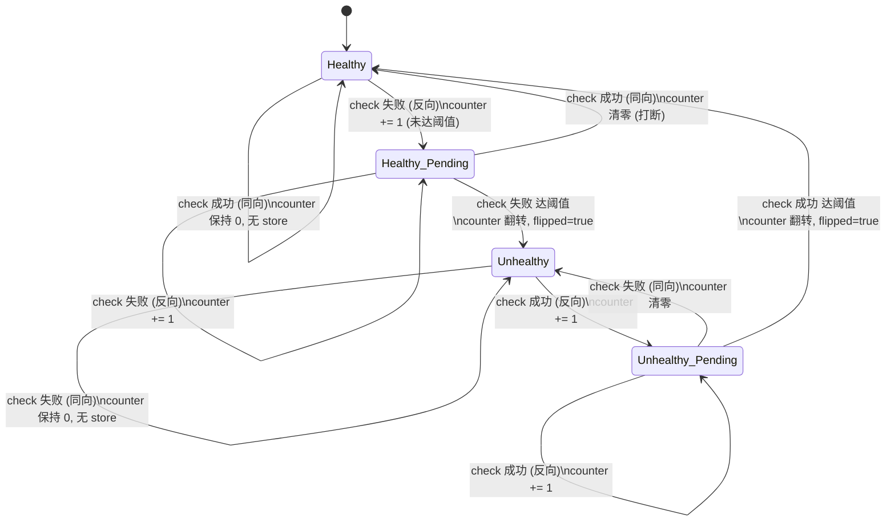

# 第 11 章 · 服务发现与健康检查:后端列表哪来、怎么知道活没活

> 第 3 篇 · 转发设施·负载均衡与服务发现:后端列表与活性,承 P3-09/10 的选择

---

## 核心问题

P3-09 我们钉死了 `LoadBalancer<S: BackendSelection>` 的框架:`select_with` 是“算法产候选迭代器 + `accept` 回调筛“的两段式,候选迭代器吐 `Backend`,accept 看 `Backends::ready(&backend)` 决定要不要。P3-10 我们填了 `S` 这个泛型填什么——四个具体算法(RoundRobin/Random/FNVHash/Ketama)。但那两章都反复说一句“假设已经有一坨后端 + 知道每个后端健康不健康”,**把“这坨后端哪来”、“怎么知道健康”两个问题悬置了**。这一章就是来填这两个坑的,也是第 3 篇(负载均衡与服务发现)的收尾章。

具体讲,本章要回答:① 后端列表 `BTreeSet<Backend>` 哪来?——`ServiceDiscovery` trait(只有一个方法 `discover`,返回“后端集合 + 启用状态 Map”)。Pingora **只内置了 `Static` 一个实现**(把一组固定后端塞 `ArcSwap<BTreeSet>`),DNS/xDS/Consul 等动态发现**都没有内置**——动态性靠业务自己 impl 这个 trait。这是个和 Envoy(EDS 协议下发)根本不同的设计选择,要拆透;② 怎么知道每个后端活没活?——`HealthCheck` trait(`check(target) -> Result<()>` 探一下,`health_threshold(success)` 告诉框架“连续多少次同向结果才翻转”),Pingora 内置 `TcpHealthCheck`(建个 TCP/TLS 连接试通不通)和 `HttpHealthCheck`(发个 HTTP 请求看 200 不 200,可配 validator);③ ★ **健康状态怎么存、怎么原子更新**——`Health(ArcSwap<HealthInner>)` 无锁存(healthy + enabled + consecutive_counter 三件),`observe_health(health, flip_threshold) -> bool` 带阈值翻转(连续 N 次反向结果才翻,避免一次抖动就摘流);④ ★ **`do_update` 的撕裂窗口**——`Backends` 里 `backends: ArcSwap` 和 `health: ArcSwap` 是**两个独立的 ArcSwap**,更新时先 callback(更新 selector)再 store backends 再 store health,**三步非原子**,中间有窗口 `ready()` 会误判。源码 `lib.rs#L185` 有 `// TODO: put this all under 1 ArcSwap so the update is atomic` 诚实标注(P3-09 点过,本章详拆这个窗口多大、有什么影响、为什么不致命);⑤ `run_health_check` 的串行/并行两条路(并行用 `current_handle().spawn` + `join_all`);⑥ `BackgroundService` 的 run loop——周期 `tokio::time::sleep_until` 醒来跑发现 + 检查,首次发现完成后 `notify_ready` 通知依赖方(让 server 接流量前先有后端列表)。

读完本章你会明白:

1. **`ServiceDiscovery` trait 的极简设计**:就一个 async 方法 `discover(&self) -> Result<(BTreeSet<Backend>, HashMap<u64, bool>)>`,返回“后端集合 + 每个 backend 的启用状态(HashMap 的 key 是 backend 的 hash_key,值是 bool,缺省视为启用)”。Pingora **只内置 `Static` 一个实现**(把 BTreeSet 塞 ArcSwap,`discover` 每次 load 出来克隆一份,DNS 等动态发现源码 `#L40` 有 `// TODO: add DNS base discovery` 但 0.8.1 还没实现)。这是 Pingora 的根本取舍——**动态性留给业务**(业务 impl trait,可以包 Consul/etcd/xDS/k8s watch 任何东西),框架不绑死任何发现协议。对照 Envoy 的 EDS(协议下发后端列表)、Nginx 的 `resolver`(周期 DNS 解析)、Tower 的 `Discover`(Stream<Item=Change>),Pingora 是“最薄的一层”——只定义“给我后端”这个接口,怎么给业务定;
2. **`HealthCheck` trait 的四件套**:`check(target) -> Result<()>`(实际探测,Ok 健康_Err 不健康)、`health_status_change(target, healthy)`(状态翻转时的回调,可挂 `HealthObserveCallback` 打 metric/告警)、`backend_summary(target) -> String`(给日志一个可读的后端摘要)、★ `health_threshold(success: bool) -> usize`(**连续多少次同向结果才翻转**——success=true 返回“从病到好要连续成功几次”,success=false 返回“从好到病要连续失败几次”)。两个内置实现:`TcpHealthCheck`(建 TCP/TLS 连接试通,`consecutive_success`/`consecutive_failure` 两个可调旋钮)、`HttpHealthCheck`(发 HTTP 请求看 200,支持 `validator` 自定义判定、`port_override` 健康检查走另一个端口、`reuse_connection` 复用连接加速);
3. **★ `Health(ArcSwap<HealthInner>)` 怎么无锁存活性 + 阈值翻转**:`HealthInner` 是 `healthy + enabled + consecutive_counter` 三件,整个用 ArcSwap 原子换。`observe_health(health, flip_threshold)` 是核心——观察到一次新结果,如果和当前 `healthy` 同向,把 counter 清零(不再连续);如果反向,counter+1,达到阈值就翻转 `healthy` 并清零,返回 `flipped=true`。**这套“连续 N 次才翻”的机制,避免了一次网络抖动就把后端摘流**(对照 Nginx 的 `max_fails`/`fail_timeout`:Nginx 也是“连续 max_fails 次失败才摘”,但恢复是“fail_timeout 时间后自动恢复”,而 Pingora 是“连续 consecutive_success 次成功才恢复”,更细粒度)。`enabled` 是和 `healthy` 独立的开关(手动摘流用,`set_enable`),`ready = healthy && enabled`;
4. **★ `do_update` 的撕裂窗口**:P3-09 点过的那个未修复 TODO,本章详拆。`Backends` 有 `backends: ArcSwap<BTreeSet<Backend>>` 和 `health: ArcSwap<HashMap<u64, Health>>` **两个独立 ArcSwap**。`do_update` 更新顺序是:① 先调 `callback(new_backends)`(让 LoadBalancer 重建 selector);② 再 `self.backends.store(new_backends)`;③ 最后 `self.health.store(Arc::new(health))`。三步之间,**别的线程调 `ready(&backend)` 会看到“新 backend 已在 backends 里,但 health HashMap 还没它”**——`ready` 在 `#L211-L218` 的注释明说 “Racing: return None when this function is called between the backend store and the health store”,且源码处理是“找不到 health 条目 + 设了 health_check 就返回 false(不 ready)”。所以撕裂窗口的**实际影响是“刚加进来的新 backend,在 health 表更新前的极短窗口内被认为不 ready,选不到”**——业务影响是“一次 select 可能少几个新后端可用”,不会选到死后端(因为不 ready 被 accept 过滤),也不会 panic。源码 TODO 标了“应该把 backends + health 放进一个 ArcSwap 让更新原子”,但还没做;
5. **`BackgroundService` run loop 怎么周期跑**:`LoadBalancer` impl 了 `BackgroundService`(pingora-core 的 trait,`start_with_ready_notifier(shutdown, ready)`),run loop 是个 `loop` + `tokio::time::sleep_until(to_wake)`,每轮检查 `next_update <= now` 就 `update().await`(跑 discovery)、`next_health_check <= now` 就 `run_health_check().await`,两个频率(`update_frequency`/`health_check_frequency`)独立可配,都是 `None` 就只跑一次然后退出。**关键细节:首次 update 完成后,通过 `ServiceReadyNotifier::notify_ready` 通知 server “我有后端列表了,可以接流量”**——这避免 server 还没 discovery 完就接请求导致 select 返回 None。承 P3-09 讲过的 `ArcSwap` 无锁更新(P3-10 的 RoundRobin `Relaxed` 用序),本章把“无锁更新”在 health 这条线上的应用拆透。

> **逃生阀(本章信息密度大,前两节是 trait 速览,后三节是机制深拆)**:如果你只想要一句话——**`ServiceDiscovery` 是“给我后端”的一方法 trait(只有 Static 内置,动态靠业务 impl),`HealthCheck` 是“探一下活没活”的 trait(`check` + `health_threshold` 阈值翻转,TcpHealthCheck/HttpHealthCheck 内置),`Health(ArcSwap)` 无锁存活性 + `observe_health(flip_threshold)` 连续 N 次才翻避免抖动,`do_update` 两个 ArcSwap 撕裂窗口(TODO 未修,影响是新后端极短窗口内选不到不致命),`BackgroundService` 周期 sleep_until 醒来跑发现 + 检查 + 首次 ready 通知。** 撕裂窗口只看第三节,阈值翻转只看第四节。
>
> **前置衔接**:本章紧接 P3-10(选择算法)。P3-09 讲框架(`LoadBalancer<S>` 怎么 select、`ArcSwap` 无锁更新、`UniqueIterator` 去重限步),P3-10 讲算法(`S` 填什么——四个具体算法),本章讲算法的**输入**(后端列表哪来 + 健康状态怎么来)。本章假设你读过 P3-09(`select_with` 两段式、`Backends::ready` 怎么被 accept 用、`do_update` 的 TODO)、P3-10(`BackendSelection` 四件套、`Arc<RoundRobin>` 等)。本章是 P3 篇(负载均衡与服务发现)的**收尾章**——框架(P3-09)+ 算法(P3-10)+ 输入(P3-11),负载均衡三件套齐了。下一章 P4-12 进入第 4 篇(HTTP 协议解析,自研 HTTP/1)。本章只讲发现与健康,选择算法一句带过指路 P3-10。

---

## 一句话点破

> **`ServiceDiscovery` 是“给我一坨后端”的单方法 trait(Pingora 只内置 `Static`,DNS/xDS 都靠业务 impl 这个 trait 包——这是和 Envoy EDS 协议下发的根本差异,动态性留给代码不留给协议);`HealthCheck` 是“探一下这个后端活没活”的 trait(`check` 真探,`health_threshold` 告诉框架连续多少次同向结果才翻转——`Health::observe_health(flip_threshold)` 用这个阈值做带滞回的状态机,避免一次抖动就摘流);`Health` 用 ArcSwap 无锁存(healthy + enabled + 连续计数器三件),`do_update` 把 backends 和 health 放两个独立 ArcSwap 有个未修的撕裂窗口(源码 TODO 标了,影响是新后端极短窗口内选不到,不致命),`BackgroundService` 周期 sleep_until 跑发现 + 检查 + 首次 ready 通知。**

这是结论,不是理由。本章倒过来拆:先看 `ServiceDiscovery` trait 的极简签名 + 为什么只有 Static 内置(对照 Envoy EDS/Nginx resolver/Tower Discover 三家怎么做,Pingora 为什么选“最薄一层”),再看 `HealthCheck` trait 的四件套 + 两个内置实现(TcpHealthCheck 建连、HttpHealthCheck 发请求,对照 Nginx 的主动检查 + 被动 max_fails),然后拆本章招牌——★ `Health(ArcSwap)` 的无锁活性存 + `observe_health` 的阈值翻转状态机(带滞回,避免抖动),之后拆 ★ `do_update` 的撕裂窗口(三步非原子,源码 TODO,实际影响分析),再拆 `run_health_check` 的串行/并行 + `BackgroundService` run loop,最后落到技巧精解,把“ArcSwap 无锁更新 Backends/Health”和“无 xDS 的设计取舍”两个招牌技巧拆透,讲清为什么这套发现 + 检查 sound(动态、抗抖、无锁、不致命)。

---

## 第一节:`ServiceDiscovery` trait——“给我一坨后端”的最薄接口

### 1.1 提出问题:后端列表哪来

P3-09 讲 `LoadBalancer::select` 的时候,反复说“selector 是从 `BTreeSet<Backend>` build 出来的“。那个 `BTreeSet<Backend>` 哪来?P3-09 一句带过指路本章。这一节就来填这个坑。

后端列表的来源,在反向代理场景下五花八门:

- **静态配置**:配置文件/YAML 里写死一组 IP:port(`server 10.0.0.1:443; server 10.0.0.2:443;`),启动时加载,运行时不变。最简单,适合后端固定的场景(比如自建的小集群)。
- **DNS 解析**:配置里写域名(`server backend.example.com resolve;`),周期跑 DNS 查询,域名背后的 IP 列表变了(LB 器具切流量、k8s pod 重调度)就更新。Nginx 的 `resolver` + 动态解析走这条。
- **服务注册中心查询**:Consul/etcd/ZooKeeper 这些注册中心存着“哪些实例活着”,代理周期 query 或 watch 注册中心拿列表。微服务场景主流。
- **控制面协议下发**:Envoy 的 xDS(具体是 EDS,Endpoint Discovery Service)——控制面主动 push 后端列表给 Envoy,Envoy 周期 ACK。云原生场景主流(istio/k8s 里 Envoy 的 CDS/EDS 都走这条)。
- **k8s API watch**:直接 watch k8s API server 的 Endpoints/EndpointSlice 资源,pod 增删立刻知道。Ingress controller 走这条(ingress-nginx、Contour 等)。

这五种来源,有的简单(静态),有的复杂(EDS 协议、k8s watch)。代理框架要支持服务发现,有个根本的设计选择:**框架内置哪些发现机制?**

- 选 A:**框架内置一组发现机制**(Envoy 内置 EDS/strict_dns/logical_dns,加 CDS 让控制面动态配 upstream;Nginx 内置 `resolver` DNS 解析)。用户配一下就用,不用写代码,但灵活性受限于框架支持的协议。
- 选 B:**框架只定义接口,机制全靠业务 impl**(Tower 的 `Discover` trait 是 `Stream<Item = Change<..>>`,业务 impl 这个 Stream 包任何发现源;Pingora 走这条)。框架极薄,业务想用啥发现源自己 impl,灵活但上手要写代码。

Pingora 选 B。这是和 Envoy 根本不同的设计选择,本节后半详拆。先看 trait 签名。

### 1.2 trait 签名:就一个 async 方法

`ServiceDiscovery` trait 在 [`discovery.rs#L31-L38`](../pingora/pingora-load-balancing/src/discovery.rs#L31-L38):

```rust
// pingora-load-balancing/src/discovery.rs#L31-L38
/// [ServiceDiscovery] is the interface to discover [Backend]s.
#[async_trait]
pub trait ServiceDiscovery {
    /// Return the discovered collection of backends.
    /// And *optionally* whether these backends are enabled to serve or not in a `HashMap`. Any backend
    /// that is not explicitly in the set is considered enabled.
    async fn discover(&self) -> Result<(BTreeSet<Backend>, HashMap<u64, bool>)>;
}
```

就一个 async 方法 `discover(&self) -> Result<(BTreeSet<Backend>, HashMap<u64, bool>)>`。返回一个二元组:

- **`BTreeSet<Backend>`**:发现到的后端集合。`Backend` 是 P3-09 讲过的(addr + weight + ext,`#L54-L74`),`BTreeSet` 保证去重 + 有序(排序用于 selector build 时确定性,比如 Ketama 建环时后端顺序影响 hash 输入)。注意是**完整的集合**——每次 discover 返回当前所有后端,不是增量(不像 Tower `Change::Insert`/`Change::Remove` 那种增量语义);
- **`HashMap<u64, bool>`**:后端的启用状态。key 是 backend 的 `hash_key()`([`lib.rs#L97-L101`](../pingora/pingora-load-balancing/src/lib.rs#L97-L101),用 `DefaultHasher` hash backend 自己得到的 u64),value 是 `true`(启用)/`false`(禁用)。**注释明说“any backend that is not explicitly in the set is considered enabled”**——没在 HashMap 里的后端默认启用。所以这个 HashMap 主要是用来“显式禁用某些后端”(比如控制面说“这个实例在维护,先别用”),不是用来“显式启用”(那是默认)。

为什么用 `hash_key: u64` 当 key 而不是直接用 `Backend`?因为 `Backend` 的 `PartialEq`/`Hash` 包含了 addr + weight + ext(P3-09 讲过 ext 参与相等性,但 `#[derivative(Hash = "ignore")]` 让 ext 不参与 hash),用 `hash_key` 这个 u64 当 HashMap key 比“以 Backend 为 key”更紧凑(一个 u64 vs 一个 Backend 结构),且 `hash_key` 是 backend 的稳定标识(addr 一样 hash_key 就一样,不管 weight/ext)。这是个用稳定 hash 当 Map key 的常见做法。

`discover` 是 `async fn`,用 `#[async_trait]`。这意味着实现可以 `await`(比如 DNS 解析、HTTP query Consul、watch k8s API 都要 await IO)。承 Tokio 的 async/await 模型——一句带过指路 [[tokio-source-facts]]。

> **钉死这件事(ServiceDiscovery 的签名)**:就一个 async 方法 `discover(&self) -> Result<(BTreeSet<Backend>, HashMap<u64, bool>)>`。返回“完整后端集合 + 启用状态 Map”。Map 缺省视为启用,主要用来显式禁用。`async` 让 impl 可以 await IO(DNS/HTTP/watch)。承 `#[async_trait]`(P1-02 详拆)。

### 1.3 唯一内置实现:`Static`

Pingora 内置的 `ServiceDiscovery` 实现,只有一个——`Static`。在 [`discovery.rs#L42-L109`](../pingora/pingora-load-balancing/src/discovery.rs#L42-L109):

```rust
// pingora-load-balancing/src/discovery.rs#L42-L100(节选)
// TODO: add DNS base discovery   ← ★ 注意:DNS 还没实现

/// A static collection of [Backend]s for service discovery.
#[derive(Default)]
pub struct Static {
    backends: ArcSwap<BTreeSet<Backend>>,
}

impl Static {
    /// Create a new boxed [Static] service discovery with the given backends.
    pub fn new(backends: BTreeSet<Backend>) -> Box<Self> {
        Box::new(Static {
            backends: ArcSwap::new(Arc::new(backends)),
        })
    }

    /// Create a new boxed [Static] from a given iterator of items that implements [ToSocketAddrs].
    pub fn try_from_iter<A, T: IntoIterator<Item = A>>(iter: T) -> IoResult<Box<Self>>
    where
        A: ToSocketAddrs,
    {
        let mut upstreams = BTreeSet::new();
        for addrs in iter.into_iter() {
            let addrs = addrs.to_socket_addrs()?.map(|addr| Backend {
                addr: SocketAddr::Inet(addr),
                weight: 1,
                ext: Extensions::new(),
            });
            upstreams.extend(addrs);
        }
        Ok(Self::new(upstreams))
    }

    /// return the collection to backends
    pub fn get(&self) -> BTreeSet<Backend> {
        BTreeSet::clone(&self.backends.load())
    }

    // Concurrent set/add/remove might race with each other
    // TODO: use a queue to avoid racing

    #[allow(dead_code)]
    pub(crate) fn set(&self, backends: BTreeSet<Backend>) {
        self.backends.store(backends.into())
    }

    #[allow(dead_code)]
    pub(crate) fn add(&self, backend: Backend) {
        let mut new = self.get();
        new.insert(backend);
        self.set(new)
    }

    #[allow(dead_code)]
    pub(crate) fn remove(&self, backend: &Backend) {
        let mut new = self.get();
        new.remove(backend);
        self.set(new)
    }
}

#[async_trait]
impl ServiceDiscovery for Static {
    async fn discover(&self) -> Result<(BTreeSet<Backend>, HashMap<u64, bool>)> {
        // no readiness
        let health = HashMap::new();
        Ok((self.get(), health))
    }
}
```

`Static` 结构就一个字段:`backends: ArcSwap<BTreeSet<Backend>>`(用 ArcSwap 无锁存)。承 P3-09 的 ArcSwap —— 一句带过(ArcSwap 是“原子换整个 Arc 指针,读者无锁 load,写者 copy-on-write 整体 store”)。

几个要点:

**第一,`Static` 不是“完全静态”——它内部是 `ArcSwap`,可以运行时改**。`set`/`add`/`remove` 三个方法(虽然标了 `#[allow(dead_code)]` 因为是 pub(crate))允许运行时换后端集合:load 出当前集合,clone 一份改(insert/remove),再 store 回去。**所以“Static”这个名字有点误导**——它不是说“后端集合不能变”,而是说“发现机制是静态的”(不主动去外部拉,改了靠外部调 set/add/remove)。源码注释 `// Concurrent set/add/remove might race with each other` + `// TODO: use a queue to avoid racing` 诚实标注了“并发 set/add/remove 可能竞争”——因为 load + clone + modify + store 不是原子的,两个并发 add 可能丢一个(add A 看到集合 S0,add B 也看到 S0,A store S0+A,B store S0+B,B 覆盖 A,A 丢了)。

**第二,`try_from_iter` 用 `ToSocketAddrs`**——传一个字符串迭代器(`["1.1.1.1:80", "1.0.0.1:80"]`),每个调 `to_socket_addrs()`(标准库方法,会做 DNS 解析如果传的是域名,但解析只在初始化时做一次,运行时不再解析)。`extend` 进 BTreeSet 去重。`weight: 1` 默认权重。这是 `LoadBalancer::try_from_iter`([`lib.rs#L341-L353`](../pingora/pingora-load-balancing/src/lib.rs#L341-L353))的底层,业务最常用的构造方式。

**第三,`discover` 实现**:load 出当前集合,克隆一份(注意 `BTreeSet::clone` 是深拷贝),health HashMap 空(没启用状态信息,全部默认启用)。**所以 Static 的 discover 就是“返回当前快照”,没有真正的“发现”动作**。这也是为什么 `update_frequency: None`(后面 BackgroundService 讲)时 Static 只跑一次 discovery 就完了——再跑也是一样的结果(除非外部 set 改了)。

> **★ 核实结论(修正旧认知)**:任务描述和总纲提到 “ServiceDiscovery trait(Static/DNS)”,但**源码里 DNS 实现不存在**——`discovery.rs#L40` 只有 `// TODO: add DNS base discovery`,0.8.1 只有 `Static` 一个内置实现。**Pingora 没有内置 DNS discovery,没有内置 xDS,没有内置 Consul/etcd/k8s watch——这些都靠业务自己 impl `ServiceDiscovery` trait 包**。这是 Pingora “动态性留给业务代码”的设计哲学(对照 Envoy 把 EDS 做进核心)。如果你想要 DNS 周期解析,得自己写个 `DnsDiscovery` impl trait,内部用 `tokio::net::lookup_host` 周期解析。

### 1.4 承接方怎么做:Envoy EDS / Nginx resolver / Tower Discover

三家怎么处理后端列表来源,对照着看 Pingora 的“最薄一层”定位:

| 维度 | Pingora `ServiceDiscovery` | Envoy EDS | Nginx `resolver` | Tower `Discover` |
|------|----------------------------|-----------|------------------|-------------------|
| **机制** | trait,业务 impl(只内置 Static) | xDS 协议(EDS)下发 | 配 `resolver` + 周期 DNS 解析 | trait(`Stream<Item=Change>`),业务 impl |
| **动态性来源** | 业务代码(impl trait) | 控制面 push | DNS 服务器 | 业务代码(impl trait) |
| **内置发现源** | 仅 Static | strict_dns/logical_dns/EDS/original_dst | DNS(且只在配了 resolver 时) | 无(全靠 impl) |
| **增量 vs 全量** | 全量(每次 discover 返回完整集合) | 增量(EDS 推一组,Envoy diff) | 全量(每次解析返回完整 IP 列表) | 增量(`Change::Insert`/`Change::Remove`) |
| **协议绑定** | 无(纯 trait) | gRPC + protobuf(xDS 协议) | DNS 协议 | 无(纯 trait) |
| **上手成本** | 写代码 impl trait | 写 YAML 配 EDS cluster | 写 nginx.conf 配 resolver + server resolve | 写代码 impl trait |
| **灵活性** | 最高(包任何东西) | 中(受 xDS 协议约束) | 低(只 DNS) | 最高(包任何东西) |
| **代表场景** | Cloudflare 自有发现系统 | istio/k8s ingress(istio 控制 Envoy) | 传统反代(后端用 LB 器具) | Tower 生态(client 负载均衡) |

这张表的关键洞察:

**洞察一:Pingora 和 Tower 是“trait 派”,Envoy 和 Nginx 是“协议/内置派”**。Pingora 和 Tower 都把发现做成一个 trait,业务 impl 包任何发现源(静态/DNS/Consul/k8s/自定义),框架不绑死协议。Envoy 把 EDS 做进核心(支持 gRPC + 文件 + REST 三种 xDS 传输),Nginx 把 DNS 解析做进核心(配 `resolver` 就用)。这是两种哲学:**“可编程框架”(trait 派,业务写代码)vs “可配置产品”(协议派,业务写配置)**。Pingora 整个就是“可编程框架”——不光发现,整个 `ProxyHttp` 也是 trait(业务 impl 钩子)而非 Envoy 那种 filter 配置。

**洞察二:Pingora 选 trait 派的代价**。代价是“想要 DNS 发现,得自己写”。Envoy 用户配一行 `load_assignment: strict_dns` 就有 DNS 发现,Pingora 用户得 impl `ServiceDiscovery` + 处理 DNS 解析周期 + 处理解析失败 + 处理去重。这个上手成本,小用户嫌重。**但 Cloudflare 不嫌**——Cloudflare 有自己的发现系统(全球分布的后端注册 + 控制),直接 impl trait 包一层就行,不需要 Pingora 内置个通用的 DNS/EDS。所以 Pingora “只内置 Static” 是 Cloudflare 场景驱动的务实选择——通用发现机制留给生态(crate 里有人发 pingora-consul / pingora-k8s 这种),核心保持薄。

**洞察三:Tower 的 `Discover` 是 Stream<Item=Change>,Pingora 是 async fn 返回全量**。Tower 用增量语义(Stream 吐 Change::Insert/Change::Remove),Pingora 用全量语义(每次 discover 返回完整集合)。增量更高效(只传变化的),但状态管理复杂(要维护“当前集合”状态,处理乱序、丢失)。全量更简单(无状态,每次完整快照),但传输量大(每次全量)。对 Pingora 的场景(后端数几十到几千,discovery 频率秒级),全量的开销可以忽略(几千个 Backend clone 一份,微秒级),换来实现的极简。**Pingora 选全量,是“简单优先”的取舍**。

> **钉死这件事(Pingora 是 trait 派,只内置 Static)**:`ServiceDiscovery` 是“给我后端”的单方法 trait,Pingora 只内置 `Static`(ArcSwap 存,可运行时 set/add/remove 但有竞争 TODO),DNS/EDS/Consul/k8s 都靠业务 impl trait。对照 Envoy(EDS 协议派)、Nginx(resolver 内置 DNS)、Tower(`Discover` Stream 增量派)。Pingora 选 trait 派 + 全量语义是“可编程框架 + 简单优先”的取舍,代价是想要 DNS 得自己写。承 P0-01 讲过的“Pingora 是可编程框架(impl ProxyHttp 钩子),Envoy 是可配置产品(filter 配置)”——服务发现也是同一种哲学差异。

---

## 第二节:`HealthCheck` trait——探一下活没活,带阈值翻转

### 2.1 提出问题:怎么知道每个后端活没活

`ServiceDiscovery` 给了后端列表,但“列表里有这个后端”不等于“这个后端现在能服务”。一个后端可能:

- **进程挂了**:机器宕机、进程 crash、OOM 被 kill。TCP 连不上。
- **网络分区**:防火墙规则变了、路由环路、网络设备故障。TCP 连不上或超时。
- **应用层故障**:进程还在,TCP 能连,但应用卡死(死锁、资源耗尽、循环)、返回 5xx、响应超慢。TCP 连得上但 HTTP 不正常。
- **过载**:后端太忙,响应慢,虽然“活着”但不该再给它流量(应该摘流减压)。

`select` 的时候,要跳过这些“不健康”的后端,把流量给健康的那批。这就是健康检查的事——**周期探测每个后端,维护一份“谁健康谁不健康”的状态,select 时 `accept` 过滤掉不健康的**。

健康检查有两种基本策略:

- **主动健康检查(active)**:代理自己周期发探测请求(TCP 连接 / HTTP GET /health),根据响应判断。优点是“主动探测,不依赖业务流量”;缺点是“探测流量是额外开销,且探测路径可能和业务路径不同(探测用 /health,业务用 /api,可能 /health 好但 /api 挂)”。
- **被动健康检查(passive)**:不主动探测,看业务请求的结果——请求失败了累计失败次数,达到阈值摘流。优点是“无额外开销,且探测路径就是业务路径”;缺点是“得先有请求失败才知道挂了,有滞后性,且摘流期间没有主动探测不知道啥时候恢复”。

Envoy 两者都支持(主动 health check 配 + 被动 outlier detection),Nginx 主要靠被动(`max_fails`/`fail_timeout` 数业务请求失败),Pingora **只做主动**——`HealthCheck` trait 的 `check` 方法就是主动探测,被动检查 Pingora 0.8.1 没内置(业务可以在 `fail_to_proxy` 钩子里手动累计失败 + 调 `set_enable` 摘流,但框架不自动做)。

### 2.2 trait 签名:四件套,核心是 `check` + `health_threshold`

`HealthCheck` trait 在 [`health_check.rs#L43-L64`](../pingora/pingora-load-balancing/src/health_check.rs#L43-L64):

```rust
// pingora-load-balancing/src/health_check.rs#L43-L64
/// [HealthCheck] is the interface to implement health check for backends
#[async_trait]
pub trait HealthCheck {
    /// Check the given backend.
    ///
    /// `Ok(())`` if the check passes, otherwise the check fails.
    async fn check(&self, target: &Backend) -> Result<()>;

    /// Called when the health changes for a [Backend].
    async fn health_status_change(&self, _target: &Backend, _healthy: bool) {}

    /// Called when a detailed [Backend] summary is needed.
    fn backend_summary(&self, target: &Backend) -> String {
        format!("{target:?}")
    }

    /// This function defines how many *consecutive* checks should flip the health of a backend.
    ///
    /// For example: with `success``: `true`: this function should return the
    /// number of check need to flip from unhealthy to healthy.
    fn health_threshold(&self, success: bool) -> usize;
}
```

四个方法,分两类:

**探测类(必须实现)**:

- `check(&self, target: &Backend) -> Result<()>`:实际探测。`Ok(())` 表示这次检查通过(后端健康),`Err(e)` 表示失败(后端不健康)。这是 trait 的核心,所有逻辑都围绕它。`async` 让 impl 可以 await IO(建连、发请求、读响应都要 await)。这个方法被 `run_health_check` 周期调(后面讲)。

**配置/回调类(有默认实现,可覆盖)**:

- `health_status_change(&self, target, healthy)`:状态翻转时的回调。默认空实现(noop)。业务可以覆盖它,在翻转时打 log、发 metric、告警。两个内置实现(TcpHealthCheck/HttpHealthCheck)覆盖了它,用来调 `health_changed_callback`(用户挂的 `HealthObserveCallback`)。注释 L52 `_target`/`_healthy` 用下划线表示默认实现忽略参数;
- `backend_summary(&self, target) -> String`:给日志一个可读的后端摘要。默认 `format!("{target:?}")`(Debug 打印,冗长)。HttpHealthCheck 覆盖了它,调 `backend_summary_callback`(用户挂的回调,可以返回更简洁的 “ip:port (zone-a)” 这种);
- ★ `health_threshold(&self, success: bool) -> usize`:**这个是关键**——它定义“连续多少次同向结果才翻转健康状态”。`success=true` 时返回“从病到好要连续成功几次”,`success=false` 时返回“从好到病要连续失败几次”。注释 L59-62 明说 “how many *consecutive* checks should flip the health”。

`health_threshold` 这个设计是抗抖动的核心。想象一个场景:后端 X 当前健康。某次网络抖动,check 失败 1 次。如果“失败 1 次就翻为不健康”,X 立刻被摘流,所有流量给其他后端,可能引发连锁(其他后端也过载)。等下次 check 成功,X 又翻回健康,流量回来。这种“一次失败就摘、一次成功就回”的抖动,会让流量在后端间剧烈震荡,称为**颤振(flapping)**。

`health_threshold` 解决颤振——**要求连续 N 次同向结果才翻转**。比如设 `consecutive_failure=3`:X 当前健康,check 失败 1 次(counter=1,没翻),再失败(counter=2,没翻),第三次失败(counter=3,达阈值,翻为不健康)。中间如果 check 成功了,counter 清零(不再连续),重新数。这就是带**滞回(hysteresis)**的状态机——翻转要“持续证据”,不是“瞬时判断”。第四节详拆 `Health::observe_health` 怎么实现这个状态机。

为什么 threshold 是个方法(`fn health_threshold(&self, success: bool)`)而不是个常量?因为“从病到好”和“从好到病”的阈值可以不一样——通常“从病到好”更严格(连续 3 次成功才恢复,避免刚恢复又挂),“从好到病”更宽松(连续 1 次失败就摘,尽快摘掉故障)。`success: bool` 参数让 trait 同时表达两个阈值,impl 根据 success 返回不同的数。两个内置实现就是这么做的:`consecutive_success` 和 `consecutive_failure` 两个独立字段。

> **钉死这件事(health_threshold 抗抖)**:`HealthCheck::health_threshold(success: bool) -> usize` 定义“连续多少次同向结果才翻转”。`success=true` 返回恢复阈值(病到好),`success=false` 返回摘流阈值(好到病),两者可不同(恢复通常更严)。这套“连续 N 次才翻”是带滞回的状态机,避免一次网络抖动就摘流引发颤振。对照 Nginx `max_fails`(连续失败次数)+ `fail_timeout`(摘流时长)——Nginx 也是连续 max_fails 次失败才摘,但恢复是“等 fail_timeout 时间自动恢复”(被动),Pingora 是“连续 consecutive_success 次成功才恢复”(主动),更细粒度。

### 2.3 内置实现一:`TcpHealthCheck`(建 TCP/TLS 连接)

`TcpHealthCheck` 在 [`health_check.rs#L66-L147`](../pingora/pingora-load-balancing/src/health_check.rs#L66-L147):

```rust
// pingora-load-balancing/src/health_check.rs#L66-L147(节选)
/// TCP health check
///
/// This health check checks if a TCP (or TLS) connection can be established to a given backend.
pub struct TcpHealthCheck {
    /// Number of successful checks to flip from unhealthy to healthy.
    pub consecutive_success: usize,
    /// Number of failed checks to flip from healthy to unhealthy.
    pub consecutive_failure: usize,
    /// How to connect to the backend.
    ///
    /// This field defines settings like the connect timeout and src IP to bind.
    /// The SocketAddr of `peer_template` is just a placeholder which will be replaced by the
    /// actual address of the backend when the health check runs.
    ///
    /// By default, this check will try to establish a TCP connection. When the `sni` field is
    /// set, it will also try to establish a TLS connection on top of the TCP connection.
    pub peer_template: BasicPeer,
    connector: TransportConnector,
    /// A callback that is invoked when the `healthy` status changes for a [Backend].
    pub health_changed_callback: Option<HealthObserveCallback>,
}

impl Default for TcpHealthCheck {
    fn default() -> Self {
        let mut peer_template = BasicPeer::new("0.0.0.0:1");
        peer_template.options.connection_timeout = Some(Duration::from_secs(1));
        TcpHealthCheck {
            consecutive_success: 1,
            consecutive_failure: 1,
            peer_template,
            connector: TransportConnector::new(None),
            health_changed_callback: None,
        }
    }
}
```

`TcpHealthCheck` 字段:

- `consecutive_success`/`consecutive_failure`:两个阈值旋钮(对应 `health_threshold(success)` 的两个返回值)。**默认都是 1**(默认无滞回,一次就翻)——业务想抗抖要显式调大,比如 `consecutive_failure = 3`。
- `peer_template: BasicPeer`:连接模板。`BasicPeer` 是 P2-06 讲过的 L4 peer(带 connection_timeout、src IP bind、sni 等连接配置)。**关键:`peer_template` 的 SocketAddr 是占位符 `0.0.0.0:1`**(注释明说 “The SocketAddr of peer_template is just a placeholder which will be replaced by the actual address of the backend when the health check runs”)——check 时 clone 这个 template,把 `_address` 换成真实后端地址。这样一份 template 复用给所有后端(不用每个后端建个 Peer)。
- `connector: TransportConnector`:L4 连接器(P2-06 招招牌章讲的 `TransportConnector`),用来建 TCP/TLS 连接。`check` 调 `connector.get_stream(&peer)` 试建连。
- `health_changed_callback: Option<HealthObserveCallback>`:状态翻转时的回调。`HealthObserveCallback = Box<dyn HealthObserve + Send + Sync>`([`#L38`](../pingora/pingora-load-balancing/src/health_check.rs#L38)),业务挂这个回调在翻转时打 metric/告警。默认 None。

`Default::default` 把 `connection_timeout` 设 1 秒——避免后端挂了时 check 卡太久(1 秒连不上就判失败,不阻塞下一个后端的 check)。这是个关键默认值,**太长会让一轮健康检查拖很久**(几百个后端串行 check,每个卡 30 秒就完了)。

`HealthCheck` impl 在 [`#L126-L147`](../pingora/pingora-load-balancing/src/health_check.rs#L126-L147):

```rust
// pingora-load-balancing/src/health_check.rs#L126-L147
#[async_trait]
impl HealthCheck for TcpHealthCheck {
    fn health_threshold(&self, success: bool) -> usize {
        if success {
            self.consecutive_success
        } else {
            self.consecutive_failure
        }
    }

    async fn check(&self, target: &Backend) -> Result<()> {
        let mut peer = self.peer_template.clone();
        peer._address = target.addr.clone();
        self.connector.get_stream(&peer).await.map(|_| {})
    }

    async fn health_status_change(&self, target: &Backend, healthy: bool) {
        if let Some(callback) = &self.health_changed_callback {
            callback.observe(target, healthy).await;
        }
    }
}
```

三个方法的实现:

- `health_threshold(success)`:`success` 决定返回 `consecutive_success` 还是 `consecutive_failure`,两个独立阈值;
- `check(target)`:clone peer_template,把 `_address` 换成 target 的真实 addr,调 `connector.get_stream(&peer).await`。**Ok(拿到 stream)→ check 通过(健康);Err(建连失败)→ check 失败(不健康)**。注意 `.map(|_| {})` —— 拿到 stream 后直接丢掉(不真用它发数据),这一行就是“连得上就算健康”。stream drop 时连接关闭(或者 TransportConnector 内部池化复用,见 P2-06)。
- `health_status_change(target, healthy)`:如果挂了 callback,调 `callback.observe(target, healthy).await`(回调通知业务,业务打 metric/告警)。

**`new_tls` 变体**([`#L114-L118`](../pingora/pingora-load-balancing/src/health_check.rs#L114-L118)):建 TLS 连接而非裸 TCP。原理是 `peer_template.sni` 设了的话,`TransportConnector::get_stream` 会建 TCP + TLS 握手(P2-06 详拆)。所以 `new_tls(sni)` 就是设 peer_template 的 sni,check 时建 TLS 连接,TLS 握手成功才算健康。这适合后端是 HTTPS 且要验证证书/握手通不通的场景。

TCP 健康检查的优点:**轻量、通用**(任何 TCP 后端都能用,不关心应用层协议)。缺点:**只能验证 L4 通**(TCP 连得上不代表应用层正常,应用可能死锁了但 TCP 端口还监听)。要验证应用层,用 `HttpHealthCheck`。

### 2.4 内置实现二:`HttpHealthCheck`(发 HTTP 请求)

`HttpHealthCheck` 在 [`health_check.rs#L151-L343`](../pingora/pingora-load-balancing/src/health_check.rs#L151-L343),比 TcpHealthCheck 复杂得多——它真的发 HTTP 请求、读响应、判定。

```rust
// pingora-load-balancing/src/health_check.rs#L154-L191(结构,节选)
/// HTTP health check
///
/// This health check checks if it can receive the expected HTTP(s) response from the given backend.
pub struct HttpHealthCheck<C = ()>
where
    C: custom::Connector,
{
    /// Number of successful checks to flip from unhealthy to healthy.
    pub consecutive_success: usize,
    /// Number of failed checks to flip from healthy to unhealthy.
    pub consecutive_failure: usize,
    /// How to connect to the backend.
    /// Set the `scheme` field to use HTTPs.
    pub peer_template: HttpPeer,
    /// Whether the underlying TCP/TLS connection can be reused across checks.
    ///
    /// * `false` will make sure that every health check goes through TCP (and TLS) handshakes.
    ///   Established connections sometimes hide the issue of firewalls and L4 LB.
    /// * `true` will try to reuse connections across checks, this is the more efficient and fast way
    ///   to perform health checks.
    pub reuse_connection: bool,
    /// The request header to send to the backend
    pub req: RequestHeader,
    connector: HttpConnector<C>,
    /// Optional field to define how to validate the response from the server.
    ///
    /// If not set, any response with a `200 OK` is considered a successful check.
    pub validator: Option<Validator>,
    /// Sometimes the health check endpoint lives one a different port than the actual backend.
    /// Setting this option allows the health check to perform on the given port of the backend IP.
    pub port_override: Option<u16>,
    /// A callback that is invoked when the `healthy` status changes for a [Backend].
    pub health_changed_callback: Option<HealthObserveCallback>,
    /// An optional callback for backend summary reporting.
    pub backend_summary_callback: Option<BackendSummary>,
}
```

比 TcpHealthCheck 多几个字段:

- `peer_template: HttpPeer`(不是 BasicPeer):L7 peer,带 scheme(http/https)、sni、path、ALPN 等(P1-04 讲过 HttpPeer)。check 时建 HTTP 会话(可能 h1 可能 h2,看 ALPN 协商);
- `reuse_connection: bool`:**是否跨 check 复用连接**。注释明说两边都有理:`false`(默认)每次 check 都重新建 TCP + TLS 握手——**已建立的连接有时会掩盖防火墙/L4 LB 的问题**(连接还活着但实际新流量已被拦,check 用旧连接看不出);`true` 复用连接,更快更省(省了握手开销),但可能漏检连接级故障。这个取舍留给业务;
- `req: RequestHeader`:要发的请求头(默认 `GET / HTTP/1.1` + `Host: <host>`);
- `validator: Option<Validator>`:响应验证函数。`Validator = Box<dyn Fn(&ResponseHeader) -> Result<()>>`([`#L149`](../pingora/pingora-load-balancing/src/health_check.rs#L149))。None 时默认“200 OK 才算成功”;Some 时业务自定义(比如“301 也算成功”,或“检查响应体的 JSON 字段”);
- `port_override: Option<u16>`:**健康检查走另一个端口**。注释 L184-185 “the health check endpoint lives one a different port than the actual backend”——后端业务流量走 443,健康检查走 8080(专门的 health 端口),这是生产常见模式(应用暴露独立的 health 端口,不污染业务路径);
- `backend_summary_callback: Option<BackendSummary>`:日志摘要回调(覆盖 `backend_summary` 默认实现)。

`check` 实现 [`#L283-L330`](../pingora/pingora-load-balancing/src/health_check.rs#L283-L330):

```rust
// pingora-load-balancing/src/health_check.rs#L283-L330(节选)
async fn check(&self, target: &Backend) -> Result<()> {
    let mut peer = self.peer_template.clone();
    peer._address = target.addr.clone();
    if let Some(port) = self.port_override {
        peer._address.set_port(port);
    }
    let session = self.connector.get_http_session(&peer).await?;

    let mut session = session.0;
    let req = Box::new(self.req.clone());
    session.write_request_header(req).await?;
    session.finish_request_body().await?;

    custom_session!(session.finish_custom().await?);

    if let Some(read_timeout) = peer.options.read_timeout {
        session.set_read_timeout(Some(read_timeout));
    }

    session.read_response_header().await?;

    let resp = session.response_header().expect("just read");

    if let Some(validator) = self.validator.as_ref() {
        validator(resp)?;
    } else if resp.status != 200 {
        return Error::e_explain(
            CustomCode("non 200 code", resp.status.as_u16()),
            "during http healthcheck",
        );
    };

    while session.read_response_body().await?.is_some() {
        // drain the body if any
    }

    // TODO(slava): do it concurrently wtih body drain?
    custom_session!(session.drain_custom_messages().await?);

    if self.reuse_connection {
        let idle_timeout = peer.idle_timeout();
        self.connector
            .release_http_session(session, &peer, idle_timeout)
            .await;
    }

    Ok(())
}
```

流程:① clone peer_template + 换真实 addr(可选 port_override);② `connector.get_http_session(&peer)` 拿一个 HTTP session(可能复用连接,见 P2-07);③ `write_request_header` + `finish_request_body` 发请求(默认 GET /);④ `read_response_header` 读响应头;⑤ 判定:有 validator 调 validator,没 validator 默认“200 才成功”(非 200 返回 Err);⑥ `read_response_body` 循环 drain body(读完响应体,避免连接复用时残留数据);⑦ `drain_custom_messages`(h2 的 SETTINGS/PING 等);⑧ `reuse_connection` 为真时 `release_http_session` 归还连接到池子(下次 check 复用),否则 session drop 连接关。

HTTP 健康检查的优点:**能验证应用层**(不光 TCP 通,还得 HTTP 响应正常,应用死锁/500 都能检出)。缺点:**重**(要建 HTTP 会话 + 发请求 + 读响应,h2 还涉及多路复用状态机,开销比 TCP check 大)。生产里后端是 HTTP/HTTPS 服务的,优先 HttpHealthCheck(检出率高),后端是 TCP/自定义协议的(TCP proxy、数据库代理),用 TcpHealthCheck。

**`new(host, tls)` 构造**([`#L202-L222`](../pingora/pingora-load-balancing/src/health_check.rs#L202-L222)):默认 `GET / HTTP/1.1` + `Host: host`,tls=true 时 sni = host,scheme=https。`connection_timeout = 1s`,`read_timeout = 1s`(双超时,连接超时 + 读超时),`consecutive_success = consecutive_failure = 1`,`reuse_connection = false`,`validator = None`。这些默认值让“开箱即用的最小 HTTP 检查”可用,业务调旋钮定制。

> **钉死这件事(TcpHealthCheck vs HttpHealthCheck)**:两个内置实现——TcpHealthCheck 建连试通(轻,只验 L4),HttpHealthCheck 发请求看响应(重,验应用层)。两者都支持 `consecutive_success`/`consecutive_failure` 阈值、`health_changed_callback` 回调。HttpHealthCheck 额外支持 `validator`(自定义判定)、`port_override`(独立健康端口)、`reuse_connection`(连接复用,默认 false 避免漏检连接级故障)。默认 `connection_timeout = 1s` 避免后端挂了拖整轮检查。承 P2-06 的 `TransportConnector`(TcpHealthCheck 用)、P2-07 的 HTTP connector(HttpHealthCheck 用)。

### 2.5 `HealthObserve` callback:翻转时的业务钩子

trait 之外还有个相关类型——`HealthObserve` trait 和 `HealthObserveCallback`([`#L30-L41`](../pingora/pingora-load-balancing/src/health_check.rs#L30-L41)):

```rust
// pingora-load-balancing/src/health_check.rs#L30-L41
/// [HealthObserve] is an interface for observing health changes of backends,
/// this is what's used for our health observation callback.
#[async_trait]
pub trait HealthObserve {
    /// Observes the health of a [Backend], can be used for monitoring purposes.
    async fn observe(&self, target: &Backend, healthy: bool);
}
/// Provided to a [HealthCheck] to observe changes to [Backend] health.
pub type HealthObserveCallback = Box<dyn HealthObserve + Send + Sync>;

/// Provided to a [HealthCheck] to fetch [Backend] summary for detailed logging.
pub type BackendSummary = Box<dyn Fn(&Backend) -> String + Send + Sync>;
```

`HealthObserve` 是个单方法 trait(`observe(target, healthy)`),给业务一个“翻转时被通知”的钩子。两个内置 HealthCheck 都有一个 `health_changed_callback: Option<HealthObserveCallback>` 字段,在 `health_status_change`(trait 的默认回调方法)里调它。

为什么要分两层(`HealthCheck::health_status_change` vs 内部的 `health_changed_callback`)?因为 `health_status_change` 是 trait 方法(impl 时要覆盖整个方法,改动 HealthCheck 类型),而 `health_changed_callback` 是个字段(运行时 set 一份 Box<dyn> 就行,不动类型)。**业务想要“挂个回调打 metric”,用 `health_changed_callback` 字段(动态),不用 impl 整个 HealthCheck trait(静态)**。这是“trait 默认方法 + 字段回调”的常见 Rust 模式——trait 给框架钩子(框架调),字段给业务钩子(业务运行时挂)。

`test_health_observe` 测试 [`#L504-L576`](../pingora/pingora-load-balancing/src/health_check.rs#L504-L576) 演示了这套:业务定义一个 `Observe` struct(持有 `Arc<AtomicU16>` 计数 unhealthy 次数),impl `HealthObserve`,挂到 `TcpHealthCheck.health_changed_callback`。健康检查跑完,后端从健康翻为不健康时,`observe` 被调,计数 +1。

---

## 第三节:★ `Health(ArcSwap)` 与 `do_update` 的撕裂窗口

这一节拆本章招牌之一——**活性怎么无锁存,以及更新时的撕裂窗口**。P3-09 点过“Backends 用 ArcSwap + do_update 有未修 TODO”,这一节详拆。

### 3.1 提出问题:无锁存活性 + 原子更新

健康检查的结果(每个后端 healthy 与否)要存起来,select 时 `ready(&backend)` 读它。这个存读有几个要求:

- **热路径读**:`select` 每次都要读 `ready(&backend)`(每个候选后端读一次),是热路径,读要快;
- **后台写**:健康检查周期跑(秒级),每次 check 完要更新对应后端的 healthy;
- **并发安全**:热路径(多个 worker task 并发 select)和后台(健康检查 task)并发读写,不能数据竞争;
- **状态机**:healthy 不是“一次 check 结果”的直接映射,是“连续 N 次同向结果才翻”的状态机(2.2 节的阈值翻转),要维护“连续计数器”。

最朴素的实现是用 `Mutex<HashMap<u64, HealthState>>`——一个互斥锁包 HashMap,读时 lock + 查 + unlock,写时 lock + 改 + unlock。但锁有两个问题:① 热路径上锁竞争(select 频繁,锁成为瓶颈);② 异步代码里用 std Mutex 持锁跨 await 会阻塞 reactor(虽然这里 lock + 查很快不跨 await,但仍是隐患)。

Pingora 用 ArcSwap——**读者无锁 load,写者 copy-on-write 整体 store**。具体:`Health` 是 `ArcSwap<HealthInner>`([`#L358`](../pingora/pingora-load-balancing/src/health_check.rs#L358)),`HealthInner` 是 `healthy + enabled + consecutive_counter` 三件。读 `ready` 时 load 出 Arc 引用,读字段,无锁。写 `observe_health` 时 load 出当前 inner,clone 一份改字段,store 新 Arc 回去——**copy-on-write**。这和 P3-09 讲的 selector ArcSwap 一脉相承(承 ArcSwap 一句带过)。

但 `Backends` 里**不只一个 ArcSwap**——它有 `backends: ArcSwap<BTreeSet<Backend>>` 和 `health: ArcSwap<HashMap<u64, Health>>` **两个**。更新后端集合时,两个都要更新,且它们要一致(新 backend 要在 backends 里,也要在 health 里有对应条目)。**两个独立的 ArcSwap,更新不是原子的**——这就是撕裂窗口的根源。

### 3.2 `HealthInner` 与 `Health(ArcSwap)` 的结构

`HealthInner` 在 [`health_check.rs#L345-L355`](../pingora/pingora-load-balancing/src/health_check.rs#L345-L355):

```rust
// pingora-load-balancing/src/health_check.rs#L345-L355
#[derive(Clone)]
struct HealthInner {
    /// Whether the endpoint is healthy to serve traffic
    healthy: bool,
    /// Whether the endpoint is allowed to serve traffic independent of its health
    enabled: bool,
    /// The counter for stateful transition between healthy and unhealthy.
    /// When [healthy] is true, this counts the number of consecutive health check failures
    /// so that the caller can flip the healthy when a certain threshold is met, and vise versa.
    consecutive_counter: usize,
}

/// Health of backends that can be updated atomically
pub(crate) struct Health(ArcSwap<HealthInner>);

impl Default for Health {
    fn default() -> Self {
        Health(ArcSwap::new(Arc::new(HealthInner {
            healthy: true, // TODO: allow to start with unhealthy
            enabled: true,
            consecutive_counter: 0,
        })))
    }
}
```

`HealthInner` 三件:

- `healthy: bool`:**实际健康状态**(健康检查的结果)。默认 true(`// TODO: allow to start with unhealthy` 注释标了“应该允许初始为不健康”,目前默认健康——新后端刚加进来默认健康,要等第一次 check 失败才可能翻);
- `enabled: bool`:**启用状态**(和 healthy 独立)。`set_enable(false)` 手动摘流用(后端健康但运维想摘它,比如准备下线)。默认 true。`ready = healthy && enabled`(两者都得真才 ready);
- `consecutive_counter: usize`:**连续计数器**。当 `healthy=true` 时,这个计数“连续失败次数”(达到 `consecutive_failure` 翻为不健康);当 `healthy=false` 时,这个计数“连续成功次数”(达到 `consecutive_success` 翻为健康)。注释 L352-354 说得很清楚。

`Health(ArcSwap<HealthInner>)` 是个 newtype(包一层 ArcSwap)。`Default::default` 建 healthy=true + enabled=true + counter=0 的初始 Health。

为什么 `healthy` 和 `enabled` 分开?因为它们语义不同:

- `healthy`:**后端客观上能不能服务**(健康检查的结果,框架维护)。
- `enabled`:**运维主观上想不想让它服务**(手动开关,运维维护)。

一个后端可能 healthy=true(检查通过)但 enabled=false(运维要下线,手动摘),这时 `ready=false`,select 不会选它。也可能 healthy=false(检查失败)但 enabled=true(运维没手动摘),`ready=false`,select 也不选。两者都真才 ready。这种“客观健康 × 主观开关”的二维状态,是生产环境的标准做法(Envoy 的 health_check + outlier_detection 的 active_health 标志 + manual override 也是类似)。

### 3.3 ★ `observe_health`:带阈值翻转的状态机

`Health::observe_health` 是抗抖动的核心,在 [`health_check.rs#L393-L416`](../pingora/pingora-load-balancing/src/health_check.rs#L393-L416):

```rust
// pingora-load-balancing/src/health_check.rs#L393-L416
impl Health {
    pub fn ready(&self) -> bool {
        let h = self.0.load();
        h.healthy && h.enabled
    }

    pub fn enable(&self, enabled: bool) {
        let h = self.0.load();
        if h.enabled != enabled {
            // clone the inner
            let mut new_health = (**h).clone();
            new_health.enabled = enabled;
            self.0.store(Arc::new(new_health));
        };
    }

    // return true when the health is flipped
    pub fn observe_health(&self, health: bool, flip_threshold: usize) -> bool {
        let h = self.0.load();
        let mut flipped = false;
        if h.healthy != health {
            // opposite health observed, ready to increase the counter
            // clone the inner
            let mut new_health = (**h).clone();
            new_health.consecutive_counter += 1;
            if new_health.consecutive_counter >= flip_threshold {
                new_health.healthy = health;
                new_health.consecutive_counter = 0;
                flipped = true;
            }
            self.0.store(Arc::new(new_health));
        } else if h.consecutive_counter > 0 {
            // observing the same health as the current state.
            // reset the counter, if it is non-zero, because it is no longer consecutive
            let mut new_health = (**h).clone();
            new_health.consecutive_counter = 0;
            self.0.store(Arc::new(new_health));
        }
        flipped
    }
}
```

逐段拆 `observe_health(health, flip_threshold) -> bool`:

**输入**:`health: bool`(这次 check 的结果,true=健康 false=不健康,由 `run_health_check` 传 `check.check(target).await.is_err()` 的反)、`flip_threshold: usize`(连续多少次同向结果才翻,由 `run_health_check` 传 `check.health_threshold(health)` —— 注意是 `check.health_threshold(health)` 而非 `!health`,因为 threshold 的语义是“翻到 health 这个状态需要多少次”,health=true 时返回的是恢复阈值)。

**输出**:`bool` —— 这次 observe 是否触发了翻转(true=healthy 字段变了)。

**逻辑分两段**:

**第一段(观察到反向结果,`h.healthy != health`)**:这次 check 结果和当前 `healthy` 状态相反(当前健康,这次失败;或当前病,这次成功)。这时:

1. clone 当前 inner(`(**h).clone()` —— 解引用 Arc 再 clone HealthInner,得到可变的副本);
2. `consecutive_counter += 1`(连续反向结果计数 +1);
3. 检查是否达阈值:`if counter >= flip_threshold` —— 达了就翻:`healthy = health`(翻到新状态)、`counter = 0`(清零,重新开始数)、`flipped = true`(标记这次翻了);
4. 不管翻没翻,`store(Arc::new(new_health))` 把新 inner 存回去(只要 counter 变了就要 store)。

**第二段(观察到同向结果,`h.healthy == health`,且 counter > 0)**:这次 check 结果和当前状态同向(当前健康这次也成功;或当前病这次也失败)。这时如果 counter > 0(之前积累过反向计数),**清零**(`counter = 0`)——因为“连续”被打断了,之前的反向结果不再连续,重新数。store 新 inner。

**隐含的第三段(同向 + counter == 0)**:什么也不做(没必要 store 一个没变的 inner)。这是优化——同向且 counter 已经是 0,store 是浪费。

把这个状态机画成图:



这张状态图的关键:**Healthy 和 Unhealthy 是稳态(同向结果不影响),Healthy_Pending 和 Unhealthy_Pending 是过渡态(积累反向证据)**。从稳态到翻为另一稳态,必须经过 Pending 态且积累够阈值次反向结果。中间任何一次同向结果,把 Pending 打回稳态(清零)。这就是带滞回的状态机——**翻转需要“持续证据”,不是“瞬时判断”**。

举个具体例子(假设 `consecutive_failure = 3`,`consecutive_success = 2`):

```text
时间   check 结果   当前 healthy   counter(连续反向)   动作
t0     -            true(健康)    0                   初始
t1     成功         true           0                   同向, 无 store
t2     失败         true           1                   反向, counter+=1, 未达 3, store, 不翻
t3     失败         true           2                   反向, counter+=1, 未达 3, store, 不翻
t4     成功         true           0                   同向, 打断, counter 清零, store
t5     失败         true           1                   反向, counter+=1, store, 不翻
t6     失败         true           2                   反向, counter+=1, store, 不翻
t7     失败         true → false   0                   反向, counter+=1=3 达阈值, 翻为不健康, flipped=true, store
t8     失败         false          0                   同向, 无 store
t9     成功         false          1                   反向, counter+=1, 未达 2, store, 不翻
t10    失败         false          0                   同向, 打断, counter 清零, store
t11    成功         false          1                   反向, counter+=1, 未达 2, store
t12    成功         false → true   0                   反向, counter+=1=2 达阈值, 翻为健康, flipped=true, store
```

看 t2-t4:连续 2 次失败,但 t4 一次成功就清零了——抗抖动。看 t5-t7:连续 3 次失败,翻为不健康。看 t9-t10:连续 1 次成功,t10 失败清零——避免一次偶然成功就恢复。看 t11-t12:连续 2 次成功,翻回健康。

**这套机制,就是 Nginx `max_fails`/`fail_timeout` 的“主动版”**。Nginx 是:连续 `max_fails` 次业务请求失败 → 标记 down → 摘流 `fail_timeout` 时间 → 时间到了自动恢复(再试,失败又摘)。Nginx 的恢复是“时间驱动”(等 fail_timeout),被动(没有主动探测恢复)。Pingora 是:连续 `consecutive_failure` 次 check 失败 → 翻为 unhealthy → 持续 check → 连续 `consecutive_success` 次成功 → 翻回 healthy。Pingora 的恢复是“证据驱动”(连续成功才回),主动。Pingora 的更精细——可以区分“短暂抖动”(一次成功就回,Nginx 模式)和“真恢复”(要连续成功,Pingora 模式)。

> **钉死这件事(observe_health 状态机)**:`Health::observe_health(health, flip_threshold) -> bool` 是带滞回的状态机。反向结果 counter+=1(达阈值翻,清零),同向结果 counter 清零(打断)。翻转需要“持续证据”,避免一次抖动就摘流(颤振)。对照 Nginx `max_fails`/`fail_timeout`——Nginx 恢复是时间驱动(等 fail_timeout),Pingora 是证据驱动(连续成功才回),更精细。`health_threshold(success)` 把“恢复阈值”和“摘流阈值”分开(通常恢复更严),进一步抗抖。承 P3-10 RoundRobin 的 `Relaxed` 用序——这里 `observe_health` 的 ArcSwap store 也是无锁,同一套“无锁更新”思路。

### 3.4 ★ `do_update` 的三步非原子 + 撕裂窗口

现在拆本章最硬的——`do_update` 的撕裂窗口。`Backends` 结构在 [`lib.rs#L131-L136`](../pingora/pingora-load-balancing/src/lib.rs#L131-L136):

```rust
// pingora-load-balancing/src/lib.rs#L131-L136
pub struct Backends {
    discovery: Box<dyn ServiceDiscovery + Send + Sync + 'static>,
    health_check: Option<Arc<dyn health_check::HealthCheck + Send + Sync + 'static>>,
    backends: ArcSwap<BTreeSet<Backend>>,
    health: ArcSwap<HashMap<u64, Health>>,
}
```

四个字段:`discovery`(发现源,trait object)、`health_check`(可选健康检查器)、`backends: ArcSwap<BTreeSet<Backend>>`(后端集合,**ArcSwap 1**)、`health: ArcSwap<HashMap<u64, Health>>`(每个 backend 的 Health,**ArcSwap 2**)。

**两个独立的 ArcSwap** —— 这就是撕裂窗口的根源。`do_update` 在 [`lib.rs#L162-L203`](../pingora/pingora-load-balancing/src/lib.rs#L162-L203):

```rust
// pingora-load-balancing/src/lib.rs#L162-L203
fn do_update<F>(
    &self,
    new_backends: BTreeSet<Backend>,
    enablement: HashMap<u64, bool>,
    callback: F,
) where
    F: Fn(Arc<BTreeSet<Backend>>),
{
    if (**self.backends.load()) != new_backends {
        let old_health = self.health.load();
        let mut health = HashMap::with_capacity(new_backends.len());
        for backend in new_backends.iter() {
            let hash_key = backend.hash_key();
            // use the default health if the backend is new
            let backend_health = old_health.get(&hash_key).cloned().unwrap_or_default();

            // override enablement
            if let Some(backend_enabled) = enablement.get(&hash_key) {
                backend_health.enable(*backend_enabled);
            }
            health.insert(hash_key, backend_health);
        }

        // TODO: put this all under 1 ArcSwap so the update is atomic
        // It's important the `callback()` executes first since computing selector backends might
        // be expensive. For example, if a caller checks `backends` to see if any are available
        // they may encounter false positives if the selector isn't ready yet.
        let new_backends = Arc::new(new_backends);
        callback(new_backends.clone());
        self.backends.store(new_backends);
        self.health.store(Arc::new(health));
    } else {
        // no backend change, just check enablement
        for (hash_key, backend_enabled) in enablement.iter() {
            // override enablement if set
            // this get should always be Some(_) because we already populate `health`` for all known backends
            if let Some(backend_health) = self.health.load().get(hash_key) {
                backend_health.enable(*backend_enabled);
            }
        }
    }
}
```

先看 `if (**self.backends.load()) != new_backends` 分支(后端集合变了):

**第一步:构建新 health HashMap**(`#L171-L183`)。遍历 new_backends,每个查 old_health(老的 health HashMap)——找到(老后端)就 clone 它的 Health(保留健康状态 + 计数器,让健康检查结果在后端集合更新时延续),找不到(新后端)就 `unwrap_or_default()`(用 Health::default,healthy=true + enabled=true + counter=0)。然后应用 enablement(显式启用/禁用覆盖)。最后 insert 到新 health HashMap。

**关键:新后端用默认 Health(healthy=true)** —— 新加进来的后端默认健康,select 立刻能选到它。要等第一次 check 失败 + 达阈值才摘。这是个务实选择——如果新后端默认不健康,要等一轮 check 跑完才能用,延迟太大(尤其 check 频率慢时)。代价是新后端可能“实际还没起好就被选中”(但连接会失败,触发 retry,P3-09 讲过 UniqueIterator 去 fallback)。

**第二步:callback(更新 selector)**(`#L190`)。`callback(new_backends.clone())` —— 这个 callback 是 LoadBalancer 传进来的([`lib.rs#L384-L396`](../pingora/pingora-load-balancing/src/lib.rs#L384-L396) 的 `LoadBalancer::update`),内部用 new_backends 重建 selector(`S::build(&backends)` 或 `S::build_with_config`)然后 `self.selector.store(Arc::new(selector))`。

**注释 L187-189 解释为什么 callback 要在 store 之前**:“It's important the `callback()` executes first since computing selector backends might be expensive. For example, if a caller checks `backends` to see if any are available they may encounter false positives if the selector isn't ready yet.“ —— selector 重建可能慢(Ketama 建环 O(weight × 160) + 排序),如果先 store backends 再重建 selector,中间窗口里 selector 还是老的(可能不包含新后端),`select` 用老 selector 选不到新后端。先 callback(把新 selector 存好),再 store backends,这样 backends 和 selector 同步更新(虽然 backends 和 health 仍不同步,见下)。

**第三步:store backends**(`#L191`)。`self.backends.store(new_backends)` —— 原子换 backends ArcSwap。

**第四步:store health**(`#L192`)。`self.health.store(Arc::new(health))` —— 原子换 health ArcSwap。

**第三步和第四步之间,就是撕裂窗口**。两个独立的 ArcSwap,store 是两次独立的原子操作,**中间有窗口**:`backends` 已经是新集合,但 `health` 还是老 HashMap(不包含新后端的条目)。

这个窗口里,别的线程调 `ready(&backend)` 会发生什么?看 `ready` 在 [`lib.rs#L211-L218`](../pingora/pingora-load-balancing/src/lib.rs#L211-L218):

```rust
// pingora-load-balancing/src/lib.rs#L211-L218
pub fn ready(&self, backend: &Backend) -> bool {
    self.health
        .load()
        .get(&backend.hash_key())
        // Racing: return `None` when this function is called between the
        // backend store and the health store
        .map_or(self.health_check.is_none(), |h| h.ready())
}
```

`ready` 查 health HashMap:`.get(&backend.hash_key())`。

- 找到 `Some(h)`(health 有这个 backend 的条目):返回 `h.ready()`(`healthy && enabled`);
- 找到 `None`(health 没这个 backend 的条目):`map_or(self.health_check.is_none(), ...)` —— **如果 health_check 没设(None),返回 true(没设健康检查,默认全 ready);如果 health_check 设了(Some),返回 false(找不到 health 条目,且设了检查,判为不 ready)**。

**注释明说 “Racing: return None when this function is called between the backend store and the health store”** —— 这就是撕裂窗口的诚实标注。

撕裂窗口的实际影响:

**场景:新后端 X 刚加进来,do_update 执行到第三步(backends store 完,health 还没 store)**。此时 `backends` 包含 X,`health` 不包含 X。一个 worker task select 到 X(因为新 selector 包含 X,候选迭代器吐 X),调 `ready(&X)` → health.get(X.hash_key()) = None(撕裂窗口)→ health_check 设了 → 返回 false(X 不 ready)。**select 的 accept 过滤掉 X,试下一个后端**。

**影响:X 在这个极短窗口内被误判为不 ready,选不到**。但:

1. **不会选到死后端**(因为 ready=false 被 accept 过滤,不会把流量给一个真不健康的后端);
2. **不会 panic**(None 被 map_or 处理了);
3. **窗口极短**(store backends 和 store health 之间就几条指令,纳秒级);
4. **自愈**(下一次 do_update 或下一次 select,health 已经 store 完,X 能选到了)。

所以这个撕裂窗口**不致命**——影响是“新后端极短窗口内少选几次”,对业务无感(反正新后端刚加进来,流量慢慢给它也合理)。源码 TODO L185 `// TODO: put this all under 1 ArcSwap so the update is atomic` 标了“应该把 backends 和 health 放一个 ArcSwap 让更新原子”,但 0.8.1 还没做。

为什么不修?因为修起来要重构——把 `backends: ArcSwap<BTreeSet>` 和 `health: ArcSwap<HashMap>` 合并成一个 `ArcSwap<(BTreeSet, HashMap)>` 或 `ArcSwap<struct { backends, health }>`,每次更新整体 store。这个重构涉及多处 API(`get_backend` 返回 `Arc<BTreeSet>`、`ready` 查 HashMap 等),且 ArcSwap 整体 store 的代价是“两个集合都 clone 一份”(目前只有变化时才 clone,且只 clone 变化的部分)。在“窗口不致命”的前提下,优先级不高。这是典型的“已知不完美但够用”的工程债。

把撕裂窗口画成时序图:

```text
do_update 线程                  worker select 线程
─────────────                   ───────────────────
callback(selector store) ──┐
                           │     select: load selector (含 X)
backends.store(新含 X) ────┼──►  select: 候选迭代器吐 X
                           │     select: ready(X)?
health.store(新含 X) ──────┘            │
                                  health.get(X) → None (撕裂!)
                                  health_check.is_none() → false
                                  ready → false
                                  accept 过滤 X, 试下一个
                                  
                                 ③ 下一次 select (health 已 store)
                                  health.get(X) → Some, ready → true
                                  选到 X ✓
```

`else` 分支(`#L193-L202`,后端集合没变,只是 enablement 变了):不重建 selector(集合没变),只对每个 enablement 条目调 `backend_health.enable(enabled)`(3.2 节的 enable 方法,只改 enabled 字段)。这个分支没有撕裂窗口(只更新 health 的单个条目,backends 不动)。

> **★ 钉死这件事(撕裂窗口)**:`Backends` 有 `backends` 和 `health` 两个独立 ArcSwap。`do_update` 更新顺序:callback(重建 selector)→ backends.store → health.store,**三步非原子**。撕裂窗口在 backends.store 和 health.store 之间:新后端 X 已在 backends,但 health 还没它的条目,`ready(X)` 返回 false(误判不 ready)。影响:X 极短窗口内选不到(纳秒级),不会选到死后端,不会 panic,自愈。源码 TODO `#L185` 标了应该合并成一个 ArcSwap 但 0.8.1 没修。**不致命**(影响是新后端晚几纳秒才被选到),工程债优先级低。承 P3-09 点过的 TODO,本章详拆了它的影响和为什么不修。

### 3.5 健康状态在新老后端集合间的延续

`do_update` 第一步里有个细节值得单独拎出来讲——**健康状态在新老后端集合间的延续**。看 `#L173-L176`:

```rust
// pingora-load-balancing/src/lib.rs#L173-L176(从 do_update 节选)
for backend in new_backends.iter() {
    let hash_key = backend.hash_key();
    // use the default health if the backend is new
    let backend_health = old_health.get(&hash_key).cloned().unwrap_or_default();
    ...
}
```

构建新 health HashMap 时,对每个新 backend,先查 old_health:

- **老后端**(old_health 里有):clone 它的 Health,保留 `healthy` + `consecutive_counter` —— **健康检查结果延续**。比如 X 之前连续失败了 2 次(counter=2),重建集合后 X 还是 counter=2(不是清零),下次失败达阈值照常翻。这避免了“后端集合更新导致健康状态丢失”(否则每次 update 都重置健康,所有后端变 healthy=true,摘流的全回来了,要等一轮 check 重新摘);
- **新后端**(old_health 里没有):`unwrap_or_default()` —— 用 Health::default(healthy=true + enabled=true + counter=0)。新后端默认健康,立刻能选(要等第一次 check 失败才摘)。

这个延续机制为什么重要?因为 `update_frequency` 周期跑(默认静态 None,配了的话秒级),如果每次 update 都丢健康状态,健康检查就失效了——刚摘的后端,update 一下又变 healthy,流量回来,check 再摘,update 又回……震荡。延续 old_health 避免了这个震荡。

注意:**这个延续基于 `hash_key` 匹配**。`hash_key` 是 backend 的 DefaultHasher hash(`addr + weight + ext`,但 ext 不参与 hash 因为 `#[derivative(Hash = "ignore")]`,P3-09 讲过)。所以只要 addr + weight 一样,hash_key 就一样,健康状态延续。如果 weight 变了(比如后端权重从 1 调到 8),hash_key 变了,健康状态不延续(被当成新后端,重置为默认健康)——这是个小坑,运维调权重会导致健康状态重置。

---

## 第四节:`run_health_check` 与 `BackgroundService` 的周期循环

### 4.1 提出问题:谁来周期跑发现 + 检查

前面三节讲了“发现怎么做”(trait)、“检查怎么做”(trait)、“状态怎么存”(ArcSwap + 状态机)。但这些都是**接口和状态**,谁来**周期触发**它们?

答案是个后台 task——`BackgroundService`。`LoadBalancer` impl 了 `BackgroundService` trait(pingora-core 定义),被 Pingora server 当作一个“后台服务”启动(和 listening service 平级,见 P6-18)。这个后台 task 跑个 loop,周期 `tokio::time::sleep_until` 醒来跑 discovery + health check,直到收到 shutdown 信号。

### 4.2 `run_health_check`:串行 vs 并行

`Backends::run_health_check` 在 [`lib.rs#L254-L303`](../pingora/pingora-load-balancing/src/lib.rs#L254-L303):

```rust
// pingora-load-balancing/src/lib.rs#L254-L303
pub async fn run_health_check(&self, parallel: bool) {
    use crate::health_check::HealthCheck;
    use log::{info, warn};
    use pingora_runtime::current_handle;

    async fn check_and_report(
        backend: &Backend,
        check: &Arc<dyn HealthCheck + Send + Sync>,
        health_table: &HashMap<u64, Health>,
    ) {
        let errored = check.check(backend).await.err();
        if let Some(h) = health_table.get(&backend.hash_key()) {
            let flipped =
                h.observe_health(errored.is_none(), check.health_threshold(errored.is_none()));
            if flipped {
                check.health_status_change(backend, errored.is_none()).await;
                let summary = check.backend_summary(backend);
                if let Some(e) = errored {
                    warn!("{summary} becomes unhealthy, {e}");
                } else {
                    info!("{summary} becomes healthy");
                }
            }
        }
    }

    let Some(health_check) = self.health_check.as_ref() else {
        return;
    };

    let backends = self.backends.load();
    if parallel {
        let health_table = self.health.load_full();
        let runtime = current_handle();
        let jobs = backends.iter().map(|backend| {
            let backend = backend.clone();
            let check = health_check.clone();
            let ht = health_table.clone();
            runtime.spawn(async move {
                check_and_report(&backend, &check, &ht).await;
            })
        });

        futures::future::join_all(jobs).await;
    } else {
        for backend in backends.iter() {
            check_and_report(backend, health_check, &self.health.load()).await;
        }
    }
}
```

先看内部的 `check_and_report`(单个后端的检查 + 报告逻辑):

1. `check.check(backend).await.err()` —— 实际探测,取 err(`Ok(())` → err=None 表示健康;`Err(e)` → err=Some(e) 表示不健康);
2. `health_table.get(&backend.hash_key())` —— 查这个 backend 的 Health;
3. `h.observe_health(errored.is_none(), check.health_threshold(errored.is_none()))` —— **核心一行**:`errored.is_none()` 是这次 check 的健康结果(true=成功 false=失败),`check.health_threshold(errored.is_none())` 是阈值(成功时返回恢复阈值,失败时返回摘流阈值,2.2 节讲过)。`observe_health` 用阈值做带滞回的翻转状态机(3.3 节讲过),返回 `flipped`;
4. 如果 flipped(状态翻了),调 `check.health_status_change(backend, errored.is_none())`(触发回调,2.5 节讲过的 HealthObserve callback),且打 log(`warn!` 翻为不健康带 err 信息,`info!` 翻为健康)。

**这一行 `observe_health(errored.is_none(), check.health_threshold(errored.is_none()))` 是本章的精髓之一** —— 它把“这次 check 的结果”和“健康状态机的阈值”组合起来,交给 `Health::observe_health` 做带滞回的翻转判断。注意 `health_threshold` 的参数是 `errored.is_none()`(也就是 `health` 本身,和第一个参数一样),这是因为 threshold 的语义是“翻到 health 这个状态需要多少次”——要翻到健康(health=true)需要 consecutive_success 次,要翻到不健康(health=false)需要 consecutive_failure 次。所以 `health_threshold(health)` 返回的是“翻到 health 这个方向的阈值”,和 observe_health 的第一个参数 `health` 同向。

再看外部逻辑(parallel 分叉):

**没设 health_check**(`#L280-L282`):直接 return,啥也不做(没检查器,跑个寂寞)。

**parallel = false(串行)**(`#L298-L302`):`for backend in backends.iter() { check_and_report(...).await }` —— 顺序遍历所有后端,逐个 check + await。前一个 check 完(包括 1 秒超时等待)才 check 下一个。**缺点:慢**。N 个后端,每个最多 1 秒超时,串行最坏 N 秒一轮。后端多时(几百上千),一轮 check 拖很久。

**parallel = true(并行)**(`#L285-L297`):

1. `health_table = self.health.load_full()` —— load 出整个 health HashMap 的 Arc(cloned);
2. `runtime = current_handle()` —— 拿当前 Tokio runtime 的 handle(P5-15 详拆 NoStealRuntime,这里就是拿到当前线程池的 handle);
3. 遍历 backends,每个 spawn 一个 task(`runtime.spawn(async move { check_and_report(...).await })`),所有 task 并发跑;
4. `futures::future::join_all(jobs).await` —— 等所有 task 完成。

**并行的优点:快**。N 个后端并发 check,一轮耗时 ≈ 最慢的单个 check(1 秒超时),不是 N 秒。后端多时显著加速。

**并行的代价:瞬时压力**。所有后端同时被 check,瞬间 N 个并发连接打到后端。如果后端处理 health check 慢(比如 /health 查数据库),瞬间 N 个并发可能压垮后端(健康检查反过来引发故障)。这是个权衡——并行快但有压力,串行慢但温柔。Pingora 让业务选(`parallel_health_check` 字段,默认 false 串行温柔)。

**承 Tokio 的 spawn** —— `runtime.spawn` 是 Tokio 的 task spawn,一句带过指路 [[tokio-source-facts]]。`current_handle()` 是 Pingora 自己的封装(`pingora_runtime::current_handle`),P5-15 详拆(NoStealRuntime 的 handle 选择)。`join_all` 是 futures crate 的“等所有 future 完成”,标准 async 模式,一句带过。

> **钉死这件事(run_health_check 串行/并行)**:`run_health_check(parallel)` 两条路。串行(for + await)温柔但慢(N 后端最坏 N 秒)。并行(spawn + join_all)快(≈ 最慢单次)但瞬间 N 个并发可能压后端。默认 false 串行。核心一行 `observe_health(errored.is_none(), check.health_threshold(errored.is_none()))` 把 check 结果 + 阈值交给状态机。承 Tokio spawn/join_all/P5-15 current_handle。

### 4.3 `BackgroundService` run loop:周期 sleep_until + 首次 ready 通知

`LoadBalancer` 的 run loop 在 [`background.rs#L23-L92`](../pingora/pingora-load-balancing/src/background.rs#L23-L92):

```rust
// pingora-load-balancing/src/background.rs#L23-L92(节选)
impl<S: Send + Sync + BackendSelection + 'static> LoadBalancer<S>
where
    S::Iter: BackendIter,
{
    pub async fn run(
        &self,
        shutdown: pingora_core::server::ShutdownWatch,
        mut ready_opt: Option<ServiceReadyNotifier>,
    ) -> () {
        // 136 years
        const NEVER: Duration = Duration::from_secs(u32::MAX as u64);
        let mut now = Instant::now();
        // run update and health check once
        let mut next_update = now;
        let mut next_health_check = now;

        loop {
            if *shutdown.borrow() {
                return;
            }

            if next_update <= now {
                // TODO: log err
                let _ = self.update().await;
                next_update = now + self.update_frequency.unwrap_or(NEVER);
            }

            // After the first update, discovery and selection setup will be
            // done, so we will notify dependents
            if let Some(ready) = ready_opt.take() {
                ServiceReadyNotifier::notify_ready(ready)
            }

            if next_health_check <= now {
                self.backends
                    .run_health_check(self.parallel_health_check)
                    .await;
                next_health_check = now + self.health_check_frequency.unwrap_or(NEVER);
            }

            if self.update_frequency.is_none() && self.health_check_frequency.is_none() {
                return;
            }
            let to_wake = std::cmp::min(next_update, next_health_check);
            tokio::time::sleep_until(to_wake.into()).await;
            now = Instant::now();
        }
    }
}
```

逐段拆:

**初始化**(`#L31-L37`):

- `NEVER = Duration::from_secs(u32::MAX as u64)` —— 一个“永远不会到”的时长(u32::MAX 秒 ≈ 136 年),用作“没配 frequency 时的默认间隔”(意思是不再周期跑,只跑一次);
- `now = Instant::now()` —— 当前时刻;
- `next_update = now`、`next_health_check = now` —— 两个下次触发时刻都初始化为 now(意味着 loop 第一轮就触发,即“启动时先跑一次”)。

**主 loop**:

1. **检查 shutdown**(`#L40-L42`):`*shutdown.borrow()` —— shutdown 是个 `watch::Receiver<bool>`(Tokio watch,P6-18 详拆 graceful shutdown),收到 shutdown 信号就 return,结束后台 task;
2. **该跑 discovery 了**(`#L44-L48`):`next_update <= now` 就跑 `self.update().await`(调 `backends.update` → `discovery.discover()` → `do_update` 重建 selector + store backends + store health,前面讲过)。然后 `next_update = now + update_frequency.unwrap_or(NEVER)` —— 算下次触发时刻(配了 update_frequency 就 + 那个间隔,没配就 + NEVER,意思是不再周期跑);
3. **★ 首次 ready 通知**(`#L51-L54`):`if let Some(ready) = ready_opt.take()` —— 第一次 update 完成后,通过 `ServiceReadyNotifier::notify_ready(ready)` 通知 server “我准备好了”。注释 L51-52 明说 “After the first update, discovery and selection setup will be done, so we will notify dependents” —— update 完成意味着 discovery 拉到了后端列表 + selector 重建了,这时才有后端可选,可以接流量了。**`take()` 让这个通知只发一次**(Option 被 take 后变 None,下次 loop 不再通知)。这个机制避免 server 还没 discovery 完就接请求导致 select 返回 None;
4. **该跑 health check 了**(`#L56-L61`):`next_health_check <= now` 就跑 `run_health_check`。然后算下次时刻;
5. **两个都没配 frequency,退出**(`#L63-L65`):`update_frequency.is_none() && health_check_frequency.is_none()` —— 两个都没配(纯静态 + 无健康检查),跑完一次就没必要再 loop 了,return。这对应 `LoadBalancer::try_from_iter` 构造的静态 LB(没配频率);
6. **sleep 到下次**(`#L66-L68`):`to_wake = min(next_update, next_health_check)` —— 取两个下次时刻的较早者,`tokio::time::sleep_until(to_wake)` 睡到那时。然后 `now = Instant::now()` 更新当前时刻,进下一轮。

这是个典型的“周期任务 loop”模式——`sleep_until` + 双频率独立调度。承 Tokio 的 `time::sleep_until`(底层是时间轮,[[tokio-source-facts]] runtime/time/wheel 一句带过)。

**关键细节:首次 update 在 health check 之前**。loop 顺序是 update → ready 通知 → health check。这意味着:**新后端先被 discovery 发现 + 加进 backends(默认健康),然后才跑 health check**。所以新后端在第一次 check 跑完之前,是“默认健康”状态(Health::default 的 healthy=true),select 能选到它。如果新后端实际不健康,要等第一轮 check 跑完(失败达阈值)才摘。这就是 3.4 节说的“新后端默认健康”的运行时来源。

**`update_frequency` 和 `health_check_frequency` 独立**。discovery 和 health check 是两个独立频率——discovery 可能慢(秒级 DNS 解析、Consul query),health check 可能快(几百毫秒一次 TCP check)。两者独立配,避免“慢 discovery 拖慢 health check”或“快 discovery 浪费 health check”。

### 4.4 `BackgroundService` trait:Pingora server 怎么启动它

`BackgroundService` trait 在 pingora-core,签名在 [`pingora-core/src/services/background.rs#L37`](../pingora/pingora-core/src/services/background.rs#L37):

```rust
// pingora-core/src/services/background.rs#L37-L60(节选,签名)
pub trait BackgroundService {
    /// This function is called when the pingora server tries to start all the
    /// services. The background service should signal readiness by calling
    /// `ready_notifier.notify_ready()` once initialization is complete.
    async fn start_with_ready_notifier(
        &self,
        shutdown: ShutdownWatch,
        ready_notifier: ServiceReadyNotifier,
    ) {
        // default: 立即 notify_ready, 调 start
    }

    async fn start(&self, shutdown: ShutdownWatch);
}
```

`BackgroundService` 是个 trait,核心方法 `start(shutdown)` —— server 启动时调,传入 shutdown watch,服务自己决定何时退出。`start_with_ready_notifier` 是带 ready 通知的版本(默认实现是“立即 notify_ready + 调 start”)。

`LoadBalancer` impl 了这个 trait(`background.rs#L76-L92`),`start_with_ready_notifier` 调 `run(shutdown, Some(ready))`,`start` 调 `run(shutdown, None)`。两个方法都委托给 run loop。

Pingora server 启动时(见 P6-18 listening/background service),会把所有注册的 BackgroundService 启动——给每个 spawn 一个 task,调 `start_with_ready_notifier`。LoadBalancer 的 run loop 就在 这个 task 里跑,直到 shutdown。`ServiceReadyNotifier` 是 server 传进来的“就绪通知器”,LoadBalancer 在首次 update 后调 `notify_ready`,server 收到这个信号才认为 LoadBalancer 准备好接流量。

> **钉死这件事(BackgroundService run loop)**:`LoadBalancer` impl `BackgroundService`,run loop = `loop { check shutdown; 该 update 就 update; 首次 update 完 notify_ready; 该 check 就 run_health_check; 算 min 时刻 sleep_until }`。两个频率独立(update_frequency/health_check_frequency,都是 None 只跑一次)。首次 update 完通知 ready(让 server 接流量前先有后端列表)。承 Tokio sleep_until([[tokio-source-facts]] time wheel)、P6-18 shutdown watch/server 启动。

---

## 第五节:技巧精解

正文拆完了,这一节单独拆本章最硬核的两个技巧:**ArcSwap 无锁更新 Backends/Health(撕裂窗口的取舍)** 和 **Pingora 无 xDS 的设计哲学(动态性留给业务代码)**。两个技巧合起来,就是 Pingora 服务发现 + 健康检查的精髓——“无锁 + 务实”。

### 技巧一:ArcSwap 无锁更新 Backends/Health——用空间换时间,容忍撕裂窗口

这个技巧的核心是:**`Backends` 的 `backends` 和 `health` 都用 ArcSwap 无锁存,代价是两个独立 ArcSwap 的更新有撕裂窗口,但 Pingora 选择容忍这个窗口(不致命)而非付锁的代价**。

#### 动机:热路径读不能付锁

`select` 是热路径——每秒几十万次,每次 select 要对每个候选后端调 `ready(&backend)`(`health.get(hash_key) → h.ready()`)。如果 `health` 用 `Mutex<HashMap>`:

- 每次 ready 都要 lock + 查 + unlock,std Mutex 在无竞争时几纳秒,有竞争时(多 worker 并发 select)退化到几十纳秒甚至微秒;
- 异步代码里 std Mutex 持锁不能跨 await(会阻塞 reactor),虽然这里 get + ready 不跨 await,但仍是隐患;
- 健康检查 task 写时(load + clone + modify + store),要持锁,期间所有读阻塞——后端多时(几百)写一次 health 慢,阻塞所有 select。

ArcSwap 完全无锁(读者 load Arc,无竞争),读几纳秒恒定。写者 copy-on-write(load + clone + modify + store,store 是原子换 Arc 指针),写时读者读老的或新的(不会阻塞,只会“读到稍旧的版本”——但健康检查本来就是滞后的,旧一点无所谓)。

#### 实现:两个独立 ArcSwap 的代价

`Backends` 有 `backends: ArcSwap<BTreeSet>` 和 `health: ArcSwap<HashMap>` 两个独立 ArcSwap。读路径:`get_backend()` load backends、`ready()` load health。两条独立的 load,各自原子,但**两次 load 之间**可能有别的线程 store 了新值——这是 ABA 风格的问题。对 `ready` 来说,它只 load health 一次(`self.health.load().get(...)`),所以单次 ready 是原子的(读到一致的健康状态)。

写路径(`do_update`):callback(更新 selector)→ backends.store → health.store,**三步非原子**。撕裂窗口在 backends.store 和 health.store 之间(3.4 节详拆)。

**为什么不合并成一个 ArcSwap?** 把 `backends` 和 `health` 合并成 `ArcSwap<(BTreeSet, HashMap)>`,do_update 一次 store 整体原子更新,撕裂窗口消失。源码 TODO `#L185` 标了这个方向。但 0.8.1 没做,推测原因:

1. **改动范围大**:`get_backend()` 返回 `Arc<BTreeSet>`,`ready()` 查 HashMap,合并后这些 API 都要改(返回 `Arc<(BTreeSet, HashMap)>` 然后取 .0/.1,或重新设计 API);
2. **每次 store 代价翻倍**:目前只有变化时 store(且 backends 和 health 各 store 各的,小对象),合并后每次 store 要构造一个 `(BTreeSet, HashMap)` 元组整体 store,clone 两个集合;
3. **撕裂窗口不致命**:3.4 节分析过,影响是“新后端极短窗口内选不到”,不会选到死后端,不会 panic,自愈。优先级低。

所以这是个“已知不完美但够用”的工程债——ArcSwap 的无锁读收益 >> 撕裂窗口的小代价,合并不值得改动。

#### 反面对比:Envoy 怎么做(无锁 + thread-local)

Envoy 也面临同样的问题(读热路径 + 写后台),但做法不同——**Envoy 用 thread-local 无锁**。Envoy 每个 worker 线程一份后端列表的 thread-local 副本(main 线程通过 xDS 更新后,广播给 worker,worker 各自更新自己的 thread-local 副本)。worker 读自己的 thread-local(无锁,无竞争,极快),main 写主副本 + 广播(异步,不阻塞 worker)。

对比 Pingora:**Pingora 用 ArcSwap(共享无锁),Envoy 用 thread-local(每线程一份)**。

- **Pingora ArcSwap**:所有线程共享一个 ArcSwap,读时 load(原子,无竞争,因为 ArcSwap 的设计是无锁的——读者用 epoch 保护读 Arc 指针,不阻塞写者)。优点是简单(一个 ArcSwap,不用广播),缺点是写时 copy-on-write(clone 整个集合);
- **Envoy thread-local**:每线程一份副本,无共享,读最快(直接读自己线程的,无原子操作)。优点是读极致快,缺点是写要广播(N 个 worker 各更新一份,且要保证最终一致——worker 可能短暂看到旧值)。

两者都“无锁”,但路径不同。Pingora 选 ArcSwap 是因为 Rust 的 ArcSwap crate 成熟(承 P3-09),且 Pingora 的 NoStealRuntime(P5-15)是多单线程池,每池一个 task,task 内 select 用的 LoadBalancer 是 Arc 共享的(一个 LoadBalancer 被多个池的 task 用),ArcSwap 让多池共享一份后端状态。

#### 为什么撕裂窗口“不致命”——select 的容错

回到撕裂窗口的影响——“新后端 X 极短窗口内 ready 返回 false”。为什么这不致命?因为 select 有容错(P3-09 讲过):

1. **select 用候选迭代器**:X 不 ready,accept 返回 false,迭代器吐下一个后端 Y,继续试。select 不会因为 X 不 ready 就失败,只是少一个候选;
2. **select 有 max_iterations 限界**:即使所有后端都不 ready(极端情况),select 返回 None,业务在 `upstream_peer` 里处理 None(可以返回 503,或 fallback 到默认后端);
3. **窗口极短**:纳秒级,下一次 select 就好了(health 已 store 完)。

所以撕裂窗口的“代价”是“偶尔某次 select 少选几个新后端”,对业务无感(后端有冗余,少一个不影响)。Pingora 权衡:这个代价 vs 合并 ArcSwap 的改动成本,选了容忍代价。

> **★ 钉死这件事(ArcSwap + 撕裂窗口的取舍)**:Backends 用两个独立 ArcSwap(backends + health),读路径无锁(load 原子),写路径 copy-on-write。代价是 do_update 三步非原子,撕裂窗口在新后端刚加的极短窗口内 ready 误判 false。不致命(select 有容错,迭代器试下一个,窗口极短自愈)。为什么不合并成一个 ArcSwap:改动大 + store 代价翻倍 + 窗口不致命。对照 Envoy 的 thread-local 无锁(每 worker 一份副本,广播更新),Pingora 选 ArcSwap(共享无锁)适配 NoStealRuntime 多池共享。承 P3-09 的 ArcSwap,本章详拆了它在 health 这条线的应用和撕裂窗口。

### 技巧二:Pingora 无 xDS——动态性留给业务代码

这个技巧的核心是:**Pingora 没有内置 xDS(没有 EDS 协议下发后端列表),动态性靠业务 impl `ServiceDiscovery` trait。这是个和 Envoy 根本不同的设计哲学——“可编程框架”(trait)vs “可配置产品”(协议)**。

#### 动机:为什么 Envoy 把 xDS 做进核心

Envoy 把 xDS(LDS/RDS/CDS/EDS)做进核心,原因是 Envoy 的定位——**Envoy 是“通用数据面”,配控制面用**。Envoy 自己不管业务逻辑,所有动态性(listener 配置、路由、上游集群、后端列表)都通过 xDS 协议从控制面下发。控制面(istio、Consul、自研)负责“决定该有什么配置”,Envoy 负责“执行配置”。

这种“控制面 + 数据面分离”的设计,让 Envoy 可以被任何控制面驱动——istio 用 k8s API watch 然后推 xDS 给 Envoy,Consul 用 Consul 的服务注册推 xDS,自研控制面从任何源(配置中心、DB、API)拉数据推 xDS。Envoy 不绑死控制面,只定义“xDS 协议”(gRPC + protobuf)。

EDS(Endpoint Discovery Service)专门管后端列表——控制面推一个 `ClusterLoadAssignment` 给 Envoy,里面是“每个 cluster 的 endpoints 列表 + 权重 + 健康状态”。Envoy 收到后更新自己的 upstream cluster,流量按新列表转发。

这套机制的好处:**业务不用写代码**(写 YAML 配 EDS cluster + 控制面,Envoy 自动接管)。坏处:**Envoy 必须实现 xDS 协议**(gRPC + protobuf + 一套复杂的版本协商 + ACK/NACK),复杂度高,且绑死了“xDS 这一种协议”。

#### Pingora 的选择:trait,不绑协议

Pingora 没有内置 xDS。它的动态性接口是 `ServiceDiscovery` trait(`discover() -> (BTreeSet, HashMap)`),业务 impl 这个 trait 包任何发现源:

- **包 DNS**:impl trait,internal 用 `tokio::net::lookup_host` 周期解析域名,返回 IP 列表;
- **包 Consul**:impl trait,internal 用 Consul HTTP API query 注册中心,返回服务实例列表;
- **包 k8s watch**:impl trait,internal 用 k8s API watch Endpoints 资源,缓存到本地,discover 返回缓存;
- **包 xDS**:理论上也可以 impl trait,internal 接 xDS gRPC stream,解析 ClusterLoadAssignment 转 BTreeSet;
- **包自有发现系统**:Cloudflare 这种大厂有自己的全球后端注册系统,impl trait 包一层。

**Pingora 不绑死任何协议,业务想要啥发现源自己 impl trait**。这是“可编程框架”的哲学——Pingora 提供机制(trait + run loop + health check + selector),业务提供策略(具体发现源)。

这个选择的代价:**上手要写代码**。Envoy 用户配一行 YAML 就有 EDS,Pingora 用户要 impl trait + 处理解析失败 + 处理去重 + 处理周期。小用户嫌重。

但 **Cloudflare 不嫌** —— Cloudflare 有自己的发现系统(全球分布的后端注册 + 控制 + 健康),直接 impl trait 包一层就行,不需要 Pingora 内置个通用的 DNS/EDS。所以 Pingora “只内置 Static” 是 Cloudflare 场景驱动的务实选择:

- 通用发现机制(DNS/EDS/Consul)留给生态(社区可以发 pingora-consul / pingora-k8s / pingora-xds 这种 crate);
- 核心保持薄(就一个 trait,十几个方法,极简);
- Cloudflare 自己的需求(Cloudflare 自有发现系统)直接 impl trait,不依赖 Pingora 内置。

#### 反面对比:Envoy/Nginx/Tower 三家

把四家的“动态性来源”放一起:

| 框架 | 动态性来源 | 业务上手 | 灵活性 | 代表场景 |
|------|------------|----------|--------|----------|
| **Pingora** | impl `ServiceDiscovery` trait | 写代码 | 最高(包任何源) | Cloudflare(自有发现系统) |
| **Envoy** | xDS 协议(EDS 等) | 写 YAML + 控制面 | 中(受 xDS 协议约束) | istio/k8s ingress |
| **Nginx** | `resolver` + 配置 reload | 写 nginx.conf | 低(只 DNS + reload) | 传统反代 |
| **Tower** | impl `Discover` trait(Stream) | 写代码 | 最高(包任何源) | Tower 生态(client LB) |

Pingora 和 Tower 是“trait 派”(写代码,最灵活),Envoy 和 Nginx 是“协议/配置派”(写配置,受协议约束)。两种哲学没有绝对优劣:

- **大厂/复杂场景**:trait 派更合适——大厂有自己的发现系统,impl trait 包一层最直接,不用被迫学 xDS 协议或被 Nginx 的 DNS 解析限制;
- **中小场景/标准云原生**:协议派更合适——配个 istio + Envoy 自动接管,或配个 nginx.conf + resolver,不用写代码。

Pingora 选 trait 派,因为它服务的是 Cloudflare 这种大厂场景。这个选择贯穿 Pingora 整个设计——不光服务发现,整个 `ProxyHttp`(钩子)也是 trait(业务 impl)而非 Envoy 的 filter 配置。Pingora 是“Rust 异步版的可编程代理框架”,定位和 Envoy(可配置产品)不同。

#### 承接:这套设计怎么对接 xDS 生态

虽然 Pingora 没内置 xDS,但想对接 xDS 生态(比如在 istio 里用 Pingora 替代 Envoy),业务可以自己 impl `ServiceDiscovery` trait 包一层 xDS client:

- 用 tonic(crate,Rust gRPC)接控制面的 xDS stream;
- 解析 `ClusterLoadAssignment` proto,转成 `BTreeSet<Backend>`;
- 在 `discover()` 返回当前缓存的 BTreeSet。

这样 Pingora 就能接 xDS 控制面,且不绑死(业务可以随时换控制面,改 impl 即可)。承《gRPC》—— tonic 是 Rust gRPC 实现,一句带过指路。这种“用 trait 包协议”的模式,让 Pingora 既能接 xDS(包一层),也能不接(用 Static 或别的),灵活。

> **★ 钉死这件事(无 xDS 的设计哲学)**:Pingora 没有内置 xDS(没有 EDS 协议下发),动态性靠业务 impl `ServiceDiscovery` trait 包任何发现源(DNS/Consul/k8s/xDS/自有系统)。这是“可编程框架”(trait,写代码)vs “可配置产品”(协议,写配置)的哲学差异——Pingora 是前者,Envoy 是后者。代价是上手要写代码(小用户嫌重),收益是最灵活 + 核心薄 + 不绑死协议。Cloudflare 选这条是因为自有发现系统直接 impl trait 最直接。承 P0-01 讲过的“Pingora 是可编程框架(impl ProxyHttp 钩子),Envoy 是可配置产品(filter 配置)”——服务发现也是同一种哲学差异。Tower 也是 trait 派(`Discover` Stream),和 Pingora 同类。

### 两个技巧的合力

两个技巧合起来,体现 Pingora 服务发现 + 健康检查设计的两个核心原则:

- **无锁优先**:ArcSwap 无锁存 backends/health,读热路径零等待。代价是撕裂窗口(容忍,不致命)。这是性能敏感代码的标准做法——用对的数据结构(ArcSwap)换无锁读,付小的正确性代价(窗口)换大的性能收益。
- **可编程优先**:ServiceDiscovery 是 trait,不绑死协议。业务写代码 impl,而非配 YAML。代价是上手成本高,收益是最灵活 + 核心薄 + 适配大厂自有系统。

这两个原则贯穿整个 Pingora 设计——不光服务发现,`ProxyHttp`(钩子,trait)、`LoadBalancer<S>`(选择算法,trait + 泛型)、`HealthCheck`(trait)、`BackgroundService`(trait)全是 trait 驱动。Pingora 是“Rust 异步版可编程代理框架”,每个抽象都是 trait,业务 impl 而非配置。这是 Pingora 区别于 Envoy/Nginx 的根本——**可编程 vs 可配置**。

---

## 第六节:章末小结

### 回扣二分法

本章服务**转发设施**这一面,且是转发设施里“负载均衡与服务发现”子模块的收尾。在 P0-01 的“关卡/收费站”比喻里,服务发现 + 健康检查是 `upstream_peer` 这个关卡用的工具的**输入侧**——业务在 `upstream_peer` 里调 `lb.select(key, max)`,select 内部用 selector(P3-10 的算法)产候选,候选要过 `accept(backend, ready)` 筛,`ready` 就是本章讲的 `Backends::ready`(查 `Health::ready`)。本章在主线上的位置:P3-09 讲了 `LoadBalancer<S>` 的**框架**(泛型容器、两段式 select、ArcSwap 无锁更新),P3-10 讲了 `S` 填什么(四个算法),本章讲算法的**输入**(后端列表哪来 + 健康状态怎么来)。三章合起来,负载均衡三件套(框架 + 算法 + 输入)齐全。

本章和 `钩子链` 那一面的关系:服务发现 + 健康检查是 `upstream_peer` 钩子的间接支撑——业务在 `upstream_peer` 里 `lb.select(key, max)`,select 依赖 Backends 列表(P3-11 的 discovery)+ 健康状态(P3-11 的 health check)做筛选。业务的 `accept` 回调也可以覆盖健康过滤(P3-09 讲过,业务可以 `|_, _| true` 忽略健康,或加自定义逻辑)。所以本章虽属转发设施,但和钩子链紧密耦合——它决定了 `upstream_peer` 里 select 看到的后端集合和健康状态。

### 五个为什么清单

1. **为什么 `ServiceDiscovery` 只内置 `Static` 一个实现,Pingora 不内置 DNS/xDS?**
   因为 Pingora 是“可编程框架”而非“可配置产品”(对照 Envoy 把 EDS 做进核心)。trait 定义“给我后端”接口,业务 impl 包任何发现源(DNS/Consul/k8s/xDS/自有系统),最灵活且核心薄。代价是上手要写代码(小用户嫌重),Cloudflare 不嫌(自有发现系统 impl trait 最直接)。源码 `discovery.rs#L40` 的 `// TODO: add DNS base discovery` 标了 DNS 可能未来加,但 0.8.1 还没。对照 Envoy(strict_dns/logical_dns/EDS 内置)、Nginx(`resolver` 内置 DNS)、Tower(`Discover` trait 全靠 impl)。

2. **★ 为什么 `Health::observe_health` 要带阈值翻转(连续 N 次才翻),不是一次结果就翻?**
   抗抖动(颤振)。一次网络抖动 check 失败,如果立刻摘流,流量全给其他后端可能引发连锁过载,且下次 check 成功又回来,流量震荡。带阈值翻转(连续 N 次同向结果才翻)是带滞回的状态机——翻转需要“持续证据”而非“瞬时判断”。`health_threshold(success)` 把恢复阈值(病到好)和摘流阈值(好到病)分开,通常恢复更严(连续 3 次成功才恢复,避免刚恢复又挂)。对照 Nginx `max_fails`/`fail_timeout`(也是连续 max_fails 次失败才摘,但恢复是等 fail_timeout 时间自动,被动;Pingora 是连续成功才恢复,主动,更精细)。

3. **★ `do_update` 的撕裂窗口是什么,为什么不致命,为什么不修?**
   `Backends` 有 `backends` 和 `health` 两个独立 ArcSwap,`do_update` 更新顺序是 callback(重建 selector)→ backends.store → health.store,三步非原子。撕裂窗口在 backends.store 和 health.store 之间:新后端 X 已在 backends 但 health 没它的条目,`ready(X)` 返回 false(误判不 ready,源码 `#L211-L218` 注释 Racing 标注)。不致命:X 极短窗口内选不到(纳秒级),select 有容错(迭代器试下一个),不会选到死后端(ready=false 被过滤),不会 panic(None 被 map_or 处理),自愈(下次 select health 已 store)。不修因为:合并成一个 ArcSwap 改动大 + store 代价翻倍 + 窗口不致命,源码 TODO `#L185` 标了但优先级低。

4. **`run_health_check` 的串行 vs 并行怎么选,各自代价?**
   串行(for + await)温柔(一次一个,不压后端)但慢(N 后端最坏 N 秒,1 秒超时 × N)。并行(spawn + join_all)快(≈ 最慢单次)但瞬间 N 个并发连接可能压后端(健康检查反过来引发故障)。默认 false 串行温柔。后端多且后端扛得住时开并行加速;后端脆弱或检查端点重(查 DB 的 /health)时保持串行。

5. **★ 为什么说 Pingora “无 xDS”是和 Envoy 根本不同的设计哲学?**
   Envoy 把 xDS(LDS/RDS/CDS/EDS)做进核心,控制面通过 xDS 协议(gRPC + protobuf)下发配置,Envoy 执行——这是“控制面 + 数据面分离”,Envoy 是通用数据面。Pingora 没有内置 xDS,动态性靠业务 impl trait(`ServiceDiscovery` 包发现源、`ProxyHttp` 包钩子)——这是“可编程框架”,业务写代码而非配置。代价是 Pingora 上手要写 Rust(Envoy 写 YAML),收益是最灵活 + 核心薄 + 不绑死协议 + 适配大厂自有系统。Cloudflare 选 Pingora 这条是因为自有发现系统直接 impl trait 最直接。承接 P0-01 讲过的哲学差异,服务发现是同一差异的体现。

### 想深入往哪钻

- **Envoy xDS / EDS 协议**:承《Envoy》[[envoy-source-facts]],看 Envoy 的 EDS 实现(`common/upstream/eds.cc`),理解 `ClusterLoadAssignment` proto、版本协商、ACK/NACK 机制。Envoy 把 xDS 做进核心是“通用数据面”定位,Pingora 不做是“可编程框架”定位,对比看清两种哲学。
- **Nginx `resolver` + `max_fails`/`fail_timeout`**:看 Nginx 的 `ngx_http_upstream.c` 的 `ngx_http_upstream_init_resolver` + `ngx_http_upstream_check` ,理解 Nginx 的被动健康检查(数业务请求失败,连续 max_fails 次摘,fail_timeout 后恢复)。对照 Pingora 的主动健康检查 + 阈值翻转,看清“被动 + 时间恢复” vs “主动 + 证据恢复”的差异。
- **Tower `Discover` trait**:承《Tower》P5-14,看 Tower 的 `Discover: Stream<Item = Change<..>>` 增量语义,对照 Pingora 的全量 `discover() -> BTreeSet`。增量 vs 全量的取舍(增量高效但状态复杂,全量简单但传输大)。
- **Consul / etcd 服务注册**:看 Consul 的 catalog API + watch 机制,或 etcd 的 lease + watch。理解“服务注册中心”怎么和 `ServiceDiscovery` trait 对接(impl trait 包 HTTP query 或 watch)。生产里 Pingora + Consul 是常见组合。
- **k8s Endpoints watch**:看 k8s 的 Endpoints/EndpointSlice 资源 + informer 机制(client-go 的 informer,或 Rust 的 kube-rs)。理解 Ingress controller 怎么 watch pod 增删更新后端列表,以及怎么包成 `ServiceDiscovery` trait 给 Pingora 用。
- **`Health` 的 `enabled` vs `healthy` 二维状态**:看 Envoy 的 `HostHealthFlag` 和 outlier detection(主动健康 + 被动 outlier + 手动 drain),对照 Pingora 的 `healthy`(主动健康)+ `enabled`(手动)。理解“客观健康 × 主观开关”的二维状态在生产怎么用(运维摘流、灰度、下线)。
- **撕裂窗口的修复方向**:看 ArcSwap 文档关于“复合原子更新”的讨论,以及 Envoy thread-local 怎么做“广播更新”(main 线程更新主副本,广播给 worker 各自更新 thread-local)。理解“共享无锁(ArcSwap)” vs “thread-local 副本” 两条无锁路径的取舍。

### 引出下一章——收尾第 3 篇,引出第 4 篇

本章讲完了服务发现与健康检查——`ServiceDiscovery` trait(后端列表哪来,只内置 Static,DNS/xDS 靠业务 impl)、`HealthCheck` trait(怎么探活性,`check` + `health_threshold` 阈值翻转,TcpHealthCheck/HttpHealthCheck 内置)、`Health(ArcSwap)` 无锁存 + `observe_health` 带滞回状态机、`do_update` 两个 ArcSwap 撕裂窗口(不致命,TODO 未修)、`run_health_check` 串行/并行、`BackgroundService` run loop 周期 sleep_until + 首次 ready 通知。

**第 3 篇(转发设施·负载均衡与服务发现)到此收尾**。三件套齐全:

- **P3-09 框架**:`LoadBalancer<S>` 泛型容器,`select_with` 两段式(算法产候选 + accept 筛),`UniqueIterator` 去重限步,ArcSwap 无锁更新 selector,`do_update` 的 TODO(本章详拆);
- **P3-10 算法**:RoundRobin/Random/FNVHash(`Weighted<H>` 包装,加权索引表)+ Consistent(`KetamaHashing`,一致性哈希环,与 Nginx `hash consistent` 结果级兼容);
- **P3-11 输入**(本章):`ServiceDiscovery`(发现)+ `HealthCheck`(检查)+ `Health`(状态)+ `BackgroundService`(周期)。

业务在 `upstream_peer` 里 `lb.select(key, max)` 拿到一个健康后端的 `Backend`,然后呢?**要把请求字节转发给这个后端**——建立 TCP/TLS 连接(P2-06 TransportConnector)、建 HTTP 会话(P2-07 HTTP connector)、零拷贝透传字节(P2-08 HttpTask)。但这些都假设“已经能解析 HTTP 请求”——**downstream 来的字节怎么切成 HTTP 请求?upstream 回来的字节怎么切成 HTTP 响应?** 这是第 4 篇(转发设施·HTTP 协议解析)的主题。

下一章 **P4-12(HTTP/1 自研解析,基于 httparse)**——Pingora 的 HTTP/1 为什么自己写(不用 hyper,对照 hyper 的两套独立 HTTP/1 实现)、怎么基于 `httparse` crate 逐字节解析状态机、keep-alive 循环、chunked/100-continue、smuggling 防护(RUSTSEC-2026-0034)。本章讲后端列表(转发给谁),下一章讲协议解析(怎么把字节切成请求/响应)。第 3 篇(选后端)结束,第 4 篇(协议解析)开始——主线从“选谁转发”推进到“怎么解析转发的内容”。

---

> 本章源码锚点(已用 Grep/Read 核实,版本 pingora @ v0.8.1, commit `719ef6cd`):
>
> - `ServiceDiscovery` trait(`discover` 单方法):[`pingora-load-balancing/src/discovery.rs#L31-L38`](../pingora/pingora-load-balancing/src/discovery.rs#L31-L38)
> - `// TODO: add DNS base discovery`(DNS 未实现标注):[`#L40`](../pingora/pingora-load-balancing/src/discovery.rs#L40)
> - `Static`(ArcSwap<BTreeSet> + new/try_from_iter/get/set/add/remove):[`#L42-L100`](../pingora/pingora-load-balancing/src/discovery.rs#L42-L100)
> - `Static::discover`(load + clone,空 health HashMap):[`#L102-L109`](../pingora/pingora-load-balancing/src/discovery.rs#L102-L109)
> - `HealthObserve` trait + `HealthObserveCallback`/`BackendSummary` type alias:[`pingora-load-balancing/src/health_check.rs#L30-L41`](../pingora/pingora-load-balancing/src/health_check.rs#L30-L41)
> - `HealthCheck` trait(check + health_status_change + backend_summary + health_threshold):[`#L43-L64`](../pingora/pingora-load-balancing/src/health_check.rs#L43-L64)
> - `TcpHealthCheck`(consecutive_success/failure + peer_template + connector + callback):[`#L66-L100`](../pingora/pingora-load-balancing/src/health_check.rs#L66-L100)
> - `TcpHealthCheck::new`/`new_tls`/`set_connector`:[`#L102-L124`](../pingora/pingora-load-balancing/src/health_check.rs#L102-L124)
> - `HealthCheck for TcpHealthCheck`(health_threshold + check + health_status_change):[`#L126-L147`](../pingora/pingora-load-balancing/src/health_check.rs#L126-L147)
> - `HttpHealthCheck`(peer_template HttpPeer + reuse_connection + req + validator + port_override):[`#L151-L191`](../pingora/pingora-load-balancing/src/health_check.rs#L151-L191)
> - `HttpHealthCheck::new`(默认 GET / + 双超时):[`#L193-L222`](../pingora/pingora-load-balancing/src/health_check.rs#L193-L222)
> - `HealthCheck for HttpHealthCheck`(check 发请求 + 读响应 + validator/200 判定 + drain body):[`#L270-L343`](../pingora/pingora-load-balancing/src/health_check.rs#L270-L343)
> - ★ `HealthInner`(healthy + enabled + consecutive_counter):[`#L345-L355`](../pingora/pingora-load-balancing/src/health_check.rs#L345-L355)
> - ★ `Health(ArcSwap<HealthInner>)` + Default(healthy=true TODO):[`#L357-L368`](../pingora/pingora-load-balancing/src/health_check.rs#L357-L368)
> - `Health::ready`(healthy && enabled) + `enable`(改 enabled):[`#L377-L391`](../pingora/pingora-load-balancing/src/health_check.rs#L377-L391)
> - ★ `Health::observe_health(health, flip_threshold) -> bool`(带滞回状态机):[`#L393-L416`](../pingora/pingora-load-balancing/src/health_check.rs#L393-L416)
> - `test_health_observe`(演示 callback 翻转通知):[`#L504-L576`](../pingora/pingora-load-balancing/src/health_check.rs#L504-L576)
> - ★ `Backends`(discovery + health_check + backends ArcSwap + health ArcSwap):[`pingora-load-balancing/src/lib.rs#L131-L136`](../pingora/pingora-load-balancing/src/lib.rs#L131-L136)
> - ★ `Backends::do_update`(callback → backends.store → health.store 三步非原子 + TODO L185):[`#L162-L203`](../pingora/pingora-load-balancing/src/lib.rs#L162-L203)
> - `Backends::ready`(health.get + Racing 注释 L215-216):[`#L211-L218`](../pingora/pingora-load-balancing/src/lib.rs#L211-L218)
> - `Backends::set_enable`(改 enabled 字段):[`#L226-L231`](../pingora/pingora-load-balancing/src/lib.rs#L226-L231)
> - `Backends::update`(调 discovery.discover → do_update):[`#L242-L249`](../pingora/pingora-load-balancing/src/lib.rs#L242-L249)
> - ★ `Backends::run_health_check`(check_and_report + 串行 for / 并行 spawn+join_all):[`#L254-L303`](../pingora/pingora-load-balancing/src/lib.rs#L254-L303)
> - `LoadBalancer<S>`(backends + selector + update/health_check_frequency + parallel_health_check):[`#L311-L330`](../pingora/pingora-load-balancing/src/lib.rs#L311-L330)
> - `LoadBalancer::update`(callback 重建 selector store):[`#L384-L396`](../pingora/pingora-load-balancing/src/lib.rs#L384-L396)
> - ★ `LoadBalancer::run`(BackgroundService run loop + 首次 ready 通知):[`pingora-load-balancing/src/background.rs#L23-L70`](../pingora/pingora-load-balancing/src/background.rs#L23-L70)
> - `BackgroundService for LoadBalancer`(start + start_with_ready_notifier):[`#L73-L92`](../pingora/pingora-load-balancing/src/background.rs#L73-L92)
> - `BackgroundService` trait(pingora-core):[`pingora-core/src/services/background.rs#L37`](../pingora/pingora-core/src/services/background.rs#L37)
> - `ServiceReadyNotifier`(pingora-core,watch-based):[`pingora-core/src/services/mod.rs#L61`](../pingora/pingora-core/src/services/mod.rs#L61)
>
> 修正的旧认知:① **“ServiceDiscovery 有 Static/DNS 两个内置实现”是错的**——源码 `discovery.rs#L40` 只有 `// TODO: add DNS base discovery`,0.8.1 只有 `Static` 一个内置,DNS/xDS/Consul/k8s 都靠业务 impl trait(任务描述说“Static/DNS”不准);② **“observe_health 带阈值翻转”的真实机制**——`HealthCheck::health_threshold(success: bool) -> usize` 是 trait 上的方法(返回连续多少次同向结果才翻),`Health::observe_health(health, flip_threshold) -> bool` 是内部 Health 结构上的方法(做带滞回状态机),`run_health_check` 把前者算出的阈值传给后者(不是同一个方法);③ **阈值翻转不是“连续 N 次失败”,而是“连续 N 次同向结果”**——`health_threshold(true)` 返回恢复阈值(病到好),`health_threshold(false)` 返回摘流阈值(好到病),两者独立(通常恢复更严),且同向结果清零计数器(打断);④ **`do_update` 的更新顺序是 callback 先(重建 selector)再 backends.store 再 health.store**——不是 backends 先 health 后,而是 selector 先(注释解释了为什么:selector 重建慢,先建好避免 select 用老 selector 选不到新后端);⑤ **撕裂窗口的影响是“新后端极短窗口内 ready 误判 false”,不是“选到死后端”**——`ready` 在 health 没条目 + 设了 health_check 时返回 false(保守,不 ready),accept 过滤掉,select 试下一个,不会把流量给死后端;⑥ **新后端默认 healthy=true**(Health::default),不是“新后端默认不健康等 check”——这是务实选择(避免新后端要等一轮 check 才能用,延迟太大),代价是新后端可能“实际还没起好就被选中”(但连接失败触发 retry);⑦ **`HttpHealthCheck` 也存在**(不只 TcpHealthCheck),还支持 `validator`(自定义判定)、`port_override`(独立健康端口)、`reuse_connection`(连接复用,默认 false 避免漏检连接级故障)、`backend_summary_callback`(日志摘要);⑧ **健康状态在新老后端集合间延续**(`do_update` 的 old_health.get(hash_key).cloned().unwrap_or_default())——老后端保留 healthy + counter,新后端用默认;但 weight 变了 hash_key 变,状态不延续(小坑);⑨ **BackgroundService 的 ready 通知在首次 update 之后**(不是 health check 之后)——discovery 拉到后端列表 + selector 重建了就算 ready(可以接流量),health check 可以边接流量边跑;⑩ **TcpHealthCheck 的 `peer_template` SocketAddr 是占位符 `0.0.0.0:1`**——check 时 clone 模板换真实 addr,一份模板复用给所有后端(不是每个后端建个 Peer)。
