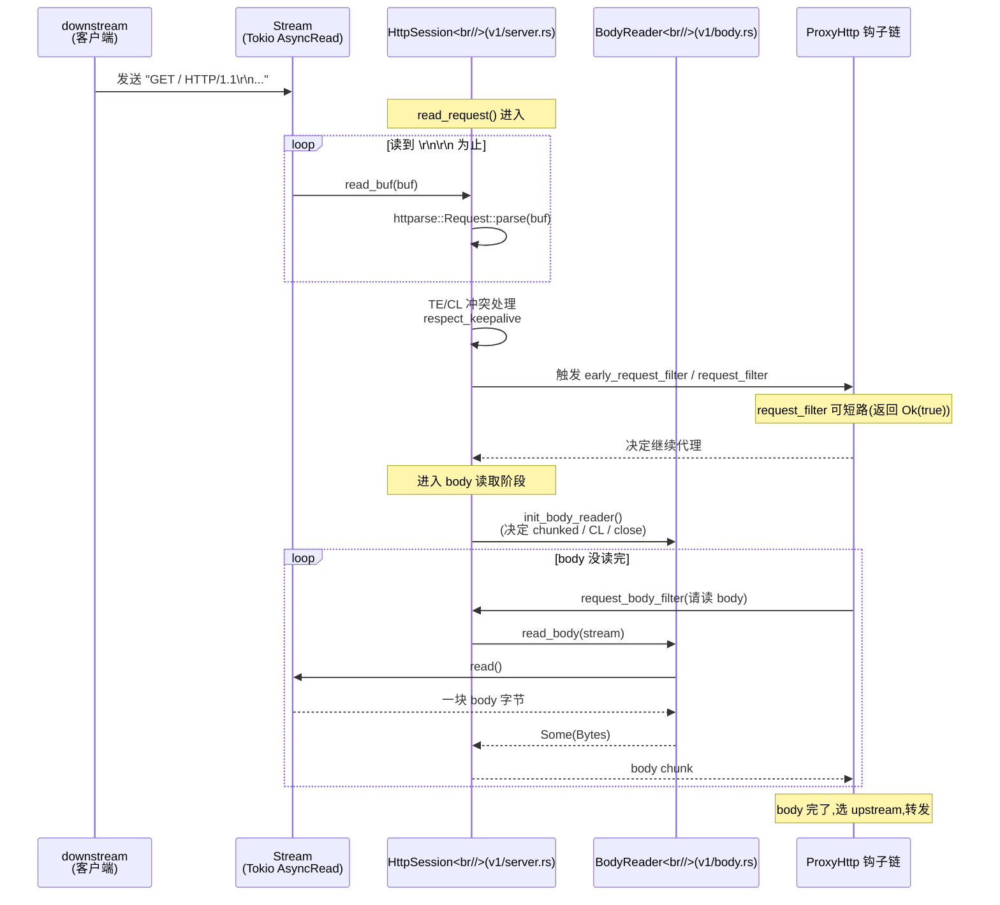
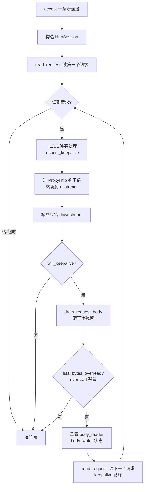
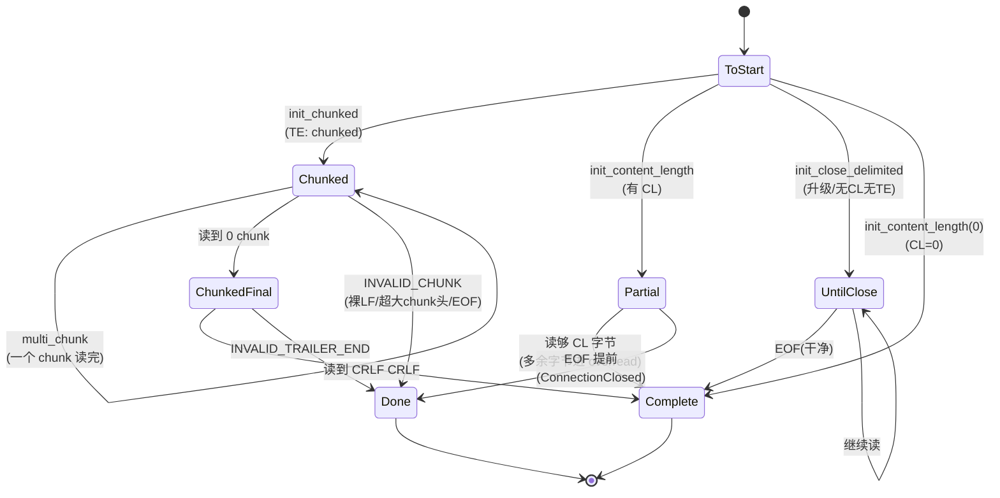

# 第 12 章 HTTP/1 自研解析(基于 httparse)

> **第 4 篇 · 转发设施 · HTTP 协议解析(协议招牌)**
>
> 核心问题:**Pingora 的 HTTP/1 为什么自己写,而不直接用 hyper?**

读完这一章,你会明白:

1. 为什么 Pingora 在运行时**完全不依赖 hyper**(`hyper` 只在 `pingora-core` 的 `[dev-dependencies]` 里出现,跑测试和 benchmark 才拉它),而选择基于 `httparse` crate 自己实现一套 HTTP/1 状态机。
2. HTTP/1.x 的请求/响应是怎么从一个字节流被"切"成 header + body 的:逐字节读、`httparse` 切请求行、`BodyReader` 状态机驱动 body 帧的分块与定长两种模式。
3. keep-alive 循环:同一条 TCP 连接上连续处理多个 HTTP/1 请求,状态怎么重置、body 怎么 drain、什么时候选择不复用。
4. **HTTP Request Smuggling(请求走私)为什么是反向代理的生死线**,Pingora 在解析层做了哪五道防线:Content-Length 与 Transfer-Encoding 冲突时谁说了算、重复 Content-Length 一律拒、非数字 Content-Length 一律拒、最后一个 Transfer-Encoding token 才算数、chunk 内部强制 CRLF。
5. 100-continue、hop-by-hop header、chunked 编码这些 HTTP/1 老面孔在 Pingora 里是怎么落地的。

如果只读一节,读**第四节"smuggling 防护的五道防线"**——那是这一章的灵魂,也是 Pingora 选择自研而非直接套 hyper 的根本理由。

---

## 一句话点破

> **HTTP/1 解析是反向代理的"前牙",前牙不齐,请求走私就把后端咬穿。Pingora 不把前牙外包给 hyper,而是基于 `httparse` 这个"只负责切第一刀"的零拷贝解析器,自己长一嘴前牙——它要把代理场景特有的歧义(Content-Length 与 Transfer-Encoding 谁说了算、重复头、最后一个 token)逐个钉死,这是"通用 HTTP 库"愿意为你做、但不一定按代理需要的方式做的硬骨头。**

回扣二分法:这一章在主线的**转发设施**那一面——HTTP/1 解析器是框架自管的字节切分设施,业务不碰它(业务在 `ProxyHttp` 钩子里写逻辑,钩子是在解析切出结构化请求之后才触发的)。但它是"代理必须自管"的典型代表:解析的歧义会直接变成安全漏洞,所以框架不能假手于人。

---

## 12.1 为什么 HTTP/1 要"自己写"

### 12.1.1 提问:HTTP/1 不就是文本协议吗,有什么难的

很多人对 HTTP/1.x 的第一印象是"简单的文本协议":一行请求行 `GET / HTTP/1.1\r\n`,几行 `Header: Value\r\n`,一个空行 `\r\n`,然后是 body。比起 HTTP/2 的二进制帧、HPACK、流控,HTTP/1 看起来朴素得像一封电子邮件。于是初学者的直觉是:这种东西,用一个现成的库(比如 hyper)不就行了,为什么要自己写?

这个直觉踩中了一个真相:**切请求行、切 header 名值对、判空行**,这些"机械"工作确实不值得自己写——Pingora 也没自己写,它把这部分外包给了 `httparse` crate(后面会看到,`httparse` 就是个"切第一刀"的纯函数解析器)。但这个直觉漏掉了另一半:**HTTP/1.x 的歧义处理(request framing),才是反向代理真正的生死线**。

举个最经典的歧义:一个请求同时带了两个相互矛盾的 body 长度声明——

```
POST / HTTP/1.1
Content-Length: 5
Transfer-Encoding: chunked

0\r\n
\r\n
GET /admin HTTP/1.1\r\n\r\n  (这里藏着一个走私的请求)
```

`Content-Length: 5` 说 body 是 5 字节,`Transfer-Encoding: chunked` 说 body 是分块传输(上面的 `0\r\n\r\n` 表示结束)。这两个声明**打架**。前端的代理和后端的服务器,如果对"谁说了算"的判断不一致,就会出现致命的"请求走私":代理认为第一个请求在 `0\r\n\r\n` 处就结束了,把后面那串 `GET /admin` 当成第二个请求转给后端;后端却认为 body 是 5 字节,把后面的 `GET /admin` 当成第一个请求的 body 吃掉,于是后面的连接上下文里就"凭空"多出来一个被代理"批准过"的请求——这就是 [Request Smuggling](https://portswigger.net/web-security/request-smuggling) 的原理。

这种歧义在 HTTP/1.x 协议里有**十几处**,而且历史上每过几年就被绕过一次(Cl.CL、TE.CL、TE.TE、CL.TE 各种变体),每一次绕过都对应一批 CVE。RFC 7230(后并入 RFC 9112)花了一整节(§6.3)来规定"当两者同时出现时怎么办",但规定的措辞在不同实现里被解读出不同行为。**一个通用 HTTP 库(比如 hyper)愿意按 RFC 处理,但它处理的方式未必是一个面向"代理"的库需要的最严格方式。** 这正是 Pingora 选择自己写 HTTP/1 的根本动机。

### 12.1.2 承接方怎么做 / 不这样会怎样

我们对照三个参考实现:

**hyper(Tokio 之上同级库)怎么做**:`hyper` 也基于 `httparse`,自己实现了一套 HTTP/1 状态机(`hyper` 仓 `proto/h1/`)。hyper 的定位是"通用 HTTP 库",它服务的是"一个 server 收一个 client 发的请求"这种端到端场景。端到端场景下,smuggling 的攻击面较小(直连,中间没有第二个解析器产生分歧),所以 hyper 的策略相对"宽容":它在解析层做基本的 RFC 合规,但把"是否拒绝歧义请求"这种代理才关心的硬性策略,留给了上层。hyper 的 `Service` trait 抽象的是"处理一个请求",不是"代理一个请求"。

**Envoy(C++ 反向代理)怎么做**:Envoy 有自己的 HCM(HTTP Connection Manager),在 `source/common/http/http1/` 里实现了一份完整的 HTTP/1 解析器(底层用的是 `http-parser` 这个老库,后来迁到了 `llhttp`)。Envoy 对 smuggling 的防护非常激进:在 `CodecHelper::chargeStats` 之外,有专门的 header 校验、transfer-encoding 归一化、对非法 content-length 的零容忍。Envoy 必须自己写,因为它和 Pingora 一样,是"代理"——代理处在两端解析器之间,任何歧义都是攻击面。

**Nginx(C 反向代理)怎么做**:Nginx 自己写 HTTP/1 解析器(`src/http/ngx_http_parse.c`,几千行手写状态机)。Nginx 配置里有大量 `proxy_set_header`、`proxy_pass_request_headers` 的开关,本质就是在控制 hop-by-hop header 的去留和 body framing 的传递。Nginx 历史上也踩过 smuggling 的坑(比如 `proxy_http_version 1.0` 配合 chunked 的边界情况)。

**如果 Pingora 朴素地照搬 hyper 会怎样**?会撞上三堵墙:

1. **攻击面对接不上**:hyper 是端到端库,它的默认策略不会按"代理必须零容忍歧义"来设计。把 hyper 直接塞进代理,等于把一个"宽松的端到端解析器"摆在前后端之间,smuggling 攻击面立刻打开。
2. **代理语义对不上**:代理需要"先解析 downstream 的请求,再原样(或改写后)转发到 upstream"——这是**两次**解析(downstream 侧收、upstream 侧收)。hyper 的 `Service` 抽象是"处理一个请求就完了",没有"代理转发"这个角色。要在 hyper 上做代理,得绕开它的请求/响应配对模型。
3. **行为可控性差**:hyper 在演进(比如它从 0.14 的"自己管连接池"迁到 1.0 的"把连接池拆到 hyper-util"),它的 HTTP/1 实现细节也在变。一个生产代理不能容忍"上游库一个版本升级,smuggling 防护策略就变了"这种风险。Cloudflare 撑的是每秒四千万请求,任何一次"上游库行为漂移"都是事故。

所以 Cloudflare 的选择是:**HTTP/1 自己写,只把"切第一刀"(切请求行、切 header 名值对)外包给 `httparse` 这个稳定、零拷贝、纯函数的小库;其余所有歧义处理、状态机、body 分帧,全部握在自己手里。** 这和 Envoy、Nginx 的选择是一致的——**正经的反向代理,HTTP/1 解析器都是自己写的**。

### 12.1.3 所以 Pingora 这么设计:基于 httparse 的自研

先看证据。打开 `pingora-core` 的 `Cargo.toml`,运行时依赖里有 `httparse`,**没有 hyper**:

```toml
# pingora-core/Cargo.toml
[dependencies]
httparse = { workspace = true }      # 运行时依赖,自研 HTTP/1 切第一刀用
# ... 其他依赖,没有 hyper ...

[dev-dependencies]
h2 = { workspace = true, features = ["unstable"] }
# ...
hyper = { version = "1", features = ["client", "http1", "http2"] }   # 只在测试/benchmark 里
hyper-util = { version = "0.1", features = ["client-legacy", "http1", "http2"] }
```

见 [pingora-core/Cargo.toml 运行时依赖含 httparse](../pingora/pingora-core/Cargo.toml#L36),以及 [hyper 仅出现在 dev-dependencies](../pingora/pingora-core/Cargo.toml#L84-L93)。这是个铁的事实:**Pingora 在运行时不依赖 hyper**。它和 hyper 是 Tokio 之上的**同级库**(都建在 Tokio + `h2` 上),不是 Pingora 建在 hyper 上。

那"自己写"写到什么程度?打开 `pingora-core/src/protocols/http/v1/`,五个文件:

```rust
// pingora-core/src/protocols/http/v1/mod.rs
//! HTTP/1.x implementation
pub(crate) mod body;     // BodyReader / BodyWriter 状态机(chunked、定长、关闭定界)
pub mod client;          // upstream 侧的 HTTP/1 client(读响应、发请求)
pub mod common;          // 共享:CL 校验、TE 检测、keepalive、ALPN 辅助
pub mod server;          // downstream 侧的 HTTP/1 server(读请求、发响应)
```

见 [v1/mod.rs 模块声明](../pingora/pingora-core/src/protocols/http/v1/mod.rs#L15-L20)。注意,这里**没有** `header.rs`(有些资料凭印象写了个 `header.rs`,实际没有——header 类型在独立的 `pingora-http` crate 里,见下文)。这五个文件加起来近三千行,就是 Pingora 自研 HTTP/1 的全部。下面几节,我们一个文件一个文件拆开看。

> **callout · pingora-http 在哪**:HTTP/1 用的 `RequestHeader`/`ResponseHeader` 类型不在 `v1/` 里,而在 [`pingora-http` crate](../pingora/pingora-http)。这是一个抽象的 HTTP 头类型 crate,被 v1(server/client)和 v2(下一章讲)共用——这就是为什么 Pingora 能在 HTTP/1 和 HTTP/2 之间做协议转换(第 14 章):两边用的是同一套 header 抽象。

---

## 12.2 downstream 侧:从字节流到结构化请求

我们先看 downstream 侧——一个 TCP(或 TLS)字节流进来,Pingora 怎么把它"切"成一个 HTTP 请求。这是 `v1/server.rs` 里 `HttpSession` 的活。

### 12.2.1 HttpSession:一个会话的状态

`HttpSession` 是 downstream 侧的 HTTP/1 会话对象。它包装了一条 `Stream`(`Box<dyn AsyncRead + AsyncWrite + Send>`,就是 Tokio 的异步读写 trait 对象,承《Tokio》一句带过),外加一堆状态:

```rust
// pingora-core/src/protocols/http/v1/server.rs(简化示意,非源码原文)
pub struct HttpSession {
    underlying_stream: Stream,
    // 这块 buf 同时存原始请求头和可能被预读进来的请求体
    buf: Bytes,
    raw_header: Option<BufRef>,       // buf 里请求头的字节区间
    preread_body: Option<BufRef>,     // buf 里请求体的字节区间(预读进来的)
    body_reader: BodyReader,          // 读 body 的状态机
    body_writer: BodyWriter,          // 写响应 body 的状态机
    request_header: Option<Box<RequestHeader>>,  // 解析后的请求头
    keepalive_timeout: KeepaliveStatus,
    // ... 还有一堆:retry_buffer、digest、超时、是否升级等
}
```

见 [HttpSession 结构与字段](../pingora/pingora-core/src/protocols/http/v1/server.rs#L40-L89)。

有两个细节值得记:

1. **`buf` 同时放头和体的字节**。一次 `read()` 系统调用可能既把请求头读完,又把一部分请求体也读了进来(因为 TCP 是字节流,不保证头体分开到达)。所以 `buf` 里既有头(`raw_header` 指过去),也可能有"提前读到的体"(`preread_body` 指过去)。这部分预读的体后面要喂给 `BodyReader`,不能浪费。
2. **读 body 和写 body 是两个独立的状态机**:`BodyReader` 管"接下来怎么从流里读 body",`BodyWriter` 管"接下来怎么把响应 body 写到流里"。它们都住在 `v1/body.rs`,下面专门讲。

### 12.2.2 read_request:逐字节读 + httparse 切第一刀

`read_request` 是入口。它的逻辑分四步:

```mermaid
flowchart TD
    A[read_request 进入] --> B[loop: 从 stream read_buf 到 BytesMut]
    B --> C{超过 MAX_HEADER_SIZE?<br/>1MB}
    C -- 是 --> D[返回 413 头太大]
    C -- 否 --> E[构造 httparse::Request<br/>MAX_HEADERS=256 个空槽]
    E --> F[parse_req_buffer 调 httparse 切第一刀]
    F --> G{HeaderParseState?}
    G -- Partial --> B
    G -- Invalid --> H[尝试转义非法 URI 重试<br/>仍失败返回 400]
    G -- Complete<br/>切到第 s 字节 --> I[记录 raw_header 和 preread_body]
    I --> J[TE 与 CL 冲突处理<br/>+ respect_keepalive]
    J --> K[返回 Some(s) 请求头读完了]
```

核心代码(简化示意):

```rust
// pingora-core/src/protocols/http/v1/server.rs: read_request 主循环(简化示意,非源码原文)
pub async fn read_request(&mut self) -> Result<Option<usize>> {
    let mut already_read = 0;
    loop {
        if already_read > MAX_HEADER_SIZE { /* 413 */ }
        // 1. 从 stream 读到 buf
        let read_result = self.underlying_stream.read_buf(&mut buf).await;
        // 2. 构造 httparse::Request,给它 MAX_HEADERS 个空 header 槽
        let mut headers = [httparse::EMPTY_HEADER; MAX_HEADERS];
        let mut req = httparse::Request::new(&mut headers);
        // 3. 调 httparse 切第一刀
        let parsed = parse_req_buffer(&mut req, &buf);
        match parsed {
            HeaderParseState::Complete(s) => {
                // 4a. 切完了,s 是请求头结束位置
                //     把 httparse 切出来的 header 填到 request_header
                //     preread_body 指向 s 之后(预读到的体)
                //     再做 TE/CL 冲突处理、keepalive 判断
                break;
            }
            HeaderParseState::Partial => { /* 还没读完,继续 loop */ }
            HeaderParseState::Invalid(_) => { /* 转义非法 URI 重试 */ }
        }
    }
    Ok(Some(header_end_offset))
}
```

注意 `MAX_HEADERS = 256` 和 `MAX_HEADER_SIZE = 1048575`(1 MiB),都在 [`v1/common.rs`](../pingora/pingora-core/src/protocols/http/v1/common.rs#L27-L30)。这两个上限是防"头炸弹"(slowloris 之类把头拖很大的 DoS)的硬闸。

**`parse_req_buffer` 这一步是外包给 `httparse` 的"切第一刀"**:

```rust
// pingora-core/src/protocols/http/v1/server.rs: parse_req_buffer(简化示意)
fn parse_req_buffer<'buf>(
    req: &mut httparse::Request<'_, 'buf>,
    buf: &'buf [u8],
) -> HeaderParseState {
    #[cfg(not(feature = "patched_http1"))]
    let res = req.parse(buf);          // 标准 httparse::Request::parse
    #[cfg(feature = "patched_http1")]
    let res = req.parse_unchecked(buf); // 一个更快的 unchecked 版本(feature gate)
    match res {
        httparse::Status::Complete(s) => HeaderParseState::Complete(s),
        _ => HeaderParseState::Partial,
    }
}
```

见 [`parse_req_buffer` 调用 httparse](../pingora/pingora-core/src/protocols/http/v1/server.rs#L1290-L1317)。这里有两个细节值得点:

> **callout · patched_http1 是什么**:`httparse` 有一个"unchecked"变体(`parse_unchecked`),跳过一些边界检查以换取速度。Pingora 通过 cargo feature `patched_http1` 暴露这个开关,见 [Cargo.toml 的 features 段](../pingora/pingora-core/Cargo.toml#L102-L108)。Cloudflare 在内部跑的是开了 `patched_http1` 的版本——他们信任自己上游不会有需要那些被跳过的检查的输入,换取几个百分点的解析吞吐。这是"代理自己握解析器"的好处之一:你可以根据自己的威胁模型决定要不要那个 unchecked 开关。

> **callout · 切完第一刀后还要"转义重试"**:`httparse` 对请求行里的非法字符(比如 URI 里的空格、控制字符)会返回 `Invalid`。Pingora 没有直接拒,而是先尝试用 `escape_illegal_request_line` 把非法字节 percent-encode 掉再重试一次,见 [server.rs 的 escape_illegal_request_line](../pingora/pingora-core/src/protocols/http/v1/server.rs#L259-L1288)。这是"宽容"的一面:有些客户端(尤其是爬虫、老旧 SDK)会发出 URI 里有非法字节的请求,直接拒会误伤,转义后能继续解析。这是代理场景的取舍——你不能太严(误伤合法流量),也不能太松(放过 smuggling)。

### 12.2.3 body 怎么读:BodyReader 状态机

头切完之后,接下来是 body。body 有三种 frame 模式:定长(Content-Length)、分块(Transfer-Encoding: chunked)、关闭定界(HTTP/1.0 风格,读到 EOF)。这三种模式由 `BodyReader` 状态机驱动。

`BodyReader` 的核心是一个 `ParseState` 枚举:

```rust
// pingora-core/src/protocols/http/v1/body.rs(简化示意,非源码原文)
pub enum ParseState {
    ToStart,                                  // 还没初始化
    Complete(usize),                          // body 读完了,总共读了这么多字节
    Partial(usize, usize),                    // 定长模式:(已读, 剩余)
    Chunked(usize, usize, usize, usize),      // 分块模式:(总读, buf起点, buf终点, 期望从IO读多少)
    ChunkedFinal(usize, usize, usize, u8),    // 收尾模式:(总读, trailer已解析, buf终点, end_read)
    Done(usize),                              // 出错了,但报告读了多少
    UntilClose(usize),                        // 关闭定界:(已读)
}
```

见 [`ParseState` 枚举定义](../pingora/pingora-core/src/protocols/http/v1/body.rs#L49-L66)。

初始化由 `init_body_reader` 决定走哪个分支:

```rust
// pingora-core/src/protocols/http/v1/server.rs: init_body_reader(简化示意)
fn init_body_reader(&mut self) {
    if self.body_reader.need_init() {
        if self.was_upgraded() {
            // WebSocket 等升级:body 没有边界,读到关闭为止
            self.body_reader.init_close_delimited(preread_body);
        } else if self.is_chunked_encoding() {
            // chunked:走分块状态机
            self.body_reader.init_chunked(preread_body);
        } else {
            // 否则用 Content-Length(没有就当 0)
            let cl = self.get_content_length().unwrap_or(None);
            match cl {
                Some(i) => self.body_reader.init_content_length(i, preread_body),
                None => self.body_reader.init_content_length(0, preread_body),
            }
        }
    }
}
```

见 [`init_body_reader` 决定 body 帧模式](../pingora/pingora-core/src/protocols/http/v1/server.rs#L862-L892)。注意优先级:**升级 > chunked > Content-Length**。如果请求是升级请求(比如 `Upgrade: websocket`),body 直接走关闭定界——升级后这条连接不再是 HTTP,后续字节都属于升级协议。

`read_body` 根据 state 分发到不同的 driver(`do_read_body` 走定长、`do_read_chunked_body` 走分块、`do_read_body_until_closed` 走关闭定界):

```rust
// pingora-core/src/protocols/http/v1/body.rs(简化示意,非源码原文)
pub async fn read_body<S>(&mut self, stream: &mut S) -> Result<Option<Bytes>> {
    match self.body_state {
        Complete(_) | Done(_) => Ok(None),           // 没了
        Partial(..) => self.do_read_body(stream).await,
        Chunked(..) => self.do_read_chunked_body(stream).await,
        ChunkedFinal(..) => self.do_read_chunked_body_final(stream).await,
        UntilClose(_) => self.do_read_body_until_closed(stream).await,
        ToStart => panic!("body reader not initialized"),
    }
}
```

见 [`read_body` 按 state 分发](../pingora/pingora-core/src/protocols/http/v1/body.rs#L268-L281)。

**chunked 解析是这里面最微妙的**。一个 chunk 长这样:

```
19\r\n                    ← chunk 大小(十六进制 19 = 25 字节)
这是 25 字节的 chunk 数据\r\n
0\r\n                     ← 最后一个 chunk,大小为 0
\r\n                      ← 结束(也可能带 trailer)
```

Pingora 用 `httparse::parse_chunk_size` 解析 chunk 大小那一行(十六进制),然后校验 chunk 数据后的 `\r\n`(严格 CRLF,不允许裸 `\n`)。这个"严格 CRLF"是 smuggling 防护的一部分(下面 12.4 详讲)。如果 chunk 头被拆在两次 `read` 之间(部分读到),状态机进 `partial_chunk_head`,把已有的部分挪到 buf 前面,继续读。如果 chunk 头累积超过 `PARTIAL_CHUNK_HEAD_LIMIT`(8 KiB)还没解析出来,直接判 `INVALID_CHUNK`——这是防"超大 chunk 头"攻击的闸。见 [`parse_chunked_buf` 解析 chunk](../pingora/pingora-core/src/protocols/http/v1/body.rs#L514-L633)。

收尾的 trailer(在 `0\r\n` 之后到 `\r\n` 结束之间)目前 Pingora 是**丢弃**的(见 [body.rs 的注释](../pingora/pingora-core/src/protocols/http/v1/body.rs#L39-L43) 说明 trailer 被丢弃),并且 `TRAILER_SIZE_LIMIT = 64 KiB` 限制了 trailer 的大小,见 [`do_read_chunked_body_final` 读 trailer](../pingora/pingora-core/src/protocols/http/v1/body.rs#L635-L741)。

### 12.2.4 一张时序图:请求穿过 v1 server

把上面几步串起来,一个 HTTP/1 请求从字节到 `ProxyHttp` 钩子触发的过程:



注意,`ProxyHttp` 钩子(`early_request_filter`/`request_filter`/`request_body_filter`)是在**解析完成之后**才触发的——解析是转发设施,钩子是控制面,二者各司其职。回扣二分法:这一节讲的是**转发设施**这一面。

---

## 12.3 upstream 侧:HTTP/1 client(读响应、发请求)

downstream 侧切完请求,代理决定要把它转发给哪个 upstream。upstream 那边也是个 HTTP/1,需要 Pingora 这边扮演 client:发请求、读响应。这是 `v1/client.rs` 的活。

### 12.3.1 client 和 server 是镜像

`v1/client.rs` 里也定义了一个 `HttpSession`(注意是另一个,和 server 侧的同名但不一样)。它的活和 server 侧镜像:

- **server 侧**(`v1/server.rs`):读**请求**,写**响应**。
- **client 侧**(`v1/client.rs`):写**请求**,读**响应**。

所以 client 侧也有 `BodyReader`(读响应 body)和 `BodyWriter`(写请求 body),复用同一个 `v1/body.rs`。它也有 `read_response`(对应 server 的 `read_request`)、也有 httparse 调用、也有 TE/CL 冲突处理。差异在于:

1. **httparse 调的是 `Response` 而不是 `Request`**:见 [client.rs 的 parse_resp_buffer](../pingora/pingora-core/src/protocols/http/v1/client.rs#L827-L845)。注意 client 侧开了两个"宽容"开关:`allow_spaces_after_header_name_in_responses(true)` 和 `allow_obsolete_multiline_headers_in_responses(true)`。这两个开关是为了兼容老掉牙的 HTTP/1.0 server(比如某些原始的 origin),它们发的响应头格式不规范。
2. **body 帧模式的优先级更细**:HTTP 响应的 body 帧除了 chunked/CL/close,还要考虑状态码——HEAD 请求的响应没有 body(即使有 Content-Length)、`1xx`/`204`/`304` 没有 body。见 [client.rs 的 init_body_reader](../pingora/pingora-core/src/protocols/http/v1/client.rs#L623-L666):

```rust
// pingora-core/src/protocols/http/v1/client.rs: init_body_reader(简化示意)
fn init_body_reader(&mut self) {
    // HEAD 请求:响应没 body,即使有 CL 也当 0
    if method == HEAD { init_content_length(0, ...); }
    // 101 升级:走关闭定界
    else if status == 101 { init_close_delimited(...); }
    // 1xx/204/304:没 body
    else if (100..=199).contains(status) { return; }
    else if status == 204 || status == 304 { init_content_length(0, ...); }
    // chunked:走分块(CL 被忽略)
    else if is_chunked { init_chunked(...); }
    // 有 CL:走定长
    else if let Some(cl) = get_content_length() { init_content_length(cl, ...); }
    // 否则:关闭定界(读 EOF)
    else { init_close_delimited(...); self.close_delimited_resp = true; }
}
```

`close_delimited_resp` 这个标志后面会反复出现——它是 client 侧 smuggling 防护的关键之一(关闭定界的响应通常不复用连接,见 12.4.5)。

### 12.3.2 客户端侧的 httparse 宽容

server 侧的 `parse_req_buffer` 用的是标准 `req.parse(buf)`,严格。client 侧的 `parse_resp_buffer` 开了两个宽容开关。这是有意的取舍:**downstream 侧(收客户端请求)要严,因为这是攻击入口;upstream 侧(收 origin 响应)要宽,因为现实里的 origin 五花八门,有些就是不规范的**。代理的角色就是"在前端把歧义挡住,在后端宽容地兼容"——这种不对称是代理场景特有的,通用 HTTP 库不会替你这么设计。这也是自己写的好处之一。

> **callout · 为何 server 严而 client 宽**:严格 vs 宽容的不对称,本质是**信任边界**的不对称。downstream 客户端是不可信的(可能是攻击者),它的请求必须按最严格标准解析,任何歧义都拒绝。upstream 是 Pingora 自己选的 origin(通常是用户自己的后端),它的响应即使有点不规范也要尽量兼容,否则用户体验差。这种"前后不对称"是反向代理的标配,也是 Envoy/Nginx 都遵循的。hyper 这种端到端库没有"前端/后端"之分,不会替你做这个不对称。

---

## 12.4 smuggling 防护的五道防线(本章灵魂)

这一节是本章的灵魂,也是 Pingora 选择自研 HTTP/1 的根本理由。

### 12.4.1 为什么反向代理必须防 smuggling

先把动机讲透。Request Smuggling(请求走私)的攻击模型是这样的:

```
                ┌──────────────┐         ┌──────────────┐
   攻击者  ────►│   前端代理    │───────►│   后端服务    │
                │ (Pingora)     │         │ (origin)     │
                └──────────────┘         └──────────────┘
```

攻击者发一个**精心构造**的请求,这个请求在"前端代理"和"后端服务"两个 HTTP 解析器看来,body 的边界不一样。于是前端代理以为请求 A 已经结束、请求 B 开始了,把 A 和 B 都转给后端;后端却以为 A 的 body 还在继续,把 B 当成 A 的 body 吃了。结果:**后端把 A 处理完之后,连接里"凭空"多出来一个 B 请求,这个 B 是攻击者构造的,但后端以为它来自前端代理(也就是受信任的)**。B 可以是 `GET /admin/delete-everything`,而它的来源被前端代理"洗白"了——因为前端代理只看到 B 是个普通请求,把它转给了后端,后端执行了 B。

这个攻击的前提是**两个解析器对 body 边界的判断不一致**。所以防护的核心是:**让代理这一端的解析器,在所有歧义点上都采取一个明确、严格、与后端一致(或更严)的策略,绝不让歧义请求带着歧义转给后端**。歧义请求要么被拒绝,要么被归一化(去掉冲突的头)再转发。

#### 12.1.1.1 一个完整的 TE.CL 走私推演

为了把 smuggling 的危险讲透,我们完整推演一次最经典的 TE.CL 攻击。假设有一个前端代理(它按 Transfer-Encoding 优先定 body 边界)和一个后端(它按 Content-Length 优先定 body 边界)。攻击者发送一个请求:

```
POST / HTTP/1.1
Host: example.com
Content-Length: 4
Transfer-Encoding: chunked

0\r\n
e\r\n
GET /admin HTTP/1.1\r\n\r\n0\r\n
\r\n
```

前端(TE 优先)看到的 body 是 chunked 编码:第一个 chunk 是 `0\r\n`(大小为 0,立即结束),所以 body 在第一个 `0\r\n\r\n` 处就结束了。前端把请求转发给后端,转发的字节里 body 只到第一个 `0\r\n\r\n` 为止。剩下那串 `e\r\nGET /admin HTTP/1.1\r\n\r\n0\r\n\r\n` 留在前端这边的连接缓冲里——前端会把它当成"下一个请求"的开始。

但后端(CL 优先)看到的 body 是 `Content-Length: 4`,也就是 4 字节。它读 4 字节(`0\r\ne\r\n` 里的前 4 字节 `0\r\ne`),认为第一个请求的 body 已经结束。接下来后端从连接里读"下一个请求",读到的是 `\nGET /admin HTTP/1.1\r\n\r\n0\r\n\r\n`——这就被后端当成一个独立的 `GET /admin` 请求来执行了。

注意这个 `GET /admin` 是**怎么来的**:它来自攻击者构造的 chunked body,被后端误以为是"前一个请求结束后、连接里自然到来的下一个请求"。后端执行了它,而且执行的时候,这个请求的来源是"受信任的前端代理"(因为是代理转发的字节流)。这就是走私——攻击者把一个请求"走私"进了后端的连接上下文,绕过了前端代理本应对它做的检查(比如鉴权)。

这个攻击的根因是:**前端和后端对"同一个请求"的 body 边界判断不一致**。前端按 TE,后端按 CL,二者打架。RFC 9112 §6.3 试图堵这个洞,规定"两者同时出现时,TE 赢,删 CL"——但这是规定,不是事实。如果前端删了 CL 转发、后端没收到原始请求(后端只收到前端转发的字节,看不到前端的删除逻辑),后端的行为取决于它自己怎么解析前端转过来的字节。所以**前端的策略必须是"删 CL 后再转发",且要确保转发的字节流里不会再有任何歧义**——这就是 Pingora 在 server.rs 里 `remove_header(&CONTENT_LENGTH)` 之后还要做一堆校验的动机。

#### 12.1.1.2 smuggling 的历史:每一次 RFC 更新都对应一批绕过

Request Smuggling 不是某一天被发明的,它是一条持续了二十多年的攻防线。理解这条线,才能理解 Pingora 为什么要在五个不同的点上都布防:

- **2005 年,Watchfire 第一次系统描述**了 CL.CL 攻击(两个 Content-Length 头,前端取第一个、后端取第二个)。
- **2005-2019 年,Apache/Squid/IIS 陆续爆出**各种 smuggling CVE,每个都对应一个解析器的某个边界 bug。
- **2019 年,James Kettle(PortSwigger)发表 "[HTTP Desync Attacks](https://portswigger.net/research/http-desync-attacks)"**,系统化了 CL.TE、TE.CL、TE.TE 三大变体,把 smuggling 从"零星 CVE"提升到"协议级攻击面"。这篇文章直接推动了 RFC 7230 的修订(后并入 RFC 9112)。
- **2020 年后,新变体层出不穷**:TE.TE 利用大小写混淆(`Transfer-Encoding` vs `Transfer-encoding` vs `TRANSFER-ENCODING`)、利用多个 TE 头的顺序、利用 chunked 不在最后一个 token、利用非法 CL 值被不同解析器截断的方式不同……每发现一个绕过,服务器厂商就打一个补丁,RFC 就加一条"必须"。

Pingora 的五道防线,每一道都对应这条历史线上的一个或多个变体:TE/CL 同时出现(防线 1,堵 TE.CL/CL.TE)、重复 CL(防线 2,堵 CL.CL)、非法 CL 值(防线 3,堵"1.5 被截断成 1 或 15"那一类)、多个 TE 头(防线 4,堵 TE.TE 大小写和顺序绕过)、chunk 内裸 LF(防线 5,堵"裸 LF 分割"那一类)。

**关键认知**:smuggling 不是"一个 bug",而是"一组歧义点的集合"。防护 smuggling 不是"修一个 bug",而是"在每个歧义点上都采取明确策略"。这也是为什么代理必须自己握住解析器——你不能假设上游库(`httparse` 或 hyper)在每个歧义点上都按你的代理需要的方式处理。Cloudflare 在博客里明确说过,他们的代理需要"对每一个解析歧义都做出 Cloudflare 自己的决定",这是他们自研的根本理由。

### 12.4.1.1 RFC 9112 的措辞与实现的分歧

很多人以为"RFC 规定了,大家就都按 RFC 来"。但 RFC 的措辞往往有"建议"和"必须"的区别,而且现实里的解析器有历史包袱,不会立刻对齐。以 TE vs CL 为例,RFC 9112 §6.3 的原文大意是:

> 如果一个消息同时带有 Transfer-Encoding 和 Content-Length,后者**必须**(MUST)在处理前被删除。

这个"MUST"看起来很硬,但有几个灰色地带:

1. **"删除"是在解析时删,还是在转发时删?** 如果代理在解析时删了 CL,但转发时把原始字节流(含 CL)转给后端,后端看到的还是有 CL——这就没解决问题。Pingora 的做法是在解析后的 `request_header` 上 `remove_header(&CONTENT_LENGTH)`,后续转发用的是这个 `request_header`,所以转出去的字节流里没有 CL。
2. **"删除"发生在校验之前还是之后?** 如果先删 CL 再校验,那么"重复 CL"这个检查就永远不会触发(因为 CL 被删了)。Pingora 的顺序是:先做 TE/CL 冲突处理(删 CL),再在 `validate_request` 里做 `check_dup_content_length`——但 `check_dup_content_length` 内部有"如果有 TE 就直接返回 Ok"的保护(见 [common.rs 的 check_dup_content_length](../pingora/pingora-core/src/protocols/http/v1/common.rs#L286-L289)),所以两个检查不会互相干扰。
3. **如果 TE 的值不是 `chunked` 呢?** RFC 9112 §6.2 说,只有 `chunked` 是合法的 final Transfer-Encoding(在 HTTP/1.1 里)。如果 TE 是 `gzip` 或其他,Pingora 在 `validate_request` 里直接拒,见 [server.rs 的 validate_request 对非 chunked final TE 的拒绝](../pingora/pingora-core/src/protocols/http/v1/server.rs#L334-L348)。

这些灰色地带,每一条都对应过现实里的 CVE。RFC 是"目标",实现是"达成目标的路径",路径上的每一个岔路口都可能走错。代理自研解析器,就是为了把每一个岔路口都按代理场景的最严格方式走死,不留分歧。

HTTP/1.x 的歧义点,核心是 body 边界由两个 header 决定:`Content-Length`(定长)和 `Transfer-Encoding: chunked`(分块)。当两者同时出现、当值有多个、当值非法、当大小写不一致、当中间夹着 hop-by-hop header……每一个都是攻击面。Pingora 在解析层布了**五道防线**:

| 防线 | 歧义点 | Pingora 的策略 | 源码 |
|------|--------|----------------|------|
| 1 | 同时有 TE 和 CL | TE 赢,删掉 CL(RFC 9112 §6.3),且关 keepalive | `server.rs#L258-L285` |
| 2 | 重复的 Content-Length | 一律拒(比 RFC 更严,RFC 只要求"值不同"才拒) | `common.rs#L279-L303` |
| 3 | Content-Length 值非数字/负数/非 UTF-8 | 一律拒 | `common.rs#L208-L242` |
| 4 | 多个 Transfer-Encoding 头,chunked 不在最后 | 不当 chunked 处理(防 TE.TE 绕过) | `common.rs#L155-L176` |
| 5 | chunk 内部用裸 `\n` 而不是 `\r\n` | 一律判 INVALID_CHUNK | `body.rs#L824-L889` |

下面逐道拆。

### 12.4.2 防线 1:TE 和 CL 同时出现,TE 赢

第一道也是最经典的一道。RFC 9112 §6.3 规定:当请求同时带 `Transfer-Encoding` 和 `Content-Length` 时,**必须**以 Transfer-Encoding 为准,并删除 Content-Length(否则就是不安全的)。但历史上很多实现没删,或者删的顺序不对,导致前后端不一致。

Pingora 在 `read_request` 解析完头之后,立刻做这件事:

```rust
// pingora-core/src/protocols/http/v1/server.rs: TE/CL 冲突处理(简化示意,非源码原文)
let contains_transfer_encoding =
    request_header.headers.contains_key(TRANSFER_ENCODING);
let contains_content_length =
    request_header.headers.contains_key(CONTENT_LENGTH);

// Transfer encoding overrides content length ... per RFC 9112 6.3
let has_both_te_and_cl =
    contains_content_length && contains_transfer_encoding;
if has_both_te_and_cl {
    request_header.remove_header(&CONTENT_LENGTH);   // 删掉 CL
}
// ...
// 同时出现时,额外关闭 keepalive(RFC 9112 §6.1-15 要求)
if has_both_te_and_cl {
    self.set_keepalive(None);
}
```

见 [server.rs 的 TE/CL 冲突处理](../pingora/pingora-core/src/protocols/http/v1/server.rs#L258-L285)。注意两件事:

1. **删 CL,而不是删 TE**。因为 TE 是更明确的 body 帧信号(分块有明确的结束标志 `0\r\n\r\n`),而 CL 在有 TE 时是冗余且可能矛盾的。
2. **同时出现就关 keepalive**。这是个有意思的细节:即使删了 CL,这次请求处理完之后这条连接也**不复用**。为什么?因为"同时出现 TE 和 CL"本身就是个强烈的异常信号,这种请求几乎可以肯定是攻击者在试探。关 keepalive 是防御性的——即使这次的删 CL 处理对了,也不要冒险在同一个连接上继续解析下一个请求(下一个请求可能是攻击者利用"overread"塞进来的走私请求)。

upstream 侧(`v1/client.rs`)做同样的 TE-over-CL 归一化,见 [client.rs 的 TE/CL 冲突处理](../pingora/pingora-core/src/protocols/http/v1/client.rs#L353-L364)。

### 12.4.3 防线 2:重复的 Content-Length 一律拒

第二道。RFC 7230 说:如果一个请求有多个 Content-Length 头,且值不同,服务端**必须**当成不可恢复的错误拒绝(或用一个确定的值)。但"值相同"是允许的。

Pingora 比这个更严——**只要有两个或以上的 Content-Length 头,不管值相不相同,一律拒**:

```rust
// pingora-core/src/protocols/http/v1/common.rs: check_dup_content_length(简化示意)
pub(super) fn check_dup_content_length(headers: &HMap) -> Result<()> {
    // 如果有 TE,直接放过(TE 赢,CL 已经无所谓了)
    if headers.get(header::TRANSFER_ENCODING).is_some() {
        return Ok(());
    }
    let mut cls = headers.get_all(header::CONTENT_LENGTH).into_iter();
    if cls.next().is_none() {
        return Ok(());  // 没有 CL,正常
    }
    if cls.next().is_some() {
        // 有第二个 CL,拒!
        return Error::e_explain(InvalidHTTPHeader, "duplicated Content-Length header");
    }
    Ok(())
}
```

见 [`check_dup_content_length` 拒重复 CL](../pingora/pingora-core/src/protocols/http/v1/common.rs#L279-L303)。注意这个函数只在没有 TE 时才检查——因为如果有 TE,CL 已经被防线 1 删掉了,这里不会再纠结。

**为什么连"值相同"也拒**?因为攻击者会用"两个相同值的 CL"来试探前端的解析行为(前端如果只取第一个、或者只取第二个、或者把它们加起来,行为不同)。Pingora 的策略是"重复就是异常,异常就拒",不留任何试探空间。这是"代理场景的零容忍"——通用 HTTP 库可能为了兼容某些客户端而容忍"重复但相同",但代理不能冒这个险。

这个函数在 [`server.rs` 的 `validate_request`](../pingora/pingora-core/src/protocols/http/v1/server.rs#L328-L354) 里被调用,也在 [client.rs 的 `validate_response`](../pingora/pingora-core/src/protocols/http/v1/client.rs#L196-L214) 里被调用——前后端都查。

### 12.4.4 防线 3:Content-Length 值必须是非负整数

第三道。CL 的值必须是合法的非负整数。任何"差一点像数字"的值(`-1`、`abc`、`1.5`、`""`、`123abc`)一律拒:

```rust
// pingora-core/src/protocols/http/v1/common.rs: buf_to_content_length(简化示意)
pub(super) fn buf_to_content_length(header_value: Option<&[u8]>) -> Result<Option<usize>> {
    match header_value {
        Some(buf) => match str::from_utf8(buf) {
            Ok(s) => match s.parse::<i64>() {
                Ok(n) if n >= 0 => Ok(Some(n as usize)),
                Ok(_) => /* 负数 */ Err("negative Content-Length header value"),
                Err(_) => /* 非数字 */ Err("invalid Content-Length header value"),
            },
            Err(_) => /* 非 UTF-8 */ Err("invalid Content-Length header encoding"),
        },
        None => Ok(None),
    }
}
```

见 [`buf_to_content_length` 校验 CL 值](../pingora/pingora-core/src/protocols/http/v1/common.rs#L208-L242)。测试覆盖了 `-1`、`abc`、`1.5`、`""`、`"  "`、`123abc` 等边界,见 [server.rs 的 validate_request_rejects_invalid_content_length 测试](../pingora/pingora-core/src/protocols/http/v1/server.rs#L1683-L1703)。

**为什么"差一点像数字"也要拒**?因为这正是 smuggling 利用的灰色地带。比如 `Content-Length: 1.5`,有的解析器会截断当 `1`,有的会当 `15`(去掉小数点),有的会报错。前后端不一致就形成攻击面。Pingora 的策略是:必须是严格的非负整数字符串,否则拒。零容忍。

CHANGELOG 也记录了这个加固:**"Reject invalid content-length http/1 requests to eliminate ambiguous request framing"**(拒绝非法 content-length 的 HTTP/1 请求,消除请求帧的歧义),以及 **"Validate invalid content-length on http/1 resp by default"**(默认也校验 HTTP/1 响应的非法 content-length),见 [CHANGELOG 0.8.x 的 bug fixes](../pingora/CHANGELOG.md#L43-L44)。这正是 smuggling 防护的体现。

### 12.4.5 防线 4:多个 Transfer-Encoding,chunked 必须是最后一个 token

第四道。`Transfer-Encoding` 头的值可以是一串逗号分隔的编码(`Transfer-Encoding: gzip, chunked`),也可以有多个 `Transfer-Encoding` 头。RFC 9112 §6.2 规定:**只有当 chunked 是最后一个编码时,才能用 chunked 分块来定 body 边界**。否则,攻击者可以构造 `Transfer-Encoding: chunked, identity` 或多个 TE 头,让前端认 chunked、后端不认,形成 TE.TE 走私。

Pingora 在 [`is_chunked_encoding_from_headers`](../pingora/pingora-core/src/protocols/http/v1/common.rs#L155-L176) 里精确实现这个判断:

```rust
// pingora-core/src/protocols/http/v1/common.rs: is_chunked_encoding_from_headers(简化示意)
pub(crate) fn is_chunked_encoding_from_headers(headers: &HMap) -> bool {
    // 取最后一个 Transfer-Encoding 头(多个 TE 头时,只看最后一个)
    let Some(te_value_bytes) = headers
        .get_all(header::TRANSFER_ENCODING)
        .into_iter()
        .next_back()
    else {
        return false;
    };
    // 在这个头的值里,找最后一个逗号后的 token
    let last_token = find_last_te_token(te_value_bytes.as_bytes());
    // 最后一个 token 必须正好是 "chunked"(大小写不敏感)
    last_token.eq_ignore_ascii_case(b"chunked")
}
```

测试覆盖了多个边界,见 [`test_is_chunked_encoding_multiple_headers`](../pingora/pingora-core/src/protocols/http/v1/common.rs#L372-L388):

| Transfer-Encoding 头 | Pingora 判定 |
|----------------------|--------------|
| `chunked` | ✅ chunked |
| `chunked, ` (尾部逗号) | ❌ 非 chunked |
| `, , , chunked` | ✅ chunked(最后 token 是 chunked) |
| `["chunked", "identity"]` (两个头,第二个是 identity) | ❌ 非 chunked |
| `["gzip", "chunked, identity"]` | ❌ 非 chunked |
| `["gzip", "chunked, "]` | ❌ 非 chunked |

这些边界全是真实的 smuggling 攻击变体。`["chunked", "identity"]` 这个 case 是经典的——如果只看第一个 TE 头就当 chunked,后端可能看到最后一个头是 identity 不当 chunked,前后不一致就形成攻击面。Pingora 严格按"最后一个头里的最后一个 token"来判断,和 RFC 对齐。

### 12.4.6 防线 5:chunk 内部强制 CRLF

第五道,也是最容易被人忽略的一道。chunked 编码里,chunk 大小行后面、chunk 数据后面、最后一个 `0` chunk 后面,都必须是 `\r\n`(CRLF)。但有些实现接受裸 `\n`(LF)。

这看起来无所谓,实际是 smuggling 的富矿:如果前端接受裸 `\n` 而后端只认 `\r\n`,攻击者可以构造一个 chunk,让前端认为 chunk 在某个位置结束(用 `\n` 分割),后端却认为 chunk 还在继续(因为它不认 `\n` 当分隔符),body 边界又错位了。

Pingora 在 [`validate_crlf`](../pingora/pingora-core/src/protocols/http/v1/body.rs#L824-L889) 里强制校验 CRLF:遇到 `\n` 但前面不是 `\r`,直接判 `INVALID_CHUNK` 或 `INVALID_TRAILER_END`。这是 body 状态机内部的一道硬闸,见 [`do_read_chunked_body` 和 `parse_chunked_buf` 调用 validate_crlf](../pingora/pingora-core/src/protocols/http/v1/body.rs#L514-L633)。

### 12.4.7 第六道(隐性的):overread 就不复用连接

除了上面五道显性的,还有一道隐性的防线,藏在 body 状态机里:如果 upstream(在 client 侧)返回的 body 字节**超过了它声明的长度**(overread),这条连接**绝不复用**。

```rust
// pingora-core/src/protocols/http/v1/client.rs: respect_keepalive(简化示意)
pub fn respect_keepalive(&mut self) {
    // 升级请求不复用
    if upgraded { self.keepalive_timeout = Off; }
    // body 没初始化或关闭定界响应不复用
    else if body_reader.need_init() || self.close_delimited_resp { self.keepalive_timeout = Off; }
    // overread 了(读到的字节超过声明的 body 长度)不复用
    else if body_reader.has_bytes_overread() { self.keepalive_timeout = Off; }
    // HTTP/1.0 + TE 不复用(RFC 9112 §6.1-16)
    else if http10 && has_te { self.keepalive_timeout = Off; }
    // 显式 Connection: close 不复用
    else if connection_close { self.keepalive_timeout = Off; }
    // HTTP/1.1 默认复用,HTTP/1.0 默认不复用
    else { /* 按版本默认 */ }
}
```

见 [client.rs 的 respect_keepalive](../pingora/pingora-core/src/protocols/http/v1/client.rs#L501-L551)。`has_bytes_overread` 来自 [`BodyReader`](../pingora/pingora-core/src/protocols/http/v1/body.rs#L248-L250)——body 状态机在读到 `Content-Length` 字节之后,如果 stream 里还有多余字节,会被存进 `body_buf_overread`,然后这个标志位被置上。

**为什么 overread 是危险信号**?因为正常情况下,一个 HTTP/1 响应的 body 应该正好是声明的字节数,EOF 应该精确。overread 意味着 upstream 在声明 body 结束之后又塞了字节进来——这要么是 upstream 不规范,要么是 upstream 在尝试走私(把下一个响应提前塞进来)。无论哪种,Pingora 都选择**这条连接不复用,用完即关**。这是防御性的:宁可错杀(损失一次连接复用),也不冒险(在走私的连接上继续解析下一个响应)。

类似地,`close_delimited_resp`(响应是关闭定界,没有 CL 也没有 chunked)也会关 keepalive——因为关闭定界意味着 body 的边界靠 EOF,而 EOF 之后理论上不可能再有任何"下一个请求",所以这条连接天然不能复用。见 [close_delimited_response_explicitly_disables_keepalive 测试](../pingora/pingora-core/src/protocols/http/v1/client.rs#L2183-L2226)。

> **callout · 防御性 keepalive**:smuggling 防护不止"拒绝歧义请求"这一招。另一招是**"宁可不复用可疑连接"**。Pingora 在很多地方布了这道闸:overread、关闭定界、TE/CL 同时出现、HTTP/1.0+TE。每一处都是"这个连接有点不对劲,用完就关"。这是代理场景的防御纵深——单点的解析严格性可能被新发现的绕过手法攻破,但"可疑就关连接"是兜底的防线,即使解析层有 bug,连接一关,走私也传不过去。

### 12.4.8 五道防线之外:hop-by-hop 与归一化

除了 body 边界的五道防线,还有几个相关的处理值得提一句:

**hop-by-hop header 不在这一层处理**。`Connection`、`Keep-Alive`、`Transfer-Encoding`、`Proxy-Connection` 这些 hop-by-hop header(每跳都要去掉的 header,RFC 9110 §7.6.1)在 `v1/server.rs` 里**没有被剥离**——`server.rs` 只解析它们用于 keepalive 判断(`Connection: close`/`keep-alive`),但不会把请求头里的这些 hop-by-hop header 删掉。剥离 hop-by-hop 是**代理转发层**的活,在 pingora-proxy 的转发逻辑里做(第 14 章协议转换会讲)。这里点一句:HTTP/1 解析层只负责"切",不负责"改";改是上层的事。这种分层和 Envoy 一致(Envoy 的 codec 只解析,header 改写在 filter 里)。

**100-continue 的处理**。`Expect: 100-continue` 是 HTTP/1.1 客户端用来询问"我能不能发 body"的机制:客户端先发 header(带 `Expect: 100-continue`),等服务端回 `100 Continue` 才发 body。Pingora 的处理在 [`is_expect_continue_req`](../pingora/pingora-core/src/protocols/http/v1/common.rs#L182-L188) 和 [`write_continue_response`](../pingora/pingora-core/src/protocols/http/v1/server.rs#L1114-L1124):

```rust
// pingora-core/src/protocols/http/v1/common.rs: is_expect_continue_req(简化示意)
pub fn is_expect_continue_req(req: &RequestHeader) -> bool {
    req.version == http::Version::HTTP_11
        && req.headers.get(header::EXPECT).is_some_and(|v| {
            v.as_bytes().eq_ignore_ascii_case(b"100-continue")
        })
}
```

注意大小写不敏感比较(`eq_ignore_ascii_case`)——`Expect` 的值客户端可能发成 `100-Continue`、`100-continue`、`100-CONTINUE` 任何大小写组合,Pingora 都认。100-continue 响应在代理场景里有个微妙之处:代理可以选择**先回 100 给客户端,再继续转发**(让客户端尽快发 body,不阻塞),也可以选择**等 origin 回 100 再转发给客户端**。Pingora 通过 `ignore_info_resp` 标志和 [`ignore_info_resp` 的特殊判断](../pingora/pingora-core/src/protocols/http/v1/server.rs#L679-L682) 来控制:当 `ignore_info_resp` 开启时,1xx 响应(101 除外)不转发,但 100 在有 Expect 时**例外**转发。这是为了让 100-continue 这个特殊的握手机制能正常工作。

#### 12.4.8.1 100-continue 在代理场景的两种语义

100-continue 在端到端 server 里语义简单:server 收到 `Expect: 100-continue`,如果愿意收 body,就回 `100 Continue`,客户端收到后才发 body;如果不愿意(比如 body 太大),直接回 `417 Expectation Failed` 或 `413 Payload Too Large`,客户端就不发 body 了。这省去了"发了大 body 才被告知拒绝"的浪费。

但在**代理**里,100-continue 有两种转发策略,各有取舍:

1. **立即回 100(乐观)**:代理一收到带 Expect 的请求头,立刻自己回一个 `100 Continue` 给客户端,不等 upstream。好处是客户端不阻塞,坏处是如果 upstream 最后拒绝(比如 origin 觉得 body 太大),客户端已经发了 body,代理还得把 body drain 掉。
2. **透传 100(悲观)**:代理把 Expect 头转发给 upstream,等 upstream 回 100 再转发给客户端。好处是 upstream 的决定被忠实传达,坏处是延迟高(客户端要等一个 RTT 到 upstream 再回来才能开始发 body)。

Pingora 的默认行为接近"透传":它**不会**主动伪造一个 100(除非业务显式调 `write_continue_response`)。`ignore_info_resp` 标志控制是否把 upstream 的 1xx 响应转发回 downstream——默认情况下 100 会被透传(因为有 Expect 时的特殊判断)。这给了业务灵活性:业务可以在 `request_filter` 里决定是主动回 100(乐观)还是等 upstream(悲观)。

> **callout · 1xx 响应在 HTTP/1.1 里的特殊性**:HTTP/1.1 允许在一个最终响应之前发多个 1xx 临时响应(100 Continue、102 Processing、103 Early Hints)。这些 1xx 响应不结束请求,客户端要继续等最终响应。代理转发 1xx 有个陷阱:HTTP/1.0 客户端不认 1xx(会当成最终响应出错),所以代理要确认 downstream 是 HTTP/1.1 才转发 1xx。Pingora 的 `is_expect_continue_req` 检查 `req.version == HTTP_11` 就是这个用意——HTTP/1.0 的 Expect 头语义不同,要区别对待。103 Early Hints 是个较新的特性(用于 `Link:` preload 提示),它的转发也走类似机制。

#### 12.4.8.2 header 名与值的大小写归一化

HTTP/1 的 header 名按 RFC 是大小写不敏感的(`Content-Length` 和 `content-length` 是同一个 header)。但实现里有两种处理方式:**保留原样**(转发时维持客户端发来的大小写)或**归一化**(统一转成某种规范形式,比如 `Content-Length` 首字母大写)。这两种方式各有 smuggling 隐患:

- 如果前端归一化、后端不归一化,且后端用某种大小写敏感的查找(比如把 header 名当 hash key 但没做大小写折叠),那么 `Content-Length: 5` 被前端转成 `content-length: 5` 后,后端可能找不到这个 header(因为它的 hash 表里 key 是 `Content-Length`),于是后端以为没有 CL,body 帧判断又错位。
- 如果前端不归一化、后端归一化,问题反过来。

Pingora 的处理:它的 header 存储(`pingora-http` crate 的 `HeaderMap` 类似 hyper 用的 `http` crate 的 `HeaderMap`)在查找时是大小写不敏感的,但存储时保留原样或归一化(取决于具体路径)。`httparse` 切出来的 header 名是原样的(它不归一化),Pingora 在填充 `request_header` 时用的 `populate_headers` 会保留原始字节。 smuggling 防护的关键不是"归一化与否",而是**"查找时一定要大小写不敏感"**——Pingora 用 `contains_key(TRANSFER_ENCODING)` 这样的查找(底层 `HeaderMap` 做大小写折叠),确保 `Transfer-Encoding`、`transfer-encoding`、`TRANSFER-ENCODING`、`TrAnSfEr-EnCoDiNg` 都能被防线 1~5 识别到。这是和 TE.TE 大小写绕过斗争的核心:不管攻击者怎么混大小写,Pingora 都能找到 TE 头并应用规则。

承 `pingora-http` 的 `IntoCaseHeaderName` trait(见 [server.rs 的 import](../pingora/pingora-core/src/protocols/http/v1/server.rs#L27)):这是 Pingora 自己的 header 名类型抽象,支持大小写敏感和不敏感两种查找。 smuggling 防护用的都是大小写不敏感的查找路径。

#### 12.4.8.3 patched_http1 feature:性能与安全的旋钮

前面提到 `parse_req_buffer` 有两条路径:标准的 `req.parse(buf)` 和 `req.parse_unchecked(buf)`,由 cargo feature `patched_http1` 切换。展开讲一下这个旋钮的设计动机。

`httparse` 是个性能敏感的库(每秒要切几百万个请求),它的 `parse` 函数里有一些安全检查(比如校验请求行格式、校验 header 名字符集)。这些检查虽然保证正确性,但每个检查都是几条 CPU 指令的开销,累加起来在高 QPS 下不可忽略。`httparse` 提供了一个 `parse_unchecked` 变体,跳过那些"在可信输入下不会触发"的检查,换取速度。

但 `parse_unchecked` 有个前提:**输入是可信的**。如果攻击者能发来需要那些被跳过的检查的输入,`parse_unchecked` 可能给出错误结果(比如把一个非法请求行当成合法的)。所以这个开关是个"性能 vs 安全"的旋钮:

- 开启 `patched_http1`(用 `parse_unchecked`):快几个百分点,但要求输入可信。
- 关闭 `patched_http1`(用 `parse`):慢一点,但对任意输入都安全。

Cloudflare 在生产环境开启 `patched_http1`,因为他们信任自己的下游(downstream 是 Cloudflare 自己的边缘网络,不是直接的公网)。但作为开源库,Pingora 默认关闭这个 feature——用户要根据自己部署在什么位置(边缘 vs 内部),自己决定开不开。这是"代理自己握解析器"的另一个好处:你可以根据威胁模型调整解析的严格度,而通用 HTTP 库通常不给你这个旋钮(它要兼顾所有用户,只能选保守的默认)。

见 [Cargo.toml 的 patched_http1 feature 定义](../pingora/pingora-core/Cargo.toml#L102-L108)。注意这个 feature 转发到 `pingora-http/patched_http1`(因为 header 类型在 pingora-http 里,也用了 httparse)。

---

## 12.5 keep-alive 循环:一条 TCP 连续处理多个请求

讲完了解析和防护,我们看 keep-alive——HTTP/1 性能的关键。keep-alive(也叫 persistent connection)让同一条 TCP 连接可以连续处理多个 HTTP/1 请求,省去每个请求都重新建 TCP(和 TLS)握手的开销。

### 12.5.1 keep-alive 的状态机

Pingora 用一个 `KeepaliveStatus` 枚举管理 keepalive 状态:

```rust
// pingora-core/src/protocols/http/v1/common.rs: KeepaliveStatus(简化示意)
pub enum KeepaliveStatus {
    Timeout(Duration),  // 复用,但有空闲超时
    Infinite,           // 复用,永不超时
    Off,                // 不复用,处理完就关
}
```

见 [`KeepaliveStatus` 定义](../pingora/pingora-core/src/protocols/http/v1/common.rs#L43-L48)。`HttpSession` 持有这个状态,每次处理完一个请求后,根据一系列规则决定下一步。

keepalive 的开启由 `respect_keepalive` 决定(前面 12.4.7 已经贴过 client 侧的,server 侧逻辑类似):

```rust
// pingora-core/src/protocols/http/v1/server.rs: respect_keepalive(简化示意)
pub fn respect_keepalive(&mut self) {
    if let Some(keepalive) = self.is_connection_keepalive() {
        // 客户端显式声明了 Connection: keep-alive 或 close
        if keepalive { self.set_keepalive(Some(0)); }  // Infinite
        else { self.set_keepalive(None); }            // Off
    } else if self.req_header().version == Version::HTTP_11 {
        self.set_keepalive(Some(0));  // HTTP/1.1 默认 keepalive
    } else {
        self.set_keepalive(None);     // HTTP/1.0 默认 close
    }
}
```

见 [server.rs 的 respect_keepalive](../pingora/pingora-core/src/protocols/http/v1/server.rs#L710-L727)。HTTP/1.1 默认 keepalive(省去 Connection: keep-alive 这一行),HTTP/1.0 默认 close(要显式 `Connection: keep-alive` 才复用)——这是 RFC 的规定。`is_connection_keepalive` 读 `Connection` 头的值(`close`/`keep-alive`/`upgrade`),实现见 [`parse_connection_header`](../pingora/pingora-core/src/protocols/http/v1/common.rs#L79-L121)。

### 12.5.2 处理完一个请求:drain body 再复用

keep-alive 的关键挑战是**上一个请求的 body 要读干净**,否则下个请求的解析会从上一请求 body 的残留字节开始,立刻错位。这是 smuggling 的另一个变体:即使没有恶意构造,只要 body 没读完就复用连接,下个请求就废了。

Pingora 在 `reuse`(server 侧把会话归还连接池的入口)里做 drain:

```rust
// pingora-core/src/protocols/http/v1/server.rs: reuse(简化示意)
pub async fn reuse(mut self) -> Result<Option<Stream>> {
    if !self.will_keepalive() {
        self.shutdown().await;  // 不复用,关掉
        Ok(None)
    } else {
        self.drain_request_body().await?;  // 把剩下的 body 读干净
        if self.body_reader.has_bytes_overread() {
            Ok(None)  // overread 了,即使想复用也不复用(防走私)
        } else {
            Ok(Some(self.underlying_stream))  // 把 stream 还回去复用
        }
    }
}
```

见 [server.rs 的 reuse](../pingora/pingora-core/src/protocols/http/v1/server.rs#L1093-L1112)。注意三个细节:

1. **`drain_request_body`**:即使业务没读 body(比如是个 GET 请求,业务不关心 body),如果客户端发了 body,代理也要把它从 stream 里读出来丢掉,否则下个请求的解析起点就错了。这个 drain 有个超时保护(`total_drain_timeout`),避免恶意客户端发个无限长的 body 把连接卡住。
2. **`has_bytes_overread` 兜底**:即使 drain 完了,如果发现 overread(读到的字节超过声明的 body 长度),还是不复用——这又回到了 12.4.7 的防线。
3. **HTTP pipelining 不复用**:如果 stream 里有"预读进来的、属于下一个请求的字节"(也就是客户端用了 pipelining,一个请求还没处理完就发了下一个),Pingora 也不复用——因为 pipelining 是 smuggling 的另一个攻击面(攻击者可以利用 pipelining 让"下一个请求"提前塞进 stream)。`has_bytes_overread` 在这里也起到了检测 pipelining 残留的作用。

### 12.5.3 retry buffer:为什么 body 要缓存一份

讲 keep-alive 循环之前,先讲一个相关的机制:**retry buffer**。`HttpSession` 里有个字段 `retry_buffer: Option<FixedBuffer>`,见 [HttpSession 的 retry_buffer 字段](../pingora/pingora-core/src/protocols/http/v1/server.rs#L72-L73)。它的作用是:把 downstream 发来的请求体缓存一份(最多 64 KiB),以便在转发失败时可以重试。

为什么要缓存?考虑这个场景:downstream 发了一个带 body 的 POST 请求,Pingora 代理转给 upstream A,upstream A 连接失败(比如超时)。代理想重试,转给 upstream B。但 body 已经被读出来转给 A 了(或者部分转了),连接断了,字节丢了——怎么转给 B?

答案有两个:

1. **不缓存,失败就放弃重试**。简单,但用户体验差:任何一次 upstream 抖动都导致请求失败。
2. **缓存一份,失败时用缓存的 body 重试**。这是 Pingora 的选择。

`FixedBuffer` 是个固定大小的环形缓冲,上限 `BODY_BUF_LIMIT = 64 KiB`,见 [`BODY_BUF_LIMIT` 定义](../pingora/pingora-core/src/protocols/http/v1/common.rs#L32-L35)。如果请求体超过 64 KiB,就不缓存(也就不能重试)——因为缓存的代价(内存占用)开始超过重试的收益。这是个工程取舍:**小 body 缓存重试,大 body 失败就放弃**。承 P2-08 一句带过:`HttpTask` 枚举的 body 透传和 retry buffer 配合,实现"小 body 可重试,大 body 流式透传不重试"的策略。

retry buffer 和 keep-alive 的关系是:retry buffer 是"请求维度"的(每个请求一个),keep-alive 是"连接维度"的(每条连接上多个请求)。两者正交,但都涉及 body 的读取时机——retry buffer 要求 body 先读出来缓存,而 keep-alive 的 drain 又要求 body 读完。所以 Pingora 在 body 读取上有个统一的 `BodyReader` 状态机,既服务于 retry buffer(读出来缓存),也服务于 drain(读出来丢掉)。

### 12.5.4 keep-alive 的循环结构

把上面几步串起来,downstream 侧一个连接上的 keep-alive 循环长这样:



这个循环里,每处理完一个请求,`body_reader` 和 `body_writer` 都要重置(`reinit`),`request_header` 要清空,然后回到 `read_request` 等下一个请求。这就是"一条 TCP 连续处理多个 HTTP/1 请求"的本质。

承《Tokio》一句带过:这个循环跑在一个 Tokio task 里(每连接一个 task,承 P2-06 的连接管理)。task 在 `read_request` 的 `await` 上让出(没有字节来时),由 Tokio reactor 在字节到达时唤醒。这个让出/唤醒机制《Tokio》那本书拆透了,这里不重复。

> **callout · keepalive 和连接池是两层**:不要把 keepalive 和 P2-06 讲的 `TransportConnector` 连接池搞混。**keepalive 是 HTTP 层的概念**——一条 HTTP/1 连接可以连续处理多个请求。**连接池是 L4 层的概念**——把空闲的 TCP/TLS 连接存起来,下次给同一个 upstream 用。两者配合:HTTP/1 的 keepalive 让连接可以复用,连接池负责把这些可复用的连接管理起来(LRU、空闲探测、健康检查)。P2-06 讲的是连接池,这一章讲的是 keepalive 本身的 HTTP 语义。

---

## 12.6 对照:Pingora h1 vs hyper h1 vs Nginx h1

把三家放一起对照,能看清"代理自研 h1"和"通用 HTTP 库 h1"的差异。

| 维度 | Pingora h1(v1/) | hyper h1(proto/h1/) | Nginx h1(ngx_http_parse.c) |
|------|------------------|---------------------|-----------------------------|
| **定位** | 反向代理(前后两次解析) | 通用 HTTP 库(端到端) | 反向代理(前后两次解析) |
| **底层切第一刀** | httparse(零拷贝纯函数) | httparse(同) | 自己手写状态机(几千行 C) |
| **TE/CL 冲突** | TE 赢 + 删 CL + 关 keepalive | TE 赢 + 删 CL(RFC 合规) | TE 赢 + 删 CL |
| **重复 CL** | 一律拒(比 RFC 严) | 按 RFC 处理 | 一律拒 |
| **非法 CL 值** | 一律拒 | 一律拒 | 一律拒 |
| **多个 TE 头** | 看最后一个头的最后 token | 类似 | 类似 |
| **chunk 内裸 LF** | 一律拒(validate_crlf) | 严格 | 严格 |
| **overread 处理** | 不复用连接(防走私) | 不涉及(端到端没这问题) | 不复用 |
| **前后不对称** | server 严,client 宽 | 没有前后之分(对称) | server 严,client 宽 |
| **语言** | Rust(async/await) | Rust(async/await) | C(同步,基于 epoll 事件) |

这张表里最值得记的是**"前后不对称"**那一行。Pingora 和 Nginx 都是代理,都遵循"downstream 严、upstream 宽"的不对称策略。hyper 是端到端库,没有"前端/后端"的概念,所以它的 HTTP/1 是对称的(收请求和收响应用同样严格的规则)。这就是为什么代理要自己写 HTTP/1——通用 HTTP 库的对称设计不适合代理的信任边界。

### 12.6.1 逐行解读这张对照表

把这张表的几个关键维度展开:

**"底层切第一刀"这一行**:三家都倾向于不自己写"切请求行、切 header 名值对"这种机械工作。Pingora 和 hyper 都用 `httparse`(零拷贝、纯函数、性能好),Nginx 自己写(`ngx_http_parse.c` 几千行 C)——Nginx 写得早(2002 年起),那时没有现成的高质量解析器,而且 Nginx 需要在解析阶段做一些 Nginx 特有的逻辑(比如变量插值),所以全自己写。Pingora 用 `httparse` 是站在巨人肩膀上,把精力留给"歧义处理"这个真正需要自己掌控的部分。这印证了一个设计哲学:**不要重新发明轮子,但要把轮子的控制权握在自己手里**。`httparse` 是"轮子"(切第一刀),Pingora 围绕它造"车架"(状态机、防护、keepalive)。

**"TE/CL 冲突"这一行**:三家都遵循 RFC 9112 §6.3(TE 赢,删 CL)。差异在**额外处理**:Pingora 多了一步"同时出现就关 keepalive",这是防御性的——即使这次解析对了,这条连接也标记为"可疑",不复用。hyper 没有这一步(它不关心 keepalive 的可疑度,端到端场景下 keepalive 的可疑度影响小)。Nginx 的处理取决于配置(`proxy_http_version`、`proxy_set_header` 等),相对灵活但也容易配错。

**"重复 CL"这一行**:Pingora 一律拒(连值相同的重复也拒),hyper 按 RFC 处理(值相同的重复允许),Nginx 一律拒。这个差异体现了"代理的零容忍"vs"通用库的 RFC 合规"。RFC 的措辞是"值不同的重复 CL 必须拒",但代理为了堵住攻击者的试探,选择比 RFC 更严。这是一个"代理场景的需求驱动了比 RFC 更严的策略"的典型案例。

**"overread 处理"这一行**:这是最能体现"代理 vs 端到端"差异的一行。Pingora 和 Nginx 都在 overread 时不复用连接(因为 overread 是走私信号),hyper 不涉及(端到端没有"复用同一条连接处理多个请求"的场景——hyper 的连接复用在 hyper-util 里,粒度和代理不同)。这一行也是 Pingora 自研的最强动机之一:overread 这个概念在端到端库里根本不存在,只有代理才需要。

**"前后不对称"这一行**:这是设计哲学的差异。Pingora 和 Nginx 都把"收 downstream 请求"和"收 upstream 响应"当成两个不同的信任场景,用不同的严格度。hyper 没有这个区分(它只有一个 `Service`,收请求就完事了,没有"再去收另一个服务器的响应"这一步)。这种不对称需要两套独立的解析路径(虽然共用底层 `BodyReader`),工程量更大,但收益是"按信任边界精确定制严格度"。

**"语言"这一行**:Rust(async/await)vs C(同步事件驱动)。这一行不是技术细节,但影响了实现的写法。Pingora 的状态机用 Rust enum 表达,模式匹配保证穷尽性(漏处理一个 state 编译器报错);Nginx 的状态机用 C 的 switch-case + goto,灵活但容易漏 case。Rust 的所有权系统也保证了 `Bytes` 的零拷贝传递(引用计数),而 C 要手动管理引用计数。这是 Rust 写代理的天然优势——见 P0-01 的 Rust 异步代理动机。

承《hyper》一句带过:hyper 的 HTTP/1 实现细节(它的 `proto/h1/` 下的 `Conn`、`Encoder`、`Decoder`、`ClientTransaction`、`ServerTransaction`)在《hyper》P2-06 拆透了。两套实现的差异核心就是上面这张表——同样的 RFC,代理和端到端库解读出不同的策略。读完那本再看这本,这里的对照会非常清晰。

### 12.6.2 写侧:BodyWriter 与 chunked 编码的生成

前面重点讲了读侧(`BodyReader`),写侧(`BodyWriter`)同样值得一提。代理不仅要把 upstream 的响应 body 转发给 downstream,还要把 downstream 的请求 body 转发给 upstream——这两步都涉及"按某种帧模式写字节"。

`BodyWriter` 也有个状态枚举 `BodyMode`,和 `ParseState` 对称:

```rust
// pingora-core/src/protocols/http/v1/body.rs(简化示意,非源码原文)
pub enum BodyMode {
    ToSelect,                       // 还没初始化
    ContentLength(usize, usize),    // (total, written) 定长
    ChunkedEncoding(usize),         // (written) 分块
    UntilClose(usize),              // (written) 关闭定界
    Complete(usize),                // (written) 终态
}
```

见 [`BodyMode` 枚举定义](../pingora/pingora-core/src/protocols/http/v1/body.rs#L897-L904)。初始化由 [`init_body_writer_comm`](../pingora/pingora-core/src/protocols/http/v1/common.rs#L123-L140) 决定:

```rust
// pingora-core/src/protocols/http/v1/common.rs: init_body_writer_comm(简化示意)
pub(crate) fn init_body_writer_comm(body_writer: &mut BodyWriter, headers: &HMap) {
    if is_chunked_encoding_from_headers(headers) {
        // transfer-encoding takes priority over content-length
        body_writer.init_chunked();
    } else if let Some(cl) = header_value_content_length(headers) {
        body_writer.init_content_length(cl);
    } else {
        // 没有 TE 也没有 CL:关闭定界
        // TODO: should disable keepalive in this case
        body_writer.init_close_delimited();
    }
}
```

注意这个函数被 server 侧(写响应)和 client 侧(写请求)共用,所以叫 `_comm`(common)。它的优先级和读侧的 `init_body_reader` 一致:**chunked > Content-Length > 关闭定界**。这个一致性很重要——读写两侧必须用同样的优先级判断 body 帧,否则一个请求的 body 在写的时候按 chunked、读的时候按 CL,立刻错位。

**chunked 编码的生成**在 [`do_write_chunked_body`](../pingora/pingora-core/src/protocols/http/v1/body.rs#L1007-L1031):

```rust
// pingora-core/src/protocols/http/v1/body.rs: do_write_chunked_body(简化示意)
fn do_write_chunked_body(&mut self, data: &[u8], ...) {
    // 把 data 包成 "{:X}\r\n{data}\r\n" 写出去
    let header = format!("{:X}\r\n", data.len());  // chunk 大小,十六进制
    let trailer = "\r\n";
    write_vec_all(stream, &[header.as_bytes(), data, trailer.as_bytes()]).await;
}
```

每个 chunk 前面是十六进制的大小行 + `\r\n`,后面是 `\r\n`。最后一个 chunk 是固定的 `0\r\n\r\n`(常量 `LAST_CHUNK`,见 [body.rs 的 LAST_CHUNK 定义](../pingora/pingora-core/src/protocols/http/v1/body.rs#L38))。这个生成逻辑虽然简单,但有个细节:**写多个 chunk 时要 batch**。`write_vec_all` 用的是 vectored IO(`writev`),把 header/data/trailer 三个片段一次性写入,减少系统调用次数。代理是 IO 密集,每个 chunk 省一次 `write` 系统调用,在大 body 转发时收益巨大。

**定长模式的写入校验**在 [`do_write_body`](../pingora/pingora-core/src/protocols/http/v1/body.rs#L975-L1005):它只写 `total - written` 字节,如果业务传来的 body 超过声明的 Content-Length,会 warn 并截断。结束时的 [`do_finish_body`](../pingora/pingora-core/src/protocols/http/v1/body.rs#L1070-L1084) 会检查 `written < total`,如果是就报 `PREMATURE_BODY_END`(body 提前结束)。这些校验防止代理"声明的 body 长度和实际写的不一致"——这也是一种 smuggling 防护(虽然危害比读侧小,但保持一致性是代理的基本责任)。

> **callout · body_write_buf 的批量写入**:`HttpSession` 还有个 `body_write_buf: BytesMut` 字段([server.rs#L55](../pingora/pingora-core/src/protocols/http/v1/server.rs#L55)),用来把多次小的 body 写入合并成一次大的 `write`。代理在转发 body 时,upstream 可能一次返回一小块(比如几十字节),如果每块都直接 `write` 到 downstream,系统调用开销巨大。`body_write_buf` 攒到一定大小再 flush,这是"批量写入"的标准优化。承《Tokio》一句带过:Tokio 的 `AsyncWrite` 自带 buffer,Pingora 在它之上又加了一层业务级的批量,两者配合。

---

## 12.7 实战视角:线上排查 smuggling

讲完原理和源码,从运维视角看:如果线上怀疑有 smuggling,怎么排查?这一节给一个 checklist,也是对前面五道防线的实战检验。

### 12.7.1 症状:莫名其妙的 400 / 408 / 502

smuggling 在线上最常见的症状是**下游客户端看到莫名其妙的错误**:

- **大量 400 Bad Request**:Pingora 拒绝了走私请求(防线 2、3、5 触发)。看错误日志里的 `InvalidHTTPHeader` "duplicated Content-Length header" 或 "invalid Content-Length header value",基本就是 smuggling 探测。
- **502 Bad Gateway**:Pingora 转发给 upstream 后,upstream 因为 body 边界错位而报错或超时。这种 502 很难直接定位到 smuggling(因为 upstream 的错误信息千差万别),但如果 502 集中在某些特定的客户端或请求模式,要警惕。
- **408 Request Timeout**:keepalive 连接在 drain body 时超时。如果攻击者利用 smuggling 让连接状态错乱,drain 可能永远不结束(直到 `total_drain_timeout`)。

### 12.7.2 排查:看 digest 和 access log

Pingora 的 `Digest`(每条连接的指标摘要,见 [HttpSession 的 digest 字段](../pingora/pingora-core/src/protocols/http/v1/server.rs#L77-L78))记录了 body 字节数、连接复用次数等。排查 smuggling 时,关注:

- **`body_bytes_read` vs `Content-Length`**:如果两者长期不一致(读到的比声明的多),说明 overread 频繁,可能 upstream 不规范或在被利用。
- **连接复用次数分布**:正常情况下大部分连接复用多次,少数复用 0-1 次。如果大量连接只用了 1 次就关(被 `has_bytes_overread` 或 TE/CL 冲突触发 keepalive off),要排查是不是 smuggling 探测。
- **`keepalive_reuses_remaining`**:这个字段([server.rs#L87-L88](../pingora/pingora-core/src/protocols/http/v1/server.rs#L87-L88))追踪连接还能复用多少次。如果它经常被清零,说明 keepalive 频繁被关。

### 12.7.3 复现:用 curl 或 python 构造歧义请求

要验证 Pingora 的防护是否生效,可以手动构造歧义请求(仅在自己的测试环境):

```bash
# 同时带 CL 和 TE 的请求(防线 1)
printf 'POST / HTTP/1.1\r\nHost: a\r\nContent-Length: 5\r\nTransfer-Encoding: chunked\r\n\r\n0\r\n\r\nGET /admin HTTP/1.1\r\n\r\n' | nc localhost 80
# 期望:Pingora 删 CL 后转发,且这条连接不复用(关 keepalive)

# 重复 CL(防线 2)
printf 'POST / HTTP/1.1\r\nHost: a\r\nContent-Length: 5\r\nContent-Length: 6\r\n\r\nhello' | nc localhost 80
# 期望:返回 400 "duplicated Content-Length header"

# 非法 CL 值(防线 3)
printf 'POST / HTTP/1.1\r\nHost: a\r\nContent-Length: abc\r\n\r\n' | nc localhost 80
# 期望:返回 400 "invalid Content-Length header value"
```

这些手工测试能确认五道防线都在工作。承 P6-19 一句带过:线上要持续监控这些 400 的比例,如果突然飙升,基本是有人在探测你的代理。

### 12.7.4 和 Nginx/Envoy 的行为对齐

如果你的架构里 Pingora 前面还有一层 Nginx(或 Envoy),要注意**两层代理的 smuggling 策略要对齐**。如果 Nginx 宽容(允许某些歧义)、Pingora 严格(一律拒),那么 Nginx 会把歧义请求转给 Pingora,Pingora 拒掉,客户端看到 400——这其实是好事(Pingora 兜底)。反过来,如果 Nginx 严格、Pingora 宽容(不应该,但假设配置错了),Nginx 拒掉的请求不会到 Pingora,但 Pingora 可能对某些 Nginx 不拒的请求也宽容,形成新的走私面。

最佳实践:**让最靠近不可信客户端的那一层(Pingora 如果直接面向公网)采取最严格的策略**,后面的层可以适当宽松(因为前面已经挡了)。Pingora 的默认策略已经是"最严格"档,符合这个实践。如果 Pingora 部署在 Nginx 后面(内部),可以考虑开 `patched_http1`(因为输入可信了)换性能。

---

这一章的技巧精解,我们拆一个最有代表性的:**BodyReader 状态机是怎么把 smuggling 防护"焊"进 body 读取流程的**。这是 Pingora HTTP/1 自研里最精妙的设计。

## 12.8 技巧精解:BodyReader 状态机与 smuggling 防护的耦合

### 12.8.1 朴素实现会怎样

如果朴素地实现一个 HTTP/1 body 读取器,大概是:

```rust
// 朴素实现(示意,有 bug)
async fn read_body(stream, content_length) -> Bytes {
    let mut buf = vec![0; content_length];
    stream.read_exact(&mut buf).await;  // 读够 CL 字节
    buf
}
```

这个朴素实现有三个问题:

1. **不处理 overread**。如果 stream 里在 CL 字节之后还有字节(可能是走私的下一个请求),`read_exact` 只读 CL 字节,剩下的留在 stream 里。下一个请求的 `read_request` 会从这些残留字节开始,立刻错位——这就是走私。
2. **不处理 chunked**。chunked 没有 CL,body 边界靠 `0\r\n\r\n`。朴素实现完全没法处理。
3. **不处理拆包**。chunk 大小那一行可能被拆在两次 `read` 之间,朴素实现假设一次 `read` 就能拿到完整的一行。

### 12.8.2 Pingora 的状态机:把防护焊进去

Pingora 的 `BodyReader` 是一个显式的状态机,每个状态对应一种 body 帧模式,状态转换里**内嵌**了 smuggling 防护:



关键的"焊进去"的防护有三个:

**第一,`Partial` 状态(定长模式)在读够 CL 字节后,把多余字节分离到 `body_buf_overread`,并标记 `has_bytes_overread`**。这个标志后续被 `respect_keepalive` 检查,触发"不复用连接"。看 [`do_read_body` 的实现](../pingora/pingora-core/src/protocols/http/v1/body.rs#L283-L335):

```rust
// pingora-core/src/protocols/http/v1/body.rs: do_read_body 关键片段(简化示意)
async fn do_read_body<S>(&mut self, stream: &mut S) -> Result<Option<Bytes>> {
    let to_read = self.body_state.remaining();  // 还差多少字节
    let n = stream.read(&mut buf).await?;
    if n == 0 {
        // EOF 提前,没读够 CL 字节:连接异常关闭
        self.body_state = Done(read);  // 进 Done 状态
        return Err(ConnectionClosed);
    }
    if n >= to_read {
        // 读够了(甚至超过)
        self.body_state = Complete(read + to_read);
        if n > to_read {
            // 多余的字节进 overread 缓冲(防走私)
            self.body_buf_overread = buf.split_off(to_read);
            self.has_bytes_overread = true;
        }
    } else {
        // 还没读够,继续
        self.body_state = Partial(read + n, to_read - n);
    }
}
```

注意这里 downsteam(收客户端)和 upstream(收 origin)有个细微差异:**downstream 侧会 clamp 读的长度,避免 overread**(因为下游客户端的 overread 不可信,可能是走私);**upstream 侧故意不 clamp,允许 overread**,然后把 overread 字节存起来作为"连接健康度"的信号(overread 说明 upstream 可能不规范或在走私,下次不复用)。这个不对称见 [`do_read_body` 的 clamp 逻辑](../pingora/pingora-core/src/protocols/http/v1/body.rs#L292-L298)。

**第二,`Chunked` 状态在解析 chunk 头时,严格校验 CRLF**。`validate_crlf` 这个函数(前面 12.4.6 讲过)被 `parse_chunked_buf` 和 `do_read_chunked_body_final` 反复调用,任何裸 `\n` 都判 `INVALID_CHUNK`。这是防"裸 LF 走私"的闸。

**第三,`Chunked` 状态对 chunk 头大小有上限**(`PARTIAL_CHUNK_HEAD_LIMIT = 8 KiB`)。如果 chunk 头(那串十六进制数字)累积超过 8 KiB 还没解析出来(没遇到 `\r\n`),直接判 `INVALID_CHUNK`。这是防"超大 chunk 头"攻击的闸——攻击者可以发一个 chunk 头一直不结束,把解析器卡住或让它分配超大内存。

### 12.8.3 为什么用状态机而不是流式 parser

最后讲一个设计层面的取舍:为什么用显式的状态机枚举(`ParseState`),而不是流式的 parser 组合子(比如 nom 那种)?

答案有三个:

1. **零拷贝**。状态机直接在 `Bytes` 上切片返回(`BufRef` 只是个字节区间引用),不需要把字节拷到中间结构再消费。流式 parser 经常要构造中间 Vec,损失性能。代理是 IO 密集,每一点拷贝都贵。
2. **可重入**。状态机可以在任意 `await` 点挂起(等下一次 `read`),然后从挂起的 state 继续。流式 parser 的挂起重入要么很笨重(要把整个 parser 状态序列化),要么做不到。HTTP/1 解析天然是"读一点、解析一点、再读一点"的,状态机是这个模式的自然表达。
3. **错误恢复清晰**。每个状态转换点都是一个明确的"要么进下一个状态、要么进 Done(错误)"的分支,smuggling 防护的闸可以精确地焊在某个转换上。流式 parser 的错误恢复路径往往纠缠,很难保证"每个歧义点都有闸"。

这个设计哲学和 hyper 的 `proto/h1` 类似(hyper 也是显式状态机),和 Nginx 的 `ngx_http_parse.c` 也类似(Nginx 是 C 手写状态机)。**正经的 HTTP/1 解析器,几乎没有用 parser 组合子的,都是显式状态机**——因为 HTTP/1 的拆包 + 防护需求,状态机是最自然的表达。

---

## 12.9 章末小结

### 回扣二分法

这一章讲的是**转发设施**那一面——HTTP/1 解析器是框架自管的字节切分设施。它处在主线的这个位置:listener accept 一条连接(承 P6-18)→ **HTTP/1 解析器把字节切成结构化请求(本章)**→ 进 `ProxyHttp` 钩子链(承 P1-02~05)→ `TransportConnector` 转发(承 P2-06)→ upstream 侧再用 HTTP/1 解析器把响应字节切成结构化响应。

业务在 `ProxyHttp` 钩子里写逻辑时,拿到的已经是结构化的 `RequestHeader`/`ResponseHeader`,不需要碰字节切分。但业务的**安全感**——相信请求是合法的、body 边界是确定的、没有走私——全部建立在这一章讲的解析层防护之上。这就是为什么"转发设施"不能假手于人:解析的歧义会直接变成安全漏洞,框架必须自己握住。

### 五个为什么清单

读完这一章,自测这五个为什么:

1. **为什么 Pingora 不直接用 hyper 的 HTTP/1 实现?** 因为 hyper 是端到端 HTTP 库,它的 HTTP/1 是对称的(收请求和收响应一样严格),没有"代理前后不对称"的概念。代理需要 downstream 严、upstream 宽的不对称策略,以及 overread 不复用连接这种代理特有的防护。这些是通用 HTTP 库不会替你做的。
2. **为什么 TE 和 CL 同时出现时要删 CL 而不是删 TE?** 因为 TE(尤其是 chunked)有明确的 body 结束标志(`0\r\n\r\n`),而 CL 只是个数字声明。在有 TE 时,CL 是冗余且可能矛盾的,删 CL 留 TE 是 RFC 9112 §6.3 的规定。同时关 keepalive 是防御性的——"同时出现"本身就是异常信号。
3. **为什么重复的 Content-Length 即使值相同也要拒?** 因为"重复但相同"也是攻击者试探前端解析行为的探针。前端如果容忍,攻击者就能通过观察前端行为反推解析逻辑,进而构造更精确的走私。零容忍是堵住试探。
4. **为什么 overread(读到的字节超过声明的 body 长度)就要不复用连接?** 因为正常的 HTTP 响应 body 应该精确等于声明的字节数。overread 意味着 upstream 在声明结束后又塞了字节——要么不规范,要么在走私。无论哪种,这条连接都不可信,用完即关是防御纵深。
5. **为什么 chunked 解析要强制 CRLF 而不接受裸 LF?** 因为前端接受裸 LF 而后端只认 CRLF 时,chunk 边界会错位,形成 TE.TE 走私的变体。强制 CRLF 是堵住这个灰色地带。

### 想深入往哪钻

- **hyper 的 HTTP/1 实现细节**:承《hyper》P2-06,看 hyper 的 `proto/h1/` 下 `Conn`/`Encoder`/`Decoder`/`ClientTransaction`/`ServerTransaction`,对照两套独立实现的差异。
- **httparse crate 本身**:`httparse` 是个不到一千行的纯函数解析器,读它的源码能理解"切第一刀"的全部边界。
- **RFC 9112(HTTP/1.1 framing)**:尤其 §6(body framing)、§6.3(TE vs CL)、§6.1(连接管理),这些章节是 Pingora 五道防线的理论依据。
- **Envoy 的 HTTP/1 实现**:`source/common/http/http1/` 下的 `codec_impl.cc`/`header_map_impl.cc`,对照 C++ 版的代理 HTTP/1 怎么做同样的防护。
- **Request Smuggling 的攻击全景**:PortSwigger 的 [Request Smuggling](https://portswigger.net/web-security/request-smuggling) 教程是经典,把所有变体(CL.CL、TE.CL、TE.TE、CL.TE)讲透了。

### 引出下一章

这一章讲了 HTTP/1——一个请求一条响应的文本协议。下一章 P4-13 讲 **HTTP/2**——多路复用、二进制帧、HPACK 压缩的协议。HTTP/2 的复杂度远高于 HTTP/1,但 Pingora 对 HTTP/2 的处理策略和 HTTP/1 **相反**:HTTP/1 自研,HTTP/2 委托给 `h2` crate(和 hyper 用同一个 h2)。为什么这个反差?因为 HTTP/2 的协议复杂度(帧/流/HPACK/流控)远高于 HTTP/1,自研的工程成本巨大;而且 HTTP/2 的二进制帧协议歧义点比 HTTP/1 少得多(smuggling 攻击面小),用成熟的 `h2` crate 风险可控。下一章拆 Pingora 怎么用 h2,以及为什么 HTTP/2 不自研。

---

> **承《Tokio》一句带过**:本章的 `read_request`/`read_body` 在 `await` 上让出,由 Tokio reactor(epoll/kqueue)在字节到达时唤醒。这个让出/唤醒机制、task 调度、budget 让出,《Tokio》那本拆透了,这里不重复。
>
> **承《gRPC》一句带过**:HTTP/2 的帧/流/HPACK/流控在《gRPC》第 2 篇拆透了,下一章 P4-13 一句带过指路。
>
> **同级对照《hyper》**:hyper 的 HTTP/1 在《hyper》P2-06 拆透,本章对照两套独立实现的差异(尤其前后不对称、smuggling 防护的严格度)。
>
> **强对照《Envoy》**:Envoy 的 HCM(HTTP Connection Manager)在《Envoy》第 3 篇拆透,本章对照 Rust 版代理和 C++ 版代理在 HTTP/1 解析上的异同。
