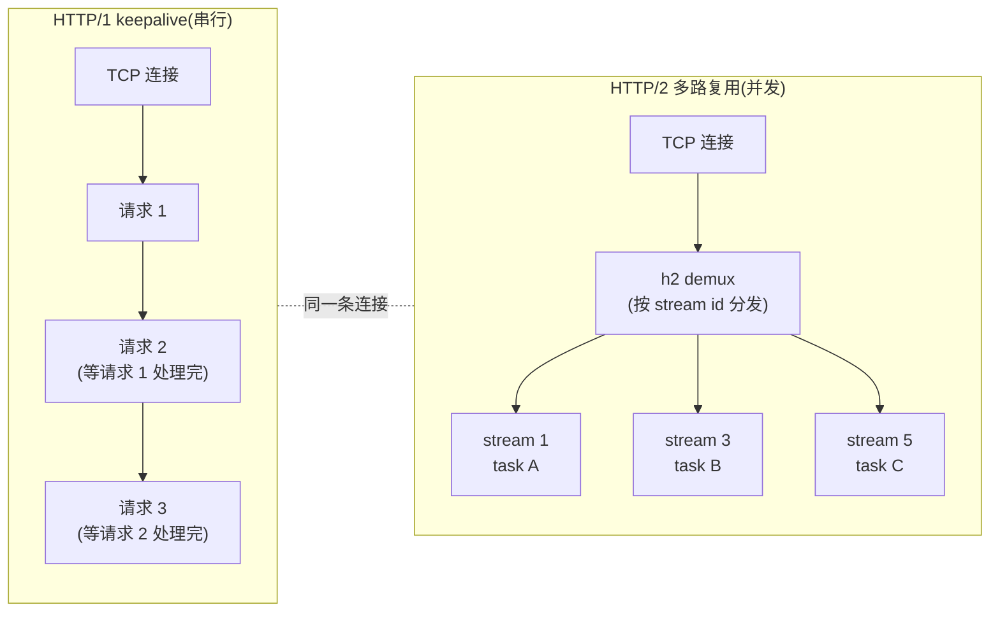
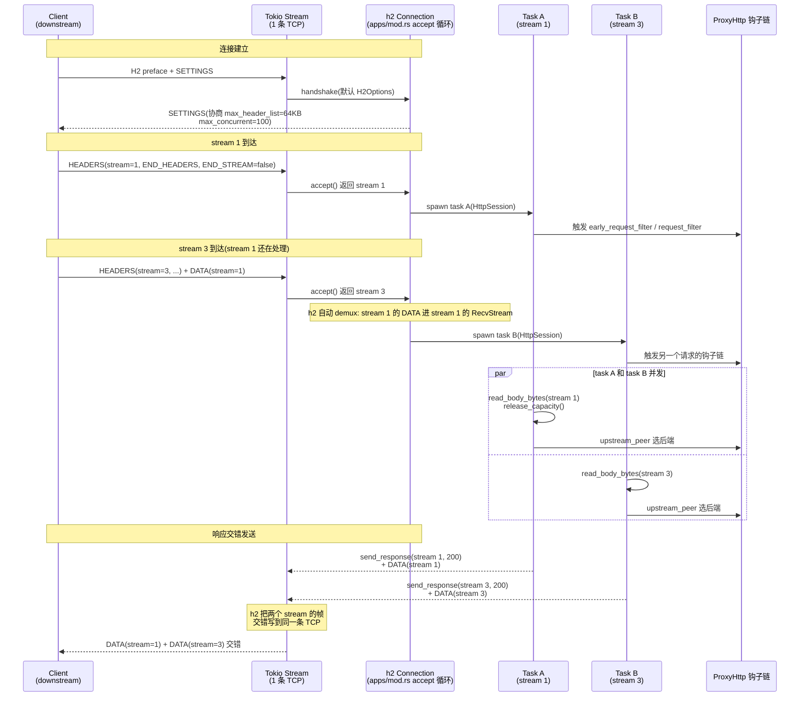

# 第 13 章 HTTP/2 委托 h2

> **第 4 篇 · 转发设施 · HTTP 协议解析(协议招牌)**
>
> 核心问题:**HTTP/2 的复杂度远高于 HTTP/1, Pingora 为什么反而把 HTTP/2 委托给 h2 crate, 而不像 HTTP/1 那样自研?**

读完这一章, 你会明白:

1. 为什么 HTTP/2 与 HTTP/1 走了**截然相反**的两条路: HTTP/1 Pingora 基于 `httparse` 自研(P4-12), HTTP/2 却直接用 `h2` crate(和 hyper 用的是同一个 h2)。这个反差的根因不在"工程量", 而在两类协议的**歧义结构**完全不同。
2. Pingora 怎么把 h2 的 `SendResponse<Bytes>`/`RecvStream`/`SendStream` 三种流对象, 包成自己的 `HttpSession`(server 侧)/ `Http2Session`(client 侧), 让上层 `ProxyHttp` 钩子链感受不到 h1/h2 差异。
3. 一条 TCP 连接上跑几百个 HTTP/2 stream 的**多路复用**在 Pingora 里是怎么落地的: server 侧 `apps/mod.rs` 的 `from_h2_conn` 接受循环 + 每条 stream spawn 一个独立 task, client 侧的 `ConnectionRef` + `spawn_stream` + 双池(idle/in_use)复用。
4. **H2 流控为什么是可配置的旋钮**: `H2_WINDOW_SIZE = 8 MB`(`1 << 23`) 这个数字背后的带宽-延迟积取舍, `max_frame_size(64 KB)`/`max_concurrent_streams(1)`/`enable_push(false)`/`initial_connection_window_size` 这一组 Builder 配置项各自防的是什么。
5. **Pingora 用 h2 vs hyper 用 h2 vs gRPC chttp2 自实现**三家横评: 为什么 Pingora 和 hyper 在 HTTP/2 这一层是强同源(都依赖 h2), 而 gRPC C++ core 却要自己写一份 chttp2。

如果只读一节, 读**第三节"H2 流控可配置: 为什么是 8 MB"**——那是这一章最反直觉、也最能体现"Pingora 在成熟库之上做工程取舍"的一节。

---

## 一句话点破

> **HTTP/2 的二进制帧协议把 HTTP/1 在文本协议里留下的歧义(Content-Length vs Transfer-Encoding、重复头、裸 LF)几乎一扫而空——帧长是定长的 24 位无符号整数, body 边界由帧的 END_STREAM 位一锤定音, 没有 smuggling 的灰色地带。所以"自研解析"的**安全动机**在 HTTP/2 上消失了; 而 HTTP/2 的协议复杂度(帧/流/HPACK/流控/优先级/服务器推)又远高于 HTTP/1, 自研的**工程成本**陡增。两个因素叠加, 委托成熟的 `h2` crate 是理性的选择——Pingora 要做的, 是把 h2 的流对象包成自己熟悉的 `HttpSession`/`Http2Session`, 并在流控、ping、并发 stream 这些"旋钮"上, 按 Cloudflare 的部署场景拧到合适的刻度。**

回扣二分法: 这一章仍在主线的**转发设施**那一面——HTTP/2 解析器是框架自管的字节切分设施, 业务不碰它。但和 HTTP/1 那一章的"自研"形成鲜明对照: HTTP/1 自研是因为"歧义是攻击面, 必须自己握", HTTP/2 委托是因为"歧义被协议本身消除了, 自研收益低、成本高"。同一本书、同一类设施, 两条相反的路——这正是"先讲 why, 再讲 how"的价值: 不是 Pingora 喜欢一边自己写、一边外包, 而是**两个协议的本质不同, 决定了不同的工程取舍**。

---

## 13.1 为什么 HTTP/2 反而要"外包"

### 13.1.1 提问: HTTP/2 不就是 HTTP/1 的升级版吗, 为什么处理方式完全相反

很多人对 HTTP/2 的第一印象是"HTTP/1 的升级":多路复用、二进制帧、HPACK 头压缩、服务器推……总之是 HTTP/1 的"加强版"。顺着这个直觉, 会推出一个错误结论: 既然 Pingora 对 HTTP/1 自研(P4-12), 那对 HTTP/2 也该自研, 保持一致性。

这个直觉撞上的第一堵墙是**工程量**。HTTP/1 的解析核心(`pingora-core/src/protocols/http/v1/`)五个文件近三千行, 主体是状态机 + smuggling 防护; HTTP/2 的协议复杂度远高于此——RFC 9113(帧/流/连接) + RFC 9114(已并入, HPACK) + RFC 7541(HPACK 详细规范)三份加起来近三百页, 涉及帧的 10 种类型(DATA/HEADERS/PRIORITY/RST_STREAM/SETTINGS/PUSH_PROMISE/PING/GOAWAY/WINDOW_UPDATE/CONTINUATION)、流的 8 种状态(idle/open/half-closed/closed × local/remote)、HPACK 的静态表/动态表/Huffman 编码/整数编码、流控的 stream window + connection window 双层窗口、ping/pong 心跳、SETTINGS 协商、优先级(PRIORITY 帧虽在 RFC 9113 弃用但仍在 h2 里支持)……自研一套工业级 HTTP/2 解析器, 工程量在**几万行**起步, 而且要持续追 CVE(比如 2023 年的 Rapid Reset 攻击, 就是利用流的大量创建+立即重置来放大 DDoS)。

但工程量只是**表象**。真正的根因是上一章讲的那个"why": **自研 HTTP/1 的根本动机是防 smuggling, 而 smuggling 的根因是 HTTP/1 的文本协议有歧义**。HTTP/2 的二进制帧协议, 几乎把这些歧义**一扫而空**:

- **body 边界靠帧, 不靠头**。HTTP/1 的 body 边界由 Content-Length 或 Transfer-Encoding: chunked 决定, 两者冲突、重复、非法值就是 smuggling(见 P4-12 五道防线)。HTTP/2 的 body 是一系列 DATA 帧, 每帧的长度是**帧头里 24 位无符号整数**(明确无歧义), body 结束靠 DATA 帧的 **END_STREAM 位**(布尔, 一锤定音)。没有任何"谁说了算"的歧义——帧长是数字, END_STREAM 是位, 二者都精确。
- **header 压缩靠 HPACK, 不靠文本**。HTTP/1 的 header 是文本行, 大小写、空格、重复、顺序都可能有歧义。HTTP/2 的 header 用 HPACK 编码成二进制——header 名是 HPACK 静态表里的索引(或动态表索引), header 值是 Huffman 编码的字节串。HPACK 是确定性的算法, 给定输入只有一个合法输出, 没有"前端解析 A、后端解析 B"的空间。
- **请求-响应配对靠 stream id, 不靠顺序**。HTTP/1 的 pipelining(请求 A/B/C 依次发, 响应必须依次回)容易错位; HTTP/2 每个请求在一个独立 stream 上, stream id 是奇数(客户端发起)或偶数(服务器推), 请求和响应靠 stream id 配对, 顺序无关。这就消灭了"前端以为 A 结束、后端以为 A 的 body 还在继续"这类 pipelining 走私。

**关键认知**: HTTP/1 的自研动机是"歧义即攻击面"; HTTP/2 的协议设计**从根上消除了这些歧义**, 所以"自研解析"在 HTTP/2 上的安全收益消失了。剩下的只有工程成本(几万行代码 + 持续追 CVE), 而收益却是"握住一个已经没有歧义可握的解析器"——不划算。

所以 Pingora 的选择是:**HTTP/2 委托 h2**。h2 是 Rust 生态里最成熟的 HTTP/2 实现(hyperium 组织出品, hyper 用的就是它), 经过了海量生产验证(Cloudflare 自己也贡献过)。Pingora 在 h2 之上做一层薄薄的适配——把 h2 的流对象包成自己的 `HttpSession`/`Http2Session`, 在流控、ping、并发这些旋钮上按需配置——就能享受 HTTP/2 的所有好处, 又不被协议细节拖累。

> **callout · h2 crate 和 hyper 的关系**: `h2` 是 hyperium 组织下的一个独立 crate(仓库 `hyperium/h2`), 实现 HTTP/2 的帧/流/HPACK/流控协议层。`hyper` 这个 HTTP 库在 HTTP/2 这一层是**调用 h2 的**——hyper 自己不写帧/流/HPACK。所以"Pingora 用 h2"和"hyper 用 h2", 在 HTTP/2 协议层是**完全同源**的。这和 HTTP/1 不同(HTTP/1 是 Pingora 和 hyper 各自基于 httparse 写独立实现, 见 P4-12 对照表)。本书的同级对照铁律: HTTP/2 这一层, Pingora 和 hyper 是"用同一个轮子", 不是"各写一个轮子"。

### 13.1.2 承接方怎么做 / 不这样会怎样

先看三个承接方各自怎么做 HTTP/2:

**hyper(Tokio 之上同级库)怎么做**: hyper 的 HTTP/2 在 `proto/h2/` 下, 但它的核心是**调 h2 crate**——hyper 把 h2 的 `h2::server::Connection`/`h2::client::SendRequest` 包进自己的 `Conn` 结构体, 在 h2 的帧层之上加 hyper 的 `Service` 抽象(处理 Request、返回 Response Future)。hyper 自己不实现帧解析、HPACK、流控——这些全在 h2 里。hyper 在 h2 之上做的事情, 主要是: 把 h2 的流对象适配到 hyper 的 `Service`/`Body` 抽象, 处理 HTTP/2 和 HTTP/1 的协议差异(h1 用 `httparse`, h2 用 h2, 上层用统一的 `Service`)。详见《hyper》P3-09~11 拆透。

**Envoy(C++ 反向代理)怎么做**: Envoy 用的是 nghttp2 这个 C 库(NGHTTP2 organization 出品, 和 Rust 的 h2 是同协议不同实现)。Envoy 在 `source/common/http/http2/` 下有个 `codec_impl.cc`, 把 nghttp2 的回调式 API 包成 Envoy 风格的 codec。nghttp2 是 C 库, 用回调(收到 HEADERS 帧调 `on_begin_headers_callback`/`on_header_callback`/`on_frame_recv_callback`), Envoy 在回调里构造自己的 `HeaderMap`/`Request` 对象。Envoy 选 nghttp2 而不是自己写, 理由和 Pingora 选 h2 一样——HTTP/2 协议复杂、歧义少、有成熟库。

**gRPC C++ core 怎么做(反例)**: gRPC C++ core **自己写了一份 chttp2**(在 `src/core/ext/transport/chttp2/transport/` 下, 几万行 C)。这看起来和 Pingora/hyper/Envoy 的"用成熟库"路线相反, 但有它的理由: gRPC 需要对 HTTP/2 做极度精细的控制(每个 stream 的优先级、流控窗口、keepalive 行为都要按 gRPC 的语义调), 而 nghttp2 的 API 不够灵活。所以 gRPC 宁愿自己写, 换取对协议层的完全控制。这是个**反例**: 它说明"委托成熟库"不是唯一选择, 当应用对协议层有特殊需求时, 自研也可能值得。Pingora 的需求没到 gRPC 那种程度(代理场景对流控有要求, 但 h2 的 Builder 配置已经够用), 所以委托 h2。

**如果 Pingora 朴素地照搬 HTTP/1 的"自研"路线会怎样**? 会撞上三堵墙:

1. **工程量爆炸**。自研一套工业级 HTTP/2, 工程量在几万行起步, 还要持续追 Rapid Reset 这类新攻击。Cloudflare 的工程资源用在协议解析上, 不如用在 `ProxyHttp` 钩子链、连接池、缓存这些 Pingora 独有的价值上。
2. **重复造轮子且无差异化**。HTTP/2 协议本身无歧义, Pingora 自研 h2 解析器和用 h2 crate, **在安全性上没有差异**(都是 RFC 9113 合规)。而 HTTP/1 自研(防 smuggling)是因为有差异化收益——代理场景的零容忍策略是通用库不做的。HTTP/2 没有这种差异化空间, 自研是纯粹的重复劳动。
3. **错过社区的红利**。h2 crate 由 hyperium 维护, 持续修 bug、追 CVE、优化性能。比如 Rapid Reset 攻击(CVE-2023-44487)爆发后, h2 crate 很快发布了修复(限制并发 reset 的 stream 数量), Pingora 升级 h2 版本就享受到了。如果 Pingora 自研, 这个修复得自己写、自己审、自己追每个新变体。CHANGELOG 里 [pingora 0.8.x 的 release notes](../pingora/CHANGELOG.md#L139) 明确写了"This release bumps the minimum h2 crate dependency to guard against the MadeYouReset H2 attack"——一行依赖升级就拿到了防护, 这就是社区红利。

所以 Pingora 的选择, 是站在 h2 这个巨人的肩膀上。下面看它具体怎么站。

### 13.1.3 所以 Pingora 这么设计: h2 + 薄薄一层适配

先看证据。打开 `pingora-core` 的 `Cargo.toml`, 运行时依赖里有 `h2`:

```toml
# pingora-core/Cargo.toml(简化示意)
[dependencies]
h2 = { workspace = true }     # 运行时依赖, HTTP/2 委托 h2

[dev-dependencies]
h2 = { workspace = true, features = ["unstable"] }   # 测试用 unstable feature
# ...
```

见 [pingora-core/Cargo.toml 的 h2 运行时依赖](../pingora/pingora-core/Cargo.toml#L40), 以及 dev-dep 里 h2 开了 `unstable` feature([L85](../pingora/pingora-core/Cargo.toml#L85))。workspace 层面 `h2 = ">=0.4.11"`(见 [workspace Cargo.toml](../pingora/Cargo.toml#L41))——这是个版本下限, 主要为了拿到 Rapid Reset 防护(CHANGELOG 那条)。

`pingora-core/src/protocols/http/v2/` 三个文件, 加起来不到 2000 行, 就是 Pingora HTTP/2 的全部:

```rust
// pingora-core/src/protocols/http/v2/mod.rs 模块声明
//! HTTP/2 implementation
use h2::SendStream;          // 直接 re-export h2 的类型
pub mod client;              // upstream 侧(client): 发请求、读响应
pub mod server;              // downstream 侧(server): 读请求、发响应
// 还有 write_body / reserve_and_send 两个共用辅助函数
```

见 [v2/mod.rs 的模块声明和 h2 类型 re-export](../pingora/pingora-core/src/protocols/http/v2/mod.rs#L15-L26)。注意 `mod.rs` 直接 `use h2::SendStream`——Pingora 把 h2 的类型作为自己 API 的一部分暴露出去, 不是包一层新类型。这印证了"薄薄一层适配"的设计: Pingora 不重新发明 `SendStream`, 而是直接用 h2 的。

对比 P4-12 的 HTTP/1: v1/ 五个文件(header/body/client/server/common)近三千行, 自己写状态机; v2/ 三个文件不到两千行, 大部分是把 h2 的对象包成 Pingora 风格的 API。**两个协议的代码量差近一倍, 恰好反映了"自研 vs 委托"的工程取舍**。

下面分 server(downstream, 收客户端请求)和 client(upstream, 收 origin 响应)两侧拆。

---

## 13.2 downstream 侧: 把 h2 的连接包成可 spawn 的 stream

downstream 侧——一个 TCP/TLS 字节流进来, Pingora 怎么把它"切"成 HTTP/2 请求? 这部分的核心是 `v2/server.rs` 里的 `handshake` 函数和 `HttpSession` 结构。

### 13.2.1 handshake: 把字节流交给 h2, 换回一个连接对象

HTTP/2 的连接建立, 比 HTTP/1 复杂得多。HTTP/1 是"客户端发请求行, 服务器读", 边界在 `\r\n\r\n`; HTTP/2 有个**连接预奏(connection preface)**: 客户端先发一个固定的 24 字节魔术串 `"PRI * HTTP/2.0\r\n\r\nSM\r\n\r\n"`, 然后双方交换 SETTINGS 帧(协商流控窗口、最大并发 stream、最大帧大小等参数), 之后才能开始发请求。这些细节, h2 crate 全包了。

Pingora 要做的, 只是把已建立的 TCP/TLS 字节流(Stream, 就是 Tokio 的 `Box<dyn AsyncRead + AsyncWrite + Send>`)交给 h2 的 server handshake:

```rust
// pingora-core/src/protocols/http/v2/server.rs: handshake(简化示意, 非源码原文)
pub async fn handshake(io: Stream, options: Option<H2Options>) -> Result<H2Connection<Stream>> {
    let options = options.unwrap_or_else(default_h2_options);
    let res = options.handshake(io).await;
    match res {
        Ok(connection) => {
            debug!("H2 handshake done.");
            Ok(connection)
        }
        Err(e) => Error::e_because(
            ErrorType::HandshakeError,
            "while h2 handshaking with client",
            e,
        ),
    }
}
```

见 [`handshake` 函数](../pingora/pingora-core/src/protocols/http/v2/server.rs#L65-L80)。注意 `H2Options` 是 `h2::server::Builder` 的别名([server.rs#L43](../pingora/pingora-core/src/protocols/http/v2/server.rs#L43) `pub use h2::server::Builder as H2Options;`)——Pingora 直接用 h2 的 Builder 类型, 不重新封装。这是个有意识的选择: H2Options 已经够用(h2 提供了所有该调的旋钮), Pingora 不需要在它上面再加一层抽象。

如果调用方没传 options(`None`), 用 [`default_h2_options()`](../pingora/pingora-core/src/protocols/http/v2/server.rs#L53-L58) 给一个有界默认:

```rust
// pingora-core/src/protocols/http/v2/server.rs: default_h2_options
const DEFAULT_MAX_HEADER_LIST_SIZE: u32 = 64 * 1024;   // 64 KiB
const DEFAULT_MAX_CONCURRENT_STREAMS: u32 = 100;

pub fn default_h2_options() -> H2Options {
    let mut options = H2Options::default();
    options.max_header_list_size(DEFAULT_MAX_HEADER_LIST_SIZE);
    options.max_concurrent_streams(DEFAULT_MAX_CONCURRENT_STREAMS);
    options
}
```

这两个默认值是 Pingora 在 h2 默认值之上**主动收紧**的: h2 的 `H2Options::default()` 不设这两个上限(用 RFC 9113 的建议值或协商), Pingora 显式给它们设了硬上限。为什么? 因为这是个**反向代理**,  downstream 面向不可信客户端:

- **`max_header_list_size(64 KiB)`**: 单个请求的 header(解码后的字节总和)不能超过 64 KiB。这是防"超大头"攻击的闸——攻击者可以发一个 HPACK 编码后很小、但解码后巨大的 header 集, 试图耗尽服务器内存。h2 在握手时把这个上限告诉客户端(SETTINGS 帧的 MAX_HEADER_LIST_SIZE), 客户端发请求时如果 header 超了, h2 会回 `431 Request Header Fields Too Large`。见 [server.rs 测试 test_server_handshake_rejects_oversized_header_list_by_default](../pingora/pingora-core/src/protocols/http/v2/server.rs#L662-L710), 它构造 2000 个 header 验证被拒。
- **`max_concurrent_streams(100)`**: 一条 H2 连接上同时活跃的 stream 不超过 100。这是防"stream 洪水"攻击的闸——攻击者可以在一条连接上开几百几千个 stream, 每个 stream 都占资源(状态、缓冲)。100 是个保守值, 覆盖正常浏览器的并发请求(浏览器通常每域名 6~10 个并发), 又不至于让单条连接吃太多资源。

这两个默认值体现了"反向代理的防御性默认": h2 的默认值面向通用场景(可能更宽松), Pingora 在它之上主动收紧到代理需要的水平。和 P4-12 的"前后不对称"一脉相承——downstream 严, upstream 宽(server 侧默认值比 client 侧严)。

> **callout · H2Options 可配置是较新的特性**: 看 CHANGELOG 第 147 行 [Make H2Options configurable at HttpServer, HttpProxy](../pingora/CHANGELOG.md#L147)——把 H2Options 暴露给业务配置是某个版本之后才加的。早期 Pingora 的 server 侧 H2Options 是写死的(只有 max_header_list_size/max_concurrent_streams 两个默认), 业务想调(比如某些场景需要更大的 max_concurrent_streams)只能改源码。现在的设计: `apps/mod.rs` 的 [h2_options() trait 方法](../pingora/pingora-core/src/apps/mod.rs#L155-L156) 返回 `Option<server::H2Options>`, 业务可以在 `HttpProxy`/`HttpServer` 实现里覆盖([`pingora-proxy/src/lib.rs#L120` 的 h2_options 字段](../pingora/pingora-proxy/src/lib.rs#L120), [`#L1172` 的 h2_options 方法](../pingora/pingora-proxy/src/lib.rs#L1172))。这是个从"写死"到"可配"的演进, 反映了 Pingora 在成熟过程中把更多旋钮交给业务。

### 13.2.2 HttpSession: 一条 H2 stream 的会话对象

handshake 返回的是 `h2::server::Connection`(Pingora 别名 `H2Connection<Stream>`)。这个 Connection 对象代表**整条 H2 连接**——上面可以跑几百个 stream。但 Pingora 的上层(`ProxyHttp` 钩子链)只关心**一个请求**, 它需要一个"单个请求的会话对象"。这就是 `HttpSession`:

```rust
// pingora-core/src/protocols/http/v2/server.rs: HttpSession(简化示意, 非源码原文)
pub struct HttpSession {
    request_header: RequestHeader,                  // 已经解析好的请求头(h2 帮忙解了)
    request_body_reader: RecvStream,                // h2 的接收流, 用来读请求 body
    send_response: SendResponse<Bytes>,             // h2 的发送响应入口
    send_response_body: Option<SendStream<Bytes>>,  // 发响应 body 的流(发响应头后才创建)
    // 记账
    response_written: Option<Box<ResponseHeader>>,  // 已经写出去的响应头
    ended: bool,                                     // END_STREAM 是否已发
    body_read: usize,                                // 已读 body 字节
    body_sent: usize,                                // 已发 body 字节
    retry_buffer: Option<FixedBuffer>,               // 重试缓冲(同 h1, 见 P4-12)
    digest: Arc<Digest>,                             // 连接摘要
    pub write_timeout: Option<Duration>,             // 写 body 超时
    total_drain_timeout: Option<Duration>,           // drain body 超时
}
```

见 [HttpSession 结构定义](../pingora/pingora-core/src/protocols/http/v2/server.rs#L104-L128)。注意它**直接持有 h2 的类型**——`RecvStream`/`SendResponse<Bytes>`/`SendStream<Bytes>` 都是 h2 crate 的, Pingora 没包新类型。这就是"薄薄一层适配"的字面体现: `HttpSession` 是个组合, 把 h2 的几个流对象 + Pingora 自己的记账字段(retry_buffer/digest/timeout)拼在一起, 提供一套 Pingora 风格的 API(`read_body_bytes`/`write_body`/`write_response_header`)。

这和 HTTP/1 的 `HttpSession` 形成对照: HTTP/1 的 `HttpSession` 持有 `underlying_stream` + `BodyReader`/`BodyWriter` 状态机 + 自己解析的 `request_header`; HTTP/2 的 `HttpSession` 持有 h2 的 `RecvStream`(body 读取状态机在 h2 内部)+ `SendResponse`(响应发送状态机在 h2 内部)+ h2 已经解析好的 `request_header`。**HTTP/1 自己干所有活, HTTP/2 把活外包给 h2, 自己只做记账和 API 适配**。

创建 `HttpSession` 的入口是 [`from_h2_conn`](../pingora/pingora-core/src/protocols/http/v2/server.rs#L144-L171):

```rust
// pingora-core/src/protocols/http/v2/server.rs: from_h2_conn(简化示意)
pub async fn from_h2_conn(
    conn: &mut H2Connection<Stream>,
    digest: Arc<Digest>,
) -> Result<Option<Self>> {
    // conn.accept() 是驱动整个 H2 连接的关键: 它返回下一个新建的 stream
    let res = conn.accept().await.transpose().or_err(
        ErrorType::H2Error,
        "while accepting new downstream requests",
    )?;

    Ok(res.map(|(req, send_response)| {
        let (request_header, request_body_reader) = req.into_parts();
        HttpSession {
            request_header: request_header.into(),  // h2 解析好的 header 转成 Pingora 的 RequestHeader
            request_body_reader,                     // h2 的 RecvStream
            send_response,                           // h2 的 SendResponse
            // ... 其他字段初始化
        }
    }))
}
```

`conn.accept()` 是 h2 的 API: 它返回 `Option<(Request<...>, RecvStream, SendResponse)>`——有新 stream 时返回 Some(已经把请求头解析好), 连接关闭时返回 None。注意**请求头是 h2 帮忙解析的**: h2 内部完成了 HPACK 解码、HEADERS 帧的组装、CONTINUATION 帧的拼接, 给到 Pingora 的就是一个 `http::Request` 对象。Pingora 只需要把它转成自己的 `RequestHeader`(用 `into()`), 完全不用碰 HPACK 细节。

> **callout · digest 为什么从外面传进来**: `from_h2_conn` 的第二个参数是 `digest: Arc<Digest>`——这个 digest 是连接级的(整条 TCP/TLS 连接的摘要: SSL 信息、timing、socket 地址), 而不是 stream 级的。这是因为 h2 的 `RecvStream`/`SendResponse` 不暴露底层的 IO 流(它们是 h2 内部 multiplex 出来的逻辑流, 没有直接的 socket 访问), 所以 Pingora 没法从 stream 对象拿到连接信息。解决办法: 在 [apps/mod.rs 的 accept 循环里](../pingora/pingora-core/src/apps/mod.rs#L215-L222) 先构造一个连接级 digest, 然后每次 `from_h2_conn` 都把它传进去, 让每个 `HttpSession` 共享同一个 digest 的 Arc 引用。这是个"妥协"——h2 的封装让 Pingora 失去了对底层流的直接访问, 只能用 Arc 共享来补回连接信息。

### 13.2.3 一条 H2 连接的 accept 循环: 每条 stream 一个 task

`from_h2_conn` 是个 async 函数, 调用一次拿到一个 stream(或 None 表示连接关闭)。所以一条 H2 连接的生命周期是个循环: 不断 `from_h2_conn`, 每拿到一个 stream 就交给业务处理, 处理完继续 accept 下一个。这个循环在 [apps/mod.rs](../pingora/pingora-core/src/apps/mod.rs#L224-L263):

```rust
// pingora-core/src/apps/mod.rs: H2 连接的 accept 循环(简化示意, 非源码原文)
let h2_options = self.h2_options();
let h2_conn = server::handshake(stream, h2_options).await?;  // 1. 握手
loop {
    // 2. 接受下一条 stream(或处理 graceful shutdown)
    let h2_stream = tokio::select! {
        _ = shutdown.changed() => {
            h2_conn.graceful_shutdown();           // 优雅关闭: 发 GOAWAY
            return None;
        }
        h2_stream = server::HttpSession::from_h2_conn(&mut h2_conn, digest.clone()) => h2_stream
    };
    let h2_stream = match h2_stream? {
        Some(s) => s,           // 拿到一条新 stream
        None => return None,    // 连接关闭, 退出循环
    };
    // 3. 每条 stream spawn 一个独立 task!
    pingora_runtime::current_handle().spawn(async move {
        app.process_new_http(ServerSession::new_http2(h2_stream), &shutdown).await;
    });
}
```

见 [apps/mod.rs 的 H2 accept 循环](../pingora/pingora-core/src/apps/mod.rs#L224-L263)。这一段是 Pingora HTTP/2 多路复用的**核心**: 一条 H2 连接上, 每来一条 stream, 就 spawn 一个独立的 Tokio task 去处理。几百个 stream = 几百个 task, 共享同一条 TCP 连接的字节流(h2 内部负责把字节流 demultiplex 到各个 stream 的 `RecvStream`)。

这就是"多路复用"在 Pingora 里的真实落地——**不是一条连接串行处理 stream, 而是一条连接 + N 个并发 task**。每个 task 跑自己的 `ProxyHttp` 钩子链(early_request_filter → request_filter → upstream_peer → ...), 互不阻塞。这和 HTTP/1 的 keepalive 循环(P4-12, 一条连接串行处理多个请求)是本质差异:



关键洞察: HTTP/1 的 keepalive, 一条连接同一时刻只能处理一个请求(请求 2 必须等请求 1 的响应发完才能开始, 否则就是 pipelining, 而 pipelining 因为前面的种种问题基本被废弃了); HTTP/2 的多路复用, 一条连接同一时刻可以并发处理几百个请求(stream 之间相互独立, 各自的帧可以交错)。所以**HTTP/2 多路复用的核心收益, 不是省连接(那只是副作用), 而是消除了队头阻塞(hol blocking)**——慢请求不再阻塞快请求。

> **承《gRPC》一句带过**: HTTP/2 的帧格式、流的状态机(idle/open/half-closed/closed)、HPACK 的静态表/动态表/Huffman 编码、流控的 stream window/connection window 双层窗口、stream id 的奇偶规则(client 发起的 stream 是奇数, server push 是偶数), 这些协议层细节在《gRPC》第 2 篇拆透了。本章不重复, 只讲 Pingora 怎么用 h2 把这些机制跑起来。

### 13.2.4 读请求 body: RecvStream + flow_control

stream 创建好之后, 接下来是读 body。HTTP/1 的 body 读取靠 `BodyReader` 状态机(P4-12, 定长/chunked/关闭定界三种); HTTP/2 的 body 是 DATA 帧序列, 读取靠 h2 的 `RecvStream`:

```rust
// pingora-core/src/protocols/http/v2/server.rs: read_body_bytes(简化示意, 非源码原文)
pub async fn read_body_bytes(&mut self) -> Result<Option<Bytes>> {
    let data = self.request_body_reader.data().await.transpose().or_err(
        ErrorType::ReadError,
        "while reading downstream request body",
    )?;
    if let Some(data) = data.as_ref() {
        self.body_read += data.len();
        if let Some(buffer) = self.retry_buffer.as_mut() {
            buffer.write_to_buffer(data);          // 同时缓存进 retry buffer
        }
        // ★ 关键: 释放流控容量
        let _ = self
            .request_body_reader
            .flow_control()
            .release_capacity(data.len());
    }
    Ok(data)
}
```

见 [`read_body_bytes` 函数](../pingora/pingora-core/src/protocols/http/v2/server.rs#L190-L207)。这里最值得注意的一行是 **`flow_control().release_capacity(data.len())`**——这是 HTTP/2 流控的核心机制, 也是 Pingora 用 h2 时最容易踩坑的地方。

HTTP/2 的流控是个**双层信用系统**:

- 每条 stream 有个独立的 stream window(初始 65535, 可由 SETTINGS_INITIAL_WINDOW_SIZE 调);
- 整条连接还有个 connection window(初始也是 65535, 可由 WINDOW_UPDATE 帧 grow)。

发送方发 DATA 帧时, 每发一字节, 对应的 window(stream + connection)就减一; 当 window 减到 0, 发送方必须停下来, 等接收方发 WINDOW_UPDATE 帧给它"充值"。这个机制的本意是防止"快发送方淹没慢接收方"——接收方可以精确控制发送方的速率, 不会被迫缓冲无限多的数据。

接收方(这里是 Pingora server)读到 data 后, **必须主动 release_capacity**, 否则 h2 不会给发送方发 WINDOW_UPDATE, 发送方的 window 用光后就停止发送, body 就"卡住"了。这就是 `release_capacity(data.len())` 的意义——告诉 h2 "这 N 字节我处理完了, 你可以给客户端发 WINDOW_UPDATE, 让它继续发"。

> **callout · 流控不是"读到就 release", 是"消费了才 release"**: 这是个微妙但关键的点。`release_capacity` 的时机, 取决于"消费"的定义。如果 Pingora 读完 data 立刻 release(像上面 `read_body_bytes` 这样), 意味着 Pingora 愿意承受"读进来但还没转发出去"的 body 被缓冲在内存——这是默认行为, 简单但可能 OOM(如果 downstream 发得快、upstream 转发得慢, body 会在 Pingora 内存里堆积)。另一种做法是"转发出去才 release"——把 release 推迟到 body 真正发给 upstream 之后, 这样 downstream 的发送速率被 upstream 的接收速率反向限制, 内存不会堆积。Pingora 这里用的是简单做法(读完就 release), 但通过 **H2_WINDOW_SIZE**(下一节讲)给"已读但未处理"的 body 设了上限。这是工程取舍: 简单 + 有限的缓冲, 换取不需要精确跟踪每条 stream 的转发状态。

retry_buffer 的逻辑和 HTTP/1 一样([P4-12 retry buffer](../pingora/pingora-core/src/protocols/http/v1/server.rs#L72-L73)): body 读进来时同时写一份到 `FixedBuffer`(上限 `BODY_BUF_LIMIT = 64 KiB`, 见 [server.rs#L39](../pingora/pingora-core/src/protocols/http/v2/server.rs#L39)), 转发失败时用这份缓存重试。这是 Pingora 在 HTTP/1 和 HTTP/2 之间共享的设计——重试逻辑不关心协议。

### 13.2.5 写响应: hop header 的剥离

读 body 之外, 另一个常见操作是写响应。HTTP/2 的响应发送靠 `send_response`(发响应头)和 `send_response_body`(发响应体), 这两个都是 h2 的 API。Pingora 的 [`write_response_header`](../pingora/pingora-core/src/protocols/http/v2/server.rs#L287-L331) 在调用 h2 之前, 做了一件代理场景必须做的事——**剥离 hop-by-hop header**:

```rust
// pingora-core/src/protocols/http/v2/server.rs: write_response_header 关键片段(简化示意)
pub fn write_response_header(&mut self, mut header: Box<ResponseHeader>, end: bool) -> Result<()> {
    if self.ended { return Ok(()); }
    if header.status.is_informational() {
        // 1xx 响应在 h2 里无法发送(h2 的 send_response 只能调一次)
        // https://github.com/hyperium/h2/issues/167
        debug!("ignoring informational headers");
        return Ok(());
    }
    /* update headers */
    header.insert_header(header::DATE, get_cached_date())?;
    // 2. ★ 剥离 HTTP/1 的 hop-by-hop header(H2 不允许这些头)
    header.remove_header(&header::TRANSFER_ENCODING);
    header.remove_header(&header::CONNECTION);
    header.remove_header(&header::UPGRADE);
    header.remove_header(&HeaderName::from_static("keep-alive"));
    header.remove_header(&HeaderName::from_static("proxy-connection"));
    // 3. 调 h2 发响应头
    let resp = Response::from_parts(header.as_owned_parts(), ());
    let body_writer = self.send_response.send_response(resp, end)?;
    self.response_written = Some(header);
    self.send_response_body = Some(body_writer);
    self.ended = self.ended || end;
    Ok(())
}
```

见 [`write_response_header` 函数](../pingora/pingora-core/src/protocols/http/v2/server.rs#L287-L331)。这里有个**协议层的硬规则**: HTTP/2 不允许 `Transfer-Encoding`、`Connection`、`Upgrade`、`Keep-Alive`、`Proxy-Connection` 这些 hop-by-hop header(RFC 7540 §8.1.2.2 明确禁止)。如果上游给了这些头(可能因为 Pingora 从一个 HTTP/1 upstream 收到响应, 要转给 HTTP/2 downstream), Pingora 在写响应前必须删掉它们, 否则 h2 会报协议错误。

这就是**协议转换**的一个细节——P4-14 会专门讲 h1↔h2 转换。这里先点一句: HTTP/2 不是 HTTP/1 的简单升级, 它对 header 集有自己的规则(hop-by-hop 禁止、pseudo-header 必须、connection-specific header 禁止), 代理在两个协议之间转发时必须做归一化。Pingora 在 `write_response_header` 里做的这一步剥离, 就是这种归一化的体现。

> **callout · 1xx 响应在 H2 里的特殊性**: 上面的代码里, `if header.status.is_informational()` 直接忽略 1xx 响应(debug 日志)。这是因为 h2 的 `send_response` API **只能调一次**(每个 stream 只能有一组最终的响应头), 不能像 HTTP/1 那样先发 `100 Continue` 再发 `200 OK`。这是 h2 crate 的一个 [已知限制](https://github.com/hyperium/h2/issues/167)。HTTP/2 协议本身支持 1xx(用 INFORMATIONAL 帧), 但 h2 crate 的 API 没暴露。Pingora 选择了"忽略 1xx"——下游客户端在 H2 里不会收到 100 Continue, 但 body 发送不受影响(因为 100 Continue 只是个"邀请", 客户端其实可以无视它直接发 body)。对 103 Early Hints(Link preload 提示)来说, 这是个功能损失——Pingora 在 H2 downstream 时无法转发 103。这是个"用 h2 的代价": h2 的 API 限制传染到了 Pingora 的能力。

---

## 13.3 H2 流控可配置: 为什么是 8 MB(本章灵魂)

这一节是本章最反直觉、也最能体现"在成熟库之上做工程取舍"的部分。上一节我们看到 server 侧的 `default_h2_options` 只调了两个旋钮(max_header_list_size/max_concurrent_streams), 而 client 侧(upstream)的 handshake 配了一整套流控旋钮。先看 client 侧的 handshake:

### 13.3.1 client 侧 handshake: 一整套流控旋钮

upstream 侧(连 origin 的方向)的 H2 handshake 在 [`connectors/http/v2.rs`](../pingora/pingora-core/src/connectors/http/v2.rs#L426-L493)。这个 handshake 配了一长串 Builder 选项:

```rust
// pingora-core/src/connectors/http/v2.rs: handshake 关键片段(简化示意, 非源码原文)
const H2_WINDOW_SIZE: u32 = 1 << 23;   // 8 MB

pub async fn handshake(
    stream: Stream,
    max_streams: usize,
    h2_ping_interval: Option<Duration>,
) -> Result<ConnectionRef> {
    // ...
    let (send_req, connection) = Builder::new()
        .enable_push(false)                           // 1. 禁用服务器推
        .initial_max_send_streams(max_streams)        // 2. 初始可并发发送的 stream 数
        .max_concurrent_streams(1)                    // 3. 限制服务器端并发(给它的额度)
        .max_frame_size(64 * 1024)                    // 4. 建议服务器发大帧
        .initial_window_size(H2_WINDOW_SIZE)          // 5. ★ stream 流控窗口 = 8 MB
        .initial_connection_window_size(H2_WINDOW_SIZE) // 6. ★ 连接流控窗口 = 8 MB
        .handshake(stream)
        .await?;
    // ...
}
```

见 [connectors/http/v2.rs 的 handshake](../pingora/pingora-core/src/connectors/http/v2.rs#L450-L461), 以及 [`H2_WINDOW_SIZE` 常量定义](../pingora/pingora-core/src/connectors/http/v2.rs#L424)。这一组配置项是 Pingora 在 h2 默认值之上**主动调过**的, 每一项都有明确动机。代码里甚至留了段注释解释为什么:

```rust
// pingora-core/src/connectors/http/v2.rs: L418-L423 原文注释
// The h2 library we use has unbounded internal buffering, which will cause excessive memory
// consumption when the downstream is slower than upstream. This window size caps the buffering by
// limiting how much data can be inflight. However, setting this value will also cap the max
// download speed by limiting the bandwidth-delay product of a link.
// Long term, we should advertising large window but shrink it when a small buffer is full.
// 8 Mbytes = 80 Mbytes X 100ms, which should be enough for most links.
const H2_WINDOW_SIZE: u32 = 1 << 23;
```

见 [H2_WINDOW_SIZE 上方的设计注释](../pingora/pingora-core/src/connectors/http/v2.rs#L418-L424)。这段注释把设计动机讲得很清楚, 我们逐项拆。

### 13.3.2 h2 的"无界缓冲"问题

注释第一句就点出了问题: **"The h2 library we use has unbounded internal buffering"**——我们用的 h2 库有无界内部缓冲。这是个看起来吓人的事实, 需要展开解释。

h2 crate 作为 HTTP/2 实现, 内部为了简化设计, **在它的 RecvStream 上不做缓冲上限**——它从 socket 读到多少 DATA 帧就交给应用多少, 应用如果不消费, 这些 data 就堆在 h2 的内部 buffer 里。这本身不算 bug(h2 把流控的责任交给了应用层), 但对代理来说是个隐患:

考虑这个场景: Pingora 从 upstream(H2)读响应 body, 转发给 downstream(H1 或 H2)。如果 downstream 慢(比如客户端在 3G 网络上, 只有 100 KB/s), 而 upstream 快(数据中心内部, 10 GB/s), 那么 Pingora 从 upstream 读进来的 body 会比它能发给 downstream 的快得多。如果 Pingora 不主动用流控限制 upstream 的发送速率, body 会在 Pingora 内存里无限堆积——**这就是 OOM 的根源**。

朴素的做法是 Pingora 自己加一层缓冲上限(比如每条 stream 最多缓冲 1 MB, 超了就阻塞读)。但 Pingora 选择了一个更优雅的做法: **用 HTTP/2 的流控机制本身来限**。HTTP/2 的流控本来就是为"接收方控制发送方速率"设计的, Pingora 只要把 stream window 和 connection window 设到合适的大小, h2 就会自动在 window 用光时停止给 upstream 发 WINDOW_UPDATE, upstream 就会停下来等。这等于把"缓冲上限"这个责任交给协议层, 而不是应用层——更干净、更难出错。

`H2_WINDOW_SIZE = 1 << 23 = 8 MB` 就是这个"上限"的具体值。它同时设给 `initial_window_size`(每条 stream 的窗口)和 `initial_connection_window_size`(整条连接的窗口)。意思是: 每条 stream 最多有 8 MB 的 body"in flight"(已发但未被 release), 整条连接最多也是 8 MB(实际上是 `min(stream_window, connection_window)`, 所以是 8 MB)。超过这个量, h2 不再 release_capacity, upstream 的 window 用光就停。

### 13.3.3 8 MB 这个数字的取舍: 带宽-延迟积

注释里最关键的一句是 **"8 Mbytes = 80 Mbytes X 100ms, which should be enough for most links"**。这句把 8 MB 的取舍逻辑讲透了, 但需要拆解。

HTTP/2 流控窗口大小, 本质上限制了**带宽-延迟积(bandwidth-delay product, BDP)**。BDP 是一条网络链路上"在途"的数据量上限, 等于带宽 × 往返延迟(RTT)。要充分利用一条链路的带宽, 窗口必须 ≥ BDP——否则发送方在等 WINDOW_UPDATE 的间隙, 链路是空闲的, 带宽就浪费了。

Pingora 是个反向代理, 它的 upstream 通常在数据中心内部(延迟低, 几毫秒)或同区域(几十毫秒)。Cloudflare 的部署: 边缘节点连 origin, 典型 RTT 在 10~100 ms 之间。我们算一下不同窗口下的最大下载速率(假设 RTT = 100 ms):

| 窗口大小 | 最大速率(window / RTT) | 能撑满的链路带宽 |
|---------|----------------------|----------------|
| 64 KB(默认初始窗口) | 64 KB / 0.1s = 640 KB/s | ~5 Mbps |
| 1 MB | 1 MB / 0.1s = 10 MB/s | ~80 Mbps |
| **8 MB(Pingora)** | **8 MB / 0.1s = 80 MB/s** | **~640 Mbps** |
| 64 MB | 64 MB / 0.1s = 640 MB/s | ~5 Gbps |

注释里那句"80 Mbytes X 100ms"的算式, 就是上表的第三行: 8 MB 窗口在 100 ms RTT 下, 能撑到 80 MB/s ≈ 640 Mbps 的下载速率。这对**绝大多数**origin 链路够用了(640 Mbps 是条很粗的管子)。再大(比如 64 MB)边际收益递减, 但内存风险线性增加; 再小(比如 1 MB)在跨区 RTT 较大时会卡住下载速率。

所以 8 MB 是个**甜点值**: 大到能撑满常见链路, 小到不会让单条 stream 的缓冲失控。这个数字是 Cloudflare 在生产环境调出来的, 不是 RFC 建议值(RFC 9113 默认初始窗口是 65535 = 64 KB), 也不是 h2 默认值。

> **callout · 8 MB 是个折中, 不是终点**: 注释最后那句 **"Long term, we should advertising large window but shrink it when a small buffer is full"** 点出了这个设计的局限。理想的方案是: 告诉 upstream 一个大窗口(让它别等, 全速发), 但 Pingora 内部用一个小的应用层缓冲——缓冲满了就停 release_capacity, 反压 upstream。这样既不卡速率(大窗口让 BDP 撑满), 又不 OOM(小缓冲限制内存)。但这需要在 h2 之上加一层应用层流控, 工程上更复杂。当前 Pingora 用 8 MB 这个"够用且安全"的中间值作为过渡。这是个典型的"工程权衡压倒理论最优"的例子。

### 13.3.4 其他配置项: enable_push / max_frame_size / max_concurrent_streams

除了流控窗口, 还有几个旋钮值得逐个拆:

**`enable_push(false)`(L451)**: 禁用 HTTP/2 服务器推送(server push)。服务器推送是 HTTP/2 的一个特性——服务器可以在客户端没请求时, 主动把资源push 给客户端(比如发 HTML 时附带 push CSS/JS)。但这个特性在实践中问题重重: 客户端无法精确控制 push 的资源(可能 push 已经缓存的)、浏览器对 push 的支持参差不齐、push 还可能被滥用(服务器 push 大量无用数据)。Chrome 在 2022 年宣布移除 HTTP/2 server push 支持。Pingora 作为代理, **不接受 upstream 的 push**(`enable_push(false)` 是 client 侧 Builder 的方法, 告诉 upstream "别给我 push")——因为 push 来的资源, 代理不知道该转给哪个 downstream stream(没有对应的请求), 处理起来复杂且收益低。这是个"主动关闭一个协议特性"的取舍。

**`initial_max_send_streams(max_streams)`(L452)**: 这是 Pingora 告诉 h2 "我准备在这条连接上同时开 N 个 stream"。N 来自 `peer.get_peer_options().max_h2_streams`(默认 1, 见 [peer.rs#L496](../pingora/pingora-core/src/upstreams/peer.rs#L496))。这是个**预算**: h2 据此预分配内部资源(比如 stream 状态表)。设得过大浪费内存, 设得过小限制了并发。

**`max_concurrent_streams(1)`(L454)**: 这个看起来反直觉——为什么 client 侧只允许服务器"1 个并发 stream"? 答案在注释 L453: **"Server push is not allowed, so this value doesn't matter"**。既然已经 `enable_push(false)`, 服务器就不会 push(push 是服务器发起 stream 的唯一场景), 那么服务器端"并发 stream"这个概念就没意义了——所有 stream 都是客户端发起的, 由 `initial_max_send_streams` 控制。这里设 1 是个"反正用不上"的占位值。

**`max_frame_size(64 * 1024)`(L455)**: 建议服务器发送的 DATA 帧最大 64 KB。HTTP/2 的 DATA 帧默认最大 16 KB, 最大可协商到 16 MB。设到 64 KB 是个**性能优化**: 更大的帧 = 更少的帧头开销(每个 DATA 帧 9 字节帧头) + 更少的系统调用(h2 批量读更大块)。但太大(比如 16 MB)会让单帧占内存过多, 也增加延迟(必须等整帧收完才能交付)。64 KB 是个平衡点。注释 L455 写得很直白: "advise server to send larger frames"——建议服务器发大帧, 换性能。

### 13.3.5 server 侧默认 vs client 侧默认: 不对称再现

把两侧的默认配置放一起对照, 能看出"Pingora 对 downstream 严、对 upstream 也严, 但严在不同的维度":

| 维度 | server 侧(downstream, 收客户端)| client 侧(upstream, 收 origin)|
|------|------------------------------|------------------------------|
| **配置入口** | `default_h2_options()` | `connectors/http/v2.rs::handshake` |
| **header 上限** | `max_header_list_size(64 KB)` | h2 默认(无主动设)|
| **并发 stream** | `max_concurrent_streams(100)` | `max_concurrent_streams(1)`(给 server 的额度, 因 push 关闭无意义)|
| **流控窗口** | h2 默认(64 KB 初始)| `H2_WINDOW_SIZE(8 MB)`(主动放大)|
| **frame size** | h2 默认 | `max_frame_size(64 KB)`(建议大帧)|
| **server push** | 不适用(server 侧) | `enable_push(false)`(禁用)|

这张表很有意思。server 侧(downstream)关心的是**安全**: 限制 header 大小、限制并发 stream(防洪水); client 侧(upstream)关心的是**性能和反压**: 放大流控窗口(撑满带宽)、放大 frame size(减开销)、禁用 push(避免无用流量)。

这种不对称, 和 P4-12 的"server 严、client 宽"(收请求严、收响应宽)是**不同维度**的不对称: P4-12 是解析严格度的不对称(smuggling 防护只对 downstream), 这里是**资源策略**的不对称(downstream 限并发防攻击, upstream 放窗口提性能)。两者都源于同一个根本: **downstream 不可信, upstream 是 Pingora 自己选的**。

### 13.3.6 对照: hyper 怎么配 h2 / Envoy 怎么配 nghttp2

把 Pingora 和两个对照方放一起, 看看流控窗口这个旋钮在不同实现里怎么调:

**hyper**: hyper 也用 h2, 它对流控的配置相对保守。hyper 的 h2 client 默认用 h2 的初始窗口(65535), 但它内部有一套自己的流式 body 传输(`http_body::Body` trait), body 数据按需 poll, 不会一次性全读进内存。hyper 的定位是通用 HTTP 库, 它假设上层会负责反压(Body trait 的 `poll_data` 在不被 poll 时就不读), 所以流控窗口可以小。Pingora 不一样, 它是代理, body 要尽快从 upstream 读到转发给 downstream, 不能靠"上层慢慢 poll"反压——所以 Pingora 主动放大窗口到 8 MB。

**Envoy**: Envoy 用 nghttp2, 在 `Http2::Http2Settings` 里有一堆流控相关的配置(`initial_stream_window_size`/`initial_connection_window_size`), 默认值和 Pingora 接近(也是 MB 量级)。Envoy 还有更精细的 `http2_stream_error_on_invalid_http_messaging` 等策略开关。Envoy 的设计哲学是"每个旋钮都暴露给配置", Pingora 则是"调好一组合理默认, 少数关键旋钮(h2_options)开放给业务"。

**gRPC C++ core(自实现 chttp2)**: gRPC 自己写 chttp2, 流控窗口可以做到极致精细——它有个 `GRPC_HTTP2_INITIAL_WINDOW_SIZE` 常量(默认 64 KB), 但 gRPC 在它之上加了一层应用级流控(read drain 阈值), 实现了"大窗口 + 小缓冲"的理想方案(就是 Pingora 注释里说"Long term"想做的)。这是自实现的好处——流控可以和应用层无缝耦合。Pingora 用 h2, 只能在 h2 暴露的旋钮里调, 拿不到这种精细度。这就是"委托成熟库"的代价: 你被限制在库暴露的 API 表面。

---

## 13.4 upstream 侧: Http2Session 与连接复用

讲完 downstream 侧(收客户端请求)和流控, 我们看 upstream 侧——Pingora 作为 client, 怎么向 origin 发 HTTP/2 请求、怎么复用 H2 连接。这部分的核心是 `v2/client.rs` 的 `Http2Session` 和 `connectors/http/v2.rs` 的 `ConnectionRef`。

### 13.4.1 Http2Session: 一条 H2 stream 的 client 视角

upstream 侧的会话对象叫 `Http2Session`(注意和 server 侧的 `HttpSession` 区分, 它们是不同类型):

```rust
// pingora-core/src/protocols/http/v2/client.rs: Http2Session(简化示意, 非源码原文)
pub struct Http2Session {
    send_req: SendRequest<Bytes>,                  // h2 的 client 端发送入口
    send_body: Option<SendStream<Bytes>>,           // 发请求 body 的流(发完 header 后创建)
    resp_fut: Option<ResponseFuture>,               // 等待响应头的 Future
    req_sent: Option<Box<RequestHeader>>,            // 已发送的请求头
    response_header: Option<ResponseHeader>,        // 已读到的响应头
    response_body_reader: Option<RecvStream>,       // 读响应 body 的流
    pub read_timeout: Option<Duration>,
    pub write_timeout: Option<Duration>,
    pub conn: ConnectionRef,                         // ★ 持有连接的引用(用于复用/计数)
    ended: bool,
    body_recv: usize,
}

impl Drop for Http2Session {
    fn drop(&mut self) {
        self.conn.release_stream();   // ★ 析构时通知连接"少了一条 stream"
    }
}
```

见 [Http2Session 结构](../pingora/pingora-core/src/protocols/http/v2/client.rs#L40-L60) 和 [Drop 实现](../pingora/pingora-core/src/protocols/http/v2/client.rs#L62-L66)。这里最值得注意的是 `conn: ConnectionRef` 字段——`Http2Session` 持有一个 `ConnectionRef`(连接的 Arc 引用), 在析构时调 `release_stream()`。这是 H2 连接复用的关键: 每个 `Http2Session` 知道自己属于哪条连接, 用完了会通知连接"我这条 stream 结束了, 可以接纳新 stream"。

这和 server 侧的 `HttpSession` 形成对照: server 侧的 `HttpSession` 不持有 `ConnectionRef`, 因为 server 侧的连接管理是 [`apps/mod.rs` 的 accept 循环](../pingora/pingora-core/src/apps/mod.rs#L235-L263)统一管的(一条连接一个循环, 循环里 spawn 多个 task); client 侧的 `Http2Session` 必须自己持有连接引用, 因为 client 侧的连接是**池化复用**的——一个 `Http2Session` 可能在任何一条已建立的连接上创建, 它需要知道是哪条。

发请求的入口是 [`write_request_header`](../pingora/pingora-core/src/protocols/http/v2/client.rs#L112-L132):

```rust
// pingora-core/src/protocols/http/v2/client.rs: write_request_header(简化示意)
pub fn write_request_header(&mut self, mut req: Box<RequestHeader>, end: bool) -> Result<()> {
    if self.req_sent.is_some() { return Ok(()); }   // 已发, 跳过
    Self::sanitize_request_header(&mut req)?;        // ★ 修正 header(H2 要求 :authority)
    let parts = req.as_owned_parts();
    let request = http::Request::from_parts(parts, ());
    let (resp_fut, send_body) = self.send_req.send_request(request, end)?;
    self.req_sent = Some(req);
    self.send_body = Some(send_body);
    self.resp_fut = Some(resp_fut);
    self.ended = self.ended || end;
    Ok(())
}
```

`sanitize_request_header`([client.rs#L85-L109](../pingora/pingora-core/src/protocols/http/v2/client.rs#L85-L109)) 是个有意思的细节: HTTP/2 要求请求有 `:authority` pseudo-header(对应 HTTP/1 的 Host), 但 Pingora 内部的 `RequestHeader` 可能只有 Host header 没有 authority。`sanitize` 就是从 Host header 提取 authority, 构造一个合法的 H2 URI(`https://<authority><path>`)。这是**协议归一化**的又一例: Pingora 内部用统一 header 模型, 发出去时按目标协议(H2)的规则补全。

### 13.4.2 错误处理: 什么时候该重试, 什么时候该降级

upstream 侧最复杂的不是发请求, 而是**错误处理**。HTTP/2 的错误类型比 HTTP/1 多得多: GOAWAY(连接优雅关闭)、RST_STREAM(stream 重置)、REFUSED_STREAM(拒收)、HTTP_1_1_REQUIRED(要求降级到 h1)、各种 protocol error。每种错误的处理策略不同——有的该重试, 有的该降级, 有的该直接报错。

Pingora 把这套分类逻辑放在 [`handle_read_header_error`](../pingora/pingora-core/src/protocols/http/v2/client.rs#L490-L534):

```rust
// pingora-core/src/protocols/http/v2/client.rs: handle_read_header_error(简化示意)
fn handle_read_header_error(e: h2::Error) -> Box<Error> {
    if e.is_remote() && (e.reason() == Some(h2::Reason::HTTP_1_1_REQUIRED)) {
        // 1. 服务器要求降级到 h1(常见于 IIS 的 NTLM 认证): 重试, 标记 h1
        let mut err = Error::because(H2Downgrade, "while reading h2 header", e);
        err.retry = true.into();
        err
    } else if e.is_go_away() && e.is_library() && (e.reason() == Some(h2::Reason::PROTOCOL_ERROR)) {
        // 2. 服务器发了不合规的 H2 帧(h2 库检测到): 重试
        let mut err = Error::because(InvalidH2, "while reading h2 header", e);
        err.retry = true.into();
        err
    } else if e.is_go_away() && e.is_remote() && (e.reason() == Some(h2::Reason::NO_ERROR)) {
        // 3. 服务器优雅关闭(GOAWAY NO_ERROR): 重试(用别的连接)
        let mut err = Error::because(H2Error, "while reading h2 header", e);
        err.retry = true.into();
        err
    } else if e.is_reset() && e.is_remote() && (e.reason() == Some(h2::Reason::REFUSED_STREAM)) {
        // 4. 服务器拒收这条 stream(可能过载): 安全重试(请求未被处理)
        let mut err = Error::because(H2Error, "while reading h2 header", e);
        err.retry = true.into();
        err
    } else if e.is_io() {
        // 5. IO 错误(常见于复用的连接被防火墙静默杀掉): 只在连接是复用的情况下重试
        let io_err = e.get_io().expect("checked is io");
        let true_io_error = io_err.raw_os_error().is_some()
            || matches!(io_err.kind(), ErrorKind::ConnectionReset | ErrorKind::TimedOut | ErrorKind::BrokenPipe);
        let mut err = Error::because(ReadError, "while reading h2 header", e);
        if true_io_error { err.retry = RetryType::ReusedOnly; }   // 只重试复用连接
        err
    } else {
        // 6. 其他错误: 不重试, 直接报错
        Error::because(H2Error, "while reading h2 header", e)
    }
}
```

见 [`handle_read_header_error` 完整实现](../pingora/pingora-core/src/protocols/http/v2/client.rs#L490-L534)。这段代码是个**错误处理的决策树**, 每个分支对应一种 HTTP/2 错误语义。函数顶上的注释([client.rs#L482-L489](../pingora/pingora-core/src/protocols/http/v2/client.rs#L482-L489))列举了六种错误场景, 每种都标了处理策略:

1. **HTTP_1_1_REQUIRED**: 服务器(常见于 IIS 的 NTLM)发这个 code 要求降级到 HTTP/1.1。Pingora 标记为 `H2Downgrade` + retry, 上层会用 h1 重试。这就是 P2-07 讲的 `PreferredHttpVersion` 的来源之一——某些 origin 不支持 h2, Pingora 记住"这个 peer 以后用 h1"。
2. **PROTOCOL_ERROR(library)**: h2 库自己检测到服务器发了不合规的帧(比如 HEADERS 帧格式错)。这种服务器明显有 bug, 但请求可能没被处理, 所以可以重试(换条连接或降级)。
3. **GOAWAY(NO_ERROR, remote)**: 服务器在优雅关闭连接(发了 GOAWAY), 这条连接不再接受新 stream。请求没被处理, 安全重试。
4. **REFUSED_STREAM**: 服务器明确说"我现在过载, 不收这条 stream"(RFC 9113 §8.7)。这种是**安全重试**的典型——服务器保证没处理任何请求, 重试不会重复执行。
5. **IO 错误**: 常见于复用的连接被防火墙静默杀掉(NAT 超时之类)。但 IO 错误也可能是 TLS 错误(不安全重试)。所以这里区分: 只有真正的网络层 IO 错误(`raw_os_error().is_some()` 或特定 ErrorKind)才标 `ReusedOnly`(只重试复用连接, 不重试新建的连接——因为新建连接的 IO 错误可能是 TLS, 重试有风险)。
6. **其他**: 直接报错, 不重试。

这套分类逻辑是**生产代理必备**的。HTTP/1 的错误处理相对简单(连接断了就重试), HTTP/2 因为有这么多语义不同的错误码, 必须逐个区分。h2 crate 把错误码暴露给应用, 但**怎么处理是应用的责任**——这就是 Pingora 在 h2 之上加的价值之一: 它把每种错误码翻译成"重试/降级/报错"的决策, 让上层(`ProxyHttp` 钩子链)不用关心 h2 错误细节。

> **callout · ReusedOnly: 只重试复用连接**: 第 5 个分支的 `RetryType::ReusedOnly` 是个精细的重试策略。它的意思是"这个错误, 只在请求是发往复用连接的情况下重试"。为什么? 复用连接的 IO 错误, 几乎肯定是连接老化(防火墙杀、NAT 超时), 重试换个新连接就好; 但新建连接的 IO 错误, 可能是 TLS 握手失败(证书错、协议不兼容), 重试还是同样的 TLS 错误, 没意义。区分这两种情况, 避免无意义的重试浪费 upstream 资源。

### 13.4.3 ConnectionRef: 一条 H2 连接的可复用句柄

讲完错误处理, 回到连接复用。`ConnectionRef` 是 client 侧连接复用的核心:

```rust
// pingora-core/src/connectors/http/v2.rs: ConnectionRefInner(简化示意, 非源码原文)
pub(crate) struct ConnectionRefInner {
    connection_stub: Stub,                     // 包装 SendRequest(h2 的 client 入口)
    closed: watch::Receiver<bool>,             // watch 通道: 连接是否已关闭
    ping_timeout_occurred: Arc<AtomicBool>,    // ping 是否超时
    id: UniqueIDType,                           // 连接 id(用于 fd 匹配)
    max_streams: usize,                         // 这条连接允许的最大并发 stream
    current_streams: AtomicUsize,              // 当前活跃 stream 数(原子计数)
    shutting_down: AtomicBool,                  // 连接是否在优雅关闭
    pub(crate) digest: Digest,                  // 连接摘要
    pub(crate) release_lock: Arc<Mutex<()>>,   // 释放连接时的串行化锁
}
```

见 [ConnectionRefInner 结构](../pingora/pingora-core/src/connectors/http/v2.rs#L47-L63)。`ConnectionRef` 就是个 `Arc<ConnectionRefInner>`([L66](../pingora/pingora-core/src/connectors/http/v2.rs#L66))。每个 `Http2Session` 持有一个 `ConnectionRef` 的 clone(Arc 引用), 多个 session 可以共享同一条物理连接。

`spawn_stream`([L132-L163](../pingora/pingora-core/src/connectors/http/v2.rs#L132-L163))是核心方法——在已有连接上开一条新 stream:

```rust
// pingora-core/src/connectors/http/v2.rs: spawn_stream 关键片段(简化示意)
pub async fn spawn_stream(&self) -> Result<Option<Http2Session>> {
    // 原子地检查并增加 stream 计数
    let current_streams = self.0.current_streams.fetch_add(1, Ordering::SeqCst);
    if current_streams >= self.0.max_streams {
        // 超过上限, 回退计数, 返回 None
        self.0.current_streams.fetch_sub(1, Ordering::SeqCst);
        return Ok(None);
    }
    match self.0.connection_stub.new_stream().await {
        Ok(send_req) => Ok(Some(Http2Session::new(send_req, self.clone()))),
        Err(e) => {
            self.0.current_streams.fetch_sub(1, Ordering::SeqCst);  // 失败, 回退
            // GOAWAY NO_ERROR: 标记 shutting_down, 返回 None(让上层建新连接)
            if /* is goaway no error */ {
                self.0.shutting_down.store(true, Ordering::Relaxed);
                Ok(None)
            } else {
                Err(e)
            }
        }
    }
}
```

`current_streams` 是个 `AtomicUsize`, `fetch_add` + 比较是个原子操作——避免"check then act"的竞态(两个 caller 同时检查 `current < max`, 都通过了, 都 add, 结果超上限)。这种"原子 fetch_add + 失败回退"的模式是无锁资源计数的标准做法。

`more_streams_allowed`([L90-L95](../pingora/pingora-core/src/connectors/http/v2.rs#L90-L95))是个相关的查询方法, 它综合了三个条件:

```rust
pub fn more_streams_allowed(&self) -> bool {
    let current = self.0.current_streams.load(Ordering::Relaxed);
    !self.is_shutting_down()
        && self.0.max_streams > current
        && self.0.connection_stub.0.current_max_send_streams() > current
}
```

注意它查了**两个上限**: Pingora 自己维护的 `max_streams`(在 handshake 时根据配置和服务器通告取 min, 见 [v2.rs#L465](../pingora/pingora-core/src/connectors/http/v2.rs#L465))和 h2 内部的 `current_max_send_streams()`(h2 根据服务器的 SETTINGS 实时更新)。两者取严——只要任一个满了, 就不开新 stream。

### 13.4.4 双池复用: idle pool + in_use pool

讲完单条连接的 stream 复用, 再看连接级的复用。Pingora 的 H2 client connector 维护**两个池**:

```rust
// pingora-core/src/connectors/http/v2.rs: Connector(简化示意)
pub struct Connector {
    transport: TransportConnector,                          // L4/TLS 连接器
    idle_pool: Arc<ConnectionPool<ConnectionRef>>,          // ★ 空闲连接池(没活跃 stream 的)
    in_use_pool: InUsePool,                                  // ★ 在用连接池(有活跃 stream 的)
}
```

见 [Connector 结构](../pingora/pingora-core/src/connectors/http/v2.rs#L216-L223)。为什么要两个池? 因为 H2 连接的复用语义和 H1 不同:

- **H1 连接**: 同一时刻只能处理一个请求(keepalive 串行)。所以一条 H1 连接要么"在用"(正在处理请求), 要么"空闲"(等下个请求)。复用就是从空闲池拿一条, 用完放回。
- **H2 连接**: 同一时刻可以并发处理多个 stream。所以一条 H2 连接可以**同时在用和有剩余容量**——比如 max_streams = 10, 当前有 3 个活跃 stream, 这条连接既算"在用"(有活跃 stream), 又能接纳新 stream(还有 7 个额度)。

为了利用这种"部分占用"的容量, Pingora 把连接分两池:

- **in_use_pool**: 当前有活跃 stream 的连接。这些连接**还能接纳新 stream**(如果没到 max_streams 上限), 所以复用时优先查这里。
- **idle_pool**: 当前没有活跃 stream 的连接(完全空闲)。这些连接在等下个请求, 有 idle_timeout 超时。

复用的查找顺序见 [`reused_http_session`](../pingora/pingora-core/src/connectors/http/v2.rs#L300-L352): 先查 in_use_pool(用更少的总连接), 再查 idle_pool。这有个**反直觉的细节**: in_use_pool 用 `closed` watch 通道判断连接死活, **不主动读 socket 探活**。为什么? 因为 H2 的帧协议层归 h2 管, 如果应用层 peek/读 socket, 会破坏 h2 的内部状态(h2 以为它独占了 socket 的读端)。所以 in_use_pool 只能靠"被动通知"——h2 检测到连接关闭时, 通过 watch 通道通知 ConnectionRef, 复用时查 `is_closed()` 跳过死连接。这就是 P2-07 核实的"h2 idle 用 watch 信号(非 read 探活)"的根因。

释放连接([`release_http_session`](../pingora/pingora-core/src/connectors/http/v2.rs#L360-L403))的逻辑:

```rust
// pingora-core/src/connectors/http/v2.rs: release_http_session 关键逻辑(简化示意)
pub fn release_http_session<P: Peer>(&self, session: Http2Session, peer: &P, idle_timeout: Option<Duration>) {
    let id = session.conn.id();
    let reuse_hash = peer.reuse_hash();
    let conn = session.conn();                    // 拿连接引用
    let locked = conn.0.release_lock.lock_arc();  // 串行化, 防双池错乱
    drop(session);                                 // 析构 session, conn.release_stream() 被调
    let conn = self.in_use_pool.release(reuse_hash, id).unwrap_or(conn);
    if conn.is_closed() || conn.is_shutting_down() { return; }  // 死连接不归池
    if conn.is_idle() {
        // 完全空闲: 放回 idle_pool, 起 idle_timeout 任务
        let meta = ConnectionMeta { key: reuse_hash, id };
        let (notify_evicted, watch_use) = self.idle_pool.put(&meta, conn);
        rt.spawn(async move { pool.idle_timeout(&meta, idle_timeout, ...).await; });
    } else {
        // 还有活跃 stream: 放回 in_use_pool
        self.in_use_pool.insert(reuse_hash, conn);
    }
    drop(locked);
}
```

见 [`release_http_session` 实现](../pingora/pingora-core/src/connectors/http/v2.rs#L360-L403)。`release_lock` 是个关键——它确保"从 in_use_pool 移除"和"放回 idle_pool"这两步不会被并发 caller 打乱(否则同一条连接可能被放进两个池)。这是无锁池里少见的"必要时加锁"的妥协——为了正确性牺牲一点点锁竞争。

### 13.4.5 ping/pong: 检测沉默的死连接

H2 连接是长连接, 可能被中间网络设备(NAT、防火墙)静默杀掉——TCP 层可能不知道连接死了(没发 RST), 应用层也看不到任何错误, 直到下一次发数据时才发现连接早断了(然后报 IO 错误)。这种"沉默的死连接"对复用是灾难——复用一个死连接, 请求必然失败, 还得重试。

HTTP/2 提供了 PING 帧来检测连接活性: 一方发 PING(opaque payload), 另一方必须回 PONG(同样的 payload)。如果 PONG 在超时内没回, 连接就是死的。Pingora 的实现在 [`do_ping_pong`](../pingora/pingora-core/src/protocols/http/v2/client.rs#L589-L627) 和 [`drive_connection`](../pingora/pingora-core/src/protocols/http/v2/client.rs#L538-L585):

```rust
// pingora-core/src/protocols/http/v2/client.rs: do_ping_pong 关键逻辑(简化示意)
const PING_TIMEOUT: Duration = Duration::from_secs(5);

async fn do_ping_pong(
    mut ping_pong: h2::PingPong,
    interval: Duration,
    tx: oneshot::Sender<()>,
    dropped: Arc<AtomicBool>,
    id: UniqueIDType,
) {
    tokio::time::sleep(interval).await;   // 第一次 ping 前先等 interval
    loop {
        if dropped.load(Ordering::Relaxed) { break; }   // 连接已关, 退出
        let ping_fut = ping_pong.ping(h2::Ping::opaque());
        match tokio::time::timeout(PING_TIMEOUT, ping_fut).await {
            Err(_) => {
                // ★ ping 超时: 连接死了
                error!("H2 fd: {id} ping timeout");
                let _ = tx.send(());   // 通知 drive_connection 连接已死
                break;
            }
            Ok(Ok(_)) => {
                // pong 收到, 等 interval 再 ping
                tokio::time::sleep(interval).await;
            }
            Ok(Err(e)) => { /* ping 错误, 同样通知 */ break; }
        }
    }
}
```

见 [`do_ping_pong` 实现](../pingora/pingora-core/src/protocols/http/v2/client.rs#L589-L627)。`interval` 来自 `peer.h2_ping_interval()`, 默认 None(不 ping, 见 [peer.rs#L489](../pingora/pingora-core/src/upstreams/peer.rs#L489))。这是个**可选**机制——默认不开, 业务需要时通过 `PeerOptions::h2_ping_interval` 开启。

ping 超时后, `ping_timeout_occurred` 这个 `Arc<AtomicBool>` 被置 true([drive_connection L570](../pingora/pingora-core/src/protocols/http/v2/client.rs#L570))。后续这条连接上的所有 stream, 在错误处理时([`handle_err` L459-L477](../pingora/pingora-core/src/protocols/http/v2/client.rs#L459-L477))会把错误类型改成 `PING_TIMEDOUT`——这是个特殊错误类型, 让上层知道"不是请求本身错, 是连接 ping 超时", 可以安全重试。

> **callout · h2_ping_interval 默认 None 的取舍**: 默认不开 ping, 是因为 ping 有成本(每 interval 一次 PING/PONG 帧, 占带宽 + CPU)。在低延迟、稳定的网络(比如同区域数据中心间), 连接很少死, ping 是浪费。但在跨区域、不稳定的网络(比如跨大洲连 origin), ping 能显著减少"沉默死连接"导致的请求失败。所以 Pingora 把它做成 opt-in, 让业务按场景决定。这又是个"工程旋钮"——默认保守, 业务按需开。

---

## 13.5 多路复用全貌: 一张时序图

把前面几节的内容串起来, 看一条 H2 连接上多 stream 并发的完整时序:



注意时序图里的几个关键点:

1. **handshake 之后, h2 Connection 进入 accept 循环**。每次 accept 返回一条新 stream(已解析好 header), Pingora 立即 spawn 一个独立 task。
2. **多个 task 并发执行, 互不阻塞**。stream 1 的 body 还在读, stream 3 已经在跑了。每个 task 有自己的 `ProxyHttp` 钩子链实例(以及自己的 CTX)。
3. **h2 负责帧的 demux**。stream 1 和 stream 3 的 DATA 帧在 TCP 上是交错的, h2 内部根据 stream id 把它们分发到对应的 `RecvStream`, Pingora 的每个 task 只看到自己 stream 的 data。
4. **响应也交错发送**。两个 task 的响应头/body 通过各自的 `SendResponse`/`SendStream` 发出, h2 在底层把它们 interleaved 写到同一条 TCP。

这就是 HTTP/2 多路复用在 Pingora 里的完整落地——**不是 Pingora 自己写的多路复用, 是 h2 写的; Pingora 只是在 h2 之上, 把每条 stream 包成一个 task**。这种"用成熟库 + 上层编排"的模式, 比 Pingora 自己实现 multiplex 要简洁得多, 也可靠得多(h2 的 multiplex 经过了海量测试)。

> **承《Tokio》一句带过**: 每个 task 是个独立的 Tokio task, 在 `await` 上让出, 由 reactor(epoll/kqueue)在字节到达时唤醒。task 的调度、预算(budget=128)让出、work-stealing(如果用 Steal runtime)或单线程(NoStealRuntime), 这些《Tokio》拆透了, 这里不重复。重点是: H2 的"一条连接 N 个 stream 并发", 在 Pingora 里落地为"N 个 Tokio task 共享一条连接的 h2 对象"——这正是 Tokio 的轻量 task 模型的理想用例。

---

## 13.6 对照: Pingora 用 h2 vs hyper 用 h2 vs gRPC chttp2

把三家放一起对照, 看清"用成熟库"和"自实现"的取舍边界:

| 维度 | Pingora(用 h2) | hyper(用 h2) | gRPC C++(自实现 chttp2) |
|------|---------------|--------------|------------------------|
| **HTTP/2 协议层** | h2 crate(Rust) | h2 crate(同) | chttp2(C, 自己写) |
| **帧/流/HPACK** | h2 内部 | h2 内部 | chttp2 自己实现 |
| **流控配置** | H2_WINDOW_SIZE=8MB + max_frame_size=64KB | h2 默认 + http_body 反压 | GRPC_HTTP2_INITIAL_WINDOW_SIZE + 应用级流控 |
| **多路复用落地** | h2 Connection + 每条 stream spawn task | h2 Connection + Service 抽象 | chttp2 内部 + gRPC 自己的闭包调度 |
| **服务器推** | enable_push(false)(禁用) | 配置项 | 配置项 |
| **ping/pong** | 可配 h2_ping_interval + 5s 超时 | h2 内部支持 | gRPC 自己的 keepalive(更激进) |
| **错误处理分类** | handle_read_header_error(6 类) | h2::Error 直接暴露 | gRPC 自己的错误码映射 |
| **协议层 bug 修复** | 升级 h2 版本(如 Rapid Reset) | 升级 h2 版本(同) | 自己改 chttp2 源码 |

这张表最值得记的是**最后两行**。错误处理分类是 Pingora 在 h2 之上加的**业务价值**——h2 给的是错误码, Pingora 翻译成"重试/降级/报错"的决策, 这是通用库(h2)不会替你做的(它不知道你的重试策略)。协议层 bug 修复是"用成熟库的红利"——Rapid Reset 攻击爆发时, Pingora 和 hyper 各自升级 h2 版本就拿到了防护, 而 gRPC 得自己改 chttp2(虽然 gRPC 自己改也很快, 因为他们对 chttp2 了如指掌)。

### 13.6.1 为什么 gRPC 要自实现 chttp2

既然"用成熟库"这么好, 为什么 gRPC 要自己写 chttp2? 答案在 gRPC 的**特殊需求**:

1. **极致的流控控制**: gRPC 是长连接的 RPC, 一条连接上可能跑几万到几十万个 stream(每个 RPC 一个 stream)。gRPC 需要精确控制每个 stream 的流控窗口(比如根据 stream 的优先级动态调整), 还需要在应用层做"读 drain"反压(读进来立刻消费, 不缓冲)。nghttp2 的 API 不够灵活, 没法实现这种精细控制。
2. **keepalive 和 ping 的激进策略**: gRPC 有自己的 keepalive 机制(发 PING 帧检测连接死活, 超时就关连接), 而且比 HTTP/2 标准的 ping 更激进(gRPC 默认 10s ping, h2 标准无内置 keepalive)。要实现这种策略, 需要对 ping/pong 的完整控制, nghttp2 的 ping API 不够。
3. **与 gRPC 上层的紧密耦合**: gRPC 的 stream 状态机(初始/开放/半关/关闭)和 RPC 的生命周期(开始/进行中/结束/取消)是耦合的。自实现 chttp2 可以让协议层和应用层无缝集成, 用第三方库就得多一层适配。
4. **跨语言一致性**: gRPC 支持 C++/Java/Go/Python 等十几种语言, 它希望每个语言的 HTTP/2 行为一致。自实现 chttp2(C 写, 各语言绑定)能保证这种一致性; 用各语言自己的 HTTP/2 库(Java 用 Netty 的, Go 用 golang.org/x/net/http2), 行为会有微妙差异。

Pingora 没有这些需求——它是反向代理, 单连接 stream 数没 gRPC 那么夸张(100 上限), keepalive 用 h2 内置的 ping 够用, 协议层和应用层(ProxyHttp)的耦合度也不需要 chttp2 那种程度。所以 Pingora 用 h2 是理性的, gRPC 自实现 chttp2 也是理性的——**取舍取决于应用的需求, 不是"用库一定比自实现好"或反之**。

### 13.6.2 Pingora 和 hyper 在 H2 层的差异

既然 Pingora 和 hyper 都用 h2, 它们在 H2 层有什么差异? 主要在**配置默认值和上层抽象**:

1. **流控窗口**: Pingora 主动放大到 8 MB(H2_WINDOW_SIZE), hyper 用 h2 默认(更小)。原因是 Pingora 是代理, 要尽快把 upstream 的 body 转给 downstream, 不能靠上层慢慢 poll 反压; hyper 是通用 HTTP 库, 假设上层(http_body::Body)会负责反压。
2. **多路复用落地**: Pingora 把每条 stream 包成一个独立 task, task 里跑 ProxyHttp 钩子链; hyper 把每条 stream 包进 `Service::call`(返回 `Future<Response>`), 是个单一的 Future。两者本质相同(都是"一条 stream 一个并发单元"), 但 Pingora 的钩子链(几十个 filter)比 hyper 的单一 Service 抽象更细粒度。
3. **错误处理**: Pingora 的 `handle_read_header_error` 做了 6 类错误分类(重试/降级/报错), hyper 直接把 `h2::Error` 抛给上层。原因是 Pingora 是代理, 重试策略是它的核心价值; hyper 是库, 把决策留给应用。
4. **ping/pong**: Pingora 做成 opt-in(默认不开), hyper 暴露 h2 的 ping API 让应用自己管。

这些差异都源于**定位**: Pingora 是"反向代理框架", 它替业务做更多决策(重试、降级、流控默认值); hyper 是"通用 HTTP 库", 它把决策权交给应用。两者用同一个 h2, 但在 h2 之上加了不同厚度的"业务逻辑"。

> **同级对照《hyper》一句带过**: hyper 怎么用 h2(它的 `proto/h2/` 下 `Client`/`Server`/`ServerTask`/`SendStream` 适配), 在《hyper》P3-09~11 拆透了。本书不重复 hyper 的内部, 只讲 Pingora 和 hyper 在"用同一个 h2"时的配置差异和上层抽象差异。读完那本再看这本, 这里的对照会非常清晰。

---

## 13.7 技巧精解: Pingora 怎么把 h2 的流对象包成自己的 body 透传

这一节挑两个最硬核的技巧拆透: **reserve_and_send 的背压感知写**和**Idle future 的零开销轮询**。这两个都是 Pingora 在 h2 API 之上做的精巧包装, 体现了"用成熟库"也需要工程技巧。

### 13.7.1 朴素实现会怎样: 直接 send_data

写 HTTP/2 body 的朴素实现是这样:

```rust
// 朴素实现(有 bug)
async fn write_body_naive(writer: &mut SendStream<Bytes>, data: Bytes, end: bool) {
    writer.send_data(data, end).unwrap();
}
```

这个朴素实现有个严重问题: **不管流控窗口够不够, 直接 send_data**。如果 data 大小超过剩余窗口, h2 会返回错误(`FLOW_CONTROL_ERROR` 或 `NO_ERROR` 但不发送)。这导致:

1. **大 body 写失败**: 一个 1 MB 的 body 块, 如果当前窗口只剩 100 KB, `send_data(1MB)` 直接报错, body 丢了。
2. **没法限速**: 应用不知道窗口状态, 没法"等窗口充值了再发"。
3. **背压失效**: 写入方(应用)的速率完全不受读取方(对端)的窗口控制, 容易导致 h2 内部缓冲爆炸。

### 13.7.2 Pingora 的做法: reserve_and_send + poll_capacity

Pingora 在 [`v2/mod.rs` 的 `reserve_and_send`](../pingora/pingora-core/src/protocols/http/v2/mod.rs#L28-L49) 用了 h2 的 `reserve_capacity` + `poll_capacity` API, 实现了**背压感知的写**:

```rust
// pingora-core/src/protocols/http/v2/mod.rs: reserve_and_send(源码, 简化展示)
async fn reserve_and_send(
    writer: &mut SendStream<Bytes>,
    remaining: &mut Bytes,
    end: bool,
) -> Result<()> {
    // 1. 先告诉 h2: 我要写 remaining.len() 字节, 帮我预留
    writer.reserve_capacity(remaining.len());
    // 2. poll_capacity: 等窗口充值到够发一些字节
    let res = std::future::poll_fn(|cx| writer.poll_capacity(cx)).await;
    match res {
        None => Error::e_explain(H2Error, "cannot reserve capacity"),  // 流被重置
        Some(ready) => {
            let n = ready.or_err(H2Error, "while waiting for capacity")?;
            let remaining_size = remaining.len();
            // 3. 只发 min(remaining, n) 字节, 剩下的留到下一次循环
            let data_to_send = remaining.split_to(std::cmp::min(remaining_size, n));
            writer
                .send_data(data_to_send, remaining.is_empty() && end)
                .or_err(WriteError, "while writing h2 request body")?;
            Ok(())
        }
    }
}
```

见 [`reserve_and_send` 实现](../pingora/pingora-core/src/protocols/http/v2/mod.rs#L28-L49)。这个函数的核心是 **`reserve_capacity` + `poll_capacity`** 这对 h2 API:

- `reserve_capacity(n)`: 告诉 h2 "我想发 n 字节, 帮我向流控申请"。这不是立即发, 而是注册一个需求。
- `poll_capacity`: 返回 `Poll<Result<usize>>`——`Ready(Ok(n))` 表示现在能发 n 字节(窗口够), `Pending` 表示窗口不够, 等充值(WINDOW_UPDATE)后再唤醒。

`reserve_and_send` 的循环([`write_body`](../pingora/pingora-core/src/protocols/http/v2/mod.rs#L52-L85) 在它之上加了 timeout 包装)长这样:

```rust
// v2/mod.rs: write_body 的循环(简化示意)
loop {
    reserve_and_send(writer, &mut remaining, end).await?;
    if remaining.is_empty() { return Ok(()); }
    // 还有剩余, 继续循环(下一次 reserve_and_send 会等更多窗口)
}
```

这个设计的精妙之处:

1. **背压自动生效**: 窗口不够时, `poll_capacity` 返回 Pending, `reserve_and_send` 的 future 挂起, 整个 `write_body` 的 task 让出。等对端发了 WINDOW_UPDATE, h2 唤醒这个 future, 继续发。应用层的写入速率被对端的窗口精确限制。
2. **大 body 不丢**: 即使一块 body 比窗口大, `reserve_and_send` 只发 `min(remaining, n)`, 剩下的留到下一轮循环。body 被切片发送, 不会因为窗口不够就整体失败。
3. **超时保护**: `write_body` 在 `reserve_and_send` 外面包了 `pingora_timeout::timeout`(见 [mod.rs#L69-L80](../pingora/pingora-core/src/protocols/http/v2/mod.rs#L69-L80))。如果窗口长时间不充值(对端死了或不发 WINDOW_UPDATE), 写入会超时报 `WriteTimedout`, 不会无限挂起。这个超时由 `HttpSession::write_timeout`/`Http2Session::write_timeout` 配置, 是防"慢消费者卡住写者"的闸。

测试 [test_client_write_timeout](../pingora/pingora-core/src/protocols/http/v2/mod.rs#L107-L184) 和 [test_server_write_timeout](../pingora/pingora-core/src/protocols/http/v2/mod.rs#L186-L273) 精确验证了这个超时机制: 它们故意延迟 WINDOW_UPDATE, 检查写入端在 write_timeout 后报 `WriteTimedout` 错误。这是生产环境必备的——没有这个超时, 一个不消费 body 的对端能让 Pingora 的写 task 永远挂起, 最终耗尽 task slot。

### 13.7.3 对照: HTTP/1 的 body 写不需要这个

回到 P4-12, HTTP/1 的 body 写(BodyWriter)完全不需要 reserve_and_send 这种机制。为什么? 因为 HTTP/1 是**流式写**——`write(&buf)` 把字节交给 socket 缓冲, 如果缓冲满了, write 阻塞(或返回 EAGAIN, 应用层 poll)。背压靠 TCP 的流控(socket 缓冲满 → TCP window 缩小 → 对端减速)自动生效, 应用层不用管。

HTTP/2 不同——它是**多路复用**的, 一条 TCP 上跑多个 stream, TCP 的流控管的是"整条连接", 不是"单个 stream"。每个 stream 的流控靠 HTTP/2 自己的 window 机制。所以 H2 的 body 写必须显式管 stream window(reserve_capacity + poll_capacity), 不能像 H1 那样直接 write 让 TCP 管背压。这就是"多路复用的代价"——协议复杂度上去了, 应用层的写也得跟着复杂。

### 13.7.4 Idle future: 用 h2 的 poll_reset 零开销等客户端关闭

第二个技巧是 [`Idle` future](../pingora/pingora-core/src/protocols/http/v2/server.rs#L88-L101), 它解决的问题是"服务器怎么知道客户端关了 stream/连接":

```rust
// pingora-core/src/protocols/http/v2/server.rs: Idle future(源码)
pub struct Idle<'a>(&'a mut HttpSession);

impl Future for Idle<'_> {
    type Output = Result<h2::Reason>;

    fn poll(mut self: Pin<&mut Self>, cx: &mut Context<'_>) -> Poll<Self::Output> {
        if let Some(body_writer) = self.0.send_response_body.as_mut() {
            body_writer.poll_reset(cx)
        } else {
            self.0.send_response.poll_reset(cx)
        }
        .map_err(|e| Error::because(ErrorType::H2Error, "downstream error while idling", e))
    }
}
```

见 [`Idle` future 实现](../pingora/pingora-core/src/protocols/http/v2/server.rs#L88-L101)。这是个手写的 `Future`(实现 `Future` trait), 不是 `async fn`。它的 `poll` 直接调 h2 的 `poll_reset`——这个 API 返回"对端是否发了 RST_STREAM 或 GOAWAY"。

为什么不用 `async fn`? 因为 h2 的 `poll_reset` 是个裸 `poll` 函数(不是 Future), 把它包成 Future 需要手写 poll 逻辑。`Idle` future 就是个最小包装——把 h2 的 poll_reset 暴露成可 `.await` 的 future。

`idle()` 方法的用途见 [`read_body_or_idle`](../pingora/pingora-core/src/protocols/http/v2/server.rs#L565-L575):

```rust
pub async fn read_body_or_idle(&mut self, no_body_expected: bool) -> Result<Option<Bytes>> {
    if no_body_expected || self.is_body_done() {
        // body 已读完, 但还要等客户端关闭(以便服务器知道可以取消内部任务)
        let reason = self.idle().await?;
        Error::e_explain(H2Error, format!("Client closed H2, reason: {reason}"))
    } else {
        self.read_body_bytes().await
    }
}
```

这是个**双向等待**: 如果还有 body 要读, 读 body; 如果 body 读完了, 就 idle(等客户端关闭)。idle 的意义是**让服务器感知客户端的取消**——如果客户端在响应还没发完时关了 stream(发 RST_STREAM), 服务器应该知道并停止继续处理(避免无谓的 CPU/内存浪费)。`idle()` 让这个"感知"是个可 await 的 future, 上层可以用 `tokio::select!` 同时等"body 到达"和"客户端关闭", 先发生的胜出。

这个设计有个微妙之处: `idle()` 调用的是 `poll_reset`(查 RST_STREAM), 不是 `poll_closed`(查连接关闭)。两者区别——`poll_reset` 是 stream 级的(这条 stream 被重置), `poll_closed` 是连接级的(整条连接关了)。Pingora 关心的是 stream 级(单条请求的取消), 所以用 poll_reset。如果 stream 已发响应头, 用 `send_response_body.poll_reset`(body writer 的 reset); 没发响应头, 用 `send_response.poll_reset`(响应入口的 reset)。这种"按状态选对象"的细节, 是用 h2 时必须注意的——h2 的 API 表面很大, 不同状态下用不同对象。

---

## 13.8 章末小结

### 回扣二分法

这一章讲的是**转发设施**那一面——HTTP/2 解析器是框架自管的字节切分设施。它和上一章(P4-12, HTTP/1 自研)形成完美对照: 同一类设施(协议解析), 因为协议本质不同, 走了相反的两条路。HTTP/1 的文本协议有歧义(smuggling 攻击面), Pingora 必须自研把歧义钉死; HTTP/2 的二进制帧协议歧义少(帧长 + END_STREAM 位精确), 自研收益低、成本高, Pingora 委托 h2。

这一章在主线的位置: listener accept 一条连接(承 P6-18)→ **如果是 H2, h2 handshake + accept 循环 spawn 多个 task(本章)**→ 每个 task 进 `ProxyHttp` 钩子链(承 P1-02~05)→ `TransportConnector` 转发(承 P2-06~07, client 侧 H2 handshake 也在这)→ upstream 侧用 h2 把响应字节切成结构化响应。整条链路里, HTTP/1 和 HTTP/2 共享同一套上层(`ProxyHttp` 钩子、`HttpTask` 透传、连接池), 只在最底层的"字节切分成 HTTP 消息"这一步, 走不同的实现(httparse 自研 vs h2 委托)。这就是为什么 Pingora 能在 H1 和 H2 之间无缝做协议转换(下一章 P4-14 主题)——上层抽象统一, 底层协议可换。

业务在 `ProxyHttp` 钩子里写逻辑时, 拿到的 `Session` 对象对外是统一的(无论是 H1 还是 H2 downstream), 不需要关心底层用 httparse 还是 h2。但业务的**性能和稳定性**——H2 多路复用是否生效、流控窗口是否够大、ping 是否能检测死连接——全部建立在这一章讲的 h2 配置之上。这就是"转发设施"的价值: 业务不碰它, 但它决定了代理的极限性能。

### 五个为什么清单

读完这一章, 自测这五个为什么:

1. **为什么 HTTP/2 委托 h2, 而 HTTP/1 却自研?** 因为自研 HTTP/1 的根本动机是防 smuggling, 而 smuggling 的根因是 HTTP/1 文本协议的歧义(Content-Length vs Transfer-Encoding、重复头、裸 LF)。HTTP/2 的二进制帧协议从根上消除了这些歧义(帧长是 24 位整数, body 边界靠 END_STREAM 位), 自研在 HTTP/2 上没有"防歧义"的安全收益, 只有工程成本(几万行代码 + 持续追 CVE)。所以 HTTP/2 委托成熟的 h2 是理性的——Pingora 在 h2 之上做配置(流控、并发、ping)和错误分类(重试/降级), 不重新发明协议层。

2. **为什么 H2_WINDOW_SIZE 是 8 MB, 而不是 RFC 默认的 64 KB 或更大的 64 MB?** 因为流控窗口限制了带宽-延迟积(BDP), 8 MB 在 100 ms RTT 下能撑到 80 MB/s ≈ 640 Mbps 的下载速率, 覆盖绝大多数 origin 链路。再大(64 MB)边际收益递减但内存风险线性增加; 再小(64 KB)在跨区 RTT 较大时会卡住下载速率。8 MB 是"够用且安全"的甜点。根本原因是 h2 crate 内部无界缓冲, Pingora 用流控窗口作为应用层的缓冲上限, 防 downstream 慢、upstream 快时的 OOM。

3. **为什么 Pingora 在 client 侧 `enable_push(false)`, 不接受 upstream 的服务器推?** 因为服务器推送在代理场景下处理复杂(push 来的资源没有对应的 downstream stream, 代理不知道转给谁)且收益低(push 的资源客户端可能已缓存, Chrome 已移除 H2 push 支持)。禁用 push 是"主动关闭一个协议特性"的取舍——少了个特性, 换来简洁和避免无用流量。

4. **为什么 HTTP/2 的 body 写要 reserve_capacity + poll_capacity, 而 HTTP/1 直接 write 就行?** 因为 HTTP/1 的背压靠 TCP 流控(socket 缓冲满 → TCP window 缩 → 对端减速), 应用层不用管。HTTP/2 是多路复用, 一条 TCP 跑多个 stream, TCP 流控管的是整条连接不是单个 stream; 每个 stream 的背压靠 HTTP/2 自己的 window 机制。所以 H2 的 body 写必须显式 reserve_capacity + poll_capacity, 否则要么大 body 写失败(窗口不够直接报错), 要么背压失效(h2 内部缓冲爆炸)。

5. **为什么 Pingora 的 H2 错误处理要分 6 类(HTTP_1_1_REQUIRED / PROTOCOL_ERROR / GOAWAY NO_ERROR / REFUSED_STREAM / IO / 其他)?** 因为每种 H2 错误的语义不同, 处理策略不同。HTTP_1_1_REQUIRED 要降级到 h1(IIS 的 NTLM 场景); GOAWAY NO_ERROR 是服务器优雅关闭, 请求没被处理可以安全重试; REFUSED_STREAM 是服务器过载拒收, 也是安全重试; IO 错误要区分复用连接(老化, 重试)还是新建连接(可能 TLS 错, 不重试)。这套分类让上层(`ProxyHttp` 钩子链)不用关心 h2 错误细节, 直接看 retry/downgrade 标志。这是 Pingora 在 h2 之上加的业务价值——通用库(h2)只给错误码, 代理需要的是重试决策。

### 想深入往哪钻

- **h2 crate 内部**: `hyperium/h2` 仓库, 看 `src/server.rs`/`src/client.rs`/`src/codec/`/`src/hpack/`, 理解帧解析、HPACK、流控的内部实现。本书不深挖 h2(承接铁律), 但读完 h2 源码能更透彻理解 Pingora 的配置为什么这么调。
- **hyper 怎么用 h2**: 承《hyper》P3-09~11, 看 hyper 的 `proto/h2/` 下 `Conn`/`Server`/`SendStream` 适配, 对照 Pingora 和 hyper 在"同一个 h2"上的不同包装。
- **HTTP/2 协议**: RFC 9113(帧/流/连接) + RFC 7541(HPACK)。HTTP/2 协议在《gRPC》第 2 篇拆透了, 本书一句带过指路。
- **Envoy 的 HTTP/2**: `source/common/http/http2/codec_impl.cc`, 对照 nghttp2 的回调式 API 怎么被包成 Envoy codec, 和 Pingora 把 h2 包成 HttpSession 是同类工作(C++ vs Rust)。
- **Rapid Reset 攻击(CVE-2023-44487)**: 看 h2 crate 的修复 commit, 理解"快速创建大量 stream + 立即 RST_STREAM"的 DDoS 攻击向量, 以及 h2 怎么通过限制并发 reset 的 stream 数量来防。这是"用成熟库的红利"的典型——Pingora 升级 h2 版本就拿到了防护。

### 引出下一章

这一章讲了 HTTP/2——多路复用、二进制帧、HPACK 压缩的协议, Pingora 委托 h2 实现。下一章 P4-14 讲 **HTTP/1 ↔ HTTP/2 协议转换**——当 downstream 是 HTTP/1、upstream 是 HTTP/2(或反过来)时, Pingora 怎么在两个协议之间转换。这一章已经埋下了转换的伏笔: hop header 的剥离(`write_response_header` 删 Transfer-Encoding/Connection 等)、`:authority` pseudo-header 的补全(`sanitize_request_header`)、HttpTask 枚举统一 header/body/trailer 的透传(承 P2-08)。下一章把这些散点串起来, 讲完整的协议转换流水线。同时, 下一章也会讲 WebSocket 等"升级"场景在 H1↔H2 转换中的特殊性——这是个协议层最棘手的边界。

---

> **承《Tokio》一句带过**: 本章的 `handshake`/`from_h2_conn`/`poll_capacity` 在 `await` 上让出, 由 Tokio reactor 在字节到达时唤醒。每条 H2 stream 是一个独立 task, task 的调度、budget=128 让出、NoStealRuntime 的差异, 《Tokio》拆透了, 这里不重复。重点是: H2 的"一条连接 N 个 stream 并发", 在 Pingora 里落地为"N 个 Tokio task 共享一条 h2 连接"——这正是 Tokio 轻量 task 模型的理想用例。
>
> **承《gRPC》一句带过**: HTTP/2 的帧格式(10 种类型)、流的状态机(idle/open/half-closed/closed)、HPACK(静态表/动态表/Huffman)、流控(stream window + connection window)、stream id 奇偶规则, 在《gRPC》第 2 篇拆透了。本章只讲 Pingora 怎么用 h2 把这些机制跑起来, 不重复协议层细节。
>
> **同级对照《hyper》**: hyper 和 Pingora 在 HTTP/2 这层都用 h2(强同源)。hyper 怎么用 h2 在《hyper》P3-09~11 拆透, 本章对照两者的配置差异(流控窗口默认值)和上层抽象差异(hyper 的 Service vs Pingora 的 ProxyHttp 钩子链)。
>
> **强对照《Envoy》**: Envoy 用 nghttp2(C 库), Pingora 用 h2(Rust 库), 两者都是"用成熟 HTTP/2 库 + 上层适配"。Envoy 的 `http2/codec_impl.cc` 把 nghttp2 的回调式 API 包成 Envoy codec, Pingora 的 `v2/server.rs`/`v2/client.rs` 把 h2 的对象式 API 包成 HttpSession/Http2Session——同类工作, C++ vs Rust 的不同表达。
